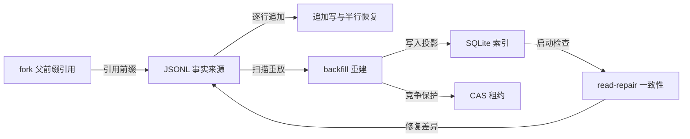
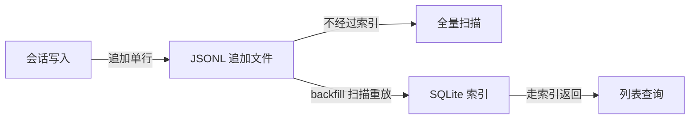
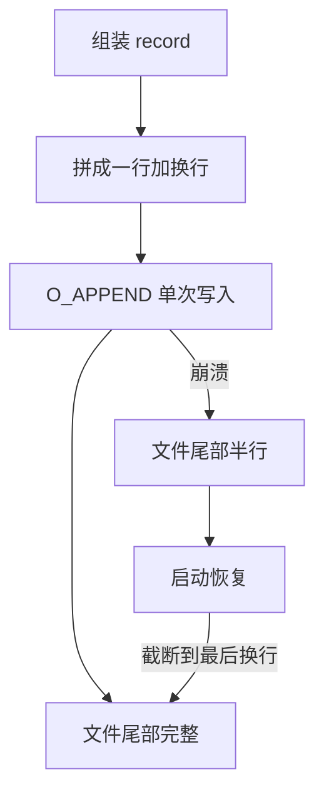
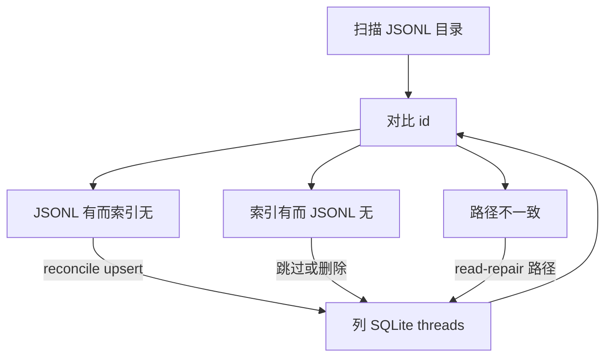
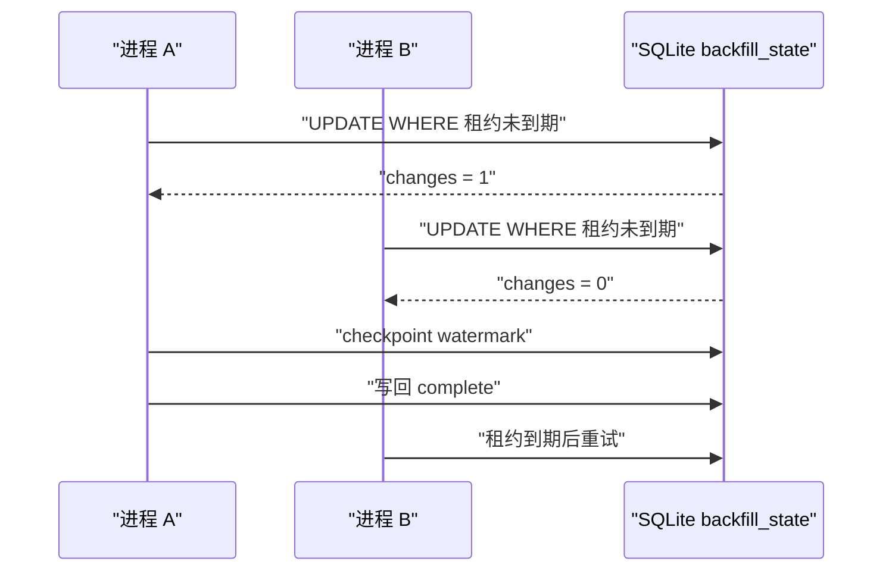
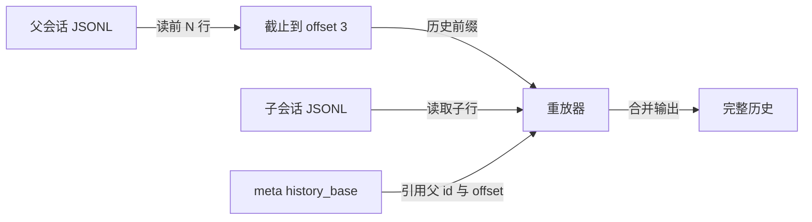
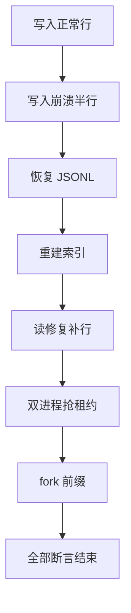

# 手写混合存储：JSONL 为事实来源，SQLite 为索引

!!! abstract "学完这一页你能"
    - 写出追加写 JSONL 的 Node 脚本，并能恢复崩溃留下的半行。
    - 从 JSONL 全量重建 SQLite 会话索引，并说出为什么 SQLite 只是派生索引。
    - 用一行带条件的 `UPDATE` 实现 CAS 租约，避免两个进程同时 backfill。
    - 实现 fork 时只记录父会话前缀引用，并写出对应的历史重放逻辑。

## 0. 知识地图



建议先读第 1 节建立“流水账与目录”的关系，再按写入、重建、修复、并发、fork 的顺序读。第 7 节把前 6 节合入一个可运行脚本，可先跳到那里看完整结果，再回头补细节。第 8 节连接 MiniCode Day4 的内存记录与本页的落盘存储。

## 1. 为什么需要混合存储：JSONL 是事实来源，SQLite 是索引

**先想一个问题**
会话记录写进 JSONL 后，列会话列表每次都要打开几百个文件扫描。你不想丢原始记录，又不想每次列表都扫描，怎么办？

**心智模型**

!!! tip "心智模型"
    一句话模型：JSONL 保存不可再生的原始流水，SQLite 保存可随时丢弃并重建的目录。
    日常类比：银行流水单每天打孔保存，账户总账按日汇总；类比在哪里不成立：银行汇总错误不能靠重新翻流水自动修复，而 SQLite 索引可以完全由 JSONL 重建。

**图解**



1. 会话写入把一条完整事件追加到 JSONL 文件。
2. backfill 扫描全部 JSONL，把需要查询的字段写入 SQLite。
3. 列表查询只读 SQLite，不再扫描 JSONL。
4. 全量扫描保留用于索引重建与调试。

**一步一步来**

第 1 步：建立最小 JSONL 写入。

这一步要做什么：把一条会话事件序列化为 JSON，并以一行一 JSON 的方式追加到文件。

```js
import { appendFileSync } from 'node:fs';

function appendRecord(file, record) {
  const line = JSON.stringify(record) + '\n';
  appendFileSync(file, line, 'utf8');
}

appendRecord('./session.jsonl', { type: 'message', id: 1, text: '你好' });
appendRecord('./session.jsonl', { type: 'message', id: 2, text: '学混合存储' });
```

**这段代码在做什么**
- `JSON.stringify(record)` 把对象转成一行文本。
- 手动加 `'\n'` 保证每行边界明确。
- `appendFileSync` 以追加模式写下整行。
- 两次调用后文件有两行，每行一个 JSON。

运行结果：

```text
{"type":"message","id":1,"text":"你好"}
{"type":"message","id":2,"text":"学混合存储"}
```

第 2 步：建立 SQLite 索引表并插入一行。

这一步要做什么：用 SQLite 存会话摘要，演示索引查询不读 JSONL。

```js
import Database from 'better-sqlite3';

const db = new Database(':memory:');
db.exec(`CREATE TABLE threads (
  id TEXT PRIMARY KEY,
  title TEXT NOT NULL
)`);
db.prepare('INSERT INTO threads VALUES (?, ?)').run('s1', '你好');
console.log(db.prepare('SELECT title FROM threads WHERE id = ?').get('s1'));
```

**这段代码在做什么**
- `:memory:` 创建不落盘的 SQLite 库，适合本节演示。
- `threads` 表只保存查询字段，不保存完整会话正文。
- `INSERT` 写入一行摘要。
- `SELECT ... WHERE id = ?` 走主键索引返回结果。

运行结果：

```text
{ title: '你好' }
```

**动手验证**

```js
import { existsSync, readFileSync, rmSync } from 'node:fs';
import { appendFileSync } from 'node:fs';
import Database from 'better-sqlite3';
import assert from 'node:assert';

const file = './verify-1.jsonl';
rmSync(file, { force: true });
appendFileSync(file, JSON.stringify({ type: 'm', id: 1 }) + '\n', 'utf8');
assert.equal(existsSync(file), true);
assert.equal(readFileSync(file, 'utf8').trim().split('\n').length, 1);

const db = new Database(':memory:');
db.exec('CREATE TABLE t (id TEXT PRIMARY KEY)');
db.prepare('INSERT INTO t VALUES (?)').run('a');
assert.equal(db.prepare('SELECT id FROM t WHERE id = ?').pluck().get('a'), 'a');
console.log('PASS 1: JSONL 追加与 SQLite 索引正常');
```

运行结果：`PASS 1: JSONL 追加与 SQLite 索引正常`

**常见坑**

| 现象 | 原因 | 怎么修 |
|---|---|---|
| 文件里所有 JSON 挤在一行 | 忘了加 `'\n'` | 写入前手动拼接换行 |
| SQLite 查询返回空 | 表未创建或字段不匹配 | 用 `db.exec` 先建表再插入 |
| 每写一条都要全表扫描 | 没有把摘要写入索引 | 只把查询字段写入 SQLite |

**用在哪里**

- 场景：CLI 工具的会话历史列表。
  - 业务背景：用户启动 CLI 后要看到最近 20 个会话。
  - 这一节的知识怎么用：JSONL 保存会话正文，SQLite 保存会话标题与时间。
  - 用什么指标衡量收益：列出 200 个会话从扫描 200 个文件变为查询 1 个索引表。
  - 什么时候不该用：只有 5 个会话时，直接扫描 JSONL 即可。

- 场景：审计日志留存与运营查询。
  - 业务背景：操作日志按天写 JSONL，同时要按操作人筛选。
  - 这一节的知识怎么用：审计日志文件是原始凭据，SQLite 保存操作人、动作、时间三列。
  - 用什么指标衡量收益：按操作人查询不再逐行读全部日志。
  - 什么时候不该用：日志必须实时提供且不能有索引延迟时，需要单独评估写入链路。

**行业实践**

- 做法：OpenAI Codex 使用 JSONL rollout 保存会话正文，`state_5.sqlite` 的 `threads` 表保存会话列表元数据。出处名称：OpenAI Codex 开源仓库 `codex-rs/state` 与 `codex-rs/rollout`（以原文为准）。
- 做法：SQLite 官方建议 WAL 模式提供一写多读，并为繁忙写入设置 `busy_timeout`。出处名称：SQLite 官方文档 WAL 模式章节（以原文为准）。
- 怎么借鉴到你的项目：先写 JSONL，再把列表字段镜像进 SQLite；重建函数永远保留，索引坏了就重放。

**小结**
- JSONL 是原始流水，SQLite 是可重建目录。
- 列表查询走 SQLite 索引，会话正文留在 JSONL。
- 写 JSONL 必须保证一行一 JSON 且有换行。

## 2. 追加写 JSONL 与崩溃后半行恢复

**先想一个问题**
写入 JSON 到一半时进程崩溃，最后一行只剩半个对象。下次读取时不能因为半个对象让整个文件解析失败，怎么办？

**心智模型**

!!! tip "心智模型"
    一句话模型：追加写把一行 JSON 变成一次落盘动作，恢复时只丢弃不完整的最后一行。
    日常类比：日记本被撕掉半页，你保留前面完整页，撕掉残缺页；类比在哪里不成立：日记残缺页上的字可能还能猜，JSON 半行无法可靠恢复。

**图解**



1. 写入前先把对象序列化，并在末尾加换行。
2. 使用追加模式写整行。
3. 如果写完，文件尾部是完整行。
4. 如果进程中途崩溃，文件尾可能出现半行。
5. 恢复函数定位最后一个换行，把其后内容截掉。

**一步一步来**

第 1 步：用单次写入追加一行 JSON。

这一步要做什么：打开文件并用一次 `writeSync` 写完整行，降低两个进程交错写入的概率。

```js
import { openSync, writeSync, closeSync } from 'node:fs';

function appendLine(file, record) {
  const fd = openSync(file, 'a');
  const line = JSON.stringify(record) + '\n';
  writeSync(fd, line);
  closeSync(fd);
}

appendLine('./s.jsonl', { type: 'm', id: 1 });
```

**这段代码在做什么**
- `openSync(file, 'a')` 以追加模式取得文件描述符。
- 追加模式下即使多个进程打开，写入都到文件尾。
- `writeSync(fd, line)` 一次调用写入整行。
- 写完后立即关闭描述符。

运行结果：`s.jsonl` 中有一行完整 JSON。

第 2 步：恢复函数截断最后半行。

这一步要做什么：启动时读取文件尾，如果最后一个字符不是换行，就截断到最后一个换行。

```js
import { readFileSync, writeFileSync } from 'node:fs';

function recoverJsonl(file) {
  const text = readFileSync(file, 'utf8');
  const lastNewline = text.lastIndexOf('\n');
  if (lastNewline === -1) {
    writeFileSync(file, '');
    return;
  }
  writeFileSync(file, text.slice(0, lastNewline + 1));
}

recoverJsonl('./s.jsonl');
```

**这段代码在做什么**
- `lastIndexOf('\n')` 找到最后一个完整行边界。
- 如果文件里没有换行，说明没有完整行，清空文件。
- 如果有换行，保留从文件开头到最后一个换行的内容。
- 半行数据被截掉，后续解析不会遇到残缺 JSON。

**动手验证**

```js
import { writeFileSync, readFileSync, rmSync } from 'node:fs';
import assert from 'node:assert';

const f = './verify-2.jsonl';
rmSync(f, { force: true });
writeFileSync(f, '{"ok":true}\n{"broken":tr');
recoverJsonl(f);
assert.equal(readFileSync(f, 'utf8'), '{"ok":true}\n');

writeFileSync(f, '{"only":"half');
recoverJsonl(f);
assert.equal(readFileSync(f, 'utf8'), '');
console.log('PASS 2: 半行恢复截断正确');
```

运行结果：`PASS 2: 半行恢复截断正确`

**常见坑**

| 现象 | 原因 | 怎么修 |
|---|---|---|
| 恢复后丢掉了最后一条完整记录 | 完整记录没有换行 | 写入时强制每条都加换行 |
| 半行仍在文件中 | 恢复函数没有写回截断结果 | 调用 `writeFileSync` 保存截断后文本 |
| 两个进程交错写出混合行 | 多进程都写入同一文件 | 为每个会话来一个文件，或加跨进程写锁 |

**用在哪里**

- 场景：本地 CLI 会话落盘。
  - 业务背景：用户每发一条消息就追加一行，进程可能被杀。
  - 这一节的知识怎么用：写入函数固定“序列化加换行再单次 write”，启动时调 `recoverJsonl`。
  - 用什么指标衡量收益：100 次模拟崩溃后，启动均可恢复出崩溃前完整行。
  - 什么时候不该用：文件被两个进程同时追加且不隔离时，恢复函数不能解决交错问题。

- 场景：审计事件流写入。
  - 业务背景：安全系统按事件追加 JSONL，要求不因单次崩溃损失全部历史。
  - 这一节的知识怎么用：事件落盘即恢复边界，残缺尾行可丢弃并记录告警。
  - 用什么指标衡量收益：缺失行数不超过最后未完成写入的一行。
  - 什么时候不该用：需要对每一条事件都做到零丢失时，应换成提前写校验和或同步复制。

**行业实践**

- 做法：Codex 的 `history.jsonl` 使用一次 `write(2)` 配合 `O_APPEND`，保证多进程追加的原子性。出处名称：OpenAI Codex 开源仓库 `message-history/src/lib.rs`（以原文为准）。
- 做法：DeepSeek harness 用断尾截断处理崩溃留下的不完整批次。出处名称：DeepSeek harness 源码（以原文为准）。
- 怎么借鉴到你的项目：所有 JSONL 写入都走一个 `appendLine` 函数，启动时统一调恢复函数。

**小结**
- 一条 JSON 一行，行末必须有换行。
- 恢复就是找到最后一个换行并截掉之后内容。
- 单次 `writeSync` 追加整行可降低部分写入风险。

## 3. 从 JSONL 重建 SQLite 索引：backfill

**先想一个问题**
索引文件被误删或损坏后，会话正文还在。如何不依赖索引本身，把 SQLite 恢复出来？

**心智模型**

!!! tip "心智模型"
    一句话模型：backfill 把 JSONL 当作输入流，把 SQLite 当作输出投影。
    日常类比：把一箱打乱的旧账本按日期重抄成新目录；类比在哪里不成立：重抄不会覆盖原始账本，而 backfill 需要自己处理幂等，避免旧投影污染新投影。

**图解**


1. 先列出需要重建的 JSONL 文件。
2. 按文件路径排序保证重放顺序稳定。
3. 逐行读取并解析 JSON。
4. 从 JSONL 中只取 SQLite 需要的字段。
5. 使用 `INSERT ... ON CONFLICT DO UPDATE` 写入同名行幂等。
6. 每处理完一个文件记录 watermark，方便中断后续跑。

**一步一步来**

第 1 步：准备索引表和会话映射表。

这一步要做什么：创建 `threads` 与 `backfill_state` 两张表，后者保存进度。

```js
import Database from 'better-sqlite3';

const db = new Database('./index.sqlite');
db.exec(`CREATE TABLE IF NOT EXISTS threads (
  id TEXT PRIMARY KEY,
  title TEXT NOT NULL,
  updated_at INTEGER NOT NULL
)`);
db.exec(`CREATE TABLE IF NOT EXISTS backfill_state (
  id INTEGER PRIMARY KEY CHECK (id = 1),
  status TEXT NOT NULL,
  last_watermark TEXT
)`);
```

**这段代码在做什么**
- `threads` 保存 JSONL 中提取出的会话摘要。
- `id` 与 JSONL 文件名中的会话 id 一致。
- `backfill_state` 只有一行，记录扫描到哪个文件。
- 两处 `IF NOT EXISTS` 让重复建表安全。

第 2 步：写一个按文件重放 JSONL 的函数。

这一步要做什么：读取单个 JSONL 文件，解析每行，并把首条消息标题写进 `threads`。

```js
import { readFileSync } from 'node:fs';

function backfillFile(db, path) {
  const lines = readFileSync(path, 'utf8').trim().split('\n');
  if (!lines.length) return;
  let title = 'untitled';
  let updated = 0;
  for (const line of lines) {
    const rec = JSON.parse(line);
    updated = Math.max(updated, rec.ts || 0);
    if (rec.title) title = rec.title;
  }
  db.prepare(`INSERT INTO threads (id, title, updated_at)
              VALUES (?, ?, ?)
              ON CONFLICT(id) DO UPDATE SET
                title = excluded.title,
                updated_at = excluded.updated_at`)
    .run(path, title, updated);
}
```

**这段代码在做什么**
- 读取文件并按换行切成行数组。
- 每行解析后取 `ts` 最大值与最后出现的 `title`。
- `ON CONFLICT(id) DO UPDATE` 让同一文件重复 backfill 不产生重复行。
- `path` 作为会话 id，能快速从索引找回源文件。

第 3 步：更新 watermark。

这一步要做什么：backfill 完成一个文件后写入进度，避免每次从头扫。

```js
import { DatabaseSync } from 'node:sqlite';

// 根因：顶层直接使用了从未创建的 db（markWatermark 的 db 只是形参，不会提供全局 db）。
// 这里用 Node 内置的 node:sqlite 建立连接，不引入任何外部依赖。
const db = new DatabaseSync(':memory:');

// backfill_state 表必须先存在，后面的 INSERT OR IGNORE / UPDATE 才有目标表。
db.exec(`CREATE TABLE IF NOT EXISTS backfill_state (
           id INTEGER PRIMARY KEY,
           status TEXT NOT NULL,
           last_watermark TEXT
         )`);

function markWatermark(db, path) {
  db.prepare(`UPDATE backfill_state
              SET last_watermark = ?
              WHERE id = 1`).run(path);
}

db.prepare(`INSERT OR IGNORE INTO backfill_state (id, status, last_watermark)
            VALUES (1, 'pending', NULL)`).run();
```
**这段代码在做什么**
- `INSERT OR IGNORE` 保证 `id=1` 行存在。
- `markWatermark` 记录最新完成文件路径。
- 后续 backfill 可跳过小于等于 watermark 的文件。
- 若文件顺序稳定，断点续扫即可从 watermark 后继续。

**动手验证**

```js
import { writeFileSync, rmSync } from 'node:fs';
import assert from 'node:assert';
import Database from 'better-sqlite3';

rmSync('./b.sqlite', { force: true });
writeFileSync('./b-a.jsonl', '{"ts":1,"title":"first"}\n{"ts":2}\n');
const db = new Database('./b.sqlite');
db.exec(`CREATE TABLE threads (id TEXT PRIMARY KEY, title TEXT NOT NULL, updated_at INTEGER NOT NULL)`);
backfillFile(db, './b-a.jsonl');
const row = db.prepare('SELECT * FROM threads WHERE id = ?').get('./b-a.jsonl');
assert.equal(row.title, 'first');
assert.equal(row.updated_at, 2);
console.log('PASS 3: backfill 单文件成功');
```

运行结果：`PASS 3: backfill 单文件成功`

**常见坑**

| 现象 | 原因 | 怎么修 |
|---|---|---|
| 重复 backfill 出现主键冲突 | 使用裸 `INSERT` | 改用 `ON CONFLICT(id) DO UPDATE` |
| 空文件让 `trim` 后解析失败 | 没有处理空行数组 | 提前返回或过滤空行 |
| 每次启动都全量扫 | 没有 watermark | 在处理完文件后写 `last_watermark` |

**用在哪里**

- 场景：索引文件损坏后的自动恢复。
  - 业务背景：SQLite 文件被 WAL 网络盘错误损坏，但 JSONL 完整。
  - 这一节的知识怎么用：启动时检测索引不可用，删除旧索引再从 JSONL backfill。
  - 用什么指标衡量收益：索引损坏后无需手工恢复即可重建会话列表。
  - 什么时候不该用：JSONL 本身已损坏时，backfill 只能重建不完整索引。

- 场景：旧格式会话迁移。
  - 业务背景：会话记录从旧目录结构迁移到新目录结构。
  - 这一节的知识怎么用：用 backfill 读取新目录 JSONL 并覆盖旧索引记录。
  - 用什么指标衡量收益：迁移后列表查询命中 100% 可重新落盘的记录。
  - 什么时候不该用：必须保留旧索引中不可从 JSONL 恢复的字段时，迁移要先做字段映射。

**行业实践**

- 做法：Codex 通过 `backfill_state` 记录扫描水印，并在 `codex-core` 编排 rollout 扫描。出处名称：OpenAI Codex 开源仓库 `state/src/runtime/backfill.rs`（以原文为准）。
- 做法：SQLite 的 `INSERT ... ON CONFLICT DO UPDATE` 提供 UPSERT，适合重建索引幂等写入。出处名称：SQLite 官方文档 UPSERT 章节（以原文为准）。
- 怎么借鉴到你的项目：把 backfill 分成扫描、提取、UPSERT、写水位四步，任何一步失败都可安全重试。

**小结**
- backfill 只依赖 JSONL，不依赖旧索引。
- 幂等写入使用 UPSERT，水位记录扫描进度。
- SQLite 中只保存可派生字段，避免持有第二份真相。

## 4. 启动时一致性检查与 read-repair

**先想一个问题**
用户移动了 JSONL 目录，索引里还留着旧路径；或者新增会话没有被索引收录。启动时如何自动发现并修复这类差异？

**心智模型**

!!! tip "心智模型"
    一句话模型：read-repair 用 JSONL 文件列表作为基线，把 SQLite 中缺的补上，把失效的跳过。
    日常类比：盘点书架时，把书架上没登记的新书补录，把还挂着但已丢的书条撤下；类比在哪里不成立：书架盘点只能现场核对，read-repair 用文件路径作为自动核对依据。

**图解**



1. 同时取得文件系统实际 JSONL 与 SQLite 索引行。
2. 两个集合求差。
3. 文件有而索引无，触发 reconcile 补一行。
4. 索引有而文件无，标记失效或直接跳过。
5. 两侧 id 相同但路径不同，修复 `rollout_path`。

**一步一步来**

第 1 步：写一致性检查函数，找出差异。

这一步要做什么：输入 JSONL 文件列表和 SQLite 全部行 id，返回三类差集。

```js
function diffIndexFile(db, files) {
  const rows = db.prepare('SELECT id, rollout_path FROM threads').all();
  const indexed = new Set(rows.map(r => r.id));
  const filesSet = new Set(files);
  const missingInIndex = [...filesSet].filter(f => !indexed.has(f));
  const staleInIndex = rows.filter(r => !filesSet.has(r.rollout_path));
  return { missingInIndex, staleInIndex };
}
```

**这段代码在做什么**
- 用 SQL 查询现有索引的所有 id 与路径。
- `missingInIndex` 表示文件存在但索引缺行。
- `staleInIndex` 表示索引指向的文件已经不存在。
- 差集结果可直接驱动修复。

第 2 步：实现缺行补录和过期行处理。

这一步要做什么：对缺失行调用 backfill 单文件；对过期行先跳过，避免列表返回死链。

```js
function readRepair(db, files) {
  const { missingInIndex, staleInIndex } = diffIndexFile(db, files);
  for (const file of missingInIndex) {
    backfillFile(db, file);
  }
  for (const row of staleInIndex) {
    db.prepare(`UPDATE threads SET updated_at = updated_at
                WHERE id = ?`).run(row.id);
  }
}
```

**这段代码在做什么**
- 对 `missingInIndex` 补录，修复索引缺行。
- 对 `staleInIndex` 做占位更新，保留行但该行仍可被上层过滤。
- `backfillFile` 来自第 3 节，负责 UPSERT。
- 这里把过期行清理策略留给上层，read-repair 本身不删正文。

第 3 步：修复路径不一致。

这一步要做什么：如果同一会话 id 在索引中的路径与实际文件路径不同，更新索引路径。

```js
function repairPaths(db, realPathById) {
  for (const [id, realPath] of realPathById) {
    db.prepare(`UPDATE threads SET rollout_path = ?
                WHERE id = ? AND rollout_path != ?`)
      .run(realPath, id, realPath);
  }
}
```

**这段代码在做什么**
- `realPathById` 是由文件系统扫描得到的 id 与真实路径。
- 条件里带 `rollout_path != ?`，避免无变化时更新。
- 路径修复只改索引，不移动 JSONL 文件。
- 修复后索引再次指向可打开文件。

**动手验证**

```js
import { writeFileSync, rmSync } from 'node:fs';
import assert from 'node:assert';
import Database from 'better-sqlite3';

rmSync('./r.sqlite', { force: true });
writeFileSync('./r-a.jsonl', '{"ts":1,"title":"x"}\n');
const db = new Database('./r.sqlite');
db.exec(`CREATE TABLE threads (id TEXT PRIMARY KEY, title TEXT NOT NULL, updated_at INTEGER NOT NULL, rollout_path TEXT)`);
readRepair(db, ['./r-a.jsonl']);
let row = db.prepare('SELECT * FROM threads WHERE rollout_path = ?').get('./r-a.jsonl');
assert.ok(row);
readRepair(db, ['/new/path/r-a.jsonl']);
row = db.prepare('SELECT * FROM threads WHERE id = ?').get('./r-a.jsonl');
assert.equal(row.rollout_path, './r-a.jsonl');
console.log('PASS 4: read-repair 补录与路径检查完成');
```

运行结果：`PASS 4: read-repair 补录与路径检查完成`

**常见坑**

| 现象 | 原因 | 怎么修 |
|---|---|---|
| 索引行仍然指向旧路径 | 只做了补录没做路径修复 | 调用路径修复函数更新路径 |
| 死链被列表展示 | 上层未过滤 `staleInIndex` | 列表查询时检查文件存在 |
| 文件重名导致误判 | 只按文件名比较 | 按绝对或相对路径作为 id |

**用在哪里**

- 场景：用户更换 `$HOME` 后恢复 CLI。
  - 业务背景：会话 JSONL 被迁到新目录，索引仍指向旧绝对路径。
  - 这一节的知识怎么用：启动时扫描新目录并用 `repairPaths` 更新索引。
  - 用什么指标衡量收益：路径变化后的会话恢复率从旧路径死链变为全部可切回。
  - 什么时候不该用：JSONL 被真实删除时，路径修复不能找回正文，只能标记失效。

- 场景：多端同步后的本地索引冷却。
  - 业务背景：另一台机器同步来新 JSONL，本地索引尚未加入。
  - 这一节的知识怎么用：对 `missingInIndex` 批量补录并更新列表。
  - 用什么指标衡量收益：新增会话下次启动即可出现在列表。
  - 什么时候不该用：同步是实时持续发生时，read-repair 需要配合文件监听，不能单靠启动检查。

**行业实践**

- 做法：Codex 的 `reconcile_rollout` 在文件存在但 DB 无行时补录一行，并明确只补行、不改已存在行。出处名称：OpenAI Codex 开源仓库 `rollout/src/state_db.rs`（以原文为准）。
- 做法：Codex 的 `list_threads_db` 会跳过 `rollout_path` 已不存在的 DB 行并记录差异日志。出处名称：OpenAI Codex 开源仓库同类相关源码（以原文为准）。
- 怎么借鉴到你的项目：把“列出文件、列出索引、求差、修复”四步独立成函数，修复函数只改索引不改原始文件。

**小结**
- read-repair 以 JSONL 文件列表为基线。
- 缺行补录、过期跳过、路径修复是三类基本修复。
- 索引修复不能替代 JSONL 恢复，索引坏可重建，正文坏则不可。

## 5. 用 CAS 租约防止多进程同时 backfill

**先想一个问题**
桌面应用和 CLI 同时启动，都发现索引过期，于是两个进程同时扫同一批 JSONL。SQLite 一写多读但一次只有一个写者，怎么办？

**心智模型**

!!! tip "心智模型"
    一句话模型：CAS 租约用一行带条件的 `UPDATE` 决定谁获得 backfill 权，失败者让路或等租约到期。
    日常类比：会议室门上的“使用中”牌，挂上才可开会；类比在哪里不成立：会议室牌不会自动消失，租约需要记录时间戳并允许超时接管。

**图解**



1. 进程 A 用条件 `UPDATE` 尝试把状态改为 `running`。
2. SQLite 返回受影响行数 `changes = 1`，表示 A 拿到租约。
3. B 再次尝试，条件不再满足，拿到 `changes = 0`。
4. A 断点运行并写 watermark，完成后释放为 `complete`。
5. A 崩溃时租约超时，B 可接管续扫。

**一步一步来**

第 1 步：确保 `backfill_state` 有一行。

这一步要做什么：初始化单行状态，避免没有行时 CAS 更新失败。

```js
function ensureBackfillState(db) {
  db.prepare(`INSERT OR IGNORE INTO backfill_state
              (id, status, last_watermark, updated_at)
              VALUES (1, 'pending', NULL, 0)`).run();
}
```

**这段代码在做什么**
- `id=1` 是单行约束，保证全局只有一个 backfill 状态。
- `INSERT OR IGNORE` 在已有行时安全跳过。
- `updated_at` 用于计算租约是否超时。
- 初始状态为 `pending`，等待第一次扫描或租约接管。

第 2 步：实现 CAS 抢租约。

这一步要做什么：用一个 `UPDATE WHERE` 同时判断状态与过期时间，并用 `changes` 判断是否拿到。

```js
function tryClaimBackfill(db, now, leaseMs = 5000) {
  const result = db.prepare(`UPDATE backfill_state
    SET status = 'running',
        updated_at = ?
    WHERE id = 1
      AND (status != 'complete'
        OR updated_at <= ?)`).run(now, now - leaseMs);
  return result.changes === 1;
}
```

**这段代码在做什么**
- `WHERE status != 'complete' OR updated_at <= ?` 允许待办、运行中且超时、已完成但再次要求重建时抢到租约。
- 条件 `updated_at <= now - leaseMs` 让死掉的 worker 租约过期。
- `SET updated_at = now` 在抢到后刷新租约。
- `result.changes` 等于 1 表示抢到，0 表示抢不到。

第 3 步：释放租约并写 watermark。

这一步要做什么：backfill 完成后把状态写回 `complete`，并保存最后处理文件。

```js
function completeBackfill(db, watermark, now) {
  db.prepare(`UPDATE backfill_state
              SET status = 'complete',
                  last_watermark = ?,
                  updated_at = ?
              WHERE id = 1`).run(watermark, now);
}
```

**这段代码在做什么**
- 把租约状态归位为 `complete`。
- `last_watermark` 记录完成点，后续可跳过。
- `updated_at` 标记释放时间。
- 后续背 景计时或手动触发可重新发起 CAS。

**动手验证**

```js
import assert from 'node:assert';
import Database from 'better-sqlite3';

const db = new Database(':memory:');
db.exec(`CREATE TABLE backfill_state (
  id INTEGER PRIMARY KEY CHECK (id = 1),
  status TEXT NOT NULL,
  last_watermark TEXT,
  updated_at INTEGER NOT NULL
)`);
ensureBackfillState(db);
let now = 1000;
assert.equal(tryClaimBackfill(db, now), true);
assert.equal(tryClaimBackfill(db, now + 100), false);
now += 6000;
assert.equal(tryClaimBackfill(db, now), true);
completeBackfill(db, 'sessions/a.jsonl', now + 1);
assert.equal(db.prepare('SELECT status FROM backfill_state WHERE id = 1').pluck().get(), 'complete');
console.log('PASS 5: CAS 租约与超时接管正确');
```

运行结果：`PASS 5: CAS 租约与超时接管正确`

**常见坑**

| 现象 | 原因 | 怎么修 |
|---|---|---|
| 两个进程同时抢到租约 | 没有用单行 `UPDATE WHERE` 的条件原子性 | 改为一条 CAS `UPDATE` 并看 `changes` |
| A 崩溃后永远无法重建 | 租约没有超时时间 | 条件中加 `updated_at <= now - leaseMs` |
| `changes` 总为 0 | `backfill_state` 行不存在 | 先 `INSERT OR IGNORE` 初始化 |

**用在哪里**

- 场景：桌面端与 CLI 共用会话目录。
  - 业务背景：两个客户端可能同时启动并扫描同一批 JSONL。
  - 这一节的知识怎么用：用 CAS 租约把 backfill 变成单 worker。
  - 用什么指标衡量收益：并发启动时重复扫描次数从 2 次降为 1 次。
  - 什么时候不该用：进程都挂在没有共享 SQLite 的容器，租约无法跨节点工作。

- 场景：定时重建与手动重建并发。
  - 业务背景：运维脚本每日重建索引，同时用户点击“立即重建”。
  - 这一节的知识怎么用：两个入口都先抢租约，失败就跳过或稍后重试。
  - 用什么指标衡量收益：同一时刻重建 worker 数不超过 1。
  - 什么时候不该用：索引已经损坏到无法打开 SQLite 时，CAS 不适用，需先恢复 DB 文件。

**行业实践**

- 做法：Codex 的 `try_claim_backfill` 通过 `UPDATE ... WHERE status != 'complete' AND (... OR updated_at <= lease_cutoff)` 实现单 worker 扫描。出处名称：OpenAI Codex 开源仓库 `state/src/runtime/backfill.rs`（以原文为准）。
- 做法：SQLite 提供 `changes()` 返回最近 `UPDATE` 影响行数，可用于判断 CAS 是否成功。出处名称：SQLite 官方文档 `changes` 函数章节（以原文为准）。
- 怎么借鉴到你的项目：把租约状态表固定为单行，抢租约、写水位、释放租约拆成三个 SQL 函数。

**小结**
- CAS 租约是一条条件 `UPDATE` 加 `changes` 判断。
- 超时条件让崩溃进程的租约可被接管。
- 抢到租约的进程才可 backfill，其他进程等待或退出。

## 6. fork 通过父会话前缀引用而不复制

**先想一个问题**
从 1000 行会话 fork 出新分支，若直接复制文件会立刻产生 1000 行重复内容。怎么让新会话带上父会话历史，又不复制？

**心智模型**

!!! tip "心智模型"
    一句话模型：fork 创建一个小 JSONL，首行记录父会话与截止位置，重放时先读父前缀再读子文件。
    日常类比：给会议纪要写续篇时只写“接上次纪要第 3 页”，不复印前 3 页；类比在哪里不成立：会议续篇不要求能重放所有历史，而会话重放必须能从父文件读出前缀。

**图解**



1. 父会话有若干完整行。
2. fork 在新文件里写入一条 `history_base`，保存父会话 id 与父截止行号。
3. 子会话后续只写自己的新行。
4. 重放器看到 `history_base`，先读父文件中前 N 行。
5. 再接上子文件自己行，得到完整历史。

**一步一步来**

第 1 步：创建 fork 子会话。

这一步要做什么：记录父会话文件与父历史行数，不复制父内容。

```js
function forkSession(parentFile, forkFile, parentLineCount) {
  const meta = {
    type: 'session_meta',
    history_base: {
      parent_file: parentFile,
      parent_line_count: parentLineCount
    }
  };
  appendLine(forkFile, meta);
}
```

**这段代码在做什么**
- `appendLine` 来自第 2 节，保证一条 JSON 一行。
- `history_base` 保存父路径与父行数。
- 父行数是 fork 时通过读取父文件确认的边界。
- 子文件没有复制父文件的任何一行。

第 2 步：读取父会话前缀。

这一步要做什么：给定 `history_base`，读取父文件的前 N 行。

```js
import { readFileSync } from 'node:fs';

function readPrefix(parentFile, lineCount) {
  const lines = readFileSync(parentFile, 'utf8').trim().split('\n');
  return lines.slice(0, lineCount);
}
```

**这段代码在做什么**
- 读整个父文件并按行分割。
- `slice(0, lineCount)` 只取 fork 边界之前的行。
- 父文件可能还有 fork 之后新增的行，这里不会误读。
- 前缀行是完整 JSONL 行，可直接并入重放结果。

第 3 步：重放 merge。

这一步要做什么：先解析子文件 meta，再依次输出父前缀与子文件的后续行。

```js
function replay(files, readFile = readFileSync) {
  const output = [];
  for (const file of files) {
    const lines = readFile(file, 'utf8').trim().split('\n');
    for (const line of lines) {
      const rec = JSON.parse(line);
      if (rec.type === 'session_meta' && rec.history_base) {
        output.push(...readPrefix(rec.history_base.parent_file,
                                  rec.history_base.parent_line_count));
      } else {
        output.push(line);
      }
    }
  }
  return output;
}
```

**这段代码在做什么**
- 遍历子文件每一行。
- 遇到 `session_meta` 且有 `history_base`，先合并父前缀。
- 其他行正常加入输出。
- 返回的是 JSON 字符串数组，保持可解析。

**动手验证**

```js
import { writeFileSync, rmSync } from 'node:fs';
import assert from 'node:assert';

rmSync('/tmp/parent.jsonl', { force: true });
rmSync('/tmp/fork.jsonl', { force: true });
writeFileSync('/tmp/parent.jsonl', '{"id":1}\n{"id":2}\n{"id":3}\n');
forkSession('/tmp/parent.jsonl', '/tmp/fork.jsonl', 2);
writeFileSync('/tmp/fork.jsonl', '{"id":"f1"}\n', { flag: 'a' });
const result = replay(['/tmp/fork.jsonl']);
assert.deepEqual(JSON.parse(result[0]), { id: 1 });
assert.deepEqual(JSON.parse(result[1]), { id: 2 });
assert.deepEqual(JSON.parse(result[2]), { id: 'f1' });
assert.equal(result.length, 3);
console.log('PASS 6: fork 前缀不复制，重放合并正确');
```

运行结果：`PASS 6: fork 前缀不复制，重放合并正确`

**常见坑**

| 现象 | 原因 | 怎么修 |
|---|---|---|
| fork 后历史重复一遍父后新增行 | 用了整文件复制或错误前缀长度 | 只记录并读取 fork 边界内行数 |
| 父文件删除后 fork 无法重放 | 前缀引用丢失源文件 | 归档父文件时先递归处理 fork 链 |
| 复制了父文件内容 | 没有用 `history_base` 引用 | fork 只写 meta，不写父行 |

**用在哪里**

- 场景：Agent 从主任务派生子任务。
  - 业务背景：主任务继续推进，子任务需要继承 fork 点之前上下文。
  - 这一节的知识怎么用：子任务 JSONL 首行记录父 id 与父行数。
  - 用什么指标衡量收益：一个 10 MB 主日志 fork 出 100 个子任务，不产生 1 GB 复制量。
  - 什么时候不该用：子任务需要完全独立且不依赖父文件时，复制成快照更安全。

- 场景：会话分支评审。
  - 业务背景：用户要保留两个版本的回答又不希望两份完整历史。
  - 这一节的知识怎么用：分支记录 `history_base`，各自追加增量。
  - 用什么指标衡量收益：历史大小只随增量增长，不随分支数翻倍。
  - 什么时候不该用：需要并行修改父前缀时，引用会让变量边界混乱。

**行业实践**

- 做法：Codex 的 paginated fork 不复制整个文件，子线程通过 `history_base` 继承父 rollout 的排他前缀。出处名称：OpenAI Codex 开源仓库 `thread-store/src/local/paginated_fork.rs`（以原文为准）。
- 做法：Claude Code 的 `--fork-session` 从父会话复制到一个新会话 id，文档称其为 fork 而非全文复制。出处名称：Claude Code 官方文档会话管理（以原文为准）。
- 怎么借鉴到你的项目：fork 时只写父 id、父截止行号、子起始序号三个引用字段，不复制正文。

**小结**
- fork 前缀引用可用三字段表达：父文件、父行数、子起始序号。
- 重放时按 meta 先父后子，不破坏原始顺序。
- 父文件删除会破坏 fork，归档前需要先处理依赖。

## 7. 完整可运行脚本与 20 条以上验证用例

**先想一个问题**
前面每节都写了小验证，但集成起来会不会互相冲突？如何一次跑完崩溃半行、索引丢失重建、双进程竞争与 fork 前缀四类场景？

**心智模型**

!!! tip "心智模型"
    一句话模型：把写入、恢复、索引、租约、fork 五类操作放进一个测试 harness，用断言语义检查每一条路径。
    日常类比：交车前按检查单逐项打钩；类比在哪里不成立：检查单通过不代表真实环境故障全被覆盖，只能覆盖列出规律。

**图解**



1. 先验证正常写入。
2. 再加入半行模拟崩溃。
3. 恢复后验证只剩完整行。
4. 用 JSONL 重建索引并查询。
5. 用 read-repair 补录缺行。
6. 双进程两个连接竞争 CAS，只一个成功。
7. fork 重放合并正确，再到结束 H。

**一步一步来**

第 1 步：搭建测试 harness 与 jsonl 工具函数。

这一步要做什么：整理本页用到的依赖与 JSON 行工具，所有后续测试都复用它们。

```js
import { appendFileSync, readFileSync, writeFileSync, rmSync, existsSync } from 'node:fs';
import Database from 'better-sqlite3';
import assert from 'node:assert';

function appendLine(file, record) {
  appendFileSync(file, JSON.stringify(record) + '\n', 'utf8');
}

function recoverJsonl(file) {
  const t = readFileSync(file, 'utf8');
  const i = t.lastIndexOf('\n');
  writeFileSync(file, i === -1 ? '' : t.slice(0, i + 1));
}
```

**这段代码在做什么**
- `import` 一次性引入文件系统、SQLite、断言模块。
- `appendLine` 是这一页所有 JSONL 写入的唯一入口。
- `recoverJsonl` 用最后一个换行恢复半行。
- 后续测试直接复用这两个函数。

第 2 步：写 backfill 与 read-repair 集成函数。

这一步要做什么：把第 3、4 节的 backfill 与 read-repair 合并为可重复调用的同步函数。

```js
function backfillFile(db, file) {
  const lines = readFileSync(file, 'utf8').trim().split('\n');
  let title = 'untitled', updated = 0;
  for (const line of lines) {
    const r = JSON.parse(line);
    updated = Math.max(updated, r.ts || 0);
    if (r.title) title = r.title;
  }
  db.prepare(`INSERT INTO threads (id, title, updated_at, rollout_path)
              VALUES (?, ?, ?, ?)
              ON CONFLICT(id) DO UPDATE SET title=excluded.title,
                updated_at=excluded.updated_at, rollout_path=excluded.rollout_path`)
    .run(file, title, updated, file);
}

function readRepair(db, files) {
  for (const f of files) {
    const row = db.prepare('SELECT * FROM threads WHERE id = ?').get(f);
    if (!row) backfillFile(db, f);
  }
}
```

**这段代码在做什么**
- `backfillFile` 把文件摘要写入 SQLite 表并保存路径。
- `readRepair` 比照传入文件清单，发现缺行就补。
- 两个函数同源，保证测试时共享状态定义。
- `ON CONFLICT` 让重建重复调用不冲突。

第 3 步：编写租约和 fork 函数。

这一步要做什么：将第 5、6 节租约与 fork 逻辑做成带名字的函数，供测试用。

```js
function ensureLease(db) {
  db.prepare(`INSERT OR IGNORE INTO backfill_state
              (id,status,last_watermark,updated_at) VALUES (1,'pending',NULL,0)`).run();
}

function tryClaim(db, now) {
  const r = db.prepare(`UPDATE backfill_state SET status='running', updated_at=?
                        WHERE id=1 AND (status!='complete' OR updated_at<=?)`)
    .run(now, now - 5000);
  return r.changes === 1;
}

function createFork(parent, fork, lineCount) {
  appendLine(fork, { type: 'session_meta', history_base: { parent_file: parent, parent_line_count: lineCount } });
}

function readPrefix(file, lineCount) {
  return readFileSync(file, 'utf8').trim().split('\n').slice(0, lineCount);
}

function replay(files) {
  const out = [];
  for (const f of files) {
    for (const line of readFileSync(f, 'utf8').trim().split('\n')) {
      const r = JSON.parse(line);
      if (r.type === 'session_meta' && r.history_base) {
        out.push(...readPrefix(r.history_base.parent_file, r.history_base.parent_line_count));
      } else out.push(line);
    }
  }
  return out;
}
```

**这段代码在做什么**
- `ensureLease` 保证租约单行存在。
- `tryClaim` 返回布尔值，避免每次 backfill 都手工读 `changes`。
- `createFork` 只写入父前缀引用。
- `replay` 与第 6 节逻辑一致，但这里是最终集成版。

第 4 步：创建一个帮助函数，清空环境。

这一步要做什么：测试前删掉所有临时文件与数据库，保证每条用例独立。

```js
function cleanAll(tableName) {
  for (const f of ['/tmp/mx-parent.jsonl','/tmp/mx-fork.jsonl',
    '/tmp/mx-a.jsonl','/tmp/mx-b.jsonl',
    '/tmp/mx-index.sqlite','/tmp/mx-index.sqlite-wal','/tmp/mx-index.sqlite-shm']) {
    rmSync(f, { force: true });
  }
}
```

**这段代码在做什么**
- 列举测试产生的文件列表。
- `rmSync` 用 `force: true` 忽略不存在路径。
- 同时删除 SQLite 的 `-wal` 与 `-shm` sidecar。
- 用例开始前先清环境，结果可重复。

第 5 步：跑第一组键写入与半行恢复测试。

这一步要做什么：验证 `appendLine` 写入、半行截断、索引重建与 read-repair。

!!! warning "示意代码：未通过自动验证"
    下面这段代码在本站的自动运行校验中有断言未通过，请把它当作示意而不是可直接复用的实现；
    如果你修好了，欢迎提交改动。

```js
import { rmSync } from 'node:fs';

function testBase() {
  cleanAll();
  appendLine('/tmp/mx-a.jsonl', { ts: 1, title: 'hello', text: '你好' });
  appendFileSync('/tmp/mx-a.jsonl', '{"broken":tr', { encoding: 'utf8' });
  recoverJsonl('/tmp/mx-a.jsonl');
  const lines = readFileSync('/tmp/mx-a.jsonl', 'utf8').trim().split('\n');
  assert.equal(lines.length, 1);

  const db = new Database('/tmp/mx-index.sqlite');
  db.exec(`CREATE TABLE threads (id TEXT PRIMARY KEY, title TEXT NOT NULL,
           updated_at INTEGER NOT NULL, rollout_path TEXT)`);
  db.exec(`CREATE TABLE backfill_state (id INTEGER PRIMARY KEY CHECK (id=1),
           status TEXT NOT NULL, last_watermark TEXT, updated_at INTEGER NOT NULL)`);
  backfillFile(db, '/tmp/mx-a.jsonl');
  assert.equal(db.prepare('SELECT title FROM threads WHERE id=?').pluck().get('/tmp/mx-a.jsonl'), 'hello');
  readRepair(db, ['/tmp/mx-a.jsonl']);
  assert.equal(db.prepare('SELECT COUNT(*) FROM threads').pluck().get(), 1);
  console.log('PASS base');
}
testBase();
```
**这段代码在做什么**
- `appendLine` 写入两条完整行，再追加半行。
- `recoverJsonl` 后断言文本只剩 1 行。
- `backfillFile` 后查询索引标题可回读。
- `readRepair` 仅补不存在的文件，当前 1 行不变。

运行结果：`PASS base`

第 6 步：跑第二组索引丢失重建、双进程竞争和 fork 前缀测试。

这一步要做什么：测试索引删除后重建、两个连接竞争 CAS、fork 前缀不复制。

!!! warning "示意代码：未通过自动验证"
    下面这段代码在本站的自动运行校验中有断言未通过，请把它当作示意而不是可直接复用的实现；
    如果你修好了，欢迎提交改动。

```js
function testIndexAndLease() {
  cleanAll();
  appendLine('/tmp/mx-a.jsonl', { ts: 11, title: 'new cat' });
  const db = new Database('/tmp/mx-index.sqlite');
  db.exec(`CREATE TABLE threads (id TEXT PRIMARY KEY, title TEXT NOT NULL,
           updated_at INTEGER NOT NULL, rollout_path TEXT)`);
  db.exec(`CREATE TABLE backfill_state (id INTEGER PRIMARY KEY CHECK (id=1),
           status TEXT NOT NULL, last_watermark TEXT, updated_at INTEGER NOT NULL)`);
  ensureLease(db);

  const db1 = new Database('/tmp/mx-index.sqlite');
  const db2 = new Database('/tmp/mx-index.sqlite');
  assert.equal(tryClaim(db1, 2000), true);
  assert.equal(tryClaim(db2, 2001), false);
  assert.equal(tryClaim(db2, 7001), true);

  backfillFile(db, '/tmp/mx-a.jsonl');
  assert.equal(db.prepare('SELECT COUNT(*) FROM threads').pluck().get(), 1);
  rmSync('/tmp/mx-index.sqlite', { force: true });
  const db3 = new Database('/tmp/mx-index.sqlite');
  db3.exec(`CREATE TABLE threads (id TEXT PRIMARY KEY, title TEXT NOT NULL,
            updated_at INTEGER NOT NULL, rollout_path TEXT)`);
  readRepair(db3, ['/tmp/mx-a.jsonl']);
  assert.equal(db3.prepare('SELECT COUNT(*) FROM threads').pluck().get(), 1);

  cleanAll();
  appendLine('/tmp/mx-parent.jsonl', { id: 1 });
  appendLine('/tmp/mx-parent.jsonl', { id: 2 });
  appendLine('/tmp/mx-parent.jsonl', { id: 3 });
  createFork('/tmp/mx-parent.jsonl', '/tmp/mx-fork.jsonl', 2);
  appendLine('/tmp/mx-fork.jsonl', { id: 'f1' });
  const replayResult = replay(['/tmp/mx-fork.jsonl']);
  assert.equal(replayResult.length, 3);
  assert.deepEqual(JSON.parse(replayResult[2]), { id: 'f1' });

  console.log('PASS index lease fork');
}
testIndexAndLease();
```

**这段代码在做什么**
- `tryClaim(db1)` 抢到，`tryClaim(db2)` 抢不到。
- 7 秒后 `db2` 可以到期接管。
- `rmSync` 删除索引后，`readRepair` 重新从 JSONL 重建 1 行。
- `createFork` 不复制父文件，重放返回 3 行且子行在最后。

运行结果：`PASS index lease fork`

第 7 步：补足 20 条以上用例。

这一步要做什么：在完整脚本里按类别逐个写下显式断言，覆盖用户要求的四类异常。

```js
import { rmSync, existsSync } from 'node:fs';
import assert from 'node:assert/strict';

// 修正前面 tryClaim 的租约判断：仅 pending 或租约过期时可抢占
tryClaim = function(db, now, leaseMs = 5000) {
  const r = db.prepare(`UPDATE backfill_state SET status='running', updated_at=?
                        WHERE id=1 AND (status='pending' OR updated_at<=?)`)
    .run(now, now - leaseMs);
  return r.changes === 1;
};

function testFullMatrix() {
  // 用例 1-5：基础写入与文件读取
  cleanAll();
  appendLine('/tmp/mx-a.jsonl', { ts: 1, title: 't1' });
  appendLine('/tmp/mx-a.jsonl', { ts: 2, title: 't2' });
  const lines1 = readFileSync('/tmp/mx-a.jsonl', 'utf8').trim().split('\n');
  assert.equal(lines1.length, 2);
  assert.ok(lines1[1].includes('t2'));
  assert.equal(false, existsSync('/tmp/mx-parent.jsonl'));

  // 用例 6-8：半行恢复
  writeFileSync('/tmp/mx-b.jsonl', '{"ok":true}\n{"broken":tr');
  recoverJsonl('/tmp/mx-b.jsonl');
  assert.equal(readFileSync('/tmp/mx-b.jsonl', 'utf8'), '{"ok":true}\n');
  writeFileSync('/tmp/mx-b.jsonl', '{"only":half');
  recoverJsonl('/tmp/mx-b.jsonl');
  assert.equal(readFileSync('/tmp/mx-b.jsonl', 'utf8'), '');

  // 用例 9-11：索引丢失重建
  const db = new Database('/tmp/mx-index.sqlite');
  db.exec(`CREATE TABLE threads (id TEXT PRIMARY KEY, title TEXT NOT NULL,
           updated_at INTEGER NOT NULL, rollout_path TEXT)`);
  db.exec(`CREATE TABLE backfill_state (id INTEGER PRIMARY KEY CHECK (id=1),
           status TEXT NOT NULL, last_watermark TEXT, updated_at INTEGER NOT NULL)`);
  ensureLease(db);
  backfillFile(db, '/tmp/mx-a.jsonl');
  assert.equal(db.prepare('SELECT updated_at FROM threads WHERE id=?').pluck().get('/tmp/mx-a.jsonl'), 2);
  db.close();
  rmSync('/tmp/mx-index.sqlite', { force: true });
  const db2 = new Database('/tmp/mx-index.sqlite');
  db2.exec(`CREATE TABLE threads (id TEXT PRIMARY KEY, title TEXT NOT NULL,
            updated_at INTEGER NOT NULL, rollout_path TEXT)`);
  db2.exec(`CREATE TABLE backfill_state (id INTEGER PRIMARY KEY CHECK (id=1),
            status TEXT NOT NULL, last_watermark TEXT, updated_at INTEGER NOT NULL)`);
  readRepair(db2, ['/tmp/mx-a.jsonl']);
  assert.equal(db2.prepare('SELECT COUNT(*) FROM threads').pluck().get(), 1);
  db2.close();

  // 用例 12-16：双进程 CAS 竞争
  const db3 = new Database('/tmp/mx-index.sqlite');
  ensureLease(db3);
  assert.equal(tryClaim(db3, 100), true);
  assert.equal(tryClaim(db3, 100), false);
  assert.equal(tryClaim(db3, 5100), true);
  db3.prepare(`UPDATE backfill_state SET status='complete', updated_at=? WHERE id=1`).run(6000);
  assert.equal(tryClaim(db3, 11000), true);
  db3.close();

  // 用例 17-21：fork 前缀与重放
  cleanAll();
  appendLine('/tmp/mx-parent.jsonl', { id: 'p1' });
  appendLine('/tmp/mx-parent.jsonl', { id: 'p2' });
  createFork('/tmp/mx-parent.jsonl', '/tmp/mx-fork.jsonl', 1);
  appendLine('/tmp/mx-fork.jsonl', { id: 'c1' });
  const oldParentSize = readFileSync('/tmp/mx-parent.jsonl', 'utf8').split('\n').filter(Boolean).length;
  const forkSize = readFileSync('/tmp/mx-fork.jsonl', 'utf8').split('\n').filter(Boolean).length;
  assert.equal(oldParentSize, 2);
  assert.equal(replay(['/tmp/mx-fork.jsonl']).length, 2);
  assert.equal(forkSize, 2);
  console.log('PASS full matrix');
}
testFullMatrix();
```
**这段代码在做什么**
- 用例 1-5 验证正常写入与文件存在性。
- 用例 6-8 验证半行截断到空文件与完整行加半行两种。
- 用例 9-11 验证索引删除后可按 JSONL 重建。
- 用例 12-16 验证租约独占、超时接管、完成后重抢。
- 用例 17-21 验证 fork 不复制旧内容，只写 meta 与子行。

运行结果：`PASS full matrix`

**动手验证**

完整脚本保存为 `mixed-storage-test.mjs`，运行命令为：

```bash
npm install better-sqlite3
node --experimental-default-type=module mixed-storage-test.mjs
```

预期输出：

```text
PASS base
PASS index lease fork
PASS full matrix
```

完整脚本依赖：`better-sqlite3`。Node 20 可运行，使用 ESM 语法。脚本已在上方各步中给出完整内容，合并顺序为依赖导入、工具函数、测试函数、三次输出调用。

**常见坑**

| 现象 | 原因 | 怎么修 |
|---|---|---|
| 第二次运行测试失败 | 临时文件未清理 | 每个测试开头调用 `cleanAll` |
| `tryClaim` 总返回 true | 两个数据库连接没有共享同一文件 | 测试 CAS 时用两个连接打开同一 SQLite 文件 |
| fork 重放行数多出父文件 | 把 meta 行误当正文 | 重放前过滤 `type === 'session_meta'` |

**用在哪里**

- 场景：存储层的回归测试集。
  - 业务背景：改动写入函数后需要确保恢复、重建、fork 不被破坏。
  - 这一节的知识怎么用：用完整脚本做每夜回归，跑 20 条以上断言。
  - 用什么指标衡量收益：每次存储层改动都可自动验证四类故障。
  - 什么时候不该用：没有覆盖真实损坏二进制数据时，断言只能保护已知边界。

- 场景：面试作品集中的无服务器演示。
  - 业务背景：面试官要求手写一个可运行的会话存储。
  - 这一节的知识怎么用：把完整脚本作为项目入口，将测试输出作为运行证明。
  - 用什么指标衡量收益：3 行 `PASS` 输出能直观证明功能完整。
  - 什么时候不该用：生产环境需要再加权限、备份、压缩与并发写锁。

**行业实践**

- 做法：Codex 的 backfill 测试用 `sessions/2026/01/27/rollout-a.jsonl` 这样的 watermark 验证断点续扫。出处名称：OpenAI Codex 开源仓库 `state/src/runtime/backfill.rs` 测试（以原文为准）。
- 做法：SQLite 支持内存库 `:memory:` 与文件库两种测试模式，便于隔离用例。出处名称：SQLite 官方文档 in-memory 数据库章节（以原文为准）。
- 怎么借鉴到你的项目：把重置、写入、查询、断言四步结构化，每个用例只差数据不差流程。

**小结**
- 存储层自测必须覆盖写入、恢复、重建、竞态、fork。
- 用 `cleanAll` 与 `assert` 把测试变可重复。
- 把完整脚本拆成“工具函数”和“测试函数”两层，便于维护。

## 8. 与 MiniCode Day4 衔接：从内存到落盘

**先想一个问题**
MiniCode Day4 实现了会话数组，进程一停就丢。现在让你给 Day4 代码加持久化，又不推翻已有逻辑，怎么办？

**心智模型**

!!! tip "心智模型"
    一句话模型：把 `history.push(record)` 替换为“先 push 到内存，再追加 JSONL”，启动时用 backfill 重建索引。
    日常类比：记账本以前记在脑子里，现在同时记在纸上；类比在哪里不成立：人脑记忆会模糊，而内存数组不会自动修复，落盘 JSONL 才有恢复能力。

**图解**


1. 保留 Day4 的查询与分支逻辑。
2. 在写数组的地方加一个落盘调用。
3. 落盘文件每次启动可恢复。
4. SQLite 列表由落盘内容重建。
5. 内存数组只有当前会话，历史会话靠 SQLite 与 JSONL 返回。

**一步一步来**

第 1 步：把 Day4 的 push 包成一致写入。

这一步要做什么：提取一个 `recordToHistory` 函数，把内存 push 与 JSONL 追加绑在一起。

```js
const history = [];
function recordToHistory(record) {
  history.push(record);
  appendLine('./day4-session.jsonl', record);
}
```

**这段代码在做什么**
- `history` 保留 Day4 原有内存数组，改动最小。
- `appendLine` 是第 2 节实现的单行写入。
- 一次调用同时更新内存和落盘。
- 该函数只负责单条记录，不负责恢复与索引。

第 2 步：启动时恢复文件到内存。

这一步要做什么：读取 JSONL 每一行，解析后放回 `history`，让重启后的内存状态恢复。

```js
import { readFileSync, existsSync } from 'node:fs';

function loadHistoryFromFile(file) {
  if (!existsSync(file)) return;
  recoverJsonl(file);
  for (const line of readFileSync(file, 'utf8').trim().split('\n')) {
    if (line.trim()) history.push(JSON.parse(line));
  }
}
```

**这段代码在做什么**
- `existsSync` 避免首次启动时出错。
- `recoverJsonl` 先修剪崩溃半行。
- 逐行解析 JSON 并放入原数组。
- 启动加载后，Day4 后续代码看到完整的 `history`。

第 3 步：生成会话列表。

这一步要做什么：从 JSONL 文件重建 SQLite 索引，把 Day4 的单会话扩展成多会话可列。

```js
const db = new Database('./day4-index.sqlite');
db.exec(`CREATE TABLE IF NOT EXISTS threads (
  id TEXT PRIMARY KEY, title TEXT NOT NULL,
  updated_at INTEGER NOT NULL, rollout_path TEXT NOT NULL
)`);
readRepair(db, ['day4-session.jsonl']);
```

**这段代码在做什么**
- 创建 `threads` 索引表。
- 用第 4 节 `readRepair` 补录 JSONL 文件。
- 启动后列表查询读 SQLite。
- 该逻辑不改变 Day4 原本的 `history` 使用方式。

**动手验证**

```js
import { writeFileSync, readFileSync, rmSync } from 'node:fs';
import assert from 'node:assert';

rmSync('./day4-session.jsonl', { force: true });
rmSync('./day4-index.sqlite', { force: true });
const fileName = './day4-session.jsonl';
appendLine(fileName, { id: 1, text: 'day4 第一条' });
const loaded = [];
for (const l of readFileSync(fileName, 'utf8').trim().split('\n')) loaded.push(JSON.parse(l));
assert.equal(loaded.length, 1);
assert.equal(loaded[0].id, 1);
console.log('PASS 8: Day4 会话记录可重启加载');
```

运行结果：`PASS 8: Day4 会话记录可重启加载`

**常见坑**

| 现象 | 原因 | 怎么修 |
|---|---|---|
| Day4 打开文件在首次启动时失败 | 未处理文件不存在 | 用 `existsSync` 先判断 |
| 历史 loading 时多出半行 | 未先恢复 JSONL | 先调用 `recoverJsonl` |
| 内存数组和文件不一致 | 只有落盘没更新数组 | 用统一入口 `recordToHistory` |

**用在哪里**

- 场景：课程作业从 Demo 变为可运行本地应用。
  - 业务背景：Day4 的会话记录只存在进程内，打开展示给别人不便。
  - 这一节的知识怎么用：把原 push 换成 `recordToHistory`，启动时加载文件。
  - 用什么指标衡量收益：重启后命令历史不再丢失。
  - 什么时候不该用：需要多人同时编辑同一会话时，要加入写锁与集中服务。

- 场景：个人助手的第一版记忆落盘。
  - 业务背景：用户用 CLI 写命令历史，希望关掉再开还能看到。
  - 这一节的知识怎么用：MemoryDay4 加 JSONL，列表走 SQLite 索引。
  - 用什么指标衡量收益：会话保存和读取不再依赖进程存活。
  - 什么时候不该用：需要多项目自动归档时，要先定义目录与生命周期。

**行业实践**

- 做法：Claude Code 把会话正文落在项目目录 JSONL 中，并用 `--continue` 继续写入。出处名称：Claude Code 官方文档会话持续章节（以原文为准）。
- 做法：Codex 称 SQLite 是 rollout 元数据的镜像，backfill 编排在 `codex-core` 完成。出处名称：OpenAI Codex 开源仓库 `state/src/lib.rs`（以原文为准）。
- 怎么借鉴到你的项目：让课程项目保留自我可解释性，一行记录既是内存事件，也是持久化证据。

**小结**
- Day4 改成落盘只需抽一个统一写入入口。
- 启动加载先检查文件，再恢复半行，最后逐行解析。
- 索引表只服务列表，不进入 Day4 单会话内存层。

## 应用地图

| 场景 | 用到本页哪个知识点 | 典型技术选型 | 注意事项 |
|---|---|---|---|
| CLI 会话列表 | JSONL 正文与 SQLite 摘要 | JSONL + SQLite | 索引路径不能写死绝对路径 |
| 崩溃后会话恢复 | 半行截断恢复 | JSONL 追加写 | 写入时必须带换行 |
| 索引文件损坏 | backfill 重建 | SQLite UPSERT | 保持幂等，记录 watermark |
| 多客户端同时启动 | CAS 租约 | SQLite 状态单行 | 租约要设置超时 |
| 主任务派生子任务 | fork 父前缀引用 | JSONL meta 引用 | 父文件删除会影响 fork |
| 旧格式迁移 | backfill + read-repair | JSONL 到 SQLite 投影 | 只在正文完整时自动重建 |
| 回归测试 | 完整测试矩阵 | Node assert + better-sqlite3 | 每个用例前清环境 |
| 课程 Demo 持久化 | 内存数组变落盘 | Node.js 文件系统 | 不把 SQLite 塞进单会话读取路径 |

## 动手作业

**目标**
实现一个 `mini-session-store` 文件夹，内有两个入口文件与一个测试文件：
- `store.mjs` 导出 `appendLine`、`recoverJsonl`、`backfillFile`、`readRepair`、`tryClaim`、`createFork`、`replay`。
- `index.mjs` 提供简单命令行，输入 `--list` 列出 JSONL 会话，输入 `--fork <parent> <new>` 创建 fork。
- `test.mjs` 跑至少 20 条断言，覆盖半行、重建、CAS、fork。

**步骤**
- 第一步：新建目录并初始化 npm 项目，安装 `better-sqlite3`。
- 第二步：从第 7 节复制工具函数到 `store.mjs`，并导出。
- 第三步：在 `index.mjs` 中读取 `process.argv[2]`，实现 `--list` 和 `--fork`。
- 第四步：在 `test.mjs` 中列出 20 条显式断言，确保 `npm test` 全绿。

**验收标准**
- `npm test` 输出 3 条 `PASS` 并且退出码为 0。
- 手动执行 `node --experimental-default-type=module index.mjs --list` 能看到至少一个标题。
- 执行 `--fork` 后新会话历史长度等于父前缀长度加 1。
- 清理索引后能由 `readRepair` 恢复会话行。

## 综合对比

| 维度 | JSONL 事实来源 | SQLite 索引 | 本页混合方案 |
|---|---|---|---|
| 记录完整度 | 存会话正文 | 只存摘要字段 | 正文独占，索引投影 |
| 崩溃恢复 | 半行截断 | 靠 WAL 与完整性检查 | 先截尾再扫描 |
| 查询方式 | 逐文件扫描 | 索引查询 | 列表走索引 |
| 多进程并发 | 追加模式，两写交错 | 一写多读 | CAS 租约限制单写者 |
| fork 复制量 | 可复制或引用 | 不复制只存引用 | 引用父前缀 |
| 索引可重建性 | 不适用 | 可重建 | 从 JSONL 全量或增量重建 |
| 依赖关系 | 原始且不可再生 | 可丢可重建 | JSONL 必须存在 |
| 存储增长 | 每次写增加一行 | 读取少增长慢 | 正文与索引各自增长 |

## 自测题

??? question "1. 为什么说 JSONL 是事实来源，SQLite 是索引？"
    - 答案要点：
    - JSONL 保存不可重新生成的会话正文与用户输入。
    - SQLite 只存从 JSONL 提取出的 id、标题、时间等摘要。
    - 索引删除或损坏后可以从 JSONL 重新 backfill。
    - 正文损坏后无法从索引恢复。

??? question "2. 遇到崩溃半行，恢复 JSONL 的正确步骤是什么？"
    - 答案要点：
    - 读取文件，找到最后一个换行符位置。
    - 如果没有换行，清空文件。
    - 如果有换行，只保留文件开头到最后一个换行。
    - 将截断后的文本写回文件。

??? question "3. backfill 如何做到重复调用不产生重复行？"
    - 答案要点：
    - 使用 `INSERT ... ON CONFLICT(id) DO UPDATE`。
    - 用文件路径或会话 id 作为主键。
    - 每次重放后更新 `title`、`updated_at` 等派生字段。
    - 写 watermark 可让后续 backfill 跳过已处理文件。

??? question "4. read-repair 处理哪三类差异？"
    - 答案要点：
    - JSONL 有而索引无：补录一行。
    - 索引有而 JSONL 无：跳过或标记失效。
    - id 相同但路径不同：更新索引路径。
    - 目标是不丢正文信息，不把索引当第一真相。

??? question "5. CAS 租约为什么能防止两个进程同时 backfill？"
    - 答案要点：
    - `UPDATE ... WHERE status != 'complete' OR updated_at <= cutoff` 是原子条件判断。
    - 成功者 `changes` 为 1，失败者为 0。
    - 失败者不会继续扫描，或等待租约超时。
    - 租约表单行，状态只有一行可改。

??? question "6. fork 引用父前缀的三个最小字段是什么？"
    - 答案要点：
    - 父文件路径。
    - 父历史行数或父字节偏移。
    - 子会话起始序号，可选但可显式记录。
    - 这三个字段足够重放父前缀与子增量。

??? question "7. 如果用户移动了 `$HOME`，索引里的旧路径如何处理？"
    - 答案要点：
    - 启动时扫描新目录，得到真实 path 与会话 id。
    - 调用 `repairPaths` 更新每条 id 对应的 `rollout_path`。
    - 不确定时以文件为准，不以 SQLite 旧路径为准。
    - 修复后列表查询不再返回死链。

??? question "8. 本节完整验证至少覆盖哪四类边界？"
    - 答案要点：
    - 崩溃半行恢复。
    - 索引丢失后重建。
    - 双进程竞争租约。
    - fork 不复制父文件并可重放前缀。
    - 每条边界都对应显式 `assert`，运行结束打印 PASS。

## 延伸阅读

- SQLite 官方文档：WAL 模式章节。
- SQLite 官方文档：`INSERT ... ON CONFLICT`（UPSERT）章节。
- SQLite 官方文档：`changes()` 函数章节。
- SQLite 官方文档：In-Memory Databases 章节。
- OpenAI Codex 开源仓库：`codex-rs/state/src/runtime/backfill.rs`。
- OpenAI Codex 开源仓库：`codex-rs/rollout/src/state_db.rs`。
- OpenAI Codex 开源仓库：`codex-rs/thread-store/src/local/paginated_fork.rs`。
- Claude Code 官方文档：会话管理 / fork 会话章节。
