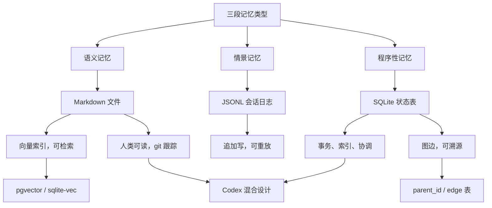
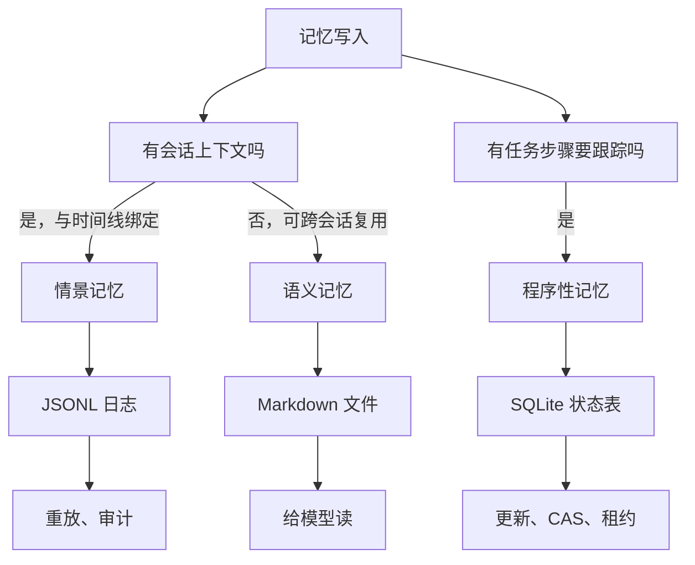
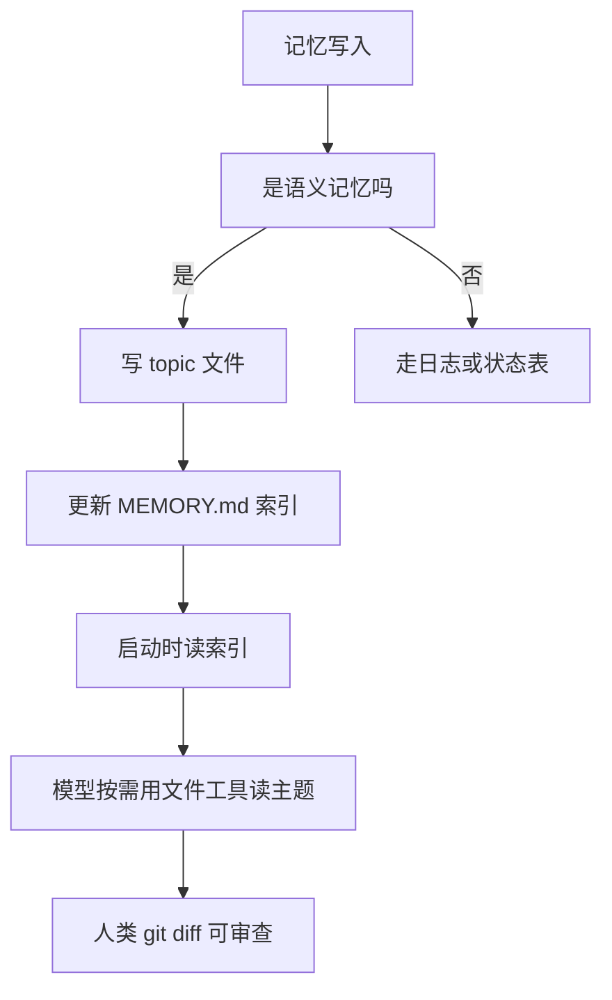
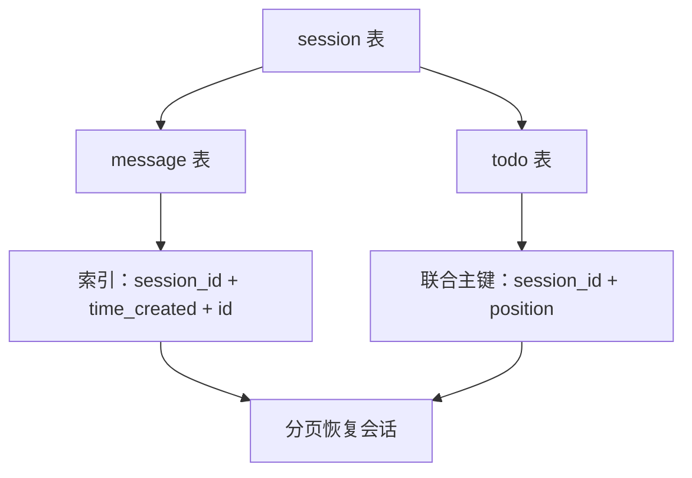
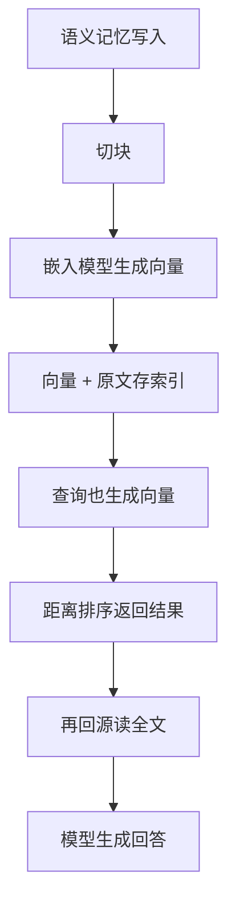
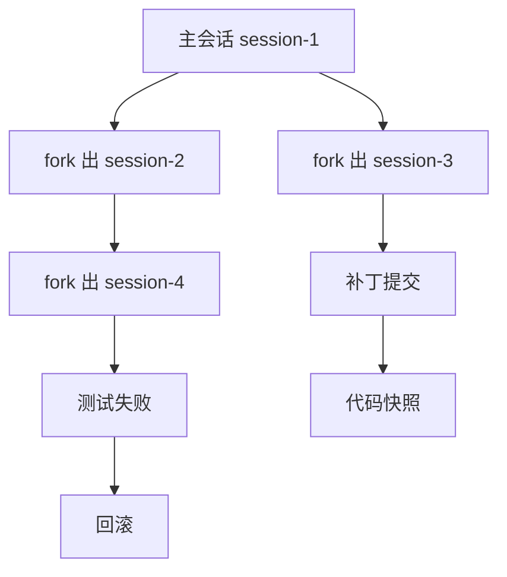
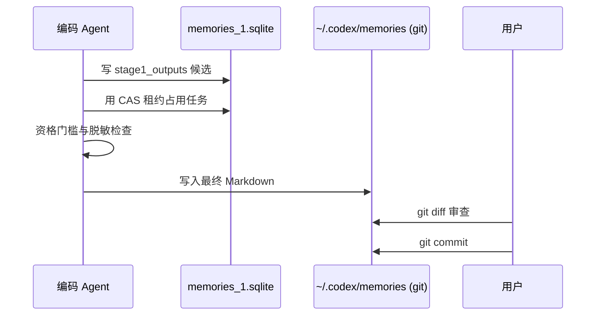
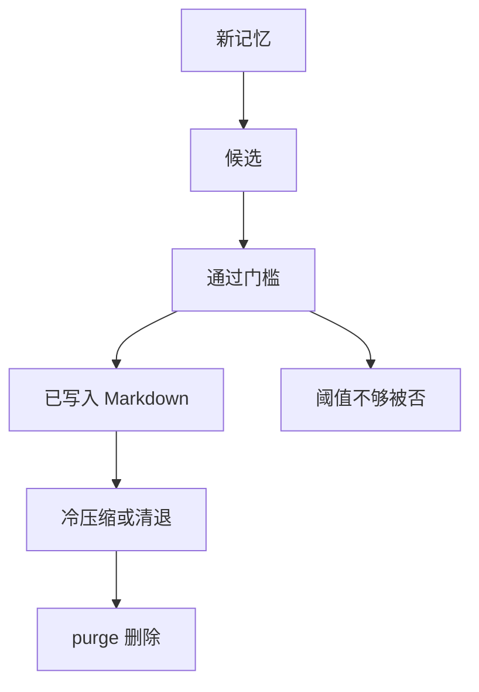
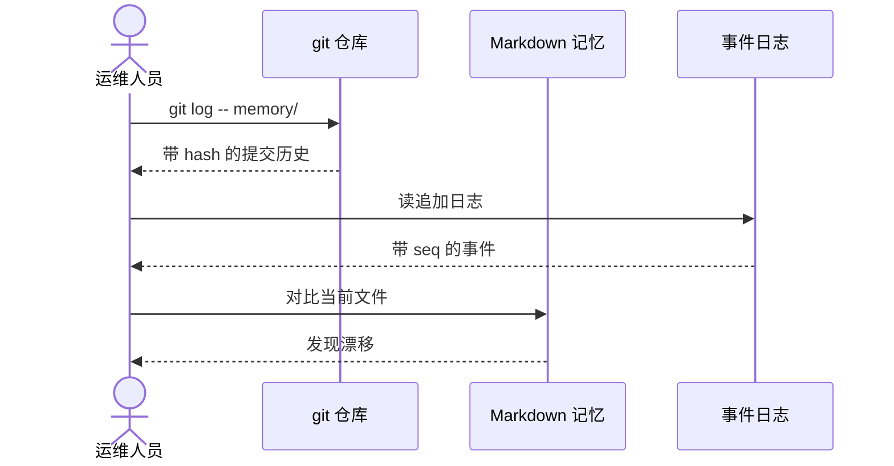
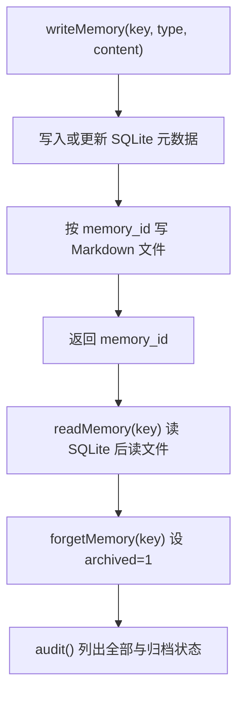

# 记忆该存在哪里：文件、SQLite、向量库与图的取舍

!!! abstract "学完这一页你能"
    - 拿到一个编码助手记忆需求时，能用「情景、语义、程序性」三分类把它映射到合适的存储介质，并给出至少一条数据依据。
    - 画出文件、SQLite、向量索引、图存储四者的分工边界，指出哪些是数据源、哪些是可重建的索引投影。
    - 解释 Codex 用 SQLite 跟踪任务状态、用 git 管理 Markdown 产物这一混合设计的意义，并说出至少两个它要避免的失败模式。
    - 手写一个最小记忆库：SQLite 记录元数据、Markdown 文件保存正文，并用 Node 断言验证写入、读取、归档三条路径。

## 0. 知识地图



建议先读第 1 节分清三种记忆类型，再读第 2 到第 5 节看四类存储各自的能力边界。
第 6 到第 8 节把写入、去重、遗忘、备份串成运维闭环。
第 9 节手写收尾，把单点知识合成一个可运行脚本。

## 1. 三种记忆类型：先分清你在存什么

**先想一个问题**：你的编码助手昨天记住了「项目测试命令在 package.json 里」，今天又记住了「用户不喜欢生成注释」。这两条记忆该放在同一个库吗？

**心智模型**

!!! tip "心智模型"
    一句话：情景记忆是会话流，语义记忆是可复用知识，程序性记忆是完成任务的状态。
    日常类比：情景记忆像行车记录仪，语义记忆像车主手册，程序性记忆像一次性导航任务。
    类比不成立的地方：机器的情景记忆可以全文重放，人的片段回忆却不可靠。

**图解**



1. 一次写入先问：它和一段具体会话绑吗？绑就是情景记忆。
2. 再问：它跨会话可复用吗？是就进语义记忆。
3. 最后问：它描述一个未完成任务的步骤吗？是就进程序性记忆。
4. 三种记忆落在三种介质，后面几节逐一展开。

**一步一步来**

这一步先定义记忆类型，用一个最小函数完成分类。

```ts
// memory-types.ts
type MemoryType = 'episodic' | 'semantic' | 'procedural';

function classify(input: {
  sessionBound: boolean; // 是否与某段会话绑定
  reusable: boolean;     // 是否跨会话复用
  tracksSteps: boolean;  // 是否跟踪任务步骤
}): MemoryType {
  // 优先判程序性：跟踪步骤且不随会话结束而失效
  if (input.tracksSteps && !input.sessionBound) return 'procedural';
  // 再判情景：会话绑定的记录
  if (input.sessionBound) return 'episodic';
  // 其余都是可复用知识
  return 'semantic';
}
```

**这段代码在做什么**

- `MemoryType` 只允许三个取值，把「存在哪里」的问题先收窄成三选一。
- `tracksSteps && !sessionBound` 优先判成 `procedural`，因为任务状态不属于会话日志。
- `sessionBound` 决定是不是 `episodic`，会话型记忆即使内容再有价值也不是语义。
- 兜底返回 `semantic`，语义记忆的边界最宽。

**动手验证**

```ts
// memory-types.test.ts —— 依赖：npm install -D tsx typescript，运行：node --import tsx memory-types.test.ts
import assert from 'node:assert/strict';

type MemoryType = 'episodic' | 'semantic' | 'procedural';

function classify(input: {
  sessionBound: boolean;
  reusable: boolean;
  tracksSteps: boolean;
}): MemoryType {
  if (input.tracksSteps && !input.sessionBound) return 'procedural';
  if (input.sessionBound) return 'episodic';
  return 'semantic';
}

assert.equal(classify({ sessionBound: true, reusable: false, tracksSteps: false }), 'episodic');
assert.equal(classify({ sessionBound: false, reusable: true, tracksSteps: false }), 'semantic');
assert.equal(classify({ sessionBound: false, reusable: false, tracksSteps: true }), 'procedural');
console.log('all memory type assertions passed');
```

依赖：Node 20+，TS 转译用 tsx。
运行结果：`all memory type assertions passed`。

**常见坑**

| 现象 | 原因 | 怎么修 |
| --- | --- | --- |
| 会话日志里混入项目规范 | 把语义记忆写进了情景记忆 | 写入时先跑分类，类型不符就改道 |
| 任务状态被当永久知识 | 程序性记忆没有过期条件 | 加 `expires_at` 或监听任务完成事件 |
| 三者挤进一个 Markdown | 不分层导致全文加载 | 只索引元数据，正文按需读 |

**用在哪里**

- 产品：为编码助手设计记忆层的第 0 天。知识怎么用：先定三分类，再定每条记忆的介质。衡量收益：后期迁移成本下降。不该用时：一次性的临时脚本，不需要记忆层。
- 工程：数据库 schema 评审。知识怎么用：按三分类检查每张表是否放对了数据。衡量收益：读放大减少。不该用时：对极其低频的会话历史做过度建模。

**行业实践**

- Claude Code 文档把记忆分成 CLAUDE.md 手动规范和 auto memory 自动记忆。出处：Anthropic Claude Code 官方文档，以原文为准。
- OpenCode 把 session、message、part 分层存 SQLite，不把情景记录混进长期文件。出处：OpenCode 源码 `packages/core/src/session/sql.ts`，以原文为准。
- 怎么借鉴到你的项目：写入入口先跑分类，再按介质路由。

**小结**

1. 分类是所有存储决策的前置步骤。
2. 情景、语义、程序性分别偏向日志、文件、状态表。
3. 真实产品几乎都是混合设计，不是单一数据库。

## 2. Markdown 文件：人类可读的语义记忆

**先想一个问题**：助手该怎样记住「这个项目的测试命令是 npm test -- --runInBand」？写到数据库，还是写到一个文件？

**心智模型**

!!! tip "心智模型"
    一句话：Markdown 文件适合存人需要读、模型需要按需加载的知识。
    日常类比：像项目里的 README，先读索引再翻详情。
    不成立的地方：README 是写一次读多次，而模型写的东西要经常更新并可能写错，需要版本控制。

**图解**



1. 语义记忆先落到一个主题 Markdown 文件。
2. 更新索引 MEMORY.md，不把全文塞进去。
3. 启动时只读索引，需要才打开主题文件。
4. 人类用 git diff 审查改动，文件可编辑。

**一步一步来**

这一步写一个函数，把内容存入记忆目录。

```js
// write-topic.mjs — Node 20+，零依赖
import { mkdir, writeFile, appendFile } from 'node:fs/promises';
import path from 'node:path';

const memDir = path.join(process.env.HOME, '.my-agent', 'memory');

export async function writeTopic(topic, content) {
  // 1. 确保 memory 目录存在
  await mkdir(memDir, { recursive: true });
  // 2. 写入主题文件，文件名用 topic 命名
  await writeFile(path.join(memDir, `${topic}.md`), content, 'utf8');
  // 3. 在 MEMORY.md 索引追加一行
  const line = `- ${topic}: ${topic}.md\n`;
  await appendFile(path.join(memDir, 'MEMORY.md'), line, 'utf8');
}
```

**这段代码在做什么**

- 必须先建目录，否则第一次写入就失败。
- 主题文件按 topic 命名，人类可以直接找到。
- 索引只追加一行，避免索引文件被全文撑大。
- 索引行指向文件名，模型按需读取。

运行结果：无命令行输出；去 `~/.my-agent/memory/` 查看文件。

**动手验证**

```js
// memory-files.test.mjs —— Node 20+，零依赖
import assert from 'node:assert/strict';
import { mkdir, writeFile, readFile } from 'node:fs/promises';
import os from 'node:os';
import path from 'node:path';

const dir = path.join(os.tmpdir(), `mem-${Date.now()}`);

async function writeTopic(memDir, topic, content) {
  await mkdir(memDir, { recursive: true });
  await writeFile(path.join(memDir, `${topic}.md`), content, 'utf8');
  await writeFile(path.join(memDir, 'MEMORY.md'), `- ${topic}: ${topic}.md\n`, 'utf8');
}

await writeTopic(dir, 'test-command', '# 测试命令\nnpm test -- --runInBand\n');
const index = await readFile(path.join(dir, 'MEMORY.md'), 'utf8');
assert.match(index, /test-command/);
const body = await readFile(path.join(dir, 'test-command.md'), 'utf8');
assert.match(body, /runInBand/);
console.log('markdown memory assertions passed');
```

依赖：无。
运行结果：`markdown memory assertions passed`。

**常见坑**

| 现象 | 原因 | 怎么修 |
| --- | --- | --- |
| 启动时加载整个 MEMORY.md 过长 | 索引文件无上限 | 只读前 200 行或 25KB，Claude Code 文档为此设了加载上限 |
| 两个进程同时写 MEMORY.md | Markdown 没有跨进程锁 | 每个会话只由单一进程写，或加文件锁 |
| Topic 文件越积越多 | 没有归档 | 给不活跃文件设 `archive/` 目录并定期挪移 |

**用在哪里**

- 产品：Claude Code 的 auto memory。知识怎么用：MEMORY.md 只读前 200 行或 25KB，主题文件按需打开。衡量收益：减少每次会话的提示 token 数。不该用时：需要事务一致性的任务状态，不要用 Markdown。
- 工程：团队规范放进 AGENTS.md 或 CLAUDE.md 中。知识怎么用：开发者直接用编辑器维护，PR 走 git 流程。衡量收益：变更审阅成本。不该用时：高频追加的会话日志，JSONL 更适合。

**行业实践**

- Claude Code 文档写明 memory files 是纯 Markdown，不引入数据库或向量检索。出处：Anthropic Claude Code 官方文档，以原文为准。
- Codex 的最终记忆产物是 git 跟踪的 Markdown 文件夹。出处：Codex 源码，以原文为准。
- 怎么借鉴到你的项目：给人看、给模型按需读的长期知识放 Markdown，其余别放。

**小结**

1. Markdown 是人机可读的语义记忆载体。
2. 用索引文件控制启动成本。
3. 并发写入与归档是它的主要边界。

## 3. SQLite：程序性记忆的协调层

**先想一个问题**：助手要跑一个多步任务：先扫描代码，再生成补丁，最后运行测试。中途崩溃后重启，它怎么知道跑到哪一步了？

**心智模型**

!!! tip "心智模型"
    一句话：SQLite 适合存结构化的任务状态与元数据，用事务与索引保证一致性。
    日常类比：像任务看板，移动卡片就是更新一行。
    不成立的地方：看板是人挪卡，机器每秒钟可能写几百行，必须配置 WAL 与 busy_timeout。

!!! note "术语：WAL"
    WAL 是 SQLite 的预写日志模式，把改动先写 -wal 文件再合并主库。
    好处是读不阻塞写；代价是还有一个写者，并且备份必须带 -wal 与 -shm 两个文件。

**图解**



1. 会话表存一次任务的元数据。
2. 消息表与会话表通过 session_id 关联，情景记忆有了索引。
3. todo 表用联合主键保证任务步骤顺序。
4. 恢复会话时按 session_id 分页即可，不用重放整个日志文件。

**一步一步来**

这一步用 better-sqlite3 建一张任务状态表。

```js
// task-state.mjs — 依赖：npm install better-sqlite3
import Database from 'better-sqlite3';
const db = new Database('memory-state.db');
// 打开 WAL 与 busy_timeout，避免写锁直接失败
db.pragma('journal_mode = WAL');
db.pragma('busy_timeout = 5000');

db.exec(`
CREATE TABLE IF NOT EXISTS task_steps (
  session_id TEXT NOT NULL,
  step_no INTEGER NOT NULL,
  status TEXT NOT NULL DEFAULT 'todo',
  PRIMARY KEY (session_id, step_no)
)`);

// CAS 更新：只有 status 是 todo 时才改成 doing
const claim = db.prepare(`UPDATE task_steps SET status='doing'
  WHERE session_id=? AND step_no=? AND status='todo'`);
const info = claim.run('sess-1', 1);
console.log('claimed rows:', info.changes);
```

**这段代码在做什么**

- `journal_mode = WAL` 让读不阻塞写，但同一时刻只有一个写者。
- `busy_timeout = 5000` 是 OpenCode 源码中的取值，写锁碰撞时等待 5 秒。
- 联合主键 `(session_id, step_no)` 天然去重。
- `UPDATE ... WHERE status='todo'` 是任务认领的原子操作。

运行结果：第一次运行输出 `claimed rows: 1`；同一行再次认领输出 `claimed rows: 0`。

**动手验证**

```js
// task-state.test.mjs —— 依赖：npm install better-sqlite3
import assert from 'node:assert/strict';
import Database from 'better-sqlite3';

const db = new Database(':memory:');
db.pragma('journal_mode = WAL');
db.pragma('busy_timeout = 5000');
db.exec(`CREATE TABLE task_steps (
  session_id TEXT NOT NULL, step_no INTEGER NOT NULL,
  status TEXT NOT NULL DEFAULT 'todo',
  PRIMARY KEY (session_id, step_no))`);
const insert = db.prepare('INSERT INTO task_steps (session_id, step_no) VALUES (?, ?)');
insert.run('sess-1', 1);
const claim = db.prepare("UPDATE task_steps SET status='doing' WHERE session_id=? AND step_no=? AND status='todo'");
assert.equal(claim.run('sess-1', 1).changes, 1);
assert.equal(claim.run('sess-1', 1).changes, 0);
console.log('sqlite state assertions passed');
```

依赖：better-sqlite3。
运行结果：`sqlite state assertions passed`。

**常见坑**

| 现象 | 原因 | 怎么修 |
| --- | --- | --- |
| `database is locked` 启动即失败 | 多进程同时写一个库 | 拆分 DB、加大 busy_timeout、不要每个连接都重设 journal_mode |
| WAL 模式下复制库不完整 | 只复制了 .db 没带 -wal 和 -shm | 用 SQLite backup API，或先 checkpoint 后复制三件套 |
| 状态表膨胀到 GB | 大块内容塞进行，没有清理 | 大内容走文件，表只存路径与元数据。Cursor 状态库曾从 3.1GB 涨到 97GB，来源：Cursor 论坛，以原文为准 |

**用在哪里**

- 产品：编码助手的多步任务调度。知识怎么用：task_steps 表记录每步状态，崩溃后从 doing 继续。衡量收益：重启后不重跑已完成步骤。不该用时：单步瞬时任务，不需要状态机。
- 工程：会话历史分页 UI。知识怎么用：按 session_id 分页查询。衡量收益：百万行数据不用读多 GB 文件。不该用时：单进程应用，JSONL 也够用。

**行业实践**

- OpenCode 已从每个对象一个 JSON 文件迁移到 SQLite，用 Drizzle ORM 建表。出处：OpenCode 源码 `packages/core/src/database`，以原文为准。
- Goose 用 `BEGIN IMMEDIATE` 包住建表，避免多进程首启竞争。出处：Goose 源码 `session_manager.rs`，以原文为准。
- Codex 把高噪声日志与线程状态拆成 6-7 个库，避免锁争用。出处：Codex 源码，以原文为准。
- 怎么借鉴到你的项目：把表拆小、给写操作设超时、建表逻辑保持幂等。

**小结**

1. SQLite 适合程序性状态与元数据。
2. WAL 与 busy_timeout 是标配。
3. 大二进制与高噪声日志不要塞进同一个表。

## 4. 向量索引：让语义记忆可检索

**先想一个问题**：记忆库有 500 条 markdown，助手想找「所有关于测试的命令」，但文件里可能写的是「跑测试」「test 命令」「Jest 用法」。精确匹配找不到，怎么办？

**心智模型**

!!! tip "心智模型"
    一句话：向量索引把文本映射到数值向量，用距离衡量语义相似。
    日常类比：给每条记忆钉一个坐标，语义接近的钉在一起。
    不成立的地方：坐标不是二维地图，而是数百维空间，人无法直观看到。

!!! note "术语：嵌入"
    嵌入是把一段文本转成固定长度的浮点数组，语义相近的文本数组距离更近。
    例：把「跑测试」和「npm test」都转成向量后，余弦距离比「跑测试」与「中午吃什么」更近。

**图解**



1. 写入时先切块，再逐块生成向量。
2. 向量与原文一起保存，查询时要回原文。
3. 查询文本也必须经过同一个嵌入模型。
4. 返回后还要读原始 Markdown，避免只给向量没有正文。

**一步一步来**

用伪代码说明写入路径，因为不同向量库 API 不同。

```js
// vector-store.mjs —— 伪代码，实际需 pgvector 或 sqlite-vec
import { embed } from './embedding-model'; // 你封装的嵌入模型

export async function indexMemory(id, text) {
  // 1. 把长文切短，避免超过模型输入窗口
  const chunks = chunk(text, 1000);
  for (const c of chunks) {
    // 2. 调用嵌入模型，返回浮点数组
    const vec = await embed(c);
    // 3. 向量 + 原文 + 来源 id 一起写库
    await vectorTable.insert({ id, text: c, embedding: vec });
  }
}
```

**这段代码在做什么**

- `chunk` 把长文切成小段，控制每次嵌入的开销。
- `embed` 是唯一依赖模型的步骤，要固定模型版本。
- 库中同时保存 `text` 与 `embedding`，不存原文就是死索引。
- `id` 关联回元数据，查完向量能回到文件。

运行结果：不提供，因为没有实际向量后端与嵌入模型，需核对 pgvector 或 sqlite-vec 官方文档。

**动手验证**

这里验证的是「向量索引必须有回源 id」这条约束。

```js
// vector-constraint.test.mjs —— Node 20+，零依赖
import assert from 'node:assert/strict';

function makeRow(chunk) {
  // 模拟一行：向量与原文必须同时存在
  return { id: 'mem-1', text: chunk.text, embedding: chunk.embedding };
}

const row = makeRow({ text: 'npm test -- --runInBand', embedding: [0.1, 0.2] });
assert.equal(row.text, 'npm test -- --runInBand');
assert.equal(row.id, 'mem-1');
assert.ok(Array.isArray(row.embedding));
console.log('vector row constraints passed');
```

依赖：无。
运行结果：`vector row constraints passed`。

**常见坑**

| 现象 | 原因 | 怎么修 |
| --- | --- | --- |
| 查询结果与新增记忆不一致 | 向量索引没有同步更新 | 写记忆时同时更新索引，用事务包住 |
| 向量维数不匹配 | 嵌入模型版本换了 | 记录模型版本，换模型必须重建索引 |
| 只存向量不存原文 | 无法审计与重放 | 向量行一定带 `id` 与 `text` 列 |
| 以为产品都在用向量 | 资料未覆盖 | Claude Code 文档没提向量；OpenCode 与 Goose 用 LIKE 没建 FTS5，出处见行业实践 |

**用在哪里**

- 产品：支持语义检索的记忆库。知识怎么用：记忆超过 500 条后，用向量检索替代全量加载。衡量收益：召回率与首 token 延迟。不该用时：50 条以内，精确 grep 更快。
- 工程：RAG 系统的代码问答。知识怎么用：项目文档先切块嵌入，再检索回源。衡量收益：答案相关性。不该用时：需要最新时序的日志，用关系查询即可。

**行业实践**

- 资料核查过：Claude Code、OpenCode、Goose 的存储代码里都没有 FTS5；OpenCode 未建 FTS5 表，Goose 用 `LIKE json_extract` 检索。出处：源码，以原文为准。
- SQLite 官方文档描述 FTS5 的 `CREATE VIRTUAL TABLE ... USING fts5`、`MATCH`、`bm25()` 作为标准升级路径。出处：SQLite 官方文档，以原文为准。
- 怎么借鉴到你的项目：先做精确查询，达标就不上向量；上向量时保留原文与 id。

**小结**

1. 向量索引解决语义相似，不是精确匹配。
2. 每行必须保留原文与来源 id。
3. 产品用的不一定就是向量；要按需引入。

## 5. 图存储：记忆之间的连接

**先想一个问题**：用户从主会话 fork 出三个子会话，一个发现测试失败，另一个在读源码。事后要找出「哪些会话来自同一个父会话」，SQLite 怎么做？

**心智模型**

!!! tip "心智模型"
    一句话：图存储把记忆之间的关系当一等公民。
    日常类比：像家谱图，父子连线可溯源。
    不成立的地方：家谱关系少而稳定，机器的 fork 图每秒都可能多一条边。

**图解**



1. 主会话是根节点，子会话通过 parent_id 连回根。
2. 子会话可以继续 fork，形成纵深。
3. 事件与状态可以挂到会话边上。
4. 用递归查询可以从任意节点回溯祖先，不需要额外图数据库。

**一步一步来**

在 SQLite 里用 parent_id 加递归 CTE 查询祖先。

```sql
-- lineage.sql
CREATE TABLE sessions (
  id TEXT PRIMARY KEY,
  parent_id TEXT REFERENCES sessions(id) -- 这就是一条边
);

-- 从某个会话往上找所有祖先
WITH RECURSIVE ancestors(id, parent_id, level) AS (
  SELECT id, parent_id, 0 FROM sessions WHERE id = 'session-4' -- 起点
  UNION ALL
  SELECT s.id, s.parent_id, a.level + 1
  FROM sessions s JOIN ancestors a ON s.id = a.parent_id -- 逐级接父边
)
SELECT * FROM ancestors ORDER BY level; -- 最近的在前
```

**这段代码在做什么**

- 每个会话只存一个 `parent_id`，这就是边。
- `WITH RECURSIVE` 从目标节点出发。
- `UNION ALL` 把父行逐级接上。
- `ORDER BY level` 让最近的在最上。

运行结果：假设 session-4 的父亲是 session-2，它父亲是 session-1，返回 3 行，level 依次 0、1、2。

**动手验证**

```js
// lineage.test.mjs —— 依赖：npm install better-sqlite3
import assert from 'node:assert/strict';
import Database from 'better-sqlite3';

const db = new Database(':memory:');
db.exec(`CREATE TABLE sessions (id TEXT PRIMARY KEY, parent_id TEXT REFERENCES sessions(id))`);
const ins = db.prepare('INSERT INTO sessions (id, parent_id) VALUES (?, ?)');
ins.run('session-1', null);
ins.run('session-2', 'session-1');
ins.run('session-4', 'session-2');
const rows = db.prepare(`WITH RECURSIVE ancestors(id, parent_id, level) AS (
  SELECT id, parent_id, 0 FROM sessions WHERE id = ?
  UNION ALL
  SELECT s.id, s.parent_id, a.level + 1 FROM sessions s JOIN ancestors a ON s.id = a.parent_id
) SELECT * FROM ancestors ORDER BY level`).all('session-4');
assert.equal(rows.length, 3);
assert.equal(rows[0].id, 'session-4');
assert.equal(rows[2].id, 'session-1');
console.log('lineage assertions passed');
```

依赖：better-sqlite3。
运行结果：`lineage assertions passed`。

**常见坑**

| 现象 | 原因 | 怎么修 |
| --- | --- | --- |
| 递归 CTE 死循环 | 图里出现环 | 加 visited 集合或限制 level 上限 |
| 迁移后 parent 路径失效 | 存了绝对路径 | 关系只存 id，路径由文件系统解析 |
| 想上专用图数据库却无需求 | 节点数少而用重型图库 | SQLite 的 parent_id + CTE 已够，资料未覆盖重型图库实测 |

**用在哪里**

- 产品：会话 fork 与恢复。知识怎么用：每个会话只带 parent_id，恢复时显示家谱。衡量收益：多会话导航时间。不该用时：线性无分支会话。
- 工程：Agent 操作溯源。知识怎么用：把任务、补丁、测试挂到会话节点边。衡量收益：回滚定位耗时。不该用时：事件流本身用日志存，不用图去刻事件流。

**行业实践**

- Codex 有 `thread_spawn_edges` 表记录线程派生关系。出处：Codex 源码，以原文为准。
- OpenCode 用 `session.parent_id` 支持 fork 与子会话族谱。出处：OpenCode 源码，以原文为准。
- pi 的会话条目用 `id/parentId` 做树形分支，在文件内即可分叉。出处：pi 官方文档 `session-format.md`，以原文为准。
- 怎么借鉴到你的项目：先加一列 parent_id，再按需加边表；不要一开始上专用图数据库。

**小结**

1. 图存储解决关联查询，不是大段正文。
2. 在 SQLite 用外键与 CTE 就能做基本溯源。
3. 环与绝对路径是图结构里的重点坑。

## 6. Codex 的混合设计：SQLite 管状态，git 管产物

**先想一个问题**：为什么 Codex 既用 SQLite 又用 Markdown？它不能只挑一个吗？

**心智模型**

!!! tip "心智模型"
    一句话：SQLite 存与任务协调有关的中间状态，Markdown 是最终给人读的产物。
    日常类比：像法律档案，内部编辑用数据库，对外判决书是文件。
    不成立的地方：法院档案是最终裁决，模型写的 Markdown 还可以被下一轮改写。

!!! note "术语：投影"
    可重建投影指的是由源数据生成、丢了能重建出来的结构。
    例：Codex 的 SQLite 索引可由 JSONL 重放重建；JSONL 本体丢了就不可重建。
    这正是「日志是源，库是索引」的含义。

**图解**



1. 先写中间候选到 SQLite，等待过滤与判级。
2. 用 CAS 租约让多个任务互不覆盖。
3. 通过门槛后写到 Markdown 目录。
4. 用户只审查 git 里的 Markdown，数据库不直接给人看。

**一步一步来**

做一个最小模拟：先写候选到 SQLite，再写最终文件。

```js
// codex-style.mjs —— 依赖：npm install better-sqlite3
import Database from 'better-sqlite3';
import { writeFile } from 'node:fs/promises';

const db = new Database('candidate.db');
db.exec(`CREATE TABLE IF NOT EXISTS candidates (id TEXT PRIMARY KEY, content TEXT, eligible INTEGER DEFAULT 0)`);
const insert = db.prepare('INSERT INTO candidates (id, content) VALUES (?, ?)');
insert.run('c1', '项目测试命令：npm test -- --runInBand');

// 只迁移标记为 eligible 的候选，模拟资格门槛
const rows = db.prepare('SELECT * FROM candidates WHERE eligible = 1').all();
for (const r of rows) {
  await writeFile(`./memories/${r.id}.md`, r.content, 'utf8');
}
console.log('promoted candidates:', rows.length);
```

**这段代码在做什么**

- 候选先入 SQLite，不直接写文件。
- `eligible` 是资格门槛字段，未通过就不迁移。
- 通过的行再写 Markdown，库和文件职责分开。
- `rows.length` 指示本次提升了几条。

运行结果：首次运行候选 eligible 为 0，输出 `promoted candidates: 0`。

**动手验证**

```js
// codex-style.test.mjs —— 依赖：npm install better-sqlite3
import assert from 'node:assert/strict';
import Database from 'better-sqlite3';
import { mkdtemp, writeFile, readdir } from 'node:fs/promises';
import os from 'node:os';
import path from 'node:path';

const db = new Database(':memory:');
db.exec(`CREATE TABLE candidates (id TEXT PRIMARY KEY, content TEXT, eligible INTEGER DEFAULT 0)`);
db.prepare('INSERT INTO candidates (id, content, eligible) VALUES (?, ?, ?)').run('c1', 'npm test', 1);
db.prepare('INSERT INTO candidates (id, content, eligible) VALUES (?, ?, ?)').run('c2', '暂存内容', 0);
const dir = await mkdtemp(path.join(os.tmpdir(), 'codex-mem-'));
for (const r of db.prepare('SELECT * FROM candidates WHERE eligible = 1').all()) {
  await writeFile(path.join(dir, `${r.id}.md`), r.content, 'utf8');
}
const files = await readdir(dir);
assert.equal(files.length, 1);
assert.equal(files[0], 'c1.md');
console.log('codex style assertions passed');
```

依赖：better-sqlite3。
运行结果：`codex style assertions passed`。

**常见坑**

| 现象 | 原因 | 怎么修 |
| --- | --- | --- |
| 候选库垃圾越积越多 | 没有资格门槛 | 写门槛字段，只提升合格行 |
| 文件与库内容不一致 | 两边没有统一提交 | 提升操作放进一个事务或脚本 |
| 用户改 DB 而不改 Markdown | 把索引当作了真相 | 明确 DB 可重建，文件不可丢 |

**用在哪里**

- 产品：自动形成项目规范。知识怎么用：DB 存候选，通过门槛后落盘为 Markdown。衡量收益：记错可回滚，记对可复用。不该用时：任务未结束就不该写最终文件。
- 工程：批量导出最终产物。知识怎么用：先插入数据库暂存，筛选后导出 Markdown。衡量收益：导出一次可过审。不该用时：需要立即可见的单条提醒，直接写文件。

**行业实践**

- Codex 用 `memories_1.sqlite` 存 `stage1_outputs` 与 `jobs` 作为中间候选和任务租约。出处：Codex 源码，以原文为准。
- 最终记忆目录放在 git 里，人可以审查。出处：Codex 源码，以原文为准。
- Codex 的 DB 是可重建的索引投影，JSONL 才是不可丢的源。出处：Codex 源码，以原文为准。
- 怎么借鉴到你的项目：把候选和终产物分成两条管道。

**小结**

1. Codex 的设计用 SQLite 协调，用 Markdown 沉淀。
2. DB 可以重建，文件不能掉。
3. 资格门槛和 git diff 是质量控制的关键。

## 7. 读写路径：写入、去重与遗忘

**先想一个问题**：记忆库如果只写不删，一个月后有哪些问题是可预测的？启动会变慢吗？答案会变旧吗？

**心智模型**

!!! tip "心智模型"
    一句话：记忆系统要同时设计三条路径：写、查、忘。
    日常类比：像厨房小票，接单贴上去，出餐撕下来。
    不成立的地方：机器的小票可以压缩、搬移、不清空原文。

**图解**



1. 新的记忆先停留为候选。
2. 通过门槛写入正式存储。
3. 冷数据压缩或清退。
4. purge 时进入删除态。

**一步一步来**

用集合去重加过期检查，做一个遗忘器。

```js
// retention.mjs —— Node 20+，零依赖
export function applyRetention(items, { maxAgeDays, maxCount }) {
  const now = Date.now();
  // 1. 按最近访问时间降序排序
  const sorted = items.slice().sort((a, b) => b.lastAccessed - a.lastAccessed);
  const seen = new Set(); // 去重集合
  const kept = [];
  for (const item of sorted) {
    const ageDays = (now - item.createdAt) / 86400000; // 换算成天
    // 2. 超期或者超出最高条数就不再保留
    if (ageDays > maxAgeDays || kept.length >= maxCount) continue;
    // 3. 按 key 去重
    if (seen.has(item.key)) continue;
    seen.add(item.key);
    kept.push(item);
  }
  return kept;
}
```

**这段代码在做什么**

- 排序保证淘汰从最旧的一侧开始。
- `ageDays` 与 `maxAgeDays` 比较实现过期。
- `maxCount` 限制最多保留条数。
- `seen` 删除重复 key，防止同一记忆重复写。

运行结果：对给定数组，返回按策略保留后的数组。

**动手验证**

```js
// retention.test.mjs —— Node 20+，零依赖
import assert from 'node:assert/strict';

function applyRetention(items, { maxAgeDays, maxCount }) {
  const now = Date.now();
  const sorted = items.slice().sort((a, b) => b.lastAccessed - a.lastAccessed);
  const seen = new Set();
  const kept = [];
  for (const item of sorted) {
    const ageDays = (now - item.createdAt) / 86400000;
    if (ageDays > maxAgeDays || kept.length >= maxCount) continue;
    if (seen.has(item.key)) continue;
    seen.add(item.key);
    kept.push(item);
  }
  return kept;
}

const now = Date.now();
const items = [
  { key: 'a', createdAt: now - 86400000 * 40, lastAccessed: now - 1 },
  { key: 'b', createdAt: now - 86400000 * 10, lastAccessed: now - 2 },
  { key: 'a', createdAt: now - 86400000 * 5, lastAccessed: now - 3 },
];
const kept = applyRetention(items, { maxAgeDays: 30, maxCount: 10 });
assert.equal(kept.length, 2);
assert.deepEqual(kept.map((i) => i.key), ['b', 'a']);
console.log('retention assertions passed');
```

依赖：无。
运行结果：`retention assertions passed`。

**常见坑**

| 现象 | 原因 | 怎么修 |
| --- | --- | --- |
| 忘记删旧记忆 | 只有写路径没有清退 | 加 `maxAgeDays` 和 `maxCount`，对应 Gemini 的 `sessionRetention.maxAge` |
| 同一记忆反复写 | 无 key 去重 | 用 key 唯一索引，加载后再跑一次去重 |
| 回滚后旧记忆回来 | 追加式日志保留原始条目 | 保留原文是审计需要，别用物理删除代替标记 |

**用在哪里**

- 产品：会话历史保留策略。知识怎么用：Gemini CLI 的 `sessionRetention.maxAge` 默认 `30d`。衡量收益：磁盘占用下降。不该用时：需要审计留存的全量记录。
- 工程：模型微调样本治理。知识怎么用：旧样本到期即从候选池移出。衡量收益：治理后分类准确率。不该用时：真实用户输入不能按过期粗暴删除，需脱敏评估。

**行业实践**

- Claude Code 的转录默认保留约 30 天，`cleanupPeriodDays` 可设。出处：Anthropic 官方文档，以原文为准。
- Gemini CLI 用 `sessionRetention.maxAge` 默认 `30d`、`minRetention` 默认 `1d`。出处：Gemini CLI 官方文档，以原文为准。
- Claude 的 `/rewind` summarize 不改文件且原消息保留在转录里，这是非破坏式压缩。出处：官方文档，以原文为准。
- 怎么借鉴到你的项目：遗忘用过期与上限两道闸，压缩用「保留原文，表面替换」。

**小结**

1. 写路径要设计候选与门槛。
2. 去重靠 key 唯一约束。
3. 遗忘是过期清理与非破坏压缩的组合。

## 8. 备份与审计：可恢复与可追溯

**先想一个问题**：助手改了记忆后你发现内容错了，怎么知道是谁、什么时候改的？怎么回滚？

**心智模型**

!!! tip "心智模型"
    一句话：备份让状态可恢复，审计让变化可追溯。
    日常类比：像 API 的写前日志，先记录意图再应用。
    不成立的地方：机器日志能被篡改，所以 dsh 才引进序列号与校验实现篡改检测。

**图解**



1. git 查看每一笔记忆变更。
2. 事件日志按 seq 给出写入顺序。
3. 对比文件与日志可以发现不一致。
4. 回滚靠 git checkout，追溯靠 seq。

**一步一步来**

把 git 和 seq 两个机制合起来，做一个审计包装。

```js
// audit.mjs —— Node 20+ 零依赖；需要 git CLI
import { execSync } from 'node:child_process';

export function auditMemory(dir, seq) {
  // 1. 读 git log 最近一条与记忆目录相关的提交
  const gitLine = execSync(`git log -1 --format=%H -- ${dir}`, { encoding: 'utf8' }).trim();
  // 2. 把 git hash 与事件 seq 绑定
  return { gitCommit: gitLine, eventSeq: seq };
}
```

**这段代码在做什么**

- `git log -1 --format=%H` 拿到最近提交的完整 hash。
- 只查记忆目录，排开会话日志的噪声。
- 返回 hash 与 seq，形成双索引。
- 若目录不在 git 下命令会失败，正好暴露漏配。

运行结果：在有 git 提交的项目里输出类似 `{ gitCommit: '9f2e...', eventSeq: 12 }`。

**动手验证**

```js
// audit.test.mjs —— Node 20+ 零依赖
import assert from 'node:assert/strict';

function bindAudit(gitCommit, eventSeq) {
  // 模拟绑定：git 提交与事件序号
  return { gitCommit, eventSeq };
}

const rec = bindAudit('9f2e11c', 12);
assert.equal(rec.gitCommit, '9f2e11c');
assert.equal(rec.eventSeq, 12);
console.log('audit binding assertions passed');
```

依赖：无。
运行结果：`audit binding assertions passed`。

**常见坑**

| 现象 | 原因 | 怎么修 |
| --- | --- | --- |
| 只备份 .db 文件 | WAL 内容在 -wal 和 -shm 里 | 用 SQLite backup API，或 checkpoint 后复制三件套 |
| 事件日志版本看不懂 | 没有格式版本号 | 学 pi 的 header version、dsh 的指纹；未知未来版本拒绝解析 |
| 两个终端同时写一个会话 | 追加写交错 | 用 session 级 writer_lock，Claude Code 文档明确提示这个失败模式 |

**用在哪里**

- 产品：记忆修改审计。知识怎么用：git log 看变更，seq 看写入序。衡量收益：定位一次错误修改的时间。不该用时：没有变更的历史需求，过度设计。
- 工程：灾难恢复。知识怎么用：DB 丢了可从 JSONL 重建；JSONL 丢了不可重建。衡量收益：恢复时长。不该用时：纯环境变量不需要。

**行业实践**

- dsh 的事件日志用 SHA-256 指纹检测格式破坏，未来版本拒绝解析。出处：dsh 官方 `docs/persistence-catalog.md`，以原文为准。
- Claude Code 的转录是 JSONL，每行一个消息。出处：Anthropic 官方文档，以原文为准。
- Codex 运行 `quick_check` 时预算 100ms，坏库先挪开再启新库。出处：Codex 源码，以原文为准。
- 怎么借鉴到你的项目：备份时先明确哪个是源、哪个是投影。

**小结**

1. 审计靠 seq 与 git hash 双索引。
2. 备份要带 SQLite 的 WAL 三件套。
3. 先确定什么丢得起，什么丢不起。

## 9. 手写一个最小记忆库

**先想一个问题**：前面各节单点都见过，怎么合成一个真正能跑的 SQLite + Markdown 记忆库？

**心智模型**

!!! tip "心智模型"
    一句话：元数据在 SQLite，正文在 Markdown，二者通过 id 对齐。
    日常类比：像图书馆的抽屉卡片，卡片索引在柜子里，书在架上。
    不成立的地方：图书馆的书不会因为卡片坏了就找不到，但我们的记忆文件名如果不稳定就会失联。

**图解**



1. 写是先写表再写文件，失败则回滚表。
2. 读是先查表拿文件路径，再打开文件。
3. 忘是标记归档，不物理删除。
4. 审计列出所有条目及其归档状态。

**一步一步来**

第一步，建表。

```js
// memory-lib.mjs —— 依赖：npm install better-sqlite3
import Database from 'better-sqlite3';

export const db = new Database('memory-lib.db');
db.pragma('journal_mode = WAL'); // 读不阻塞写
db.exec(`CREATE TABLE IF NOT EXISTS memories (
  id INTEGER PRIMARY KEY AUTOINCREMENT,
  key TEXT UNIQUE NOT NULL, -- 唯一，防重复
  type TEXT NOT NULL CHECK(type IN ('episodic','semantic','procedural')), -- 三分类
  file_path TEXT NOT NULL,  -- Markdown 文件路径
  created_at TEXT NOT NULL DEFAULT (datetime('now')),
  updated_at TEXT NOT NULL DEFAULT (datetime('now')),
  archived INTEGER NOT NULL DEFAULT 0 -- 遗忘态
)`);
```

**这段代码在做什么**

- `key` 唯一，防止同一记忆重复写。
- `type` 用 CHECK 约束限制为三分类。
- `file_path` 保存 Markdown 文件的位置。
- `archived` 默认 0，忘掉时置 1。

第二步，写文件与更新表。

```js
// memory-lib.mjs 续 —— 零额外依赖，用 fs/promises
import { mkdir, writeFile } from 'node:fs/promises';
import path from 'node:path';

export async function writeMemory(key, type, content) {
  await mkdir('./memory-store', { recursive: true }); // 目录存在
  const file = path.join('./memory-store', `${key.replace(/[^a-z0-9-]/gi, '_')}.md`);
  await writeFile(file, content, 'utf8'); // 先写正文
  const existing = db.prepare('SELECT id FROM memories WHERE key = ?').get(key); // 查重
  if (existing) {
    // 已存在就更新路径和时间
    db.prepare("UPDATE memories SET file_path=?, updated_at=datetime('now') WHERE id=?").run(file, existing.id);
    return existing.id;
  }
  // 新记录插入元数据
  return db.prepare('INSERT INTO memories (key, type, file_path) VALUES (?, ?, ?)')
    .run(key, type, file).lastInsertRowid;
}
```

**这段代码在做什么**

- 文件名从 key 清洗而来，避免路径问题。
- 先写文件后更新表，文件是正文。
- 同 key 已存在就更新，不重复插入。
- 返回 `lastInsertRowid`，新记录会用。

**动手验证**

```js
// memory-lib.test.mjs —— 依赖：npm install better-sqlite3
import assert from 'node:assert/strict';
import Database from 'better-sqlite3';
import { mkdir, writeFile, readFile } from 'node:fs/promises';
import path from 'node:path';

const db = new Database(':memory:');
db.exec(`CREATE TABLE memories (id INTEGER PRIMARY KEY AUTOINCREMENT, key TEXT UNIQUE, file_path TEXT, archived INTEGER DEFAULT 0)`);
const dir = path.join(process.cwd(), 'memory-store');
await mkdir(dir, { recursive: true });
async function writeMemory(key, content) {
  const file = path.join(dir, `${key}.md`);
  await writeFile(file, content, 'utf8');
  const existing = db.prepare('SELECT id FROM memories WHERE key=?').get(key);
  if (existing) {
    db.prepare('UPDATE memories SET file_path=? WHERE id=?').run(file, existing.id);
    return existing.id;
  }
  return db.prepare('INSERT INTO memories (key, file_path) VALUES (?, ?)').run(key, file).lastInsertRowid;
}
const id1 = await writeMemory('test-command', 'npm test\n');
const id2 = await writeMemory('test-command', 'npm test -- --runInBand\n');
assert.equal(id1, id2);
const body = await readFile(path.join(dir, 'test-command.md'), 'utf8');
assert.match(body, /runInBand/);
db.prepare('UPDATE memories SET archived=1 WHERE key=?').run('test-command');
const row = db.prepare('SELECT archived FROM memories WHERE key=?').get('test-command');
assert.equal(row.archived, 1);
console.log('mini memory library passed');
```

依赖：better-sqlite3。
运行结果：`mini memory library passed`。

**常见坑**

| 现象 | 原因 | 怎么修 |
| --- | --- | --- |
| 重复插入同 key 报错 | UNIQUE 约束没处理 | 先 SELECT 再 UPDATE，或用 INSERT OR REPLACE |
| 文件路径发霉 | key 有特殊字符 | 清洗文件名，示例里替换非法字符 |
| 归档后仍被查出来 | 查询没带 archived=0 | 所有读查询默认过滤 `archived=0` |

**用在哪里**

- 产品：个人知识库 MVP。知识怎么用：SQLite 记索引，Markdown 存正文。衡量收益：单文件备份速度。不该用时：多用户并发写，需上 Postgres。
- 工程：Agent 的规则落盘。知识怎么用：把语义记忆写成 Markdown，元数据进表。衡量收益：规则变更的审阅成本。不该用时：高频更新状态，用 SQLite 状态表而不用文件。

**行业实践**

- Claude Code 把记忆写成 Markdown 文件，无数据库。出处：Anthropic 官方文档，以原文为准。
- Codex 把 DB 当可重建的投影，Markdown 当最终产物。出处：Codex 源码，以原文为准。
- 怎么借鉴到你的项目：表里的 file_path 只存相对路径，避免目录移动后失效。

**小结**

1. 最小记忆库是「表 + 文件」的外键式设计。
2. 写路径必须处理同 key 更新。
3. 归档是控制读集与审计的关键。

## 应用地图

| 场景 | 用到本页哪个知识点 | 典型技术选型 | 注意事项 |
| --- | --- | --- | --- |
| 编码助手会话恢复 | 情景记忆、JSONL 追加写 | JSONL 会话日志 | 两终端同会话会交错，建议加 session 级 writer_lock |
| 自动记忆项目规范 | 语义记忆、Markdown 文件 | MEMORY.md + topic 文件 | 启动只读前 200 行或 25KB，Claude Code 文档有载入上限 |
| 多步任务状态 | 程序性记忆、SQLite | SQLite WAL + busy_timeout | 大内容别进表，只存路径 |
| 记忆语义检索 | 向量索引、嵌入 | pgvector 或 sqlite-vec | 需固定嵌入模型版本；向量、原文、id 缺一不可 |
| 会话 fork 溯源 | 图存储、parent_id | parent_id + 递归 CTE | 只存 id，不存绝对路径 |
| 备份与审计 | seq + git hash | 事件日志 + git | SQLite 备份要带 -wal 和 -shm |
| 冷数据清退 | 遗忘策略 | 过期 + 上限 + purge | 压缩保留原文，别删 |
| 记忆库 MVP | 表 + 文件 | SQLite + Markdown | UNIQUE key 防重复，归档标记 |

与本站「记忆系统」章节对照：该章节解决「记什么、如何召回」，本页解决「放在哪里、如何读写、怎么不丢」。读到本章时，把上一章的短时会话映射到 JSONL，长期语义映射到 Markdown，任务状态映射到 SQLite。

## 动手作业

**目标**：实现一个「对话采样记忆库」。从 JSONL 会话日志中提取用户偏好，写入 SQLite 元数据表，并导出 Markdown 文件。

**步骤**

1. 读一段 JSONL，每行一个对象，含 role 与 content。
2. 把 role 为 user 且包含「记住」或「偏好」的消息挑出来。
3. 用 writeMemory 写入 SQLite 并生成 Markdown 文件。
4. 用 readMemory 读回验证正文。
5. 用 applyRetention 做 30 天过期清理，断言超期项被移除。

**验收标准**

- 脚本无外部网络依赖，Node 20+ 可跑，依赖只写 better-sqlite3。
- 用 node:assert 验证：写入至少 2 条、重复 key 被更新、超期项被清退。
- 终端输出 `all hands-on assertions passed`。

## 综合对比

| 维度 | JSONL 日志 | SQLite | Markdown 文件 | 向量索引 | 图存储（parent_id） |
| --- | --- | --- | --- | --- | --- |
| 写入模式 | 追加 | 事务 | 覆盖或追加 | 插入 | 插入或更新边 |
| 查询方式 | 扫描 | 索引分页、过滤 | grep | 语义相似 | 递归 CTE |
| 人类可读 | 每行 JSON | 需工具 | 是 | 需工具 | 需工具 |
| 崩溃恢复 | 容忍尾部残缺 | WAL + CHECK | 可能半行 | 取决于实现 | 取决于实现 |
| 代表产品或出处 | Claude Code、pi、Gemini CLI | OpenCode、Goose、Codex 索引 | Claude Code memory、Codex 最终产物 | 资料未覆盖产品实装；FTS5 为 SQLite 官方能力 | Codex thread_spawn_edges、OpenCode parent_id |
| 主要风险 | 无索引、两写交错 | 锁竞争、大 blob 膨胀 | 并发写、归档漏 | 模型版本漂移、死索引 | 环、绝对路径 |

## 深入阅读与参考

!!! tip "怎么用这些资料"
    先读「官方文档与规范」建立准确的概念，再读「源码与示例」核对细节，最后用「教程、书籍与视频」换一种讲法加深理解。每条都写明了读哪一节、带着什么问题读。

### 官方文档与规范

| 资源 | 为什么读 | 怎么读 |
|---|---|---|
| [Markdown](https://bun.sh/docs/runtime/markdown) | Markdown 是语义记忆文件的默认格式，先懂规范再定存储格式。 | 读 Basic Syntax 与 Inline HTML 两节，带着“限制哪些语法”读，读完写一份记忆文件模板。 |
| [SQLite](https://bun.sh/docs/runtime/sqlite) | SQLite 是程序性记忆的协调层，官方文档最权威。 | 读 WAL、事务与索引三节，带着并发写入问题读，读完建一张带索引的记忆表。 |
| [Git 官方命令文档](https://git-scm.com/docs) | 备份与审计依赖精确的 Git 命令语义，遇疑先查官方说明。 | 查 log、diff、fsck 的 DESCRIPTION 与 EXAMPLES，读完用 fsck 校验一次记忆仓库。 |

### 源码与示例

| 资源 | 为什么读 | 怎么读 |
|---|---|---|
| [Bruno](https://usebruno.com/) | 示范把请求集合以纯文件保存并交给 Git 管理。 | 看其集合文件的目录组织，思考记忆条目如何按主题拆分成文件。 |
| [OpenAI Evals 仓库](https://github.com/openai/evals) | 了解可复现评测的注册方式，为记忆检索评测打底。 | 读 eval 注册与最小示例，仿写一个分类评测验证检索命中率。 |

### 教程、书籍与视频

| 资源 | 为什么读 | 怎么读 |
|---|---|---|
| [Pro Git 中文版](https://git-scm.com/book/zh/v2) | 讲透 Git 内部原理，理解“SQLite 管状态、git 管产物”为何可行。 | 重点读分支、重写历史、Git 内部原理三章，边读边在本地记忆仓库做实验。 |
| [Pro Git 英文版](https://git-scm.com/book/en/v2) | 英文版可作中文版对照与较新特性参考。 | 中文版存疑处对照英文原文，确认术语后整理一份 Git 术语表。 |
| [Learn Git Branching 中文](https://learngitbranching.js.org/?locale=zh_CN) | 可视化练 rebase、cherry-pick，降低操作记忆库历史的风险。 | 通关 rebase 与 cherry-pick 关卡，再在自己的记忆仓库复现一次。 |
| [MIT The Missing Semester](https://missing.csail.mit.edu/) | 补 shell、Git 与调试基本功，写记忆库脚本更稳。 | 看 shell 与版本控制两讲并完成练习，再动手写最小记忆库。 |
| [Atlassian Git 教程](https://www.atlassian.com/git/tutorials) | 对比 Git Flow 与主干开发，帮助确定记忆库的分支策略。 | 读工作流对比文章，带着“个人记忆库该用哪种”读，读完定下分支规范。 |
| [Markdown image exfiltration: an attacker makes the chat render an imag (simonwillison.net)](https://simonwillison.net/tags/markdown-exfiltration) | 揭示记忆文件渲染不可信内容时的图片外泄风险。 | 读攻击示例与缓解建议，读完给记忆文件定一条禁止外链图片的规则。 |

## 自测题

??? question "情景记忆、语义记忆、程序性记忆分别适合存到哪里？"
    - 情景记忆适合追加式 JSONL 日志。
    - 语义记忆适合 Markdown 文件。
    - 程序性记忆适合 SQLite 状态表。
    - 判据是：是否会话绑定、是否跨会话复用、是否跟踪任务步骤。

??? question "为什么 Claude Code 的记忆不用数据库而用 Markdown？"
    - 官方文档写记忆是纯 Markdown，无数据库与向量。
    - 模型用标准文件工具就能读，人也能编辑，git 能 diff。
    - 出处：Anthropic 官方文档，以原文为准。

??? question "SQLite 打开时哪几个 PRAGMA 是常见的？"
    - WAL、synchronous=NORMAL、busy_timeout。
    - OpenCode 用 busy_timeout 5000ms，Goose 用 30s。
    - busy_timeout 影响多进程写锁等待。

??? question "Codex 的记忆为什么既有 SQLite 又有 Markdown？"
    - SQLite 存 stage1_outputs 与 jobs，是候选与租约。
    - Markdown 是最终产物，人审查。
    - DB 是可重建索引，JSONL 是不可丢的源。

??? question "Gemini CLI 的会话保留策略是什么？"
    - settings.json 里 `sessionRetention.enabled` 默认 true。
    - `maxAge` 默认 `30d`，`minRetention` 默认 `1d`。
    - 出处：Gemini CLI 官方文档，以原文为准。

??? question "向量索引每行至少要有什么？"
    - 向量、原文、来源 id。
    - 缺少原文无法审计，缺少 id 无法回源。
    - 换嵌入模型必须重建索引。

??? question "父会话血缘为什么用 parent_id 而不是存完整路径？"
    - 路径迁移会失效，id 在库里由外键维护。
    - 递归 CTE 可以找祖先。
    - 只存 id，不存绝对路径。

??? question "手写最小记忆库时，怎样处理重复 key？"
    - 先 SELECT，有则 UPDATE，没有才 INSERT。
    - 或用 INSERT OR REPLACE，但注意它可能替换整行。
    - 归档用 archived=1 标记，不做物理删除。

## 延伸阅读

- SQLite 官方文档：WAL 模式、busy_timeout、FTS5 的 MATCH 与 bm25 章节。
- Anthropic Claude Code 官方文档：Memory、Sessions、Checkpointing 章节。
- OpenCode GitHub 仓库：packages/core/src/database 与 session/sql.ts。
- Goose GitHub 仓库：crates/goose/src/session/session_manager.rs。
- Gemini CLI GitHub 仓库：docs/cli/session-management.md 与 checkpointing.md。
- pi 官方文档：sessions.md 与 session-format.md。
