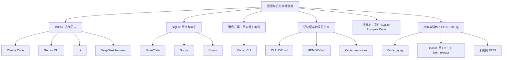
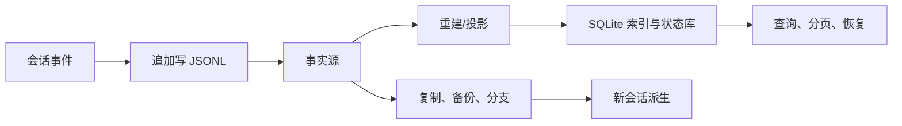
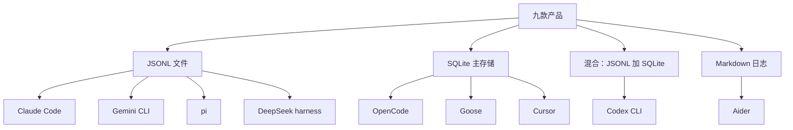
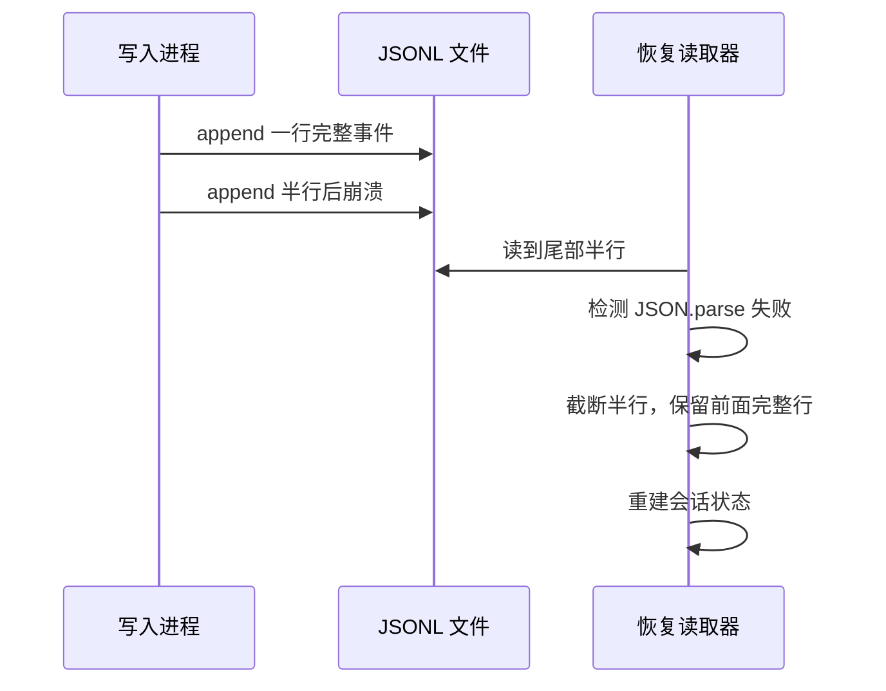
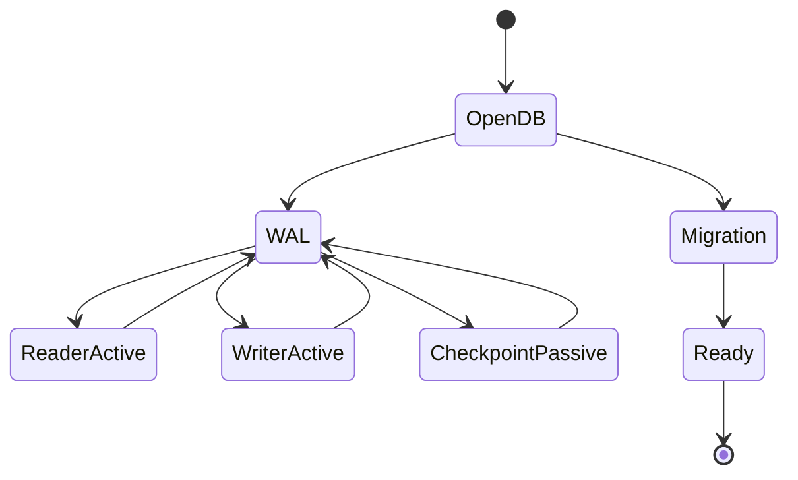
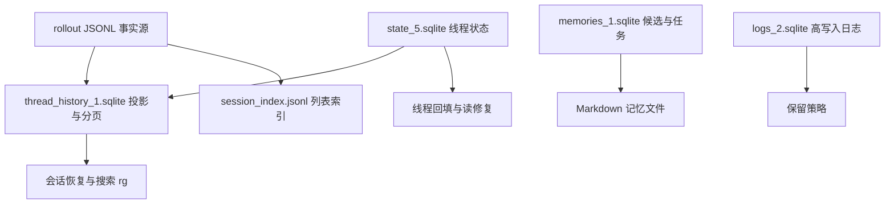
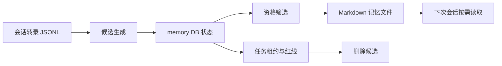
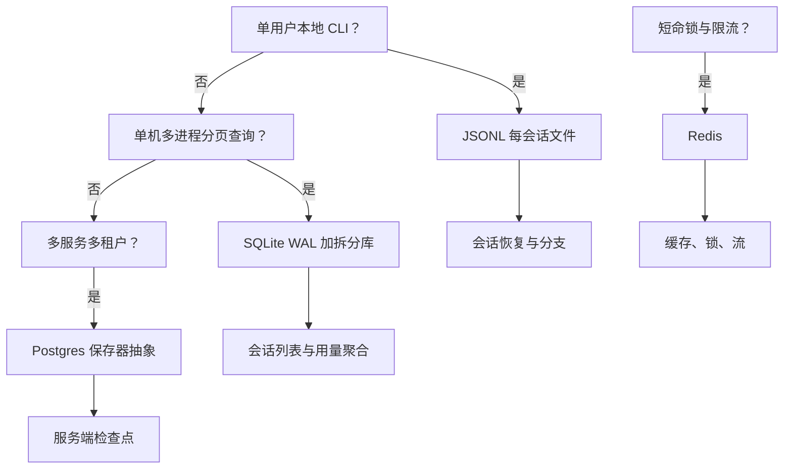

# 会话与记忆存储全景：JSONL、SQLite 与混合方案

!!! abstract "学完这一页你能"
    - 说出 Codex 为什么不是“用 SQLite 替代了 JSONL”，而是 JSONL 为事实源、SQLite 为镜像索引与状态库。
    - 区分 Claude Code、OpenCode、Goose、Cursor、Aider、Gemini CLI、pi、DeepSeek harness 的会话与记忆存储，并标出“资料未覆盖”的单元格。
    - 独立写出最小 JSONL 追加写与 SQLite WAL 事务的 Node 示例，并解释崩溃恢复要点。
    - 按访问模式选择文件、SQLite、Postgres 或 Redis，并能说明 FTS5 与 LIKE/json_extract 的实际使用差异。

## 0. 知识地图



建议先读第 1 节打破“替代关系”的误解，再读第 2 节看九款产品全景。第 3、4 节分别深入 JSONL 与 SQLite。第 5 节回到 Codex 混合方案。第 6 节讲记忆分层。第 7 节用决策树收口并纠正搜索相关误传。

## 1. 先打破误解：JSONL 与 SQLite 不是替代关系

**先想一个问题**
你看到 Codex 源码里既有 `rollout-*.jsonl`，又有 `thread_history_1.sqlite`，是不是觉得它“把 JSONL 换成了 SQLite”？如果换成 SQLite 是唯一答案，为什么 Claude Code、Gemini CLI、pi 还坚持只写 JSONL？

**心智模型**

!!! tip "心智模型"
    一句话模型：JSONL 是“难以篡改的流水账”，SQLite 是“可按条件快速翻账的索引册”。日常类比：银行先把每笔交易顺序写入原始流水文件，再另建数据库索引用于查询。类比不成立处：银行流水文件不是以后可任意改写的数据，而这里的 JSONL 本身才是可恢复会话的数据源，SQLite 索引丢了还能重建。

**图解**



1. 会话事件先追加写入 JSONL，这是事实源。
2. 后台把 JSONL 投影进 SQLite，形成索引与状态。
3. 查询和分页走 SQLite，复制和分支仍可从 JSONL 或其前缀派生。
4. SQLite 丢失可重建，JSONL 丢失不可恢复。

**一步一步来**

①这一步要做什么：写一个 Node 脚本，演示“先追加 JSONL，再重建出内存索引”。

```javascript
import { appendFileSync, readFileSync } from 'node:fs';

const log = '/tmp/session.jsonl';
// 追加一条会话事件，O_APPEND 由 appendFileSync 使用
appendFileSync(log, JSON.stringify({ seq: 1, type: 'user', text: '你好' }) + '\n');
appendFileSync(log, JSON.stringify({ seq: 2, type: 'assistant', text: '在的' }) + '\n');

// 从 JSONL 重建出简单的 seq -> text 索引
const rows = readFileSync(log, 'utf8').trim().split('\n')
  .map(line => JSON.parse(line));
const index = new Map(rows.map(r => [r.seq, r.text]));
console.log(index.get(2));
```

**这段代码在做什么**
- 用 `appendFileSync` 模拟追加写，避免覆盖已有内容。
- 每行一个 JSON 对象，符合 JSONL 约定。
- 重建逻辑只是最简单投影，真实产品会生成 SQLite 表。
- 这里没有锁，多进程同时追加会交错，这正是第 3 节要展开的坑。

运行结果：打印 `在的`。

**动手验证**

```javascript
import assert from 'node:assert/strict';
import { appendFileSync, readFileSync, rmSync } from 'node:fs';

const log = '/tmp/session-verify.jsonl';
rmSync(log, { force: true });
appendFileSync(log, JSON.stringify({ seq: 1, type: 'user', text: 'A' }) + '\n');
appendFileSync(log, JSON.stringify({ seq: 2, type: 'assistant', text: 'B' }) + '\n');
const rows = readFileSync(log, 'utf8').trim().split('\n').map(line => JSON.parse(line));
assert.equal(rows.length, 2);
assert.equal(rows[1].text, 'B');
console.log('ok: JSONL 追加写与读取一致');
```

预期输出：`ok: JSONL 追加写与读取一致`。无第三方依赖。

**常见坑**

| 现象 | 原因 | 怎么修 |
|---|---|---|
| 两个终端同时 `assert` 失败 | 多进程追加没有跨进程锁 | 每会话引入 writer_lock，或改用 SQLite 单写者 |
| 读到最后一行 JSON.parse 报错 | 崩溃留下半行 | 读端跳过或截断破损尾部 |
| 索引和 JSONL 不一致 | 索引是派生结构，回填失败 | 增加 backfill 状态与 read-repair |

**用在哪里**
- 业务背景：单机 CLI 的会话恢复。知识怎么用：保留 JSONL 作为事实源，按需重建索引。衡量指标：恢复成功率、启动时索引重建耗时。什么时候不该用：需要多进程高频跨会话查询的桌面端，仍只靠 JSONL 会让列表页扫描多个 GB 文件。
- 业务背景：日志审计与回溯。知识怎么用：追加写保证历史事件不可变，审计端按行扫描。衡量指标：审计覆盖率、故障回放时间。什么时候不该用：需要按用户 ID 或 token 用量做实时聚合，纯 JSONL 没有索引，查询过慢。

**行业实践**
- Codex 源码在 `search.rs` 用 `rg` 搜索 rollout，而不是 FTS5。怎么借鉴到你的项目：日志检索先考虑系统级 grep，等真实查询超过秒级再上索引。
- Claude Code 官方文档说明 JSONL 条目格式随版本变化。怎么借鉴到你的项目：提供导出 API，而不是让用户手工解析内部文件。
- DeepSeek harness 文档用格式版本与指纹拒绝未来格式。怎么借鉴到你的项目：读取文件时先读版本头，不认识就拒绝，不做猜测迁移。

**小结**
1. JSONL 是事实源，SQLite 是可重建索引，二者分层共存。
2. 如果 SQLite 索引损坏，可从 JSONL 回填；JSONL 丢失则无法恢复。
3. 多进程写 JSONL 必须额外加锁，否则行会交错。

## 2. 九款产品存储全景：谁存哪里

**先想一个问题**
产品列表里 Claude Code、OpenCode、Goose、Cursor 各有各的目录与文件。面试被问“Claude Code 用不用 SQLite”时，怎么给出有依据而不是猜的答案？

**心智模型**

!!! tip "心智模型"
    一句话模型：会话存储选择是产品访问模式的结果，不是某个技术的信仰。日常类比：记账可以用纸、Excel 或记账软件，关键看同一时间几个人查账。类比不成立处：记账软件通常不会把原始流水和索引拆成两种独立介质，而 Codex 会。

**图解**



1. 文件阵营包括 Claude Code、Gemini CLI、pi、DeepSeek harness。
2. SQLite 主存储阵营包括 OpenCode、Goose、Cursor。
3. Codex 单独属于混合阵营。
4. Aider 是 Markdown 日志，不构成可恢复会话状态的主存储。

**一步一步来**

①这一步要做什么：写一个 Node 脚本，打印常见产品存储位置的“探测结果”，示范如何区分“已验证”和“资料未覆盖”。

```javascript
const products = [
  ['claude', 'JSONL', '~/.claude/projects/<project>/<id>.jsonl', 'Claude Code 官方文档'],
  ['opencode', 'SQLite', 'opencode.db', 'OpenCode 源码（2026-10-06）'],
  ['goose', 'SQLite', 'sessions/sessions.db', 'Goose 源码（2026-10-06）'],
  ['codex', '混合', 'rollout-*.jsonl 加多个 sqlite', 'Codex 源码（2026-10-06）'],
  ['cursor', 'SQLite', 'state.vscdb', 'Cursor 论坛帖，需核对']
];

for (const [name, store, path, src] of products) {
  console.log(`${name}: ${store} -> ${path}（来源：${src}，以原文为准）`);
}
```

**这段代码在做什么**
- 用数组记录存储类型与路径来源，避免把未验证条目写成事实。
- Cursor 一行显式标出“需核对”，对应资料中的论坛来源而非官方文档。
- 名称与路径均来自调研资料，不新增未验证信息。
- 这种“来源标签”写法适合写技术文档，面试时也可以口头标注。

运行结果：打印五行，每行包含产品名、存储类型、路径与来源。

**动手验证**

```javascript
import assert from 'node:assert/strict';

const facts = [
  ['claude', 'JSONL'],
  ['opencode', 'SQLite'],
  ['goose', 'SQLite'],
  ['codex', '混合'],
  ['cursor', 'SQLite']
];
assert.equal(facts.filter(f => f[1] === 'SQLite').length, 3);
console.log('ok: 存储阵营数量与调研一致');
```

预期输出：`ok: 存储阵营数量与调研一致`。依赖：Node 20+。

**常见坑**

| 现象 | 原因 | 怎么修 |
|---|---|---|
| 把 Cursor 社区帖当成官方文档引用 | Cursor 是闭源，官方未公开完整存储格式 | 只写“资料未覆盖”或“论坛报告，需核对” |
| 说“Claude Code 用 SQLite” | 官方文档未提及 SQLite 存储 transcript | 改为“官方文档未提及，资料未覆盖” |
| 说“OpenCode 一直是 SQLite” | OpenCode 有旧 JSON 文件存储并迁移 | 说“从 JSON 文件迁移到 SQLite” |

**用在哪里**
- 业务背景：你接手一个多产品兼容的会话管理工具。知识怎么用：按各产品实际存储位置做导入器。衡量指标：识别准确率、导入成功率。什么时候不该用：只服务单一产品时，不需要维护九套适配器。
- 业务背景：面试官问“你为什么觉得 SQLite 不是唯一答案”。知识怎么用：列出文件阵营与 SQLite 阵营并存。衡量指标：回答是否给出来源。什么时候不该用：面试时间不足时，不必展开迁移细节。

**行业实践**
- OpenCode 源码显示旧 JSON 文件存储作为迁移源进入 SQLite。怎么借鉴：你的项目迁移时保留旧数据读取器，先测导入再删除旧格式。
- Goose 源码用 `BEGIN IMMEDIATE` 创建 schema，防止多进程首跑竞争。怎么借鉴：初始化数据库时用事务包裹 DDL 与版本行。
- LangGraph 官方文档提供 `SqliteSaver` 与 `PostgresSaver` 同一保存器接口。怎么借鉴：把后端切换藏在接口后，单进程用 SQLite，多租户换 Postgres。

**小结**
1. 文件阵营与 SQLite 阵营并存，Codex 是混合。
2. 引用产品存储细节时必须区分官方文档、源码、论坛与未验证。
3. Aider 的 Markdown 日志不是可恢复会话状态的主存储。

## 3. JSONL：追加写、崩溃恢复与树形分支

**先想一个问题**
会话写到一半进程被杀，最后一行可能只有半个 JSON。恢复时怎么保证“丢掉半行但不丢整条历史”？分支功能又要如何在不复制整个文件的情况下实现？

**心智模型**

!!! tip "心智模型"
    一句话模型：JSONL 恢复靠“容忍尾部破损”，分支靠“前缀引用”。日常类比：写日记本时最后一页可能被撕破，丢掉那一页，前面仍在；分支像在某一页夹上书签说“从这里抄一份”。类比不成立处：纸本不能同时保留多个平行分支并只给模型看一个活动分支，而 pi 的树形 JSONL 可以。

**图解**



1. 写入进程按顺序追加完整行。
2. 崩溃导致尾部出现半行。
3. 恢复读取器遇到 JSON.parse 失败后丢弃半行。
4. 完整行仍然可以重建会话。

**一步一步来**

①这一步要做什么：模拟一次尾部破损，然后做容错读取。

```javascript
import { writeFileSync, readFileSync } from 'node:fs';

const p = '/tmp/torn.jsonl';
// 模拟：完整两行后追半个对象
writeFileSync(p, '{"seq":1}\n{"seq":2}\n{"seq":3');
// 容错读取：只保留能解析的完整行
const lines = readFileSync(p, 'utf8').split('\n');
const ok = [];
for (const line of lines) {
  try { ok.push(JSON.parse(line)); } catch { break; }
}
console.log(ok.length);
```

**这段代码在做什么**
- 手动构造一个不完整的尾部行。
- 逐行解析，遇到失败立即停止。
- 保留已解析成功的整行。
- 该做法等价于丢弃破损尾部。真实实现会在下次追加前截断半行。

运行结果：打印 `2`。

②这一步要做什么：实现一个基于 `id` 与 `parentId` 的树形分支追加，方便理解 pi 的同一文件分支。

```javascript
const events = [];
function add(id, parentId, type, text) {
  events.push({ id, parentId, type, text });
}
add('n1', null, 'user', '开始');
add('n2', 'n1', 'assistant', '继续');
add('n3', 'n1', 'user', '切到分支B');
console.log(events.filter(e => e.parentId === 'n1').map(e => e.id).join(','));
```

**这段代码在做什么**
- 每个事件记录父节点 id。
- 可以从 `n1` 分出多个孩子，形成树而不是线性日志。
- 分支不复制已有行，只是追加新节点并指向旧节点。
- 这种结构与 pi 文档描述的 `id`/`parentId` 树一致。

运行结果：打印 `n2,n3`。

**动手验证**

```javascript
import assert from 'node:assert/strict';
import { writeFileSync, readFileSync } from 'node:fs';

const p = '/tmp/torn-verify.jsonl';
writeFileSync(p, '{"seq":1}\n{"seq":2}\n{"seq":3');
const ok = readFileSync(p, 'utf8').split('\n')
  .map(line => { try { return JSON.parse(line); } catch { return null; } })
  .filter(x => x !== null);
assert.equal(ok.length, 2);
console.log('ok: 破损尾部不影响前面完整行');
```

预期输出：`ok: 破损尾部不影响前面完整行`。依赖：Node 20+。

**常见坑**

| 现象 | 原因 | 怎么修 |
|---|---|---|
| 恢复时重新解析到半行报错 | 未做容错读取 | 截断破损尾部后再解析 |
| 两个终端写同一个 id 文件 | append-only 无跨进程锁 | 引入 writer_lock 或改用单写者 |
| 文件版本变旧后无法读取 | 无版本头 | 头部加 version，只做显式迁移 |

**用在哪里**
- 业务背景：本地 CLI 的会话恢复。知识怎么用：启动时检测尾部半行，安全丢弃并继续。衡量指标：崩溃恢复成功率、启动耗时。什么时候不该用：需要频繁跨会话分页查询，不要只靠 JSONL 顺序扫。
- 业务背景：会话分支的交互设计。知识怎么用：用 `parentId` 树形节点实现同一文件分支，避免整段复制。衡量指标：分支创建延迟、存储空间增长。什么时候不该用：模型需要看到合并后的全局历史时，纯树形分支会让活动分支选择变复杂。

**行业实践**
- DeepSeek harness 文档写“checksummed concatenated Zstandard frames”和“torn-tail truncation”。怎么借鉴：冷日志压缩时加校验和，恢复时先截断尾部。
- pi 本地文档写 v3 头部携带格式版本，旧格式加载时显式迁移。怎么借鉴：永远写版本号，不隐式猜格式。
- Claude Code 官方文档提到未调试时在两条终端恢复同一会话会交错写入。怎么借鉴：文档明确警告多终端并写，不如加单写者锁。

**小结**
1. JSONL 恢复必须能容忍破损尾部。
2. 树形分支用 `id` 与 `parentId`，不复制已有行。
3. 版本头与显式迁移是长期维护的关键。

## 4. SQLite：WAL、事务、迁移与分库

**先想一个问题**
会话列表要跨几百万条消息分页，还要记录 token 用量和父子会话关系。只靠 JSONL 扫描已经太慢，SQLite 怎么解决“读不阻塞写、首跑不竞争、迁移不炸库”？

**心智模型**

!!! tip "心智模型"
    一句话模型：SQLite 在一个文件里提供事务与索引，但只有一个写者。日常类比：前台一本总账，多个人可以同时翻，但同一时间只有一个人能下笔。类比不成立处：真正多人同时写账时，单文件 SQLite 会撞 `busy_timeout`，这正是不该上网络文件系统的原因。

**图解**



1. 打开数据库时设置 WAL 与 `busy_timeout`。
2. 读者与写者可同时进行，但写者仍只有一个。
3. 空闲时执行 `wal_checkpoint(PASSIVE)` 回收 WAL。
4. 初始化阶段先跑迁移，再进入就绪状态。

**一步一步来**

①这一步要做什么：用 Node 内置 SQLite 分支数据库模块前先说明它来自 Node 20 实验特性。用这个 API 打开 WAL、建表并插入会话。

```javascript
import { DatabaseSync } from 'node:sqlite';
const db = new DatabaseSync('/tmp/agent.db');
db.exec('PRAGMA journal_mode = WAL');
db.exec('PRAGMA synchronous = NORMAL');
db.exec('PRAGMA busy_timeout = 5000');
db.exec(`CREATE TABLE IF NOT EXISTS sessions(
  id TEXT PRIMARY KEY,
  created_at INTEGER
)`);
db.prepare('INSERT OR IGNORE INTO sessions VALUES (?, ?)').run('s1', 0);
```

**这段代码在做什么**
- `DatabaseSync` 是 Node 20 内置 SQLite API。
- 打开 WAL 让读不阻塞写。
- `busy_timeout = 5000` 存毫秒级等待，避免立刻报 `SQLITE_BUSY`。
- `INSERT OR IGNORE` 保证幂等初始化。

运行结果：无输出，成功创建 `/tmp/agent.db`。

②这一步要做什么：用事务包裹 schema 初始化，模仿 Goose 源码中的 `BEGIN IMMEDIATE` 防首跑竞争。

```javascript
db.exec('BEGIN IMMEDIATE');
db.exec(`CREATE TABLE IF NOT EXISTS schema_version(version INTEGER)`);
db.exec(`INSERT OR IGNORE INTO schema_version VALUES (16)`);
db.exec('COMMIT');
```

**这段代码在做什么**
- `BEGIN IMMEDIATE` 在事务开始时获取写锁，串行化多进程初始化。
- `IF NOT EXISTS` 与 `INSERT OR IGNORE` 双保险。
- 避免先检查再创建产生的“table already exists”竞争。
- 与 Goose 源码的 schema 创建方式一致。

**动手验证**

```javascript
import assert from 'node:assert/strict';
import { DatabaseSync } from 'node:sqlite';
import { rmSync } from 'node:fs';

const p = '/tmp/agent-verify.db';
rmSync(p, { force: true });
const db = new DatabaseSync(p);
db.exec('BEGIN IMMEDIATE');
db.exec('CREATE TABLE IF NOT EXISTS schema_version(version INTEGER)');
db.exec('INSERT OR IGNORE INTO schema_version VALUES (16)');
db.exec('COMMIT');
const row = db.prepare('SELECT version FROM schema_version').get();
assert.equal(row.version, 16);
console.log('ok: 事务内初始化与版本行一致');
db.close();
```

预期输出：`ok: 事务内初始化与版本行一致`。依赖：Node 20+，使用 `node:sqlite`。

**常见坑**

| 现象 | 原因 | 怎么修 |
|---|---|---|
| 多进程首跑报 `table already exists` | check-then-create 竞争 | 用 `BEGIN IMMEDIATE` 加幂等 DDL |
| 网络盘上 WAL 异常 | WAL 不支持网络文件系统 | 本地盘或换 Postgres |
| 每次打开都执行 `journal_mode=WAL` 引发竞争 | 连接池内重复 PRAGMA | 只执行一次或拆出初始化路径 |

**用在哪里**
- 业务背景：桌面端会话列表与用量统计。知识怎么用：SQLite 索引支持分页与聚合。衡量指标：首页查询延迟、索引大小。什么时候不该用：多个服务实例共享同一网络盘，单文件 SQLite 会撞锁。
- 业务背景：CLI 的跨进程 session 恢复。知识怎么用：WAL 加 `busy_timeout` 支持 CLI 与后台进程并发读。衡量指标：锁等待次数、恢复失败率。什么时候不该用：单用户纯追加日志，直接 JSONL 更易调试。

**行业实践**
- OpenCode 源码设置 `PRAGMA journal_mode = WAL`、`synchronous = NORMAL`、`busy_timeout = 5000`。怎么借鉴：新项目粘贴这三行并放进初始化函数。
- Goose 源码注释解释 schema 创建跑 `BEGIN IMMEDIATE` 是为了“SQLite serializes writers across processes”。怎么借鉴：把首跑初始化当成并发场景处理。
- LangGraph 官方文档建议 `thread_id` 小于 255 字符，避免 Postgres 列溢出。怎么借鉴：对外 API 校验 `thread_id` 长度。

**小结**
1. WAL 允许读与写同时进行，但同一时间只有一个写者。
2. 迁移和初始化要幂等，并用 `BEGIN IMMEDIATE` 串行化。
3. 不要在网络文件系统上使用 WAL。

## 5. Codex 混合方案：事实源、镜像与状态库逐个看

**先想一个问题**
Codex 会话目录里既有 JSONL 又有多个 `.sqlite` 文件。为什么不能都塞进一个 SQLite？日志、线程状态、记忆候选为什么要分开？

**心智模型**

!!! tip "心智模型"
    一句话模型：事实源负责“不能丢”，索引负责“查得快”，状态库负责“中间态”。日常类比：出版社同时保存原稿、检索卡片和审稿进度表。类比不成立处：出版社原稿和卡片通常不同步更新，Codex 需要后台回填用状态机保证一致。

**图解**



1. rollout JSONL 是所有会话的事实源。
2. `thread_history_1.sqlite` 是投影，用于分页与恢复。
3. `state_5.sqlite` 保存线程状态，配合 backfill 与 read-repair。
4. `memories_1.sqlite` 保存记忆候选与任务租约，最终产物是 Markdown。
5. `logs_2.sqlite` 承接高写入日志，避免阻塞线程状态库。

**一步一步来**

①这一步要做什么：展示如何从 JSONL 投影出一张 SQLite 分页表。

```javascript
import { DatabaseSync } from 'node:sqlite';
import { rmSync } from 'node:fs';

rmSync('/tmp/proj.db', { force: true });
const db = new DatabaseSync('/tmp/proj.db');
db.exec('CREATE TABLE thread_items(thread_id TEXT, seq INTEGER, text TEXT)');
const insert = db.prepare('INSERT INTO thread_items VALUES (?, ?, ?)');
insert.run('t1', 1, 'user-a');
insert.run('t1', 2, 'assistant-b');
insert.run('t1', 3, 'user-c');
// 按 seq 分页，只取后两条
const rows = db.prepare('SELECT seq, text FROM thread_items WHERE thread_id = ? ORDER BY seq DESC LIMIT 2').all('t1');
console.log(rows[0].text);
```

**这段代码在做什么**
- 用 `thread_items` 模拟 Codex 的投影表。
- 数据可由 JSONL 重建，这里直接插入代替回填。
- 查询按 `thread_id` 与 `seq` 取最近两条，避免读完整份 JSONL。
- 该表属于派生结构，丢失后可重建。

运行结果：打印 `assistant-b`。

②这一步要做什么：区分“高写入日志库”和“线程状态库”，模拟分库写。

```javascript
const stateDb = new DatabaseSync('/tmp/state.db');
const logsDb = new DatabaseSync('/tmp/logs.db');
stateDb.exec('CREATE TABLE threads(id TEXT PRIMARY KEY)');
logsDb.exec('CREATE TABLE logs(ts INTEGER, msg TEXT)');
stateDb.prepare('INSERT OR REPLACE INTO threads VALUES (?)').run('t1');
for (let i = 0; i < 3; i++) logsDb.prepare('INSERT INTO logs VALUES (?, ?)').run(Date.now(), 'noise');
console.log(stateDb.prepare('SELECT COUNT(*) AS c FROM threads').get().c);
console.log(logsDb.prepare('SELECT COUNT(*) AS c FROM logs').get().c);
```

**这段代码在做什么**
- 两个独立数据库文件，写噪声日志不阻塞线程状态。
- 与 Codex 将高 churn 日志拆成单独 DB 的设计对齐。
- 可以为 logs 库设置独立保留策略。
- 不需要在代码里维护跨表事务。

运行结果：第一行 `1`，第二行 `3`。

**动手验证**

```javascript
import assert from 'node:assert/strict';
import { DatabaseSync } from 'node:sqlite';
import { rmSync } from 'node:fs';

rmSync('/tmp/hybrid.db', { force: true });
const db = new DatabaseSync('/tmp/hybrid.db');
db.exec('CREATE TABLE thread_items(thread_id TEXT, seq INTEGER, text TEXT)');
const insert = db.prepare('INSERT INTO thread_items VALUES (?, ?, ?)');
insert.run('t1', 1, 'a');
insert.run('t1', 2, 'b');
insert.run('t1', 3, 'c');
const page = db.prepare('SELECT seq FROM thread_items WHERE thread_id = ? ORDER BY seq DESC LIMIT 2').all('t1');
assert.deepEqual(page.map(r => r.seq), [3, 2]);
console.log('ok: 分页投影与 JSONL 重建思路一致');
db.close();
```

预期输出：`ok: 分页投影与 JSONL 重建思路一致`。依赖：Node 20+。

**常见坑**

| 现象 | 原因 | 怎么修 |
|---|---|---|
| 日志库写满拖慢线程状态 | 同一 DB 文件锁竞争 | 高写入日志拆库，保留周期独立 |
| 索引里存绝对路径首页目录迁移后失效 | 路径未按相对路径解析 | 存相对路径，或启动时重新解析 |
| 回填失败后脏索引 | 无读修复 | 每次读取校验索引与事实源一致 |

**用在哪里**
- 业务背景：构建生产级 coding agent 的会话恢复层。知识怎么用：JSONL 为事实源，SQLite 为投影。衡量指标：恢复耗时、事实源损坏恢复能力。什么时候不该用：只做单机 demo，不需要复杂投影，直接 JSONL 足够。
- 业务背景：多个 UI 端共享同一个 home 目录的状态。知识怎么用：线程状态库集中，日志库拆开避免影响 UI 查询。衡量指标：UI 列表加载时间、日志写入延迟。什么时候不该用：部署在 NFS 共享盘上，SQLite WAL 会异常。

**行业实践**
- Codex 源码显示 `auto_vacuum = INCREMENTAL` 只在空库上设置，并运行回收 worker。怎么借鉴：初始化阶段设置该 PRAGMA，后续避免在已填充库上切换。
- Codex 源码 pin SQLite >= 3.51.3 以获 WAL-reset 修复，并跑 `quick_check` 预算 100 ms。怎么借鉴：写启动健康检查，限制 `quick_check` 耗时。
- Codex 源码包含 `writer_lock.rs` 作为每会话跨进程写锁。怎么借鉴：包装所有 JSONL 追加路径，不信任单进程模型。

**小结**
1. Codex 是“JSONL 事实源 + 多个 SQLite 镜像与状态库”的混合方案。
2. 高写入日志要拆库，避免单写者阻塞线程状态。
3. 索引是派生结构，必要时可回填重建。

## 6. 记忆层与转录层分离：从候选到 Markdown

**先想一个问题**
会话转录已经很大，为什么还要单独存记忆？直接把所有历史都喂给模型不就行了？如果模型自己写笔记，怎么防止它把污染内容写进长期记忆？

**心智模型**

!!! tip "心智模型"
    一句话模型：转录是“流水账”，记忆是“以后每次都要看的口袋卡”。日常类比：会议全程录音不删，但每次开会前只看一页纪要。类比不成立处：录音能原样回放，而 agent 记忆不是原文，是从转录中提炼出的候选，需要被资格审查。

**图解**



1. 从转录生成候选记忆，先落入 DB 行。
2. DB 行承担状态协调、租约与红线计数。
3. 资格筛选通过后才写入 Markdown 文件。
4. 下次会话只读取 Markdown 索引或主题文件，不直接回放转录。

**一步一步来**

①这一步要做什么：定义候选记忆表，模拟“先池子后产物”。

```javascript
import { DatabaseSync } from 'node:sqlite';
import { rmSync } from 'node:fs';

rmSync('/tmp/mem.db', { force: true });
const db = new DatabaseSync('/tmp/mem.db');
db.exec('CREATE TABLE stage1_outputs(id INTEGER PRIMARY KEY, text TEXT, status TEXT)');
db.prepare('INSERT INTO stage1_outputs(text, status) VALUES (?, ?)').run('用户喜欢 pnpm', 'candidate');
db.prepare('INSERT INTO stage1_outputs(text, status) VALUES (?, ?)').run('外部网页内容片段', 'polluted');
db.prepare('DELETE FROM stage1_outputs WHERE status = ?').run('polluted');
```

**这段代码在做什么**
- 候选先进入 DB 表，带有状态列。
- “外部网页内容片段”被标为 polluted 并删除。
- 最后只剩通过筛选的候选，可写入 Markdown。
- 这个流程把“状态协调”与“模型可读产物”分开。

**动手验证**

```javascript
import assert from 'node:assert/strict';
import { DatabaseSync } from 'node:sqlite';
import { rmSync } from 'node:fs';

rmSync('/tmp/mem-verify.db', { force: true });
const db = new DatabaseSync('/tmp/mem-verify.db');
db.exec('CREATE TABLE stage1_outputs(id INTEGER PRIMARY KEY, text TEXT, status TEXT)');
db.prepare('INSERT INTO stage1_outputs(text, status) VALUES (?, ?)').run('用户偏好', 'candidate');
db.prepare('INSERT INTO stage1_outputs(text, status) VALUES (?, ?)').run('广告文本', 'polluted');
db.prepare('DELETE FROM stage1_outputs WHERE status = ?').run('polluted');
const row = db.prepare('SELECT text FROM stage1_outputs').get();
assert.equal(row.text, '用户偏好');
console.log('ok: 污染候选未进入长期记忆');
db.close();
```

预期输出：`ok: 污染候选未进入长期记忆`。依赖：Node 20+。

**常见坑**

| 现象 | 原因 | 怎么修 |
|---|---|---|
| 污染内容进入长期记忆 | 未在候选阶段打标 | 增加来源标记，外链内容标 polluted |
| MEMORY.md 过大每次读取超限 | 索引未限制行数或大小 | 只加载前 200 行或前 25KB |
| 记忆文件写失败后 DB 已删候选 | 先删后写 | 先写文件，再更新 DB 状态 |

**用在哪里**
- 业务背景：coding agent 的用户偏好记忆。知识怎么用：DB 做候选池，Markdown 做长期产物。衡量指标：下次会话偏好命中率、污染率。什么时候不该用：临时项目指令不要进长期记忆，直接放 CLAUDE.md 或 AGENTS.md。
- 业务背景：多轮 agent 任务里的中间产物回收。知识怎么用：任务租约存 DB，产物存文件。衡量指标：租约超时率、重复计算次数。什么时候不该用：无并发的单次 agent，不需要租约层。

**行业实践**
- Claude Code 官方文档写自动记忆 `MEMORY.md` 前 200 行或 25KB 先加载，主题文件按需读取。怎么借鉴：把记忆索引限制在固定预算内，避免启动膨胀。
- Codex 源码显示记忆候选通过 DB 行与 job 租约协调，并含 secret redaction。怎么借鉴：涉及密钥的候选在写文件前脱敏。
- LangGraph 官方文档把短期 thread 状态与长期跨线程 Store 分两个概念。怎么借鉴：API 设计时不要把转录与长期记忆放在同一张表。

**小结**
1. 记忆层与转化层分离，候选先池子后产物。
2. 索引预算和污染标记是长期记忆的两道闸。
3. DB 负责协调，文件负责给模型读与人审。

## 7. 决策树与选型：文件、SQLite、Postgres、Redis，以及搜索误传

**先想一个问题**
现在要为新 agent 项目选存储，面试官问：什么时候用 JSONL、什么时候用 SQLite、什么时候上 Postgres 或 Redis？你还要说明“Codex 有没有用 FTS5 做会话搜索”。

**心智模型**

!!! tip "心智模型"
    一句话模型：选型按访问模式、并发规模与部署位置决定，不是“越数据库越专业”。日常类比：一个人写日记用本子，家庭记账用 Excel，公司财务多并任用服务器数据库。类比不成立处：这个领域里 SQLite 单写者限制让“家庭记账”和“公司财务”没有绝对优劣，得看是否多进程、多租户。

**图解**



1. 单用户本地 CLI 优先 JSONL，恢复与分支简单。
2. 单机多进程、多 UI 端共用时上 SQLite，开 WAL。
3. 多服务多租户走 Postgres，保持保存器接口抽象。
4. 短命状态如锁、限流、缓存用 Redis。系统记录仍需持久化。

**一步一步来**

①这一步要做什么：写一个返回选型建议的函数，演示按访问模式分支。

```javascript
function chooseStore({ users, processes, tenants }) {
  if (users === 'single-local') return 'JSONL';
  if (tenants > 1) return 'Postgres 保存器';
  if (processes > 1) return 'SQLite WAL 加拆分库';
  return 'JSONL';
}
console.log(chooseStore({ users: 'single-local', processes: 1, tenants: 1 }));
console.log(chooseStore({ users: 'multi-ui', processes: 4, tenants: 1 }));
console.log(chooseStore({ users: 'server', processes: 8, tenants: 20 }));
```

**这段代码在做什么**
- 用分支函数固化决策顺序。
- 单租户多 UI 但多进程走 SQLite。
- 多租户服务端走 Postgres 保存器。
- Redis 不参与持久化主存储，只作缓存锁。

运行结果：依次打印 `JSONL`、`SQLite WAL 加拆分库`、`Postgres 保存器`。

②这一步要做什么：写搜索方案对比表数据，固定“Codex 用 rg、Goose 用 LIKE 加 json_extract、未见到 FTS5”。

```javascript
const searchFacts = [
  ['Codex', 'rg over rollouts'],
  ['Goose', 'LOWER(json_extract(...)) LIKE'],
  ['FTS5', '资料未覆盖为产品默认']
];
for (const [p, m] of searchFacts) console.log(`${p}: ${m}`);
```

**这段代码在做什么**
- 将搜索实现写入可核验的数据。
- Codex 条目依据源码中出现 `rg` 的 `search.rs`。
- Goose 条目依据 `chat_history_search.rs` 中的 `json_extract` 与 `LIKE`。
- FTS5 写成“未覆盖为产品默认”，指调研未见到这些产品出厂启用了 FTS5。

运行结果：三行，顺序为 Codex、Goose、FTS5。

**动手验证**

```javascript
import assert from 'node:assert/strict';

function chooseStore({ users, processes, tenants }) {
  if (users === 'single-local') return 'JSONL';
  if (tenants > 1) return 'Postgres 保存器';
  if (processes > 1) return 'SQLite WAL 加拆分库';
  return 'JSONL';
}
assert.equal(chooseStore({ users: 'single-local', processes: 1, tenants: 1 }), 'JSONL');
assert.equal(chooseStore({ users: 'multi-ui', processes: 4, tenants: 1 }), 'SQLite WAL 加拆分库');
assert.equal(chooseStore({ users: 'server', processes: 8, tenants: 20 }), 'Postgres 保存器');
console.log('ok: 选型路线符合访问模式');
```

预期输出：`ok: 选型路线符合访问模式`。依赖：Node 20+。

**常见坑**

| 现象 | 原因 | 怎么修 |
|---|---|---|
| 以为生产环境一定用 Redis 存会话 | Redis 有持久化配置但不是系统记录首选 | 系统记录用 Postgres/JSONL，Redis 只做缓存 |
| 以为 Codex 用 FTS5 搜索历史 | Codex 会话搜索走 `rg`，未见到 FTS5 | 对外回答“未见到 FTS5，搜索为 rg” |
| 以为 Goose 用 FTS5 | `chat_history_search.rs` 用 LIKE 加 json_extract | 回答“LIKE 加 json_extract，无 FTS5” |

**用在哪里**
- 业务背景：规划新 agent 存储架构。知识怎么用：先判断用户与租户规模，再做选型。衡量指标：选型评审是否可复现。什么时候不该用：过早优化为 Postgres，单机本地开发用 SQLite 更快。
- 业务背景：搜索历史功能改造。知识怎么用：先确认现有产品是 `rg` 还是 LIKE，不要默认 FTS5。衡量指标：搜索延迟、结果相关性。什么时候不该用：数据量不足 GB 级，直接 `rg` 或 grep 成本更低。

**行业实践**
- SQLite 官方文档指出 WAL 只能有一个写者，且不支持网络文件系统。怎么借鉴：部署前检查磁盘类型与并发写人数。
- LangGraph 官方文档提供 `PostgresSaver` 并建议保留与 pruning。怎么借鉴：服务端落地时把 pruning 写进任务。
- Codex 源码中出现 `rg` 搜索 rollouts，未见 FTS5。怎么借鉴：先测量真实检索延迟，再决定是否加 FTS5。

**小结**
1. 按访问模式选型：单用户用文件，单机多进程用 SQLite，多租户用 Postgres。
2. Redis 用于缓存、锁、限流与流，不是默认系统记录。
3. 会话搜索中 Codex 用 rg，Goose 用 LIKE 加 json_extract，未见到 FTS5。

## 应用地图

| 场景 | 用到本页哪个知识点 | 典型技术选型 | 注意事项 |
|---|---|---|---|
| 单机 CLI 会话恢复 | JSONL 追加写与破损尾部处理 | JSONL | 加每会话写锁，防止多终端交错 |
| 多 UI 端会话列表 | SQLite 索引分页 | SQLite WAL | 高写入日志拆库，避开网络盘 |
| 多租户在线 agent | Postgres 保存器抽象 | Postgres | 控制 thread_id 长度，配置 pruning |
| 短命锁与限流 | Redis 缓存与锁 | Redis | 不做持久化系统记录 |
| 会话分支与 fock | 前缀引用或树形 parentId | JSONL 树或 SQLite parent_id | 不复制整段历史，保留原始顶点 |
| 长期记忆与偏好 | 记忆层与转录层分离 | Markdown 加 DB 候选池 | 限制索引预算，过滤污染内容 |
| 历史搜索 | rg 或 LIKE/json_extract | 先系统 grep，有需要再 FTS5 | 验证当前产品是否已有 FTS5 |

## 动手作业

**目标**：实现一个最小 hybrid 会话存储原型。

**步骤**：
1. 用 Node 20 新建项目，实现 `appendEvent(sessionId, event)` 写入 `sessions/<sessionId>.jsonl`。
2. 实现容错读取 `readEvents(sessionId)`，能丢弃尾部半行。
3. 用 `node:sqlite` 建 `thread_items` 表，从 JSONL 投影写入索引。
4. 实现 `page(sessionId, limit)` 从 SQLite 分页查询。
5. 加入 `node:assert` 断言：追加两个事件后分页能取到最新一条，破损尾部不影响前面完整行。

**验收标准**：
- 运行 `node index.js` 输出 `ok: hybrid storage works`。
- 删除 SQLite 文件后，能仅从 JSONL 重建出相同查询结果。
- 每个关键行有中文注释。

## 综合对比

| 维度 | JSONL 文件 | SQLite 主存储 | Codex 混合 | Postgres/Redis |
|---|---|---|---|---|
| 事实源 | 是 | 是 | JSONL 为事实源 | Postgres 持久化表 |
| 查询方式 | 顺序扫描或 rg | 索引分页 | 先 SQLite 索引后 JSONL 复制 | SQL 查询与缓存 |
| 并发写 | 需外部锁 | 单一写者 | 单写者加 writer_lock | 多写者 |
| 崩溃恢复 | 丢弃尾部半行 | WAL 回放 | 复用 JSONL 并重建索引 | 依赖数据库事务 |
| 迁移 | 需版本头 | 编号迁移 | 混合版本容忍 | 数据库迁移工具 |
| 典型场景 | 单用户 CLI | 多 UI 单机 | 生产级 CLI/agent | 服务端多租户 |

## 深入阅读与参考

!!! tip "怎么用这些资料"
    先读「官方文档与规范」建立准确的概念，再读「源码与示例」核对细节，最后用「教程、书籍与视频」换一种讲法加深理解。每条都写明了读哪一节、带着什么问题读。

### 官方文档与规范

| 资源 | 为什么读 | 怎么读 |
|---|---|---|
| [Qdrant 自家基准(2024 年更新,对比 Qdrant/Elasticsearch/Milvus/Redis/Weaviate,1M~ (qdrant.tech)](https://qdrant.tech/benchmarks/) | 看清厂商自测基准的口径与局限，避免被单一排名带偏。 | 读测试方法与硬件配置两节，标注哪些条件在你的场景不成立，再决定是否自测。 |
| [JSONL](https://bun.sh/docs/runtime/jsonl) | 定义 JSONL 的追加写与逐行解析约定，是会话转录的基准。 | 读格式与读写小节，带着“半行写入怎么办”的问题，再写一个逐行解析脚本。 |
| [Markdown](https://bun.sh/docs/runtime/markdown) | 说明记忆层为何落地为 Markdown，以及渲染与加载边界。 | 看解析与加载小节，读后为记忆目录写一份读写与安全约定。 |
| [SQLite](https://bun.sh/docs/runtime/sqlite) | 讲清 SQLite 的适用场景与并发限制，决定何时值得上。 | 读事务、WAL 与迁移小节，对照自己的表结构确认索引与 busy_timeout 设置。 |
| [Redis](https://bun.sh/docs/runtime/redis) | 明确 Redis 只适合放易失状态，不能当会话事实源。 | 读数据类型与持久化小节，为每类会话状态标注可否丢失，再定过期策略。 |

### 源码与示例

| 资源 | 为什么读 | 怎么读 |
|---|---|---|
| [README 当前版本 0.8.7,支持 Postgres 13+。升级: `ALTER EXTENSION vector UPDATE;` (github.com)](https://github.com/pgvector/pgvector) | 一页讲清扩展安装、版本升级与索引建法，可整段照抄。 | 读安装与索引示例，亲手跑一次 ALTER EXTENSION vector UPDATE 并验证版本。 |
| [Tokio 教程](https://tokio.rs/tokio/tutorial) | 亲手实现一个迷你存储，才能体会内存库与文件库的取舍。 | 跟做迷你 Redis 教程，重点看并发与持久化部分，对照本页选型表复盘。 |

### 教程、书籍与视频

| 资源 | 为什么读 | 怎么读 |
|---|---|---|
| [Markdown image exfiltration: an attacker makes the chat render an imag (simonwillison.net)](https://simonwillison.net/tags/markdown-exfiltration) | 用一个具体攻击说明 Markdown 渲染会外带数据，直指记忆层风险。 | 读完攻击链后，检查自己渲染记忆 Markdown 时是否禁用了外链图片与自动加载。 |
| [Redis Learn](https://redis.io/learn) | 官方互动课程用缓存与会话例子讲清 Redis 适合存什么。 | 做缓存与会话两节，完成后回答：哪些状态丢了可以重建，哪些不行。 |

## 自测题

??? question "1. Claude Code 是否使用 SQLite 存储 transcript？"
    答案要点：官方文档只写 JSONL 存储于 `~/.claude/projects/<project>/<id>.jsonl`。文档未提及 SQLite transcript 存储，资料未覆盖该说法。继续查官方 sessions/memory 文档可确认。

??? question "2. OpenCode 是何时从 JSON 文件迁移到 SQLite 的？"
    答案要点：源码中旧 JSON 文件存储作为迁移源，当前主存储是 `opencode.db` 中的 Drizzle 表。迁移方向从源码可校验，但发生迁移的具体版本资料未覆盖，需核对官方文档或变更记录。

??? question "3. Goose 的会话搜索用了 FTS5 吗？"
    答案要点：没有。`chat_history_search.rs` 使用 `LOWER(json_extract(content.value, '$.text')) LIKE ?` 对 `content_json` 做模糊匹配。没有 FTS5 表。

??? question "4. Codex 的 JSONL 与 SQLite 是什么关系？"
    答案要点：JSONL rollout 是事实源，SQLite 是镜像、索引与状态库。`thread_history_1.sqlite` 投影分页，`state_5.sqlite` 保存线程状态，`memories_1.sqlite` 管理记忆候选，`logs_2.sqlite` 承接高写入日志。索引丢失可重建，JSONL 丢失不可恢复。

??? question "5. 两个终端同时恢复同一个 Claude Code 会话会怎样？"
    答案要点：官方文档写两家终端的消息会交错进同一个 transcript。因为没有跨进程锁语义，追加写不阻止交错。真实项目要用 writer_lock 或单写者。

??? question "6. JSONL 恢复时半行怎么处理？"
    答案要点：读取器逐行解析，遇 JSON.parse 失败则丢弃尾部半行。下次追加前先截断破损尾部。DeepSeek harness 文档称其为 torn-tail truncation。

??? question "7. 什么时候用 Postgres 而不是共享 SQLite 文件？"
    答案要点：多服务、多租户、需要多写者时用 Postgres 保存器抽象。SQLite 是单写者，且 WAL 不支持网络文件系统。LangGraph 文档提供 PostgresSaver 并建议 pruning。

??? question "8. Cursor 的 `state.vscdb` 为什么可能膨胀？"
    答案要点：论坛报告显示 key-value blob 行缺少 GC，可能从 3.1 GB 涨到 97 GB。原因是 `agentKv:blob`、`bubbleId` 等键积累而无保留策略。修复靠 `Developer: Delete Old Chats...` 与 GC 命令，自动清理当时还在处理中，需以原帖为准。

## 延伸阅读

- SQLite 官方文档：Write-Ahead Logging、PRAGMA journal_mode、Database File Format
- Node.js 官方文档：`node:sqlite` 的 `DatabaseSync`
- Claude Code 官方文档：Sessions、Checkpointing、Memory 章节
- OpenCode GitHub 仓库：`packages/core/src/database/database.ts` 与 `packages/core/src/session/sql.ts`
- Goose GitHub 仓库：`crates/goose/src/session/session_manager.rs`
- LangGraph 官方文档：Persistence 的 Checkpointers 与 Stores 章节
- DeepSeek harness 文档：`docs/subsystems/persistence.md` 与 `docs/persistence-catalog.md`
