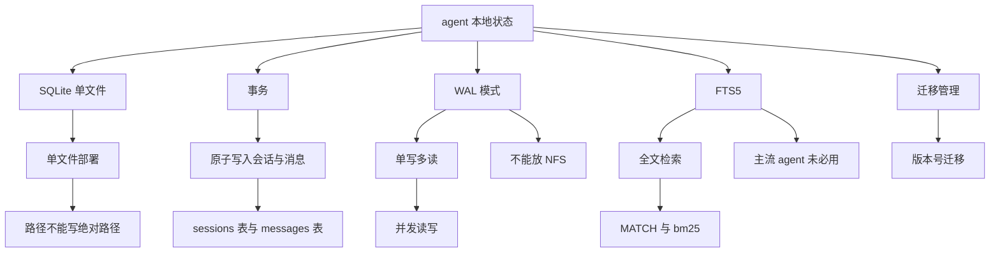
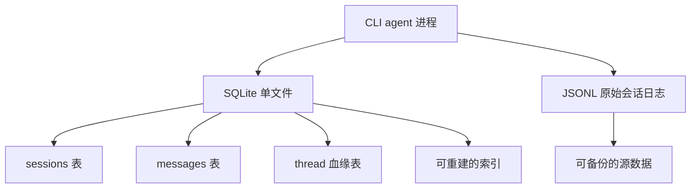
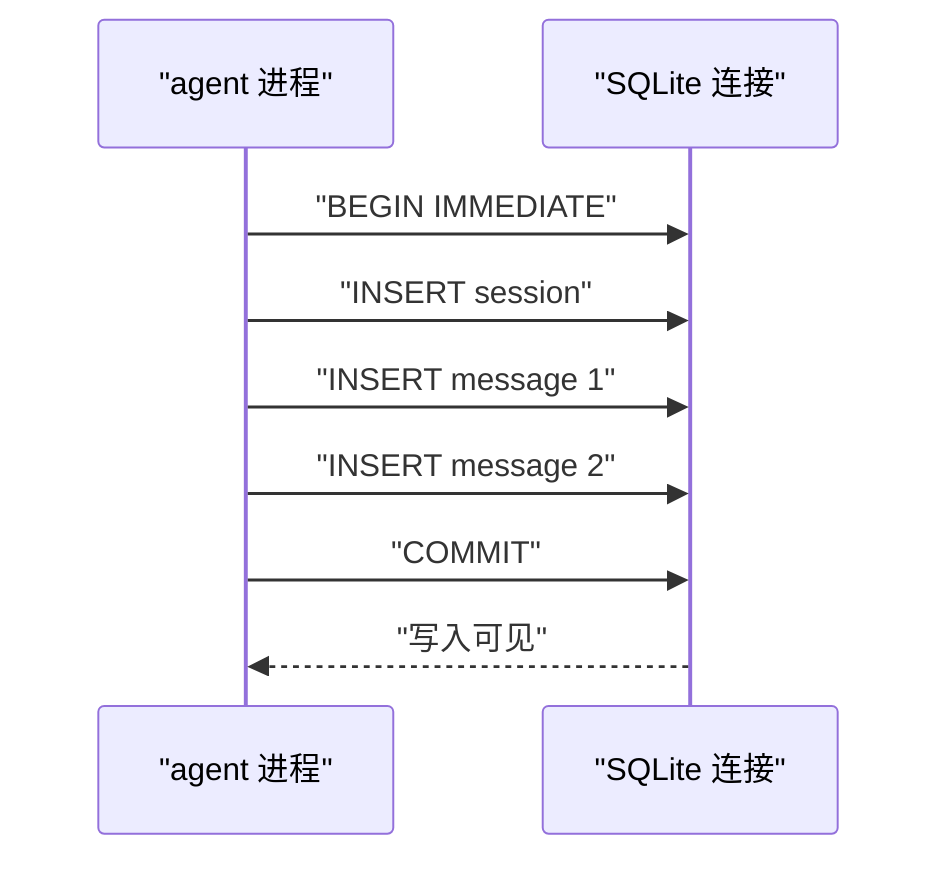
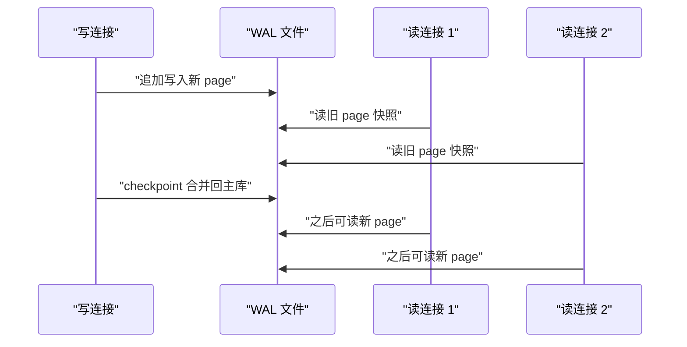
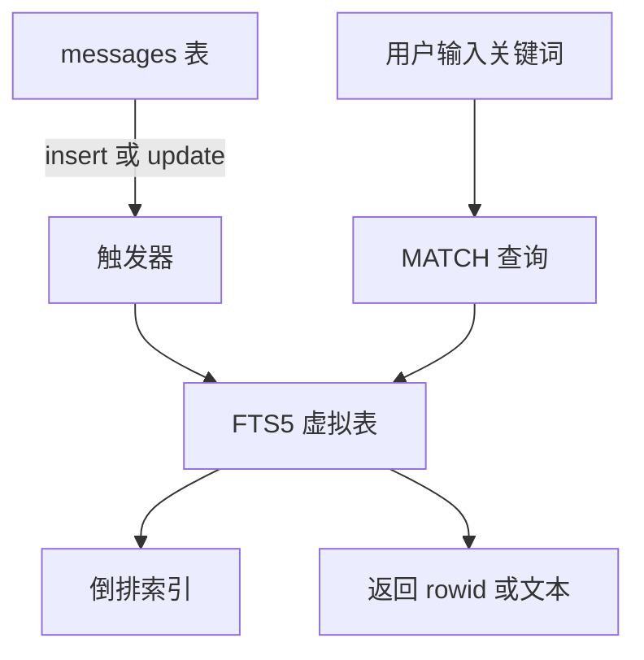
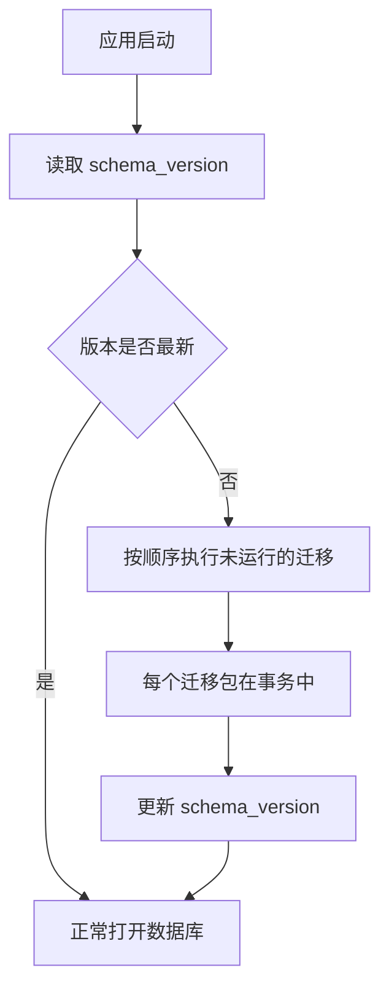
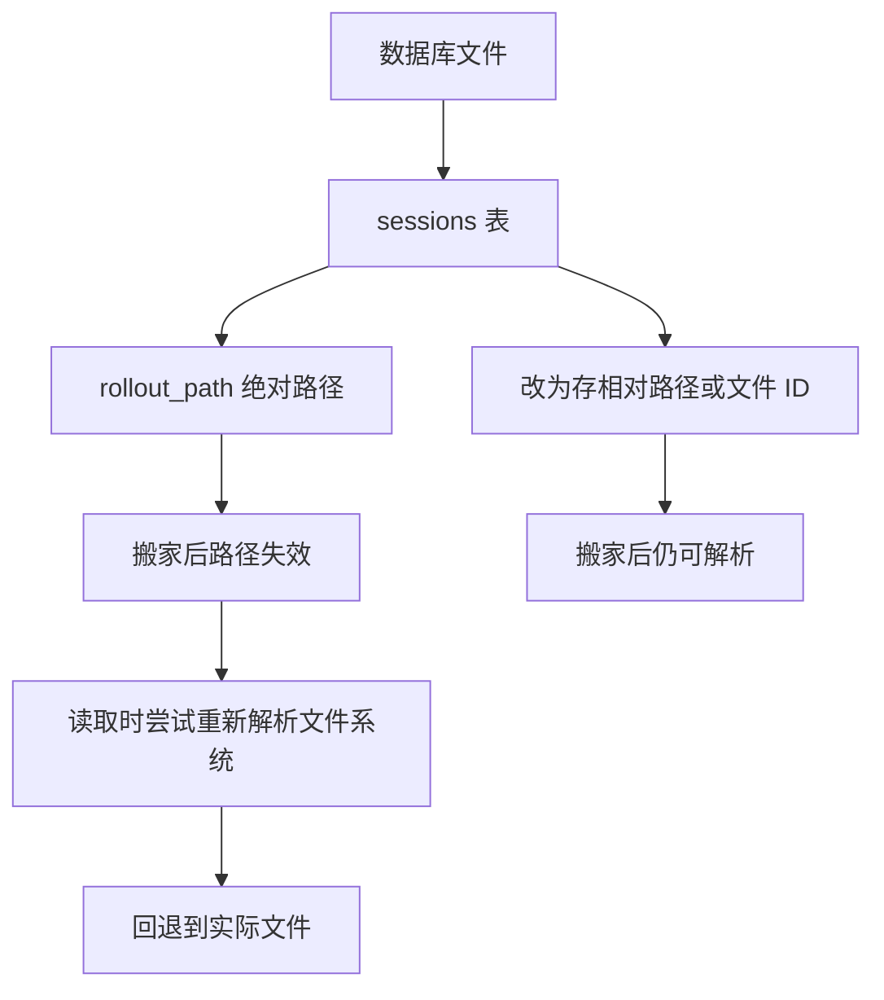
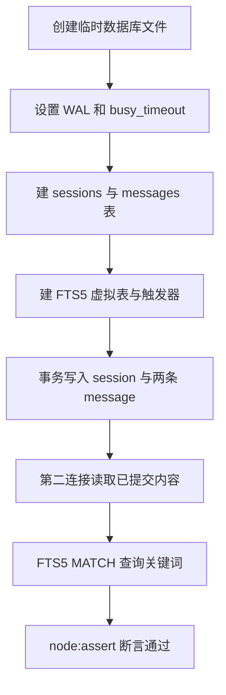

# 为什么 agent 要用 SQLite：事务、WAL、FTS5 与它的坑

!!! abstract "学完这一页你能"
    - 用事务把一次会话的 session 行与 messages 行做成原子写入，失败时全部回滚。
    - 说出 WAL（Write-Ahead Logging）的单写多读模型，以及它为什么不能放在 NFS（Network File System）上。
    - 用 FTS5 建一张可 MATCH 查询的全文索引表，并说出为什么 Codex、Goose、OpenCode 的源码里未用 FTS5。
    - 写一个 Node 内置 `node:sqlite` 示例：建表、事务写入、WAL 并发读、FTS5 检索，并用 `node:assert` 校验。

## 0. 知识地图



建议先读第 1 节建立 SQLite 的适用边界，再读第 2、3 节理解事务与 WAL 的并发模型。
第 4、5、6 节分别覆盖检索、迁移、部署，最后用第 7 节跑通完整脚本。
第 7 节中的脚本会同时验证第 2、3、4 节的知识点。

## 1. SQLite 为什么适合作 agent 本地状态

**先想一个问题**：你做一个本地 CLI agent，需要记录会话列表、消息历史和子 agent 血缘关系。用 JSONL 直接读写可行，但列表页要分页、按时间排序、过滤标题时，每次都要扫描文件夹里的全量文件。

**心智模型**

!!! tip "心智模型"
    一句话模型：SQLite 是一个进程内、零配置、单文件的关系数据库，适合把“需要索引和事务的结构化状态”放在本地。
    日常类比：把 SQLite 想成一本带目录和页码的账本，而不是一摞按时间排列的纸条。
    类比不成立之处：账本只有一个写字的人；SQLite 也只有一个写者，但多个读者可以同时翻看。

**图解**



1. agent 进程同时维护 SQLite 单文件与 JSONL 日志。
2. SQLite 中的 sessions、messages、thread 血缘表用于快速查询。
3. JSONL 日志仍是可备份、可人工阅读的原始数据。
4. SQLite 表如果损坏，可以从 JSONL 重建；反过来 JSONL 丢了，SQLite 无法补回。

**一步一步来**

第 1 步：用 Node 的 `node:sqlite` 打开一个数据库文件并确认可以执行 SQL。

```javascript
// db-open.mjs
import { DatabaseSync } from 'node:sqlite';
const db = new DatabaseSync('./agent-state.sqlite');
db.exec('PRAGMA journal_mode = WAL');
console.log(db.prepare('SELECT sqlite_version() AS v').get());
db.close();
```

**这段代码在做什么**

- 从 `node:sqlite` 导入 `DatabaseSync`，这是 Node 内置的同步 SQLite 接口。
- 打开或创建 `./agent-state.sqlite` 文件。
- 执行 `PRAGMA journal_mode = WAL`，把日志模式切到 WAL。
- 查询 SQLite 版本并打印，用来确认当前 Node 编译的 SQLite 支持基础功能。
- `node:sqlite` 是 Node 22.5.0 起加入的实验模块，Node 20 未内置，需核对官方文档。

运行结果：终端会打印一行类似 `{ v: '3.45.0' }`，版本号以实际编译为准。

**动手验证**

把上面文件保存为 `db-open.mjs`，运行 `node db-open.mjs`。
期望输出包含 `{ v: '3.` 开头的对象；如果出现 `SyntaxError` 或 `module not found`，说明 Node 版本低于 22.5.0，需升级或改用其他 SQLite 驱动。

**常见坑**

| 现象 | 原因 | 怎么修 |
|---|---|---|
| 启动报 `DatabaseSync is not a constructor` | Node 版本低于 22.5.0，或运行时未启用实验模块 | 升级到 Node 22.5.0 或更高，需核对官方文档 |
| 文件已存在但表打不开 | 该文件不是 SQLite 数据库 | 删除并用空文件重建 |
| 执行 `PRAGMA journal_mode` 每次都很慢 | 在连接池里重复设置 WAL 会拿写锁 | 只在建库或首次连接时执行一次 |

**用在哪里**

- 业务背景：本地 agent 的会话列表页，需要显示最近 50 条会话并按更新时间排序。
- 这一节的知识怎么用：用 sessions 表存更新时间列并建索引，而不是遍历 JSONL 文件。
- 用什么指标衡量收益：列表查询从扫描 200 GB 日志变为走一条索引查询，响应时间从秒级降到毫秒级（需以你的机器和文件量为准）。
- 什么时候不该用：如果只有一个会话文件且只按文件名读取，JSONL 足够，不需要引入 SQLite。

**行业实践**

- OpenAI Codex 官方仓库：用 `state_5.sqlite` 作为 rollout JSONL 的元数据索引，文件名中的数字是 schema 代际，换代时废弃旧文件而不破坏旧库（以原文为准）。
- Goose 官方源码：用 `sessions/sessions.db` 同时存 `sessions` 与 `messages` 表，并把 schema 版本号维护到 16（以原文为准）。
- 怎么借鉴到你的项目：给本地状态库加一个明确的 schema 版本号，不要把版本号隐含在代码里。

**小结**

- SQLite 是单文件、进程内、零配置的嵌入式数据库，适合本地结构化状态。
- 生产级 agent 通常不是“JSONL 或 SQLite”二选一，而是 JSONL 为源、SQLite 为可重建索引。
- 若只有简单的会话列表需求，JSONL 足够；需要排序、过滤、分页、血缘查询时才上 SQLite。

## 2. 事务：会话写入的原子性

**先想一个问题**：一次用户提问会同时产生一条 session 记录和多条 message 记录。如果写入 messages 到一半进程崩溃，数据库里会留下半截会话。

**心智模型**

!!! tip "心智模型"
    一句话模型：事务把多次写入打包成一个原子单位，要么全部提交，要么全部回滚。
    日常类比：把转账里的“扣 A 账户”和“加 B 账户”合成签字确认的一单，缺一笔则整单作废。
    类比不成立之处：SQLite 事务由单个连接持有写锁，不是多人同时签单，其他写者必须等待。

**图解**



1. agent 进程先对连接发送 `BEGIN IMMEDIATE`，立即获取写锁。
2. 依次插入 session 与两条 message。
3. 进程发送 `COMMIT`，要求数据库落地这 3 条写入。
4. 只有 COMMIT 成功，其他连接才能读到这组写入；中途崩溃则数据库自动回滚。

**一步一步来**

第 1 步：建 `sessions` 与 `messages` 表，给 messages 的外键加上 `ON DELETE CASCADE`。

```sql
CREATE TABLE sessions (
  id TEXT PRIMARY KEY,
  created_at INTEGER NOT NULL,
  updated_at INTEGER NOT NULL
);
CREATE TABLE messages (
  id INTEGER PRIMARY KEY AUTOINCREMENT,
  session_id TEXT NOT NULL REFERENCES sessions(id) ON DELETE CASCADE,
  role TEXT NOT NULL,
  content TEXT NOT NULL,
  created_at INTEGER NOT NULL
);
```

**这段代码在做什么**

- `sessions` 表以 `id` 为主键，存创建时间和更新时间。
- `messages` 表通过 `session_id` 外键关联会话。
- `ON DELETE CASCADE` 表示删除 session 时自动删除该 session 下的全部 message。
- SQLite 默认不强制外键，需要在每个连接上执行 `PRAGMA foreign_keys = ON`。
- 时间字段用 UNIX 毫秒整数，避免字符串时间比较的时区歧义。

第 2 步：在 Node 中用事务插入一条 session 和两条 message。

```javascript
db.exec('PRAGMA foreign_keys = ON');
db.exec('BEGIN IMMEDIATE');
try {
  db.prepare('INSERT INTO sessions (id, created_at, updated_at) VALUES (?, ?, ?)')
    .run('sess-1', Date.now(), Date.now());
  db.prepare('INSERT INTO messages (session_id, role, content, created_at) VALUES (?, ?, ?, ?)')
    .run('sess-1', 'user', '你好', Date.now());
  db.prepare('INSERT INTO messages (session_id, role, content, created_at) VALUES (?, ?, ?, ?)')
    .run('sess-1', 'assistant', '我在', Date.now());
  db.exec('COMMIT');
} catch (err) {
  db.exec('ROLLBACK');
  throw err;
}
```

**这段代码在做什么**

- `PRAGMA foreign_keys = ON` 让外键约束生效。
- `BEGIN IMMEDIATE` 立即获取写锁，避免事务执行到一半才升级锁。
- 三次 `INSERT` 都发生在同一个事务里。
- 任何一次 `INSERT` 抛出异常，catch 分支执行 `ROLLBACK`，前面的写入全部撤销。
- 没有异常时执行 `COMMIT`，三条记录同时可见。

运行结果：查询 `sessions` 和 `messages`，`sess-1` 下应能看到两条 message。

**动手验证**

```javascript
// verify-transaction.mjs
import { DatabaseSync } from 'node:sqlite';
import assert from 'node:assert/strict';
const db = new DatabaseSync(':memory:');
db.exec('PRAGMA foreign_keys = ON');
db.exec(`CREATE TABLE sessions (
  id TEXT PRIMARY KEY,
  created_at INTEGER NOT NULL
);
CREATE TABLE messages (
  id INTEGER PRIMARY KEY AUTOINCREMENT,
  session_id TEXT NOT NULL REFERENCES sessions(id) ON DELETE CASCADE,
  content TEXT NOT NULL
);`);
db.exec('BEGIN IMMEDIATE');
db.prepare('INSERT INTO sessions (id, created_at) VALUES (?, ?)').run('s1', 1);
db.prepare('INSERT INTO messages (session_id, content) VALUES (?, ?)').run('s1', 'a');
db.exec('ROLLBACK'); // 故意回滚
assert.equal(db.prepare('SELECT COUNT(*) AS c FROM sessions').get().c, 0);
assert.equal(db.prepare('SELECT COUNT(*) AS c FROM messages').get().c, 0);
db.exec('BEGIN IMMEDIATE');
db.prepare('INSERT INTO sessions (id, created_at) VALUES (?, ?)').run('s2', 2);
db.prepare('INSERT INTO messages (session_id, content) VALUES (?, ?)').run('s2', 'b');
db.exec('COMMIT');
assert.equal(db.prepare('SELECT COUNT(*) AS c FROM sessions').get().c, 1);
assert.equal(db.prepare('SELECT COUNT(*) AS c FROM messages').get().c, 1);
console.log('事务验证通过');
db.close();
```

期望输出：`事务验证通过`，断言全部通过。

**常见坑**

| 现象 | 原因 | 怎么修 |
|---|---|---|
| 事务插入后查不到 | 连接未提交事务 | 确认执行 `COMMIT` |
| 外键约束不生效，删 session 后 messages 残留 | 每个连接默认关闭外键 | 每个连接执行 `PRAGMA foreign_keys = ON` |
| `database is locked` | 多个进程同时写一个库 | 使用 `BEGIN IMMEDIATE` 并设置 `busy_timeout`，减少长事务 |

**用在哪里**

- 业务背景：本地 agent 每次用户提问都要写 session 与多条消息。
- 这一节的知识怎么用：把一次会话的所有写入放进一个事务，崩溃后不会出现只有 session 没有 message 的状态。
- 用什么指标衡量收益：重启后需要修复的半截会话数量降为 0。
- 什么时候不该用：如果单条 message 写入失败可接受重试，且没有多表一致性要求，可以只用单条 insert。

**行业实践**

- OpenAI Codex 官方源码：`jobs` 表用 `UPDATE ... WHERE` 实现 CAS（Compare And Swap）式租约抢占，把“读-判-写”放进一个事务（以原文为准）。
- Goose 官方源码：创建 schema 时使用 `BEGIN IMMEDIATE` 包裹 DDL，避免首次启动时多个进程竞争建表（以原文为准）。
- 怎么借鉴到你的项目：启动时把建表和 migration 放在 `BEGIN IMMEDIATE` 内，并在事务中完成版本号更新。

**小结**

- 事务用于保证一组相关写入的原子性。
- `BEGIN IMMEDIATE` 尽早抢写锁，能减少并发写时出现的锁升级失败。
- SQLite 外键默认关闭，需要每连接显式开启。

## 3. WAL：单写多读的并发模型

**先想一个问题**：一个桌面 agent 有 CLI、IDE 插件、后台服务三个进程共享同一个 SQLite 文件。CLI 在写会话时，IDE 插件能不能同时读取历史？

**心智模型**

!!! tip "心智模型"
    一句话模型：WAL（Write-Ahead Logging）让读请求读旧版本页，写请求追加写日志，从而实现一个写者与多个读者并发。
    日常类比：把 WAL 想成餐厅前台流水单，厨师追加新菜，服务员仍可看上一版菜单上菜。
    类比不成立之处：SQLite 只有一个 WAL 文件，所以同一时间只能有一个厨师追加，多写者不能并行。

**图解**



1. 写连接把改动追加到 WAL 文件，主库暂时保持旧内容。
2. 读连接 1 和读连接 2 继续读旧 page 快照，不被写阻塞。
3. 写连接在 checkpoint 时把 WAL 合并回主库。
4. checkpoint 之后，新的读请求可以看到新 page。

**一步一步来**

第 1 步：设置 WAL 和 `busy_timeout`，让并发读写有确定性行为。

```javascript
db.exec('PRAGMA journal_mode = WAL');
db.exec('PRAGMA synchronous = NORMAL');
db.exec('PRAGMA busy_timeout = 5000');
```

**这段代码在做什么**

- `PRAGMA journal_mode = WAL` 切换到 WAL 模式。
- `PRAGMA synchronous = NORMAL` 在 WAL 模式下允许部分同步，写入通过 WAL 保证一致性。
- `PRAGMA busy_timeout = 5000` 表示拿不到锁时最多等 5000 毫秒再报 `SQLITE_BUSY`。
- 这三个设置建议在连接池每个连接上执行，但 WAL 本身在打开数据库时只需设置一次。
- `synchronous = NORMAL` 是 WAL 下 SQLite 官方文档认可的配置，需核对官方文档确认版本行为。

第 2 步：模拟“一个写连接写入，另一个读连接立即读取已提交内容”。

```javascript
const writer = new DatabaseSync('./agent.sqlite');
const reader = new DatabaseSync('./agent.sqlite');
writer.exec('PRAGMA journal_mode = WAL');
writer.exec('PRAGMA busy_timeout = 5000');
reader.exec('PRAGMA busy_timeout = 5000');
writer.exec('BEGIN IMMEDIATE');
writer.prepare('INSERT INTO sessions (id, created_at) VALUES (?, ?)').run('s-wal', Date.now());
writer.exec('COMMIT');
const row = reader.prepare('SELECT id FROM sessions WHERE id = ?').get('s-wal');
console.log(row);
```

**这段代码在做什么**

- 创建 `writer` 和 `reader` 两个独立连接，指向同一个数据库文件。
- `writer` 写入并提交后，`reader` 立即可看到已提交的新行。
- WAL 模式下读者不会阻止写者，写者也不会阻塞读者读旧快照。
- 这里 `reader` 在写入之后查询，实际场景中读者可以在写者写入期间持续查询。
- Node 单线程模型让这两个连接顺序执行，不能演示两个连接同时工作中的时间重叠，但 SQLite 的并发行为由 WAL 保证。

运行结果：打印 `{ id: 's-wal' }`。

**动手验证**

```javascript
// verify-wal.mjs
import { DatabaseSync } from 'node:sqlite';
import assert from 'node:assert/strict';
const dbPath = './wal-test.sqlite';
const writer = new DatabaseSync(dbPath, { timeout: 5000 });
writer.exec('PRAGMA journal_mode = WAL');
writer.exec('PRAGMA synchronous = NORMAL');
writer.exec('CREATE TABLE IF NOT EXISTS records (id INTEGER PRIMARY KEY, payload TEXT)');
const reader = new DatabaseSync(dbPath, { timeout: 5000 });
reader.exec('PRAGMA busy_timeout = 5000');
writer.exec('BEGIN IMMEDIATE');
writer.prepare('INSERT INTO records (payload) VALUES (?)').run('first');
// 写事务未提交时，读者读到旧状态
const beforeCommit = reader.prepare('SELECT COUNT(*) AS c FROM records').get().c;
writer.exec('COMMIT');
const afterCommit = reader.prepare('SELECT COUNT(*) AS c FROM records').get().c;
assert.equal(beforeCommit, 0);
assert.equal(afterCommit, 1);
console.log('WAL 并发读验证通过');
reader.close();
writer.close();
```

期望输出：`WAL 并发读验证通过`。

**常见坑**

| 现象 | 原因 | 怎么修 |
|---|---|---|
| 读连接拿到 `SQLITE_BUSY` | `busy_timeout` 未设置或太短 | 将 `busy_timeout` 设为 5000 毫秒或更长 |
| 复制数据库文件后内容丢失新写入 | 只复制了主文件，漏了 `-wal` 和 `-shm` 文件 | 用 `sqlite3` 的备份命令，或同时复制三个文件 |
| 启动时 PRAGMA journal_mode 阻塞 | 多个 pool 连接重复设置 WAL | 只在首个连接或建库时执行一次 |

**用在哪里**

- 业务背景：桌面 agent 需要 CLI 写会话，同时 IDE 插件读取会话列表。
- 这一节的知识怎么用：所有连接使用 WAL，读连接不阻塞写连接。
- 用什么指标衡量收益：读取会话列表时写事务未提交也不会让 UI 卡顿，等待锁的时长从无上限降到 5000 毫秒内。
- 什么时候不该用：数据库放在 NFS 或 SMB 网络挂载盘上，WAL 不能保证一致性，应改用本地磁盘或服务端数据库。

**行业实践**

- SQLite 官方文档：WAL 支持 writer 与 readers 同时工作，但同一时刻只允许一个 writer（以原文为准）。
- OpenAI Codex 官方源码：`state_5.sqlite` 与 `logs_2.sqlite` 均设置 WAL，并使用 `busy_timeout`（默认常量）管理锁等待（以原文为准）。
- 怎么借鉴到你的项目：把日志表拆到单独的 SQLite 文件，避免高频日志写入长期占用主状态库的写锁。

**小结**

- WAL 提供单写多读，不能多写并发。
- `busy_timeout` 必须有值，否则遇到锁会立即失败。
- 拷贝 WAL 数据库时，必须连同 `-wal` 与 `-shm` 文件一起处理。

## 4. FTS5：全文检索与它的边界

**先想一个问题**：用户想从过去三个月的 agent 会话里搜索“重命名列”三个字，但你不可能每次都用 `LIKE` 扫全表。

**心智模型**

!!! tip "心智模型"
    一句话模型：FTS5（Full-Text Search version 5）是 SQLite 内置的虚拟表扩展，为文本建立倒排索引，用 `MATCH` 查询代替 `LIKE`。
    日常类比：把 FTS5 想成书末的关键词索引，先查索引页再到正文，而不是逐页翻书。
    类比不成立之处：FTS5 的索引是另一张虚拟表，需要触发器或手工同步，不是书里自动印好的页码。

**图解**



1. 原始数据存在 `messages` 表，不重复存一份文本索引。
2. 对 `messages` 的插入或更新通过触发器同步到 FTS5 虚拟表。
3. 用户输入关键词后，`MATCH` 查询直接命中倒排索引。
4. 查询结果可通过 `rowid` 或指定列返回给 UI。

**一步一步来**

第 1 步：创建外部内容 FTS5 表，不把全文重复存在 FTS 表里。

```sql
CREATE VIRTUAL TABLE messages_fts USING fts5(
  content,
  content='messages',
  content_rowid='id'
);
```

**这段代码在做什么**

- `CREATE VIRTUAL TABLE ... USING fts5` 创建 FTS5 索引表。
- 使用 `content='messages'` 声明外部内容表，FTS 只存索引，正文仍在 `messages`。
- `content_rowid='id'` 表示 FTS 内部的 rowid 与 `messages.id` 对应。
- 外部内容表模式节省磁盘空间，但需要手动或触发器同步。
- 本页第 7 节会给出完整建表、触发器与查询示例。

第 2 步：为 `messages` 表建触发器，让 FTS 自动同步。

```sql
CREATE TRIGGER messages_ai AFTER INSERT ON messages BEGIN
  INSERT INTO messages_fts(rowid, content) VALUES (new.id, new.content);
END;
CREATE TRIGGER messages_ad AFTER DELETE ON messages BEGIN
  INSERT INTO messages_fts(messages_fts, rowid, content) VALUES ('delete', old.id, old.content);
END;
```

**这段代码在做什么**

- `AFTER INSERT` 触发器把新增消息的内容写进 FTS5 索引。
- `AFTER DELETE` 触发器用 `'delete'` 命令从 FTS5 中删除对应 rowid 的索引项。
- 更新场景可再加 `AFTER UPDATE` 触发器，或先删后插。
- 外部内容表不能自动感知原始表变化，必须由触发器同步。
- 缺少删除触发器时，删除原表行后 FTS 查询会返回已删除的 rowid，导致后续回表查不到内容。

**动手验证**

```javascript
// verify-fts.mjs
import { DatabaseSync } from 'node:sqlite';
import assert from 'node:assert/strict';
import fs from 'node:fs';
fs.rmSync('./fts-test.sqlite', { force: true });
const db = new DatabaseSync('./fts-test.sqlite');
db.exec('CREATE TABLE messages (id INTEGER PRIMARY KEY AUTOINCREMENT, content TEXT NOT NULL)');
try {
  db.exec(`CREATE VIRTUAL TABLE messages_fts USING fts5(
    content,
    content='messages',
    content_rowid='id'
  )`);
} catch (err) {
  console.log('当前 Node 的 SQLite 未编译 FTS5，需换用带 FTS5 的构建：', err.message);
  process.exit(0);
}
db.exec('CREATE TRIGGER messages_ai AFTER INSERT ON messages BEGIN INSERT INTO messages_fts(rowid, content) VALUES (new.id, new.content); END');
db.exec('CREATE TRIGGER messages_ad AFTER DELETE ON messages BEGIN INSERT INTO messages_fts(messages_fts, rowid, content) VALUES (\'delete\', old.id, old.content); END');
db.prepare('INSERT INTO messages (content) VALUES (?)').run('用户问如何重命名数据库列');
db.prepare('INSERT INTO messages (content) VALUES (?)').run('agent 回答用 ALTER TABLE');
const rows = db.prepare('SELECT rowid FROM messages_fts WHERE messages_fts MATCH ?').all('重命名');
assert.equal(rows.length, 1);
console.log('FTS5 关键词命中条数：', rows.length);
db.close();
```

期望输出：`FTS5 关键词命中条数： 1`；如果当前 Node 未编译 FTS5，会打印未编译提示并退出，此时需核对官方文档。

**常见坑**

| 现象 | 原因 | 怎么修 |
|---|---|---|
| 运行报 `no such module: fts5` | Node 内置 SQLite 未启用 FTS5 编译选项 | 换用带 FTS5 的 SQLite 构建，或改用其他全文索引 |
| 删除原表行后搜索仍命中 | 未建 `AFTER DELETE` 触发器同步 FTS | 补上删除触发器 |
| 搜索结果不相关 | 未使用 `bm25()` 或限制结果数 | 用 `ORDER BY bm25(messages_fts)` 并按前缀长度过滤 |

**用在哪里**

- 业务背景：本地 agent 的历史会话搜索，输入关键词快速定位三个月前的对话。
- 这一节的知识怎么用：对 `messages.content` 建 FTS5 索引，用 `MATCH` 查询替换 `LIKE '%关键词%'`。
- 用什么指标衡量收益：在 10 万条消息上，`LIKE` 扫描全表与索引查询的时间差异可从秒级降到毫秒级（需在你的数据集上实测）。
- 什么时候不该用：Codex 官方仓库源码显示它用 `rg`（ripgrep）在 JSONL 文件上做全文搜索，不是 FTS5（以原文为准）。如果搜索模式高度面向原始文件且没有结构化过滤，保留 `rg` 即可。

**行业实践**

- SQLite 官方文档：FTS5 支持 prefix、bm25 排序、外部内容表与触发器同步，是 SQLite 支持的全文检索扩展（以原文为准）。
- OpenAI Codex 官方仓库：在 `codex-rs/state` 的迁移与 Rust 源码中未发现 FTS5 调用，跨线程会话搜索走 `rg` 命令（以原文为准）。
- 怎么借鉴到你的项目：先把搜索需求分成“文件全文搜索”与“结构化条件过滤”两类；前者用 `rg`，后者用 SQLite 索引，不要一开始就给全部会话来 FTS5。

**小结**

- FTS5 提供 MATCH 查询与 bm25 排序，适合结构化全文检索。
- Codex、Goose、OpenCode 的存储代码中均未用 FTS5，检索能力不等同于产品默认方案。
- 建 FS5 时必须处理原表与索引的同步问题，外部内容表需要触发器。

## 5. 迁移管理：给数据库加版本号

**先想一个问题**：你发布了 v1，用户的 agent 数据库里没有 `title` 列；到了 v2 要显示会话标题。直接在启动代码里 `ALTER TABLE` 会导致已有用户与新用户路径不一致。

**心智模型**

!!! tip "心智模型"
    一句话模型：迁移管理是把数据库结构变更写成一组有序、可重放的 SQL 文件，并在数据库里记录当前版本。
    日常类比：把迁移想成大楼改造的施工单，每张单从旧结构改到下一步结构，施工前先核对当前楼层。
    类比不成立之处：数据库迁移可以回滚到某个版本，但数据变化不是简单把墙拆回去就能复原。

**图解**



1. 启动时先读 `schema_version`，判断数据库处于哪个迁移版本。
2. 若版本落后，按编号顺序执行未运行的迁移。
3. 每个迁移必须在一个事务中执行，失败则回滚。
4. 全部迁移完成后，更新版本号并正常打开数据库。

**一步一步来**

第 1 步：建 `schema_migrations` 表，记录已经应用的迁移。

```sql
CREATE TABLE IF NOT EXISTS schema_migrations (
  version INTEGER PRIMARY KEY,
  applied_at INTEGER NOT NULL
);
```

**这段代码在做什么**

- `schema_migrations` 表每个迁移只对应一行，`version` 是主键。
- `applied_at` 记录应用时间，方便调试。
- 幂等建表使用 `IF NOT EXISTS`，首次启动不会因表已存在而失败。
- 第 5 节会讲为什么迁移要包在 `BEGIN IMMEDIATE` 事务里。

第 2 步：在应用启动时按顺序执行迁移列表。

```javascript
const migrations = [
  { version: 1, sql: `CREATE TABLE sessions (
      id TEXT PRIMARY KEY,
      created_at INTEGER NOT NULL,
      updated_at INTEGER NOT NULL
    );` },
  { version: 2, sql: `ALTER TABLE sessions ADD COLUMN title TEXT NOT NULL DEFAULT '';` }
];
const applied = new Set(
  db.prepare('SELECT version FROM schema_migrations').all().map(r => r.version)
);
for (const m of migrations) {
  if (!applied.has(m.version)) {
    db.exec('BEGIN IMMEDIATE');
    try {
      db.exec(m.sql);
      db.prepare('INSERT INTO schema_migrations (version, applied_at) VALUES (?, ?)')
        .run(m.version, Date.now());
      db.exec('COMMIT');
    } catch (err) {
      db.exec('ROLLBACK');
      throw err;
    }
  }
}
```

**这段代码在做什么**

- `migrations` 数组按版本号升序排列，每个元素含 SQL 语句。
- 先查询已应用版本，跳过已经跑过的迁移。
- 对未应用迁移，用 `BEGIN IMMEDIATE` 拿写锁并包裹迁移 SQL 与版本号写入。
- 迁移失败时回滚整个事务，数据库结构不变。
- 这种“版本号+顺序执行”的方式可避免同目录多进程启动时的重复建表竞争。

**动手验证**

```javascript
// verify-migrations.mjs
import { DatabaseSync } from 'node:sqlite';
import assert from 'node:assert/strict';
const db = new DatabaseSync(':memory:');
db.exec('CREATE TABLE schema_migrations (version INTEGER PRIMARY KEY, applied_at INTEGER NOT NULL)');
const migrations = [
  { version: 1, sql: 'CREATE TABLE t (id INTEGER)' },
  { version: 2, sql: 'ALTER TABLE t ADD COLUMN name TEXT' }
];
const applied = new Set(db.prepare('SELECT version FROM schema_migrations').all().map(r => r.version));
for (const m of migrations) {
  if (!applied.has(m.version)) {
    db.exec('BEGIN IMMEDIATE');
    db.exec(m.sql);
    db.prepare('INSERT INTO schema_migrations (version, applied_at) VALUES (?, ?)').run(m.version, Date.now());
    db.exec('COMMIT');
  }
}
const cols = db.prepare('PRAGMA table_info(t)').all().map(c => c.name);
assert.deepEqual(cols, ['id', 'name']);
assert.equal(db.prepare('SELECT COUNT(*) AS c FROM schema_migrations').get().c, 2);
console.log('迁移版本验证通过');
db.close();
```

期望输出：`迁移版本验证通过`。

**常见坑**

| 现象 | 原因 | 怎么修 |
|---|---|---|
| 多进程启动时重复执行同一个迁移 | 检查-执行不是原子操作 | 在 `BEGIN IMMEDIATE` 事务内执行迁移并写版本 |
| 已有用户启动新版本报错缺列 | 未更新应用启动时的迁移列表 | 新增迁移时不要修改旧迁移，旧库会走到新版本 |
| WAL 模式切换阻塞其他连接 | 连接池每个连接重复执行 `PRAGMA journal_mode` | 只在建库或第一个迁移中设置 |

**用在哪里**

- 业务背景：CLI agent 从 v1 升级到 v2，需要给 sessions 表加 `title` 列。
- 这一节的知识怎么用：通过 `schema_migrations` 表和有序迁移脚本，把 `ALTER TABLE` 放在事务中执行。
- 用什么指标衡量收益：升级后启动失败率从用户数据库结构不一致导致的 5% 降到 0（需以你的发布统计为准）。
- 什么时候不该用：如果应用只面向一次性导入，不需要长期兼容旧库，可以不引入迁移框架。

**行业实践**

- OpenAI Codex 官方源码：`state/migrations/0001..0059` 等目录维护 59 个以上迁移，且每个 DB 文件有自己的 migrations 目录（以原文为准）。
- Goose 官方源码：使用 schema_version 一路升到 16，并在建 schema 时使用 `BEGIN IMMEDIATE`（以原文为准）。
- 怎么借鉴到你的项目：每个数据库文件一个迁移目录，迁移文件名按纯数字排序，并且不回改历史迁移。

**小结**

- 迁移管理要记录 schema_version，并在事务中执行迁移。
- 多进程启动竞争要用 `BEGIN IMMEDIATE` 包住迁移。
- 索引和 WAL 设置也应在迁移事务内或首次建库时完成。

## 6. 单文件部署与路径陷阱

**先想一个问题**：用户把 agent 目录从 `/Users/alice/project` 搬到 `/Users/alice/project-2`，数据库还能打开，但里面存的会话路径全指向旧位置。

**心智模型**

!!! tip "心智模型"
    一句话模型：单文件部署让数据库容易复制，但库里若存绝对路径，搬家后会失效。
    日常类比：把书里的书签想成写的是“第 3 页”，而不是“东边书架第 3 格的书”。
    类比不成立之处：数据库里的路径往往被当作权威数据，系统不会自动修正错误路径。

**图解**



1. 数据库中写入绝对路径时，搬家或改 HOME 目录会导致路径失效。
2. 读取会话时通过旧绝对路径找不到 JSONL 文件。
3. 系统可以尝试用文件系统实际位置回修复读。
4. 更好的做法是存相对路径或基于环境变量解析。

**一步一步来**

第 1 步：不要在 `sessions` 表里存绝对路径，改用 `project_root` 加相对路径。

```sql
CREATE TABLE sessions (
  id TEXT PRIMARY KEY,
  relative_file_path TEXT NOT NULL,
  project_root TEXT NOT NULL
);
```

**这段代码在做什么**

- `relative_file_path` 存相对项目根目录的路径。
- `project_root` 存项目根目录，可以由运行时配置重建。
- 搬家后更新 `project_root` 即可恢复索引。
- 如果项目根也搬家，更新速度快于批量改每条绝对路径。
- 这种设计避免库里出现硬编码 `/home/alice` 导致不可恢复。

第 2 步：读取时根据运行时根目录拼出完整路径。

```javascript
const baseRoot = process.env.AGENT_PROJECT_ROOT || process.cwd();
const row = db.prepare('SELECT relative_file_path FROM sessions WHERE id = ?').get('sess-1');
const fullPath = `${baseRoot}/${row.relative_file_path}`;
console.log(fullPath);
```

**这段代码在做什么**

- 从环境变量读取当前项目的根目录。
- 只从库中取出相对路径。
- 在内存中拼接出完整路径，库里不存完整路径。
- 用户搬家后只需改 `AGENT_PROJECT_ROOT` 环境变量。
- 如果路径源文件就在项目外，需要重新设计存储结构。

**动手验证**

```javascript
// verify-path.mjs
import { DatabaseSync } from 'node:sqlite';
import assert from 'node:assert/strict';
const db = new DatabaseSync(':memory:');
db.exec('CREATE TABLE sessions (id TEXT PRIMARY KEY, relative_file_path TEXT NOT NULL, project_root TEXT NOT NULL)');
db.prepare('INSERT INTO sessions VALUES (?, ?, ?)').run('s1', 'sessions/2026/10/06/s1.jsonl', '/old/project');
const oldRoot = '/old/project';
const newRoot = '/new/project';
const row = db.prepare('SELECT relative_file_path FROM sessions WHERE id = ?').get('s1');
const fullPath = `${newRoot}/${row.relative_file_path}`;
assert.equal(fullPath, '/new/project/sessions/2026/10/06/s1.jsonl');
assert.notEqual(fullPath, `${oldRoot}/${row.relative_file_path}`);
console.log('相对路径解析验证通过');
db.close();
```

期望输出：`相对路径解析验证通过`。

**常见坑**

| 现象 | 原因 | 怎么修 |
|---|---|---|
| 搬家后 resume 失败，提示文件不存在 | 库中存了旧的绝对路径 | 改为存相对路径，或启动时按实际文件系统重建路径 |
| 复制数据库后 WAL 内容丢失 | 只复制主库文件，漏了 `-wal`/`-shm` | 使用 SQLite 备份 API，或同时复制三个文件 |
| 数据库文件被同步盘破坏 | WAL 依赖 `fsync` 语义，云盘同步可能不保证 | 不要将 WAL 数据库放在 Dropbox、Google Drive 同步目录 |

**用在哪里**

- 业务背景：用户从 `~/.codex` 迁移到 `~/.codex-backup` 后，agent 打开会话列表显示空白。
- 这一节的知识怎么用：在点击会话时做一次“路径存在性检查”，若不命中则扫描新根目录重建关系。
- 用什么指标衡量收益：搬家后首次启动恢复成功率从 0 提升到 100%，而不是显示陈旧绝对路径。
- 什么时候不该用：如果所有会话和数据库必须绑定在同一目录，且用户从不移动，也不需要过度抽象路径。

**行业实践**

- OpenAI Codex 官方 issue #47002：`$HOME` 改变后 resume 和 fork 失败，因为 SQLite 保留旧的绝对 rollout path（以原文为准）。
- OpenAI Codex 官方源码：读取旧路径失败时会做 `read_repair_rollout_path` 修复，或跳过一条 stale path 记录（以原文为准）。
- 怎么借鉴到你的项目：打开会话前先检查文件是否存在，不存在则回退到文件系统扫描，并异步更新索引。

**小结**

- 单文件部署的优点是易复制，但要注意文件内不能写绝对路径。
- 路径索引不是权威数据，原始 JSONL 才是源数据。
- 拷贝 WAL 数据库要带 `-wal` 与 `-shm` 文件，或使用 SQLite 备份命令。

## 7. 完整可运行示例：用 Node 内置 node:sqlite

**先想一个问题**：你已经分别学了事务、WAL、FTS5，现在要用一个真实脚本把这些知识点串起来，验证它们能否在同一数据库上协同工作。

**心智模型**

!!! tip "心智模型"
    一句话模型：完整示例是在一个临时数据库文件上依次完成建表、事务写入、并发读、FTS5 检索，并用 `node:assert` 检查结果。
    日常类比：把数据库集成测试想成厨房里的试菜流程，先备料再下锅，每一步出锅前先尝一口确认味道。
    类比不成立之处：真实生产环境里 agent 可能同时跑在多进程，单文件脚本只能覆盖顺序执行路径。

**图解**



1. 从创建临时文件开始，避免污染已有数据。
2. 设置 WAL 与 `busy_timeout`，保证后续并发读不因锁失败。
3. 建两个业务表和 FTS5 索引表。
4. 事务写入后，第二个连接立即读取，用 WAL 模型验证。
5. 通过 FTS5 MATCH 查询关键词，最后用断言确保结果符合预期。

**一步一步来**

第 1 步：导入模块并打开临时数据库。

```javascript
import { DatabaseSync } from 'node:sqlite';
import assert from 'node:assert/strict';
import fs from 'node:fs';
import os from 'node:os';
import path from 'node:path';

const dbPath = path.join(os.tmpdir(), `agent-sqlite-${Date.now()}.sqlite`);
const db = new DatabaseSync(dbPath, { timeout: 5000 });
db.exec('PRAGMA journal_mode = WAL');
db.exec('PRAGMA synchronous = NORMAL');
db.exec('PRAGMA busy_timeout = 5000');
db.exec('PRAGMA foreign_keys = ON');
```

**这段代码在做什么**

- `node:sqlite` 是 Node 22.5.0 起加入的实验模块，需要安装对应版本（需核对官方文档）。
- 数据库文件放在系统临时目录，文件名带时间戳，避免多次运行冲突。
- 连接选项 `timeout: 5000` 设置锁等待，和 PRAGMA busy_timeout 一致。
- 开启 WAL、NORMAL 同步、外键约束，这是本页第 2、3 节建议的配置。

第 2 步：建 sessions、messages、FTS5 表和同步触发器。

```sql
CREATE TABLE sessions (
  id TEXT PRIMARY KEY,
  created_at INTEGER NOT NULL,
  updated_at INTEGER NOT NULL
);
CREATE TABLE messages (
  id INTEGER PRIMARY KEY AUTOINCREMENT,
  session_id TEXT NOT NULL REFERENCES sessions(id) ON DELETE CASCADE,
  role TEXT NOT NULL,
  content TEXT NOT NULL,
  created_at INTEGER NOT NULL
);
CREATE VIRTUAL TABLE messages_fts USING fts5(
  content,
  content='messages',
  content_rowid='id'
);
CREATE TRIGGER messages_ai AFTER INSERT ON messages BEGIN
  INSERT INTO messages_fts(rowid, content) VALUES (new.id, new.content);
END;
CREATE TRIGGER messages_ad AFTER DELETE ON messages BEGIN
  INSERT INTO messages_fts(messages_fts, rowid, content) VALUES ('delete', old.id, old.content);
END;
```

**这段代码在做什么**

- sessions 表主键为 TEXT，messages 表通过 `session_id` 外键关联。
- `messages.id` 是自增整数，作为 FTS 的外部 rowid。
- FTS5 表只存指向 `messages` 的索引，不重复存正文。
- 触发器在插入和删除时同步 FTS，更新场景未覆盖时需补 `AFTER UPDATE`。

第 3 步：事务写入 session 与两条 message。

```javascript
db.exec('BEGIN IMMEDIATE');
try {
  db.prepare('INSERT INTO sessions (id, created_at, updated_at) VALUES (?, ?, ?)')
    .run('sess-1', Date.now(), Date.now());
  db.prepare('INSERT INTO messages (session_id, role, content, created_at) VALUES (?, ?, ?, ?)')
    .run('sess-1', 'user', '问：如何重命名数据库列', Date.now());
  db.prepare('INSERT INTO messages (session_id, role, content, created_at) VALUES (?, ?, ?, ?)')
    .run('sess-1', 'assistant', '答：使用 ALTER TABLE 重命名', Date.now());
  db.exec('COMMIT');
} catch (err) {
  db.exec('ROLLBACK');
  throw err;
}
assert.equal(db.prepare('SELECT COUNT(*) AS c FROM sessions').get().c, 1);
assert.equal(db.prepare('SELECT COUNT(*) AS c FROM messages').get().c, 2);
```

**这段代码在做什么**

- 使用 `BEGIN IMMEDIATE` 抢写锁，保证事务期间没有其他写者插入。
- 插入 1 条 session 和 2 条 message，均在同一事务。
- 失败回滚保证不会只留半截会话。
- 提交后立即断言行数，确认事务结果可见。

第 4 步：用第二个连接验证 WAL 并发读，并做 FTS5 检索。

```javascript
const reader = new DatabaseSync(dbPath, { timeout: 5000 });
reader.exec('PRAGMA busy_timeout = 5000');
const sessionRow = reader.prepare('SELECT id FROM sessions WHERE id = ?').get('sess-1');
assert.equal(sessionRow.id, 'sess-1');
const ftsRows = reader.prepare('SELECT rowid FROM messages_fts WHERE messages_fts MATCH ?').all('重命名');
assert.equal(ftsRows.length, 1);
console.log('WAL 读结果 session id：', sessionRow.id);
console.log('FTS5 命中条数：', ftsRows.length);
reader.close();
db.close();
```

**这段代码在做什么**

- `reader` 是第二个连接，指向同一个数据库文件。
- 先查 sessions 验证 WAL 模式下已提交数据可见。
- 再查 FTS5，`MATCH '重命名'` 只应命中用户消息一条。
- 最后关闭两个连接，脚本退出。

**动手验证**

保存为 `agent-sqlite-complete.mjs`，运行 `node agent-sqlite-complete.mjs`。
确保 Node 版本为 22.5.0 或更高（需核对官方文档：`node:sqlite` 从 Node 22.5.0 起作为实验模块加入）。
期望输出：

```text
WAL 读结果 session id： sess-1
FTS5 命中条数： 1
```

同时所有 `node:assert` 通过，没有抛出异常。

**常见坑**

| 现象 | 原因 | 怎么修 |
|---|---|---|
| 运行报 `no such module: fts5` | Node 内置 SQLite 未启用 FTS5 | 换用带 FTS5 的 SQLite 构建，需核对官方文档 |
| 写入事务未提交，第二个连接却读到数据 | 代码里把 `COMMIT` 写在了读连接之后 | 调整顺序，先提交再读 |
| 第二次运行脚本失败，表已存在 | 临时文件未删除，导致建表报错 | 使用 `Date.now()` 生成新文件，或加 `DROP TABLE IF EXISTS` |

**用在哪里**

- 业务背景：为本地 agent 的 session/message 存储写一份集成验证脚本，合并事务、WAL、FTS5 的验证。
- 这一节的知识怎么用：把脚本加入 CI，每次启动新版本 Node 时跑一遍，防止底层 API 变化无声破坏存储层。
- 用什么指标衡量收益：基础存储集成测试失败率应在 30 秒内得到明确错误信号，而不是等到用户端报故障。
- 什么时候不该用：如果生产使用服务端数据库，不要用 Node 内置 SQLite 模拟，应使用对应数据库的集成测试。

**行业实践**

- SQLite 官方文档：FTS5 模块可被编译进 SQLite 后由虚拟表创建，需注意编译选项（以原文为准）。
- OpenAI Codex 官方源码：`state_5.sqlite` 与 `logs_2.sqlite` 都走 WAL 与 `busy_timeout`，并把迁移与修复逻辑分开（以原文为准）。
- 怎么借鉴到你的项目：将存储层与业务层分离，集成测试只验证 SQLite 行为，业务测试 mock 掉存储。

**小结**

- 完整示例按“打开、建表、同步、事务写、并发读、FTS 检索”顺序组织。
- 运行前核实 Node 版本与 FTS5 编译支持，避免环境不同导致误判。
- 所有断言通过才说明脚本正确，预期输出必须写入文档。

## 应用地图

| 场景 | 用到本页哪个知识点 | 典型技术选型 | 注意事项 |
|---|---|---|---|
| 本地 agent 会话列表分页 | SQLite 单文件、索引 | `node:sqlite` + sessions 表 | 不要只存 JSONL 扫描 |
| 一次用户提问写 session 与 N 条消息 | 事务原子性 | `BEGIN IMMEDIATE` + 外键 | 失败必须回滚 |
| CLI 写会话、IDE 读列表并发 | WAL 单写多读 | `journal_mode=WAL`, busy_timeout | 不能放 NFS |
| 历史会话关键词搜索 | FTS5 或 rg | `messages_fts` 虚拟表 | 触发器同步删除 |
| 应用升级加列 | 迁移管理 | `schema_migrations` + 有序 SQL | 不在启动时随意 ALTER |
| 用户移动 HOME 目录后 resume | 路径陷阱 | 存相对路径或文件 ID | 读时做存在性回退 |
| 多进程启动抢建表 | 事务 + 迁移 | `BEGIN IMMEDIATE` 包住 DDL | 不要重复执行 PRAGMA |
| 大日志写入不阻塞会话查询 | 多库拆分 | 把 logs 表拆到独立 DB | 每库单独迁移 |

## 动手作业

目标：为你的 CLI agent 写一个本地存储模块，使用 SQLite 存 sessions 和 messages，并用 FTS5 支持关键词搜索。

步骤：

1. 用 Node 22.5.0 或更高版本新建项目，添加 `node:sqlite` 存储模块。
2. 在模块里实现 `initDb(filePath)`，创建 sessions、messages、FTS5 表和触发器。
3. 实现 `createSessionWithMessages(sessionId, messages)`，内部使用 `BEGIN IMMEDIATE` 事务。
4. 实现 `searchMessages(keyword)`，返回匹配行的 `session_id` 与 `content` 列表。
5. 写一个测试脚本，调用以上函数并验证空库、写入回滚、WAL 并发读、FTS 关键字命中。

验收标准：

- 测试脚本运行时使用临时数据库文件，不留下测试产物。
- 事务写入一条 session 和 3 条 messages 后，跳过 commit 直接 `ROLLBACK`，查询结果为 0 行。
- 第二条连接在第一条提交后能读到 session 行。
- `MATCH '关键词'` 能命中至少 1 行，且删除消息后 FTS 查询不再返回该行。
- 所有断言通过，输出 `作业验收通过`。

## 综合对比

| 维度 | SQLite 本地库 | JSONL 日志 | 服务端 Postgres | Redis |
|---|---|---|---|---|
| 事务 | 支持 ACID，适合多行原子写 | 不支持，多行写入可能部分落盘 | 支持完整事务 | 事务有限，主要适合缓存 |
| 并发模型 | 单写多读（WAL） | 多进程 append 会交错 | 多写多读 | 单线程命令执行 |
| 搜索能力 | FTS5 或 `LIKE` | `rg` 全文搜索 | 全文索引、pg_trgm | 仅 key 查找 |
| 部署成本 | 零配置单文件 | 零配置但要自己维护索引 | 需要服务端进程 | 需要服务端进程 |
| 迁移管理 | 需要自己记录版本 | 需要 header 版本 | 生态成熟 | 通常不需要 |
| 适合场景 | 本地结构化状态、血缘、索引 | 原始会话 transcript | 多租户服务端 agent | 会话缓存、限流、锁 |

## 深入阅读与参考

!!! tip "怎么用这些资料"
    先读「官方文档与规范」建立准确的概念，再读「源码与示例」核对细节，最后用「教程、书籍与视频」换一种讲法加深理解。每条都写明了读哪一节、带着什么问题读。

### 官方文档与规范

| 资源 | 为什么读 | 怎么读 |
|---|---|---|
| [SQLite](https://bun.sh/docs/runtime/sqlite) | SQLite 官方参考，事务、WAL、FTS5 的确切语义与边界只有这里最权威。 | 先读 WAL 与 FTS5 两节，带着“写并发上限在哪”的问题，本地用 sqlite3 逐条验证。 |
| [Node APIs](https://docs.deno.com/runtime/reference/node_apis/) | 查 Node 内置 API 清单，确认 node:sqlite 的可用范围、实验标记与限制。 | 定位 node:sqlite 条目，核对版本与稳定性标注，据此给示例加版本判断或降级分支。 |
| [Node and npm Compatibility](https://docs.deno.com/runtime/fundamentals/node/) | 讲清 Node 与 npm 的版本兼容约定，决定用哪个版本跑 node:sqlite。 | 读版本支持矩阵，确认目标 Node 版本，再写死示例的 engines 字段并验证。 |
| [Bun 文档](https://bun.sh/docs) | Bun 内置 SQLite 的官方文档，可与 Node 方案横向对比 API 差异。 | 读其 SQLite 一节，对比事务开启与 WAL 开关写法，记录两点差异备用。 |

### 源码与示例

| 资源 | 为什么读 | 怎么读 |
|---|---|---|
| [Node.js 内置测试运行器](https://nodejs.org/api/test.html) | 用内置测试运行器验证事务提交、回滚与 WAL 行为，零额外依赖。 | 照文档写出第一个用例，再为事务提交与回滚各加一个断言，跑通即算掌握。 |
| [Node.js 贡献文档](https://github.com/nodejs/node/blob/main/doc/contributing) | 想读 node:sqlite 实现时先读它，了解 Node 源码目录结构与构建方式。 | 读贡献指南的源码结构一节，定位 sqlite 模块，只读入口与原生绑定层。 |

### 教程、书籍与视频

| 资源 | 为什么读 | 怎么读 |
|---|---|---|
| [Generative Agents](https://arxiv.org/abs/2304.03442) | 记忆流设计讲清了状态如何写入与检索，可直接映射到 SQLite 表结构。 | 读 memory stream 一节，画出写入与检索流程，转写成一张表加两条索引。 |
| [In an LLM agent, "working / short-term memory" is what sits in the con (code.claude.com)](https://code.claude.com/docs/en/memory) | 区分工作记忆与长期记忆，帮你判断哪些会话状态该落到 SQLite。 | 读短期记忆定义，列出你 Agent 的会话状态，标注哪些必须持久化。 |
| [LLM Powered Autonomous Agents（Lilian Weng）](https://lilianweng.github.io/posts/2023-06-23-agent/) | 规划、记忆、工具三部分系统梳理，记忆一章直接对应本地状态设计。 | 精读记忆章节，写下你的检索需求，再决定用 FTS5 还是普通索引。 |

## 自测题

??? question "1. 为什么 WAL 模式可以让读写并发，但不能多写并发？"
    答案要点：WAL 把写入追加到独立的日志文件，读请求仍可读主库或旧页快照；但只有一个 WAL 文件，多个写者同时追加会破坏顺序。SQLite 官方文档明确只有单写者。

??? question "2. 事务写入 session 和 messages 时，应该用哪种 BEGIN 语句？为什么？"
    答案要点：用 `BEGIN IMMEDIATE`。它立即获取写锁，避免事务中途从读锁升级到写锁失败。如果使用普通 `BEGIN`，执行第一个写语句时可能遇到 `SQLITE_BUSY`。

??? question "3. 用户把数据库文件从旧目录复制到新目录，打开后查询丢失了新写入，可能原因是什么？"
    答案要点：复制时只复制了主 `.sqlite` 文件，漏了 `-wal` 和 `-shm` 文件。WAL 模式下新写入可能在 WAL 文件里还没 checkpoint 回主库。应使用 SQLite 备份 API 或同时复制三个文件。

??? question "4. 为什么 Codex、Goose、OpenCode 的源码里没有用 FTS5 做会话搜索？"
    答案要点：Codex 搜索用 `rg` 直接扫 JSONL 文件，Goose 用 `LIKE json_extract`。FTS5 是 SQLite 的能力，但不是所有 agent 产品的默认选择。设计搜索时要看数据形态与过滤需求。

??? question "5. 一个本地 agent 有 CLI 和 IDE 插件两个进程同时启动，都往同一个 SQLite 写入会话列表，如何避免锁冲突和重复建表？"
    答案要点：设置 `busy_timeout`，把建表与迁移放在 `BEGIN IMMEDIATE` 事务内，schema 版本用同一张表记录，先查后执行，避免双进程重复 DDL。

??? question "6. 为什么 SQLite WAL 不能放在 NFS 上？"
    答案要点：WAL 依赖共享内存文件 `-shm` 和文件系统 `fsync` 语义，NFS 不一定提供正确的锁与同步保证。SQLite 官方文档和 OpenAI Codex issue #30957 都记录过 NFS 上 WAL 损坏。

??? question "7. 路径写进库导致搬家后 session 打不开，正确的修复步骤是什么？"
    答案要点：先确认库中记录的是绝对路径；读取时检查路径是否存在，不存在则按目录扫描找到新路径，更新索引；从根源上改为存相对路径或文件 ID。

??? question "8. 用 `node:sqlite` 跑 FTS5 时报 `no such module: fts5`，说明什么？怎么处理？"
    答案要点：说明当前 Node 内置 SQLite 编译时未启用 FTS5 扩展。需核对官方文档：`node:sqlite` 的 SQLite 版本与编译选项。可换用带 FTS5 的 SQLite 构建，或改用其他全文检索方案（如 rg）。

## 延伸阅读

- SQLite 官方文档：Write-Ahead Logging 章节
- SQLite 官方文档：FTS5 Extension 章节
- SQLite 官方文档：Transactions 与 Locking 章节
- Node.js 官方文档：`node:sqlite` 模块章节
- OpenAI Codex 官方仓库：`codex-rs/state`、`codex-rs/rollout` 的源码与迁移目录
- Goose 官方源码：`sessions/sessions.db` 相关存储代码
- Claude Code 官方文档：会话文件与存储说明
- Rust `rusqlite` / `sqlx` 官方文档：SQLite 事务与迁移实践
