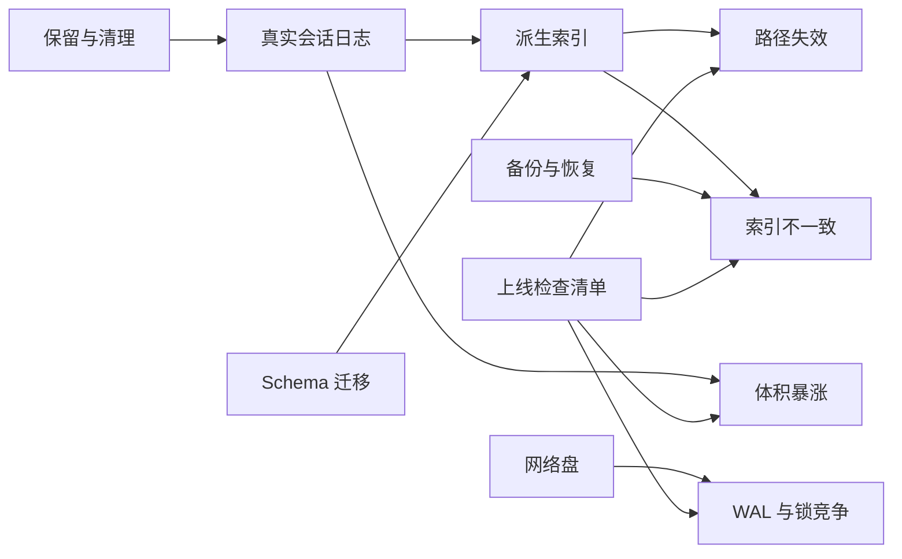
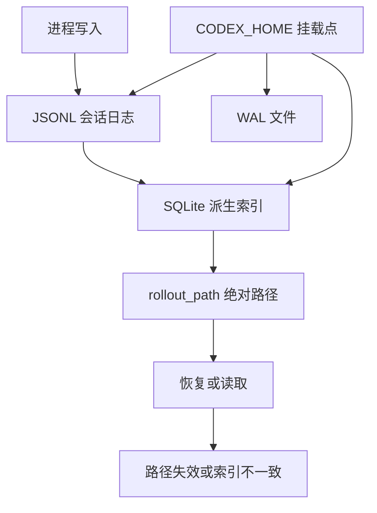
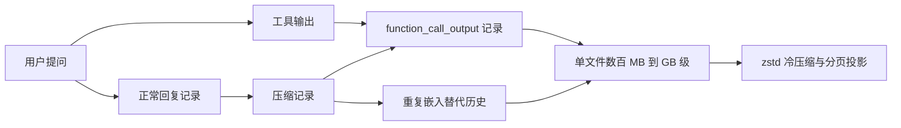
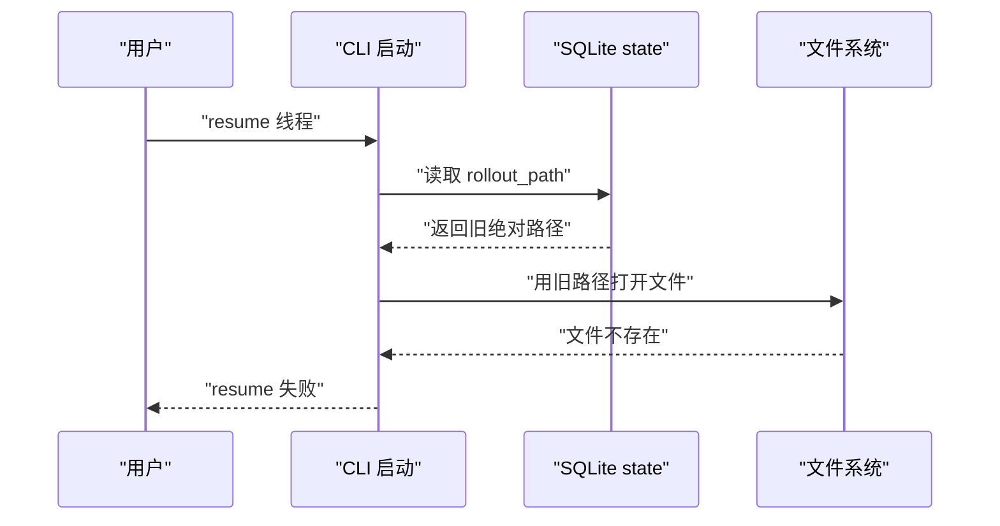
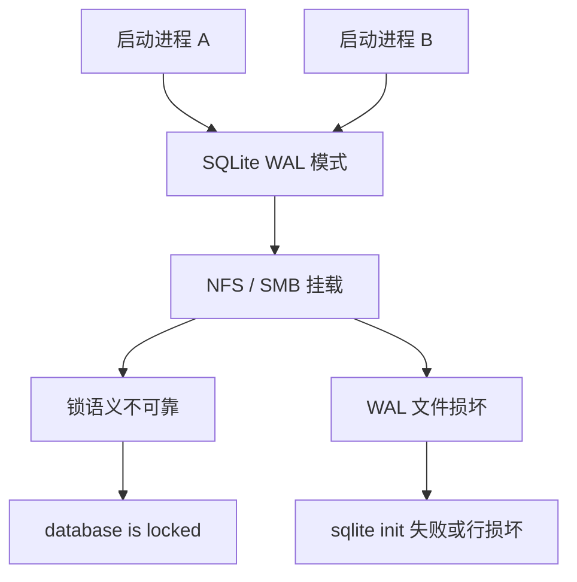
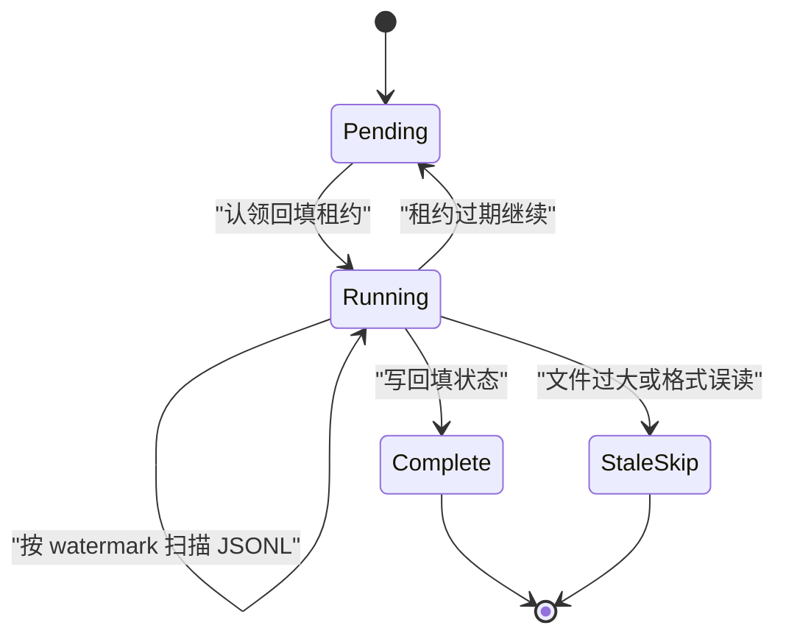
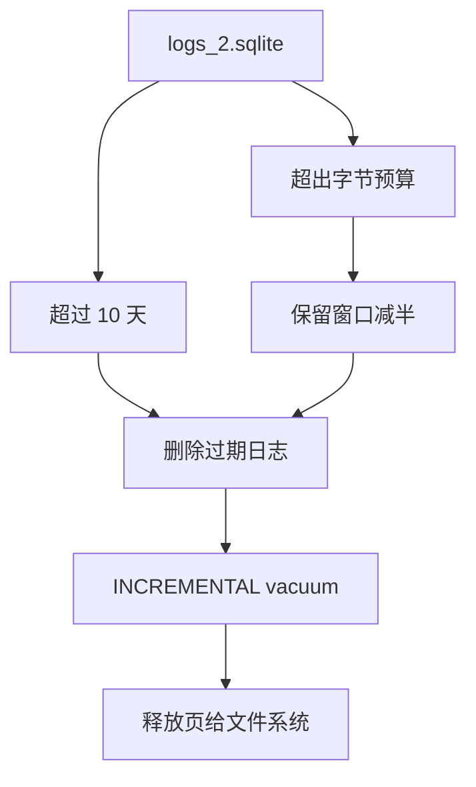
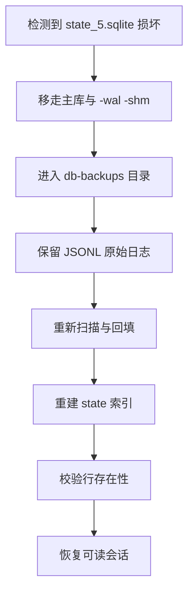
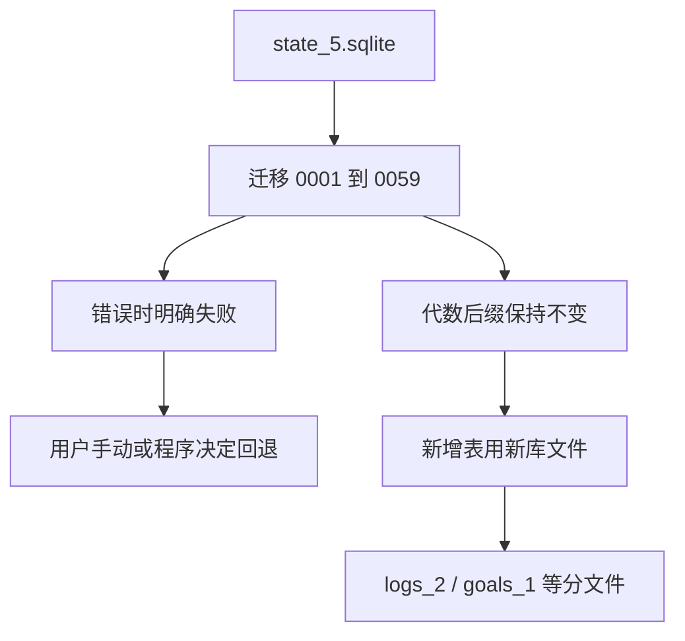
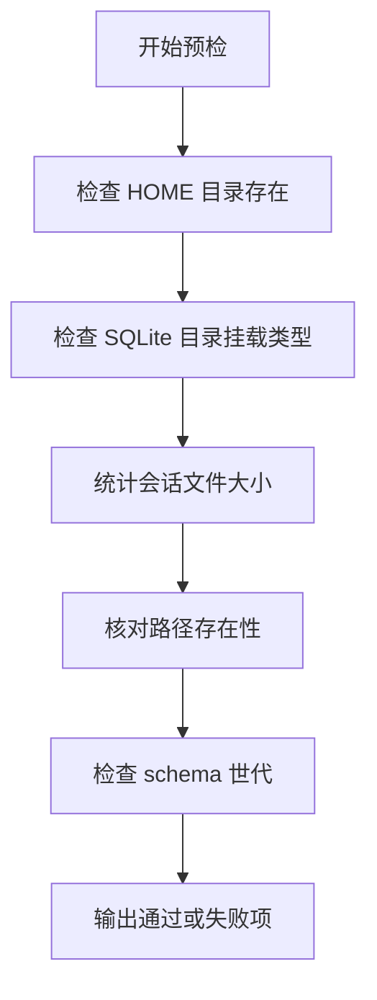

# 存储的故障模式与运维：体积暴涨、路径失效与迁移

!!! abstract "学完这一页你能"
    - 能说出体积暴涨、路径失效、NFS 上 WAL、索引与文件不一致四类故障的症状、根因、预防设计和监控指标。
    - 能根据 Codex CLI 源码与公开 issue 中的事实，写出绝对路径修复和 JSONL 派生索引的回填思路。
    - 能为本地会话存储设计日志保留、清理、备份恢复和 schema 迁移方案。
    - 能使用 Node 20 单文件脚本，对存储目录做可复现的预检并用断言验证。

## 0. 知识地图



建议先读第 1 节建立四个故障口径，再按发生概率读第 2、3、4、5 节。  
第 6、7、8、9 节更偏运维闭环，可在有具体部署计划时再回头查。  
图中的箭头表示“哪个存储区域最容易暴露哪类故障”，不是严格数据流。

## 1. 故障模式总览：先建立四类问题口径

**先想一个问题**
你把一个本地编码 Agent 接进团队环境，一个月后目录变成几十 GB。  
同时同事换了家目录，历史会话无法恢复。  
你需要先分清这是哪几类问题，才能决定先查哪里。

**心智模型**

!!! tip "心智模型"
    一句话模型：会话存储要同时管理“真日志”“派生索引”“运行时锁”“外部文件系统”四个面。  
    日常类比：快递仓库里，原始运单是日志，电脑里的分类表是索引；搬仓库时分类表里的老地址会失效。 
    类比不成立的地方：快递地址错误只影响派送，存储里的绝对路径错误还会被当成权威答案去读取，导致错误结果。

**图解**



1. 进程先把会话追加到 JSONL 日志，这是源数据。  
2. 后台把日志摘取到 SQLite 索引，用于列表和分页。  
3. SQLite 行里保存绝对路径，外部目录迁移后会失真。  
4. 网络挂载点影响 WAL 和锁行为，产生第三类故障。

**一步一步来**

**第 1 步：建立四个故障域与对应的检查对象**

这一步要做什么：用一个对象数组描述四类故障，作为后续脚本的输入。

```javascript
// fault-model.mjs
export const faultModel = [
  {
    id: "bloat",
    symptom: "目录从数百 MB 长到 GB 级",
    rootCause: "重复压缩历史与原始工具输出被多次保存",
    checkTarget: "rollout 文件记录类型与清理策略",
    metric: "rollout_size_bytes",
  },
  {
    id: "path-stale",
    symptom: "resume 或 fork 失败",
    rootCause: "SQLite 保存绝对 rollout_path，HOME 变化后失效",
    checkTarget: "threads.rollout_path",
    metric: "stale_db_path_retained",
  },
  {
    id: "wal-on-nfs",
    symptom: "启动报 database is locked 或损坏",
    rootCause: "WAL 在 NFS 上不可靠，或连接重复设置 WAL",
    checkTarget: "挂载类型与 PRAGMA journal_mode",
    metric: "sqlite.init.count 与 corruption.count",
  },
  {
    id: "index-mismatch",
    symptom: "列表有行但内容读取失败",
    rootCause: "索引与 JSONL 文件不同步",
    checkTarget: "backfill_state 与 rollout_path 是否存在",
    metric: "state db discrepancy",
  },
];
```

**这段代码在做什么**

- 用四行数据固定“症状、根因、检查对象、指标”口径。  
- `checkTarget` 对应后续脚本要读取的字段或文件名。  
- `metric` 来自 Codex CLI 源码中出现的指标名，如 `rollout_size_bytes` 为资料提及的迁移记录字段。  
- 这个数组本身就是本节产出的检查清单雏形。  
- 后续各节会逐项展开验证脚本。  
- 没有使用外部依赖，Node 20 可直接运行。

**第 2 步：把四类故障映射到可执行检查函数**

这一步要做什么：写一个 `buildChecklist`，把模型转成中文检查动作。

```javascript
// build-checklist.mjs
import { faultModel } from "./fault-model.mjs";

export function buildChecklist(model) {
  return model.map((item) => ({
    id: item.id,
    action: `检查 ${item.checkTarget}，记录 ${item.metric}`,
  }));
}

const checklist = buildChecklist(faultModel);
console.log(JSON.stringify(checklist, null, 2));
```

**这段代码在做什么**

- 输出每个故障域对应的一条检查动作。  
- 这里的动作还没有真正执行，只负责建立口径。  
- `checkTarget` 直接决定检查动作的文案。  
- 后续章节会补齐检查函数实现。  
- 预期输出包含四条 JSON 行，每条一个 `id` 和一个 `action`。

运行结果：

```text
[
  {
    "id": "bloat",
    "action": "检查 rollout 文件记录类型与清理策略，记录 rollout_size_bytes"
  },
  ...
]
```

**动手验证**

```javascript
// verify-fault-model.mjs
import assert from "node:assert/strict";
import { faultModel } from "./fault-model.mjs";
import { buildChecklist } from "./build-checklist.mjs";

const ids = faultModel.map((f) => f.id);
assert.deepEqual(ids, ["bloat", "path-stale", "wal-on-nfs", "index-mismatch"]);

const checklist = buildChecklist(faultModel);
assert.equal(checklist.length, 4);
assert.match(checklist[0].action, /rollout_size_bytes/);
console.log("预期输出：四类故障检查口径构建通过");
```

**这段代码在做什么**

- 断言四个故障 id 按预期存在。  
- 断言检查清单生成四条。  
- 断言体积暴涨动作包含指定指标名。  
- 运行成功输出一条中文确认信息。

**常见坑**

| 现象 | 原因 | 怎么修 |
|---|---|---|
| 只盯着目录总大小 | 不知道增长来自哪种记录 | 先统计 JSONL 记录类型占比 |
| 只修 SQLite 不核对 JSONL | 派生索引损坏被当成源数据 | 先确认 JSONL 是否可用于重建 |
| 只在本地盘验证 | NFS 和 SMB 行为不同 | 仿真网络盘或按挂载类型分诊 |
| 没有留存指标 | 无法判断是否恶化 | 至少记录大小、路径失效数、锁超时数 |

**用在哪里**

业务背景：后端平台给多用户托管本地会话目录。  
这一节知识怎么用：上线前按四类故障建立检查项。  
衡量收益：故障定位时间从逐盘排查降到按类型筛查。  
什么时候不该用：单用户临时脚本不需要完整四类模型。

业务背景：桌面应用同时写入 CLI、IDE 插件共享目录。  
这一节知识怎么用：把路径、锁、索引一致性分开验证。  
衡量收益：定位“启动失败”时能先判断锁还是索引还是路径。  
什么时候不该用：只读一次的演示程序不必建立完整口径。

**行业实践**

- OpenAI Codex CLI 的 `state` crate 将 JSONL 定义为源，SQLite 定义为派生镜像。来源：OpenAI Codex CLI 源码 `state/src/lib.rs`。  
- Codex 在启动时使用 100 ms 的 `quick_check`，损坏时进入 `BackupAndRebuild`。来源：OpenAI Codex CLI 源码 `state/src/runtime/recovery.rs` 与 `sqlite.rs`。  
- Claude Code 文档给出会话保留配置，资料显示 `cleanupPeriodDays` 默认 30 天。来源：Claude Code 官方文档，以原文为准。

怎么借鉴到你的项目：把“源数据、索引、锁、外部盘”四层分开命名和监控，不要用总目录大小当唯一健康指标。

**小结**

- 四类故障分别指向日志文件、索引行、WAL/锁和文件系统挂载。  
- 每个故障都必须有症状、根因、预防设计和监控指标。  
- 先建口径，再写检查脚本，可以避免一出问题就全盘重装。

## 2. 体积暴涨：重复压缩历史与原始工具输出

**先想一个问题**
一个 12 天的编码会话结束后，单个 rollout 文件长到 1.4 GB。  
用户只问了若干轮问题，但目录却持续膨胀。  
你需要知道这 1.4 GB 到底花在哪里。

**心智模型**

!!! tip "心智模型"
    一句话模型：会话日志不是“每轮一段”，而是追加了压缩历史、原始工具输出、推理字段等多种记录。  
    日常类比：会议纪要每次都要附上以前所有纪要的全文，而不是只写“同上次”。  
    类比不成立：真实日志的重复不是秘书偷懒，而是压缩策略把完整替代历史重新嵌入一遍。

**图解**



1. 正常回复写入 JSONL，尚不构成主要增长。  
2. 压缩发生时，替代历史被重新嵌入，原始记录仍保留。  
3. 工具输出继续追加到 `function_call_output` 记录。  
4. 两类内容叠加后，单文件从数百 MB 增长到 GB 级。  
5. 后续工程响应包括分页投影和 zstd 冷压缩。

**一步一步来**

**第 1 步：统计 rollout 中四类高占比记录**

这一步要做什么：用 Node 读取 JSONL 文件，按记录字段名累计字节数。

```javascript
// stat-jsonl-bytes.mjs
import fs from "node:fs";

export function statRecordBytes(path) {
  const bytes = new Map();
  for (const line of fs.readFileSync(path, "utf8").split("\n")) {
    if (!line.trim()) continue;
    const record = JSON.parse(line);
    const size = Buffer.byteLength(line, "utf8");
    for (const key of ["compacted", "function_call_output", "reasoning", "token_count", "turn_context"]) {
      if (Object.hasOwn(record, key)) {
        bytes.set(key, (bytes.get(key) ?? 0) + size);
      }
    }
  }
  return bytes;
}
```

**这段代码在做什么**

- 逐行读取 JSONL，避免把整个大文件一次性 JSON 解析。  
- 每行先按 UTF-8 字节数统计真实磁盘占用。  
- 仅统计 Codex issue #24948 中列出的高占比字段。  
- `Object.hasOwn` 用于避免继承属性干扰。  
- 统计结果可用于区分“历史重复”和“原始工具输出”。  
- 代码不加载完整文件到单个对象，降低内存峰值。

**第 2 步：模拟重复压缩造成的二次增长**

这一步要做什么：给定一轮基础输出，模拟每次压缩都写入完整替代历史。

```javascript
// simulate-recompression.mjs
export function simulateGrowth(baseJsonBytes, rounds) {
  let total = 0;
  const parts = [];
  for (let i = 0; i < rounds; i += 1) {
    const part = baseJsonBytes + i * 32;
    parts.push(part);
    total += part;
  }
  return { total, latestPart: parts.at(-1) };
}

const result = simulateGrowth(1024, 3);
console.log(result);
```

**这段代码在做什么**

- `baseJsonBytes` 代表一轮压缩前的基础记录大小。  
- 每轮增加 32 字节，模拟替换历史随轮次增长。  
- `total` 是多次写入后的累计文件体积。  
- `latestPart` 是最后写入的那一段大小。  
- 说明单次写入不算大，但多次重复写入会显著推高总体积。

运行结果：

```text
{ total: 3168, latestPart: 1088 }
```

**动手验证**

```javascript
// verify-bloat.mjs
import assert from "node:assert/strict";
import { simulateGrowth } from "./simulate-recompression.mjs";

const { total, latestPart } = simulateGrowth(1024, 3);
assert.ok(total > 3 * latestPart, "累计体积应大于最后一轮的若干倍");
assert.equal(total, 3168);
console.log("预期输出：重复压缩历史会造成累计体积放大");
```

**这段代码在做什么**

- 用断言确认累计体积大于单段体积。  
- 固定三轮输入，给出确定数值 3168。  
- 验证的是增长方向，不替代真实源码测量。

**常见坑**

| 现象 | 原因 | 怎么修 |
|---|---|---|
| 单文件数 GB 且无法恢复 | 压缩记录重复嵌入完整历史 | 不重嵌完整历史，改为区间替换或引用前缀 |
| 图片 data URL 反复出现 | 同一图片内容被多次写入 | 按哈希去重或单独卸载 |
| 历史模式切换后内容丢失 | 分页投影未覆盖旧记录 | 迁移前记录 `history_mode` 并保留原 JSONL |
| 归档目录从不清理 | 没有归档保留上限 | 设置会话最大保留天数并暴露清理命令 |

**用在哪里**

业务背景：编码 Agent 长时间在一个会话里运行，产出大量工具输出。  
这一节知识怎么用：按记录字段统计增长来源，识别压缩历史和工具输出。  
衡量收益：能定位具体是 `compacted` 还是 `function_call_output` 占大头。  
什么时候不该用：短会话或输出极小，不必引入复杂压缩统计。

业务背景：企业审计要求保存原始工具输出，不能直接删除。  
这一节知识怎么用：把原始输出与派生压缩分开保存，降低重放成本。  
衡量收益：节省空间的同时保留审计所需原始证据。  
什么时候不该用：没有审计要求时，过早去重会增加复杂度。

**行业实践**

- OpenAI Codex CLI 使用 zstd 冷压缩透明处理 `.jsonl` 和 `.jsonl.zst`。来源：OpenAI Codex CLI 源码 `rollout/src/compression.rs`。  
- Codex 采用 `thread_history_1.sqlite` 作为分页历史投影，避免每次 resume 重放完整 JSONL。来源：OpenAI Codex CLI 源码 `thread_history_migrations/`。  
- Claude Code 文档提供会话保留配置，资料显示默认 30 天。来源：Claude Code 官方文档，以原文为准。

怎么借鉴到你的项目：给 JSONL 记录类型加体积统计，冷数据压缩，热数据投影到 SQLite，保留原始文件作为可重建源。

**小结**

- 体积暴涨不是单个大字符串，而是压缩历史和工具输出重复追加。  
- 统计要按记录字段分开，不能只看目录总大小。  
- 预防设计包括冷压缩、分页投影、哈希去重和保留上限。

## 3. 路径失效：SQLite 中保存的绝对路径

**先想一个问题**
用户把家目录从 `/home/old` 迁移到 `/Users/new`。  
终端仍能列出历史会话，但点击 resume 时提示 rollout 文件不存在。  
这个场景对应 Codex CLI issue #47002 报告的问题。

**心智模型**

!!! tip "心智模型"
    一句话模型：派生索引把“文件在哪里”存成绝对路径，搬家后文件还能被扫描到，但索引仍指向旧地址。  
    日常类比：通讯录里保存老办公室门牌号，公司搬了以后新花名册还在用旧门牌。  
    类比不成立：真实 SQLite 行可能在分页历史模式下被当作权威来源，而不是去文件系统重新找。

**图解**



1. 用户发起 resume，CLI 优先查 SQLite 索引。  
2. SQLite 返回保存的绝对 rollout_path。  
3. CLI 用这个路径访问文件系统。  
4. 文件系统返回不存在，resume 失败。  
5. 问题的关键是索引行没有随当前 HOME 重新解析。

**一步一步来**

**第 1 步：模拟一个 Stale Path 行**

这一步要做什么：用对象模拟 SQLite 行，保存旧绝对路径。

```javascript
// make-thread-row.mjs
export function makeThreadRow(threadId, rolloutPath) {
  return {
    id: threadId,
    rollout_path: rolloutPath,
    archived: 0,
    updated_at: Date.now(),
  };
}

const row = makeThreadRow("thread-1", "/home/old/.codex/sessions/2026/10/06/rollout-a.jsonl");
console.log(row.rollout_path);
```

**这段代码在做什么**

- 创建一个和 `threads` 表主要字段相近的行对象。  
- `rollout_path` 保存绝对路径，复现 issue #47002 的情况。  
- 迁移 HOME 后这个字段不会自动变化。  
- `archived: 0` 表示该会话仍被当成活跃项。  
- `updated_at` 使用当前毫秒时间戳，便于后续比较。

运行结果：

```text
/home/old/.codex/sessions/2026/10/06/rollout-a.jsonl
```

**第 2 步：实现可重新解析路径的修复函数**

这一步要做什么：根据当前 HOME 和旧 HOME，把旧路径重写为新路径。

```javascript
// repair-rollout-path.mjs
export function repairRolloutPath(storedPath, oldHome, newHome) {
  if (storedPath.startsWith(oldHome + "/")) {
    return storedPath.replace(oldHome, newHome);
  }
  return storedPath;
}

const fixed = repairRolloutPath(
  "/home/old/.codex/sessions/rollout-a.jsonl",
  "/home/old",
  "/Users/new"
);
console.log(fixed);
```

**这段代码在做什么**

- 只处理以旧 HOME 开头的路径，避免误改无关字符串。  
- 用 `replace(oldHome, newHome)` 替换前缀。  
- 如果路径不属于旧 HOME，则原样返回。  
- 这模拟 Codex 源码 `read_repair_rollout_path` 的目标行为。  
- 实际源码并非只做字符串替换，资料未覆盖其完整实现，需核对官方源码。

运行结果：

```text
/Users/new/.codex/sessions/rollout-a.jsonl
```

**动手验证**

```javascript
// verify-path-repair.mjs
import assert from "node:assert/strict";
import { makeThreadRow } from "./make-thread-row.mjs";
import { repairRolloutPath } from "./repair-rollout-path.mjs";

const row = makeThreadRow("thread-1", "/home/old/.codex/sessions/rollout-a.jsonl");
const fixed = repairRolloutPath(row.rollout_path, "/home/old", "/Users/new");

assert.equal(fixed, "/Users/new/.codex/sessions/rollout-a.jsonl");
assert.doesNotMatch(fixed, /^\/home\/old/);
console.log("预期输出：旧绝对路径已按新 HOME 重写");
```

**这段代码在做什么**

- 构造旧路径行。  
- 调用修复函数得到新路径。  
- 断言新路径不再是旧 HOME 前缀。  
- 验证只改路径前缀，不破坏后续相对结构。

**常见坑**

| 现象 | 原因 | 怎么修 |
|---|---|---|
| 列表显示但 resume 失败 | SQLite 行指向旧绝对路径 | 读时重解析或改用相对路径 |
| 修复后归档标记仍错 | 只改路径未改 archived | 检查读修复是否同步恢复归档状态 |
| 迁移后两个 HOME 都存在 | 前缀替换可能指向错误目录 | 保存迁移记录并优先扫描真实文件 |
| 多进程同时改索引 | 路径修复没有锁 | 读修复只允许 seed 缺失行，不改已有行关键字段 |

**用在哪里**

业务背景：桌面应用安装路径变化后，历史会话无法打开。  
这一节知识怎么用：读取 session 时动态解析当前家目录。  
衡量收益：恢复成功率从“清空下不可恢复”提升到可自动修复。  
什么时候不该用：Session 只在一台机器单一路径使用时可暂不做。

业务背景：云同步或容器挂载导致目录在不同环境变化。  
这一节知识怎么用：持久化层不存绝对路径，存相对路径或文件 id。  
衡量收益：同一份数据库可在不同 HOME 下复用。  
什么时候不该用：共享索引会被同步工具改写时，需要额外校验写入者。

**行业实践**

- OpenAI Codex CLI 在 `read_repair_rollout_path` 中提到修复过期 rollout_path 和归档标志。来源：OpenAI Codex CLI 源码 `rollout/src/state_db.rs`。  
- Codex 在 list threads 时会跳过 rollout_path 不存在的行，并记录 `stale_db_path_retained`。来源：OpenAI Codex CLI 源码。  
- 该资料中 issue #47002 明确报告绝对路径在 HOME 变化后失效，且分页模式下 stale DB path 被当成权威。来源：openai/codex issue #47002，以原文为准。

怎么借鉴到你的项目：把数据库中的路径字段设计为“可重建地址”，启动时做快速存在性检查，存在冲突时回源到文件系统扫描。

**小结**

- 绝对路径存进 SQLite 后，目录迁移会让整个索引失真。  
- 修复策略是读时解析或扫描重建，而不是让用户删库。  
- 预防设计优先存相对路径，并对 stale 行记录指标。

## 4. NFS 上 WAL 与锁竞争：共享盘上的运行时问题

**先想一个问题**
团队把 CODEX_HOME 放在 NFS 共享目录。  
两个开发者同时启动 CLI，一个进程报 `database is locked`，另一个进程看到数据库损坏。  
这是 issue #30957 和 #46269 触及的两类运行时问题。

**心智模型**

!!! tip "心智模型"
    一句话模型：SQLite 的 WAL 依赖本地文件系统语义，网络盘不具备同等锁与内存映射保证。  
    日常类比：两个办公室共用一个纸质登记本，但没有任何人负责实时同步两个办公室的翻阅顺序。  
    类比不成立：SQLite 不是简单读写冲突，而是 WAL 模式在网络文件系统上可能产生更底层的损坏。

**图解**



1. 两个进程都尝试以 WAL 模式打开数据库。  
2. 文件落在 NFS 或 SMB 挂载点。  
3. 锁语义不可靠表现为启动阻塞或 `database is locked`。  
4. WAL 文件损坏表现为 init 失败或运行时损坏。  
5. 两条路径都源于同一外部文件系统选择错误。

**一步一步来**

**第 1 步：给出挂载类型风险提示**

这一步要做什么：输入挂载类型字符串，判断是否属于高风险网络盘。

```javascript
// detect-remote-fs.mjs
export function isRemoteFs(mountType) {
  const risky = ["nfs", "nfs4", "cifs", "smb", "9p"];
  return risky.includes(String(mountType).toLowerCase());
}

console.log(isRemoteFs("nfs4"));
console.log(isRemoteFs("ext4"));
```

**这段代码在做什么**

- 定义常见网络文件系统关键字清单。  
- 将输入转为小写再比较，降低大小写误差。  
- `ext4` 返回 false，表示适合 WAL 的本地盘。  
- 这个函数可用于部署前预检，不替代真实挂载检查。  
- 在高风险挂载上直接禁用 WAL 或换本地目录，是更稳妥策略。

运行结果：

```text
true
false
```

**第 2 步：模拟锁超时重试**

这一步要做什么：用短函数模拟 `busy_timeout` 内抢占与放弃。

```javascript
// retry-busy.mjs
export function retryBusy(attempts, timeoutMs, isLocked) {
  for (let i = 0; i < attempts; i += 1) {
    if (!isLocked()) return { ok: true, attempts: i + 1 };
    if (i + 1 >= attempts) return { ok: false, attempts: i + 1 };
    Atomics.wait(new Int32Array(new SharedArrayBuffer(4)), 0, 0, timeoutMs);
  }
}

const result = retryBusy(3, 10, () => true);
console.log(result);
```

**这段代码在做什么**

- 循环尝试获取锁。  
- 如果拿不到锁且未到最大次数，等待 `timeoutMs`。  
- `isLocked` 永远返回 true，表示锁一直被占。  
- 返回失败和尝试次数。  
- 实际 SQLite 使用 C 层 `busy_timeout`，这里只验证重试逻辑。

运行结果：

```text
{ ok: false, attempts: 3 }
```

**动手验证**

```javascript
// verify-nfs-wal.mjs
import assert from "node:assert/strict";
import { isRemoteFs } from "./detect-remote-fs.mjs";
import { retryBusy } from "./retry-busy.mjs";

assert.equal(isRemoteFs("nfs"), true);
assert.equal(isRemoteFs("apfs"), false);
const locked = retryBusy(3, 10, () => true);
assert.deepEqual(locked, { ok: false, attempts: 3 });
console.log("预期输出：NFS 被识别为高风险挂载，锁重试在耗尽后失败");
```

**这段代码在做什么**

- 验证 nfs 被识别为网络盘。  
- 验证 apfs 不被误判。  
- 验证锁重试三次后返回失败结构。  
- 输出一条中文确认消息。

**常见坑**

| 现象 | 原因 | 怎么修 |
|---|---|---|
| 每次启动都 database is locked | 网络盘锁语义差 | 不在 NFS/SMB 放 WAL 库 |
| 连接池重复设置 WAL | PRAGMA 写入锁互相阻塞 | 仅在空库初始化时设置 WAL |
| 日志库锁住主库启动 | 高频 telemetry 与 state 同库 | 把 logs 分到独立 SQLite 文件 |
| busy_timeout 只有 5 秒无重试 | 窗口太短 | 提高超时并加重试与恢复模式 |

**用在哪里**

业务背景：公司开发机统一把家目录挂到 NFS。  
这一节知识怎么用：部署脚本检测挂载类型，并指定本地 SQLite 目录。  
衡量收益：启动失败数下降，避免高成本全团队排查。  
什么时候不该用：所有数据都在本地 SSD 的环境不必做远程盘检查。

业务背景：IDE 插件和 CLI 同时运行，频繁抢锁。  
这一节知识怎么用：把高频日志库和会话索引分文件。  
衡量收益：降低其中一个写入阻塞另一个启动的概率。  
什么时候不该用：单进程运行且写入极低的工具可以减少拆分。

**行业实践**

- OpenAI Codex CLI 源码 `state/src/sqlite.rs` 显示在 `after_connect` 设置 WAL，并只在空库设置 `auto_vacuum`。来源：OpenAI Codex CLI 源码。  
- CLI 编译期断言最低 SQLite 版本为 3.51.3，注释称必须包含 WAL-reset 修复。来源：OpenAI Codex CLI 源码 `state/src/lib.rs`。  
- 针对 NFS 上 WAL 问题，资料引用的是 openai/codex issue #30957，以原文为准。来源：openai/codex issue #30957。

怎么借鉴到你的项目：把 SQLite 目录可配置，检测远程挂载后回退到本地目录，并将高频写入表拆到独立文件。

**小结**

- NFS 与 SMB 不适合承载 WAL 模式 SQLite。  
- 锁竞争还可能来自连接重复设置 PRAGMA 或日志常驻写锁。  
- 部署前检测挂载类型，比事后救损坏文件成本更低。

## 5. 索引与文件不一致：回填与读修复

**先想一个问题**
你在新机器上首次启动，列表页能看到若干条会话。  
但其中一些会话点击后内容为空，日志里出现 `state db discrepancy during list_threads_db`。  
这表示 SQLite 索引和真实 JSONL 文件已经不同步。

**心智模型**

!!! tip "心智模型"
    一句话模型：JSONL 是真相来源，SQLite 是可重建索引；不一致时应回源到 JSONL。  
    日常类比：仓库电脑里的库存表错了，正确做法是拿原始入库单逐箱盘点。  
    类比不成立：真实系统中有些索引行并不只是“缺货”，还可能是路径过期，需要读修复而非简单删除。

**图解**



1. 回填从 Pending 状态开始。  
2. 进程通过租约进入 Running，只有一个进程扫描。  
3. 扫描按 watermark 推进，中断后可恢复。  
4. 全部处理完标记为 Complete。  
5. 异常文件进入 StaleSkip，不阻塞主流程。

**一步一步来**

**第 1 步：建立 JSONL 文件清单与数据库索引的差异**

这一步要做什么：输入 JSONL 文件集合和数据库行集合，找出缺失行。

```javascript
// compare-backed.mjs
export function findMissingRollouts(filesOnDisk, rowsInDb) {
  const indexed = new Set(rowsInDb.map((row) => row.split("/").at(-1)));
  return filesOnDisk.filter((file) => !indexed.has(file.split("/").at(-1)));
}

const files = [
  "/sessions/2026/10/06/rollout-a.jsonl",
  "/sessions/2026/10/06/rollout-b.jsonl",
];
const rows = ["/sessions/2026/10/06/rollout-a.jsonl"];
console.log(findMissingRollouts(files, rows));
```

**这段代码在做什么**

- 用文件名作为匹配键，避免绝对路径前缀干扰。  
- `indexed` 集合来自数据库行路径。  
- 过滤出磁盘存在但数据库缺失的文件。  
- 这是索引恢复到共识状态的第一步。  
- 真实系统还会比较 compiled size 或 watermark，资料之外需核对源码。

运行结果：

```text
[ '/sessions/2026/10/06/rollout-b.jsonl' ]
```

**第 2 步：执行一次最小回填写入**

这一步要做什么：把缺失文件加入一个可持久化状态对象。

```javascript
// backfill-min.mjs
export function backfillMissing(state, missingFiles) {
  const next = { ...state, rows: [...state.rows] };
  for (const file of missingFiles) {
    next.rows.push({
      rollout_path: file,
      updated_at: Date.now(),
    });
  }
  next.status = "complete";
  return next;
}

const state = { status: "pending", rows: [] };
const result = backfillMissing(state, ["/sessions/2026/10/06/rollout-b.jsonl"]);
console.log(result);
```

**这段代码在做什么**

- 复制原状态，避免在原对象上修改。  
- 每个缺失文件追加一行，保存路径和时间。  
- 完成后把状态置为 `complete`。  
- 这只用于演示，不写真实 SQLite。  
- 真实回填要用 `BEGIN IMMEDIATE` 或租约 CAS，资料有 `try_claim_backfill` 描述。

运行结果：

```text
{
  status: 'complete',
  rows: [ { rollout_path: '...rollout-b.jsonl', updated_at: ... } ]
}
```

**动手验证**

```javascript
// verify-backfill.mjs
import assert from "node:assert/strict";
import { findMissingRollouts } from "./compare-backed.mjs";
import { backfillMissing } from "./backfill-min.mjs";

const files = ["/s/rollout-a.jsonl", "/s/rollout-b.jsonl"];
const rows = ["/s/rollout-a.jsonl"];
const missing = findMissingRollouts(files, rows);
assert.deepEqual(missing, ["/s/rollout-b.jsonl"]);

const state = backfillMissing({ status: "pending", rows: [] }, missing);
assert.equal(state.rows.length, 1);
assert.equal(state.status, "complete");
console.log("预期输出：缺失回填后索引覆盖磁盘中的 2 个 rollout");
```

**这段代码在做什么**

- 验证缺失文件检测结果。  
- 验证回填后行数增加。  
- 验证回填状态推进到 complete。  
- 说明索引与文件同步是可编程校验与修复的。

**常见坑**

| 现象 | 原因 | 怎么修 |
|---|---|---|
| 列表有行但内容空 | 索引行存在，文件已被移动 | 读取前检查文件存在性 |
| 回填时重复写行 | 多个进程同时扫描 | 用租约或 CAS 只允许一个进程认领 |
| 文件过大导致回填卡住 | 扫描整段超时 | 记录 skip 原因与大小 |
| 修复时覆盖已有行 | 读修复权限过大 | 只允许 seed 缺失行，不改已有行关键字段 |

**用在哪里**

业务背景：用户移动会话目录后希望列表自动恢复。  
这一节知识怎么用：启动回填扫描真实 JSONL，重建缺失索引行。  
衡量收益：索引覆盖率可计算为“已索引文件 / 磁盘文件”。  
什么时候不该用：当 JSONL 本身已损坏时，不能硬把错误内容标为完成。

业务背景：桌面端和 CLI 共享同一会话目录，存在并发写。  
这一节知识怎么用：使用租约与只读修复避免互相覆盖。  
衡量收益：减少多进程首次启动丢行，类似于 issue #42447 场景。  
什么时候不该用：单进程单写者可简化同步。

**行业实践**

- Codex 回填状态机位于 `state/src/runtime/backfill.rs`，用 `try_claim_backfill` 做租约与 CAS。来源：OpenAI Codex CLI 源码。  
- Codex 在读取时调用 `reconcile_rollout` 补充缺失行，但不允许修改已有行的某些字段。来源：OpenAI Codex CLI 源码。  
- 分页历史投影保存 `next_rollout_byte_offset` 作为增量重放游标。来源：OpenAI Codex CLI 源码 `thread_history_migrations/`。

怎么借鉴到你的项目：把“文件存在性检查、缺失补充、已有行保护、进度持久化”拆成四个明确操作。

**小结**

- JSONL 是源数据，SQLite 是可重建投影。  
- 回填要可断点续跑，不能一失败就全量重来。  
- 读修复只能补充缺失，不能覆盖用户已有字段。

## 6. 日志与会话的保留策略与清理

**先想一个问题**
日志库增长速度远快于会话索引。  
一周后 logs 文件占掉大部分磁盘，但用户并不关心这些内部 trace。  
你需要决定哪些数据保留多久，以及达到预算时如何清理。

**心智模型**

!!! tip "心智模型"
    一句话模型：保留策略由“时间窗口 + 字节预算”共同决定，达到预算时窗口自动缩短。  
    日常类比：冰箱里生鲜按生产日期清理，但空间不够时会优先扔最久远的那批。  
    类比不成立：真实日志清理可能会先删除最旧记录，也可能直接对旧段做 vacuum，不以“闻起来坏没坏”做依据。

**图解**



1. 日志表先检查时间窗口。  
2. 超 10 天日志被删除。  
3. 若字节预算仍超标，保留窗口继续缩短。  
4. 清理后执行增量 vacuum 释放空间。  
5. 删除和 vacuum 都作用于独立日志库，避免阻塞主索引。

**一步一步来**

**第 1 步：判断日志记录是否过期**

这一步要做什么：用创建时间和保留秒数计算是否应删。

```javascript
// retention-expired.mjs
const DAY_MS = 24 * 60 * 60 * 1000;

export function isExpired(createdAtMs, retentionDays, nowMs) {
  return nowMs - createdAtMs > retentionDays * DAY_MS;
}

const createdAt = Date.now() - 11 * DAY_MS;
console.log(isExpired(createdAt, 10, Date.now()));
```

**这段代码在做什么**

- 用 `retentionDays` 表示保留窗口。  
- 当前时间与创建时间差超过窗口则过期。  
- 这里使用 10 天窗口，来自 Codex 源码常量 `LOG_RETENTION_SECONDS` 的换算。  
- 代码只演示判断条件。  
- 真实系统会批量删除并按索引执行。

运行结果：

```text
true
```

**第 2 步：模拟字节预算下窗口减半**

这一步要做什么：当当前体积超过预算时，把保留窗口减半。

```javascript
// shrink-window.mjs
export function shrinkWindowIfOverBudget(bytesUsed, byteBudget, retentionDays) {
  if (bytesUsed > byteBudget) {
    return Math.floor(retentionDays / 2);
  }
  return retentionDays;
}

console.log(shrinkWindowIfOverBudget(120, 100, 10));
```

**这段代码在做什么**

- 用 `byteBudget` 表示日志预算，例如 100 MB。  
- 使用量超过预算后，保留天数从 10 降到 5。  
- 实际 Codex 会反复减半直到回到预算内。  
- 这个策略实现了时间与空间双重控制。  
- 单位这里为简化数字，真实项目中要统一为字节。

运行结果：

```text
5
```

**动手验证**

```javascript
// verify-retention.mjs
import assert from "node:assert/strict";
import { isExpired } from "./retention-expired.mjs";
import { shrinkWindowIfOverBudget } from "./shrink-window.mjs";

const day = 24 * 60 * 60 * 1000;
const now = Date.now();
assert.equal(isExpired(now - 11 * day, 10, now), true);
assert.equal(isExpired(now - 9 * day, 10, now), false);
assert.equal(shrinkWindowIfOverBudget(120, 100, 10), 5);
console.log("预期输出：日志按 10 天窗口过期，超预算后窗口减半");
```

**这段代码在做什么**

- 断言 11 天前日志已过期。  
- 断言 9 天前日志未过期。  
- 断言超预算时窗口从 10 减半到 5。  
- 验证策略的可计算性。

**常见坑**

| 现象 | 原因 | 怎么修 |
|---|---|---|
| 日志库长期不降 | 删除后没有 vacuum | 执行 INCREMENTAL vacuum |
| 清理把会话也删了 | 保留策略作用范围错误 | 日志与会话用不同库或表 |
| 窗口减半后误删当天 | 边界计算错误 | 用“创建时间 + 窗口”而不是粗略估算 |
| 磁盘占用反复反弹 | 新日志写入速度高于清理 | 结合写入速率监控调整预算 |

**用在哪里**

业务背景：CLI 工具在本地长期运行，内部日志持续生成。  
这一节知识怎么用：把 trace 日志放独立库，按 10 天与字节预算双阈值保留。  
衡量收益：磁盘占用可控制在预算附近。  
什么时候不该用：用户明确需要全量日志做审计时，不能自动删除。

业务背景：云端桌面镜像要控制会话目录体积。  
这一节知识怎么用：预留会话保留 30 天，而将调试日志保留窗口设得更短。  
衡量收益：降低镜像制作和同步成本。  
什么时候不该用：合规要求保留原始记录时，应压缩归档而非删除。

**行业实践**

- Codex 源码 `logs_maintenance.rs` 定义 10 天保留秒数，并在超预算时反复减半。来源：OpenAI Codex CLI 源码。  
- Codex 迁移 `0023_drop_logs.sql` 将日志从 state 表移除并设置 `PRAGMA auto_vacuum = INCREMENTAL`。来源：OpenAI Codex CLI 源码 `state/migrations/`。  
- Claude Code 文档列出 30 天会话保留配置，资料以原文为准。来源：Claude Code 官方文档。

怎么借鉴到你的项目：运行清理任务时只针对日志库，保留窗口与字节预算同时作为阈值。

**小结**

- 日志保留不能只按天数，还要有字节预算。  
- 清理之后要执行增量 vacuum，否则文件不会真正缩小。  
- 高频日志库要与会话索引分文件，避免清理争抢锁。

## 7. 备份与恢复：用可重建索引替代“抢救主库”

**先想一个问题**
某次程序异常退出后，`state_5.sqlite` 启动时提示损坏。  
用户最怕的不是 SQLite 坏了，而是自己跑了三天的会话不见了。  
如果 JSONL 还在，恢复是否应该从 SQLite 开始？

**心智模型**

!!! tip "心智模型"
    一句话模型：备份应优先保护不可重建的 JSONL，SQLite 损坏时移走坏文件并重建。  
    日常类比：书稿源文件是核心，排版软件生成的目录页坏了就重新生成。  
    类比不成立：真实 SQLite 可能存有 JSONL 没有的元数据，因此不能无差别丢弃，需要先隔离。

**图解**



1. 检测到特定数据库损坏。  
2. 只移走该数据库和它的 `-wal`、`-shm` 旁车。  
3. 原始 JSONL 被保留。  
4. 重新回填生成新索引。  
5. 修复后校验路径和行存在性。

**一步一步来**

**第 1 步：模拟损坏恢复所需动作**

这一步要做什么：给出损坏文件名，生成需要移走的三类文件。

```javascript
// plan-corrupt-backup.mjs
export function planBackupFiles(dbPath) {
  return [dbPath, dbPath + "-wal", dbPath + "-shm"];
}

console.log(planBackupFiles("/home/u/.codex/state_5.sqlite"));
```

**这段代码在做什么**

- 主库文件加 `-wal` 和 `-shm` 三个路径。  
- 这三个文件是 SQLite WAL 模式常见旁车。  
- 恢复前必须一起移走，避免旧 WAL 继续污染新库。  
- 只计划路径，不真正移动。  
- 实际恢复还会设置恢复模式。

运行结果：

```text
[ '/home/u/.codex/state_5.sqlite', '/home/u/.codex/state_5.sqlite-wal', '/home/u/.codex/state_5.sqlite-shm' ]
```

**第 2 步：验证 JSONL 可回填数量**

这一步要做什么：在移动损坏库后，统计还可用于重建的 JSONL 数量。

```javascript
// count-rebuildable-rollouts.mjs
export function countRebuildableRollouts(files) {
  return files.filter((file) => file.endsWith(".jsonl") || file.endsWith(".jsonl.zst")).length;
}

const files = ["rollout-a.jsonl", "rollout-b.jsonl.zst", "index-cache.bin"];
console.log(countRebuildableRollouts(files));
```

**这段代码在做什么**

- 统计可重放的普通 JSONL 与 zstd 压缩文件。  
- `.jsonl.zst` 来自 Codex 冷压缩扩展名。  
- 非会话文件不被计入。  
- 数值代表可重建行的下降空间。  
- 如果为 0，则无法从 JSONL 恢复，必须依赖其他备份。

运行结果：

```text
2
```

**动手验证**

```javascript
// verify-backup-recovery.mjs
import assert from "node:assert/strict";
import { planBackupFiles } from "./plan-corrupt-backup.mjs";
import { countRebuildableRollouts } from "./count-rebuildable-rollouts.mjs";

const db = "/home/u/.codex/state_5.sqlite";
assert.deepEqual(planBackupFiles(db), [db, db + "-wal", db + "-shm"]);

assert.equal(countRebuildableRollouts(["a.jsonl", "b.jsonl.zst", "c.bin"]), 2);
console.log("预期输出：损坏库先隔离，JSONL 仍可重建索引");
```

**这段代码在做什么**

- 验证三个文件路径齐全。  
- 验证可重建文件数量为 2。  
- 明确“先隔离、后回填”的顺序。

**常见坑**

| 现象 | 原因 | 怎么修 |
|---|---|---|
| 只移主库不移 -wal | 旧 WAL 可能重放失败 | 三个文件一起隔离 |
| 恢复时以为 SQLite 是真相 | 索引被错误当成源 | 优先验证 JSONL 是否可用 |
| 回填后行仍指向旧路径 | 重建保留旧绝对路径 | 回填成功后执行路径校验 |
| 备份只存了 SQLite | 缺少不可重建原始日志 | 备份目标改为 JSONL，或同时保留两者 |

**用在哪里**

业务背景：用户在工作站上发现本地数据库损坏，但会话日志完整。  
这一节知识怎么用：隔离损坏 SQLite，保留 JSONL，触发回填重建。  
衡量收益：恢复时间从人工修数据库降到自动重扫。  
什么时候不该用：JSONL 已同步删除时，必须依赖独立备份。

业务背景：企业要恢复一个多月前的会话供审计。  
这一节知识怎么用：先恢复 JSONL 源，再生成临时索引用于检索。  
衡量收益：审计不需要完整生产索引也可读取内容。  
什么时候不该用：会话包含超大工具输出且没有压缩时，恢复成本高。

**行业实践**

- Codex 的 `RecoveryMode::BackupAndRebuild` 只移走损坏库及其旁车，保留其他 DB。来源：OpenAI Codex CLI 源码 `state/src/runtime/recovery.rs`。  
- `thread_history` 数据库使用 `RecoveryMode::Unavailable`，因为它作为投影不能静默重建。来源：OpenAI Codex CLI 源码。  
- 启动 `quick_check` 限制为 100 ms，用于快速发现损坏并回退。来源：OpenAI Codex CLI 源码 `state/src/sqlite.rs`。

怎么借鉴到你的项目：为每个数据库文件定义“可重建”或“必须备份”属性，恢复逻辑据此分支。

**小结**

- 不可重建的 JSONL 优先备份。  
- 损坏 SQLite 先隔离主库、WAL 和 SHM。  
- 恢复通过回填重建，而不是试图救回坏库。

## 8. Schema 迁移：版本后缀、编号迁移与不回退

**先想一个问题**
新版本发布后，启动程序要通过 59 个迁移文件更新旧库。  
如果一次失败，开发者和用户要做选择：继续猜，还是拒绝旧格式？  
这需要一套 schema 迁移原则。

**心智模型**

!!! tip "心智模型"
    一句话模型：数据库文件名带代数后缀，旧文件不进行破坏性迁移，新结构用新文件承载。  
    日常类比：换新表格时保留旧表格原件，再抄到新表格，原件错了还能回去。  
    类比不成立：真实迁移不总是“抄写”，有些旧库会被原地加索引，因此需要迁移顺序和锁。

**图解**



1. 一个数据库文件可能经历多次编号迁移。  
2. 文件名中的数字是 schema 世代号。  
3. 迁移不应半途静默成功。  
4. 新增功能表放入新的库文件。  
5. 分文件减少单点写入与锁竞争。

**一步一步来**

**第 1 步：识别 schema 世代与未来版本**

这一步要做什么：解析文件名后缀，并识别目标版本是否高于当前支持版本。

```javascript
// schema-version-check.mjs
export function parseSchemaGen(filename, prefix) {
  const match = filename.match(new RegExp(`^${prefix}_(\\d+)\\.sqlite$`));
  return match ? Number(match[1]) : null;
}

console.log(parseSchemaGen("state_5.sqlite", "state"));
console.log(parseSchemaGen("state_unknown.sqlite", "state"));
```

**这段代码在做什么**

- 使用正则从文件名提取代数数字。  
- 无法识别时返回 null。  
- 这对应 Codex 中 `state_5.sqlite` 等命名方式。  
- 未来版本若世代数更大，表示当前程序可能无法迁移。  
- 返回 null 可用于拒绝启动而不是乱猜格式。

运行结果：

```text
5
null
```

**第 2 步：用迁移函数决定是否要原地升代**

这一步要做什么：给定当前代和目标代，决定是否允许迁移。

```javascript
// schema-migrate-ok.mjs
export function canMigrate(currentGen, targetGen, supportedMax) {
  if (targetGen > supportedMax) return false;
  if (targetGen < currentGen) return false;
  return true;
}

console.log(canMigrate(5, 6, 6));
console.log(canMigrate(5, 7, 6));
```

**这段代码在做什么**

- 目标代超过支持上限时拒绝。  
- 目标代低于当前代时不执行回退迁移。  
- `supportedMax` 是程序内置的最大迁移编号。  
- 返回布尔值，调用方据此决定启动或报错。  
- 这个策略适合文件代数明确的本地存储。

运行结果：

```text
true
false
```

**动手验证**

```javascript
// verify-schema-migration.mjs
import assert from "node:assert/strict";
import { parseSchemaGen } from "./schema-version-check.mjs";
import { canMigrate } from "./schema-migrate-ok.mjs";

assert.equal(parseSchemaGen("state_5.sqlite", "state"), 5);
assert.equal(parseSchemaGen("state_x.sqlite", "state"), null);
assert.equal(canMigrate(5, 6, 6), true);
assert.equal(canMigrate(5, 7, 6), false);
console.log("预期输出：迁移只允许升代，未来版本被拒绝");
```

**这段代码在做什么**

- 验证世代解析。  
- 验证无法解析时给出 null。  
- 验证支持上限内可迁移。  
- 验证未来代数被明确拒绝。

**常见坑**

| 现象 | 原因 | 怎么修 |
|---|---|---|
| 升级后旧文件被抛弃 | 代码只认新代数文件名 | 保留旧文件并支持只读读取 |
| 迁移失败仍标记完成 | 进度写入过早 | 迁移成功后再写完成状态 |
| 多版本进程同时迁移 | 迁移不是幂等 | 设置迁移锁或使用租约 |
| 增量索引混用旧结构 | 新旧写入者差异 | 保持索引非唯一并容忍默认值 |

**用在哪里**

业务背景：桌面应用要升级本地数据库结构。  
这一节知识怎么用：用代际后缀和迁移锁保证升级失败可回退。  
衡量收益：升级失败不再破坏用户数据。  
什么时候不该用：一次性演示程序不需要完整迁移框架。

业务背景：团队从 JSONL 迁到 SQLite 主存储。  
这一节知识怎么用：保留 JSONL 源，SQLite 作为派生结构，按需要重建。  
衡量收益：迁移失败还能重新回填。  
什么时候不该用：没有旧数据或可以完全删除时，不必双写。

**行业实践**

- Codex 文件名 `state_5.sqlite`、`logs_2.sqlite` 中的后缀表示 schema 世代。来源：OpenAI Codex CLI 源码 `state/src/sqlite.rs`。  
- `state/migrations/` 存在 0001 到 0059 的编号迁移文件。来源：OpenAI Codex CLI 源码。  
- goose 启动时初始化 schema 用幂等 DDL 与 `BEGIN IMMEDIATE`，资料来自源码比对。来源：Goose 源码，以原文为准。

怎么借鉴到你的项目：文件名承载代数，迁移只升不降，未来版本明确拒绝。

**小结**

- Schema 世代号便于识别兼容性，而不是盲目猜测。  
- 迁移应只允许升代，并需要锁或幂等保证。  
- 旧文件保留，可回退到只读状态。

## 9. 上线检查清单：用脚本把事实变成可验证动作

**先想一个问题**
你准备把编码 Agent 的存储方案交付给开发组。  
手工逐台检查不可行，你需要一个脚本把所有关键检查串起来。  
这个脚本应该检查目录、路径、锁、体积和迁移。

**心智模型**

!!! tip "心智模型"
    一句话模型：上线检查清单不是文档列表，而是一个可重复执行、带失败退出码的脚本。  
    日常类比：飞机起飞前检查不是“记得看油表”，而是按清单逐项确认并记录结果。  
    类比不成立：存储检查还要处理大量运行时不确定性，例如路径存在但不可读，不能只看静态字段。

**图解**



1. 先确认基础目录存在。  
2. 检查 SQLite 目录是否落在远程挂载。  
3. 统计会话文件大小，判断是否接近预算。  
4. 逐行检查路径存在性。  
5. 读取 schema 世代，判断是否兼容。  
6. 汇总为通过项和失败项。

**一步一步来**

**第 1 步：组合目录与挂载检查**

这一步要做什么：写一个预检函数，输入目录存在性和挂载类型。

```javascript
// preflight-home.mjs
export function preflightHome(homeExists, mountType) {
  const checks = [];
  checks.push({ id: "home-exists", ok: homeExists });
  checks.push({ id: "sqlite-local", ok: !["nfs", "cifs"].includes(mountType) });
  return checks;
}

console.log(preflightHome(true, "ext4"));
```

**这段代码在做什么**

- 第一条检查确认目录存在。  
- 第二条检查确认 SQLite 目录不在 NFS 或 CIFS。  
- 返回结构统一的检查项。  
- 调用方可以统计失败项数量。  
- 这个组合代表了上线前最基础的两个预检。

运行结果：

```text
[ { id: 'home-exists', ok: true }, { id: 'sqlite-local', ok: true } ]
```

**第 2 步：检查 schema 世代与路径样本**

这一步要做什么：复用前文的解析函数，检查一个线程路径是否存在。

```javascript
// preflight-sample.mjs
import fs from "node:fs";
import { parseSchemaGen } from "./schema-version-check.mjs";

export function preflightSample(dbFilename, file) {
  const checks = [];
  checks.push({ id: "schema-gen-known", ok: parseSchemaGen(dbFilename, "state") !== null });
  checks.push({ id: "sample-path-exists", ok: fs.existsSync(file) });
  return checks;
}

console.log(preflightSample("state_5.sqlite", "/tmp/nonexistent.jsonl"));
```

**这段代码在做什么**

- 确认 db 文件名可解析出代数。  
- 用 fs.existsSync 检查样本会话文件是否存在。  
- 样本文件不存在会得到失败项，符合检查清单预期。  
- 这里用 `/tmp` 下肯定不存在的文件做演示。  
- 实际使用时应从 SQLite 或目录扫描中取真实样本。

运行结果：

```text
[ { id: 'schema-gen-known', ok: true }, { id: 'sample-path-exists', ok: false } ]
```

**动手验证**

```javascript
// verify-preflight.mjs
import assert from "node:assert/strict";
import { preflightHome } from "./preflight-home.mjs";
import { preflightSample } from "./preflight-sample.mjs";

const homeChecks = preflightHome(true, "ext4");
assert.deepEqual(homeChecks, [
  { id: "home-exists", ok: true },
  { id: "sqlite-local", ok: true },
]);

const sample = preflightSample("state_5.sqlite", "/tmp/nonexistent.jsonl");
assert.equal(sample[0].ok, true);
assert.equal(sample[1].ok, false);
console.log("预期输出：预检脚本能区分通过项与失败项");
```

**这段代码在做什么**

- 验证全部通过时输出两条 ok。  
- 验证 schema 世代可解析。  
- 验证不存在样本被判定为失败项。  
- 输出一条确认信息。

**常见坑**

| 现象 | 原因 | 怎么修 |
|---|---|---|
| 只检查目录存在 | 未反映 SQLite 是否可写 | 增加临时文件写测试 |
| 失败项不影响退出码 | 脚本没有统计 | 任何失败项使进程以非 0 退出 |
| 样本文件无代表性 | 只检查一个文件 | 随机抽 3 到 5 个活跃会话 |
| 检查结果没时间戳 | 不能区分历史失败 | 输出执行时间与版本号 |

**用在哪里**

业务背景：CI 在每台开发机上跑存储预检。  
这一节知识怎么用：将检查项标准化，返回机器可读结果。  
衡量收益：上线前抓出 NFS 或路径失效，避免生产故障。  
什么时候不该用：一次性运行的小工具可跳过完整预检。

业务背景：远程支持团队要确认用户环境是否健康。  
这一节知识怎么用：用同一个检查脚本收集目录、挂载与路径状态。  
衡量收益：支持工单从口头描述变成结构化数据。  
什么时候不该用：涉及隐私目录时需避免上传整个路径。

**行业实践**

- Codex 源码提供 `SQLITE_VERSION_NUMBER >= 3_051_003` 的编译期断言，用于避免已知 WAL 重置损坏。来源：OpenAI Codex CLI 源码 `state/src/lib.rs`。  
- Codex 启动时使用 `quick_check` 限时检测，并使用指标 `codex.sqlite.init.count`、`codex.sqlite.corruption.count`。来源：OpenAI Codex CLI 源码。  
- Codex 的 `backfill_state` 记录 `status`、`last_watermark` 和 `last_success_at`，可作为上线前检查数据来源。来源：OpenAI Codex CLI 源码 `migrations/0008`。

怎么借鉴到你的项目：把检查项写入版本控制，任何增加存储代码的改动都同步更新预检脚本。

**小结**

- 上线检查清单要用脚本执行，而不是靠记忆。  
- 每项检查应产生通过或失败，并影响退出码。  
- 预检应覆盖目录、挂载、schema、路径和样本文件。

## 应用地图

| 场景 | 用到本页哪个知识点 | 典型技术选型 | 注意事项 |
|---|---|---|---|
| 本地编码 Agent 会话历史 | JSONL 源 + SQLite 派生索引 | Codex 风格 JSONL + SQLite WAL | 不把 SQLite 当不可重建真相 |
| 多开发者共享家目录 | NFS 上 WAL 与锁 | 本地 SQLite 目录或 Postgres | 不要在网络盘放 WAL |
| 桌面端与 CLI 共享 | 锁竞争与分文件 | logs 独立 sqlite | 高频日志与主索引分文件 |
| 会话目录迁移 | 绝对路径失效 | 相对路径或读修复 | 启动先做存在性检查 |
| 历史搜索与分页 | 索引与文件一致性 | 分页投影 + ripgrep | 内容搜索要回归验证 |
| 审计归档 | 保留策略与清理 | 30 天会话保留 + 冷压缩 | 合规时不直接删除 |
| 发布升级 | Schema 迁移 | 世代后缀 + 编号迁移 | 失败不可静默成功 |

## 动手作业

目标：写一个 Node 20 单文件存储预检工具，输入会话目录，输出结构化检查结果。

步骤：

1. 扫描目录下 `.jsonl` 与 `.jsonl.zst` 文件。  
2. 统计每个文件字节数和记录条数。  
3. 给出一个可注入的“数据库行”数组，计算缺失与 stale 路径。  
4. 按 NFS 挂载类型、schema 世代、总字节预算返回通过与失败项。  
5. 使用 `node:assert/strict` 对输出结构做断言。

验收标准：  

- 对空目录输出零个 JSONL 文件且状态为失败。  
- 对两个文件、一个已索引的数据集输出一个缺失文件。  
- 提供挂载类型 nfs 时，SQLite 本地检查失败。  
- 脚本运行后打印包含 `ok` 和 `fail` 的 JSON。

## 综合对比

| 维度 | JSONL 源 + SQLite 索引 | SQLite 单库主存 | 纯 JSONL 文件 | Postgres checkpointer |
|---|---|---|---|---|
| 真相来源 | JSONL | SQLite | JSONL | Postgres 检查点 |
| 可重建性 | SQLite 索引可回填 | 源即库，回填缺少外部源 | 文件即源 | 检查点即源 |
| 分页与搜索 | SQLite 投影 + rg | 表查询 | 逐文件扫描 | SQL 查询 |
| 锁与多进程 | 文件锁 + 库锁 | 库锁 | 追加写入需协调 | 服务端事务 |
| 迁移风险 | 代数后缀 + 迁移 | 迁移破坏性较高 | 版本头解析 | setup 迁移 |
| 适合场景 | 本地多 UI 共享 | 桌面单机较强查询 | 简单 CLI | 多租户服务端 |
| 运维重点 | 路径与索引一致性 | WAL 与备份 | 文件增长 | 连接与清理 |

## 深入阅读与参考

!!! tip "怎么用这些资料"
    先读「官方文档与规范」建立准确的概念，再读「源码与示例」核对细节，最后用「教程、书籍与视频」换一种讲法加深理解。每条都写明了读哪一节、带着什么问题读。

### 官方文档与规范

| 资源 | 为什么读 | 怎么读 |
|---|---|---|
| [SQLite](https://bun.sh/docs/runtime/sqlite) | SQLite 官方文档是路径、WAL、VACUUM 与完整性检查的第一手依据。 | 读 WAL、VACUUM、PRAGMA integrity_check 与 FAQ 章节，带着文件为何暴涨的问题，在副本库上练一次 checkpoint。 |
| [Prisma 文档](https://www.prisma.io/docs) | 迁移文件与版本编号的一手范例，可对照本页的 Schema 迁移口径。 | 读 Migrate 的 develop/deploy 与迁移历史章节，关注编号顺序与不回退，读完写一份本项目的迁移约定。 |
| [Fastify 文档](https://fastify.dev/docs/latest/) | JSON Schema 校验的实操文档，可用于校验迁移前后的数据形态。 | 读 Validation 与 Schema 章节，给迁移脚本的输入输出各写一份 schema，迁移前后各跑一次校验。 |

### 教程、书籍与视频

| 资源 | 为什么读 | 怎么读 |
|---|---|---|
| [MDN 性能指南](https://developer.mozilla.org/en-US/docs/Web/Performance) | 性能指标基础，帮你判断体积与延迟异常到底有多严重。 | 读加载与运行时性能概览，为存储监控挑三个可量化指标，写进上线的观测项。 |
| [Principled GraphQL](https://principledgraphql.com/) | Schema 演进与兼容性原则，可迁移到迁移不回退的判断。 | 逐条对照你的存储 Schema，找出老代码读到新字段就会崩的地方，补进上线检查清单。 |
| [The A11Y Project](https://www.a11yproject.com/) | 把检查项组织成可勾选清单的成熟范例，可借鉴到上线检查。 | 看其清单结构与优先级划分，把本页检查清单改写成脚本能直接断言的条目。 |

## 自测题

??? question "1. Codex CLI 中 JSONL 和 SQLite 的关系是什么？"
    答案要点：JSONL 是追加写入的源，SQLite 是派生索引。  
    回填和读修复都从 JSONL 重建 SQLite。  
    资料来自 Codex `state/src/lib.rs`。

??? question "2. 体积暴涨到数百 MB 到 GB 级的主要字段有哪些？"
    答案要点：issue #24948 列出 `compacted`、`function_call_output`、`reasoning` 等。  
    根因是压缩历史重复嵌入与原始工具输出。  
    源码响应包括 zstd 冷压缩和分页投影。

??? question "3. 为什么 SQLite 会保存失效的绝对路径？"
    答案要点：`threads.rollout_path` 保存绝对路径。  
    HOME 变化后索引仍指向旧路径。  
    issue #47002 描述分页线程中 stale DB path 被当成权威。

??? question "4. 为什么不建议在 NFS 上使用 WAL？"
    答案要点：SQLite 官方说明 WAL 不适用于网络文件系统。  
    issue #30957 报告 NFS 上运行时库损坏。  
    预防设计是检测挂载并改用本地目录。

??? question "5. 回填状态机如何避免多进程重复扫描？"
    答案要点：使用租约与 CAS，仅一个进程进入 running。  
    `last_watermark` 保存进度，断点续跑。  
    来源为 Codex `backfill.rs`。

??? question "6. 日志保留策略中的时间与字节预算如何协同？"
    答案要点：先按 10 天窗口删除。  
    若仍超字节预算，重复减半保留窗口。  
    来源为 Codex `logs_maintenance.rs`。

??? question "7. 数据库损坏恢复时为什么要一起移走 -wal 和 -shm？"
    答案要点：旧 WAL 可能重放失败。  
    只移主库会留下旁车污染新库。  
    Codex 恢复会移走三个文件到 db-backups。

??? question "8. 上线前存储检查最少要覆盖哪几项？"
    答案要点：HOME 存在、挂载类型、session 大小、样本路径、schema 世代。  
    每项必须输出 ok 或 fail。  
    任何失败项都应让脚本非 0 退出。

## 延伸阅读

- OpenAI Codex CLI 官方源码目录：`codex-rs/state` 下的 `src/sqlite.rs`、`src/runtime/backfill.rs`、`src/runtime/recovery.rs`。  
- OpenAI Codex CLI 官方源码目录：`codex-rs/rollout/src` 下的 `compression.rs`、`state_db.rs`、`search.rs`。  
- OpenAI Codex CLI 官方源码目录：`codex-rs/memories/README.md`。  
- Claude Code 官方文档：会话与数据保留章节，以原文为准。  
- SQLite 官方文档：`wal.html` 与网络文件系统限制章节，以原文为准。
