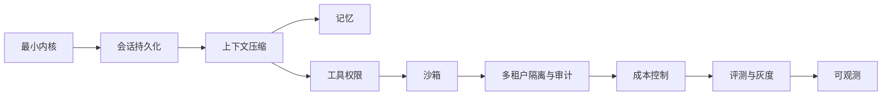
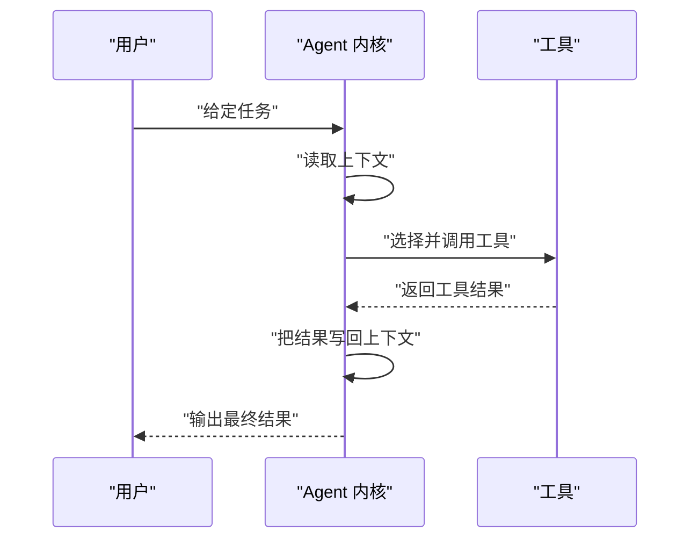
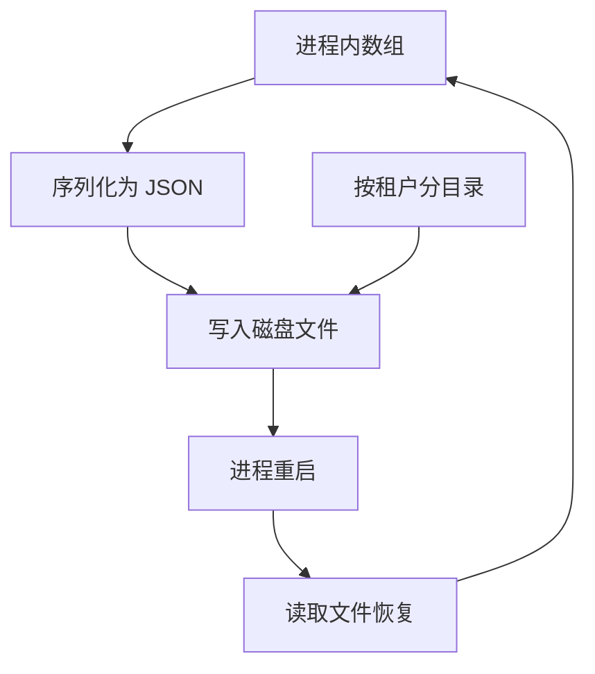
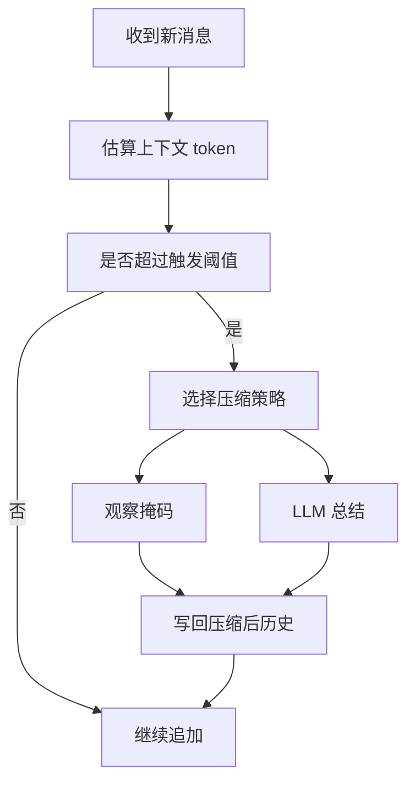
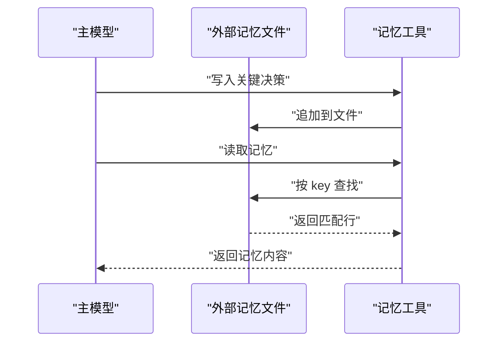
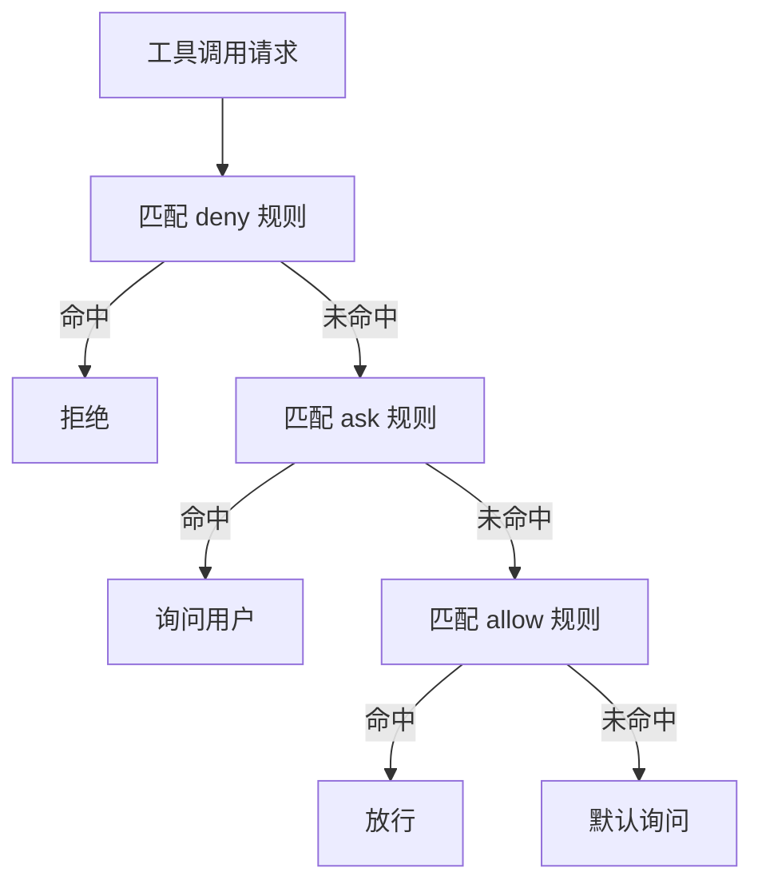
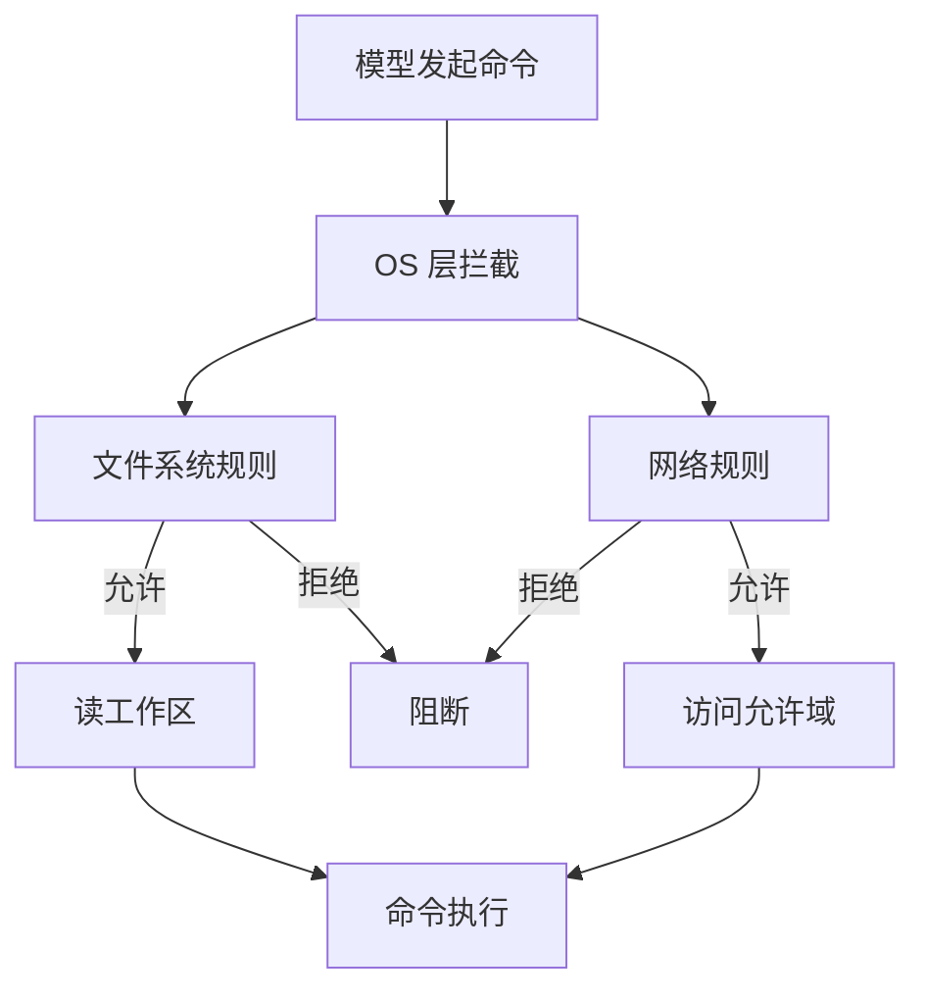
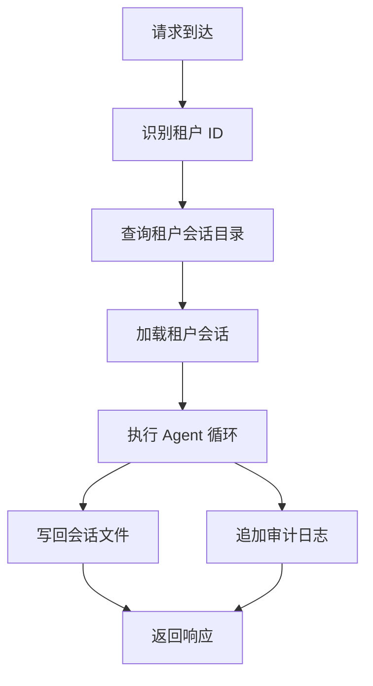
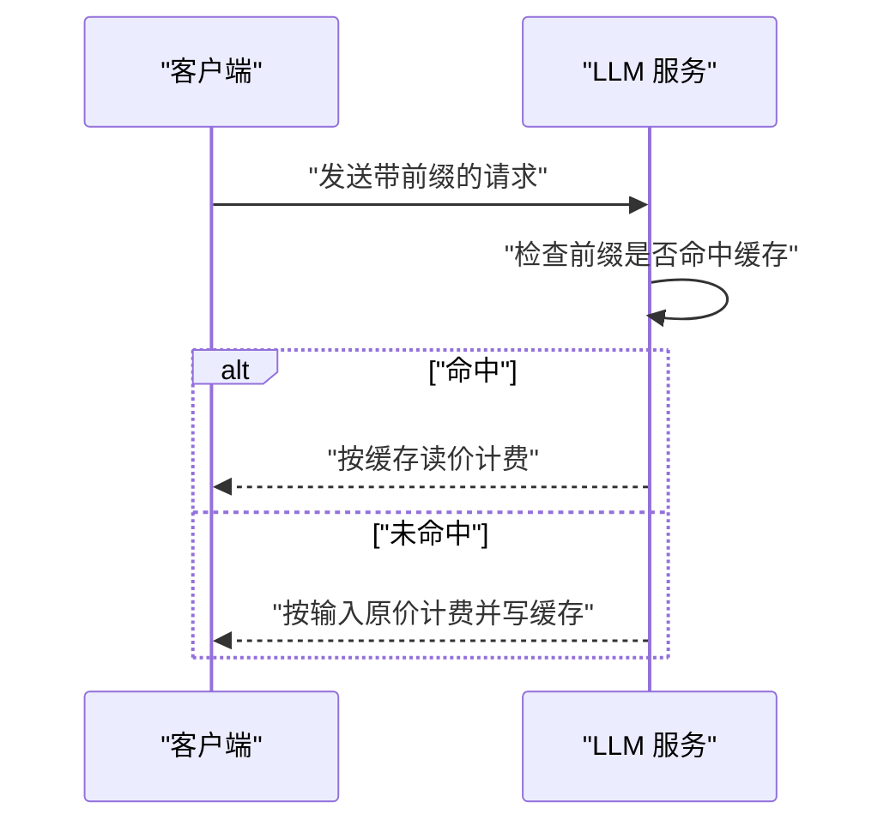
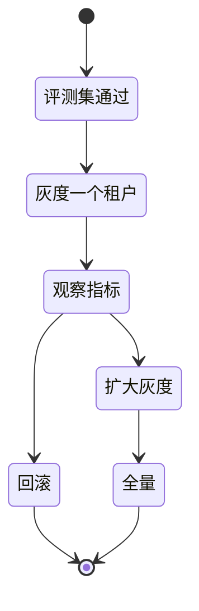

# 从最简到企业级：Agent 工程成熟度阶梯

!!! abstract "学完这一页你能"
    1. 能说出从最小内核到企业级需要逐级补上的 8 类工程能力，并各举一个触发问题。
    2. 能独立写出会话持久化、观察掩码压缩、外部记忆的最小 Node 脚本。
    3. 能根据要处理的数据类型，选择权限规则、OS 沙箱、审计日志的组合。
    4. 能读懂缓存命中率、求解率、通过率等指标，并用它们做上线决策。

## 0. 知识地图



建议从左往右读：每一档都是在上一档的基础上叠加，不是替代关系。
如果前面的能力没有补齐，后面的能力会放大事故。
开发时先让自己能跑通前三档，再考虑企业级能力，避免过早设计。

## 1. 最小内核：从 pi 的三件事开始

**先想一个问题**：你第一次在终端里打开 pi，它在项目目录里读文件、改文件、跑命令。这个工具最核心的循环是什么？

**心智模型**：

!!! tip "心智模型"
    Agent 内核是三个动作的循环：读取上下文、选择下一步、把工具结果写回上下文。日常类比是厨师做菜：看菜谱、决定下一步、动手、把锅里的变化记在脑子里。类比不成立的地方在于：人会自然遗忘和聚焦，而 Agent 的上下文是精确的 token 计数，不压缩就只会越堆越多。

!!! note "术语：Agent loop（智能体循环）"
    Agent loop 指模型反复执行「读取上下文 → 选择工具调用 → 执行工具 → 把结果追加回上下文」的过程。例如：用户说「读一下 package.json」，模型调用 read_file 工具，再把文件内容追加回上下文供下一轮使用。

**图解**：



1. 用户把任务放进上下文。
2. 模型读取上下文，决定要调用哪个工具。
3. 工具返回结果，结果被追加回上下文。
4. 下一轮循环带着上一轮的结果继续决策。

**一步一步来**：

第一步：定义一个最小工具表，工具就是普通函数。

```javascript
// tools.mjs 片段：最小工具表
import fs from "node:fs";

const tools = {
  // 读文件：返回字符串
  readFile: (p) => fs.readFileSync(p, "utf8"),
  // 写文件：返回固定结果字符串
  writeFile: (p, content) => {
    fs.writeFileSync(p, content);
    return "written";
  }
};
export { tools };
```

**这段代码在做什么**：
- `tools` 是一个对象，键是模型认识的动作名，值是执行该动作的函数。
- `readFile` 同步读取文件，直接返回文本。
- `writeFile` 同步写文件，返回一个固定字符串作为工具结果。
- 这个对象就是模型可调用的能力边界，没有列出的能力模型无法直接触发。

第二步：写一个最小循环，模拟模型做决策并执行工具。

```javascript
// min-loop.mjs 片段：最小循环
import { tools } from "./tools.mjs";

const context = []; // 上下文数组，保存对话和工具结果
context.push({ role: "user", content: "把 hello 写入 demo.txt" });

// 模拟模型决策：这里用规则代替真实模型
const next = { tool: "writeFile", args: ["demo.txt", "hello"] };
const result = tools[next.tool](...next.args);
context.push({ role: "tool", content: result });

const next2 = { tool: "readFile", args: ["demo.txt"] };
const result2 = tools[next2.tool](...next2.args);
context.push({ role: "tool", content: result2 });
console.log(context);
```

**这段代码在做什么**：
- `context` 数组是唯一的状态来源，模型只看它。
- 第一阶段模拟模型选择 `writeFile` 工具，把结果追加进上下文。
- 第二阶段再选择 `readFile`，读回刚才写入的内容。
- 真实系统中，两次「模拟决策」会替换成 LLM 调用，循环结构不变。

运行结果：控制台输出三条消息，第二条是写入结果 `written`，第三条是读回内容 `hello`。

**动手验证**：

```javascript
// min-agent.mjs：完整可运行
import { strict as assert } from "node:assert";
import fs from "node:fs";
import os from "node:os";
import path from "node:path";

const dir = fs.mkdtempSync(path.join(os.tmpdir(), "agent-kernel-"));

const tools = {
  readFile: (p) => fs.readFileSync(p, "utf8"),
  writeFile: (p, content) => {
    fs.writeFileSync(p, content);
    return "written";
  }
};

const context = [];
const file = path.join(dir, "demo.txt");

context.push({ role: "user", content: "请写入 hello 再读回" });
const writeResult = tools.writeFile(file, "hello");
context.push({ role: "tool", content: writeResult });
const readResult = tools.readFile(file);
context.push({ role: "tool", content: readResult });

assert.equal(readResult, "hello");
assert.equal(context.length, 3);
console.log("通过：最小内核完成写入、读回、上下文回填");
fs.rmSync(dir, { recursive: true, force: true });
```

**这段代码在做什么**：
- 创建临时目录，避免污染项目目录。
- 定义工具表并执行写入、读回两个动作。
- 断言读回内容为 `hello`，确认循环闭合。
- `fs.rmSync` 清理临时目录，保持环境干净。

预期输出：

```
通过：最小内核完成写入、读回、上下文回填
```

**常见坑**：

| 现象 | 原因 | 怎么修 |
|---|---|---|
| 工具结果里混进密钥 | 工具直接返回环境变量或配置文件原文 | 工具层先做敏感字段脱敏再返回 |
| 上下文无限增长 | 每轮都追加全文，没有上限检查 | 下一档加入持久化和压缩策略 |
| 改了文件却说没改 | 工具返回字符串过于简略，模型无法判断 | 返回值包含路径和变更摘要 |

**用在哪里**：

- 本地代码助手（pi、Claude Code）。
  - 业务背景：开发者在终端里让 Agent 修改当前项目文件。
  - 这一节的知识怎么用：把能力和它授权过的工具对应起来，最小工具表就是能力边界。
  - 用什么指标衡量收益：完成一次修改的往返轮数和用户确认次数。
  - 什么时候不该用：任务涉及生产数据库时，最小内核没有审计和权限收口。

- 后台自动修 bug 机器人。
  - 业务背景：CI 失败后自动跑一个 Agent 修复测试。
  - 这一节的知识怎么用：把 Agent 循环接入 CI，只暴露读文件和跑测试两个工具。
  - 用什么指标衡量收益：修复成功率和人工接管次数。
  - 什么时候不该用：修复动作会触发外部服务时，必须先加权限层。

**行业实践**：

- pi 的三种运行模式：直接以 OS 用户运行、完全在容器或虚拟机内运行、外部运行而内置工具在隔离环境内运行。出处：『pi 安全文档』『以原文为准』。
- pi 不要求每个工具调用都经过人工批准，而是建议限制可到达的文件、凭证、进程和网络服务。这一做法去掉了交互摩擦，但把安全责任转移到环境配置上。出处：『pi 安全文档』『以原文为准』。
- Claude Code 在缓存分层里把主对话和「其他所有事」分开，压缩请求默认走 5 分钟 TTL。出处：『Claude Code 缓存文档』『以原文为准』。

怎么借鉴到你的项目：先按「最小内核＋明确工具表＋环境隔离」起步，不要一上来做审批流；当工具表超过 10 个时再进入权限层设计。

**小结**：

1. Agent 的工程复杂度不在单次推理，而在持续循环中如何维持上下文和边界。
2. 最小内核的关键设计是工具表，它是模型能力的精确边界。
3. pi 的安全强调环境隔离而不是逐条审批，这决定了后续所有安全层的基础结构。

## 2. 会话持久化：把对话搬出进程内存

**先想一个问题**：Agent 做了一半任务，进程被 OOM 杀掉，再拉起来时它完全不记得刚才读过的文件和改过的代码。这个问题怎么解决？

**心智模型**：

!!! tip "心智模型"
    会话持久化就是把进程内的对话数组写入磁盘，进程重启后再读回来。日常类比是游戏存档：打了一半存盘，下次从存档点继续。类比不成立的地方在于：游戏存档有明确的存档点，而 Agent 对话是逐步追加的，每一步都可能需要落盘。

!!! note "术语：会话（session）"
    会话指一次 Agent 任务从开始到结束的完整对话历史，包含用户消息、模型输出和工具结果。例如：修复一个 bug 的几十轮消息构成一个会话。

**图解**：



1. 对话数据在内存里是对象数组。
2. 序列化后写入磁盘，进程重启后数据仍然存在。
3. 再启动时读文件恢复数组，继续 Agent 循环。
4. 多租户场景会按租户分目录，为后面隔离做准备。

**一步一步来**：

第一步：实现保存会话的函数。

```javascript
// session-persist.mjs 片段：保存
import fs from "node:fs";

function saveSession(file, conversation) {
  // 序列化为可读 JSON，缩进 2 个空格
  const text = JSON.stringify(conversation, null, 2);
  // 写入磁盘文件
  fs.writeFileSync(file, text);
}
export { saveSession };
```

**这段代码在做什么**：
- `JSON.stringify` 把内存对象数组变成字符串。
- `null, 2` 参数让输出带缩进，方便人工排查。
- `writeFileSync` 同步落盘，保证调用返回时数据已经写入。
- 同步写入对低并发本地工具够用，高并发需要换异步加队列。

第二步：实现加载会话的函数，处理首次启动情况。

```javascript
// session-persist.mjs 片段：加载
function loadSession(file) {
  // 文件不存在时返回空数组，表示没有历史
  if (!fs.existsSync(file)) return [];
  // 读文件并解析回对象数组
  return JSON.parse(fs.readFileSync(file, "utf8"));
}
export { loadSession };
```

**这段代码在做什么**：
- `existsSync` 判断是否首次启动，首次启动没有历史文件。
- 返回空数组让 Agent 从用户的初始任务开始。
- `JSON.parse` 把文件内容还原为内存对象数组。
- 这里没有做文件损坏处理，生产系统需要加 try-catch 和备份。

**动手验证**：

```javascript
// session-persist.mjs：完整可运行
import { strict as assert } from "node:assert";
import fs from "node:fs";
import os from "node:os";
import path from "node:path";

const dir = fs.mkdtempSync(path.join(os.tmpdir(), "session-"));

function saveSession(file, conversation) {
  fs.writeFileSync(file, JSON.stringify(conversation, null, 2));
}

function loadSession(file) {
  if (!fs.existsSync(file)) return [];
  return JSON.parse(fs.readFileSync(file, "utf8"));
}

const file = path.join(dir, "session.json");
const convo = [
  { role: "user", content: "把按钮改成蓝色" },
  { role: "assistant", content: "已修改 src/Button.tsx" }
];

saveSession(file, convo);
const restored = loadSession(file);
assert.deepEqual(restored, convo);
assert.equal(restored[1].content, "已修改 src/Button.tsx");
console.log("通过：会话在进程重新加载后仍然可以恢复");
fs.rmSync(dir, { recursive: true, force: true });
```

**这段代码在做什么**：
- 在临时目录创建会话文件，避免污染工作区。
- 保存一个两轮对话，模拟进程退出。
- 用 `assert.deepEqual` 验证恢复后的数据与原始数据一致。
- 清理临时目录。

预期输出：

```
通过：会话在进程重新加载后仍然可以恢复
```

**常见坑**：

| 现象 | 原因 | 怎么修 |
|---|---|---|
| 文件损坏后加载崩溃 | 进程在写入中途被杀，文件只写了一半 | 先写临时文件再原子重命名 |
| 每个用户看到同一份历史 | 会话文件用固定路径，没有租户维度 | 路径里加入租户 ID |
| 磁盘占用持续上涨 | 会话只增不删，没有归档 | 超过 N 天的会话移到冷存储 |

**用在哪里**：

- 本地 Agent 的断点续跑。
  - 业务背景：长任务被打断，用户希望下次打开接着做。
  - 这一节的知识怎么用：把会话文件路径固定在项目或用户目录下，启动时自动加载。
  - 用什么指标衡量收益：恢复后重新开始任务的次数下降比例。
  - 什么时候不该用：会话数据包含第三方凭证时，必须加密后再落盘。

- 云端多用户 Agent 服务。
  - 业务背景：每个用户的 Agent 任务互相独立，服务端需要保存每个会话。
  - 这一节的知识怎么用：会话文件放在用户目录下，每个用户只能读写自己的目录。
  - 用什么指标衡量收益：会话丢失率和恢复成功率。
  - 什么时候不该用：服务端没有访问控制时，不能直接开放会话文件读取。

**行业实践**：

- Claude Code 启动时会自动加载系统提示词和记忆文件到上下文，说明持久化不只是存历史，还包括固定前缀。出处：『Claude Code 官方文档』『以原文为准』。
- Manus 把文件系统当作无上限的持久记忆，Agent 通过文件读写维持外部状态。出处：『Manus 博客』『以原文为准』。
- pi 把会话历史序列化为文本后再压缩，说明持久化和压缩共用同一份历史数据。出处：『pi 压缩文档』『以原文为准』。

怎么借鉴到你的项目：先做一个「一个会话一个文件」的最小持久化，路径按租户和会话 ID 组合；等文件数量超过 10 万再考虑数据库。

**小结**：

1. 持久化的门槛在原子写入和目录划分，不在 JSON 读写。
2. 会话文件是后面所有高级能力（压缩、记忆、审计）的数据底座。
3. 多租户的目录隔离从这一档就要开始设计，补账比新做更难。

## 3. 上下文压缩：窗口里只留高信号 token

**先想一个问题**：Agent 跑了 200 轮，上下文里有 15 个工具定义和一大堆旧工具输出。模型开始忽略中间的修改要求，甚至重复已经做过的动作。怎么清理上下文又不丢关键信息？

**心智模型**：

!!! tip "心智模型"
    上下文压缩就是在保证关键信息不丢的前提下，把历史从「全文」换成「少量高信号 token」。日常类比是会议纪要：把两个小时的讨论压成半页决议。类比不成立的地方在于：纪要可以人脑理解，而 Agent 压缩必须考虑缓存失效成本和工具结果的精确性，不能随意改写。

!!! note "术语：context rot（上下文腐化）"
    context rot 指 token 数量上升时，模型回忆准确率持续下降的现象。例如 Chroma 在 2025 年测试 18 个 LLM，输入长度增长时所有模型的表现都下降。出处：『Chroma 研究页面』『以原文为准』。

**图解**：



1. 每次追加前先估算当前 token 数。
2. 未超过阈值直接追加，超过则进入压缩分支。
3. 观察掩码用占位符替换旧工具结果，不做推理。
4. LLM 总结会重写历史，压缩更强但会破坏前缀缓存。

**一步一步来**：

第一步：实现观察掩码，保留最近 N 轮工具结果。

```javascript
// mask-old-tool-results.mjs 片段
function maskOldToolResults(messages, keepTurns = 10) {
  const turns = [...messages];
  const placeholders = [];
  let toolCount = 0;
  // 从后往前数，超过保留数的旧工具结果标记下来
  for (let i = turns.length - 1; i >= 0; i--) {
    if (turns[i].role === "tool") {
      toolCount++;
      if (toolCount > keepTurns) placeholders.push(i);
    }
  }
  // 把标记的旧工具结果替换成占位符
  for (const i of placeholders) {
    turns[i] = { role: "tool", content: "旧工具结果已清除" };
  }
  return turns;
}
export { maskOldToolResults };
```

**这段代码在做什么**：
- 从消息数组末尾向前遍历，只统计 `role` 为 `tool` 的结果。
- `keepTurns` 控制保留最近多少轮工具结果，超过的就替换。
- 替换成固定占位符字符串，保持消息结构不变。
- 这是 JetBrains 研究里「掩码保留最近 10 轮」的简化实现。出处：『JetBrains 研究博客』『以原文为准』。

**动手验证**：

```javascript
// mask-old-tool-results.mjs：完整可运行
import { strict as assert } from "node:assert";

function maskOldToolResults(messages, keepTurns = 10) {
  const turns = [...messages];
  const placeholders = [];
  let toolCount = 0;
  for (let i = turns.length - 1; i >= 0; i--) {
    if (turns[i].role === "tool") {
      toolCount++;
      if (toolCount > keepTurns) placeholders.push(i);
    }
  }
  for (const i of placeholders) {
    turns[i] = { role: "tool", content: "旧工具结果已清除" };
  }
  return turns;
}

const messages = [];
for (let i = 0; i < 15; i++) {
  messages.push({ role: "assistant", content: "步骤 " + i });
  messages.push({ role: "tool", content: "工具结果 " + i });
}
const masked = maskOldToolResults(messages, 10);
assert.equal(masked[0].content, "旧工具结果已清除");
assert.equal(masked[1].content, "旧工具结果已清除");
assert.equal(masked[10].content, "工具结果 10");
console.log("通过：只保留最近 10 轮工具结果，旧结果被掩码");
```

**这段代码在做什么**：
- 构造 15 轮工具结果的测试数据。
- 调用掩码函数后，前两个旧结果被替换成占位符。
- 第 10 个结果仍然保留，说明保留边界正确。
- 不会调用任何 LLM，成本为零，这是掩码的最大优势。

预期输出：

```
通过：只保留最近 10 轮工具结果，旧结果被掩码
```

**常见坑**：

| 现象 | 原因 | 怎么修 |
|---|---|---|
| 压缩后模型忘记早期约束 | 总结时把约束写丢 | 总结格式固定包含目标、约束、进度三节 |
| token 只降了一点 | 旧工具输出是最大头但没清掉 | 先做工具结果清理再做总结 |
| 缓存命中率掉到零 | 压缩改变了历史前缀 | 把稳定前缀和可变历史分层，只压缩可变层 |

**用在哪里**：

- 长任务代码助手。
  - 业务背景：修复一个涉及 50 个文件的任务，历史超过 10 万 token。
  - 这一节的知识怎么用：先用掩码清理旧工具输出，再考虑总结。
  - 用什么指标衡量收益：压缩后任务求解率保持、单位任务成本下降比例。
  - 什么时候不该用：需要精确引用旧工具输出时，掩码会丢信息，改用外部记忆。

- 客户支持 Agent 的对话历史压缩。
  - 业务背景：客户和机器的对话达到窗口上限前必须压缩。
  - 这一节的知识怎么用：用 LLM 总结把历史压成结构化摘要，保留客户诉求和已做操作。
  - 用什么指标衡量收益：压缩后客户问题一次解决率是否持平。
  - 什么时候不该用：涉及合规证据的场景，不能删原文，应该把原文转存审计库。

**行业实践**：

- JetBrains 研究发现观察掩码在 SWE-bench Verified 上相比原始 Agent 能省一半以上成本，并在 Qwen3-Coder 480B 上提升求解率 2.6%。出处：『JetBrains 研究博客』『以原文为准』。
- Anthropic 把工具结果清理称为「最轻量的压缩形式之一」。出处：『Anthropic 上下文工程文章』『以原文为准』。
- Manus 反复改写 todo.md 把目标推到最近注意力区间，用来对抗中间信息被忽略。出处：『Manus 博客』『以原文为准』。

怎么借鉴到你的项目：先做掩码，因为它不调模型也不破坏缓存；当任务需要跨多轮推理时，再用固定格式的总结。

**小结**：

1. 压缩不是无脑删历史，而是把长历史换成高信号表示。
2. 观察掩码成本最低，应该先于 LLM 总结实施。
3. 压缩会破坏前缀缓存，触发阈值需要配合成本模型一起设计。

## 4. 记忆：把关键事实留在窗口外

**先想一个问题**：Agent 在第 20 轮说过「不要在周四改生产配置」，第 60 轮任务已经重新规划过，这个约束不在最近 10 轮里，模型又开始在周四改生产配置。怎么让关键事实跨越压缩仍然存在？

**心智模型**：

!!! tip "心智模型"
    记忆是把窗口内留不下的关键事实，写到窗口外的持久文件里，需要时再由工具读回来。日常类比是便利贴：把重要事项写在纸上贴在墙上，大脑不用一直记。类比不成立的地方在于：便利贴不会和脑内思考冲突，而记忆读写必须和窗口内信息做去重和冲突处理。

!!! note "术语：外部记忆（external memory）"
    外部记忆指 Agent 通过工具写入和读取的窗口外存储，例如 NOTES.md、todo.md 或专用记忆文件。例如：Claude 玩宝可梦的 Agent 把目标写进外部笔记文件，每次新窗口只读回关键状态。出处：『Anthropic 上下文工程文章』『以原文为准』。

**图解**：



1. 模型认为某个决定重要，调用记忆工具写文件。
2. 文件内容在窗口外，不占上下文 token。
3. 后续轮次需要时，用 key 读取，只把相关内容放回上下文。
4. 这样就可以跨越压缩和窗口截断。

**一步一步来**：

第一步：实现追加写入记忆。

```javascript
// agent-memory.mjs 片段：写记忆
import fs from "node:fs";

function writeMemory(file, key, value) {
  // 每条记忆一行，用等号分隔 key 和 value
  fs.appendFileSync(file, key + "=" + value + "\n");
}
export { writeMemory };
```

**这段代码在做什么**：
- 追加写入保证不覆盖已有记忆。
- 每行一个 key-value 记录，便于读取时按行遍历。
- 选择文件而不是数据库，是为了降低最小实现门槛。
- 这个结构只适合少量记忆，大量记忆需要索引或检索。

第二步：实现按 key 读取记忆。

```javascript
// agent-memory.mjs 片段：读记忆
function readMemory(file, key) {
  if (!fs.existsSync(file)) return null;
  // 按行读文件
  const lines = fs.readFileSync(file, "utf8").split("\n");
  for (const line of lines) {
    if (line.startsWith(key + "=")) {
      // 返回等号后面的 value
      return line.slice(key.length + 1);
    }
  }
  return null;
}
export { readMemory };
```

**这段代码在做什么**：
- 存在性判断避免文件不存在时崩溃。
- `split` 按换行拆成数组，遍历查找匹配的 key。
- `startsWith` 做前缀匹配，简单且足够当前例子使用。
- 返回最后一条匹配记录，覆盖写通过文件尾部优先实现。

**动手验证**：

```javascript
// agent-memory.mjs：完整可运行
import { strict as assert } from "node:assert";
import fs from "node:fs";
import os from "node:os";
import path from "node:path";

const dir = fs.mkdtempSync(path.join(os.tmpdir(), "memory-"));
const memoryFile = path.join(dir, "notes.txt");

function writeMemory(file, key, value) {
  fs.appendFileSync(file, key + "=" + value + "\n");
}

function readMemory(file, key) {
  if (!fs.existsSync(file)) return null;
  const lines = fs.readFileSync(file, "utf8").split("\n");
  for (const line of lines) {
    if (line.startsWith(key + "=")) {
      return line.slice(key.length + 1);
    }
  }
  return null;
}

writeMemory(memoryFile, "分支", "feature/red-button");
assert.equal(readMemory(memoryFile, "分支"), "feature/red-button");
writeMemory(memoryFile, "分支", "feature/blue-button");
assert.equal(readMemory(memoryFile, "分支"), "feature/blue-button");
console.log("通过：独立文件保存记忆，跨会话可读");
fs.rmSync(dir, { recursive: true, force: true });
```

**这段代码在做什么**：
- 创建临时目录存放记忆文件。
- 写入第一条分支记忆并验证可读。
- 再次写入同名 key，验证读到的是最近一条。
- 这证明记忆文件可以在进程重启后保持。

预期输出：

```
通过：独立文件保存记忆，跨会话可读
```

**常见坑**：

| 现象 | 原因 | 怎么修 |
|---|---|---|
| 旧记忆与新事实冲突 | 同一 key 追加了新值，旧值仍然可读 | 读取时合并新旧值并让模型仲裁 |
| 记忆文件越写越大 | 没有过期和冗余检测 | 每次写入前检查 key 是否已存在 |
| 压缩后窗口里没有记忆触发 | 模型忘了调用记忆工具 | 把「先读记忆再决策」写进固定提示词 |

**用在哪里**：

- 长期项目助手。
  - 业务背景：项目跨度多天，每次会话都要恢复项目状态。
  - 这一节的知识怎么用：把分支、待办、约束写入项目级 NOTES 文件，会话开始时先读。
  - 用什么指标衡量收益：跨会话重复提问的下降次数。
  - 什么时候不该用：单次短任务里引入记忆只会增加决策负担。

- 企业知识型 Agent。
  - 业务背景：Agent 处理客户咨询，需要记住客户偏好和历史决定。
  - 这一节的知识怎么用：按客户 ID 分文件存储偏好，读取时按客户维度过滤。
  - 用什么指标衡量收益：偏好重复确认次数。
  - 什么时候不该用：敏感数据进入记忆前必须做租户隔离和脱敏。

**行业实践**：

- Manus 把失败动作和错误保留在上下文里，理由是「没有证据，模型无法调整」。出处：『Manus 博客』『以原文为准』。
- Anthropic 建议把 NOTES.md 或待办文件放在上下文窗口之外，需要时用工具读取。出处：『Anthropic 上下文工程文章』『以原文为准』。
- pi 在压缩时把文件列表（读过的、改过的）跨压缩累计跟踪，说明记忆不只是文本，还包括结构化进度。出处：『pi 压缩文档』『以原文为准』。

怎么借鉴到你的项目：先做一个项目级 NOTES 文件，只存目标、约束、进度三类信息；等需要全文检索时再上向量检索。

**小结**：

1. 记忆的价值是让关键信息跨越窗口截断和压缩仍然可用。
2. 记忆文件要按租户和项目分开，不能放进一个全局变量。
3. 记忆写入必须有明确触发，否则模型会忘记调用工具。

## 5. 工具权限：从全权委托到分层授权

**先想一个问题**：Agent 读到网页里的一行字，就去执行删除命令。用户事后才看到 transcript 里多了这条命令。怎么拦住这类行为，又不让用户点一万次确认？

**心智模型**：

!!! tip "心智模型"
    工具权限是把「模型想做什么」和「系统允许做什么」分开，先用规则决定动作是否能执行。日常类比是门禁卡：员工想进哪扇门是一回事，卡能开哪扇门是另一回事。类比不成立的地方在于：门禁卡不会被人通过聊天说服，而模型可能被 prompt injection 说服绕过规则。

!!! note "术语：triple of attack（攻击三要素）"
    如果 Agent 同时具备三个条件：访问私有数据、接触不可信内容、能对外通讯，就组成了高风险组合。出处：『Simon Willison 博客』『以原文为准』。例如：一个能读取客户数据库、又订阅外部邮件、还能发外呼请求的 Agent 需要重点防护。

**图解**：



1. 先匹配拒绝规则，拒绝优先于一切允许规则。
2. 没有拒绝再检查是否要求人工确认。
3. 明确允许的动作才放行。
4. 未命中任何规则时默认询问，这是保守默认值。

**一步一步来**：

第一步：实现规则匹配器。

```javascript
// permission-rules.mjs 片段：匹配器
function matches(pattern, action) {
  // 星号替换成正则通配符
  const re = pattern.replace(/\*/g, ".*");
  return new RegExp("^" + re + "$").test(action);
}
export { matches };
```

**这段代码在做什么**：
- 把通配符规则转成正则表达式。
- 锚定开头和结尾，避免部分匹配误判。
- 这是演示用途的简化实现，生产系统需要处理路径和参数。
- Claude Code 的文档明确指出用 Bash 参数模式做安全边界是脆弱的。出处：『Claude Code 权限文档』『以原文为准』。

第二步：实现 deny、ask、allow 的评估顺序。

```javascript
// permission-rules.mjs 片段：评估
const rules = [
  { type: "deny", pattern: "Bash(rm -rf *)" },
  { type: "allow", pattern: "Read(./src)" }
];

function evaluate(action) {
  // deny 优先，ask 第二，allow 最后
  for (const rule of rules) {
    if (matches(rule.pattern, action)) return rule.type;
  }
  return "ask";
}
export { evaluate, rules };
```

**这段代码在做什么**：
- 规则数组先放 deny，后放 allow。
- 循环按顺序匹配，第一个命中就返回。
- 这个顺序实现了 Claude Code 的 deny、ask、allow 优先级。出处：『Claude Code 权限文档』『以原文为准』。
- 未命中时默认询问，属于保守策略。

**动手验证**：

```javascript
// permission-rules.mjs：完整可运行
import { strict as assert } from "node:assert";

const rules = [
  { type: "deny", pattern: "Bash(rm -rf *)" },
  { type: "allow", pattern: "Read(./src)" }
];

function matches(pattern, action) {
  const re = pattern.replace(/\*/g, ".*");
  return new RegExp("^" + re + "$").test(action);
}

function evaluate(action) {
  for (const rule of rules) {
    if (matches(rule.pattern, action)) return rule.type;
  }
  return "ask";
}

assert.equal(evaluate("Bash(rm -rf /tmp/x)"), "deny");
assert.equal(evaluate("Read(./src)"), "allow");
assert.equal(evaluate("Bash(npm test)"), "ask");
console.log("通过：deny 优先于 allow，未匹配默认询问");
```

**这段代码在做什么**：
- 定义两条规则，一条拒绝删除，一条允许读源码目录。
- `rm -rf` 匹配 deny，说明拒绝优先级生效。
- `Read(./src)` 匹配 allow，说明允许规则生效。
- `Bash(npm test)` 未匹配，返回 ask，验证默认询问。

预期输出：

```
通过：deny 优先于 allow，未匹配默认询问
```

**常见坑**：

| 现象 | 原因 | 怎么修 |
|---|---|---|
| 用户点了 100 次确认 | 规则只覆盖少数动作，其他全走询问 | 引入包级规则，不让单参数差异触发新确认 |
| 狭义的 allow 被广义 deny 拦住 | deny 优先于 allow，顺序不能改 | 把广义 deny 收窄到具体工具 |
| prompt injection 改变了模型意图 | 规则在模型层之后才执行 | 权限规则必须在系统层强制执行，不能依赖模型自觉 |

**用在哪里**：

- 企业代码编辑器里的 Agent 功能。
  - 业务背景：团队成员用 Agent 改代码，但管理员要控制生产仓库的写权限。
  - 这一节的知识怎么用：用 deny 规则锁住生产分支，allow 只放开发分支。
  - 用什么指标衡量收益：生产事故次数和人工审批等待时间。
  - 什么时候不该用：规则系统还不够时，宁可用工单加人工审批。

- 客服 Agent 的敏感操作控制。
  - 业务背景：Agent 可以查订单，但退款超过 100 元必须人工确认。
  - 这一节的知识怎么用：对退款工具设 ask 规则，金额阈值由服务端校验。
  - 用什么指标衡量收益：退款欺诈损失下降和客服满意度。
  - 什么时候不该用：金额判断必须放服务端，不能只靠 Agent 上下文。

**行业实践**：

- Claude Code 的规则评估顺序是 deny、ask、allow，第一个命中生效，特定性不改变排序。出处：『Claude Code 权限文档』『以原文为准』。
- Anthropic 自动模式使用一个专用分类器判断升级行为，默认模式从 v2.1.283 起启用，其理由包括用户手动批准了 93% 的权限提示。出处：『Anthropic 自动模式文章』『以原文为准』。
- Claude Code 文档警告用 Bash 参数模式做安全边界是脆弱的，参数顺序变化或变量展开可能绕过。出处：『Claude Code 权限文档』『以原文为准』。

怎么借鉴到你的项目：先在服务端设 deny 规则，再逐步加 allow 和 ask 规则；把最有风险的命令放 deny 首位。

**小结**：

1. 权限系统不是提示词，是系统层规则。
2. 顺序必须是 deny、ask、allow，否则会出现允许规则覆盖限制。
3. 规则粒度要覆盖到整类风险操作，而不是单个具体命令。

## 6. 沙箱：安全边界建在 OS 层

**先想一个问题**：权限规则把 `Bash(rm -rf /*)` 拒掉了，但 Agent 跑了 `python -c "import os; os.system('rm -rf /')"`。拦截层在模型层，命令的子进程完全绕过了规则。边界应该建在哪里？

**心智模型**：

!!! tip "心智模型"
    沙箱是把模型调用的命令包进 OS 层隔离环境，限制它能读写的目录和访问的网络。日常类比是化学实验室的通风橱：实验材料在里面处理，有害物质不能飘到外面。类比不成立的地方在于：通风橱只挡物理扩散，而沙箱要同时挡文件、网络、进程三类通道。

!!! note "术语：sandbox（沙箱）"
    沙箱是操作系统或虚拟机提供的一种隔离机制，限制进程能访问的文件、网络和设备。例如：Claude Code 的 Bash 沙箱使用 Linux bubblewrap 和 macOS seatbelt 做内核级隔离，Mac 和 Linux 支持，原生 Windows 不沙箱。出处：『Claude Code 沙箱文档』『以原文为准』。

**图解**：



1. 命令进入 OS 层的沙箱入口。
2. 文件系统和网络被独立评估。
3. 任何一条规则拒绝，整个动作就阻断。
4. 两条都允许，命令才真正执行。

**一步一步来**：

第一步：定义沙箱配置结构。

```javascript
// sandbox-boundary.mjs 片段：配置
const sandbox = {
  enabled: true,
  network: true,
  allowedDomains: ["registry.npmjs.org"]
};
export { sandbox };
```

**这段代码在做什么**：
- `enabled` 控制是否启用沙箱。
- `network` 控制是否允许网络访问。
- `allowedDomains` 是网络白名单，只放开发依赖源。
- Python 跑的系统命令在这个结构里不能绕过白名单，因为检查发生在 OS 层。

第二步：实现网络访问判断函数。

```javascript
// sandbox-boundary.mjs 片段：判断
function canUseNetwork(domain) {
  if (!sandbox.enabled) return true;
  if (!sandbox.network) return false;
  return sandbox.allowedDomains.includes(domain);
}
export { canUseNetwork };
```

**这段代码在做什么**：
- 沙箱未启用时网络不受限制，这是本地开发默认。
- 沙箱启用但 network 为 false 时，完全禁止网络。
- 网络启用时只放白名单域名，其他域名阻断。
- 这是最简形式的域名访问控制，真实实现要处理 TLS 和 SNI。

**动手验证**：

```javascript
// sandbox-boundary.mjs：完整可运行
import { strict as assert } from "node:assert";

const sandbox = {
  enabled: true,
  network: true,
  allowedDomains: ["registry.npmjs.org"]
};

function canUseNetwork(domain) {
  if (!sandbox.enabled) return true;
  if (!sandbox.network) return false;
  return sandbox.allowedDomains.includes(domain);
}

assert.equal(canUseNetwork("registry.npmjs.org"), true);
assert.equal(canUseNetwork("github.com"), false);
sandbox.network = false;
assert.equal(canUseNetwork("registry.npmjs.org"), false);
console.log("通过：网络能否访问由沙箱配置决定，不受提示词影响");
```

**这段代码在做什么**：
- 白名单域名可以访问。
- 非白名单域名被拒绝。
- 关闭网络后，白名单也无权访问。
- 沙箱配置是系统层状态，提示词无法修改。

预期输出：

```
通过：网络能否访问由沙箱配置决定，不受提示词影响
```

**常见坑**：

| 现象 | 原因 | 怎么修 |
|---|---|---|
| shell 子进程绕过沙箱 | 沙箱只包第一层命令，子进程没包 | 用 kernel 级机制如 bubblewrap 或 seatbelt |
| 文件工具不受沙箱约束 | 文件工具和 MCP 在 shell 沙箱之外运行 | Clade Code 文档明确这一缺口，企业部署要额外控文件服务 |
| Windows 上没有沙箱 | 沙箱只在 macOS、Linux、WSL2 可用 | 在 Windows 上迫使命令走 WSL2 或降级为审批 |

**用在哪里**：

- 企业合规开发环境。
  - 业务背景：开发人员用 Agent 跑命令，需要保证只访问公司仓库和私有依赖源。
  - 这一节的知识怎么用：对 Bash 命令启用沙箱，配置域名白名单和只读文件规则。
  - 用什么指标衡量收益：越权操作拦截次数和漏洞发现时间。
  - 什么时候不该用：需要完全开放的本地调试时，沙箱会增加配置成本。

- 多租户云函数平台。
  - 业务背景：每个租户的 Agent 执行代码，互不可见。
  - 这一节的知识怎么用：每个租户一个独立沙箱实例，文件系统互不挂载。
  - 用什么指标衡量收益：租户间数据泄露次数。
  - 什么时候不该用：早期只有两三个内部用户时，先做目录隔离即可。

**行业实践**：

- Anthropic 沙箱化报告说沙箱化减少权限提示 84%，文件系统和网络隔离由 kernel 级机制执行。出处：『Anthropic 沙箱文章』『以原文为准』。
- Claude Code 文档明确沙箱只覆盖 Bash、PowerShell 和 Monitor 命令，文件和 MCP 工具跑在沙箱外。出处：『Claude Code 沙箱文档』『以原文为准』。
- sandbox-runtime 的配置支持 `network.allowedDomains` 和 `filesystem.denyRead` 等键，macOS 用 seatbelt，Linux 用 bubblewrap。出处：『sandbox-runtime 文档』『以原文为准』。

怎么借鉴到你的项目：把沙箱当系统层防线，先覆盖网络和文件写权限；模型层规则作为第二层提醒，不能作为唯一防线。

**小结**：

1. 安全边界必须建在 OS 层，模型层只是辅助提醒。
2. 沙箱要覆盖文件、网络、进程三类通道，缺一不可。
3. 文件工具和 MCP 服务需要单独评估，不能假设它们被 shell 沙箱覆盖。

## 7. 多租户隔离与审计：企业门禁

**先想一个问题**：两个团队共用同一个 Agent 服务，A 团队的代码在日志里出现在 B 团队的会话中，谁也不知道哪个 Agent 改了什么。怎么保证每个租户的数据和操作日志完全隔离？

**心智模型**：

!!! tip "心智模型"
    多租户隔离和审计是一对：隔离保证数据不串，审计保证事后可查。日常类比是银行保险箱：每个人的箱子和账户分离，同时每笔交易都有记录。类比不成立的地方在于：银行柜员无法通过聊天被诱导打开保险箱，而 Agent 可能被注入指令读取其他租户的会话。

!!! note "术语：multi-tenant isolation（多租户隔离）"
    多租户隔离指多个租户共享同一套服务时，每个租户的数据和操作互不可见。例如：A 租户的会话文件在 `tenant-a/` 目录，B 租户在 `tenant-b/`，代码层禁止跨目录读取。

**图解**：



1. 每个请求先取租户 ID。
2. 会话目录按租户拆分，每个租户只能加载自己的文件。
3. 执行循环后，会话写回同一租户目录。
4. 审计日志独立于会话文件，记录谁在何时做了什么。

**一步一步来**：

第一步：实现按租户生成会话文件路径。

```javascript
// tenant-audit.mjs 片段：路径
import fs from "node:fs";
import path from "node:path";

function sessionFile(root, tenantId, sessionId) {
  // 每个租户一个目录，目录权限设为 0700
  const dir = path.join(root, tenantId);
  fs.mkdirSync(dir, { recursive: true, mode: 0o700 });
  // 会话文件放在租户目录内部
  return path.join(dir, sessionId + ".json");
}
export { sessionFile };
```

**这段代码在做什么**：
- 路径由根目录、租户 ID、会话 ID 三层组成。
- `recursive` 建出多级父目录。
- `mode: 0o700` 让目录只有属主可读写，其他系统用户不可见。
- 文件路径就是隔离边界，租户 A 的代码永远拿到 `tenant-a/` 下的路径。

第二步：实现审计日志追加。

```javascript
// tenant-audit.mjs 片段：审计
function audit(logFile, event) {
  // 事件加时间戳后追加一行 JSON
  fs.appendFileSync(logFile, JSON.stringify({ ...event, at: Date.now() }) + "\n");
}
export { audit };
```

**这段代码在做什么**：
- 每次操作生成一条 JSON 记录。
- 时间戳保证事后可以排序还原操作顺序。
- 追加写入保证审计日志只增不减。
- 真实系统里审计日志要上权限管理和防篡改存储。

**动手验证**：

```javascript
// tenant-audit.mjs：完整可运行
import { strict as assert } from "node:assert";
import fs from "node:fs";
import os from "node:os";
import path from "node:path";

const root = fs.mkdtempSync(path.join(os.tmpdir(), "tenants-"));
const auditFile = path.join(root, "audit.log");

function sessionFile(tenantId, sessionId) {
  const dir = path.join(root, tenantId);
  fs.mkdirSync(dir, { recursive: true, mode: 0o700 });
  return path.join(dir, sessionId + ".json");
}

function audit(event) {
  fs.appendFileSync(auditFile, JSON.stringify({ ...event, at: Date.now() }) + "\n");
}

const a = sessionFile("tenant-a", "s1");
const b = sessionFile("tenant-b", "s1");
assert.notEqual(a, b);
fs.writeFileSync(a, JSON.stringify({ owner: "tenant-a" }));
fs.writeFileSync(b, JSON.stringify({ owner: "tenant-b" }));
audit({ actor: "tenant-a", action: "open", session: "s1" });

const log = fs.readFileSync(auditFile, "utf8");
assert.ok(log.includes("tenant-a"));
console.log("通过：两个租户写入不同文件，审计日志记录操作");
fs.rmSync(root, { recursive: true, force: true });
```

**这段代码在做什么**：
- 两个租户使用同一会话 ID，但路径不同。
- 断言两个路径不相等，验证隔离边界。
- 审计日志记录了 actor 和 action，事后可追。
- 清理临时目录。

预期输出：

```
通过：两个租户写入不同文件，审计日志记录操作
```

**常见坑**：

| 现象 | 原因 | 怎么修 |
|---|---|---|
| 租户 A 的文件被 B 读到 | 会话路径固定或缺失租户维度 | 路径必须包含租户 ID，并在服务层校验 |
| 审计日志被篡改 | 审计文件写权限过大 | 审计日志写到只追加存储，与服务进程分权 |
| 审计数据过大 | 每次操作记录全部上下文 | 只记事件元数据，正文存冷存储并建索引 |

**用在哪里**：

- 企业多团队 Agent 平台。
  - 业务背景：多个团队共用平台，每个团队的数据独立。
  - 这一节的知识怎么用：租户 ID 来自 SSO 身份，会话和审计分别按租户分目录。
  - 用什么指标衡量收益：跨租户数据泄露次数和审计查询耗时。
  - 什么时候不该用：单租户内部工具不必引入租户路由。

- 金融类 Agent 的合规审计。
  - 业务背景：Agent 代替人工处理客户请求，需要完整操作历史。
  - 这一节的知识怎么用：每个动作写审计日志，包含工具名、参数摘要、租户 ID。
  - 用什么指标衡量收益：合规检查通过率和审计追溯时间。
  - 什么时候不该用：审计内容本身合法前不能上线。

**行业实践**：

- MCP 规范要求客户端记录工具使用日志，服务端记录授权范围提升和关联 ID。出处：『MCP 规范』『以原文为准』。
- Devin 文档描述每个 Devin 会话运行在隔离机器上，支持部署在客户 VPC。出处：『Devin 文档』『以原文为准』（细节需核对）。
- Claude Code 管理配置可以设 `allowManagedPermissionRulesOnly`，让规则只来自管理配置。出处：『Claude Code 权限文档』『以原文为准』。

怎么借鉴到你的项目：先做目录级租户隔离加审计日志，这足够内部 50 人以下团队；再上数据库和防篡改日志。

**小结**：

1. 租户隔离的第一层是路径隔离，第二层是服务端身份校验。
2. 审计日志独立于会话文件，不能因为会话被删就失去审计。
3. 隔离和审计是给合规检查看的，不是给自己方便用的。

## 8. 成本控制：缓存命中率是产品指标

**先想一个问题**：Agent 服务上线后，每个会话都要重新处理相同的系统提示词和工具定义，缓存命中率只有 20%，光输入 token 就占掉一半毛利。怎么把缓存从「有」变成「高命中」？

**心智模型**：

!!! tip "心智模型"
    成本控制的核心是缓存命中率：让尽量多的输入 token 从缓存读取，而不是重新计算。日常类比是高速公路年卡：固定路线（稳定的前缀）可以反复快速通过，临时变道（改系统提示词）就重新计费。类比不成立的地方在于：一个人改变路线不会影响别人，而 Agent 改动一次系统提示词会让它之后的所有 token 缓存失效。

!!! note "术语：prefix cache（前缀缓存）"
    前缀缓存是 LLM 服务对完全相同输入前缀的复用机制。Anthropic 按 tools、system、messages 的顺序缓存，改变前面层级会使其后所有层失效。出处：『Anthropic 缓存文档』『以原文为准』。OpenAI 的自动缓存需要 1024 token 以上才能命中。出处：『OpenAI Responses 文档』『以原文为准』。

**图解**：



1. 客户端把稳定前缀放在消息前面。
2. 服务端检查这段前缀是否在缓存期内。
3. 命中时输入成本按缓存读价格计。
4. 未命中时按原价计，并写入新缓存项。

**一步一步来**：

第一步：实现账单估算函数。

```javascript
// cost-estimate.mjs 片段
// 价格来自 Anthropic 缓存文档的 Opus 5.5 示例，单位美元每百万 token
const prices = { input: 4, cacheWrite5m: 5, cacheRead: 0.20 };

function bill(inputTokens, cacheReadTokens, cacheWriteTokens) {
  // 三类 token 分别计价后求和
  return inputTokens / 1e6 * prices.input +
    cacheReadTokens / 1e6 * prices.cacheRead +
    cacheWriteTokens / 1e6 * prices.cacheWrite5m;
}
export { bill, prices };
```

**这段代码在做什么**：
- `prices` 来自 Anthropic 文档里 Opus 5.5 的价格示例，不是全模型通用。出处：『Anthropic 缓存文档』『以原文为准』。
- 三类 token 分别是全新输入、缓存读、缓存写。
- 数学上都是 token 数除以一百万再乘单价。
- 这个函数让缓存策略可量化对比。

**动手验证**：

```javascript
// cost-estimate.mjs：完整可运行
import { strict as assert } from "node:assert";

const prices = { input: 4, cacheWrite5m: 5, cacheRead: 0.20 };

function bill(inputTokens, cacheReadTokens, cacheWriteTokens) {
  return inputTokens / 1e6 * prices.input +
    cacheReadTokens / 1e6 * prices.cacheRead +
    cacheWriteTokens / 1e6 * prices.cacheWrite5m;
}

const warm = bill(1000, 99000, 0);
const cold = bill(100000, 0, 100000);
assert.ok(warm < 1);
assert.ok(cold > 0.4);
console.log("热缓存账单低于 1 美元，冷启动账单高于 0.4 美元");
```

**这段代码在做什么**：
- 热缓存场景 1000 新 token 加 99000 缓存读 token。
- 冷启动场景 100000 新 token 加 100000 缓存写 token。
- 断言热缓存账单不到 1 美元，冷启动超过 0.4 美元。
- 验证缓存读价格远低于输入原价。

预期输出：

```
热缓存账单低于 1 美元，冷启动账单高于 0.4 美元
```

**常见坑**：

| 现象 | 原因 | 怎么修 |
|---|---|---|
| 系统提示词每次带时间戳 | 时间戳变了，后面所有缓存都失效 | 时间戳放到消息层，不放系统提示词 |
| 工具列表每次顺序不同 | 序列化不确定导致前缀不匹配 | 工具定义按固定顺序序列化 |
| 短请求没命中缓存 | 低于 512 或 1024 token 的最小缓存长度 | 把系统提示词和工具定义加长到最小值以上 |

**用在哪里**：

- 钉在 Agent 服务上的成本看板。
  - 业务背景：每个客户会话都有一个稳定系统提示词，但还没测过缓存命中率。
  - 这一节的知识怎么用：拆分前缀层级，观察 cache read 占比，找出稳定层和变化层。
  - 用什么指标衡量收益：缓存命中的输入 token 占比。
  - 什么时候不该用：会话数很少时缓存收益不明显，先做基本监控。

- 多模型路由策略。
  - 业务背景：高优先级任务用 opus 模型，低优先级用 haiku 模型。
  - 这一节的知识怎么用：把路由决策放服务端，不同模型各自管理缓存 TTL。
  - 用什么指标衡量收益：加权平均每请求成本。
  - 什么时候不该用：任务之间没有明显优先级区分时，路由会增加复杂性。

**行业实践**：

- Manus 把 KV-cache 命中率称为「生产阶段 AI Agent 最重要的指标」，其输入输出 token 比约 100：1。出处：『Manus 博客』『以原文为准』。
- Manus 强调不要改动系统提示词里的时间戳，因为单个 token 的差别会让后面全部缓存失效。出处：『Manus 博客』『以原文为准』。
- Anthropic 缓存顺序是 tools、system、messages，文档给出 Opus 5.5 的缓存读价格 0.20 美元每百万 token。出处：『Anthropic 缓存文档』『以原文为准』。

怎么借鉴到你的项目：把系统提示词当代码评审，不能随便追加动态字段；每次变更都要能说明对缓存层的影响。

**小结**：

1. 缓存命中率是生产 Agent 的成本核心指标。
2. 系统提示词只能放稳定内容，动态内容放消息层。
3. 压缩和缓存有冲突：压缩会改变历史前缀，需要在成本和精度之间权衡。

## 9. 评测、灰度与可观测：上线不是终点

**先想一个问题**：Agent 在开发环境看起来很好，上线后第一个客户的会话里它连续重复同一个动作三次。怎么在发布前发现这类问题，发布后又能快速定位？

**心智模型**：

!!! tip "心智模型"
    上线前靠评测和灰度，上线后靠可观测：评测在受控集上测求解质量，灰度用少量真实流量验证，可观测在运行时暴露指标信号。日常类比是新车发布：先跑封闭场地测试，再做小范围试驾，上路后装仪表盘持续监控。类比不成立的地方在于：Agent 的输入不可穷举，评测集只能覆盖一部分场景，灰度失效时需要有明确的回滚开关。

!!! note "术语：可观测性（observability）"
    可观测性指系统通过日志、指标、链路追踪暴露内部状态，让外部可以判断运行是否健康。例如：记录每次工具调用的耗时、token 消耗和失败原因，就能在会话异常时快速定位到具体工具。

**图解**：



1. 新版本先在评测集上通过。
2. 再放给一个租户做灰度。
3. 观察指标达标就扩大灰度，不达标就回滚。
4. 全量后仍然需要持续观测。

**一步一步来**：

第一步：实现最简评测函数。

```javascript
// eval-harness.mjs 片段
function runEval(handler, cases) {
  // 遍历评测用例，记录每个用例是否通过
  const results = cases.map((c) => {
    const got = handler(c.input);
    return { id: c.id, pass: got === c.expected, got };
  });
  // 通过率 = 通过数除以总数
  const passRate = results.filter((r) => r.pass).length / results.length;
  return { passRate, results };
}
export { runEval };
```

**这段代码在做什么**：
- 每个用例有输入和期望输出。
- handler 是待评测的函数或 Agent 策略。
- 统计通过率，作为发布前的硬性指标。
- 这是最简形态，生产评测需要多轮和环境重放。

**动手验证**：

```javascript
// eval-harness.mjs：完整可运行
import { strict as assert } from "node:assert";

function decideRoute(context) {
  if (context.includes("蓝色")) return "blue";
  return "gray";
}

const cases = [
  { id: 1, input: "把按钮改成蓝色", expected: "blue" },
  { id: 2, input: "把按钮改成红色", expected: "red" }
];

function runEval(handler, cases) {
  const results = cases.map((c) => {
    const got = handler(c.input);
    return { id: c.id, pass: got === c.expected, got };
  });
  const passRate = results.filter((r) => r.pass).length / results.length;
  return { passRate, results };
}

const report = runEval(decideRoute, cases);
assert.equal(report.passRate, 0.5);
console.log("通过率 0.5，表示 2 个用例中 1 个通过");
```

**这段代码在做什么**：
- 两个用例中，路由函数只答对了蓝色。
- 通过率为 0.5，说明发布前评测未达标。
- 发布门禁可以设一个最低通过率阈值。
- 真实系统中这个阈值要结合业务风险设定。

预期输出：

```
通过率 0.5，表示 2 个用例中 1 个通过
```

**常见坑**：

| 现象 | 原因 | 怎么修 |
|---|---|---|
| 灰度指标是失败率但日志没上报 | 有评测没有可观测指标 | 每个工具调用都上报耗时、结果、痕迹 |
| 回滚不生效 | 旧版本已经下线 | 灰度系统保留上一版本入口 |
| 评测通过但线上行为不同 | 评测集和线上分布不一致 | 每两周从线上采样更新评测集 |

**用在哪里**：

- Agent 代码工具的版本发布。
  - 业务背景：修改提示词或工具实现，需要知道是否引入回退。
  - 这一节的知识怎么用：先跑离线评测集，再灰度一个内部仓库，看研发效率和事故率。
  - 用什么指标衡量收益：评测通过率、灰度期回滚次数。
  - 什么时候不该用：两周一次以下的低频变更可以先人工检查。

- 企业客服 Agent 的线上试验。
  - 业务背景：新策略先服务 5% 客户，对比旧策略。
  - 这一节的知识怎么用：按租户或地域切分流量，分桶上报指标。
  - 用什么指标衡量收益：客户问题一次解决率和平均响应成本。
  - 什么时候不该用：用户投诉率高的版本应该直接回滚，不做灰度观察。

**行业实践**：

- Cognition 在「别建多 Agent」中提到用专门的 LLM 压缩历史是可行的方向，但承认要调好它很难。出处：『Cognition 博客』『以原文为准』。
- Anthropic 上下文工程文章建议用于评测和灰度前，先做上下文质量评估，再进入真实流量。出处：『Anthropic 上下文工程文章』『以原文为准』。
- Breunig 提出的上下文中毒、分心、混淆、冲突四个失败模式，可以作为评测用例的设计维度。出处：『Drew Breunig 博客』『以原文为准』。

怎么借鉴到你的项目：先建一个 20 条用例的最小评测集，再和灰度指标打通；评测通过率低于 0.8 的版本不允许灰度。

**小结**：

1. 上线前必须有可重复的评测门槛，不能用「在开发机试过」代替。
2. 灰度必须保留回滚入口，并有明确的进入和退出标准。
3. 可观测不只是日志量，而是把工具调用和 token 消耗变成可查询的指标。

## 应用地图

| 场景 | 用到本页哪个知识点 | 典型技术选型 | 注意事项 |
|---|---|---|---|
| 本地代码助手 | 最小内核、权限、沙箱 | pi 或 Claude Code 工具表 | 沙箱不覆盖文件工具，别只靠它 |
| 云端多租户 Agent | 持久化、多租户隔离、审计 | 租户目录加审计日志 | 路径必须有租户 ID，审计独立存储 |
| 长任务代码修复 | 上下文压缩、记忆 | 先掩码后总结，外部 NOTES 文件 | 压缩会破坏缓存，需要成本评估 |
| 客服 Agent | 权限、审计、可观测 | 分层权限规则加链路追踪 | 敏感操作放服务端校验，不发模型 |
| 多模型路由成本 | 成本控制 | 前缀缓存命中率看板 | 系统提示词稳定，动态字段放消息层 |
| 版本发布流程 | 评测、灰度 | 离线评测集加小流量灰度 | 保留回滚入口，过期评测集要更新 |
| 数据标注 Agent | 记忆、审计 | 外部记忆文件加操作日志 | 审计正文和元数据分开存储 |
| 安全敏感操作 | 沙箱、权限 | OS 层沙箱加规则引擎 | 模型层规则不构成安全边界 |

## 动手作业

**目标**：做一个带「会话文件、权限规则、审计日志」的最小 Agent 服务骨架，Node 20 以上单文件可运行。

**步骤**：

1. 定义三个工具：`readFile`、`writeFile`、`bash`。
2. 会话保存到按租户分目录的 JSON 文件。
3. 权限规则：`readFile` 和 `writeFile` 默认 allow，`bash` 默认 ask，`bash(rm -rf *)` 为 deny。
4. 每个工具调用向审计日志追加一条 JSON 事件，包含租户 ID、工具名、时间戳。
5. 用两步模拟执行：写入一个文件并跑一条被 deny 的 bash 命令。

**验收标准**：

1. 会话文件路径形如 `root/tenant-a/session-1.json`。
2. `bash(rm -rf /x)` 返回 `deny`。
3. 审计日志文件至少包含两条事件记录。
4. 全部断言通过，脚本退出码为 0。

## 综合对比

| 成熟度档 | 要加的工程能力 | 触发问题 | 工程量级 | 典型事故 |
|---|---|---|---|---|
| L0 最小内核 | 工具表、循环、上下文数组 | 每次会话从零开始 | 0.5 人日 | 改了文件没记录 |
| L1 会话持久化 | 序列化、原子写入、目录划分 | 进程崩溃丢历史 | 1 人日 | 文件写入一半损坏 |
| L2 上下文压缩 | 掩码、总结、触发阈值 | 长任务质量下降 | 3 到 5 人日 | 早期约束被压丢 |
| L3 记忆 | 外部记忆文件、读写工具 | 关键事实跨轮丢失 | 2 人日 | 旧决策覆盖新决策 |
| L4 工具权限 | deny、ask、allow 规则 | 模型意图越权 | 2 到 3 人日 | 广义 deny 拦了所有动作 |
| L5 沙箱 | OS 层文件网络隔离 | 子进程绕过规则 | 5 到 10 人日 | 网域白名单过宽被外泄 |
| L6 多租户隔离与审计 | 租户路由、审计日志 | 数据串租户、无迹可查 | 5 人日 | 日志未上权限被删 |
| L7 成本控制 | 缓存命中监控、前缀分层 | 毛利被 token 吃掉 | 2 到 3 人日 | 改提示词导致缓存全失效 |
| L8 评测灰度 | 离线评测集、分流量发布 | 开发正常上线就坏 | 5 到 8 人日 | 评测集过时放行坏版本 |
| L9 可观测 | 工具指标、trace、失败上报 | 生产问题不可定位 | 3 到 5 人日 | 日志有量无索引查不动 |

## 深入阅读与参考

!!! tip "怎么用这些资料"
    先读「官方文档与规范」建立准确的概念，再读「源码与示例」核对细节，最后用「教程、书籍与视频」换一种讲法加深理解。每条都写明了读哪一节、带着什么问题读。

### 官方文档与规范

| 资源 | 为什么读 | 怎么读 |
|---|---|---|
| [Three run modes: Auto-review (allowlisted calls run immediately, other (cursor.com)](https://cursor.com/docs/agent/security/run-modes) | 三种运行模式，权限分层的现成产品化实现。 | 读 Auto-review 与 allowlist 小节，为自己的工具调用设计白名单。 |
| [Network modes for sandboxed commands: "sandbox.json Only" or "sandbox. (cursor.com)](https://cursor.com/docs/agent/run-modes) | 沙箱命令的网络模式说明，边界设计可借鉴。 | 读两种网络模式对比，决定自己 Agent 默认禁网还是走白名单。 |
| [Token passthrough is explicitly forbidden: servers MUST NOT accept or  (modelcontextprotocol.io)](https://modelcontextprotocol.io/specification/2025-06-18/basic/security_best_practices) | MCP 规范禁止 token 透传，多租户安全底线。 | 读安全章节该条，检查自己的 server 是否转发了上游 token。 |
| [Meta's Agents Rule of Two (2025-10-31): within one session an agent sh (ai.meta.com)](https://ai.meta.com/blog/practical-ai-agent-security/) | Meta 的 Rule of Two，权限与不可信输入的取舍准则。 | 读三条条件定义，用它评估自己的 Agent 能否同时满足。 |
| [OpenAI: automatic caching with a 1,024-token minimum (GPT-5.6 and late (developers.openai.com)](https://developers.openai.com/api/docs/guides/prompt-caching) | 官方缓存规则，1024 token 门槛直接影响成本。 | 读缓存命中条件小节，检查自己的提示前缀是否稳定可命中。 |
| [Langfuse 文档](https://langfuse.com/docs) | 开源可观测平台，可追踪一次完整调用链路。 | 按快速上手接入，跑一次调用，检查 trace 里每步 token 与耗时。 |

### 源码与示例

| 资源 | 为什么读 | 怎么读 |
|---|---|---|
| [pi 编码 Agent 工具集](https://github.com/earendil-works/pi) | 本页最小内核的原型，循环与统一 LLM API 实现。 | 读 agent loop 部分，逐行对照自己的代码，记录抽象差异并删减多余层。 |
| [smolagents 仓库](https://github.com/huggingface/smolagents) | 核心代码不足千行，最小 Agent 循环的清晰范本。 | 读主循环与工具注册部分，对照自己实现，找出可以砍掉的抽象。 |
| [Inspect AI 仓库](https://github.com/UKGovernmentBEIS/inspect_ai) | 评测框架源码，含沙箱与工具打分的示例。 | 读 examples 中的 agent 评测用例，模仿写一个最小评测集跑通。 |

### 教程、书籍与视频

| 资源 | 为什么读 | 怎么读 |
|---|---|---|
| [Effective context engineering for AI agents](https://www.anthropic.com/engineering/effective-context-engineering-for-ai-agents) | 系统讲上下文工程，压缩与裁剪策略可直接落地。 | 读压缩与检索两节，带着“哪些 token 可丢”读，读完精简自己的系统提示。 |
| [Generative Agents](https://arxiv.org/abs/2304.03442) | 记忆流设计的源头，理解检索式长期记忆。 | 读 memory stream 与 retrieve 部分，为自己的 Agent 设计一次记忆检索。 |
| [LLM Powered Autonomous Agents（Lilian Weng）](https://lilianweng.github.io/posts/2023-06-23-agent/) | 经典综述，规划、记忆、工具三部分讲得透。 | 精读记忆与工具两节，各写一段理解并映射到自己的设计上。 |
| [A practical guide to building agents（OpenAI）](https://cdn.openai.com/business-guides-and-resources/a-practical-guide-to-building-agents.pdf) | 官方实践指南，模型、工具、指令三要素清晰。 | 读完后用三要素清单检查自己的 Agent，列出缺失环节。 |
| [How we built our multi-agent research system](https://www.anthropic.com/engineering/multi-agent-research-system) | 真实多 Agent 系统复盘，讲清何时值得拆分。 | 读架构与教训部分，画调用关系图，判断自己是否需要拆多 Agent。 |

## 自测题

??? question "1. 观察掩码和 LLM 总结各有什么成本和精度特征？"
    观察掩码只替换旧工具结果为占位符，不调用模型，成本为零或接近零。LLM 总结需要额外生成调用，JetBrains 研究显示总结生成调用超过每个实例成本的 7%，出处见第三档。JetBrains 研究还发现掩码在部分设置里求解率还略高，出处『JetBrains 研究博客』『以原文为准』。

??? question "2. 为什么说系统提示词里不能放时间戳？"
    Manus 博客指出系统提示词里一个 token 的差异会让该 token 之后所有缓存失效。出处：『Manus 博客』『以原文为准』。时间戳每次生成都变，等于每次请求都把缓存清重算。动态字段应该放消息层。

??? question "3. 权限规则匹配顺序为什么是 deny、ask、allow？"
    如果 allow 先匹配，后续 deny 规则就没机会生效，容易用宽泛 allow 覆盖掉狭义 deny。Claude Code 文档规定 deny 先于 ask 再先于 allow，特定性不改变排序。出处：『Claude Code 权限文档』『以原文为准』。

??? question "4. 沙箱为什么不能只靠模型层拦截？"
    模型会被 prompt injection 说服绕过规则。OS 层沙箱的内核级规则即使模型被注入也无法绕过。Anthropic 沙箱文章说沙箱化减少权限提示 84%，是把它当独立防线。出处：『Anthropic 沙箱文章』『以原文为准』。

??? question "5. 多租户隔离和审计各自的边界在哪里？"
    隔离管数据互不可见，审计管操作事后可查。路径隔离是第一层，服务端身份校验是第二层。审计日志只增不改，并且要和服务进程分权存放，MCP 规范要求客户端记录工具使用日志。出处：『MCP 规范』『以原文为准』。

??? question "6. 为什么压缩会降低缓存命中率？"
    压缩会重写历史前缀，而前缀缓存依赖输入前缀逐 token 一致。Anthropic 文档里 `clear_at_least` 存在的理由就是让清理量足够大才值得引发缓存失效。出处：『Anthropic 上下文编辑文档』『以原文为准』。

??? question "7. 灰度发布的核心控制点是什么？"
    灰度必须保留回滚入口，并有明确的进入和退出条件。评测通过率是进入灰度的门槛，灰度期指标如失败率和成本是退出依据。版本不符时直接回滚，不要硬撑观察。

??? question "8. 可观测性在 Agent 系统中需要上报哪些信号？"
    至少需要工具调用耗时、成功失败状态、token 消耗、trace ID、租户 ID、错误堆栈。信号要带索引和时间戳，日志不能被删除或篡改。缺失这些信号时，线上异常无法定位到具体工具。

## 延伸阅读

- Anthropic 工程博客《Effective context engineering for AI agents》：系统提示词分层、工具结果清理、子代理摘要部分。
- Anthropic 文档《Context editing》：`clear_tool_uses` 和 `clear_thinking` 的触发阈值与保留参数。
- Anthropic 文档《Prompt caching》：缓存顺序、定价乘数、最小缓存长度部分。
- Claude Code 文档《Permissions》：规则匹配顺序、hooks、managed settings 部分。
- Claude Code 文档《Sandboxing》：Bash 沙箱范围、平台支持、网络代理部分。
- JetBrains 研究博客《Efficient context management》：观察掩码与总结的成本精度对比。
- MCP 规范《Tools》：工具注解不可信、服务端校验客户端展示输入部分。
- MCP 规范《Security best practices》：confused deputy、令牌绑定、SSRF 防护部分。
- OWASP《LLM Top 10 2025》：LLM01 Prompt Injection 和 LLM06 Excessive Agency 部分。
- 本地 pi 文档《security.md》和《compaction.md》：运行模式、压缩摘要格式、文件列表跟踪部分。
