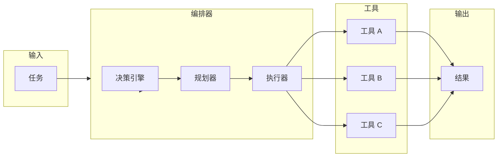
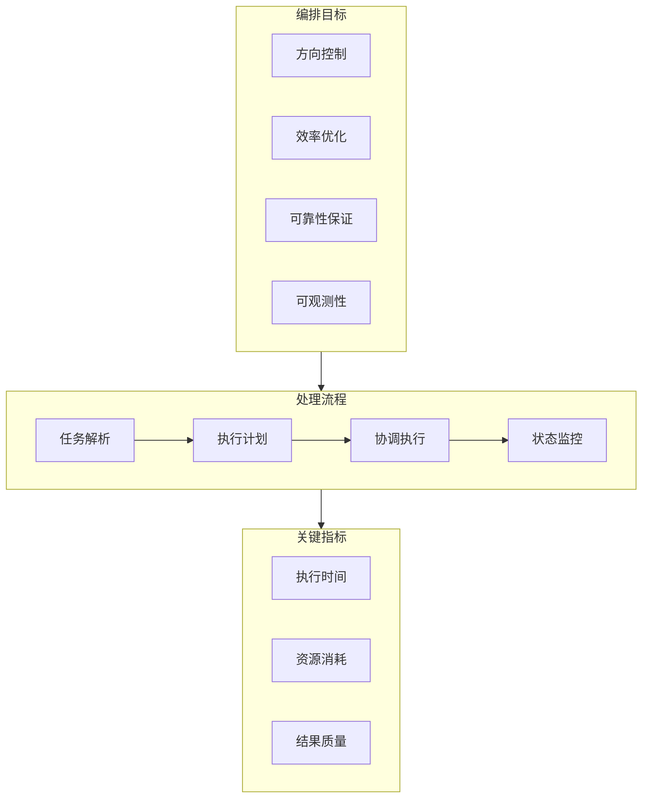

# Tool Orchestration Patterns

> 深度解析 AI Agent 工具编排的设计哲学与工程实践

---

## 1. 工具编排概述

### 1.1 为什么需要编排

在 AI Agent 系统中，单一工具往往无法完成复杂任务。编排（Orchestration）解决的核心问题是**如何协调多个工具有序、有效地完成目标**。



**核心挑战**：

| 挑战 | 描述 | 影响 |
|------|------|------|
| 依赖管理 | 工具 A 的输出是工具 B 的输入 | 执行顺序必须正确 |
| 并行优化 | 独立任务应并行执行 | 减少总执行时间 |
| 错误处理 | 单点失败可能导致整体失败 | 需要容错机制 |
| 状态同步 | 跨工具共享中间状态 | 避免数据不一致 |

### 1.2 编排 vs 执行

| 维度 | 直接执行 | 编排模式 |
|------|----------|----------|
| **粒度** | 单工具调用 | 多工具协调 |
| **决策点** | 固定流程 | 动态决策 |
| **错误恢复** | 简单重试 | 多级回退 |
| **可观测性** | 黑盒 | 白盒追踪 |
| **适用场景** | 简单任务 | 复杂工作流 |

```python
# 直接执行模式
result = tool_a()
result = tool_b(result)  # 硬编码依赖

# 编排模式
class Orchestrator:
    def __init__(self):
        self.executor = ParallelExecutor()
        self.strategy = CostAwareStrategy()

    def execute(self, task):
        dag = self.build_dag(task)
        return self.executor.run(dag)
```

### 1.3 编排目标



---

## 2. 并行执行

### 2.1 依赖分析

依赖分析是并行执行的基础。通过构建有向无环图（DAG），可以确定哪些任务可以并行执行。

```python
from dataclasses import dataclass, field
from typing import Dict, List, Set
from enum import Enum

class DependencyType(Enum):
    """依赖类型"""
    STRICT = "strict"          # 必须等待前一个完成
    CONDITIONAL = "conditional" # 满足条件时依赖
    OPTIONAL = "optional"      # 可选依赖

@dataclass
class ToolNode:
    """工具节点"""
    id: str
    tool_name: str
    inputs: Dict[str, any] = field(default_factory=dict)
    depends_on: Set[str] = field(default_factory=set)
    dependency_type: DependencyType = DependencyType.STRICT

    def can_execute(self, completed: Set[str]) -> bool:
        """检查是否可以执行"""
        return self.depends_on.issubset(completed)

class DependencyGraph:
    """依赖图构建与验证"""

    def __init__(self):
        self.nodes: Dict[str, ToolNode] = {}
        self.edges: List[tuple[str, str]] = []

    def add_node(self, node: ToolNode):
        self.nodes[node.id] = node

    def add_edge(self, from_id: str, to_id: str):
        """添加依赖边: from_id → to_id (to_id 依赖 from_id)"""
        if from_id in self.nodes and to_id in self.nodes:
            self.edges.append((from_id, to_id))
            self.nodes[to_id].depends_on.add(from_id)

    def detect_cycles(self) -> List[List[str]]:
        """检测循环依赖"""
        visited = set()
        rec_stack = set()
        cycles = []

        def dfs(node_id: str, path: List[str]):
            visited.add(node_id)
            rec_stack.add(node_id)
            path.append(node_id)

            for edge in self.edges:
                if edge[0] == node_id:
                    next_id = edge[1]
                    if next_id not in visited:
                        dfs(next_id, path.copy())
                    elif next_id in rec_stack:
                        # 发现循环
                        cycle_start = path.index(next_id)
                        cycles.append(path[cycle_start:])

            rec_stack.remove(node_id)

        for node_id in self.nodes:
            if node_id not in visited:
                dfs(node_id, [])

        return cycles

    def get_parallel_groups(self) -> List[List[str]]:
        """
        获取可并行执行的节点组
        使用拓扑排序的思想
        """
        in_degree = {n: 0 for n in self.nodes}
        for from_id, to_id in self.edges:
            in_degree[to_id] += 1

        groups = []
        completed = set()

        while len(completed) < len(self.nodes):
            # 找出所有入度为0的节点
            current_group = [
                node_id for node_id, deg in in_degree.items()
                if deg == 0 and node_id not in completed
            ]

            if not current_group:
                raise ValueError("Circular dependency detected")

            groups.append(current_group)
            completed.update(current_group)

            # 更新入度
            for group_id in current_group:
                for from_id, to_id in self.edges:
                    if from_id == group_id:
                        in_degree[to_id] -= 1

        return groups
```

### 2.2 任务分组

基于依赖分析结果，将任务分组以实现最优并行度。

```python
from typing import List, Dict, Any, Callable
from concurrent.futures import ThreadPoolExecutor, Future
import asyncio

class TaskGrouper:
    """任务分组器"""

    @staticmethod
    def group_by_dependency(tools: List[ToolNode]) -> List[List[ToolNode]]:
        """按依赖关系分组"""
        # 构建依赖图
        graph = DependencyGraph()
        for tool in tools:
            graph.add_node(tool)

        # 添加边
        for i, tool in enumerate(tools):
            for dep_id in tool.depends_on:
                graph.add_edge(dep_id, tool.id)

        # 获取分组
        group_ids = graph.get_parallel_groups()
        groups = [[tools[[t.id for t in tools].index(gid)] for gid in group]
                  for group in group_ids]
        return groups

    @staticmethod
    def group_by_resource(tools: List[ToolNode], resource_limits: Dict[str, int]):
        """
        按资源需求分组
        避免同时使用同一资源的工具
        """
        resource_usage = {res: 0 for res in resource_limits}
        groups = []
        current_group = []

        for tool in tools:
            resources = tool.inputs.get('resources', {})

            can_add = True
            for res, amount in resources.items():
                if resource_usage.get(res, 0) + amount > resource_limits[res]:
                    can_add = False
                    break

            if can_add:
                current_group.append(tool)
                for res, amount in resources.items():
                    resource_usage[res] += amount
            else:
                groups.append(current_group)
                current_group = [tool]
                # 重置资源
                for res in resource_usage:
                    resource_usage[res] = 0

        if current_group:
            groups.append(current_group)

        return groups

    @staticmethod
    def group_by_affinity(tools: List[ToolNode], affinity_map: Dict[str, List[str]]):
        """
        按亲和性分组
        将经常一起使用的工具放在同一组
        """
        groups = []
        assigned = set()

        for tool in tools:
            if tool.id in assigned:
                continue

            # 检查亲和性
            group = [tool]
            similar = affinity_map.get(tool.id, [])

            for sim_id in similar:
                if sim_id not in assigned:
                    group.append(tools[[t.id for t in tools].index(sim_id)])
                    assigned.add(sim_id)

            groups.append(group)
            assigned.add(tool.id)

        return groups
```

### 2.3 结果聚合

并行执行后，需要将各任务结果聚合。

```python
from dataclasses import dataclass
from typing import Any, Dict, Optional
from enum import Enum

class AggregationStrategy(Enum):
    SEQUENTIAL = "sequential"      # 按顺序聚合
    MERGE = "merge"                # 合并结果
    REDUCE = "reduce"              # 归约操作
    CONDITIONAL = "conditional"    # 条件聚合

@dataclass
class ExecutionResult:
    """执行结果"""
    tool_id: str
    success: bool
    data: Any
    error: Optional[str] = None
    execution_time: float = 0.0

class ResultAggregator:
    """结果聚合器"""

    def __init__(self, strategy: AggregationStrategy = AggregationStrategy.MERGE):
        self.strategy = strategy

    def aggregate(self, results: List[ExecutionResult]) -> Dict[str, Any]:
        """聚合多个结果"""

        if self.strategy == AggregationStrategy.SEQUENTIAL:
            return self._aggregate_sequential(results)
        elif self.strategy == AggregationStrategy.MERGE:
            return self._aggregate_merge(results)
        elif self.strategy == AggregationStrategy.REDUCE:
            return self._aggregate_reduce(results)
        elif self.strategy == AggregationStrategy.CONDITIONAL:
            return self._aggregate_conditional(results)

    def _aggregate_sequential(self, results: List[ExecutionResult]) -> Dict[str, Any]:
        """顺序聚合：保留执行顺序"""
        return {
            "sequence": [
                {"tool_id": r.tool_id, "data": r.data, "success": r.success}
                for r in results
            ],
            "total_count": len(results),
            "success_count": sum(1 for r in results if r.success)
        }

    def _aggregate_merge(self, results: List[ExecutionResult]) -> Dict[str, Any]:
        """合并聚合：合并所有结果"""
        merged = {}
        for r in results:
            if r.success:
                if isinstance(r.data, dict):
                    merged.update(r.data)
                elif isinstance(r.data, list):
                    if "items" not in merged:
                        merged["items"] = []
                    merged["items"].extend(r.data)
                else:
                    merged[r.tool_id] = r.data

        return {"data": merged, "success_count": sum(1 for r in results if r.success)}

    def _aggregate_reduce(self, results: List[ExecutionResult]) -> Dict[str, Any]:
        """归约聚合：执行归约函数"""
        successful_results = [r for r in results if r.success]

        if not successful_results:
            return {"error": "No successful results"}

        # 提取数值进行归约
        values = []
        for r in successful_results:
            if isinstance(r.data, (int, float)):
                values.append(r.data)
            elif isinstance(r.data, dict) and 'value' in r.data:
                values.append(r.data['value'])

        return {
            "sum": sum(values),
            "avg": sum(values) / len(values) if values else 0,
            "max": max(values) if values else None,
            "min": min(values) if values else None,
            "count": len(values)
        }

    def _aggregate_conditional(self, results: List[ExecutionResult]) -> Dict[str, Any]:
        """条件聚合：根据条件选择结果"""
        # 选择第一个成功的结果作为主结果
        primary = next((r for r in results if r.success), None)

        if not primary:
            return {"error": "No successful results"}

        # 收集补充信息
        supplements = [
            {"tool_id": r.tool_id, "data": r.data}
            for r in results
            if r.success and r.tool_id != primary.tool_id
        ]

        return {
            "primary": primary.data,
            "supplements": supplements,
            "total_count": len(results)
        }
```

### 2.4 错误处理

并行执行中的错误处理策略。

```python
from typing import Callable, Any, Optional
import asyncio
from dataclasses import dataclass

@dataclass
class ErrorPolicy:
    """错误处理策略"""
    max_retries: int = 3
    retry_delay: float = 1.0
    exponential_backoff: bool = True
    fallback_value: Optional[Any] = None

class ParallelExecutor:
    """并行执行器"""

    def __init__(self, max_workers: int = 4):
        self.max_workers = max_workers
        self.error_policies: Dict[str, ErrorPolicy] = {}

    def execute_parallel(
        self,
        tools: List[Callable],
        inputs: List[Any],
        error_handling: str = "fail-fast"
    ) -> List[ExecutionResult]:
        """并行执行工具"""

        results = []

        with ThreadPoolExecutor(max_workers=self.max_workers) as executor:
            futures = [
                executor.submit(self._safe_execute, tool, inp, tool_id)
                for tool_id, (tool, inp) in enumerate(zip(tools, inputs))
            ]

            for future in futures:
                try:
                    result = future.result(timeout=30)
                    results.append(result)
                except Exception as e:
                    if error_handling == "fail-fast":
                        raise
                    results.append(ExecutionResult(
                        tool_id="unknown",
                        success=False,
                        data=None,
                        error=str(e)
                    ))

        return results

    def _safe_execute(
        self,
        tool: Callable,
        input_data: Any,
        tool_id: str
    ) -> ExecutionResult:
        """安全执行工具"""
        policy = self.error_policies.get(tool_id, ErrorPolicy())

        for attempt in range(policy.max_retries):
            try:
                result = tool(input_data)
                return ExecutionResult(
                    tool_id=tool_id,
                    success=True,
                    data=result
                )
            except Exception as e:
                if attempt == policy.max_retries - 1:
                    return ExecutionResult(
                        tool_id=tool_id,
                        success=False,
                        data=policy.fallback_value,
                        error=str(e)
                    )

                # 指数退避
                delay = policy.retry_delay * (2 ** attempt) if policy.exponential_backoff else policy.retry_delay
                time.sleep(delay)

        return ExecutionResult(
            tool_id=tool_id,
            success=False,
            data=policy.fallback_value,
            error="Max retries exceeded"
        )

    async def execute_parallel_async(
        self,
        tools: List[Callable],
        inputs: List[Any]
    ) -> List[ExecutionResult]:
        """异步并行执行"""

        async def safe_execute_async(tool, input_data, tool_id):
            return await asyncio.to_thread(self._safe_execute, tool, input_data, tool_id)

        tasks = [
            safe_execute_async(tool, inp, tool_id)
            for tool_id, (tool, inp) in enumerate(zip(tools, inputs))
        ]

        return await asyncio.gather(*tasks)
```

---

## 3. 串行执行

### 3.1 顺序依赖

串行执行的核心是维护正确的顺序依赖。

```python
from typing import Any, Dict, List, Optional, Callable
from dataclasses import dataclass, field

@dataclass
class Step:
    """执行步骤"""
    id: str
    tool: Callable
    input_transformer: Optional[Callable[[Dict], Dict]] = None
    output_transformer: Optional[Callable[[Any], Any]] = None
    condition: Optional[Callable[[Dict], bool]] = None

@dataclass
class PipelineContext:
    """流水线上下文"""
    results: Dict[str, Any] = field(default_factory=dict)
    metadata: Dict[str, Any] = field(default_factory=dict)
    errors: List[str] = field(default_factory=list)

    def get_result(self, step_id: str) -> Optional[Any]:
        return self.results.get(step_id)

    def set_result(self, step_id: str, result: Any):
        self.results[step_id] = result

    def add_error(self, error: str):
        self.errors.append(error)

class SequentialPipeline:
    """串行执行流水线"""

    def __init__(self, steps: List[Step]):
        self.steps = steps
        self._validate_dependencies()

    def _validate_dependencies(self):
        """验证依赖关系"""
        available_ids = set()

        for step in self.steps:
            # 如果步骤需要前置结果，检查是否可用
            if step.input_transformer:
                # 验证输入转换器可以访问所需数据
                pass

    def execute(self, initial_input: Dict[str, Any]) -> PipelineContext:
        """执行流水线"""
        context = PipelineContext()
        context.set_result("initial", initial_input)

        for step in self.steps:
            # 检查条件
            if step.condition and not step.condition(context.results):
                context.metadata[f"{step.id}_skipped"] = True
                continue

            # 准备输入
            if step.input_transformer:
                input_data = step.input_transformer(context.results)
            else:
                input_data = context.results.get("initial", {})

            # 执行
            try:
                result = step.tool(input_data)

                # 转换输出
                if step.output_transformer:
                    result = step.output_transformer(result)

                context.set_result(step.id, result)

            except Exception as e:
                context.add_error(f"{step.id}: {str(e)}")
                context.metadata[f"{step.id}_failed"] = True

        return context

    def execute_with_retry(
        self,
        initial_input: Dict[str, Any],
        max_retries: int = 3
    ) -> PipelineContext:
        """带重试的串行执行"""
        for attempt in range(max_retries):
            context = self.execute(initial_input)

            if not context.errors:
                return context

            if attempt < max_retries - 1:
                # 重试失败的步骤
                self._retry_failed_steps(context, initial_input)

        return context

    def _retry_failed_steps(self, context: PipelineContext, initial_input: Dict[str, Any]):
        """重试失败的步骤"""
        for step in self.steps:
            if context.metadata.get(f"{step.id}_failed"):
                try:
                    # 重置上下文中的该步骤结果
                    # 重新执行
                    pass
                except Exception:
                    pass
```

### 3.2 状态传递

在串行执行中，状态需要沿着执行链传递。

```python
from typing import Any, Dict, List, TypeVar, Generic
from copy import deepcopy

T = TypeVar('T')

class StateCarrier(Generic[T]):
    """状态载体"""

    def __init__(self, initial_state: T):
        self._state = initial_state
        self._history: List[T] = []

    @property
    def state(self) -> T:
        return self._state

    def update(self, new_state: T):
        """更新状态"""
        self._history.append(deepcopy(self._state))
        self._state = new_state

    def revert(self, steps: int = 1) -> bool:
        """回退到历史状态"""
        if len(self._history) >= steps:
            for _ in range(steps):
                self._state = self._history.pop()
            return True
        return False

    def get_history(self) -> List[T]:
        """获取状态历史"""
        return deepcopy(self._history)

class StatefulSequentialPipeline(SequentialPipeline):
    """带状态管理的串行流水线"""

    def __init__(self, steps: List[Step], initial_state: Dict[str, Any] = None):
        super().__init__(steps)
        self.state_carrier = StateCarrier(initial_state or {})

    def execute(self, initial_input: Dict[str, Any]) -> PipelineContext:
        """执行并维护状态"""
        context = PipelineContext()
        current_input = {**initial_input, **self.state_carrier.state}

        for step in self.steps:
            # 合并状态到输入
            execution_input = {
                **current_input,
                "state": self.state_carrier.state
            }

            try:
                result = step.tool(execution_input)

                # 更新状态
                if isinstance(result, dict) and "state_update" in result:
                    self.state_carrier.update({
                        **self.state_carrier.state,
                        **result["state_update"]
                    })
                    result = result.get("output", result)

                context.set_result(step.id, result)

            except Exception as e:
                context.add_error(f"{step.id}: {str(e)}")
                # 可选：回退状态
                self.state_carrier.revert(1)

        return context

    def checkpoint(self) -> str:
        """创建检查点"""
        return str(self.state_carrier.state)

    def restore(self, checkpoint: str):
        """恢复到检查点"""
        import json
        self.state_carrier._state = json.loads(checkpoint)
        self.state_carrier._history = []
```

### 3.3 中间结果利用

在长流水线中，合理利用中间结果可以提高效率。

```python
from typing import Any, Dict, List, Optional, Callable
import hashlib
import json

class ResultCache:
    """结果缓存"""

    def __init__(self, max_size: int = 100):
        self._cache: Dict[str, Any] = {}
        self._access_count: Dict[str, int] = {}
        self._max_size = max_size

    def _make_key(self, tool_id: str, inputs: Dict[str, Any]) -> str:
        """生成缓存键"""
        content = json.dumps(inputs, sort_keys=True)
        hash_val = hashlib.sha256(content.encode()).hexdigest()[:16]
        return f"{tool_id}:{hash_val}"

    def get(self, tool_id: str, inputs: Dict[str, Any]) -> Optional[Any]:
        """获取缓存结果"""
        key = self._make_key(tool_id, inputs)
        if key in self._cache:
            self._access_count[key] = self._access_count.get(key, 0) + 1
            return self._cache[key]
        return None

    def set(self, tool_id: str, inputs: Dict[str, Any], result: Any):
        """设置缓存"""
        key = self._make_key(tool_id, inputs)
        self._cache[key] = result

        if len(self._cache) > self._max_size:
            # LRU 淘汰
            min_access = min(self._access_count.values())
            for k, v in list(self._access_count.items()):
                if v == min_access:
                    del self._cache[k]
                    del self._access_count[k]
                    break

class IntermediateResultPipeline(SequentialPipeline):
    """支持中间结果缓存的流水线"""

    def __init__(self, steps: List[Step], cache_enabled: bool = True):
        super().__init__(steps)
        self.cache = ResultCache() if cache_enabled else None

    def execute_with_caching(
        self,
        initial_input: Dict[str, Any],
        check_intermediate: bool = True
    ) -> PipelineContext:
        """执行并利用中间结果"""
        context = PipelineContext()
        context.set_result("initial", initial_input)

        for i, step in enumerate(self.steps):
            # 检查缓存
            if self.cache and check_intermediate:
                cached = self.cache.get(step.id, context.results)
                if cached is not None:
                    context.set_result(step.id, cached)
                    context.metadata[f"{step.id}_from_cache"] = True
                    continue

            # 执行
            try:
                result = step.tool(context.results)

                # 缓存结果
                if self.cache:
                    self.cache.set(step.id, context.results, result)

                context.set_result(step.id, result)

            except Exception as e:
                context.add_error(f"{step.id}: {str(e)}")
                # 尝试跳过该步骤，使用默认结果
                if i < len(self.steps) - 1:
                    context.set_result(step.id, None)

        return context
```

---

## 4. 混合编排

### 4.1 分阶段执行

将复杂任务分解为多个阶段，每个阶段内部并行，阶段之间串行。

```python
from typing import List, Dict, Any, Callable, Optional
from dataclasses import dataclass, field
from enum import Enum

class StageType(Enum):
    PARALLEL = "parallel"
    SEQUENTIAL = "sequential"
    CONDITIONAL = "conditional"

@dataclass
class Stage:
    """执行阶段"""
    name: str
    stage_type: StageType
    tools: List[Callable]
    dependencies: List[str] = field(default_factory=list)
    on_success: Optional[str] = None  # 下个阶段名称
    on_failure: Optional[str] = None

@dataclass
class StageResult:
    """阶段结果"""
    stage_name: str
    success: bool
    results: List[ExecutionResult] = field(default_factory=list)
    output: Optional[Dict[str, Any]] = None
    error: Optional[str] = None

class PhasedOrchestrator:
    """分阶段编排器"""

    def __init__(self):
        self.stages: Dict[str, Stage] = {}
        self.current_phase: str = "init"
        self.stage_results: Dict[str, StageResult] = {}

    def add_stage(self, stage: Stage):
        self.stages[stage.name] = stage

    def execute(self) -> Dict[str, StageResult]:
        """执行所有阶段"""
        # 找到起始阶段
        start_stage = self._find_start_stage()

        current_stage_name = start_stage

        while current_stage_name:
            stage = self.stages[current_stage_name]
            result = self._execute_stage(stage)

            self.stage_results[current_stage_name] = result

            # 根据结果决定下一个阶段
            if result.success and stage.on_success:
                current_stage_name = stage.on_success
            elif not result.success and stage.on_failure:
                current_stage_name = stage.on_failure
            else:
                # 按顺序找下一个阶段
                current_stage_name = self._find_next_stage(current_stage_name)

        return self.stage_results

    def _execute_stage(self, stage: Stage) -> StageResult:
        """执行单个阶段"""
        # 检查依赖阶段是否完成
        for dep_name in stage.dependencies:
            if dep_name not in self.stage_results:
                return StageResult(
                    stage_name=stage.name,
                    success=False,
                    error=f"Dependency {dep_name} not completed"
                )

        # 根据阶段类型执行
        if stage.stage_type == StageType.PARALLEL:
            return self._execute_parallel_stage(stage)
        elif stage.stage_type == StageType.SEQUENTIAL:
            return self._execute_sequential_stage(stage)
        elif stage.stage_type == StageType.CONDITIONAL:
            return self._execute_conditional_stage(stage)

    def _execute_parallel_stage(self, stage: Stage) -> StageResult:
        """并行执行阶段"""
        executor = ParallelExecutor(max_workers=len(stage.tools))

        # 准备输入
        inputs = [
            self._prepare_inputs(stage, result)
            for result in self.stage_results.values()
        ]

        try:
            results = executor.execute_parallel(stage.tools, inputs)
            return StageResult(
                stage_name=stage.name,
                success=True,
                results=results,
                output=self._aggregate_results(results)
            )
        except Exception as e:
            return StageResult(
                stage_name=stage.name,
                success=False,
                error=str(e)
            )

    def _execute_sequential_stage(self, stage: Stage) -> StageResult:
        """串行执行阶段"""
        results = []
        context = {}

        for tool in stage.tools:
            try:
                # 从上下文准备输入
                input_data = self._prepare_context_inputs(context, stage)
                result = tool(input_data)
                results.append(ExecutionResult(
                    tool_id=str(id(tool)),
                    success=True,
                    data=result
                ))
                context.update(result if isinstance(result, dict) else {"result": result})
            except Exception as e:
                results.append(ExecutionResult(
                    tool_id=str(id(tool)),
                    success=False,
                    error=str(e)
                ))

        return StageResult(
            stage_name=stage.name,
            success=all(r.success for r in results),
            results=results,
            output=context
        )

    def _execute_conditional_stage(self, stage: Stage) -> StageResult:
        """条件执行阶段"""
        # 基于前面阶段的结果决定执行哪个工具
        condition_results = self.stage_results.get(stage.dependencies[-1])

        if condition_results and condition_results.output:
            condition_value = condition_results.output.get("condition", "default")

            # 根据条件选择工具
            if condition_value == "option_a":
                selected_tools = stage.tools[:len(stage.tools)//2]
            else:
                selected_tools = stage.tools[len(stage.tools)//2:]
        else:
            selected_tools = stage.tools

        executor = ParallelExecutor()
        results = executor.execute_parallel(selected_tools, [{}] * len(selected_tools))

        return StageResult(
            stage_name=stage.name,
            success=any(r.success for r in results),
            results=results
        )

    def _prepare_inputs(self, stage: Stage, prev_result: StageResult) -> Dict[str, Any]:
        """准备阶段输入"""
        return {"data": prev_result.output}

    def _prepare_context_inputs(self, context: Dict, stage: Stage) -> Dict[str, Any]:
        """准备上下文输入"""
        return context

    def _aggregate_results(self, results: List[ExecutionResult]) -> Dict[str, Any]:
        """聚合结果"""
        aggregator = ResultAggregator(AggregationStrategy.MERGE)
        return aggregator.aggregate(results)

    def _find_start_stage(self) -> Optional[str]:
        """找到起始阶段"""
        stage_names = set(self.stages.keys())
        for stage in self.stages.values():
            stage_names -= set(stage.dependencies)
        return next(iter(stage_names)) if stage_names else None

    def _find_next_stage(self, current: str) -> Optional[str]:
        """找到下一个阶段"""
        for name, stage in self.stages.items():
            if current in stage.dependencies:
                return name
        return None
```

### 4.2 动态编排

根据执行结果动态调整后续执行计划。

```python
from typing import Any, Dict, List, Callable, Optional, Type
from dataclasses import dataclass, field

@dataclass
class Decision:
    """执行决策"""
    action: str  # "continue", "retry", "skip", "fallback", "abort"
    target: Optional[str] = None
    parameters: Dict[str, Any] = field(default_factory=dict)

class DynamicPlanner:
    """动态规划器"""

    def __init__(self):
        self.rules: List[Callable[[Dict[str, Any]], Decision]] = []
        self.fallback_handlers: Dict[str, Callable] = {}

    def add_rule(self, rule: Callable[[Dict[str, Any]], Decision]):
        self.rules.append(rule)

    def add_fallback(self, stage_name: str, handler: Callable):
        self.fallback_handlers[stage_name] = handler

    def decide(self, context: Dict[str, Any]) -> Decision:
        """基于规则做出决策"""
        for rule in self.rules:
            decision = rule(context)
            if decision:
                return decision

        return Decision(action="continue")

    def execute_dynamic(
        self,
        plan: List[Stage],
        initial_context: Dict[str, Any]
    ) -> Dict[str, Any]:
        """动态执行计划"""
        context = initial_context.copy()
        results = {}
        i = 0

        while i < len(plan):
            stage = plan[i]

            # 尝试执行阶段
            try:
                stage_result = self._execute_stage_with_fallback(stage, context)

                if stage_result.success:
                    results[stage.name] = stage_result
                    context[f"{stage.name}_result"] = stage_result.output
                    i += 1
                else:
                    # 决策：重试、跳过还是中止
                    decision = self.decide({
                        **context,
                        "stage": stage.name,
                        "result": stage_result,
                        "error": stage_result.error
                    })

                    if decision.action == "retry":
                        # 重试
                        continue
                    elif decision.action == "skip":
                        # 跳过
                        results[stage.name] = stage_result
                        context[f"{stage.name}_skipped"] = True
                        i += 1
                    elif decision.action == "fallback":
                        # 使用备选方案
                        fallback = self.fallback_handlers.get(stage.name)
                        if fallback:
                            context = fallback(context)
                        i += 1
                    elif decision.action == "abort":
                        break

            except Exception as e:
                decision = self.decide({
                    **context,
                    "stage": stage.name,
                    "exception": e
                })

                if decision.action == "continue":
                    i += 1
                else:
                    break

        return {"results": results, "context": context, "final_index": i}

    def _execute_stage_with_fallback(
        self,
        stage: Stage,
        context: Dict[str, Any]
    ) -> StageResult:
        """执行阶段，支持回退"""
        try:
            return self._execute_stage(stage, context)
        except Exception as e:
            fallback = self.fallback_handlers.get(stage.name)
            if fallback:
                return fallback(context)
            raise
```

### 4.3 自适应策略

根据系统状态和执行历史动态调整策略。

```python
from typing import Dict, Any, List, Optional
from dataclasses import dataclass, field
from enum import Enum
import time

class ExecutionMode(Enum):
    CONSERVATIVE = "conservative"
    AGGRESSIVE = "aggressive"
    BALANCED = "balanced"

@dataclass
class PerformanceMetrics:
    """性能指标"""
    success_rate: float = 0.0
    avg_execution_time: float = 0.0
    error_count: int = 0
    cache_hit_rate: float = 0.0
    parallel_efficiency: float = 0.0

class AdaptiveStrategy:
    """自适应策略"""

    def __init__(self):
        self.metrics = PerformanceMetrics()
        self.execution_history: List[Dict[str, Any]] = []
        self.current_mode = ExecutionMode.BALANCED

        # 阈值配置
        self.thresholds = {
            "success_rate_low": 0.7,
            "success_rate_high": 0.95,
            "execution_time_high": 5.0,
            "error_rate_high": 0.3
        }

    def record_execution(self, execution_data: Dict[str, Any]):
        """记录执行数据"""
        self.execution_history.append({
            **execution_data,
            "timestamp": time.time()
        })

        # 只保留最近100条
        if len(self.execution_history) > 100:
            self.execution_history.pop(0)

        self._update_metrics()

    def _update_metrics(self):
        """更新性能指标"""
        if not self.execution_history:
            return

        recent = self.execution_history[-20:]  # 最近20次

        success_count = sum(1 for e in recent if e.get("success", False))
        self.metrics.success_rate = success_count / len(recent)

        exec_times = [e.get("execution_time", 0) for e in recent]
        self.metrics.avg_execution_time = sum(exec_times) / len(exec_times)

        self.metrics.error_count = sum(1 for e in recent if not e.get("success", False))

    def get_current_strategy(self) -> Dict[str, Any]:
        """获取当前策略配置"""
        self._adjust_mode()

        strategies = {
            ExecutionMode.CONSERVATIVE: {
                "max_parallel": 2,
                "timeout": 60,
                "retry_count": 5,
                "cache_enabled": True,
                "validation_enabled": True
            },
            ExecutionMode.BALANCED: {
                "max_parallel": 4,
                "timeout": 30,
                "retry_count": 3,
                "cache_enabled": True,
                "validation_enabled": False
            },
            ExecutionMode.AGGRESSIVE: {
                "max_parallel": 8,
                "timeout": 15,
                "retry_count": 1,
                "cache_enabled": False,
                "validation_enabled": False
            }
        }

        return strategies[self.current_mode]

    def _adjust_mode(self):
        """根据指标调整模式"""
        if self.metrics.success_rate < self.thresholds["success_rate_low"]:
            # 切换到保守模式
            self.current_mode = ExecutionMode.CONSERVATIVE
        elif self.metrics.success_rate > self.thresholds["success_rate_high"]:
            # 可以切换到激进模式
            if self.metrics.avg_execution_time < self.thresholds["execution_time_high"]:
                self.current_mode = ExecutionMode.AGGRESSIVE
        else:
            self.current_mode = ExecutionMode.BALANCED

    def should_use_parallel(self) -> bool:
        """判断是否应使用并行执行"""
        if self.current_mode == ExecutionMode.CONSERVATIVE:
            return len(self.execution_history) < 5  # 只有在稳定后才并行
        return self.metrics.success_rate > 0.8

    def should_enable_validation(self) -> bool:
        """判断是否应启用验证"""
        return (
            self.metrics.success_rate < self.thresholds["success_rate_high"] or
            self.current_mode == ExecutionMode.CONSERVATIVE
        )

class AdaptiveOrchestrator:
    """自适应编排器"""

    def __init__(self):
        self.strategy = AdaptiveStrategy()
        self.base_orchestrator = PhasedOrchestrator()

    def execute(self, plan: List[Stage], context: Dict[str, Any]) -> Dict[str, Any]:
        """自适应执行"""
        start_time = time.time()

        # 获取当前策略
        current_strategy = self.strategy.get_current_strategy()

        # 根据策略调整执行器
        self.base_orchestrator = self._configure_orchestrator(current_strategy)

        try:
            results = self.base_orchestrator.execute(plan, context)

            # 记录执行数据
            execution_time = time.time() - start_time
            success = all(r.success for r in results.values() if hasattr(r, 'success'))

            self.strategy.record_execution({
                "success": success,
                "execution_time": execution_time,
                "strategy": current_strategy
            })

            return results

        except Exception as e:
            self.strategy.record_execution({
                "success": False,
                "execution_time": time.time() - start_time,
                "error": str(e)
            })
            raise

    def _configure_orchestrator(self, strategy: Dict[str, Any]):
        """根据策略配置编排器"""
        orchestrator = PhasedOrchestrator()

        # 配置并行执行器
        max_workers = strategy.get("max_parallel", 4)
        # ... 其他配置

        return orchestrator
```

---

## 5. 工具选择策略

### 5.1 模型驱动的工具选择

利用 LLM 的推理能力选择合适的工具。

```python
from typing import List, Dict, Any, Optional, Callable
from dataclasses import dataclass
from openai import OpenAI
import json

@dataclass
class Tool:
    """工具定义"""
    name: str
    description: str
    capabilities: List[str]
    input_schema: Dict[str, Any]
    cost: float = 1.0
    latency_estimate: float = 1.0

class ModelDrivenSelector:
    """模型驱动的工具选择器"""

    def __init__(self, model: str = "gpt-4", api_key: Optional[str] = None):
        self.client = OpenAI(api_key=api_key) if api_key else None
        self.model = model
        self.tool_registry: Dict[str, Tool] = {}

    def register_tool(self, tool: Tool):
        """注册工具"""
        self.tool_registry[tool.name] = tool

    def select_tools(
        self,
        task: str,
        context: Optional[Dict[str, Any]] = None,
        max_tools: int = 5
    ) -> List[Tool]:
        """为任务选择工具"""

        # 构建工具描述
        tool_descriptions = "\n".join([
            f"- {name}: {tool.description} (capabilities: {', '.join(tool.capabilities)})"
            for name, tool in self.tool_registry.items()
        ])

        # 构建 prompt
        prompt = f"""Task: {task}

Available tools:
{tool_descriptions}

Context: {json.dumps(context or {}, ensure_ascii=False)}

Select the most appropriate tools for this task. Return a JSON array of tool names.
Consider:
1. Tool capabilities match task requirements
2. Tool efficiency (cost and latency)
3. Tool compatibility with context

Return format: ["tool1", "tool2", ...]
"""

        # 调用模型
        if self.client:
            response = self.client.chat.completions.create(
                model=self.model,
                messages=[
                    {"role": "system", "content": "You are a tool selection assistant."},
                    {"role": "user", "content": prompt}
                ],
                temperature=0.3
            )

            selected_names = json.loads(response.choices[0].message.content)
        else:
            # 简化版本：基于关键词匹配
            selected_names = self._keyword_based_selection(task)

        return [self.tool_registry[name] for name in selected_names if name in self.tool_registry]

    def _keyword_based_selection(self, task: str) -> List[str]:
        """基于关键词的工具选择"""
        task_lower = task.lower()

        # 定义关键词映射
        keyword_map = {
            "search": ["web_search", "database_query"],
            "分析": ["analyzer", "statistical_tool"],
            "生成": ["generator", "formatter"],
            "计算": ["calculator", "processor"]
        }

        selected = []
        for keyword, tools in keyword_map.items():
            if keyword in task_lower:
                selected.extend(tools)

        return list(set(selected))[:5]

    def select_with_reasoning(
        self,
        task: str,
        context: Optional[Dict[str, Any]] = None
    ) -> Dict[str, Any]:
        """选择工具并返回推理过程"""

        # 构建详细的 prompt
        prompt = f"""Analyze the following task and select appropriate tools.

Task: {task}
Context: {json.dumps(context or {}, ensure_ascii=False)}

Available tools with their attributes:
{self._format_tool_attributes()}

Provide your analysis in the following format:
1. Task breakdown
2. Required capabilities
3. Selected tools with justification
4. Execution order

Return as JSON with keys: breakdown, capabilities, selected_tools (with justification), execution_order
"""

        if self.client:
            response = self.client.chat.completions.create(
                model=self.model,
                messages=[
                    {"role": "system", "content": "You are a tool selection expert."},
                    {"role": "user", "content": prompt}
                ],
                temperature=0.5
            )

            result = json.loads(response.choices[0].message.content)

            return {
                "tools": [self.tool_registry[name] for name in result.get("selected_tools", [])],
                "reasoning": result,
                "execution_order": result.get("execution_order", [])
            }

        return {"tools": [], "reasoning": {}, "execution_order": []}

    def _format_tool_attributes(self) -> str:
        """格式化工具属性"""
        lines = []
        for name, tool in self.tool_registry.items():
            lines.append(
                f"- {tool.name}: {tool.description}\n"
                f"  Capabilities: {', '.join(tool.capabilities)}\n"
                f"  Cost: {tool.cost}, Latency: {tool.latency_estimate}s"
            )
        return "\n".join(lines)
```

### 5.2 规则驱动的工具选择

基于预定义规则进行工具选择。

```python
from typing import Dict, Any, List, Optional, Callable
from dataclasses import dataclass, field
from enum import Enum
import re

class RuleType(Enum):
    CONDITIONAL = "conditional"     # 条件规则
    PRIORITY = "priority"          # 优先级规则
    COST_BASED = "cost_based"      # 成本规则
    CAPABILITY_MATCH = "capability" # 能力匹配

@dataclass
class SelectionRule:
    """选择规则"""
    rule_type: RuleType
    condition: Callable[[Dict[str, Any]], bool]
    action: Callable[[Dict[str, Any]], List[str]]
    priority: int = 0

@dataclass
class ToolSelectionConfig:
    """工具选择配置"""
    max_tools: int = 5
    max_cost: float = 100.0
    max_latency: float = 30.0
    require_all_capabilities: bool = False

class RuleBasedSelector:
    """基于规则的工具选择器"""

    def __init__(self):
        self.rules: List[SelectionRule] = []
        self.tool_registry: Dict[str, Tool] = {}
        self.config = ToolSelectionConfig()

    def add_rule(self, rule: SelectionRule):
        self.rules.append(rule)
        self.rules.sort(key=lambda r: r.priority, reverse=True)

    def register_tool(self, tool: Tool):
        self.tool_registry[tool.name] = tool

    def set_config(self, config: ToolSelectionConfig):
        self.config = config

    def select_tools(self, task: Dict[str, Any]) -> List[Tool]:
        """基于规则选择工具"""
        candidates = list(self.tool_registry.values())

        # 应用规则过滤
        for rule in self.rules:
            if rule.condition(task):
                selected_names = rule.action(task)
                candidates = [
                    c for c in candidates
                    if c.name in selected_names
                ]

        # 应用约束
        candidates = self._apply_constraints(candidates, task)

        return candidates[:self.config.max_tools]

    def _apply_constraints(
        self,
        candidates: List[Tool],
        task: Dict[str, Any]
    ) -> List[Tool]:
        """应用约束条件"""
        required_caps = task.get("required_capabilities", [])
        max_cost = task.get("max_cost", self.config.max_cost)
        max_latency = task.get("max_latency", self.config.max_latency)

        filtered = []

        for tool in candidates:
            # 检查成本约束
            if tool.cost > max_cost:
                continue

            # 检查延迟约束
            if tool.latency_estimate > max_latency:
                continue

            # 检查能力要求
            if required_caps:
                if self.config.require_all_capabilities:
                    if not all(cap in tool.capabilities for cap in required_caps):
                        continue
                else:
                    if not any(cap in tool.capabilities for cap in required_caps):
                        continue

            filtered.append(tool)

        return filtered

    def select_with_priority(
        self,
        task: Dict[str, Any]
    ) -> List[Tool]:
        """基于优先级选择"""
        candidates = list(self.tool_registry.values())

        # 优先级排序
        def calculate_priority(tool: Tool) -> float:
            score = 0.0

            # 能力匹配分数
            required = task.get("required_capabilities", [])
            matches = sum(1 for cap in required if cap in tool.capabilities)
            score += (matches / len(required)) * 100 if required else 50

            # 成本效率分数
            score += max(0, 50 - tool.cost * 10)

            # 延迟效率分数
            score += max(0, 30 - tool.latency_estimate * 5)

            return score

        candidates.sort(key=calculate_priority, reverse=True)

        return candidates[:self.config.max_tools]
```

### 5.3 成本感知的选择

考虑执行成本的最优工具选择。

```python
from typing import Dict, Any, List, Optional, Tuple
from dataclasses import dataclass
from enum import Enum
import math

class CostModel(Enum):
    LINEAR = "linear"      # 线性成本
    QUADRATIC = "quadratic" # 二次成本
    STEP = "step"          # 阶梯成本

@dataclass
class CostEstimate:
    """成本估算"""
    monetary_cost: float
    time_cost: float
    resource_cost: float
    total: float

    @classmethod
    def calculate(
        cls,
        tool: Tool,
        input_size: int,
        model: CostModel = CostModel.LINEAR
    ) -> "CostEstimate":
        """计算工具执行成本"""

        if model == CostModel.LINEAR:
            monetary = tool.cost + 0.1 * input_size
        elif model == CostModel.QUADRATIC:
            monetary = tool.cost + 0.01 * (input_size ** 2)
        else:  # STEP
            monetary = tool.cost * math.ceil(input_size / 1000)

        time_cost = tool.latency_estimate * 0.5  # 时间价值系数
        resource_cost = 0.2 * input_size  # 资源成本

        total = monetary + time_cost + resource_cost

        return cls(
            monetary_cost=monetary,
            time_cost=time_cost,
            resource_cost=resource_cost,
            total=total
        )

class CostAwareSelector:
    """成本感知的工具选择器"""

    def __init__(self, budget: float = 100.0):
        self.budget = budget
        self.total_spent = 0.0
        self.tool_registry: Dict[str, Tool] = {}

    def register_tool(self, tool: Tool):
        self.tool_registry[tool.name] = tool

    def select_optimal_tools(
        self,
        task: Dict[str, Any],
        required_output: int = 1
    ) -> List[Tuple[Tool, CostEstimate]]:
        """选择最优工具组合"""

        available_tools = list(self.tool_registry.values())
        remaining_budget = self.budget - self.total_spent

        # 计算每个工具的成本
        tool_costs = []
        for tool in available_tools:
            input_size = task.get("input_size", 1000)
            cost = CostEstimate.calculate(tool, input_size)

            if cost.total <= remaining_budget:
                tool_costs.append((tool, cost))

        # 按成本排序
        tool_costs.sort(key=lambda x: x[1].total)

        # 选择满足输出需求的最小工具集
        selected = []
        total_cost = 0.0
        coverage = set()

        required_caps = set(task.get("required_capabilities", []))

        for tool, cost in tool_costs:
            if cost.total + total_cost > remaining_budget:
                continue

            # 检查能力覆盖
            tool_caps = set(tool.capabilities)
            new_coverage = required_caps - coverage

            if new_coverage:
                selected.append((tool, cost))
                total_cost += cost.total
                coverage.update(tool_caps)

                if coverage >= required_caps:
                    break

        self.total_spent += total_cost

        return selected

    def select_with_budget_constraint(
        self,
        tasks: List[Dict[str, Any]],
        total_budget: float
    ) -> Dict[str, List[Tuple[Tool, CostEstimate]]]:
        """在总预算约束下分配任务"""

        results = {}
        remaining = total_budget

        for task in tasks:
            if remaining <= 0:
                break

            # 选择该任务的最优工具
            selected = self.select_optimal_tools(task)

            # 估算总成本
            total_cost = sum(cost.total for _, cost in selected)

            if total_cost <= remaining:
                results[task.get("id", str(len(results)))] = selected
                remaining -= total_cost

        return results

    def select_with_quality_constraint(
        self,
        tasks: List[Dict[str, Any]],
        min_quality: float = 0.8
    ) -> List[Tuple[Tool, CostEstimate]]:
        """在质量约束下选择最优成本工具"""

        all_tools = list(self.tool_registry.values())
        best_combination = []
        best_cost = float('inf')

        def evaluate_combination(tools: List[Tool]) -> Tuple[float, float]:
            """评估工具组合的质量和成本"""
            if not tools:
                return 0.0, float('inf')

            # 计算覆盖度
            all_caps = set()
            for tool in tools:
                all_caps.update(tool.capabilities)

            coverage = len(all_caps) / max(len(all_tools), 1)
            quality = coverage * 0.7 + (1 - min(tool.cost for tool in tools) / 100) * 0.3

            cost = sum(tool.cost for tool in tools)

            return quality, cost

        # 简单的组合搜索（实际应用中需要更优化）
        for tool in all_tools:
            quality, cost = evaluate_combination([tool])

            if quality >= min_quality and cost < best_cost:
                best_combination = [tool]
                best_cost = cost

        return [(t, CostEstimate.calculate(t, 1000)) for t in best_combination]
```

---

## 6. 代码实现

### 6.1 拓扑排序算法

```python
from typing import List, Dict, Set, Optional, Any
from dataclasses import dataclass, field

@dataclass
class GraphNode:
    """图节点"""
    id: str
    data: Any = None
    dependencies: Set[str] = field(default_factory=set)

class TopologicalSorter:
    """拓扑排序实现"""

    @staticmethod
    def kahn_bfs(nodes: List[GraphNode]) -> List[str]:
        """
        Kahn 算法 (BFS 实现)
        返回拓扑排序结果，如果存在环则返回空列表
        """
        # 构建邻接表和入度表
        in_degree = {node.id: 0 for node in nodes}
        adjacency = {node.id: [] for node in nodes}

        node_map = {node.id: node for node in nodes}

        for node in nodes:
            for dep in node.dependencies:
                if dep in adjacency:
                    adjacency[dep].append(node.id)
                    in_degree[node.id] += 1

        # 初始化队列
        queue = [node_id for node_id, deg in in_degree.items() if deg == 0]
        result = []

        while queue:
            # 取出入度为0的节点
            current = queue.pop(0)
            result.append(current)

            # 更新依赖该节点的节点
            for neighbor in adjacency[current]:
                in_degree[neighbor] -= 1
                if in_degree[neighbor] == 0:
                    queue.append(neighbor)

        # 检测环
        if len(result) != len(nodes):
            return []

        return result

    @staticmethod
    def dfs(node_id: str, adjacency: Dict[str, List[str]],
            visited: Set[str], rec_stack: Set[str],
            result: List[str]) -> bool:
        """DFS 辅助函数"""

        visited.add(node_id)
        rec_stack.add(node_id)

        for neighbor in adjacency[node_id]:
            if neighbor not in visited:
                if TopologicalSorter.dfs(neighbor, adjacency, visited, rec_stack, result):
                    return True
            elif neighbor in rec_stack:
                # 发现环
                return True

        rec_stack.remove(node_id)
        result.insert(0, node_id)  # 逆序添加实现拓扑排序
        return False

    @staticmethod
    def dfs_method(nodes: List[GraphNode]) -> List[str]:
        """
        DFS 方法实现拓扑排序
        """
        adjacency = {node.id: [] for node in nodes}
        node_map = {node.id: node for node in nodes}

        for node in nodes:
            for dep in node.dependencies:
                if dep in adjacency:
                    adjacency[dep].append(node.id)

        visited = set()
        rec_stack = set()
        result = []

        for node in nodes:
            if node.id not in visited:
                if TopologicalSorter.dfs(node.id, adjacency, visited, rec_stack, result):
                    return []  # 有环

        return result

    @staticmethod
    def parallel_levels(nodes: List[GraphNode]) -> List[List[str]]:
        """
        计算可并行执行的层级
        返回嵌套列表，每个子列表内的节点可并行执行
        """
        in_degree = {node.id: len(node.dependencies) for node in nodes}
        adjacency = {node.id: [] for node in nodes}

        for node in nodes:
            for dep in node.dependencies:
                if dep in adjacency:
                    adjacency[dep].append(node.id)

        levels = []
        processed = set()

        while len(processed) < len(nodes):
            # 找出所有入度为0的节点
            current_level = [
                node_id for node_id, deg in in_degree.items()
                if deg == 0 and node_id not in processed
            ]

            if not current_level:
                raise ValueError("Circular dependency detected")

            levels.append(current_level)
            processed.update(current_level)

            # 更新依赖节点的入度
            for node_id in current_level:
                for neighbor in adjacency[node_id]:
                    in_degree[neighbor] -= 1

        return levels

    @staticmethod
    def weighted_topo_sort(
        nodes: List[GraphNode],
        weight_func: callable
    ) -> List[str]:
        """
        带权重的拓扑排序
        优先选择权重更高的路径上的节点
        """

        # 首先进行标准拓扑排序
        topo_order = TopologicalSorter.kahn_bfs(nodes)
        if not topo_order:
            return []

        # 计算每个节点的权重影响
        node_weights = {}
        for node_id in topo_order:
            node = next(n for n in nodes if n.id == node_id)
            node_weights[node_id] = weight_func(node)

        # 按权重重新排序（保持依赖约束）
        def can_reorder(node_id: str, before: List[str], node_map: Dict) -> bool:
            """检查节点是否可以移动到列表前面"""
            node = node_map[node_id]
            for other in before:
                if node.id in node_map[other].dependencies:
                    return False
            return True

        # 冒泡排序直到稳定
        ordered = topo_order.copy()
        node_map = {n.id: n for n in nodes}

        for i in range(len(ordered)):
            for j in range(i + 1, len(ordered)):
                if node_weights[ordered[j]] > node_weights[ordered[i]]:
                    if can_reorder(ordered[j], ordered[:i], node_map):
                        ordered[i], ordered[j] = ordered[j], ordered[i]

        return ordered
```

### 6.2 并行执行器

```python
import asyncio
from typing import List, Callable, Any, Optional, Dict
from concurrent.futures import ThreadPoolExecutor, ProcessPoolExecutor, Future
from dataclasses import dataclass, field
from enum import Enum
import time
from functools import partial

class ExecutorType(Enum):
    THREAD = "thread"
    PROCESS = "process"
    ASYNC = "async"

@dataclass
class TaskConfig:
    """任务配置"""
    timeout: float = 30.0
    retries: int = 3
    retry_delay: float = 1.0
    priority: int = 0

@dataclass
class Task:
    """任务定义"""
    id: str
    func: Callable
    args: tuple = field(default_factory=tuple)
    kwargs: Dict[str, Any] = field(default_factory=dict)
    config: TaskConfig = field(default_factory=TaskConfig)
    dependencies: List[str] = field(default_factory=list)

class ParallelExecutor:
    """高性能并行执行器"""

    def __init__(
        self,
        max_workers: int = 4,
        executor_type: ExecutorType = ExecutorType.THREAD
    ):
        self.max_workers = max_workers
        self.executor_type = executor_type
        self.executor = self._create_executor()
        self.results: Dict[str, Any] = {}

    def _create_executor(self):
        """创建执行器"""
        if self.executor_type == ExecutorType.THREAD:
            return ThreadPoolExecutor(max_workers=self.max_workers)
        elif self.executor_type == ExecutorType.PROCESS:
            return ProcessPoolExecutor(max_workers=self.max_workers)
        else:
            return None

    def execute(self, tasks: List[Task]) -> Dict[str, Any]:
        """执行任务列表"""
        # 按依赖分组
        groups = self._group_by_dependencies(tasks)

        results = {}
        for group in groups:
            group_results = self._execute_group(group)
            results.update(group_results)

        return results

    def _group_by_dependencies(self, tasks: List[Task]) -> List[List[Task]]:
        """按依赖关系分组"""
        # 构建依赖图
        task_map = {t.id: t for t in tasks}
        in_degree = {t.id: len(t.dependencies) for t in tasks}

        groups = []
        remaining = list(tasks)

        while remaining:
            # 找出无依赖的任务
            current_group = [
                t for t in remaining
                if in_degree[t.id] == 0
            ]

            if not current_group:
                raise ValueError("Circular dependency detected")

            groups.append(current_group)

            # 更新入度
            completed_ids = {t.id for t in current_group}
            for task in remaining:
                task_deps = set(task.dependencies)
                if task_deps & completed_ids:
                    # 有依赖完成，减少入度
                    new_deps = task_deps - completed_ids
                    in_degree[task.id] = len(new_deps)
                    task.dependencies = list(new_deps)

            remaining = [t for t in remaining if t.id not in completed_ids]

        return groups

    def _execute_group(self, tasks: List[Task]) -> Dict[str, Any]:
        """执行一组任务"""
        if self.executor_type == ExecutorType.ASYNC:
            return asyncio.run(self._execute_group_async(tasks))
        else:
            return self._execute_group_sync(tasks)

    def _execute_group_sync(self, tasks: List[Task]) -> Dict[str, Any]:
        """同步执行一组任务"""
        futures = {}
        results = {}

        # 提交所有任务
        for task in tasks:
            future = self.executor.submit(
                self._execute_with_retry,
                task
            )
            futures[task.id] = future

        # 收集结果
        for task_id, future in futures.items():
            try:
                results[task_id] = future.result(timeout=30)
            except Exception as e:
                results[task_id] = {"error": str(e)}

        return results

    async def _execute_group_async(self, tasks: List[Task]) -> Dict[str, Any]:
        """异步执行一组任务"""
        async def execute_async(task: Task):
            return await asyncio.to_thread(self._execute_with_retry, task)

        task_results = await asyncio.gather(
            *[execute_async(t) for t in tasks],
            return_exceptions=True
        )

        return {t.id: r for t, r in zip(tasks, task_results)}

    def _execute_with_retry(self, task: Task) -> Any:
        """带重试的任务执行"""
        last_error = None

        for attempt in range(task.config.retries):
            try:
                # 准备带超时的执行
                result = self._execute_with_timeout(
                    task.func,
                    task.args,
                    task.kwargs,
                    task.config.timeout
                )
                return {"success": True, "result": result}
            except Exception as e:
                last_error = e
                if attempt < task.config.retries - 1:
                    time.sleep(task.config.retry_delay * (attempt + 1))

        return {"success": False, "error": str(last_error)}

    def _execute_with_timeout(
        self,
        func: Callable,
        args: tuple,
        kwargs: Dict[str, Any],
        timeout: float
    ) -> Any:
        """带超时的执行"""
        future = self.executor.submit(func, *args, **kwargs)
        return future.result(timeout=timeout)

    def shutdown(self, wait: bool = True):
        """关闭执行器"""
        if self.executor:
            self.executor.shutdown(wait=wait)
```

### 6.3 状态机编排

```python
from typing import Dict, Any, Callable, Optional, List
from dataclasses import dataclass, field
from enum import Enum
from abc import ABC, abstractmethod

class StateTransition(Enum):
    """状态转换"""
    SUCCESS = "success"
    FAILURE = "failure"
    TIMEOUT = "timeout"
    CANCEL = "cancel"

@dataclass
class Transition:
    """转换定义"""
    from_state: str
    to_state: str
    trigger: StateTransition
    condition: Optional[Callable[[Dict], bool]] = None
    action: Optional[Callable[[Dict], Dict]] = None

@dataclass
class StateMachineConfig:
    """状态机配置"""
    initial_state: str
    final_states: List[str]
    transitions: List[Transition]
    on_enter: Optional[Callable[[str, Dict], None]] = None
    on_exit: Optional[Callable[[str, Dict], None]] = None

class StateMachine:
    """状态机编排器"""

    def __init__(self, config: StateMachineConfig):
        self.config = config
        self.current_state = config.initial_state
        self.context: Dict[str, Any] = {}
        self.history: List[str] = [config.initial_state]

        # 构建转换表
        self._transition_map: Dict[str, Dict[StateTransition, Transition]] = {}

        for trans in config.transitions:
            if trans.from_state not in self._transition_map:
                self._transition_map[trans.from_state] = {}
            self._transition_map[trans.from_state][trans.trigger] = trans

    def trigger(self, event: StateTransition, context_update: Optional[Dict] = None):
        """触发状态转换"""
        if context_update:
            self.context.update(context_update)

        # 查找转换
        if self.current_state not in self._transition_map:
            return False

        transition_map = self._transition_map[self.current_state]
        if event not in transition_map:
            # 尝试默认转换
            return False

        trans = transition_map[event]

        # 检查条件
        if trans.condition and not trans.condition(self.context):
            return False

        # 执行动作
        if trans.action:
            result = trans.action(self.context)
            if result:
                self.context.update(result)

        # 状态转换
        if self.config.on_exit:
            self.config.on_exit(self.current_state, self.context)

        self.current_state = trans.to_state
        self.history.append(self.current_state)

        if self.config.on_enter:
            self.config.on_enter(self.current_state, self.context)

        return True

    def is_final(self) -> bool:
        """检查是否到达终态"""
        return self.current_state in self.config.final_states

    def get_state(self) -> str:
        """获取当前状态"""
        return self.current_state

    def get_history(self) -> List[str]:
        """获取状态历史"""
        return self.history.copy()

class ToolStateMachine:
    """工具编排状态机"""

    def __init__(self):
        self.states = {
            "idle": self._create_idle_state(),
            "planning": self._create_planning_state(),
            "executing": self._create_executing_state(),
            "verifying": self._create_verifying_state(),
            "completed": self._create_completed_state(),
            "failed": self._create_failed_state()
        }

        self.machine = None
        self._setup_machine()

    def _create_idle_state(self) -> Dict[str, Any]:
        return {
            "name": "idle",
            "actions": [],
            "entry_action": None,
            "exit_action": None
        }

    def _create_planning_state(self) -> Dict[str, Any]:
        return {
            "name": "planning",
            "actions": ["analyze_task", "select_tools", "build_plan"],
            "entry_action": self._on_enter_planning,
            "exit_action": self._on_exit_planning
        }

    def _create_executing_state(self) -> Dict[str, Any]:
        return {
            "name": "executing",
            "actions": ["execute_tools", "collect_results"],
            "entry_action": self._on_enter_executing,
            "exit_action": self._on_exit_executing
        }

    def _create_verifying_state(self) -> Dict[str, Any]:
        return {
            "name": "verifying",
            "actions": ["validate_results", "check_quality"],
            "entry_action": self._on_enter_verifying,
            "exit_action": self._on_exit_verifying
        }

    def _create_completed_state(self) -> Dict[str, Any]:
        return {
            "name": "completed",
            "actions": [],
            "entry_action": self._on_enter_completed,
            "exit_action": None
        }

    def _create_failed_state(self) -> Dict[str, Any]:
        return {
            "name": "failed",
            "actions": ["log_error", "cleanup"],
            "entry_action": self._on_enter_failed,
            "exit_action": None
        }

    def _setup_machine(self):
        """设置状态机"""
        transitions = [
            Transition("idle", "planning", StateTransition.SUCCESS),
            Transition("planning", "executing", StateTransition.SUCCESS),
            Transition("executing", "verifying", StateTransition.SUCCESS),
            Transition("verifying", "completed", StateTransition.SUCCESS),
            Transition("executing", "failed", StateTransition.FAILURE),
            Transition("planning", "failed", StateTransition.FAILURE),
            Transition("verifying", "executing", StateTransition.FAILURE),
            Transition("idle", "idle", StateTransition.FAILURE),
        ]

        config = StateMachineConfig(
            initial_state="idle",
            final_states=["completed", "failed"],
            transitions=transitions
        )

        self.machine = StateMachine(config)

    def run(self, task: Dict[str, Any]) -> Dict[str, Any]:
        """运行状态机"""
        while not self.machine.is_final():
            current = self.machine.get_state()

            if current == "planning":
                result = self._run_planning(task)
                if result.get("success"):
                    self.machine.trigger(StateTransition.SUCCESS, {"plan": result})
                else:
                    self.machine.trigger(StateTransition.FAILURE, {"error": result.get("error")})

            elif current == "executing":
                result = self._run_execution(task)
                if result.get("success"):
                    self.machine.trigger(StateTransition.SUCCESS, {"results": result})
                else:
                    self.machine.trigger(StateTransition.FAILURE, {"error": result.get("error")})

            elif current == "verifying":
                result = self._run_verification(task)
                if result.get("success"):
                    self.machine.trigger(StateTransition.SUCCESS, {"verified": True})
                else:
                    self.machine.trigger(StateTransition.FAILURE, {"error": result.get("error")})

        return {
            "final_state": self.machine.get_state(),
            "history": self.machine.get_history(),
            "context": self.machine.context
        }

    def _run_planning(self, task: Dict) -> Dict[str, Any]:
        """执行规划阶段"""
        # 简化的规划逻辑
        return {
            "success": True,
            "tools": ["search", "analyze", "format"]
        }

    def _run_execution(self, task: Dict) -> Dict[str, Any]:
        """执行阶段"""
        return {"success": True, "output": "Execution result"}

    def _run_verification(self, task: Dict) -> Dict[str, Any]:
        """验证阶段"""
        return {"success": True}

    # 状态进入/退出回调
    def _on_enter_planning(self, state: str, context: Dict):
        pass

    def _on_exit_planning(self, state: str, context: Dict):
        pass

    def _on_enter_executing(self, state: str, context: Dict):
        pass

    def _on_exit_executing(self, state: str, context: Dict):
        pass

    def _on_enter_verifying(self, state: str, context: Dict):
        pass

    def _on_exit_verifying(self, state: str, context: Dict):
        pass

    def _on_enter_completed(self, state: str, context: Dict):
        pass

    def _on_enter_failed(self, state: str, context: Dict):
        pass
```

### 6.4 超时控制

```python
import asyncio
from typing import Any, Callable, Dict, Optional, List
from dataclasses import dataclass, field
from enum import Enum
import time
from concurrent.futures import TimeoutError

class TimeoutStrategy(Enum):
    """超时策略"""
    HARD = "hard"          # 超时直接失败
    SOFT = "soft"          # 超时继续执行但不等待结果
    GRACEFUL = "graceful"  # 优雅取消，带清理
    EXTENDABLE = "extendable"  # 可延长超时

@dataclass
class TimeoutConfig:
    """超时配置"""
    default_timeout: float = 30.0
    max_timeout: float = 300.0
    warning_threshold: float = 0.8  # 80% 时发出警告
    strategy: TimeoutStrategy = TimeoutStrategy.GRACEFUL

@dataclass
class ExecutionContext:
    """执行上下文"""
    task_id: str
    start_time: float
    timeout: float
    cancelled: bool = False
    warnings: List[str] = field(default_factory=list)

class TimeoutController:
    """超时控制器"""

    def __init__(self, config: TimeoutConfig):
        self.config = config
        self.active_contexts: Dict[str, ExecutionContext] = {}

    def start(self, task_id: str, timeout: Optional[float] = None) -> ExecutionContext:
        """开始计时"""
        actual_timeout = timeout or self.config.default_timeout

        context = ExecutionContext(
            task_id=task_id,
            start_time=time.time(),
            timeout=actual_timeout
        )

        self.active_contexts[task_id] = context
        return context

    def check(self, task_id: str) -> float:
        """检查剩余时间"""
        if task_id not in self.active_contexts:
            return 0.0

        context = self.active_contexts[task_id]
        elapsed = time.time() - context.start_time
        remaining = context.timeout - elapsed

        # 检查警告阈值
        if remaining <= context.timeout * (1 - self.config.warning_threshold):
            context.warnings.append(
                f"Time running low: {remaining:.2f}s remaining"
            )

        return max(0, remaining)

    def is_timeout(self, task_id: str) -> bool:
        """检查是否超时"""
        return self.check(task_id) <= 0

    def extend(self, task_id: str, additional_time: float) -> bool:
        """延长超时"""
        if task_id not in self.active_contexts:
            return False

        context = self.active_contexts[task_id]
        new_timeout = context.timeout + additional_time

        if new_timeout <= self.config.max_timeout:
            context.timeout = new_timeout
            return True

        return False

    def cancel(self, task_id: str):
        """取消任务"""
        if task_id in self.active_contexts:
            self.active_contexts[task_id].cancelled = True

    def cleanup(self, task_id: str):
        """清理上下文"""
        if task_id in self.active_contexts:
            del self.active_contexts[task_id]

class TimeoutExecutor:
    """带超时控制的执行器"""

    def __init__(self, config: Optional[TimeoutConfig] = None):
        self.config = config or TimeoutConfig()
        self.controller = TimeoutController(self.config)

    def execute(
        self,
        func: Callable,
        args: tuple = (),
        kwargs: Optional[Dict] = None,
        timeout: Optional[float] = None,
        on_timeout: Optional[Callable] = None
    ) -> Any:
        """执行带超时控制"""
        import threading

        task_id = str(id(func))
        kwargs = kwargs or {}

        context = self.controller.start(task_id, timeout)
        result = None
        exception = None
        completed = threading.Event()

        def run():
            nonlocal result, exception
            try:
                result = func(*args, **kwargs)
            except Exception as e:
                exception = e
            finally:
                completed.set()

        thread = threading.Thread(target=run)
        thread.start()

        # 等待完成或超时
        if self.config.strategy == TimeoutStrategy.HARD:
            if not completed.wait(timeout=context.timeout):
                thread.join(timeout=1)
                raise TimeoutError(f"Task exceeded timeout of {context.timeout}s")
        else:
            completed.wait(timeout=context.timeout)

        self.controller.cleanup(task_id)

        if exception:
            raise exception

        return result

    async def execute_async(
        self,
        coro: Callable,
        timeout: Optional[float] = None,
        on_timeout: Optional[Callable] = None
    ) -> Any:
        """异步执行带超时"""
        task_id = str(id(coro))
        context = self.controller.start(task_id, timeout)

        try:
            if timeout:
                result = await asyncio.wait_for(coro(), timeout=timeout)
            else:
                result = await coro()

            return result

        except asyncio.TimeoutError:
            if on_timeout:
                return await asyncio.to_thread(on_timeout)

            if self.config.strategy == TimeoutStrategy.GRACEFUL:
                # 优雅取消
                return {"error": "timeout", "cancelled": True}
            else:
                raise

        finally:
            self.controller.cleanup(task_id)

class TimeoutOrchestrator:
    """超时编排器"""

    def __init__(self, global_timeout: float = 60.0):
        self.global_timeout = global_timeout
        self.executor = TimeoutExecutor()

    def execute_with_stages(
        self,
        stages: List[Callable],
        stage_timeouts: Optional[List[float]] = None
    ) -> Dict[str, Any]:
        """分阶段执行，每阶段有独立超时"""

        results = {}
        total_elapsed = 0

        for i, stage in enumerate(stages):
            timeout = stage_timeouts[i] if stage_timeouts else self.global_timeout / len(stages)

            remaining_timeout = self.global_timeout - total_elapsed
            actual_timeout = min(timeout, remaining_timeout)

            try:
                start = time.time()
                result = self.executor.execute(
                    stage,
                    timeout=actual_timeout
                )
                elapsed = time.time() - start
                total_elapsed += elapsed

                results[f"stage_{i}"] = {
                    "success": True,
                    "result": result,
                    "elapsed": elapsed
                }

            except Exception as e:
                results[f"stage_{i}"] = {
                    "success": False,
                    "error": str(e),
                    "elapsed": time.time() - start
                }
                break

        return {
            "results": results,
            "total_elapsed": total_elapsed,
            "completed_stages": len([r for r in results.values() if r.get("success")]),
            "total_stages": len(stages)
        }
```

---

## 7. 高级话题

### 7.1 工具组合

将多个工具组合成新的复合工具。

```python
from typing import List, Dict, Any, Callable, Optional
from dataclasses import dataclass, field

@dataclass
class ToolComposition:
    """工具组合"""
    name: str
    description: str
    tools: List[Callable]
    connectors: List[Callable]  # 连接器函数，用于传递结果
    output_transformer: Optional[Callable] = None

class ToolComposer:
    """工具组合器"""

    def __init__(self):
        self.compositions: Dict[str, ToolComposition] = {}

    def compose(
        self,
        name: str,
        description: str,
        tools: List[Callable],
        input_mapping: Optional[Dict[int, int]] = None
    ) -> ToolComposition:
        """
        创建工具组合

        input_mapping: 从前一个工具输出到后一个工具输入的映射
                     key: 目标工具索引, value: 源工具索引
        """

        # 创建默认连接器
        if input_mapping is None:
            connectors = [self._default_connector] * (len(tools) - 1)
        else:
            connectors = []
            for i in range(len(tools) - 1):
                if i in input_mapping:
                    connectors.append(
                        self._create_connector(input_mapping[i])
                    )
                else:
                    connectors.append(self._default_connector)

        composition = ToolComposition(
            name=name,
            description=description,
            tools=tools,
            connectors=connectors
        )

        self.compositions[name] = composition
        return composition

    def execute_composition(
        self,
        name: str,
        initial_input: Dict[str, Any]
    ) -> Dict[str, Any]:
        """执行工具组合"""
        if name not in self.compositions:
            raise ValueError(f"Composition {name} not found")

        comp = self.compositions[name]
        context = {"input": initial_input, "outputs": []}

        # 顺序执行
        for i, tool in enumerate(comp.tools):
            # 准备输入
            if i == 0:
                input_data = initial_input
            else:
                # 使用连接器准备输入
                prev_output = context["outputs"][-1]
                input_data = comp.connectors[i - 1](prev_output)

            # 执行工具
            try:
                output = tool(input_data)
                context["outputs"].append(output)
            except Exception as e:
                context["error"] = str(e)
                context["failed_at"] = i
                break

        # 应用输出转换器
        if comp.output_transformer and "error" not in context:
            context["final_output"] = comp.output_transformer(context["outputs"])
        elif context["outputs"]:
            context["final_output"] = context["outputs"][-1]

        return context

    def _default_connector(self, prev_output: Any) -> Dict[str, Any]:
        """默认连接器"""
        if isinstance(prev_output, dict):
            return prev_output
        return {"data": prev_output}

    def _create_connector(self, source_index: int) -> Callable:
        """创建自定义连接器"""
        def connector(prev_output: Any) -> Dict[str, Any]:
            # 从指定源提取数据
            if isinstance(prev_output, dict):
                return {"source_data": prev_output.get("result", prev_output)}
            return {"source_data": prev_output}
        return connector

    def parallel_compose(
        self,
        name: str,
        description: str,
        parallel_tools: List[List[Callable]],
        reducer: Optional[Callable] = None
    ) -> ToolComposition:
        """
        创建并行组合
        多个工具同时执行，结果通过 reducer 合并
        """

        def parallel_wrapper(inputs: List[Dict]) -> List[Any]:
            results = []
            for tool_group in parallel_tools:
                group_results = []
                for tool in tool_group:
                    try:
                        result = tool(inputs)
                        group_results.append(result)
                    except Exception:
                        group_results.append(None)
                results.append(group_results)
            return results

        composition = ToolComposition(
            name=name,
            description=description,
            tools=[parallel_wrapper],
            connectors=[],
            output_transformer=reducer
        )

        self.compositions[name] = composition
        return composition
```

### 7.2 工具管道

创建数据流管道，实现工具间的流水线处理。

```python
from typing import List, Dict, Any, Callable, Optional
from dataclasses import dataclass, field
from enum import Enum

class PipelineStage(Enum):
    """管道阶段"""
    SOURCE = "source"
    TRANSFORM = "transform"
    FILTER = "filter"
    AGGREGATE = "aggregate"
    SINK = "sink"

@dataclass
class PipelineConfig:
    """管道配置"""
    name: str
    buffer_size: int = 100
    max_retries: int = 3
    error_handling: str = "skip"  # skip, stop, fallback
    checkpoint_enabled: bool = False

class PipelineStageDef:
    """管道阶段定义"""

    def __init__(
        self,
        name: str,
        stage_type: PipelineStage,
        processor: Callable,
        config: Optional[Dict] = None
    ):
        self.name = name
        self.stage_type = stage_type
        self.processor = processor
        self.config = config or {}

class ToolPipeline:
    """工具管道"""

    def __init__(self, config: PipelineConfig):
        self.config = config
        self.stages: List[PipelineStageDef] = []
        self.buffer = []
        self.checkpoints = []

    def add_stage(self, stage_def: PipelineStageDef):
        self.stages.append(stage_def)

    def pipe(
        self,
        name: str,
        processor: Callable,
        stage_type: PipelineStage = PipelineStage.TRANSFORM
    ) -> "ToolPipeline":
        """链式添加阶段"""
        self.add_stage(PipelineStageDef(name, stage_type, processor))
        return self

    def execute(self, initial_data: Any) -> Dict[str, Any]:
        """执行管道"""
        context = {
            "data": initial_data,
            "errors": [],
            "processed": 0,
            "skipped": 0
        }

        checkpoint_data = {}

        for stage in self.stages:
            try:
                if stage.stage_type == PipelineStage.FILTER:
                    # 过滤器：决定是否继续
                    should_continue = stage.processor(context["data"])
                    if not should_continue:
                        context["skipped"] += 1
                        if self.config.error_handling == "stop":
                            break
                        continue

                elif stage.stage_type == PipelineStage.AGGREGATE:
                    # 聚合器：收集数据但不立即处理
                    self.buffer.append(context["data"])
                    if len(self.buffer) >= self.config.buffer_size:
                        context["data"] = stage.processor(self.buffer)
                        self.buffer = []
                    continue

                else:
                    # 标准转换
                    context["data"] = stage.processor(context["data"])

                context["processed"] += 1

                # 记录检查点
                if self.config.checkpoint_enabled:
                    checkpoint_data[stage.name] = context["data"]
                    self.checkpoints.append(checkpoint_data.copy())

            except Exception as e:
                context["errors"].append({
                    "stage": stage.name,
                    "error": str(e)
                })

                if self.config.error_handling == "stop":
                    break
                elif self.config.error_handling == "fallback":
                    # 使用默认结果继续
                    context["data"] = stage.config.get("fallback_value")

        # 处理剩余的缓冲数据
        if self.buffer:
            last_agg_stage = next(
                (s for s in reversed(self.stages) if s.stage_type == PipelineStage.AGGREGATE),
                None
            )
            if last_agg_stage:
                context["data"] = last_agg_stage.processor(self.buffer)

        context["stages_completed"] = len(self.stages) - len(context["errors"])
        context["checkpoints"] = self.checkpoints

        return context

    def execute_streaming(self, data_iter) -> List[Any]:
        """流式执行管道"""
        results = []

        for data in data_iter:
            result = self.execute(data)
            if "error" not in result or result.get("stages_completed", 0) > 0:
                results.append(result.get("final_output", result.get("data")))

        return results

    def restore_from_checkpoint(self, checkpoint_index: int):
        """从检查点恢复"""
        if 0 <= checkpoint_index < len(self.checkpoints):
            return self.checkpoints[checkpoint_index]
        return None
```

### 7.3 条件执行

基于条件的动态工具选择和执行。

```python
from typing import Dict, Any, List, Callable, Optional
from dataclasses import dataclass, field
from enum import Enum
import re

class ConditionOperator(Enum):
    """条件操作符"""
    EQUALS = "eq"
    NOT_EQUALS = "ne"
    GREATER_THAN = "gt"
    LESS_THAN = "lt"
    CONTAINS = "contains"
    MATCHES = "matches"
    IN = "in"
    NOT_IN = "not_in"

@dataclass
class Condition:
    """执行条件"""
    field: str
    operator: ConditionOperator
    value: Any

    def evaluate(self, context: Dict[str, Any]) -> bool:
        """评估条件"""
        field_value = self._get_nested_value(context, self.field)

        if self.operator == ConditionOperator.EQUALS:
            return field_value == self.value
        elif self.operator == ConditionOperator.NOT_EQUALS:
            return field_value != self.value
        elif self.operator == ConditionOperator.GREATER_THAN:
            return field_value > self.value
        elif self.operator == ConditionOperator.LESS_THAN:
            return field_value < self.value
        elif self.operator == ConditionOperator.CONTAINS:
            return self.value in str(field_value)
        elif self.operator == ConditionOperator.MATCHES:
            return bool(re.match(self.value, str(field_value)))
        elif self.operator == ConditionOperator.IN:
            return field_value in self.value
        elif self.operator == ConditionOperator.NOT_IN:
            return field_value not in self.value

        return False

    def _get_nested_value(self, data: Dict, path: str) -> Any:
        """获取嵌套值"""
        keys = path.split('.')
        value = data
        for key in keys:
            if isinstance(value, dict):
                value = value.get(key)
            else:
                return None
        return value

@dataclass
class ConditionalTool:
    """条件工具"""
    name: str
    tool: Callable
    conditions: List[Condition]
    condition_mode: str = "all"  # all, any, none

    def should_execute(self, context: Dict[str, Any]) -> bool:
        """判断是否应该执行"""
        if self.condition_mode == "all":
            return all(c.evaluate(context) for c in self.conditions)
        elif self.condition_mode == "any":
            return any(c.evaluate(context) for c in self.conditions)
        elif self.condition_mode == "none":
            return not any(c.evaluate(context) for c in self.conditions)
        return True

class ConditionalExecutor:
    """条件执行器"""

    def __init__(self):
        self.conditional_tools: List[ConditionalTool] = []
        self.default_tool: Optional[Callable] = None

    def register(
        self,
        name: str,
        tool: Callable,
        conditions: List[Condition],
        condition_mode: str = "all"
    ):
        """注册条件工具"""
        self.conditional_tools.append(
            ConditionalTool(name, tool, conditions, condition_mode)
        )

    def set_default(self, tool: Callable):
        """设置默认工具"""
        self.default_tool = tool

    def execute(self, context: Dict[str, Any]) -> Any:
        """根据条件执行工具"""
        # 查找匹配的工具
        for ct in self.conditional_tools:
            if ct.should_execute(context):
                return ct.tool(context)

        # 使用默认工具
        if self.default_tool:
            return self.default_tool(context)

        return None

    def execute_all_matching(self, context: Dict[str, Any]) -> List[Any]:
        """执行所有匹配的工具"""
        results = []

        for ct in self.conditional_tools:
            if ct.should_execute(context):
                try:
                    result = ct.tool(context)
                    results.append({
                        "tool": ct.name,
                        "success": True,
                        "result": result
                    })
                except Exception as e:
                    results.append({
                        "tool": ct.name,
                        "success": False,
                        "error": str(e)
                    })

        return results

class ConditionalPipeline:
    """条件流水线"""

    def __init__(self):
        self.stages: List[Dict[str, Any]] = []
        self.default_pipeline: Optional[List[Callable]] = None

    def add_conditional_stage(
        self,
        name: str,
        condition: Condition,
        tool: Callable,
        else_tool: Optional[Callable] = None
    ):
        """添加条件阶段"""
        self.stages.append({
            "name": name,
            "type": "conditional",
            "condition": condition,
            "tool": tool,
            "else_tool": else_tool
        })

    def add_branch(
        self,
        name: str,
        branches: List[Dict[str, Any]]  # [{"conditions": [], "pipeline": []}]
    ):
        """添加分支阶段"""
        self.stages.append({
            "name": name,
            "type": "branch",
            "branches": branches
        })

    def execute(self, initial_context: Dict[str, Any]) -> Dict[str, Any]:
        """执行条件流水线"""
        context = initial_context.copy()
        results = []

        for stage in self.stages:
            if stage["type"] == "conditional":
                result = self._execute_conditional_stage(stage, context)
                results.append(result)
                context[stage["name"]] = result

            elif stage["type"] == "branch":
                result = self._execute_branch_stage(stage, context)
                results.append(result)
                context[stage["name"]] = result

        return {
            "context": context,
            "stage_results": results
        }

    def _execute_conditional_stage(
        self,
        stage: Dict,
        context: Dict
    ) -> Any:
        """执行条件阶段"""
        condition = stage["condition"]

        if condition.evaluate(context):
            tool = stage["tool"]
        else:
            tool = stage.get("else_tool")

        if tool:
            try:
                return tool(context)
            except Exception as e:
                return {"error": str(e)}

        return None

    def _execute_branch_stage(
        self,
        stage: Dict,
        context: Dict
    ) -> Any:
        """执行分支阶段"""
        for branch in stage["branches"]:
            conditions = branch.get("conditions", [])
            pipeline = branch.get("pipeline", [])

            # 检查分支条件
            if self._check_conditions(conditions, context):
                results = []
                for tool in pipeline:
                    try:
                        result = tool(context)
                        results.append(result)
                        # 更新上下文
                        if isinstance(result, dict):
                            context.update(result)
                    except Exception as e:
                        results.append({"error": str(e)})

                return {"branch": branch.get("name"), "results": results}

        return None

    def _check_conditions(self, conditions: List[Condition], context: Dict) -> bool:
        """检查条件列表"""
        return all(c.evaluate(context) for c in conditions)
```

---

## 附录：模式选择指南

| 场景 | 推荐模式 | 原因 |
|------|----------|------|
| 独立任务并行 | 并行执行 | 最大化吞吐量 |
| 有依赖关系 | 拓扑排序 + 串行 | 保证正确性 |
| 复杂工作流 | 分阶段编排 | 可控性强 |
| 不确定执行路径 | 动态编排 | 灵活性高 |
| 资源受限 | 成本感知选择 | 优化资源利用 |
| 长流程 + 中间结果 | 串行 + 缓存 | 性能优化 |

---

*本文档持续更新，涵盖工具编排的核心模式与最佳实践。*