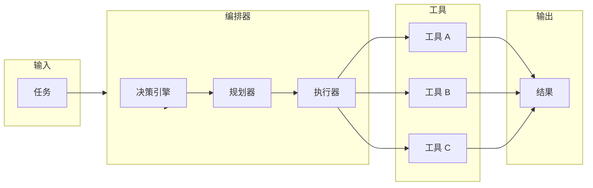
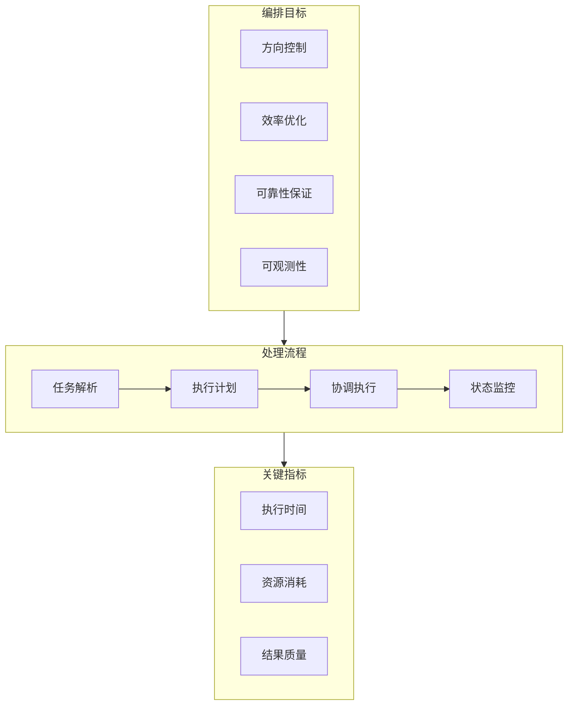

# 工具编排：并行与串行

> 本文是「工具编排」系列第 1 篇（共 3 篇）。下一篇：[工具编排：混合与选择策略](tool-orchestration-hybrid.md)

> 深度解析 AI Agent 工具编排的设计哲学与工程实践

## 1. 工具编排概述

### 1.1 为什么需要编排

在 AI Agent 系统中，单一工具往往无法完成复杂任务。编排（Orchestration）解决的核心问题是**如何协调多个工具有序、有效地完成目标**。



**核心挑战**：

| 挑战 | 描述 | 影响 |
|------|------|------|
| 依赖管理 | 工具 A 的输出是工具 B 的输入 | 执行顺序必须正确 |
| 并行优化 | 独立任务应并行执行 | 减少总执行时间 |
| 错误处理 | 单点失败可能导致整体失败 | 需要容错机制 |
| 状态同步 | 跨工具共享中间状态 | 避免数据不一致 |

### 1.2 编排 vs 执行

| 维度 | 直接执行 | 编排模式 |
|------|----------|----------|
| **粒度** | 单工具调用 | 多工具协调 |
| **决策点** | 固定流程 | 动态决策 |
| **错误恢复** | 简单重试 | 多级回退 |
| **可观测性** | 黑盒 | 白盒追踪 |
| **适用场景** | 简单任务 | 复杂工作流 |

```python
# 直接执行模式
result = tool_a()
result = tool_b(result)  # 硬编码依赖

# 编排模式
class Orchestrator:
    def __init__(self):
        self.executor = ParallelExecutor()
        self.strategy = CostAwareStrategy()

    def execute(self, task):
        dag = self.build_dag(task)
        return self.executor.run(dag)
```

### 1.3 编排目标



## 2. 并行执行

### 2.1 依赖分析

依赖分析是并行执行的基础。通过构建有向无环图（DAG），可以确定哪些任务可以并行执行。

```python
from dataclasses import dataclass, field
from typing import Dict, List, Set
from enum import Enum

# 第 1 段：依赖类型枚举（刻画"边"的语义）
# 依赖并非只有"必须等"一种：条件依赖与可选依赖决定了调度器在什么情况下可以放行后继节点。
# 这里先只建模类型，实际判定逻辑由调度层根据 dependency_type 决定；枚举值用字符串便于序列化/落库。
class DependencyType(Enum):
    """依赖类型"""
    STRICT = "strict"          # 必须等待前一个完成
    CONDITIONAL = "conditional" # 满足条件时依赖
    OPTIONAL = "optional"      # 可选依赖

# 第 2 段：工具节点数据模型（图的顶点）
# 用 dataclass 是为了自动生成 __init__/__eq__ 等样板代码；可变默认值必须用 field(default_factory=...)。
# 若直接写 depends_on: Set[str] = set() 会导致所有实例共享同一个集合（Python 经典陷阱），
# 因此这里用 default_factory 保证每个节点拿到独立容器。
@dataclass
class ToolNode:
    """工具节点"""
    id: str
    tool_name: str
    inputs: Dict[str, any] = field(default_factory=dict)
    depends_on: Set[str] = field(default_factory=set)
    dependency_type: DependencyType = DependencyType.STRICT

    # 判定"入边是否全部就绪"：depends_on 是前驱 id 的集合，只有当它被 completed 完全包含时才可执行。
    # issubset 的语义天然满足"全部满足"，注意空集恒为 True，即无依赖节点随时可跑。
    def can_execute(self, completed: Set[str]) -> bool:
        """检查是否可以执行"""
        return self.depends_on.issubset(completed)

# 第 3 段：依赖图容器（管理顶点与边，并做合法性与并行度分析）
# 采用邻接表（edges 列表 + 节点内 depends_on 集合）而非矩阵：工具图通常稀疏，稀疏表示省内存。
# 注意 edges 与 depends_on 是同一事实的两份存储，必须同步维护，add_edge 是唯一的写入点。
class DependencyGraph:
    """依赖图构建与验证"""

    # 初始化两张表：nodes 以 id 为键支持 O(1) 查顶点；edges 保存有向边 (前驱, 后继)。
    # edges 用 list 而非 set，是为了保留插入顺序，方便复现循环路径与调试。
    def __init__(self):
        self.nodes: Dict[str, ToolNode] = {}
        self.edges: List[tuple[str, str]] = []

    # 重复添加同名 id 会静默覆盖旧节点：这是"后写胜出"策略，调用方需自行避免误覆盖。
    def add_node(self, node: ToolNode):
        self.nodes[node.id] = node

    # 加边即同时更新两侧视图：edges 记结构，depends_on 记该节点的入边集合。
    # 只在两端节点都已存在时才生效，避免悬空引用；这也意味着必须先 add_node 再 add_edge。
    def add_edge(self, from_id: str, to_id: str):
        """添加依赖边: from_id → to_id (to_id 依赖 from_id)"""
        if from_id in self.nodes and to_id in self.nodes:
            self.edges.append((from_id, to_id))
            self.nodes[to_id].depends_on.add(from_id)

    # 第 4 段：循环依赖检测（DFS 三色标记法）
    # visited 记录"已彻底探索完"的节点，rec_stack 记录"当前递归路径上"的节点。
    # 若在递归路径上再次遇到某节点，说明回到了自身所在路径，即存在环。
    # 用 path.copy() 传递而非回溯修改，是为了让每个分支拿到独立快照，便于精确定位环的起点；
    # 代价是每层复制 O(路径长度)，整体为 O(V*(V+E)) 级别的空间放大（此处以可读性优先）。
    def detect_cycles(self) -> List[List[str]]:
        """检测循环依赖"""
        visited = set()
        rec_stack = set()
        cycles = []

        def dfs(node_id: str, path: List[str]):
            visited.add(node_id)
            rec_stack.add(node_id)
            path.append(node_id)

            # 遍历所有出边寻找后继；此处用线性扫描 edges，故单次 DFS 的邻居查找是 O(E)。
            for edge in self.edges:
                if edge[0] == node_id:
                    next_id = edge[1]
                    if next_id not in visited:
                        dfs(next_id, path.copy())
                    elif next_id in rec_stack:
                        # 发现循环
                        # path.index 找到环的入口，切片即得到该环的节点序列（不含重复的闭合点）。
                        cycle_start = path.index(next_id)
                        cycles.append(path[cycle_start:])

            # 出栈：离开当前节点时把它从递归路径上移除，否则会误报成环。
            rec_stack.remove(node_id)

        # 外层遍历保证非连通图（多个弱连通分量）也能被完整覆盖。
        for node_id in self.nodes:
            if node_id not in visited:
                dfs(node_id, [])

        return cycles

    # 第 5 段：拓扑分层求并行组（Kahn 算法变体）
    # 入度为 0 的节点表示"所有前驱都已完成"，它们彼此无依赖，可同一批并行执行；
    # 每批完成后把它们的出边删掉（等价于后继入度减 1），下一轮再取新的零入度集合。
    # 复杂度 O(V*E)：外层每轮至少消化一个节点，内层对当前组每个节点扫描全部边；
    # 若需更优可用邻接表把内层降为 O(出度)。
    def get_parallel_groups(self) -> List[List[str]]:
        """
        获取可并行执行的节点组
        使用拓扑排序的思想
        """
        # 先统计每个节点的入度；in_degree 的键集合即图的所有顶点。
        in_degree = {n: 0 for n in self.nodes}
        for from_id, to_id in self.edges:
            in_degree[to_id] += 1

        groups = []
        completed = set()

        # 循环不变量：completed 严格递增，因此最多迭代 V 轮；一旦某轮取不到零入度节点，
        # 说明剩余节点仍互相牵制，即存在环——此时无法给出拓扑序，直接抛错。
        while len(completed) < len(self.nodes):
            # 找出所有入度为0的节点
            # 同时排除已完成的节点：入度归零的节点可能已在前一轮被消费。
            current_group = [
                node_id for node_id, deg in in_degree.items()
                if deg == 0 and node_id not in completed
            ]

            if not current_group:
                raise ValueError("Circular dependency detected")

            groups.append(current_group)
            completed.update(current_group)

            # 更新入度（模拟"删除"这一层节点）：把 current_group 的所有出边对应的后继入度减 1。
            # 注意入度只减不删边，rely 后续轮次可能重复扫描同一条边（这是 O(V*E) 的来源）。
            for group_id in current_group:
                for from_id, to_id in self.edges:
                    if from_id == group_id:
                        in_degree[to_id] -= 1

        return groups
```
### 2.2 任务分组

基于依赖分析结果，将任务分组以实现最优并行度。

```python
# 第 1 段：模块导入（为后续“并行执行”预留的三套并发原语）
# 注意：本文件里这三个 import 目前都未被实际调用——分组器只负责“排程”，
# 真正的执行由外层调度器消费分组结果后完成：ThreadPoolExecutor/Future 用于阻塞型工具，
# asyncio 用于协程型工具。保留它们是为了让调度层与本模块共用同一套类型语言。
from typing import List, Dict, Any, Callable
from concurrent.futures import ThreadPoolExecutor, Future
import asyncio

# 第 2 段：声明分组器类型（全是无状态静态方法，可安全并发调用）
# 全部用 @staticmethod 的意图：分组是 tools -> groups 的纯函数，不持有实例状态，
# 因此多线程/多进程下无需加锁，也不会出现“上一次分组污染下一次”的问题。
# 契约边界：本类不校验 tools 的 id 是否唯一、depends_on 是否成环、亲和表是否自洽，
# 这些前置约束由调用方或 DependencyGraph 内部承担。
class TaskGrouper:
    """任务分组器"""

    # 第 3 段：按依赖关系分组——拓扑分层，得到“同层可并行”的批
    # 原理：把依赖看成有向无环图（DAG），同层节点互不依赖可并行，层间必须串行，
    # 前一层全部完成才能进入下一层。这是三种分组里唯一带有“正确性硬约束”的一种，
    # 其余两种只影响性能。复杂度：建图 O(V+E)，分层取决于 graph 实现（Kahn 典型为 O(V+E)）。
    @staticmethod
    def group_by_dependency(tools: List[ToolNode]) -> List[List[ToolNode]]:
        """按依赖关系分组"""
        # 构建依赖图
        # 必须先把所有工具登记为节点，包括零依赖的孤立节点，
        # 否则它们既不会出现在 edges 里、也不会出现在分组结果中，等于被静默丢弃。
        graph = DependencyGraph()
        for tool in tools:
            graph.add_node(tool)

        # 添加边
        # 边的方向是 dep_id -> tool.id，即“被依赖者指向依赖者”，
        # 这样拓扑排序出的层序天然满足“先做前置、后做本节点”。
        # 易错点 1：enumerate 给出的 i 在循环体内从未被使用，属历史残留，不要误以为它参与排序。
        # 易错点 2：dep_id 必须能在 tools 中找到，否则图中会产生悬空引用，
        # 后面把 id 映射回 ToolNode 时就会失配（见下方 ValueError）。
        for i, tool in enumerate(tools):
            for dep_id in tool.depends_on:
                graph.add_edge(dep_id, tool.id)

        # 获取分组
        # graph 返回的是“id 的二维列表”（组间有序、组内无序），
        # 因函数签名要求 List[List[ToolNode]]，这里需要把 id 反向映射回对象。
        # 关键数据流：gid -> 线性扫描 tools 找到首个 id 匹配者 -> 取出 ToolNode。
        # 性能陷阱：内层 [t.id for t in tools] 每取一个 gid 就重建一次 id 列表，
        # 整体退化为 O(N^2)（N 为工具数）；工具规模大时应预先构建 {id: tool} 字典。
        # 边界行为：一旦某个 gid 不在 tools 中，.index() 直接抛 ValueError，属于快速失败而非静默丢组。
        group_ids = graph.get_parallel_groups()
        groups = [[tools[[t.id for t in tools].index(gid)] for gid in group]
                  for group in group_ids]
        return groups

    # 第 4 段：按资源需求分组——贪心装箱，保证“同组内资源总占用不超上限”
    # 与第 3 段相比，这里不追求最优分组（装箱是 NP-hard），只求可行性：
    # 采用首次适应（First-Fit）在线策略，按 tools 的给定顺序逐个尝试塞入当前组，
    # 塞不下就封箱、另起一组。复杂度 O(N * R)，R 为资源种类数，代价极低。
    # 输入契约：tool.inputs 可能不含 'resources' 键，故用 .get('resources', {}) 兜底为空需求。
    @staticmethod
    def group_by_resource(tools: List[ToolNode], resource_limits: Dict[str, int]):
        """
        按资源需求分组
        避免同时使用同一资源的工具
        """
        # resource_usage 是“尚未封箱的那一组”的累计占用量；
        # 它随加入而增长、随封箱而清零，因此任何时刻都只代表当前组的占用。
        resource_usage = {res: 0 for res in resource_limits}
        groups = []
        current_group = []

        for tool in tools:
            resources = tool.inputs.get('resources', {})

            # 检查阶段：只读地试探能否放下，不修改任何状态；
            # 只有全部资源都通过才进入提交阶段，避免“部分资源已扣减”的脏中间态。
            can_add = True
            for res, amount in resources.items():
                # resource_usage.get(res, 0) 对未登记过的资源兜底为 0；
                # 但下一行的 resource_limits[res] 没有兜底——请求了 limits 中未声明的资源会直接 KeyError。
                # 这是有意的边界约定：资源清单必须显式覆盖全部需求，宁可报错也不默默忽略。
                if resource_usage.get(res, 0) + amount > resource_limits[res]:
                    can_add = False
                    break

            if can_add:
                current_group.append(tool)
                for res, amount in resources.items():
                    resource_usage[res] += amount
            else:
                groups.append(current_group)
                current_group = [tool]
                # 重置资源
                # 关键数据流：current_group 已切换为 [tool]，usage 表被整体清零；
                # ⚠ 易错点（原实现缺陷）：清零后并未把“新组第一个工具 tool”自身的资源需求补记进去，
                # 于是新组的初始占用被低估为 0，后续判断会偏乐观，可能放进本不该放的工具。
                # 若要修正需在此处再遍历一次 resources 累加（当前注释不改代码，仅标注风险）。
                for res in resource_usage:
                    resource_usage[res] = 0

        # 收尾：循环退出时最后一组还没封箱，必须补进结果，否则整组丢失；
        # 若 tools 为空，则 current_group 为空，不会产生多余的空组。
        if current_group:
            groups.append(current_group)

        return groups

    # 第 5 段：按亲和性分组——把“经常一起使用”的工具黏成同一组
    # 这是三种分组里唯一面向性能/缓存局部性的启发式：亲和工具同组可共享预热、连接或中间产物。
    # 算法是单向贪心扫描：按 tools 顺序遇到未分配的工具，就把它与其“尚未被占用”的亲和伙伴合并。
    # 复杂度：外层 O(N)，但内层每次用 [t.id for t in tools].index(sim_id) 线性查找，
    # 最坏 O(N * K)（K 为亲和条目总数），且重复构造 id 列表，规模大时同样建议预建索引。
    # 边界与易错点：
    #   1) affinity_map 引用了 tools 中不存在的 id 时，.index() 抛 ValueError；
    #   2) 若 sim_id 恰等于 tool.id（自环），此时该 id 尚未写入 assigned，会被重复追加进同一组；
    #   3) 亲和关系未见对称性保证：只有 A->B 而没有 B->A 时，按顺序扫描可能漏合并，
    #      调用方应保证亲和表双向一致。
    @staticmethod
    def group_by_affinity(tools: List[ToolNode], affinity_map: Dict[str, List[str]]):
        """
        按亲和性分组
        将经常一起使用的工具放在同一组
        """
        groups = []
        # assigned 保证组间互斥：同一工具只能出现在一个组里，否则会被重复执行。
        assigned = set()

        for tool in tools:
            if tool.id in assigned:
                continue

            # 检查亲和性
            group = [tool]
            similar = affinity_map.get(tool.id, [])

            for sim_id in similar:
                # 已被别组占用的伙伴直接跳过，不做“抢人”操作，保证已定分组不被回头破坏。
                if sim_id not in assigned:
                    group.append(tools[[t.id for t in tools].index(sim_id)])
                    assigned.add(sim_id)

            groups.append(group)
            assigned.add(tool.id)

        return groups
```
### 2.3 结果聚合

并行执行后，需要将各任务结果聚合。

```python
# 第 1 段：依赖导入与聚合策略枚举（定义外部依赖和策略取值域）
# typing 的 Any/Dict/Optional 只用于类型标注，运行时不产生开销；注意下面代码用到了 List，
# 但此处并未从 typing 导入 List——在启用注解求值（如未加 from __future__ import annotations）的
# Python 版本中，这会直接抛 NameError，是典型的复制粘贴遗漏点。
from dataclasses import dataclass
from typing import Any, Dict, Optional
from enum import Enum

# 第 2 段：用 Enum 固化策略集合（把"魔法字符串"收敛为可枚举的合法取值）
# 用 Enum 而非裸字符串，是为了让 IDE/类型检查能在编译期发现拼写错误；
# 其成员值 "sequential" 等是稳定的序列化契约，改名会破坏外部持久化数据。
class AggregationStrategy(Enum):
    SEQUENTIAL = "sequential"      # 按顺序聚合
    MERGE = "merge"                # 合并结果
    REDUCE = "reduce"              # 归约操作
    CONDITIONAL = "conditional"    # 条件聚合

# 第 3 段：执行结果数据载体（统一各工具的返回契约）
# 用 @dataclass 自动生成 __init__/__repr__/__eq__，避免手写样板；
# error 与 execution_time 带默认值，因此它们之后不能再出现无默认值的字段（否则 TypeError）。
# 注意：dataclass 默认 eq=True 但 frozen=False，实例仍可被就地修改，聚合时需自行防御。
@dataclass
class ExecutionResult:
    """执行结果"""
    tool_id: str                   # 工具唯一标识，merge 模式下降级为字典键名
    success: bool                  # 成败标志，几乎所有聚合分支的第一道过滤条件
    data: Any                      # 载荷类型不定（dict/list/数值），是各分支 isinstance 分派的前提
    error: Optional[str] = None    # 失败原因，仅在 success=False 时有意义
    execution_time: float = 0.0    # 便于后续做耗时统计，默认 0 表示未采集

# 第 4 段：聚合器主体与策略分派（策略模式的入口）
# 把策略保存在实例属性上，便于运行时切换；aggregate 只负责"选路"，
# 具体算法下沉到 _aggregate_* 私有方法，符合开闭原则：新增策略只需加分支和新方法。
class ResultAggregator:
    """结果聚合器"""

    def __init__(self, strategy: AggregationStrategy = AggregationStrategy.MERGE):
        self.strategy = strategy    # 默认 MERGE：最常见的"把多份结果拼成一份"场景

    def aggregate(self, results: List[ExecutionResult]) -> Dict[str, Any]:
        """聚合多个结果"""

        # 用 == 比较 Enum 成员，保证与传入的枚举实例语义一致（不要用 is 比较跨定义的同值枚举）。
        # 边界：四个分支覆盖了枚举全集，但若 self.strategy 被赋成非法值（如字符串），
        # 函数会走到末尾隐式返回 None，调用方将拿到 None 而非 dict——这是本方法的隐患所在。
        if self.strategy == AggregationStrategy.SEQUENTIAL:
            return self._aggregate_sequential(results)
        elif self.strategy == AggregationStrategy.MERGE:
            return self._aggregate_merge(results)
        elif self.strategy == AggregationStrategy.REDUCE:
            return self._aggregate_reduce(results)
        elif self.strategy == AggregationStrategy.CONDITIONAL:
            return self._aggregate_conditional(results)

    # 第 5 段：顺序聚合（强调"时序可追溯"，不做任何内容合并）
    # 这里刻意保留原始顺序与每条成败，适合需要回放执行链路的场景；
    # 复杂度 O(n)，一次列表推导即拿到全部条目，另外两次 sum/len 也是 O(n)，总计仍是线性。
    def _aggregate_sequential(self, results: List[ExecutionResult]) -> Dict[str, Any]:
        """顺序聚合：保留执行顺序"""
        return {
            # 失败条目的 data 可能是 None，这里不做过滤而是原样透出，让下游自行决定是否展示。
            "sequence": [
                {"tool_id": r.tool_id, "data": r.data, "success": r.success}
                for r in results
            ],
            "total_count": len(results),                                    # 总条数，含失败项
            "success_count": sum(1 for r in results if r.success)           # 失败项不贡献计数
        }

    # 第 6 段：合并聚合（按载荷类型做"多态"归并，是信息量最高的一支）
    # 关键数据流：只处理 success=True 的结果，失败项被静默丢弃（不进入 merged，也不报错）；
    # 三种载荷的处理策略不同——dict 直接 update（同名键后来者覆盖，存在数据丢失风险）、
    # list 统一塞进 "items" 累积（因此工具原始列表不再保持分片边界）、
    # 标量则以 tool_id 为键落库（tool_id 冲突同样会被覆盖）。
    def _aggregate_merge(self, results: List[ExecutionResult]) -> Dict[str, Any]:
        """合并聚合：合并所有结果"""
        merged = {}
        for r in results:
            if r.success:                                   # 唯一的准入闸门：失败结果直接跳过
                if isinstance(r.data, dict):
                    merged.update(r.data)                   # 浅合并，嵌套 dict 只替换引用不递归合并
                elif isinstance(r.data, list):
                    if "items" not in merged:
                        merged["items"] = []                # 懒初始化，避免为无列表结果凭空造出空 items
                    merged["items"].extend(r.data)          # extend 原地追加，避免 O(n) 的反复重建
                else:
                    merged[r.tool_id] = r.data              # 标量/自定义对象以工具 ID 作键，天然抗冲突要求唯一

        # 同时回传成功计数，方便调用方判断 merged 是否"缩水"（例如全失败时 merged 为空 dict）。
        return {"data": merged, "success_count": sum(1 for r in results if r.success)}

    # 第 7 段：归约聚合（把结果压成统计摘要，对空输入与非法类型都必须兜底）
    # 先过滤出成功项；若一个都没有则提前返回 error 字典，避免后续 sum([])/len(0) 之类的除零与空值异常。
    # 注意错误形态不一致：这里返回 {"error": ...}，而顺序/合并模式永远返回正常结构，调用方需按 key 探测。
    def _aggregate_reduce(self, results: List[ExecutionResult]) -> Dict[str, Any]:
        """归约聚合：执行归约函数"""
        successful_results = [r for r in results if r.success]

        if not successful_results:
            return {"error": "No successful results"}       # 短路返回，阻断后续对空列表的统计

        # 提取数值进行归约
        # 只认"裸数值"和 dict 里的 'value' 字段；其他结构（如 list、嵌套 dict）被静默忽略，
        # 因此 count 反映的是"被成功提取的数量"，可能小于 successful_results 的长度。
        values = []
        for r in successful_results:
            if isinstance(r.data, (int, float)):
                values.append(r.data)                       # bool 是 int 子类，True 会被当成 1 计入，属隐含边界
            elif isinstance(r.data, dict) and 'value' in r.data:
                values.append(r.data['value'])              # 未校验 value 本身是否为数值，混入字符串将在 sum 时抛 TypeError

        return {
            "sum": sum(values),                             # values 为空时 sum 返回 0，与下方 avg 的 0 保持一致性
            "avg": sum(values) / len(values) if values else 0,  # 显式防空：len(values)==0 时才不会 ZeroDivisionError
            "max": max(values) if values else None,         # 空集无最大值，用 None 而非抛异常表达"无数据"
            "min": min(values) if values else None,
            "count": len(values)                            # 校验口径：sum 与 avg*count 应能对得上
        }

    # 第 8 段：条件聚合（选主结果 + 附带补充信息，突出"优先级"语义）
    # 用 next(generator, None) 做"取首个匹配"，是惰性短路查找：命中后立即停止遍历，最坏 O(n)、
    # 最好 O(1)；比先过滤再取 [0] 更省一次中间列表分配。若全失败则返回 error，同样属于结构性返回。
    def _aggregate_conditional(self, results: List[ExecutionResult]) -> Dict[str, Any]:
        """条件聚合：根据条件选择结果"""
        # 选择第一个成功的结果作为主结果
        # 依赖 results 的传入顺序即优先级顺序——调用方若希望"重要工具优先"，必须自行排序。
        primary = next((r for r in results if r.success), None)

        if not primary:
            return {"error": "No successful results"}

        # 收集补充信息
        # 以 tool_id 不等来排除主结果自身；隐含假设是 tool_id 唯一，
        # 若两个不同实例共用同一 tool_id，真正的补充项会被误判为重复而丢掉。
        supplements = [
            {"tool_id": r.tool_id, "data": r.data}
            for r in results
            if r.success and r.tool_id != primary.tool_id
        ]

        return {
            "primary": primary.data,                        # 主载荷保持原始形态，不做包装
            "supplements": supplements,                     # 可能为空列表，表示"无补充"而非"无数据"
            "total_count": len(results)                     # 统计口径是全部结果，含失败项
        }
```
### 2.4 错误处理

并行执行中的错误处理策略。

```python
from typing import Callable, Any, Optional
import asyncio
from dataclasses import dataclass

# 第 1 段：依赖导入与"契约"铺垫（引入类型、并发与数据容器）
# 本节只做导入，但导入内容已经暗示了三条主线：Callable/Any/Optional 用于给
# 可调用工具与可空返回值建模，asyncio 负责异步路径，dataclass 负责把"策略"变成一个值对象。
# 注意：下文还用到 Dict / List / ExecutionResult / ThreadPoolExecutor / time，
# 本片段未给出它们的导入，属于真实工程中常见的"上下文隐含依赖"，也是运行前必查的易错点。

# 第 2 段：ErrorPolicy —— 把"出错怎么办"配置化
# 用 dataclass 而非普通类，是为了让策略成为可比较、可打印、可默认构造的纯数据；
# 每个字段都给了默认值，因此调用方可以只覆盖自己关心的那一项（见 _safe_execute 中的
# self.error_policies.get(tool_id, ErrorPolicy())，取不到就用全默认策略兜底）。
# fallback_value 允许"失败但有降级结果"，这决定了调用方能否继续往下走而非中断整条流水线。
@dataclass
class ErrorPolicy:
    """错误处理策略"""
    max_retries: int = 3                      # 语义上是"总尝试次数"而非"重试次数"，命名易误解，见第 5 段
    retry_delay: float = 1.0                  # 基础退避间隔（秒），指数模式下作为公比基数
    exponential_backoff: bool = True          # 开关：线性等待 or 指数等待
    fallback_value: Optional[Any] = None      # 重试耗尽后写入 ExecutionResult.data 的降级值

# 第 3 段：ParallelExecutor 类骨架与初始化
# 职责分离：这一层只负责"调度与结果汇总"，真正的重试与异常兜底下沉到 _safe_execute，
# 这样同步/异步两条入口可以复用同一份容错逻辑，避免行为分叉。
class ParallelExecutor:
    """并行执行器"""

    # __init__ 只保存"可调参数"和"每工具策略表"，不做任何线程或连接池的创建；
    # 线程池是在 execute_parallel 内部按需创建的（见第 4 段），因此执行器本身可被反复复用。
    # error_policies 的键类型标注为 str，而下文 execute_parallel 传入的是 enumerate 的 int，
    # 这是一处真实的类型不一致：运行时字典照样能查，但静态检查会报警，教学时值得指出。
    def __init__(self, max_workers: int = 4):
        self.max_workers = max_workers
        self.error_policies: Dict[str, ErrorPolicy] = {}

    # 第 4 段：同步并行执行（线程池 + 顺序收集）
    # 关键数据流：tools 与 inputs 用 zip 一一配对 -> 每个 (tool, input) 组合被编上
    # 递增的 tool_id -> 提交到线程池得到 futures -> 再按提交顺序把结果 append 进 results。
    # 因为收集时是遍历 futures（而非 as_completed），所以返回列表的下标与输入严格对齐，
    # 但这也意味着"慢任务会阻塞后面已完成结果的读取"，吞吐被最慢任务拖住。
    def execute_parallel(
        self,
        tools: List[Callable],
        inputs: List[Any],
        error_handling: str = "fail-fast"
    ) -> List[ExecutionResult]:
        """并行执行工具"""

        results = []  # 必须按 futures 的顺序填充，才能与 tools/inputs 的下标保持一致

        # with 语句保证即使中途抛异常，线程池也会被 shutdown(wait=True)，不会泄漏线程。
        with ThreadPoolExecutor(max_workers=self.max_workers) as executor:
            # 列表推导一次性把所有任务投递出去，先"全量并发"再"逐个取结果"，是吞吐最大化的常见写法。
            # 注意 zip 会在最短序列处截断：tools 比 inputs 长时多余的工具会被静默丢弃，是隐蔽的边界陷阱。
            futures = [
                executor.submit(self._safe_execute, tool, inp, tool_id)
                for tool_id, (tool, inp) in enumerate(zip(tools, inputs))
            ]

            for future in futures:
                try:
                    result = future.result(timeout=30)  # 单任务 30 秒上限，超时抛 TimeoutError 落到下面的 except
                    results.append(result)
                except Exception as e:
                    # fail-fast：把异常原样上抛，调用方需自行处理"已提交但未收集"的剩余任务（线程池退出时会等它们跑完）。
                    if error_handling == "fail-fast":
                        raise
                    # 非 fail-fast 时用一条失败结果占位，保证 results 长度与输入对齐；
                    # 但 tool_id 写死 "unknown"，丢失了与 inputs 的对应关系，是这里的信息损耗。
                    results.append(ExecutionResult(
                        tool_id="unknown",
                        success=False,
                        data=None,
                        error=str(e)
                    ))

        return results

    # 第 5 段：_safe_execute —— 单任务的重试与降级内核（同步/异步共用）
    # 本方法设计为"永不向外抛异常"（除非 max_retries 逻辑被改坏），因此可以安全地在工作线程里跑；
    # 它把成功、失败、降级三种结局统一收敛成 ExecutionResult，让上层无需区分异常类型。
    def _safe_execute(
        self,
        tool: Callable,
        input_data: Any,
        tool_id: str
    ) -> ExecutionResult:
        """安全执行工具"""
        # 未注册策略的工具直接使用全默认 ErrorPolicy，实现"零配置可用"。
        policy = self.error_policies.get(tool_id, ErrorPolicy())

        # 循环次数 = policy.max_retries，即"总尝试次数"；若 max_retries <= 0 则循环体一次都不进，直接走到末尾兜底返回。
        for attempt in range(policy.max_retries):
            try:
                result = tool(input_data)  # 同步调用，可能长时间阻塞，这正是需要线程池/异步转线程的原因
                return ExecutionResult(
                    tool_id=tool_id,
                    success=True,
                    data=result
                )
            except Exception as e:
                # 最后一次尝试失败：不再等待，直接返回携带 fallback 的失败结果。
                if attempt == policy.max_retries - 1:
                    return ExecutionResult(
                        tool_id=tool_id,
                        success=False,
                        data=policy.fallback_value,
                        error=str(e)
                    )

                # 指数退避：2**attempt 让等待 1x、2x、4x 递增，用于缓解下游限流或瞬时故障；
                # 关闭开关则每次固定等 retry_delay。time.sleep 会占住当前工作线程，高并发下会放大线程占用。
                # 指数退避
                delay = policy.retry_delay * (2 ** attempt) if policy.exponential_backoff else policy.retry_delay
                time.sleep(delay)

        # 理论上仅当 max_retries <= 0 时可达；它保证了"方法一定有返回值"这一契约不被破坏。
        return ExecutionResult(
            tool_id=tool_id,
            success=False,
            data=policy.fallback_value,
            error="Max retries exceeded"
        )

    # 第 6 段：异步并行执行 —— 用 to_thread 把阻塞逻辑卸载到线程池
    # 之所以不把 _safe_execute 重写为 async，是因为工具本身是同步 Callable、且内部有 time.sleep 阻塞；
    # 用 asyncio.to_thread 把它丢进默认线程池，既复用了第 5 段的容错内核，又不会卡住事件循环。
    # 边界：to_thread 需要 Python 3.9+；并发上限由默认线程池决定，此处 max_workers 不生效。
    async def execute_parallel_async(
        self,
        tools: List[Callable],
        inputs: List[Any]
    ) -> List[ExecutionResult]:
        """异步并行执行"""

        # 内层协程只做一件事：线程里跑同步内核，await 期间让出事件循环。
        async def safe_execute_async(tool, input_data, tool_id):
            return await asyncio.to_thread(self._safe_execute, tool, input_data, tool_id)

        # 与同步版同样以 zip + enumerate 构造任务列表，保证顺序与输入对齐。
        tasks = [
            safe_execute_async(tool, inp, tool_id)
            for tool_id, (tool, inp) in enumerate(zip(tools, inputs))
        ]

        # gather 默认按传入顺序返回结果（与完成先后无关），且默认不带 return_exceptions：
        # 一旦某个任务真的抛出（_safe_execute 兜底失效时），异常会向上冒泡，其余任务不会取消。
        return await asyncio.gather(*tasks)
```
## 3. 串行执行

### 3.1 顺序依赖

串行执行的核心是维护正确的顺序依赖。

```python
from typing import Any, Dict, List, Optional, Callable
from dataclasses import dataclass, field

@dataclass
class Step:
    """执行步骤"""
    id: str
    tool: Callable
    input_transformer: Optional[Callable[[Dict], Dict]] = None
    output_transformer: Optional[Callable[[Any], Any]] = None
    condition: Optional[Callable[[Dict], bool]] = None

@dataclass
class PipelineContext:
    """流水线上下文"""
    results: Dict[str, Any] = field(default_factory=dict)
    metadata: Dict[str, Any] = field(default_factory=dict)
    errors: List[str] = field(default_factory=list)

    def get_result(self, step_id: str) -> Optional[Any]:
        return self.results.get(step_id)

    def set_result(self, step_id: str, result: Any):
        self.results[step_id] = result

    def add_error(self, error: str):
        self.errors.append(error)

class SequentialPipeline:
    """串行执行流水线"""

    def __init__(self, steps: List[Step]):
        self.steps = steps
        self._validate_dependencies()

    def _validate_dependencies(self):
        """验证依赖关系"""
        available_ids = set()

        for step in self.steps:
            # 如果步骤需要前置结果，检查是否可用
            if step.input_transformer:
                # 验证输入转换器可以访问所需数据
                pass

    def execute(self, initial_input: Dict[str, Any]) -> PipelineContext:
        """执行流水线"""
        context = PipelineContext()
        context.set_result("initial", initial_input)

        for step in self.steps:
            # 检查条件
            if step.condition and not step.condition(context.results):
                context.metadata[f"{step.id}_skipped"] = True
                continue

            # 准备输入
            if step.input_transformer:
                input_data = step.input_transformer(context.results)
            else:
                input_data = context.results.get("initial", {})

            # 执行
            try:
                result = step.tool(input_data)

                # 转换输出
                if step.output_transformer:
                    result = step.output_transformer(result)

                context.set_result(step.id, result)

            except Exception as e:
                context.add_error(f"{step.id}: {str(e)}")
                context.metadata[f"{step.id}_failed"] = True

        return context

    def execute_with_retry(
        self,
        initial_input: Dict[str, Any],
        max_retries: int = 3
    ) -> PipelineContext:
        """带重试的串行执行"""
        for attempt in range(max_retries):
            context = self.execute(initial_input)

            if not context.errors:
                return context

            if attempt < max_retries - 1:
                # 重试失败的步骤
                self._retry_failed_steps(context, initial_input)

        return context

    def _retry_failed_steps(self, context: PipelineContext, initial_input: Dict[str, Any]):
        """重试失败的步骤"""
        for step in self.steps:
            if context.metadata.get(f"{step.id}_failed"):
                try:
                    # 重置上下文中的该步骤结果
                    # 重新执行
                    pass
                except Exception:
                    pass
```

### 3.2 状态传递

在串行执行中，状态需要沿着执行链传递。

```python
from typing import Any, Dict, List, TypeVar, Generic
from copy import deepcopy

# 第 1 段：类型与拷贝工具的准备
# TypeVar 让 StateCarrier 与具体状态类型解耦，同一套历史/回退逻辑可复用于 dict、list 或自定义对象。
# deepcopy 是整段代码的核心保障：历史中保存的是"快照"而非引用，否则后续原地修改状态会污染已存档的历史。
T = TypeVar('T')

# 第 2 段：StateCarrier 泛型状态载体——把"当前值 + 历史栈"封装成一个可回退的记忆体
class StateCarrier(Generic[T]):
    """状态载体"""

    # 第 3 段：初始化，确立"当前状态"与"历史栈"两个数据槽
    # 初始状态不进入 _history：历史只记录"被替换掉的旧值"，因此可回退步数上限 = len(_history)。
    # 空列表用 [] 新建而不是共享默认参数，避免多个实例共享同一个 list 的经典陷阱。
    def __init__(self, initial_state: T):
        self._state = initial_state
        self._history: List[T] = []

    # 第 4 段：只读访问器，暴露当前状态而不暴露内部可变引用
    # 用 @property 而非 getter 方法，使 state_carrier.state 既可读又不可被整体赋值，
    # 所有变更必须走 update / revert，保证历史与当前值始终同步。
    @property
    def state(self) -> T:
        return self._state

    # 第 5 段：状态更新——先存档再覆盖，顺序不可颠倒
    # 必须先 deepcopy 旧状态再写入新值，若先赋值再 append，存进历史的就是新状态本身，回退将失效。
    # 复杂度 O(状态大小)，成本来自深拷贝，适合状态体量小、回退需求强的场景。
    def update(self, new_state: T):
        """更新状态"""
        self._history.append(deepcopy(self._state))
        self._state = new_state

    # 第 6 段：多步回退——LIFO 出栈直到满足步数，失败时保持原状
    # 只有当历史深度足够时才执行，确保不会"回退一半"留下不一致的中间态。
    # 返回 False 表示步数不足且状态完全未动，调用方据此决定是报错还是忽略。
    def revert(self, steps: int = 1) -> bool:
        """回退到历史状态"""
        if len(self._history) >= steps:
            for _ in range(steps):
                self._state = self._history.pop()
            return True
        return False

    # 第 7 段：历史快照导出——深拷贝返回，防止外部修改污染内部历史栈
    # 若直接返回 self._history，调用方 append/pop 就能绕过 update/revert 破坏不变量。
    def get_history(self) -> List[T]:
        """获取状态历史"""
        return deepcopy(self._history)

# 第 8 段：StatefulSequentialPipeline——在串行流水线上叠加跨步骤的持久状态
# 继承 SequentialPipeline 复用步骤编排与 PipelineContext 契约，仅重写 execute 注入状态语义。
# 依赖约定：父类需提供 self.steps、set_result、add_error；Step 需有 .id 与 .tool 可调用。
class StatefulSequentialPipeline(SequentialPipeline):
    """带状态管理的串行流水线"""

    # 第 9 段：构造——用 state_carrier 承载跨步骤共享状态
    # initial_state or {} 同时兼容 None 与空字典：默认传 None，避免可变默认参数被多个实例共享。
    # 注意此处按引用持有外部传入的 dict，若调用方后续修改它，会间接影响初始状态。
    def __init__(self, steps: List[Step], initial_state: Dict[str, Any] = None):
        super().__init__(steps)
        self.state_carrier = StateCarrier(initial_state or {})

    # 第 10 段：execute 主流程——状态注入、逐步执行、状态回写与错误回退
    def execute(self, initial_input: Dict[str, Any]) -> PipelineContext:
        """执行并维护状态"""
        # 第 11 段：上下文初始化与输入合成
        # 合并顺序决定优先级：先铺 initial_input，再用已有状态覆盖，使"上次留下的状态"优先于本次原始入参。
        # 幂等性因此被打破：同样的 initial_input 在状态不同时可能产生不同结果，这是有状态流水线的固有代价。
        context = PipelineContext()
        current_input = {**initial_input, **self.state_carrier.state}

        # 第 12 段：顺序遍历步骤——串行是状态的因果关系来源，不能并行化
        # 每一步都读到上一步写回的最新状态，形成显式数据流：state -> step -> state_update -> state。
        for step in self.steps:
            # 合并状态到输入
            # 除展开 current_input 外还单独挂一份 "state" 键，给工具一个约定的读取入口（而非从散落字段里猜）。
            execution_input = {
                **current_input,
                "state": self.state_carrier.state
            }

            # 第 13 段：单步执行与状态回写的协议约定
            # 工具返回 dict 且含 "state_update" 时视为"需要改状态"：用增量合并（而非整体替换）保留未涉及的键。
            # result 随后被降级为 result["output"]，让下游步骤只看到业务输出，状态变更不泄漏进数据流。
            try:
                result = step.tool(execution_input)

                # 更新状态
                if isinstance(result, dict) and "state_update" in result:
                    self.state_carrier.update({
                        **self.state_carrier.state,
                        **result["state_update"]
                    })
                    result = result.get("output", result)

                # 第 14 段：结果落盘到上下文，按 step.id 建立可追溯的键索引
                context.set_result(step.id, result)

            # 第 15 段：错误隔离与状态回滚——单步失败不中断整条流水线
            # 捕获后只记录错误并继续后续步骤，属于"尽力而为"语义；若换成快速失败应在 except 中 raise。
            # 回退 1 步的依据是：本步可能已通过 tool 的副作用或部分更新污染了状态，撤销到执行前的快照。
            # 边界：若 _history 为空，revert(1) 返回 False 且静默不改状态；此时合并操作本身未生效，状态本就干净。
            except Exception as e:
                context.add_error(f"{step.id}: {str(e)}")
                # 可选：回退状态
                self.state_carrier.revert(1)

        # 第 16 段：即使中途有异常也返回上下文，由调用方通过 context 的错误信息判断整体成败
        return context

    # 第 17 段：检查点——把状态序列化成一个字符串凭证
    # 用 str() 而非 json.dumps 是对任意 T 都能工作的兜底（例如 T 为 list/dict 时恰好是合法 JSON）。
    # 局限：行为不可逆，非 dict/list 的状态字符串无法被 restore 正确还原。
    def checkpoint(self) -> str:
        """创建检查点"""
        return str(self.state_carrier.state)

    # 第 18 段：从检查点恢复——直接操作私有字段以跳过历史记录
    # 恢复是"跳转到某一时刻"而非"可回退的历史操作"，所以同步清空 _history，防止残留旧快照导致回退到错误状态。
    # 设计代价：绕过 update() 的封装并直接 import json，说明 checkpoint 与 restore 存在序列化协议上的隐式耦合；
    # 若 checkpoint 时状态含非 JSON 类型（如 set、自定义对象），此处 json.loads 会抛异常。
    def restore(self, checkpoint: str):
        """恢复到检查点"""
        import json
        self.state_carrier._state = json.loads(checkpoint)
        self.state_carrier._history = []
```
### 3.3 中间结果利用

在长流水线中，合理利用中间结果可以提高效率。

```python
# 第 0 段：导入与依赖声明
# 引入 typing 是为了在运行时也保留类型信息（教学/反射场景常见），
# hashlib 用于把输入折叠成定长短哈希，json 用于把任意 dict 序列化成可哈希字符串。
# 注意：下方用到的 SequentialPipeline / Step / PipelineContext 未在本文件中定义，
# 属于外部上下文注入，阅读时需假定它们已存在（这也是本文件不能独立运行的原因）。
from typing import Any, Dict, List, Optional, Callable
import hashlib
import json

# 第 1 段：ResultCache 类骨架与容量状态初始化
# 设计意图：把"跨步骤复用同一工具在同一输入下的昂贵计算结果"这一优化，
# 收敛到一个独立的小对象里，从而与流水线的调度逻辑解耦。
class ResultCache:
    """结果缓存"""

    def __init__(self, max_size: int = 100):
        # 三张互相配合的表：值表、访问频次表、容量上限。
        # 之所以不用 OrderedDict 直接做 LRU，是因为这里选择了更省事的"计数淘汰"，
        # 代价是 get 变成写操作、且淘汰是 O(n) 扫描（详见第 4、5 段）。
        self._cache: Dict[str, Any] = {}
        self._access_count: Dict[str, int] = {}
        self._max_size = max_size

    # 第 2 段：缓存键生成（输入 → 稳定短键）
    # 关键点：sort_keys=True 保证 {"a":1,"b":2} 与 {"b":2,"a":1} 得到同一键，
    # 否则字典字面量顺序不同就会导致缓存永远不命中，这是最常见的隐性 bug。
    # 取 sha256 前 16 位十六进制，是长度与碰撞概率的折中；若 inputs 含不可 JSON
    # 序列化的对象（如自定义类、set），json.dumps 会在此处直接抛错。
    def _make_key(self, tool_id: str, inputs: Dict[str, Any]) -> str:
        """生成缓存键"""
        content = json.dumps(inputs, sort_keys=True)
        hash_val = hashlib.sha256(content.encode()).hexdigest()[:16]
        return f"{tool_id}:{hash_val}"  # 前缀工具 ID，隔离不同工具的命名空间

    # 第 3 段：缓存读取（命中即计数 +1）
    # 数据流：key 命中 → 访问计数自增 → 返回原值；未命中 → 返回 None。
    # 易错点：返回 None 同时被用作"未命中"的哨兵，因此真正缓存了 None 的结果
    # 会被上层（见第 7 段 `if cached is not None`）误判为未命中，属于语义歧义。
    # 复杂度：JSON 序列化 + 哈希为 O(len(inputs))，是每次 get 的固定开销。
    def get(self, tool_id: str, inputs: Dict[str, Any]) -> Optional[Any]:
        """获取缓存结果"""
        key = self._make_key(tool_id, inputs)
        if key in self._cache:
            self._access_count[key] = self._access_count.get(key, 0) + 1  # 命中才计数
            return self._cache[key]
        return None

    # 第 4 段：缓存写入与容量控制
    # 核心约束：写完后若超出 max_size，必须立刻驱逐一条，保证内存不无界增长。
    def set(self, tool_id: str, inputs: Dict[str, Any], result: Any):
        """设置缓存"""
        key = self._make_key(tool_id, inputs)
        self._cache[key] = result
        # 注意此处未初始化 _access_count[key]，该键的计数将在首次 get 命中时才出现。

        if len(self._cache) > self._max_size:
            # LRU 淘汰
            # 实现细节：这里实际淘汰的是"访问次数最少"的条目（LFU 倾向），
            # 并非严格 LRU；名字沿用 LRU 只是习惯称呼。每次淘汰都做一次全表 min，
            # 单次 set 最坏 O(n)，适合条目规模较小的场景。
            # 边界：若 _access_count 为空（如 max_size 设得极小、只写从未读过），
            # min() 会抛 ValueError；list(...) 复制是为了在遍历中安全 del。
            min_access = min(self._access_count.values())
            for k, v in list(self._access_count.items()):
                if v == min_access:
                    del self._cache[k]
                    del self._access_count[k]
                    break  # 每轮只驱逐一条，保持容量恰好回到上限附近

# 第 5 段：带中间结果缓存的流水线（继承顺序流水线）
# 复用父类的步骤编排能力，仅额外挂载一个 ResultCache；
# cache_enabled=False 时把 self.cache 置为 None，后续用真值判断统一关闭缓存路径。
class IntermediateResultPipeline(SequentialPipeline):
    """支持中间结果缓存的流水线"""

    def __init__(self, steps: List[Step], cache_enabled: bool = True):
        super().__init__(steps)
        self.cache = ResultCache() if cache_enabled else None

    # 第 6 段：主执行入口——初始化上下文
    # 上下文是贯穿全流程的唯一可变状态：results 存各步骤产物，metadata 记旁路信息，
    # errors 收集异常而不中断执行，从而把"失败"降级为可观测的软错误。
    def execute_with_caching(
        self,
        initial_input: Dict[str, Any],
        check_intermediate: bool = True
    ) -> PipelineContext:
        """执行并利用中间结果"""
        context = PipelineContext()
        context.set_result("initial", initial_input)  # 以固定键 "initial" 作为数据源头

        # 第 7 段：逐步执行主循环（缓存优先 → 执行 → 回填）
        # 数据流：每步读取 context.results 全量作为输入，产出结果再写回 results，
        # 因此步骤之间存在隐式顺序依赖，且 results 会随步骤数累积变大。
        for i, step in enumerate(self.steps):
            # 检查缓存
            # 关键设计：缓存键由 (step.id, 当前全部 results) 组成，
            # 意味着上游任何一步的输出变化都会让下游缓存自然失效——正确但偏保守，
            # 上游微小变化会导致大量下游缓存未命中。
            if self.cache and check_intermediate:
                cached = self.cache.get(step.id, context.results)
                if cached is not None:
                    context.set_result(step.id, cached)
                    context.metadata[f"{step.id}_from_cache"] = True  # 便于评估命中率
                    continue

            # 执行
            # try 只包住 step 调用与缓存写回，保证单步失败不炸掉整条流水线。
            try:
                result = step.tool(context.results)

                # 缓存结果
                # 注意：set 同样基于 context.results 生成键，须与上面 get 时的快照一致，
                # 所以 set 必须发生在往 results 写入本步结果之前，否则键会错位。
                if self.cache:
                    self.cache.set(step.id, context.results, result)

                context.set_result(step.id, result)

            except Exception as e:
                # 第 8 段：异常降级策略
                # 用 `步骤ID: 错误信息` 聚合到 errors，保留可追溯性；
                # 非末步被置为 None 以占位，让后续步骤仍能读到该键（可能读到 None）；
                # 末步失败则不占位，其键将缺失，下游若直接取用需自行容错。
                # 循环不会 break，异常步骤之后的步骤仍继续执行，这是"尽力而为"语义。
                context.add_error(f"{step.id}: {str(e)}")
                # 尝试跳过该步骤，使用默认结果
                if i < len(self.steps) - 1:
                    context.set_result(step.id, None)

        return context
```

## 应用与行业实践

### 应用场景地图

| 场景 | 用到本页哪个知识点 | 典型技术选型 | 注意事项 |
| --- | --- | --- | --- |
| 后台管理万行表格首屏 | 并行执行：无依赖请求同批发出 | `Promise.all` + HTTP/2 多路复用 | 先定好任一失败时的页面表现 |
| 低端安卓机首屏加载 | 关键路径串行 + 次要模块并行 | `Promise.allSettled` + 分帧渲染 | 并发连接数要按机型下调 |
| 多人协作白板保存 | 串行执行：按操作顺序落库 | 串行 Promise 链 + WebSocket | 队列要设上限与超时 |
| CI 多平台构建 | 并行执行：任务分层 | GitHub Actions matrix 与 needs | 共享缓存目录要加锁 |
| 订单创建（扣库存、支付、发券） | 串行执行：步骤有依赖 | 工作流引擎 / Saga 补偿 | 每步都要有对应的补偿动作 |
| 聚合搜索多数据源 | 并行执行 + 部分失败容忍 | `Promise.allSettled` + 单源超时 | 慢源要设独立超时并降级 |
| 报表导出分页抓取 | 串行分页 + 并发限流 | `p-limit` 或自建信号量 | 限流阈值由后端给出 |
| 首屏埋点上报 | 串行：先写本地队列再上报 | `navigator.sendBeacon` | 顺序无要求的部分可并行 |

### 三个场景拆解

#### 场景 1：后台管理的万行表格首屏

**业务背景**：表格每页 50 行、总量上万行，首屏要同时拿到筛选下拉、按钮权限、第一页数据。三个接口各自独立，后端返回时间相近。

**怎么用本页知识解决**：先看依赖关系：三个请求互不依赖，属于同一层，应该放进同一个并行批次，而不是逐个 await 把三段网络时间相加。

```ts
// 三个请求之间没有依赖，放进同一个并行批次
const [options, perms, page] = await Promise.all([
  fetch('/api/filter-options').then(r => r.json()),      // 筛选下拉
  fetch('/api/permissions').then(r => r.json()),         // 按钮权限
  fetch('/api/rows?page=1&size=50').then(r => r.json()), // 首页数据
]);
// 任一请求失败时 Promise.all 直接抛错，交给外层错误边界统一提示
renderTable({ options, perms, rows: page.rows });
```

- 三行 fetch 在同一个 tick 发出，浏览器按 HTTP/2 多路复用并发传输，总耗时接近最慢那个请求。
- 用 `Promise.all` 而不是三次 await，避免把三段网络时间相加。
- 任一失败则整体失败，适合“缺一项就无法渲染”的首屏。
- 若筛选下拉可以后到，改用 `Promise.allSettled`，先渲染骨架、后补下拉。

**怎么度量收益**：
- Chrome DevTools 的 Performance 面板看首屏 LCP 时间戳。
- Network 面板看三个请求的时间区间是否重叠。
- 线上用 `web-vitals` 库上报 LCP，按 P75 对比改动前后。
- 自建 `performance.mark('table-ready')` 打点，按周看分位值。

**什么时候不该用**：
- 第二个请求的参数来自第一个请求的响应，比如先取 tenantId 再查数据，并行会发出参数缺失的请求。
- 三个接口共用同一限流桶，同时发出会一起收到 429。

#### 场景 2：低端安卓机的首屏加载

**业务背景**：低端安卓机 CPU 核心少，主线程解析脚本耗时长。首屏要拿启动配置、消息数、推荐列表三块数据，只有配置必须先到。

**怎么用本页知识解决**：把启动配置放在串行关键路径上，它的返回值决定后续要请求哪些模块；模块之间互不依赖，用并行批次发出，并允许单模块失败。

```js
// 第一步：串行拿配置，后面的请求参数依赖它
const cfg = await fetch('/api/boot-config').then(r => r.json()); // 决定请求哪些模块
// 第二步：按配置并行拉取各模块，只请求开关打开的模块
const tasks = cfg.modules.map(m => fetch(`/api/module/${m}`).then(r => r.json())); // 每模块一个请求
const results = await Promise.allSettled(tasks); // 单模块失败不影响其他模块
// 第三步：过滤成功结果，失败的模块渲染占位
const ok = results.filter(r => r.status === 'fulfilled').map(r => r.value);
render(ok);
```

- `boot-config` 必须先行，它的返回值决定后续请求集合。
- 模块请求处于同一层，用并行把总时间压到最慢模块的时间。
- `allSettled` 保留成功结果，单模块 500 不会导致白屏。
- 模块数量由配置控制，机型差时下发更少的模块，避免一次开太多连接。
- 渲染放到 `requestIdleCallback` 或分帧执行，减少主线程长任务。

**怎么度量收益**：
- Android Studio Profiler 或 Chrome 远程调试的 Performance 面板，看主线程长任务时长。
- Lighthouse 移动端模拟（Slow 4G + CPU 降速）的 LCP 与 TBT。
- 线上 `web-vitals` 上报 TTFB、LCP、INP。

**什么时候不该用**：
- 模块之间有依赖，比如推荐列表要用启动配置里的地区，并行会拿到空参数。
- 首屏只需要一个模块时，配置请求是白白增加一次往返。

#### 场景 3：多人协作白板的保存

**业务背景**：多人同时拖拽图形，每次操作都要落库。网络乱序会让后发请求先到，把新位置覆盖成旧位置。

**怎么用本页知识解决**：需要顺序的操作走串行链，前一个确认后再发下一个；每次带上基础版本号，服务端可判断是否冲突。

```js
let chain = Promise.resolve(); // 串行链的起点
function enqueue(op) {
  chain = chain.then(async () => {              // 挂到链尾，保证顺序
    const res = await fetch('/api/op', {        // 发送当前操作
      method: 'POST',
      body: JSON.stringify({ ...op, baseVersion: version }), // 带上基础版本号
    });
    const data = await res.json();
    version = data.version;                     // 用服务端版本号推进
    if (data.conflict) await resync();          // 冲突时重新拉取全量状态
  }).catch(err => report(err));                 // 单次失败不打断后续
  return chain;
}
```

- 串行链保证服务端按用户操作顺序收到请求。
- 每次带 `baseVersion`，服务端据此判断是否基于最新状态。
- `catch` 写在链内，一次失败不会让整条链断掉。
- 队列长度设上限，超过时把本地操作合并后再发。
- 只对需要顺序的操作串行，光标位置这类可以并行发送。

**怎么度量收益**：
- 自建计数器统计冲突率：conflict 响应数除以总请求数。
- 用 `performance.measure` 记录“操作到确认”的耗时分布。
- 后端用 OpenTelemetry 记录每个 op 的 Span 时长。

**什么时候不该用**：
- 操作幂等且互不影响，比如点赞计数加一，串行只会拉长每次确认的时间。
- 用户离线编辑后批量同步，应该用操作变换或 CRDT 合并，而不是逐条串行重放。

### 行业先进实践

1. 失败隔离用 Promise.allSettled（出处：MDN Web Docs 的 `Promise.allSettled` 页面）
   做法：并行批次里保留每个任务的 fulfilled / rejected 状态，调用方按需取结果。这样单个任务失败不会让整批结果作废。借鉴到聚合搜索、推荐位这类可降级模块：用 `allSettled` 加占位内容。

2. 可取消的并行请求用 AbortController（出处：MDN Web Docs 的 `AbortController` 页面）
   做法：把一个 signal 传给多个 fetch，用户切换路由时统一 abort。并行发出后不再需要的请求会立刻停止，连接与带宽被释放。借鉴方式：表格筛选条件变化时，取消上一批未完成的请求。

3. 流水线依赖用 needs（出处：GitHub Actions 官方文档）
   做法：把无依赖的构建、测试放进同一层的不同 job 并行，用 `needs` 声明下游依赖。等待关系写进配置，调度器按依赖拓扑决定并行度。借鉴方式：CI 里按 job 依赖分层，不要写成一长串顺序步骤。

4. 并行分支的可观测性用 Span（出处：OpenTelemetry 官方文档）
   做法：每个并行任务开一个子 Span，父 Span 记录批次总耗时。瀑布图里可以直接看出哪个分支是长尾。借鉴方式：后端批量调用下游时，为每个下游调用建 Span，并标注批次标识。

5. 并发上限用 p-limit（出处：开源项目 p-limit）
   做法：用 `p-limit` 把任务包装成受信号量约束的并发池，把同时在跑的请求数固定在给定值。并发数落到后端能承受的区间，就不会自己把自己限流。借鉴方式：分页抓取、批量导出都套一层并发池。需核对官方文档：p-limit 当前主版本号与 ESM / CJS 的导入写法。

### 从学到用：落地路线

1. 试点：挑一个首屏接口不超过 5 个的页面，把无依赖请求改成并行批次。验收标准：Network 面板里这些请求的时间区间出现重叠。
2. 验证：在测试环境对比改动前后的 LCP 与接口错误率。验收标准：LCP 的 P75 不高于改动前，错误率没有上升。
3. 推广：把并行批次、串行队列封装成项目内公共函数，内置超时与取消。验收标准：新页面只调用封装函数，不直接拼裸请求组合。
4. 防回退：把“无依赖请求是否并行”写进代码评审清单，并在 CI 里跑一条自定义 ESLint 规则，对连续 await 超过 3 次的函数给出警告。验收标准：规则文件进入仓库，警告在 PR 页面可见。

### 动手作业

目标：做一个“首屏数据编排”小页面，用同一组接口分别跑串行和并行两种模式，测出两者的差异。

步骤：
1. 用 Node.js 起本地服务，提供 `/a`、`/b`、`/c` 三个接口，每个接口延迟 300ms 返回 JSON。
2. 写页面 1：依次 await 三个接口，用 `performance.now()` 记录总耗时。
3. 写页面 2：用 `Promise.all` 同时请求三个接口，记录总耗时。
4. 把 `/b` 改成 40% 概率返回 500，页面 2 换成 `Promise.allSettled`，只渲染成功的部分。
5. 给页面 2 加 `AbortController`，放一个“取消”按钮，点击后中断整批请求。
6. 用 Chrome DevTools 的 Network 与 Performance 面板分别记录两种模式的耗时与瀑布图。
7. 把结果整理成对照表，写明两种模式的耗时差与失败时的页面表现。

验收标准：
- 两种模式的耗时数据可复现，连续重跑三次的差值稳定。
- `/b` 返回 500 时，页面 2 仍能渲染 `/a` 与 `/c` 的结果。
- 点击取消后，Network 面板中未完成请求的状态为 canceled。
- 对照表包含接口延迟、并发数、失败注入比例三项参数。

