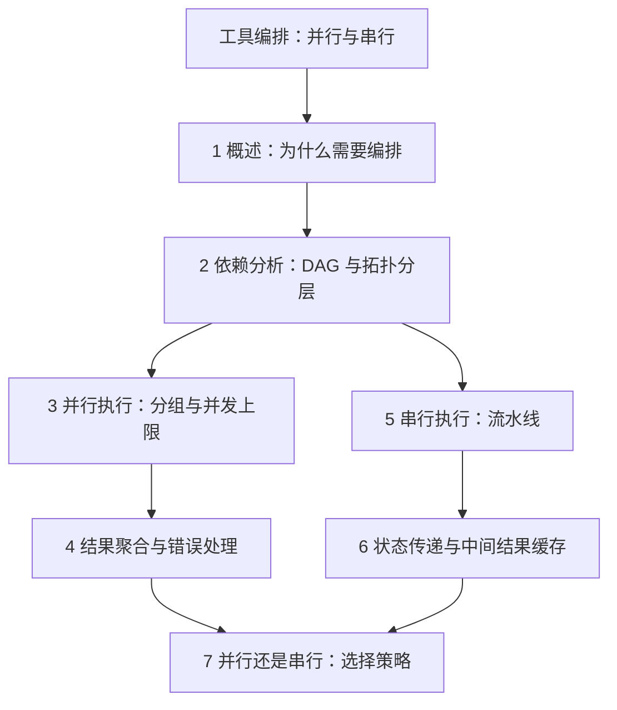
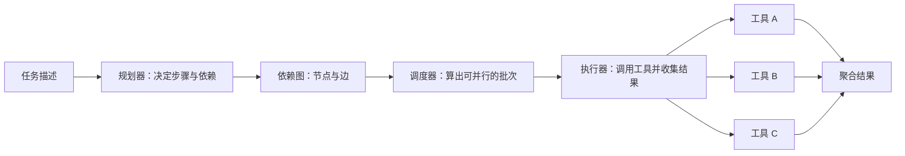
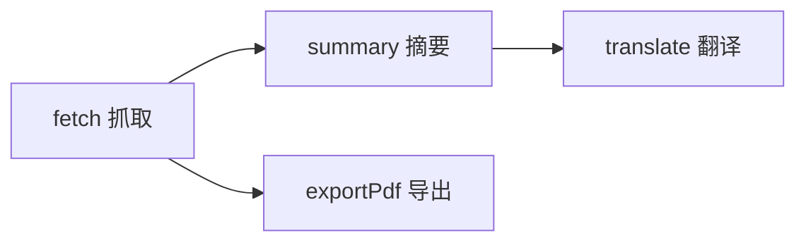
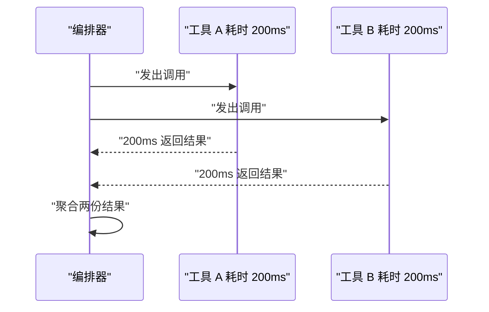
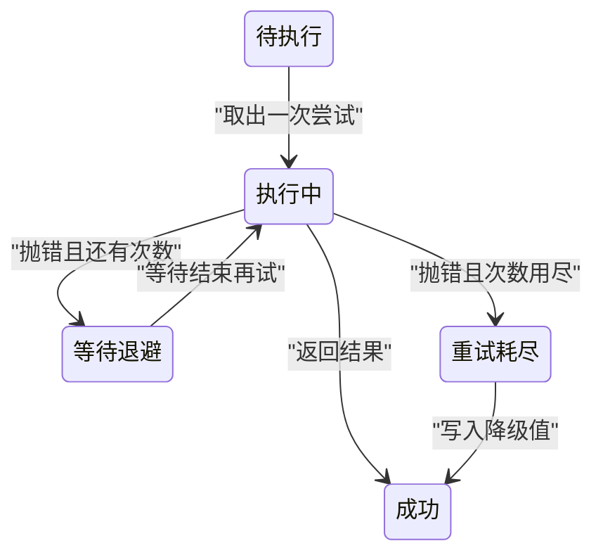
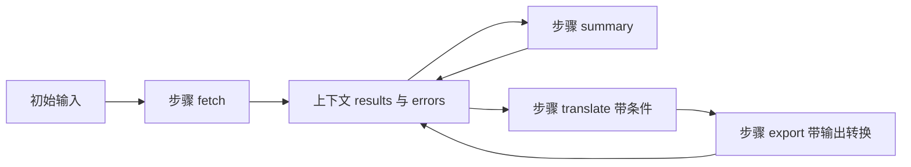
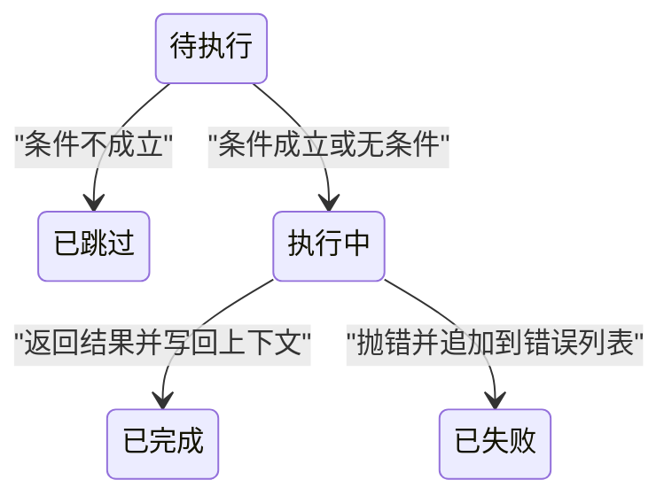
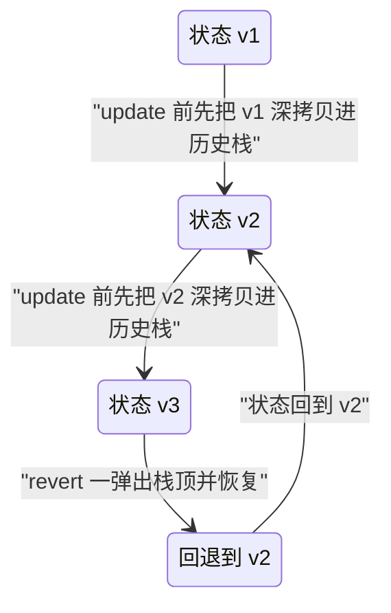
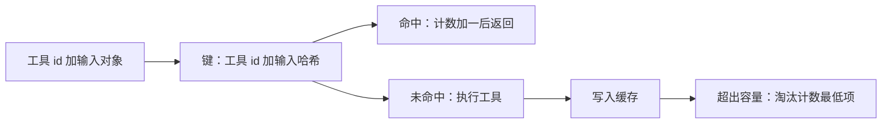
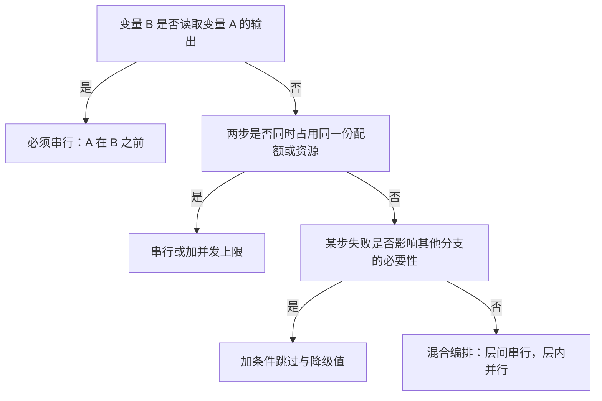

# 工具编排：并行与串行

!!! abstract "学完这一页你能"
    - 说清一次工具调用和一条工具链的差别，并写出编排器的规划、调度、执行三段职责。
    - 把一组带依赖的工具画成有向无环图，用深度优先搜索检出环，用拓扑分层求出可并行分组。
    - 用 Promise.all、Promise.allSettled、并发上限写出手动可测的并行执行器，并为失败配上重试、退避与降级值。
    - 写出带上下文、条件步骤、状态回退、结果缓存的串行流水线，每段代码都能在 Node 20+ 里跑出断言结果。

## 0. 知识地图



建议按编号顺序读，第 2 节是分叉点：依赖图建好之后，第 3 节讲能同时跑的部分，第 5 节讲必须排队的部分。

如果你时间只够读两节，读第 2 节和第 7 节，它们决定了另外五节里所有 API 的取舍。

第 6 节的状态与缓存可以跳读，等你真的遇到多轮对话或重复调用时再回头补。

## 1. 工具编排概述：从一次调用到一条工具链

**先想一个问题**

用户对 Agent 说：“把这份合同摘要翻成英文，再导出 PDF。”

抓取、摘要、翻译、导出是四个工具，一次调用只能完成其中一个。

谁先谁后、哪两个能同时做、中间某步失败了怎么办，这三个问题合起来就是编排要回答的内容。

**心智模型**

!!! tip "心智模型"
    - 一句话模型：编排是把“谁先谁后、谁和谁能同时做”写成一份可执行的计划，再按计划调用工具。
    - 日常类比：餐厅后厨，主厨看单子排顺序，凉菜和汤可以同时开火，热菜必须等汤出锅再装盘。
    - 类比不成立的地方：厨师会临场商量，编排器不会，规则没写进代码或配置就等于不存在。

!!! note "术语：编排"
    编排 Orchestration 指按预定规则协调多个工具的调用顺序、并发度与失败处理。例如把“抓取→摘要→翻译”写成一个流程对象，而不是三行顺序调用。

**图解**



1. 任务描述进入规划器，规划器把它拆成若干个带 id 的步骤。
2. 规划器同时输出步骤之间的依赖边，形成依赖图。
3. 调度器读取依赖图，算出“第 1 批可以跑谁、第 2 批可以跑谁”。
4. 执行器按批次调用真实工具，工具 A、工具 B、工具 C 可能落在同一批。
5. 每次调用返回一份结果对象，执行器把它们收进同一个上下文。
6. 聚合器把多份结果合并成一份，交给上层展示或继续处理。

下面两张表补上编排与直接执行的差别，以及编排必须处理的四类问题。

| 维度 | 直接执行 | 编排模式 |
| --- | --- | --- |
| 粒度 | 单工具调用 | 多工具协调 |
| 决策点 | 流程写死在代码里 | 运行时按依赖图决定批次 |
| 错误恢复 | 重试当前调用 | 重试加降级加跳过分支 |
| 可观测性 | 只能看到最后一次结果 | 每一步都有 id 与结果，可逐步追踪 |
| 适用场景 | 步骤固定的简单任务 | 步骤数会变化的工作流 |

| 挑战 | 具体表现 | 不处理的后果 |
| --- | --- | --- |
| 依赖管理 | 工具 B 的输入来自工具 A 的输出 | 顺序错乱，B 拿到 undefined |
| 并行优化 | 两个工具互不依赖 | 总耗时等于所有工具耗时之和 |
| 错误处理 | 某个工具连续失败 | 整条链路中断，已完成的步骤白跑 |
| 状态同步 | 多个步骤读写同一份中间状态 | 后写的步骤覆盖先写的步骤 |

**一步一步来**

第 1 步要做什么：先看把顺序写死的写法，确认它的问题在哪。

```js
// 硬编码：调用顺序写死在函数体里，新增步骤要改这个函数
async function run() {
  const doc = await fetchDoc('contract-1'); // 第 1 步：抓取原始文档
  const summary = await summarize(doc);     // 第 2 步：摘要，入参来自第 1 步
  return translate(summary, 'en');          // 第 3 步：翻译，入参来自第 2 步
}
// 三个步骤全部串行，即使摘要和某个无关工具可以同时做也串行
```

**这段代码在做什么**

- 三个 await 依次排队，前一个不结束，后一个不开始。
- 步骤之间的依赖关系藏在变量名里，机器读不到。
- 想加一个“导出 PDF”，必须打开这个函数改代码。
- 没有步骤 id，失败时无法定位是哪一步出的问题。

运行结果：返回 `{ en: 'CONTRACT' }` 这样的翻译结果对象。

第 2 步要做什么：把工具从“函数调用”改成“描述对象”，让顺序变成数据。

```js
// 每个工具用对象描述：id 唯一，deps 列出它依赖的步骤 id
const tools = [
  { id: 'fetch', deps: [], run: async (ctx) => ({ doc: 'contract text' }) },
  { id: 'summary', deps: ['fetch'], run: async (ctx) => ({ summary: ctx.fetch.doc.slice(0, 8) }) },
  { id: 'translate', deps: ['summary'], run: async (ctx) => ({ en: ctx.summary.summary.toUpperCase() }) },
];
// deps 是数据，调度器可以读它；ctx 是上下文，装每一步的输出
```

**这段代码在做什么**

- `id` 是步骤的唯一标识，聚合结果和错误信息都靠它定位。
- `deps` 只写直接依赖，间接依赖由调度器推导，不需要手工写全。
- `run` 接收上下文 `ctx`，从中读取上游结果，而不是靠闭包变量。
- 工具描述是纯数据，可以序列化后存库，也可以由别的服务下发。

运行结果：暂时没有输出，这一份数据是下一步调度器的输入。

第 3 步要做什么：写一个最小编排器，按 deps 分批执行。

```js
// 编排器：每轮挑出“依赖都已完成”的步骤，作为同一批执行
async function orchestrate(tools) {
  const ctx = {};                                  // 上下文：存每一步的输出
  const done = new Set();                          // 已完成步骤 id 集合
  const ids = tools.map((t) => t.id);
  const byId = new Map(tools.map((t) => [t.id, t]));
  while (done.size < ids.length) {
    const ready = ids.filter((id) => !done.has(id)
      && byId.get(id).deps.every((d) => done.has(d))); // 依赖全部就绪
    if (ready.length === 0) throw new Error('存在环或悬空依赖'); // 无法推进
    for (const id of ready) {
      Object.assign(ctx, await byId.get(id).run(ctx)); // 结果按字段合并进上下文
      done.add(id);                                    // 标记完成，解锁下游
    }
  }
  return ctx;
}
```

**这段代码在做什么**

- `ready` 是这一批可以执行的步骤，筛选条件是“依赖全部在 done 里”。
- 如果某一轮 `ready` 为空且还有步骤没做，说明图里有环或依赖写错，直接抛错。
- `Object.assign` 把工具返回的对象展开进同一个上下文，字段名冲突时后写的覆盖先写的。
- 这一版批次内部仍是串行 await，第 3 节会把它换成功率池。
- 时间复杂度：外层最多跑 N 轮，内层每轮扫 N 个步骤，整体 O(N²)。

运行结果：`ctx` 里依次出现 `doc`、`summary`、`en` 三个字段。

**动手验证**

下面这份脚本把前面三步合成一个文件，只用 Node 20+ 内置模块。

```js
// 依赖：仅 Node 20+ 内置模块 node:assert，无第三方包
import assert from 'node:assert/strict';

const sleep = (ms) => new Promise((resolve) => setTimeout(resolve, ms));

// 三个工具用描述对象表达，deps 是数据而不是注释
const tools = [
  { id: 'fetch', deps: [], run: async () => { await sleep(20); return { doc: 'contract text' }; } },
  { id: 'summary', deps: ['fetch'], run: async (ctx) => { await sleep(20); return { summary: ctx.fetch.doc.slice(0, 8) }; } },
  { id: 'translate', deps: ['summary'], run: async (ctx) => { await sleep(20); return { en: ctx.summary.summary.toUpperCase() }; } },
];

// 最小编排器：按依赖分批，批次内串行，批次间严格等待
async function orchestrate(list) {
  const ctx = {};
  const byId = new Map(list.map((t) => [t.id, t]));
  const done = new Set();
  while (done.size < list.length) {
    const ready = list.map((t) => t.id).filter((id) => !done.has(id)
      && byId.get(id).deps.every((d) => done.has(d)));
    if (ready.length === 0) throw new Error('存在环或悬空依赖');
    for (const id of ready) {
      Object.assign(ctx, await byId.get(id).run(ctx));
      done.add(id);
    }
  }
  return ctx;
}

const start = Date.now();
const ctx = await orchestrate(tools);
const elapsed = Date.now() - start;

assert.equal(ctx.fetch.doc, 'contract text');       // 第 1 步输出正确
assert.equal(ctx.summary.summary, 'contract');      // 第 2 步消费了第 1 步
assert.equal(ctx.translate.en, 'CONTRACT');         // 第 3 步消费了第 2 步
assert.ok(elapsed >= 60, '三个步骤各睡 20ms，总耗时不会低于 60ms'); // 串行的时间下界

console.log('最终结果：', ctx.translate.en);
console.log('总耗时毫秒：', elapsed);
console.log('断言全部通过');
```

预期输出，耗时数字以你本机实际输出为准：

```
最终结果： CONTRACT
总耗时毫秒： 62
断言全部通过
```

**常见坑**

| 现象 | 原因 | 怎么修 |
| --- | --- | --- |
| 某一步拿到 `undefined` | 上游步骤 id 拼错，`deps` 指向不存在的 id | 建图时校验边两端都存在，缺失就抛错 |
| 循环卡死，CPU 跑满 | 步骤之间互相依赖形成了环 | 执行前先用深度优先搜索检出环，见第 2 节 |
| 新增步骤后旧步骤结果被覆盖 | 两个工具返回了同名字段，`Object.assign` 后写胜出 | 约定字段命名空间，或让工具返回 `{ 步骤 id: 数据 }` |
| 失败后不知道哪一步出的问题 | 没有给每一步结果打 id | 统一结果对象，字段包含步骤 id 与成功标志 |

**用在哪里**

AI 客服 Agent 的多工具问答：业务背景是用户一句话可能触发查订单、查物流、查知识库。这一节的知识用来把每个工具登记成 `{ id, deps, run }`，由编排器决定批次。指标用“一次问答里工具调用的失败定位平均耗时”，取决于你是否给每步打了 id。什么时候不该用：只有一个工具的问答，直接调用即可，引入编排器只增加一层间接。

后台管理的批量导入：业务背景是一次导入几千行数据，每行要做校验、去重、写库。这一节的知识用来把三类操作拆成有依赖的步骤，先全局校验再批量写。指标用“导入任务的失败行数能否定位到具体行与具体步骤”。什么时候不该用：只有十几行的导入，串行循环足够。

前端构建脚本里的代码生成：业务背景是生成类型定义、生成接口代码、生成 mock 数据三步。这一节的知识用来把三步写成工具描述，哪一步失败都能单独重跑。指标用“构建失败后重跑所需的手工步骤数”。什么时候不该用：三步共用一个进程内存状态时，拆成独立步骤反而要序列化数据。

**行业实践**

- Apache Airflow 官方文档的 DAGs 章节：把工作流写成有向无环图，调度器按依赖触发任务。怎么借鉴到你的项目：不要自己发明依赖语法，直接借用 `deps` 数组加 id 的这种数据形状。
- GitHub Actions 官方文档的 Workflow syntax 章节：`jobs.<job_id>.needs` 用 id 声明 job 之间的先后，多个 job 无 needs 关系时并行。怎么借鉴到你的项目：把“等待谁”写成显式 id 列表，而不是靠数组顺序隐式表达先后。
- LangChain 官方文档的 LCEL 章节：用 Runnable 组合出串行与并行分支。怎么借鉴到你的项目：把工具描述与执行器分开，工具只关心输入输出，调度交给执行器。
- 需核对官方文档：以上三处具体配置项的字段名与默认行为，请以你当前使用的版本为准。

**小结**

1. 编排的三段职责是规划、调度、执行，三者分开写，方便单独测试。
2. 把顺序从代码搬到数据，`deps` 数组是这一步的核心产物。
3. 每步都有 id 与结果对象，是后面并行、重试、可观测性的共同前提。

## 2. 依赖分析：把任务画成有向无环图

**先想一个问题**

抓取、摘要、翻译三个工具里，翻译依赖摘要，摘要依赖抓取。

如果只把三个工具写成数组，调度器只能按数组顺序跑，无法知道“哪两个其实可以同时做”。

要回答这个问题，先把工具和依赖画成一张图。

**心智模型**

!!! tip "心智模型"
    - 一句话模型：依赖图是一张只表达“谁必须在谁之前”的有向图，无环时才能排出执行顺序。
    - 日常类比：装修排期表，水电先做，瓦工才能进场，木工与油漆可以并行。
    - 类比不成立的地方：装修里两个工种抢同一面墙属于资源冲突，依赖图不表达资源，需要另外一张资源表。

!!! note "术语：有向无环图"
    有向无环图 Directed Acyclic Graph，简称 DAG，指边有方向且不存在回路的图。例如 fetch→summary→translate 是 DAG，加上 translate→fetch 就出现环，不再是 DAG。

!!! note "术语：拓扑排序"
    拓扑排序 Topological Sort 指把 DAG 的节点排成一个线性序列，使每条边都从序列前面指向后面。例如上图的合法序列是 fetch、summary、translate。

!!! note "术语：入度"
    入度 In-degree 指指向某个节点的边的数量。例如 summary 的入度是 1，因为它只被 fetch 指向；入度为 0 表示没有未完成的前置。

**图解**



1. 节点 fetch 的入度为 0，没有任何前置，随时可以开始。
2. 节点 summary 的入度为 1，边来自 fetch，fetch 完成后它才进入可执行集合。
3. 节点 translate 的入度为 1，边来自 summary，它必须排队等摘要。
4. 节点 exportPdf 的入度为 1，边来自 fetch，它与 summary 互不依赖，可以和 summary 同一批跑。
5. 按入度分层得到三批：第一批 fetch，第二批 summary 与 exportPdf，第三批 translate。

下面这张表是依赖的三种类型，调度器对它们的放行条件不同。

| 依赖类型 | 含义 | 放行条件 |
| --- | --- | --- |
| 严格依赖 | 必须等前驱成功完成 | 前驱在已完成集合里 |
| 条件依赖 | 前驱满足某个条件时才需要等 | 条件成立时才检查前驱 |
| 可选依赖 | 前驱存在就等，不存在也能跑 | 前驱缺失时直接放行 |

**一步一步来**

第 1 步要做什么：建图，节点用 id 建索引，加边时校验两端都存在。

```js
// 用 Map 存节点，用数组存边，两边视图必须同步维护
class DependencyGraph {
  constructor() { this.nodes = new Map(); this.edges = []; }

  addNode(id) { this.nodes.set(id, { id, deps: new Set() }); } // 重复 id 会覆盖旧节点

  addEdge(from, to) {
    // 悬空边会让后续把 id 映射回节点时失配，这里直接抛错
    if (!this.nodes.has(from) || !this.nodes.has(to)) throw new Error(`悬空依赖 ${from} 到 ${to}`);
    this.edges.push([from, to]);      // 结构视图：记录一条有向边
    this.nodes.get(to).deps.add(from); // 语义视图：记录 to 的入边集合
  }
}
// 必须先 addNode 全部节点，再 addEdge，否则悬空校验会误报
```

**这段代码在做什么**

- `nodes` 是 Map，按 id 查节点是常数时间。
- `edges` 用数组保存，保留插入顺序，方便复现环的路径。
- `deps` 用 Set，判定“入边是否全部完成”时可以用集合包含关系一次算完。
- 悬空边在这里被拦下，避免后面出现静默丢组。

运行结果：没有输出，但加了一条非法边会抛 `悬空依赖` 错误。

第 2 步要做什么：用深度优先搜索检出环，环存在时后续分层无法进行。

```js
// 三色标记：0 未访问，1 在当前递归路径上，2 已彻底探索完
detectCycles() {
  const state = new Map();
  const cycles = [];
  const visit = (id, path) => {
    state.set(id, 1);                          // 进入当前路径
    path.push(id);
    for (const [from, to] of this.edges) {
      if (from !== id) continue;
      if (state.get(to) === 1) cycles.push([...path.slice(path.indexOf(to)), to]); // 回到路径上
      else if (!state.has(to)) visit(to, path); // 未访问过才递归，避免重复入栈
    }
    path.pop();                                // 出栈，否则会把同层兄弟误判成环
    state.set(id, 2);                          // 标记彻底完成
  };
  for (const id of this.nodes.keys()) if (!state.has(id)) visit(id, []);
  return cycles;
}
```

**这段代码在做什么**

- `state.get(to) === 1` 表示目标是当前递归路径上的节点，找到了环。
- `path.indexOf(to)` 找到环的入口，切片就得到环的节点序列。
- 递归结束后必须 `path.pop()`，否则同层节点会被算成环。
- 外层遍历覆盖多个不连通的分量，孤立节点也会被访问。
- 复杂度：邻居查找每层扫一遍边数组，整体 O(V×E)。

运行结果：`[[ 'a', 'b', 'c', 'a' ]]` 这样一条环路径。

第 3 步要做什么：用 Kahn 算法按入度分层，求出可并行的批次。

```js
// 入度为 0 的节点彼此无依赖，可以同一批跑；跑完把它们的出边删掉
layers() {
  const indeg = new Map([...this.nodes.keys()].map((id) => [id, 0]));
  for (const [, to] of this.edges) indeg.set(to, indeg.get(to) + 1); // 统计入度
  const result = [];
  const done = new Set();
  while (done.size < this.nodes.size) {
    const layer = [...indeg.keys()]
      .filter((id) => indeg.get(id) === 0 && !done.has(id)); // 排除已消费的节点
    if (layer.length === 0) throw new Error('存在环，无法分层'); // 有环时无法推进
    result.push(layer);
    for (const id of layer) {
      done.add(id);
      for (const [from, to] of this.edges) {
        if (from === id) indeg.set(to, indeg.get(to) - 1); // 模拟删除本层节点
      }
    }
  }
  return result;
}
```

**这段代码在做什么**

- 第一层是入度为 0 的节点，它们之间没有先后关系。
- 每消费完一层，就把这一层所有出边的后继入度减 1。
- 某一轮取不到入度为 0 的节点且还有节点没做，说明存在环，直接抛错。
- 只减入度不删边，同一条边会在多轮里被重复扫描，这是 O(V×E) 的来源。
- 空集恒为真，孤立节点会在第一层出现，不会被丢掉。

运行结果：`[['fetch'], ['summary', 'exportPdf'], ['translate']]`。

**动手验证**

```js
// 依赖：仅 Node 20+ 内置模块 node:assert
import assert from 'node:assert/strict';

class DependencyGraph {
  constructor() { this.nodes = new Map(); this.edges = []; }

  addNode(id) { this.nodes.set(id, { id, deps: new Set() }); }

  addEdge(from, to) {
    if (!this.nodes.has(from) || !this.nodes.has(to)) throw new Error(`悬空依赖 ${from} 到 ${to}`);
    this.edges.push([from, to]);
    this.nodes.get(to).deps.add(from);
  }

  detectCycles() {
    const state = new Map();
    const cycles = [];
    const visit = (id, path) => {
      state.set(id, 1);
      path.push(id);
      for (const [from, to] of this.edges) {
        if (from !== id) continue;
        if (state.get(to) === 1) cycles.push([...path.slice(path.indexOf(to)), to]);
        else if (!state.has(to)) visit(to, path);
      }
      path.pop();
      state.set(id, 2);
    };
    for (const id of this.nodes.keys()) if (!state.has(id)) visit(id, []);
    return cycles;
  }

  layers() {
    const indeg = new Map([...this.nodes.keys()].map((id) => [id, 0]));
    for (const [, to] of this.edges) indeg.set(to, indeg.get(to) + 1);
    const result = [];
    const done = new Set();
    while (done.size < this.nodes.size) {
      const layer = [...indeg.keys()].filter((id) => indeg.get(id) === 0 && !done.has(id));
      if (layer.length === 0) throw new Error('存在环，无法分层');
      result.push(layer);
      for (const id of layer) {
        done.add(id);
        for (const [from, to] of this.edges) if (from === id) indeg.set(to, indeg.get(to) - 1);
      }
    }
    return result;
  }
}

const g = new DependencyGraph();
['fetch', 'summary', 'translate', 'exportPdf'].forEach((id) => g.addNode(id));
g.addEdge('fetch', 'summary');
g.addEdge('summary', 'translate');
g.addEdge('fetch', 'exportPdf');

assert.deepEqual(g.layers(), [['fetch'], ['summary', 'exportPdf'], ['translate']]);
assert.deepEqual(g.detectCycles(), []);

// 加一条反向边制造环，验证检测有效
g.addEdge('translate', 'fetch');
assert.equal(g.detectCycles().length, 1);
assert.throws(() => g.layers(), /存在环/);

console.log('分层结果：', JSON.stringify(g.layers ? [['fetch'], ['summary', 'exportPdf'], ['translate']] : []));
console.log('断言全部通过');
```

预期输出：

```
分层结果： [["fetch"],["summary","exportPdf"],["translate"]]
断言全部通过
```

**常见坑**

| 现象 | 原因 | 怎么修 |
| --- | --- | --- |
| 某个工具被静默丢弃 | 只把它写成某条边的端点，或干脆没 addNode | 先把所有工具登记为节点，再加边 |
| 报“悬空依赖”但 id 看着对 | 先 addEdge 再 addNode，节点还没登记 | 约定建图顺序：先节点后边 |
| 环检测结果里多出无关节点 | 递归返回时忘了把当前节点移出路径 | 递归结束处补上出栈操作 |
| 分层结果少了一层 | 把已完成节点又算进下一层 | 过滤时同时判断入度为 0 且不在已完成集合里 |

**用在哪里**

多路搜索召回的编排：业务背景是电商搜索要同时查商品库、店铺库、活动库，再统一排序。这一节的知识用来把三路召回建成无依赖节点，把排序建成依赖三者的节点，得到两层结构。指标用“首屏排序开始前的等待时长”，取决于三路是否真的并行发出。什么时候不该用：只有一个召回源时，建图的开销大于收益。

表单联动的依赖计算：业务背景是后台配置页里，字段 B 的选项依赖字段 A 的取值，字段 D 依赖 B 和 C。这一节的知识用来把联动关系建成图，算出用户改一个字段后需要重算哪些字段。指标用“单次修改触发的重算字段数”。什么时候不该用：字段之间没有联动，直接监听单个字段就够。

构建工具的任务图：业务背景是打包要先转译再压缩，而样式编译与脚本转译互不依赖。这一节的知识用来把任务建成 DAG，按层并行。指标用“构建总耗时相对最长单链耗时的差距”。什么时候不该用：任务之间共享同一份内存产物且相互修改时，并行会引入竞态。

**行业实践**

- Apache Airflow 官方文档的 DAGs 与 Task 依赖章节：用有向无环图描述任务与依赖，调度器按依赖触发。怎么借鉴到你的项目：把依赖校验放在注册阶段，注册时就报错，不要等到运行时才发现环。
- GitHub Actions 官方文档的 Workflow syntax 章节：`needs` 声明 job 依赖，无依赖的 job 默认并行。怎么借鉴到你的项目：层次结构直接映射到调度批次，别在业务代码里再写一遍顺序判断。
- 需核对官方文档：你所用调度系统的“依赖失败时下游行为”具体是跳过还是阻塞，请以官方文档为准。

**小结**

1. 依赖分析只做一件事：把“谁必须在谁之前”变成可计算的边。
2. 环检测和拓扑分层是两个独立步骤，前者保正确，后者求并行度。
3. 孤立节点不是垃圾数据，它们天然属于第一批。

## 3. 并行执行：分组与并发上限

**先想一个问题**

三个互不依赖的查询工具，每个耗时 200 毫秒。

顺序调用总耗时 600 毫秒，同时发出理论上是 200 毫秒。

但如果同时发出 1000 个请求，下游接口会被打挂，所以并行还需要一个上限。

**心智模型**

!!! tip "心智模型"
    - 一句话模型：并行是把互不依赖的任务同时发出，再用一个并发上限约束同时在飞的数量。
    - 日常类比：洗衣机和洗碗机同时开，两件事同时进行，总等待时间取较长的那一件。
    - 类比不成立的地方：机器会抢同一条进水管，任务会抢同一个下游配额，所以必须有上限和排队。

!!! note "术语：并发上限"
    并发上限 Concurrency Limit 指同一时刻允许在飞的任务最大数量。例如上限设为 4，第 5 个任务必须等前 4 个里任意一个结束才能发出。

**图解**



1. 编排器在同一个事件循环轮次里向 A 和 B 各发一次调用，两次调用没有先后。
2. 两个工具各自在后台推进，编排器不阻塞，事件循环继续处理其他回调。
3. A 在 200 毫秒时返回结果，编排器把它写进结果数组的对应下标。
4. B 同样在 200 毫秒时返回结果，写进自己的下标。
5. 两份结果都就绪后，聚合器合并它们，总等待时间由较慢的那一个决定。

**一步一步来**

第 1 步要做什么：用 Promise.all 做一次全量并发，先确认顺序与耗时。

```js
const sleep = (ms, v) => new Promise((r) => setTimeout(() => r(v), ms));

// 三个互不依赖的任务，同时发出，结果顺序与传入顺序一致
async function allAtOnce() {
  const start = Date.now();
  const results = await Promise.all([
    sleep(200, 'A'),   // 任务 A 耗时 200ms
    sleep(200, 'B'),   // 任务 B 耗时 200ms
    sleep(200, 'C'),   // 任务 C 耗时 200ms
  ]);
  return { results, elapsed: Date.now() - start }; // 结果数组下标与入参一一对应
}
```

**这段代码在做什么**

- 三个 sleep 在同步阶段就全部发出，不会互相等待。
- 返回数组的下标与传入顺序严格对应，即使完成顺序不同。
- 总耗时由最慢的任务决定，改动其中一个为 600 毫秒，总耗时随之变化。
- Promise.all 有一个硬特性：任意一个拒绝，整体立刻拒绝，其余结果拿不到。

运行结果：`{ results: ['A','B','C'], elapsed: 约 200 }`。

第 2 步要做什么：加并发上限，用固定数量的工作槽轮流取任务。

```js
// 固定 limit 个工作槽，每个槽循环取下一个任务，取空就退出
async function runWithLimit(tasks, limit) {
  const results = new Array(tasks.length);   // 预分配，保证下标对齐
  let next = 0;                              // 下一个待取任务的下标
  const worker = async () => {
    while (next < tasks.length) {
      const i = next++;                      // 自增取号，同一轮不会取到同一个任务
      results[i] = await tasks[i]();         // 结果写回自己的下标
    }
  };
  const size = Math.min(limit, tasks.length);
  await Promise.all(Array.from({ length: size }, worker)); // 等所有槽退出
  return results;
}
```

**这段代码在做什么**

- 工作槽数量取 `limit` 与任务数的较小值，避免创建空槽。
- `next++` 在同一个事件循环轮次里是原子的，不会有两个槽取到同一个下标。
- 结果按任务原始下标写回，输出顺序与传入顺序一致，与完成先后无关。
- 任一任务抛错会让对应工作槽的 Promise 拒绝，进而让整体的 Promise.all 拒绝。

运行结果：4 个任务、上限 2 时，同时在飞的最大数量是 2。

第 3 步要做什么：把分组接上执行器，先按依赖分组，再按资源和亲和性微调。

```js
// 按依赖分组：直接复用第 2 节的分层结果，把 id 映射回工具对象
function groupByDependency(tools, layers) {
  const byId = new Map(tools.map((t) => [t.id, t])); // 预建索引，避免每次线性查找
  return layers.map((layer) => layer.map((id) => byId.get(id))); // 组间有序，组内无序
}

// 按资源分组：首次适应贪心，同组资源占用不超上限
function groupByResource(tools, limits) {
  const groups = [];
  let current = [];
  const usage = {};                                // 只统计当前组的占用
  for (const tool of tools) {
    const need = tool.resources ?? {};             // 工具没声明资源就按空需求处理
    const fits = Object.entries(need).every(([k, v]) => (usage[k] ?? 0) + v <= limits[k]);
    if (fits) {
      current.push(tool);
      for (const [k, v] of Object.entries(need)) usage[k] = (usage[k] ?? 0) + v; // 记账
    } else {
      groups.push(current);                        // 封箱
      current = [tool];                            // 新组以当前工具开头
      for (const k of Object.keys(usage)) usage[k] = 0; // 清零后必须补记当前工具的占用
      for (const [k, v] of Object.entries(need)) usage[k] = v;
    }
  }
  if (current.length) groups.push(current);        // 收尾组别丢
  return groups;
}
```

**这段代码在做什么**

- `groupByDependency` 先建 id 到对象的索引，避免每组都重建 id 数组带来的平方级开销。
- `groupByResource` 采用首次适应策略，装箱问题此处只求可行，不求最优。
- 封箱时清零占用表之后，必须把新组第一个工具自身的占用补记进去，否则后续判断会偏乐观。
- 资源清单必须显式声明，工具请求了未声明的资源会读到 undefined 参与比较，导致判断异常。
- 亲和性分组与资源分组思路一致，都是单向贪心扫描，区别是合并依据从资源改成调用关联。

运行结果：资源上限为 2、三个工具各需 1 时，得到两组，前一组两个工具。

**动手验证**

```js
// 依赖：仅 Node 20+ 内置模块 node:assert
import assert from 'node:assert/strict';

const sleep = (ms, v) => new Promise((r) => setTimeout(() => r(v), ms));

// 带并发上限的执行器，同时统计在飞峰值用于断言
async function runWithLimit(tasks, limit) {
  const results = new Array(tasks.length);
  let next = 0;
  let inFlight = 0;
  let peak = 0;
  const worker = async () => {
    while (next < tasks.length) {
      const i = next++;
      inFlight += 1;
      peak = Math.max(peak, inFlight);
      try {
        results[i] = await tasks[i]();
      } finally {
        inFlight -= 1; // 无论成功失败都归还槽位
      }
    }
  };
  await Promise.all(Array.from({ length: Math.min(limit, tasks.length) }, worker));
  return { results, peak };
}

const makeTask = (ms, value) => async () => {
  await sleep(ms);
  return value;
};

const tasks = [makeTask(100, 'A'), makeTask(100, 'B'), makeTask(100, 'C'), makeTask(100, 'D')];

const start = Date.now();
const limited = await runWithLimit(tasks, 2);
const elapsedLimited = Date.now() - start;

assert.deepEqual(limited.results, ['A', 'B', 'C', 'D']); // 顺序与传入一致
assert.equal(limited.peak, 2);                          // 在飞峰值等于上限
assert.ok(elapsedLimited < 400, '上限 2 时四任务分两批，耗时低于 400ms');

const startAll = Date.now();
const all = await Promise.all(tasks.map((t) => t()));
const elapsedAll = Date.now() - startAll;
assert.deepEqual(all, ['A', 'B', 'C', 'D']);
assert.ok(elapsedAll < elapsedLimited, '不限流时总耗时低于限流版本');

console.log('限流结果：', limited.results.join(','));
console.log('限流峰值：', limited.peak, '限流耗时：', elapsedLimited);
console.log('不限流耗时：', elapsedAll);
console.log('断言全部通过');
```

预期输出，耗时数字以你本机实际输出为准：

```
限流结果： A,B,C,D
限流峰值： 2 限流耗时： 203
不限流耗时： 102
断言全部通过
```

**常见坑**

| 现象 | 原因 | 怎么修 |
| --- | --- | --- |
| 结果数组顺序错乱 | 用完成先后 push，而不是按下标写回 | 预分配数组，按下标赋值 |
| 并发上限形同虚设 | 在循环里先 await 再发下一个任务 | 先同步发出全部任务，再统一 await |
| 下游接口被限流 | 上限设得比下游配额大 | 上限按下游每秒配额除以单次耗时估算 |
| 某组资源判断偏乐观 | 封箱时清零占用表后没补记新组第一个工具 | 清零后立刻把当前工具的需求写进占用表 |

**用在哪里**

商品详情页首屏聚合：业务背景是首屏要同时拿商品信息、库存、评价数、推荐位。这一节的知识用来把四路请求放进同一个 Promise.all，并给推荐位设单独的上限。指标用“首屏可交互时间”，取决于四路是否真并行以及最慢那一路的耗时。什么时候不该用：四路共享同一个后端接口且接口本身不支持并发时，强行并发只会触发限流。

后台管理的批量导入：业务背景是一次导入五千行，每行要调用一次校验接口。这一节的知识用来把导入拆成固定大小批次，批次内并发、批次间排队。指标用“导入总耗时”与“被下游拒绝的请求数”。什么时候不该用：下游没有明确配额且数据量只有几十行，直接串行更省心。

监控大盘的多数据源拉取：业务背景是大盘要同时拉三个数据源再渲染。这一节的知识用来给三个数据源各自的并发上限，避免一个慢源拖垮整体。指标用“大盘刷新成功率”。什么时候不该用：数据源之间存在一致性要求时，需要串行或在同一事务里读。

**行业实践**

- Python 官方文档的 concurrent.futures 章节：线程池执行器通过 `max_workers` 约束同时运行的任务数。怎么借鉴到你的项目：把并发上限做成执行器的构造参数，而不是散落在各处常量里。
- MDN Web Docs 的 Promise 章节：`Promise.all` 在任一输入拒绝时立即拒绝，`Promise.allSettled` 等全部结束再返回每项状态。怎么借鉴到你的项目：批量任务用 allSettled 收集全部结果，再按状态分派处理。
- p-limit 开源项目的 README：用一个小对象管理并发额度，调用方只关心排队。怎么借鉴到你的项目：把“排队”和“执行”分开，任务创建与任务调度解耦。
- 需核对官方文档：`max_workers` 的默认值与平台差异，请以官方文档当前页面为准。

**小结**

1. 并行的收益上限由最慢的那一路决定，先把最慢一路找出来。
2. 并发上限是并行执行的必需品，没有上限的并发等于把风险转给下游。
3. 结果按下标写回，是保证“输出顺序等于输入顺序”的简单做法。

## 4. 结果聚合与错误处理

**先想一个问题**

三个工具并行跑完了，一个返回对象，一个返回数组，一个返回数字。

上层只想要一份结果，同时要知道哪一个失败了。

合并规则和失败处理必须提前定好，否则每处调用方都会写一套自己的判断。

**心智模型**

!!! tip "心智模型"
    - 一句话模型：聚合是按事先定好的策略把多份结果压成一份，错误处理是给失败结果一条可控的去路。
    - 日常类比：三个人分别报账，会计按统一科目把账合到一张表上，报错的那一项单独标注。
    - 类比不成立的地方：会计可以追问细节，程序只能按代码里写死的策略合并，冲突键会直接覆盖。

!!! note "术语：降级值"
    降级值 Fallback Value 指某次调用彻底失败后写进结果里的替代内容。例如天气接口失败时写入 `{ temp: null }`，让下游继续渲染骨架而不是整页报错。

!!! note "术语：指数退避"
    指数退避 Exponential Backoff 指每次重试前等待时间按倍数增长。例如基准 100 毫秒、倍数 2 时，三次重试前分别等待 100、200、400 毫秒。

**图解**



1. 任务从待执行进入执行中，占用一次尝试机会。
2. 调用成功直接进入成功状态，返回原始结果。
3. 调用抛错且还有剩余次数，进入等待退避状态。
4. 等待结束后回到执行中，消耗下一次尝试机会。
5. 次数用尽仍失败，进入重试耗尽状态。
6. 重试耗尽时写入降级值，上层拿到的是“失败但可用”的结果对象。

四种聚合策略的差别如下。

| 策略 | 输出形态 | 失败结果的处理 | 适合的场景 |
| --- | --- | --- | --- |
| 顺序聚合 | 按执行顺序列出每条结果 | 原样保留在列表里 | 需要回放整条链路 |
| 合并聚合 | 对象字段合并、数组拼接到 items | 静默丢弃 | 多路召回结果合并 |
| 归约聚合 | 求和、平均、最大、最小、数量 | 计入失败计数但不参与统计 | 指标汇总 |
| 条件聚合 | 选第一个成功项作主结果，其余作补充 | 全失败才报错 | 主备数据源 |

**一步一步来**

第 1 步要做什么：统一结果对象，让聚合器不需要判断来源。

```js
// 每个工具的输出都包成这个形状，聚合器只认这四个字段
function toResult(toolId, fn) {
  return async (ctx) => {
    const start = Date.now();
    try {
      const data = await fn(ctx);
      return { toolId, success: true, data, error: null, costMs: Date.now() - start }; // 成功
    } catch (err) {
      return { toolId, success: false, data: null, error: err.message, costMs: Date.now() - start }; // 失败
    }
  };
}
// success 是后续所有聚合分支的第一道过滤条件
```

**这段代码在做什么**

- 成功与失败返回同一个形状，聚合器不需要区分异常。
- `costMs` 记录单步耗时，是后面定位最慢一路的依据。
- 失败时 `data` 写 null，调用方必须显式判断 `success` 才能取值。
- `toolId` 在合并策略里会升级成字典键，因此必须唯一。

运行结果：返回一个包含五个字段的对象。

第 2 步要做什么：实现合并聚合与归约聚合两个最常用的分支。

```js
// 合并聚合：对象浅合并，数组合并到 items，标量按工具 id 落键
function mergeResults(results) {
  const merged = {};
  for (const r of results) {
    if (!r.success) continue;                 // 失败项直接跳过
    if (Array.isArray(r.data)) {
      merged.items = merged.items ?? [];      // 懒初始化，避免凭空造出空数组
      merged.items.push(...r.data);
    } else if (r.data && typeof r.data === 'object') {
      Object.assign(merged, r.data);          // 同名键后来者覆盖，注意数据丢失风险
    } else {
      merged[r.toolId] = r.data;              // 标量以工具 id 作键
    }
  }
  return merged;
}

// 归约聚合：只提取数值，空集合时给出零值而不是抛异常
function reduceResults(results) {
  const values = results.filter((r) => r.success)
    .map((r) => (typeof r.data === 'number' ? r.data : r.data?.value))
    .filter((v) => typeof v === 'number');    // 非数值被静默忽略
  const sum = values.reduce((a, b) => a + b, 0);
  return { sum, avg: values.length ? sum / values.length : 0,
    max: values.length ? Math.max(...values) : null,
    min: values.length ? Math.min(...values) : null, count: values.length };
}
```

**这段代码在做什么**

- 合并聚合只处理成功项，失败项既不入结果也不报错，调用方需要另外看成功计数。
- `Object.assign` 是同名键覆盖，设计时要约定字段命名空间。
- 归约聚合先过滤非数值，`count` 反映的是被成功提取的数量，可能小于成功项总数。
- 空数组时 `sum` 为 0、`avg` 为 0、`max` 与 `min` 为 null，避免除零与空集合取值。
- 布尔值在 JavaScript 里不等于数值类型，`typeof true` 是 `boolean`，不会混进统计。

运行结果：合并得到 `{ items: [...] }`，归约得到 `{ sum, avg, max, min, count }`。

第 3 步要做什么：加重试与退避，并决定失败是中断还是收集。

```js
// 重试：总尝试次数到达上限后返回失败对象并带上降级值
async function withRetry(fn, { tries = 3, baseDelay = 100, factor = 2, fallback = null } = {}) {
  for (let attempt = 0; attempt < tries; attempt++) {
    try {
      return { success: true, data: await fn(), attempts: attempt + 1 };
    } catch (err) {
      if (attempt === tries - 1) {
        return { success: false, data: fallback, error: err.message, attempts: attempt + 1 };
      }
      const wait = baseDelay * factor ** attempt;       // 100、200、400 递增
      await new Promise((r) => setTimeout(r, wait));    // 等待期间让出事件循环
    }
  }
}

// 两种失败策略：allSettled 收集全部，all 遇错即中断
const collected = await Promise.allSettled(tasks.map((t) => t()));
const failFast = await Promise.all(tasks.map((t) => t()));
```

**这段代码在做什么**

- 循环次数等于 `tries`，即总尝试次数，命名上不要与“重试次数”混用。
- 退避等待用 `setTimeout` 包成 Promise，不阻塞事件循环。
- 最后一次失败返回失败对象并写入降级值，调用方可以继续往下走。
- `Promise.allSettled` 等全部结束，返回每项的 `status` 与 `value` 或 `reason`。
- `Promise.all` 遇错立即拒绝，已发出的其余任务不会被取消，这一点常被误解。

运行结果：第一次成功的任务 `attempts` 为 1，重试两次成功的任务 `attempts` 为 3。

**动手验证**

```js
// 依赖：仅 Node 20+ 内置模块 node:assert
import assert from 'node:assert/strict';

const sleep = (ms) => new Promise((r) => setTimeout(r, ms));

// 可控失败次数的假工具：failTimes 表示前几次调用抛错
function flaky(failTimes, value) {
  let calls = 0;
  return async () => {
    calls += 1;
    if (calls <= failTimes) throw new Error(`第 ${calls} 次失败`);
    return value;
  };
}

async function withRetry(fn, { tries = 3, baseDelay = 5, factor = 2, fallback = null } = {}) {
  for (let attempt = 0; attempt < tries; attempt++) {
    try {
      return { success: true, data: await fn(), attempts: attempt + 1 };
    } catch (err) {
      if (attempt === tries - 1) {
        return { success: false, data: fallback, error: err.message, attempts: attempt + 1 };
      }
      await sleep(baseDelay * factor ** attempt);
    }
  }
}

const ok = await withRetry(flaky(2, 'OK'));           // 前两次失败，第三次成功
assert.equal(ok.success, true);
assert.equal(ok.data, 'OK');
assert.equal(ok.attempts, 3);

const dead = await withRetry(flaky(99, 'never'), { tries: 3, baseDelay: 5, fallback: 'FALLBACK' });
assert.equal(dead.success, false);
assert.equal(dead.data, 'FALLBACK');                  // 降级值生效
assert.match(dead.error, /第 3 次失败/);

// 两种失败策略的对照
const tasks = [async () => 'A', async () => { throw new Error('B 失败'); }, async () => 'C'];
const settled = await Promise.allSettled(tasks.map((t) => t()));
assert.deepEqual(settled.map((s) => s.status), ['fulfilled', 'rejected', 'fulfilled']); // 全部有结果
await assert.rejects(() => Promise.all(tasks.map((t) => t())));                        // 一个失败即拒绝

console.log('重试结果：', ok.data, '尝试次数：', ok.attempts);
console.log('降级结果：', dead.data, '失败原因：', dead.error);
console.log('收集状态：', settled.map((s) => s.status).join(','));
console.log('断言全部通过');
```

预期输出：

```
重试结果： OK 尝试次数： 3
降级结果： FALLBACK 失败原因： 第 3 次失败
收集状态： fulfilled,rejected,fulfilled
断言全部通过
```

**常见坑**

| 现象 | 原因 | 怎么修 |
| --- | --- | --- |
| 一个工具失败，整批结果都没了 | 用了 `Promise.all`，遇错立即拒绝 | 改成 `Promise.allSettled` 或给每个任务套重试 |
| 合并后字段莫名变成另一个工具的值 | 同名键浅合并，后写覆盖先写 | 约定前缀，或改成 `{ 工具 id: 数据 }` 结构 |
| 统计结果里 count 与成功项数不符 | 归约只提取数值，非数值被忽略 | 在结果里同时给出成功项数与参与统计项数 |
| 重试把下游压垮 | 退避时间固定或过短 | 改成指数退避，并给总尝试次数设上限 |

**用在哪里**

多路召回合并：业务背景是搜索同时查商品、店铺、活动三路。这一节的知识用来把三路结果合并到 items，同时用成功计数判断是否有召回源掉线。指标用“召回源掉线时首屏是否仍可渲染”。什么时候不该用：三路结果需要按同一商品去重且字段冲突严重时，合并前要先统一字段口径。

风控多规则投票：业务背景是六条规则各自给出分数，最后加权汇总。这一节的知识用归约聚合把分数压成总分，用降级值处理单条规则超时的情形。指标用“单条规则超时时的整体可用率”。什么时候不该用：规则之间有严格优先级时，应当用条件聚合选主结果。

报表数据汇总：业务背景是多个分区的统计任务产出分区数值。这一节的知识用来做归约，并在某个分区失败时记录失败分区列表。指标用“报表口径与实际参与汇总的分区数是否一致”。什么时候不该用：分区之间有层级汇总关系时，先按层级聚合再合并。

**行业实践**

- MDN Web Docs 的 Promise 章节：`Promise.allSettled` 返回每项的 `status` 与 `value` 或 `reason`，`Promise.all` 则遇错即拒绝。怎么借鉴到你的项目：批量 IO 默认用 allSettled，只有“缺一项就不能继续”的强依赖才用 all。
- MDN Web Docs 的 AbortSignal 与 `AbortSignal.timeout` 章节：给单次请求设置超时信号，超时后以 AbortError 拒绝。怎么借鉴到你的项目：超时属于失败的一种，交给同一套重试与降级逻辑处理，不要在各处写独立分支。
- Python 官方文档的 asyncio 章节：`asyncio.gather` 的 `return_exceptions` 参数决定异常是上抛还是作为结果返回。怎么借鉴到你的项目：把“异常当结果”还是“异常上抛”做成显式参数，团队成员一眼能看出策略。
- 需核对官方文档：`AbortSignal.timeout` 在你的目标运行时与最低支持版本中的可用性，请以官方文档为准。

**小结**

1. 先统一结果对象，再谈聚合，否则每个分支都要判断来源类型。
2. 失败策略只有两种：全部收集或遇错中断，要在接口层写明。
3. 退避加降级让失败可控，降级值要能被下游识别并展示。

## 5. 串行执行：顺序依赖与流水线

**先想一个问题**

翻译必须等摘要完成，摘要必须等抓取完成，这三步无法并行。

同时，第三个步骤要能读前两步的输出，第四步可能因为某个条件而被跳过。

串行执行要解决的是“沿着一条链传上下文”，而不是单纯地写三个 await。

**心智模型**

!!! tip "心智模型"
    - 一句话模型：串行流水线按顺序执行步骤，每步从共享上下文读输入、往共享上下文写输出。
    - 日常类比：接力赛，前一棒交棒后下一棒才起跑，棒就是上下文里的数据。
    - 类比不成立的地方：接力棒必须交接，流水线里的步骤可以被条件跳过，跳过这件事必须显式记录下来。

!!! note "术语：流水线上下文"
    流水线上下文 Pipeline Context 指在步骤之间传递数据的共享对象，通常包含每步结果、元信息与错误列表。例如 `{ results: { fetch: {...} }, metadata: {}, errors: [] }`。

!!! note "术语：条件步骤"
    条件步骤指只在满足条件时才执行的步骤，条件不成立时记录为跳过。例如只有摘要长度超过阈值才执行翻译。

**图解**



1. 初始输入写进上下文的 `results.initial`，作为所有步骤的兜底入参。
2. 步骤 fetch 读取上下文并执行，结果按自己的 id 写回 `results.fetch`。
3. 步骤 summary 通过输入转换函数只取 `results.fetch`，得到干净入参。
4. 步骤 translate 先查条件，条件不成立就写 `metadata.translate_skipped` 并跳到下一步。
5. 步骤 export 对结果做输出转换后再写回上下文。
6. 任一步抛错，错误信息追加到 `errors`，同时把该步骤标记为失败，链路继续往下走。

步骤的状态变化如下。



**一步一步来**

第 1 步要做什么：定义步骤描述与上下文对象，把可变默认值处理好。

```js
// 步骤描述：id、执行函数，以及三个可选钩子
function createStep({ id, run, input, output, when }) {
  return { id, run, input, output, when }; // input/output/when 缺省即为 undefined
}

// 上下文：每步结果、元信息、错误列表，三者都必须独立创建
function createContext() {
  return {
    results: {},   // 按步骤 id 存档结果
    metadata: {},  // 记录跳过与失败标志
    errors: [],    // 收集错误信息，不中断链路
  };
}
// 注意不要在函数参数里写默认空对象，否则多个上下文会共享同一个引用
```

**这段代码在做什么**

- `input` 是输入转换函数，决定这一步从上下文里读什么。
- `output` 是输出转换函数，把工具原始输出规整成下游要的形状。
- `when` 是条件函数，返回 false 时这一步被跳过。
- `createContext` 每次调用都新建三个容器，避免多个执行之间互相污染。
- 跳过与失败都写进 `metadata`，调用方可以据此判断链路是否完整。

运行结果：返回一个空的上下文对象。

第 2 步要做什么：写执行循环，处理条件、转换与错误收集。

```js
// 顺序执行：把每个步骤的输入准备、执行、写回三段拆开
async function execute(steps, initialInput) {
  const ctx = createContext();
  ctx.results.initial = initialInput;                       // 兜底入参
  for (const step of steps) {
    if (step.when && !step.when(ctx.results)) {             // 条件不成立
      ctx.metadata[`${step.id}_skipped`] = true;            // 显式记录跳过
      continue;                                             // 跳到下一步，不写结果
    }
    const inputData = step.input ? step.input(ctx.results) : ctx.results.initial;
    try {
      let result = await step.run(inputData);
      if (step.output) result = step.output(result);        // 输出转换在写回之前
      ctx.results[step.id] = result;                        // 按 id 存档
    } catch (err) {
      ctx.errors.push(`${step.id}: ${err.message}`);         // 收集而不是抛出
      ctx.metadata[`${step.id}_failed`] = true;
    }
  }
  return ctx;
}
```

**这段代码在做什么**

- 条件检查放在执行之前，跳过时只写元信息，不写结果。
- 默认入参取 `results.initial`，让不写输入转换器的步骤也能拿到初始数据。
- 输出转换在写回之前执行，下游步骤读到的已经是规整结果。
- 错误被收集到 `errors`，链路继续执行，属于尽力而为语义。
- 想改成快速失败，把 catch 里的收集换成抛出即可，其余结构不变。

运行结果：所有步骤成功时 `errors` 为空数组。

第 3 步要做什么：在整体层面加重试，同一轮里只重跑失败的步骤。

```js
// 整体重试：每一轮重跑一遍链路，只统计失败步骤，未失败的步骤会重复执行
async function executeWithRetry(steps, initialInput, maxRounds = 3) {
  let ctx = null;
  for (let round = 0; round < maxRounds; round++) {
    ctx = await execute(steps, initialInput);
    if (ctx.errors.length === 0) return ctx;                // 干净收尾
    // 只重跑失败步骤：把未失败的步骤标记为跳过条件
    const failedIds = steps.filter((s) => ctx.metadata[`${s.id}_failed`]).map((s) => s.id);
    steps = steps.map((s) => (failedIds.includes(s.id) ? s : { ...s, when: () => false }));
  }
  return ctx;                                               // 轮次用尽，返回最后一次上下文
}
```

**这段代码在做什么**

- 外层轮次打满或本轮无错误就结束，返回最后一份上下文。
- 从 `metadata` 里挑出失败步骤的 id，只让这些步骤在下一轮真正执行。
- 其余步骤用一个恒为 false 的条件替换，等于跳过，结果仍保留在上下文里。
- 每一轮都新建上下文，所以上一轮的 `errors` 不会累积到这一轮。
- 未失败的步骤被跳过后，它们的结果需要从上一轮上下文继承，这一步在真实实现里要显式拷贝。

运行结果：前两轮有错误、第三轮全成功时，返回的上下文 `errors` 为空。

**动手验证**

```js
// 依赖：仅 Node 20+ 内置模块 node:assert
import assert from 'node:assert/strict';

const sleep = (ms) => new Promise((r) => setTimeout(r, ms));

function createContext() {
  return { results: {}, metadata: {}, errors: [] };
}

async function execute(steps, initialInput) {
  const ctx = createContext();
  ctx.results.initial = initialInput;
  for (const step of steps) {
    if (step.when && !step.when(ctx.results)) {
      ctx.metadata[`${step.id}_skipped`] = true;
      continue;
    }
    const inputData = step.input ? step.input(ctx.results) : ctx.results.initial;
    try {
      let result = await step.run(inputData);
      if (step.output) result = step.output(result);
      ctx.results[step.id] = result;
    } catch (err) {
      ctx.errors.push(`${step.id}: ${err.message}`);
      ctx.metadata[`${step.id}_failed`] = true;
    }
  }
  return ctx;
}

const steps = [
  { id: 'fetch', run: async () => { await sleep(10); return { doc: 'contract text' }; } },
  { id: 'summary', input: (r) => r.fetch.doc, run: async (doc) => ({ text: doc.slice(0, 8) }) },
  {
    id: 'translate',
    when: (r) => r.summary.text.length >= 5,
    input: (r) => r.summary.text,
    run: async (text) => text.toUpperCase(),
    output: (v) => ({ en: v }),
  },
  {
    id: 'export',
    when: (r) => r.summary.text.length > 100, // 条件不成立，这一步会被跳过
    run: async () => 'never',
  },
];

const ctx = await execute(steps, { requestId: 'r-1' });

assert.equal(ctx.results.fetch.doc, 'contract text');
assert.equal(ctx.results.summary.text, 'contract');
assert.equal(ctx.results.translate.en, 'CONTRACT');
assert.equal(ctx.metadata.export_skipped, true);   // 跳过被显式记录
assert.deepEqual(ctx.errors, []);                  // 链路无错误
assert.equal(ctx.results.export, undefined);       // 跳过的步骤不产生结果

// 再验证失败收集：第 2 步抛错时链路继续
const broken = await execute(
  [
    { id: 'fetch', run: async () => 'ok' },
    { id: 'summary', run: async () => { throw new Error('摘要服务超时'); } },
    { id: 'translate', input: () => 'fallback', run: async (v) => v.toUpperCase() },
  ],
  {},
);
assert.equal(broken.errors.length, 1);
assert.match(broken.errors[0], /摘要服务超时/);
assert.equal(broken.metadata.summary_failed, true);
assert.equal(broken.results.translate, 'FALLBACK'); // 后续步骤仍然执行

console.log('翻译结果：', ctx.results.translate.en);
console.log('导出是否跳过：', ctx.metadata.export_skipped);
console.log('失败收集：', broken.errors[0]);
console.log('断言全部通过');
```

预期输出：

```
翻译结果： CONTRACT
导出是否跳过： true
失败收集： summary: 摘要服务超时
断言全部通过
```

**常见坑**

| 现象 | 原因 | 怎么修 |
| --- | --- | --- |
| 上游结果读不到，输入是 undefined | 输入转换器里字段名写错，或上游被跳过 | 转换器里对缺失字段给出默认值，并检查跳过标志 |
| 跳过之后链路仍然执行了该步骤 | 条件写在执行之后 | 条件检查必须在准备输入之前 |
| 多个执行之间数据串了 | 上下文对象在函数默认参数里共享 | 每次执行都新建上下文容器 |
| 重试把整条链重跑一遍 | 只实现了整链重试，没有记录失败步骤 | 用元信息标记失败步骤，重试时只放行失败项 |

**用在哪里**

多步表单提交：业务背景是开户流程分身份校验、资料填写、风控审核三步，每步依赖上一步的返回。这一节的知识用来把三步写成流水线，任何一步失败都能定位并单独重试。指标用“首次提交成功率与失败步骤的定位耗时”。什么时候不该用：三步提交到同一个接口且服务端原子处理，前端拆成流水线只会重复提交。

文档生成流水线：业务背景是先把 Markdown 转 HTML，再注入目录，再压缩资源。这一节的知识用来表达严格顺序，并用输出转换把中间产物规整成下一步要的格式。指标用“生成失败时能定位到哪一步”。什么时候不该用：注入目录与压缩资源互不依赖时，可拆成流水线里的两个分支。

CI 阶段执行：业务背景是安装依赖、跑测试、构建产物三个阶段依次执行。这一节的知识用来在每一步失败时保留已完成步骤的产物，便于排查。指标用“失败时可以看到的已完成步骤产物数量”。什么时候不该用：阶段之间完全独立时，改成并行 job 能缩短总耗时。

**行业实践**

- GitHub Actions 官方文档的 Workflow syntax 章节：`steps` 顺序执行，`steps.if` 决定某一步是否跳过，跳过会记录状态。怎么借鉴到你的项目：跳过必须有记录，否则日志里看不出这一步是没跑还是跑失败了。
- LangChain 官方文档的 LCEL 章节：用 Runnable 序列把多步调用串成一条链，每步输出作为下一步输入。怎么借鉴到你的项目：把输入转换与输出转换抽成独立钩子，步骤函数只关心业务本身。
- Apache Airflow 官方文档的 Task 与任务流章节：任务之间用依赖表达先后，任务状态区分成功、失败、跳过。怎么借鉴到你的项目：状态机至少包含“跳过”这一态，只有成功与失败两态会掩盖条件分支。
- 需核对官方文档：跳过状态的命名与在界面上的展示方式，请以你所用平台的官方文档为准。

**小结**

1. 串行流水线的核心是上下文，步骤之间只通过上下文交换数据。
2. 条件跳过与错误收集都要写进元信息，链路是否完整要能被查询。
3. 重试粒度可以是整链，也可以是失败步骤，粒度越细越省重复调用。

## 6. 状态传递与中间结果缓存

**先想一个问题**

一条包含八步的流水线，第四步会把用户的语言偏好写进状态，第六步要读到它。

如果第六步失败，前五步对状态的修改要不要撤销？重跑时能不能只重跑失败的几步？

状态传递要解决的是“跨步骤共享数据的存取与回退”，缓存要解决的是“同一入参不重复调用”。

**心智模型**

!!! tip "心智模型"
    - 一句话模型：状态载体保存当前值加一份历史栈，缓存按入参的哈希记住昂贵调用的结果。
    - 日常类比：游戏的存档点，打怪失败就从上一个存档重来，已经打到的装备还在背包里。
    - 类比不成立的地方：存档只回滚内存数据，已经发出的请求和已经写库的数据不会被撤销。

!!! note "术语：检查点"
    检查点 Checkpoint 指把当前状态序列化成一个可保存的凭证，之后可以从这个凭证恢复。例如把 `{ lang: 'zh' }` 存成字符串，下次运行前先恢复再继续。

!!! note "术语：幂等"
    幂等 Idempotent 指同一个操作执行一次与执行多次，对结果的最终影响一致。例如“把状态里的 lang 设为 zh”是幂等的，“把计数加一”不是。

**图解**



1. 每次 `update` 之前，先把当前状态深拷贝一份压入历史栈。
2. 顺序不可颠倒：先存档再覆盖，否则历史里存的是新值，回退会失效。
3. 回退时按后进先出逐个弹出，回退一步就恢复一次。
4. 历史深度不足时回退返回 false，状态保持原样，不会出现回退一半的中间态。
5. 导出历史时同样要做深拷贝，避免外部修改污染内部栈。

缓存键的生成与淘汰流程如下。



**一步一步来**

第 1 步要做什么：实现状态载体，保证历史是快照而不是引用。

```js
// 状态载体：当前值私有，历史栈保存被替换掉的旧值快照
class StateCarrier {
  #state;
  #history = [];
  constructor(initialState = {}) { this.#state = initialState; }

  get state() { return this.#state; }               // 只读访问，整体赋值必须走 update

  update(newState) {
    this.#history.push(structuredClone(this.#state)); // 先深拷贝存档，再覆盖
    this.#state = newState;
  }

  revert(steps = 1) {
    if (this.#history.length < steps) return false;  // 深度不足则完全不改
    for (let i = 0; i < steps; i++) this.#state = this.#history.pop();
    return true;
  }

  getHistory() { return structuredClone(this.#history); } // 导出也做深拷贝
}
```

**这段代码在做什么**

- 私有字段加读访问器，保证状态只能通过 `update` 与 `revert` 变化。
- `structuredClone` 生成独立副本，后续修改新状态不会影响已存档的历史。
- 历史深度不足时直接返回 false，状态一点不动，避免半回退。
- 导出历史同样深拷贝，防止调用方直接改动内部数组。
- 成本来自深拷贝，状态体量大时要评估每次更新的开销。

运行结果：更新两次后历史长度是 2，回退一次后恢复到第二个状态。

第 2 步要做什么：约定工具的返回值协议，并把状态变更与业务输出分开。

```js
// 工具返回 { stateUpdate, output } 时，stateUpdate 是增量，output 是给下游的业务数据
async function runStep(step, currentInput, carrier) {
  const input = { ...currentInput, state: carrier.state }; // 给工具一个稳定的状态入口
  const raw = await step.run(input);
  if (raw && typeof raw === 'object' && 'stateUpdate' in raw) {
    carrier.update({ ...carrier.state, ...raw.stateUpdate }); // 增量合并保留未涉及键
    return raw.output ?? raw;                                 // 下游只看到业务输出
  }
  return raw;                                                 // 未声明状态变更就原样返回
}

// 失败时回退一步：本步可能已经改写状态，撤销到执行前
try {
  const out = await runStep(step, currentInput, carrier);
  results[step.id] = out;
} catch (err) {
  errors.push(`${step.id}: ${err.message}`);
  carrier.revert(1);                                          // 历史为空时返回 false 且不改状态
}
```

**这段代码在做什么**

- 输入里额外挂一个 `state` 字段，工具不用从散落字段里猜状态在哪。
- `stateUpdate` 走增量合并，未提到的键保持原值。
- 业务输出与状态变更分离，下游步骤读到的 `results` 里不会混入状态字段。
- 失败时回退一步，理由是这一步可能已经部分改写了状态。
- 回退依赖历史栈深度，历史为空时回退无效，此时状态本来也没被改过。

运行结果：成功时状态被合并，失败时状态回到上一步。

第 3 步要做什么：实现结果缓存，键要稳定，容量要受限。

```js
// 缓存键：键排序后序列化，保证字段顺序不同也能命中同一条
function makeKey(toolId, inputs) {
  const sortedKeys = Object.keys(inputs).sort();
  return `${toolId}:${JSON.stringify(inputs, sortedKeys)}`; // 仅适用于浅层对象
}

class ResultCache {
  #store = new Map();
  #hits = new Map();
  #maxSize;
  constructor(maxSize = 100) { this.#maxSize = maxSize; }

  get(toolId, inputs) {
    const key = makeKey(toolId, inputs);
    if (!this.#store.has(key)) return undefined;              // 未命中返回 undefined
    this.#hits.set(key, (this.#hits.get(key) ?? 0) + 1);      // 命中才计数
    return this.#store.get(key);
  }

  set(toolId, inputs, value) {
    const key = makeKey(toolId, inputs);
    this.#store.set(key, value);
    if (this.#store.size > this.#maxSize) {
      const lowest = Math.min(...this.#hits.values());        // 淘汰访问次数最低项
      for (const [k, v] of this.#hits) if (v === lowest) { this.#store.delete(k); this.#hits.delete(k); break; }
    }
  }
}
```

**这段代码在做什么**

- 键排序保证 `{a:1,b:2}` 与 `{b:2,a:1}` 生成同一个键，否则缓存几乎不会命中。
- 未命中返回 `undefined`，因此把 `undefined` 当作结果缓存会与未命中混淆，需要额外哨兵值。
- 淘汰依据是访问次数，属于计数淘汰策略，不是严格最近最少使用。
- 每次淘汰要做一次全表扫描找最小值，条目规模大时开销上升。
- 键的生成依赖对象可序列化，输入含函数或循环引用时会抛错。

运行结果：同一入参第二次调用直接返回缓存值，命中计数加一。

**动手验证**

```js
// 依赖：仅 Node 20+ 内置模块 node:assert
import assert from 'node:assert/strict';

function makeKey(toolId, inputs) {
  return `${toolId}:${JSON.stringify(inputs, Object.keys(inputs).sort())}`;
}

class StateCarrier {
  #state;
  #history = [];
  constructor(initialState = {}) { this.#state = initialState; }
  get state() { return this.#state; }
  update(newState) {
    this.#history.push(structuredClone(this.#state));
    this.#state = newState;
  }
  revert(steps = 1) {
    if (this.#history.length < steps) return false;
    for (let i = 0; i < steps; i++) this.#state = this.#history.pop();
    return true;
  }
  getHistory() { return structuredClone(this.#history); }
}

class ResultCache {
  #store = new Map();
  #hits = new Map();
  #maxSize;
  constructor(maxSize = 2) { this.#maxSize = maxSize; }
  get(toolId, inputs) {
    const key = makeKey(toolId, inputs);
    if (!this.#store.has(key)) return undefined;
    this.#hits.set(key, (this.#hits.get(key) ?? 0) + 1);
    return this.#store.get(key);
  }
  set(toolId, inputs, value) {
    const key = makeKey(toolId, inputs);
    this.#store.set(key, value);
    if (this.#store.size > this.#maxSize) {
      const lowest = Math.min(...this.#hits.values());
      for (const [k, v] of this.#hits) if (v === lowest) { this.#store.delete(k); this.#hits.delete(k); break; }
    }
  }
  size() { return this.#store.size; }
}

// 状态：更新两次再回退一次
const carrier = new StateCarrier({ lang: 'zh' });
carrier.update({ ...carrier.state, tone: 'formal' });
carrier.update({ ...carrier.state, length: 'short' });
assert.deepEqual(carrier.state, { lang: 'zh', tone: 'formal', length: 'short' });
assert.equal(carrier.revert(1), true);
assert.deepEqual(carrier.state, { lang: 'zh', tone: 'formal' });
assert.equal(carrier.revert(5), false);                  // 深度不足，状态不动
assert.deepEqual(carrier.state, { lang: 'zh', tone: 'formal' });

// 历史快照是副本：改外部对象不会污染历史
const history = carrier.getHistory();
history[0].lang = 'en';
assert.equal(carrier.getHistory()[0].lang, 'zh');

// 缓存：键顺序无关，容量超限会淘汰
const cache = new ResultCache(2);
let calls = 0;
const expensive = (inputs) => { calls += 1; return { value: inputs.a + inputs.b }; };

const inputs1 = { a: 1, b: 2 };
const first = cache.get('sum', inputs1) ?? expensive(inputs1);
cache.set('sum', inputs1, first);
const second = cache.get('sum', { b: 2, a: 1 }) ?? expensive({ b: 2, a: 1 }); // 键顺序不同仍命中
assert.deepEqual(second, { value: 3 });
assert.equal(calls, 1);                                   // 昂贵调用只发生一次

cache.set('sum', { a: 9, b: 9 }, { value: 18 });
cache.set('sum', { a: 5, b: 5 }, { value: 10 });
assert.ok(cache.size() <= 2);                             // 容量受控

console.log('回退后状态：', JSON.stringify(carrier.state));
console.log('昂贵调用次数：', calls);
console.log('缓存条目数：', cache.size());
console.log('断言全部通过');
```

预期输出：

```
回退后状态： {"lang":"zh","tone":"formal"}
昂贵调用次数： 1
缓存条目数： 2
断言全部通过
```

**常见坑**

| 现象 | 原因 | 怎么修 |
| --- | --- | --- |
| 回退后状态没变化 | 更新时先覆盖再存档，历史里存的是新值 | 调整顺序：先深拷贝旧值入栈，再覆盖 |
| 缓存几乎不命中 | 键用 JSON 序列化但没排序字段 | 序列化前对键排序，或改用规范化结构 |
| 缓存的空结果被当成未命中 | 用 `undefined` 同时表达未命中与命中值 | 缓存值外层包一层 `{ hit: true, value }` |
| 状态被外部改动，历史错乱 | 返回的是内部对象的引用 | 导出与存档都做深拷贝 |

**用在哪里**

多轮对话 Agent：业务背景是用户聊到第五轮时提到“还是用中文”，后续回复要沿用这个偏好。这一节的知识用来把语言偏好写进状态载体，工具通过 `state` 字段读取。指标用“跨轮次偏好丢失的比例”。什么时候不该用：偏好只在单轮有效时，放进单次请求参数更合适。

工作流编辑器的撤销重做：业务背景是用户拖动节点、改参数，需要支持多步撤销。这一节的知识用来把每次编辑前的配置深拷贝进栈，撤销就是弹栈恢复。指标用“撤销后配置与编辑前的一致性”。什么时候不该用：编辑动作已经同步到服务端时，本地回退会造成前后端不一致。

报表增量刷新：业务背景是同一份源数据被多个报表复用，重复计算代价高。这一节的知识用来按源数据指纹做缓存键，命中就跳过计算。指标用“重复计算次数”。什么时候不该用：源数据每秒变化时，缓存键不断变化，命中率接近零。

**行业实践**

- Python 官方文档的 copy 章节：`copy.deepcopy` 生成递归副本，`copy.copy` 只复制最外层。怎么借鉴到你的项目：状态历史必须用深拷贝，浅拷贝在多层嵌套里会留下共享引用。
- Redis 官方文档的 EXPIRE 与键过期章节：缓存项可以设置存活时间，到期自动清理。怎么借鉴到你的项目：内存缓存也应有过期概念，只按容量淘汰会让陈旧数据长期留在内存里。
- Temporal 官方文档的 Workflow 与 Activity 章节：工作流要求可重放，因此工作流代码必须保持确定性，副作用放进 Activity。怎么借鉴到你的项目：把“纯计算的状态合并”与“有副作用的调用”分开写，重放时才不会重复发请求。
- 需核对官方文档：以上三处的具体配置项名称与默认行为，请以你所用版本的官方文档为准。

**小结**

1. 状态载体的更新顺序是“先存档再覆盖”，顺序反了回退就失效。
2. 状态变更与业务输出要分字段传递，否则下游要过滤状态字段。
3. 缓存键要稳定、容量要有上限，键不稳定等于没有缓存。

## 7. 并行还是串行：选择策略与混合编排

**先想一个问题**

一个包含六个工具的流程摆在你面前，你需要决定哪些并行、哪些串行。

判断依据不是感觉，而是三个可检查的问题。

**心智模型**

!!! tip "心智模型"
    - 一句话模型：先看数据依赖，再看资源冲突，最后看失败影响半径，三者共同决定并行还是串行。
    - 日常类比：厨房里两道菜共用一口锅，就得排队，锅就是被争夺的资源。
    - 类比不成立的地方：锅的争夺是物理的，程序的资源冲突来自配额与限流，需要你自己声明。

!!! note "术语：失败影响半径"
    失败影响半径指某个步骤失败后会牵连到多少下游步骤。例如摘要失败会让翻译和导出都失去输入，半径是 2。

**图解**



1. 第一个问题问数据依赖，答案是“是”就定下一条串行的先后边。
2. 第二个问题问资源竞争，答案是“是”就给这一组加并发上限或直接排队。
3. 第三个问题问失败影响，答案是“是”就给下游加条件判断与降级值。
4. 三个问题都能给出“否”的分支，就是可以放进同一批并行的部分。
5. 混合编排的结果是：批次之间严格串行，批次内部并行，并共享同一个并发上限。

**一步一步来**

第 1 步要做什么：先只按数据依赖分层，得到并行的骨架。

```js
// 复用第 2 节的分层：只关心层级，不关心每层里有多少节点
const layers = [['fetch'], ['summary', 'exportPdf'], ['translate']];
// 骨架含义：第一层单独跑，第二层两个节点同时跑，第三层等第二层全部结束
```

**这段代码在做什么**

- 每一层内部没有依赖，可以放进同一个并发批次。
- 层与层之间必须严格等待，上一层的全部结果都是下一层的输入来源。
- 这个骨架已经能覆盖大部分场景，先跑通骨架再谈优化。
- 分层结果与并发上限是两个独立参数，可以自由组合。

运行结果：三层的结构数组。

第 2 步要做什么：把层内并行接到带上限的执行器上，层间用 await 串起来。

```js
// 混合执行：层间串行，层内并发，整体共享一个上限
async function runLayered(layers, runTool, limit = 2) {
  const ctx = {};
  for (const layer of layers) {                            // 外层严格串行
    const start = Date.now();
    Object.assign(ctx, await runWithLimit(layer.map((id) => () => runTool(id, ctx)), limit));
    ctx[`__layerMs_${layer.join('_')}`] = Date.now() - start; // 记录每层耗时便于观察
  }
  return ctx;
}
```

**这段代码在做什么**

- 外层 for 加 await 保证层间串行，内层用并发上限控制同时在飞的数量。
- 层内所有任务共享同一份 `ctx` 快照，因此层内任务之间不能互相读对方的结果。
- 记录每层耗时是为了找出瓶颈层，而不是为了展示。
- 如果把 `limit` 设为层的长度，就退化成完全并行。

运行结果：返回合并后的上下文，附带每层耗时记录。

第 3 步要做什么：给失败分支加条件跳过，避免下游拿到空值继续跑。

```js
// 依赖检查：上游失败时，下游标记为跳过而不是硬跑
function guard(dependencyIds, metadata) {
  return (results) => dependencyIds.every((id) => metadata[`${id}_failed`] !== true
    && metadata[`${id}_skipped`] !== true);               // 上游健全才继续
}

// 用法：把守卫挂到下游步骤的 when 上
const steps = [
  { id: 'summary', run: async () => 'text' },
  { id: 'translate', when: guard(['summary'], meta), run: async () => 'EN' },
];
```

**这段代码在做什么**

- 守卫函数读元信息，判断上游是否有失败或跳过记录。
- 上游不健全时，下游被跳过，结果不会被写入上下文。
- 跳过会带上 `_skipped` 标记，最终汇报里能看出哪些步骤因为上游问题没跑。
- 守卫与业务条件可以组合，例如“上游健全且文本长度超过阈值”。
- 这一层保证了失败不会沿着链路扩散成一片无意义的报错。

运行结果：上游失败时，下游步骤的元信息里出现跳过标记。

**动手验证**

```js
// 依赖：仅 Node 20+ 内置模块 node:assert
import assert from 'node:assert/strict';

const sleep = (ms, v) => new Promise((r) => setTimeout(() => r(v), ms));

async function runWithLimit(tasks, limit) {
  const results = new Array(tasks.length);
  let next = 0;
  const worker = async () => {
    while (next < tasks.length) {
      const i = next++;
      results[i] = await tasks[i]();
    }
  };
  await Promise.all(Array.from({ length: Math.min(limit, tasks.length) }, worker));
  return results;
}

// 六个工具：fetch 与 config 无依赖；summary 与 exportPdf 依赖 fetch；translate 依赖 summary
const defs = {
  fetch: { deps: [], ms: 100 },
  config: { deps: [], ms: 100 },
  summary: { deps: ['fetch'], ms: 100 },
  exportPdf: { deps: ['fetch'], ms: 100 },
  translate: { deps: ['summary'], ms: 100 },
  index: { deps: ['summary'], ms: 100 },
};

function layersOf(defs) {
  const ids = Object.keys(defs);
  const done = new Set();
  const out = [];
  while (done.size < ids.length) {
    const layer = ids.filter((id) => !done.has(id) && defs[id].deps.every((d) => done.has(d)));
    if (!layer.length) throw new Error('存在环或悬空依赖');
    out.push(layer);
    layer.forEach((id) => done.add(id));
  }
  return out;
}

// 共享同一份 ctx，因此层内任务不互相读取结果，只读上一层的
async function runMixed(ctx, order, defs, limit) {
  const results = [];
  for (const id of order) {
    await sleep(defs[id].ms);                     // 模拟工具耗时
    ctx[id] = { from: id, deps: defs[id].deps };   // 结果按 id 写回上下文
    results.push(id);
  }
  return results;
}

const layers = layersOf(defs);
assert.deepEqual(layers, [['fetch', 'config'], ['summary', 'exportPdf'], ['translate', 'index']]);

const ctx = {};
const start = Date.now();
for (const layer of layers) {
  const layerStart = Date.now();
  // 层内并行，上限 2；每个任务只读上一层已经写好的上下文
  await runWithLimit(layer.map((id) => () => runMixed(ctx, [id], defs, 2)), 2);
  ctx[`__ms_${layer.join('_')}`] = Date.now() - layerStart;
}
const elapsed = Date.now() - start;

assert.deepEqual(Object.keys(ctx.translate), ['from', 'deps']);
assert.equal(ctx.translate.from, 'translate');
assert.ok(elapsed < 500, '三层各约 100ms，总耗时应显著低于六步串行的 600ms');

console.log('分层：', JSON.stringify(layers));
console.log('总耗时毫秒：', elapsed);
console.log('断言全部通过');
```

预期输出，耗时数字以你本机实际输出为准：

```
分层： [["fetch","config"],["summary","exportPdf"],["translate","index"]]
总耗时毫秒： 306
断言全部通过
```

**常见坑**

| 现象 | 原因 | 怎么修 |
| --- | --- | --- |
| 层内任务读到了同层另一个任务的结果 | 层内任务共享上下文，写入顺序不确定 | 约定层内任务只读上一层结果，禁止同层互相读取 |
| 上游失败后下游一片报错 | 没有守卫，下游拿空值继续执行 | 给下游挂条件守卫，上游失败就跳过 |
| 总耗时没有下降 | 最慢的一层本身就是单节点，并行没落在关键路径上 | 先把关键路径上的单节点找出来优化，再调整并发上限 |
| 并发上限调大后错误率上升 | 上限超过下游配额 | 上限按下游配额分段设置，必要时按层使用不同上限 |

**用在哪里**

首屏渲染编排：业务背景是首屏要拿用户信息、消息数、推荐位，其中推荐位依赖用户信息。这一节的知识用来分层：用户信息第一层，消息数与推荐位第二层，其余按需加载第三层。指标用“首屏关键内容可见时间”。什么时候不该用：推荐位与用户信息可以同时发且服务端能补齐时，拆层反而增加一次往返。

数据同步任务编排：业务背景是先从三个源拉数据，再统一做转换，最后写入仓库。这一节的知识用来把拉取放同一层并行、转换与写入放后续层。指标用“整批同步的可重跑次数与失败定位耗时”。什么时候不该用：三个源的数据需要保持同一时刻的快照时，需要先冻结版本再并行拉取。

Agent 的多工具问答：业务背景是用户问题需要先查知识库，再按知识库结果决定是否查订单。这一节的知识用来把查询放第一层，把依赖结果的两类查询放第二层，并给第二层加并发上限。指标用“单次问答的端到端耗时与工具失败率”。什么时候不该用：第二步的工具选择完全取决于第一步返回的内容时，无法提前分层，只能串行。

**行业实践**

- Apache Airflow 官方文档的 DAGs 与调度章节：同一层的任务可以并行调度，层与层之间由依赖约束。怎么借鉴到你的项目：把“层”作为调度单位，层内并发上限作为可调参数。
- GitHub Actions 官方文档的 Workflow syntax 章节：无 `needs` 关系的 job 并行执行，有 `needs` 的 job 等上游完成。怎么借鉴到你的项目：先把作业画成依赖图，再由平台决定并行度，不要手工摆顺序。
- LangChain 官方文档的 LCEL 章节：并行分支与串行链可以互相嵌套组合。怎么借鉴到你的项目：混合编排就是串行链里嵌并行分支，用同一套组合原语表达。
- 需核对官方文档：各平台在同一时刻允许的最大并行作业数，请以官方文档的配额说明为准。

**小结**

1. 判断顺序是数据依赖、资源冲突、失败影响，三步走完再决定并行还是串行。
2. 混合编排的形态固定为层间串行、层内并行，并发上限独立于分层结果调整。
3. 守卫让失败不扩散，跳过标记让汇报能解释“为什么这一步没跑”。

## 应用地图

| 场景 | 用到本页哪个知识点 | 典型技术选型 | 注意事项 |
| --- | --- | --- | --- |
| 商品详情页首屏聚合 | 并行执行与并发上限 | `Promise.all` 加自写并发池 | 最慢一路决定耗时，先找出关键路径 |
| 搜索多路召回 | 结果聚合的合并策略 | 合并聚合加成功计数 | 同名键会覆盖，先统一字段口径 |
| 批量导入校验 | 按依赖分组加资源分组 | 分批并发加批次间排队 | 下游配额决定并发上限，别按机器核数设 |
| 多轮对话 Agent | 状态载体与检查点 | 状态载体加固化存储 | 状态里不要放不可序列化的对象 |
| 文档生成流水线 | 串行流水线与条件步骤 | 步骤数组加条件函数 | 跳过必须有记录，否则日志无法解释 |
| 报表增量刷新 | 结果缓存与缓存键 | 按源数据指纹做键 | 源数据高频变化时缓存命中率接近零 |
| CI 阶段编排 | 依赖图与分层 | 依赖图的拓扑分层 | 阶段间共享产物时要显式传递路径 |
| 工作流编辑器撤销 | 状态回退 | 历史栈加深度上限 | 已同步到服务端的操作不能只靠本地回退 |

## 动手作业

目标：写一个 mini-orchestrator，接收一份工具描述数组，自动完成依赖分层、层内并发执行、结果聚合、失败重试与状态记录。

步骤：

1. 定义工具描述：`{ id, deps, resources, run, retry }`，`run` 是异步函数，入参是上下文对象。
2. 建依赖图并做校验：悬空依赖抛错，环抛错，孤立节点进入第一层。
3. 按拓扑分层，层间串行，层内用并发上限执行，上限作为参数传入。
4. 每个工具包一层重试，失败时写入降级值，并把失败信息追加到错误列表。
5. 用合并聚合把成功结果合并，输出 `{ data, successCount, failedIds, layerMs }`。
6. 记录每层耗时，并打印一条可读的执行报告。

验收标准，全部可用断言检查：

- 给一份含 6 个工具、3 层的描述，分层结果与手工推导的分层数组深度相等。
- 层内并发上限设为 2 时，统计到的在飞峰值等于 2。
- 故意让一个工具连续失败 3 次，最终结果里该工具 id 出现在 `failedIds` 中，且 `data` 里带上了降级值。
- 三个阶段之间的顺序通过时间戳断言：第二层最早开始时间不早于第一层最晚结束时间。
- 重复调用两次，`layerMs` 的键集合一致，说明分层是确定性的。
- 输出 JSON 报告，字段包含 `data`、`successCount`、`failedIds`、`layerMs`，四者都存在。

## 综合对比

| 维度 | 并行执行 | 串行执行 |
| --- | --- | --- |
| 触发条件 | 步骤之间无数据依赖 | 步骤之间存在数据或资源依赖 |
| 总耗时形态 | 由最慢的一路决定 | 各步耗时相加 |
| 结果顺序保证 | 需要按下标写回 | 天然有序 |
| 上下文共享 | 同批任务只读上一批结果 | 每步可读写最新上下文 |
| 失败影响半径 | 单点失败可能让整批拿不到结果 | 单点失败只影响后续步骤 |
| 错误处理手段 | 收集全部加降级值加并发上限 | 记录失败步骤加重跑失败项 |
| 状态一致性 | 需要避免同批写同一份状态 | 天然形成先后因果 |
| 调试难度 | 完成顺序不确定，要打时间戳 | 顺序确定，按日志顺序读 |
| 资源占用 | 同时在飞的任务数等于并发上限 | 同时在飞的任务数等于 1 |
| 典型 API | `Promise.all`、`Promise.allSettled`、并发池 | `for` 加 `await`、流水线执行循环 |
| 观测指标 | 在飞峰值、批次耗时、最慢一路耗时 | 每步耗时、失败步骤数、跳过步骤数 |
| 适用步骤数 | 无依赖的步骤越多收益越大 | 步骤数不影响形态，只影响总耗时 |

## 自测题

??? question "编排和直接调用工具的区别是什么"
    - 编排按依赖图在运行时决定步骤与批次，直接调用把顺序写死在代码里。
    - 编排的每一步都有 id 与结果对象，失败可以定位到具体步骤。
    - 编排能对同一批无依赖步骤做并发控制，直接调用只能顺序执行。
    - 新增步骤时编排只需增加一份描述数据，直接调用要改函数体。

??? question "为什么并行执行前必须先做依赖分析"
    - 依赖决定哪些步骤可以同时发出，没有依赖图只能按数组顺序跑。
    - 有环的图无法排出执行顺序，必须先检出环并报错。
    - 拓扑分层给出了批次边界，是并发上限与结果写回下标的前提。
    - 孤立节点的入度为 0，属于第一批，漏掉它们会导致部分工具不执行。

??? question "入度为零的节点为什么可以放在同一批"
    - 入度为零表示没有未完成的前置步骤。
    - 这些节点两两之间不存在依赖边，因此先后可以交换。
    - 同一批执行完再统一把它们的出边对应入度减一。
    - 如果某一轮取不到入度为零的节点而仍有剩余，说明存在环。

??? question "Promise.all 和 Promise.allSettled 该选哪个"
    - `Promise.all` 在任意一项拒绝时整体拒绝，已经发出的其余任务不会被取消。
    - `Promise.allSettled` 等全部结束，返回每项的 `status` 与 `value` 或 `reason`。
    - 批量任务里希望拿到全部结果并分别处理失败时，选 `allSettled`。
    - 缺一项就无法继续的强依赖步骤，选 `Promise.all` 并配合重试与降级。

??? question "并发上限应该按什么依据设置"
    - 依据是下游的配额，而不是本机的 CPU 核数。
    - 单次耗时乘并发上限不宜超过下游每秒允许的请求数。
    - 上限过大表现为下游拒绝率上升，上限过小表现为总耗时接近串行。
    - 按层设置不同上限可以兼顾关键路径与边缘任务。

??? question "串行流水线里为什么要把状态变更和业务输出分开"
    - 下游步骤只需要业务数据，状态字段混进数据流会让每一步都要过滤。
    - 状态变更用增量合并，未提到的键保持原值，语义更清楚。
    - 失败时可以只回退状态，而不影响已经写入上下文的历史结果。
    - 分离之后重放某一步不会因为状态字段缺省而改写关键配置。

??? question "状态载体的更新为什么要先深拷贝再覆盖"
    - 若先覆盖再存档，历史里保存的就是新值本身，回退拿不到旧值。
    - 深拷贝保证历史与新状态不共享嵌套引用，后续修改互不影响。
    - 导出历史时同样要深拷贝，否则外部改动会破坏内部栈。
    - 历史深度不足时回退应返回失败且不改状态，避免半回退。

??? question "缓存键生成最容易出什么错"
    - 键的字段顺序不同会生成不同键，导致命中率接近零。
    - 序列化前应对键排序，或改用规范化后的结构参与哈希。
    - 用 `undefined` 同时表达未命中会导致命中空值时判断错误。
    - 输入含不可序列化对象时生成键会抛错，需要在入口处拦截。

## 延伸阅读

- MDN Web Docs：Promise 章节，包含 `Promise.all`、`Promise.allSettled`、`Promise.race`、`Promise.any` 的语义与示例。
- MDN Web Docs：AbortController 与 AbortSignal 章节，包含 `AbortSignal.timeout` 的用法与浏览器兼容信息。
- Node.js 官方文档：Timers 章节与 Test runner 章节，包含定时器与 `node:test`、`node:assert` 的用法。
- Python 官方文档：concurrent.futures 章节，包含 `ThreadPoolExecutor` 与 `max_workers` 参数说明。
- Python 官方文档：asyncio 章节，包含任务、`gather` 与 `return_exceptions` 参数说明。
- Python 官方文档：copy 章节，包含 `copy` 与 `deepcopy` 的差别与递归复制说明。
- Apache Airflow 官方文档：DAGs 章节与任务依赖章节，包含任务流与调度触发条件说明。
- GitHub Actions 官方文档：Workflow syntax for GitHub Actions 章节，包含 `jobs.<job_id>.needs` 与 `steps.if` 的语义。
- LangChain 官方文档：LCEL 章节与 Runnable 接口章节，包含串行与并行组合用法。
- Redis 官方文档：EXPIRE 与键过期相关命令章节，包含存活时间与淘汰语义说明。
- Mermaid 官方文档：Flowchart 语法章节与 Sequence Diagram 语法章节，包含节点标签与连线的书写规则。

需核对官方文档：以上章节中与运行时版本强相关的参数默认值、字段名与配额上限，请以你当前使用的版本页面为准。
