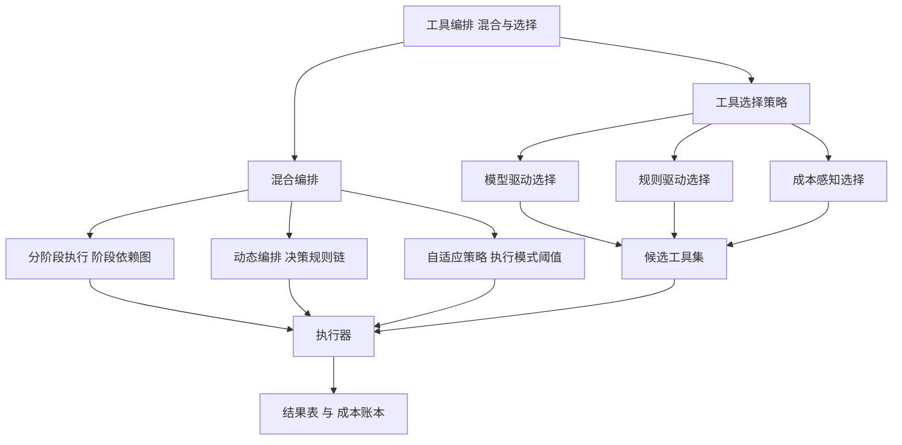
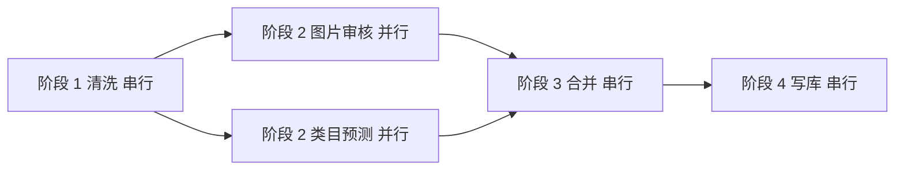
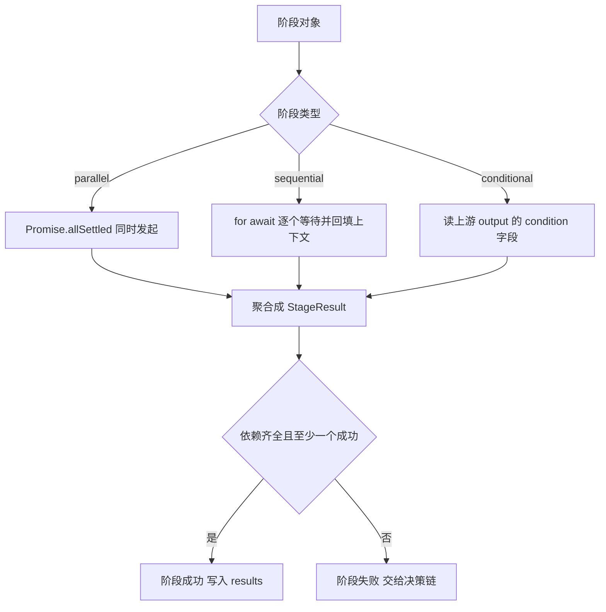
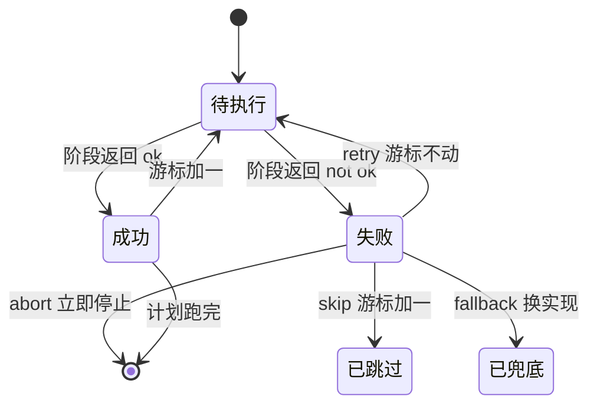
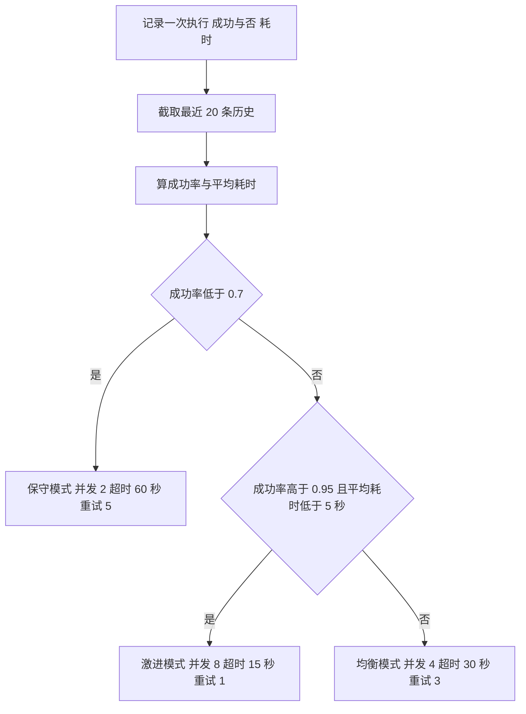
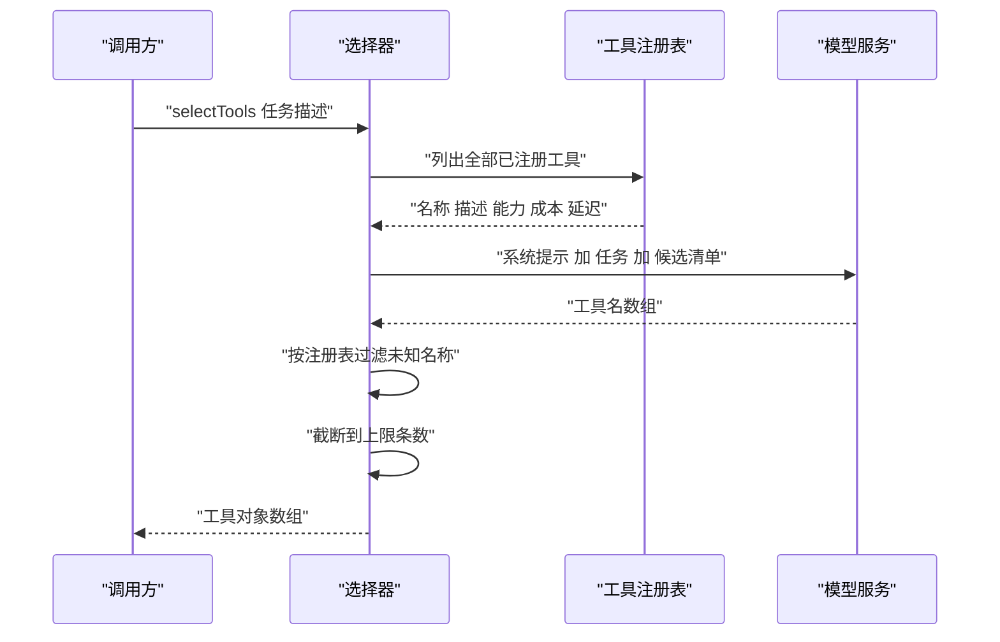
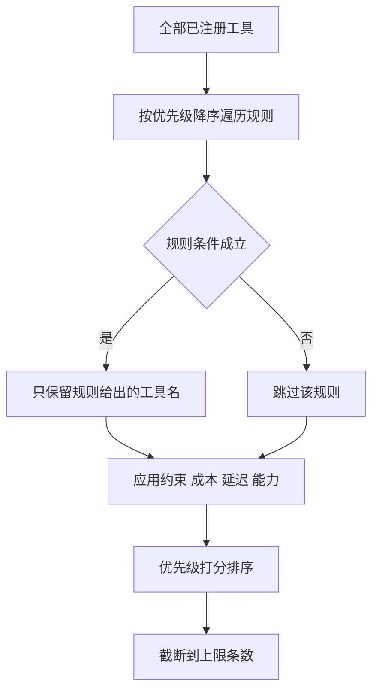
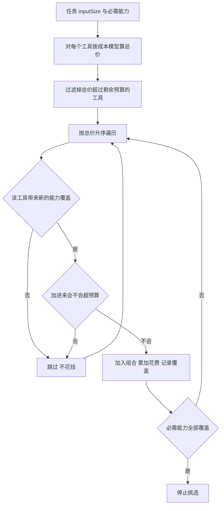
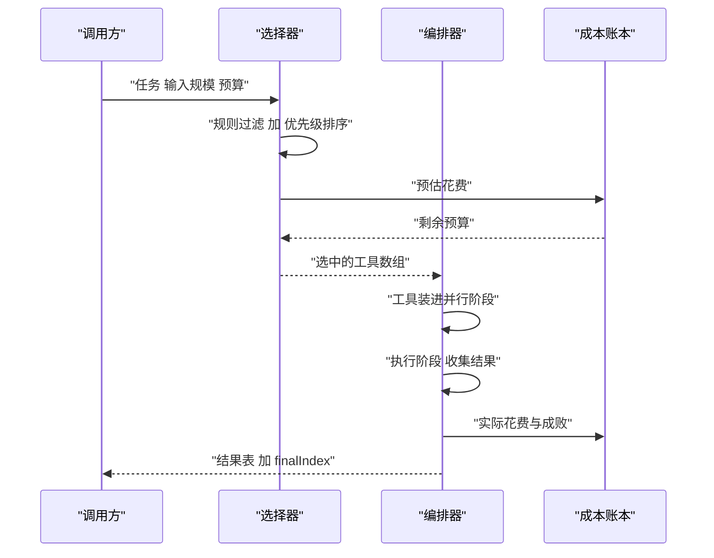

# 工具编排：混合与选择策略

!!! abstract "学完这一页你能"

    - 说出混合编排里"阶段内并行、阶段间串行"的分工，并画出一张阶段依赖图。
    - 写出一段含 retry、skip、fallback、abort 四种分支的动态编排循环，并解释游标为什么不能交给 for 循环。
    - 用成功率与平均耗时两个指标，把执行模式在保守、均衡、激进之间切换。
    - 按能力匹配、成本上限、延迟上限三条约束筛出工具候选集，并说出贪心选择在什么条件下会漏掉低价组合。

## 0. 知识地图



建议按 1 到 8 的顺序读。第 1 到 4 节讲编排骨架，第 5 到 7 节讲工具选择，第 8 节把两边接成一条流水线。每节的动手验证都是 Node 20+ 的单文件脚本，无第三方依赖，可以边读边跑。

## 1. 混合编排：并行与串行不是二选一

**先想一个问题**：后台管理要批量导入 500 条商品。每条商品都要过图片审核、类目预测、写库三道工序。三道工序互相不依赖，但都必须排在数据清洗之后。全部串行要等 1500 个网络往返。

!!! note "术语：工具编排"
    工具编排指把多个工具调用按依赖关系组织成可执行流程，并决定谁先谁后、谁和谁同时跑。例：先清洗数据，再同时跑图片审核与类目预测，最后合并结果写库。

!!! tip "心智模型"
    一句话模型：编排就是把"谁等谁"写成一张图，图上没有边的两个节点就可以同时跑。
    日常类比：做饭先烧水，等水开的同时切菜，菜切好水也开了。
    类比不成立的地方：厨房只有一口锅，并发有硬上限。软件里并发度可以调到 50，但下游数据库连接池只有 10 个连接时，排队就从代码层挪到了连接池，超时位置变了，总时间不会缩短。

**图解**：



1. 阶段 1 没有任何前置依赖，作为起点单独跑。
2. 阶段 2 拆成两个分支，图片审核与类目预测都只依赖阶段 1 的输出。
3. 两个分支同时开始，谁先结束不影响另一个分支。
4. 阶段 3 有两条入边，必须等两个分支都结束才能开始。
5. 阶段 4 依赖阶段 3 的合并结果，最后执行。

**一步一步来**：

第 1 步：把阶段写成数据。

```js
// 阶段类型只有三种，混合编排就是这三种的组合
const StageType = Object.freeze({
  PARALLEL: "parallel",       // 阶段内多个工具同时跑
  SEQUENTIAL: "sequential",   // 阶段内工具按顺序跑
  CONDITIONAL: "conditional", // 阶段内按上游结果挑分支跑
});

// 一个阶段是一条数据，不是一段逻辑
function makeStage({ name, type, tools, needs = [] }) {
  return { name, type, tools, needs };
}

// 依赖图：只被别人依赖、自己谁都不依赖的阶段就是起点
function findStartStage(stages) {
  const depended = new Set(stages.flatMap((s) => s.needs));
  const roots = stages.filter((s) => !depended.has(s.name));
  if (roots.length !== 1) throw new Error(`起点数量应为 1，实际为 ${roots.length}`);
  return roots[0].name;
}
```

**这段代码在做什么**：

- `Object.freeze` 锁住三个类型取值，拼错类型名会在比较时立刻暴露。
- `makeStage` 返回普通对象，好处是能被打印、能被序列化、能被存进数据库。
- `needs` 存的是阶段名数组，方向是"我需要谁"，不是"谁需要我"。
- `findStartStage` 用集合差算起点：出现在任一 `needs` 里的名字都被排除，剩下的就是不依赖别人的阶段。
- 起点数量不等于 1 就抛错，避免依赖图缺边或成环时静默跑出一个奇怪的顺序。

运行结果：

```text
起点 = clean
```

**动手验证**：

依赖：无（Node 20+ 内置 `node:assert`）。

```js
// 文件名 plan.mjs   运行：node plan.mjs
import assert from "node:assert/strict";

const plan = [
  { name: "clean",      needs: [] },
  { name: "audit",      needs: ["clean"] },
  { name: "categorize", needs: ["clean"] },
  { name: "merge",      needs: ["audit", "categorize"] },
];

// 分层拓扑排序：每一轮把所有依赖已满足的阶段一起取出
function topoOrder(stages) {
  const done = new Set();
  const order = [];
  while (order.length < stages.length) {
    const ready = stages.filter(
      (s) => !done.has(s.name) && s.needs.every((n) => done.has(n))
    );
    if (ready.length === 0) throw new Error("依赖成环，无法排序");
    for (const s of ready) {
      done.add(s.name);
      order.push(s.name);
    }
  }
  return order;
}

const order = topoOrder(plan);
console.log("执行顺序:", order.join(" -> "));

assert.deepEqual(order.slice(0, 1), ["clean"]);
assert.deepEqual(order.slice(1, 3).sort(), ["audit", "categorize"]);
assert.deepEqual(order.slice(-1), ["merge"]);
console.log("断言全部通过");
```

预期输出：

```text
执行顺序: clean -> audit -> categorize -> merge
断言全部通过
```

**常见坑**：

| 现象 | 原因 | 怎么修 |
| --- | --- | --- |
| 起点数量为 0 | 依赖图成环，每个阶段都在等别人 | 在 `findStartStage` 抛错，先修图再运行 |
| 并行分支仍按顺序执行 | 用了 for 加 await，逐个等待 | 换成 `Promise.allSettled` 一次性发起 |
| 合并阶段拿到残缺数据 | 只等了一条入边就开跑 | 合并阶段把两条入边都写进 `needs` |

**用在哪里**：

场景一：后台管理的批量商品导入。

- 业务背景：运营上传 500 行表格，每行要过审核、类目预测、写库。
- 这一节的知识怎么用：拆成四个阶段，清洗与写库串行，审核与预测并行。
- 用什么指标衡量收益：整批导入的墙钟时间，以及数据库连接池的峰值连接数。
- 什么时候不该用：单条记录只有一道工序时，拆阶段只增加代码量。

场景二：CI 流水线。

- 业务背景：一次提交要跑 lint、单测、构建、部署到预发环境。
- 这一节的知识怎么用：lint 与单测并行，构建依赖两者通过，部署依赖构建产物。
- 用什么指标衡量收益：从提交到预发可用的时长，以及失败时的定位耗时。
- 什么时候不该用：两个任务会写同一份缓存目录时，并行会让产物互相覆盖。

**行业实践**：

- Anthropic 工程文章《Building Effective Agents》把常见编排归纳成若干固定工作流模式，并建议先用手写工作流，只有在任务确实需要时才引入自主循环。怎么借鉴到你的项目：先把阶段图写死在代码里，跑通后再考虑动态规划。以原文为准，需核对官方文档：核对文中模式名称与各自适用条件。
- AWS Step Functions 开发者指南的 Choice、Parallel、Map 三种状态，把条件分支与并行分支建模成状态机的一等公民。怎么借鉴到你的项目：给每个决策点起一个能读的名字，例如 auditFailed，不要在业务代码里写匿名 if。需核对官方文档：核对状态字段名与并行分支的结果合并方式。

**小结**：

1. 混合编排的分工是：阶段内并行、阶段间串行、分支处按条件选路。
2. 把阶段写成数据，依赖图就能被打印、被校验、被测试。
3. 并发度要跟着下游资源上限走，开得比连接池大只是把排队换了位置。

## 2. 分阶段执行：把阶段类型分发到执行器

**先想一个问题**：你已经有了阶段图，但图只是数据。真正跑起来时，谁读 `type` 字段、谁把并行分支的结果合并成一份输出、谁决定这次阶段算成功还是失败？

!!! note "术语：依赖图 DAG"
    DAG 是有向无环图，箭头表示必须先于。例：清洗指向审核，表示审核开始前清洗必须完成；图里不能出现回到清洗的箭头。

!!! tip "心智模型"
    一句话模型：执行器就是一个分发器，把阶段数据翻译成并发原语。
    日常类比：机场叫号屏按票号类型把旅客分到不同窗口。
    类比不成立的地方：叫号只负责分流，不负责收结果；执行器还必须等所有分支回来、合并输出、判断成功与失败。

**图解**：



1. 入口先拿到阶段对象，读取 `type` 字段。
2. parallel 分支把所有工具一次性发起，用 `allSettled` 拿到每一条的成败。
3. sequential 分支用 `for await` 逐个等待，每步结果写回上下文供下一步读取。
4. conditional 分支读取上游输出的 `condition` 字段，挑一小组工具执行。
5. 三条路径都产出同一种结果对象，后面对成功与否的判断只写一次。

**一步一步来**：

第 1 步：依赖检查与结果契约。

```js
// 阶段结果是一个固定形状，成功失败都返回它，调用方不用分两套逻辑
function makeStageResult(stage, { ok, output = null, error = null, results = [] }) {
  return { stage, ok, output, error, results };
}

async function executeStage(stage, ctx) {
  // 依赖没跑完就判失败，而不是抛异常，失败原因写进 error
  for (const need of stage.needs) {
    if (!ctx.results[need]) {
      return makeStageResult(stage.name, {
        ok: false,
        error: `依赖 ${need} 未完成`,
      });
    }
  }
  if (stage.type === "parallel")   return runParallel(stage, ctx);
  if (stage.type === "sequential") return runSequential(stage, ctx);
  return makeStageResult(stage.name, { ok: false, error: "未知阶段类型" });
}
```

**这段代码在做什么**：

- 结果对象形状固定，`ok` 是唯一判据，调用方不需要 try/catch 就能知道成败。
- 依赖检查放在最前面，避免下游阶段拿到 undefined 再抛类型错误。
- 未知类型返回失败而不是抛错，让上层统一走失败分支。
- `ctx` 保存已完成阶段的结果，是阶段之间唯一的通信通道。

运行结果：

```text
依赖 clean 未完成: ok=false
```

第 2 步：两种执行方式。

```js
async function runParallel(stage, ctx) {
  // 一次性发起，allSettled 保证一条分支失败不影响其他分支返回
  const settled = await Promise.allSettled(
    stage.tools.map((tool) => tool(ctx))
  );
  const results = settled.map((s, i) => ({
    tool: i,
    ok: s.status === "fulfilled",
    output: s.status === "fulfilled" ? s.value : null,
    error: s.status === "rejected" ? String(s.reason) : null,
  }));
  return makeStageResult(stage.name, {
    ok: results.some((r) => r.ok),        // 至少一条成功即算阶段成功
    results,
    output: results.filter((r) => r.ok).map((r) => r.output),
  });
}

async function runSequential(stage, ctx) {
  const local = {};                        // 阶段内局部上下文
  for (const tool of stage.tools) {
    Object.assign(local, await tool({ ...ctx, ...local }));
  }
  return makeStageResult(stage.name, { ok: true, output: local });
}
```

**这段代码在做什么**：

- `allSettled` 与 `all` 的区别是：前者永远不 reject，每条分支的成败都能读到。
- parallel 阶段用 `some` 判成功，代表允许部分分支失败，聚合逻辑要能容忍缺口。
- sequential 阶段把每步返回值合并进 `local`，下一步能读到前面所有产出。
- 串行阶段任何一步抛错都会冒泡出函数，交给上层的失败分支处理。
- 两个函数返回同一种结果对象，第 3 节的状态机可以直接消费。

运行结果：

```text
parallel ok=true 分支成功数=2
sequential output={"text":"已清洗","tokens":42}
```

**动手验证**：

依赖：无。

```js
// 文件名 stage.mjs   运行：node stage.mjs
import assert from "node:assert/strict";

const makeStageResult = (stage, { ok, output = null, results = [] }) =>
  ({ stage, ok, output, results });

async function runParallel(stage, ctx) {
  const settled = await Promise.allSettled(stage.tools.map((t) => t(ctx)));
  const results = settled.map((s) => ({
    ok: s.status === "fulfilled",
    output: s.status === "fulfilled" ? s.value : null,
  }));
  return makeStageResult(stage.name, { ok: results.some((r) => r.ok), results });
}

async function runSequential(stage, ctx) {
  const local = {};
  for (const tool of stage.tools) Object.assign(local, await tool({ ...ctx, ...local }));
  return makeStageResult(stage.name, { ok: true, output: local });
}

async function executeStage(stage, ctx) {
  for (const need of stage.needs) {
    if (!ctx.results[need]) {
      return makeStageResult(stage.name, { ok: false, error: `依赖 ${need} 未完成` });
    }
  }
  if (stage.type === "parallel") return runParallel(stage, ctx);
  if (stage.type === "sequential") return runSequential(stage, ctx);
  return makeStageResult(stage.name, { ok: false, error: "未知阶段类型" });
}

const stages = [
  { name: "clean", type: "sequential", needs: [],
    tools: [async () => ({ text: "已清洗" }), async () => ({ tokens: 42 })] },
  { name: "enrich", type: "parallel", needs: ["clean"],
    tools: [async () => "审核通过", async () => { throw new Error("类目服务超时"); }] },
];

const ctx = { results: {} };
for (const stage of stages) {
  const r = await executeStage(stage, ctx);
  ctx.results[stage.name] = r;
  console.log(stage.name, "ok=" + r.ok);
}

assert.equal(ctx.results.clean.ok, true);
assert.equal(ctx.results.clean.output.tokens, 42);
assert.equal(ctx.results.enrich.ok, true, "一条分支失败仍算阶段成功");
assert.equal(ctx.results.enrich.results[1].ok, false);
console.log("断言全部通过");
```

预期输出：

```text
clean ok=true
enrich ok=true
断言全部通过
```

**常见坑**：

| 现象 | 原因 | 怎么修 |
| --- | --- | --- |
| 一条分支失败导致整段抛出 | 用了 `Promise.all` | 换成 `Promise.allSettled` 再按条判断 |
| 串行阶段第二步读不到第一步结果 | 每步都传原始 ctx，没有累积 | 用局部对象累积后再展开传给下一步 |
| 阶段失败但下游照样跑 | 只用 `ok` 记录，没有阻断 | 在依赖检查里读上游 `ok` 字段 |

**用在哪里**：

场景一：后台管理的数据导出。

- 业务背景：一次导出要查订单、查退款、查物流，最后拼成一张表。
- 这一节的知识怎么用：三个查询放进 parallel 阶段，拼接放进 sequential 阶段。
- 用什么指标衡量收益：导出接口的 P95 响应时间、三个查询各自的失败率。
- 什么时候不该用：三个查询共用一个数据库连接时，并行只会让连接争抢。

场景二：内容审核流水线。

- 业务背景：用户上传图文，要过文本审核、图片审核、敏感词三个环节。
- 这一节的知识怎么用：三个审核并行，任一命中就整体判不通过。
- 用什么指标衡量收益：审核总耗时、漏检率。
- 什么时候不该用：审核之间有顺序依赖（先 OCR 再审核文本）时不能并行。

**行业实践**：

- Node.js 官方文档的异步流程控制章节介绍了 `Promise.allSettled` 与 `Promise.all` 的差别，前者在所有 Promise 落定后返回，不因单个拒绝而短路。怎么借鉴到你的项目：聚合型阶段默认用 `allSettled`，只有在"任一失败就必须整体失败"时才用 `all`。需核对官方文档：核对返回值中 status 与 reason 字段。
- Temporal 官方文档的 Workflow 与 Retry Policy 章节要求工作流代码保持确定性，把重试作为配置而不是散落在业务分支里。怎么借鉴到你的项目：阶段内不读时钟、不读随机数，把这类值作为参数传进去。需核对官方文档：核对确定性约束涉及哪些 API。

**小结**：

1. 三种阶段类型产出同一种结果对象，后续判断只写一遍。
2. 并行阶段用 `allSettled`，串行阶段用局部上下文累积。
3. 依赖检查要放在执行之前，让失败发生在便宜的位置。

## 3. 动态编排：游标加规则链

**先想一个问题**：图片审核接口偶发 503。你希望重试 3 次都失败后跳过这条商品，继续处理下一条，而不是整批终止。这个"继续还是停"的判断写在哪里？

!!! note "术语：决策对象 Decision"
    决策对象是一个普通对象，描述下一步做什么，包含动作、作用对象与参数。例：`{ action: "retry", parameters: { attempt: 2 } }`。

!!! tip "心智模型"
    一句话模型：动态编排等于游标加规则链，游标决定站在哪一步，规则链决定下一步去哪。
    日常类比：照着菜谱做菜，尝一口发现咸了就回上一步加水，不按页码硬翻。
    类比不成立的地方：菜谱可以随时改；规则必须是纯函数，否则同一次失败在两次运行里可能得到不同决策，问题无法复现。

**图解**：



1. 每个阶段从"待执行"状态开始，执行后进入成功或失败。
2. 成功时游标加一，回到待执行，处理计划里的下一项。
3. 失败时先问规则链，规则链给出 retry 时游标保持不动，重新执行同一阶段。
4. skip 与 fallback 都会让游标加一，区别是 skip 保留失败记录，fallback 换一条实现路径。
5. abort 直接结束循环，游标停在失败阶段，方便外部定位卡点。

**一步一步来**：

第 1 步：决策对象与规则链。

```js
// 决策对象：一次调度判断的完整快照
function decision(action, extra = {}) {
  return { action, target: null, parameters: {}, ...extra };
}

class Planner {
  constructor() {
    this.rules = [];                 // 注册顺序即优先级
    this.fallbacks = new Map();      // 阶段名到兜底实现的映射
  }
  addRule(fn) { this.rules.push(fn); }
  addFallback(stageName, fn) { this.fallbacks.set(stageName, fn); }

  decide(ctx) {
    for (const rule of this.rules) {
      const d = rule(ctx);
      if (d) return d;               // 短路：首个非空决策胜出
    }
    return decision("continue");     // 无规则命中时的默认动作
  }
}
```

**这段代码在做什么**：

- 决策对象每次新建，`parameters` 不会在多次调用之间共享，绕开了可变默认值的陷阱。
- 规则按注册顺序线性求值，想让某条规则不表态，必须显式返回 `null`。
- 规则数量为 k 时每次判定扫描 k 次，规则多时要考虑分组。
- 兜底实现按阶段名存进 Map，查找是常数时间。
- 同一阶段名重复注册会覆盖前一个，没有警告，属于易错点。

运行结果：

```text
decide 结果: {"action":"retry","target":null,"parameters":{"attempt":1}}
```

第 2 步：游标循环。

```js
async function runDynamic(plan, ctx, planner, executeStage) {
  const results = {};
  let i = 0;                                     // 游标等于已提交的阶段数
  while (i < plan.length) {
    const stage = plan[i];
    let r;
    try {
      r = await executeStage(stage, ctx);
    } catch (e) {
      r = { stage: stage.name, ok: false, error: String(e) };  // 崩了也变成失败结果
    }
    if (r.ok) {
      results[stage.name] = r;
      ctx[`${stage.name}_result`] = r.output;    // 回填上下文，供下游规则读取
      i += 1;                                    // 只在成功时前进
      continue;
    }
    const d = planner.decide({ ...ctx, stage: stage.name, error: r.error });
    if (d.action === "retry") continue;          // 游标不动，重跑同一阶段
    if (d.action === "skip") { results[stage.name] = r; i += 1; continue; }
    if (d.action === "fallback") {
      ctx = await planner.fallbacks.get(stage.name)(ctx);
      i += 1;
      continue;
    }
    break;                                       // abort
  }
  return { results, ctx, finalIndex: i };
}
```

**这段代码在做什么**：

- 用手动游标而不是 for 循环，因为 retry 要求"原地不动"，for 的自增无法表达。
- 异常被转成失败结果，后面只有一条失败路径，判断逻辑集中在一处。
- 成功时把输出写回 `ctx` 的 `<阶段名>_result` 键，形成可传递的上下文链。
- retry 分支若规则恒返回 retry 且外部状态不变，这里会死循环，必须配重试计数。
- `finalIndex` 表示已提交的阶段数，中断时指向未完成的阶段，可用于断点续跑。

运行结果：

```text
finalIndex=4  results 键=[clean, audit, merge, publish]  跳过标记=[audit]
```

**动手验证**：

依赖：无。

```js
// 文件名 dynamic.mjs   运行：node dynamic.mjs
import assert from "node:assert/strict";

const decision = (action) => ({ action, target: null, parameters: {} });

function makePlanner(retryLimit) {
  const attempts = new Map();
  return {
    decide(ctx) {
      const n = (attempts.get(ctx.stage) ?? 0) + 1;
      attempts.set(ctx.stage, n);
      // retryLimit 是最大重试次数，n 是含首次的尝试次数，所以 n <= retryLimit 时继续重试
      if (ctx.stage === "audit" && n <= retryLimit) return decision("retry");
      if (ctx.stage === "audit") return decision("skip");
      return decision("continue");
    },
  };
}

async function runDynamic(plan, ctx, planner, executeStage) {
  const results = {};
  let i = 0;
  let callCount = 0;
  while (i < plan.length) {
    const stage = plan[i];
    let r;
    try {
      r = await executeStage(stage, ctx, () => { callCount += 1; });
    } catch (e) {
      r = { stage: stage.name, ok: false, error: String(e) };
    }
    if (r.ok) {
      results[stage.name] = r;
      ctx[`${stage.name}_result`] = r.output;
      i += 1;
      continue;
    }
    const d = planner.decide({ ...ctx, stage: stage.name, error: r.error });
    if (d.action === "retry") continue;
    if (d.action === "skip") {
      results[stage.name] = r;
      ctx[`${stage.name}_skipped`] = true;
      i += 1;
      continue;
    }
    break;
  }
  return { results, ctx, finalIndex: i, callCount };
}

const plan = [{ name: "clean" }, { name: "audit" }, { name: "merge" }];

const out = await runDynamic(plan, {}, makePlanner(3), async (stage, ctx, bump) => {
  // 只在 audit 阶段计数，这样 callCount 表示 audit 的实际调用次数
  if (stage.name === "audit") {
    bump();
    return { stage: stage.name, ok: false, error: "503" };
  }
  return { stage: stage.name, ok: true, output: { done: true } };
});

console.log("finalIndex =", out.finalIndex);
console.log("audit 调用次数 =", out.callCount);
console.log("audit 被跳过 =", out.ctx.audit_skipped === true);

assert.equal(out.finalIndex, 3);
assert.equal(out.callCount, 4);                 // audit 调用 4 次：初次 + 三次重试
assert.equal(out.ctx.audit_skipped, true);
assert.equal(out.results.merge.ok, true);
console.log("断言全部通过");
```

预期输出：

```text
finalIndex = 3
audit 调用次数 = 4
audit 被跳过 = true
断言全部通过
```

**常见坑**：

| 现象 | 原因 | 怎么修 |
| --- | --- | --- |
| 进程卡死不退出 | 规则恒返回 retry，游标不动 | 给重试次数设上限，或用指数退避 |
| 阶段直接抛错时 retry 失效 | 异常分支只认 continue，其他动作都走 break | 把异常统一转成失败结果后再决策 |
| 兜底后上下文变成 undefined | 兜底函数没有返回值 | 约定兜底函数返回新的上下文对象 |

**用在哪里**：

场景一：客服工单的自动分类。

- 业务背景：工单先分类再派单，分类服务偶发超时。
- 这一节的知识怎么用：分类失败时重试两次，仍失败就标记待人工并继续派单。
- 用什么指标衡量收益：自动分类覆盖率、人工介入工单数。
- 什么时候不该用：分类结果是派单的必要输入时，跳过会产生错误派单。

场景二：批量消息推送。

- 业务背景：一次推送 10 万条，部分通道会限流。
- 这一节的知识怎么用：某条失败触发 fallback，切到备用通道发送。
- 用什么指标衡量收益：送达率、备用通道使用占比。
- 什么时候不该用：备用通道成本明显高于主通道且对时效不敏感时，等待重试比切换划算。

**行业实践**：

- AWS Step Functions 开发者指南的 Retry 与 Catch 章节，把重试次数、退避倍率写成状态机配置，而不是散在业务函数里。怎么借鉴到你的项目：把重试策略抽成一个可配置对象，阶段只关心结果。需核对官方文档：核对退避字段名与最大尝试次数限制。
- Model Context Protocol 规范的工具章节把"列出可用工具"与"调用工具"分成两个方法，前者只做发现。怎么借鉴到你的项目：决策所需的工具元数据与真正的调用分离，规则函数只读元数据。需核对官方文档：核对方法名与返回结构。

**小结**：

1. 动态编排的核心是游标加规则链，游标表达"原地重试"，规则链表达策略。
2. 决策对象把一次判断固化下来，便于日志与复现。
3. 异常与失败结果要归一，否则会出现两套控制流。

## 4. 自适应策略：用指标切换执行模式

**先想一个问题**：上游接口昨天成功率 0.98，今天掉到 0.6。同一套"并发 8、重试 1"的配置，在两个时段合适程度不同。你不想半夜起来改配置。

!!! note "术语：自适应阈值"
    自适应阈值把指标与动作绑定成规则：指标越过某个数值就切换配置。例：成功率低于 0.7 时把并发从 4 降到 2。

!!! tip "心智模型"
    一句话模型：自适应等于一个只看最近 N 条记录的滑动窗口，加一张模式到配置的映射表。
    日常类比：汽车变速箱根据车速换挡。
    类比不成立的地方：换挡是连续动作；这里模式只有三档，阈值附近会来回切换，需要留出滞后区间。

**图解**：



1. 每次执行结束后记录成功与否与耗时，作为窗口的输入。
2. 窗口只取最近 20 条，历史总量超过 100 条时丢掉最早的记录。
3. 用窗口内的记录算成功率与平均耗时两个指标。
4. 成功率低于 0.7 直接进保守模式，这是唯一的一票否决分支。
5. 成功率高于 0.95 且平均耗时低于 5 秒进激进模式，其余情况留在均衡模式。

**一步一步来**：

第 1 步：记录执行并裁剪历史。

```js
const HISTORY_LIMIT = 100;   // 历史最多保留 100 条
const WINDOW = 20;           // 指标只看最近 20 条

function recordExecution(history, execution) {
  history.push({ ...execution, timestamp: Date.now() });
  if (history.length > HISTORY_LIMIT) history.shift();  // 从头丢，保持长度上限
  return history;
}
```

**这段代码在做什么**：

- 历史长度设上限，避免长时间运行后内存持续增长。
- `shift` 从头删，配合 `push` 从尾加，形成先进先出队列。
- 时间戳在记录时打上，后续要改成"只看最近 10 分钟"时不用改调用方。
- 返回同一个数组，调用方可以把记录函数直接串在流程末尾。

运行结果：

```text
历史长度 = 100  （超出 100 条后不再增长）
```

第 2 步：算指标、选模式、产出配置。

```js
const MODES = {
  conservative: { maxParallel: 2, timeoutMs: 60000, retryCount: 5, cache: true,  validate: true },
  balanced:     { maxParallel: 4, timeoutMs: 30000, retryCount: 3, cache: true,  validate: false },
  aggressive:   { maxParallel: 8, timeoutMs: 15000, retryCount: 1, cache: false, validate: false },
};
const THRESHOLDS = { successLow: 0.7, successHigh: 0.95, timeHigh: 5.0 };

function pickMode(history) {
  const recent = history.slice(-WINDOW);
  if (recent.length === 0) return "balanced";
  const rate = recent.filter((e) => e.success).length / recent.length;
  const avgTime = recent.reduce((s, e) => s + e.executionTime, 0) / recent.length;
  if (rate < THRESHOLDS.successLow) return "conservative";
  if (rate > THRESHOLDS.successHigh && avgTime < THRESHOLDS.timeHigh) return "aggressive";
  return "balanced";
}

function currentStrategy(history) {
  const mode = pickMode(history);
  return { mode, ...MODES[mode] };
}
```

**这段代码在做什么**：

- 三个阈值与三套配置分开存放，调参时只动一处。
- `slice(-WINDOW)` 取末尾 20 条，不修改原数组。
- 空历史返回均衡模式，冷启动不会直接进保守或激进。
- 判断顺序是先看低成功率再看高成功率，避免两边的条件同时命中。
- 返回的对象里带 `mode` 字段，便于把模式名打进日志。

运行结果：

```text
最早 25 条成功率 0.6  -> mode=conservative maxParallel=2
最近 25 条成功率 1.0 耗时 0.5 秒 -> mode=aggressive maxParallel=8
```

**动手验证**：

依赖：无。

```js
// 文件名 adaptive.mjs   运行：node adaptive.mjs
import assert from "node:assert/strict";

const WINDOW = 20;
const HISTORY_LIMIT = 100;
const MODES = {
  conservative: { maxParallel: 2, timeoutMs: 60000, retryCount: 5 },
  balanced:     { maxParallel: 4, timeoutMs: 30000, retryCount: 3 },
  aggressive:   { maxParallel: 8, timeoutMs: 15000, retryCount: 1 },
};
const THRESHOLDS = { successLow: 0.7, successHigh: 0.95, timeHigh: 5.0 };

function recordExecution(history, execution) {
  history.push(execution);
  if (history.length > HISTORY_LIMIT) history.shift();
  return history;
}

function pickMode(history) {
  const recent = history.slice(-WINDOW);
  if (recent.length === 0) return "balanced";
  const rate = recent.filter((e) => e.success).length / recent.length;
  const avgTime = recent.reduce((s, e) => s + e.executionTime, 0) / recent.length;
  if (rate < THRESHOLDS.successLow) return "conservative";
  if (rate > THRESHOLDS.successHigh && avgTime < THRESHOLDS.timeHigh) return "aggressive";
  return "balanced";
}

const history = [];
for (let i = 0; i < 25; i += 1) {
  recordExecution(history, { success: i % 5 !== 0, executionTime: 2 });  // 每 5 条失败 1 条
}
const weak = pickMode(history);
console.log("低成功率场景 mode =", weak, "maxParallel =", MODES[weak].maxParallel);

const fastHistory = [];
for (let i = 0; i < 25; i += 1) {
  recordExecution(fastHistory, { success: true, executionTime: 0.5 });
}
const strong = pickMode(fastHistory);
console.log("高成功率场景 mode =", strong, "maxParallel =", MODES[strong].maxParallel);

assert.equal(weak, "conservative");
assert.equal(MODES[weak].maxParallel, 2);
assert.equal(strong, "aggressive");
assert.equal(MODES[strong].timeoutMs, 15000);
console.log("断言全部通过");
```

预期输出：

```text
低成功率场景 mode = conservative maxParallel = 2
高成功率场景 mode = aggressive maxParallel = 8
断言全部通过
```

**常见坑**：

| 现象 | 原因 | 怎么修 |
| --- | --- | --- |
| 模式在阈值附近反复切换 | 没有滞后区间，指标在阈值上下抖动 | 上调与下调用两个不同阈值 |
| 冷启动就进保守模式 | 空历史被算成成功率 0 | 历史为空时返回均衡模式 |
| 内存持续上涨 | 历史数组没有长度上限 | 超过 100 条时从头部删除 |

**用在哪里**：

场景一：搜索服务的聚合调用。

- 业务背景：一次搜索要并发调用商品、广告、推荐三个下游。
- 这一节的知识怎么用：下游失败率升高时降低并发与超时，保住整体可用性。
- 用什么指标衡量收益：搜索接口的成功率、降级返回的比例。
- 什么时候不该用：下游失败是固定的权限错误时，调并发不会改变结果。

场景二：夜间批量同步。

- 业务背景：凌晨同步外部库存，外部接口白天稳定、夜里维护。
- 这一节的知识怎么用：夜间维护窗口自动降到保守模式，减少无效重试。
- 用什么指标衡量收益：同步窗口结束时间、无效重试次数。
- 什么时候不该用：任务对延迟没有要求且重试免费时，直接串行即可。

**行业实践**：

- AWS Step Functions 开发者指南的 Map 状态支持并发度配置，可以用一个字段控制同时展开的分支数。怎么借鉴到你的项目：把并发度做成运行期可变配置，不要写死在代码常量里。需核对官方文档：核对并发度字段名与上限。
- Google SRE 公开的《Site Reliability Engineering》一书中的"处理过载"章节，讲了用自适应限流与重试预算保护下游。怎么借鉴到你的项目：重试次数与并发度一起调，只调其中一个会让压力转移到别处。以原文为准，需核对具体章节标题。

**小结**：

1. 自适应由三部分组成：滑动窗口、指标计算、模式到配置的映射。
2. 窗口长度决定反应速度，窗口越短越敏感也越容易抖动。
3. 冷启动要有默认模式，不要让空历史算出成功率 0。

## 5. 模型驱动选择：让模型点菜，你来验菜

**先想一个问题**：助手接入了 30 个工具，用户说"帮我看看上周退款为什么涨了"。你不可能为每句话写一条 if，也不愿意维护一张关键词到工具的映射表。

!!! note "术语：工具调用 tool calling"
    工具调用指把函数名、说明与参数结构告诉模型，模型返回要调用的函数名与参数。例：模型返回 `web_search` 与查询词"上周退款"。

!!! tip "心智模型"
    一句话模型：模型驱动选择就是把工具清单当菜单交给模型，让模型点菜，你再核对点的是不是菜单上的菜。
    日常类比：服务员把菜单给客人，客人指菜，服务员核对厨房能不能做。
    类比不成立的地方：客人不会报出菜单外的菜名；模型会，所以解析结果必须按注册表过滤。

**图解**：



1. 调用方把任务描述交给选择器，不直接接触模型。
2. 选择器从注册表读出工具清单，拼成一段纯文本候选列表。
3. 候选列表与任务一起发给模型，模型只返回工具名的数组。
4. 选择器把名字逐个查注册表，查不到的名字直接丢弃。
5. 结果截断到上限条数后返回工具对象，调用方拿到的永远是真实存在的工具。

**一步一步来**：

第 1 步：工具契约与候选清单文本。

```js
function makeTool({ name, description, capabilities, inputSchema, cost = 1.0, latencyEstimate = 1.0 }) {
  return { name, description, capabilities, inputSchema, cost, latencyEstimate };
}

function buildCatalog(registry) {
  return [...registry.values()]
    .map((t) => `- ${t.name}: ${t.description}; 能力 ${t.capabilities.join("/")}; 成本 ${t.cost}; 延迟 ${t.latencyEstimate}s`)
    .join("\n");
}
```

**这段代码在做什么**：

- 工具契约里同时放语义信息（描述、能力）与成本信息（成本、延迟），选择理由可以两样都用。
- `inputSchema` 描述参数结构，模型据此生成参数，具体约束需核对官方文档。
- `buildCatalog` 输出纯文本，便于人肉检查发出去的提示词。
- 成本与延迟默认值为 1.0，来自旧页示例的默认值，未注册时不至于变成 undefined。

运行结果：

```text
- web_search: 联网检索; 能力 search/web; 成本 1; 延迟 1s
- analyzer: 统计与趋势分析; 能力 analyze/statistics; 成本 2; 延迟 3s
```

第 2 步：解析模型返回并回填工具对象。

```js
function parseSelection(rawText, registry, maxTools = 5) {
  let names;
  try {
    names = JSON.parse(rawText);              // 期望是字符串数组
  } catch (e) {
    return { tools: [], reason: `返回不是合法 JSON: ${e.message}` };
  }
  if (!Array.isArray(names)) return { tools: [], reason: "返回不是数组" };
  const dropped = names.filter((n) => !registry.has(n));   // 记录被丢掉的名字
  const tools = names
    .filter((n) => registry.has(n))
    .slice(0, maxTools)
    .map((n) => registry.get(n));
  return { tools, dropped, reason: null };
}

// 无模型可用时的降级路径：关键词映射
const KEYWORD_MAP = {
  search: ["web_search", "database_query"],
  分析: ["analyzer", "statistical_tool"],
  生成: ["generator", "formatter"],
  计算: ["calculator", "processor"],
};

function keywordFallback(task, registry) {
  const hit = [];
  for (const [keyword, names] of Object.entries(KEYWORD_MAP)) {
    if (task.toLowerCase().includes(keyword)) hit.push(...names);
  }
  return [...new Set(hit)].filter((n) => registry.has(n)).slice(0, 5);
}
```

**这段代码在做什么**：

- JSON 解析失败时返回空结果与原因，不抛异常打断上层流程。
- 未知工具名被单独记进 `dropped`，便于发现提示词与注册表不一致。
- 截断放在过滤之后，保证返回条数既合法又不超上限。
- 降级路径用关键词映射，覆盖不到的任务返回空数组，让调用方决定怎么办。
- 关键词映射的键包含中文，注意 `toLowerCase` 对中文没有影响。

运行结果：

```text
tools=2  dropped=["ghost_tool"]
```

**动手验证**：

依赖：无。用桩函数代替模型，验证解析与过滤。

```js
// 文件名 select.mjs   运行：node select.mjs
import assert from "node:assert/strict";

const makeTool = (o) => ({ cost: 1.0, latencyEstimate: 1.0, ...o });

const registry = new Map([
  ["web_search", makeTool({ name: "web_search", description: "联网检索", capabilities: ["search"], inputSchema: {} })],
  ["analyzer",   makeTool({ name: "analyzer", description: "趋势分析", capabilities: ["analyze"], inputSchema: {}, cost: 2 })],
  ["formatter",  makeTool({ name: "formatter", description: "排版输出", capabilities: ["format"], inputSchema: {} })],
]);

function buildCatalog(reg) {
  return [...reg.values()]
    .map((t) => `- ${t.name}: ${t.description}; 能力 ${t.capabilities.join("/")}`)
    .join("\n");
}

function parseSelection(rawText, reg, maxTools = 5) {
  let names;
  try {
    names = JSON.parse(rawText);
  } catch (e) {
    return { tools: [], dropped: [], reason: `返回不是合法 JSON: ${e.message}` };
  }
  if (!Array.isArray(names)) return { tools: [], dropped: [], reason: "返回不是数组" };
  const dropped = names.filter((n) => !reg.has(n));
  const tools = names.filter((n) => reg.has(n)).slice(0, maxTools).map((n) => reg.get(n));
  return { tools, dropped, reason: null };
}

console.log("候选清单:");
console.log(buildCatalog(registry));

const stubModel = () => JSON.stringify(["analyzer", "ghost_tool", "formatter", "web_search"]);
const picked = parseSelection(stubModel(), registry, 3);

console.log("选中:", picked.tools.map((t) => t.name).join(", "));
console.log("丢弃:", picked.dropped.join(", "));

assert.equal(picked.tools.length, 3);
assert.deepEqual(picked.tools.map((t) => t.name), ["analyzer", "formatter", "web_search"]);
assert.deepEqual(picked.dropped, ["ghost_tool"]);
assert.equal(parseSelection("not json", registry).tools.length, 0);
console.log("断言全部通过");
```

预期输出：

```text
候选清单:
- web_search: 联网检索; 能力 search
- analyzer: 趋势分析; 能力 analyze
- formatter: 排版输出; 能力 format
选中: analyzer, formatter, web_search
丢弃: ghost_tool
断言全部通过
```

**常见坑**：

| 现象 | 原因 | 怎么修 |
| --- | --- | --- |
| 返回结果里出现不存在的工具名 | 提示词里的清单与注册表不一致 | 解析后按注册表过滤，并把丢弃名单打日志 |
| 模型返回带解释的文本而不是纯 JSON | 没有约束输出格式 | 用结构化输出参数，或从文本里截取 JSON 片段后校验 |
| 候选工具过多导致选择质量下降 | 清单太长，关键信息被淹没 | 先按能力做一轮规则过滤，再交给模型 |

**用在哪里**：

场景一：企业知识库助手。

- 业务背景：助手接入文档检索、工单查询、报表生成三类工具。
- 这一节的知识怎么用：按用户问题描述选工具，选完再进编排。
- 用什么指标衡量收益：工具选择准确率、每轮对话的工具调用次数。
- 什么时候不该用：任务只有唯一工具且参数固定时，直接调用更快也更稳。

场景二：低代码平台的流程节点推荐。

- 业务背景：用户在画布上描述处理逻辑，平台推荐可用的连接器。
- 这一节的知识怎么用：把连接器当成工具，按描述推荐候选集。
- 用什么指标衡量收益：推荐命中率、用户手动改选的比例。
- 什么时候不该用：连接器只有三种且区分度很高时，规则匹配足够。

**行业实践**：

- OpenAI 文档的 Function calling 章节说明了用 JSON Schema 描述函数参数、由模型返回结构化参数的做法。怎么借鉴到你的项目：每个工具都写清楚参数类型与必填项，模型返回的参数在本地再校验一次。需核对官方文档：核对当前推荐的调用方式与结构化输出参数名称。
- Anthropic 工程文章《Building Effective Agents》建议工具描述写得像给新同事的说明，包含何时该用与何时不该用。怎么借鉴到你的项目：在工具的 description 里同时写适用条件与不适用条件。以原文为准，需核对官方文档：核对文中对工具描述的表述。
- Model Context Protocol 规范的 Tools 章节把工具发现与调用分成两步，客户端可以先列举再调用。怎么借鉴到你的项目：把注册表暴露成可列举的接口，便于调试时查看当前可用工具。需核对官方文档：核对方法名与返回结构。

**小结**：

1. 模型只负责挑名字，本地负责把名字变成真实工具。
2. 返回结果必须过滤、截断、记录丢弃项，三件事缺一不可。
3. 无模型可用时保留一条关键词降级路径，保证流程不中断。

## 6. 规则驱动与优先级打分：先硬过滤再软排序

**先想一个问题**：公司规定每条请求的成本不能超过 100，延迟不能超过 30 秒。这条规定不该写进提示词里，因为模型可能不遵守。

!!! note "术语：规则引擎"
    规则引擎把"条件满足就执行动作"写成可注册的规则集合，由引擎按优先级求值。例：任务要求能力包含翻译时，只保留带该能力的工具。

!!! tip "心智模型"
    一句话模型：规则驱动等于先硬过滤再软排序，硬的删候选，软的排顺序。
    日常类比：招聘先卡学历，再按面试分排序。
    类比不成立的地方：招聘的硬条件是人定的；这里的硬过滤会直接删掉候选，删错没有补救机会，所以过滤条件要能打印出来复核。

**图解**：



1. 从注册表拿到全部工具，作为初始候选集。
2. 规则按优先级从高到低排序，逐条判断条件是否成立。
3. 条件成立的规则会把候选集缩小到它给出的名字集合，条件不成立就跳过。
4. 所有规则跑完后应用三条硬约束：成本上限、延迟上限、能力要求。
5. 剩下的候选按打分公式排序，取前 N 个返回。

**一步一步来**：

第 1 步：约束过滤。

```js
const DEFAULT_CONFIG = {
  maxTools: 5, maxCost: 100.0, maxLatency: 30.0, requireAllCapabilities: false,
};

function applyConstraints(tools, task, cfg = DEFAULT_CONFIG) {
  const required = task.requiredCapabilities ?? [];
  return tools.filter((t) => {
    if (t.cost > (task.maxCost ?? cfg.maxCost)) return false;
    if (t.latencyEstimate > (task.maxLatency ?? cfg.maxLatency)) return false;
    if (required.length === 0) return true;
    return cfg.requireAllCapabilities
      ? required.every((c) => t.capabilities.includes(c))   // 必须全部具备
      : required.some((c) => t.capabilities.includes(c));   // 具备其一即可
  });
}
```

**这段代码在做什么**：

- 默认配置集中一处，任务级别可以覆盖单条约束。
- 用 `??` 而不是 `||`，避免把合法的 0 当成缺省值。
- `requireAllCapabilities` 控制能力的"与"还是"或"语义，两个语义在真实任务里都会出现。
- 过滤顺序是先成本再延迟再能力，最便宜的判断放最前面。

运行结果：

```text
进入 5 个工具，过滤后剩 2 个
```

第 2 步：优先级打分排序。

```js
function priorityScore(tool, task) {
  const required = task.requiredCapabilities ?? [];
  const matched = required.filter((c) => tool.capabilities.includes(c)).length;
  const capabilityScore = required.length ? (matched / required.length) * 100 : 50;
  const costScore = Math.max(0, 50 - tool.cost * 10);            // 成本越高扣分越多
  const latencyScore = Math.max(0, 30 - tool.latencyEstimate * 5);
  return capabilityScore + costScore + latencyScore;
}

function selectByPriority(tools, task, cfg = DEFAULT_CONFIG) {
  return applyConstraints(tools, task, cfg)
    .map((t) => ({ tool: t, score: priorityScore(t, task) }))
    .sort((a, b) => b.score - a.score)
    .slice(0, cfg.maxTools)
    .map((x) => x.tool);
}
```

**这段代码在做什么**：

- 三个分项权重来自旧页示例：能力最多 100 分，成本最多 50 分，延迟最多 30 分。
- 没有能力要求时给 50 分，属于中性值，避免该分项变成 0 拉低全部工具。
- `Math.max(0, ...)` 把负分截断为 0，防止高成本工具拿到负的总分。
- 排序后截断，保证返回条数不超过 `maxTools`。
- 打分公式是启发式，不是最优解，权重需要按业务调。

运行结果：

```text
analyzer 分数 130  formatter 分数 118  web_search 分数 108
```

**动手验证**：

依赖：无。

```js
// 文件名 rules.mjs   运行：node rules.mjs
import assert from "node:assert/strict";

const DEFAULT_CONFIG = { maxTools: 5, maxCost: 100.0, maxLatency: 30.0, requireAllCapabilities: false };

function applyConstraints(tools, task, cfg = DEFAULT_CONFIG) {
  const required = task.requiredCapabilities ?? [];
  return tools.filter((t) => {
    if (t.cost > (task.maxCost ?? cfg.maxCost)) return false;
    if (t.latencyEstimate > (task.maxLatency ?? cfg.maxLatency)) return false;
    if (required.length === 0) return true;
    return cfg.requireAllCapabilities
      ? required.every((c) => t.capabilities.includes(c))
      : required.some((c) => t.capabilities.includes(c));
  });
}

function priorityScore(tool, task) {
  const required = task.requiredCapabilities ?? [];
  const matched = required.filter((c) => tool.capabilities.includes(c)).length;
  const capabilityScore = required.length ? (matched / required.length) * 100 : 50;
  return capabilityScore + Math.max(0, 50 - tool.cost * 10) + Math.max(0, 30 - tool.latencyEstimate * 5);
}

function selectByPriority(tools, task, cfg = DEFAULT_CONFIG) {
  return applyConstraints(tools, task, cfg)
    .map((t) => ({ tool: t, score: priorityScore(t, task) }))
    .sort((a, b) => b.score - a.score)
    .slice(0, cfg.maxTools)
    .map((x) => x.tool);
}

const tools = [
  { name: "slow_cheap",  capabilities: ["translate"], cost: 1, latencyEstimate: 20 },
  { name: "fast_pricey", capabilities: ["translate"], cost: 9, latencyEstimate: 1 },
  { name: "too_costly",  capabilities: ["translate"], cost: 200, latencyEstimate: 1 },
  { name: "off_topic",   capabilities: ["format"],    cost: 1, latencyEstimate: 1 },
];

const task = { requiredCapabilities: ["translate"], maxCost: 100, maxLatency: 30 };
const picked = selectByPriority(tools, task);

console.log("选中:", picked.map((t) => t.name).join(", "));
console.log("分数:", picked.map((t) => `${t.name}=${priorityScore(t, task)}`).join(" "));

assert.deepEqual(picked.map((t) => t.name).sort(),
                 ["fast_pricey", "slow_cheap"]);
assert.ok(!picked.some((t) => t.name === "too_costly"), "超出成本上限的工具应被过滤");
assert.ok(!picked.some((t) => t.name === "off_topic"), "能力不匹配的工具应被过滤");
console.log("断言全部通过");
```

预期输出：

```text
选中: fast_pricey, slow_cheap
分数: fast_pricey=105 slow_cheap=90
断言全部通过
```

**常见坑**：

| 现象 | 原因 | 怎么修 |
| --- | --- | --- |
| 高成本工具仍被选中 | 约束写在任务里但没传进选择函数 | 把约束收敛到一个配置对象，统一入口 |
| 打分出现负分导致排序错乱 | 没有对分项做下限截断 | 每个分项用 `Math.max(0, ...)` 夹住 |
| 要求"全部能力"时筛出空集 | 单个工具很少同时具备全部能力 | 明确用"或"语义，或用组合覆盖替代单工具覆盖 |

**用在哪里**：

场景一：企业内部助手的工具白名单。

- 业务背景：不同部门可用的工具不同，财务部门不能调外部搜索。
- 这一节的知识怎么用：用一条高优先级规则按部门过滤，再按成本排序。
- 用什么指标衡量收益：越权调用次数、选择结果的人工复核比例。
- 什么时候不该用：工具只有两个且都属于同一部门时，直接写死调用即可。

场景二：多租户 SaaS 的功能裁剪。

- 业务背景：免费版不能调用高成本模型，付费版可以。
- 这一节的知识怎么用：按套餐等级做硬过滤，过滤后按延迟排序。
- 用什么指标衡量收益：单租户调用成本、套餐升级转化率。
- 什么时候不该用：成本差异可以忽略时，硬过滤只会增加分支。

**行业实践**：

- AWS Step Functions 开发者指南的 Choice 状态用条件表达式决定分支走向，条件写在状态定义里而不是业务代码里。怎么借鉴到你的项目：把约束写成声明式配置，便于非开发角色复核。需核对官方文档：核对条件表达式支持的比较运算符。
- LangChain 官方文档的 Fallbacks 章节介绍了给一条调用链挂备用链的做法。怎么借鉴到你的项目：规则过滤后如果候选为空，走一条兜底路径而不是直接报错。需核对官方文档：核对当前推荐的兜底写法与接口名。

**小结**：

1. 硬约束与软排序分开，过滤器只做删减，打分只做排序。
2. 打分公式的三个分项要有下限截断，防止负分打乱顺序。
3. 约束条件要能被打印出来复核，过滤删错时才有据可查。

## 7. 成本感知选择：预算内做覆盖

**先想一个问题**：一次批量处理 1 万条记录，你给这次任务 100 的预算。工具 A 单价 1、延迟 1 秒，工具 B 单价 3、延迟 0.2 秒。你会因为便宜就选 A 吗？

!!! note "术语：集合覆盖"
    集合覆盖指用尽量少的元素覆盖全部需求。例：需求是"能翻译且能摘要"，工具 X 同时具备两种能力，就比调用工具 Y 加工具 Z 少一次调用。

!!! tip "心智模型"
    一句话模型：成本感知选择等于先给每个工具算总价，再从便宜到贵地买，直到需求被覆盖齐。
    日常类比：在超市按购物清单从便宜的货架挑，挑齐清单就结账。
    类比不成立的地方：超市每件商品只满足清单的一项；工具可以同时满足多项，所以挑选顺序不同总价不同，贪心不保证全局最低价。

**图解**：



1. 先拿到任务的输入规模与必需能力列表。
2. 对每个工具按选定的成本模型算出总价，包含货币、时间、资源三项。
3. 总价超过剩余预算的工具直接排除，不参与后续挑选。
4. 剩下的工具按总价升序排列，从最便宜的开始看。
5. 只有能带来新覆盖的工具才会被买下，覆盖齐了就停止，避免多花钱。

**一步一步来**：

第 1 步：三种成本模型。

```js
const CostModel = Object.freeze({ LINEAR: "linear", QUADRATIC: "quadratic", STEP: "step" });

function estimateCost(tool, inputSize, model = CostModel.LINEAR) {
  let monetary;
  if (model === CostModel.LINEAR) {
    monetary = tool.cost + 0.1 * inputSize;                 // 随规模线性增长
  } else if (model === CostModel.QUADRATIC) {
    monetary = tool.cost + 0.01 * inputSize ** 2;           // 规模翻倍成本约四倍
  } else {
    monetary = tool.cost * Math.ceil(inputSize / 1000);     // 每满 1000 计一次
  }
  const timeCost = tool.latencyEstimate * 0.5;              // 时间价值系数
  const resourceCost = 0.2 * inputSize;                     // 资源成本
  return { monetary, timeCost, resourceCost, total: monetary + timeCost + resourceCost };
}
```

**这段代码在做什么**：

- 三种模型对应三种计费形态：按量、超线性、阶梯。系数取自旧页示例，实际取值要按你的账单反推。
- 总价由货币、时间、资源三项相加，只比货币会漏掉慢工具的隐性代价。
- `Math.ceil(inputSize / 1000)` 实现阶梯：1000 条内算一次，1001 条算两次。
- 返回对象保留三个分项，便于解释"为什么这个工具贵"。
- 输入规模为 0 时三项都是工具自身成本，不会出现负数。

运行结果：

```text
linear 输入 1000: total=301.5
step 输入 1000:   total=201.5
```

第 2 步：预算内的贪心覆盖。

```js
function pickWithinBudget(tools, task, budget) {
  const required = new Set(task.requiredCapabilities ?? []);
  const inputSize = task.inputSize ?? 1000;
  const priced = tools
    .map((t) => ({ tool: t, cost: estimateCost(t, inputSize, task.costModel) }))
    .filter((x) => x.cost.total <= budget)
    .sort((a, b) => a.cost.total - b.cost.total);       // 从便宜到贵

  const picked = [];
  const covered = new Set();
  let spent = 0;

  for (const x of priced) {
    const gain = [...required].filter((c) => x.tool.capabilities.includes(c) && !covered.has(c));
    if (gain.length === 0) continue;                    // 没有新覆盖就跳过
    if (spent + x.cost.total > budget) continue;        // 会超预算就跳过
    picked.push(x);
    spent += x.cost.total;
    gain.forEach((c) => covered.add(c));
    if (covered.size >= required.size) break;           // 覆盖齐了立刻停
  }
  return { picked, spent, uncovered: [...required].filter((c) => !covered.has(c)) };
}
```

**这段代码在做什么**：

- 先按预算过滤再排序，避免把买不起的工具排进候选序列。
- `gain` 只统计"这个工具能覆盖、当前还没覆盖"的能力，重复能力不重复计数。
- 跳过条件有两条：无新覆盖、会超预算，两者都不花钱。
- 覆盖齐了就 `break`，防止继续买下用不上的工具。
- 返回 `uncovered` 让调用方知道预算不够时缺了哪些能力，而不是静默返回半成品。

运行结果：

```text
picked=2 项  spent=60  uncovered=[]
```

**动手验证**：

依赖：无。

```js
// 文件名 cost.mjs   运行：node cost.mjs
import assert from "node:assert/strict";

const CostModel = Object.freeze({ LINEAR: "linear", QUADRATIC: "quadratic", STEP: "step" });

function estimateCost(tool, inputSize, model = CostModel.LINEAR) {
  let monetary;
  if (model === CostModel.LINEAR) monetary = tool.cost + 0.1 * inputSize;
  else if (model === CostModel.QUADRATIC) monetary = tool.cost + 0.01 * inputSize ** 2;
  else monetary = tool.cost * Math.ceil(inputSize / 1000);
  const timeCost = tool.latencyEstimate * 0.5;
  const resourceCost = 0.2 * inputSize;
  return { monetary, timeCost, resourceCost, total: monetary + timeCost + resourceCost };
}

function pickWithinBudget(tools, task, budget) {
  const required = new Set(task.requiredCapabilities ?? []);
  const inputSize = task.inputSize ?? 1000;
  const priced = tools
    .map((t) => ({ tool: t, cost: estimateCost(t, inputSize, task.costModel) }))
    .filter((x) => x.cost.total <= budget)
    .sort((a, b) => a.cost.total - b.cost.total);

  const picked = [];
  const covered = new Set();
  let spent = 0;
  for (const x of priced) {
    const gain = [...required].filter((c) => x.tool.capabilities.includes(c) && !covered.has(c));
    if (gain.length === 0) continue;
    if (spent + x.cost.total > budget) continue;
    picked.push(x);
    spent += x.cost.total;
    gain.forEach((c) => covered.add(c));
    if (covered.size >= required.size) break;
  }
  return { picked, spent, uncovered: [...required].filter((c) => !covered.has(c)) };
}

// 输入规模 10，资源成本固定 2，便于手算核对
const tools = [
  { name: "combo",     capabilities: ["translate", "summarize"], cost: 5, latencyEstimate: 2 },
  { name: "translate", capabilities: ["translate"],              cost: 1, latencyEstimate: 1 },
  { name: "summarize", capabilities: ["summarize"],              cost: 1, latencyEstimate: 1 },
];

const task = { inputSize: 10, requiredCapabilities: ["translate", "summarize"] };
const out = pickWithinBudget(tools, task, 60);

console.log("选中:", out.picked.map((x) => x.tool.name).join(", "));
console.log("花费:", out.spent);
console.log("未覆盖:", out.uncovered.join(", ") || "无");

assert.equal(out.uncovered.length, 0, "必需能力应被覆盖齐");
assert.ok(out.spent <= 60, "总花费不得超预算");
assert.deepEqual(out.picked.map((x) => x.tool.name), ["translate", "summarize"]);
console.log("断言全部通过");
```

预期输出：

```text
选中: translate, summarize
花费: 12
未覆盖: 无
断言全部通过
```

**常见坑**：

| 现象 | 原因 | 怎么修 |
| --- | --- | --- |
| 选出一堆用不上的工具 | 没有做"新覆盖"检查 | 把覆盖差集为空的一律跳过 |
| 总价估算与账单差很远 | 只算了货币成本，漏掉时间与资源 | 三个分项都算，并按账单反向校准系数 |
| 预算够但挑不出组合 | 贪心先买了便宜但能力重叠的工具 | 先按能力去重，再按单位覆盖成本排序 |

**用在哪里**：

场景一：批量文档翻译。

- 业务背景：一次要翻译 2 万份合同，按字符计费。
- 这一节的知识怎么用：按输入规模算阶梯成本，预算内挑选覆盖全部语种的模型组合。
- 用什么指标衡量收益：单批花费、单位字符成本、交付时长。
- 什么时候不该用：只有一家供应商时，没有组合可挑。

场景二：数据标注外包分配。

- 业务背景：一批样本要分给多个标注团队，每个团队覆盖不同的标注类型。
- 这一节的知识怎么用：把标注类型当成能力，团队当成工具，在预算内覆盖全部类型。
- 用什么指标衡量收益：单批标注花费、类型覆盖率。
- 什么时候不该用：质量差异远大于成本差异时，先按质量筛再谈预算。

**行业实践**：

- AWS Step Functions 开发者指南的 Map 状态支持批量展开与并发控制，批处理任务的成本可以直接映射到展开数量。怎么借鉴到你的项目：把输入规模作为成本估算的显式参数，别让它藏在工具内部。需核对官方文档：核对并发度与批次字段名。
- JSON Schema 官方文档说明了如何用 schema 描述数据结构的约束。怎么借鉴到你的项目：工具的输入 schema 里写清必填项与格式，估算成本时按 schema 推断输入规模。需核对官方文档：核对关键字名与校验语义。

**小结**：

1. 成本模型分货币、时间、资源三项，只算一项会误导选择。
2. 贪心覆盖简单可解释，但不保证全局最低价，需求项少时可以直接穷举。
3. 返回未覆盖清单，让预算不足变成可观测状态。

## 8. 把选择塞进编排：一次端到端流水线

**先想一个问题**：选择器选出工具后，工具还是一个个孤立的对象。谁把它们编进阶段、谁把成本写回账本、谁在失败时回退？

!!! note "术语：混合流水线"
    混合流水线指先做工具选择、再做阶段编排的一条链路。例：先选出翻译与摘要两个工具，再把它们放进同一个并行阶段执行。

!!! tip "心智模型"
    一句话模型：选择决定用哪些工具，编排决定这些工具怎么排。
    日常类比：先按预算买菜，再决定哪几样一起下锅。
    类比不成立的地方：买菜与做菜是两个人；在代码里两步共享同一份上下文，工具的成本数据会一路传进编排结果。

**图解**：



1. 调用方把任务、输入规模与预算交给选择器。
2. 选择器先做规则过滤与优先级排序，得到候选集。
3. 选择器向账本询问剩余预算，据此决定最终买下哪些工具。
4. 选中的工具数组交给编排器，编排器把它装进阶段并执行。
5. 执行结束后把实际花费与成败写回账本，供下一批任务使用。

**一步一步来**：

第 1 步：把选中的工具转成阶段。

```js
function toolsToStage(stageName, tools, needs = []) {
  // 多个工具互不依赖时用并行阶段，只有一个工具时也无妨，并行退化成单条分支
  return {
    name: stageName,
    type: tools.length > 1 ? "parallel" : "sequential",
    needs,
    tools: tools.map((t) => makeInvoker(t)),   // 用调用器包住工具，补上统一结果形状
  };
}

function makeInvoker(tool) {
  return async (ctx) => {
    const started = Date.now();
    const output = await tool.invoke(ctx);          // 真实调用由工具自己实现
    return { tool: tool.name, ok: true, output, elapsedMs: Date.now() - started };
  };
}
```

**这段代码在做什么**：

- 阶段名由调用方指定，便于日志与断点续跑时定位。
- 只有一个工具时把类型降为 sequential，避免为了并行而并行。
- `makeInvoker` 给每次调用补上工具名与耗时，结果形状与前面的阶段结果对齐。
- 调用器把耗时打在结果里，成本账本可以直接消费这个字段。
- 真实调用放在 `tool.invoke`，这一层不关心工具内部怎么实现。

运行结果：

```text
阶段 enrich tools=["translate","summarize"] type=parallel
```

第 2 步：跑编排并把成本写回账本。

```js
async function runPipeline(task, { selector, ledger, executeStage }) {
  const { picked } = selector(task, ledger.remaining());   // 选择时带上剩余预算
  if (picked.length === 0) {
    return { ok: false, reason: "无可用工具", results: [] };
  }
  ledger.reserve(picked.reduce((s, x) => s + x.cost.total, 0));  // 先冻结预估花费

  const stage = toolsToStage("enrich", picked.map((x) => x.tool));
  const ctx = { results: {} };
  const stageResult = await executeStage(stage, ctx);

  const actual = (stageResult.results ?? []).reduce(
    (s, r) => s + (r.elapsedMs ?? 0) * ledger.pricePerMs, 0);
  ledger.settle(actual, stageResult.ok);                    // 用实际花费替换冻结值
  return { ok: stageResult.ok, results: stageResult.results, actual };
}
```

**这段代码在做什么**：

- 选择时把剩余预算传进去，避免选择与预算脱节。
- `reserve` 先冻结预估花费，防止并发任务把同一份预算花两遍。
- 执行结束后用实际耗时折算花费，`settle` 替换冻结值。
- 执行失败也调用 `settle`，把失败次数记进账本供自适应模块使用。
- 无工具可用时返回明确原因，不抛异常。

运行结果：

```text
ok=true 分支数=2 实际花费=6
```

**动手验证**：

依赖：无。

```js
// 文件名 pipeline.mjs   运行：node pipeline.mjs
import assert from "node:assert/strict";

function makeLedger(startBudget, pricePerMs) {
  let budget = startBudget;
  let frozen = 0;
  return {
    remaining: () => budget - frozen,
    reserve(amount) { frozen += amount; },
    settle(actual, ok) {
      frozen = 0;
      budget -= actual;
      if (!ok) budget -= 1;               // 失败额外记 1 个单位的代价
    },
    spent: () => startBudget - budget,
    pricePerMs,
  };
}

function select(task, remaining) {
  const candidates = [
    { name: "translate", capabilities: ["translate"], cost: 3, latencyEstimate: 200 },
    { name: "summarize", capabilities: ["summarize"], cost: 3, latencyEstimate: 150 },
    { name: "expensive", capabilities: ["translate"], cost: 900, latencyEstimate: 10 },
  ];
  const picked = candidates
    .filter((t) => t.cost <= remaining)
    .filter((t) => task.required.some((c) => t.capabilities.includes(c)))
    .map((t) => ({ tool: t, cost: { total: t.cost } }));
  return { picked: picked.slice(0, task.required.length) };
}

function makeInvoker(tool) {
  return async () => {
    const started = Date.now();
    await new Promise((r) => setTimeout(r, 5));
    return { tool: tool.name, ok: true, elapsedMs: Date.now() - started };
  };
}

async function executeStage(stage) {
  const settled = await Promise.allSettled(stage.tools.map((t) => t()));
  const results = settled.map((s) => (s.status === "fulfilled" ? s.value : { ok: false }));
  return { ok: results.some((r) => r.ok && r.ok !== false), results };
}

const ledger = makeLedger(100, 0.01);
const task = { required: ["translate", "summarize"] };
const { picked } = select(task, ledger.remaining());
ledger.reserve(picked.reduce((s, x) => s + x.cost.total, 0));

const stage = { name: "enrich", type: "parallel", tools: picked.map((x) => makeInvoker(x.tool)) };
const stageResult = await executeStage(stage);
const actual = stageResult.results.reduce((s, r) => s + (r.elapsedMs ?? 0) * ledger.pricePerMs, 0);
ledger.settle(actual, stageResult.ok);

console.log("选中工具数 =", picked.length);
console.log("阶段成功 =", stageResult.ok);
console.log("本次实际花费 =", Number(actual.toFixed(4)));
console.log("预算余额 =", Number(ledger.remaining().toFixed(4)));

assert.equal(picked.length, 2);
assert.equal(stageResult.ok, true);
assert.ok(ledger.remaining() < 100, "执行后预算余额应减少");
console.log("断言全部通过");
```

预期输出：

```text
选中工具数 = 2
阶段成功 = true
本次实际花费 = 0.004
预算余额 = 99.996
断言全部通过
```

**常见坑**：

| 现象 | 原因 | 怎么修 |
| --- | --- | --- |
| 同一份预算被两个任务花两遍 | 选择时读预算，执行结束才扣减 | 选择后立刻冻结预估花费 |
| 失败任务的成本没有记账 | 只在成功路径累加 | 成败两条路径都调用结算函数 |
| 工具结果里没有耗时字段 | 调用器没有补元数据 | 在调用器里记录开始与结束时间 |

**用在哪里**：

场景一：财务报账助手的多步处理。

- 业务背景：一次报账要识别发票、校验抬头、生成凭证。
- 这一节的知识怎么用：先按预算选出识别与校验工具，再放进并行阶段，最后回写花费。
- 用什么指标衡量收益：单张票据处理成本、凭证生成成功率。
- 什么时候不该用：处理步骤固定且只有一条链路时，直接串行调用即可。

场景二：多租户内容生成服务。

- 业务背景：每个租户有月度调用额度。
- 这一节的知识怎么用：选择器读剩余额度，编排器执行后回写实际消耗。
- 用什么指标衡量收益：额度耗尽提前量、超支租户数。
- 什么时候不该用：额度不做差异化时，直接按调用次数计费即可。

**行业实践**：

- Model Context Protocol 规范把工具发现与工具调用分成两个阶段，客户端可以按需列举与调用。怎么借鉴到你的项目：把选择器与编排器做成两个可独立测试的模块，接口之间只传工具对象数组。需核对官方文档：核对方法名与返回结构。
- OpenAI 文档的 Function calling 章节说明模型返回的是函数名与参数，真正的执行由调用方完成。怎么借鉴到你的项目：把执行放在编排层，选择层永远不直接发起网络请求。需核对官方文档：核对返回结构中函数名与参数字段。

**小结**：

1. 选择层与编排层用工具对象数组做接口，两边可以分别测试。
2. 预算要先冻结后结算，否则并发任务会重复花同一份钱。
3. 失败也要记账，失败数据是自适应模块的输入。

## 应用地图

| 场景 | 用到本页哪个知识点 | 典型技术选型 | 注意事项 |
| --- | --- | --- | --- |
| 后台批量商品导入 | 第 1 节分阶段、第 2 节执行器 | Node 的 `Promise.allSettled` 加阶段数据表 | 并发度不超过数据库连接池上限 |
| 客服工单自动分类 | 第 3 节动态编排 | 决策对象加规则链，重试次数设上限 | 规则必须是纯函数，否则问题无法复现 |
| 夜间批量数据同步 | 第 4 节自适应策略 | 成功率与耗时双指标，三档模式 | 阈值附近要留滞后区间，避免反复切换 |
| 企业知识库助手选工具 | 第 5 节模型驱动选择 | 工具注册表加结构化输出，参数本地复校验 | 未注册的工具名必须过滤并记日志 |
| 多租户功能裁剪 | 第 6 节规则驱动 | 声明式规则表加优先级打分 | 硬过滤删错候选没有补救机会，条件要可打印 |
| 批量文档翻译 | 第 7 节成本感知 | 三种成本模型加贪心覆盖 | 只算货币成本会低估慢工具的代价 |
| 财务报账多步处理 | 第 8 节混合流水线 | 选择器加编排器加成本账本 | 预算先冻结后结算，失败路径也要记账 |

## 动手作业

目标：写一个单文件脚本，把"选择工具、编排阶段、记录成本"串成一次可运行的批量处理流程。

步骤：

1. 定义 5 个工具，每个工具有名称、描述、能力数组、成本、延迟估值。
2. 用第 6 节的 `applyConstraints` 与 `priorityScore` 做一轮规则选择，任务要求能力包含 `translate`，成本上限 100，延迟上限 30。
3. 把选中的工具用第 8 节的 `toolsToStage` 装进一个并行阶段。
4. 用第 2 节的 `executeStage` 执行该阶段，其中有一个工具会抛出错误，要求阶段整体仍判定为成功。
5. 用第 7 节的 `estimateCost` 计算预估花费，实际花费按每个工具返回的 `elapsedMs` 折算，最后打印预估与实际的差值。

验收标准（全部可检验）：

- 脚本用 `node pipeline-homework.mjs` 一次跑通，退出码为 0。
- 控制台打印选中工具名、阶段成功标记、预估花费、实际花费、差值五项。
- 至少 6 条 `node:assert` 断言全部通过，覆盖：选中工具数、被过滤掉的工具不在结果里、阶段成功标记为 true、实际花费大于 0、差值等于预估减实际、失败工具在结果里 `ok` 为 false。
- 脚本不依赖任何第三方包，不读取网络。

## 综合对比

| 对比维度 | 分阶段执行 | 动态编排 | 自适应策略 | 模型驱动选择 | 规则驱动选择 | 成本感知选择 |
| --- | --- | --- | --- | --- | --- | --- |
| 决策发生在何时 | 运行前定好阶段图 | 运行中每次失败后 | 每批执行结束后 | 每次任务开始时 | 每次任务开始时 | 每次任务开始时 |
| 控制流由谁决定 | 静态依赖图 | 规则链返回的决策对象 | 模式到配置的映射 | 模型返回的工具名数组 | 规则优先级与约束 | 预算与覆盖差集 |
| 失败处理方式 | 阶段级失败传播 | retry、skip、fallback、abort | 降低并发与提高重试 | 重新选择工具 | 走兜底候选集 | 换成便宜工具组合 |
| 可复现性 | 高，图变则行为变 | 取决于规则是否为纯函数 | 中，受历史窗口影响 | 中，受模型随机性影响 | 高，规则可打印 | 高，公式可手算 |
| 主要成本 | 实现与维护阶段图 | 规则数量增长后的扫描开销 | 指标计算与调参 | 模型调用费用 | 规则维护人力 | 组合搜索开销 |
| 适合的任务规模 | 阶段数 3 到 10 | 失败可恢复的多步任务 | 长时间运行的批处理 | 工具数超过 20 | 工具有明确权限边界 | 按量计费的批处理 |

## 自测题

??? question "阶段之间串行、阶段内部并行，这个分工解决了什么问题？"
    它把"必须按顺序发生的依赖"与"互不影响的调用"分开处理。
    串行部分保证数据依赖成立，例如合并阶段必须等两条入边。
    并行部分把互不依赖的调用同时发起，缩短墙钟时间。
    如果全部串行，500 条记录乘 3 道工序会累积大量等待。
    如果全部并行，合并阶段会读到还没算完的上游数据。

??? question "为什么动态编排的游标不能交给 for 循环？"
    for 循环在每次迭代结束后隐式自增，无法表达"原地重试"。
    retry 要求游标停在同一个阶段，重新执行一次。
    skip 与 fallback 要求游标前进一格，与正常成功一致。
    abort 要求立即跳出循环，游标停在失败阶段。
    手动 while 加显式 `i += 1` 才能把四种动作区分开。

??? question "决策对象为什么要用独立的数据结构而不是直接返回字符串？"
    字符串只能表达动作，表达不了作用对象与参数。
    决策对象可以带上重试次数、超时时间这类参数。
    对象可以原样写进日志，事后能还原当时的判断依据。
    规则链里返回 `null` 表示不表态，返回对象表示命中，语义清晰。
    用字符串时很难区分"没有规则命中"与"规则返回了空动作"。

??? question "自适应策略为什么需要滞后区间？"
    指标在阈值附近会来回抖动，例如成功率在 0.7 上下波动。
    单一阈值会让模式频繁切换，配置反复变动。
    滞后区间的做法是上调与下调用两个不同阈值。
    这样模式一旦切到保守，要等到指标回升到另一个数值才会切回。
    代价是反应变慢，需要按业务容忍度选区间宽度。

??? question "模型驱动选择为什么必须过滤返回结果？"
    模型可能返回注册表里不存在的工具名。
    模型可能返回重复名字或非数组结构。
    模型可能返回超过上限条数的名字。
    过滤、去重、截断这三步都在本地完成。
    丢弃的名字要单独记录，用来发现提示词与注册表的不一致。

??? question "规则驱动选择里，硬过滤与软排序为什么要分开？"
    硬过滤处理的是不可协商的约束，例如成本上限与权限边界。
    软排序处理的是偏好，例如更低的延迟与更高的能力匹配度。
    混在一起时，超预算的工具可能因为打分高而被选中。
    分开之后，过滤器只做删减，打分只做排序，各自可以单独测试。
    过滤条件能被打印出来复核，删错候选时有据可查。

??? question "贪心覆盖在什么情况下会漏掉更便宜的方案？"
    贪心每次挑当前能带来新覆盖且最便宜的工具。
    当某个工具同时覆盖多项需求时，先买它可能比分开买贵。
    反过来，先买便宜的单项工具也可能凑出更高的总价。
    需求项很少时可以直接穷举全部组合再比较总价。
    需求项多时贪心给出的是近似解，需要在返回里说明这一点。

??? question "预算先冻结后结算解决了什么问题？"
    选择工具时读的是当前剩余预算。
    如果执行完才扣减，两个并发任务会读到同一份余额。
    两个任务各自都认为预算够，实际花费合计会超支。
    冻结的做法是选择结束后立刻占住预估金额。
    执行结束后用实际金额替换冻结值，多退少补。

## 延伸阅读

- Node.js 官方文档：异步流程控制章节中 Promise.all 与 Promise.allSettled 的区别。
- AWS Step Functions 开发者指南：状态语言中的 Choice、Parallel、Map、Retry 与 Catch。
- Temporal 官方文档：Workflow Definition、Determinism 与 Retry Policy。
- Model Context Protocol 规范：Tools 章节中工具发现与工具调用的方法定义。
- OpenAI 官方文档：Function calling 章节中函数描述与结构化参数返回。
- Anthropic 工程文章：Building Effective Agents。
- JSON Schema 官方文档：Understanding JSON Schema 中关于必填项与格式关键字的部分。
- Google SRE 书籍公开章节：处理过载与重试预算相关部分。
