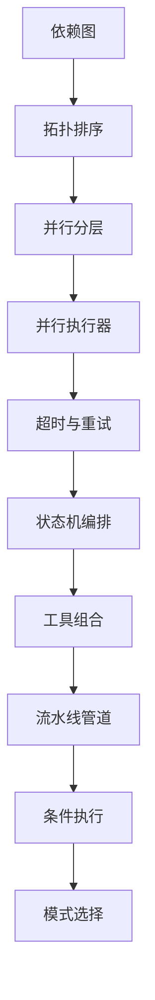
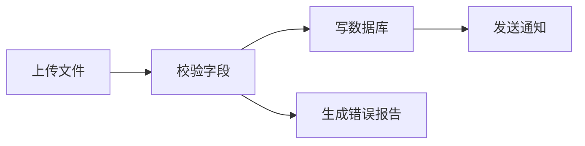
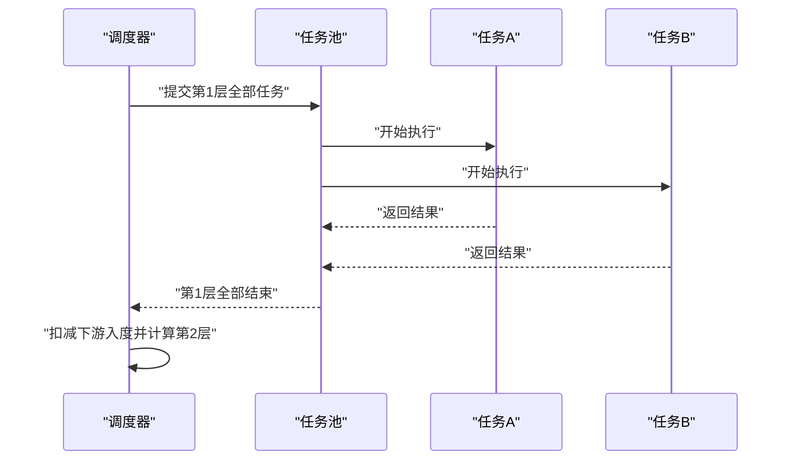
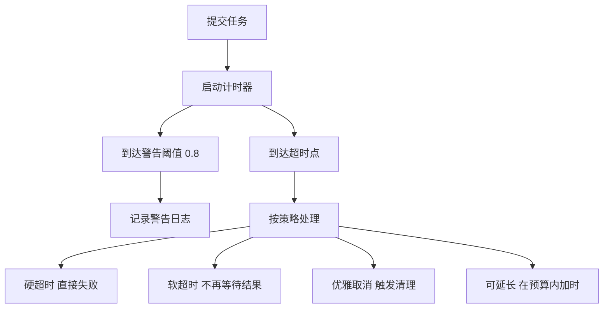
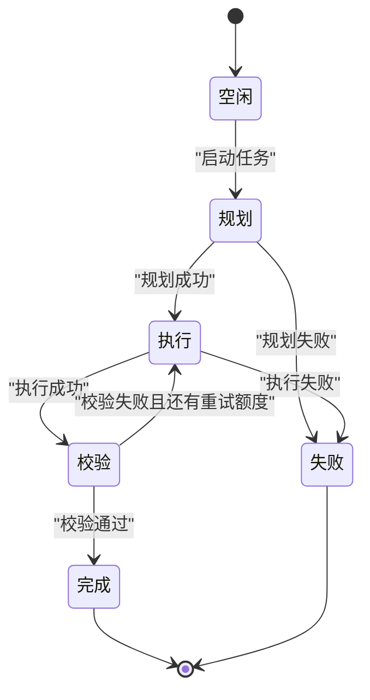
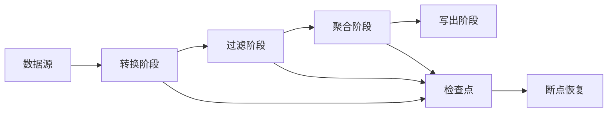
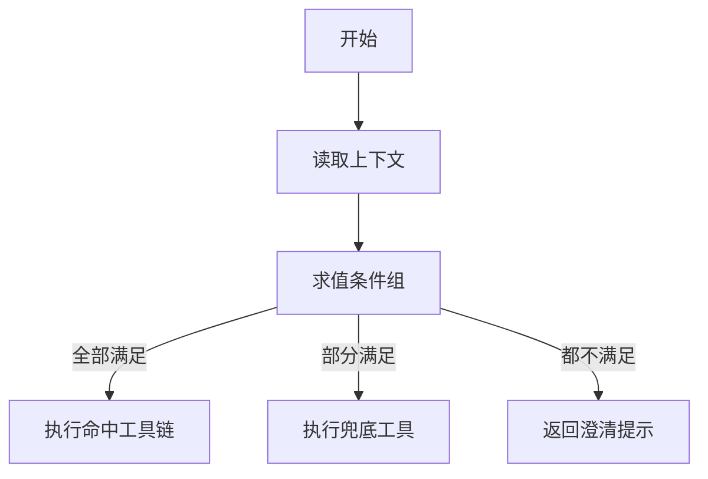

# 工具编排：实现与高级话题

!!! abstract "学完这一页你能"
    - 独立写出 Kahn 拓扑排序，并用输出长度判断依赖图里有没有环。
    - 把依赖图切成并行层，用带并发上限的任务池执行同层任务。
    - 给每个工具调用配上超时、重试和错误分类，说清四种超时策略的差别。
    - 用状态机把规划、执行、校验、收尾串成可回退、可记录历史的流程。

## 0. 知识地图



建议怎么读：第 1 到第 4 节是一条主线，从依赖图一步步走到可回退的状态机，建议按顺序读。
第 5、6 节是两种包装手法，把前四节的零件包成新工具、按条件选工具，可以跳读再回头。
最后一节把六节的知识拼成一个能跑的最小编排器，并且给出选型对照。

## 1. 拓扑排序：把依赖变成执行顺序

**先想一个问题**

后台的批量导入要四步：上传文件、校验字段、写数据库、发通知。
用户点一次按钮，你怎么保证发通知不会抢在写数据库前面？

**心智模型**

!!! tip "心智模型"
    一句话模型：拓扑排序把依赖图压成一条满足全部先后约束的序列。
    日常类比：出门先穿袜子再穿鞋，顺序颠倒就要返工。
    类比不成立的地方：真实依赖图常有多种合法顺序，袜子和鞋只有一种排法。

!!! note "术语：有向无环图"
    定义：由节点和有方向的边组成，且不存在从某点出发绕回自身的路径。例子：上传指向校验、校验指向写库，就是一张有向无环图。

**图解**



1. 上传文件完成后，校验字段才拿到输入数据。
2. 校验字段有两个下游：写数据库与生成错误报告。
3. 写数据库完成后，发送通知才能引用入库结果。
4. 生成错误报告与发送通知之间没有边，两者谁先执行都不违反约束。

**一步一步来**

第 1 步：统计每个节点的入度，同时把边反向存成邻接表。

```js
'use strict';
// 输入：节点数组，每个节点带 id 和 dependencies
function buildIndex(nodes) {
  const inDegree = new Map();   // 记录每个节点还差几个前置
  const nextMap = new Map();    // 记录每个节点完成后能解锁谁
  for (const n of nodes) {
    inDegree.set(n.id, n.dependencies.length);
    nextMap.set(n.id, []);
  }
  for (const n of nodes) {
    for (const dep of n.dependencies) {
      nextMap.get(dep).push(n.id); // 前置完成后解锁当前节点
    }
  }
  return { inDegree, nextMap };
}
```

**这段代码在做什么**

- 第一次遍历把入度写成依赖数量，前置有几个就是几。
- 第二次遍历把依赖关系反向记录，便于后面扣减入度。
- 用 Map 而不是普通对象，避免 id 取名为 constructor 时踩到原型链。
- 这里假设每个前置节点都在同一个数组里出现过。

第 2 步：把入度为 0 的节点入队，逐个出队并扣减下游入度。

```js
// Kahn 算法：队列里始终只放入度为 0 的节点
function topoSort(nodes) {
  const { inDegree, nextMap } = buildIndex(nodes);
  const queue = [];
  for (const [id, deg] of inDegree) {
    if (deg === 0) queue.push(id);   // 没有前置的节点先执行
  }
  const order = [];
  while (queue.length > 0) {
    const id = queue.shift();        // 取出一个可以执行的节点
    order.push(id);
    for (const next of nextMap.get(id)) {
      inDegree.set(next, inDegree.get(next) - 1); // 扣掉一个前置
      if (inDegree.get(next) === 0) queue.push(next); // 前置齐了就入队
    }
  }
  if (order.length !== nodes.length) return null; // 长度不符说明有环
  return order;
}
```

**这段代码在做什么**

- 队列里只放入度为 0 的节点，取出的节点依赖一定已满足。
- 每处理一个节点，就把它的每个下游入度减 1。
- 下游入度降到 0 时立刻入队，同层节点的先后由入队顺序决定。
- 最终序列长度小于节点总数，说明剩下的节点互相依赖成环。

运行结果：按上图的四步依赖，输出形如 `upload, check, db, report, notify`，其中 `db` 与 `report` 的先后可以互换。

**动手验证**

目的：把两步合成一个脚本，验证顺序约束，并检查环检测是否生效。

```js
'use strict';
const assert = require('node:assert/strict');
// 依赖：仅 Node 20+ 内置模块。保存为 topo.cjs 后执行 node topo.cjs。

function topoSort(nodes) {
  const inDegree = new Map(), nextMap = new Map();
  for (const n of nodes) { inDegree.set(n.id, n.dependencies.length); nextMap.set(n.id, []); }
  for (const n of nodes) for (const d of n.dependencies) nextMap.get(d).push(n.id);
  const queue = [...inDegree].filter(([, d]) => d === 0).map(([id]) => id);
  const order = [];
  while (queue.length) {
    const id = queue.shift();
    order.push(id);
    for (const nx of nextMap.get(id)) {
      inDegree.set(nx, inDegree.get(nx) - 1);
      if (inDegree.get(nx) === 0) queue.push(nx);
    }
  }
  return order.length === nodes.length ? order : null;
}

const nodes = [
  { id: 'upload', dependencies: [] },
  { id: 'check', dependencies: ['upload'] },
  { id: 'db', dependencies: ['check'] },
  { id: 'report', dependencies: ['check'] },
  { id: 'notify', dependencies: ['db'] },
];
const order = topoSort(nodes);
assert.equal(order.length, 5);
assert.ok(order.indexOf('upload') < order.indexOf('check'));
assert.ok(order.indexOf('check') < order.indexOf('db'));
assert.ok(order.indexOf('db') < order.indexOf('notify'));
const cyclic = [{ id: 'a', dependencies: ['b'] }, { id: 'b', dependencies: ['a'] }];
assert.equal(topoSort(cyclic), null); // 有环必须返回 null
console.log('order =', order.join(' -> '));
console.log('全部断言通过');
```

预期输出：

```
order = upload -> check -> db -> report -> notify
全部断言通过
```

**常见坑**

| 现象 | 原因 | 怎么修 |
|---|---|---|
| 排序结果少了节点 | 图里有环，函数直接返回 null | 报错时把环上节点列出来，不要静默丢弃任务 |
| 建索引时抛异常 | 依赖写了不存在的 id | 建索引前先用 Set 校验节点 id 是否齐全 |
| 每次运行顺序都不一样 | 同层节点顺序由入队顺序决定 | 需要稳定输出时先按 id 或权重排序再入队 |
| 大批任务跑成一条链 | 依赖被写成了链而不是树 | 检查 dependencies 是否把无关步骤串了起来 |

**用在哪里**

- 电商商品批量上架。业务背景：一次导入上千个 SKU，每个 SKU 有类目、库存、价格三个前置步骤；这一节的知识怎么用：把每个 SKU 的四步建成子图，按拓扑序触发；衡量指标：单批导入耗时、失败率、人工返工次数；什么时候不该用：步骤之间没有真实依赖，直接顺序调用即可。
- 数据仓库的 ETL 调度。业务背景：下游宽表要等上游三张明细表全部就绪；这一节的知识怎么用：把表依赖建成有向无环图，入度归零才触发下游任务；衡量指标：任务空跑次数、数据产出延迟；什么时候不该用：只有一两条固定链路时，用配置文件写死顺序更省事。
- CI 流水线的任务编排。业务背景：构建、单测、打包、镜像推送四个阶段；这一节的知识怎么用：单测与静态检查无依赖，可以在拓扑序里放到同一层；衡量指标：单次流水线总时长、失败定位耗时；什么时候不该用：任务之间靠共享工作区传递产物，只能串行。

**行业实践**

- Apache Airflow 官方文档「Concepts」章节的 DAGs 一节，把工作流定义为有向无环图，由调度器按依赖触发下游任务。借鉴到你的项目：把依赖写成配置数据，代码只负责读取配置并执行。
- Kubernetes 官方文档「Pod Lifecycle」章节的 Init Containers 一节，要求初始化容器按顺序逐个完成才启动主容器。借鉴到你的项目：把强前置的准备工作放进按序阶段，主流程只处理没有顺序要求的任务。
- Amazon States Language 规范（AWS Step Functions 官方文档「States Language」章节）用 Parallel 与 Map 状态表达并行分支。借鉴到你的项目：把并行结构写进声明式配置，不要散落在代码的循环里；具体字段以官方文档为准。

**小结**

1. 拓扑排序解决的是顺序问题，它本身不负责并发。
2. Kahn 算法靠入度归零驱动，环检测只需比较输出长度与节点总数。
3. 合法序列通常不唯一，要稳定输出就得自己补排序规则。

## 2. 分层并行执行器：让同层任务同时跑

**先想一个问题**

五个任务串行执行要 5 秒。
如果其中三个互不依赖，你能不能让它们同时跑，而等待时间只由最慢那个决定？

**心智模型**

!!! tip "心智模型"
    一句话模型：分层并行把拓扑序列按层切开，同层任务一起提交，层与层之间做栅栏。
    日常类比：小组做饭，切菜和烧水同时进行，但下锅要等两样都齐。
    类比不成立的地方：真实任务耗时差距大，慢任务会拖住整层，做饭过程里没有这种长尾。

!!! note "术语：并发度"
    定义：同一时刻允许在跑的任务数量上限。例子：并发度设为 4，表示最多 4 个任务同时执行，第 5 个要排队。

**图解**



1. 调度器先把第一层全部任务一次性交给任务池。
2. 任务池按并发度决定同时启动哪几个任务。
3. 每个任务结束后把结果交回任务池，池子继续取下一个待跑任务。
4. 整层结束后调度器才计算下一层，这一步是栅栏。
5. 栅栏的存在保证了下一层节点的所有前置都已执行完。

**一步一步来**

第 1 步：把拓扑序切成层，同层节点互不依赖。

```js
// 分层：每一层内的节点可以同时执行
function parallelLevels(nodes) {
  const inDegree = new Map(), nextMap = new Map();
  for (const n of nodes) { inDegree.set(n.id, n.dependencies.length); nextMap.set(n.id, []); }
  for (const n of nodes) for (const d of n.dependencies) nextMap.get(d).push(n.id);
  const levels = [], done = new Set();
  while (done.size < nodes.length) {
    const current = [...inDegree]
      .filter(([id, d]) => d === 0 && !done.has(id))
      .map(([id]) => id);
    if (current.length === 0) throw new Error('检测到环，无法分层'); // 有环直接报错
    levels.push(current);       // 这一层的任务可以同时跑
    for (const id of current) {
      done.add(id);
      for (const nx of nextMap.get(id)) inDegree.set(nx, inDegree.get(nx) - 1);
    }
  }
  return levels;
}
```

**这段代码在做什么**

- 每一轮筛出所有入度为 0 且还没处理的节点，组成一层。
- 一层为空说明剩下的节点互相依赖，直接抛错而不是死循环。
- 处理完一层后统一扣减下游入度，保证下一轮筛出的节点前置齐备。
- 层与层之间的等待就是栅栏，代价是慢任务会拖住整层。

第 2 步：用带并发上限的任务池执行同一层的任务。

```js
// 任务池：最多 limit 个任务同时在跑
async function runPool(tasks, limit) {
  const results = new Array(tasks.length);
  let cursor = 0;
  async function worker() {
    while (cursor < tasks.length) {
      const i = cursor++;              // 先取下标再自增，避免重复领取
      results[i] = await tasks[i]();   // 任务失败会抛出，由调用方处理
    }
  }
  const size = Math.min(limit, tasks.length);
  await Promise.all(Array.from({ length: size }, worker));
  return results;
}
```

**这段代码在做什么**

- `cursor` 是共享的下标，每个 worker 领取任务时先自增。
- JavaScript 单线程执行，自增操作不会被打断，所以不需要加锁。
- 启动的 worker 数量是并发度与任务数的较小值。
- 任意一个任务抛出异常，`Promise.all` 会提前 reject，剩余任务仍会继续跑。

运行结果：两个任务耗时各 20 毫秒、并发度为 2 时，峰值同时在跑的任务数是 2，总耗时接近 20 毫秒而不是 40 毫秒。

**动手验证**

目的：把分层与任务池接起来，验证层结构正确、并发度没被突破。

```js
'use strict';
const assert = require('node:assert/strict');
// 依赖：仅 Node 20+ 内置模块。保存为 levels.cjs 后执行 node levels.cjs。

function parallelLevels(nodes) {
  const inDegree = new Map(), nextMap = new Map();
  for (const n of nodes) { inDegree.set(n.id, n.dependencies.length); nextMap.set(n.id, []); }
  for (const n of nodes) for (const d of n.dependencies) nextMap.get(d).push(n.id);
  const levels = [], done = new Set();
  while (done.size < nodes.length) {
    const current = [...inDegree].filter(([id, d]) => d === 0 && !done.has(id)).map(([id]) => id);
    if (current.length === 0) throw new Error('检测到环');
    levels.push(current);
    for (const id of current) { done.add(id); for (const nx of nextMap.get(id)) inDegree.set(nx, inDegree.get(nx) - 1); }
  }
  return levels;
}

async function runPool(tasks, limit) {
  const results = new Array(tasks.length);
  let cursor = 0;
  const worker = async () => {
    while (cursor < tasks.length) { const i = cursor++; results[i] = await tasks[i](); }
  };
  await Promise.all(Array.from({ length: Math.min(limit, tasks.length) }, worker));
  return results;
}

const nodes = [
  { id: 'upload', dependencies: [] },
  { id: 'check', dependencies: ['upload'] },
  { id: 'fetchA', dependencies: ['check'] },
  { id: 'fetchB', dependencies: ['check'] },
  { id: 'merge', dependencies: ['fetchA', 'fetchB'] },
];
const levels = parallelLevels(nodes);
assert.deepEqual(levels[0], ['upload']);
assert.deepEqual(levels[1], ['check']);
assert.deepEqual(levels[2].sort(), ['fetchA', 'fetchB']);
assert.deepEqual(levels[3], ['merge']);

let running = 0, peak = 0;
const make = (id) => async () => {
  running += 1; peak = Math.max(peak, running);
  await new Promise((r) => setTimeout(r, 20));
  running -= 1;
  return id;
};

(async () => {
  const out = await runPool(levels[2].map(make), 2);
  assert.equal(out.length, 2);
  assert.ok(peak <= 2); // 并发度不能被突破
  console.log('levels =', JSON.stringify(levels));
  console.log('peak =', peak);
  console.log('全部断言通过');
})();
```

预期输出：

```
levels = [["upload"],["check"],["fetchA","fetchB"],["merge"]]
peak = 2
全部断言通过
```

**常见坑**

| 现象 | 原因 | 怎么修 |
|---|---|---|
| 慢任务拖住整层 | 层与层之间是栅栏，必须等整层结束 | 把长任务拆小，或改成按依赖计数的流式调度 |
| 并发度设成 64 后接口大量报错 | 池子没有区分任务类型 | 按下游限流配置分别给并发上限 |
| 一个任务失败整层结果丢失 | `Promise.all` 遇错提前 reject | 用 `Promise.allSettled` 收集全部结果再判断 |
| 任务重复执行 | 下标用 `cursor + 1` 后没有同步更新 | 用 `cursor++` 的返回值作为唯一领取凭据 |

**用在哪里**

- 后台报表导出。业务背景：一份经营报表要拉订单、库存、财务三个数据源；这一节的知识怎么用：把三个拉数任务放在同一层并行，汇总任务放在下一层；衡量指标：导出总耗时、超时率；什么时候不该用：数据源本身有配额限制，串行反而更稳。
- CI 里的检查阶段。业务背景：静态检查与单元测试互不依赖，构建依赖两者；这一节的知识怎么用：检查与测试放第一层，构建放第二层；衡量指标：流水线总时长、机器占用峰值；什么时候不该用：测试用例之间共享全局状态时，并行会产生随机失败。
- AI 助手的多路检索。业务背景：一次提问要同时查知识库与工单历史；这一节的知识怎么用：两路检索同层并行，结果合并后再交给模型；衡量指标：首字返回时间、合并后引用命中率；什么时候不该用：第二路调用依赖第一路的返回内容时，只能串行。

**行业实践**

- Temporal 官方文档「Activities」章节说明活动可以并发执行，并用任务队列控制并发。借鉴到你的项目：把耗时的网络调用放进活动，把顺序与并发决策留在一层编排逻辑里。
- Node.js 官方文档「Worker threads」章节说明 CPU 密集计算可以放到工作线程。借鉴到你的项目：CPU 密集任务不要塞进 Promise 池，那只会阻塞事件循环；具体线程数请核对官方文档的默认值。
- p-limit 开源库 README 说明如何限制并发 Promise 数量。借鉴到你的项目：给外部接口调用套一层并发上限，避免瞬时打满对端；当前主版本号需核对官方文档。

**小结**

1. 分层解决的是「谁和谁能同时跑」，任务池解决的是「同时跑几个」。
2. 栅栏让实现变简单，代价是整层等待最慢的任务。
3. 并发度是外部依赖的配额决定的，不是越大越好。

## 3. 超时控制：四种策略与阶段预算

**先想一个问题**

并行拉十个接口，其中一个永远不返回。
默认的等待会一直挂着，用户看到转圈到放弃，你打算怎么兜底？

**心智模型**

!!! tip "心智模型"
    一句话模型：超时是给等待设一个上限，时间到就按事先定好的策略走下一步。
    日常类比：餐厅等位拿到号，超过 30 分钟你就走人。
    类比不成立的地方：你走人后对方可能还在做菜，远端任务不会因为你放弃就停下。

!!! note "术语：幂等"
    定义：同一个请求执行一次与执行多次，系统状态一致。例子：查询订单是幂等的，扣减库存不是，重试前要配幂等键。

**图解**



1. 任务提交后立即启动计时器，不等待第一次响应。
2. 计时到默认时长的 80% 时记一条警告，方便提前排查慢任务。
3. 到达超时点后进入策略分支，四条分支对应四种处理方式。
4. 硬超时立刻失败并抛错，适合不允许残缺结果的流程。
5. 软超时停止等待但保留后台执行，适合结果可丢弃的统计任务。
6. 优雅取消会触发清理动作，适合要释放连接或临时文件的场景。
7. 可延长在总预算允许时加时，加满最大时长后仍然失败。

**一步一步来**

第 1 步：给单个 Promise 包一层超时。

```js
// 给任意 Promise 加超时，超时抛出带 code 的错误
function withTimeout(promiseFactory, ms, label) {
  let timer;
  const timeout = new Promise((_, reject) => {
    timer = setTimeout(() => {
      const err = new Error(`超时: ${label} 超过 ${ms}ms`);
      err.code = 'ETIMEDOUT'; // 用错误码区分超时与其他异常
      reject(err);
    }, ms);
  });
  return Promise.race([promiseFactory(), timeout])
    .finally(() => clearTimeout(timer)); // 无论谁先完成都要清掉定时器
}
```

**这段代码在做什么**

- `promiseFactory` 是个函数，只有需要时才真正发起调用。
- `Promise.race` 取先完成的一方，超时方会先抛出错误。
- 错误挂上 `code` 字段，调用方据此区分超时和业务失败。
- `finally` 清掉定时器，避免进程被残留的定时器拖住。

第 2 步：把总预算分给各个阶段，每阶段只能用剩余额度的一部分。

```js
// 分阶段执行：每阶段超时取阶段上限与剩余预算的较小值
async function runStages(stages, budgetMs) {
  let used = 0;
  const report = [];
  for (const stage of stages) {
    const perStage = Math.min(stage.limitMs, budgetMs - used);
    if (perStage <= 0) { report.push({ name: stage.name, status: 'skipped' }); continue; }
    const start = Date.now();
    try {
      await withTimeout(stage.run, perStage, stage.name);
      report.push({ name: stage.name, status: 'ok' });
    } catch (e) {
      report.push({ name: stage.name, status: e.code === 'ETIMEDOUT' ? 'timeout' : 'error' });
    }
    used += Date.now() - start; // 已用时间持续累加，压住后面的阶段
  }
  return report;
}
```

**这段代码在做什么**

- 每阶段可用额度是阶段上限与剩余预算的较小值。
- 剩余预算不足时直接跳过该阶段，而不是给一个负数或零超时。
- 每阶段结束都累加实际耗时，后面的阶段额度随之收窄。
- 超时被记成 timeout 而不是通用错误，便于统计。
- 这套写法来自旧版页面的超时编排思路：默认超时 30 秒、最大超时 300 秒、警告阈值 0.8（来源：本站旧版页面，以原文为准）。

运行结果：两个阶段各给 50 毫秒上限，总预算 120 毫秒，第一段瞬时返回记 ok，第二段耗时 200 毫秒记 timeout。

**动手验证**

目的：验证超时错误码、阶段额度分配与跳过逻辑。

```js
'use strict';
const assert = require('node:assert/strict');
// 依赖：仅 Node 20+ 内置模块。保存为 timeout.cjs 后执行 node timeout.cjs。

function withTimeout(promiseFactory, ms, label) {
  let timer;
  const timeout = new Promise((_, reject) => {
    timer = setTimeout(() => {
      const err = new Error(`超时: ${label}`);
      err.code = 'ETIMEDOUT';
      reject(err);
    }, ms);
  });
  return Promise.race([promiseFactory(), timeout]).finally(() => clearTimeout(timer));
}

async function runStages(stages, budgetMs) {
  let used = 0;
  const report = [];
  for (const stage of stages) {
    const perStage = Math.min(stage.limitMs, budgetMs - used);
    if (perStage <= 0) { report.push({ name: stage.name, status: 'skipped' }); continue; }
    const start = Date.now();
    try {
      await withTimeout(stage.run, perStage, stage.name);
      report.push({ name: stage.name, status: 'ok' });
    } catch (e) {
      report.push({ name: stage.name, status: e.code === 'ETIMEDOUT' ? 'timeout' : 'error' });
    }
    used += Date.now() - start;
  }
  return report;
}

(async () => {
  const slow = () => new Promise((r) => setTimeout(() => r('done'), 200));
  const fast = () => Promise.resolve('quick');
  const report = await runStages([
    { name: 'search', run: fast, limitMs: 50 },
    { name: 'render', run: slow, limitMs: 50 },
    { name: 'notify', run: fast, limitMs: 50 },
  ], 120);
  assert.equal(report[0].status, 'ok');
  assert.equal(report[1].status, 'timeout');
  assert.equal(report[2].status, 'ok'); // 预算仍在 120ms 内没被耗尽
  console.log(JSON.stringify(report));
  console.log('全部断言通过');
})();
```

预期输出：

```
[{"name":"search","status":"ok"},{"name":"render","status":"timeout"},{"name":"notify","status":"ok"}]
全部断言通过
```

**常见坑**

| 现象 | 原因 | 怎么修 |
|---|---|---|
| 超时后远端还在跑 | 放弃等待不等于取消远端 | 传幂等键，服务端做去重与限时清理 |
| 进程迟迟不退出 | 超时定时器没有清理 | 在 `finally` 里调用 `clearTimeout` |
| 阶段全部被跳过 | 前面的阶段吃光了总预算 | 给每阶段设上限，并在跳过时上报事件 |
| 超时被当成业务失败 | 错误没有类型或错误码 | 统一用 `code` 字段，重试策略按它分流 |

**用在哪里**

- 聚合搜索接口。业务背景：一次搜索要并行问五个数据源，用户最多等 800 毫秒；这一节的知识怎么用：给整体设预算，每个数据源用剩余额度做上限；衡量指标：超时率、返回结果条数、首屏可交互时间；什么时候不该用：数据源是强一致要求，必须全部返回，此时应改成异步任务加轮询。
- AI 助手的工具调用。业务背景：模型等待工具返回结果后再生成答复；这一节的知识怎么用：给工具调用设硬超时，超时后回退到只用模型内部知识回答；衡量指标：单轮对话耗时分布、超时回退占比；什么时候不该用：工具结果是唯一数据来源时，回退会产生错误回答。
- 后台导出任务。业务背景：导出分拉数、计算、打包三段，总计不能超过同步接口的等待上限；这一节的知识怎么用：按阶段分配预算，超预算就转异步并通知用户；衡量指标：同步导出成功率、转异步比例；什么时候不该用：导出结果有强顺序要求，分阶段超时会破坏一致性。

**行业实践**

- Amazon States Language 规范里 Task 状态支持 TimeoutSeconds 与 HeartbeatSeconds，心跳用于长任务探活。借鉴到你的项目：长任务用心跳而不是单纯延长超时；两个字段的默认值与上限需核对官方文档。
- gRPC 官方文档「Deadlines」章节说明 deadline 会沿调用链传播。借鉴到你的项目：把剩余预算往下一层传，不要让每层各自设一个 30 秒。
- OpenTelemetry 官方文档「Traces」章节可用 Span 记录超时事件。借鉴到你的项目：超时按工具维度打点，定位是哪一类调用在拖时间。

**小结**

1. 超时只是放弃等待，取消远端需要幂等键和清理逻辑。
2. 阶段预算要自上而下分配，剩余额度决定后面的空间。
3. 错误码决定重试策略，超时与业务失败必须分开统计。

## 4. 状态机编排：规划、执行、校验、收尾

**先想一个问题**

执行失败后你想回到规划阶段重试一次。
这段控制逻辑如果用 if-else 写，状态一多立刻失控，你怎么收拾？

**心智模型**

!!! tip "心智模型"
    一句话模型：状态机是一张固定的图，当前状态加一个事件决定下一步走到哪里。
    日常类比：自动售货机投币、选货、出货，每个状态只认几个事件。
    类比不成立的地方：售货机状态固定，编排状态会随任务类型增删，状态爆炸时要拆成多台机器。

!!! note "术语：守卫条件"
    定义：决定一条状态转换能否发生的布尔函数。例子：只有剩余重试次数大于 0 时，才允许从失败回到执行状态。

**图解**



1. 空闲状态只认启动事件，避免重复提交同一任务。
2. 规划成功后进入执行，规划失败直接落到失败终态。
3. 执行成功进入校验，执行失败落到失败终态。
4. 校验通过进入完成终态。
5. 校验失败时走回执行，但必须先通过重试额度守卫。
6. 完成与失败都是终态，终态不再接受任何事件。

**一步一步来**

第 1 步：把转换表建成两层 Map，先按起始状态查，再按事件查。

```js
// 把转换数组编译成 from -> on -> transition 的两层索引
function buildTable(transitions) {
  const table = new Map();
  for (const t of transitions) {
    if (!table.has(t.from)) table.set(t.from, new Map());
    table.get(t.from).set(t.on, t);   // 同一状态下同一事件只保留一条
  }
  return table;
}
// 查表顺序：先看当前状态有没有出边，再看这条边认不认这个事件
function findTransition(table, state, event) {
  const row = table.get(state);
  if (!row) return null;              // 终态没有出边，直接返回空
  return row.get(event) || null;
}
```

**这段代码在做什么**

- 转换表是纯数据，和状态机的运行逻辑分离。
- 两层 Map 查找是常数时间，状态数量增长不影响单次查找开销。
- 同一状态的同一事件只保留最后一条，配表时要注意顺序。
- 终态没有出边，`findTransition` 返回空，事件被自然忽略。

第 2 步：写触发函数，依次做查表、守卫、动作、改状态、记历史。

```js
// 触发一次状态转换，返回是否真的发生了转换
function send(machine, event) {
  const t = findTransition(machine.table, machine.state, event);
  if (!t) return false;                       // 没有匹配的边
  if (t.guard && !t.guard(machine.context)) return false; // 守卫拦住
  if (t.action) t.action(machine.context);    // 先执行业务动作
  machine.state = t.to;                       // 再改状态
  machine.history.push(t.to);                 // 历史留痕，便于回放
  return true;
}
```

**这段代码在做什么**

- 查表失败直接返回 false，调用方不用写 try-catch。
- 守卫在动作之前执行，条件不满足时上下文不会被修改。
- 动作只改上下文数据，不改状态，状态由这一行统一推进。
- 历史数组记录走过的状态，排障时能看出是不是来回抖动。

运行结果：从规划出发依次发送成功、成功、失败，状态序列为 `planning -> executing -> verifying -> executing`。

**动手验证**

目的：验证守卫能拦住无限重试，历史记录完整。

```js
'use strict';
const assert = require('node:assert/strict');
// 依赖：仅 Node 20+ 内置模块。保存为 fsm.cjs 后执行 node fsm.cjs。

function createMachine({ initial, finalStates, transitions }) {
  const table = new Map();
  for (const t of transitions) {
    if (!table.has(t.from)) table.set(t.from, new Map());
    table.get(t.from).set(t.on, t);
  }
  let state = initial;
  const history = [initial];
  const context = { retries: 1 };
  return {
    get state() { return state; },
    history,
    isFinal: () => finalStates.includes(state),
    send(event) {
      const row = table.get(state);
      const t = row && row.get(event);
      if (!t) return false;
      if (t.guard && !t.guard(context)) return false;
      if (t.action) t.action(context);
      state = t.to;
      history.push(state);
      return true;
    },
  };
}

const machine = createMachine({
  initial: 'planning',
  finalStates: ['completed', 'failed'],
  transitions: [
    { from: 'planning', on: 'ok', to: 'executing' },
    { from: 'planning', on: 'fail', to: 'failed' },
    { from: 'executing', on: 'ok', to: 'verifying' },
    { from: 'executing', on: 'fail', to: 'failed' },
    { from: 'verifying', on: 'ok', to: 'completed' },
    { from: 'verifying', on: 'fail', to: 'executing',
      guard: (ctx) => { if (ctx.retries <= 0) return false; ctx.retries -= 1; return true; } },
  ],
});

assert.equal(machine.send('ok'), true);
machine.send('ok');                        // 进入校验状态
assert.equal(machine.send('fail'), true);  // 校验失败，还有一次重试额度
assert.equal(machine.state, 'executing');
machine.send('ok');
assert.equal(machine.send('fail'), false); // 额度用完，守卫拦住
assert.equal(machine.state, 'verifying');
assert.equal(machine.isFinal(), false);
console.log('history =', machine.history.join(' -> '));
console.log('全部断言通过');
```

预期输出：

```
history = planning -> executing -> verifying -> executing -> verifying
全部断言通过
```

**常见坑**

| 现象 | 原因 | 怎么修 |
|---|---|---|
| 校验失败后无限重跑 | 回退边没有守卫 | 在上下文里放重试计数，归零后守卫返回 false |
| 流程永远停在非终态 | 缺少失败出口，异常被吞 | 每条主路径都要配失败边，终态要显式声明 |
| 状态历史数组持续增长 | 长任务反复循环 | 只保留最近 N 条，或落库而不是留在内存 |
| 回放结果与线上不一致 | 动作里直接发网络请求 | 动作只改上下文，副作用放到状态机之外执行 |

**用在哪里**

- AI 助手多步问答。业务背景：一次提问要走规划、检索、生成、校验四步；这一节的知识怎么用：用状态机管住步骤推进，校验不过就带着反馈回到生成；衡量指标：答案采纳率、平均循环轮次、超预算退出比例；什么时候不该用：任务只有一步调用，状态机是额外开销。
- 订单与支付对账。业务背景：对账任务要经过拉取、比对、生成差异、人工确认；这一节的知识怎么用：人工确认是等待态，超时后走失败边并通知；衡量指标：对账完成时长、人工介入量；什么时候不该用：对账过程完全线性且无人工介入时，顺序脚本就够。
- 发布流程的灰度控制。业务背景：构建、测试、灰度、全量四段，灰度异常要回滚；这一节的知识怎么用：回滚是一条独立的失败边，指向失败终态并触发清理；衡量指标：回滚耗时、发布失败恢复时间；什么时候不该用：发布由现成的发布平台托管时，不要重复实现状态机。

**行业实践**

- Temporal 官方文档「Workflows」章节强调工作流代码要可重放，副作用放在活动里。借鉴到你的项目：状态机只负责路由，网络与磁盘操作交给外部函数。
- Amazon States Language 规范里 Succeed 与 Fail 是终止状态类型。借鉴到你的项目：把成功与失败显式声明成终态，避免流程悬空；具体字段以官方文档为准。
- XState 官方文档「State Machines」章节用状态图描述流程。借鉴到你的项目：先把状态图画出来再写代码，图画不出来说明状态划分还没想清。

**小结**

1. 状态机把分支决策变成数据，新增路径只需改表而不是改逻辑。
2. 守卫是防死循环的关键，重试额度要放在上下文里。
3. 终态必须显式声明，否则流程会停在谁也不知道的地方。

## 5. 工具组合与流水线管道

**先想一个问题**

搜索、摘要、翻译三个工具你总要一起用。
每次都在业务代码里手写三遍串接逻辑，改一次参数要改三个地方，怎么收敛？

**心智模型**

!!! tip "心智模型"
    一句话模型：组合把多个工具包成一个新工具，管道把数据处理切成带缓冲的阶段。
    日常类比：组合是一份固定套餐，管道是传送带上的工序。
    类比不成立的地方：套餐的菜固定，管道里的数据可能在某个阶段被过滤掉不再往下走。

!!! note "术语：连接器"
    定义：把上一个工具的输出转换成下一个工具输入的函数。例子：上一个工具返回对象，连接器取出其中的 result 字段作为下一个工具的入参。

**图解**



1. 数据从数据源进入，先经过转换阶段做格式整理。
2. 过滤阶段决定这条数据是否继续往下走，不满足就丢弃。
3. 聚合阶段把数据攒进缓冲区，攒够批大小才统一处理。
4. 写出阶段把最终结果落地，是整个管道的出口。
5. 每个阶段结束后可以写检查点，重启时从最近的检查点恢复。
6. 断点恢复是检查点的用途，不是新的处理阶段。

**一步一步来**

第 1 步：实现顺序组合器，把多个工具包成一个函数。

```js
// 默认连接器：上一个工具的输出直接作为下一个的输入
const defaultConnector = (prev) =>
  (prev && typeof prev === 'object' ? prev : { data: prev });

// 顺序组合：出错时记录失败下标，方便定位是哪一步挂的
function compose(tools, connector = defaultConnector) {
  return (input) => {
    const outputs = [];
    let current = input;
    for (let i = 0; i < tools.length; i += 1) {
      try {
        current = tools[i](current);
        outputs.push(current);
      } catch (e) {
        return { outputs, error: e.message, failedAt: i }; // 失败下标是关键排障信息
      }
      if (i < tools.length - 1) current = connector(current);
    }
    return { final: outputs[outputs.length - 1], outputs };
  };
}
```

**这段代码在做什么**

- 组合器返回一个新函数，调用方式和单个工具一致。
- 每步输出都存进 `outputs`，失败时还能看到前面成功的结果。
- `failedAt` 记录失败所在的下标，排障时不用猜。
- 连接器可以替换，用于从上游结果里挑字段。
- 旧版页面里给这套结构起名叫工具组合，并把连接器和输出转换器分开（来源：本站旧版页面，以原文为准）。

第 2 步：实现管道，支持过滤、聚合与三种出错策略。

```js
// 管道：按阶段顺序处理，过滤阶段可丢弃数据，聚合阶段按批大小冲刷
function runPipeline(stages, input, options = {}) {
  const { bufferSize = 3, onError = 'skip' } = options; // skip 跳过 stop 停止 fallback 兜底
  const state = { data: input, errors: [], buffer: [], checkpoints: [] };
  for (const stage of stages) {
    try {
      if (stage.type === 'filter') {
        if (!stage.run(state.data)) continue;   // 不满足条件直接跳过后续处理
      } else if (stage.type === 'aggregate') {
        state.buffer.push(state.data);          // 先攒进缓冲区
        if (state.buffer.length >= bufferSize) {
          state.data = stage.run(state.buffer); // 攒够了才批量处理
          state.buffer = [];
        }
        continue;
      } else {
        state.data = stage.run(state.data);
      }
      state.checkpoints.push({ stage: stage.name, data: state.data });
    } catch (e) {
      state.errors.push({ stage: stage.name, message: e.message });
      if (onError === 'stop') break;
      if (onError === 'fallback') state.data = stage.fallback;
    }
  }
  if (state.buffer.length) {                    // 收尾：把剩下的缓冲冲出来
    const last = [...stages].reverse().find((s) => s.type === 'aggregate');
    state.data = last.run(state.buffer);
    state.buffer = [];
  }
  return state;
}
```

**这段代码在做什么**

- 三种出错策略分别对应跳过、停止、兜底值替换。
- 聚合阶段的缓冲达到批大小就冲刷，处理完清空缓冲区。
- 循环结束后必须把剩余缓冲冲出来，否则最后一批数据会丢。
- 检查点只在成功阶段写入，恢复时回到最近的成功点。
- 旧版页面的管道配置给了缓冲 100、最大重试 3 次、出错策略默认跳过（来源：本站旧版页面，以原文为准）。

运行结果：文本经过 trim 与过滤后进入聚合阶段，批大小为 1 时立即冲刷，最终数据为处理后的字符串。

**动手验证**

目的：验证组合器顺序执行、管道过滤与缓冲区冲刷。

```js
'use strict';
const assert = require('node:assert/strict');
// 依赖：仅 Node 20+ 内置模块。保存为 pipeline.cjs 后执行 node pipeline.cjs。

const defaultConnector = (prev) => (prev && typeof prev === 'object' ? prev : { data: prev });

function compose(tools, connector = defaultConnector) {
  return (input) => {
    const outputs = [];
    let current = input;
    for (let i = 0; i < tools.length; i += 1) {
      current = tools[i](current);
      outputs.push(current);
      if (i < tools.length - 1) current = connector(current);
    }
    return { final: outputs[outputs.length - 1], outputs };
  };
}

function runPipeline(stages, input, options = {}) {
  const { bufferSize = 3, onError = 'skip' } = options;
  const state = { data: input, errors: [], buffer: [], checkpoints: [] };
  for (const stage of stages) {
    try {
      if (stage.type === 'filter') {
        if (!stage.run(state.data)) continue;
      } else if (stage.type === 'aggregate') {
        state.buffer.push(state.data);
        if (state.buffer.length >= bufferSize) { state.data = stage.run(state.buffer); state.buffer = []; }
        continue;
      } else {
        state.data = stage.run(state.data);
      }
      state.checkpoints.push({ stage: stage.name, data: state.data });
    } catch (e) {
      state.errors.push({ stage: stage.name, message: e.message });
      if (onError === 'stop') break;
      if (onError === 'fallback') state.data = stage.fallback;
    }
  }
  if (state.buffer.length) {
    const last = [...stages].reverse().find((s) => s.type === 'aggregate');
    state.data = last.run(state.buffer);
    state.buffer = [];
  }
  return state;
}

const clean = compose([(t) => t.trim(), (t) => t.toLowerCase()]);
assert.equal(clean('  Hello  ').final, 'hello');
assert.equal(clean(123).outputs.length, 2); // 非字符串输入也会走完两步

const result = runPipeline([
  { name: 'trim', run: (t) => t.trim() },
  { name: 'onlyLong', type: 'filter', run: (t) => t.length > 3 },
  { name: 'batch', type: 'aggregate', run: (arr) => arr.join('|') },
], '  tool orchestration  '.trim(), { bufferSize: 1 });

assert.equal(result.errors.length, 0);
assert.equal(result.final, undefined); // 走的是 state.data 路径
assert.equal(result.data, 'tool orchestration');
console.log('checkpoints =', result.checkpoints.map((c) => c.stage).join(','));
console.log('data =', result.data);
console.log('全部断言通过');
```

预期输出：

```
checkpoints = trim,onlyLong
data = tool orchestration
全部断言通过
```

**常见坑**

| 现象 | 原因 | 怎么修 |
|---|---|---|
| 最后一批数据丢失 | 缓冲区没到批大小就结束 | 循环结束后显式冲刷剩余缓冲 |
| 出错后整条管道静默继续 | 默认策略是跳过 | 跳过时写指标与日志，别让异常无声消失 |
| 连接器把参数喂错位置 | 连接器数组与工具下标错位 | 连接器个数固定为工具数减一，并写单测覆盖 |
| 恢复后数据重复 | 检查点存了引用被后续修改 | 存检查点时做深拷贝或序列化 |

**用在哪里**

- 客服工单自动分类。业务背景：工单文本要先去噪、再抽关键词、再分类、最后入库；这一节的知识怎么用：四个阶段串成管道，去噪失败走兜底值；衡量指标：分类准确率、单条处理耗时、兜底比例；什么时候不该用：每步都要人工确认时，管道不适合。
- 数据清洗 ETL。业务背景：日志要按小时批量清洗后写入数仓；这一节的知识怎么用：用聚合阶段攒批，批大小按内存占用实测调整；衡量指标：批次大小、单批耗时、失败重跑次数；什么时候不该用：单条数据必须立即处理时，攒批会引入延迟。
- AI 助手的检索增强。业务背景：先检索、再重排、再拼装提示词；这一节的知识怎么用：三段组合成一个工具暴露给模型；衡量指标：检索命中率、提示词长度、模型调用失败率；什么时候不该用：三段之间有强人工干预需求时，组合会挡住调参入口。

**行业实践**

- Amazon States Language 规范里的 Map 状态用于批量迭代处理。借鉴到你的项目：批量场景显式声明批大小与并发，别把批处理写进循环；Map 的并发上限需核对官方文档。
- Node.js 官方文档「Streams」章节的 `pipeline` 把多个流串起来并集中处理错误。借鉴到你的项目：阶段之间用管道思路连接，错误只在一处统一处理。
- Apache Airflow 官方文档「Concepts」章节的 Tasks 一节提到任务重试次数与重试延迟。借鉴到你的项目：重试放在阶段级而不是整条管道，避免重跑已经成功的阶段。

**小结**

1. 组合把多个工具合成一个可复用的新工具，连接器决定数据怎么接。
2. 管道的三个关键点是过滤逻辑、批大小、缓冲区冲刷。
3. 出错策略必须显式选择，跳过策略一定要配日志和指标。

## 6. 条件执行：按上下文动态选工具

**先想一个问题**

同一个助手，用户问天气要调天气接口，问订单要查数据库。
选择逻辑写成十几层 if-else 后没人敢改，有没有更规整的写法？

**心智模型**

!!! tip "心智模型"
    一句话模型：条件执行把分支写成数据，由统一的求值器判断该走哪条。
    日常类比：机场安检按登机牌信息分流，牌上的内容决定走哪条通道。
    类比不成立的地方：安检规则长期固定，业务条件经常变，条件表需要配置化和版本管理。

!!! note "术语：操作符"
    定义：条件里把上下文字段与目标值做比较的方式。例子：eq 表示相等比较，contains 表示判断子串是否出现。

**图解**



1. 开始后先把上下文整理成一个对象，作为求值的唯一输入。
2. 求值器按条件组里的每条条件依次比较。
3. 条件模式为 all 时要求全部满足，模式为 any 时满足一条即可。
4. 命中规则后执行该规则绑定的工具链。
5. 没有命中任何规则时走兜底工具，通常是人机转接或澄清提问。
6. 兜底不是异常分支，它是必须存在的正常出口。

**一步一步来**

第 1 步：实现操作符表与点号路径取值。

```js
// 操作符表：把比较逻辑集中在一处，新增操作符只改这里
const OPS = {
  eq: (a, b) => a === b,
  ne: (a, b) => a !== b,
  gt: (a, b) => typeof a === 'number' && typeof b === 'number' && a > b,
  lt: (a, b) => typeof a === 'number' && typeof b === 'number' && a < b,
  contains: (a, b) => typeof a === 'string' && a.includes(String(b)),
  matches: (a, b) => typeof a === 'string' && new RegExp(b).test(a),
  in: (a, b) => Array.isArray(b) && b.includes(a),
  not_in: (a, b) => Array.isArray(b) && !b.includes(a),
};

// 点号路径取值：user.level 会依次取出 user 再取出 level
function pick(context, path) {
  return path.split('.').reduce((acc, key) => {
    if (acc === null || acc === undefined) return undefined; // 中间断链就返回未定义
    return acc[key];
  }, context);
}
```

**这段代码在做什么**

- 每个操作符是一个纯函数，输入是字段值和要求值。
- `gt` 与 `lt` 先检查类型，避免字符串和数字比较出意外结果。
- `matches` 把目标值当正则源码，用之前要限制来源避免注入。
- `pick` 逐层取值，中间任意一层断掉就返回 undefined 而不是抛错。
- 旧版页面的条件操作符包含相等、不等、大小比较、包含、正则、在集合内、不在集合内（来源：本站旧版页面，以原文为准）。

第 2 步：实现三种条件模式与规则路由。

```js
// 三种模式：all 全部满足 any 满足一条 none 全部不满足
function matchMode(conditions, context, mode = 'all') {
  const results = conditions.map((c) => {
    const op = OPS[c.op];
    if (!op) throw new Error(`未知操作符: ${c.op}`); // 配错操作符要立刻暴露
    return op(pick(context, c.field), c.value);
  });
  if (mode === 'any') return results.some(Boolean);
  if (mode === 'none') return results.every((r) => !r);
  return results.every(Boolean);
}

// 按规则顺序返回第一个命中的工具标识
function route(rules, context, fallback) {
  for (const rule of rules) {
    if (matchMode(rule.conditions, context, rule.mode)) return rule.tool;
  }
  return fallback; // 没命中时必须有兜底
}
```

**这段代码在做什么**

- 条件求值先算成布尔数组，再按模式做汇总。
- 未知操作符直接抛错，防止规则写错时静默走兜底。
- 规则顺序决定命中结果，所以在数组里的位置就是优先级。
- 兜底值是必填参数，逼调用方想清楚没命中时怎么办。

运行结果：上下文里 `user.level` 为 vip 时命中订单查询，`user.orders` 超过阈值时命中人工转接。

**动手验证**

目的：验证八种操作符、三种模式与兜底分支。

```js
'use strict';
const assert = require('node:assert/strict');
// 依赖：仅 Node 20+ 内置模块。保存为 conditions.cjs 后执行 node conditions.cjs。

const OPS = {
  eq: (a, b) => a === b,
  ne: (a, b) => a !== b,
  gt: (a, b) => typeof a === 'number' && typeof b === 'number' && a > b,
  lt: (a, b) => typeof a === 'number' && typeof b === 'number' && a < b,
  contains: (a, b) => typeof a === 'string' && a.includes(String(b)),
  matches: (a, b) => typeof a === 'string' && new RegExp(b).test(a),
  in: (a, b) => Array.isArray(b) && b.includes(a),
  not_in: (a, b) => Array.isArray(b) && !b.includes(a),
};

function pick(context, path) {
  return path.split('.').reduce((acc, key) => (acc == null ? undefined : acc[key]), context);
}

function matchMode(conditions, context, mode = 'all') {
  const results = conditions.map((c) => {
    const op = OPS[c.op];
    if (!op) throw new Error(`未知操作符: ${c.op}`);
    return op(pick(context, c.field), c.value);
  });
  if (mode === 'any') return results.some(Boolean);
  if (mode === 'none') return results.every((r) => !r);
  return results.every(Boolean);
}

function route(rules, context, fallback) {
  for (const rule of rules) {
    if (matchMode(rule.conditions, context, rule.mode)) return rule.tool;
  }
  return fallback;
}

const ctx = { user: { level: 'vip', orders: 12 }, question: '我的订单到哪了' };
assert.equal(pick(ctx, 'user.level'), 'vip');
assert.equal(pick(ctx, 'user.missing.deep'), undefined); // 断链返回未定义

const rules = [
  { tool: 'orderQuery', conditions: [{ field: 'user.level', op: 'eq', value: 'vip' }] },
  { tool: 'refund', conditions: [{ field: 'user.orders', op: 'gt', value: 100 }] },
  { tool: 'weather', conditions: [{ field: 'question', op: 'contains', value: '天气' }], mode: 'any' },
  { tool: 'safe', conditions: [{ field: 'question', op: 'matches', value: '^今天' }], mode: 'none' },
];
assert.equal(route(rules, ctx, 'humanAgent'), 'orderQuery'); // 第一条命中即返回
assert.equal(route(rules, { user: { level: 'normal', orders: 200 } }, 'humanAgent'), 'refund');
assert.equal(route(rules, { user: { level: 'normal', orders: 1 }, question: '退款怎么走' }, 'humanAgent'), 'safe');
assert.equal(route([], ctx, 'humanAgent'), 'humanAgent'); // 空规则走兜底
console.log('全部断言通过');
```

预期输出：

```
全部断言通过
```

**常见坑**

| 现象 | 原因 | 怎么修 |
|---|---|---|
| 数字比较结果不对 | 字段是字符串，`gt` 按字典序比较 | 求值前做类型校验，类型不符直接判否 |
| 正则规则报异常 | 目标值不是合法正则 | 编译正则时捕获异常并降级为不匹配 |
| 命中结果与预期相反 | 规则顺序变了 | 规则数组按优先级显式排序，并写单测锁定 |
| 兜底永不触发 | 某条规则条件为空数组，all 模式恒为真 | 配规则时校验条件数组长度必须大于 0 |

**用在哪里**

- 智能客服路由。业务背景：用户问题要走订单查询、退款、人工三条通道；这一节的知识怎么用：把意图与用户等级写成条件表，命中即执行；衡量指标：路由准确率、转人工比例、首次响应时间；什么时候不该用：意图识别交给模型时，规则表只做兜底更合适。
- 风控规则引擎。业务背景：下单前要判断金额、频次、设备三组条件；这一节的知识怎么用：三组条件用 all 模式组合，命中后触发对应处置动作；衡量指标：拦截准确率、误杀率、规则变更发布耗时；什么时候不该用：规则需要跨请求统计时，条件求值器要配合实时计算。
- 低代码平台的表单联动。业务背景：选了某类目才显示某些字段；这一节的知识怎么用：字段显隐写成条件表，由前端统一求值；衡量指标：联动响应时间、配置错误率；什么时候不该用：联动只有一两条时，直接写判断更省事。

**行业实践**

- Open Policy Agent 官方文档「Policy Language」章节用声明式规则表达判断。借鉴到你的项目：把条件写成可版本管理的策略文件，改规则不用发版代码。
- Amazon States Language 规范里的 Choice 状态用于分支选择。借鉴到你的项目：把分支写成规则表，命中即跳转；支持的比较运算符全集需核对官方文档。
- JSON Schema 官方文档「Applying Subschemas Conditionally」章节提供 if/then/else 结构。借鉴到你的项目：条件与结果分开描述，便于生成文档和做配置校验。

**小结**

1. 条件执行的价值在于把分支从代码搬到数据，改规则不用改逻辑。
2. 规则顺序就是优先级，必须显式排序并写测试锁定。
3. 兜底分支是正常出口，没有兜底的规则表迟早会漏掉输入。

## 应用地图

| 场景 | 用到本页哪个知识点 | 典型技术选型 | 注意事项 |
|---|---|---|---|
| 电商商品批量上架 | 拓扑排序与分层 | 依赖表加载器加任务池 | 同层顺序不稳定，需要按 id 排序固定 |
| 后台报表导出 | 超时控制与阶段预算 | `withTimeout` 加阶段额度表 | 超时后远端仍在跑，要配幂等键 |
| AI 助手多步问答 | 状态机编排 | 转换表加守卫加历史记录 | 守卫必须能拦住无限重试 |
| 客服工单自动分类 | 流水线管道与检查点 | 阶段函数加检查点表 | 聚合缓冲最后一批要显式冲刷 |
| 智能客服路由 | 条件执行 | 规则表加求值器 | 规则顺序决定命中，要锁定优先级 |
| CI 构建发布 | 拓扑排序加状态机 | DAG 配置加状态回调 | 失败回退要有终态，避免流程悬空 |
| 数据清洗 ETL | 管道与出错策略 | 跳过、停止、兜底三策略 | 跳过策略必须打点，否则错误被吞掉 |

## 动手作业

目标：实现一个最小编排器 `mini-orchestrator.cjs`，把前六节的知识装进一个文件。

步骤：

1. 实现 `parallelLevels`，对传入节点数组分层，遇环抛错。
2. 实现 `runPool`，用并发度参数限制同层任务的同时执行数。
3. 实现 `withTimeout`，超时错误带 `code` 字段。
4. 实现 `createMachine`，支持初始状态、终态数组、转换表与守卫。
5. 用一台状态机把「分层、池化执行、超时、校验回退」串起来，校验失败回退一次后落到失败终态。
6. 每个函数配至少两条 `node:assert` 断言，并打印一行预期输出。

验收标准：

- 执行 `node mini-orchestrator.cjs` 无异常退出，最后一行输出为 `全部断言通过`。
- 传入含环的节点数组时，`parallelLevels` 抛出错误而不是死循环。
- 并发度设为 2 时，用计数器记录的峰值同时在跑任务数不超过 2。
- 超时任务的报告状态为 `timeout`，错误对象的 `code` 为 `ETIMEDOUT`。
- 状态机历史数组长度可预期，且终态不再接受任何事件。
- 文件不使用任何第三方依赖，仅用 Node 20+ 内置模块。

## 综合对比

| 维度 | 串行链 | 拓扑排序 | 分层并行 | 状态机 | 管道 | 条件执行 |
|---|---|---|---|---|---|---|
| 适用形状 | 固定几步 | 依赖成图 | 依赖成图且有并行空间 | 需要回退与等待 | 数据要逐条或逐批流过 | 分支由上下文决定 |
| 并行能力 | 无 | 只给顺序 | 层内并行 | 无 | 阶段内可并行 | 无 |
| 失败处理 | 调用方兜底 | 返回空表示有环 | 整层等待最慢任务 | 失败边指向失败终态 | 跳过、停止、兜底三选一 | 未命中走兜底 |
| 断点恢复 | 无 | 无 | 需额外记录层进度 | 靠历史与状态快照 | 靠检查点 | 无 |
| 可观测性 | 日志即可 | 输出序列 | 层耗时与并发峰值 | 状态历史 | 阶段耗时与缓冲长度 | 命中规则与兜底率 |
| 实现成本 | 最低 | 低 | 中 | 中到高 | 中 | 低到中 |
| 典型选型 | 顺序函数调用 | 依赖表加载器 | 任务池加并发上限 | 转换表加守卫 | 阶段数组加检查点 | 规则表加求值器 |
| 不该用的时机 | 步骤间有真实依赖 | 无依赖关系 | 外部接口有严格配额 | 流程只有一步 | 数据必须立即处理 | 规则只有一两条 |

模式选择指南：先问依赖有没有分叉，有分叉先做拓扑排序；再问同层能不能并行，能并行就加任务池与并发上限。
接着问失败后要不要回到前面某一步，需要回退就上状态机，不需要就用管道或串行链。
最后问分支从哪来，分支由上下文数据决定就上条件表，分支由代码结构决定就留在代码里。

## 自测题

??? question "Kahn 算法为什么能顺便检测出环？"
    - 只有入度归零的节点才会进队列，队列取空说明没有可执行节点。
    - 有环的子图里，环上每个节点都至少有一个环内前置，入度永远降不到 0。
    - 因此输出序列长度小于节点总数就等价于存在环。
    - 反过来，长度相等时说明所有节点都被处理过，图无环。
    - 排障时建议把未处理的节点 id 一起打印出来。

??? question "分层并行里为什么不能让慢任务先跑下一层？"
    - 下一层节点的所有前置必须已完成，否则会读到缺失数据。
    - 层与层之间是栅栏，统一等待是保证这个前提的最简做法。
    - 放开栅栏需要改成按依赖计数触发，实现复杂度上升。
    - 慢任务拖住整层是栅栏的固有代价，不是实现缺陷。
    - 要缓解就把长任务拆小，或给它单独开一条不受栅栏约束的路径。

??? question "超时之后为什么要用幂等键？"
    - 放弃等待只影响调用方，远端任务仍在执行。
    - 重试会发起第二次调用，两次可能同时修改同一份数据。
    - 幂等键让服务端识别出重复请求，只执行一次。
    - 查询类接口天然幂等，写类接口必须显式带上幂等键。
    - 幂等键的生成与存储位置需核对服务端官方文档。

??? question "守卫条件和动作的执行顺序为什么不能颠倒？"
    - 守卫是判断，动作是修改，先判断后修改才不会污染上下文。
    - 若先执行动作，守卫拦住时上下文已经被改过，状态没变但数据变了。
    - 这会破坏状态机可重放的前提，回放结果与线上不一致。
    - 正确顺序是查表、过守卫、跑动作、改状态、记历史。
    - 需要在动作里做网络请求时，把请求移到状态机之外。

??? question "管道的聚合阶段为什么必须在循环结束后再冲刷一次？"
    - 聚合阶段先攒进缓冲区，只有达到批大小才触发处理。
    - 数据总量通常不是批大小的整数倍，最后一批会留在缓冲里。
    - 不冲刷会静默丢数据，日志里也看不到异常。
    - 正确做法是循环结束后找到最后一个聚合阶段，用它处理剩余缓冲。
    - 冲刷完要把缓冲区清空，避免下一批数据混入旧数据。

??? question "条件表里规则顺序为什么等于优先级？"
    - 路由函数按数组顺序遍历，返回第一个命中的规则。
    - 两条规则同时满足时，位置靠前的胜出。
    - 调整顺序会直接改变线上行为，属于高风险变更。
    - 因此规则数组要显式排序，并用单测锁定命中结果。
    - 需要表达优先级时，给规则加显式优先级字段比靠数组位置更清楚。

??? question "并发度设得越大，整体耗时一定越短吗？"
    - 任务受下游接口配额限制时，超过配额会触发限流与重试。
    - 重试会把总耗时拉长，还可能挤掉其他业务的额度。
    - CPU 密集任务放进 Promise 池不会加速，因为事件循环仍是单线程。
    - 并发度的合理取值要按下游配额和压测数据确定。
    - 团队里的常见做法是按下游分类型设置独立上限，而不是全局一个值。

??? question "什么时候不该引入状态机？"
    - 流程只有一步调用时，状态机只是一层多余的间接。
    - 流程完全线性且不需要回退时，顺序函数调用就够。
    - 没有人工等待态、没有超时分支时，状态机的价值体现不出来。
    - 状态数量会在几个月内增加到难以维护时，应该拆成多台小机器。
    - 引入前先画出状态图，画不出来说明状态划分还没想清楚。

## 延伸阅读

- Apache Airflow 官方文档：Concepts 章节的 DAGs、Tasks。
- Amazon States Language 规范：States 章节的 Task、Choice、Parallel、Map。
- Temporal 官方文档：Workflows、Activities、Timeouts 章节。
- Node.js 官方文档：Timers、Worker threads、Streams 章节。
- Kubernetes 官方文档：Pod Lifecycle 章节的 Init Containers。
- OpenTelemetry 官方文档：Traces 章节的 Spans 与 Context Propagation。
- XState 官方文档：State Machines 章节。
- JSON Schema 官方文档：Applying Subschemas Conditionally 章节。
