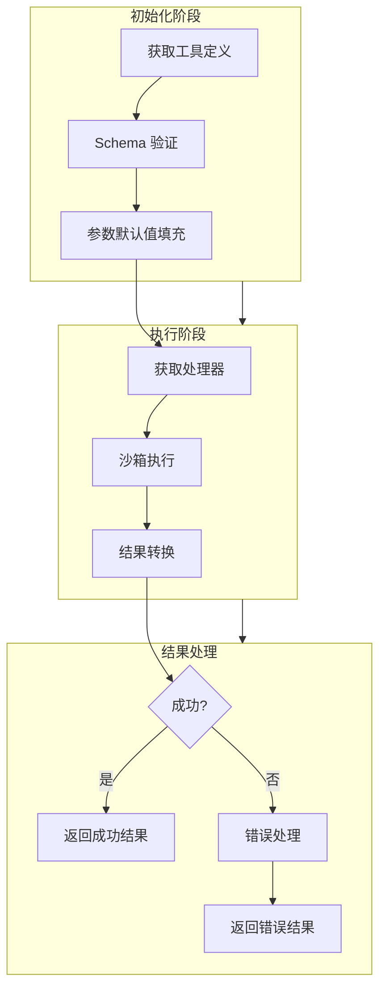
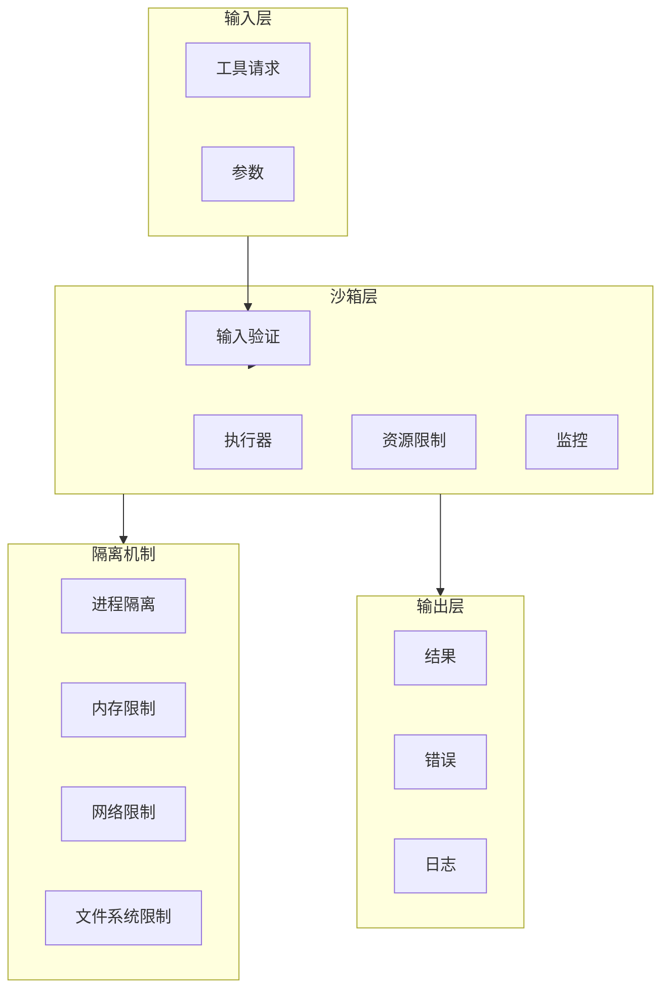

# 工具调用模式

> 本文档详细介绍 AI Agent 系统中工具调用的设计模式、架构实现和最佳实践。

## 1. 工具定义 Schema

### 1.1 JSON Schema 基础结构

每个工具通过 JSON Schema 定义其输入参数，LLM 根据 Schema 理解如何调用工具。

```typescript
// 工具定义完整类型
interface ToolDefinition {
  name: string;                    // 工具唯一标识符（snake_case）
  description: string;              // 详细描述，供 LLM 理解工具用途
  inputSchema: JSONSchemaDefinition; // JSON Schema 定义
  outputSchema?: JSONSchemaDefinition; // 输出 Schema（可选）
  metadata?: {
    category?: string;              // 工具分类
    requiresConfirmation?: boolean; // 是否需要用户确认
    timeout?: number;              // 超时时间（毫秒）
    retryable?: boolean;            // 是否可重试
  };
}

interface JSONSchemaDefinition {
  type: 'object';
  properties: Record<string, PropertySchema>;
  required?: string[];
  additionalProperties?: boolean;
  description?: string;
}

interface PropertySchema {
  type: string;                     // 'string' | 'number' | 'boolean' | 'array' | 'object'
  description?: string;            // 参数描述
  default?: unknown;               // 默认值
  enum?: unknown[];                // 枚举值
  minimum?: number;                 // 最小值（number 类型）
  maximum?: number;                 // 最大值（number 类型）
  minLength?: number;               // 最小长度（string 类型）
  maxLength?: number;               // 最大长度（string 类型）
  pattern?: string;                 // 正则表达式（string 类型）
  items?: PropertySchema;          // 数组元素类型
}
```

### 1.2 Schema 示例

```typescript
// JSONSchemaDefinition 是这些工具 Schema 的共同契约：每个常量都描述"一个可被 LLM 调用的工具入参形状"。
// 校验引擎（如 AJV）会据此在调用前拦截非法参数，因此这里的约束既是文档也是运行时防线。

// 第 1 段：文件读取工具的入参契约（约束路径、编码、行区间）
// 设计意图：把"能读什么"收敛到可枚举的安全范围内，避免工具被诱导去读取任意路径。
// 关键点：path 用正则同时兼容 POSIX 绝对路径与 Windows 盘符路径；required 只锁 path，其余字段靠 default 兜底。
// 易错点：lineStart/lineEnd 是 1-indexed（人类语义），实现侧切片时要记得减 1；两者都给了 minimum 却未强制 lineEnd >= lineStart，需在业务层自行判断。
const readFileSchema: JSONSchemaDefinition = {
  type: 'object',
  properties: {
    path: {
      type: 'string',
      description: '要读取的文件绝对路径',
      pattern: '^(/[a-zA-Z0-9_-]+)+$|^[A-Z]:\\\\[a-zA-Z0-9_\\\\-]+$', // 双反斜杠在 JS 字符串里才表示一个反斜杠，正则在 Windows 分支上又需再转义一次
    },
    encoding: {
      type: 'string',
      description: '文件编码格式',
      enum: ['utf-8', 'utf-16', 'ascii', 'base64'], // 用 enum 而非自由字符串，可防止传入 Buffer 不认识的编码名
      default: 'utf-8',
    },
    lineStart: {
      type: 'number',
      description: '起始行号（1-indexed）',
      minimum: 1,
    },
    lineEnd: {
      type: 'number',
      description: '结束行号',
      minimum: 1,
    },
  },
  required: ['path'],
  additionalProperties: false, // 关闭额外字段，避免模型幻觉出未定义参数后被静默忽略
};

// 第 2 段：网络搜索工具的入参契约（约束关键词长度、结果条数与来源）
// 设计意图：query 的 min/maxLength 同时防住"空搜索"和"超长提示注入"；limit 设上限是为了控制下游 API 配额与上下文体积。
// 边界条件：language 正则允许 "en" 或 "en-US" 两种形态；source 用枚举限定为预置适配器，未列出的来源不会进入分发逻辑。
// 注意：这里没有 additionalProperties: false，未知字段会被引擎放行（与第 1 段策略不一致，属已知差异）。
const webSearchSchema: JSONSchemaDefinition = {
  type: 'object',
  properties: {
    query: {
      type: 'string',
      description: '搜索关键词',
      minLength: 2,
      maxLength: 500,
    },
    limit: {
      type: 'number',
      description: '返回结果数量上限',
      minimum: 1,
      maximum: 20, // 上限既是成本控制，也是防止把海量结果塞爆模型上下文
      default: 10,
    },
    source: {
      type: 'string',
      description: '搜索来源',
      enum: ['web', 'news', 'github', 'stackoverflow'], // 每个枚举值对应一个后端适配器，新增来源需同步改代码
      default: 'web',
    },
    language: {
      type: 'string',
      description: '结果语言筛选',
      pattern: '^[a-z]{2}(-[A-Z]{2})?$', // 贴近 BCP 47 的粗粒度写法：语言小写、地区大写且可选
      default: 'en',
    },
  },
  required: ['query'],
};

// 第 3 段：代码执行工具的入参契约（约束语言、代码体积、超时与环境变量）
// 设计意图：运行时执行属于高风险能力，timeout 用 [1000, 60000] 双向夹紧，防止瞬间刷爆或被单次调用长期占用进程。
// 数据流：environment 是嵌套对象，additionalProperties: { type: 'string' } 表示"键任意、值必须是字符串"，可直接映射为子进程 env。
// 易错点：maxLength 按字符数而非字节数计，多字节代码可能提前触顶；语言与代码是 required，超时缺失时由 default 补齐为 30s。
const executeCodeSchema: JSONSchemaDefinition = {
  type: 'object',
  properties: {
    language: {
      type: 'string',
      description: '编程语言',
      enum: ['javascript', 'typescript', 'python', 'bash', 'sql'], // 白名单即沙箱支持矩阵，不在其中的语言没有对应 runner
    },
    code: {
      type: 'string',
      description: '要执行的代码',
      maxLength: 50000, // 限制单次提交体积，避免超大脚本拖垮解析或注入流程
    },
    timeout: {
      type: 'number',
      description: '执行超时（毫秒）',
      minimum: 1000, // 下限防止模型给出 0/负数导致立即被 kill
      maximum: 60000, // 上限防止单次调用长期占用执行槽位
      default: 30000,
    },
    environment: {
      type: 'object',
      description: '环境变量',
      additionalProperties: { type: 'string' }, // 作为 map 使用：key 自由、value 必须为字符串，契合 process.env 的约束
    },
  },
  required: ['language', 'code'],
};
```
### 1.3 工具注册与发现

```typescript
// 第 1 段：注册表骨架与双 Map 设计（类的状态声明）
// 核心设计是"定义"与"实现"分离：tools 存元数据（给 LLM 看的 JSON Schema 描述），
// handlers 存真正可执行的函数。两者用同一个 name 作为 key 关联，
// 这样调用方可以先拿定义做参数校验、再用同一个 name 找到处理器执行。
// 用 Map 而非普通对象：避免原型链污染（如 name 为 "__proto__" 时对象会出问题），且 O(1) 增删查。
class ToolRegistry {
  private tools: Map<string, ToolDefinition> = new Map();
  private handlers: Map<string, ToolHandler> = new Map();

  // 第 2 段：注册入口（先校验、后写入，保证注册表内不存在"脏数据"）
  // 顺序很重要：校验放在写入之前，schema 不合法就直接抛异常，
  // 不会出现"定义了但不可用"的半注册状态。若先写入再校验，
  // 一旦抛错就会残留只有 tools 没有 handlers 的错位数据。
  register(definition: ToolDefinition, handler: ToolHandler): void {
    // 验证 Schema 有效性
    this.validateSchema(definition.inputSchema);

    // 两次 set 用同一个 definition.name 作 key，显式维持两个 Map 的一致性
    this.tools.set(definition.name, definition);
    this.handlers.set(definition.name, handler);

    // 同名校验的缺失是易错点：这里直接覆盖，重复注册旧定义会被静默丢弃
    console.log(`[ToolRegistry] Registered: ${definition.name}`);
  }

  // 第 3 段：按名查询（定义与处理器分别暴露）
  // 返回 undefined 而非抛错，把"是否存在"的判断权交给调用方，
  // 便于上层在调用工具前做优雅降级。查找均为 O(1)。
  get(name: string): ToolDefinition | undefined {
    return this.tools.get(name);
  }

  getHandler(name: string): ToolHandler | undefined {
    return this.handlers.get(name);
  }

  // 第 4 段：全量枚举定义
  // Map.values() 返回的是迭代器而非数组，用 Array.from 快照化，
  // 避免调用方在遍历过程中注册新工具导致迭代行为不确定。
  getAll(): ToolDefinition[] {
    return Array.from(this.tools.values());
  }

  // 第 5 段：适配 LLM 协议格式（内部模型 → 外部 API 的转换层）
  // 这里做的是"字段重命名"：内部用驼峰 inputSchema，Anthropic/OpenAI 风格的
  // 工具协议要求下划线 input_schema，所以必须显式映射而不能直接透传对象引用。
  // 只挑 name/description/input_schema 三个字段，是有意裁剪，防止内部字段外泄。
  // 时间复杂度 O(n)，n 为已注册工具数。
  getToolsForLLM(): LLMtoolFormat[] {
    return this.getAll().map(tool => ({
      name: tool.name,
      description: tool.description,
      input_schema: tool.inputSchema,
    }));
  }

  // 第 6 段：Schema 前置校验（fail-fast，守住 LLM 函数调用的边界）
  // 只允许顶层是 object：LLM 生成工具参数时永远是一个 JSON 对象，
  // 若 schema 声明成 array/string 等类型，参数解析阶段就会产生歧义甚至报错。
  // 校验只覆盖两个最低必要条件，不做完整 JSON Schema 合法性检查，
  // 属于"便宜的守门检查"，更复杂的约束应交给专用校验库。
  private validateSchema(schema: JSONSchemaDefinition): void {
    if (schema.type !== 'object') {
      throw new Error('Tool input schema must be type "object"');
    }
    // properties 为空同样拒绝：无参数工具在多数 API 中会被判定为无效，
    // 且 Object.keys 对 undefined 会抛类型错误，故先做存在性判断再取键。
    if (!schema.properties || Object.keys(schema.properties).length === 0) {
      throw new Error('Tool schema must have at least one property');
    }
  }
}
```
## 2. 工具执行生命周期

### 2.1 完整生命周期流程



### 2.2 生命周期实现

```typescript
// 工具执行上下文
interface ToolExecutionContext {
  toolName: string;
  toolCallId: string;
  input: unknown;
  userId?: string;
  sessionId: string;
  metadata: Record<string, unknown>;
  startTime: number;
  abortSignal?: AbortSignal;
}

// 工具执行器
class ToolExecutor {
  constructor(
    private registry: ToolRegistry,
    private sandbox: SandboxManager,
    private errorHandler: ErrorHandler,
    private resultTransformer: ResultTransformer
  ) {}

  async execute(
    toolCall: { name: string; id: string; input: unknown },
    context: Partial<ToolExecutionContext>
  ): Promise<ToolExecutionResult> {
    const executionContext: ToolExecutionContext = {
      toolName: toolCall.name,
      toolCallId: toolCall.id,
      input: toolCall.input,
      sessionId: context.sessionId || crypto.randomUUID(),
      metadata: context.metadata || {},
      startTime: Date.now(),
      ...context,
    };

    try {
      // 阶段 1: 获取工具定义
      const tool = this.registry.get(toolCall.name);
      if (!tool) {
        throw new ToolNotFoundError(toolCall.name);
      }

      // 阶段 2: Schema 验证
      const validatedInput = this.validateInput(
        toolCall.input,
        tool.inputSchema
      );

      // 阶段 3: 参数填充默认值
      const filledInput = this.applyDefaults(validatedInput, tool.inputSchema);

      // 阶段 4: 获取处理器
      const handler = this.registry.getHandler(toolCall.name);
      if (!handler) {
        throw new HandlerNotFoundError(toolCall.name);
      }

      // 阶段 5: 沙箱执行
      const rawResult = await this.sandbox.execute(
        handler,
        filledInput,
        executionContext
      );

      // 阶段 6: 结果转换
      const result = this.resultTransformer.transform(
        rawResult,
        tool.outputSchema
      );

      return {
        success: true,
        toolCallId: toolCall.id,
        output: result,
        executionTime: Date.now() - executionContext.startTime,
      };

    } catch (error) {
      // 错误处理
      const errorResult = await this.errorHandler.handle(error, executionContext);

      return {
        success: false,
        toolCallId: toolCall.id,
        error: errorResult.message,
        errorCode: errorResult.code,
        executionTime: Date.now() - executionContext.startTime,
      };
    }
  }

  private validateInput(
    input: unknown,
    schema: JSONSchemaDefinition
  ): unknown {
    // 使用 ajv 或 zod 进行验证
    const validator = new SchemaValidator(schema);
    const result = validator.validate(input);

    if (!result.valid) {
      throw new ValidationError(result.errors);
    }

    return result.data;
  }

  private applyDefaults(
    input: unknown,
    schema: JSONSchemaDefinition
  ): unknown {
    const result = { ...input };

    for (const [key, propSchema] of Object.entries(schema.properties)) {
      if (result[key] === undefined && propSchema.default !== undefined) {
        result[key] = propSchema.default;
      }
    }

    return result;
  }
}

// 执行结果
interface ToolExecutionResult {
  success: boolean;
  toolCallId: string;
  output?: unknown;
  error?: string;
  errorCode?: string;
  executionTime: number;
}
```

### 2.3 异步执行与流式输出

```typescript
// 第 1 段：流式能力契约 —— 把"能流式执行"从普通工具中单独抽成一个接口
// 支持流式输出的工具
// 为什么用单一回调 onChunk 而不是返回 AsyncIterable：实现方只需在生成过程中同步"推"片段，
// 调用方不必实现迭代器协议；代价是背压（backpressure）完全交给 onChunk 的实现去把控，
// 且接口返回 Promise<void>，不承载最终结果——成功与否只能靠"有没有抛异常"来表达。
interface StreamingTool {
  executeStream(
    input: unknown,
    context: ToolExecutionContext,
    onChunk: (chunk: string) => void
  ): Promise<void>;
}

// 第 2 段：执行器骨架 —— 类只负责"编排写流"，具体产出交给工具自身
// 关键数据流：toolCall.input → handler.executeStream → onChunk(chunk) → TextEncoder → writer
// 复杂度：除流内部缓冲外仅占 O(1) 额外空间；时间随输出总量线性增长。
// 流式执行示例
class StreamingToolExecutor {
  async executeStream(
    toolCall: ToolCall,
    context: ToolExecutionContext,
    outputStream: WritableStream<string>
  ): Promise<ToolResult> {
    // 第 3 段：工具查表 + 获取写入通道 —— 在进入 try 之前完成，失败会直接向外抛
    const tool = this.registry.get(toolCall.name); // 按名字查注册表；返回类型通常含 undefined，此处未做存在性防御
    const handler = tool.handler as StreamingTool; // 类型断言而非类型守卫：工具是否真能流式执行，要到运行时调用才暴露（注意 this.registry 需由基类或声明合并提供）
    const writer = outputStream.getWriter(); // getWriter 会锁定该流：同一流不可并发写入，且结束后必须 close/abort/releaseLock 之一，否则永久锁死
    const encoder = new TextEncoder(); // 边界陷阱：outputStream 声明为 WritableStream<string>，但 write 需要 Uint8Array，二者类型并不自洽

    // 第 4 段：正常路径 —— 驱动回调推流，然后显式关闭
    // executeStream 的 resolve 不代表所有 chunk 都已落盘：回调里 writer.write(...) 返回的 Promise 被丢弃了
    // （onChunk 声明为 (chunk: string) => void），所以这是本函数最大的易错点——既形成"未 await"的竞态，
    // 也让写入失败变成无人处理的 rejection；好在 close() 会等待队列中已排队的写入 flush，正常路径下结果仍是完整的。
    try {
      await handler.executeStream(
        toolCall.input,
        context,
        (chunk) => writer.write(encoder.encode(chunk)) // 每次编码一个 chunk，按调用顺序排队写入
      );

      await writer.close(); // 关闭并入队 flush；若前面排队的某次 write 已 reject，这里会同步抛错
      return { success: true };

      // 第 5 段：异常路径 —— 中止流并归一化错误，保证半截输出不会被消费方当成完整结果
    } catch (error) {
      // abort 与 close 语义不同：它直接丢弃未写入数据并把流置为 errored，适合"中途失败"场景
      await writer.abort(error); // abort 自身也可能 reject（例如流已关闭），在此未再包裹 try，属于可接受的教学简化
      return { success: false, error: error.message }; // 严格模式下 catch 变量是 unknown，error.message 需先做类型窄化才能通过编译
    }
  }
}
```
## 3. 内置工具实现

### 3.1 文件读取工具

```typescript
// read_file 工具
const readFileTool: AgentTool = {
  name: 'read_file',
  description: '读取指定路径的文件内容。适用于查看代码、配置文件或文本文档。',
  inputSchema: {
    type: 'object',
    properties: {
      path: {
        type: 'string',
        description: '文件的绝对路径（Windows: C:\\path\\file 或 Unix: /path/file）',
      },
      encoding: {
        type: 'string',
        description: '文件编码',
        enum: ['utf-8', 'utf-16le', 'utf-16be', 'ascii', 'base64'],
        default: 'utf-8',
      },
      lineStart: {
        type: 'number',
        description: '读取起始行（1-indexed，包含）',
        minimum: 1,
      },
      lineEnd: {
        type: 'number',
        description: '读取结束行（包含）',
        minimum: 1,
      },
      maxBytes: {
        type: 'number',
        description: '最大读取字节数（防止大文件）',
        maximum: 10485760, // 10MB
        default: 1048576,  // 1MB
      },
    },
    required: ['path'],
  },
  handler: async (input, context) => {
    const fs = await import('fs/promises');
    const path = await import('path');

    // 安全检查：防止路径遍历
    const normalizedPath = path.normalize(input.path);
    if (normalizedPath.includes('..')) {
      throw new Error('Path traversal not allowed');
    }

    // 检查文件是否存在
    try {
      const stats = await fs.stat(normalizedPath);
      if (!stats.isFile()) {
        throw new Error('Path is not a file');
      }
      if (stats.size > (input.maxBytes || 1048576)) {
        throw new Error(`File too large: ${stats.size} bytes`);
      }
    } catch (err) {
      if ((err as NodeJS.ErrnoException).code === 'ENOENT') {
        throw new Error(`File not found: ${normalizedPath}`);
      }
      throw err;
    }

    // 读取文件
    let content = await fs.readFile(normalizedPath, input.encoding || 'utf-8');

    // 行范围截取
    if (input.lineStart || input.lineEnd) {
      const lines = content.split('\n');
      const start = (input.lineStart || 1) - 1;
      const end = input.lineEnd || lines.length;
      content = lines.slice(start, end).join('\n');
    }

    return {
      success: true,
      output: {
        content,
        path: normalizedPath,
        size: content.length,
        truncated: content.length >= (input.maxBytes || 1048576),
      },
    };
  },
};
```

### 3.2 文件写入工具

```typescript
// write_file 工具
const writeFileTool: AgentTool = {
  name: 'write_file',
  description: '创建或覆盖文件内容。用于写入代码、配置文件或文档。',
  inputSchema: {
    type: 'object',
    properties: {
      path: {
        type: 'string',
        description: '目标文件的绝对路径',
      },
      content: {
        type: 'string',
        description: '文件内容',
        maxLength: 10485760, // 10MB
      },
      encoding: {
        type: 'string',
        description: '文件编码',
        enum: ['utf-8', 'utf-16le', 'utf-16be', 'ascii'],
        default: 'utf-8',
      },
      append: {
        type: 'boolean',
        description: '是否追加模式（true 追加，false 覆盖）',
        default: false,
      },
      createDirectories: {
        type: 'boolean',
        description: '是否自动创建不存在的父目录',
        default: true,
      },
    },
    required: ['path', 'content'],
  },
  handler: async (input, context) => {
    const fs = await import('fs/promises');
    const path = await import('path');

    // 安全检查
    const normalizedPath = path.normalize(input.path);
    if (normalizedPath.includes('..')) {
      throw new Error('Path traversal not allowed');
    }

    // 危险路径检查
    const dangerousPaths = ['/system', '/etc', '/usr', 'C:\\Windows', 'C:\\System'];
    if (dangerousPaths.some(p => normalizedPath.startsWith(p))) {
      throw new Error('Writing to system directories is not allowed');
    }

    // 创建目录
    if (input.createDirectories !== false) {
      const dir = path.dirname(normalizedPath);
      await fs.mkdir(dir, { recursive: true });
    }

    // 写入文件
    const flags = input.append ? 'a' : 'w';
    await fs.writeFile(normalizedPath, input.content, {
      encoding: input.encoding || 'utf-8',
      flag: flags,
    });

    return {
      success: true,
      output: {
        path: normalizedPath,
        bytesWritten: input.content.length,
        mode: input.append ? 'appended' : 'written',
      },
    };
  },
};
```

### 3.3 Web 搜索工具

```typescript
// web_search 工具
// 第 1 段：工具契约声明——把「名称 + 用途 + 参数形状」固化成 LLM 可读的元数据
// 为什么：Agent 框架靠 name 做路由与去重、靠 description 让模型自行判断「何时该调这个工具」，
// 靠 inputSchema 在真正执行 handler 之前完成参数校验、类型收敛和默认值注入，因此三者缺一不可。
// 注意：description 是写给模型看的提示词而非文档，它直接决定召回率，措辞需要精确描述「返回什么」。
const webSearchTool: AgentTool = {
  name: 'web_search',
  description: '在互联网上搜索相关信息，返回匹配的网页结果摘要。',
  inputSchema: {
    type: 'object',
    // 第 2 段：逐参数约束——用声明式 schema 代替手写 if 校验，把「合法性边界」下沉到框架层
    // 关键设计：每个字段都同时携带 description（给模型看）与约束（给校验器看），二者同源可避免漂移。
    // 易错点：约束过松会让模型产出脏参数，过紧（如 minLength 太大）会导致本可用的查询被直接拒绝。
    properties: {
      query: {
        type: 'string',
        description: '搜索查询关键词',
        minLength: 2, // 拦掉 "a"、"" 这类无信息量查询，避免白白消耗一次 API 配额
        maxLength: 500, // 上限兜底：防止模型把整段用户输入原样塞进来，超出多数搜索 API 的 URL 长度限制
      },
      limit: {
        type: 'number',
        description: '返回结果数量（1-20）',
        minimum: 1,
        maximum: 20, // 封顶 20：结果条数与延迟/成本基本线性相关，且过多会撑爆下游 prompt 的上下文预算
        default: 10,
      },
      source: {
        type: 'string',
        description: '搜索来源',
        // enum 是双重契约：既限制模型取值，又恰好构成下方 performWebSearch 的分发表键集合
        enum: ['web', 'news', 'github', 'stackoverflow', 'wikipedia'],
        default: 'web',
      },
      language: {
        type: 'string',
        description: '结果语言（BCP 47 格式，如 en、zh-CN）',
        // 边界条件：该正只接受「两字母小写 + 可选 - 两字母大写」，zh-Hans、en-US-x-private 等更完整的 BCP 47 会被判非法，
        // 属于有意收紧——搜索 API 普遍只认这种粗粒度语言标记，放宽反而会让下游请求失败。
        pattern: '^[a-z]{2}(-[A-Z]{2})?$',
        default: 'en',
      },
      timeRange: {
        type: 'string',
        description: '搜索时间范围',
        enum: ['day', 'week', 'month', 'year', 'any'], // 用 'any' 而非缺省省略，保证默认值与显式取值处于同一语义空间
        default: 'any',
      },
      safeSearch: {
        type: 'boolean',
        description: '是否启用安全搜索',
        default: true, // 安全优先：默认开启，把「关闭」变成用户必须主动表达的动作
      },
    },
    // 第 3 段：必填约束——只有 query 是必需的，其余全部可选并依赖 schema 默认值
    // 意图：把「最少必要输入」暴露给模型，能显著降低工具调用失败率与参数编造概率。
    required: ['query'],
  },
  // 第 4 段：handler 执行体——参数归一化（normalize）与外部副作用调用
  // 为什么：schema 默认值是「框架层」的承诺，但 handler 可能被单测、内部代码或其他工具直接调用，
  // 因此这里再兜一层默认值，形成防御性编程；这种「双重默认」在跨边界调用时是必要冗余。
  // 数据流：input（模型产出，字段可能缺失）→ 归一化后的 params → performWebSearch → 结构化结果。
  // 说明：第二个参数 context 用于注入取消信号、日志、用户身份等运行时能力，本例暂未使用。
  handler: async (input, context) => {
    const searchResults = await performWebSearch({
      query: input.query,
      limit: input.limit || 10, // 用 || 而非 ??：这里 0 属非法值（minimum=1），被兜底成 10 反而是安全行为
      source: input.source || 'web',
      language: input.language || 'en',
      timeRange: input.timeRange || 'any',
      // 易错点：不能写 input.safeSearch || true——那会恒为 true，用户显式传 false 时永远关不掉；
      // 用 !== false 才能精确表达「除非明确关闭，否则一律安全搜索」的三态语义（undefined 视为开启）。
      safeSearch: input.safeSearch !== false,
    });

    // 第 5 段：结果投影（projection）——只回传白名单字段，重新组装成稳定的对外契约
    // 为什么：搜索 API 的原始 item 常含大量噪声字段（内部 id、打分、原始 HTML），
    // 直接透传既浪费上下文 token，也会把上游字段变更的风险泄漏给下游；显式映射等于钉住契约版本。
    // 复杂度：O(n) 单趟映射，n = limit ≤ 20，可忽略；publishedAt 允许为空（新闻/网页可能无发布时间）。
    return {
      success: true,
      output: {
        query: input.query, // 回显原始查询，便于多工具并发时把结果与请求对应起来
        totalResults: searchResults.total,
        results: searchResults.items.map(item => ({
          title: item.title,
          url: item.url,
          snippet: item.snippet, // 摘要而非全文：让模型先做相关性判断，需要细节时再单独抓取页面
          source: item.source,
          publishedAt: item.publishedAt,
        })),
      },
    };
  },
};

// 搜索实现（可对接多种搜索 API）
// 第 6 段：策略分发（dispatcher）——按 source 把统一入参路由到不同后端实现
// 意图：把「工具契约」与「具体供应商」解耦，新增渠道只需加一个 case + 一个实现函数，不改动上面的工具定义。
async function performWebSearch(params: SearchParams): Promise<SearchResponse> {
  // 根据 source 选择不同的搜索 API
  // 为什么用 switch 而非查表：分支少、每个实现签名一致、且 default 天然充当兜底，
  // 即使调用方绕过 schema 传了非法 source，也会安全退化到通用网页搜索而不是抛错。
  switch (params.source) {
    case 'github':
      return searchGitHub(params);
    case 'stackoverflow':
      return searchStackOverflow(params);
    case 'wikipedia':
      return searchWikipedia(params);
    default:
      return searchWeb(params);
  }
}
```
### 3.4 代码执行工具

```typescript
// execute_code 工具
// 第 1 段：工具对象的元信息（name / description）——给模型看的"身份证"
// name 是模型在 function calling 中回传的调用标识，必须全局唯一且稳定；
// description 会直接进入提示词，承担"何时该调用本工具"的路由职责，
// 因此它描述的是能力边界（沙箱执行、多语言），而不是实现细节。
const executeCodeTool: AgentTool = {
  name: 'execute_code',
  description: '在沙箱环境中执行代码片段。支持多种编程语言。',
  // 第 2 段：inputSchema 顶层结构——参数契约的骨架
  // 只有 object 类型才允许宿主框架把 JSON 参数按字段名逐个填充；
  // properties 声明"有哪些槽位"，required（见第 8 段）声明"哪些槽位必须存在"。
  inputSchema: {
    type: 'object',
    properties: {
      // 第 3 段：language——决定沙箱选择哪个运行时
      // 用 enum 把取值收敛成封闭集合，等于让模型在生成阶段就只能挑合法值，
      // 比事后校验更省一次往返；新增语言必须同步在沙箱侧注册对应执行器。
      language: {
        type: 'string',
        description: '编程语言',
        enum: ['javascript', 'typescript', 'python', 'bash', 'sql'],
      },
      // 第 4 段：code——主载荷，用 maxLength 做入口侧的第一道体积护栏
      // 限制的是字符数而非字节数，中文/多字节字符会占更多实际内存，
      // 所以它只能挡住"明显超长"的输入，真正的资源控制要靠沙箱自身限额。
      code: {
        type: 'string',
        description: '要执行的代码',
        maxLength: 50000,
      },
      // 第 5 段：timeout——唯一的资源/耗时护栏
      // 下界 1000 防止把超时设得比启动开销还短而必然失败，
      // 上界 60000 避免模型写出的死循环长时间占住沙箱与工作进程。
      // 易错点：JSON Schema 的 default 只是"声明"，多数校验器不会回填，
      // 所以 handler 里必须再兜底一次（见第 9 段）。
      timeout: {
        type: 'number',
        description: '超时时间（毫秒）',
        minimum: 1000,
        maximum: 60000,
        default: 30000,
      },
      // 第 6 段：environment——开放键名的字典参数
      // additionalProperties 表示"键名任意、值必须是 string"，
      // 这样模型可以自由传任意环境变量，而不必预先枚举；
      // 代价是键不可控，注入敏感变量（如凭据）的风险需在沙箱侧做白名单/脱敏。
      environment: {
        type: 'object',
        description: '环境变量',
        additionalProperties: { type: 'string' },
      },
      // 第 7 段：stdin——给交互式/管道式程序喂入数据的通道
      // 与 code 分开，是为了让"程序本身"和"输入数据"各自独立受限；
      // 10k 的上限通常够跑测试用例，同时避免把大文件内容塞进上下文。
      stdin: {
        type: 'string',
        description: '标准输入',
        maxLength: 10000,
      },
    },
    // 第 8 段：required——最小可用调用集合
    // 只强制 language 和 code：没有这两者调用毫无意义；
    // timeout / environment / stdin 保持可选，让模型在简单场景下少填参数、少出错。
    required: ['language', 'code'],
  },
  // 第 9 段：handler——真正的执行入口（把参数转译成沙箱调用）
  // handler 是"声明"到"动作"的边界：schema 负责约束形状，handler 负责补默认值并下沉到沙箱。
  // 关键数据流：input（模型产出、已按 schema 校验）→ 逐字段重塑 → executeInSandbox → 返回值透传。
  // 边界条件：input.timeout 缺省时用 || 退回 30000（与 schema.default 对齐）；
  // 注意 || 会把 0/空串视为缺省，此处因 minimum 已排除 0，语义上是安全的。
  // 复杂度：本函数是 O(1) 的参数搬运，耗时全部来自被 await 的沙箱执行。
  handler: async (input, context) => {
    // 实际执行在沙箱中进行：进程隔离由此处的 executeInSandbox 承担，而非本工具。
    return await executeInSandbox({
      language: input.language,
      code: input.code,
      timeout: input.timeout || 30000,
      environment: input.environment,
      stdin: input.stdin,
    });
  },
};
```
### 3.5 Bash 执行工具

```typescript
// bash 工具
// 第 1 段：工具对象骨架与元信息
// AgentTool 是约定好的工具协议：name/description 决定模型"何时该调用它"，
// inputSchema 则会被转换成给模型看的 JSON Schema，因此描述文字本身也是"提示词"。
// 注意这里没有把工具写成函数，而是"声明对象 + 异步 handler"，便于统一注册与校验。
const bashTool: AgentTool = {
  name: 'bash',
  description: '执行 Bash 命令。用于文件系统操作、进程管理等。',
  // 第 2 段：输入契约（Schema）
  // 用 JSON Schema 把"自然语言参数"收敛成结构化参数，模型据此生成实参、框架据此校验。
  // command 设 maxLength 是防御性的：超长命令既浪费 token，也常是注入/混淆的信号。
  inputSchema: {
    type: 'object',
    properties: {
      command: {
        type: 'string',
        description: '要执行的 Bash 命令',
        maxLength: 5000,
      },
      workingDirectory: {
        type: 'string',
        description: '命令执行的工作目录',
      },
      // timeout 用 min/max/default 三重约束：既防止 0 导致进程永不超时，也防止过大值拖死宿主。
      timeout: {
        type: 'number',
        description: '超时时间（毫秒）',
        minimum: 1000,
        maximum: 120000,
        default: 30000,
      },
      // env 用 additionalProperties 声明"任意键均为 string"的字典类型，
      // 这也是安全考量：值必须是字符串，避免模型塞入对象/函数造成注入或序列化歧义。
      env: {
        type: 'object',
        description: '环境变量',
        additionalProperties: { type: 'string' },
      },
    },
    // 只有 command 必填，其余靠 handler 内部兜底默认值，降低模型调用失败率。
    required: ['command'],
  },
  // 第 3 段：执行入口 handler
  // handler 是"唯一真正跑代码"的地方，所以所有校验都必须放在这里，不能只依赖 schema。
  // input 是模型给的实参，context 通常携带会话/权限等运行期信息。
  handler: async (input, context) => {
    // 安全检查
    // 第 4 段：黑名单拦截（最外层护栏）
    // 这是"字符串包含"式的粗粒度黑名单：能挡住最典型的破坏性命令，但无法覆盖变形写法，
    // 所以它只是纵深防御的第一层，真正的授权交给后面的白名单校验。
    const dangerousCommands = ['rm -rf /', ':(){ :|:& };:', 'mkfs', 'dd if='];
    if (dangerousCommands.some(cmd => input.command.includes(cmd))) {
      throw new Error('Dangerous command not allowed');
    }

    // 解析命令并验证白名单
    // 第 5 段：解析 + 白名单校验（真正的授权决策）
    // 先分词拿到可执行文件名（cmdParts[0]），再走"默认拒绝"的白名单；
    // 边界点：这里只校验首个 token，管道/多命令串联（如 `a; b`）需要 isCommandAllowed 内部自行处理。
    // 一旦不允许就 fail-fast，throw 会中断后续所有执行路径，绝不"先跑起来再说"。
    const cmdParts = parseCommand(input.command);
    if (!this.isCommandAllowed(cmdParts[0])) {
      throw new Error(`Command not allowed: ${cmdParts[0]}`);
    }

    // 第 6 段：委托执行与默认值归一
    // 三个默认值把"可选参数"补齐为确定形态：cwd 缺失时落到当前进程目录，timeout 缺失时用 30s，
    // 与 schema 的 default 保持一致，避免"schema 与运行时各说各话"。
    // env 用展开合并构造新对象（父进程环境 → 调用方覆盖），既不改动 process.env，又让显式传入的变量优先生效。
    return await executeBash({
      command: input.command,
      cwd: input.workingDirectory || process.cwd(),
      timeout: input.timeout || 30000,
      env: { ...process.env, ...input.env },
    });
  },
};
```
## 4. 工具结果处理与错误管理

### 4.1 结果处理管道

```typescript
// 结果转换器
class ResultTransformer {
  transform(result: unknown, schema?: JSONSchemaDefinition): unknown {
    // 空结果
    if (result === null || result === undefined) {
      return null;
    }

    // 字符串直接返回
    if (typeof result === 'string') {
      return this.truncateIfNeeded(result);
    }

    // 对象按 Schema 转换
    if (typeof result === 'object') {
      return this.transformObject(result, schema);
    }

    // 其他类型转字符串
    return String(result);
  }

  private transformObject(
    obj: object,
    schema?: JSONSchemaDefinition
  ): object {
    if (!schema) {
      return this.sanitizeObject(obj);
    }

    const result: Record<string, unknown> = {};

    for (const [key, value] of Object.entries(obj)) {
      // 只保留 schema 中定义的字段
      if (schema.properties && key in schema.properties) {
        result[key] = this.transform(value, schema.properties[key]);
      }
    }

    return result;
  }

  private sanitizeObject(obj: object): object {
    const seen = new WeakSet();

    const sanitize = (value: unknown): unknown => {
      if (value === null || value === undefined) return null;
      if (typeof value !== 'object') return value;
      if (seen.has(value as object)) return '[Circular]';
      seen.add(value as object);

      if (Array.isArray(value)) {
        return value.slice(0, 1000).map(sanitize); // 限制数组长度
      }

      const result: Record<string, unknown> = {};
      for (const [k, v] of Object.entries(value)) {
        // 过滤敏感字段
        if (this.isSensitiveKey(k)) {
          result[k] = '[REDACTED]';
        } else {
          result[k] = sanitize(v);
        }
      }
      return result;
    };

    return sanitize(obj);
  }

  private isSensitiveKey(key: string): boolean {
    const sensitivePatterns = [
      /password/i, /secret/i, /token/i, /api_key/i,
      /apikey/i, /credential/i, /private/i,
    ];
    return sensitivePatterns.some(p => p.test(key));
  }

  private truncateIfNeeded(str: string, maxLength = 100000): string {
    if (str.length <= maxLength) return str;
    return str.slice(0, maxLength) + `\n... [truncated ${str.length - maxLength} chars]`;
  }
}
```

### 4.2 错误分类与处理

```typescript
// 第 1 段：错误码枚举（把所有可预期的失败场景收敛成有限集合）
// 用字符串枚举而非数字枚举，序列化到日志/跨进程传输时可读、可对照，避免"数字含义靠文档"。
// 这里是后续策略映射（errorStrategies）的键来源，枚举成员一旦新增/删除，映射表必须同步，否则类型检查或运行时策略会缺失。
// 错误类型枚举
enum ToolErrorCode {
  VALIDATION_ERROR = 'VALIDATION_ERROR',
  NOT_FOUND = 'NOT_FOUND',
  PERMISSION_DENIED = 'PERMISSION_DENIED',
  TIMEOUT = 'TIMEOUT',
  RATE_LIMIT = 'RATE_LIMIT',
  SANDBOX_ERROR = 'SANDBOX_ERROR',
  UNKNOWN_ERROR = 'UNKNOWN_ERROR',
}

// 第 2 段：错误处理策略表（错误码 -> 重试参数 + 用户可见文案）
// 用 Record<ToolErrorCode, ErrorStrategy> 做穷尽映射：漏配任意一个错误码都会在编译期报错，防止运行时空指针。
// 设计要点：把"是否可重试/重试上限/退避时长/给用户的提示"从处理逻辑里抽离成数据，新增错误类型只改这张表，无需改 ErrorHandler。
// 易错点：不同策略的 maxRetries/backoffMs 是可选项，后面 shouldRetry 里用 `|| 0` 兜底，因此"未配置"等价于"不可重试"。
// 错误处理策略
const errorStrategies: Record<ToolErrorCode, ErrorStrategy> = {
  // 校验类错误属于调用方输入问题，重试同样会失败，因此不重试；直接把底层信息透传给用户便于定位。
  [ToolErrorCode.VALIDATION_ERROR]: {
    retryable: false,
    userMessage: (err) => `Invalid input: ${err.message}`,
  },
  // 资源不存在同样是确定性失败，重试无意义；透传 message 让用户知道缺了哪个资源。
  [ToolErrorCode.NOT_FOUND]: {
    retryable: false,
    userMessage: (err) => `Resource not found: ${err.message}`,
  },
  // 权限问题需要用户干预（改权限/换路径），程序自愈不了；文案不复用 err.message，避免泄漏服务器内部路径细节。
  [ToolErrorCode.PERMISSION_DENIED]: {
    retryable: false,
    userMessage: () => 'Permission denied. Check file/directory permissions.',
  },
  // 超时可自愈：网络抖动/慢查询常是瞬时问题，给 2 次机会；同时引导用户缩小操作范围降低单次耗时。
  [ToolErrorCode.TIMEOUT]: {
    retryable: true,
    maxRetries: 2,
    userMessage: () => 'Operation timed out. Try with a smaller scope.',
  },
  // 限流是典型的"退避后即可成功"，重试次数最多且显式给出退避基准 1s，供上层调度做指数退避。
  [ToolErrorCode.RATE_LIMIT]: {
    retryable: true,
    maxRetries: 3,
    backoffMs: 1000,
    userMessage: () => 'Rate limit exceeded. Please wait and retry.',
  },
  // 沙箱错误（如子进程异常退出）偶尔一次即可恢复，但不宜反复重试，故只给 1 次；透传执行错误原因。
  [ToolErrorCode.SANDBOX_ERROR]: {
    retryable: true,
    maxRetries: 1,
    userMessage: (err) => `Execution error: ${err.message}`,
  },
  // 兜底分支：未知原因重试大概率仍失败，且不应把内部堆栈暴露给用户，只给通用文案。
  [ToolErrorCode.UNKNOWN_ERROR]: {
    retryable: false,
    userMessage: () => 'An unexpected error occurred.',
  },
};

// 第 3 段：错误处理器类（把"原始异常"翻译成"结构化、可决策的错误结果"）
// 单一职责：分类 -> 查策略 -> 记日志 -> 决定是否可重试 -> 返回统一结构，调用方只依赖 ToolErrorResult。
// 数据流：unknown error -> classifyError -> ClassifiedError{code,message,original} -> errorStrategies[code] -> ToolErrorResult。
// 注意 handle 的两条 return 分支文案相同、只有 retryable 不同，这是有意为之：把"是否重试"与"展示什么"解耦。
// 错误处理器
class ErrorHandler {
  // 对外唯一入口：接收任意类型异常 + 执行上下文，返回不含异常细节的统一结果。
  handle(error: unknown, context: ToolExecutionContext): ToolErrorResult {
    const errorInfo = this.classifyError(error);
    const strategy = errorStrategies[errorInfo.code];

    // 记录错误
    // 先落日志再决策：无论最终是否重试，原始错误都要留痕，方便事后归因。
    this.logError(errorInfo, context);

    // 检查是否可重试
    // 双重条件：策略允许重试（retryable）且上下文里的 retryCount 未超上限，二者缺一不可。
    if (strategy.retryable && this.shouldRetry(errorInfo, context)) {
      return {
        error: strategy.userMessage(errorInfo),
        code: errorInfo.code,
        retryable: true,
      };
    }

    return {
      error: strategy.userMessage(errorInfo),
      code: errorInfo.code,
      retryable: false,
    };
  }

  // 第 4 段：异常分类（instanceof 短路链，把具体错误子类映射到错误码）
  // 顺序即优先级：必须是子类在前、父类/兜底在后；若 ValidationError 继承自某基类，基类判断不能放在它前面，否则会被"截胡"。
  // 每条分支都保留 original 引用，便于日志或调试时回溯原始对象（含堆栈、自定义字段）。
  private classifyError(error: unknown): ClassifiedError {
    if (error instanceof ValidationError) {
      return { code: ToolErrorCode.VALIDATION_ERROR, message: error.message, original: error };
    }
    if (error instanceof NotFoundError) {
      return { code: ToolErrorCode.NOT_FOUND, message: error.message, original: error };
    }
    if (error instanceof PermissionError) {
      return { code: ToolErrorCode.PERMISSION_DENIED, message: error.message, original: error };
    }
    if (error instanceof TimeoutError) {
      return { code: ToolErrorCode.TIMEOUT, message: error.message, original: error };
    }
    if (error instanceof RateLimitError) {
      return { code: ToolErrorCode.RATE_LIMIT, message: error.message, original: error };
    }

    // 兜底：未知子类统一归到 UNKNOWN_ERROR。
    // 关键点：error 可能不是 Error 实例（比如被 throw 的字符串/对象），此时没有 message，必须用三元表达式防御，避免读 undefined.message 报错。
    return {
      code: ToolErrorCode.UNKNOWN_ERROR,
      message: error instanceof Error ? error.message : 'Unknown error',
      original: error,
    };
  }

  // 第 5 段：日志输出（结构化日志，便于采集与检索）
  // 用 console.error 而非 console.log：错误走 stderr，可被日志系统按级别分流，也不会污染正常输出流。
  // 字段设计：tool/sessionId 用于定位"哪个工具在哪个会话里失败"，timestamp 用 ISO 字符串保证时区可解析。
  private logError(error: ClassifiedError, context: ToolExecutionContext): void {
    console.error('[ToolError]', {
      tool: context.toolName,
      code: error.code,
      message: error.message,
      sessionId: context.sessionId,
      timestamp: new Date().toISOString(),
    });
  }

  // 第 6 段：重试判定（基于上下文计数，保持处理器无状态）
  // 核心思想：类本身不保存重试次数，计数来自 context.metadata.retryCount，因此同一实例可安全处理并发请求。
  // 边界处理：retryCount 缺失时 `|| 0` 视为首次尝试；maxRetries 未配置时 `|| 0` 表示不允许重试（与策略表缺失字段语义一致）。
  // 复杂度：O(1) 查表 + 比较，无循环无副作用。
  private shouldRetry(error: ClassifiedError, context: ToolExecutionContext): boolean {
    const retryCount = (context.metadata.retryCount || 0) as number;
    const strategy = errorStrategies[error.code];

    return retryCount < (strategy.maxRetries || 0);
  }
}
```
### 4.3 统一结果格式

```typescript
// 统一工具结果格式
interface ToolResult {
  success: boolean;
  output?: unknown;
  error?: string;
  errorCode?: ToolErrorCode;
  metadata?: {
    executionTime: number;
    retries: number;
    [key: string]: unknown;
  };
}

// 结果格式化（用于返回给 LLM）
function formatResultForLLM(result: ToolResult): string {
  if (result.success) {
    if (result.output === null || result.output === undefined) {
      return 'Operation completed successfully.';
    }

    if (typeof result.output === 'string') {
      return result.output;
    }

    return JSON.stringify(result.output, null, 2);
  }

  // 错误情况
  const message = result.error || 'Unknown error occurred';
  const code = result.errorCode ? `[${result.errorCode}] ` : '';
  return `${code}${message}`;
}
```

## 5. 多工具协同

### 5.1 工具调用编排器

```typescript
// 工具调用请求
interface ToolCallRequest {
  name: string;
  id: string;
  input: unknown;
}

// 编排器配置
interface OrchestratorConfig {
  maxConcurrent: number;        // 最大并发数
  maxSequential: number;         // 最大连续调用数
  stopOnError: boolean;          // 遇错停止
  parallelGroups?: string[][];   // 必须一起执行的工具组
}

// 工具编排器
class ToolOrchestrator {
  private config: OrchestratorConfig;

  constructor(config: OrchestratorConfig) {
    this.config = {
      maxConcurrent: 5,
      maxSequential: 20,
      stopOnError: true,
      ...config,
    };
  }

  async executeAll(
    requests: ToolCallRequest[],
    executor: ToolExecutor
  ): Promise<ToolExecutionResult[]> {
    // 验证请求数量
    if (requests.length > this.config.maxSequential) {
      throw new Error(`Too many tool calls: ${requests.length} > ${this.config.maxSequential}`);
    }

    // 按依赖分组
    const groups = this.groupByDependencies(requests);

    const results: ToolExecutionResult[] = [];

    for (const group of groups) {
      // 并行执行组内工具
      const groupResults = await Promise.all(
        group.map(request => executor.execute(request, {}))
      );

      results.push(...groupResults);

      // 遇错停止
      if (this.config.stopOnError) {
        const failed = groupResults.find(r => !r.success);
        if (failed) {
          console.warn('[Orchestrator] Stopping due to error:', failed.error);
          break;
        }
      }
    }

    return results;
  }

  private groupByDependencies(requests: ToolCallRequest[]): ToolCallRequest[][] {
    if (!this.config.parallelGroups) {
      // 默认全部并行（限制并发数）
      return this.chunkArray(requests, this.config.maxConcurrent);
    }

    // 按依赖组分组
    const groups: ToolCallRequest[][] = [];
    let currentGroup: ToolCallRequest[] = [];

    for (const request of requests) {
      currentGroup.push(request);

      // 检查是否属于需要顺序执行的组
      const groupIndex = this.config.parallelGroups.findIndex(g =>
        g.includes(request.name)
      );

      if (groupIndex >= 0) {
        groups.push([...currentGroup]);
        currentGroup = [];
      } else if (currentGroup.length >= this.config.maxConcurrent) {
        groups.push([...currentGroup]);
        currentGroup = [];
      }
    }

    if (currentGroup.length > 0) {
      groups.push(currentGroup);
    }

    return groups;
  }

  private chunkArray<T>(arr: T[], size: number): T[][] {
    const chunks: T[][] = [];
    for (let i = 0; i < arr.length; i += size) {
      chunks.push(arr.slice(i, i + size));
    }
    return chunks;
  }
}
```

### 5.2 工具依赖解析

```typescript
// 工具依赖图
class ToolDependencyGraph {
  private dependencies: Map<string, Set<string>> = new Map();
  privatedependents: Map<string, Set<string>> = new Map();

  addDependency(tool: string, dependsOn: string): void {
    if (!this.dependencies.has(tool)) {
      this.dependencies.set(tool, new Set());
    }
    this.dependencies.get(tool)!.add(dependsOn);

    if (!thisdependents.has(dependsOn)) {
      thisdependents.set(dependsOn, new Set());
    }
    thisdependents.get(dependsOn)!.add(tool);
  }

  // 拓扑排序
  getExecutionOrder(tools: string[]): string[] {
    const visited = new Set<string>();
    const order: string[] = [];

    const visit = (tool: string) => {
      if (visited.has(tool)) return;
      visited.add(tool);

      // 先访问依赖
      const deps = this.dependencies.get(tool) || new Set();
      for (const dep of deps) {
        if (tools.includes(dep)) {
          visit(dep);
        }
      }

      order.push(tool);
    };

    for (const tool of tools) {
      visit(tool);
    }

    return order;
  }

  // 检测循环依赖
  hasCycle(): boolean {
    const visiting = new Set<string>();
    const visited = new Set<string>();

    const dfs = (tool: string): boolean => {
      visiting.add(tool);

      const deps = this.dependencies.get(tool) || new Set();
      for (const dep of deps) {
        if (visiting.has(dep)) return true;
        if (!visited.has(dep) && dfs(dep)) return true;
      }

      visiting.delete(tool);
      visited.add(tool);
      return false;
    };

    for (const tool of this.dependencies.keys()) {
      if (!visited.has(tool) && dfs(tool)) {
        return true;
      }
    }

    return false;
  }
}

// 使用示例
const depGraph = new ToolDependencyGraph();
depGraph.addDependency('write_file', 'read_file');    // write_file 依赖 read_file
depGraph.addDependency('git_commit', 'write_file');   // git_commit 依赖 write_file

const order = depGraph.getExecutionOrder([
  'git_commit', 'write_file', 'read_file'
]);
console.log(order); // ['read_file', 'write_file', 'git_commit']
```

### 5.3 上下文传递

```typescript
// 工具执行上下文传播
class ContextPropagator {
  // 从前一个工具结果中提取需要传递给下一个工具的信息
  extractContext(
    previousResult: ToolExecutionResult,
    nextToolSchema: JSONSchemaDefinition
  ): Partial<unknown> {
    if (!previousResult.success || !previousResult.output) {
      return {};
    }

    const context: Record<string, unknown> = {};

    // 提取文件路径
    if (nextToolSchema.properties?.path) {
      const path = this.extractPath(previousResult.output);
      if (path) context.path = path;
    }

    // 提取 URL
    if (nextToolSchema.properties?.url) {
      const url = this.extractUrl(previousResult.output);
      if (url) context.url = url;
    }

    // 提取搜索结果
    if (nextToolSchema.properties?.query && previousResult.output?.results) {
      const topResult = previousResult.output.results[0];
      if (topResult?.url) {
        context.url = topResult.url;
      }
    }

    return context;
  }

  private extractPath(output: unknown): string | null {
    if (typeof output === 'string') {
      const pathMatch = output.match(/(\/[a-zA-Z0-9_\-./]+|[A-Z]:\\[a-zA-Z0-9_\\.]+)/);
      return pathMatch ? pathMatch[1] : null;
    }

    if (typeof output === 'object' && output !== null) {
      return (output as Record<string, unknown>).path as string ||
             (output as Record<string, unknown>).filePath as string ||
             null;
    }

    return null;
  }

  private extractUrl(output: unknown): string | null {
    if (typeof output === 'string') {
      const urlMatch = output.match(/https?:\/\/[^\s<>"{}|\\^`\[\]]+/);
      return urlMatch ? urlMatch[0] : null;
    }

    if (typeof output === 'object' && output !== null) {
      const obj = output as Record<string, unknown>;
      const urlFields = ['url', 'link', 'href', 'uri'];
      for (const field of urlFields) {
        if (typeof obj[field] === 'string' && (obj[field] as string).startsWith('http')) {
          return obj[field] as string;
        }
      }
    }

    return null;
  }
}
```

## 6. 沙箱执行模式

### 6.1 沙箱架构



### 6.2 进程级沙箱

```typescript
// 进程沙箱实现
class ProcessSandbox {
  private pool: Map<string, ChildProcess> = new Map();
  private maxPoolSize = 5;

  async execute(
    handler: ToolHandler,
    input: unknown,
    context: ToolExecutionContext
  ): Promise<ToolResult> {
    const sandboxId = crypto.randomUUID();

    // 创建子进程
    const child = spawn('node', ['-e', this.wrapHandler(handler)], {
      stdio: ['pipe', 'pipe', 'pipe', 'ipc'],
      env: this.createRestrictedEnv(),
      cwd: this.restrictedCwd,
      timeout: context.metadata.timeout as number || 30000,
    });

    return new Promise((resolve) => {
      const timeout = setTimeout(() => {
        child.kill('SIGKILL');
        resolve({ success: false, error: 'Execution timeout' });
      }, context.metadata.timeout as number || 30000);

      // 发送输入
      child.send({ id: sandboxId, input });

      // 接收结果
      child.on('message', (result) => {
        clearTimeout(timeout);
        child.kill();
        resolve(result);
      });

      child.on('error', (err) => {
        clearTimeout(timeout);
        resolve({ success: false, error: err.message });
      });
    });
  }

  private createRestrictedEnv(): NodeJS.ProcessEnv {
    return {
      PATH: process.env.PATH?.split(':').filter(p =>
        !p.includes('bin') && !p.includes('sbin')
      ).join(':') || '',
      HOME: '/tmp/sandbox',
      TMPDIR: '/tmp/sandbox',
      NODE_ENV: 'sandbox',
      // 移除敏感变量
      NODE_OPTIONS: '',
      ELECTRON_RUN_AS_NODE: '',
    };
  }

  private restrictedCwd = '/tmp/sandbox';

  private wrapHandler(handler: ToolHandler): string {
    // 将处理器包装为可序列化的代码
    return `
      const { parentPort } = require('worker_threads');
      const handler = ${handler.toString()};

      parentPort.on('message', async ({ id, input }) => {
        try {
          const result = await handler(input, {});
          parentPort.postMessage({ id, success: true, result });
        } catch (error) {
          parentPort.postMessage({ id, success: false, error: error.message });
        }
      });
    `;
  }
}
```

### 6.3 WebAssembly 沙箱

```typescript
// Wasm 沙箱（用于安全的代码执行）
class WasmSandbox {
  private instances: Map<string, WebAssembly.Instance> = new Map();

  async execute(
    language: string,
    code: string,
    timeout: number
  ): Promise<ToolResult> {
    const wasmModule = await this.getWasmModule(language);

    // 内存限制
    const memory = new WebAssembly.Memory({
      initial: 16,  // 1MB
      maximum: 64,  // 4MB
    });

    const instance = await WebAssembly.instantiate(wasmModule, {
      env: {
        memory,
        // 限制的系统调用
        fd_write: () => 0,
        fd_close: () => 0,
      },
    });

    // 编译用户代码
    const compiled = await this.compile(language, code);

    // 执行（带超时）
    const startTime = Date.now();
    try {
      const result = await this.runWithTimeout(
        () => instance.exports.run(compiled),
        timeout
      );

      return { success: true, output: this.decodeOutput(result, memory) };
    } catch (error) {
      return { success: false, error: error.message };
    }
  }

  private async runWithTimeout<T>(
    fn: () => T,
    timeout: number
  ): Promise<T> {
    return new Promise((resolve, reject) => {
      const timer = setTimeout(() => {
        reject(new Error('Execution timeout'));
      }, timeout);

      try {
        resolve(fn());
      } catch (err) {
        reject(err);
      } finally {
        clearTimeout(timer);
      }
    });
  }
}
```

### 6.4 资源限制

```typescript
// 资源限制器
interface ResourceLimits {
  maxMemoryMB: number;
  maxCpuPercent: number;
  maxExecutionTimeMs: number;
  maxNetworkCalls: number;
  maxFileSizeMB: number;
}

class ResourceLimiter {
  private limits: ResourceLimits;

  constructor(limits: Partial<ResourceLimits> = {}) {
    this.limits = {
      maxMemoryMB: 512,
      maxCpuPercent: 80,
      maxExecutionTimeMs: 30000,
      maxNetworkCalls: 10,
      maxFileSizeMB: 100,
      ...limits,
    };
  }

  // 内存检查
  checkMemoryUsage(pid: number): boolean {
    // 使用 ps 或 /proc 读取内存使用
    const memUsage = this.getProcessMemory(pid);
    return memUsage < this.limits.maxMemoryMB * 1024 * 1024;
  }

  // CPU 监控
  async monitorCpuUsage(
    pid: number,
    intervalMs = 100
  ): Promise<{ avg: number; peak: number }> {
    const samples: number[] = [];

    const monitor = setInterval(() => {
      const cpu = this.getProcessCpu(pid);
      samples.push(cpu);

      if (cpu > this.limits.maxCpuPercent) {
        clearInterval(monitor);
        throw new Error('CPU limit exceeded');
      }
    }, intervalMs);

    return new Promise((resolve) => {
      setTimeout(() => {
        clearInterval(monitor);
        resolve({
          avg: samples.reduce((a, b) => a + b, 0) / samples.length,
          peak: Math.max(...samples),
        });
      }, this.limits.maxExecutionTimeMs);
    });
  }

  // 文件大小限制
  validateFileOperation(path: string, size: number): boolean {
    if (size > this.limits.maxFileSizeMB * 1024 * 1024) {
      throw new Error(`File too large: ${size} bytes`);
    }
    return true;
  }
}
```

## 7. 安全考虑

### 7.1 权限模型

```typescript
// 权限级别
enum PermissionLevel {
  NONE = 0,
  READ = 1,
  WRITE = 2,
  EXECUTE = 4,
  ADMIN = 8,
}

// 权限配置
interface PermissionConfig {
  tools: {
    [toolName: string]: {
      allowed: boolean;
      permissionLevel: PermissionLevel;
      constraints?: ToolConstraints;
    };
  };
  paths: {
    [pattern: string]: PermissionLevel;
  };
  network: {
    allowed: boolean;
    allowedDomains?: string[];
    blockedDomains?: string[];
  };
}

interface ToolConstraints {
  maxFileSize?: number;
  allowedExtensions?: string[];
  blockedExtensions?: string[];
  maxExecutionTime?: number;
}

// 权限检查器
class PermissionChecker {
  private config: PermissionConfig;

  constructor(config: PermissionConfig) {
    this.config = config;
  }

  canExecuteTool(toolName: string, userContext: UserContext): boolean {
    const toolConfig = this.config.tools[toolName];

    if (!toolConfig || !toolConfig.allowed) {
      return false;
    }

    if (userContext.permissionLevel < toolConfig.permissionLevel) {
      return false;
    }

    return true;
  }

  canAccessPath(path: string, requiredLevel: PermissionLevel): boolean {
    for (const [pattern, level] of Object.entries(this.config.paths)) {
      if (this.matchPath(pattern, path)) {
        return level >= requiredLevel;
      }
    }

    // 默认拒绝
    return false;
  }

  canAccessNetwork(url: string): boolean {
    const urlObj = new URL(url);
    const domain = urlObj.hostname;

    // 检查黑名单
    if (this.config.network.blockedDomains?.includes(domain)) {
      return false;
    }

    // 检查白名单
    if (this.config.network.allowedDomains?.length > 0) {
      return this.config.network.allowedDomains.includes(domain);
    }

    // 默认允许（如果配置了的话）
    return this.config.network.allowed;
  }

  private matchPath(pattern: string, path: string): boolean {
    // 支持通配符 *
    const regex = new RegExp(
      '^' + pattern.replace(/\*/g, '.*').replace(/\?/g, '.') + '$'
    );
    return regex.test(path);
  }
}
```

### 7.2 输入安全

```typescript
// 输入净化器
class InputSanitizer {
  // 路径净化
  sanitizePath(input: string): string {
    // 移除 null bytes
    let sanitized = input.replace(/\0/g, '');

    // 规范化路径分隔符
    sanitized = sanitized.replace(/\\/g, '/');

    // 移除路径遍历
    sanitized = sanitized.replace(/\.\./g, '');

    // 移除危险字符
    sanitized = sanitized.replace(/[<>:"|?*\x00-\x1f]/g, '');

    return sanitized;
  }

  // SQL 注入防护
  sanitizeSql(input: string): string {
    // 转义单引号
    let sanitized = input.replace(/'/g, "''");

    // 移除危险关键字
    const dangerous = /\b(UNION|SELECT|DROP|DELETE|INSERT|UPDATE|EXEC|EXECUTE)\b/gi;
    sanitized = sanitized.replace(dangerous, '');

    return sanitized;
  }

  // 命令注入防护
  sanitizeCommand(input: string): string {
    // 移除管道、重定向等
    let sanitized = input.replace(/[|;&$`><(){}[\]]/g, '');

    // 移除换行符
    sanitized = sanitized.replace(/\n|\r/g, '');

    return sanitized;
  }

  // JavaScript 注入防护
  sanitizeJs(input: string): string {
    // 移除 eval, Function 等
    let sanitized = input.replace(
      /\b(eval|Function|setTimeout|setInterval|setImmediate|execScript)\s*\(/gi,
      ''
    );

    // 移除反引号模板字符串
    sanitized = sanitized.replace(/`/g, '\\`');

    return sanitized;
  }

  // 正则表达式 DoS 防护
  validateRegex(pattern: string): { valid: boolean; error?: string } {
    try {
      // 使用 timeout 检查
      const start = Date.now();
      new RegExp(pattern);
      const elapsed = Date.now() - start;

      if (elapsed > 100) {
        return { valid: false, error: 'Regex too complex' };
      }

      // 检查回溯
      const dangerousPatterns = [
        /(\.\*)+/,
        /(\w+\+)+/,
        /(a+)+$/,
      ];

      for (const dangerous of dangerousPatterns) {
        if (dangerous.test(pattern)) {
          return { valid: false, error: 'Potential ReDoS pattern' };
        }
      }

      return { valid: true };
    } catch (err) {
      return { valid: false, error: (err as Error).message };
    }
  }
}
```

### 7.3 审计日志

```typescript
// 审计日志条目
// 第 1 段：定义审计日志的统一数据契约（一条日志记录什么）
// 字段设计意图：审计要"自证"，必须能回答 谁（userId）、何时（timestamp）、在哪个会话（sessionId）、
// 调了什么工具（toolName/toolCallId）、传了什么（input）、结果如何（output 或 error）、耗时多久。
// 只有 timestamp/sessionId/toolName/toolCallId/input/executionTime 是必填，其余可选，是为了让上层
// 在没有用户信息（匿名调用）或没有 HTTP 上下文（后台任务）时也能记录；output 与 error 语义互斥。
// 易错点：timestamp 用 string 而非 Date——便于 JSON 序列化与作为索引键，避免不同存储驱动对 Date 的时区处理不一致。
// executionTime 未在类型上标注单位，团队须约定统一用毫秒，否则统计聚合会静默错位。
interface AuditLogEntry {
  timestamp: string;
  sessionId: string;
  userId?: string;
  toolName: string;
  toolCallId: string;
  input: Record<string, unknown>; // 用 unknown 而非 any：入参形状随工具任意变化，但使用时强制收窄，避免误用
  output?: unknown;
  error?: string;
  executionTime: number;
  ipAddress?: string; // 合规审计的常规溯源字段，缺失时不影响主流程
  userAgent?: string;
}

// 审计日志器
// 第 2 段：日志器的核心状态——内存缓冲区与刷新节奏
// 设计取舍：审计写入是高频小事件，逐条落盘会把 IO 打满，因此先在内存攒批，再批量写出。
// 双阈值策略：既按数量（100 条）触发，也按时间（5s）兜底，防止低流量下日志长时间滞留内存而丢失。
class AuditLogger {
  private buffer: AuditLogEntry[] = [];
  private flushInterval = 5000; // 单位毫秒；作为"最多延迟多久可见"的上界

  // 第 3 段：构造时装配依赖并启动定时刷新
  // storage 用 TS 参数属性简写：既声明私有字段又完成赋值，但会隐式占用构造参数位置。
  // 易错点：setInterval 的返回值没有保存、也没有 unref/clearInterval，测试或短生命周期进程里
  // 这个定时器会一直持有事件循环，导致进程无法自然退出，需要额外提供 close/dispose 方法。
  constructor(private storage: AuditStorage) {
    setInterval(() => this.flush(), this.flushInterval);
  }

  // 第 4 段：对外唯一写入入口——先脱敏、再入缓冲、必要时立刻冲刷
  // 关键数据流：entry → sanitizeEntry（脱敏副本）→ buffer →（容量阈值）→ storage.write。
  // 为什么先脱敏再入缓冲：采用"写时脱敏"，保证敏感明文从未停留在长时间驻留的内存结构里；
  // 若改成读时脱敏，任何 dump/崩溃转储都会泄露 token 与密码。
  // 注意 log 是同步方法，不 await flush：不让业务代码被审计 IO 阻塞，写失败由 flush 内部兜底。
  log(entry: AuditLogEntry): void {
    // 敏感数据脱敏
    const sanitized = this.sanitizeEntry(entry);

    this.buffer.push(sanitized);

    // 容量阈值：达到 100 条立即冲刷，等价于给缓冲区一个内存上界（OOM 保护）
    if (this.buffer.length >= 100) {
      this.flush();
    }
  }

  // 第 5 段：条目级脱敏——只重写需要处理的字段，其余原样透传
  // 展开拷贝的意义在于"不污染调用方对象"：调用方持有的 entry 仍是原始明文，可继续用于其它非持久化用途；
  // 反之若原地改 entry.input，会引发难以排查的副作用。代价是一次浅拷贝（O(字段数)），可接受。
  private sanitizeEntry(entry: AuditLogEntry): AuditLogEntry {
    return {
      ...entry,
      input: this.sanitizeInput(entry.input),
    };
  }

  // 第 6 段：输入字段脱敏——按 key 名做正则匹配替换，并对超长字符串截断
  // 原理：审计只需要"发生过什么"的证据，不需要保留秘密本身，因此命中敏感词的值整体替换为占位符。
  // 正则用 /i 忽略大小写，一次匹配 password/token/secret/key/credential 等常见命名（含 accessToken、apiKey 这类变体）。
  // 易错点 1：只检查顶层 key，嵌套对象或数组内部的敏感字段不会被脱敏（深层结构会原样泄露），
  //          如需严格合规应改为递归遍历并防御循环引用。
  // 易错点 2：`key` 作为敏感词会误伤普通字段（如 keyboard、monkey），属于"宁可多脱"的保守取舍。
  // 复杂度：O(k)，k 为顶层键数量；字符串截断用 slice 而非正则，避免大字符串上的回溯开销。
  private sanitizeInput(input: Record<string, unknown>): Record<string, unknown> {
    const sanitized: Record<string, unknown> = {};
    const sensitiveKeys = /password|token|secret|key|credential/i;

    for (const [key, value] of Object.entries(input)) {
      if (sensitiveKeys.test(key)) {
        sanitized[key] = '[REDACTED]'; // 统一占位符，便于检索与告警规则匹配
      } else if (typeof value === 'string' && value.length > 1000) {
        // 截断超长值：防止单条巨型 payload 撑爆缓冲区与存储配额，同时保留前缀供人工排查
        sanitized[key] = value.slice(0, 1000) + '...[TRUNCATED]';
      } else {
        sanitized[key] = value;
      }
    }

    return sanitized;
  }

  // 第 7 段：批量落盘——先"换出"缓冲区再异步写，失败时把整批退回
  // 关键点：`const entries = [...this.buffer]; this.buffer = [];` 是 swap 语义——
  // 拷贝发生在 await 之前，因此 await 期间新产生的日志会进入全新的空 buffer，不会被本次写入吞掉，
  // 也不会出现"写出后又从缓冲区再写一次"的重复。
  // 错误恢复：写入失败则把整批 unshift 回队首，尽量保持全局时间顺序，等待下一次冲刷重试。
  // 复杂度：单次写入 O(m)（m 为该批条数），均摊到每条是常数级，这是攒批的主要收益。
  // 已知易错点（本实现未解决，属于边界条件）：① 定时器与容量阈值可能并发触发 flush，
  //   两个 flush 交错会让批次的落盘顺序与产生顺序不一致；② 失败退回时如果另一批已成功写入，
  //   退回的批次可能与已写入内容重叠，产生重复日志；③ entries 极大时 `unshift(...entries)`
  //   的展开参数存在引擎参数上限风险。生产环境通常需要加"单飞（single-flight）/串行化队列"锁。
  private async flush(): Promise<void> {
    // 空批短路：避免无意义的 IO 调用与 storage 侧的空写开销
    if (this.buffer.length === 0) return;

    const entries = [...this.buffer];
    this.buffer = [];

    try {
      await this.storage.write(entries);
    } catch (err) {
      // 审计链路本身不能抛出异常打断业务，因此在此吞掉错误，仅打印诊断信息
      console.error('[AuditLogger] Failed to write:', err);
      // 重新放回缓冲区
      this.buffer.unshift(...entries);
    }
  }
}

// 查询审计日志
// 第 8 段：只读查询入口——把过滤条件下推给存储层，避免全量拉取
// 设计意图：查询与写入解耦，直接复用 storage，无需持有 AuditLogger 实例（避免为一个读操作启动定时器）。
// `index: 'timestamp'` 固定在前、filters 在后展开：确保筛选条件被翻译成存储层可用的索引/范围条件，
// 时间区间（startTime/endTime）能走索引扫描而不是全表扫描；又因为 filters 类型中没有 index 字段，
// 不会覆盖掉前面的索引声明（这是展开顺序上的一个隐性契约）。
// 边界条件：所有 filter 均可选，全空时等价于"取全部"，因此调用方通常需要配合分页或时间范围使用。
async function queryAuditLogs(
  storage: AuditStorage,
  filters: {
    sessionId?: string;
    toolName?: string;
    userId?: string;
    startTime?: Date;
    endTime?: Date;
  }
): Promise<AuditLogEntry[]> {
  return storage.query({
    index: 'timestamp',
    ...filters,
  });
}
```
### 7.4 速率限制

```typescript
// 滑动窗口限流器
class RateLimiter {
  private windows: Map<string, number[]> = new Map();

  constructor(
    private maxRequests: number,
    private windowMs: number
  ) {}

  check(key: string): { allowed: boolean; remaining: number; resetIn: number } {
    const now = Date.now();
    const windowStart = now - this.windowMs;

    // 获取或初始化窗口
    if (!this.windows.has(key)) {
      this.windows.set(key, []);
    }

    const timestamps = this.windows.get(key)!;

    // 移除过期的请求
    const validTimestamps = timestamps.filter(t => t > windowStart);
    this.windows.set(key, validTimestamps);

    // 检查限制
    if (validTimestamps.length >= this.maxRequests) {
      const oldestInWindow = Math.min(...validTimestamps);
      return {
        allowed: false,
        remaining: 0,
        resetIn: oldestInWindow + this.windowMs - now,
      };
    }

    // 记录新请求
    validTimestamps.push(now);

    return {
      allowed: true,
      remaining: this.maxRequests - validTimestamps.length,
      resetIn: this.windowMs,
    };
  }

  // 清理过期数据
  cleanup(): void {
    const now = Date.now();
    const windowStart = now - this.windowMs;

    for (const [key, timestamps] of this.windows.entries()) {
      const valid = timestamps.filter(t => t > windowStart);
      if (valid.length === 0) {
        this.windows.delete(key);
      } else {
        this.windows.set(key, valid);
      }
    }
  }
}

// 工具级别限流
class ToolRateLimiter {
  private limiters: Map<string, RateLimiter> = new Map();

  constructor(private configs: Record<string, { maxRequests: number; windowMs: number }>) {
    for (const [tool, config] of Object.entries(configs)) {
      this.limiters.set(tool, new RateLimiter(config.maxRequests, config.windowMs));
    }
  }

  check(toolName: string, userId: string): RateLimitResult {
    const limiter = this.limiters.get(toolName);
    if (!limiter) {
      return { allowed: true, remaining: -1, resetIn: 0 };
    }

    return limiter.check(`${toolName}:${userId}`);
  }
}
```

## 8. 附录：最佳实践清单

### 8.1 工具设计

- [ ] 每个工具只做一件事（单一职责）
- [ ] 使用清晰的 Schema 定义输入参数
- [ ] 提供有意义的错误消息
- [ ] 设置合理的超时时间
- [ ] 添加使用示例和文档

### 8.2 安全性

- [ ] 实现权限检查
- [ ] 净化所有用户输入
- [ ] 使用沙箱执行不受信任的代码
- [ ] 记录审计日志
- [ ] 实现速率限制

### 8.3 性能

- [ ] 限制并发工具调用数量
- [ ] 使用连接池复用资源
- [ ] 实现结果缓存
- [ ] 设置合理的内存和 CPU 限制

### 8.4 可靠性

- [ ] 实现重试机制
- [ ] 优雅处理超时
- [ ] 提供回退方案
- [ ] 监控系统健康状态

## 9. 参考资料

- [JSON Schema 规范](https://json-schema.org/)
- [WebAssembly 安全模型](https://webassembly.org/docs/security/)
- [OWASP 安全编码实践](https://owasp.org/www-project-secure-coding-practices-quick-reference-guide/)

## 深入阅读与参考

!!! tip "怎么用这些资料"
    先读「官方文档与规范」建立准确的概念，再读「源码与示例」核对细节，最后用「教程、书籍与视频」换一种讲法加深理解。每条都写明了读哪一节、带着什么问题读。

### 官方文档与规范

| 资源 | 为什么读 | 怎么读 |
|---|---|---|
| [Claude Tool Use 概览](https://docs.claude.com/en/docs/agents-and-tools/tool-use/overview) | 官方工具定义与调用说明，直接对应本章 Schema 与执行生命周期。 | 读工具定义与 tool_use/tool_result 小节，边读边手写一份 JSON schema 并调试传参。 |
| [OpenAI Structured Outputs 指南](https://platform.openai.com/docs/guides/structured-outputs) | 用 JSON Schema 约束模型输出，是工具参数校验的权威规范参考。 | 重点读支持的 schema 子集与 strict 模式，做一个抽取任务统计格式错误率。 |
| [Node.js 安全最佳实践](https://nodejs.org/en/learn/getting-started/security-best-practices) | 对照清单检查依赖与输入处理，补全本章沙箱与安全考虑。 | 读依赖管理与输入校验部分，逐条核对自家执行环境并列出待修项。 |
| [MCP Tools 概念](https://modelcontextprotocol.io/docs/concepts/tools) | 规范层面对 tool schema、描述与返回格式的定义，概念最准。 | 读 tools 章节，为一个真实 API 写 schema 与描述并补输入校验。 |

### 源码与示例

| 资源 | 为什么读 | 怎么读 |
|---|---|---|
| [OpenAI Function Calling 指南](https://platform.openai.com/docs/guides/function-calling) | 完整可跑的调用示例，覆盖多工具与并行调用结果处理。 | 按示例实现计算器工具，改造成一次返回两个调用并合并结果。 |
| [Fastify 文档](https://fastify.dev/docs/latest/) | JSON Schema 校验的工程实现范例，错误响应处理值得抄。 | 看 Validation and Serialization 一节，照抄 schema 并观察校验失败返回。 |

### 教程、书籍与视频

| 资源 | 为什么读 | 怎么读 |
|---|---|---|
| [Principled GraphQL](https://principledgraphql.com/) | 十条 schema 设计原则，可迁移到工具命名与接口设计。 | 通读十条原则，对照本章工具定义找出违背之处并改进其中两条。 |
| [MDN 使用自定义元素](https://developer.mozilla.org/en-US/docs/Web/API/Web_components/Using_custom_elements) | 生命周期回调讲解清楚，帮助理解工具执行各阶段钩子。 | 读生命周期回调一节，对照画出工具执行生命周期与各阶段钩子。 |

## 应用与行业实践

### 应用场景地图

| 场景 | 用到本页哪个知识点 | 典型技术选型 | 注意事项 |
|---|---|---|---|
| 后台管理的万行订单表导出 | 工具定义 Schema、内置工具实现 | function calling + 流式写文件 | 日期必填、行数硬上限、超时兜底 |
| 金融报表的即席 SQL 查询 | 沙箱执行模式、安全考虑 | 只读副本 + 白名单视图 | 只放行 SELECT、语句超时、结果脱敏 |
| 多人协作白板上的便签与连线 | 多工具协同、工具执行生命周期 | WebSocket 广播 + call_id 去重 | 幂等、乐观锁、广播顺序 |
| 客服工单自动归类并起草回复 | 工具结果处理与错误管理、多工具协同 | 检索工具与分类工具顺序编排 | 错误回灌给模型，不要直接抛异常 |
| CI 构建失败原因定位 | 工具结果处理与错误管理 | 日志检索工具 + 静态检查工具 | 日志截断要保留栈顶行 |
| 医院挂号改期 | 安全考虑、工具执行生命周期 | dry-run 与 commit 两阶段 | 不可逆写操作必须人工确认 |
| 物流运单轨迹查询机器人 | 内置工具实现、工具定义 Schema | 外部 API 包装为工具 | 限流、缓存、时区统一 |
| 智能家居语音控制 | 工具定义 Schema、安全考虑 | 端侧小模型 + 受限工具集 | 设备权限分级、危险动作二次确认 |

### 三个场景拆解

#### 场景 1：后台管理的万行订单表导出

**业务背景**
运营后台的订单列表页，单次筛选后命中几万行。用户点导出时，浏览器直接拼一个巨大的 CSV，标签页会卡住。
测量方法：用 Chrome DevTools Performance 面板录制导出过程，看主线程上最长的一段长任务。

**怎么用本页知识解决**
思路是把导出做成一个工具，模型只负责决定筛选条件，拉数据与写盘由工具内部完成。Schema 把模型的自由度收窄到三个字段，越权与越界在进入业务代码前就被挡住。

```python
EXPORT_SCHEMA = {  # 参数 Schema：模型只能填筛选条件，不能填 SQL
    "type": "object",
    "properties": {
        "start_date": {"type": "string", "format": "date"},  # 必填下界，防止全表扫描
        "end_date":   {"type": "string", "format": "date"},
        "status":     {"enum": ["paid", "shipped", "refunded"]},  # 枚举收窄取值集合
    },
    "required": ["start_date", "end_date"],
    "additionalProperties": False,  # 拒绝未声明字段，堵住参数注入
}
def export_orders(args, ctx):
    rows = 0
    with open(ctx.out_path, "w") as f:      # 流式写盘，结果集不进内存
        for page in iter_pages(args, size=2000):  # 分页拉取，单页 2000 行
            if rows >= MAX_ROWS:            # 命中硬上限，返回可解释的截断结果
                return {"status": "truncated", "rows": rows}
            write_csv(f, page)
            rows += len(page)
    return {"status": "ok", "rows": rows, "path": ctx.out_path}
```

- 三个必填字段把模型能填的组合收窄到有限集合，缺参和类型错误在 Schema 层被拒。
- 工具内部按页拉取并直接写盘，内存占用只与单页大小有关，与命中总行数无关。
- 超限时返回 truncated 与已写行数，模型能据此让用户缩小时间范围再试一次。
- 返回值只给文件路径，下载走普通 HTTP 接口，模型不接触数据本身。

**怎么度量收益**
- 前端：Chrome DevTools Performance 面板录制导出全程，看 Long Tasks 里最长一段的时长。
- 后端：在导出接口埋直方图指标 `export_orders_duration_seconds`，看 p50 与 p95。
- 触发率：计数器 `export_orders_truncated_total`，判断行数上限是否经常被撞到。
- 内存：浏览器任务管理器看导出前后 JS 堆差值，差值应与单页量同阶，而不是与总行数同阶。

**什么时候不该用**
- 命中行数在千行以内且页面已分页加载完，浏览器拼 CSV 的等待时间短于一次模型往返。
- 导出列需要用户任意组合，列集合无法枚举进 Schema，此时应做列选择器界面。

#### 场景 2：金融报表的即席 SQL 查询

**业务背景**
分析师反复问“上季度各渠道的退款率”，让模型直接连生产库执行 SQL，一次误删或全表扫描会伤到线上。
量级判断：看只读副本是否已经承载全部报表流量，若没有，先补副本再说。

**怎么用本页知识解决**
思路是模型生成 SQL，但在只读副本、白名单视图、语句超时、行数上限四重约束下执行。四道闸门按解析、校验、执行、截断的顺序排列，任一道不通过就返回结构化错误。

```python
ALLOWED_TABLES = {"v_orders", "v_refunds"}  # 只暴露视图，不暴露基表

def run_sql(sql: str, ctx):
    stmt = sqlparse.parse(sql)[0]           # 用解析器判类型，不用字符串匹配
    if stmt.get_type() != "SELECT":         # 只放行 SELECT，拒绝 DDL 与 DML
        return {"error": "only_select_allowed"}
    for tbl in extract_tables(stmt):        # 提取表名做白名单比对
        if tbl not in ALLOWED_TABLES:
            return {"error": f"table_denied:{tbl}"}
    with ro_replica.cursor() as cur:        # 连接串本身不含写权限
        cur.execute("SET statement_timeout = '5s'")  # 慢查询兜底
        cur.execute(sql)
        rows = cur.fetchmany(MAX_ROWS)      # 行数上限，超出即截断
        return {"rows": rows, "truncated": cur.rowcount > MAX_ROWS}
```

- 语句类型靠解析器判断，注释、大小写变形、多语句拼接都绕不过去。
- 白名单校验的是视图名，基表不在可查集合里，越权查询在校验阶段被拒。
- 超时与行数上限是最后一道闸门，前两道放过的慢查询在这里被截断。
- 返回体只带聚合值与截断标记，明细行不进入模型上下文。

**怎么度量收益**
- 数据库侧：只读副本打开 `log_min_duration_statement`，统计慢查询条数的周环比。
- 应用侧：计数器 `sql_tool_rejected_total{reason}`，看白名单拒绝与非 SELECT 拒绝的分布。
- 口径侧：人工抽样问答，把 SQL 结果与 BI 报表口径逐条比对，记录不一致条数。

**什么时候不该用**
- 数据已建进 BI 语义层，问题能直接映射到已有指标定义，让模型写 SQL 会绕过口径管理。
- 查询涉及跨库 join 且没有统一视图，白名单覆盖不了，先补数据层比放开权限代价低。

#### 场景 3：多人协作白板

**业务背景**
白板上多人同时画，Agent 也会调用工具创建便签、连线、移动画布。网络抖动会让同一次工具调用重复送达。
量级判断：用白板服务的并发连接数与每秒操作数估算，两者相乘就是去重表的写入压力。

**怎么用本页知识解决**
思路是每次工具调用带一个发起方生成的 call_id，服务端按 id 去重，并用版本号做乐观锁。执行顺序固定为校验、应用、广播，只有应用成功才广播。

```python
def apply_tool(call_id, op, board):          # call_id 由发起方生成
    if board.seen(call_id):                  # 幂等：重复送达返回上次结果
        return board.result_of(call_id)
    if not check_version(op.base_version, board.version):  # 乐观锁
        return {"error": "stale_version", "hint": board.version}
    board.apply(op)                          # 先落状态
    board.mark_seen(call_id, {"status": "ok"})  # 再记结果，供重放读取
    board.broadcast(op)                      # 最后广播，确保广播的都已生效
    return {"status": "ok"}
```

- call_id 由发起方生成，服务端只应用一次，重复送达读缓存返回。
- 版本落后时拒绝并回传当前版本号，客户端据此重放而不是盲目重试。
- 广播排在状态应用之后，收到广播的端按顺序重放本地状态即一致。
- 记录结果与记录已见要一起写，否则进程重启后分不清已应用与已应用未记录。

**怎么度量收益**
- 去重：计数器 `tool_apply_dedup_total`，占比高说明客户端重试过频，据此调重试间隔。
- 冲突：比值 `tool_stale_version_total / tool_apply_total`，上升说明多人写同一对象变多。
- 延迟：前端埋点 `board_op_roundtrip_ms`，统计从发起到各端渲染完成的 p95。

**什么时候不该用**
- 单人白板没有并发写入，维护 call_id 与版本号只增加状态管理成本。
- 操作天然幂等且可交换（把便签颜色设为指定值），去重表可以省掉，版本校验仍要保留。

### 行业先进实践

严格 Schema 约束（出处：OpenAI 平台文档 Structured Outputs）
做法：把工具的 JSON Schema 设为 strict 模式，所有字段写进 required，并声明 additionalProperties 为 false。可选参数用带 null 的联合类型表达，而不是从 required 里拿掉。借鉴：先拿一个写类工具改成全必填，跑通后再批量改。

工具描述写清使用条件（出处：Anthropic 官方文档 Tool use）
做法：工具定义由 name、description、input_schema 三个字段组成，description 决定模型在多个工具之间怎么选。把用途与边界写进描述，能减少选错工具与重复调用。借鉴：description 按“用于……；当用户需要……时调用；不要用于……”三段式写，进代码评审清单。
需核对官方文档：description 的字符上限，以及单次请求可注册的工具数量上限。

工具服务标准化（出处：Model Context Protocol 开源项目）
做法：MCP 把工具放在 server 端，客户端用 tools/list 发现、用 tools/call 调用，同一份工具能被不同 Agent 复用。借鉴：把内部工具按域拆成 server，先统一参数命名与错误码格式，再谈复用。

幂等键（出处：Stripe 官方文档 Idempotent requests）
做法：写请求带 Idempotency-Key 头，服务端遇到同一个键重放时返回首次结果，不重复扣款或发货。借鉴：给每个写类工具加 call_id，落一张“键到结果”的表，与业务写入放在同一个事务里。
需核对官方文档：键的保留时长，以及同一个键并发到达时服务端的行为。

最小权限与人工确认（出处：OWASP Top 10 for LLM Applications，LLM06 Excessive Agency）
做法：该条目把风险归到过量权限、过量功能与过量自主性三点，建议按任务给最小工具集，对不可逆动作加确认。借鉴：给每个工具标 read / write / irreversible 三级，irreversible 的工具拆成 dry-run 与 commit 两次调用。

### 从学到用：落地路线

第 1 步 试点：选一个只读、出错代价低的内部工具先接，例如后台的订单 CSV 导出。验收标准：参数缺失与类型错误两类输入都被 Schema 拒绝，且返回可读错误文案。

第 2 步 验证：构造 20 条真实问句，覆盖正常、参数越界、工具超时三种情况，记录重试轮次与最终结果。验收标准：20 条里至少 18 条在两次调用内拿到可用结果，三类情况各至少有 1 条被正确回灌给模型。

第 3 步 推广：把 Schema 校验、超时、幂等键、权限级别包装成公共库，新工具接入只写声明。验收标准：接入第二个工具时只改工具定义文件，不动编排代码；评审清单里权限级别是必填项。

第 4 步 防回退：把失败率、拒绝率、人工确认率做成看板告警，并在 CI 里跑工具 Schema 的契约测试。验收标准：契约测试失败会阻断合并；失败率越过阈值触发告警并有人认领。

### 动手作业

目标：为本地 SQLite 订单库做一个只读查询 Agent，包含一个工具、一次幂等重试、一次人工确认。

步骤：
1. 用固定随机种子生成假数据，建 orders 与 refunds 两张表，各插入 100 行。
2. 定义 query_orders 工具，参数为 start_date、end_date、status 三个字段，additionalProperties 设为 false。
3. 实现工具内部：参数化拼 SQL，只允许 SELECT，行数上限 50，超时 3 秒。
4. 把工具注册给模型，打印每次 tool_call 的入参与返回，并记录轮次。
5. 把“表不存在”“超时”“行数超限”三类错误以结构化 JSON 回灌给模型，观察它是否改参数重试。
6. 给每次调用生成 call_id，重复 call_id 直接返回缓存结果，并打印去重命中次数。
7. 用 pytest 写 6 条用例，覆盖正常查询、非法字段、非 SELECT 语句、超时、行数截断、重复 call_id。

验收标准：
1. 传入含 drop_table 的入参时工具返回拒绝，且用 SQLite 的 PRAGMA 前后快照比对，确认没有任何 DDL 执行。
2. 单次查询返回行数不超过 50，被截断时返回体含 truncated 为 true。
3. 相同 call_id 连续调用两次，第二次不触达数据库（用执行计数器验证），两次返回体逐字段相等。
4. 6 条 pytest 用例全绿，测试输出里能看到每类错误对应的重试轮次。
5. 把超时阈值改成 1 毫秒后，至少有一条用例捕获超时错误并回灌给模型，而不是抛出未捕获异常。

