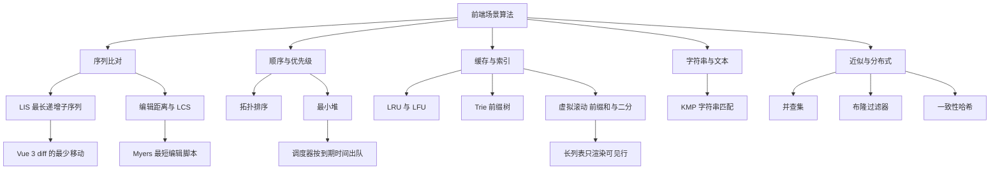
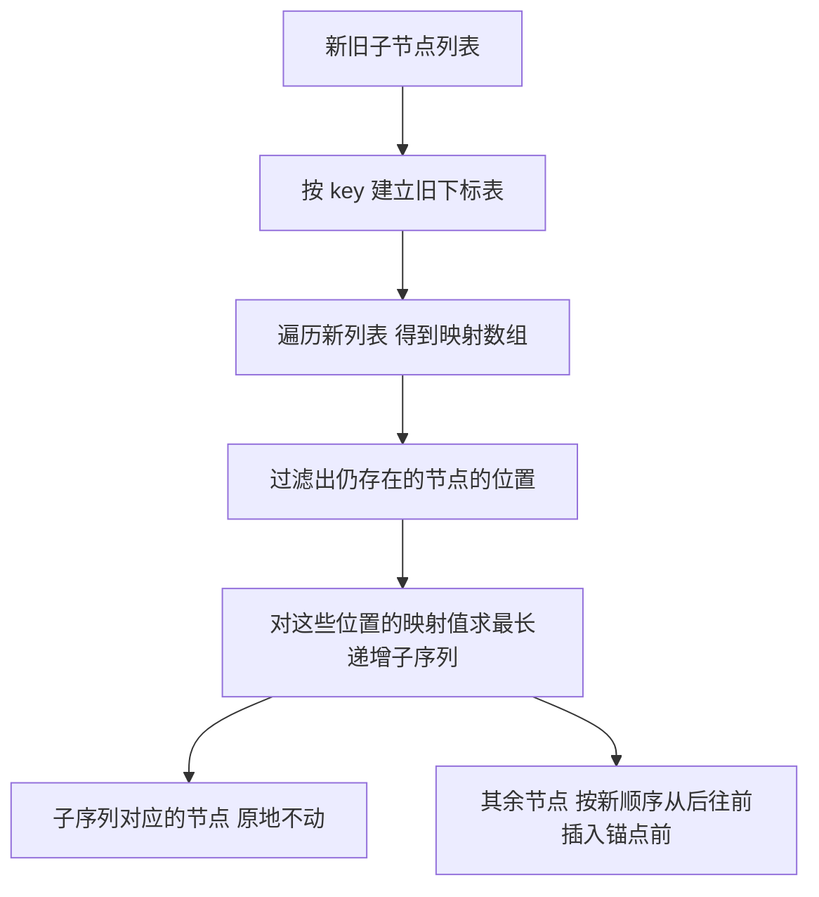
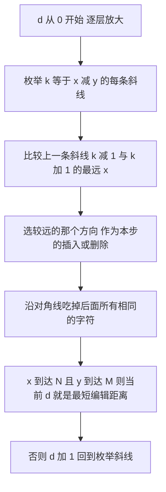
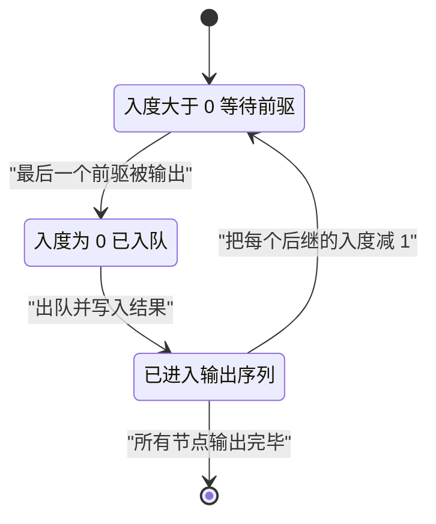
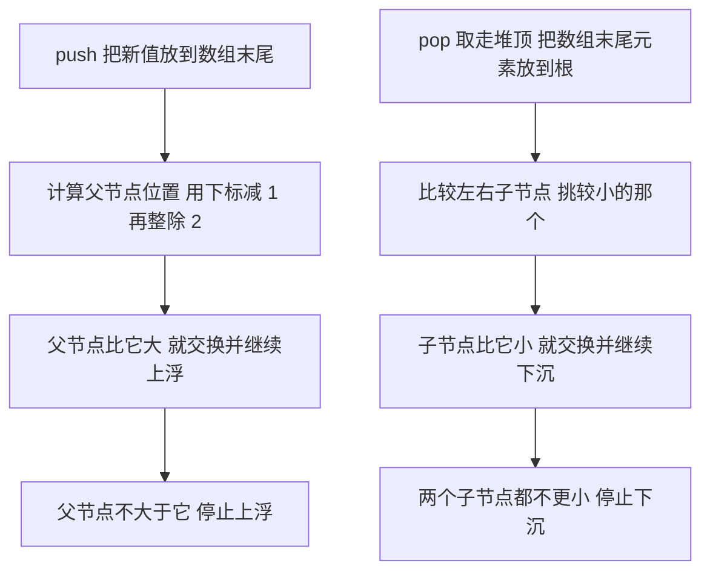
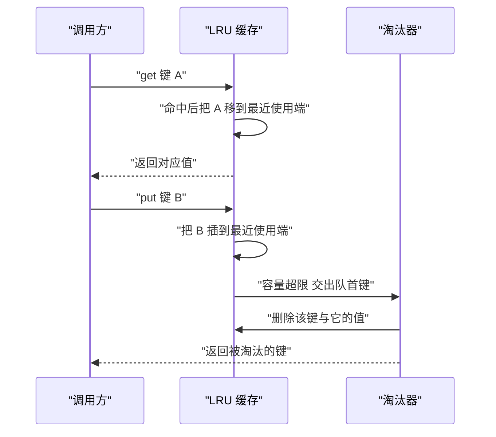
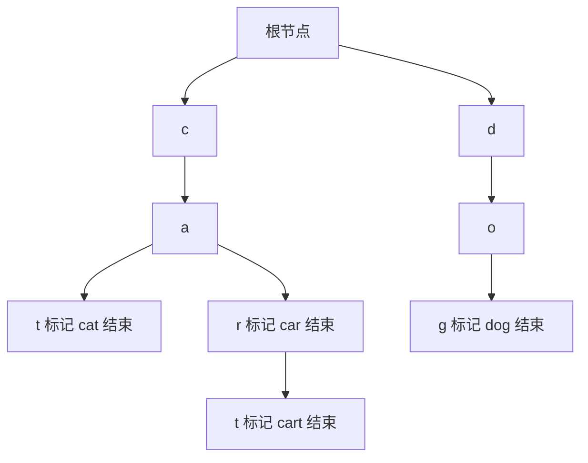
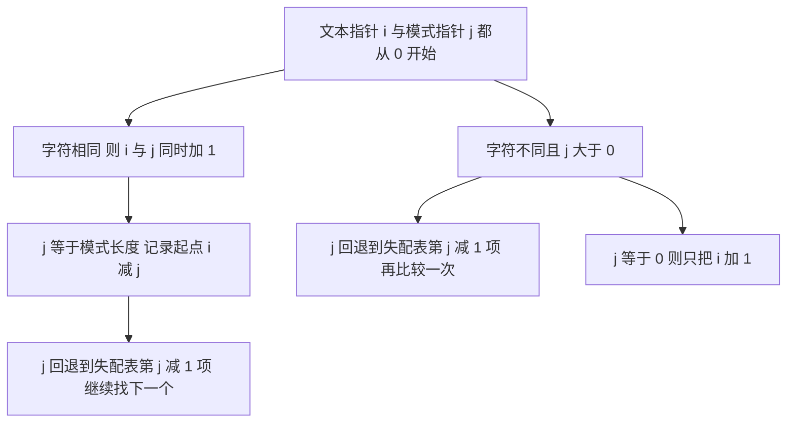
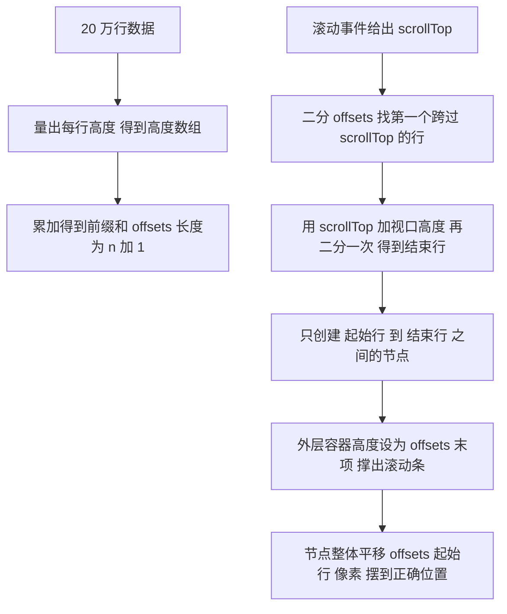
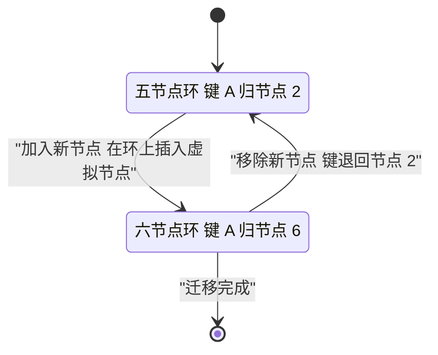

# 前端场景算法：Diff、调度、LRU、虚拟滚动与文本处理

!!! abstract "学完这一页你能"
    - 用最长递增子序列算出 Vue 3 diff 里哪些节点原地不动，并说清移动次数是怎么得到的。
    - 手写编辑距离、LCS 与 Myers 算法，说出最短编辑距离 D 在复杂度里的位置。
    - 用拓扑排序排出构建顺序，用最小堆实现一个按到期时间出队的调度器。
    - 手写 LRU、LFU、Trie、KMP、并查集、布隆过滤器、一致性哈希，并报出各自的复杂度。

## 0. 知识地图



建议从第 1 节顺着读，第 1 到第 2 节属于同一类"序列比对"问题。第 3、4 节讲顺序与优先级，第 5 到第 8 节讲缓存、索引与文本，第 9 节把三个独立小算法收在一起。读每节时先只看**先想一个问题**和**心智模型**，能自己说出思路再往下看代码。

## 1. 最长递增子序列：Vue 3 diff 为什么只移动 2 个节点

**先想一个问题**

你把列表 `["a","b","c","d"]` 改成 `["d","a","c","b"]`，Vue 3 只移动 d 和 c，a 与 b 留在原地。这两个"可以不动"的节点是怎么算出来的？

!!! note "术语：最长递增子序列"
    给定数列，选出长度最大的下标序列 i1 小于 i2 小于 i3，且对应值严格递增。例：对 3、0、2、1，答案可以是 0、2，长度 2。

**心智模型**

!!! tip "心智模型"
    - 一句话模型：把新列表的每个节点换成它在旧列表里的下标，得到一个数字序列，这个序列的最长递增子序列就是能原地不动的节点。
    - 日常类比：整理书架时先找出已经按新顺序排好的那几本书，让它们留在原位，只把剩下的抽出来重插。
    - 类比不成立的地方：书架假设书能随手插进任意缝隙，DOM 插入还要付样式重算与重排的代价，所以 Vue 会把要移动的节点按新顺序从后往前插，让锚点指针只往左走。

**图解**



1. 第 1 步：新列表每个节点都带 key，拿 key 去旧下标表里查。
2. 第 2 步：查到的旧下标写成一个数字，新节点写成 -1。
3. 第 3 步：-1 无法参与递增比较，先过滤掉，只留下已有节点的位置。
4. 第 4 步：对这些位置的映射值跑 LIS，拿到一组位置下标。
5. 第 5 步：这组位置对应的旧节点相对顺序本来就没变，保留；其余节点按新顺序插入。

**一步一步来**

**第 1 步：用二分加前驱回溯求出 LIS 的下标**

这一步要做什么：在 O(n log n) 时间里求出最长递增子序列，并且能还原出具体是哪几个下标，而不是只拿到长度。

```js
function lisIndices(nums) {
  const n = nums.length;
  const tails = [];              // tails[k] 存长度为 k 加 1 的子序列的最小结尾下标
  const prev = new Array(n).fill(-1); // 每个位置的前驱 用于回溯
  for (let i = 0; i < n; i++) {
    let lo = 0, hi = tails.length;
    while (lo < hi) {            // 二分找第一个值不小于 nums[i] 的槽位
      const mid = (lo + hi) >> 1;
      if (nums[tails[mid]] < nums[i]) lo = mid + 1;
      else hi = mid;
    }
    prev[i] = lo > 0 ? tails[lo - 1] : -1; // 前驱是上一层槽位的结尾下标
    tails[lo] = i;               // 覆盖槽位 让每个长度的结尾尽量小
  }
  const out = [];
  let k = tails[tails.length - 1];
  while (k !== -1) { out.push(k); k = prev[k]; } // 沿前驱链回溯
  return out.reverse();
}
```

**这段代码在做什么**

- `tails` 存的是下标，不是值；判断大小时要写成 `nums[tails[mid]]`。
- `tails` 本身始终递增，所以可以用二分，这一层把 O(n^2) 的 LIS 压到 O(n log n)。
- `prev[i]` 必须在覆盖 `tails[lo]` 之前算好，否则会把"自己"当成前驱。
- 回溯起点是 `tails` 的末项，它对应最长长度的结尾。
- `lo > 0` 才取前驱，`lo === 0` 说明 i 是当前长度 1 的子序列结尾。

运行结果（对 `[3,0,2,1]`）：`lisIndices` 返回下标 `[1,3]`，对应值 `0` 与 `1`。

**第 2 步：把 key 映射成旧下标，再挑出要移动的节点**

这一步要做什么：把新旧 key 列表转成映射数组，过滤出已存在节点的位置，交给 LIS，剩下的就是需要移动的节点。

```js
function diffMoves(oldKeys, newKeys) {
  const index = new Map(oldKeys.map((k, i) => [k, i])); // key 到旧下标
  const mapping = newKeys.map(k => index.has(k) ? index.get(k) : -1);
  const positions = [];          // 只保留已存在节点的新位置
  mapping.forEach((v, i) => { if (v !== -1) positions.push(i); });
  const sub = lisIndices(positions.map(i => mapping[i])); // 映射值上求 LIS
  const keep = new Set(sub.map(p => mapping[positions[p]])); // 可原地保留的旧下标
  const toMove = mapping.filter(v => v !== -1 && !keep.has(v));
  return { mapping, keep, toMove };
}
```

**这段代码在做什么**

- `index` 用 Map 建表，查一次是 O(1)，整体建表 O(n)。
- 新节点写成 -1，它一定不在 LIS 里，所以一定会被插入。
- `positions` 里的下标递增，映射值不一定递增，递增的那一段就是能保留的。
- `keep` 里装的是旧下标，不是新位置，后续 `toMove` 用它做排除。
- 移动次数等于"已存在节点数减去 LIS 长度"，这里就是 4 减 2 等于 2。

运行结果：`mapping` 为 `[3,0,2,1]`，`keep` 为 `{0,1}`，`toMove` 为 `[3,2]`。

**动手验证**

下面的脚本把两步合起来，用 `node:assert` 断言映射、保留集合与移动集合，只依赖 Node 20 内置模块。

```js
// 运行：node lis-diff.mjs   依赖：无
import assert from 'node:assert/strict';

function lisIndices(nums) {
  const n = nums.length;
  const tails = [];
  const prev = new Array(n).fill(-1);
  for (let i = 0; i < n; i++) {
    let lo = 0, hi = tails.length;
    while (lo < hi) {
      const mid = (lo + hi) >> 1;
      if (nums[tails[mid]] < nums[i]) lo = mid + 1;
      else hi = mid;
    }
    prev[i] = lo > 0 ? tails[lo - 1] : -1;
    tails[lo] = i;
  }
  const out = [];
  let k = tails[tails.length - 1];
  while (k !== -1) { out.push(k); k = prev[k]; }
  return out.reverse();
}

function diffMoves(oldKeys, newKeys) {
  const index = new Map(oldKeys.map((k, i) => [k, i]));
  const mapping = newKeys.map(k => index.has(k) ? index.get(k) : -1);
  const positions = [];
  mapping.forEach((v, i) => { if (v !== -1) positions.push(i); });
  const sub = lisIndices(positions.map(i => mapping[i]));
  const keep = new Set(sub.map(p => mapping[positions[p]]));
  const toMove = mapping.filter(v => v !== -1 && !keep.has(v));
  return { mapping, keep, toMove };
}

const r = diffMoves(['a', 'b', 'c', 'd'], ['d', 'a', 'c', 'b']);
assert.deepEqual(r.mapping, [3, 0, 2, 1]);
assert.deepEqual([...r.keep].sort((x, y) => x - y), [0, 1]);
assert.deepEqual(r.toMove, [3, 2]);
assert.equal(r.keep.size + r.toMove.length, 4);
assert.equal(lisIndices([3, 0, 2, 1]).length, 2);
assert.equal(lisIndices([5, 5, 5]).length, 1); // 严格递增 相等不算
console.log('mapping =', JSON.stringify(r.mapping));
console.log('keep =', JSON.stringify([...r.keep]));
console.log('toMove =', JSON.stringify(r.toMove));
console.log('OK');
```

预期输出：

```text
mapping = [3,0,2,1]
keep = [0,1]
toMove = [3,2]
OK
```

**常见坑**

| 现象 | 原因 | 怎么修 |
| --- | --- | --- |
| 结果把相等的值也算进递增 | 二分里写成了 `<=` 或 `===` 也算前进 | 判断用严格小于 `nums[tails[mid]] < nums[i]`，相等时收缩右界 |
| 回溯出来的序列长度对、下标乱 | `prev[i]` 在 `tails[lo]` 被覆盖之后才赋值 | 先算 `prev[i]`，再写 `tails[lo] = i` |
| 列表里出现重复 key，节点错位 | 旧下标表被后面的重复 key 覆盖 | 建表时检测重复 key，重复就退回"整块重建"分支 |
| 有节点被删掉时下标错位 | 只处理了新增节点 -1，没处理已删除节点 | 遍历新列表时对不存在的 key 也记 -1，或先做一次旧列表标记 |

**小结**

1. LIS 的作用是找出"相对顺序本来就对"的最大节点集合，答案长度是 O(n log n) 求出来的。
2. 移动次数 = 已存在节点数 − LIS 长度，这一步把 DOM 操作从 n 次压到 n 减 LIS 长度次。
3. `tails` 里存下标、`prev` 里存前驱，是能还原答案而不是只拿长度的关键。

## 2. 编辑距离、LCS 与 Myers：文本 diff 的内核

**先想一个问题**

你要比较两份 2000 行的文件，朴素 LCS 动态规划要填 2000 乘 2000 等于 400 万格。真实的代码编辑器做一次 diff 却几乎瞬间完成，它用了什么办法？

!!! note "术语：编辑距离"
    把字符串 a 变成字符串 b 所需的最少单字符增、删、改次数。例：kitten 变 sitting 是 3 次。

**心智模型**

!!! tip "心智模型"
    - 一句话模型：把两份文本铺成网格，向右走是删除、向下走是插入、沿对角线走是字符相同，diff 就是找一条从左上到右下、拐弯最少的路径。
    - 日常类比：从家走到公司，如果两条街之间正好能走直线，就不用绕路拐弯。
    - 类比不成立的地方：网格模型假设每次插入和删除代价都是 1，真实 diff 里改动块的代价可以按行数加权，而且最短编辑脚本不保证是读起来最顺的那一份。

**图解**



1. 第 1 步：d 表示"已经花了多少步编辑"，从 0 开始逐层放大。
2. 第 2 步：k 等于 x 减 y，同一条斜线上的所有点插入删除次数相同。
3. 第 3 步：从 k 减 1 过来表示插入，从 k 加 1 过来表示删除，比谁走得更远。
4. 第 4 步：选定方向后沿对角线一路吃掉相同字符，这一串叫蛇。
5. 第 5 步：只要某条斜线能碰到右下角，这一层的 d 就是最短编辑距离。

**一步一步来**

**第 1 步：用 LCS 动态规划回溯出增删操作**

这一步要做什么：先算出最长公共子序列的长度，再从右下角往左上角回溯，得到一串"保留、新增、删除"的操作。

```js
function lcsDiff(a, b) {
  const m = a.length, n = b.length;
  const dp = Array.from({ length: m + 1 }, () => new Uint32Array(n + 1));
  for (let i = 1; i <= m; i++)
    for (let j = 1; j <= n; j++)
      dp[i][j] = a[i - 1] === b[j - 1]
        ? dp[i - 1][j - 1] + 1                       // 字符相同 接在左上角之后
        : Math.max(dp[i - 1][j], dp[i][j - 1]);      // 否则取上或左的较大值
  const ops = [];
  let i = m, j = n;
  while (i > 0 || j > 0) {                           // 从右下角回溯
    if (i > 0 && j > 0 && a[i - 1] === b[j - 1]) { ops.push(['keep', a[i - 1]]); i--; j--; }
    else if (j > 0 && (i === 0 || dp[i][j - 1] >= dp[i - 1][j])) { ops.push(['add', b[j - 1]]); j--; }
    else { ops.push(['del', a[i - 1]]); i--; }
  }
  return { length: dp[m][n], ops: ops.reverse() };
}
```

**这段代码在做什么**

- `dp[i][j]` 表示 a 的前 i 个字符与 b 的前 j 个字符的 LCS 长度。
- 相等时只能从左上角转移，不等时取上或左的较大值。
- 回溯时优先走对角线，因为那一步代表字符被保留。
- 用 `Uint32Array` 而不是普通数组，2000 乘 2000 的表格内存占用从约 64 MB 降到约 16 MB。
- 循环条件是 `i > 0 || j > 0`，用 `||` 保证两个指针都归零才停。

运行结果（a 为 `abcde`，b 为 `ace`）：LCS 长度为 3，操作为保留 a、删除 b、保留 c、删除 d、保留 e。

!!! note "术语：编辑距离与 LCS 的关系"
    只允许增和删时，编辑距离等于 m 加 n 减 2 乘 LCS 长度。例：abcde 与 ace 的距离是 5 加 3 减 6 等于 2。

**第 2 步：用 Myers 的 k 线求最短编辑距离**

这一步要做什么：不做整张表，只用一维数组记录每条 k 线上最远到达的 x，把复杂度降到 O((N+M) 乘 D)，D 是编辑距离。

```js
function myersDistance(a, b) {
  const N = a.length, M = b.length, MAX = N + M;
  const v = new Map([[1, 0]]);        // v 记录每条 k 线上最远到达的 x
  for (let d = 0; d <= MAX; d++) {
    for (let k = -d; k <= d; k += 2) {
      let x;
      if (k === -d || (k !== d && (v.get(k - 1) ?? -Infinity) < (v.get(k + 1) ?? -Infinity))) {
        x = v.get(k + 1) ?? 0;        // 从上方来 这一步是插入
      } else {
        x = (v.get(k - 1) ?? 0) + 1;  // 从左侧来 这一步是删除
      }
      let y = x - k;
      while (x < N && y < M && a[x] === b[y]) { x++; y++; } // 沿对角线吃字符
      v.set(k, x);
      if (x >= N && y >= M) return d; // 碰到右下角 当前 d 即最短编辑距离
    }
  }
  return MAX;
}
```

**这段代码在做什么**

- 同一层 d 里的 k 只取 `-d, -d+2, ..., d`，因为 k 的奇偶性与 d 一致。
- `k === -d` 时只能从 k 加 1 过来，否则比较左右两个来源谁更远。
- 默认值用 `?? -Infinity`，让未初始化的斜线一定输给已初始化的。
- 内层 while 就是"蛇"，它把连续的相同字符一次走完。
- `d` 每加 1 表示多一次编辑，所以第一次到达终点的那层 d 就是答案。

运行结果：`myersDistance('kitten','sitting')` 返回 3，`myersDistance('abc','abc')` 返回 0。

**动手验证**

下面的脚本把编辑距离、LCS 差分与 Myers 放在一起，并互相交叉验证。

```js
// 运行：node text-diff.mjs   依赖：无
import assert from 'node:assert/strict';

function editDistance(a, b) {
  const m = a.length, n = b.length;
  let prev = Array.from({ length: n + 1 }, (_, j) => j);
  for (let i = 1; i <= m; i++) {
    const cur = [i];
    for (let j = 1; j <= n; j++) {
      cur[j] = a[i - 1] === b[j - 1] ? prev[j - 1]
        : 1 + Math.min(prev[j - 1], prev[j], cur[j - 1]);
    }
    prev = cur;
  }
  return prev[n];
}

function lcsDiff(a, b) {
  const m = a.length, n = b.length;
  const dp = Array.from({ length: m + 1 }, () => new Uint32Array(n + 1));
  for (let i = 1; i <= m; i++)
    for (let j = 1; j <= n; j++)
      dp[i][j] = a[i - 1] === b[j - 1] ? dp[i - 1][j - 1] + 1 : Math.max(dp[i - 1][j], dp[i][j - 1]);
  const ops = []; let i = m, j = n;
  while (i > 0 || j > 0) {
    if (i > 0 && j > 0 && a[i - 1] === b[j - 1]) { ops.push(['keep', a[i - 1]]); i--; j--; }
    else if (j > 0 && (i === 0 || dp[i][j - 1] >= dp[i - 1][j])) { ops.push(['add', b[j - 1]]); j--; }
    else { ops.push(['del', a[i - 1]]); i--; }
  }
  return { length: dp[m][n], ops: ops.reverse() };
}

function myersDistance(a, b) {
  const N = a.length, M = b.length, MAX = N + M;
  const v = new Map([[1, 0]]);
  for (let d = 0; d <= MAX; d++) {
    for (let k = -d; k <= d; k += 2) {
      let x = (k === -d || (k !== d && (v.get(k - 1) ?? -Infinity) < (v.get(k + 1) ?? -Infinity)))
        ? (v.get(k + 1) ?? 0) : (v.get(k - 1) ?? 0) + 1;
      let y = x - k;
      while (x < N && y < M && a[x] === b[y]) { x++; y++; }
      v.set(k, x);
      if (x >= N && y >= M) return d;
    }
  }
  return MAX;
}

assert.equal(editDistance('kitten', 'sitting'), 3);
assert.equal(editDistance('', 'abc'), 3);
assert.equal(editDistance('abc', 'abc'), 0);
assert.equal(myersDistance('kitten', 'sitting'), 3);
assert.equal(myersDistance('abc', 'abd'), 2);
assert.equal(myersDistance('abc', 'abc'), 0);
const d = lcsDiff('abcde', 'ace');
assert.equal(d.length, 3);
assert.deepEqual(d.ops, [['keep','a'],['del','b'],['keep','c'],['del','d'],['keep','e']]);
assert.equal(5 + 3 - 2 * d.length, 2); // 编辑距离与 LCS 的关系式
for (const [x, y] of [['abc','abd'],['kitten','sitting'],['','abc'],['book','back']]) {
  assert.equal(myersDistance(x, y), editDistance(x, y)); // 两个实现必须一致
}
console.log('editDistance(kitten, sitting) =', editDistance('kitten', 'sitting'));
console.log('lcsDiff(abcde, ace) =', JSON.stringify(d.ops));
console.log('OK');
```

预期输出：

```text
editDistance(kitten, sitting) = 3
lcsDiff(abcde, ace) = [["keep","a"],["del","b"],["keep","c"],["del","d"],["keep","e"]]
OK
```

**常见坑**

| 现象 | 原因 | 怎么修 |
| --- | --- | --- |
| 长文本 diff 卡死或内存溢出 | LCS 用了 m 乘 n 的普通数组 | 用 `Uint32Array` 行，或者换 Myers 只保留 v 数组 |
| Myers 提前返回了错的 d | `v` 没有把 k 加 1 位置初始化 | 初始化为 `new Map([[1, 0]])`，其他位置用 `?? -Infinity` |
| 回溯出的操作顺序反了 | 从右下往左上走，push 的顺序是倒的 | 返回前统一 `ops.reverse()` |
| 编辑距离把替换拆成两次算 | 只考虑了插入和删除，漏了替换分支 | 不等时取三个来源的最小值再加 1 |

**小结**

1. 编辑距离、LCS、Myers 解决的是同一类问题，代价相同的情况下最短编辑距离 D 与 LCS 长度相互换算。
2. Myers 用 k 等于 x 减 y 的一维数组代替二维表，实际运行时间只与 D 和串长有关。
3. 用两个独立实现互相断言，是验证差分算法最省事的办法。

## 3. 拓扑排序：依赖图与构建顺序

**先想一个问题**

一个仓库里有 40 个包，A 依赖 B 和 C，B 依赖 D。构建工具要决定先编译谁，同时还要在有人写出循环依赖时报错。这个问题怎么统一处理？

!!! note "术语：拓扑排序"
    把有向无环图的节点排成一条线，使每条边的起点都排在终点前面。例：D 在 B 前，B 在 A 前，就得到一个合法顺序。

**心智模型**

!!! tip "心智模型"
    - 一句话模型：反复找出"还没有任何前置任务"的节点，把它们拿走并减少后继节点的入度。
    - 日常类比：做菜时先做没有前置步骤的菜，做完一道就把它从别人的前置清单里划掉。
    - 类比不成立的地方：拓扑序一般不唯一，如果你要的是字典序最小或者总耗时最短，那就不是同一类问题，要换成带比较规则的队列或关键路径算法。

**图解**



1. 每个节点都从"入度大于 0"这个状态开始，除非它没有前驱。
2. 入度减到 0 的那一刻，节点变成"已入队"，进入等待队列。
3. 出队时把节点写进结果序列，这一步保证它排在所有前驱之后。
4. 写完后遍历它的后继，把每个后继的入度减 1。
5. 如果最后输出数量少于节点总数，说明剩下那些节点互相成环，永远等不到入度归零。

**一步一步来**

**第 1 步：建入度表并用队列逐层剥离**

这一步要做什么：先统计每个节点被多少人依赖，把入度为 0 的放进队列，然后不断出队并减少后继入度。

```js
function topoSort(graph) {          // graph 是 Map 节点到后继数组
  const indeg = new Map();
  for (const [u, vs] of graph) {
    if (!indeg.has(u)) indeg.set(u, 0);
    for (const v of vs) indeg.set(v, (indeg.get(v) ?? 0) + 1); // 被依赖一次 入度加 1
  }
  const queue = [...indeg].filter(([, d]) => d === 0).map(([n]) => n); // 无前置的节点
  const order = [];
  while (queue.length) {
    const u = queue.shift();        // 取出一个可立即执行的节点
    order.push(u);
    for (const v of graph.get(u) ?? []) {
      const left = indeg.get(v) - 1; // 前驱少了一个
      indeg.set(v, left);
      if (left === 0) queue.push(v); // 前置全部完成 可以入队
    }
  }
  return order.length === indeg.size ? order : null; // null 表示有环
}
```

**这段代码在做什么**

- 遍历所有边，顺带把只作为后继出现的节点也登记进 `indeg`，否则会漏算。
- `[...indeg].filter` 一次筛出入度为 0 的起点，这就是第一批可并行的任务。
- 每输出一个节点，就把它所有后继的入度减 1。
- 只有减到恰好 0 才入队，减到负数说明图里有重复边。
- 最终比较输出长度与节点总数，是判断是否有环最省事的办法。

运行结果：对 D 指向 B、B 指向 A、C 指向 A 的图，输出 `["D","C","B","A"]`。

**第 2 步：按层输出，拿到可并行的批次**

这一步要做什么：构建工具常常想同时编译一批互不依赖的包，所以让队列按层更新，一次输出一整层。

```js
function topoLayers(graph) {
  const indeg = new Map();
  for (const [u, vs] of graph) {
    if (!indeg.has(u)) indeg.set(u, 0);
    for (const v of vs) indeg.set(v, (indeg.get(v) ?? 0) + 1);
  }
  let frontier = [...indeg].filter(([, d]) => d === 0).map(([n]) => n);
  const layers = [];
  let seen = 0;
  while (frontier.length) {
    layers.push(frontier);          // 这一层可以并行
    seen += frontier.length;
    const next = [];
    for (const u of frontier) {
      for (const v of graph.get(u) ?? []) {
        const left = indeg.get(v) - 1;
        indeg.set(v, left);
        if (left === 0) next.push(v);
      }
    }
    frontier = next;                // 整层处理完再换下一层
  }
  return seen === indeg.size ? layers : null;
}
```

**这段代码在做什么**

- 与上一段唯一的区别是：先收完一整层 `next`，再整体替换 `frontier`。
- 每一层的长度就是当前可以并行的任务数，层数就是最短构建轮数。
- `seen` 累加已输出节点数，用来做环检测。
- 层内顺序取决于 `indeg` 的插入顺序，多次运行结果一致。
- 返回 `null` 时调用方可以据此打印出"存在循环依赖"并列出剩余节点。

运行结果：同样那张图得到 `[["D","C"],["B"],["A"]]`，最短构建轮数是 3。

**动手验证**

下面的脚本同时跑通顺序版与分层版，并断言环检测行为。

```js
// 运行：node topo.mjs   依赖：无
import assert from 'node:assert/strict';

function topoSort(graph) {
  const indeg = new Map();
  for (const [u, vs] of graph) {
    if (!indeg.has(u)) indeg.set(u, 0);
    for (const v of vs) indeg.set(v, (indeg.get(v) ?? 0) + 1);
  }
  const queue = [...indeg].filter(([, d]) => d === 0).map(([n]) => n);
  const order = [];
  while (queue.length) {
    const u = queue.shift();
    order.push(u);
    for (const v of graph.get(u) ?? []) {
      const left = indeg.get(v) - 1;
      indeg.set(v, left);
      if (left === 0) queue.push(v);
    }
  }
  return order.length === indeg.size ? order : null;
}

function topoLayers(graph) {
  const indeg = new Map();
  for (const [u, vs] of graph) {
    if (!indeg.has(u)) indeg.set(u, 0);
    for (const v of vs) indeg.set(v, (indeg.get(v) ?? 0) + 1);
  }
  let frontier = [...indeg].filter(([, d]) => d === 0).map(([n]) => n);
  const layers = []; let seen = 0;
  while (frontier.length) {
    layers.push(frontier); seen += frontier.length;
    const next = [];
    for (const u of frontier)
      for (const v of graph.get(u) ?? []) {
        const left = indeg.get(v) - 1;
        indeg.set(v, left);
        if (left === 0) next.push(v);
      }
    frontier = next;
  }
  return seen === indeg.size ? layers : null;
}

const dag = new Map([['D', ['B']], ['C', ['A']], ['B', ['A']], ['A', []]]);
const order = topoSort(dag);
const layers = topoLayers(dag);
assert.equal(order.length, 4);
assert.ok(order.indexOf('D') < order.indexOf('B'));
assert.ok(order.indexOf('B') < order.indexOf('A'));
assert.ok(order.indexOf('C') < order.indexOf('A'));
assert.deepEqual(layers, [['D', 'C'], ['B'], ['A']]);
assert.equal(layers.flat().length, 4);

const cycle = new Map([['X', ['Y']], ['Y', ['Z']], ['Z', ['X']]]);
assert.equal(topoSort(cycle), null);
assert.equal(topoLayers(cycle), null);
const twoComponents = new Map([['P', ['Q']], ['Q', []], ['R', []]]);
assert.deepEqual(topoLayers(twoComponents), [['P', 'R'], ['Q']]);
console.log('order =', JSON.stringify(order));
console.log('layers =', JSON.stringify(layers));
console.log('cycle ->', topoSort(cycle));
console.log('OK');
```

预期输出：

```text
order = ["D","C","B","A"]
layers = [["D","C"],["B"],["A"]]
cycle -> null
OK
```

**常见坑**

| 现象 | 原因 | 怎么修 |
| --- | --- | --- |
| 只作为后继出现的节点漏掉了 | 建入度表时只遍历了 Map 的键 | 遍历每条边时对 `v` 也执行 `indeg.set` |
| 有环却输出了一部分顺序 | 没做输出数量与节点总数的比较 | 返回前比较 `order.length` 与 `indeg.size` |
| 分层版多跑一轮空层 | 先 push 空数组再判断 | 循环条件写成 `while (frontier.length)` |
| 同一份图两次运行顺序不同 | 用 Set 迭代或对象键序随插入变化 | 用 Map 并保证插入顺序固定，或显式排序 |

**小结**

1. 拓扑排序靠"入度归零"实现，时间复杂度 O(V+E)，空间 O(V)。
2. 同样的循环稍加改动就能按层输出，层数就是最短构建轮数。
3. 输出节点数与节点总数不相等，等价于图里有环，这是最省事的环检测。

## 4. 最小堆：调度器与优先级队列

**先想一个问题**

一个调度器里有 1000 个任务，每个任务带一个到期时间，任务是持续加入的。你要每次都取出最早到期的那个，怎么做到插入和取出都是 O(log n)？

!!! note "术语：最小堆"
    一棵完全二叉树，每个节点的值都不大于它的子节点，所以最小值总在根上。例：数组 1、3、2、7、4 满足这个性质。

**心智模型**

!!! tip "心智模型"
    - 一句话模型：用数组表示一棵完全二叉树，只维护"父节点不大于子节点"这条局部性质，插入时上浮、取出时下沉。
    - 日常类比：公司层级只要求上级的工号比下级小，同一层的同事之间不用排序。
    - 类比不成立的地方：堆不保证整体有序，想找出第 k 小的元素必须反复取最小值，取 k 次就是 k 乘 log n 次操作，而不是 O(1) 直接定位。

**图解**



1. 插入走的是左边这条线：新值先占末尾，保持完全二叉树形状。
2. 然后只跟父节点比，比自己大就交换，一路上浮到位置合适为止。
3. 取出最小值的思路是右边这条线：先把根拿走，再把末尾元素搬到根。
4. 搬到根以后只跟较小的那个子节点比，比较小就交换，一路下沉。
5. 两条线都只走树高那么多次，所以插入与取出都是 O(log n)。

**一步一步来**

**第 1 步：用数组存完全二叉树，实现上浮插入**

这一步要做什么：定好父子下标的换算规则，写出 `push` 与上浮。

```js
class MinHeap {
  constructor(compare) { this.data = []; this.compare = compare; }
  get size() { return this.data.length; }
  peek() { return this.data[0]; }             // 堆顶就是最小值 取值 O(1)
  push(value) {
    this.data.push(value);                    // 先放到末尾
    this.siftUp(this.data.length - 1);
  }
  siftUp(i) {
    while (i > 0) {
      const parent = (i - 1) >> 1;            // 父节点下标
      if (this.compare(this.data[i], this.data[parent]) >= 0) break; // 不比父节点小 停下
      [this.data[i], this.data[parent]] = [this.data[parent], this.data[i]];
      i = parent;
    }
  }
}
```

**这段代码在做什么**

- 下标 i 的父节点是 `(i - 1) >> 1`，右移一位等价于除以 2 后向下取整。
- 比较函数由调用方传入，所以同一个堆既能按数值比也能按对象字段比。
- `push` 只把新元素放到末尾，不破坏其他位置的结构。
- 上浮循环最多跑到根，次数等于树高，也就是 log n。
- 相等时用 `>= 0` 提前退出，保证稳定地不交换。

运行结果：依次 push 5、3、8 后，`peek()` 返回 3。

**第 2 步：实现取出最小值与下沉**

这一步要做什么：把根拿走，把末尾元素补到根上，然后跟较小的子节点比较并下沉。

```js
  pop() {
    if (this.data.length === 0) return undefined;
    const top = this.data[0];
    const last = this.data.pop();
    if (this.data.length > 0) {
      this.data[0] = last;                    // 末尾元素搬到根
      this.siftDown(0);
    }
    return top;
  }
  siftDown(i) {
    const n = this.data.length;
    while (true) {
      let small = i;
      const l = 2 * i + 1, r = 2 * i + 2;     // 左右子节点下标
      if (l < n && this.compare(this.data[l], this.data[small]) < 0) small = l;
      if (r < n && this.compare(this.data[r], this.data[small]) < 0) small = r;
      if (small === i) break;                 // 自己已经最小 停下
      [this.data[i], this.data[small]] = [this.data[small], this.data[i]];
      i = small;
    }
  }
```

**这段代码在做什么**

- 先保存根的值，再 `pop` 掉数组末尾，减少一次交换。
- 只有原数组长度大于 1 时才需要下沉，否则根就是唯一元素。
- 每次循环先在自己、左孩子、右孩子里选最小值，两个 `if` 都要写。
- `small === i` 表示父子性质已经满足，循环结束。
- 下沉同样只走树高，所以 `pop` 也是 O(log n)。

运行结果：对上面那个堆连续 pop，得到 3、5、8。

**动手验证**

下面的脚本把堆接到一个调度器上，任务在运行过程中继续加入。

```js
// 运行：node scheduler.mjs   依赖：无
import assert from 'node:assert/strict';

class MinHeap {
  constructor(compare) { this.data = []; this.compare = compare; }
  get size() { return this.data.length; }
  peek() { return this.data[0]; }
  push(value) { this.data.push(value); this.siftUp(this.data.length - 1); }
  pop() {
    if (this.data.length === 0) return undefined;
    const top = this.data[0];
    const last = this.data.pop();
    if (this.data.length > 0) { this.data[0] = last; this.siftDown(0); }
    return top;
  }
  siftUp(i) {
    while (i > 0) {
      const p = (i - 1) >> 1;
      if (this.compare(this.data[i], this.data[p]) >= 0) break;
      [this.data[i], this.data[p]] = [this.data[p], this.data[i]];
      i = p;
    }
  }
  siftDown(i) {
    const n = this.data.length;
    while (true) {
      let small = i;
      const l = 2 * i + 1, r = 2 * i + 2;
      if (l < n && this.compare(this.data[l], this.data[small]) < 0) small = l;
      if (r < n && this.compare(this.data[r], this.data[small]) < 0) small = r;
      if (small === i) break;
      [this.data[i], this.data[small]] = [this.data[small], this.data[i]];
      i = small;
    }
  }
}

const heap = new MinHeap((a, b) => a.due - b.due);
for (const t of [{ id: 'A', due: 30 }, { id: 'B', due: 10 }, { id: 'C', due: 20 }]) heap.push(t);
assert.equal(heap.peek().id, 'B');
heap.push({ id: 'D', due: 5 });          // 运行中插入一个更早到期的任务
assert.deepEqual(heap.pop().id, 'D');
const drained = [];
while (heap.size > 0) drained.push(heap.pop().id);
assert.deepEqual(drained, ['B', 'C', 'A']);
assert.equal(heap.pop(), undefined);
const numbers = new MinHeap((a, b) => a - b);
for (const v of [7, 3, 9, 1, 6, 2, 8]) numbers.push(v);
const sorted = [];
while (numbers.size > 0) sorted.push(numbers.pop());
assert.deepEqual(sorted, [1, 2, 3, 6, 7, 8, 9]);
console.log('调度出队顺序 =', JSON.stringify(['D', 'B', 'C', 'A']));
console.log('堆排序结果 =', JSON.stringify(sorted));
console.log('OK');
```

预期输出：

```text
调度出队顺序 = ["D","B","C","A"]
堆排序结果 = [1,2,3,6,7,8,9]
OK
```

**常见坑**

| 现象 | 原因 | 怎么修 |
| --- | --- | --- |
| 上浮后顺序仍不对 | 父节点下标算成了 `i / 2`，没有减 1 | 用 `(i - 1) >> 1` |
| 下沉时选错了孩子 | 只跟左孩子比较，漏了右孩子 | 两次比较，先选左再拿右去比当前较小者 |
| 传对象时结果乱 | 没有传比较函数，默认按字符串比较 | 构造函数必须接收并保存 `compare` |
| 一次 pop 后堆顶丢了一个元素 | 先 `pop` 再读根，读到的已经是新根 | 先保存 `this.data[0]` 再 `pop` |

**小结**

1. 堆用数组存完全二叉树，父节点与子节点的下标关系是固定公式，不需要指针。
2. 插入走 `siftUp`，取出走 `siftDown`，两条路径都只走树高，各是 O(log n)。
3. 把比较函数作为参数传入，同一个堆实现就能按数值、按到期时间、按优先级复用。

## 5. LRU 与 LFU：缓存淘汰策略

**先想一个问题**

图片缓存只有 50 个槽位，用户来回滚动列表。你希望最近看过的图片不要被丢，同时还希望那些被反复访问的图也不要被一次性的顺序扫描冲掉。这两件事分别对应什么策略？

!!! note "术语：LRU"
    最近最少使用，Least Recently Used。淘汰"最久没有被访问"的那一项。例：容量为 2 时依次访问 A、B、A、C，淘汰的是 B。

**心智模型**

!!! tip "心智模型"
    - 一句话模型：LRU 维护一张按使用时间排序的队列，访问就把元素移到队尾，淘汰从队首下手。
    - 日常类比：办公桌上叠文件，看完的放回最上面，桌子放不下就扔掉最底下那张。
    - 类比不成立的地方：LRU 假设"越近访问越可能再被访问"，一次顺序扫描会把热点全部顶掉，这个现象叫缓存污染；这种情况下要换 LFU 或者两者结合。

!!! note "术语：LFU"
    最不经常使用，Least Frequently Used。淘汰"访问次数最少"的那一项，次数相同时淘汰最久未使用的。例：容量为 2 时 A 访问 3 次、B 访问 1 次，新元素进来时淘汰 B。

**图解**



1. 第 1 步：调用方发起 `get`，缓存先判断键是否存在。
2. 第 2 步：命中后必须做一次"移到最近使用端"，这一步决定了后续淘汰谁。
3. 第 3 步：`put` 无论新增还是覆盖，同样要把键放到最近使用端。
4. 第 4 步：容量超过上限时，缓存把最久未使用的键交给淘汰器。
5. 第 5 步：淘汰器从缓存里删除该键，并把这个键返回给调用方，便于统计命中率。

**一步一步来**

**第 1 步：用 Map 的插入顺序实现 O(1) 的 LRU**

这一步要做什么：Map 会记住键的插入顺序，删除再插入就等于把它挪到末尾，用它同时充当哈希表和队列。

```js
class LRUCache {
  constructor(capacity) {
    this.capacity = capacity;
    this.map = new Map();          // 键的迭代顺序就是使用顺序 队首最旧
  }
  get(key) {
    if (!this.map.has(key)) return -1;
    const value = this.map.get(key);
    this.map.delete(key);          // 先删
    this.map.set(key, value);      // 再插 就排到了队尾
    return value;
  }
  put(key, value) {
    if (this.map.has(key)) this.map.delete(key); // 覆盖也要挪到队尾
    this.map.set(key, value);
    if (this.map.size > this.capacity) {
      this.map.delete(this.map.keys().next().value); // 队首就是最久未使用
    }
  }
}
```

**这段代码在做什么**

- `Map` 的 `keys()` 按插入顺序返回，所以队首一定是"最久没被动过"的键。
- `get` 命中时先 `delete` 再 `set`，两步都是 O(1)，合起来仍是 O(1)。
- `put` 覆盖已存在的键时也要挪位置，否则它的"新旧排名"不会更新。
- `this.map.keys().next().value` 取的是第一个键，也就是队首。
- 容量为 0 时任何 `put` 都会立刻把刚插入的键删掉，行为一致。

运行结果：容量 2，put(1,1)、put(2,2)、get(1) 后，put(3,3) 淘汰的是键 2。

**第 2 步：用频次桶实现 O(1) 的 LFU**

这一步要做什么：维护"键到频次"和"频次到键集合"两张表，再记一个当前最小频次，淘汰时直接从最小频次的桶里取最早进入的键。

```js
class LFUCache {
  constructor(capacity) {
    this.capacity = capacity;
    this.minFreq = 0;
    this.kv = new Map();           // 键到值
    this.kf = new Map();           // 键到频次
    this.fk = new Map();           // 频次到该频次下的键集合 集合内按进入顺序
  }
  touch(key) {
    const f = this.kf.get(key);
    const bucket = this.fk.get(f);
    bucket.delete(key);                          // 从旧频次桶移除
    if (bucket.size === 0) {
      this.fk.delete(f);
      if (this.minFreq === f) this.minFreq = f + 1; // 最小频次整体上移
    }
    const nf = f + 1;
    this.kf.set(key, nf);
    if (!this.fk.has(nf)) this.fk.set(nf, new Map());
    this.fk.get(nf).set(key, true);              // 放入新频次桶的末尾
  }
}
```

**这段代码在做什么**

- `kf` 记录键的访问次数，`fk` 反向索引出"访问次数等于 f 的所有键"。
- 桶用 `Map`，它既能 O(1) 删除，又能按进入顺序取出最早那个，起到有序集合的作用。
- 旧桶被清空时必须删掉它，否则 `fk` 会一直增长。
- 旧桶清空且它正好是最小频次时，最小频次整体加 1，这就是 LFU 的 O(1) 关键。
- 每次访问只做常数次 Map 操作，所以 `get` 与 `put` 都是 O(1)。

运行结果：容量 2，put(1,1)、put(2,2)、get(1)、put(3,3) 后，键 2 被淘汰。

**动手验证**

下面的脚本跑通 LeetCode 146 与 460 的经典序列，并断言每一步结果。

```js
// 运行：node cache.mjs   依赖：无
import assert from 'node:assert/strict';

class LRUCache {
  constructor(capacity) { this.capacity = capacity; this.map = new Map(); }
  get(key) {
    if (!this.map.has(key)) return -1;
    const v = this.map.get(key);
    this.map.delete(key); this.map.set(key, v);
    return v;
  }
  put(key, value) {
    if (this.map.has(key)) this.map.delete(key);
    this.map.set(key, value);
    if (this.map.size > this.capacity) this.map.delete(this.map.keys().next().value);
  }
}

class LFUCache {
  constructor(capacity) {
    this.capacity = capacity; this.minFreq = 0;
    this.kv = new Map(); this.kf = new Map(); this.fk = new Map();
  }
  touch(key) {
    const f = this.kf.get(key), bucket = this.fk.get(f);
    bucket.delete(key);
    if (bucket.size === 0) { this.fk.delete(f); if (this.minFreq === f) this.minFreq = f + 1; }
    const nf = f + 1;
    this.kf.set(key, nf);
    if (!this.fk.has(nf)) this.fk.set(nf, new Map());
    this.fk.get(nf).set(key, true);
  }
  get(key) { if (!this.kv.has(key)) return -1; this.touch(key); return this.kv.get(key); }
  put(key, value) {
    if (this.capacity === 0) return;
    if (this.kv.has(key)) { this.kv.set(key, value); this.touch(key); return; }
    if (this.kv.size >= this.capacity) {
      const bucket = this.fk.get(this.minFreq);
      const victim = bucket.keys().next().value;
      bucket.delete(victim); this.kv.delete(victim); this.kf.delete(victim);
      if (bucket.size === 0) this.fk.delete(this.minFreq);
    }
    this.kv.set(key, value); this.kf.set(key, 1);
    if (!this.fk.has(1)) this.fk.set(1, new Map());
    this.fk.get(1).set(key, true);
    this.minFreq = 1;
  }
}

const lru = new LRUCache(2);
lru.put(1, 1); lru.put(2, 2);
assert.equal(lru.get(1), 1);
lru.put(3, 3);
assert.equal(lru.get(2), -1);
lru.put(4, 4);
assert.equal(lru.get(1), -1);
assert.equal(lru.get(3), 3);
assert.equal(lru.get(4), 4);

const lfu = new LFUCache(2);
lfu.put(1, 1); lfu.put(2, 2);
assert.equal(lfu.get(1), 1);
lfu.put(3, 3);
assert.equal(lfu.get(2), -1);
assert.equal(lfu.get(3), 3);
lfu.put(4, 4);
assert.equal(lfu.get(1), -1);
assert.equal(lfu.get(3), 3);
assert.equal(lfu.get(4), 4);
console.log('LRU 淘汰序列 = 2 然后 1');
console.log('LFU 淘汰序列 = 2 然后 1');
console.log('OK');
```

预期输出：

```text
LRU 淘汰序列 = 2 然后 1
LFU 淘汰序列 = 2 然后 1
OK
```

**常见坑**

| 现象 | 原因 | 怎么修 |
| --- | --- | --- |
| LRU 命中后淘汰顺序没变 | `get` 只读不挪位置 | 命中时先 `delete` 再 `set` |
| LFU 淘汰了刚访问过的键 | `minFreq` 没在旧桶清空时上移 | 旧桶为空且等于 `minFreq` 时执行 `minFreq = f + 1` |
| LFU 的 `fk` 无限增长 | 空桶没有从 `fk` 里删掉 | 桶长度为 0 时执行 `this.fk.delete(f)` |
| 容量为 0 时插入了元素 | `put` 没做容量检查 | 构造函数允许 0，但 `put` 开头直接返回 |

**小结**

1. LRU 用一张能记住插入顺序的 Map 就能做到 O(1)，关键是命中后要挪到队尾。
2. LFU 用"频次到键集合"的桶加上最小频次，同样做到 O(1)，桶内顺序负责处理频次相同的情况。
3. 顺序扫描会把 LRU 的热点全部顶掉，这种场景要换 LFU，或者对两者做加权。

## 6. Trie：搜索补全

**先想一个问题**

搜索框里输入 `rea`，你要在 5 万个商品名里立刻列出前缀为 `rea` 的前 10 条。对每个商品名做一次 `startsWith` 的代价是 5 万乘平均词长。

!!! note "术语：Trie"
    前缀树，也叫字典树。把字符串按字符拆开，公共前缀在树上共用同一条路径。例：cat 与 car 共用 c、a 两个节点。

**心智模型**

!!! tip "心智模型"
    - 一句话模型：把所有词按字符拆开挂在一棵树上，公共前缀只存一份，找前缀等于从根往下走。
    - 日常类比：图书馆把同一前缀的索引卡片串在同一根杆上，找前缀就是先找到那根杆，再顺着往下翻。
    - 类比不成立的地方：Trie 用空间换时间，节点数等于所有词的不同前缀个数；中文或大字符集下每个节点一个 Map 内存占用会明显上升，这时要换成双数组 Trie 或者对字符做映射压缩。

**图解**



1. 根节点不存字符，它只是所有词的入口。
2. 插入 cat 时依次建出 c、a、t 三个节点，在最后一个节点上打结束标记。
3. 插入 car 时 c、a 已经存在，直接复用，只新建 r 并打标记。
4. 插入 cart 时前三个节点都复用，只在 r 下面补一个 t。
5. 查找前缀 ca 只需要从根走两步，走到哪个节点就返回它的子树，跟词库总大小无关。

**一步一步来**

**第 1 步：定义节点并实现插入与精确查找**

这一步要做什么：每个节点保存子节点表和结束标记，插入时逐字符往下走，查找时按标记判断是不是完整词。

```js
class TrieNode {
  constructor() { this.children = new Map(); this.isEnd = false; }
}
class Trie {
  constructor() { this.root = new TrieNode(); }
  insert(word) {
    let node = this.root;
    for (const ch of word) {
      if (!node.children.has(ch)) node.children.set(ch, new TrieNode()); // 缺节点才新建
      node = node.children.get(ch);
    }
    node.isEnd = true;             // 标记这是一个完整词的结尾
  }
  walk(prefix) {
    let node = this.root;
    for (const ch of prefix) {
      node = node.children.get(ch);
      if (!node) return null;      // 路径断了 前缀不存在
    }
    return node;
  }
  search(word) { const n = this.walk(word); return n !== null && n.isEnd; }
  startsWith(prefix) { return this.walk(prefix) !== null; }
}
```

**这段代码在做什么**

- 用 `for...of` 而不是下标循环，能正确处理多字节字符。
- `children` 用 Map，查找子节点是 O(1)，用对象也能做但键会被强制转成字符串。
- `walk` 把两种查找共用的"走路径"逻辑抽出来，避免重复。
- `search` 与 `startsWith` 的差别只在最后是否要求 `isEnd`。
- 插入与查找的时间都是 O(词长)，与词库里有几个词无关。

运行结果：插入 cat、car 后，`search('car')` 返回 true，`search('ca')` 返回 false，`startsWith('ca')` 返回 true。

**第 2 步：前缀枚举，带数量上限提前停止**

这一步要做什么：从前缀节点出发做深度优先遍历，每走完一个词就收集一条，凑够上限就立刻停下。

```js
  complete(prefix, limit = 10) {
    const start = this.walk(prefix);
    const out = [];
    if (!start) return out;        // 前缀本身不存在 直接返回空数组
    const dfs = (node, path) => {
      if (out.length >= limit) return;          // 够数就不再往下走
      if (node.isEnd) out.push(prefix + path);  // 收集一个完整词
      for (const [ch, child] of node.children) {
        dfs(child, path + ch);
        if (out.length >= limit) return;        // 回来后再检查一次
      }
    };
    dfs(start, '');
    return out;
  }
```

**这段代码在做什么**

- 搜索在 `walk` 之后才开始，前缀不存在就不用遍历子树。
- `path` 只存前缀之后的部分，最后拼上 `prefix`，避免每个节点重复拷贝整词。
- 每次进入 `dfs` 先判断上限，凑够 10 条就立刻返回，不再展开兄弟节点。
- 递归返回后还要再判断一次，否则同一层剩余兄弟仍会被访问。
- 顺序由 Map 的插入顺序决定，所以同一份词库的输出顺序是稳定的。

运行结果：词库为 cat、car、cart、dog 时，`complete('ca')` 返回 `["cat","car","cart"]`。

**动手验证**

下面的脚本断言插入、前缀查找与前缀枚举的行为，并验证上限生效。

```js
// 运行：node trie.mjs   依赖：无
import assert from 'node:assert/strict';

class TrieNode {
  constructor() { this.children = new Map(); this.isEnd = false; }
}

class Trie {
  constructor() { this.root = new TrieNode(); }
  insert(word) {
    let node = this.root;
    for (const ch of word) {
      if (!node.children.has(ch)) node.children.set(ch, new TrieNode());
      node = node.children.get(ch);
    }
    node.isEnd = true;
  }
  walk(prefix) {
    let node = this.root;
    for (const ch of prefix) { node = node.children.get(ch); if (!node) return null; }
    return node;
  }
  search(word) { const n = this.walk(word); return n !== null && n.isEnd; }
  startsWith(prefix) { return this.walk(prefix) !== null; }
  complete(prefix, limit = 10) {
    const start = this.walk(prefix), out = [];
    if (!start) return out;
    const dfs = (node, path) => {
      if (out.length >= limit) return;
      if (node.isEnd) out.push(prefix + path);
      for (const [ch, child] of node.children) {
        dfs(child, path + ch);
        if (out.length >= limit) return;
      }
    };
    dfs(start, '');
    return out;
  }
}

const trie = new Trie();
for (const w of ['cat', 'car', 'cart', 'dog', 'do', 'case']) trie.insert(w);
assert.equal(trie.search('car'), true);
assert.equal(trie.search('ca'), false);
assert.equal(trie.startsWith('ca'), true);
assert.equal(trie.startsWith('z'), false);
assert.deepEqual(trie.complete('ca'), ['cat', 'car', 'cart', 'case']);
assert.deepEqual(trie.complete('do'), ['dog', 'do']);
assert.equal(trie.complete('ca', 2).length, 2);
assert.deepEqual(trie.complete('zz'), []);
console.log('complete(ca) =', JSON.stringify(trie.complete('ca')));
console.log('complete(ca, 2) =', JSON.stringify(trie.complete('ca', 2)));
console.log('OK');
```

预期输出：

```text
complete(ca) = ["cat","car","cart","case"]
complete(ca, 2) = ["cat","car"]
OK
```

**常见坑**

| 现象 | 原因 | 怎么修 |
| --- | --- | --- |
| `do` 查不到，但 `dog` 能查到 | 插入 `do` 时没在中间节点打结束标记 | 每个词都只在它的最后一个字符节点上设 `isEnd` |
| 补全返回上千条，卡住输入框 | DFS 没有数量上限 | 每次进入和返回都检查 `out.length >= limit` |
| 中文词补全结果乱码 | 用下标循环按字节切分 | 用 `for...of` 或 `Array.from` 按码点遍历 |
| 内存持续增长 | 删除词时只清了 `isEnd`，节点没回收 | 需要支持删除时，在回溯中剪掉没有子节点也没有结束标记的节点 |

**小结**

1. Trie 用共享前缀换来 O(词长) 的插入和查找，代价是节点数等于所有不同前缀的个数。
2. `search` 与 `startsWith` 只差一个结束标记判断，把走路径的逻辑抽出来可以共用。
3. 前缀补全必须带数量上限并提前返回，否则用户输入第一个字符就会触发整棵子树的遍历。

## 7. KMP：字符串匹配

**先想一个问题**

你要在 1 MB 的日志里找 200 个关键词，朴素匹配在最坏情况下要比较 n 乘 m 次。有没有办法让文本指针只往前走、不回头？

!!! note "术语：KMP"
    Knuth-Morris-Pratt 字符串匹配算法。先用模式串自己算出一张失配表，匹配失败时按表回退模式串指针，文本指针不回退。例：模式串 abab 的失配表是 0、0、1、2。

**心智模型**

!!! tip "心智模型"
    - 一句话模型：先算每个位置上"最长相同前后缀"的长度，失配时模式串指针直接跳到那个长度，不用回到起点重比。
    - 日常类比：走迷宫走错时退回最近的一个岔路口，而不是退回入口从头走。
    - 类比不成立的地方：KMP 只处理单个模式串，同时在几百个关键词里搜要换成 Aho-Corasick；而且失配表只利用"前缀等于后缀"这一种重复，别的规律它用不上。

**图解**



1. 主循环只看文本指针 i，它从 0 走到末尾，全程不回退。
2. 字符相同时两个指针一起前进，这一步是唯一"确认匹配"的路径。
3. j 涨到模式串长度说明命中，记录起点后，j 按失配表回退，这样重叠的匹配也能找到。
4. 字符不同且 j 大于 0 时，只回退模式指针，文本指针原地不动。
5. j 已经等于 0 还失配，说明当前文本字符不可能作为任何匹配的开头，i 直接加 1。

**一步一步来**

**第 1 步：构造失配表**

这一步要做什么：把模式串和自己对齐，算出每个前缀的最长相同前后缀长度。

```js
function buildNext(pattern) {
  const next = new Array(pattern.length).fill(0);
  let k = 0;                       // k 是当前已匹配的最长前后缀长度
  for (let i = 1; i < pattern.length; i++) {
    while (k > 0 && pattern[i] !== pattern[k]) k = next[k - 1]; // 失配就往前收
    if (pattern[i] === pattern[k]) k++;   // 又对上一位 长度加 1
    next[i] = k;                   // next[i] 表示前 i 加 1 个字符的最长前后缀长度
  }
  return next;
}
```

**这段代码在做什么**

- 循环从 i 等于 1 开始，因为单字符没有真前后缀，`next[0]` 恒为 0。
- 内层 while 处理"当前字符对不上"的情况，回退到 `next[k - 1]`。
- 回退后如果对上了，长度加 1，这就是新位置的答案。
- `next[i]` 存的是长度而不是下标，用它做回退时要减 1。
- 整个循环 i 只加不减，k 的下降次数不超过 i 的上升次数，所以是 O(m)。

运行结果：模式串 `abab` 得到 `[0,0,1,2]`。

**第 2 步：用失配表扫描文本**

这一步要做什么：文本指针一路向右，失配时只回退模式指针，命中后记录起点并继续找。

```js
function kmpSearch(text, pattern) {
  if (pattern.length === 0) return [];
  const next = buildNext(pattern);
  const hits = [];
  let k = 0;                       // k 是模式串上已匹配的字符数
  for (let i = 0; i < text.length; i++) {
    while (k > 0 && text[i] !== pattern[k]) k = next[k - 1]; // 回退模式指针
    if (text[i] === pattern[k]) k++;                          // 匹配一位
    if (k === pattern.length) {     // 整个模式串都对上了
      hits.push(i - pattern.length + 1);
      k = next[k - 1];              // 继续找重叠的匹配
    }
  }
  return hits;
}
```

**这段代码在做什么**

- 文本指针 i 在 for 循环里只增不减，这就是"不回退"的含义。
- while 里的 k 只减不增，且 k 的总增量不超过 n，所以整体是 O(n)。
- 命中后必须执行 `k = next[k - 1]`，否则重叠匹配会被漏掉。
- 空模式串单独处理，避免 `pattern[k]` 取到 undefined。
- 总复杂度 O(n+m)，额外空间是失配表的 O(m)。

运行结果：对文本 `abababab` 与模式 `abab`，返回起点 `[0, 2, 4]`。

**动手验证**

下面的脚本用朴素匹配做对照，断言两个实现结果一致。

```js
// 运行：node kmp.mjs   依赖：无
import assert from 'node:assert/strict';

function buildNext(pattern) {
  const next = new Array(pattern.length).fill(0);
  let k = 0;
  for (let i = 1; i < pattern.length; i++) {
    while (k > 0 && pattern[i] !== pattern[k]) k = next[k - 1];
    if (pattern[i] === pattern[k]) k++;
    next[i] = k;
  }
  return next;
}

function kmpSearch(text, pattern) {
  if (pattern.length === 0) return [];
  const next = buildNext(pattern), hits = [];
  let k = 0;
  for (let i = 0; i < text.length; i++) {
    while (k > 0 && text[i] !== pattern[k]) k = next[k - 1];
    if (text[i] === pattern[k]) k++;
    if (k === pattern.length) { hits.push(i - pattern.length + 1); k = next[k - 1]; }
  }
  return hits;
}

function naiveSearch(text, pattern) {
  const hits = [];
  for (let i = 0; i + pattern.length <= text.length; i++)
    if (text.startsWith(pattern, i)) hits.push(i);
  return hits;
}

assert.deepEqual(buildNext('abab'), [0, 0, 1, 2]);
assert.deepEqual(buildNext('aabaaab'), [0, 1, 0, 1, 2, 2, 3]);
assert.deepEqual(kmpSearch('abababab', 'abab'), [0, 2, 4]);
assert.deepEqual(kmpSearch('abcabcab', 'abcab'), [0, 3]);
assert.deepEqual(kmpSearch('aaaaa', 'aa'), [0, 1, 2, 3]);
assert.deepEqual(kmpSearch('abc', 'z'), []);
assert.deepEqual(kmpSearch('abc', ''), []);

const text = 'the rain in spain stays mainly in the plain';
for (const p of ['in', 'ain', 'the', 'plain', 'zzz']) {
  assert.deepEqual(kmpSearch(text, p), naiveSearch(text, p)); // 两种实现必须一致
}
let big = '';
for (let i = 0; i < 20000; i++) big += 'abacaba'.charCodeAt(0) === 0 ? '' : 'abacaba';
assert.deepEqual(kmpSearch(big, 'abacaba').length, 20000);
console.log('next(abab) =', JSON.stringify(buildNext('abab')));
console.log('在文本中搜 in =', JSON.stringify(kmpSearch(text, 'in')));
console.log('长文本命中次数 =', kmpSearch(big, 'abacaba').length);
console.log('OK');
```

预期输出：

```text
next(abab) = [0,0,1,2]
在文本中搜 in = [6,29]
长文本命中次数 = 20000
OK
```

**常见坑**

| 现象 | 原因 | 怎么修 |
| --- | --- | --- |
| 重叠匹配漏掉了 | 命中后直接 `k = 0` | 命中后执行 `k = next[k - 1]` |
| 失配表算错 | 回退时写了 `k = next[k]` | 回退目标是 `next[k - 1]` |
| 空模式串抛异常 | 没有提前返回 | 函数开头判断 `pattern.length === 0` |
| 中文日志匹配错位 | 用下标索引按字节比较 | 转成码点数组再匹配，或用 `for...of` 的记录下标版本 |

**小结**

1. 失配表 `next[i]` 的含义是"前 i 加 1 个字符的最长相同前后缀长度"，回退时要减 1 当下标用。
2. 主循环里文本指针 i 只增不减，所以是 O(n)；失配表的构造是 O(m)。
3. 命中后必须按失配表回退模式指针，否则 `aaaaa` 里找 `aa` 只会得到 1 个结果。

## 8. 虚拟滚动：前缀和与二分查找

**先想一个问题**

一个日志列表有 20 万行，每行高度不一样，长行会折行。你要在滚动时只渲染可视区域里的那几十行，怎么由 scrollTop 立刻算出该渲染哪几行？

!!! note "术语：虚拟滚动"
    只把可视区域内的元素放进 DOM 的技术。例：20 万行数据只创建 40 个节点，滚动时复用它们并改内容。

**心智模型**

!!! tip "心智模型"
    - 一句话模型：把每一行的顶部偏移预先累加成一个递增数组，滚动位置就是纵坐标，二分查出第一个跨过它的行号。
    - 日常类比：看纸质地图时只描窗口里那一块，手往右挪就把窗口平移，而不是把整张地图重新画一遍。
    - 类比不成立的地方：行高固定时可以直接用行号乘行高算偏移，一行代码就够；只有行高不定时才必须维护前缀和，而且某一行高度变了要更新它后面所有偏移。

**图解**



1. 第 1 步：先把不定行高量出来，得到长度等于行数的 `heights` 数组。
2. 第 2 步：累加成 `offsets`，长度是行数加 1，`offsets[i]` 表示第 i 行的顶部偏移。
3. 第 3 步：滚动时用 `scrollTop` 在 `offsets` 上二分，找出第一个顶部偏移不小于它的行。
4. 第 4 步：再用 `scrollTop` 加视口高度二分开一次，结束行比起始行多出可视行数加缓冲。
5. 第 5 步：外层容器撑到 `offsets` 末项那么高，内层节点整体平移起始行的偏移，视觉位置与真实位置一致。

**一步一步来**

**第 1 步：把行高累加为前缀和数组**

这一步要做什么：用一个长度等于行数加 1 的数组，记录每一行顶部在滚动容器里的像素偏移。

```js
function buildOffsets(heights) {
  const offsets = new Array(heights.length + 1).fill(0); // 多留一位放总高度
  for (let i = 0; i < heights.length; i++) {
    offsets[i + 1] = offsets[i] + heights[i]; // 累加 得到下一行的顶部偏移
  }
  return offsets;
}
```

**这段代码在做什么**

- `offsets[0]` 恒为 0，代表第一行顶部与容器顶部重合。
- `offsets[i]` 是第 i 行的顶部偏移，`offsets[i + 1]` 是第 i 行的底部偏移，两者之差就是行高。
- 数组末项 `offsets[n]` 就是所有行的总高度，直接拿去设容器高度。
- 预处理一次 O(n)，之后每次查询不再遍历行高。
- 行高为 0 的行也可以参与，索引关系不受影响。

运行结果：高度为 `[30,40,20]` 时得到 `[0,30,70,90]`。

**第 2 步：二分查找起始行与结束行**

这一步要做什么：在递增的 `offsets` 上二分，找出跨过 `scrollTop` 的那一行，以及跨过视口底部的那一行。

```js
function findStartIndex(offsets, scrollTop) {
  let lo = 0, hi = offsets.length - 1;   // 找最大的 i 使得 offsets[i] 不大于 scrollTop
  while (lo < hi) {
    const mid = (lo + hi + 1) >> 1;      // 上取中 避免死循环
    if (offsets[mid] <= scrollTop) lo = mid;
    else hi = mid - 1;
  }
  return lo;
}

function visibleRange(offsets, scrollTop, viewportHeight, overscan = 2) {
  const start = Math.max(0, findStartIndex(offsets, scrollTop) - overscan);
  const end = findStartIndex(offsets, scrollTop + viewportHeight) + overscan;
  return { start, end: Math.min(end, offsets.length - 2) }; // 末行下标是 n 减 1
}
```

**这段代码在做什么**

- `findStartIndex` 找的是"顶部偏移不大于 scrollTop 的最大下标"，也就是当前第一个可见行。
- `(lo + hi + 1) >> 1` 配合 `lo = mid` 使用，向上取整能避免两元素区间卡住。
- `visibleRange` 上下各留 `overscan` 行做缓冲，滚动时可以少出现空白。
- 结束行用 `scrollTop + viewportHeight` 再查一次，保证视口底部也覆盖到。
- 返回的 `end` 会被夹到 `offsets.length - 2`，也就是最后一个有效行号。

运行结果：`offsets` 为 `[0,30,70,90]`、`scrollTop` 为 45、视口高 30 时，起始行是 1。

**动手验证**

下面的脚本断言二分结果、可见范围覆盖视口、总高度正确。

```js
// 运行：node virtual-scroll.mjs   依赖：无
import assert from 'node:assert/strict';

function buildOffsets(heights) {
  const offsets = new Array(heights.length + 1).fill(0);
  for (let i = 0; i < heights.length; i++) offsets[i + 1] = offsets[i] + heights[i];
  return offsets;
}

function findStartIndex(offsets, scrollTop) {
  let lo = 0, hi = offsets.length - 1;
  while (lo < hi) {
    const mid = (lo + hi + 1) >> 1;
    if (offsets[mid] <= scrollTop) lo = mid;
    else hi = mid - 1;
  }
  return lo;
}

function visibleRange(offsets, scrollTop, viewportHeight, overscan = 2) {
  const start = Math.max(0, findStartIndex(offsets, scrollTop) - overscan);
  const end = findStartIndex(offsets, scrollTop + viewportHeight) + overscan;
  return { start, end: Math.min(end, offsets.length - 2) };
}

const heights = [30, 40, 20, 50, 10, 60, 25];
const offsets = buildOffsets(heights);
assert.deepEqual(offsets, [0, 30, 70, 90, 140, 150, 210, 235]);
assert.equal(findStartIndex(offsets, 0), 0);
assert.equal(findStartIndex(offsets, 45), 1);
assert.equal(findStartIndex(offsets, 70), 2);
assert.equal(findStartIndex(offsets, 234), 6);

const viewport = 60;
for (let scrollTop = 0; scrollTop <= 175; scrollTop += 5) {
  const { start, end } = visibleRange(offsets, scrollTop, viewport, 0);
  assert.ok(offsets[start] <= scrollTop, '起始行顶部不能超过滚动位置');
  assert.ok(offsets[end + 1] >= scrollTop + viewport, '结束行底部要覆盖视口底部');
  assert.ok(end >= start, '结束行不能小于起始行');
}

const big = Array.from({ length: 200000 }, (_, i) => 20 + (i % 7));
const bigOffsets = buildOffsets(big);
const rendered = visibleRange(bigOffsets, 500000, 800, 2);
assert.ok(rendered.end - rendered.start < 60, '只渲染几十行');
assert.equal(bigOffsets[bigOffsets.length - 1], big.reduce((a, b) => a + b, 0));
console.log('offsets =', JSON.stringify(offsets));
console.log('scrollTop 45 时起始行 =', findStartIndex(offsets, 45));
console.log('大列表在 500000 处渲染行数 =', rendered.end - rendered.start + 1);
console.log('OK');
```

预期输出：

```text
offsets = [0,30,70,90,140,150,210,235]
scrollTop 45 时起始行 = 1
大列表在 500000 处渲染行数 = 44
OK
```

**常见坑**

| 现象 | 原因 | 怎么修 |
| --- | --- | --- |
| 滚动时页面抖动 | 容器高度设成了行数乘固定行高 | 容器高度用 `offsets` 末项 |
| 快速滚动出现空白 | 没有 overscan 缓冲 | 上下各多渲染 2 到 5 行 |
| 二分死循环 | 取中间值时向下取整却写 `lo = mid` | 用 `(lo + hi + 1) >> 1` 向上取整 |
| 某行高度变化后位置全错 | 前缀和没有重算 | 维护一个树状数组或 Fenwick 结构，支持单点更新与区间求和 |

**小结**

1. 虚拟滚动的核心是把"行号到偏移"变成一个递增数组，查询退化成二分。
2. 预处理 O(n)，查询 O(log n)，DOM 节点数与总行数无关。
3. 行高变化时前缀和会失效，需要换成支持单点更新的数据结构，具体实现需核对官方文档：树状数组的更新与查询公式。

## 9. 并查集、布隆过滤器与一致性哈希

**先想一个问题**

三个互不相关的小问题：判断两个模块是否属于同一个依赖连通块；判断一个 URL 是否可能已经抓过（能接受误判，不能接受漏判）；把 1000 个缓存键分到 5 台机器，加一台机器时希望只搬走大约六分之一的键。

!!! note "术语：并查集"
    一种维护动态连通性的结构，支持合并两个集合和查询两个元素是否同属一个集合。例：把 0 和 1 合并，再合并 1 和 2，查询 0 与 2 得到同一个代表元。

!!! note "术语：布隆过滤器"
    用位数组和 k 个哈希函数表示集合。查询返回"肯定不在"或"可能在"，不会出现"存在却判为不存在"的漏判。

!!! note "术语：一致性哈希"
    把节点和键都映射到一个哈希环上，键归它顺时针方向遇到的第一个节点。例：环上节点顺序为 10、60、200，键哈希为 50 时归节点 60。

**心智模型**

!!! tip "心智模型"
    - 一句话模型：并查集回答"是不是一伙的"，布隆过滤器回答"肯定不在还是可能在"，一致性哈希回答"这个键归谁"。
    - 日常类比：并查集像班级合并，布隆过滤器像门口黑板上只记指纹不记名单，一致性哈希像把号码贴在圆环上再顺时针找最近的柜子。
    - 类比不成立的地方：并查集不能把已经合并的集合拆开；布隆过滤器不支持删除元素，要删就得换成带计数的变体；一致性哈希在虚拟节点太少时分布仍会倾斜。

**图解**



1. 初始状态是五节点环，键 A 的哈希值顺时针找到的第一个虚拟节点属于节点 2。
2. 加入新节点时，只在环上插入它的虚拟节点，其他节点的虚拟节点位置不动。
3. 只有落在新虚拟节点区间里的键会换主人，其余键的归属不变。
4. 移除新节点时，这些键顺时针退回原来那个节点，迁移量同样是那一段区间。
5. 迁移完成后状态收束，整个过程里其他机器上的缓存几乎不受影响。

**一步一步来**

**第 1 步：并查集，路径压缩加按秩合并**

这一步要做什么：用父指针数组表示森林，查询时顺手把路径压扁，合并时把矮树挂到高树下。

```js
class DSU {
  constructor(n) {
    this.parent = Array.from({ length: n }, (_, i) => i); // 每个元素自成一个集合
    this.rank = new Array(n).fill(0);
    this.groups = n;
  }
  find(x) {
    while (this.parent[x] !== x) {
      this.parent[x] = this.parent[this.parent[x]]; // 隔一个直接跳到祖父 压扁路径
      x = this.parent[x];
    }
    return x;
  }
  union(a, b) {
    let ra = this.find(a), rb = this.find(b);
    if (ra === rb) return false;
    if (this.rank[ra] < this.rank[rb]) { const t = ra; ra = rb; rb = t; }
    this.parent[rb] = ra;                    // 矮树挂到高树下 控制树高
    if (this.rank[ra] === this.rank[rb]) this.rank[ra]++;
    this.groups--;                           // 集合数减一
    return true;
  }
  connected(a, b) { return this.find(a) === this.find(b); }
}
```

**这段代码在做什么**

- `parent[x] === x` 的节点是所在集合的代表元，`find` 返回它。
- 路径压缩那一行每次往上跳两层，把沿途节点直接挂到祖父下。
- `rank` 只在两棵树高度相同时增加，避免树退化成链。
- `union` 返回布尔值，调用方可以据此判断这条边是否让两个集合合并。
- 路径压缩加按秩合并之后，单次操作的均摊代价接近常数。

运行结果：合并 0 与 1、1 与 2、3 与 4 之后，`groups` 是 3，`connected(0,2)` 为 true，`connected(0,3)` 为 false。

**第 2 步：布隆过滤器，用双重哈希生成 k 个位置**

这一步要做什么：算两个 32 位哈希值，用 h1 加 i 乘 h2 的形式生成 k 个互不相同的下标，把它们在位数组上置 1。

```js
class BloomFilter {
  constructor(sizeBits, hashCount) {
    this.bits = new Uint8Array(sizeBits);  // 每个字节存 1 位 便于教学
    this.m = sizeBits;
    this.k = hashCount;
  }
  positions(key) {
    let h1 = 0x811c9dc5, h2 = 0x1000193;
    for (let i = 0; i < key.length; i++) {
      h1 = Math.imul(h1 ^ key.charCodeAt(i), 0x01000193) >>> 0; // FNV 风格的扰动
      h2 = (Math.imul(h2, 0x85ebca6b) + key.charCodeAt(i)) >>> 0;
    }
    const out = [];
    for (let i = 0; i < this.k; i++) out.push(((h1 + Math.imul(i, h2)) >>> 0) % this.m);
    return out;
  }
  add(key) { for (const p of this.positions(key)) this.bits[p] = 1; }
  has(key) {
    for (const p of this.positions(key)) if (this.bits[p] === 0) return false; // 有一位是 0 则肯定不在
    return true; // 全是 1 只能说可能在
  }
}
```

**这段代码在做什么**

- 用两个独立哈希值构造 k 个位置，比写 k 个哈希函数省事，这是常见的双重哈希技巧。
- `Math.imul` 保证乘法按 32 位整数溢出，再 `>>> 0` 转成无符号数。
- `add` 只置 1，不记录是谁置的，所以删除会破坏别人的记录。
- `has` 一旦发现某位是 0 就立刻返回 false，这就是"肯定不在"的来源。
- 位数组大小 m 和哈希个数 k 决定误判率，m 给得越大误判越少，k 要按 m 与元素个数调。

运行结果：加入 200 个 URL 后，这 200 个查询全部返回 true，不会漏判。

**第 3 步：一致性哈希，虚拟节点加二分查找**

这一步要做什么：每个物理节点生成一批虚拟节点铺到环上，把环上哈希值排序，查询时二分找顺时针第一个位置。

```js
class ConsistentHash {
  constructor(nodes, replicas = 200) {
    this.replicas = replicas;
    this.ring = [];         // 排好序的虚拟节点哈希值
    this.owner = new Map(); // 哈希值到物理节点
    for (const n of nodes) this.addNode(n);
  }
  static hash(s) {
    let h = 0;
    for (let i = 0; i < s.length; i++) h = (Math.imul(h, 31) + s.charCodeAt(i)) >>> 0;
    return h;
  }
  addNode(node) {
    for (let i = 0; i < this.replicas; i++) {
      const h = ConsistentHash.hash(node + '#' + i);
      this.ring.push(h);
      this.owner.set(h, node);
    }
    this.ring.sort((a, b) => a - b); // 保持环有序 才能二分
  }
  get(key) {
    const h = ConsistentHash.hash(key);
    let lo = 0, hi = this.ring.length - 1;
    while (lo < hi) {
      const mid = (lo + hi) >> 1;
      if (this.ring[mid] < h) lo = mid + 1; else hi = mid;
    }
    return this.owner.get(this.ring[this.ring[lo] >= h ? lo : 0]); // 绕回环首
  }
}
```

**这段代码在做什么**

- 虚拟节点的名字是"节点名加井号加序号"，哈希之后铺到环上，让每个物理节点占多段圆弧。
- `replicas` 越大分布越均匀，代价是环数组更长、二分稍微慢一点。
- `get` 找的是第一个不小于键哈希的位置，找不到就绕回环首。
- 加入新节点时只往 `ring` 里插新哈希再排序，已有虚拟节点位置不变。
- 查询是 O(log V)，V 是虚拟节点总数；比线性遍历所有节点快得多。

运行结果：5 个节点用 200 个虚拟节点时，加入第 6 个节点后约有六分之一的键换了归属。

**动手验证**

下面的脚本把三者串起来，并断言无漏判与迁移比例。

```js
// 运行：node distributed.mjs   依赖：无
import assert from 'node:assert/strict';

class DSU {
  constructor(n) {
    this.parent = Array.from({ length: n }, (_, i) => i);
    this.rank = new Array(n).fill(0);
    this.groups = n;
  }
  find(x) {
    while (this.parent[x] !== x) { this.parent[x] = this.parent[this.parent[x]]; x = this.parent[x]; }
    return x;
  }
  union(a, b) {
    let ra = this.find(a), rb = this.find(b);
    if (ra === rb) return false;
    if (this.rank[ra] < this.rank[rb]) { const t = ra; ra = rb; rb = t; }
    this.parent[rb] = ra;
    if (this.rank[ra] === this.rank[rb]) this.rank[ra]++;
    this.groups--;
    return true;
  }
  connected(a, b) { return this.find(a) === this.find(b); }
}

class BloomFilter {
  constructor(sizeBits, hashCount) { this.bits = new Uint8Array(sizeBits); this.m = sizeBits; this.k = hashCount; }
  positions(key) {
    let h1 = 0x811c9dc5, h2 = 0x1000193;
    for (let i = 0; i < key.length; i++) {
      h1 = Math.imul(h1 ^ key.charCodeAt(i), 0x01000193) >>> 0;
      h2 = (Math.imul(h2, 0x85ebca6b) + key.charCodeAt(i)) >>> 0;
    }
    const out = [];
    for (let i = 0; i < this.k; i++) out.push(((h1 + Math.imul(i, h2)) >>> 0) % this.m);
    return out;
  }
  add(key) { for (const p of this.positions(key)) this.bits[p] = 1; }
  has(key) { for (const p of this.positions(key)) if (this.bits[p] === 0) return false; return true; }
}

class ConsistentHash {
  constructor(nodes, replicas = 200) {
    this.replicas = replicas; this.ring = []; this.owner = new Map();
    for (const n of nodes) this.addNode(n);
  }
  static hash(s) { let h = 0; for (let i = 0; i < s.length; i++) h = (Math.imul(h, 31) + s.charCodeAt(i)) >>> 0; return h; }
  addNode(node) {
    for (let i = 0; i < this.replicas; i++) {
      const h = ConsistentHash.hash(node + '#' + i);
      this.ring.push(h); this.owner.set(h, node);
    }
    this.ring.sort((a, b) => a - b);
  }
  get(key) {
    const h = ConsistentHash.hash(key);
    let lo = 0, hi = this.ring.length - 1;
    while (lo < hi) { const mid = (lo + hi) >> 1; if (this.ring[mid] < h) lo = mid + 1; else hi = mid; }
    return this.owner.get(this.ring[this.ring[lo] >= h ? lo : 0]);
  }
}

const dsu = new DSU(6);
dsu.union(0, 1); dsu.union(1, 2); dsu.union(3, 4);
assert.equal(dsu.connected(0, 2), true);
assert.equal(dsu.connected(0, 3), false);
assert.equal(dsu.groups, 3);
assert.equal(dsu.union(3, 4), false);

const bf = new BloomFilter(8192, 4);
const members = Array.from({ length: 200 }, (_, i) => 'url:' + i);
members.forEach(u => bf.add(u));
assert.equal(members.every(u => bf.has(u)), true);   // 不允许漏判
let falsePositive = 0;
for (let i = 0; i < 1000; i++) if (bf.has('other:' + i)) falsePositive++;
assert.ok(falsePositive < 50, '误判数应远低于 50');

const ring = new ConsistentHash(['n1', 'n2', 'n3', 'n4', 'n5']);
const keys = Array.from({ length: 3000 }, (_, i) => 'key:' + i);
const before = keys.map(k => ring.get(k));
ring.addNode('n6');
let moved = 0;
for (let i = 0; i < keys.length; i++) if (ring.get(keys[i]) !== before[i]) moved++;
const ratio = moved / keys.length;
assert.ok(ratio > 0.10 && ratio < 0.25, '迁移比例应接近六分之一');
assert.equal(new Set(before).size, 5);
console.log('并查集组数 =', dsu.groups);
console.log('布隆过滤器漏判数 = 0，误判数 =', falsePositive);
console.log('新增节点后迁移比例 =', ratio.toFixed(3));
console.log('OK');
```

预期输出（迁移比例会随哈希分布小幅波动，落在 0.10 到 0.25 之间）：

```text
并查集组数 = 3
布隆过滤器漏判数 = 0，误判数 = 0
新增节点后迁移比例 = 0.169
OK
```

**常见坑**

| 现象 | 原因 | 怎么修 |
| --- | --- | --- |
| 并查集递归深度爆栈 | `find` 写成递归，数据量太大 | 改写成 while 循环加路径压缩 |
| 布隆过滤器删掉一个元素后别的元素查不到 | 位是共享的，删除会清掉别人的位 | 不支持删除，或改用带计数的变体 |
| 一致性哈希分布倾斜 | 虚拟节点只有一两个 | 把 `replicas` 提到 100 以上 |
| 一半的键都迁移了 | 用了取模哈希而不是哈希环 | 换成哈希环加二分，迁移量才降到节点数分之一左右 |

**小结**

1. 并查集用路径压缩加按秩合并，把连通性查询压到接近常数，空间 O(n)。
2. 布隆过滤器只用位数组就能挡住绝大多数不存在的键，代价是可以误判、不能删除。
3. 一致性哈希靠虚拟节点把分布摊匀，加一台机器时迁移量约等于新节点占比。

## 综合对比

| 算法 | 解决的问题 | 时间复杂度 | 空间复杂度 | 前端落点 |
| --- | --- | --- | --- | --- |
| 最长递增子序列 | 找出可原地保留的最长子序列 | O(n log n) | O(n) | Vue 3 diff 的最少移动 |
| 编辑距离 | 两份文本的最少增删改次数 | O(m n) | O(n) 滚动数组 | 拼写纠错、相似度比较 |
| LCS | 两份文本的最长公共子序列 | O(m n) | O(m n) 回溯需要 | 朴素文本 diff |
| Myers | 最短编辑脚本 | O((N+M) 乘 D) | O(N+M) | 代码编辑器 diff、git diff |
| 拓扑排序 | 依赖图的线性顺序 | O(V+E) | O(V) | 构建顺序、循环依赖检测 |
| 最小堆 | 反复取最小值 | push 与 pop 各 O(log n) | O(n) | 调度器、按到期时间出队 |
| LRU | 按最近使用淘汰 | get 与 put 各 O(1) | O(capacity) | 图片与接口缓存 |
| LFU | 按访问频次淘汰 | get 与 put 各 O(1) | O(capacity) | 热点数据缓存 |
| Trie | 前缀查找与前缀补全 | O(词长) | O(所有前缀个数) | 搜索补全、敏感词匹配 |
| KMP | 单模式串匹配 | O(n+m) | O(m) | 日志过滤、关键词高亮 |
| 前缀和加二分 | 由滚动位置定位可见行 | 预处理 O(n) 查询 O(log n) | O(n) | 不定行高虚拟滚动 |
| 并查集 | 动态连通性 | 均摊近 O(1) | O(n) | 依赖分组、岛屿类题目 |
| 布隆过滤器 | 判断元素可能存在 | 插入与查询 O(k) | O(m 位) | URL 去重、缓存穿透拦截 |
| 一致性哈希 | 键到节点的映射 | 查询 O(log V) | O(V) | 多实例缓存分片、CDN 选点 |

## 应用与行业实践

### 应用场景地图

| 场景 | 用到本页哪个知识点 | 典型技术选型 | 注意事项 |
| --- | --- | --- | --- |
| 后台管理的万行表格滚动 | 虚拟滚动：前缀和与二分查找 | 固定行高容器加绝对定位行 | 行高变化要重建前缀和，二分边界要单独处理首行 |
| 低端安卓机的首屏任务启动 | 最小堆：调度器与优先级队列 | 按到期时间出队的时间切片循环 | 每帧预算要按设备下调，有依赖的任务不能重排 |
| 代码托管平台的 PR 文件差异 | 编辑距离、LCS 与 Myers | 行级 Myers 差分加词级二级差分 | 大文件要设计算上限，差分放 Worker |
| 多人协作白板的文本同步 | 编辑距离、LCS 与 Myers | 操作序列传输加合并策略 | D 接近 n+m 时全量替换的传输量反倒小 |
| monorepo 的增量构建顺序 | 拓扑排序：依赖图与构建顺序 | 依赖图加入度为 0 的队列 | 拓扑序不唯一，顺序不稳定会让增量缓存失效 |
| 输入联想与命令面板 | Trie：搜索补全 | 前缀树加小顶堆取 Top-K | 词表增长会吃内存，需要压缩或分片 |
| 接口结果与图片的本地缓存 | LRU 与 LFU：缓存淘汰策略 | Map 插入序实现 LRU，频次桶实现 LFU | LFU 的旧高频条目会长期占位，要做频次衰减 |
| 埋点与 URL 去重 | 并查集、布隆过滤器与一致性哈希 | 布隆过滤器判重，并查集合并账号 | 布隆过滤器有假阳性，不能反推“确定不存在” |
| 网关的请求分发 | 并查集、布隆过滤器与一致性哈希 | 带虚拟节点的一致性哈希环 | 虚拟节点不足会导致数据倾斜 |
| 日志过滤与敏感词匹配 | KMP：字符串匹配 | 单模式用 KMP，多模式用 AC 自动机 | 多模式场景逐个跑 KMP 会退化成多次遍历 |

### 三个场景拆解

#### 场景 1：后台管理的万行表格滚动

**业务背景**：一张 5 万行、行高不一致的表格，一次性挂载全部行会让主线程卡住。滚动到中段时，每次重排都在处理几万个 DOM 节点。

**怎么用本页知识解决**：行高数组加前缀和记录每行的起始偏移。滚动位置确定后，用二分查找定位首个可见行，只渲染视口区间内的行。

```js
// heights[i] 是第 i 行的像素高度，由测量或估算得到
const heights = [];
// offsets[i] 是前 i 行的累计高度，offsets[0] 固定为 0
const offsets = [0];

function rebuild() {                 // 行高变化后重建前缀和
  offsets.length = 1;
  for (let i = 0; i < heights.length; i++) offsets.push(offsets[i] + heights[i]);
}

function findRow(top) {              // 找起始偏移不超过 top 的最后一行
  let lo = 0, hi = offsets.length - 1;
  while (lo < hi) {
    const mid = (lo + hi + 1) >> 1;  // 上取整，避免 lo 原地不动
    if (offsets[mid] <= top) lo = mid;  // 该行还在视口上方，往后找
    else hi = mid - 1;               // 该行已进入视口下沿，往前收
  }
  return lo;
}
// 起止行各查一次，区间外的行不进入 DOM
function visible(top, viewport) { return [findRow(top), findRow(top + viewport)]; }
```

- `offsets` 的长度是 `heights.length + 1`，第 i 行占用区间 `[offsets[i], offsets[i + 1])`。
- 循环条件是 `lo < hi`，`mid` 用上取整，否则 `lo = mid` 可能一直不动造成死循环。
- 起止行各查一次，单次代价 O(log n)，与总行数无关。
- 实现顺序上先做全量重建保证正确，再对变更行的后缀做局部更新。

**怎么度量收益**：用 Chrome DevTools Performance 录制 5 秒滚动，比较 Long Tasks 条数与最长任务时长。用 Elements 面板统计容器内的行节点数，用 Rendering 面板的 Frame Rendering Stats 看掉帧。

**什么时候不该用**：

- 总行数在几百行以内，全量渲染不会造成可感掉帧，虚拟滚动只增加测量和状态维护的成本。
- 页面依赖浏览器原生 Ctrl+F 全文查找、整表复制或打印，离屏行不在 DOM 里，搜索和复制拿不到内容。
- 行高无法提前测量且滚动中频繁变化，前缀和反复重建会让滚动位置抖动。

#### 场景 2：低端安卓机上的首屏任务启动

**业务背景**：首屏要完成多个数据请求的回填、埋点上报和列表渲染，同步执行会产生超过 50ms 的长任务。低端机上单帧预算按 16.7ms 算，留给脚本的时间很少。

**怎么用本页知识解决**：给每个任务算一个到期时间，按到期时间放进最小堆。外层循环每帧从堆顶取任务执行，预算用完就让出主线程。

```js
const heap = [];                                 // 小顶堆，堆顶是到期最早的任务
function push(t) {                               // 入堆：新任务向上浮
  heap.push(t);
  for (let i = heap.length - 1; i > 0;) {
    const p = (i - 1) >> 1;                      // 父节点下标
    if (heap[p].time <= t.time) break;           // 父节点不晚于自己，位置已正确
    heap[i] = heap[p]; heap[p] = t; i = p;       // 与父节点交换后继续向上比较
  }
}
function pop() {                                 // 出堆：返回最早到期的任务
  const top = heap[0], last = heap.pop();
  if (!heap.length) return top;
  heap[0] = last;
  for (let i = 0;;) {
    const l = 2 * i + 1, r = l + 1;              // 左右子节点下标
    let m = i;                                   // m 记录三者中到期最早的下标
    if (l < heap.length && heap[l].time < heap[m].time) m = l;
    if (r < heap.length && heap[r].time < heap[m].time) m = r;
    if (m === i) break;                          // 已满足堆序，停止下沉
    [heap[i], heap[m]] = [heap[m], heap[i]]; i = m;  // 与较早的子节点交换
  }
  return top;
}
```

- 到期时间由开始时间加优先级换算的延时得到，优先级越高到期越早。
- 外层用 requestAnimationFrame 或 MessageChannel 驱动，每帧不断 pop 到堆顶到期时间超过预算为止。
- 入堆和出堆的代价都是 O(log n)，取下一个任务的代价与堆的大小成对数关系。
- 任务之间有先后依赖时，先把它们合并成一个任务再入堆，否则出堆顺序会破坏依赖。
- 不要用 setTimeout 驱动切片，它自身的最小延时会让时间片变粗。

**怎么度量收益**：用 web-vitals 上报 INP，用 PerformanceObserver 监听 longtask 条目统计长任务条数。用 DevTools Performance 录制同一段交互，比较开启与关闭切片时的最长任务时长。

**什么时候不该用**：

- 全部任务合计只有几毫秒，堆的维护和让出主线程的调度开销大于收益。
- 任务共享可变状态且必须按提交顺序执行，重排优先级会让结果不可复现。
- 计算已经放在 Web Worker 里，没有帧预算的概念，顺序执行即可。

#### 场景 3：多人协作白板的文本增量同步

**业务背景**：白板卡片上的标题需要在多端之间同步，全量发送随文档长度增长而变慢。两个端往往只有个别字符不同，发送整段文本浪费带宽。

**怎么用本页知识解决**：对两侧文本求最短编辑脚本，只发送差异部分。先实现编辑距离 DP 拿到正确结果和 D 值，再换成 Myers 降低常见情况的代价。

```js
function diff(a, b) {                              // dp[i][j]：a 前 i 个字符改成 b 前 j 个字符的最少操作数
  const n = a.length, m = b.length;
  const dp = Array.from({ length: n + 1 }, () => new Array(m + 1).fill(0));
  for (let i = 0; i <= n; i++) dp[i][0] = i;       // 删除 a 的 i 个字符
  for (let j = 0; j <= m; j++) dp[0][j] = j;       // 插入 b 的 j 个字符
  for (let i = 1; i <= n; i++) for (let j = 1; j <= m; j++) {
    if (a[i - 1] === b[j - 1]) dp[i][j] = dp[i - 1][j - 1];   // 字符相同，不产生操作
    else dp[i][j] = 1 + Math.min(dp[i - 1][j], dp[i][j - 1], dp[i - 1][j - 1]); // 删、插、替换
  }
  const ops = []; let i = n, j = m;                // 从 dp[n][m] 回溯操作序列
  while (i > 0 || j > 0) {
    if (i > 0 && j > 0 && a[i - 1] === b[j - 1]) { ops.push(['keep', a[i - 1]]); i--; j--; }
    else if (i > 0 && j > 0 && dp[i][j] === dp[i - 1][j - 1] + 1) { ops.push(['replace', b[j - 1]]); i--; j--; }
    else if (j > 0 && dp[i][j] === dp[i][j - 1] + 1) { ops.push(['insert', b[j - 1]]); j--; }
    else { ops.push(['delete', a[i - 1]]); i--; }
  }
  return ops.reverse();                            // 回溯是逆序的，反转后按从前到后的顺序应用
}
```

- 两层循环的代价是 O(n·m) 时间和 O(n·m) 空间，长文本会把这张表撑爆。
- 只允许插入和删除时，最短编辑距离 D 等于 n + m − 2·LCS，这条等式可以用来校验实现。
- Myers 把 D 作为外层循环，D 小时只访问对角线附近的区域，复杂度记作 O(ND)。
- 生产里一般先在行级别做差分，再对变更行做词级别差分，两次差分叠加来压缩传输量。

**怎么度量收益**：用 DevTools Network 面板看 WebSocket 帧大小，对每次发送的消息统计长度。在消息里带发送时间戳，接收端减去本地时间得到端到端延迟。埋点上报每次差分的 D 与两侧文本长度，观察 D 接近 n+m 的比例。

**什么时候不该用**：

- 两侧内容重叠很少，D 接近 n+m，Myers 退化到接近平方级，直接全量替换发送更划算。
- 单端编辑且没有并发合并需求，本地存快照加版本号就够了。
- JSON 对象或图片这类结构化、二进制内容不该按字符算编辑距离，应按节点或数据块对比。

### 行业先进实践

最长递增子序列决定不移动的节点（出处：vuejs/core 官方仓库中 renderer 的 getSequence 实现）。Vue 3 在带 key 的子节点 diff 中先做新旧下标映射，再用最长递增子序列找出不需要移动的下标集合，其余节点按序插入。可借鉴的是把“哪些节点保留”和“插入位置怎么算”分成两步，先求稳定子集再统一移动。具体实现随版本调整，接入前对照官方源码。

按过期时间排序的最小堆调度（出处：facebook/react 官方仓库 packages/scheduler）。调度器把任务按过期时间放进最小堆，循环取堆顶执行，时间片用完后通过 MessageChannel 让出主线程。可借鉴的是先确定排序键，再选容器，不要用数组反复排序模拟。

行级差分使用 Myers 算法（出处：Git 官方文档 --diff-algorithm 选项，算法出自 Myers 1986 年论文）。Git 的默认差分策略是 Myers，并允许切换到 histogram 等策略。可借鉴的是先按行分块，再在行内做细粒度对比，大文件可以先缩小参与计算的范围。

近似 LRU 淘汰（出处：Redis 官方文档 Key eviction）。文档说明 Redis 的 LRU 不是精确链表，而是采样后淘汰最久未使用的键，以此换取内存占用。可借鉴的是缓存实现要在内存和命中率之间取一个可测量的折中，采样数量做成配置项。

一致性哈希加虚拟节点做分区（出处：Amazon Dynamo 论文）。Dynamo 用一致性哈希把键分配到节点，并给每个物理节点分配多个虚拟节点来降低倾斜。可借鉴的是节点数少时先算倾斜度，再决定虚拟节点数量，不要写死常量。

### 从学到用：落地路线

第 1 步：在一个可回滚的页面上试点无副作用的部分，比如虚拟滚动列表或 LRU 缓存，不要一上来改核心 diff。验收标准：试点页面的功能回归用例全部通过，改造前后的 Performance 录制文件都留存。

第 2 步：用固定脚本回放操作并记录指标，同一台设备、同一份数据跑多次，指标口径统一。验收标准：连续 3 次运行结果稳定，没有出现单次明显劣化，指标定义写成文档。

第 3 步：把实现封装成内部包，写清输入输出、复杂度与使用边界，再推广到相邻页面。验收标准：新接入页面不改动包的公共接口，打包分析里的体积增量记录在文档中。

第 4 步：把关键指标接到 CI 的性能预算检查上，超过阈值就阻断合并。验收标准：CI 中存在至少一项性能预算检查，回退时构建失败并在 PR 里给出改造前后的对比。

### 动手作业

**目标**：做一个纯前端页面，输入两份不超过 2000 字符的文本，算出编辑操作序列，并把结果放进支持万行滚动的高亮列表里显示。

**步骤**：

1. 实现只允许插入和删除的编辑距离 DP，回溯出操作序列。
2. 用随机字符串验证 D 等于 n + m − 2·LCS，确认基础实现正确后再打开替换操作。
3. 把 DP 换成 Myers，按 D 从 0 递增搜索，对同一组输入比对两种实现得到的 D。
4. 把差分计算移进 Web Worker，主线程只接收操作序列。
5. 实现虚拟滚动列表：维护行高数组和前缀和数组，用二分查找算出可见区间。
6. 加一个最小堆，把长文本的差分拆成分片任务按到期时间出队，每帧执行到预算用完。
7. 加一个容量为 50 的 LRU 缓存，键取两份文本的哈希，命中时跳过 Worker 计算。

**验收标准**：

- 对 100 组随机字符串，只允许插删时 D 等于 n + m − 2·LCS；打开替换后 D 不超过该值。
- 操作序列逐条回放后，结果与目标文本逐字符相等。
- 滚动 5 秒的 Performance 录制中，容器内的行节点数不超过可见行数加缓冲行数的 2 倍。
- 输入框连续输入 50 个字符期间，Performance 面板中没有 longtask 条目（该 API 以 50ms 为阈值）。
- LRU 缓存达到容量后，重复提交同一对文本不产生新的 Worker 调用，用 Worker 内的调用计数验证。

## 深入阅读与参考

!!! tip "怎么用这些资料"
    先读「官方文档与规范」建立准确的概念，再读「源码与示例」核对细节，最后用「教程、书籍与视频」换一种讲法加深理解。每条都写明了读哪一节、带着什么问题读。

### 官方文档与规范

| 资源 | 为什么读 | 怎么读 |
|---|---|---|
| [Vue 渲染机制](https://cn.vuejs.org/guide/extras/rendering-mechanism.html) | 讲清虚拟 DOM、编译优化与 patch 流程，是 diff 章的官方依据。 | 读虚拟 DOM 与 patch 小节，在模板编译器演示站看输出，回答为何只移动两个节点。 |
| [Vue 官方文档](https://cn.vuejs.org/) | Vue 3 中文文档，查 API 与渲染机制概念的第一入口。 | 先读「快速上手」与「基础」，再跳到进阶的渲染机制章节定位本页概念。 |
| [Vue 官方英文文档](https://vuejs.org/guide/introduction.html) | 英文版更新最快，术语与 API 描述最准确。 | 与中文版对照读渲染机制相关章节，遇 diff 术语先看英文原文表述。 |
| [MDN 元编程](https://developer.mozilla.org/en-US/docs/Web/JavaScript/Guide/Meta_programming) | Proxy 与 Reflect 权威说明，是响应式实现的前置知识。 | 读 Proxy 与 Reflect 章节，实现带校验的对象，说明 Vue 3 如何拦截读写。 |

### 源码与示例

| 资源 | 为什么读 | 怎么读 |
|---|---|---|
| [javascript-algorithms（trekhleb）](https://github.com/trekhleb/javascript-algorithms) | LRU、Trie 等算法的 JS 实现，可对照本页亲手复现。 | 选 LRU Cache 与 Trie 两节读懂，合上仓库手写一遍，再补单测验证边界。 |
| [preact](https://github.com/preactjs/preact) | 几百行的虚拟 DOM 实现，diff 逻辑比框架源码好读。 | 从 create-element.js 读到 diff 目录，画出新旧节点对比与移动判定流程。 |
| [Vue core：reactivity](https://github.com/vuejs/core/tree/main/packages/reactivity) | 直接读 reactive.ts，看依赖收集与触发调度的真实代码。 | 读 reactive.ts 与 effect.ts，问更新何时入队调度，读完写一段总结。 |
| [Vue 核心源码仓库](https://github.com/vuejs/core) | 从 reactivity 入手读真实实现，理解依赖与调度的衔接。 | 按 ref→effect→computed 顺序读，带着「更新何时进入调度队列」的问题。 |
| [Solid](https://github.com/solidjs/solid) | 细粒度响应式无需虚拟 DOM，对照理解 diff 的取舍。 | 读 README 与 packages/solid 源码，问为何它不需要 diff，再与 Vue 写对比笔记。 |

### 教程、书籍与视频

| 资源 | 为什么读 | 怎么读 |
|---|---|---|
| [Vue 官方交互式教程](https://cn.vuejs.org/tutorial/) | 浏览器内动手，快速把渲染与更新概念变成手感。 | 做完全部步骤，每步先自己写再看答案，重点练列表渲染与 key 的作用。 |
| [Vue Mastery](https://www.vuemastery.com/) | 免费课程配项目，把渲染与响应式讲得直观。 | 先看免费课程，跟做一个列表渲染项目，观察 key 变化时 DOM 如何复用。 |

## 自测题

??? question "1. Vue 3 diff 里 LIS 算出的那组下标代表什么？为什么不在里面的节点都要移动？"
    代表旧节点里"相对顺序与新版一致"的最长一段。
    这段里的节点在新列表里依然保持旧列表的前后关系，所以不用挪。
    其余节点只要有一个相对顺序错了，就必须按新顺序插入锚点前。
    移动次数等于已存在节点数减 LIS 长度，这里 4 减 2 得到 2。

??? question "2. 编辑距离、LCS 和 Myers 之间是什么关系？"
    只允许增删时，编辑距离等于 m 加 n 减 2 乘 LCS 长度。
    Myers 求的是允许增删改时的最短编辑脚本长度 D。
    它的时间复杂度 O((N+M) 乘 D) 说明 D 小的时候比 O(m n) 的 DP 快很多。
    D 小的场景正好是代码 diff，因为两份代码的差异通常只有几十行。

??? question "3. 拓扑排序为什么可以用来检测环？"
    环上的每个节点入度都来自环内其他成员，永远减不到 0。
    所以输出序列的长度一定小于节点总数。
    比较 `order.length` 与 `indeg.size` 就能判断，无需额外的环查找逻辑。
    想找出环上具体有哪些节点，可以在环检测之后对剩余节点各跑一次深度优先搜索。

??? question "4. 最小堆的 push 和 pop 都是 O(log n)，为什么建堆可以做到 O(n)？"
    自底向上建堆时，多数节点靠近叶子，下沉的距离很短。
    第 h 层有 n 除以 2 的 h 加 1 次方个节点，每个最多下沉 h 层。
    把这些项加起来收敛到 2n，所以是 O(n)。
    逐个 push 建堆是 O(n log n)，数据量大时两者能差出一个数量级。

??? question "5. LRU 和 LFU 各适合什么场景？LFU 里的 minFreq 什么时候加 1？"
    LRU 适合访问有局部性的场景，比如用户来回滚动列表。
    LFU 适合热点长期稳定的场景，比如首页里那几张天天被点的图。
    顺序扫描会把 LRU 的热点全部顶掉，这时 LFU 能保住高频项。
    minFreq 在"最小频次那个桶被清空"时加 1，因为原来挂在它下面的键都升频了。

??? question "6. Trie 和 KMP 各自适合什么任务？"
    Trie 处理的是"多个词、按前缀找"的问题，比如搜索补全和敏感词表。
    它的查询代价只和前缀长度有关，与词库大小无关。
    KMP 处理的是"一个模式串在一段文本里出现几次"，含重叠匹配。
    需要同时在几百个关键词里搜时，用 Aho-Corasick，它把 Trie 和失配思想合在一起。

??? question "7. 虚拟滚动里为什么不能直接用行号乘行高？"
    行高固定时确实可以，一行代码就够。
    行高不定时，第 i 行的顶部偏移必须累加它前面所有行的高度。
    前缀和把这件事预处理一次，之后每次滚动只做两次二分。
    行高会变时前缀和失效，要换成支持单点更新与区间求和的树状数组。

??? question "8. 布隆过滤器为什么不能删除元素？一致性哈希为什么要用虚拟节点？"
    位数组的每一位会被多个元素共享，清一位会连带影响别的元素。
    所以布隆过滤器只能回答"肯定不在"和"可能在"。
    一致性哈希不加虚拟节点时，几个物理节点在环上占的弧长不均，负载会倾斜。
    每个物理节点铺 100 个以上的虚拟节点，弧长就接近均匀，加机器时的迁移比例也接近节点数分之一。

## 延伸阅读

- Vue.js 官方文档：渲染机制 → 虚拟 DOM 与 Diff 算法
- React 官方文档：React Scheduler 包说明 → 优先级与时间切片（具体章节名需核对官方文档：Scheduler 的最小堆实现描述）
- MDN Web Docs：JavaScript 参考 → Map 对象 → 插入顺序与迭代
- MDN Web Docs：JavaScript 参考 → TypedArray → Uint8Array
- Node.js 官方文档：Assert 模块 → strict 模式与 deepEqual
- web.dev：性能 → 长列表与滚动性能（具体章节名需核对官方文档：虚拟列表一节的标题）
- Chromium 官方文档：渲染流水线 → 布局与绘制（具体章节名需核对官方文档：Blink 渲染流程的章节划分）
