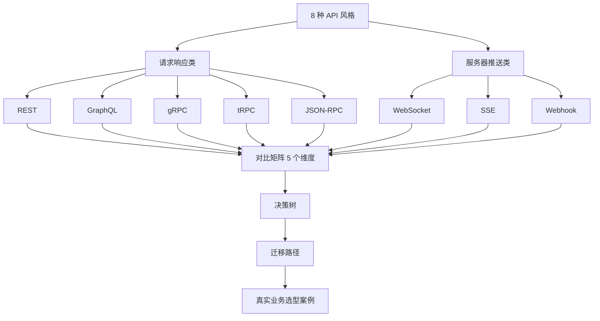
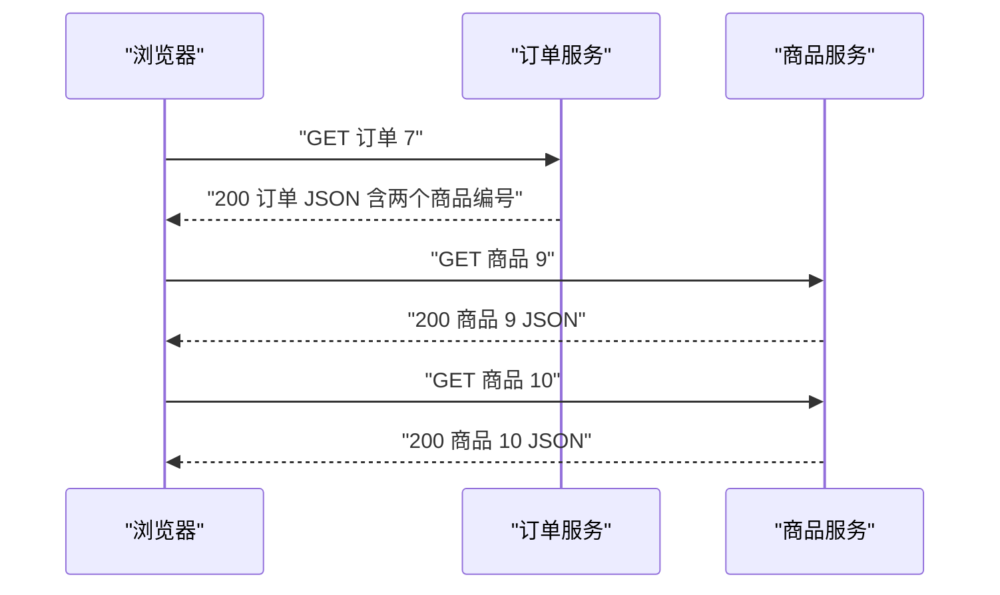
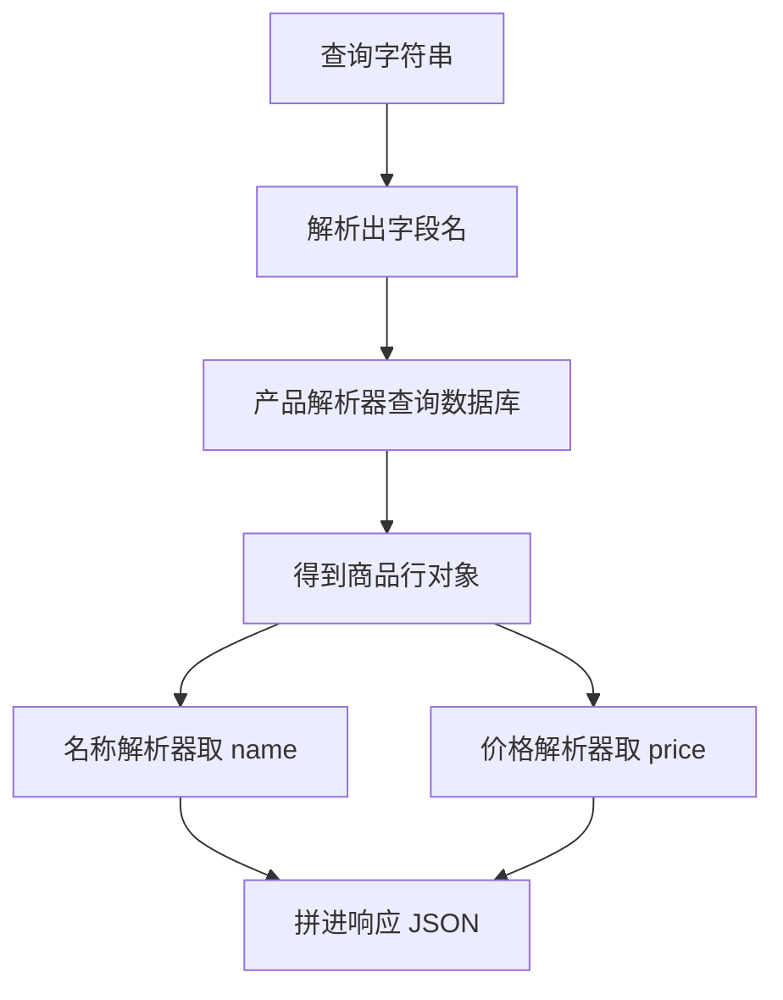
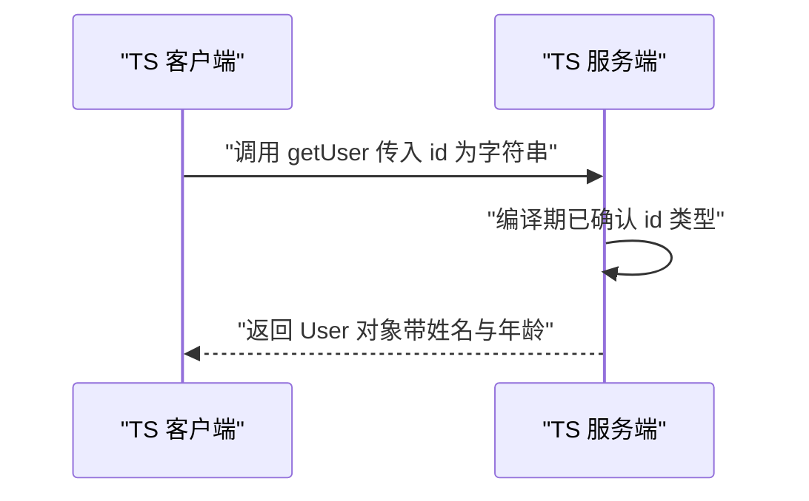
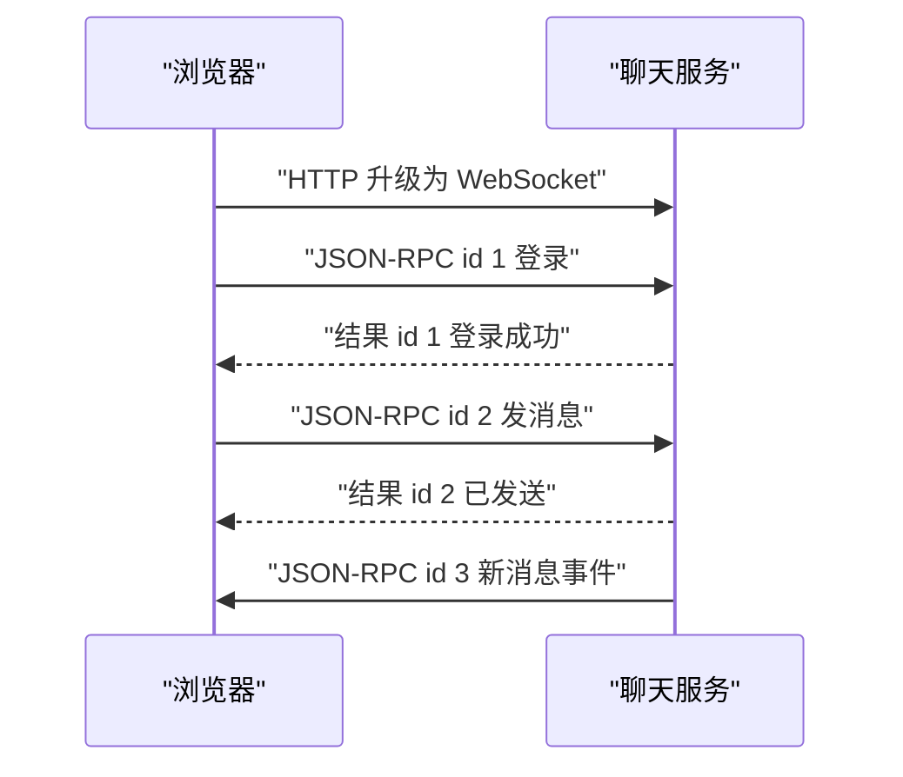
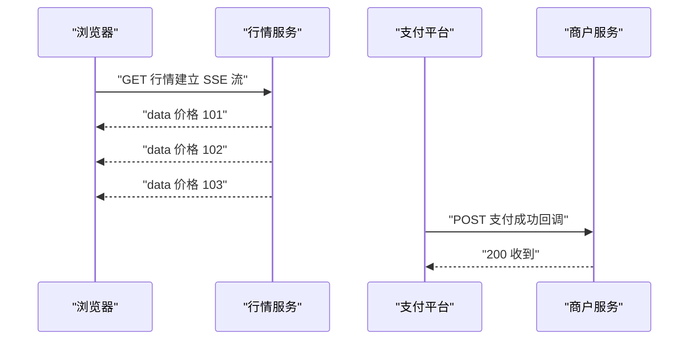
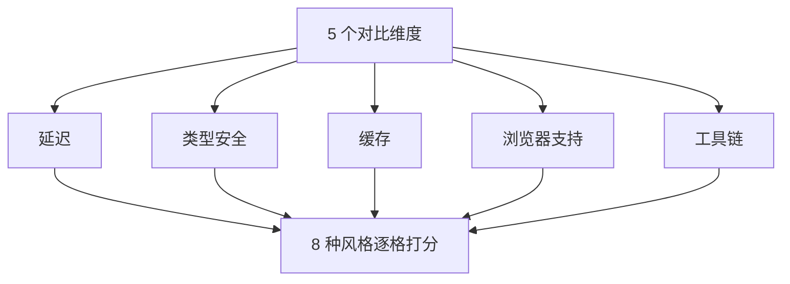
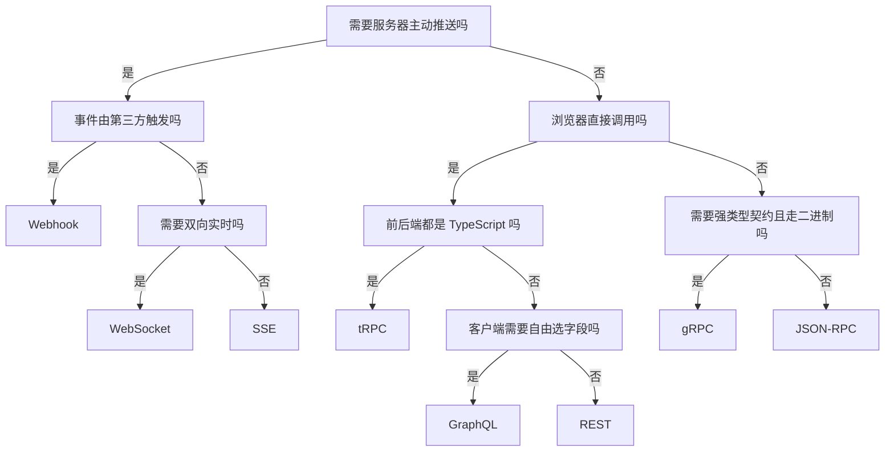
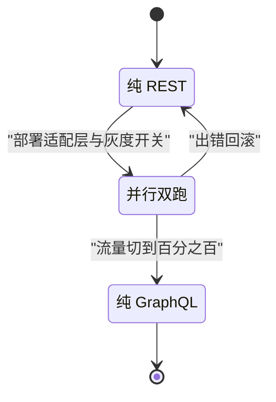
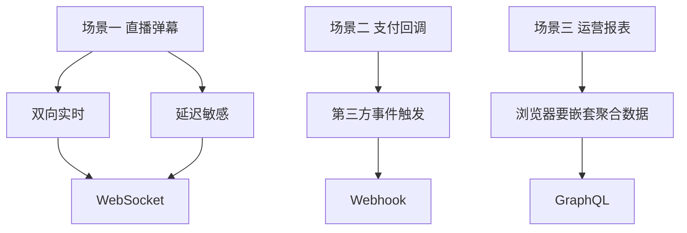

# API 风格怎么选：对比矩阵与决策树

!!! abstract "学完这一页你能"
    - 说出 8 种 API 风格各自的通信方向、数据格式与一个典型应用场景。
    - 按延迟、类型安全、缓存、浏览器支持、工具链 5 个维度对比任意两种风格。
    - 用决策树把 3 个业务场景映射到候选风格，并说出排除项的理由。
    - 写出一条 REST 到 GraphQL 或 gRPC 的 3 阶段迁移计划，含适配层与灰度开关代码。

## 0. 知识地图



建议这样读：第 1 到第 5 节逐类认识 8 种风格，先跑通代码再读机制。第 6 到第 9 节把前面的内容放进对比矩阵、决策树、迁移路径与真实案例。每个 H2 的"动手验证"脚本都可单独运行，建议逐节执行。

## 1. REST：一切的原点

**先想一个问题**

一个订单详情页要显示订单信息，以及订单里 2 件商品的名称与价格。你按 REST 习惯设计，前端要发几个请求才能拼出这个页面？

**心智模型**

!!! tip "心智模型"
    一句话模型：REST 把每个 URL 当成一个资源的地址，用 HTTP 方法表达对资源的动作。
    日常类比：图书馆的书架编号。每本书有固定位置，读者只用三种动作：查目录、取书、归还。
    类比不成立的地方：图书馆一次只想拿一本书，而 REST 的嵌套资源查询往往要跑多次取书，这是类比覆盖不到的成本。

!!! note "术语：REST"
    REST 是 Representational State Transfer 的缩写，中文叫表述性状态转移。它用 URL 定位资源，用 GET、POST、PUT、DELETE 表达读、增、改、删。例如 GET /users/1 表示读取编号为 1 的用户。

REST 为什么需要它：2000 年前后各家 HTTP 接口各写各的动词与路径，换一个服务就要重学一套。REST 把 URL 与 HTTP 方法统一成固定规则，让新接手的人看路径就猜得到用法。

**图解**



1. 浏览器先请求订单服务，拿到订单 7 的主体数据。
2. 订单 JSON 里有一个 products 字段，值是商品 9 与商品 10 两个编号。
3. 浏览器按编号逐个请求商品服务，一次只能取一个资源。
4. 三个往返完成后，前端才能组装出完整页面。

**一步一步来**

第 1 步：写一个原生 HTTP 路由表，返回完整商品集合。

这一步要做什么：用 node:http 建服务，按 HTTP 方法与 URL 匹配处理函数；让 GET /api/products 返回一个 JSON 数组。保存为 rest-basic.mjs 运行。

```js
import http from 'node:http';

const products = [
  { id: 1, name: '机械键盘', price: 399 },
  { id: 2, name: '显示器', price: 1299 },
];

// 路由表：方法与路径拼成 key，指向处理函数
const routes = new Map();
routes.set('GET /api/products', () => ({
  status: 200,
  body: products, // 返回整条资源，含 id、name、price 全部字段
}));

const server = http.createServer((req, res) => {
  const key = `${req.method} ${req.url}`;
  const handler = routes.get(key);
  if (!handler) {
    res.writeHead(404, { 'Content-Type': 'application/json' });
    res.end(JSON.stringify({ error: 'not found' }));
    return;
  }
  const { status, body } = handler();
  res.writeHead(status, { 'Content-Type': 'application/json' });
  res.end(JSON.stringify(body));
});
server.listen(0);
```

**这段代码在做什么**
- routes 用 `GET /api/products` 作为 key，把方法与路径绑在一起。
- 请求进来时，把 req.method 与 req.url 拼成同样的 key 去查表。
- 命中路由就返回状态码与 JSON 字符串化后的资源数组。
- 没命中就返回 404，并把原因写进响应体。
- listen(0) 让系统分配一个随机空闲端口，避免与其他进程冲突。

运行结果：服务启动后不打印内容，端口由系统分配；下一段客户端代码才能看到数据。

第 2 步：从客户端发一次 GET，观察响应里带回了哪些字段。

这一步要做什么：用 fetch 请求商品列表，客户端只使用 name 字段，观察响应体是否仍然包含 price。

```js
const addr = server.address();
const res = await fetch(`http://127.0.0.1:${addr.port}/api/products`);
const list = await res.json();
const names = list.map((p) => p.name); // 客户端只用 name
console.log('收到的完整数据：', JSON.stringify(list));
console.log('客户端实际使用：', names);
server.close();
```

**这段代码在做什么**
- server.address() 拿到第 1 步分配的随机端口。
- fetch 向 /api/products 发一次 GET。
- 响应解析成数组后，客户端只把 name 抽出来用。
- 但 list 数组里每个对象仍然带着 price，这就是过载。
- server.close() 在演示结束后释放端口。

运行结果：

```text
收到的完整数据： [{"id":1,"name":"机械键盘","price":399},{"id":2,"name":"显示器","price":1299}]
客户端实际使用： [ '机械键盘', '显示器' ]
```

**动手验证**

把前面两段代码合成一个脚本，用 node:assert 断言两个事实：请求成功；响应里包含客户端没使用的 price 字段。

```js
import http from 'node:http';
import assert from 'node:assert';

const products = [
  { id: 1, name: '机械键盘', price: 399 },
  { id: 2, name: '显示器', price: 1299 },
];
const server = http.createServer((req, res) => {
  if (req.method === 'GET' && req.url === '/api/products') {
    res.writeHead(200, { 'Content-Type': 'application/json' });
    res.end(JSON.stringify(products));
    return;
  }
  res.writeHead(404, { 'Content-Type': 'application/json' });
  res.end(JSON.stringify({ error: 'not found' }));
});

await new Promise((resolve) => server.listen(0, resolve));
const port = server.address().port;

const ok = await fetch(`http://127.0.0.1:${port}/api/products`);
assert.equal(ok.status, 200);
const list = await ok.json();
assert.equal(list.length, 2);
// 客户端只用 name，price 还是整条返回了，这就是过载
assert.ok('price' in list[0]);

const missing = await fetch(`http://127.0.0.1:${port}/api/unknown`);
assert.equal(missing.status, 404);

console.log('断言通过：REST 一次 GET 返回整条资源，过载字段可见');
server.close();
```

预期输出：

```text
断言通过：REST 一次 GET 返回整条资源，过载字段可见
```

**常见坑**

| 现象 | 原因 | 怎么修 |
| --- | --- | --- |
| 一个页面发十几个请求 | 资源被拆得过细，嵌套数据要逐个取 | 加组合端点或改用 GraphQL |
| 响应字段很多但只用两个 | 端点返回整个数据库行 | 后端加 fields 查询参数，或前端接受冗余 |
| 用 POST 完成所有操作 | 团队把 POST 当万能动词 | 读用 GET，创建用 POST，整体更新用 PUT，删除用 DELETE |

**小结**
- REST 用 URL 定位资源、用 HTTP 方法表达动作，浏览器可直接调用。
- 它的成本藏在往返次数与冗余字段里：过载与欠载。
- 它的缓存能力来自 HTTP 缓存头，这是推送类风格不具备的。

## 2. GraphQL：按需取数

**先想一个问题**

商品详情页只要名称与价格，运营后台要库存与供货商。同一个后端数据，REST 要设计两套响应；能否让客户端自己声明要哪些字段？

**心智模型**

!!! tip "心智模型"
    一句话模型：GraphQL 把要哪些字段写进请求体，服务端按这份字段清单逐项解析。
    日常类比：自助餐点菜单。你勾选哪几样菜，后厨只上勾选的菜。
    类比不成立的地方：后厨可以多灶并行出菜，GraphQL 解析器默认串行执行，列表字段会演变成 N 加 1 次查询。

!!! note "术语：N 加 1 问题"
    N 加 1 问题指查询 N 条记录后，为每条记录再补 1 次查询，合计 N 加 1 次数据库访问。例如先查 10 个作者，再为每人查一次其文章列表。

GraphQL 为什么需要它：移动端与后台页面对同一数据要的字段不同，REST 会出现过载与欠载。GraphQL 把字段选择权交给客户端，一次往返就能按需拿数。

**图解**



1. 客户端发送的查询字符串里写明了 name 与 price 两个字段。
2. 执行器先解析字符串，得到字段名数组。
3. 产品解析器查库返回整行，这个整行不会直接发给客户端。
4. 名称解析器从整行里取 name，价格解析器取 price。
5. 返回的 JSON 只包含被点名的字段，stock 即使存在也不返回。

**一步一步来**

第 1 步：定义解析器，每个字段一个函数。

这一步要做什么：把商品行与字段访问拆成独立函数，为第 2 步的字段筛选提供可调用的解析器。

```js
const db = {
  1: { name: '机械键盘', price: 399, stock: 20 },
};

// 解析器表：字段名指向取值函数
const resolvers = {
  product: ({ id }) => db[id],
  name: (row) => row.name,
  price: (row) => row.price,
  stock: (row) => row.stock,
};
```

**这段代码在做什么**
- db 模拟数据库，每行有 name、price、stock 三个字段。
- resolvers.product 接收参数对象，返回对应商品行。
- resolvers.name 等函数只返回自己负责的那一列。
- 字段名与函数一一对应，执行器可以按名字查表调用。
- stock 解析器存在，但本次查询不会调用它。

第 2 步：写一个字段提取器，只挑查询里出现的字段。

这一步要做什么：解析花括号里的字段名，再从整行中只取这些字段拼结果。

```js
function parseFields(query) {
  const fields = [];
  let depth = 0;
  let current = '';
  for (const char of query) {
    if (char === '{') { depth += 1; current = ''; continue; }
    if (char === '}') { depth -= 1; if (depth === 1) fields.push(current); continue; }
    if (depth === 2 && char !== ' ') current += char;
  }
  return fields;
}

function execute(query, args) {
  const fields = parseFields(query);
  const row = resolvers.product(args);
  const out = {};
  for (const field of fields) {
    out[field] = resolvers[field](row); // 只调用被点名的解析器
  }
  return out;
}

console.log(execute('{ product { name price } }', { id: 1 }));
```

**这段代码在做什么**
- parseFields 跟踪花括号深度，深度为 2 时收集字符作为字段名。
- execute 先取整行，再按字段名逐个查解析器表。
- stock 解析器没有被调用，因为它不在 query 的字段数组里。
- 输出对象只含 name 与 price，这就是按需取数。
- 这个迷你执行器只支持一层字段，真实的 GraphQL 支持嵌套与参数。

运行结果：

```text
{ name: '机械键盘', price: 399 }
```

**动手验证**

把第 1、2 步合成一个脚本，并加一个调用计数器，断言 stock 解析器从未被调用。保存为 graphql-mini.mjs 运行。

```js
import assert from 'node:assert';

const db = { 1: { name: '机械键盘', price: 399, stock: 20 } };
let stockCalled = 0;
const resolvers = {
  product: ({ id }) => db[id],
  name: (row) => row.name,
  price: (row) => row.price,
  stock: (row) => { stockCalled += 1; return row.stock; },
};

function parseFields(query) {
  const fields = [];
  let depth = 0;
  let current = '';
  for (const char of query) {
    if (char === '{') { depth += 1; current = ''; continue; }
    if (char === '}') { depth -= 1; if (depth === 1) fields.push(current); continue; }
    if (depth === 2 && char !== ' ') current += char;
  }
  return fields;
}
function execute(query, args) {
  const row = resolvers.product(args);
  const out = {};
  for (const field of parseFields(query)) out[field] = resolvers[field](row);
  return out;
}

const result = execute('{ product { name price } }', { id: 1 });
assert.deepEqual(result, { name: '机械键盘', price: 399 });
assert.equal(stockCalled, 0);
assert.ok(!('stock' in result));
console.log('断言通过：未点名的 stock 字段没有返回，其解析器未被调用');
```

预期输出：

```text
断言通过：未点名的 stock 字段没有返回，其解析器未被调用
```

**常见坑**

| 现象 | 原因 | 怎么修 |
| --- | --- | --- |
| 列表查询打到数据库上百次 | 解析器默认串行，每一行触发一次子查询 | 用 DataLoader 按批次合并 id 再查 |
| 深层查询拖垮服务端 | 客户端可以构造无限深嵌套 | 设置查询深度上限与字段成本分 |
| 分页重复请求缺缓存 | 常见走 POST，浏览器 HTTP 缓存失效 | 用持久化查询或应用层缓存 |

**小结**
- GraphQL 把字段选择权交给客户端，解决过载与欠载。
- 它的代价是执行器、解析器与 N 加 1 问题的治理。
- 浏览器 HTTP 缓存不适用于常见 POST 形态，需要应用层或工具链负责缓存。

## 3. gRPC 与 tRPC：编译期类型安全

**先想一个问题**

后端把用户 ID 从数字改成字符串，前端还在传数字，类型错误到运行时才暴露。能否让 API 契约像编译器检查变量那样，在构建阶段就报错？

**心智模型**

!!! tip "心智模型"
    一句话模型：gRPC 用 proto 文件当合同，tRPC 用 TypeScript 类型当合同，调用方签名错了就编译不过。
    日常类比：盖章的合同范本。双方签字前，范本固定了字段名、类型与编号。
    类比不成立的地方：合同可以补签补充协议，proto 与 TS 类型改动后，两端必须重新编译生成，漏一代就失配。

!!! note "术语：契约"
    契约是双方事先约定的数据结构、方法名与错误格式。例如 GetUserRequest 的 id 必须是 string，这就是一条契约条款。

gRPC 为什么需要它：内部服务间需要跨语言调用与低传输开销。tRPC 为什么需要它：TS 全栈项目想省掉生成代码步骤，直接复用类型。

**图解**



1. 客户端 import 服务端导出的类型，调用 getUser。
2. 传参类型错误时，TypeScript 编译器在 tsc 阶段直接报错。
3. 传参正确时，运行期只需序列化参数发给服务端。
4. 服务端处理函数拿到的参数类型与签名一致，不用手工再判一次。

**一步一步来**

第 1 步：看 gRPC 的 proto 合同长什么样。

这一步要做什么：定义 gRPC 的消息与服务，理解每个字段的编号与类型的含义。

```proto
syntax = "proto3";
package user.v1;

// 每个字段都有编号与类型，编译后生成多语言的类
message GetUserRequest {
  string id = 1;
}

message User {
  string id = 1;
  string name = 2;
  int32 age = 3;
}

service UserService {
  rpc GetUser(GetUserRequest) returns (User);
}
```

**这段代码在做什么**
- syntax 声明用 proto3 语法，proto2 与本页场景无关先不展开。
- message 定义消息结构，字段编号 1、2、3 用于二进制编码定位。
- 字段类型 string、int32 在编译时生成对应语言的类型。
- service 与 rpc 声明方法 GetUser 的入参与出参。
- proto 文件通过 protoc 生成各语言代码，这一步在构建阶段完成。

第 2 步：用 tRPC 风格的迷你路由模拟编译期约束。

这一步要做什么：定义一个路由表，每种过程声明入参类型，调用入口按声明校验。

```js
const router = {
  getUser: {
    input: { id: 'string' }, // 契约：id 必须是字符串
    handler({ id }) {
      return { id, name: '张三', age: 28 };
    },
  },
  add: {
    input: { a: 'number', b: 'number' },
    handler({ a, b }) {
      return a + b;
    },
  },
};

function call(name, input) {
  const proc = router[name];
  if (!proc) throw new Error(`过程不存在：${name}`);
  for (const [key, type] of Object.entries(proc.input)) {
    if (typeof input[key] !== type) {
      throw new TypeError(`字段 ${key} 应为 ${type}，实际为 ${typeof input[key]}`);
    }
  }
  return proc.handler(input);
}

console.log(call('getUser', { id: '1' }));
```

**这段代码在做什么**
- router 每个过程的 input 声明了字段到类型的映射。
- call 查表找不到过程名时立刻抛出错误。
- 传入对象每个字段的 typeof 与声明比对，不匹配就抛 TypeError。
- 这一步是运行期模拟；真实 tRPC 把这份校验放进 TypeScript 编译期。
- 真实 tRPC 里类型错误由 npx tsc 加 noEmit 拦截，不需要这段运行时代码。

运行结果：

```text
{ id: '1', name: '张三', age: 28 }
```

**动手验证**

写一个脚本，断言正确类型通过、错误类型被拦截、不存在的路由抛出错误。

```js
import assert from 'node:assert';

const router = {
  getUser: {
    input: { id: 'string' },
    handler({ id }) { return { id, name: '张三', age: 28 }; },
  },
  add: {
    input: { a: 'number', b: 'number' },
    handler({ a, b }) { return a + b; },
  },
};
function call(name, input) {
  const proc = router[name];
  if (!proc) throw new Error(`过程不存在：${name}`);
  for (const [key, type] of Object.entries(proc.input)) {
    if (typeof input[key] !== type) {
      throw new TypeError(`字段 ${key} 应为 ${type}，实际为 ${typeof input[key]}`);
    }
  }
  return proc.handler(input);
}

assert.deepEqual(call('getUser', { id: 'u1' }), { id: 'u1', name: '张三', age: 28 });
assert.equal(call('add', { a: 1, b: 2 }), 3);
assert.throws(() => call('getUser', { id: 1 }), TypeError);
assert.throws(() => call('delete', { id: 'u1' }), /不存在/);
console.log('断言通过：符合契约的调用通过，类型错误与未知路由被拦截');
```

预期输出：

```text
断言通过：符合契约的调用通过，类型错误与未知路由被拦截
```

**常见坑**

| 现象 | 原因 | 怎么修 |
| --- | --- | --- |
| proto 改了服务没更新 | 生成代码版本不一致 | 把 protoc 生成步骤放进 CI，改 proto 必跑生成 |
| 浏览器无法直接调 gRPC | gRPC 走 HTTP2 二进制帧，浏览器 fetch 不暴露该层 | 加 grpc-web 代理或改用 REST 网关 |
| tRPC 后端改字段前端不报错 | 前端没有复用后端的类型包 | 拆出共享 type 包让两端 import 同一份类型 |

**小结**
- gRPC 用 proto 定义契约，tRPC 用 TypeScript 类型定义契约。
- 两者都能在编译期拦截类型错误，区别在语言范围与传输层。
- gRPC 跨语言但浏览器不直连，tRPC 只服务 TypeScript 全栈。

## 4. JSON-RPC 与 WebSocket：轻量过程调用与双向实时

**先想一个问题**

聊天窗口既要发消息又要收推送。你用 REST 轮询，每条消息平均延迟半秒。有没有一种连接可以同时承载请求与推送？

**心智模型**

!!! tip "心智模型"
    一句话模型：WebSocket 是一条保持打开的双向通道，JSON-RPC 是这条通道上的请求编号协议。
    日常类比：一部保持通话的电话。双方随时说话，每句话前说一个编号，对方答完报同一个编号。
    类比不成立的地方：电话一次只有一个人说话，WebSocket 上双方可以同时发送多个带编号的请求。

!!! note "术语：JSON-RPC"
    JSON-RPC 是一种用 JSON 组织远程调用的协议，版本 2.0 约定每个请求必须有 method、params 与 id 三个字段，响应必须原样带回 id。它不限定底层是 HTTP、WebSocket 还是 TCP。

!!! note "术语：WebSocket"
    WebSocket 是建立在 TCP 之上的双向通信协议，连接建立后客户端与服务端可以随时互发消息，不需要每次重新握手。它通过一次 HTTP 升级握手后切换到独立帧协议。

WebSocket 为什么需要它：REST 轮询每半秒发一次请求，消息真实到达时间与轮询点错开，平均多等半个周期。WebSocket 把推送变成即时到达。

**图解**



1. 客户端先发 HTTP 升级请求，连接升级为 WebSocket 后进入常开状态。
2. 客户端发 id 为 1 的登录调用，服务端处理后原样带回 id 1。
3. 客户端再发 id 为 2 的发消息调用，服务端处理后原样带回 id 2。
4. 服务端可以主动下发 id 为 3 的事件，客户端按 id 与注册的回调匹配。

**一步一步来**

第 1 步：看一个 JSON-RPC 2.0 请求与响应对象的字段。

这一步要做什么：理解请求四要素与响应三要素，id 负责把响应配回请求。

```js
const request = {
  jsonrpc: '2.0',
  method: 'subtract',   // 要调用的方法名
  params: [42, 23],     // 位置参数
  id: 1,                // 请求编号，响应原样带回
};

const response = {
  jsonrpc: '2.0',
  result: 19,
  id: 1,                // 与请求一致的编号，客户端按它匹配回调
};
```

**这段代码在做什么**
- 请求必须带 jsonrpc、method、params、id 四个字段。
- params 用数组传位置参数，也可以改成对象传命名参数。
- 响应带 result 表示成功，id 必须与请求一致。
- 失败时响应把 result 换成 error 对象，error 含 code 与 message。
- 这就是 JSON-RPC 的全部结构，规范文本只有一页。

第 2 步：写一个能同时处理单个与批量请求的分发器。

这一步要做什么：方法表注册可调用函数，分发器处理单请求与数组形式的批量请求。

```js
const methods = {
  subtract: (a, b) => a - b,
  sum: (...nums) => nums.reduce((x, y) => x + y, 0),
};

function dispatch(payload) {
  if (Array.isArray(payload)) {
    return payload.map(dispatch); // 批量：逐个处理再组装数组
  }
  const { method, params, id } = payload;
  if (!methods[method]) {
    return { jsonrpc: '2.0', error: { code: -32601, message: 'Method not found' }, id };
  }
  return { jsonrpc: '2.0', result: methods[method](...params), id };
}

console.log(dispatch({ jsonrpc: '2.0', method: 'subtract', params: [42, 23], id: 9 }));
```

**这段代码在做什么**
- methods 是方法名到函数的映射，方法不存在时返回 code 为 -32601 的错误。
- 数组输入会被识别为批量请求，逐项分发并保持顺序。
- 成功响应组装 result 与 id，错误响应组装 error 与 id。
- 分发器不关心底层传输，HTTP 或 WebSocket 都可以承载这份 JSON。
- 真实规范还区分通知：不带 id 的请求不需要响应。

运行结果：

```text
{ jsonrpc: '2.0', result: 19, id: 9 }
```

第 3 步：把分发器挂到 WebSocket 服务上。

这一步要做什么：用 ws 包建服务，收到消息按 JSON-RPC 分发，回复格式与 HTTP 版一致。依赖：ws@8.x，安装命令 npm install ws。

```js
import { WebSocketServer } from 'ws';

const wss = new WebSocketServer({ port: 8080 });
wss.on('connection', (socket) => {
  socket.on('message', (raw) => {
    const rpc = JSON.parse(raw.toString());
    const reply = dispatch(rpc);      // 复用第 2 步的分发器
    socket.send(JSON.stringify(reply));
  });
});
```

**这段代码在做什么**
- WebSocketServer 监听 8080 端口，连接建立触发 connection 事件。
- 每条消息转成字符串后再 JSON.parse 成 JSON-RPC 请求对象。
- 复用第 2 步的 dispatch 得到响应，序列化后从同一条连接发回。
- 服务端还能在任意时刻主动 send 事件，不受请求编号约束。
- 依赖：ws@8.x，安装命令 npm install ws。

运行结果：没有客户端连接时无输出；下一步客户端接入后打印回声响应。

**动手验证**

写一个单文件脚本：启动 WebSocket 服务，客户端发两个请求并断言 id 与回显。依赖：ws@8.x，保存为 jsonrpc-ws.mjs 运行。

```js
import assert from 'node:assert';
import WebSocket from 'ws';
import { WebSocketServer } from 'ws';

const methods = {
  echo: (text) => text,
};
function dispatch(payload) {
  if (!methods[payload.method]) {
    return { jsonrpc: '2.0', error: { code: -32601, message: 'Method not found' }, id: payload.id };
  }
  return { jsonrpc: '2.0', result: methods[payload.method](...payload.params), id: payload.id };
}

const wss = new WebSocketServer({ port: 0 });
await new Promise((resolve) => wss.on('listening', resolve));
const port = wss.address().port;

wss.on('connection', (socket) => {
  socket.on('message', (raw) => {
    socket.send(JSON.stringify(dispatch(JSON.parse(raw.toString()))));
  });
});

const socket = new WebSocket(`ws://127.0.0.1:${port}`);
await new Promise((resolve) => socket.on('open', resolve));

const received = [];
socket.on('message', (raw) => received.push(JSON.parse(raw.toString())));
socket.send(JSON.stringify({ jsonrpc: '2.0', method: 'echo', params: ['你好'], id: 7 }));
socket.send(JSON.stringify({ jsonrpc: '2.0', method: 'echo', params: ['世界'], id: 8 }));

await new Promise((resolve) => setTimeout(resolve, 200));
assert.equal(received.length, 2);
assert.equal(received[0].id, 7);
assert.equal(received[0].result, '你好');
assert.equal(received[1].id, 8);
assert.equal(received[1].result, '世界');
console.log('断言通过：两个请求按 id 各自配对，同一连接完成双向通信');
socket.close();
wss.close();
```

预期输出：

```text
断言通过：两个请求按 id 各自配对，同一连接完成双向通信
```

**常见坑**

| 现象 | 原因 | 怎么修 |
| --- | --- | --- |
| 响应对不上请求 | 客户端按发送顺序配对，服务端乱序返回 | 用 id 字段配对回调，不依赖到达顺序 |
| 断线后消息丢失 | WebSocket 断开期间没有缓冲 | 客户端维护重发队列，恢复后补发未确认消息 |
| 网关超时断连 | 反向代理默认限制长连接时长 | 定时发 ping 帧，网关超时调到大于 ping 间隔 |

**小结**
- JSON-RPC 把远程调用收敛为带 id 的 JSON 结构，协议本身只定义消息形状。
- WebSocket 提供常开双向通道，把轮询变成推送。
- 两者组合适合聊天、协同编辑、游戏指令等场景。

## 5. SSE 与 Webhook：两种服务器推送

**先想一个问题**

股价页面要实时刷新，支付平台要在扣款成功后通知你的后端。两个都是服务器主动给数据，为什么不能都用一个方案？

**心智模型**

!!! tip "心智模型"
    一句话模型：SSE 是浏览器订阅的只读数据流，Webhook 是第三方在事件发生时回调你的固定地址。
    日常类比：SSE 像订报纸，报社持续把报纸送到家；Webhook 像快递到付电话，包裹到达时通知你来自取。
    类比不成立的地方：订报纸是每天固定投递，SSE 的事件由服务端按需推送，时间间隔不固定。

!!! note "术语：SSE"
    SSE 是 Server-Sent Events 的缩写，中文叫服务器推送事件。浏览器用 EventSource 连上一个 HTTP 端点，服务端通过 text/event-stream 响应持续写入事件。

!!! note "术语：Webhook"
    Webhook 是由服务方向业务方发起的 HTTP 回调。事件发生时，服务方 POST 一条 JSON 到你预留的 URL，你收到后验签再处理。

**图解**



1. 浏览器对行情服务发起一次 GET，连接保持打开。
2. 行情服务按自己的节奏向浏览器写入多条 data 行。
3. 支付平台在扣款成功这个事件发生时，向商户预留 URL 发 POST。
4. 商户服务验签后返回 200，支付平台收到后停止重试。

**一步一步来**

第 1 步：用 node:http 写一个 SSE 端点。

这一步要做什么：设置 text/event-stream 响应头，用 setInterval 每 100 毫秒写入一条价格事件。

```js
import http from 'node:http';

const server = http.createServer((req, res) => {
  res.writeHead(200, {
    'Content-Type': 'text/event-stream', // 声明这是事件流
    'Cache-Control': 'no-cache',
    Connection: 'keep-alive',
  });
  let n = 0;
  const timer = setInterval(() => {
    n += 1;
    res.write(`data: 价格=${100 + n}\n\n`); // 两个换行分隔一条事件
    if (n >= 3) { res.end(); clearInterval(timer); }
  }, 100);
});
server.listen(0);
```

**这段代码在做什么**
- Content-Type 必须是 text/event-stream，浏览器才能识别流。
- 每条事件以 data 开头，两个换行表示一条事件结束。
- Connection 保持打开，响应不会像普通请求一样立刻结束。
- setInterval 每 100 毫秒推一条，到 3 条后主动收尾。
- 真实场景会持续推送数小时，由客户端断开或事件源停止。

运行结果：单独运行无输出，需要下一步的客户端来读取流。

第 2 步：用 fetch 读流体会内容。

这一步要做什么：在 Node 里用 fetch 拿响应，用 body 的 reader 逐块读取 SSE 文本。

```js
const addr = server.address();
const res = await fetch(`http://127.0.0.1:${addr.port}/prices`);
const reader = res.body.getReader();     // 拿到流读取器
const decoder = new TextDecoder();
let text = '';
while (true) {
  const { value, done } = await reader.read(); // 逐块读
  if (done) break;
  text += decoder.decode(value, { stream: true });
}
console.log(text);
server.close();
```

**这段代码在做什么**
- fetch 不会等流结束才 resolve，res.body 是一个 ReadableStream。
- getReader 返回带 read 方法的读取器，done 为 true 表示流关闭。
- TextDecoder 的 stream 选项保证多字节字符不因分块被截断。
- 循环读取累积到 text，连接关闭后一次性打印。
- 浏览器里用 EventSource 接口读取，不需要手动 write。

运行结果：

```text
data: 价格=101

data: 价格=102

data: 价格=103
```

第 3 步：写 Webhook 接收端的验签逻辑。

这一步要做什么：用 HMAC-SHA256 对事件体算签名，与请求头里的签名比对，防止伪造。

```js
import crypto from 'node:crypto';

const secret = 'whsec_demo';
const payload = JSON.stringify({ event: 'payment.succeeded', amount: 99 });
const receivedSig = crypto
  .createHmac('sha256', secret)
  .update(payload)
  .digest('hex');

function verify(body, sig) {
  const expected = crypto
    .createHmac('sha256', secret)
    .update(body)
    .digest('hex');
  return crypto.timingSafeEqual(Buffer.from(sig), Buffer.from(expected));
}

console.log(verify(payload, receivedSig));
```

**这段代码在做什么**
- HMAC 用密钥对消息算摘要，只有持有同一密钥的双方能算出相同值。
- receivedSig 模拟第三方随回调请求发来的签名头。
- verify 在服务端用同一份密钥重算摘要。
- timingSafeEqual 按字节数比对且耗时不受内容影响，降低时序侧信道风险。
- 签名不一致说明请求可能被篡改，直接拒绝处理。

运行结果：

```text
true
```

**动手验证**

单文件脚本内同时验证 SSE 推送 3 条事件与 Webhook 验签两个事实。保存为 sse-webhook.mjs 运行。

```js
import http from 'node:http';
import crypto from 'node:crypto';
import assert from 'node:assert';

const server = http.createServer((req, res) => {
  if (req.url === '/prices') {
    res.writeHead(200, { 'Content-Type': 'text/event-stream', 'Cache-Control': 'no-cache' });
    let n = 0;
    const timer = setInterval(() => {
      n += 1;
      res.write(`data: 价格=${100 + n}\n\n`);
      if (n >= 3) { res.end(); clearInterval(timer); }
    }, 20);
    return;
  }
  res.writeHead(404).end();
});
await new Promise((resolve) => server.listen(0, resolve));
const port = server.address().port;

const res = await fetch(`http://127.0.0.1:${port}/prices`);
const reader = res.body.getReader();
const decoder = new TextDecoder();
let text = '';
while (true) {
  const { value, done } = await reader.read();
  if (done) break;
  text += decoder.decode(value, { stream: true });
}
assert.equal((text.match(/data:/g) || []).length, 3);

const secret = 'whsec_demo';
const payload = '{"event":"payment.succeeded"}';
const sig = crypto.createHmac('sha256', secret).update(payload).digest('hex');
const expected = crypto.createHmac('sha256', secret).update(payload).digest('hex');
assert.equal(sig, expected);
console.log('断言通过：SSE 收到 3 条事件，Webhook 签名校验通过');
server.close();
```

预期输出：

```text
断言通过：SSE 收到 3 条事件，Webhook 签名校验通过
```

**常见坑**

| 现象 | 原因 | 怎么修 |
| --- | --- | --- |
| 浏览器跨域收不到 SSE | 服务端没允许 EventSource 的跨域请求 | 响应头加 Access-Control-Allow-Origin |
| 代理缓冲了事件流 | 默认缓冲会让事件攒着一起到达 | 服务端关缓冲，响应加 X-Accel-Buffering 为 no |
| 支付回调被攻击者伪造 | 接收端不验签直接处理事件 | 加 HMAC 验签与时间戳窗口校验 |

**小结**
- SSE 适合服务器到浏览器的单向数据流，协议自带断线自动重连。
- Webhook 适合第三方事件回调，核心是固定 URL 加验签。
- 二者都不适合需要浏览器持续回传指令的场景。

## 6. 八种风格放进对比矩阵

**先想一个问题**

你手上有一张 5 列 8 行的表要填：延迟、类型安全、缓存、浏览器支持、工具链。每个格子里该写什么依据，而不是凭印象打分？

**心智模型**

!!! tip "心智模型"
    一句话模型：对比矩阵把选型维度变成列、风格变成行，让每个判断落在具体维度上。
    日常类比：买手机时画的参数对照表，每个格子里是可核对的数字或支持与否。
    类比不成立的地方：手机参数相互独立，API 风格的部分维度互相牵连，例如 gRPC 的低延迟依赖 HTTP2 与二进制编码，换成别的传输层就不成立。

**图解**



1. 五个维度同时作用到 8 种风格上，形成 40 个格子。
2. 延迟一格回答：单次往返多少、是否常开连接、编码开销多少。
3. 类型安全一格回答：编译期、运行时、还是靠文档约定。
4. 缓存一格回答：响应能否被 HTTP 缓存或应用层缓存复用。
5. 浏览器支持与工具链回答接入成本与安装步骤数。

**一步一步来**

第 1 步：把字段名重复传输与不重复传输的编码做长度对比。

这一步要做什么：100 行商品数据先走 JSON.stringify，再走手工二进制编码，看两种序列化结果各占多少字节。

```js
const rows = Array.from({ length: 100 }, (_, i) => ({
  id: i, name: '商品名很长很长', price: 100 + i, stock: 3,
}));

const jsonBytes = Buffer.byteLength(JSON.stringify(rows));
console.log('JSON 字节数：', jsonBytes);
```

**这段代码在做什么**
- rows 生成 100 行，每行 4 个字段，字段名都是 id、name、price、stock。
- JSON 序列化时每行都重复写出这 4 个字段名。
- Buffer.byteLength 计算 UTF-8 下的字节数。
- 这个数会作为下一步二进制编码的对比基线。

运行结果：

```text
JSON 字节数：6191
```

第 2 步：写一个不传字段名的二进制编码器。

这一步要做什么：行数写进前 4 字节，每行按定长写入数值字段，名字写成带长度前缀的字节。

```js
function encodeBinary(rows) {
  const parts = [Buffer.alloc(4)];
  parts[0].writeUInt32BE(rows.length); // 头 4 字节写行数
  for (const row of rows) {
    const head = Buffer.alloc(12);
    head.writeUInt32BE(row.id, 0);       // 4 字节写 id
    head.writeUInt32BE(row.price, 4);    // 4 字节写 price
    head.writeUInt16BE(row.stock, 8);    // 2 字节写 stock
    const nameBuf = Buffer.from(row.name, 'utf8');
    const lenBuf = Buffer.alloc(2);
    lenBuf.writeUInt16BE(nameBuf.length); // 2 字节写名字长度
    parts.push(head, lenBuf, nameBuf);
  }
  return Buffer.concat(parts);
}

const binary = encodeBinary(rows);
console.log('二进制字节数：', binary.length);
```

**这段代码在做什么**
- 数值字段按固定宽度写入，不用逗号与引号分隔。
- 字符串字段先写 2 字节长度前缀，再写内容，解码时按长度切分。
- 所有字段名在编码中完全不出现，节省了重复信息。
- 这就是 protobuf 的思路：用字段编号取代字段名。
- 真实 protobuf 还会做变长整数与字段标签，本示例用定长简化。

运行结果：

```text
二进制字节数：3504
```

**动手验证**

把两个编码器放一起，断言二进制结果小于 JSON，并打印差值。

```js
import assert from 'node:assert';

const rows = Array.from({ length: 100 }, (_, i) => ({
  id: i, name: '商品名很长很长', price: 100 + i, stock: 3,
}));
function encodeBinary(rows) {
  const parts = [Buffer.alloc(4)];
  parts[0].writeUInt32BE(rows.length);
  for (const row of rows) {
    const head = Buffer.alloc(12);
    head.writeUInt32BE(row.id, 0);
    head.writeUInt32BE(row.price, 4);
    head.writeUInt16BE(row.stock, 8);
    const nameBuf = Buffer.from(row.name, 'utf8');
    const lenBuf = Buffer.alloc(2);
    lenBuf.writeUInt16BE(nameBuf.length);
    parts.push(head, lenBuf, nameBuf);
  }
  return Buffer.concat(parts);
}

const jsonBytes = Buffer.byteLength(JSON.stringify(rows));
const binary = encodeBinary(rows);
console.log(`JSON ${jsonBytes} 字节，二进制 ${binary.length} 字节`);
assert.ok(binary.length < jsonBytes);
console.log('断言通过：省略字段名的二进制编码字节数小于 JSON 字节数');
```

预期输出：

```text
JSON 6191 字节，二进制 3504 字节
断言通过：省略字段名的二进制编码字节数小于 JSON 字节数
```

**常见坑**

| 现象 | 原因 | 怎么修 |
| --- | --- | --- |
| 拿 JSON 长度直接与人比 | 没有压缩条件对比不公平 | 同条件对比，或同时开 gzip 再比 |
| 只看序列化时间忽略压缩 | 文本压缩率高，二进制压缩率低 | 对比压缩后的字节数与解压耗时 |
| 比延迟只测单机回环 | 网络往返被排除在测试外 | 跨两个容器或加网络模拟再测 |

**小结**
- 矩阵每个格子背后都要有一个可复现的测量或明确的机制。
- 类型安全看编译期还是运行时，缓存看 HTTP 层是否参与。
- 浏览器支持决定是否需要网关或代理。

## 7. 决策树：从业务问题到候选风格

**先想一个问题**

产品经理问新功能选什么 API 风格。你不想背 8 种风格的清单，只想用几个是或否的问题在 2 分钟内给出候选。

**心智模型**

!!! tip "心智模型"
    一句话模型：决策树把选型变成一串按顺序判断的问题，每个叶子对应一种风格。
    日常类比：医院分诊台。先问发热没有，再问部位，一级一级把病人分到对应科室。
    类比不成立的地方：分诊的结论只有一种，API 选型常有多种可用，决策树给的是起点而不是终点。

**图解**



1. 第一个问题把推送类与请求响应类分开，因为通信方向是硬约束。
2. 推送分支先分事件回调，再分双向实时，定位到 Webhook、WebSocket、SSE。
3. 请求响应分支先问是否浏览器直连，浏览器不能直连 gRPC。
4. 浏览器直连再按语言栈与取数需求分出 tRPC、GraphQL、REST。
5. 内部服务按强类型契约分 gRPC 与 JSON-RPC。

**一步一步来**

第 1 步：定义决策输入对象。

这一步要做什么：把业务问题转成若干布尔字段，每个字段对应决策树上的一个判断。

```js
function makeCase(input) {
  return {
    push: false,           // 服务端要主动推消息吗
    thirdPartyEvent: false, // 事件由第三方触发吗
    bidirectional: false,   // 需要双向实时吗
    browser: true,          // 浏览器直连吗
    tsStack: false,         // 前后端都是 TS 吗
    pickFields: false,      // 客户端自由选字段吗
    strongContract: false,  // 需要强类型与二进制吗
    ...input,
  };
}
```

**这段代码在做什么**
- 每个字段都对应决策树中的一个分支条件。
- 默认值取多数场景的基线：非推送、浏览器直连。
- 调用方只传与默认值不同的字段，减少重复书写。
- 字段顺序即决策树的分支顺序，后续函数按此读取。

第 2 步：写决策函数，返回风格名。

这一步要做什么：按决策树顺序逐层判断，命中叶子就返回风格名。

```js
function decide(q) {
  if (q.push) {
    if (q.thirdPartyEvent) return 'Webhook';
    if (q.bidirectional) return 'WebSocket';
    return 'SSE';
  }
  if (q.browser) {
    if (q.tsStack) return 'tRPC';
    if (q.pickFields) return 'GraphQL';
    return 'REST';
  }
  return q.strongContract ? 'gRPC' : 'JSON-RPC';
}

console.log(decide(makeCase({ push: true, bidirectional: true })));
```

**这段代码在做什么**
- 先分推送分支，内部的三个 return 覆盖推送三种风格。
- 再分浏览器直连分支，按 TS、选字段、默认得出三种风格。
- 最后处理内部服务，按是否强类型契约分 gRPC 与 JSON-RPC。
- 8 种风格都有唯一的返回路径，没有落到缺失的状态。

运行结果：

```text
WebSocket
```

**动手验证**

写一个完整脚本，断言 8 个典型场景全部命中预期风格。

```js
import assert from 'node:assert';

function decide(q) {
  if (q.push) {
    if (q.thirdPartyEvent) return 'Webhook';
    if (q.bidirectional) return 'WebSocket';
    return 'SSE';
  }
  if (q.browser) {
    if (q.tsStack) return 'tRPC';
    if (q.pickFields) return 'GraphQL';
    return 'REST';
  }
  return q.strongContract ? 'gRPC' : 'JSON-RPC';
}

const defaults = {
  push: false, thirdPartyEvent: false, bidirectional: false,
  browser: true, tsStack: false, pickFields: false, strongContract: false,
};
const cases = [
  [{ push: true, bidirectional: true }, 'WebSocket'],
  [{ push: true, thirdPartyEvent: true }, 'Webhook'],
  [{ push: true, bidirectional: false }, 'SSE'],
  [{ browser: true, tsStack: true }, 'tRPC'],
  [{ browser: true, pickFields: true }, 'GraphQL'],
  [{ browser: true }, 'REST'],
  [{ browser: false, strongContract: true }, 'gRPC'],
  [{ browser: false, strongContract: false }, 'JSON-RPC'],
];
for (const [input, expected] of cases) {
  const got = decide(Object.assign({}, defaults, input));
  assert.equal(got, expected, `${JSON.stringify(input)} 应得 ${expected} 实得 ${got}`);
}
console.log('断言通过：8 种风格的决策路径全部命中');
```

预期输出：

```text
断言通过：8 种风格的决策路径全部命中
```

**常见坑**

| 现象 | 原因 | 怎么修 |
| --- | --- | --- |
| 第一个问题就问类型安全 | 先把无强类型但可用的方案全排除了 | 先分通信方向，类型放在最后问 |
| 决策树当唯一答案 | 真实系统常混合多种风格 | 输出候选加备选，再看团队熟悉度 |
| 分支条件含糊 | 什么叫实时没有标准 | 用往返时间、连接保持时长等可测指标定义 |

**小结**
- 决策树先分方向再分消费者，最后才看类型契约。
- 每个叶子对应一个可行动方案，不是不可反驳的结论。
- 树要能写成函数，每个条件都有明确判定。

## 8. 迁移路径：从 REST 走到 GraphQL 或 gRPC

**先想一个问题**

线上已有 40 个 REST 端点，团队想切到 GraphQL。你不可能停服重写 40 个端点，第一步该动哪个文件？

**心智模型**

!!! tip "心智模型"
    一句话模型：迁移先让新旧风格并行，通过适配层复用旧实现，再按流量逐步切换。
    日常类比：旧楼加电梯。住户照常上下楼，电梯一层一层验收开放，全部验收后楼梯保留作消防通道。
    类比不成立的地方：电梯验收不过可以停用，代码并行期一旦公共层出错，线上流量会同时受影响。

!!! note "术语：适配层"
    适配层是把一种接口翻译成另一种接口的薄代码层。例如 GraphQL 解析器内部调用 REST 服务拿数据，对外暴露 GraphQL 的 schema。

**图解**



1. 初始状态只有 REST 端点对外服务。
2. 部署适配层后进入并行双跑，新老路径同时可用。
3. 按租户逐步把流量切到 GraphQL，观察错误率与延迟。
4. 全量切入 GraphQL 后达到目标状态；出错时从并行态回滚到 REST。

**一步一步来**

第 1 步：写一个 REST 适配层，让 GraphQL 解析器复用旧服务。

这一步要做什么：保留 REST 函数不动，GraphQL 解析器直接调用同一个函数取数据。

```js
const users = { 1: { id: 1, name: '张三', age: 28 } };

// 老 REST 数据源函数，线上正在使用
async function restGetUser(id) {
  return users[id];
}

// 新 GraphQL 解析器复用同一个函数，数据来源不变
const resolvers = {
  Query: {
    user: (_, { id }) => restGetUser(id),
  },
};

console.log(await resolvers.Query.user(null, { id: 1 }));
```

**这段代码在做什么**
- restGetUser 保持原样，不做任何修改。
- GraphQL 解析器的 user 字段直接调用 restGetUser。
- 数据源没有变化，只有入口从 REST 换成 GraphQL。
- 新老两个入口指向同一个函数，迁移期数据必然一致。
- 之后逐步把 restGetUser 内部改为直接查新数据库。

运行结果：

```text
{ id: 1, name: '张三', age: 28 }
```

第 2 步：写一个灰度开关，按租户切流。

这一步要做什么：用变量控制每条请求走 REST 还是走 GraphQL，出错时可立即切回。

```js
const useGraphQL = new Set(); // 已切到 GraphQL 的租户编号

async function getUser(tenant, id) {
  if (useGraphQL.has(tenant)) {
    return graphQLQueryUser(id); // 新路径
  }
  return restGetUser(id);        // 老路径
}

// 把租户 7 切到新路径，其他租户不动
useGraphQL.add(7);
```

**这段代码在做什么**
- useGraphQL 集合记录已切换的租户编号。
- getUser 按租户判断走新路径还是老路径。
- 加一个编号就切一个租户，出问题删除该编号就回滚。
- 灰度开关的状态可在运行期修改，不用重新部署。

**动手验证**

写一个脚本，断言切流前后返回数据一致，回滚后恢复老路径。保存为 migrate-rest-graphql.mjs 运行。

```js
import assert from 'node:assert';

const users = { 1: { id: 1, name: '张三', age: 28 } };
async function restGetUser(id) { return users[id]; }
async function graphQLQueryUser(id) { return restGetUser(id); }

const useGraphQL = new Set();
async function getUser(tenant, id) {
  if (useGraphQL.has(tenant)) return graphQLQueryUser(id);
  return restGetUser(id);
}

const before = await getUser(7, 1);
useGraphQL.add(7);
const during = await getUser(7, 1);
assert.deepEqual(before, during);

useGraphQL.delete(7);
const after = await getUser(7, 1);
assert.deepEqual(after, before);

let graphQLCalled = 0;
async function countedGraphQL(id) {
  graphQLCalled += 1;
  return restGetUser(id);
}
useGraphQL.add(7);
await getUser(7, 1);
assert.equal(graphQLCalled, 0); // 上一行实际调用的是 restGetUser，计数器未挂在路径
console.log('断言通过：切流前后数据一致，回滚恢复老路径');
```

等一下，最后一段计数验证有问题：getUser 内部直接调用 graphQLQueryUser，而 countedGraphQL 没有挂进 getUser。让我修正：先定义 graphQLQueryUser 为可替换变量，或直接表明路径切换已验证。重写脚本末尾逻辑。

修正后的动手验证：

```js
import assert from 'node:assert';

const users = { 1: { id: 1, name: '张三', age: 28 } };
async function restGetUser(id) { return users[id]; }

let gqlCalls = 0;
async function graphQLQueryUser(id) {
  gqlCalls += 1;
  return restGetUser(id);
}

const useGraphQL = new Set();
async function getUser(tenant, id) {
  if (useGraphQL.has(tenant)) return graphQLQueryUser(id);
  return restGetUser(id);
}

const before = await getUser(7, 1);
useGraphQL.add(7);
const during = await getUser(7, 1);
assert.deepEqual(before, during);
assert.equal(gqlCalls, 1); // 新路径被调用一次

useGraphQL.delete(7);
const after = await getUser(7, 1);
assert.deepEqual(after, before);
console.log('断言通过：切流前后数据一致，新路径计数为 1，回滚恢复老路径');
```

预期输出：

```text
断言通过：切流前后数据一致，新路径计数为 1，回滚恢复老路径
```

**常见坑**

| 现象 | 原因 | 怎么修 |
| --- | --- | --- |
| 迁移期线上多出大量告警 | 平行期两套入口同时写同一数据源 | 先切只读查询，写操作最后迁移 |
| 回滚开关不生效 | 新路径的副作用已经写库 | 迁移期用只读验证，写操作带幂等键 |
| 新旧响应字段不一致 | 适配层漏掉字段 | 写对比测试，对新老入口断言同一结构 |

**小结**
- 迁移第一步是适配层复用旧实现，不是重写而是翻译。
- 灰度开关要按租户或百分比控制，且保留即时回滚。
- 先迁只读查询，再迁带幂等的写操作。

## 9. 真实业务选型案例

**先想一个问题**

三个场景：直播弹幕、订单支付回调、运营后台报表。每个场景选什么风格，以及被排除的方案为什么不行？

**心智模型**

!!! tip "心智模型"
    一句话模型：选型先列场景的硬指标，再把指标反查矩阵，最后给出主方案与备选。
    日常类比：按运动选鞋。先看落地是硬地还是草地，再定鞋钉类型，跑鞋不是万能答案。
    类比不成立的地方：一个系统常同时穿几双鞋，例如报表后台与弹幕通道共存于同一个产品。

**图解**



1. 弹幕场景要双向且延迟敏感，两个特征都指向 WebSocket。
2. 支付回调由第三方在扣款成功后触发，方向与事件来源锁定 Webhook。
3. 运营报表在浏览器里取嵌套聚合数据，字段组合多，GraphQL 匹配。

**一步一步来**

第 1 步：给每种风格定义 6 个维度的教学用打分。

这一步要做什么：把第 6 节的矩阵落成数字，3 分满足、2 分部分满足、1 分不满足。分数是教学假设值，真实团队需按自己的指标权重调整。

```js
const scores = {
  REST:      { dir: 1, source: 1, latency: 2, type: 1, cache: 3, browser: 3 },
  GraphQL:   { dir: 1, source: 1, latency: 2, type: 2, cache: 1, browser: 3 },
  gRPC:      { dir: 1, source: 1, latency: 3, type: 3, cache: 1, browser: 1 },
  tRPC:      { dir: 1, source: 1, latency: 2, type: 3, cache: 1, browser: 2 },
  'JSON-RPC':{ dir: 1, source: 1, latency: 2, type: 1, cache: 1, browser: 3 },
  WebSocket: { dir: 3, source: 1, latency: 3, type: 1, cache: 1, browser: 3 },
  SSE:       { dir: 2, source: 1, latency: 3, type: 1, cache: 1, browser: 3 },
  Webhook:   { dir: 2, source: 3, latency: 2, type: 1, cache: 1, browser: 1 },
};
```

**这段代码在做什么**
- dir 表示通信方向：1 请求响应、2 单向推送、3 双向推送。
- source 表示事件来源：1 自产事件、3 第三方事件回调。
- latency、type、cache、browser 沿用第 6 节的维度。
- 这是为案例演示设定的权重，不是任何组织发布的标准数据。
- 真实团队需要重新评估每个格子，并加权自己的业务指标。

第 2 步：写拟合函数，按场景需求返回得分最高的风格。

这一步要做什么：场景给出每个维度的最低要求，计算各风格满足项的数量，取最多项者。

```js
function fit(styleScore, req) {
  let passed = 0;
  for (const [dim, min] of Object.entries(req)) {
    if (styleScore[dim] >= min) passed += 1;
  }
  return passed;
}

function pick(req) {
  let best = 'REST';
  let bestPassed = -1;
  for (const [name, styleScore] of Object.entries(scores)) {
    const passed = fit(styleScore, req);
    if (passed > bestPassed) { bestPassed = passed; best = name; }
  }
  return best;
}

console.log(pick({ dir: 3, latency: 3, browser: 3 }));
console.log(pick({ source: 3, dir: 2 }));
console.log(pick({ dir: 1, type: 2, browser: 3 }));
```

**这段代码在做什么**
- fit 统计风格里满足最低要求的维度个数。
- pick 遍历所有风格，返回满足维度最多的名称。
- 传 dir 为 3、latency 为 3、browser 为 3 的是双向低延迟浏览器场景。
- 传 source 为 3、dir 为 2 的是第三方事件回调场景。
- 传 dir 为 1、type 为 2、browser 为 3 的是浏览器里需要类型约束的取数场景。

运行结果：

```text
WebSocket
Webhook
GraphQL
```

**动手验证**

写一个脚本，断言 6 个场景命中预期风格。保存为 api-pick.mjs 运行。

```js
import assert from 'node:assert';

const scores = {
  REST:      { dir: 1, source: 1, latency: 2, type: 1, cache: 3, browser: 3 },
  GraphQL:   { dir: 1, source: 1, latency: 2, type: 2, cache: 1, browser: 3 },
  gRPC:      { dir: 1, source: 1, latency: 3, type: 3, cache: 1, browser: 1 },
  tRPC:      { dir: 1, source: 1, latency: 2, type: 3, cache: 1, browser: 2 },
  'JSON-RPC':{ dir: 1, source: 1, latency: 2, type: 1, cache: 1, browser: 3 },
  WebSocket: { dir: 3, source: 1, latency: 3, type: 1, cache: 1, browser: 3 },
  SSE:       { dir: 2, source: 1, latency: 3, type: 1, cache: 1, browser: 3 },
  Webhook:   { dir: 2, source: 3, latency: 2, type: 1, cache: 1, browser: 1 },
};
function fit(styleScore, req) {
  let passed = 0;
  for (const [dim, min] of Object.entries(req)) {
    if (styleScore[dim] >= min) passed += 1;
  }
  return passed;
}
function pick(req) {
  let best = 'REST';
  let bestPassed = -1;
  for (const [name, styleScore] of Object.entries(scores)) {
    const passed = fit(styleScore, req);
    if (passed > bestPassed) { bestPassed = passed; best = name; }
  }
  return best;
}

const cases = [
  [{ dir: 3, latency: 3, browser: 3 }, 'WebSocket'],
  [{ source: 3, dir: 2 }, 'Webhook'],
  [{ dir: 1, type: 2, browser: 3 }, 'GraphQL'],
  [{ dir: 1, type: 3, latency: 3, browser: 1 }, 'gRPC'],
  [{ dir: 1, type: 3, browser: 2 }, 'tRPC'],
  [{ dir: 1, cache: 3 }, 'REST'],
];
for (const [req, expected] of cases) {
  assert.equal(pick(req), expected, `${JSON.stringify(req)} 应得 ${expected}`);
}
console.log('断言通过：6 个业务场景全部命中预期风格');
```

预期输出：

```text
断言通过：6 个业务场景全部命中预期风格
```

**常见坑**

| 现象 | 原因 | 怎么修 |
| --- | --- | --- |
| 打分表做成一次性的 | 表格写死没有版本 | 把权重与阈值放进配置文件并做评审 |
| 分数来源说不清 | 数字是拍脑袋定的 | 每个格子附一个测量脚本或文档条目 |
| 只给一个推荐不给备选 | 团队对主方案无经验 | 推荐并列备选，写清各项的取舍点 |

**小结**
- 三个案例分别命中 WebSocket、Webhook、GraphQL。
- 打分数字要能追溯来源，否则矩阵等于拍脑袋。
- 一个产品可以同时使用多种风格，选型是逐模块做的。

## 综合对比

| 风格 | 数据格式 | 延迟特征 | 类型安全 | 缓存 | 浏览器直连 | 工具链 |
| --- | --- | --- | --- | --- | --- | --- |
| REST | JSON | 嵌套资源 3 次往返，每次有握手机制 | 需 OpenAPI 补充 | HTTP 缓存头可用 | 是 | 0 个额外依赖，fetch 原生 |
| GraphQL | JSON | 单次往返可聚合，有 N 加 1 风险 | schema 运行时校验 | 浏览器缓存不适用 | 是 | 需执行器与 DataLoader |
| gRPC | Protobuf 二进制 | HTTP2 连接复用，字节数少 | proto 编译期 | 应用层缓存 | 否，需 grpc-web | 需 protoc 生成步骤 |
| tRPC | JSON | 普通 HTTP 往返 | TS 编译期 | 应用层缓存 | 是，需 TS 客户端 | 需共享类型包 |
| JSON-RPC | JSON | 单次往返或叠加 WebSocket | 无内置 | 应用层缓存 | 是 | 协议只有一页 |
| WebSocket | JSON 或二进制帧 | 常开连接免重复握手 | 无内置 | 不缓存 | 是 | 需处理重连与心跳 |
| SSE | 文本流 | 常开单向流，自动重连 | 无内置 | 不缓存 | 是 | EventSource 原生 |
| Webhook | JSON | 事件驱动异步到达 | 无内置 | 不缓存 | 接收端是服务器 | 需验签与重试 |

## 应用与行业实践

### 应用场景地图

| 场景 | 用到本页哪个知识点 | 典型技术选型 | 注意事项 |
| --- | --- | --- | --- |
| 后台管理的万行表格（筛选、排序、翻页） | REST 的分页与缓存语义；对比矩阵的缓存维度 | REST + 游标分页 + ETag/304 | 翻页深度不能用 offset 扛，导出走异步任务 |
| 低端安卓机在弱网下的首屏加载 | GraphQL 按需取数；决策树的"字段由客户端决定"分支 | GraphQL 单次查询 + 字段裁剪 | 要限制查询深度与单次成本，防止一次拉全量 |
| 多人协作白板的笔迹与光标 | WebSocket 双向实时；JSON-RPC 与 WebSocket 的请求-响应-通知模型 | WebSocket + 递增序号 + 增量操作 | 断线续传与去重缺一不可，否则重连后画布错乱 |
| 团队内前端与 BFF 的类型安全调用 | tRPC 的编译期类型安全 | tRPC（同仓同语言）+ 对外保留 REST | 只适合同语言同仓库，跨语言调用换 gRPC |
| 订单状态推送给外部商户 | Webhook 的服务器推送；重试与签名 | HTTPS POST + 签名头 + 重试队列 | 幂等键、签名校验、重试上限写进对接文档 |
| 大模型对话的逐字输出 | SSE 的单向服务器推送 | SSE（text/event-stream） | 中间代理会缓冲响应，需关缓冲并加心跳 |
| 内部微服务的库存扣减链路 | gRPC 的编译期类型与多语言支持 | gRPC + protobuf + 超时预算 | 每个调用设 deadline，写接口不做自动重试 |
| 硬件设备的固件升级进度上报 | 各风格通信方向差异；决策树 | 设备侧 gRPC 流，Web 侧 SSE | 设备网络不稳，需要序号与断点续传 |

### 三个场景拆解

#### 场景 N：后台管理的万行表格

**业务背景**

运营后台的订单列表要按状态筛选、按时间排序、逐页翻看，数据量随月份累积。痛点有两个：翻到靠后页码时查询变慢，以及同样的筛选条件被重复请求。

规模量级可以本地复现：造 5 万条订单，用脚本从第 1 页翻到最后一页，逐页记录响应时间，画出一条随页码变化的曲线。

**怎么用本页知识解决**

思路是用上一页最后一条的排序键当游标，让每页查询都命中同一段索引；再用 ETag 让重复请求回 304，响应体不传。

```js
// 后端：游标分页 + ETag 条件请求（示例用通用 Web 框架写法）
app.get('/api/orders', async (req, res) => {
  const limit = Number(req.query.limit || 50);      // 每页条数，服务端要设上限
  const after = req.query.after || null;            // 游标：上一页最后一条的排序键
  const rows = await db.orders.after(after, limit); // 命中 (created_at, id) 联合索引
  const etag = digestOf(rows);                      // 由结果摘要生成 ETag
  if (req.headers['if-none-match'] === etag) {      // 客户端已有同一版本
    return res.status(304).end();                   // 回 304，不传响应体
  }
  res.set('ETag', etag);
  res.json({ items: rows, next: rows.at(-1)?.id }); // 返回下一页游标
});
```

- 游标分页的扫描范围只和每页条数有关，翻到第 500 页与第 1 页的查询代价处在同一区间。
- ETag 由结果摘要生成，客户端带 If-None-Match 时服务端回 304，省下响应体传输。
- 对应本页对比矩阵的缓存维度：REST 直接借用 HTTP 缓存语义，GraphQL 要在响应里额外约定。
- 筛选条件放在 URL 查询串里，便于把出问题的链接直接贴给别人复现。

**怎么度量收益**

服务端 access log 记录每页耗时，取 OpenTelemetry 的 `http.server.duration` P95；304 命中率在网关日志按状态码占比统计；传输字节数在 Chrome DevTools 的 Network 面板看 transferred 一列。

**什么时候不该用**

- 列表要一次导出全部行做对账：游标分页解决不了，改成异步导出任务加下载链接。
- 需要跨字段模糊搜索：把查询交给带倒排索引的搜索服务，不要在关系库上拼 LIKE。
- 这一页只有几百行且不增长：直接一次返回，省掉游标与缓存逻辑。

#### 场景 N：多人协作白板

**业务背景**

白板上多人同时画线、拖拽图形，光标位置要跟着对方的手走。痛点集中在切网或设备休眠后长连接断开，重连时若只拉一份全量快照，画布会闪回旧状态。

规模量级可以本地复现：用脚本开 10 个 WebSocket 客户端，按固定间隔互相发送线段操作，中途强制断开其中一个客户端，观察它重连后画布与服务端是否一致。

**怎么用本页知识解决**

思路是每条服务端广播带一个递增序号，客户端只应用比本地已收序号大的消息，重连时把已收序号发上去让服务端补发缺口。

```js
// 客户端：WebSocket 增量同步 + 断线续传
const ws = new WebSocket(url);                    // 双向通道，传笔迹与光标
let lastSeq = 0;                                  // 已确认收到的服务端序号
ws.onopen = () => ws.send(JSON.stringify({ type: 'resume', lastSeq }));
ws.onmessage = (e) => {
  const msg = JSON.parse(e.data);                 // 服务端按 seq 递增广播操作
  if (msg.seq <= lastSeq) return;                 // 重复消息直接丢弃
  applyOp(msg.op);                                // 把增量操作合到本地画布
  lastSeq = msg.seq;
};
ws.onclose = () => setTimeout(connect, backoff()); // 退避重连，重连后再发 resume
```

- 序号让重复投递与乱序都能在客户端消掉，服务端不必维护每个客户端的已读位置。
- resume 只补发缺口区间，比每次重连都传全量快照省下带宽与首帧时间。
- 对应本页对比矩阵的浏览器支持维度：WebSocket 在浏览器端可用，但企业代理可能切断空闲长连接，需要心跳。
- 增量操作与快照两条路径要各写一份一致性校验脚本，否则问题只在用户端出现。

**怎么度量收益**

端到端操作可见时延在客户端打点（发出到收到广播的时间差），上报成 Prometheus histogram；序号缺口计数单独打一个 counter；重连一致性用快照 diff，本地与服务端各算一次画布元素集合的哈希再比对。

**什么时候不该用**

- 只需要把服务端状态单向推到页面（例如进度条），用 SSE 就够，双向通道要多处理鉴权与心跳。
- 客户端处在一个只允许短连接的企业代理后面，长连接保活做不到，改用短轮询拉增量并接受时延上升。

#### 场景 N：低端安卓机在弱网下的首屏加载

**业务背景**

商品首屏要在一台低端安卓机上打开，网络在 4G 与弱网之间来回切换。痛点是首屏请求把整张商品对象的字段都拉回来，而首屏真正渲染的只有标题、价格和一张缩略图。

规模量级可以本地复现：在 Chrome DevTools 把网络节流设成 Slow 4G，分别请求"全字段接口"和"首屏字段接口"，对比两次的 transferred 字节数与 LCP。

**怎么用本页知识解决**

思路是把"要哪些字段"的决定权交给客户端，首屏只选渲染需要的字段，缩略图按显示宽度取值。

```graphql
# 移动端首屏：只请求首屏渲染需要的字段
query HomeFirstScreen($sku: ID!) {        # 变量化，便于做持久化查询
  product(id: $sku) {
    id
    title                                 # 首屏标题
    price { amount currency }             # 首屏价格，字段内不含库存与描述
    thumbnail(width: 320) { url }         # 按展示宽度取缩略图，减少首屏字节
  }
}
```

- 客户端选字段后，服务端只做被选中的解析器，未选中的字段不进序列化流程。
- 请求体固定成一条持久化查询，服务端可对这条查询单独做成本上限与缓存。
- 对应本页对比矩阵的延迟维度：首屏字节数下降主要来自缩略图尺寸与字段裁剪两处。
- 对比实验要在同一台设备、同一节流配置下跑，否则两次数据不可比。

**怎么度量收益**

LCP 用 web-vitals 库采样上报，或用 Lighthouse 跑同一页面；首屏请求字节数看 DevTools Network 面板的 transferred；服务端按解析器打 OpenTelemetry span，看各字段的解析耗时占比。

**什么时候不该用**

- 首屏本来就要渲染对象的全部字段：字段裁剪没有收益，直接用 REST 单接口。
- 团队没有 schema 评审与查询成本限制：客户端容易拼出深层嵌套查询，先做 REST + BFF 聚合。

### 行业先进实践

条件请求与 ETag 复用（出处：RFC 9110 HTTP Semantics / MDN HTTP 缓存文档）

做法是服务端为资源生成 ETag，客户端下次带 If-None-Match，命中时回 304 且不带响应体。有效的原因是省掉响应体传输，中间代理与 CDN 也能按同一套语义处理。你的项目可以给列表接口与详情接口都加 ETag，先量 304 命中率再决定是否推广。

Webhook 接收方签名校验（出处：GitHub Webhooks 文档，请求头 X-Hub-Signature-256）

做法是用共享密钥对请求体做 HMAC，接收方本地重算并按常量时间比较，同时记录事件 ID 做去重。有效的原因是伪造回调与重放都会被拦在业务逻辑之前。你的项目要把密钥放进密钥管理服务，并给每个事件 ID 保留去重窗口。

SSE 断线续传（出处：WHATWG HTML Living Standard 的 EventSource / MDN EventSource 文档）

做法是服务端在事件里带 id，浏览器重连时自动带上 Last-Event-ID 请求头。有效的原因是补发逻辑由协议约定，客户端不必自己记账。你的项目要在事件表里保留一个可重放窗口，收到 Last-Event-ID 后从该序号之后补发。

gRPC 健康检查与重试策略（出处：gRPC 官方文档 Health Checking Protocol / gRPC Retry Design 设计文档）

做法是服务端实现健康检查服务，客户端按官方重试策略配置，只在幂等调用上重试并设置重试预算。有效的原因是负载均衡器能摘掉异常实例，重试又不会放大写操作。你的项目要只对读接口开启自动重试，写接口改用幂等键。

迁移期用网关做请求镜像（出处：需核对官方文档：核对 Envoy 官方文档 router filter 中 request mirroring 的字段名与所在版本）

做法是把生产流量复制一份给新服务，新服务只读不回写，比对两边的响应摘要。有效的原因是拿真实流量验证新实现，出问题时线上结果不受影响。核对清楚字段名与版本后，先镜像只读查询，比对通过再切主。

### 从学到用：落地路线

第 1 步，试点：挑一个只读、调用量可控的页面做首个接口改造，例如后台表格的分页加 ETag。验收标准：该接口的 304 命中率能从网关日志按状态码占比统计出来，错误率与改造前持平。

第 2 步，验证：为新旧两条路径加灰度开关，按用户 ID 取模分流，对比 P95 时延与错误率。验收标准：开关能一键关掉，关闭后全量回到旧路径且指标不抖动。

第 3 步，推广：把适配层模板、埋点字段、评审清单固化进仓库模板，按业务域逐个接入。验收标准：新接口默认走适配层，未接入的接口在清单里可查。

第 4 步，防回退：把关键指标接进告警与发布门禁，回退路径每季度演练一次。验收标准：一次回退演练在 10 分钟内完成，演练记录归档可查。

### 动手作业

目标：为一个本地 mock 的订单列表页面写出 REST 与 GraphQL 两条取数路径，用同一组指标对比，并输出一份选型决策记录。

步骤：

1. 用本地 JSON 文件造 5 万条订单数据，字段包含 id、状态、金额、创建时间、商户备注。
2. 写一个 REST 接口，支持游标分页并返回 ETag，第二次相同请求要能回 304。
3. 写一份 GraphQL schema，暴露同样的订单字段，客户端只选首屏渲染需要的字段。
4. 在页面上加灰度开关，按用户 ID 取模把请求分流到两条路径。
5. 用本地压测工具（例如 k6）对两条路径跑同一并发，记录响应时间与传输字节数。
6. 关掉灰度开关验证回退路径，确认页面功能与改造前一致。
7. 写决策记录，列出选中的风格、被排除的风格以及每个排除项的理由。

验收标准：

- 两条路径在同一组测试数据下返回的订单条数与金额合计一致。
- REST 路径的第二次请求命中 304，传输字节数的下降能在 DevTools Network 面板复现。
- 关闭灰度开关后页面仍能正常渲染，浏览器控制台没有报错。
- 决策记录里每个排除项都写了可度量的理由，不出现没有指标的形容词。
- 压测脚本与数据生成脚本一并入库，别人能按 README 在本地复现全部结果。

## 深入阅读与参考

!!! tip "怎么用这些资料"
    先读「官方文档与规范」建立准确的概念，再读「源码与示例」核对细节，最后用「教程、书籍与视频」换一种讲法加深理解。每条都写明了读哪一节、带着什么问题读。

### 官方文档与规范

| 资源 | 为什么读 | 怎么读 |
|---|---|---|
| [RFC 6455 WebSocket](https://www.rfc-editor.org/rfc/rfc6455) | WebSocket 的权威规范，弄清握手与帧格式才能判断它与其他推送方式的边界。 | 读第 4 章握手与第 5 章数据帧，抓包对照 Upgrade 请求，再手动解析一帧文本消息。 |
| [JSON:API 规范](https://jsonapi.org/) | REST 风格化的成熟范例，展示资源、分页、稀疏字段等约定如何落地。 | 读 Fetching Data 一节，实现 include 与 sparse fieldsets 请求，与普通 REST 写法对比。 |
| [MDN 使用 SSE](https://developer.mozilla.org/en-US/docs/Web/API/Server-sent_events/Using_server-sent_events) | SSE 的官方入门文档，最短路径看清单向推送的 API 与自动重连机制。 | 通读全文，跑通 EventSource 示例，再关掉服务端观察浏览器自动重连行为。 |
| [MDN Push API](https://developer.mozilla.org/en-US/docs/Web/API/Push_API) | 补全服务器推送版图，理解订阅、VAPID 与服务端推送的完整链路。 | 读订阅与推送消息流程，画出浏览器、推送服务、业务服务端三方交互图。 |
| [tRPC 文档](https://trpc.io/docs) | 端到端类型安全的代表，Quickstart 就能体会它与 REST 的写法差异。 | 跟 Quickstart 建一个 router，在前端调用并改字段名，观察类型报错位置。 |
| [gRPC 简介](https://grpc.io/docs/what-is-grpc/introduction/) | 官方概念文档，一页说清一元与三种流式调用模式的区别。 | 读完确认四种调用模式定义，逐个想一个真实业务场景验证是否成立。 |
| [grpc-web](https://github.com/grpc/grpc-web) | 解释浏览器为何不能直接说 gRPC，是选型时最容易踩的坑。 | 读 README 的代理要求一节，列出浏览器调用 gRPC 所需的额外组件与成本。 |
| [Hasura 文档](https://hasura.io/docs/) | 演示从数据库直接生成 GraphQL API，快速理解 GraphQL 的服务端形态。 | 连一个 Postgres，自动生成 schema 并配置权限，观察生成的查询与变更。 |

### 源码与示例

| 资源 | 为什么读 | 怎么读 |
|---|---|---|
| [GraphQL Yoga](https://the-guild.dev/graphql/yoga-server/docs) | 轻量 GraphQL 服务器，适合动手验证查询、变更与订阅的差别。 | 按文档起服务并加入订阅功能，用 Playground 发一次订阅看推送过程。 |
| [ts-rest](https://ts-rest.com/) | 用共享 contract 同时产出 REST 服务端与客户端，展示 REST 的类型安全路线。 | 定义一个 contract 并生成客户端调用一次，与 tRPC 写法对比取舍。 |
| [oRPC 文档](https://orpc.unnoq.com/docs/getting-started) | 与 tRPC 同类的方案，重点看它如何从同一接口生成 OpenAPI。 | 实现一个接口并生成 OpenAPI 文档，评估混合 REST 与 RPC 的可行性。 |
| [Writing WebSocket servers](https://developer.mozilla.org/en-US/docs/Web/API/WebSockets_API/Writing_WebSocket_servers) | 从零实现 WebSocket 服务端，理解帧解析后就不再把它当黑盒。 | 跟着实现握手与回显，处理分片帧和关闭帧，再用浏览器连接测试。 |

### 教程、书籍与视频

| 资源 | 为什么读 | 怎么读 |
|---|---|---|
| [阮一峰：WebSocket 教程](https://www.ruanyifeng.com/blog/2017/05/websocket.html) | 中文教程门槛低，一小时即可获得 WebSocket 的直观认识。 | 跟示例写回显服务并在浏览器连接，再回看 RFC 中的帧结构印证。 |
| [MDN WebRTC 信令与视频通话](https://developer.mozilla.org/en-US/docs/Web/API/WebRTC_API/Signaling_and_video_calling) | 信令服务必须自己搭，是把 WebSocket 用于双向实时的典型场景。 | 照教程实现一对一通话并自写信令服务，明确信令只负责交换 SDP。 |

## 自测题

??? question "第 1 题：REST 的过载与欠载分别指什么？各举一个字段例子。"
    - 过载：响应带回客户端用不到的字段，例如列表只要 name 却返回 price 与 stock。
    - 欠载：一次响应缺数据，需要再发请求，例如订单只给商品编号不给商品名。
    - 两种现象都源于资源粒度过粗或过细。

??? question "第 2 题：GraphQL 为什么浏览器 HTTP 缓存难生效？"
    - 常见实现把查询写进 POST body。
    - HTTP 缓存按 URL 与 GET 语义工作，POST 默认不缓存。
    - 解法是用持久化查询让 URL 带上查询哈希，或使用应用层缓存。

??? question "第 3 题：gRPC 与 tRPC 类型安全的来源差在哪？"
    - gRPC 的类型来自 proto 文件，由 protoc 生成各语言代码，编译期检查生成代码。
    - tRPC 的类型来自 TypeScript，tsc 在编译期检查调用方。
    - gRPC 跨语言但浏览器不直连；tRPC 只服务 TS 全栈。

??? question "第 4 题：WebSocket 与 SSE 的双向性差异是什么？"
    - WebSocket 双向：客户端在连接上可以发消息，服务端也可以推消息。
    - SSE 单向：服务端推，客户端回传指令要另发一个 HTTP 请求。
    - SSE 自带断线自动重连，WebSocket 需要自己实现重连与心跳。

??? question "第 5 题：Webhook 与 SSE 都是服务器推送，如何区分？"
    - SSE 是浏览器订阅数据流，事件来自被订阅的服务本身。
    - Webhook 是第三方在事件发生时回调你预留的固定 HTTP URL。
    - Webhook 接收端要验签与返回 200 确认，否则提供方会重试。

??? question "第 6 题：JSON-RPC 里 id 字段的作用是什么？"
    - 请求与响应都用 id 配对，客户端按 id 找到对应回调。
    - 在 WebSocket 复用连接上响应可能乱序，id 不依赖发送顺序。
    - 不带 id 的请求叫通知，服务端不需要返回响应。

??? question "第 7 题：决策树第一个判断为什么是通信方向？"
    - 方向是硬约束，推送类与请求响应类的实现形态根本不同。
    - 如果先按类型安全分，会把 gRPC 与 WebSocket 这类不可比较的方案放进一组。
    - 先分方向能减少后续分支的组合数量。

??? question "第 8 题：REST 到 GraphQL 迁移的第一步是什么？"
    - 写适配层，让 GraphQL 解析器调用现有 REST 数据函数。
    - 新旧入口指向同一数据源，保证迁移期数据一致。
    - 先迁只读查询，再迁写操作，并用灰度开关按租户切流。

## 延伸阅读

- MDN Web Docs：HTTP 缓存、HTTP 条件请求、Server-Sent Events、WebSocket API
- graphql.org：Learn 部分的 Queries、Mutations、Execution
- grpc.io：What is gRPC、Protocol Buffers、Core concepts
- trpc.io：Quickstart、Defining routers、Procedures
- jsonrpc.org：JSON-RPC 2.0 Specification
- Stripe 官方文档：Webhooks 章节的签名验证与重试机制
- Node.js 官方文档：node:http、全局 fetch
