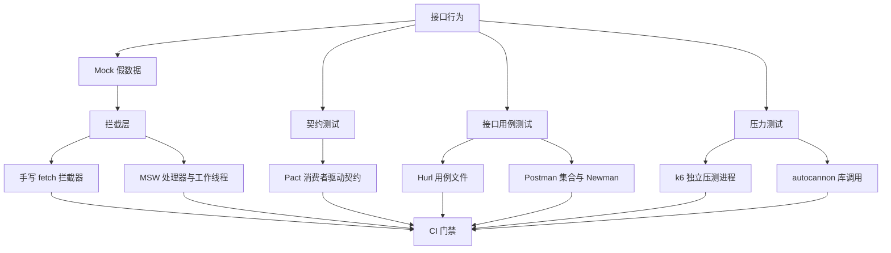
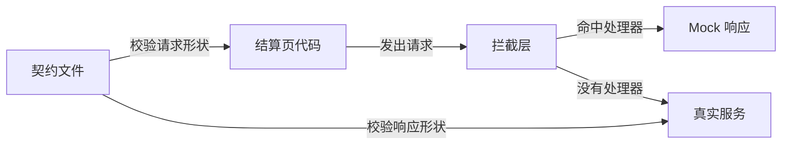
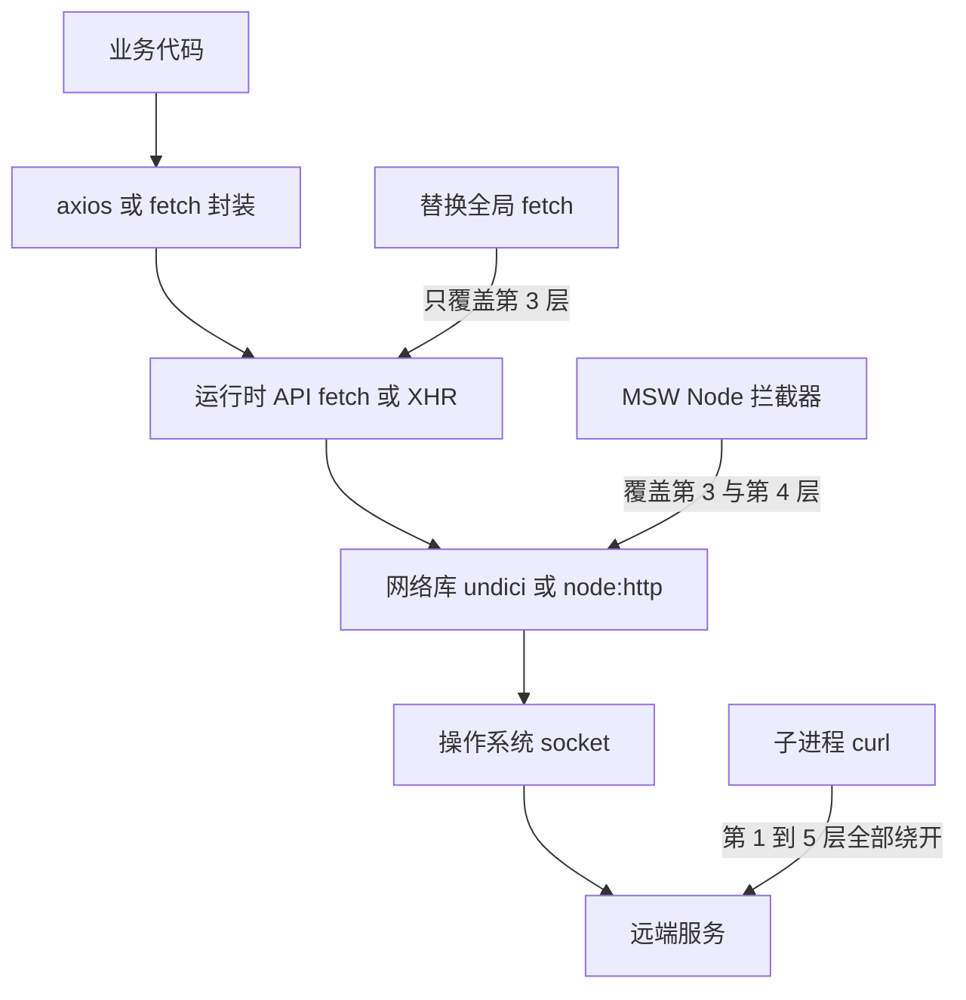
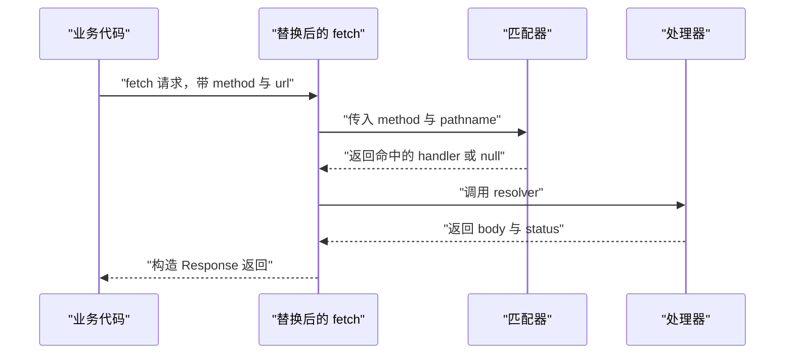
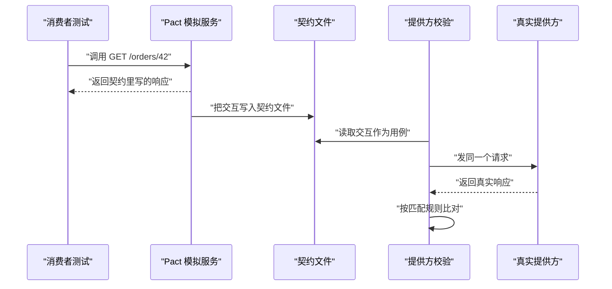
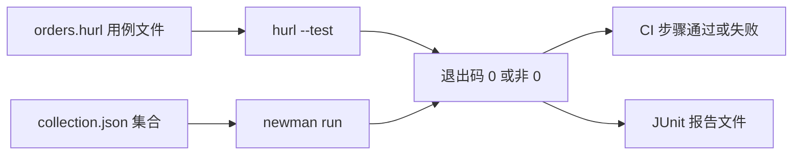
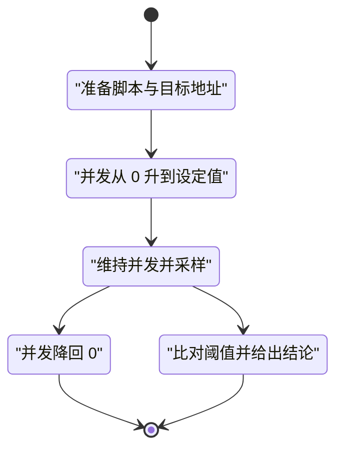
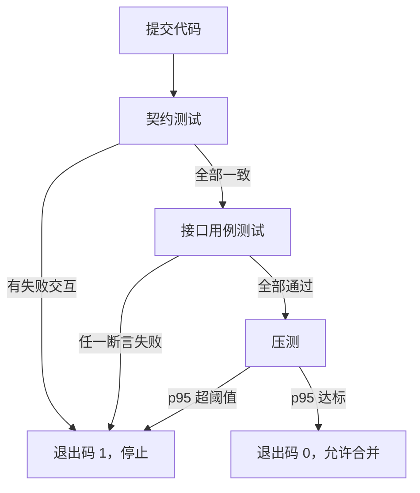

# API 测试与 Mock：契约、MSW 与压测

!!! abstract "学完这一页你能"
    - 说清契约测试与 Mock 各自拦住哪一类失败，并写出一份可运行的字段校验脚本。
    - 讲出拦截层落在哪一层决定了它覆盖哪些请求，并手写一个替换全局 fetch 的迷你拦截器。
    - 用 Hurl 或 Postman 集合写出带断言的接口用例，并在命令行里跑出退出码。
    - 用 k6 或 autocannon 压出吞吐与 p95 延迟，并把它设成上线门禁。

## 0. 知识地图



建议的读法如下。

1. 先读第 1 到第 3 节，把 Mock 与拦截层打通，这部分不装任何第三方包也能跑。
2. 再读第 4 到第 6 节，它们是三条彼此独立的路线：契约、用例、压测。
3. 最后读第 7 节，把三条路线接成一条有退出码的流水线。

## 1. 契约与 Mock 的分工

**先想一个问题**

后端还没写下单接口，前端却要先把结算页做完。你把返回的 JSON 直接写在代码里，联调那天字段名对不上，页面整片空白。

到底谁该决定这份假数据长什么样？

!!! note "术语：Mock"
    Mock 是用程序代替真实依赖，返回预设结果。例：把 GET /orders/42 换成本地固定返回 `{"id":42}`。

!!! note "术语：契约测试"
    契约测试用一份双方认可的请求与响应规格，分别校验调用方发出的请求、提供方返回的响应。例：约定 GET /orders/42 返回 200 与整数 id。

**心智模型**

!!! tip "心智模型"
    - 一句话模型：Mock 让你现在能跑，契约保证将来能对上。
    - 日常类比：Mock 是拍戏用的道具手机，契约是道具组与手机厂商签的规格单。
    - 类比失效处：道具不会变，真接口会变；契约要跟着接口版本一起改，道具不用。

**图解**



1. 结算页代码永远只跟拦截层打交道，它不知道对面是真是假。
2. 拦截层命中处理器时返回 Mock 响应，这条路完全离线。
3. 拦截层没有命中时打到真实服务，这条路用于验证真实现。
4. 契约文件不在运行链路上，它是一份对两端的检查清单。

**一步一步来**

第 1 步，把远端调用收口到一个函数。

```js
// api.mjs  所有远端调用集中在这个文件
const BASE = process.env.API_BASE ?? "http://127.0.0.1:3000";

// 调用方只传业务参数，不拼 URL
export async function fetchOrder(id) {
  const res = await fetch(`${BASE}/orders/${id}`); // 真实请求的唯一出口
  if (!res.ok) throw new Error(`HTTP ${res.status}`); // 非 2xx 立刻抛错
  return res.json(); // 返回纯数据，调用方不碰 Response
}
```

**这段代码在做什么**

1. `BASE` 从环境变量读取，换地址不用改代码。
2. 订单请求只从这个函数发出，拦截点和统计点各只有一个。
3. 非 2xx 直接抛错，调用方不必重复判断状态码。
4. 返回 `res.json()`，调用方拿到普通对象，便于断言。

第 2 步，写一份契约文件。

```js
// contract.mjs
export const contract = {
  provider: "order-api",
  path: "/orders/42",
  method: "GET",
  response: {
    status: 200,
    required: { id: "integer", status: "string" }, // 字段名到类型
  },
};
```

**这段代码在做什么**

1. 契约只记录调用方真正读取的字段，不抄整份响应。
2. `required` 的键是字段名，值是期望类型。
3. 没写进契约的字段，允许提供方自由增加，避免一加字段就红。
4. 状态码单独约定，因为它决定代码走成功分支还是错误分支。

第 3 步，写校验函数，把契约和真实响应放在一起比。

```js
// 按契约检查响应，返回错误描述数组
export function checkResponse(contract, actual) {
  const errors = [];
  if (actual.status !== contract.response.status) {
    errors.push(`状态码 ${actual.status} 应为 ${contract.response.status}`);
  }
  for (const [key, type] of Object.entries(contract.response.required)) {
    const value = actual.body[key]; // 取出同名字段
    if (type === "integer" && !Number.isInteger(value)) errors.push(`${key} 应为整数`);
    if (type === "string" && typeof value !== "string") errors.push(`${key} 应为字符串`);
  }
  return errors; // 空数组表示通过
}
```

**这段代码在做什么**

1. 状态码不等就把两个值都写进错误信息，排查时不用再猜。
2. 遍历 `required`，逐个字段做类型判断。
3. 每条错误都能指出字段名与期望类型。
4. 返回数组而不是布尔值，方便一次看完所有问题。

运行结果：本步骤只定义函数，调用结果见下面的完整脚本。

**动手验证**

下面这个脚本起一个本地服务，分别返回正确与错误两种响应，再用契约检查两次。

```js
// contract-check.test.mjs  需要 Node 20 以上，无第三方依赖
import assert from "node:assert/strict";
import { createServer } from "node:http";

const contract = {
  path: "/orders/42",
  method: "GET",
  response: { status: 200, required: { id: "integer", status: "string" } },
};

function checkResponse(contract, actual) {
  const errors = [];
  if (actual.status !== contract.response.status) errors.push(`状态码 ${actual.status} 应为 ${contract.response.status}`);
  for (const [key, type] of Object.entries(contract.response.required)) {
    const value = actual.body[key];
    if (type === "integer" && !Number.isInteger(value)) errors.push(`${key} 应为整数`);
    if (type === "string" && typeof value !== "string") errors.push(`${key} 应为字符串`);
  }
  return errors;
}

// 路径里带 bad 时返回类型错误的 payload
const server = createServer((req, res) => {
  const body = req.url.includes("bad") ? { id: "42", status: "paid" } : { id: 42, status: "paid", extra: true };
  res.writeHead(200, { "content-type": "application/json" });
  res.end(JSON.stringify(body));
});
await new Promise((r) => server.listen(0, "127.0.0.1", r));
const base = `http://127.0.0.1:${server.address().port}`;

const read = async (p) => {
  const res = await fetch(`${base}${p}`);
  return { status: res.status, body: await res.json() };
};

assert.deepEqual(checkResponse(contract, await read("/orders/42")), []);
assert.deepEqual(checkResponse(contract, await read("/bad/orders/42")), ["id 应为整数"]);

server.close();
console.log("契约校验通过，错误字段被准确指出");
// 预期输出: 契约校验通过，错误字段被准确指出
```

**常见坑**

| 现象 | 原因 | 怎么修 |
| --- | --- | --- |
| 后端一加字段契约就失败 | 把必需字段当成了全部字段 | 契约只写调用方真正读取的字段 |
| Mock 数据与契约各写一份 | 两份数据没有同一来源 | 让 Mock 的响应从契约文件生成 |
| 契约通过但页面报错 | 契约漏了页面真正读取的字段 | 逐行列出页面读取的字段名，对照契约补齐 |

**小结**

1. Mock 解决"现在能不能跑"，契约解决"将来能不能对上"。
2. 契约只写必需字段与类型，允许提供方增加字段。
3. 把远端调用收口到一个函数，拦截、统计、校验都只需处理一个出口。

## 2. 拦截层原理

**先想一个问题**

你用替换全局 `fetch` 的方式做了 Mock，测试全绿。同事把一小段逻辑改成调用子进程 `curl`，Mock 立刻失效，请求打到了真实服务。

为什么同一个测试文件里，有的请求被拦住了？

**心智模型**

!!! tip "心智模型"
    - 一句话模型：拦截层装在哪一层，就只覆盖从那层往里的调用。
    - 日常类比：查票点设在某节车厢门口，只查得到从这节车厢上车的人。
    - 类比失效处：查票点可以同时设多个，同一进程里的拦截通常只有一个生效，后来的覆盖先前的。

**图解**



1. 第 1 层是业务代码，它决定调用哪个封装函数。
2. 第 2 层是项目自己的请求封装，改这里等于改所有调用点。
3. 第 3 层是运行时的 `fetch` 或 `XMLHttpRequest`，替换全局对象就拦在这一层。
4. 第 4 层是网络库，`node:http` 与 undici 都在这里。
5. 第 5 层是 socket，到了这一层只有代理或系统级工具拦得住。
6. 第 6 层是远端服务，子进程发起的新进程会直接跑到这里。

**一步一步来**

第 1 步，替换全局 `fetch` 并记录调用。

```js
const realFetch = globalThis.fetch; // 保存原生实现，后面还原用
const log = [];
globalThis.fetch = async (input, init) => { // 换成新函数
  const url = typeof input === "string" ? input : input.url;
  log.push(`${init?.method ?? "GET"} ${new URL(url).pathname}`); // 记录一次
  return realFetch(input, init); // 仍然走真实网络
};
```

**这段代码在做什么**

1. `realFetch` 保存原生实现，否则还原时找不到原函数。
2. 新函数接收同样的两个参数，签名保持一致。
3. 记录里只放方法和路径，避免把查询串里的敏感参数写进日志。
4. 最后仍然调用原生实现，行为不变，只是多了一条记录。

第 2 步，用 `node:http` 发一次同样的请求。

```js
import { createServer, request } from "node:http";

const server = createServer((req, res) => { res.end("ok"); }); // 最简服务
await new Promise((r) => server.listen(0, "127.0.0.1", r));
const url = `http://127.0.0.1:${server.address().port}/ping`;

await fetch(url); // 经过被替换的全局 fetch
await new Promise((resolve, reject) => { // 走 node:http，不经过 fetch
  request(url, (res) => { res.resume(); res.on("end", resolve); }).on("error", reject).end();
});
console.log(log); // 只看到一条记录
```

**这段代码在做什么**

1. 服务监听 0 端口，由系统分配空闲端口，避免撞端口。
2. 第一次请求走 `fetch`，命中被替换的函数。
3. 第二次请求走 `node:http` 的 `request`，它不读取全局 `fetch`。
4. 打印出来的数组只有一条，说明覆盖范围止于第 3 层。

运行结果：`[ 'GET /ping' ]`

**动手验证**

```js
// layer-probe.test.mjs  需要 Node 20 以上，无第三方依赖
import assert from "node:assert/strict";
import { createServer, request } from "node:http";

const realFetch = globalThis.fetch;
const fetchLog = [];
globalThis.fetch = async (input, init) => {
  const url = typeof input === "string" ? input : input.url;
  fetchLog.push(`${init?.method ?? "GET"} ${new URL(url).pathname}`);
  return realFetch(input, init);
};

const server = createServer((req, res) => { res.writeHead(200); res.end("ok"); });
await new Promise((r) => server.listen(0, "127.0.0.1", r));
const url = `http://127.0.0.1:${server.address().port}/ping`;

await fetch(url); // 经过被替换的全局 fetch
const viaHttp = await new Promise((resolve, reject) => {
  request(url, (res) => {
    let body = "";
    res.on("data", (c) => (body += c));
    res.on("end", () => resolve(body));
  }).on("error", reject).end();
});

assert.deepEqual(fetchLog, ["GET /ping"]); // 只记录到 fetch 这一次
assert.equal(viaHttp, "ok");               // node:http 仍拿到真实响应

globalThis.fetch = realFetch; // 养成还原习惯
server.close();
console.log("fetch 被拦截 1 次，node:http 未被拦截");
// 预期输出: fetch 被拦截 1 次，node:http 未被拦截
```

**常见坑**

| 现象 | 原因 | 怎么修 |
| --- | --- | --- |
| 子进程里跑 curl 时 Mock 失效 | 拦截器只替换当前进程内的全局对象 | 让被测代码用进程内客户端，或在服务进程里做 Mock |
| 替换 fetch 后某个库仍走真实网络 | 该库在 Node 里默认用 http 适配器 | 统一请求入口，或改用覆盖第 4 层的拦截方案 |
| 后续测试莫名失败 | 全局对象被永久改写 | 在 `afterEach` 里调用还原函数 |

**小结**

1. 拦截层的位置决定覆盖范围，覆盖范围之外一律走真实网络。
2. 替换全局 `fetch` 只需三行，代价是只覆盖第 3 层。
3. 任何替换全局对象的操作都要配一个还原操作。

## 3. 手写迷你 MSW 风格拦截器

**先想一个问题**

MSW 的 `http.get("/orders/:id", ...)` 能匹配 `/orders/42`，还能把 `42` 传进处理函数。这套匹配加响应构造，自己写要多少行？

答案在下面：不到 40 行，而且逻辑完全可以讲清楚。

!!! note "术语：处理器"
    处理器是一段"方法加路径模板加返回函数"的记录，拦截器按顺序找出第一条匹配的处理器。例：GET 加 /orders/:id 加返回订单对象。

**心智模型**

!!! tip "心智模型"
    - 一句话模型：拦截器就是一张有序的处理器表，加上一个把返回值包装成响应的函数。
    - 日常类比：医院分诊台按"科室加号码"找对应窗口，号码段用通配符。
    - 类比失效处：分诊只认一个窗口，拦截器取第一条匹配就返回，后面的处理器根本不会执行。

**图解**



1. 业务代码调用 `fetch`，它不知道这个函数已被替换。
2. 替换后的函数从输入里取出方法和 URL，用 `URL` 类拆出 `pathname`。
3. 匹配器按注册顺序找第一条命中的处理器，并把路径参数一起返回。
4. 处理器收到路径参数，返回 `body` 与可选 `status`。
5. 替换后的函数用 `Response` 包装结果，交给业务代码，最后再解析 JSON。

**一步一步来**

第 1 步，定义注册函数与路径模板匹配。

```js
// mini-msw.mjs
const handlers = []; // 全局处理器列表

// 声明一条处理器，path 支持 :param 形式的占位符
export function http(method, path, resolver) {
  handlers.push({ method: method.toUpperCase(), path, resolver });
}

// 把 /orders/:id 编译成正则，用于匹配真实 pathname
function toPattern(path) {
  const source = path.replace(/:[^/]+/g, "([^/]+)"); // 占位符换成捕获组
  return new RegExp(`^${source}$`); // 整段匹配，避免前缀误命中
}

// 找到第一条匹配的处理器并解析参数
function match(method, pathname) {
  for (const h of handlers) {
    if (h.method !== method) continue; // 方法不同就跳过
    const m = toPattern(h.path).exec(pathname);
    if (m) return { handler: h, params: m.slice(1) }; // 去掉整段匹配结果
  }
  return null; // 没有任何处理器接管
}
```

**这段代码在做什么**

1. `handlers` 是模块级数组，注册顺序就是匹配优先级。
2. 方法统一转大写，调用方写 `get` 还是 `GET` 都能匹配。
3. `toPattern` 把每个 `:参数名` 换成一个捕获组。
4. 正则两端加了 `^` 与 `$`，`/orders` 不会误匹配 `/orders/42`。
5. `match` 返回处理器与参数数组，参数按出现顺序排列。

第 2 步，替换 `fetch` 并构造 `Response`。

```js
// 替换全局 fetch，未命中时抛错
export function setupServer() {
  const original = globalThis.fetch; // 保留原生实现用于还原
  const unhandled = []; // 记录没人接管的请求
  globalThis.fetch = async (input, init = {}) => {
    const url = typeof input === "string" ? input : input.url;
    const method = (init.method ?? "GET").toUpperCase();
    const { pathname } = new URL(url); // 只比较路径，忽略域名与查询串
    const hit = match(method, pathname);
    if (!hit) {
      unhandled.push(`${method} ${pathname}`);
      throw new Error(`unhandled ${method} ${pathname}`);
    }
    const r = await hit.handler.resolver({ pathname, params: hit.params });
    return new Response(JSON.stringify(r.body), {
      status: r.status ?? 200,
      headers: { "content-type": "application/json" },
    });
  };
  return { unhandled, restore: () => { globalThis.fetch = original; } };
}
```

**这段代码在做什么**

1. `original` 保存原生实现，`restore` 负责还原。
2. `unhandled` 收集未命中请求，测试结束可以断言它为空。
3. 未命中时抛错，而不是静默返回空对象，避免测试假绿。
4. 处理器返回的 `status` 缺省为 200，POST 可以返回 201。
5. 响应体统一转成 JSON 字符串，并带上内容类型头。

运行结果：本步骤只导出函数，实际结果见下面的完整脚本。

**动手验证**

```js
// mini-msw.test.mjs  需要 Node 20 以上，无第三方依赖
import assert from "node:assert/strict";

const handlers = [];
const http = (method, path, resolver) => handlers.push({ method, path, resolver });
const toPattern = (path) => new RegExp(`^${path.replace(/:[^/]+/g, "([^/]+)")}$`);
function match(method, pathname) {
  for (const h of handlers) {
    if (h.method !== method) continue;
    const m = toPattern(h.path).exec(pathname);
    if (m) return { handler: h, params: m.slice(1) };
  }
  return null;
}

const original = globalThis.fetch;
const unhandled = [];
globalThis.fetch = async (input, init = {}) => {
  const url = typeof input === "string" ? input : input.url;
  const method = (init.method ?? "GET").toUpperCase();
  const { pathname } = new URL(url);
  const hit = match(method, pathname);
  if (!hit) {
    unhandled.push(`${method} ${pathname}`);
    throw new Error(`unhandled ${method} ${pathname}`);
  }
  const r = await hit.handler.resolver({ pathname, params: hit.params });
  return new Response(JSON.stringify(r.body), {
    status: r.status ?? 200,
    headers: { "content-type": "application/json" },
  });
};

http("GET", "/orders/:id", ({ params }) => ({ body: { id: Number(params[0]), status: "paid" } }));
http("POST", "/orders", () => ({ status: 201, body: { id: 7 } }));

const res = await fetch("https://api.example.com/orders/42?fields=all");
assert.equal(res.status, 200);
assert.deepEqual(await res.json(), { id: 42, status: "paid" }); // 查询串被忽略

const created = await fetch("https://api.example.com/orders", { method: "POST" });
assert.equal(created.status, 201);

await assert.rejects(() => fetch("https://api.example.com/users/1"), /unhandled GET \/users\/1/);
assert.deepEqual(unhandled, ["GET /users/1"]); // 未命中被记录下来

globalThis.fetch = original;
console.log("全部断言通过");
// 预期输出: 全部断言通过
```

**常见坑**

| 现象 | 原因 | 怎么修 |
| --- | --- | --- |
| 带查询串的请求匹配失败 | 路径模板里写了查询串，实际只比较了 pathname | 模板只写路径，查询串用单独断言检查 |
| 通配处理器总是先命中 | 泛化模板注册在具体模板之前 | 先注册具体路径，再注册带参数的路径 |
| 未命中时拿到 `undefined` 导致误判 | 没有记录也没有抛错 | 抛错并写入 `unhandled` 数组 |

**小结**

1. 处理器表加路径模板加响应构造，就是拦截器的全部骨架。
2. 匹配失败必须显式抛错，否则测试会给出错误结论。
3. 参数用捕获组解析，位置对应模板里占位符的顺序。

## 4. 契约测试：Pact 的消费者驱动

**先想一个问题**

前端要先定接口，后端还没实现。这份规格由谁写、写成什么形状，才能让双方都能拿去跑？

Pact 给出的答案叫消费者驱动：由调用方先写期望，再拿期望去检查提供方。

!!! note "术语：消费者驱动契约"
    消费者驱动契约（Consumer-Driven Contract，缩写 CDC）指调用方先声明自己需要的请求与响应，生成契约文件，提供方再拿这份文件当测试用例。例：前端声明只需要 id 与 status 两个字段。

**心智模型**

!!! tip "心智模型"
    - 一句话模型：调用方写下自己需要什么，提供方照单交付并核对。
    - 日常类比：点菜时顾客写下"不要香菜"，厨房照单出菜，服务员按单核对。
    - 类比失效处：点菜单只覆盖写下的菜，没写的口味不会被检查；契约也只覆盖写进去的交互。

**图解**



1. 消费者测试不连真实服务，只连 Pact 提供的模拟服务。
2. 模拟服务按契约返回示例响应，测试断言业务代码处理正确。
3. 测试跑完，交互被写进 pact 契约文件。
4. 提供方校验读取契约文件，把每条交互当成一个用例。
5. 校验对真实服务发同一个请求，再按匹配规则比对响应，最后输出通过或失败。

**一步一步来**

第 1 步，写契约结构，重点是匹配规则。

```js
// 与 pact 契约文件对应的结构
export const pact = {
  consumer: "web-checkout",
  provider: "order-api",
  interactions: [
    {
      description: "获取订单 42",
      request: { method: "GET", path: "/orders/42" },
      response: {
        status: 200,
        body: { id: 1, status: "paid" }, // 只是示例值
        matchingRules: { "body.id": "integer", "body.status": "string" },
      },
    },
  ],
};
```

**这段代码在做什么**

1. `consumer` 与 `provider` 给契约标上双方名字，方便归档。
2. 每条交互都有一个描述，失败时用来定位是哪条用例。
3. `body` 里的值是示例，真实校验靠 `matchingRules`。
4. 规则里写类型而不是固定值，提供方返回 42 或 7 都能通过。

第 2 步，写消费者端校验：请求形状要对得上。

```js
// 校验实际发出的请求是否与交互约定一致
export function verifyRequest(interaction, actual) {
  const errors = [];
  if (actual.method !== interaction.request.method) errors.push("方法不一致");
  if (actual.path !== interaction.request.path) errors.push("路径不一致");
  return errors;
}
```

**这段代码在做什么**

1. 方法用全等比较，`get` 与 `GET` 不会互相通过，调用方需统一大写。
2. 路径按契约原文比较，带查询串的路径要原样写进契约。
3. 返回数组而不是抛错，方便一次报告多条不一致。
4. 真实 Pact 会用匹配器处理路径参数，这里用全等做教学简化。

第 3 步，写提供方校验：按类型规则检查响应。

```js
// 按类型规则检查一个值
function typeOk(rule, value) {
  if (rule === "integer") return Number.isInteger(value);
  if (rule === "string") return typeof value === "string";
  if (rule === "array") return Array.isArray(value);
  return false;
}

// 校验响应：状态码相等，且每条规则都通过
export function verifyResponse(interaction, actual) {
  if (actual.status !== interaction.response.status) {
    return [`状态码 ${actual.status} 应为 ${interaction.response.status}`];
  }
  const errors = [];
  for (const [path, rule] of Object.entries(interaction.response.matchingRules)) {
    const key = path.replace("body.", ""); // 只处理顶层字段
    if (!typeOk(rule, actual.body[key])) errors.push(`${path} 类型应为 ${rule}`);
  }
  return errors;
}
```

**这段代码在做什么**

1. `typeOk` 覆盖整数、字符串、数组三种规则，其余规则返回不通过。
2. 状态码先比，不一致时直接返回，不再做字段检查。
3. 匹配规则的键写成 `body.id` 这样的路径，这里只剥掉顶层前缀。
4. 每条错误都带上路径与期望类型，定位不用翻代码。

运行结果：本步骤只定义函数，调用结果见下面的完整脚本。

**动手验证**

真实 Pact 需要安装 `@pact-foundation/pact` 并准备发布契约的位置。这个脚本用同一套规则跑一遍消费者与提供方两侧的核心判断。

```js
// pact-lite.test.mjs  需要 Node 20 以上，无第三方依赖
import assert from "node:assert/strict";
import { createServer } from "node:http";

const interaction = {
  description: "获取订单 42",
  request: { method: "GET", path: "/orders/42" },
  response: { status: 200, matchingRules: { "body.id": "integer", "body.status": "string" } },
};

const typeOk = (rule, value) =>
  rule === "integer" ? Number.isInteger(value) : rule === "string" ? typeof value === "string" : Array.isArray(value);

function verifyResponse(interaction, actual) {
  if (actual.status !== interaction.response.status) return [`状态码 ${actual.status} 应为 ${interaction.response.status}`];
  const errors = [];
  for (const [path, rule] of Object.entries(interaction.response.matchingRules)) {
    const key = path.replace("body.", "");
    if (!typeOk(rule, actual.body[key])) errors.push(`${path} 类型应为 ${rule}`);
  }
  return errors;
}

// 模拟提供方：正常返回，或者把 id 换成字符串
const server = createServer((req, res) => {
  const broken = req.url.includes("broken");
  res.writeHead(200, { "content-type": "application/json" });
  res.end(JSON.stringify(broken ? { id: "42", status: "paid" } : { id: 42, status: "paid" }));
});
await new Promise((r) => server.listen(0, "127.0.0.1", r));
const base = `http://127.0.0.1:${server.address().port}`;

const call = async (p) => {
  const res = await fetch(`${base}${p}`);
  return { status: res.status, body: await res.json() };
};

assert.deepEqual(verifyResponse(interaction, await call("/orders/42")), []);
assert.deepEqual(verifyResponse(interaction, await call("/broken/orders/42")), ["body.id 类型应为 integer"]);

server.close();
console.log("消费者与提供方按同一份规则得出结论");
// 预期输出: 消费者与提供方按同一份规则得出结论
```

**常见坑**

| 现象 | 原因 | 怎么修 |
| --- | --- | --- |
| 提供方校验报连不上 | 校验要连真实服务，但服务没起 | 先启动提供方，再跑校验命令 |
| 契约天天失败 | 匹配规则用了固定值 | 改成类型规则，值只当示例 |
| 消费者测试通过、提供方失败 | 两端对同一路径的实现不同 | 打印失败交互的描述，逐条对齐路径与字段名 |

**小结**

1. 契约由调用方先写，写的是自己真正读取的字段。
2. 匹配规则用类型，别用固定值，否则提供方换数据就红。
3. 消费者测试与提供方校验必须读同一份契约文件。

## 5. Hurl 与 Postman：把接口用例写成文件

**先想一个问题**

接口用例如果是在图形界面里点出来的，怎么让 CI 在没人点的情况下跑起来？

答案是把用例存成文件，用命令行执行，靠退出码判断结果。

!!! note "术语：退出码"
    退出码是进程结束时返回给调用方的整数，0 表示成功，非 0 表示失败。例：`hurl --test` 有用例失败时返回 1。

**心智模型**

!!! tip "心智模型"
    - 一句话模型：用例文件等于请求加断言，执行器把它变成退出码和报告。
    - 日常类比：体检单上每一项都写了参考值，超标的项会被标出来。
    - 类比失效处：体检项目固定，用例只检查你写下的断言，没写的部分不会被验证。

**图解**



1. Hurl 用例是纯文本文件，可以直接进代码评审。
2. Postman 集合是 JSON，通常从界面导出，不手写。
3. 两个执行器都把结果压缩成一个退出码。
4. CI 只看退出码决定这一步是否通过。
5. 同时输出报告文件，失败时可以看到具体哪条断言没通过。

**一步一步来**

第 1 步，写一个 Hurl 用例文件。

```text
# orders.hurl
GET http://127.0.0.1:3000/orders/42
HTTP 200
[Asserts]
jsonpath "$.id" == 42
jsonpath "$.status" == "paid"
```

**这个文件在表达什么**

1. 第一行是请求行，方法与地址写在一行。
2. `HTTP 200` 是状态码断言。
3. `[Asserts]` 段落里逐条写响应体断言。
4. 用 `jsonpath` 取值再比较，写法与 JSONPath 一致。
5. 保存成 `.hurl` 后执行 `hurl --test orders.hurl`。

运行结果：全部断言通过时退出码为 0，任一条失败时退出码非 0。具体命令行参数需核对官方文档。

第 2 步，用 Node 写等价断言，保证没装 Hurl 也能跑。

```js
// 取值函数，支持 $.id 与 $.a.b 两种路径
function pick(obj, path) {
  return path.replace(/^\$\./, "").split(".").reduce((acc, k) => acc?.[k], obj);
}

// 把断言写成数据，方便一次收集全部失败
function runAsserts(body, asserts) {
  const failed = [];
  for (const [path, expected] of asserts) {
    const actual = pick(body, path);
    if (actual !== expected) failed.push(`${path} 期望 ${expected} 实际 ${actual}`);
  }
  return failed;
}
```

**这段代码在做什么**

1. `pick` 剥掉开头的 `$.`，再按点号逐层取值。
2. 用可选链取值，中间层缺失时返回 `undefined`，不会抛错。
3. 断言写成数组，逐条执行，一次收集全部失败。
4. 错误信息同时给出期望值和实际值，省一次复现。
5. 断言数组可以与 Hurl 文件里的行一一对应。

第 3 步，Postman 集合用命令行执行。

```text
# 从 Postman 导出集合后，用 Newman 在 CI 里跑
npx newman run collection.json -e env.json --reporters cli,junit --reporter-junit-export report.xml
```

**这条命令在做什么**

1. `collection.json` 是导出的集合，包含请求与测试脚本。
2. `-e env.json` 注入环境变量，把地址和令牌从集合里分离出来。
3. `--reporters cli,junit` 同时输出终端结果和报告文件。
4. `--reporter-junit-export` 指定报告写入路径，供 CI 收集。

运行结果：全部用例通过时退出码为 0。具体参数名与报告字段需核对官方文档。

**动手验证**

```js
// case-runner.test.mjs  需要 Node 20 以上，无第三方依赖
import assert from "node:assert/strict";
import { createServer } from "node:http";

// 与 orders.hurl 中等价的断言数据
const asserts = [["$.id", 42], ["$.status", "paid"]];

const pick = (obj, path) => path.replace(/^\$\./, "").split(".").reduce((acc, k) => acc?.[k], obj);
function runAsserts(body, list) {
  const failed = [];
  for (const [path, expected] of list) {
    const actual = pick(body, path);
    if (actual !== expected) failed.push(`${path} 期望 ${expected} 实际 ${actual}`);
  }
  return failed;
}

// 路径带 broken 时字段名少写一个 s
const server = createServer((req, res) => {
  const broken = req.url.includes("broken");
  res.writeHead(200, { "content-type": "application/json" });
  res.end(JSON.stringify(broken ? { id: 42, statu: "paid" } : { id: 42, status: "paid" }));
});
await new Promise((r) => server.listen(0, "127.0.0.1", r));
const base = `http://127.0.0.1:${server.address().port}`;

const bodyAt = async (p) => (await fetch(`${base}${p}`)).json();

assert.deepEqual(runAsserts(await bodyAt("/orders/42"), asserts), []);
assert.deepEqual(runAsserts(await bodyAt("/broken/orders/42"), asserts), ["$.status 期望 paid 实际 undefined"]);

server.close();
console.log("用例通过 2 条，失败 1 条，退出码由失败条数决定");
// 预期输出: 用例通过 2 条，失败 1 条，退出码由失败条数决定
```

**常见坑**

| 现象 | 原因 | 怎么修 |
| --- | --- | --- |
| 本地通过、CI 失败 | 地址与令牌写死在用例里 | 用环境变量文件注入地址，不写死 |
| 用例只判了状态码 | 响应体字段没有断言 | 每个用例至少断言一个响应体字段 |
| 报告文件没有产出 | 没有开启报告参数 | 显式指定报告类型与输出路径，参数名需核对官方文档 |

**小结**

1. 用例文件把接口检查变成可评审、可版本管理的文本。
2. 断言失败信息要带期望值和实际值，CI 日志里才看得懂。
3. 执行器只暴露两个东西给 CI：退出码与报告文件。

## 6. 压测：k6 与 autocannon

**先想一个问题**

接口单次请求 20 毫秒，上线后 200 个人同时用会不会挂？

单次耗时回答不了这个问题，你需要的是在固定并发下测吞吐与延迟分布。

!!! note "术语：p95 延迟"
    p95 延迟是把所有请求耗时从小到大排序后，第 95% 位置的那个值。例：100 次请求的 p95 就是从第 95 快的耗时往后的第一个值。

**心智模型**

!!! tip "心智模型"
    - 一句话模型：压测固定并发用户数，测出每秒能处理多少请求、最慢的那部分有多慢。
    - 日常类比：超市开 10 个收银台，看每分钟结多少单、排队最久的人等多久。
    - 类比失效处：收银台不会因为排队变慢，服务器会，所以低并发下的数字不能直接外推到高并发。

**图解**



1. 准备阶段确认脚本、目标地址、并发数与时长。
2. 爬坡阶段把并发从 0 升到设定值，观察有没有立刻报错。
3. 稳态阶段维持并发并持续采样，这一段的数据才是结论依据。
4. 回落阶段把并发降回 0，确认服务能恢复。
5. 判定阶段把采样结果与阈值比较，输出通过或失败。

**一步一步来**

第 1 步，写 k6 脚本，用声明式阈值。

```js
// load.js 由 k6 运行，不是 Node 脚本
import http from "k6/http";
import { check } from "k6";

export const options = {
  vus: 20, // 并发虚拟用户数
  duration: "10s", // 持续时长
  thresholds: {
    http_req_failed: ["rate<0.01"], // 失败率低于 1%
    http_req_duration: ["p(95)<300"], // p95 低于 300 毫秒
  },
};

export default function () {
  const res = http.get("http://127.0.0.1:3000/orders/42");
  check(res, { "状态码是 200": (r) => r.status === 200 });
}
```

**这段代码在做什么**

1. `options` 描述负载模型：20 个虚拟用户，跑 10 秒。
2. `thresholds` 是门禁条件，不满足时 k6 退出码非 0。
3. `default` 函数是每个虚拟用户循环执行的函数体。
4. `check` 记录每条请求的通过情况，汇总进报告。
5. 安装方式与全部 options 字段需核对官方文档。

运行结果：`k6 run load.js` 结束后打印汇总表，阈值不满足时退出码非 0。

第 2 步，用 Node 手写一个测量器，理解吞吐与分位怎么算。

```js
// 发起 total 次请求，最大并发为 concurrency
async function load(url, total, concurrency) {
  const latencies = [];
  let ok = 0;
  let next = 0; // 任务序号，单线程下自增不会冲突
  const worker = async () => {
    while (next < total) {
      const i = next++; // 领取一个任务
      const t0 = performance.now(); // 记录开始时间
      const res = await fetch(`${url}?i=${i}`); // 发一次请求
      latencies.push(performance.now() - t0);
      if (res.ok) ok++; // 只统计 2xx
      await res.arrayBuffer(); // 读完响应体，释放连接
    }
  };
  const t0 = performance.now();
  await Promise.all(Array.from({ length: concurrency }, worker));
  const seconds = (performance.now() - t0) / 1000;
  latencies.sort((a, b) => a - b); // 排序后按下标取分位
  const p = (q) => latencies[Math.min(latencies.length - 1, Math.ceil(q * latencies.length) - 1)];
  return { rps: total / seconds, ok, p50: p(0.5), p95: p(0.95) };
}
```

**这段代码在做什么**

1. `next` 是共享任务序号，拿到大于等于 `total` 就退出循环。
2. 每个 worker 串行发请求，`concurrency` 个 worker 并行，形成固定并发。
3. 耗时用 `performance.now()` 计算，单位是毫秒。
4. 必须读完响应体，否则连接没有释放，测出的数字会偏低。
5. `rps` 是总请求数除以总耗时，`p95` 是排序后按位置取值。

第 3 步，把结果设成阈值判定。

```js
// 用历史数据定阈值，不要凭感觉写数字
const budget = { rpsFloor: 200, p95Ceiling: 300, maxFailureRate: 0.01 };
function judge(result) {
  const failures = (result.total - result.ok) / result.total;
  const fails = [];
  if (result.rps < budget.rpsFloor) fails.push(`吞吐 ${result.rps.toFixed(0)} 低于 ${budget.rpsFloor}`);
  if (result.p95 > budget.p95Ceiling) fails.push(`p95 ${result.p95.toFixed(0)} 超过 ${budget.p95Ceiling}`);
  if (failures > budget.maxFailureRate) fails.push(`失败率 ${failures} 超过 ${budget.maxFailureRate}`);
  return fails;
}
```

**这段代码在做什么**

1. `budget` 里三个数字来自历史构建数据，不是凭空写的。
2. 失败率用总请求数减去成功数再除以总数。
3. 每条不达标的指标都单独产生一条失败说明。
4. 返回空数组表示这次压测可以放行。

运行结果：本步骤只定义函数，调用结果见下面的完整脚本。

**动手验证**

```js
// load-probe.test.mjs  需要 Node 20 以上，无第三方依赖
import assert from "node:assert/strict";
import { createServer } from "node:http";

async function load(url, total, concurrency) {
  const latencies = [];
  let ok = 0;
  let next = 0;
  const worker = async () => {
    while (next < total) {
      const i = next++;
      const t0 = performance.now();
      const res = await fetch(`${url}?i=${i}`);
      latencies.push(performance.now() - t0);
      if (res.ok) ok++;
      await res.arrayBuffer();
    }
  };
  const t0 = performance.now();
  await Promise.all(Array.from({ length: concurrency }, worker));
  const seconds = (performance.now() - t0) / 1000;
  latencies.sort((a, b) => a - b);
  const p = (q) => latencies[Math.min(latencies.length - 1, Math.ceil(q * latencies.length) - 1)];
  return { total, ok, rps: total / seconds, p50: p(0.5), p95: p(0.95) };
}

// 目标服务：固定延迟 5 毫秒后返回 JSON
const server = createServer((req, res) => {
  setTimeout(() => {
    res.writeHead(200, { "content-type": "application/json" });
    res.end(JSON.stringify({ id: 42 }));
  }, 5);
});
await new Promise((r) => server.listen(0, "127.0.0.1", r));
const url = `http://127.0.0.1:${server.address().port}/orders/42`;

const result = await load(url, 300, 20);

assert.equal(result.ok, 300); // 全部成功
assert.ok(result.rps > 0); // 吞吐为正数
assert.ok(result.p95 >= result.p50); // 分位顺序必须成立

server.close();
console.log(`吞吐 ${result.rps.toFixed(0)} 每秒，p50 ${result.p50.toFixed(1)} 毫秒，p95 ${result.p95.toFixed(1)} 毫秒`);
// 预期输出示例: 吞吐 3000 每秒，p50 6.0 毫秒，p95 12.0 毫秒
// 具体数字随机器变化，断言只检查顺序与成功数
```

**常见坑**

| 现象 | 原因 | 怎么修 |
| --- | --- | --- |
| 本地数字与线上差 10 倍 | 压测进程与被压服务抢同一台机器的 CPU | 压测进程与服务分开部署 |
| 只看平均延迟，上线仍然超时 | 平均值掩盖了长尾请求 | 同时记录 p95 与 p99 |
| 并发拉满后出现连接被拒 | 客户端端口耗尽或服务端 backlog 太小 | 降低并发或调大 backlog，同时看失败率 |

**小结**

1. 压测要固定并发与时长，稳态阶段的数据才能用作结论。
2. 必须同时看吞吐、失败率和分位延迟，只看平均值会漏掉长尾。
3. 阈值来自历史构建数据，不来自感觉。

## 7. 把三层测试接成 CI 门禁

**先想一个问题**

契约、用例、压测都写好了，CI 里谁先跑？失败时停在哪一步？接口 p95 变慢能不能挡住合并？

答案是给每层一个阈值，再合成一个退出码。

**心智模型**

!!! tip "心智模型"
    - 一句话模型：门禁等于每层一个阈值，加上一个失败就非 0 的退出码。
    - 日常类比：体检报告分三科，任何一科不合格就拿不到健康证。
    - 类比失效处：门禁只能挡住写进阈值的指标，没写进阈值的退化照样放过。

**图解**



1. 契约最先跑，它最便宜，也能最早发现两端字段不一致。
2. 契约不一致时直接停止，后面的步骤不再消耗机器时间。
3. 契约通过后跑接口用例，检查业务分支与错误码。
4. 用例全通过后跑压测，确认吞吐与 p95 在阈值内。
5. 三层都通过才返回退出码 0，任一层失败返回非 0。

**一步一步来**

第 1 步，把三层结果统一成一份输入。

```js
// 三层结果统一成这个形状
const sample = {
  contract: { total: 5, failed: 0 }, // 契约交互条数
  cases: { total: 18, failed: 0 }, // 接口用例条数
  load: { rps: 420, p95: 180, failedRate: 0.002, p95Budget: 300 }, // 压测结果
};
```

**这段代码在做什么**

1. 每层只汇报总数与失败数，判定逻辑集中在一处。
2. 契约与用例用同一种计数方式，方便共用判定。
3. 压测汇报吞吐、p95 与失败率，并带上阈值。
4. 阈值随结果一起传入，方便按环境切换预算。

第 2 步，写判定函数，返回结论与原因。

```js
export function evaluate(r) {
  const reasons = [];
  if (r.contract.failed > 0) reasons.push(`契约失败 ${r.contract.failed} 条`);
  if (r.cases.failed > 0) reasons.push(`用例失败 ${r.cases.failed} 条`);
  if (r.load.p95 > r.load.p95Budget) {
    reasons.push(`p95 ${r.load.p95} 超过 ${r.load.p95Budget}`);
  }
  return { pass: reasons.length === 0, reasons };
}
```

**这段代码在做什么**

1. 每层只贡献一条判定，互不干涉。
2. 失败原因带具体数字，CI 日志里能直接定位。
3. 用 `reasons.length` 判断是否通过，避免布尔值分散在多处。
4. 返回原因数组而不是打印，方便脚本与测试复用。

第 3 步，把结论变成进程退出码。

```js
import { evaluate } from "./gate.mjs";

const result = evaluate(sample); // sample 来自三层测试的汇总
if (!result.pass) {
  for (const reason of result.reasons) console.error(reason); // 逐条打印
  process.exitCode = 1; // 非 0 让 CI 停下
} else {
  console.log("门禁通过");
}
```

**这段代码在做什么**

1. `evaluate` 只做判定，不关心怎么退出，职责清晰。
2. 失败原因逐条写到标准错误，日志里更容易被搜索到。
3. 设置 `process.exitCode` 而不是立刻 `process.exit`，让缓冲日志写完。
4. 通过时只打印一行结论，保持日志干净。

运行结果：`门禁通过` 或若干条失败原因，进程退出码随之变化。

**动手验证**

```js
// gate.test.mjs  需要 Node 20 以上，无第三方依赖
import assert from "node:assert/strict";

function evaluate(r) {
  const reasons = [];
  if (r.contract.failed > 0) reasons.push(`契约失败 ${r.contract.failed} 条`);
  if (r.cases.failed > 0) reasons.push(`用例失败 ${r.cases.failed} 条`);
  if (r.load.p95 > r.load.p95Budget) reasons.push(`p95 ${r.load.p95} 超过 ${r.load.p95Budget}`);
  return { pass: reasons.length === 0, reasons };
}

const good = {
  contract: { total: 5, failed: 0 },
  cases: { total: 18, failed: 0 },
  load: { p95: 180, p95Budget: 300 },
};
const slow = {
  contract: { total: 5, failed: 0 },
  cases: { total: 18, failed: 1 },
  load: { p95: 410, p95Budget: 300 },
};

assert.deepEqual(evaluate(good), { pass: true, reasons: [] });
assert.deepEqual(evaluate(slow), { pass: false, reasons: ["用例失败 1 条", "p95 410 超过 300"] });

// 把结论转成退出码，先备份再还原，避免影响脚本自身
const before = process.exitCode;
process.exitCode = evaluate(slow).pass ? 0 : 1;
assert.equal(process.exitCode, 1);
process.exitCode = before;

console.log("门禁判定与退出码转换均正确");
// 预期输出: 门禁判定与退出码转换均正确
```

**常见坑**

| 现象 | 原因 | 怎么修 |
| --- | --- | --- |
| 契约失败后仍在跑压测 | 步骤之间没有失败即停 | 用 need 或条件判断控制后续步骤 |
| 阈值写得太松从不触发 | 阈值没有历史数据支撑 | 用最近 20 次成功构建的 p95 中位数作为起点 |
| 门禁只在主干生效 | 分支没有接同一条流水线 | 把同一份配置应用到所有目标分支 |

**小结**

1. 三层结果统一成一种形状，判定逻辑只写一遍。
2. 判定函数只返回原因，退出码转换放在最外层。
3. 阈值要有历史数据支撑，否则门禁等于没有。

## 综合对比

| 名称 | 作用层次 | 是否需要独立进程 | 产出物 | 适合的门禁位置 |
| --- | --- | --- | --- | --- |
| 手写 fetch 拦截器 | 进程内全局 fetch | 否 | 内存中的请求日志 | 单元测试 |
| MSW | 浏览器网络层或 Node 拦截器 | 否 | 处理器命中记录 | 组件与集成测试 |
| Pact | 消费者与提供方之间的 HTTP 契约 | 是 | 契约文件与校验报告 | 合并前 |
| Hurl | 命令行 HTTP 客户端 | 是 | 退出码与 JUnit 报告 | 合并前 |
| Postman 加 Newman | 命令行集合运行器 | 是 | 退出码与报告文件 | 合并前或定时任务 |
| k6 | 独立压测进程 | 是 | 汇总指标与阈值结论 | 发版前 |
| autocannon | Node 进程内压测库 | 是 | 每秒请求数与延迟分位 | 本地开发与发版前 |

## 应用与行业实践

### 应用场景地图

| 场景 | 用到本页哪个知识点 | 典型技术选型 | 注意事项 |
| --- | --- | --- | --- |
| 后台管理万行表格，后端接口未冻结 | 拦截层原理、迷你 fetch 拦截器 | MSW + faker 造数 | 分页、排序、筛选要在 mock 侧一并实现，否则前端逻辑测不到 |
| 第三方支付回调的订单详情接口 | 契约测试、Pact 消费者驱动 | Pact + Pact Broker | 提供方先上线会打断下游，用 can-i-deploy 卡发布 |
| 低端安卓机在弱网下的首屏加载 | Hurl 断言、k6 阈值 | Hurl 写接口用例，k6 压吞吐 | 压测机与用户网络位置不同，结果只能同机对比 |
| 多人协作白板的实时同步接口 | Hurl 或 Postman 集合写用例 | Postman + Newman | 长连接语义与请求响应断言不同，要单独设计用例 |
| 订单创建接口上线前的性能门禁 | k6 阈值门禁 | k6 + CI | 阈值按本机基线设，不要照抄别人的数字 |
| 微服务拆分后的跨团队字段变更 | 字段校验脚本、Pact | JSON Schema + Pact | 区分必填与可选字段，避免把新增字段误判成破坏性变更 |
| 消息推送服务的重试与幂等 | 拦截层原理、契约测试 | MSW（Node 侧）+ Pact | 重试次数断言要能控制时钟，否则用例会随机失败 |
| 数据看板聚合接口的日常回归 | Hurl 用例文件、CI 门禁 | Hurl + GitHub Actions | 聚合口径变更时要同步改断言基线，否则门禁天天红 |

### 三个场景拆解

#### 场景 1：后台管理的万行表格联调

**业务背景**：后台表格一屏要渲染上万行，前端联调时后端接口还没冻结，字段改名就让页面白屏。前后端各几人，接口一周内会改两三轮，回归靠人肉点。

**怎么用本页知识解决**：思路是先在拦截层造一份结构固定的列表响应，让前端能独立跑通；再用同一份字段校验脚本同时跑 mock 响应和真实响应，字段一改名就立刻报错。

```js
// check-fields.mjs：同一份规则同时跑 mock 响应与真实响应
export function check(body) {            // body 是接口返回的 JSON
  const errs = [];
  if (!Number.isInteger(body.total)) errs.push("total 不是整数"); // 分页总数
  if (!Array.isArray(body.rows)) errs.push("rows 不是数组");      // 数据行必须是数组
  else body.rows.forEach((r, i) => {                              // 逐行校验
    if (typeof r.id !== "string" || r.id === "") {                // ID 必须非空
      errs.push(`rows[${i}].id 非法`);
    }
    if (![1, 2, 3].includes(r.status)) {                          // 状态枚举固定
      errs.push(`rows[${i}].status 越界: ${r.status}`);
    }
  });
  return errs;                           // 返回空数组代表通过
}
```

- mock 阶段：拦截器返回的数据先过 `check`，保证造的数据本身合法。
- 联调阶段：把真实响应丢进同一个 `check`，字段缺失立刻定位到行号。
- CI 阶段：脚本以非 0 退出码结束，字段破坏性变更直接卡住合并。
- 脚本只依赖原生 JSON 与数组方法，不需要额外依赖即可运行。

**怎么度量收益**：看两个指标，一是联调返工次数，二是字段缺失导致的线上报错数（来自前端错误上报）。测量方法是统计 CI 中 `check` 失败的次数与合并前修复的次数之比。

**什么时候不该用**：

- 接口还没定字段名，此时写死校验规则只会天天改规则，先定 schema 再写脚本。
- 一次性活动页只用一个接口，直接对着真实接口联调比搭 mock 快。

#### 场景 2：跨团队的订单详情接口

**业务背景**：订单详情接口由支付团队提供，前端和两个下游服务都在消费，改一个字段名要拉三个仓库回归。接口变更靠群里喊一声，下游经常在发版后才发现字段没了。

**怎么用本页知识解决**：思路是把消费方真正用到的字段写成 Pact 交互，让契约文件成为唯一的需求声明；提供方 CI 跑验证，用 can-i-deploy 判断这次版本能不能发。

```js
// order.pact.test.js：消费者声明自己需要哪些字段
const { PactV3, MatchersV3 } = require("@pact-foundation/pact"); // 引入 Pact
const { like, integer, eachLike } = MatchersV3;
const provider = new PactV3({ consumer: "admin-web", provider: "order-api" });

it("订单详情必须含 id 与 status", async () => {
  provider
    .given("订单 42 存在")                       // 提供方状态，由提供方实现
    .uponReceiving("查询订单详情")                // 交互名称，出现在报告里
    .withRequest({ method: "GET", path: "/orders/42" })
    .willRespondWith({
      status: 200,
      body: {
        id: like("42"),                          // 类型约束，不看具体值
        status: like("PAID"),
        items: eachLike({ sku: like("A1"), qty: integer(1) }),
      },
    });
  await provider.executeTest(async (mock) => {   // 起一个临时 mock 服务
    const res = await fetch(`${mock.url}/orders/42`);
    expect(res.status).toBe(200);                // 消费端自己先跑通一次
  });
});
```

- 契约只写消费方用到的字段，不复制提供方的完整响应，减少无用耦合。
- 用匹配器约束类型，值可以变，结构不能变。
- 契约文件推到 Broker，提供方 CI 拉取后跑验证并回写结果。
- 发布前跑 can-i-deploy，未验证的契约版本不允许上线。

**怎么度量收益**：指标是"未验证契约数"和"被 can-i-deploy 拦下的发布次数"。测量方法是在 Pact Broker 里看待验证的契约列表，以及在 CI 日志里搜 can-i-deploy 的失败记录。

**什么时候不该用**：

- 只有一个消费方且和提供方是同一个团队，写集成测试比维护契约便宜。
- 接口处于探索期、字段每周重写，此时契约只会变成负担，先冻结字段再说。

#### 场景 3：首页聚合接口的上线门禁

**业务背景**：首页聚合接口串了五个下游服务，平时没人压，流量上来才发现 p95 顶到秒级。发布流程里只有功能用例，没有任何性能判断。

**怎么用本页知识解决**：思路是用 k6 写一个短时冒烟压测，把 p95 与错误率写进 `options.thresholds`；CI 跑完看退出码，非 0 就不允许发布。

```js
// smoke.js：把 p95 与错误率写成上线门禁
import http from "k6/http";
import { check } from "k6";

export const options = {
  vus: 20,                       // 并发数，按线上峰值的固定比例设置
  duration: "1m",                // 持续时间，短到能塞进每次合并
  thresholds: {
    http_req_duration: ["p(95)<400"], // 阈值按本机实测基线填写，这里是占位
    http_req_failed: ["rate<0.01"],   // 错误率超过 1% 判失败
  },
};

export default function () {
  const res = http.get(`${__ENV.BASE}/api/dashboard`); // 目标地址走环境变量
  check(res, { "status 200": (r) => r.status === 200 }); // 顺带断言状态码
}
```

- 阈值先跑三次取基线，再把基线放宽一档写进门禁，避免机器抖动误伤。
- 压测脚本和被测服务跑在同一网络位置，跨机房对比没有意义。
- 失败时保留 k6 summary 输出，把 p95 与错误率贴进发布记录。
- 冒烟压测只做趋势判断，容量规划要另跑长时压测。

**怎么度量收益**：看 `http_req_duration` 的 p95、`http_req_failed` 的 rate，以及发布后首小时的接口错误率。测量方法是对比 k6 summary 与线上监控的同名指标。

**什么时候不该用**：

- 接口是低频后台任务，跑一次几秒级，性能门禁拦住的多是噪声。
- 压测环境与生产数据量差一个量级时，阈值结论不可迁移，要先对齐数据规模。

### 行业先进实践

**同一份请求处理器在浏览器与测试中复用（出处：MSW 官方文档）**：MSW 允许把 handlers 同时交给浏览器 worker 和 Node 端 server 使用，开发时造的假数据与测试里的假数据是同一套。这样接口字段改动只需要改一处，且不会出现"开发能跑、测试报错"的偏差。借鉴方式是把手写拦截器的路由表抽成独立模块，开发与 CI 都从它引入。

**发布前用 can-i-deploy 判断契约是否已验证（出处：Pact 官方文档）**：Pact 提供的 can-i-deploy 命令会检查某个应用版本与其依赖版本之间的契约是否都通过验证。它把"能不能发"变成一个可以写成 CI 步骤的退出码，而不是靠人记得去查。借鉴方式是在发布流水线里加一道 can-i-deploy，失败时打印未验证的契约名。

**把性能阈值写进压测脚本并由退出码判定（出处：Grafana k6 官方文档）**：k6 的 thresholds 在脚本里声明，未达标时进程以非 0 退出。这样性能判断与功能判断走同一套 CI 机制，不需要额外平台。借鉴方式是把阈值的数值与基线测试结果一并写进仓库，改动阈值走代码评审。

**用 Hurl 文件在命令行跑接口用例并取退出码（出处：Hurl 官方文档）**：Hurl 把请求与断言写成纯文本文件，测试模式会返回退出码并输出每条断言的通过情况。文件可以进版本库，评审时能看 diff。借鉴方式是把核心接口的断言从 Postman 集合迁到 Hurl 文件，纳入 CI。

**OpenAPI 与实现的一致性校验（需核对官方文档：具体核对所选校验工具是否支持 OpenAPI 3.1 的 required、nullable 与 oneOf 语义，以及是否支持对响应体做运行时校验）**：这类工具能把规范文件当作断言来源，省去手写字段校验。是否引入要先确认它对你正在用的规范版本没有解析盲区，再决定是否替代手写脚本。

### 从学到用：落地路线

**第 1 步：选一个接口试点。** 选一个消费方在三个以内、字段已经冻结的接口。验收标准：该接口有可运行的手写拦截器或 MSW handler，且字段校验脚本能在本地跑出空错误数组。

**第 2 步：接进 CI 验证。** 把校验脚本或 Hurl 文件加进流水线，失败即阻断合并。验收标准：故意改掉一个字段名，流水线变红；改回来，流水线变绿，两次都能复现。

**第 3 步：推广到同类接口。** 按接口分组逐个补用例，优先补被两个以上服务消费的接口。验收标准：团队约定的接口清单里，有 CI 用例的比例达到约定线，且用例全部可独立运行。

**第 4 步：加门禁防回退。** 把性能阈值与契约验证并入发布流程，并记录每次失败原因。验收标准：连续若干次发布中，没有任何一次绕过门禁；若临时豁免，需在发布记录里写明原因与补做时间。

### 动手作业

**目标**：为一个"订单列表 + 订单详情"接口搭出 Mock、契约与压测三层，并让三层都能在命令行里给出退出码。

**步骤**：

1. 手写一个替换全局 fetch 的拦截器，为两个接口返回固定结构的假数据。
2. 写字段校验脚本，对假数据与真实响应各跑一次，输出错误列表。
3. 用一个消费方身份写 Pact 交互，只声明实际用到的字段，启动临时 mock 服务跑通。
4. 把两个接口的断言写成 Hurl 文件，在命令行跑测试模式并查看退出码。
5. 用 k6 写冒烟压测，阈值先按本机三次基线结果填写，记录每次 summary。
6. 把步骤 2、4、5 串进一条 CI 流水线，任一步失败即中断。
7. 改掉一个字段名与一个阈值，验证流水线两次都能变红。

**验收标准**：

- 字段校验脚本对合法响应返回空数组，对去掉 `id` 的响应返回非空错误列表。
- Pact 验证在提供方未实现新字段时失败，实现后通过。
- Hurl 文件在不加任何人工确认的情况下返回可区分的退出码。
- k6 输出的 p95 与错误率能和阈值的通过与否对应上。
- 流水线日志里能直接看出是哪一层拦下的失败。

## 深入阅读与参考

!!! tip "怎么用这些资料"
    先读「官方文档与规范」建立准确的概念，再读「源码与示例」核对细节，最后用「教程、书籍与视频」换一种讲法加深理解。每条都写明了读哪一节、带着什么问题读。

### 官方文档与规范

| 资源 | 为什么读 | 怎么读 |
|---|---|---|
| [Pact 文档](https://docs.pact.io/) | 消费者驱动契约的权威说明，判断团队是否值得引入 Pact。 | 先读消费者端流程与 pact 文件生成，再读提供者验证；读完用一个真实接口走一遍最小闭环。 |
| [Hurl 文档](https://hurl.dev/docs/manual.html) | 把接口用例写成纯文本文件，天然适合进版本库和 CI。 | 读语法与断言章节，重点看如何把 Hurl 文件跑进 CI；随后把本页示例接口改写成一个 .hurl 用例。 |
| [MSW 文档](https://mswjs.io/docs/) | MSW 的核心概念页，讲清在网络层拦截而非改全局对象。 | 读 handlers、setupServer 与生命周期几节，带着“请求被谁拦住”的问题读，读完画出拦截调用链。 |
| [MDN Service Worker（中文）](https://developer.mozilla.org/zh-CN/docs/Web/API/Service_Worker_API) | 中文指南，快速建立 Service Worker 注册与请求拦截的直觉。 | 读注册流程与 fetch 事件拦截部分，对照 MSW 的拦截层原理，复现一个最简单的离线缓存示例。 |
| [Postman Learning Center](https://learning.postman.com/docs/introduction/overview/) | Collection 与断言脚本是接口用例文件化的另一条常见路径。 | 照快速上手建一个 Collection，写 3 条状态码与字段断言，再思考它和 Hurl 文件化的取舍差异。 |

### 源码与示例

| 资源 | 为什么读 | 怎么读 |
|---|---|---|
| [MSW 快速开始](https://mswjs.io/docs/getting-started) | 最小可跑的 handlers 示例，直接对应本页的迷你拦截器实现。 | 跟着写好一个 handler 并复用到测试中，再回头对比自己手写的拦截器缺了哪些能力。 |
| [Playwright 网络](https://playwright.dev/docs/network) | 路由级 mock 的可运行示例，覆盖超时与错误响应场景。 | 读 route/fulfill 一节，带着“如何造 500 与超时”的问题读，读完给本页示例补一个错误分支用例。 |
| [Node.js 内置测试运行器](https://nodejs.org/api/test.html) | 零依赖的测试运行器，适合演示接口用例接入 CI 的最小形态。 | 用 node:test 为一个小工具写断言与 mock，观察退出码，再把它挂进 CI 门禁脚本验证失败即拦截。 |

### 教程、书籍与视频

| 资源 | 为什么读 | 怎么读 |
|---|---|---|
| [Kent：到底什么是 Mock](https://kentcdodds.com/blog/but-really-what-is-a-javascript-mock) | 从零手写 mock，彻底看清 mock 到底替换了什么。 | 边读边手写一个最小 mock 函数，读完回答“它和网络层拦截的边界在哪”，写下三点区别。 |
| [Kent：不要 Mock fetch](https://kentcdodds.com/blog/stop-mocking-fetch) | 说明为什么别直接 mock fetch，呼应本页拦截层的设计动机。 | 读完把项目里一处 fetch mock 改写成网络层拦截，记录改动前后测试需要同步修改的次数。 |
| [Testing JavaScript Applications（Manning）](https://www.manning.com/books/testing-javascript-applications) | 成体系地讲前端与 API 测试分层，适合补齐测试策略。 | 挑 mock 与集成测试两章读，带着自己项目的测试金字塔问题读，读完列一份本团队测试分层清单。 |

## 自测题

??? question "契约测试与 Mock 分别解决什么问题？"
    - Mock 解决"真实依赖不可用时怎么继续开发"，返回预设结果。
    - 契约解决"两端对同一接口的理解是否一致"。
    - Mock 可以完全离线，契约必须有一端是真实实现。
    - 两者都要有唯一数据来源，否则会各写一份、越走越远。

??? question "为什么替换全局 fetch 拦不住子进程里的 curl？"
    - 替换只改写当前进程的全局对象。
    - 子进程有自己独立的全局对象与内存空间。
    - 拦截层的位置决定覆盖范围，第 1 到 5 层都被绕开。
    - 要么让被测代码用进程内客户端，要么把 Mock 放到服务进程里。

??? question "迷你拦截器里 :id 是怎么变成匹配逻辑的？"
    - `toPattern` 用正则把 `:参数名` 替换成捕获组。
    - 正则两端加 `^` 与 `$`，保证整段路径匹配。
    - 匹配成功后用 `m.slice(1)` 去掉整段结果，剩下参数。
    - 参数按模板里占位符出现的顺序排列，按位置取用。

??? question "matchingRules 为什么要用类型规则而不是固定值？"
    - 固定值会把契约绑死在一条示例数据上。
    - 提供方返回 42 或 7 都属于合法实现。
    - 类型规则只约束形状，示例值只用于消费者测试。
    - 用固定值会让契约频繁失败，最后没人看。

??? question "Hurl 文件与 Postman 集合在 CI 里的差别是什么？"
    - Hurl 文件是纯文本，可以逐行进代码评审。
    - Postman 集合是 JSON，通常从界面导出，不手写。
    - 两者都靠退出码判断成败，都能输出报告文件。
    - 命令行的具体参数名需核对官方文档。

??? question "压测时为什么必须同时看吞吐和 p95？"
    - 只提高并发有时能拉高吞吐，但 p95 会一起变差。
    - 只看平均延迟会漏掉少量长时间请求。
    - 失败率上升时吞吐数字仍然可能好看。
    - 三个一起看，才能判断这次负载是否可接受。

??? question "三层门禁为什么按契约、用例、压测的顺序排？"
    - 契约最便宜，能最早发现两端不一致。
    - 用例检查业务分支，比压测快，也比压测更容易定位。
    - 压测占用机器时间最多，放在最后减少浪费。
    - 前提是失败即停，否则顺序带来不了收益。

??? question "未命中处理器时应该静默放行还是抛错？为什么？"
    - 抛错，并且把请求记录进 unhandled 数组。
    - 静默返回空对象会让测试给出错误结论。
    - 记录后再断言数组为空，能发现多出来的请求。
    - 需要放行的请求就显式写一条处理器，不要靠默认行为。

## 延伸阅读

- MSW 官方文档：Node.js 集成、Request handlers、Response resolver、onUnhandledRequest。
- MDN Web 文档：Service Worker API、Fetch API、Response 构造函数、URL 接口。
- Pact 官方文档：Consumer tests、Provider verification、Matching rules、Pact Broker 发布契约。
- Hurl 官方文档：Writing tests、Asserts、Running tests、报告输出与变量。
- Postman 官方文档：Collection Runner、Postman CLI、环境变量与导出集合。
- Newman 官方文档：命令行参数、reporters、环境文件格式。
- k6 官方文档：Test types、Options、Thresholds、Running k6。
- autocannon 官方文档：命令行参数、API 调用、结果字段说明。
- Node.js 官方文档：node:test、node:assert、node:http、performance.now()、process.exitCode。
