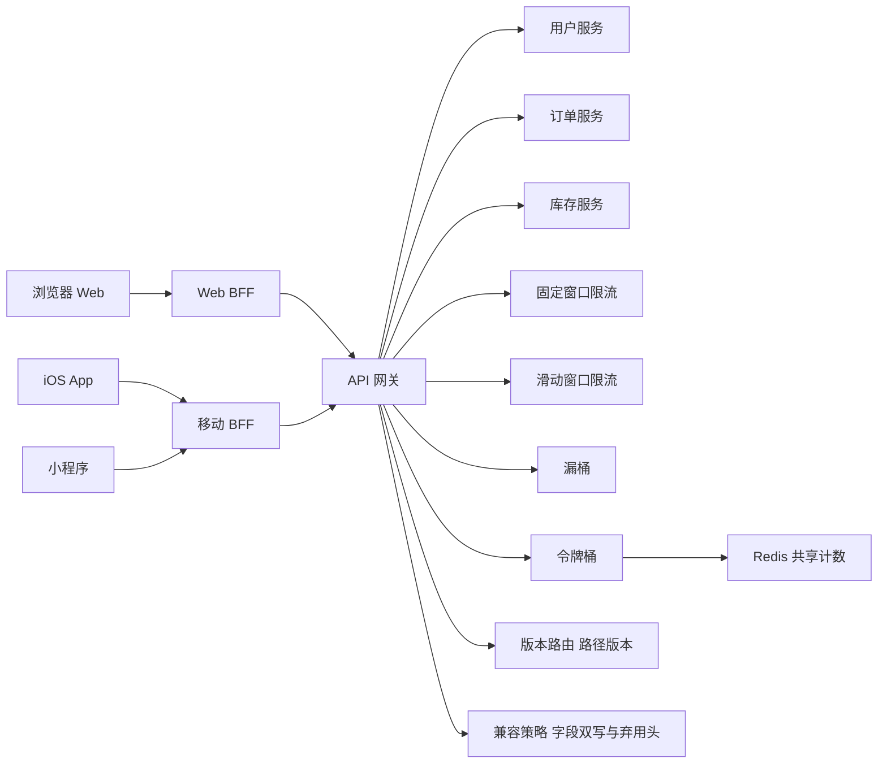
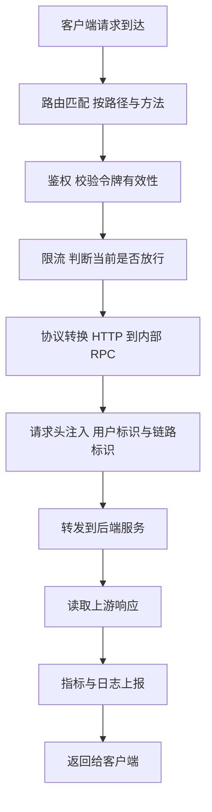
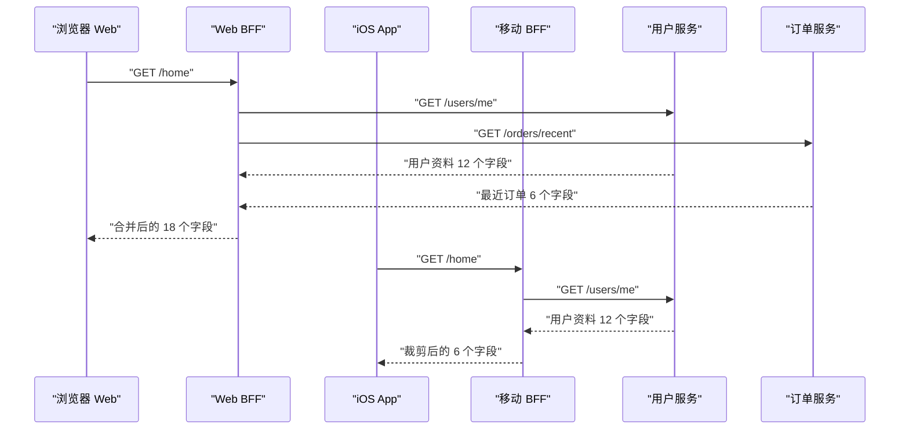
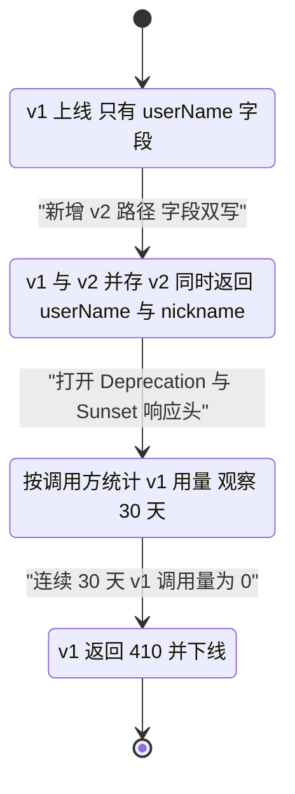
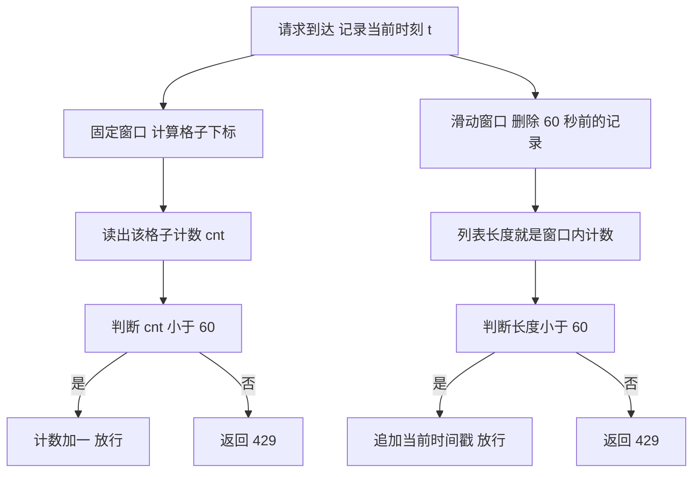
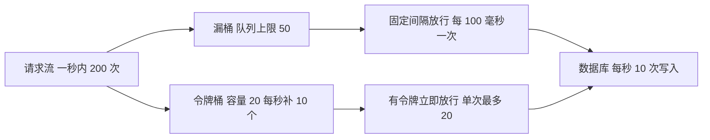
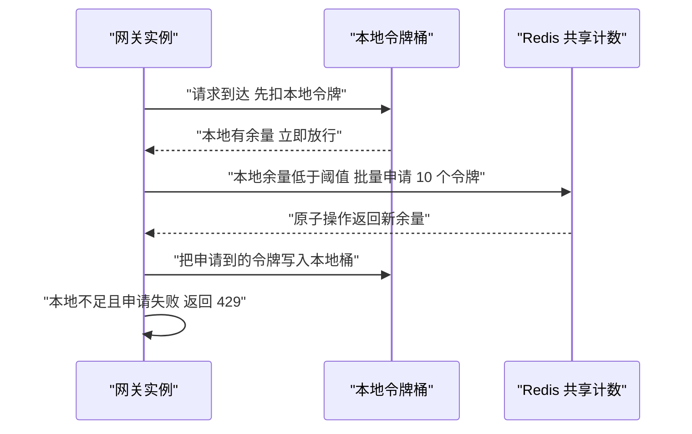

# API 网关、BFF 与限流：入口层的设计

!!! abstract "学完这一页你能"
    1. 说出 API 网关的五项职责，并判断某一项逻辑该放在网关还是放在 BFF。
    2. 为 Web、iOS、小程序三个客户端划出 BFF 边界，并解释为什么不让它们直连同一个聚合接口。
    3. 手写固定窗口、滑动窗口、漏桶、令牌桶四个限流器，并在同一组请求序列上跑出对比数字。
    4. 给定一次字段改名需求，写出 URL 版本路由、字段双写、弃用响应头三步兼容方案。

## 0. 知识地图



建议从第 1 节按顺序读到第 6 节，因为后一节都建立在前一节的场景上。
第 1 到 3 节讲入口层的结构，第 4 到 6 节讲入口层的流量控制与落地。
读第 4、5 节时请把代码复制出来跑一遍，限流只看文字不容易记住边界行为。

## 1. 网关到底做什么：五项职责

**先想一个问题**
你的 Web 前端要访问用户、订单、库存、支付四个后端域名。
跨域、令牌校验、超时、重试、日志，这四个服务各写一遍，客户端也各写一遍。
这份重复逻辑应该由谁统一承担？

!!! note "术语：API 网关"
    API 网关（Application Programming Interface Gateway，应用编程接口网关）是位于客户端与内部服务之间的进程。
    例：客户端只访问 `api.example.com`，网关按路径把 `/api/orders` 转发到订单服务。

!!! tip "心智模型"
    一句话模型：网关是所有外部流量的唯一入口进程，把跨服务的公共逻辑从业务代码搬到入口处。
    日常类比：小区大门保安亭，所有访客先过同一个窗口登记。
    类比不成立的地方：保安亭不改访客身份，网关会改写请求内容，比如注入用户标识和链路标识。

**图解**



1. 请求先做路由匹配，网关用路径和方法决定交给哪个后端。
2. 鉴权在路由之后、转发之前完成，未通过就返回 401，不占用后端资源。
3. 限流紧跟鉴权，超限返回 429，保护后端不被压垮。
4. 协议转换让外部用 HTTP，内部用 RPC，客户端不需要知道内部协议。
5. 请求头注入把解析出的用户标识、链路标识补进头部，后端直接读。
6. 响应返回前统一上报耗时、状态码、限流命中次数。

**一步一步来**

**第 1 步：建立路由表，用最长前缀匹配**

把路径映射到后端名字，这是网关的最小功能。

```js
const routes = [
  { prefix: "/api/users", target: "user-service" },   // 用户服务
  { prefix: "/api/order", target: "order-service" },  // 订单服务
  { prefix: "/api/orders/history", target: "history-service" }, // 更长的前缀
];

function matchRoute(path) {
  return routes
    .filter((r) => path.startsWith(r.prefix))            // 先筛出所有能匹配的
    .sort((a, b) => b.prefix.length - a.prefix.length)[0] // 取前缀最长的那条
    || null;                                             // 一条都没有就返回 null
}
```

**这段代码在做什么**
- 路由表按记录逐条保存前缀与目标服务名。
- `filter` 找出全部能匹配的前缀，可能有多条同时命中。
- `sort` 按前缀长度降序，长度相同则保持原顺序。
- 取第一条，就实现了最长前缀优先。
- `/api/orders/history/2024` 会命中 `history-service`，而不是 `order-service`。

**第 2 步：串起中间件链**

鉴权、链路注入这些逻辑单独成函数，按顺序执行。

```js
function runChain(list, ctx, final) {
  let i = -1;                       // 当前执行到第几个中间件
  const dispatch = () => {
    i += 1;                         // 前进一步
    if (i === list.length) return final(ctx); // 走完就执行最终处理
    return list[i](ctx, dispatch);  // 否则执行当前中间件并传入下一步
  };
  return dispatch();
}

const auth = (ctx, next) => {
  if (!ctx.headers.authorization) { ctx.status = 401; return; } // 无令牌直接拦截
  ctx.userId = "u_1";               // 解析令牌后写入上下文
  return next();
};

const trace = (ctx, next) => {
  ctx.headers["x-trace-id"] = "t_abc"; // 注入链路标识，后端可直接使用
  return next();
};
```

**这段代码在做什么**
- `i` 记录当前下标，每次 `dispatch` 前进一步。
- 中间件通过调用 `next` 决定是否继续往下走。
- `auth` 不调用 `next` 时链条停止，后续中间件与转发都不会执行。
- `ctx` 是贯穿全链的可变上下文对象，用于传递用户标识这类数据。
- 新增一个中间件只需往数组里加一项，不改转发逻辑。

**第 3 步：转发与超时**

上游慢的时候必须主动断开，否则连接会被一直占用。

```js
async function forward(ctx, target) {
  const ctrl = new AbortController();                   // 用于中断请求
  const timer = setTimeout(() => ctrl.abort(), 300);    // 300 毫秒未完成就中断
  try {
    const res = await fetch(`https://${target}${ctx.path}`, {
      method: ctx.method,                               // 保持原方法
      headers: ctx.headers,                             // 带上注入后的头部
      signal: ctrl.signal,                              // 绑定中断信号
    });
    ctx.status = res.status;                            // 透传上游状态码
    ctx.body = await res.text();                        // 透传响应体
  } catch (err) {
    ctx.status = err.name === "AbortError" ? 504 : 502; // 超时给 504，其他给 502
  } finally {
    clearTimeout(timer);                                // 无论成功失败都清掉定时器
  }
}
```

**这段代码在做什么**
- `AbortController` 提供一个可以在外部触发的中断信号。
- 定时器到点调用 `abort`，正在等待的 `fetch` 立刻抛错。
- 捕获错误后区分超时与其他网络错误，给出不同状态码。
- `finally` 清理定时器，避免进程被未清的定时器拖住。
- 上游状态码原样透传，客户端才能感知真实的业务错误。

**动手验证**

```js
// 依赖：无。Node 20 及以上直接运行：node gateway.js
import assert from "node:assert/strict";

const routes = [
  { prefix: "/api/users", target: "user-service" },
  { prefix: "/api/order", target: "order-service" },
  { prefix: "/api/orders/history", target: "history-service" }, // 更长前缀，优先级更高
];

function matchRoute(path) {
  const hit = routes
    .filter((r) => path.startsWith(r.prefix))
    .sort((a, b) => b.prefix.length - a.prefix.length)[0];
  return hit || null;
}

assert.equal(matchRoute("/api/orders/history/2024").target, "history-service");
assert.equal(matchRoute("/api/orders/9").target, "order-service");
assert.equal(matchRoute("/api/pay"), null);

function runChain(list, ctx, final) {
  let i = -1;
  const dispatch = () => {
    i += 1;
    return i === list.length ? final(ctx) : list[i](ctx, dispatch);
  };
  return dispatch();
}

const auth = (ctx, next) => {
  if (!ctx.headers.authorization) { ctx.status = 401; return; }
  ctx.userId = "u_1";
  return next();
};

const trace = (ctx, next) => {
  ctx.headers["x-trace-id"] = "t_abc";
  return next();
};

const seen = [];

async function fakeUpstream(target, ctx) {
  seen.push({ target, traceId: ctx.headers["x-trace-id"], userId: ctx.userId });
  return { status: 200, body: JSON.stringify({ from: target, user: ctx.userId }) };
}

async function handle(req) {
  const ctx = { ...req, headers: { ...req.headers }, status: 200 };
  const route = matchRoute(ctx.path);
  if (!route) { ctx.status = 404; return ctx; }
  await runChain([auth, trace], ctx, async () => {
    const res = await fakeUpstream(route.target, ctx);
    ctx.status = res.status;
    ctx.body = res.body;
  });
  return ctx;
}

const ok = await handle({ path: "/api/orders/9", method: "GET", headers: { authorization: "Bearer x" } });
assert.equal(ok.status, 200);
assert.equal(JSON.parse(ok.body).user, "u_1");

const denied = await handle({ path: "/api/users/1", method: "GET", headers: {} });
assert.equal(denied.status, 401);
assert.equal(seen.length, 1);

const missing = await handle({ path: "/api/pay", headers: { authorization: "Bearer x" } });
assert.equal(missing.status, 404);

console.log("上游收到的调用:", JSON.stringify(seen));
console.log("订单响应:", ok.body);
console.log("无令牌状态码:", denied.status, "未匹配路由状态码:", missing.status);
```

运行结果：

```
上游收到的调用: [{"target":"order-service","traceId":"t_abc","userId":"u_1"}]
订单响应: {"from":"order-service","user":"u_1"}
无令牌状态码: 401 未匹配路由状态码: 404
```

**常见坑**

| 现象 | 原因 | 怎么修 |
| --- | --- | --- |
| `/api/orders/history` 被转发到订单服务 | 路由表用 `find` 取第一条命中的短前缀 | 改成按前缀长度降序排序后取第一条 |
| 鉴权不通过仍然打到后端 | 中间件里调用了 `next` 才返回 401 | 提前 `return`，不调用 `next` |
| 上游卡住时网关连接数持续上涨 | 没有设置请求超时 | 用 `AbortController` 加定时器，超时返回 504 |
| 后端读不到用户标识 | 令牌解析结果只存在网关内存里 | 把用户标识写进转发请求的头部 |

**小结**
- 网关的五项职责是路由、鉴权、限流、协议与头部转换、可观测上报。
- 中间件链让每条公共逻辑独立成函数，新增逻辑不动转发代码。
- 没有超时的网关在慢上游面前会堆积连接，超时时间必须显式配置。

## 2. BFF 模式：按端聚合与裁剪

**先想一个问题**
Web 首页要展示 18 个字段，来自用户与订单两个服务。
iOS 首页只展示 6 个字段，而且希望一次请求拿到。
如果两端共用一个聚合接口，谁在为多余的字段付出流量与等待时间？

!!! note "术语：BFF"
    BFF（Backend for Frontend，为前端服务的后端）是每个客户端形态各自拥有的聚合层。
    例：`web-bff` 只服务浏览器，`mobile-bff` 同时服务 iOS 与小程序。

!!! tip "心智模型"
    一句话模型：BFF 是每个客户端形态配一个后端聚合层，负责并发调用下游并按端裁剪字段。
    日常类比：同一份菜单给堂食和外卖，打包方式不同，于是设两个出餐窗口。
    类比不成立的地方：出餐窗口不改菜品，BFF 会合并多个下游响应、改写字段名、加缓存。

**图解**



1. Web 与 iOS 都只调用各自 BFF 的一个 `/home` 路径。
2. Web BFF 并发请求用户服务与订单服务，等待两者都返回。
3. Web BFF 把两份响应合并成一个对象，字段数为 18。
4. 移动 BFF 只请求用户服务，因为它不需要订单列表。
5. 移动 BFF 从 12 个字段里挑出 6 个，减少移动网络传输量。
6. 两个 BFF 互不干扰，Web 加字段不会让 App 重新发版。

**一步一步来**

**第 1 步：并发调用下游，单个失败不拖垮整体**

用 `Promise.allSettled` 而不是 `Promise.all`，避免一个下游失败就整页报错。

```js
async function getUser(id) {
  return { id, name: "ann", level: 3, avatar: "a.png" }; // 模拟用户服务
}

async function getRecentOrders(id) {
  return [{ id: "o1", amount: 199 }, { id: "o2", amount: 58 }]; // 模拟订单服务
}

async function aggregate(userId) {
  const [user, orders] = await Promise.allSettled([
    getUser(userId),          // 下游 1
    getRecentOrders(userId),  // 下游 2
  ]);
  return {
    user: user.status === "fulfilled" ? user.value : null,     // 失败给 null
    orders: orders.status === "fulfilled" ? orders.value : [], // 失败给空数组
  };
}
```

**这段代码在做什么**
- `Promise.allSettled` 等所有任务结束，无论成功还是失败。
- 每个结果带 `status` 字段，值为 `fulfilled` 或 `rejected`。
- 用户服务失败时给 `null`，页面可以退化成匿名展示。
- 订单服务失败时给空数组，列表区域展示空状态。
- 两个下游并发发起，总耗时取决于较慢的那个，而不是两者之和。

**第 2 步：按端裁剪字段**

同一份聚合结果，交给不同客户端前做一次映射。

```js
function forWeb(data) {
  return {
    name: data.user && data.user.name,        // 用户名
    level: data.user && data.user.level,      // 会员等级
    avatar: data.user && data.user.avatar,    // 头像地址
    orderCount: data.orders.length,           // 订单数量
    recentAmount: data.orders.map((o) => o.amount), // 最近金额列表
  };
}

function forMobile(data) {
  const first = data.orders[0];
  return {
    name: data.user && data.user.name,        // 移动端只要名字
    lastAmount: first ? first.amount : null,  // 只要最近一笔金额
  };
}
```

**这段代码在做什么**
- `forWeb` 返回 5 个字段，包含订单金额列表。
- `forMobile` 只返回 2 个字段，跳过等级、头像、订单列表。
- `data.user && data.user.name` 在下游失败时得到 `null`，不会抛错。
- 字段映射集中在 BFF，改动只影响一个客户端。
- 字段名可以与后端不同，后端改名时只改映射函数。

**第 3 步：给聚合加时间预算**

下游不能无限等，BFF 需要设定整体上限并降级。

```js
function withBudget(promise, ms, fallback) {
  return Promise.race([
    promise,                                          // 正常结果
    new Promise((resolve) => setTimeout(() => resolve(fallback), ms)), // 到点给兜底值
  ]);
}

async function aggregateWithBudget(userId) {
  const [user, orders] = await Promise.all([
    withBudget(getUser(userId), 200, null),               // 用户服务 200 毫秒预算
    withBudget(getRecentOrders(userId), 200, []),         // 订单服务 200 毫秒预算
  ]);
  return { user, orders };
}
```

**这段代码在做什么**
- `Promise.race` 取最先完成的结果，谁先结束就用谁。
- 定时器到点返回兜底值，整体耗时被压在预算内。
- 兜底值与正常值类型一致，调用方不需要额外分支。
- 用户服务超预算给 `null`，订单服务超预算给 `[]`。
- 注意超时的下游请求仍在后台执行，如需真正取消要接上中断信号。

**动手验证**

```js
// 依赖：无。Node 20 及以上直接运行：node bff.js
import assert from "node:assert/strict";

function delay(ms, value) {
  return new Promise((resolve) => setTimeout(() => resolve(value), ms));
}

async function getUser() {
  return delay(10, { id: "u1", name: "ann", level: 3, avatar: "a.png" });
}

async function getRecentOrders() {
  return delay(20, [{ id: "o1", amount: 199 }, { id: "o2", amount: 58 }]);
}

async function aggregate() {
  const [user, orders] = await Promise.allSettled([getUser(), getRecentOrders()]);
  return {
    user: user.status === "fulfilled" ? user.value : null,
    orders: orders.status === "fulfilled" ? orders.value : [],
  };
}

function forWeb(d) {
  return { name: d.user.name, level: d.user.level, avatar: d.user.avatar, orderCount: d.orders.length };
}

function forMobile(d) {
  const first = d.orders[0];
  return { name: d.user.name, lastAmount: first ? first.amount : null };
}

const data = await aggregate();
const web = forWeb(data);
const mobile = forMobile(data);

assert.equal(Object.keys(web).length, 4);
assert.equal(Object.keys(mobile).length, 2);
assert.equal(web.orderCount, 2);
assert.equal(mobile.lastAmount, 199);

function withBudget(promise, ms, fallback) {
  return Promise.race([promise, delay(ms, fallback)]);
}

const slowUser = withBudget(delay(500, { name: "slow" }), 200, null);
const budgeted = await slowUser;
assert.equal(budgeted, null);

const slowOrders = await withBudget(delay(500, [1, 2, 3]), 200, []);
assert.deepEqual(slowOrders, []);

console.log("Web 字段:", JSON.stringify(web));
console.log("移动字段:", JSON.stringify(mobile));
console.log("超预算用户结果:", budgeted, "超预算订单结果:", JSON.stringify(slowOrders));
```

运行结果：

```
Web 字段: {"name":"ann","level":3,"avatar":"a.png","orderCount":2}
移动字段: {"name":"ann","lastAmount":199}
超预算用户结果: null 超预算订单结果: []
```

**常见坑**

| 现象 | 原因 | 怎么修 |
| --- | --- | --- |
| 一个下游挂掉，整页 500 | 用 `Promise.all`，任一拒绝就整体失败 | 改用 `Promise.allSettled` 并处理 `rejected` |
| 移动端流量比 Web 还大 | BFF 复用了 Web 的全量字段 | 拆出 `forMobile`，只保留移动端展示需要的字段 |
| 首页 P99 从 80 毫秒涨到 900 毫秒 | 串行调用两个下游，耗时相加 | 改并发调用，或用 `Promise.all` 包住带预算的调用 |
| 下游超时后日志里请求还在跑 | `Promise.race` 只放弃等待，不取消请求 | 把 `AbortController.signal` 传进下游请求 |

**小结**
- BFF 的存在理由是客户端形态差异，字段数量、调用次数、网络条件各不相同。
- 聚合用 `Promise.allSettled` 保证部分失败可降级。
- 时间预算把整体耗时封顶，兜底值类型要与正常值一致。

## 3. 版本与兼容策略

**先想一个问题**
后端要把响应里的 `userName` 改名为 `nickname`。
线上还有一批半年没更新的 App，直接改名会让这批用户首页白屏。
在不停服的前提下，这个改名要分几步做？

!!! note "术语：契约测试"
    契约测试是检查服务响应结构是否与约定一致的自动化测试。
    例：断言 `/v1/users/1` 的响应必含 `userName` 字符串字段。

!!! tip "心智模型"
    一句话模型：兼容策略是新增不改旧，删除分两步，先并存再下线。
    日常类比：桥梁加车道，先建新车道通流，确认旧车道没车了再封闭。
    类比不成立的地方：桥的车道数量有限，接口字段可以长期并存，直到统计确认无人调用。

**图解**



1. 初始状态只有 v1，响应里只有 `userName`。
2. 新增 v2 路径，v2 同时返回 `userName` 与 `nickname`，老客户端继续用 `userName`。
3. 打开弃用响应头，让接入方能从响应里看到下线计划。
4. 按调用方统计 v1 的调用量，观察期设为 30 天。
5. 观察期内调用量降到 0，才执行下线。
6. 下线时返回 410 而不是 404，明确表示资源曾存在但已移除。

**一步一步来**

**第 1 步：路径版本路由**

用路径前缀区分版本，同一份逻辑挂到两条路径上。

```js
const userV1 = (id) => ({ id, userName: "ann" });  // 老客户端读 userName

const userV2 = (id) => ({
  id,
  nickname: "ann",   // 新字段名
  userName: "ann",   // 过渡期同时保留旧字段
});

const table = {
  "/v1/users": userV1, // 版本一
  "/v2/users": userV2, // 版本二
};

function resolve(version, id) {
  const fn = table[`/${version}/users`];  // 按版本选处理函数
  return fn ? fn(id) : null;              // 未知版本返回 null，由调用方给 404
}
```

**这段代码在做什么**
- 两个版本的响应字段集不同，但共享同一份业务数据来源。
- v2 额外返回 `nickname`，同时保留 `userName` 保证老客户端可用。
- `table` 把版本字符串映射到处理函数，新增版本只加一行。
- 未知版本返回 `null`，调用方据此返回 404。
- 版本号放在路径里，代理层与日志都能直接按路径统计调用量。

**第 2 步：加弃用信号**

让接入方从响应头里看到下线计划，而不是等到请求失败。

```js
function attachDeprecation(headers, version) {
  if (version !== "v1") return headers;                      // 只对旧版本加提示
  headers["Deprecation"] = "true";                           // 声明该版本已弃用
  headers["Sunset"] = "Wed, 01 Oct 2025 00:00:00 GMT";       // 计划下线时刻
  headers["Link"] = '</v2/users/1>; rel="successor-version"'; // 指向接替版本
  return headers;
}
```

**这段代码在做什么**
- `Deprecation` 头说明这个版本已被标记为弃用。
- `Sunset` 头给出计划下线的时间点，格式是 HTTP 日期。
- `Link` 头配合 `rel="successor-version"` 指向新版本地址。
- 三个头只在 v1 上出现，v2 响应保持干净。
- 这三项头的取值格式需核对官方文档：`Deprecation` 与 `Sunset` 的具体取值规定。

**第 3 步：按调用方统计用量，用数字决定下线**

没有调用量数据就不能下线，否则会打断未知接入方。

```js
const usage = new Map(); // key 为版本与应用标识

function record(version, appId, now, dayMs) {
  const day = Math.floor(now / dayMs);          // 按天分桶
  const key = `${version}:${appId}:${day}`;     // 每天每个应用一条计数
  usage.set(key, (usage.get(key) || 0) + 1);    // 累加一次调用
  return usage.get(key);
}

function daysWithZero(version, dayMs, today, windowDays) {
  let zero = 0;                                 // 连续零调用天数
  for (let i = 1; i <= windowDays; i++) {
    const day = today - i;                      // 从昨天往前数
    let total = 0;
    for (const [k, v] of usage) {
      if (k.startsWith(`${version}:`) && k.endsWith(`:${day}`)) total += v; // 汇总当天所有应用
    }
    if (total === 0) zero += 1; else break;     // 出现非零就中断连续计数
  }
  return zero;
}
```

**这段代码在做什么**
- 用量按版本、应用标识、天三个维度分桶。
- `record` 每次调用加一，返回当天该应用的累计值。
- `daysWithZero` 从昨天往前统计连续零调用的天数。
- 一旦某天有调用就 `break`，连续计数归零。
- 判断下线条件是 `daysWithZero >= 30`，这是可复现的量化门槛。

**动手验证**

```js
// 依赖：无。Node 20 及以上直接运行：node versioning.js
import assert from "node:assert/strict";

const userV1 = (id) => ({ id, userName: "ann" });
const userV2 = (id) => ({ id, nickname: "ann", userName: "ann" });

const table = { "/v1/users": userV1, "/v2/users": userV2 };
function resolve(version, id) {
  const fn = table[`/${version}/users`];
  return fn ? fn(id) : null;
}

const v1 = resolve("v1", "1");
const v2 = resolve("v2", "1");
assert.equal(v1.userName, "ann");
assert.equal(v1.nickname, undefined);
assert.equal(v2.userName, "ann");
assert.equal(v2.nickname, "ann");
assert.equal(resolve("v9", "1"), null);

function attachDeprecation(headers, version) {
  if (version !== "v1") return headers;
  headers["Deprecation"] = "true";
  headers["Sunset"] = "Wed, 01 Oct 2025 00:00:00 GMT";
  headers["Link"] = '</v2/users/1>; rel="successor-version"';
  return headers;
}

assert.equal(attachDeprecation({}, "v1").Deprecation, "true");
assert.equal("Deprecation" in attachDeprecation({}, "v2"), false);

const DAY = 86_400_000;
const usage = new Map();
function record(version, appId, now) {
  const day = Math.floor(now / DAY);
  const key = `${version}:${appId}:${day}`;
  usage.set(key, (usage.get(key) || 0) + 1);
  return usage.get(key);
}

function daysWithZero(version, today, windowDays) {
  let zero = 0;
  for (let i = 1; i <= windowDays; i++) {
    const day = today - i;
    let total = 0;
    for (const [k, v] of usage) {
      if (k.startsWith(`${version}:`) && k.endsWith(`:${day}`)) total += v;
    }
    if (total === 0) zero += 1; else break;
  }
  return zero;
}

const today = 10_000;
record("v1", "ios-1.2.0", (today - 1) * DAY);
assert.equal(daysWithZero("v1", today, 30), 0);   // 昨天有调用，连续零天数为 0

record("v2", "ios-2.0.0", (today - 1) * DAY);
assert.equal(daysWithZero("v1", today, 30), 1);   // 昨天没有任何 v1 调用

console.log("v1 响应:", JSON.stringify(v1));
console.log("v2 响应:", JSON.stringify(v2));
console.log("v1 弃用头:", JSON.stringify(attachDeprecation({}, "v1")));
console.log("v1 连续零调用天数:", daysWithZero("v1", today, 30));
```

运行结果：

```
v1 响应: {"id":"1","userName":"ann"}
v2 响应: {"id":"1","nickname":"ann","userName":"ann"}
v1 弃用头: {"Deprecation":"true","Sunset":"Wed, 01 Oct 2025 00:00:00 GMT","Link":"</v2/users/1>; rel=\"successor-version\""}
v1 连续零调用天数: 1
```

**常见坑**

| 现象 | 原因 | 怎么修 |
| --- | --- | --- |
| App 老版本首页白屏 | v2 直接删掉 `userName`，老代码读 `undefined` | v2 保留 `userName`，过渡期字段双写 |
| 下线版本后收到大量 404 | 用 404 表示已删除资源，接入方当成路径写错 | 已下线版本返回 410，并在响应头带接替版本地址 |
| 弃用头发出但没人处理 | 接入方没有监控响应头 | 把 `Deprecation` 出现次数接入自己的告警看板 |
| 下线后发现还有调用 | 没有按调用方统计，只看了总量 | 按版本与应用标识分桶统计，连续 30 天为零才下线 |

**小结**
- 兼容的核心动作是字段新增而不替换，删除要分并存与下线两步。
- 版本号放进路径，代理日志与用量统计都能按版本切分。
- 下线是数据驱动的动作，判据是连续 30 天零调用这类可量化的门槛。

## 4. 固定窗口与滑动窗口

**先想一个问题**
你限制每个 IP 每分钟 60 次。
用户在 12:00:59 发出 60 次，在 12:01:00 再发 60 次。
两秒内共 120 次，但任意一个整分钟窗口里都没有超过 60 次，这个泄漏怎么补？

!!! note "术语：限流"
    限流（Rate Limiting）是在单位时间内限制请求或操作数量的机制。
    例：每个 IP 每分钟最多 60 次请求，第 61 次返回 429。

!!! tip "心智模型"
    一句话模型：固定窗口把时间切成格子，每格独立计数；滑动窗口让窗口跟着当前时刻移动。
    日常类比：固定窗口是按整点打卡的考勤机，滑动窗口是装着最近 60 秒记录的滚动袋子。
    类比不成立的地方：精确滑动窗口要保存窗口内每个请求的时间戳，内存随 QPS 线性增长。

**图解**



1. 两条支路都从同一个请求到达事件开始。
2. 固定窗口先把时刻除以窗口长度取整，得到格子下标。
3. 用格子下标做键读出计数，计数与窗口边界无关。
4. 计数小于上限就加一并放行，否则返回 429。
5. 滑动窗口先过滤掉 60 秒之前的时间戳，剩下的长度就是窗口内请求数。
6. 长度小于上限就追加当前时间戳并放行，否则返回 429。

**一步一步来**

**第 1 步：实现固定窗口**

窗口边界固定，状态只有一个整数。

```js
class FixedWindow {
  constructor(limit, windowMs) {
    this.limit = limit;        // 每窗口允许的次数
    this.windowMs = windowMs;  // 窗口长度，毫秒
    this.buckets = new Map();  // 键为 标识加格子下标
  }
  allow(key, now) {
    const idx = Math.floor(now / this.windowMs); // 当前时刻属于第几个格子
    const k = `${key}:${idx}`;                   // 每个格子独立计数
    const used = this.buckets.get(k) || 0;       // 读出已用次数
    if (used >= this.limit) return false;        // 达到上限就拒绝
    this.buckets.set(k, used + 1);               // 放行并加一
    return true;
  }
}
```

**这段代码在做什么**
- `Math.floor(now / windowMs)` 把连续时间映射到整数格子下标。
- 键里同时包含限流标识与格子下标，不同窗口互不影响。
- 计数达到上限直接返回 `false`，调用方据此返回 429。
- 状态量是每个格子的一个整数，内存不随 QPS 增长。
- 在 12:00:59 与 12:01:00 这两个时刻属于不同格子，各自有 60 次额度。

**第 2 步：实现精确滑动窗口**

保存窗口内每个请求的时间戳，窗口边界随时间移动。

```js
class SlidingWindow {
  constructor(limit, windowMs) {
    this.limit = limit;        // 窗口内允许的次数
    this.windowMs = windowMs;  // 窗口长度，毫秒
    this.log = new Map();      // 键为标识，值为时间戳数组
  }
  allow(key, now) {
    const list = (this.log.get(key) || [])
      .filter((t) => t > now - this.windowMs);   // 丢掉滑出窗口的记录
    if (list.length >= this.limit) {             // 窗口内已经满了
      this.log.set(key, list);                   // 仍要写回修剪后的列表
      return false;
    }
    list.push(now);                              // 记下本次时间戳
    this.log.set(key, list);
    return true;
  }
}
```

**这段代码在做什么**
- 每次判断前先按 `t > now - windowMs` 过滤，删除过期记录。
- 剩余列表的长度就是窗口内的请求次数。
- 达到上限时也要写回修剪后的列表，否则内存不会下降。
- 拒绝路径同样执行修剪，这让长期被拒的标识不会无限累积。
- 列表长度与 QPS 线性相关，QPS 为 1000 时单标识可能保存上千个时间戳。

**第 3 步：实现近似滑动窗口**

用当前格与前一格的加权和近似，内存回到常数级。

```js
class SlidingWindowApprox {
  constructor(limit, windowMs) {
    this.limit = limit;
    this.windowMs = windowMs;
    this.cur = new Map();      // 当前格计数
    this.prev = new Map();     // 前一格计数
    this.curStart = -1;        // 当前格下标
  }
  allow(key, now) {
    const idx = Math.floor(now / this.windowMs);
    if (idx !== this.curStart) {                        // 跨到新格子
      this.prev = idx === this.curStart + 1 ? this.cur : new Map(); // 相邻才继承
      this.cur = new Map();                             // 新格从零开始
      this.curStart = idx;
    }
    const elapsed = now - idx * this.windowMs;           // 当前格已过去多久
    const weight = 1 - elapsed / this.windowMs;          // 前一格的剩余权重
    const used = (this.cur.get(key) || 0) + (this.prev.get(key) || 0) * weight;
    if (used >= this.limit) return false;                // 加权值到上限就拒绝
    this.cur.set(key, (this.cur.get(key) || 0) + 1);
    return true;
  }
}
```

**这段代码在做什么**
- 每个标识只保留两个整数，内存使用与 QPS 无关。
- 跨格时判断是否相邻，中间空了一格以上就把前一格清空。
- `weight` 从 1 线性降到 0，表示前一格记录对当前判断的影响比例。
- 加权值在格子刚开始时最接近上一格的完整计数，接近格子末尾时趋近当前格计数。
- 这个算法是近似，边界处允许的次数与精确滑动窗口不同，需要按业务容忍度决定是否使用。

**动手验证**

```js
// 依赖：无。Node 20 及以上直接运行：node window.js
import assert from "node:assert/strict";

class FixedWindow {
  constructor(limit, windowMs) {
    this.limit = limit;
    this.windowMs = windowMs;
    this.buckets = new Map();
  }
  allow(key, now) {
    const k = `${key}:${Math.floor(now / this.windowMs)}`;
    const used = this.buckets.get(k) || 0;
    if (used >= this.limit) return false;
    this.buckets.set(k, used + 1);
    return true;
  }
}

class SlidingWindow {
  constructor(limit, windowMs) {
    this.limit = limit;
    this.windowMs = windowMs;
    this.log = new Map();
  }
  allow(key, now) {
    const list = (this.log.get(key) || []).filter((t) => t > now - this.windowMs);
    if (list.length >= this.limit) { this.log.set(key, list); return false; }
    list.push(now);
    this.log.set(key, list);
    return true;
  }
}

const fixed = new FixedWindow(60, 60_000);
const sliding = new SlidingWindow(60, 60_000);
let fixedPass = 0;
let slidingPass = 0;

for (let i = 0; i < 60; i++) {
  const now = 59_000 + i;                       // 第一分钟末尾的 60 次
  if (fixed.allow("ip1", now)) fixedPass += 1;
  if (sliding.allow("ip1", now)) slidingPass += 1;
}
assert.equal(fixedPass, 60);
assert.equal(slidingPass, 60);

for (let i = 0; i < 60; i++) {
  const now = 60_000 + i;                       // 第二分钟开头的 60 次
  if (fixed.allow("ip1", now)) fixedPass += 1;
  if (sliding.allow("ip1", now)) slidingPass += 1;
}
assert.equal(fixedPass, 120);                   // 固定窗口跨格后重新计数
assert.equal(slidingPass, 60);                  // 滑动窗口仍看到前一分钟的 60 条记录

console.log("两秒内固定窗口放行次数:", fixedPass);
console.log("两秒内滑动窗口放行次数:", slidingPass);
console.log("固定窗口状态量:", fixed.buckets.size, "滑动窗口时间戳数:", sliding.log.get("ip1").length);
```

运行结果：

```
两秒内固定窗口放行次数: 120
两秒内滑动窗口放行次数: 60
固定窗口状态量: 2 滑动窗口时间戳数: 60
```

**常见坑**

| 现象 | 原因 | 怎么修 |
| --- | --- | --- |
| 整点附近出现两倍流量 | 固定窗口跨格后计数归零 | 换精确滑动窗口，或用两格加权近似 |
| 限流服务内存持续上涨 | 滑动窗口在拒绝路径没有写回修剪后的列表 | 拒绝时也 `set` 回过滤结果 |
| 长期被拒的 IP 内存不释放 | `Map` 中的键永不清理 | 给每个键加最后访问时间，定期清扫 |
| 压测时单机内存到 2GB | 精确滑动窗口按 QPS 保存时间戳 | 换令牌桶或近似滑动窗口，状态回到常数级 |

**小结**
- 固定窗口实现成本最低，但存在窗口边界两倍突发的漏洞。
- 精确滑动窗口消除边界漏洞，代价是状态量随 QPS 线性增长。
- 近似滑动窗口用两格加权把状态压回常数级，代价是边界处略不精确。

## 5. 漏桶与令牌桶

**先想一个问题**
下游数据库每秒只能承受 10 次写入。
上游在某一秒内突发 200 次请求。
你既不希望丢掉全部请求，也不希望数据库被打垮，限流器该按哪种节奏放行？

!!! note "术语：漏桶与令牌桶"
    漏桶（Leaky Bucket）以固定间隔放行请求，超出队列容量的请求被丢弃。
    令牌桶（Token Bucket）以固定速率往桶里加令牌，有令牌就放行，桶容量决定单次突发上限。

!!! tip "心智模型"
    一句话模型：漏桶按固定间隔依次放行，令牌桶按固定速率发令牌、允许用存量令牌突发。
    日常类比：漏桶是水龙头下的漏斗，出水口大小固定；令牌桶是停车场的门票机，攒够票就能一次放进一批车。
    类比不成立的地方：漏水会一直等，网络请求等待会占用连接与内存，等待队列必须设长度上限。

**图解**



1. 同一股 200 次的突发请求分别进入两个限流器。
2. 漏桶把请求排进长度上限为 50 的队列。
3. 漏桶每 100 毫秒放行一个，也就是每秒 10 个，与数据库承受能力一致。
4. 队列满时后续请求直接被拒绝，等待时间可以提前算出。
5. 令牌桶初始有 20 个令牌，前 20 个请求立即通过。
6. 之后令牌以每秒 10 个的速率补充，长期平均速率同为每秒 10 个。

**一步一步来**

**第 1 步：实现漏桶**

用下一个可放行时刻表示队列状态，等待时间可以直接计算。

```js
class LeakyBucket {
  constructor(capacity, ratePerSecond) {
    this.capacity = capacity;                  // 队列最多排多少个
    this.interval = 1000 / ratePerSecond;      // 每多少毫秒放行一个
    this.nextFree = 0;                         // 下一个可放行的时刻
  }
  allow(now) {
    const start = Math.max(now, this.nextFree);           // 队列空时从现在算起
    const wait = start - now;                             // 需要等待的毫秒数
    if (wait > (this.capacity - 1) * this.interval) return false; // 队列已满
    this.nextFree = start + this.interval;                // 占用一个排队位置
    return true;
  }
}
```

**这段代码在做什么**
- `nextFree` 记录队尾位置对应的放行时刻，队列状态压缩成一个数字。
- 队列为空时 `start` 取当前时刻，本次请求立即放行。
- `wait` 是本次请求需要等待的时间，等于前面排队的请求数乘以间隔。
- 等待时间超过队列容量对应的上限就拒绝，说明队列满了。
- 放行后把 `nextFree` 往后推一个间隔，占用一个位置。

**第 2 步：实现令牌桶**

惰性计算令牌数，只在请求到达时按时间差补充。

```js
class TokenBucket {
  constructor(capacity, ratePerSecond) {
    this.capacity = capacity;              // 桶容量，等于单次突发上限
    this.rate = ratePerSecond / 1000;      // 每毫秒补充多少令牌
    this.tokens = capacity;                // 初始满桶
    this.last = 0;                         // 上次补充时刻
  }
  allow(now, need = 1) {
    const added = (now - this.last) * this.rate;              // 这段时间应补的令牌
    this.tokens = Math.min(this.capacity, this.tokens + added); // 不能超过桶容量
    this.last = now;                                          // 更新补充时刻
    if (this.tokens < need) return false;                     // 令牌不足
    this.tokens -= need;                                      // 扣掉令牌
    return true;
  }
}
```

**这段代码在做什么**
- 没有定时器，令牌数在每次请求到达时按时间差现算。
- `Math.min` 保证补充后不超过桶容量，这就是单次突发的上限。
- 令牌不足时返回 `false`，同时 `last` 已经更新，不会重复累积。
- 一次请求可以消耗多个令牌，用于按权重计费的场景。
- 初始满桶意味着系统刚启动时允许一次等于容量的突发。

**第 3 步：按下游能否排队做选择**

两种算法对应两种下游特征，选错会带来不同故障。

- 下游处理能力固定且请求可以延迟执行，用漏桶，等待时间可以提前返回给客户端。
- 下游希望看到即时响应、且能容忍短时突发，用令牌桶，桶容量就是突发上限。
- 下游是同步数据库且连接池有限，不要用长队列，队列积压会占满连接。
- 需要对外承诺平均速率时两种都可以，令牌桶的突发更可控。

**动手验证**

```js
// 依赖：无。Node 20 及以上直接运行：node bucket.js
import assert from "node:assert/strict";

class LeakyBucket {
  constructor(capacity, ratePerSecond) {
    this.capacity = capacity;
    this.interval = 1000 / ratePerSecond;
    this.nextFree = 0;
  }
  allow(now) {
    const start = Math.max(now, this.nextFree);
    const wait = start - now;
    if (wait > (this.capacity - 1) * this.interval) return false;
    this.nextFree = start + this.interval;
    return true;
  }
}

class TokenBucket {
  constructor(capacity, ratePerSecond) {
    this.capacity = capacity;
    this.rate = ratePerSecond / 1000;
    this.tokens = capacity;
    this.last = 0;
  }
  allow(now, need = 1) {
    const added = (now - this.last) * this.rate;
    this.tokens = Math.min(this.capacity, this.tokens + added);
    this.last = now;
    if (this.tokens < need) return false;
    this.tokens -= need;
    return true;
  }
}

const leaky = new LeakyBucket(50, 10);
const token = new TokenBucket(20, 10);

let leakyPass = 0;
let tokenPass = 0;
for (let i = 0; i < 200; i++) {
  if (leaky.allow(0)) leakyPass += 1;   // 200 个请求都发生在时刻 0
  if (token.allow(0)) tokenPass += 1;
}

assert.equal(leakyPass, 50);   // 队列容量决定放行数量
assert.equal(tokenPass, 20);   // 桶容量决定放行数量

// 到第 1000 毫秒，两者都应再补充出 10 个额度
let leakySecond = 0;
let tokenSecond = 0;
for (let i = 0; i < 20; i++) {
  if (leaky.allow(1000 + i)) leakySecond += 1;
  if (token.allow(1000 + i)) tokenSecond += 1;
}

assert.equal(leakySecond, 10); // 漏桶按 100 毫秒间隔放行
assert.equal(tokenSecond, 10); // 令牌桶在 1000 毫秒内补充了 10 个令牌

// 队列是否已满可以直接算出来
const full = new LeakyBucket(50, 10);
assert.equal(full.allow(0) && full.nextFree, 100);

console.log("突发 200 次时漏桶放行:", leakyPass, "令牌桶放行:", tokenPass);
console.log("到第 1000 毫秒的 20 次尝试中，漏桶放行:", leakySecond, "令牌桶放行:", tokenSecond);
console.log("漏桶单次占用后的下一个放行时刻:", full.nextFree);
```

运行结果：

```
突发 200 次时漏桶放行: 50 令牌桶放行: 20
到第 1000 毫秒的 20 次尝试中，漏桶放行: 10 令牌桶放行: 10
漏桶单次占用后的下一个放行时刻: 100
```

**常见坑**

| 现象 | 原因 | 怎么修 |
| --- | --- | --- |
| 请求等待时间越来越长 | 漏桶队列没有长度上限，请求持续排队 | 设置 `capacity`，等待超过上限直接拒绝 |
| 服务重启后瞬间被突发打满 | 令牌桶初始为满桶，容量等于突发上限 | 把初始令牌数设为 0 或较小值 |
| 长期空闲后出现一次大突发 | 令牌按时间差无上限累积 | 用 `Math.min` 把令牌数封在桶容量内 |
| 按权重计费的接口仍然按次放行 | 每次固定消耗一个令牌 | 给 `allow` 传入 `need`，按业务权重扣减 |

**小结**
- 漏桶用固定间隔放行，适合能排队且处理能力固定的下游。
- 令牌桶用惰性补令牌实现平均速率限制，桶容量就是单次突发上限。
- 两者都能承诺平均速率，差别在于是否允许存量额度带来的突发。

## 6. 分布式限流与入口层落地

**先想一个问题**
网关部署了 8 个实例，每个实例各自维护计数器。
每个实例都放行 60 次，用户实际能过 480 次。
计数器放到哪里，才能让 8 个实例共享同一个额度？

!!! note "术语：fail-open 与 fail-closed"
    fail-open 指依赖故障时选择放行请求，fail-closed 指依赖故障时选择拒绝请求。
    例：Redis 不可用时网关仍放行请求属于 fail-open，直接返回 503 属于 fail-closed。

!!! tip "心智模型"
    一句话模型：分布式限流把计数状态放到共享存储，用一次原子操作完成读取与写入。
    日常类比：8 个售票窗口共用一台售票机，不是一个窗口自己记一本账。
    类比不成立的地方：售票机是唯一瓶颈，共享存储的网络往返会加到每个请求上，需要用本地预取分摊。

**图解**



1. 请求先落到网关实例，直接尝试从本地令牌桶扣减。
2. 本地有余量时立刻放行，完全不访问共享存储。
3. 本地余量低于阈值时，才向 Redis 发起一次批量申请。
4. Redis 用单条原子命令完成判断与扣减，返回新余量。
5. 网关把申请到的令牌写进本地桶，供后续请求使用。
6. 本地不足且申请不到令牌时返回 429，请求不会被送到后端。

**一步一步来**

**第 1 步：用 Lua 脚本做原子计数**

读取计数与写入计数必须在同一次调用内完成，否则并发下会超放。

```js
// 放到 Redis 里执行的脚本，读与写在一次调用内完成
const LIMIT_LUA = `
local n = redis.call('INCR', KEYS[1])                       -- 原子自增并拿到新值
if n == 1 then redis.call('PEXPIRE', KEYS[1], ARGV[1]) end  -- 首次写入时设置过期
if n > tonumber(ARGV[2]) then return 0 end                  -- 超过上限返回 0
return 1                                                     -- 放行返回 1
`;

// 调用方式：KEYS[1] 是限流键，ARGV[1] 是过期毫秒，ARGV[2] 是上限
// 脚本会在 Redis 单线程内整体执行完毕，不会与其他命令交错
```

**这段代码在做什么**
- `INCR` 是原子操作，多个网关实例并发调用也不会丢计数。
- 第一次自增后立刻设置过期时间，避免键永久堆积。
- 比较在脚本内部完成，判断与自增之间不会插入其他命令。
- 返回 1 表示放行，返回 0 表示拒绝，网关按返回值决定响应。
- 脚本内容需核对官方文档：`EVAL` 与 `redis.call` 的可用命令范围。

**第 2 步：本地预取，把共享存储调用次数降下来**

本地有余额时不访问 Redis，按批量申请摊薄往返开销。

```js
class PrefetchBucket {
  constructor(fetchBatch, batchSize) {
    this.local = 0;              // 本地剩余令牌
    this.batchSize = batchSize;  // 每次向共享存储申请的令牌数
    this.fetchBatch = fetchBatch; // 申请函数，返回实际拿到的令牌数
  }
  async allow() {
    if (this.local > 0) {        // 本地有余量
      this.local -= 1;
      return true;               // 直接放行，不访问共享存储
    }
    const got = await this.fetchBatch(this.batchSize); // 本地空了才批量申请
    if (got <= 0) return false;  // 共享存储也没有额度
    this.local = got - 1;        // 先扣掉本次使用的一枚
    return true;
  }
}
```

**这段代码在做什么**
- `local` 是实例私有的令牌余额，扣减不需要网络往返。
- 只有本地余额为 0 时才调用 `fetchBatch`，共享存储调用次数被摊薄。
- `got - 1` 把本次要用的令牌一起扣掉，避免多用一个。
- 实例崩溃会丢掉本地未用的令牌，这部分额度相当于浪费，属于可接受误差。
- 批量大小越大，共享存储压力越小，单实例允许的超放误差也越大。

**第 3 步：共享存储故障时的降级**

Redis 不可用只有两种选择，放行或者拒绝，必须显式决定。

```js
function makeFallback(failOpen) {
  return async function fetchWithFallback(limit, batch) {
    try {
      return await sharedTryTake(limit, batch); // 正常走共享存储
    } catch (err) {
      if (!failOpen) throw err;                 // fail-closed 向上抛错，调用方返回 503
      return batch;                             // fail-open 直接给一批令牌
    }
  };
}
```

**这段代码在做什么**
- `failOpen` 是显式配置项，不是一个隐含的默认行为。
- fail-closed 下错误向上抛，网关返回 503，保护后端但影响可用性。
- fail-open 下直接返回一批令牌，可用性优先但后端可能被压。
- 无论哪种选择都要打点计数，故障期间放行了多少次必须可查。
- 支付、扣款这类接口选 fail-closed，只读展示类接口可以选 fail-open。

**动手验证**

```js
// 依赖：无。Node 20 及以上直接运行：node distributed.js
import assert from "node:assert/strict";

function makeSharedStore(limit) {
  const state = new Map();
  let calls = 0;
  function tryTake(key, batch) {
    calls += 1;
    const used = state.get(key) || 0;
    if (used >= limit) return 0;                 // 额度已经用完
    const grant = Math.min(batch, limit - used); // 一次最多给到剩余额度
    state.set(key, used + grant);
    return grant;
  }
  return { tryTake, calls: () => calls };
}

class PrefetchBucket {
  constructor(fetchBatch, batchSize) {
    this.local = 0;
    this.batchSize = batchSize;
    this.fetchBatch = fetchBatch;
  }
  async allow() {
    if (this.local > 0) { this.local -= 1; return true; }
    const got = await this.fetchBatch(this.batchSize);
    if (got <= 0) return false;
    this.local = got - 1;
    return true;
  }
}

const store = makeSharedStore(100);
const bucket = new PrefetchBucket((n) => store.tryTake("ip1", n), 10);

let pass = 0;
for (let i = 0; i < 250; i++) {
  if (await bucket.allow()) pass += 1;
}

assert.equal(pass, 100);          // 共享上限是 100，本地预取不会超放
assert.equal(store.calls(), 10);  // 每次申请 10 个，共申请 10 次

// 对比：不做预取时，每次请求都要访问共享存储
const naiveStore = makeSharedStore(100);
let naivePass = 0;
for (let i = 0; i < 250; i++) {
  if (naiveStore.tryTake("ip1", 1) > 0) naivePass += 1;
}
assert.equal(naivePass, 100);
assert.equal(naiveStore.calls(), 250);

// 共享存储故障时的 fail-open 降级
async function fetchWithFallback(limit, batch, failOpen) {
  try {
    throw new Error("redis down");  // 模拟共享存储不可用
  } catch (err) {
    if (!failOpen) throw err;
    return batch;
  }
}

const openBucket = new PrefetchBucket((n) => fetchWithFallback(100, n, true), 10);
assert.equal(await openBucket.allow(), true);

const closedBucket = new PrefetchBucket((n) => fetchWithFallback(100, n, false), 10);
let closedThrew = false;
try {
  await closedBucket.allow();
} catch {
  closedThrew = true;
}
assert.equal(closedThrew, true);

console.log("预取方案放行:", pass, "共享存储调用次数:", store.calls());
console.log("逐次访问方案放行:", naivePass, "共享存储调用次数:", naiveStore.calls());
console.log("fail-open 首次放行:", await openBucket.allow(), "fail-closed 抛错:", closedThrew);
```

运行结果：

```
预取方案放行: 100 共享存储调用次数: 10
逐次访问方案放行: 100 共享存储调用次数: 250
fail-open 首次放行: true fail-closed 抛错: true
```

**常见坑**

| 现象 | 原因 | 怎么修 |
| --- | --- | --- |
| 8 个实例合计放行量是配置值的 8 倍 | 每个实例各存一份计数，状态没有共享 | 计数放共享存储，或用配额平均切分给实例 |
| 并发下仍然超放 | 先 `GET` 再 `INCR`，两条命令之间被其他请求插队 | 把判断与自增写进一个 Lua 脚本，用 `EVAL` 执行 |
| Redis 挂掉后全站 503 | 配置成了 fail-closed，没有本地兜底 | 按接口等级区分，展示类走 fail-open 加本地限额 |
| 限流键数量无限增长 | 键没有过期时间 | 首次写入时用 `PEXPIRE` 设置过期 |

**小结**
- 分布式限流的关键是把判断与写入合成一次原子操作。
- 本地预取把共享存储的调用次数从每次请求一次降到每批一次。
- 依赖故障时的放行或拒绝必须显式配置，并按接口等级分别选择。

## 综合对比

先对比入口层的三种结构，维度是客户端直接面对的服务数量与改动成本。

| 维度 | 客户端直连服务 | 只加 API 网关 | 网关加 BFF |
| --- | --- | --- | --- |
| 客户端需要配置的域名数 | 4 | 1 | 1 |
| 鉴权代码位置 | 每个客户端各写一遍 | 网关一处 | 网关一处，BFF 只读用户标识 |
| 响应字段数量 | 后端全量返回 | 后端全量返回 | 每个端各裁剪一次 |
| 跨域配置位置 | 每个服务各配一次 | 网关统一配置 | 网关统一配置 |
| 新增一个客户端的改动 | 重新对接 4 个服务 | 复用网关，仍需在客户端拼装 | 新增一个 BFF，不改网关 |
| 需要运维的进程数 | 4 | 5 | 7 |
| 适用的客户端数量 | 1 个 | 2 个及以上 | 3 个及以上且差异大 |

再对比四种限流算法，维度是实现成本与突发行为。

| 维度 | 固定窗口 | 滑动窗口精确版 | 漏桶 | 令牌桶 |
| --- | --- | --- | --- | --- |
| 保存的状态 | 每窗口一个整数 | 窗口内每条请求的时间戳 | 一个下一放行时刻 | 令牌数加一个补充时刻 |
| 状态量随 QPS | 不增长 | 线性增长 | 不增长 | 不增长 |
| 边界突发上限 | 最多两倍上限 | 不超上限 | 不超上限 | 等于桶容量 |
| 放行节奏 | 整点归零后连续放行 | 窗口持续滚动 | 间隔固定 | 平均速率固定，突发受桶容量约束 |
| 是否支持排队等待 | 不支持 | 不支持 | 支持，等待时间可算 | 不支持 |
| 实现代码行数 | 约 12 行 | 约 15 行 | 约 14 行 | 约 16 行 |
| 适合的位置 | 单机粗粒度保护 | 计费类精确接口 | 保护固定吞吐的下游 | 网关对外的总入口 |

## 应用与行业实践

### 应用场景地图

| 场景 | 用到本页哪个知识点 | 典型技术选型 | 注意事项 |
| --- | --- | --- | --- |
| 后台管理的万行表格 | 网关五项职责里的鉴权与配额、BFF 按端裁剪 | 网关做鉴权路由，BFF 做列裁剪，Redis 计数 | 导出接口要单独配额，别和列表查询共用一个键 |
| 低端安卓的首屏加载 | BFF 按端聚合与裁剪、字段双写兼容 | Node.js 或 Go 写 BFF，压测工具测冷启动 | 裁剪掉的字段要有兜底接口，老客户端仍能取到 |
| 多人协作白板的笔画同步 | 网关职责边界、限流粒度选择 | WebSocket 网关、Redis 广播 | 不能按单次请求限流，要按连接数或消息速率 |
| 小程序分享裂变的抢券入口 | 令牌桶、分布式限流 | 网关加 Redis 令牌桶，实例内本地桶兜底 | 桶容量要对齐可售库存，否则放行量会超过库存 |
| 对外开放平台按客户售卖 API | 网关五项职责、版本与兼容策略 | 网关密钥插件加配额插件 | 配额键用客户 ID，不要用 IP |
| 灰度发布期间订单字段改名 | URL 版本路由、字段双写、弃用响应头 | 网关按前缀分流，BFF 双写字段 | 双写窗口和客户端发版节奏对齐，别提前下线 |
| 设备心跳与状态上报 | 漏桶整形 | 网关漏桶限流加消息队列削峰 | 漏桶会拉长上报间隔，要评估心跳超时阈值 |
| 弱网下的重试风暴 | 滑动窗口计数 | 网关滑动窗口加客户端指数退避 | 窗口切得越细，Redis 键越多，先估键数量 |

### 三个场景拆解

#### 场景 1：后台管理的万行表格

**业务背景**：运营后台的订单列表要展示十万行，前端一次拉全量，首屏要等十几秒。用这个后台的有几十个人，每人一天刷新几百次，早晚各有一个高峰。

**怎么用本页知识解决**：让 BFF 只返回表格当前页要用的列，网关只做鉴权和按用户限流，导出走独立路由和独立配额。先把读接口的口子收窄，再看下游还需要改什么。

```js
// BFF：订单列表只返回表格当前可见的列
app.get('/bff/admin/orders', async (req, res) => {
  const limit = Math.min(Number(req.query.limit) || 50, 200); // 单页上限 200 行
  const cursor = req.query.cursor;                             // 游标分页，不用 offset
  const rows = await orderSvc.list({ cursor, limit });          // 每个请求只查一页
  res.json({
    items: rows.map(r => ({
      id: r.id, status: r.status, amount: r.amount,             // 只保留表格可见字段
    })),
    nextCursor: rows.at(-1)?.id ?? null,                        // 下一页游标
  });
});
```

- 游标分页把查询压到一页；用 offset 翻到十万行时，数据库仍要扫过前面的行。
- BFF 只映射三个字段，备注、收货地址这类长文本不进序列化和传输。
- 网关已经验过令牌，BFF 只读身份头，两处各写一套令牌校验会埋下不一致。
- 导出 CSV 挂在单独路径上，配一份低配额，避免导出占满列表接口的连接池。

**怎么度量收益**：看首屏的 Largest Contentful Paint、BFF 接口的 P95 响应时间、响应体字节数。测量用 Chrome DevTools 的 Performance 面板录首屏；服务端用 Prometheus 查询 http_request_duration_seconds 的 0.95 分位；响应体大小看网关访问日志里的 body_bytes_sent。

**什么时候不该用**：

- 列表要跨页全量排序或做汇总统计时，游标分页给不出结果，应该让后端跑离线任务生成结果表。
- 运营要把全量字段导进 Excel 做透视时，别取消列表的裁剪，改在导出接口里按需返回完整字段。

#### 场景 2：低端安卓的首屏加载

**业务背景**：App 首屏要调 5 个后端接口，低端机型上串行请求加上弱网重试，冷启动会停在空白页。客户端版本在一年里跨了 6 个，老版本仍在活跃。

**怎么用本页知识解决**：给 Android 单开一个 BFF，把 5 个接口聚合成 1 个；用 URL 版本路由区分客户端版本；字段改名先双写再下线。iOS 与 Web 的 BFF 使用独立前缀，互不牵扯。

```js
// Android BFF：把首屏需要的 4 个接口聚合成 1 个响应
app.get('/bff/android/v2/home', async (req, res) => {
  const [user, banner, feed, msg] = await Promise.all([    // 并发调用，不串行等
    userSvc.get(req.userId), bannerSvc.list(),
    feedSvc.page(1, 20), msgSvc.unread(req.userId),
  ]);
  res.set('Deprecation', 'true');                          // 标记该版本进入弃用期
  res.set('Sunset', new Date(SUNSET_AT).toUTCString());    // 下线时间来自配置，不写死
  res.json({
    user: { name: user.name, avatar: user.avatarUrl },
    banner: banner.map(b => ({ id: b.id, img: b.img })),
    feed: feed.map(f => ({ id: f.id, coverImg: f.coverUrl })), // 新字段名 coverImg
    msg: { unread: msg.count },
  });
});
```

- 三个客户端各占一个前缀，网关按前缀分流，任何一端的改动不会改到别的端。
- Promise.all 并发调下游，首屏耗时由最慢的那个决定，不再是 5 个接口耗时相加。
- 每个 BFF 只保留本端要用的字段，Android 侧不返回卡片动画配置这类无用数据。
- 旧字段和新字段在同一响应里双写，老客户端读旧名，新客户端读新名，都不用改代码。
- Deprecation 与 Sunset 响应头写进客户端日志，发版排期就不用靠群公告传达。

**怎么度量收益**：看冷启动到首屏可交互的时间、首屏请求数、首屏响应体总字节。测量用 Android 的 Macrobenchmark 采集 StartupTimingMetric；网络侧用 mitmproxy 或 Charles 数首屏请求条数与总大小；线上用埋点算首屏接口的 P95。

**什么时候不该用**：

- 只有 Web 一个客户端时，单独建 BFF 只多一跳，聚合逻辑直接放在现有服务里。
- 首屏要展示强一致数据（余额与订单同时出现）时，聚合接口会把两次读绑在一个响应里，一致性更难保证。

#### 场景 3：小程序抢券入口

**业务背景**：活动定点开抢，几秒内请求量涨到平峰的几十倍，券的库存只有几千张。多出来的请求打到下单服务会拖慢数据库。

**怎么用本页知识解决**：在网关挡住多余请求（术语叫入口层限流），按活动 ID 用令牌桶放行，桶容量对齐库存。客户端侧用滑动窗口防重复提交，被拒的请求直接返回 429。

```python
# 令牌桶：按活动 ID 限流，桶容量贴近券库存
LUA = """
local key, rate, cap, now, need = KEYS[1], tonumber(ARGV[1]), tonumber(ARGV[2]),
                                   tonumber(ARGV[3]), tonumber(ARGV[4])
local last = tonumber(redis.call('HGET', key, 'tokens'))          -- 上次剩下的令牌
local ts = tonumber(redis.call('HGET', key, 'ts'))                -- 上次扣减的时间
local tokens = math.min(cap, (last or cap) + (now - (ts or now)) * rate) -- 先补令牌
if tokens < need then return 0 end                                -- 令牌不足，直接拒绝
redis.call('HSET', key, 'tokens', tokens - need, 'ts', now)       -- 扣令牌并写回时间
redis.call('EXPIRE', key, 60)                                     -- 键 60 秒后过期
return 1
"""
def allow(activity_id: str, need: int = 1) -> bool:
    # 读和扣减写在同一个脚本里，Redis 单线程执行，不会互相覆盖
    return bool(redis.eval(LUA, 1, f"tb:{activity_id}", RATE, CAP, now_ms(), need))
```

- 判定逻辑整体放进一段 Lua，跨实例并发时同一活动 ID 的计数不会互相覆盖。
- 桶容量取可售库存的量级，放行总量和库存同一个数量级，被拒的请求不碰数据库。
- 速率按每秒放行多少张券设置，开抢瞬间从满桶起扣，自带一段突刺余量。
- 拒绝时回 429 并带 Retry-After，客户端据此退避，不再立刻重试。
- 入口限流只管总量，库存扣减仍要在业务侧做校验，两处都要留。

**怎么度量收益**：看网关 429 比例、下单服务的 P99 与连接数、Redis 单次脚本耗时、券的售出数与超卖数。测量用 Prometheus 查 rate(http_requests_total{code="429"}) 与 http_request_duration_seconds；Redis 用 INFO commandstats 看 evalsha 的 usec_per_call；超卖用对账任务比对发券记录与库存流水。

**什么时候不该用**：

- 多人协作白板的笔画同步不能套令牌桶，消息被丢弃会破坏文档内容，应该限制单连接的消息速率。
- 内部服务之间的调用不要套入口层的令牌桶，重试和超时由调用方控制，入口排队会把重试放大。

### 行业先进实践

**按端拆分的 BFF（出处：Sam Newman 的 Backends For Frontends 文章 / Microsoft Azure Architecture Center 的 Backend for Frontend pattern 文档）**

做法是把一个通用聚合层拆成每类客户端一个，各自决定返回哪些字段、按什么顺序调下游。有效的原因是各类客户端的屏幕、网络、发版节奏都不同，合在一起会互相牵制。你的项目可以先给差异最大的两端各建一个 BFF，共用底层服务，不共用聚合代码。

**网关限流插件（出处：Apache APISIX 官方文档的 limit-req、limit-count、limit-conn 插件）**

APISIX 把漏桶（limit-req）、计数（limit-count）、连接数（limit-conn）做成路由上的配置项，规则不写进业务代码。改动随配置热更新，不用发版。借鉴方式是把配额写进网关配置并纳入版本库，业务代码只读限流相关响应头。limit-count 的窗口算法与 Redis 键结构需核对官方文档。

**数据面本地限流（出处：Envoy 官方文档的 HTTP local rate limit filter）**

Envoy 在代理进程内按路由做令牌桶限流，被拒请求在代理层就返回 429，不走外部限流服务。省掉一次网络往返，拒绝决定在本地完成。借鉴方式是把单实例自保的粗粒度限流放在数据面，把跨实例的总量配额放在集中式限流服务。

**弃用与下线响应头（出处：RFC 8594 The Sunset HTTP Header Field / Stripe 官方文档的 API 版本与升级指南）**

RFC 8594 定义了 Sunset 头，用来告知客户端某个资源在什么时间下线。Stripe 给每个账户绑定一个 API 版本，客户端可在请求头里显式指定版本，升级时逐条对照变更清单。借鉴方式是把下线时间放进 Sunset 头，客户端读日志就能发现，不用等人通知。Deprecation 头是 RFC 还是 IETF 草案需核对官方文档。

**按调用方分配的配额（出处：Kong 官方文档的 Rate Limiting 插件与 Key Authentication 插件）**

Kong 把密钥认证与限流都做成插件，限流键可以取调用方标识，配额按客户分配。键选对了，租户之间不会互相挤占额度。借鉴方式是把配额键统一为客户 ID，并把配额值写进客户开通流程，开通即生效。

### 从学到用：落地路线

**第 1 步 试点**：挑一个只有单一客户端、下游调用超过 3 个的接口，把它搬进新建的 BFF。验收标准：该接口串行调下游改成并发调用，且响应字段数少于改造前。

**第 2 步 验证**：用一组固定请求序列在测试环境跑四种限流器，记录每次放行结果。验收标准：同一序列跑两遍结果一致，放行条数与手算数字对得上。

**第 3 步 推广**：给对外开放接口在网关加按调用方的配额，客户端按端拆成三个 BFF 前缀。验收标准：网关配置在版本库里可回溯，任一客户 ID 的配额可单独查询和调整。

**第 4 步 防回退**：把弃用响应头覆盖率、限流命中率、BFF 响应体大小放进日常看板，配置变更走评审。验收标准：连续两周这四项都有数据，且没有绕过网关直连后端的调用记录。

### 动手作业

**目标**：在本地搭一个最小入口层，含一个网关、两个按端拆分的 BFF、四个手写限流器，以及一份可复现的对比结果。

**步骤**：

1. 用 Docker Compose 起一个网关和一个后端服务，后端提供 /user、/feed、/banner 三个接口。
2. 写两个 BFF 进程，分别挂在 /bff/web 与 /bff/android 前缀下，Android 侧只返回列表要用的字段。
3. 在网关配置按调用方 ID 的固定窗口配额，设为每分钟 60 次。
4. 手写固定窗口、滑动窗口、漏桶、令牌桶四个限流器，对外统一成 allow(key) 一个函数。
5. 构造同一组请求序列，比如 100 次请求、间隔 100 毫秒，四个限流器各跑一遍，把每次放行结果写进 CSV。
6. 写脚本统计四个限流器在同一序列下的放行条数、拒绝条数、最长连续放行段，输出一张对比表。
7. 给 Android BFF 加上 Deprecation 与 Sunset 响应头，写检查脚本验证响应头存在。

**验收标准**：

- 四个限流器在同一序列下的放行条数都有 CSV 记录，同一脚本连跑两次结果一致。
- 用 curl 加字节统计证明 /bff/android 的响应字段数少于 /bff/web。
- 超过配额的第 61 次请求返回 429，响应里带 Retry-After。
- /bff/android 的响应里存在 Deprecation 与 Sunset 头，检查脚本退出码为 0。
- 全部组件用一条 docker compose up 启动，README 里的命令可直接复制执行。

## 深入阅读与参考

!!! tip "怎么用这些资料"
    先读「官方文档与规范」建立准确的概念，再读「源码与示例」核对细节，最后用「教程、书籍与视频」换一种讲法加深理解。每条都写明了读哪一节、带着什么问题读。

### 官方文档与规范

| 资源 | 为什么读 | 怎么读 |
|---|---|---|
| [Microsoft Web API Design 最佳实践](https://learn.microsoft.com/en-us/azure/architecture/best-practices/api-design) | 官方清单覆盖版本、分页与命名，直接对应本页兼容策略。 | 读版本与错误处理两节，对照自己 API 列出三项整改并写入团队规范。 |
| [Google API Improvement Proposals](https://google.aip.dev/) | AIP-121、131~135 定义标准方法与资源命名，是版本演进基准。 | 先读 AIP-131 到 135，用标准方法重画一个 CRUD 接口的路径与语义。 |
| [JSON:API 规范](https://jsonapi.org/) | include 与 sparse fieldsets 是 BFF 聚合与裁剪的规范化做法。 | 读 Fetching Data 一节，为同一资源写出带 include 与稀疏字段两个请求。 |
| [Workers 运行时 API](https://developers.cloudflare.com/workers/runtime-apis/) | 边缘运行时限制与 API，是入口层落地限流的关键约束。 | 查运行时限制与缓存 API，评估哪些限流计数可以放在边缘完成。 |
| [Node.js API 文档](https://nodejs.org/api/) | 查 stream 与 http 接口，动手写网关或 BFF 时可直接对照。 | 读 stream 与 http 章节，照示例写一个最小请求转发代理。 |

### 源码与示例

| 资源 | 为什么读 | 怎么读 |
|---|---|---|
| [阮一峰：Fetch API 教程](https://www.ruanyifeng.com/blog/2020/12/fetch-tutorial.html) | 含可运行示例，从调用方视角验证聚合与裁剪接口是否好用。 | 用 fetch 对设计好的端点做增删改查，并处理 429 与错误状态。 |

### 教程、书籍与视频

| 资源 | 为什么读 | 怎么读 |
|---|---|---|
| [Richardson Maturity Model（Martin Fowler）](https://martinfowler.com/articles/richardsonMaturityModel.html) | 用四级模型定位现有 API，理解资源设计与版本的关系。 | 判断你的 API 处于第几级，写出升一级要改的路径与字段。 |
| [roadmap.sh API 设计路线](https://roadmap.sh/api-design) | 路线图给出网关、限流等节点的完整学习顺序与衔接。 | 对照路线图标出网关、限流相关未掌握节点，排入后续计划。 |
| [Sam Newman：BFF 模式](https://samnewman.io/patterns/architectural/bff/) | BFF 概念的原始出处，讲清按端聚合与职责边界。 | 读完后画出 Web 与移动端各自的 BFF 边界，标出复用与分叉点。 |

## 自测题

??? question "网关的五项职责分别解决什么问题，哪一项不该放在网关？"
    - 路由解决客户端需要知道多个域名的问题。
    - 鉴权解决每个客户端各写一遍令牌校验的问题。
    - 限流解决后端被突发流量打垮的问题。
    - 协议与头部转换解决内外部协议不一致、后端拿不到用户标识的问题。
    - 可观测上报解决跨服务耗时无法定位的问题。
    - 业务规则判断不该放在网关，因为它需要业务上下文，改动会让所有服务一起上线。

??? question "为什么 BFF 之间要拆分，而不是共用一个聚合层？"
    - 三个端的展示字段不同，Web 需要 18 个字段，移动端只需要 6 个。
    - 共用一个聚合层时，任一端的字段变更都会让其他端一起回归测试。
    - 移动端网络条件差，多余字段直接变成流量与首屏耗时。
    - 拆分后每端的发布节奏独立，Web 可以每天发，App 跟随版本发。
    - 代价是进程数增加，需要额外的部署与监控配置。

??? question "固定窗口在边界处为什么会放行到两倍上限？"
    - 窗口边界由 `Math.floor(now / windowMs)` 决定，跨边界时键发生变化。
    - 12:00:59 的 60 次记录在新格子里完全不可见。
    - 因此 12:01:00 的前 60 次请求看到的是零计数，全部放行。
    - 结果是两秒内共 120 次通过，而任意整分钟窗口内都不超 60 次。
    - 修法是改用精确滑动窗口，或按前一格剩余权重做加权近似。

??? question "精确滑动窗口和近似滑动窗口如何取舍？"
    - 精确版保存窗口内每条请求的时间戳，判断结果与定义完全一致。
    - 精确版的内存与窗口内请求数成正比，QPS 为 1000 时单键可达上千个时间戳。
    - 近似版只保留当前格与前一格两个整数，内存与 QPS 无关。
    - 近似版在格子刚开始时会把前一格计数按权重计入，边界处允许量略有差异。
    - 计费、发券这类接口选精确版，普通读接口选近似版。

??? question "漏桶和令牌桶在面对同一股突发时表现有何不同？"
    - 漏桶按固定间隔放行，先进入队列的请求依次通过，速度恒定。
    - 队列长度决定能容纳的突发量，超出容量的请求被直接拒绝。
    - 令牌桶只放行有令牌的请求，初始满桶时前 20 个立即通过。
    - 令牌桶的突发上限就是桶容量，长期平均速率等于补充速率。
    - 需要给客户端返回预计等待时间的场景选漏桶，需要即时响应的场景选令牌桶。

??? question "为什么分布式限流的判断与写入必须放进一次原子操作？"
    - 先读取计数再写回会留下中间窗口，多个实例可能读到同一个旧值。
    - 假设上限 100，两个实例都读到 99，就都会放行，实际变成 101。
    - 把读取、比较、写入放进一个 Lua 脚本，Redis 单线程整体执行，不会交错。
    - 同时要注意首次写入就设置过期时间，否则键会持续堆积。
    - 具体脚本语法与可用命令需核对官方文档：`EVAL` 命令与 `redis.call` 支持范围。

??? question "本地预取批量申请令牌，代价是什么？"
    - 好处是把共享存储调用次数从每次请求一次降到每批一次。
    - 实验数据：250 次请求、批量大小 10，预取方案只访问共享存储 10 次。
    - 同样场景不做预取时访问 250 次，是预取方案的 25 倍。
    - 代价是实例崩溃时本地未使用的令牌被丢弃，实际放行量低于配置额度。
    - 批量越大误差越大，需要按实例重启频率与额度精度要求选择批量大小。

??? question "共享存储不可用时，fail-open 与 fail-closed 分别适合什么场景？"
    - fail-open 在依赖故障时放行请求，可用性优先，后端可能承受全部流量。
    - fail-closed 在依赖故障时拒绝请求，保护后端，但用户会看到 503。
    - 选择依据是接口被压垮后的后果：能否降级、是否会重复扣款。
    - 支付与扣款选 fail-closed，商品浏览与推荐选 fail-open 加本地限额。
    - 两种选择都必须打点计数，故障期间的实际放行量需要可查。

## 延伸阅读

- MDN Web 文档：HTTP 响应状态码章节中的 429 与 503 部分
- MDN Web 文档：HTTP 头字段章节中的 Deprecation 与 Sunset 部分
- RFC 6585：Additional HTTP Status Codes 中 429 的定义章节
- Node.js 官方文档：Globals 章节中的 fetch 与 AbortController 部分
- Node.js 官方文档：HTTP 模块章节中的请求头与响应头部分
- Redis 官方文档：Commands 章节中的 INCR 与 PEXPIRE 部分
- Redis 官方文档：Programmability 章节中的 Lua scripting 部分
