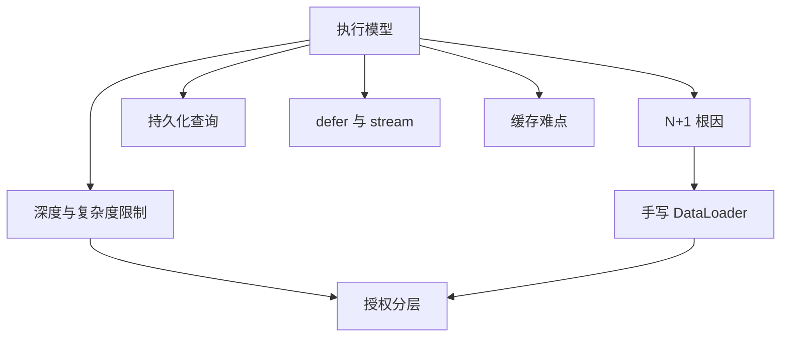
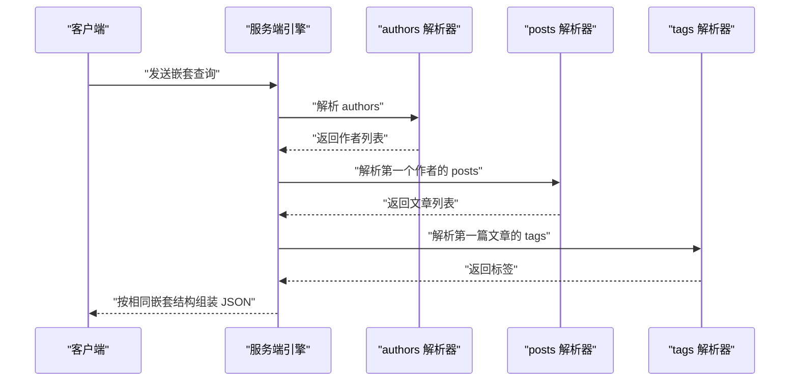
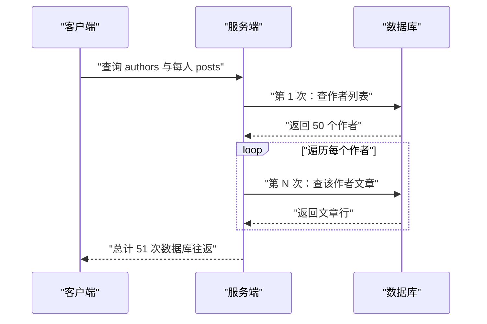
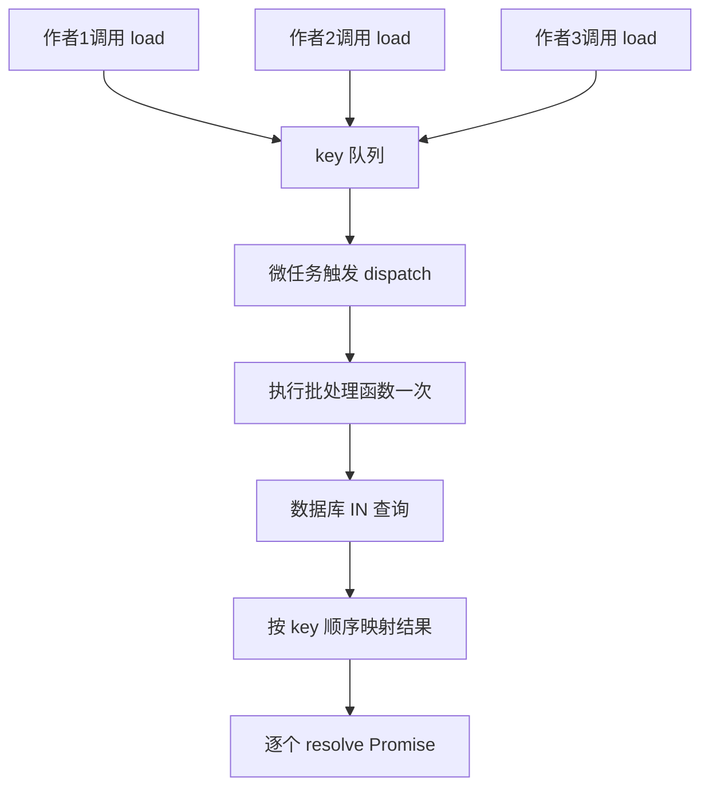
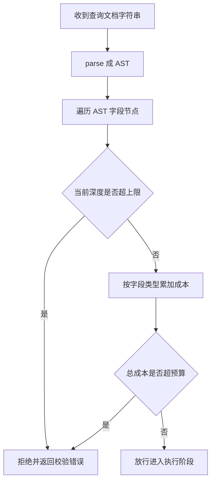
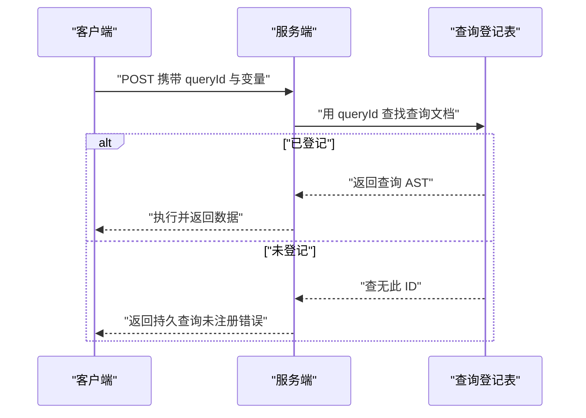
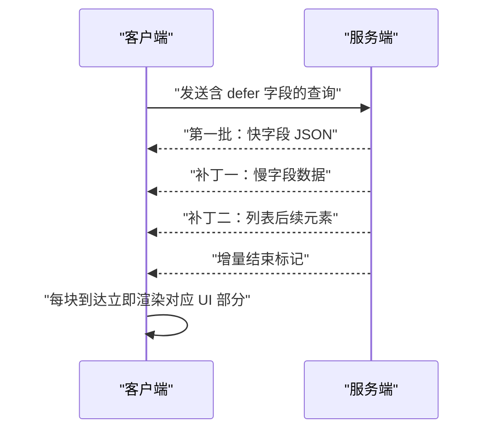
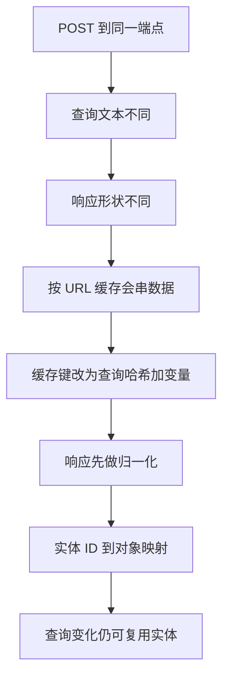
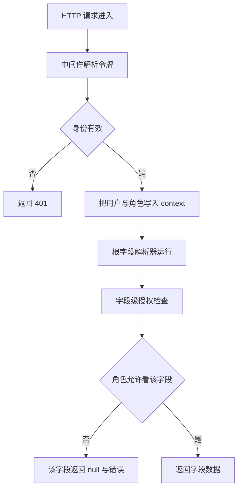

# GraphQL 入门到精通（三）：性能与安全

!!! abstract "学完这一页你能"
    - 说出 GraphQL 引擎按什么顺序调用解析器，并指出 N+1 在哪一个阶段产生。
    - 手写一个带批处理与请求级缓存的 DataLoader，用 node:assert 验证查询次数从 N+1 降到 2。
    - 为一个查询计算最大深度与总成本，并写校验函数在放行前拦截超限查询。
    - 区分传输层身份认证与字段级授权，解释持久化查询、增量交付与缓存归一化各自解决的问题。

## 0. 知识地图



建议这样读：先读第 1 节建立执行顺序，再读第 2、3 节把 N+1 到 DataLoader 这条线打通。后五节彼此独立，可按你当前项目最痛的点跳读，最后用综合对比串起来。

## 1. 执行模型：引擎按什么顺序调用解析器

**先想一个问题**
一个查询里有三层字段：作者列表、每个作者的文章、每篇文章的标签。GraphQL 引擎到底先取谁？如果你以为引擎会先收集所有数据再一次性查库，就会错过本页所有性能问题的起点。

**心智模型**
!!! tip "心智模型"
    一句话模型：GraphQL 执行是深度优先的递归下降，遇到哪个字段就立即调用哪个字段的解析器。
    日常类比：领导逐间查房，进入一个房间必须把里面所有柜子查完，才去下一个房间。
    类比不成立的地方：真实领导可以派多人并行查房，而未经改造的 GraphQL 引擎按同步路径逐字段串联执行。

!!! note "术语：解析器（Resolver）"
    解析器是每个字段对应的取数函数，输入是父对象与参数，输出该字段的值。例如 `posts(parent)` 的 `parent` 就是上一层返回的作者对象。

**图解**



1. 客户端发送嵌套 GraphQL 文档，服务端先 parse 再 validate。
2. 引擎先调用根字段 `authors` 的解析器，拿到作者列表。
3. 引擎不等待其他字段，立即进入第一个作者的 `posts` 解析器。
4. 对第一篇文章再进入 `tags` 解析器，直到叶子字段后才回退。
5. 全部兄弟与分支走完，引擎把各层返回值按查询形状组装成 JSON。

**一步一步来**

第一步：用一个最小对象观察调用顺序。

```javascript
// 目的：手动模拟引擎，打印解析器的真实调用顺序
const human = {
  id: 1,
  name: "林一",
  posts: [{ id: 10, title: "第一篇", tags: ["GraphQL"] }],
};

function view(obj, fieldName) {
  // 打印字段名和父对象 id，相当于一台解析器
  console.log("调用", fieldName, "父对象 id 为", obj.id ?? "根");
  return obj[fieldName];
}

const root = { authors: [human] };
console.log("开始执行");
view(root, "authors"); // 根字段
for (const author of root.authors) {
  view(author, "name"); // 作者的名字
  for (const post of view(author, "posts")) {
    view(post, "title"); // 文章的标题
    view(post, "tags"); // 文章的标签
  }
}
console.log("执行结束");
```

**这段代码在做什么**
- 这段代码不依赖 graphql-js，用手动递归扮演引擎，打印真实的调用顺序。
- `view` 模拟一台解析器：打印字段名和父对象 id，再返回字段值。
- 外层先调用 `authors`，打印出父对象 id 为"根"。
- 接着竖着进入 `name`、`posts`、`title`、`tags`，走完一个分支才回退。
- 输出顺序显示：这是深度优先，同一层的兄弟字段按源码顺序先后执行。

运行结果：

```
开始执行
调用 authors 父对象 id 为 根
调用 name 父对象 id 为 1
调用 posts 父对象 id 为 1
调用 title 父对象 id 为 10
调用 tags 父对象 id 为 10
执行结束
```

**动手验证**

```javascript
// 运行：node 执行顺序.mjs（Node 20，无第三方依赖）
import assert from 'node:assert';

const calls = [];
function view(obj, fieldName) {
  calls.push(fieldName); // 记录每次解析器调用
  return obj[fieldName];
}
const data = {
  authors: [{ id: 7, name: "A", posts: [{ title: "P", tags: ["T"] }] }],
};
view(data, "authors");
for (const a of data.authors) {
  view(a, "name");
  for (const p of view(a, "posts")) {
    view(p, "title");
    view(p, "tags");
  }
}
assert.deepStrictEqual(calls.slice(0, 3), ["authors", "name", "posts"]);
assert.strictEqual(calls.length, 5);
console.log("调用顺序", calls);
console.log("预期输出：调用顺序 authors name posts title tags");
```

**常见坑**

| 现象 | 原因 | 怎么修 |
|------|------|--------|
| 日志显示的解析器顺序与直觉相反 | 引擎是深度优先，不是按层优先 | 把查询画成树，沿树做前序遍历 |
| 同一个父对象的字段被取了两遍 | 两个字段各自查了同一张表 | 合并成一次查询，或交给 DataLoader |
| 父对象传进子解析器是 undefined | 上一级解析器忘了 return 对象 | 检查父字段解析器是否返回了对象 |

**小结**
- GraphQL 执行是深度优先递归下降，遇到字段就调用它的解析器。
- 响应结构和查询结构一致，但内部调用路径是一条先下后回的线。
- 理解这一点，才能定位后面 N+1 与批处理为什么有效。

## 2. N+1 根因：为什么一次查询打爆数据库

**先想一个问题**
页面上展示 50 个作者，每个作者显示最近 5 篇文章。前端只发一个 GraphQL 查询，后端数据库却收到 51 条 SQL。多出来的 50 条是什么时候产生的？

**心智模型**
!!! tip "心智模型"
    一句话模型：列表字段有 N 个元素，引擎会进入 N 次子字段解析器，而子解析器每次各查一次库，于是 1 次列表查询加 N 次详情查询。
    日常类比：老师拿了 50 份作业去登记，但记分册一次只能写一个名字，于是每位同学跑一趟办公室。
    类比不成立的点：数据库支持 `WHERE id IN (…)` 批量条件，一次能查 50 个 id；问题不在数据库，而在解析器没有把相邻请求攒成一批。

**图解**



1. 引擎先调用 `authors` 解析器，产生第 1 次数据库查询。
2. 返回 50 个作者后，引擎逐个进入每个作者的 `posts` 解析器。
3. 每个 `posts` 解析器内部按 `userId` 过滤查询一次。
4. 50 个作者产生 50 次额外查询，加第 1 次就是 51 次。
5. 客户端只看到一次 HTTP 请求，所以问题藏在服务端，前端监控看不到。

**一步一步来**

第一步：搭一个会记录查询次数的假数据库。

```javascript
// 目的：让 N+1 的查询次数可被计数和断言
const db = {
  authors: [
    { id: 1, name: "甲" },
    { id: 2, name: "乙" },
    { id: 3, name: "丙" },
  ],
  posts: [
    { id: 1, pId: 1, title: "甲一" },
    { id: 2, pId: 1, title: "甲二" },
    { id: 3, pId: 2, title: "乙一" },
  ],
};
let queryCount = 0;
function findAuthors(keyword) {
  queryCount += 1; // 列表查询累计一次
  return db.authors.filter((a) => a.name.includes(keyword));
}
function findPosts(pId) {
  queryCount += 1; // 详情查询每次累计一次
  return db.posts.filter((p) => p.pId === pId);
}
```

**这段代码在做什么**
- `db` 模拟作者表与文章表，作者和文章用 `pId` 关联。
- `findAuthors` 和 `findPosts` 每次调用都让 `queryCount` 加 1。
- 测试结束时读 `queryCount`，就能数出逻辑上访问了几次数据库。
- `findPosts` 接收单个 `pId`，这是形成 N+1 的关键设计。
- 当前还没有执行任何查询，`queryCount` 为 0。

第二步：模拟带 N+1 的解析路径。

```javascript
// 目的：把 posts 的解析写成每个作者各查一次
function resolveAuthorsNPlusOne(keyword) {
  const authors = findAuthors(keyword); // 第 1 次
  return authors.map((author) => ({
    ...author,
    posts: findPosts(author.id), // 每个作者查一次
  }));
}
const out = resolveAuthorsNPlusOne("");
console.log(out.length, "个作者，共查询", queryCount, "次");
```

**这段代码在做什么**
- `resolveAuthorsNPlusOne` 先查列表，这是 GraphQL `authors` 字段的逻辑。
- `map` 回调里对每个作者调用一次 `findPosts`，相当于逐个子字段解析器。
- 3 个作者让 `findPosts` 被调用 3 次。
- 加上列表的 1 次，总数是 4 次，公式是 1 加 N。
- 作者越多，额外查询线性增加，这就是 N+1 的根因。

运行结果：

```
3 个作者，共查询 4 次
```

**动手验证**

```javascript
// 运行：node n-plus-one.mjs（Node 20，无第三方依赖）
import assert from 'node:assert';

const authors = [{ id: 1 }, { id: 2 }, { id: 3 }];
let count = 0;
function listAuthors() {
  count += 1; // 列表查询
  return authors;
}
function postsOf(id) {
  count += 1; // 详情查询
  return [{ pId: id }];
}
listAuthors().map((a) => ({ ...a, posts: postsOf(a.id) }));
assert.strictEqual(count, 4); // 1 次列表加 3 次详情
console.log("查询次数", count);
console.log("预期输出：查询次数 4");
```

**常见坑**

| 现象 | 原因 | 怎么修 |
|------|------|--------|
| 本地测试很快，上线后超时 | 本地延迟低，察觉不到 N 次往返 | 用查询计数器或慢查询日志测量往返次数 |
| 加了 DataLoader 查询次数没降 | loader 每个请求各建一个，没有共享 | 把 loader 放进请求 context |
| 列表为空时详情查询为 0 次 | 空列表不会进入 map 回调 | 正常行为，但复杂度预算要按查询文本而非结果算 |

**小结**
- N+1 的根因是列表字段逐个进入子解析器，子解析器逐个查库。
- 1 次列表加 N 次详情，N 等于列表元素个数，是可复现的计数结论。
- 修复方向是让相邻的详情请求共享一次批量查询，下一节动手写。

## 3. 手写 DataLoader：用批处理消灭 N+1

**先想一个问题**
50 个作者的文章查询，能不能不改造数据库、不改 schema，只把同一请求里的 50 个小查询合并成 1 条 `IN` 查询？如果可以，合并时机应该放在哪里？

**心智模型**
!!! tip "心智模型"
    一句话模型：DataLoader 是请求级的分拣台，先把同一类取数请求按顺序放进队列，再在微任务边界统一装车批量发出。
    日常类比：奶茶店不接一单做一杯，而是把吧台在同一个时间窗内攒下的订单按相同茶底一起做。
    类比不成立的点：奶茶店按固定秒数批量，DataLoader 按 JavaScript 微任务边界批量，时机由事件循环调度，不等固定毫秒数。

!!! note "术语：批处理函数（Batch Function）"
    DataLoader 的核心回调，输入是一个 key 数组，输出与 key 顺序一致的结果数组。例如输入 `[1,2]`，输出 `[文章列表1, 文章列表2]`，顺序不能错，否则结果会配错主体。

**图解**



1. 三个作者的 posts 解析器各自调用 `loader.load(id)`。
2. 三个 key 进入同一个队列 `currentBatch`，此时没有任何数据库请求。
3. 第一次 `load` 排定一个微任务，微任务在同步代码结束后执行 `dispatch`。
4. `dispatch` 取出全部 key，只调用一次批处理函数，数据库只收一条 `IN` 查询。
5. 批处理函数按 key 顺序返回结果，dispatch 把结果逐个发回调用方。

**一步一步来**

第一步：实现队列、缓存与调度。

```javascript
// 目的：让同一轮同步代码里的 load 全部进入一个批次
class MiniLoader {
  constructor(batchFn) {
    this.batchFn = batchFn; // 批处理函数
    this.queue = [];        // 本批次 key 队列
    this.cache = new Map(); // 请求级缓存
    this.scheduled = false; // 是否已排定 dispatch
  }

  load(key) {
    const hit = this.cache.get(key);
    if (hit) return hit; // 命中缓存直接返回
    const promise = new Promise((resolve, reject) => {
      this.queue.push({ key, resolve, reject });
    });
    this.cache.set(key, promise);
    if (!this.scheduled) {
      this.scheduled = true;
      queueMicrotask(() => this.dispatch());
    }
    return promise;
  }

  async dispatch() {
    const batch = this.queue;
    this.queue = [];
    this.scheduled = false;
    const keys = batch.map((e) => e.key);
    const results = await this.batchFn(keys);
    batch.forEach((e, i) => e.resolve(results[i]));
  }
}
```

**这段代码在做什么**
- `load(key)` 先查缓存，同一请求里重复 key 只进队一次。
- 没命中就创建 Promise，把 key 和 resolve、reject 一起推进 `queue`。
- 每个请求周期里只有第一次 `load` 排定微任务，后续 load 只入队。
- `queueMicrotask` 调度 `dispatch`，在同步代码全部跑完后触发。
- `dispatch` 取出整批 key 交给批处理函数一次执行，再按顺序 resolve。

第二步：提供按 id 数组批量查文章的批处理函数。

```javascript
// 目的：把 N 次单查合并为一次遍历过滤
async function batchFindPosts(userIds) {
  queryCalls += 1; // 整批只计一次数据库访问
  return userIds.map((uid) =>
    db.posts.filter((p) => p.pId === uid),
  );
}
```

**这段代码在做什么**
- `batchFindPosts` 接收 key 数组，返回与 key 数组等长的结果数组。
- 内部只让 `queryCalls` 加 1，对应一条 SQL 的 `IN` 批量查询。
- 返回顺序必须与 `userIds` 相同，所以用 map 保序。
- 用 `filter` 模拟数据库按 `pId IN (...)` 一次返回匹配行。
- 没有文章的 id 返回空数组，保证结果数组不缺位。

第三步：把 loader 放进查询流程，对比查询次数。

```javascript
// 目的：同一轮解析全部走 loader，观察次数降为 2
const loader = new MiniLoader(batchFindPosts);
async function resolveAuthorsWithLoader(keyword) {
  queryCalls += 1; // 列表查询计 1 次
  const authors = db.authors.filter((a) => a.name.includes(keyword));
  return Promise.all(authors.map(async (a) => ({
    ...a,
    posts: await loader.load(a.id),
  })));
}
resolveAuthorsWithLoader("").then((out) => {
  console.log(out.length, "个作者，共查询", queryCalls, "次");
});
```

**这段代码在做什么**
- 列表部分仍然只查一次，这是 DataLoader 不负责的部分。
- 每个作者调用 `loader.load(a.id)`，在 await 前同步排队。
- 同步阶段结束，微任务触发 dispatch，把所有 id 一次交给批处理函数。
- 批处理函数内部只加 1 次计数，所以总次数是 1 加 1 等于 2。
- 若两个作者的 id 相同，第二次 load 命中缓存，不会重复进队。

运行结果：

```
3 个作者，共查询 2 次
```

**动手验证**

```javascript
// 运行：node data-loader.mjs（Node 20，无第三方依赖）
import assert from 'node:assert';

class MiniLoader {
  constructor(batchFn) {
    this.batchFn = batchFn;
    this.queue = [];
    this.cache = new Map();
  }
  load(key) {
    if (this.cache.has(key)) return this.cache.get(key);
    let resolve;
    const promise = new Promise((r) => { resolve = r; });
    this.queue.push({ key, resolve });
    this.cache.set(key, promise);
    if (this.queue.length === 1) { // 只有第一个 key 排定批次
      queueMicrotask(() => {
        const batch = this.queue;
        this.queue = [];
        return this.batchFn(batch.map((e) => e.key))
          .then((results) => batch.forEach((e, i) => e.resolve(results[i])));
      });
    }
    return promise;
  }
}

const posts = [
  { pId: 1, title: "甲文" },
  { pId: 1, title: "甲文二" },
  { pId: 2, title: "乙文" },
];
let batchCalls = 0;
const loader = new MiniLoader(async (ids) => {
  batchCalls += 1; // 整批只调一次
  return ids.map((id) => posts.filter((p) => p.pId === id));
});

await Promise.all([1, 2, 1].map((id) =>
  loader.load(id).then((list) => list.map((p) => p.pId)),
));
assert.strictEqual(batchCalls, 1); // 三个 load 只触发一次批处理
console.log("批处理调用次数", batchCalls);
console.log("预期输出：批处理调用次数 1");
```

**常见坑**

| 现象 | 原因 | 怎么修 |
|------|------|--------|
| 批处理函数返回顺序与 key 不一致 | 收集结果后凭数据行自行取值 | 返回时按输入 key 数组 map，不按数据库返回顺序 |
| 写操作后同请求内读不到新值 | loader 缓存是请求级快照 | 请求级缓存是设计行为；写后新建 loader 或手动 clear |
| loader 跨请求共享导致数据泄漏 | loader 挂在模块顶层 | 每个请求新建 loader，放入 context |
| 同步读不到 load 的结果 | load 返回 Promise | 用 await 或 then 读取结果 |

**小结**
- DataLoader 用队列加微任务，把同轮同步 load 合并成一次批处理。
- 请求级缓存让相同 key 在一个请求里只加载一次。
- 批处理函数必须保持结果数组与 key 数组顺序一致。

## 4. 查询深度与复杂度限制：把危险查询拦在门外

**先想一个问题**
一个恶意或手滑的前端，发来一个 50 层嵌套的查询，每层都是列表字段。你还没执行就知道数据库会膨胀。怎么在放行之前把它拦下？

**心智模型**
!!! tip "心智模型"
    一句话模型：深度限制数嵌套层数，复杂度限制数总工作量，也就是层数与每层代价的累积。
    日常类比：游乐场对过山车限制身高是深度限制，限制整列车总重量是复杂度限制。
    类比不成立的点：身高多 1 厘米风险线性增加，而 GraphQL 列表字段每多一层，代价可能指数膨胀，因为每层都把上一层元素数再乘一遍。

!!! note "术语：查询成本（Query Cost）"
    给每类字段分配权重（如普通字段 1、列表字段 5），遍历查询文本把遇到的字段成本累加，得到执行该查询可能消耗的资源估计值。它与实际返回行数无关，只看查询形状。

**图解**



1. 校验必须在执行前进行，所以输入是查询文本，不是查询结果。
2. `parse` 把字符串变成抽象语法树 AST，每个字段是一个节点。
3. 遍历器带着当前深度进入每个字段节点，先检查是否超限。
4. 未超限就按字段类型累加成本，列表字段权重应当更高。
5. 两个判定任一超限就返回带原因的校验错误，否则放行。

**一步一步来**

第一步：安装依赖并解析查询文本。

```javascript
// 依赖：npm install graphql@16
import { parse } from 'graphql';

const query = `
  query {
    authors {
      name
      posts { title tags }
    }
  }
`;
const doc = parse(query); // 字符串变成 AST 文档
console.log(doc.definitions[0].kind);
```

**这段代码在做什么**
- 从 graphql 包引入 `parse`，这是 graphql-js 的公开 API。
- 模板字符串里是两层嵌套：authors 一层，posts 一层。
- `parse(query)` 返回 DocumentNode，里面是描述查询结构的 AST 树。
- 打印根 `definitions[0].kind`，得到 `OperationDefinition`。
- 还没有执行查询，但已经可以分析结构。

运行结果：

```
OperationDefinition
```

第二步：写深度与成本计算器。

```javascript
// 目的：遍历 AST 统计最大深度与总成本
import { visit } from 'graphql';

function analyze(query, { maxDepth = 5, costBudget = 30 } = {}) {
  const doc = parse(query);
  let depth = 0;
  let maxSeen = 0;
  let totalCost = 0;
  visit(doc, {
    Field: {
      enter() {
        depth += 1; // 进入一层字段
        maxSeen = Math.max(maxSeen, depth);
        totalCost += 1; // 简化：每个字段成本为 1
      },
      leave() {
        depth -= 1; // 离开一层字段
      },
    },
  });
  return { maxSeen, totalCost,
    ok: maxSeen <= maxDepth && totalCost <= costBudget };
}
```

**这段代码在做什么**
- `visit` 提供 `Field` 访问器，引擎进出一个字段节点时调用 `enter` 与 `leave`。
- `depth` 随 `enter` 加一、`leave` 减一，记录当前嵌套层数。
- `maxSeen` 保存遍历过程中出现过的最大深度。
- `totalCost` 给每个字段累加 1，这是简化权重，真实实现可给列表字段更高值。
- `ok` 同时判断两个上限，任一超限返回 false。

第三步：用超深查询验证拦截。

```javascript
// 目的：构造超深查询，确认函数拒绝放行
const deepQuery = `
  query { a1 { a2 { a3 { a4 { name } } } } }
`;
const report = analyze(deepQuery, { maxDepth: 4, costBudget: 30 });
console.log(report);
```

**这段代码在做什么**
- `deepQuery` 有 a1 到 a4 再 name，共 5 层，超过 maxDepth 4。
- `analyze` 沿字段树进进出出，`maxSeen` 累计到 5。
- 总成本同为 5，没有超过 30，但深度已超限。
- `ok` 为 false，调用方据此拒绝执行。
- 这证明深度是结构检查，与数据库里有没有数据无关。

运行结果：

```
{ maxSeen: 5, totalCost: 5, ok: false }
```

**动手验证**

```javascript
// 运行：node depth-limit.mjs
// 依赖：npm install graphql@16
import assert from 'node:assert';
import { parse, visit } from 'graphql';

function analyze(query, { maxDepth = 5, costBudget = 30 } = {}) {
  const doc = parse(query);
  let depth = 0;
  let maxSeen = 0;
  let totalCost = 0;
  visit(doc, {
    Field: {
      enter() {
        depth += 1;
        maxSeen = Math.max(maxSeen, depth);
        totalCost += 1;
      },
      leave() {
        depth -= 1;
      },
    },
  });
  return { maxSeen, totalCost, ok: maxSeen <= maxDepth && totalCost <= costBudget };
}

const normal = `query { authors { name posts { title } } }`;
const deep = `query { a1 { a2 { a3 { a4 { a5 { name } } } } } }`;
assert.strictEqual(analyze(normal).maxSeen, 3); // authors、posts、title 三层
assert.strictEqual(analyze(deep).ok, false);      // a5 使深度达到 6，超上限
console.log("normal 最大深度", analyze(normal).maxSeen);
console.log("预期输出：normal 最大深度 3");
```

**常见坑**

| 现象 | 原因 | 怎么修 |
|------|------|--------|
| 复杂度校验拿到的是执行后结果 | 把校验写进了解析器内部 | 校验必须在 parse 之后、执行之前接入 |
| 列表嵌套两层就超预算 | 每个字段权重相同 | 给列表字段设更高成本，如 5 或 10 |
| fragment 的深度少算了 | 遍历时未展开片段 | 对 fragment 节点做同样深度累计，或引入 graphql-depth-limit 规则 |

**小结**
- 深度限制按嵌套层数拦截，复杂度限制按字段成本总和拦截。
- 两者都发生在执行前，输入是 parse 后的 AST，不碰数据库。
- 列表字段应给更高权重，因为它的成本随父级元素数量放大。

## 5. 持久化查询：把查询文本变成固定 ID

**先想一个问题**
你的 GraphQL API 只有前端会用到的少量查询，但每个请求都要重新发送几百字节的查询文本，再重新 parse、重新校验。能不能让客户端只发一个短 ID，服务端把 ID 换成已知查询？

**心智模型**
!!! tip "心智模型"
    一句话模型：持久化查询把查询文本预先登记成哈希 ID，线上只传 ID，服务端按 ID 取出已校验的文档执行。
    日常类比：药房把常用处方编号，复诊时报编号，药师不再重抄整张处方。
    类比不成立的点：处方可能被口头篡改，而哈希 ID 由查询文本单向算出，服务端还能用注册清单确认这个 ID 是否被提前登记。

!!! note "术语：SHA-256 哈希"
    一种单向摘要算法，同一输入永远产生同一个 64 个十六进制字符的字符串，输入变一个字节输出完全改变，无法从哈希反推原文。Node 内置 crypto 模块可直接计算。

**图解**



1. 客户端先通过管理接口把查询文本注册到服务端，拿到 queryId。
2. 线上请求只携带 queryId 和变量，服务端不再接收完整 query 字段。
3. 服务端在登记表中查找 queryId，命中就进入执行阶段。
4. 未命中返回"未注册"错误，而不是尝试动态执行任意文本。
5. 服务端可缓存已 parse 和 validate 的 AST，跳过每请求的重解析。

**一步一步来**

第一步：用 Node 内置 crypto 生成查询 ID。

```javascript
// 依赖：npm install graphql@16
import { createHash } from 'node:crypto';
import { parse, validate } from 'graphql';

const queryStore = new Map(); // queryId 到已校验文档

function registerQuery(queryText, schema) {
  const queryId = createHash('sha256')
    .update(queryText)
    .digest('hex');
  const doc = parse(queryText);
  const errors = validate(schema, doc);
  if (errors.length > 0) {
    throw new Error(`查询校验失败: ${errors[0].message}`);
  }
  queryStore.set(queryId, doc);
  return queryId;
}
```

**这段代码在做什么**
- `registerQuery` 接收查询文本与 schema，在注册阶段完成 parse 和 validate。
- 哈希使用 `crypto.createHash('sha256')`，这是 Node 20 内置 API。
- 校验失败的查询在注册时被拒绝，不会进入线上执行。
- 通过校验的文档存入 `queryStore`，后续按 queryId 直接取用。
- 这一步实现查询文档只 parse 一次。

第二步：线上执行按 ID 取文档。

```javascript
// 目的：线上路径只认 queryId，不接收任意 query 文本
function executeById(queryId, variables) {
  const doc = queryStore.get(queryId);
  if (!doc) {
    throw new Error("持久查询未注册，先调用 registerQuery");
  }
  return { doc, variables }; // 简化：真实实现此处交给 graphql execute
}
console.log(executeById("not-registered", {}).doc);
```

**这段代码在做什么**
- `executeById` 的签名里没有 query 参数，只接受 queryId 和变量。
- 用 `queryStore.get` 查找预登记文档，查不到抛出"未注册"错误。
- 找到的文档已通过校验，线上阶段无需重新 parse。
- 真实实现会把 `doc` 与变量传给 graphql-js 的 `execute` 函数。
- 攻击者即使发来任意 query 文本，服务端也不会执行未登记查询。

第三步：注册两条文本验证 ID 稳定性。

```javascript
// 目的：同一文本生成稳定 ID，不同文本生成不同 ID
import { buildSchema } from 'graphql';
const schema = buildSchema(`
  type Query { hello: String  world: String }
`);
const id1 = registerQuery("{ hello }", schema);
const id2 = registerQuery("{ hello }", schema);
const id3 = registerQuery("{ hello world }", schema);
console.log(id1 === id2, id1 === id3);
```

**这段代码在做什么**
- schema 声明 hello 与 world 两个字段，保证两条查询都能过校验。
- 两次注册相同文本，`id1` 与 `id2` 相等，证明哈希是确定性的。
- `id3` 来自不同文本，与 `id1` 完全不同。
- 客户端可以离线计算相同哈希，注册接口也可只接受已知 ID。
- 输出 `true false`，展示稳定与差异。

运行结果：

```
true false
```

**动手验证**

```javascript
// 运行：node persisted-query.mjs
// 依赖：npm install graphql@16
import assert from 'node:assert';
import { createHash } from 'node:crypto';
import { parse, validate, buildSchema } from 'graphql';

const store = new Map();
const schema = buildSchema("type Query { hello: String }");
function register(queryText) {
  const id = createHash('sha256').update(queryText).digest('hex');
  const doc = parse(queryText);
  const errors = validate(schema, doc);
  if (errors.length) throw new Error(errors[0].message);
  store.set(id, doc);
  return id;
}
const id = register("{ hello }");
assert.ok(store.has(id));                                  // 已登记
assert.strictEqual(store.get(id).kind, "Document");        // 存的是解析后文档
assert.ok(!store.has("not-exist"));                        // 未登记 ID 不存在
console.log("queryId 前 12 个字符", id.slice(0, 12));
console.log("预期输出：queryId 前 12 个字符，一段十六进制");
```

**常见坑**

| 现象 | 原因 | 怎么修 |
|------|------|--------|
| 客户端升级查询后线上报未注册 | 新查询文本没有注册 | 在构建流水线里注册全部 GraphQL 文档 |
| 服务重启后所有查询失败 | 登记表存在内存里 | 用文件、数据库或托管持久查询清单 |
| 相同查询算出不同 ID | 哈希前文本未规范化，空行注释不同 | 注册与请求两端使用同一个规范化查询字符串 |

**小结**
- 持久化查询把动态 query 变为提前注册的固定 ID，省传输与 parse 成本。
- 注册阶段完成 parse 与 validate，线上阶段免做这两步。
- 未注册的 ID 应被拒绝，不应退回执行任意 query。

## 6. @defer 与 @stream：先把快的部分发给用户

**先想一个问题**
一个详情页有"标题"和"耗时两秒的评论列表"。如果 GraphQL 必须等所有解析器跑完才返回，用户就得看两秒白屏。能不能先回标题，评论到了再补？

**心智模型**
!!! tip "心智模型"
    一句话模型：@defer 用多段响应把慢字段拆到后续补丁，@stream 把列表元素拆成多块逐批下发。
    日常类比：餐厅先上凉菜，热菜炒好一道上一道；@stream 则是同一盘菜分成多勺端上桌。
    类比不成立的点：普通 HTTP 响应一次发完，需要服务端支持多段传输协议，不是给字段加个指令就自动生效。

!!! note "术语：增量交付（Incremental Delivery）"
    把一次查询的响应拆成初始载荷加多个补丁，每块到达就渲染一部分 UI，不必等整个查询完成。@defer 与 @stream 是增量交付的两种指令草案，尚未成为稳定规范。

**图解**



1. 客户端发送带 @defer 或 @stream 的查询，服务端解析出哪些字段可延迟。
2. 服务端先完成不延迟的字段，把第一批 JSON 发给客户端。
3. 慢字段完成后，服务端把该字段数据作为 patch 增量块下发。
4. @stream 的列表把元素分多批下发，每一批是一个 patch。
5. 客户端按块更新界面，不必等整个查询全部完成。

**一步一步来**

第一步：写出含 @defer 的查询形状。

```graphql
query ProductDetail($id: ID!) {
  product(id: $id) {
    title
    price
    reviews @defer {
      author
      content
    }
  }
}
```

**这段代码在做什么**
- 查询里 `title` 与 `price` 是快字段，`reviews` 是慢字段。
- `@defer` 标在 `reviews` 上，表示它不在第一批响应里。
- 服务端先返回 title 和 price，reviews 数据到达后再补发。
- 这个查询演示字段级延迟，用于单个整体较慢的字段。
- 这是草案语法，当前服务端的开关与接口需核对官方文档。

第二步：写出 @stream 的列表分批形状。

```graphql
query Feed($first: Int!) {
  feed(first: $first) @stream(initialCount: 2) {
    id
    content
  }
}
```

**这段代码在做什么**
- `@stream(initialCount: 2)` 表示先下发前 2 个元素。
- 后续元素按服务端分批大小继续以补丁下发。
- 与 @defer 不同，@stream 针对列表元素，并非延后整个字段。
- 客户端可以先渲染前两条，后面边到边追加。
- 这也是草案语法，参数名与默认值以官方草案为准。

第三步：模拟增量负载分为 initial 与 patches。

```javascript
// 目的：展示增量交付的负载由两个形状不同的部分组成
function simulatedIncremental(chunks) {
  const initial = chunks[0]; // 第一批
  const patches = chunks.slice(1).map((part, i) => ({
    path: ["reviews", i],   // 补丁要写回响应树的位置
    data: part,
    hasNext: i < chunks.length - 2,
  }));
  return { initial, patches };
}
const result = simulatedIncremental([
  { title: "甲", price: 99 },
  [{ author: "u1" }],
  [{ author: "u2" }],
]);
console.log(JSON.stringify(result, null, 2));
```

**这段代码在做什么**
- `simulatedIncremental` 把一批块拆成 `initial` 和 `patches` 两部分。
- 每个 patch 携带 `path`，指出该数据应合并到响应树的什么位置。
- `hasNext` 标记是否还有后续补丁，客户端据此判断是否收完。
- 这是概念演示，不实现真正的 @defer 引擎与传输协议。
- 真实实现需要服务端支持多段响应，并遵循增量交付草案。

运行结果：

```
{
  "initial": { "title": "甲", "price": 99 },
  "patches": [
    { "path": ["reviews", 0], "data": { "author": "u1" }, "hasNext": true },
    { "path": ["reviews", 1], "data": { "author": "u2" }, "hasNext": false }
  ]
}
```

**动手验证**

```javascript
// 运行：node incremental-shape.mjs（Node 20，无第三方依赖）
import assert from 'node:assert';

function splitIncremental(first, slowList) {
  return {
    initial: { docs: first },
    patches: slowList.map((item, i) => ({
      path: ["docs", "reviews", i], // 补丁路径带下标
      data: item,
      hasNext: i < slowList.length - 1,
    })),
  };
}
const out = splitIncremental({ title: "甲" }, [{ author: "u1" }, { author: "u2" }]);
assert.deepStrictEqual(out.patches.map((p) => p.path),
  [["docs", "reviews", 0], ["docs", "reviews", 1]]);
assert.strictEqual(out.patches[0].hasNext, true);
assert.strictEqual(out.patches[1].hasNext, false);
console.log("补丁路径", JSON.stringify(out.patches.map((p) => p.path)));
console.log("预期输出：补丁路径 docs reviews 0，docs reviews 1");
```

**常见坑**

| 现象 | 原因 | 怎么修 |
|------|------|--------|
| 收到第一批后前端认为请求结束 | 没等待后续补丁 | 用支持增量交付的客户端库处理多块响应 |
| 加了 @defer 服务端仍一次返回全部 | 服务端版本未启用增量交付 | 核对所用服务端对草案指令的实验开关 |
| 多段响应无法用 JSON.parse 一次解析 | 块与块之间有协议分隔 | 使用协议规定的增量解析器逐块读取 |

**小结**
- @defer 把慢字段延后下发，@stream 把长列表分批下发。
- 两者都是增量交付草案，需要客户端与服务端共同支持。
- 加 @defer 不减少总耗时，只改变响应到达顺序，让首屏先有内容。

## 7. 缓存难点：同一个端点为什么破坏 REST 缓存直觉

**先想一个问题**
REST 里 `GET /users/1` 的结果可以按 URL 缓存。GraphQL 所有请求都 POST 到同一个 `/graphql`，响应形状随查询文本变化。你坚持"按 URL 缓存"，哪里会出问题？

**心智模型**
!!! tip "心智模型"
    一句话模型：REST 的缓存键是 URL，GraphQL 的缓存键必须包含查询文本与变量，且响应要按实体 ID 归一化才有复用价值。
    日常类比：REST 像一格一格的储物柜，每格有门牌号；GraphQL 像自助餐台，同一个台子可以拼出无数盘菜，只记台号记不住每盘内容。
    类比不成立的点：自助餐每次重新取菜，而 GraphQL 若做了实体归一化，已取过的菜可以按菜品 ID 复用，不必回厨房重做。

!!! note "术语：响应归一化（Normalization）"
    把嵌套多层、形状各异的返回数据拆成扁平实体表，用 `类型:ID` 做键。这样查询形状变化时，相同实体只存一份，更新一处即可让所有引用同步。

**图解**



1. 所有 GraphQL 请求打向同一 URL，URL 无法区分查询内容。
2. 不同查询文本产生不同 JSON 形状，混用缓存键会返回错数据。
3. 缓存键需要由查询文本哈希加变量共同组成。
4. 响应按 `类型:ID` 拆成实体，相同实体在多个查询间共享。
5. 实体更新后，通过 ID 使所有引用该实体的查询缓存失效。

**一步一步来**

第一步：给查询计算缓存键。

```javascript
// 依赖：无，使用 Node 内置 crypto
import { createHash } from 'node:crypto';

function cacheKey(queryText, variables) {
  const hash = createHash('sha256')
    .update(queryText + JSON.stringify(variables))
    .digest('hex')
    .slice(0, 16); // 取前 16 个字符，便于在日志里定位
  return `gql:${hash}`;
}
const key1 = cacheKey("{ users { name } }", { first: 10 });
const key2 = cacheKey("{ users { name } }", { first: 20 });
const key3 = cacheKey("{ users { name } }", { first: 10 });
console.log(key1 === key2, key1 === key3);
```

**这段代码在做什么**
- `cacheKey` 把查询文本与变量 JSON 序列化后一起做哈希。
- 变量键顺序不同会导致 key 不同，生产实现需先排序变量键。
- `slice(0, 16)` 缩短 key 长度，方便日志观察。
- 相同文本加相同变量生成相同 key，所以 `key1 === key3` 为 true。
- 不同变量产生不同 key，所以 `key1 === key2` 为 false。

运行结果：

```
false true
```

第二步：把响应中的一个对象归一化成实体表。

```javascript
// 目的：用类型与 id 组成实体键，而不是用响应路径
function normalizeUser(object) {
  const table = new Map();
  const id = `${object.__typename}:${object.id}`;
  table.set(id, object); // User:1 指向该对象
  return table;
}
const table = normalizeUser({
  __typename: "User", id: 1, name: "甲",
  posts: [{ __typename: "Post", id: 9 }],
});
console.log(table.get("User:1").name);
```

**这段代码在做什么**
- `__typename` 加 id 组成实体键，这是 Apollo 客户端等方案的共同思路。
- `table` 用 Map 存实体键到实体的映射。
- 之后任何查询只要引用 `User:1` 命中，可复用该对象。
- 嵌套的 posts 实体可递归拆平，本演示只归一化顶层作者。
- 注释提醒：完整实现需要逐层处理嵌套实体。

第三步：验证不同形状的查询能命中同一个实体键。

```javascript
// 目的：形状不同，实体键相同，实体缓存可以命中
const q1 = { __typename: "User", id: 1, name: "甲" };
const q2 = { id: 1, __typename: "User", posts: [] };
const keyOf = (u) => `${u.__typename}:${u.id}`;
console.log(keyOf(q1) === keyOf(q2));
```

**这段代码在做什么**
- q1 只有 name 字段，q2 只有 posts 字段，响应形状不同。
- `keyOf` 只取类型加 ID，不受字段形状影响。
- 两者 `keyOf` 相同，说明实体层可以命中同一个缓存项。
- 这正是归一化带来的复用：查询变，实体键不变。
- 字段级缺失要用部分实体合并策略，真实实现比这个复杂。

运行结果：

```
true
```

**动手验证**

```javascript
// 运行：node cache-key.mjs（Node 20，无第三方依赖）
import assert from 'node:assert';
import { createHash } from 'node:crypto';

function cacheKey(text, variables) {
  return createHash('sha256')
    .update(text + JSON.stringify(variables))
    .digest('hex');
}
function normalize(list) {
  const m = new Map();
  for (const item of list) {
    m.set(`${item.__typename}:${item.id}`, item);
  }
  return m;
}
const table = normalize([
  { __typename: "User", id: 1, name: "甲" },
  { __typename: "User", id: 2, name: "乙" },
]);
assert.strictEqual(table.size, 2);
assert.strictEqual(table.get("User:1").name, "甲");
assert.strictEqual(
  cacheKey("{ a }", { x: 1 }),
  cacheKey("{ a }", { x: 1 }),
);
console.log("实体键", [...table.keys()].join(" "));
console.log("预期输出：实体键 User:1 User:2");
```

**常见坑**

| 现象 | 原因 | 怎么修 |
|------|------|--------|
| 两个查询互相覆盖导致字段变 null | 缓存键只用了 URL | 把查询文本与变量纳入缓存键 |
| 更新作者后评论视图不刷新 | 评论只存了外键，未链接作者实体 | 归一化时记录实体引用，更新走广播失效 |
| 大响应缓存后内存上涨 | 原样缓存整棵响应树 | 归一化去重，设置实体级 TTL |

**小结**
- URL 不能当 GraphQL 的缓存键，键必须覆盖查询文本与变量。
- 归一化按 `类型:ID` 扁平存实体，查询形状变化仍可复用。
- 写操作后要让所有引用被改实体的查询缓存失效。

## 8. 授权放在哪一层：传输层与字段级的边界

**先想一个问题**
老板要求只有管理员能看到员工薪资字段。你把权限判断写进了解析器，后来管理后台和公共页面共用同一段解析逻辑，薪资判断散落多处。检查点应放在哪一层？

**心智模型**
!!! tip "心智模型"
    一句话模型：传输层做"你是谁"的身份验证，字段层做"你能不能看这个字段"的授权判断，上下文把两者连起来。
    日常类比：写字楼门口保安查工牌决定是否放行，进楼后各房间门禁再查工牌决定能否进入对应房间。
    类比不成立的点：真实门禁每道门独立，GraphQL 若每个解析器各自查库做权限判断，会把权限逻辑复制多份，应集中成可复用的授权函数。

!!! note "术语：上下文（Context）"
    每个 GraphQL 请求创建一次的对象，服务端在构造时放入当前用户、角色等信息，所有解析器通过第三个参数取用。解析器签名一般是 `(parent, args, context, info)`。

**图解**



1. 请求先到传输层中间件，负责验证令牌与身份。
2. 身份无效直接返回 401，不让 GraphQL 引擎看到请求。
3. 身份有效时把用户与角色放进 context，随每个解析器传下去。
4. 字段解析器在取数前后调用授权函数，按规则表判断权限。
5. 无权字段返回 null 加错误，不应替权限层去查敏感数据。

**一步一步来**

第一步：实现传输层身份中间件。

```javascript
// 目的：请求先验身份，再进入字段执行
function authMiddleware(request) {
  const token = request.headers.get("authorization") ?? "";
  const user = verifyToken(token); // 返回 null 表示无效
  if (!user) {
    return { ok: false, status: 401 };
  }
  return { ok: true, context: { user } };
}
function verifyToken(token) {
  return token === "valid-token"
    ? { id: 7, role: "admin" }
    : null;
}
```

**这段代码在做什么**
- `authMiddleware` 从 HTTP 头取 `authorization` 令牌。
- `verifyToken` 模拟令牌校验，真实实现用 JWT 校验库并核对签名。
- 身份无效返回 401，请求不会进入 GraphQL 执行阶段。
- 身份有效则把 user 放进 context，供后续所有解析器使用。
- 传输层关心"是否登录"，不关心"能看哪个字段"。

第二步：实现字段级授权函数。

```javascript
// 目的：用一张规则表集中判断字段权限
function canViewField(user, fieldName, rules) {
  const allowed = rules[fieldName]?.roles ?? [];
  return allowed.includes(user?.role);
}
const rules = { salary: { roles: ["admin"] } };
const staff = { id: 7, role: "staff" };
console.log(canViewField(staff, "salary", rules));
```

**这段代码在做什么**
- `rules` 集中声明字段到允许角色的映射。
- `canViewField` 查角色列表，得出是否允许。
- staff 角色不在 salary 允许列表里，返回 false。
- 解析器在读取薪资前调用此函数，false 时跳过库查询。
- 无权时直接返回 null，比先查库再丢弃更省资源。

第三步：把两层组合进完整流程。

```javascript
// 目的：展示从验身份到字段判断的完整链路
function handle(request) {
  const auth = authMiddleware(request);
  if (!auth.ok) return { status: auth.status };
  const can = canViewField(auth.context.user, "salary", rules);
  if (!can) return { status: 200, data: { salary: null } };
  return { status: 200, data: { salary: 9000 } };
}
const req = { headers: new Map([["authorization", "valid-token"]]) };
console.log(handle(req));
```

**这段代码在做什么**
- `handle` 先跑传输层，401 时直接返回，不进入字段判断。
- 通过后才按字段规则检查 salary 权限。
- staff 无权时返回 null，且没有执行查库取 9000 的步骤。
- admin 角色才返回真实薪资数据。
- 这个结构让权限位置清晰：身份在传输层，字段规则在授权函数。

运行结果：

```
{ status: 200, data: { salary: null } }
```

**动手验证**

```javascript
// 运行：node auth-layers.mjs（Node 20，无第三方依赖）
import assert from 'node:assert';

const rules = { salary: { roles: ["admin"] } };
function canView(user, field) {
  const allowed = rules[field]?.roles ?? [];
  return allowed.includes(user?.role);
}
function handle(token) {
  const user = token === "valid-token" ? { id: 7, role: "staff" } : null;
  if (!user) return { status: 401, data: null };
  return { status: 200, data: { salary: canView(user, "salary") ? 9000 : null } };
}
assert.strictEqual(handle("bad").status, 401);              // 身份无效
assert.strictEqual(handle("valid-token").data.salary, null); // staff 无权
assert.strictEqual(canView({ role: "admin" }, "salary"), true); // admin 有权
console.log("staff 是否可看 salary", canView({ role: "staff" }, "salary"));
console.log("预期输出：staff 是否可看 salary false");
```

**常见坑**

| 现象 | 原因 | 怎么修 |
|------|------|--------|
| 401 请求仍进入解析器 | 中间件没有在进入 GraphQL 前返回 | 在中间件层直接结束响应 |
| 无权字段返回 null，前端分不清是无权还是无数据 | 只返回 null 未带错误 | 同时返回 errors 数组说明无权原因 |
| 每个解析器重复写角色判断 | 权限逻辑没有集中 | 提炼 canViewField，在需要处调用 |

**小结**
- 身份认证放传输层，拿到 context 里的 user；字段权限放授权函数。
- 字段级授权应在读取敏感数据之前判定，无权就不查库。
- 权限逻辑集中成规则表，解析器只调用一个判断函数。

## 综合对比

| 手段 | 解决什么问题 | 代价 | 是否行前防御 | 实施位置 |
|------|------------|------|------------|---------|
| DataLoader | N+1 数据库往返 | 批处理函数必须保序 | 否 | 解析器外共享 loader |
| 深度与复杂度限制 | 深层嵌套或宽查询压垮资源 | 需要定字段权重 | 是 | parse 后、执行前 |
| 持久化查询 | 传输与 parse 开销，缩小查询面 | 需要注册清单 | 是 | 接入层换 query 为 ID |
| @defer 或 @stream | 慢字段阻塞首屏 | 需多段传输与客户端配合 | 否 | 字段标注加服务端支持 |
| 归一化缓存 | 查询形状变化无法复用缓存 | 需维护实体表与引用 | 否 | 客户端或服务端缓存层 |
| 分层授权 | 越权访问字段 | 规则表维护成本 | 是 | 传输层加字段层 |

## 应用与行业实践

### 应用场景地图

| 场景 | 用到本页哪个知识点 | 典型技术选型 | 注意事项 |
| --- | --- | --- | --- |
| 后台管理的万行表格 | 查询深度与复杂度限制、DataLoader | Apollo Server、graphql-query-complexity | 分页参数按页大小折算成本，导出走独立通道 |
| 低端安卓的首屏加载 | @defer 与 @stream、持久化查询 | graphql-js、Apollo Client | 首屏片段只放必需字段，补发片段不能引发第二轮瀑布 |
| 多人协作白板的图层权限 | 字段级授权、请求级缓存边界 | GraphQL Yoga、Envelop 插件 | 缓存键带用户与租户，角色变更后立即失效 |
| 电商商品详情页的大促峰值 | N+1 根因、DataLoader | graphql/dataloader、数据库连接池 | 批量大小设上限，避免单条 SQL 参数过多 |
| 开放 API 平台的第三方接入 | 持久化查询、复杂度配额 | APQ、令牌桶限流 | 白名单外的查询直接拒绝，未命中要有回退路径 |
| 移动端弱网下的工单提交 | 持久化查询、缓存归一化 | Apollo Client、Relay | 首次未命中要能发完整查询并登记哈希 |
| IoT 设备状态大屏 | @stream、字段级授权 | 订阅传输、OpenTelemetry | 增量补发的顺序与断线重连要单独测试 |
| CI 中的 schema 变更检查 | 执行模型、深度与成本模型 | graphql-js 校验规则、快照测试 | 成本函数变更要写进评审记录 |

### 三个场景拆解

#### 场景 1：后台管理的万行表格

**业务背景**：运营后台的订单列表允许按角色配置列，字段嵌套层数跟着配置走。测试环境里出现过一次查询占满连接池的情况，排查时才发现是某个角色打开了三层嵌套列。

**怎么用本页知识解决**：思路是先算深度与总成本，超限就不放行，再给同层字段接上 DataLoader。校验函数放在查询进入执行阶段之前，成本里把分页参数按页大小折算。

```js
import { parse, visit, GraphQLError } from 'graphql';
export function assertWithinBudget(query, { maxDepth = 8, maxCost = 400 } = {}) {
  let depth = 0, cost = 0;
  visit(parse(query), {
    Field: {
      enter(node) {
        depth += 1;                                   // 进入字段，深度加一
        const arg = node.arguments?.find(a => a.name.value === 'first');
        cost += 1 + Number(arg?.value.value ?? 1);    // 字段计一份，分页按页大小计
        if (depth > maxDepth || cost > maxCost) {
          throw new GraphQLError('查询超过深度或成本上限', {
            extensions: { code: 'QUERY_TOO_COMPLEX' },
          });
        }
      },
      leave() { depth -= 1; },                        // 离开字段，深度回退
    },
  });
}
```

- `parse` 只做语法解析，遍历 AST 不碰数据库，单次开销在微秒级。
- 深度用进入加一、离开减一的配对写法，兄弟字段不会互相累加。
- 成本把 `first` 参数的值算进去，页大小从 10 调到 200 时会被拦下。
- 抛出的错误带 `QUERY_TOO_COMPLEX` 错误码，前端能区分"查询有问题"和"服务出故障"。
- 上限值先只记录不拦截，观察一周再决定阈值。

**怎么度量收益**：看被拒查询占比、单查询最大深度分布、数据库连接占用时长的 P95。记录方式是在 Apollo Server 插件回调里打点，用 Prometheus 收集、Grafana 看分位线；压测用 k6 回放同一批查询，对比开拦截前后的连接占用。

**什么时候不该用**：
- 内部数据迁移脚本走数据库直连，不经过 GraphQL，把成本规则套上去没有意义。
- 首屏三条固定查询已经进了持久化白名单，再加一层动态成本计算只增加延迟。

#### 场景 2：低端安卓的首屏加载

**业务背景**：商品详情页要在首屏出主图、标题和价格，评论区可以晚出现。把 Chrome DevTools 的 CPU 降速设为 4 倍、网络设为 Slow 4G，就能复现低端机上的等待。

**怎么用本页知识解决**：思路是把查询切成首屏必需字段与 `@defer` 片段，客户端只发查询哈希。服务端把必需字段先返回，次要字段走后续补发。

```js
// 构建期把下面这段文档注册到服务端，发布时只带哈希
// query Home($id: ID!) {
//   product(id: $id) {
//     id title price                                  # 首屏必需，先返回
//     ... on Product @defer { reviews { id rating } }  # 次要内容，稍后补发
//   }
// }
const HASH = 'sha256:8d1e...';   // 构建脚本对查询文本求哈希后写进产物

const res = await fetch('/graphql', {
  method: 'POST',
  headers: { 'content-type': 'application/json' },
  body: JSON.stringify({
    extensions: { persistedQuery: { version: 1, sha256Hash: HASH } },  // 只发哈希
  }),
});
```

- 请求体里没有查询文本，弱网下省掉的字节直接减少往返时间。
- 服务端登记过哈希就跳过解析与校验，这一段 CPU 不再计入响应时间。
- `@defer` 片段用 `on Product` 限定类型，服务端能按类型裁剪补发内容。
- 补发走同一条 HTTP 连接，不需要客户端再发第二个请求。
- 首次未命中时客户端要能回退到完整查询，否则新版本上线即全量报错。

**怎么度量收益**：看 LCP、INP 和首屏请求字节数。工具用 Lighthouse 移动端预设、Chrome DevTools Performance 面板、WebPageTest；采样时固定 CPU 降速倍数与网络档位，前后各跑同一组机型档位。

**什么时候不该用**：
- 服务端对增量交付的支持情况需核对官方文档：你所用服务器是否支持 `@defer`、开启方式、以及不支持时的降级行为。
- 次要字段和首屏字段来自同一次数据库查询时，拆成两段只多一次往返。

#### 场景 3：多人协作白板的图层权限

**业务背景**：同一块白板里，访客只看公开图层，编辑能看私有图层，权限按成员身份逐块判定。白板数量与协作人数同步增长，越权判断必须落在服务端。

**怎么用本页知识解决**：思路是传输层只负责识别身份，字段能不能读在 resolver 里判。角色信息在请求上下文里一次取好，避免每个字段各查一次。

```js
import { GraphQLError } from 'graphql';
// 传输层只认身份，字段能不能读在 resolver 里判
const withBoardRole = (role, resolve) => (board, args, ctx) => {
  const member = ctx.membersByBoard.get(board.id);   // 请求级上下文里的成员表
  if (member?.role !== role) {
    throw new GraphQLError('无权读取该图层', {
      extensions: { code: 'FORBIDDEN' },             // 统一错误码，便于客户端分支
    });
  }
  return resolve(board, args, ctx);
};
const resolvers = {
  Board: {
    privateLayer: withBoardRole('editor', (board) => board.privateLayer),
  },
};
```

- 包装只放在敏感字段上，公开字段不增加判断开销。
- 成员角色走请求级上下文，同一个请求内多次判断不重复查库。
- 错误码统一成 `FORBIDDEN`，客户端据此隐藏入口而不是弹通用报错。
- 包装函数返回的是普通 resolver，测试时可以直接单测，不用起 HTTP 服务。
- 如果角色判断本身要查库，先接 DataLoader 压成一次批量查询。

**怎么度量收益**：看越权拒绝次数按错误码的分布、被拒请求的字段路径。用 OpenTelemetry 给 span 加字段路径属性，在 Grafana 看趋势；回归用带访客身份的集成测试跑固定清单。

**什么时候不该用**：
- 整个对象对特定角色都不可见时，在父级 resolver 判一次就够，逐字段包装属于重复劳动。
- 判断逻辑依赖跨服务调用时，先确认延迟预算，否则每个字段都拖一次远程调用。

### 行业先进实践

- 请求级 DataLoader（出处：graphql/dataloader 开源项目）
  做法是按请求创建 loader 实例，把同一时间片里的单个加载合并成一次批量查询，并在实例内缓存结果。它把 N+1 变成每字段一次批查询。借鉴方式是把 loader 挂进请求上下文，不要做成跨请求单例。

- 自动持久化查询 APQ（出处：Apollo Server 与 Apollo Client 官方文档）
  客户端先只发查询哈希，服务端没有登记时回错误码，客户端再发完整查询并让服务端登记。它缩小请求体，也让服务端能收敛到白名单。借鉴方式是在预发环境先统计未命中比例，再在移动端打开。

- 按点数计费的限流（出处：GitHub GraphQL API 官方文档）
  GitHub 的 GraphQL API 把一次查询按节点折算成点数，从配额里扣除。它让深度不同的查询承担不同代价。借鉴方式是把自己的成本函数结果写进限流键，不要只按请求次数限流。

- 授权放在业务逻辑层（出处：graphql.org 的 Learn 文档 Authorization 页面）
  官方文档建议把授权判断放进解析数据的业务逻辑，而不是在 GraphQL 层统一拦截。这样不会因为新增字段漏掉校验。借鉴方式是字段级包装只做入口判断，最终判断落在数据访问函数里。

- 归一化缓存（出处：Apollo Client 官方文档与 Relay 官方文档）
  两者都以 id 归一化存实体，某个实体更新后引用它的界面一起更新。它解决同一实体在多个查询里重复存储的问题。借鉴方式是为每个类型补 id 字段，并按各自文档配置缓存策略。

### 从学到用：落地路线

1. 试点：选一个只读、流量可控的后台查询接口，接上请求级 DataLoader 与成本校验观测，拦截逻辑先关掉。验收标准：连续运行一周，产出一份深度与成本的分位数报告。
2. 验证：在预发环境回放线上流量，对比开拦截前后的拒绝率与 P95 延迟。验收标准：拒绝率、P95 延迟、错误码分布三项都有前后对照，正常查询没有被误拦。
3. 推广：把 loader 工厂与校验函数抽成内部包，按服务逐个接入，同步开启持久化查询白名单。验收标准：接入服务在清单上可查，新查询的登记流程写进文档。
4. 防回退：把成本回归测试与 schema 变更检查放进 CI，放宽上限的改动必须写进评审。验收标准：CI 里有一条会因深度超限而失败的用例，且修改上限需要两人评审。

### 动手作业

**目标**：给一个最小 GraphQL 服务补上 DataLoader、成本校验与字段级授权，用测试证明 N+1 消失、超限查询被拦、越权访问被拒。

**步骤**：
1. 用 graphql-js 起一个内存数据服务，类型包含 Order、User、Item，数据源换成会记录调用次数的假函数。
2. 执行查询 `orders { user { name } items { title } }`，断言数据源调用次数等于订单数加上物品查询数，先复现 N+1。
3. 手写带批处理与请求级缓存的 loader，挂进请求上下文，用 node:assert 断言调用次数降到 2。
4. 写成本校验函数，为上面的查询设定深度上限与成本上限，补两条超限用例。
5. 给 Item 的敏感字段加字段级授权包装，补一条访客身份应返回 FORBIDDEN 的用例。
6. 把这四组测试接进 `npm test`，并在 CI 配置里让它对每次提交运行。

**验收标准**：
- 有 loader 时数据源调用次数为 2，注释掉 loader 后该数字随订单数增长。
- 超限查询在执行前被拒绝，返回的错误对象里带 `QUERY_TOO_COMPLEX` 错误码。
- 访客身份访问敏感字段返回 FORBIDDEN，编辑身份返回数据。
- CI 日志里能看到这四组测试的执行记录，删掉 loader 后构建失败。

## 深入阅读与参考

!!! tip "怎么用这些资料"
    先读「官方文档与规范」建立准确的概念，再读「源码与示例」核对细节，最后用「教程、书籍与视频」换一种讲法加深理解。每条都写明了读哪一节、带着什么问题读。

### 官方文档与规范

| 资源 | 为什么读 | 怎么读 |
|---|---|---|
| [GraphQL Learn](https://graphql.org/learn/) | 官方入门，执行模型与查询语义的权威起点。 | 按 Queries、Schemas、Execution 顺序读，在 playground 跑查询，记录解析器调用顺序。 |
| [GraphQL 规范](https://spec.graphql.org/) | 解析器调用顺序、错误传播与校验规则的最终依据。 | 精读 Execution 与 Validation 两章，带着错误如何传播提问，读完对照本页执行模型做笔记。 |
| [Hasura 文档](https://hasura.io/docs/) | 自动生成 API 并配置权限，可对照字段级授权。 | 连一个 Postgres，配置角色与字段权限，观察鉴权在端点与字段两层如何生效。 |

### 源码与示例

| 资源 | 为什么读 | 怎么读 |
|---|---|---|
| [GraphQL Yoga](https://the-guild.dev/graphql/yoga-server/docs) | 可直接运行的服务示例，便于动手验证本页结论。 | 起一个 Yoga 服务并加订阅，再手动插入耗时解析器，观察 N+1 如何出现。 |
| [Node.js Stream](https://nodejs.org/api/stream.html) | 用分块读取观察内存与首字节，理解 @stream 的收益。 | 用 pipeline 处理一个大文件，记录内存与首字节时间，再类比分块返回字段。 |
| [Stream 背压](https://nodejs.org/en/learn/modules/backpressuring-in-streams) | 背压解释了流式响应为何需要节奏控制。 | 故意忽略背压跑一次，对比内存曲线，思考 @stream 分批发送时的流量控制。 |
| [Node.js API 文档](https://nodejs.org/api/) | 查 stream 与 fs 接口示例，动手实现分批产出。 | 需要时查 fs、stream 接口，照示例写一个可读流，再改造成分批产出数据。 |

### 教程、书籍与视频

| 资源 | 为什么读 | 怎么读 |
|---|---|---|
| [Fielding 博士论文第 5 章 REST](https://roy.gbiv.com/pubs/dissertation/rest_arch_style.htm) | REST 缓存约束解释了 GraphQL 单端点为何难缓存。 | 只读第 5 章，列出六个架构约束各写一句解释，对照 GraphQL 找出被破坏的约束。 |
| [Principled GraphQL](https://principledgraphql.com/) | 十条原则覆盖 Schema 设计与查询治理实践。 | 通读十条原则，对照自己的 Schema 找违背之处，写下三条可落地的改进项。 |

## 自测题

??? question "1. GraphQL 引擎执行嵌套查询使用什么顺序？这种顺序会带来哪些编程影响？"
    - 深度优先的递归下降：遇到字段就调用该字段解析器，走完分支才回退。
    - 响应按查询形状组装，但调用顺序是一条先下后回的路径。
    - 影响一：列表字段的子解析器会被逐个调用，形成 N+1。
    - 影响二：慢字段会拖住整棵响应，直到全部完成才返回。

??? question "2. 一个查询取 10 个用户的文章，为什么数据库会收到 11 次请求？指出是哪个阶段产生的。"
    - 根字段 authors 查一次列表，计 1 次。
    - 引擎对 10 个用户逐个进入 posts 解析器，每进一次查一次库，计 10 次。
    - 总计 1 加 10 等于 11 次。
    - 产生阶段是列表 map 对应的子字段解析阶段，不是客户端发起的 HTTP 请求数。

??? question "3. 手写 DataLoader 时，为什么用微任务而不是 setTimeout 去触发批量？"
    - 目标是让同一轮同步代码里的 load 全部进队列再批量。
    - 微任务在当前宏任务同步代码结束后立即执行，能兜住同轮全部 load。
    - setTimeout 是宏任务，要等事件循环下一轮才触发，错过聚合窗口。
    - 用 queueMicrotask 即可，不需要固定等待毫秒数。

??? question "4. 批处理函数的返回值顺序为什么必须与输入 key 顺序一致？顺序错会怎样？"
    - dispatch 按输入 key 的下标，把结果数组对应位置 resolve 给各自的 Promise。
    - 若第 i 个 key 拿到第 j 个结果，甲的 Promise 会拿到乙的文章。
    - 数据库返回行顺序不可控，所以实现时要按输入 key 数组 map。
    - 每个 key 都必须有对应位置的结果，哪怕为空数组，不能缺位。

??? question "5. 深度限制与复杂度限制的差异是什么？为什么列表字段需要更高权重？"
    - 深度限制只数嵌套层数。
    - 复杂度限制累加所有字段的成本，能拦住宽查询。
    - 列表字段的执行次数随父级元素数量放大，一个列表字段可能触发多次子解析。
    - 因此列表字段应设 5 或 10 这类更高权重，普通标量字段设 1。

??? question "6. 持久化查询与普通查询在线上路径的最大差异是什么？客户端发送哪些内容？"
    - 普通查询每次发送完整 query 文本，服务端每次 parse 加 validate。
    - 持久化查询线上只发送 queryId 与 variables，query 文本已在注册阶段 parse 加 validate。
    - 未注册的 queryId 应被拒绝，不能退回执行任意 query。
    - 服务端可缓存已校验 AST 复用。

??? question "7. 简述 @defer 与 @stream 的差别，为什么都需要服务端多段传输支持？"
    - @defer 延后一个整体字段，慢字段完成后以补丁下发。
    - @stream 把列表元素分批下发，可指定 initialCount 先给前几项。
    - 普通 HTTP 响应一次性结束，无法在响应中途追加补丁。
    - 两者都是草案，需服务端增量交付能力与可处理多块的客户端配合。

??? question "8. 为什么只按 URL 缓存在 GraphQL 中会出错？缓存键至少含哪些部分？授权应放哪一层？"
    - 所有查询 POST 到同一 URL，URL 无法区分查询文本，容易串返回数据。
    - 缓存键至少要包含查询文本哈希、变量和操作名。
    - 响应还要按 `类型:ID` 归一化，实体层才可跨查询复用。
    - 授权分两层：传输层验身份，字段层判角色权限。

## 延伸阅读

- GraphQL 官方规范（October 2021 版）：第 6 章 Execution，核对执行模型的正式定义。
- GraphQL 官方规范附录：Request 与 Response，核对响应形状与 errors 的处理时机。
- graphql-js 文档：execute 与 ExecutionArgs，核对 context 在解析器签名中的位置。
- DataLoader 官方 README：读 batch 与 cache 两节，重点是 ordering 与 per-request cache。
- GraphQL over HTTP 草案：读 Persistent Queries 与 Incremental Delivery 的传输要求。
- Apollo Server 文档：Persisted queries 章节，以及 @defer 支持的实验开关说明。
- 需核对官方文档：graphql-js 当前版本对 @defer 与 @stream 的具体接口，草案仍在更新。
