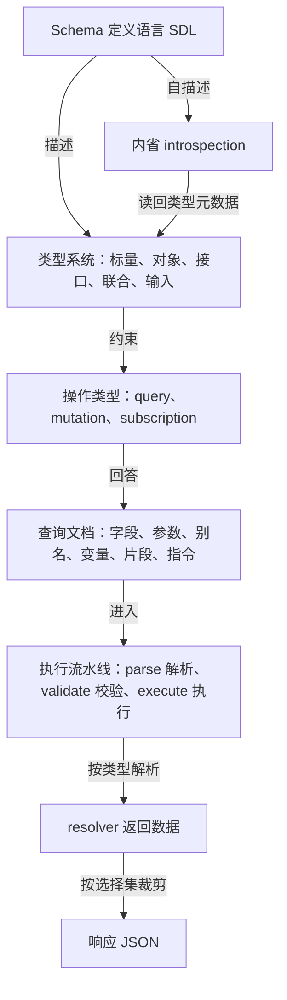
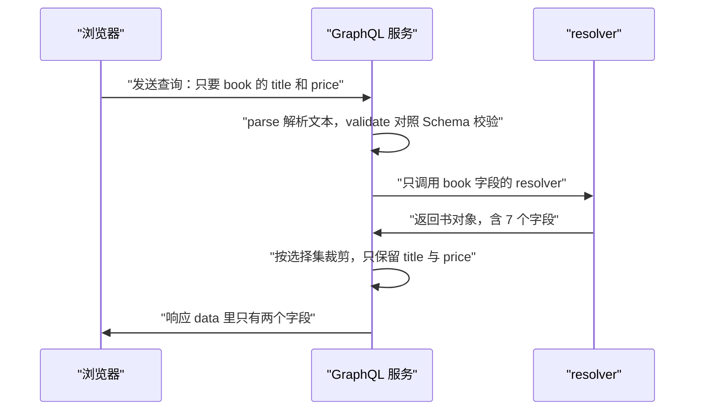
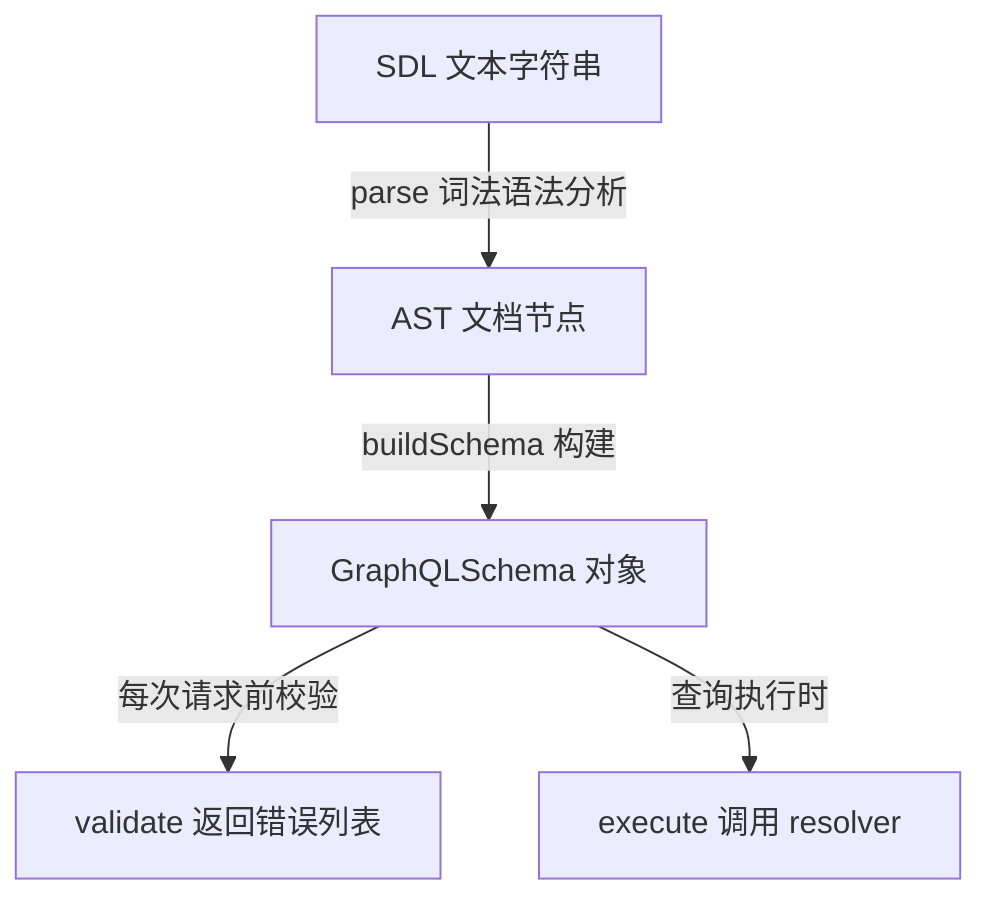
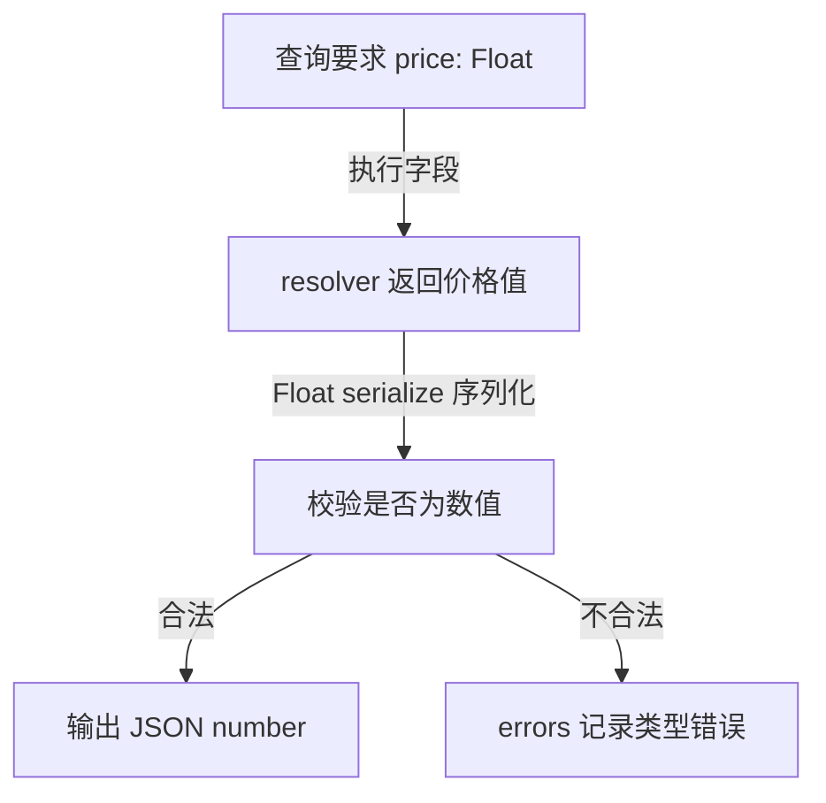
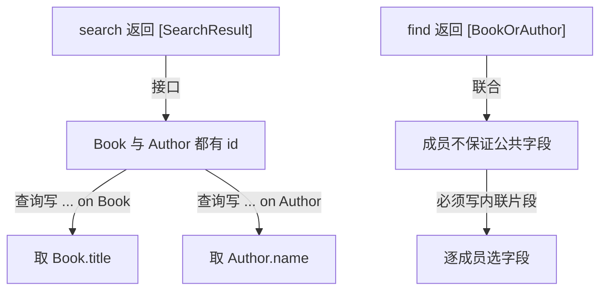
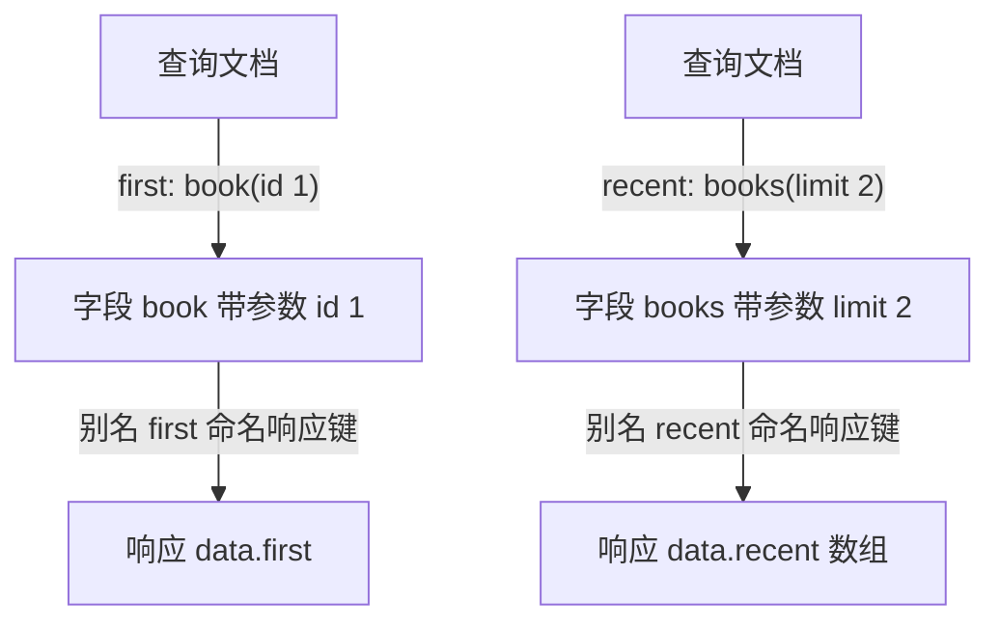
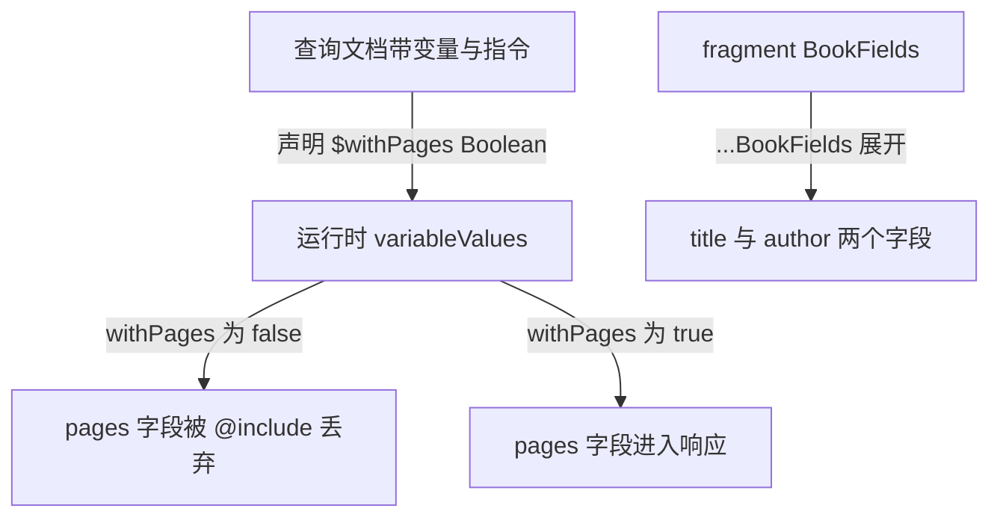
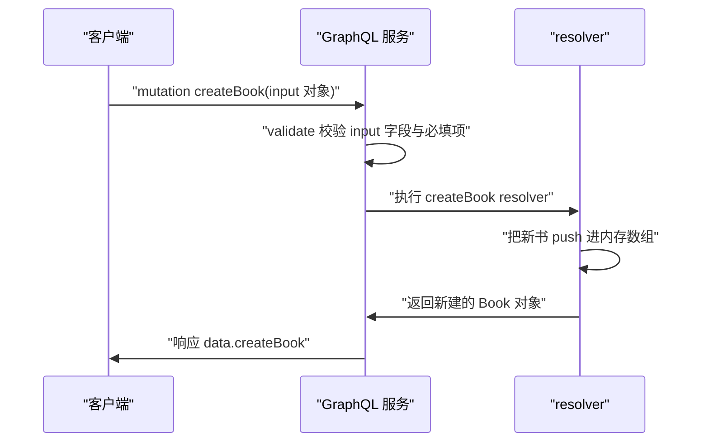
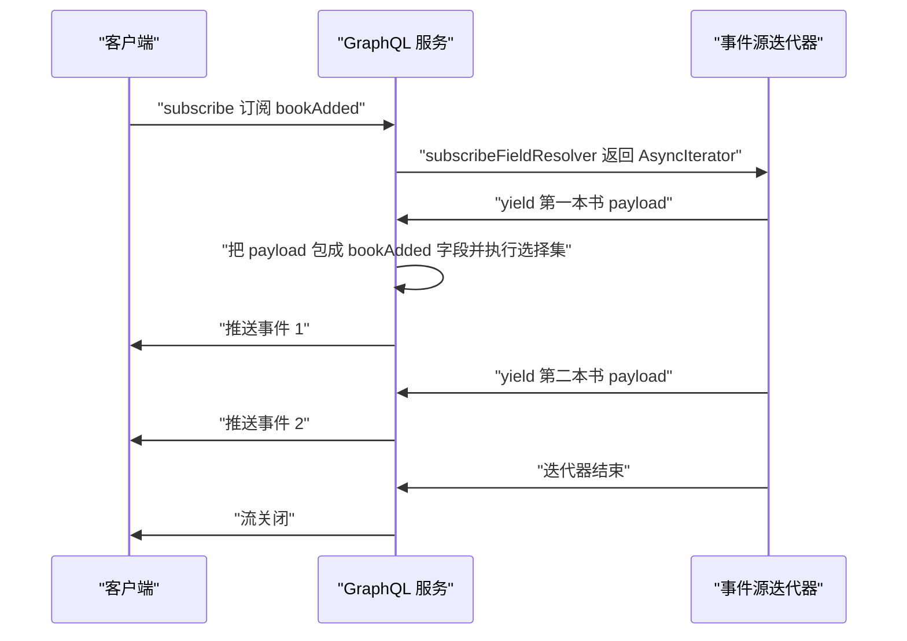
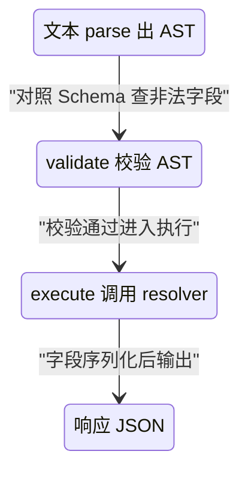

# GraphQL 入门到精通（一）：Schema 与查询语言

!!! abstract "学完这一页你能"
    1. 用 SDL 写出包含标量、对象、接口、联合、输入类型的 Schema，并解释每个类型的约束。
    2. 写出带变量、别名、片段、指令的 query 与 mutation，并能说出每条语法解决什么问题。
    3. 用 graphql-js 执行一次订阅，说清事件如何从服务端异步流到客户端。
    4. 用内省查询读取类型元数据，并复述解析、校验、执行三段流水线各自的产物。

## 0. 知识地图



建议先读第 1、2 节，建立动机与类型蓝图。再按第 3、4、5 节学类型系统与查询语法，第 6、7、8 节学复用、写入与订阅，最后用第 9 节收口。

## 1. 为什么需要 GraphQL：过度获取与欠获取

**先想一个问题**：页面只显示书名和价格，REST 接口却返回 7 个顶层字段，其中 reviews 数组还带着长评论。移动网络下这些没人看的字节照样要付费传输。有没有办法让客户端指定"只要哪几个字段"？

!!! note "术语：过度获取与欠获取"
    - 过度获取（over-fetching）：接口返回的字段多于页面需要，浪费带宽与解析时间。
    - 欠获取（under-fetching）：一个页面要的数据散在多个端点，客户端要发多次请求才能拼齐。

**心智模型**

!!! tip "心智模型"
    - 一句话模型：GraphQL 查询是一张点菜单，响应只上你勾选的菜；Schema 是后厨固定菜谱。
    - 日常类比：自助点餐时勾 2 个菜，服务员只端 2 盘，不会把整本菜单的菜都端上来。
    - 类比不成立处：纸质菜单不会校验你的点法，GraphQL 会拿 Schema 校验每个字段是否存在、类型对不对。

**图解**



1. 浏览器发出选择集明确的查询。
2. 服务端先解析文本，再对照 Schema 校验字段与类型。
3. resolver 照常取回整本书对象。
4. 服务端按选择集裁剪对象，丢弃 reviews 等未选字段。
5. 响应 JSON 只含 title 与 price。

**一步一步来**

**第 1 步**：这一步要做什么？先看 REST 的典型过度获取响应。

```json
{
  "id": "1",
  "title": "三体",
  "price": 68,
  "pageCount": 320,
  "inStock": true,
  "author": { "name": "刘慈欣" },
  "reviews": [
    { "score": 5, "body": "一段很长的评论" },
    { "score": 4, "body": "另一段很长的评论" }
  ]
}
```

**这段代码在做什么**

- 响应有 7 个顶层键：id、title、price、pageCount、inStock、author、reviews。
- 页面只用 title 与 price，其余 5 个键是过度获取。
- 每条评论的 body 也被传输，进一步放大体积。

**第 2 步**：这一步要做什么？写出 GraphQL 查询，显式声明只要两个字段。

```graphql
{
  book(id: "1") {
    title
    price
  }
}
```

响应：

```json
{ "data": { "book": { "title": "三体", "price": 68 } } }
```

**这段代码在做什么**

- 大括号内叫选择集（selection set），逐字段列出需求。
- 字段名 title 与 price 直接对应响应键。
- 未列出的 reviews、pageCount 不会出现在响应中。

**第 3 步**：这一步要做什么？演示欠获取：REST 要两次请求，GraphQL 一次嵌套取回。

REST 两次请求：

```text
GET /book/1
GET /authors/42
```

GraphQL 一次请求：

```graphql
{
  book(id: "1") {
    title
    author {
      name
      country
    }
  }
}
```

**这段代码在做什么**

- REST 需要两个端点两次往返，客户端自己拼数据。
- GraphQL 在 book 下嵌套 author，一次往返取回书名与作者信息。
- 嵌套字段 author 也是选择集，可以继续声明子字段。

**动手验证**

```js
import { graphql, buildSchema } from 'graphql';

const schema = buildSchema(`
  type Query { book(id: ID!): Book }
  type Book { id: ID!, title: String!, price: Float, reviews: [Review] }
  type Review { score: Int, body: String }
`);

const rootValue = {
  book: () => ({
    id: '1', title: '三体', price: 68,
    reviews: [{ score: 5, body: '长评论' }, { score: 4, body: '长评论' }],
  }),
};

const result = await graphql({
  schema,
  source: '{ book(id: "1") { title price } }',
  rootValue,
});
console.log(JSON.stringify(result.data, null, 2));
console.log('data 的顶层键：', Object.keys(result.data.book));
```

预期输出：

```text
data.book = { title: '三体', price: 68 }
data 的顶层键： [ 'title', 'price' ]
```

**这个脚本在验证什么**

- 运行前需要 `npm install graphql`（官方 graphql-js 包；当前大版本用 `npm view graphql version` 核对）。
- resolver 返回的对象带 reviews 数组，但响应里没有 reviews。
- `Object.keys` 打印出的顶层键只有两个，证明选择集裁剪生效。

**常见坑**

| 现象 | 原因 | 怎么修 |
| --- | --- | --- |
| 响应里没有 reviews，前端读它报 undefined | 查询选择集没写 reviews | 在 GraphQL 查询里显式加 `reviews { score }` |
| 迁移后页面反而多打两个接口 | 嵌套资源没并进同一查询 | 把作者等资源写成嵌套字段，一次取回 |
| 查询字段名写错，响应出现 errors | 字段不在 Schema 中 | 用内省查字段名，或按 Schema 改正 |

**小结**

1. 过度获取由客户端无法指定字段造成，GraphQL 用选择集裁剪响应。
2. 欠获取来自资源分散，GraphQL 用嵌套字段合并为一次请求。
3. 响应形状等于查询选择集形状，前端按同样结构取值。

## 2. Schema 与 SDL：类型蓝图

**先想一个问题**：后端说 book 有 title，前端却按 book.name 取，上线后拿到 undefined。接口文档会过期，口头约定不可靠。怎么把"数据长什么样"变成每次请求都执行的校验？

!!! note "术语：Schema"
    Schema 是服务端数据形状的完整描述，定义有哪些类型、每个字段的类型与可空性。例如 `type Book { title: String }` 声明 title 是字符串。

!!! note "术语：SDL"
    SDL（Schema Definition Language，Schema 定义语言）是书写 Schema 的语法：用 `type` 定义对象、`!` 表示非空、`[]` 表示列表。例如 `title: String!` 表示 title 非空字符串。

**心智模型**

!!! tip "心智模型"
    - 一句话模型：Schema 是甲乙双方签的合同，SDL 是写合同的语法。
    - 日常类比：盖楼前先签图纸，施工与验收都对照图纸。
    - 类比不成立处：纸质图纸施工后不逐次校验，GraphQL 每个请求都对照 Schema 校验类型与字段。

**图解**



1. SDL 文本先被 parse 成 AST 文档节点。
2. buildSchema 把 AST 转成内存里的 GraphQLSchema 对象。
3. 每次请求前用 validate 对照 Schema 查非法字段。
4. 合法请求进入 execute，按类型调用 resolver。

**一步一步来**

**第 1 步**：这一步要做什么？写最小 SDL，看清 `type`、字段、`!` 三个语法点。

```graphql
type Query {
  ping: String
}

type Book {
  id: ID!
  title: String!
}
```

**这段代码在做什么**

- `type` 关键字定义一个类型。
- Query 是查询入口类型，ping 是其下一个字段。
- `String`、`ID` 是标量类型，`!` 表示字段非空。

**第 2 步**：这一步要做什么？用 parse 看 SDL 变成 AST 后的节点类别。

```js
import { parse, Kind } from 'graphql';

const sdl = 'type Query { ping: String }';
const doc = parse(sdl);                    // SDL 文本变成文档节点
console.log(doc.definitions[0].kind);      // 打印第一个定义的类型名
```

运行结果：`ObjectTypeDefinition`。

**这段代码在做什么**

- parse 是词法与语法分析，输入字符串输出文档节点。
- `definitions` 数组装各顶层定义，这里只有 1 个。
- `Kind.OBJECT_TYPE_DEFINITION` 的值就是 `ObjectTypeDefinition`。

**第 3 步**：这一步要做什么？用 buildSchema 与 validate 校验一条错误查询。

```js
import { buildSchema, printSchema, parse, validate } from 'graphql';

const schema = buildSchema('type Query { ping: String }');
console.log(printSchema(schema));              // 输出规范化 SDL
const errors = validate(schema, parse('{ title }')); // title 不在 Query 下
console.log(errors.length);                    // 打印错误条数
```

运行结果：printSchema 输出 `type Query { ping: String }`，errors.length 为 1。

**这段代码在做什么**

- buildSchema 把 SDL 编译为 GraphQLSchema。
- printSchema 重新序列化，格式与手写可能不同。
- `{ title }` 中 title 不是 Query 的字段，validate 返回 1 条错误。

**动手验证**

```js
import { graphql, buildSchema, printSchema, parse, validate, Kind } from 'graphql';

const schema = buildSchema('type Query { ping: String }');
const doc = parse('type Query { ping: String }');

console.log(doc.definitions[0].kind);
console.log(printSchema(schema));
console.log(validate(schema, parse('{ title }')).length);

const result = await graphql({
  schema,
  source: '{ ping }',
  rootValue: { ping: () => 'pong' },
});
console.log(result.data);
```

预期输出：

```text
ObjectTypeDefinition
type Query {
  ping: String
}
1
{ ping: 'pong' }
```

**这个脚本在验证什么**

- 依赖：`npm install graphql`，文件保存为 `.mjs`，用 Node 20+ 运行。
- 验证 parse 产出 AST、buildSchema 编译成功、validate 抓到非法字段。
- 验证 rootValue 里的 ping 函数作为 resolver 被调用。

**常见坑**

| 现象 | 原因 | 怎么修 |
| --- | --- | --- |
| buildSchema 报 Query root type must be provided | Schema 没写 type Query 或拼错 | 补上 `type Query` |
| printSchema 输出和手写顺序不同 | 序列化按类型名排序 | 断言用 includes，不要整串对比 |
| buildSchema 报 Unexpected character | SDL 里混入全角冒号或中文引号 | 全部换成半角符号 |

**小结**

1. SDL 是写合同的语法，parse 负责转 AST，buildSchema 负责建 Schema。
2. Schema 让类型校验在每次请求前自动执行，文档不过期。
3. printSchema 适合做 Schema 快照对比，assert 时要用 includes。

## 3. 标量类型与对象类型

**先想一个问题**：book.price 有时返回字符串 "68"，前端要转 Number 还怕 NaN；id 有时是数字 101，有时是字符串 "101"，判断相等总出错。GraphQL 怎么在边界上把类型稳定下来？

!!! note "术语：标量类型"
    标量（scalar）是 GraphQL 的叶子类型，字段不再有子选取。内置五种：Int、Float、String、Boolean、ID。例如 `price: Float` 表示 price 是浮点数。

!!! note "术语：对象类型"
    对象类型是一组字段的集合，可以嵌套其他对象。例如 `type Book` 有 title、price 字段，查询时要继续选择子字段。

!!! note "术语：列表与非空包装类型"
    `[Int]` 表示 Int 列表，`Int!` 表示非空 Int，`[Int!]!` 表示非空列表、且每个元素非空。包装类型决定字段是否可以缺省。

**心智模型**

!!! tip "心智模型"
    - 一句话模型：标量是叶子值，负责在边界上做类型转换；对象类型是节点加分支。
    - 日常类比：表单里数字框只让输入数字，日期框只接日期，对象是一组这样的表单框。
    - 类比不成立处：表单只在提交时校验一次，GraphQL 每个字段在执行时都经过序列化。

**图解**



1. 查询选择 price，类型声明为 Float。
2. resolver 返回一个价格值。
3. Float 序列化函数校验并转换该值。
4. 合法则输出 JSON number，不合法则写入 errors。

GraphQL 内置标量与 JSON 的对应：

| 标量 | JSON 输出 | 示例 |
| --- | --- | --- |
| Int | 整数 number | 320 |
| Float | 有小数点的 number | 68.5 |
| String | string | "三体" |
| Boolean | boolean | true |
| ID | string | "101" |

**一步一步来**

**第 1 步**：这一步要做什么？定义五个标量字段，观察类型声明。

```graphql
type Query {
  book: Book
}

type Book {
  id: ID!
  title: String!
  price: Float
  pageCount: Int
  inStock: Boolean
}
```

**这段代码在做什么**

- id 用 ID，表示不透明且唯一，输出固定序列化为字符串。
- title 非空，查询结果缺它就算违约。
- price、pageCount、inStock 分别对应 Float、Int、Boolean。
- 可空字段允许 resolver 返回 null。

**第 2 步**：这一步要做什么？故意让 resolver 返回值与声明类型不同，观察序列化。

```js
import { graphql, buildSchema } from 'graphql';

const schema = buildSchema(`
  type Query { book: Book }
  type Book {
    id: ID!
    title: String!
    price: Float
    pageCount: Int
    inStock: Boolean
  }
`);

const rootValue = {
  book: () => ({
    id: 101,           // 数字 id，ID 类型会序列化成 "101"
    title: '三体',
    price: 68.0,       // Float 输出 68
    pageCount: '320',  // 数字字符串，Int 会转成 320
    inStock: true,
  }),
};

const result = await graphql({
  schema,
  source: '{ book { id title price pageCount inStock } }',
  rootValue,
});
console.log(JSON.stringify(result.data, null, 2));
```

运行结果：`id: "101"`，`pageCount: 320`，其余按原类型输出。

**这段代码在做什么**

- ID 序列化把数字 101 转成字符串 "101"。
- Int 序列化接受整数形式的字符串 "320"，转成数字 320。
- Boolean、String 直接透传。
- 序列化发生在值离开 GraphQL 边界、进入响应 JSON 之前。

**动手验证**

```js
import { graphql, buildSchema } from 'graphql';

const schema = buildSchema(`
  type Query { book: Book }
  type Book {
    id: ID!
    title: String!
    price: Float
    pageCount: Int
    inStock: Boolean
  }
`);

const result = await graphql({
  schema,
  source: '{ book { id title price pageCount inStock } }',
  rootValue: {
    book: () => ({ id: 101, title: '三体', price: 68.0, pageCount: '320', inStock: true }),
  },
});
const b = result.data.book;
console.log(JSON.stringify(b, null, 2));
console.log(typeof b.id, typeof b.pageCount, typeof b.price, typeof b.inStock);
```

预期输出：

```text
typeof b.id = string
typeof b.pageCount = number
typeof b.price = number
typeof b.inStock = boolean
```

**这个脚本在验证什么**

- ID 输出是字符串，前端要按字符串比较。
- Int 把整数样子的字符串转成 number。
- 标量序列化保证响应 JSON 的类型稳定，前端不写临时转换。

**常见坑**

| 现象 | 原因 | 怎么修 |
| --- | --- | --- |
| pageCount 声明 Int，resolver 返回 320.5，响应报错 | Int 不接受小数 | 字段改成 Float，或先取整 |
| id 字段输出 "101"，前端 `=== 101` 失败 | ID 序列化成字符串 | 前端用字符串比较，或在类型上标 ID |
| 非空字段返回 null，整个 data 变 null | 违反 NonNull 约束 | 让 resolver 返回真实值，或去掉 `!` |

**小结**

1. 五种内置标量是 GraphQL 与 JSON 的边界，负责序列化与校验。
2. 对象类型负责组织字段，查询时必须继续写子选择集。
3. ID 固定输出字符串，Int 只接受整数形式的值。

## 4. 接口与联合类型

**先想一个问题**：搜索结果里既有书又有作者，REST 用 `{ type: 'book', ... }` 让前端写 if 分支。GraphQL 怎么让一个列表同时装两类对象，还保证每类只取各自的字段？

!!! note "术语：接口"
    接口（interface）声明一组公共字段，多个对象类型 `implements` 它。适合"不同对象有共同字段"的场景，例如 Book 与 Author 都有 id。

!!! note "术语：联合"
    联合（union）列出若干对象类型，成员之间不保证有公共字段。适合"结果互不相干"的场景，例如 `BookOrAuthor = Book | Author`。

!!! note "术语：__typename"
    `__typename` 是 GraphQL 自带元字段，返回对象实际类型名。查询里写它，就能在运行时区分接口或联合里的具体类型。

**心智模型**

!!! tip "心智模型"
    - 一句话模型：接口是"都有公共能力的标签"，联合是"只装几类对象的箱子"。
    - 日常类比：停车场规定小汽车与摩托车都要有牌照，这是接口；一个车位可以停小汽车或摩托车，这是联合。
    - 类比不成立处：现实标签是人工贴的，GraphQL 会按对象里的 __typename 自动解析类型。

**图解**



1. search 返回接口 SearchResult 列表，成员有公共字段 id。
2. 查询用内联片段 `... on Book` 取书本字段。
3. 查询用 `... on Author` 取作者字段。
4. find 返回联合 BookOrAuthor，成员无公共字段约束。
5. 联合查询必须为每个成员写片段。

**一步一步来**

**第 1 步**：这一步要做什么？定义接口与联合，并让对象类型实现接口。

```graphql
type Query {
  search(term: String!): [SearchResult]
  find: [BookOrAuthor]
}

interface SearchResult {
  id: ID!
}

type Book implements SearchResult {
  id: ID!
  title: String!
}

type Author implements SearchResult {
  id: ID!
  name: String!
}

union BookOrAuthor = Book | Author
```

**这段代码在做什么**

- `interface` 声明公共字段 id，Book 与 Author 都 `implements` 它。
- search 的返回类型是接口列表，表示成员可以是任意实现。
- `union` 把 Book 与 Author 并成一个返回类型。
- 接口成员必须实现接口声明的每个字段。

**第 2 步**：这一步要做什么？在 resolver 返回对象里带 __typename，并用内联片段查询。

```js
import { graphql, buildSchema } from 'graphql';

const schema = buildSchema(/* 第 1 步的 SDL */);

const rootValue = {
  search: () => [
    { __typename: 'Book', id: '1', title: '三体' },
    { __typename: 'Author', id: 'a1', name: '刘慈欣' },
  ],
  find: () => [
    { __typename: 'Book', id: '1', title: '三体' },
    { __typename: 'Author', id: 'a1', name: '刘慈欣' },
  ],
};

const result = await graphql({
  schema,
  source: `{
    search(term: "三体") {
      id
      __typename
      ... on Book { title }
      ... on Author { name }
    }
  }`,
  rootValue,
});
console.log(JSON.stringify(result.data, null, 2));
```

**这段代码在做什么**

- resolver 返回的对象显式带 `__typename`，供运行时判定具体类型。
- 内联片段 `... on Book` 只在对象是 Book 时选取 title。
- `... on Author` 只在对象是 Author 时选取 name。
- id 是接口公共字段，可以不加片段直接选。

**第 3 步**：这一步要做什么？基于联合类型书写强制按成员分片。

```graphql
{
  find {
    ... on Book {
      id
      title
    }
    ... on Author {
      id
      name
    }
  }
}
```

**这段代码在做什么**

- find 返回联合，响应里每个对象都带 __typename 用于分支。
- 不能在联合上直接写公共字段，因为联合成员没有保证公共字段。
- 每个成员各写片段，服务端按实际类型把字段填进对象。

**动手验证**

```js
import { graphql, buildSchema } from 'graphql';

const schema = buildSchema(`
  type Query { search(term: String!): [SearchResult] }
  interface SearchResult { id: ID! }
  type Book implements SearchResult { id: ID!, title: String! }
  type Author implements SearchResult { id: ID!, name: String! }
  union BookOrAuthor = Book | Author
`);

const rootValue = {
  search: () => [
    { __typename: 'Book', id: '1', title: '三体' },
    { __typename: 'Author', id: 'a1', name: '刘慈欣' },
  ],
};
const query = `{
  search(term: "三体") {
    id
    __typename
    ... on Book { title }
    ... on Author { name }
  }
}`;
const result = await graphql({ schema, source: query, rootValue });
const items = result.data.search;
console.log(JSON.stringify(items, null, 2));
console.log(items[0].__typename, items[1].__typename);
```

预期输出：

```text
items[0] = { id: '1', __typename: 'Book', title: '三体' }
items[1] = { id: 'a1', __typename: 'Author', name: '刘慈欣' }
```

**这个脚本在验证什么**

- __typename 元字段出现在响应里，帮助前端分支。
- 片段按对象实际类型过滤，Book 项不带 name，Author 项不带 title。
- 接口公共字段 id 可以在片段外直接选取。

**常见坑**

| 现象 | 原因 | 怎么修 |
| --- | --- | --- |
| 响应报 Abstract type must resolve to an Object type | resolver 没返回 __typename，也没配 resolveType | 返回对象带 __typename，或给类型配 resolveType 函数 |
| 联合上直接选字段报错 | 联合成员不保证该字段存在 | 为每个成员写 `... on 类型` 片段 |
| 接口实现类漏掉接口字段，buildSchema 报错 | 实现不完整 | 在类型上补齐接口声明的字段 |

**小结**

1. 接口解决"一份列表里共享公共字段"，联合解决"一份列表里互不相干"。
2. 接口与联合都要靠 __typename 或 resolveType 在运行时判定类型。
3. 内联片段让一次查询同时取回不同对象各自的字段。

## 5. 查询语言：字段、参数与别名

**先想一个问题**：首页要同时展示"编辑精选"和"本周热门"两个书单，来自同一字段却想放在两个键里。REST 要么打两次接口，要么让后端改返回结构。GraphQL 怎么一次请求拿回两个语义不同的结果？

!!! note "术语：字段与选择集"
    查询的每一项叫字段（field），围住字段的大括号叫选择集。例如 `book { title }` 中 book 是字段，`{ title }` 是它的选择集。

!!! note "术语：参数"
    字段后的小括号可传参数（argument），用于过滤或定位。例如 `book(id: "1")` 把 id 参数传给 book 字段。

!!! note "术语：别名"
    别名（alias）在字段前用 `别名: 字段` 重命名响应键。例如 `first: book(id: "1")` 让响应键变成 first。

**心智模型**

!!! tip "心智模型"
    - 一句话模型：字段是函数调用，参数是函数入参，别名是给结果改键名。
    - 日常类比：快递单有"家庭地址"和"公司地址"两个收件栏，参数决定送哪栋，别名决定贴在哪个栏上。
    - 类比不成立处：普通函数可以有副作用，GraphQL 查询字段约定为只读，不写数据。

**图解**



1. first 是别名，book 是真实字段，id 是参数。
2. 响应键写成 first，不是 book。
3. recent 是另一个别名，books 带 limit 参数。
4. 响应中的 recent 是长度 2 的数组。

**一步一步来**

**第 1 步**：这一步要做什么？定义带参数与作者嵌套的 Schema。

```graphql
type Query {
  book(id: ID!): Book
  books(limit: Int): [Book]
}

type Book {
  id: ID!
  title: String!
  author: Author
}

type Author {
  name: String!
}
```

**这段代码在做什么**

- book 字段有非空参数 id，按 id 取单本。
- books 字段有可空参数 limit，限制返回条数。
- Book 通过 author 字段嵌套 Author，支持一次取回作者名。

**第 2 步**：这一步要做什么？写查询，用三个别名分开三个需求。

```graphql
{
  first: book(id: "1") {
    title
  }
  recent: books(limit: 2) {
    title
  }
  withAuthor: book(id: "1") {
    title
    author {
      name
    }
  }
}
```

**这段代码在做什么**

- 同一个 book 字段出现两次，靠 first 与 withAuthor 两个别名避免冲突。
- recent 用参数 limit 限制只返回 2 本。
- withAuthor 嵌套 author，验证嵌套字段的响应结构。

**动手验证**

```js
import { graphql, buildSchema } from 'graphql';

const schema = buildSchema(`
  type Query { book(id: ID!): Book, books(limit: Int): [Book] }
  type Book { id: ID!, title: String!, author: Author }
  type Author { name: String! }
`);

const books = [
  { id: '1', title: '三体', author: { name: '刘慈欣' } },
  { id: '2', title: '球状闪电', author: { name: '刘慈欣' } },
  { id: '3', title: '流浪地球', author: { name: '刘慈欣' } },
];

const rootValue = {
  book: ({ id }) => books.find((b) => b.id === id),
  books: ({ limit }) => books.slice(0, limit ?? books.length),
};

const query = `{
  first: book(id: "1") { title }
  recent: books(limit: 2) { title }
  withAuthor: book(id: "1") { title author { name } }
}`;

const result = await graphql({ schema, source: query, rootValue });
console.log(JSON.stringify(result.data, null, 2));
console.log(Object.keys(result.data));
```

预期输出：

```text
data.first.title = 三体
data.recent.length = 2
data.withAuthor.author.name = 刘慈欣
响应键： [ 'first', 'recent', 'withAuthor' ]
```

**这个脚本在验证什么**

- 响应键是别名 first、recent、withAuthor，不是字段名 book、books。
- 参数 limit 让 recent 数组只含 2 项。
- 嵌套字段 author 完成跨对象的取值，作者名出现在 withAuthor 下。

**常见坑**

| 现象 | 原因 | 怎么修 |
| --- | --- | --- |
| 写两个 book 字段报 Fields conflict | 同名字段出现两次且无别名 | 至少一个加别名区分 |
| 查询参数漏传，报错 Cannot query field 或必填校验失败 | id 声明了 `ID!` | 传 id，或把类型改成可空 |
| 前端按 book 键取值拿到 undefined | 别名改变了响应键 | 按别名取值，或把别名改成 book |

**小结**

1. 字段决定取什么，参数决定按什么条件取。
2. 别名让同一字段在一次请求里以不同键返回多个结果。
3. 嵌套字段把跨资源数据一次取回，响应形状跟着选择集走。

## 6. 变量、片段与指令

**先想一个问题**：移动端不显示页数、桌面端显示，页面里为此拼了 4 份查询字符串，维护时改一处漏三处。如何写成一份查询，在运行时开关字段，又不手拼字符串？

!!! note "术语：变量"
    变量在操作头部声明，类型加 `$` 前缀，运行时用 variableValues 传入。例如 `query($id: ID!)` 声明变量 id，用 `$id` 引用。

!!! note "术语：片段"
    片段（fragment）是可复用的选择集片段，用 `fragment 名字 on 类型` 定义，再用 `...名字` 展开。适合多个操作共享同一组字段。

!!! note "术语：指令"
    指令（directive）是加在字段或片段上的运行时开关，以 `@` 开头。内置 `@include(if:)` 与 `@skip(if:)` 接受 Boolean 参数决定是否包含或跳过。

**心智模型**

!!! tip "心智模型"
    - 一句话模型：片段是活字印刷的模板块，变量是模板占位符，指令是决定印不印的开关。
    - 日常类比：衣柜抽屉按标签组合拿取，标签组合决定这一格放什么。
    - 类比不成立处：印刷模板不能递归引用自己，GraphQL 片段在类型限制下可以互相引用，变量还带类型校验。

**图解**



1. 查询声明变量 withPages，类型 Boolean 非空。
2. variableValues 传入 false 时，pages 字段被丢弃。
3. 传入 true 时，pages 字段进入响应。
4. BookFields 片段展开成 title 与 author 两个字段。

**一步一步来**

**第 1 步**：这一步要做什么？定义带 pages 字段的 Schema。

```graphql
type Query {
  book(id: ID!): Book
}

type Book {
  id: ID!
  title: String!
  pages: Int
  author: Author
}

type Author {
  name: String!
}
```

**这段代码在做什么**

- book 字段接收变量 id。
- Book 有 pages 可空字段，后面用指令控制是否返回。
- author 嵌套对象供片段展开验证。

**第 2 步**：这一步要做什么？写带变量、片段、指令的完整查询文档。

```graphql
query GetBook($id: ID!, $withPages: Boolean!) {
  book(id: $id) {
    ...BookFields
    pages @include(if: $withPages)
  }
}

fragment BookFields on Book {
  title
  author {
    name
  }
}
```

**这段代码在做什么**

- `query GetBook` 命名操作，并声明两个非空变量。
- `...BookFields` 展开片段，复用 title 与 author 字段。
- `@include(if: $withPages)` 用变量决定是否包含 pages。
- 片段必须指定适用的类型 on Book。

**第 3 步**：这一步要做什么？用两种 variableValues 各执行一次。

```js
const base = { schema, source: doc, rootValue };

const withoutPages = await graphql({
  ...base,
  variableValues: { id: '1', withPages: false },
});
console.log(withoutPages.data.book);       // 没有 pages

const withPages = await graphql({
  ...base,
  variableValues: { id: '1', withPages: true },
});
console.log(withPages.data.book);          // pages: 320
```

**这段代码在做什么**

- 同一份查询文档，两次执行只换 variableValues。
- withPages 为 false 时 pages 不出现。
- withPages 为 true 时 pages 返回 320。
- 变量由服务端按类型解析，不作为字符串直接拼进查询。

**动手验证**

```js
import { graphql, buildSchema } from 'graphql';

const schema = buildSchema(`
  type Query { book(id: ID!): Book }
  type Book { id: ID!, title: String!, pages: Int, author: Author }
  type Author { name: String! }
`);

const rootValue = {
  book: () => ({ id: '1', title: '三体', pages: 320, author: { name: '刘慈欣' } }),
};

const doc = `
  query GetBook($id: ID!, $withPages: Boolean!) {
    book(id: $id) {
      ...BookFields
      pages @include(if: $withPages)
    }
  }
  fragment BookFields on Book { title author { name } }
`;

const off = await graphql({ schema, source: doc, rootValue, variableValues: { id: '1', withPages: false } });
const on = await graphql({ schema, source: doc, rootValue, variableValues: { id: '1', withPages: true } });
console.log(off.data.book);
console.log(on.data.book);
console.log('off 有 pages 吗：', 'pages' in off.data.book, 'on.pages 值：', on.data.book.pages);
```

预期输出：

```text
off 有 pages 吗： false
on.pages 值： 320
```

**这个脚本在验证什么**

- 片段展开成功，off 与 on 都拿到 title 与 author.name。
- 指令按变量值决定字段去留，同一文档两次执行结果不同。
- 变量做了类型校验，id 与 withPages 缺一都会在 validate 阶段报错。

**常见坑**

| 现象 | 原因 | 怎么修 |
| --- | --- | --- |
| 报 Variable $id is not defined | 变量没在操作头部声明 | 加 `query($id: ID!)` 声明 |
| @include 报参数类型错误 | if 参数要求 Boolean 非空 | 传 true 或 false，别传字符串 |
| 前端拼接用户输入进查询字符串 | 拼接缺少类型校验，可能破坏查询 | 改用变量传值，由服务端按声明类型解析 |

**小结**

1. 变量让一份查询文档适配多个运行时参数，且带类型校验。
2. 片段把重复选择集抽成模板，多处展开保持一致。
3. 指令把字段去留推到运行时，避免维护多份查询字符串。

## 7. 变更与输入类型

**先想一个问题**：创建书本要传 title、pageCount、inStock、authorId 共 4 个散参数，前端少传一个顺序就全错。怎么把一组写入参数打包成一个输入对象，还让服务端强制校验必填项？

!!! note "术语：mutation"
    mutation 是写操作入口，与 query 分开。规范要求 mutation 顶层字段串行执行，query 顶层字段可并行执行。例如 `type Mutation { createBook }`。

!!! note "术语：输入类型"
    输入类型（input）是只做参数、不出现在响应里的对象类型，用 `input` 关键字定义。例如 `input CreateBookInput { title: String! }` 把参数打包成对象。

**心智模型**

!!! tip "心智模型"
    - 一句话模型：mutation 是提交表单，input type 是一张表单页，字段是表单项。
    - 日常类比：快递寄件单把收件人、电话、地址收在一张纸上，缺一栏会被退回。
    - 类比不成立处：纸质单可随意涂改，GraphQL input 每个字段的类型与可空性都在 Schema 里固定。

**图解**



1. 客户端把参数打包成 input 对象发送。
2. 服务端校验 input 字段与必填项。
3. resolver 执行写入，把新书 push 进数组。
4. resolver 返回新建对象，作为响应 payload。
5. 客户端拿到 data.createBook。

**一步一步来**

**第 1 步**：这一步要做什么？定义输入类型与 Mutation。

```graphql
type Query {
  books: [Book]
}

type Mutation {
  createBook(input: CreateBookInput!): Book
}

input CreateBookInput {
  title: String!
  pageCount: Int
}

type Book {
  id: ID!
  title: String!
  pageCount: Int
}
```

**这段代码在做什么**

- `input` 定义 CreateBookInput，把 title 与 pageCount 打包。
- title 非空，少传会在校验阶段报错。
- pageCount 可空，允许不传。
- Mutation 根类型声明 createBook，返回新建的 Book。

**第 2 步**：这一步要做什么？写 resolver，push 并返回新书。

```js
const books = [];              // 内存数据库，存已创建的书

const rootValue = {
  books: () => books,
  createBook: ({ input }) => {
    const book = {
      id: String(books.length + 1),        // 用长度生成顺序 id
      title: input.title,
      pageCount: input.pageCount ?? 0,     // 缺省给 0
    };
    books.push(book);
    return book;
  },
};
```

**这段代码在做什么**

- resolver 从参数对象里解构出 input。
- id 用当前数组长度加 1 生成顺序字符串。
- `?? 0` 处理可选字段 pageCount 缺省。
- push 前数组长度是 n，push 后是 n 加 1。

**第 3 步**：这一步要做什么？执行两次 mutation，再查列表确认写入。

```js
const schema = buildSchema(/* 第 1 步 SDL */);

await graphql({
  schema, rootValue,
  source: 'mutation { createBook(input: { title: "三体", pageCount: 320 }) { id title } }',
});
await graphql({
  schema, rootValue,
  source: 'mutation { createBook(input: { title: "球状闪电" }) { id title pageCount } }',
});

const list = await graphql({
  schema, rootValue,
  source: '{ books { id title } }',
});
console.log(list.data.books.length);   // 2
```

**这段代码在做什么**

- 第一条 mutation 传了 pageCount，第二条没传，走缺省 0。
- 两条 mutation 串行执行，数组接入两本书。
- 查询 books 返回 2 项，证明写操作生效。

**动手验证**

```js
import { graphql, buildSchema } from 'graphql';

const schema = buildSchema(`
  type Query { books: [Book] }
  type Mutation { createBook(input: CreateBookInput!): Book }
  input CreateBookInput { title: String!, pageCount: Int }
  type Book { id: ID!, title: String!, pageCount: Int }
`);

const books = [];
const rootValue = {
  books: () => books,
  createBook: ({ input }) => {
    const book = { id: String(books.length + 1), title: input.title, pageCount: input.pageCount ?? 0 };
    books.push(book);
    return book;
  },
};

await graphql({ schema, rootValue, source: 'mutation { createBook(input: { title: "三体", pageCount: 320 }) { id title } }' });
await graphql({ schema, rootValue, source: 'mutation { createBook(input: { title: "球状闪电" }) { id title pageCount } }' });

const list = await graphql({ schema, rootValue, source: '{ books { id title pageCount } }' });
console.log(JSON.stringify(list.data.books, null, 2));

const bad = await graphql({ schema, rootValue, source: 'mutation { createBook(input: { pageCount: 10 }) { id } }' });
console.log('缺 title 有 errors 吗：', bad.errors !== undefined);
console.log('数组长度：', books.length);
```

预期输出：

```text
books 数组长度 = 2
缺 title 有 errors 吗： true
数组长度： 2
```

**这个脚本在验证什么**

- 输入类型让参数成组传入，resolver 一次拿到整个对象。
- 缺必填 title 的 mutation 在写入前被校验拦下，数组长度不变。
- mutation 返回新建对象，前端能从响应拿到新 id。

**常见坑**

| 现象 | 原因 | 怎么修 |
| --- | --- | --- |
| 少传 title，errors 出现校验错误 | input 里 title 声明了 `String!` | 补传 title，或改成可空 |
| input 字段拼错，报 Unknown field | 字段不在 input 定义里 | 按 SDL 校正字段名 |
| mutation 没返回对象，前端拿不到新 id | resolver 返回 null 或 undefined | 返回新建的 Book 对象 |

**小结**

1. input 把散参数打包成对象，字段级校验照常生效。
2. mutation 专门处理写操作，顶层字段串行执行确保写入顺序。
3. 写操作返回新建对象，前端直接拿到 id 与新值。

## 8. 订阅与实时推送

**先想一个问题**：新书上架要即时提醒。轮询每 30 秒打一次接口，一天 2880 次请求，大部分返回空列表。怎么让服务端在事件发生时主动推送，而不是客户端反复问？

!!! note "术语：subscription"
    subscription 是实时读操作，客户端发一次订阅请求，服务端保持流式通道，事件发生时推送多次 payload。例如 `type Subscription { bookAdded }`。

!!! note "术语：AsyncIterator 与事件流"
    AsyncIterator 是支持 `for await` 的异步迭代对象，GraphQL 用它表示订阅的事件流，每次 `yield` 一个事件就推一次数据。

**心智模型**

!!! tip "心智模型"
    - 一句话模型：订阅是杂志订阅，出版社每印一本就寄一本。
    - 日常类比：微信服务通知只在有事件时提醒一次，不要求用户反复刷新。
    - 类比不成立处：微信通知由人工点发送，GraphQL 订阅由服务端在事件发生时自动推送，每个事件还经过字段执行与类型序列化。

**图解**



1. 客户端发送订阅文档。
2. 服务端调用 subscribeFieldResolver 拿事件流。
3. 每个 yield 的 payload 被包成 `{ bookAdded: payload }`。
4. 事件经过字段执行，只裁出选择集字段后推送。
5. 迭代器结束，流关闭。

**一步一步来**

**第 1 步**：这一步要做什么？定义 Subscription 与推送的 Book 类型。

```graphql
type Subscription {
  bookAdded: Book
}

type Book {
  title: String!
  price: Float
}
```

**这段代码在做什么**

- Subscription 根类型声明 bookAdded 事件字段。
- 每次事件推送一个 Book 对象。
- price 可空，title 非空，事件也要过字段类型校验。

**第 2 步**：这一步要做什么？实现异步生成器作为事件源。

```js
async function* bookEvents() {
  yield { title: '三体', price: 68 };
  yield { title: '球状闪电', price: 45 };
}
```

**这段代码在做什么**

- `async function*` 定义异步生成器。
- 第一个 yield 推第一本书，第二个 yield 推第二本书。
- 生成器自然返回后，订阅流也随之结束。

**第 3 步**：这一步要做什么？调用 subscribe 并逐个消费事件。

```js
import { subscribe, parse, buildSchema } from 'graphql';

const schema = buildSchema(/* 第 1 步 SDL */);

const result = await subscribe({
  schema,
  document: parse('subscription { bookAdded { title price } }'),
  rootValue: {},
  subscribeFieldResolver: (_source, _args, _context, info) => {
    if (info.fieldName === 'bookAdded') return bookEvents();
  },
});

for await (const event of result) {
  console.log(JSON.stringify(event.data));
}
```

**这段代码在做什么**

- subscribe 接收已 parse 的订阅文档。
- subscribeFieldResolver 按字段名返回异步事件流（graphql-js 16.x 提供该参数，具体版本用 npm 核对）。
- `for await` 每次循环处理一个推送事件。
- 每个 payload 被包进 `{ bookAdded: ... }` 后执行字段选择集。

**动手验证**

```js
import { subscribe, parse, buildSchema } from 'graphql';

const schema = buildSchema(`
  type Subscription { bookAdded: Book }
  type Book { title: String!, price: Float }
`);

async function* bookEvents() {
  yield { title: '三体', price: 68 };
  yield { title: '球状闪电', price: 45 };
}

const result = await subscribe({
  schema,
  document: parse('subscription { bookAdded { title price } }'),
  rootValue: {},
  subscribeFieldResolver: (_source, _args, _context, info) => {
    if (info.fieldName === 'bookAdded') return bookEvents();
  },
});

const got = [];
for await (const event of result) {
  got.push(event.data.bookAdded.title);
  console.log(event.data.bookAdded);
}
console.log('收到的书名列表：', got);
```

预期输出：

```text
{ title: '三体', price: 68 }
{ title: '球状闪电', price: 45 }
收到的书名列表： [ '三体', '球状闪电' ]
```

**这个脚本在验证什么**

- subscribe 返回异步迭代器，事件逐个到达。
- 事件 payload 被包成 `bookAdded` 字段，再裁剪出 title 与 price。
- 生成器结束触发流关闭，for await 自然退出。

**常见坑**

| 现象 | 原因 | 怎么修 |
| --- | --- | --- |
| 报 subscribeFieldResolver 不是合法参数 | graphql-js 版本低于 16 | 升级包版本，或改用字段级 subscribe 解析器，核对官方 subscribe 变更记录 |
| 订阅脚本跑完不退出 | 事件迭代器内部有 while true 永不结束 | 在关闭或出错路径 return 或 break |
| 用轮询做新书提醒 | 轮询产生大量空响应 | 换成 subscription，事件发生时推送一次 |

**小结**

1. subscription 把拉模型换成推模型，客户端发一次订阅就持续收事件。
2. 事件源是 AsyncIterator，yield 一次推一次，结束则流关闭。
3. 推送的事件同样经过字段执行与类型序列化，响应形状受选择集约束。

## 9. 内省与解析流水线

**先想一个问题**：前端想自动生成类型定义和表单，怎么在运行时问 GraphQL"你有哪些类型、哪些字段"？同时，一条查询从文本到数据，服务端到底做了哪几步？

!!! note "术语：内省"
    内省（introspection）是 GraphQL 的自描述能力，用 `__schema`、`__type` 等元字段查询类型信息。工具链靠它生成文档与类型。

!!! note "术语：AST、parse、validate、execute"
    - AST：抽象语法树，文本解析后的结构化表示。
    - parse：文本转 AST。
    - validate：AST 对照 Schema 查非法字段。
    - execute：按 Schema 调用 resolver，产出数据。

!!! note "术语：resolver"
    resolver 是字段的取值函数，签名近似 `(source, args, context, info)`。例如 `ping: () => 'pong'` 就是 ping 字段的 resolver。

**心智模型**

!!! tip "心智模型"
    - 一句话模型：内省是 Schema 自带的产品说明书；流水线是"翻译、校验、上岗"三步。
    - 日常类比：机场值机三步，先读证件，再核姓名，最后登机。
    - 类比不成立处：机场只核一次，GraphQL 每个请求都完整走三步，校验规则全部来自类型系统。

**图解**



1. 第一步 parse，把文本转成 AST。
2. 第二步 validate，对照 Schema 查非法字段与类型。
3. 第三步 execute，逐字段调用 resolver。
4. 第四步输出，字段序列化后写进响应 JSON。

**一步一步来**

**第 1 步**：这一步要做什么？用内省读回 Schema 的类型元数据。

```graphql
{
  __schema {
    queryType {
      name
    }
    types {
      name
      kind
    }
  }
}
```

配合代码：

```js
import { graphql, buildSchema } from 'graphql';

const schema = buildSchema('type Query { ping: String }');
const result = await graphql({
  schema,
  source: `{ __schema { queryType { name } types { name kind } } }`,
});
const types = result.data.__schema.types;
console.log(types.map((t) => t.name + ':' + t.kind));
```

**这段代码在做什么**

- `__schema` 是内省入口，读回整份 Schema 元数据。
- queryType 返回查询入口类型名。
- types 列表包含每个类型的 name 与 kind。
- 工具链正是用这套查询做自动补全与类型生成。

**第 2 步**：这一步要做什么？手动跑 parse、validate、execute 三段。

```js
import { parse, validate, execute, buildSchema } from 'graphql';

const schema = buildSchema('type Query { ping: String }');

const doc = parse('{ ping }');                 // 1 文本转 AST
const errors = validate(schema, doc);          // 2 AST 对照 Schema 校验
console.log(errors.length);                    // 0

const result = await execute({
  schema,
  document: doc,
  rootValue: { ping: () => 'pong' },          // 3 执行 resolver
});
console.log(result.data);                      // { ping: 'pong' }
```

**这段代码在做什么**

- parse 返回文档节点，validate 返回错误数组，长度 0 表示通过。
- execute 接收已解析文档，逐字段调用 rootValue 中的 resolver。
- ping 的 resolver 返回 pong，响应 data.ping 等于 pong。
- 生产服务通常一次调用 `graphql()` 内部串起这三段。

**动手验证**

```js
import { graphql, parse, validate, execute, buildSchema } from 'graphql';

const schema = buildSchema('type Query { ping: String }');

const info = await graphql({
  schema,
  source: '{ __schema { queryType { name } types { name kind } } }',
});
const names = info.data.__schema.types.map((t) => t.name);
console.log(names.includes('Query'), names.includes('String'));

const doc = parse('{ ping }');
const errors = validate(schema, doc);
console.log(errors.length);

const result = await execute({
  schema,
  document: doc,
  rootValue: { ping: () => 'pong' },
});
console.log(result.data.ping);
```

预期输出：

```text
true true
0
pong
```

**这个脚本在验证什么**

- 内省能读回 Query 与 String 两个类型名。
- validate 对合法查询返回空数组。
- execute 调用 resolver，三段流水线产物各自清楚。

**常见坑**

| 现象 | 原因 | 怎么修 |
| --- | --- | --- |
| 内省查询 types 里没有想要的用户字段 | 查询只读了类型名，没读 fields | 内省里继续取 `fields { name }` |
| validate 返回非空数组，execute 仍被调用 | 调用顺序错了，validate 之后没拦截 | 先检查 errors 长度，非 0 就直接返回错误 |
| 手写 execute 没传 rootValue，data 为 null | 缺字段 resolver，默认 resolver 取不到值 | 给 rootValue 配 resolver，或用 programs 定义字段级 resolve |

**小结**

1. 内省让 GraphQL 自描述，前端与工具链能动态读类型。
2. 流水线三段：parse 出 AST、validate 出错误、execute 出数据。
3. 了解三段产物，排查错误时才能定位问题出在哪一段。

## 综合对比

| 维度 | REST | GraphQL |
| --- | --- | --- |
| 取数粒度 | 服务端定死响应字段 | 客户端选择集决定响应键 |
| 过度获取 | 端点返回固定结构，无法按页面裁剪 | 按选择集裁剪，未选字段不进响应 |
| 欠获取 | 多端点多次请求 | 嵌套字段一次请求取回 |
| 类型契约 | 接口文档约定，会过期 | SDL 强类型，每次请求 validate |
| 实时能力 | SSE 或 WebSocket 另配 | subscription 内置于操作类型 |
| 自描述 | 另写 OpenAPI 文件 | `__schema` 内省查询直接读元数据 |
| 写操作 | POST 到资源端点，语义靠约定 | mutation 类型列写操作，顶层字段串行 |
| 错误模型 | HTTP 状态码 | errors 数组与部分 data 并存 |

## 应用与行业实践

### 应用场景地图

| 场景 | 用到本页哪个知识点 | 典型技术选型 | 注意事项 |
|:--|:--|:--|:--|
| 后台管理的万行表格 | 查询语言字段选择、变量、片段 | Apollo Client + React | 列勾选要落到字段选择，禁止取全量再前端裁剪 |
| 低端安卓的首屏加载 | 标量类型、别名、字段裁剪 | graphql-js 服务端 + Kotlin OkHttp | 首屏只取渲染必需字段，其余拆到第二个查询 |
| 多人协作白板 | 订阅、变更与输入类型 | graphql-ws + graphql-js subscribe | 断线要重连，事件按 id 幂等合并 |
| 多数据源聚合的订单详情 | 接口与联合类型、对象类型 | graphql-js + DataLoader | 联合类型必须实现 `__resolveType` 返回具体类型名 |
| 下单表单的提交与校验 | 变更、输入类型、非空约束 | graphql-js mutation | 输入类型字段的可空性按草稿态与提交态分开设计 |
| 弱网下的移动端重试 | 变量、`@include` 与 `@skip` 指令 | Apollo Client + 持久化查询 | 指令只裁剪字段，不能替代服务端鉴权 |
| 多团队共享类型目录 | 内省查询、SDL | GraphQL Code Generator | 生产环境限制内省，只放行登记过的查询 |
| 报表导出与多端复用 | 片段、别名 | Relay / Apollo + 代码生成 | 片段命名带业务前缀，避免同名片段冲突 |

### 三个场景拆解

#### 场景 1：后台管理的万行表格

**业务背景**

表格有三十多列，运营按角色勾选需要看的列。单页行数在千级，响应体大小直接决定列表可交互时间。痛点在于接口固定返回全部列，勾选三列和勾选三十列的网络开销一样。

**怎么用本页知识解决**

思路是把"列可见性"翻译成查询字段选择，把"翻页"翻译成变量，把一组列打包成片段，用 `@include` 决定是否出现。字段名与参数名按自家 Schema 替换。

```graphql
query TableRows($page: Int!, $size: Int!, $withAudit: Boolean!) {
  orders(page: $page, size: $size) {      # 变量控制分页，服务端只返回当页
    id                                     # 行键，前端做列表 diff 必需
    amount
    status
    createdAt
    ...AuditFields @include(if: $withAudit)  # 审计列勾选后才进入响应
  }
}
fragment AuditFields on Order {            # 片段把成组列收在一处
  updatedBy
  updatedAt
}
```

- 每条列配置对应一个片段成员，前端勾选状态直接映射成 `@include` 的布尔变量。
- 分页参数走变量而非字符串拼接，服务端可以按变量值做查询计划缓存。
- 片段让"列分组"这件事只定义一次，多张表格共用同一份定义。
- `id` 始终返回，否则前端无法把新一页的行合并进已有列表。

**怎么度量收益**

看三个指标：响应体字节数、列表可交互时间、服务端字段解析耗时。测量方法是在 Chrome DevTools 的 Network 面板读 Transferred 与 Resource Size；用 Lighthouse 在勾选三列与勾选全部列两种配置下各跑三次取中位数；服务端在执行层打开 tracing 扩展，按字段名打点统计耗时。

**什么时候不该用**

- 列集合固定且不超过十列、且该接口是内部同机调用，网络往返本身比响应体大，引入字段选择只增加维护面。
- 需要全表聚合（求和、去重计数、排名）时，交给服务端一次算完，不要靠客户端取全量再算。

#### 场景 2：低端安卓的首屏加载

**业务背景**

首屏是订单卡片列表，列表接口返回四十多个字段，渲染只用到六个。低端机上 JSON 解析与对象分配占掉主线程可观的时间片。痛点是传入数据里有大量从未被读取的键。

**怎么用本页知识解决**

思路是用查询语言把字段裁到渲染必需，把非首屏字段挪到点击后的第二个查询；同一类型在同一查询里被两处使用时，用别名区分。字段名按自家 Schema 替换。

```graphql
query HomeCards($first: Int!) {
  orders(first: $first) {
    id
    thumb: imageUrl(size: THUMB)    # 别名：首屏只要缩略图地址
    amountText: amount(format: "CNY")  # 别名：把格式化口径写进查询
    status
  }
}
```

- 别名让同一字段的两种用途各自命名，客户端读取时不再靠位置或约定。
- 大图地址不写进首个查询，点开详情时再发一次请求，首屏解析量随字段数下降。
- 查询文本与变量一起进客户端缓存，同一变量的重复请求命中缓存，不发第二次网络请求。
- 字段裁剪在服务端生效，REST 时代"返回全字段再丢弃"的开销不再发生。

**怎么度量收益**

指标是启动到首屏可交互的耗时、响应体字节数、主线程解析耗时。测量方法用 Android Macrobenchmark 的 startupTimingMetric 与 frameTimingMetric；在 OkHttp Interceptor 里累计响应字节；用 Perfetto 抓主线程 trace，看 JSON 解析段落的时长。改前改后在同型号设备各测五轮。

**什么时候不该用**

- 客户端形态固定、服务端已经把响应裁到位，接入 GraphQL 会在中间多一层解析与调度。
- 离线优先应用需要整包本地缓存，字段裁剪省下的字节不如整包落盘带来的命中率。

#### 场景 3：多人协作白板

**业务背景**

房间内多人同时编辑，一人的笔画要推给房间内其他成员。轮询间隔调小则请求密集，调大则看到的画面落后。痛点是服务端无法在事件发生时主动通知。

**怎么用本页知识解决**

思路是双向分开：客户端到服务端用变更承载写入，服务端到客户端用订阅承载事件流。输入类型把写入字段收拢成一个对象，订阅按房间维度过滤。

```js
// 服务端：subscribe 返回异步迭代器，事件每来一条产出一条
const iterator = await subscribe({
  schema,
  document: parse(SUBSCRIPTION),   // 解析产物是 AST，供执行阶段使用
  contextValue: { boardId },       // 每次事件都复用同一上下文
});
// 客户端：for await 逐条消费，边到边合并
for await (const event of iterator) {
  mergeStroke(event.data.strokeAdded);  // 按 id 幂等合并，重复事件不重绘
}
```

- `subscribe` 的第三个参数 `contextValue` 携带房间信息，解析器据此过滤事件。
- 客户端用 `for await` 消费，代码形态与普通异步循环一致，不需要手写回调。
- 合并按 `strokeAdded.id` 幂等，重连后重复推送同一条事件不会画两遍。
- 断线重连时先拉一次房间全量快照，再订阅增量，避免离线期间的事件缺口。
- 订阅只承载增量，初始状态仍走 query，两条通道职责不重叠。

**怎么度量收益**

指标是事件端到端延迟的 P50 与 P95、WebSocket 连接数与重连次数、单条事件字节数。测量方法是在事件体里带上客户端发出时的时间戳，客户端收到后算差值并上报；网关侧按连接维度统计在线连接与重连；单条字节数在压测脚本里直接读帧长度。

**什么时候不该用**

- 单用户单机的编辑器，没有需要实时同步的对端，订阅通道的保活与重连逻辑是纯开销。
- 事件量极大但允许最终一致（例如批量导入的进度条），用变更提交任务加低频轮询查询进度，比维持长连接省服务端资源。

### 行业先进实践

游标分页规范（出处：Relay 官方文档 Cursor Connections Specification）

该规范规定连接类型由 `edges`、`node`、`cursor` 与 `pageInfo` 组成，翻页传游标而不是偏移量。它的作用是在列表中间插入或删除记录时，后续页不会错位或漏项。借鉴方式：列表页一律用游标分页，把 `hasNextPage` 与 `endCursor` 直接映射到前端加载更多按钮。

批量加载与请求级缓存（出处：DataLoader 开源项目，Meta 开源）

DataLoader 把同一轮事件循环内的同类加载请求合并成一次批量调用，并按 key 做请求级缓存。它解决的是解析器逐字段取值造成的重复查询。借鉴方式：每个请求生命周期内新建 loader 实例，按类型建立，不跨请求复用，避免脏读。

按节点数计算速率限制（出处：GitHub GraphQL API 官方文档的 Rate limits 章节）

该文档说明速率限制按一次请求所取节点数量计算，而不是按请求条数。这样做让"一次请求取一万个节点"和"一万次单节点请求"受到接近的约束。借鉴方式：网关侧按查询 AST 估算节点数并计入配额，配一个可配置的上限。

生产环境限制内省与登记查询（出处：Apollo Server 官方文档的 introspection 配置项与 APQ 自动持久化查询）

做法是生产环境关闭内省，客户端只发送查询哈希，服务端查表还原查询文本。它同时减小请求体并拒绝未登记查询。借鉴方式：灰度环境保留内省供代码生成使用，生产环境只放行登记过的哈希。

需核对官方文档：订阅重连后的续传与去重

不同订阅库对重连后是否从上次事件序号续传、是否内置消息去重的支持不一致。落地前请核对所选订阅库官方文档中的重连参数、事件序号字段与去重职责归属，再决定幂等逻辑放在服务端还是客户端。

### 从学到用：落地路线

1. 试点：选一个列表页或卡片页，把它的读取接口改成 GraphQL 查询，保留原接口并行运行。验收标准：同一页面两次渲染的数据一致，字段名与类型能通过内省查询导出。
2. 验证：用字段裁剪、变量、片段重写该页查询，记录响应体字节数与可交互时间。验收标准：关闭 `@include` 变量后响应里不再出现被裁掉的字段，且三项指标各有改前改后两组数据。
3. 推广：把片段与内省导出流程抽成共享包，其他页面按同一模板接入。验收标准：新页面接入时不需要新增服务端解析器，只用已有类型组合查询。
4. 防回退：加查询深度与节点数校验、登记查询白名单、按字段维度的耗时打点。验收标准：超限查询被拒绝并记录，字段级耗时可在看板上按字段名下钻。

### 动手作业

**目标**

写一份包含标量、对象、接口、联合、输入类型的 SDL，配一条带变量、别名、片段、指令的 query，再实现一次订阅并用内省导出类型元数据。

**步骤**

1. 新建 `schema.graphql`，写出至少两个对象类型、一个接口加两个实现、一个联合、一个输入类型，每个类型写一行注释说明约束。
2. 用 graphql-js 的 `buildSchema` 加载该文件，先跑一次内省查询，把返回的类型名列表打印出来。
3. 写一条带变量的 query，用别名区分同一字段的两种用途，用片段收拢三个以上字段，用 `@include` 控制其中一个片段。
4. 写一条 mutation，输入类型中把草稿态可空的字段与提交态必填的字段分别标注。
5. 用 `subscribe` 实现一个订阅，客户端用 `for await` 消费并打印每条事件的到达顺序与内容。
6. 给执行层加一条深度限制规则，用一条超深查询验证它返回错误而不是执行结果。
7. 记录三项数值：query 的响应体字节数、订阅事件的端到端延迟、内省导出的类型总数，并写明测量工具名。

**验收标准**

- `schema.graphql` 能被 `buildSchema` 成功加载，内省返回的类型集合与文件里定义的一致。
- 把 `@include` 的变量置为 false，响应中不再出现被裁掉片段的任何字段。
- 服务端每推送一条事件，客户端在 `for await` 循环里按顺序打印一条；断开重连后同一条事件不被重复合并。
- 提交超过设定深度的查询，服务端返回错误信息，执行阶段不产生数据。
- 提交记录里写清三项数值、测量工具名与两次测量的对照配置。

## 深入阅读与参考

!!! tip "怎么用这些资料"
    先读「官方文档与规范」建立准确的概念，再读「源码与示例」核对细节，最后用「教程、书籍与视频」换一种讲法加深理解。每条都写明了读哪一节、带着什么问题读。

### 官方文档与规范

| 资源 | 为什么读 | 怎么读 |
|---|---|---|
| [GraphQL 规范](https://spec.graphql.org/) | 类型系统与执行语义的权威定义，术语歧义的最终裁判。 | 带着“错误如何传播”读 Execution 与 Validation 两章，记录非空字段的传播规则。 |
| [GraphQL Learn](https://graphql.org/learn/) | 官方入门教程，把查询、Schema 与执行串成一条线。 | 按序读 Queries、Schemas、Execution，在 Playground 把每段示例查询跑一遍。 |
| [Principled GraphQL](https://principledgraphql.com/) | 十条设计原则，回答“Schema 为什么要这样设计”。 | 通读十条，对照本页手写 SDL 找出违背之处并改写字段。 |

### 源码与示例

| 资源 | 为什么读 | 怎么读 |
|---|---|---|
| [GraphQL Yoga](https://the-guild.dev/graphql/yoga-server/docs) | 可运行的服务示例，把 SDL 落到查询、变更与订阅。 | 跑通示例后自己加一个 Subscription，观察它与变更的推送差异。 |
| [Hasura 文档](https://hasura.io/docs/) | 自动生成 Schema 与内省的工程实例，看见类型系统落地。 | 连一个 Postgres 后打开内省面板，对照手写 SDL 看自动生成的取舍。 |

### 教程、书籍与视频

| 资源 | 为什么读 | 怎么读 |
|---|---|---|
| [Prisma 文档](https://www.prisma.io/docs) | ORM 侧的 schema 与关联查询，为综合对比提供参照系。 | 读 schema 定义与关联查询一节，比较它与 GraphQL SDL 的抽象差异。 |
| [Fastify 文档](https://fastify.dev/docs/latest/) | JSON Schema 校验实践，理解输入类型为何要严格约束。 | 用 schema 做一个请求校验，思考 GraphQL 输入校验发生在哪一层。 |
| [MCP Tools 概念](https://modelcontextprotocol.io/docs/concepts/tools) | 另一种 schema 描述范式，帮助理解“类型即契约”。 | 为同一份数据各写一份 tool schema 与 SDL，比较描述成本。 |

## 自测题

??? question "1. SDL 中 `!` 与 `[]` 各表示什么？拆解 `[Book!]!`"
    - `!` 表示非空，`[]` 表示列表。
    - 外层 `!`：列表本身不能为 null。
    - 内层 `!`：列表每个元素都不能为 null。
    - 缺了内层 `!` 时，元素允许 null。

??? question "2. 什么是过度获取与欠获取？GraphQL 分别靠什么机制解决？"
    - 过度获取：响应字段多于页面需要，靠选择集裁剪解决。
    - 欠获取：数据散在多个端点，靠嵌套字段一次取回解决。
    - 两者都源于客户端无法决定数据形状。

??? question "3. 标量序列化：resolver 返回数字 101 给 ID 字段、返回字符串 '320' 给 Int 字段，响应分别是什么？"
    - ID 序列化固定转字符串，输出 "101"。
    - Int 序列化接受整数形式字符串，转数字 320。
    - 序列化发生在值进入响应 JSON 前。

??? question "4. 接口与联合的区别是什么？联合查询为什么必须写内联片段？"
    - 接口成员共享声明字段，联合成员不保证公共字段。
    - 联合上直接选字段，字段可能在某些成员上不存在。
    - 所以要为每个成员写 `... on 类型` 片段。

??? question "5. 为什么变量值要经 variableValues 传入，而不是字符串拼进查询文档？"
    - 变量带类型声明，可在 validate 阶段校验。
    - 变量可复用同一文档，只换 runtime 值。
    - 拼接常造成查询结构被破坏，变量走编译器不拼文本。

??? question "6. query 与 mutation 顶层字段的执行顺序有什么不同？为什么这样设计？"
    - query 顶层字段可并行执行。
    - mutation 顶层字段串行执行，保证写入顺序可预期。
    - mutation 有副作用，先执行完一个再执行下一个才可推理状态。

??? question "7. `@include` 与 `@skip` 的参数类型要求是什么？"
    - 两者的 if 参数都是 Boolean 非空。
    - `@include(if: true)` 包含字段，`@skip(if: true)` 跳过字段。
    - 传字符串会触发参数类型校验错误。

??? question "8. 一条查询从文本到响应的三个阶段与产物分别是什么？"
    - parse：文本转 AST，产物是文档节点。
    - validate：AST 对照 Schema，产物是错误数组，空数组为通过。
    - execute：逐字段调用 resolver，产物是 data 与可选的 errors。

## 延伸阅读

- graphql.org 官方 Learn 栏目：Schema and Types、Queries and Mutations、Validation、Execution、Introspection。
- GraphQL 规范（graphql-js 仓库内 spec 文档）：Section 3 Type System、Section 5 Validation、Section 6 Execution。
- graphql-js 官方 API 文档：buildSchema、parse、validate、execute、subscribe 的签名与参数章节（具体签名以 npm 包里 type 定义为准）。
