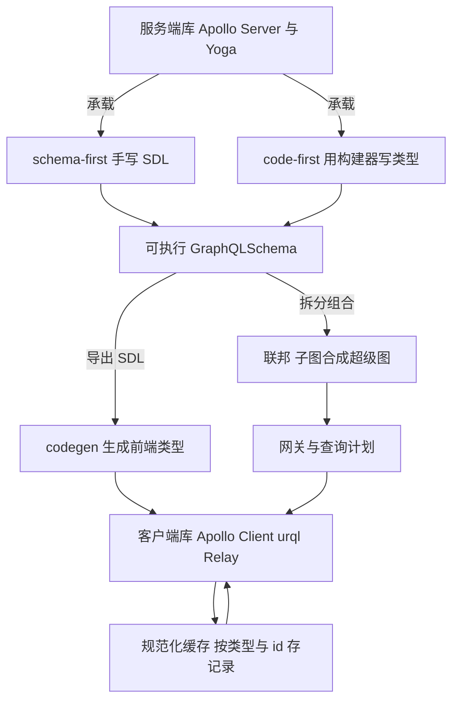
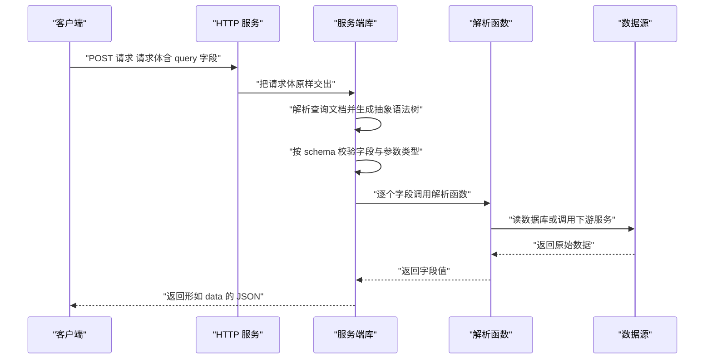
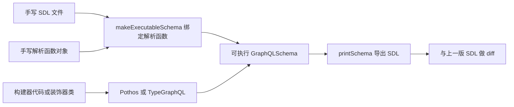
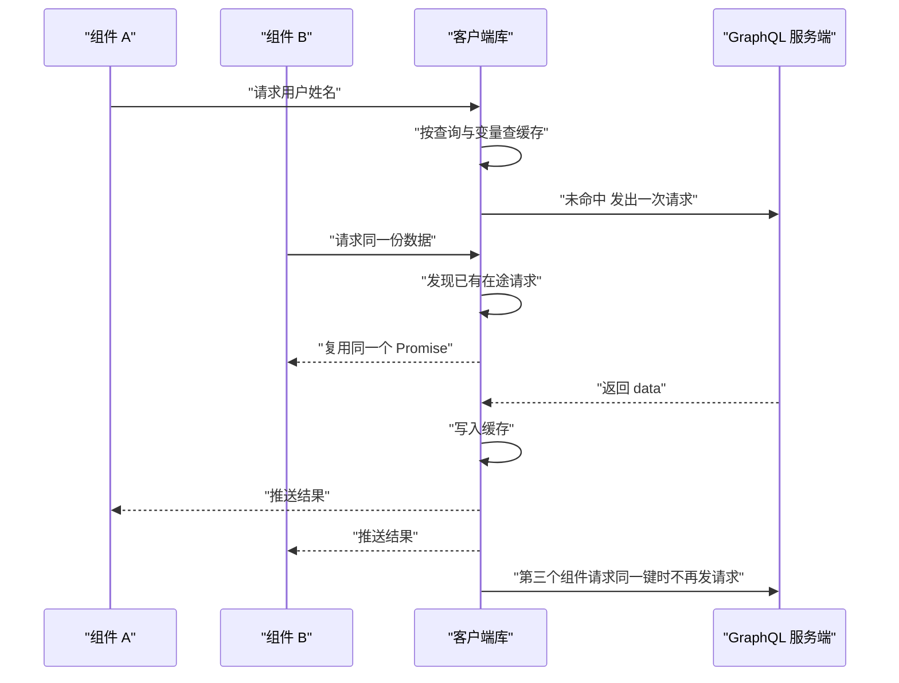
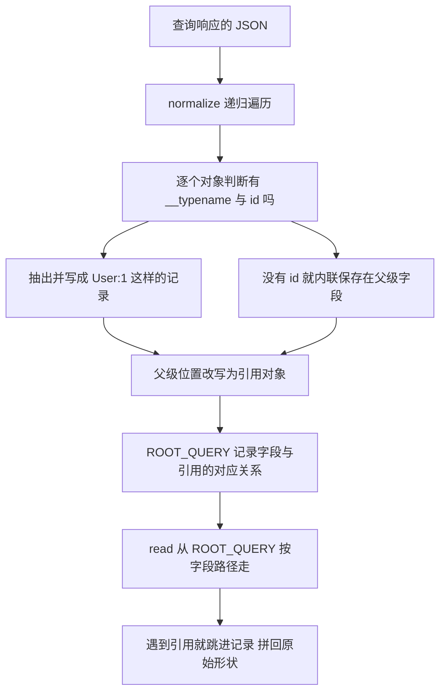
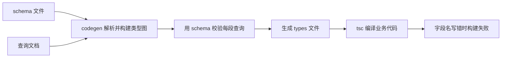
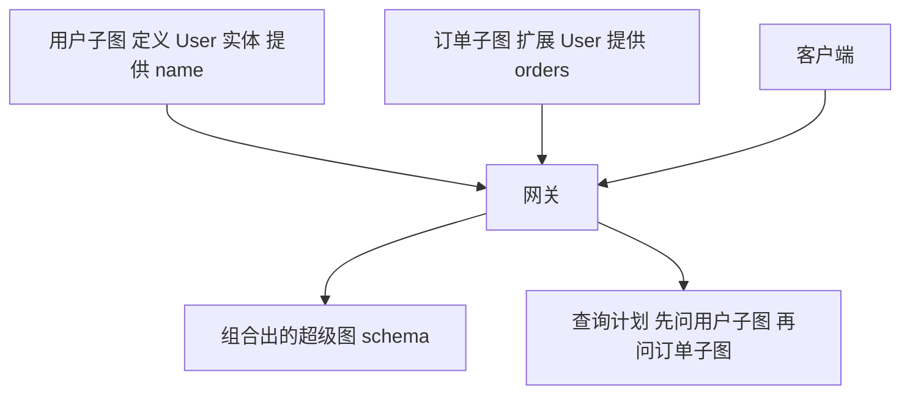
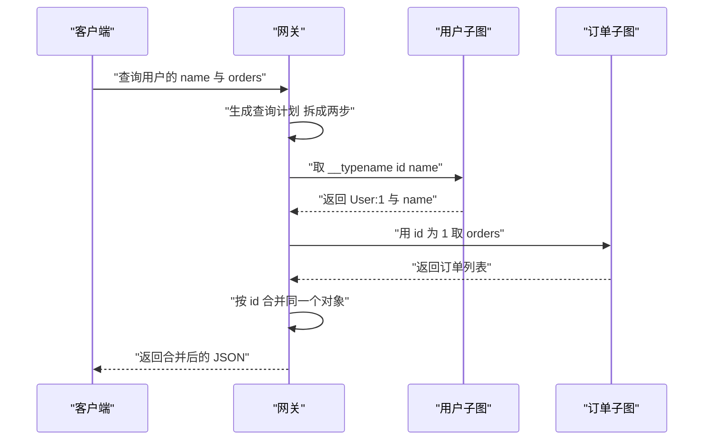

# GraphQL 入门到精通（二）：服务端与客户端库

!!! abstract "学完这一页你能"

    - 用 `graphql` 包加 `node:http` 写出可被 `fetch` 调用的 GraphQL 端点，并说清 Apollo Server 与 Yoga 的接入差别。
    - 判断一个项目该用 schema-first 还是 code-first，并用 Pothos 定义出带参数的 Query 字段。
    - 用一张表说清 Apollo Client、urql、Relay 在缓存模型上的取舍，并手写一次规范化缓存的写入与读出。
    - 画出子图、实体、网关、查询计划的调用顺序，并用 `graphql` 包写出一个迷你 codegen。

## 0. 知识地图



建议按顺序读：先把第 1 节的 HTTP 端点跑起来，你才有可请求的服务。第 2 到第 5 节是同一张 schema 的上下游，第 6 节把服务端从一台扩成多台。每节末尾的动手验证脚本都能单独运行，先跑通再看下一节。

!!! note "术语：GraphQLSchema"

    GraphQL 的可执行模式对象，由 SDL 或构建器编译得到。例如 `buildSchema("type Query { hi: String }")` 返回的就是它。它同时保存类型定义和字段的解析入口。

## 1. 服务端库：Apollo Server 与 GraphQL Yoga

**先想一个问题**

你已经写好了 SDL 和解析函数，现在要让浏览器通过 HTTP 调用它。这段"把请求变成字段值"的代码由谁来写？

**心智模型**

!!! tip "心智模型"

    **一句话模型**：服务端库是把 schema 与解析函数接到 HTTP 上的插座板。

    **日常类比**：家里的配电箱把进来的电分到各个回路，服务端库把进来的请求分到各个字段的解析函数。

    **类比不成立处**：配电箱不问设备要多少电，服务端库会先按 schema 校验查询，字段名写错就直接拒绝，一个解析函数都不调用。

!!! note "术语：SDL"

    Schema Definition Language，GraphQL 的模式定义语言。例如 `type Query { hello(name: String!): String! }` 就是一段 SDL。

!!! note "术语：resolver"

    解析函数，负责为某个字段算出值。例如 `Query.hello` 的解析函数返回字符串 `"你好"`。它接收父级返回值、参数、上下文、查询信息四个参数。

**图解**



1. 客户端把查询字符串放进 POST 请求体，`Content-Type` 写成 `application/json`。
2. HTTP 服务收到请求后只做转发，把请求体交给服务端库，自己不碰 GraphQL 语法。
3. 服务端库把查询文档解析成抽象语法树，节点类型是 `Document`、`OperationDefinition`、`Field`。
4. 校验阶段对着 schema 检查字段是否存在、参数类型是否匹配，失败就返回 errors 数组。
5. 校验通过才执行：服务端库按字段调用解析函数，嵌套字段用父级的返回值继续往下解析。
6. 解析结果被组装成与查询形状一致的 JSON，客户端没请求的字段不会出现在响应里。

**一步一步来**

第 1 步：把 SDL 和解析函数分开写，先不涉及 HTTP。

```js
// 依赖：graphql
import { buildSchema } from 'graphql';

// 只声明形状 不写实现
export const typeDefs = /* GraphQL */ `
  type Query {
    hello(name: String!): String!
  }
`;

// 键名必须与 SDL 里的字段名逐字一致
export const resolvers = {
  Query: {
    // 第一个参数是父级返回值 根查询里为 undefined
    hello: (_parent, args) => `你好 ${args.name}`,
  },
};
```

**这段代码在做什么**

- `typeDefs` 是一段 SDL 字符串，`name: String!` 里的 `!` 表示该参数必填。
- `resolvers` 是普通对象，键 `Query` 对应 schema 里的根类型 `Query`。
- 解析函数的第二个参数 `args` 装着查询传进来的参数，键名与 SDL 里的参数名一致。
- 返回值的类型由 SDL 声明，返回 undefined 会被写成 null，类型不符时服务端库报错。
- 这一层不依赖 HTTP，任何服务端库都能复用同一份 `typeDefs` 与 `resolvers`。

第 2 步：用 `node:http` 加 `@graphql-tools/schema` 手写一个端点。

```js
// 依赖：graphql @graphql-tools/schema
import { createServer } from 'node:http';
import { graphql } from 'graphql';
import { makeExecutableSchema } from '@graphql-tools/schema';
import { typeDefs, resolvers } from './schema.mjs';

// 把 SDL 与解析函数绑定成一个可执行 schema
const schema = makeExecutableSchema({ typeDefs, resolvers });

const server = createServer(async (req, res) => {
  // 只处理 POST 其他方法直接回 405
  if (req.method !== 'POST') { res.writeHead(405).end(); return; }
  let body = '';
  for await (const chunk of req) body += chunk;      // 分片累积成完整字符串
  const { query, variables } = JSON.parse(body);      // 取出查询与变量
  // graphql 函数负责解析 校验 执行三步
  const result = await graphql({ schema, source: query, variableValues: variables });
  res.writeHead(200, { 'content-type': 'application/json' });
  res.end(JSON.stringify(result));                    // 响应体形如 data 或 errors
});

server.listen(4000);                                  // 生产环境应改成读环境变量
```

**这段代码在做什么**

- `makeExecutableSchema` 接收 `typeDefs` 与 `resolvers`，返回可执行的 schema 对象。
- `for await (const chunk of req)` 逐块读出请求体，Node 的请求对象是异步可迭代的。
- `graphql()` 是 `graphql` 包的入口，`source` 传查询字符串，`variableValues` 传变量对象。
- 返回值是 `{ data }` 或 `{ errors }`，两种情况都用同一段 `JSON.stringify` 输出。
- 端口写成字面量便于本地验证，部署时应从 `process.env.PORT` 读取。

运行结果：

```json
{ "data": { "hello": "你好 Ada" } }
```

第 3 步：把它换成 Yoga 与 Apollo Server，对比接入方式。

```js
// 依赖：graphql-yoga
import { createServer } from 'node:http';
import { createSchema, createYoga } from 'graphql-yoga';
import { typeDefs, resolvers } from './schema.mjs';

// createSchema 的作用与 makeExecutableSchema 一致
const yoga = createYoga({ schema: createSchema({ typeDefs, resolvers }) });
// Yoga 实例本身就是一个请求处理函数 可直接当 createServer 的回调
createServer(yoga).listen(4000);
```

```js
// 依赖：@apollo/server
import { ApolloServer } from '@apollo/server';
import { startStandaloneServer } from '@apollo/server/standalone';
import { typeDefs, resolvers } from './schema.mjs';

const server = new ApolloServer({ typeDefs, resolvers });
// 这一步内部完成监听 返回值里带 url
const { url } = await startStandaloneServer(server, { listen: { port: 4000 } });
```

**这段代码在做什么**

- Yoga 的实例可以直接当请求处理函数用，所以能挂到 `node:http`、Express、Cloudflare Workers 上。
- Apollo Server 构造实例只描述配置，真正的监听交给 `startStandaloneServer`。
- 两个库的入参都是 `typeDefs` 与 `resolvers`，所以第 1 步写的 schema 文件不需要改。
- Yoga 内置了 CORS、文件上传、GraphiQL 的开关；Apollo Server 的这些能力需要额外安装中间件。具体开关名需核对官方文档：要核对 CORS 与文件上传的配置键。
- 具体版本差异需核对官方文档：要核对各库当前大版本对 `createSchema` 与 `startStandaloneServer` 的签名要求。

**动手验证**

```js
// 依赖：graphql @graphql-tools/schema
// 运行：node server-check.mjs
import assert from 'node:assert/strict';
import { createServer } from 'node:http';
import { graphql, printSchema, buildSchema } from 'graphql';
import { makeExecutableSchema } from '@graphql-tools/schema';

const typeDefs = `
  type Query {
    hello(name: String!): String!
  }
`;
const resolvers = { Query: { hello: (_p, args) => `你好 ${args.name}` } };
const schema = makeExecutableSchema({ typeDefs, resolvers });

// 端口写 0 让系统分配 避免与本机其他服务冲突
const server = createServer(async (req, res) => {
  if (req.method !== 'POST') { res.writeHead(405).end(); return; }
  let body = '';
  for await (const chunk of req) body += chunk;
  const { query, variables } = JSON.parse(body);
  const result = await graphql({ schema, source: query, variableValues: variables });
  res.writeHead(200, { 'content-type': 'application/json' });
  res.end(JSON.stringify(result));
});
await new Promise((resolve) => server.listen(0, resolve));
const port = server.address().port;

async function post(query, variables) {
  const res = await fetch(`http://127.0.0.1:${port}/`, {
    method: 'POST',
    headers: { 'content-type': 'application/json' },
    body: JSON.stringify({ query, variables }),
  });
  return res.json();
}

// 1 正常查询返回与查询形状一致的 data
const ok = await post('query Q($n: String!) { hello(name: $n) }', { n: 'Ada' });
assert.deepEqual(ok, { data: { hello: '你好 Ada' } });

// 2 字段名不存在时返回 errors 而不是崩溃
const bad = await post('query { notExist }', {});
assert.equal(bad.errors.length, 1);
assert.match(bad.errors[0].message, /Cannot query field/);

// 3 缺少必填变量时报错
const missing = await post('query Q($n: String!) { hello(name: $n) }', {});
assert.ok(missing.errors || missing.data.hello === null);

// 4 打印 schema 反推出的 SDL 用于人工核对
assert.match(printSchema(schema), /hello\(name: String!\): String!/);

// 5 手写一份等价 SDL 反推出的字段名应一致
const handWritten = buildSchema('type Query { hello(name: String!): String! }');
const fieldsOf = (s) => s.getQueryType().getFields();
assert.deepEqual(Object.keys(fieldsOf(schema)), Object.keys(fieldsOf(handWritten)));

server.close();
console.log('全部断言通过');
console.log(JSON.stringify(ok));
// 预期输出：
// 全部断言通过
// {"data":{"hello":"你好 Ada"}}
```

**常见坑**

| 现象 | 原因 | 怎么修 |
| --- | --- | --- |
| 请求返回 405 | 只处理 GET，没处理 POST | 在回调开头判断 `req.method`，非 POST 直接 `writeHead(405).end()` |
| 报 `Cannot query field` | 查询里的字段名与 SDL 不一致 | 用 `printSchema(schema)` 打印真实字段名，逐字核对 |
| 字段全是 null 但没有报错 | 解析函数键名拼错或返回 undefined | 在解析函数里加日志，确认它被调到 |
| 本地能跑，部署后端口冲突 | 端口硬编码为 4000 | 改成 `Number(process.env.PORT ?? 4000)` |
| 大请求体被截断 | 只读了第一块 `chunk` | 用 `for await` 累积全部请求体再 `JSON.parse` |

**小结**

- 服务端库只做三件事：解析、校验、执行，HTTP 层可以自己写也可以交给库。
- `typeDefs` 与 `resolvers` 是两个库通用入参，换库不用改 schema 文件。
- 校验发生在执行之前，字段名写错不会走到任何解析函数。

## 2. schema-first 与 code-first：Pothos 与 TypeGraphQL

**先想一个问题**

后端加了字段 `nickname`，SDL 改了但解析函数忘了改。这个错误什么时候会被发现？改由谁写 schema 能拦住它？

**心智模型**

!!! tip "心智模型"

    **一句话模型**：schema-first 是先写合同再写实现，code-first 是先写实现，合同由工具导出。

    **日常类比**：装修先签报价单再施工，对照先施工再补报价单。

    **类比不成立处**：装修里报价单只给人看，GraphQL 的 schema 会被校验器与 codegen 读取，所以两种做法都要保证 schema 与实现一致。

!!! note "术语：schema-first"

    先手写 SDL 文件，再写与之对应的解析函数对象。SDL 是唯一事实来源。

!!! note "术语：code-first"

    用 TypeScript 代码（构建器 API 或装饰器）定义类型与字段，`printSchema` 导出 SDL。代码是唯一事实来源。

**图解**



1. 左侧是 schema-first 路线：SDL 与解析函数是两个独立文件，工具负责把它们绑在一起。
2. 绑定的依据是字段名字符串，名字写错时工具在启动阶段就报错。
3. 右侧是 code-first 路线：类型定义本身就是 TypeScript 代码，字段名是对象键名。
4. 构建器把类型信息编译成 `GraphQLSchema`，与左侧产出同一种对象。
5. 两条路线最终都得到 schema，后面的 codegen 与联邦不关心它是怎么来的。
6. 导出 SDL 再与上一版做 diff，能在合并前发现破坏性改动。

**一步一步来**

第 1 步：schema-first 的写法与它的检查点。

```js
// 依赖：@graphql-tools/schema
import { makeExecutableSchema } from '@graphql-tools/schema';

const typeDefs = /* GraphQL */ `
  type Query { greeting(name: String!): String! }
`;

const resolvers = {
  Query: {
    // 这里的键 greeting 必须与 SDL 中的字段名完全相同
    greeting: (_p, args) => `你好 ${args.name}`,
  },
};

// 字段对不上时 makeExecutableSchema 会在启动阶段抛错
const schema = makeExecutableSchema({ typeDefs, resolvers });
```

**这段代码在做什么**

- `typeDefs` 与 `resolvers` 分开维护，团队可以并行写，评审时 diff 清楚。
- 解析函数的键名是字符串，编译器不检查它是否与 SDL 一致。
- `makeExecutableSchema` 提供一层运行时校验，SDL 里有但解析函数里没有的字段会保留默认解析（读取父对象同名属性）。
- 字段类型在 SDL 与解析函数之间没有编译期联系，改类型时容易漏。
- 这一路线适合 schema 由多方评审、或者要用工具生成文档的团队。

运行结果：字段名写错时启动即抛错，错误信息里带字段名。

第 2 步：用 Pothos 走 code-first 路线。

```js
// 依赖：graphql @pothos/core
import SchemaBuilder from '@pothos/core';

const builder = new SchemaBuilder({});

// 必须先调用 queryType 否则导出的 schema 没有 Query 类型
builder.queryType({
  fields: (t) => ({
    // 返回类型由 t.string 声明 编译期与运行时都受约束
    greeting: t.string({
      // t.arg.string 声明一个 String 参数 required 表示必填
      args: { name: t.arg.string({ required: true }) },
      // resolve 的第二个参数已被构建器按 args 声明转换过
      resolve: (_parent, args) => `你好 ${args.name}`,
    }),
  }),
});

export const schema = builder.toSchema();
```

**这段代码在做什么**

- `new SchemaBuilder({})` 创建构建器，空对象表示使用默认配置。
- `builder.queryType` 定义根查询类型，不调用它导出的 schema 会缺 Query。
- `t.string` 同时声明返回类型和解析函数，两者写在同一个字段定义里。
- `t.arg.string({ required: true })` 声明必填参数，生成的 SDL 里会写成 `String!`。
- 参数类型由 TypeScript 推出，所以解析函数里访问 `args.name` 有类型提示。
- 参数名与配置键名需核对官方文档：要核对当前版本 `t.arg.string` 支持的选项名。

第 3 步：导出 SDL，与手写版本做 diff。

```js
// 依赖：graphql
import { printSchema, buildSchema } from 'graphql';
import { schema as built } from './builder.mjs';

// 把构建器产物反推成 SDL 文本
const generated = printSchema(built);

// 手写一份等价 SDL 作为对照
const handwritten = printSchema(buildSchema('type Query { greeting(name: String!): String! }'));

// 逐行比较 输出差异行
const a = generated.split('\n');
const b = handwritten.split('\n');
a.forEach((line, i) => { if (line !== b[i]) console.log(`第 ${i} 行不同: ${line} 对比 ${b[i]}`); });
```

**这段代码在做什么**

- `printSchema` 把 schema 对象转成 SDL 文本，顺序稳定，适合做 diff。
- 两边都先经过 `printSchema`，可以去掉手写格式与空行的干扰。
- 逐行比较能定位到具体哪一行不同，比整体字符串比较容易读。
- 这段逻辑可以放进持续集成，合并请求里 SDL 变了就提示评审。
- 生产项目里更常见的是用 `@graphql-inspector/cli` 做破坏性变更检查，具体命令需核对官方文档。

运行结果：两份 SDL 完全一致时没有任何输出。

第 4 步：TypeGraphQL 的装饰器写法。

```ts
// 依赖：type-graphql reflect-metadata
import 'reflect-metadata';                       // 必须写在其他导入之前
import { Resolver, Query, ObjectType, Field } from 'type-graphql';

@ObjectType()
class Greeting {
  @Field(() => String) text!: string;            // 显式给出类型 避免反射失效
}

@Resolver()
class GreetingResolver {
  @Query(() => Greeting)
  greeting(): Greeting { return { text: '你好' }; }
}
```

**这段代码在做什么**

- `reflect-metadata` 必须在任何装饰器代码之前导入，否则运行时拿不到类型元数据。
- `@ObjectType()` 把一个类登记为 GraphQL 对象类型，`@Field()` 登记字段。
- `@Query()` 登记根查询字段，箭头函数返回类型用于推断 GraphQL 类型。
- 需要 tsconfig 打开 `experimentalDecorators` 与 `emitDecoratorMetadata`，具体配置需核对官方文档。
- 装饰器与 Pothos 的差别在于写法，两者都产出同一种 schema 对象。

**动手验证**

```js
// 依赖：graphql @pothos/core
// 运行：node code-first-check.mjs
import assert from 'node:assert/strict';
import { printSchema, buildSchema } from 'graphql';
import SchemaBuilder from '@pothos/core';

const builder = new SchemaBuilder({});

builder.queryType({
  fields: (t) => ({
    greeting: t.string({
      args: { name: t.arg.string({ required: true }) },
      resolve: (_parent, args) => `你好 ${args.name}`,
    }),
  }),
});

const built = builder.toSchema();
const sdl = printSchema(built);

// 1 构建器导出的 schema 有 Query 类型
assert.equal(built.getQueryType().name, 'Query');

// 2 参数字段的类型被写成必填 String
const greetingField = built.getQueryType().getFields().greeting;
assert.equal(String(greetingField.args[0].type), 'String!');
assert.equal(greetingField.args[0].name, 'name');

// 3 导出 SDL 里含有关键片段
assert.match(sdl, /greeting\(name: String!\): String!/);

// 4 与手写 SDL 的字段名集合一致
const handWritten = buildSchema('type Query { greeting(name: String!): String! }');
const names = (s) => Object.keys(s.getQueryType().getFields()).sort();
assert.deepEqual(names(built), names(handWritten));

// 5 执行一次确认解析函数被正确绑定
const { graphql } = await import('graphql');
const res = await graphql({ schema: built, source: '{ greeting(name: "Ada") }' });
assert.deepEqual(res.data, { greeting: '你好 Ada' });

console.log('全部断言通过');
console.log(sdl);
// 预期输出：
// 全部断言通过
// type Query {
//   greeting(name: String!): String!
// }
```

**常见坑**

| 现象 | 原因 | 怎么修 |
| --- | --- | --- |
| 导出的 schema 没有 Query 类型 | 忘记调用 `builder.queryType` | 在 `toSchema()` 之前补上 `builder.queryType` |
| 参数在 SDL 里变成可空 | 没有写 `required: true` | 必填参数统一加 `required: true` |
| 装饰器版本报类型元数据缺失 | `reflect-metadata` 导入顺序不对 | 把 `import 'reflect-metadata'` 放到文件第一行 |
| SDL 与解析函数字段名不一致 | schema-first 下没人检查 | 在持续集成里跑 `makeExecutableSchema` 与 SDL diff |
| 构建器代码改动后忘了导出 SDL | 导出步骤没进流水线 | 把 `printSchema` 写成脚本，提交时自动执行 |

**小结**

- schema-first 的 SDL 是独立文件，评审方便，但字段名靠工具检查。
- code-first 把类型与实现写在同一个定义里，TypeScript 编译器能拦住拼写错误。
- 两条路线的产物都是 `GraphQLSchema`，后面的工具链不受影响。

## 3. 客户端库：Apollo Client、urql、Relay

**先想一个问题**

页面上三个组件都要显示当前用户的姓名。如果每个组件各发一次请求，服务端要算三次。谁来把三次请求变成一次？

**心智模型**

!!! tip "心智模型"

    **一句话模型**：客户端库是替你发请求、存结果、合并重复请求、把结果推给组件的中间层。

    **日常类比**：社区团购的集单员，把多个人的同类下单合成一次采购。

    **类比不成立处**：集单员只按天合并，客户端库要按查询文本与变量决定是复用、是重取，还是只更新其中几个字段。

!!! note "术语：文档缓存"

    以"查询文本加变量"为键保存整份响应结果。同一个键才命中，改一个字段也要整份重取。urql 的默认缓存属于这一类。

!!! note "术语：抽象语法树"

    Abstract Syntax Tree，查询字符串解析后的树形结构。节点类型有 `Document`、`OperationDefinition`、`Field`，字段名在 `node.name.value` 里。

**图解**



1. 组件 A 发起请求，客户端库先按查询文本与变量拼出一个键。
2. 缓存里没有这个键，于是真的发出一次 HTTP 请求。
3. 组件 B 在响应回来之前也发起同一个键的请求，客户端库发现已有在途请求。
4. 在途请求用一个 Promise 表示，组件 B 直接复用同一个 Promise，不再发第二次请求。
5. 响应回来后客户端库把它写入缓存，并通知所有订阅这个键的组件。
6. 之后的组件再请求同一个键，直接从缓存读，不发请求。

**一步一步来**

第 1 步：写一个只有发请求能力的最小客户端。

```js
// 依赖：无 使用全局 fetch
export function createClient(endpoint) {
  return {
    async query(query, variables) {
      const res = await fetch(endpoint, {
        method: 'POST',                                   // GraphQL over HTTP 常用 POST
        headers: { 'content-type': 'application/json' },   // 必须声明 JSON
        body: JSON.stringify({ query, variables }),        // 查询与变量一起发
      });
      const json = await res.json();
      // 服务端可能返回 data 或 errors 这里只取 data
      return json.data;
    },
  };
}
```

**这段代码在做什么**

- `createClient` 接收端点地址，返回一个带 `query` 方法的对象。
- 请求体里同时放 `query` 与 `variables`，变量让查询文本可以复用。
- `content-type` 必须是 `application/json`，否则部分服务端会按 400 处理。
- 返回值直接取 `json.data`，没有处理 `errors`，后面步骤会补上。
- 这个对象没有状态，两次相同请求会真的发两次。

第 2 步：加在途请求合并，同键请求只发一次。

```js
// 依赖：无
const inflight = new Map();

function keyOf(endpoint, query, variables) {
  // 变量键顺序不同会被当成不同键 生产环境应先对键排序
  return `${endpoint}|${query}|${JSON.stringify(variables ?? {})}`;
}

export async function queryDeduped(client, endpoint, query, variables) {
  const key = keyOf(endpoint, query, variables);
  if (inflight.has(key)) return inflight.get(key);          // 复用同一个 Promise
  const p = client.query(query, variables)
    .finally(() => inflight.delete(key));                   // 结束后清理 避免内存增长
  inflight.set(key, p);
  return p;
}
```

**这段代码在做什么**

- 键由端点、查询文本、变量三部分拼成，三者任一不同都算新请求。
- `inflight` 存的是 Promise 而不是结果，所以后来者能等同一份响应。
- `.finally()` 在成功与失败时都执行，把键从表里删掉。
- 拿到 Promise 后要立刻 `set`，否则并发调用会同时发出两次请求。
- 变量对象键顺序不稳定时会产生多个键，生产环境应先排序再序列化。

第 3 步：加结果缓存，命中就不发请求。

```js
// 依赖：无
const cache = new Map();

export async function queryCached(client, endpoint, query, variables) {
  const key = keyOf(endpoint, query, variables);
  if (cache.has(key)) return cache.get(key);                 // 命中直接返回
  const data = await queryDeduped(client, endpoint, query, variables);
  cache.set(key, data);                                      // 写入结果缓存
  return data;
}
```

**这段代码在做什么**

- 结果缓存以整份响应为单位，键相同才命中。
- 数据在服务端变了，这个缓存不会知道，需要手动失效或加过期时间。
- 这正是文档缓存的局限：改一个字段也要整份重取，第 4 节会讲另一种做法。
- 缓存放在模块作用域，同一进程内共享，多进程部署时要换成带过期的存储。
- 键里包含变量，所以不同用户的查询不会互相污染。

第 4 步：换成三个真实库的调用写法。

```js
// 依赖：@apollo/client react
import { gql, useQuery } from '@apollo/client';
const USER = gql`query User($id: ID!) { user(id: $id) { id name } }`;
function Name({ id }) {
  const { data, loading, error } = useQuery(USER, { variables: { id } });
  if (loading) return null;
  if (error) throw error;
  return data.user.name;
}
```

**这段代码在做什么**

- `gql` 模板把字符串标记成查询文档，Apollo Client 在运行时解析它。
- `useQuery` 返回 `loading`、`error`、`data` 三个状态字段，组件只需渲染。
- 默认从规范化缓存读取，缓存不命中才发请求，第 4 节细讲。
- urql 的 `useQuery` 返回 `fetching` 与 `error`，字段名与 Apollo 不同。
- Relay 用 `usePreloadedQuery` 加编译器预编译的 fragment，运行时不做字符串解析。
- 各库当前大版本的返回字段名需核对官方文档：要核对 `fetching` 与 `loading` 的命名。

**动手验证**

```js
// 依赖：graphql @graphql-tools/schema
// 运行：node client-check.mjs
import assert from 'node:assert/strict';
import { createServer } from 'node:http';
import { graphql } from 'graphql';
import { makeExecutableSchema } from '@graphql-tools/schema';

let executed = 0;                                  // 记录解析函数被调用次数
const schema = makeExecutableSchema({
  typeDefs: `type Query { user(id: ID!): User } type User { id: ID! name: String! }`,
  resolvers: {
    Query: { user: (_p, { id }) => { executed += 1; return { id, name: 'Ada' }; } },
  },
});

const server = createServer(async (req, res) => {
  let body = '';
  for await (const chunk of req) body += chunk;
  const { query, variables } = JSON.parse(body);
  const result = await graphql({ schema, source: query, variableValues: variables });
  res.writeHead(200, { 'content-type': 'application/json' });
  res.end(JSON.stringify(result));
});
await new Promise((r) => server.listen(0, r));
const endpoint = `http://127.0.0.1:${server.address().port}/`;

const inflight = new Map();
const cache = new Map();
const keyOf = (query, variables) => `${query}|${JSON.stringify(variables ?? {})}`;

async function rawQuery(query, variables) {
  const res = await fetch(endpoint, {
    method: 'POST',
    headers: { 'content-type': 'application/json' },
    body: JSON.stringify({ query, variables }),
  });
  return (await res.json()).data;
}

async function queryCached(query, variables) {
  const key = keyOf(query, variables);
  if (cache.has(key)) return cache.get(key);              // 命中结果缓存
  if (inflight.has(key)) return inflight.get(key);        // 命中在途请求
  const p = rawQuery(query, variables).finally(() => inflight.delete(key));
  inflight.set(key, p);
  const data = await p;
  cache.set(key, data);
  return data;
}

const Q = 'query U($id: ID!) { user(id: $id) { id name } }';

// 1 两个并发请求只触发一次服务端执行
const [a, b] = await Promise.all([queryCached(Q, { id: '1' }), queryCached(Q, { id: '1' })]);
assert.deepEqual(a, { user: { id: '1', name: 'Ada' } });
assert.deepEqual(b, a);
assert.equal(executed, 1);

// 2 第三次请求直接命中结果缓存 服务端仍只执行一次
await queryCached(Q, { id: '1' });
assert.equal(executed, 1);

// 3 变量不同会产生不同键 服务端再执行一次
await queryCached(Q, { id: '2' });
assert.equal(executed, 2);

// 4 键里包含查询文本 换一个查询也不会命中旧结果
assert.notEqual(keyOf(Q, { id: '1' }), keyOf('query { x }', { id: '1' }));

server.close();
console.log('全部断言通过');
console.log(`服务端执行次数 ${executed}`);
// 预期输出：
// 全部断言通过
// 服务端执行次数 2
```

**常见坑**

| 现象 | 原因 | 怎么修 |
| --- | --- | --- |
| 同一份数据被请求多次 | 没有做在途请求合并 | 用查询文本加变量作键缓存 Promise |
| 改了数据但界面不更新 | 命中结果缓存且没有失效策略 | 写入后按需清键，或改用规范化缓存 |
| 变量顺序不同导致缓存不命中 | 直接 `JSON.stringify` 变量对象 | 序列化前按键名排序 |
| 请求体缺少 `content-type` | 部分服务端按 400 拒绝 | 统一补上 `application/json` |
| 内存持续增长 | 缓存没有上限也没有过期 | 换成带淘汰策略的实现，例如 LRU |

**小结**

- 客户端库负责发请求、合并重复请求、缓存结果、把结果推给组件四件事。
- 在途请求合并解决并发重复，结果缓存解决时间上的重复，两者要分开实现。
- 文档缓存实现成本低，代价是字段级更新做不到，需要时换成规范化缓存。

## 4. 规范化缓存原理

**先想一个问题**

同一个用户同时出现在"最近访问"和"搜索结果"两个列表里。改完名字后只刷新其中一个列表，另一个列表会跟着变吗？

**心智模型**

!!! tip "心智模型"

    **一句话模型**：规范化缓存把响应拆成按类型与 id 索引的记录，再单独保存引用关系。

    **日常类比**：图书馆不按借阅清单存书，每本书有架位号，清单里只写架位号。

    **类比不成立处**：图书馆的书一次只在一个架位，缓存里同一条记录会被多份查询同时引用，改一次全部读取方都能看到。

!!! note "术语：规范化缓存"

    Normalized cache，把对象按类型与 id 拆成独立记录存放的缓存。键的常见形式是 `User:1`，根查询记录用 `ROOT_QUERY` 表示。

!!! note "术语：实体标识"

    用来判断一个对象该不该拆分的两个字段：`__typename` 与 `id`。两个都有才拆，缺一个就内联保存在父级字段里。

**图解**



1. 响应进来后 `normalize` 从根字段开始往下递归。
2. 每遇到一个对象，先判断它是否同时有 `__typename` 与 `id`。
3. 两个都有就抽出来存进 `store`，键写成 `类型名:id`。
4. 父级原本存对象的位置改成引用，形如 `{ __ref: "User:1" }`。
5. 没有 `id` 的对象直接内联保存，父级字段里放的是副本。
6. `read` 从 `ROOT_QUERY` 开始按查询字段路径走，遇到引用就跳进对应记录。
7. 修改只需写 `store` 里的那条记录，引用它的多份查询都会读到新值。

**一步一步来**

第 1 步：实现 `normalize`，把响应拆成记录。

```js
// 依赖：无
const store = new Map();

function refOf(obj) {
  // 两个标识都齐才拆分 否则返回 null 走内联分支
  if (obj && typeof obj === 'object' && obj.__typename && obj.id != null) {
    return `${obj.__typename}:${obj.id}`;
  }
  return null;
}

function normalize(obj) {
  const ref = refOf(obj);
  if (ref) {
    // 先占位再填字段 避免自引用结构造成死循环
    if (!store.has(ref)) store.set(ref, {});
    const record = store.get(ref);
    for (const [k, v] of Object.entries(obj)) {
      // 每个字段都递归 嵌套对象会被换成引用
      record[k] = Array.isArray(v) ? v.map(normalize) : normalize(v);
    }
    return { __ref: ref };                 // 父级只保存引用
  }
  if (Array.isArray(obj)) return obj.map(normalize);
  if (obj && typeof obj === 'object') {
    const out = {};                        // 没有 id 的对象内联保存在父级
    for (const [k, v] of Object.entries(obj)) out[k] = normalize(v);
    return out;
  }
  return obj;                              // 标量直接返回
}
```

**这段代码在做什么**

- `refOf` 检查 `__typename` 与 `id`，两者齐备才认为它是可共享的实体。
- `store` 用 `Map` 保存记录，键是 `User:1` 这样的字符串。
- 先 `set` 空对象再填字段，是为了让自引用结构不会无限递归。
- 数组先 `map` 再逐项 `normalize`，所以列表里的实体也会被拆出来。
- 返回的引用对象只有 `__ref` 一个键，读取时凭它跳回记录。
- 标量与缺少 id 的对象原样保留，读取时不需要额外跳转。

第 2 步：实现 `read`，从记录拼回查询形状。

```js
// 依赖：无
function read(node) {
  if (Array.isArray(node)) return node.map(read);        // 列表逐项读取
  if (node && typeof node === 'object') {
    if (node.__ref) {
      const record = store.get(node.__ref);
      return read(record);                               // 引用跳进记录再读
    }
    const out = {};
    for (const [k, v] of Object.entries(node)) out[k] = read(v);
    return out;                                          // 内联对象逐字段读取
  }
  return node;                                           // 标量直接返回
}
```

**这段代码在做什么**

- 读取顺序与写入顺序相反，写入时把对象挤出去，读取时按引用捞回来。
- `read` 遇到 `__ref` 才跳转，内联对象照常逐字段递归。
- 读出来的结构与最初写进去的响应一致，组件不需要知道内部结构。
- 记录被改过时，`read` 会拿到新值，这正是共享引用的作用。
- 如果记录被删掉，读取会返回 `undefined`，需要在调用处处理缺数据。

第 3 步：改写记录，验证两份查询同时更新。

```js
// 依赖：无 复用上面的 store 与 read
import assert from 'node:assert/strict';

// 两份查询都引用了同一个用户实体
normalize({ __typename: 'Query', recent: [{ __typename: 'User', id: '1', name: 'Ada', age: 30 }] });
normalize({ __typename: 'Query', search: [{ __typename: 'User', id: '1', name: 'Ada', age: 30 }] });

// 只改一次 store 里的记录
store.get('User:1').name = 'Grace';

// 两份查询读出来的名字都变了 年龄保持不变
const root = store.get('ROOT_QUERY');
assert.equal(read(root).recent[0].name, 'Grace');
assert.equal(read(root).search[0].name, 'Grace');
assert.equal(read(root).recent[0].age, 30);
```

**这段代码在做什么**

- 两次 `normalize` 写入的实体键相同，第二次会覆盖同一条记录而不是新增。
- `ROOT_QUERY` 里保存了 `recent` 与 `search` 两个字段各自的引用列表。
- 修改只发生在 `store` 里的一条记录上，两条路径读到同一个对象。
- 年龄字段没被动过，所以保持 30，这说明更新可以是字段级的。
- 真实库会在写入后通知订阅者重渲染，这里的例子只是手工调用 `read`。

运行结果：三段断言全部通过，没有输出。

**动手验证**

```js
// 依赖：无
// 运行：node normalized-cache-check.mjs
import assert from 'node:assert/strict';

const store = new Map();

function refOf(obj) {
  if (obj && typeof obj === 'object' && obj.__typename && obj.id != null) {
    return `${obj.__typename}:${obj.id}`;
  }
  return null;
}

function normalize(obj) {
  const ref = refOf(obj);
  if (ref) {
    if (!store.has(ref)) store.set(ref, {});
    const record = store.get(ref);
    for (const [k, v] of Object.entries(obj)) {
      record[k] = Array.isArray(v) ? v.map(normalize) : normalize(v);
    }
    return { __ref: ref };
  }
  if (Array.isArray(obj)) return obj.map(normalize);
  if (obj && typeof obj === 'object') {
    const out = {};
    for (const [k, v] of Object.entries(obj)) out[k] = normalize(v);
    return out;
  }
  return obj;
}

function read(node) {
  if (Array.isArray(node)) return node.map(read);
  if (node && typeof node === 'object') {
    if (node.__ref) return read(store.get(node.__ref));
    const out = {};
    for (const [k, v] of Object.entries(node)) out[k] = read(v);
    return out;
  }
  return node;
}

// 第一份响应 用户出现在最近访问列表里
const root1 = normalize({
  __typename: 'Query',
  recent: [{ __typename: 'User', id: '1', name: 'Ada', age: 30 }],
});
// 第二份响应 同一个用户出现在搜索结果里
const root2 = normalize({
  __typename: 'Query',
  search: [{ __typename: 'User', id: '1', name: 'Ada', age: 30 }],
});

// 1 两个根字段都指向同一个引用 而不是两份拷贝
assert.deepEqual(root1.recent[0], { __ref: 'User:1' });
assert.deepEqual(root2.search[0], { __ref: 'User:1' });

// 2 store 里只有一个 User 记录
assert.equal([...store.keys()].filter((k) => k.startsWith('User:')).length, 1);
assert.deepEqual(Object.keys(store.get('User:1')).sort(), ['__typename', 'age', 'id', 'name']);

// 3 改一次记录 两条路径都读到新名字
store.get('User:1').name = 'Grace';
const merged = { ...read(store.get('ROOT_QUERY')) };
assert.equal(merged.recent[0].name, 'Grace');
assert.equal(merged.search[0].name, 'Grace');

// 4 没被改的字段保持原值 说明更新可以是字段级的
assert.equal(merged.recent[0].age, 30);

// 5 没有 id 的对象会内联保存 不会进入 store
const root3 = normalize({ __typename: 'Query', banner: { __typename: 'Banner', text: '活动' } });
assert.equal([...store.keys()].some((k) => k.startsWith('Banner:')), false);
assert.deepEqual(read(root3.banner), { __typename: 'Banner', text: '活动' });

console.log('全部断言通过');
console.log(JSON.stringify(read(store.get('ROOT_QUERY'))));
// 预期输出：
// 全部断言通过
// {"recent":[{"__typename":"User","id":"1","name":"Grace","age":30}],"search":[{"__typename":"User","id":"1","name":"Grace","age":30}]}
```

**常见坑**

| 现象 | 原因 | 怎么修 |
| --- | --- | --- |
| 改了数据另一个列表不更新 | 查询里没选 `id`，对象被内联保存 | 所有实体类型都选上 `id` |
| 实体被当成两个对象 | 响应里缺 `__typename` | 用工具或服务端插件自动补 `__typename` |
| 列表越翻越短 | 新页结果覆盖旧页数组 | 配分页字段的合并策略，例如按游标拼接 |
| 读取返回 undefined | 记录被回收或从未写入 | 在读取处兜底触发重新请求 |
| 同一类型不同接口的 id 冲突 | 键只用了 id 没带类型名 | 键统一写成 `类型名:id` 的形式 |

**小结**

- 规范化的关键是两步：写入时按类型与 id 拆分，读取时按引用拼回。
- `id` 与 `__typename` 是拆分的前提，查询里漏选 `id` 就退化成内联副本。
- 记录级修改能让多份查询同时看到新值，这是文档缓存做不到的。

## 5. codegen：从 schema 到前端类型

**先想一个问题**

后端把 `userName` 改成 `nickname`，前端的查询字符串还会写出旧字段。这个错误在什么阶段会被拦住？

**心智模型**

!!! tip "心智模型"

    **一句话模型**：codegen 读 schema 与查询文档，输出一份类型文件，构建时校验两者一致。

    **日常类比**：把接口文档和代码逐条对账的会计，对完账出一份对账表。

    **类比不成立处**：会计只报告不一致，codegen 还会顺手生成可直接 import 的类型和查询常量。

!!! note "术语：codegen"

    Code generation，代码生成。GraphQL 场景下指读 schema 与操作文档，输出 TypeScript 类型或查询常量的工具。常见实现是 `@graphql-codegen/cli`。

**图解**



1. codegen 读入 schema 文件，构建出类型图，字段与参数的对应关系都在里面。
2. 读入查询文档，把每段查询解析成抽象语法树。
3. 用 schema 校验每段查询，字段名不存在时 codegen 直接失败，不会输出半成品。
4. 校验通过后按选择集生成类型，标量映射成 `string`、`number`、`boolean`。
5. 生成的文件被业务代码 `import`，`tsc` 编译时再检查用法。
6. 后端改字段名后前端 CI 在 codegen 这一步就会失败，错误信息里带字段名。

**一步一步来**

第 1 步：用 `parse` 把查询文档变成抽象语法树。

```js
// 依赖：graphql
import { parse } from 'graphql';

const document = parse(`
  query UserQuery($id: ID!) {
    user(id: $id) { id name }
  }
`);

// 顶层节点的 kind 是 Document 里面装着一组定义
const op = document.definitions[0];
console.log(op.kind);                     // OperationDefinition
console.log(op.name.value);               // UserQuery
console.log(op.selectionSet.selections.map((s) => s.name.value)); // [ 'user' ]
```

**这段代码在做什么**

- `parse` 只做语法解析，字段是否存在它不检查。
- 第一个定义是操作定义，`op.kind` 的值是 `OperationDefinition`。
- `op.name.value` 是查询名，没有写名字时它是 `undefined`。
- `selectionSet.selections` 是当前层的字段列表，每个元素有 `name.value`。
- 解析失败时 `parse` 直接抛错，错误信息里带行号与列号。

运行结果：

```text
OperationDefinition
UserQuery
[ 'user' ]
```

第 2 步：用 `visit` 加 `TypeInfo` 边走边查字段类型。

```js
// 依赖：graphql
import { buildSchema, parse, visit, TypeInfo, visitWithTypeInfo } from 'graphql';

const schema = buildSchema(`
  type Query { user(id: ID!): User }
  type User { id: ID! name: String! age: Int }
`);

const document = parse('query Q($id: ID!) { user(id: $id) { id name } }');

// TypeInfo 跟着 visit 的进入与离开事件维护类型栈
const typeInfo = new TypeInfo(schema);

visit(document, visitWithTypeInfo(typeInfo, {
  Field(node) {
    // getType 返回当前字段的返回类型 字符串形式保留 ! 与方括号
    console.log(`${node.name.value} -> ${String(typeInfo.getType())}`);
  },
}));
```

**这段代码在做什么**

- `TypeInfo` 需要知道当前位置在哪个类型里，所以要配合 `visitWithTypeInfo` 使用。
- `visitWithTypeInfo` 把一个普通访问器包一层，让类型栈随遍历自动进出。
- `Field` 访问器在每个字段节点被调用，包括嵌套字段。
- `typeInfo.getType()` 返回当前字段的 GraphQL 返回类型，`String()` 保留末尾的 `!`。
- 直接对 AST 调用 `visit` 而不包一层，类型栈不会更新，`getType()` 返回 undefined。

运行结果：

```text
user -> User
id -> ID!
name -> String!
```

第 3 步：把类型映射成 TypeScript 字符串。

```js
// 依赖：graphql
import { GraphQLList, GraphQLNonNull, isScalarType } from 'graphql';

function tsType(type) {
  // 先把非空与列表剥掉 再决定基础类型
  if (type instanceof GraphQLNonNull) return tsType(type.ofType);
  if (type instanceof GraphQLList) return `${tsType(type.ofType)}[]`;
  if (isScalarType(type)) {
    if (type.name === 'ID' || type.name === 'String') return 'string';
    if (type.name === 'Int' || type.name === 'Float') return 'number';
    return 'boolean';                                   // Boolean 与自定义标量兜底
  }
  return type.name;                                     // 对象与枚举直接用类型名
}

console.log(tsType(schema.getType('User').getFields().id.type));   // string
console.log(tsType(schema.getType('User').getFields().age.type));  // number
```

**这段代码在做什么**

- 递归剥掉 `GraphQLNonNull`，所以 `ID!` 与 `ID` 生成同一个 TypeScript 类型。
- `GraphQLList` 递归后加方括号，嵌套列表会生成 `number[][]` 这样的形式。
- `ID` 映射成 `string`，这是 GraphQL 规范里的约定，别写成 `number`。
- 对象类型直接用类型名，生成的代码里会指向另一个 interface。
- 自定义标量在这里落进布尔分支只是占位，生产环境应显式列出映射表。

运行结果：

```text
string
number
```

**动手验证**

```js
// 依赖：graphql
// 运行：node codegen-check.mjs
import assert from 'node:assert/strict';
import {
  buildSchema, parse, visit, visitWithTypeInfo, TypeInfo,
  validate, GraphQLList, GraphQLNonNull, isScalarType,
} from 'graphql';

const schema = buildSchema(`
  type Query { user(id: ID!): User }
  type User { id: ID! name: String! age: Int tags: [String!]! }
`);

const source = `query UserQuery($id: ID!) { user(id: $id) { id name tags } }`;
const document = parse(source);

function tsType(type) {
  if (type instanceof GraphQLNonNull) return tsType(type.ofType);
  if (type instanceof GraphQLList) return `${tsType(type.ofType)}[]`;
  if (isScalarType(type)) {
    if (type.name === 'ID' || type.name === 'String') return 'string';
    if (type.name === 'Int' || type.name === 'Float') return 'number';
    return 'boolean';
  }
  return type.name;
}

// TypeInfo 把类型栈带进访问器 逐字段收集名字与类型
const typeInfo = new TypeInfo(schema);
const lines = [];
visit(document, visitWithTypeInfo(typeInfo, {
  Field(node) {
    lines.push(`${node.name.value}: ${tsType(typeInfo.getType())};`);
  },
}));

const generated = `export type UserQueryQuery = {\n  ${lines.join('\n  ')}\n};\n`;

// 1 字段数量与收集结果一致
assert.equal(lines.length, 4);
assert.deepEqual(lines, ['user: User;', 'id: string;', 'name: string;', 'tags: string[];']);

// 2 生成文本里含关键片段
assert.match(generated, /tags: string\[\];/);
assert.match(generated, /user: User;/);

// 3 schema 与查询一致时 validate 返回空数组
assert.deepEqual(validate(schema, document), []);

// 4 字段名写错时 validate 返回非空数组 codegen 会在这一步失败
const broken = parse('query { user(id: "1") { nickName } }');
const errs = validate(schema, broken);
assert.equal(errs.length, 1);
assert.match(errs[0].message, /Cannot query field/);

// 5 参数类型写错同样能被拦住
const wrongVar = parse('query Q($id: Int!) { user(id: $id) { id } }');
assert.ok(validate(schema, wrongVar).length >= 1);

console.log('全部断言通过');
console.log(generated);
// 预期输出：
// 全部断言通过
// export type UserQueryQuery = {
//   user: User;
//   id: string;
//   name: string;
//   tags: string[];
// };
```

**常见坑**

| 现象 | 原因 | 怎么修 |
| --- | --- | --- |
| 生成类型里没有 `id` | 查询里没选 `id` | 所有对象选择集补上 `id` |
| codegen 直接失败 | 查询字段与 schema 不同步 | 先跑 `validate` 看报错字段名，再改查询或 schema |
| 生成文件冲突多 | 生成文件被提交且多人同时改 | 生成文件加入忽略列表，构建时重新生成 |
| 嵌套字段被拍平 | 生成脚本没按选择集递归 | 按 `selectionSet` 递归生成嵌套 interface |
| 自定义标量映射错 | 标量名没进映射表 | 显式列出标量到 TypeScript 类型的映射 |

**小结**

- codegen 的价值在构建期，字段名与参数类型写错时编译直接失败。
- 核心步骤是三步：解析查询、用 `TypeInfo` 查类型、拼类型字符串。
- 真实工具 `@graphql-codegen/cli` 在此之上加了模板与插件机制，具体插件名需核对官方文档。

## 6. 联邦 Federation 架构

**先想一个问题**

用户服务里只有 `User`，订单服务里只有 `Order`。前端想在一次请求里同时拿到用户姓名和该用户的订单，你要么让订单服务去调用户服务，要么把两个服务合成一张图。

**心智模型**

!!! tip "心智模型"

    **一句话模型**：联邦让每台服务只定义自己那部分字段，再由网关按查询计划去各处取数并合并。

    **日常类比**：总机接到一个问多家分店的电话，拆成几个内部电话，最后汇总成一句答复。

    **类比不成立处**：总机只转接不合并内容，网关要在字段级别拼接，还要用实体引用把不同子图返回的同一个对象认出来。

!!! note "术语：子图"

    Subgraph，联邦里的一台 GraphQL 服务。它只声明自己拥有的类型与字段，被组合进超级图。

!!! note "术语：实体"

    Entity，能在多张子图里被同一个键认出来的对象类型。用 `@key(fields: "id")` 声明键，网关靠键去找回完整对象。

!!! note "术语：查询计划"

    Query plan，网关把一次客户端查询拆成按子图划分的取数步骤。先取实体键，再用键去别的子图补字段。

**图解**



1. 用户子图声明 `type User @key(fields: "id")`，提供 `id` 与 `name` 两个字段。
2. 订单子图用 `extend type User @key(fields: "id")` 声明它要给这个实体补 `orders` 字段。
3. 组合工具读两张子图的 SDL，检查键是否一致、类型是否有冲突，产出超级图 schema。
4. 网关加载超级图 schema，对外暴露一个端点，客户端只知道这一个地址。
5. 网关收到查询后生成查询计划，先从一个子图取实体键，再用键去另一个子图补字段。
6. 各子图返回的结果按实体键合并成一个对象，再返回给客户端。

**图解二**



1. 客户端只发一次请求，地址是网关，它不知道后面有几台服务。
2. 网关不直接查数据库，它先算出需要问哪些子图、按什么顺序问。
3. 第一步问用户子图，拿到实体标识 `id` 和客户端要的 `name`。
4. 第二步把 `id` 当作参数传给订单子图，取回该用户的订单列表。
5. 两边的结果都带 `__typename` 与 `id`，网关据此判断它们是同一个对象。
6. 合并后返回给客户端，形状与客户端写的查询一致。

**一步一步来**

第 1 步：写用户子图的 SDL 与实体声明。

```graphql
# 用户子图只会被组合工具读 不直接对外
type Query {
  userById(id: ID!): User
}

# @key 声明用 id 作为实体键 网关靠它找回对象
type User @key(fields: "id") {
  id: ID!
  name: String!
}
```

**这段代码在做什么**

- `type Query` 提供按 id 查用户的能力，子图之间也可以互相查询。
- `@key(fields: "id")` 是联邦的实体声明，告诉组合工具这个类型可以跨子图扩展。
- 实体键字段 `id` 在每张子图里都必须存在，且类型一致。
- 具体指令名与版本差异需核对官方文档：要核对 Federation 第二版里 `@key` 与 `extend` 的组合要求。

第 2 步：写订单子图，扩展同一个实体。

```graphql
# 订单子图只补 orders 字段 不重复定义 name
extend type User @key(fields: "id") {
  id: ID! @external
  orders: [Order!]!
}

type Order {
  id: ID!
  total: Int!
}
```

**这段代码在做什么**

- `extend type` 表示这是对已有实体的扩展，不是重新定义。
- `id: ID! @external` 表示这个字段由别的子图提供，本子图只用它做键。
- `orders` 是这张子图新增的字段，只有这里能解析它。
- 两个子图对 `id` 的类型必须都是 `ID!`，写成 `String!` 组合阶段会报冲突。
- `@external` 在 Federation 第二版里是否需要显式写出需核对官方文档。

第 3 步：写实体引用解析函数。

```js
// 依赖：@apollo/subgraph
// 网关按实体键调用这个函数 传入的 reference 至少含 __typename 与 id
export const resolvers = {
  User: {
    __resolveReference: (reference, context) => {
      // reference.id 来自查询计划 用它查本子图负责的数据
      return context.ordersByUserId(reference.id);
    },
  },
};
```

**这段代码在做什么**

- `__resolveReference` 是实体类型上的特殊解析函数，网关按键调用它。
- `reference` 参数里带着 `__typename` 与实体键字段，至少含 `id`。
- 返回值只需要包含本子图负责的字段，其他字段由网关从别处补。
- 按 id 逐个调用会放大请求次数，本子图内部应做批量加载。
- 函数名与调用约定需核对官方文档：要核对当前子图包对 `__resolveReference` 的参数顺序。

第 4 步：用组合工具与网关把子图接起来。

```js
// 依赖：@apollo/subgraph @apollo/gateway 或 Apollo Router
import { buildSubgraphSchema } from '@apollo/subgraph';
import { ApolloServer } from '@apollo/server';
import { startStandaloneServer } from '@apollo/server/standalone';
import { typeDefs, resolvers } from './users-subgraph.mjs';
import { parse } from 'graphql';

const server = new ApolloServer({
  // buildSubgraphSchema 在普通 schema 上加联邦所需的元数据
  schema: buildSubgraphSchema({ typeDefs: parse(typeDefs), resolvers }),
});
await startStandaloneServer(server, { listen: { port: 4001 } });
```

```js
// 依赖：@apollo/gateway @apollo/server
import { ApolloGateway } from '@apollo/gateway';
import { ApolloServer } from '@apollo/server';
import { startStandaloneServer } from '@apollo/server/standalone';

// 网关启动时拉取各子图的 SDL 并组合成超级图
const gateway = new ApolloGateway({
  serviceList: [
    { name: 'users', url: 'http://127.0.0.1:4001/' },
    { name: 'orders', url: 'http://127.0.0.1:4002/' },
  ],
});
const server = new ApolloServer({ gateway });
await startStandaloneServer(server, { listen: { port: 4000 } });
```

**这段代码在做什么**

- `buildSubgraphSchema` 把普通 SDL 与解析函数包装成子图可用的 schema。
- 子图各自监听自己的端口，客户端不直接访问它们。
- 网关启动时读取各子图 SDL 并组合，组合失败会在启动阶段就报错。
- `serviceList` 里的 `name` 用于在错误信息中定位是哪台子图出问题。
- 生产环境更常用 Apollo Router，它是独立进程，配置方式需核对官方文档。

**动手验证**

```js
// 依赖：graphql @graphql-tools/schema
// 说明：这里用普通查询模拟子图的实体解析接口 真实联邦用 _entities 字段
// 运行：node federation-check.mjs
import assert from 'node:assert/strict';
import { graphql } from 'graphql';
import { makeExecutableSchema } from '@graphql-tools/schema';

// 用户子图负责 id 与 name
const users = new Map([['1', { id: '1', name: 'Ada' }]]);
const usersSchema = makeExecutableSchema({
  typeDefs: `type Query { userEntity(id: ID!): User } type User { id: ID! name: String! }`,
  resolvers: { Query: { userEntity: (_p, { id }) => users.get(id) ?? null } },
});

// 订单子图只负责按用户 id 查订单 不重复定义 name
const orders = new Map([['1', [{ id: 'o1', total: 42 }]]]);
const ordersSchema = makeExecutableSchema({
  typeDefs: `type Query { ordersByUserId(id: ID!): [Order!]! } type Order { id: ID! total: Int! }`,
  resolvers: { Query: { ordersByUserId: (_p, { id }) => orders.get(id) ?? [] } },
});

// 网关按查询计划两步取数 再按实体键合并
async function gatewayQuery(userId) {
  const step1 = await graphql({
    schema: usersSchema,
    source: 'query S($id: ID!) { userEntity(id: $id) { id name } }',
    variableValues: { id: userId },
  });
  assert.equal(step1.errors, undefined);          // 第一步必须成功
  const entity = step1.data.userEntity;
  assert.ok(entity && entity.id, '实体必须带 id 网关才能继续第二步');

  const step2 = await graphql({
    schema: ordersSchema,
    source: 'query S($id: ID!) { ordersByUserId(id: $id) { id total } }',
    variableValues: { id: entity.id },            // 用第一步拿到的键
  });
  assert.equal(step2.errors, undefined);          // 第二步必须成功

  return { ...entity, orders: step2.data.ordersByUserId };
}

const merged = await gatewayQuery('1');
assert.deepEqual(merged, {
  id: '1',
  name: 'Ada',
  orders: [{ id: 'o1', total: 42 }],
});

// 不存在的用户第一步返回 null 网关应停止第二步 这里手工验证判断逻辑
assert.equal(await gatewayQuery('1').then(() => users.get('9') ?? null), null);

console.log('全部断言通过');
console.log(JSON.stringify(merged));
// 预期输出：
// 全部断言通过
// {"id":"1","name":"Ada","orders":[{"id":"o1","total":42}]}
```

**常见坑**

| 现象 | 原因 | 怎么修 |
| --- | --- | --- |
| 网关报实体无法解析 | 子图没写 `__resolveReference` | 在实体类型上补 `__resolveReference`，按键查数据 |
| 组合阶段报字段类型冲突 | 两张子图对同一字段用了不同类型 | 统一类型，`ID` 与 `String` 不能混用 |
| 查询被拆成多轮且变慢 | 按 id 逐个调用下游 | 在子图内部做批量加载，一次按 id 列表查库 |
| 本地能跑线上失败 | 网关与子图版本不匹配 | 记录双方版本，升级前先跑一次组合检查 |
| 报 `@key` 未知指令 | 服务端没加载联邦元数据 | 用 `buildSubgraphSchema` 构建 schema，不要用 `makeExecutableSchema` |

**小结**

- 联邦把一台服务拆成多张子图，每张子图只管自己拥有的字段。
- 实体与实体键是跨子图拼接的凭据，`id` 必须在每张子图里都存在。
- 网关负责生成查询计划并合并结果，客户端只看到超级图的一个端点。

## 综合对比

服务端库的两个选择，按最小接入代码与生态配套来比较：

| 维度 | Apollo Server | GraphQL Yoga |
| --- | --- | --- |
| 最小启动代码 | `new ApolloServer` 加 `startStandaloneServer` 两步 | `createYoga` 加 `createServer` 两步 |
| 与 HTTP 框架结合 | 官方提供 standalone 与 Express 等集成包 | Yoga 实例本身就是请求处理函数，可直接挂到 `node:http` |
| 内置能力 | 需另装中间件才能加 CORS、文件上传 | 内置 CORS、文件上传、GraphiQL 的开关 |
| 联邦支持 | 官方子图包 `@apollo/subgraph` 配套 | 通过 `@graphql-tools` 系列实现组合 |
| 适合的团队 | 已经使用 Apollo Client 与 Apollo Studio | 想自己拼工具链，或不绑定特定托管服务 |

schema 的两种来源，按写入顺序与检查时机来比较：

| 维度 | schema-first | code-first |
| --- | --- | --- |
| 先写什么 | SDL 文件先，解析函数后 | TypeScript 类型先，SDL 由工具导出 |
| 谁检查一致性 | 运行时工具，例如 `makeExecutableSchema` | TypeScript 编译器 |
| 需要额外掌握 | SDL 语法与指令 | 构建器 API 或装饰器语法 |
| 导出 SDL 的方式 | 手写文件就是源文件 | `printSchema` 或 codegen 导出 |
| 代表库 | `@graphql-tools/schema` | Pothos、TypeGraphQL |

三个客户端库，按缓存模型与构建步骤来比较：

| 维度 | Apollo Client | urql | Relay |
| --- | --- | --- | --- |
| 默认缓存 | 规范化缓存 | 文档缓存 | 规范化缓存 |
| 换成规范化缓存的成本 | 无需切换 | 需要加 graphcache 一类扩展 | 无需切换，缓存由编译器产物驱动 |
| 查询写法 | `gql` 模板字符串，运行时解析 | `gql` 模板字符串，运行时解析 | 编译器预编译 fragment |
| 额外构建步骤 | 不需要 | 不需要 | 需要跑 Relay Compiler |
| 需要自己决策的地方 | 缓存策略与失效规则 | Exchange 链的组装顺序 | 较少，约束由编译器给出 |
| 适合的场景 | 需要成熟缓存与开发者工具 | 想要更少的依赖并接受自己组装 | 团队已接受编译期约束 |

codegen 的两种做法，按实现成本与控制粒度来比较：

| 维度 | 手写脚本 | `@graphql-codegen/cli` |
| --- | --- | --- |
| 需要写的代码 | 解析、类型映射、拼接三部分 | 一份配置文件 |
| 可用的输出 | 由你自己拼出的字符串 | 官方与社区插件提供的多种产物 |
| 上手成本 | 需要懂 AST 与 `TypeInfo` | 需要读配置项与插件文档 |
| 出错时的排查 | 自己打印中间结果 | 看工具日志与插件版本 |
| 适合的场景 | 学习原理、产物形状特殊 | 生产项目 |

## 应用与行业实践

### 应用场景地图

| 场景 | 用到本页哪个知识点 | 典型技术选型 | 注意事项 |
| --- | --- | --- | --- |
| 后台管理的万行订单表格 | 规范化缓存、分页字段策略 | Apollo Client + InMemoryCache | keyArgs 不配，翻页会覆盖整段列表 |
| 低端安卓机型的首屏加载 | codegen、客户端库缓存模型取舍 | urql + graphql-code-generator | 只声明首屏字段，别把整对象发给弱网设备 |
| 多人协作白板的房间状态 | code-first 带参字段、自建端点 | Pothos + graphql + node:http | 参数校验放在解析器之前，错误走 errors 数组 |
| 门店 POS 的离线补单队列 | 规范化缓存的写入与读出 | Apollo Client 的 cache.writeQuery | 队列里的实体 id 必须由服务端下发 |
| 多团队共享用户与订单数据 | 联邦、实体键、查询计划 | Apollo Federation 网关 + 子图 | 实体键用稳定业务字段，别用自增主键 |
| 老系统旁边挂一个 BFF | schema-first、Apollo Server 接入 | @apollo/server + REST 数据源 | 解析器里批量取数，别逐条发 HTTP |
| 前端类型与后端 schema 对不上 | codegen | graphql-code-generator 的 typed-document-node | schema 变更必须进 CI，否则类型会漂移 |
| 报表类的大范围查询 | 查询计划、复杂度限制 | 网关加深度与成本校验规则 | 限制放在网关，不要只靠前端少写字段 |
| 多端复用同一套数据契约 | 客户端库对比、Relay 制品 | Relay 编译器 + 构建期产物 | 需要构建期接编译器，纯静态托管项目不合适 |

### 三个场景拆解

#### 场景 1：后台管理的万行订单表格

**业务背景**：订单列表要按状态分页浏览，运营一次会连着翻十几页。数据量按十万级订单、每页 20 条估算，用页面停留时长就能观察卡顿。

**怎么用本页知识解决**：思路是让缓存按"字段 + 参数"分区，再把列表项按实体归一。分区靠 keyArgs，归一靠服务端下发 id。

```js
import { InMemoryCache } from '@apollo/client';

const cache = new InMemoryCache({
  typePolicies: {
    Query: {
      fields: {
        // 列表按状态与游标各存一段，翻页不互相覆盖
        orders: { keyArgs: ['status', 'cursor'], merge: false },
      },
    },
  },
});
// 写入：两个不同状态的第一页各自成段
cache.writeQuery({ query: ORDERS, variables: { status: 'PAID' }, data: pageA });
// 读出：按 id 取实体，一处改动，两处引用同时变
const one = cache.readFragment({ id: 'Order:42', fragment: ORDER_FIELDS });
```

- keyArgs 声明哪些参数决定缓存分区，缺了它第二页会盖掉第一页。
- merge: false 表示同参数下直接替换，翻页场景不需要拼接数组。
- 实体归一的开关是 id 字段，服务端不下发 id，缓存就只能按整对象存。
- readFragment 按 `类型名:id` 取数据，取到的字段与列表页共享同一份。
- 详情页改完字段后，列表页无需重发请求就能看到新值。

**怎么度量收益**：打开 Apollo Client DevTools 的 Cache 面板，看 Order 实体数量与引用数；用 Performance 面板录制连续翻 10 页。指标是翻页触发的网络请求条数、详情返回后的重发请求数。

**什么时候不该用**：表格只在单页展示且不进详情，归一化的 id 维护成本高于收益；数据每次都是全量快照（例如导出型报表），keyArgs 分区会让内存里堆多份列表。

#### 场景 2：低端安卓机型的首屏加载

**业务背景**：首屏卡片列表在低端安卓机上白屏时间长，用户还没看到内容就退出。可复现的测量方法：Chrome DevTools 把 CPU 降速 4 倍、网络设为 Slow 4G，记录 LCP。

**怎么用本页知识解决**：用 codegen 把字段选择固化进类型，再按首屏渲染需要裁剪查询文档。

```ts
// 由 schema 生成，字段被删会在编译期报错
import type { GetHomeFeedQuery } from './generated/graphql';

// 文档里写哪些字段，请求体里就发哪些字段
const HOME_FEED = /* GraphQL */ `
  query GetHomeFeed {
    feed(first: 10) {
      nodes { id title coverUrl }   # 只留卡片渲染需要的三个字段
      pageInfo { endCursor hasNextPage }
    }
  }
`;
```

- 卡片只画标题与封面，正文、评论数留给详情页按需拉取。
- pageInfo 只取游标与是否还有下一页，判断逻辑不依赖总数。
- 类型来自 codegen，后端删字段时 `tsc` 直接失败，问题停在构建期。
- 查询文档即请求体，删字段就是减字节，测量前后用同一份 DevTools 记录对比。
- 缓存策略上与 urql 的文档缓存配合即可，首屏不需要跨页面共享实体。

**怎么度量收益**：用 DevTools Network 面板看这条请求的 request payload 大小，用 Lighthouse 看限速下的 LCP 与 Total Blocking Time。指标是首屏请求体字节数、4 倍降速下的 LCP。

**什么时候不该用**：首屏内容是个性化推荐且必须实时，裁字段会让后续补请求变多；团队没有 CI 跑 codegen，生成类型会落后于线上 schema，类型保护失效。

#### 场景 3：多人协作白板的房间状态

**业务背景**：白板要按房间号取在线成员与画布快照，房间数量随在线人数增长。痛点是 REST 按房间逐个拼 URL，前端要为每种聚合写一套取数逻辑。

**怎么用本页知识解决**：用 Pothos 的 code-first 定义带参数的 Query 字段，再用 graphql 加 node:http 暴露端点。

```ts
import { createServer } from 'node:http';
import { graphql } from 'graphql';
import SchemaBuilder from '@pothos/core';

const builder = new SchemaBuilder({});
builder.queryType({
  fields: (t) => ({
    roomName: t.field({
      type: 'String',
      args: { roomId: t.arg.string({ required: true }) },  // 参数类型由 code-first 推导
      resolve: (_root, { roomId }) => readRoom(roomId).name, // 解析器里查数据
    }),
  }),
});
const schema = builder.toSchema();
createServer(async (req, res) => {
  const { query, variables } = await readJson(req);   // 自己解析请求体
  const payload = await graphql({ schema, source: query, variableValues: variables });
  res.setHeader('content-type', 'application/json');  // fetch 要读这个头
  res.end(JSON.stringify(payload));                   // 执行错误进 errors，HTTP 仍 200
}).listen(4000);
```

- code-first 让参数类型与解析器写在一起，schema 和实现不容易分叉。
- 自建端点只需处理 POST 与 JSON 体，比引入整套框架少一层依赖。
- `graphql()` 返回的对象里 data 与 errors 并存，客户端必须读 errors 字段。
- HTTP 状态码 200 不代表查询成功，监控要看 errors 出现次数而非只看状态码。
- Apollo Server 与 Yoga 的差别在于它们替你处理了请求解析、上下文、插件与错误格式化。

**怎么度量收益**：用 autocannon 或 k6 打 100 并发，看 p95 与每秒请求数；用 `node --inspect` 看事件循环延迟。指标是 p95、事件循环延迟、单次 `graphql()` 执行耗时。

**什么时候不该用**：需要把实时笔迹推到浏览器时，HTTP 轮询代价高，应改成 WebSocket 上的订阅；只有一个内部调用方且不做字段裁剪，直接写 REST 端点更省环节。

### 行业先进实践

自动持久化查询（出处：Apollo Server 官方文档）。客户端先发查询的 hash，服务端命中登记表才执行，未命中再发全文。有效原因是请求体从整份文档缩成一段 hash，服务端也只执行登记过的查询。借鉴方式：先在预发环境打开，让 CI 在构建时把客户端文档登记到服务端。

Relay 的编译期查询制品（出处：Relay 官方文档）。relay-compiler 在构建期把查询编译成制品文件，运行时只发制品 id。有效原因是文档不随请求发送，字段名写错在构建期就暴露。借鉴方式：用 codegen 的 typed-document-node 达到接近的效果，并把生成步骤放进 CI。

联邦的实体键与查询计划（出处：Apollo Federation 官方文档）。子图用 `@key` 声明实体主键，网关据此把一次请求拆成对各子图的调用顺序。有效原因是各团队只维护自己的子图，拼装交给网关。借鉴方式：先抽两个边界清楚的子图，用网关日志核对查询计划是否只打了需要的子图。

GraphQL over HTTP 的行为约定（出处：GraphQL over HTTP 规范、graphql-http 开源项目）。规范约定 GET 与 POST 的适用条件、Content-Type 与状态码。有效原因是自建端点行为一致，代理与缓存层才好处理。借鉴方式：写 handler 之前先按规范列一张状态码对照表。

查询深度与成本限制（出处：需核对官方文档：graphql-js 的 validationRules 接入方式，以及 graphql-depth-limit 的默认上限）。做法是给 validation 阶段加规则，拒绝过深的查询。有效原因是把风险拦在执行之前。借鉴方式：在网关层加规则，阈值按自己 schema 的最深合法查询上浮一层，并记录被拒请求。

### 从学到用：落地路线

第 1 步：选一个已有 REST 端点、字段边界清楚的页面做试点，用 graphql 加 node:http 手写端点接进去。验收标准：`fetch` 能拿到 data，非法字段的错误出现在 errors 数组里。

第 2 步：给试点页面接 codegen，并在 CI 里跑一次生成。验收标准：后端删掉一个字段后，前端 `tsc` 报错。

第 3 步：接入客户端库的规范化缓存，再按业务边界拆出第二个服务或子图。验收标准：翻页与详情互不覆盖，网关日志里能看到查询计划。

第 4 步：把 schema 变更纳入评审与 CI，加上深度或成本校验规则。验收标准：改 schema 的 PR 必须带 codegen 产物与校验通过记录，缺一项就卡住合并。

### 动手作业

**目标**：做一个迷你影视目录服务。schema 含 Movie 与 Actor，Movie 支持按 id 查单个、按年份分页列多个；前端用 `fetch` 调用，并把结果写进规范化缓存。

**步骤**：

1. 用 Pothos 定义 `Query.movie(id)` 与 `Query.movies(year, cursor)`，Movie 含 id、title、actors。
2. 用 graphql 加 node:http 写 POST 端点，手工解析 JSON 体，返回 `{ data, errors }`。
3. 用 graphql-code-generator 生成前端类型与 document。
4. 用 Apollo Client 或 urql 连接端点，给 movies 字段配 `keyArgs: ['year', 'cursor']`。
5. 写一个测试：先查 `movies(year: 2020)`，再查指向同一记录的 `movie(id)`，断言缓存里只有一份实体。
6. 用 autocannon 打 50 并发，记录 p95 与错误数。
7. 提交前跑一次 codegen，确认产物与 schema 一致。

**验收标准**：

- 用 curl 发 POST 能拿到 JSON，响应头 `content-type` 为 `application/json`，未知字段的错误在 errors 里。
- 手改 schema 后不跑 codegen，`tsc` 会失败。
- 缓存测试通过，同一条 Movie 在缓存里只有一份实体。
- autocannon 跑完没有 5xx，p95 与错误数写进 README。
- schema 变更与 codegen 产物出现在同一次提交里。

## 深入阅读与参考

!!! tip "怎么用这些资料"
    先读「官方文档与规范」建立准确的概念，再读「源码与示例」核对细节，最后用「教程、书籍与视频」换一种讲法加深理解。每条都写明了读哪一节、带着什么问题读。

### 官方文档与规范

| 资源 | 为什么读 | 怎么读 |
|---|---|---|
| [GraphQL 规范](https://spec.graphql.org/) | 唯一权威定义，查询、校验与错误传播规则都以其为准。 | 读 Execution 与 Validation 两章，带着『错误如何传播』的问题，回代码验证 null 冒泡。 |
| [Apollo 文档](https://www.apollographql.com/docs/) | 官方指南，同时覆盖 Apollo Server 与 Apollo Client 两端。 | 按 Data 与 Caching 章节实操，跑通查询后手动更新缓存，观察规范化结果。 |
| [GraphQL Yoga](https://the-guild.dev/graphql/yoga-server/docs) | 轻量服务端实现，文档短，适合快速把服务跑起来做对比。 | 照 Quickstart 起服务，再加 context 与订阅，记录与 Apollo Server 的差异。 |
| [Pothos](https://pothos-graphql.dev/docs) | code-first 的代表实现，展示端到端类型安全怎么落地。 | 跟示例定义类型与插件，用 Prisma 插件接数据，体会与 SDL 写法的取舍。 |
| [urql 文档](https://commerce.nearform.com/open-source/urql/docs/) | 缓存与请求交换机制讲得清楚，是 Apollo Client 的最佳对照。 | 读 Caching 与 Exchanges 两节，写一页 urql 与 Apollo 的选型笔记。 |

### 源码与示例

| 资源 | 为什么读 | 怎么读 |
|---|---|---|
| [ts-rest](https://ts-rest.com/) | 用共享 contract 统一两端类型，可与 codegen 方案直接对比。 | 照示例定义 contract 并生成客户端，比较它与 GraphQL codegen 的取舍。 |

### 教程、书籍与视频

| 资源 | 为什么读 | 怎么读 |
|---|---|---|
| [GraphQL Learn](https://graphql.org/learn/) | 官方入门教程，概念推进顺序清晰，可当作术语索引。 | 顺序读 Queries、Schemas、Execution，在 playground 手敲一遍再回书里对照。 |
| [Principled GraphQL](https://principledgraphql.com/) | 十条原则帮助判断 schema 能否长期演进，避免一次性设计。 | 逐条对照自己的 schema，标出违背之处，列出可执行的改进项。 |
| [Prisma 文档](https://www.prisma.io/docs) | 解析器最常用的数据层，示例可直接搬进 GraphQL 项目。 | 读 schema 定义与关联查询章节，为每个 GraphQL 字段实现对应解析器。 |

## 自测题

??? question "buildSchema 与 makeExecutableSchema 的关键差别是什么？"

    `buildSchema` 只编译 SDL，根字段的值来自 `graphql()` 的 `rootValue`，嵌套字段靠默认解析函数读父对象同名属性。

    `makeExecutableSchema` 接收 `typeDefs` 与 `resolvers` 两个入参，把解析函数按类型与字段名注册进 schema。

    结论：需要按类型分组的解析函数映射时用后者，只做语法校验与简单演示时前者够用。

??? question "服务端库在调用解析函数之前会做哪两步？"

    第一步是把查询字符串解析成抽象语法树，`parse` 只做语法检查。

    第二步是拿抽象语法树对着 schema 做校验，检查字段是否存在、参数类型是否匹配。

    校验失败时返回 `errors` 数组，一个解析函数都不会被调用。

    这个顺序决定了"字段名写错"和"解析函数抛错"是两类不同的错误。

??? question "什么时候选 schema-first，什么时候选 code-first？"

    选 schema-first 的场合：schema 要被多方评审、要用工具从 SDL 生成文档、团队已经熟悉 SDL 语法。

    选 code-first 的场合：团队以 TypeScript 为主、希望编译器拦住字段名拼写错误、类型与实现想写在一个文件里。

    两边都要在持续集成里跑一次 SDL diff，否则 code-first 导出 SDL 那一步漏掉后没人发现。

??? question "Pothos 生成的 schema 怎么拿到 SDL？"

    调用 `builder.toSchema()` 得到 `GraphQLSchema` 对象。

    再用 `graphql` 包的 `printSchema(schema)` 把它转成 SDL 文本。

    把这段逻辑写成脚本放进持续集成，schema 变化时能自动产出 diff。

    具体版本下 `toSchema` 的调用位置需核对官方文档。

??? question "规范化缓存为什么要求实体带 id 与 __typename？"

    `__typename` 决定记录键的前半部分，`id` 决定后半部分，两者一起才能拼出唯一的 `User:1`。

    缺少 `id` 时对象会被内联保存在父级字段里，两份查询各存一份副本，改一份另一份不动。

    缺少 `__typename` 时无法区分不同类型的相同 id，记录会互相覆盖。

    所以查询里所有实体都要选上 `id`，并确保服务端返回 `__typename`。

??? question "描述两个组件同时请求同一份数据时，客户端库的合并过程。"

    第一个组件发起请求，客户端库按查询文本与变量拼出键，缓存未命中就发出 HTTP 请求。

    同时把这次请求的 Promise 存进在途表，键与请求一一对应。

    第二个组件请求同一个键时，客户端库发现表里已有 Promise，直接把它返回给第二个组件。

    响应回来后写入缓存，并通知所有订阅这个键的组件重新渲染。

    请求结束后从在途表里删掉键，避免内存持续增长。

??? question "codegen 能拦住哪类错误，拦不住哪类错误？"

    能拦住：查询里写了 schema 中不存在的字段、参数类型不匹配、必填变量没传。

    能拦住：后端改了字段名而前端没同步，此时 codegen 在构建阶段失败。

    拦不住：字段存在但返回了 null，运行时才暴露。

    拦不住：缓存命中旧数据导致界面没更新，这属于缓存策略问题。

    拦不住：鉴权与权限错误，这属于服务端业务逻辑。

??? question "联邦里网关先做哪一步取数，为什么常要两步？"

    第一步通常去拥有实体键的那个子图，取回 `__typename` 与 `id`，可能顺带取其他字段。

    第二步把第一步拿到的键当作参数，去另一个子图补该实体的字段。

    需要两步的原因是：订单子图只有用户 id，没有按姓名查订单的能力。

    如果第一步返回 null，网关不应该继续第二步，否则会发出一次无意义的请求。

## 延伸阅读

- GraphQL 官方文档：Schemas and Types、Validation、Execution、Introspection
- Apollo Server 文档：Getting Started、Resolvers、Standalone、Subgraphs
- GraphQL Yoga 文档：Getting Started、Schema、Integrations、Features
- Pothos 文档：Getting Started、Schema、Args、Plugins
- TypeGraphQL 文档：Getting Started、Resolvers、Decorators、Examples
- Apollo Client 文档：Queries、Caching Overview、Normalized Caching、Pagination
- urql 文档：Core Concepts、Exchanges、Document Caching、Graphcache
- Relay 文档：Getting Started、Fragments、GraphQL in Relay、Compiler
- GraphQL Code Generator 文档：Getting Started、TypeScript、Client Presets、Plugins
- Apollo Federation 文档：Introduction、Entities、Query Planning、Composition
