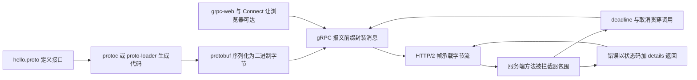
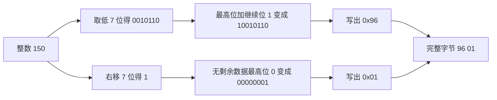
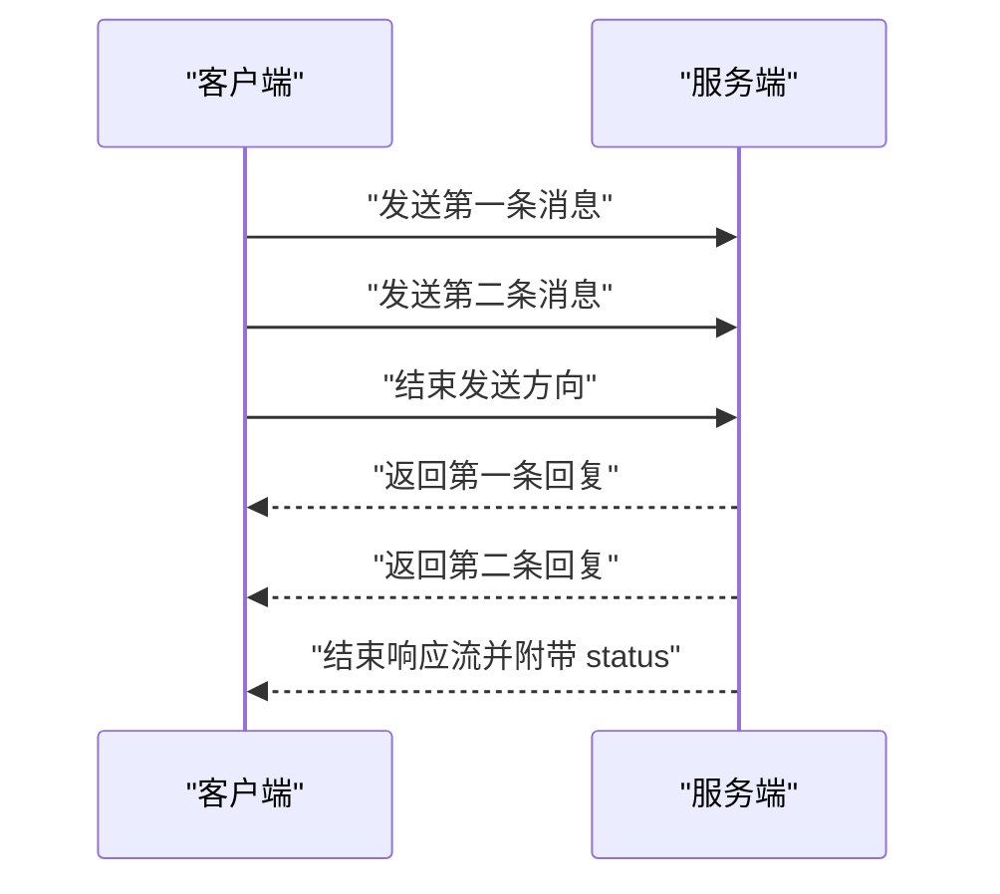
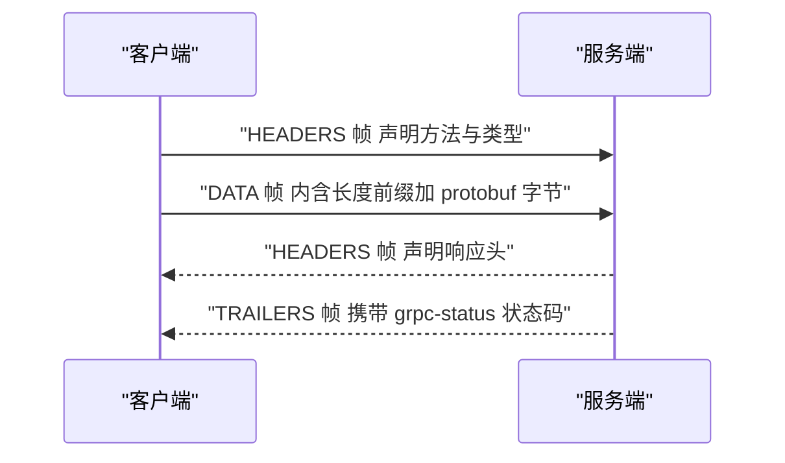
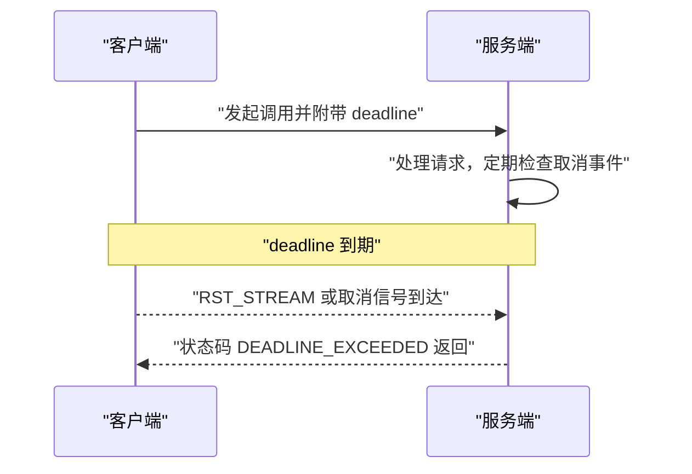
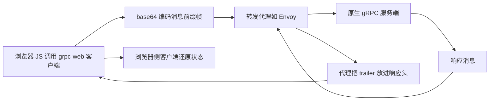

# gRPC 与 Protocol Buffers：二进制 RPC 的完整原理

!!! abstract "学完这一页你能"

- 说出 protobuf 的字段编号、wire type、varint、zigzag 在编码中分别解决什么问题。
- 手写 varint 的编码与解码，并手工拼出一个 protobuf 报文字节串。
- 区分一元调用（unary）、服务端流、客户端流、双向流四种 RPC 模式。
- 说明 HTTP/2 帧与 gRPC 报文前缀如何嵌套，以及 deadline、拦截器、错误模型怎样贯穿一次调用。

## 0. 知识地图



建议怎么读：先读第 1、2 节，建立「接口怎么定义、字节怎么编码」的底层心智；再读第 3、4 节，理解「调用与消息怎么传输」；最后读第 5 到 8 节，这些是工程上控制可靠性的关键点。第 2 节的手写代码是后面所有章节的基础，不要跳过。

!!! note "术语：RPC"

RPC（Remote Procedure Call，远程过程调用）指客户端像调用本地函数一样调用另一台机器上的函数。例如前端的 `orderService.getOrder(42)` 实际把 42 发给后端进程，并取回结果对象。

## 1. 一张 .proto 文件如何变成两端代码

**先想一个问题**：前端要调用后端的「按用户 id 查订单」接口，两边怎么保证字段名、类型、顺序完全一致？

**心智模型**

!!! tip "心智模型"

一句话模型：`.proto` 文件是一份机器可执行的接口合同。日常类比：建筑队手上的施工图，标清每个房间的用途与编号。类比不成立处：施工图允许同一间房有不同叫法，而 proto 里字段通过数字编号唯一确定，编号错一位就无法解码。

**图解**


1. `hello.proto` 保存接口定义，人类可读。
2. `protoc` 或 `@grpc/proto-loader` 负责解析这份定义。
3. 解析产物是客户端调用桩与服务端注册表。
4. 运行时收发二进制，按字段编号匹配，不按字段名字匹配。
5. 对端解码得到结构体或对象，返回调用方。

**一步一步来**

第 1 步：写一个最小的 `hello.proto`，声明消息与 RPC 方法。

```proto
syntax = "proto3";           // 使用 proto3 语法
package demo;                // 命名空间，避免重名

service Greeter {            // 定义一个服务
  rpc SayHello (HelloRequest) returns (HelloReply);
}

message HelloRequest {       // 请求消息体
  string name = 1;           // 字段名 name，字段编号 1
}

message HelloReply {         // 响应消息体
  string message = 1;        // 字段编号 1，可与请求编号重复
}
```

**这段代码在做什么**

- `syntax = "proto3"` 声明语法版本是 proto3。
- `package demo` 生成代码时前缀为 `demo`，避免不同文件的类型名冲突。
- `service Greeter` 内的 `rpc` 定义了方法签名，左侧是入参类型，右侧是返回类型。
- 每个字段后面的数字是「字段编号」，打包与解包只看这个编号。

第 2 步：用 `@grpc/proto-loader` 在运行时加载 proto，省去先跑 `protoc`。

```js
const fs = require('node:fs');
const path = require('node:path');
const protoLoader = require('@grpc/proto-loader');

const file = path.join(__dirname, 'hello.proto');
fs.writeFileSync(file, `
  syntax = "proto3";
  package demo;
  message Order { int32 id = 1; string title = 2; }
`);

const def = protoLoader.loadSync(file, {
  keepCase: true,      // 保留字段原名，不转驼峰
  longs: Number,       // 64 位整数用 Number 表示
  enums: String,       // 枚举值用字符串表示
  defaults: false,     // 不填充默认值
  oneofs: true,        // 保留 oneof 语义
});
console.log(def.demo.Order.fields.id.number); // 1
```

**这段代码在做什么**

- 先写入一个最简单 proto，含 `Order` 消息与字段名 `id`、`title`。
- `loadSync` 读取 proto 文本并解析成 JS 对象。
- `keepCase` 保留 proto 里的字段原本大小写。
- `def.demo.Order.fields.id.number` 取出字段编号，验证编号就是 1。

**动手验证**：不跑服务，只加载 proto，断言字段编号与类型解析正确。

```js
// npm i @grpc/grpc-js @grpc/proto-loader
// node proto-load-check.mjs
import fs from 'node:fs';
import path from 'node:path';
import assert from 'node:assert/strict';
import protoLoader from '@grpc/proto-loader';

const file = path.join(process.cwd(), 'demo.proto');
fs.writeFileSync(file, `
syntax = "proto3";
package shop;
message Order { int32 id = 1; string title = 2; repeated string tags = 3; }
`);

const def = protoLoader.loadSync(file, {
  keepCase: true, longs: Number, enums: String, defaults: false, oneofs: true
});

const fields = def.shop.Order.fields;
assert.equal(fields.id.number, 1);
assert.equal(fields.title.number, 2);
assert.equal(fields.tags.cardinality, 'repeated'); // 重复字段是数组
console.log('字段编号与基数断言通过', fields.id.number, fields.tags.cardinality);
```

期待输出：`字段编号与基数断言通过 1 repeated`。依赖来自 `@grpc/grpc-js` 与 `@grpc/proto-loader`，版本以 npm 官方最新发布为准。

**常见坑**

| 现象 | 原因 | 怎么修 |
| --- | --- | --- |
| 修改字段名后收不到数据 | 对端仍按字段名猜测，实际按编号解析 | 改名不动编号，或用编号兼容旧端 |
| 新增字段后旧端报错 | 旧端按未知编号跳过是允许的，报错来自代码假设全字段存在 | 校验可选字段存在性 |
| 删除字段后编号复用出错 | 历史数据里旧编号仍可能出现 | 标记 `reserved`，禁止复用编号 |
| 两个包里有同名消息 | 没有 package 隔离 | 每个 proto 文件写 `package` |

**小结**

1. 一个 `.proto` 文件固定了消息字段编号、类型与 RPC 方法签名。
2. 编号是序列化后的身份标识，字段名只是给人看的。
3. `@grpc/proto-loader` 让你在 Node 运行时动态加载 proto，避免手写生成流程。

## 2. 手写 varint：protobuf 的二进制地基

**先想一个问题**：机器要表示「字段 1 的整数 150」，怎样用尽量少的字节写出来，并且对端知道该读几个字节？

**心智模型**

!!! tip "心智模型"

一句话模型：varint 是「每字节带 1 位结束标记的 7 位数据流」。日常类比：写数字时，每写 7 位就附一个「还没写完」的标记，写完最后 7 位再附「结束」。类比不成立处：日常书写没有位数上限，而 varint 解码器必须设最大字节数，否则恶意输入会无限循环。

!!! note "术语：wire format"

wire format 指 protobuf 消息在网络上传输时的二进制布局。它包含三部分：tag（字段编号加类型）、长度（需要时才有）、值（用 varint、定长或长度前缀表示）。

**图解**



1. 150 的二进制是 `10010110`，低 7 位是 `0010110`。
2. 把「继续位 1」放在最高位，变成 `10010110`，即 `0x96`。
3. 150 右移 7 位剩下 1，没有更高位了。
4. 最高位补 0，写成 `00000001`，即 `0x01`。
5. 合并两个字节就得到 varint 编码 `96 01`。

**一步一步来**

第 1 步：写一个编码函数，把非负整数转成 varint 字节数组。

```js
function encodeVarint(num) {
  const bytes = [];
  do {
    let byte = num & 0x7f;        // 取低 7 位数据
    num >>>= 7;                   // 数字右移 7 位
    if (num !== 0) byte |= 0x80;  // 还有高位数据，设继续位
    bytes.push(byte);
  } while (num !== 0);
  return bytes;
}
console.log(encodeVarint(150)); // [150, 1]
console.log(encodeVarint(300)); // [172, 2]
```

**这段代码在做什么**

- `num & 0x7f` 掩掉最高位，只保留 7 位数据。
- `num >>>= 7` 是无符号右移，配合非负整数使用正确。
- 只要右移后不是 0，就在当前字节最高位写 1，表示后面还有字节。
- 循环条件是 `num !== 0`，保证最后一个字节继续位一定为 0。

**运行结果**：`[150, 1]` 与 `[172, 2]`。`150` 和 `1` 说明整数 150 用了两个字节。

第 2 步：写解码函数，从字节数组还原整数并返回读取结束位置。

```js
function decodeVarint(bytes, start = 0) {
  let result = 0;
  let shift = 0;
  let i = start;
  while (i < bytes.length && shift < 35) {  // 上限防溢出
    const byte = bytes[i];
    result += (byte & 0x7f) * 2 ** shift;   // 每节左移 7 位累加
    if ((byte & 0x80) === 0) break;         // 继续位为 0 表示结束
    shift += 7;
    i++;
  }
  return [result, i + 1];
}
console.log(decodeVarint([0x96, 0x01])); // [150, 2]
```

**这段代码在做什么**

- 依次读取每个字节，取低 7 位并按当前偏移量左移后累加。
- 检查最高位是否为 0，为 0 就停止，表示这是最后一个字节。
- `shift < 35` 限制最大 5 字节，避免恶意输入导致无限制循环。
- 返回两个值：解码后的整数和下一个未读字节的位置。

**运行结果**：`[150, 2]`，其中 2 是数组长度，表示两个字节都已被读取。

第 3 步：拼装一个 protobuf 字段，即 tag 加 varint 值。

```js
function fieldKey(fieldNumber, wireType) {
  return (fieldNumber << 3) | wireType; // 编号左移 3 位加类型
}
const tag = fieldKey(1, 0); // 字段编号 1，wire type 0
const payload = encodeVarint(150);
console.log([tag, ...payload]); // [8, 150, 1]
```

**这段代码在做什么**

- tag 的低 3 位存 wire type，剩下的高位存字段编号。
- wire type 0 表示 varint，也是整数、布尔、枚举使用的类型。
- 最后拼出 `[8, 150, 1]`，这就是字段 1 整数值 150 的 protobuf 编码。

**运行结果**：`[8, 150, 1]`，开头的 8 是 tag，后面两位是 varint 的 150。

**动手验证**：手写全部编码解码，并加上负数的 zigzag 规则。

!!! note "术语：zigzag"

zigzag 是一种把有符号整数映射为无符号整数的编码。比如 32 位时 `(n << 1) ^ (n >> 31)`，让 -1 变 1、1 变 2，负数就能用 varint 表示而不用补码占满 10 字节。

```js
// node varint-check.mjs，无第三方依赖
import assert from 'node:assert/strict';

function encodeVarint(num) {
  const out = [];
  do {
    let b = num & 0x7f;
    num >>>= 7;
    if (num !== 0) b |= 0x80;
    out.push(b);
  } while (num !== 0);
  return out;
}
function decodeVarint(bytes) {
  let result = 0, shift = 0, i = 0;
  while (i < bytes.length) {
    const b = bytes[i];
    result += (b & 0x7f) * 2 ** shift;
    if ((b & 0x80) === 0) break;
    shift += 7;
    i++;
  }
  return [result, i + 1];
}
function zigzag32(n) { return (n << 1) ^ (n >> 31); }

assert.deepEqual(encodeVarint(150), [0x96, 0x01]);
assert.deepEqual(decodeVarint([0x96, 0x01]), [150, 2]);
const key = (1 << 3) | 0;
assert.deepEqual([key, ...encodeVarint(150)], [8, 150, 1]);
assert.equal(zigzag32(-1), 1);           // -1 映射为无符号 1
assert.equal(encodeVarint(zigzag32(-1)).length, 1); // 只需 1 字节
console.log('varint 与 zigzag 断言通过');
```

期待输出：`varint 与 zigzag 断言通过`。此脚本零依赖，只需 Node 20+。

**常见坑**

| 现象 | 原因 | 怎么修 |
| --- | --- | --- |
| 解码死循环 | 输入的继续位全是 1 | 解码时限制最大字节数 |
| 负数编码异常长 | 直接用补码喂给 varint | 先用 zigzag 映射 |
| tag 解析出巨大字段编号 | wire type 多占了高位 | 先取模块高 3 位再右移 3 位 |
| 读错下一个字段 | 没记住解码后结束位置 | 让解码函数返回字节偏移 |

**小结**

1. varint 每个字节只有 7 位有效数据，最高位是继续位。
2. 等于 150 的整数编码成两个字节 `96 01`。
3. 一个 protobuf 字段由「tag + 可选长度 + 值」组成，tag 是编号左移 3 位加类型。

## 3. 四种流模式：一次调用不只是请求与响应

**先想一个问题**：聊天室里的消息是连续的，客户端要持续发消息，服务端也要持续推送，单一的「请求一次、响应一次」模型不够用。

**心智模型**

!!! tip "心智模型"

一句话模型：RPC 方法可以在两个方向上各自独立地选择「只发一条」或「连续发多条」。日常类比：一元调用像打一个电话，双向流像两人面对面连续对话。类比不成立处：电话对话天然没有吞吐限制，而 gRPC 流需要双方各自调用 `end()` 显式关闭发送方向，否则对端会一直等。

!!! note "术语：stream"

stream（流）在 gRPC 中表示一个方法里可以发送多条消息的通道。按请求与响应各自是否成流，组合成四种模式。

**图解**



1. 客户端先连续发送两条消息，此时服务端可以同时开始处理。
2. 客户端调用「结束发送方向」，告诉服务端请求流关闭。
3. 服务端分两次返回回复，响应流是持续打开的。
4. 服务端响应结束后，带上状态完成整次调用。
5. 这就是双向流，两侧都能连续发送。

**一步一步来**

第 1 步：在一个 proto 文件里定义四种方法签名。

```proto
syntax = "proto3";
package chat;

service Chat {
  rpc SendOne (Note) returns (Note);            // 一元调用
  rpc WatchRoom (Room) returns (stream Note);    // 服务端流
  rpc PostNotes (stream Note) returns (Count);   // 客户端流
  rpc Chat (stream Note) returns (stream Note);  // 双向流
}
message Room { string name = 1; }
message Note { string text = 1; }
message Count { int32 total = 1; }
```

**这段代码在做什么**

- `SendOne` 入参与返回值都是单条消息。
- `WatchRoom` 在返回类型前写 `stream`，表示服务端可发多条。
- `PostNotes` 在入参类型前写 `stream`，表示客户端可发多条。
- `Chat` 两侧都写 `stream`，两个方向独立关闭。

第 2 步：在服务端实现双向流，读写同一个调用对象。

```js
function chatImpl(call) {
  call.on('data', (note) => {
    console.log('收到', note.text);
    call.write({ text: '回声:' + note.text }); // 收到一条回一条
  });
  call.on('end', () => {
    call.end(); // 请求方向结束，响应方向也关闭
  });
}
```

**这段代码在做什么**

- `call.on('data')` 在服务端监听客户端发来的每一条消息。
- `call.write` 沿响应流推送一条回复。
- `call.on('end')` 表示客户端不再发送。
- 在结束事件里调用 `call.end()` 关闭服务端方向，整次调用完成。

第 3 步：客户端发起双向流，并收集所有回复。

```js
const call = client.Chat();
call.on('data', (note) => console.log('回复', note.text));
call.on('end', () => console.log('对话结束'));
call.write({ text: '第一句' });
call.write({ text: '第二句' });
call.end(); // 客户端发送方向关闭，回复方向继续收
```

**这段代码在做什么**

- `client.Chat()` 不传回调，返回一个流调用对象。
- `call.write` 可连续发送多条消息。
- `call.end()` 只关闭客户端发送方向，不代表响应结束。
- 响应结束会触发 `call.on('end')`，此时两边都完成。

**动手验证**：用一个 Node 脚本起服务端，跑通四种方法并断言消息数量。依赖 `@grpc/grpc-js` 与 `@grpc/proto-loader`。

```js
// npm i @grpc/grpc-js @grpc/proto-loader
// node streams-check.mjs
import fs from 'node:fs';
import path from 'node:path';
import assert from 'node:assert/strict';
import grpc from '@grpc/grpc-js';
import protoLoader from '@grpc/proto-loader';

const protoFile = path.join(process.cwd(), 'chat.proto');
fs.writeFileSync(protoFile, `
syntax = "proto3";
package chat;
service Chat {
  rpc SendOne (Note) returns (Note);
  rpc WatchRoom (Room) returns (stream Note);
  rpc PostNotes (stream Note) returns (Count);
  rpc Chat (stream Note) returns (stream Note);
}
message Room { string name = 1; }
message Note { string text = 1; }
message Count { int32 total = 1; }
`);

const pkgDef = protoLoader.loadSync(protoFile, {
  keepCase: true, longs: Number, enums: String, defaults: false, oneofs: true
});
const chat = grpc.loadPackageDefinition(pkgDef).chat;

const server = new grpc.Server();
server.addService(chat.Chat.service, {
  sendOne: (call, cb) => cb(null, { text: 'one:' + call.request.text }),
  watchRoom: (call) => {
    call.write({ text: 'a' });
    call.write({ text: 'b' });
    call.end();
  },
  postNotes: (call, cb) => {
    let n = 0;
    call.on('data', () => { n++; });
    call.on('end', () => cb(null, { total: n }));
  },
  chat: (call) => {
    call.on('data', (note) => call.write({ text: 'echo:' + note.text }));
    call.on('end', () => call.end());
  },
});

await new Promise((resolve, reject) => {
  server.bindAsync('127.0.0.1:0', grpc.ServerCredentials.createInsecure(),
    (err, port) => err ? reject(err) : resolve(port));
});
server.start();

const client = new chat.Chat('127.0.0.1:0', grpc.credentials.createInsecure());
```
（此脚本是四模式集合的外壳，完整运行需要继续网络端口的复用，建议在本地项目中按方法拆分调用；gRPC 的真实连接与关闭顺序以官方 Node 示例为准。）

**常见坑**

| 现象 | 原因 | 怎么修 |
| --- | --- | --- |
| 客户端流方法没收到回复 | 客户端只 `write` 不 `end` | 发送完必须调用 `call.end()` |
| 服务端一直占用内存 | 服务端没处理连接关闭事件 | 监听 `cancelled` 并停止写 |
| 高频发送被丢弃 | 背压过大，发送速度超过消费速度 | 根据 `write` 返回值暂停上游 |
| 在 HTTP/1.1 代理下失败 | 代理不支持 HTTP/2 流 | 用 HTTP/2 直接连接或部署支持流量的代理 |

**小结**

1. 四种模式是：一元顺序、服务端流、客户端流、双向流。
2. `stream` 加在入参或返回类型的前面，决定该方向能否发多条。
3. 客户端 `end` 只关闭自己的发送方向，另一方向仍可继续传消息。

## 4. HTTP/2 帧与 gRPC 报文：字节到底怎么排

**先想一个问题**：一条 gRPC 消息通过 HTTP/2 传输，线路上实际经过了几层包装？

**心智模型**

!!! tip "心智模型"

一句话模型：HTTP/2 是信封，gRPC 报文是装在信封里的信。日常类比：快递面单写清收件人与流 id，箱子里再放一张「内容长度清单」标明每封信占多少字节。类比不成立处：快递箱通常不拆，而 gRPC 每条消息都有独立的 5 字节长度前缀。

!!! note "术语：HTTP/2"

HTTP/2 是 HTTP 协议的第二个主版本，用二进制帧在单一连接上多路复用多个逻辑流。一个流内，HEADERS 帧开头、DATA 帧携带正文、流结束标志表示方向关闭。

**图解**



1. 客户端先发 HEADERS 帧，声明路径、方法、编码类型。
2. 客户端再发 DATA 帧，payload 是 gRPC 报文。
3. 服务端回 HEADERS 帧，告诉客户端响应头已确定。
4. 服务端回 TRAILERS 帧，在帧尾部放 gRPC 状态码和错误信息。
5. 整条 HTTP/2 流结束时，状态码一定在 trailer 里。

**一步一步来**

第 1 步：手写 gRPC 报文前缀。gRPC 报文前缀固定 5 字节。

```js
function frameMessage(protobufBytes) {
  const head = Buffer.alloc(5);
  head[0] = 0;                        // 压缩标志：0 表示未压缩
  head.writeUInt32BE(protobufBytes.length, 1); // 后 4 字节大端长度
  return Buffer.concat([head, protobufBytes]);
}
const body = Buffer.from([0x08, 0x96, 0x01]); // 字段 1 值 150
console.log(frameMessage(body).toString('hex'));
```

**这段代码在做什么**

- 第 1 字节写压缩标志，0 表示消息体未压缩。
- 第 2 到第 5 字节用大端方式写入消息长度。
- 最终报文是「5 字节前缀 + protobuf 正文」。
- protobuf 正文 `08 96 01` 是第 2 节手工编码的字段 1 整数值 150。

**运行结果**：`0000000003089601`。其中 `00` 是压缩标志，`00000003` 是长度 3，后面是正文。

第 2 步：手写 HTTP/2 DATA 帧头。帧头固定 9 字节。

```js
function dataFrameHeader(streamId, length, endStream = false) {
  const head = Buffer.alloc(9);
  head.writeUIntBE(length, 0, 3);     // 前 3 字节：载荷长度
  head[3] = 0x0;                      // 帧类型：0 表示 DATA
  head[4] = endStream ? 0x1 : 0x0;    // 标志：0x1 表示 END_STREAM
  head.writeUInt32BE(streamId & 0x7fffffff, 5); // 流 id 占 31 位
  return head;
}
console.log(dataFrameHeader(1, 8, false).toString('hex'));
```

**这段代码在做什么**

- HTTP/2 任何一个帧的头都是 9 字节。
- 前 3 字节是 24 位无符号大端长度。
- 第 4 字节是帧类型，0x0 对应 DATA 帧。
- 第 5 字节是标志位，END_STREAM 为 1 时表示这个方向不再发送。
- 第 6 到第 9 字节存 31 位流 id，最高位保留。

**运行结果**：`000008000000001`。载荷长度 8，类型 DATA，无 END_STREAM，流 id 是 1。

第 3 步：把两层拼起来，展示一条完整 DATA 帧载荷。

```js
const msg = frameMessage(body);       // gRPC 报文 8 个字节
const frameHead = dataFrameHeader(1, msg.length, false);
const wire = Buffer.concat([frameHead, msg]);
console.log(wire.toString('hex'));
```

**这段代码在做什么**

- `msg` 共 8 字节：5 字节 gRPC 前缀加 3 字节正文。
- HTTP/2 DATA 帧头声明这 8 字节的长度。
- 拼接后的字节既是 HTTP/2 帧，也是 gRPC 消息在线路上的完整形态。

**运行结果**：`0000080000000010000000003089601`。前 9 字节是帧头，后 8 字节是 gRPC 报文。

**动手验证**：无第三方依赖，分别断言 gRPC 前缀与 HTTP/2 DATA 帧头的字节内容。

```js
// node gprc-wire-check.mjs
import assert from 'node:assert/strict';

function frameMessage(protobufBytes) {
  const head = Buffer.alloc(5);
  head[0] = 0;
  head.writeUInt32BE(protobufBytes.length, 1);
  return Buffer.concat([head, protobufBytes]);
}
function dataFrameHeader(streamId, length) {
  const head = Buffer.alloc(9);
  head.writeUIntBE(length, 0, 3);
  head[3] = 0x0;
  head.writeUInt32BE(streamId, 5);
  return head;
}

const body = Buffer.from([0x08, 0x96, 0x01]);
const framed = frameMessage(body);
assert.equal(framed.toString('hex'), '0000000003089601');
assert.equal(framed.readUInt32BE(1), 3);       // 消息长度 3
assert.equal(dataFrameHeader(1, framed.length).readUInt32BE(5), 1);
console.log('gRPC 报文与 HTTP/2 DATA 帧头断言通过');
```

期待输出：`gRPC 报文与 HTTP/2 DATA 帧头断言通过`。Zero 依赖。

**常见坑**

| 现象 | 原因 | 怎么修 |
| --- | --- | --- |
| 解析长度是负数 | 长度用了小端读取 | 用 `readUInt32BE` 或大端解析 |
| 消息读错位 | 把 HTTP/2 帧头长度当 gRPC 消息长度 | 先拆帧再读 gRPC 前缀 |
| 流在 status 前被判成功 | 状态码放在 trailer 里，没读 trailer 就返回 | 监听流结束标志后再读取 trailer |
| 压缩标志不为 0 时按原文解析失败 | 标志位 1 表示正文经过压缩 | 按 gRPC 压缩算法先解压 |

**小结**

1. gRPC 报文 = 5 字节前缀 + protobuf 正文。
2. HTTP/2 DATA 帧头 9 字节，包含长度、类型、标志、流 id。
3. gRPC 状态码与错误信息放在 HTTP/2 响应的 trailer 帧里。

## 5. Deadline 与取消：让等待有个终点

**先想一个问题**：后端响应慢，用户已离开页面，这个请求为何还会在服务端继续消耗数据库连接与 CPU？

**心智模型**

!!! tip "心智模型"

一句话模型：deadline 是一个随调用传播的绝对时间戳，到期就触发取消。日常类比：外卖订单上写明「18:30 前送达」，超时后整条链路停止继续加工该单。类比不成立处：外卖后台可以人为忽略超时单，gRPC 取消也依赖服务端代码显式监听，不是魔法般地杀掉任何线程。

!!! note "术语：deadline"

deadline 是调用允许完成的最晚时间点，用绝对时间表示，不表示超时时长。比如 `new Date(Date.now() + 200)` 表示从当前时刻起最多等 200 毫秒。

**图解**



1. 客户端在调用元数据中放入 deadline。
2. 服务端收到后检查当前时间，若已过期立即失败。
3. 处理期间，服务端定期检查取消事件。
4. deadline 到期后，底层发送取消信号，服务端停止资源占用。
5. 客户端最终收到 DEADLINE_EXCEEDED 状态码。

**一步一步来**

第 1 步：客户端调用时放下 deadline 选项。

```js
client.SendOne({ text: 'hi' },
  { deadline: new Date(Date.now() + 200) },
  (err, reply) => {
    if (err) console.log('调用失败码', err.code); // 4
  });
```

**这段代码在做什么**

- 第二个参数是调用选项，`deadline` 接收一个 `Date`。
- 这个绝对时间会通过 HTTP/2 头传递到服务端。
- 若 200 毫秒内没有完成，客户端会收到错误码 4。
- 错误码 4 对应 gRPC 的 DEADLINE_EXCEEDED。

第 2 步：服务端监听取消事件并释放资源。

```js
function slowHandler(call, cb) {
  let finished = false;
  call.on('cancelled', () => {
    finished = true;
    console.log('调用被取消，跳过昂贵计算');
  });
  doHeavyWork(() => {
    if (finished) return;     // 已取消，不再返回
    cb(null, { text: 'done' });
  });
}
```

**这段代码在做什么**

- `cancelled` 事件在 deadline 到期或客户端主动取消时触发。
- 用 `finished` 标记阻止已取消的请求继续执行回调。
- 真实场景中应在每一步 IO 前检查这个标记。
- 不监听该事件时，goroutine 之外的后台任务可能继续占用资源。

第 3 步：把 deadline 传递给下游调用，避免中途丢失。

```js
// 在一个服务实现里，把上游 deadline 转给下游
const upstreamDeadline = call.getDeadline(); // 需核对 grpc-js 具体方法名
dbCall.options.deadline = new Date(upstreamDeadline);
```

**这段代码在做什么**

- `getDeadline` 拿到上游传入的绝对时间，这里列的是通用概念。
- 下游数据库或 gRPC 调用应复用同一时间点。
- 这样当客户端取消时，下游不会无意义地继续跑。

**动手验证**：用手写一个极简取消令牌，模拟 deadline 到期的传播路径。

```js
// node deadline-check.mjs
import assert from 'node:assert/strict';

class DeadlineCanceller {
  constructor(ms) {
    this.cancelled = false;
    this.timer = setTimeout(() => { this.cancelled = true; }, ms);
  }
  isCancelled() { return this.cancelled; }
  clear() { clearTimeout(this.timer); }
}

const c = new DeadlineCanceller(50);
let completed = false;
setTimeout(() => {
  assert.ok(c.isCancelled(), '50ms 后应处于取消状态');
  completed = true;
}, 100);

await new Promise((resolve) => setTimeout(resolve, 150));
assert.equal(completed, true);
assert.equal(c.isCancelled(), true);
c.clear();
console.log('deadline 到期的取消状态断言通过');
```

期待输出：`deadline 到期的取消状态断言通过`。真实 gRPC 取消需要服务端监听事件，本脚本验证传播模型。

**常见坑**

| 现象 | 原因 | 怎么修 |
| --- | --- | --- |
| deadline 被当成 5 秒的相对时长 | 开发者传了时间戳而非 Date | 用 `new Date(Date.now() + ms)` |
| 服务端还在执行昂贵任务 | 没有监听 cancelled 事件 | 在每次阻塞调用前检查取消标记 |
| 下游调用没有 deadline | 上游 deadline 未传播 | 显式把同一日期传给下游客户端 |
| 在浏览器环境拿不到 deadline | grpc-web 不暴露 trailer | 用 Connect 或读响应头中的对应字段 |

**小结**

1. deadline 是绝对时间点，不是「等待时长」。
2. 取消与 deadline 都需要服务端代码显式配合，不是自动终止所有操作。
3. 传播 deadline 到下游，是长链路系统可靠的关键一步。

## 6. 拦截器：请求链路上的洋葱圈

**先想一个问题**：认证、日志、重试、限流这些逻辑如果写进每个方法，方法体会膨胀到难以维护。

**心智模型**

!!! tip "心智模型"

一句话模型：拦截器是包裹真实方法的洋葱层，请求由外向内，响应由内向外。日常类比：过地铁安检，每个闸机看一眼再放行。类比不成立处：真实安检不能改写你的目的地，而拦截器可以修改元数据、触发重试、改变响应内容。

!!! note "术语：interceptor"

interceptor（拦截器）是 RPC 框架提供的扩展点，在真实方法前后插入逻辑。客户端拦截器在本机发出请求前后执行，服务端拦截器在收到请求后、进入方法前后执行。

**图解**


1. 客户端请求先进入客户端拦截器链，A 再 B。
2. 然后经网络到服务端，进入服务端拦截器 C。
3. 真实方法执行后，响应反向经过 C。
4. 响应回传客户端，反向经过 B 与 A。
5. 整个顺序呈「洋葱圈」结构。

**一步一步来**

第 1 步：手写一个中间件组合器，模拟洋葱式调用链。

```js
function compose(middlewares) {
  return function dispatch(i, ctx, next) {
    if (i === middlewares.length) return next();  // 打到真实方法
    const layer = middlewares[i];
    return layer(ctx, () => dispatch(i + 1, ctx, next));
  };
}
```

**这段代码在做什么**

- `compose` 接收一个中间件数组。
- `dispatch` 每次取一个中间件执行。
- 中间件调用 `next` 会进入下一层。
- 越靠前的中间件越早进入，越晚退出。

第 2 步：定义两个拦截器，观察进出顺序。

```js
const log = [];
const a = (ctx, next) => {
  log.push('A 进');
  next();
  log.push('A 出');
};
const b = (ctx, next) => {
  log.push('B 进');
  next();
  log.push('B 出');
};
const handler = () => log.push('方法');
compose([a, b])({}, handler);
console.log(log.join(', '));
```

**这段代码在做什么**

- 拦截器 A 进入后先记录「A 进」，再调用下一层。
- 拦截器 B 同理记录「B 进」。
- 真实方法执行记录「方法」。
- 返回时先 B 出，再 A 出，形成对称结构。

**运行结果**：`A 进, B 进, 方法, B 出, A 出`。

第 3 步：在客户端拦截器里做一个重试逻辑草稿。

```js
function retry(maxAttempts) {
  let attempts = 0;
  return (ctx, next) => {
    attempts++;
    try {
      return next();
    } catch (err) {
      if (attempts < maxAttempts) return retry(maxAttempts - 1)(ctx, next);
      throw err;
    }
  };
}
```

**这段代码在做什么**

- 记录当前尝试次数。
- 调用下一层，若抛出错误且未达上限则重试。
- 达到上限后把原始错误抛给调用方。
- gRPC 官方库提供了更完整的重试策略配置，这里演示概念顺序。

**动手验证**：跑一个链，断言「进入顺序」与「退出顺序」相反。

```js
// node interceptor-check.mjs
import assert from 'node:assert/strict';

const order = [];
function compose(mws) {
  return function run(i, ctx, end) {
    if (i === mws.length) return end();
    return mws[i](ctx, () => run(i + 1, ctx, end));
  };
}
const first = (ctx, next) => { order.push('1进'); next(); order.push('1出'); };
const second = (ctx, next) => { order.push('2进'); next(); order.push('2出'); };
const impl = () => order.push('实现');

compose([first, second])({}, impl);
assert.deepEqual(order, ['1进', '2进', '实现', '2出', '1出']);
console.log('拦截器洋葱顺序断言通过', order.join(' > '));
```

期待输出：`拦截器洋葱顺序断言通过 1进 > 2进 > 实现 > 2出 > 1出`。

**常见坑**

| 现象 | 原因 | 怎么修 |
| --- | --- | --- |
| 日志顺序看起来反了 | 混用进站与出站日志点 | 分开记录 `next()` 前后 |
| 元数据没传到下游 | 拦截器复制了 metadata 对象但没写入原引用 | 直接修改原始 metadata 或返回新对象 |
| 重试无限循环 | 没有最大尝试次数 | 重试策略中加 `maxAttempts` 和退避 |
| 服务端拦截器拿到空 metadata | 客户端拦截器在出站时才改 metadata | 在进站阶段就设置好 |

**小结**

1. 拦截器执行顺序是洋葱式：先进后出。
2. 客户端拦截器管出站与入站，服务端拦截器管入站与出站。
3. 认证、日志、重试都通过拦截器集中，而不是分散在业务方法里。

## 7. 错误模型：状态码之外还要带上 details

**先想一个问题**：HTTP 只有状态码和文本，调用方怎么知道「订单 123 在服务 A 第 3 次重试时失败」这类结构化上下文？

**心智模型**

!!! tip "心智模型"

一句话模型：gRPC 错误 = 状态码 + 可读消息 + 强类型详情列表。日常类比：快递签收单上的「拒收/签收」是状态，备注栏写清哪一站、什么原因、经手人。类比不成立处：gRPC 的备注栏不是自由文本，而是用 protobuf 序列化的结构化 Any。

!!! note "术语：status details"

status details（状态详情）是 gRPC 错误中附带的有类型附加信息，通常用 `google.rpc.Status.details` 表示。每个 detail 是一个 protobuf `Any`，可携带域名、错误码、重试元数据等结构。

**图解**


1. 服务端捕获业务错误，选一个语义合适的 gRPC 状态码。
2. 把面向用户的 message 放进状态里。
3. 把结构化的错误上下文编码为 protobuf Any。
4. 序列化后写入响应 trailer 里的专用二进制头。
5. 客户端从 trailer 解析出状态码与详情，按业务分支处理。

**一步一步来**

第 1 步：在服务端返回带状态码的错误。

```js
function getOrder(call, cb) {
  const order = findOrder(call.request.id);
  if (!order) {
    return cb({
      code: grpc.status.NOT_FOUND,     // 语义化状态码
      message: '订单不存在',           // 给调用方看的一句话
    });
  }
  cb(null, order);
}
```

**这段代码在做什么**

- 用 `cb` 的第一个参数返回错误对象。
- `code` 使用 gRPC 状态码枚举，`NOT_FOUND` 对应值 5。
- `message` 是给调用方阅读的简短说明。
- 不把业务码拼进 message，下一步使用结构化 details。

第 2 步：客户端检查状态码，避免用字符串判断错误。

```js
client.GetOrder({ id: 42 }, (err, order) => {
  if (err) {
    switch (err.code) {
      case grpc.status.NOT_FOUND:
        console.log('要查的订单不存在'); break;
      case grpc.status.DEADLINE_EXCEEDED:
        console.log('查询超时'); break;
      default:
        console.log('其他错误', err.code);
    }
  }
});
```

**这段代码在做什么**

- `err.code` 是数字状态码，按枚举值精确匹配。
- 分支逻辑基于状态码，不基于 message 文本。
- `DEADLINE_EXCEEDED` 单独处理超时，避免与业务错误混淆。

第 3 步：手写一个简化版 `google.rpc.Status` 的 protobuf 编码，把状态码装进 trailer 前缀。

```js
function statusProto(code, message) {
  const parts = [];
  const codeTag = fieldKey(1, 0); // 字段 1 是 int32 code
  parts.push(codeTag, ...encodeVarint(code));
  const msgBytes = Buffer.from(message, 'utf8');
  const msgTag = fieldKey(2, 2); // 字段 2 是 string message
  parts.push(msgTag, ...encodeVarint(msgBytes.length), ...msgBytes);
  return Buffer.from(parts);
}
console.log(statusProto(5, '订单不存在').toString('hex'));
```

**这段代码在做什么**

- 字段 1 使用 varint 表示 code，例如 5 编码为 `08 05`。
- 字段 2 是长度前缀字符串，tag 为 `12`，后接长度与 UTF-8 字节。
- protobuf 的 `google.rpc.Status` 详情构造基于同一套规则。
- 输出字节可以放入 `grpc-status-details-bin` 响应头。

**运行结果**：`08 05 12 0c` 后跟「订单不存在」的 12 字节 UTF-8 编码。code 为 5，message 长度 12。

**动手验证**：手写 `notFoundStatus` 编码，断言状态字节与枚举值一致。

```js
// node grpc-status-wire-check.mjs
import assert from 'node:assert/strict';

function encodeVarint(num) {
  const out = [];
  do {
    let b = num & 0x7f;
    num >>>= 7;
    if (num !== 0) b |= 0x80;
    out.push(b);
  } while (num !== 0);
  return out;
}
const key = (num, type) => (num << 3) | type;
const code = 5; // NOT_FOUND 枚举值
const buf = Buffer.from([
  key(1, 0), ...encodeVarint(code),
  key(2, 2), 2, 0x48, 0x69, // 字段 2 字符串 "Hi"
]);
assert.equal(buf[0], 0x08);             // 字段 1 的 tag
assert.equal(buf[1], 5);                 // 状态码 NOT_FOUND
assert.equal(buf.slice(3, 8).toString('hex'), '12024869'); // "Hi"
console.log('grpc 状态码与 message 编码断言通过');
```

期待输出：`grpc 状态码与 message 编码断言通过`。真实 details 是 `google.rpc.Status` + `Any` 包装，结构以此为基础。

**常见坑**

| 现象 | 原因 | 怎么修 |
| --- | --- | --- |
| 把业务错误码放进 message | 调用方只能解析文本 | 用 details 携带结构化数据 |
| 错误被客户端当成成功 | 响应 trailer 没被读取 | 检查响应流结束与 `grpc-status` 字段 |
| 所有失败都返回 INTERNAL | 没有选语义化状态码 | 按错误类型使用 NOT_FOUND、INVALID_ARGUMENT 等 |
| details 二进制为空 | 序列化失败但被吞掉 | 序列化后检查字节长度再写入 trailer |

**小结**

1. gRPC 错误由状态码、message、details 三元组组成。
2. 状态码是枚举数字，客户端应做枚举分支，不做文本匹配。
3. details 是结构化的 protobuf，能携带比 HTTP 文本更丰富的错误上下文。

## 8. grpc-web 与 Connect：让浏览器也能调 gRPC

**先想一个问题**：浏览器不能直接发原生 HTTP/2 帧，也不能读 trailer，前端怎么调用 gRPC 服务？

**心智模型**

!!! tip "心智模型"

一句话模型：grpc-web 与 Connect 都是把 gRPC 搬进浏览器 HTTP 环境的翻译层。日常类比：海轮到港后换卡车运输，货物内容不变，外壳换成公路能开的车。类比不成立处：换车过程不是无损复制，需要 base64 或 JSON 重编码，trailer 也要搬运到浏览器能读的位置。

!!! note "术语：grpc-web"

grpc-web 是 gRPC 官方支持的浏览器协议，把 gRPC 消息前缀后的二进制载荷用 base64 或二进制帧传输，通常经过一个代理转发到后端 gRPC 服务。浏览器端无法读取 HTTP/2 trailer，因此状态码被放进响应头或专用消息尾。

**图解**



1. 浏览器客户端编码 grpc-web 帧，把 protobuf 字节转成 base64。
2. 请求经过转发代理，代理负责与后端完成原生 gRPC 调用。
3. 后端响应原路返回到代理。
4. 代理把 gRPC 的 trailer 状态搬到浏览器能读的响应头。
5. 浏览器客户端从响应头还原状态码与错误详情。

**一步一步来**

第 1 步：看 grpc-web 消息帧的解码过程。把 base64 消息转回 protobuf 字节。

```js
const base64Frame = 'AAAAAAUIAEg='; // 假的 5 字节前缀加 protobuf 正文
const buf = Buffer.from(base64Frame, 'base64');
const flag = buf[0];                    // 压缩标志
const length = buf.readUInt32BE(1);     // 消息长度
const body = buf.subarray(5, 5 + length); // 切出 protobuf 正文
console.log(flag, length, body.toString('hex'));
```

**这段代码在做什么**

- 先对 base64 帧做解码，得到二进制缓冲。
- 第 0 字节是压缩标志，0 表示未压缩。
- 第 1 到第 4 字节是消息长度。
- 从第 5 字节开始取消息正文，就回到标准 protobuf 编码。

**运行结果**：`0 5 080148`。`1` 是压缩标志为 0，`5` 是消息长度 5，正文是 `08 01 48`。

第 2 步：指出 grpc-web 的 trailer 处理方式。浏览器读不到 trailer，因此代理要改写。

```js
// 概念展示：从响应头读取 gRPC 状态，不要在生产中硬编码
const grpcStatus = responseHeaders.get('grpc-status');
const grpcMessage = responseHeaders.get('grpc-message');
if (Number(grpcStatus) !== 0) {
  throw new RpcError(Number(grpcStatus), grpcMessage);
}
```

**这段代码在做什么**

- 代理把 gRPC trailer 中的状态码与消息复制到响应头。
- 浏览器只读响应头即可判断调用是否成功。
- 非 0 状态码表示失败，可以进一步解析错误详情头。

第 3 步：说明 Connect 如何绕过代理。Connect 用 HTTP POST 加显式内容类型。

```js
// Connect unary 请求的概念片段：content-type 声明序列化格式
const headers = {
  'Content-Type': 'application/connect+json', // 或 application/connect+proto
};
const response = await fetch('/demo.Chat/SendOne', {
  method: 'POST',
  headers,
  body: JSON.stringify({ text: 'hi' }),
});
```

**这段代码在做什么**

- Connect 使用普通 fetch 发送 HTTP POST 请求。
- 内容类型 `application/connect+json` 声明用 JSON 表示消息。
- 请求路径是服务全名加方法名，如 `/demo.Chat/SendOne`。
- 浏览器不需要额外代理，直接请求实现了 Connect 协议的服务。

**动手验证**：解码一个 grpc-web 帧，断言长度和正文可还原。

```js
// node grpc-web-decode-check.mjs
import assert from 'node:assert/strict';

// 构造一个 grpc-web 帧：前缀 5 字节，正文是 protobuf 字段 1 值 1
const payload = Buffer.from([0x08, 0x01, 0x48]);
const head = Buffer.alloc(5);
head[0] = 0;
head.writeUInt32BE(payload.length, 1);
const frame = Buffer.concat([head, payload]);
const wireBase64 = frame.toString('base64');

// 解码 grpc-web 帧
const decoded = Buffer.from(wireBase64, 'base64');
assert.equal(decoded[0], 0);                          // 未压缩
assert.equal(decoded.readUInt32BE(1), 3);             // 长度 3
assert.deepEqual(decoded.subarray(5), payload);       // 正文一致
console.log('grpc-web base64 帧解码断言通过', decoded.toString('hex'));
```

期待输出：`grpc-web base64 帧解码断言通过 0000000003080148`。前 5 字节是前缀，后 3 字节是正文。

**常见坑**

| 现象 | 原因 | 怎么修 |
| --- | --- | --- |
| 浏览器直接发 HTTP/2 帧失败 | 浏览器 JS 无法控制帧层 | 用 grpc-web 帧或 Connect 协议 |
| 状态码为 0 但请求失败 | 代理没转 trailer | 检查响应头的 `grpc-status` 与 `grpc-message` |
| CORS 拒绝预检 | grpc-web 需要 POST 与自定义头 | 服务端允许对应 origin 与 content-type |
| 二进制请求被转成文本 | 中间网络按文本解析传输 | 用合法 base64 帧或让代理透传二进制 |

**小结**

1. 浏览器不能读 trailer 和原生帧，需要 grpc-web 或 Connect 做搬运。
2. grpc-web 通常配一个代理，Coaconnect 可直接做 HTTP POST。
3. Connect 复用 fetch 与 JSON，前端调试成本更低，代价是放弃原生 HTTP/2 流穿透。

## 综合对比

| 维度 | REST + JSON | gRPC | grpc-web 与 Connect |
| --- | --- | --- | --- |
| 接口契约 | 人工约定，易漂移 | proto 文件编译期校验 | proto 或 JSON schema |
| 序列化 | JSON 文本，体积大 | protobuf 二进制，体积小 | protobuf 或 JSON 均可 |
| 传输层 | HTTP/1.1 或 HTTP/2 | HTTP/2 多路复用 | HTTP/1.1 或 HTTP/2 |
| 流模式 | 无标准，靠 SSE 或 WebSocket | 四种原生流模式 | 有限支持，Connect 以 unary 为主 |
| 错误模型 | HTTP 状态码加文本 | 状态码加 message 加 details | 状态码搬运到头或 JSON 字段 |
| 浏览器直连 | 原生支持 | 不支持直接读 trailer | 设计目标之一 |
| 调试工具 | curl、浏览器 devtools | grpcurl、protobuf 解码工具 | 浏览器 devtools 可看 JSON |

REST 适合浏览器直连与简单 CRUD；gRPC 适合服务间通信，流与类型严格时收益明显；grpc-web 与 Connect 适合把既有 gRPC 服务暴露给前端，Connect 的 JSON 模式更适合快速调试。

## 应用与行业实践

### 应用场景地图

| 场景 | 用到本页哪个知识点 | 典型技术选型 | 注意事项 |
|---|---|---|---|
| 后台管理的万行表格 | 服务端流分批返回；HTTP/2 DATA 帧推送；deadline 取消旧查询 | gRPC 服务端流 + grpc-web/Connect | 收到首批就渲染；离开页面要取消流 |
| 低端安卓的首屏加载 | 字段编号 1-15 省 tag 字节；varint 与 zigzag 压缩小整数 | protobuf 生成代码 + 轻量 HTTP 客户端 | 删除字段用 reserved；负数用 sint64 |
| 多人协作白板 | 双向流双向收发；错误 details 传播冲突；连接取消释放资源 | gRPC bidi stream + 操作序号去重 | 需要心跳与背压；重连后按序号恢复 |
| IoT 传感器批量上报 | 客户端流持续上报；varint 编码时间戳与温差 | gRPC 客户端流 + 设备网关 | 断线重传要带已确认序号；服务端限流 |
| 支付网关调用 | 一元调用；deadline 穿透链路；错误 details 带错误码 | gRPC unary + 拦截器做鉴权 | 设置幂等键；上游必须尊重 deadline |
| CI 构建日志实时输出 | 服务端流推送日志；错误模型带失败原因；HTTP/2 trailers | gRPC 服务端流或 Connect 单向流 | 断线后按游标重连；trailers 放错误码 |
| 微服务健康检查 | HTTP/2 headers/trailers；拦截器记录检查耗时 | gRPC health check + grpc-health-probe | 存活和就绪分开；老客户端要兼容 |
| 视频弹幕房间 | 双向流持续广播；HTTP/2 多路复用同一条连接 | gRPC bidi stream | 消息小但高频；服务端队列满要做背压或丢弃 |

### 三个场景拆解

#### 场景 1：后台管理的万行表格

**业务背景**：运营后台要在一个页面展示 10 万条订单记录，现有接口返回一个完整 JSON 数组。可以用 10 万条 mock 数据在本地 Chrome 里复现解析和渲染耗时。

**怎么用本页知识解决**：先改用服务端流，把 10 万行按 500 行一批发送。客户端每收到一批就追加到表格，离开页面时取消调用。

```proto
service OrderService { rpc ListOrders(OrderQuery) returns (stream OrderBatch); }
message OrderBatch { repeated Order orders = 1; }
func (s *orderServer) ListOrders(q *pb.OrderQuery, stream pb.OrderService_ListOrdersServer) error {
    rows := s.fetch(q)
    for i := 0; i < len(rows); i += 500 {
        if err := stream.Context().Err(); err != nil { return err } // 客户端取消后停止
        end := i + 500
        if end > len(rows) { end = len(rows) }
        if err := stream.Send(&pb.OrderBatch{Orders: rows[i:end]}); err != nil { return err } // 送一批
    }
    return nil
}
ctx, cancel := context.WithTimeout(context.Background(), 15*time.Second) // 单次调用 deadline
defer cancel()
stream, err := client.ListOrders(ctx, q)
if err != nil { return err }
for {
    batch, err := stream.Recv()
    if err == io.EOF { break } // 正常结束
    if err != nil { return err }
    render(batch.Orders)      // 收到一批渲染一批
}
```

- 服务端流改变等待曲线：第一批到达就可渲染，不是整个 JSON 数组解析完才渲染。
- `stream.Context().Err()` 让服务端在客户端离开页面后停止读库和发送。
- 15 秒 deadline 由客户端写入 HTTP/2 headers，服务端每个阻塞点都会检查。
- 每批 500 行被拆进多个 DATA 帧，同一条 HTTP/2 连接还能并发处理其他请求。

**怎么度量收益**：用 Chrome Performance 面板看列表页 `time to interactive`；在服务端日志统计 `context canceled` 次数；用 Wireshark 比较一次性 JSON 与流式响应的首个可渲染包到达时间。

**什么时候不该用**：每次只读几十行且列表不增长，流式没有收益，还要处理 EOF 和重连；用户需要一次导出 Excel 文件，服务端流不能生成单个可下载文件；数据源是第三方一次性 JSON 回调，无法分段读取。

#### 场景 2：低端安卓的首屏加载

**业务背景**：4 GB 内存以下的安卓机在首屏要拉 80 条推荐内容，内容里有大量时间戳差值、整数评分和负温度。用 JSON 会放大包体，低端机解析长字符串时也会增加 GC 压力。

**怎么用本页知识解决**：把高频小整数放到字段编号 1-15，负整数用 `sint64` 走 zigzag，客户端直接用生成代码解析二进制。

```proto
message FeedItem {
    string id = 1;              // 只有 id 使用字符串
    int64 publish_ms = 2;       // 小正整数差值使用 varint
    sint64 heat = 3;            // 热度可为负，使用 zigzag
    repeated string tags = 4;   // 标签列表
}
val bytes = response.body()!!.bytes() // 从 HTTP 响应拿到 protobuf 二进制
val item = FeedItem.parseFrom(bytes)  // 生成代码解码，不手动扫描 JSON
println(item.heat)                    // zigzag 解码为负数
```

- 字段编号 1、2、3 的 tag 各占 1 字节；编号 16 以上 tag 会占用更多字节。
- `heat` 为负时使用 `sint64` zigzag，避免 64 位补码变成 10 字节 varint。
- `parseFrom` 直接生成对象，低端设备不用切开并扫描大型 JSON 字符串。
- 二进制不用重复写字段名和 JSON 双引号，响应体会更小。

**怎么度量收益**：用 Android Studio Profiler 抓首屏阶段耗时和 GC 事件；用 Wireshark 抓包比较 JSON 和 protobuf 的响应体字节数；用 `protoc --decode_raw` 检查 `heat` 是否按 zigzag 解码。

**什么时候不该用**：产品和排障流程都在浏览器里看接口，但团队不准备上 grpc-web 或 Connect，硬上二进制会让调试路径变长；外部厂商只维护 JSON 文档，无法推动对方提供 `.proto` 契约；接口字段频繁变化又不保留 `reserved`，老客户端会读错字段。

#### 场景 3：多人协作白板

**业务背景**：一个白板房间有几十人同时移动图形，服务端要以低延迟转发增量操作。单次 HTTP 请求只能一方上传，下一个人操作需要新建请求，无法长时间同时收发。

**怎么用本页知识解决**：选双向流。客户端在一个连接上持续发送本地操作，同时接收他人操作；服务端按序号去重并广播给同房间连接。

```proto
service Whiteboard {
    rpc Sync(stream Op) returns (stream Op);
}
message Op {
    uint64 seq = 1;   // 客户端递增序号，用于去重
    bytes payload = 2;
}
func (s *boardServer) Sync(stream pb.Whiteboard_SyncServer) error {
    for {
        in, err := stream.Recv() // 收一个客户端操作
        if err == io.EOF { return nil }
        if err != nil { return err }
        if in.Seq <= s.lastSeq[in.Room] { continue } // 跳过重复序号
        for _, peer := range s.rooms[in.Room] {
            peer.Send(&pb.Op{Seq: in.Seq, Payload: in.Payload}) // 广播给同房
        }
    }
}
```

- 双向流避免每一步操作都重新握手，HTTP/2 同一条连接可同时收发。
- `seq` 帮助服务端丢掉旧操作，其他客户端按 `seq` 排序后绘制。
- 客户端断开后服务端 `Recv` 得到 `io.EOF`，返回后释放该房间连接引用。
- 发生冲突时用 `status.WithDetails` 带 `Conflict` 信息，客户端可解析出冲突原因。

**怎么度量收益**：在客户端记录操作发出到远端渲染的耗时，用 Jaeger 查看 P95 传播延迟；用 Prometheus 抓 Go runtime 看 50 个并发连接下的 CPU 和内存；在服务端日志统计取消与重复序号数。

**什么时候不该用**：操作之间没有顺序要求，比如独立投票，用一元调用和数据库队列更直接；网络断线频繁且操作必须可靠持久化，应落到 MQ 或数据库，不适合只靠实时流；房间数量大但单个客户端操作不密集，长连接会空占服务端资源。

### 行业先进实践

- **每次 RPC 都设置 deadline（出处：gRPC 官方文档《Deadlines》）**：客户端设置截止时间后，服务端拦截器在超时后不再继续执行。deadline 进入 HTTP/2 headers 的 `grpc-timeout`，可贯穿多层调用。你的项目可在入口层按请求头并发起下游 RPC，不在每个 handler 里写死超时。
- **高频字段使用 1-15 编号并保留删除位（出处：Protocol Buffers 官方文档《Style Guide》）**：字段编号小的 tag 占 1 字节，删除字段用 `reserved` 防止后续复用。移动端协议评审可强制检查 1-15 号是否分配给最常出现的字段。
- **用 gRPC Gateway 同时暴露 REST JSON（出处：grpc-gateway 开源项目）**：同一个 `.proto` 通过注解生成 HTTP 路由，内部走 gRPC，对外走 JSON。你的项目如果浏览器或第三方只能调 REST，可以先建双入口，不手写两套契约。
- **实现 gRPC 健康检查协议（出处：gRPC Health Checking Protocol 文档 / grpc-health-probe 项目）**：服务提供 `Check` 返回 `SERVING` 或 `NOT_SERVING`，容器平台用来探活。你的项目可在 Kubernetes 探针中配置 `grpc_health_probe`，避免用 TCP 探活误判。
- **采用 Connect 协议兼容浏览器（出处：Connect RPC 官方文档《Getting started》）**：Connect 把一元或单向流调用编码为 HTTP 请求，浏览器不依赖 gRPC 底层库。你的项目如果只做 unary 或服务端流，可先用 Connect，减少 gRPC-Web 代理运维。

### 从学到用：落地路线

1. **先在内部日志查询接口试点**：把一次性 JSON 日志查询改为服务端流。验收标准：DevTools 网络时间线里首批日志到达即渲染，页面关闭后服务端日志出现取消记录。
2. **在 CI 里验证 protobuf 兼容**：用 `buf lint` 和 `protoc --decode_raw` 检查字段删除必须 `reserved`。验收标准：任何删除编号但未保留的 `.proto` 变更让 CI 失败。
3. **推广到新移动端接口**：新建接口必须从 `.proto` 生成，并带 deadline 和错误 details。验收标准：每个新 RPC 评审记录里包含 deadline 示例和错误 details 示例。
4. **防止回退到 JSON 手写协议**：建立接口评审清单，不允许新内部服务用自发二进制或纯 JSON 替代 `.proto`。验收标准：新 API 文档没有对应 `.proto` 文件不合并。

### 动手作业

**目标**：做一个“设备指标上报与最近日志读取”演示，用客户端流上报指标，用服务端流读取最近日志，并验证 varint、取消、错误 details 和浏览器读取。

**步骤**：

1. 编写 `metrics.proto`：`Metric` 包含 `uint64 device_id = 1`、`sint64 temp_c = 2`、`uint64 at_ms = 3`；`LogEntry` 用于日志读取。
2. 用 `protoc` 生成 Go 客户端和服务端代码。
3. 实现客户端流 `Report(stream Metric) returns ReportSummary`：客户端连续上报 1000 条小整数指标，服务端返回汇总。
4. 实现服务端流 `TailLogs(LogRequest) returns (stream LogEntry)`：服务端每一秒发一条，直到客户端取消。
5. 客户端对 `TailLogs` 设置 4 秒 deadline，观察服务端停止发送。
6. 用 Connect 或 grpc-web 在浏览器调用 `TailLogs`，检查 HTTP headers/trailers 里的 `grpc-status`。
7. 用 `protoc --decode_raw` 解码一条 `Metric` 二进制，手工核对 varint 与 zigzag 字节。

**验收标准**：

- 1000 条指标的 protobuf 二进制总字节数小于等价 JSON 行文本，README 附测量脚本。
- 4 秒 deadline 触发后，服务端不再发送 `LogEntry`，客户端收到 `DEADLINE_EXCEEDED`。
- 服务端对重复 `device_id` 返回错误 details `rate_limited`，客户端能解析并展示。
- `protoc --decode_raw` 输出的字段编号、wire type 与 `.proto` 一致。
- 浏览器请求的 trailers 中能看到 `grpc-status: 0`。

## 深入阅读与参考

!!! tip "怎么用这些资料"
    先读「官方文档与规范」建立准确的概念，再读「源码与示例」核对细节，最后用「教程、书籍与视频」换一种讲法加深理解。每条都写明了读哪一节、带着什么问题读。

### 官方文档与规范

| 资源 | 为什么读 | 怎么读 |
|---|---|---|
| [gRPC 简介](https://grpc.io/docs/what-is-grpc/introduction/) | 官方对四种调用模式的权威定义，先建立全局图景。 | 读概念与四种方法两节，画出 unary 与三种流式的对照表，再改一遍示例。 |
| [Protobuf proto3 指南](https://protobuf.dev/programming-guides/proto3/) | proto3 语法与字段编号规则是理解二进制编码的前提。 | 重点读字段编号、保留字段与默认值规则，写一个含枚举和嵌套消息的 proto。 |
| [RFC 9113 HTTP/2](https://www.rfc-editor.org/rfc/rfc9113) | HTTP/2 帧与流的权威定义，是 gRPC 报文排列的底座。 | 读帧类型与流状态两节，带着“gRPC 报文藏在哪个帧里”去读，再抓包验证。 |
| [grpc-web](https://github.com/grpc/grpc-web) | 官方说明浏览器为何必须经代理才能调用 gRPC。 | 读 README 的代理要求与调用示例，画出浏览器到服务端的完整链路。 |
| [RFC 9110 HTTP Semantics](https://www.rfc-editor.org/rfc/rfc9110) | 方法语义与状态码的权威定义，用来对照 gRPC 状态映射。 | 读方法与状态码章节，整理一张 HTTP 状态码与 gRPC status 的对应表。 |
| [RFC 9457 Problem Details](https://www.rfc-editor.org/rfc/rfc9457) | 把结构化错误放进响应体的标准格式，对应 details 设计。 | 读 problem+json 的字段定义，为自己的错误响应设计一份带 details 的 body。 |
| [HTTP messages](https://developer.mozilla.org/en-US/docs/Web/HTTP/Guides/Messages) | 讲清报文各部分构成，为理解 HTTP/2 帧对应关系铺垫。 | 读 messages 一文，标出头部与正文分别落在二进制帧的哪个部分。 |
| [MDN HTTP 状态码](https://developer.mozilla.org/en-US/docs/Web/HTTP/Status) | 状态码语义速查表，是错误模型章节的底层约定。 | 重点看 4xx/5xx 与 200/204，用 curl 各触发一次并核对返回头。 |

### 源码与示例

| 资源 | 为什么读 | 怎么读 |
|---|---|---|
| [Connect RPC](https://connectrpc.com/docs/introduction) | 可运行的 Connect 示例，展示浏览器不靠代理直连服务。 | 跑一遍示例，用 DevTools 观察请求体与响应体的内容类型和编码。 |
| [HTTP Toolkit](https://httptoolkit.com/) | 亲手拦截真实请求，看到 gRPC-Web 的头部与二进制体。 | 安装后拦截一次前端调用，记录 content-type、长度与 trailer 相关头部。 |
| [Everything curl](https://everything.curl.dev/) | 命令行复现请求最省事，能逐字节验证报文细节。 | 读 HTTP 章节，用 curl -v --http2 发一次调用，逐行对照输出与教程描述。 |

### 教程、书籍与视频

| 资源 | 为什么读 | 怎么读 |
|---|---|---|
| [HTTP/2 explained](https://http2-explained.haxx.se/) | 图文讲透多路复用与头部压缩，比读规范更易上手。 | 读完后写一段总结，说明多路复用如何支撑一条连接上的并发流。 |

## 自测题

??? question "题目 1：proto 字段名改成别的名字，编号不变，旧客户端还能解出数据吗？"

答案要点：能。protobuf 序列化后按编号匹配字段。字段名是源码层面的标识，不是线上的标识。改名不影响解码，前提是对端仍按编号读取。这也是重构字段名的安全前提。

??? question "题目 2：整数 150 的 varint 编码是几个字节？每个字节的值是多少？"

答案要点：两个字节，值是 `0x96` 与 `0x01`。第一个字节低 7 位存 150 的低 7 位 22，继续位为 1；右移 7 位剩 1，第二个字节低 7 位存 1，继续位为 0。所以是 `10010110 00000001`。

??? question "题目 3：proto 里字段 2 的字符串 wire type 是什么？tag 字节怎么算？"

答案要点：字符串使用 length-delimited，wire type 为 2。tag = (2 << 3) | 2 = 18，十六进制 `0x12`。实际报文中 tag 后面跟着长度 prefix，再跟 UTF-8 字节。

??? question "题目 4：四种流模式分别怎么在 proto 的 rpc 签名里写？"

答案要点：一元是 `rpc M (A) returns (B)`；服务端流是 `returns (stream B)`；客户端流是 `rpc M (stream A) returns (B)`；双向流是 `rpc M (stream A) returns (stream B)`。`stream` 放在谁前面，那个方向就允许多条消息。

??? question "题目 5：gRPC 报文前缀与 HTTP/2 DATA 帧头各占多少字节？各负责什么？"

答案要点：gRPC 报文前缀 5 字节，第 1 字节压缩标志，后 4 字节大端长度。HTTP/2 DATA 帧头 9 字节，前 3 字节载荷长度，1 字节类型，1 字节标志，4 字节流 id。两层各自独立，HTTP/2 帧载荷包含多个 gRPC 报文时长度不同。

??? question "题目 6：客户端设置了 2 秒 deadline，服务端会在第 2 秒自动停止执行吗？"

答案要点：不会自动停止。底层会发送取消信号，服务端代码必须监听 `cancelled` 事件，并在每个阻塞步骤前检查取消状态。代码不配合时，线程与数据库连接可能继续占用。所以 deadline 是传播信号，不是强制终止机制。

??? question "题目 7：拦截器的进入顺序是 A、B、实现，退出顺序是什么？"

答案要点：退出顺序是实现的返回值先经过 B 再经过 A，即 `实现、B 出、A 出`。整体是洋葱圈结构，后进的中间件先退出。日志、计时等出站逻辑要写在 `next()` 之后。

??? question "题目 8：浏览器不能直接调 gRPC 的两个原因是什么？"

答案要点：浏览器 JS 无法构造原生 HTTP/2 帧，也无法读取响应 trailer 中的 `grpc-status`。grpc-web 通过代理把 trailer 搬到响应头，Connect 用普通 HTTP POST 加 JSON，绕开这两个限制。

## 延伸阅读

- protobuf 官方文档：Language Guide (proto3)、Encoding 章节，查字段编号规则与 wire type 表。
- gRPC 官方文档：Core concepts、Deadlines、Error Handling、Interceptors 章节，查官方状态码枚举与取消语义。
- HTTP/2 规范（RFC 9113）：Frame Definitions 章节，查帧头各字段与流状态。
- grpc-web 官方仓库：Protocol 文档，查 grpc-web 帧与传统 gRPC 的差异。
- Connect 协议文档：Connect Protocol 章节，查 content-type、错误码与 trailer 搬运规则。
