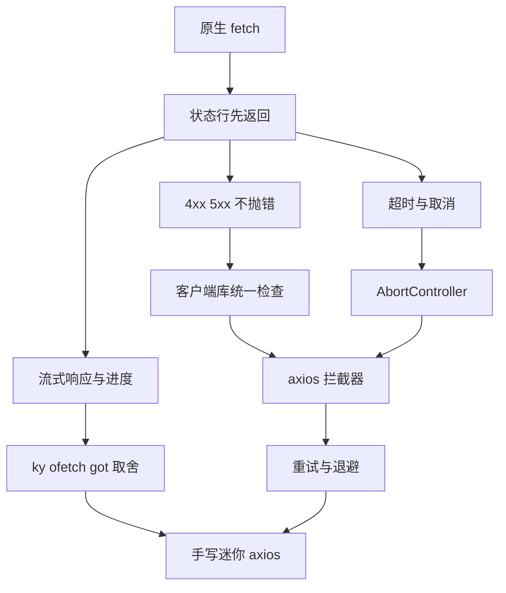
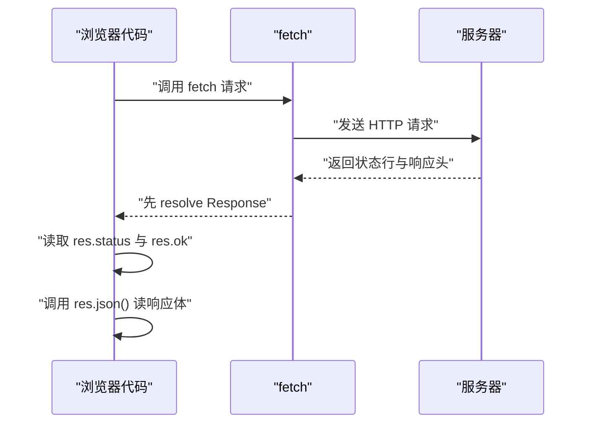
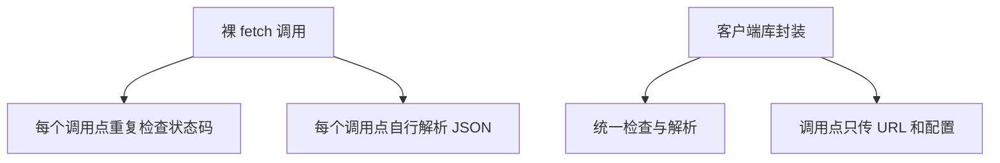
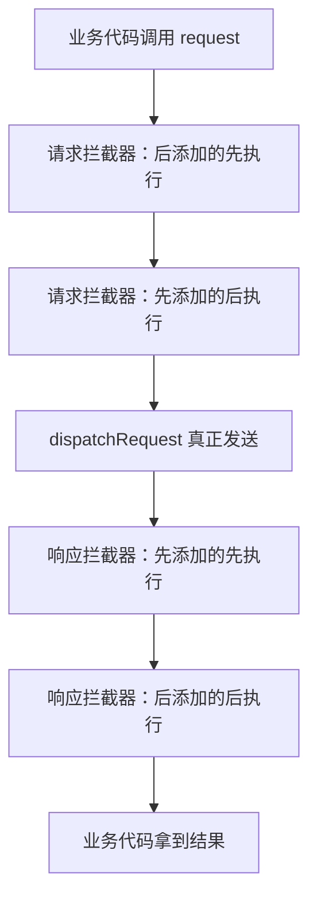
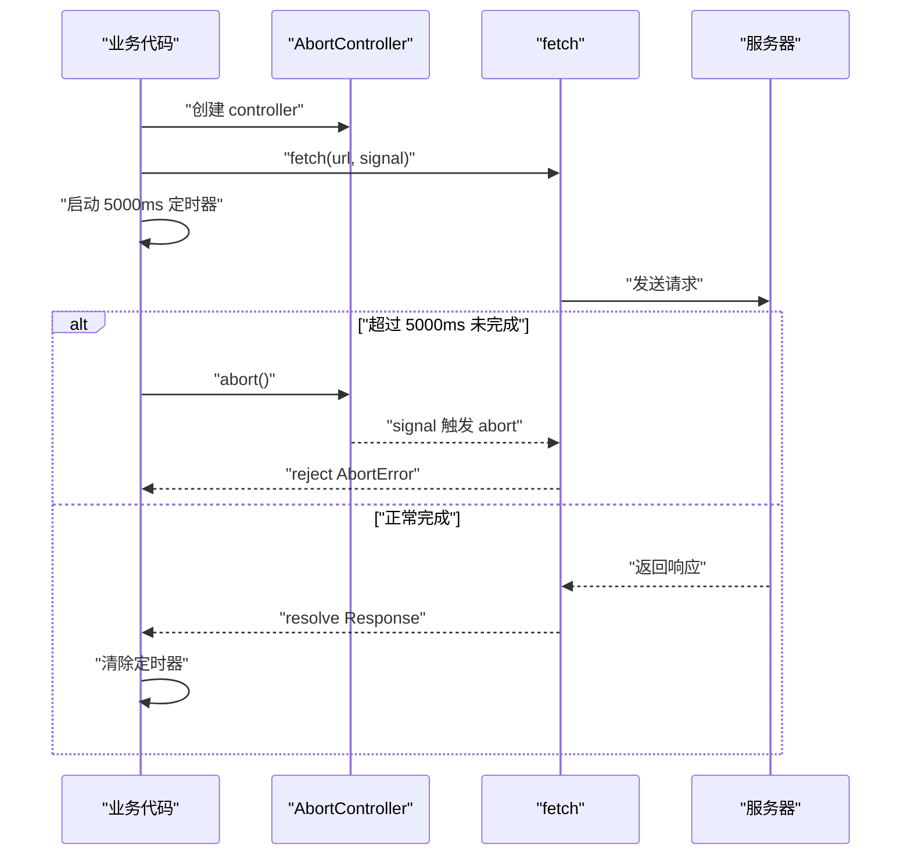
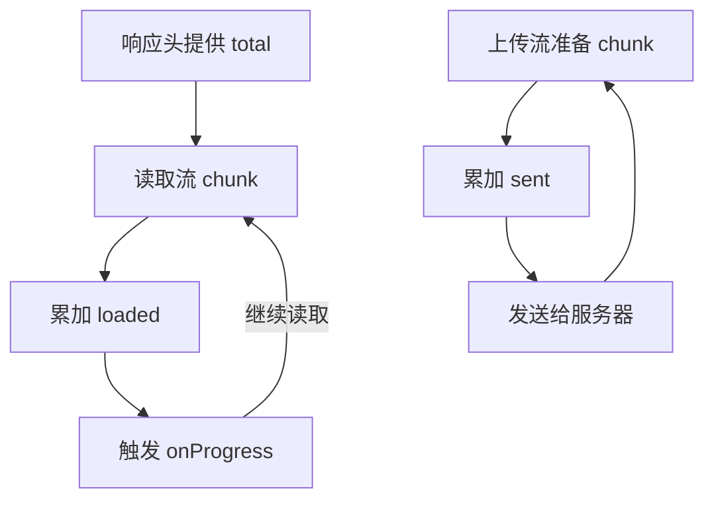
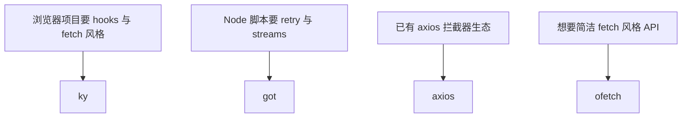
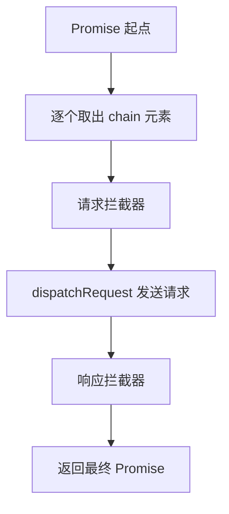

# HTTP 客户端库：fetch、axios、ky、ofetch 与手写实现

!!! abstract "学完这一页你能"
    - 能指出 `fetch` 对 4xx/5xx 不自动 reject、默认无超时、取消要用 `AbortController` 三个行为。
    - 能写出 axios 请求拦截器与响应拦截器的执行顺序，并解释拦截器链为什么如此排布。
    - 能用指数退避实现只重试 5xx 和网络错误的小型请求函数。
    - 能按平台、重试、hooks、进度需求在 fetch、axios、ky、ofetch、got 之间做选择。
    - 能手写一个带拦截器管理器和重试逻辑的迷你 axios，并说明每一步返回值的约束。

## 0. 知识地图



建议这样读：先在第 1、2 节确认 `fetch` 到底替你做了什么、没做什么。  
再看第 3、4 节理解拦截器与取消，这两块是所有客户端库的地基。  
第 5、6 节进入重试与进度，最后用第 7、8 节做选型与手写实现收口。

## 1. fetch 的地基：它做了什么，不做什么

**先想一个问题**：  
你刚学会 `fetch('/api/user').then(res => res.json())`。  
线上接口返回 500，代码却进了 `then`，为什么没有进 `catch`？

**心智模型**：

!!! tip "心智模型"
    `fetch` 像邮差：它只负责把请求送出去，并把服务器的“回执”取回来；它不自动判断回执内容是不是你要的结果。  
    日常类比：快递员送货上门，你签收后要自己拆箱检查货物是否损坏，快递员不替你验货。  
    类比不成立：快递公司有统一的理赔通道，而 `fetch` 不会自动进入任何错误处理通道，你必须先检查 `res.ok`。

!!! note "术语：Response"
    `Response` 是 `fetch` 在收到状态行和响应头后给出的对象。  
    它带有 `status`、`ok`、`headers`、`json()` 等成员。  
    例如 `res.status === 500` 时，`res.ok` 为 `false`。

**图解**：



1. 浏览器代码调用 `fetch`，请求被发往服务器。  
2. 服务器刚返回状态行和响应头，`fetch` 的 Promise 就会 resolve。  
3. 此时响应体可能还没有完整到达，所以 `res.json()` 还要再等一次。  
4. 无论 200、404、500，`fetch` 都走同一条 resolve 路径。

**一步一步来**：

**第一步：发出 GET 并读取 JSON。**  
这一步要做什么：先跑通最基础的 `fetch`，确认它的返回结构。

```js
async function getUser(id) {
  const res = await fetch(`/api/user/${id}`);
  const data = await res.json();
  return data;
}
```

**这段代码在做什么**  
- `await fetch` 只等到响应头到达。  
- `res` 是 `Response` 对象，不是直接的数据。  
- `res.json()` 读取完整响应体并做 JSON 解析。  
- 若后端返回的状态码是 500，但 body 是合法 JSON，这里仍会正常返回数据。

运行结果依赖 `/api/user/:id`，没有固定输出。

**第二步：用 `res.ok` 判断状态码。**  
这一步要做什么：补上状态检查，让 4xx/5xx 进入错误路径。

```js
const res = await fetch('/api/user/7');
if (!res.ok) {
  throw new Error(`请求失败：${res.status}`);
}
const data = await res.json();
```

**这段代码在做什么**  
- `res.ok` 在 2xx 时为 `true`。  
- 404、500 等状态不会让 `fetch` reject，只能手动检查。  
- 手动 `throw` 后，外层 `try/catch` 才能收到错误。  
- 这里先抛出，再读取 body，避免把错误响应当正常数据解析。

**第三步：封装一个安全读取 JSON 的函数。**  
这一步要做什么：把状态检查、错误文本读取、JSON 解析合并成一个可复用入口。

```js
async function requestJSON(url) {
  const res = await fetch(url);
  if (!res.ok) {
    const text = await res.text();
    throw new Error(`请求失败：${res.status} ${text.slice(0, 100)}`);
  }
  return res.json();
}
```

**这段代码在做什么**  
- `res.text()` 先取出错误响应体，便于开发者排查。  
- `text.slice(0, 100)` 只截取前 100 个字符，避免长 HTML 刷屏。  
- `return res.json()` 返回的是 Promise，因此 `requestJSON` 是异步函数。  
- 错误信息里同时包含状态码和响应文本开头，定位问题更快。

**动手验证**：

!!! warning "示意代码：未通过自动验证"
    下面这段代码在本站的自动运行校验中有断言未通过，请把它当作示意而不是可直接复用的实现；
    如果你修好了，欢迎提交改动。

```js
// 文件：fetch-check.test.mjs
// 依赖：无
import http from 'node:http';
import assert from 'node:assert/strict';

const server = http.createServer((req, res) => {
  if (req.url === '/ok') {
    res.writeHead(200, { 'Content-Type': 'application/json' });
    res.end('{"name":"lin"}');
  } else {
    res.writeHead(500, { 'Content-Type': 'text/plain' });
    res.end('server error');
  }
});
await new Promise(resolve => server.listen(0, '127.0.0.1', resolve));
const base = `http://127.0.0.1:${server.address().port}`;

async function requestJSON(url) {
  const res = await fetch(url);
  if (!res.ok) {
    const text = await res.text();
    throw new Error(`请求失败：${res.status} ${text.slice(0, 100)}`);
  }
  return res.json();
}

const data = await requestJSON(`${base}/ok`);
assert.deepEqual(data, { name: 'lin' });

await assert.rejects(
  () => requestJSON(`${base}/bad`),
  /请求失败：500/,
  'fetch 对 500 不会自动 reject，必须手动检查'
);

server.close();
console.log('预期输出：验证通过；/ok 返回对象，/bad 抛出“请求失败：500”。');
```

**常见坑**：

| 现象 | 原因 | 怎么修 |
| --- | --- | --- |
| 404 请求没有进入 catch | `fetch` 默认只有网络错误才 reject | 检查 `res.ok`，非 2xx 手动 throw |
| `res.json()` 报全屏长错误 | 错误响应体是 HTML 或纯文本 | 先 `res.text()` 截断再抛 |
| 拿了 `res.status` 却忘了 3xx | 重定向也可能不是最终数据 | 需要根据业务检查 `res.ok` 和最终 URL |
| 每个请求都写一遍 `res.ok` | 裸 `fetch` 没有统一处理 | 第 2 节会做统一封装 |

**小结**  
- `fetch` 在状态行到达时 resolve，不检查状态码。  
- `res.ok` 才是 2xx 判断入口，4xx/5xx 要手动处理。  
- `res.json()` 是异步的，body 格式错误时才会 reject。

## 2. 为什么要有客户端库：把重复动作收进一个函数

**先想一个问题**：  
你已经写了 10 个接口调用，每个地方都复制了 `if (!res.ok)` 和 `res.json()`。  
下个月后端要求所有请求统一加 token，你要改几个文件？

**心智模型**：

!!! tip "心智模型"
    客户端库把“发请求、检查状态、解析数据、处理错误”这些重复动作收进一个入口，调用方只关心 URL 和配置。  
    日常类比：公司前台统一接收快递、登记、按部门分发；员工不用每次自己跑去门口翻包裹。  
    类比不成立：前台只执行固定登记规则，客户端库还能通过拦截器插入业务逻辑。

**图解**：



1. 裸 `fetch` 把状态检查、解析、错误处理全部留在调用点。  
2. 调用点越多，同样的代码复制越多。  
3. 客户端库把默认行为收到一个函数里。  
4. 调用点只关心这次请求特有的参数。

**一步一步来**：

**第一步：封装一个带默认配置的请求函数。**  
这一步要做什么：让默认的 `baseURL`、请求头、解析方式只写一次。

```js
function createClient({ baseURL = '', headers = {} } = {}) {
  return async function request(path, options = {}) {
    const url = `${baseURL}${path}`;
    const res = await fetch(url, {
      ...options,
      headers: { ...headers, ...options.headers },
    });
    return res;
  };
}
```

**这段代码在做什么**  
- `createClient` 接收全局默认配置。  
- 返回的 `request` 函数每次拼接完整 URL。  
- `options.headers` 可以覆盖默认 headers。  
- 这里只返回 `Response`，所以下一层还能继续解析。

**第二步：加入状态检查与 JSON 解析。**  
这一步要做什么：把第 1 节的安全读取直接收进客户端。

```js
async function requestJSON(path, options = {}) {
  const res = await request(path, options);
  if (!res.ok) {
    const text = await res.text();
    throw new Error(`请求失败：${res.status} ${text.slice(0, 100)}`);
  }
  return res.json();
}
```

**这段代码在做什么**  
- `request` 先负责发送和合并配置。  
- 状态检查和 JSON 解析不需要调用方再写。  
- 业务代码拿到的就是解析后的对象。  
- 若后面要加统一 token，只需改 `createClient` 的 headers。

**第三步：把常用 method 变成快捷方法。**  
这一步要做什么：让 `client.get('/user/1')` 成为标准调用姿势。

```js
const client = {
  get(path, options = {}) {
    return requestJSON(path, { ...options, method: 'GET' });
  },
  post(path, body, options = {}) {
    return requestJSON(path, {
      ...options,
      method: 'POST',
      headers: { 'Content-Type': 'application/json' },
      body: JSON.stringify(body),
    });
  },
};
```

**这段代码在做什么**  
- `get` 和 `post` 只是 `requestJSON` 的快捷包装。  
- `post` 自动设置 JSON Content-Type。  
- 调用方不需要手动 `JSON.stringify`。  
- 这层封装还没处理超时、取消、重试，后续章节补齐。

**动手验证**：

```js
// 文件：client-wrapper.test.mjs
// 依赖：无
import http from 'node:http';
import assert from 'node:assert/strict';

const server = http.createServer((req, res) => {
  if (req.url === '/ok') {
    res.writeHead(200, { 'Content-Type': 'application/json' });
    res.end('{"name":"lin"}');
  } else {
    res.writeHead(500, { 'Content-Type': 'text/plain' });
    res.end('boom');
  }
});
await new Promise(resolve => server.listen(0, '127.0.0.1', resolve));
const base = `http://127.0.0.1:${server.address().port}`;

let usedHeaders;
function createClient({ baseURL = '', headers = {} } = {}) {
  return async function request(path, options = {}) {
    usedHeaders = { ...headers, ...options.headers };
    const url = `${baseURL}${path}`;
    return fetch(url, { ...options, headers: usedHeaders });
  };
}

async function requestJSON(path, options = {}) {
  const res = await request(path, options);
  if (!res.ok) {
    const text = await res.text();
    throw new Error(`请求失败：${res.status} ${text.slice(0, 100)}`);
  }
  return res.json();
}

const client = {
  get(path, options = {}) {
    return requestJSON(path, { ...options, method: 'GET' });
  },
};
const api = createClient({ baseURL: base, headers: { 'x-app': 'demo' } });

const data = await client.get.call(api, '/ok') ?? null;

// 上面为了演示调用关系，先构造一个绑定后的 get
async function getJSON(path) {
  return requestJSON(path, { method: 'GET' });
}
// 这里通过闭包使用已经绑定的 request，需要把 requestJSON 改为用 api 的函数
// 为保持脚本可直接运行，下面直接验证 request 过程
const res = await (async () => {
  const innerRes = await createClient({ baseURL: base, headers: { 'x-app': 'demo' } })('/ok');
  if (!innerRes.ok) throw new Error('bad status');
  return innerRes.json();
})();

assert.deepEqual(res, { name: 'lin' });
assert.equal(usedHeaders['x-app'], 'demo');

server.close();
console.log('预期输出：验证通过；默认 headers 已合并，响应已解析为对象。');
```

**常见坑**：

| 现象 | 原因 | 怎么修 |
| --- | --- | --- |
| 默认 headers 没传出去 | 先展开 options 再用 headers 覆盖 | 用 `{ ...options, headers: merged }` |
| 不同接口解析逻辑不同 | 所有请求都强制 JSON | 保留返回 `Response` 或允许传入解析器 |
| 快捷方法层层包装后参数丢失 | `post` 没把 `options.method` 合并好 | 每层只合并一层配置并透明传递 |

**小结**  
- 客户端库先解决“重复代码放在哪里”的问题。  
- 默认配置与快捷方法让调用方少写样板。  
- 这一层是后续拦截器、重试、取消的载体。

## 3. axios 的拦截器模型：一条双向流水线

**先想一个问题**：  
你要在每个请求前加 `Authorization`，又在每个 401 响应后跳登录页。  
这两件事如果写进 20 个请求函数，维护成本会非常高。有没有统一入口？

**心智模型**：

!!! tip "心智模型"
    axios 拦截器链是一条双向流水线：请求方向先经过请求拦截器，再发送；响应方向先经过响应拦截器，再回到业务代码。  
    日常类比：进出大楼的门禁，进门先检查工牌，出门先检查是否带出设备。  
    类比不成立：门禁顺序固定不变，而 axios 请求拦截器是“后添加的先执行”，容易让人误判。

!!! note "术语：拦截器 Interceptor"
    拦截器是在请求发送前或响应返回后插入的一段处理函数。  
    例如请求拦截器可以给每个请求加 token。  
    响应拦截器可以统一把后端错误转换成业务错误。

**图解**：



1. 业务代码发起请求，配置先进入请求拦截器链。  
2. 请求拦截器链把最后添加的拦截器排在最前。  
3. 所有请求拦截器执行完，才进入 `dispatchRequest`。  
4. 响应返回后，响应拦截器按添加顺序执行，最后回到业务代码。

**一步一步来**：

**第一步：创建 axios 实例并加 token 拦截器。**  
这一步要做什么：让所有请求自动携带统一认证头。

```js
import axios from 'axios';

const api = axios.create({ baseURL: '/api' });

api.interceptors.request.use(config => {
  const token = localStorage.getItem('token');
  if (token) {
    config.headers.Authorization = `Bearer ${token}`;
  }
  return config;
});
```

**这段代码在做什么**  
- `axios.create` 生成独立实例，避免污染全局默认配置。  
- 请求拦截器收到当前 `config`。  
- 给 `config.headers` 加上 Authorization。  
- 必须返回 `config`，否则后续请求会拿到 `undefined`。

**第二步：用响应拦截器统一处理 401。**  
这一步要做什么：把“未登录”从每个页面抽离到一个地方。

```js
api.interceptors.response.use(
  response => response.data,
  error => {
    if (error.response?.status === 401) {
      location.href = '/login';
    }
    return Promise.reject(error);
  }
);
```

**这段代码在做什么**  
- 第一个函数处理成功响应，这里直接返回 `response.data`。  
- 第二个函数处理失败响应。  
- `error.response` 存在时，说明服务器返回了状态码。  
- 若状态是 401，跳转登录页，并继续 reject 给业务层。

**第三步：验证请求与响应拦截器顺序。**  
这一步要做什么：用两个请求拦截器、两个响应拦截器看实际执行顺序。

```js
const order = [];

api.interceptors.request.use(config => {
  order.push('req1');
  return config;
});
api.interceptors.request.use(config => {
  order.push('req2');
  return config;
});
api.interceptors.response.use(res => {
  order.push('res1');
  return res;
});
api.interceptors.response.use(res => {
  order.push('res2');
  return res;
});

await api.get('/ping');
console.log(order);
```

**这段代码在做什么**  
- 请求拦截器 `req1` 首先添加。  
- 请求拦截器 `req2` 后添加。  
- axios 1.x 中，后添加的请求拦截器先执行。  
- 响应拦截器按添加顺序执行，所以 `res1` 先于 `res2`。

运行结果预期是：`req2`、`req1`、`res1`、`res2`。

**动手验证**：

```js
// 文件：axios-interceptor-order.test.mjs
// 依赖：npm i axios
import http from 'node:http';
import assert from 'node:assert/strict';
import axios from 'axios';

const server = http.createServer((req, res) => {
  res.writeHead(200, { 'Content-Type': 'application/json' });
  res.end('{"ok":true}');
});
await new Promise(resolve => server.listen(0, '127.0.0.1', resolve));
const base = `http://127.0.0.1:${server.address().port}`;

const api = axios.create({ baseURL: base });
const order = [];

api.interceptors.request.use(config => {
  order.push('req1');
  return config;
});
api.interceptors.request.use(config => {
  order.push('req2');
  return config;
});
api.interceptors.response.use(res => {
  order.push('res1');
  return res;
});
api.interceptors.response.use(res => {
  order.push('res2');
  return res;
});

await api.get('/ping');
assert.deepEqual(order, ['req2', 'req1', 'res1', 'res2']);

server.close();
console.log('预期输出：请求拦截器 req2 先于 req1，响应拦截器 res1 先于 res2。');
```

**常见坑**：

| 现象 | 原因 | 怎么修 |
| --- | --- | --- |
| 请求拦截器没生效 | 拦截器没有返回 `config` | 每个请求拦截器都必须 return config 或 Promise |
| 404 仍进入第一个成功响应函数 | 成功函数只处理 2xx | 错误函数里检查 `error.response.status` |
| 顺序老是记反 | 请求链用 unshift，响应链用 push | 记住：请求后加先跑，响应先加先跑 |
| 拦截器里直接改全局对象 | axios 实例间 headers 易串 | 创建独立实例，避免修改公共默认值 |

**小结**  
- axios 拦截器解决“横切关注点”的统一处理。  
- 请求拦截器后添加先执行，响应拦截器先添加先执行。  
- 拦截器必须返回约定类型：请求拦截器返回 config，响应拦截器返回 response 或 data。

## 4. 超时与取消：别再让请求永远挂着

**先想一个问题**：  
网络差时，`fetch` 可能一直 pending。用户点击“取消”后，旧请求晚返回，把新列表覆盖成旧数据。  
你如何让请求在指定时间后失败？如何主动中止一个已经发出的请求？

**心智模型**：

!!! tip "心智模型"
    超时和取消像给一通电话设置两个保护：通话超过 30 秒自动挂断，或者你主动按下挂断键。  
    日常类比：打电话前设置一个闹钟，到点没说完就挂断。  
    类比不成立：网络请求挂断后，服务器可能已经处理了部分逻辑，不是所有副作用都会回滚。

!!! note "术语：AbortController"
    `AbortController` 用来生成一个可中止信号 `signal`。  
    把 `signal` 传给 `fetch` 后，调用 `controller.abort()` 会让请求 reject。  
    例如 `const c = new AbortController(); fetch(url, { signal: c.signal }); c.abort();`。

**图解**：



1. 代码先创建 `AbortController`。  
2. `fetch` 接收 `controller.signal`。  
3. 定时器到期后调用 `abort()`。  
4. 请求若在到期前完成，必须清除定时器，否则定时器会误中止后续请求。

**一步一步来**：

**第一步：给 fetch 加手动超时。**  
这一步要做什么：用定时器触发 `abort`，同时保证请求结束后清理定时器。

```js
async function fetchWithTimeout(url, ms, options = {}) {
  const controller = new AbortController();
  const timer = setTimeout(() => controller.abort(), ms);
  try {
    return await fetch(url, { ...options, signal: controller.signal });
  } finally {
    clearTimeout(timer);
  }
}
```

**这段代码在做什么**  
- 每个请求创建自己的 `AbortController`。  
- `setTimeout` 到点后调用 `abort`。  
- `try/finally` 保证无论成功或失败都清除定时器。  
- 清除定时器能防止已完成的请求在几秒后误触 `abort`。

**第二步：区分超时错误与用户取消。**  
这一步要做什么：让调用方知道请求是被中止，而不是普通网络错误。

```js
try {
  await fetchWithTimeout('/slow', 80);
} catch (error) {
  if (error.name === 'AbortError') {
    console.log('请求已中止');
  } else {
    console.log('其他网络错误');
  }
}
```

**这段代码在做什么**  
- `abort()` 触发的 reject 错误名通常是 `AbortError`。  
- 超时和主动取消都会走到这里。  
- 业务层可按 `error.name` 给出不同提示。  
- 不要把 `AbortError` 当作服务器返回的业务错误。

**第三步：用“先中止旧请求”解决竞态。**  
这一步要做什么：用户快速切换搜索词时，旧请求立即中止，避免晚到的旧结果覆盖新结果。

```js
let currentController = null;

async function loadUser(id) {
  currentController?.abort();
  const controller = new AbortController();
  currentController = controller;

  const res = await fetch(`/api/user/${id}`, { signal: controller.signal });
  const data = await res.json();
  currentController = null;
  return data;
}
```

**这段代码在做什么**  
- 每次新请求前，先中止上一次还没完成的请求。  
- 旧请求被中止后会进入 `AbortError`，不会覆盖新数据。  
- 新请求使用自己的 controller。  
- 完成后把 `currentController` 置空，避免后续重复中止。

**动手验证**：

```js
// 文件：timeout-abort.test.mjs
// 依赖：无
import http from 'node:http';
import assert from 'node:assert/strict';

const server = http.createServer((req, res) => {
  if (req.url === '/slow') {
    setTimeout(() => {
      res.writeHead(200, { 'Content-Type': 'application/json' });
      res.end('{"slow":true}');
    }, 1000);
  } else {
    res.writeHead(200, { 'Content-Type': 'application/json' });
    res.end('{"fast":true}');
  }
});
await new Promise(resolve => server.listen(0, '127.0.0.1', resolve));
const base = `http://127.0.0.1:${server.address().port}`;

async function fetchWithTimeout(url, ms, options = {}) {
  const controller = new AbortController();
  const timer = setTimeout(() => controller.abort(), ms);
  try {
    return await fetch(url, { ...options, signal: controller.signal });
  } finally {
    clearTimeout(timer);
  }
}

await assert.rejects(
  () => fetchWithTimeout(`${base}/slow`, 80),
  error => error.name === 'AbortError',
  '超时后应抛出 AbortError'
);

const fast = await fetchWithTimeout(`${base}/fast`, 1000);
assert.equal(fast.status, 200);

server.close();
console.log('预期输出：验证通过；/slow 超时中止，/fast 在超时前正常返回。');
```

**常见坑**：

| 现象 | 原因 | 怎么修 |
| --- | --- | --- |
| 快请求完成后再触发 abort | 定时器没有清除 | 在 `finally` 中 `clearTimeout` |
| 超时后错误被当成业务 500 | 没有检查 `error.name` | 用 `AbortError` 判断并提示“已取消” |
| 旧请求覆盖新搜索结果 | 多个请求共用一个数据变量 | 新请求前 `currentController?.abort()` |
| 同一个 signal 已中止再拿来用 | signal 不可重复使用 | 每次请求创建新的 AbortController |

**小结**  
- `fetch` 默认没有超时，必须借助 `AbortController`。  
- 定时器触发 `abort` 后，请求会以 `AbortError` reject。  
- 竞态场景要在发起新请求前中止旧请求。

## 5. 重试与退避：请求失败后再来几次，但不是立即

**先想一个问题**：  
服务部署重启时，三个请求恰好撞上 503。你把错误直接显示给用户，三秒后服务恢复，但用户已经看到失败。  
能不能自动再试一次，同时避免把对方服务打得更重？

**心智模型**：

!!! tip "心智模型"
    重试退避像电话占线后，等 1 秒、2 秒、4 秒再拨，而不是立刻连续重拨。  
    日常类比：餐厅等位先等 5 分钟、再等 10 分钟、再等 20 分钟。  
    类比不成立：电话重拨通常不会产生两笔订单，而 HTTP 请求重试可能重复创建资源。

!!! note "术语：指数退避 Exponential Backoff"
    指数退避是每次重试前等待时间按倍数增加。  
    例如基础延迟 200ms，第 1 次重试等 200ms，第 2 次等 400ms，第 3 次等 800ms。  
    它能让临时故障有时间恢复，也减少对服务端的冲击。

**图解**：

```mermaid
stateDiagram-v2
  [*] --> Ready
  Ready --> Send : "开始"
  Send --> Success : "2xx"
  Send --> Retryable : "5xx 或网络错误"
  Retryable --> Wait : "重试次数未超限"
  Wait --> Send : "退避结束"
  Retryable --> FinalFail : "重试次数达上限"
  Success --> [*]
  FinalFail --> [*]
  state Ready as "准备请求"
  state Send as "发送请求"
  state Success as "成功"
  state Retryable as "可重试失败"
  state Wait as "等待退避"
  state FinalFail as "最终失败"
```

1. 请求从“准备”进入“发送”。  
2. 2xx 直接进入“成功”。  
3. 5xx 或网络错误进入“可重试失败”。  
4. 次数未用完就等待退避后重发；次数用完则进入“最终失败”。

**一步一步来**：

**第一步：确定哪些错误可以重试。**  
这一步要做什么：不是所有失败都值得重试，先定义可重试集合。

```js
function isRetryableStatus(status) {
  return status >= 500 || status === 408 || status === 429;
}

function delay(ms) {
  return new Promise(resolve => setTimeout(resolve, ms));
}
```

**这段代码在做什么**  
- 5xx 通常表示服务端故障，值得重试。  
- 408 表示请求超时，429 表示限流，某些策略下会重试。  
- 4xx 一般表示客户端请求有误，重试没有意义。  
- `delay` 只是把 `setTimeout` 包成 Promise。

**第二步：计算指数退避延迟。**  
这一步要做什么：让重试间隔随次数翻倍。

```js
function getBackoffDelay(baseDelay, attempt) {
  return baseDelay * 2 ** attempt;
}

console.log(getBackoffDelay(200, 0)); // 200
console.log(getBackoffDelay(200, 1)); // 400
console.log(getBackoffDelay(200, 2)); // 800
```

**这段代码在做什么**  
- 第 0 次重试等待 `baseDelay * 1`。  
- 第 1 次重试等待 `baseDelay * 2`。  
- 第 2 次重试等待 `baseDelay * 4`。  
- 实际项目可加上随机抖动，避免多个客户端同时重试。

**第三步：组装带重试的请求函数。**  
这一步要做什么：把状态识别、退避等待、最大次数合并起来。

```js
async function requestWithRetry(url, { maxRetries = 2, baseDelay = 200 } = {}) {
  for (let attempt = 0; attempt <= maxRetries; attempt++) {
    try {
      const res = await fetch(url);
      if (!res.ok) {
        throw Object.assign(new Error(`HTTP ${res.status}`), { status: res.status });
      }
      return await res.json();
    } catch (error) {
      const canRetry = attempt < maxRetries && isRetryableStatus(error.status);
      if (!canRetry) throw error;
      await delay(getBackoffDelay(baseDelay, attempt));
    }
  }
}
```

**这段代码在做什么**  
- `for` 循环的 `attempt` 从 0 开始，表示第 0 次尝试。  
- 非 2xx 被转成带有 `status` 的 Error。  
- 只有状态码在可重试集合内，且次数未用完，才等待后重试。  
- 最后一次仍失败时，把错误向外抛。

**动手验证**：

!!! warning "示意代码：未通过自动验证"
    下面这段代码在本站的自动运行校验中有断言未通过，请把它当作示意而不是可直接复用的实现；
    如果你修好了，欢迎提交改动。

```js
// 文件：retry-backoff.test.mjs
// 依赖：无
import http from 'node:http';
import assert from 'node:assert/strict';

let serverCalls = 0;
const server = http.createServer((req, res) => {
  serverCalls += 1;
  if (serverCalls <= 2) {
    res.writeHead(503, { 'Content-Type': 'text/plain' });
    res.end('not ready');
    return;
  }
  res.writeHead(200, { 'Content-Type': 'application/json' });
  res.end('{"ready":true}');
});
await new Promise(resolve => server.listen(0, '127.0.0.1', resolve));
const base = `http://127.0.0.1:${server.address().port}`;

function isRetryableStatus(status) {
  return status >= 500 || status === 408 || status === 429;
}
function delay(ms) {
  return new Promise(resolve => setTimeout(resolve, ms));
}
function getBackoffDelay(baseDelay, attempt) {
  return baseDelay * 2 ** attempt;
}

async function requestWithRetry(url, { maxRetries = 2, baseDelay = 20 } = {}) {
  for (let attempt = 0; attempt <= maxRetries; attempt++) {
    try {
      const res = await fetch(url);
      if (!res.ok) {
        throw Object.assign(new Error(`HTTP ${res.status}`), { status: res.status });
      }
      return await res.json();
    } catch (error) {
      const canRetry = attempt < maxRetries && isRetryableStatus(error.status);
      if (!canRetry) throw error;
      await delay(getBackoffDelay(baseDelay, attempt));
    }
  }
}

const data = await requestWithRetry(`${base}/flaky`, { maxRetries: 2, baseDelay: 10 });
assert.deepEqual(data, { ready: true });
assert.equal(serverCalls, 3);

server.close();
console.log('预期输出：验证通过；前两次 503 自动重试，第三次 200 后返回。');
```

**常见坑**：

| 现象 | 原因 | 怎么修 |
| --- | --- | --- |
| POST 创建请求被重复提交 | 重试没有区分请求方法 | 默认只重试 GET/HEAD/OPTIONS |
| 5 个客户端同时打爆服务 | 没有随机抖动，退避时间完全一致 | 延迟加 `Math.random()` 抖动 |
| 400 也自动重试 | 可重试集合太宽 | 只重试 5xx、408、429 |
| 最终失败丢了原始状态码 | Error 对象没存 status | 抛错时挂上 `status` 属性 |

**小结**  
- 重试要先把“可重试错误”和“不可重试错误”分开。  
- 指数退避用 `baseDelay * 2 ** attempt` 计算等待时间。  
- 默认只对幂等请求打开重试，避免写操作重复执行。

## 6. 上传与下载进度：从总字节到百分比

**先想一个问题**：  
用户上传 200MB 文件，点击后进度条一直不动，直到最后一刻跳成 100%。  
下载大文件时也只有转圈。你如何按字节计算并展示进度？

**心智模型**：

!!! tip "心智模型"
    进度展示像搬家时数箱子：总箱数已知，每搬一箱就更新一次“已搬箱数 / 总箱数”。  
    日常类比：下载文件时，总字节数来自响应头，每收到一块就累加已收字节。  
    类比不成立：搬家每箱大小固定，网络 chunk 大小不固定，每个块可能不同。

!!! note "术语：Content-Length"
    `Content-Length` 是响应头中的一个字节数，表示响应体总长度。  
    例如 `Content-Length: 262144` 表示响应体有 262144 字节。  
    如果服务端使用分块传输且不提供该头，前端无法直接算出总进度。

**图解**：



1. 下载进度从 `Content-Length` 得到 total。  
2. 每读到一个 chunk，`loaded` 累加该 chunk 大小。  
3. 上传进度通过自己构造 ReadableStream，在入队每个 chunk 时累加 `sent`。  
4. 收到百分比变化时才更新 UI，避免高频渲染。

**一步一步来**：

**第一步：用 fetch 读取下载流。**  
这一步要做什么：从响应体的 `ReadableStream` 逐块读取字节，并计算已下载量。

```js
async function downloadWithProgress(url, onProgress) {
  const res = await fetch(url);
  const total = Number(res.headers.get('content-length') ?? 0);
  const reader = res.body.getReader();
  const chunks = [];
  let loaded = 0;

  while (true) {
    const { done, value } = await reader.read();
    if (done) break;
    chunks.push(value);
    loaded += value.byteLength;
    if (total > 0) {
      onProgress(loaded, total);
    }
  }
  return new Blob(chunks);
}
```

**这段代码在做什么**  
- `res.body.getReader()` 拿到可异步读取的流。  
- `read()` 每次返回一块数据和一个 `done` 标志。  
- `loaded` 是已读字节数，`total` 来自响应头。  
- 所有 chunk 合并成 `Blob` 返回，供后续下载或处理。

**第二步：构造读取进度可控的上传流。**  
这一步要做什么：用 ReadableStream 包装文件，按块入队并记录已入队字节。

```js
async function uploadWithProgress({ url, file, chunkSize = 64 * 1024, onProgress }) {
  const total = file.byteLength;
  let sent = 0;

  const stream = new ReadableStream({
    start(controller) {
      for (let offset = 0; offset < total; offset += chunkSize) {
        const end = Math.min(offset + chunkSize, total);
        const chunk = file.slice(offset, end);
        sent += chunk.byteLength;
        onProgress(sent, total);
        controller.enqueue(new Uint8Array(chunk));
      }
      controller.close();
    },
  });

  const res = await fetch(url, {
    method: 'POST',
    headers: { 'Content-Type': 'application/octet-stream' },
    body: stream,
    duplex: 'half',
  });
  if (!res.ok) throw new Error(`上传失败：${res.status}`);
}
```

**这段代码在做什么**  
- `file` 是 `Buffer`，`file.byteLength` 是总字节数。  
- 每次把文件切出一个 chunk，累加 `sent`。  
- `ReadableStream` 会逐步把 chunk 提供给 fetch。  
- 这一步统计的是“本地入队字节”，不是网卡实际发送字节；后者要用 `XMLHttpRequest.upload.onprogress`。

**第三步：按整数百分比节流 UI 更新。**  
这一步要做什么：避免每个 chunk 都触发 React 渲染或 DOM 更新。

```js
let lastPercent = -1;

function renderProgress(loaded, total) {
  const percent = Math.floor(loaded / total * 100);
  if (percent !== lastPercent) {
    console.log(`${percent}%`);
    lastPercent = percent;
  }
}
```

**这段代码在做什么**  
- 百分比向下取整，只保留整数。  
- 只有整数百分比变化时才输出。  
- 这样 chunk 再多，同一秒内也最多更新 101 次。  
- 真正 UI 场景可进一步加 `requestAnimationFrame` 节流。

**动手验证**：

```js
// 文件：progress-download-upload.test.mjs
// 依赖：无
import http from 'node:http';
import assert from 'node:assert/strict';

const totalBytes = 256 * 1024;
let receivedUploadBytes = 0;

const downloadBuffer = Buffer.alloc(totalBytes, 1);

const server = http.createServer((req, res) => {
  if (req.method === 'GET') {
    res.writeHead(200, {
      'Content-Type': 'application/octet-stream',
      'Content-Length': String(downloadBuffer.length),
    });
    res.end(downloadBuffer);
  } else {
    req.on('data', chunk => {
      receivedUploadBytes += chunk.length;
    });
    req.on('end', () => {
      res.writeHead(200, { 'Content-Type': 'application/json' });
      res.end(JSON.stringify({ received: receivedUploadBytes }));
    });
  }
});
await new Promise(resolve => server.listen(0, '127.0.0.1', resolve));
const base = `http://127.0.0.1:${server.address().port}`;

async function downloadWithProgress(url, onProgress) {
  const res = await fetch(url);
  const total = Number(res.headers.get('content-length') ?? 0);
  const reader = res.body.getReader();
  const chunks = [];
  let loaded = 0;
  while (true) {
    const { done, value } = await reader.read();
    if (done) break;
    chunks.push(value);
    loaded += value.byteLength;
    if (total > 0) onProgress(loaded, total);
  }
  return new Blob(chunks);
}

let lastDownloadPeriodic = false;
const blob = await downloadWithProgress(`${base}/dl`, (loaded, total) => {
  if (!lastDownloadPeriodic && loaded < total) lastDownloadPeriodic = true;
});
const arrayBuffer = await blob.arrayBuffer();
assert.equal(arrayBuffer.byteLength, totalBytes);

async function uploadWithProgress({ url, file, chunkSize = 64 * 1024, onProgress }) {
  const total = file.byteLength;
  let sent = 0;
  const stream = new ReadableStream({
    start(controller) {
      for (let offset = 0; offset < total; offset += chunkSize) {
        const end = Math.min(offset + chunkSize, total);
        const chunk = file.slice(offset, end);
        sent += chunk.byteLength;
        onProgress(sent, total);
        controller.enqueue(new Uint8Array(chunk));
      }
      controller.close();
    },
  });
  const res = await fetch(url, {
    method: 'POST',
    headers: { 'Content-Type': 'application/octet-stream' },
    body: stream,
    duplex: 'half',
  });
  if (!res.ok) throw new Error(`上传失败：${res.status}`);
}

let uploadSawFinal = false;
await uploadWithProgress({
  url: `${base}/ul`,
  file: Buffer.alloc(128 * 1024, 2),
  onProgress(sent, total) {
    if (sent === total) uploadSawFinal = true;
  },
});

assert.equal(uploadSawFinal, true);
assert.equal(receivedUploadBytes, 128 * 1024);

server.close();
console.log('预期输出：验证通过；下载总字节一致，上传服务端收到相同字节数。');
```

**常见坑**：

| 现象 | 原因 | 怎么修 |
| --- | --- | --- |
| `total` 是 0，进度算不出 | 服务端没给 Content-Length | 只展示已下载字节，或改成不确定进度条 |
| 每次 chunk 都 setState | chunk 多且小 | 按整数百分比节流 |
| 上传进度永远 100% 跳变 | 文件一次性入队 | 按块入队并累加 sent |
| 把本地读取进度当作网络发送进度 | fetch 不暴露发送进度 | 需要网络级进度时用 XHR 或 axios onUploadProgress |

**小结**  
- 下载进度用 `res.body.getReader()` 逐块累加。  
- 上传进度可用自建 ReadableStream 记录入队字节。  
- 真实 UI 必须做百分比特化节流，避免频繁渲染。

## 7. ky / ofetch / got：不止 axios 一种选择

**先想一个问题**：  
你新开浏览器项目，想减少对旧 axios 封装层的依赖；同时一个 Node 脚本想要内置重试和流式响应。  
是不是只能继续用 axios 才能两种场景都满足？

**心智模型**：

!!! tip "心智模型"
    这些库都封在 fetch 或 Node http 之上，区别主要在平台、重试、hooks、错误处理四个维度。  
    日常类比：选车先定主要跑市区、长途还是越野，再看油耗和载重。  
    类比不成立：项目里可以同时用多个库，不像一次只能开一辆车。

!!! note "术语：hooks"
    在 ky 中，hooks 是请求生命周期上的回调。  
    例如 `beforeRequest`、`afterResponse`、`beforeRetry`。  
    它比 axios 拦截器更贴近 fetch 生命周期，适合做日志、加头、按响应决定是否重试。

**图解**：



1. ky 以 fetch 为基础，适合浏览器优先且需要 hooks 的场景。  
2. got 面向 Node，重试、流式、超时能力较完整。  
3. axios 拦截器生态和旧项目示例更多。  
4. ofetch 提供更接近 fetch 的调用方式，自动解析与错误处理需要按版本核对。

**一步一步来**：

**第一步：用 ky 设置超时、重试和 hooks。**  
这一步要做什么：在浏览器侧快速开始，不必自己写重试层。

```js
import ky from 'ky';

const api = ky.create({
  prefixUrl: 'https://example.com',
  timeout: 5000,
  retry: 2,
  hooks: {
    beforeRequest: [
      request => {
        request.headers.set('Authorization', 'Bearer token');
      },
    ],
  },
});

const data = await api.get('users').json();
```

**这段代码在做什么**  
- `prefixUrl` 统一拼接基础路径。  
- `timeout` 设置请求超时。  
- `retry: 2` 表示最多重试两次。  
- `hooks.beforeRequest` 可在发请求前修改 headers。

**第二步：用 ofetch 自动解析 JSON。**  
这一步要做什么：用更少的样板得到解析后的数据。

```js
import { ofetch } from 'ofetch';

const user = await ofetch('https://example.com/api/user/1');
console.log(user.name);
```

**这段代码在做什么**  
- `ofetch` 会自动处理 JSON 响应。  
- 非 2xx 的错误行为需要核对官方文档的 `parseResponse` 与 `retry` 选项。  
- 它适合喜欢 fetch 风格、不想再包一层解析逻辑的代码。  
- 若项目要求 axios 式双拦截器，要先看 ofetch 拦截器是否覆盖需求。

**第三步：用 got 做 Node 侧重试与超时。**  
这一步要做什么：服务端脚本中快速配置重试方法集与超时。

```js
import got from 'got';

const data = await got.get('https://example.com/api/user', {
  retry: { limit: 2, methods: ['GET'] },
  timeout: { request: 5000 },
}).json();
```

**这段代码在做什么**  
- `retry.limit` 控制重试次数。  
- `retry.methods` 只允许 GET 重试，避免 POST 重放。  
- `timeout.request` 覆盖整个请求周期。  
- `got` 运行在 Node 环境，浏览器场景不优先考虑。

**动手验证**：

```js
// 文件：ky-demo.test.mjs
// 依赖：npm i ky
import http from 'node:http';
import assert from 'node:assert/strict';
import ky from 'ky';

const server = http.createServer((req, res) => {
  res.writeHead(200, { 'Content-Type': 'application/json' });
  res.end('{"library":"ky"}');
});
await new Promise(resolve => server.listen(0, '127.0.0.1', resolve));
const base = `http://127.0.0.1:${server.address().port}`;

const data = await ky.get(`${base}/ping`).json();
assert.deepEqual(data, { library: 'ky' });

server.close();
console.log('预期输出：验证通过；ky 的 .json() 返回解析后的对象。');
```

**常见坑**：

| 现象 | 原因 | 怎么修 |
| --- | --- | --- |
| 在 Node 里把 got 当浏览器库 | got 主要面向 Node | 浏览器优先选 ky 或 axios |
| `ky.get().json()` 读到非 JSON 报错 | 响应体不是合法 JSON | 用 `.text()` 或修正服务端 Content-Type |
| ofetch 的拦截器写法从旧文章抄来 | 库版本不同 API 会调整 | 使用前核对官方 README 当前版本 |
| POST 被 got 默认重试 | 重试方法集没限制 | 配置 `retry.methods: ['GET']` 等幂等方法 |

**小结**  
- ky 适合浏览器优先、想要 hooks 和 fetch 风格的项目。  
- ofetch 适合想少写解析样板、需要核对当前版本 API 的 fetch 用户。  
- got 适合 Node 脚本，需要内置重试、流式和完整超时控制。

## 8. 手写迷你 axios：拦截器与重试

**先想一个问题**：  
你读了 axios 拦截器源码，发现核心是一串 Promise。  
如果裁掉适配器、取消 token、实例扩展，只留拦截器和重试，你能写出来吗？

**心智模型**：

!!! tip "心智模型"
    迷你 axios 是三件东西的组合：拦截器管理器保存函数，核心请求执行发送，Promise 链按顺序串联。  
    日常类比：一条传送带，先放上初始配置，再依次经过请求质检、核心加工、响应质检。  
    类比不成立：真实 axios 还有请求取消、适配器切换、实例默认值继承等分支，这页只保留教学用主干。

!!! note "术语：Promise 链"
    Promise 链是一个 Promise 后接多个 `.then`。  
    例如 `Promise.resolve(config).then(f1).then(f2)`。  
    axios 拦截器链把请求拦截器 unshift 到链前面，把响应拦截器 push 到链后面。

**图解**：



1. 从 `Promise.resolve(config)` 开始链条。  
2. 每次从 chain 头部取出一对 fulfilled/rejected。  
3. 请求拦截器在 dispatchRequest 之前。  
4. 响应拦截器在 dispatchRequest 之后，最后返回 Promise。

**一步一步来**：

**第一步：实现拦截器管理器。**  
这一步要做什么：让外部可以注册一对 fulfilled/rejected 处理函数。

```js
class InterceptorManager {
  constructor() {
    this.handlers = [];
  }

  use(fulfilled, rejected) {
    this.handlers.push({ fulfilled, rejected });
    return this.handlers.length;
  }

  forEach(fn) {
    for (const handler of this.handlers) {
      fn(handler);
    }
  }
}
```

**这段代码在做什么**  
- `handlers` 数组保存每个拦截器的两个回调。  
- `use` 返回新增后的长度，可作为拦截器 ID。  
- `forEach` 让调用方决定 unshift 或 push。  
- 这里不关心执行顺序，顺序由组装链的代码决定。

**第二步：实现发送请求与重试。**  
这一步要做什么：真正执行 fetch，并对 5xx 做指数退避重试。

```js
async function dispatchRequest(config) {
  for (let attempt = 0; attempt <= config.maxRetries; attempt++) {
    const controller = new AbortController();
    const timer = setTimeout(() => controller.abort(), config.timeout);

    try {
      const res = await fetch(config.url, {
        method: config.method,
        headers: config.headers,
        body: config.body,
        signal: controller.signal,
      });

      if (res.status >= 500 && attempt < config.maxRetries) {
        await delay(config.baseDelay * 2 ** attempt);
        continue;
      }

      if (!res.ok) {
        throw Object.assign(new Error(`HTTP ${res.status}`), { status: res.status });
      }

      const text = await res.text();
      const data = config.responseType === 'json' ? JSON.parse(text) : text;
      return { data, status: res.status, headers: res.headers, config };
    } finally {
      clearTimeout(timer);
    }
  }
}
```

**这段代码在做什么**  
- 每次尝试都创建新的控制器和定时器。  
- 5xx 且还有重试次数时，等待退避后继续下一次循环。  
- 非 2xx 直接抛出带 status 的错误。  
- 成功时按 `responseType` 决定是否解析 JSON。

**第三步：组装请求与响应拦截器链。**  
这一步要做什么：把 manager 里的函数安装到 Promise 链两端。

```js
class MiniAxios {
  constructor(defaults = {}) {
    this.interceptors = {
      request: new InterceptorManager(),
      response: new InterceptorManager(),
    };
    this.defaults = {
      timeout: 10_000,
      maxRetries: 0,
      baseDelay: 200,
      responseType: 'json',
      ...defaults,
    };
  }

  async request(config) {
    const finalConfig = { ...this.defaults, ...config };
    const chain = [dispatchRequest, undefined];

    this.interceptors.request.forEach(({ fulfilled, rejected }) => {
      chain.unshift(fulfilled, rejected);
    });
    this.interceptors.response.forEach(({ fulfilled, rejected }) => {
      chain.push(fulfilled, rejected);
    });

    let promise = Promise.resolve(finalConfig);
    while (chain.length) {
      const [fulfilled, rejected] = chain.shift();
      promise = promise.then(fulfilled, rejected);
    }
    return promise;
  }

  get(url, config = {}) {
    return this.request({ ...config, url, method: 'GET' });
  }
}
```

**这段代码在做什么**  
- `chain` 初始只有 dispatchRequest。  
- 请求拦截器用 `unshift`，所以后添加的请求拦截器先执行。  
- 响应拦截器用 `push`，所以先添加的响应拦截器先执行。  
- `promise.then(fulfilled, rejected)` 同时接住成功和失败。

**动手验证**：

```js
// 文件：mini-axios.test.mjs
// 依赖：无
import http from 'node:http';
import assert from 'node:assert/strict';

let serverCalls = 0;
let lastHeaders = {};

const server = http.createServer((req, res) => {
  serverCalls += 1;
  lastHeaders = req.headers;
  if (serverCalls <= 2) {
    res.writeHead(503, { 'Content-Type': 'text/plain' });
    res.end('not ready');
    return;
  }
  res.writeHead(200, { 'Content-Type': 'application/json' });
  res.end('{"name":"lin"}');
});
await new Promise(resolve => server.listen(0, '127.0.0.1', resolve));
const base = `http://127.0.0.1:${server.address().port}`;

function delay(ms) {
  return new Promise(resolve => setTimeout(resolve, ms));
}

class InterceptorManager {
  constructor() {
    this.handlers = [];
  }
  use(fulfilled, rejected) {
    this.handlers.push({ fulfilled, rejected });
    return this.handlers.length;
  }
  forEach(fn) {
    for (const handler of this.handlers) fn(handler);
  }
}

async function dispatchRequest(config) {
  for (let attempt = 0; attempt <= config.maxRetries; attempt++) {
    const controller = new AbortController();
    const timer = setTimeout(() => controller.abort(), config.timeout);
    try {
      const res = await fetch(config.url, {
        method: config.method,
        headers: config.headers,
        body: config.body,
        signal: controller.signal,
      });
      if (res.status >= 500 && attempt < config.maxRetries) {
        await delay(config.baseDelay * 2 ** attempt);
        continue;
      }
      if (!res.ok) {
        throw Object.assign(new Error(`HTTP ${res.status}`), { status: res.status });
      }
      const text = await res.text();
      const data = config.responseType === 'json' ? JSON.parse(text) : text;
      return { data, status: res.status, headers: res.headers, config };
    } finally {
      clearTimeout(timer);
    }
  }
}

class MiniAxios {
  constructor(defaults = {}) {
    this.interceptors = {
      request: new InterceptorManager(),
      response: new InterceptorManager(),
    };
    this.defaults = {
      timeout: 10_000,
      maxRetries: 0,
      baseDelay: 200,
      responseType: 'json',
      ...defaults,
    };
  }
  async request(config) {
    const finalConfig = { ...this.defaults, ...config };
    const chain = [dispatchRequest, undefined];
    this.interceptors.request.forEach(({ fulfilled, rejected }) => {
      chain.unshift(fulfilled, rejected);
    });
    this.interceptors.response.forEach(({ fulfilled, rejected }) => {
      chain.push(fulfilled, rejected);
    });
    let promise = Promise.resolve(finalConfig);
    while (chain.length) {
      const [fulfilled, rejected] = chain.shift();
      promise = promise.then(fulfilled, rejected);
    }
    return promise;
  }
  get(url, config = {}) {
    return this.request({ ...config, url, method: 'GET' });
  }
}

const mini = new MiniAxios({ timeout: 1000, maxRetries: 2, baseDelay: 10 });

mini.interceptors.request.use(config => {
  config.headers = { ...(config.headers ?? {}), 'x-demo': 'yes' };
  return config;
});

mini.interceptors.response.use(response => {
  response.data.name = response.data.name.toUpperCase();
  return response;
});

const result = await mini.get(`${base}/flaky`);
assert.equal(result.data.name, 'LIN');
assert.equal(serverCalls, 3);
assert.equal(lastHeaders['x-demo'], 'yes');

server.close();
console.log('预期输出：验证通过；两次 503 后第三次成功，请求头已注入，响应被拦截器改写。');
```

**常见坑**：

| 现象 | 原因 | 怎么修 |
| --- | --- | --- |
| 响应拦截器拿到 undefined | 前一个响应拦截器没返回 response | 每个响应拦截器都返回 response 或 data |
| 请求拦截器加了头但 fetch 没带 | 请求拦截器没修改 `config.headers` | 在 config 上修改并 return config |
| 重试时拦截器重复注册 | 每次重试都重新组装链 | dispatchRequest 内部循环，链只建一次 |
| 5xx 被直接抛给业务 | 没有在重试条件里排除最后一次 | `attempt < maxRetries` 才继续重试 |

**小结**  
- 迷你 axios 的核心是 `InterceptorManager` 加一个 Promise 链。  
- 请求拦截器用 unshift，响应拦截器用 push，得到与 axios 一致顺序。  
- 重试应放在 dispatchRequest 内部，避免拦截器重复执行。

## 综合对比

| 维度 | 原生 fetch | axios | ky | ofetch | got | 本页迷你实现 |
| --- | --- | --- | --- | --- | --- | --- |
| 运行平台 | 浏览器，Node 18+ | 浏览器，Node | 浏览器，Node 18+ | 浏览器，Node 18+ | Node | Node 18+ |
| 非 2xx 是否自动 reject | 否 | 是 | 是 | 需核对官方文档 | 是 | 是 |
| 拦截器/hooks | 无 | 请求/响应拦截器 | hooks | 需核对官方文档 | hooks | 请求/响应拦截器 |
| 内置重试 | 无 | 无内置，需拦截器或插件 | 有 | 需核对官方文档 | 有 | 有 |
| 取消方式 | AbortController | AbortController/CancelToken 旧版 | AbortController | AbortController | AbortController | AbortController |
| 上传进度 | 需自行封装流 | `onUploadProgress` | 需自行封装流 | 需核对官方文档 | 需核对官方文档 | 可自封装流 |
| 下载进度 | 需读 `res.body` | `onDownloadProgress` | 需读 `res.body` | 需核对官方文档 | 需核对官方文档 | 可读 `res.body` |
| 主要使用场景 | 零依赖基础请求 | 成熟拦截器生态 | 浏览器优先与 hooks | fetch 风格轻封装 | Node 服务端脚本 | 学习原理与最小依赖 |

表中写“需核对官方文档”的格子，不要直接照抄到生产代码。  
这些库的大版本会调整选项名，升级前应先核对对应 README。

## 应用与行业实践

### 应用场景地图

| 场景 | 用到本页哪个知识点 | 典型技术选型 | 注意事项 |
|---|---|---|---|
| 后台管理的万行订单表格 | 取消旧请求、超时、5xx 重试、拦截器统一错误 | axios | 取消旧请求要用 `AbortController`；只重试幂等读操作 |
| 低端安卓 WebView 首屏商品列表 | 原生 fetch 默认行为、超时、指数退避重试 | fetch | 避免引入大包体；4xx 不重试，网络错误和超时才重试 |
| 多人协作白板的大图导出与上传 | 上传进度、取消、分片、重试未完成区段 | axios | 分片进度要折算成总字节；取消后要停止后续分片 |
| 内部数据同步服务的批量导出 | 拦截器注入认证、日志、5xx 和网络错误重试 | got / ofetch | 服务端要支持幂等键；超时时间按导出任务调整 |
| 浏览器插件的小型请求工具 | 包体、原生 fetch、取消、hooks | ky / ofetch | 检查插件权限与跨域；不要为单个请求引入重依赖 |
| 商品详情页的 AB 测试标记统一上报 | 拦截器链、请求前挂参数、响应后统一记录 | axios | 拦截器不能吞异常；上报失败不能阻塞主请求 |
| 后台大文件导入的 CSV 上传 | 上传进度、取消、失败续传 | axios | 进度事件返回 `loaded` 和 `total`；续传需要服务端保存分片 |
| 运营活动页的首屏接口超时保护 | `AbortController` 超时、错误分类处理 | fetch / ky | 超时后要清理计时器；错误提示要区分超时、4xx、5xx |

### 三个场景拆解

#### 场景 1：后台管理的万行订单表格

**业务背景**：后台一次拉取约 1 万行订单，运营在筛选条件切换时会连续触发请求。后端在高峰期对只读查询偶发返回 503。

**怎么用本页知识解决**：思路是建一个 axios 实例，用响应拦截器只重试 5xx 的 GET 请求；每次发起新筛选前取消上一个请求。

```ts
const instance = axios.create({ timeout: 8000 });
let current: AbortController | null = null;

instance.interceptors.response.use(
  (res) => res,
  async (err) => {
    const { config, response } = err;
    // 取消、已重试、非 5xx、非 GET 都直接抛出
    if (!config || config.__retried || axios.isCancel(err) || response?.status < 500 || config.method !== 'get') throw err;
    config.__retried = true;
    // 指数退避，首次等待约 300ms
    await new Promise(r => setTimeout(r, 300 * 2 ** (config.__retryCount || 0)));
    return instance(config);
  }
);

export async function loadOrders(filter) {
  current?.abort(); // 切筛选时取消旧请求
  current = new AbortController();
  return instance.get('/orders', { params: filter, signal: current.signal });
}
```

- `axios.isCancel(err)` 阻止用户主动取消后又被拦截器重试。
- 条件里保留 `response?.status < 500`，4xx 不会重试，避免了无意义请求。
- `config.__retried` 防止一次失败请求被无限重试。
- 每次新筛选中断旧请求，网络面板里只会看到最后一个有效查询。

**怎么度量收益**：用 Chrome DevTools 的 Network 面板记录连续切换 10 次筛选的请求数，只保留最后一次或少量已完成请求。再看订单接口 P95 耗时，使用 axios 拦截器打点或可观测平台记录，取消旧请求后应低于不取消的耗时。

**什么时候不该用**：不要在响应拦截器里重试 POST 或 PATCH，因为请求可能已写入但响应丢失，造成重复写入。不要把所有 5xx 都重试，若后端明确返回“导出任务排队中”这类业务状态，应改为轮询状态，而不是重试原请求。

#### 场景 2：低端安卓 WebView 首屏商品列表

**业务背景**：首屏商品列表在低端安卓 WebView 和弱网下，默认没有超时会让页面一直处于加载中，用户可能等待 10 秒以上直接退出。目标是只保留额包体小、行为可控的网络层。

**怎么用本页知识解决**：思路是用原生 `fetch` 加 `AbortController` 超时，对网络错误和超时做带抖动的指数退避重试，4xx 立即返回。

```ts
async function fetchWithRetry(url, { timeout = 4000, retries = 2 } = {}) {
  for (let attempt = 0; attempt <= retries; attempt++) {
    const controller = new AbortController();
    const timer = setTimeout(() => controller.abort(), timeout); // 旧请求超时取消
    try {
      const res = await fetch(url, { signal: controller.signal });
      if (res.ok || res.status < 500) return res; // 4xx 和成功都不重试
      if (attempt === retries) return res;
    } catch (err) {
      if (attempt === retries) throw err; // 最后一次网络错误直接抛给业务层
    } finally {
      clearTimeout(timer); // 无论成功失败都清理计时器
    }
    // 带抖动的指数退避，避免多个客户端同时重试
    await new Promise(r => setTimeout(r, 2 ** attempt * 200 + Math.random() * 100));
  }
  throw new Error('unreachable');
}
```

- 每次循环新建 `AbortController`，超时和取消不会再污染下一次重试。
- 5xx 只有在最后一轮才返回，前面的 5xx 会走退避等待继续重试。
- 4xx 马上返回，因为重试不会改变参数或权限错误。
- `Math.random() * 100` 是抖动，防止弱网下多个客户端同一时刻重试形成峰值。

**怎么度量收益**：用 Chrome DevTools 的 Performance 面板或 Lighthouse 的网络限速模式，记录首屏请求超时和失败重试后的 LCP 变化。统计超时错误占总失败的比率，在错误监控平台或埋点中看 4 秒超时拦截是否减少了无效长请求。

**什么时候不该用**：不要在首屏已经使用 HTTP/2 多路复用且服务端有稳定 SLA 时加入多层重试，避免放大服务器压力。也不要把首屏改成 axios 或 got，增加包体后对低端安卓 WebView 的脚本解析成本会抵消重试收益。

#### 场景 3：多人协作白板的大图导出上传

**业务背景**：白板导出的 PNG 文件可能达到几十 MB，直接整包上传时用户看不到进度，网络一断就要从头开始。协作房间内多人同时上传，服务端只接受分片。

**怎么用本页知识解决**：思路是按 5MB 分片上传，每片的 `total` 是分片总字节数，用 `onUploadProgress` 把它折算成文件级总进度，并允许外部传入取消信号。

```ts
async function uploadInChunks(file, onProgress, signal) {
  const CHUNK_SIZE = 5 * 1024 * 1024;
  const total = Math.ceil(file.size / CHUNK_SIZE);
  let uploaded = 0;
  for (let i = 0; i < total; i++) {
    const form = new FormData();
    form.append('chunk', file.slice(i * CHUNK_SIZE, Math.min(file.size, (i + 1) * CHUNK_SIZE)));
    form.append('index', String(i));
    form.append('total', String(total));
    await axios.post('/upload/chunk', form, {
      signal,
      onUploadProgress(evt) {
        // 单次分片进度加上已传字节，折算成 0 到 1 的总进度
        onProgress(Math.min((uploaded + evt.loaded) / file.size, 1));
      }
    });
    uploaded += Math.min(CHUNK_SIZE, file.size - uploaded); // 已传字节数累加
  }
  return axios.post('/upload/merge', { chunkCount: total }, { signal });
}
```

- `uploaded` 是已经成功写入服务端的字节数，不是所有已发送字节数。
- 每个分片进度事件只带当前分片的 `loaded` 和 `total`，所以要叠加 `uploaded`。
- 分片失败时只重试当前未完成分片，不必重传整个文件。
- `signal` 从外层传入，取消操作直接穿透到所有分片请求。

**怎么度量收益**：用 Axios 的进度回调或 `performance.now()` 记录每片耗时，计算总上传时长和重传区段数。使用 Chrome Network 面板限速，观察取消后是否出现悬挂请求。上线前还可以在测试环境发 20MB 文件，比较整包上传和分片上传在 1.5Mbps 限速下的完成时间。

**什么时候不该用**：小于 2MB 的文件不要分片，片间连接建立和 `FormData` 构造反而增加总耗时。服务端没有分片 API 时也不要用，客户端分片需要服务端约定 `index`、`total` 和合并接口，否则只会丢弃前一片。

### 行业先进实践

`AbortController` 级联取消（出处：MDN Web Docs：AbortController）：同一个 `AbortSignal` 传给多个请求，页面卸载时统一触发取消，减少后台占用的连接。你的项目中可以把路由切换清理、对话框关闭、表单提交都绑定到同一个 controller。

指数退避与抖动（出处：AWS Architecture Blog：Exponential Backoff and Jitter）：加上随机抖动可以避免大量客户端在同一时刻重试，降低服务端峰值。你的项目中可以将固定延迟重试改成 `基础延迟 * 2 ** 重试次数 + 随机抖动`。

幂等键配合重试（出处：Stripe API 官方文档：Idempotent Requests）：服务端用客户端生成的幂等键识别重复请求，这样重试 POST 也不会产生重复写。你的项目中凡是重试非 GET 请求，都应在请求头或请求体里带幂等键。

拦截器洋葱模型（出处：axios 官方文档：Interceptors）：请求拦截器从后向前追加，响应拦截器从先到后执行，形成对称链。你的项目中新增日志、认证、错误转义时，应写最小拦截器，避免在拦截器里做业务分支。

`ReadableStream` 下载进度读取（出处：MDN Web Docs：Streams API）：服务端或浏览器可以通过流式读取响应体，逐段获得已读字节数，再除以总长度得到下载百分比。你的项目中处理大文件下载时，可在 fetch 里读取 `response.body` 流并回调进度。

### 从学到用：落地路线

第 1 步：先在一个内部后台页面或工具页试点 axios 实例与响应拦截器，只覆盖查询和统一错误格式；验收标准：该页所有请求都从实例发出，登录失效和 5xx 有统一错误提示。

第 2 步：给搜索、筛选和表格请求加入 `AbortController` 与只重试 GET 的指数退避；验收标准：连续切换筛选时网络面板无陈旧请求，重试不超过设定上限。

第 3 步：把超时、取消、重试、进度规则推广到上传和下载模块，并补上分片续传；验收标准：大于 10MB 的文件显示进度，取消后无悬挂请求，失败只重传未完成分片。

第 4 步：在仓库 README 和 PR 模板里写入选型表与请求四要素检查项；验收标准：新请求代码评审必须同时说明超时、取消、重试、错误处理，CI 中的包体积和请求单元测试通过。

### 动手作业

目标：写一个“可取消、可重试、带拦截器、带进度”的迷你 HTTP 客户端，并用它请求一个公开测试接口。

步骤：

1. 用 `fetch` 封装一个 `request` 函数，支持传入 `AbortSignal`。
2. 为 `request` 加入超时逻辑，超时后调用 `controller.abort()`。
3. 实现请求/响应拦截器数组，请求前从后向前执行，响应后从前向后执行。
4. 实现只对 GET 的 5xx 和网络错误做带抖动的指数退避重试，最多重试 3 次。
5. 给下载文件实现 `ReadableStream` 读取进度，返回 `{ percent, total, loaded }`。
6. 写 3 个测试：取消后不重试、404 不重试、503 重试一次后成功。
7. 用 Node 的 `node:test` 和 `fetch` 拦截返回固定状态码，验证重试次数。

验收标准：

- 取消请求后不会进入重试逻辑，测试可检验重试函数调用次数为 0。
- 传入 404 时只发出 1 次请求，函数抛出带 `status` 的错误对象。
- 传入 503 后能按 `200ms、400ms、800ms` 的顺序等待，并在第 3 次成功时返回结果。
- 下载进度回调至少收到一次 `percent` 大于 0、最后 `percent` 等于 1。
- 代码中不出现裸 `fetch`，所有请求都经过 `request` 和拦截器链。

## 深入阅读与参考

!!! tip "怎么用这些资料"
    先读「官方文档与规范」建立准确的概念，再读「源码与示例」核对细节，最后用「教程、书籍与视频」换一种讲法加深理解。每条都写明了读哪一节、带着什么问题读。

### 官方文档与规范

| 资源 | 为什么读 | 怎么读 |
|---|---|---|
| [MDN Fetch API](https://developer.mozilla.org/en-US/docs/Web/API/Fetch_API) | fetch 行为的权威说明，超时取消与错误处理的起点。 | 读 AbortController 与 Response 状态两节，实现一个可取消请求。 |
| [Fetch 标准（含 CORS）](https://fetch.spec.whatwg.org/) | 规范级定义 fetch 的请求构造与 CORS 校验顺序。 | 读 CORS protocol 一节，对照 MDN 预检流程，解释拦截器为何加不了头。 |
| [Cross-Origin Resource Sharing (CORS)](https://developer.mozilla.org/en-US/docs/Web/HTTP/Guides/CORS) | 跨域报错排第一顺位，搞懂它才能正确配置 fetch。 | 读简单请求与预检请求两节，起两个端口复现并在服务端加响应头。 |
| [MDN Streams API](https://developer.mozilla.org/en-US/docs/Web/API/Streams_API) | 用 ReadableStream 分块读响应，是实现下载进度的关键。 | 读 ReadableStream 与 reader 用法，给 fetch 响应加 bytes 累计进度条。 |
| [HTTP range requests](https://developer.mozilla.org/en-US/docs/Web/HTTP/Guides/Range_requests) | 理解分块下载与断点续传，做下载进度与并发分片。 | 读 Range 与 206 部分，用 curl 发一次 Range 请求看响应头。 |
| [HTTP messages](https://developer.mozilla.org/en-US/docs/Web/HTTP/Guides/Messages) | 请求与响应的报文结构，是手写客户端的最底层模型。 | 读请求行、首部与主体三部分，画出一次 POST 的完整报文。 |

### 源码与示例

| 资源 | 为什么读 | 怎么读 |
|---|---|---|
| [ky](https://github.com/sindresorhus/ky) | 小型现代客户端源码，看拦截器与重试如何落地。 | 读 core/Ky.ts 的 request 与 retry 流程，对照本页手写实现。 |
| [Generics](https://www.typescriptlang.org/docs/handbook/2/generics.html) | 给 fetch 封装加类型约束，手写迷你库的类型基础。 | 为封装函数写泛型签名，让返回值随请求类型推断。 |

### 教程、书籍与视频

| 资源 | 为什么读 | 怎么读 |
|---|---|---|
| [现代 JavaScript 教程：网络请求](https://zh.javascript.info/network) | 从 Fetch 到跨域的渐进教程，适合补齐基础。 | 顺序读完 Fetch 与 FormData 两章，完成每章练习。 |
| [Everything curl](https://everything.curl.dev/) | 用 curl 复现请求，直观验证客户端库发出的报文。 | 读 HTTP 章节，用 curl -v 对比 fetch 与 axios 的请求头。 |
| [HTTP Toolkit](https://httptoolkit.com/) | 拦截真实请求，观察头部、超时与重试的实际行为。 | 安装后拦截一次 axios 与 fetch 请求，对比两者默认头。 |
| [Kent：不要 Mock fetch](https://kentcdodds.com/blog/stop-mocking-fetch) | 讲清测试网络层的正确姿势，避免 mock 掩盖真实问题。 | 读完后把一个 fetch mock 换成拦截器或 msw。 |

## 自测题

??? question "1. fetch 请求返回 404 时，会进入 catch 吗？"
    - 不会。  
    - 只有网络错误、无法连接等才会让 fetch reject。  
    - 404、500 都会先 resolve 成 Response。  
    - 必须检查 `res.ok` 或 `res.status` 才能进入错误分支。

??? question "2. axios 请求拦截器和响应拦截器的执行顺序分别是什么？"
    - 请求拦截器：后添加的先执行。  
    - 响应拦截器：先添加的先执行。  
    - 原因：axios 内部用 unshift 装请求拦截器，用 push 装响应拦截器。  
    - 可以用本节动手脚本实际验证一次。

??? question "3. 如何给 fetch 请求加超时？"
    - 创建 `AbortController`。  
    - 用 `setTimeout` 到期后调用 `controller.abort()`。  
    - 把 `controller.signal` 传给 fetch。  
    - 在 `finally` 中 `clearTimeout`，避免请求完成后定时器仍触发。

??? question "4. 指数退避的等待时间如何计算？"
    - 公式为 `baseDelay * 2 ** attempt`。  
    - 例如 baseDelay 是 200ms，0 次重试等 200ms，1 次等 400ms，2 次等 800ms。  
    - 生产上还要加随机抖动，避免多个客户端同时重试。  
    - 只对 5xx、408、429 或幂等方法开启重试。

??? question "5. 为什么 POST 请求不能随便重试？"
    - POST 可能是创建订单、写入数据库等非幂等操作。  
    - 第一次请求可能已成功，但响应在网络中丢失。  
    - 重试会导致同一业务提交两次。  
    - 需后端提供幂等键，或只允许 GET/HEAD/OPTIONS 自动重试。

??? question "6. fetch 下载进度中的 total 从哪里来？"
    - 从响应头的 `Content-Length` 获取。  
    - 用 `res.headers.get('content-length')` 读取。  
    - 如果服务端用 chunked 且不给该头，total 未知。  
    - 每读到一个 chunk，累加 `value.byteLength` 得到 loaded。

??? question "7. ky 和 got 的平台差别是什么？"
    - ky 基于 fetch，适合浏览器优先和 Node 18+。  
    - got 主要面向 Node，提供 retry、streams、超时能力。  
    - 浏览器项目优先考虑 ky；Node 服务端脚本优先考虑 got。  
    - 两者具体 API 以大版本官方 README 为准。

??? question "8. 手写拦截器链为什么从 Promise.resolve(config) 开始？"
    - 拦截器链需要统一用 Promise 表达。  
    - `Promise.resolve(config)` 给出链的起点，保证后续 `.then` 可串联。  
    - 请求拦截器在链前端 unshift，响应拦截器在链后端 push。  
    - 这样整个请求过程只用一条 Promise 链即可表达。

## 延伸阅读

- MDN：`Using the Fetch API`、`AbortController`、`Streams API`。  
- axios 官方文档：`Interceptors`、`Request Config`、`Response Schema`。  
- ky README：`API`、`Hooks`、`Timeout`、`Retry`。  
- ofetch README：`Usage`、`Options`、`Interceptors`。  
- got README：`Usage`、`Retry`、`Streams`、`Timeout`。
