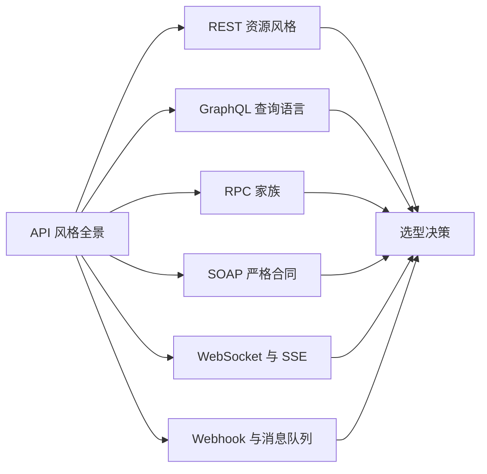
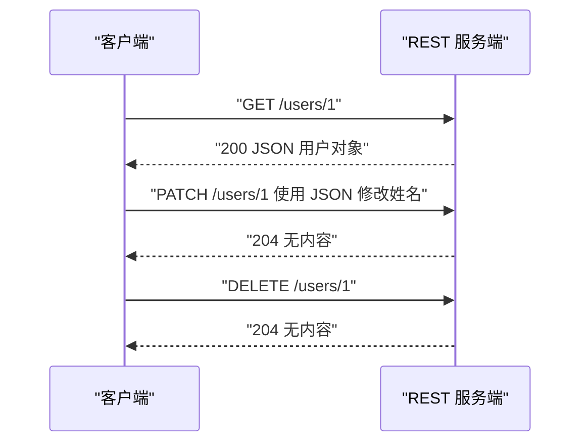
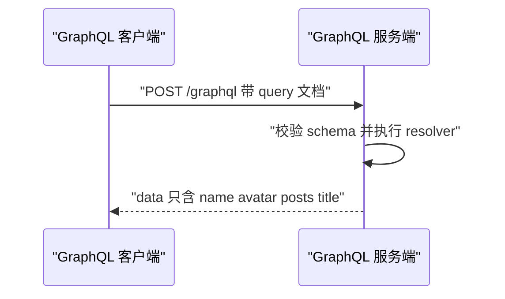
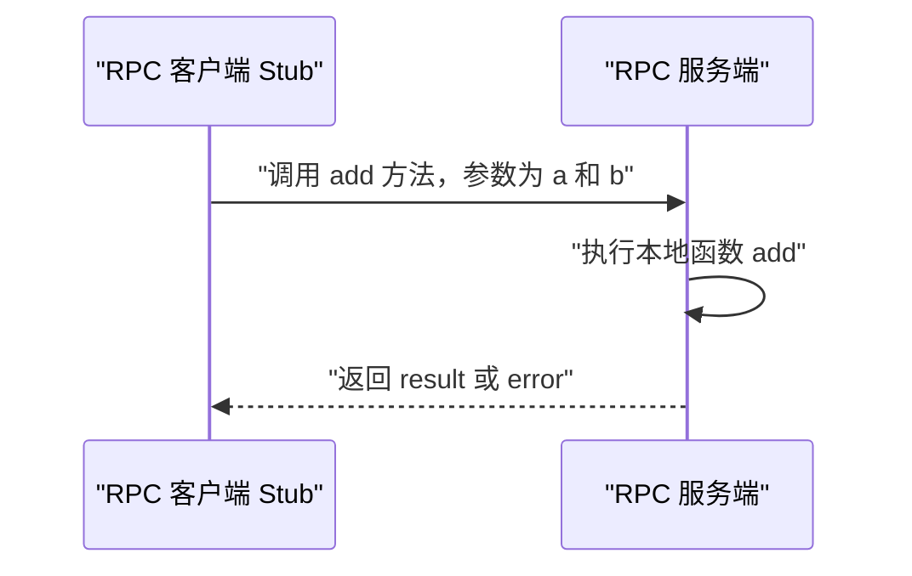
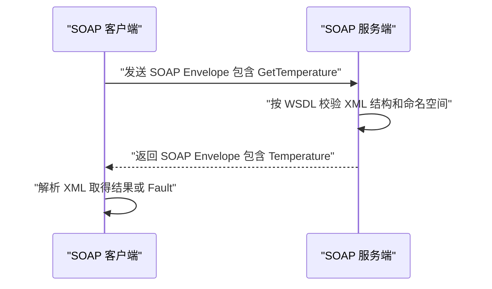
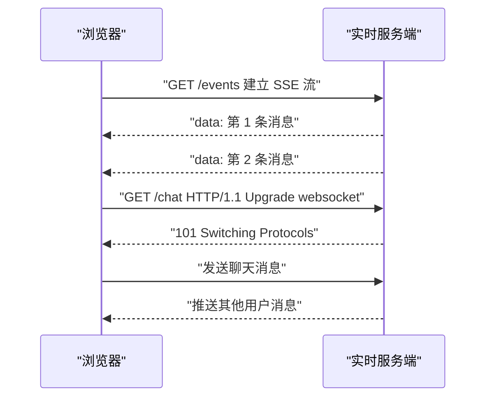
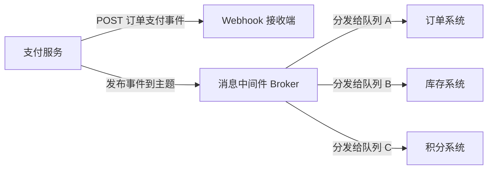
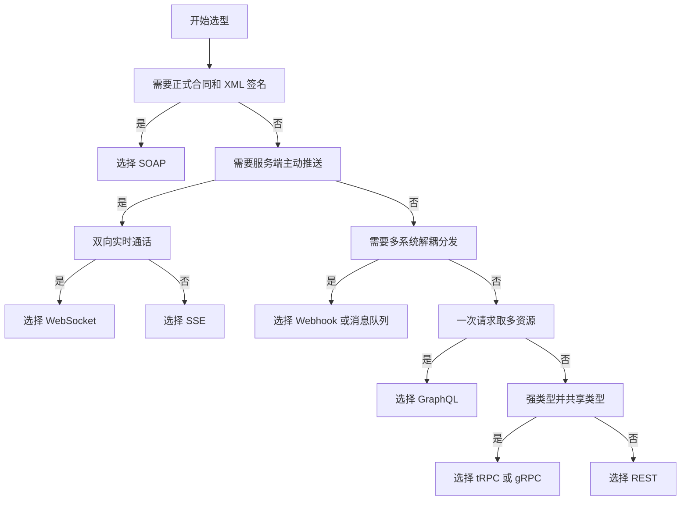
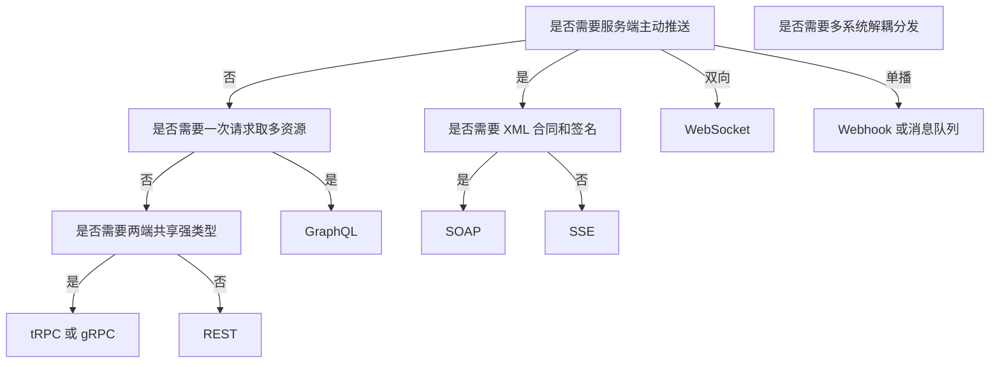

# API 风格全景：REST、GraphQL、RPC、实时与事件

!!! abstract "学完这一页你能"
    1. 说出 REST、GraphQL、RPC、SOAP、实时通道、事件驱动各自解决哪一类问题。
    2. 根据业务是否需要单次取多资源、类型安全、双向推送或事件分发，画出选型决策路径。
    3. 写出 REST、JSON-RPC、SSE、Webhook 的 Node 20+ 最小可运行验证脚本。
    4. 识别过度获取、类型丢失、连接未升级、事件重复投递四个常见坑并给出修复动作。

## 0. 知识地图



建议从左往右读：先理解左列每种风格解决的具体问题，再进入右列综合选型。  
第 1、5、6、7 节是面试高频区域，可以优先读。  
读完后把右列的选型决策图自己走三遍，直到能不看图说出判断顺序。

## 1. REST：把资源放在 URL 上，用 HTTP 方法表达动作

**先想一个问题**：  
你要做用户管理页，需要展示列表、查看单个人、新建用户、删除用户。  
应该设计成几个地址？每个地址如果兼容所有操作，会出现什么错误？

!!! note "术语：REST"
    REST 是 Representational State Transfer 的缩写。它把服务端数据看作资源，每个资源有 URL，操作由 HTTP 方法表达。例如 `GET /users/1` 表示读取用户 1 的当前状态。

**心智模型**：  
!!! tip "心智模型"
    **一句话模型**：URL 定位资源，HTTP 方法表达动作。  
    **日常类比**：餐厅菜单上每道菜都有固定名称，顾客用取餐、加菜、退菜对应查看、创建、删除。  
    **类比不成立处**：餐厅一道菜通常独立，REST 却经常遇到一个页面需要用户、订单、积分多个资源，从而产生多次请求或冗余字段。

**图解**：  


1. 第一步 `GET /users/1` 只读取用户 1 的状态，服务端返回 200 和 JSON。  
2. 第二步 `PATCH /users/1` 表示部分更新，成功返回 204 表示没有响应体。  
3. 第三步 `DELETE /users/1` 删除资源，成功后客户端应清理本地缓存。  
4. 这套流程把同样 URL 的不同动作用 HTTP 方法切开，避免一个 `/deleteUser` 地址同时承担读取和删除。

**一步一步来**：

**第 1 步：把资源与动作拆成一个计划表**

这一步要做什么：先不写网络代码，把四个操作映射到 HTTP 方法和路径，确认接口边界清晰。  
```js
const plan = {
  listUsers: { method: "GET", path: "/users" }, // 读取列表
  getUser: { method: "GET", path: "/users/1" }, // 读取单个用户
  createUser: {
    method: "POST",
    path: "/users",
    body: { name: "小林" }, // 创建请求体
  },
  deleteUser: { method: "DELETE", path: "/users/1" }, // 删除单个用户
};
```

**这段代码在做什么**  

- `method` 对应用户动作：读取用 GET，创建用 POST，删除用 DELETE。  
- `path` 始终指向资源，而不是写 `getUserByOne` 之类的动作地址。  
- `createUser.body` 说明创建动作需要携带新资源内容。  
- 这个计划表不产生网络请求，只是把接口约定显式固定下来。

**第 2 步：用 fetch 按约定发出请求**

这一步要做什么：把上一步的计划变成真实 HTTP 请求，并统一收集状态码、响应文本和成功标记。  
```js
async function requestREST(base, path, options = {}) {
  const res = await fetch(`${base}${path}`, options); // 发起 HTTP 请求
  const text = await res.text(); // 先读出响应文本
  return { status: res.status, ok: res.ok, body: text }; // 统一返回
}

const result = await requestREST("http://localhost:3000", "/users/1");
console.log(result);
```

**这段代码在做什么**  

- `fetch` 是 Node 20+ 内置全局函数，不需要安装任何第三方包。  
- `res.status` 保存 HTTP 状态码，`res.ok` 表示状态码在 200 到 299 之间。  
- `res.text()` 先拿文本，可以避免响应体不是 JSON 时直接 `json()` 抛错。  
- 返回值把网络请求结果压缩成三个字段，后续判断更容易测试。

运行结果可能是：  
```
{ status: 200, ok: true, body: '{"id":1,"name":"小林"}' }
```

**第 3 步：按状态码而不是按 URL 猜测结果**

这一步要做什么：不同状态码代表不同结果，写一个函数把客户端后续动作分离开。  
```js
function summarizeREST(res) {
  if (res.status === 200) return "读取成功"; // 普通读取
  if (res.status === 201) return "创建成功"; // POST 新建成功
  if (res.status === 204) return "操作成功，无返回体"; // 删除或更新
  if (res.status === 404) return "资源不存在"; // URL 或资源错误
  if (res.status >= 500) return "服务端错误"; // 服务端异常
  return `未单独处理的状态码 ${res.status}`;
}

console.log(summarizeREST({ status: 204 }));
```

**这段代码在做什么**  

- 200 用于普通读取，201 用于创建成功，204 用于删除或部分更新成功。  
- 404 表示资源不存在，这通常是客户端路径错误或资源被删除。  
- 500 及以上的状态码表示服务端异常，客户端重试时需要加退出条件。  
- 返回字符串而不是直接抛错，让调用方决定何时终止流程。

**动手验证**：  
下面的脚本使用 Node 内置 `http` 启动一个临时 REST 服务，再用 `fetch` 验证读取流程。无需安装依赖。  
```js
import http from "node:http";
import assert from "node:assert/strict";

const server = http.createServer((req, res) => {
  if (req.url === "/users/1" && req.method === "GET") {
    res.writeHead(200, { "Content-Type": "application/json" });
    res.end(JSON.stringify({ id: 1, name: "小林" }));
    return;
  }
  res.writeHead(404, { "Content-Type": "application/json" });
  res.end(JSON.stringify({ error: "Not Found" }));
});

await new Promise((resolve) => server.listen(0, resolve));
const port = server.address().port;

const res = await fetch(`http://localhost:${port}/users/1`);
const data = await res.json();
assert.equal(res.status, 200);
assert.equal(data.name, "小林");

server.close();
console.log("REST 验证通过：GET /users/1 返回 200 和 name=小林");
```

**这段代码在做什么**  

- `server.listen(0)` 使用随机的本地端口，避免固定端口被占用。  
- `server.address().port` 拿到真实端口后拼成完整请求地址。  
- 断言确认状态码是 200，且响应体中的姓名字段符合预期。  
- 结束后调用 `server.close()`，防止测试进程一直挂着。

**常见坑**：  

| 现象 | 原因 | 怎么修 |
| --- | --- | --- |
| 前端渲染列表要发 N 次请求 | 列表接口只返回 ID，详情必须逐个拉 | 提供 `GET /users?ids=1,2,3` 批量读取接口 |
| 返回体里总有很多无用字段 | 后端把同一张数据库表全量返回 | 增加字段筛选参数，或下一步评估 GraphQL |
| 删除后刷新又看到旧数据 | 客户端仍读本地缓存 | 删除成功后清除该资源缓存再重取 |
| 把创建、更新都塞到 POST | 语义不明确，后续难以做缓存和重放 | 创建用 POST，修改用 PUT 或 PATCH |

**小结**  

1. REST 的核心是资源 URL 加 HTTP 方法，读、建、改、删各有对应语义。  
2. 状态码承担结果描述，客户端应针对 200、201、204、404、5xx 分别处理。  
3. REST 最容易落地，但在复杂页面中可能出现请求次数多或字段冗余，需要配合批量接口或 GraphQL。

## 2. GraphQL：客户端声明要哪些字段，服务端按声明返回

**先想一个问题**：  
个人中心页要一次显示昵称、头像、文章数、未读消息数。  
用 REST 可能要请求 4 个接口，还要等最慢的那个返回，页面才有完整数据。  
怎么让客户端只写一个查询，就得到恰好需要的字段集合？

!!! note "术语：GraphQL"
    GraphQL 是一种 API 查询语言。客户端发送一个 query 文档，声明需要的字段和嵌套结构，服务端根据 schema 和 resolver 返回同样的 JSON 形状。例如 `{ user(id: "1") { name avatar } }` 只取 name 和 avatar。

**心智模型**：  
!!! tip "心智模型"
    **一句话模型**：客户端写字段清单，服务端按清单填充数据。  
    **日常类比**：自助餐顾客拿盘子，只盛自己需要的菜，不必端回一整桌。  
    **类比不成立处**：自助餐顾客可能不知道自己可以点哪些菜，GraphQL 客户端必须提前理解 schema，否则查询会直接报错。

**图解**：  


1. 客户端把查询文档放在 POST 请求体中发送到固定端点 `/graphql`。  
2. 服务端先校验 query 字段是否存在于 schema 中，字段不存在会返回 errors。  
3. 服务端按字段执行 resolver，每个字段由对应的 resolver 函数填值。  
4. 返回 JSON 的键名和 query 选择的键名一致，客户端无需从大批数据中挑字段。

**一步一步来**：

**第 1 步：写一个只取必要字段的 query 文档**

这一步要做什么：不用关心服务端实现，先表达页面需要的字段树。  
```graphql
# 这个查询只取 user 下的三个字段
query {
  user(id: "1") {
    name
    avatar
    posts {
      title
    }
  }
}
```

**这段代码在做什么**  

- `query` 表示这是一次读取操作，GraphQL 中写不写 query 关键字都可。  
- `user(id: "1")` 是根查询字段，参数 `id` 用于定位用户。  
- `name`、`avatar` 是标量字段，直接返回字符串。  
- `posts { title }` 是嵌套对象字段，表示还需要文章列表中的标题。

**第 2 步：定义 schema 描述可查询的数据形状**

这一步要做什么：给服务端建立字段类型和参数类型，让查询可以被校验。  
```graphql
type User {
  id: ID!
  name: String!
  avatar: String!
  posts: [Post!]!
}

type Post {
  id: ID!
  title: String!
}

type Query {
  user(id: ID!): User
}
```

**这段代码在做什么**  

- `type User` 声明用户对象有哪些字段，`ID!` 中感叹号表示不可为 null。  
- `posts: [Post!]!` 表示列表本身不可为 null，且列表内每一项不可为 null。  
- `type Query` 是入口类型，`user(id: ID!): User` 暴露按 ID 查用户的读接口。  
- 这段 schema 不包含任何数据库逻辑，只描述接口形状。

**第 3 步：把 schema 和 resolver 接起来执行查询**

这一步要做什么：给 schema 的每个入口字段提供 resolver，实际返回数据。  
```js
import { buildSchema, graphql } from "graphql";

const schema = buildSchema(`
  type User { id: ID!, name: String!, avatar: String! }
  type Post { title: String! }
  type Query { user(id: ID!): User }
`);

const root = {
  user({ id }) {
    return { id, name: "小林", avatar: "/a.png" }; // 只返回根字段
  },
};

const query = `query { user(id: "1") { name avatar } }`;
const result = await graphql({ schema, rootValue: root, source: query });
console.log(JSON.stringify(result, null, 2));
```

**这段代码在做什么**  

- `buildSchema` 把 schema 字符串编译成服务端可校验的对象。  
- `root.user` 接收查询参数 `{ id }`，返回用户对象。  
- `graphql` 函数同时执行 schema 校验、resolver 调用、错误收集。  
- 查询只声明了 `name avatar`，所以即使 root 对象有 `id`，输出也不会带 `id`。

运行结果可能是：  
```
{
  "data": {
    "user": {
      "name": "小林",
      "avatar": "/a.png"
    }
  }
}
```

**动手验证**：  
下面的脚本需要先执行 `npm install graphql`，然后使用 Node 20+ 运行。它验证一次查询同时取回标量和嵌套字段。  
```js
import assert from "node:assert/strict";
import { buildSchema, graphql } from "graphql";

const schema = buildSchema(`
  type Post { id: ID!, title: String! }
  type User { id: ID!, name: String!, avatar: String!, posts: [Post!]! }
  type Query { user(id: ID!): User }
`);

const posts = [{ id: "p1", title: "REST 与 GraphQL 对比" }];
const root = {
  user: ({ id }) => ({
    id,
    name: "小林",
    avatar: "/a.png",
    posts,
  }),
};

const query = `query {
  user(id: "1") {
    name
    avatar
    posts { title }
  }
}`;

const result = await graphql({ schema, rootValue: root, source: query });

assert.equal(result.errors, undefined);
assert.equal(result.data.user.name, "小林");
assert.equal(result.data.user.posts[0].title, "REST 与 GraphQL 对比");
console.log("GraphQL 验证通过：一次查询同时取回 name、avatar、posts.title");
```

**这段代码在做什么**  

- 依赖 `graphql` 提供 `buildSchema` 和 `graphql` 两个函数。  
- `posts` 数组作为用户字段的嵌套数据来源，`posts[0].title` 被返回。  
- 断言确认没有 `errors`，并验证嵌套对象中的字段值。  
- 输出证明一次 query 完成原本可能多次 REST 请求的数据聚合。

**常见坑**：  

| 现象 | 原因 | 怎么修 |
| --- | --- | --- |
| 客户端查询字段名写错，整个请求失败 | GraphQL 只按 schema 精确校验 | 开发环境打开 schema 提示，或生成类型文件 |
| 某些字段没实现 resolver，返回 null | schema 声明了字段，但 root 没给值 | 为每个 Query 入口补默认 resolver 或抛错 |
| 用户 A 能查到用户 B 的数据 | 只校验 query，没做权限控制 | 在 resolver 中按上下文校验身份 |
| 循环查询导致服务端长时间执行 | 客户端可无限嵌套字段 | 添加查询深度和复杂度上限 |

**小结**  

1. GraphQL 的返回形状由客户端 query 决定，能减少字段浪费和请求次数。  
2. schema 定义可查询结构，resolver 负责给字段填充真实数据。  
3. GraphQL 不是数据库，也不会自动加权限，安全控制必须在 resolver 一层完成。

## 3. RPC 家族：gRPC、tRPC、JSON-RPC

**先想一个问题**：  
服务端已经写了 `getUser(1)`、`add(2, 3)` 这样的函数。  
前端能不能像调用本地函数一样调用服务端函数，而不需要手工拼 URL 和 HTTP 方法？

!!! note "术语：RPC 家族"
    RPC 是 Remote Procedure Call 的缩写，表示跨进程调用函数。JSON-RPC 用 JSON 表达方法名和参数；gRPC 使用 HTTP/2 和 Protocol Buffers 二进制协议；tRPC 使用 TypeScript 类型推导，不生成中间代码。

**心智模型**：  
!!! tip "心智模型"
    **一句话模型**：把服务端函数当作本地函数，调用时传参数，结束后收结果。  
    **日常类比**：你坐在工位按下对讲机，请另一个房间的同事计算两个数字，他告诉你总和。  
    **类比不成立处**：对讲机呼叫没有网络延迟和进程崩溃，RPC 调用必须处理超时、重试和错误码。

**图解**：  


1. 客户端 Stub 把函数名、参数打包成一个请求。  
2. 服务端根据包里的函数名分发到对应本地函数执行。  
3. 服务端把返回值或错误对象序列化后发送回客户端。  
4. 客户端 Stub 把响应还原成普通函数返回值，本地调用样式成立。

**一步一步来**：

**第 1 步：构造一个 JSON-RPC 请求对象**

这一步要做什么：用最小字段表达一次函数调用，避免 RPC 请求依赖特定语言类型。  
```js
const rpcRequest = {
  jsonrpc: "2.0", // 协议版本
  id: 1, // 请求 ID，用于匹配响应
  method: "add", // 要调用的方法名
  params: { a: 2, b: 3 }, // 参数对象
};
```

**这段代码在做什么**  

- `jsonrpc: "2.0"` 明确这是 JSON-RPC 2.0 协议。  
- `id` 是请求标识，服务端返回时会带同一个 ID。  
- `method` 表达要执行的服务端函数名。  
- `params` 是参数集合，这里使用对象传参，数组也可以。

**第 2 步：写一个发送 JSON-RPC 请求的客户端函数**

这一步要做什么：把请求对象编码成 JSON 发给服务端，并解析 result 或 error。  
```js
async function callRPC(url, method, params = {}) {
  const res = await fetch(url, {
    method: "POST", // RPC 使用 POST 携带方法名
    headers: { "Content-Type": "application/json" },
    body: JSON.stringify({ jsonrpc: "2.0", id: 1, method, params }),
  });
  const json = await res.json();
  if (json.error) throw new Error(json.error.message); // 先处理错误
  return json.result; // 成功只返回结果
}
```

**这段代码在做什么**  

- `fetch` 使用 POST，因为方法名和参数放在请求体里。  
- 请求体每次都是标准 JSON，不分 GET、POST、DELETE 语义。  
- 如果响应包含 `error` 字段，说明服务端方法执行失败，直接抛错。  
- 成功时只把 `json.result` 返回给调用方，调用方看不到协议细节。

**第 3 步：在服务端按方法名分发执行**

这一步要做什么：准备一个简单分发器，根据 method 执行本地函数。  
```js
function dispatchRPC(payload) {
  switch (payload.method) {
    case "add":
      return { jsonrpc: "2.0", id: payload.id, result: payload.params.a + payload.params.b };
    case "echo":
      return { jsonrpc: "2.0", id: payload.id, result: payload.params.text };
    default:
      return {
        jsonrpc: "2.0",
        id: payload.id,
        error: { code: -32601, message: "Method not found" }, // 未知方法
      };
  }
}
```

**这段代码在做什么**  

- `add` 方法执行加法，返回求和结果。  
- `echo` 方法原样返回文本，用来演示参数回传。  
- 未知方法返回 `-32601` 错误码，这是 JSON-RPC 标准中的方法未找到错误。  
- 所有响应都带 ID，客户端可以区分多个并发请求。

**动手验证**：  
下面的脚本使用内置 `http` 搭建一个 JSON-RPC 服务端，并用前一个客户端函数调用 `add`。无需安装依赖。  
```js
import http from "node:http";
import assert from "node:assert/strict";

function dispatchRPC(payload) {
  if (payload.method === "add") {
    return { jsonrpc: "2.0", id: payload.id, result: payload.params.a + payload.params.b };
  }
  return { jsonrpc: "2.0", id: payload.id, error: { code: -32601, message: "Method not found" } };
}

const server = http.createServer(async (req, res) => {
  let raw = "";
  for await (const chunk of req) raw += chunk;
  const payload = JSON.parse(raw);
  const response = dispatchRPC(payload);
  res.writeHead(200, { "Content-Type": "application/json" });
  res.end(JSON.stringify(response));
});

await new Promise((resolve) => server.listen(0, resolve));
const port = server.address().port;

const rpcRes = await fetch(`http://localhost:${port}`, {
  method: "POST",
  headers: { "Content-Type": "application/json" },
  body: JSON.stringify({ jsonrpc: "2.0", id: 1, method: "add", params: { a: 2, b: 3 } }),
});
const rpcJson = await rpcRes.json();

assert.equal(rpcJson.result, 5);
assert.equal(rpcJson.id, 1);
assert.equal(rpcJson.error, undefined);

server.close();
console.log("JSON-RPC 验证通过：add(2, 3) 返回 result 为 5");
```

**这段代码在做什么**  

- 服务端通过 `for await` 读完请求体，得到文本后 `JSON.parse`。  
- `dispatchRPC` 只处理 `add`，未知方法返回错误对象。  
- 客户端断言 `result` 等于 5，并确认响应 ID 与请求一致。  
- 这个脚本展示了 JSON-RPC 的最小闭环，gRPC 和 tRPC 在此之上增加类型系统和连接管理。

**常见坑**：  

| 现象 | 原因 | 怎么修 |
| --- | --- | --- |
| 客户端收不到匹配响应 | 请求 ID 没回传或丢失 | 服务端必须把 `id` 原样写回 |
| 方法名拼写错误导致调用失败 | 没有编译期类型检查 | gRPC 用生成代码，tRPC 用 TypeScript 推导 |
| 把 gRPC 当普通 JSON 接口调 | gRPC 使用 Protocol Buffers 二进制 | 客户端引入对应 `.proto` 生成的 Stub |
| tRPC 只在浏览器端起效果 | tRPC 类型推导依赖前端后端共享代码 | 保持同仓库或使用可导入的共享包 |

**小结**  

1. RPC 的目标是让跨进程函数调用像本地函数一样直接。  
2. JSON-RPC 是最小实现，gRPC 用二进制协议获得类型和传输约束，tRPC 用 TypeScript 推导减少代码生成。  
3. RPC 的代价是客户端和服务端通常需要共享方法契约、类型或 proto 文件。

## 4. SOAP：像签纸质合同一样交换 XML 消息

**先想一个问题**：  
银行转账接口要带账号、金额、交易时间、签名、认证头，字段顺序和错误码都必须固定。  
如果只是普通 JSON 和 REST，谁能保证字段没写错、错误码没人改？

!!! note "术语：SOAP"
    SOAP 是 Simple Object Access Protocol 的缩写。它基于 XML 构造信封、头、体，常配合 WSDL 描述服务能力。SOAP 消息包含 Envelope、Header、Body，适合合同式、强校验、需要签名的系统集成。

**心智模型**：  
!!! tip "心智模型"
    **一句话模型**：请求和响应都是固定格式的 XML 合同，格式破坏就会失败。  
    **日常类比**：去银行办业务要填指定表格，少一个签章或填错一格都不受理。  
    **类比不成立处**：银行表格只需要人看，SOAP 合同必须在 XML 命名空间、错误结构、安全头等多个层面同时正确。

**图解**：  


1. 客户端发送的 SOAP Envelope 把操作和参数封装在 XML 的 Body 中。  
2. 服务端根据 WSDL 定义的命名空间和字段顺序校验 XML。  
3. 成功时响应在 Body 中写入业务结果。  
4. 失败时响应 Body 中出现 Fault 节点，客户端解析 Fault 而不是性能日志猜测。

**一步一步来**：

**第 1 步：构造一个 SOAP 请求信封**

这一步要做什么：手动生成 XML，确认 Envelope、Header、Body 的结构完整。  
```js
const soapRequest = `<?xml version="1.0"?>
<soap:Envelope xmlns:soap="http://www.w3.org/2003/05/soap-envelope">
  <soap:Body>
    <m:GetTemperature xmlns:m="https://example.com/soap">
      <m:City>北京</m:City>
    </m:GetTemperature>
  </soap:Body>
</soap:Envelope>`;
```

**这段代码在做什么**  

- `soap:Envelope` 是 SOAP 1.2 消息的最外层容器。  
- `soap:Body` 存放业务数据，这里是获取城市的温度操作。  
- `m:GetTemperature` 带 `m` 命名空间，表示业务操作由具体服务定义。  
- `m:City` 是操作参数，值为北京。

**第 2 步：用 fetch 发送 SOAP 请求并解析 XML 结果**

这一步要做什么：以 XML 内容发送 POST 请求，再从返回 XML 中提取温度。  
```js
async function callSOAP(url, body) {
  const res = await fetch(url, {
    method: "POST",
    headers: { "Content-Type": "application/soap+xml; charset=utf-8" }, // SOAP 1.2 媒体类型
    body,
  });
  const text = await res.text();
  const match = text.match(/<m:Temperature>([^<]+)<\/m:Temperature>/); // 提取标签内容
  return match ? match[1] : "无结果";
}
```

**这段代码在做什么**  

- `Content-Type` 使用 SOAP 1.2 的媒体类型，而不是普通 XML。  
- 响应体先读成文本，因为浏览器和 Node 不会把 SOAP 自动转成对象。  
- `match` 用正则提取 `m:Temperature` 标签中的温度值。  
- 仅在演示脚本中用正则解析，实际接入 SOAP 应使用服务端 WSDL 生成的客户端工具。

**第 3 步：识别 SOAP Fault 失败结构**

这一步要做什么：错误不是 HTTP 状态码，而是 XML 中的 Fault 节点。  
```js
function hasSOAPFault(text) {
  return text.includes("<soap:Fault>") || text.includes("<SOAP-ENV:Fault>");
}

const sampleFault = "<soap:Body><soap:Fault><faultcode>soap:Client</faultcode><faultstring>城市参数缺失</faultstring></soap:Fault></soap:Body>";
console.log(hasSOAPFault(sampleFault));
```

**这段代码在做什么**  

- SOAP 错误在响应 XML 中用 Fault 节点表示，请求可能仍返回 HTTP 200。  
- `faultcode` 区分客户端错误和服务端错误，`faultstring` 提供人类可读描述。  
- `hasSOAPFault` 只做演示，真实解析需要处理命名空间前缀变化。  
- 客户端不要以 HTTP 200 作为 SOAP 调用成功的唯一依据。

**动手验证**：  
下面的脚本用内置 `http` 模拟一个 SOAP 服务端，返回固定 SOAP 信封，并用 `fetch` 调用 `callSOAP`。  
```js
import http from "node:http";
import assert from "node:assert/strict";

const server = http.createServer((req, res) => {
  res.writeHead(200, { "Content-Type": "application/soap+xml; charset=utf-8" });
  res.end(`<soap:Envelope xmlns:soap="http://www.w3.org/2003/05/soap-envelope">
    <soap:Body>
      <m:GetTemperatureResponse xmlns:m="https://example.com/soap">
        <m:Temperature>28.5</m:Temperature>
      </m:GetTemperatureResponse>
    </soap:Body>
  </soap:Envelope>`);
});

await new Promise((resolve) => server.listen(0, resolve));
const port = server.address().port;

const soapRequest = `<?xml version="1.0"?>
<soap:Envelope xmlns:soap="http://www.w3.org/2003/05/soap-envelope">
  <soap:Body>
    <m:GetTemperature xmlns:m="https://example.com/soap">
      <m:City>北京</m:City>
    </m:GetTemperature>
  </soap:Body>
</soap:Envelope>`;

async function callSOAP(url, body) {
  const res = await fetch(url, {
    method: "POST",
    headers: { "Content-Type": "application/soap+xml; charset=utf-8" },
    body,
  });
  const text = await res.text();
  const match = text.match(/<m:Temperature>([^<]+)<\/m:Temperature>/);
  return match ? match[1] : "无结果";
}

const temperature = await callSOAP(`http://localhost:${port}`, soapRequest);
assert.equal(temperature, "28.5");
server.close();
console.log("SOAP 验证通过：解析 Temperature 得到 28.5");
```

**这段代码在做什么**  

- 服务端对任何 SOAP 请求都返回固定响应，用于演示客户端解析。  
- 客户端把完整 SOAP 信封放入 fetch body。  
- 正则从响应 XML 提取温度值，断言为 `28.5`。  
- 如果没有 SOAP 客户端库，手工解析 XML 容易受命名空间前缀影响，只适合教学脚本。

**常见坑**：  

| 现象 | 原因 | 怎么修 |
| --- | --- | --- |
| 服务端返回 HTTP 200 但客户端仍失败 | SOAP 用 Fault 节点表达业务错误 | 解析响应体中的 Fault，而不是只看状态码 |
| 手工拼 XML 出现命名空间错位 | 请求和响应命名空间不一致 | 使用 WSDL 生成客户端代码，减少手写 XML |
| 在浏览器里直接用 JSON 调 SOAP | 内容类型不匹配，服务端解析失败 | 设置 `Content-Type: application/soap+xml` |
| 把 SOAP 返回体直接 `JSON.parse` | 响应是 XML | 使用 XML 解析器或专用 SOAP 工具 |

**小结**  

1. SOAP 使用 XML Envelope 和 WSDL 强制接口合同，适合银行、政务等集成场景。  
2. 成功和失败都在 XML 中表达，客户端必须解析 Fault 节点。  
3. SOAP 不适合追求小字段和高频率的移动端或纯前端接口。

## 5. 实时通道：WebSocket 与 SSE

**先想一个问题**：  
聊天室新消息、实时股价、比赛比分，都需要服务端主动向浏览器推送。  
普通 HTTP 请求只能客户端问、服务端答，浏览器不主动发问就收不到更新。  
这种反向或双向数据流应该用什么通道？

!!! note "术语：WebSocket 与 SSE"
    WebSocket 是 WebSocket 协议的简称，通过 HTTP Upgrade 建立长连接，之后双向发送消息。SSE 是 Server-Sent Events 的缩写，服务端使用 HTTP 长响应持续发送 `text/event-stream`，只能服务端到客户端单向推送。

**心智模型**：  
!!! tip "心智模型"
    **一句话模型**：SSE 是服务端发起的单向广播，WebSocket 是双方都能说话的通话。  
    **日常类比**：SSE 像广播电台，电台不断播报，听众只能收听；WebSocket 像电话，双方都能说和听。  
    **类比不成立处**：网络连接可能断线，广播和电话不会自动处理重连、心跳和消息序号。

**图解**：  


1. SSE 从一次普通 GET 开始，服务端保持响应不结束并持续写入 `data:` 行。  
2. SSE 只能服务端向客户端推，浏览器不能通过同一 SSE 响应回写消息。  
3. WebSocket 先发起升级请求，服务端返回 101 后，连接从 HTTP 切换为 WebSocket 协议。  
4. WebSocket 连接双向可用，适合聊天室、协作编辑等双方都需要主动发送的场景。

**一步一步来**：

**第 1 步：创建 SSE 服务端持续写事件**

这一步要做什么：用 HTTP 长响应发送两条事件，证明服务端可以主动连发。  
```js
const server = http.createServer((req, res) => {
  if (req.url === "/events") {
    res.writeHead(200, {
      "Content-Type": "text/event-stream", // SSE 专用媒体类型
      "Cache-Control": "no-cache", // 禁用缓存
      "Connection": "keep-alive", // 保持长连接
    });
    let count = 0;
    const timer = setInterval(() => {
      count += 1;
      res.write(`event: message\n`); // 指定事件类型
      res.write(`data: 第 ${count} 条消息\n\n`); // 每个事件以空行结束
      if (count === 2) {
        clearInterval(timer);
        res.end(); // 结束响应
      }
    }, 50);
    return;
  }
  res.writeHead(404);
  res.end();
});
```

**这段代码在做什么**  

- `Content-Type: text/event-stream` 告诉客户端这是 SSE 流。  
- `event:` 行指定事件名，`data:` 行携带实际数据。  
- 每个事件块用空行分隔，客户端据此切分独立事件。  
- `res.end()` 结束响应，客户端读取流会收到 done 信号。

**第 2 步：用 fetch 读取 SSE 流并切分事件**

这一步要做什么：客户端用流式读取响应体，按空行还原每个事件。  
```js
async function readSSE(base) {
  const res = await fetch(`${base}/events`);
  const reader = res.body.getReader(); // Web 流读取器
  const decoder = new TextDecoder();
  const events = [];
  let buffer = "";

  while (true) {
    const { value, done } = await reader.read();
    if (done) break;
    buffer += decoder.decode(value, { stream: true }); // 增量解码
    const parts = buffer.split("\n\n"); // 用空行切分事件
    buffer = parts.pop(); // 最后一个可能不完整
    for (const part of parts) {
      const dataLine = part.split("\n").find((line) => line.startsWith("data: "));
      if (dataLine) events.push(dataLine.slice(6));
    }
  }
  return events;
}
```

**这段代码在做什么**  

- `res.body.getReader()` 暴露 Node 支持的 Web 流读取接口。  
- `TextDecoder` 增量解码 UTF-8，避免一次块读取破坏多字节字符。  
- 用 `\n\n` 切分事件，因为 SSE 每个事件块以空行结束。  
- `data:` 前缀后面的文本被收集进数组，供后续断言使用。

**第 3 步：说明 WebSocket 握手与 SSE 流向差异**

这一步要做什么：明确选择 SSE 还是 WebSocket，不靠框架功能强弱做判断。  
```js
const pushDirection = {
  serverToClientOnly: "SSE",
  bothDirections: "WebSocket",
  reconnectNeeded: "两者都需要客户端重连策略",
};

console.log(pushDirection.serverToClientOnly);
```

**这段代码在做什么**  

- 如果只做服务端推消息，SSE 使用普通 HTTP，部署和观测成本低。  
- 如果客户端和服务端都要主动发消息，选择 WebSocket。  
- 两者都不能保证连接永远不断，重连策略必须由客户端自己处理。  
- 这个对象不是库代码，而是把选型条件写成了可运行的数据结构。

**动手验证**：  
下面的脚本启动 SSE 服务端，用 `readSSE` 读取两个事件，确认事件顺序和内容。无需安装依赖。  
```js
import http from "node:http";
import assert from "node:assert/strict";

const server = http.createServer((req, res) => {
  if (req.url === "/events") {
    res.writeHead(200, {
      "Content-Type": "text/event-stream",
      "Cache-Control": "no-cache",
      "Connection": "keep-alive",
    });
    let count = 0;
    const timer = setInterval(() => {
      count += 1;
      res.write(`event: message\n`);
      res.write(`data: 第 ${count} 条消息\n\n`);
      if (count === 2) {
        clearInterval(timer);
        res.end();
      }
    }, 50);
    return;
  }
  res.writeHead(404);
  res.end();
});

await new Promise((resolve) => server.listen(0, resolve));
const port = server.address().port;

async function readSSE(base) {
  const res = await fetch(`${base}/events`);
  const reader = res.body.getReader();
  const decoder = new TextDecoder();
  const events = [];
  let buffer = "";
  while (true) {
    const { value, done } = await reader.read();
    if (done) break;
    buffer += decoder.decode(value, { stream: true });
    const parts = buffer.split("\n\n");
    buffer = parts.pop();
    for (const part of parts) {
      const dataLine = part.split("\n").find((line) => line.startsWith("data: "));
      if (dataLine) events.push(dataLine.slice(6));
    }
  }
  return events;
}

const events = await readSSE(`http://localhost:${port}`);
assert.deepEqual(events, ["第 1 条消息", "第 2 条消息"]);

server.close();
console.log("SSE 验证通过：收到两条服务端主动推送的消息");
```

**这段代码在做什么**  

- 服务端每隔 50 ms 推送一条 SSE 消息，共两条后结束。  
- 客户端通过 Web 流读取响应，并按空行还原事件。  
- `assert.deepEqual` 验证事件顺序和内容都符合预期。  
- 该脚本完整演示 SSE 单向推送，WebSocket 双向通信需要额外库或后续 Node WebSocket 支持。

**常见坑**：  

| 现象 | 原因 | 怎么修 |
| --- | --- | --- |
| 浏览器收不到 SSE 推送 | 响应头错误或没有正确编码 | 设置 `Content-Type: text/event-stream` 并保证每条事件空行结尾 |
| 代理把 SSE 长连接响应缓存或截断 | 默认 HTTP 代理可能缓存响应 | 服务端加 `Cache-Control: no-cache` |
| WebSocket 连不上但 HTTP 正常 | HTTP 服务没有处理 Upgrade 请求 | 使用支持 WebSocket Upgrade 的服务组件 |
| 断线后客户端不再收消息 | 没有重连和最后事件 ID | 客户端捕获 close 后延迟重连，服务端配合 `id:` 字段续传 |

**小结**  

1. SSE 适合服务端单向往浏览器推送，基于普通 HTTP，客户端读取流即可。  
2. WebSocket 适合双向实时通信，需要先完成 HTTP Upgrade。  
3. 实时通道必须设计重连、心跳和消息去重，不能假设连接永远在线。

## 6. 事件驱动：Webhook 与消息队列

**先想一个问题**：  
支付成功后要通知订单系统、库存系统、积分系统、短信系统。  
如果支付服务同步调用四个接口，其中一个慢或故障，整个支付成功流程都被拖住。  
怎么让支付成功先完成，再让其他系统各自可靠地收到通知？

!!! note "术语：Webhook、MQTT、AMQP"
    Webhook 是用户配置的 HTTP 回调，源服务在事件发生时向目标 URL 发送 POST。MQTT 是一种发布订阅消息协议，适合低带宽、不稳定网络和物联网设备。AMQP 是面向中间件的消息协议，强调路由、确认和队列模型。

**心智模型**：  
!!! tip "心智模型"
    **一句话模型**：源头只发布事件，目标各自订阅并处理。  
    **日常类比**：报纸编辑部印好新刊后，按订阅名单投递；公司收发室先把信件分好，各部门稍后取走。  
    **类比不成立处**：投递不保证订阅者只收到一次，也不保证订阅者处理时不重复扣款。

**图解**：  


1. 支付服务可以先向一个 Webhook URL 直接 POST 事件，适合简单接收方。  
2. 当接收方变多，支付服务把事件发布到中间件，解耦源和多个消费者。  
3. 中间件按队列或主题把事件分发给订单、库存、积分三个系统。  
4. 每个系统独立确认处理完成，不会因为一个消费者故障阻塞支付主流程。

**一步一步来**：

**第 1 步：定义事件负载和 Webhook URL**

这一步要做什么：先确定事件结构和目标地址，后续投递都围绕它写。  
```js
const webhookUrl = "http://localhost:4000/pay-callback"; // 接收端地址
const payload = {
  event: "order.paid", // 事件名称
  orderId: "o-1001", // 订单 ID
  amount: 99, // 金额，单位元
};
```

**这段代码在做什么**  

- `webhookUrl` 是接收方提前注册给支付服务的回调地址。  
- `event` 字段让接收方一次只处理一类事件。  
- `orderId` 是业务唯一标识，用于去重和幂等。  
- `amount` 是事件携带的具体数据，接收方不必再回查支付服务。

**第 2 步：用 fetch 投递 Webhook**

这一步要做什么：把事件负载 POST 到目标 URL，并检查目标是否接受。  
```js
async function deliverWebhook(url, payload) {
  const res = await fetch(url, {
    method: "POST", // Webhook 通常使用 POST
    headers: { "Content-Type": "application/json" },
    body: JSON.stringify(payload),
  });
  if (!res.ok) throw new Error(`Webhook 返回 ${res.status}`); // 非 2xx 视为失败
  return res.text();
}
```

**这段代码在做什么**  

- POST 方法携带事件 JSON，接收方按 JSON 解析即可。  
- `res.ok` 检查 HTTP 状态码是否在 2xx 范围内。  
- 接收方没有正确处理时，`deliverWebhook` 抛错，调用方可以决定重试。  
- 真实支付通知需要签名、时间戳、防重放等字段，这里先保留最小结构。

**第 3 步：接收端做事件去重**

这一步要做什么：用事件名加上业务 ID 作为唯一键，避免重复投递导致重复处理。  
```js
const seen = new Set();

function handleWebhook(event) {
  const key = `${event.event}:${event.orderId}`; // 组合幂等键
  if (seen.has(key)) return { duplicated: true }; // 已处理过
  seen.add(key);
  return { duplicated: false };
}

console.log(handleWebhook({ event: "order.paid", orderId: "o-1001" }));
console.log(handleWebhook({ event: "order.paid", orderId: "o-1001" }));
```

**这段代码在做什么**  

- `event:orderId` 作为幂等键，保证同一笔支付只处理一次。  
- 第一次调用时需要保存完成状态，这里用内存 Set 模拟。  
- 后续同键事件被标记为重复，接收方跳过业务处理。  
- 实际系统中 Set 需要放入数据库，否则进程重启后会丢失去重状态。

**动手验证**：  
下面的脚本启动一个 Webhook 接收服务，外部函数投递两次相同事件，第二份被去重。无需安装依赖。  
```js
import http from "node:http";
import assert from "node:assert/strict";

const received = [];
const seen = new Set();

const receiver = http.createServer(async (req, res) => {
  let raw = "";
  for await (const chunk of req) raw += chunk;
  const event = JSON.parse(raw);
  const key = `${event.event}:${event.orderId}`;
  if (seen.has(key)) {
    res.writeHead(200, { "Content-Type": "application/json" });
    res.end(JSON.stringify({ duplicated: true }));
    return;
  }
  seen.add(key);
  received.push(event);
  res.writeHead(200, { "Content-Type": "application/json" });
  res.end(JSON.stringify({ duplicated: false }));
});

await new Promise((resolve) => receiver.listen(0, resolve));
const port = receiver.address().port;

async function deliverWebhook(url, payload) {
  const res = await fetch(url, {
    method: "POST",
    headers: { "Content-Type": "application/json" },
    body: JSON.stringify(payload),
  });
  return res.json();
}

const payload = { event: "order.paid", orderId: "o-1001", amount: 99 };
const first = await deliverWebhook(`http://localhost:${port}/pay-callback`, payload);
const second = await deliverWebhook(`http://localhost:${port}/pay-callback`, payload);

assert.equal(first.duplicated, false);
assert.equal(second.duplicated, true);
assert.equal(received.length, 1);
assert.equal(received[0].amount, 99);

receiver.close();
console.log("Webhook 验证通过：重复事件只写入一次 received");
```

**这段代码在做什么**  

- 接收服务把请求体解析成事件对象，并维护 `seen` 集合。  
- 第二次相同事件被识别为重复，返回 `duplicated: true`。  
- `assert.equal(received.length, 1)` 证明业务列表只写入一次。  
- Webhook 投递和消息队列解耦在这个脚本中合成为一个可运行闭环。

**常见坑**：  

| 现象 | 原因 | 怎么修 |
| --- | --- | --- |
| 同一笔订单被处理两次 | 服务端重复投递或客户端网络重试 | 用 `event:orderId` 幂等键去重 |
| Webhook 接收方 5 秒没响应，发送方超时 | 接收方同步处理缓慢 | 接收方先返回 200，再异步入队处理 |
| 不同消费者都收到不该收的事件 | 未正确配置队列路由 | AMQP 用绑定 key，MQTT 用主题层级过滤 |
| 消息丢失且没有追踪 | 消费者崩溃且没有确认机制 | 使用消息确认和死信队列记录未处理事件 |

**小结**  

1. Webhook 适合把一个事件直接推到配置好的 HTTP 地址。  
2. 消息队列适合多消费者、高吞吐和消费者故障隔离，AMQP 重路由，MQTT 重轻量传输。  
3. 事件驱动体系必须设计幂等、重试和确认，否则重复投递会放大业务错误。

## 7. 选型决策图与学习路径

**先想一个问题**：  
你手上同时有管理后台、移动端、实时聊天、系统集成四个项目。  
它们需要的 API 完全不同，能不能用一份清单判断各自选什么？

!!! note "术语：选型决策图"
    选型决策图是用一组布尔条件按顺序判断技术方案的图。每个条件只回答是或否，命中后停止后续判断。例如先问是否需要正式合同，再问是否需要双向实时。

**心智模型**：  
!!! tip "心智模型"
    **一句话模型**：先排除无法满足硬约束的选项，再比较开发成本和团队熟悉度。  
    **日常类比**：选办公位先看是否靠窗、是否需要会议室、是否需要屏蔽噪音，最后再挑空位。  
    **类比不成立处**：技术选型还有协议版本、中间件部署、客户端 SDK 等约束，不能只凭主观判断。

**图解**：  


1. 先判断硬约束，SOAP 的正式合同和 WebSocket 的双向实时不能互相替代。  
2. 没有实时需求时，再判断事件分发、单次查询树、类型安全。  
3. 前面都不命中，才默认选择 REST，避免一开始就按习惯选 REST。  
4. 这张图只覆盖常见场景，真实项目还要加入团队已有框架和运维约束。

**一步一步来**：

**第 1 步：把需求写成一个条件对象**

这一步要做什么：把模糊描述转成布尔条件，方便代码化选型。  
```js
const scenario = {
  needsFormalContract: false, // 是否需要 SOAP 合同
  needsRealtimePush: false, // 是否需要服务端主动推
  needsBidirectional: false, // 是否需要双向实时
  needsEventFanout: false, // 是否需要多系统分发
  needsSingleQueryTree: false, // 是否需要一次取多资源
  needsTypeSafe: true, // 是否需要共享强类型
};
```

**这段代码在做什么**  

- 每个字段对应决策图中的一个是或否判断。  
- `needsTypeSafe: true` 表示这个项目希望前后端共享类型。  
- 所有字段默认 false，避免默认值偏向某种技术。  
- 后续决策函数只读这个对象，不嵌入项目名称。

**第 2 步：写一个按顺序判断的决策函数**

这一步要做什么：把流程图转化为顺序判断，命中一个结果就立即返回。  
```js
function chooseAPIStyle(s) {
  if (s.needsFormalContract) return "SOAP"; // 第一条硬约束
  if (s.needsRealtimePush) {
    return s.needsBidirectional ? "WebSocket" : "SSE"; // 实时分支
  }
  if (s.needsEventFanout) return "Webhook 或消息队列"; // 解耦分发
  if (s.needsSingleQueryTree) return "GraphQL"; // 单查询树
  if (s.needsTypeSafe) return "tRPC 或 gRPC"; // 强类型 RPC
  return "REST"; // 默认值最后才出现
}
```

**这段代码在做什么**  

- 顺序与流程图一致，硬约束先判断，默认值最后判断。  
- 实时分支先问是否双向，再分别返回 WebSocket 或 SSE。  
- 事件分发位于 TypeSafe 之前，因为它需要不同的基础设施。  
- REST 没有条件，只有其他条件都不命中才返回。

**第 3 步：补充推荐理由，方便向团队解释**

这一步要做什么：根据场景条件和返回结果生成一条可读的决策记录。  
```js
function explainChoice(s) {
  const style = chooseAPIStyle(s);
  return `场景条件为 ${JSON.stringify(s)}，推荐使用 ${style}`;
}

console.log(explainChoice(scenario));
```

**这段代码在做什么**  

- 调用决策函数得到结果，不重复判断逻辑。  
- `JSON.stringify` 把条件完整打印，便于复盘。  
- 返回字符串可以直接贴在技术方案文档里作为初稿。  
- 最终决定还要结合客户端 SDK、宿主环境和团队已有的工具链。

**动手验证**：  
下面的脚本用断言覆盖六种场景，确认决策函数与流程图一致。无需安装依赖。  
```js
import assert from "node:assert/strict";

function chooseAPIStyle(s) {
  if (s.needsFormalContract) return "SOAP";
  if (s.needsRealtimePush) {
    return s.needsBidirectional ? "WebSocket" : "SSE";
  }
  if (s.needsEventFanout) return "Webhook 或消息队列";
  if (s.needsSingleQueryTree) return "GraphQL";
  if (s.needsTypeSafe) return "tRPC 或 gRPC";
  return "REST";
}

const cases = [
  [{ needsFormalContract: true }, "SOAP"],
  [{ needsRealtimePush: true, needsBidirectional: true }, "WebSocket"],
  [{ needsRealtimePush: true, needsBidirectional: false }, "SSE"],
  [{ needsEventFanout: true }, "Webhook 或消息队列"],
  [{ needsSingleQueryTree: true }, "GraphQL"],
  [{ needsTypeSafe: true }, "tRPC 或 gRPC"],
  [{}, "REST"],
];

for (const [input, expected] of cases) {
  assert.equal(chooseAPIStyle(input), expected);
}

console.log("选型验证通过：七个分支均输出预期风格");
```

**这段代码在做什么**  

- `cases` 中每个元素是输入对象和预期输出。  
- 七个断言覆盖 SOAP、WebSocket、SSE、事件、GraphQL、RPC、REST。  
- `for` 循环一次性执行所有验证，不需要重复写样板代码。  
- 输出确认流程图中的每一条分支都对应一个可执行结果。

**学习路径表**：  

| 阶段 | 主攻内容 | 完成目标 |
| --- | --- | --- |
| 第 1 周 | REST 资源设计、状态码、fetch | 能用 Node 原生服务写 REST 接口 |
| 第 2 周 | GraphQL schema、resolver、query | 能写一次查询取多资源的 GraphQL 服务 |
| 第 3 周 | JSON-RPC、gRPC proto、tRPC 类型 | 能说出三种 RPC 的客户端接入成本 |
| 第 4 周 | SOAP Envelope、WSDL、Fault | 能从现成 SOAP 响应中解析结果和错误 |
| 第 5 周 | SSE 流、WebSocket 握手、重连 | 能写服务端推送和聊天双向消息 |
| 第 6 周 | Webhook 签名、幂等、消息队列模型 | 能设计支付通知和事件解耦方案 |
| 第 7 周 | 综合选型与面试表达 | 能按条件画出决策图并说明理由 |

**常见坑**：  

| 现象 | 原因 | 怎么修 |
| --- | --- | --- |
| 一上来就选 REST，后面复杂度失控 | 没把硬约束排在最前判断 | 先问正式合同、实时、事件分发 |
| 所有项目都上 GraphQL | 只看到字段可裁剪，忽略 schema 和 resolver 成本 | 简单 CRUD 优先用 REST，复杂聚合再引入 GraphQL |
| 只记住 WebSocket，不知道 SSE | 认为实时就是 WebSocket | 只做服务端单向推送时先评估 SSE |
| 把消息队列当成 Webhook 的无差别替代 | 消息队列需要部署中间件 | 单接收方用 Webhook，多接收方或需积压重试再上消息队列 |

**小结**  

1. 选型先淘汰硬约束不满足的方案，再比较开发成本。  
2. 用决策函数把条件固定下来，可以避免每次讨论都从零开始。  
3. 学习路径按周拆分，能把 API 风格逐个变成可运行且可说清的能力。

## 综合对比

| 维度 | REST | GraphQL | JSON-RPC | gRPC | tRPC | SOAP | WebSocket | SSE | Webhook | 消息队列 |
| --- | --- | --- | --- | --- | --- | --- | --- | --- | --- | --- |
| 核心抽象 | URL 资源加 HTTP 方法 | 客户端字段声明 | 方法名加参数 | 方法名加 proto 类型 | TypeScript 方法调用 | XML 合同加 WSDL | 双向帧消息 | 单向事件流 | HTTP 回调 | 队列和主题 |
| 典型请求 | GET /users/1 | POST /graphql | POST 任意端点的 JSON | HTTP/2 帧 | POST 任意端点的 JSON | POST XML | Upgrade 后发帧 | GET /events | POST 到注册 URL | 发布到 Broker |
| 默认内容格式 | JSON、XML 等 | JSON | JSON | Protocol Buffers | JSON | XML | 文本或二进制 | text/event-stream | JSON | 协议格式 |
| 类型安全 | 低，需手写契约 | 中，schema 定义字段 | 低，需手写校验 | 高，生成代码 | 高，类型推导 | 高，WSDL 定义 | 低，需应用层定制 | 低，需应用层定制 | 低，需手写校验 | 中，消息格式可定义 |
| 服务端推送 | 不支持 | 不支持 | 不支持 | 支持流式 | 不支持 | 不支持 | 支持 | 支持 | 由目标被动接收 | 消费端主动拉取或推送 |
| 多消费者解耦 | 不支持 | 不支持 | 不支持 | 不支持 | 不支持 | 不支持 | 需应用层处理 | 需应用层处理 | 仅一个目标 | 支持 |
| 适合场景 | 基础资源 CRUD | 复杂页面字段聚合 | 内部函数式调用 | 内部高性能服务 | 前端全栈 TypeScript | 银行、政务系统 | 聊天、协作 | 股价、通知流 | 支付、Git 通知 | 订单、库存、物联网 |



## 应用与行业实践

前面几章把每种 API 风格的机制讲清楚了。这一章回答"用在哪、怎么落地、怎么验收"，每个场景都给出可测量的指标和可复现的步骤。

### 应用场景地图

| 场景 | 用到本页哪个知识点 | 典型技术选型 | 注意事项 |
| --- | --- | --- | --- |
| 后台管理的万行工单表格 | REST 分页、过度获取 | REST + 游标分页 | 服务端限制 limit 上限，前端不要一次渲染全表 |
| 低端安卓机的首页首屏 | 客户端声明字段、过度获取 | REST 稀疏字段集或 GraphQL | 字段集合要有 schema 约束，缺字段要有默认值兜底 |
| 多人协作白板 | 实时通道、事件幂等 | SSE 广播 + POST 增量 | 事件带递增 id，重连时按 Last-Event-ID 补发 |
| 手机端提交订单并要类型校验 | RPC 家族、类型丢失 | gRPC 或 tRPC | 契约先行，字段编号不可复用 |
| 支付结果回调与对账 | 事件驱动、事件重复投递 | Webhook + 去重表 | 先验签再解析，按事件 id 去重 |
| 内网老系统对接发票接口 | SOAP | SOAP over HTTPS | WSDL 与命名空间版本要锁定，错误用 Fault 返回 |
| 行情或监控大屏推送 | 实时通道 | WebSocket 或 SSE | 先定单向还是双向，心跳与背压要设计 |
| 跨团队数据同步 | 事件驱动、消息队列 | 消息队列 + 消费组 | 消费幂等，offset 提交与业务写库要一致 |

### 三个场景拆解

#### 场景 1：后台管理的万行表格

**业务背景**：运营后台要列出全部工单，数据量从几千涨到十几万行，页面打开时一次拉回整张表。前端渲染慢，滚动掉帧，运营反馈"翻到第三页就找不到刚处理的单子"。

**怎么用本页知识解决**：思路是把"一次给全量"换成"按游标一页页给"，并用服务端上限挡住超大请求。

```js
import http from 'node:http';                        // Node 20+ 内置模块
const rows = Array.from({ length: 10000 }, (_, i) => ({ id: i + 1, title: `t-${i + 1}` }));
// 造 10000 行，代表后台表格的数据规模
http.createServer((req, res) => {
  const url = new URL(req.url, 'http://localhost');   // 解析查询参数
  const after = Number(url.searchParams.get('after') ?? 0);            // 游标：上一页最后一个 id
  const limit = Math.min(Number(url.searchParams.get('limit') ?? 50), 200); // 服务端上限
  const page = rows.filter((r) => r.id > after).slice(0, limit);       // 取下一页
  const body = JSON.stringify({ items: page, next: page.at(-1)?.id ?? null });
  res.writeHead(200, { 'content-type': 'application/json', 'content-length': Buffer.byteLength(body) });
  res.end(body);                                      // 返回 items 与下一页游标 next
}).listen(3000);                                      // 请求 /?after=0&limit=50 对比 /?after=0&limit=10000
```

- `after` 锚定到具体记录 id，插入或删除记录时不会像 offset 那样重复或漏行。
- `limit` 在服务端再取一次上限，客户端传 10000 也只能拿到 200 行。
- 响应里带回 `next`，前端滚动到底时用它请求下一页，不需要自己算页码。
- `content-length` 让压测工具和 DevTools 直接读响应体积，方便前后对比。

**怎么度量收益**：指标是单次响应的 transferred 体积与首屏可交互时间。测量方法：Chrome DevTools 的 Network 面板看 Size 列，Lighthouse 移动端跑可交互时间，命令行用 `curl -w '%{size_download} %{time_total}\n' -o /dev/null` 对同一接口跑改动前后各 10 次。

**什么时候不该用**：数据总量在几百行以内、业务方要求前端本地排序与全选导出时，分页会增加交互步骤。需要跨页聚合（比如"全部工单的金额总和"）时，应交给服务端聚合接口，不要靠前端翻完所有页。

#### 场景 2：低端安卓机的首屏加载

**业务背景**：首页只要头像、昵称和一条状态，接口却固定返回三十个字段，其中六个是长文本。低端安卓机在弱网下等首屏的时间明显拉长，用户会在白屏时退出。

**怎么用本页知识解决**：思路是让调用方声明要哪些字段，服务端按声明裁剪，这就是稀疏字段集的做法。

```js
import http from 'node:http';
const user = { id: 1, name: '林', avatar: 'a.png', bio: '长文本', logs: '长文本' };
http.createServer((req, res) => {
  const url = new URL(req.url, 'http://localhost');
  const fields = (url.searchParams.get('fields') ?? 'id').split(',');  // 客户端声明字段
  const picked = Object.fromEntries(fields.map((f) => [f, user[f] ?? null])); // 按声明裁剪
  const body = JSON.stringify(picked);
  res.writeHead(200, { 'content-type': 'application/json', 'content-length': Buffer.byteLength(body) });
  res.end(body);   // 对比 /?fields=id,name 与 /?fields=id,name,avatar,bio,logs 的响应体积
}).listen(3000);
```

- 默认值设成最小集合，客户端不传 `fields` 时也不会拿到长文本。
- 未知字段返回 `null` 而不是报错，前端有兜底就不会崩。
- 同一接口能同时服务首屏（少字段）和详情页（多字段），不必新增接口。
- 想在字段层面做类型约束时，再评估 GraphQL，因为它把字段声明写进了 schema。

**怎么度量收益**：指标是响应字节数与最大内容绘制时间。测量方法：DevTools 的 Network 面板把节流设成 Slow 4G，看 transferred；Lighthouse 移动端报告里的 Largest Contentful Paint；WebPageTest 跑同一脚本两次分别指向改动前后的地址。

**什么时候不该用**：客户端确实要用到几乎全部字段时，多一次参数协商没有收益。字段名没有 schema 约束、前端靠拼字符串取字段的项目，先补约束再上 `fields`，否则改字段名会静默返回 `null`。

#### 场景 3：多人协作白板

**业务背景**：白板允许同房间多人同时画，要求别人画完到本地出现不超过 500 毫秒。轮询的间隔设小了请求量上升，设大了笔画延迟可见，短连接也无法持续推送。

**怎么用本页知识解决**：思路是上行用普通 POST 提交笔画增量，下行用 SSE 长连接广播，事件带自增 id 供断线续传。

```js
import http from 'node:http';
const clients = new Set();                              // 已建立的 SSE 连接
http.createServer((req, res) => {
  if (req.url === '/events') {                          // 订阅通道
    res.writeHead(200, { 'content-type': 'text/event-stream', 'cache-control': 'no-cache', connection: 'keep-alive' });
    clients.add(res);
    req.on('close', () => clients.delete(res));         // 断开时清理，防内存泄漏
    return;
  }
  let body = '';                                        // 上行：POST /draw 提交笔画
  req.on('data', (c) => (body += c));
  req.on('end', () => {
    const e = JSON.parse(body);                         // { seq, boardId, stroke }
    for (const c of clients) c.write(`id: ${e.seq}\ndata: ${JSON.stringify(e)}\n\n`);
    res.writeHead(204).end();                           // id 让浏览器重连时带 Last-Event-ID
  });
}).listen(3000);
```

- 上行走 HTTP 短请求，服务端无状态，水平扩容时不必考虑连接归属。
- 下行用 `text/event-stream`，浏览器用 EventSource 订阅，断线后自动重连。
- 每条事件带递增 `seq`，重连时服务端可比较 `Last-Event-ID` 补发缺口。
- 广播只写订阅者各自的响应流，不阻塞其余请求的处理。
- 需要客户端高频上行音频或视频帧时，改用 WebSocket，并核对 Node 官方文档对 WebSocket 支持状态的说明。

**怎么度量收益**：指标是端到端延迟的 P50 与 P95，以及断线重连后的事件缺口数。测量方法：本地用 `curl -N http://localhost:3000/events` 观察事件到达时间；浏览器 DevTools 的 Network 面板按 EventStream 过滤看消息间隔；在两个客户端里用 `performance.now()` 记录发送与接收时间戳并打印差值。

**什么时候不该用**：需要双向高频小包往返（光标移动逐帧同步、语音房间信令）时，SSE 的单向通道会逼你另开一条上行链路。事件量大到单房间每秒上千条时，先做批量合并再广播，否则每个订阅连接都会被写放大拖慢。

### 行业先进实践

游标分页（出处：Stripe API 官方文档）
Stripe 的列表接口用 `starting_after` 与 `ending_before` 传对象 ID 当游标，并在响应里给出是否有下一页。它有效的原因是游标锚定到具体记录，数据插入删除时不会像偏移分页那样重复或漏行。你的项目可先把订单列表的 `page` 参数换成 `last_id`，前端保留原有滚动加载逻辑。

稀疏字段集（出处：Google API 设计指南 AIP-157 与 JSON:API 规范的 sparse fieldsets）
两处文档都规定了用查询参数声明返回字段的做法，Google 的 AIP-157 讲的是 partial response。它有效的原因是响应体积由调用方决定，同一个接口能同时服务首屏与详情页。你的项目可先在一个字段最多的读接口加 `fields`，默认值保持现状以免影响已有调用。

SSE 断线重连（出处：WHATWG HTML 标准 Server-sent events 章节）
标准规定浏览器 EventSource 在连接断开后自动重连，并在请求头带上最后收到的事件 id。它有效的原因是把重连与续传的责任放到协议层，服务端只要按 id 补发。你的项目可在事件流里加自增 id，并在服务端保留一段可回放的事件窗口。

Webhook 签名校验（出处：GitHub Webhooks 官方文档）
GitHub 在请求头里带 HMAC 签名，接收方用共享密钥对原始请求体重算并比对。它有效的原因是把来源真实性绑定到请求体本身，重放或篡改都能被发现。你的项目可在接收端先验签再解析，并拒绝没有签名的请求。

消息去重的落点选择（出处：需核对官方文档：核对 Kafka 官方文档中 consumer group 的 offset 提交语义与 idempotent producer 的适用范围）
需要确认的是"重复投递由谁消除"：是生产端幂等，还是消费端按业务键去重，还是把 offset 提交与业务写库放进同一个事务。核对清楚再决定去重表建在消费端还是生产端，避免两边都做导致逻辑分散。

### 从学到用：落地路线

第 1 步：选一个字段最多、日均调用量可控的读接口做试点，先加游标分页与 `fields` 参数。验收标准：该接口在 DevTools Network 面板里的单次响应体积低于改动前，且试点页面无前端报错。

第 2 步：在预发环境用 k6 或 autocannon 按相同并发跑改动前后两轮，记录响应体积与 P95 延迟。验收标准：两份压测报告留档，失败请求数为零，P95 延迟没有上升。

第 3 步：把参数约定写进接口规范文档，生成模板代码，新接口默认带 `limit` 与 `fields`。验收标准：代码评审清单里出现这三项检查项，新提交的接口全部带上。

第 4 步：在 CI 里加响应体积与超时断言，超阈值就让构建失败。验收标准：连续两周主干构建里没有绕过该断言的提交。

### 动手作业

**目标**：做一个房间级白板同步服务，包含 REST 读历史、SSE 推增量、Webhook 通知导出完成三部分。

**步骤**：

1. 用 Node 20 起一个 HTTP 服务，提供 `GET /rooms/:id/strokes?after=<seq>&limit=100` 返回历史笔画。
2. 增加 `POST /rooms/:id/strokes`，服务端分配自增 `seq` 后写入内存数组。
3. 增加 `GET /rooms/:id/events`，按本文场景 3 的写法返回 `text/event-stream` 并广播新笔画。
4. 客户端页面用 EventSource 订阅 `/events`，收到事件后画到 canvas，并把 `performance.now()` 与事件内时间戳的差值打到控制台。
5. 增加 `POST /export`，导出完成后向一个本地接收地址发 Webhook，请求体带事件 id，请求头带 HMAC 签名。
6. 接收端先验签，再把事件 id 写入本地 JSON 文件，重复 id 直接跳过并打印一条日志。
7. 手动断开网络 10 秒再恢复，观察客户端拿到的补发事件是否连续。

**验收标准**：

- 两个浏览器窗口同房间，一边画线另一边在半秒内出现同一条线。
- `curl -w '%{size_download}\n' -o /dev/null` 请求历史接口，`limit=100` 与 `limit=10000` 的响应体积不同，且后者被服务端截到上限。
- 断网恢复后，控制台打印的事件 id 序列没有缺口，重复 id 被跳过。
- 伪造一个无签名的 Webhook 请求，接收端返回 4xx 且不写文件。
- 重复发送同一个事件 id，本地文件里只保留一条记录。

## 深入阅读与参考

!!! tip "怎么用这些资料"
    先读「官方文档与规范」建立准确的概念，再读「源码与示例」核对细节，最后用「教程、书籍与视频」换一种讲法加深理解。每条都写明了读哪一节、带着什么问题读。

### 官方文档与规范

| 资源 | 为什么读 | 怎么读 |
|---|---|---|
| [RFC 9110 HTTP Semantics](https://www.rfc-editor.org/rfc/rfc9110) | HTTP 语义权威规范，方法与状态码是 REST 设计的根基。 | 先读方法与状态码章节，用 curl 验证幂等性与安全性，再回头审视自己的接口命名。 |
| [Google API Improvement Proposals](https://google.aip.dev/) | Google 资源导向设计规范，把 CRUD 映射为标准方法与路径。 | 读 AIP-121 与 AIP-131 至 135，为自己的一张表设计 REST 端点并核对命名。 |
| [HTTP Working Group 规范索引](https://httpwg.org/specs/) | HTTP 各 RFC 的统一入口，便于按主题追溯规范原文。 | 从 Semantics 与 Caching 分组挑 RFC，作为本页各 API 风格对比的依据。 |
| [Hasura 文档](https://hasura.io/docs/) | GraphQL 落地范例，自动生成 API 并配置细粒度权限。 | 连一个 Postgres，读权限与查询章节，跑一条带嵌套字段的查询。 |
| [MDN WebSockets API](https://developer.mozilla.org/en-US/docs/Web/API/WebSockets_API) | WebSocket 客户端 API 全貌，含事件、就绪状态与关闭码。 | 读构造函数与事件部分，实现带心跳与断线重连的客户端封装。 |
| [MDN 使用 SSE](https://developer.mozilla.org/en-US/docs/Web/API/Server-sent_events/Using_server-sent_events) | SSE 最小可用教程，EventSource 用法与自动重连一目了然。 | 照示例写通知推送，重点看事件流格式与重连间隔字段的含义。 |

### 源码与示例

| 资源 | 为什么读 | 怎么读 |
|---|---|---|
| [Writing WebSocket servers](https://developer.mozilla.org/en-US/docs/Web/API/WebSockets_API/Writing_WebSocket_servers) | 手写 WebSocket 服务端，讲清握手与帧格式细节。 | 对照文档实现握手与帧解析，再用浏览器客户端连上验证收发。 |
| [Writing WebSocket client applications](https://developer.mozilla.org/en-US/docs/Web/API/WebSockets_API/Writing_WebSocket_client_applications) | 客户端实现权威说明，适合作为实时通道章节的主线示例。 | 读连接建立与消息收发，写一个最小聊天室并处理异常关闭。 |
| [ts-rest](https://ts-rest.com/) | 用共享 contract 同时给出 REST 服务端与客户端代码。 | 定义一份 contract 并生成客户端，与 tRPC 的类型共享方式做对比。 |
| [oRPC 文档](https://orpc.unnoq.com/docs/getting-started) | RPC 风格接口定义库，便于与 tRPC 横向比较。 | 实现同一接口，对比其 OpenAPI 生成能力与 tRPC 的取舍差异。 |
| [Hono RPC](https://hono.dev/docs/guides/rpc) | 体验 RPC 式类型共享的最小示例，代码量极少。 | 用 hc 客户端调用 Hono 路由，改一处路由看类型如何报错。 |

### 教程、书籍与视频

| 资源 | 为什么读 | 怎么读 |
|---|---|---|
| [Julia Evans：HTTP zine](https://wizardzines.com/zines/http/) | 图文速览 HTTP 全貌，适合入门与复习时快速建立框架。 | 通读一遍，把不熟的概念记下，再回到 RFC 里查证细节。 |
| [MDN WebRTC 信令与视频通话](https://developer.mozilla.org/en-US/docs/Web/API/WebRTC_API/Signaling_and_video_calling) | 以 WebSocket 信令串起实时通信的完整端到端流程。 | 照教程实现一对一通话，自己重写信令服务并处理断线重连。 |

## 自测题

??? question "1. REST 的 URL 应该表示资源还是动作？"
    - URL 表示资源，例如 `/users/1`。  
    - 动作由 HTTP 方法表达，例如 GET、POST、PATCH、DELETE。  
    - 如果把动作写进 URL，常常会出现 `/getUser`、`/deleteUser` 这类接口，状态码和缓存都不容易统一。

??? question "2. GraphQL 为什么能减少过度获取？"
    - 客户端 query 只声明需要返回的字段名。  
    - 服务端 resolver 按声明字段填值，而不是返回整张数据库记录。  
    - 如果页面只显示 name 和 avatar，响应就不会带 posts、orders 等无关字段。

??? question "3. JSON-RPC 的响应里为什么必须有 id？"
    - 因为一个客户端可能同时发送多个请求。  
    - 服务端把请求 id 原样写回响应，客户端才能匹配 result、error 与哪个请求对应。  
    - 没有 id 时，响应顺序发生变化会难以关联请求。

??? question "4. SOAP 调用返回 HTTP 200，就代表业务成功吗？"
    - 不代表。  
    - SOAP 的业务错误放在响应 XML 的 Fault 节点中，HTTP 可能仍是 200。  
    - 客户端必须解析 Fault，而不是只看 HTTP 状态码。

??? question "5. WebSocket 和 SSE 的流向差异是什么？"
    - SSE 只能服务端向客户端单向推送。  
    - WebSocket 建立升级连接后，客户端和服务端都可以主动发消息。  
    - 只做通知或股价流时 SSE 够用；聊天室协作编辑可能选择 WebSocket。

??? question "6. Webhook 接收方最需要注意什么？"
    - 最需要注意的是幂等。  
    - 发送方可能因超时重试，接收方可能误处理两次。  
    - 用事件名和业务 ID 作为唯一键，先判断是否已处理，再做业务动作。

??? question "7. 消息队列中的 AMQP 和 MQTT 怎么区分使用？"
    - AMQP 适合企业内部多队列、多路由、需要可靠确认的系统。  
    - MQTT 适合低带宽、不稳定网络或物联网设备通信。  
    - 选择时先看硬件和网络条件，而不是只看传输速度。

??? question "8. 什么情况下先不选 GraphQL？"
    - 接口只是基本 CRUD，没有多资源聚合需求。  
    - 团队没有维护 schema 和 resolver 的经验。  
    - 客户端流量极高、需要强缓存机制时，先评估 GraphQL 查询深度和缓存策略是否可控。

## 延伸阅读

- MDN Web Docs：《HTTP》《Fetch API》《Server-sent events》《WebSocket API》章节。  
- GraphQL 官方文档：Learn 下的《Queries and Mutations》《Schemas and Types》《Validation》。  
- gRPC 官方文档：《Introduction to gRPC》《Core concepts》章节。  
- tRPC 官方文档：Quickstart 与 Procedures 章节。  
- JSON-RPC 2.0 Specification：Request Object、Response Object、Error Object 三节。  
- W3C SOAP 规范：SOAP Version 1.2 Part 1 Messaging Framework、Part 2 Adjuncts。  
- MQTT 官方规范：MQTT 5.0 Specification 的 Publish、Subscribe、Retained Messages 章节。  
- OASIS AMQP 规范：AMQP 1.0 Core 中的 Exchanges、Queues、Bindings 概念。
