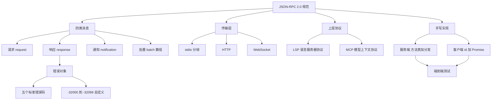
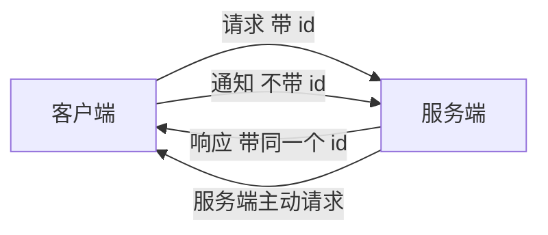
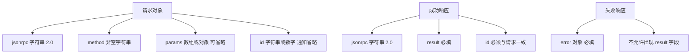
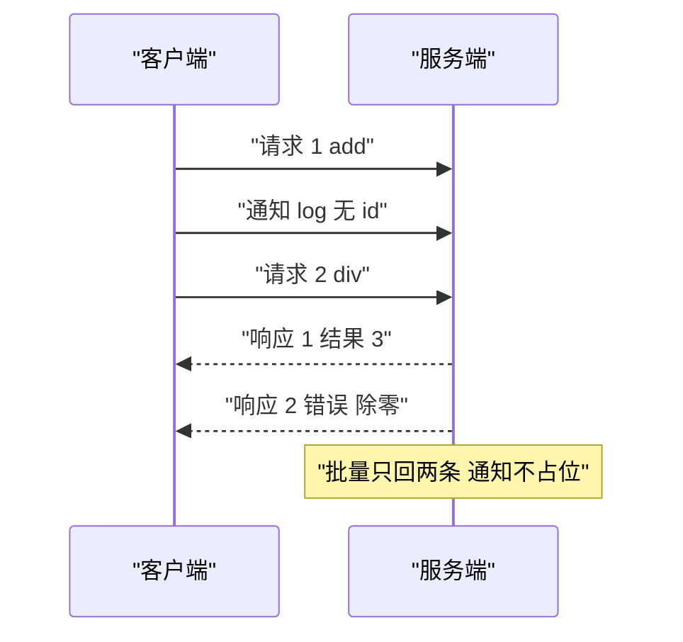
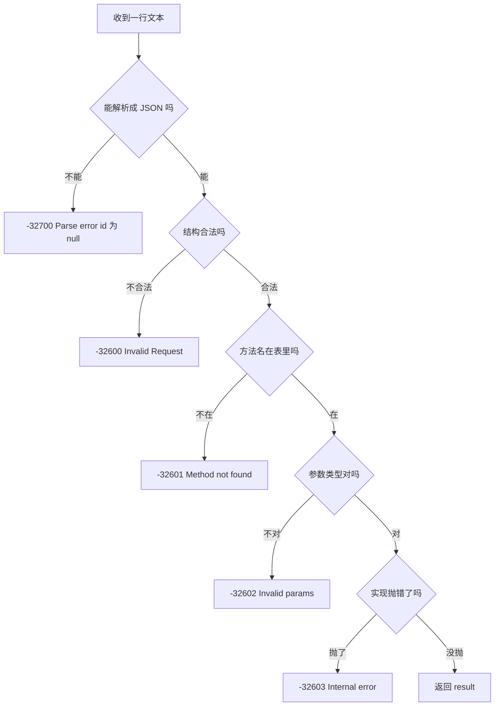
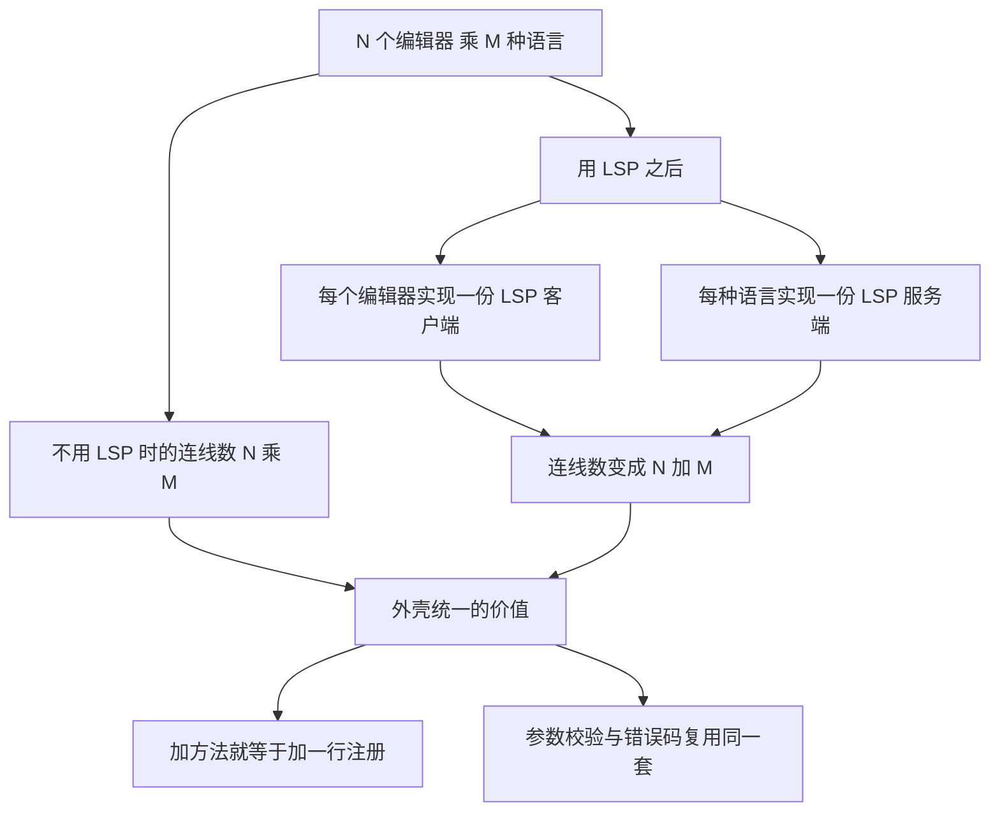
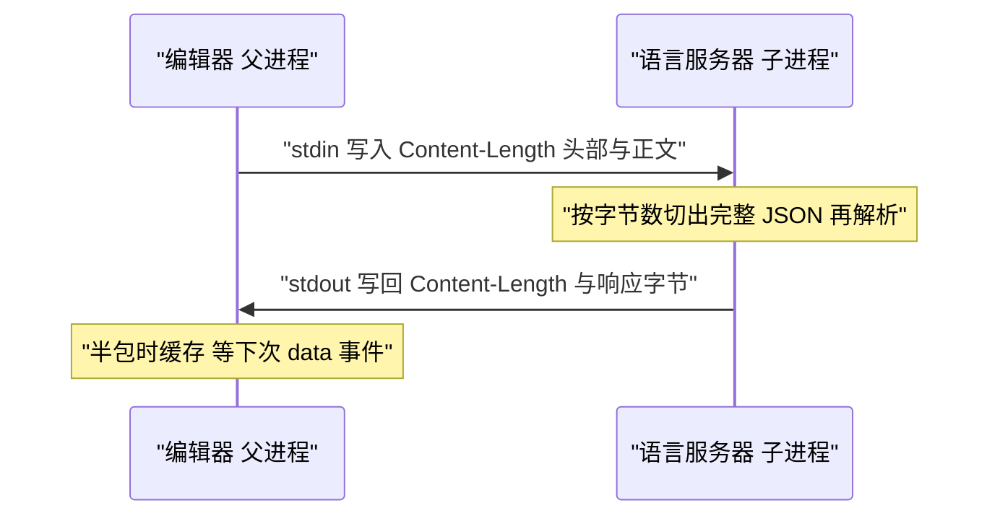
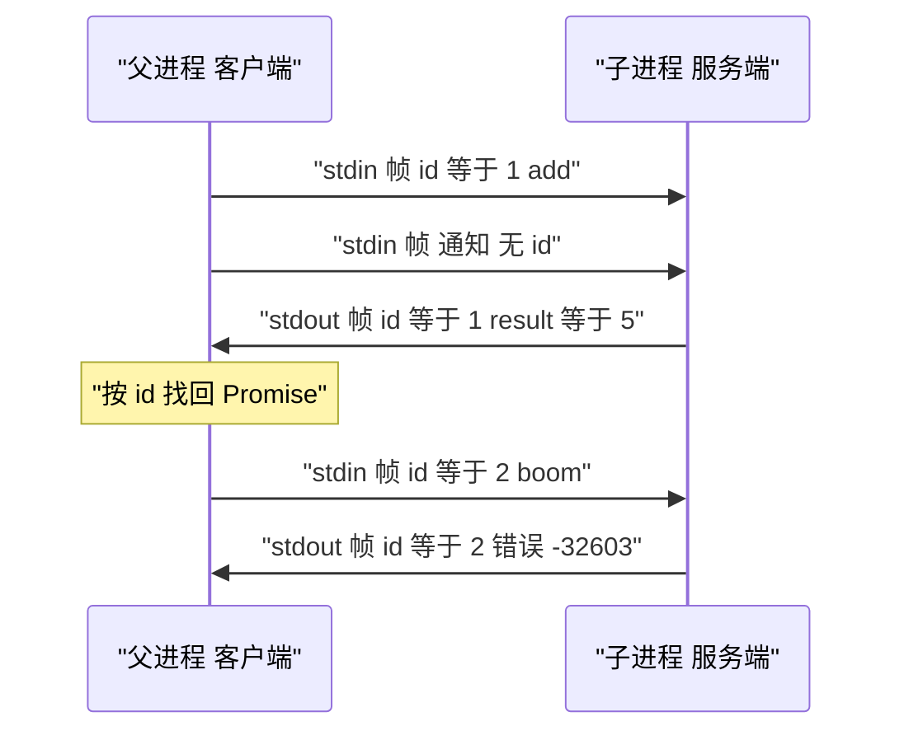

# JSON-RPC 2.0：LSP 与 MCP 背后的协议

!!! abstract "学完这一页你能"
    - 写出符合 JSON-RPC 2.0 的四类消息，并说出每条必填字段的检查条件。
    - 用 5 个标准错误码给失败调用分类，并说出自定义错误码必须落在哪个区间。
    - 手写一个支持方法注册、通知、批量与错误分发的 JSON-RPC 服务端与配套客户端。
    - 用 node:assert 写出覆盖 result、-32601、-32603 与通知的端到端测试。

## 0. 知识地图



建议按 0 到 7 的顺序读。1 到 4 节把规范拆成消息、字段、通知、错误四块，5 到 6 节解释协议选型与传输层。第 7 节把前面的知识合成一份可运行的代码，代码读不通时回到对应小节。

!!! note "术语：RPC"
    Remote Procedure Call，远程过程调用。它的目标是让调用另一台机器上的函数，写法接近调用本地函数。例：本地写 `add(1, 2)`，通过通道发给另一个进程，再等它把结果送回来。

!!! note "术语：JSON-RPC 2.0"
    一份用 JSON 编码 RPC 消息的规范，全文只有一条主线：任何一条消息都必须是请求、响应、通知、批量之一，并且必须带字符串字段 `jsonrpc`，值为 `2.0`。

## 1. 四类消息：先看清规范的全貌

**先想一个问题**

你在编辑器里按 F12 跳转定义。编辑器要把「查 demo.ts 第 3 行的定义」发给语言服务器，再把结果画到界面上。这条消息的字段名由谁规定？

**心智模型**

!!! tip "心智模型"
    一句话模型：JSON-RPC 2.0 规定信封只有四种样式，字段名固定，里面装什么由你定。
    日常类比：快递面单只认收件人、电话、地址三栏，包裹里装什么完全自由。
    类比不成立处：快递公司不检查包裹内容，JSON-RPC 服务端必须校验 `jsonrpc` 与 `method` 两栏，不合格就回 -32600。

**图解**



1. 客户端发出请求，消息里带 `id`。
2. 服务端处理完，用同一个 `id` 回响应。
3. 客户端只发通知时不带 `id`，服务端按规范不回任何消息。
4. stdio 与 socket 是双向通道，服务端也能反向发请求，客户端必须能应答。

**一步一步来**

第一步要做什么：把一条请求写成 JSON 对象，并看清它的三个必填字段。

```js
// 一个最小请求对象
const req = {
  jsonrpc: '2.0',                 // 固定字符串，写错就回 -32600
  id: 1,                          // 本次调用的编号，响应用它配对
  method: 'textDocument/definition', // 方法名，服务端按它查表
  params: { uri: 'file:///a.ts', line: 3 } // 参数，数组或对象，可省略
};
console.log(JSON.stringify(req)); // 序列化成一行 JSON 文本
```

**这段代码在做什么**

- `jsonrpc` 是版本标记，规范要求值等于字符串 `2.0`。
- `id` 由客户端分配，字符串与数字都可以；通知则完全没有这个字段。
- `method` 是服务端路由用的名字，规范只要求它是字符串。
- `params` 允许是数组或对象，也可以整条消息里不出现。

运行结果：`{"jsonrpc":"2.0","id":1,"method":"textDocument/definition","params":{"uri":"file:///a.ts","line":3}}`

第二步要做什么：只靠字段有无，把任意消息分到四类里。

```js
function kindOf(msg) {                       // 返回消息类型字符串
  if (msg.jsonrpc !== '2.0') return 'not-jsonrpc'; // 版本不对，直接出局
  if ('method' in msg && 'id' in msg) return 'request';      // 有方法名也有 id
  if ('method' in msg) return 'notification';                // 只有方法名，是通知
  if ('id' in msg && ('result' in msg || 'error' in msg)) return 'response'; // 结果或错误
  return 'invalid';                          // 其余一律视为非法
}
console.log(kindOf({ jsonrpc: '2.0', method: 'log' })); // 通知
```

**这段代码在做什么**

- 检查顺序从版本开始，版本不合格就不必再看其他字段。
- 有 `method` 且无 `id` 的是通知，服务端收到后不写回任何内容。
- 响应必须有 `id`，并带上 `result` 或 `error` 其中一个。
- 批量不是新结构，它只是一个数组，元素仍然是上面三类消息。

运行结果：`notification`

**动手验证**

```js
// 依赖：无。保存为 kind.mjs，运行 node kind.mjs
import assert from 'node:assert/strict';                     // 严格模式断言

const REQUEST = { jsonrpc: '2.0', id: 1, method: 'add', params: [1, 2] };  // 请求
const RESPONSE = { jsonrpc: '2.0', id: 1, result: 3 };                    // 成功响应
const NOTIFY = { jsonrpc: '2.0', method: 'log', params: { text: 'hi' } };  // 通知
const BATCH = [REQUEST, NOTIFY];                                          // 批量是数组

function kindOf(msg) {                                        // 分类函数
  assert.equal(msg.jsonrpc, '2.0', 'jsonrpc 字段必须是 2.0');  // 四类都要求版本
  if ('method' in msg && 'id' in msg) return 'request';       // 请求判断
  if ('method' in msg) return 'notification';                 // 通知判断
  if ('id' in msg && ('result' in msg || 'error' in msg)) return 'response'; // 响应判断
  return 'invalid';                                           // 兜底
}

assert.equal(kindOf(REQUEST), 'request');                     // 断言四类分类结果
assert.equal(kindOf(RESPONSE), 'response');
assert.equal(kindOf(NOTIFY), 'notification');
assert.equal(BATCH.length, 2);                                // 批量长度等于 2
assert.equal(kindOf(BATCH[0]), 'request');                    // 批量元素仍是普通消息
assert.equal(kindOf({ jsonrpc: '2.0' }), 'invalid');          // 只有版本字段是非法消息
console.log('通过：request response notification batch 四种形状'); // 预期输出
```

**常见坑**

| 现象 | 原因 | 怎么修 |
| --- | --- | --- |
| 服务端回 -32600 | `jsonrpc` 写成 `2` 或漏写 | 统一用字符串 `2.0`，发送前用断言检查 |
| 客户端一直等不到响应 | 把通知当请求发，多写了一个 `id` | 通知消息里删除 `id` 字段 |
| 响应配错调用 | 服务端直接把请求的 `id` 改成自增值 | 响应必须原样回填请求的 `id` |
| 批量返回数组里混进 null | 通知也被塞进结果数组 | 先过滤掉通知，只保留有 `id` 的响应 |

**小结**

- 四类消息靠字段有无区分，`method` 决定是不是调用，`id` 决定要不要回复。
- 请求的三个必填字段是 `jsonrpc`、`method`、`id`；通知去掉 `id`。
- 批量只是数组，处理规则逐条与单条消息一致。

## 2. 请求与响应：字段怎么填才合法

**先想一个问题**

服务端收到 `{"jsonrpc":"2.0","id":1,"method":"add","params":"1,2"}` 时，`params` 是字符串。它该报错，还是自己解析字符串？

**心智模型**

!!! tip "心智模型"
    一句话模型：JSON-RPC 只校验字段位置与类型，不校验业务含义。
    日常类比：机场安检只看登机牌姓名与证件是否一致，不看你去干什么。
    类比不成立处：安检会拦下可疑行李，JSON-RPC 对 `params` 里的数值范围完全不检查，那属于方法自己的责任。

**图解**



1. 请求先看 `jsonrpc`，再看 `method` 是不是非空字符串。
2. `params` 只在出现时检查，类型必须是数组或对象。
3. 成功响应必须带 `result`，哪怕结果是 `null`。
4. 失败响应必须带 `error`，并且不能同时出现 `result`。
5. 两种响应的 `id` 都必须等于请求的 `id`；解析失败时 `id` 允许为 `null`。

**一步一步来**

第一步要做什么：写一个只做结构校验的函数，把不合格的请求挡在业务代码之前。

```js
function validateRequest(msg) {              // 返回错误码 或 0 表示通过
  if (msg === null || typeof msg !== 'object' || Array.isArray(msg)) return -32600; // 必须是对象
  if (msg.jsonrpc !== '2.0') return -32600;  // 版本字段不对
  if (typeof msg.method !== 'string' || msg.method === '') return -32600; // 方法名必须非空
  if ('params' in msg && !Array.isArray(msg.params) && typeof msg.params !== 'object') return -32600; // 参数类型
  if ('params' in msg && msg.params === null) return -32600; // null 不属于数组或对象
  if ('id' in msg && msg.id !== null && typeof msg.id !== 'string' && typeof msg.id !== 'number') return -32600; // id 类型
  return 0;                                  // 全部通过
}
console.log(validateRequest({ jsonrpc: '2.0', id: 1, method: 'add', params: [1, 2] })); // 0
```

**这段代码在做什么**

- 先排除数组与 `null`，因为批量顶层是数组，不该走这条校验。
- `method` 的空字符串也算不合格，服务端查表时它查不到任何实现。
- `params` 的 `null` 被单独拦掉，规范只允许数组或对象。
- `id` 允许字符串与数字，也允许 `null`，但 `null` 在实现里应当避免使用。

运行结果：`0`

第二步要做什么：根据校验结果组装两种响应，注意 `result` 与 `error` 只能留一个。

```js
function makeResponse(req, outcome) {        // outcome 是 { ok: true, value } 或 { ok: false, code, message }
  const base = { jsonrpc: '2.0', id: req.id ?? null };    // 回填请求 id，解析失败时为 null
  if (outcome.ok) {
    return { ...base, result: outcome.value };             // 成功只带 result
  }
  return { ...base, error: { code: outcome.code, message: outcome.message } }; // 失败只带 error
}
console.log(JSON.stringify(makeResponse({ id: 7 }, { ok: true, value: 0 })));  // result 为 0 也要带
```

**这段代码在做什么**

- `id` 用空值合并回填，只在请求没有 `id` 时落成 `null`。
- 成功分支用扩展运算符拼出 `result`，保证字段名与规范一致。
- 失败分支的 `error` 是一个对象，里面至少要有 `code` 与 `message`。
- 结果为 `0`、`false`、空字符串时仍然要写 `result`，不能靠真值判断有没有结果。

运行结果：`{"jsonrpc":"2.0","id":7,"result":0}`

**动手验证**

```js
// 依赖：无。保存为 fields.mjs，运行 node fields.mjs
import assert from 'node:assert/strict';

function validateRequest(msg) {                                  // 结构校验
  if (msg === null || typeof msg !== 'object' || Array.isArray(msg)) return -32600;
  if (msg.jsonrpc !== '2.0') return -32600;                      // 版本
  if (typeof msg.method !== 'string' || msg.method === '') return -32600; // 方法名
  if ('params' in msg && (msg.params === null || (!Array.isArray(msg.params) && typeof msg.params !== 'object'))) return -32600;
  if ('id' in msg && msg.id !== null && typeof msg.id !== 'string' && typeof msg.id !== 'number') return -32600;
  return 0;                                                      // 通过
}

const ok = { jsonrpc: '2.0', id: 'abc', method: 'add', params: [1, 2] }; // 合法请求
const badVersion = { jsonrpc: '1.0', id: 1, method: 'add' };              // 版本错
const badParams = { jsonrpc: '2.0', id: 1, method: 'add', params: '1,2' };// 参数是字符串
const badId = { jsonrpc: '2.0', id: true, method: 'add' };                // id 是布尔值

assert.equal(validateRequest(ok), 0);                            // 合法请求返回 0
assert.equal(validateRequest(badVersion), -32600);               // 版本错
assert.equal(validateRequest(badParams), -32600);                // 参数类型错
assert.equal(validateRequest(badId), -32600);                    // id 类型错
assert.equal(validateRequest([ok]), -32600);                     // 单条校验不接受数组
assert.equal(validateRequest({ jsonrpc: '2.0', method: 'add' }), 0); // 无 id 是通知，仍然合法
console.log('通过：请求结构校验 5 个分支');                       // 预期输出
```

**常见坑**

| 现象 | 原因 | 怎么修 |
| --- | --- | --- |
| 返回 `result: undefined` | 用 `JSON.stringify` 时 `undefined` 会被丢掉 | 方法返回 `null` 而不是 `undefined` |
| 客户端拿不到结果但没报错 | 响应里 `result` 与 `error` 同时存在 | 用两个互斥分支组装响应 |
| 通知被静默丢弃 | 校验函数要求必须有 `id` | 把 `id` 当作可选字段校验 |
| `params: null` 被判合法 | 只判断了 `typeof` 等于 `object` | 单独拦掉 `null` |

**小结**

- 校验只做结构与类型检查，业务规则留给方法实现。
- `id` 是可选的，`result` 与 `error` 互斥且必须出现其一。
- 结果为假值时也要完整写出 `result` 字段。

## 3. 通知与批量：什么时候不回复

**先想一个问题**

编辑器每分钟往服务器发 20 条「光标移动了」的消息。如果每条都要求响应，屏幕上会多出 20 条无用回包。能不能让服务端彻底静音？

**心智模型**

=== 不要用这个语法 ===

!!! tip "心智模型"
    一句话模型：通知是不要回执的请求，批量是把多条消息装进一个数组。
    日常类比：同事在群里发「我到了」，没人需要回答；这是通知。
    类比不成立处：群里没人回复不代表没人处理，JSON-RPC 规定服务端处理完通知后连空数组都不能回。

**图解**



1. 客户端把三条消息放进一个数组，一次写入通道。
2. 服务端逐条处理，顺序与数组下标一致。
3. 通知处理完不产生响应，所以结果数组里没有它的位置。
4. 只有请求会产生响应，最终数组长度是 2。
5. 如果数组里全部是通知，服务端连数组都不回，什么都不写。

**一步一步来**

第一步要做什么：写一个分发函数，用 `id` 的有无判断要不要构造响应。

```js
const METHODS = { add: (p) => p.a + p.b, div: (p) => { if (p.b === 0) throw new Error('divide by zero'); return p.a / p.b; } };

function dispatchOne(msg) {                       // 返回响应对象 或 null
  const isNotification = !('id' in msg);          // 没有 id 就是通知
  const fn = METHODS[msg.method];                 // 按方法名查表
  if (!fn) {                                      // 方法未注册
    return isNotification ? null : { jsonrpc: '2.0', id: msg.id, error: { code: -32601, message: 'Method not found' } };
  }
  try {
    const result = fn(msg.params ?? {});          // 调用实现
    return isNotification ? null : { jsonrpc: '2.0', id: msg.id, result }; // 通知不回
  } catch (e) {
    return isNotification ? null : { jsonrpc: '2.0', id: msg.id, error: { code: -32603, message: e.message } };
  }
}
console.log(dispatchOne({ jsonrpc: '2.0', method: 'add', params: { a: 1, b: 2 } })); // null
```

**这段代码在做什么**

- `'id' in msg` 判断字段是否存在，比判断 `msg.id === undefined` 准确。
- 通知在三条出口都返回 `null`，抛错时同样不回。
- 方法未注册时，请求回 -32601，通知保持静默。
- `params` 缺省时给空对象，避免实现里访问属性抛错。

运行结果：`null`

第二步要做什么：处理批量数组，并用过滤把 `null` 去掉。

```js
function dispatch(msgOrArray) {                  // 单条或批量统一入口
  if (Array.isArray(msgOrArray)) {               // 批量分支
    if (msgOrArray.length === 0) {               // 空数组是非法请求
      return { jsonrpc: '2.0', id: null, error: { code: -32600, message: 'Invalid Request' } };
    }
    const out = msgOrArray.map(dispatchOne).filter((r) => r !== null); // 逐条处理并丢掉空响应
    return out.length === 0 ? null : out;        // 全是通知就整体不回复
  }
  return dispatchOne(msgOrArray);                // 单条直接分发
}
console.log(JSON.stringify(dispatch([
  { jsonrpc: '2.0', id: 1, method: 'add', params: { a: 1, b: 2 } },  // 请求
  { jsonrpc: '2.0', method: 'add', params: { a: 9, b: 9 } }          // 通知
])));
```

**这段代码在做什么**

- 空数组合法性由规范明确否定，必须回 -32600，且 `id` 为 `null`。
- `map` 保序，结果数组里响应的相对顺序与请求一致。
- `filter` 只删掉 `null`，不影响其余响应的顺序。
- 全部是通知时返回 `null`，调用方据此不写通道。

运行结果：`[{"jsonrpc":"2.0","id":1,"result":3}]`

**动手验证**

```js
// 依赖：无。保存为 batch.mjs，运行 node batch.mjs
import assert from 'node:assert/strict';

const METHODS = {                                             // 方法表
  add: (p) => p.a + p.b,                                      // 加法
  boom: () => { throw new Error('internal'); },                // 抛错方法
  log: () => { throw new Error('通知也不该让进程崩掉'); }        // 通知里故意抛错
};

function dispatchOne(msg) {                                   // 单条分发
  const isNotification = !('id' in msg);                      // 判断通知
  const fn = METHODS[msg.method];                             // 查表
  if (!fn) return isNotification ? null : { jsonrpc: '2.0', id: msg.id, error: { code: -32601, message: 'Method not found' } };
  try {
    const result = fn(msg.params ?? {});                      // 调用实现
    return isNotification ? null : { jsonrpc: '2.0', id: msg.id, result };
  } catch (e) {
    return isNotification ? null : { jsonrpc: '2.0', id: msg.id, error: { code: -32603, message: e.message } };
  }
}

function dispatch(input) {                                    // 批量入口
  if (!Array.isArray(input)) return dispatchOne(input);       // 单条
  if (input.length === 0) return { jsonrpc: '2.0', id: null, error: { code: -32600, message: 'Invalid Request' } };
  const out = input.map(dispatchOne).filter((r) => r !== null); // 保序并丢弃空响应
  return out.length === 0 ? null : out;                       // 全通知时不回复
}

const mixed = dispatch([                                      // 混合批量
  { jsonrpc: '2.0', id: 1, method: 'add', params: { a: 1, b: 2 } },   // 请求
  { jsonrpc: '2.0', method: 'log', params: {} },                      // 通知且抛错
  { jsonrpc: '2.0', id: 2, method: 'boom', params: {} }               // 请求且抛错
]);
assert.equal(mixed.length, 2);                                // 通知不占位
assert.equal(mixed[0].result, 3);                             // 第一条成功
assert.equal(mixed[0].id, 1);                                 // 顺序与 id 保持
assert.equal(mixed[1].error.code, -32603);                    // 第二条内部错误
assert.equal(dispatch([{ jsonrpc: '2.0', method: 'log', params: {} }]), null); // 全通知不回
assert.equal(dispatch([]).error.code, -32600);                // 空数组非法
assert.equal(dispatch({ jsonrpc: '2.0', method: 'nope' }), null); // 未知方法的通知也静默
console.log('通过：批量 2 条响应 通知 0 条 空数组报 -32600');    // 预期输出
```

**常见坑**

| 现象 | 原因 | 怎么修 |
| --- | --- | --- |
| 客户端收到 `[null]` | 通知也进了 `map` 结果没过滤 | 用 `filter` 丢掉 `null` |
| 批量里有一条非法就整批失败 | 用 `JSON.parse` 一次性解析且校验整个数组 | 逐条校验，单条失败只影响该条响应 |
| 空数组返回成功 | 没处理 `length === 0` | 回 `id` 为 `null` 的 -32600 |
| 通知抛错让进程退出 | 通知分支没有 `try` 包裹 | 通知同样捕获异常，只是不写回包 |

**小结**

- 通知的三条出口都是静默，包括方法未找到与实现抛错。
- 批量保序，用 `filter` 去掉通知产生的空位。
- 空数组按规范回 -32600，`id` 为 `null`。

## 4. 错误对象与错误码

**先想一个问题**

客户端调用 `add` 时把参数写成字符串，服务端返回 -32601「方法不存在」。客户端会去检查方法名，排查方向完全错了。

**心智模型**

!!! tip "心智模型"
    一句话模型：错误码描述「在哪一层出错」，不是「业务为什么失败」。
    日常类比：医院分诊台先判断你该去哪个科，具体病名由科室医生写。
    类比不成立处：分诊台只有固定几个科室，JSON-RPC 把 -32000 到 -32099 整段留给你自定义业务错误码。

**图解**



1. 第一关是文本能否解析成 JSON，失败就是 -32700，此时拿不到 `id`。
2. 第二关看结构，`jsonrpc` 与 `method` 不合格就是 -32600。
3. 第三关查方法表，查不到是 -32601。
4. 第四关核对参数类型，不匹配是 -32602。
5. 最后一关捕获实现内部异常，统一报 -32603。

**一步一步来**

第一步要做什么：按固定顺序做检查，让每条失败消息都落到对应错误码。

```js
const TABLE = { add: (p) => p.a + p.b };         // 只注册 add 一个方法
function handle(line) {                          // 输入一行文本 输出错误码
  let msg;                                       // 解析结果
  try { msg = JSON.parse(line); }                // 第一步 解析
  catch { return { code: -32700, message: 'Parse error' }; } // 解析失败
  if (msg === null || msg.jsonrpc !== '2.0' || typeof msg.method !== 'string') return { code: -32600, message: 'Invalid Request' };
  const fn = TABLE[msg.method];                  // 查方法表
  if (!fn) return { code: -32601, message: 'Method not found' };
  if (typeof msg.params?.a !== 'number' || typeof msg.params?.b !== 'number') return { code: -32602, message: 'Invalid params' };
  try { fn(msg.params); return { code: 0, message: 'ok' }; } // 调用实现
  catch (e) { return { code: -32603, message: String(e.message) }; } // 内部错误
}
console.log(handle('{"jsonrpc":"2.0","id":1,"method":"add","params":{"a":1,"b":"x"}}'));
```

**这段代码在做什么**

- 检查顺序固定，先结构后方法再参数，避免报错码互相串位。
- 参数检查放在调用之前，实现里就不必再写防御代码。
- `-32603` 只能由捕获异常产生，说明实现本身出了问题。
- 业务层面的失败应当返回 `result`，不要借用错误码。

运行结果：`{ code: -32602, message: 'Invalid params' }`

第二步要做什么：把错误码包成规范要求的 `error` 对象，并区分标准码与保留区间。

```js
const STANDARD = new Map([                       // 五个标准错误码
  [-32700, 'Parse error'],                       // JSON 解析失败
  [-32600, 'Invalid Request'],                   // 结构不合法
  [-32601, 'Method not found'],                  // 方法未注册
  [-32602, 'Invalid params'],                    // 参数类型不对
  [-32603, 'Internal error']                     // 实现内部抛错
]);
const isReservedForImpl = (code) => code >= -32099 && code <= -32000; // 规范留白区间
function toError(code, message, data) {          // 组装 error 对象
  const text = STANDARD.get(code) ?? message;    // 标准码用规范英文说明
  return data === undefined ? { code, message: text } : { code, message: text, data }; // data 可选
}
console.log(isReservedForImpl(-32001), JSON.stringify(toError(-32601))); // 自定义区间可用
```

**这段代码在做什么**

- 五个标准码写死在映射表里，客户端可以按码做通用处理。
- `-32000` 到 `-32099` 是规范留给实现方自定义服务端错误的区间。
- `data` 字段可选，用来放结构化细节，客户端可以不读它。
- 报错说明用英文常量，方便与官方文档逐字对照。

运行结果：`true {"code":-32601,"message":"Method not found"}`

!!! note "术语：错误码区间"
    JSON-RPC 2.0 把 `-32000` 到 `-32099` 保留给实现方自定义服务端错误。例：`-32002` 在 LSP 中被用作「服务器尚未初始化」。需核对官方文档：LSP 规范 ErrorCodes 章节与 MCP 规范错误码章节确认各自占用的取值。

**动手验证**

```js
// 依赖：无。保存为 errors.mjs，运行 node errors.mjs
import assert from 'node:assert/strict';

const STANDARD = new Map([                                     // 标准错误码表
  [-32700, 'Parse error'],
  [-32600, 'Invalid Request'],
  [-32601, 'Method not found'],
  [-32602, 'Invalid params'],
  [-32603, 'Internal error']
]);
const TABLE = { add: (p) => p.a + p.b };                       // 唯一注册的方法

function handle(line) {                                        // 返回 { code, message }
  let msg;
  try { msg = JSON.parse(line); }                               // 第一关 解析
  catch { return { code: -32700, message: 'Parse error' }; }
  if (msg === null || typeof msg !== 'object' || msg.jsonrpc !== '2.0' || typeof msg.method !== 'string') {
    return { code: -32600, message: 'Invalid Request' };        // 第二关 结构
  }
  const fn = TABLE[msg.method];                                 // 第三关 方法表
  if (!fn) return { code: -32601, message: 'Method not found' };
  if (typeof msg.params?.a !== 'number' || typeof msg.params?.b !== 'number') {
    return { code: -32602, message: 'Invalid params' };          // 第四关 参数
  }
  try { fn(msg.params); return { code: 0, message: 'ok' }; }     // 第五关 实现
  catch (e) { return { code: -32603, message: String(e.message) }; }
}

assert.equal(handle('{oops').code, -32700);                     // 非法 JSON
assert.equal(handle('{"jsonrpc":"1.0","method":"add"}').code, -32600); // 版本错
assert.equal(handle('{"jsonrpc":"2.0","method":"nope"}').code, -32601); // 方法未注册
assert.equal(handle('{"jsonrpc":"2.0","method":"add","params":{"a":1,"b":"x"}}').code, -32602); // 参数错
assert.equal(handle('{"jsonrpc":"2.0","method":"add","params":{"a":1,"b":2}}').code, 0);        // 成功
assert.equal(STANDARD.size, 5);                                 // 标准码共 5 个
assert.ok(-32001 >= -32099 && -32001 <= -32000);                // 自定义码落在保留区间
console.log('通过：-32700 -32600 -32601 -32602 成功 五个分支');  // 预期输出
```

**常见坑**

| 现象 | 原因 | 怎么修 |
| --- | --- | --- |
| 参数错了却报 -32601 | 先查方法表再校验参数，且方法名拼错 | 固定检查顺序，参数校验放在查表之后 |
| 业务失败返回 -32603 | 实现里用 `throw` 表示业务失败 | 业务失败返回 `result`，只有意外错误才抛 |
| 解析失败时 `id` 写成了 0 | 拿不到原始 `id`，随手填了数字 | 解析失败时 `id` 填 `null` |
| 客户端只看 message 分支 | 服务端把标准码换成了自定义码 | 标准码写死，客户端按码分发 |

**小结**

- 检查顺序决定错误码归属，顺序固定后客户端就能按码定位层。
- 标准码 5 个，自定义服务端错误码用 `-32000` 到 `-32099`。
- `error.data` 放细节，`message` 保持与规范文档一致的英文短语。

## 5. 为什么 LSP 与 MCP 选 JSON-RPC

**先想一个问题**

编辑器要支持 30 种语言。如果每种语言各设计一套消息格式，编辑器里就要维护 30 套解析代码。有没有一份格式能让插件作者只写方法名？

**心智模型**

!!! tip "心智模型"
    一句话模型：上层协议只规定方法名与参数结构，消息外壳全部交给 JSON-RPC。
    日常类比：集装箱尺寸全球统一，里面装汽车还是香蕉由发货方决定。
    类比不成立处：集装箱不需要双向通信，LSP 与 MCP 的通道是双向的，服务端也能主动发请求。

!!! note "术语：LSP"
    Language Server Protocol，语言服务器协议。它规定编辑器与语言服务器之间的方法名，把 JSON-RPC 当作消息外壳。例：编辑器发 `textDocument/definition`，服务器返回文件路径与行号。

!!! note "术语：MCP"
    Model Context Protocol，模型上下文协议。它规定大模型应用与工具服务器之间的方法名，同样把 JSON-RPC 当作消息外壳。例：客户端发 `tools/call`，服务器返回工具执行结果。

**图解**



1. 没有统一外壳时，编辑器与语言两两组合，适配代码按乘积增长。
2. LSP 把外壳固定下来，编辑器只实现一份客户端，语言只实现一份服务端。
3. 适配数量从乘积变成加法，新增一种语言不必改动编辑器核心。
4. MCP 面对的是大模型应用与工具服务器，组合方式与 LSP 相同。
5. 两个协议都在规范里直接引用了 JSON-RPC 2.0 的消息格式与错误码。

**一步一步来**

第一步要做什么：写一个不含业务分支的通用分发器，靠方法表路由。

```js
const registry = new Map();                      // 运行期可增删的方法表
function dispatch(msg) {                         // 通用分发 无业务分支
  const fn = registry.get(msg.method);           // 只按方法名查表
  if (!fn) return { jsonrpc: '2.0', id: msg.id, error: { code: -32601, message: 'Method not found' } };
  try { return { jsonrpc: '2.0', id: msg.id, result: fn(msg.params ?? {}) }; } // 正常返回
  catch (e) { return { jsonrpc: '2.0', id: msg.id, error: { code: -32603, message: String(e.message) } }; } // 内部错误
}
registry.set('workspace/applyEdit', () => ({ applied: true })); // 注册一个 LSP 风格方法
console.log(dispatch({ jsonrpc: '2.0', id: 1, method: 'workspace/applyEdit', params: {} }).result);
```

**这段代码在做什么**

- 分发器里没有 `if (method === ...)`，新增方法不必改这段代码。
- 方法名用字符串做键，斜杠分隔的层级名称不需要额外解析。
- 返回值统一走 `result`，抛错统一走 -32603。
- 方法表在运行期可增删，插件可以在启动时注册自己的方法。

运行结果：`{ applied: true }`

第二步要做什么：对比硬编码分支的改造成本，说明外壳统一省下的工作。

```js
function hardcoded(msg) {                        // 硬编码写法
  if (msg.method === 'add') return { jsonrpc: '2.0', id: msg.id, result: msg.params.a + msg.params.b }; // 分支一
  if (msg.method === 'echo') return { jsonrpc: '2.0', id: msg.id, result: msg.params.text };            // 分支二
  return { jsonrpc: '2.0', id: msg.id, error: { code: -32601, message: 'Method not found' } };          // 兜底
}
const before = hardcoded.toString().split('\n').length; // 数一数函数占几行
registry.set('echo', (p) => p.text);                    // 方法表写法只需一行注册
const after = ([...registry.keys()].length);            // 注册后方法总数
console.log(before, after);
```

**这段代码在做什么**

- 硬编码写法每加一个方法就要加一条 `if`，函数体行数持续增长。
- 方法表写法把新增操作压缩成一次 `set` 调用。
- 行数对比只说明改动范围，真正的收益是分发函数不必回归测试。
- 上层协议的方法名可以带命名空间前缀，表结构照样适用。

运行结果：`4 2`

**动手验证**

```js
// 依赖：无。保存为 why.mjs，运行 node why.mjs
import assert from 'node:assert/strict';

const registry = new Map();                                     // 方法表
function dispatch(msg) {                                        // 通用分发器
  if (msg.jsonrpc !== '2.0' || typeof msg.method !== 'string') {  // 结构校验
    return { jsonrpc: '2.0', id: msg.id ?? null, error: { code: -32600, message: 'Invalid Request' } };
  }
  const fn = registry.get(msg.method);                          // 查表
  if (!fn) return { jsonrpc: '2.0', id: msg.id, error: { code: -32601, message: 'Method not found' } };
  try { return { jsonrpc: '2.0', id: msg.id, result: fn(msg.params ?? {}) }; }
  catch (e) { return { jsonrpc: '2.0', id: msg.id, error: { code: -32603, message: String(e.message) } }; }
}

const dispatcherSource = dispatch.toString();                    // 取分发器源码文本
assert.equal(dispatch({ jsonrpc: '2.0', id: 1, method: 'sum', params: {} }).error.code, -32601); // 未注册
registry.set('sum', (p) => p.a + p.b);                           // 注册方法一
registry.set('tools/list', () => ({ tools: [] }));               // 注册方法二
registry.set('textDocument/definition', (p) => ({ uri: 'file:///demo.ts', line: p.line + 1 })); // 注册方法三
assert.equal(dispatch({ jsonrpc: '2.0', id: 2, method: 'sum', params: { a: 1, b: 2 } }).result, 3);
assert.equal(dispatch({ jsonrpc: '2.0', id: 3, method: 'tools/list', params: {} }).result.tools.length, 0);
assert.equal(dispatch({ jsonrpc: '2.0', id: 4, method: 'textDocument/definition', params: { line: 3 } }).result.line, 4);
assert.equal(dispatch.toString(), dispatcherSource);             // 注册三个方法后源码一字未改
assert.equal(registry.size, 3);                                  // 方法表里有 3 条
console.log('通过：注册 3 个方法 分发器源码零改动');              // 预期输出
```

**常见坑**

| 现象 | 原因 | 怎么修 |
| --- | --- | --- |
| 新增方法后要改六处代码 | 方法名散落在解析、校验、执行各处 | 集中到一张方法表里按名路由 |
| 两种上层协议互相干扰 | 方法名重名且共用一张表 | 用命名空间前缀分表，例如 `tools/` 与 `textDocument/` |
| 服务端发不出请求 | 客户端只实现了发送，没实现接收分发 | 两端都实现分发器，通道双向 |

**小结**

- 统一外壳把适配量从乘积降到加法，这是 LSP 与 MCP 复用的核心收益。
- 分发器只认方法名，上层协议只需要定义方法名与参数结构。
- 通道双向，客户端与服务端都要能处理收到的请求。

## 6. 传输层：stdio 分帧、HTTP、WebSocket

**先想一个问题**

两个进程用管道通信，一次写入 1000 字节，读端 `data` 事件可能先给 300 字节、再给 700 字节。JSON 文本被切成两半时，怎么知道一条消息到哪里结束？

**心智模型**

!!! tip "心智模型"
    一句话模型：传输层负责把字节流切回一条条完整消息，JSON-RPC 只负责消息内容。
    日常类比：快递分拣线先按箱子大小切开传送带，箱子里装什么与分拣机无关。
    类比不成立处：分拣机按固定箱长切，LSP 用的是头部声明的字节长度，每条都不相同。

!!! note "术语：分帧"
    Framing，把连续字节流切成独立消息的过程。例：LSP 在每条消息前写 `Content-Length: 57` 再空一行，读端按这个字节数截取。

!!! note "术语：stdio"
    Standard Input Output，标准输入输出。子进程的 `stdin` 与 `stdout` 被父进程当作一对管道使用。例：编辑器启动语言服务器子进程，通过它的 `stdin` 写请求。

**图解**



1. 编辑器把消息序列化成 UTF-8 字节，先算正文字节数。
2. 头部写 `Content-Length: 字节数`，再写一空行，再写正文。
3. 服务端读 `stdin`，在缓存里找空行。
4. 找到空行后按声明的字节数截正文，不足就等下一次 `data`。
5. 服务端用同样的格式把响应写到 `stdout`。

**一步一步来**

第一步要做什么：按 LSP 的格式把消息编码成一帧字节。

```js
function encodeFrame(msg) {                      // 消息对象 转 Buffer
  const body = JSON.stringify(msg);              // 序列化为 JSON 文本
  const bytes = Buffer.byteLength(body, 'utf8'); // 头部写字节数 不是字符数
  return Buffer.from(`Content-Length: ${bytes}\r\n\r\n${body}`, 'utf8'); // 头部 空行 正文
}
const frame = encodeFrame({ jsonrpc: '2.0', id: 1, result: '中' }); // 正文含一个三字节汉字
console.log(frame.toString('utf8'));
```

**这段代码在做什么**

- `Buffer.byteLength` 按 UTF-8 计算字节数，与 `body.length` 在含汉字时不同。
- 头部与正文之间用 `\r\n\r\n` 分隔，这是 LSP 基础协议的规定。
- 返回 `Buffer` 而不是字符串，因为 `stream.write` 写的是字节。
- 消息内部不能出现换行，`JSON.stringify` 默认不产生换行，满足要求。

运行结果：
```text
Content-Length: 41

{"jsonrpc":"2.0","id":1,"result":"中"}
```

第二步要做什么：从累积缓存里切出完整帧，处理半包。

```js
function makeReader(onMessage) {                 // 返回消费字节流的函数
  let buf = Buffer.alloc(0);                     // 累积缓存
  return (chunk) => {
    buf = Buffer.concat([buf, chunk]);           // 先把新字节接到缓存尾部
    while (true) {
      const sep = buf.indexOf('\r\n\r\n');       // 找头部与正文的分界
      if (sep === -1) return;                    // 头部没收全 等下一次
      const len = Number(/Content-Length: (\d+)/.exec(buf.subarray(0, sep).toString())[1]);
      if (buf.length - sep - 4 < len) return;    // 正文没收全 等下一次
      const body = buf.subarray(sep + 4, sep + 4 + len).toString('utf8'); // 按字节数截取
      buf = buf.subarray(sep + 4 + len);         // 移动游标 丢掉已消费字节
      onMessage(JSON.parse(body));               // 交给上层处理
    }
  };
}
```

**这段代码在做什么**

- 缓存用 `Buffer.concat` 拼接，保证跨 `data` 事件的消息不丢字节。
- 两处 `return` 都是在等数据，不是出错，函数可以在下次调用继续。
- 正文长度用头部里的数字，不用 `JSON.parse` 试探，避免歧义。
- 消费完把 `buf` 换成剩余部分，循环继续处理粘包里的下一条。

**动手验证**

```js
// 依赖：无。保存为 framing.mjs，运行 node framing.mjs
import assert from 'node:assert/strict';

function encodeFrame(msg) {                                      // 编码
  const body = JSON.stringify(msg);
  return Buffer.from(`Content-Length: ${Buffer.byteLength(body, 'utf8')}\r\n\r\n${body}`, 'utf8');
}
function makeReader(onMessage) {                                 // 解码器工厂
  let buf = Buffer.alloc(0);
  return (chunk) => {
    buf = Buffer.concat([buf, chunk]);
    while (true) {
      const sep = buf.indexOf('\r\n\r\n');
      if (sep === -1) return;
      const len = Number(/Content-Length: (\d+)/.exec(buf.subarray(0, sep).toString())[1]);
      if (buf.length - sep - 4 < len) return;
      const body = buf.subarray(sep + 4, sep + 4 + len).toString('utf8');
      buf = buf.subarray(sep + 4 + len);
      onMessage(JSON.parse(body));
    }
  };
}

const f1 = encodeFrame({ jsonrpc: '2.0', id: 1, result: '中' });  // 含三字节汉字
const f2 = encodeFrame({ jsonrpc: '2.0', id: 2, result: null });  // result 为 null
const got = [];
const feed = makeReader((m) => got.push(m));                     // 收集解析结果

assert.equal(Buffer.byteLength('中', 'utf8'), 3);                // 汉字占 3 字节
assert.ok(Buffer.byteLength(JSON.stringify({ result: '中' }), 'utf8') > JSON.stringify({ result: '中' }).length); // 字节数大于字符数

feed(f1.subarray(0, 10));                                        // 只喂头部前 10 字节
assert.equal(got.length, 0);                                     // 半包时不产生消息
feed(f1);                                                        // 补上剩余字节
assert.equal(got.length, 1);                                     // 第一帧完成
assert.equal(got[0].result, '中');                                // 多字节内容正确
feed(Buffer.concat([f2, f1]));                                   // 一次喂两帧 测试粘包
assert.equal(got.length, 3);                                     // 两帧都被切出
assert.equal(got[1].id, 2);                                      // 顺序保持
console.log('通过：半包 1 帧 粘包 2 帧 多字节 3 字节');           // 预期输出
```

**常见坑**

| 现象 | 原因 | 怎么修 |
| --- | --- | --- |
| 含中文的消息解析失败 | 用 `body.length` 当 `Content-Length` | 改用 `Buffer.byteLength(body, 'utf8')` |
| 大消息丢失 | 每次 `data` 都当成完整消息解析 | 累积缓存，按头部长度判断完整性 |
| 两条消息混成一条 | 没处理粘包，只解析了第一条就停下 | 用 `while` 循环持续切帧直到数据不足 |
| HTTP 里重复发请求 | 把通知也发了两次，或没带 `id` | 按 `id` 去重，通知只发一次 |

**小结**

- 分帧属于传输层，JSON-RPC 本身不规定字节如何切分。
- LSP 的 stdio 传输用 `Content-Length` 头部声明的字节数切帧。
- stdio 是长连接双向通道，HTTP 每次请求独立。需核对官方文档：MCP 规范 Transports 章节确认各传输的当前定义与版本差异。

## 7. 手写服务端与客户端并测试

**先想一个问题**

前面六节把消息、字段、通知、批量、错误码、分帧都拆开看过了。现在把它们装进一个文件，从子进程收到请求到父进程拿到结果，链路能不能跑通？

**心智模型**

!!! tip "心智模型"
    一句话模型：服务端是「字节进、方法表、字节出」，客户端是「id 进、Promise 出」。
    日常类比：餐厅前台把订单编号抄在单子上，厨房按单号出菜，前台凭单号喊人。
    类比不成立处：厨房出菜顺序可能与下单顺序不同，JSON-RPC 用 `id` 配对，不要求响应按序返回。

**图解**



1. 父进程给每次调用分配自增 `id`，并把 `id` 映射到 Promise 的兑现函数。
2. 父进程把消息编码成帧，写进子进程的 `stdin`。
3. 子进程按 `Content-Length` 切帧，逐条分发到方法表。
4. 子进程把结果编码成帧，写回 `stdout`。
5. 父进程按 `id` 找到挂起项，兑现对应的 Promise。

**一步一步来**

第一步要做什么：写服务端的分发核心，把方法放进一张表。

```js
const METHODS = {                                // 服务端方法表
  add: (p) => p.a + p.b,                         // 加法
  boom: () => { throw new Error('internal'); }   // 故意抛错 用于验证 -32603
};
function dispatch(msg) {                         // 一条消息进 一条响应或 null 出
  if (msg.jsonrpc !== '2.0' || typeof msg.method !== 'string') {  // 结构校验
    return { jsonrpc: '2.0', id: msg.id ?? null, error: { code: -32600, message: 'Invalid Request' } };
  }
  const fn = METHODS[msg.method];                // 查表
  const isNotification = !('id' in msg);         // 通知标记
  if (!fn) return isNotification ? null : { jsonrpc: '2.0', id: msg.id, error: { code: -32601, message: 'Method not found' } };
  try {
    const result = fn(msg.params ?? {});         // 调用实现
    return isNotification ? null : { jsonrpc: '2.0', id: msg.id, result };
  } catch (e) {
    return isNotification ? null : { jsonrpc: '2.0', id: msg.id, error: { code: -32603, message: e.message } };
  }
}
console.log(dispatch({ jsonrpc: '2.0', id: 1, method: 'add', params: { a: 2, b: 3 } }).result);
```

**这段代码在做什么**

- 方法表把业务实现与协议分发分开，新增方法只动 `METHODS`。
- 通知标记在三条出口统一使用，保证不会写回空响应。
- 参数缺省给空对象，`add` 收到空对象会得到 `NaN`，属于业务层问题。
- 实现抛错只影响本次调用，进程继续运行。

运行结果：`5`

第二步要做什么：把分发挂到 `stdin` 与 `stdout` 上，处理粘包与半包。

```js
function makeReader(onMessage) {                 // 与第 6 节相同的解码器
  let buf = Buffer.alloc(0);                     // 累积缓存
  return (chunk) => {
    buf = Buffer.concat([buf, chunk]);           // 拼接新字节
    while (true) {
      const sep = buf.indexOf('\r\n\r\n');       // 找分界
      if (sep === -1) return;                    // 头部不全
      const len = Number(/Content-Length: (\d+)/.exec(buf.subarray(0, sep).toString())[1]);
      if (buf.length - sep - 4 < len) return;    // 正文不全
      const body = buf.subarray(sep + 4, sep + 4 + len).toString('utf8');
      buf = buf.subarray(sep + 4 + len);         // 消费掉这一帧
      onMessage(JSON.parse(body));               // 交给分发
    }
  };
}
function runServer() {                           // 服务端入口
  const feed = makeReader((msg) => {             // 每解析出一帧就处理
    const res = dispatch(msg);                   // 分发
    if (res) process.stdout.write(encodeFrame(res)); // 只有非通知才写回
  });
  process.stdin.on('data', feed);                // 监听标准输入
}
```

**这段代码在做什么**

- 解码器与第 6 节一致，复用它就不必在两处维护分帧逻辑。
- `if (res)` 同时过滤了 `null` 与通知，也过滤了未定义的情况。
- `process.stdout.write` 直接写字节，不经过 `console.log`，避免多出换行。
- 服务端只监听 `data`，进程不退出，直到父进程关闭管道。

第三步要做什么：写客户端的挂起表，让每次调用返回 Promise。

```js
class Client {                                   // JSON-RPC 客户端
  #nextId = 1;                                   // 自增编号
  #pending = new Map();                          // id 到挂起项的映射
  constructor(send) { this.send = send; }        // send 是写一帧的函数
  request(method, params) {                      // 发起请求 返回 Promise
    const id = this.#nextId++;                   // 分配编号
    return new Promise((resolve, reject) => {
      this.#pending.set(id, { resolve, reject }); // 记录挂起项
      this.send({ jsonrpc: '2.0', id, method, params }); // 写出请求
    });
  }
  notify(method, params) {                       // 发通知 不建挂起项
    this.send({ jsonrpc: '2.0', method, params }); // 注意没有 id
  }
  onMessage(msg) {                               // 收到响应
    const slot = this.#pending.get(msg.id);      // 按 id 找回挂起项
    if (!slot) return;                           // 未知 id 丢弃
    this.#pending.delete(msg.id);                // 先清理
    msg.error ? slot.reject(new Error(`${msg.error.code} ${msg.error.message}`)) : slot.resolve(msg.result); // 兑现
  }
  get size() { return this.#pending.size; }      // 暴露挂起数量便于断言
}
```

**这段代码在做什么**

- `id` 自增避免了同一连接里编号重复，配对不会串。
- 挂起项保存 `resolve` 与 `reject`，响应到达时按 `error` 字段二选一。
- `notify` 不建挂起项，因此不会留下永远不兑现的 Promise。
- `size` 取挂起数量，测试里用它断言没有泄漏。

第四步要做什么：加超时与清理，防止响应永不到达时 Promise 挂住。

```js
request(method, params, timeoutMs = 1000) {      // 带超时的请求
  const id = this.#nextId++;                     // 分配编号
  return new Promise((resolve, reject) => {
    const timer = setTimeout(() => {             // 起一个定时器
      this.#pending.delete(id);                  // 超时后删掉挂起项
      reject(new Error(`timeout: ${method}`));   // 用超时错误兑现
    }, timeoutMs);
    this.#pending.set(id, { resolve, reject, timer }); // 挂起项里带上定时器
    this.send({ jsonrpc: '2.0', id, method, params }); // 写出请求
  });
}
onMessage(msg) {                                 // 响应到达时
  const slot = this.#pending.get(msg.id);        // 找挂起项
  if (!slot) return;                             // 已超时或非法 id
  this.#pending.delete(msg.id);                  // 清理挂起项
  clearTimeout(slot.timer);                      // 停掉定时器 防止重复兑现
  msg.error ? slot.reject(new Error(`${msg.error.code} ${msg.error.message}`)) : slot.resolve(msg.result);
}
```

**这段代码在做什么**

- 定时器在超时时先把挂起项删掉，晚到的响应会被 `if (!slot)` 拦下。
- 响应到达时 `clearTimeout`，否则定时器还会再触发一次 `reject`。
- Promise 只兑现一次，删除挂起项是保证这一点的关键。
- 超时时间放在参数里，测试可以设成 50 毫秒。

**动手验证**

```js
// 依赖：无。保存为 e2e.mjs，运行 node e2e.mjs
import assert from 'node:assert/strict';
import { spawn } from 'node:child_process';
import { fileURLToPath } from 'node:url';

const METHODS = {                                               // 服务端方法表
  add: (p) => p.a + p.b,
  boom: () => { throw new Error('internal'); }
};

function dispatch(msg) {                                       // 单条分发
  if (msg.jsonrpc !== '2.0' || typeof msg.method !== 'string') {
    return { jsonrpc: '2.0', id: msg.id ?? null, error: { code: -32600, message: 'Invalid Request' } };
  }
  const fn = METHODS[msg.method];
  const isNotification = !('id' in msg);                        // 通知标记
  if (!fn) return isNotification ? null : { jsonrpc: '2.0', id: msg.id, error: { code: -32601, message: 'Method not found' } };
  try {
    const result = fn(msg.params ?? {});
    return isNotification ? null : { jsonrpc: '2.0', id: msg.id, result };
  } catch (e) {
    return isNotification ? null : { jsonrpc: '2.0', id: msg.id, error: { code: -32603, message: e.message } };
  }
}

function encodeFrame(msg) {                                     // 编码一帧
  const body = JSON.stringify(msg);
  return Buffer.from(`Content-Length: ${Buffer.byteLength(body, 'utf8')}\r\n\r\n${body}`, 'utf8');
}

function makeReader(onMessage) {                                // 解码器
  let buf = Buffer.alloc(0);
  return (chunk) => {
    buf = Buffer.concat([buf, chunk]);
    while (true) {
      const sep = buf.indexOf('\r\n\r\n');
      if (sep === -1) return;
      const len = Number(/Content-Length: (\d+)/.exec(buf.subarray(0, sep).toString())[1]);
      if (buf.length - sep - 4 < len) return;
      const body = buf.subarray(sep + 4, sep + 4 + len).toString('utf8');
      buf = buf.subarray(sep + 4 + len);
      onMessage(JSON.parse(body));
    }
  };
}

function runServer() {                                          // 服务端模式
  const feed = makeReader((msg) => {
    const res = dispatch(msg);                                  // 分发
    if (res) process.stdout.write(encodeFrame(res));             // 非通知才写回
  });
  process.stdin.on('data', feed);                                // 监听 stdin
}

async function runClient() {                                     // 客户端模式
  const self = fileURLToPath(import.meta.url);                   // 本文件路径
  const child = spawn(process.execPath, [self, '--server'], { stdio: ['pipe', 'pipe', 'inherit'] });
  const pending = new Map();                                     // id 到兑现函数的映射
  child.stdout.on('data', makeReader((msg) => {                  // 收响应
    const slot = pending.get(msg.id);
    if (slot) { pending.delete(msg.id); slot(msg); }             // 按 id 兑现
  }));
  const call = (id, method, params) => new Promise((resolve) => { // 发请求
    pending.set(id, resolve);
    child.stdin.write(encodeFrame({ jsonrpc: '2.0', id, method, params }));
  });

  const r1 = await call(1, 'add', { a: 2, b: 3 });               // 正常调用
  assert.equal(r1.result, 5);
  assert.equal('error' in r1, false);                            // 成功响应不带 error
  const r2 = await call(2, 'nope', {});                          // 方法不存在
  assert.equal(r2.error.code, -32601);
  const r3 = await call(3, 'boom', {});                          // 实现抛错
  assert.equal(r3.error.code, -32603);
  child.stdin.write(encodeFrame({ jsonrpc: '2.0', method: 'add', params: { a: 1, b: 1 } })); // 通知
  const r4 = await call(4, 'add', { a: 1, b: 1 });               // 通知之后通信正常
  assert.equal(r4.result, 2);
  assert.equal(pending.size, 0);                                 // 挂起表已清空
  assert.equal(child.exitCode, null);                            // 服务端没有崩
  console.log('通过：result 5 与 -32601 与 -32603 与通知 4 条断言'); // 预期输出
  child.kill();
}

if (process.argv.includes('--server')) runServer(); else await runClient();
```

**常见坑**

| 现象 | 原因 | 怎么修 |
| --- | --- | --- |
| 父进程卡住不结束 | 子进程还在监听 `stdin` | 测试末尾调用 `child.kill()` |
| Promise 永远挂起 | 响应 `id` 类型与请求不一致 | 服务端原样回填 `id`，不转换类型 |
| 超时后仍然 `resolve` | 定时器没在响应到达时清除 | 挂起项里保存 `timer` 并 `clearTimeout` |
| 子进程拿不到脚本路径 | `import.meta.url` 没转成文件路径 | 用 `fileURLToPath` 转换后再传给 `spawn` |

**小结**

- 服务端的核心是一张方法表加一个只认方法名的分发器。
- 客户端用自增 `id` 与挂起表把响应映射回 Promise。
- 端到端测试覆盖成功、方法缺失、内部错误、通知四种路径，并断言挂起表清空。

## 综合对比

| 维度 | JSON-RPC 2.0 | REST 风格 HTTP | 换行分隔 JSON |
| --- | --- | --- | --- |
| 消息方向 | 双向对等 | 客户端发起 | 双向对等 |
| 服务端主动调用 | 支持，带 `id` 发请求 | 不支持 | 支持，需自定义字段 |
| 通知机制 | 有，去掉 `id` | 无对应概念 | 需自定义 |
| 一条连接多次调用 | 支持，靠 `id` 配对 | 通常每次一个请求 | 支持，靠 `id` 配对 |
| 批量 | 用 JSON 数组 | 需要额外约定 | 需自定义 |
| 错误表达 | `error` 对象加数字码 | HTTP 状态码加响应体 | 需自定义 |
| 参数类型约束 | 数组或对象 | 由加号后面的内容决定 | 由自定义约定决定 |
| 传输绑定 | 无，可跑在任意字节流上 | 绑定 HTTP | 无，按行切分 |
| 典型使用者 | LSP、MCP | 公开数据接口 | 日志管道、内部工具 |
| 新增方法的成本 | 方法表加一条 | 新增路由与路径 | 分发器加一条分支 |

## 应用与行业实践

这一节把前面四类消息、错误码、传输层的规则落到具体系统里。

### 应用场景地图

| 场景 | 用到本页哪个知识点 | 典型技术选型 | 注意事项 |
|:--|:--|:--|:--|
| IDE 里的自动补全与跨文件跳转 | 请求/响应字段校验、didChange 通知、-32601 | LSP over stdio，Content-Length 分帧 | 长度按字节算；通知不能带 id |
| 多人协作白板的光标与笔迹 | 通知不回包、自定义错误码 -32000~-32099 | JSON-RPC over WebSocket | 光标能丢，落笔不能丢，两条路径分开 |
| 后台管理万行表格的首屏 | 批量请求、-32602 参数校验 | HTTP POST + 顶层数组批量 | 空数组回 -32600；别放有顺序依赖的写操作 |
| 低端安卓首屏读本地配置 | -32603 内部错误、请求超时 | 本机 socket 上的 JSON-RPC | 首屏路径别做阻塞式批量调用 |
| 让 AI 助手读本地日志与表结构 | 方法注册表、-32601、stdio 分帧 | MCP over stdio，一行一条 JSON | stdout 只放协议消息，日志写 stderr |
| 智能家居网关上报设备状态 | 通知（状态上报）、-32700 解析失败 | JSON-RPC over MQTT 或 WebSocket | 设备端解析失败要能自恢复，别退出进程 |
| 桌面客户端插件调用宿主能力 | id 并发配对、-32601 | 本机 Unix socket 或命名管道 | id 只在本连接内唯一，字符串与数字不混用 |
| CI 里批量跑格式化与静态检查 | 批量请求、通知、-32603 | CLI 子进程 stdio，一行一条 JSON | 批量响应顺序可与请求不同，按 id 配对 |

### 三个场景拆解

#### 场景 1：后台管理的万行表格首屏

**业务背景**：表格首屏要同时拿到列定义、筛选项、权限点三份数据，分开请求会让页面三段先后闪烁。出错时也定位不到是哪一段挂了。

**怎么用本页知识解决**：把三个查询塞进一个批量数组，一次 HTTP 往返拿回三条响应，各自按 id 配对。

```js
// 批量请求：一次 HTTP 往返取三份数据
const batch = [
  { jsonrpc: "2.0", id: 1, method: "table.columns", params: { table: "orders" } },
  { jsonrpc: "2.0", id: 2, method: "table.filters", params: { table: "orders" } },
  { jsonrpc: "2.0", id: 3, method: "perm.points", params: { table: "orders" } },
];
// 服务端逐条校验：单条失败只影响该条，靠 id 配对
function handleBatch(list) {
  // 空数组不是合法批量，按 -32600 拒绝
  if (!Array.isArray(list) || list.length === 0) return rpcError(null, -32600);
  return list.map((msg) => {
    // 缺 jsonrpc 或 method 非字符串，按 -32600 回
    if (msg.jsonrpc !== "2.0" || typeof msg.method !== "string") return rpcError(msg.id ?? null, -32600);
    const fn = methods[msg.method]; // 方法未注册 => -32601
    if (!fn) return rpcError(msg.id ?? null, -32601);
    // 参数不合法 => -32602，message 带上字段名
    if (!checkParams(msg.method, msg.params)) return rpcError(msg.id ?? null, -32602);
    return { jsonrpc: "2.0", id: msg.id ?? null, result: fn(msg.params) };
  });
}
```

- 空数组不是合法批量，服务端回单个错误对象，不是空数组。
- 逐条校验 jsonrpc 与 method 字段，单条不合法只让那条失败。
- 方法名没注册就回 -32601，回空对象会让客户端把失败当成功。
- params 校验失败回 -32602，message 里带上字段名，前端可直接展示。
- 响应数组顺序不保证与请求一致，客户端必须建 id 到回调的映射。

**怎么度量收益**：看首屏接口往返次数和 P95 首屏时间。用 Chrome DevTools 的 Network 面板数请求条数，用 Lighthouse 的 First Contentful Paint 取时间。

**什么时候不该用**：批量里放有顺序依赖的写操作，例如先建单再扣库存；单条失败率高的接口被批量拉长，客户端还得处理部分成功。

#### 场景 2：让 AI 助手读本地日志与表结构

**业务背景**：助手要查本地服务日志和表结构，每加一个能力就改一次助手代码，改动面太大。日志文件从几 MB 到几百 MB，全量读进上下文会撑爆。

**怎么用本页知识解决**：把能力注册成方法名放一张表，路由与错误处理不动；stdio 一行一条 JSON；日志全部写 stderr。

```js
// 方法注册表：新增工具只改这里，路由与错误处理不动
const methods = {
  "logs.tail": ({ lines = 100 }) => tailLog(lines),
  "db.schema": ({ table }) => describeTable(table),
};
// MCP 的 stdio 传输一行一条 JSON，按换行切分
const rl = readline.createInterface({ input: process.stdin });
rl.on("line", (line) => {
  const msg = JSON.parse(line); // 解析失败回 -32700，不要抛异常退出进程
  if (msg.id === undefined) return handleNotify(msg); // 通知无 id，不回包
  const fn = methods[msg.method]; // 方法未注册 => -32601
  if (!fn) return send({ jsonrpc: "2.0", id: msg.id, error: { code: -32601, message: "Method not found" } });
  try {
    send({ jsonrpc: "2.0", id: msg.id, result: fn(msg.params ?? {}) });
  } catch (e) {
    // 内部异常统一 -32603，堆栈写 stderr，不回给模型
    send({ jsonrpc: "2.0", id: msg.id, error: { code: -32603, message: "Internal error" } });
  }
});
```

- 方法注册表把“新增能力”变成加一行，路由和错误分发不用改。
- MCP 的 stdio 传输按换行分帧，用 readline 逐行读，不要自己算 Content-Length。
- 通知没有 id，执行完不回包，日志上报走这条路。
- 未知方法回 -32601，回空结果会让模型以为查到了空数据。
- 内部异常统一 -32603，堆栈写 stderr，不回给模型。

**怎么度量收益**：看未知方法调用占比和单次工具调用耗时。服务端用计数器按 code 打标签，统计 -32601 的次数；客户端记录请求发出到响应收到的毫秒数，采样上报。

**什么时候不该用**：需要流式返回几百 MB 日志，单条响应不能分块，得自己设计分片通知；客户端不支持双向请求时，别把服务端主动询问设计成请求。

#### 场景 3：多人协作白板的笔迹与光标

**业务背景**：一个房间几十人，光标每秒移动几十次，每条都当请求等回包，连接缓冲会堆起来。表现就是别人看到的笔尖滞后半秒以上。

**怎么用本页知识解决**：光标走通知，落笔走请求（要落库确认），业务失败用 -32000 到 -32099 区间。

```js
// 客户端：光标走通知，不等回包
function sendCursor(x, y) {
  ws.send(JSON.stringify({ jsonrpc: "2.0", method: "cursor.move", params: { x, y } }));
}
// 客户端：落笔要确认，走请求，id 在单连接内单调递增
let nextId = 1;
function commitStroke(points) {
  const id = nextId++;
  ws.send(JSON.stringify({ jsonrpc: "2.0", id, method: "stroke.commit", params: { points } }));
  return id; // 用这个 id 在 pending Map 里挂回调
}
// 服务端：业务失败用 -32000 ~ -32099 自定义区间
const ERR_NO_ROOM_ACCESS = -32001;
function onStrokeCommit(msg) {
  if (!canWrite(msg.params.roomId)) {
    // -32768 ~ -32000 是规范保留区，不要占用
    return ws.send(JSON.stringify({ jsonrpc: "2.0", id: msg.id, error: { code: ERR_NO_ROOM_ACCESS, message: "No room access" } }));
  }
  saveStroke(msg.params);
  ws.send(JSON.stringify({ jsonrpc: "2.0", id: msg.id, result: { ok: true } }));
}
```

- 通知无 id，服务端不回包，客户端也不用建 pending 条目。
- 落笔要确认，用请求；id 在单连接内递增，响应按 id 配对。
- 自定义错误码只能落在 -32000 到 -32099，-32768 到 -32000 是规范保留区。
- 通知执行失败没有回包通道，服务端要自己记日志，别静默丢弃。
- 到每秒几千条时先合并再发送，别一条光标占一个帧。

**怎么度量收益**：看房间每秒消息数和光标消息 P99 延迟。服务端按房间打一个计数器；客户端给光标消息带本地发送时间戳，收到广播回来的同一条时算差值，采样上报。

**什么时候不该用**：光标位置需要严格一致，例如签字与审计回放；消息量只有每秒几条时，维护两套发送路径的成本高于收益。

### 行业先进实践

**Content-Length 头分帧（出处：Language Server Protocol 规范 base protocol 章节）**
规范用 `Content-Length: <字节数>` 加空行描述消息体长度，长度按字节算而不是字符算。这样解析器不需要扫描正文里的换行。自己写 stdio 传输时照这个头解析，别用换行切分消息体。

**stdio 上的日志分流（出处：Model Context Protocol 官方文档 Transports 章节）**
规范要求 stdio 上的 stdout 只写协议消息，日志与调试信息走 stderr。这样客户端解析器不会被日志行污染而报 -32700。把项目里的调试输出统一改成 stderr。

**错误码区间约定（出处：JSON-RPC 2.0 Specification 的 Error object 章节）**
规范把 -32768 到 -32000 留给预定义错误，其中 -32000 到 -32099 留给实现自定义。项目里把所有自定义码集中成一张常量表，并写进代码评审清单。

**`$/cancelRequest` 取消通知（出处：Language Server Protocol 规范）**
LSP 用通知实现取消，服务端收到后应尽快结束任务并回 -32800。长耗时方法加上取消支持，用户改一行字不用等上一次补全跑完。实现时注意取消到达时请求可能已经完成，回包要幂等。

**批量请求在 MCP 中的支持状态（需核对官方文档：MCP 规范的 JSON-RPC 章节是否仍允许顶层数组作为批量请求，以及你所用 SDK 版本是否已实现）**
核对清楚再决定客户端是一次发多条还是并发单请求。若规范已移除批量，把批量拆成并发单请求，客户端配对逻辑保持不变。

### 从学到用：落地路线

1. 先在不影响用户的链路试点：挑一个本地工具进程（格式化或日志查询），改成 stdio 上的 JSON-RPC 服务端，只做两个方法。验收：客户端能拿到 result，未知方法回 -32601。
2. 验证错误路径：给每个方法加参数校验与异常包装，用测试覆盖 -32700、-32600、-32601、-32602、-32603 五条分支。验收：测试全绿，错误码与规范一致。
3. 推广到第二条链路并统一约定：把自定义错误码、方法命名、分帧方式写成一份团队约定，新服务照抄。验收：两个服务的方法名与错误码表放进同一张表不冲突。
4. 防止回退：CI 里跑端到端测试，服务端按 code 分标签加错误计数。验收：CI 能拦住 -32601 回归，面板能看到每条错误码的曲线。

### 动手作业

**目标**：写一个本地笔记服务的 JSON-RPC 服务端与客户端，stdio 传输，配套 node:assert 测试。

**步骤**

1. 建 `server.mjs` 与 `client.mjs`，用 `node:readline` 逐行读 stdin，一行一条 JSON。
2. 服务端建方法注册表，注册 `notes.add`、`notes.search`、`notes.stats`，数据存内存 Map。
3. 客户端实现 `request`、`notify`、`batch` 三个 API，用单调递增 id 与 pending Map 配对。
4. 服务端按五种情况回包：-32700 解析失败、-32600 结构不合法、-32601 方法未注册、-32602 参数不合法、-32603 方法内部抛错。
5. 加通知 `notes.log`，服务端把内容写到 stderr，stdout 只输出协议消息。
6. 写 `test.mjs`，用 `node:assert/strict` 覆盖：search 返回 result、未注册方法回 -32601、内部抛错回 -32603、发通知后 200 毫秒内 stdout 无输出。
7. 跑批量：发 3 条请求，其中一条方法名写错，断言那条回 -32601 而其余两条回 result。

**验收标准**

- `node test.mjs` 全绿，断言用 `assert.deepStrictEqual` 比对完整响应对象。
- 未注册方法返回 `{ code: -32601 }`，且响应 id 与请求 id 的值和类型都相同。
- 发通知后 200 毫秒内 stdout 没有新行，pending Map 里也没有残留条目。
- 批量请求中单条 -32601 不影响其它条目的 result。
- stdout 每行都能 `JSON.parse` 成功，日志全部出现在 stderr。

## 深入阅读与参考

!!! tip "怎么用这些资料"
    先读「官方文档与规范」建立准确的概念，再读「源码与示例」核对细节，最后用「教程、书籍与视频」换一种讲法加深理解。每条都写明了读哪一节、带着什么问题读。

### 官方文档与规范

| 资源 | 为什么读 | 怎么读 |
|---|---|---|
| [JSON-RPC 2.0 规范](https://www.jsonrpc.org/specification) | 协议本身的一手定义，四类消息与错误码的唯一权威来源。 | 通读消息对象与错误对象两节，对照本页字段表，手写一个批量请求并逐字段自查。 |
| [MCP 规范](https://modelcontextprotocol.io/specification) | 看 JSON-RPC 在真实协议里如何被约束，生命周期与传输要求最完整。 | 只读 transport 与 lifecycle，边读边问自己的初始化顺序对不对，再回头核对实现。 |
| [MCP 规范（最新版本）](https://modelcontextprotocol.io/specification/latest) | 协议在演进，确认版本差异才不会照着过时字段写代码。 | 翻版本变更记录，列出与旧版不同的字段或能力，确认所用 SDK 支持的协议版本。 |
| [Language Server Integration](https://docs.deno.com/runtime/reference/lsp_integration/) | LSP 是 JSON-RPC 最大规模的应用，看官方如何划分请求与通知。 | 读初始化流程与方法定义，观察哪些用 request、哪些用 notification，为自己的接口设计做参照。 |
| [HTTP messages](https://developer.mozilla.org/en-US/docs/Web/HTTP/Guides/Messages) | 理解 HTTP 报文如何界定消息边界，才能对比 stdio 的分帧方式。 | 读请求与响应报文结构一节，回答“HTTP 靠什么界定边界”，再对比 stdio 的换行分帧。 |

### 源码与示例

| 资源 | 为什么读 | 怎么读 |
|---|---|---|
| [MCP TypeScript SDK](https://github.com/modelcontextprotocol/typescript-sdk) | 可直接运行的客户端与服务端范例，比读规范更快建立手感。 | 按 README 起一个 stdio 服务器，打印收发原始 JSON，对照规范逐字段核对。 |
| [MCP 官方服务器集合](https://github.com/modelcontextprotocol/servers) | 真实生产级实现，能学到工具注册与错误处理的工程写法。 | 精读 filesystem 服务器源码，重点看错误如何映射成错误码，再仿写一个工具。 |
| [MCP Inspector](https://github.com/modelcontextprotocol/inspector) | 可视化查看每条 JSON-RPC 消息，排查协议问题最省力。 | 连上自己写的服务器，逐个调用工具与资源，把原始消息与本页字段表对照。 |

### 教程、书籍与视频

| 资源 | 为什么读 | 怎么读 |
|---|---|---|
| [Hugging Face MCP Course](https://huggingface.co/learn/mcp-course) | 从零实现服务器与客户端，章节紧凑，适合动手跟做。 | 完成服务器与客户端两部分，跑通一次完整会话，再回读规范补细节。 |
| [Claude Code MCP](https://docs.anthropic.com/en/docs/claude-code/mcp) | 把自建服务器接入真实宿主，验证实现是否真的可用。 | 配置一个文件系统或 GitHub 服务器，让 Claude Code 完成读写任务，记录失败时的错误消息。 |
| [阮一峰：WebSocket 教程](https://www.ruanyifeng.com/blog/2017/05/websocket.html) | 传输层选型的直观补充，理解长连接与 JSON-RPC 的关系。 | 跟着示例写一个回显服务，再想同样语义改用 JSON-RPC over WebSocket 该如何封装。 |
| [Everything curl](https://everything.curl.dev/) | 手写客户端与测试环节的实用参考，HTTP 传输调试必备。 | 读 HTTP 相关章节，用 curl -v 发一次请求，把报文结构与 JSON-RPC 的封装对照。 |

## 自测题

??? question "1. JSON-RPC 2.0 的请求对象有哪些必填字段，各起什么作用？"
    `jsonrpc` 必须是字符串 `2.0`，服务端用它做第一道校验。
    `method` 必须是非空字符串，服务端按它查方法表。
    `id` 用来配对响应，字符串或数字都可以；通知没有这个字段。
    `params` 可选，出现时只能是数组或对象，`null` 不合格。

??? question "2. 为什么通知不能带 id？"
    带 `id` 就意味着发送方在等回执，服务端必须回响应。
    通知的语义是「处理完就行」，规范要求服务端连空结果都不返回。
    如果实现里给通知补了 `id`，客户端会因为收到意料外的响应而匹配失败。
    批量里全部是通知时，服务端应当整批不回复。

??? question "3. 批量请求的回包数组长度如何确定？"
    只有带 `id` 的请求才产生响应，通知不占位。
    所以回包数组长度等于批内请求数量，顺序与请求的相对顺序一致。
    全部是通知时返回空，实际表现是什么都不写。
    空数组是非法请求，要回 `id` 为 `null` 的 -32600。

??? question "4. 五个标准错误码分别对应哪一步检查失败？"
    -32700 对应文本无法解析成 JSON，此时 `id` 取不到，填 `null`。
    -32600 对应 JSON 合法但结构不合格，例如 `jsonrpc` 不是 `2.0`。
    -32601 对应方法名没在方法表里注册。
    -32602 对应参数类型或个数与方法签名不匹配。
    -32603 对应方法实现内部抛出异常。

??? question "5. 自定义错误码该放在哪个区间，为什么？"
    规范把 `-32000` 到 `-32099` 保留给实现方自定义服务端错误。
    这个区间不会与 5 个标准码冲突，客户端可以按码分段处理。
    业务层面的失败不建议使用错误码，应当返回 `result` 让调用方判断。
    需核对官方文档：LSP 与 MCP 各自还占用了区间里的具体取值。

??? question "6. LSP 的 stdio 传输怎么切分消息？"
    每条消息前写一行 `Content-Length: 字节数`，再写一个空行，再写 JSON 正文。
    字节数用 `Buffer.byteLength(body, 'utf8')` 计算，不能用字符数。
    读端先找 `\r\n\r\n`，再按声明的字节数截正文，不足就等下一次 `data`。
    切完一帧要把缓冲区游标前移，用循环继续处理粘在后面的帧。

??? question "7. 客户端为什么需要一张挂起表和自增 id？"
    同一条连接上可以并发多个请求，响应顺序不保证与请求一致。
    自增 `id` 保证每次调用拿到唯一编号，配对不会串。
    挂起表把 `id` 映射到 Promise 的 `resolve` 与 `reject`。
    超时时先从表里删除再 `reject`，晚到的响应会被表里查不到而丢弃。

??? question "8. LSP 与 MCP 选择 JSON-RPC 的收益体现在哪？"
    消息外壳统一后，编辑器与语言服务器各自只需实现一份适配。
    适配数量从编辑器数乘语言数变成两者相加，新增语言不改编辑器核心。
    方法名与参数结构由上层协议定义，分发器只认方法名，扩展等于注册一行。
    错误码与请求响应结构直接复用，两端省掉自定义协议文档与解析代码。

## 延伸阅读

- JSON-RPC 2.0 Specification：`Specification` 章节，逐字核对四类消息的字段要求。
- JSON-RPC 2.0 Specification：`Error object` 章节，核对 5 个标准错误码与 `-32000` 到 `-32099` 保留区间。
- JSON-RPC 2.0 Specification：`Batch` 章节，核对空数组与全通知两种边界。
- Language Server Protocol Specification：`Base Protocol` 章节，核对 `Content-Length` 头部与 stdio、pipe、socket 三种传输。
- Language Server Protocol Specification：`ErrorCodes` 章节，核对 LSP 自定义错误码的取值。
- Model Context Protocol Specification：`Transports` 章节，核对 stdio 与 HTTP 两种传输的当前定义。
- Model Context Protocol Specification：`Lifecycle` 章节，核对初始化阶段的请求与通知顺序。
- 需核对官方文档：以上章节标题在各协议的文档站点上会随版本调整，引用前请确认当前标题。
