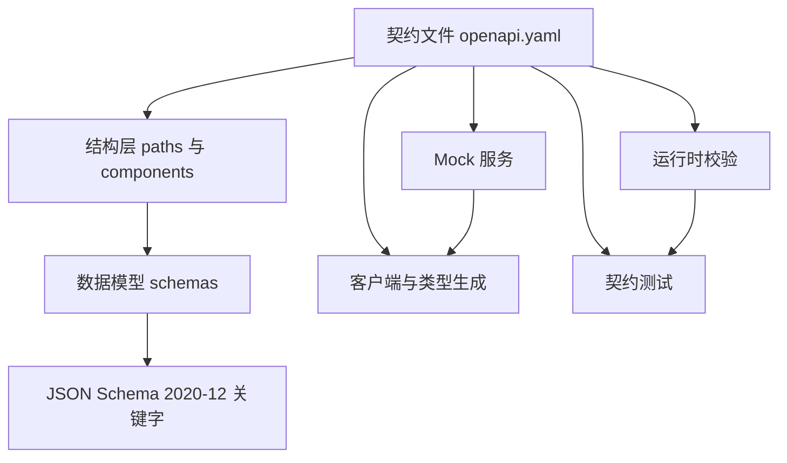
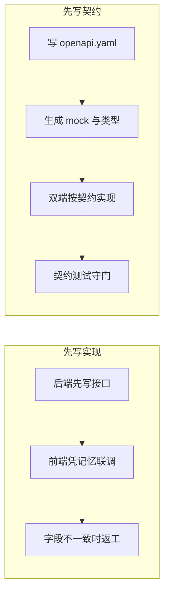
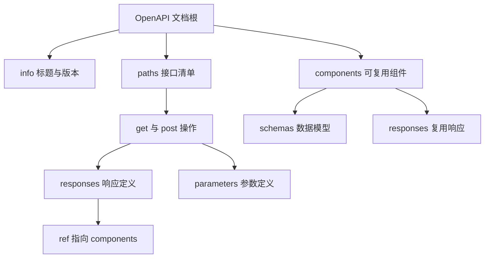
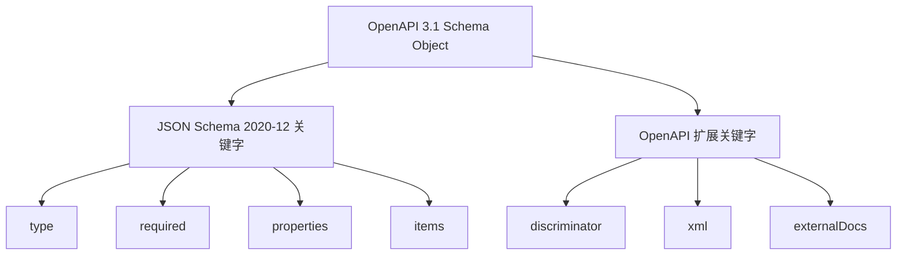
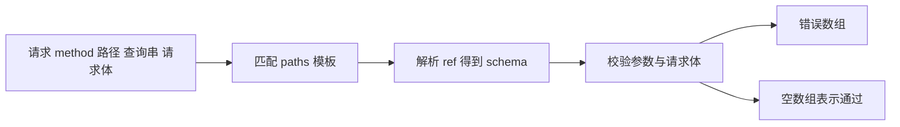
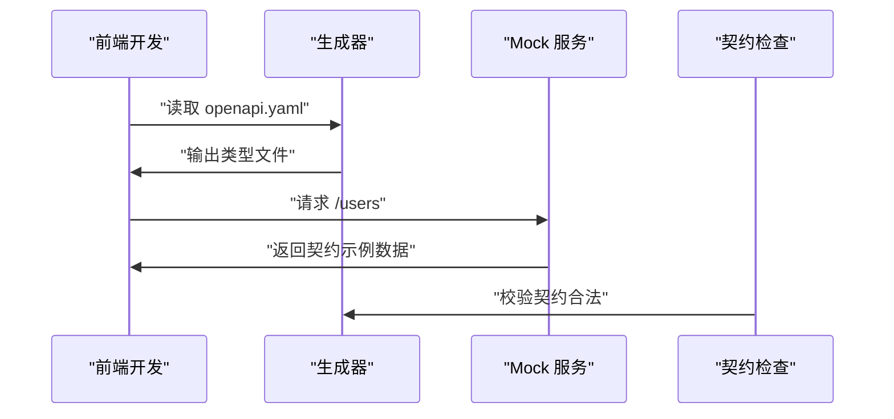
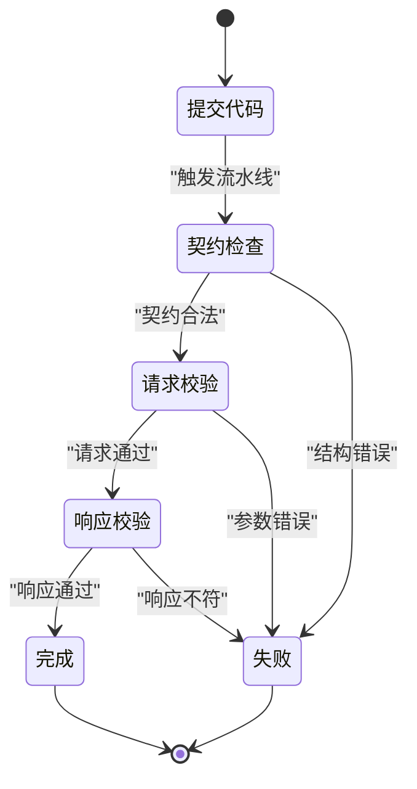

# OpenAPI：契约优先的接口开发

!!! abstract "学完这一页你能"
    - 说清 OpenAPI 3.1 文档里 paths、components、schemas 三者的分工，并写出含路径参数与请求体的契约。
    - 解释 OpenAPI Schema Object 与 JSON Schema 2020-12 的继承关系，并指出 3.1 放弃 nullable 的原因。
    - 用 60 行以内的 Node 脚本校验请求的路径、查询参数与请求体，并返回错误列表。
    - 从同一份契约生成 mock 数据与客户端类型，并把契约检查写成返回非零退出码的 CI 步骤。

## 0. 知识地图



建议这样读：先看第 1、2 节把契约文件写出来，再看第 3 节弄清类型语言的来源。第 4 节手写校验器，是后面 mock 与契约测试共用的零件。第 5、6 节把契约接进日常开发与 CI。

!!! note "术语：OpenAPI"
    OpenAPI（全称 OpenAPI Specification）是一份用 YAML 或 JSON 描述 HTTP 接口的文档格式。例如它规定 `GET /users` 返回 200，响应体是 User 数组。工具可以读取这份文档做校验、mock、生成类型。

!!! note "术语：YAML"
    YAML（YAML 不是标记语言）是一种用缩进表达层级的文本格式，可以表示数组、对象与字符串。例如 `title: 用户服务` 是一个键值对。OpenAPI 文档同时接受 YAML 与 JSON。

## 1. 契约优先：把接口约定提前到编码之前

**先想一个问题**

前端按记忆调用 `GET /users`，把返回的 `id` 当字符串用。后端返回的 `id` 是整数。`.toUpperCase()` 直接报错。谁来背这个锅？

**心智模型**

!!! tip "心智模型"
    一句话模型：契约先行，是把接口形状写成机器可读的文件，再让文档、mock、类型、测试都从这份文件派生。
    日常类比：盖楼前先出施工图，水电工和木工都按同一张图施工，而不是各自凭记忆开槽。
    类比不成立的地方：图纸不会自动生成建材，契约也不会自动保证实现正确。实现是否照做，要靠运行时校验与契约测试去查。

!!! note "术语：契约优先"
    契约优先（Contract-First）指先写接口契约，再写服务端与客户端实现。契约文件是唯一事实来源，实现与它不一致时以契约为准，例如 `id` 的类型只在契约里定义一次。

!!! note "术语：HTTP"
    HTTP（Hypertext Transfer Protocol，超文本传输协议）是浏览器与服务器交换请求响应的协议。例如 `GET /users` 里，`GET` 是方法，`/users` 是路径。

**图解**



1. `先写实现` 分支：后端先有代码，接口形状只存在于代码里。
2. 前端只能靠口头约定或临时文档联调。
3. 字段名、类型、必填项不一致时，返工发生在联调之后。
4. `先写契约` 分支：第一步是写 `openapi.yaml`。
5. 工具读取契约，生成 mock 数据与 TypeScript 类型。
6. 双端按契约实现，最后用契约测试在 CI 里守门。

**一步一步来**

第一步要做什么：写出最小可用的契约文件。它只描述一个接口，但包含 `openapi`、`info`、`paths`、`responses` 四个结构。

```yaml
openapi: 3.1.0                 # 声明规范版本，工具据此选择解析规则
info:                          # 文档元信息
  title: 用户服务              # 展示名称
  version: 1.0.0               # 契约版本，与接口版本号无关
paths:                         # 接口清单，键是路径
  /users:                      # 路径模板
    get:                       # HTTP 方法，小写
      summary: 查询用户列表    # 人读的说明
      responses:               # 操作必须声明响应
        "200":                 # 状态码加引号，避免被当成数字
          description: 查询成功
          content:
            application/json:  # 媒体类型
              schema:          # 响应体数据模型
                type: array
                items:
                  type: object
                  required: [id, name]   # 必填字段
                  properties:
                    id:
                      type: integer
                    name:
                      type: string
```

**这段代码在做什么**

- `openapi: 3.1.0` 是版本开关，决定后面能用哪些关键字。
- `info` 只放元信息，不参与请求匹配。
- `paths` 的键是路径模板，值是方法字典。
- `responses` 用状态码作键，`"200"` 的引号不能省。
- `schema` 描述响应体，`required` 列出必填字段。

运行结果：这段 YAML 能被 `js-yaml` 解析成对象，`doc.paths["/users"].get.responses["200"]` 有值。

第二步要做什么：解析 YAML 并检查必填结构。契约本身也可能残缺，先让脚本替你找问题。

```js
import yaml from "js-yaml";                          // 依赖：npm i js-yaml
import { readFileSync } from "node:fs";

const doc = yaml.load(readFileSync("./openapi.yaml", "utf8")); // 读文件并解析
const errors = [];                                             // 收集问题
if (doc.openapi !== "3.1.0") errors.push("openapi 版本必须是 3.1.0");
if (!doc.info?.title) errors.push("缺少 info.title");
if (!doc.paths || Object.keys(doc.paths).length === 0) errors.push("缺少 paths");
for (const [path, ops] of Object.entries(doc.paths ?? {})) {   // 遍历路径
  for (const [method, op] of Object.entries(ops)) {            // 遍历方法
    if (!op.responses) errors.push(`${method} ${path} 缺少 responses`);
  }
}
console.log(errors.length ? errors : "契约结构检查通过");
```

**这段代码在做什么**

- `yaml.load` 把文本转成 JavaScript 对象。
- 三条 `if` 检查版本、标题、路径清单。
- 双层 `for...of` 覆盖每个路径下的每个方法。
- 每个操作必须带 `responses`。
- 最后按有无错误打印数组或通过信息。

运行结果：

```text
契约结构检查通过
```

**动手验证**

依赖：`npm i js-yaml`。Node 20 及以上直接运行 `node check.mjs`。

```js
import assert from "node:assert/strict";
import yaml from "js-yaml";

const source = `
openapi: 3.1.0
info:
  title: 用户服务
  version: 1.0.0
paths:
  /users:
    get:
      responses:
        "200":
          description: 查询成功
`;

function checkContract(text) {                        // 返回问题数组
  const doc = yaml.load(text);
  const problems = [];
  if (doc.openapi !== "3.1.0") problems.push("版本不符");
  if (!doc.info?.title) problems.push("缺少标题");
  for (const [path, ops] of Object.entries(doc.paths ?? {})) {
    for (const [method, op] of Object.entries(ops)) {
      if (!op.responses) problems.push(`${method} ${path} 缺少 responses`);
    }
  }
  return problems;
}

assert.deepEqual(checkContract(source), []);          // 合法契约应无问题
const broken = source.replace("responses:", "note:");
assert.equal(checkContract(broken).length, 1);        // 残缺契约应报 1 条
console.log("PASS 第 1 节：契约存在性检查通过");
```

运行结果：

```text
PASS 第 1 节：契约存在性检查通过
```

**常见坑**

| 现象 | 原因 | 怎么修 |
| --- | --- | --- |
| 工具报版本不支持 | 版本号写成 `3.1` 这类不完整形式 | 写成 `3.1.0` |
| `"200"` 被当成数字 | 状态码键没加引号 | 键统一写成 `"200"` |
| 结构检查通过但接口报错 | 只检查了字段是否存在，没校验数据 | 增加 schema 校验与契约测试 |
| 改字段后两边不同步 | 契约与实现各改各的 | 把契约检查放进 CI |

**小结**

- 契约优先把接口形状提前到编码之前。
- 契约文件是唯一事实来源，文档、mock、类型、测试都从它派生。
- 第一步是让契约本身通过结构检查。

## 2. OpenAPI 3.1 的骨架：paths 与 components

**先想一个问题**

三个接口都要返回同一份 `User` 和同一个 `401` 响应。这段定义复制三遍，改一个字段就要改三处。

**心智模型**

!!! tip "心智模型"
    一句话模型：`paths` 描述每个接口的动作，`components` 存放可被多次引用的零件。
    日常类比：`paths` 是菜谱正文，`components` 是公共配料表；正文说取一勺配料 A，配料只在配料表里定义一次。
    类比不成立的地方：配料表不会检查引用是否存在，而 `$ref` 指向不存在的组件时，工具会报错。

!!! note "术语：$ref"
    `$ref` 是 OpenAPI 里的引用关键字，值是 JSON 指针。例如 `#/components/schemas/User` 表示取根对象的 `components.schemas.User` 节点。

!!! note "术语：paths 与 components"
    `paths` 是接口清单，键是路径模板，值是各 HTTP 方法。`components` 是可复用零件的仓库，常见分区有 `schemas`、`parameters`、`responses`。

**图解**



1. 文档根下同时挂 `info`、`paths`、`components`。
2. `info` 提供标题与版本，不参与请求匹配。
3. `paths` 下每个路径挂若干 HTTP 方法。
4. 每个方法下写 `parameters` 与 `responses`。
5. `components.schemas` 存放数据模型。
6. 方法里的 `$ref` 指回 `components`，实现一处定义、多处引用。

**一步一步来**

第一步要做什么：把数据模型抽到 `components.schemas`，再在路径里用 `$ref` 引用。

```yaml
components:                    # 可复用组件仓库
  schemas:                     # 数据模型区
    User:                      # 模型名，供 ref 引用
      type: object
      required: [id, name]     # 必填字段
      properties:
        id: { type: integer }  # 行内写法，等价于嵌套两行
        name: { type: string }
paths:
  /users/{id}:                 # 路径参数用花括号占位
    get:
      parameters:
        - name: id             # 参数名
          in: path             # 位置是路径
          required: true       # 路径参数必须为 true
          schema: { type: integer }
      responses:
        "200":
          content:
            application/json:
              schema:
                $ref: "#/components/schemas/User"  # 引用模型
```

**这段代码在做什么**

- `components.schemas.User` 是模型定义，只写一次。
- `required` 与 `properties` 决定哪些字段必填。
- `/users/{id}` 里的花括号是路径占位符。
- `in: path` 表示参数取自路径，`required` 必须是 `true`。
- `$ref` 把响应体指向 `User`，避免重复定义。

运行结果：解析后 `doc.components.schemas.User` 与响应里的 `$ref` 字符串都能取到。

第二步要做什么：写一个解析 `$ref` 的小函数，把指针变成真实节点。

```js
function resolveRef(doc, ref) {                          // ref 形如 #/a/b/c
  return ref.split("/").slice(1)                         // 去掉开头的 #
    .reduce((node, key) => node[key], doc);              // 逐层向下取
}
const user = resolveRef(doc, "#/components/schemas/User");
console.log(Object.keys(user.properties));               // [ 'id', 'name' ]
```

**这段代码在做什么**

- `split("/")` 把 JSON 指针切成段。
- `slice(1)` 丢掉空串，它来自开头的 `#`。
- `reduce` 从根对象一层层取到目标节点。
- 不存在的键会得到 `undefined`，调用方需要判断。
- 路径参数模型与响应模型复用同一个节点。

运行结果：

```text
[ 'id', 'name' ]
```

**动手验证**

依赖：`npm i js-yaml`。

```js
import assert from "node:assert/strict";
import yaml from "js-yaml";

const doc = yaml.load(`
openapi: 3.1.0
info: { title: 用户服务, version: 1.0.0 }
paths:
  /users/{id}:
    get:
      responses:
        "200":
          content:
            application/json:
              schema: { $ref: "#/components/schemas/User" }
components:
  schemas:
    User:
      type: object
      required: [id, name]
      properties:
        id: { type: integer }
        name: { type: string }
`);

function resolveRef(root, ref) {
  return ref.split("/").slice(1).reduce((node, key) => node[key], root);
}
function collectRefs(node, out = []) {                 // 深度遍历收集全部 ref
  if (node && typeof node === "object") {
    if (typeof node.$ref === "string") out.push(node.$ref);
    for (const value of Object.values(node)) collectRefs(value, out);
  }
  return out;
}

const refs = collectRefs(doc);
assert.deepEqual(refs, ["#/components/schemas/User"]);
for (const ref of refs) assert.ok(resolveRef(doc, ref));
assert.deepEqual(Object.keys(resolveRef(doc, refs[0]).properties), ["id", "name"]);
console.log("PASS 第 2 节：ref 收集与解析通过");
```

运行结果：

```text
PASS 第 2 节：ref 收集与解析通过
```

**常见坑**

| 现象 | 原因 | 怎么修 |
| --- | --- | --- |
| 工具报 ref 找不到 | 指针写成了 `components/schemas/User` | 补上开头的 `#/` |
| 路径参数被拒 | `required` 漏写或写成 `false` | 路径参数固定写 `required: true` |
| 模型改了响应没变 | 有的接口直接内联了旧结构 | 全部改成 `$ref` 引用同一模型 |
| `id` 类型对不上 | 契约写 integer，前端按 string 用 | 以契约类型生成类型文件 |

**小结**

- `paths` 管接口动作，`components` 管可复用零件。
- `$ref` 用 JSON 指针把两处连起来，定义只写一次。
- 路径参数必须声明 `required: true`。

## 3. OpenAPI 与 JSON Schema：同一套类型语言

**先想一个问题**

你已经在表单里用 JSON Schema 校验输入，为什么接口契约里还要再写一遍 `type`、`required`、`properties`？

**心智模型**

!!! tip "心智模型"
    一句话模型：OpenAPI 3.1 的 Schema Object 以 JSON Schema 2020-12 为底座，再补上与 HTTP 文档相关的关键字。
    日常类比：JSON Schema 是一台语法检查器，OpenAPI 是整本书；书里的每段类型描述直接调用那台检查器。
    类比不成立的地方：书还规定了路径、方法、响应码，这些与类型无关，检查器不管这些内容。

!!! note "术语：JSON Schema"
    JSON Schema 是一份描述 JSON 数据结构的规范，用 `type`、`required`、`properties` 等关键字表达约束。例如 `{ "type": "string" }` 表示该值必须是字符串。

!!! note "术语：Schema Object"
    OpenAPI 文档里描述数据模型的那段对象叫 Schema Object。它接受 JSON Schema 2020-12 的关键字，例如 `type`、`items`、`minimum`。

**图解**



1. Schema Object 分两部分关键字。
2. `type`、`required`、`properties`、`items` 来自 JSON Schema 2020-12。
3. 这些关键字的行为由 JSON Schema 规范定义。
4. `discriminator`、`xml`、`externalDocs` 是 OpenAPI 为文档场景增加的。
5. 写校验器时，JSON Schema 部分可以独立实现与复用。

**一步一步来**

第一步要做什么：写一个支持类型数组的 JSON Schema 子集校验器。

```js
function isType(t, v) {                                // 关键字 type 的判断
  if (t === "integer") return Number.isInteger(v);     // 整数不含小数
  if (t === "array") return Array.isArray(v);
  if (t === "object") return v !== null && typeof v === "object";
  return typeof v === t;                               // string boolean number
}
function check(schema, value, path = "$") {            // 返回错误数组
  const types = Array.isArray(schema.type) ? schema.type : schema.type ? [schema.type] : [];
  if (types.length && !types.some((t) => isType(t, value))) {
    return [`${path} 类型不符 ${types.join(" | ")}`];  // 3.1 允许 null 与 string 并列
  }
  const errs = [];
  for (const key of schema.required ?? []) {           // required 与 properties 配合
    if (value == null || !(key in value)) errs.push(`${path}.${key} 缺失`);
  }
  for (const [key, sub] of Object.entries(schema.properties ?? {})) {
    if (value != null && key in value) errs.push(...check(sub, value[key], `${path}.${key}`));
  }
  return errs;
}
```

**这段代码在做什么**

- `isType` 把 `integer` 与 `number` 分开判断。
- 类型写成数组时，任一成员命中即通过。
- `required` 只检查键是否出现。
- `properties` 对出现的键递归校验。
- 返回值永远是数组，空数组表示通过。

运行结果：`check({ type: "integer" }, 1.5)` 返回 `[ "$ 类型不符 integer" ]`。

第二步要做什么：对比 OpenAPI 3.0 与 3.1 表达可空的写法。

```yaml
# OpenAPI 3.0 的写法，3.1 已不再使用 nullable
nickname30:
  type: string
  nullable: true
# OpenAPI 3.1 的写法，用类型数组表达可空
nickname31:
  type: [string, "null"]
```

**这段代码在做什么**

- `nullable` 是 3.0 在 JSON Schema 之外加的开关。
- 3.1 与 JSON Schema 2020-12 对齐后，可空用类型数组表达。
- 校验器读取类型数组即可，无需为 `nullable` 写特例。
- 迁移 3.0 文档时，`nullable: true` 要改写成类型数组。
- 类型数组里字符串的顺序不影响校验结果。

运行结果：`check({ type: [string, "null"] }, null)` 返回 `[]`；`check({ type: [string, "null"] }, 3)` 返回一条类型错误。

**动手验证**

依赖：无。单文件直接运行 `node json-schema-check.mjs`。

```js
import assert from "node:assert/strict";

function isType(t, v) {
  if (t === "integer") return Number.isInteger(v);
  if (t === "array") return Array.isArray(v);
  if (t === "object") return v !== null && typeof v === "object";
  return typeof v === t;
}
function check(schema, value, path = "$") {
  const types = Array.isArray(schema.type) ? schema.type : schema.type ? [schema.type] : [];
  if (types.length && !types.some((t) => isType(t, value))) {
    return [`${path} 类型不符 ${types.join(" | ")}`];
  }
  const errs = [];
  for (const key of schema.required ?? []) {
    if (value == null || !(key in value)) errs.push(`${path}.${key} 缺失`);
  }
  for (const [key, sub] of Object.entries(schema.properties ?? {})) {
    if (value != null && key in value) errs.push(...check(sub, value[key], `${path}.${key}`));
  }
  return errs;
}

const nullableString = { type: ["string", "null"] };
assert.deepEqual(check(nullableString, null), []);
assert.deepEqual(check(nullableString, "ok"), []);
assert.equal(check(nullableString, 3).length, 1);
assert.deepEqual(check({ type: "integer" }, 2), []);
assert.equal(check({ type: "integer" }, 1.5).length, 1);
const user = { type: "object", required: ["name"], properties: { age: { type: "integer" } } };
assert.deepEqual(check(user, { name: "Lin", age: 3 }), []);
assert.equal(check(user, { age: 3 }).length, 1);
console.log("PASS 第 3 节：JSON Schema 子集校验通过");
```

运行结果：

```text
PASS 第 3 节：JSON Schema 子集校验通过
```

**常见坑**

| 现象 | 原因 | 怎么修 |
| --- | --- | --- |
| 3.0 文档迁到 3.1 后报错 | `nullable` 不再是合法关键字 | 改写成 `type: [原类型, "null"]` |
| `integer` 放过了 1.5 | 用 `typeof` 判断整数得到 `number` | 用 `Number.isInteger` |
| `required` 对 `null` 报错 | 没先判断值是对象 | 检查 `value == null` 再取键 |
| 同一模型两份定义 | 一处用 `$ref`，一处内联 | 全部收进 `components.schemas` |

**小结**

- OpenAPI 3.1 的 Schema Object 以 JSON Schema 2020-12 为基础。
- 可空在 3.1 里写成类型数组，不再用 `nullable`。
- `integer` 与 `number` 要分开判断。

## 4. 手写一个最小 OpenAPI 请求校验器

**先想一个问题**

前端发 `GET /users/abc?limit=ten`，后端把 `abc` 当整数 ID 用，数据库查不到就返回 500。请求在进入业务代码前就该被拒绝。

**心智模型**

!!! tip "心智模型"
    一句话模型：校验器把 `method`、路径、查询串、请求体四样输入，对照契约里的模板与 schema，输出一个错误数组。
    日常类比：门卫拿名单核对来客：先看单位名字是否在册，再看证件号格式是否合规。
    类比不成立的地方：门卫只会说不行，校验器还要说清是哪一项、期望什么、实际什么。

**图解**



1. 请求对象只带 `method`、`path`、`query`、`body` 四个字段。
2. 路径模板先转成正则，再与请求路径匹配。
3. 匹配成功后，`$ref` 指向的 schema 被取出。
4. schema 递归校验查询参数与请求体。
5. 有错误返回错误数组，无错误返回空数组。

**一步一步来**

第一步要做什么：把路径模板转成正则，并记住占位符顺序。

```js
function pathToRegex(template) {                        // /users/{id} 转正则
  const names = [];                                     // 占位符名按出现顺序
  const pattern = template.replace(/\{([^}]+)\}/g, (_, name) => {
    names.push(name);                                   // 记录参数名
    return "([^/]+)";                                   // 匹配一段非斜杠字符
  });
  return { regex: new RegExp(`^${pattern}/?$`), names }; // 末尾斜杠可选
}
const { regex, names } = pathToRegex("/users/{id}");    // 测试模板
const matched = regex.exec("/users/42");                // 命中
console.log(names, matched?.[1]);                       // [ 'id' ] 42
```

**这段代码在做什么**

- `replace` 的回调把每个占位符换成捕获组。
- `names` 记录参数名，顺序与捕获组一致。
- `^...$` 保证整段匹配，`/?` 允许末尾斜杠。
- `regex.exec` 返回数组，第 0 项是整段，后面是捕获组。
- 模板里没有占位符时，`names` 是空数组。

运行结果：

```text
[ 'id' ] 42
```

第二步要做什么：把 `$ref` 指针解析成真实节点。

```js
function resolveRef(doc, ref) {                          // ref 形如 #/a/b/c
  return ref.split("/").slice(1)                         // 去掉开头的 #
    .reduce((node, key) => node[key], doc);              // 逐层向下取
}
console.log(resolveRef(doc, "#/components/schemas/User").type); // object
```

**这段代码在做什么**

- `split("/")` 把指针切成段。
- `slice(1)` 丢掉空串，它来自开头的 `#`。
- `reduce` 从根对象逐层取到目标节点。
- 断链时结果是 `undefined`，校验器要发出明确错误。
- 同一函数供请求校验与 mock 生成复用。

运行结果：

```text
object
```

第三步要做什么：写递归 schema 校验器，支持 `$ref`、类型数组、对象属性与数组元素。

```js
function isType(t, v) {                                // 类型判断
  if (t === "integer") return Number.isInteger(v);
  if (t === "number") return typeof v === "number";
  if (t === "array") return Array.isArray(v);
  if (t === "object") return v !== null && typeof v === "object";
  return typeof v === t;                               // string 与 boolean
}
function validateSchema(s, v, p, root) {               // 返回错误数组
  if (s.$ref) return validateSchema(resolveRef(root, s.$ref), v, p, root);
  const types = Array.isArray(s.type) ? s.type : s.type ? [s.type] : [];
  if (types.length && !types.some((t) => isType(t, v))) return [`${p} 类型不符 ${types.join(" | ")}`];
  const errs = [];
  for (const k of s.required ?? []) if (v == null || !(k in v)) errs.push(`${p}.${k} 缺失`);
  for (const [k, sub] of Object.entries(s.properties ?? {})) {
    if (v != null && k in v) errs.push(...validateSchema(sub, v[k], `${p}.${k}`, root));
  }
  if (s.items && Array.isArray(v)) {
    v.forEach((item, i) => errs.push(...validateSchema(s.items, item, `${p}[${i}]`, root)));
  }
  return errs;
}
```

**这段代码在做什么**

- `$ref` 先解析再校验，避免在校验器里重复判断。
- `type` 支持字符串与数组两种形态，数组对应 3.1 的联合类型。
- `required` 只检查键是否存在。
- `properties` 对已出现的键递归校验，路径用点号拼接。
- `items` 对数组元素逐个递归校验，路径带下标。

运行结果：`validateSchema(schema, { id: "a" }, "$", doc)` 返回 `[ "$.id 类型不符 integer" ]`。

第四步要做什么：把前三步组合成请求校验入口，额外处理查询串的类型转换。

```js
function coerce(schema, raw) {                          // 查询串里都是字符串
  if (schema?.type === "integer" || schema?.type === "number") return Number(raw);
  if (schema?.type === "boolean") return raw === "true";
  return raw;
}
function validateRequest(doc, req) {                    // req 带 method path query body
  const errors = [];
  let hit = null;
  for (const [template, ops] of Object.entries(doc.paths ?? {})) {
    const op = ops[req.method.toLowerCase()];            // 按方法取操作
    if (!op) continue;
    const { regex, names } = pathToRegex(template);
    const m = regex.exec(req.path);
    if (m) { hit = { op, names, values: m.slice(1) }; break; }
  }
  if (!hit) return [`没有匹配的路径 ${req.method} ${req.path}`];
  for (const p of hit.op.parameters ?? []) {             // 校验路径与查询参数
    const raw = p.in === "path" ? hit.values[hit.names.indexOf(p.name)] : req.query?.[p.name];
    if (p.required && raw === undefined) errors.push(`缺少参数 ${p.name}`);
    else if (raw !== undefined) errors.push(...validateSchema(p.schema, coerce(p.schema, raw), `$.${p.name}`, doc));
  }
  const body = hit.op.requestBody?.content?.["application/json"]?.schema;
  if (body && req.body !== undefined) errors.push(...validateSchema(body, req.body, "$.body", doc));
  return errors;
}
```

**这段代码在做什么**

- 外层遍历路径模板与 HTTP 方法。
- 命中后保存操作对象、参数名与捕获值。
- 路径参数来自捕获组，查询参数来自 `req.query`。
- `coerce` 把查询串里的字符串转成整数或布尔值。
- 请求体存在时，取 `requestBody` 里的 schema 校验。

运行结果：合法的 `GET /users/42?limit=10` 返回 `[]`；`limit=ten` 返回一条类型错误。

**动手验证**

依赖：`npm i js-yaml`。这个脚本把前面四步合成一次完整校验。

```js
import assert from "node:assert/strict";
import yaml from "js-yaml";

const doc = yaml.load(`
openapi: 3.1.0
info: { title: 用户服务, version: 1.0.0 }
paths:
  /users/{id}:
    get:
      parameters:
        - { name: id, in: path, required: true, schema: { type: integer } }
        - { name: limit, in: query, schema: { type: integer } }
      responses:
        "200": { description: 成功 }
  /users:
    post:
      requestBody:
        content:
          application/json:
            schema: { $ref: "#/components/schemas/User" }
      responses:
        "201": { description: 已创建 }
components:
  schemas:
    User:
      type: object
      required: [name]
      properties:
        name: { type: string }
        age: { type: integer }
`);

function pathToRegex(template) {
  const names = [];
  const pattern = template.replace(/\{([^}]+)\}/g, (_, name) => { names.push(name); return "([^/]+)"; });
  return { regex: new RegExp(`^${pattern}/?$`), names };
}
function resolveRef(root, ref) {
  return ref.split("/").slice(1).reduce((node, key) => node[key], root);
}
function isType(t, v) {
  if (t === "integer") return Number.isInteger(v);
  if (t === "number") return typeof v === "number";
  if (t === "array") return Array.isArray(v);
  if (t === "object") return v !== null && typeof v === "object";
  return typeof v === t;
}
function validateSchema(s, v, p, root) {
  if (s.$ref) return validateSchema(resolveRef(root, s.$ref), v, p, root);
  const types = Array.isArray(s.type) ? s.type : s.type ? [s.type] : [];
  if (types.length && !types.some((t) => isType(t, v))) return [`${p} 类型不符 ${types.join(" | ")}`];
  const errs = [];
  for (const k of s.required ?? []) if (v == null || !(k in v)) errs.push(`${p}.${k} 缺失`);
  for (const [k, sub] of Object.entries(s.properties ?? {})) {
    if (v != null && k in v) errs.push(...validateSchema(sub, v[k], `${p}.${k}`, root));
  }
  if (s.items && Array.isArray(v)) v.forEach((item, i) => errs.push(...validateSchema(s.items, item, `${p}[${i}]`, root)));
  return errs;
}
function coerce(schema, raw) {
  if (schema?.type === "integer" || schema?.type === "number") return Number(raw);
  if (schema?.type === "boolean") return raw === "true";
  return raw;
}
function validateRequest(root, req) {
  const errors = [];
  let hit = null;
  for (const [template, ops] of Object.entries(root.paths ?? {})) {
    const op = ops[req.method.toLowerCase()];
    if (!op) continue;
    const { regex, names } = pathToRegex(template);
    const m = regex.exec(req.path);
    if (m) { hit = { op, names, values: m.slice(1) }; break; }
  }
  if (!hit) return [`没有匹配的路径 ${req.method} ${req.path}`];
  for (const p of hit.op.parameters ?? []) {
    const raw = p.in === "path" ? hit.values[hit.names.indexOf(p.name)] : req.query?.[p.name];
    if (p.required && raw === undefined) errors.push(`缺少参数 ${p.name}`);
    else if (raw !== undefined) errors.push(...validateSchema(p.schema, coerce(p.schema, raw), `$.${p.name}`, root));
  }
  const body = hit.op.requestBody?.content?.["application/json"]?.schema;
  if (body && req.body !== undefined) errors.push(...validateSchema(body, req.body, "$.body", root));
  return errors;
}

assert.deepEqual(validateRequest(doc, { method: "GET", path: "/users/42", query: { limit: "10" } }), []);
assert.equal(validateRequest(doc, { method: "GET", path: "/users/abc" }).length, 1);
assert.equal(validateRequest(doc, { method: "GET", path: "/users/42", query: { limit: "ten" } }).length, 1);
assert.deepEqual(validateRequest(doc, { method: "POST", path: "/users", body: { name: "Lin" } }), []);
assert.equal(validateRequest(doc, { method: "POST", path: "/users", body: { age: 3 } }).length, 1);
console.log("PASS 第 4 节：请求校验器覆盖 5 组用例");
```

运行结果：

```text
PASS 第 4 节：请求校验器覆盖 5 组用例
```

**常见坑**

| 现象 | 原因 | 怎么修 |
| --- | --- | --- |
| 路径命中错误接口 | 模板顺序把 `/users/{id}` 放在 `/users/me` 前 | 先匹配固定路径，再匹配带占位符的路径 |
| `limit=10` 被当成字符串 | 没有按 schema 做类型转换 | 用 `coerce` 先转再校验 |
| 请求体缺失却报字段缺失 | 没判断 `req.body` 是否存在 | 只在 `body !== undefined` 时校验 |
| 错误信息只说失败 | 没带路径与期望类型 | 错误里拼上 `$.字段` 与期望类型 |

**小结**

- 校验器由路径匹配、`$ref` 解析、schema 递归、请求组合四块拼成。
- 查询串里的值都是字符串，先按 schema 转换再校验。
- 错误数组同时给出位置、期望类型与实际值。

## 5. 从契约生成 mock、客户端与类型

**先想一个问题**

后端接口要三天后才联调。前端这三天是等，还是先按契约把页面写完？

**心智模型**

!!! tip "心智模型"
    一句话模型：契约是源文件，mock 数据、请求函数、TypeScript 类型都是从它编译出来的产物。
    日常类比：一份乐谱可以给不同乐器抄出分谱，分谱内容不一致时以总谱为准。
    类比不成立的地方：抄谱不会发现总谱里写错的音符，生成器只忠实搬运，不会替你判断接口设计是否合理。

!!! note "术语：Mock"
    Mock 是按契约返回示例数据的假接口。例如契约说 `GET /users` 返回 User 数组，mock 服务就返回一组符合该 schema 的假用户。

!!! note "术语：代码生成"
    代码生成指读取契约，自动写出客户端请求函数或 TypeScript 类型。例如从 `GET /users` 生成一个返回 `User[]` 的函数签名。

!!! note "术语：SDK"
    SDK（Software Development Kit，软件开发工具包）在这里指按契约生成的客户端代码包。前端引入后可直接调用，无需手写 URL 与类型。

**图解**



1. 生成器读取 `openapi.yaml`。
2. 生成器把类型与请求函数写到前端工程里。
3. 前端开发调用 mock 服务，不等后端。
4. mock 按 schema 返回示例数据。
5. CI 在提交时校验契约结构。

**一步一步来**

第一步要做什么：写一个按 schema 造示例值的函数。

```js
function sample(doc, schema) {                          // 按 schema 造一个示例值
  if (schema.$ref) return sample(doc, resolveRef(doc, schema.$ref));
  const type = Array.isArray(schema.type) ? schema.type[0] : schema.type;
  if (type === "object") {                              // 对象：每个属性各造一个
    const out = {};
    for (const [key, sub] of Object.entries(schema.properties ?? {})) out[key] = sample(doc, sub);
    return out;
  }
  if (type === "array") return [sample(doc, schema.items ?? {})]; // 数组给一个元素
  if (type === "integer") return schema.minimum ?? 1;   // 整数取最小值或 1
  if (type === "number") return 1.5;
  if (type === "boolean") return true;
  return schema.example ?? "示例文本";                   // 字符串兜底
}
console.log(sample(doc, { $ref: "#/components/schemas/User" }));
```

**这段代码在做什么**

- `$ref` 先解析成真实节点再生成。
- 联合类型取数组里的第一个类型作为代表。
- 对象递归处理每个属性。
- 数组只生成一个元素，够前端渲染列表。
- 字符串用 `example`，没有就退回固定文本。

运行结果：

```text
{ name: '示例文本', age: 1 }
```

第二步要做什么：用 `node:http` 把 sample 函数接到真实端口上。

```js
import { createServer } from "node:http";
import { readFileSync } from "node:fs";
import yaml from "js-yaml";

const doc = yaml.load(readFileSync("./openapi.yaml", "utf8"));
const server = createServer((req, res) => {              // 每个请求都查契约
  const url = new URL(req.url, "http://localhost");      // 解析路径与查询串
  const errors = validateRequest(doc, {
    method: req.method, path: url.pathname,
    query: Object.fromEntries(url.searchParams),
  });
  if (errors.length) {                                   // 参数不合法就 400
    res.writeHead(400, { "content-type": "application/json" });
    return res.end(JSON.stringify({ errors }));
  }
  const schema = doc.paths["/users"]?.get?.responses?.["200"]?.content?.["application/json"]?.schema;
  res.writeHead(200, { "content-type": "application/json" });
  res.end(JSON.stringify(sample(doc, schema)));          // 输出示例数据
});
server.listen(0);                                        // 0 表示随机空闲端口
console.log("mock 地址", `http://localhost:${server.address().port}`);
```

**这段代码在做什么**

- `URL` 把请求地址拆成路径与查询参数。
- 先跑第 4 节的请求校验器，非法请求返回 400。
- 校验通过后，从契约里取 200 响应的 schema。
- `sample` 生成符合 schema 的 JSON。
- `listen(0)` 让系统分配空闲端口，避免端口冲突。

运行结果：控制台打印 `mock 地址 http://localhost:随机端口`。

第三步要做什么：认识类型生成工具的输出形状。下面只有示意，真实字段名需核对官方文档。

```ts
// openapi-typescript 生成结果的形状示意，真实命名空间需核对官方文档
type User = { name: string; age?: number };
type GetUsersResponse = User[];
```

**这段代码在做什么**

- 契约里的 `required: [name]` 对应 `name: string`。
- 没有列进 `required` 的 `age` 对应 `age?: number`。
- `type: array` 加 `items` 对应 `User[]`。
- `openapi-typescript` 依据契约生成 TypeScript 类型，命令与输出路径需核对官方文档。
- `orval` 依据契约生成请求函数与查询 Hook，支持的框架与配置项需核对官方文档。

**动手验证**

依赖：`npm i js-yaml`。脚本启动 mock、发请求、校验响应，然后关闭服务。

```js
import assert from "node:assert/strict";
import { createServer } from "node:http";
import yaml from "js-yaml";

const doc = yaml.load(`
openapi: 3.1.0
info: { title: 用户服务, version: 1.0.0 }
paths:
  /users:
    get:
      parameters:
        - { name: limit, in: query, schema: { type: integer } }
      responses:
        "200":
          content:
            application/json:
              schema: { type: array, items: { $ref: "#/components/schemas/User" } }
components:
  schemas:
    User:
      type: object
      required: [id, name]
      properties:
        id: { type: integer, minimum: 1 }
        name: { type: string }
`);

function resolveRef(root, ref) {
  return ref.split("/").slice(1).reduce((node, key) => node[key], root);
}
function sample(root, schema) {
  if (schema.$ref) return sample(root, resolveRef(root, schema.$ref));
  const type = Array.isArray(schema.type) ? schema.type[0] : schema.type;
  if (type === "object") {
    const out = {};
    for (const [key, sub] of Object.entries(schema.properties ?? {})) out[key] = sample(root, sub);
    return out;
  }
  if (type === "array") return [sample(root, schema.items ?? {})];
  if (type === "integer") return schema.minimum ?? 1;
  if (type === "number") return 1.5;
  if (type === "boolean") return true;
  return schema.example ?? "示例文本";
}
function toInt(raw) {
  return Number(raw);
}

const schema = doc.paths["/users"].get.responses["200"].content["application/json"].schema;
const server = createServer((req, res) => {
  const url = new URL(req.url, "http://localhost");
  const limit = url.searchParams.get("limit");
  if (limit !== null && !Number.isInteger(toInt(limit))) {
    res.writeHead(400, { "content-type": "application/json" });
    return res.end(JSON.stringify({ errors: ["$.limit 类型不符 integer"] }));
  }
  res.writeHead(200, { "content-type": "application/json" });
  res.end(JSON.stringify(sample(doc, schema)));
});
await new Promise((resolve) => server.listen(0, resolve));
const base = `http://localhost:${server.address().port}`;

const ok = await fetch(`${base}/users?limit=10`);
const list = await ok.json();
assert.equal(ok.status, 200);
assert.equal(list.length, 1);
assert.equal(typeof list[0].id, "number");
assert.equal(typeof list[0].name, "string");

const bad = await fetch(`${base}/users?limit=ten`);
assert.equal(bad.status, 400);
const problem = await bad.json();
assert.equal(problem.errors.length, 1);

server.close();
console.log("PASS 第 5 节：mock 数据生成与请求校验通过");
```

运行结果：

```text
PASS 第 5 节：mock 数据生成与请求校验通过
```

**常见坑**

| 现象 | 原因 | 怎么修 |
| --- | --- | --- |
| mock 数据字段缺失 | 生成函数跳过了未列进 `properties` 的字段 | 把模型补全到契约 |
| 列表页渲染报错 | mock 数组只生成一个元素 | 按前端需要生成 3 到 5 个元素 |
| 类型文件与实现不同步 | 改了契约没重新生成 | 把生成命令写进 npm 脚本 |
| 生成器输出目录混乱 | 多人各自配置输出路径 | 在仓库里固定一个输出目录 |

**小结**

- mock 与类型都从契约派生，契约改了就重新生成。
- `listen(0)` 能避免本地端口冲突。
- 生成器不判断接口设计是否合理，评审仍要人来做。

## 6. 契约测试：把校验放进 CI

**先想一个问题**

后端把 `id` 从整数改成字符串，改了代码没改契约。前端在两个星期后的联调才发现。

**心智模型**

!!! tip "心智模型"
    一句话模型：契约测试用同一份契约同时检查实现和文档，任何一边偏离就失败。
    日常类比：进出仓库要过两道闸机，一道查货单是否合规，一道查实物是否与货单一致。
    类比不成立的地方：闸机没有裁决权，契约测试发现不一致时，改契约还是改实现由团队决定。

!!! note "术语：契约测试"
    契约测试（Contract Testing）指用契约文件校验真实请求与响应的测试。例如请求 `GET /users` 后，用契约里的响应 schema 检查返回的 JSON。

!!! note "术语：CI"
    CI（Continuous Integration，持续集成）指每次提交后自动运行检查的流水线。例如提交代码后自动执行契约 lint 与接口校验，失败就把这次提交标红。

**图解**



1. 提交代码后触发流水线。
2. 第一步做契约结构检查。
3. 第二步用契约校验发出去的请求。
4. 第三步校验返回的响应体。
5. 任意一步失败都进入失败状态，流水线标红。
6. 全部通过才结束。

**一步一步来**

第一步要做什么：写契约结构检查，要求每个响应都有 `description`。

```js
function lintContract(doc) {
  const problems = [];
  for (const [path, ops] of Object.entries(doc.paths ?? {})) {
    for (const [method, op] of Object.entries(ops)) {
      if (!op.responses) { problems.push(`${method} ${path} 缺少 responses`); continue; }
      for (const [code, resp] of Object.entries(op.responses)) {
        if (!resp.description) problems.push(`${method} ${path} ${code} 缺少 description`);
      }
    }
  }
  return problems;
}
console.log(lintContract(doc));                          // 空数组表示通过
```

**这段代码在做什么**

- 外层遍历路径，内层遍历 HTTP 方法。
- 没有 `responses` 的操作直接记一条问题并跳过。
- 每个响应必须带 `description`。
- 返回数组而不是抛异常，方便把问题全部收集完。
- 空数组表示契约结构合规。

运行结果：合法契约打印 `[]`。

第二步要做什么：写响应校验，把真实返回的 JSON 与契约里的响应 schema 对照。

```js
function validateResponse(doc, method, path, status, body) {
  const op = doc.paths?.[path]?.[method.toLowerCase()];  // 精确匹配路径
  if (!op) return ["契约里没有这个接口"];
  const response = op.responses?.[String(status)] ?? op.responses?.default;
  if (!response) return [`契约里没有 ${status} 响应`];     // 状态码没声明
  const schema = response.content?.["application/json"]?.schema;
  return schema ? validateSchema(schema, body, "$", doc) : [];
}
```

**这段代码在做什么**

- 只在契约里精确匹配路径与状态码。
- 找不到状态码时退回 `default` 响应。
- 没有 content 的响应（例如 204）直接通过。
- 有 schema 时交给第 4 节的校验器。
- 错误数组里带字段路径，方便定位。

运行结果：符合契约的响应返回 `[]`，`id` 类型不符时返回一条错误。

第三步要做什么：汇总问题并给出非零退出码。

```js
const problems = [...lintContract(doc)];                 // 契约结构问题
problems.push(...validateResponse(doc, "GET", "/users", 200, [{ id: 1, name: "Lin" }]));
if (problems.length) {
  console.error(problems.join("\n"));
  process.exitCode = 1;                                  // 非零退出码让 CI 失败
} else {
  console.log("契约检查通过");
}
```

**这段代码在做什么**

- `problems` 同时装结构问题与响应问题。
- 有任何一条就用 `console.error` 打印。
- `process.exitCode = 1` 让 CI 判定这一步失败。
- 全部通过时打印通过信息并保持退出码为 0。
- CI 只看退出码，不看日志颜色。

运行结果：通过时打印 `契约检查通过`，失败时打印问题列表且退出码为 1。

**动手验证**

依赖：无。可以用 `node contract-test.mjs; echo $?` 观察退出码。

```js
import assert from "node:assert/strict";

const goodDoc = {
  paths: {
    "/users": {
      get: {
        responses: {
          "200": { description: "成功", content: { "application/json": { schema: {
            type: "array", items: { type: "object", required: ["id", "name"],
              properties: { id: { type: "integer" }, name: { type: "string" } } } } } } },
        },
      },
    },
  },
};
const badDoc = { paths: { "/users": { get: { responses: { "200": { content: {} } } } } } };

function isType(t, v) {
  if (t === "integer") return Number.isInteger(v);
  if (t === "array") return Array.isArray(v);
  if (t === "object") return v !== null && typeof v === "object";
  return typeof v === t;
}
function validateSchema(s, v, p) {
  const types = Array.isArray(s.type) ? s.type : s.type ? [s.type] : [];
  if (types.length && !types.some((t) => isType(t, v))) return [`${p} 类型不符 ${types.join(" | ")}`];
  const errs = [];
  for (const k of s.required ?? []) if (v == null || !(k in v)) errs.push(`${p}.${k} 缺失`);
  for (const [k, sub] of Object.entries(s.properties ?? {})) {
    if (v != null && k in v) errs.push(...validateSchema(sub, v[k], `${p}.${k}`));
  }
  if (s.items && Array.isArray(v)) v.forEach((item, i) => errs.push(...validateSchema(s.items, item, `${p}[${i}]`)));
  return errs;
}
function lintContract(doc) {
  const problems = [];
  for (const [path, ops] of Object.entries(doc.paths ?? {})) {
    for (const [method, op] of Object.entries(ops)) {
      if (!op.responses) { problems.push(`${method} ${path} 缺少 responses`); continue; }
      for (const [code, resp] of Object.entries(op.responses)) {
        if (!resp.description) problems.push(`${method} ${path} ${code} 缺少 description`);
      }
    }
  }
  return problems;
}
function validateResponse(doc, method, path, status, body) {
  const op = doc.paths?.[path]?.[method.toLowerCase()];
  if (!op) return ["契约里没有这个接口"];
  const response = op.responses?.[String(status)] ?? op.responses?.default;
  if (!response) return [`契约里没有 ${status} 响应`];
  const schema = response.content?.["application/json"]?.schema;
  return schema ? validateSchema(schema, body, "$") : [];
}

assert.deepEqual(lintContract(goodDoc), []);
assert.equal(lintContract(badDoc).length, 1);
assert.deepEqual(validateResponse(goodDoc, "GET", "/users", 200, [{ id: 1, name: "Lin" }]), []);
assert.equal(validateResponse(goodDoc, "GET", "/users", 500, []).length, 1);
assert.equal(validateResponse(goodDoc, "GET", "/users", 200, [{ id: "1", name: "Lin" }]).length, 1);
console.log("PASS 第 6 节：契约结构检查与响应校验通过");
process.exitCode = 0;
```

运行结果：

```text
PASS 第 6 节：契约结构检查与响应校验通过
```

**常见坑**

| 现象 | 原因 | 怎么修 |
| --- | --- | --- |
| CI 显示绿色但接口错了 | 脚本只打印错误，退出码仍为 0 | 设置 `process.exitCode = 1` |
| 校验连不上服务 | 契约检查依赖本地起服务 | 用第 5 节的 mock 或容器里的测试服务 |
| 响应校验总失败 | 契约里缺少状态码定义 | 把实际会返回的状态码补进 `responses` |
| 改了契约 CI 才报错 | 契约检查只在合并后跑 | 把契约检查放到提交阶段 |

**小结**

- 契约测试同时检查文档与实现，任何一边偏离都失败。
- 退出码是 CI 判断成败的唯一信号。
- 契约检查越早跑，返工成本越低。

## 综合对比

| 维度 | 只写 Markdown 文档 | 只写 TypeScript 类型 | OpenAPI 加类型生成 | OpenAPI 加运行时校验 | OpenAPI 加契约测试 |
| --- | --- | --- | --- | --- | --- |
| 机器可读 | 否 | 是 | 是 | 是 | 是 |
| 覆盖范围 | 人读描述 | 只覆盖响应体 | 覆盖路径与响应体 | 覆盖路径、参数、请求体 | 覆盖请求与响应 |
| 首次联调前能拦住的错误类别 | 0 类 | 1 类 | 2 类 | 3 类 | 4 类 |
| 修改一个字段要改几处 | 文档与实现两处 | 类型与实现两处 | 契约一处 | 契约一处 | 契约一处 |
| 校验发生的时间 | 人读文档时 | 编译时 | 编译时 | 请求进入时 | CI 运行时 |
| CI 能否自动拦截 | 不能 | 部分 | 部分 | 部分 | 能 |

## 应用与行业实践

### 应用场景地图

| 场景 | 用到本页哪个知识点 | 典型技术选型 | 注意事项 |
| --- | --- | --- | --- |
| 后台管理的万行表格列表 | paths 里声明 query 参数，components.schemas 定义分页与筛选类型 | Node + Express，入口加契约校验中间件 | 分页上限写进 schema 的 maximum，别在业务代码里写死 |
| 低端安卓的首屏加载接口 | 响应体 schema、从契约生成客户端类型 | Retrofit + openapi-generator | 按端生成所需接口，不要塞进整份契约的全量客户端 |
| 多人协作白板的增量操作 | 路径参数契约、请求体 schema、类型数组表达可空 | Node 网关 + ajv 校验 | 长连接消息也要有 schema，不能只校验 HTTP 首帧 |
| 支付平台的异步回调 | 顶层 webhooks 字段、components.schemas 复用 | 服务端签名校验 + 契约 mock | 回调方不按契约传参时返回明确错误码并留存原始报文 |
| 开放平台给第三方发 SDK | 从契约生成客户端与类型、契约检查进 CI | openapi-typescript、openapi-generator | 破坏性改动走新版本路径，旧版本至少保留一个发布周期 |
| IoT 设备批量上报 | 请求体数组 schema、minimum 与 maximum 约束 | MQTT 网关转 HTTP，入口契约校验 | 收紧约束前先确认在网固件不会越界 |
| 内部微服务鉴权网关 | 路径参数契约、4xx 响应定义 | Envoy + 外部授权服务 | 网关只做结构与鉴权校验，业务规则留在服务内 |
| 文件分片上传 | 请求体 schema、required 字段、chunkIndex 取值约束 | S3 预签名 + 服务端契约校验 | 分片索引与总分片数要同时约束，缺一个会漏掉重复分片 |

### 三个场景拆解

#### 场景 1：后台管理的万行表格列表接口

**业务背景**：运营后台的订单列表按状态、时间范围、页码筛选，调用它的页面从 1 个增加到 4 个。前端各自拼 query 字符串，参数写错时后端返回 500，排查只能翻日志。

**怎么用本页知识解决**：先在 paths 里固定 `/orders` 的 get 操作，把分页与筛选字段写进 components.schemas，再在入口按契约校验并收集错误列表。

```js
import fs from 'node:fs';
function checkListQuery(req) { // 校验 /orders 的 query 参数
  const doc = JSON.parse(fs.readFileSync('openapi.json', 'utf8')); // 读契约
  const q = doc.components.schemas.OrderListQuery; // 取查询参数定义
  const errors = [];
  // 必填字段缺失就记一条，字段名带前缀便于前端定位
  for (const name of q.required ?? []) {
    if (!(name in req.query)) errors.push(`query.${name} 缺失`);
  }
  // 按 type 逐字段比对，整数用 Number.isInteger 判定
  for (const [k, v] of Object.entries(req.query)) {
    const t = q.properties?.[k]?.type;
    if (t === 'integer' && !Number.isInteger(Number(v))) errors.push(`query.${k} 不是整数`);
  }
  // 上限取自契约的 maximum，改契约就改了校验行为
  if (Number(req.query.pageSize) > q.properties.pageSize.maximum) {
    errors.push('query.pageSize 超过 maximum');
  }
  return errors; // 交给调用方决定返回 400 还是放行
}
```

- 校验规则全部来自契约文件，代码里不写 `20` 这个上限。
- 错误列表带字段名前缀，前端把提示挂到对应输入框。
- 契约改动会立刻改变校验行为，评审时看 openapi.json 的 diff。
- 只读查询接口先试点，写接口等校验稳定后再接入。

**怎么度量收益**：用 k6 对 `/orders` 跑固定场景，看 `http_req_failed` 与 `http_req_duration`。服务端统计返回 400 且 errors 非空的请求占比，这个占比上升说明非法输入被拦在业务逻辑之外。

**什么时候不该用**：

- 该接口只被一个内部批处理任务调用，参数由同一份代码生成，不存在人工拼串。
- 查询条件不参与权限与计费判断，非法值最多返回空列表，在数据访问层拦截即可。

#### 场景 2：多人协作白板的增量操作接口

**业务背景**：白板里每个图形操作都要同步到服务端，房间号走路径参数，操作内容走 JSON 请求体。客户端版本发出去后无法强制升级，服务端要能接住老版本发来的字段。

**怎么用本页知识解决**：路径参数写进该操作的 parameters，请求体类型放进 components.schemas 并用 `$ref` 引用，可空字段用类型数组表达。

```yaml
# paths 描述有哪些接口、参数长什么样
paths:
  /boards/{boardId}/operations:
    post:
      parameters:
        - { name: boardId, in: path, required: true, schema: { type: integer } }  # 路径参数
      requestBody:
        required: true
        content:
          application/json:
            schema: { $ref: '#/components/schemas/Operation' }  # 请求体复用类型
components:
  schemas:
    Operation:
      type: object
      required: [opId, kind]
      properties:
        opId: { type: string }
        note: { type: [string, 'null'] }  # 3.1 用类型数组表示可空
```

- 路径参数标注 `in: path` 与 `required: true`，校验器才会强制要求它。
- 请求体用 `$ref` 指向 components.schemas，多处引用同一份定义。
- 可空字段写成 `type: [string, 'null']`，3.1 已移除 nullable。
- 老版本客户端的多余字段，用 additionalProperties 明确取舍策略。

**怎么度量收益**：在服务入口记录校验失败次数与失败字段名，用日志查询按字段聚合。客户端埋点统计“操作同步失败”事件数，本地用 20 个客户端并发提交，观察错误列表的字段分布。

**什么时候不该用**：

- 操作体是图片或音频分片这类二进制，JSON Schema 描述不了内部结构，只能校验头部元数据。
- 操作频率达到每秒百次以上又要逐条校验时，把结构校验放在设备端，服务端只做抽样与签名校验。

#### 场景 3：开放平台给第三方发 SDK

**业务背景**：开放平台要给外部团队发多语种 SDK，接口字段一次不兼容改动就会让对接方上线失败。文档与代码不同步时，对接方只能靠抓包猜字段。

**怎么用本页知识解决**：让 openapi.json 做唯一来源，同一份契约生成 mock 与类型，把契约 lint 和类型同步检查写进流水线。

```yaml
# .github/workflows/contract.yml 的片段
jobs:
  contract:
    runs-on: ubuntu-latest
    steps:
      - uses: actions/checkout@v4        # 拉取仓库代码
      - uses: actions/setup-node@v4      # 准备 Node 环境
        with: { node-version: '20' }
      - run: npm ci                      # 安装锁定版本的依赖
      - run: npx redocly lint openapi.json          # 契约规则检查
      - run: node scripts/check-examples.mjs        # 校验 example 是否符合 schema
      - run: npx openapi-typescript openapi.json -o types/api.d.ts  # 生成类型
      - run: git diff --exit-code types/api.d.ts    # 类型未同步就失败
```

- lint 步骤失败返回非零退出码，流水线中断，契约问题不进主干。
- 生成类型提交进仓库，`git diff --exit-code` 保证类型与契约一致。
- mock 服务让第三方在服务未上线时就能按契约联调。
- 契约里的 example 同时供文档展示与 mock 返回使用。

**怎么度量收益**：统计 CI 中契约任务的失败次数与失败规则名。统计 openapi-typescript 生成文件的 git diff 行数，用它衡量每次契约变更的影响面。第三方 issue 打上“字段与文档不一致”标签后按周统计数量。

**什么时候不该用**：

- 消费方只有 1 个内部调用者，且双方在同一仓库同时改代码，类型可以直接从代码导出。
- 接口处于探索期、字段按天调整，此时冻结契约会拖慢迭代。

### 行业先进实践

- **把回调写进顶层 webhooks 字段**（出处：OpenAPI Specification 3.1.0 官方文档）：3.1 的根对象新增 webhooks，用来描述服务端主动发出的请求。回调请求体因此能复用 components.schemas。我的项目可以先把支付回调从接口文档搬进契约文件，再让校验代码统一读取。
- **用 operationId 固定生成的客户端方法名**（出处：OpenAPI Generator 官方文档）：生成器用 operationId 决定方法名，Java、TypeScript、Go 三端生成结果能对上。跨语言排查问题时，前端报的方法名与后端一致。借鉴时先定命名规范，再用 lint 规则卡住。
- **把契约规则写成可执行规则集**（出处：Stoplight Spectral 开源项目 / Redocly CLI 官方文档）：把“每个 operation 必须有 operationId”“必须定义 4xx 响应”写成规则，在 CI 里对 openapi.json 执行。规则集是代码，评审时看 diff 就知道约定怎么变的。先从 3 条规则开始，规则集跟着团队约定更新。
- **用属性测试补契约测试的盲区**（出处：Schemathesis 官方文档）：它读取 OpenAPI 文档，为每个 operation 生成请求并检查响应是否符合契约。手写用例想不到的输入组合也会被覆盖，5xx 会被直接报出来。先在只读接口上跑一轮，确认误报来源。
- **标准方法命名与分页参数约定**（出处：Google API Improvement Proposals 公开文档）：AIP 把 List、Get、Create、Update、Delete 五类方法的命名与分页参数写法固定下来。契约定型后，路径与参数名在各服务之间保持一致。借鉴时把这几条写进自己的 lint 规则。

### 从学到用：落地路线

1. **试点**：挑一个参数形状稳定的只读查询接口，把它的 paths 与 schemas 写进 openapi.json。验收标准：lint 通过，该接口的每个请求参数都能在契约里找到定义。
2. **验证**：在服务入口加运行时校验，非法输入返回 400 与错误列表。验收标准：构造 10 条非法请求，全部返回 400，错误列表能定位到字段名。
3. **推广**：把写契约放进接口开发流程，用生成命令产出 mock 与客户端类型给前端。验收标准：新增 3 个接口都在契约里，生成命令在 CI 中执行。
4. **防回退**：把契约 lint、类型 diff、契约测试设为流水线必过步骤。验收标准：故意改一处 schema 且不重跑生成，CI 返回非零退出码。

### 动手作业

**目标**：为任务清单服务的两个接口写契约，让请求校验、mock、类型生成在同一条流水线上跑通。

**步骤**：

1. 建仓库目录，写 openapi.json，info 里填 title 与 version。
2. 写 GET /tasks：query 含 page、pageSize、status，status 用 enum 列出取值，定义放 components.schemas。
3. 写 POST /tasks：requestBody 用 `$ref` 指向 components.schemas.Task，required 标出必填字段。
4. 写 scripts/validate.mjs，读契约校验 query 与 body，非法输入返回 `{ errors: [...] }`。
5. 用 Prism 起 mock：`npx @stoplight/prism-cli mock openapi.json`，让前端先联调。
6. 用 `npx openapi-typescript openapi.json -o types/api.d.ts` 生成类型，并提交进仓库。
7. 写 CI 步骤：跑 Redocly lint、跑校验脚本自测用例、跑生成命令后检查 git diff。

**验收标准**：

- 请求 `/tasks?pageSize=abc` 返回 400，errors 里出现 pageSize。
- mock 对 `GET /tasks?pageSize=20` 返回的 JSON 通过契约校验。
- 改动 schema 后不重跑类型生成，CI 任务退出码非零。
- 校验脚本对 10 条合法请求输出空错误列表。
- openapi.json 通过 Redocly lint，没有 error 级问题。

## 深入阅读与参考

!!! tip "怎么用这些资料"
    先读「官方文档与规范」建立准确的概念，再读「源码与示例」核对细节，最后用「教程、书籍与视频」换一种讲法加深理解。每条都写明了读哪一节、带着什么问题读。

### 官方文档与规范

| 资源 | 为什么读 | 怎么读 |
|---|---|---|
| [OpenAPI Specification](https://spec.openapis.org/oas/latest.html) | 规范原文，oneOf、callbacks 等细节的权威依据。 | 写文档时按需查 Schema 与 Security 章节，读完回改自己的最小文档。 |
| [RFC 9457 Problem Details](https://www.rfc-editor.org/rfc/rfc9457) | 统一错误响应格式，让契约里的错误分支有据可依。 | 读字段定义一节，把示例接口的错误响应改成 problem+json。 |
| [Fastify 文档](https://fastify.dev/docs/latest/) | 展示用 JSON Schema 做请求校验的工程写法，可直接借鉴。 | 读 Validation and Serialization 一节，抄一个路由 schema 跑通。 |
| [JSON:API 规范](https://jsonapi.org/) | 另一种 API 规范风格，便于在综合对比中看清取舍。 | 读 Fetching Data 部分，实现 include 与 sparse fieldsets 小例子。 |

### 源码与示例

| 资源 | 为什么读 | 怎么读 |
|---|---|---|
| [quicktype](https://app.quicktype.io/) | 把 JSON 样例直接生成 TS 类型，体会契约到代码的映射。 | 用一段接口响应样例生成类型，再与手写 OpenAPI schema 对照。 |
| [Mock Service Worker](https://mswjs.io/) | 在浏览器与 Node 拦截请求，用契约产物做前端自测。 | 按 quick start 起一个 handler，把响应换成契约中的示例。 |
| [oRPC 文档](https://orpc.unnoq.com/docs/getting-started) | 对照 RPC 风格，理解 OpenAPI 生成客户端的差异。 | 实现同一接口后看其 OpenAPI 产物，记录与手写契约的差别。 |

### 教程、书籍与视频

| 资源 | 为什么读 | 怎么读 |
|---|---|---|
| [Learn OpenAPI](https://learn.openapis.org/) | 跟着写一遍最小文档，paths 与 schemas 结构立刻清晰。 | 按教程手写精简版接口文档，再和自己写的版本对照找差距。 |
| [Kent：到底什么是 Mock](https://kentcdodds.com/blog/but-really-what-is-a-javascript-mock) | 手写 mock 理解原理，才知生成工具替你做了什么。 | 读完后写十行 mock 函数，再回看 mock 生成器的输出。 |
| [Vitest Mock](https://vitest.dev/guide/mocking) | 练习模块与网络 mock，为契约测试写好替身。 | 跟 vi.mock、vi.fn 示例练三遍，把校验器测试迁到 Vitest。 |
| [Playwright 网络](https://playwright.dev/docs/network) | 用路由拦截伪造接口错误响应，覆盖契约中的异常分支。 | 读 route fulfill 部分，写一条 4xx 用例验证前端错误处理。 |
| [OpenAI Structured Outputs 指南](https://platform.openai.com/docs/guides/structured-outputs) | 同一套 JSON Schema 语言的真实应用，看清能力边界。 | 读 schema 限制一节，对比 OpenAPI 支持的子集差异。 |

## 自测题

??? question "OpenAPI 3.1 与 JSON Schema 2020-12 是什么关系？"
    Schema Object 以 JSON Schema 2020-12 为基础，接受它的 `type`、`required`、`properties`、`items` 等关键字。
    在此基础上增加了 `discriminator`、`xml`、`externalDocs` 这些面向文档场景的关键字。
    判断方法：能在 JSON Schema 规范里查到的关键字按 JSON Schema 行为解释。
    写校验器时，JSON Schema 部分可以独立实现与复用。

??? question "paths 与 components 各自负责什么？"
    `paths` 是接口清单，键是路径模板，值是各 HTTP 方法。
    `components` 是可复用零件仓库，常见分区有 `schemas`、`parameters`、`responses`。
    `paths` 里的节点通过 `$ref` 指向 `components`，实现定义一处、引用多处。
    修改模型时只改 `components`，所有引用它的接口一起生效。

??? question "为什么 OpenAPI 3.1 不再使用 nullable？"
    3.0 在 JSON Schema 之外加了 `nullable` 开关，用来表示字段可为空。
    3.1 与 JSON Schema 2020-12 对齐后，可空用类型数组表达，例如 `type: [string, "null"]`。
    这样校验器不需要为 `nullable` 写特例，与其他 JSON Schema 工具行为一致。
    迁移旧文档时，`nullable: true` 要改写成类型数组。

??? question "$ref 解析的基本步骤是什么？"
    先把指针按斜杠切成段，例如 `#/components/schemas/User` 切成 `#`、`components`、`schemas`、`User`。
    丢掉开头的 `#` 产生的空串。
    从文档根对象开始，用每一段作为键逐层向下取。
    中途遇到不存在的键时得到 `undefined`，调用方要发明确错误。

??? question "手写校验器时，查询参数为什么需要类型转换？"
    查询串来自 URL，所有值都是字符串，`limit=10` 拿到的是 `"10"`。
    契约里写的是 `type: integer`，直接用 `typeof` 判断会失败。
    解决方法是先按 schema 转换，例如整数用 `Number(raw)`，布尔用 `raw === "true"`。
    转换后再交给统一的 schema 校验器，错误信息保持一致。

??? question "mock 数据为什么要从 schema 生成，而不是写死 JSON？"
    写死的 JSON 与契约会各自演化，字段改名后 mock 不报错。
    从 schema 生成时，契约一改，mock 返回的数据跟着改。
    生成函数还能处理 `$ref`，避免同一模型在多处写两份假数据。
    生成器只负责形似，字段取值范围是否合理仍要人评审。

??? question "代码生成与运行时校验各自解决什么问题？"
    代码生成解决写代码时的类型提示与自动补全，错误在编译期暴露。
    运行时校验解决请求进入服务端时的参数把关，错误在请求期暴露。
    两者输入同一份契约，输出不同，缺一不可。
    `openapi-typescript` 与 `orval` 属于生成侧，第 4 节的校验器属于运行侧。

??? question "契约测试放进 CI 时，退出码为什么关键？"
    CI 只根据进程退出码判断这一步成败，日志内容不参与判断。
    如果脚本只打印错误却不设置退出码，流水线会显示绿色。
    正确做法是发现问题时设置 `process.exitCode = 1`。
    契约测试还应尽量放在提交阶段，让不合规的改动在合并前就被拦住。

## 延伸阅读

- OpenAPI Specification 3.1.0：Structure of an OpenAPI Document、Paths Object、Components Object、Schema Object、Parameter Object、Request Body Object、Responses Object
- JSON Schema 2020-12：Core、Validation，需核对官方文档：`type` 数组与 `required` 的交互示例
- openapi-typescript 文档：Usage、CLI、Generated Types
- Orval 文档：Getting Started、Output、Configuration Reference
- Redocly CLI 文档：lint、bundle，需核对官方文档：默认规则集名称与配置文件字段
- Stoplight Prism 文档：Mock Server、Request Validation，需核对官方文档：命令行参数与端口配置
- Ajv 文档：Getting Started、JSON Schema Keywords，需核对官方文档：支持的 draft 版本与默认严格模式
