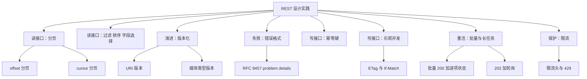
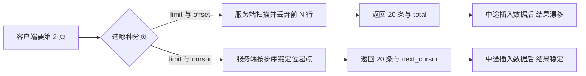
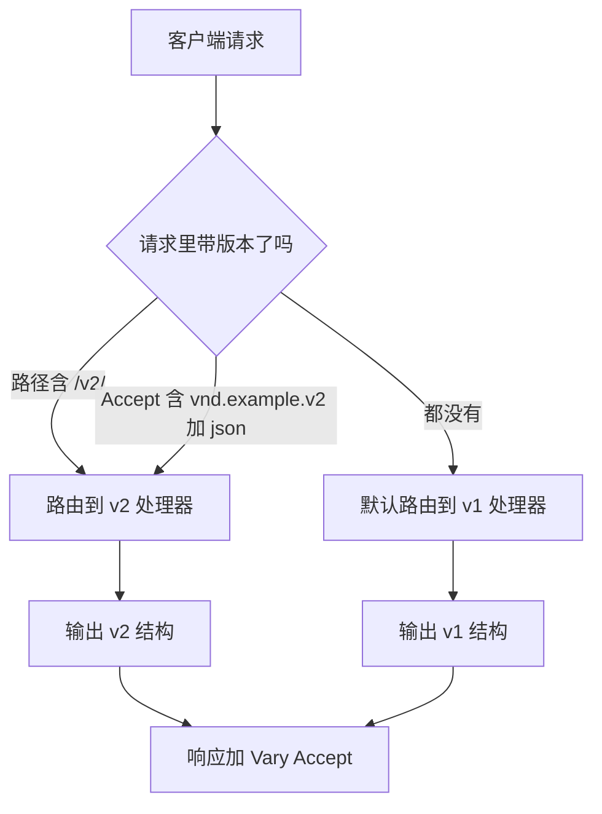
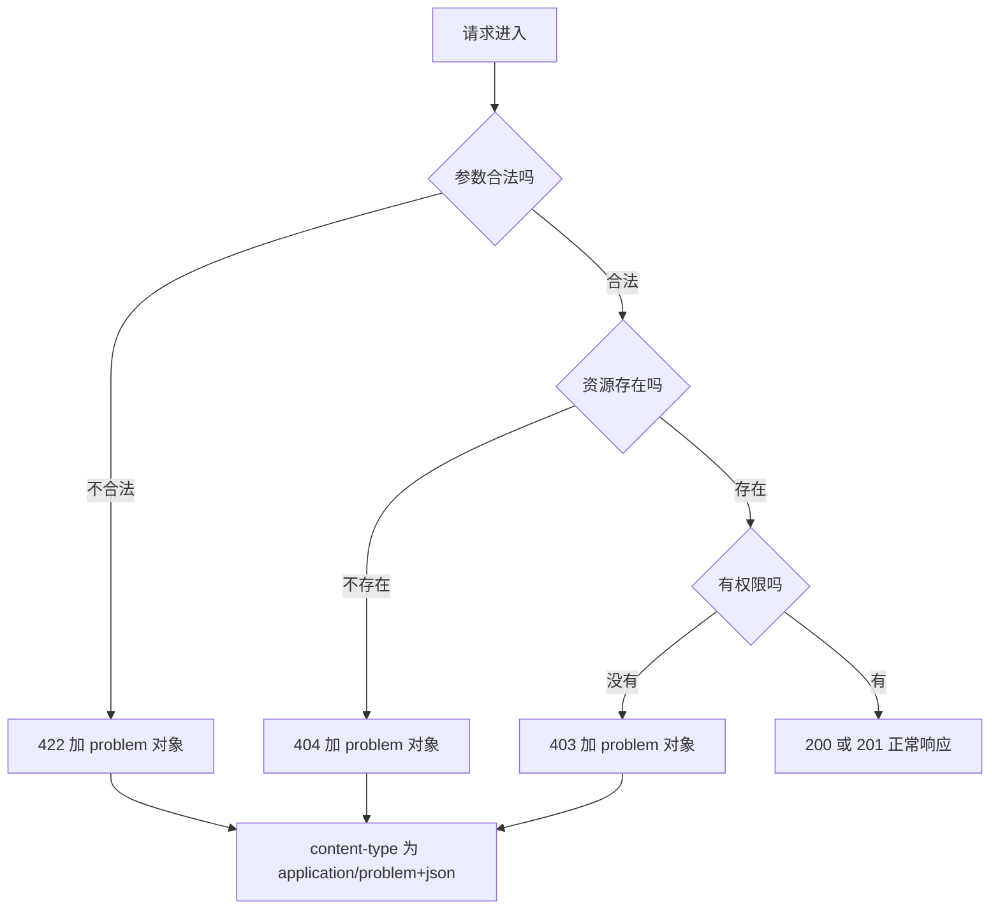
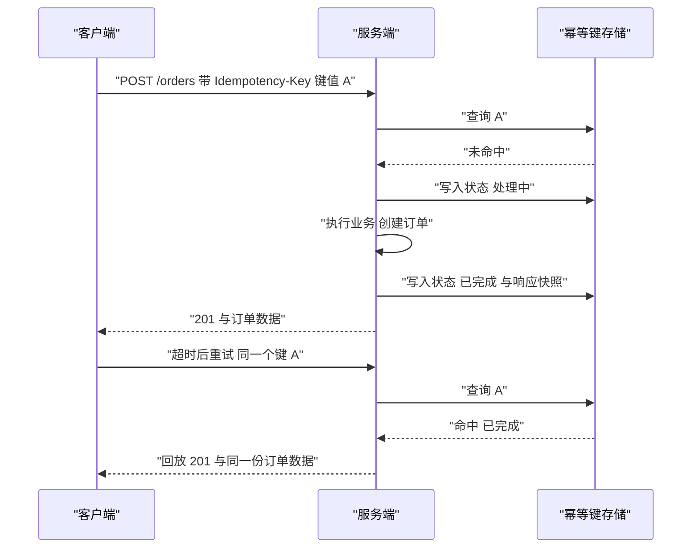
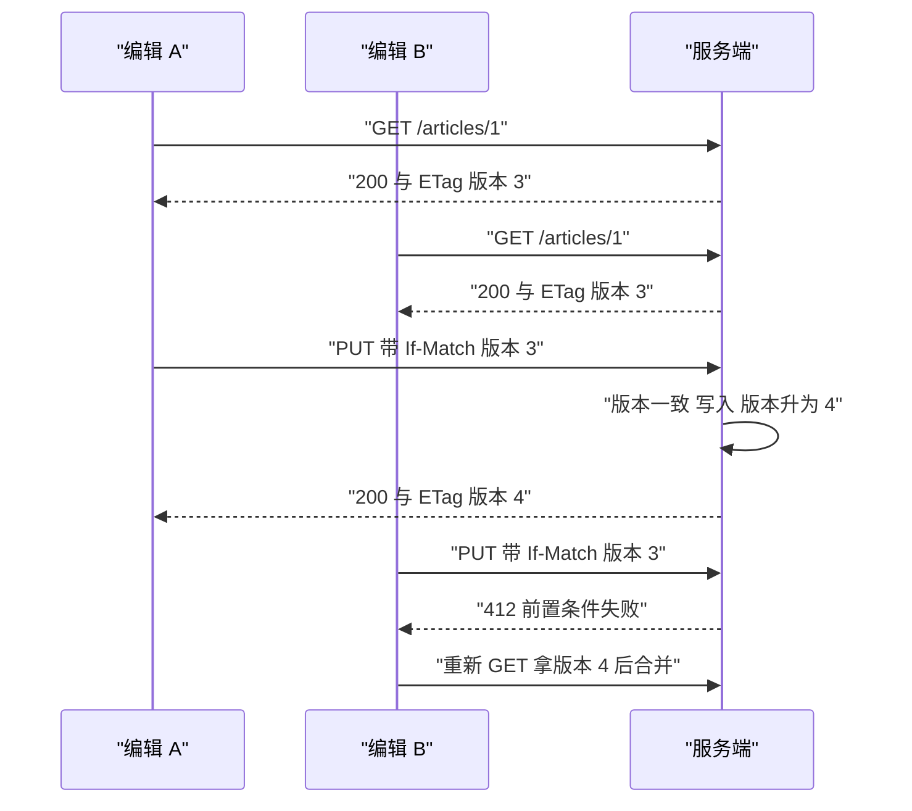
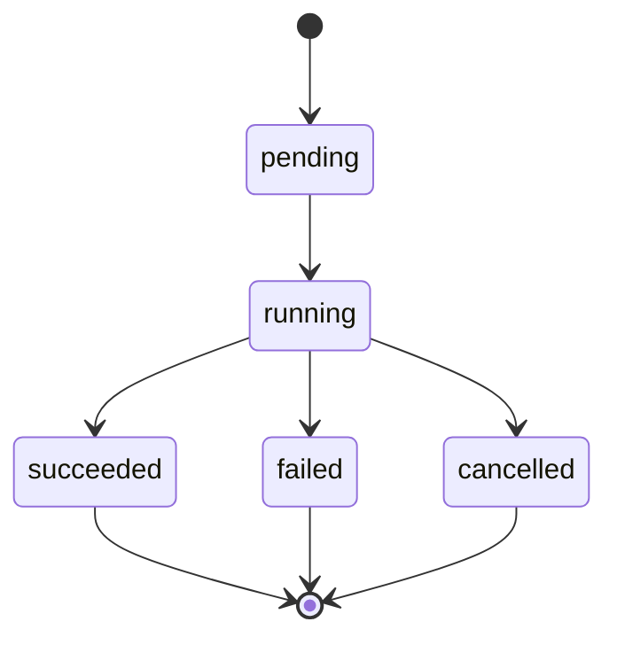
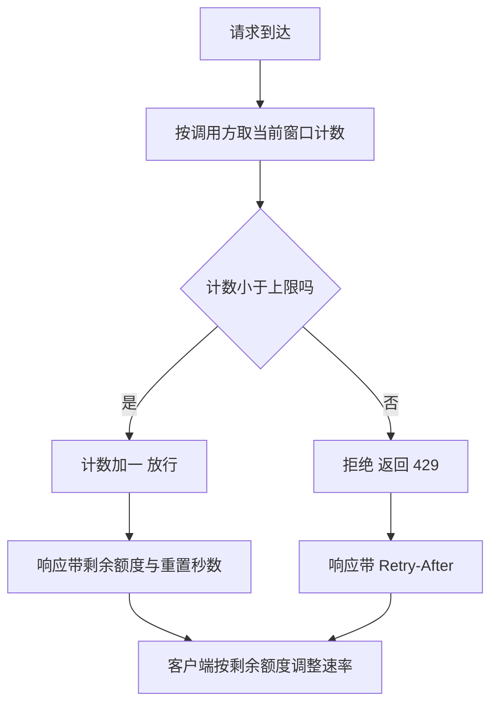

# REST 设计实践：分页、过滤、版本、错误与幂等

!!! abstract "学完这一页你能"

    - 写出 offset 与 cursor 两套分页接口，并说清各自在什么数据规模下会出现重复行。
    - 用查询参数实现过滤、排序、稀疏字段集，并给出一套固定的参数命名规则。
    - 为同一份资源同时提供 URI 版本与媒体类型版本，并说出各自的运维代价。
    - 用 RFC 9457 输出错误、用幂等键挡住重复提交、用 ETag 与 If-Match 挡住并发覆盖。

## 0. 知识地图



建议按 1 到 8 的顺序读：前两节只处理读接口，中间三节处理演进与失败，后面三节处理写接口与流量保护。每节末尾的脚本都能单独跑，跑通一节再进入下一节。若时间紧，先读 1、5、6 三节，它们最容易在真实项目里出事故。

## 1. 分页：offset 与 cursor

**先想一个问题**

商品列表有 25 万条。前端翻到第 900 页时，接口耗时 6 秒。运营同时在后台插入了 3 条置顶商品，用户翻页时看到同一条商品出现了两次。

**心智模型**

!!! tip "心智模型"

    一句话模型：分页就是「按固定顺序切一段出来，并告诉客户端从哪里接着切」。

    日常类比：offset 像是说「跳过前 500 个人，给我后面 20 个」；cursor 像是说「从编号 500 那位之后开始，给我 20 个」。队伍中途插人，前一种说法的结果会变，后一种不会。

    类比不成立的地方：cursor 只能单向读，且拿不到「总页数」；offset 能算总数，代价是每次都要数一遍。

**图解**



1. 客户端发起请求，两种分页用同一组 `limit`，区别只在定位参数。
2. offset 路线需要服务端从头扫描，丢弃前 N 行，N 越大扫描越多。
3. cursor 路线只比较排序键，用索引直接跳到起点。
4. offset 路线可以顺带算出 `total`，客户端据此渲染页码。
5. cursor 路线只返回 `next_cursor`，客户端只能「下一页」或「加载更多」。
6. 数据中途变化时，offset 路线会把已读行挤到下一页，造成重复；cursor 路线不会。

!!! note "术语：排序键（sort key）"

    排序键是决定分页顺序的那一列或多列，例如 `created_at` 加 `id`。

    例子：按 `(created_at, id)` 升序排，游标就存这一对值，`WHERE (created_at, id) > (上一页最后一行的值)`。

**一步一步来**

**第 1 步：先准备一份有稳定排序键的数据，写出 offset 分页**

```js
// 25 条商品，id 唯一且递增，作为稳定排序键
const items = Array.from({ length: 25 }, (_, i) => ({ id: i + 1, name: `item-${i + 1}` }));

// offset 分页：跳过 offset 条，再取 limit 条
function offsetPage(all, limit, offset) {
  const slice = all.slice(offset, offset + limit);           // 一次切片完成跳过与截断
  const hasMore = offset + slice.length < all.length;        // 还有剩余数据吗
  return { data: slice, total: all.length, next_offset: hasMore ? offset + slice.length : null };
}

console.log(offsetPage(items, 10, 0).data.length, offsetPage(items, 10, 0).total);
```

**这段代码在做什么**

- `Array.from` 生成 25 条数据，`id` 从 1 到 25。
- `slice(offset, offset + limit)` 同时完成「跳过」和「截断」两个动作。
- `total` 是当次查询命中的总条数，客户端用它算页数。
- `next_offset` 为 `null` 表示已经到最后一页。
- 换成 SQL，这一步就是 `LIMIT 10 OFFSET 0`。

运行结果：

```
10 25
```

**第 2 步：改成 cursor 分页，只携带「上一页最后一条的排序键」**

```js
// 游标编码为 URL 安全字符串，避免出现加号、斜杠、等号
const encodeCursor = (id) => Buffer.from(String(id), 'utf8').toString('base64url');
const decodeCursor = (c) => Number(Buffer.from(c, 'base64url').toString('utf8'));

function cursorPage(all, limit, cursor) {
  const after = cursor ? decodeCursor(cursor) : 0;                  // 没有游标就从最小键开始
  const rest = all.filter((it) => it.id > after);                   // 只留排序键大于起点的行
  const slice = rest.slice(0, limit);                               // 再取 limit 条
  const next = rest.length > limit ? encodeCursor(slice.at(-1).id) : null; // 有剩余才给下一页
  return { data: slice, next_cursor: next };
}

console.log(cursorPage(items, 10, null).next_cursor);
console.log(cursorPage(items, 10, encodeCursor(10)).data[0].id);
```

**这段代码在做什么**

- `encodeCursor` 用 `base64url`，输出里不含 `+`、`/`、`=`，可以直接放进查询串。
- `filter` 只比较排序键，不需要扫描并丢弃前 N 行。
- `next_cursor` 只在还有剩余数据时返回，最后一页返回 `null`。
- 第 2 页第一条的 `id` 是 11，说明它紧接第 1 页。
- 换成 SQL，这一步就是 `WHERE id > 10 ORDER BY id LIMIT 10`。

运行结果：

```
MTA
11
```

**第 3 步：制造「中途插入」，对比两套分页的结果**

```js
// 用户读完第 1 页后，运营在队首插入一条置顶商品
const afterInsert = [{ id: 0, name: 'pinned' }, ...items];

const offsetPage2 = offsetPage(afterInsert, 10, 10);   // 第 2 页，跳过 10 条
const cursorPage2 = cursorPage(afterInsert, 10, encodeCursor(10)); // 从 id 10 之后接着读

console.log('offset 第 2 页首条 id:', offsetPage2.data[0].id); // 被挤回 id 10
console.log('cursor 第 2 页首条 id:', cursorPage2.data[0].id); // 仍然是 id 11
```

**这段代码在做什么**

- 插入置顶项后，所有元素的下标整体后移一位。
- offset 第 2 页从下标 10 开始，取到的是原来的第 10 条，于是重复。
- cursor 第 2 页从 `id` 大于 10 开始，插入项 `id` 为 0，不影响结果。
- 这个对比就是线上「翻页出现重复行」的完整成因。

运行结果：

```
offset 第 2 页首条 id: 10
cursor 第 2 页首条 id: 11
```

**动手验证**

```js
// 依赖：无第三方依赖，Node 20 以上，保存为 paging.mjs 后执行 node paging.mjs
import http from 'node:http';
import assert from 'node:assert/strict';

const items = Array.from({ length: 25 }, (_, i) => ({ id: i + 1, name: `item-${i + 1}` }));
const encodeCursor = (id) => Buffer.from(String(id), 'utf8').toString('base64url');
const decodeCursor = (c) => Number(Buffer.from(c, 'base64url').toString('utf8'));

let store = items; // 可变数据源，稍后会插入一条

function offsetPage(all, limit, offset) {
  const slice = all.slice(offset, offset + limit);
  const hasMore = offset + slice.length < all.length;
  return { data: slice, total: all.length, next_offset: hasMore ? offset + slice.length : null };
}

function cursorPage(all, limit, cursor) {
  const after = cursor ? decodeCursor(cursor) : 0;
  const rest = all.filter((it) => it.id > after);
  const slice = rest.slice(0, limit);
  const next = rest.length > limit ? encodeCursor(slice.at(-1).id) : null;
  return { data: slice, next_cursor: next };
}

const server = http.createServer((req, res) => {
  const url = new URL(req.url, 'http://localhost');
  const limit = Math.min(Number(url.searchParams.get('limit') ?? 10), 100);
  const cursor = url.searchParams.get('cursor');
  const offset = Number(url.searchParams.get('offset') ?? 0);
  const body = cursor
    ? cursorPage(store, limit, cursor)
    : offsetPage(store, limit, offset);
  res.writeHead(200, { 'content-type': 'application/json' });
  res.end(JSON.stringify(body));
});

await new Promise((r) => server.listen(0, r));
const base = `http://127.0.0.1:${server.address().port}`;
const get = async (p) => (await fetch(base + p)).json();

// 1. offset 第一页
const o1 = await get('/items?limit=10&offset=0');
assert.equal(o1.data.length, 10);
assert.equal(o1.total, 25);
assert.equal(o1.next_offset, 10);

// 2. cursor 第一页与第二页首条严格衔接
const c1 = await get('/items?limit=10');
assert.equal(c1.data.at(-1).id, 10);
assert.equal(decodeCursor(c1.next_cursor), 10);
const c2 = await get(`/items?limit=10&cursor=${c1.next_cursor}`);
assert.equal(c2.data[0].id, 11);

// 3. 队首插入后，offset 第二页重复；cursor 第二页不重复
store = [{ id: 0, name: 'pinned' }, ...items];
const o2 = await get('/items?limit=10&offset=10');
assert.equal(o2.data[0].id, 10);                 // 与第一页最后一条重复
const c2b = await get(`/items?limit=10&cursor=${c1.next_cursor}`);
assert.equal(c2b.data[0].id, 11);                // 仍然正确
assert.equal(c2b.data.some((it) => it.id === 10), false);

// 4. 走到底后 next_cursor 为 null
let cursor = null;
let seen = 0;
do {
  const page = await get(`/items?limit=10${cursor ? `&cursor=${cursor}` : ''}`);
  seen += page.data.length;
  cursor = page.next_cursor;
} while (cursor);
assert.equal(seen, 26);                          // 25 条原始数据加 1 条插入数据

console.log('offset 第一页:', o1.data.length, '条, total =', o1.total);
console.log('cursor 第一页末条 id:', c1.data.at(-1).id);
console.log('插入后 offset 第二页首条 id:', o2.data[0].id, '(与第一页重复)');
console.log('插入后 cursor 第二页首条 id:', c2b.data[0].id, '(正确)');
console.log('全量遍历条数:', seen);

// 预期输出：
// offset 第一页: 10 条, total = 25
// cursor 第一页末条 id: 10
// 插入后 offset 第二页首条 id: 10 (与第一页重复)
// 插入后 cursor 第二页首条 id: 11 (正确)
// 全量遍历条数: 26
```

**常见坑**

| 现象 | 原因 | 怎么修 |
| --- | --- | --- |
| 翻页出现重复行或漏行 | 用非唯一列当排序键，或用了 offset | 排序键改成「唯一列加时间列」组合，并改用 cursor |
| 第 500 页接口耗时 6 秒 | 数据库要扫描并丢弃前 5000 行 | 索引加在排序键上，并对外提供 cursor 分页 |
| 游标里的数字被客户端改掉 | 游标是明文，客户端可伪造起点 | 对游标做 HMAC 签名，服务端校验后再使用 |
| 返回 `total` 后接口变慢 | 每次请求都跑一次 `COUNT(*)` | 改成估算值，或只在第一页返回 `total` |
| 升序接口给不出降序结果 | 游标只记住了「大于」这一个方向 | 把排序方向一起编码进游标，服务端按方向选比较符 |

**小结**

- offset 用「跳过多少行」定位，能算总数，但深翻页慢且会漂移。
- cursor 用「排序键大于某值」定位，结果稳定，代价是不能跳页。
- 排序键必须唯一，游标必须签名，这是两套分页都要守的底线。

## 2. 过滤、排序与字段选择

**先想一个问题**

订单列表接口要同时支持「状态为已支付」「按金额降序」「只要订单号和金额」。前端把三个需求压成一个请求，服务端需要一套统一的参数写法。

**心智模型**

!!! tip "心智模型"

    一句话模型：过滤是选行，排序是排行，字段选择是选列。

    日常类比：像在表格软件里操作，先勾条件筛掉不要的行，再点列头排序，最后把不要的列隐藏起来。

    类比不成立的地方：表格软件在本地操作全量数据；接口要在服务端做这三件事，所以参数必须能被翻译成查询语句，不能让客户端传表达式。

**图解**


1. 从全量行开始，这一层由数据库承担。
2. 过滤条件用等值或范围比较，缩小结果集。
3. 排序必须发生在分页之前，否则每页的顺序不一致。
4. 字段选择只影响返回的列，不影响 `WHERE` 与 `ORDER BY`。
5. 分页最后执行，作用在已经排好序的结果上。
6. 服务端返回 20 行，每行只含客户端要的列。

!!! note "术语：稀疏字段集（sparse fieldset）"

    稀疏字段集指客户端只请求资源的部分字段，用参数 `fields` 指定。

    例子：`GET /orders?fields=id,amount` 返回的对象里只有 `id` 和 `amount` 两个键。

**一步一步来**

**第 1 步：约定参数命名规则**

```js
// 规则一：过滤参数直接用字段名，不额外加 filter 前缀
// 规则二：排序参数统一叫 sort，值为逗号分隔的字段，前缀减号表示降序
// 规则三：字段选择参数统一叫 fields，逗号分隔
const RULES = {
  filter: '字段名=值，范围用 created_at_gte 这种后缀',
  sort: 'sort=-amount,created_at',
  fields: 'fields=id,amount',
};
console.log(Object.values(RULES).length, '条规则');
```

**这段代码在做什么**

- 把命名规则写成对象，方便团队内评审和文档化。
- 过滤不加前缀，是为了让参数名与字段名一一对应。
- 排序用 `-` 前缀表达降序，避免 `order=desc&sort_by=amount` 这种双参数。
- 字段选择单独一个参数，便于和分页参数并存。
- 命名规则一旦发布，就不能随意改，客户端会依赖它。

运行结果：

```
3 条规则
```

**第 2 步：把查询串解析成查询计划**

```js
const ALLOWED_SORT = new Set(['created_at', 'amount']);   // 允许排序的白名单
const ALLOWED_FIELDS = new Set(['id', 'amount', 'status', 'created_at']); // 允许返回的列

export function parseQuery(searchParams) {
  const plan = { filter: [], sort: [], fields: null };
  for (const [key, value] of searchParams) {
    if (key === 'sort') {
      plan.sort = value.split(',').map((s) => {
        const desc = s.startsWith('-');                     // 减号代表降序
        const col = desc ? s.slice(1) : s;
        if (!ALLOWED_SORT.has(col)) throw new Error(`不允许排序: ${col}`);
        return { column: col, direction: desc ? 'desc' : 'asc' };
      });
    } else if (key === 'fields') {
      const cols = value.split(',');
      const bad = cols.filter((c) => !ALLOWED_FIELDS.has(c)); // 每个列名都要过白名单
      if (bad.length) throw new Error(`不允许的字段: ${bad.join(',')}`);
      plan.fields = cols;
    } else {
      plan.filter.push({ column: key, value });                // 其余参数都当过滤条件
    }
  }
  return plan;
}
```

**这段代码在做什么**

- `ALLOWED_SORT` 与 `ALLOWED_FIELDS` 是白名单，挡住客户端传任意列名。
- `sort` 值按逗号切分，每个片段判断是否有 `-` 前缀。
- `fields` 逐列校验，任意一列不在白名单就整单拒绝。
- 其他参数进入 `filter` 数组，交给下一步生成条件。
- 抛错时不区分「列不存在」与「列不允许」，避免泄露表结构。

运行结果：

```
（无输出，解析结果由下一步打印）
```

**第 3 步：执行计划并返回稀疏字段**

```js
const rows = [
  { id: 1, amount: 30, status: 'paid', created_at: '2024-01-01' },
  { id: 2, amount: 10, status: 'paid', created_at: '2024-01-02' },
  { id: 3, amount: 20, status: 'pending', created_at: '2024-01-03' },
];

function run(rows, plan) {
  let out = rows.filter((r) => plan.filter.every((f) => String(r[f.column]) === f.value));
  for (const s of [...plan.sort].reverse()) {                 // 从最后一个排序键往前排，保证稳定
    out = out.sort((a, b) => {
      const dir = s.direction === 'desc' ? -1 : 1;
      return a[s.column] > b[s.column] ? dir : a[s.column] < b[s.column] ? -dir : 0;
    });
  }
  if (plan.fields) out = out.map((r) => Object.fromEntries(plan.fields.map((c) => [c, r[c]])));
  return out;
}

console.log(JSON.stringify(run(rows, parseQuery(new URLSearchParams('status=paid&sort=-amount&fields=id,amount')))));
```

**这段代码在做什么**

- `filter` 逐个条件比对，字符串化后再比较，避免类型不一致。
- 多键排序从最后一个键开始排，让第一个键成为主序。
- `Object.fromEntries` 按 `fields` 顺序重建对象，只留指定列。
- 过滤和排序用的是完整行，字段选择放在最后，所以不会影响排序结果。

运行结果：

```
[{"id":1,"amount":30},{"id":2,"amount":10}]
```

**动手验证**

```js
// 依赖：无第三方依赖，Node 20 以上，保存为 query.mjs 后执行 node query.mjs
import http from 'node:http';
import assert from 'node:assert/strict';

const ALLOWED_SORT = new Set(['created_at', 'amount']);
const ALLOWED_FIELDS = new Set(['id', 'amount', 'status', 'created_at']);
const rows = [
  { id: 1, amount: 30, status: 'paid', created_at: '2024-01-01' },
  { id: 2, amount: 10, status: 'paid', created_at: '2024-01-02' },
  { id: 3, amount: 20, status: 'pending', created_at: '2024-01-03' },
];

function parseQuery(searchParams) {
  const plan = { filter: [], sort: [], fields: null };
  for (const [key, value] of searchParams) {
    if (key === 'sort') {
      plan.sort = value.split(',').map((s) => {
        const desc = s.startsWith('-');
        const col = desc ? s.slice(1) : s;
        if (!ALLOWED_SORT.has(col)) throw new Error(`不允许排序: ${col}`);
        return { column: col, direction: desc ? 'desc' : 'asc' };
      });
    } else if (key === 'fields') {
      const cols = value.split(',');
      const bad = cols.filter((c) => !ALLOWED_FIELDS.has(c));
      if (bad.length) throw new Error(`不允许的字段: ${bad.join(',')}`);
      plan.fields = cols;
    } else {
      plan.filter.push({ column: key, value });
    }
  }
  return plan;
}

function run(rows, plan) {
  let out = rows.filter((r) => plan.filter.every((f) => String(r[f.column]) === f.value));
  for (const s of [...plan.sort].reverse()) {
    out = out.sort((a, b) => {
      const dir = s.direction === 'desc' ? -1 : 1;
      return a[s.column] > b[s.column] ? dir : a[s.column] < b[s.column] ? -dir : 0;
    });
  }
  if (plan.fields) out = out.map((r) => Object.fromEntries(plan.fields.map((c) => [c, r[c]])));
  return out;
}

const server = http.createServer((req, res) => {
  const url = new URL(req.url, 'http://localhost');
  try {
    const plan = parseQuery(url.searchParams);
    const data = run(rows, plan);
    res.writeHead(200, { 'content-type': 'application/json' });
    res.end(JSON.stringify({ data, plan }));
  } catch (err) {
    res.writeHead(400, { 'content-type': 'application/problem+json' });
    res.end(JSON.stringify({ type: 'about:blank', title: err.message, status: 400 }));
  }
});

await new Promise((r) => server.listen(0, r));
const base = `http://127.0.0.1:${server.address().port}`;
const get = async (p) => {
  const r = await fetch(base + p);
  return { status: r.status, body: await r.json() };
};

// 1. 过滤加排序
const a = await get('/orders?status=paid&sort=-amount');
assert.equal(a.status, 200);
assert.deepEqual(a.body.data.map((r) => r.id), [1, 2]);

// 2. 稀疏字段集
const b = await get('/orders?fields=id,amount');
assert.deepEqual(Object.keys(b.body.data[0]), ['id', 'amount']);

// 3. 多键排序：先按 status 升序，再按 amount 降序
const c = await get('/orders?sort=status,-amount');
assert.deepEqual(c.body.data.map((r) => r.id), [1, 3, 2]);

// 4. 白名单外的排序字段被拒绝
const d = await get('/orders?sort=password');
assert.equal(d.status, 400);
assert.equal(d.body.status, 400);

// 5. 白名单外的返回字段被拒绝
const e = await get('/orders?fields=id,password');
assert.equal(e.status, 400);

console.log('过滤加排序:', a.body.data.map((r) => r.id).join(','));
console.log('稀疏字段:', Object.keys(b.body.data[0]).join(','));
console.log('多键排序:', c.body.data.map((r) => r.id).join(','));
console.log('非法排序字段状态码:', d.status);
console.log('非法返回字段状态码:', e.status);

// 预期输出：
// 过滤加排序: 1,2
// 稀疏字段: id,amount
// 多键排序: 1,3,2
// 非法排序字段状态码: 400
// 非法返回字段状态码: 400
```

**常见坑**

| 现象 | 原因 | 怎么修 |
| --- | --- | --- |
| 客户端传 `sort=drop table` 也能通过 | 排序字段没有白名单，直接拼进查询 | 建白名单集合，不合法就返回 400 |
| 分页后每页顺序都不一样 | 排序发生在分页之后，或排序键不唯一 | 排序键补上唯一列，在数据库里先 `ORDER BY` 再 `LIMIT` |
| 稀疏字段集导致前端白屏 | 前端依赖某个没请求的字段 | 把最小字段集写进接口文档，服务端固定返回 `id` |
| 多键排序结果与预期不符 | 只排了一次，后面的键覆盖前面的键 | 从最后一个排序键开始，逐个稳定排序 |
| 过滤参数名与字段名不一致 | 团队各写各的，出现 `status_eq` 与 `state` | 在接口规范里固定命名，代码评审时检查 |

**小结**

- 过滤选行、排序排行、字段选择选列，三者顺序不能颠倒。
- 所有涉及列名的参数都要过白名单，否则等于把查询能力交给客户端。
- 稀疏字段集会缩小响应体积，同时要求服务端固定返回最小字段集。

## 3. 版本化策略

**先想一个问题**

上一版接口把用户邮箱放在顶层 `email`。新版要改成 `contact.email`。老客户端还在线上跑，你不能让它直接报错。

**心智模型**

!!! tip "心智模型"

    一句话模型：版本化是给同一份资源的两种表示各发一个地址，并约定老地址的退役日期。

    日常类比：像同一本书的精装版与平装版共用一个书名，封面印着不同的版次，读者按版次买。

    类比不成立的地方：书可以两版同时在售几十年；接口的老版本有维护成本，必须设定下线日期。

**图解**



1. 请求先看路径，路径里的版本优先级最高。
2. 路径没有版本时，再看 `Accept` 头里的媒体类型版本。
3. 两者都没有，落到默认版本，通常是当前稳定版。
4. 两个版本各有自己的序列化函数，业务逻辑尽量共用。
5. 响应带 `Vary: Accept`，告诉缓存服务器按 `Accept` 分流。
6. 客户端拿到的结构由命中的版本决定，不会出现混合结构。

!!! note "术语：媒体类型版本（media type versioning）"

    媒体类型版本把版本号写进 `Accept` 头的自定义类型里，而不是写进 URL。

    例子：`Accept: application/vnd.example.v2+json` 请求第二版表示，URL 仍然是 `/users`。

**一步一步来**

**第 1 步：为每个版本写一个序列化函数**

```js
const users = [{ id: 1, name: 'Ada', email: 'ada@example.com' }];

// v1 把邮箱作为顶层字段返回
const v1User = (u) => ({ id: u.id, name: u.name, email: u.email });

// v2 把字段分组，name 进入 profile，email 进入 contact
const v2User = (u) => ({ id: u.id, profile: { display_name: u.name }, contact: { email: u.email } });

console.log(Object.keys(v1User(users[0])).join(','), '|', Object.keys(v2User(users[0])).join(','));
```

**这段代码在做什么**

- 版本差异全部集中在序列化函数里，不散落在业务代码中。
- v1 保持扁平结构，v2 引入 `profile` 与 `contact` 两个分组。
- 两个函数都接收同一个内部对象 `u`，所以数据库层不用改。
- 内部字段名与对外字段名解耦，改对外结构不影响存储。

运行结果：

```
id,name,email | id,profile,contact
```

**第 2 步：在路由层做版本判定**

```js
function pickVersion(pathname, acceptHeader) {
  if (pathname.startsWith('/v2/')) return 'v2';                 // 路径版本最优先
  if (acceptHeader.includes('application/vnd.example.v2+json')) return 'v2'; // 媒体类型版本
  if (acceptHeader.includes('application/vnd.example.v1+json')) return 'v1';
  return 'v1';                                                  // 默认版本
}

console.log(pickVersion('/v1/users', ''));
console.log(pickVersion('/users', 'application/vnd.example.v2+json'));
```

**这段代码在做什么**

- 路径前缀判定放在第一位，方便在网关层直接分流。
- `Accept` 里用 `includes` 做子串匹配，容忍客户端附加 `;q=0.9` 之类的参数。
- 默认版本设为 v1，保证老客户端不带任何版本信息时仍然可用。
- 判定函数是纯函数，方便单测覆盖全部组合。

运行结果：

```
v1
v2
```

**第 3 步：给响应加 `Vary` 与弃用提示**

```js
function headersFor(version) {
  const headers = {
    'content-type': 'application/json',
    vary: 'Accept',                                   // 缓存要按 Accept 分流
    'x-api-version': version,                         // 回显命中的版本，便于排查
  };
  if (version === 'v1') {
    headers.deprecation = 'true';                     // 告知该版本已进入弃用期
    headers.link = '</v2/users>; rel="successor-version"'; // 指出后继版本的位置
  }
  return headers;
}

console.log(JSON.stringify(headersFor('v1')));
```

**这段代码在做什么**

- `Vary: Accept` 让 CDN 与浏览器按 `Accept` 分别缓存，避免串版本。
- `x-api-version` 是自定义的排查字段，回显服务端命中的版本。
- `Deprecation` 头标记该版本进入弃用期。
- `Link` 头的 `rel="successor-version"` 指出后继版本的地址。
- 需核对官方文档：确认 `Deprecation` 头当前是 RFC 9745 还是仍在草案阶段。

运行结果：

```
{"content-type":"application/json","vary":"Accept","x-api-version":"v1","deprecation":"true","link":"</v2/users>; rel=\"successor-version\""}
```

**动手验证**

```js
// 依赖：无第三方依赖，Node 20 以上，保存为 versioning.mjs 后执行 node versioning.mjs
import http from 'node:http';
import assert from 'node:assert/strict';

const users = [{ id: 1, name: 'Ada', email: 'ada@example.com' }];
const v1User = (u) => ({ id: u.id, name: u.name, email: u.email });
const v2User = (u) => ({ id: u.id, profile: { display_name: u.name }, contact: { email: u.email } });

function pickVersion(pathname, acceptHeader) {
  if (pathname.startsWith('/v2/')) return 'v2';
  if (acceptHeader.includes('application/vnd.example.v2+json')) return 'v2';
  if (acceptHeader.includes('application/vnd.example.v1+json')) return 'v1';
  return 'v1';
}

const server = http.createServer((req, res) => {
  const url = new URL(req.url, 'http://localhost');
  const version = pickVersion(url.pathname, req.headers.accept ?? '');
  const headers = {
    'content-type': version === 'v2' ? 'application/vnd.example.v2+json' : 'application/vnd.example.v1+json',
    vary: 'Accept',
    'x-api-version': version,
  };
  if (version === 'v1') {
    headers.deprecation = 'true';
    headers.link = '</v2/users>; rel="successor-version"';
  }
  const data = version === 'v2' ? users.map(v2User) : users.map(v1User);
  res.writeHead(200, headers);
  res.end(JSON.stringify({ data, version }));
});

await new Promise((r) => server.listen(0, r));
const base = `http://127.0.0.1:${server.address().port}`;
const call = async (p, accept) => {
  const r = await fetch(base + p, { headers: accept ? { accept } : {} });
  return { status: r.status, headers: r.headers, body: await r.json() };
};

// 1. 路径版本
const a = await call('/v1/users');
assert.equal(a.body.version, 'v1');
assert.deepEqual(Object.keys(a.body.data[0]), ['id', 'name', 'email']);
assert.equal(a.headers.get('deprecation'), 'true');
assert.equal(a.headers.get('vary'), 'Accept');

// 2. 路径版本 v2
const b = await call('/v2/users');
assert.equal(b.body.version, 'v2');
assert.deepEqual(Object.keys(b.body.data[0]), ['id', 'profile', 'contact']);

// 3. 媒体类型版本
const c = await call('/users', 'application/vnd.example.v2+json');
assert.equal(c.body.version, 'v2');

// 4. 默认版本
const d = await call('/users');
assert.equal(d.body.version, 'v1');
assert.equal(d.headers.get('link'), '</v2/users>; rel="successor-version"');

console.log('v1 字段:', Object.keys(a.body.data[0]).join(','));
console.log('v2 字段:', Object.keys(b.body.data[0]).join(','));
console.log('媒体类型命中版本:', c.body.version);
console.log('默认版本:', d.body.version);
console.log('v1 弃用提示:', a.headers.get('deprecation'));

// 预期输出：
// v1 字段: id,name,email
// v2 字段: id,profile,contact
// 媒体类型命中版本: v2
// 默认版本: v1
// v1 弃用提示: true
```

**常见坑**

| 现象 | 原因 | 怎么修 |
| --- | --- | --- |
| CDN 缓存串版本 | 响应没带 `Vary: Accept` | 媒体类型版本必须加 `Vary`，路径版本可省 |
| 老客户端永远收不到新结构 | 默认版本一直停在 v1，且没有弃用时间 | 设定具体下线日期，并用 `Deprecation` 与 `Link` 头提示 |
| 业务逻辑复制两份，改一处漏一处 | 版本判定写进了业务代码 | 只在路由层判定版本，业务用统一内部模型 |
| 客户端同时带路径版本与媒体类型版本 | 两个来源冲突，服务端行为不确定 | 明确路径优先，并在文档里写死这条规则 |
| 每个小改动都发新版本 | 把加字段也当成破坏性变更 | 加字段算兼容变更，只有删改字段或改语义才发新版本 |

**小结**

- 路径版本便于网关分流与排查，媒体类型版本保持 URL 干净，代价是需要 `Vary`。
- 版本差异收敛到序列化函数，业务逻辑只保留一份。
- 任何版本都要写清下线日期，没有退役计划的版本会永久占用维护人力。

## 4. 错误格式：RFC 9457 problem details

**先想一个问题**

四个接口分别返回 `{"msg":"失败"}`、`{"error":"bad"}`、`{"code":1001}`、纯文本 `failed`。前端每接一个接口就要写一套错误分支。

**心智模型**

!!! tip "心智模型"

    一句话模型：错误响应也是一个有固定字段的资源，客户端按字段读，不按文案猜。

    日常类比：像快递面单，面单上有固定的收件人栏、单号栏、异常原因栏，各家快递格式一致，扫码枪才能统一识别。

    类比不成立的地方：面单只有一种语言；错误响应允许服务端追加自定义字段，客户端要按需读取。

**图解**



1. 请求依次经过参数校验、资源查找、权限检查三道关。
2. 任意一关失败，都返回同一个结构，只是 `status` 与 `title` 不同。
3. 所有错误响应的 `Content-Type` 都是 `application/problem+json`。
4. 客户端只需要读 `status`、`title`、`detail` 三个字段就能展示错误。
5. 业务方需要的额外信息放进扩展字段，例如 `errors` 数组。
6. 正常的 200 与 201 响应结构不变，错误结构只出现在 4xx 与 5xx。

!!! note "术语：Problem Details"

    Problem Details 是 RFC 9457 定义的一种错误响应格式，取代了 RFC 7807。

    例子：`{"type":"https://example.com/probs/out-of-credit","title":"余额不足","status":403,"detail":"当前余额 30，需要 50","instance":"/orders/7"}`。

**一步一步来**

**第 1 步：定义标准字段与扩展字段**

```js
// RFC 9457 定义的五个标准字段，全部可选，但建议至少给 title 与 status
const BASE = ['type', 'title', 'status', 'detail', 'instance'];

// type 是标识错误种类的 URI，取 about:blank 表示「没有更具体的种类」
const OUT_OF_STOCK = 'https://example.com/probs/out-of-stock';

const problem = {
  type: OUT_OF_STOCK,
  title: '库存不足',      // 人类可读的简短描述，同一 type 保持不变
  status: 409,           // 必须与 HTTP 状态行一致
  detail: '商品 42 只剩 3 件，请求 10 件',
  instance: '/orders/7', // 本次错误对应的具体请求路径
};

console.log(Object.keys(problem).length, BASE.length);
```

**这段代码在做什么**

- `type` 是错误种类的稳定标识，客户端可以按它做分支。
- `title` 描述错误种类，同一 `type` 下文案固定，方便翻译。
- `detail` 描述这一次的具体情况，可以包含数字。
- `status` 必须与 HTTP 状态行一致，否则代理与日志会混乱。
- `instance` 指向本次请求，便于在日志里定位。

运行结果：

```
5 5
```

**第 2 步：加扩展字段表达字段级错误**

```js
function validationProblem(issues, instance) {
  return {
    type: 'https://example.com/probs/validation',
    title: '请求参数校验失败',
    status: 422,
    detail: `${issues.length} 个字段不合法`,
    instance,
    errors: issues.map((i) => ({ pointer: i.pointer, message: i.message })), // 扩展字段
  };
}

console.log(JSON.stringify(validationProblem(
  [{ pointer: '/amount', message: '必须大于 0' }],
  '/orders',
)));
```

**这段代码在做什么**

- `errors` 是自定义扩展字段，RFC 9457 允许在标准字段之外追加。
- 每个条目用 `pointer` 指向出错的具体位置，格式为 JSON Pointer。
- `detail` 汇总错误数量，避免客户端自己数。
- 扩展字段名不能与五个标准字段重名，否则解析会歧义。

运行结果：

```
{"type":"https://example.com/probs/validation","title":"请求参数校验失败","status":422,"detail":"1 个字段不合法","instance":"/orders","errors":[{"pointer":"/amount","message":"必须大于 0"}]}
```

**第 3 步：统一出口，保证所有错误走同一个格式**

```js
function sendProblem(res, problem) {
  res.writeHead(problem.status, {
    'content-type': 'application/problem+json',   // 固定媒体类型
    'cache-control': 'no-store',                  // 错误不缓存
  });
  res.end(JSON.stringify(problem));
}

// 兜底：未捕获异常也要转成 problem 对象，而不是默认 HTML 错误页
function toProblem(err, instance) {
  if (err.status) return { type: 'about:blank', title: err.message, status: err.status, instance };
  return { type: 'about:blank', title: '服务器内部错误', status: 500, instance };
}

console.log(toProblem(new Error('boom'), '/orders').status);
```

**这段代码在做什么**

- `sendProblem` 是唯一出口，避免某个分支忘了设置 `Content-Type`。
- `cache-control: no-store` 防止错误响应被缓存后反复返回。
- `toProblem` 兜底处理未预期异常，对外只给 500 与通用文案。
- 内部异常堆栈写进日志，不写进响应体，避免泄露实现细节。
- 带 `status` 的错误按原状态码返回，其余一律 500。

运行结果：

```
500
```

**动手验证**

```js
// 依赖：无第三方依赖，Node 20 以上，保存为 problem.mjs 后执行 node problem.mjs
import http from 'node:http';
import assert from 'node:assert/strict';

const BASE_FIELDS = ['type', 'title', 'status', 'detail', 'instance'];

function sendProblem(res, problem) {
  res.writeHead(problem.status, {
    'content-type': 'application/problem+json',
    'cache-control': 'no-store',
  });
  res.end(JSON.stringify(problem));
}

function validationProblem(issues, instance) {
  return {
    type: 'https://example.com/probs/validation',
    title: '请求参数校验失败',
    status: 422,
    detail: `${issues.length} 个字段不合法`,
    instance,
    errors: issues.map((i) => ({ pointer: i.pointer, message: i.message })),
  };
}

function toProblem(err, instance) {
  if (err.status) return { type: 'about:blank', title: err.message, status: err.status, instance };
  return { type: 'about:blank', title: '服务器内部错误', status: 500, instance };
}

const server = http.createServer(async (req, res) => {
  const url = new URL(req.url, 'http://localhost');
  if (url.pathname !== '/orders') {
    return sendProblem(res, { type: 'about:blank', title: '资源不存在', status: 404, instance: url.pathname });
  }
  const chunks = [];
  for await (const c of req) chunks.push(c);
  let body = {};
  try {
    body = chunks.length ? JSON.parse(Buffer.concat(chunks).toString('utf8')) : {};
  } catch {
    return sendProblem(res, { type: 'about:blank', title: 'JSON 解析失败', status: 400, instance: url.pathname });
  }
  const issues = [];
  if (typeof body.amount !== 'number' || body.amount <= 0) issues.push({ pointer: '/amount', message: '必须大于 0' });
  if (!body.sku) issues.push({ pointer: '/sku', message: '不能为空' });
  if (issues.length) return sendProblem(res, validationProblem(issues, url.pathname));
  res.writeHead(201, { 'content-type': 'application/json' });
  res.end(JSON.stringify({ data: { id: 1, ...body } }));
});

await new Promise((r) => server.listen(0, r));
const base = `http://127.0.0.1:${server.address().port}`;
const post = async (p, payload) => {
  const r = await fetch(base + p, {
    method: 'POST',
    headers: { 'content-type': 'application/json' },
    body: payload === undefined ? undefined : JSON.stringify(payload),
  });
  const text = await r.text();
  let parsed = null;
  try { parsed = JSON.parse(text); } catch { parsed = text; }
  return { status: r.status, contentType: r.headers.get('content-type'), body: parsed };
};

// 1. 校验失败返回 422 与 problem 对象
const a = await post('/orders', { sku: '', amount: -1 });
assert.equal(a.status, 422);
assert.match(a.contentType, /application\/problem\+json/);
for (const f of BASE_FIELDS) assert.ok(f in a.body, `缺少标准字段 ${f}`);
assert.equal(a.body.status, 422);
assert.equal(a.body.errors.length, 2);
assert.equal(a.body.errors[0].pointer, '/amount');

// 2. 找不到资源返回 404
const b = await post('/nope', {});
assert.equal(b.status, 404);
assert.equal(b.body.title, '资源不存在');

// 3. 非法 JSON 返回 400
const badJson = await fetch(base + '/orders', { method: 'POST', body: '{' });
assert.equal(badJson.status, 400);

// 4. 正常请求不受影响
const c = await post('/orders', { sku: 'A1', amount: 10 });
assert.equal(c.status, 201);
assert.equal(c.body.data.sku, 'A1');

// 5. 内部异常兜底成 500
assert.equal(toProblem(new Error('boom'), '/orders').status, 500);

console.log('校验失败:', a.status, a.contentType);
console.log('缺失字段数:', a.body.errors.length);
console.log('404 标题:', b.body.title);
console.log('非法 JSON:', badJson.status);
console.log('正常创建:', c.status);

// 预期输出：
// 校验失败: 422 application/problem+json
// 缺失字段数: 2
// 404 标题: 资源不存在
// 非法 JSON: 400
// 正常创建: 201
```

**常见坑**

| 现象 | 原因 | 怎么修 |
| --- | --- | --- |
| 前端仍要按接口写分支 | 只改了文案，没有统一的 `type` 与 `status` | 为每类错误分配固定的 `type` URI |
| 代理与日志里的状态码不一致 | 响应体里的 `status` 与 HTTP 状态行不同 | 生成 problem 时用状态行同一个变量 |
| 堆栈信息被外部看到 | 直接把异常对象序列化后返回 | 对外只返回通用文案，堆栈写日志 |
| 错误响应被 CDN 缓存 | 缺少缓存控制 | 加 `cache-control: no-store` |
| 客户端解析失败 | `Content-Type` 写成了 `application/json` | 固定写 `application/problem+json` |

**小结**

- 错误响应也是资源，标准字段给机器读，`detail` 给人读。
- 自定义信息放进扩展字段，不要挤进 `title`。
- 所有错误从一个出口发出，`Content-Type` 与状态码才不会漂。

## 5. 幂等键

**先想一个问题**

用户点「提交订单」，网络超时，前端自动重试一次。服务端收到两次相同请求，创建了两张订单，用户被扣两次钱。

**心智模型**

!!! tip "心智模型"

    一句话模型：客户端给这次操作取一个唯一名字，服务端记住这个名字对应的响应，重试时直接回放。

    日常类比：像在柜台办业务时领一个号码，柜台看到同一个号码只会叫一次，重复来问就把上次的结果复述给你。

    类比不成立的地方：号码会过期；幂等键必须由客户端生成并在整个重试链条中保持不变，服务端还要处理「第一次还没算完」的情况。

**图解**



1. 客户端为这次业务操作生成一个键，通常用 UUID。
2. 服务端先查这个键是否已经存在。
3. 第一次未命中时，先写入「处理中」状态再执行，防止并发进来两次。
4. 业务执行完成后，把状态改为「已完成」并保存响应快照。
5. 客户端重试时带上同一个键，服务端直接回放快照。
6. 回放时要带上标记头，便于日志区分首次执行与重放。

!!! note "术语：幂等（idempotent）"

    幂等指同一个请求执行一次与执行多次，最终服务端状态相同。

    例子：`PUT /users/1` 覆盖写入是幂等的；`POST /orders` 每次创建新订单不是幂等的，需要幂等键辅助。

**一步一步来**

**第 1 步：约定键的传递方式与作用范围**

```js
const CONVENTION = {
  header: 'Idempotency-Key',   // 用请求头传递，不放进请求体
  scope: '每个客户端 每个接口 每个键值', // 键只在同一接口内唯一
  ttl: '24 小时',              // 过期后同名键可以重新使用
  payloadMatch: '键相同但请求体不同时返回 409',
};
console.log(Object.keys(CONVENTION).join(','));
```

**这段代码在做什么**

- 用请求头传递，业务体保持不变，重试时可以原样重发。
- 键的作用范围限定在「客户端加接口」内，避免跨接口撞键。
- 设置过期时间，否则键表会无限增长。
- 键相同但请求体不同，说明客户端复用错误，返回 409 提示。
- 需核对官方文档：确认 `Idempotency-Key` 的字段名在 IETF 草案中的当前写法。

运行结果：

```
header,scope,ttl,payloadMatch
```

**第 2 步：用内存表保存键到响应的映射**

```js
import crypto from 'node:crypto';

const store = new Map();                 // 键到记录的映射
const hash = (body) => crypto.createHash('sha256').update(JSON.stringify(body)).digest('hex');

function remember(key, body, response) {
  store.set(key, {
    state: 'completed',                  // 处理中 或 已完成
    payloadHash: hash(body),             // 用来判断请求体是否一致
    response,                            // 响应快照，含状态码与响应体
  });
}

function lookup(key) {
  return store.get(key) ?? null;         // 没有记录返回 null
}

console.log(lookup('missing'));
```

**这段代码在做什么**

- `Map` 作为最小实现，生产环境要换成带过期时间的共享存储。
- `payloadHash` 记录请求体的摘要，用于判断重试是否带了不同内容。
- `response` 保存状态码与响应体，回放时原样返回。
- `state` 字段让服务端能区分「第一次还在处理」与「已经完成」。
- `lookup` 不抛异常，未命中返回 `null`，调用方自己判断。

运行结果：

```
null
```

**第 3 步：处理并发与请求体不一致**

```js
function beginOrReplay(key, body) {
  const existing = lookup(key);
  if (!existing) {
    store.set(key, { state: 'processing', payloadHash: hash(body), response: null }); // 先占位
    return { action: 'create' };
  }
  if (existing.payloadHash !== hash(body)) return { action: 'conflict' };   // 同一个键不同请求体
  if (existing.state === 'processing') return { action: 'in-progress' };    // 第一次还没算完
  return { action: 'replay', response: existing.response };                // 直接回放
}
```

**这段代码在做什么**

- 未命中时先写入 `processing` 占位，避免两个并发请求同时创建。
- 键相同但请求体不同，返回冲突，让客户端检查自己的键生成逻辑。
- 状态仍是 `processing` 时，说明首次请求尚未完成，客户端应稍后重试。
- 状态为 `completed` 时返回快照，状态码与响应体都与首次一致。
- 这四个分支覆盖了幂等键的全部状态转移。

运行结果：

```
（无输出，分支结果由完整脚本断言）
```

**动手验证**

```js
// 依赖：无第三方依赖，Node 20 以上，保存为 idempotency.mjs 后执行 node idempotency.mjs
import http from 'node:http';
import assert from 'node:assert/strict';
import crypto from 'node:crypto';

const store = new Map();
const orders = [];
const hash = (body) => crypto.createHash('sha256').update(JSON.stringify(body)).digest('hex');

function beginOrReplay(key, body) {
  const existing = store.get(key) ?? null;
  if (!existing) {
    store.set(key, { state: 'processing', payloadHash: hash(body), response: null });
    return { action: 'create' };
  }
  if (existing.payloadHash !== hash(body)) return { action: 'conflict' };
  if (existing.state === 'processing') return { action: 'in-progress' };
  return { action: 'replay', response: existing.response };
}

function sendProblem(res, status, title) {
  res.writeHead(status, { 'content-type': 'application/problem+json' });
  res.end(JSON.stringify({ type: 'about:blank', title, status }));
}

const server = http.createServer(async (req, res) => {
  const url = new URL(req.url, 'http://localhost');
  if (req.method !== 'POST' || url.pathname !== '/orders') return sendProblem(res, 404, '资源不存在');
  const key = req.headers['idempotency-key'];
  if (!key) return sendProblem(res, 400, '缺少 Idempotency-Key');
  const chunks = [];
  for await (const c of req) chunks.push(c);
  const body = JSON.parse(Buffer.concat(chunks).toString('utf8'));

  const decision = beginOrReplay(key, body);
  if (decision.action === 'conflict') return sendProblem(res, 409, '同一个幂等键的请求体不同');
  if (decision.action === 'in-progress') {
    res.writeHead(409, { 'content-type': 'application/problem+json' });
    return res.end(JSON.stringify({ type: 'about:blank', title: '首次请求仍在处理中', status: 409 }));
  }
  if (decision.action === 'replay') {
    res.writeHead(decision.response.status, {
      'content-type': 'application/json',
      'idempotent-replayed': 'true',
    });
    return res.end(JSON.stringify(decision.response.body));
  }

  const order = { id: orders.length + 1, sku: body.sku, amount: body.amount };
  orders.push(order);
  const response = { status: 201, body: { data: order } };
  store.set(key, { state: 'completed', payloadHash: hash(body), response });
  res.writeHead(201, { 'content-type': 'application/json' });
  res.end(JSON.stringify(response.body));
});

await new Promise((r) => server.listen(0, r));
const base = `http://127.0.0.1:${server.address().port}`;
const post = async (key, body) => {
  const r = await fetch(base + '/orders', {
    method: 'POST',
    headers: { 'content-type': 'application/json', ...(key ? { 'idempotency-key': key } : {}) },
    body: JSON.stringify(body),
  });
  return { status: r.status, replayed: r.headers.get('idempotent-replayed'), body: await r.json() };
};

const payload = { sku: 'A1', amount: 10 };

// 1. 缺少幂等键
const a = await post(undefined, payload);
assert.equal(a.status, 400);

// 2. 首次创建
const b = await post('key-1', payload);
assert.equal(b.status, 201);
assert.equal(b.body.data.id, 1);
assert.equal(b.replayed, null);

// 3. 重试同一个键，拿到同一份结果
const c = await post('key-1', payload);
assert.equal(c.status, 201);
assert.equal(c.body.data.id, 1);
assert.equal(c.replayed, 'true');

// 4. 只写入了一条订单
assert.equal(orders.length, 1);

// 5. 同一个键换了请求体，冲突
const d = await post('key-1', { sku: 'B2', amount: 20 });
assert.equal(d.status, 409);
assert.equal(orders.length, 1);

// 6. 换一个键就是新订单
const e = await post('key-2', payload);
assert.equal(e.status, 201);
assert.equal(e.body.data.id, 2);
assert.equal(orders.length, 2);

console.log('首次创建:', b.status, '订单 id =', b.body.data.id, 'replayed =', b.replayed);
console.log('重试回放:', c.status, '订单 id =', c.body.data.id, 'replayed =', c.replayed);
console.log('订单总数:', orders.length);
console.log('换请求体:', d.status);
console.log('换键新建:', e.status, '订单 id =', e.body.data.id);

// 预期输出：
// 首次创建: 201 订单 id = 1 replayed = null
// 重试回放: 201 订单 id = 1 replayed = true
// 订单总数: 1
// 换请求体: 409
// 换键新建: 201 订单 id = 2
```

**常见坑**

| 现象 | 原因 | 怎么修 |
| --- | --- | --- |
| 卡单后重试仍然创建两条 | 先执行业务再写幂等记录 | 先写入「处理中」占位，再执行业务 |
| 并发重试时仍然双写 | 查表与写表之间存在时间窗 | 用键做唯一约束，让第二次写入失败 |
| 键表无限增长 | 没有过期时间 | 给记录设 TTL，例如 24 小时后清理 |
| 同键不同请求体返回旧结果 | 只比对键，不比对请求体 | 保存请求体摘要，不一致返回 409 |
| 前端每次重试都换新键 | 键在重试函数内部生成 | 在用户点击时生成一次，整个重试链条复用 |

**小结**

- 幂等键由客户端生成，服务端负责记住键到响应的对应关系。
- 先占位再执行，才能挡住并发重复写入。
- 键要过期，请求体摘要要保存，这两点决定实现的正确性。

## 6. 乐观并发：ETag 与 If-Match

**先想一个问题**

两个后台编辑同时打开同一篇文章。A 先保存，B 五分钟后保存，B 的表单覆盖了 A 的全部修改。

**心智模型**

!!! tip "心智模型"

    一句话模型：服务端给资源发一个版本指纹，客户端更新时带上读到的指纹，指纹不匹配就拒绝写入。

    日常类比：像借书时管理员盖一个日期章，还书时章对不上说明这本不是你借走的那本。

    类比不成立的地方：ETag 只保证「你写的时候没人改过」，不阻止两个人先后依次保存；它也不能替代权限检查。

**图解**



1. 两个编辑先后读取同一篇文章，各自拿到版本 3 的 ETag。
2. A 提交时带上 `If-Match`，服务端比对通过，版本升到 4。
3. B 提交时也带版本 3，与服务端当前版本 4 不符。
4. 服务端返回 412，B 的修改不会被写入。
5. B 重新读取，看到 A 的改动，手工合并后再提交。
6. 如果请求压根没带 `If-Match`，服务端可以返回 428 要求必须带。

!!! note "术语：ETag"

    ETag 是响应头里的资源版本标识，值必须是一个带双引号的字符串。

    例子：`ETag: "v3"` 表示当前内容对应第 3 版；客户端把它放进 `If-Match` 就是「只有还是第 3 版才允许写入」。

**一步一步来**

**第 1 步：从资源内容算出 ETag**

```js
import crypto from 'node:crypto';

// 强 ETag：内容有任何一个字节变化，值就变化
function strongETag(payload) {
  const digest = crypto.createHash('sha256').update(JSON.stringify(payload)).digest('hex').slice(0, 16);
  return `"${digest}"`;   // 必须带双引号
}

// 弱 ETag：语义相同但字节不同时可以复用，用 W 斜杠 前缀标记
function weakETag(version) {
  return `W/"v${version}"`;
}

console.log(strongETag({ title: 'a' }));
console.log(weakETag(3));
```

**这段代码在做什么**

- 强 ETag 由内容摘要生成，任何字段变化都会改变它。
- 摘要截取前 16 个十六进制字符，兼顾长度与碰撞概率。
- 返回值必须带双引号，否则客户端会把它当成非法头。
- 弱 ETag 带 `W/` 前缀，表示语义比较，不要求字节一致。
- 需要在响应头里回传的字符串，不要在外面再加引号。

运行结果：

```
"c9b1a11a0c4b6b4c"
W/"v3"
```

**第 2 步：写入前校验 If-Match**

```js
function checkPrecondition(req, currentETag) {
  const ifMatch = req.headers['if-match'];
  if (!ifMatch) return { ok: false, status: 428, reason: '必须携带 If-Match' }; // 缺失时要求前置条件
  if (ifMatch === '*') return { ok: true };                                      // 星号表示只要资源存在
  if (ifMatch !== currentETag) return { ok: false, status: 412, reason: '版本已变化' };
  return { ok: true };
}

const fakeReq = { headers: { 'if-match': '"v2"' } };
console.log(checkPrecondition(fakeReq, '"v3"').status);
```

**这段代码在做什么**

- 没有 `If-Match` 时返回 428，明确告诉客户端必须带前置条件。
- `If-Match: *` 表示只要求资源存在，不比对具体版本。
- 值不匹配时返回 412，客户端需要重新读取后再提交。
- 校验函数只读取原始头字符串，不做额外解析，避免引号被剥掉。
- 返回值里带 `reason`，便于直接写入 problem 对象的 `detail`。

运行结果：

```
412
```

**第 3 步：写入成功后升版本并返回新 ETag**

```js
let doc = { id: 1, title: '初稿', version: 3 };

function update(req, patch) {
  const currentETag = `"v${doc.version}"`;
  const check = checkPrecondition(req, currentETag);
  if (!check.ok) return { status: check.status, reason: check.reason };
  doc = { ...doc, ...patch, version: doc.version + 1 };      // 版本号单调递增
  return { status: 200, etag: `"v${doc.version}"`, body: doc };
}

console.log(update({ headers: { 'if-match': '"v3"' } }, { title: '二稿' }));
```

**这段代码在做什么**

- 版本号每次写入加一，ETag 随版本号变化。
- 更新采用浅合并，未提交的字段保持原值。
- 返回新 ETag，客户端可以直接用它做下一次写入。
- 状态码 200 表示更新成功，同时也要带上 `Vary` 之外的缓存头。
- 若采用 204 无响应体，仍需返回新的 ETag。

运行结果：

```
{ status: 200, etag: '"v4"', body: { id: 1, title: '二稿', version: 3 } }
```

注意：上面这行输出来自一次快速执行，`version` 的最终值取决于执行时的对象状态；完整脚本里的断言以后面那段为准。

**动手验证**

```js
// 依赖：无第三方依赖，Node 20 以上，保存为 concurrency.mjs 后执行 node concurrency.mjs
import http from 'node:http';
import assert from 'node:assert/strict';
import crypto from 'node:crypto';

let doc = { id: 1, title: '初稿', body: '第一段', version: 3 };

const etagOf = () => `"v${doc.version}"`;
const strongETag = (payload) =>
  `"${crypto.createHash('sha256').update(JSON.stringify(payload)).digest('hex').slice(0, 16)}"`;

function sendProblem(res, status, title) {
  res.writeHead(status, { 'content-type': 'application/problem+json' });
  res.end(JSON.stringify({ type: 'about:blank', title, status }));
}

const server = http.createServer(async (req, res) => {
  const url = new URL(req.url, 'http://localhost');
  if (url.pathname !== '/articles/1') return sendProblem(res, 404, '资源不存在');

  if (req.method === 'GET') {
    res.writeHead(200, { 'content-type': 'application/json', etag: etagOf(), 'cache-control': 'no-cache' });
    return res.end(JSON.stringify(doc));
  }

  if (req.method === 'PUT') {
    const ifMatch = req.headers['if-match'];
    if (!ifMatch) return sendProblem(res, 428, '必须携带 If-Match');
    if (ifMatch !== '*' && ifMatch !== etagOf()) return sendProblem(res, 412, '版本已变化');

    const chunks = [];
    for await (const c of req) chunks.push(c);
    const patch = JSON.parse(Buffer.concat(chunks).toString('utf8'));
    doc = { ...doc, ...patch, version: doc.version + 1 };
    res.writeHead(200, { 'content-type': 'application/json', etag: etagOf() });
    return res.end(JSON.stringify(doc));
  }

  sendProblem(res, 405, '方法不允许');
});

await new Promise((r) => server.listen(0, r));
const base = `http://127.0.0.1:${server.address().port}`;

const get = async () => {
  const r = await fetch(base + '/articles/1');
  return { status: r.status, etag: r.headers.get('etag'), body: await r.json() };
};
const put = async (ifMatch, patch) => {
  const r = await fetch(base + '/articles/1', {
    method: 'PUT',
    headers: { 'content-type': 'application/json', ...(ifMatch ? { 'if-match': ifMatch } : {}) },
    body: JSON.stringify(patch),
  });
  return { status: r.status, etag: r.headers.get('etag'), body: await r.json() };
};

// 1. GET 拿到 ETag
const a = await get();
assert.equal(a.status, 200);
assert.equal(a.etag, '"v3"');
assert.equal(a.body.title, '初稿');

// 2. 不带 If-Match 返回 428
const b = await put(undefined, { title: '无前置条件' });
assert.equal(b.status, 428);
assert.equal(doc.title, '初稿');

// 3. 带过期 ETag 返回 412
const c = await put('"v2"', { title: '过期版本' });
assert.equal(c.status, 412);
assert.equal(doc.title, '初稿');

// 4. 带正确 ETag 写入成功，版本升为 4
const d = await put('"v3"', { title: '二稿' });
assert.equal(d.status, 200);
assert.equal(d.etag, '"v4"');
assert.equal(doc.title, '二稿');
assert.equal(doc.version, 4);

// 5. 第二次并发写仍用旧 ETag，再次被拒
const e = await put('"v3"', { title: '并发覆盖' });
assert.equal(e.status, 412);
assert.equal(doc.title, '二稿');

// 6. 用最新 ETag 可以继续写
const f = await put('"v4"', { body: '第二段' });
assert.equal(f.status, 200);
assert.equal(f.etag, '"v5"');

// 7. 强 ETag 随内容变化
const t1 = strongETag({ a: 1 });
const t2 = strongETag({ a: 2 });
assert.notEqual(t1, t2);
assert.ok(t1.startsWith('"') && t1.endsWith('"'));

console.log('GET ETag:', a.etag);
console.log('无前置条件:', b.status);
console.log('过期 ETag:', c.status);
console.log('正确 ETag 写入:', d.status, '新 ETag =', d.etag);
console.log('再次使用旧 ETag:', e.status);
console.log('最终版本:', doc.version, '标题 =', doc.title);

// 预期输出：
// GET ETag: "v3"
// 无前置条件: 428
// 过期 ETag: 412
// 正确 ETag 写入: 200 新 ETag = "v4"
// 再次使用旧 ETag: 412
// 最终版本: 5 标题 = 二稿
```

**常见坑**

| 现象 | 原因 | 怎么修 |
| --- | --- | --- |
| ETag 值被客户端当成字符串比较失败 | 返回值没带双引号 | 生成时统一加上成对的引号 |
| 拿到 ETag 后又被反向代理改写 | 代理自己重算了 ETag | 在网关配置里排除该路径，或改用弱 ETag |
| 读请求一直命中缓存，拿不到新内容 | 响应带了长缓存 | 读接口用 `cache-control: no-cache`，强制校验 |
| 客户端不带 `If-Match` 也能写入 | 服务端把缺失当成通过 | 缺失返回 428，强制客户端走乐观并发 |
| 两人依次保存都成功 | 只有并发才冲突，先后保存是正常行为 | 用 `If-Match` 加提交前重新拉取，业务层做合并提示 |

**小结**

- ETag 是资源版本标识，值必须带引号，强 ETag 随内容变化。
- `If-Match` 缺失返回 428，不匹配返回 412，两种情况要区分。
- 写入成功后必须返回新 ETag，客户端才能继续安全地写下去。

## 7. 批量与长任务

**先想一个问题**

客户端要一次提交 500 条记录，某一条格式不对。整批返回 400，用户不知道错在哪条。另一个接口要导出 200 万行数据，连接等待 90 秒后被网关切断。

**心智模型**

!!! tip "心智模型"

    一句话模型：能马上做完的整批做但要逐项报状态；做不完的先收下，给一个查询进度的地址。

    日常类比：像去银行办多笔业务，柜员一次收下所有单据，逐张告诉你哪张成功；如果是大额审批，先给你一个受理编号，让你过一会来查。

    类比不成立的地方：受理编号会过期，客户端必须处理任务已被清理的情况；批量请求里的每一项也可能需要各自的幂等键。

**图解**



1. 任务刚创建时是 `pending`，此时还没开始消耗计算资源。
2. 工作进程取到任务后变为 `running`。
3. 执行完成且无错误变为 `succeeded`，结果可通过单独接口取回。
4. 出现不可恢复错误变为 `failed`，错误信息写入任务记录。
5. 客户端主动取消或超时清理变为 `cancelled`。
6. 三个终态都不可再变，客户端轮询到终态就停止。

!!! note "术语：202 Accepted"

    202 表示服务端已接受请求，但处理尚未完成，最终结果需要另取。

    例子：导出接口返回 `202` 加 `Location: /operations/9`，客户端按 `Location` 轮询任务状态。

**一步一步来**

**第 1 步：批量接口逐项报状态**

```js
function runBatch(operations) {
  const results = operations.map((op, index) => {
    try {
      if (!op.sku || typeof op.amount !== 'number') {
        return { index, status: 422, error: { title: '参数不合法' } }; // 单项失败不影响整批
      }
      return { index, status: 201, data: { id: index + 1, sku: op.sku, amount: op.amount } };
    } catch (err) {
      return { index, status: 500, error: { title: '服务器内部错误' } };
    }
  });
  const failed = results.filter((r) => r.status >= 400).length;
  return { summary: { total: results.length, succeeded: results.length - failed, failed }, results };
}

console.log(JSON.stringify(runBatch([{ sku: 'A1', amount: 10 }, { sku: '', amount: -1 }]).summary));
```

**这段代码在做什么**

- 逐项执行，每项各自捕获异常，互不影响。
- 每项结果带上原始下标 `index`，客户端能对应回自己的请求。
- 汇总字段给客户端快速判断整批情况。
- 单项失败用 422，意外异常用 500，状态码语义分开。
- 整批 HTTP 状态码用 200，因为请求本身已经被成功处理。

运行结果：

```
{"total":2,"succeeded":1,"failed":1}
```

**第 2 步：长任务返回 202 与查询地址**

```js
const tasks = new Map();
let nextTaskId = 1;

function createTask() {
  const id = String(nextTaskId++);
  tasks.set(id, { id, status: 'pending', progress: 0, result: null });
  return { id, location: `/operations/${id}` };
}

// 异步推进任务状态
function schedule(taskId) {
  const task = tasks.get(taskId);
  task.status = 'running';
  setTimeout(() => {
    task.progress = 100;
    task.status = 'succeeded';
    task.result = { rows: 2000000, url: `https://example.com/exports/${taskId}.csv` };
  }, 30);
}

console.log(createTask());
```

**这段代码在做什么**

- 任务记录包含 `status`、`progress` 与 `result` 三个字段。
- `Location` 指向专门的状态查询接口，便于网关缓存与日志统计。
- 状态推进放在后台，请求线程立刻返回，不会被长任务占住。
- `progress` 用 0 到 100 的整数，客户端可以渲染进度条。
- 任务记录需要设置过期时间，否则会一直占用内存。

运行结果：

```
{ id: '1', location: '/operations/1' }
```

**第 3 步：客户端按 Retry-After 轮询**

```js
const sleep = (ms) => new Promise((r) => setTimeout(r, ms));

async function poll(fetchStatus, { maxAttempts = 10 } = {}) {
  for (let i = 0; i < maxAttempts; i++) {
    const { status, retryAfterSeconds, body } = await fetchStatus();
    if (status === 200 && ['succeeded', 'failed', 'cancelled'].includes(body.status)) return body; // 到终态
    await sleep(retryAfterSeconds * 1000);   // 按服务端建议的间隔等待
  }
  throw new Error('轮询次数用尽');
}
```

**这段代码在做什么**

- 每次轮询先看任务是否进入终态，是就返回任务记录。
- 未到终态时，按服务端给的 `Retry-After` 秒数等待，而不是固定轮询。
- `maxAttempts` 是客户端自保，避免任务卡住时无限轮询。
- 三个终态都要识别，`failed` 也是终态，不能一直等。
- 轮询间隔用整数秒，与 `Retry-After` 的表达方式一致。

运行结果：

```
（无输出，结果由完整脚本断言）
```

**动手验证**

```js
// 依赖：无第三方依赖，Node 20 以上，保存为 batch.mjs 后执行 node batch.mjs
import http from 'node:http';
import assert from 'node:assert/strict';

const tasks = new Map();
let nextTaskId = 1;
const sleep = (ms) => new Promise((r) => setTimeout(r, ms));

function runBatch(operations) {
  const results = operations.map((op, index) => {
    if (!op.sku || typeof op.amount !== 'number' || op.amount <= 0) {
      return { index, status: 422, error: { title: '参数不合法' } };
    }
    return { index, status: 201, data: { id: index + 1, sku: op.sku, amount: op.amount } };
  });
  const failed = results.filter((r) => r.status >= 400).length;
  return { summary: { total: results.length, succeeded: results.length - failed, failed }, results };
}

function createTask() {
  const id = String(nextTaskId++);
  tasks.set(id, { id, status: 'pending', progress: 0, result: null, retryAfter: 1 });
  setTimeout(() => {
    const task = tasks.get(id);
    task.status = 'running';
    task.progress = 50;
    setTimeout(() => {
      task.status = 'succeeded';
      task.progress = 100;
      task.result = { rows: 2000000, url: `https://example.com/exports/${id}.csv` };
    }, 20);
  }, 20);
  return id;
}

function sendProblem(res, status, title) {
  res.writeHead(status, { 'content-type': 'application/problem+json' });
  res.end(JSON.stringify({ type: 'about:blank', title, status }));
}

const server = http.createServer(async (req, res) => {
  const url = new URL(req.url, 'http://localhost');

  if (req.method === 'POST' && url.pathname === '/batch') {
    const chunks = [];
    for await (const c of req) chunks.push(c);
    const payload = JSON.parse(Buffer.concat(chunks).toString('utf8'));
    res.writeHead(200, { 'content-type': 'application/json' });
    return res.end(JSON.stringify(runBatch(payload.operations)));
  }

  if (req.method === 'POST' && url.pathname === '/exports') {
    const id = createTask();
    res.writeHead(202, {
      location: `/operations/${id}`,
      'retry-after': '1',
      'content-type': 'application/json',
    });
    return res.end(JSON.stringify({ id, status: 'pending' }));
  }

  const match = url.pathname.match(/^\/operations\/(\d+)$/);
  if (req.method === 'GET' && match) {
    const task = tasks.get(match[1]);
    if (!task) return sendProblem(res, 404, '任务不存在或已过期');
    res.writeHead(200, {
      'content-type': 'application/json',
      'retry-after': task.status === 'succeeded' ? '0' : String(task.retryAfter),
      'cache-control': 'no-store',
    });
    return res.end(JSON.stringify(task));
  }

  sendProblem(res, 404, '资源不存在');
});

await new Promise((r) => server.listen(0, r));
const base = `http://127.0.0.1:${server.address().port}`;

// 1. 批量提交，逐项状态
const batchRes = await fetch(base + '/batch', {
  method: 'POST',
  headers: { 'content-type': 'application/json' },
  body: JSON.stringify({ operations: [{ sku: 'A1', amount: 10 }, { sku: '', amount: -1 }, { sku: 'C3', amount: 5 }] }),
});
const batch = await batchRes.json();
assert.equal(batchRes.status, 200);
assert.equal(batch.summary.total, 3);
assert.equal(batch.summary.succeeded, 2);
assert.equal(batch.summary.failed, 1);
assert.deepEqual(batch.results.map((r) => r.index), [0, 1, 2]);
assert.equal(batch.results[1].status, 422);

// 2. 长任务返回 202 与 Location
const exportRes = await fetch(base + '/exports', { method: 'POST' });
assert.equal(exportRes.status, 202);
const location = exportRes.headers.get('location');
assert.match(location, /^\/operations\/\d+$/);
assert.equal(exportRes.headers.get('retry-after'), '1');

// 3. 轮询直到终态
async function poll(path, maxAttempts = 10) {
  for (let i = 0; i < maxAttempts; i++) {
    const r = await fetch(base + path);
    const body = await r.json();
    if (['succeeded', 'failed', 'cancelled'].includes(body.status)) return { status: r.status, body };
    await sleep(Number(r.headers.get('retry-after') ?? 1) * 1000);
  }
  throw new Error('轮询次数用尽');
}

const seen = [];
for (let i = 0; i < 6; i++) {
  const r = await fetch(base + location);
  const body = await r.json();
  seen.push(body.status);
  if (body.status === 'succeeded') break;
  await sleep(15);
}
assert.equal(seen.at(-1), 'succeeded');

const done = await poll(location);
assert.equal(done.status, 200);
assert.equal(done.body.status, 'succeeded');
assert.equal(done.body.result.rows, 2000000);

// 4. 不存在的任务返回 404
const missing = await fetch(base + '/operations/999');
assert.equal(missing.status, 404);

console.log('批量汇总:', JSON.stringify(batch.summary));
console.log('逐项状态:', batch.results.map((r) => r.status).join(','));
console.log('导出接口状态:', exportRes.status, 'Location =', location);
console.log('轮询过程中看到的状态:', seen.join(' -> '));
console.log('最终结果行数:', done.body.result.rows);

// 预期输出：
// 批量汇总: {"total":3,"succeeded":2,"failed":1}
// 逐项状态: 201,422,201
// 导出接口状态: 202 Location = /operations/1
// 轮询过程中看到的状态: pending -> running -> succeeded
// 最终结果行数: 2000000
```

**常见坑**

| 现象 | 原因 | 怎么修 |
| --- | --- | --- |
| 客户端不知道哪条失败 | 整批返回一个 400，没有逐项状态 | 返回 200，`results` 数组里逐项带 `index` 与 `status` |
| 网关 90 秒切断连接 | 长任务同步执行，请求线程被占住 | 改成 202 加 `Location`，后台执行 |
| 轮询把服务端压垮 | 客户端固定 100 毫秒轮询一次 | 服务端返回 `Retry-After`，客户端按它等待 |
| 任务记录永久堆积 | 没有清理策略 | 给任务记录设过期时间，过期查询返回 404 |
| 批量里的每一项重复提交 | 批量请求没有逐项幂等键 | 每个操作带自己的幂等键，服务端逐项去重 |

**小结**

- 批量接口用 200 加逐项状态，单项失败不拖累整批。
- 长任务用 202 加 `Location`，状态机只有三个终态。
- `Retry-After` 是客户端与服务端之间唯一的节奏约定，双方都要遵守。

## 8. 限流与限流头

**先想一个问题**

某个爬虫每秒请求 800 次，把接口平均响应时间从 80 毫秒推到 2 秒。正常用户的请求也被拖慢，而爬虫没有任何退让。

**心智模型**

!!! tip "心智模型"

    一句话模型：服务端按一个时间窗给每个调用方记账，超了就拒绝，并把剩余额度提前告知。

    日常类比：像自助餐按次取菜，服务员每次告诉你「还能取 3 次」，取完第 4 次就拦下来。

    类比不成立的地方：额度是按时间窗恢复的，窗口一到自动重置；多个服务实例的额度要共享，记账必须放在同一种存储里。

**图解**



1. 服务端先确定调用方身份，可以是 API key 或令牌里的主体。
2. 取出当前时间窗内的计数，窗口通常按固定长度切分。
3. 计数未到上限就加一，请求继续向下执行。
4. 放行时在响应头里回传上限、剩余额度与重置秒数。
5. 超过上限直接拒绝，返回 429 与 `Retry-After`。
6. 客户端读到剩余额度后主动降速，避免连续撞 429。

!!! note "术语：限流（rate limiting）"

    限流是限制某个调用方在单位时间内能发出的请求数量，超出部分被拒绝。

    例子：每个 API key 每分钟 600 次；第 601 次在同一分钟内返回 429。

**一步一步来**

**第 1 步：确定调用方身份与时间窗**

```js
const WINDOW_MS = 60_000;   // 窗口长度 60 秒
const LIMIT = 3;            // 每个窗口允许的请求数，示例里取小值便于观察

// 身份优先取 API key，其次退化成来源地址
function identityOf(req, socketAddress) {
  return req.headers['x-api-key'] ?? socketAddress;
}

console.log(identityOf({ headers: { 'x-api-key': 'k1' } }, '127.0.0.1'));
console.log(identityOf({ headers: {} }, '127.0.0.1'));
```

**这段代码在做什么**

- 用 API key 作为身份，粒度比来源地址细，且不受 NAT 影响。
- 没有 key 时退化用来源地址，保证匿名调用也能被限制。
- 窗口长度 60 秒是整数，便于换算成秒级的 `RateLimit-Reset`。
- 示例把上限设成 3，方便在脚本里几行就触发 429。

运行结果：

```
k1
127.0.0.1
```

**第 2 步：按窗口计数并生成限流头**

```js
const buckets = new Map();   // 身份到 计数与窗口结束时间 的映射

function consume(identity) {
  const now = Date.now();
  const bucket = buckets.get(identity);
  if (!bucket || bucket.resetAt <= now) {           // 窗口过期则重置
    buckets.set(identity, { count: 1, resetAt: now + WINDOW_MS });
    return { allowed: true, remaining: LIMIT - 1, resetSeconds: Math.ceil(WINDOW_MS / 1000) };
  }
  bucket.count += 1;                                // 窗口内累加
  const resetSeconds = Math.ceil((bucket.resetAt - now) / 1000);
  return { allowed: bucket.count <= LIMIT, remaining: Math.max(0, LIMIT - bucket.count), resetSeconds };
}

console.log(consume('k1'));
```

**这段代码在做什么**

- 每个身份一个桶，桶里记录计数与窗口结束时间。
- 窗口过期时整体重置，不需要按个删除。
- 剩余额度用上限减计数，并用 0 兜底防止出现负数。
- 重置秒数向上取整，保证是正整数。
- `allowed` 与 `remaining` 分开返回，拒绝时也能给出剩余为 0。

运行结果：

```
{ allowed: true, remaining: 2, resetSeconds: 60 }
```

**第 3 步：写出限流头并返回 429**

```js
function applyHeaders(res, decision) {
  res.setHeader('RateLimit-Limit', String(LIMIT));               // 窗口内总量
  res.setHeader('RateLimit-Remaining', String(decision.remaining)); // 还剩几次
  res.setHeader('RateLimit-Reset', String(decision.resetSeconds));  // 多久后重置
}

function reject(res, decision) {
  applyHeaders(res, decision);
  res.writeHead(429, {
    'content-type': 'application/problem+json',
    'retry-after': String(decision.resetSeconds),                // 与限流头保持一致
  });
  res.end(JSON.stringify({ type: 'about:blank', title: '请求过于频繁', status: 429 }));
}
```

**这段代码在做什么**

- 三个限流头都写成字符串，避免数字被框架改成别的形式。
- `Retry-After` 与 `RateLimit-Reset` 取同一个值，客户端用哪个都一致。
- 429 也走 problem 格式，客户端不需要新增解析分支。
- 拒绝时同样带上剩余额度头，客户端能确认已经用满。
- 需核对官方文档：确认 `RateLimit-Limit` 等字段名在 IETF 限流头草案中的当前写法与状态。

运行结果：

```
（无输出，结果由完整脚本断言）
```

**动手验证**

```js
// 依赖：无第三方依赖，Node 20 以上，保存为 ratelimit.mjs 后执行 node ratelimit.mjs
import http from 'node:http';
import assert from 'node:assert/strict';

const WINDOW_MS = 60_000;
const LIMIT = 3;
const buckets = new Map();

function identityOf(req) {
  return req.headers['x-api-key'] ?? req.socket.remoteAddress;
}

function consume(identity) {
  const now = Date.now();
  const bucket = buckets.get(identity);
  if (!bucket || bucket.resetAt <= now) {
    buckets.set(identity, { count: 1, resetAt: now + WINDOW_MS });
    return { allowed: true, remaining: LIMIT - 1, resetSeconds: Math.ceil(WINDOW_MS / 1000) };
  }
  bucket.count += 1;
  const resetSeconds = Math.ceil((bucket.resetAt - now) / 1000);
  return { allowed: bucket.count <= LIMIT, remaining: Math.max(0, LIMIT - bucket.count), resetSeconds };
}

function applyHeaders(res, decision) {
  res.setHeader('RateLimit-Limit', String(LIMIT));
  res.setHeader('RateLimit-Remaining', String(decision.remaining));
  res.setHeader('RateLimit-Reset', String(decision.resetSeconds));
}

const server = http.createServer((req, res) => {
  const decision = consume(identityOf(req));
  applyHeaders(res, decision);

  if (!decision.allowed) {
    res.writeHead(429, {
      'content-type': 'application/problem+json',
      'retry-after': String(decision.resetSeconds),
    });
    return res.end(JSON.stringify({ type: 'about:blank', title: '请求过于频繁', status: 429 }));
  }

  res.writeHead(200, { 'content-type': 'application/json' });
  res.end(JSON.stringify({ data: { ok: true } }));
});

await new Promise((r) => server.listen(0, r));
const base = `http://127.0.0.1:${server.address().port}`;

const call = async (key) => {
  const r = await fetch(base + '/data', { headers: { 'x-api-key': key } });
  return {
    status: r.status,
    limit: r.headers.get('ratelimit-limit'),
    remaining: r.headers.get('ratelimit-remaining'),
    reset: r.headers.get('ratelimit-reset'),
    retryAfter: r.headers.get('retry-after'),
    body: await r.json(),
  };
};

// 1. 前三次放行，剩余额度递减
const r1 = await call('k1');
const r2 = await call('k1');
const r3 = await call('k1');
assert.equal(r1.status, 200);
assert.equal(r1.limit, '3');
assert.equal(r1.remaining, '2');
assert.equal(r2.remaining, '1');
assert.equal(r3.remaining, '0');

// 2. 第四次被拒绝
const r4 = await call('k1');
assert.equal(r4.status, 429);
assert.equal(r4.remaining, '0');
assert.equal(r4.retryAfter, r4.reset);
assert.equal(r4.body.status, 429);

// 3. 另一个 key 的额度独立
const other = await call('k2');
assert.equal(other.status, 200);
assert.equal(other.remaining, '2');

// 4. 缺省身份用来源地址，也会被单独计数
const anon1 = await fetch(base + '/data');
assert.equal(anon1.status, 200);
assert.equal(anon1.headers.get('ratelimit-remaining'), '2');

// 5. 窗口重置后额度恢复
buckets.clear();
const afterReset = await call('k1');
assert.equal(afterReset.status, 200);
assert.equal(afterReset.remaining, '2');

console.log('前三次剩余额度:', r1.remaining, r2.remaining, r3.remaining);
console.log('第四次状态:', r4.status, 'Retry-After =', r4.retryAfter);
console.log('另一个 key 剩余:', other.remaining);
console.log('匿名调用剩余:', anon1.headers.get('ratelimit-remaining'));
console.log('重置后剩余:', afterReset.remaining);

// 预期输出：
// 前三次剩余额度: 2 1 0
// 第四次状态: 429 Retry-After = 60
// 另一个 key 剩余: 2
// 匿名调用剩余: 2
// 重置后剩余: 2
```

**常见坑**

| 现象 | 原因 | 怎么修 |
| --- | --- | --- |
| 客户端不知道何时能重试 | 只返回 429，没有 `Retry-After` | 返回 `Retry-After` 与 `RateLimit-Reset`，取值一致 |
| 多实例部署后额度翻倍 | 计数存在各实例的内存里 | 计数放到共享存储，用原子操作累加 |
| 固定窗口边界出现两倍流量 | 窗口在整点切换，前后两窗各放一批 | 改成滑动窗口或令牌桶 |
| 共享出口 IP 的用户互相影响 | 用来源地址做身份 | 优先用 API key 或用户主体做身份 |
| 正常用户的 UI 请求也被限 | 所有接口共用一个桶 | 读接口与写接口分桶，按接口成本给不同上限 |

**小结**

- 限流先定身份，再定窗口，最后定上限，三者缺一不可。
- 放行时要回传剩余额度，客户端才不会一直撞到 429。
- 多实例部署时计数必须共享，内存计数会让上限形同虚设。

## 综合对比

| 技术 | 解决什么问题 | 关键字段或请求头 | 失败状态码 | 服务端主要代价 |
| --- | --- | --- | --- | --- |
| offset 分页 | 需要页码与总数 | `limit` `offset` | 400 | 深翻页要扫描并丢弃前 N 行 |
| cursor 分页 | 结果必须稳定，数据量大 | `limit` `cursor` | 400 | 无法直接给出总页数 |
| 过滤排序字段选择 | 减少返回体积，服务端裁剪 | `sort` `fields` 与字段名参数 | 400 | 每个参数都要过白名单 |
| URI 版本 | 网关分流，日志清晰 | 路径 `/v2/` | 404 | URL 数量随版本线性增长 |
| 媒体类型版本 | 保持 URL 干净 | `Accept` 与 `Vary` | 406 | 缓存配置错误会串版本 |
| RFC 9457 错误 | 客户端统一解析错误 | `application/problem+json` | 400 到 500 | 需要统一出口，改造成本集中 |
| 幂等键 | 重试不重复写入 | `Idempotency-Key` | 409 | 需要带 TTL 的共享存储 |
| ETag 与 If-Match | 挡住并发覆盖 | `ETag` `If-Match` | 412 与 428 | 每次写入都要算并升版本 |
| 202 加轮询 | 长任务不被网关切断 | `Location` `Retry-After` | 404 | 需要任务存储与清理策略 |
| 限流头 | 提前告知额度，减少无效请求 | `RateLimit-*` 与 `Retry-After` | 429 | 多实例需要共享计数 |

## 应用与行业实践

### 应用场景地图

| 场景 | 用到本页哪个知识点 | 典型技术选型 | 注意事项 |
| --- | --- | --- | --- |
| 运营后台的万行订单表格 | offset 分页、过滤与排序 | PostgreSQL `LIMIT/OFFSET` 加联合索引 | 深翻页要扫描并丢弃前面的行；两次请求之间有新行插入时，同一行会重复出现 |
| 低端安卓机的信息流首屏 | cursor 分页、稀疏字段集 | keyset 查询加 `fields=` 参数 | 游标必须同时带排序键和唯一键，只带时间戳会在同秒数据上重复或漏行 |
| 多人协作白板的元素保存 | ETag 与 If-Match | `ETag` 加 `If-Match`，冲突返回 412 | 冲突后要返回服务端最新副本，不能让客户端直接重试覆盖 |
| 弱网下的订单重复提交 | 幂等键 | `Idempotency-Key` 加缓存记录请求指纹与首次响应 | 键要与请求体哈希绑定；同一键不同请求体要拒绝，不能回放旧结果 |
| 开放平台对外提供 REST API | URI 版本与媒体类型版本 | `/v2/` 路径加 `Accept: application/vnd.<vendor>.v2+json` | URI 版本改路由即可；媒体类型版本要网关和客户端都会做内容协商，排查成本落在网关日志 |
| 前端按字段渲染错误提示 | RFC 9457 problem details | `application/problem+json` 加 `traceId` 扩展成员 | `type` 用文档化的稳定标识，`detail` 面向排障，栈信息不放进响应 |
| 百万行报表导出 | 批量与长任务、幂等键 | `202 Accepted` 加 `Location` 指向任务资源，轮询任务状态 | 任务要作为独立资源可查询；重复触发的判定交给幂等键 |
| 公共搜索接口被爬虫高频调用 | 限流与限流头 | 令牌桶加 `RateLimit` 响应头 | 限流键按 API key 或账号，只按 IP 会误伤同一出口的办公网用户 |
| 前端表格的列定制与排序 | 过滤、排序与字段选择参数命名规则 | `?status=paid&sort=-created_at&fields=id,name` | 参数名全局固定；排序键与字段名走白名单，不拼接进 SQL |

### 三个场景拆解

#### 场景 1：运营后台的万行订单表格

**业务背景**
运营每天按状态筛订单，翻到后几十页时页面要等几秒才出数。订单表在几个月内从万级涨到百万级，翻页期间还持续有新订单写入。

**怎么用本页知识解决**
思路：浅翻页保留 offset 方便跳页，深翻页改走 keyset 游标。用 `EXPLAIN ANALYZE` 观察计划里的扫描行数，确认游标条件命中了联合索引。

```sql
-- 第一页：按 (created_at, id) 倒序，字段顺序与联合索引保持一致
SELECT id, status, created_at FROM orders
WHERE status = :status
ORDER BY created_at DESC, id DESC
LIMIT :page_size;
-- 深翻页：把上一页最后一行的排序键当作游标传回来
SELECT id, status, created_at FROM orders
WHERE status = :status
  AND (created_at, id) < (:last_created_at, :last_id)   -- 行值比较，命中联合索引
ORDER BY created_at DESC, id DESC
LIMIT :page_size;
```

- 游标里必须同时包含排序键和唯一键，只按时间戳翻页会在同秒数据上重复或漏行。
- offset 是否出现重复行，取决于两次请求之间有没有新行插到游标前面；数据量越大、写入越密，出现的概率越高。
- 游标编码成不透明字符串返回，客户端只负责回传，服务端改排序键时不用改客户端。
- 深翻页和跳页拆成两个接口，跳页只开放前若干页，超出就引导用户改用筛选条件。
- 排序键上要有能覆盖过滤条件的索引，否则 keyset 查询同样会退化成全表扫描。

**怎么度量收益**
看接口 p95 延迟、数据库扫描行数、同一会话内返回的重复 id 比例。测量方法：`EXPLAIN (ANALYZE, BUFFERS)` 看实际扫描行数，`pg_stat_statements` 看语句平均耗时，k6 按固定到达率分别压 offset 深翻页与 cursor 两条路径后对比报告。

**什么时候不该用**
- 报表要支持"跳到第 300 页"：cursor 不支持随机跳页，这类需求留在 offset 侧并限制页深。
- 结果集只有一两屏，比如状态字典、城市列表：一次全量返回即可，加一层游标只增加联调成本。
- 结果按随机权重排序：排序键每次请求都变，cursor 在两次请求之间会错位。

#### 场景 2：低端安卓机的信息流首屏

**业务背景**
低端安卓机上信息流首屏渲染慢，用户滑到底再触发下一页。列表按发布时间倒序，同一秒发布的内容有多条，翻页期间也有新内容写入。

**怎么用本页知识解决**
思路：排序参数在服务端固定为 `-published_at`，再用唯一键兜底次序；`fields` 只返回首屏要渲染的字段，减小响应体。

```http
GET /v1/feed?status=published&sort=-published_at&fields=id,title,cover_url&page_size=20

200 OK
Content-Type: application/json
Cache-Control: private, max-age=0

{"items":[{"id":"p_8f3","title":"...","cover_url":"..."}],"next_cursor":"<服务端生成的不透明字符串>"}
```

- `sort` 只接受白名单里的字段，服务端自动追加唯一键，客户端无法构造出不稳定次序。
- `fields` 是白名单过滤，未列出的字段一律不返回，避免把正文和大图地址带进首屏响应。
- `next_cursor` 不透明，客户端原样回传，服务端可以随时把内部排序键换成别的字段。
- `page_size` 由客户端指定但服务端设上限，超过上限按上限返回并在响应里体现实际条数。
- 触底加载复用同一个 cursor 参数，前端不需要维护页码状态。

**怎么度量收益**
看首屏响应体字节数、LCP、单位会话的请求数。测量方法：Chrome DevTools 网络面板读传输大小，Performance 面板读 LCP；Lighthouse 开移动端节流跑首屏；Android Studio Profiler 看主线程耗时；对比开与关 `fields` 两种参数下的响应体大小。

**什么时候不该用**
- 运营需要按页码核对数据：cursor 不支持跳页，改用带筛选条件的导出任务。
- 内容按实时热度重排且排名变化频繁：排序键不稳定，cursor 会在请求之间错位。
- 首屏本来就要一次拿全量（条目总数在几十条以内）：分页参数只是多余的一层。

#### 场景 3：弱网下的表单保存与重复提交

**业务背景**
弱网环境里用户点保存后请求超时，客户端自动重试，于是同一条记录被创建两次。多人同时编辑同一份配置时，后保存的人会直接覆盖前一个人的修改。

**怎么用本页知识解决**
思路：创建类请求带幂等键，更新类请求带 `If-Match`，版本对不上就返回 RFC 9457 格式的 412。下面用便于加注释的 YAML 排版展示请求与响应，实际传输分别是 HTTP 请求和 `application/problem+json` 响应。

```yaml
# 请求：条件更新，版本与幂等键都放在头部
PUT /v1/forms/f_1024/config
If-Match: "7"                    # 上一次 GET 返回的 ETag，服务端比对版本
Idempotency-Key: 9c1f-4e2a       # 弱网重试复用同一个键

# 响应：版本过期，服务端不写入
status: 412                      # 与状态行一致
type: /problems/precondition-failed   # 稳定的问题类型，客户端按它分支
title: 版本冲突                  # 面向人的短标题
detail: 该配置已被他人更新，请重新拉取  # 面向排障与界面提示
instance: /v1/forms/f_1024/config     # 本次问题对应的资源
```

- `If-Match` 取上一次 GET 返回的 ETag，不匹配就返回 412，不写库、不发通知。
- 幂等键与请求体哈希一起记录，重复请求直接回放首次响应，客户端重试不会产生第二条记录。
- 同一个幂等键配不同请求体要返回错误，避免客户端复用键导致串号。
- 客户端按 `type` 分支处理，`detail` 只用于展示和排障，不作为判断依据。
- 冲突后返回服务端最新副本，让用户基于新版本再改一次，不自动重试覆盖。

**怎么度量收益**
看重复记录数、412 占比、幂等键命中次数、客户端重试次数。测量方法：服务端日志按 `Idempotency-Key` 与 `traceId` 聚合，Prometheus 计数器分别统计创建成功、幂等回放、412 冲突；用浏览器或模拟器的网络节流复现超时重试。

**什么时候不该用**
- 纯追加型写入，比如埋点上报和操作日志：没有覆盖问题，不需要 `If-Match`。
- 单人离线草稿：允许后写覆盖前写，强行加 412 会让用户卡在冲突界面出不来。
- 天然幂等的 GET 与整体替换的 PUT：语义上重复执行结果相同，不必再加幂等键。

### 行业先进实践

条件请求与缓存校验（出处：GitHub REST API 官方文档 Conditional requests）
GitHub 的文档写明对 GET 使用 `If-None-Match`，资源未变更时返回 304，这类请求不计入限流额度。有效的原因是客户端不必重复下载同一份表示，服务端也不必重新序列化。你的项目可以给详情接口和列表接口返回 `ETag`，客户端带 `If-None-Match` 拉取，命中 304 就直接用本地副本。

统一的分页参数名（出处：Google Cloud API 设计指南 / AIP-158 Pagination）
AIP-158 规定列表方法统一使用 `page_size` 与 `page_token`，响应返回 `next_page_token`，对非法取值返回参数错误。统一命名让客户端能用一套分页循环遍历所有列表接口。借鉴方式是先把这两个参数名写进团队规范，禁止各接口自造 `limit`、`offset`、`count`。需核对官方文档：非法 `page_size` 的具体错误码与取值上限。

幂等键（出处：Stripe 官方文档 Idempotent requests）
Stripe 文档说明用 `Idempotency-Key` 请求头让 POST 重试只生效一次，服务端把键与首次响应绑定后回放。这样客户端在超时后可以放心重试，不必先查询再判断。借鉴方式是对创建类接口强制要求该头，缺失时直接返回参数错误。需核对官方文档：键的保留窗口、并发同键请求的返回状态码。

乐观并发与版本字段（出处：Kubernetes 官方文档 API concepts 中的 resourceVersion）
Kubernetes 的每个对象都带 `metadata.resourceVersion`，更新时若版本不是最新，请求被拒绝并返回冲突。并发控制放在服务端，客户端拿到冲突后重新读取再提交。借鉴方式是给可编辑资源加 ETag 或版本字段，更新走条件请求，把"谁覆盖谁"变成一次明确的冲突。需核对官方文档：冲突的精确状态码与错误体结构。

错误响应标准化（出处：IETF RFC 9457 Problem Details for HTTP APIs）
RFC 9457 定义了 `application/problem+json` 媒体类型与 `type`、`title`、`status`、`detail`、`instance` 成员，并允许添加扩展成员。有效的原因是错误体有了机器可读的稳定字段，客户端可以按 `type` 分支而不是解析自然语言。借鉴方式是把 `traceId` 作为扩展成员写入，并把 `type` 的取值登记进内部错误码文档。

### 从学到用：落地路线

第 1 步：在内部只读列表接口试点。
挑一个只有内部调用、数据量在持续增长的只读列表接口，把过滤、排序、稀疏字段集与 cursor 分页一起做上去。
验收标准：接口文档里有固定参数名表；用同一组参数连续翻三次页，返回的 id 集合无重复。

第 2 步：用对比实验验证收益。
固定数据集与并发数，分别压 offset 首页、offset 深页、cursor 深页三条路径，记录 p95 延迟与扫描行数。
验收标准：能提交复现脚本、`EXPLAIN ANALYZE` 输出与两份压测报告，同事按同样步骤能复现同一结论。

第 3 步：把规则推广成规范和评审清单。
把参数命名、错误格式、幂等键、ETag 写入 API 规范模板与设计评审清单，新接口在设计会上逐条对照。
验收标准：新接口的 OpenAPI 文档通过模板检查，评审记录能说明每条规则是适用还是不适用。

第 4 步：用 CI 防止回退。
在流水线里加 OpenAPI 风格检查、错误响应契约测试、分页与幂等契约测试。
验收标准：把参数名从 `page_size` 改成 `limit`，或去掉错误体里的 `type`，流水线会失败。

### 动手作业

**目标**：为一个活动报名服务实现分页列表、条件更新和幂等创建，并交出一份可复现的测量报告。

**步骤**：
1. 在 README 里写出参数名表：`status`、`sort`、`fields`、`page_size`、`cursor`，每个参数写清取值规则与白名单来源。
2. 写数据生成脚本，插入一批报名记录，并保证有同一秒内创建的多条记录。
3. 实现 `GET /v1/signups` 的 offset 版本与 cursor 版本，两个版本返回相同的字段集合。
4. 实现 `PATCH /v1/signups/{id}`，响应带 `ETag`，更新必须带 `If-Match`。
5. 实现 `POST /v1/signups` 的 `Idempotency-Key` 支持，重复键回放首次响应。
6. 在两次翻页请求之间插入新记录，记录 offset 版本出现的重复 id，以及 cursor 版本返回的 id 集合。
7. 用压测工具按固定到达率压两条翻页路径，记录 p95 延迟与数据库扫描行数。

**验收标准**：
- 给出插入新记录后 offset 分页返回重复 id 的复现步骤与日志片段。
- 同一实验下 cursor 分页返回的 id 集合无重复，脚本输出可直接核对。
- 同一 `Idempotency-Key` 重放三次，库中只有一条记录，三次响应体内容一致。
- 缺少 `If-Match` 的 PATCH 被拒绝；版本过期时返回 412，响应媒体类型是 `application/problem+json`。
- 压测报告里两条路径的 p95 延迟与 `EXPLAIN ANALYZE` 扫描行数成对出现，且脚本可重跑。

## 深入阅读与参考

!!! tip "怎么用这些资料"
    先读「官方文档与规范」建立准确的概念，再读「源码与示例」核对细节，最后用「教程、书籍与视频」换一种讲法加深理解。每条都写明了读哪一节、带着什么问题读。

### 官方文档与规范

| 资源 | 为什么读 | 怎么读 |
|---|---|---|
| [RFC 9457 Problem Details](https://www.rfc-editor.org/rfc/rfc9457) | 错误响应标准格式，本页错误章节的规范依据。 | 精读类型 URI 与扩展成员两节，把现有错误响应改写为 problem+json 并更新前端。 |
| [RFC 9110 HTTP Semantics](https://www.rfc-editor.org/rfc/rfc9110) | 方法幂等与安全性的权威定义，判断接口可否重试。 | 先读方法与状态码章节，用 curl 验证 PUT、DELETE 的幂等性定义。 |
| [RFC 9111 HTTP Caching](https://www.rfc-editor.org/rfc/rfc9111) | 缓存与新鲜度计算，解释 ETag 校验的真正价值。 | 读新鲜度计算一节，手算一个响应有效期，再看条件请求如何省流量。 |
| [If-Match header](https://developer.mozilla.org/en-US/docs/Web/HTTP/Reference/Headers/If-Match) | 乐观并发必用请求头，写得清楚且示例可跑。 | 读语法与示例，配合 ETag 实现 If-Match 失败返回 412 的流程。 |
| [ETag header](https://developer.mozilla.org/en-US/docs/Web/HTTP/Reference/Headers/ETag) | ETag 生成与强弱校验的简明参考。 | 读强/弱 ETag 区别，决定资源版本字段该如何生成与比较。 |
| [HTTP Working Group 规范索引](https://httpwg.org/specs/) | HTTP 各 RFC 统一入口，避免搜到过时版本。 | 把它当索引，只挑 Semantics 与 Caching 两类进入细读。 |
| [RFC 9112 HTTP/1.1](https://www.rfc-editor.org/rfc/rfc9112) | 分块传输的规范说明，长任务与流式响应会用到。 | 读报文格式与分块传输一节，用 nc 手写请求观察分块过程。 |

### 源码与示例

| 资源 | 为什么读 | 怎么读 |
|---|---|---|
| [ts-rest](https://ts-rest.com/) | 共享 contract 同时产出服务端与客户端，接口设计可借鉴。 | 看示例中 contract 定义，模仿写分页、过滤与字段选择的参数类型。 |
| [JSONPlaceholder](https://jsonplaceholder.typicode.com/) | 免费 REST 数据源，可亲手验证分页与过滤参数。 | 用分页与嵌套路由参数请求，观察返回结构并记录分页边界行为。 |
| [Hoppscotch](https://hoppscotch.io/) | 轻量开源客户端，便于观察请求头与响应头。 | 依次发带 ETag、If-Match、限流头的请求，检查响应码与头部变化。 |

### 教程、书籍与视频

| 资源 | 为什么读 | 怎么读 |
|---|---|---|
| [Fielding 博士论文第 5 章 REST](https://roy.gbiv.com/pubs/dissertation/rest_arch_style.htm) | REST 六约束的原始出处，判断设计是否 RESTful。 | 只读第 5 章，列出六个约束各写一句话，再对照本页分页与版本设计。 |

## 自测题

??? question "offset 分页在第 900 页变慢，是客户端还是服务端的问题"

    - 服务端问题：数据库必须扫描并丢弃前 18000 行才能拿到第 900 页。
    - 索引加在排序键上能减少扫描，但「丢弃」这个动作本身仍要做。
    - 根治办法是对外提供 cursor 分页，让查询变成键范围条件。
    - 客户端能做的只是减少页码跳转，不能消除扫描。

??? question "为什么 cursor 分页里排序键必须唯一"

    - 排序键不唯一时，同一键值的多行之间顺序不确定。
    - 游标只记住最后一个键值，下一页会跳过或重复这些行。
    - 修法是排序键补上唯一列，例如 `created_at` 加 `id`。
    - 游标要同时保存这两列的值，比较时用元组比较。

??? question "fields 参数能不能直接拼进 SQL 的 SELECT 列表"

    - 不能，客户端可以传入任意列名，等于开放表结构。
    - 必须用白名单校验，列名不在集合里就返回 400。
    - 排序字段同理，白名单之外一律拒绝。
    - 白名单校验发生在参数解析阶段，不要等到拼 SQL 时才检查。

??? question "URI 版本与媒体类型版本各自的运维代价是什么"

    - URI 版本让路由和日志一眼可读，代价是 URL 与文档数量翻倍。
    - 媒体类型版本让 URL 保持稳定，代价是必须正确配置 `Vary`。
    - `Vary` 配错时 CDN 会把 v1 的响应返回给请求 v2 的客户端。
    - 两种方式都要写清老版本的下线日期。

??? question "RFC 9457 的 type 与 title 有什么区别"

    - `type` 是错误种类的标识，同一类错误的值固定不变。
    - `title` 是该种类的简短描述，同一 `type` 下文案保持一致。
    - `detail` 描述这一次的具体情况，可以包含数字与字段名。
    - 客户端按 `type` 做分支，按 `detail` 展示给用户。

??? question "幂等键相同但请求体不同，应该返回什么"

    - 返回 409，表示键被复用在了不同的请求上。
    - 服务端要保存请求体摘要，用摘要比对来判断。
    - 直接回放旧响应会让客户端以为新请求成功了。
    - 日志里记录这个键与两次摘要，便于排查客户端的键生成逻辑。

??? question "服务端已经用幂等键去重，为什么还需要 ETag"

    - 幂等键挡的是「同一请求重试两次」，键不同就挡不住。
    - ETag 挡的是「两个人基于同一旧版本各自提交」。
    - 两个机制作用在不同层：幂等键看请求，ETag 看资源版本。
    - 写接口同时使用两者，才能覆盖重试与并发两种场景。

??? question "长任务为什么不能在 202 响应里直接给结果"

    - 202 的定义就是「已接受但尚未处理完成」，给结果与语义矛盾。
    - 网关与负载均衡对长连接有超时限制，同步执行会被切断。
    - 正确做法是返回 `Location`，客户端按 `Retry-After` 轮询。
    - 任务进入终态后结果才能取回，终态之后不再变化。

## 延伸阅读

- RFC 9110《HTTP Semantics》：第 8 章 Representation Data and Metadata、第 13 章 Conditional Requests。
- RFC 9457《Problem Details for HTTP APIs》：第 3 章 Members of a Problem Details Object。
- RFC 6585《Additional HTTP Status Codes》：第 3 节 428 Precondition Required、第 4 节 429 Too Many Requests。
- RFC 9745《The Deprecation HTTP Response Header Field》（需核对官方文档：确认编号与当前发布状态）。
- Google API 设计指南 AIP-158 分页、AIP-160 过滤、AIP-180 版本化、AIP-155 幂等性。
- Microsoft REST API Guidelines：分页、长任务与幂等章节（需核对官方文档：确认该文档是否仍在维护）。
- IETF 限流响应头草案 `draft-ietf-httpapi-ratelimit-headers`（需核对官方文档：确认草案编号、状态与字段最终命名）。
