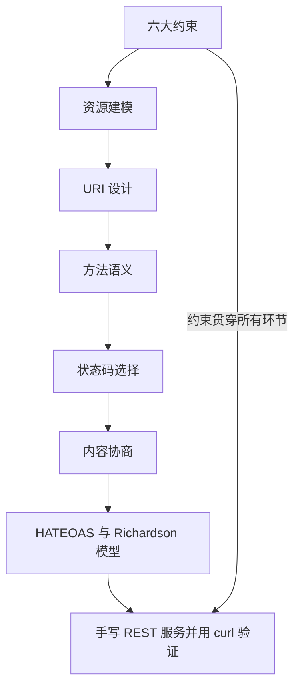
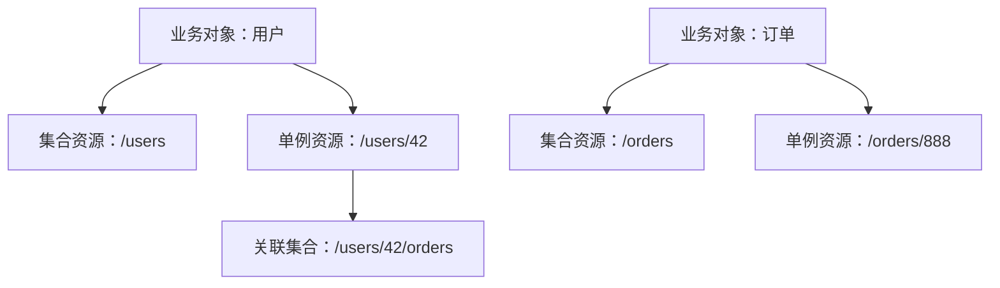
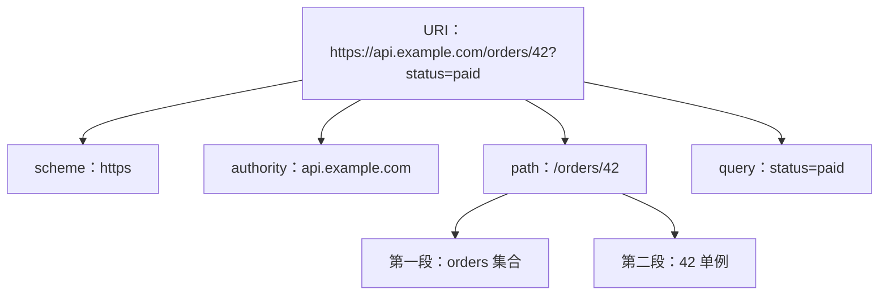
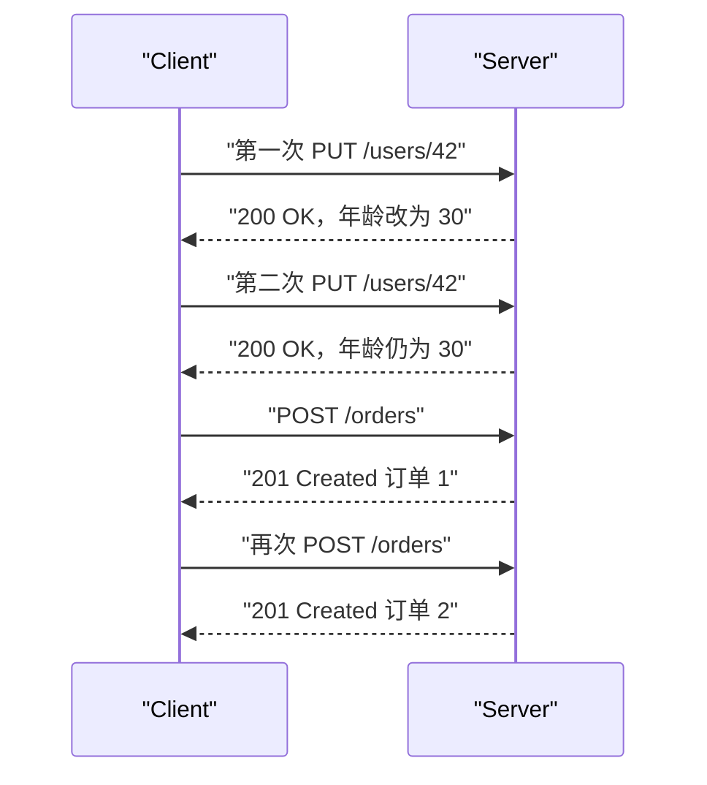
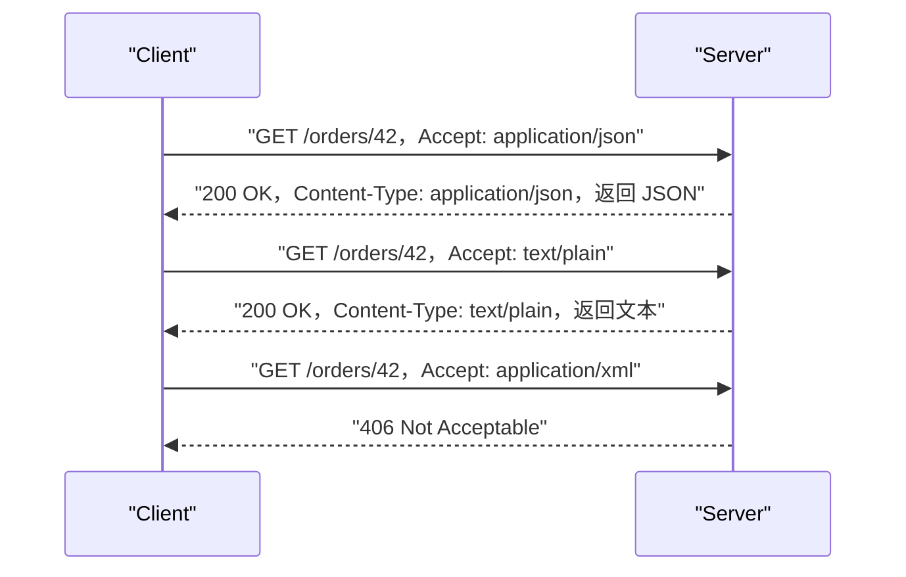
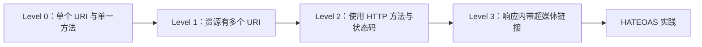
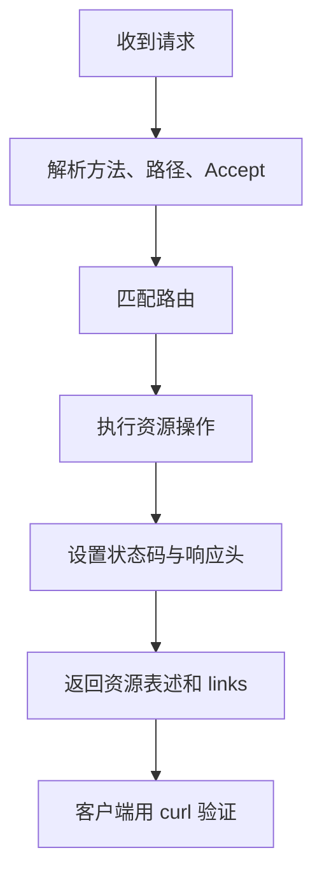

# REST 基础：资源、方法、状态码

!!! abstract "学完这一页你能"

1. 说出 REST 六大约束，并判断一个接口设计违反了哪一条。
2. 把一个业务对象建模成集合资源和单例资源，写出对应的 URI。
3. 区分 GET、POST、PUT、DELETE、PATCH 的安全性与幂等性，并选出正确状态码。
4. 用 Node 原生 `node:http` 写一个带内容协商和 HATEOAS 链接的小服务，并用 curl 验证。

## 0. 知识地图



建议先按 1 到 7 的顺序读：前四节打基础，五、六节解决请求响应细节，第七节把前面的能力串成成熟度模型。  
第八节不要跳过，它会把所有概念落成一个可运行的服务。

## 1. 六大约束：REST 到底约定了什么

**先想一个问题**  
你已经会用 `/getUser?id=1` 获取数据。前端也能跑通，为什么还要学 REST 这一组约束？

**心智模型**

!!! tip "心智模型"
    一句话模型：REST 是一组客户端与服务器之间的长期通信约定，不是一个具体框架。  
    日常类比：餐厅顾客只看菜单点菜，不需要进厨房；但菜单不会规定菜品返回时的数据格式。  
    类比不成立处：REST 会规定数据格式、缓存策略和下一步可执行的操作。

!!! note "术语：REST"
    REST 是 Representational State Transfer 的缩写，全称“表述状态转移”。  
    它要求客户端拿到一个资源的表述后，就获得理解资源当前状态所需的全部信息。  
    例如 GET /orders/42 返回订单 JSON，客户端不需要另外查数据库就知道订单状态。

**图解**


1. “客户端服务器约束”先把用户界面与数据存储分开。
2. “统一接口”要求同一类资源用同一套方法访问。
3. “无状态”要求每个请求独立携带认证与上下文信息。
4. “可缓存”要求响应可以声明自己能不能被缓存。
5. “分层系统”允许中间层如网关、代理参与。
6. “按需代码可选”允许服务器临时下发小程序，但多数 REST 服务不用。

**一步一步来**

1. 这一步要做什么：写一个约束检查器，把服务设计对象中缺失的约束打印出来。

```javascript
// 六大约束中按需代码是可选项，这里只检查前五项常规约束
const REQUIRED_CONSTRAINTS = [
  "client-server",
  "stateless",
  "cacheable",
  "uniform-interface",
  "layered-system",
];

function missingConstraints(design) {
  // 逐个过滤，找出设计对象里值为 false 或缺失的约束
  return REQUIRED_CONSTRAINTS.filter((key) => !design[key]);
}

const myDesign = {
  "client-server": true,
  stateless: true,
  cacheable: false,
  "uniform-interface": true,
  "layered-system": false,
};

console.log(missingConstraints(myDesign));
```

**这段代码在做什么**

- 把五项常见约束列成一个数组，集中管理。
- `filter` 会把 `false` 或 `undefined` 的约束留下，形成缺失清单。
- 示例设计缺少可缓存与分层系统两项。
- 输出结果是两项约束名称，不是全部五项的复述。

运行结果：

```text
[ 'cacheable', 'layered-system' ]
```

2. 这一步要做什么：用一段 Node 服务代码展示可缓存与自描述消息如何落到响应头。

```javascript
import http from "node:http";

const server = http.createServer((req, res) => {
  // 声明代理和浏览器都能缓存 60 秒
  res.setHeader("Cache-Control", "public, max-age=60");
  // 声明响应正文是 JSON，客户端不用猜格式
  res.setHeader("Content-Type", "application/json");
  res.end(JSON.stringify({ at: Date.now() }));
});

server.listen(3000);
```

**这段代码在做什么**

- `Cache-Control: public, max-age=60` 落实“可缓存”约束。
- `Content-Type: application/json` 落实“统一接口”中的自描述消息。
- `Date.now()` 用于观察响应时间，但不会影响缓存头本身。
- 每个请求独立返回结果，服务器不保存上一个请求的状态。

**动手验证**

```javascript
import http from "node:http";
import assert from "node:assert/strict";

const REQUIRED_CONSTRAINTS = [
  "client-server",
  "stateless",
  "cacheable",
  "uniform-interface",
  "layered-system",
];

function missingConstraints(design) {
  return REQUIRED_CONSTRAINTS.filter((key) => !design[key]);
}

const finalDesign = {
  "client-server": true,
  stateless: true,
  cacheable: true,
  "uniform-interface": true,
  "layered-system": true,
};

assert.deepEqual(missingConstraints(finalDesign), []);

const server = http.createServer((req, res) => {
  res.setHeader("Cache-Control", "public, max-age=60");
  res.setHeader("Content-Type", "application/json");
  res.end(JSON.stringify({ at: Date.now() }));
});

server.listen(3000);

const res = await fetch("http://127.0.0.1:3000/");
assert.equal(res.headers.get("cache-control"), "public, max-age=60");
assert.equal(res.headers.get("content-type"), "application/json");
assert.equal(res.status, 200);
console.log("约束检查通过，服务响应头符合可缓存与自描述消息");
server.close();
```

运行结果：

```text
约束检查通过，服务响应头符合可缓存与自描述消息
```

**常见坑**

| 现象 | 原因 | 怎么修 |
| --- | --- | --- |
| 服务端用 Session 存登录态 | 违反无状态约束 | 每个请求带凭证，如 Bearer Token |
| 代理无法缓存任何响应 | 没设置缓存响应头 | 对不敏感资源加 Cache-Control |
| 响应只有 200 和 JSON 字符串 | 消息不自描述 | 设置 Content-Type 与状态码 |
| 把按需代码当必选项 | 混淆可选约束与必选约束 | 只把前五项作为常见必要约束 |

**小结**

- 六大约束中前五项是常规服务必须考虑的，按需代码是可选项。
- 无状态不是服务器完全不存数据，而是不在服务端依赖单个请求之外的会话上下文。
- 响应头是落地约束的关键位置，不是装饰。

## 2. 资源建模：先把业务对象翻译成资源

**先想一个问题**  
订单系统里有用户、商品、订单和订单明细。如果让你设计 API，你会把它们叫成 `/getOrderList` 还是 `/orders`？

**心智模型**

!!! tip "心智模型"
    一句话模型：资源是可以被命名的信息实体，路径是它的名字，不是要执行的函数名。  
    日常类比：图书馆按书脊编号找到书，读者不需要知道书架怎么整理。  
    类比不成立处：图书馆卡片不会根据读者身份改变，而资源的表述可以因请求头不同而变。

!!! note "术语：资源"
    资源是网络上可寻址的信息对象，可以是一个用户、一个订单集合或一个订单。  
    例如 `/users/42` 表示编号为 42 的用户资源，而不是“获取 42 号用户”这个动作。

**图解**



1. 用户业务对象映射成一个集合资源和无数个单例资源。
2. 订单业务对象同样映射成集合与单例两层。
3. 用户与订单的从属关系通过路径级别表达。

**一步一步来**

1. 这一步要做什么：写一个函数，把输入的业务对象与编号转换成集合路径和单例路径。

```javascript
function buildResourcePaths(resourceName, id = null) {
  // 集合路径固定用复数名词
  const collection = `/resourceName`; // 占位：下面会替换成正确的字符串拼法
  return { collection, singleton: id ? `${collection}/${id}` : null };
}

console.log(buildResourcePaths("orders", "888"));
```

**这段代码在做什么**

- `collection` 暂时写成占位符，是为了下一版修掉。
- `id` 存在时返回单例路径，不存在时只返回集合路径。
- 这版有字符串拼写问题，后面的验证会给出正确写法。

2. 这一步要做什么：修正集合路径的拼写，并用正确的模板字符串生成资源路径。

```javascript
function buildResourcePaths(resourceName, id = null) {
  // 统一用传入的复数名词拼路径，防止硬编码
  const collection = `/${resourceName}`;
  return {
    collection,
    singleton: id === null ? null : `/${resourceName}/${id}`,
  };
}

console.log(buildResourcePaths("orders", "888"));
```

**这段代码在做什么**

- 集合路径来自参数，调用方必须传复数名词。
- `id === null` 显式区分“没有编号”和可能出现的空字符串。
- 单例路径由集合路径加编号组成。
- 返回结构让调用方一次拿到两个路径层级。

3. 这一步要做什么：写一个函数，判断一段路径是集合、单例还是深层嵌套。

```javascript
function classifyResourcePath(path) {
  // 去掉开头与结尾的斜杠后按段拆分
  const parts = path.replace(/^\/+|\/+$/g, "").split("/");
  if (parts.length === 1) return "collection";
  if (parts.length === 2) return "singleton";
  return "nested";
}

console.log(classifyResourcePath("/users/42/orders"));
```

**这段代码在做什么**

- 正则去掉路径首尾斜杠，避免 `//` 影响分段。
- 一段是集合，两段是单例，超过两段是嵌套路径。
- 嵌套路径需要额外说明父资源，不能当成简单单例。
- 返回字符串供后续路由分发判断。

**动手验证**

```javascript
import assert from "node:assert/strict";

function buildResourcePaths(resourceName, id = null) {
  const collection = `/${resourceName}`;
  return {
    collection,
    singleton: id === null ? null : `/${resourceName}/${id}`,
  };
}

function classifyResourcePath(path) {
  const parts = path.replace(/^\/+|\/+$/g, "").split("/");
  if (parts.length === 1) return "collection";
  if (parts.length === 2) return "singleton";
  return "nested";
}

const userPaths = buildResourcePaths("users", "42");
assert.equal(userPaths.collection, "/users");
assert.equal(userPaths.singleton, "/users/42");

const orderPath = buildResourcePaths("orders");
assert.equal(orderPath.singleton, null);

assert.equal(classifyResourcePath("/orders"), "collection");
assert.equal(classifyResourcePath("/orders/888"), "singleton");
assert.equal(classifyResourcePath("/users/42/orders"), "nested");
console.log("资源路径生成与分类校验通过");
```

运行结果：

```text
资源路径生成与分类校验通过
```

**常见坑**

| 现象 | 原因 | 怎么修 |
| --- | --- | --- |
| 接口名叫 `/getUserList` | 把资源当动作 | 改为 `/users` |
| 有时 `/user`，有时 `/users` | 命名不一致 | 统一用复数名词 |
| `/users/42/orders/888/items/3` 过深 | 嵌套无边界 | 最多保留两级，其余用查询参数 |
| 认为资源就是数据库表 | 把内部表结构直接暴露 | 按客户端需要的概念建模 |

**小结**

- 资源路径使用名词和编号，不使用动词。
- 集合资源处理列表，单例资源处理具体对象。
- 嵌套路径要克制，深层关系用查询参数表达。

## 3. URI 设计：让地址一眼看出资源

**先想一个问题**  
`/getUserInfo` 与 `/users/42` 相比，后者为什么更符合 REST 的接口风格？

**心智模型**

!!! tip "心智模型"
    一句话模型：URI 是资源在服务器上的地址，不是要执行的动作名称。  
    日常类比：家庭住址“省/市/区/路/号”逐级缩小范围。  
    类比不成立处：地址层级是物理空间，URI 层级是逻辑归属，同一条路径可以绕开物理位置。

!!! note "术语：URI"
    URI 是 Uniform Resource Identifier 的缩写，全称“统一资源标识符”。  
    URL 是 URI 的一种，多标出访问方式如 `https://`。  
    例如 `https://api.example.com/orders/42` 既标识资源，也给出访问位置。

**图解**



1. URI 先拆成协议、地址、路径和查询参数四部分。
2. 路径段表示资源层级，第一段是集合，第二段是编号。
3. 查询参数用于过滤、排序、分页，不用于定位具体对象。

**一步一步来**

1. 这一步要做什么：写一个规则检查函数，找出 URI 里的非法设计信号。

```javascript
function getUriViolations(uri) {
  const problems = [];
  // 路径动词很容易伪装在 path 里，这里检查常见的动词段
  if (/\/(get|create|update|delete)([A-Z])?/.test(uri)) {
    problems.push("path contains verb");
  }
  // 下划线不如连字符清晰，REST 风格建议路径段用连字符
  if (/_/.test(uri)) {
    problems.push("path contains underscore");
  }
  return problems;
}

console.log(getUriViolations("/api/get_order_list"));
```

**这段代码在做什么**

- 正则在路径中找 `get`、`create`、`update`、`delete` 开头的行为段。
- 下划线检查可以拦截 `/get_order_list`。
- 返回数组给出所有问题，不会遇到一个错误就停止。
- 这段规则不处理编号、大小写等后续检查。

2. 这一步要做什么：补充生成 URI 的函数，统一使用小写、复数名词和连字符。

```javascript
function buildUri({ base, resource, id = null, query = {} }) {
  // 强制资源名转小写，多个单词用连字符
  const resourcePath = resource.toLowerCase().replace(/\s+/g, "-");
  const idPart = id ? `/${id}` : "";
  const queryPart = Object.entries(query)
    .map(([k, v]) => `${k}=${encodeURIComponent(v)}`)
    .join("&");
  return `${base}/${resourcePath}${idPart}${queryPart ? `?${queryPart}` : ""}`;
}

console.log(buildUri({ base: "https://api.example.com", resource: "OrderItems", id: "42", query: { status: "paid" } }));
```

**这段代码在做什么**

- 资源名强制小写并替换空格为连字符。
- `idPart` 只在有编号时拼接。
- 查询参数值经过 `encodeURIComponent` 编码，避免特殊字符污染 URI。
- 返回完整 URI，路径与查询参数各司其职。

3. 这一步要做什么：写一个函数解析分页、排序参数，避免把动作写进路径。

```javascript
function parseListQuery(query) {
  const page = Number(query.page ?? "1");
  const perPage = Number(query.per_page ?? "20");
  const sort = query.sort ?? "created_at";
  return { page, perPage, sort };
}

console.log(parseListQuery({ page: "2", per_page: "50" }));
```

**这段代码在做什么**

- 用空值合并运算符提供默认分页值。
- 分页参数转成数字，避免后续做字符串加法。
- 排序参数提供默认字段，不把排序动作放进路径。
- 查询参数是可选的，路径始终保持资源定位。

**动手验证**

```javascript
import assert from "node:assert/strict";

function getUriViolations(uri) {
  const problems = [];
  if (/\/(get|create|update|delete)([A-Z])?/.test(uri)) {
    problems.push("path contains verb");
  }
  if (/_/.test(uri)) {
    problems.push("path contains underscore");
  }
  return problems;
}

function buildUri({ base, resource, id = null, query = {} }) {
  const resourcePath = resource.toLowerCase().replace(/\s+/g, "-");
  const idPart = id ? `/${id}` : "";
  const queryPart = Object.entries(query)
    .map(([k, v]) => `${k}=${encodeURIComponent(v)}`)
    .join("&");
  return `${base}/${resourcePath}${idPart}${queryPart ? `?${queryPart}` : ""}`;
}

function parseListQuery(query) {
  const page = Number(query.page ?? "1");
  const perPage = Number(query.per_page ?? "20");
  const sort = query.sort ?? "created_at";
  return { page, perPage, sort };
}

assert.deepEqual(getUriViolations("/api/get_order_list"), [
  "path contains verb",
  "path contains underscore",
]);
assert.equal(
  buildUri({
    base: "https://api.example.com",
    resource: "OrderItems",
    id: "42",
    query: { status: "paid" },
  }),
  "https://api.example.com/orderitems/42?status=paid"
);
assert.deepEqual(parseListQuery({ page: "2", per_page: "50" }), {
  page: 2,
  perPage: 50,
  sort: "created_at",
});
console.log("URI 规则校验与生成通过");
```

运行结果：

```text
URI 规则校验与生成通过
```

**常见坑**

| 现象 | 原因 | 怎么修 |
| --- | --- | --- |
| 路径包含 `/deleteUser` | 把动作写进 URI | 改用 `DELETE /users/42` |
| `/api/order_items` 使用下划线 | URI 可读性降低 | 改用连字符 `/order-items` |
| 每页大小写进路径 | 路径定位被分页污染 | 放入查询参数 `per_page` |
| 深层嵌套到五级路径 | 资源关系表达过度 | 拆成多个资源和查询参数 |

**小结**

- URI 路径只做资源定位，动作交给 HTTP 方法。
- 统一小写、复数和连字符可以降低前端调用出错概率。
- 查询参数处理过滤、分页、排序，不负责定位单例资源。

## 4. 方法语义：安全与幂等不是一回事

**先想一个问题**  
为什么不能用 `GET /users/42/delete` 删除用户，而要使用 `DELETE /users/42`？

**心智模型**

!!! tip "心智模型"
    一句话模型：HTTP 方法表达要对资源做的操作类别，客户端与服务器都必须遵守同一套语义。  
    日常类比：查看图书馆借书记录是安全动作；按一次电梯楼层按钮与按十次，电梯只会登记一次目标层。  
    类比不成立处：HTTP 幂等关注的是多次请求产生的副作用一致，不是多次请求的响应正文完全一样。

!!! note "术语：幂等"
    幂等指同一个请求发送一次或多次，对服务器资源状态的副作用一致。  
    例如 `PUT /users/42` 更新年龄为 30，发两次与发一次，用户年龄都停在 30。

**图解**



1. 两次 `PUT` 后状态一致，说明它是幂等方法。
2. 两次 `POST /orders` 创建了两个订单，说明它不幂等。
3. 响应体可以不同，但只要资源状态副作用一致，就满足幂等。

**一步一步来**

1. 这一步要做什么：写两个小函数，分别判断方法是否安全、是否幂等。

```javascript
function isSafe(method) {
  // 安全方法不应该改变资源状态，但可以读取或缓存
  return method === "GET" || method === "HEAD";
}

function isIdempotent(method) {
  // 这些方法多次相同请求在标准定义下属幂等
  return ["GET", "HEAD", "PUT", "DELETE", "OPTIONS"].includes(method);
}

console.log(isSafe("DELETE"), isIdempotent("DELETE"));
```

**这段代码在做什么**

- `isSafe` 只返回 GET 和 HEAD 为安全。
- `isIdempotent` 把标准中常见的幂等方法列出来。
- DELETE 不总是安全，但它多次删除同一个资源后的状态一致。
- 输出两个布尔值，用来演示安全与幂等是两个维度。

2. 这一步要做什么：模拟对同一个资源执行两次 PUT 后，状态不会叠加。

```javascript
function applyStatusChange(currentStatus, newStatus) {
  // PUT 的语义是全量设置，所以直接用新状态覆盖旧状态
  return newStatus;
}

let resourceStatus = "pending";
resourceStatus = applyStatusChange(resourceStatus, "paid");
resourceStatus = applyStatusChange(resourceStatus, "paid");
console.log(resourceStatus);
```

**这段代码在做什么**

- `applyStatusChange` 接收旧状态与新状态。
- 它返回新状态，不维护历史版本。
- 两次调用传相同新状态，最终状态保持 `paid`。
- 这演示了幂等：不是不执行，而是执行多次不影响结果状态。

3. 这一步要做什么：模拟 POST 创建资源，每次生成不同编号，体现非幂等。

```javascript
function createOrder(store, orderLine) {
  // 每次创建都产生新编号，因此同样的请求会新增资源
  const id = store.nextId;
  store.nextId += 1;
  store.orders.push({ id, ...orderLine });
  return id;
}

const store = { nextId: 1, orders: [] };
createOrder(store, { item: "book", qty: 1 });
createOrder(store, { item: "book", qty: 1 });
console.log(store.orders.map((o) => o.id));
```

**这段代码在做什么**

- `store.nextId` 每次自增，保证新资源编号不同。
- 同样的订单明细执行两次，存储中多出两个订单对象。
- 输出 `1, 2`，说明 POST 不天然幂等。
- 如果业务需要幂等，应由客户端带幂等键，服务端按该键去重。

**动手验证**

```javascript
import assert from "node:assert/strict";

function isSafe(method) {
  return method === "GET" || method === "HEAD";
}

function isIdempotent(method) {
  return ["GET", "HEAD", "PUT", "DELETE", "OPTIONS"].includes(method);
}

function applyStatusChange(currentStatus, newStatus) {
  return newStatus;
}

function createOrder(store, orderLine) {
  const id = store.nextId;
  store.nextId += 1;
  store.orders.push({ id, ...orderLine });
  return id;
}

assert.equal(isSafe("GET"), true);
assert.equal(isSafe("DELETE"), false);
assert.equal(isIdempotent("DELETE"), true);
assert.equal(isIdempotent("POST"), false);

let resourceStatus = "pending";
resourceStatus = applyStatusChange(resourceStatus, "paid");
resourceStatus = applyStatusChange(resourceStatus, "paid");
assert.equal(resourceStatus, "paid");

const store = { nextId: 1, orders: [] };
createOrder(store, { item: "book", qty: 1 });
createOrder(store, { item: "book", qty: 1 });
assert.deepEqual(store.orders.map((o) => o.id), [1, 2]);
console.log("安全、幂等、非幂等方法判断通过");
```

运行结果：

```text
安全、幂等、非幂等方法判断通过
```

**常见坑**

| 现象 | 原因 | 怎么修 |
| --- | --- | --- |
| 用 GET 删除资源 | 破坏安全方法 | 删除用 DELETE |
| 用 POST 做全量替换 | 把不幂等方法当幂等用 | 全量替换用 PUT |
| 认为 DELETE 安全 | 没区分安全与幂等 | 记住 DELETE 不读数据也可能有副作用 |
| 认为 PUT 两次响应必须相同 | 误解幂等定义 | 只能要求资源状态副作用一致 |

**小结**

- 安全方法指不应改变资源状态，幂等方法指多次请求副作用一致。
- GET、HEAD 安全且幂等；PUT、DELETE 不保证安全但幂等。
- POST 通常既非安全也非幂等，创建时应关注重复提交问题。

## 5. 状态码选择：让响应先给自己定性

**先想一个问题**  
请求失败时接口统一返回 `200 OK` 加 `{ code: 1001, message: "error" }`，为什么会让客户端很难统一处理？

**心智模型**

!!! tip "心智模型"
    一句话模型：状态码是响应结果的类别信号，客户端先看状态码再决定如何处理正文。  
    日常类比：红绿灯告诉司机该停该行，司机不需要先下车问交警。  
    类比不成立处：红绿灯只有三种状态，HTTP 状态码有五类几十个，需要按场景选得准。

!!! note "术语：状态码"
    HTTP 状态码由三位数字组成，第一位表示类别：2xx 成功、3xx 重定向、4xx 客户端错误、5xx 服务端错误。  
    例如 `201 Created` 表示请求已成功且创建了新资源。

**图解**

```mermaid
stateDiagram-v2
    direction LR
    state start as "收到请求"
    state ok2 as "2xx 成功"
    state redirect3 as "3xx 重定向"
    state client4 as "4xx 客户端错误"
    state server5 as "5xx 服务端错误"
    start --> ok2: "请求成功"
    start --> redirect3: "需要跳转"
    start --> client4: "请求有误"
    start --> server5: "服务器失败"
```

1. 服务器收到请求后先归入一个响应类别。
2. 2xx 表示请求被接受或处理成功。
3. 4xx 表示客户端需要修改请求。
4. 5xx 表示服务器自身出了故障。

**一步一步来**

1. 这一步要做什么：写一个场景到状态码的映射函数，覆盖创建、未找到、冲突等常见场景。

```javascript
function mapStatus({ method, existed, created, forbidden }) {
  // 创建资源标准返回 201，不是普通 200
  if (created) return 201;
  // 请求访问不存在的资源返回 404
  if (!existed) return 404;
  // 没有权限访问资源返回 403，认证失败才用 401
  if (forbidden) return 403;
  return 200;
}

console.log(mapStatus({ created: true }));
```

**这段代码在做什么**

- 创建成功优先返回 201，让客户端知道要处理 Location 头。
- 资源不存在返回 404，避免 200 加内部错误码。
- 权限不足返回 403，与 401 未认证区分开。
- 其余成功情况返回 200。

2. 这一步要做什么：在 Node 服务里返回 201 并补上 Location 响应头。

```javascript
import http from "node:http";

const server = http.createServer((req, res) => {
  // 模拟创建订单成功
  const newOrderId = "888";
  // 告知客户端新资源的地址
  res.setHeader("Location", `/orders/${newOrderId}`);
  res.statusCode = 201;
  res.end(JSON.stringify({ id: newOrderId, status: "pending" }));
});

server.listen(3000);
```

**这段代码在做什么**

- 创建成功后状态码设为 201。
- `Location` 头给出新单例资源的 URI。
- 正文返回新订单基本信息，但状态码已经先定性。
- 客户端收到 201 时可优先读取 Location。

3. 这一步要做什么：写一个客户端请求函数，触发 404 与 201，观察状态码。

```javascript
async function checkStatus(path) {
  const res = await fetch(path);
  // 状态码决定处理分支，不依赖正文里的 code 字段
  if (res.status === 201) return "created";
  if (res.status === 404) return "missing";
  return "other";
}
```

**这段代码在做什么**

- 用状态码做分支判断，而不是解析正文后才知道成败。
- 201 专用于创建，404 专用于未找到。
- 返回字符串结果便于下一步测试。
- 正式客户端还应在 201 时读取 Location 头。

**动手验证**

```javascript
import http from "node:http";
import assert from "node:assert/strict";

const orders = new Map();
const server = http.createServer((req, res) => {
  if (req.url === "/orders" && req.method === "POST") {
    const newOrderId = "888";
    orders.set(newOrderId, { id: newOrderId, status: "pending" });
    res.setHeader("Location", `/orders/${newOrderId}`);
    res.statusCode = 201;
    res.end(JSON.stringify({ id: newOrderId, status: "pending" }));
    return;
  }
  res.statusCode = 404;
  res.end(JSON.stringify({ error: "not_found" }));
});

server.listen(3000);

const createdRes = await fetch("http://127.0.0.1:3000/orders", {
  method: "POST",
});
assert.equal(createdRes.status, 201);
assert.equal(createdRes.headers.get("location"), "/orders/888");

const missingRes = await fetch("http://127.0.0.1:3000/orders/42");
assert.equal(missingRes.status, 404);
assert.equal(missingRes.headers.get("content-type"), "application/json");
console.log("201 创建与 404 未找到状态码验证通过");
server.close();
```

运行结果：

```text
201 创建与 404 未找到状态码验证通过
```

**常见坑**

| 现象 | 原因 | 怎么修 |
| --- | --- | --- |
| 失败也返回 200 | 只靠业务码区分成败 | 用 4xx 或 5xx 状态码 |
| POST 创建成功返回 200 | 忘记 201 专门语义 | 创建成功返回 201 |
| 更新成功不返回资源 | 客户端无法确认最终状态 | 返回 200 加更新后表述 |
| 冲突使用 500 | 把客户端冲突当服务器错误 | 唯一约束冲突用 409 |

**小结**

- 状态码是响应的一部分结构，不是给开发者看的备注。
- 创建用 201，未找到用 404，权限用 403，认证失败才用 401。
- 客户端应先判断状态码类别，再决定如何读取正文。

## 6. 内容协商：一个资源多种表述

**先想一个问题**  
同一个订单资源，网页要 HTML，移动端要 JSON，老系统要 XML。难道要写三个接口吗？

**心智模型**

!!! tip "心智模型"
    一句话模型：资源可以有多个表述，客户端用 `Accept` 排队给出自己能读的格式。  
    日常类比：影院同一部影片排有原声版与配音版，观众根据票根进入对应影厅。  
    类比不成立处：一场电影通常只能放一个版本，而 HTTP 可以在一组可接受格式里协商后返回一个，也可以返回 406。

!!! note "术语：内容协商"
    内容协商是客户端与服务器就响应正文格式达成一致的过程。  
    客户端通过 `Accept` 头列出格式范围，服务器从可用表述中选一个。  
    例如 `Accept: application/json` 表示客户端优先要 JSON。

**图解**



1. 服务器先解析 `Accept` 头得到客户端可接受的格式列表。
2. 从自己支持的表述中选一个匹配项。
3. 匹配成功就返回对应的 `Content-Type`。
4. 都不能匹配就用 406 告诉客户端无法提供。

**一步一步来**

1. 这一步要做什么：写一个协商函数，解析 Accept 头并返回值。

```javascript
function negotiate(acceptHeader, supported) {
  // 客户端接受任何格式时直接返回第一个支持类型
  if (!acceptHeader || acceptHeader.includes("*/*")) return supported[0];
  // 拆分出客户端列出的 MIME 类型
  const accepted = acceptHeader.split(",").map((s) => s.trim().split(";")[0]);
  // 在支持的列表里按客户端顺序找第一个匹配项
  return accepted.find((type) => supported.includes(type)) ?? null;
}
```

**这段代码在做什么**

- 空 `Accept` 或通配符时返回服务器第一个支持类型。
- 按逗号拆分多个可接受类型，去掉质量参数。
- `find` 尊重客户端给出的顺序。
- 没有匹配项返回 `null`，调用方据此返回 406。

2. 这一步要做什么：写一个 HTTP 服务，根据上游返回类型决定响应格式。

```javascript
import http from "node:http";

const server = http.createServer((req, res) => {
  const supported = ["application/json", "text/plain"];
  const selected = negotiate(req.headers.accept, supported);
  if (!selected) {
    res.statusCode = 406;
    res.end("Not Acceptable");
    return;
  }
  res.setHeader("Content-Type", selected);
  res.end(selected === "application/json"
    ? JSON.stringify({ id: "888", status: "pending" })
    : "order 888 pending");
});

server.listen(3000);
```

**这段代码在做什么**

- 支持 JSON 和纯文本两种表述。
- 406 场景先返回，不产生错误正文格式。
- 响应 `Content-Type` 必须与正文真实格式一致。
- 对同一资源路径返回不同表述，但资源状态一致。

3. 这一步要做什么：在响应里补上 `Vary` 头，让缓存知道不同 Accept 可能不同结果。

```javascript
res.setHeader("Vary", "Accept");
```

**这段代码在做什么**

- 说明响应的内容会因 `Accept` 头不同而有差异。
- 缓存代理看到 Vary 后就该按 Accept 分别存储。
- 没有 Vary 时，缓存可能把 JSON 版错误地返回给纯文本客户端。

**动手验证**

```javascript
import http from "node:http";
import assert from "node:assert/strict";

function negotiate(acceptHeader, supported) {
  if (!acceptHeader || acceptHeader.includes("*/*")) return supported[0];
  const accepted = acceptHeader.split(",").map((s) => s.trim().split(";")[0]);
  return accepted.find((type) => supported.includes(type)) ?? null;
}

const server = http.createServer((req, res) => {
  const supported = ["application/json", "text/plain"];
  const selected = negotiate(req.headers.accept, supported);
  if (!selected) {
    res.statusCode = 406;
    res.end("Not Acceptable");
    return;
  }
  res.setHeader("Content-Type", selected);
  res.setHeader("Vary", "Accept");
  res.end(selected === "application/json"
    ? JSON.stringify({ id: "888", status: "pending" })
    : "order 888 pending");
});

server.listen(3000);

const jsonRes = await fetch("http://127.0.0.1:3000/orders/888", {
  headers: { accept: "application/json" },
});
assert.equal(jsonRes.status, 200);
assert.equal(jsonRes.headers.get("content-type"), "application/json");
assert.deepEqual(await jsonRes.json(), { id: "888", status: "pending" });

const textRes = await fetch("http://127.0.0.1:3000/orders/888", {
  headers: { accept: "text/plain" },
});
assert.equal(textRes.status, 200);
assert.equal(textRes.headers.get("content-type"), "text/plain");
assert.equal(await textRes.text(), "order 888 pending");

const xmlRes = await fetch("http://127.0.0.1:3000/orders/888", {
  headers: { accept: "application/xml" },
});
assert.equal(xmlRes.status, 406);
console.log("JSON、纯文本、406 内容协商验证通过");
server.close();
```

运行结果：

```text
JSON、纯文本、406 内容协商验证通过
```

**常见坑**

| 现象 | 原因 | 怎么修 |
| --- | --- | --- |
| 永远返回 JSON | 忽略 Accept 头 | 先协商再序列化响应 |
| 响应头是 JSON，正文是纯文本 | Content-Type 与正文不一致 | 序列化后设置对应 Content-Type |
| 缓存把 JSON 返回给文本客户端 | 缺少 Vary | 为内容协商响应加 Vary: Accept |
| 只匹配完整字符串 | 不支持通配符 | 正确处理 */* 与类型范围 |

**小结**

- 资源与表述分离，同一路径可以返回不同格式。
- 内容协商靠 `Accept` 和 `Content-Type` 成对完成。
- 协商失败应返回 406，不要悄悄返回默认格式。

## 7. HATEOAS 与 Richardson 成熟度模型

**先想一个问题**  
客户端拿到订单 JSON 只有 `{ id: "888", status: "pending" }`，却还要反复翻接口文档，才能知道下一步能做什么。这合理吗？

**心智模型**

!!! tip "心智模型"
    一句话模型：HATEOAS 让响应里的链接成为合法的下一步操作入口。  
    日常类比：车载导航不仅显示当前位置，还显示左转、右转或直行路线。  
    类比不成立处：导航路线是预先算好的推荐路线，而超媒体只提供可选链接，不替客户端做决策。

!!! note "术语：HATEOAS"
    HATEOAS 是 Hypermedia As The Engine Of Application State 的缩写，全称“超媒体作为应用状态引擎”。  
    例如订单 JSON 带 `links` 数组，里面列出 `self`、`pay`、`cancel` 等可执行操作。

**图解**



1. Level 0 只有一个入口，所有操作通过同一个接口。
2. Level 1 开始区分资源，但仍可能只用 POST。
3. Level 2 引入正确的方法和状态码。
4. Level 3 把下一步链接放进资源表述。

**一步一步来**

1. 这一步要做什么：写一个函数，根据订单状态生成可用的下一步链接。

```javascript
function buildOrderLinks(order) {
  const links = [
    { rel: "self", href: `/orders/${order.id}`, method: "GET" },
  ];
  if (order.status === "pending") {
    links.push({ rel: "pay", href: `/orders/${order.id}/pay`, method: "POST" });
    links.push({ rel: "cancel", href: `/orders/${order.id}`, method: "DELETE" });
  }
  return links;
}
```

**这段代码在做什么**

- `self` 链接始终存在，标识当前资源。
- 待支付订单额外给出 `pay` 和 `cancel` 两个操作。
- 链接对象包含请求方法，客户端不用猜动作。
- 其他状态不会硬塞无意义链接。

2. 这一步要做什么：写一个响应构造函数，把数据与 links 合并。

```javascript
function toResource(order) {
  return {
    id: order.id,
    status: order.status,
    // 链接是资源表述的一部分，不是独立字段
    links: buildOrderLinks(order),
  };
}
```

**这段代码在做什么**

- 数据字段与超媒体链接在同一响应中。
- 返回对象之后可以直接 JSON 序列化。
- `links` 不改变业务字段，只增加导航信息。

3. 这一步要做什么：写一个成熟度评分函数，根据服务特征返回 0 到 3 级。

```javascript
function maturityScore({ multipleUris, httpMethods, hateoas }) {
  if (!multipleUris) return 0;
  if (!httpMethods) return 1;
  if (!hateoas) return 2;
  return 3;
}
```

**这段代码在做什么**

- Level 0 只允许一个 URI 入口。
- Level 1 有多 URI 但没有真正的 HTTP 方法语义。
- Level 2 使用标准方法、状态码与资源路径。
- Level 3 还包含超媒体链接，也就是 HATEOAS。

**动手验证**

```javascript
import assert from "node:assert/strict";

function buildOrderLinks(order) {
  const links = [
    { rel: "self", href: `/orders/${order.id}`, method: "GET" },
  ];
  if (order.status === "pending") {
    links.push({ rel: "pay", href: `/orders/${order.id}/pay`, method: "POST" });
    links.push({ rel: "cancel", href: `/orders/${order.id}`, method: "DELETE" });
  }
  return links;
}

function toResource(order) {
  return {
    id: order.id,
    status: order.status,
    links: buildOrderLinks(order),
  };
}

function maturityScore({ multipleUris, httpMethods, hateoas }) {
  if (!multipleUris) return 0;
  if (!httpMethods) return 1;
  if (!hateoas) return 2;
  return 3;
}

const pendingOrder = toResource({ id: "888", status: "pending" });
assert.equal(pendingOrder.links.length, 3);
assert.equal(pendingOrder.links[1].rel, "pay");
assert.equal(pendingOrder.links[1].method, "POST");

const paidOrder = toResource({ id: "888", status: "paid" });
assert.equal(paidOrder.links.length, 1);

assert.equal(maturityScore({ multipleUris: true, httpMethods: true, hateoas: true }), 3);
assert.equal(maturityScore({ multipleUris: true, httpMethods: true, hateoas: false }), 2);
console.log("HATEOAS 链接与成熟度评分验证通过");
```

运行结果：

```text
HATEOAS 链接与成熟度评分验证通过
```

**常见坑**

| 现象 | 原因 | 怎么修 |
| --- | --- | --- |
| 只返回 self 链接 | 误以为有链接就是 HATEOAS | 提供多个合法下一步操作 |
| 链接没有 method 字段 | 客户端需要额外文档 | 每个链接写明 method |
| HTML 页面有超链接就认为达标 | 混淆普通超媒体与 API 超媒体 | 在 API 响应中返回结构化 links |
| 成熟度只做 0 到 3 一次性跳跃 | 遗漏中间层约束 | 按 URI、方法、状态码、超媒体逐级补齐 |

**小结**

- HATEOAS 的核心是让应用状态通过响应中的链接继续流转。
- Richardson 成熟度模型不是唯一评分标准，但适合作为改造路线图。
- Level 3 的价值在减少客户端对接口文档的硬编码依赖。

## 8. 手写最小 REST 服务并用 curl 验证

**先想一个问题**  
前面都是片段，能不能用 Node 原生 `node:http` 写一个完整服务，再用 curl 验证每个状态码与链接？

**心智模型**

!!! tip "心智模型"
    一句话模型：最小 REST 服务等于路由表加方法判断加状态码加 HATEOAS 链接。  
    日常类比：餐厅前台根据客人点的菜名和备注，分给后厨不同档口。  
    类比不成立处：前台通常不负责告诉客人下一道菜该怎么点，而 REST 服务要返回链接。

**图解**



1. 服务首先解析请求的方法、路径与 Accept。
2. 路由器把请求交给对应处理器。
3. 处理器执行资源操作。
4. 响应统一带上正确状态码、Content-Type 和 links。
5. 客户端用 curl 或 fetch 站在外部验证结果。

**一步一步来**

1. 这一步要做什么：准备内存存储和路由表，先定义订单资源。

```javascript
import http from "node:http";

// 用 Map 保存订单，编号为字符串，便于 URI 拼接
const orders = new Map();
// 路由表列出方法与路径模式，下一版逐步实现
const routes = [];
```

**这段代码在做什么**

- 内存 Map 模拟订单存储，重启即清空。
- 路由表暂为空，后面按策略补充。
- 编号统一用字符串，避免 `0` 之类边界问题。

2. 这一步要做什么：实现 GET 列表与 GET 单例，并加入内容协商。

```javascript
function negotiate(acceptHeader, supported) {
  if (!acceptHeader || acceptHeader.includes("*/*")) return supported[0];
  const accepted = acceptHeader.split(",").map((s) => s.trim().split(";")[0]);
  return accepted.find((type) => supported.includes(type)) ?? null;
}

function sendResource(res, statusCode, body) {
  const selected = negotiate(res.req.headers.accept, ["application/json", "text/plain"]);
  if (!selected) {
    res.statusCode = 406;
    res.end("Not Acceptable");
    return;
  }
  res.setHeader("Content-Type", selected);
  res.setHeader("Vary", "Accept");
  res.statusCode = statusCode;
  res.end(selected === "application/json" ? JSON.stringify(body) : String(body));
}
```

**这段代码在做什么**

- `negotiate` 复用内容协商逻辑。
- `sendResource` 根据协商结果决定 JSON 或纯文本。
- 406 分支优先返回，避免响应格式不一致。
- 每个响应统一设置 Vary，内容协商更完整。

3. 这一步要做什么：实现 POST 创建订单，返回 201、Location 与 HATEOAS 链接。

```javascript
function buildOrderLinks(order) {
  const links = [{ rel: "self", href: `/orders/${order.id}`, method: "GET" }];
  if (order.status === "pending") {
    links.push({ rel: "pay", href: `/orders/${order.id}/pay`, method: "POST" });
    links.push({ rel: "cancel", href: `/orders/${order.id}`, method: "DELETE" });
  }
  return links;
}

function createOrder() {
  const id = String(orders.size + 1);
  const order = { id, status: "pending" };
  orders.set(id, order);
  return { ...order, links: buildOrderLinks(order) };
}
```

**这段代码在做什么**

- 编号按当前订单数量加一生成。
- 新订单状态固定为 `pending`。
- 返回响应体包含业务字段与 links。
- 链接按状态动态生成，体现 HATEOAS。

4. 这一步要做什么：补齐 GET、POST、PUT、DELETE 路由，并返回正确状态码。

```javascript
const server = http.createServer(async (req, res) => {
  res.req = req;
  if (req.url === "/orders" && req.method === "GET") {
    const all = Array.from(orders.values()).map((o) => ({ ...o, links: buildOrderLinks(o) }));
    return sendResource(res, 200, all);
  }

  if (req.url === "/orders" && req.method === "POST") {
    const created = createOrder();
    res.setHeader("Location", `/orders/${created.id}`);
    return sendResource(res, 201, created);
  }

  const match = req.url.match(/^\/orders\/(\d+)$/);
  if (match) {
    const id = match[1];
    if (req.method === "GET") {
      const order = orders.get(id);
      if (!order) return sendResource(res, 404, { error: "not_found" });
      return sendResource(res, 200, { ...order, links: buildOrderLinks(order) });
    }
    if (req.method === "DELETE") {
      if (!orders.has(id)) return sendResource(res, 404, { error: "not_found" });
      orders.delete(id);
      res.statusCode = 204;
      res.end();
      return;
    }
  }

  return sendResource(res, 404, { error: "not_found" });
});
```

**这段代码在做什么**

- GET `/orders` 返回全部订单并给每个订单加 links。
- POST `/orders` 创建资源并设置 Location 头。
- GET `/orders/:id` 对不存在资源返回 404。
- DELETE 成功返回 204 No Content，不返回正文。

**动手验证**

以下脚本可以直接运行，无第三方依赖，要求 Node 20+。  
同时附上等价的 curl 验证命令和预期响应。

```javascript
import http from "node:http";
import assert from "node:assert/strict";

const orders = new Map();

function negotiate(acceptHeader, supported) {
  if (!acceptHeader || acceptHeader.includes("*/*")) return supported[0];
  const accepted = acceptHeader.split(",").map((s) => s.trim().split(";")[0]);
  return accepted.find((type) => supported.includes(type)) ?? null;
}

function sendResource(res, statusCode, body) {
  const selected = negotiate(res.req.headers.accept, ["application/json", "text/plain"]);
  if (!selected) {
    res.statusCode = 406;
    res.end("Not Acceptable");
    return;
  }
  res.setHeader("Content-Type", selected);
  res.setHeader("Vary", "Accept");
  res.statusCode = statusCode;
  res.end(selected === "application/json" ? JSON.stringify(body) : String(body));
}

function buildOrderLinks(order) {
  const links = [{ rel: "self", href: `/orders/${order.id}`, method: "GET" }];
  if (order.status === "pending") {
    links.push({ rel: "pay", href: `/orders/${order.id}/pay`, method: "POST" });
    links.push({ rel: "cancel", href: `/orders/${order.id}`, method: "DELETE" });
  }
  return links;
}

function createOrder() {
  const id = String(orders.size + 1);
  const order = { id, status: "pending" };
  orders.set(id, order);
  return { ...order, links: buildOrderLinks(order) };
}

const server = http.createServer(async (req, res) => {
  res.req = req;
  if (req.url === "/orders" && req.method === "GET") {
    const all = Array.from(orders.values()).map((o) => ({ ...o, links: buildOrderLinks(o) }));
    return sendResource(res, 200, all);
  }
  if (req.url === "/orders" && req.method === "POST") {
    const created = createOrder();
    res.setHeader("Location", `/orders/${created.id}`);
    return sendResource(res, 201, created);
  }
  const match = req.url.match(/^\/orders\/(\d+)$/);
  if (match) {
    const id = match[1];
    if (req.method === "GET") {
      const order = orders.get(id);
      if (!order) return sendResource(res, 404, { error: "not_found" });
      return sendResource(res, 200, { ...order, links: buildOrderLinks(order) });
    }
    if (req.method === "DELETE") {
      if (!orders.has(id)) return sendResource(res, 404, { error: "not_found" });
      orders.delete(id);
      res.statusCode = 204;
      res.end();
      return;
    }
  }
  return sendResource(res, 404, { error: "not_found" });
});

server.listen(3000);

const created = await fetch("http://127.0.0.1:3000/orders", {
  method: "POST",
  headers: { accept: "application/json" },
});
assert.equal(created.status, 201);
assert.equal(created.headers.get("location"), "/orders/1");
const createdBody = await created.json();

assert.equal(createdBody.id, "1");
assert.equal(createdBody.links[0].method, "GET");
assert.equal(createdBody.links[1].rel, "pay");

const list = await fetch("http://127.0.0.1:3000/orders", {
  headers: { accept: "application/json" },
});
assert.equal(list.status, 200);
assert.equal((await list.json()).length, 1);

const deleted = await fetch("http://127.0.0.1:3000/orders/1", {
  method: "DELETE",
});
assert.equal(deleted.status, 204);

const missing = await fetch("http://127.0.0.1:3000/orders/1", {
  headers: { accept: "application/json" },
});
assert.equal(missing.status, 404);

server.close();
console.log("最小 REST 服务通过 Node fetch 断言，下一步可用 curl 复验");
```

运行结果：

```text
最小 REST 服务通过 Node fetch 断言，下一步可用 curl 复验
```

用 curl 验证的主要命令与预期响应：

```bash
# 创建订单，预期返回 201 和 Location 头
curl -i -X POST http://127.0.0.1:3000/orders \
  -H "Accept: application/json"

# 获取订单列表，预期返回 200 和带 links 的 JSON
curl -i http://127.0.0.1:3000/orders \
  -H "Accept: application/json"

# 获取不存在的订单，预期返回 404
curl -i http://127.0.0.1:3000/orders/42 \
  -H "Accept: application/json"
```

**常见坑**

| 现象 | 原因 | 怎么修 |
| --- | --- | --- |
| 成功创建返回 200 | 服务只统一 200 | 创建用 201 并设置 Location |
| DELETE 返回 200 与正文 | 204 更适合无正文成功 | 删除成功返回 204 并直接结束 |
| 列表元素没有 links | HATEOAS 只加在单例上 | 列表项也按状态加 links |
| 路由用 `includes` 判断路径 | 路径前缀误判 | 使用严格等值或正则分段 |

**小结**

- 最小 REST 服务需要明确的资源集合与单例路由。
- 每个响应都应同时考虑状态码、内容格式和后续链接。
- 完成服务后，用 curl 从外部验证请求响应，不只看代码内部逻辑。

## 综合对比

| 维度 | RPC 风格 | REST Level 0 | REST Level 2 | REST Level 3 |
| --- | --- | --- | --- | --- |
| 入口 URI | /api/getUser、/api/deleteUser | 单个 URI | 集合与单例资源 URI | 集合与单例资源 URI |
| 动作表达 | 路径动词 | 请求参数 | HTTP 方法 | HTTP 方法 |
| 状态码 | 通常固定 200 | 通常固定 200 | 使用 2xx/4xx/5xx | 使用 2xx/4xx/5xx |
| 内容协商 | 无 | 无 | 根据 Accept 选择表述 | 根据 Accept 选择表述 |
| 下一步操作 | 外部文档 | 外部文档 | 外部文档 | 响应内 links |
| 修改一个资源 | POST /updateUser | POST /api | PUT /users/42 | PUT /users/42 并带后续链接 |

REST 不是把 RPC 改名，而是把“做什么动作”从路径迁到方法、状态码和链接三处。  
Level 3 不强制每个响应都满载超媒体，但它是明确目标。

## 应用与行业实践

### 应用场景地图

| 场景 | 用到本页哪个知识点 | 典型技术选型 | 注意事项 |
| --- | --- | --- | --- |
| 后台管理的万行表格翻页 | 集合资源、查询参数、GET 安全幂等 | React + TanStack Query + 服务端 LIMIT/OFFSET | 单页上限由服务端定，下一页地址放 Link 头 |
| 低端安卓的首屏加载 | 内容协商、条件请求、304 | Fetch + ETag/If-None-Match + gzip | Vary 头要写 Accept，CDN 才不会串味 |
| 多人协作白板的一次落笔 | PUT 幂等、操作资源、412 | WebSocket 广播 + REST 落盘 + If-Match | 操作 ID 由客户端生成，重试才安全 |
| 弱网下手抖点两次提交 | POST 非幂等、201 与 200 | Idempotency-Key 头 + 数据库唯一索引 | 幂等窗口要设过期时间，结果要落库 |
| 开放平台给第三方的订单查询 | 资源建模、方法语义、403/404 | OpenAPI 描述 + API 网关 | 别把动作塞进 URI，用子资源表达 |
| 内容站点的 CDN 回源 | 缓存头、内容协商、304 | CDN + Cache-Control + ETag | 回源请求也要带 If-None-Match 才省带宽 |
| 前后端的订单取消联调 | 状态码选择、HATEOAS 链接 | HTTP 状态码 + 响应内 _links | 取消成功回 200 或 204，不要一律 200 包错误码 |
| 微服务之间的库存扣减 | 幂等性、PUT 语义 | PUT /inventory/:sku 带绝对值 + 重试 | 覆盖用 PUT，增量用 POST，选错会重复扣 |

### 三个场景拆解

#### 场景 1：后台管理的万行表格翻页

**业务背景**：运营后台要按状态和时间筛选订单，表里的行数从千级涨到百万级。前端一次拉全量时，首屏等待时间和浏览器内存都顶到上限。

**怎么用本页知识解决**：把订单集合当成资源，筛选和分页只改查询参数，不动 URI 结构。服务端强制单页上限，下一页地址放进 Link 头，前端照着取。

```js
// node:http 处理订单集合资源：GET /orders?page=2&limit=50
import http from 'node:http';                        // 引入 Node 原生 HTTP 模块
const PAGE_MAX = 100;                                // 单页上限，由服务端定义
http.createServer((req, res) => {
  const url = new URL(req.url, 'http://localhost');  // 解析查询串
  const page = Number(url.searchParams.get('page') ?? 1);
  const limit = Number(url.searchParams.get('limit') ?? 20);
  if (!Number.isInteger(page) || page < 1) {         // 参数非法按 400 处理
    res.writeHead(400, { 'content-type': 'application/problem+json' });
    return res.end(JSON.stringify({ title: 'page 必须是正整数' }));
  }
  const size = Math.min(limit, PAGE_MAX);            // limit 收敛到服务端上限
  const rows = queryOrders(page, size);              // 只查这一页，不在内存里切片
  res.writeHead(200, {
    'content-type': 'application/json',
    link: `<http://localhost:3000/orders?page=${page + 1}&limit=${size}>; rel="next"`  // 下一页链接
  });
  res.end(JSON.stringify({ items: rows, page, limit: size }));
}).listen(3000);
```

- GET 是安全方法，重复刷新页面不会改动订单数据。
- limit 由服务端收敛，客户端传 500 也只返回 100 条，数据库不会被拖垮。
- Link 头给出下一页完整地址，前端不自己拼查询串，改参数格式只改服务端。
- 参数非法回 400 并带 problem+json，前端能直接把 title 弹给用户。
- 分页查询要配索引，否则深翻页时 OFFSET 越大越慢，可换成游标分页。

**怎么度量收益**：Chrome DevTools 的 Network 面板看单次请求的 transferSize 与 TTFB。服务端用 Prometheus 采集 `http_request_duration_seconds` 的 p95。数据库侧用 `EXPLAIN ANALYZE` 确认分页查询走了索引扫描。

**什么时候不该用**：
- 数据是进程内的数组且行数固定在几百行以内，一次返回比分页少一次往返。
- 需要对账全量导出时，逐页拉会漏掉并发写入的行，要改用快照游标或一次导出任务资源。

#### 场景 2：低端安卓的首屏加载

**业务背景**：首屏要展示文章列表和正文，低端安卓机型在弱网下容易被正文 JSON 拖住渲染。同一篇文章在 Web 端要 HTML，在 App 端要 JSON。

**怎么用本页知识解决**：把文章建模成一个资源，用 Accept 协商表述格式，用 ETag 让重复访问回 304。客户端不改 URL，只改请求头。

```js
// GET /articles/:id：按 Accept 选表述，按 If-None-Match 决定是否回 304
const article = await loadArticle(id);               // 领域对象，与输出格式无关
const etag = `"v${article.version}"`;                // 用资源版本当 ETag
if (req.headers['if-none-match'] === etag) {         // 客户端已持有同一版本
  res.writeHead(304, { etag });                      // 304 不带正文
  return res.end();
}
const accept = req.headers.accept ?? 'application/json';
if (accept.includes('text/html')) {                  // 同一资源的 HTML 表述
  res.writeHead(200, { 'content-type': 'text/html; charset=utf-8', etag, vary: 'Accept' });
  return res.end(renderArticle(article));
}
res.writeHead(200, { 'content-type': 'application/json', etag, vary: 'Accept' });
res.end(JSON.stringify(article));
```

- 304 只更新缓存时间，不传正文，二次访问省掉正文传输。
- Vary 头列出 Accept，CDN 才不会把 JSON 响应喂给要 HTML 的客户端。
- ETag 用资源版本而不是文件哈希，业务写入后版本变化，缓存自动失效。
- 协商发生在服务端，客户端不需要拼 `?format=json` 这类伪参数。
- HTML 与 JSON 都从同一个 article 对象渲染，两条路径不会出现数据不一致。

**怎么度量收益**：Chrome DevTools 的 Network 面板看 Size 列是否显示 304。服务端统计 304 响应数占总响应数的比例。用 Lighthouse 的 mobile 预设跑 LCP 与 total byte weight。

**什么时候不该用**：
- 响应体解压后只有几 KB 且每次内容都不同，配 ETag 只会多一次往返。
- 客户端每次都带 `Cache-Control: no-store` 时，协商逻辑不会被触发。
- 文章内容按用户身份做字段裁剪时，ETag 要把用户维度算进版本号，否则会串数据。

#### 场景 3：多人协作白板

**业务背景**：白板上多人同时画线、贴便签，网络抖动会让同一笔操作被重发。冲突若直接覆盖，别人刚画的元素会消失。

**怎么用本页知识解决**：把一次落笔建模成操作资源，ID 由客户端生成，PUT 到 `/boards/:id/ops/:opId`。用 If-Match 带版本号做乐观锁，版本不符就回 412。

```js
// 处理 PUT /boards/:id/ops/:opId：操作 ID 由客户端生成，重试不重复落笔
const seen = new Map();                              // 已处理 opId -> 返回结果
async function putOp(req, res, boardId, opId) {      // 单例资源：一笔操作
  if (seen.has(opId)) {                              // 重试命中同一资源
    res.writeHead(200, { 'content-type': 'application/json' });
    return res.end(JSON.stringify(seen.get(opId)));  // 回放首次结果，不重复落笔
  }
  const board = await loadBoard(boardId);            // 读出白板状态与版本
  const expect = req.headers['if-match'];            // 客户端带的版本号
  if (expect !== `"${board.version}"`) {             // 版本不符，拒绝写入
    res.writeHead(412, { 'content-type': 'application/problem+json' });
    return res.end(JSON.stringify({ title: '版本冲突' }));
  }
  const op = JSON.parse(await readBody(req));        // 解析这一笔增量操作
  applyOp(board, op);                                // 应用到服务端状态
  seen.set(opId, { ok: true });                      // 记住结果，供重试回放
  res.writeHead(201, { location: `/boards/${boardId}/ops/${opId}` });
  res.end();
}
```

- opId 由客户端生成，同一个 PUT 重发命中同一资源，不会画两条线。
- If-Match 与当前版本不符时回 412，客户端拉最新版本再合并重试。
- 写入成功回 201 并带 Location，指向这笔操作资源，排查有据可查。
- 增量走 WebSocket 广播，落盘复用这套 REST 语义，两条通道不打架。
- seen 表要设 TTL，否则进程内存会被历史 opId 撑满。

**怎么度量收益**：用 k6 的 constant-vus 场景重放同一 opId，脚本断言第二次响应体与第一次一致。服务端计数 412 响应数除以总写入数，得到冲突率。用 autocannon 压同一白板，观察版本冲突随并发上升的曲线。

**什么时候不该用**：
- 只读的展示型页面不存在并发写入，加 If-Match 只是多一次版本比对。
- 需要服务端做字符级合并的协作文档，HTTP 条件请求解决不了，要换 CRDT 或 OT 库，例如 Yjs、Automerge。
- 操作本身就是幂等的绝对值覆盖（例如拖拽结束后的坐标），不需要单独的 opId 资源。

### 行业先进实践

**条件请求与 ETag**（出处：RFC 9110 HTTP Semantics、MDN HTTP 缓存文档）
客户端带 If-None-Match，服务端命中就回 304 且不传正文。判断内容是否变化的责任落在服务端，客户端只负责带上版本。借鉴方式：给只读接口加 ETag 与 Vary，并在网关统计 304 占比。

**分页链接放 Link 头**（出处：RFC 8288 Web Linking、GitHub REST API 官方文档）
响应头里给出 rel="next"、rel="prev" 的完整地址，客户端不自己拼查询串。GitHub REST API 的列表接口文档里明确写了这个头。借鉴方式：分页接口返回 Link 头，响应体里同步给出同样的链接，前端从响应里取。

**POST 幂等键**（出处：Stripe API 官方文档的 Idempotency-Key 说明）
客户端为一次支付尝试生成唯一键，重试带同一个键，服务端回放首次结果。这样超时重试不会变成两笔下单。借鉴方式：写接口接受 Idempotency-Key 头，落库建唯一索引，键设过期时间。

**错误体用 Problem Details**（出处：RFC 9457 Problem Details for HTTP APIs）
错误响应统一成 type、title、status、detail、instance 字段，媒体类型用 application/problem+json。客户端只需一套解析逻辑就能展示错误。借鉴方式：先把 4xx 的错误体统一成这个结构，再逐个替换自定义错误码。

**超媒体链接用 HAL**（出处：HAL 规范、Spring HATEOAS 项目文档）
响应里用 `_links` 给出下一步可用的操作链接，媒体类型用 application/hal+json。客户端从响应里发现链接，而不是把 URL 写死在代码里。借鉴方式：先给订单资源加 `_links.self` 与 `_links.cancel`，前端从响应里取取消地址。

### 从学到用：落地路线

第 1 步：选一个只读的列表接口试点，把分页上限收到服务端，补上 Link 头。
验收标准：请求 `limit=500` 时返回条数不超过服务端上限，响应头里能找到 rel="next"。

第 2 步：用 curl 和 DevTools 逐条验证方法语义、状态码、内容协商。
验收标准：同一 GET 重复请求结果一致，同一 PUT 重复提交结果一致，Accept 换成 text/html 时返回 HTML 且 Vary 含 Accept。

第 3 步：把错误体、ETag、幂等键三套约定写成团队规范，按接口分批改造。
验收标准：新增接口的评审清单包含这三项，仓库里能搜到统一的错误体构造函数。

第 4 步：在 CI 里加接口契约测试，拦住状态码与响应头的回归。
验收标准：CI 中有一条用例断言 404 响应体符合 problem+json，断言失败会让构建失败。

### 动手作业

**目标**：用 `node:http` 写一个任务清单服务，覆盖集合资源、单例资源、内容协商与 HATEOAS 链接，并用 curl 验证。

**步骤**：
1. 建模：`/tasks` 是集合资源，`/tasks/:id` 是单例资源，`/tasks/:id/status` 用 PUT 覆盖状态。
2. 实现 GET /tasks，支持 limit 与 cursor 查询参数，服务端把 limit 收敛到 50。
3. 实现 GET /tasks/:id，响应带 ETag、`_links.self` 与 `_links.status`。
4. 实现 PUT /tasks/:id/status，校验 If-Match，版本不符回 412。
5. 实现 POST /tasks 创建任务，接受 Idempotency-Key 头，重复键回放首次结果。
6. 加内容协商：Accept 含 text/html 时返回 HTML 列表，并设置 Vary。
7. 写一个 verify.sh，用 curl 跑完下面全部断言。

**验收标准**：
- `curl -i 'localhost:3000/tasks?limit=500'` 返回条数不超过 50，响应头含 Link。
- 对同一任务连续两次 `curl -X PUT .../status -H 'If-Match: "1"'`，第二次返回 412。
- 带同一 Idempotency-Key 连续两次 POST /tasks，返回的 id 相同，服务端任务总数只加 1。
- `curl -H 'Accept: text/html' localhost:3000/tasks` 返回 text/html，响应头 Vary 含 Accept。
- 请求不存在的任务返回 404，响应体为 application/problem+json 且含 title 字段。

## 深入阅读与参考

!!! tip "怎么用这些资料"
    先读「官方文档与规范」建立准确的概念，再读「源码与示例」核对细节，最后用「教程、书籍与视频」换一种讲法加深理解。每条都写明了读哪一节、带着什么问题读。

### 官方文档与规范

| 资源 | 为什么读 | 怎么读 |
|---|---|---|
| [RFC 9110 HTTP Semantics](https://www.rfc-editor.org/rfc/rfc9110) | HTTP 语义权威规范，方法的安全性与幂等性定义都出自这里。 | 读第 9 章方法与第 15 章状态码，边读边用 curl 发请求验证幂等性，整理成对照表。 |
| [MDN HTTP 状态码](https://developer.mozilla.org/en-US/docs/Web/HTTP/Status) | 状态码速查权威，逐条给出适用场景，便于选码时快速核对。 | 按 2xx/3xx/4xx/5xx 分组浏览，重点看 201、204、301、304、401、404、409、429 的语义与响应头。 |
| [Fielding 博士论文第 5 章 REST](https://roy.gbiv.com/pubs/dissertation/rest_arch_style.htm) | REST 一词的原始出处，六大约束的第一手定义，避免被二手解读带偏。 | 只读第 5 章，逐个抄下六个约束并各写一句自己的解释，再回看本页知识地图是否吻合。 |
| [414 URI Too Long](https://developer.mozilla.org/en-US/docs/Web/HTTP/Reference/Status/414) | URI 长度上限的规范说明，提醒资源命名不能无节制地堆参数。 | 读现象、原因与处理建议，回看自己设计的 URI，把超长查询串改成过滤参数或分页游标。 |

### 源码与示例

| 资源 | 为什么读 | 怎么读 |
|---|---|---|
| [ts-rest](https://ts-rest.com/) | 用共享 contract 同时产出服务端与客户端，直观展示资源与方法的类型化建模。 | 读 README 的 contract 定义示例，重点看路径、方法与响应状态码如何被显式声明。 |
| [JSONPlaceholder](https://jsonplaceholder.typicode.com/) | 零配置的公开 REST 端点，适合不动后端就练熟资源路径与状态码。 | 对其 /posts、/posts/1、/comments 发 GET/POST/PUT/DELETE，记录每种操作的状态码与返回体。 |
| [Hoppscotch](https://hoppscotch.io/) | 开源 API 调试客户端，可视化查看请求头、响应头与状态码。 | 导入上一步的 curl 命令，切换查看原始报文，重点观察内容协商的请求与响应头。 |
| [curlconverter](https://curlconverter.com/) | 把 curl 命令转成 fetch 等代码，帮助打通命令行验证与前端调用。 | 粘贴课程里的 curl 命令生成 fetch 代码，对比两者在方法、头和体上的差异。 |

### 教程、书籍与视频

| 资源 | 为什么读 | 怎么读 |
|---|---|---|
| [Richardson Maturity Model（Martin Fowler）](https://martinfowler.com/articles/richardsonMaturityModel.html) | 用四级模型把 REST 从口号拆成可评估的演进路径，最易懂的综述文章。 | 先判断自己手上 API 处于第几级，再写出升到下一级需要改动的接口清单。 |
| [Everything curl](https://everything.curl.dev/) | 系统讲透 curl 的请求构造与调试输出，是验证 REST 行为的最佳工具书。 | 读 HTTP 相关章节，用 -v 复现浏览器请求，对照观察方法、状态码与协商头。 |

## 自测题

??? question "1. REST 六大约束是什么？"
    - 客户端服务器、无状态、可缓存、统一接口、分层系统、按需代码可选。  
    - 前五项是常规服务需要满足的约束。  
    - 可缓存至少体现在 `Cache-Control` 响应头。  
    - 无状态要求每个请求自带认证信息，不能依赖服务端 Session。

??? question "2. 集合资源与单例资源怎么区分？"
    - 集合路径如 `/orders`，表示订单列表。  
    - 单例路径如 `/orders/888`，表示具体订单。  
    - 深层嵌套如 `/users/42/orders/888` 表达父资源下的单例。  
    - 路径段不能出现动词，分页与过滤放查询参数。

??? question "3. 安全方法与幂等方法有什么不同？"
    - 安全方法指不应改变资源状态，如 GET、HEAD。  
    - 幂等指多次相同请求的副作用一致，如 PUT、DELETE。  
    - DELETE 不保证安全，但通常设计为幂等。  
    - POST 通常既非安全也非幂等，重复请求可能创建多条资源。

??? question "4. 什么时候用 201、204、404、409？"
    - 创建成功返回 201，并带上 Location 头。  
    - 删除成功无正文返回 204。  
    - 资源不存在返回 404。  
    - 唯一约束冲突或状态冲突返回 409，不要把它当 500。

??? question "5. 内容协商由哪两个头承担，406 代表什么？"
    - 客户端用 `Accept` 列出可接受格式。  
    - 服务器用 `Content-Type` 标记实际返回格式。  
    - 406 表示服务器没有客户端可接受的格式。  
    - 协商响应应加 `Vary: Accept`，避免缓存串话。

??? question "6. HATEOAS 的最小链接结构应包含哪些字段？"
    - `rel` 表示链接关系名，如 `self`。  
    - `href` 表示目标 URI。  
    - `method` 表示请求方法，减少调用方猜动作。  
    - 链接不是装饰，应根据资源状态提供可用操作。

??? question "7. Richardson 成熟度模型分成哪四级？"
    - Level 0：单个 URI 与单一方法。  
    - Level 1：多个资源 URI。  
    - Level 2：使用 HTTP 方法与正确状态码。  
    - Level 3：响应内带超媒体链接，达到 HATEOAS。

??? question "8. 手写 REST 服务时，为什么先定义路由表再写处理函数？"
    - 路由表把方法与路径映射到具体处理器。  
    - 可以先统一处理未匹配路径，返回 404。  
    - 处理器只关心资源操作，状态码与响应格式保持一致。  
    - 阶段式实现比一次性混写更容易补上内容协商与 HATEOAS。

## 延伸阅读

- RFC 9110：HTTP Semantics，重点阅读第 9 章 Methods、第 12 章 Content Negotiation、第 15 章 Status Codes。
- RFC 9111：HTTP Caching，重点阅读 Cache-Control 与可缓存响应判定。
- RFC 8288：Web Linking，重点阅读链接关系与 Link 头。
- Roy Fielding 论文：Architectural Styles and the Design of Network-based Software Architectures，重点阅读第 5 章 Representational State Transfer。
- Martin Fowler 博客：Richardson Maturity Model，重点核对 Level 0 到 Level 3 的原文示例。
