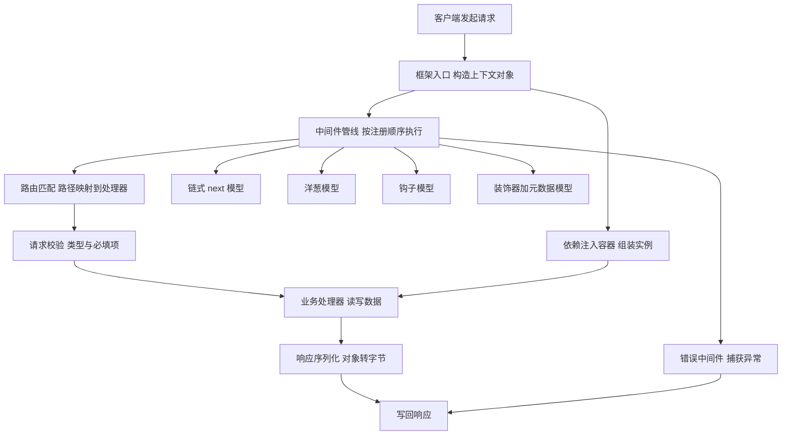
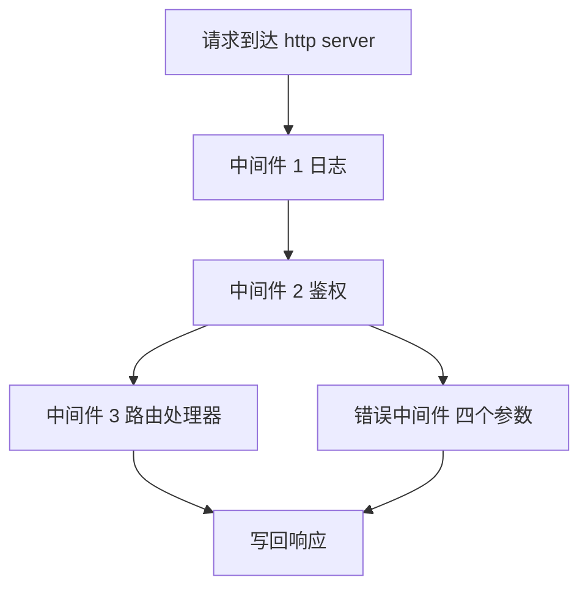
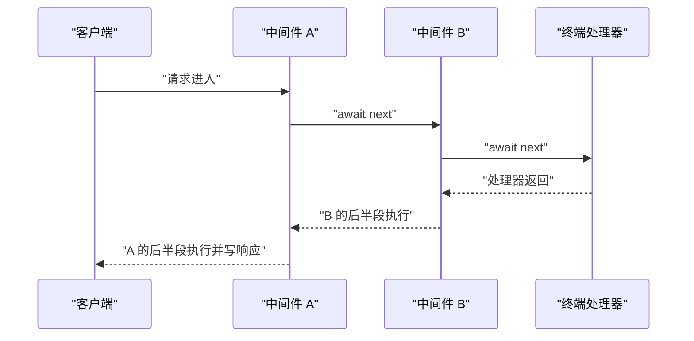
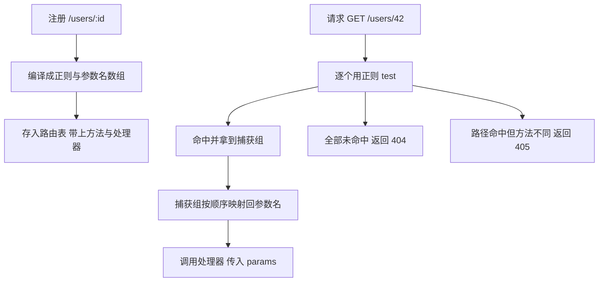
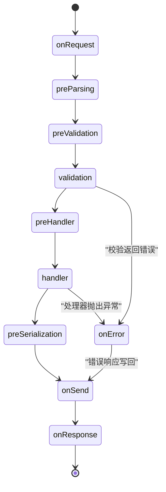
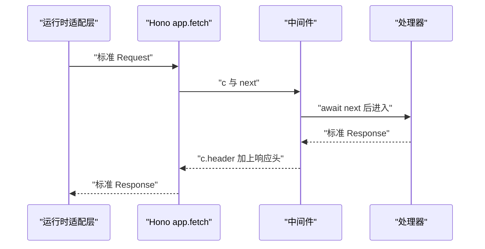
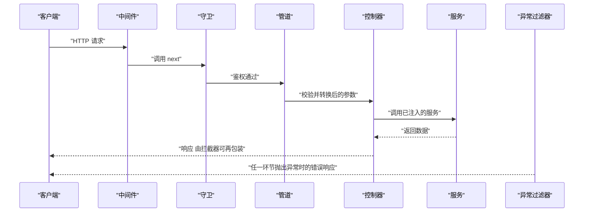
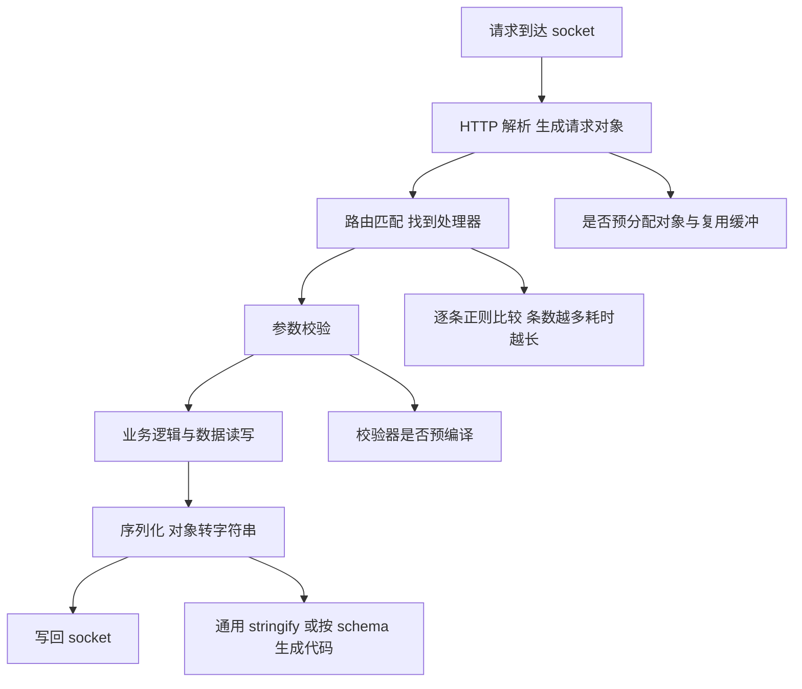

# 服务端框架：Express、Koa、Fastify、Hono、NestJS 的中间件模型

!!! abstract "学完这一页你能"
    - 说清 Express 的 `next()` 在什么条件下把请求交给下一个函数，什么条件下让连接一直挂起。
    - 手写一个 20 行的 `compose` 和一个支持 `:id` 的迷你路由器，并解释 `await next()` 前后的代码分别在何时执行。
    - 按请求生命周期念出 Fastify 的钩子顺序与 NestJS 的守卫、拦截器、管道顺序，并说明两者顺序不同的原因。
    - 用一个可复现的实验分离出路由匹配与响应序列化的开销，并说出这个实验的边界在哪里。

## 0. 知识地图



这张图是请求从进门到出门的完整路径，五个框架的差别集中在 `C` 这一个方框里。

建议读法分三段。

第一段读第 1、2、3 节，把"请求管线"和"路由匹配"两个底座打牢，后面的框架都是在这两个底座上换外壳。

第二段读第 4、5、6 节，一次只看一个框架的管线形状，不要横向比较。

第三段读第 7 节与综合对比，用可复现的实验把前面的直觉换成可以量出来的差异。

!!! note "术语：中间件 middleware"
    中间件是一段可以拿到请求与响应对象、并决定是否把控制权交给下一个函数的代码。例：`app.use((req, res, next) => next())`。

!!! note "术语：请求管线 request pipeline"
    请求管线指请求进入框架后依次经过的函数序列。例：日志中间件、鉴权中间件、路由处理器组成一条管线。

## 1. 链式 next：Express 的中间件模型

**先想一个问题**

你要给每个请求打一行访问日志，同时只在 `/admin` 开头的老路径上检查令牌。

这两件事要不要塞进同一个函数里？

**心智模型**

!!! tip "心智模型"
    一句话模型：Express 的中间件是一串排队过闸机的人，每个人自己决定放行、拦下，或者放行之后再补一笔记录。

    日常类比：地铁闸机。你刷一次卡往前走一步，闸机不关心你后面还有几台闸机。

    类比不成立的地方：闸机之间互相不知道对方存在，也无法知道"出站之后"发生了什么。要在请求处理完之后做事，只能靠后面的人回头喊你，这正是 Express 与 Koa 的主要差别。

Express 需要中间件，是因为一个 HTTP 请求要做的事情太多：解析、鉴权、限流、业务、日志。

把每件事写成独立函数，你就能按需拼装，也能单独替换其中一段。

!!! note "术语：next"
    `next` 是一个函数参数，调用它表示"我处理完了，把请求交给下一个函数"。例：`next()` 表示放行；`next(err)` 表示把错误交给错误中间件。

**图解**



逐步解读：

1. 请求进入 `http server`，框架按注册顺序从数组里取第 1 个中间件。
2. 中间件 1 写入日志头，然后调用 `next()`，控制权交给中间件 2。
3. 中间件 2 检查令牌，通过则再次调用 `next()`，不通过则直接 `res.end` 结束，后面的函数不执行。
4. 中间件 3 是路由处理器，它通常不调用 `next()`，写完响应就结束这条链。
5. 任何一步调用 `next(err)`，控制权跳到参数个数为 4 的错误中间件。
6. 如果链条走完却没有人写响应，连接会保持挂起，客户端等到超时。

**一步一步来**

第 1 步：用原生 `node:http` 搭一个链式分发器。

```js
// 依赖：仅 Node 20+ 内置模块
import http from 'node:http';

const stack = [];                                   // 中间件按注册顺序存进数组
const use = (fn) => stack.push(fn);                 // 注册一个中间件

use((req, res, next) => {                           // 第 1 个中间件：记录日志
  res.setHeader('x-log', 'hit');                    // 在响应头留一个可断言的痕迹
  next();                                           // 放行，交给下一个
});

use((req, res) => {                                 // 第 2 个中间件：终端处理器
  res.end('hello ' + req.url);                      // 写回响应，链条到此结束
});

function dispatch(req, res) {                        // 把数组变成可执行链条
  let i = 0;                                        // i 记录当前执行到第几个中间件
  const next = (err) => {                           // 声明 next，闭包保留 i
    if (err) {                                      // 有错误就短路到错误处理
      res.statusCode = 500;
      return res.end('error');
    }
    const fn = stack[i++];                          // 取出下一个，同时把指针后移
    if (!fn) return;                                // 没有下一个就返回，响应保持挂起
    fn(req, res, next);                             // 调用中间件，把 next 传进去
  };
  next();                                            // 启动链条
}
```

**这段代码在做什么**

- `stack` 是管线的唯一数据源，`use` 只是往里追加，顺序即执行顺序。
- `i` 通过闭包在多次 `next()` 调用之间共享，所以不会重复执行同一个中间件。
- `if (!fn) return` 是 Express 行为的核心：链条走完就静止，连接挂起等待超时。
- `if (err)` 分支是错误通道，真实框架会再检查中间件形参个数是否为 4。
- 中间件收到的 `req` 与 `res` 是同一个对象，所以可以在前一个中间件上挂字段供后面读取。

第 2 步：加上路径前缀判断，让鉴权只作用于 `/admin`。

```js
use((req, res, next) => {                           // 第 2 个中间件：只挡 /admin
  if (req.url.startsWith('/admin') === false) {      // 路径不匹配就直接放行
    return next();
  }
  if (req.headers['x-token'] !== 'ok') {             // 令牌不对就拦下
    res.statusCode = 401;
    return res.end('denied');
  }
  next();                                            // 令牌正确，放行
});
```

**这段代码在做什么**

- 判断放在最前面，路径不匹配时开销只有一次字符串前缀比较。
- `return next()` 里的 `return` 用于阻止函数继续往下走。
- 拦下时直接写响应，不调用 `next()`，后面的路由处理器不会执行。
- 令牌用请求头传递，这样可以直接用 `fetch` 复现，不依赖浏览器。

第 3 步：启动服务并写断言。

```js
const server = http.createServer(dispatch);
await new Promise((r) => server.listen(0, r));       // 端口 0 让系统分配空闲端口
const base = `http://127.0.0.1:${server.address().port}`;

const ok = await fetch(base + '/users');
console.log('状态码', ok.status, '日志头', ok.headers.get('x-log'));
```

运行结果：

```
状态码 200 日志头 hit
```

**动手验证**

```js
// 依赖：仅 Node 20+ 内置模块 node:http 与 node:assert
import http from 'node:http';
import assert from 'node:assert/strict';

const stack = [];
const use = (fn) => stack.push(fn);

use((req, res, next) => { res.setHeader('x-log', 'hit'); next(); });
use((req, res, next) => {
  if (req.url.startsWith('/admin') === false) return next();
  if (req.headers['x-token'] !== 'ok') { res.statusCode = 401; return res.end('denied'); }
  next();
});
use((req, res) => { res.end('hello ' + req.url); });

function dispatch(req, res) {
  let i = 0;
  const next = (err) => {
    if (err) { res.statusCode = 500; return res.end('error'); }
    const fn = stack[i++];
    if (!fn) return;
    fn(req, res, next);
  };
  next();
}

const server = http.createServer(dispatch);
await new Promise((r) => server.listen(0, r));
const base = `http://127.0.0.1:${server.address().port}`;

const ok = await fetch(base + '/users');
assert.equal(ok.status, 200);
assert.equal(ok.headers.get('x-log'), 'hit');
assert.equal(await ok.text(), 'hello /users');

const denied = await fetch(base + '/admin');
assert.equal(denied.status, 401);

const allowed = await fetch(base + '/admin', { headers: { 'x-token': 'ok' } });
assert.equal(allowed.status, 200);
assert.equal(await allowed.text(), 'hello /admin');

server.close();
console.log('全部断言通过');
```

预期输出：

```
全部断言通过
```

**常见坑**

| 现象 | 原因 | 怎么修 |
| --- | --- | --- |
| 请求一直转圈直到超时 | 某个中间件既没有调用 `next()`，也没有写响应 | 在每个分支上二选一：要么 `next()`，要么 `res.end(...)` |
| 错误中间件不生效 | 形参个数不是 4，框架按普通中间件处理 | 写成 `(err, req, res, next)` 四个形参 |
| 同一个中间件被执行两次 | 在一个中间件里调用了两次 `next()` | 在 `next()` 前加 `return`，或用一个布尔标记 |
| 后面读不到前面挂的字段 | 字段挂在了别的对象上 | 统一挂到 `req` 上，并先判断是否存在 |

**小结**

1. 链式模型的调度器只有数组加下标两样东西，`next()` 就是把下标加一。
2. 不调用 `next()` 且不写响应，就是挂起；这是新手最常见的线上事故。
3. Express 的错误通道按形参个数区分，所以错误中间件必须是 4 个参数。

## 2. 洋葱模型：Koa 与手写 koa-compose

**先想一个问题**

你要统计每个请求的处理耗时，并写进响应头 `x-duration`。

Express 里你只能在 `next()` 之前写这个头，可那时业务还没跑完，耗时根本没算出来。

**心智模型**

!!! tip "心智模型"
    一句话模型：洋葱模型把中间件排成一层层的皮，进入时从外往里走，返回时从里往外走。

    日常类比：进楼时过三道安检门，出门时按相反顺序再过这三道门，每道门都能在"出门"时补做一件事。

    类比不成立的地方：洋葱的每层厚薄一致，而中间件耗时差别大；实际结构也不是嵌套的数据容器，而是一次函数调用栈。

Koa 需要洋葱模型，是因为"在业务处理完之后做事"的需求无法用链式模型自然表达。

响应头、耗时统计、把结果统一包一层格式、事务提交或回滚，都属于这类需求。

!!! note "术语：compose"
    `compose` 是把中间件数组折叠成单个函数的函数，折叠后的函数接收上下文对象。例：`const run = compose([a, b]); await run(ctx)`。

!!! note "术语：上下文对象 context"
    上下文对象把同一次请求要用到的数据集中在同一个对象上。例：Koa 的 `ctx` 同时挂着 `ctx.req`、`ctx.body`、`ctx.state`。

**图解**



逐步解读：

1. 客户端请求先到最外层中间件 A，A 记录开始时间。
2. A 调用 `await next()`，控制权进入 B，此时 A 暂停在这一行。
3. B 也调用 `await next()`，控制权进入终端处理器。
4. 处理器直接写响应，不调用 `next()`，它是链条的最内层。
5. 处理器返回后，B 的 `await next()` 恢复，B 的后续代码执行。
6. B 返回后，A 的 `await next()` 恢复，A 计算耗时并设置响应头。

**一步一步来**

第 1 步：写一个 20 行的 `compose`。

```js
export function compose(middlewares) {
  for (const [i, fn] of middlewares.entries()) {     // 注册阶段就检查类型
    if (typeof fn !== 'function') {
      throw new TypeError('middleware[' + i + '] 不是函数'); // 报错带上下标
    }
  }
  return function composed(ctx, nextOuter) {
    let index = -1;                                  // 已执行到的层号
    function dispatch(i) {
      if (i <= index) {                              // 同一次请求里重复 next
        return Promise.reject(new Error('next 被调用了多次'));
      }
      index = i;                                     // 记录当前层号
      let fn = middlewares[i];
      if (i === middlewares.length) fn = nextOuter;  // 走完所有层交给外层
      if (!fn) return Promise.resolve();             // 没有外层就正常结束
      try {
        return Promise.resolve(fn(ctx, () => dispatch(i + 1)));
      } catch (err) {
        return Promise.reject(err);                  // 同步抛错也转成 rejected
      }
    }
    return dispatch(0);
  };
}
```

**这段代码在做什么**

- 注册阶段遍历数组检查类型，错误信息带下标，定位更快。
- `index` 每个请求一份，所以并发请求之间不会互相干扰。
- `i <= index` 的判断拦住"同一个中间件调用两次 `next()`"这种写法错误。
- `if (i === middlewares.length) fn = nextOuter` 让 `compose` 可以被嵌套组合。
- `try/catch` 把同步异常统一成 rejected Promise，调用方只需要处理一种情况。

第 2 步：用 `await next()` 把"前后夹心"写出来。

```js
const order = [];                                   // 记录执行顺序，方便断言

const mw1 = async (ctx, next) => {
  order.push('1-enter');                            // 进入 A
  const start = performance.now();                  // 记录开始时间
  await next();                                     // 暂停，进入内层
  const cost = Math.round(performance.now() - start);
  ctx.res.setHeader('x-duration', String(cost));    // 内层全部返回后才执行
  order.push('1-exit');                             // 记录 A 的出口
};

const mw2 = async (ctx, next) => {
  order.push('2-enter');
  await next();
  order.push('2-exit');
};
```

**这段代码在做什么**

- `await next()` 之前是进入阶段，之后是返回阶段，两段代码的顺序天然相反。
- 耗时统计只有在 `await next()` 之后才能得到完整数字。
- `order` 数组把执行顺序变成可以断言的数据，而不是靠人眼看日志。
- 中间件不需要知道内层有几个函数，也不需要回调参数。

第 3 步：接上 `http` 服务器，加一个把异常转成 500 的兜底。

```js
const handler = async (ctx) => { order.push('handler'); ctx.res.end('ok'); };
const run = compose([mw1, mw2, handler]);            // 折叠成单个函数

const server = http.createServer((req, res) => {
  run({ req, res }).catch(() => {                    // 所有异常在一处收口
    res.statusCode = 500;
    res.end('error');
  });
});
```

**这段代码在做什么**

- `compose` 在服务启动前只调用一次，请求进来只需执行折叠后的函数。
- `run` 返回 Promise，所以中间件里的 `async` 异常能被 `.catch` 拿到。
- 兜底写在服务器回调里，而不是每个中间件里重复写。
- 上下文对象在这里只有 `req` 与 `res` 两个字段，Koa 会在此基础上加很多。

第 4 步：验证顺序。

运行结果：

```
全部断言通过，执行顺序= 1-enter -> 2-enter -> handler -> 2-exit -> 1-exit
```

**动手验证**

```js
// 依赖：仅 Node 20+ 内置模块
import http from 'node:http';
import assert from 'node:assert/strict';

function compose(middlewares) {
  for (const [i, fn] of middlewares.entries()) {
    if (typeof fn !== 'function') throw new TypeError('middleware[' + i + '] 不是函数');
  }
  return function composed(ctx, nextOuter) {
    let index = -1;
    function dispatch(i) {
      if (i <= index) return Promise.reject(new Error('next 被调用了多次'));
      index = i;
      let fn = middlewares[i];
      if (i === middlewares.length) fn = nextOuter;
      if (!fn) return Promise.resolve();
      try {
        return Promise.resolve(fn(ctx, () => dispatch(i + 1)));
      } catch (err) {
        return Promise.reject(err);
      }
    }
    return dispatch(0);
  };
}

const order = [];
const mw1 = async (ctx, next) => {
  order.push('1-enter');
  const start = performance.now();
  await next();
  ctx.res.setHeader('x-duration', String(Math.round(performance.now() - start)));
  order.push('1-exit');
};
const mw2 = async (ctx, next) => { order.push('2-enter'); await next(); order.push('2-exit'); };
const handler = async (ctx) => { order.push('handler'); ctx.res.end('ok'); };

const run = compose([mw1, mw2, handler]);
const server = http.createServer((req, res) => {
  run({ req, res }).catch(() => { res.statusCode = 500; res.end('error'); });
});

await new Promise((r) => server.listen(0, r));
const base = `http://127.0.0.1:${server.address().port}`;
const res = await fetch(base + '/');
assert.equal(await res.text(), 'ok');
assert.equal(res.headers.get('x-duration') !== null, true);
assert.deepEqual(order, ['1-enter', '2-enter', 'handler', '2-exit', '1-exit']);

server.close();
console.log('全部断言通过，执行顺序=', order.join(' -> '));
```

预期输出：

```
全部断言通过，执行顺序= 1-enter -> 2-enter -> handler -> 2-exit -> 1-exit
```

**常见坑**

| 现象 | 原因 | 怎么修 |
| --- | --- | --- |
| 报错 `next 被调用了多次` | 某个中间件里调了两次 `next()` | 检查是否有 `if/else` 漏了 `return` |
| 后面的中间件拿不到前面设置的值 | 值挂在了模块级变量上，并发时互相覆盖 | 把值挂到 `ctx` 或 `ctx.state` 上 |
| 性能统计为 0 | 统计写在了 `await next()` 之前 | 把统计代码移到 `await next()` 之后 |
| 中间件里的同步抛错无人接住 | 调用方没有 `.catch` | 在服务器回调里统一 `.catch` |

**小结**

1. 洋葱模型的全部机制就是 `await next()` 把控制权交出去，返回时从内层一路恢复。
2. `index` 变量是每次请求独立的一份，用来防重复调用 `next()`。
3. `compose` 把数组折叠成函数，注册阶段做类型检查，请求阶段只做下标推进。

## 3. 路由匹配与手写迷你路由器

**先想一个问题**

你有 `/users/new` 和 `/users/:id` 两条路由。

如果按注册顺序用前缀比较，请求 `/users/new` 会不会被当成 `id` 等于 `new`？

**心智模型**

!!! tip "心智模型"
    一句话模型：路由匹配是把请求路径和一条条模式比对，第一条命中的模式决定调用哪个处理器。

    日常类比：图书馆书架编号。先按区找，再按排找，最后按层找，越靠近根部的判断被重复利用的次数越多。

    类比不成立的地方：书架不会因为你先查了 A 区就把 A 区记到缓存里，而路由表可以被编译成正则或树结构，遍历次数与路径段数相关而不是与路由条数相关。

需要路由匹配，是因为一个服务会注册几十到几百条路径，逐条字符串比较的开销随条数增长。

把路径编译成结构与正则，就能让每次匹配的步骤数与路径段数挂钩。

!!! note "术语：路径参数 path parameter"
    路径参数是模式里用冒号开头的占位段，匹配成功后它的实际值会被提取到对象里。例：模式 `/users/:id` 匹配 `/users/42` 后得到 `{ id: '42' }`。

!!! note "术语：前缀树 radix tree"
    前缀树是一种按键的公共前缀分层的树结构，查找步骤数与键长度相关。例：`/api/v1/a` 与 `/api/v1/b` 共用 `/api/v1/` 这段前进路径。

**图解**



逐步解读：

1. 注册阶段把 `/users/:id` 里的 `:id` 换成一段非斜杠字符的捕获组，并把 `id` 记进参数名数组。
2. 正则与参数名数组、HTTP 方法、处理器一起存进路由表。
3. 请求进来后拿路径逐个跑正则，直到有一条返回匹配结果。
4. 命中的正则结果里，第一个捕获组对应参数名数组的第一个名字。
5. 按顺序映射后得到 `{ id: '42' }`，作为 `params` 传给处理器。
6. 全部正则都不匹配则返回 404；有正则匹配但方法不对则返回 405。

**一步一步来**

第 1 步：把模式字符串编译成正则与参数名数组。

```js
function compile(path) {
  const keys = [];                                   // 参数名按出现顺序存放
  const pattern = path
    .replace(/\/+$/, '')                             // 去掉结尾多余的斜杠
    .replace(/:([A-Za-z_][A-Za-z0-9_]*)/g, (_, key) => {
      keys.push(key);                                // 记住参数名
      return '([^/]+)';                              // 一段非斜杠字符作为捕获组
    })
    .replace(/\*/g, '(.*)');                         // 通配符吃掉剩余路径
  return { keys, re: new RegExp('^' + pattern + '/?$') }; // 允许结尾带一个斜杠
}
```

**这段代码在做什么**

- `keys` 的顺序与后面捕获组的顺序严格一致，这是映射回参数名的前提。
- 捕获组写成 `([^/]+)` 而不是 `(.*)`，这样 `/users/42/extra` 不会误命中 `/users/:id`。
- 结尾的 `/?` 让 `/users/42` 与 `/users/42/` 命中同一条路由。
- 编译只在注册时做一次，请求阶段只跑正则。

第 2 步：写路由表与查找函数，区分 404 与 405。

```js
const routes = [];

function add(method, path, handler) {
  const { keys, re } = compile(path);
  routes.push({ method, keys, re, handler });        // 一条路由的全部信息
}

function match(method, pathname) {
  let pathMatched = false;                           // 是否有路径命中但方法不同
  for (const r of routes) {
    const m = r.re.exec(pathname);
    if (m === null) continue;                        // 正则不命中就试下一条
    pathMatched = true;
    if (r.method !== method) continue;               // 方法不同，继续找
    const params = {};
    r.keys.forEach((k, i) => { params[k] = decodeURIComponent(m[i + 1]); });
    return { route: r, params, pathMatched: true };
  }
  return { route: null, params: null, pathMatched };  // 交给调用方决定状态码
}
```

**这段代码在做什么**

- `pathMatched` 把"路径存在但方法不对"与"路径根本不存在"区分开。
- `m[i + 1]` 之所以从 1 开始，是因为 `m[0]` 是整段匹配到的字符串。
- `decodeURIComponent` 让 `/users/%E5%BC%A0%E4%B8%89` 还原成可读的参数值。
- 返回结构里带上 `pathMatched`，让状态码决策集中在一处。

第 3 步：把查找结果转成 HTTP 状态码。

```js
const server = http.createServer((req, res) => {
  const url = new URL(req.url, 'http://localhost');  // 拆出 pathname 与查询串
  const found = match(req.method, url.pathname);
  if (found.route === null) {                        // 没有可用的路由
    res.statusCode = found.pathMatched ? 405 : 404;   // 方法不对给 405
    res.setHeader('content-type', 'application/json');
    return res.end(JSON.stringify({ error: res.statusCode }));
  }
  res.setHeader('content-type', 'application/json');
  res.end(JSON.stringify(found.params));             // 把参数原本返回，便于断言
});
```

**这段代码在做什么**

- 用 `new URL` 拆路径，避免手动处理查询串时把 `?a=1` 当成路径的一部分。
- 没有路由可用时，用 `pathMatched` 选择 404 或 405。
- 响应体直接返回参数对象，测试时断言的是匹配逻辑本身，而不是业务逻辑。
- 状态码先设再写体，顺序不能反。

运行结果：

```
GET /users/42 -> 200 {"id":"42"}
GET /users/42/extra -> 404 {"error":404}
POST /users/42 -> 405 {"error":405}
```

**动手验证**

```js
// 依赖：仅 Node 20+ 内置模块
import http from 'node:http';
import assert from 'node:assert/strict';

function compile(path) {
  const keys = [];
  const pattern = path
    .replace(/\/+$/, '')
    .replace(/:([A-Za-z_][A-Za-z0-9_]*)/g, (_, key) => { keys.push(key); return '([^/]+)'; })
    .replace(/\*/g, '(.*)');
  return { keys, re: new RegExp('^' + pattern + '/?$') };
}

const routes = [];
const add = (method, path, handler) => {
  const { keys, re } = compile(path);
  routes.push({ method, keys, re, handler });
};

function match(method, pathname) {
  let pathMatched = false;
  for (const r of routes) {
    const m = r.re.exec(pathname);
    if (m === null) continue;
    pathMatched = true;
    if (r.method !== method) continue;
    const params = {};
    r.keys.forEach((k, i) => { params[k] = decodeURIComponent(m[i + 1]); });
    return { route: r, params, pathMatched: true };
  }
  return { route: null, params: null, pathMatched };
}

add('GET', '/users/:id', () => {});

const server = http.createServer((req, res) => {
  const url = new URL(req.url, 'http://localhost');
  const found = match(req.method, url.pathname);
  res.setHeader('content-type', 'application/json');
  if (found.route === null) {
    res.statusCode = found.pathMatched ? 405 : 404;
    return res.end(JSON.stringify({ error: res.statusCode }));
  }
  res.end(JSON.stringify(found.params));
});

await new Promise((r) => server.listen(0, r));
const base = `http://127.0.0.1:${server.address().port}`;

const one = await fetch(base + '/users/42');
assert.equal(one.status, 200);
assert.deepEqual(await one.json(), { id: '42' });

const two = await fetch(base + '/users/42/extra');
assert.equal(two.status, 404);

const three = await fetch(base + '/users/42', { method: 'POST' });
assert.equal(three.status, 405);

const four = await fetch(base + '/users/42/');
assert.equal(four.status, 200);

server.close();
console.log('全部断言通过');
```

预期输出：

```
全部断言通过
```

**常见坑**

| 现象 | 原因 | 怎么修 |
| --- | --- | --- |
| `/users/42/extra` 命中了 `/users/:id` | 参数捕获组写成了 `(.*)` | 改成 `([^/]+)`，只吃一段路径 |
| 参数值是乱码 | 没有做百分号解码 | 对捕获组调用 `decodeURIComponent` |
| 405 变成了 404 | 找不到路由就直接返回 404 | 先记录"路径是否命中"，再判断方法 |
| 路由越加越慢 | 每条路由都新建正则且重复编译 | 注册阶段编译一次，把结果存进路由表 |

**小结**

1. 路由匹配的本质是模式编译加顺序查找，捕获组顺序与参数名数组顺序必须一致。
2. 捕获组用 `([^/]+)` 才能保证段数不匹配时不会误命中。
3. 把"路径命中"和"方法命中"分开记录，404 与 405 才有依据。

## 4. Fastify：钩子模型与校验、序列化

**先想一个问题**

你的接口收到 `{"age": "abc"}`，校验逻辑如果写在处理器里，每个接口都要抄一遍。

有没有办法把校验声明成数据结构，让框架自己执行？

**心智模型**

!!! tip "心智模型"
    一句话模型：Fastify 把请求生命周期切成固定站点，钩子就是在站点上下车的函数。

    日常类比：高铁线路图，每一站停靠的检查内容写在线路图上，你只能在既有站点加检查员。

    类比不成立的地方：线路图是固定站序，而 Fastify 的部分钩子可以按插件作用域生效，只作用于注册在同一个作用域里的路由。

需要钩子模型，是因为请求处理有明确的阶段划分：解析之前、校验之前、处理器之前、写回之前。

把检查挂到阶段上，同一份逻辑就能对一批路由生效，而不是每个处理器抄一遍。

!!! note "术语：钩子 hook"
    钩子是注册到请求生命周期某个固定阶段上的函数。例：`app.addHook('onRequest', fn)` 中的 `fn` 在请求刚进入、还没解析时执行。

!!! note "术语：序列化 serialization"
    序列化是把内存里的对象转成可传输字节的过程。例：把 `{ id: 1 }` 转成字符串 `{"id":1}`。

**图解**



逐步解读：

1. `onRequest` 在请求刚到达时执行，此时请求体还没有被解析。
2. `preParsing` 可以改写原始字节流，用于解密或改压缩格式。
3. `preValidation` 在解析之后、校验之前执行，适合对已解析的内容做预处理。
4. `validation` 是框架按 schema 执行的校验步骤，不通过就直接跳到 `onError`。
5. `preHandler` 在校验通过后执行，鉴权与权限判断通常放在这里。
6. 处理器返回后依次经过 `preSerialization`、`onSend`、`onResponse`，序列化发生在 `onSend` 之前。

**一步一步来**

第 1 步：用 schema 声明请求体规则。

```js
// 依赖：fastify（npm i fastify）。Node 20+
const schema = {
  body: {
    type: 'object',                                  // 请求体必须是一个对象
    required: ['name', 'age'],                       // 这两个字段必填
    additionalProperties: false,                     // 出现多余字段直接判错
    properties: {
      name: { type: 'string', minLength: 1 },        // 名字至少 1 个字符
      age: { type: 'integer', minimum: 0 }           // 年龄是非负整数
    }
  }
};
```

**这段代码在做什么**

- schema 是一份 JSON Schema，是纯数据，不是函数，所以可以被编译与复用。
- `required` 列出必填字段，缺一个就返回 400。
- `additionalProperties: false` 让多余字段变成错误，而不是被静默忽略。
- 校验失败的响应由 Fastify 生成，处理器里的代码一行都不会执行。

第 2 步：用响应 schema 控制返回字段。

```js
const responseSchema = {
  201: {
    type: 'object',
    properties: {
      id: { type: 'integer' },                       // 只保留 id
      name: { type: 'string' }                       // 只保留 name
    }
  }
};
```

**这段代码在做什么**

- 响应 schema 按状态码分组，只有 201 这一个分支被声明。
- 处理器返回的多余字段会被序列化器丢掉，这是防止敏感字段外泄的一道闸门。
- 序列化按 schema 生成转换代码，字段类型被固定，输出不会有意外结构。
- 需核对官方文档：Validation and Serialization 章节中 response schema 对 `additionalProperties` 的默认处理。

第 3 步：注册钩子并观察顺序。

```js
app.addHook('onRequest', async () => { order.push('onRequest'); });
app.addHook('preHandler', async () => { order.push('preHandler'); });
app.addHook('onSend', async () => { order.push('onSend'); });
```

**这段代码在做什么**

- 三个钩子分别对应三个阶段，顺序由框架决定，不由注册顺序决定。
- 钩子函数用 `async` 声明，抛出的异常会进入 `onError`。
- `onSend` 在响应体已经序列化之后执行，最后一个参数是已序列化的字符串。
- `order` 数组把顺序变成可断言的数据。

运行结果：

```
全部断言通过，钩子顺序= onRequest -> preHandler -> onSend
```

**动手验证**

```js
// 依赖：fastify（npm i fastify）。Node 20+
import Fastify from 'fastify';
import assert from 'node:assert/strict';

const app = Fastify();
const order = [];

app.addHook('onRequest', async () => { order.push('onRequest'); });
app.addHook('preHandler', async () => { order.push('preHandler'); });
app.addHook('onSend', async () => { order.push('onSend'); });

app.post('/users', {
  schema: {
    body: {
      type: 'object',
      required: ['name', 'age'],
      additionalProperties: false,
      properties: { name: { type: 'string', minLength: 1 }, age: { type: 'integer', minimum: 0 } }
    },
    response: {
      201: { type: 'object', properties: { id: { type: 'integer' }, name: { type: 'string' } } }
    }
  }
}, async (req, reply) => reply.code(201).send({ id: 7, name: req.body.name, secret: '不该出现' }));

await app.listen({ port: 0, host: '127.0.0.1' });
const base = `http://127.0.0.1:${app.server.address().port}`;

const bad = await fetch(base + '/users', {
  method: 'POST',
  headers: { 'content-type': 'application/json' },
  body: JSON.stringify({ name: 'ada', age: 'abc' })
});
assert.equal(bad.status, 400);

order.length = 0;                                    // 清掉失败请求留下的记录
const good = await fetch(base + '/users', {
  method: 'POST',
  headers: { 'content-type': 'application/json' },
  body: JSON.stringify({ name: 'ada', age: 36 })
});
assert.equal(good.status, 201);
assert.deepEqual(await good.json(), { id: 7, name: 'ada' });
assert.deepEqual(order, ['onRequest', 'preHandler', 'onSend']);

await app.close();
console.log('全部断言通过，钩子顺序=', order.join(' -> '));
```

预期输出：

```
全部断言通过，钩子顺序= onRequest -> preHandler -> onSend
```

**常见坑**

| 现象 | 原因 | 怎么修 |
| --- | --- | --- |
| 校验通过但处理报错 | 校验只覆盖了 schema 里声明的字段 | 把必填字段全部写进 `required` |
| 返回体里多了字段 | 只声明了请求 schema，没有声明响应 schema | 在 `response` 下按状态码声明字段 |
| 钩子只对部分路由生效 | 钩子注册在插件作用域内，作用域被封装 | 把共享钩子注册到外层，或用 `fastify-plugin` 跳过封装 |
| 解析到的请求体是空对象 | `onRequest` 阶段读取 `req.body` | 读取请求体要放到 `preHandler` 或处理器里 |

**小结**

1. 钩子模型的站点顺序由框架定义，注册顺序不改变阶段顺序。
2. 校验与序列化都靠 schema 声明，让规则变成数据，可以被复用与集中检查。
3. 响应 schema 同时承担"裁剪字段"的职责，是防敏感字段外泄的一道闸门。

## 5. Hono：Web 标准中间件

**先想一个问题**

你写好的接口想同时跑在 Node、Deno、Cloudflare Workers 上。

代码里能不能出现 `http.createServer`？

**心智模型**

!!! tip "心智模型"
    一句话模型：Hono 的中间件只依赖 Web 标准的 `Request` 与 `Response`，不依赖任何运行时私有的请求对象。

    日常类比：一段用公制单位写的菜谱，换个国家的厨房照样能照着做。

    类比不成立的地方：不同运行时对标准 API 的覆盖有差异，文件读写、环境变量这些能力仍然要靠各自的适配层。

需要 Web 标准模型，是因为同一份业务代码要在多种运行时上部署，标准接口是唯一的公共面。

框架只做路由与中间件调度，输入输出都换成标准对象，多余的适配代码就消失了。

!!! note "术语：Web 标准 Request 与 Response"
    这两个是 WHATWG Fetch 规范定义的对象，浏览器与 Node 20+ 都内置。例：`new Request('http://localhost/users/1')` 可以直接交给处理器。

!!! note "术语：上下文对象 c"
    Hono 里中间件与处理器的第一个参数是上下文 `c`，它同时提供读写请求与构造响应的方法。例：`c.req.param('id')` 取路径参数，`c.json({})` 返回 JSON。

**图解**



逐步解读：

1. 运行时适配层把收到的网络数据包装成一个标准 `Request`。
2. `app.fetch` 是统一入口，Node、Deno、Workers 都调用它。
3. 中间件拿到上下文 `c` 与 `next`，在 `await next()` 之前做进入阶段的工作。
4. 处理器构造一个标准 `Response` 作为返回值。
5. 中间件在 `await next()` 之后可以修改这个 `Response` 的头部。
6. 最终返回的 `Response` 由适配层写回网络。

**一步一步来**

第 1 步：注册一个全局中间件并统计耗时。

```js
// 依赖：hono（npm i hono）。Node 20+
import { Hono } from 'hono';

const app = new Hono();
const order = [];

app.use('*', async (c, next) => {                    // 星号表示匹配所有路径
  order.push('mw-enter');
  const start = performance.now();
  await next();                                      // 交给内层
  c.header('x-duration', String(Math.round(performance.now() - start)));
  order.push('mw-exit');
});
```

**这段代码在做什么**

- `app.use` 的第一个参数是路径模式，`'*'` 表示所有路径都经过这个中间件。
- `c.header` 在 `await next()` 之后调用，此时响应已经生成，但仍然可以加头。
- `order` 数组与第 2 节的结构相同，便于跨框架比较。
- 中间件与处理器都接收同一个 `c`，所以能通过 `c.set` 与 `c.get` 传数据。

第 2 步：注册带路径参数的路由。

```js
app.get('/users/:id', (c) => {
  order.push('handler');
  return c.json({ id: c.req.param('id'), token: c.get('token') ?? null });
});
```

**这段代码在做什么**

- `c.req.param('id')` 返回字符串类型的路径参数。
- `c.get('token')` 读取由中间件通过 `c.set('token', value)` 写入的值。
- `?? null` 保证键不存在时返回 `null`，让断言的结果稳定。
- `c.json` 返回一个状态码 200 的 `Response`，不需要显式写状态码。

第 3 步：不启动服务器，直接调用 `app.fetch`。

```js
const res = await app.fetch(new Request('http://localhost/users/42'));
console.log('状态码', res.status, '耗时头', res.headers.get('x-duration'));
```

运行结果：

```
状态码 200 耗时头 0
```

**动手验证**

```js
// 依赖：hono（npm i hono）。Node 20+
import { Hono } from 'hono';
import assert from 'node:assert/strict';

const app = new Hono();
const order = [];

app.use('*', async (c, next) => {
  order.push('mw-enter');
  const start = performance.now();
  await next();
  c.header('x-duration', String(Math.round(performance.now() - start)));
  order.push('mw-exit');
});

app.get('/users/:id', (c) => {
  order.push('handler');
  return c.json({ id: c.req.param('id'), token: c.get('token') ?? null });
});

const res = await app.fetch(new Request('http://localhost/users/42'));
assert.equal(res.status, 200);
assert.equal(res.headers.get('x-duration') !== null, true);
assert.deepEqual(await res.json(), { id: '42', token: null });
assert.deepEqual(order, ['mw-enter', 'handler', 'mw-exit']);

const missing = await app.fetch(new Request('http://localhost/nope'));
assert.equal(missing.status, 404);

const wrongMethod = await app.fetch(new Request('http://localhost/users/42', { method: 'POST' }));
assert.equal(wrongMethod.status, 404);

console.log('全部断言通过');
```

预期输出：

```
全部断言通过
```

**常见坑**

| 现象 | 原因 | 怎么修 |
| --- | --- | --- |
| 中间件加的响应头丢失 | 在 `await next()` 之前取了响应对象 | 把 `c.header` 放到 `await next()` 之后 |
| 两个请求读到对方的用户信息 | 用模块级变量暂存当前用户 | 用 `c.set` 与 `c.get`，数据跟着上下文走 |
| 换成 Node 运行时后启动失败 | 代码里用了 Workers 专有的绑定对象 | 把平台能力放到适配层，业务代码只用 `c` |
| 路径参数里出现斜杠导致 404 | 路径本身包含未编码的 `/` | 发送前对参数值做 `encodeURIComponent` |

**小结**

1. Web 标准模型让同一份代码跨运行时复用，框架只负责路由与管线调度。
2. `c.set` 与 `c.get` 是跨中间件传值的推荐做法，避免模块级变量在并发下串数据。
3. 中间件在 `await next()` 之后才改响应头，这个顺序由洋葱结构决定。

## 6. NestJS：装饰器与依赖注入

**先想一个问题**

你的 `UserService` 需要日志与数据库两个依赖。

如果每个用到它的地方都自己 `new`，测试时怎么把它们换成假的？

**心智模型**

!!! tip "心智模型"
    一句话模型：你只声明"我需要什么"，容器在启动时把实例组装好并送进来。

    日常类比：餐厅点菜，你说明要什么菜，后厨负责把它做出来端上桌。

    类比不成立的地方：容器在启动阶段就把依赖图建完，运行时不再做类型反射；所以依赖成环会在启动时报错，而不是等到第一个请求。

需要依赖注入，是因为手动 `new` 会把创建细节和调用方绑死，替换实现与写测试都变成改业务代码。

把"创建"移交给容器后，替换实现只需要改注册处。

!!! note "术语：装饰器 decorator"
    装饰器是写在类、方法或参数上方、用来附加元数据的语法。例：`@Injectable()` 表示这个类可以被容器创建。

!!! note "术语：依赖注入 dependency injection"
    依赖注入是让外部把依赖实例传给使用者，而不是由使用者自己创建。例：构造函数接收 `UserService`，由容器传入。

!!! note "术语：控制反转 IoC"
    控制反转是把"创建与组装对象"的控制权从业务代码转交给容器。例：容器负责决定 `UserService` 用哪个数据库实现。

**图解**



逐步解读：

1. 中间件最先执行，它拿到的仍然是框架原生的请求与响应对象。
2. 守卫在路由确定之后、处理器之前执行，用来决定这个请求是否允许进入。
3. 管道在处理器之前把参数从字符串转成目标类型，同时执行校验。
4. 控制器的方法接收已经转换好的参数，并调用容器注入的服务。
5. 拦截器可以在方法返回后对结果再包装一次，也可以在调用前记录耗时。
6. 任何环节抛出异常，都会交给异常过滤器统一成错误响应。

**一步一步来**

第 1 步：写一个 20 行的容器，支持注册与解析。

```js
class Container {
  constructor() {
    this.factories = new Map();                      // 注册的创建函数
    this.instances = new Map();                      // 缓存已创建的实例
  }
  register(token, factory) {                         // token 是依赖的名字
    this.factories.set(token, factory);
    return this;
  }
  resolve(token) {
    if (this.instances.has(token)) return this.instances.get(token); // 默认单例
    const factory = this.factories.get(token);
    if (factory === undefined) {
      throw new Error('未注册的依赖: ' + token);      // 提前失败，定位更快
    }
    const instance = factory(this);                  // 把容器交给工厂取子依赖
    this.instances.set(token, instance);             // 缓存，后续解析复用
    return instance;
  }
}
```

**这段代码在做什么**

- `factories` 与 `instances` 分开存，注册与创建互不干扰。
- `this.instances.has(token)` 让同一个 token 只创建一次，对应 NestJS 的默认单例作用域。
- 工厂函数接收容器本身，所以子依赖由工厂自己去 `resolve`。
- 依赖不存在时直接抛错，问题在启动阶段暴露，而不是在第一个请求上暴露。

第 2 步：注册三个提供者，模拟日志、数据库与服务。

```js
const order = [];
const c = new Container();

c.register('logger', () => ({ log: (m) => order.push(m) }));
c.register('db', () => ({ findUser: (id) => ({ id, name: 'ada' }) }));
c.register('userService', (self) => {                 // self 就是容器本身
  const db = self.resolve('db');
  const logger = self.resolve('logger');
  return { get(id) { logger.log('query ' + id); return db.findUser(id); } };
});
```

**这段代码在做什么**

- 每个令牌对应一个创建函数，替换实现时只改这一行。
- `userService` 的工厂里显式解析两个子依赖，模拟构造函数注入。
- 日志被记录到 `order` 数组，让"服务被真正调用"这件事可断言。
- `db` 返回固定数据，把测试的重点放在装配逻辑上。

第 3 步：解析并验证单例行为。

```js
const a = c.resolve('userService');
const b = c.resolve('userService');
console.log('同一个实例', a === b, '查询结果', JSON.stringify(a.get(9)));
```

运行结果：

```
同一个实例 true 查询结果 {"id":9,"name":"ada"}
```

**动手验证**

```js
// 依赖：仅 Node 20+ 内置模块
import assert from 'node:assert/strict';

class Container {
  constructor() {
    this.factories = new Map();
    this.instances = new Map();
  }
  register(token, factory) {
    this.factories.set(token, factory);
    return this;
  }
  resolve(token) {
    if (this.instances.has(token)) return this.instances.get(token);
    const factory = this.factories.get(token);
    if (factory === undefined) throw new Error('未注册的依赖: ' + token);
    const instance = factory(this);
    this.instances.set(token, instance);
    return instance;
  }
}

const order = [];
const c = new Container();

c.register('logger', () => ({ log: (m) => order.push(m) }));
c.register('db', () => ({ findUser: (id) => ({ id, name: 'ada' }) }));
c.register('userService', (self) => {
  const db = self.resolve('db');
  const logger = self.resolve('logger');
  return { get(id) { logger.log('query ' + id); return db.findUser(id); } };
});

const a = c.resolve('userService');
const b = c.resolve('userService');
assert.equal(a === b, true);
assert.deepEqual(a.get(9), { id: 9, name: 'ada' });
assert.deepEqual(order, ['query 9']);

let threw = false;
try {
  c.resolve('mailer');
} catch (err) {
  threw = true;
  assert.equal(err.message, '未注册的依赖: mailer');
}
assert.equal(threw, true);

console.log('全部断言通过，单例复用生效');
```

预期输出：

```
全部断言通过，单例复用生效
```

**常见坑**

| 现象 | 原因 | 怎么修 |
| --- | --- | --- |
| 启动时报依赖找不到 | 提供者没有在模块的 `providers` 里注册 | 把提供者加入 `providers`，需要跨模块时导出 |
| 启动时报循环依赖 | 两个提供者互相在构造函数里注入 | 用前向引用或把公共部分抽成第三个提供者 |
| 明明注册了却拿到两个实例 | 作用域被声明成每次请求新建 | 检查 `scope` 配置，需核对官方文档：Injection scopes 章节 |
| 装饰器元数据不生效 | 编译配置没有打开装饰器元数据输出 | 检查 `tsconfig` 的 `experimentalDecorators` 与 `emitDecoratorMetadata` |

**小结**

1. 容器的核心是一张注册表加一张实例缓存，单例默认来自缓存。
2. 依赖图在启动阶段建立，所以缺依赖与成环都在启动时报错。
3. 把创建交给容器后，替换实现只需要改注册处那一行。

## 7. 性能差异从哪里来

**先想一个问题**

同一个返回 JSON 的接口，换框架跑压测，每秒请求数能差出一大截。

差在路由、校验，还是序列化？

**心智模型**

!!! tip "心智模型"
    一句话模型：每秒请求数等于请求路径上每一步开销之和的倒数。

    日常类比：快递分拣线，每个环节省一秒，一天下来省出的时间很可观。

    类比不成立的地方：分拣线可以并行加人，而 Node 默认在单线程里跑 JavaScript，加人要靠多进程或多线程。

需要弄清开销来源，是因为换框架只解决其中一部分，数据库与外部调用往往占掉剩下的部分。

先量出每一步的占比，再决定要不要换。

!!! note "术语：序列化开销"
    序列化开销指把对象转成字节所花的时间，它随对象字段数与嵌套深度增长。例：返回 200 个字段的对象比返回 2 个字段的对象需要拼接更长的字符串。

!!! note "术语：压测工具"
    压测工具是按设定并发数与时长持续发请求并统计结果的程序。例：`autocannon -c 100 -d 10` 表示 100 并发持续 10 秒。

**图解**



逐步解读：

1. HTTP 解析由 Node 的 `http_parser` 完成，框架在这一步的差别主要来自有没有额外拷贝。
2. 路由匹配的开销取决于实现：逐条正则比较的步骤数与路由条数相关，前缀树与哈希的步骤数与路径段数相关。
3. 校验的开销取决于校验器是否在启动时编译成函数，还是每次请求解释 schema。
4. 业务与数据读写的耗时通常占据主要部分，需要先量出它的占比。
5. 序列化的开销取决于字段数与字符串拼接策略，按 schema 生成代码可以省掉通用的类型判断。
6. 写回 socket 的开销与响应字节数成正比，压缩会增加 CPU 时间。

**一步一步来**

第 1 步：把路由匹配单独拎出来对比。

```js
// 依赖：仅 Node 20+ 内置模块
const N = 5000;
const list = [];
const exact = new Map();
for (let i = 0; i < N; i++) {
  const p = '/api/v1/resource' + i;                  // 造 5000 条精确路径
  list.push([p, i]);
  exact.set(p, i);
}
```

**这段代码在做什么**

- 用 5000 条路径放大两种查找方式的差别，避免噪声盖过信号。
- `list` 模拟逐条比较的路由表，`exact` 模拟按键定位的结构。
- 路径数量固定，这样耗时的变化只来自查找方式。

第 2 步：写两种查找并各跑 1000 次。

```js
function scan(p) {
  for (const [k, v] of list) if (k === p) return v;  // 逐条比较
  return -1;
}

const TARGET = '/api/v1/resource' + (N - 1);         // 挑最后一条，放大线性扫描成本
const R = 1000;

let sum = 0;
const t0 = performance.now();
for (let i = 0; i < R; i++) sum += scan(TARGET);
const t1 = performance.now();
assert.equal(sum, R * (N - 1));
```

**这段代码在做什么**

- 目标路径选最后一条，让线性扫描必须走满整张表。
- 重复 1000 次是为了让耗时超过计时器噪声。
- `assert.equal(sum, R * (N - 1))` 保证两种查找返回的结果一致，先证对再比快。
- 两次测量之间不做别的操作，减少缓存与调度带来的干扰。

第 3 步：把方法用在自己服务上。

```js
// 在本地串行跑 N 次请求，记录耗时分布，而不是只看平均值
for (let i = 0; i < 200; i++) {
  const start = performance.now();
  await fetch(base + '/api/bench');
  samples.push(performance.now() - start);
}
```

**这段代码在做什么**

- 串行请求排除并发调度的影响，先看单请求成本。
- 记录完整样本而不是只看平均值，才能看出长尾。
- 把 `samples` 排序后取第 95 百分位，比平均数更能反映用户体验。
- 这个测量只反映本地回环，真实网络与数据库需要单独的压测环境。

运行结果（本机示例，数字随机器变化）：

```
线性扫描毫秒 = 812.40
Map 查找毫秒 = 0.35
```

**动手验证**

```js
// 依赖：仅 Node 20+ 内置模块
import assert from 'node:assert/strict';

const N = 5000;
const R = 1000;
const list = [];
const exact = new Map();
for (let i = 0; i < N; i++) {
  const p = '/api/v1/resource' + i;
  list.push([p, i]);
  exact.set(p, i);
}

function scan(p) {
  for (const [k, v] of list) if (k === p) return v;
  return -1;
}

const TARGET = '/api/v1/resource' + (N - 1);

let sum = 0;
const t0 = performance.now();
for (let i = 0; i < R; i++) sum += scan(TARGET);
const t1 = performance.now();
assert.equal(sum, R * (N - 1));

let sum2 = 0;
const t2 = performance.now();
for (let i = 0; i < R; i++) sum2 += exact.get(TARGET);
const t3 = performance.now();
assert.equal(sum2, R * (N - 1));
assert.equal(scan(TARGET), exact.get(TARGET));

console.log('线性扫描毫秒 =', (t1 - t0).toFixed(2));
console.log('Map 查找毫秒 =', (t3 - t2).toFixed(2));
console.log('两种方式结果一致，路由条数 =', N, '重复次数 =', R);
```

预期输出（数字随机器变化，断言必然通过）：

```
线性扫描毫秒 = 812.40
Map 查找毫秒 = 0.35
两种方式结果一致，路由条数 = 5000 重复次数 = 1000
```

边界说明：真实框架的查找结构还要支持路径参数与通配符，本实验只分离出"逐条比较"与"按键定位"这两种方式的差异。

比较框架吞吐时，需要核对官方 benchmark 的机器型号、Node 版本、并发数与连接复用设置。

**常见坑**

| 现象 | 原因 | 怎么修 |
| --- | --- | --- |
| 压测结果忽高忽低 | 本机同时在做别的事，或只跑了一次 | 固定机器状态，跑三次取中位数，记录第 95 百分位 |
| 换了框架吞吐没变 | 瓶颈在数据库或外部接口 | 先量各阶段耗时占比，再决定优化目标 |
| 单请求测试显示框架很慢 | 包含了建立连接的时间 | 复用连接，或在客户端与服务端放同一台机器 |
| 序列化成了瓶颈 | 返回体字段多且每次都做通用类型判断 | 声明响应 schema，让序列化代码按结构生成 |

**小结**

1. 吞吐的分母是整条请求路径的耗时之和，换框架只影响其中几步。
2. 先证明结果正确，再比较速度；两次查找返回同一个值，比较才有意义。
3. 报数字必须带上机器、版本、并发数与统计口径，否则数字没有意义。

## 综合对比

| 维度 | Express | Koa | Fastify | Hono | NestJS |
| --- | --- | --- | --- | --- | --- |
| 中间件签名 | `(req, res, next)` | `(ctx, next)` 配合 `await` | `(request, reply)` 加钩子 | `(c, next)` 配合 `await` | 由适配器决定，控制器用装饰器 |
| 执行模型 | 链式，调用 `next()` 前进 | 洋葱，`await next()` 前后夹心 | 固定阶段钩子，按生命周期触发 | 洋葱，`await next()` 前后夹心 | 中间件加守卫、拦截器、管道多段 |
| 错误处理 | 四参数错误中间件 | `try/catch` 加应用级 `error` 事件 | `onError` 钩子加 `setErrorHandler` | `app.onError` 加 `try/catch` | 异常过滤器 |
| 路由实现 | 内部路由表逐条匹配 | 需搭配路由库 | 前缀树查找 | 由路由器策略选择实现，需核对官方文档：Routing 章节 | 由适配器提供，控制器声明前缀 |
| 请求校验 | 无内置，自行引入 | 无内置，自行引入 | JSON Schema 声明式 | 无内置，用第三方校验器 | 管道加类校验器，需核对官方文档：Pipes 章节 |
| 响应序列化 | 手动 `JSON.stringify` | 手动赋值 `ctx.body` | 按响应 schema 生成转换代码 | `c.json` 内部调用标准序列化 | 拦截器加类转换器 |
| 依赖注入 | 无 | 无 | 插件封装加装饰器注册，需核对官方文档 | 无内置容器 | 内置容器，默认单例作用域 |
| 多运行时 | Node | Node | Node | Node、Deno、Workers 等，需核对官方文档：Runtime 章节 | Node，可换适配器 |
| 适合的起点 | 需要大量现成中间件 | 想要洋葱语义且自选组件 | 需要声明式校验与序列化 | 需要跨运行时复用同一份代码 | 团队需要统一分层与注入规范 |

## 应用与行业实践

### 应用场景地图

| 场景 | 用到本页哪个知识点 | 典型技术选型 | 注意事项 |
| --- | --- | --- | --- |
| 后台管理的万行表格，滚动分页拉数据 | 路由匹配与响应序列化 | Fastify + response schema | 字段裁剪后要和前端类型定义一起改 |
| 低端安卓机打开的活动落地页 | Hono 的 Web 标准中间件 | Hono 部署到边缘运行时 | 冷启动耗时单独压测，不要混进中间件耗时 |
| 多人协作白板的房间鉴权 | Express 链式 next() | Express + ws | 升级请求不走普通路由中间件，鉴权挂在 upgrade 事件上 |
| 第三方调用的开放接口扣配额 | next() 的两条分支与四参错误中间件 | Express | 已经结束响应的分支不能再调 next() |
| 订单创建的权限与参数校验 | NestJS 守卫、管道、拦截器顺序 | NestJS | 守卫拒绝时，拦截器计时不含这一段 |
| 灰度发布按请求头分流 | Koa 洋葱模型 await next() 前后 | Koa | 响应头发出后不能再改状态码 |
| 图片墙接口的响应体裁剪 | Fastify 钩子与序列化 | Fastify | schema 与返回结构不一致时字段会被静默丢弃 |
| Serverless 上的 webhook 接收 | Hono 的 Request/Response | Hono | 先确认目标运行时支持哪些 Node API |

### 三个场景拆解

#### 场景 1：对外开放 API 的鉴权与配额链

**业务背景**：这个接口给第三方调用，每个请求要过令牌校验、配额扣减、业务处理三道关。调用量按每秒数百次设计，你可以用 autocannon 在本机压出同量级来复现问题。

**怎么用本页知识解决**：先把每一层"什么时候结束响应、什么时候调 next()"写成表，再照着表写代码。判断依据只有两条：本层有没有结束响应，本层有没有抛错。

```js
// Express：三层中间件的分工与 next() 的两条分支
app.use('/api', (req, res, next) => {
  const token = req.get('authorization');
  if (!token) return res.status(401).json({ error: 'missing_token' }); // 结束响应，不再 next
  req.user = verifyToken(token); // 校验失败就抛出，交给四参错误中间件
  next(); // 本层没结束响应、没抛错，交棒给下一层
});

app.use('/api', (req, res, next) => {
  if (!chargeQuota(req.user)) { // 配额不足
    return res.status(429).json({ error: 'quota_exceeded' }); // 同样不调 next
  }
  next();
});

app.get('/api/orders', (req, res) => {
  res.json(listOrders(req.user)); // 链尾处理器必须自己结束响应
});

app.use((err, req, res, next) => { // 四参签名才是错误中间件
  res.status(500).json({ error: 'internal' });
});
```

- 调 next() 的条件只有一个：这一层没有结束响应，也没有抛错。
- res.json、res.send、res.end 任一种执行后都不能再调 next()，否则会报响应头重复写入。
- 一路 next() 但没有任何处理器结束响应时，连接会挂到客户端超时。
- 校验失败用抛出而不是直接写 500，让四参中间件统一决定响应体。
- 需核对官方文档：Express 对 async 中间件 rejection 的自动捕获范围，据此决定要不要手工 try/catch。

**怎么度量收益**：看三个指标，挂起连接数、401 与 429 的占比、鉴权层单次耗时。方法是用 autocannon 读 req/s 与 p99，用 server.getConnections 或 ss 看未关闭连接数，用 clinic doctor 看事件循环阻塞。

**什么时候不该用**：

- 只有单点令牌校验、没有分层需求的内部服务，三层中间件会让调用链难查。
- 鉴权需要读请求体字段，却把鉴权放在 body 解析中间件之前，此时读不到字段。

#### 场景 2：订单创建的校验与计时顺序

**业务背景**：下单接口要同时做角色校验、参数校验、耗时统计。联调时经常出现"返回 500 但其实该返回 400"的定位混乱。单服务每天百万级调用，可以在本地用脚本回放流量来复现。

**怎么用本页知识解决**：先把 NestJS 的执行顺序固定成一张表，再规定每层只干一件事。顺序是中间件、守卫、拦截器前段、管道、控制器、拦截器后段、异常过滤器。

```ts
// NestJS：执行顺序决定每层能拿到什么
@UseGuards(RolesGuard)                 // 守卫先跑，无权限直接 403
@UseInterceptors(TimingInterceptor)    // 拦截器包住管道和控制器
@Post('orders')
create(
  @Body(new ValidationPipe()) dto: CreateOrderDto, // 管道校验，失败抛 400
) {
  return this.orders.create(dto); // 控制器只编排调用
}
```

- 守卫先于管道执行，越权请求返回 403，不会因为参数不合法先返回 400。
- 拦截器的计时从管道之前开始，到控制器返回后结束，守卫耗时不在其中。
- 管道负责转换与校验，不要在里面写业务分支。
- 异常过滤器统一把抛出的异常映射成响应体，控制器里不用逐个 try/catch。
- 需核对官方文档：NestJS 请求生命周期章节里拦截器与守卫的先后顺序。

**怎么度量收益**：看 403、400、500 的分布，以及各层的 P50 与 P95 耗时。方法是在拦截器里用 performance.now() 记录差值写进日志，并给每层起不同的 span 名，用 OpenTelemetry 按层聚合。

**什么时候不该用**：

- 只有一个控制器的服务，装饰器分层带来的间接层会拖慢排查。
- 把数据库事务开在拦截器里，守卫拒绝时事务边界与请求边界对不上。

#### 场景 3：图片墙接口的响应体裁剪与开销分离

**业务背景**：图片列表接口返回的字段比前端用到的多，序列化占了响应时间的一部分。压测脚本能复现这个差异，基线取单机压出的上限值。

**怎么用本页知识解决**：用 Fastify 的 response schema 固定输出字段，再设计两组压测，把路由匹配和序列化的开销分开。

```js
// Fastify：response schema 决定输出结构与序列化路径
const listSchema = {
  schema: {
    response: {
      200: {
        type: 'array',
        items: {
          type: 'object',
          properties: { id: { type: 'integer' }, url: { type: 'string' } }, // 只留这两个字段
        },
      },
    },
  },
};

fastify.get('/photos', listSchema, async () => db.listPhotos()); // 多余字段被丢弃
```

- 带 response schema 时，Fastify 按该结构生成专用序列化函数，数据库多返回的字段不会出现在响应里。
- schema 同时是一份契约：改了返回字段，schema 不改就会丢字段。
- 分离开销的第一组变量只改路由条数，响应体固定不变，看 p99 变化。
- 第二组变量只改响应体字节数，路由条数固定，看 CPU 占用变化。
- 两组都跑，才能判断瓶颈落在 find-my-way 的路由查找还是 fast-json-stringify。

**怎么度量收益**：用 autocannon 读 req/s 与 p99，用 node --cpu-prof 生成火焰图，看 find-my-way 与 fast-json-stringify 的占比，同时记录进程 RSS。边界是：本机压测受 loopback 带宽与压测进程本身占用 CPU 的影响，结论只在同一台机器、同一份数据量下成立，跨机不能直接比数值。

**什么时候不该用**：

- 响应字段随调用方参数动态变化时，维护 schema 的开销超过它省下的序列化时间。
- 用于排查问题的调试接口，schema 会把排查需要的字段裁掉。

### 行业先进实践

**JSON Schema 驱动校验与序列化（出处：Fastify 官方文档 Validation and Serialization 章节）**
Fastify 把请求校验和响应序列化都挂在 schema 上，schema 编译成函数后按路由复用。它的作用是免去每次请求的逐字段判断。借鉴方式是把对外接口的响应结构登记成 schema，同时作为契约测试的输入。

**koa-compose 作为可单独复用的洋葱模型（出处：koajs/compose 开源项目）**
compose 只做一件事：把中间件数组串成单个函数，next() 返回 Promise。调度逻辑与框架解耦，可以脱离 Koa 单独测试。自己写网关或 RPC 处理链时，可以复用同一套语义。

**请求生命周期文档化（出处：NestJS 官方文档 Request lifecycle 章节）**
文档明确列出中间件、守卫、拦截器、管道、异常过滤器的执行顺序。团队讨论"这段逻辑放哪层"时就有了共同依据。借鉴方式是把本项目的层次顺序写进 README，配一张时序表。

**Web 标准中间件（出处：Hono 官方文档 Middleware 章节）**
Hono 的中间件直接操作 Request 和 Response，用 await next() 拿到下游响应后再改写。同一份代码能跑在支持 Web 标准的多种运行时上。需要跨运行时部署时，先确认目标运行时对 Fetch API 的支持范围。

**四参错误中间件集中兜底（出处：Express 官方文档 Error Handling 指南）**
Express 用 (err, req, res, next) 签名区分错误处理中间件，放在链尾统一映射响应。这样不必在每个路由里各写一套 try/catch。借鉴方式是错误中间件只做映射和日志，不写业务补偿。需核对官方文档：Express 5 迁移说明中关于异步中间件抛错是否自动进入错误处理中间件的条目。

### 从学到用：落地路线

1. 试点：选一个路由少、调用量低的内部接口，把中间件顺序画成表。验收标准是表里每层都写明"什么条件下结束响应、什么条件下调 next"。
2. 验证：用 autocannon 压两组，一组去掉一层中间件，一组把路由条数翻倍。验收标准是两次 p99 的差异能对上预期的那个环节。
3. 推广：把同一套顺序约定复制到同类接口，新接口按模板创建。验收标准是新接口的评审清单里包含顺序检查项。
4. 防回退：把响应 schema 校验和中间件顺序检查接进 CI。验收标准是漏调 next() 或 schema 与返回结构不一致时 CI 直接失败。

### 动手作业

**目标**：搭一个三条路由的迷你服务，用可复现的压测说明中间件顺序与序列化各自影响哪个指标。

**步骤**：

1. 用 Express 写三条路由，其中一条在某个分支里既不调 next() 也不结束响应。
2. 用 autocannon 压这条路由，记录未关闭连接数随时间的变化。
3. 用 koa-compose 或自己写的 compose 复刻同一组中间件，打印 await next() 前后代码的执行时刻。
4. 把同一组路由搬到 Fastify，给其中一条加上 response schema。
5. 压测对比加 schema 与不加 schema 两种情况的 p99 和 CPU 占用。
6. 把路由条数从 3 条递增到 50 条，响应体保持不变，记录 p99 曲线。
7. 写一页结论，写明这次实验的边界条件。

**验收标准**：

- 能给出不调 next() 也不结束响应时，客户端多久超时、服务端连接数如何变化。
- 能画出一张表，标出 Koa 中间件 await next() 前后代码的执行顺序。
- 能分别给出加与不加 response schema 的 req/s 与 p99，并写明测量环境。
- 能指出本次实验中至少两条影响结论的边界条件。
- 脚本全部入库，别人照 README 能复现同样的图。

## 深入阅读与参考

!!! tip "怎么用这些资料"
    先读「官方文档与规范」建立准确的概念，再读「源码与示例」核对细节，最后用「教程、书籍与视频」换一种讲法加深理解。每条都写明了读哪一节、带着什么问题读。

### 官方文档与规范

| 资源 | 为什么读 | 怎么读 |
|---|---|---|
| [Express](https://expressjs.com/) | 中间件、next 与错误处理的第一手定义，本页核心概念的源头。 | 读 Using middleware 与 Error handling 两节，带着 next 如何传递控制权的问题，写一个统一错误处理中间件。 |
| [NestJS 文档](https://docs.nestjs.com/) | 官方文档讲清装饰器、模块与依赖注入如何配合。 | 按 Overview 建模块、控制器与服务，重点读 Providers 一节，观察构造器注入的解析过程。 |
| [Generator.prototype.next()](https://developer.mozilla.org/en-US/docs/Web/JavaScript/Reference/Global_Objects/Generator/next) | next() 的返回值与控制流语义，是理解链式中间件的基础。 | 读语法、返回值与示例，重点看 value/done，读完用生成器写一个手动逐个 next 的调用链。 |
| [AsyncGenerator.prototype.next()](https://developer.mozilla.org/en-US/docs/Web/JavaScript/Reference/Global_Objects/AsyncGenerator/next) | 异步 next 是 Koa 风格 async 中间件与 compose 的核心机制。 | 读返回值 Promise 与示例，思考 await next() 何时才返回，并对照同步版 next 的差异。 |
| [Remix 文档](https://remix.run/docs/en/main) | 嵌套路由与 Web 标准请求响应，可对照 Hono 的设计取向。 | 读路由嵌套与 loader/action 部分，带着路由如何匹配与分层处理请求的问题读，再对照 Hono 中间件。 |
| [MDN Web Docs](https://developer.mozilla.org/zh-CN/) | Web 标准概念的第一查证来源，Hono 等框架术语可在此核对。 | 遇到 Request/Response、Streams 等概念先在此查规范定义，再回到框架文档看实现差异。 |

### 源码与示例

| 资源 | 为什么读 | 怎么读 |
|---|---|---|
| [MDN 迭代器与生成器](https://developer.mozilla.org/en-US/docs/Web/JavaScript/Guide/Iterators_and_generators) | 生成器与异步迭代的完整示例，可迁移到洋葱模型与 compose 实现。 | 读生成器与 for await 小节，写一个惰性分页读取器，并尝试用它串起多个中间件函数。 |
| [MDN 元编程](https://developer.mozilla.org/en-US/docs/Web/JavaScript/Guide/Meta_programming) | Proxy 与 Reflect 是装饰器与依赖注入拦截能力的语言基础。 | 读 Proxy/Reflect 示例，实现一个带校验的对象，再思考装饰器如何在运行时改写类与方法。 |

### 教程、书籍与视频

| 资源 | 为什么读 | 怎么读 |
|---|---|---|
| [MDN 使用 Promise](https://developer.mozilla.org/en-US/docs/Web/JavaScript/Guide/Using_promises) | 讲透 Promise 链与错误传播，对应中间件里的异步与异常处理。 | 读链式调用与错误处理两节，把一段回调地狱改成 async/await，再想 next 返回 Promise 会怎样。 |
| [Node.js in Action（第 2 版，Manning）](https://www.manning.com/books/node-js-in-action-second-edition) | 完整 Node 服务示例，适合作为框架对比的动手基线。 | 先完成书中的 Express 示例服务，再用 Hono 或 Koa 重写同一组路由，对比中间件写法差异。 |
| [Stanford CS142 Web 应用](https://web.stanford.edu/class/cs142/) | 从零实现服务端与路由的课程，补上框架之下的原理。 | 读 Node/Express 相关讲义并完成项目，重点看路由与请求处理如何手工组织。 |
| [MDN Web 性能](https://developer.mozilla.org/zh-CN/docs/Web/Performance) | 性能概念的中文梳理，为讨论框架开销提供测量视角。 | 读加载与运行时性能概述，带着框架中间件开销在整体中占多少的问题读，再设计一个简单基准。 |

## 自测题

??? question "Express 中间件既不调用 next 也不写响应，会发生什么？"
    - 链条停在那里，请求不会继续流转。
    - 响应对象永远不会结束，连接保持打开。
    - 客户端等到超时，服务器上会出现大量未关闭的连接。
    - 修复方式是每个分支上二选一：`next()` 或 `res.end(...)`。

??? question "Koa 的 compose 里 index 变量为什么每个请求一份？"
    - `dispatch` 在 `composed` 函数内部声明，每次调用生成新的作用域。
    - `index` 记录当前请求已执行到第几层。
    - 如果放到模块作用域，并发请求会互相覆盖层号。
    - 覆盖后会出现该执行的中间件被跳过，或抛出重复 `next` 的错误。

??? question "为什么路径参数的捕获组要写成 ([^/]+) 而不是 (.*)？"
    - `(.*)` 可以匹配斜杠，会把多段路径吞进一个参数。
    - `/users/42/extra` 会被当成 `id` 等于 `42/extra`。
    - `([^/]+)` 只吃一段非斜杠字符，段数不匹配时不会命中。
    - 这样可以保持"路由段数"与"模式段数"一一对应。

??? question "Fastify 的校验失败后，处理器里的代码会执行吗？"
    - 不会执行，`validation` 阶段不通过就直接跳到错误处理。
    - 响应由框架生成，状态码为 400。
    - `preHandler` 钩子同样不会执行，因为它在校验之后。
    - 想在校验前做事，把逻辑放到 `onRequest` 或 `preValidation`。

??? question "响应 schema 在 Fastify 里承担了什么额外职责？"
    - 它决定哪些字段会被写进响应体。
    - 未声明的字段会被丢掉，这是防敏感字段外泄的一道闸门。
    - 它让序列化代码按结构生成，省掉通用的类型判断。
    - 需核对官方文档：Validation and Serialization 章节对默认行为的说明。

??? question "Hono 的中间件为什么能在不启动服务器的情况下测试？"
    - 中间件的输入输出都是标准 `Request` 与 `Response`。
    - `app.fetch` 接收一个 `Request`，返回一个 `Response`。
    - 测试代码直接构造 `Request` 并断言返回的 `Response`。
    - 这样测试不需要占用端口，也不依赖具体运行时。

??? question "NestJS 的依赖成环为什么在启动时就报错？"
    - 容器在启动阶段构建依赖图，需要按顺序解析每个令牌。
    - 成环意味着 A 的创建需要 B，B 的创建需要 A，解析无法推进。
    - 报错发生在应用启动，而不是第一个请求进来时。
    - 修复方式是用前向引用，或把公共部分抽成第三个提供者。

??? question "测出框架吞吐变快了两倍，为什么这个结论可能站不住？"
    - 需要核对机器型号、Node 版本、并发数与连接复用设置。
    - 单次测量受本机其他负载影响，需要跑多次取中位数。
    - 如果瓶颈在数据库，换框架对整体吞吐的影响会被淹没。
    - 只看平均值会掩盖长尾，需要同时看第 95 与第 99 百分位。

## 延伸阅读

Express 官方文档：Using middleware、Error handling、Router。

Koa 官方文档：Middleware、Context、Error Handling；koa-compose 仓库的 README。

Fastify 官方文档：Lifecycle、Hooks、Validation and Serialization、Encapsulation、Plugins。

Hono 官方文档：Routing、Middleware、Helpers、Runtime、Testing。

NestJS 官方文档：Middleware、Guards、Interceptors、Pipes、Exception filters、Custom providers、Injection scopes、Request lifecycle。

Node.js 官方文档：HTTP 模块、Performance measurement APIs（`performance.now`）。

JSON Schema 规范：draft 2020-12 的 Core 与 Validation 章节。
