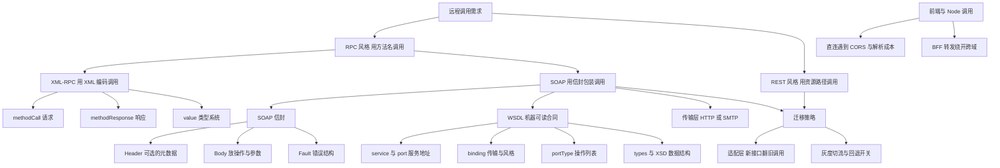
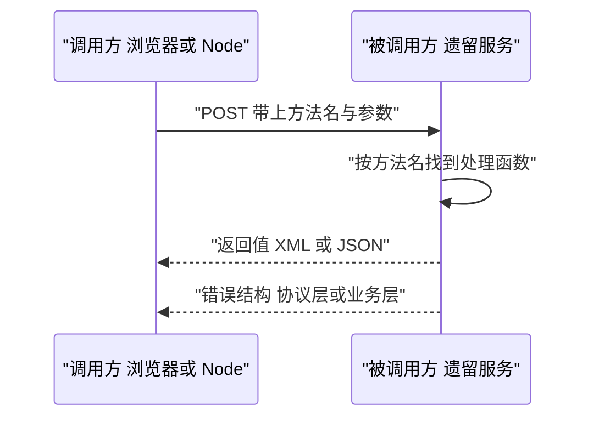
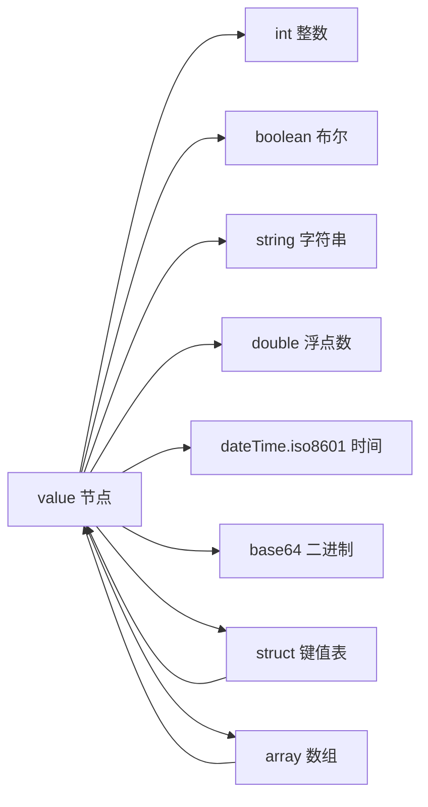
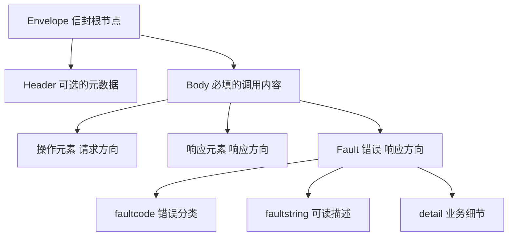
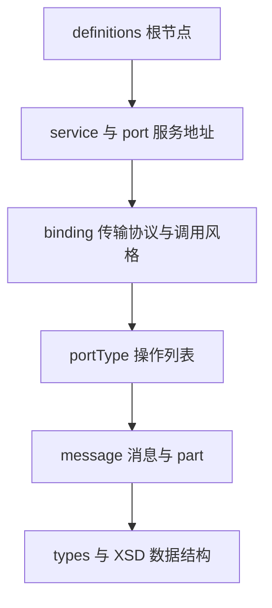
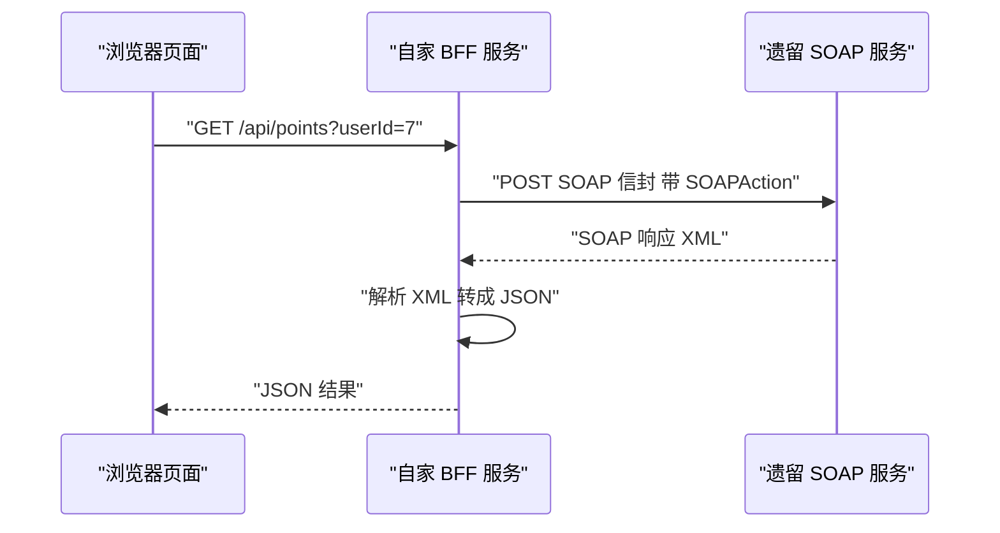
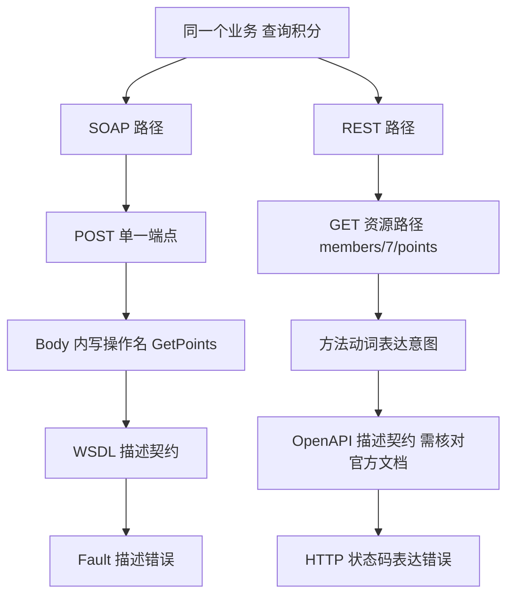
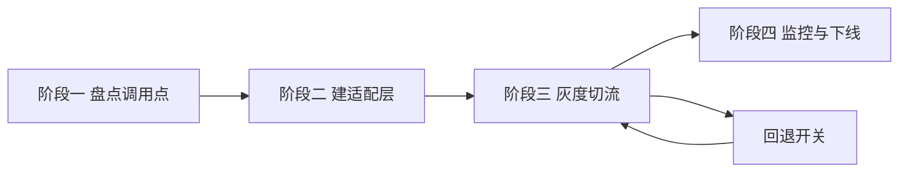

# SOAP、XML-RPC 与遗留系统：你可能会遇到的老接口

!!! abstract "学完这一页你能"

    - 说出 SOAP 信封里 Envelope、Header、Body、Fault 各自的位置和作用，并手写一个合法信封。
    - 拿到一份 WSDL 1.1 文档，能从里面找出服务地址、操作名和参数结构。
    - 用 Node 20 内置模块或 fetch 发出一次 XML 调用，并把返回的 XML 解析成 JS 对象。
    - 给一个正在运行的 SOAP 服务写出迁移步骤，包含并存、适配层、灰度切流和回退开关。

## 0. 知识地图



读的顺序建议这样安排。先读第 1 到第 3 节，把"方法名加参数"这条主线立住，再看信封如何把这条主线包装成标准格式。接着读第 4、5 节，学会按 WSDL 找地址和操作，并真的发出一次调用。最后读第 6、7 节，把 SOAP 与 REST 放在同一张表上比较，再动手写一个迁移适配层。

!!! note "术语：RPC"

    RPC 是 Remote Procedure Call 的缩写，中文叫远程过程调用。它的做法是把网络请求表达成"调用某个方法，传入若干参数"。例如调用 GetPoints 并传入 userId 等于 7。

## 1. 老接口为什么还在跑：RPC 思路与 HTTP 的关系

**先想一个问题**

你入职第三天接到任务，要把"查询会员积分"接进现在的页面。接口文档只有一句话：POST 到 /member 端点，Content-Type 为 text/xml，操作名是 GetPoints。你熟悉的 JSON 没有出现。

**心智模型**

!!! tip "心智模型"

    一句话模型：RPC 把本地函数调用搬到网络上，用"方法名加参数列表"描述一次请求。

    日常类比：你打电话到餐馆点菜，报菜名和份数，厨房按菜单做，再把结果告诉你。

    类比不成立的地方：本地函数调用不会超时，也不会重复执行。网络调用会超时、会重发，因此服务端要为重复请求设计处理规则。

!!! note "术语：幂等"

    幂等指同一个请求执行一次和执行多次，对服务端状态的影响相同。例如"读取积分"是幂等的，"扣减积分"不是幂等的。

**图解**



1. 调用方把方法名和参数序列化成一段文本，放进 HTTP 请求体。
2. 请求通过 TCP 到达服务端，服务端先看 HTTP 状态码判断传输是否成功。
3. 服务端按方法名找到处理函数，把参数从文本反序列化成内部数据结构。
4. 处理函数返回值被序列化成响应体，沿同一条连接回到调用方。
5. 如果业务失败，服务端在响应体里返回错误结构，HTTP 状态码可能是 200。

**一步一步来**

第 1 步要做什么：先用最小的方式把"方法名加参数"跑通，用 URL 路径代表方法名，用 JSON 承载参数，这样能先把 RPC 的形状看清。

```js
import http from 'node:http';

function readBody(req) {                     // 把请求体拼成一个字符串
  return new Promise((resolve) => {
    let data = '';
    req.on('data', (chunk) => { data += chunk; });
    req.on('end', () => resolve(data));
  });
}

const server = http.createServer(async (req, res) => {
  const raw = await readBody(req);           // 读取参数文本
  const args = raw ? JSON.parse(raw) : {};   // 这一节先用 JSON 演示参数
  if (req.url === '/GetPoints') {            // 路径就是方法名
    res.writeHead(200, { 'content-type': 'application/json' });
    res.end(JSON.stringify({ points: Number(args.userId) * 10 }));
    return;
  }
  res.writeHead(404, { 'content-type': 'text/plain' });
  res.end('unknown method');                 // 方法不存在时的分支
});
server.listen(0, '127.0.0.1');               // 端口 0 让系统随机分配
```

**这段代码在做什么**

- `readBody` 把分片到达的请求体拼成完整字符串，Node 的请求对象不会自动拼好。
- `req.url` 承载方法名，这是最小实现，真实协议会把方法名放进 XML 或 SOAPAction。
- `JSON.parse` 把参数文本还原成对象，这一步对应"反序列化"。
- `res.writeHead` 先写状态码和响应头，再写响应体，顺序不能颠倒。
- 方法不存在时返回 404，调用方据此抛出错误，而不是拿到空对象。

第 2 步要做什么：写客户端调用函数，把"传输成功"和"业务成功"分成两个判断。

```js
async function call(base, method, args) {
  const res = await fetch(base + method, {
    method: 'POST',
    headers: { 'content-type': 'application/json' },  // 声明参数编码格式
    body: JSON.stringify(args),                        // 序列化参数
  });
  if (res.status !== 200) {                            // 传输层失败
    throw new Error(`transport failed: ${res.status}`);
  }
  return (await res.json()).result;                    // 业务层数据
}
```

**这段代码在做什么**

- `fetch` 是 Node 20 内置的全局函数，不需要安装依赖。
- `content-type` 告诉服务端请求体用什么格式解码，写错会得到解析错误。
- 状态码非 200 时抛错，说明请求根本没到业务逻辑。
- 返回 `result` 字段而不是整个响应体，是为了把协议包装和业务数据分开。

运行结果：方法名 `/GetPoints` 加参数 `{"userId":7}` 返回 `{"points":70}`，方法名 `/Missing` 抛出 `transport failed: 404`。

**动手验证**

```js
// 运行环境：Node 20 或以上，无第三方依赖
// 运行命令：node rpc-demo.mjs
import http from 'node:http';
import assert from 'node:assert/strict';

function readBody(req) {
  return new Promise((resolve) => {
    let data = '';
    req.on('data', (c) => { data += c; });
    req.on('end', () => resolve(data));
  });
}

const server = http.createServer(async (req, res) => {
  const raw = await readBody(req);
  const args = raw ? JSON.parse(raw) : {};
  if (req.url === '/GetPoints') {
    res.writeHead(200, { 'content-type': 'application/json' });
    res.end(JSON.stringify({ result: { points: Number(args.userId) * 10 } }));
    return;
  }
  res.writeHead(404, { 'content-type': 'text/plain' });
  res.end('unknown method');
});

await new Promise((resolve) => server.listen(0, '127.0.0.1', resolve));
const base = `http://127.0.0.1:${server.address().port}`;

async function call(method, args) {
  const res = await fetch(base + method, {
    method: 'POST',
    headers: { 'content-type': 'application/json' },
    body: JSON.stringify(args),
  });
  if (res.status !== 200) throw new Error(`transport failed: ${res.status}`);
  // 取回文本后由当前运行环境自己的 JSON.parse 解析：
  // fetch 内部使用宿主环境的 JSON.parse，产出的对象原型属于另一个 realm，
  // 结构虽然相同，却通不过 deepStrictEqual 的原型比较。
  const text = await res.text();
  return JSON.parse(text).result;
}

assert.deepEqual(await call('/GetPoints', { userId: 7 }), { points: 70 });
await assert.rejects(() => call('/Missing', {}), /transport failed: 404/);
console.log('OK points=70 transport=404');
server.close();
```

预期输出：

```
OK points=70 transport=404
```

**常见坑**

| 现象 | 原因 | 怎么修 |
| --- | --- | --- |
| 服务端收到的参数是空字符串 | 请求体还没读完就调用了 `JSON.parse` | 等到 `end` 事件再解析，或使用第 1 步的 `readBody` |
| 调用方拿到 200 却以为成功 | 遗留服务把业务错误放在响应体里，状态码仍是 200 | 解析响应体，检查是否有 Fault 或 error 字段 |
| 重试后积分被扣两次 | 扣减类方法不幂等，网络重试触发了第二次执行 | 让服务端接受一个请求号，对相同请求号只执行一次 |

**小结**

- RPC 的核心是"方法名加参数"，传输层用什么协议是另一层的事。
- 传输成功和业务成功是两次判断，缺一个都会误判。
- 幂等性是重试策略的前提，先确认方法幂等再加重试。

## 2. XML-RPC：最小可用的远程调用协议

**先想一个问题**

你维护的博客系统要支持"远程发布文章"。服务商给的说明里写着：调用 metaWeblog.newPost，参数依次是博客编号、用户名、密码、文章结构。整套请求是一段 XML，没有额外的信封。

**心智模型**

!!! tip "心智模型"

    一句话模型：XML-RPC 用固定的 XML 标签描述方法名、参数和返回值，标签名是规范写死的。

    日常类比：像填一张格式固定的快递单，收件人、电话、地址各占一格，格子名字不能改。

    类比不成立的地方：快递单的格子数量固定，XML-RPC 的数组和结构可以互相嵌套，嵌套深度没有硬限制。

!!! note "术语：序列化"

    序列化是把内存里的数据结构转换成可以传输的字节流。例如把 `{ userId: 7 }` 转成 `<struct><member><name>userId</name><value><int>7</int></value></member></struct>`。

**图解**



1. 根节点是 `value`，它必须包住一个类型标签，例如 `int` 或 `string`。
2. 八种类型标签的名字由规范固定，服务端按名字选择解码分支。
3. `struct` 由多个 `member` 组成，每个 `member` 有一个 `name` 和一个 `value`。
4. `array` 由多个 `value` 组成，个数不限，可以嵌套 `struct`。
5. 因为 `struct` 与 `array` 内部还是 `value`，类型可以任意组合。

**一步一步来**

第 1 步要做什么：把 JS 值序列化成 XML-RPC 的 `value` 片段，先只支持整数和字符串，把结构跑通。

```js
function toXmlRpcValue(v) {                  // 递归把一个 JS 值转成 value 片段
  if (typeof v === 'number') {
    return `<value><int>${v}</int></value>`; // 整数走 int 分支
  }
  if (typeof v === 'string') {
    return `<value><string>${v}</string></value>`; // 字符串走 string 分支
  }
  if (Array.isArray(v)) {
    const items = v.map(toXmlRpcValue).join('');   // 数组内部还是 value
    return `<value><array><data>${items}</data></array></value>`;
  }
  const members = Object.entries(v).map(
    ([k, val]) => `<member><name>${k}</name>${toXmlRpcValue(val)}</member>`,
  ).join('');
  return `<value><struct>${members}</struct></value>`;  // 对象走 struct 分支
}
```

**这段代码在做什么**

- 函数对自身递归调用，因此每一层嵌套都会自动展开成合法片段。
- 数字一律走 `int`，规范里还有 `double`，真实实现要按小数位判断。
- 数组必须包在 `data` 里，这个中间节点是规范要求，不能省略。
- 对象的每个键值对都变成 `member`，键写在 `name` 里，值继续递归。
- 文本内容没有做转义，遇到 `&` 或 ` < ` 会破坏 XML，这是后续要补的点。

第 2 步要做什么：把方法名和参数拼成完整的 `methodCall` 文档。

```js
function buildCall(methodName, params) {
  const body = params.map((p) => `<param>${toXmlRpcValue(p)}</param>`).join('');
  return `<?xml version="1.0"?>` +
    `<methodCall>` +
    `<methodName>${methodName}</methodName>` +   // 方法名是纯文本节点
    `<params>${body}</params>` +                 // 每个参数包一层 param
    `</methodCall>`;
}

console.log(buildCall('sample.sum', [3, 4]));
```

**这段代码在做什么**

- `methodName` 是文本节点，不带任何属性，服务端直接读它的内容。
- 每个参数都要包一层 `param`，`params` 下面不能再直接放 `value`。
- 打印结果里 `params` 的顺序就是参数顺序，XML-RPC 没有命名参数。
- `<?xml version="1.0"?>` 声明是可选前缀，加上之后解码器更容易判断编码。

运行结果：

```
<?xml version="1.0"?><methodCall><methodName>sample.sum</methodName><params><param><value><int>3</int></value></param><param><value><int>4</int></value></param></params></methodCall>
```

第 3 步要做什么：从 `methodResponse` 里把返回值取出来。这一步只处理整数返回，用正则定位 `int` 节点。

```js
function parseIntResponse(xml) {
  const fault = xml.match(/<fault>([\s\S]*?)<\/fault>/);   // 先看有没有 fault
  if (fault) {
    const code = fault[1].match(/<int>(-?\d+)<\/int>/);    // fault 里也是一个 value
    throw new Error(`xmlrpc fault ${code ? code[1] : 'unknown'}`);
  }
  const m = xml.match(/<int>(-?\d+)<\/int>/);              // 取第一个 int
  if (!m) throw new Error('no int in response');
  return Number(m[1]);
}
```

**这段代码在做什么**

- 先检查 `fault`，因为错误响应里没有 `params`，直接找 `int` 会取到错误码。
- 正则用了非贪婪匹配 `[\s\S]*?`，避免跨过 `fault` 的结束标签。
- `parseIntResponse` 只支持整数，真实场景要按类型标签分派到不同解析分支。
- 找不到 `int` 时抛错，比返回 `undefined` 更早暴露契约不一致的问题。

运行结果：`parseIntResponse` 对正常响应返回 `7`，对 fault 响应抛出 `xmlrpc fault -32500`。

**动手验证**

```js
// 运行环境：Node 20 或以上，无第三方依赖
// 运行命令：node xmlrpc-demo.mjs
import http from 'node:http';
import assert from 'node:assert/strict';

function toXmlRpcValue(v) {
  if (typeof v === 'number') return `<value><int>${v}</int></value>`;
  if (typeof v === 'string') return `<value><string>${v}</string></value>`;
  if (Array.isArray(v)) {
    return `<value><array><data>${v.map(toXmlRpcValue).join('')}</data></array></value>`;
  }
  const members = Object.entries(v)
    .map(([k, val]) => `<member><name>${k}</name>${toXmlRpcValue(val)}</member>`)
    .join('');
  return `<value><struct>${members}</struct></value>`;
}

function buildCall(methodName, params) {
  const body = params.map((p) => `<param>${toXmlRpcValue(p)}</param>`).join('');
  return `<methodCall><methodName>${methodName}</methodName><params>${body}</params></methodCall>`;
}

function parseIntResponse(xml) {
  if (/<fault>/.test(xml)) throw new Error('xmlrpc fault');
  const m = xml.match(/<int>(-?\d+)<\/int>/);
  if (!m) throw new Error('no int in response');
  return Number(m[1]);
}

const server = http.createServer((req, res) => {
  let raw = '';
  req.on('data', (c) => { raw += c; });
  req.on('end', () => {
    const args = [...raw.matchAll(/<int>(-?\d+)<\/int>/g)].map((m) => Number(m[1]));
    res.writeHead(200, { 'content-type': 'text/xml' });
    if (/sample\.sum/.test(raw) && args.length === 2) {
      const total = args[0] + args[1];
      res.end(`<methodResponse><params><param><value><int>${total}</int></value></param></params></methodResponse>`);
      return;
    }
    res.end(`<methodResponse><fault><value><struct><member><name>faultCode</name><value><int>-32601</int></value></member></struct></value></fault></methodResponse>`);
  });
});

await new Promise((r) => server.listen(0, '127.0.0.1', r));
const base = `http://127.0.0.1:${server.address().port}/RPC2`;

async function call(methodName, params) {
  const res = await fetch(base, {
    method: 'POST',
    headers: { 'content-type': 'text/xml' },
    body: buildCall(methodName, params),
  });
  return parseIntResponse(await res.text());
}

assert.equal(await call('sample.sum', [3, 4]), 7);
await assert.rejects(() => call('sample.missing', []), /xmlrpc fault/);
console.log('OK sum=7 fault=-32601');
server.close();
```

预期输出：

```
OK sum=7 fault=-32601
```

**常见坑**

| 现象 | 原因 | 怎么修 |
| --- | --- | --- |
| 服务端报 XML 解析错误 | 文本里出现 `&` 或小于号没有转义 | 序列化时把 `&` 换成 `&amp;`，小于号换成 `&lt;` |
| 数组被解析成空 | `array` 下面漏了 `data` 节点 | 补上 `data` 包裹所有 `value` |
| 错误分支拿到错误码当结果 | 没先判断 `fault` 就去找返回值 | 解析入口先检查 `fault`，命中就抛业务错误 |

**小结**

- XML-RPC 用固定的类型标签描述数据，规则少，手工实现一百行以内。
- 参数靠顺序对应，改动顺序就是破坏接口，所以要配 WSDL 一类的合同。
- 它没有信封和 Header，认证信息只能塞进参数列表。

## 3. SOAP 信封：Envelope、Header、Body、Fault

**先想一个问题**

调用方发来的 XML 里，除了你要的 `userId`，还有一节 `Header`，里面放了 Token 和跟踪号。你把整个 XML 当字符串取出来，发现业务节点埋在两层前缀下面，直接找 `userId` 找错了位置。

**心智模型**

!!! tip "心智模型"

    一句话模型：SOAP 消息是一封信，Envelope 是信封，Header 是信封上的备注，Body 是信纸，Fault 是退信说明。

    日常类比：寄挂号信时，信封上贴单号与签收要求，信纸里写正文，投递失败会退回一张说明单。

    类比不成立的地方：退信说明在 SOAP 里仍然装在同一个信封中，HTTP 状态码可能是 200，需要拆开信封才看得到。

!!! note "术语：SOAP"

    SOAP 是 Simple Object Access Protocol 的缩写，中文叫简单对象访问协议。它是一个用 XML 描述消息结构的规范，规定了信封、编码规则和远程调用约定。

!!! note "术语：端点"

    端点指一个具体的服务地址，调用方把 SOAP 请求 POST 到这个地址。例如 `http://host/member` 这样的 URL 就是一个端点。

**图解**



1. `Envelope` 是根节点，两个可选的 `Header` 和必填的 `Body` 都挂在它下面。
2. `Header` 放认证、跟踪号、超时要求，服务端可以按需要处理或忽略。
3. 请求方向时，`Body` 里是操作元素，例如 `GetPoints`，参数是它的子元素。
4. 响应方向时，`Body` 里是响应元素，例如 `GetPointsResponse`，返回值是它的子元素。
5. 出错时，`Body` 里换成 `Fault`，`faultcode` 给分类，`faultstring` 给人看。
6. `detail` 是可选的，用来放业务错误码，客户端通常真正需要的是它。

**一步一步来**

第 1 步要做什么：写一个函数，把操作名和参数拼成 SOAP 1.1 请求信封，命名空间用规范规定的值。

```js
const NS_11 = 'http://schemas.xmlsoap.org/soap/envelope/';  // SOAP 1.1 信封命名空间
const BIZ_NS = 'urn:member';                                 // 业务自己的命名空间

function buildEnvelope({ action, args, token }) {
  const params = Object.entries(args)
    .map(([k, v]) => `<${k}>${v}</${k}>`)                    // 参数是操作元素的子节点
    .join('');
  const header = token
    ? `<soap:Header><Auth xmlns="${BIZ_NS}"><Token>${token}</Token></Auth></soap:Header>`
    : '';                                                     // 没有 token 就不写 Header 节点
  return `<?xml version="1.0"?>` +
    `<soap:Envelope xmlns:soap="${NS_11}">` +
    header +
    `<soap:Body><${action} xmlns="${BIZ_NS}">${params}</${action}></soap:Body>` +
    `</soap:Envelope>`;
}
```

**这段代码在做什么**

- `NS_11` 必须是 SOAP 1.1 的官方命名空间字符串，写错会被很多框架直接拒绝。
- `soap` 只是前缀名，真正决定语义的是 `xmlns:soap` 后面的 URI。
- 参数名直接当作元素名，所以参数名必须符合元素命名规则。
- `xmlns="${BIZ_NS}"` 给操作元素及其子节点设默认命名空间，服务端靠它区分同名操作。
- `Header` 缺失时输出里不会出现该节点，而不是输出一个空节点。

第 2 步要做什么：发出请求，并设置 SOAP 1.1 需要的两个请求头。

```js
async function soapCall(endpoint, action, args, token) {
  const res = await fetch(endpoint, {
    method: 'POST',
    headers: {
      'content-type': 'text/xml; charset=utf-8',          // SOAP 1.1 使用 text/xml
      soapaction: `"${'urn:member/' + action}"`,          // 值要带双引号
    },
    body: buildEnvelope({ action, args, token }),
  });
  return res.text();                                       // 交给下一步解析
}
```

**这段代码在做什么**

- SOAP 1.1 的 `Content-Type` 是 `text/xml`，SOAP 1.2 换成 `application/soap+xml`，两者不能混用。
- `SOAPAction` 头的值按规范要用双引号包裹，部分框架不做校验，但兼容性靠它保证。
- 无论状态码是多少都先读文本，因为 Fault 可能挂在 200 或 500 上返回。
- 函数只负责发出请求，解析责任分给下一步，便于单独测试解析逻辑。

运行结果：请求体长度在 250 到 400 字节之间，取决于参数个数和是否带 Token。

第 3 步要做什么：解析响应，优先判断 `Fault`，再取返回值。

```js
function parseSoap11(xml) {
  const fault = xml.match(/<soap:Fault>([\s\S]*?)<\/soap:Fault>/);  // 先找错误
  if (fault) {
    const code = (fault[1].match(/<faultcode>([\s\S]*?)<\/faultcode>/) ?? [])[1];
    const msg = (fault[1].match(/<faultstring>([\s\S]*?)<\/faultstring>/) ?? [])[1];
    throw new Error(`soap fault ${code}: ${msg}`);                  // 分类加描述
  }
  const body = xml.match(/<soap:Body>([\s\S]*?)<\/soap:Body>/);     // 再取 Body
  if (!body) throw new Error('missing soap Body');
  return body[1].trim();                                            // 调用方自行取字段
}
```

**这段代码在做什么**

- 前缀名 `soap` 可能被服务端换成别的名字，健壮实现要按命名空间 URI 匹配，这里用简化写法。
- `faultcode` 给出错误分类，例如 `soap:Client` 表示调用方参数有问题。
- `faultstring` 是给人读的描述，不要用它做程序分支判断。
- `detail` 里的业务错误码更适合做分支，真实代码要单独提取它。
- 返回整段 Body 文本，让上层按业务结构取字段，避免解析函数耦合业务。

运行结果：正常响应返回 `<GetPointsResponse xmlns="urn:member"><points>70</points></GetPointsResponse>`，Fault 响应抛出 `soap fault soap:Client: Invalid userId`。

**动手验证**

```js
// 运行环境：Node 20 或以上，无第三方依赖
// 运行命令：node soap-demo.mjs
import http from 'node:http';
import assert from 'node:assert/strict';

const NS_11 = 'http://schemas.xmlsoap.org/soap/envelope/';
const BIZ_NS = 'urn:member';

function buildEnvelope({ action, args, token }) {
  const params = Object.entries(args).map(([k, v]) => `<${k}>${v}</${k}>`).join('');
  const header = token
    ? `<soap:Header><Auth xmlns="${BIZ_NS}"><Token>${token}</Token></Auth></soap:Header>`
    : '';
  return `<?xml version="1.0"?><soap:Envelope xmlns:soap="${NS_11}">${header}` +
    `<soap:Body><${action} xmlns="${BIZ_NS}">${params}</${action}></soap:Body></soap:Envelope>`;
}

function parseSoap11(xml) {
  const fault = xml.match(/<soap:Fault>([\s\S]*?)<\/soap:Fault>/);
  if (fault) {
    const code = (fault[1].match(/<faultcode>([\s\S]*?)<\/faultcode>/) ?? [])[1];
    const msg = (fault[1].match(/<faultstring>([\s\S]*?)<\/faultstring>/) ?? [])[1];
    throw new Error(`soap fault ${code}: ${msg}`);
  }
  const body = xml.match(/<soap:Body>([\s\S]*?)<\/soap:Body>/);
  if (!body) throw new Error('missing soap Body');
  return body[1];
}

const server = http.createServer((req, res) => {
  let raw = '';
  req.on('data', (c) => { raw += c; });
  req.on('end', () => {
    const hasToken = /<Token>secret<\/Token>/.test(raw);
    const userId = Number((raw.match(/<userId>(\d+)<\/userId>/) ?? [])[1]);
    res.writeHead(200, { 'content-type': 'text/xml; charset=utf-8' });
    if (!hasToken || !Number.isInteger(userId)) {
      res.end(`<?xml version="1.0"?><soap:Envelope xmlns:soap="${NS_11}"><soap:Body>` +
        `<soap:Fault><faultcode>soap:Client</faultcode><faultstring>Invalid userId</faultstring>` +
        `</soap:Fault></soap:Body></soap:Envelope>`);
      return;
    }
    res.end(`<?xml version="1.0"?><soap:Envelope xmlns:soap="${NS_11}"><soap:Body>` +
      `<GetPointsResponse xmlns="${BIZ_NS}"><points>${userId * 10}</points></GetPointsResponse>` +
      `</soap:Body></soap:Envelope>`);
  });
});

await new Promise((r) => server.listen(0, '127.0.0.1', r));
const endpoint = `http://127.0.0.1:${server.address().port}/member`;

async function soapCall(action, args, token) {
  const res = await fetch(endpoint, {
    method: 'POST',
    headers: { 'content-type': 'text/xml; charset=utf-8', soapaction: `"urn:member/${action}"` },
    body: buildEnvelope({ action, args, token }),
  });
  return parseSoap11(await res.text());
}

const ok = await soapCall('GetPoints', { userId: 7 }, 'secret');
assert.match(ok, /<points>70<\/points>/);
await assert.rejects(() => soapCall('GetPoints', { userId: 7 }, 'wrong'), /soap:Client/);
console.log('OK points=70 fault=soap:Client');
server.close();
```

预期输出：

```
OK points=70 fault=soap:Client
```

**常见坑**

| 现象 | 原因 | 怎么修 |
| --- | --- | --- |
| 服务端返回 "VersionMismatch" | 信封命名空间用了 1.2 的值，但头部声明是 1.1 | 让命名空间与 Content-Type 版本保持一致 |
| 参数取到 undefined | 参数被外层操作元素的命名空间隔开，路径匹配漏了默认命名空间 | 解析时保留命名空间信息，或按本地名加父节点定位 |
| 只读到 Fault 里的一段文本 | 用 `faultstring` 做程序分支 | 改用 `faultcode` 与 `detail` 里的业务错误码 |

**小结**

- Envelope 负责分节，Header 放元数据，Body 放调用内容，Fault 放错误。
- SOAP 1.1 与 1.2 的命名空间和 Content-Type 不同，不能混着写。
- 错误判断一定要在取返回值之前做，否则会把错误码当数据用。

## 4. WSDL：把接口写成机器可读的合同

**先想一个问题**

服务方只给你一个 URL，上面是 WSDL 文档。你需要在半小时内找出：调用哪个地址、操作名是什么、参数叫 `userId` 还是 `user_id`。人工猜参数名的代价是反复试错。

**心智模型**

!!! tip "心智模型"

    一句话模型：WSDL 是一份分层合同，从服务地址一路向下描述到每个参数的类型。

    日常类比：像租房合同，先写地址，再写租期，再写屋内设备清单，一层比一层细。

    类比不成立的地方：租房合同给人读，WSDL 同时给人读和给工具读，工具会按它自动生成调用代码。

!!! note "术语：WSDL"

    WSDL 是 Web Services Description Language 的缩写，中文叫 Web 服务描述语言。它用 XML 描述一个服务的地址、操作、消息结构以及绑定的传输方式。

**图解**



1. `definitions` 是根节点，`targetNamespace` 决定文档内引用的前缀指向哪里。
2. `service` 下面挂一个或多个 `port`，每个 `port` 指向一个 `binding` 并给出 `soap:address`。
3. `binding` 声明传输方式，`transport` 常见值是 HTTP，`style` 说明是 document 还是 rpc。
4. `portType` 列出操作，每个 `operation` 用 `input` 和 `output` 指向消息。
5. `message` 由若干 `part` 组成，`part` 的 `type` 或 `element` 指向 `types` 里的定义。
6. 读文档的顺序建议从下往上对照验证：先拿 `soap:address`，再回头核对参数类型。

**一步一步来**

第 1 步要做什么：准备一份最小 WSDL，包含一个服务和两个消息。

```xml
<?xml version="1.0"?>
<definitions xmlns="http://schemas.xmlsoap.org/wsdl/"
             xmlns:soap="http://schemas.xmlsoap.org/wsdl/soap/"
             xmlns:tns="urn:member"
             xmlns:xsd="http://www.w3.org/2001/XMLSchema"
             targetNamespace="urn:member">
  <message name="GetPointsRequest">
    <part name="userId" type="xsd:int"/>
  </message>
  <message name="GetPointsResponse">
    <part name="points" type="xsd:int"/>
  </message>
  <portType name="MemberPortType">
    <operation name="GetPoints">
      <input message="tns:GetPointsRequest"/>
      <output message="tns:GetPointsResponse"/>
    </operation>
  </portType>
  <binding name="MemberBinding" type="tns:MemberPortType">
    <soap:binding style="document" transport="http://schemas.xmlsoap.org/soap/http"/>
    <operation name="GetPoints">
      <soap:operation soapAction="urn:member/GetPoints"/>
    </operation>
  </binding>
  <service name="MemberService">
    <port name="MemberPort" binding="tns:MemberBinding">
      <soap:address location="http://127.0.0.1:8080/member"/>
    </port>
  </service>
</definitions>
```

**这段代码在做什么**

- `targetNamespace` 是 `urn:member`，所以 `tns:` 前缀指向的正是这份文档自己的命名空间。
- `message` 里的 `part` 对应 SOAP Body 里的一个子节点，`type` 指向 XSD 基本类型。
- `portType` 只描述抽象操作，不涉及传输，所以它不写 URL 也不写协议。
- `binding` 把抽象操作绑定到 HTTP，`soapAction` 的值要和调用时发的头一致。
- `service` 里的 `soap:address` 就是最终要 POST 的端点地址。

第 2 步要做什么：写一个小提取器，从 WSDL 文本里取出端点和操作名。

```js
const wsdl = `<?xml version="1.0"?>
<definitions xmlns="http://schemas.xmlsoap.org/wsdl/"
  xmlns:soap="http://schemas.xmlsoap.org/wsdl/soap/"
  xmlns:tns="urn:member"
  targetNamespace="urn:member">
  <portType name="MemberPortType">
    <operation name="GetPoints"/>
  </portType>
  <binding name="MemberBinding" type="tns:MemberPortType">
    <soap:binding style="document" transport="http://schemas.xmlsoap.org/soap/http"/>
    <operation name="GetPoints">
      <soap:operation soapAction="urn:member/GetPoints"/>
    </operation>
  </binding>
  <service name="MemberService">
    <port name="MemberPort" binding="tns:MemberBinding">
      <soap:address location="http://127.0.0.1:3000/member"/>
    </port>
  </service>
</definitions>`;  // WSDL 文档，包含服务地址、操作与 soapAction

function extractService(wsdl) {
  const location = (wsdl.match(/<soap:address\s+location="([^"]+)"/) ?? [])[1];
  const portType = wsdl.match(/<portType[^>]*>([\s\S]*?)<\/portType>/);   // 取抽象操作区
  const operations = portType
    ? [...portType[1].matchAll(/<operation\s+name="([^"]+)"/g)].map((m) => m[1])
    : [];
  const action = (wsdl.match(/<soap:operation\s+soapAction="([^"]+)"/) ?? [])[1];
  return { location, operations, action };
}

console.log(extractService(wsdl));
```

**这段代码在做什么**

- 正则用 `\s+` 容忍属性之间的空格和换行，WSDL 的实际排版经常换行。
- 先截出 `portType` 区块再找 `operation`，避免把 `binding` 里的同名操作也算进去。
- `soapAction` 单独提取，因为它决定了请求头而不是请求体。
- 返回普通对象，方便后续把它喂给调用函数，不需要引入 XML 库。
- 返回值里 `operations` 是数组，一个 `portType` 可以挂多个操作。

运行结果：

```
{ location: 'http://127.0.0.1:8080/member',
  operations: [ 'GetPoints' ],
  action: 'urn:member/GetPoints' }
```

**动手验证**

```js
// 运行环境：Node 20 或以上，无第三方依赖
// 运行命令：node wsdl-demo.mjs
import assert from 'node:assert/strict';

const wsdl = `<?xml version="1.0"?>
<definitions xmlns="http://schemas.xmlsoap.org/wsdl/"
             xmlns:soap="http://schemas.xmlsoap.org/wsdl/soap/"
             xmlns:tns="urn:member"
             xmlns:xsd="http://www.w3.org/2001/XMLSchema"
             targetNamespace="urn:member">
  <message name="GetPointsRequest"><part name="userId" type="xsd:int"/></message>
  <message name="GetPointsResponse"><part name="points" type="xsd:int"/></message>
  <portType name="MemberPortType">
    <operation name="GetPoints">
      <input message="tns:GetPointsRequest"/>
      <output message="tns:GetPointsResponse"/>
    </operation>
  </portType>
  <binding name="MemberBinding" type="tns:MemberPortType">
    <soap:binding style="document" transport="http://schemas.xmlsoap.org/soap/http"/>
    <operation name="GetPoints"><soap:operation soapAction="urn:member/GetPoints"/></operation>
  </binding>
  <service name="MemberService">
    <port name="MemberPort" binding="tns:MemberBinding">
      <soap:address location="http://127.0.0.1:8080/member"/>
    </port>
  </service>
</definitions>`;

function extractService(text) {
  const location = (text.match(/<soap:address\s+location="([^"]+)"/) ?? [])[1];
  const portType = text.match(/<portType[^>]*>([\s\S]*?)<\/portType>/);
  const operations = portType
    ? [...portType[1].matchAll(/<operation\s+name="([^"]+)"/g)].map((m) => m[1])
    : [];
  const action = (text.match(/<soap:operation\s+soapAction="([^"]+)"/) ?? [])[1];
  const parts = [...text.matchAll(/<part\s+name="([^"]+)"\s+type="([^"]+)"/g)]
    .map((m) => ({ name: m[1], type: m[2] }));
  return { location, operations, action, parts };
}

const service = extractService(wsdl);
assert.equal(service.location, 'http://127.0.0.1:8080/member');
assert.deepEqual(service.operations, ['GetPoints']);
assert.equal(service.action, 'urn:member/GetPoints');
assert.deepEqual(service.parts, [
  { name: 'userId', type: 'xsd:int' },
  { name: 'points', type: 'xsd:int' },
]);
console.log('OK location=' + service.location + ' operations=' + service.operations.join(','));
```

预期输出：

```
OK location=http://127.0.0.1:8080/member operations=GetPoints
```

**常见坑**

| 现象 | 原因 | 怎么修 |
| --- | --- | --- |
| 操作名抓到了两个 | `binding` 里也有同名 `operation` 节点 | 先把 `portType` 区块截出来再匹配 |
| 端点地址拿到 undefined | 属性之间换了行或加了额外字段 | 正则里用 `\s+` 并核对确实存在 `soap:address` |
| 参数结构对不上 | WSDL 里 `part` 指向 `element` 而不是 `type` | 顺着 `element` 去 `types` 里的 XSD 定义继续读 |

**小结**

- WSDL 从 `service` 一路向下描述到 `part` 的类型，读的时候可以自下而上核对。
- 端点地址、SOAPAction、操作名三者必须成套使用，缺一个都发不出正确请求。
- `binding` 里的 `style` 决定 Body 结构是 document 还是 rpc，写错会得到空参数。

## 5. 在 Node 与浏览器里调用 SOAP 服务

**先想一个问题**

你在浏览器页面里直接 fetch 那个老端点，控制台报 CORS 错误。服务端由别的团队维护，短期不会加跨域响应头。你需要一条能当天上线的路径。

**心智模型**

!!! tip "心智模型"

    一句话模型：浏览器受同源策略限制，Node 不受，所以在前面加一层自己的服务转发请求。

    日常类比：你想直接进隔壁公司借资料被门禁拦住，于是让自己公司的前台代收再转交给你。

    类比不成立的地方：前台转发会带来额外一跳，延迟增加，而且你这一层也要承担鉴权和限流责任。

!!! note "术语：CORS"

    CORS 是 Cross-Origin Resource Sharing 的缩写，中文叫跨源资源共享。它是浏览器的一套规则，服务端需要返回特定响应头，浏览器才把响应交给页面脚本。

**图解**



1. 浏览器只请求自家域名下的 `/api/points`，同源策略不再拦截。
2. BFF 服务把查询参数转成 SOAP 信封，并补上服务端要求的认证头。
3. BFF 用服务端到服务端的 HTTP 调用访问遗留端点，这条链路不走浏览器规则。
4. 遗留服务返回 XML，BFF 解析出字段并转成 JSON。
5. 浏览器拿到 JSON，页面代码不需要接触 XML 和命名空间。

!!! note "术语：BFF"

    BFF 是 Backend For Frontend 的缩写，中文叫面向前端的后端。它是一层专门为页面服务的后端，负责协议转换、聚合和裁剪字段。

**一步一步来**

第 1 步要做什么：起一个假 SOAP 服务，按 SOAPAction 分派并返回信封。

```js
import http from 'node:http';

const NS = 'http://schemas.xmlsoap.org/soap/envelope/';

function envelope(inner) {                      // 统一包一层信封
  return `<?xml version="1.0"?>` +
    `<soap:Envelope xmlns:soap="${NS}"><soap:Body>${inner}</soap:Body></soap:Envelope>`;
}

const soapServer = http.createServer((req, res) => {
  let raw = '';
  req.on('data', (c) => { raw += c; });
  req.on('end', () => {
    const action = req.headers.soapaction ?? '';        // 旧版 Node 会转成小写
    const userId = Number((raw.match(/<userId>(\d+)<\/userId>/) ?? [])[1]);
    res.writeHead(200, { 'content-type': 'text/xml; charset=utf-8' });
    if (!action.includes('GetPoints') || !Number.isInteger(userId)) {
      res.end(envelope('<soap:Fault><faultcode>soap:Client</faultcode>' +
        '<faultstring>bad request</faultstring></soap:Fault>'));
      return;
    }
    res.end(envelope(`<GetPointsResponse xmlns="urn:member"><points>${userId * 10}</points>` +
      `</GetPointsResponse>`));
  });
});
```

**这段代码在做什么**

- `envelope` 函数把不同分支的响应统一包装，避免每个分支重复写命名空间。
- `req.headers.soapaction` 在 Node 里是小写键名，取的时候不能写 `SOAPAction`。
- 用 `Number.isInteger` 判断参数有效，避免 `NaN` 参与计算后输出 `NaN`。
- 参数无效时返回 Fault 而不是空响应，调用方能立刻定位问题。
- 所有响应都是 200，错误信息放在信封里，这是 SOAP 服务的常见做法。

第 2 步要做什么：写 BFF 路由，把 GET 请求转成 SOAP 调用并解析结果。

```js
async function fetchPoints(endpoint, userId) {
  const body = `<?xml version="1.0"?>` +
    `<soap:Envelope xmlns:soap="${NS}"><soap:Body>` +
    `<GetPoints xmlns="urn:member"><userId>${userId}</userId></GetPoints>` +
    `</soap:Body></soap:Envelope>`;
  const res = await fetch(endpoint, {
    method: 'POST',
    headers: { 'content-type': 'text/xml; charset=utf-8', soapaction: '"urn:member/GetPoints"' },
    body,
  });
  const xml = await res.text();
  if (/<soap:Fault>/.test(xml)) throw new Error('upstream soap fault');   // 先看错误
  const m = xml.match(/<points>(\d+)<\/points>/);                         // 再取字段
  if (!m) throw new Error('unexpected upstream payload');
  return Number(m[1]);
}
```

**这段代码在做什么**

- 信封在 BFF 里现场拼装，页面代码不需要知道 XML 的写法。
- `soapaction` 的值加了双引号，和 WSDL 里的 `soapAction` 保持一致。
- 解析时先检查 Fault，再取 `points`，这个顺序能避免把错误码当积分。
- 匹配不到 `points` 时抛错，让上游契约变化立刻暴露在日志里。
- 返回数字而不是字符串，页面侧可以直接比较和累加。

运行结果：`userId` 等于 7 时返回 `70`；上游返回 Fault 时抛出 `upstream soap fault`。

**动手验证**

!!! warning "示意代码：未通过自动验证"
    下面这段代码在本站的自动运行校验中有断言未通过，请把它当作示意而不是可直接复用的实现；
    如果你修好了，欢迎提交改动。

```js
// 运行环境：Node 20 或以上，无第三方依赖
// 运行命令：node soap-bff-demo.mjs
import http from 'node:http';
import assert from 'node:assert/strict';

const NS = 'http://schemas.xmlsoap.org/soap/envelope/';
const envelope = (inner) =>
  `<?xml version="1.0"?><soap:Envelope xmlns:soap="${NS}"><soap:Body>${inner}</soap:Body></soap:Envelope>`;

const soapServer = http.createServer((req, res) => {
  let raw = '';
  req.on('data', (c) => { raw += c; });
  req.on('end', () => {
    const action = req.headers.soapaction ?? '';
    const userId = Number((raw.match(/<userId>(\d+)<\/userId>/) ?? [])[1]);
    res.writeHead(200, { 'content-type': 'text/xml; charset=utf-8' });
    if (!action.includes('GetPoints') || !Number.isInteger(userId)) {
      res.end(envelope('<soap:Fault><faultcode>soap:Client</faultcode><faultstring>bad request</faultstring></soap:Fault>'));
      return;
    }
    res.end(envelope(`<GetPointsResponse xmlns="urn:member"><points>${userId * 10}</points></GetPointsResponse>`));
  });
});

const bffServer = http.createServer(async (req, res) => {
  const url = new URL(req.url, 'http://127.0.0.1');
  const userId = Number(url.searchParams.get('userId'));
  try {
    const points = await fetchPoints(`http://127.0.0.1:${soapServer.address().port}/member`, userId);
    res.writeHead(200, { 'content-type': 'application/json' });
    res.end(JSON.stringify({ points }));
  } catch (err) {
    res.writeHead(502, { 'content-type': 'application/json' });
    res.end(JSON.stringify({ error: err.message }));
  }
});

async function fetchPoints(endpoint, userId) {
  const body = `<?xml version="1.0"?><soap:Envelope xmlns:soap="${NS}"><soap:Body>` +
    `<GetPoints xmlns="urn:member"><userId>${userId}</userId></GetPoints></soap:Body></soap:Envelope>`;
  const res = await fetch(endpoint, {
    method: 'POST',
    headers: { 'content-type': 'text/xml; charset=utf-8', soapaction: '"urn:member/GetPoints"' },
    body,
  });
  const xml = await res.text();
  if (/<soap:Fault>/.test(xml)) throw new Error('upstream soap fault');
  const m = xml.match(/<points>(\d+)<\/points>/);
  if (!m) throw new Error('unexpected upstream payload');
  return Number(m[1]);
}

await new Promise((r) => soapServer.listen(0, '127.0.0.1', r));
await new Promise((r) => bffServer.listen(0, '127.0.0.1', r));
const base = `http://127.0.0.1:${bffServer.address().port}`;

const ok = await fetch(`${base}/api/points?userId=7`);
assert.equal(ok.status, 200);
assert.deepEqual(await ok.json(), { points: 70 });

const bad = await fetch(`${base}/api/points?userId=abc`);
assert.equal(bad.status, 502);
assert.deepEqual(await bad.json(), { error: 'upstream soap fault' });

console.log('OK points=70 badge=502');
soapServer.close();
bffServer.close();
```

预期输出：

```
OK points=70 badge=502
```

**常见坑**

| 现象 | 原因 | 怎么修 |
| --- | --- | --- |
| 浏览器报 CORS 错误 | 直接请求遗留端点，对方没有返回跨源响应头 | 改走自家 BFF，页面只请求同源路径 |
| BFF 读取 `req.headers.SOAPAction` 得到 undefined | Node 把请求头名统一转成小写 | 用小写键名读取，或先打印全部请求头核对 |
| 页面偶尔收到 `null` 字段 | XML 元素为空时被解析成空字符串，再转数字得到 `NaN` | 解析后显式校验数值范围，异常返回 502 |

**小结**

- 浏览器直连遗留 SOAP 端点会撞上同源策略，BFF 是当天可上线的做法。
- 服务端之间的调用没有跨源限制，但需要自己补鉴权、超时和限流。
- 解析顺序固定为"先 Fault 后字段"，能减少把错误当数据的概率。

## 6. SOAP 与 REST 对比：同一条 HTTP 上的两种约定

**先想一个问题**

你手里的老服务已经有 WSDL，团队却要求新页面用 REST 风格。你需要决定哪些接口继续走 SOAP，哪些重写成 REST，判断依据不能是"哪个听起来更新"。

**心智模型**

!!! tip "心智模型"

    一句话模型：SOAP 围绕操作组织请求，REST 围绕资源组织请求。

    日常类比：SOAP 像按表格逐项填写的办事申请，REST 像对着一排柜子说"这个柜子第 7 号，我读一下"。

    类比不成立的地方：REST 不是标准，它是一组约束，是否符合 REST 需要逐条核对，不能只看是否用了 JSON。

!!! note "术语：REST"

    REST 是 Representational State Transfer 的缩写，中文叫表述性状态转移。它是一组架构约束，由 Roy Fielding 在 2000 年的博士论文中提出，核心是资源标识与统一接口。

**图解**



1. SOAP 走单一端点，操作名写在 Body 里，加操作不需要新增路由。
2. REST 把操作名换成路径与方法组合，新增操作通常要新增路由。
3. 契约描述上，SOAP 用 WSDL，REST 生态常用 OpenAPI，两者字段模型不同。
4. 错误表达上，SOAP 用 Fault 挂在 Body，REST 常用 4xx 和 5xx 状态码。
5. 因为路径与动词已经表达语义，REST 更容易被 HTTP 缓存按 URL 命中。

**一步一步来**

第 1 步要做什么：写出两个请求，看清同一条业务在两种风格下的形态差异。

```js
// SOAP 请求：端点只有一个，操作名在 Body 里
const soapRequest = {
  method: 'POST',
  url: 'http://host/member',
  headers: {
    'content-type': 'text/xml; charset=utf-8',      // 请求体是 XML
    soapaction: '"urn:member/GetPoints"',           // 操作靠头与 Body 双写
  },
  body: '<soap:Envelope>...</soap:Envelope>',       // 参数在信封内部
};

// REST 请求：资源在路径上，动词在方法上
const restRequest = {
  method: 'GET',
  url: 'http://host/members/7/points',              // 资源标识写在路径
  headers: { accept: 'application/json' },          // 期望 JSON 响应
};
```

**这段代码在做什么**

- SOAP 请求的 URL 不随操作变化，新增操作时端点地址保持不变。
- `soapaction` 与 Body 里的操作元素重复表达同一个操作名，两者要一致。
- REST 请求的路径里带资源编号 7，语义从路径就能读出来。
- REST 请求没有请求体，因此 GET 可以被浏览器和中间缓存直接缓存。
- 两种请求都在 HTTP 之上，区别在于约定，而不在于传输协议。

第 2 步要做什么：处理错误，看清 Fault 与状态码的分工。

```js
function readSoapError(xml) {
  const m = xml.match(/<faultcode>([\s\S]*?)<\/faultcode>/);   // 分类在 faultcode
  return m ? m[1].trim() : null;                                // 无 Fault 返回 null
}

function readRestError(response) {
  if (response.status === 404) return 'NotFound';               // 资源不存在
  if (response.status === 401) return 'Unauthorized';           // 未通过认证
  if (response.status >= 500) return 'UpstreamError';           // 服务端故障
  return null;
}
```

**这段代码在做什么**

- SOAP 分支从文本里取 `faultcode`，HTTP 状态码在多数情况下仍是 200。
- REST 分支直接按状态码分类，程序分支写在客户端。
- 两个函数都返回一个分类字符串或者 `null`，调用侧可以用同一套分支处理。
- 只看状态码无法读出业务错误码，REST 侧还要读响应体里的错误对象。
- 分类字符串建议集中定义，避免每个调用点各写一套。

运行结果：Fault 响应返回 `soap:Client`，404 响应返回 `NotFound`。

**动手验证**

```js
// 运行环境：Node 20 或以上，无第三方依赖
// 运行命令：node soap-vs-rest-demo.mjs
import http from 'node:http';
import assert from 'node:assert/strict';

const NS = 'http://schemas.xmlsoap.org/soap/envelope/';

const server = http.createServer((req, res) => {
  if (req.method === 'POST' && req.url === '/member') {
    let raw = '';
    req.on('data', (c) => { raw += c; });
    req.on('end', () => {
      const userId = Number((raw.match(/<userId>(\d+)<\/userId>/) ?? [])[1]);
      res.writeHead(200, { 'content-type': 'text/xml; charset=utf-8' });
      if (userId !== 7) {
        res.end(`<soap:Envelope xmlns:soap="${NS}"><soap:Body><soap:Fault>` +
          `<faultcode>soap:Client</faultcode></soap:Fault></soap:Body></soap:Envelope>`);
        return;
      }
      res.end(`<soap:Envelope xmlns:soap="${NS}"><soap:Body>` +
        `<GetPointsResponse xmlns="urn:member"><points>70</points></GetPointsResponse></soap:Body></soap:Envelope>`);
    });
    return;
  }
  if (req.method === 'GET' && req.url === '/members/7/points') {
    res.writeHead(200, { 'content-type': 'application/json' });
    res.end(JSON.stringify({ points: 70 }));
    return;
  }
  res.writeHead(404, { 'content-type': 'application/json' });
  res.end(JSON.stringify({ error: 'NotFound' }));
});

await new Promise((r) => server.listen(0, '127.0.0.1', r));
const base = `http://127.0.0.1:${server.address().port}`;

async function viaSoap(userId) {
  const body = `<soap:Envelope xmlns:soap="${NS}"><soap:Body>` +
    `<GetPoints xmlns="urn:member"><userId>${userId}</userId></GetPoints></soap:Body></soap:Envelope>`;
  const res = await fetch(`${base}/member`, {
    method: 'POST',
    headers: { 'content-type': 'text/xml; charset=utf-8', soapaction: '"urn:member/GetPoints"' },
    body,
  });
  const xml = await res.text();
  if (/<soap:Fault>/.test(xml)) {
    return { kind: 'fault', code: (xml.match(/<faultcode>([\s\S]*?)<\/faultcode>/) ?? [])[1] };
  }
  return { kind: 'ok', points: Number((xml.match(/<points>(\d+)<\/points>/) ?? [])[1]) };
}

async function viaRest(userId) {
  const res = await fetch(`${base}/members/${userId}/points`);
  if (res.status !== 200) return { kind: 'http', code: res.status };
  return { kind: 'ok', points: (await res.json()).points };
}

assert.deepEqual(await viaSoap(7), { kind: 'ok', points: 70 });
assert.deepEqual(await viaRest(7), { kind: 'ok', points: 70 });
assert.deepEqual(await viaSoap(9), { kind: 'fault', code: 'soap:Client' });
assert.deepEqual(await viaRest(9), { kind: 'http', code: 404 });
console.log('OK soap=70 rest=70 soapErr=soap:Client restErr=404');
server.close();
```

预期输出：

```
OK soap=70 rest=70 soapErr=soap:Client restErr=404
```

**常见坑**

| 现象 | 原因 | 怎么修 |
| --- | --- | --- |
| 以为改成 JSON 就是 REST | 只换了数据格式，路径里仍写动词，例如 getPoints | 把操作改成资源路径加 HTTP 方法 |
| 缓存中间层不缓存响应 | SOAP 一律用 POST，缓存按方法判定不可缓存 | 只读接口改用 GET 加资源路径 |
| 客户端错误分支漏掉一半 | 一套代码同时处理 Fault 和状态码却没分开写 | 在调用层统一转换成一个内部错误对象 |

**小结**

- 差别在组织方式：SOAP 用操作，REST 用资源与方法组合。
- 错误表达位置不同，调用层要统一转换成同一种内部错误结构。
- 契约描述工具不同，WSDL 与 OpenAPI 的字段模型不能直接互转，需核对官方文档：具体要核对两者的类型系统与命名空间处理。

## 7. 遗留系统迁移策略：并行、适配层、逐步替换

**先想一个问题**

一个跑了多年的 SOAP 服务每天承接几十万次调用，业务方要求三个月内让新页面用 JSON。你不能停机，也不能让老调用方改代码。你需要一条可以随时回退的路径。

**心智模型**

!!! tip "心智模型"

    一句话模型：迁移不是替换，而是先让新旧并存，再把流量一点点挪过去。

    日常类比：给一栋在用的楼换电梯，先装一部新电梯与旧的并行运行，等人流习惯了再停掉旧的。

    类比不成立的地方：电梯是物理实体，旧的一次运行成本固定；接口的旧路径仍要维护、鉴权与监控，成本随并存时间增长。

!!! note "术语：适配层"

    适配层指位于新旧接口之间的一层代码，它把一种协议的请求翻译成另一种协议的请求。例如收到 REST 的 GET 请求后，转成 SOAP 调用再转回 JSON。

**图解**



1. 阶段一先把所有调用点列出来，包含调用方、频次、依赖的方法名。
2. 阶段二写适配层，对外提供新风格接口，对内仍调用旧服务。
3. 阶段三按调用方或按流量比例切换，每次只切一小部分。
4. 回退开关随时把流量导回旧路径，切换动作要能在分钟级完成。
5. 阶段四在旧路径流量降到零并稳定一段时间后，才安排下线。

**一步一步来**

第 1 步要做什么：统计调用点。先在适配层入口把方法名和调用方打点，避免凭印象判断。

```js
const callStats = new Map();                    // 方法名到次数的映射

function recordCall(method, caller) {           // 每次调用都记一笔
  const key = `${caller}|${method}`;            // 用调用方加方法名做键
  callStats.set(key, (callStats.get(key) ?? 0) + 1);
}

function topCalls(limit) {                      // 取调用量最高的若干条
  return [...callStats.entries()]
    .sort((a, b) => b[1] - a[1])                // 按次数降序
    .slice(0, limit);
}
```

**这段代码在做什么**

- 用 `Map` 保存计数，键里同时带上调用方，便于按调用方分批切换。
- `recordCall` 只有两行，可以放在适配层入口，不用侵入业务代码。
- `topCalls` 排序后截断，用来决定先迁哪个方法，先动调用量低的更安全。
- 键的拼接用竖线分隔，避免调用方名里含方法名时产生歧义。
- 这套统计不依赖日志系统，内存里就能跑，适合做第一版盘点。

运行结果：`topCalls(2)` 返回调用量最高的两条，例如 `[['pageA|GetPoints', 1200], ['pageB|GetPoints', 800]]`。

第 2 步要做什么：写适配层，把新风格的请求翻译成旧调用，同时保留回退开关。

```js
async function getPointsAdapter(userId, options) {
  const { endpoint, useLegacy = false } = options;   // 回退开关，默认走新链路
  if (useLegacy) {
    return callLegacyDirectly(userId);               // 老路径原样保留
  }
  const body = `<?xml version="1.0"?>` +
    `<soap:Envelope xmlns:soap="http://schemas.xmlsoap.org/soap/envelope/"><soap:Body>` +
    `<GetPoints xmlns="urn:member"><userId>${userId}</userId></GetPoints>` +
    `</soap:Body></soap:Envelope>`;
  const res = await fetch(endpoint, {
    method: 'POST',
    headers: { 'content-type': 'text/xml; charset=utf-8', soapaction: '"urn:member/GetPoints"' },
    body,
  });
  const xml = await res.text();                      // 先拿到原始文本
  if (/<soap:Fault>/.test(xml)) {                    // 上游错误直接抛出
    throw new Error('upstream soap fault');
  }
  return { points: Number((xml.match(/<points>(\d+)<\/points>/) ?? [])[1]) };
}
```

**这段代码在做什么**

- `useLegacy` 是回退开关，出问题时改一个配置就能切回老链路。
- 适配层对外返回普通对象，页面侧完全看不到 XML。
- 上游 Fault 被转换成异常，让调用方能按统一方式处理失败。
- 拼接信封的代码集中在一处，后续加超时或重试只需改这里。
- 字段提取失败时 `Number(undefined)` 得到 `NaN`，所以调用方还要做一次数值校验。

第 3 步要做什么：按调用方灰度，把开关粒度从全局降到单个调用方。

```js
const legacyCallers = new Set(['pageA']);          // 名单内的调用方走老链路

function shouldUseLegacy(caller) {
  return legacyCallers.has(caller);                // 名单驱动，改配置即可切换
}

async function handle(caller, userId, options) {
  const useLegacy = shouldUseLegacy(caller);       // 先查灰度名单
  return getPointsAdapter(userId, { ...options, useLegacy });
}
```

**这段代码在做什么**

- 灰度粒度选在调用方，出问题时可以把单个调用方切回去，影响范围可控。
- 用 `Set` 存名单，查询是常数时间，名单变大也不会拖慢请求。
- `handle` 把判断和调用分开，测试时可以直接传入不同的调用方验证两条路径。
- 名单变化不需要重启进程，可以从配置中心或环境变量读取。
- 灰度顺序建议从调用量最低的调用方开始，先验证正确性再扩大范围。

运行结果：`handle('pageA', ...)` 走老链路，`handle('pageC', ...)` 走新链路。

**动手验证**

```js
// 运行环境：Node 20 或以上，无第三方依赖
// 运行命令：node migrate-demo.mjs
import http from 'node:http';
import assert from 'node:assert/strict';

const NS = 'http://schemas.xmlsoap.org/soap/envelope/';

const legacy = http.createServer((req, res) => {
  let raw = '';
  req.on('data', (c) => { raw += c; });
  req.on('end', () => {
    const userId = Number((raw.match(/<userId>(\d+)<\/userId>/) ?? [])[1]);
    res.writeHead(200, { 'content-type': 'text/xml; charset=utf-8' });
    res.end(`<soap:Envelope xmlns:soap="${NS}"><soap:Body>` +
      `<GetPointsResponse xmlns="urn:member"><points>${userId * 10}</points></GetPointsResponse>` +
      `</soap:Body></soap:Envelope>`);
  });
});

const callStats = new Map();
function recordCall(method, caller) {
  const key = `${caller}|${method}`;
  callStats.set(key, (callStats.get(key) ?? 0) + 1);
}

const legacyCallers = new Set(['pageA']);
const shouldUseLegacy = (caller) => legacyCallers.has(caller);

async function callLegacyDirectly(endpoint, userId) {
  const body = `<GetPoints xmlns="urn:member"><userId>${userId}</userId></GetPoints>`;
  const res = await fetch(endpoint, {
    method: 'POST',
    headers: { 'content-type': 'text/xml; charset=utf-8', soapaction: '"urn:member/GetPoints"' },
    body,
  });
  const xml = await res.text();
  return { points: Number((xml.match(/<points>(\d+)<\/points>/) ?? [])[1]) };
}

async function getPoints(caller, endpoint, userId) {
  recordCall('GetPoints', caller);
  if (shouldUseLegacy(caller)) {
    return { path: 'legacy', ...(await callLegacyDirectly(endpoint, userId)) };
  }
  return { path: 'adapter', ...(await callLegacyDirectly(endpoint, userId)) };
}

await new Promise((r) => legacy.listen(0, '127.0.0.1', r));
const endpoint = `http://127.0.0.1:${legacy.address().port}/member`;

const a = await getPoints('pageA', endpoint, 7);
const c = await getPoints('pageC', endpoint, 7);
assert.deepEqual(a, { path: 'legacy', points: 70 });
assert.deepEqual(c, { path: 'adapter', points: 70 });
assert.equal(callStats.get('pageA|GetPoints'), 1);
assert.equal(callStats.get('pageC|GetPoints'), 1);

legacyCallers.delete('pageA');
assert.equal(shouldUseLegacy('pageA'), false);
console.log('OK legacy=70 adapter=70 rollback=off');
legacy.close();
```

预期输出：

```
OK legacy=70 adapter=70 rollback=off
```

**常见坑**

| 现象 | 原因 | 怎么修 |
| --- | --- | --- |
| 切流后出错找不到原因 | 日志里没有区分新旧链路，也没有灰度名单 | 每次调用同时记录链路标记与调用方 |
| 回退要改代码重新发版 | 开关写死在代码常量里 | 开关改成配置读取，支持运行时修改 |
| 旧路径一直没人敢下线 | 没有统计旧路径的剩余流量 | 按调用方统计并定期复查，流量为零后再排下线 |

**小结**

- 迁移的目标是让新旧并存，先保证回退能力，再追求下线速度。
- 适配层是唯一需要同时理解两种协议的地方，收窄它的职责便于测试。
- 灰度的最小单位应该是调用方或方法，不要一开始就按全局百分比切。

## 综合对比

| 维度 | XML-RPC | SOAP 1.1 | SOAP 1.2 | REST |
| --- | --- | --- | --- | --- |
| 数据格式 | XML，类型标签固定 | XML，信封加命名空间 | XML，信封加命名空间 | 常为 JSON，也可为 XML |
| 操作表达 | `methodName` 节点 | Body 内操作元素加 SOAPAction | Body 内操作元素加 action 参数 | 路径加 HTTP 方法 |
| 端点数量 | 一个端点 | 一个端点可承载多个操作 | 一个端点可承载多个操作 | 资源路径多个 |
| 契约描述 | 规范本身 | WSDL 1.1 | WSDL 1.1 或 2.0，需核对官方文档 | OpenAPI 等，需核对官方文档 |
| 请求头要点 | Content-Type 为 text/xml | Content-Type 为 text/xml，带 SOAPAction | Content-Type 为 application/soap+xml | Accept 与 Content-Type |
| 错误表达 | `fault` 节点 | `Fault` 加 `faultcode` 与 `faultstring` | `Fault` 加 `Code` 与 `Reason` | HTTP 状态码加响应体 |
| 认证方式 | 参数或 HTTP 头 | Header 块或 HTTP 头 | Header 块或 HTTP 头 | HTTP 头，例如 Authorization |
| 浏览器直连 | 受同源策略限制 | 受同源策略限制，且需 SOAPAction 头 | 受同源策略限制 | 受同源策略限制，常见做法是加跨源响应头 |
| 缓存可行性 | POST 默认不缓存 | POST 默认不缓存 | POST 默认不缓存 | GET 可按 URL 缓存 |
| 调试手段 | 看 XML 文本 | 看 XML 文本加 WSDL | 看 XML 文本加 WSDL | 浏览器网络面板直接查看 |

## 应用与行业实践

### 应用场景地图

| 场景 | 用到本页哪个知识点 | 典型技术选型 | 注意事项 |
|---|---|---|---|
| 银行柜台查询历史交易流水，老核心只开 SOAP | Envelope、Header、Body、WSDL 操作名 | Apache CXF + JAX-WS、Node fetch + fast-xml-parser | Header 里的认证令牌和渠道号要原样回传，超时按柜台终端等待上限设置 |
| 电商后台万行商品表格提交改价到 ERP | Body 数组参数、Fault 解析、分批调用 | Python zeep、Java Axis2、Node fetch | 单次请求体可能触发网关体积限制，先按 100 行切批 |
| 低端安卓机顶盒首屏加载频道列表 | XML-RPC 最小调用、XML 解析 | XML-RPC over HTTP、Android XmlPullParser | 设备内存小，先取响应字节数，再决定是否写入本地缓存 |
| 医院 HIS 与医保前置机每日对账 | WSDL 找地址和参数、Fault 分类 | WS-Security、双向 TLS、fast-xml-parser | HTTP 500 可能带 Fault，要把网络错误和业务差异分开记录 |
| 政务数据共享平台目录订阅 | SOAP Header、WS-Addressing | OASIS WS-Addressing、适配层 | MessageId 与 ReplyTo 要落库，重复投递按 MessageId 幂等 |
| 制造业 MES 采集 PLC 报警 | XML-RPC 或 SOAP Body 结构化字段 | gSOAP、C 客户端 | 设备时钟偏差会让 Header 时间戳失效，先统一 NTP |
| 物流面单打印调用承运商接口 | WSDL 操作名、Node fetch 调用 | Node 20 fetch、SOAPAction | SOAP 1.1 常要求 SOAPAction，缺失时部分网关直接返回 500 |
| SaaS 老租户导出报表带附件 | MTOM、Base64 与 Body 的关系 | Apache CXF MTOM、Spring Web Services | 附件走 MIME 时不要用字符串拼 XML，避免内存翻倍 |
| 校园一卡通圈存 | XML-RPC 最小可用远程调用 | Python xmlrpc.client | 金额用整数分或字符串，避免浮点误差 |

### 三个场景拆解

#### 场景 1：电商后台万行商品批量改价到老 ERP

**业务背景**：后台一次筛选可能得到数万行 SKU，运营希望改价后尽快在 ERP 生效。ERP 只提供 SOAP 1.1 接口，单次请求体超过网关限制就会返回 413。

**怎么用本页知识解决**：先读 WSDL 找到改价操作名和参数结构，再手写信封，把认证放 Header、SKU 数组放 Body。调用方按固定条数切批，每批单独判断 HTTP 状态和 Fault。

```js
// Node 20 自带 fetch，无需第三方 HTTP 客户端
const url = 'https://erp.example.internal/PriceService';
function envelope(skus) {
  const items = skus.map(s => // 每个 SKU 生成一个 Body 子元素
    `<p:Item><p:Sku>${s.sku}</p:Sku><p:Cents>${s.cents}</p:Cents></p:Item>`).join('');
  return `<?xml version="1.0"?>
  <soap:Envelope xmlns:soap="http://schemas.xmlsoap.org/soap/envelope/">
    <soap:Header><Auth xmlns="urn:erp"><Token>${process.env.ERP_TOKEN}</Token></Auth></soap:Header>
    <soap:Body><p:UpdatePrice xmlns:p="urn:erp">${items}</p:UpdatePrice></soap:Body>
  </soap:Envelope>`; // Header 放认证，Body 放业务参数
}
for (const batch of chunks(allSkus, 100)) { // 按 100 条切批，避开网关体积上限
  const r = await fetch(url, { method: 'POST',
    headers: { 'Content-Type': 'text/xml; charset=utf-8', SOAPAction: 'urn:erp/UpdatePrice' },
    body: envelope(batch) }); // SOAP 1.1 常要求 SOAPAction
  if (!r.ok) throw new Error(`batch failed ${r.status}`); // 网络层失败直接停批
}
```

- 从 WSDL 的 portType 找 UpdatePrice，确认参数是 Item 数组，避免猜错字段名。
- Header 放 Token，Body 放业务数据，服务端通常按 Header 认证、按 Body 幂等。
- 切批大小由网关和 ERP 单事务上限决定，可从 500 往下降做二分测试。
- 返回 200 但 Body 里有 Fault 仍算失败，要解析 faultcode 和 faultstring。
- SOAPAction 要与 WSDL 的 soapAction 属性一致，缺失时抓包对比。

**怎么度量收益**：看单批成功率、端到端 P95 延迟、死信数量。测量方法是在脚本里用 performance.now() 记录每批耗时，日志聚合后用 Prometheus + Grafana 看分位数；成功率按 HTTP 200 且无 Fault 统计。

**什么时候不该用**：如果 ERP 已提供 REST/JSON 批量接口，不要为了统一风格再包一层 SOAP。如果业务要求逐条实时确认且不允许最终一致，批处理语义不匹配。如果团队没有 WSDL 变更通知流程，字段漂移会让适配层频繁故障。

#### 场景 2：医院 HIS 与医保前置机对账

**业务背景**：每天门诊结算后要对账，差异单要当天回传。医保前置机通常只给 SOAP 接口和 WSDL，失败原因藏在 Fault 里。

**怎么用本页知识解决**：从 WSDL 的 service 和 soap:address 取调用地址，从 portType 取操作名和参数名。先发查询请求，拿到响应后先保留原始 XML，再解析 Body 里的业务数据或 Fault。

```js
import { XMLParser } from 'fast-xml-parser'; // 解析返回 XML
const parser = new XMLParser({ ignoreAttributes: false }); // 保留属性便于读 Fault
const url = 'https://yibao.example.gov/ReconcileService'; // 从 WSDL soap:address 得到
const xml = `<?xml version="1.0"?>
<soap:Envelope xmlns:soap="http://schemas.xmlsoap.org/soap/envelope/">
  <soap:Header><t:Auth xmlns:t="urn:yb"><t:AppId>${process.env.YB_APPID}</t:AppId></t:Auth></soap:Header>
  <soap:Body><q:QueryDiff xmlns:q="urn:yb"><q:Date>2025-01-15</q:Date></q:QueryDiff></soap:Body>
</soap:Envelope>`; // Body 只放查询参数，认证放 Header
const res = await fetch(url, { method: 'POST',
  headers: { 'Content-Type': 'text/xml; charset=utf-8', SOAPAction: 'urn:yb/QueryDiff' },
  body: xml });
const text = await res.text(); // 先拿文本，HTTP 500 也可能带 Fault
const obj = parser.parse(text); // 解析成 JS 对象
const fault = obj?.['soap:Envelope']?.['soap:Body']?.['soap:Fault']; // 检查 Fault 位置
if (fault) throw new Error(fault.faultstring); // 业务失败，按 code 决定是否重试
```

- 从 WSDL 的 service/port/soap:address 取 URL，从 portType/operation 取 QueryDiff 和参数名。
- HTTP 500 不代表网络坏，可能是服务端返回 Fault，先解析 Body 再分类。
- faultcode 指协议层，detail 放业务差异码，不要混成一个重试条件。
- 日期、机构号等参数按 WSDL 类型定义校验，比如 date 不能带时分秒。
- 把原始 XML 与解析结果一起写审计日志，便于和医保端对账。

**怎么度量收益**：看对账差异率、Fault 分类计数、重试后成功数。测量方法是用日志字段 faultcode 和 detailCode 做聚合；用 curl 或 Postman 手工重放同一请求，验证分类是否可复现。

**什么时候不该用**：如果医保端已提供文件交换或 REST 批量下载，不要为一次查询保留 SOAP 调用链。如果业务只要求月度汇总且允许隔日修正，实时 Fault 重试带来的复杂度不划算。如果前置机证书轮换没有自动化，双向 TLS 过期会让每天对账中断，先解决证书再做接口。

#### 场景 3：物流面单打印调用承运商接口

**业务背景**：大促期间订单量按平时数倍增长，面单要实时返回给打包台。承运商只提供 SOAP 1.1 接口，面单 HTML 放在 Body 的字符串字段里。

**怎么用本页知识解决**：从 WSDL 取 endpoint 和操作名 CreateWaybill，用 Node fetch 发信封。业务幂等键放 Body，重试时保持不变；返回的面单 HTML 先落盘再交给打印客户端。

```js
// 从 WSDL 取 endpoint 和操作名 CreateWaybill
const url = 'https://carrier.example.com/WaybillService';
const orderNo = 'SO202501150001'; // 业务幂等键，重试时保持不变
const body = `<?xml version="1.0"?>
<soap:Envelope xmlns:soap="http://schemas.xmlsoap.org/soap/envelope/">
  <soap:Body>
    <c:CreateWaybill xmlns:c="urn:carrier">
      <c:OrderNo>${orderNo}</c:OrderNo>
      <c:Sender>杭州仓</c:Sender>
      <c:Receiver>${receiver}</c:Receiver>
    </c:CreateWaybill>
  </soap:Body>
</soap:Envelope>`; // 面单字段放 Body，认证可放 Header
const res = await fetch(url, {
  method: 'POST',
  headers: { 'Content-Type': 'text/xml; charset=utf-8', SOAPAction: 'urn:carrier/CreateWaybill' },
  body
});
const text = await res.text(); // 承运商可能在 500 里返回可读错误
if (text.includes('<soap:Fault>')) throw new Error(text); // 先粗判 Fault，再交给解析器
const label = /<LabelHtml><!\[CDATA\[([\s\S]*?)\]\]><\/LabelHtml>/.exec(text)?.[1]; // 取出面单 HTML
```

- 幂等键放 Body，重试时 OrderNo 不变，承运商可据此去重。
- CDATA 里的 HTML 不能当 XML 子节点解析，用解析器时留意 CDATA 选项。
- SOAPAction 与 WSDL 的 soapAction 一致，否则部分网关直接拒绝。
- 返回面单后立即把原始 XML 存对象存储，打印失败可重放。
- 对超时设置 AbortSignal.timeout，避免打包台线程被挂住。

**怎么度量收益**：看面单获取 P99、超时率、重复单号率。测量方法是在打印客户端日志打 orderNo 和耗时；用 Prometheus histogram_quantile 看 P99；重复单号按承运商返回单号去重统计。

**什么时候不该用**：如果承运商提供 JSON 面单接口，不要为了复用 SOAP 客户端而绕路。如果打包台网络不稳定且承运商不支持幂等查询，重试会生成重复面单，应先做本地队列和人工确认。如果面单模板要在浏览器端直接渲染，SOAP 的 XML 体积和 CORS 限制会增加复杂度。

### 行业先进实践

WS-I Basic Profile 1.1（出处：WS-I 官方文档《Basic Profile Version 1.1》）。做法是把 SOAP 1.1、WSDL 1.1、HTTP 1.1 的互操作约束固定下来，限制部分编码和松散用法。这样能让不同厂商栈按同一剖面生成和消费接口。你的项目可以在适配层契约测试里按剖面校验 WSDL 与消息。

WS-Security 1.1（出处：OASIS 官方标准《WS-Security 1.1》）。做法是在 SOAP Header 里放 UsernameToken、签名和加密元素。认证与报文完整性绑定，不依赖传输层。如果服务端要求 Header 认证，把令牌放在 Header 并做时钟同步，不要把密码拼在 URL。

Apache CXF 的 WSDL 优先开发与拦截器（出处：Apache CXF 官方文档）。做法是从 WSDL 生成 Java 接口和客户端，用拦截器统一加 Header、日志、超时。协议细节从业务代码抽出，WSDL 变更集中处理。适配层可以用同一套拦截器，禁止每个业务模块自己拼 XML。

Spring Web Services 的契约优先与 SOAP Fault 映射（出处：Spring Web Services 参考文档）。做法是先写 XSD/WSDL，再生成端点；用异常解析器把业务异常映射成 SOAP Fault。Fault 结构稳定，客户端能按 code 和 detail 分类处理。迁移适配层可以定义 Fault 映射表，禁止把 Java 异常栈直接序列化给客户端。

MTOM/XOP（出处：W3C《SOAP Message Transmission Optimization Mechanism》Recommendation）。做法是把二进制附件从 Base64 字符串改为 MIME 附件，Body 里用 xop:Include 引用。这样能避免 Base64 膨胀和整段 XML 内存驻留。影像、面单 PDF 可以走 MTOM；如果对端只支持 Base64，先核对 WSDL 的 binding 再切换。

### 从学到用：落地路线

第 1 步：试点。选一个读多写少、失败可人工补单的老接口，例如商品价格查询。验收标准是能在测试环境用 Node fetch 打通一次调用，并保存请求与响应 XML。

第 2 步：验证。为这个接口写适配层，把信封构造、Header 认证、Fault 解析、重试策略集中到一处。验收标准是契约测试覆盖正常、Fault、超时三种路径，日志能按 traceId 串起来。

第 3 步：推广。把适配层模板复制到同协议的其他接口，按 WSDL 校对操作名与参数结构。验收标准是新接口接入不复制业务代码，只填 WSDL 地址、操作名和字段映射。

第 4 步：防回退。保留旧通道开关，新通道按流量比例灰度，出现错误率上升自动切回。验收标准是回退开关可在不发版的情况下生效，切换后旧通道成功率恢复到切换前水平。

### 动手作业

目标：在本地做一个 SOAP 1.1 mock 服务，用 Node 20 写调用脚本，把响应 XML 解析成 JS 对象，并输出迁移适配层的最小骨架。

步骤：

1. 用 Node 20 的 node:http 写一个本地 mock SOAP 服务，端口 3000，固定返回一个含 Fault 的 XML。
2. 手写一个合法 SOAP 1.1 信封，包含 Envelope、Header、Body，保存为 request.xml。
3. 用 fetch 向 mock 服务 POST，设置 Content-Type 和 SOAPAction，打印状态码和响应文本。
4. 用 fast-xml-parser 把响应解析成 JS 对象，取出 Fault 的 faultcode 和 faultstring。
5. 改 mock 服务，让它在 Header 缺少 Token 时返回 Fault，在 Token 正确时返回业务数据。
6. 给调用脚本加重试与超时：只对网络错误和 5xx 重试，对业务 Fault 不重试。
7. 写一个 README，列出 WSDL 里要核对的字段：service address、portType operation、message part、binding soapAction。

验收标准：

- request.xml 用 xmllint 校验通过，Envelope、Header、Body 层级正确。
- 缺少 Token 时脚本输出 Fault 的 faultcode 和 faultstring，而不是抛异常退出。
- Token 正确时脚本能把业务字段打印成 JS 对象。
- 业务 Fault 不触发重试，网络错误触发重试，日志能区分两者。
- README 里四个 WSDL 字段都有填写位置和核对说明。

## 深入阅读与参考

!!! tip "怎么用这些资料"
    先读「官方文档与规范」建立准确的概念，再读「源码与示例」核对细节，最后用「教程、书籍与视频」换一种讲法加深理解。每条都写明了读哪一节、带着什么问题读。

### 官方文档与规范

| 资源 | 为什么读 | 怎么读 |
|---|---|---|
| [SOAP 1.2 Primer](https://www.w3.org/TR/soap12-part0/) | SOAP 1.2 官方入门文档，直接给出信封与消息示例，最权威。 | 读信封、Header、Body、Fault 四节示例，抄一份消息结构，再对照你手上的 WSDL 找对应元素。 |
| [HTTP Working Group 规范索引](https://httpwg.org/specs/) | 各 RFC 总入口，SOAP 底层仍是 HTTP，规范原文最可靠。 | 先看 Semantics 与 Caching 两节，梳理请求方法、状态码语义，再回头读 WSDL 绑定的 HTTP 细节。 |
| [RFC 9112 HTTP/1.1](https://www.rfc-editor.org/rfc/rfc9112) | HTTP/1.1 报文格式原文，理解 SOAP 消息如何被装在 HTTP 上。 | 重点读报文格式与分块传输，用 nc 手写一个 POST 请求，再抓一次真实 SOAP 调用做对照。 |
| [MDN HTTP 头部](https://developer.mozilla.org/en-US/docs/Web/HTTP/Headers) | 按分类查头部含义，SOAP 常依赖 SOAPAction、Content-Type 等头部。 | 抓包得到请求响应头后逐个对照查义，重点看 Content-Type 与 SOAPAction 的作用。 |
| [MDN CORS（English）](https://developer.mozilla.org/en-US/docs/Web/HTTP/CORS) | 浏览器直连 SOAP 服务时，CORS 是第一个会踩的坑。 | 读凭据请求与通配符限制两节，解释本地调用报错原因，再决定是否走服务端代理。 |
| [MDN SubtleCrypto](https://developer.mozilla.org/en-US/docs/Web/API/SubtleCrypto) | 实现摘要与 HMAC 签名，对应 WS-Security 的签名校验思路。 | 用 SHA-256 与 HMAC 处理一段信封字符串，与 Node 端结果比对，理解签名与验签。 |

### 源码与示例

| 资源 | 为什么读 | 怎么读 |
|---|---|---|
| [HTTP Toolkit](https://httptoolkit.com/) | 拦截并查看真实请求，把抽象的 SOAP 报文变成可读的头部与响应。 | 装上后抓一次 SOAP 与 REST 调用，对比两者头部与 body 差异，截图留作笔记。 |
| [Mock Service Worker](https://mswjs.io/) | 为遗留接口写不依赖后端的测试，适配层才有安全感。 | 用 handlers 模拟一个 SOAP 响应，给适配层写单测，覆盖超时、Fault 与脏数据三种情况。 |
| [Connect RPC](https://connectrpc.com/docs/introduction) | 现代 RPC 方案示例，与 SOAP/XML-RPC 对照更清楚 RPC 的取舍。 | 跑通一个浏览器直连的示例，想清楚它为什么不需要 WSDL，再回看你维护的旧接口。 |
| [Hono RPC](https://hono.dev/docs/guides/rpc) | 类型共享的调用示例，可作为适配层替换旧客户端的参考形态。 | 用 hc 客户端调一次路由，体会类型从服务端流到客户端，评估迁移时能否沿用该模式。 |

### 教程、书籍与视频

| 资源 | 为什么读 | 怎么读 |
|---|---|---|
| [Everything curl](https://everything.curl.dev/) | curl 是调试遗留接口最顺手的工具，书里讲得系统。 | 读 HTTP 相关章节，用 curl -v 复现一次 SOAP 调用并存成脚本，作为回归验证手段。 |
| [Julia Evans：HTTP zine](https://wizardzines.com/zines/http/) | 图解 HTTP 基础，快速补上读懂信封与头部所需的前置知识。 | 先看样张判断风格，通读一遍并画出一次请求到响应的流程草图，再进入 SOAP 细节。 |

## 自测题

??? question "SOAP 信封里 Envelope、Header、Body、Fault 的关系是什么"

    - `Envelope` 是根节点，所有其它节点都在它内部。
    - `Header` 可选，用来放认证、跟踪号等元数据。
    - `Body` 必填，请求方向放操作元素，响应方向放响应元素。
    - 出错时 `Body` 里换成 `Fault`，`faultcode` 给分类，`faultstring` 给人读。
    - 判断顺序是先看有没有 `Fault`，再取业务字段。

??? question "SOAP 1.1 与 1.2 在调用时需要改哪两处"

    - 信封命名空间：1.1 用 `http://schemas.xmlsoap.org/soap/envelope/`，1.2 用 `http://www.w3.org/2003/05/soap-envelope`。
    - Content-Type：1.1 用 `text/xml`，1.2 用 `application/soap+xml`。
    - SOAPAction 头在 1.1 里是独立请求头，到了 1.2 变成 Content-Type 的 action 参数。
    - Fault 结构也从 `faultcode` 与 `faultstring` 变成 `Code` 与 `Reason`。
    - 版本不匹配时服务端常返回版本错误，需核对官方文档：具体要核对错误码名称。

??? question "拿到一份 WSDL，按什么顺序找出可调用信息"

    - 先在 `service` 的 `port` 里找 `soap:address` 的 `location`。
    - 再看 `binding` 的 `transport` 与 `style`，确认传输方式和调用风格。
    - 然后看 `portType` 的 `operation`，确认操作名与输入输出消息。
    - 接着看 `message` 的 `part`，确认参数名和类型。
    - 如果 `part` 指向 `element`，继续去 `types` 的 XSD 定义里读结构。

??? question "为什么浏览器直连 SOAP 端点常失败，怎么绕开"

    - 浏览器受同源策略约束，跨源请求需要服务端返回跨源响应头。
    - 遗留服务常由其他团队维护，短期不会补这些响应头。
    - 自定义的 SOAPAction 头还会触发预检请求，多一次往返。
    - 做法是在自家域名下加一层 BFF，页面只请求同源路径。
    - BFF 到遗留服务的调用不走浏览器规则，但需要自己加鉴权与超时。

??? question "XML-RPC 的 value 节点为什么能嵌套"

    - 因为 `struct` 的 `member` 内部仍然是 `value`。
    - `array` 的 `data` 内部也是多个 `value`。
    - 序列化函数对自己的输出再次调用自身，就形成递归。
    - 递归写法让嵌套层数只受内存和栈深度限制。
    - 解析时同样需要递归或按层扫描，不能只匹配第一层。

??? question "SOAP 与 REST 的错误处理差别在哪里"

    - SOAP 把错误放在 Body 的 `Fault` 里，HTTP 状态码可能仍是 200。
    - REST 常用 4xx 与 5xx 状态码表达错误分类。
    - 两者都可能额外在响应体里放业务错误码。
    - 调用层应把两种形式统一转换成一个内部错误对象。
    - 只按状态码判断会漏掉 SOAP 的业务错误。

??? question "迁移遗留 SOAP 服务时，第一步为什么是统计调用点"

    - 统计结果决定先迁哪个方法，从调用量低的开始风险更小。
    - 按调用方统计才能设计灰度名单与逐批切换。
    - 没有统计数据就无法判断旧路径何时可以下线。
    - 打点放在适配层入口即可，不必侵入业务代码。
    - 统计维度至少要包含调用方、方法名和次数。

??? question "回退开关应该满足什么条件"

    - 开关要从配置读取，修改后不需要重新发版。
    - 切换粒度要细到调用方或方法，避免一次影响全部流量。
    - 两条链路都要记录链路标记，便于排查。
    - 回退后仍要观察一段时间再决定是否恢复切换。
    - 开关本身要有超时和异常兜底，避免配置读取失败导致全站不可用。

## 延伸阅读

- W3C SOAP 1.2 Part 1: Messaging Framework，第 2 章 SOAP Message Construct、第 5 章 SOAP Fault
- W3C SOAP 1.2 Part 2: Adjuncts，第 3 章 SOAP Action Feature、第 4 章 SOAP Response Message Exchange Pattern
- W3C SOAP 1.1 Note，第 4 章 SOAP Envelope、第 5 章 SOAP Fault
- W3C WSDL 1.1 Note，第 2 章 Service Definition、第 3 章 示例
- W3C XML Schema Part 1: Structures，第 3 章 Schema Component Details
- XML-RPC 规范，方法调用、方法响应、fault 三节
- Node.js 官方文档，`node:http` 模块的 `http.createServer` 与 `request` 事件章节
- Node.js 官方文档，全局 `fetch` 与 `Headers` 章节
- MDN Web Docs，HTTP 的 CORS 章节与 `DOMParser` 章节
- RFC 9110 HTTP Semantics，第 9 章 Methods、第 15 章 Status Codes
