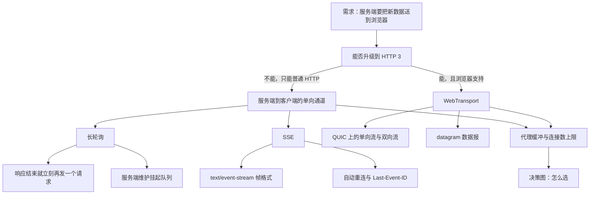
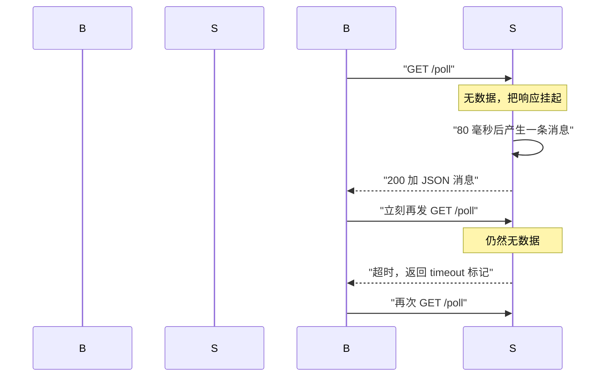
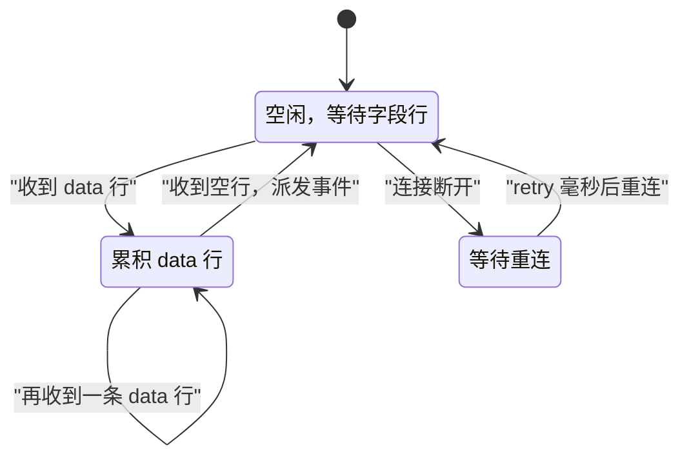
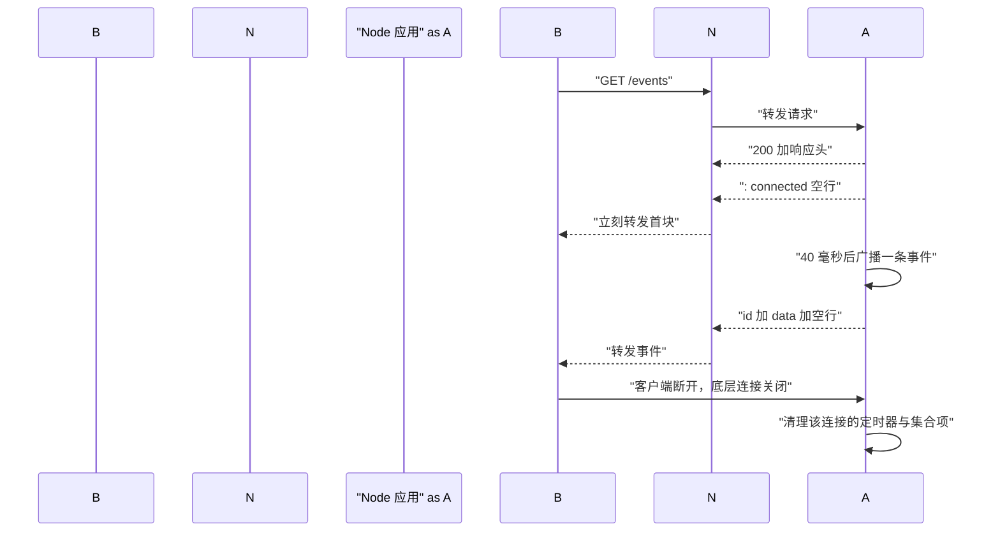
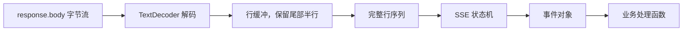
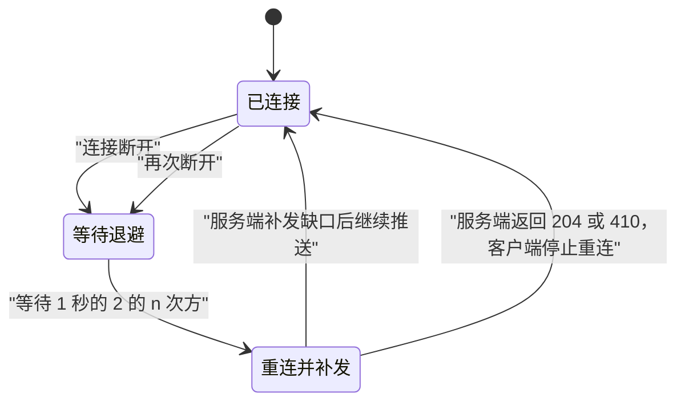
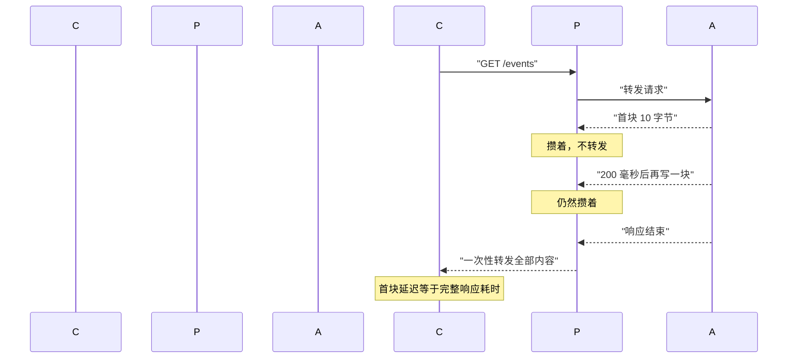
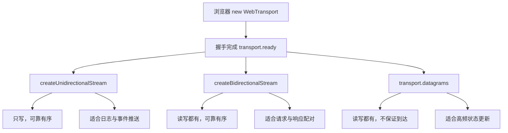
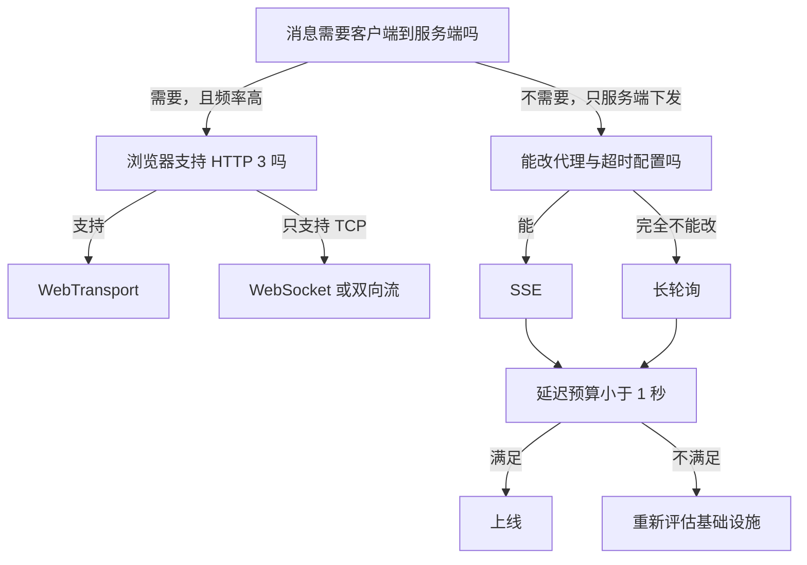

# SSE、长轮询与 WebTransport：单向推送与新协议

!!! abstract "学完这一页你能"
    - 说出长轮询、SSE、WebTransport 各自把延迟花在哪里，并给出选型理由。
    - 按 SSE 帧格式手写服务端，正确发送 data、event、id、retry 字段。
    - 用 fetch 的 ReadableStream 解析 SSE 文本流，并处理跨 chunk 的半行。
    - 判断代理缓冲、连接数上限、HTTP/3 可用性会怎样影响你的推送方案。

## 0. 知识地图



建议从第 1 节顺着读，先摸清长轮询的延迟来源，再进入 SSE 的文本协议。第 3、4 节是手写练习，务必自己跑一遍脚本。第 6 节讲代理与限制，读完后回头再看第 1 节的超时设计，会明白那个超时数字从哪来。

!!! note "术语：长轮询"
    Long Polling，长轮询：客户端发一个 HTTP 请求，服务端不立刻应答，而是挂住直到有数据或超时才返回。例子：客户端请求 `/poll`，服务端 30 秒后才回一条新消息。

## 1. 长轮询：把响应挂住

**先想一个问题**
一个聊天页要显示对方的新消息。若客户端每秒问一次服务端，多数请求返回空。用户看到消息的延迟最多 1 秒。如果网络只允许短请求，怎样把延迟压下来？

**心智模型**

!!! tip "心智模型"
    **一句话模型**：客户端发一个请求，服务端把它扣在手里，直到有数据或超时才回答，客户端收到后立刻再发一个。
    **日常类比**：打电话问餐厅有没有空位，服务员说别挂，我去看一眼，有空位才回话。
    **类比不成立的地方**：电话占线是物理线路；长轮询每次响应后连接就结束了，服务端必须自己维护一张还挂着的请求列表，进程重启这张表全丢。

**图解**



1. 浏览器发出第一个 `GET /poll`，这是一个普通 HTTP 请求。
2. 服务端此刻没有新消息，于是不调用 `res.end()`，把响应对象存进挂起列表。
3. 新消息产生时，服务端从列表取出最早的那个响应，写入 JSON 并结束它。
4. 浏览器收到响应，立刻发起下一个 `GET /poll`，回到第 2 步。
5. 如果一直没消息，服务端在超时后返回一个 `timeout` 标记，避免中间层把空闲连接掐断。

**一步一步来**

第 1 步：服务端维护挂起队列和积压队列。

```js
import { createServer } from "node:http";

const pending = [];   // 正在挂起的请求槽位
const backlog = [];   // 消息先到、请求后到时暂存在这里

const server = createServer((req, res) => {
  if (req.url !== "/poll") { res.writeHead(404); res.end(); return; }
  const respond = (body) => {                     // 唯一出口，保证每个响应只结束一次
    res.writeHead(200, { "content-type": "application/json" });
    res.end(JSON.stringify(body));
  };
  if (backlog.length > 0) { respond(backlog.shift()); return; }  // 已有消息，立即回
  const timer = setTimeout(() => respond({ type: "timeout" }), 25000); // 25 秒兜底
  pending.push({ respond, timer });               // 挂起，等消息到来
});
```

**这段代码在做什么**

- `pending` 保存还没应答的响应，配上各自的超时定时器。
- `respond` 是唯一出口，避免超时和数据同时触发两次写入。
- 有积压消息时直接返回，不再挂起，响应耗时接近 0。
- 挂起时注册 25 秒定时器，到期返回 `timeout` 标记而不是空响应。
- 服务端没有在这里处理客户端主动断开，生产代码需要监听 `req.on("close")` 清理槽位。

第 2 步：消息到达时，唤醒最早的挂起请求。

```js
const deliver = (item) => {                        // 把消息交给最早挂起的请求
  const slot = pending.shift();                    // 先进先出，保证顺序
  if (!slot) { backlog.push(item); return; }       // 没人挂着，先存起来
  clearTimeout(slot.timer);                        // 取消超时定时器
  slot.respond(item);                              // 立刻应答
};

setTimeout(() => deliver({ type: "message", seq: 1 }), 80);
```

**这段代码在做什么**

- `pending.shift()` 取出最早挂起的请求，先挂先得，消息顺序不会乱。
- 没有挂起请求时写入 `backlog`，下一次 `/poll` 会立刻取走。
- `clearTimeout` 必须调用，否则 25 秒后又会写一次已结束的响应，触发错误。
- 返回的 JSON 带 `type` 字段，客户端用它区分真实消息与超时。

第 3 步：客户端收到响应后立刻循环。

```js
const received = [];
while (received.length < 2) {                      // 收满两条就停，真实业务里是死循环
  const res = await fetch(`${base}/poll`);         // 每个响应对应一个新请求
  const body = await res.json();
  if (body.type === "message") received.push(body.seq);
  // 这里不 await 任何延时，收到即再发，延迟只由服务端产生
}
```

**这段代码在做什么**

- 循环体里没有 `setTimeout`，收到响应后立刻发下一个请求。
- 延迟等于服务端从消息产生到写出的时间，不由轮询间隔决定。
- 循环没有退避，网络抖动时会连续冲击服务端，生产代码需要加退避。
- 每个请求都是一个完整的 HTTP 往返，头部开销按请求数累加。

**运行结果**

```text
received = [ 1, 2 ]
holds(ms) = [ 81, 163 ]
```

**动手验证**

```js
// 依赖：无，仅 Node 20 内置模块
// 运行：node long-poll.mjs
import { createServer } from "node:http";
import assert from "node:assert/strict";

const pending = [];   // 挂起的请求槽位
const backlog = [];   // 消息先到、请求后到时暂存

const server = createServer((req, res) => {
  if (req.url !== "/poll") { res.writeHead(404); res.end(); return; }
  const respond = (body) => {                       // 唯一出口，保证只应答一次
    res.writeHead(200, { "content-type": "application/json" });
    res.end(JSON.stringify(body));
  };
  if (backlog.length > 0) { respond(backlog.shift()); return; }
  const timer = setTimeout(() => respond({ type: "timeout" }), 5000);
  pending.push({ respond, timer });
});

const deliver = (item) => {                          // 把消息交给最早挂起的请求
  const slot = pending.shift();
  if (!slot) { backlog.push(item); return; }
  clearTimeout(slot.timer);
  slot.respond(item);
};

await new Promise((resolve) => server.listen(0, resolve));
const base = `http://127.0.0.1:${server.address().port}`;

setTimeout(() => deliver({ type: "message", seq: 1 }), 80);   // 第一条消息
setTimeout(() => deliver({ type: "message", seq: 2 }), 240);  // 第二条消息

const received = [];
const holds = [];
while (received.length < 2) {                        // 收到一条就立刻再发一个请求
  const t0 = Date.now();
  const res = await fetch(`${base}/poll`);
  const body = await res.json();
  holds.push(Date.now() - t0);                       // 记录这次请求被挂了多久
  if (body.type === "message") received.push(body.seq);
}

assert.deepEqual(received, [1, 2]);                  // 顺序不能乱
assert.ok(holds[0] >= 40, `首次请求应被挂起，实际 ${holds[0]}ms`);
assert.ok(holds[1] >= 80, `第二次请求同样被挂住，实际 ${holds[1]}ms`);
console.log("received =", received);
console.log("holds(ms) =", holds);

server.closeAllConnections();
server.close();
```

依赖：无。预期输出：

```text
received = [ 1, 2 ]
holds(ms) = [ 81, 163 ]
```

毫秒数随机器波动，断言只检查下界。

**常见坑**

| 现象 | 原因 | 怎么修 |
| --- | --- | --- |
| 浏览器控制台出现 `ERR_EMPTY_RESPONSE` | 挂起太久，中间的代理或负载均衡先断了连接 | 服务端主动设置小于代理空闲超时的超时，例如 25 秒 |
| 消息偶尔重复消费 | 超时定时器和消息写入同时触发，写了两遍响应 | 用唯一出口函数加一个已应答标志 |
| 服务端内存持续增长 | 客户端断开后没有从 `pending` 移除槽位 | 监听 `req.on("close")` 并从数组删除 |
| 每秒空请求打满 CPU | 客户端在超时后不等待，立刻重发下一个请求 | 超时值调大，并在客户端加最小重试间隔 |

**小结**

- 长轮询把延迟从轮询间隔降到服务端写出时间。
- 代价是每个客户端随时可能占用一个挂起的请求。
- 服务端必须自己处理挂起队列、超时和断开清理。

## 2. SSE 帧格式：一行一行的文本协议

**先想一个问题**
用 fetch 流自己写推送，第一个难题就是分帧。TCP 只给字节流，一条消息在哪里结束？如果服务端和客户端各自发明一套切分规则，联调就会反复出错。

**心智模型**

!!! tip "心智模型"
    **一句话模型**：SSE 用纯文本行组成事件，字段行写字段，遇到空行就派发一个事件。
    **日常类比**：像填一张表格，每行写一个字段，写完画一条空行表示这张表结束了。
    **类比不成立的地方**：表格靠纸张边界区分；SSE 靠空行，而空行本身也是字节流的一部分，解析器要自行数行。

!!! note "术语：SSE"
    Server-Sent Events，服务器发送事件：一种建立在 HTTP 响应体上的文本推送格式，响应类型为 `text/event-stream`，事件之间用空行分隔。

**图解**



1. 解析器初始处于 `Idle`，等待一行输入。
2. 读到 `data` 开头的行，进入 `Acc`，把冒号后面的文本追加进缓冲区。
3. 再读一条 `data` 行，仍在 `Acc`，两条之间会用一个换行拼接。
4. 读到空行，把缓冲区拼成一条消息派发出去，状态回到 `Idle`。
5. 连接断开时进入 `Wait`，按 `retry` 字段给出的毫秒数等待后重连。

**一步一步来**

第 1 步：把一个事件对象编码成帧。

```js
function encodeFrame({ event, id, retry, data }) {
  const lines = [];
  if (event) lines.push(`event: ${event}`);       // 事件名，客户端用它选择监听器
  if (id) lines.push(`id: ${id}`);                // 事件编号，重连时客户端回传
  if (retry) lines.push(`retry: ${retry}`);       // 重连等待毫秒数
  for (const line of String(data).split("\n")) {
    lines.push(`data: ${line}`);                  // 多行数据要拆成多条 data 行
  }
  lines.push("", "");                             // 两个空串拼出末尾的一个空行
  return lines.join("\n");
}

console.log(JSON.stringify(encodeFrame({ id: "7", data: "第一行\n第二行" })));
```

**这段代码在做什么**

- 每个字段写成 `字段名 冒号 空格 值` 的形式，空格可选但习惯保留。
- `data` 里如果含换行，会拆成多条 `data` 行，客户端再拼回一个换行。
- 末尾两个空串经 `join` 后得到 `\n\n`，正好是一个空行加上本行结束。
- `retry` 只在需要改重连间隔时才写，不写就沿用浏览器上一次的值。

**运行结果**

```text
"id: 7\ndata: 第一行\ndata: 第二行\n\n"
```

第 2 步：按行解析，状态机累积字段。

```js
function createParser() {
  const state = { data: [], event: "", id: "", retry: 0 };
  const events = [];
  return {
    events,
    push(text) {
      for (const line of text.split("\n")) {       // 一次处理若干完整行
        if (line === "") {                         // 空行等于一次派发
          if (state.data.length > 0) {
            events.push({
              data: state.data.join("\n"),         // 多条 data 用换行拼回
              event: state.event || "message",     // 没写 event 就是默认的 message
              id: state.id || null,
            });
          }
          state.data = []; state.event = "";       // 一条事件结束后清空累积
          continue;
        }
        if (line.startsWith(":")) continue;        // 冒号开头是注释行，可直接丢弃
        const i = line.indexOf(":");
        const field = i === -1 ? line : line.slice(0, i);
        let value = i === -1 ? "" : line.slice(i + 1);
        if (value.startsWith(" ")) value = value.slice(1);  // 去掉冒号后的一个空格
        if (field === "data") state.data.push(value);
        else if (field === "event") state.event = value;
        else if (field === "id") state.id = value;
        else if (field === "retry") state.retry = Number(value);
      }
    },
    get retry() { return state.retry; },
  };
}
```

**这段代码在做什么**

- 解析器把整段文本按 `\n` 切开，逐行判断。
- 空行触派发，但只有累积过 `data` 才真的产生事件，避免心跳空行也生成事件。
- 冒号开头的行直接跳过，这是服务端发心跳的标准做法。
- 遇到没有冒号的行，字段名取整行，值取空串。
- 不认识的字段被忽略，这保证了新字段不会破坏老客户端。

第 3 步：心跳用注释行，保证代理不判定连接空闲。

```js
const heartbeat = setInterval(() => {
  res.write(": ping\n\n");    // 冒号开头的行不会触发客户端任何事件
}, 15000);                    // 15 秒一次，小于常见的 60 秒空闲超时
```

**这段代码在做什么**

- 心跳内容是一行注释加空行，客户端解析器会跳过它。
- 间隔取 15 秒，小于 nginx 默认 `proxy_read_timeout` 的 60 秒。
- 心跳同时能让上层的 TCP 连接保持活跃。
- 断开时必须 `clearInterval`，否则会往已关闭的响应上写数据。

**动手验证**

```js
// 依赖：无，仅 Node 20 内置模块
// 运行：node sse-frame.mjs
import assert from "node:assert/strict";

function encodeFrame({ event, id, retry, data }) {
  const lines = [];
  if (event) lines.push(`event: ${event}`);
  if (id) lines.push(`id: ${id}`);
  if (retry) lines.push(`retry: ${retry}`);
  for (const line of String(data).split("\n")) lines.push(`data: ${line}`);
  lines.push("", "");
  return lines.join("\n");
}

function createParser() {
  const state = { data: [], event: "", id: "", retry: 0 };
  const events = [];
  return {
    events,
    push(text) {
      for (const line of text.split("\n")) {
        if (line === "") {
          if (state.data.length > 0) {
            events.push({
              data: state.data.join("\n"),
              event: state.event || "message",
              id: state.id || null,
            });
          }
          state.data = []; state.event = "";
          continue;
        }
        if (line.startsWith(":")) continue;
        const i = line.indexOf(":");
        const field = i === -1 ? line : line.slice(0, i);
        let value = i === -1 ? "" : line.slice(i + 1);
        if (value.startsWith(" ")) value = value.slice(1);
        if (field === "data") state.data.push(value);
        else if (field === "event") state.event = value;
        else if (field === "id") state.id = value;
        else if (field === "retry") state.retry = Number(value);
      }
    },
    get retry() { return state.retry; },
  };
}

const parser = createParser();
parser.push(encodeFrame({ event: "tick", id: "7", retry: 3000, data: "第一行\n第二行" }));
assert.equal(parser.events.length, 1);
assert.deepEqual(parser.events[0], { data: "第一行\n第二行", event: "tick", id: "7" });
assert.equal(parser.retry, 3000);

const heartbeatParser = createParser();
heartbeatParser.push(": ping\n\n");                  // 纯心跳，不应产生事件
assert.equal(heartbeatParser.events.length, 0);

const multi = createParser();
multi.push(encodeFrame({ data: "a" }) + encodeFrame({ data: "b" }));  // 连续两帧
assert.deepEqual(multi.events.map((e) => e.data), ["a", "b"]);

console.log("frames =", parser.events);
console.log("heartbeat events =", heartbeatParser.events.length);
console.log("multi =", multi.events.map((e) => e.data));
```

依赖：无。预期输出：

```text
frames = [ { data: '第一行\n第二行', event: 'tick', id: '7' } ]
heartbeat events = 0
multi = [ 'a', 'b' ]
```

**常见坑**

| 现象 | 原因 | 怎么修 |
| --- | --- | --- |
| 客户端收到消息后内容少了一截 | 多行数据写成一条 `data:`，只有第一行被解析 | 每个换行都拆成独立的 `data:` 行 |
| 心跳把事件也触发了 | 心跳写成了空行而没有冒号前缀 | 心跳必须是 `: 内容` 形式，冒号在最前 |
| `retry` 改了但没生效 | `retry` 在事件派发后才写入，浏览器已经用旧值重连 | 连接建立时先发一条只含 `retry` 的帧 |
| 事件名收不到 | 客户端用 `onmessage` 只能接 `message` 事件 | 用 `addEventListener` 监听对应事件名 |

**小结**

- SSE 是一个按行解析的文本协议，空行负责分帧。
- `data` 行可重复，客户端把它们用换行拼起来。
- 冒号开头的行是注释，用来发心跳。

## 3. 手写 SSE 服务端

**先想一个问题**
你已经在用 Node 的 `http` 模块写接口。要加一个推送端点，服务端到底要设置哪些响应头？如果漏掉一个，可能整条通道看起来连上了却收不到数据。

**心智模型**

!!! tip "心智模型"
    **一句话模型**：SSE 服务端就是一个不结束的普通 HTTP 响应，每次 `res.write` 一块符合帧格式的文本。
    **日常类比**：像水龙头一直开着，客户端的读取循环就是拿桶接水。
    **类比不成立的地方**：水龙头的水压不受接收方影响，而 HTTP 响应会受中间层缓冲影响，写出去的内容可能被代理攒着不发。

!!! note "术语：反向代理缓冲"
    反向代理在转发前先把上游响应体攒在内存里，攒满或响应结束才发给客户端。例子：nginx 的 `proxy_buffering on` 是默认值。

**图解**



1. 浏览器向 nginx 发请求，nginx 转发给 Node 应用。
2. 应用写响应头，包括 `text/event-stream` 与禁用缓冲的头部。
3. 应用立刻写一行注释并调用 `flushHeaders`，让首块尽快到达浏览器。
4. 应用广播事件时，每次写一整帧，以空行结束。
5. 客户端断开后，应用的 `close` 回调被触发，必须清理这条连接的资源。

**一步一步来**

第 1 步：设置响应头并尽早写出第一块。

```js
res.writeHead(200, {
  "content-type": "text/event-stream; charset=utf-8", // SSE 的 MIME 类型
  "cache-control": "no-store",                        // 禁止中间层缓存这份响应
  "connection": "keep-alive",                         // HTTP/1.1 下请求保持连接
  "x-accel-buffering": "no",                          // 让 nginx 关闭这一条连接的缓冲
});
res.write(": connected\n\n");                         // 注释行，客户端会忽略但能立即触发 open
res.flushHeaders();                                   // 立刻把头部推出去，不等后续写入
```

**这段代码在做什么**

- `text/event-stream` 是 SSE 的识别标志，浏览器靠它决定是否走事件流逻辑。
- `cache-control: no-store` 防止 CDN 或浏览器缓存这份长响应。
- `x-accel-buffering: no` 是 nginx 认识的头部，可对单条连接关闭缓冲。
- 先写注释行，客户端拿到首块后才会认定连接已建立。
- `flushHeaders` 让头部不必等到第一次 `write` 才发出。

第 2 步：维护连接集合并广播。

```js
const clients = new Set();      // 当前所有打开的响应对象
let seq = 0;

const broadcast = (payload) => {
  seq += 1;                                                       // 单调递增的事件编号
  for (const res of clients) {
    res.write(`id: ${seq}\nevent: tick\ndata: ${JSON.stringify(payload)}\n\n`);
  }
  return seq;                                                     // 方便测试断言
};
```

**这段代码在做什么**

- 用 `Set` 保存活跃响应，断开时直接 `delete`。
- 编号 `seq` 单调递增，客户端重连时靠它判断缺了哪几条。
- 每个连接的帧内容一致，帧以空行结束。
- 广播是同步的，某个连接写入失败会抛出异常，生产代码需要逐个包 `try`。

第 3 步：清理断开的连接。

```js
req.on("close", () => {           // 客户端断开或服务端关闭时触发
  clients.delete(res);
  console.log("client gone, remaining =", clients.size);
});
```

**这段代码在做什么**

- `close` 在底层连接断开时触发，是清理的唯一时机。
- 不清理会导致广播往已销毁的响应写数据。
- `clients.size` 是判断有没有监听者的最直接指标，没有监听者时可以停掉上游数据源。
- HTTP/2 下同一个连接可承载多条流，`close` 的粒度由 Node 的兼容层决定，需核对官方文档：Node 的 HTTP/2 兼容层在客户端断开单条流时的触发时机。

**运行结果**

```text
events = [ { id: '1', event: 'tick' }, { id: '2', event: 'tick' }, { id: '3', event: 'tick' } ]
```

**动手验证**

```js
// 依赖：无，仅 Node 20 内置模块
// 运行：node sse-server.mjs
import { createServer } from "node:http";
import assert from "node:assert/strict";

function createParser() {                       // 与第 2 节相同的按行解析器
  const state = { data: [], event: "", id: "" };
  const events = [];
  return {
    events,
    push(text) {
      for (const line of text.split("\n")) {
        if (line === "") {
          if (state.data.length > 0) {
            events.push({ data: state.data.join("\n"), event: state.event || "message", id: state.id });
          }
          state.data = []; state.event = "";
          continue;
        }
        if (line.startsWith(":")) continue;
        const i = line.indexOf(":");
        const field = i === -1 ? line : line.slice(0, i);
        let value = i === -1 ? "" : line.slice(i + 1);
        if (value.startsWith(" ")) value = value.slice(1);
        if (field === "data") state.data.push(value);
        else if (field === "event") state.event = value;
        else if (field === "id") state.id = value;
      }
    },
  };
}

const clients = new Set();
let seq = 0;

const server = createServer((req, res) => {
  if (new URL(req.url, "http://x").pathname !== "/events") { res.writeHead(404); res.end(); return; }
  res.writeHead(200, {
    "content-type": "text/event-stream; charset=utf-8",  // 识别为 SSE
    "cache-control": "no-store",                         // 禁止缓存
    "connection": "keep-alive",                          // 保持连接
    "x-accel-buffering": "no",                           // 关闭 nginx 缓冲
  });
  res.write(": connected\n\n");                          // 首块立即到达
  clients.add(res);
  req.on("close", () => clients.delete(res));             // 断开时清理
});

const broadcast = (payload) => {
  seq += 1;
  for (const res of clients) res.write(`id: ${seq}\nevent: tick\ndata: ${JSON.stringify(payload)}\n\n`);
};

await new Promise((r) => server.listen(0, r));
const base = `http://127.0.0.1:${server.address().port}`;

const timer = setInterval(() => broadcast({ n: seq + 1 }), 40);  // 每 40 毫秒推一条

const ac = new AbortController();
const res = await fetch(`${base}/events`, { signal: ac.signal });
const reader = res.body.getReader();
const decoder = new TextDecoder();
const parser = createParser();

while (parser.events.length < 3) {
  const { value, done } = await reader.read();
  if (done) break;
  parser.push(decoder.decode(value, { stream: true }));   // stream 为 true 防止多字节字符被截断
}

ac.abort();                                              // 主动断开
clearInterval(timer);
server.closeAllConnections();
server.close();

assert.equal(parser.events.length, 3);
assert.deepEqual(parser.events.map((e) => e.event), ["tick", "tick", "tick"]);
assert.deepEqual(parser.events.map((e) => e.id), ["1", "2", "3"]);
console.log("events =", parser.events.map((e) => ({ id: e.id, event: e.event })));
```

依赖：无。预期输出：

```text
events = [ { id: '1', event: 'tick' }, { id: '2', event: 'tick' }, { id: '3', event: 'tick' } ]
```

**常见坑**

| 现象 | 原因 | 怎么修 |
| --- | --- | --- |
| 本地正常，线上一直收不到 | nginx 默认 `proxy_buffering on` 把响应攒着 | 加 `x-accel-buffering: no` 或改 nginx 配置 |
| 连接 60 秒后自动断开 | nginx `proxy_read_timeout` 默认 60 秒 | 每 15 秒发一次注释行心跳 |
| 开了 gzip 后消息挤在一起 | 压缩器按块输出，需要显式刷新 | SSE 响应不要开 gzip，或对这条路径关闭 |
| 广播报错导致整个循环中断 | 某个响应已销毁，`write` 抛异常 | 逐个连接包 `try catch`，出错就删除该连接 |

**小结**

- SSE 服务端就是一个不结束的 HTTP 响应，头部决定它能不能穿过中间层。
- 广播前必须有连接集合，断开时必须清理。
- 首块与心跳是两个必须存在的写入点。

## 4. 手写 SSE 客户端：用 fetch 流解析

**先想一个问题**
Node 里没有浏览器的 `EventSource`。你要在服务端脚本、命令行工具里消费 SSE，只能拿到 `fetch` 返回的一个字节流。这个流会随意切块，一条 `data:` 行可能被切成两半。

**心智模型**

!!! tip "心智模型"
    **一句话模型**：字节流先解码成字符串，再按行缓冲切成完整行，最后交给状态机。
    **日常类比**：像拼快递单，单子可能被刀切成两段，你要先把两段粘起来再读上面的地址。
    **类比不成立的地方**：粘单子只影响一张；字节流的切点由网络决定，每次运行的切点都不同，所以缓冲逻辑必须在任何输入下都成立。

!!! note "术语：事件流解码"
    把字节流按行拆成完整文本行的过程。例子：一个 chunk 以 `data: 你` 结尾，下一 chunk 以 `好` 开头，解码器要把两段拼成 `data: 你好`。

**图解**



1. `response.body` 是字节流，每次 `read` 返回一个 `Uint8Array`。
2. `TextDecoder` 把字节解码成字符串，`stream: true` 保证多字节汉字不被截断。
3. 行缓冲把上一次留下的尾部与新块拼起来，再按 `\n` 切分。
4. 切出来的最后一个元素可能不完整，留到下一次继续拼。
5. 完整行交给状态机，空行触发一次事件派发。
6. 派发出来的事件对象交给业务函数处理。

**一步一步来**

第 1 步：写行缓冲，处理跨块半行。

```js
function createLineReader(onLine) {
  const decoder = new TextDecoder();
  let tail = "";                                   // 保存被切开的半行
  return (chunk, final = false) => {
    const text = tail + decoder.decode(chunk, { stream: !final }); // final 时冲刷解码器
    const lines = text.split("\n");
    tail = final ? "" : lines.pop();               // 非最终块：最后一段留到下次
    for (const line of lines) onLine(line);
  };
}
```

**这段代码在做什么**

- `tail` 保存上一次结尾的不完整行，初始为空串。
- `stream: true` 让解码器保留可能被切断的多字节字符。
- `lines.pop()` 取出最后一段作为新的 `tail`，因为它可能还没写完。
- 如果全部处理完，`onLine` 会把每个完整行送出去。
- `final` 用于流结束时的收尾，会把 `tail` 也当作完整行处理。

第 2 步：把行喂进状态机。

```js
const state = { data: [], event: "", id: "" };
const handleLine = (line) => {
  if (line === "") {                               // 空行表示一个事件结束
    if (state.data.length > 0) {
      onEvent({ data: state.data.join("\n"), event: state.event || "message", id: state.id });
    }
    state.data = []; state.event = "";             // 清空累积
    return;
  }
  if (line.startsWith(":")) return;                // 心跳行直接跳过
  const i = line.indexOf(":");
  const field = i === -1 ? line : line.slice(0, i);
  const value = (i === -1 ? "" : line.slice(i + 1)).replace(/^ /, "");
  if (field === "data") state.data.push(value);
  else if (field === "event") state.event = value;
  else if (field === "id") state.id = value;
};
```

**这段代码在做什么**

- 状态只包含一条事件的累积字段，不需要更复杂结构。
- 空行且 `data` 为空时什么也不做，这样纯心跳不会产生事件。
- `replace(/^ /, "")` 去掉冒号后最多一个空格。
- `onEvent` 是外部注入的回调，解析与业务处理分离。

第 3 步：接上 fetch 与 AbortController。

```js
const ac = new AbortController();
const res = await fetch(url, { signal: ac.signal });    // signal 用于主动停止
if (!res.ok || !res.body) throw new Error(`bad response ${res.status}`);
const reader = res.body.getReader();
const push = createLineReader(handleLine);
while (true) {
  const { value, done } = await reader.read();
  if (done) break;                                      // 服务端结束或连接断开
  push(value);                                          // 交给行缓冲
}
push(undefined, true);                                  // 收尾，处理剩余 tail
```

**这段代码在做什么**

- `AbortController` 提供主动断开的能力，不调用就只能在流结束时退出。
- 先检查 `res.ok` 与 `res.body`，非 200 或没有响应体时无法走流式读取。
- `reader.read()` 每次返回一个块，`done` 为真代表流结束。
- 循环结束后要调用一次 `push(undefined, true)`，否则最后一行的内容会留在 `tail` 里丢掉。

**运行结果**

```text
events = [ '你好', '世界', '再见' ]
```

**动手验证**

```js
// 依赖：无，仅 Node 20 内置模块
// 运行：node sse-client.mjs
import { createServer } from "node:http";
import assert from "node:assert/strict";

const server = createServer((req, res) => {
  if (new URL(req.url, "http://x").pathname !== "/events") { res.writeHead(404); res.end(); return; }
  res.writeHead(200, { "content-type": "text/event-stream", "cache-control": "no-store" });
  // 关键：故意把一条 data 行拆成两次 write，制造跨块半行
  res.write("id: 1\ndata: 你");
  setTimeout(() => res.write("好\n\n"), 30);
  setTimeout(() => res.write("id: 2\ndata: 世"), 60);
  setTimeout(() => res.write("界\n\n"), 90);
  setTimeout(() => { res.write("id: 3\ndata: 再见\n\n"); res.end(); }, 120);
});

await new Promise((r) => server.listen(0, r));
const url = `http://127.0.0.1:${server.address().port}/events`;

function createLineReader(onLine) {
  const decoder = new TextDecoder();
  let tail = "";                                        // 被切开的半行
  return (chunk, final = false) => {
    const text = tail + decoder.decode(chunk, { stream: !final });
    const lines = text.split("\n");
    tail = final ? "" : lines.pop();
    for (const line of lines) onLine(line);
  };
}

const events = [];
const state = { data: [], event: "", id: "" };
const handleLine = (line) => {
  if (line === "") {
    if (state.data.length > 0) {
      events.push({ data: state.data.join("\n"), event: state.event || "message", id: state.id });
    }
    state.data = []; state.event = "";
    return;
  }
  if (line.startsWith(":")) return;
  const i = line.indexOf(":");
  const field = i === -1 ? line : line.slice(0, i);
  const value = (i === -1 ? "" : line.slice(i + 1)).replace(/^ /, "");
  if (field === "data") state.data.push(value);
  else if (field === "event") state.event = value;
  else if (field === "id") state.id = value;
};

const ac = new AbortController();
const res = await fetch(url, { signal: ac.signal });
const reader = res.body.getReader();
const push = createLineReader(handleLine);

while (true) {
  const { value, done } = await reader.read();
  if (done) break;
  push(value);
}
push(undefined, true);                                  // 收尾

server.closeAllConnections();
server.close();

assert.deepEqual(events.map((e) => e.data), ["你好", "世界", "再见"]);
assert.deepEqual(events.map((e) => e.id), ["1", "2", "3"]);
console.log("events =", events.map((e) => e.data));
```

依赖：无。预期输出：

```text
events = [ '你好', '世界', '再见' ]
```

去掉行缓冲、直接对每个 chunk 调 `push` 的话，第一条事件的 data 会变成 `你`，断言会失败。这就是跨块半行的实际后果。

**常见坑**

| 现象 | 原因 | 怎么修 |
| --- | --- | --- |
| 中文出现乱码 | `TextDecoder` 没有加 `stream: true` | 解码时传 `{ stream: true }`，结束时冲刷 |
| 最后一条事件丢了 | 流结束后没有处理残留的 `tail` | 结尾调用一次 `push(undefined, true)` |
| 事件内容被截断 | 直接按 chunk 切分，没做行缓冲 | 用行缓冲保留不完整行 |
| 循环卡住不退出 | 服务端没有结束响应，也没调用 `abort` | 设置看门狗定时器，超时调用 `ac.abort()` |

**小结**

- 消费 SSE 要经过字节、字符串、行、事件四层转换。
- 行缓冲是必须的，否则跨块的事件一定会解析错。
- `AbortController` 是唯一的主动停止手段。

## 5. 断线重连与 Last-Event-ID

**先想一个问题**
用户在地铁里刷消息，隧道里断网 30 秒。恢复后重连，中间漏掉的消息怎么办？如果服务端只推新消息，用户就永远看不到那 30 秒里的内容。

**心智模型**

!!! tip "心智模型"
    **一句话模型**：服务端给每条事件编号，客户端重连时把最后收到的编号带回去，服务端补发编号之后的全部事件。
    **日常类比**：像看剧续播，播放器记住你看到第几集，下次从下一集开始。
    **类比不成立的地方**：剧集是固定的；服务端的事件日志容量有限，编号太旧时只能让客户端全量重新同步。

!!! note "术语：Last-Event-ID"
    浏览器内置 `EventSource` 在重连时自动带上的请求头，值是上一条收到的 `id` 字段。例子：上次收到 `id: 7`，重连请求头里就有 `Last-Event-ID: 7`。

**图解**



1. 连接处于 `Open`，正常接收事件并记录最大 `id`。
2. 连接断开后进入 `Backoff`，等待时间按 2 的幂次增长。
3. 等待结束后进入 `Resume`，请求头或查询参数带上最后收到的 `id`。
4. 服务端从事件日志里挑出 `id` 更大的条目，先补发再转入实时推送。
5. 如果日志里已经没有缺口数据，服务端返回 204 或 410，浏览器内置 `EventSource` 会停止重连，此时需要业务层做全量同步。

**一步一步来**

第 1 步：服务端保留一段事件日志并补发。

```js
const log = [];        // 只保留最近 100 条，防止内存无限增长
let seq = 0;

const record = (payload) => {
  seq += 1;
  log.push({ id: seq, payload });
  if (log.length > 100) log.shift();       // 超出容量丢掉最旧的
};

const frameFor = (item) =>
  `id: ${item.id}\ndata: ${JSON.stringify(item.payload)}\n\n`; // 一帧一条事件
```

**这段代码在做什么**

- `log` 是补发的依据，容量上限决定能补多久的缺口。
- `record` 同时递增编号并写入日志，两个操作不可分开。
- `frameFor` 把日志条目编码成 SSE 帧，编号写在 `id` 字段。
- 容量上限意味着极端断线时长下无法补全，必须由业务层处理这种降级。

第 2 步：连接时读 `Last-Event-ID` 并补发。

```js
const lastSeen = Number(req.headers["last-event-id"] || 0);  // 浏览器自动带上
for (const item of log) {
  if (item.id > lastSeen) res.write(frameFor(item));         // 只补发缺口部分
}
clients.add(res);                                            // 补发完转入实时推送
res.write(`retry: 3000\n\n`);                                // 告诉浏览器下次等 3 秒
```

**这段代码在做什么**

- 头部名在 Node 里是小写的 `last-event-id`，值可能是字符串也可能缺失。
- `Number` 转换把缺失值变成 0，这样首次连接会补发全部日志。
- 补发只做 `id` 大于已见编号的部分，不会重复推送。
- `retry` 帧告诉浏览器下一次断线后等 3 秒再重连，覆盖默认值。

第 3 步：客户端退避重连。

```js
let attempt = 0;
const connect = async () => {
  const headers = lastId ? { "last-event-id": String(lastId) } : {};  // 手动带上编号
  const res = await fetch("/events", { headers });
  if (res.status === 204) return;                                     // 服务端说别连了
  attempt = 0;                                                        // 连上就重置退避
  // ... 进入读取循环，每收到事件更新 lastId
};
const backoff = () => {
  const base = Math.min(1000 * 2 ** attempt, 30000);                  // 上限 30 秒
  attempt += 1;
  return base * (0.5 + Math.random() * 0.5);                          // 抖动，避免同时重连
};
```

**这段代码在做什么**

- `lastId` 是客户端记住的最大编号，重连时放进请求头。
- 收到 204 或 410 代表服务端无法补发，客户端应停止自动重连并走全量同步。
- 退避上限设为 30 秒，避免等待时间无限增长。
- 乘以 0.5 到 1 之间的随机数做抖动，防止大量客户端在同一毫秒重连。

**运行结果**

```text
first = [ '1', '2', '3' ] resumed = [ '2', '3' ]
```

**动手验证**

```js
// 依赖：无，仅 Node 20 内置模块
// 运行：node sse-resume.mjs
import { createServer } from "node:http";
import assert from "node:assert/strict";

const log = [];        // 事件日志
let seq = 0;

const record = (payload) => {
  seq += 1;
  log.push({ id: seq, payload });
};

const server = createServer((req, res) => {
  const url = new URL(req.url, "http://x");
  if (url.pathname !== "/events") { res.writeHead(404); res.end(); return; }
  res.writeHead(200, { "content-type": "text/event-stream", "cache-control": "no-store" });

  const headerValue = req.headers["last-event-id"];                   // 也可能是查询参数
  const lastSeen = Number(headerValue ?? url.searchParams.get("lastEventId") ?? 0);
  for (const item of log) {
    if (item.id > lastSeen) {                                         // 只补缺口
      res.write(`id: ${item.id}\ndata: ${JSON.stringify(item.payload)}\n\n`);
    }
  }
  res.end();                                                          // 本节只验证补发逻辑
});

function createParser() {
  const state = { data: [], id: "" };
  const events = [];
  return {
    events,
    push(text) {
      for (const line of text.split("\n")) {
        if (line === "") {
          if (state.data.length > 0) events.push({ data: state.data.join("\n"), id: state.id });
          state.data = [];
          continue;
        }
        const i = line.indexOf(":");
        const field = i === -1 ? line : line.slice(0, i);
        const value = (i === -1 ? "" : line.slice(i + 1)).replace(/^ /, "");
        if (field === "data") state.data.push(value);
        else if (field === "id") state.id = value;
      }
    },
  };
}

await new Promise((r) => server.listen(0, r));
const base = `http://127.0.0.1:${server.address().port}`;

record({ n: 1 }); record({ n: 2 }); record({ n: 3 });   // 服务端已经产生三条事件

const readAll = async (lastEventId) => {
  const headers = lastEventId ? { "last-event-id": String(lastEventId) } : {};
  const res = await fetch(`${base}/events`, { headers });
  const parser = createParser();
  parser.push(await res.text());
  return parser.events.map((e) => e.id);
};

const first = await readAll(0);        // 首次连接，补全三条
const resumed = await readAll(1);      // 断线前收到 id 为 1，重连只补 2 和 3

server.closeAllConnections();
server.close();

assert.deepEqual(first, ["1", "2", "3"]);
assert.deepEqual(resumed, ["2", "3"]);  // 不重复，也不丢
console.log("first =", first, "resumed =", resumed);
```

依赖：无。预期输出：

```text
first = [ '1', '2', '3' ] resumed = [ '2', '3' ]
```

**常见坑**

| 现象 | 原因 | 怎么修 |
| --- | --- | --- |
| 重连后收到重复消息 | 服务端用 `>=` 比较编号 | 改用 `>` 比较，只发更新的条目 |
| 断线久一点就永久丢数据 | 日志容量有限，缺口已被挤掉 | 检测到缺口超出日志范围时返回 204 并让客户端全量同步 |
| 断线后所有客户端同时重连 | 退避时间固定，没有抖动 | 退避时间乘以 0.5 到 1 的随机数 |
| 客户端一直不重连 | 用了 `fetch` 却没写重连循环 | 用 `EventSource`，或自己包一层重连循环 |

**小结**

- 补发依赖服务端的事件日志与单调递增编号。
- `Last-Event-ID` 由浏览器自动带上，用 `fetch` 时要手动加。
- 退避必须加上限和随机抖动。

## 6. 代理、缓冲区与浏览器连接上限

**先想一个问题**
本地 `node sse-server.mjs` 跑得好好的，部署到 nginx 后面，浏览器转圈十秒才收到第一条消息。改动只有一层代理，为什么表现完全不同？

**心智模型**

!!! tip "心智模型"
    **一句话模型**：任何一层中间设备只要攒着数据不发，整条链路的延迟就等于这一层的攒数据时长。
    **日常类比**：像用漏斗倒水，漏斗底下堵着，上面的水再多也流不下来。
    **类比不成立的地方**：漏斗只影响速度；代理还可能直接改写或缓存响应，SSE 响应被 CDN 缓存后，第二个用户会拿到别人的数据。

!!! note "术语：连接数上限"
    浏览器对同一个源名的并发 HTTP/1.1 连接数有固定上限。例子：Chrome 对同源默认 6 条，SSE 会长期占用其中的 1 条。

**图解**



1. 客户端向代理发起请求，代理转发给应用。
2. 应用立刻写出第一块数据，代理收到但选择先攒起来。
3. 应用继续写第二块，代理依旧不转发。
4. 应用结束响应，代理才把积攒的内容一次性转发。
5. 结果客户端感知的延迟等于整个响应生成时间，SSE 的实时性完全消失。

**一步一步来**

第 1 步：用 Node 复现一次缓冲代理的行为差异。

```js
// 上游：先写一块，停 200 毫秒再写第二块并结束
const upstream = createServer((req, res) => {
  res.writeHead(200, { "content-type": "text/event-stream" });
  res.write("data: 第一段\n\n");                       // 立刻写首块
  setTimeout(() => { res.write("data: 第二段\n\n"); res.end(); }, 200);
});
```

**这段代码在做什么**

- 上游故意在两块之间停 200 毫秒，制造可观测的时间差。
- 首块写完不回结束响应，模拟 SSE 的长连接。
- 200 毫秒足够让流式与缓冲两种代理表现出可区分的首块延迟。

第 2 步：写一个流式代理。

```js
const streaming = createServer(async (req, res) => {
  res.writeHead(200, { "content-type": "text/event-stream" });
  const upRes = await fetch(upstreamUrl);
  for await (const chunk of upRes.body) res.write(chunk);  // 收到一块就转一块
  res.end();
});
```

**这段代码在做什么**

- `fetch` 返回的 `body` 在 Node 里可以被 `for await` 迭代。
- 每拿到一块就立刻 `res.write`，不做累积。
- 首块延迟等于上游首块到达时间加上一个往返。
- 块与块的边界不需要与上游对齐，HTTP 传输本身允许重新分块。

第 3 步：写一个缓冲代理。

```js
const buffering = createServer(async (req, res) => {
  res.writeHead(200, { "content-type": "text/event-stream" });
  const upRes = await fetch(upstreamUrl);
  const all = await upRes.text();      // 等上游完整结束
  res.end(all);                        // 一次性写出
});
```

**这段代码在做什么**

- `await upRes.text()` 会一直等到上游响应结束，期间一个字节都不转发。
- 首块延迟等于上游整个响应的生成时间。
- 真实代理用 `proxy_buffering on` 达到同样效果，`proxy_buffer_size` 决定攒多少。
- 修法是关掉这条路径的缓冲，或者在应用侧加 `x-accel-buffering: no`。

**运行结果**

```text
streaming ttfb = 3 ms
buffering ttfb = 208 ms
```

**动手验证**

```js
// 依赖：无，仅 Node 20 内置模块
// 运行：node proxy-buffering.mjs
import { createServer } from "node:http";
import assert from "node:assert/strict";

const upstream = createServer((req, res) => {           // 上游：两段数据，中间停 200ms
  res.writeHead(200, { "content-type": "text/event-stream" });
  res.write("data: 第一段\n\n");
  setTimeout(() => { res.write("data: 第二段\n\n"); res.end(); }, 200);
});
await new Promise((r) => upstream.listen(0, r));
const up = `http://127.0.0.1:${upstream.address().port}/`;

const streaming = createServer(async (req, res) => {    // 流式：边收边转
  res.writeHead(200, { "content-type": "text/event-stream" });
  const upRes = await fetch(up);
  for await (const chunk of upRes.body) res.write(chunk);
  res.end();
});
await new Promise((r) => streaming.listen(0, r));

const buffering = createServer(async (req, res) => {    // 缓冲：全收完再转
  res.writeHead(200, { "content-type": "text/event-stream" });
  const upRes = await fetch(up);
  const all = await upRes.text();
  res.end(all);
});
await new Promise((r) => buffering.listen(0, r));

const ttfb = async (port) => {
  const t0 = Date.now();
  const res = await fetch(`http://127.0.0.1:${port}/`);
  const reader = res.body.getReader();
  await reader.read();                                  // 读到第一块即计时结束
  const ms = Date.now() - t0;
  reader.cancel();
  return ms;
};

const fast = await ttfb(streaming.address().port);
const slow = await ttfb(buffering.address().port);

for (const s of [streaming, buffering, upstream]) { s.closeAllConnections?.(); s.close(); }

assert.ok(fast < 100, `流式代理首块应在 100ms 内，实际 ${fast}ms`);
assert.ok(slow >= 180, `缓冲代理首块被推迟到 180ms 以后，实际 ${slow}ms`);
console.log("streaming ttfb =", fast, "ms");
console.log("buffering ttfb =", slow, "ms");
```

依赖：无。预期输出：

```text
streaming ttfb = 3 ms
buffering ttfb = 208 ms
```

**常见坑**

| 现象 | 原因 | 怎么修 |
| --- | --- | --- |
| 页面里 6 个请求都卡住 | 同源 HTTP/1.1 上限 6 条，SSE 占满 | 升级到 HTTP/2，或把 SSE 放到独立域名 |
| CDN 返回了别的用户的数据 | SSE 响应被 CDN 按 URL 缓存 | 响应加 `cache-control: no-store`，并在 CDN 上排除这条路径 |
| 跨域 `EventSource` 报 CORS 错误 | 服务端没返回 `Access-Control-Allow-Origin` | 返回匹配的 CORS 头，需要 Cookie 时同时设置 `withCredentials` |
| 手机息屏后连接中断 | 系统冻结了后台页面的网络活动 | 页面重新可见时重建连接并带上 `Last-Event-ID` |

**小结**

- 缓冲的后果是首块延迟等于整段响应耗时，SSE 直接失效。
- 同源连接上限会限制页面并发的普通请求数量。
- CORS、缓存、超时三个设置在部署前逐条核对。

## 7. WebTransport 与 HTTP/3 流

**先想一个问题**
你要在浏览器里做一个协同白板，每一笔都要立刻送到服务端，服务端也要把别人的笔迹送回来。SSE 只能服务端到客户端，WebSocket 走 TCP，丢一个包后面全部要等重传。有没有基于 UDP 又保留可靠通道的方案？

**心智模型**

!!! tip "心智模型"
    **一句话模型**：WebTransport 在一条 QUIC 连接上开出多条独立的数据通道，每条通道可以可靠有序，也可以不可靠低延迟。
    **日常类比**：像一条大电缆里分出若干根独立的水管，一根堵了不影响另一根。
    **类比不成立的地方**：水管堵住是物理阻塞；QUIC 的流阻塞只在同一根流内发生，不同流之间互不影响，这正是它相对 TCP 的关键差异。

!!! note "术语：HTTP/3 与 QUIC"
    HTTP/3 是把 HTTP 语义跑在 QUIC 之上的版本。QUIC 是建立在 UDP 上的传输协议，内置加密与多路复用。例子：一条 QUIC 连接里可以同时存在 4 条互不阻塞的流。

!!! note "术语：数据报"
    datagram，数据报：WebTransport 提供的不可靠消息通道。例子：发送一条坐标更新，若网络拥塞可以直接丢弃，不重传，因为下一帧马上会覆盖它。

**图解**



1. 用 `new WebTransport(url)` 建立连接，等待 `ready` 承诺完成握手。
2. `createUnidirectionalStream` 返回一个只写流，适合服务端到客户端的事件推送。
3. `createBidirectionalStream` 返回带 `readable` 与 `writable` 的对象，适合请求响应配对。
4. `transport.datagrams` 提供 `readable` 与 `writable`，消息可能丢失或乱序。
5. 用 `transport.closed` 监听连接关闭，拿到关闭码与原因。

**一步一步来**

第 1 步：建立连接并监听关闭。

```js
const transport = new WebTransport("https://example.com:4433/board"); // 需要 HTTPS 与 HTTP/3
await transport.ready;                       // 握手完成前不能收发数据
transport.closed.then((info) => {            // 连接关闭时给出关闭码与原因
  console.log("closed", info.closeCode, info.reason);
});
```

**这段代码在做什么**

- `new WebTransport` 只发起连接，不阻塞，`ready` 才是握手完成的信号。
- URL 必须是 HTTPS，且服务端要支持 HTTP/3。
- `closed` 在正常关闭和异常关闭时都会兑现。
- 拿到 `closeCode` 后才能决定是重连还是提示用户。需核对官方文档：`WebTransportCloseInfo` 各字段的取值约定。

第 2 步：用单向流发一条消息。

```js
const stream = await transport.createUnidirectionalStream(); // 只写流
const writer = stream.getWriter();
await writer.write(new TextEncoder().encode(JSON.stringify({ x: 12, y: 40 })));
await writer.close();                                        // 关闭这条流代表消息结束
```

**这段代码在做什么**

- 每条消息开一条新流，流关闭即消息边界，不需要自己定分帧规则。
- 写入的是 `Uint8Array`，可以是任意二进制内容。
- 流是可靠有序的，同一条流内不会丢也不会乱序。
- 每条流都有独立的流量控制，一条流被阻塞不影响其他流。

第 3 步：用数据报发高频更新。

```js
const dw = transport.datagrams.writable.getWriter();
await dw.write(new TextEncoder().encode(JSON.stringify({ x: 13, y: 41 })));   // 可能丢失
const dr = transport.datagrams.readable.getReader();
const { value } = await dr.read();
const point = JSON.parse(new TextDecoder().decode(value));                    // value 是 Uint8Array
```

**这段代码在做什么**

- 数据报没有重传，网络拥塞时可能被直接丢弃。
- 适合用下一帧覆盖上一帧的场景，例如鼠标坐标。
- 数据报也可能乱序到达，业务层要能接受这一点。
- 读到的永远是二进制，需要自己解码成文本或结构。

**运行结果**

```text
globalThis.WebTransport = undefined
node:quic 不可用
隔离验证： 快
```

**动手验证**

```js
// 依赖：无，仅 Node 20 内置模块
// 运行：node webtransport-model.mjs
// 说明：Node 20 不带 WebTransport 客户端，本脚本用 Node 流建模每条流相互隔离的语义
import { PassThrough } from "node:stream";
import assert from "node:assert/strict";

console.log("globalThis.WebTransport =", typeof globalThis.WebTransport);
try {
  await import("node:quic");
  console.log("node:quic = 可用");
} catch {
  console.log("node:quic = 不可用");
}

class StreamChannel {                                  // 教学模型：每条流一个独立缓冲
  constructor() { this.streams = new Map(); }
  open(id) { const s = new PassThrough(); this.streams.set(id, s); return s; }
  send(id, text) { this.streams.get(id).write(text); }
  end(id) { this.streams.get(id).end(); }
  destroyAll() { for (const s of this.streams.values()) s.destroy(); }
}

// 实验一：两条流各自读到自己的全部内容
const ch1 = new StreamChannel();
const a = ch1.open(1);
const b = ch1.open(2);
ch1.send(1, "A1"); ch1.send(1, "A2"); ch1.send(2, "B1");
ch1.end(1); ch1.end(2);
const read = async (stream) => { let out = ""; for await (const c of stream) out += c; return out; };
const [ra, rb] = await Promise.all([read(a), read(b)]);
assert.equal(ra, "A1A2");
assert.equal(rb, "B1");
ch1.destroyAll();

// 实验二：慢流没有被消费，快流依然可以读完
const ch2 = new StreamChannel();
ch2.open(1);                                          // 慢流，一直不读
const fast = ch2.open(2);
for (let i = 0; i < 5; i++) ch2.send(1, `慢${i}`);     // 写入慢流但没人消费
ch2.send(2, "快");
ch2.end(2);
const got = await new Promise((resolve) => {          // 只读快流
  let out = "";
  fast.on("data", (c) => { out += c; });
  fast.on("end", () => resolve(out));
});
assert.equal(got, "快");
ch2.destroyAll();

console.log("隔离验证：", got);
```

依赖：无。预期输出：

```text
globalThis.WebTransport = undefined
node:quic = 不可用
隔离验证： 快
```

第一行说明 Node 20 的全局对象里没有 `WebTransport`。真实客户端要在浏览器里跑，服务端需要自建 HTTP/3 与 WebTransport 支持，需核对官方文档：你选用的服务端是否暴露 WebTransport 会话，以及它是否要求额外配置 Alt-Svc。

!!! note "术语：Alt-Svc"
    HTTP Alternative Services，一种响应头，用来告诉浏览器这个源还能用其他协议访问。例子：`Alt-Svc: h3=":443"; ma=86400` 表示 86400 秒内可以尝试用 HTTP/3 连 443 端口。

**常见坑**

| 现象 | 原因 | 怎么修 |
| --- | --- | --- |
| `new WebTransport` 直接抛错 | 页面不是 HTTPS 或证书不受信 | 用受信证书，本地测试用受信的开发证书 |
| 连接一直不 `ready` | 服务端没开 HTTP/3，或中间设备拦了 UDP | 检查 UDP 443 是否可达，检查 `Alt-Svc` 是否下发 |
| 每条消息开一条流后连接变慢 | 流数量没有上限，创建过多 | 复用双向流，或用数据报承载高频小消息 |
| 用数据报发关键业务数据后丢单 | 数据报不做重传与顺序保证 | 关键数据走流，状态快照走数据报 |

**小结**

- WebTransport 提供可靠流与不可靠数据报两种通道。
- 它跑在 HTTP/3 上，依赖 HTTPS 与 UDP 可达。
- 浏览器与服务端支持情况需要按官方兼容表核对。

## 8. 决策图与迁移路径

**先想一个问题**
三个方案都看完了，新项目该选哪个？如果现有系统已经在用长轮询，改成 SSE 要付出多少改动？

**心智模型**

!!! tip "心智模型"
    **一句话模型**：先问消息方向，再问基础设施能承受什么，最后问延迟预算。
    **日常类比**：选交通工具先看是运货还是载人，再看路上有没有桥。
    **类比不成立的地方**：交通方式是互斥的；这三种通道可以在同一个产品里并存，公告用 SSE，光标同步用数据报。

**图解**



1. 第一个判断是方向：只有服务端下发时，SSE 就够了。
2. 需要客户端高频上行时，看浏览器与网络是否支持 HTTP/3。
3. 支持就评估 WebTransport，不支持就退回 WebSocket。
4. 只做服务端下发时，看能否修改代理的超时与缓冲配置。
5. 能改就上 SSE，改不了只能继续用长轮询。
6. 两个分支都要回头核对延迟预算，预算不满足时优先解决基础设施。

**一步一步来**

第 1 步：从长轮询迁到 SSE，改动集中在传输层。

```js
// 旧：每个响应结束，客户端再发一个请求
const poll = async () => {
  const res = await fetch("/poll");
  handle(await res.json());
  setTimeout(poll, 0);
};

// 新：一个响应不结束，事件由服务端逐帧写出
const es = new EventSource("/events");            // 自动重连与 Last-Event-ID 由浏览器处理
es.addEventListener("tick", (e) => handle(JSON.parse(e.data)));
es.onerror = () => console.log("连接异常，浏览器会自行重连");
```

**这段代码在做什么**

- 业务处理函数 `handle` 不需要改，改的只是数据来源。
- `EventSource` 自动处理重连与 `Last-Event-ID`，省掉客户端循环。
- 事件名写成 `tick`，服务端帧里的 `event` 字段要一致。
- `onerror` 只做日志，重连由浏览器负责，不需要手写退避。

第 2 步：检查服务端与代理配置。

```js
res.writeHead(200, {
  "content-type": "text/event-stream; charset=utf-8",
  "cache-control": "no-store",
  "x-accel-buffering": "no",     // nginx 单连接关闭缓冲
});
const heartbeat = setInterval(() => res.write(": ping\n\n"), 15000); // 小于 60 秒空闲超时
req.on("close", () => clearInterval(heartbeat));                       // 断开即停心跳
```

**这段代码在做什么**

- 三个响应头分别对应类型识别、缓存、代理缓冲三件事。
- 心跳间隔选 15 秒，给代理的 60 秒空闲超时留出余量。
- 断开时清掉心跳定时器，避免向已关闭响应写数据。
- 需要同步修改 nginx 的 `proxy_read_timeout` 与 `proxy_buffering`。

第 3 步：判断是否需要进入 WebTransport。

```js
const needLowLatencyUpstream = true;          // 客户端每秒上行超过 10 条消息
const needUnreliableMode = true;              // 丢弃旧坐标不影响体验
if (needLowLatencyUpstream && needUnreliableMode) {
  // 进入 WebTransport 评估：需要 HTTP/3 服务端、受信证书、UDP 可达
}
```

**这段代码在做什么**

- 两个布尔量对应两个明确需求：上行频率与可丢弃性。
- 只有两个都成立时才值得承担 HTTP/3 的部署成本。
- 进入评估前要先确认 CDN 与负载均衡是否支持 HTTP/3。

**运行结果**

```text
决策结果：服务端下发，代理可改，选 SSE
```

**动手验证**

```js
// 依赖：无，仅 Node 20 内置模块
// 运行：node decide.mjs
import assert from "node:assert/strict";

const decide = ({ clientToServer, upstreamHz, canChangeProxy, http3, browserOk }) => {
  if (clientToServer && upstreamHz >= 10) {            // 高频上行
    if (http3 && browserOk) return "WebTransport";     // 支持 HTTP/3 才走这条路
    return "WebSocket";
  }
  if (canChangeProxy) return "SSE";                    // 能改代理就上 SSE
  return "长轮询";                                      // 完全不能改
};

assert.equal(decide({ clientToServer: false, upstreamHz: 0, canChangeProxy: true, http3: false, browserOk: false }), "SSE");
assert.equal(decide({ clientToServer: false, upstreamHz: 0, canChangeProxy: false, http3: true, browserOk: true }), "长轮询");
assert.equal(decide({ clientToServer: true, upstreamHz: 60, canChangeProxy: true, http3: true, browserOk: true }), "WebTransport");
assert.equal(decide({ clientToServer: true, upstreamHz: 60, canChangeProxy: true, http3: false, browserOk: false }), "WebSocket");

const result = decide({ clientToServer: false, upstreamHz: 0, canChangeProxy: true, http3: false, browserOk: false });
console.log("决策结果：服务端下发，代理可改，选", result);
```

依赖：无。预期输出：

```text
决策结果：服务端下发，代理可改，选 SSE
```

**常见坑**

| 现象 | 原因 | 怎么修 |
| --- | --- | --- |
| 迁移后消息内容变成 `[object Object]` | 服务端把对象直接写进 `data` 字段 | 用 `JSON.stringify` 序列化，客户端再解析 |
| `EventSource` 收不到自定义事件 | 客户端用了 `onmessage` | 改用 `addEventListener` 并保证事件名一致 |
| 换了 SSE 之后请求数没降 | 旧的长轮询循环还在跑 | 删除旧的轮询代码，避免两个通道同时推送 |
| 上了 WebTransport 后部分用户完全连不上 | 网络封了 UDP，浏览器没有回退 | 保留 SSE 作为回退通道 |

**小结**

- 选型顺序是先方向、再基础设施、最后延迟预算。
- 长轮询到 SSE 的改动集中在服务端头部与客户端入口。
- WebTransport 只在明确需要低延迟上行时才值得引入。

## 综合对比

| 维度 | 长轮询 | SSE | WebTransport |
| --- | --- | --- | --- |
| 传输层 | HTTP/1.1 或 HTTP/2 | HTTP/1.1 或 HTTP/2 | HTTP/3 over QUIC，底层 UDP |
| 通道方向 | 客户端反复拉取 | 服务端到客户端单向 | 双向 |
| 消息边界 | 一次响应对应一条 JSON | 空行分隔的事件帧 | 流关闭，或应用层自行分帧 |
| 二进制数据 | 需要 base64 或额外编码 | 只能 UTF-8 文本 | 原生 Uint8Array |
| 到达保证 | 每次响应必达 | 有序，靠 Last-Event-ID 补发 | 流可靠有序，数据报不保证 |
| 自动重连 | 需自己写循环 | EventSource 内置，retry 控制 | 需自己监听 closed |
| 首条可见延迟 | 取决于服务端挂起时长 | 服务端写出即到达 | 服务端写出即到达 |
| 鉴权方式 | 任意请求头与 Cookie | EventSource 不能设自定义头 | 可带 Cookie，受 CORS 约束 |
| 中间层影响 | 影响小 | 缓冲与 60 秒空闲超时都会掐断 | 代理不支持 HTTP/3 时无法建连 |
| 每客户端占用 | 空闲时为 0 | 1 条长期 HTTP 连接 | 1 个 QUIC 会话 |
| 浏览器 API | fetch | EventSource 或 fetch 流 | WebTransport |
| 典型实现成本 | 一个请求队列 | 一组响应头加心跳 | HTTP/3 服务端、证书、UDP 可达 |

## 应用与行业实践

### 应用场景地图

| 场景 | 用到本页哪个知识点 | 典型技术选型 | 注意事项 |
| --- | --- | --- | --- |
| 后台管理系统的万行表格，只刷新变化的行 | SSE 帧格式、断线重连与 Last-Event-ID | SSE 只推变化行的 id 与版本号，前端按 id 拉整行 | 一条事件别塞整行数据，否则 data 体积随行宽增长 |
| 大模型问答的逐字输出 | 手写 SSE 服务端、fetch 流解析跨 chunk 半行 | SSE + fetch + ReadableStream | data 里若有换行要拆成多条 data，收到空行才算一条事件 |
| 低端安卓在弱网下的任务进度查询 | 长轮询：把响应挂住 | 长轮询 + 版本号 since 参数 | 挂住时长要小于链路上最短的 idle timeout |
| 多人协作白板的光标与激光笔位置 | WebTransport 与 HTTP/3 流 | WebTransport datagram，不可用时回退 WebSocket | 光标位置丢了不重发，只认最新一条 |
| 股票行情与赛事比分推送 | SSE 帧格式、代理、缓冲区 | SSE + 注释行心跳 | 代理默认缓冲会把多条事件攒成一批再发 |
| CI 构建日志实时滚动 | 手写 SSE 服务端、跨 chunk 半行解析 | SSE | 日志自身含换行，要按行拆成多条 data 字段 |
| 工单系统的全局告警弹窗 | 断线重连与 retry 字段 | SSE + retry + 注释行心跳 | 同一浏览器多标签会各开一条连接，需按标签共享 |
| 灰度开关与配置下发 | 长轮询与 SSE 的取舍 | 版本号 + 长轮询，或改推 SSE | 要区分「没有变更」与「请求超时」，返回体结构保持一致 |
| 会议应用里共享状态的同步 | WebTransport 流与 datagram 的区别 | 状态走 datagram，大块内容走双向流 | datagram 不保证顺序与送达，不能承载必须落地的消息 |

### 三个场景拆解

#### 场景 1：大模型问答的逐字输出

**业务背景**：模型一个字一个字生成，用户盯着空白屏等上几秒就会关掉页面。一次回答通常在几百到两千字符之间，可以自己量：首字节超过 1 秒，用户就开始怀疑卡死。

**怎么用本页知识解决**：服务端把每段增量写成一条 SSE 事件，客户端用 fetch 的响应流解析，遇到跨 chunk 的半行先存起来。

```js
// 用 fetch 读 SSE，能带自定义请求头，重连逻辑自己控制
const resp = await fetch('/api/chat', {
  headers: { Authorization: `Bearer ${token}` }, // EventSource 不能设这个头
});
const reader = resp.body.getReader();
const decoder = new TextDecoder();
let buf = '';                                      // 存跨 chunk 的不完整片段
for (;;) {
  const { value, done } = await reader.read();
  if (done) break;
  buf += decoder.decode(value, { stream: true });  // 中文被切开也不会乱码
  const blocks = buf.split('\n\n');                // 空行才是事件边界
  buf = blocks.pop();                              // 最后一块可能不完整，留着
  for (const block of blocks) {
    for (const line of block.split('\n')) {
      if (line.startsWith('data: ')) render(line.slice(6)); // 只取 data 字段
    }
  }
}
```

- `stream: true` 让 TextDecoder 把不完整的多字节字符留到下一次 decode，所以中文不会被切成乱码。
- 事件边界是空行而不是单个换行，先按 `\n\n` 切块，最后一块放回 buf 等下一轮数据。
- 用 fetch 而不用 EventSource，是因为要带 Authorization 头，EventSource 不支持传自定义请求头。
- 服务端每条 `res.write` 之后不要自己攒批；真正会攒批的是中间的反向代理。
- 结束时发一个 `event: done`，客户端据此关掉等待状态，不用等连接关闭。

**怎么度量收益**：在浏览器里用 `performance.now()` 在 render 里打点，算相邻两次渲染的间隔 p50 与 p95；用 Chrome DevTools 的 Network 面板看该请求的 Waiting (TTFB) 与 Content Download 时间；端到端延迟用服务端写下第一条 data 的时间戳与首条日志的渲染时间之差来对比。

**什么时候不该用**：

- 客户端需要频繁上行数据时不要用 SSE，它是单向的，上行得另开接口。
- 需要浏览器在连接建立时发送自定义头或 POST body 时不要用 EventSource，改用 fetch 流并自己实现重连。
- 客户端运行在只支持 XHR 而不支持 EventSource 的老环境时，这套方案直接不可用，要准备长轮询兜底。

#### 场景 2：后台管理万行表格的变更通知

**业务背景**：运营同事开着表格页等别人改数据，前端每 5 秒轮询一次全量接口，一个页面一分钟发 12 次请求。在线人数上百时，多数请求返回的都是「没有变化」，服务器把时间花在构造空响应上。

**怎么用本页知识解决**：客户端带上已有的版本号请求，服务端有变更立即返回、没有就把响应挂住，直到超时才返回空结果。

```js
// 长轮询：请求进来先挂住，有变更或超时才回
const waiters = new Map();                        // userId -> 挂住的响应
app.get('/api/order-changes', (req, res) => {
  const { userId, since } = req.query;            // since 是客户端已有的版本号
  const missed = changes.filter(c => c.id > Number(since));
  if (missed.length) return res.json({ version: missed.at(-1).id, changes: missed });
  const timer = setTimeout(() => {                // 超时兜底，别让连接被网关掐
    waiters.delete(userId);
    res.json({ version: Number(since), changes: [] });
  }, 25000);
  waiters.set(userId, (batch) => {                // 挂住，等业务侧写库后唤醒
    clearTimeout(timer);
    waiters.delete(userId);
    res.json({ version: batch.at(-1).id, changes: batch });
  });
});
```

- `since` 用版本号而不是时间戳，避免多台机器时钟不一致时漏掉变更。
- 25000 毫秒的超时要小于链路上最短的 idle timeout，否则连接被中间设备掐断，客户端却以为还在等。
- 每个用户只保留一个等待者，重复请求时用新响应替换旧的，防止连接泄漏。
- 等待者放在进程内存里，重启就丢；变更本身要落库，客户端重连时用 since 补齐。
- 前端拿到 changes 后只请求变化的那几行详情，不要整表重刷。

**怎么度量收益**：服务端给「超时返回空」和「有变更返回」各打一个计数器，用 Prometheus 记数、Grafana 看两者比例；用 histogram 记录请求进来到写出响应的时间，看 p50 与 p95；连接占用用 `server.getConnections()` 或在容器里 `ss -s` 观察。

**什么时候不该用**：

- 变更频率高于每秒一次时不要用长轮询，空返回与重连的开销会盖过收益，改用 SSE。
- 运行时按固定 worker 数处理请求（同步阻塞型运行时）时不要挂住连接，worker 会被占满，后续请求排队。
- 需要客户端离线期间也不丢消息时，别把队列只放内存，要落库加版本号。

#### 场景 3：多人协作白板的光标广播

**业务背景**：一块白板上二十来个人同时移动光标，每 50 毫秒发一次位置，迟到 200 毫秒的旧位置没有价值。麻烦在于旧位置如果排在可靠队列里等重传，会把新位置顶掉。

**怎么用本页知识解决**：光标位置走不可靠数据报，丢了不补；图形的增删改走可靠流，保证顺序。

```js
// 先探测能力，再决定走 WebTransport 还是回退
if (!('WebTransport' in window)) fallbackToWebSocket();
else {
  const wt = new WebTransport('https://board.example.com:4433/cursor');
  await wt.ready;                                  // 握手完成前不能写数据
  const writer = wt.datagrams.writable.getWriter();
  setInterval(() => {                              // 50ms 一次，只发最新位置
    const p = { x: cursor.x, y: cursor.y, t: performance.now() };
    writer.write(new TextEncoder().encode(JSON.stringify(p)));
  }, 50);
  // 图形增删改走可靠流，保证顺序；datagram 丢了不补
  const stream = await wt.createBidirectionalStream();
  wt.closed.then(() => fallbackToWebSocket());     // 连接被关掉时降级
}
```

- 先判断 `WebTransport` 是否挂在 window 上，不在就直接降级，不让用户白等一次失败的握手。
- datagram 不保证送达也不保证顺序，适合每秒二十次的光标位置，最新一条覆盖旧的。
- 图形增删改走可靠流；把这类消息混进 datagram 会出现状态分叉。
- `ready` 与 `closed` 都是 Promise，连上之后要挂 `closed` 处理服务端关闭与网络切换。
- 服务端要按消息类型分路：datagram 只广播给房间内其他人，流上的消息落库并回执。

**怎么度量收益**：客户端在发送与接收时各打一个 `performance.now()`，算相邻两条的到达间隔 p95 与序号缺口比例（丢了没到位的条数占总条数）；服务端在会话建立日志里标记用的是 WebTransport 还是 WebSocket，统计回退率；用 Chrome DevTools 的 Network 面板看 Protocol 列是否为 h3。

**什么时候不该用**：

- 接入链路只到 HTTP/1.1 或 HTTP/2（企业代理常停在这一层）时，别把 WebTransport 当唯一通道，必须有回退。
- 只需要服务端单向推文本时不要用 WebTransport，SSE 的部署与排障步骤少得多，用 curl 就能看。
- 需要严格有序且不能丢的大块数据时不要走 datagram，走可靠流并自己做分片与校验。

### 行业先进实践

注释行心跳（出处：WHATWG HTML Living Standard 的 Server-sent events 章节）

规范写明以冒号开头的行是注释，浏览器收到后忽略，不触发任何事件监听器。服务端每隔十几秒写一行 `: keep-alive`，链路上的代理能看到字节在流动，idle timeout 就不会掐断连接。你的项目可以把它放进定时器，只在两次真实事件间隔超过阈值时补发。

用响应头控制代理缓冲（出处：Nginx 官方文档的 ngx_http_proxy_module 一节）

Nginx 会识别上游响应里的 `X-Accel-Buffering` 响应头来决定是否缓冲该响应，设为 `no` 表示按上游节奏转发。代理一旦缓冲，多条 SSE 事件会被攒成一批发给浏览器，逐字输出变成一次吐出。借鉴方式是在 SSE 响应头带上它，并在网关配置里对这条路径单独关掉缓冲与缓存。

用 HTTP Datagram 承载可丢弃的数据（出处：IETF RFC 9297，HTTP Datagrams and the Capsule Protocol）

该文档定义了在 HTTP 连接上传输不可靠数据报的方式，WebTransport 的 datagram 建立在这套机制之上。它让「丢了无所谓、但要最新」的数据不必排在可靠队列后面等重传。借鉴方式是把光标、心跳、实时位置放 datagram，把状态变更放可靠流。

用 fetch 流替代 EventSource（出处：开源项目 microsoft/fetch-event-source）

这个项目把 SSE 的解析放在 fetch 的响应流上，因此可以带自定义请求头、可以用 POST 发 body。EventSource 只能发 GET，也不能设置 Authorization 头，遇到需要鉴权的接口就得换方案。借鉴方式是需要鉴权头时用 fetch 流，同时把重连与 Last-Event-ID 的逻辑自己实现一遍。

传输降级链（出处：Socket.IO 官方文档）

Socket.IO 默认先尝试 WebSocket，握手失败时退回 HTTP 长轮询，对上层暴露同一套事件接口。这种做法把探测、选路、降级收敛到一处，业务代码不用关心当前用的是哪种传输。借鉴方式是为推送通道定义一个统一的事件接口，底下挂 SSE 与长轮询两条实现。

SSE 在 CDN 链路上的默认行为（需核对官方文档：具体核对代理缓冲开关与 idle timeout 的默认值）

要核对的是该产品配置项里 response buffering、proxy buffering 或 idle timeout 的默认值，以及改动是否对已建立的连接生效。核对方式是查厂商文档的对应章节，并在测试环境用一个 90 秒不发数据的 SSE 连接实测多久被断开。

### 从学到用：落地路线

第 1 步：在内部后台页面上先加一条 SSE 通道，只推「哪个资源变了」的信号，不推数据本体。验收标准：这条通道在测试环境连续跑 30 分钟不断，服务端日志里能看到客户端按 retry 自动重连的记录。

第 2 步：把这条通道放上真实链路，前面挂一层 Nginx 或反向代理。验收标准：用 `curl -N` 与浏览器各访问一次，第一条事件都在 1 秒内出现；把代理缓冲打开再测一次，记录两次首条事件的时间差。

第 3 步：把客户端封装成内部库，业务只订阅事件名。验收标准：三个不同页面接入后，业务代码里不出现 `text/event-stream`、`Last-Event-ID` 这类字符串，重连与按 id 补齐都在库里完成。

第 4 步：把连接数上限、缓冲头、重连次数写进上线检查表与监控告警。验收标准：CI 里有一条检查能拦住缺少 `X-Accel-Buffering: no` 的 SSE 路由；监控里有一条告警在重连次数超过基线时触发。

### 动手作业

目标：在本地起一个 Node 服务，把一段模拟构建日志用 SSE 推到浏览器，支持中途断线后按 Last-Event-ID 续传；再写一个长轮询版本做对照，比较两者的首字节时间与请求次数。

步骤：

1. 起一个 Node 内置 http 服务，`/log/stream` 返回 `text/event-stream`，`/log/longpoll` 返回 JSON。
2. 写一个生成器，每 300 毫秒产出一条日志，共 60 条，每条带自增 id。
3. SSE 端点按 `id`、`event`、`data` 三个字段输出，写完立即 flush，并在每 5 条之间插入一行 `: keep-alive`。
4. 客户端用 fetch 加 ReadableStream 解析，保留 buf 处理跨 chunk 的半行，把每条日志追加到页面。
5. 页面上加一个按钮，abort 当前请求，2 秒后带 `Last-Event-ID` 重新请求，服务端从该 id 之后继续发。
6. 长轮询版本：客户端带 since 参数请求，服务端最多挂 10 秒，有日志立即返回。
7. 同一段日志各跑 3 次，记录首字节时间与 60 条日志全部到达的总时间，写进 README。

验收标准：

- `curl -N http://localhost:3000/log/stream` 能看到逐条输出，每条事件由 `id: N`、`event: log`、`data: {...}` 三行加一个空行组成。
- 断开重连后，页面上的日志 id 连续，没有重复也没有缺口。
- 把服务端每次 flush 的内容刻意切成两半写出，客户端解析出的日志条数仍是 60。
- 通过 Nginx 访问时，`proxy_buffering off` 的配置能在 1 秒内看到第一条日志，`on` 的配置会攒到最后一起出现，两种配置的首条日志到达时间都要记录。
- 长轮询版本在 60 条日志期间产生的请求数，等于有数据的批次数加超时返回空的次数，这两个数要写进 README。

## 深入阅读与参考

!!! tip "怎么用这些资料"
    先读「官方文档与规范」建立准确的概念，再读「源码与示例」核对细节，最后用「教程、书籍与视频」换一种讲法加深理解。每条都写明了读哪一节、带着什么问题读。

### 官方文档与规范

| 资源 | 为什么读 | 怎么读 |
|---|---|---|
| [MDN 使用 SSE](https://developer.mozilla.org/en-US/docs/Web/API/Server-sent_events/Using_server-sent_events) | SSE 的权威入门，含 EventSource 用法与事件流格式要点。 | 读完「使用服务器发送事件」全文，用 EventSource 接一个自建端点，观察 readyState 与重连。 |
| [MDN Streams API](https://developer.mozilla.org/en-US/docs/Web/API/Streams_API) | 手写 SSE 客户端的关键：用 ReadableStream 逐块解析响应体。 | 读 ReadableStream、TextDecoderStream 与管道一节，把 fetch 响应改写成分块解析器。 |
| [RFC 9112 HTTP/1.1](https://www.rfc-editor.org/rfc/rfc9112) | HTTP/1.1 报文与分块传输的规范原文，长轮询与流式响应的底层依据。 | 读第 7 节分块传输编码，带「服务端如何边生成边发」的问题，用 nc 手动验证一次。 |
| [Connection management in HTTP/1.x](https://developer.mozilla.org/en-US/docs/Web/HTTP/Guides/Connection_management_in_HTTP_1.x) | 解释浏览器同域连接上限与 keep-alive，直接关系长轮询占用连接。 | 读连接复用与并行连接限制两节，算清页面同时挂几条长轮询会被排队。 |
| [Proxy servers and tunneling](https://developer.mozilla.org/en-US/docs/Web/HTTP/Guides/Proxy_servers_and_tunneling) | 代理会缓冲响应，是 SSE 不实时推送的常见元凶。 | 读正向与反向代理一节，重点看缓冲与头部改写，检查自己链路里是否有中间层。 |
| [Compression in HTTP](https://developer.mozilla.org/en-US/docs/Web/HTTP/Guides/Compression) | 内容编码与缓冲会延迟 SSE 分帧输出，必须先关压缩或加刷新。 | 读压缩与 Content-Encoding 一节，回到服务端确认是否对 text/event-stream 关闭压缩。 |
| [MDN WebSockets API](https://developer.mozilla.org/en-US/docs/Web/API/WebSockets_API) | 与 SSE 对照的双向方案，便于理解心跳与重连差异。 | 读事件与关闭处理部分，写出带心跳与重连的封装，再对比 SSE 的复杂度。 |
| [HTTP messages](https://developer.mozilla.org/en-US/docs/Web/HTTP/Guides/Messages) | 报文结构与头部总览，帮助理解 SSE 帧为何是一行行文本。 | 读请求行、状态行与报文主体部分，对照一条真实 SSE 响应逐行拆解。 |

### 源码与示例

| 资源 | 为什么读 | 怎么读 |
|---|---|---|
| [ky](https://github.com/sindresorhus/ky) | 精简 fetch 封装源码，可看流式响应与进度回调的真实写法。 | 读 core/Ky.ts 的响应处理与流相关分支，抄出其读写循环到自己的 SSE 客户端。 |
| [HTTP Toolkit](https://httptoolkit.com/) | 拦截真实浏览器请求，直接看到 SSE 分块到达时机与响应头。 | 装上后拦截示例页，观察 text/event-stream 的分块时间戳与是否被缓冲。 |

### 教程、书籍与视频

| 资源 | 为什么读 | 怎么读 |
|---|---|---|
| [HTTP/3 explained](https://http3-explained.haxx.se/) | 讲清 QUIC 与 HTTP/3 特性，是 WebTransport 的前置知识。 | 通读后重点看连接迁移与多路复用，回答 WebTransport 为何依赖 HTTP/3。 |

## 自测题

??? question "服务端发了三条 data 行，客户端最终拿到什么？"
    - 三条 `data` 行的值按顺序用单个换行符连接。
    - 得到的是一个字符串，中间的换行来自拼接而不是三个独立参数。
    - 派发时机是随后的第一个空行。
    - 如果中间夹了其他字段行，不影响 data 的拼接顺序。

??? question "为什么 SSE 需要定时发送冒号开头的注释行？"
    - 多个中间层的空闲超时按最后一个字节到达时间计算。
    - nginx 默认 `proxy_read_timeout` 是 60 秒，超过就断开。
    - 注释行不是事件，客户端解析器会直接跳过。
    - 间隔取 15 秒，给超时判断留出余量。

??? question "EventSource 相比 fetch 加流解析，多了哪些内置行为？"
    - 断线后按 `retry` 字段指定的毫秒数自动重连。
    - 重连请求自动带 `Last-Event-ID` 请求头。
    - 自动解析文本帧并派发具名事件。
    - 代价是不能设置自定义请求头，也不能用 POST。

??? question "第 6 节里缓冲代理的首块延迟为什么接近 210 毫秒？"
    - 代理调用 `await upRes.text()` 会等到上游响应结束。
    - 上游在写完第一块后停 200 毫秒才写第二块并结束。
    - 因此代理第一次写出内容的时刻约等于上游结束时刻。
    - 流式代理用 `for await` 逐块转发，首块延迟只有几毫秒。

??? question "同源 6 条 HTTP/1.1 连接上限会带来什么故障？"
    - 一条 SSE 长连接会长期占用其中一条。
    - 页面上其他普通请求可用的连接变成 5 条。
    - 同时开多条 SSE 时，其他请求会被排队等待。
    - 升级到 HTTP/2 后多路复用可缓解，但仍受服务端并发流上限约束。

??? question "Last-Event-ID 是谁发送的，服务端怎么使用？"
    - 浏览器内置 `EventSource` 在重连时自动设置该请求头。
    - 用 `fetch` 自己实现时要手动放进请求头或查询参数。
    - 服务端拿它和事件日志里每条记录的 id 比较。
    - 只补发 id 严格大于该值的条目，避免重复。

??? question "WebTransport 的单向流与数据报分别适合什么场景？"
    - 单向流可靠有序，适合事件推送与日志下发这类不能丢的数据。
    - 数据报不重传不保证顺序，适合高频状态覆盖类更新。
    - 每条单向流独立流量控制，一条慢不影响另一条。
    - 关键业务数据不应只走数据报。

??? question "什么情况下必须放弃 SSE？"
    - 需要客户端高频向服务端发送数据时，SSE 方向不匹配。
    - 需要传输二进制且不想做编码转换时。
    - HTTP/1.1 下同源连接被占满且无法升级到 HTTP/2 时。
    - 中间层缓冲与超时完全无法调整，且服务端无法控制响应头时。

## 延伸阅读

- MDN Web Docs《Using server-sent events》，章节：Event stream format、Event stream interpretation
- MDN Web Docs《EventSource》，章节：Instance properties、Instance methods、Events
- HTML Living Standard，章节：Server-sent events
- WHATWG Fetch Standard，章节：Response body streams、Streams
- W3C WebTransport 规范，章节：WebTransport interface、WebTransportDatagramDuplexStream
- RFC 9114，章节：HTTP/3 的连接建立与流类型
- RFC 9000，章节：QUIC 的流多路复用与流量控制
- RFC 7838，章节：HTTP Alternative Services 的 Alt-Svc 头语法
- nginx 文档 `ngx_http_proxy_module`，指令：proxy_buffering、proxy_read_timeout、proxy_buffer_size
- Chrome 官方文档，章节：HTTP/3 支持与 Alt-Svc 协商说明
