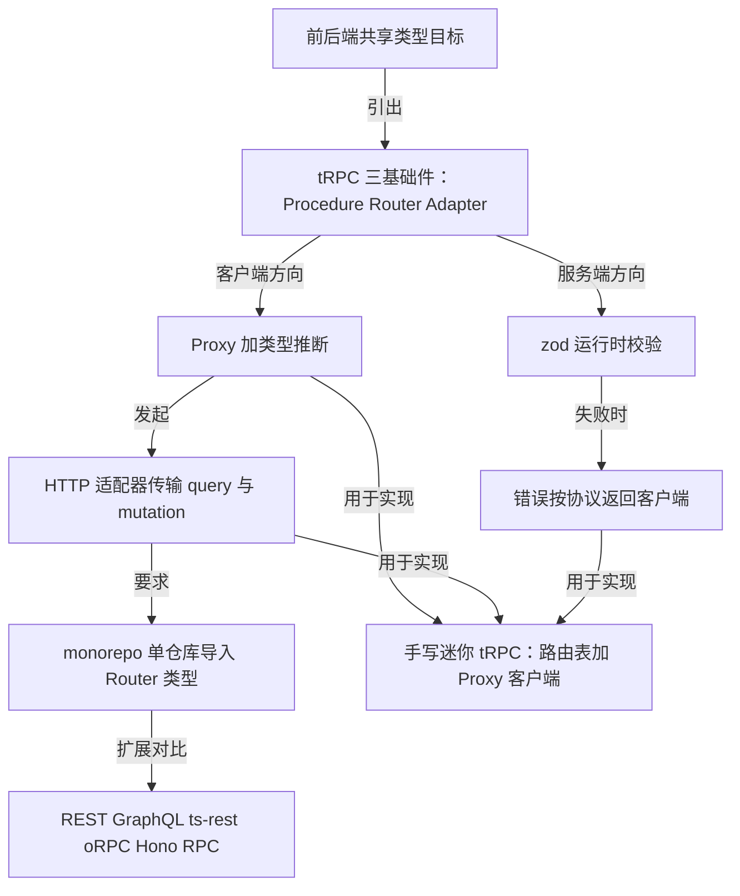
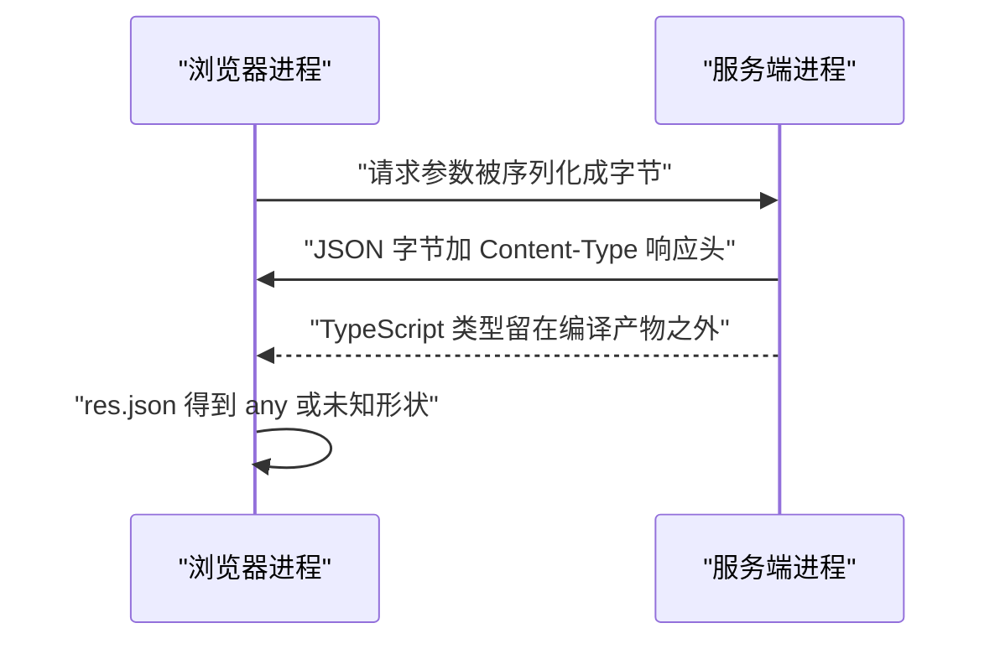
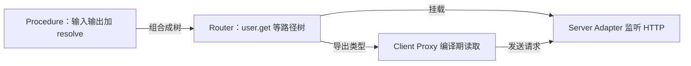
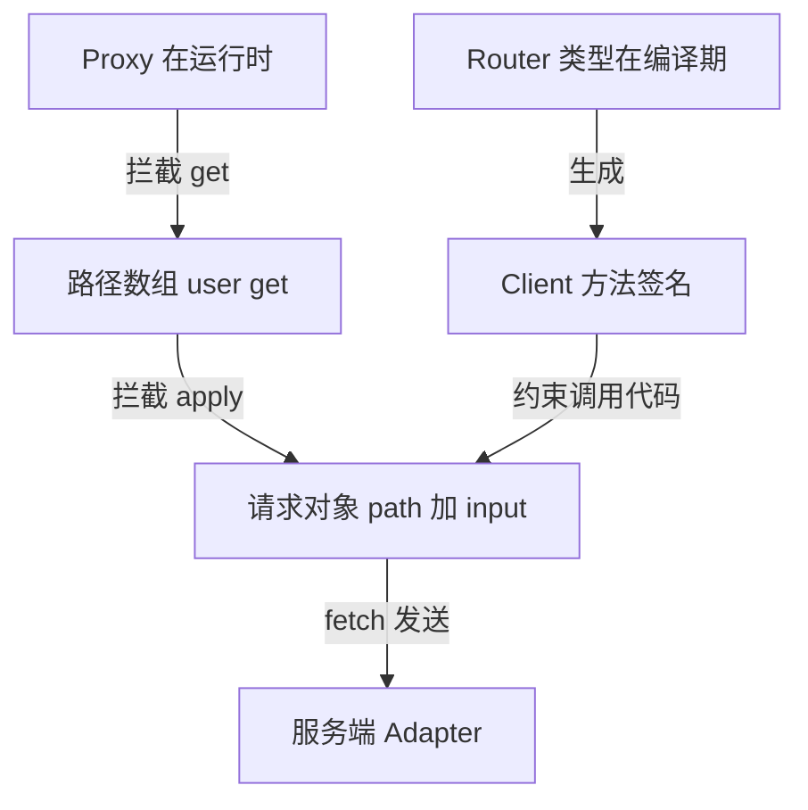
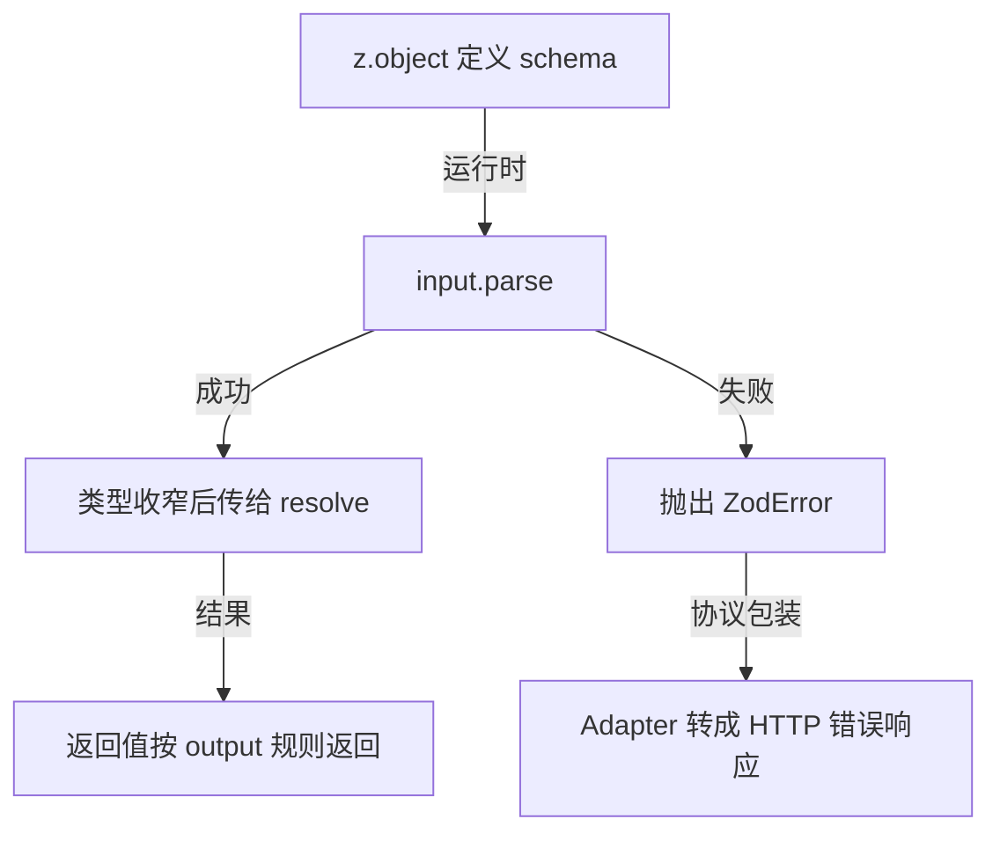
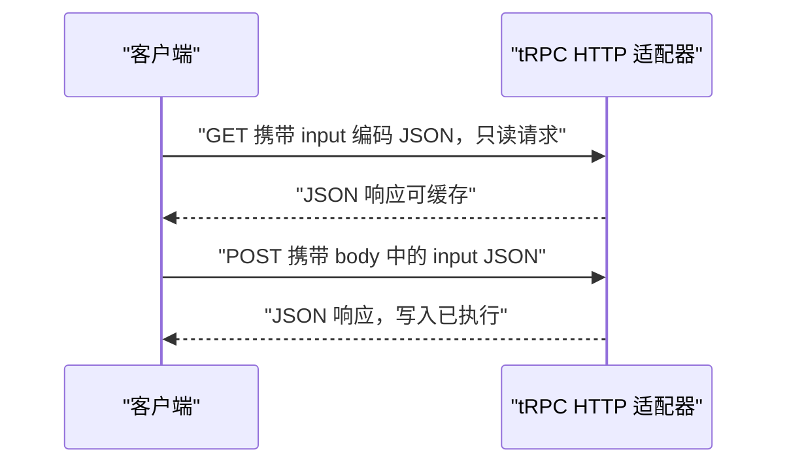
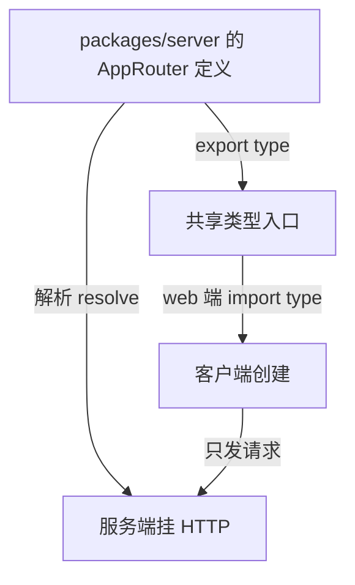
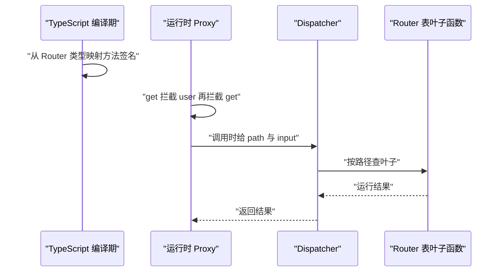
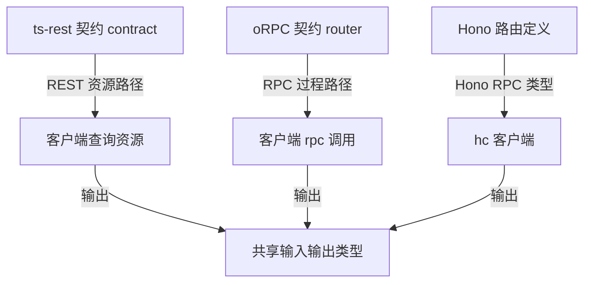

# tRPC 与端到端类型安全：类型是怎么'穿过网络'的

!!! abstract "学完这一页你能"
    - 说出 tRPC 的 Proxy 客户端为什么能让前端拿到后端函数签名，并写出最小客户端路径收集步骤。
    - 用 zod 同时生成 TypeScript 类型和运行时校验，解释 parse 失败后错误如何回到客户端。
    - 使用 tRPC 适配器把 router 挂到 HTTP 服务，说清 query 与 mutation 的传输位置差异。
    - 在 monorepo 里把 server/router 类型导入客户端，并手写一个可运行的小型 Proxy 路由表。

## 0. 知识地图



建议先读第 1 节理解类型丢失问题，再读第 2 到 5 节掌握 tRPC 四要素。
第 6 节解释项目组织前提，第 7 节用手写代码把前面概念固定下来。
第 8 节再比较 ts-rest、oRPC、Hono RPC，适合决定选型时回看。

## 1. 类型为什么会在 HTTP 边界丢失

**先想一个问题**：
后端写好了 `getUser(id: number)`，前端要用 `fetch` 调用它。
前端拿到的返回值类型是什么？调用参数传错时，编译器会拦住吗？

**心智模型**：
!!! tip "心智模型"
    类型住在编译期，网络传输的是字节序列。跨进程后，字节序列里没有 TypeScript 结构信息。
    日常类比：快递只送箱子，收件人没开箱前不知道里面是书还是玻璃杯。
    不成立的地方：快递单可以写“易碎品”，HTTP 响应头也有 `Content-Type`，但它只标记 MIME 类型，不标记字段名和字段类型。

**图解**：



1. 浏览器把对象 `JSON.stringify` 成字符串后发送。
2. 服务端 `JSON.parse` 拿到未知形状，函数签名不跟随数据移动。
3. 服务端返回 JSON 字符串，响应头只有 MIME 信息。
4. 浏览器 `res.json()` 返回 `Promise<any>`，字段错误延迟到运行时才暴露。

**一步一步来**：

**第 1 步：服务端定义一个强类型函数**
这一步要做什么：先确认类型在单进程内是有效的，编译器能检查参数和返回值。

```typescript
type User = { id: number; name: string };

function getUser(id: number): User {
  // 参数 id 和返回值 User 都在编译期检查
  return { id, name: 'Ada' };
}
```

**这段代码在做什么**

- `User` 声明了两个字段及其类型。
- `getUser(id: number): User` 把输入输出类型写上。
- 在服务端进程内，`tsc` 会检查调用方是否传入 `number`。
- 传 `getUser('1')` 会得到 TS2345 类型错误。

**运行结果**：编译通过后调用 `getUser(1)` 返回 `{ id: 1, name: 'Ada' }`。

**第 2 步：客户端用 fetch 调用，类型被通道抹平**
这一步要做什么：把同一个函数拆到两个进程后，看看类型承诺为什么变成手写声明。

```typescript
async function getUserFromApi(id: number): Promise<User> {
  // fetch 的 Response 只描述 HTTP，不描述业务结构
  const res = await fetch(`/api/user?id=${id}`);
  // res.json 的返回类型是 Promise<any>
  return res.json();
}

const data = await getUserFromApi(1);
// 编译器认为 data 是 User，但这是手写承诺
data.email.toLower();
```

**这段代码在做什么**

- `fetch` 返回的 `Response` 不包含业务字段类型。
- `res.json()` 类型为 `Promise<any>`，`any` 会关闭检查。
- 函数标注 `Promise<User>` 是手工强转，服务端改字段后前端不会同步发现。
- `data.email` 编译期不报错，因为手写的 `User` 承诺了 `email` 存在。
- 实际服务端没有返回 `email`，运行时报 `Cannot read properties of undefined`。

**运行结果**：`tsc` 编译能通过，运行到 `data.email.toLower()` 抛出 `TypeError`。

**动手验证**：
把“字段错误延迟到运行时”做成一个可运行脚本，依赖：无，直接 `node section1.mjs`。

```javascript
import assert from 'node:assert/strict';

// 服务端函数只返回 name，没有 email
const serverGetUser = (id) => {
  if (typeof id !== 'number') throw new TypeError('id must be number');
  return { id, name: 'Ada' };
};

const responseBody = serverGetUser(1);
// 客户端按手工写的类型假设 email 存在
assert.equal(responseBody.email, undefined);
assert.throws(
  () => responseBody.email.toLowerCase(),
  /Cannot read/
);
console.log('字段错误发生在运行时的 email 访问');
```

**这段代码在做什么**

- `serverGetUser` 模拟服务端真实返回，只有 `id` 与 `name`。
- 客户端访问 `email` 时不会立即报错，因为 JavaScript 访问对象缺失字段得到 `undefined`。
- `assert.throws` 证明错误发生在读取 `email` 后的方法调用阶段。

**预期输出**：`字段错误发生在运行时的 email 访问`。

**常见坑**：

| 现象 | 原因 | 怎么修 |
| --- | --- | --- |
| 客户端先写 `as User` 再传参，编译一直通过 | 手工断言绕过了类型检查 | 让后端导出真实返回类型，客户端直接导入 |
| `res.json()` 拿到 `any` 后能点任意字段 | `any` 关闭所有检查 | 开启 `noImplicitAny`，对响应先做运行时校验 |
| 服务端把 `name` 改成 `userName`，前端不报错 | 类型定义在两端各存一份 | 共享契约文件或使用 tRPC 这类端到端方案 |

**小结**：

1. TypeScript 类型只存在于编译期，序列化会去掉类型信息。
2. `fetch` 只能描述 HTTP 层，不能描述业务对象结构。
3. 手工写两遍类型会造成“编译通过、运行报错”的假安全。

## 2. tRPC 的三个基础件：Procedure、Router、Adapter

**先想一个问题**：
要实现 `user.get` 这个接口，需要定义输入、输出、处理函数，还要挂到 HTTP。
这三个部分怎样组织，才能让前后端共用一份目录结构？

**心智模型**：
!!! tip "心智模型"
    tRPC 把一个接口拆成三个对象：Procedure 定义输入输出与处理函数，Router 把 Procedure 组成树，Adapter 把树翻译成 HTTP 端点。
    日常类比：菜单页上的菜名是 Router，每道菜写的用料和做法是 Procedure，服务员把点单递给厨房是 Adapter。
    不成立的地方：餐厅不需要顾客和厨房共享同一份 TypeScript 文件，而 tRPC 要求客户端导入 Router 类型。

**图解**：



1. Procedure 先把“接收什么、返回什么、如何计算”写在一个函数对象里。
2. Router 用嵌套对象把多个 Procedure 组成路径树。
3. Server Adapter 根据 HTTP 请求里的路径查树并调用 Procedure。
4. Client Proxy 在另一进程复制同样的路径结构，并指向同一棵树。

**一步一步来**：

**第 1 步：定义 Procedure**
这一步要做什么：为一个接口声明输入形状和解析后的处理函数。

```typescript
import { z } from 'zod';

const getUser = {
  // zod 会在运行时校验这个输入形状
  input: z.object({ id: z.number() }),
  resolve: ({ input }) => {
    return { id: input.id, name: 'Ada' };
  },
};
```

**这段代码在做什么**

- `input` 不是 TypeScript 类型，而是一个运行时存在的 zod 对象。
- `resolve` 的参数 `input` 可以在 tRPC 中由 zod 推断出类型。
- 返回对象就是客户端最终拿到的数据形状。
- 这里只定义了 Procedure，还没有指定它在 URL 里的名字。

**运行结果**：无输出；这是后续 Router 使用的对象。

**第 2 步：组合成 Router**
这一步要做什么：用嵌套对象给 Procedure 一个稳定路径，并导出类型。

```typescript
const appRouter = {
  user: {
    get: getUser,
  },
};

export type AppRouter = typeof appRouter;
```

**这段代码在做什么**

- `appRouter.user.get` 对应路径 `user.get`。
- `typeof appRouter` 把运行时对象结构变成类型级结构。
- 客户端导入 `AppRouter` 后，就能从类型推导出所有方法。
- 服务端实现和客户端类型来自同一个对象定义。

**运行结果**：无输出；`AppRouter` 可被前后端两个包导入。

**第 3 步：用 Adapter 挂到 HTTP**
这一步要做什么：把 HTTP 路径中的过程名转换成 router 树的查询。
以下用 Node 原生 HTTP 表达思路，不编造某个 tRPC 适配器的参数名。

```typescript
import { createServer } from 'node:http';

const server = createServer((req, res) => {
  const url = new URL(req.url ?? '/', 'http://localhost');
  const path = url.pathname.replace('/trpc/', '');
  // 真实 tRPC 适配器还会处理 query、mutation 与错误协议
  res.setHeader('content-type', 'application/json');
  res.end(JSON.stringify({ ok: true, path }));
});
server.listen(3000);
```

**这段代码在做什么**

- 从请求 URL 里提取 `path`，例如 `/trpc/user.get` 得到 `user.get`。
- 返回一个 JSON 响应证明路径已经过服务端。
- 真实 tRPC 的 fetch、Express、Next.js、Node HTTP 适配器负责更多协议细节。
- 客户端发出的路径与服务端 router 树必须一致。

**运行结果**：访问 `/trpc/user.get` 得到 `{"ok":true,"path":"user.get"}`。

**动手验证**：
验证 router 树的查找逻辑，依赖：无。

```javascript
import assert from 'node:assert/strict';

const appRouter = {
  user: {
    get: {
      input: null,
      output: null,
      resolve: ({ input }) => ({ id: input.id, name: 'Ada' }),
    },
  },
};

function dispatch(router, path, input) {
  let node = router;
  for (const key of path.split('.')) node = node[key];
  return node.resolve({ input });
}

assert.deepEqual(
  dispatch(appRouter, 'user.get', { id: 1 }),
  { id: 1, name: 'Ada' }
);
console.log(dispatch(appRouter, 'user.get', { id: 2 }));
```

**这段代码在做什么**

- `dispatch` 把点分路径逐段拆开，沿树向下查找。
- 找到叶子后调用 `resolve`，把 `input` 传入。
- `node:assert/strict` 用深比较验证返回对象。

**预期输出**：`{ id: 2, name: 'Ada' }`。

**常见坑**：

| 现象 | 原因 | 怎么修 |
| --- | --- | --- |
| 路径变成 `user.get` 但 resolver 未执行 | Adapter 忘了把 URL path 映射到 router 树 | 在 Adapter 入口统一解析并查找 |
| 浏览器响应乱码 | 响应头没有 `content-type` | 始终设置 `application/json` |
| 查询接口把写入也返回 | 把 mutation 划错 Process 类型 | 第 5 节区分 query 与 mutation |

**小结**：

1. Procedure 处理单个接口逻辑，Router 负责路径树，Adapter 负责网络翻译。
2. `export type AppRouter = typeof appRouter` 是类型共享的起点。
3. Adapter 不负责业务校验，它只做传输层匹配。

## 3. Proxy 客户端与类型推断原理

**先想一个问题**：
`trpc.user.get({ id: 1 })` 这行代码，TypeScript 如何知道 `get` 的参数类型和返回值类型？
运行时 Proxy 如何不真正调用业务函数，却能把路径收集起来？

**心智模型**：
!!! tip "心智模型"
    Proxy 客户端有两条轨道：编译期类型轨道从 Router 类型算出方法签名；运行时代码轨道用 Proxy 拦截属性访问，把路径累积成数组。两条轨道在发出请求前会师。
    日常类比：拨号键盘，你按的每个键先被记录，按下拨号键才发出完整号码；类型检查是拨号前的号码格式提示。
    不成立的地方：真实拨号键盘的号码固定，tRPC 路径会随 Router 嵌套结构改变，且类型推导不发生在运行时。

**图解**：



1. 编译期从 `AppRouter` 映射出方法签名，这步不产生 JavaScript。
2. 运行时 `client.user` 的 `get` 拦截返回一个新的 Proxy。
3. 新的 Proxy 继续累积路径，直到函数被调用。
4. `apply` 拦截把路径和输入组合成请求对象，再发给 Adapter。

**一步一步来**：

**第 1 步：定义一个可推断的 Router 类型**
这一步要做什么：先让 Router 类型含有 input 与 output 的形状信息。

```typescript
type UserRouter = {
  user: {
    get: {
      input: { id: number };
      output: { id: number; name: string };
    };
  };
};

type AppRouter = UserRouter;
```

**这段代码在做什么**

- `AppRouter` 只描述结构，不包含运行时代码。
- `input` 和 `output` 字段是类型占位，真实 tRPC 会让它们由 zod 生成。
- 类型推断需要读取的就是这两个字段。

**运行结果**：无输出；这是给类型映射用的源类型。

**第 2 步：从 Router 类型映射出客户端方法签名**
这一步要做什么：用条件类型递归把“带 input 的叶子”映射成“可调用函数”。

```typescript
type ClientOf<T> = {
  [K in keyof T]: T[K] extends { input: infer I; output: infer O }
    ? (input: I) => Promise<O>
    : ClientOf<T[K]>;
};

type Client = ClientOf<AppRouter>;
// Client = {
//   user: {
//     get: (input: { id: number }) => Promise<{ id: number; name: string }>
//   }
// }
```

**这段代码在做什么**

- `keyof T` 得到 Router 的键，例如 `user`。
- `extends { input: infer I; output: infer O }` 判断当前键是否叶子过程。
- `infer I` 与 `infer O` 分别捕获输入和输出类型。
- 叶子被替换成函数 `(input: I) => Promise<O>`。
- 非叶子继续递归，直到找到所有叶子。

**运行结果**：编辑器中 `client.user.get({ id: 1 })` 通过；传 `{ id: '1' }` 在编译期报错。

**第 3 步：运行时 Proxy 只收集路径**
这一步要做什么：用 `Proxy` 拦截属性读取和函数调用，产物是请求描述而不是业务结果。

```typescript
function createRpcClient(basePath: string[] = []): any {
  return new Proxy(() => {}, {
    get(_target, prop) {
      if (typeof prop !== 'string') return undefined;
      return createRpcClient([...basePath, prop]);
    },
    apply(_target, _this, args) {
      return {
        path: basePath.join('.'),
        input: args[0],
      };
    },
  });
}

const runtimeClient = createRpcClient();
// runtimeClient.user.get({ id: 1 })
// 返回 { path: 'user.get', input: { id: 1 } }
```

**这段代码在做什么**

- Proxy 的 target 是一个空函数，这样 `apply` 才能被拦截。
- `get` 拦截 `user` 或 `get` 的访问，把属性名追加到数组。
- 每次 `get` 返回新 Proxy，路径数组通过参数传递。
- `apply` 拦截最后一次函数调用，把数组拼成 `user.get`。
- 返回值只是请求描述，不触发真实网络请求。

**运行结果**：`runtimeClient.user.get({ id: 1 })` 得到 `{ path: 'user.get', input: { id: 1 } }`。

**第 4 步：类型客户端与运行时客户端绑定**
这一步要做什么：把类型映射和运行时 Proxy 接在一起，让一个变量既有类型检查又有运行行为。

```typescript
function createTypedClient<Router>(): ClientOf<Router> {
  return createRpcClient() as ClientOf<Router>;
}

const client = createTypedClient<AppRouter>();
const result = client.user.get({ id: 1 });
// result 类型是 Promise<{ id: number; name: string }>
```

**这段代码在做什么**

- `createTypedClient` 只负责把运行时 Proxy 强转成类型映射结果。
- 强转发生在编译期，不会生成额外校验代码。
- 调用方拿到完整方法签名，参数错误立即被编辑器标出。
- 运行时仍然只是收集路径，尚未处理网络。

**运行结果**：编译通过；`result` 在编辑器中显示为 Promise 类型。

**动手验证**：
验证 Proxy 路径收集是否真的能拼出 `user.get`，依赖：无。

```javascript
import assert from 'node:assert/strict';

function createRpcClient(basePath = []) {
  return new Proxy(() => {}, {
    get(_target, prop) {
      if (prop === 'then') return undefined;
      return createRpcClient([...basePath, String(prop)]);
    },
    apply(_target, _this, args) {
      return { path: basePath.join('.'), input: args[0] };
    },
  });
}

const client = createRpcClient();
assert.deepEqual(
  client.user.get({ id: 1 }),
  { path: 'user.get', input: { id: 1 } }
);
console.log(JSON.stringify(client.user.get({ id: 1 })));
```

**这段代码在做什么**

- `then` 守卫防止 Promise 系统把 Proxy 识别为 thenable 后误调。
- 每个属性访问都返回一个带更长路径的新 Proxy。
- `apply` 得到最终路径和输入，断言验证对象结构。

**预期输出**：`{"path":"user.get","input":{"id":1}}`。

**常见坑**：

| 现象 | 原因 | 怎么修 |
| --- | --- | --- |
| 客户端被 Promise 自动调成 `then` 方法 | Proxy 没有拦截 `then` | 在 `get` 里对 `then` 返回 `undefined` |
| 类型有提示但运行时没请求发出 | 只拿到类型映射，没有实际 adapter 调用 | 在 Proxy 的 `apply` 里调用 fetch 或 dispatcher |
| 路径拼接用点号导致属性名冲突 | 过程名里含 `.` | 限制过程名为字母数字下划线 |

**小结**：

1. 类型推断是编译期映射，不经过网络。
2. 运行时 Proxy 只做路径收集和请求组装。
3. 两条轨道最后绑定在同一个客户端对象上，形成端到端检查。

## 4. zod：运行时校验与静态类型二合一

**先想一个问题**：
服务端收到 `id: "1"` 而不是 `id: 1`，TypeScript 类型挡不住外部数据。
怎样在数据进入业务函数前，既报运行时错误，又让业务函数拿到已收窄的类型？

**心智模型**：
!!! tip "心智模型"
    zod schema 同时做两件事：运行时 `parse` 检查形状，类型层 `z.infer` 推导 TypeScript 类型。两个出口来自同一个 schema。
    日常类比：机场安检门，票上写的是申明，过门后拿回的登机牌是已核验身份。
    不成立的地方：安检不会把你变成另一个人，zod 的 `parse` 会返回新对象，并且可通过 `transform` 转换字段。

**图解**：



1. schema 是唯一来源，类型推断和运行时校验都读它。
2. `parse` 成功时，返回值被收窄成 schema 形状。
3. `parse` 失败时抛出 `ZodError`，业务函数不执行。
4. tRPC 会把错误包装进响应协议，客户端能读取错误信息。

**一步一步来**：

**第 1 步：用 schema 定义输入形状**
这一步要做什么：把“外部可能错的输入”写成一个可执行规则。

```typescript
import { z } from 'zod';

const getUserInput = z.object({
  id: z.number(),
  name: z.string().min(1),
});
```

**这段代码在做什么**

- `z.object` 声明输入必须是对象，不能是数组或 `null`。
- `z.number()` 拒绝字符串 `"1"`，不会自动转成 `1`。
- `z.string().min(1)` 拒绝空字符串。
- 这段代码在运行时仍然存在，它是真正的校验值。

**运行结果**：无输出；这个 schema 可被 `parse` 调用，也可被 `z.infer` 读取。

**第 2 步：解析并得到收窄后的类型**
这一步要做什么：用同一个 schema 拿到运行时安全数据，并导出静态类型。

```typescript
type GetUserInput = z.infer<typeof getUserInput>;

function handleGetUser(raw: unknown) {
  const input = getUserInput.parse(raw);
  const user: { id: number; name: string } = {
    id: input.id,
    name: input.name,
  };
  return user;
}
```

**这段代码在做什么**

- `z.infer` 从 schema 推导出 `{ id: number; name: string }`。
- `handleGetUser` 接收 `unknown`，不信任外部数据。
- `parse` 返回的值被 TypeScript 视为 `GetUserInput`。
- 把校验过的字段映射到 `User` 对象，业务逻辑使用干净的 `input`。

**运行结果**：`handleGetUser({ id: 1, name: 'Ada' })` 返回用户对象；坏输入抛错。

**第 3 步：失败错误进入传输协议**
这一步要做什么：让运行时校验失败也能回到客户端，而不是只在服务端进程里丢失。

```typescript
try {
  handleGetUser({ id: '1', name: 'Ada' });
} catch (error) {
  // 在 tRPC 中，这个错误会被包装成协议错误返回给客户端
  // 客户端可读取 error.data 里的失败原因
  console.error(error);
}
```

**这段代码在做什么**

- `id: '1'` 不满足 `z.number()`，`parse` 抛出错误。
- tRPC 的服务端会把错误序列化后放进响应体。
- 真实客户端拿到的是结构化错误，而不是未捕获异常。
- 这里用原生 `try/catch` 表示错误产生的位置。

**运行结果**：控制台输出错误；如果是 tRPC 调用，错误返回给客户端而非仅记录日志。

**动手验证**：
用简化对象实现 z.object 的差异校验，只演示类型错误拦截，依赖：无。

```javascript
import assert from 'node:assert/strict';

function createObjectSchema(shape) {
  return {
    parse(input) {
      const out = {};
      for (const [key, rule] of Object.entries(shape)) {
        if (typeof input[key] !== rule) {
          throw new TypeError(`${key} must be ${rule}`);
        }
        out[key] = input[key];
      }
      return out;
    },
  };
}

const userInput = createObjectSchema({ id: 'number', name: 'string' });
assert.deepEqual(userInput.parse({ id: 1, name: 'Ada' }), { id: 1, name: 'Ada' });
assert.throws(() => userInput.parse({ id: '1', name: 'Ada' }), /id must be number/);
console.log(userInput.parse({ id: 2, name: 'Lin' }));
```

**这段代码在做什么**

- `createObjectSchema` 用 `typeof` 简化 zod 的类型检查。
- `parse` 返回新对象，而不是修改原对象。
- `assert.throws` 证明字符串 id 在进入业务函数前就被拦下。

**预期输出**：`{ id: 2, name: 'Lin' }`。

**常见坑**：

| 现象 | 原因 | 怎么修 |
| --- | --- | --- |
| 只写类型 `id: number`，未 parse | 类型编译后消失，外部数据仍可能是字符串 | 在边界处总用 `schema.parse` |
| `z.coerce.number()` 把空字符串变成 0 | `coerce` 在解析前转换，不抛出缺失错误 | 使用 `z.number()`，除非确实要转换 |
| `transform` 后类型与原始字段不一致 | 读取 pre-transform 形状的旧假设仍然存在 | 用 `z.infer` 读取转换后类型，别手写重复类型 |

**小结**：

1. zod schema 是运行时校验值和类型推导的共同起点。
2. `parse` 失败会抛出结构化错误，业务函数不会收到坏数据。
3. `z.infer` 读 schema 得到类型，不再需要手写第二份形状。

## 5. 传输层：HTTP 适配器的 query 与 mutation 差异

**先想一个问题**：
查询接口为什么通常走 GET，写入接口为什么走 POST？
tRPC 的 HTTP 适配器怎样编码参数，才能让两端都理解同一份数据？

**心智模型**：
!!! tip "心智模型"
    query 是只读请求，参数放在 URL 里；mutation 是写请求，参数放在 body 里。GET 可缓存、可刷新，POST 不会随着地址重复执行。
    日常类比：查房价你直接讲条件，签约要填表提交；口头条件不会产生合同，表格提交才会改变状态。
    不成立的地方：HTTP GET 的 URL 长度和缓存规则会限制查询条件数量，餐厅口头交流不受字节长度限制。

**图解**：



1. query 使用 GET，input 作为查询参数放在 URL。
2. mutation 使用 POST，input 放在 body，避免被缓存或重复执行。
3. 服务端 Adapter 需要根据 HTTP 方法选择参数来源。
4. 客户端生成 URL 或 body 的逻辑，必须与服务端解析逻辑严格对应。

**一步一步来**：

**第 1 步：定义 query 和 mutation 的路由成员**
这一步要做什么：让同一个 router 里同时存在只读过程和写入过程。

```typescript
const appRouter = {
  user: {
    get: {
      type: 'query',
      input: { id: 1 },
      resolve: ({ input }) => ({ id: input.id, name: 'Ada' }),
    },
    create: {
      type: 'mutation',
      input: { name: 'Ada' },
      resolve: ({ input }) => ({ id: 1, name: input.name }),
    },
  },
};
```

**这段代码在做什么**

- `type` 声明过程是查询还是写入，真实 tRPC 用 `.query` 与 `.mutation` 标记。
- `get` 只读返回用户，`create` 返回新用户。
- 相同路径前缀 `user` 下可同时挂载两种过程。
- 服务端根据类型决定 HTTP 方法和参数读取位置。

**运行结果**：无输出；这是传输层分流的依据。

**第 2 步：客户端区分请求类型**
这一步要做什么：把 query 与 mutation 参数分别放进 URL 与 body。

```typescript
function runQuery(path: string, input: unknown) {
  const q = encodeURIComponent(JSON.stringify(input));
  return fetch(`/trpc/${path}?input=${q}`);
}

function runMutation(path: string, input: unknown) {
  return fetch(`/trpc/${path}`, {
    method: 'POST',
    headers: { 'content-type': 'application/json' },
    body: JSON.stringify({ input }),
  });
}
```

**这段代码在做什么**

- `runQuery` 把输入 JSON 字符串编码进查询参数 `input`。
- `runMutation` 把输入放进 POST body，并声明 JSON 类型。
- 两者使用相同路径命名空间，但 HTTP 方法不同。
- 没有把 mutation 的参数放进 URL，避免缓存写入请求。

**运行结果**：query 请求形如 `/trpc/user.get?input=%7B%22id%22%3A1%7D`。

**第 3 步：服务端适配器解析两种来源**
这一步要做什么：根据 HTTP 方法从 URL 或 body 提取输入，再交给 z 校验。

```typescript
async function parseInput(req: Request): Promise<unknown> {
  const url = new URL(req.url);
  if (req.method === 'GET') {
    const raw = url.searchParams.get('input') ?? '{}';
    return JSON.parse(raw);
  }
  return req.json();
}
```

**这段代码在做什么**

- `req.method === 'GET'` 决定从 `searchParams` 取参数。
- `JSON.parse` 把查询字符串还原成对象。
- 非 GET 请求改为从 JSON body 读取。
- 返回的 `unknown` 接下来交给 zod schema 校验。

**运行结果**：GET 请求从 URL 解析出输入对象，POST 请求从 body 解析出输入对象。

**动手验证**：
验证 query URL 与 mutation body 的构造是否稳定，依赖：无。

```javascript
import assert from 'node:assert/strict';

function buildQuery(path, input) {
  return `/trpc/${path}?input=${encodeURIComponent(JSON.stringify(input))}`;
}

function buildMutation(path, input) {
  return `/trpc/${path}:POST:${JSON.stringify({ input })}`;
}

assert.equal(
  buildQuery('user.get', { id: 1 }),
  '/trpc/user.get?input=%7B%22id%22%3A1%7D'
);
assert.equal(
  buildMutation('user.create', { name: 'Ada' }),
  '/trpc/user.create:POST:{"input":{"name":"Ada"}}'
);
console.log(buildMutation('user.create', { name: 'Ada' }));
```

**这段代码在做什么**

- `buildQuery` 的结果与浏览器 URL 编码规则匹配。
- `buildMutation` 用简单结构标出 POST 与 body，便于断言观察。
- 两组断言覆盖“参数放哪里”这一传输边界。

**预期输出**：`/trpc/user.create:POST:{"input":{"name":"Ada"}}`。

**常见坑**：

| 现象 | 原因 | 怎么修 |
| --- | --- | --- |
| GET 请求过长报 414 | input 过大被编码进 URL | 大数据量改用 POST，或调整查询设计 |
| mutation 参数放进 URL 后浏览器重复执行 | GET 被地址栏刷新或缓存触发 | mutation 始终走 POST |
| 服务端读不到输入 | GET/POST 解析函数写反 | 以 HTTP 方法为分支条件统一取参数 |

**小结**：

1. query 走 GET 与 URL 参数，mutation 走 POST 与 body。
2. 客户端构造请求和服务端解析参数必须使用同一套约定。
3. 传输层只负责搬运与还原，不负责业务合法性。

## 6. monorepo 前提与共享类型导入

**先想一个问题**：
类型要“穿过网络”，前后端必须先共享一个类型源。
如果两个项目分属不同仓库，类型文件要复制还是发布？
tRPC 官方推荐的组织方式怎样避免把服务端实现打进前端包？

**心智模型**：
!!! tip "心智模型"
    monorepo 把 `router.ts` 变成共享契约源。服务端从它运行处理，客户端从它导入类型。一个文件，两个消费方向。
    日常类比：同一栋楼的公共档案室，服务员和客人看同一本菜单，菜单只开放阅读，不开放修改。
    不成立的地方：真实档案室可能有不同权限和开放时间，npm workspace 用 `exports` 字段控制导出路径。

**图解**：



1. `AppRouter` 定义在服务端包内，是整个契约的源头。
2. 服务端从它取出过程实现并挂载。
3. 前端通过包名导入类型，不导入运行时代码。
4. 两边看到的路径树和输入输出完全一致。

**一步一步来**：

**第 1 步：配置 npm workspaces**
这一步要做什么：让 server、web、shared 三个包在同一仓库内互相引用。

```json
{
  "name": "demo-monorepo",
  "private": true,
  "workspaces": ["apps/server", "apps/web", "packages/shared"]
}
```

**这段代码在做什么**

- `workspaces` 告诉 npm 哪些目录是独立包。
- 安装依赖时，workspace 包会互相链接。
- `private: true` 避免根包被误发布。
- shared 包用于放两边都导出的类型或工具。

**运行结果**：`npm install` 后在 `node_modules` 生成 workspace 链接。

**第 2 步：server 包导出 router 和类型**
这一步要做什么：把 Router 对象与类型作为公共出口，同时保留 resolve 给服务端用。

```typescript
// apps/server/src/router.ts
export const appRouter = {
  user: {
    get: {
      input: { id: 1 },
      output: null,
      resolve: ({ input }) => ({ id: input.id, name: 'Ada' }),
    },
  },
};

export type AppRouter = typeof appRouter;
```

**这段代码在做什么**

- `appRouter` 是运行时实现，服务端用它挂载接口。
- `AppRouter` 是类型别名，前端只导入类型。
- 一个 `export` 同时给出运行时值和类型入口。
- 客户端只有 `import type` 时才不会把实现带进 bundle。

**运行结果**：无输出；服务端和 frontend 都能按包名导入该模块。

**第 3 步：web 只导入类型，不导入实现**
这一步要做什么：客户端用 `import type` 消费 `AppRouter`，避免服务端代码进入前端产物。

```typescript
// apps/web/src/client.ts
import type { AppRouter } from '@demo/server';

// ClientOf 来自第 3 节，这里省略重复定义
const client: ClientOf<AppRouter> = createTypedClient<AppRouter>();
client.user.get({ id: 1 });
```

**这段代码在做什么**

- `import type` 编译后不产生 JavaScript 模块引用。
- `@demo/server` 包导出 `AppRouter`，路径统一，避免相对路径。
- 客户端把 Router 类型作为泛型传给 `createTypedClient`。
- 输入 `{ id: 1 }` 与服务端 router 类型绑定，字段错误立即被发现。

**运行结果**：前端 bundle 不含 resolver 代码；编辑器可提示输入类型。

**动手验证**：
验证前后端能引用同一个共享对象，依赖：无。

```javascript
import assert from 'node:assert/strict';

const sharedRouter = {
  user: {
    get: (input) => ({ id: input.id, name: 'Ada' }),
  },
};

const serverHandler = sharedRouter.user.get;
const webConsumer = sharedRouter.user.get;

assert.equal(serverHandler, webConsumer);
assert.deepEqual(webConsumer({ id: 9 }), { id: 9, name: 'Ada' });
console.log('server 与 web 引用同一个函数对象');
```

**这段代码在做什么**

- `sharedRouter` 表示 monorepo 中的公共契约模块。
- `serverHandler` 与 `webConsumer` 指向同一函数引用。
- 断言证明两个方向没有复制出第二份实现。

**预期输出**：`server 与 web 引用同一个函数对象`。

**常见坑**：

| 现象 | 原因 | 怎么修 |
| --- | --- | --- |
| 前端 bundle 出现服务端依赖 | 用 `import` 导入了 router 运行时代码 | 客户端只写 `import type` |
| 编辑器找不到服务端类型 | 包名未配置 workspace 或 tsconfig paths | 配 `workspaces` 与 `exports` 字段 |
| 两包锁出不同版本 | 各包单独 lockfile 导致 schema 不一致 | monorepo 根目录统一 lockfile |

**小结**：

1. monorepo 是 tRPC 类型共享的组织前提，避免复制类型文件。
2. `export type` 与 `import type` 让客户端拿到类型而不引入实现。
3. 一个 Router 源文件同时服务“运行时实现”和“客户端类型”两个方向。

## 7. 手写迷你 tRPC：Proxy 客户端 + 路由表

**先想一个问题**：
不依赖任何 tRPC 包，能否用 Proxy 和类型映射写出一个最小客户端加路由表？
重点是让“路由表、路径收集、类型提示”这三件事一起工作。

**心智模型**：
!!! tip "心智模型"
    迷你 tRPC 只保留三条链路：Router 对象存叶子处理函数；Proxy 客户端收集路径；dispatcher 按路径查表并把 input 交给叶子。类型映射在这之上给出编辑器提示。
    日常类比：触摸点餐屏，你按菜单路径，屏把所有选择编成一张单，后端厨房按单上路径取菜谱。
    不成立的地方：点餐屏还处理支付、排队、退款；迷你 tRPC 没有错误协议、批处理和 transformer。

**图解**：



1. 编译期先映射方法签名，编译完成后这步消失。
2. 运行时 Proxy 逐步累积 `user` 与 `get` 形成路径。
3. Dispatcher 用路径进入路由表，找到叶子。
4. 叶子处理输入后返回结果，客户端拿到业务值。

**一步一步来**：

**第 1 步：定义 Leaf 和 Router 类型**
这一步要做什么：给叶子函数一个可推断的输入输出形状，同时保持树可嵌套。

```typescript
type Leaf<Input, Output> = {
  resolve: (input: Input) => Output;
};

type Router = Record<string, Leaf<unknown, unknown> | Router>;

type AppRouter = {
  user: {
    get: Leaf<{ id: number }, { id: number; name: string }>;
    create: Leaf<{ name: string }, { id: number }>;
  };
};
```

**这段代码在做什么**

- `Leaf` 用 `resolve` 的函数签名承载 Input 和 Output。
- `Router` 允许值为叶子或下一层 Router。
- `AppRouter` 手工声明输入输出，替换真实 tRPC 中的 zod 推断。
- 类型映射将通过 `resolve` 参数与返回值读取类型。

**运行结果**：无输出；这是后续映射与路由表的输入。

**第 2 步：从 Router 类型映射客户端方法**
这一步要做什么：用条件类型把叶子转换成可直接调用的方法。

```typescript
type ClientOf<Node> = {
  [K in keyof Node]: Node[K] extends Leaf<infer I, infer O>
    ? (input: I) => O
    : ClientOf<Node[K]>;
};

type Client = ClientOf<AppRouter>;
// Client = {
//   user: {
//     get: (input: { id: number }) => { id: number; name: string };
//     create: (input: { name: string }) => { id: number };
//   };
// };
```

**这段代码在做什么**

- `infer I` 从 `resolve(input: Input)` 参数捕获输入类型。
- `infer O` 从 `resolve` 返回值捕获输出类型。
- 非叶子节点进入递归，直到全部展开。
- 返回值不需要 `Promise` 包装，因为 dispatcher 是本进程同步函数。

**运行结果**：编辑器中 `client.user.get({ id: 1 })` 参数错误会标红。

**第 3 步：实现路由表**
这一步要做什么：把真实处理函数挂到 `AppRouter` 形状上。

```typescript
const appRouter: AppRouter = {
  user: {
    get: {
      resolve: ({ id }) => ({ id, name: 'Ada' }),
    },
    create: {
      resolve: ({ name }) => ({ id: 10 + name.length }),
    },
  },
};
```

**这段代码在做什么**

- `appRouter` 必须满足 `AppRouter`，字段不得缺失。
- 每个叶子的 `resolve` 参数由类型自动推断，无需重复标注。
- `get` 返回固定名字，`create` 用输入计算 id。
- 路由表就是可执行的树，下一步由 dispatcher 查找。

**运行结果**：无输出；`appRouter.user.get.resolve({ id: 1 })` 可被直接调用。

**第 4 步：Proxy 客户端 + dispatcher**
这一步要做什么：把路径收集和路由查找接在一起，让客户端调用看起来像本地函数。

```typescript
function createMiniClient(basePath: string[] = []): any {
  return new Proxy(() => {}, {
    get(_target, prop) {
      if (typeof prop !== 'string') return undefined;
      return createMiniClient([...basePath, prop]);
    },
    apply(_target, _this, args) {
      return dispatch(basePath.join('.'), args[0]);
    },
  });
}

function dispatch(path: string, input: unknown): unknown {
  let node: any = appRouter;
  for (const key of path.split('.')) node = node[key];
  return node.resolve(input);
}

const client = createMiniClient() as Client;
const user = client.user.get({ id: 1 });
```

**这段代码在做什么**

- `createMiniClient` 返回 Proxy，每次属性访问累积路径段。
- `apply` 把 `basePath.join('.')` 交给 dispatcher。
- `dispatch` 沿路径进入路由表，调用 `resolve(input)`。
- `client` 通过 `as Client` 获得类型提示，运行时行为由 Proxy 提供。

**运行结果**：`user` 得到 `{ id: 1, name: 'Ada' }`。

**动手验证**：
下面是完整单文件脚本，依赖：无，Node 20+ 直接运行 `node mini-tprc.mjs`。

```javascript
// mini-tprc.mjs
import assert from 'node:assert/strict';

// 路由表：叶子是 resolve 函数
const appRouter = {
  user: {
    get: {
      resolve: ({ id }) => ({ id, name: 'Ada' }),
    },
  },
};

// Proxy 客户端：访问属性时收集路径，调用时走 dispatcher
function createMiniClient(basePath = []) {
  return new Proxy(() => {}, {
    get(_target, prop) {
      if (prop === 'then') return undefined;
      return createMiniClient([...basePath, String(prop)]);
    },
    apply(_target, _this, args) {
      return dispatch(basePath.join('.'), args[0]);
    },
  });
}

// dispatcher：按点分路径查路由表并调用叶子
function dispatch(path, input) {
  let node = appRouter;
  for (const key of path.split('.')) node = node[key];
  return node.resolve(input);
}

const client = createMiniClient();
const call = client.user.get({ id: 3 });

assert.deepEqual(call, { id: 3, name: 'Ada' });
console.log('请求路径：user.get');
console.log('运行结果：', JSON.stringify(call));
```

**这段代码在做什么**

- 完全用 Node 20+ 内置能力，不需要安装依赖。
- `createMiniClient` 每次 `get` 都返回新的 Proxy，保存更长路径。
- `then` 守卫避免 Promise 系统误把 Proxy 当 thenable。
- `dispatch` 查树并调用 resolve，最后断言输出。
- 类型映射部分在前面的 TypeScript 片段中完成，这个脚本验证运行时部分。

**预期输出**：

```text
请求路径：user.get
运行结果： {"id":3,"name":"Ada"}
```

**常见坑**：

| 现象 | 原因 | 怎么修 |
| --- | --- | --- |
| 客户端调用返回 `undefined` 后报错 | dispatcher 路径写错或路由位缺失 | 在 `dispatch` 中检查叶子是否为函数 |
| 叶子函数用到 `this` 时失效 | `node.resolve(input)` 让 `this` 指向 node | 改为 `node.resolve.call(node, input)` 或使用闭包 |
| 浏览器把客户端当 Promise 使用 | 未拦截 `then` 属性 | `get` 中对 `then` 返回 `undefined` |

**小结**：

1. 迷你 tRPC 的三个核心模块是路由表、Proxy 路径收集器、dispatcher。
2. 类型映射从 `resolve` 签名推导输入输出，运行时不产生额外代码。
3. 真实 tRPC 在此基础上补充了输入 schema、HTTP 适配器、错误协议、批处理和 transformer。

## 8. 同类型方案：ts-rest、oRPC、Hono RPC

**先想一个问题**：
团队已经用 REST 风格，或者路由已经是 Hono，是否必须全部改成 tRPC？
同类型方案把“契约先行”保留下来，但在路由风格和契约写法上有差异。

**心智模型**：
!!! tip "心智模型"
    ts-rest、oRPC、Hono RPC 与 tRPC 共享同一个思想：契约是单一数据源，客户端类型从契约推导。区别是契约写法与请求风格。
    日常类比：同一份菜单可以印成纸张、做成二维码、放进小程序；顾客看的菜单内容一致，点餐入口不同。
    不成立的地方：三种工具不是只换纸张，它们的路径风格、客户端 API 和运行时绑定方式不通用。

**图解**：



1. ts-rest 先写 REST 资源契约，路径以资源为中心。
2. oRPC 与 tRPC 类似，先写 router，路径以过程名为中心。
3. Hono RPC 从已有 Hono 应用导出类型，客户端用 `hc` 调用。
4. 三者最终都产出一个客户端可用类型，取代手写两遍接口。

**一步一步来**：

**第 1 步：ts-rest 用契约描述 REST 接口**
这一步要做什么：用契约对象声明资源路径、方法、路径参数与响应形状。
以下 API 以 ts-rest 官方 Quickstart 为参考，具体版本差异需核对官方文档。

```typescript
import { initContract } from '@ts-rest/core';
import { z } from 'zod';

const c = initContract();

export const userContract = c.router({
  getUser: {
    method: 'GET',
    path: '/users/:id',
    pathParams: z.object({ id: z.string() }),
    responses: {
      200: c.type<{ id: string; name: string }>(),
    },
  },
});
```

**这段代码在做什么**

- `initContract` 创建契约构造器，负责类型连接。
- `method` 与 `path` 描述 REST 端点，路径参数用 zod 校验。
- `responses` 声明 200 状态对应的返回形状。
- 客户端从 `userContract` 推导调用方式，保持 REST 语义。

**运行结果**：无输出；该契约可同时生成服务端 handler 和客户端查询类型。

**第 2 步：Hono RPC 从路由定义生成客户端**
这一步要做什么：在 Hono 应用上写路由，然后导出 `typeof app` 给 Hono 客户端使用。

```typescript
import { Hono } from 'hono';
import { hc } from 'hono/client';

const app = new Hono().get('/users/:id', (c) => {
  const id = c.req.param('id');
  return c.json({ id, name: 'Ada' });
});

export type AppType = typeof app;

const client = hc<AppType>('http://localhost:3000');
const res = await client.users[':id'].$get({ param: { id: '1' } });
```

**这段代码在做什么**

- `app` 的定义本身就是契约源，不需要单独抽 router 类型。
- `export type AppType = typeof app` 把全部路由路径变成类型。
- `hc<AppType>` 客户端根据路由定义生成 `$get` 方法。
- `client.users[':id']` 对应路径段 `users/:id`，参数通过 `param` 传入。

**运行结果**：`res` 是 Hono 客户端响应，路径参数与返回类型都受检查。

**动手验证**：
用简单对象比较三类方案的契约特征，便于做选型判断，依赖：无。

```javascript
import assert from 'node:assert/strict';

const contracts = {
  tsRest: { style: 'REST', path: '/users/:id', method: 'GET' },
  oRpc: { style: 'RPC', path: '/user.get', method: 'POST' },
  honoRpc: { style: 'RPC on Hono routes', path: '/users/:id', method: 'GET' },
};

assert.equal(contracts.tsRest.path, '/users/:id');
assert.equal(contracts.oRpc.method, 'POST');
assert.equal(contracts.honoRpc.style, 'RPC on Hono routes');
console.log(contracts);
```

**这段代码在做什么**

- 三个对象只记录选型时需要比较的维度。
- 断言确认 REST 与 RPC 路径风格的关键差异。
- oRPC 的路径与方法具体以官方文档为准，此处只做类别比较。

**预期输出**：`{ tsRest: { style: 'REST', path: '/users/:id', method: 'GET' }, oRpc: { style: 'RPC', path: '/user.get', method: 'POST' }, honoRpc: { style: 'RPC on Hono routes', path: '/users/:id', method: 'GET' } }`。

**常见坑**：

| 现象 | 原因 | 怎么修 |
| --- | --- | --- |
| 把 ts-rest 路径 `/users/:id` 当函数直接调用 | ts-rest 客户端按 REST 资源生成调用，不只是路径函数 | 看官方 Quickstart 的客户端章节 |
| Hono RPC 没有 `$get` 方法 | 客户端路径写法或 Hono 版本不同 | 对照官方 RPC 章节核对 `hc` 用法 |
| oRPC 与 tRPC 命名相近但序列化协议不同 | 两个库有各自的 router/procedure 模型 | 不混用包装器，按官方 Get Started 单独接入 |

**小结**：

1. ts-rest 适合保留 REST 风格但想要契约类型安全的项目。
2. Hono RPC 适合已经使用 Hono 路由的项目，类型直接从 app 导出。
3. oRPC 与 tRPC 同为 RPC 风格，选型前需核对各自协议与 adapter 支持。

## 综合对比

| 方案 | 契约定义位置 | 客户端类型来源 | 请求路径风格 | 运行时校验入口 | monorepo 依赖 | 引入的概念数 |
| --- | --- | --- | --- | --- | --- | --- |
| tRPC | Router 文件 | 从 `AppRouter` 计算 | RPC 过程路径 | zod 包裹 input output | 需要共享 Router | 4 个核心概念 |
| ts-rest | Contract 文件 | 从 contract 生成 | REST 资源加动词 | zod 在契约内 | 需要共享 contract | 3 个核心概念 |
| oRPC | Router 文件 | 从 router 生成，具体需核对官方文档 | RPC 过程路径 | 自带 schema，具体需核对官方文档 | 需要共享 Router | 3 个核心概念 |
| Hono RPC | Hono 路由定义 | 从 `typeof app` 生成 | Hono 路径 | 需自配 zod 中间件 | 不必单独抽包，可共享 app 类型 | 2 个核心概念 |
| 手写 REST | 无单一来源 | 手写接口声明 | REST 资源加动词 | 手写 | 不强依赖 | 1 个核心概念 |
| GraphQL | Schema 文件 | codegen 生成 | 单个端点 | schema 校验 | 不强依赖 | 4 个核心概念 |

## 应用与行业实践

前面章节把类型怎么穿过网络拆开了。这一章看它落在哪些活里。

### 应用场景地图

| 场景 | 用到本页哪个知识点 | 典型技术选型 | 注意事项 |
|:--|:--|:--|:--|
| 后台管理的万行表格 | Proxy 客户端、zod、query/mutation | tRPC + React/Vue + zod | 分页与筛选走 query，单元格写走 mutation |
| 低端安卓首屏加载 | httpBatchLink、monorepo 类型导入 | tRPC + httpBatchLink | 只 import type，控制首屏包体积 |
| 多人协作白板 | mutation、zod、共享操作类型 | tRPC + WebSocket 适配器（需核对订阅 API） | 操作带 opId 做幂等，快照用 query |
| 移动端表单提交 | zod parse、mutation、错误回到客户端 | tRPC + React Hook Form | 字段错误映射到表单，schema 放共享包 |
| BFF 聚合内部服务 | Router、Adapter | tRPC + Node BFF | 内部服务类型不直接暴露给浏览器 |
| 内部工具快速迭代 | Proxy 客户端、迷你 tRPC 路由表 | tRPC + pnpm workspace | 小团队收益明显，对外 API 另做 OpenAPI |
| 跨语言开放平台 | 同类型方案对比、Adapter | OpenAPI + ts-rest/oRPC | tRPC 不适合非 TS 客户端 |
| 微前端共享接口类型 | monorepo 共享类型导入 | tRPC + pnpm/npm workspace | 统一依赖版本，避免循环依赖 |
| 数据看板自动刷新 | query 缓存、mutation 失效 | tRPC + TanStack Query | 区分读缓存与写后失效 |
| 端到端测试 | 类型推断、zod 错误路径 | tRPC + Vitest + Playwright | 用类型生成 mock，覆盖校验失败 |

### 三个场景拆解

#### 场景 1：后台管理的万行表格

**业务背景**：后台表格列多、筛选多，前端常靠手写接口类型。后端改字段名，前端到运行时才报错。

列数到几十，筛选项到十余个，分页每次取几十到几百行。测量方法：统计一次发版里联调返工次数，或跑 `tsc --noEmit` 看类型错误数。

**怎么用本页知识解决**：思路是把表格读写都放进 router，输入用 zod，客户端用 Proxy 客户端拿签名。

```ts
// packages/api/src/router/table.ts
import { z } from 'zod';
import { initTRPC } from '@trpc/server';

const t = initTRPC.create();

const rowQuery = z.object({
  page: z.number().int().min(1),
  pageSize: z.number().int().max(200),
  keyword: z.string().max(64).optional(),
});

export const tableRouter = t.router({
  list: t.procedure.input(rowQuery).query(({ input }) => {
    // 返回值由 repo.findRows 推断，客户端 Proxy 直接获得类型
    return repo.findRows(input);
  }),
  updateCell: t.procedure
    .input(z.object({ id: z.string(), field: z.string(), value: z.unknown() }))
    .mutation(({ input }) => repo.updateCell(input)), // 写操作走 mutation
});
```

- `rowQuery` 同时提供运行时校验和静态类型，前端传错分页参数在编辑器报错。
- `list` 返回类型从 `repo.findRows` 推断，客户端不用手写 DTO。
- `updateCell` 用 mutation，写请求不进入 query 缓存路径。
- 类型导入只发生在 monorepo 内，浏览器包不会带上服务端实现。
- zod 解析失败时，客户端收到 `TRPCClientError`，可在表格顶部统一提示。

**怎么度量收益**：指标是 `tsc --noEmit` 错误数、联调返工次数、表格首屏 LCP。测量：CI 里跑 tsc，Chrome DevTools Network 看 query 参数与 mutation 请求体，Lighthouse 看 LCP。

**什么时候不该用**：

- 表格列由用户运行时配置，zod 静态 schema 覆盖不了，需要在服务端按配置校验。
- 后端不是 TypeScript，或跨公司无法共享包，Proxy 客户端拿不到 router 类型。
- 对外公开 API 需要 OpenAPI 文档给第三方，tRPC 类型不能让非 TS 客户端使用。

#### 场景 2：低端安卓的首屏加载

**业务背景**：低端安卓机 CPU 慢，弱网 RTT 高。首屏依赖多个接口时，串行请求把白屏时间拉长。

首屏依赖 3 到 5 个接口，网络用 Slow 3G 模拟。测量：Chrome DevTools 设 Slow 3G + CPU 4x throttle，记录 LCP。

**怎么用本页知识解决**：思路是首屏多个 query 合并成一次请求，客户端只导入 server 类型，用 Proxy 客户端调用。

```ts
// apps/web/src/trpc.ts
import { createTRPCProxyClient, httpBatchLink } from '@trpc/client';
import type { AppRouter } from '../../server/src/router'; // 只导入类型

export const api = createTRPCProxyClient<AppRouter>({
  links: [
    httpBatchLink({
      url: '/trpc',
      // 首屏多个 query 合并为一次网络往返
    }),
  ],
});

// 调用处获得 list 的入参和返回类型
const rows = await api.table.list.query({ page: 1, pageSize: 20 });

// 写操作走 mutation，不参与读缓存
await api.table.updateCell.mutate({ id: '1', field: 'name', value: '新值' });
```

- `import type` 只保留类型，不把服务端代码打进客户端包。
- Proxy 客户端让 `api.table.list` 获得签名，字段改名时编译器报错。
- `httpBatchLink` 把首屏多个 query 合并，减少弱网往返次数。
- zod 在服务端解析入参，失败时客户端收到 `TRPCClientError`，前端统一提示。
- mutation 单独发送，避免被批量读请求缓存。

**怎么度量收益**：指标是 LCP、首屏请求数、首屏 JS 体积。测量：Lighthouse 跑移动端，Chrome DevTools Network 数请求，`PerformanceObserver` 监听 `largest-contentful-paint`。

**什么时候不该用**：

- 首屏只有一个请求，批量链接只增加配置复杂度。
- 首屏必须由服务端渲染完整 HTML 给搜索引擎，客户端 tRPC 请求不能作为唯一数据源。
- CDN 缓存公开读接口时，tRPC 的 POST 批量链接不适合直接缓存。

#### 场景 3：多人协作白板

**业务背景**：多人同时拖动和添加元素，操作顺序会冲突。前端事件结构一变，后端存储就收到脏数据。

单房间几十人并发，每人每秒几次操作。测量：本地脚本模拟并发连接和操作，统计拒绝率与重连后快照是否一致。

**怎么用本页知识解决**：思路是快照走 query，操作走 mutation，操作结构用 zod 校验，客户端共享类型。

```ts
// packages/api/src/router/board.ts
import { z } from 'zod';
import { initTRPC } from '@trpc/server';

const t = initTRPC.create();

const op = z.object({
  roomId: z.string(),
  opId: z.string(), // 幂等键，重试不重复应用
  kind: z.enum(['add', 'move', 'delete']),
  payload: z.record(z.string(), z.unknown()),
});

export const boardRouter = t.router({
  snapshot: t.procedure
    .input(z.object({ roomId: z.string() }))
    .query(({ input }) => store.getSnapshot(input.roomId)), // 拉取房间快照
  applyOp: t.procedure
    .input(op)
    .mutation(({ input }) => store.apply(input)), // 提交操作走写请求
});
```

- `op` schema 同时约束前端发送和后端接收，非法操作在进入存储前被拦截。
- `opId` 用于幂等，客户端重试不会重复应用同一操作。
- `snapshot` 走 query，重连后可以重新拉取全量状态。
- Proxy 客户端共享 `op` 类型，前端新增操作类型时编译器提示后端未处理。
- mutation 失败返回 `TRPCClientError`，客户端按错误码提示或重试。

**怎么度量收益**：指标是操作端到端延迟 p95、操作拒绝率、重连后快照一致率。测量：OpenTelemetry 记录 mutation 耗时，Playwright 开多个页面模拟并发编辑，对比快照哈希。

**什么时候不该用**：

- 需要离线优先，用户操作要本地立即生效，HTTP mutation 往返延迟不适合。
- 跨端客户端不是 TypeScript，共享 router 类型无法覆盖。
- 每秒高频小操作，HTTP 请求头开销占比高，二进制协议或 WebSocket 消息更合适。
- 冲突解决需要 CRDT 或 OT，zod 只校验结构，不解决合并语义。

### 行业先进实践

`HTTP RPC Specification（出处：tRPC 官方文档）`  
官方文档定义 query 与 mutation 在 HTTP 上的方法、批处理与错误结构。前后端按同一规范生成请求，网关和日志能按操作名定位。借鉴时需核对官方文档：不同 link 与 adapter 对 query 的 HTTP 方法选择。

`Zod 的 parse 与类型推断（出处：Zod 官方文档）`  
`schema.parse` 在运行时校验，`z.infer` 从同一 schema 取静态类型。输入规则只写一处，类型与校验不会分叉。借鉴：把共享 schema 放到 monorepo 的 `packages/schema`，server 和 client 都导入。

`Prisma 的生成类型（出处：Prisma 官方文档）`  
Prisma Client 根据 schema 生成模型类型，查询返回值带类型。数据库字段变更后，repo 返回类型变化会传到 tRPC 调用处。借鉴：让 procedure 直接返回 repo 结果，减少手写 DTO。

`ts-rest 的 contract-first（出处：ts-rest 官方文档）`  
先写 contract，再生成服务端实现与客户端，REST 路由与类型共享。需要对外 REST 时保留 OpenAPI 能力。借鉴：内部用 tRPC，对外用 ts-rest 或 OpenAPI，避免把 tRPC 暴露给非 TS 客户端。

`Hono RPC 的类型推断（出处：Hono 官方文档）`  
Hono 从路由定义推断客户端请求与响应类型，和 tRPC 的 Proxy 客户端目标接近。已有 Hono 服务时不用引入第二套 RPC 框架。借鉴：先评估现有框架的类型推断能力，再决定是否加 tRPC。

### 从学到用：落地路线

1. 选一个内部后台的只读列表页试点：把该页的查询参数和返回类型放进 router，客户端用 Proxy 客户端。验收：`tsc --noEmit` 通过，页面筛选与分页功能与旧接口一致。
2. 在试点页加 zod 输入校验和错误提示：提交非法参数，确认客户端收到 `TRPCClientError`。验收：错误能定位到字段，服务端日志有 procedure 名。
3. 推广到同仓库的写操作：把新增、修改、删除改成 mutation，并在成功后面刷新相关 query。验收：写后列表数据更新，Network 面板看到 mutation 请求体。
4. 防止回退：CI 加类型检查和路由快照测试，禁止手写重复 DTO。验收：改字段名会让 CI 失败，合并前必须更新 schema 与测试。

### 动手作业

目标：在 monorepo 里做一个“待办清单”小项目，server 暴露 `list`、`add`、`toggle` 三个 procedure，client 用 Proxy 客户端调用，输入用 zod。

步骤：

1. 建 pnpm workspace，包含 `packages/api`、`apps/server`、`apps/web`。
2. 在 `packages/api` 写 zod schema：Todo 的 `id`、`title`、`done`。
3. 写 router：`list` 用 query，`add` 和 `toggle` 用 mutation。
4. 在 `apps/server` 用 HTTP adapter 挂载 router，启动本地服务。
5. 在 `apps/web` 用 `createTRPCProxyClient` 和 `httpBatchLink` 创建客户端，只导入 `AppRouter` 类型。
6. 页面调用 `list` 渲染列表，调用 `add` 和 `toggle` 更新列表。
7. 写一个测试：传非法 `title`，断言客户端收到错误，服务端没有写入。

验收标准：

- 根目录 `pnpm tsc --noEmit` 通过。
- 浏览器 Network 面板能看到 `list` 的读请求与 `add` 的写请求，写请求体包含输入。
- 把 `title` 改成 number，编辑器在调用处报错。
- 传空 `title` 时前端显示错误，服务端存储条数不变。
- 关闭 server 后前端请求失败，控制台有 `TRPCClientError`。

## 深入阅读与参考

!!! tip "怎么用这些资料"
    先读「官方文档与规范」建立准确的概念，再读「源码与示例」核对细节，最后用「教程、书籍与视频」换一种讲法加深理解。每条都写明了读哪一节、带着什么问题读。

### 官方文档与规范

| 资源 | 为什么读 | 怎么读 |
|---|---|---|
| [tRPC 文档](https://trpc.io/docs) | 官方权威，Quickstart 与 Concepts 覆盖 router、procedure 与类型推断全链路。 | 先跑通 Quickstart，再读 Concepts 的 Procedures 与 Inferring Types，标出类型在哪一步被保留。 |
| [ts-rest](https://ts-rest.com/) | 以 contract 定义共享类型，是 tRPC 之外最直观的 REST 对照方案。 | 写一个小 contract 同时生成服务端与客户端，对比它与 tRPC 在路由表达上的取舍。 |
| [oRPC 文档](https://orpc.unnoq.com/docs/getting-started) | 同类竞品，可直接对比类型推断方式与 OpenAPI 生成能力。 | 用它实现与 tRPC 相同的 todo 接口，记录类型提示是否一致、文档如何产出。 |
| [RFC 9110 HTTP Semantics](https://www.rfc-editor.org/rfc/rfc9110) | 方法与幂等性的权威定义，解释 query 与 mutation 为何这样映射。 | 读方法章节并查安全与幂等定义，用 curl 验证 GET 与 POST 的行为差异。 |
| [TanStack Router 文档](https://tanstack.com/router/latest/docs/framework/react/overview) | 类型安全路由的另一种思路，可对照 tRPC 的路由表与推断。 | 读类型安全与 search params 章节，把一个小项目的路由迁过来感受约束。 |
| [QUERY request method](https://developer.mozilla.org/en-US/docs/Web/HTTP/Reference/Methods/QUERY) | 带 body 的查询方法，回应 tRPC 把 query 放在 GET 的语义争议。 | 读语义与安全幂等两节，思考 tRPC 的 query 若换用它会有哪些变化。 |

### 源码与示例

| 资源 | 为什么读 | 怎么读 |
|---|---|---|
| [Hono RPC](https://hono.dev/docs/guides/rpc) | 展示 hc 客户端如何复用服务端路由类型，是轻量替代思路。 | 读 hc 客户端一节，写一个带校验的路由并调用，观察路径与入参的类型提示。 |
| [Pothos](https://pothos-graphql.dev/docs) | 代码优先 schema 的另一条端到端类型路径，可作纵向对比参照。 | 读其类型推导示例，思考为什么代码优先比 SDL 更容易维持端到端一致。 |
| [Vue 2 响应式源码目录](https://github.com/vuejs/vue/tree/main/src/core/observer) | 对照 Proxy 与 defineProperty，理解 Proxy 能透明拦截属性的原因。 | 只看响应式入口与 defineProperty 部分，列出 Proxy 相比之下的三点优势。 |

### 教程、书籍与视频

| 资源 | 为什么读 | 怎么读 |
|---|---|---|
| [MDN 元编程](https://developer.mozilla.org/en-US/docs/Web/JavaScript/Guide/Meta_programming) | Proxy 与 Reflect 是 tRPC 客户端魔法的底层机制，讲解清晰。 | 读 Proxy 与 Reflect 两节，动手实现一个访问属性即生成请求路径的代理对象。 |

## 自测题

??? question "1. HTTP 调用为什么会让 TypeScript 类型丢失？"
    - 序列化发送的是字节或 JSON 字符串，不是 TypeScript 类型。
    - 响应头 Content-Type 只标 MIME，不标字段名和字段类型。
    - 客户端 `res.json()` 返回 `any`，手写类型只是编译期承诺。
    - 用契约共享再单边导入，才能让两端看到同一形状。

??? question "2. tRPC 的 Procedure、Router、Adapter 分别负责什么？"
    - Procedure：声明输入规则、输出形状和处理函数 resolve。
    - Router：把 Procedure 组成路径树，同时导出类型。
    - Adapter：把 HTTP 请求路径映射到 Router 树，处理传输协议。
    - 三者顺序是：定义 Procedure，组合 Router，挂载 Adapter。

??? question "3. Proxy 客户端怎样收集路径并生成请求？"
    - 属性访问被 `get` 拦截，把属性名追加到路径数组。
    - 每次 `get` 返回带新路径的新 Proxy。
    - 函数调用被 `apply` 拦截，把数组拼成点分路径。
    - `apply` 把路径与第一个参数组合成请求对象。
    - 类型签名由 `ClientOf` 条件类型在编译期映射得到。

??? question "4. zod 的 parse 和 z.infer 为什么能二合一？"
    - schema 是一个运行时对象，parse 用它的规则检查外部数据。
    - `z.infer` 读取同一 schema 的类型结构，生成 TypeScript 类型。
    - parse 成功后返回类型收窄的对象，业务函数拿到干净输入。
    - parse 失败抛 ZodError，tRPC 包装后返回客户端。

??? question "5. query 与 mutation 在 HTTP 传输上怎么区分？"
    - query 用 GET，input 编码进 URL 查询参数。
    - mutation 用 POST，input 放进请求 body。
    - GET 可缓存、可刷新，POST 不适合被重复触发。
    - 服务端解析参数时以 HTTP 方法为分支条件。

??? question "6. 为什么 tRPC 官方推荐 monorepo？"
    - 前后端需要共享同一个 Router 类型源。
    - monorepo 让一个 router 文件被服务端实现和客户端导入同时引用。
    - 客户端用 import type 获取类型，不把 resolver 实现打进 bundle。
    - 统一 lockfile 能减少 schema 版本不一致问题。

??? question "7. 手写迷你 tRPC 至少需要哪些模块？"
    - 路由表对象：叶子为 `resolve` 函数。
    - Proxy 客户端：收集属性路径，调用 dispatcher。
    - dispatcher：按点分路径查树，调用叶子函数。
    - 类型客户端：条件类型从 resolve 签名推导输入输出。
    - 可运行脚本还需 `then` 守卫，防止 Promise 误判。

??? question "8. ts-rest、oRPC、Hono RPC 与 tRPC 的共同点和差异是什么？"
    - 共同点：契约先行，客户端类型从契约推导。
    - ts-rest 保留 REST 资源路径，契约写 method 与 path。
    - Hono RPC 从现有 Hono 应用导出类型，客户端用 `hc`。
    - oRPC 与 tRPC 同为 RPC 风格，但具体协议与 adapter 支持需核对官方文档。
    - 选型时比较路径风格、已有路由框架和运行时校验入口。

## 延伸阅读

- tRPC 官方文档：Quickstart、Procedures、Routers、Client Usage、Zod Integration、HTTP Batch Stream Adapter
- ts-rest 官方文档：Quickstart、Core Concepts、Client Usage
- oRPC 官方文档：Get Started、Router、Procedures、Client
- Hono 官方文档：RPC、Client
- zod 官方文档：Basic Usage、Objects、Inference、Error Handling
