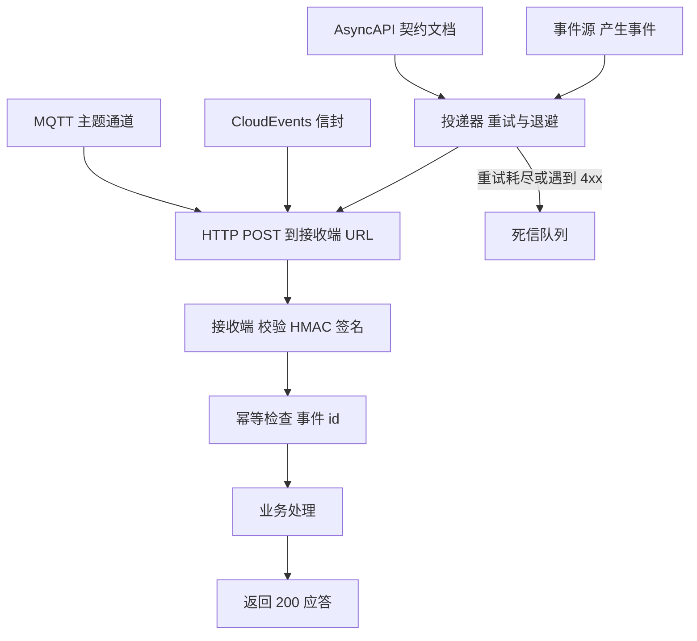
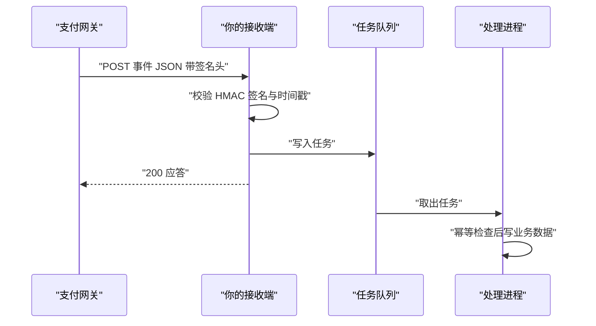
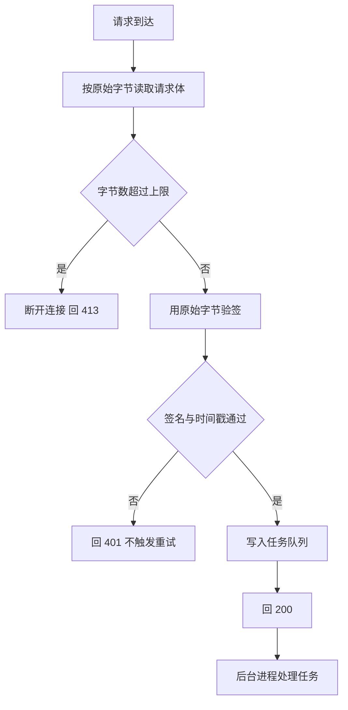
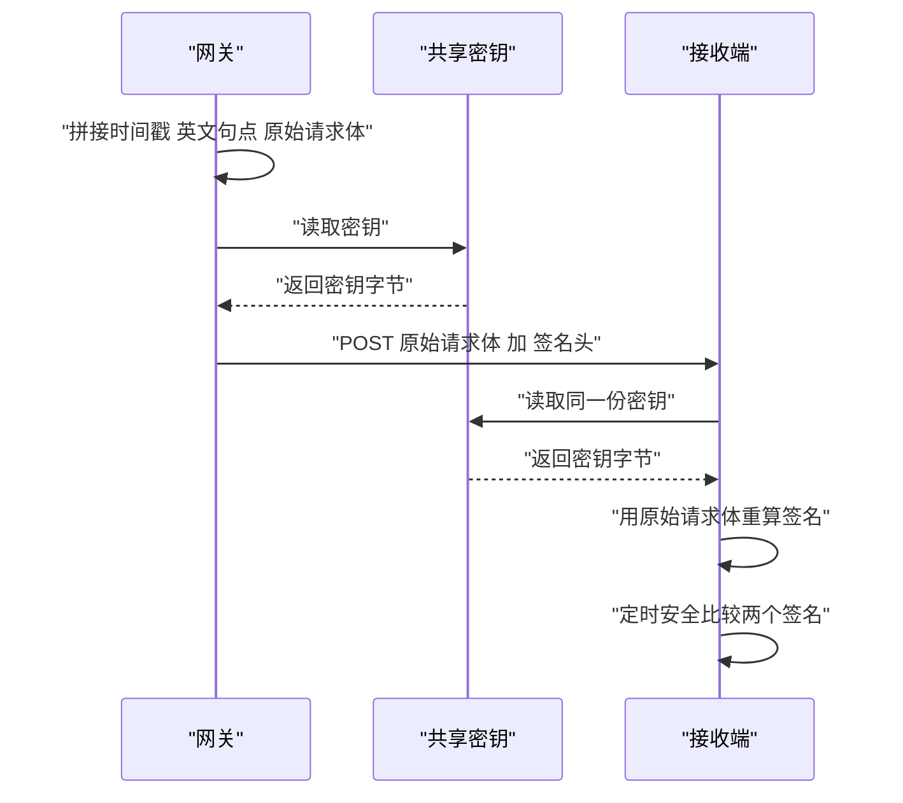
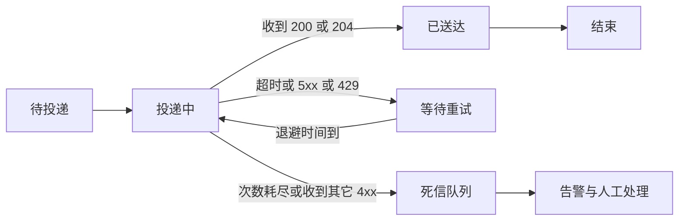
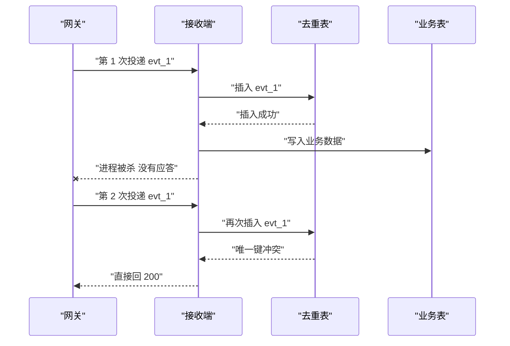
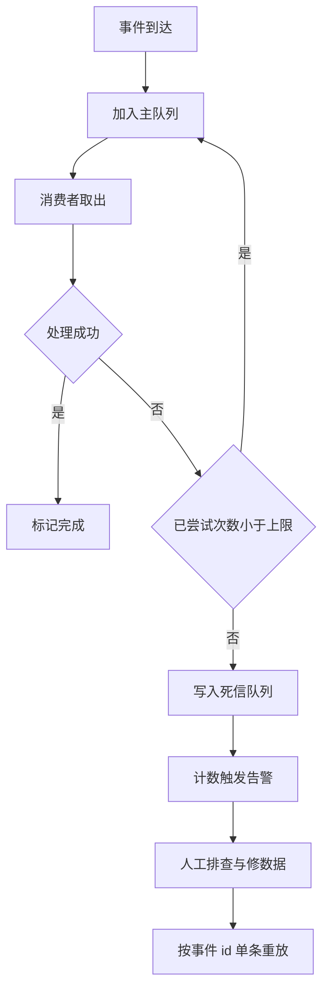
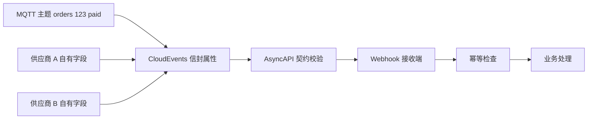

# Webhook 与事件驱动 API：签名、重试与幂等

!!! abstract "学完这一页你能"
    - 说出 Webhook 投递的 5 个环节，并画出从事件发生到接收端返回 200 的时序。
    - 用 node:crypto 写出 HMAC-SHA256 签名校验，并说明时间戳窗口挡住哪类攻击。
    - 写出指数退避加抖动的重试序列，并说明重试耗尽后事件去哪里。
    - 用事件 id 加唯一索引实现幂等，并说出重复投递时第 2 次请求应当返回什么。

## 0. 知识地图



建议按编号顺序读：先看懂投递流程（第 1、2 节），再学安全与可靠性（第 3、4、5 节）。
第 6 节处理"怎么都失败"的事件，第 7 节把事件本身规范化。
每节末尾的脚本都能直接跑，跑完再进入下一节。

## 1. Webhook 流程：从轮询到回调

**先想一个问题**

你的订单系统要拿支付结果。如果每 5 秒查一次支付网关的查询接口，一天发出 17280 次请求。
按每分钟命中 1 次算，命中率不到万分之五。
真正需要的那条结果，可能在第 9000 次请求里才出现。这笔成本能不能省掉？

**心智模型**

!!! tip "心智模型"
    一句话模型：Webhook 是对方在你的地址簿里存一个 URL，事件发生时主动向你发一次 HTTP 请求。
    日常类比：快递到了按门铃，你在家开门就行；轮询是你每分钟下楼看一次快递柜。
    类比不成立的地方：门铃只按一次，而 Webhook 会重发到你回 200 为止；你没开门，对方会按固定节奏再来。

!!! note "术语：Webhook"
    Webhook 是服务方在事件发生时，主动向调用方预先登记好的 URL 发送 HTTP 请求的机制。
    例：支付网关在订单支付成功后向你登记的 https://shop.example.test/hooks/pay 发送一条 POST。

**图解**



1. 支付网关在状态变化的那一刻发出 POST，请求体是事件 JSON。
2. 请求头带签名与时间戳，接收端用共享密钥重算一遍做对比。
3. 接收端只做校验和入队，耗时的业务处理放到队列后面。
4. 入队成功后立刻回 200，网关看到 200 就停止重发这条事件。
5. 处理进程从队列取任务，做幂等检查，再写业务数据。

**一步一步来**

第一步：登记接收地址与订阅的事件类型。

```js
// 1-register.mjs  依赖：Node 20 内置 fetch，无需第三方包
// 需要真实网关地址，本地无法直接运行，用于说明登记环节的字段
const base = "https://api.example-gateway.test"; // 对方开放平台的基地址

const res = await fetch(`${base}/v1/webhook_endpoints`, {
  method: "POST", // 登记是创建动作，用 POST
  headers: {
    "content-type": "application/json", // 声明请求体是 JSON
    authorization: `Bearer ${process.env.GATEWAY_TOKEN}`, // 用令牌证明调用方身份
  },
  body: JSON.stringify({
    url: "https://shop.example.test/hooks/pay", // 你的接收地址，线上必须是 HTTPS
    events: ["payment.succeeded", "payment.refunded"], // 只订阅需要的事件类型
  }),
});

const data = await res.json(); // 对方返回端点 id 与签名密钥
console.log(res.status, data.id, String(data.secret).slice(0, 4) + "****"); // 密钥只打印前 4 位
```

**这段代码在做什么**

1. 用 POST 调对方的登记接口，把回调地址提交上去。
2. events 数组限定只收支付成功与退款两类事件，减少无关流量。
3. 对方返回的 secret 要存进密钥管理系统，后面验签只用它。
4. 密钥只打印前 4 位，避免完整值写进日志或终端历史。
5. 接口路径与字段名需核对官方文档：确认端点路径、字段拼写、密钥是否只显示一次。

运行结果：登记成功时返回 200 状态码与端点 id，secret 只显示前 4 位。

第二步：事件发生时，对方发来的请求长这样。

```text
POST /hooks/pay HTTP/1.1
Host: shop.example.test
Content-Type: application/json
X-Event-Id: evt_01H8Z9K2
X-Event-Type: payment.succeeded
X-Timestamp: 1735689600
X-Signature: sha256=6f1c9d2a7b4e5f8012ab34cd56ef7890a1b2c3d4e5f60718293a4b5c6d7e8f90

{"id":"evt_01H8Z9K2","type":"payment.succeeded","amount":12800}
```

**这段代码在做什么**

1. 请求行给出方法与路径，接收端只用这一个固定路径。
2. X-Event-Id 是这次事件的唯一标识，幂等检查靠它。
3. X-Timestamp 是投递时刻的 Unix 秒，用来限制签名有效期。
4. X-Signature 是接收端要重算并逐字节对比的值。
5. 请求体是 JSON 文本，验签要用这段原始字节，不是重新序列化的对象。
6. 头名称需核对官方文档：确认签名头、时间戳头、事件 id 头的准确拼写。

运行结果：接收端看到 1 次 POST，回 200 后对方停止重发。

**动手验证**

下面这个脚本在本地起一个接收端，再用 fetch 模拟网关投递一次。

```js
// verify-01.mjs  依赖：仅 Node 20 内置模块（node:http、node:assert）
import http from "node:http";
import assert from "node:assert/strict";

const received = []; // 记录收到的投递

const server = http.createServer((req, res) => {
  const chunks = [];
  req.on("data", (c) => chunks.push(c)); // 逐块收集请求体
  req.on("end", () => {
    const raw = Buffer.concat(chunks).toString("utf8"); // 拼成原始文本
    received.push({ url: req.url, eventId: req.headers["x-event-id"], body: JSON.parse(raw) });
    res.writeHead(200, { "content-type": "application/json" }); // 先回 200
    res.end('{"ok":true}'); // 告诉对方投递成功
  });
});

await new Promise((r) => server.listen(0, "127.0.0.1", r)); // 端口写 0，让系统分配空闲端口
const port = server.address().port;
const url = `http://127.0.0.1:${port}/hooks/pay`;

const payload = JSON.stringify({ id: "evt_1", type: "payment.succeeded", amount: 12800 });
const res = await fetch(url, {
  method: "POST",
  headers: { "content-type": "application/json", "x-event-id": "evt_1" }, // 模拟网关的头部
  body: payload,
});

assert.equal(res.status, 200); // 接收端必须回 200
assert.equal(received.length, 1); // 只收到一次
assert.equal(received[0].body.amount, 12800); // 业务字段没有丢
console.log("收到的投递条数", received.length);
console.log("事件 id", received[0].eventId);
server.close();
```

预期输出：

```text
收到的投递条数 1
事件 id evt_1
```

**常见坑**

|:--|:--|:--|
| 现象 | 原因 | 怎么修 |
|:--|:--|:--|
| 同一条事件收到 8 次 | 处理耗时 3 秒，超过对方 2 秒超时 | 先入队再回 200，把耗时处理挪到队列后面 |
| 收到重复的业务数据 | 接收端没有记录事件 id | 用 X-Event-Id 做幂等键 |
| 本地用 http 能收，线上收不到 | 对方只投递 HTTPS 地址 | 接收端配好证书，登记时填 HTTPS |
| 请求体解析失败 | 用 GET 带查询参数传事件 | 固定用 POST 加 JSON 请求体 |

**小结**

1. Webhook 把"谁主动"从调用方翻转到服务方，事件发生即刻投递。
2. 接收端的第一职责是快速应答并落队列，第二职责才是业务处理。
3. 地址与订阅类型在登记环节确定，密钥也在这个环节拿到。

## 2. 手写 Webhook 接收端

**先想一个问题**

你的接收端用框架的 json() 中间件解析请求体，然后直接读 req.body 做业务。
验签时你把 req.body 重新 JSON.stringify 一次，结果签名永远对不上。问题出在哪一步？

**心智模型**

!!! tip "心智模型"
    一句话模型：接收端先用原始字节收完请求体，再决定解析、校验与应答的顺序。
    日常类比：先按原样收下信封，看清封口的印章之后再拆信；不能先拆信再回头对印章。
    类比不成立的地方：信封拆了还能粘回去，而请求体一旦被框架解析成对象，字节顺序和空格就丢了。

**图解**



1. 请求到达时先不做任何解析，按字节流读取请求体。
2. 读取过程中累计字节数，超过上限就断开并回 413，避免超大请求占内存。
3. 用完整原始字节做验签，密钥来自登记环节。
4. 签名或时间戳任一不过，回 401 让对方停止重发。
5. 校验通过后写队列，再回 200。
6. 后台进程异步取任务，做幂等检查与业务写入。

**一步一步来**

第一步：按原始字节读取请求体，并限制大小。

```js
function readRawBody(req, limitBytes = 512 * 1024) {
  return new Promise((resolve, reject) => {
    const chunks = []; // 按顺序保留收到的字节块
    let size = 0; // 累计已读字节数
    req.on("data", (chunk) => {
      size += chunk.length;
      if (size > limitBytes) {
        req.destroy(); // 超过上限立刻断开，不再读
        reject(new Error("body 超过 512 KiB")); // 让上层回 413
        return;
      }
      chunks.push(chunk); // 保留原始字节，不要提前转字符串
    });
    req.on("end", () => resolve(Buffer.concat(chunks))); // 拼成一个 Buffer
    req.on("error", reject); // 网络错误向上抛
  });
}
```

**这段代码在做什么**

1. 返回 Promise，让调用方用 await 拿到完整 Buffer。
2. chunks 保存原始字节块，顺序不变。
3. size 在每块到达时累加，超限立即断开连接。
4. 上限默认 512 KiB，事件负载通常远小于这个值。
5. 用 Buffer.concat 拼接，避免多次字符串转换带来的编码问题。

运行结果：正常请求返回一个 Buffer，超大请求抛出错误。

第二步：验签通过后先入队，再回 200。

```js
const jobs = []; // 内存队列，生产环境换成数据库表或 Redis

function handleWebhook(req, res, rawBody) {
  let event;
  try {
    event = JSON.parse(rawBody.toString("utf8")); // 只解析一次
  } catch {
    res.writeHead(400).end("bad json"); // 4xx 让对方不要重试
    return;
  }
  if (typeof event.id !== "string" || event.id === "") {
    res.writeHead(400).end("missing id"); // 缺少事件 id 直接拒绝
    return;
  }
  jobs.push({ event, receivedAt: Date.now() }); // 入队，不做业务处理
  res.writeHead(200, { "content-type": "application/json" }); // 先应答
  res.end('{"ok":true}');
}
```

**这段代码在做什么**

1. JSON.parse 只执行一次，失败时回 400，告诉对方请求本身有问题。
2. 缺少事件 id 也回 400，因为后续幂等检查没有键可用。
3. 入队动作放在应答之前，保证"回了 200 就一定已经收下"。
4. 应答后的业务处理不在这个函数里，避免超过对方超时时间。
5. 生产环境的队列要能跨进程重启存活，内存数组只在单实例下成立。

运行结果：返回 200 与 {"ok":true}，jobs 数组里多一条记录。

**动手验证**

脚本验证"应答不等业务处理"：应答在 100 毫秒内返回，业务处理在 300 毫秒后才完成。

```js
// verify-02.mjs  依赖：仅 Node 20 内置模块
import http from "node:http";
import assert from "node:assert/strict";

const jobs = []; // 待处理任务
const done = []; // 已完成任务

function readRawBody(req, limitBytes = 512 * 1024) {
  return new Promise((resolve, reject) => {
    const chunks = [];
    let size = 0;
    req.on("data", (c) => {
      size += c.length;
      if (size > limitBytes) { req.destroy(); reject(new Error("body 超过 512 KiB")); return; }
      chunks.push(c);
    });
    req.on("end", () => resolve(Buffer.concat(chunks)));
    req.on("error", reject);
  });
}

const server = http.createServer(async (req, res) => {
  if (req.method !== "POST" || req.url !== "/hooks/pay") { res.writeHead(404).end("no"); return; }
  const raw = await readRawBody(req); // 读原始字节
  const event = JSON.parse(raw.toString("utf8"));
  jobs.push(event); // 只入队
  res.writeHead(200, { "content-type": "application/json" }); // 立刻应答
  res.end('{"ok":true}');
});

await new Promise((r) => server.listen(0, "127.0.0.1", r));
const url = `http://127.0.0.1:${server.address().port}/hooks/pay`;

const started = Date.now();
const res = await fetch(url, {
  method: "POST",
  headers: { "x-event-id": "evt_1" },
  body: JSON.stringify({ id: "evt_1", amount: 12800 }),
});
const ackMs = Date.now() - started; // 应答往返耗时

assert.equal(res.status, 200);
assert.equal(jobs.length, 1);
assert.ok(ackMs < 100, "应答应当在 100 毫秒内返回，实测 " + ackMs); // 应答不等业务

await new Promise((r) => setTimeout(r, 300)); // 模拟后台慢慢处理
for (const job of jobs.splice(0)) done.push(job.id);
assert.deepEqual(done, ["evt_1"]);
console.log("应答耗时毫秒", ackMs);
console.log("完成的任务", done);
server.close();
```

预期输出（耗时数值随机器变化）：

```text
应答耗时毫秒 3
完成的任务 [ 'evt_1' ]
```

**常见坑**

|:--|:--|:--|
| 现象 | 原因 | 怎么修 |
|:--|:--|:--|
| 验签一直失败 | 框架先解析了请求体 | 关掉 json 中间件，自己读原始 Buffer |
| 接收端内存被撑满 | 没有限制请求体大小 | 读取时累计字节数，超过 512 KiB 断开 |
| 对方重发 8 次 | 处理失败时回了 500 | 校验失败回 400，读取失败才回 500 |
| 回 200 后事件丢了 | 先应答后入队，入队失败 | 先入队成功再应答，队列故障回 500 |

**小结**

1. 接收端的读取顺序是原始字节、校验、入队、应答。
2. 400 与 401 让对方停止重发，500 会让对方重发。
3. 队列要能跨进程存活，否则回 200 之后事件仍可能丢。

## 3. HMAC 签名校验：确认请求来自对方

**先想一个问题**

你的回调地址在公网上，任何人都能往 /hooks/pay 发一条 amount 为 12800 的 JSON。
你怎样区分"这条来自支付网关"和"这条来自扫描到你地址的陌生人"？

**心智模型**

!!! tip "心智模型"
    一句话模型：签名是用只有双方知道的密钥，对请求原文做一次单向计算，接收端算同样的结果再逐字节对比。
    日常类比：信封封口盖一枚只有你和对方手里的印章，印章一致才拆信。
    类比不成立的地方：印章能被模仿，而 HMAC 在密钥不泄露时，改动正文 1 个字节，签名的 64 个十六进制字符就完全不同。

!!! note "术语：HMAC"
    HMAC（Hash-based Message Authentication Code，基于哈希的消息认证码）是用共享密钥加哈希函数生成的一段定长字节串。
    例：用密钥与待签名串算 HMAC-SHA256，得到 32 字节，转成十六进制是 64 个字符。

!!! note "术语：时间戳窗口"
    时间戳窗口指接收端允许的签名有效期，超过这个偏差的请求一律拒绝。
    例：窗口设为 300 秒，请求里的时间戳与服务器当前时间相差 301 秒就拒绝。

**图解**



1. 发送方把时间戳与原始请求体用英文句点连接，得到待签名字符串。
2. 发送方用共享密钥对这个字符串算 HMAC-SHA256，转成小写十六进制。
3. 签名与时间戳一起放进请求头，请求体保持原样发出。
4. 接收端从密钥管理系统读同一份密钥。
5. 接收端用收到的原始请求体重算一遍，得到期望值。
6. 两个签名用定时安全比较函数对比，结果一致才继续处理。

**一步一步来**

第一步：发送方构造待签名串并算出签名。

```js
// 这段是自定义约定，头名称与拼接方式需核对官方文档
import { createHmac } from "node:crypto"; // Node 内置加密模块

function sign(secret, timestamp, rawBody) {
  const base = `${timestamp}.${rawBody}`; // 时间戳与请求体用英文句点连接
  const mac = createHmac("sha256", secret).update(base, "utf8").digest("hex"); // 得到十六进制串
  return "sha256=" + mac; // 加上算法前缀，便于将来换算法
}

const secret = "whsec_test_key"; // 生产环境从密钥管理系统读取
const body = JSON.stringify({ id: "evt_1", amount: 12800 });
const ts = Math.floor(Date.now() / 1000); // 当前 Unix 秒
console.log(sign(secret, ts, body));
```

**这段代码在做什么**

1. 待签名串由时间戳、英文句点、原始请求体三部分组成。
2. createHmac 的第一个参数指定哈希算法，第二个参数是密钥。
3. update 传入 UTF-8 字符串，digest 输出十六进制。
4. 加 "sha256=" 前缀，接收端可以据此判断用哪种算法。
5. 时间戳必须参与签名，否则攻击者可以改时间戳绕过窗口检查。

运行结果：输出形如 sha256=9f2c...，共 64 个十六进制字符，随时间戳变化。

第二步：接收端验签并检查时间戳窗口。

```js
import { createHmac, timingSafeEqual } from "node:crypto"; // timingSafeEqual 做逐字节比较

const WINDOW_SECONDS = 300; // 允许的时间偏差

function verify(secret, header, rawBody, nowSeconds) {
  const map = Object.fromEntries(header.split(",").map((p) => p.trim().split("="))); // 拆成 t 与 v1
  const t = Number(map.t); // 发送方的时间戳
  if (!Number.isFinite(t)) return { ok: false, reason: "时间戳格式错误" };
  if (Math.abs(nowSeconds - t) > WINDOW_SECONDS) return { ok: false, reason: "超出 300 秒窗口" };
  const expected = createHmac("sha256", secret).update(`${t}.${rawBody}`, "utf8").digest("hex");
  const a = Buffer.from(expected, "hex");
  const b = Buffer.from(String(map.v1 ?? ""), "hex");
  if (a.length !== b.length) return { ok: false, reason: "签名长度不同" }; // 长度不等无法比较
  return { ok: timingSafeEqual(a, b), reason: "比较完成" }; // 不提前返回
}
```

**这段代码在做什么**

1. 把签名头按逗号拆开，再按等号拆成键值对，取出 t 与 v1。
2. 时间戳不是数字就直接失败，避免 Number 得到 NaN 后继续比较。
3. 绝对偏差超过 300 秒的请求拒绝，挡住重放旧请求。
4. 用收到的原始请求体重算签名，不经过任何对象转换。
5. 长度不同时直接失败，因为 timingSafeEqual 要求两个 Buffer 等长。
6. timingSafeEqual 逐字节比较且不提前返回，减少通过耗时推断内容的机会。

运行结果：合法请求得到 { ok: true, reason: '比较完成' }，超窗请求得到 { ok: false, reason: '超出 300 秒窗口' }。

**动手验证**

脚本一次覆盖 4 种情况：正常请求、改金额、超窗重放、密钥不对。

```js
// verify-03.mjs  依赖：仅 Node 20 内置模块
import { createHmac, timingSafeEqual, randomBytes } from "node:crypto";
import assert from "node:assert/strict";

const SECRET = "whsec_" + randomBytes(8).toString("hex"); // 每次运行生成随机密钥
const WINDOW = 300; // 允许的时间偏差，单位秒

function sign(secret, t, raw) {
  const mac = createHmac("sha256", secret).update(t + "." + raw, "utf8").digest("hex");
  return "t=" + t + ",v1=" + mac; // 时间戳与签名放在同一个头里
}

function verify(secret, header, raw, now) {
  const map = Object.fromEntries(header.split(",").map((p) => p.trim().split("=")));
  const t = Number(map.t);
  if (!Number.isFinite(t)) return false;
  if (Math.abs(now - t) > WINDOW) return false; // 重放保护
  const expected = createHmac("sha256", secret).update(t + "." + raw, "utf8").digest("hex");
  const a = Buffer.from(expected, "hex");
  const b = Buffer.from(String(map.v1 ?? ""), "hex");
  return a.length === b.length && timingSafeEqual(a, b);
}

const body = '{"id":"evt_1","amount":12800}';
const now = Math.floor(Date.now() / 1000);
const header = sign(SECRET, now, body);

assert.equal(verify(SECRET, header, body, now), true); // 正常请求通过
assert.equal(verify(SECRET, header, body.replace("12800", "99900"), now), false); // 改金额失败
assert.equal(verify(SECRET, header, body, now + 301), false); // 301 秒后重放失败
assert.equal(verify(SECRET + "x", header, body, now), false); // 密钥不对失败
console.log("验签通过", verify(SECRET, header, body, now));
console.log("篡改被拒", verify(SECRET, header, body.replace("12800", "99900"), now));
```

预期输出：

```text
验签通过 true
篡改被拒 false
```

**常见坑**

|:--|:--|:--|
| 现象 | 原因 | 怎么修 |
|:--|:--|:--|
| 验签总是失败 | 用解析后的对象重新 JSON.stringify，字段顺序变了 | 全程使用原始 Buffer |
| 改一个字符仍通过 | 待签名串里没放时间戳 | 时间戳与请求体一起参与计算 |
| 签名被逐字符猜出 | 用 === 比较，比较过程提前返回 | 用 timingSafeEqual |
| 昨天的请求今天还能用 | 没有校验时间戳 | 加 300 秒窗口并记录事件 id |

**小结**

1. 待签名串至少要包含时间戳与原始请求体，两者缺一都会留下攻击面。
2. 签名比较用 timingSafeEqual，先比长度再比内容。
3. 时间戳窗口把"改一个数字就能重放"的成本抬到必须持有密钥。

## 4. 重试与退避：发送方失败后怎么办

**先想一个问题**

你的接收端在 14:00 重启，历时 40 秒。这 40 秒里支付网关发来的 6 条事件如果只投一次，就全丢了。
发送方应该怎么安排第 2 次、第 3 次投递的时间？

**心智模型**

!!! tip "心智模型"
    一句话模型：重试是把失败的投递按逐步拉长的间隔重新排一次队。
    日常类比：打电话没人接，隔 1 分钟再打，还没接就隔 2 分钟、4 分钟。
    类比不成立的地方：人打电话会主动放弃，而发送方还带最大次数与总时长上限，超过就写进死信。

!!! note "术语：指数退避"
    指数退避指每次失败后把等待时间乘以固定倍数。
    例：初始 1 秒、倍数 2、上限 60 秒，等待序列是 1、2、4、8、16、32、60 秒。

!!! note "术语：抖动"
    抖动是在退避时间上加一个随机量，避免多个接收端在同一秒被同时重试。
    例：把 8 秒变成 6 到 10 秒之间的随机值。

**图解**



1. 事件进入待投递状态，等待第一次投递。
2. 投递中收到 200 或 204 就进入已送达，流程结束。
3. 超时、5xx、429 属于临时失败，进入等待重试。
4. 等待时间按倍数拉长，时间到了回到投递中。
5. 达到最大次数，或者收到 400 这类表示请求本身有问题的状态码，转入死信队列。
6. 死信事件触发告警，等人排查后重放。

**一步一步来**

第一步：计算退避序列。

```js
function backoffSchedule({ attempts, baseMs, factor, maxMs, jitter, rand = Math.random }) {
  const out = []; // 存放每次失败后的等待毫秒数
  for (let i = 0; i < attempts; i++) {
    const raw = Math.min(baseMs * factor ** i, maxMs); // 先按倍数放大，再压到上限
    const delta = raw * jitter; // 抖动幅度，jitter 为 0.2 时是上下各 20%
    out.push(Math.round(raw - delta + rand() * 2 * delta)); // 落在区间内的随机值
  }
  return out;
}

// 把 rand 固定成 0.5，抖动正好抵消，便于核对倍数关系
console.log(backoffSchedule({ attempts: 6, baseMs: 1000, factor: 2, maxMs: 60000, jitter: 0.2, rand: () => 0.5 }));
```

**这段代码在做什么**

1. 第 i 次等待时间等于 baseMs 乘以 factor 的 i 次方。
2. maxMs 给等待时间设上限，避免第 20 次等到几天后。
3. jitter 决定随机区间，0.2 表示上下各 20%。
4. rand 默认用 Math.random，测试时传入固定函数得到可复现结果。
5. 返回值是 6 个整数，单位毫秒。

运行结果（rand 固定为 0.5 时）：

```text
[ 1000, 2000, 4000, 8000, 16000, 32000 ]
```

第二步：判断哪些应答值得重试。

```js
function shouldRetry(status, attempt, maxAttempts) {
  if (attempt >= maxAttempts) return { retry: false, reason: "次数耗尽" }; // 上限优先判断
  if (status === 200 || status === 204) return { retry: false, reason: "已送达" }; // 2xx 都是成功
  if (status >= 400 && status < 500 && status !== 429) {
    return { retry: false, reason: "请求本身有问题" }; // 4xx 重试无意义
  }
  return { retry: true, reason: "可重试" }; // 超时、5xx、429 都重试
}
console.log(shouldRetry(500, 0, 5));
console.log(shouldRetry(400, 0, 5));
```

**这段代码在做什么**

1. 先看尝试次数是否达到上限，达到就不再重试。
2. 200 与 204 都表示接收端已收下，停止投递。
3. 400 到 499 里除 429 之外都属于请求内容问题，重试会得到同样结果。
4. 429 是限流应答，过一段时间会恢复，所以归入可重试。
5. 5xx 与网络超时归入可重试。

运行结果：

```text
{ retry: true, reason: '可重试' }
{ retry: false, reason: '请求本身有问题' }
```

**动手验证**

脚本起一个接收端，前两次回 503，投递器按退避序列重试到第 3 次成功。

```js
// verify-04.mjs  依赖：仅 Node 20 内置模块
import http from "node:http";
import assert from "node:assert/strict";

let hits = 0; // 接收端被调用的次数
const server = http.createServer((req, res) => {
  hits += 1;
  if (hits <= 2) { res.writeHead(503).end("busy"); return; } // 前两次故意失败
  res.writeHead(200).end('{"ok":true}');
});

await new Promise((r) => server.listen(0, "127.0.0.1", r));
const url = `http://127.0.0.1:${server.address().port}/hooks`;

const waits = [1, 2, 4, 8, 16]; // 单位毫秒，真实场景是 1000、2000、4000 毫秒

async function deliver(payload, maxAttempts) {
  for (let attempt = 0; attempt < maxAttempts; attempt++) {
    const res = await fetch(url, {
      method: "POST",
      headers: { "x-event-id": payload.id },
      body: JSON.stringify(payload),
    });
    if (res.status >= 200 && res.status < 300) return { ok: true, attempt: attempt + 1 };
    if (res.status >= 400 && res.status < 500 && res.status !== 429) {
      return { ok: false, attempt: attempt + 1, reason: "4xx 不再重试" };
    }
    await new Promise((r) => setTimeout(r, waits[attempt] ?? 16)); // 退避等待
  }
  return { ok: false, attempt: maxAttempts, reason: "次数耗尽" };
}

const result = await deliver({ id: "evt_1" }, 5);
assert.equal(result.ok, true); // 最终投递成功
assert.equal(result.attempt, 3); // 第 3 次成功
assert.equal(hits, 3); // 接收端共被调用 3 次
console.log("投递结果", result);
console.log("接收端被调用次数", hits);
server.close();
```

预期输出：

```text
投递结果 { ok: true, attempt: 3 }
接收端被调用次数 3
```

**常见坑**

|:--|:--|:--|
| 现象 | 原因 | 怎么修 |
|:--|:--|:--|
| 收到 429 就放弃投递 | 把限流当成永久失败 | 把 429 归入可重试 |
| 多个接收端在同一秒被打满 | 退避没有抖动 | 等待时间上叠加上下各 20% 随机 |
| 一条坏事件产生上百次请求 | 没有最大次数上限 | 设最大次数与总时长上限 |
| 坏事件挡住后面的事件 | 队列严格按顺序阻塞 | 单开死信队列，主队列继续前进 |

**小结**

1. 退避序列由初始值、倍数、上限三个参数决定，再加抖动打散重试时刻。
2. 2xx 停、429 与 5xx 重试、其它 4xx 停。
3. 重试次数必须有上限，否则一条坏事件会长期占用投递通道。

## 5. 幂等处理：同一条事件处理两次

**先想一个问题**

你的接收端写完数据库、还没回 200 时进程被杀。网关没收到 200，5 分钟后重投同一条事件。
这时数据库里已经有这笔订单，代码再扣一次款会怎样？

**心智模型**

!!! tip "心智模型"
    一句话模型：给每条事件一个唯一键，处理前先用这个键做一次原子占位，占位失败就说明处理过。
    日常类比：电影票根撕过一次就不能再进同一场。
    类比不成立的地方：票根只有一张，而同一个键的请求可能同时到达，占位必须由数据库唯一索引完成，不能靠先查再写。

!!! note "术语：幂等"
    幂等（idempotent）指同一个操作执行 1 次和执行 N 次，对系统状态的最终结果相同。
    例：把余额写成 100 元是幂等的，把余额加 10 元不是幂等的。

**图解**



1. 第 1 次投递到达，接收端先在去重表插入事件键。
2. 插入成功说明是首次到达，继续写业务表。
3. 应答丢失，发送方认为失败并重投。
4. 第 2 次到达，接收端再次插入同一个键。
5. 唯一键冲突说明处理过，直接回 200，不重复写业务数据。
6. 发送方看到 200，停止重投。

**一步一步来**

第一步：用唯一键做原子占位。

```js
// 用 Map 模拟带唯一约束的去重表，生产环境换成数据库唯一索引
const seen = new Map(); // 键是事件 id，值是首次到达时刻

function claim(eventId, now = new Date().toISOString()) {
  if (seen.has(eventId)) return { claimed: false, firstSeenAt: seen.get(eventId) }; // 已占位
  seen.set(eventId, now); // 首次到达，记录时刻
  return { claimed: true, firstSeenAt: null };
}

console.log(claim("evt_1"));
console.log(claim("evt_1"));
```

**这段代码在做什么**

1. Map 的 has 加 set 在单进程里等价于"插入成功或冲突"。
2. claimed 为 true 表示本次是首次到达，应当继续业务处理。
3. claimed 为 false 时返回首次到达时刻，便于排查与日志。
4. 多进程或多实例下必须换成数据库唯一索引，Map 只在单实例有效。
5. 去重键要加保留期，事件过期后删除记录，避免表无限增长。

运行结果：

```text
{ claimed: true, firstSeenAt: null }
{ claimed: false, firstSeenAt: '2025-01-01T00:00:00.000Z' }
```

第二步：让业务处理本身也能重入。

```js
// 只允许 pending 到 paid 的一次跃迁，重复调用不再改状态
function applyPayment(order, event) {
  if (order.status === "paid") return { changed: false, status: "paid" }; // 已经处理过
  if (order.status !== "pending") return { changed: false, status: order.status }; // 其它状态不动
  order.status = "paid"; // 唯一允许的跃迁
  order.paidAmount = event.amount; // 记录实付金额
  return { changed: true, status: "paid" };
}

const order = { id: "o_1", status: "pending", paidAmount: 0 };
console.log(applyPayment(order, { amount: 12800 }));
console.log(applyPayment(order, { amount: 12800 }));
```

**这段代码在做什么**

1. 已支付订单再次收到支付事件时直接返回，不做任何写入。
2. 状态不是 pending 也不是 paid 时保持原状，避免覆盖退款等后续状态。
3. 跃迁只有一次，业务结果与执行次数无关。
4. 实付金额只在跃迁发生时写入，重复调用不会累加。
5. 状态机与去重表一起用：去重表挡住重复请求，状态机挡住漏网的重复写入。

运行结果：

```text
{ changed: true, status: 'paid' }
{ changed: false, status: 'paid' }
```

**动手验证**

脚本模拟唯一约束冲突，验证重复投递不会多写一条账本。

```js
// verify-05.mjs  依赖：仅 Node 20 内置模块
import assert from "node:assert/strict";

const dedupeTable = new Map(); // 模拟带唯一约束的去重表

function insertEvent(eventId) {
  if (dedupeTable.has(eventId)) {
    const err = new Error("UNIQUE 冲突"); // 模拟数据库错误
    err.code = "SQLITE_CONSTRAINT";
    throw err;
  }
  dedupeTable.set(eventId, { state: "processing" }); // 占位成功
}

function markDone(eventId) { dedupeTable.set(eventId, { state: "done" }); }

const ledger = []; // 模拟业务账本

function handle(event) {
  try {
    insertEvent(event.id); // 占位失败说明是重复投递
  } catch (err) {
    if (err.code === "SQLITE_CONSTRAINT") return { status: 200, duplicated: true }; // 重复也回 200
    throw err;
  }
  ledger.push({ id: event.id, amount: event.amount }); // 只有首次到达才写账本
  markDone(event.id);
  return { status: 200, duplicated: false };
}

const event = { id: "evt_1", amount: 12800 };
const first = handle(event);
const second = handle(event);
const third = handle({ id: "evt_2", amount: 500 });

assert.deepEqual(first, { status: 200, duplicated: false }); // 首次处理
assert.deepEqual(second, { status: 200, duplicated: true }); // 重复请求也回 200
assert.equal(ledger.length, 2); // 3 次请求只写 2 条账本
assert.equal(third.duplicated, false);
console.log("两次应答", first, second);
console.log("账本条数", ledger.length);
```

预期输出：

```text
两次应答 { status: 200, duplicated: false } { status: 200, duplicated: true }
账本条数 2
```

**常见坑**

|:--|:--|:--|
| 现象 | 原因 | 怎么修 |
|:--|:--|:--|
| 同一笔订单扣款两次 | 只靠内存判断，多实例之间不共享 | 在去重表上建唯一索引 |
| 重复请求让发送方一直重试 | 冲突被当成异常回了 500 | 冲突时回 200 |
| 去重表涨到千万行 | 没有过期清理 | 按事件保留期定时删除 |
| 不同供应商的事件被误判重复 | 去重键只用事件 id | 用来源加事件 id 组合键 |

**小结**

1. 幂等的核心是一次原子占位，靠数据库唯一索引保证，不靠先查再写。
2. 重复投递要回 200，否则发送方会继续重投。
3. 去重表与业务状态机一起用，才算把重复写入堵住。

## 6. 死信队列：处理不了的事件放哪里

**先想一个问题**

有一条事件里的商品 id 在你们的库里已经删除，处理代码每次都抛异常。
发送方重试 3 次后放弃。这条事件现在存在哪里？

**心智模型**

!!! tip "心智模型"
    一句话模型：死信队列是处理失败事件的隔离区，把坏事件从主流程挪开，让后面的事件继续走。
    日常类比：快递反复投递失败后退回网点暂存。
    类比不成立的地方：退件会寄回给寄件人，而死信事件通常留在你的系统里，需要你主动重放或丢弃。

!!! note "术语：死信队列"
    死信队列（Dead Letter Queue，DLQ）指存放重试耗尽或无法处理的事件的地方，用于排查与重新投递。
    例：把重试 3 次仍失败的事件写入 dlq 数组，并附带最后一次错误信息与尝试次数。

**图解**



1. 事件进入主队列，等待消费者取出。
2. 消费者执行处理逻辑，成功就标记完成。
3. 失败时先看已尝试次数是否小于上限。
4. 没到上限就重新入队，次数加一。
5. 到达上限则写入死信队列，同时记录错误原因与尝试次数。
6. 死信计数大于 0 触发告警，人工排查修完数据后按事件 id 单条重放。

**一步一步来**

第一步：写出带尝试次数的入队、消费与失败转移。

```js
const mainQueue = []; // 主队列，元素形如 事件加已尝试次数
const dlq = []; // 死信队列
const MAX_ATTEMPTS = 3; // 同一事件最多被取出处理的次数

function enqueue(event, attempts = 0) {
  mainQueue.push({ event, attempts }); // 入队时带上已尝试次数
}

async function drain(handler) {
  while (mainQueue.length > 0) {
    const item = mainQueue.shift(); // 取出队首
    try {
      await handler(item.event); // 交给业务处理
    } catch (err) {
      const attempts = item.attempts + 1; // 这次也算一次尝试
      if (attempts >= MAX_ATTEMPTS) {
        dlq.push({ event: item.event, attempts, lastError: err.message, movedAt: new Date().toISOString() });
      } else {
        enqueue(item.event, attempts); // 重新入队，次数加一
      }
    }
  }
}
```

**这段代码在做什么**

1. 每次入队都记录这条事件已经被处理过几次。
2. drain 循环取出队首，直到主队列为空。
3. 处理抛异常时先给尝试次数加一。
4. 达到上限就把事件、尝试次数、最后错误、入死信时刻一起写进死信。
5. 没到上限就带着新次数重新入队。
6. 死信里带上最后错误，否则事后无法判断是数据问题还是代码问题。

运行结果：主队列被排空，失败事件进入 dlq。

第二步：跑一条好事件与一条坏事件，观察落点。

```js
const handled = []; // 记录每次被处理的事件 id
enqueue({ id: "evt_ok" }, 0);
enqueue({ id: "evt_bad" }, 0);

await drain(async (event) => {
  handled.push(event.id);
  if (event.id === "evt_bad") throw new Error("商品不存在"); // 每次都失败
});

console.log("被处理的事件", handled);
console.log("死信条数", dlq.length, "尝试次数", dlq[0].attempts, "原因", dlq[0].lastError);
```

**这段代码在做什么**

1. 坏事件每次处理都抛错，触发重新入队。
2. 尝试次数从 0 走到 2，第 3 次失败后不再入队。
3. 好事件处理一次后离开队列，不再出现。
4. handled 数组长度等于好事件 1 次加坏事件 3 次。
5. 死信里保留尝试次数与最后错误，便于定位。

运行结果：

```text
被处理的事件 [ 'evt_ok', 'evt_bad', 'evt_bad', 'evt_bad' ]
死信条数 1 尝试次数 3 原因 商品不存在
```

**动手验证**

脚本先让一条事件失败一次后成功，再让一条事件每次都失败，最后从死信重放。

```js
// verify-06.mjs  依赖：仅 Node 20 内置模块
import assert from "node:assert/strict";

const queue = []; // 主队列
const dlq = []; // 死信队列
const MAX_ATTEMPTS = 3; // 尝试次数上限

function enqueue(event, attempts = 0) { queue.push({ event, attempts }); }

async function drain(handler) {
  while (queue.length > 0) {
    const item = queue.shift();
    try {
      await handler(item.event);
    } catch (err) {
      const attempts = item.attempts + 1;
      if (attempts >= MAX_ATTEMPTS) dlq.push({ event: item.event, attempts, lastError: err.message });
      else enqueue(item.event, attempts);
    }
  }
}

let failTimes = 1; // 第一条事件只失败一次
enqueue({ id: "evt_flaky" });
enqueue({ id: "evt_bad" });

await drain(async (event) => {
  if (event.id === "evt_flaky" && failTimes-- > 0) throw new Error("数据库连接超时");
  if (event.id === "evt_bad") throw new Error("商品不存在");
});

assert.equal(queue.length, 0); // 主队列已排空
assert.equal(dlq.length, 1); // 只有坏事件进死信
assert.equal(dlq[0].event.id, "evt_bad");
assert.equal(dlq[0].attempts, 3);
assert.equal(dlq[0].lastError, "商品不存在");
console.log("死信事件", dlq[0].event.id, "尝试次数", dlq[0].attempts, "原因", dlq[0].lastError);

const replay = { ...dlq[0].event }; // 修完数据后取出死信事件
dlq.length = 0;
enqueue(replay, 0); // 次数清零后重新入队
await drain(async () => {}); // 这次处理不抛错
assert.equal(dlq.length, 0);
assert.equal(queue.length, 0);
console.log("重放后死信条数", dlq.length);
```

预期输出：

```text
死信事件 evt_bad 尝试次数 3 原因 商品不存在
重放后死信条数 0
```

**常见坑**

|:--|:--|:--|
| 现象 | 原因 | 怎么修 |
|:--|:--|:--|
| 死信事件看不出为什么失败 | 只存了事件体 | 同时存最后错误与尝试次数 |
| 死信积压 3000 条没人发现 | 没有监控 | 死信计数大于 0 就发告警 |
| 重放后又一次全进死信 | 数据还没修就整批重放 | 修完数据后按事件 id 单条重放 |
| 重放导致重复扣款 | 重放没走去重表 | 重放前先查去重表，键用来源加事件 id |

**小结**

1. 死信队列的作用是把坏事件隔离，主队列不被阻塞。
2. 进入死信时至少要留事件体、尝试次数、最后错误、入队时刻。
3. 重放是人工动作，重放前要确认数据已修且幂等键仍然有效。

## 7. 事件契约：CloudEvents、AsyncAPI 与 MQTT

**先想一个问题**

你接了 3 家供应商的 Webhook：A 家的事件 id 叫 id，B 家叫 event_id，C 家放在 data.id 里。
每接一家你就要改一次解析代码。有没有一份公共的字段约定？

**心智模型**

!!! tip "心智模型"
    一句话模型：CloudEvents 统一事件的信封字段，AsyncAPI 统一事件的接口描述，MQTT 统一事件的传输通道。
    日常类比：寄快递，信封格式按同一份标准，面单条款写在公司手册里，运输走公路或铁路。
    类比不成立的地方：快递公司只有一套网络，而事件系统里信封、文档、通道由不同组织维护，版本各自演进。

!!! note "术语：CloudEvents"
    CloudEvents 是 CNCF 维护的事件格式规范，用一组固定属性描述事件的来源、类型与时间。
    例：specversion 为 1.0，id 为 evt_1，source 为 /payments/gateway，type 为 payment.succeeded，data 放业务负载。

!!! note "术语：AsyncAPI"
    AsyncAPI 是用 YAML 或 JSON 描述事件驱动接口的规范，作用与 OpenAPI 描述 HTTP 接口相同。
    例：在 channels 下写 payment.succeeded，声明该消息的负载结构。

!!! note "术语：MQTT"
    MQTT 是面向发布订阅的消息传输协议，客户端向主题发布消息，订阅该主题的客户端收到消息。
    例：发布到 orders/123/paid，订阅 orders/+/paid 的服务都能收到。
    MQTT 5.0 的共享订阅等细节需核对官方文档：确认主题语法与订阅选项的准确写法。

**图解**



1. 事件先从 MQTT 主题到达，主题用斜杠分层描述资源与动作。
2. 不同供应商的自有字段统一映射进 CloudEvents 信封属性。
3. 信封再按 AsyncAPI 描述的契约校验，字段缺失或类型不符直接拒绝。
4. 通过校验的事件交给 Webhook 接收端，读取方式与第 2、3 节一致。
5. 幂等检查的键取 source 与 id 的组合，避免两家供应商 id 撞车。
6. 最后写业务数据，处理逻辑只认信封，不认供应商自有字段名。

**一步一步来**

第一步：组装一个 CloudEvents 信封。

```js
// CloudEvents 1.0 必备属性是 specversion、id、source、type
function envelope({ id, source, type, data, time }) {
  return {
    specversion: "1.0", // 规范版本，接收端据此选择解析规则
    id, // 事件唯一标识，幂等检查用它
    source, // 事件来源，用 URI 形式表示生产方
    type, // 事件类型，用点号分层命名
    time: time ?? new Date().toISOString(), // 事件发生时间，RFC 3339 格式
    datacontenttype: "application/json", // data 字段的媒体类型
    data, // 业务负载
  };
}

const evt = envelope({ id: "evt_1", source: "/payments/gateway", type: "payment.succeeded", data: { amount: 12800 } });
console.log(JSON.stringify(evt, null, 2));
```

**这段代码在做什么**

1. specversion 固定写 1.0，接收端看到其它值应当拒绝。
2. id 与 source 组合起来标识一条事件，幂等键用这两段拼。
3. type 用点号分层，payment.succeeded 表示支付成功这一类事件。
4. time 允许调用方传入，缺省时用当前时间的 RFC 3339 表示。
5. data 放业务负载，信封只负责描述事件，不限制负载内容。

运行结果：

```text
{
  "specversion": "1.0",
  "id": "evt_1",
  "source": "/payments/gateway",
  "type": "payment.succeeded",
  "time": "2025-01-01T00:00:00.000Z",
  "datacontenttype": "application/json",
  "data": { "amount": 12800 }
}
```

第二步：用一段 AsyncAPI 描述支付事件。

```yaml
asyncapi: "2.6.0"        # 规范版本号需核对官方文档确认
info:
  title: "支付事件接口"   # 文档标题
  version: "1.0.0"       # 这份文档的版本
channels:
  payment.succeeded:     # 通道名取事件类型
    publish:
      message:
        payload:
          type: "object"
          required: ["id", "amount"]      # 必填字段
          properties:
            id: { type: "string" }        # 事件唯一标识
            amount: { type: "integer" }   # 金额以分为单位
```

**这段代码在做什么**

1. asyncapi 字段声明规范版本，工具据此选择校验规则。
2. info 记录文档标题与本文档版本，与事件类型版本分开管理。
3. channels 下每个键是一个通道，这里用事件类型当通道名。
4. publish 表示从生产方视角看是发布动作。
5. payload 用 JSON Schema 描述负载，required 列出必填字段。
6. 这份文件可以生成阅读文档，也可以放进 CI 做契约校验。

运行结果：把文件交给 AsyncAPI 官方 CLI 的 validate 子命令校验，通过时退出码为 0。具体命令与当前版本号需核对官方文档。

第三步：MQTT 的主题与服务质量等级。

```js
// 只是字符串示例，运行它不需要任何依赖
const topics = [
  "orders/123/paid", // 具体订单的已支付事件
  "orders/123/refunded", // 同一订单的退款事件
  "orders/+/paid", // 加号匹配一层，任意订单号的已支付事件
  "orders/#", // 井号匹配剩余多层，订单下的全部事件
];

// QoS 0 至多一次，QoS 1 至少一次，QoS 2 恰好一次
const qos = { atMostOnce: 0, atLeastOnce: 1, exactlyOnce: 2 };

console.log(topics.length, Object.entries(qos));
```

**这段代码在做什么**

1. 主题用斜杠分层，第 1 层是资源类型，第 2 层是资源 id，第 3 层是动作。
2. 加号匹配一层，orders/+/paid 能匹配 orders/123/paid 与 orders/456/paid。
3. 井号匹配剩余所有层，orders/# 能匹配订单下的全部事件。
4. 主题名区分大小写，orders 与 Orders 是两个主题。
5. QoS 1 保证至少送达一次，所以消费端会收到重复消息，需要第 5 节的幂等处理。
6. QoS 2 的握手轮次比 QoS 1 多，延迟更高，按业务能接受重复与否来选。

运行结果：

```text
4 [ [ 'atMostOnce', 0 ], [ 'atLeastOnce', 1 ], [ 'exactlyOnce', 2 ] ]
```

**动手验证**

脚本校验 CloudEvents 信封的必备属性，并生成 source 加 id 的幂等键。

```js
// verify-07.mjs  依赖：仅 Node 20 内置模块
import assert from "node:assert/strict";

const REQUIRED = ["specversion", "id", "source", "type"]; // CloudEvents 1.0 的必备属性

function validate(evt) {
  const missing = REQUIRED.filter((k) => evt[k] === undefined || evt[k] === ""); // 收集缺失字段
  if (missing.length > 0) throw new Error("缺少必备属性 " + missing.join(","));
  if (evt.specversion !== "1.0") throw new Error("不支持的 specversion " + evt.specversion);
  if (!evt.type.includes(".")) throw new Error("type 需要用点号分层");
  if (evt.time !== undefined && Number.isNaN(Date.parse(evt.time))) throw new Error("time 不是 RFC 3339");
  return true;
}

function idempotencyKey(evt) {
  return evt.source + "|" + evt.id; // 来源加事件 id 组成去重键
}

const good = {
  specversion: "1.0",
  id: "evt_1",
  source: "/payments/gateway",
  type: "payment.succeeded",
  time: "2025-01-01T00:00:00Z",
  data: { amount: 12800 },
};

assert.equal(validate(good), true); // 合法信封通过
assert.throws(() => validate({ ...good, source: "" }), /缺少必备属性 source/); // 缺 source
assert.throws(() => validate({ ...good, specversion: "0.3" }), /不支持的 specversion/); // 版本不支持
assert.throws(() => validate({ ...good, type: "paymentsucceeded" }), /type 需要用点号分层/); // 类型没分层
assert.equal(idempotencyKey(good), "/payments/gateway|evt_1"); // 幂等键格式
console.log("校验结果", validate(good));
console.log("幂等键", idempotencyKey(good));
```

预期输出：

```text
校验结果 true
幂等键 /payments/gateway|evt_1
```

**常见坑**

|:--|:--|:--|
| 现象 | 原因 | 怎么修 |
|:--|:--|:--|
| 两家供应商的事件互相顶掉 | 只用 event id 去重 | 用 source 加 id 组合键 |
| 接收端靠猜字段名 | 事件里没有类型属性 | 用 type 属性标明事件类型 |
| AsyncAPI 文件和代码不一致 | 文档写完没人维护 | 把契约校验放进 CI |
| MQTT 收到重复消息 | QoS 1 允许至少一次投递 | 消费端做幂等处理 |
| 主题订阅不到消息 | 主题层级写错或少写一层 | 用加号与井号通配，并核对主题拼写 |

**小结**

1. CloudEvents 统一信封字段，幂等键取 source 与 id 的组合。
2. AsyncAPI 把事件接口写成可校验的文件，与 OpenAPI 描述 HTTP 接口的作用对应。
3. MQTT 的 QoS 1 允许重复投递，选它就要在消费端配幂等。

## 综合对比

|:--|:--|:--|:--|:--|
| 维度 | 轮询 | Webhook | MQTT 订阅 | 消息队列直连消费 |
|:--|:--|:--|:--|:--|
| 谁主动 | 调用方按时发起 | 服务方事件触发 | 发布方推送主题 | 消费方拉取分区 |
| 空闲请求量 | 每 5 秒 1 次，一天 17280 次 | 0 次 | 0 次 | 0 次 |
| 事件延迟 | 最长等于轮询间隔 | 秒级 | 毫秒到秒级 | 毫秒到秒级 |
| 重复消息 | 不会重复 | 重试会重复 | QoS 1 会重复 | 重试会重复 |
| 来源校验 | 调用方带令牌 | HMAC 签名加时间戳 | 用户名密码或证书 | 集群内认证 |
| 失败后去向 | 下次轮询再试 | 退避重试后进死信 | 按 QoS 重发后进死信 | 重试后进死信主题 |
| 幂等键取法 | 请求参数组合 | 来源加事件 id | 主题加消息 id | 分区加偏移量 |
| 典型规范 | HTTP 加 OpenAPI | CloudEvents 加 AsyncAPI | MQTT 3.1.1 或 5.0 | 各消息中间件自有协议 |

## 应用与行业实践

### 应用场景地图

| 场景 | 用到本页哪个知识点 | 典型技术选型 | 注意事项 |
| --- | --- | --- | --- |
| 电商订单支付成功通知 ERP | HMAC 签名、时间戳窗口、事件 id 幂等 | Node.js 接收端、PostgreSQL 唯一索引 | 必须用原始 body 做哈希；重复投递返回 200 |
| GitHub 推送自动触发 CI | HMAC 签名、重试退避、幂等去重 | GitHub App/Webhook、CI 队列、Redis | 快速返回 200 防止同一 commit 触发多次构建 |
| SaaS 账号注销同步到下游 | HMAC 签名、事件契约、死信队列 | CloudEvents、Kafka、DLQ | 下游顺序可能不同，必须按事件 id 去重 |
| 冷链温度阈值告警推送 | 签名校验、重试退避、死信保留 | MQTT、CloudEvents、Prometheus | 告警分派前先落库，避免重复电话或短信 |
| 支付退款结果回调 | HMAC 签名、时间戳窗口、幂等入账 | 支付网关签名头、MySQL 唯一键 | 退款状态不能覆盖成支付状态，按事件顺序处理 |
| 电子签名合同完成回调 | 签名校验、事件契约、重试 | AsyncAPI、电子签名厂商 webhook | 文件下载 URL 可能过期，回调失败要恢复事件 |
| 订阅计费续费失败通知 | 签名校验、重试与死信、幂等 | Stripe webhook、账单系统 | 同一续费失败可能多天重试，按事件 id 只发一次提醒 |
| 监控告警升级到电话 | 签名校验、退避重试、去重 | PagerDuty/Custom webhook、Escalation 表 | 升级规则按 alert id 去重，防止一次故障多次呼叫 |

### 三个场景拆解

#### 场景 1：电商订单支付成功通知

- **业务背景**：订单支付完成后，要把支付状态同步给仓储系统，每秒可观察到几十到几百次回调。同一笔支付若被同步两次，会导致重复发货或库存重复扣减。
- **怎么用本页知识解决**：接收端先校验时间戳和 HMAC 签名，再用支付事件 id 建唯一索引；重复投递直接返回 200，处理失败返回非 2xx 让发送方按退避重试。
- 代码：

```js
const crypto = require('node:crypto');
const db = require('./db');

app.post('/webhooks/payment', async (req, res) => {
  const t = req.headers['x-timestamp'];
  const raw = req.rawBody;                       // 使用原始字节，避免字段顺序影响签名
  const expected = crypto.createHmac('sha256', process.env.SECRET)
    .update(`${t}.${raw}`).digest('hex');
  const ok = crypto.timingSafeEqual(Buffer.from(req.headers['x-signature']), Buffer.from(expected));
  if (!ok || Math.abs(Date.now()/1000 - Number(t)) > 300) return res.status(401).end();

  try {
    await db.query('INSERT INTO events (event_id, payload) VALUES ($1, $2)', [req.body.id, raw]);
  } catch (e) {
    if (e.code === '23505') return res.status(200).end(); // 唯一键冲突表示已处理过
    throw e;
  }
  await db.query('UPDATE orders SET status=$1 WHERE order_id=$2', ['paid', req.body.order_id]);
  res.status(200).end();                             // 业务成功后才返回 200
});
```

- 用 `rawBody` 做 HMAC，而不是重新序列化 JSON，签名才稳定。
- `timingSafeEqual` 避免签名比较被时序攻击，时间戳窗口挡住旧请求重放。
- 插入 `events` 表时置唯一索引，冲突说明已处理，直接返回 200。
- 仓储更新成功后才返回 200，异常会触发支付网关退避重试。
- 死信队列保留未处理的原始 payload，供人工重放。

- **怎么度量收益**：用 Prometheus 统计 `duplicate_events_total`、`webhook_delivery_total` 和 P95 处理时延。若有重复投递但订单只更新一次，说明幂等生效；签名错误请求应全部落在 401。
- **什么时候不该用**：如果支付系统和仓储系统已经在同一数据库事务消息表里完成状态同步，不必在外层再建 Webhook 唯一索引。如果这个通知只用于运营看板提示，重复处理不会造成资金或库存损失，引入死信表反而增加维护成本。

#### 场景 2：Git 推送自动触发 CI

- **业务背景**：仓库每次 push 都要触发构建，每天可观察到几十到几百次推送。重复触发浪费构建额度，漏触发会让问题拖到发布阶段。
- **怎么用本页知识解决**：接收 GitHub webhook，先验证 `X-Hub-Signature-256`，再用 `head_commit.id` 作为幂等键入队；重复投递返回 200，入队失败抛异常触发重试。
- 代码：

```python
import hmac, hashlib
from flask import Flask, request

app = Flask(__name__)

def verify(raw):
    expected = hmac.new(bytes(SECRET, 'utf-8'), raw, hashlib.sha256).hexdigest()
    sig = request.headers.get('X-Hub-Signature-256', '')
    return hmac.compare_digest('sha256=' + expected, sig)

@app.post('/webhooks/ci')
def ci():
    raw = request.get_data()                    # 原始字节用于 GitHub 签名
    if not verify(raw):
        return 'bad signature', 401
    event = request.json
    commit_id = event.get('head_commit', {}).get('id')
    if not commit_id:
        return 'no commit', 200                 # 非 push 事件直接忽略
    if db.find_one({'commit_id': commit_id}):
        return 'duplicate', 200                 # 重复投递停止重试
    db.insert({'commit_id': commit_id, 'status': 'queued'})
    queue.enqueue('ci_build', commit_id)        # 入队失败抛异常，触发发送方重试
    return 'accepted', 200
```

- `request.get_data()` 取原始请求体，签名验证结果才与 GitHub 一致。
- `compare_digest` 做常量时间比较，降低签名比较被时序利用的风险。
- 用 commit id 作为幂等键，同一推送即使投递两次也只入队一次。
- 入队成功才返回 200；队列不可用时抛异常，让 GitHub 后续重试。
- 无 commit 的事件直接返回 200，避免无关事件占用重试和死信空间。

- **怎么度量收益**：在 CI 系统里记录同一 commit 的构建次数，重复投递后仍为 1 说明幂等生效。用 Prometheus 统计 `duplicate_ci_events_total`，并用 GitHub webhook 日志筛选 401 与 200 分布。
- **什么时候不该用**：如果仓库只有一个提交者且推送频率极低，直接使用 CI 自带分支过滤即可，不必单独建数据库幂等表。如果 CI 已经由统一事件总线触发，GitHub webhook 只做通知，不建议在接收端再实现一套入队和重试。

#### 场景 3：冷链温度阈值告警推送

- **业务背景**：冷链仓储传感器在温度超过阈值时向运维系统推送告警，设备数量可能上千，高峰时每分钟几十条。漏掉高温告警会损坏货物，重复告警会淹没值班人员。
- **怎么用本页知识解决**：设备平台按 CloudEvents 提供 `event_id`，接收端先验签名和事件 id，再写入告警唯一表；分派成功才返回 200，失败进入重试和死信。
- 代码：

```js
app.post('/webhooks/alert', async (req, res) => {
  const raw = req.rawBody;
  const envelope = JSON.parse(raw);
  const eventId = envelope.id;                 // CloudEvents id 作为幂等键
  if (!verifyHmac(raw, req.headers['x-signature'])) return res.status(401).end();

  try {
    await db.query(
      'INSERT INTO alerts (event_id, device_id, temp_c) VALUES ($1,$2,$3)',
      [eventId, envelope.data.device_id, envelope.data.temp_c]
    );
  } catch (e) {
    if (e.code === '23505') return res.status(200).end();
    throw e;
  }
  await dispatchToPhone(envelope.data.device_id, envelope.data.temp_c);
  res.status(200).end();                       // 分派成功后才返回成功
});
```

- CloudEvents 的 `id` 统一保留，多个设备平台都可用同一套幂等逻辑。
- 先签名验证再解析业务字段，减少无效请求进入数据库。
- 告警表插入成功后才电话或短信分派，避免重复投递造成多次呼叫。
- 分派失败抛异常，发送方会退避重试；重试不会生成第二条告警记录。
- 多次失败进入死信队列，保留原始 CloudEvent 供人工恢复。

- **怎么度量收益**：用 Prometheus 统计 `alert_duplicate_total` 和 `webhook_to_dispatch_seconds` 的 P95。对比电话系统呼出次数与告警表唯一记录数，若一致说明去重与分派链路正常。
- **什么时候不该用**：如果传感器数据达到每秒几千条，应先经过 MQTT/流处理聚合，不适合每条告警都走同步 Webhook 和数据库唯一索引。如果告警只显示在本地屏幕且允许丢失，不需要建设重试和死信。

### 行业先进实践

- **GitHub Webhook 签名与投递退避（出处：GitHub Webhooks 官方文档）**：每个 webhook 配置 secret，用 HMAC-SHA256 生成 `X-Hub-Signature-256`；投递失败会按退避策略重试，直到返回 2xx。借鉴点：接收端保存原始 body，签名失败直接 401，业务成功后立即返回 200。
- **Stripe Webhook 签名与事件重放（出处：Stripe 官方文档 Webhooks 部分）**：`Stripe-Signature` 头带时间戳和签名，文档强调用事件 id 保证幂等，失败投递会列在 Dashboard 并重试。借鉴点：把时间戳窗口与事件唯一键结合，同时挡住重放和重复投递。
- **Svix Webhook 网关（出处：开源项目 Svix）**：把签名、重试、退避、幂等 key、失败存储做成独立网关，应用只消费已验证事件。借鉴点：多条产品线接入时，先用网关统一收口，再逐步接管发送端。
- **Google Cloud Pub/Sub Push Subscription（出处：Google Cloud Pub/Sub 官方文档）**：推送订阅对非 2xx 响应执行指数退避重试，并可将多次失败的消息转入 dead-letter topic。借鉴点：接收端快速失败，死信保留原始消息，支持人工重放。
- **CloudEvents 规范（出处：CNCF CloudEvents 规范）**：强制使用 `id`、`source`、`type`、`time` 字段，跨语言统一事件格式。借鉴点：新项目直接采用 CloudEvents 的 `id` 做幂等键，减少每个 Webhook 的自定义字段映射。

### 从学到用：落地路线

- 第 1 步：选一个非关键但高频的 CI 状态通知接入签名和事件 id 幂等。验收标准：连续两周收包，重复投递不产生重复构建，错误签名全部返回 401。
- 第 2 步：给试点 Webhook 加 Prometheus 指标和死信表，观察冲突计数与重试行为。验收标准：发送方重试时冲突计数增加，业务记录不重复，死信保留原始 payload。
- 第 3 步：把签名验证、幂等表、死信入队封装成内部库或网关，推广到支付、库存、账号变更回调。验收标准：每个新 Webhook 都具备签名、时间戳窗口、事件 id 唯一索引和超时预算。
- 第 4 步：把 Webhook 接入要求写进 code review 清单和 CI 检查。验收标准：缺少签名校验或幂等键的 PR 被自动拦截，事故复盘无同类问题复发。

### 动手作业

**目标**：用 Node.js 做一个订单通知接收端，能验证 HMAC 签名、用事件 id 做幂等，并支持模拟重复投递。

**步骤**：

1. 初始化 Node.js 项目，安装 Express 和 SQLite 或 PostgreSQL 驱动。
2. 创建 `events` 表，给 `event_id` 字段加唯一索引。
3. 实现 HMAC-SHA256 校验，读取原始请求体，校验时间戳窗口为 300 秒。
4. 实现重复投递分支：唯一索引冲突时返回 200。
5. 实现失败分支：数据库不可用时返回 500，并把 payload 写入死信文件。
6. 写一个发送脚本，连续发送同一条 `event_id` 两次，记录两次 HTTP 状态码。
7. 添加单元测试：签名正确返回 200、签名错误返回 401、重复事件返回 200 且业务只处理一次。

**验收标准**：

- 重复发送同一条事件时，第二次返回 200，`events` 表只有 1 条记录。
- 签名错误或时间戳超出 300 秒时返回 401。
- 处理异常返回 500，死信文件包含原始请求体。
- 运行 `npm test` 后 3 个用例全部通过。

## 深入阅读与参考

!!! tip "怎么用这些资料"
    先读「官方文档与规范」建立准确的概念，再读「源码与示例」核对细节，最后用「教程、书籍与视频」换一种讲法加深理解。每条都写明了读哪一节、带着什么问题读。

### 官方文档与规范

| 资源 | 为什么读 | 怎么读 |
|---|---|---|
| [MDN SubtleCrypto](https://developer.mozilla.org/en-US/docs/Web/API/SubtleCrypto) | Web Crypto 官方接口，是手写 HMAC-SHA256 签名校验的基础。 | 读 importKey 与 sign/verify 示例，用同一密钥在浏览器与 Node 对同一载荷算签名并比对。 |
| [MDN Fetch API](https://developer.mozilla.org/en-US/docs/Web/API/Fetch_API) | Fetch 官方文档，覆盖超时取消与非 2xx 状态判断，正是重试的前置条件。 | 读 AbortController 与 Response.status 一节，实现带超时的发送端，区分可重试与不可重试状态码。 |
| [CloudEvents](https://cloudevents.io/) | 事件信封格式的事实规范，用于统一事件契约与字段命名。 | 读必需属性一节，把示例事件改成 CloudEvents 信封，业务字段放进 data 并保留原 id 做幂等键。 |
| [AsyncAPI 文档](https://www.asyncapi.com/docs) | 描述异步消息与主题的规范，适合为事件通道写机器可读契约。 | 读文档结构与示例，为一个 MQTT 或 WebSocket 主题写出 channels、消息 schema 与示例载荷。 |
| [MDN Push API](https://developer.mozilla.org/en-US/docs/Web/API/Push_API) | 浏览器侧订阅与推送流程，可类比 Webhook 订阅生命周期与密钥管理。 | 读订阅与推送消息流程，重点看 VAPID 密钥与服务端角色，对比 Webhook 注册／注销与失效处理。 |
| [Non-cryptographic uses of SubtleCrypto](https://developer.mozilla.org/en-US/docs/Web/API/Web_Crypto_API/Non-cryptographic_uses_of_subtle_crypto) | 讲 SubtleCrypto 摘要等非加密用途，适合生成幂等键。 | 读 digest 用法，用请求体规范化后哈希生成幂等键，验证同一事件得到稳定键值。 |
| [Streams API concepts](https://developer.mozilla.org/en-US/docs/Web/API/Streams_API/Concepts) | 流与背压概念，关系到先验签后解析的接收端写法。 | 读背压与读取器一节，思考如何流式读取原始字节算签名，再做 JSON 解析。 |

### 源码与示例

| 资源 | 为什么读 | 怎么读 |
|---|---|---|
| [Writing a WebSocket server in JavaScript (Deno)](https://developer.mozilla.org/en-US/docs/Web/API/WebSockets_API/Writing_a_WebSocket_server_in_JavaScript_Deno) | 可运行的 WebSocket 服务端示例，便于搭本地事件接收端。 | 跑通示例后改造成事件接收端，打印请求头与载荷，再补签名校验和重试响应码。 |
| [MDN Service Worker（中文）](https://developer.mozilla.org/zh-CN/docs/Web/API/Service_Worker_API) | 事件驱动监听与回调的完整示例，可对照接收端处理流程。 | 读注册与 fetch 事件一节，观察回调失败与重试边界，写下与 Webhook 接收端的异同。 |
| [MDN 使用 IndexedDB](https://developer.mozilla.org/en-US/docs/Web/API/IndexedDB_API/Using_IndexedDB) | 带代码的存储教程，可直接用来做事件去重表。 | 跟着实现增删改查，为 event_id 建唯一索引，用事务实现「已存在则跳过」的幂等写入。 |

### 教程、书籍与视频

| 资源 | 为什么读 | 怎么读 |
|---|---|---|
| [阮一峰：Fetch API 教程](https://www.ruanyifeng.com/blog/2020/12/fetch-tutorial.html) | 中文入门教程，快速补齐请求发送与错误状态处理。 | 按教程完成增删改查，重点看错误状态处理，再自行封装指数退避重试并测试失败路径。 |

## 自测题

??? question "1. Webhook 与轮询的区别是什么？为什么接收端要尽快回 200？"
    - 轮询由调用方按固定间隔发起，空闲时也产生请求；Webhook 由服务方在事件发生时发起。
    - 按 5 秒一次的间隔算，轮询一天 17280 次请求；同一天真有 200 条事件时，Webhook 只发 200 次。
    - 发送方把非 2xx 应答视为失败，并按退避重试。
    - 回 200 代表"已收下"，因此要在入队成功后立刻应答。
    - 先应答再入队会丢事件，入队失败要回 500 让对方重试。

??? question "2. HMAC 签名为什么要用原始请求体而不是解析后的对象？"
    - JSON.parse 再 JSON.stringify 会改变空格、键顺序与数字格式。
    - 字节变了，重算出的 HMAC 就不等于发送方算出的值。
    - 接收端要先读成 Buffer，用同一份字节计算与比较。
    - 比较时先比长度，再用 timingSafeEqual 逐字节比。
    - 调试时把原始字节落到日志（注意脱敏），便于核对差异。

??? question "3. 时间戳窗口挡的是什么攻击？窗口大小怎样取舍？"
    - 挡的是重放：攻击者拿到一份合法请求，之后原样再发一次。
    - 时间戳参与签名，改时间戳就会让签名失效。
    - 没有窗口时，昨天的合法请求今天仍然能通过验签。
    - 窗口越小越安全，但双方机器时钟偏差会导致合法请求被拒。
    - 300 秒是常见折中，同时要用事件 id 记录已处理的请求。

??? question "4. 指数退避为什么要加抖动？"
    - 若所有接收端在同一时刻失败，固定序列会让它们在相同的秒重试。
    - 抖动把每次等待时间变成区间内的随机值，重试时刻被打散。
    - 例：8 秒加上下各 20% 抖动，落在 6 到 10 秒之间。
    - 抖动幅度和上限一起决定最大瞬时请求量。
    - 测试时把随机函数替换成固定值，结果可复现。

??? question "5. 哪些 HTTP 状态码应当重试，哪些不该？"
    - 2xx 表示成功，不重试，200 与 204 都算成功。
    - 429 是限流，稍后会恢复，应当重试。
    - 5xx 与网络超时属于临时故障，应当重试。
    - 400、401、403、404、422 属于请求本身有问题，重试会得到同样结果。
    - 重试与否还要受最大次数与总时长上限约束。

??? question "6. 幂等键怎么选？为什么不能只用事件 id？"
    - 幂等键要在同一事件的所有重投中保持一致。
    - 事件 id 通常由发送方生成，不同供应商的 id 可能撞车。
    - 用来源加事件 id 组合键，来源写生产方的标识或路径。
    - 占位要用数据库唯一索引插入，不能先查再写。
    - 重复投递要回 200，去重记录要设保留期定期清理。

??? question "7. 死信队列里至少要存哪些字段？"
    - 事件体原文，用于修完数据后重放。
    - 尝试次数，用于判断是临时故障还是内容错误。
    - 最后一次错误信息与错误码，用于定位原因。
    - 进入死信的时刻，用于排序与超时告警。
    - 幂等键，重放前先查去重表，避免重复执行。

??? question "8. CloudEvents、AsyncAPI、MQTT 各解决什么问题？"
    - CloudEvents 规定事件的信封属性，必备属性是 specversion、id、source、type。
    - AsyncAPI 描述事件接口，写出通道、消息与负载结构，可放进 CI 校验。
    - MQTT 提供发布订阅的传输通道，主题用斜杠分层，加号与井号表示通配。
    - MQTT 的 QoS 0 至多一次、QoS 1 至少一次、QoS 2 恰好一次。
    - QoS 1 允许重复投递，所以消费端要按第 5 节做幂等。

## 延伸阅读

- MDN Web Docs：HTTP 请求方法章节的 POST；HTTP 状态码章节的 4xx 与 5xx。
- Node.js 官方文档：crypto 模块的 createHmac、timingSafeEqual；http 模块的 createServer；assert 模块的 strict mode 与 deepEqual。
- CloudEvents 官方规范：Primer；Core Specification 的 Context Attributes 与 Required Attributes 章节。
- AsyncAPI 官方文档：Specification 的 Channels、Messages 与 Schemas 章节；AsyncAPI CLI 的 validate 命令。
- MQTT 官方规范（OASIS）：MQTT Version 5.0 的 Quality of Service levels 与 Topic names and Topic filters 章节。
- RFC 2104：HMAC: Keyed-Hashing for Message Authentication。
- OWASP Cheat Sheet Series：Secrets Management 章节。

把本页 7 段脚本按顺序跑一遍，你就有了一个能挡住伪造请求、重复投递与整批重试失败的接收端骨架。
