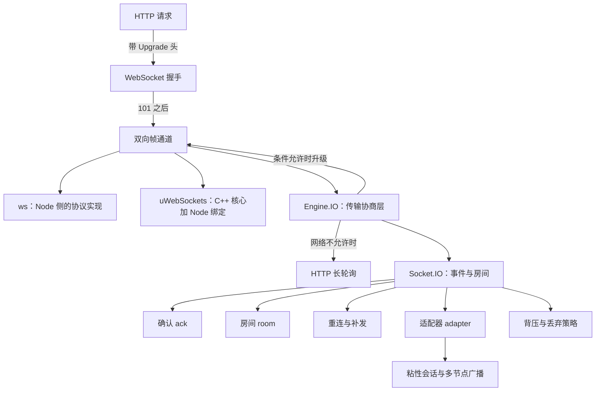
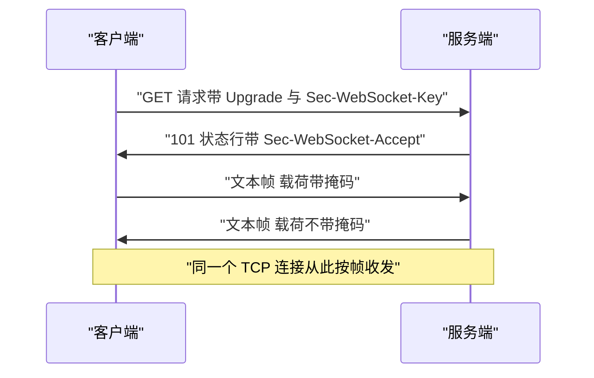
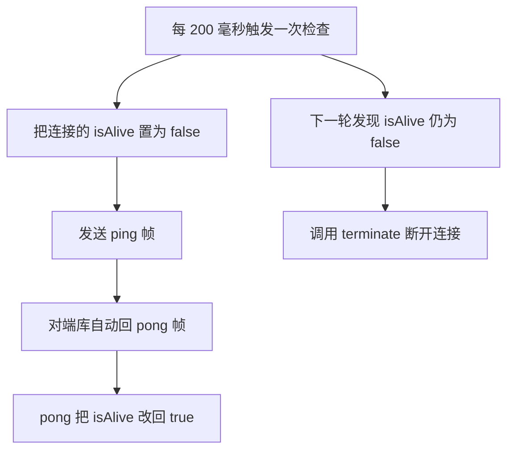
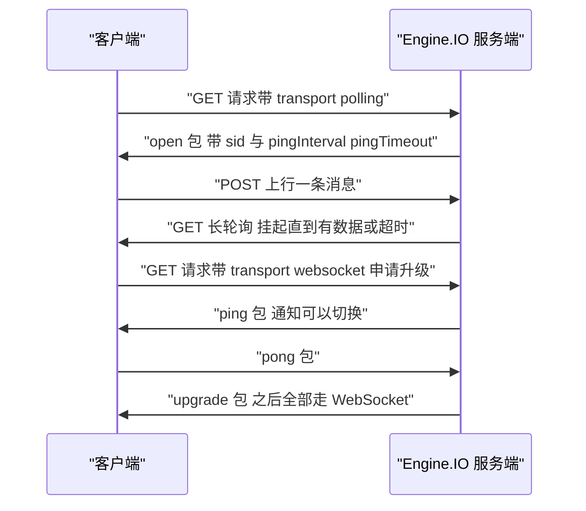
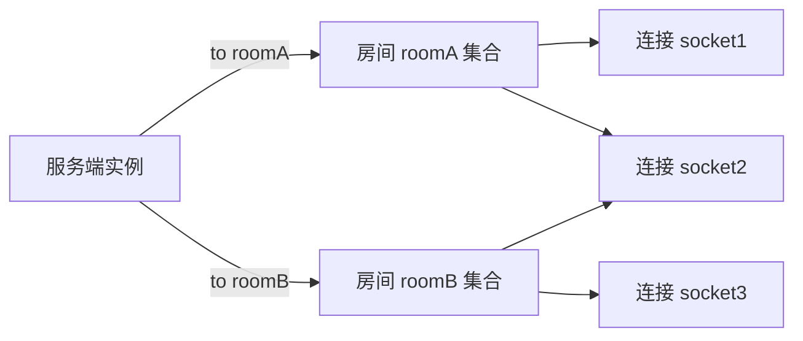
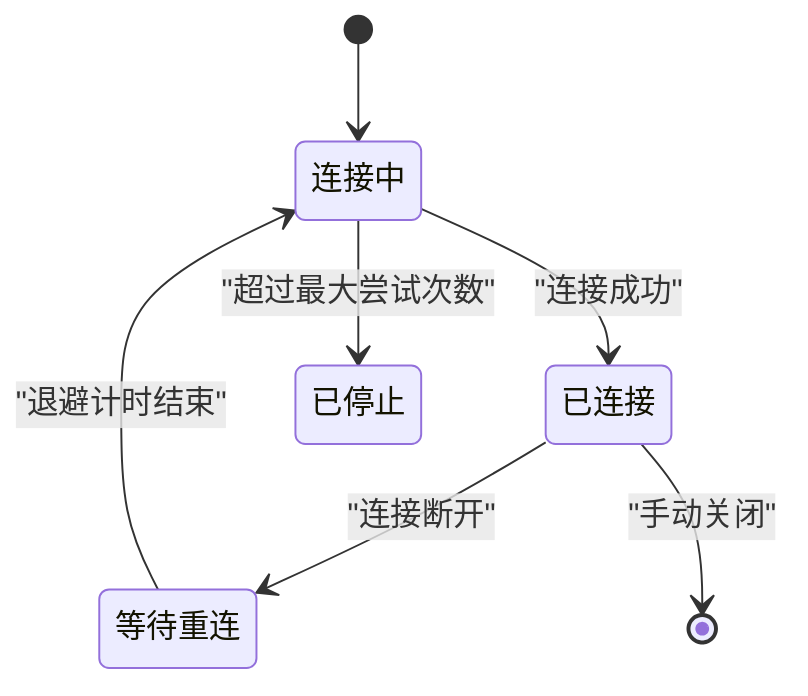
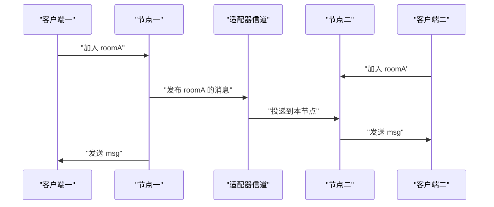
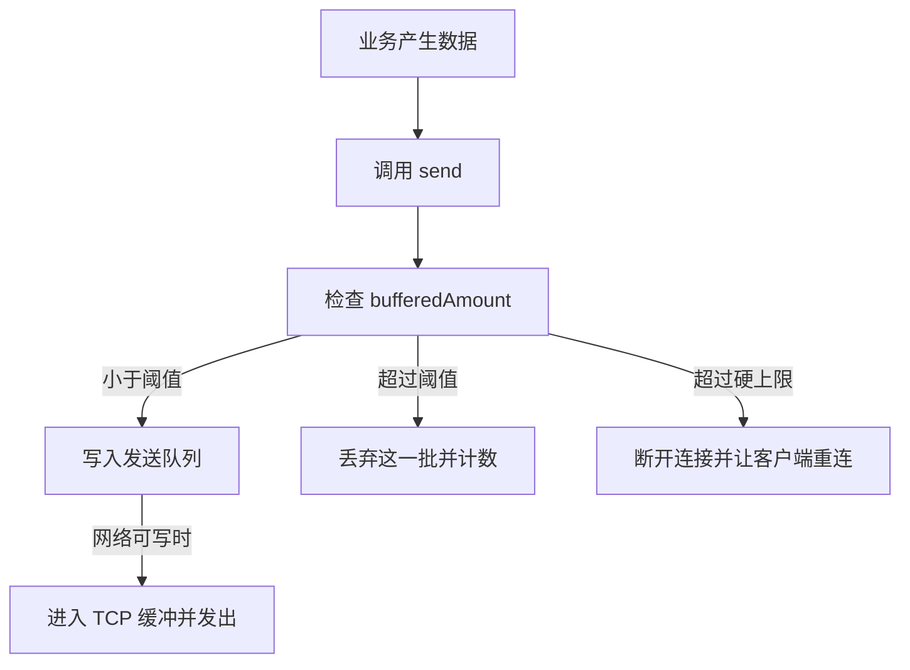
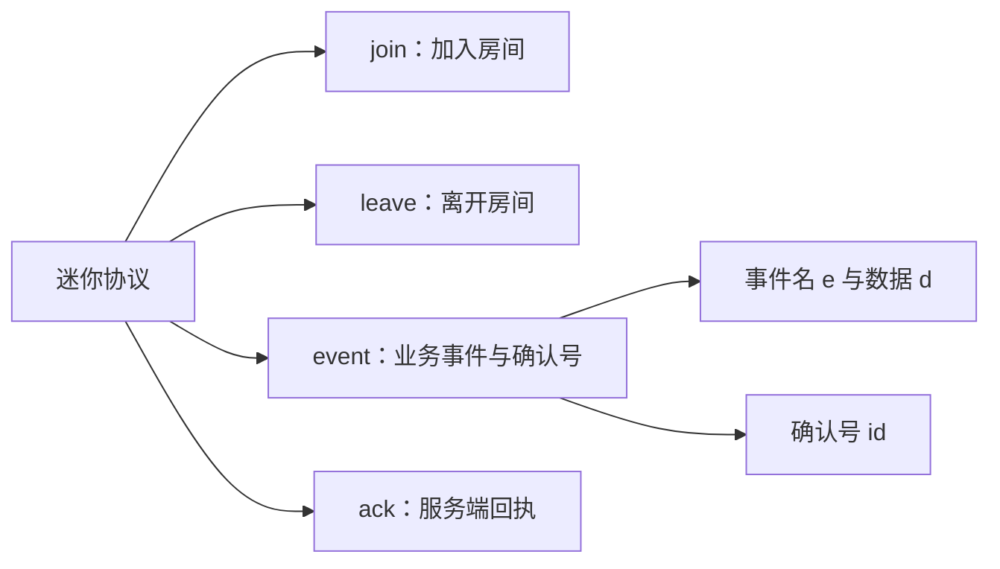

# 实时通信库：ws、Socket.IO、uWebSockets 与房间模型

!!! abstract "学完这一页你能"
    - 独立写出 WebSocket 握手检查脚本，断言 101 状态行与 Sec-WebSocket-Accept 的计算值一致
    - 用 ws 的 ping/pong 在若干轮心跳内断开半开连接，并说清 Engine.IO 的 pingInterval 与 pingTimeout 各管什么
    - 用 Socket.IO 的 join、to、ack 完成"只投递给房间成员并拿到确认"的调用
    - 写出一个 100 行以内的迷你实时库，包含事件分发、房间广播、断线重连与自动回到房间

## 0. 知识地图



建议按"通道 → 保活 → 协商 → 语义 → 恢复 → 扩展 → 过载 → 自造"的顺序读。
前两节解决"连接怎么建立、怎么知道它还活着"，中间四节解决"在连接上怎么说人话、断了怎么办、多节点怎么办、对方读不动怎么办"。
最后一节把前面所有零件装进一个迷你库，读完能对照真实库的源码找出对应位置。

!!! note "术语：WebSocket"
    WebSocket 是建立在一条 TCP 连接之上的双向消息协议，握手阶段借用了 HTTP 的 Upgrade 机制。
    例子：浏览器里执行 new WebSocket 后得到的对象，之后双方都能随时发消息。

!!! note "术语：uWebSockets.js"
    uWebSockets.js 把用 C++ 写的 uWebSockets 核心通过 Node 绑定暴露给 JavaScript，接口形式是 App 与 listen。
    需核对官方文档：uWebSockets.js 当前的维护状态、支持的 Node 版本矩阵，以及 ws 路由回调的参数签名。

## 1. 从 HTTP 升级到 WebSocket：握手与帧

**先想一个问题**

你写了一个聊天页，用 setInterval 每 1 秒发一次 HTTP 请求问"有新消息吗"。
1000 个在线用户时，服务器每秒处理 1000 次请求，其中 990 次回答"没有"。
为什么不能让服务器在有消息时主动说话？

**心智模型**

!!! tip "心智模型"
    一句话模型：WebSocket 用一次 HTTP 握手换一条常驻的双向管道。
    日常类比：先拨号接通，通话中双方都能随时开口。
    类比不成立的地方：电话断线你会听到忙音，WebSocket 连接可能在对方消失后仍显示为打开，要靠心跳才能发现。

握手为什么需要它：浏览器只提供 HTTP 作为发起通道，所以新协议必须先借用 HTTP 的请求头谈判。
帧为什么需要它：TCP 是字节流，没有消息边界，收方必须靠帧结构判断"这条消息到哪里结束"。

!!! note "术语：帧"
    帧是 WebSocket 的最小传输单位，头部用 2 到 14 个字节描述载荷长度、类型和掩码。
    例子：一句"你好"会被编码成 1 个文本帧，类型位记为 1。

!!! note "术语：掩码"
    掩码是客户端发送时必须对载荷做的一次异或运算，密钥是 4 个随机字节。
    例子：服务端收到客户端帧后，用头部的 4 字节密钥还原原始内容。

**图解**



1. 客户端发起一个普通 HTTP 请求，额外带上 Upgrade、Connection、Sec-WebSocket-Key 和 Sec-WebSocket-Version 四个头。
2. 服务端取出 Sec-WebSocket-Key，拼接固定常量后做一次 SHA-1，把结果转成 base64 写进 Sec-WebSocket-Accept。
3. 服务端返回 101 Switching Protocols，此后这条连接不再按 HTTP 报文解析。
4. 客户端发送的帧带掩码，服务端发送的帧不带掩码，收方按头部长度字段切出完整载荷。

**一步一步来**

第 1 步：算出 Accept 值。这一步要做什么：实现握手公式，并用 RFC 6455 文档里的示例输入验证结果。

```js
import { createHash } from 'node:crypto';

const GUID = '258EAFA5-E914-47DA-95CA-C5AB0DC85B11'; // RFC 6455 规定的固定常量

function acceptKey(clientKey) {
  // 客户端 key 字符串与固定常量直接拼接，中间不加分隔符
  return createHash('sha1').update(clientKey + GUID).digest('base64');
}

console.log(acceptKey('dGhlIHNhbXBsZSBub25jZQ==')); // RFC 6455 给出的示例 key
```

**这段代码在做什么**

- 引入 node:crypto 的 createHash，拿到 SHA-1 摘要工具。
- GUID 是协议规定的常量，任何实现都写死这一串。
- 拼接顺序是 key 在前、常量在后，颠倒会得到错误结果。
- update 接受字符串，默认按 utf8 编码，与协议要求一致。
- digest 输出 Buffer，转 base64 后就是响应头里的值。

运行结果：

```text
s3pPLMBiTxaQ9kYGzzhZRbK+xOo=
```

第 2 步：服务端监听 upgrade 事件并写回 101。这一步要做什么：在 Node 的 http 服务上挂一个 upgrade 监听器。

```js
import { createServer } from 'node:http';

const server = createServer(); // 普通 HTTP 请求不进这里

server.on('upgrade', (req, socket) => {
  const key = req.headers['sec-websocket-key'];       // 客户端提供的随机 key
  const accept = acceptKey(key);                      // 复用第 1 步的函数
  socket.write([
    'HTTP/1.1 101 Switching Protocols',
    'Upgrade: websocket',
    'Connection: Upgrade',
    `Sec-WebSocket-Accept: ${accept}`,
    '', ''
  ].join('\r\n'));                                    // 响应头之间用回车换行分隔
});

server.listen(0);
```

**这段代码在做什么**

- createServer 不传回调，说明普通请求不会被处理，只有 upgrade 事件被接管。
- upgrade 回调的第二个参数是原始 socket，不是 ServerResponse，不能调用 res.end。
- 响应必须以 101 开头，否则浏览器会按普通 HTTP 响应处理并报错。
- 头与头之间用 \r\n 分隔，最后一行为空行，所以 join 的数组尾部有两个空串。
- 写完之后 socket 就处于已升级状态，之后读写都是帧数据。

**动手验证**

```js
// handshake-check.mjs  Node 20+，零依赖
import { createServer } from 'node:http';
import { createHash } from 'node:crypto';
import { connect } from 'node:net';
import assert from 'node:assert';

const GUID = '258EAFA5-E914-47DA-95CA-C5AB0DC85B11'; // RFC 6455 固定常量
const acceptKey = (key) => createHash('sha1').update(key + GUID).digest('base64');

const server = createServer();
server.on('upgrade', (req, socket) => {
  const accept = acceptKey(req.headers['sec-websocket-key']); // 按协议算出应答值
  socket.write([
    'HTTP/1.1 101 Switching Protocols',
    'Upgrade: websocket',
    'Connection: Upgrade',
    `Sec-WebSocket-Accept: ${accept}`,
    '', ''
  ].join('\r\n'));
});

server.listen(0, () => {
  const port = server.address().port;
  const rawKey = '0123456789abcdef';                 // 16 字节，符合协议对 key 长度的要求
  const clientKey = Buffer.from(rawKey).toString('base64');
  const expected = acceptKey(clientKey);             // 独立再算一次，用作断言基准

  const socket = connect(port, '127.0.0.1', () => {
    socket.write([
      'GET /ws HTTP/1.1',
      `Host: 127.0.0.1:${port}`,
      'Upgrade: websocket',
      'Connection: Upgrade',
      `Sec-WebSocket-Key: ${clientKey}`,
      'Sec-WebSocket-Version: 13',
      '', ''
    ].join('\r\n'));
  });

  let buffer = '';
  socket.on('data', (chunk) => {
    buffer += chunk.toString('latin1');              // 按字节读，避免中文编码干扰
    if (!buffer.includes('\r\n\r\n')) return;        // 等响应头收全
    assert.match(buffer, /^HTTP\/1\.1 101/);         // 断言状态行是 101
    assert.ok(buffer.includes(expected), 'Accept 头应与计算值一致'); // 断言应答值正确
    console.log('101 Switching Protocols');
    console.log('Sec-WebSocket-Accept 校验通过');
    socket.destroy();
    server.close();
  });
});
```

预期输出：

```text
101 Switching Protocols
Sec-WebSocket-Accept 校验通过
```

依赖说明：无第三方依赖，直接 node handshake-check.mjs 即可。
脚本第 1 个断言失败说明服务端没有返回 101，第 2 个断言失败说明 Accept 的计算或取值出错。

**常见坑**

| 现象 | 原因 | 怎么修 |
| :-- | :-- | :-- |
| 浏览器报 400 并断开 | 请求缺少 Sec-WebSocket-Key 或 Version 不是 13 | 用标准客户端；检查反向代理是否删掉了这些头 |
| upgrade 回调里调 res.end 抛异常 | 回调参数是 socket，没有 res 对象 | 只操作回调里的 socket 参数 |
| 经过 Nginx 后握手超时 | 代理没有转发 Upgrade 与 Connection 头 | 在代理配置里显式转发这两个头，并把读超时调大 |
| 客户端控制台报 1006 | 没有收到关闭帧连接就断了 | 记录 close 事件的 code 与 reason，配合心跳定位 |
| 服务端发的消息客户端收不到 | 服务端帧被错误地加了掩码 | 掩码只用于客户端到服务端方向 |

**小结**

- 握手本质是一次带特殊头的 HTTP 请求，服务端返回 101 后连接角色改变。
- Accept 值只由客户端 key 和固定常量决定，可以离线算出并断言。
- 升级之后必须按帧解析，长度字段和掩码方向是解析的两个关键点。

## 2. 心跳与半开连接

**先想一个问题**

一处机房的交换机重启，客户端和服务器之间的 TCP 连接没有被任何一方关闭。
服务端内存里还留着这条连接的对象，广播时继续往它写数据，写进去的数据全部丢失。
你怎么在 10 秒内发现这条连接已经不可用？

**心智模型**

!!! tip "心智模型"
    一句话模型：心跳是每隔固定时间问一次"你在吗"，答不上来就判定连接死亡。
    日常类比：值班查岗电话，两次没人接就按脱岗处理。
    类比不成立的地方：协议层的 ping/pong 由库自动完成，页面主线程卡死时它不会回应，所以心跳也测不出"客户端卡死"。

心跳为什么需要它：TCP 不知道对端进程是否还活着，只有发生写入失败时才会报错，而只读广播的连接可能长时间没有失败信号。

!!! note "术语：半开连接"
    半开连接指一端已经消失、另一端仍认为连接可用的状态。
    例子：手机进入飞行模式，服务端的 socket 仍然处于打开状态且不报错。

**图解**



1. 定时器按固定间隔触发，遍历当前所有连接。
2. 先把标记置为 false，表示"这一轮我还没收到回应"。
3. 发送 ping 帧，帧类型放在头部第一个字节的高 4 位。
4. 对端协议栈收到 ping 后自动回 pong 帧，不需要业务代码参与。
5. pong 到达时把标记改回 true，说明连接仍然可用。
6. 下一轮检查时如果标记仍是 false，说明它整个间隔都没有回应，调用 terminate 释放。

**一步一步来**

第 1 步：给每条连接打存活标记。这一步要做什么：在连接建立时初始化标记，并在收到 pong 时刷新它。

```js
wss.on('connection', (socket) => {
  socket.isAlive = true;                      // 刚建立时按存活处理
  socket.on('pong', () => {                   // 协议层收到 pong 会触发这个事件
    socket.isAlive = true;
  });
});
```

**这段代码在做什么**

- isAlive 不是库提供的字段，是挂在连接对象上的自定义属性。
- 初始值设为 true，避免第一条连接在首次检查前就被断开。
- pong 事件由库在解析到 pong 帧时触发，业务代码只需要刷新标记。
- 这里不做任何业务判断，保持回调尽量短，避免阻塞事件循环。

第 2 步：定时扫描并决定 ping 还是 terminate。这一步要做什么：用一个定时器统一处理所有连接。

```js
const timer = setInterval(() => {
  for (const socket of wss.clients) {
    if (socket.isAlive === false) {          // 上一轮 ping 没有得到回应
      socket.terminate();                    // 直接断开，不再走关闭握手
      continue;
    }
    socket.isAlive = false;                  // 先假定它已经死亡
    socket.ping();                           // 发出探测帧
  }
}, 200);
```

**这段代码在做什么**

- wss.clients 是当前全部连接组成的集合，遍历顺序不保证。
- 判断放在置为 false 之前，否则每条连接都会立即被判死。
- terminate 立即销毁底层连接并触发 close 事件，适合处理已经失联的对端。
- ping 方法由 ws 提供，会写入一个内容为空的 ping 帧。
- 间隔 200 毫秒是本节实验用的值，生产环境要按业务容忍的发现时间调整。

**动手验证**

```js
// heartbeat.mjs  依赖：npm i ws
import { once } from 'node:events';
import { WebSocketServer, WebSocket } from 'ws';
import assert from 'node:assert';

const wss = new WebSocketServer({ port: 0 });
await once(wss, 'listening');                // 等端口真正开始监听
let pongs = 0;

wss.on('connection', (socket) => {
  socket.isAlive = true;                     // 连接建立时视为存活
  socket.on('pong', () => {
    socket.isAlive = true;                   // 收到回应就刷新
    pongs += 1;
  });
});

const timer = setInterval(() => {
  for (const socket of wss.clients) {
    if (socket.isAlive === false) {          // 上一轮没有回应
      socket.terminate();                    // 判定为半开连接并断开
      continue;
    }
    socket.isAlive = false;                  // 先假定已经死亡
    socket.ping();                           // 发探测帧
  }
}, 200);

const port = wss.address().port;
const client = new WebSocket(`ws://127.0.0.1:${port}`);
client.on('open', () => console.log('客户端已连接'));

await new Promise((resolve) => setTimeout(resolve, 700)); // 覆盖 3 轮心跳
assert.strictEqual(client.readyState, WebSocket.OPEN);    // 自动回 pong，所以不该被判死
assert.ok(pongs >= 2, `期望至少 2 次 pong，实际 ${pongs}`);
console.log('pong 次数 =', pongs);
console.log('客户端仍然打开，心跳判定正确');

client.close();
clearInterval(timer);
wss.close();
```

预期输出：

```text
客户端已连接
pong 次数 = 3
客户端仍然打开，心跳判定正确
```

依赖说明：仅 ws。
如果把客户端的自动 pong 关掉，700 毫秒后服务端会调用 terminate，此时断言 client.readyState 会失败，这正好证明扫描逻辑有效。

**常见坑**

| 现象 | 原因 | 怎么修 |
| :-- | :-- | :-- |
| 连接被无规律断开 | 检查间隔小于对端回应所需时间 | 让间隔明显大于一个网络往返时间，例如取 30 秒 |
| 内存里连接对象持续增长 | 只发 ping 从不判定死亡 | 必须保留判定分支并调用 terminate |
| 浏览器端收到 ping 报错 | 浏览器不暴露 ping/pong 给脚本 | 用 Socket.IO 这类库的应用层心跳，或在服务端只发 WebSocket 层的 ping |
| 心跳定时器持续占用 CPU | 每条连接各起一个定时器 | 用一个定时器遍历全部连接 |

**小结**

- 心跳解决的是"对端已经消失但本地不知情"的问题，缺了它广播会持续写进黑洞。
- 判定死亡需要两轮：一轮发探测，一轮检查标记。
- 探测间隔要大于一个网络往返时间，否则会把慢连接误判为死亡。

## 3. Engine.IO：Socket.IO 的协议层

**先想一个问题**

你把服务部署在某企业内网，出口代理只允许 HTTP 轮询，WebSocket 握手被直接拒绝。
用户打开页面后 Socket.IO 仍然连上了，界面上事件照常收发。
这中间是谁做了妥协？

**心智模型**

!!! tip "心智模型"
    一句话模型：Engine.IO 是"先谈传输方式，再谈业务消息"的协商层。
    日常类比：先坐摆渡车到对岸，再换乘高铁继续赶路。
    类比不成立的地方：换乘期间两套通道会短暂并存，服务端要同时接住轮询请求和 WebSocket 帧。

Engine.IO 为什么需要它：真实网络里 WebSocket 会被代理、防火墙、老客户端挡住，只提供一个通道会让可用性依赖运气。

!!! note "术语：长轮询"
    长轮询是客户端发一个 HTTP 请求，服务端挂住不回复，直到有数据或超时才响应。
    例子：没有消息的 25 秒内请求一直挂着，有消息时立刻返回并结束这次请求。

!!! note "术语：Engine.IO Packet"
    Packet 是 Engine.IO 层的消息单元，第一个字符是类型数字，后面跟载荷。
    例子：字符串 4hello 表示 message 类型、载荷为 hello。

**图解**



1. 客户端先用 polling 建连，拿到服务端分配的会话 id 与两个超时参数。
2. 上行消息走 POST，下行消息靠挂起的长轮询 GET 拿。
3. 客户端在轮询通道之外另开一条 WebSocket 试连。
4. 试连成功后服务端通过旧通道发 ping，要求双方同时准备切换。
5. 客户端回 pong，服务端发 upgrade 包，之后所有包都走 WebSocket。
6. 长轮询通道在确认切换后被关闭，会话 id 保持不变。

需核对官方文档：Engine.IO 第 4 版由服务端发 ping、客户端回 pong，与你可能读到的旧资料方向相反。

**一步一步来**

第 1 步：认识 Packet 类型前缀。这一步要做什么：写出解析与组装 Packet 的两个小函数。

```js
const OPEN = 0, CLOSE = 1, PING = 2, PONG = 3, MESSAGE = 4, UPGRADE = 5, NOOP = 6;

function encodePacket(type, payload) {
  return String(type) + (payload ?? '');   // 类型数字与载荷直接相连
}

function decodePacket(raw) {
  return { type: Number(raw[0]), payload: raw.slice(1) }; // 首字符是类型
}

console.log(decodePacket('4hello'));
```

**这段代码在做什么**

- 七个常量对应 Engine.IO 第 4 版的七种包类型。
- 编码只做字符串拼接，所以载荷里不能带协议保留的转义字符由上层负责。
- 解码取首字符转数字，其余部分原样作为载荷。
- 业务消息用 MESSAGE 类型，事件名与参数由 Socket.IO 层再包一层。

运行结果：

```text
{ type: 4, payload: 'hello' }
```

第 2 步：配置两个超时参数。这一步要做什么：在创建服务端时给出 pingInterval 与 pingTimeout。

```js
const srv = new Server(httpServer, {
  pingInterval: 5000,   // 服务端每 5 秒发一次 ping
  pingTimeout: 10000    // 10 秒内没收到 pong 就断开
});
```

**这段代码在做什么**

- pingInterval 决定探测频率，值越小越早发现断线，流量也越大。
- pingTimeout 是等待回应的上限，它要大于一个网络往返时间的上界。
- 两个参数在握手阶段的 open 包里下发给客户端，客户端据此排定计时器。
- 实际断开时间上界约为两者之和，取 5000 与 10000 时是 15 秒。

**动手验证**

```js
// engineio.mjs  依赖：npm i socket.io socket.io-client
import { createServer } from 'node:http';
import { Server } from 'socket.io';
import { io as ioc } from 'socket.io-client';
import assert from 'node:assert';

const PING_INTERVAL = 5000;
const PING_TIMEOUT = 10000;

const httpServer = createServer();
const srv = new Server(httpServer, {
  pingInterval: PING_INTERVAL,
  pingTimeout: PING_TIMEOUT
});
await new Promise((resolve) => httpServer.listen(0, resolve));
const port = httpServer.address().port;

const upgrades = [];
const client = ioc(`http://127.0.0.1:${port}`, { transports: ['polling', 'websocket'] });
client.io.engine.on('upgrade', (transport) => upgrades.push(transport.name)); // 记录升级结果
client.on('connect', () => {
  console.log('已连接，当前传输 =', client.io.engine.transport.name);
});

await new Promise((resolve) => setTimeout(resolve, 800));
assert.ok(client.connected, '连接应保持');
assert.deepStrictEqual(upgrades, ['websocket'], `期望升级到 websocket，实际 ${upgrades}`);
console.log('升级轨迹 =', upgrades);
console.log(`服务端配置 pingInterval=${PING_INTERVAL} pingTimeout=${PING_TIMEOUT}`);

client.close();
srv.close();
httpServer.close();
```

预期输出：

```text
已连接，当前传输 = polling
升级轨迹 = [ 'websocket' ]
服务端配置 pingInterval=5000 pingTimeout=10000
```

依赖说明：socket.io 与 socket.io-client。
如果代理屏蔽了 WebSocket，把 transports 改成 ['polling'] 后升级轨迹会为空数组，连接仍然可用。

**常见坑**

| 现象 | 原因 | 怎么修 |
| :-- | :-- | :-- |
| 客户端每秒断一次 | pingTimeout 小于一次网络往返时间 | 把 pingTimeout 调到往返时间的若干倍 |
| 升级一直不成功 | 反向代理没有转发 Upgrade 头 | 按第 1 节的代理配置补齐头字段 |
| 只跑 polling 时消息延迟高 | 下行靠长轮询，最大延迟等于一次请求周期 | 确认 WebSocket 可用，或把轮询请求的超时调小 |
| 自行实现客户端时 pong 方向写反 | 混淆了 Engine.IO 第 3 版与第 4 版 | 以当前版本文档为准，必要时在抓包里核对 |

**小结**

- Engine.IO 负责传输协商与保活，Socket.IO 只负责业务语义，两层职责分开。
- 降级与升级让同一个应用在受限网络里仍然可用。
- 两个超时参数决定断线发现速度，取值要与网络往返时间匹配。

## 4. 事件、确认与房间模型

**先想一个问题**

大厅里有 5000 个在线用户，你只想把一条通知推给"订单组"房间里的 12 个人。
同时产品经理要求：必须知道这 12 个人里到底有几个人真的收到了。

**心智模型**

!!! tip "心智模型"
    一句话模型：房间是贴在连接上的标签集合，广播就是按标签挑出连接。
    日常类比：把每个人拉进对应的微信群，通知只发到群里。
    类比不成立的地方：群成员由平台维护并持久化，Socket.IO 的房间在内存里是 Map 与 Set，进程重启后标签全部消失。

房间为什么需要它：没有标签时，定向推送只能靠业务代码维护连接表并手写循环，容易漏人和重复发送。

!!! note "术语：确认 ack"
    确认是发送方在事件里附带一个回调，接收方处理完调用它，发送方因此拿到结果。
    例子：emit 的最后一个参数是函数时，它会被当作 ack 回调。

**图解**



1. 服务端的适配器里有一个房间表，键是房间名，值是连接 id 的集合。
2. 连接调用 join 后，它的 id 被加进对应集合。
3. 调用 to 指定房间后，emit 只遍历该集合里的连接。
4. 同一条连接可以出现在两个集合里，所以 socket2 同时收到 roomA 和 roomB 的消息。
5. 调用 leave 或连接断开时，适配器把这个 id 从所有集合中移除。

**一步一步来**

第 1 步：成员加入与退出房间。这一步要做什么：把 join 与 leave 暴露成业务事件，并在 ack 里返回当前人数。

```js
srv.on('connection', (socket) => {
  socket.on('enter', (room, cb) => {
    socket.join(room);                                  // 给这条连接贴上标签
    const size = srv.sockets.adapter.rooms.get(room)?.size ?? 0;
    cb({ ok: true, room, size });                       // 通过 ack 回报结果
  });
  socket.on('leave-room', (room) => socket.leave(room));
});
```

**这段代码在做什么**

- join 可以传数组一次加入多个房间，这里只传一个字符串。
- adapter.rooms 是 Map，get 到的是 Set，size 是当前成员数。
- 用可选链加空值合并，避免房间刚建就被清空时得到 undefined。
- cb 是客户端 emit 时传入的最后一个函数参数，由库负责把返回值传回。

第 2 步：定向广播并回执投递人数。这一步要做什么：用 to 指定房间，并在所有接收方处理完后回调。

```js
socket.on('say', ({ room, text }, cb) => {
  srv.to(room).emit('msg', text);                       // 只发给房间成员
  const size = srv.sockets.adapter.rooms.get(room)?.size ?? 0;
  cb(`已投递给 ${size} 个连接`);
});
```

**这段代码在做什么**

- to 返回一个广播操作对象，随后调用 emit 才真正发送。
- 发送方自己也在房间里时同样会收到，要排除自己需要额外调用 except。
- 这里的 cb 在发送动作完成后立即调用，它确认的是"服务端已发出"，不是"对端已处理"。
- 想确认对端处理结果，要把 ack 往下传一层，由对端在业务逻辑结束后调用。

**动手验证**

```js
// rooms.mjs  依赖：npm i socket.io socket.io-client
import { createServer } from 'node:http';
import { Server } from 'socket.io';
import { io as ioc } from 'socket.io-client';
import assert from 'node:assert';

const waitFor = (emitter, event) => new Promise((resolve) => emitter.once(event, resolve));
const sleep = (ms) => new Promise((resolve) => setTimeout(resolve, ms));

const httpServer = createServer();
const srv = new Server(httpServer);

srv.on('connection', (socket) => {
  socket.on('enter', (room, cb) => {
    socket.join(room);                                   // 加入房间
    const size = srv.sockets.adapter.rooms.get(room)?.size ?? 0;
    cb({ room, size });
  });
  socket.on('say', ({ room, text }, cb) => {
    srv.to(room).emit('msg', text);                      // 房间广播
    const size = srv.sockets.adapter.rooms.get(room)?.size ?? 0;
    cb(`已投递给 ${size} 个连接`);
  });
});

await new Promise((resolve) => httpServer.listen(0, resolve));
const url = `http://127.0.0.1:${httpServer.address().port}`;

const a = ioc(url);
const b = ioc(url);
await Promise.all([waitFor(a, 'connect'), waitFor(b, 'connect')]);

const infoA = await new Promise((resolve) => a.emit('enter', 'roomA', resolve));
const infoB = await new Promise((resolve) => b.emit('enter', 'roomB', resolve));
assert.strictEqual(infoA.size, 1);                       // roomA 里只有 a
assert.strictEqual(infoB.size, 1);                       // roomB 里只有 b

let aGot = 0;
let bGot = 0;
a.on('msg', () => { aGot += 1; });
b.on('msg', () => { bGot += 1; });

const report = await new Promise((resolve) => a.emit('say', { room: 'roomA', text: 'hi' }, resolve));
await sleep(100);                                        // 给广播留出传输时间
assert.strictEqual(aGot, 1);                             // 房间成员收到
assert.strictEqual(bGot, 0);                             // 非成员没收到
assert.strictEqual(report, '已投递给 1 个连接');
console.log('roomA 收到条数 =', aGot, 'roomB 收到条数 =', bGot);
console.log('ack 返回 =', report);

a.close();
b.close();
srv.close();
httpServer.close();
```

预期输出：

```text
roomA 收到条数 = 1 roomB 收到条数 = 0
ack 返回 = 已投递给 1 个连接
```

依赖说明：socket.io 与 socket.io-client。
把 a.emit 的 roomA 改成 roomB，断言会立刻失败，说明定向确实生效。

**常见坑**

| 现象 | 原因 | 怎么修 |
| :-- | :-- | :-- |
| 广播后自己收到两次 | 发送方也在房间内，且代码重复调用 | 用 except 排除自身，或先检查发送逻辑只执行一次 |
| 重启后房间成员丢失 | 房间表只在内存里 | 进程启动后由客户端重新 join，或把成员关系落到外部存储 |
| ack 永远不回调 | 对端抛异常或回调参数位置写错 | 在服务端把处理逻辑包在 try 里，失败时也调用回调并返回错误标记 |
| 人数统计偏大 | 每条连接 id 也是一个房间名 | 统计时跳过与连接 id 同名的房间 |

**小结**

- 房间是适配器维护的连接集合，join、leave、to 三个操作覆盖主要用法。
- ack 确认的是回调是否被执行，想确认对端处理结果必须由对端显式调用。
- 房间标签不持久化，进程重启后的成员关系需要重建。

## 5. 重连与消息补发

**先想一个问题**

用户坐地铁，客户端断网 20 秒后恢复。
在这 20 秒里，他所在的房间收到了 3 条通知，服务端只把消息发给了当时在线的连接。
用户回到页面后，这 3 条消息去哪了？

**心智模型**

!!! tip "心智模型"
    一句话模型：重连是重新拨号，补发是报上"我上次读到第几条"。
    日常类比：看直播断线后回来，播放器问从第几分钟续播。
    类比不成立的地方：直播服务器不一定保存历史，续播能力要靠发送方自己维护补发队列。

重连为什么需要它：网络切换、服务端发布、移动端切后台都会断链，没有自动重连就要用户手动刷新页面。
补发为什么需要它：连接恢复不等于数据恢复，断线窗口内的消息默认已经丢失。

!!! note "术语：指数退避"
    指数退避是重试间隔按倍数增长并在上限处封顶的策略。
    例子：0.5 秒、1 秒、2 秒、4 秒，到达上限 5 秒后每次都用 5 秒。

!!! note "术语：幂等"
    幂等指同一操作执行多次与执行一次的结果相同。
    例子：带着唯一消息 id 补发，客户端按 id 去重后重复收到也只显示一条。

**图解**



1. 客户端从连接中状态开始，尝试建立传输通道。
2. 握手成功后进入已连接状态，此时开始收发业务事件。
3. 检测到断开后进入等待重连状态，按退避策略安排下一次尝试。
4. 退避计时结束后回到连接中状态，重新握手。
5. 尝试次数超过上限时进入已停止状态，需要业务代码提示用户手动重试。
6. 业务主动调用 close 时不再重连，直接结束状态机。

**一步一步来**

第 1 步：配置客户端的重连参数。这一步要做什么：把退避周期、上限与随机抖动写进初始化选项。

```js
const client = ioc(url, {
  reconnection: true,          // 打开自动重连
  reconnectionDelay: 100,      // 首次等待 100 毫秒
  reconnectionDelayMax: 1000,  // 间隔上限 1000 毫秒
  randomizationFactor: 0       // 实验用，去掉随机抖动
});
```

**这段代码在做什么**

- reconnection 为 false 时断开后不会重试，需要业务自己安排。
- reconnectionDelay 是第一次尝试前的等待时间。
- reconnectionDelayMax 是间隔增长的上限，达到后不再增大。
- randomizationFactor 会给间隔加随机扰动，避免大量客户端同时重连，实验里设为 0 让时序可预测。

第 2 步：服务端按序列号补发。这一步要做什么：服务端为每条消息编号并保存历史，重连后按客户端上报的序号补发。

```js
const history = [];
let seq = 0;
const broadcast = (text) => {
  seq += 1;                                       // 序号单调递增
  const msg = { seq, text };
  history.push(msg);                              // 保留历史用于补发
  srv.emit('msg', msg);
  return msg;
};

srv.on('connection', (socket) => {
  socket.on('resume', (lastSeq, cb) => {
    const missed = history.filter((m) => m.seq > lastSeq); // 只挑漏掉的
    missed.forEach((m) => socket.emit('msg', m));
    cb(missed.length);
  });
});
```

**这段代码在做什么**

- seq 是服务端全局计数器，客户端用收到的最大序号作为自己的进度。
- history 需要设上限，生产环境要按时间或条数裁剪，否则内存持续增长。
- resume 由客户端在重连成功后主动调用，参数是它已知的最大序号。
- 过滤条件是大于 lastSeq，等于时说明已经收到，避免重复补发。
- cb 返回补发条数，客户端可以在界面上提示"已同步 2 条"。

**动手验证**

```js
// reconnect.mjs  依赖：npm i socket.io socket.io-client
import { createServer } from 'node:http';
import { Server } from 'socket.io';
import { io as ioc } from 'socket.io-client';
import assert from 'node:assert';

const waitFor = (emitter, event) => new Promise((resolve) => emitter.once(event, resolve));
const sleep = (ms) => new Promise((resolve) => setTimeout(resolve, ms));

const history = [];
let seq = 0;

const httpServer = createServer();
const srv = new Server(httpServer);

const broadcast = (text) => {
  seq += 1;
  const msg = { seq, text };
  history.push(msg);                             // 记录历史
  srv.emit('msg', msg);                          // 在线连接直接收到
  return msg;
};

srv.on('connection', (socket) => {
  socket.on('resume', (lastSeq, cb) => {
    const missed = history.filter((m) => m.seq > lastSeq); // 挑出漏掉的
    missed.forEach((m) => socket.emit('msg', m));
    cb(missed.length);
  });
});

await new Promise((resolve) => httpServer.listen(0, resolve));
const url = `http://127.0.0.1:${httpServer.address().port}`;

const client = ioc(url, {
  reconnectionDelay: 50,
  reconnectionDelayMax: 200,
  randomizationFactor: 0
});
const received = [];
client.on('msg', (m) => received.push(m));

await waitFor(client, 'connect');
broadcast('m1');                                  // 在线时收到
await waitFor(client, 'msg');
assert.deepStrictEqual(received.map((m) => m.seq), [1]);

srv.disconnectSockets(true);                      // 服务端强制断开，触发客户端重连
await waitFor(client, 'disconnect');
broadcast('m2');                                  // 离线窗口内的消息
broadcast('m3');

await waitFor(client, 'connect');                 // 自动重连成功
const missed = await new Promise((resolve) => client.emit('resume', received.at(-1).seq, resolve));
assert.strictEqual(missed, 2);                    // 补发两条

broadcast('m4');
await sleep(150);
assert.deepStrictEqual(received.map((m) => m.seq), [1, 2, 3, 4]); // 顺序完整无重复
console.log('补发条数 =', missed);
console.log('收到的序号 =', received.map((m) => m.seq).join(','));

client.close();
srv.close();
httpServer.close();
```

预期输出：

```text
补发条数 = 2
收到的序号 = 1,2,3,4
```

依赖说明：socket.io 与 socket.io-client。
需核对官方文档：socket.io-client 的重连事件名称与断开原因字符串，不同大版本之间有过调整。

**常见坑**

| 现象 | 原因 | 怎么修 |
| :-- | :-- | :-- |
| 重连后房间成员关系丢失 | 房间表没有随连接重建 | 客户端在 connect 事件里重新发送 join |
| 同一条消息显示两次 | 补发与实时推送重叠 | 给消息加唯一序号或 id，客户端按 id 去重 |
| 大量客户端同时重连压垮服务 | 退避没有随机抖动 | 保留大于 0 的 randomizationFactor |
| 内存随运行时间上涨 | 历史数组只增不减 | 按条数或时间裁剪，并记录裁剪水位 |

**小结**

- 自动重连解决连接恢复，消息补发解决数据恢复，两者必须分开设计。
- 序号是补发的基准，去重逻辑要放在客户端。
- 历史缓冲区必须有上限，否则补发能力会变成内存问题。

## 6. 横向扩展：适配器与粘性会话

**先想一个问题**

你把服务部署到两台机器，前面放了一个不记录会话的负载均衡。
用户甲的连接落在节点一，用户乙落在节点二，两人都在同一个房间。
节点一发出的房间消息，怎么到用户乙手里？

**心智模型**

!!! tip "心智模型"
    一句话模型：适配器是节点之间的喇叭，粘性会话保证同一个会话总回到同一台机器。
    日常类比：两个教室同时上课，助教之间用对讲机同步点名，学生每次都进同一间教室。
    类比不成立的地方：学生可以自由换教室，而轮询请求必须由负载均衡按会话固定路由，否则服务端找不到这个会话。

适配器为什么需要它：单机广播只能覆盖本节点的连接集合，跨节点投递必须有共享信道。

!!! note "术语：适配器"
    适配器是 Socket.IO 里负责存储连接与房间、并把广播扩散到其他节点的组件。
    例子：官方提供的 Redis 适配器把广播发布到 Redis 频道，其他节点订阅后在自己的连接上投递。

!!! note "术语：粘性会话"
    粘性会话指负载均衡把同一个客户端的所有请求都转发到同一台后端机器。
    例子：按握手时下发的会话 cookie 做哈希，同一 cookie 始终落到同一节点。

**图解**



1. 两个客户端分别连到不同节点，各自在本地房间表里登记。
2. 节点一收到要发给 roomA 的消息，先在本地集合投递。
3. 同时把这则消息发布到共享信道，信道的实现可以是 Redis 或其他消息系统。
4. 节点二订阅信道，收到消息后在本地 roomA 集合上投递。
5. 两个客户端都收到消息，节点之间不需要直接建立连接。
6. 轮询请求如果在两节点之间来回跳，服务端会因为找不到会话而拒绝，所以还需要粘性会话。

**一步一步来**

第 1 步：只做本地广播。这一步要做什么：先在单节点上把房间与投递写出来，确认它本身工作正常。

```js
const rooms = new Map();                                 // room -> Set of socket

function join(socket, room) {
  if (!rooms.has(room)) rooms.set(room, new Set());
  rooms.get(room).add(socket);                           // 登记到本地房间表
}

function deliver(room, text) {
  for (const socket of rooms.get(room) ?? []) {
    if (socket.readyState === 1) socket.send(text);      // 1 表示连接处于打开状态
  }
}
```

**这段代码在做什么**

- rooms 是节点私有的数据结构，其他节点看不到。
- Set 天然去重，同一条连接重复 join 不会产生重复投递。
- readyState 为 1 时连接可写，为 2 或 3 时跳过避免抛错。
- deliver 只能触达本节点的连接，这正是第 2 步要解决的问题。

第 2 步：接入共享信道。这一步要做什么：把广播改成"先发布到信道，再由各节点本地投递"。

```js
import { EventEmitter } from 'node:events';
const bus = new EventEmitter();                          // 充当跨节点信道

function publish(nodeName, room, text) {
  bus.emit('pub', { room, text, from: nodeName });       // 发布给所有订阅者
  deliver(room, text);                                   // 发布节点自己也要投递
}

bus.on('pub', ({ room, text, from }) => {
  if (from === myName) return;                           // 跳过自己发的那条
  deliver(room, text);                                   // 其他节点本地投递
});
```

**这段代码在做什么**

- 真实部署里 bus 由 Redis 之类的组件担任，本地实验用一个 EventEmitter 代替。
- from 字段用于识别发布者，避免同一条消息被投递两次。
- 发布与本地投递的顺序不影响结果，两个动作都必须在同一个函数里完成。
- 需核对官方文档：@socket.io/redis-adapter 的 createAdapter 签名与连接复用要求，版本升级时接口有过变化。

**动手验证**

```js
// adapter.mjs  依赖：npm i ws
import { once } from 'node:events';
import { EventEmitter } from 'node:events';
import { WebSocketServer, WebSocket } from 'ws';
import assert from 'node:assert';

const sleep = (ms) => new Promise((resolve) => setTimeout(resolve, ms));
const bus = new EventEmitter();                          // 跨节点信道
const nodes = new Map();                                 // 节点名 -> 房间表

function deliver(name, room, text) {
  for (const socket of nodes.get(name)?.get(room) ?? []) {
    if (socket.readyState === WebSocket.OPEN) socket.send(text); // 只发给打开的连接
  }
}

function createNode(name) {
  const rooms = new Map();
  nodes.set(name, rooms);
  const wss = new WebSocketServer({ port: 0 });          // 每个节点独立端口
  wss.on('connection', (socket) => {
    socket.on('message', (raw) => {
      const msg = JSON.parse(raw.toString());
      if (msg.type === 'join') {                         // 加入本地房间表
        if (!rooms.has(msg.room)) rooms.set(msg.room, new Set());
        rooms.get(msg.room).add(socket);
      }
      if (msg.type === 'publish') {                      // 发布到信道并本地投递
        bus.emit('pub', { room: msg.room, text: msg.text, from: name });
        deliver(name, msg.room, msg.text);
      }
    });
  });
  return { name, wss };
}

bus.on('pub', ({ room, text, from }) => {                // 其他节点收到广播
  for (const name of nodes.keys()) {
    if (name !== from) deliver(name, room, text);
  }
});

const n1 = createNode('n1');
const n2 = createNode('n2');
await Promise.all([once(n1.wss, 'listening'), once(n2.wss, 'listening')]);

const c1 = new WebSocket(`ws://127.0.0.1:${n1.wss.address().port}`);
const c2 = new WebSocket(`ws://127.0.0.1:${n2.wss.address().port}`);
await Promise.all([once(c1, 'open'), once(c2, 'open')]);

const got1 = [];
const got2 = [];
c1.on('message', (raw) => got1.push(raw.toString()));
c2.on('message', (raw) => got2.push(raw.toString()));

c1.send(JSON.stringify({ type: 'join', room: 'roomA' })); // 客户端一在节点一加入房间
c2.send(JSON.stringify({ type: 'join', room: 'roomA' })); // 客户端二在节点二加入同一房间
await sleep(80);

c1.send(JSON.stringify({ type: 'publish', room: 'roomA', text: 'hi' }));
await sleep(120);
assert.deepStrictEqual(got1, ['hi']);                     // 本地节点收到
assert.deepStrictEqual(got2, ['hi']);                     // 另一个节点也收到
console.log('节点一客户端收到 =', got1);
console.log('节点二客户端收到 =', got2);

c1.close();
c2.close();
n1.wss.close();
n2.wss.close();
```

预期输出：

```text
节点一客户端收到 = [ 'hi' ]
节点二客户端收到 = [ 'hi' ]
```

依赖说明：仅 ws。
把 bus.on 之后那段投递代码删掉，第二个断言会失败，说明跨节点投递确实依赖共享信道。

**常见坑**

| 现象 | 原因 | 怎么修 |
| :-- | :-- | :-- |
| 轮询模式下频繁报会话未知 | 请求被负载均衡分到了另一台机器 | 按握手 cookie 或源地址开启粘性会话 |
| 升级到 WebSocket 后连接被踢 | 升级请求与轮询请求落到不同节点 | 让粘性策略覆盖同一会话的全部连接 |
| 消息重复投递 | 发布者没有过滤自己发出的广播 | 在广播负载里带上节点标识并在订阅端跳过 |
| 节点扩容后旧节点收不到消息 | 新节点未订阅同一个频道 | 启动时统一订阅，并把订阅失败当作启动失败处理 |

**小结**

- 单机广播只需要本地房间表，跨节点广播必须再加共享信道。
- 轮询模式下必须保证同一会话落到同一节点，这就是粘性会话的作用。
- 适配器与粘性会话是两件事，前者管广播，后者管路由。

## 7. 背压：写不进去的时候怎么办

**先想一个问题**

一个客户端在 4G 网络下下载速度约 200 KB/s，服务端每秒产生 2 MB 的行情数据。
服务端调用 send 从来不报错，进程的内存占用却持续上涨，几分钟后被系统杀掉。
这些数据写到哪里去了？

**心智模型**

!!! tip "心智模型"
    一句话模型：写不进网络的数据会堆在进程内存里，堆积量就是 bufferedAmount。
    日常类比：往漏斗倒水，倒得比漏得快，水就漫出来。
    类比不成立的地方：漏斗漫出你能看见，缓冲区增长只体现在一个数字上，不看它就发现不了。

背压为什么需要它：发送接口几乎不报错，丢数据的信号被隐藏在内存增长里，等到进程被杀时已经来不及处理。

!!! note "术语：bufferedAmount"
    bufferedAmount 是当前已经交给库、但还没有写进操作系统的字节数。
    例子：客户端停止读取时，这个数字会持续增长到几百 KB 甚至几 MB。

**图解**



1. 业务逻辑产生数据后调用 send，数据先进入库的发送队列。
2. 在 send 之前读取 bufferedAmount，它反映队列里还没有写出去的字节数。
3. 小于阈值时正常写入，网络可写时数据被推入操作系统缓冲区。
4. 超过软阈值时丢弃这一批并累加计数，宁可丢行情也不要拖垮进程。
5. 超过硬上限时断开连接，让客户端重连后重新订阅最新状态。
6. 两种策略都需要监控指标，否则丢弃会变成无声的数据缺失。

**一步一步来**

第 1 步：观察堆积。这一步要做什么：写一个客户端停止读取的实验，看 bufferedAmount 如何变化。

```js
wss.on('connection', (socket) => {
  const timer = setInterval(() => {
    socket.send(Buffer.alloc(64 * 1024));    // 每批 64 KB
    console.log('已排队字节 =', socket.bufferedAmount);
  }, 2);
  socket.on('close', () => clearInterval(timer)); // 连接结束就停掉定时器
});
```

**这段代码在做什么**

- Buffer.alloc 申请 64 KB 的零填充缓冲区，内容不重要，只看体积。
- 每 2 毫秒发送一批，约等于每秒 32 MB 的产生速度。
- bufferedAmount 在 send 之后立刻可读，它包含刚排队的这部分。
- close 事件里清理定时器，避免连接结束后继续产生无用数据。

第 2 步：加入阈值策略。这一步要做什么：发送前检查堆积量，超过软阈值丢弃，超过硬上限断开。

```js
const SOFT = 256 * 1024;                     // 256 KB 软阈值
const HARD = 1024 * 1024;                    // 1 MB 硬上限

function safeSend(socket, payload) {
  if (socket.bufferedAmount > HARD) {        // 堆积过多，断开让它重连
    socket.close(1013, 'slow consumer');     // 1013 表示稍后重试
    return 'closed';
  }
  if (socket.bufferedAmount > SOFT) {        // 超过软阈值，丢弃这一批
    return 'dropped';
  }
  socket.send(payload);                      // 正常发送
  return 'sent';
}
```

**这段代码在做什么**

- 先判断硬上限，再判断软阈值，顺序决定极端情况下的行为。
- close 的第一个参数是状态码，1013 在 WebSocket 标准里表示稍后重试。
- 返回字符串让调用方能统计三种结果的次数，用于监控。
- 阈值取值要参考单条消息体积与客户端正常下载速度，本节的数字是实验值。

**动手验证**

```js
// backpressure.mjs  依赖：npm i ws
import { once } from 'node:events';
import { WebSocketServer, WebSocket } from 'ws';
import assert from 'node:assert';

const SOFT = 256 * 1024;                     // 软阈值
const HARD = 1024 * 1024;                    // 硬上限
const wss = new WebSocketServer({ port: 0 });
await once(wss, 'listening');

let serverSocket = null;
let sent = 0;
let dropped = 0;

wss.on('connection', (socket) => {
  serverSocket = socket;
  const timer = setInterval(() => {
    if (socket.bufferedAmount > HARD) {      // 堆积过多直接断开
      socket.close(1013, 'slow consumer');
      return;
    }
    if (socket.bufferedAmount > SOFT) {      // 超过软阈值丢弃这一批
      dropped += 1;
      return;
    }
    socket.send(Buffer.alloc(64 * 1024));    // 每批 64 KB
    sent += 1;
  }, 2);
  socket.on('close', () => clearInterval(timer));
});

const port = wss.address().port;
const client = new WebSocket(`ws://127.0.0.1:${port}`);
await once(client, 'open');
client.pause();                              // 停止读取，模拟慢客户端

await new Promise((resolve) => setTimeout(resolve, 400));
const buffered = serverSocket.bufferedAmount;
assert.ok(buffered > 0, `期望有堆积，实际 ${buffered}`);   // 堆积确实发生
assert.ok(dropped > 0, `期望触发丢弃，实际 ${dropped}`);   // 软阈值确实生效
console.log('已发送批次数 =', sent);
console.log('丢弃批次数 =', dropped);
console.log('服务端缓冲字节 =', buffered);

client.resume();
client.close();
wss.close();
```

预期输出（数字随机器波动）：

```text
已发送批次数 = 5
丢弃批次数 = 47
服务端缓冲字节 = 327680
```

依赖说明：仅 ws。
把 SOFT 与 HARD 调到极大，丢弃计数会变成 0，缓冲字节会一直涨到实验结束，说明阈值是唯一刹车。

**常见坑**

| 现象 | 原因 | 怎么修 |
| :-- | :-- | :-- |
| 进程内存线性上涨直到被杀 | 只发送不检查 bufferedAmount | 发送前读这个值并设置软硬阈值 |
| 丢弃后客户端状态错乱 | 丢的是增量更新，客户端缺少中间态 | 丢弃后让客户端重新拉一次全量快照 |
| 广播风暴时所有连接一起堆积 | 每条连接的发送循环共用同一份数据 | 先序列化一次，再循环发送同一个字符串 |
| 慢客户端把快客户端拖慢 | 单线程事件循环被大量 send 占满 | 限制单轮发送条数，或把慢连接断开 |

**小结**

- 背压问题的表现是内存增长，而不是发送报错，所以必须主动观测 bufferedAmount。
- 软阈值丢弃、硬上限断开，是两种成本不同的策略，通常组合使用。
- 丢弃增量数据后要安排一次全量同步，否则客户端状态会长期错误。

## 8. 手写迷你 Socket.IO：事件、房间、重连

**先想一个问题**

如果项目里只允许引入 ws，你还能不能做出"事件、房间、断线重连"这三件事？
需要多少行代码？

**心智模型**

!!! tip "心智模型"
    一句话模型：迷你库等于一封写清事件名的信封，加一本房间名册，加一个重连闹钟。
    日常类比：寄信时信封上写明"给谁、什么事"，收发双方按同一套约定拆信。
    类比不成立的地方：信封格式由你自己定，双方必须同时升级代码，真实协议要处理版本协商与兼容。

自造协议为什么需要它：把事件名、房间、序号写进同一条连接，才能在一次网络往返里完成"投递并确认"。

!!! note "术语：信封格式"
    信封格式指双方约定的消息结构，这里用 JSON 对象的 t 字段区分类型。
    例子：t 为 join 表示加入房间，t 为 event 表示业务事件。

**图解**



1. 协议只有四种消息类型，t 字段用于区分。
2. join 与 leave 只带房间名，服务端据此维护房间表。
3. event 带事件名、数据、目标房间与确认号。
4. 服务端处理完 event 后回一条 ack，带上同一个确认号。
5. 客户端在重连成功后把已经加入过的房间重新 join 一遍。
6. 事件名与数据是业务层唯一看到的两个概念。

**一步一步来**

第 1 步：服务端的房间表与 join。这一步要做什么：维护房间到连接的映射。

```js
const rooms = new Map();                     // 房间名 -> Set of socket

function join(socket, room) {
  if (!rooms.has(room)) rooms.set(room, new Set());
  rooms.get(room).add(socket);               // 登记
}

function leave(socket, room) {
  rooms.get(room)?.delete(socket);           // 退出，房间空置时保留结构
}
```

**这段代码在做什么**

- 房间表放在模块作用域，同一个进程内的所有连接共用。
- Set 保证同一条连接重复 join 只登记一次。
- leave 用可选链避免房间不存在时抛错。
- 连接断开时需要遍历房间表把这条连接删干净，这一步在下面补上。

第 2 步：事件分发与确认回执。这一步要做什么：解析 event 消息，向房间广播，并回一条 ack。

```js
function handle(socket, raw) {
  const msg = JSON.parse(raw.toString());
  if (msg.t === 'join') return join(socket, msg.room);
  if (msg.t === 'leave') return leave(socket, msg.room);
  if (msg.t === 'event') {
    for (const peer of rooms.get(msg.room) ?? []) {
      if (peer.readyState === WebSocket.OPEN) {
        peer.send(JSON.stringify({ t: 'event', e: msg.e, d: msg.d })); // 转发事件
      }
    }
    socket.send(JSON.stringify({ t: 'ack', id: msg.id, ok: true }));   // 回执
  }
}
```

**这段代码在做什么**

- JSON.parse 失败会抛异常，真实实现要包 try 并断开非法连接。
- 广播时逐条检查 readyState，避免写已经关闭的 socket。
- 转发时只保留事件名与数据，房间与确认号不透传给对端。
- ack 里带同一个 id，客户端据此匹配到对应的 Promise。

第 3 步：客户端的重连与自动 rejoin。这一步要做什么：连接断开后延时重连，连上后把房间重新加入。

```js
function open() {
  socket = new WebSocket(url);
  socket.on('open', () => {
    for (const room of joined) send({ t: 'join', room });  // 重连后自动回到房间
  });
  socket.on('message', (raw) => {
    const msg = JSON.parse(raw.toString());
    if (msg.t === 'event') handlers.get(msg.e)?.(msg.d);
    if (msg.t === 'ack') acks.get(msg.id)?.(msg.ok);
  });
  socket.on('close', () => {
    if (!closed) setTimeout(open, 100);                    // 固定间隔重连
  });
}
```

**这段代码在做什么**

- joined 集合记录客户端加入过的房间，它是自动 rejoin 的依据。
- handlers 与 acks 都是 Map，前者按事件名分发，后者按确认号匹配。
- closed 标记用于区分"被动断开"和"业务主动关闭"，主动关闭后不再重连。
- 固定 100 毫秒是实验值，真实实现应按指数退避并加上随机抖动。

**动手验证**

```js
// mini.mjs  依赖：npm i ws
import { once } from 'node:events';
import { WebSocketServer, WebSocket } from 'ws';
import assert from 'node:assert';

const sleep = (ms) => new Promise((resolve) => setTimeout(resolve, ms));
const rooms = new Map();                     // 房间名 -> Set of socket

function attach(wss) {
  wss.on('connection', (socket) => {
    socket.on('message', (raw) => {
      const msg = JSON.parse(raw.toString());
      if (msg.t === 'join') {
        if (!rooms.has(msg.room)) rooms.set(msg.room, new Set());
        rooms.get(msg.room).add(socket);     // 登记到房间
      }
      if (msg.t === 'leave') rooms.get(msg.room)?.delete(socket);
      if (msg.t === 'event') {
        for (const peer of rooms.get(msg.room) ?? []) {
          if (peer.readyState === WebSocket.OPEN) {
            peer.send(JSON.stringify({ t: 'event', e: msg.e, d: msg.d })); // 房间广播
          }
        }
        socket.send(JSON.stringify({ t: 'ack', id: msg.id, ok: true }));   // 回执
      }
    });
    socket.on('close', () => {               // 断开时从所有房间移除
      for (const set of rooms.values()) set.delete(socket);
    });
  });
}

function createClient(url) {
  const handlers = new Map();
  const acks = new Map();
  const joined = new Set();
  let socket;
  let ackId = 0;
  let closed = false;

  const send = (obj) => {
    if (socket.readyState === WebSocket.OPEN) socket.send(JSON.stringify(obj));
  };

  function open() {
    socket = new WebSocket(url);
    socket.on('open', () => {
      for (const room of joined) send({ t: 'join', room });  // 自动回到房间
    });
    socket.on('message', (raw) => {
      const msg = JSON.parse(raw.toString());
      if (msg.t === 'event') handlers.get(msg.e)?.(msg.d);
      if (msg.t === 'ack') acks.get(msg.id)?.(msg.ok);
    });
    socket.on('close', () => {
      if (!closed) setTimeout(open, 100);    // 固定间隔重连
    });
  }

  open();
  return {
    on: (event, fn) => handlers.set(event, fn),
    join: (room) => { joined.add(room); send({ t: 'join', room }); },
    emit: (room, event, data) => new Promise((resolve) => {
      const id = (ackId += 1);
      acks.set(id, resolve);                 // 按确认号等待回执
      send({ t: 'event', room, e: event, d: data, id });
    }),
    close: () => { closed = true; socket.close(); }
  };
}

const wss = new WebSocketServer({ port: 0 });
attach(wss);
await once(wss, 'listening');
const port = wss.address().port;

const a = createClient(`ws://127.0.0.1:${port}`);
const b = createClient(`ws://127.0.0.1:${port}`);
let aText = null;
let bText = null;
a.on('msg', (d) => { aText = d; });
b.on('msg', (d) => { bText = d; });
a.join('roomA');
b.join('roomA');
await sleep(150);                            // 等 join 处理完成

const ok = await a.emit('roomA', 'msg', 'hello');
assert.strictEqual(ok, true);                // 确认回执到达
await sleep(100);
assert.strictEqual(aText, 'hello');
assert.strictEqual(bText, 'hello');
console.log('房间广播结果 =', aText, bText);

await new Promise((resolve) => wss.close(resolve));  // 模拟服务端重启
rooms.clear();
const wss2 = new WebSocketServer({ port });
attach(wss2);
await once(wss2, 'listening');
await sleep(400);                            // 等客户端重连并自动 rejoin

aText = null;
bText = null;
const ok2 = await a.emit('roomA', 'msg', 'again');   // 重连后仍能按房间投递
assert.strictEqual(ok2, true);
await sleep(100);
assert.strictEqual(aText, 'again');          // a 重连后确实回到了房间
console.log('重连后房间广播结果 =', aText, bText);

a.close();
b.close();
wss2.close();
```

预期输出：

```text
房间广播结果 = hello hello
重连后房间广播结果 = again again
```

依赖说明：仅 ws。
把 open 回调里那段重新 join 的循环删掉，第二个断言会失败，说明自动 rejoin 是重连后仍能收到消息的前提。

**常见坑**

| 现象 | 原因 | 怎么修 |
| :-- | :-- | :-- |
| 重连后收到不到房间消息 | 客户端没有重新 join | 记住已加入的房间，在 open 回调里重放 |
| ack 一直挂起 | 服务端抛异常导致没有回执 | 把处理逻辑包在 try 里，异常时也回执并带错误标记 |
| 断开的连接仍留在房间表 | 只在 close 时删本地引用 | 在 close 事件里遍历房间表把这条连接删掉 |
| 重连风暴导致服务端排队 | 固定间隔没有抖动 | 改成指数退避并加随机抖动 |

**小结**

- 迷你库的三个部件是信封格式、房间名册、重连闹钟，缺一个功能就不完整。
- 自动 rejoin 是重连后功能可用的前提，比单纯重连更重要。
- 确认机制需要在异常路径上也调用回调，否则调用方会永久等待。

## 综合对比

| 维度 | ws | Socket.IO | uWebSockets.js | 本节迷你库 |
| :-- | :-- | :-- | :-- | :-- |
| 所属层次 | Node 上的 WebSocket 实现 | 应用层语义加 Engine.IO 协商 | C++ 核心加 Node 绑定 | 自定义 JSON 信封 |
| 传输协商 | 只有 WebSocket | 轮询与 WebSocket 之间降级与升级 | 只有 WebSocket | 只有 WebSocket |
| 保活 | 提供 ping 与 pong，需要自己写扫描 | 内置 pingInterval 与 pingTimeout | 提供 ping 帧能力 | 无，需要自行补 |
| 自动重连 | 无，需要自己写 | 客户端内置退避重连 | 无 | 固定间隔重连 |
| 事件与确认 | 无，只有消息 | 事件名加 ack 回调 | 无 | 事件名加确认号 |
| 房间 | 无，需要自己维护集合 | 内置 join、to、except | 无 | Map 加 Set 手写 |
| 多节点扩展 | 需要自己接消息系统 | 提供适配器接口 | 需要自己设计 | 需要自己接消息系统 |
| 慢客户端处理 | 手动读 bufferedAmount | 手动读 bufferedAmount | 需核对官方文档：背压相关回调查看方式 | 手动读 bufferedAmount |
| 适合场景 | 只需要原生帧、连接数中等 | 需要事件语义、房间、重连的业务 | 需要把连接数推到很高且能接受额外编译与运维 | 教学与内部极简需求 |

需核对官方文档：uWebSockets.js 的版本兼容矩阵与维护状态；Socket.IO 各适配器的发布状态与最低版本要求。

## 应用与行业实践

### 应用场景地图

| 场景 | 用到本页哪个知识点 | 典型技术选型 | 注意事项 |
|---|---|---|---|
| 后台管理的万行表格实时刷新 | 房间模型、事件确认 ack | Socket.IO 的 join/to/ack | 只推变化行，按 tableId 分房间，避免全表重发 |
| 低端安卓上的 IM 断网重连 | 心跳 ping/pong、Engine.IO 的 pingInterval 与 pingTimeout | ws 的 ping 与 terminate | pingTimeout 要覆盖弱网抖动，别按 Wi-Fi 环境调 |
| 多人协作白板 | 房间广播、断线重回房间 | Socket.IO rooms 加迷你库 | 操作带序号，重连后按序号补拉缺的区间 |
| 在线客服工作台 | 事件确认、重连补发 | Socket.IO ack 加服务端离线队列 | 客户端 ack 超时要兜底，别让会话卡在等待 |
| 行情推送 | 背压、半开连接检测 | uWebSockets.js 或 ws | 慢消费者要合并帧或丢弃旧行情 |
| 自研网关接入验收 | 握手检查脚本 | Node 原生 http 与 crypto | 反代改过头就先跑脚本，别等联调才发现 |
| 多人游戏房间匹配 | 房间模型、横向扩展适配器 | Socket.IO 加 Redis 适配器 | 跨节点广播要走适配器，否则房间成员收不全 |
| 物联网设备状态上报 | 心跳参数、半开检测 | ws 或原生 TCP 上的 WebSocket | 设备休眠会让 ping 周期失效，参数按上报周期调 |

### 三个场景拆解

#### 场景 1：后台管理的万行表格实时刷新

**业务背景**：运营后台打开一张几万行的订单表，同一时刻有若干同事盯着同一张表看状态变化。原来按秒轮询拉全量，服务端出口带宽和数据库压力跟着在线人数一起涨。

**怎么用本页知识解决**：思路是把每张表当成一个房间，页面打开时 join，服务端只在某行变化时向该房间广播这一行，并要求客户端 ack 回执。

```js
// 服务端：只把变化行推给订阅了该表格的房间成员，并要求客户端确认
io.on('connection', (socket) => {
  socket.on('watch', (tableId, ack) => {          // 客户端进入某张表的房间
    socket.join(`table:${tableId}`);               // 加入房间，后续广播按房间过滤
    ack({ ok: true, room: `table:${tableId}` });   // 回执告诉客户端已就位
  });
});

function onRowChanged(tableId, row) {
  io.to(`table:${tableId}`).timeout(5000).emit('row', row, (err, replies) => {
    // err 非空说明有成员没在 5 秒内回 ack，需要排查或降级
    console.log('acked:', replies.length);
  });
}
```

- `socket.join` 把连接挂到房间上，广播时按房间过滤，房间外的人收不到。
- 广播单位是变化的那一行，不是整张表，出口流量跟变化量挂钩。
- `timeout(5000)` 给 ack 设上限，回调拿到 `replies` 数组，能统计真正收到的人。
- `err` 非空代表有成员掉线或卡住，可以据此触发一次全量补齐。
- 房间名用 `table:${tableId}`，给后面接监控留出按表统计的维度。

**怎么度量收益**：看服务端埋点里的每分钟广播次数与 ack 回执数；浏览器 DevTools 的 Network 面板切到 WS，对比帧数量和单帧载荷；再对比轮询版本与广播版本的服务端 CPU 占用。

**什么时候不该用**：数据要求强一致，读到的每格必须与数据库同一时刻的快照对齐。页面只打开几秒就关，建长连接的开销高于一次拉取。

#### 场景 2：低端安卓上的 IM 心跳与半开连接

**业务背景**：IM 客户端在移动网络下切后台再回来，链路常处于半开：物理链路断了，本地 socket 却没有 close 事件。用户界面上显示在线，消息发出去没有任何反应。

**怎么用本页知识解决**：服务端按固定周期主动发 ping，客户端回 pong；一轮心跳内没回就把这条连接 terminate，让客户端走重连流程。

```js
const WebSocket = require('ws');
const wss = new WebSocket.Server({ port: 8080 });

wss.on('connection', (ws) => {
  ws.isAlive = true;                              // 每轮开始前先假设连接活着
  ws.on('pong', () => { ws.isAlive = true; });    // 收到 pong 才把标记翻回来
});

setInterval(() => {
  wss.clients.forEach((ws) => {
    if (ws.isAlive === false) return ws.terminate(); // 上轮没回 pong，直接断开
    ws.isAlive = false;                           // 先置假，等这轮 pong 翻回真
    ws.ping();                                    // 由服务端发 ping，不依赖客户端自报
  });
}, 30000);
```

- 判定权在服务端：客户端不上报状态，连接是否活着由服务端发起的 ping 决定。
- `isAlive` 是一轮标记，先置假再发 ping，收到 pong 才翻真，避免旧状态被误判。
- `terminate` 会触发服务端 close 事件，客户端据此进入重连逻辑。
- 周期要大于一次弱网往返，否则正常抖动也被判成断开。
- Engine.IO 里对应两个参数：pingInterval 管服务端隔多久发一次 ping，pingTimeout 管发出后等多久没回就断开。

**怎么度量收益**：服务端画 `wss.clients.size` 随时间的曲线，同时记录每轮 terminate 次数；用 `ss -tn` 看 ESTABLISHED 连接数随心跳周期的变化。

**什么时候不该用**：客户端本身按秒级上报数据，收发动作已经证明链路存活。设备处于休眠且不允许唤醒，ping 发不出去，反而触发误判断开。

#### 场景 3：白板网关的握手接入自检

**业务背景**：白板的 WebSocket 流量经过一层反向代理再进自研网关。代理配置改动后，握手有时返回 200 而不是 101，客户端一直停在 connecting 状态，日志里看不出原因。

**怎么用本页知识解决**：写一个握手检查脚本，直接发带 Sec-WebSocket-Key 的请求，断言 101 状态行，并把 Sec-WebSocket-Accept 与服务端应算出的值比对。

```js
// 用原生 http 发起握手，逐字节校验服务端返回
const http = require('http');
const crypto = require('crypto');
const key = crypto.randomBytes(16).toString('base64'); // 16 字节随机数转 base64
const req = http.request({
  port: 8080,
  headers: {
    Connection: 'Upgrade',            // 声明要升级协议
    Upgrade: 'websocket',             // 目标协议名
    'Sec-WebSocket-Version': '13',    // 固定版本号
    'Sec-WebSocket-Key': key,         // 服务端要拿它算 Accept
  },
});
req.on('upgrade', (res, socket) => {
  const expect = crypto.createHash('sha1')     // RFC 6455 规定的算法
    .update(key + '258EAFA5-E914-47DA-95CA-C5AB0DC85B11')
    .digest('base64');
  console.log(res.statusCode === 101);          // 断言状态行是 101
  console.log(res.headers['sec-websocket-accept'] === expect); // 断言 Accept 一致
  socket.destroy();
});
req.end();
```

- `key` 每次请求都重新随机生成，避免测出的是缓存结果。
- 拼接的 GUID 是 RFC 6455 写死的常量，服务端也必须用同一个值。
- 状态行不是 101，说明中间层把 Upgrade 头吃掉了，问题不在业务代码。
- Accept 对不上，说明中间层改写了头或者换了 key，可以据此定位到具体代理层。
- 脚本用退出码表达结果，方便直接挂进 CI 和发布前检查。

**怎么度量收益**：看脚本退出码，非 0 即拦截发布；配合 wscat 手工复现同一条链路；每次改代理配置前后各跑一次，留存输出对比。

**什么时候不该用**：只想确认应用层事件能不能通，用官方客户端连一次就够。服务端用自定义子协议协商，只断言 Accept 会漏掉子协议校验。

### 行业先进实践

**Sec-WebSocket-Accept 的固定推导（出处：RFC 6455 第 4.2.2 节）**

RFC 6455 规定把客户端的 Sec-WebSocket-Key 拼接固定 GUID `258EAFA5-E914-47DA-95CA-C5AB0DC85B11`，做 SHA-1 再 base64 得到 Accept。服务端回对这个值，客户端才认定握手没被中间层改写。你的项目可以把这段计算封成一个纯函数，测试里对固定输入断言固定输出。

**服务端主动 ping 加标记位判定半开（出处：ws 开源项目 README 的心跳示例）**

ws 的 README 给出 isAlive 标记写法：每轮先把标记置 false 再发 ping，收到 pong 置回 true，下一轮发现仍是 false 就 terminate。这样断开的判定权在服务端，不依赖客户端自报状态。迁移时把周期和超时写成配置项，不要写死在代码里。

**多节点部署用适配器加粘性会话（出处：Socket.IO 官方文档 Using multiple nodes）**

Socket.IO 多进程时，同一房间的成员可能落在不同进程，需要 Redis 适配器把广播转发到其它节点。长轮询阶段还需要粘性会话，否则同一客户端的请求会落到不同进程。你的项目在扩容前先确认这两件事，再压测房间广播的到达率。

**用协议一致性测试套件跑服务端（出处：Autobahn|Testsuite 开源项目）**

Autobahn|Testsuite 通过 fuzzingclient 对 WebSocket 服务端发大量合规与非合规用例，输出通过率报告。它能覆盖手写脚本时漏掉的分片、控制帧、关闭码场景。接入方式是指向测试环境地址跑一遍并留存报告。

**反向代理显式配置 Upgrade 与 Connection（出处：Nginx 官方文档 WebSocket proxying 章节）**

Nginx 默认会过滤掉 HTTP/1.1 的逐跳头，需要手动设置 `proxy_set_header Upgrade $http_upgrade;` 与 `proxy_set_header Connection "upgrade";`，否则握手到不了后端。改完配置后用场景 3 的脚本确认状态行仍是 101。需核对官方文档：所用版本对 WebSocket 代理的超时与缓冲指令默认值。

### 从学到用：落地路线

1. **试点**：先在内部管理后台的一个只读列表页接入房间广播，不动写路径。验收标准：该页在压测下只收到变化行推送，DevTools 的 WS 面板能看到 join 帧与 ack 帧。
2. **验证**：把握手检查脚本和心跳脚本接进 CI，覆盖直连与经过代理两条链路。验收标准：脚本对正确网关退出码为 0，对故意去掉 Upgrade 头的网关退出码非 0。
3. **推广**：把房间命名规范、ack 超时值、重连退避写成接入模板和评审清单。验收标准：新业务复制模板即可跑通，评审清单里手心四项检查全部勾选。
4. **防回退**：给心跳断开次数、ack 超时率、房间人数加监控面板，并把重连用例固化进回归。验收标准：面板有曲线，CI 每次提交都跑握手与重连用例。

### 动手作业

**目标**：写出一个不超过 100 行的迷你实时库和一个握手自检脚本，跑通房间广播、ack 回执、断线重连、重连后自动回到原房间。

**步骤**：

1. 用 Node 原生 http 起服务，处理 upgrade 事件跑通握手，用场景 3 的脚本断言 101 与 Accept。
2. 实现帧的解析与封装，先只处理文本帧、ping、pong、close 四种。
3. 在连接对象上实现 on 与 emit，完成事件分发。
4. 加 join(room) 与 to(room).emit(event, data)，广播时按房间成员过滤。
5. 客户端实现重连：close 后按退避重试，连上后重发本地记录的 join 列表。
6. 给 emit 加可选 ack 回调，服务端按消息 id 回执。
7. 接进 CI，每次提交跑握手脚本和一个断线重连的集成用例。

**验收标准**：

- 服务端文件加客户端文件合计不超过 100 行，不含注释与空行。
- 握手脚本对正确服务端退出码为 0，对去掉 Upgrade 头的服务端退出码非 0。
- 两个客户端加入同一房间，第三个客户端不进该房间，广播只到达前两个。
- 杀掉客户端进程后重启，该客户端在无人工干预下重新出现在原房间里。
- 服务端发 ping 客户端回 pong；把客户端改成不回 pong，服务端在一轮心跳内 terminate。

## 深入阅读与参考

!!! tip "怎么用这些资料"
    先读「官方文档与规范」建立准确的概念，再读「源码与示例」核对细节，最后用「教程、书籍与视频」换一种讲法加深理解。每条都写明了读哪一节、带着什么问题读。

### 官方文档与规范

| 资源 | 为什么读 | 怎么读 |
|---|---|---|
| [Socket.IO 文档](https://socket.io/docs/v4/) | 房间、广播、确认与适配器的权威定义，先建立术语基准。 | 读 Rooms、Acknowledgements、Adapter 三节；带着'房间如何跨进程实现'的问题读，读完画出事件流。 |
| [RFC 6455 WebSocket](https://www.rfc-editor.org/rfc/rfc6455) | 握手与帧格式的唯一权威来源，理解 Upgrade 与掩码细节。 | 读第 1、4、5 节；对照抓包看 Upgrade 请求与首帧，试算一次掩码解码。 |
| [RFC 9112 HTTP/1.1](https://www.rfc-editor.org/rfc/rfc9112) | 讲清 HTTP/1.1 报文与 Upgrade 机制，是 WebSocket 握手的上下文。 | 读报文格式与连接管理相关节；用 nc 手写一次带 Upgrade 头的请求观察响应。 |
| [Connection management in HTTP/1.x](https://developer.mozilla.org/en-US/docs/Web/HTTP/Guides/Connection_management_in_HTTP_1.x) | 解释持久连接与 Connection 头，帮助理解为何要升级到 WebSocket。 | 读 Connection 管理与 Upgrade 部分；思考长轮询与 WebSocket 的连接代价差别。 |
| [Cross-Origin Resource Sharing (CORS)](https://developer.mozilla.org/en-US/docs/Web/HTTP/Guides/CORS) | Socket.IO 降级轮询与跨域部署时常踩坑，值得先弄懂规则。 | 读凭据请求与预检两节；本地起两个端口复现预检，再配置服务端响应头。 |

### 源码与示例

| 资源 | 为什么读 | 怎么读 |
|---|---|---|
| [现代 JavaScript 教程：WebSocket](https://zh.javascript.info/websocket) | 含可运行聊天室示例，把握手、心跳落到具体代码。 | 跟写示例并加自定义心跳与重连逻辑；跑通后对照 Socket.IO 的做法差异。 |
| [阮一峰：WebSocket 教程](https://www.ruanyifeng.com/blog/2017/05/websocket.html) | 最短路径写出回显服务与客户端，动手验证协议行为。 | 照示例写服务端与页面；改端口制造断连，观察 onclose 与重连触发时机。 |
| [HTTP Toolkit](https://httptoolkit.com/) | 拦截真实握手与帧流量，验证文档里读到的头部细节。 | 安装后拦截本地 WebSocket 连接；记录 101 响应头，制造断线看 Ping/Pong 帧。 |

### 教程、书籍与视频

| 资源 | 为什么读 | 怎么读 |
|---|---|---|
| [HTTP/3 explained](https://http3-explained.haxx.se/) | 对比 QUIC 的连接迁移与丢包恢复，反衬 TCP 重连的必要性。 | 读连接迁移与多路复用章节；读后写一段 WebSocket 重连策略与 QUIC 的差异小结。 |
| [Philip Roberts：What the heck is the event loop anyway?（JSConf EU）](https://www.youtube.com/watch?v=8aGhZQkoFbQ) | 把事件循环讲清楚，是理解消息处理与背压行为的前提。 | 看演讲配合 Loupe 单步；读后推演大量消息涌入时回调队列的排队情况。 |

## 自测题

??? question "1. WebSocket 握手为什么必须在 HTTP 之上做？"
    - 浏览器只允许通过 HTTP 请求发起新的连接，脚本无法直接打开原始 TCP 连接。
    - 借用 Upgrade 头可以复用现有的端口、代理与端口放行策略。
    - 握手成功后同一条连接切换角色，后续按帧解析而不是按报文解析。
    - 这个设计让 443 端口上的 WebSocket 能穿过多数只放行 HTTPS 的网络。

??? question "2. Sec-WebSocket-Accept 是怎么算出来的，为什么不用客户端密钥直接当响应值？"
    - 把客户端提供的 key 字符串与固定常量拼接，做一次 SHA-1，再转 base64。
    - 客户端 key 每次连接都不同，服务端必须能证明它真的读到了这个值。
    - 固定常量的作用是让结果与通用哈希场景区分开，避免被无关协议复用。
    - 计算过程可以离线复现，因此可以在测试里断言。

??? question "3. 心跳能发现哪些问题，发现不了哪些问题？"
    - 能发现对端进程崩溃、网络中断、中间设备静默丢弃连接。
    - 能发现对端库已经停止响应协议层帧的情况。
    - 发现不了页面主线程被长任务阻塞但仍然回应协议帧的情况。
    - 发现不了应用层业务逻辑已经出错但仍然保持连接的情况。
    - 后两类要额外设计应用层心跳消息，由业务代码主动回执。

??? question "4. Engine.IO 的降级与升级分别解决什么问题？"
    - 降级解决网络不允许 WebSocket 时的可用性问题，先走长轮询把连接建起来。
    - 升级解决长轮询延迟高的问题，条件允许时切到 WebSocket。
    - 升级过程中两套通道短暂并存，会话 id 保持不变。
    - 事件语义由上一层 Socket.IO 负责，与传输方式解耦。

??? question "5. 房间模型里，一次 to 广播实际访问了哪些数据结构？"
    - 适配器维护一个房间表，键是房间名，值是连接 id 的集合。
    - to 先按房间名取出集合，再对集合里每个连接执行发送。
    - 每条连接 id 同时也是一个只包含自己的房间，统计人数时要跳过。
    - 连接断开时需要把它从所有集合里移除，否则会残留无效条目。

??? question "6. 为什么多节点部署需要同时考虑适配器与粘性会话？"
    - 适配器负责把消息扩散到其他节点，解决投递范围问题。
    - 粘性会话负责让同一客户端的请求固定落到一个节点，解决会话查找问题。
    - 只加适配器而不做粘性，轮询请求会在节点间跳，服务端找不到会话。
    - 只做粘性而不加适配器，跨节点房间广播收不到。
    - 两者缺一不可，但配置位置不同，一个在应用代码里，一个在负载均衡上。

??? question "7. bufferedAmount 持续增长说明什么，处理策略有哪些？"
    - 说明发送速度高于网络写出速度，数据堆在进程内存里。
    - 软阈值策略是丢弃这一批增量并计数，适合可丢弃的行情类数据。
    - 硬上限策略是断开连接让客户端重连，适合断开成本低于内存成本时。
    - 丢弃增量后要安排一次全量同步，否则客户端状态长期不一致。
    - 无论用哪种策略都要打点监控，丢弃必须是可观测的事件。

??? question "8. 自造迷你实时库时，为什么自动 rejoin 比自动重连更关键？"
    - 重连只恢复了传输通道，房间成员关系在服务端已经不存在。
    - 不重新 join 时，房间广播不会包含这条连接，表现为"连上了但收不到消息"。
    - 实现方式是在客户端记住已加入房间集合，在 open 回调里逐条重放。
    - 还要处理重复 join 的情况，服务端用 Set 去重即可。
    - 主动关闭与被动断开必须区分，否则关闭后还会继续重连。

## 延伸阅读

- Socket.IO 官方文档：How it works、Rooms、Delivery guarantees、Adapters、Using multiple nodes、Client options 章节
- Engine.IO 官方文档：Protocol 章节里的 Packet 类型、Heartbeat、Upgrade mechanism 小节
- ws 官方文档 README：Server、Client、Heartbeat 示例、bufferedAmount、pause 与 resume 小节
- uWebSockets.js 官方文档：App、listen、WebSocket 路由与回调查看方式；需核对当前维护状态
- MDN Web Docs：WebSocket API 的 Writing WebSocket servers 章节
- RFC 6455：4.1 Client Requirements、4.2 Server Response、5.2 Base Framing Protocol、7.4.1 状态码定义
- Node.js 官方文档：node:http 的 upgrade 事件、node:crypto 的 createHash、node:events 的 once
