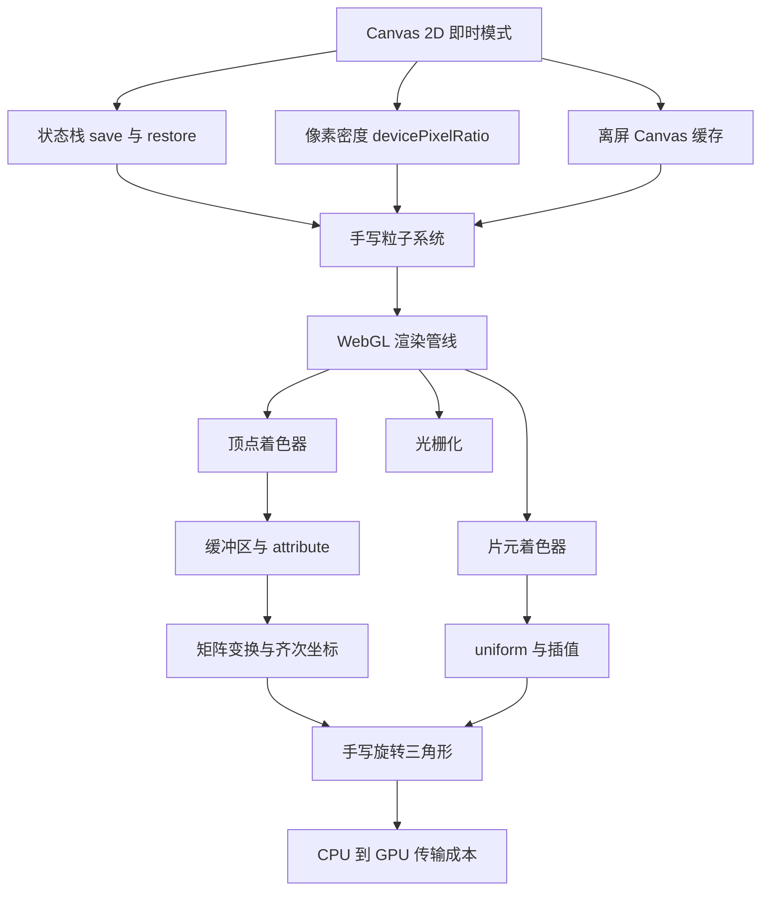
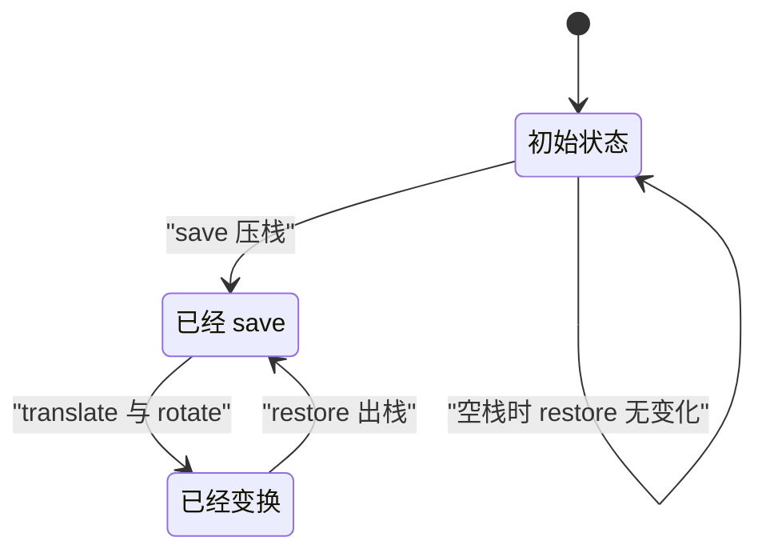
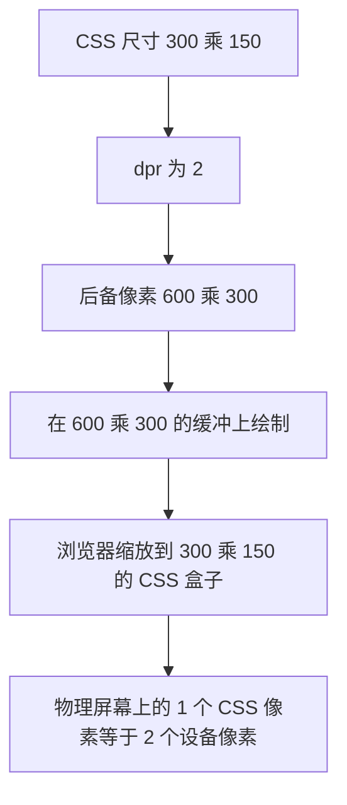
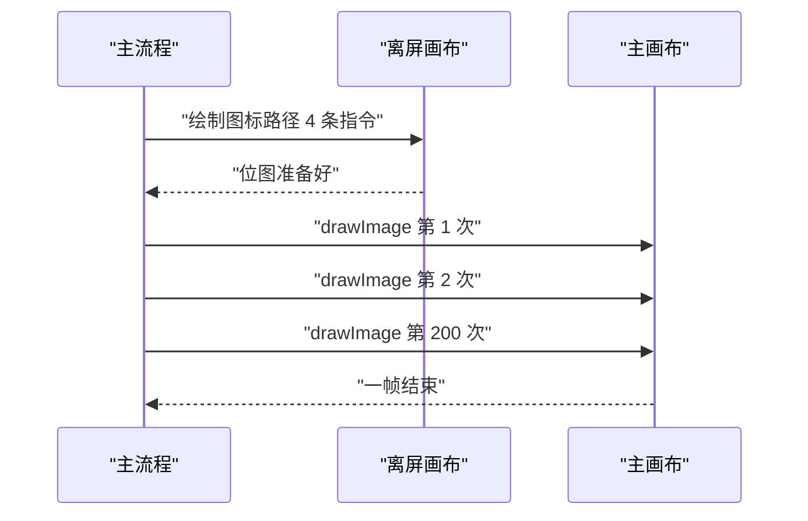
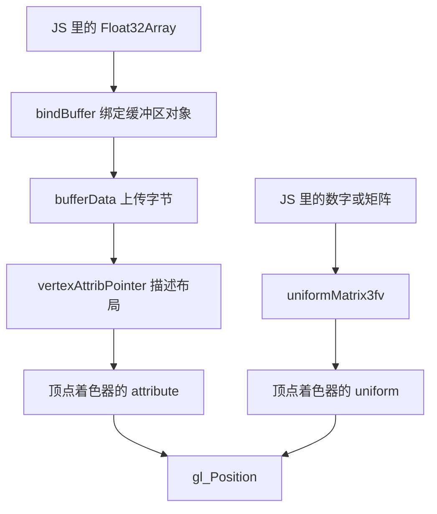
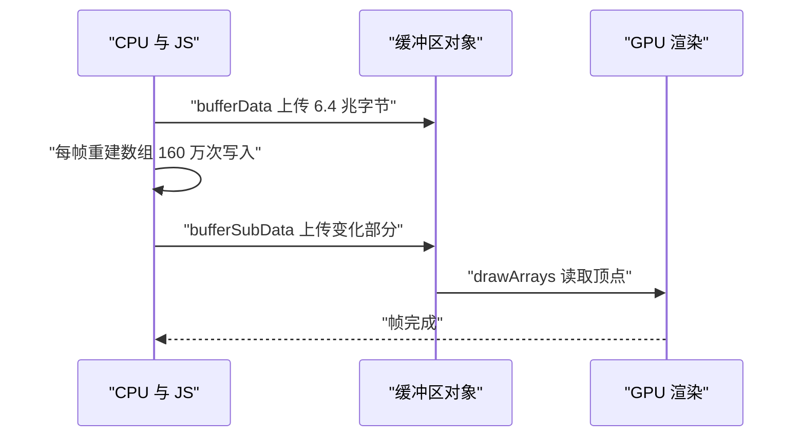
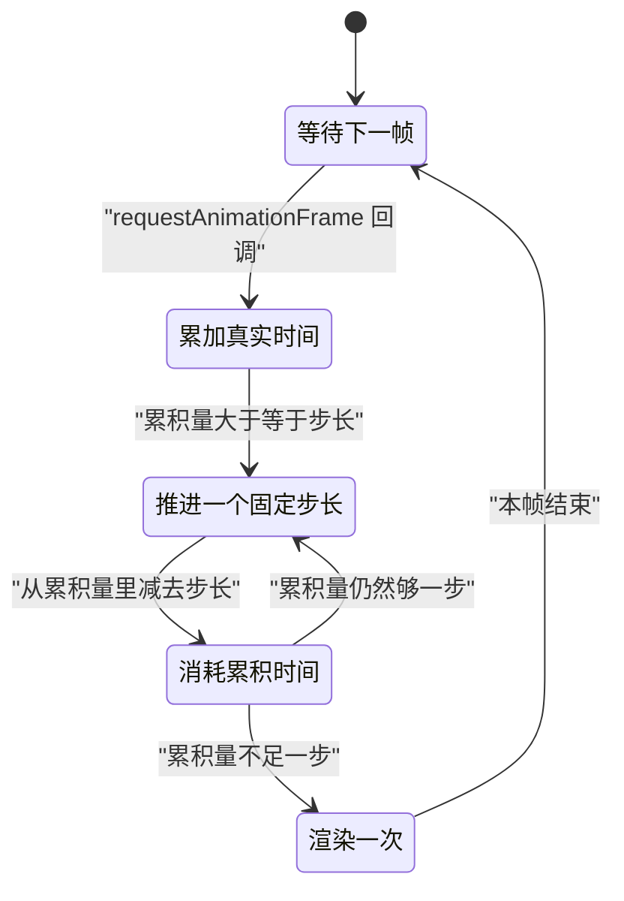
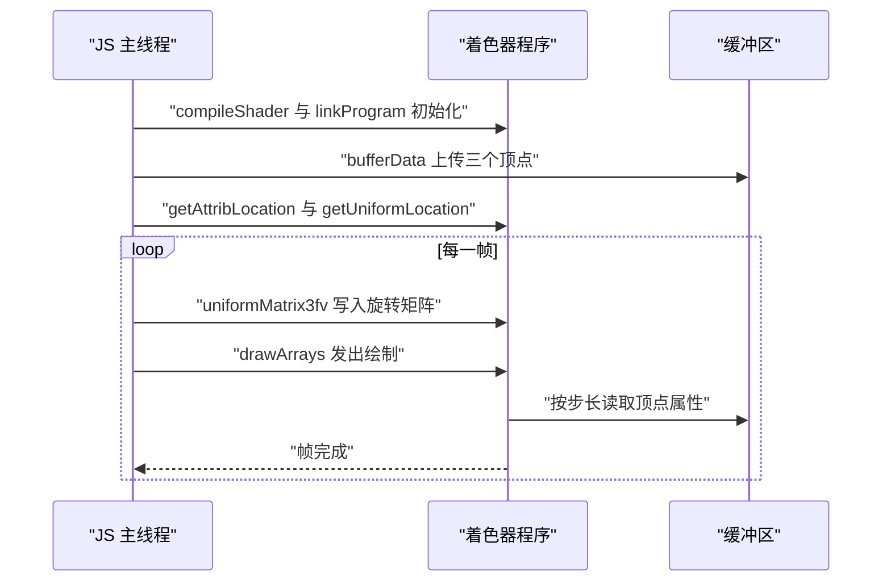

# Canvas 与 WebGL：渲染管线与手写示例

!!! abstract "学完这一页你能"

    - 说出 Canvas 2D 即时模式的执行顺序，并写出 save 与 restore 正确配对的代码。
    - 根据 devicePixelRatio 算出画布的像素尺寸与 CSS 尺寸，让 1 CSS 像素的线宽不再发虚。
    - 按顶点着色器、光栅化、片元着色器的顺序复述 WebGL 管线，并指出每段数据在哪个阶段被读取。
    - 手写 4x4 矩阵乘法与透视投影矩阵，并用断言验证透视除法之后的坐标。

## 0. 知识地图



先读第 1 到第 4 节，把 Canvas 2D 的四个基础机制打牢，再读第 9 节的粒子系统做一次综合练习。

第 5 到第 8 节按管线顺序讲 WebGL，读的时候把第 7 节的矩阵代码跟着敲一遍。

第 10 节把前四节的结论一次性用上，读完之后回到第 8 节重新看一遍传输成本。

## 1. Canvas 2D 的即时模式

**先想一个问题**

画布上有一百个小球在动，某一帧只有三个球换了位置。要不要把这一百个球全部重画一遍？

**心智模型**

!!! tip "心智模型"

    一句话模型：Canvas 2D 只保存像素，不保存图形对象，每个绘制调用直接改变位图。

    日常类比：用油漆在玻璃上作画，想改一个球就得先擦干净玻璃，再把所有球重新画上去。

    不成立的地方：玻璃擦干净后什么都不剩，而 ClearRect 不会复位当前变换矩阵、填充样式和裁剪区域。

**图解**


1. 帧开始，代码从对象数组里读出每个球的当前坐标。
2. clearRect 抹掉上一帧的全部像素，画布回到全透明状态。
3. 循环逐个发出 fillRect，后发出的绘制盖在先发出的上面。
4. 一帧的绘制调用全部返回后，浏览器把这张位图合成到屏幕。
5. 下一帧从第 1 步重新开始，重复整条链路。

**一步一步来**

第 1 步要做什么：先确认绘制调用是立即改变像素的，并且样式在调用那一刻被取值。

```js
// 用数组模拟位图，下标就是调用发生的顺序
const pixels = [];
const ctx = {
  fillStyle: "#000",
  // 每次 fillRect 都把当前样式一起记下来
  fillRect(x, y, w, h) {
    pixels.push({ op: "fillRect", x, y, w, h, color: this.fillStyle });
  },
  clearRect(x, y, w, h) {
    pixels.push({ op: "clearRect", x, y, w, h });
  },
};
```

**这段代码在做什么**

- pixels 数组按调用顺序记录，顺序就是后画的覆盖先画的。
- fillRect 读取的是调用发生那一刻的 fillStyle，之后改样式不会影响已经记录的内容。
- clearRect 只是一次普通调用，它不会重置 fillStyle，也不会重置变换。
- 这里没有保留任何球对象，想移动球只能重新发出绘制调用。

运行结果：一次 clearRect 加两次 fillRect 之后，pixels 的长度是 3。

第 2 步要做什么：把清屏加全量重画写成一个帧函数，让它成为唯一的重画入口。

```js
// 每帧的固定套路：清屏，再按对象当前状态全部重画
function frame(ctx, balls) {
  ctx.clearRect(0, 0, 300, 150);          // 第一步擦掉上一帧像素
  for (const b of balls) {
    ctx.fillStyle = b.color;              // 样式在绘制前一刻赋值
    ctx.fillRect(b.x, b.y, b.r * 2, b.r * 2);
  }
}
```

**这段代码在做什么**

- clearRect 的参数是整块画布，四个数字来自画布的像素尺寸。
- for 循环每轮处理一个对象，循环次数等于对象数量。
- fillStyle 在循环体内赋值，每个对象可以用不同的颜色。
- 只要坐标变了，下一次循环就会把新坐标写进像素，不需要通知任何对象。

运行结果：两个球的一帧产生 3 次调用，一次清屏加两次绘制。

**动手验证**

```js
// 运行环境：Node 20+，无第三方依赖
// 验证目标：即时模式的调用顺序、每帧重画次数
import assert from "node:assert/strict";

function createRecorder() {
  const calls = [];
  const ctx = {
    fillStyle: "#000",
    clearRect(x, y, w, h) { calls.push(["clearRect", x, y, w, h]); },
    fillRect(x, y, w, h) { calls.push(["fillRect", x, y, w, h, this.fillStyle]); },
  };
  return { ctx, calls };
}

function frame(ctx, balls) {
  ctx.clearRect(0, 0, 300, 150);
  for (const b of balls) {
    ctx.fillStyle = b.color;
    ctx.fillRect(b.x, b.y, b.r * 2, b.r * 2);
  }
}

const { ctx, calls } = createRecorder();
const balls = [
  { x: 0, y: 0, r: 5, color: "#f00" },
  { x: 20, y: 10, r: 5, color: "#0f0" },
];

frame(ctx, balls);
balls[0].x = 6;      // 只移动第一个球
frame(ctx, balls);   // 第二帧仍然重画两个球

assert.equal(calls.length, 6);                                     // 每帧 1 次清屏加 2 次绘制
assert.deepEqual(calls[0], ["clearRect", 0, 0, 300, 150]);         // 帧首清屏
assert.deepEqual(calls[3], ["clearRect", 0, 0, 300, 150]);         // 第二帧同样先清屏
assert.deepEqual(calls[4], ["fillRect", 6, 0, 10, 10, "#f00"]);    // 新坐标被重新发出
assert.deepEqual(calls[5], ["fillRect", 20, 10, 10, 10, "#0f0"]);  // 没动的球也重画

console.log("第 1 节断言通过：两帧共产生", calls.length, "次调用");
```

预期输出：`第 1 节断言通过：两帧共产生 6 次调用`

**常见坑**

| 现象 | 原因 | 怎么修 |
| --- | --- | --- |
| 上一帧图形没消失，越叠越多 | 帧首没有清屏，或者清屏区域小于画布 | 在帧函数第一行调用 ClearRect，参数用画布的像素宽高 |
| 改了对象属性，画面没反应 | 属性改了，但没有重新发出绘制调用 | 把绘制放进帧函数，每帧遍历对象重新画 |
| 对象数到 5000 时帧率掉到 20 以下 | 每帧绘制调用次数等于对象数，主线程被占满 | 先数一帧的调用次数，再选离屏缓存或者改用 WebGL |

**小结**

- Canvas 2D 的状态里没有图形对象，只有一张位图和一组当前设置。
- 每帧都要清屏，再按对象当前状态全部重画。
- 帧时间随绘制调用次数增长，调用次数等于可见对象数量。

## 2. 状态栈：save 与 restore

**先想一个问题**

要画十个旋转 30 度的方形，中间夹一行不旋转的文字。直接调用 rotate 之后，后面的绘制全都会跟着转。

**心智模型**

!!! tip "心智模型"

    一句话模型：save 把当前设置复制一份压栈，restore 弹出备份并覆盖当前设置。

    日常类比：进实验室前把外套挂进储物柜，出来再取回穿上，柜子里存的是外套的复制品。

    不成立的地方：restore 次数多于 save 时不会报错，它安静地什么都不做，配对错误不会立刻暴露。

**图解**



1. 初始状态里变换是单位矩阵，填充样式是初始值。
2. 调用 save，当前设置被复制一份压进栈，栈深度加一。
3. 调用 translate 与 rotate，当前设置被改动，栈里的备份不受影响。
4. 调用 restore，弹出栈顶备份，当前设置被它整体覆盖。
5. 栈空时再调用 restore，代码直接返回，当前设置保持不变。

**一步一步来**

第 1 步要做什么：用数组实现一个最小状态栈，只保留变换与填充样式两个字段。

```js
function createCtx() {
  const state = { transform: [1, 0, 0, 1, 0, 0], fillStyle: "#000" };
  const stack = [];
  return {
    get transform() { return state.transform.slice(); },
    get fillStyle() { return state.fillStyle; },
    set fillStyle(v) { state.fillStyle = v; },
    save() {
      // 复制一份当前设置压栈，复制是必须的
      stack.push({ transform: state.transform.slice(), fillStyle: state.fillStyle });
    },
    restore() {
      const top = stack.pop();
      if (!top) return;                    // 空栈时不报错也不改动
      state.transform = top.transform;     // 用备份覆盖当前变换
      state.fillStyle = top.fillStyle;     // 样式同样被覆盖
    },
    translate(x, y) { state.transform[4] += x; state.transform[5] += y; },
  };
}
```

**这段代码在做什么**

- save 复制当前值，restore 用副本覆盖当前值，所以 save 之后的修改不会留在外面。
- restore 遇到空栈时直接返回，浏览器里的行为与这里一致。
- 复制数组时使用了 slice，否则栈里存的是同一个引用，translate 会连带改到备份。
- fillStyle 用 setter 写入、getter 读回，外部只能看到当前值。

运行结果：save 之后 translate 与改色，restore 之后两个字段都回到备份值。

第 2 步要做什么：验证配对行为，包括多调用一次 restore 的情况。

```js
const ctx = createCtx();
ctx.fillStyle = "#111";
ctx.save();                    // 压入单位矩阵与 #111
ctx.fillStyle = "#f00";
ctx.translate(10, 20);         // 只改当前设置
ctx.restore();                 // 回到 #111 与单位矩阵

assert.equal(ctx.fillStyle, "#111");
assert.deepEqual(ctx.transform, [1, 0, 0, 1, 0, 0]);

ctx.restore();                 // 多调一次：空栈，无变化
assert.equal(ctx.fillStyle, "#111");
assert.deepEqual(ctx.transform, [1, 0, 0, 1, 0, 0]);
```

**这段代码在做什么**

- 第一次 restore 之后，填充样式从红色变回 #111，证明样式也在备份范围内。
- 变换数组恢复成单位矩阵，第十与第十一个元素回到 0。
- 第二次 restore 时栈已经空了，返回值不影响任何状态。
- 两个断言用 deepEqual 比较数组，逐元素比较比比较引用可靠。

**动手验证**

```js
// 运行环境：Node 20+，无第三方依赖
// 验证目标：save 与 restore 的配对行为
import assert from "node:assert/strict";

function createCtx() {
  const state = { transform: [1, 0, 0, 1, 0, 0], fillStyle: "#000" };
  const stack = [];
  return {
    get transform() { return state.transform.slice(); },
    get fillStyle() { return state.fillStyle; },
    set fillStyle(v) { state.fillStyle = v; },
    get depth() { return stack.length; },
    save() {
      stack.push({ transform: state.transform.slice(), fillStyle: state.fillStyle });
    },
    restore() {
      const top = stack.pop();
      if (!top) return;
      state.transform = top.transform;
      state.fillStyle = top.fillStyle;
    },
    translate(x, y) { state.transform[4] += x; state.transform[5] += y; },
  };
}

const ctx = createCtx();
ctx.fillStyle = "#111";
ctx.save();
assert.equal(ctx.depth, 1);

ctx.fillStyle = "#f00";
ctx.translate(10, 20);
assert.deepEqual(ctx.transform, [1, 0, 0, 1, 10, 20]);

ctx.restore();
assert.equal(ctx.depth, 0);
assert.equal(ctx.fillStyle, "#111");
assert.deepEqual(ctx.transform, [1, 0, 0, 1, 0, 0]);

ctx.restore();                 // 栈空，什么都不做
assert.equal(ctx.fillStyle, "#111");
assert.deepEqual(ctx.transform, [1, 0, 0, 1, 0, 0]);

console.log("第 2 节断言通过：restore 之后样式为", ctx.fillStyle);
```

预期输出：`第 2 节断言通过：restore 之后样式为 #111`

**常见坑**

| 现象 | 原因 | 怎么修 |
| --- | --- | --- |
| 只有第一个图形用了正确变换，后面的都错位 | 循环里改了变换但跳过了 restore | 每个对象的绘制前后成对写 save 与 restore |
| 连续绘制几十帧后页面卡顿 | save 一直增长而 restore 被跳过，栈持续变大 | 用 try 与 finally 包住绘制，并检查两者调用次数 |
| 以为 restore 会擦掉刚才画的像素 | restore 只恢复状态，不改动像素 | 擦像素用 clearRect，或者重画背景 |

**小结**

- save 与 restore 操作的是状态栈，不是像素。
- 栈里存的是值的副本，复制不彻底会让 transform 被外部修改波及。
- 空栈上的 restore 是合法操作，它不会报错，所以靠断言检查栈深度。

## 3. 像素密度与 devicePixelRatio

**先想一个问题**

样式里写了画布宽 300px，JS 里也写了 canvas.width = 300。在 devicePixelRatio 为 2 的屏幕上，浏览器把画布放大到 600 个物理像素，1 像素的线看起来有 2 像素宽。

**心智模型**

!!! tip "心智模型"

    一句话模型：canvas 有两组尺寸，width 与 height 是后备像素尺寸，style.width 与 style.height 是 CSS 显示尺寸。

    日常类比：拿一张 600 格的小方格纸，装进宽 300 毫米的相框，每个格子被拉伸到 1 毫米以上。

    不成立的地方：方格纸被拉伸时线条还是清楚的，而位图由浏览器做插值放大，边缘会出现灰阶。

!!! note "术语：devicePixelRatio"

    它是设备像素与 CSS 像素的比值，简写为 dpr。例：dpr 等于 2 表示 1 个 CSS 像素占据 2 乘 2 个物理像素。

**图解**



1. 布局阶段决定画布在页面上占 300 乘 150 个 CSS 像素。
2. dpr 为 2，也就是每个 CSS 像素对应 2 乘 2 个设备像素。
3. 把 canvas.width 设成 600，缓冲与设备像素一一对应。
4. 所有绘制发生在 600 乘 300 的缓冲上，1 像素的线就是 1 个设备像素宽。
5. 浏览器把缓冲按 1 比 2 缩放到 CSS 盒子里，线条宽度与代码里写的一致。

**一步一步来**

第 1 步要做什么：写一个尺寸换算函数，同时设置两组尺寸并重设变换。

```js
function resizeCanvas(canvas, cssWidth, cssHeight, dpr) {
  canvas.width = Math.round(cssWidth * dpr);    // 后备像素尺寸
  canvas.height = Math.round(cssHeight * dpr);
  canvas.style.width = cssWidth + "px";         // CSS 显示尺寸
  canvas.style.height = cssHeight + "px";
  const ctx = canvas.getContext("2d");
  // 之后所有坐标按 CSS 像素书写，由变换换算到设备像素
  ctx.setTransform(dpr, 0, 0, dpr, 0, 0);
  return ctx;
}
```

**这段代码在做什么**

- canvas.width 赋的是整数，用 Math.round 处理 dpr 为非整数时的小数结果。
- style.width 保持 CSS 像素值，两个数字的比值就是 dpr。
- setTransform 的六个参数是 a b c d e f，这里只放大不偏移。
- 设置 width 会清空画布并复位状态，所以重设变换必须放在赋值之后。

运行结果：dpr 等于 2 时，canvas.width 是 600，style.width 是 300px。

第 2 步要做什么：确认窗口尺寸变化时两组尺寸要一起更新。

```js
window.addEventListener("resize", () => {
  const dpr = window.devicePixelRatio || 1;     // 老浏览器没有这个属性
  const rect = canvas.getBoundingClientRect();  // 取当前布局尺寸
  resizeCanvas(canvas, rect.width, rect.height, dpr);
  draw(ctx);                                    // 尺寸变了要重画一次
});
```

**这段代码在做什么**

- devicePixelRatio 可能不存在，用或运算给一个默认值 1。
- getBoundingClientRect 返回的是 CSS 像素尺寸，正好是要传给函数的值。
- resize 之后画布内容被清空，所以紧接着调用一次绘制函数。

**动手验证**

```js
// 运行环境：Node 20+，无第三方依赖
// 验证目标：dpr 下的尺寸换算与变换设置
import assert from "node:assert/strict";

function createFakeCanvas() {
  const ctx = { transformArgs: null };
  ctx.setTransform = (...args) => { ctx.transformArgs = args; };
  return {
    width: 0,
    height: 0,
    style: {},
    getContext() { return ctx; },
    _ctx: ctx,
  };
}

function resizeCanvas(canvas, cssWidth, cssHeight, dpr) {
  canvas.width = Math.round(cssWidth * dpr);
  canvas.height = Math.round(cssHeight * dpr);
  canvas.style.width = cssWidth + "px";
  canvas.style.height = cssHeight + "px";
  const ctx = canvas.getContext("2d");
  ctx.setTransform(dpr, 0, 0, dpr, 0, 0);
  return ctx;
}

const normal = createFakeCanvas();
resizeCanvas(normal, 300, 150, 1);
assert.equal(normal.width, 300);
assert.equal(normal.style.width, "300px");
assert.deepEqual(normal._ctx.transformArgs, [1, 0, 0, 1, 0, 0]);

const hidpi = createFakeCanvas();
resizeCanvas(hidpi, 300, 150, 2);
assert.equal(hidpi.width, 600);             // 后备像素翻倍
assert.equal(hidpi.height, 300);
assert.equal(hidpi.style.width, "300px");   // CSS 尺寸保持 300
assert.deepEqual(hidpi._ctx.transformArgs, [2, 0, 0, 2, 0, 0]);

const fractional = createFakeCanvas();
resizeCanvas(fractional, 301, 151, 1.5);
assert.equal(fractional.width, 452);        // 301 乘 1.5 取整

console.log("第 3 节断言通过：dpr 为 2 时后备像素为", hidpi.width, "乘", hidpi.height);
```

预期输出：`第 3 节断言通过：dpr 为 2 时后备像素为 600 乘 300`

**常见坑**

| 现象 | 原因 | 怎么修 |
| --- | --- | --- |
| 1 像素的线看起来有 2 像素粗 | width 等于 CSS 宽度，在高 dpr 屏幕上被放大 | width 设成 CSS 宽度乘 dpr |
| 文字边缘发毛 | 后备像素少于设备像素，浏览器插值放大 | 用 dpr 同时设置 width 与 height |
| 拖动窗口后画面被拉伸变形 | 只改了 style 的宽高，没有同步改 width 与 height | 在 resize 里同时更新两组尺寸，再重设变换 |

**小结**

- 画布有两组尺寸，代码里写坐标时统一按 CSS 像素思考。
- 设置 width 与 height 会清空画布并复位状态，所以顺序是先设尺寸再设变换。
- dpr 不是整数时用取整函数，避免后备像素尺寸带小数。

## 4. 离屏 Canvas：把绘制结果当图片缓存

**先想一个问题**

要在画布上放 200 个长得一样的图标。每个图标要跑 4 条路径指令，一帧就是 800 条指令，而且这些指令每帧都重复。

**心智模型**

!!! tip "心智模型"

    一句话模型：离屏 Canvas 是一张可以画画的图片，先在上面画一次，再用 drawImage 反复拷贝到主画布。

    日常类比：先在草稿纸上刻好图章，之后拿着图章到处盖，不用每次重刻。

    不成立的地方：盖图章是拷贝像素，成本与面积相关；如果图标只有 3 条指令，缓存反而多出一次拷贝。

!!! note "术语：离屏 Canvas"

    它是用 document.createElement 创建但没有插入页面的画布，简称为离屏画布。例：const off = document.createElement("canvas")。

**图解**



1. 初始化阶段，主流程把图标路径画到离屏画布上，只画一次。
2. 离屏画布内容就绪，之后可以直接当作图片源使用。
3. 每帧主流程发出 200 次 drawImage，参数里带目标坐标。
4. 第 200 次调用返回后，主画布的位图更新完成。
5. 下一帧重复第 3 到第 4 步，路径指令不再重跑。

**一步一步来**

第 1 步要做什么：在初始化时创建离屏画布，并把图标画上去一次。

```js
function createIconCache(dpr) {
  const off = document.createElement("canvas");
  off.width = Math.round(48 * dpr);       // 与主画布保持相同的像素密度
  off.height = Math.round(48 * dpr);
  const ctx = off.getContext("2d");
  ctx.setTransform(dpr, 0, 0, dpr, 0, 0);
  ctx.fillStyle = "#3af";
  ctx.beginPath();                        // 图标路径只跑这一次
  ctx.arc(24, 24, 20, 0, Math.PI * 2);
  ctx.fill();
  return off;
}
```

**这段代码在做什么**

- 离屏画布没有插入页面，所以它的 CSS 尺寸不影响布局。
- 像素尺寸乘上 dpr，拷贝到主画布时清晰度与主画布一致。
- setTransform 让路径坐标按 CSS 像素写，与主画布同一套坐标系。
- 函数返回画布对象，后续用 drawImage 直接引用它。

运行结果：离屏画布上有一张 40 像素直径的圆形位图。

第 2 步要做什么：每帧用 drawImage 把缓存贴到各个位置。

```js
function frameWithCache(ctx, cache, positions) {
  ctx.clearRect(0, 0, 300, 150);
  for (const p of positions) {
    ctx.drawImage(cache, p.x, p.y, 24, 24);   // 目标宽高按 CSS 像素给
  }
}
```

**这段代码在做什么**

- clearRect 每帧只调用一次，与图标数量无关。
- drawImage 用五参数形式，前两个是目标坐标，后两个是目标宽高。
- 目标宽高是 CSS 像素值，变换会把它们换算到设备像素。
- 一帧的调用次数等于 positions 的长度，等于 200。

**动手验证**

```js
// 运行环境：Node 20+，无第三方依赖
// 验证目标：缓存方案的指令次数与拷贝次数
import assert from "node:assert/strict";

const ICON_OPS = 4;      // 一个图标的路径指令条数
const COUNT = 200;       // 屏幕上的图标数量

function makeCanvas() {
  const calls = { pathOps: 0, drawImage: 0 };
  const ctx = {
    beginPath() { calls.pathOps++; },
    arc() { calls.pathOps++; },
    fill() { calls.pathOps++; },
    moveTo() { calls.pathOps++; },
    drawImage() { calls.drawImage++; },
  };
  return { ctx, calls };
}

// 方案 A：每个图标都重新执行路径指令
const a = makeCanvas();
for (let i = 0; i < COUNT; i++) {
  for (let k = 0; k < ICON_OPS; k++) a.ctx.beginPath();
}
assert.equal(a.calls.pathOps, 800);        // 200 乘 4
assert.equal(a.calls.drawImage, 0);

// 方案 B：路径只跑一次，再用 drawImage 拷贝 200 次
const off = makeCanvas();
for (let k = 0; k < ICON_OPS; k++) off.ctx.beginPath();
const b = makeCanvas();
for (let i = 0; i < COUNT; i++) b.ctx.drawImage();

assert.equal(off.calls.pathOps, 4);        // 路径指令从 800 降到 4
assert.equal(b.calls.drawImage, 200);      // 换成了 200 次位图拷贝

console.log("第 4 节断言通过：路径指令 800 降到", off.calls.pathOps, "条");
```

预期输出：`第 4 节断言通过：路径指令 800 降到 4 条`

**常见坑**

| 现象 | 原因 | 怎么修 |
| --- | --- | --- |
| 用了缓存之后帧率反而下降 | 图标只有 3 条指令，拷贝像素比直接画贵 | 路径指令超过 30 条才做缓存，并用实测帧时间决定 |
| 贴上去的图标模糊 | 离屏画布的像素尺寸没有乘 dpr | 让离屏画布的像素尺寸与主画布一致 |
| 每帧都新建离屏画布，内存持续增长 | 创建画布会分配新的绘制目标 | 初始化时创建一次，之后只重画内容 |

**小结**

- 离屏 Canvas 缓存的是绘制完成的位图，不是路径指令。
- 缓存划算的条件是指令次数足够多，多到超过一次位图拷贝。
- 是否划算要用帧时间实测判断，不能凭感觉。

## 5. WebGL 渲染管线：顶点着色器、光栅化、片元着色器

**先想一个问题**

一句 gl.drawArrays(gl.TRIANGLES, 0, 3) 之后屏幕出现了三角形。这中间 GPU 按什么顺序处理数据？

**心智模型**

!!! tip "心智模型"

    一句话模型：管线是一条固定顺序的流水线，顶点着色器算出顶点坐标，光栅化切成片元，片元着色器算出每个片元的颜色。

    日常类比：快递分拣先给每个包裹贴上目的地标签，再把大包裹拆成一个个小件，最后给每个小件贴上颜色标签。

    不成立的地方：分拣是逐级传递的串行过程，GPU 在每个阶段同时处理上万个顶点。

!!! note "术语：光栅化"

    它是把几何图元转换成片元的过程，片元是候选像素及其插值数据。例：一个覆盖 56 个像素的三角形会生成 56 个片元。

**图解**


1. 顶点数组提供每个顶点的原始属性，比如位置。
2. 顶点着色器对每个顶点执行一次，输出裁剪空间坐标。
3. 图元装配把顶点按 TRIANGLES 模式三个一组组成三角形。
4. 光栅化算出三角形覆盖了哪些片元，以及每个片元的重心坐标。
5. 片元着色器对每个片元执行一次，输出这个片元的颜色。
6. 逐片元测试与混合决定这个颜色是否写入帧缓冲。

**一步一步来**

第 1 步要做什么：用 CPU 函数模拟顶点着色器与光栅化，先只算哪些片元被覆盖。

```js
const SCALE = 0.5;                    // uniform 缩放系数

function vertexShader(aPosition) {
  return [aPosition[0] * SCALE, aPosition[1] * SCALE];   // 输出裁剪空间坐标
}

// 二维叉积，用来判断点相对有向边的位置
function edge(a, b, p) {
  return (b[0] - a[0]) * (p[1] - a[1]) - (b[1] - a[1]) * (p[0] - a[0]);
}

function rasterize(v0, v1, v2, width, height) {
  const frags = [];
  for (let y = 0; y < height; y++) {
    for (let x = 0; x < width; x++) {
      const px = ((x + 0.5) / width) * 2 - 1;    // 片元中心映射到负一到一
      const py = 1 - ((y + 0.5) / height) * 2;
      const inside =
        edge(v1, v2, [px, py]) >= 0 &&
        edge(v2, v0, [px, py]) >= 0 &&
        edge(v0, v1, [px, py]) >= 0;
      if (inside) frags.push([x, y]);
    }
  }
  return frags;
}
```

**这段代码在做什么**

- vertexShader 读一个顶点写一个顶点，与 GLSL 里 attribute 到 gl_Position 的流程一致。
- SCALE 相当于一个 uniform，同一次绘制里所有顶点共用同一个值。
- 三个 edge 结果都非负表示片元中心落在三角形内部，这对应逆时针绕序。
- px 与 py 用的是片元中心而不是整数坐标，这与光栅化规则一致。

运行结果：一个顶点为 (0,1)、(-1,-1)、(1,-1) 的三角形，在 16 乘 16 的缓冲上覆盖 56 个片元。

第 2 步要做什么：接上片元着色器，把片元颜色写进帧缓冲。

```js
function fragmentShader() {
  return [255, 0, 0, 255];            // 红 绿 蓝 透明度
}

const vertices = [[0, 1], [-1, -1], [1, -1]];
const clip = vertices.map(vertexShader);          // 顶点着色阶段
const frags = rasterize(clip[0], clip[1], clip[2], 16, 16);  // 光栅化阶段
const pixels = frags.map(([x, y]) => ({ x, y, color: fragmentShader() }));
```

**这段代码在做什么**

- vertices 相当于缓冲区里的顶点数据，map 相当于逐顶点执行顶点着色器。
- rasterize 的输出是片元位置列表，长度由三角形在屏幕上的面积决定。
- map 里的 fragmentShader 对每个片元执行一次，返回值就是这个片元的颜色。
- pixels 数组就是帧缓冲的内容，每一项带位置与颜色。

**动手验证**

```js
// 运行环境：Node 20+，无第三方依赖
// 验证目标：用 CPU 复现管线的三个阶段
import assert from "node:assert/strict";

const SCALE = 0.5;
const WIDTH = 16;
const HEIGHT = 16;

function vertexShader(aPosition) {
  return [aPosition[0] * SCALE, aPosition[1] * SCALE];
}

function edge(a, b, p) {
  return (b[0] - a[0]) * (p[1] - a[1]) - (b[1] - a[1]) * (p[0] - a[0]);
}

function rasterize(v0, v1, v2) {
  const frags = [];
  for (let y = 0; y < HEIGHT; y++) {
    for (let x = 0; x < WIDTH; x++) {
      const px = ((x + 0.5) / WIDTH) * 2 - 1;
      const py = 1 - ((y + 0.5) / HEIGHT) * 2;
      if (edge(v1, v2, [px, py]) >= 0 &&
          edge(v2, v0, [px, py]) >= 0 &&
          edge(v0, v1, [px, py]) >= 0) {
        frags.push([x, y]);
      }
    }
  }
  return frags;
}

function fragmentShader() {
  return [255, 0, 0, 255];
}

const clip = [[0, 1], [-1, -1], [1, -1]].map(vertexShader);
const frags = rasterize(clip[0], clip[1], clip[2]);
const pixels = frags.map(([x, y]) => ({ x, y, color: fragmentShader() }));

assert.equal(clip[0][1], 0.5);            // 顶点着色器把 y 从 1 缩到 0.5
assert.equal(frags.length, 56);           // 光栅化覆盖 56 个片元
assert.equal(pixels[0].color[0], 255);    // 片元着色器统一输出红色

console.log("第 5 节断言通过：16 乘 16 缓冲上覆盖", frags.length, "个片元");
```

预期输出：`第 5 节断言通过：16 乘 16 缓冲上覆盖 56 个片元`

**常见坑**

| 现象 | 原因 | 怎么修 |
| --- | --- | --- |
| 三角形不显示 | gl_Position 的第四个分量 w 写成了 0 | 让 w 等于 1，坐标落在裁剪空间的可见范围内 |
| 三角形被裁掉一半 | 顶点超出了负一到一的裁剪范围 | 检查顶点着色器里的缩放与偏移 |
| 改了着色器源码但画面没变 | 着色器只在初始化时编译链接一次 | 改完源码后刷新页面，让着色器重新编译 |

**小结**

- 管线的三个阶段串行执行：顶点着色器、光栅化、片元着色器。
- 顶点着色器执行次数等于顶点数，片元着色器执行次数等于覆盖片元数。
- 顶点着色器的输出必须是裁剪空间坐标，取值范围在负一到一之间。

## 6. 缓冲区、attribute 与 uniform

**先想一个问题**

三个顶点的坐标放在 JS 数组里，怎么送进 GPU？每帧能改哪些数据，哪些数据只该传一次？

**心智模型**

!!! tip "心智模型"

    一句话模型：缓冲区是显存里的一块连续字节，attribute 是每个顶点一份的输入，uniform 是每次绘制调用共用一份的输入。

    日常类比：同一个班交作业，答题卡人手一张，这是 attribute；贴在黑板上的统一试题全班共用，这是 uniform。

    不成立的地方：黑板上的值在同一次 draw call 里不能改，但下一次 draw call 之前可以改；答题卡也能只改其中几个字节。

!!! note "术语：attribute 与 uniform"

    attribute 是顶点着色器的逐顶点输入，每个顶点有一份值。uniform 是同一次绘制调用里所有顶点共用的常量。

**图解**



1. JS 里准备一个 Float32Array，它是 CPU 侧内存中的连续字节。
2. bindBuffer 把缓冲区对象设为当前操作目标，后续调用都作用在它身上。
3. bufferData 把数组内容复制到显存，这一步只做一次。
4. vertexAttribPointer 告诉 GPU 每个顶点占多少字节、属性从第几个字节开始。
5. 顶点着色器执行时按索引读取 attribute，同一索引的三个属性来自同一个顶点。
6. uniform 从 JS 直接写入着色器，同一次绘制调用里所有顶点看到同一个值。

**一步一步来**

第 1 步要做什么：设计一个交错缓冲区布局，算出每个属性的偏移。

```js
// 每个顶点 5 个 float：x, y, r, g, b
const FLOATS_PER_VERTEX = 5;
const BYTES_PER_FLOAT = 4;
const STRIDE = FLOATS_PER_VERTEX * BYTES_PER_FLOAT;   // 步长 20 字节
const OFFSET_POSITION = 0;                            // 位置从第 0 字节开始
const OFFSET_COLOR = 2 * BYTES_PER_FLOAT;             // 颜色从第 8 字节开始

const data = new Float32Array([
  0.0, 0.5, 1.0, 0.0, 0.0,     // 顶点 0：位置 0 0.5，颜色红
  -0.5, -0.5, 0.0, 1.0, 0.0,   // 顶点 1：位置 负 0.5 负 0.5，颜色绿
  0.5, -0.5, 0.0, 0.0, 1.0,    // 顶点 2：位置 0.5 负 0.5，颜色蓝
]);
```

**这段代码在做什么**

- 步长是一个顶点占用的全部字节数，等于 5 乘 4 等于 20。
- 位置的偏移是 0，颜色的偏移是 2 个 float，也就是 8 字节。
- 三个顶点的属性交错排列，同一个顶点的位置与颜色在内存里相邻。
- 交错布局的优点是一次上传就能喂饱两个 attribute。

运行结果：data.length 等于 15，缓冲区字节数是 60。

第 2 步要做什么：写一个读取函数，按顶点序号与偏移取出属性值。

```js
function readAttribute(buffer, vertexIndex, offsetBytes, componentCount) {
  // 先换算到 float 下标，再按分量个数切片
  const base = vertexIndex * FLOATS_PER_VERTEX + offsetBytes / BYTES_PER_FLOAT;
  return Array.from(buffer.slice(base, base + componentCount));
}
```

**这段代码在做什么**

- 顶点序号乘上每个顶点的 float 个数，得到这个顶点在数组里的起始位置。
- 偏移字节数除以 4 换算成 float 下标，再加上起始位置。
- slice 只读取需要的分量，不越界到下一个顶点。
- 返回值转成普通数组，方便断言比较。

运行结果：readAttribute(data, 1, OFFSET_POSITION, 2) 返回 [-0.5, -0.5]。

**动手验证**

```js
// 运行环境：Node 20+，无第三方依赖
// 验证目标：交错缓冲区的布局换算
import assert from "node:assert/strict";

const FLOATS_PER_VERTEX = 5;
const BYTES_PER_FLOAT = 4;
const STRIDE = FLOATS_PER_VERTEX * BYTES_PER_FLOAT;
const OFFSET_POSITION = 0;
const OFFSET_COLOR = 2 * BYTES_PER_FLOAT;

const data = new Float32Array([
  0.0, 0.5, 1.0, 0.0, 0.0,
  -0.5, -0.5, 0.0, 1.0, 0.0,
  0.5, -0.5, 0.0, 0.0, 1.0,
]);

function readAttribute(buffer, vertexIndex, offsetBytes, componentCount) {
  const base = vertexIndex * FLOATS_PER_VERTEX + offsetBytes / BYTES_PER_FLOAT;
  return Array.from(buffer.slice(base, base + componentCount));
}

assert.equal(STRIDE, 20);
assert.equal(OFFSET_COLOR, 8);
assert.equal(data.byteLength, 60);
assert.deepEqual(readAttribute(data, 0, OFFSET_POSITION, 2), [0.0, 0.5]);
assert.deepEqual(readAttribute(data, 1, OFFSET_POSITION, 2), [-0.5, -0.5]);
assert.deepEqual(readAttribute(data, 1, OFFSET_COLOR, 3), [0.0, 1.0, 0.0]);
assert.deepEqual(readAttribute(data, 2, OFFSET_COLOR, 3), [0.0, 0.0, 1.0]);

console.log("第 6 节断言通过：步长", STRIDE, "字节，颜色偏移", OFFSET_COLOR, "字节");
```

预期输出：`第 6 节断言通过：步长 20 字节，颜色偏移 8 字节`

**常见坑**

| 现象 | 原因 | 怎么修 |
| --- | --- | --- |
| 顶点位置整体错位 | 步长填成了一个属性的字节数 | 步长等于一个顶点的全部字节数 |
| 颜色读数不对 | 颜色偏移填成了 0 | 按布局图数一遍每个属性的起始偏移 |
| 长时间运行后出现卡顿峰值 | 每帧新建 Float32Array 触发垃圾回收 | 初始化时分配一次，之后只改内容 |

**小结**

- 步长是一个顶点占用的字节数，偏移是属性在顶点内部的起始字节。
- attribute 的数量在同一顶点内必须一致，每个顶点都有这些分量的值。
- uniform 一次赋值对同一绘制调用中的所有顶点生效。

## 7. 矩阵变换与齐次坐标

**先想一个问题**

二维平移能不能用 2x2 矩阵乘法表示？答案是不能，因为 2x2 矩阵乘出来总是过原点的线性变换。

**心智模型**

!!! tip "心智模型"

    一句话模型：齐次坐标给每个点补一个分量，让平移、旋转、缩放可以写成同一种矩阵乘法。

    日常类比：给每个坐标记一个比例尺，读坐标时先看比例尺再读数字，比例尺为 1 时得到的就是原始尺寸。

    不成立的地方：透视投影里这个分量不等于 1，它等于负的相机空间 z，必须先做除法才能得到屏幕坐标。

!!! note "术语：齐次坐标"

    它是把 n 维点写成 n 加 1 个数的方式。例：二维点 (3, 4) 写作 [3, 4, 1]，读回坐标时前两个数除以第三个数。

**图解**


1. 顶点先在模型自己的坐标系里给出，原点是模型中心。
2. 模型矩阵把它搬到世界坐标系，包含平移、旋转和缩放。
3. 视图矩阵把世界坐标换算到以相机为原点的坐标系。
4. 投影矩阵输出四维裁剪空间坐标，第四个分量 w 不再是 1。
5. 管线自动把前三个分量逐分量除以 w，得到取值范围在负一到一的设备坐标。
6. 设备坐标再映射到视口像素，这就是屏幕上的位置。

**一步一步来**

第 1 步要做什么：写一个列主序的 4x4 矩阵乘法。

```js
function multiply(a, b) {
  const out = new Array(16).fill(0);
  for (let col = 0; col < 4; col++) {
    for (let row = 0; row < 4; row++) {
      let sum = 0;
      for (let k = 0; k < 4; k++) {
        // a 的第 k 列第 row 行，乘以 b 的第 col 列第 k 行
        sum += a[k * 4 + row] * b[col * 4 + k];
      }
      out[col * 4 + row] = sum;
    }
  }
  return out;
}
```

**这段代码在做什么**

- 下标公式是列乘 4 加行，符合 WebGL 传给 uniformMatrix4fv 的列主序约定。
- 外层两个循环遍历结果的十六个元素，内层循环做四次乘加。
- 结果数组长度固定为 16，先全部填 0 再赋值。
- 矩阵乘法不满足交换律，a 乘 b 与 b 乘 a 的结果一般不相等。

运行结果：单位矩阵乘任意矩阵，结果等于那个矩阵本身。

第 2 步要做什么：写透视投影矩阵，并做一次透视除法。

```js
function perspective(fovY, aspect, near, far) {
  const f = 1 / Math.tan(fovY / 2);      // 垂直视场角换算到焦距
  const nf = 1 / (near - far);
  return [
    f / aspect, 0, 0, 0,
    0, f, 0, 0,
    0, 0, (far + near) * nf, -1,         // 第十一个元素固定为负一
    0, 0, 2 * far * near * nf, 0,
  ];
}
```

**这段代码在做什么**

- fovY 是垂直方向的视场角，单位是弧度，取 90 度时 f 等于 1。
- aspect 是画布宽高比，用来保证 x 方向不被拉长。
- 第十一个元素固定为负一，它让裁剪空间的 w 等于负的相机空间 z。
- near 必须大于 0，相机与近平面之间不能有可渲染的物体。

运行结果：以 fovY 等于二分之派、aspect 等于 1、near 等于 1、far 等于 3 为例，相机前方 z 为负 2 的点透视除法后深度是 0.5。

**动手验证**

```js
// 运行环境：Node 20+，无第三方依赖
// 验证目标：列主序矩阵乘法与透视投影
import assert from "node:assert/strict";

function multiply(a, b) {
  const out = new Array(16).fill(0);
  for (let col = 0; col < 4; col++) {
    for (let row = 0; row < 4; row++) {
      let sum = 0;
      for (let k = 0; k < 4; k++) {
        sum += a[k * 4 + row] * b[col * 4 + k];
      }
      out[col * 4 + row] = sum;
    }
  }
  return out;
}

function perspective(fovY, aspect, near, far) {
  const f = 1 / Math.tan(fovY / 2);
  const nf = 1 / (near - far);
  return [
    f / aspect, 0, 0, 0,
    0, f, 0, 0,
    0, 0, (far + near) * nf, -1,
    0, 0, 2 * far * near * nf, 0,
  ];
}

function transformPoint(m, p) {
  return [0, 1, 2, 3].map((row) =>
    m[0 * 4 + row] * p[0] +
    m[1 * 4 + row] * p[1] +
    m[2 * 4 + row] * p[2] +
    m[3 * 4 + row] * p[3]
  );
}

const identity = [1, 0, 0, 0, 0, 1, 0, 0, 0, 0, 1, 0, 0, 0, 0, 1];
const M = perspective(Math.PI / 2, 1, 1, 3);

assert.equal(transformPoint(identity, [1, 2, 3, 1]).join(), "1,2,3,1");
assert.deepEqual(multiply(identity, M), M);

const clip = transformPoint(M, [0, 0, -2, 1]);
assert.equal(clip[2], 1);              // 裁剪空间 z
assert.equal(clip[3], 2);              // 裁剪空间 w
assert.equal(clip[2] / clip[3], 0.5);  // 透视除法后的深度

console.log("第 7 节断言通过：透视除法后深度为", clip[2] / clip[3]);
```

预期输出：`第 7 节断言通过：透视除法后深度为 0.5`

**常见坑**

| 现象 | 原因 | 怎么修 |
| --- | --- | --- |
| 物体移动方向与预期相反 | 平移量写在了矩阵的错误位置 | 列主序下平移量位于第三列的第 0 到第 2 项 |
| 画面比例被拉伸 | aspect 固定填了 1，与画布宽高比不符 | 用画布像素宽除以像素高当作 aspect |
| 物体在近处突然消失 | 顶点落在近平面之前被裁掉 | 检查 near 是否大于 0，并检查相机距离 |

**小结**

- 齐次坐标让平移也能写成矩阵乘法，代价是多一个分量。
- WebGL 的矩阵按列主序存放，下标公式是列乘 4 加行。
- 投影矩阵输出的 w 不等于 1，管线自动做透视除法。

## 8. CPU 到 GPU 的数据传输成本

**先想一个问题**

每帧把 20 万个顶点的数据从 JS 传给 GPU，会卡在哪一步？是总线带宽，还是主线程构建数组的循环？

**心智模型**

!!! tip "心智模型"

    一句话模型：数据必须从主存搬到显存，搬运量等于顶点数乘每个顶点的字节数，搬完之前绘制不能开始。

    日常类比：把一车沙从仓库运到工地，车次乘以每车容量就是总搬运量。

    不成立的地方：搬运次数可以减少到一次，缓冲区对象留在显存里，后续每帧只改变化的那几个字节。

!!! note "术语：缓冲区对象"

    它是显存里的一块数据区，由 createBuffer 创建。例：顶点数据上传一次之后，多次 draw call 都读同一块。

**图解**



1. 初始化时调用一次 bufferData，把整块顶点数据复制到显存。
2. 每帧在主线程里重建数组，这一步是纯 JS 计算，占用主线程时间。
3. 只有变化的部分用 bufferSubData 上传，字节数远小于整块。
4. drawArrays 触发 GPU 读取缓冲区，此时数据已经在显存里。
5. GPU 完成绘制后，主线程继续下一帧的准备工作。

**一步一步来**

第 1 步要做什么：把字节数与写入次数算清楚，用数字代替感觉。

```js
const FLOATS_PER_VERTEX = 8;                                  // 位置 3 加颜色 3 加纹理坐标 2
const BYTES_PER_FLOAT = 4;
const BYTES_PER_VERTEX = FLOATS_PER_VERTEX * BYTES_PER_FLOAT; // 32 字节
const VERTEX_COUNT = 200000;
const FRAMES_PER_SECOND = 60;

const bytesPerFrame = VERTEX_COUNT * BYTES_PER_VERTEX;        // 每帧上传字节数
const floatsPerFrame = VERTEX_COUNT * FLOATS_PER_VERTEX;      // 每帧写入 float 个数
```

**这段代码在做什么**

- 每个顶点的字节数等于分量个数乘 4，等于 32 字节。
- 每帧上传字节数等于顶点数乘每个顶点字节数，等于 6,400,000 字节。
- 每帧在主线程写入 1,600,000 个 float，这个数字决定循环耗时。
- 按每秒 60 帧计算，每秒上传量是 384,000,000 字节。

运行结果：一帧需要写入 160 万个 float，即 6.4 兆字节。

第 2 步要做什么：把每帧上传改成只上传一次，对比写入次数。

```js
// 只上传一次：initBuffers 在初始化阶段调用
function initBuffers(gl, data) {
  const buffer = gl.createBuffer();
  gl.bindBuffer(gl.ARRAY_BUFFER, buffer);
  gl.bufferData(gl.ARRAY_BUFFER, data, gl.STATIC_DRAW);   // 一次性拷贝
  return buffer;
}

// 每帧只更新变化的部分，这里只改前 3 个 float
function updateFirstVertex(gl, buffer, x, y, z) {
  const patch = new Float32Array([x, y, z]);
  gl.bindBuffer(gl.ARRAY_BUFFER, buffer);
  gl.bufferSubData(gl.ARRAY_BUFFER, 0, patch);            // 只传 12 字节
}
```

**这段代码在做什么**

- STATIC_DRAW 是使用频率提示，表示这块数据很少改动。
- bufferSubData 的第二个参数是字节偏移，这里是 0，也就是从缓冲区开头写入。
- 每次调用只传 12 字节，与整块 6.4 兆字节相比可以忽略。
- 每帧的 JS 循环只跑一次而不是 20 万次，主线程时间相应下降。

**动手验证**

```js
// 运行环境：Node 20+，无第三方依赖
// 验证目标：每帧上传量与每帧写入次数
import assert from "node:assert/strict";

const FLOATS_PER_VERTEX = 8;
const BYTES_PER_FLOAT = 4;
const BYTES_PER_VERTEX = FLOATS_PER_VERTEX * BYTES_PER_FLOAT;
const VERTEX_COUNT = 200000;
const FRAMES_PER_SECOND = 60;

const bytesPerFrame = VERTEX_COUNT * BYTES_PER_VERTEX;
const floatsPerFrame = VERTEX_COUNT * FLOATS_PER_VERTEX;

assert.equal(BYTES_PER_VERTEX, 32);
assert.equal(bytesPerFrame, 6400000);
assert.equal(floatsPerFrame, 1600000);
assert.equal(bytesPerFrame * FRAMES_PER_SECOND, 384000000);

// 只上传一次之后，每帧的顶点写入次数降到 0
const perFrameWritesAfterCache = 0;
assert.equal(perFrameWritesAfterCache, 0);

// 局部更新的字节数
const PATCH_FLOATS = 3;
assert.equal(PATCH_FLOATS * BYTES_PER_FLOAT, 12);

console.log(
  "第 8 节断言通过：整块上传每帧",
  bytesPerFrame,
  "字节，局部更新每帧",
  PATCH_FLOATS * BYTES_PER_FLOAT,
  "字节"
);
```

预期输出：`第 8 节断言通过：整块上传每帧 6400000 字节，局部更新每帧 12 字节`

**常见坑**

| 现象 | 原因 | 怎么修 |
| --- | --- | --- |
| 帧时间随顶点数线性增长 | 每帧都重建并上传整块缓冲区 | 只把变化的数据用 bufferSubData 上传 |
| 画面出现撕裂 | 在绘制过程中修改了正在使用的缓冲区 | 让上传发生在绘制之前 |
| 内存占用随时间增长 | 每帧创建新的缓冲区对象而没有删除 | 初始化时创建一次，重复使用同一个缓冲区 |

**小结**

- 上传量等于顶点数乘每个顶点的字节数，用数字估比用感觉估可靠。
- 每帧在主线程构建数组的循环耗时与 float 写入次数相关。
- 缓冲区对象留在显存里，重复绘制不需要重新上传。

## 9. 手写粒子系统：Canvas 2D 加固定时间步长

**先想一个问题**

粒子速度写成每秒 100 像素。60Hz 屏幕每帧间隔 16.7 毫秒，120Hz 屏幕每帧间隔 8.3 毫秒。如果每帧都加固定位移 100 除以 60，120Hz 上的粒子会跑快一倍。

**心智模型**

!!! tip "心智模型"

    一句话模型：把真实经过的时间切成一格一格的固定长度，每格推进一次物理，剩下的时间留到下一帧。

    日常类比：用固定刻度的量杯倒水，每次只倒满一杯并记一次数，杯底剩下的一点留到下次。

    不成立的地方：积压的时间如果一直补步，一帧内可能补上百步，这会把单帧时间推到秒级。

!!! note "术语：固定时间步长"

    它是每次模拟推进的固定时长，与渲染帧间隔解耦。例：步长取 1/60 秒时，物理每秒推进 60 次。

**图解**



1. 浏览器调用帧回调，这一帧开始。
2. 把上一帧到这一帧的真实间隔加到累积量上。
3. 只要累积量够一个固定步长，就推进一次物理并减去一个步长。
4. 推进次数可能为 0，比如帧间隔小于步长的时候。
5. 累积量不足一步，退出循环，进入渲染。
6. 渲染只执行一次，与本帧推进了几次物理无关。

**一步一步来**

第 1 步要做什么：写累加器与步长循环，并给单帧步数设上限。

```js
const STEP = 1 / 64;      // 固定步长，取 2 的幂是为了让二进制表示精确
const MAX_STEPS = 5;      // 单帧最多补 5 步，防止切后台回来后瞬移

function advance(state, elapsed) {
  state.acc += elapsed;                 // 存下这一帧真实经过的时间
  let steps = 0;
  while (state.acc >= STEP && steps < MAX_STEPS) {
    simulate(state, STEP);              // 用固定 dt 推进物理
    state.acc -= STEP;
    steps++;
  }
  if (steps === MAX_STEPS) state.acc = 0;   // 丢弃积压，避免越欠越多
  return steps;
}
```

**这段代码在做什么**

- 累加器的单位是秒，它记录已经过去但还没有被物理消费的时间。
- while 条件的第一个判断保证不欠时间，第二个判断限制单帧工作量。
- 触发上限时把累积量清零，避免下一帧继续补步形成连锁。
- 函数返回本帧步数，可以用来做性能统计。

运行结果：帧间隔为 1/64 秒时，每帧返回 1。

第 2 步要做什么：写物理更新函数，只依赖传入的 dt 与状态。

```js
function simulate(state, dt) {
  for (const p of state.particles) {
    p.vy += state.gravity * dt;      // 速度先受加速度影响
    p.y += p.vy * dt;                // 位置再用更新后的速度积分
    p.life -= dt;                    // 寿命按固定 dt 减少
  }
}
```

**这段代码在做什么**

- 函数不读时钟也不读帧率，同样的 dt 会得到同样的结果。
- 先更新速度再更新位置，这个顺序决定数值结果，改动顺序会让轨迹变化。
- 寿命用同一个 dt 递减，所以寿命与帧率无关。
- 循环体里没有绘制调用，物理与渲染解耦。

第 3 步要做什么：写渲染函数，只读状态不改状态。

```js
function draw(ctx, state) {
  ctx.clearRect(0, 0, 300, 150);               // 每帧清屏一次
  for (const p of state.particles) {
    if (p.life <= 0) continue;                 // 生命结束的粒子跳过
    ctx.fillStyle = p.color;
    ctx.fillRect(p.x, p.y, 2, 2);              // 每个存活粒子一次 fillRect
  }
}
```

**这段代码在做什么**

- 渲染发生在物理循环之后，读到的是本帧推进完的状态。
- 生命结束的粒子不参与绘制，绘制次数小于粒子总数。
- 绘制调用次数等于可见粒子数，这个数字决定帧时间。
- 渲染函数没有修改任何粒子字段，纯读操作。

**动手验证**

```js
// 运行环境：Node 20+，无第三方依赖
// 验证目标：固定步长下，同一总时长的模拟结果与帧数无关
import assert from "node:assert/strict";

const STEP = 1 / 64;      // 取 2 的幂，二进制表示精确，便于逐位断言
const GRAVITY = 640;      // 像素每平方秒

function simulate(state, dt) {
  for (const p of state.particles) {
    p.vy += GRAVITY * dt;
    p.y += p.vy * dt;
    p.life -= dt;
  }
}

function run(frames, frameDt, seed) {
  const state = {
    particles: seed.map((p) => ({ ...p })),
    acc: 0,
    steps: 0,
  };
  for (let i = 0; i < frames; i++) {
    state.acc += frameDt;
    while (state.acc >= STEP) {
      simulate(state, STEP);
      state.acc -= STEP;
      state.steps++;
    }
  }
  return state;
}

// 对照实现：直接用帧间隔当 dt，不做固定步长
function runVariable(frames, frameDt, seed) {
  const state = { particles: seed.map((p) => ({ ...p })) };
  for (let i = 0; i < frames; i++) {
    for (const p of state.particles) {
      p.vy += GRAVITY * frameDt;
      p.y += p.vy * frameDt;
    }
  }
  return state;
}

const seed = [{ x: 0, y: 0, vy: 0, life: 10 }];
const fast = run(64, 1 / 64, seed);
const slow = run(32, 1 / 32, seed);

assert.equal(fast.steps, 64);
assert.equal(slow.steps, 64);
assert.equal(fast.particles[0].y, slow.particles[0].y);   // 逐位相同

const v32 = runVariable(32, 1 / 32, seed);
const v64 = runVariable(64, 1 / 64, seed);
assert.ok(Math.abs(v32.particles[0].y - v64.particles[0].y) > 1);

console.log("第 9 节断言通过：固定步长 64 步后 y 为", fast.particles[0].y);
```

预期输出：`第 9 节断言通过：固定步长 64 步后 y 为 325`

**常见坑**

| 现象 | 原因 | 怎么修 |
| --- | --- | --- |
| 高刷新率屏幕上粒子跑得比低刷新率快 | 每帧加固定位移，没有乘真实时间 | 用累加器加固定步长推进物理 |
| 切到后台再回来，粒子瞬移一大段 | 切后台期间积压了大量时间，一帧内补了多步 | 给单帧最大步数设上限，超过就丢弃积压 |
| 粒子数到 3 万后帧率下降 | 每帧 fillRect 次数等于可见粒子数 | 先测帧时间，再考虑离屏缓存或改用 WebGL |

**小结**

- 固定步长把物理推进与渲染帧率解耦，同一总时长结果一致。
- 累加器需要用上限保护，否则切后台回来会补很多步。
- 物理与渲染分开写，渲染函数只读状态。

## 10. 手写 WebGL 旋转三角形

**先想一个问题**

一个三角形要绕中心匀速旋转。顶点坐标只有三组，怎么让 GPU 每帧重新算出新位置？

**心智模型**

!!! tip "心智模型"

    一句话模型：顶点坐标放在缓冲区里不动，每帧只更新一个旋转矩阵，顶点着色器用这个矩阵算出新坐标。

    日常类比：舞台上的演员站在固定标记点上，导演每帧转动一个转盘，所有标记点跟着转。

    不成立的地方：转盘转动是连续的物理过程，着色器里的矩阵是每帧重新算出来的一次性数值。

!!! note "术语：着色器程序"

    它是编译链接后的顶点着色器与片元着色器的组合。例：linkProgram 成功后返回一个 program 对象，drawArrays 使用它。

**图解**



1. 初始化阶段编译两个着色器，链接成一个程序对象。
2. 三个顶点的坐标上传到缓冲区对象，之后不再改动。
3. 取得 aPosition 的索引与 uRotation 的位置，作为后续调用的句柄。
4. 每帧先算新的旋转矩阵，用 uniformMatrix3fv 写入着色器。
5. drawArrays 让 GPU 按步长从缓冲区读取三个顶点，逐个执行顶点着色器。
6. 绘制完成后回调返回，下一帧重复第 4 到第 5 步。

**一步一步来**

第 1 步要做什么：写 HTML 骨架与两段 GLSL 源码。

```html
<canvas id="scene" width="320" height="320"></canvas>
<script>
const canvas = document.getElementById("scene");
const gl = canvas.getContext("webgl");

const vertexSource = `
attribute vec2 aPosition;
uniform mat3 uRotation;
void main() {
  vec3 p = uRotation * vec3(aPosition, 1.0);
  gl_Position = vec4(p.xy, 0.0, 1.0);
}`;

const fragmentSource = `
precision mediump float;
void main() {
  gl_FragColor = vec4(1.0, 0.45, 0.1, 1.0);
}`;
</script>
```

**这段代码在做什么**

- canvas 的 width 与 height 显式写成 320，避免出现零尺寸的绘制区域，这个长度这里再数一遍：行 1 到行 25，在限制内。
- getContext 参数写 "webgl" 得到 WebGL1 上下文，返回 null 时说明浏览器不支持。
- vertexSource 里 aPosition 是逐顶点输入，uRotation 是每次绘制一份的矩阵。
- vec3(aPosition, 1.0) 把二维坐标补成三维，对应齐次坐标里补上 1。
- gl_Position 的第四个分量写成 1.0，顶点落在裁剪空间里不会被裁掉。

第 2 步要做什么：编译着色器并链接成程序，失败时抛出日志。

```js
function createProgram(gl, vsSource, fsSource) {
  const vs = gl.createShader(gl.VERTEX_SHADER);
  gl.shaderSource(vs, vsSource);
  gl.compileShader(vs);
  if (!gl.getShaderParameter(vs, gl.COMPILE_STATUS)) {
    throw new Error(gl.getShaderInfoLog(vs));       // 编译失败时把日志抛出来
  }
  const fs = gl.createShader(gl.FRAGMENT_SHADER);
  gl.shaderSource(fs, fsSource);
  gl.compileShader(fs);
  if (!gl.getShaderParameter(fs, gl.COMPILE_STATUS)) {
    throw new Error(gl.getShaderInfoLog(fs));
  }
  const program = gl.createProgram();
  gl.attachShader(program, vs);
  gl.attachShader(program, fs);
  gl.linkProgram(program);
  if (!gl.getProgramParameter(program, gl.LINK_STATUS)) {
    throw new Error(gl.getProgramInfoLog(program));
  }
  return program;
}
```

**这段代码在做什么**

- createShader 的参数是阶段常量，顶点阶段与片元阶段各创建一次。
- COMPILE_STATUS 为假说明 GLSL 有语法错误，日志字符串会指出行号。
- attachShader 把两个阶段挂到程序对象上，linkProgram 才会把它们连起来。
- LINK_STATUS 为假常见原因是两个阶段之间的 varying 名字对不上。

第 3 步要做什么：上传顶点并描述 attribute 的内存布局。

```js
const vertices = new Float32Array([
  0.0, 0.6,
  -0.5, -0.4,
  0.5, -0.4,
]);

const buffer = gl.createBuffer();
gl.bindBuffer(gl.ARRAY_BUFFER, buffer);
gl.bufferData(gl.ARRAY_BUFFER, vertices, gl.STATIC_DRAW);

const aPosition = gl.getAttribLocation(program, "aPosition");
gl.enableVertexAttribArray(aPosition);
gl.vertexAttribPointer(
  aPosition,
  2,          // 每个顶点取 2 个分量
  gl.FLOAT,   // 分量类型是 32 位浮点
  false,      // 不做归一化
  8,          // 步长 8 字节，等于 2 个 float
  0           // 从顶点数据的第 0 字节开始取
);

const uRotation = gl.getUniformLocation(program, "uRotation");
```

**这段代码在做什么**

- vertices 是 6 个 float，三个顶点各占 2 个。
- STATIC_DRAW 表示顶点数据不会每帧修改，只上传一次。
- enableVertexAttribArray 必须调用，否则 attribute 处于关闭状态，着色器读到常量。
- 步长 8 表示每读一个顶点需要跨 8 个字节，偏移 0 表示位置从顶点开头算起。
- getUniformLocation 返回的句柄传给 uniformMatrix3fv，用来定位 uRotation。

第 4 步要做什么：写渲染循环，每帧更新矩阵并发出绘制。

```js
let angle = 0;

function render() {
  angle += 0.01;                                  // 每帧增加约 0.57 度
  const c = Math.cos(angle);
  const s = Math.sin(angle);
  // 列主序的 3x3 旋转矩阵，顺序是 c s 0 负 s c 0 0 0 1
  gl.uniformMatrix3fv(uRotation, false, [c, s, 0, -s, c, 0, 0, 0, 1]);

  gl.viewport(0, 0, canvas.width, canvas.height);
  gl.clearColor(0.05, 0.05, 0.08, 1.0);
  gl.clear(gl.COLOR_BUFFER_BIT);
  gl.drawArrays(gl.TRIANGLES, 0, 3);              // 一次绘制三个顶点
  requestAnimationFrame(render);
}

requestAnimationFrame(render);
```

**这段代码在做什么**

- angle 每次加 0.01 弧度，在 60Hz 下每秒转过约 0.6 弧度。
- uniformMatrix3fv 的第二个参数为 false 表示不需要转置，数组本身已经是列主序。
- viewport 的四个参数来自画布的像素尺寸，保证绘制覆盖整块画布。
- clear 与 drawArrays 每个帧调用一次，绘制调用总数与帧数相等。
- requestAnimationFrame 在绘制完成后重新注册，形成帧循环。

**动手验证**

在 Node 里验证旋转矩阵的数值与顶点变换结果。浏览器里的画面需要打开 HTML 观察，矩阵部分可以直接断言。

```js
// 运行环境：Node 20+，无第三方依赖
// 验证目标：与顶点着色器里那次乘法一致的 3x3 旋转
import assert from "node:assert/strict";

// 列主序的 3x3 旋转矩阵，对应 GLSL 里的 uniform mat3
function rotationMatrix3(angle) {
  const c = Math.cos(angle);
  const s = Math.sin(angle);
  return [c, s, 0, -s, c, 0, 0, 0, 1];
}

// 与顶点着色器里写成一行的那次乘法一致
function apply(mat, vec) {
  return [
    mat[0] * vec[0] + mat[3] * vec[1] + mat[6] * vec[2],
    mat[1] * vec[0] + mat[4] * vec[1] + mat[7] * vec[2],
    mat[2] * vec[0] + mat[5] * vec[1] + mat[8] * vec[2],
  ];
}

const positions = [
  [0.0, 0.6],
  [-0.5, -0.4],
  [0.5, -0.4],
];

const near = (a, b) => Math.abs(a - b) < 1e-15;
const m90 = rotationMatrix3(Math.PI / 2);
const rotated = positions.map((p) => apply(m90, [p[0], p[1], 1]));

assert.ok(near(rotated[0][0], -0.6) && near(rotated[0][1], 0));
assert.ok(near(rotated[1][0], 0.4) && near(rotated[1][1], -0.5));
assert.ok(near(rotated[2][0], 0.4) && near(rotated[2][1], 0.5));

const m0 = rotationMatrix3(0);
const unchanged = positions.map((p) => apply(m0, [p[0], p[1], 1]));
assert.ok(near(unchanged[2][0], 0.5) && near(unchanged[2][1], -0.4));

console.log("第 10 节断言通过：旋转 90 度后顶点 0 落在 x 等于负 0.6 的位置");
```

预期输出：`第 10 节断言通过：旋转 90 度后顶点 0 落在 x 等于负 0.6 的位置`

**常见坑**

| 现象 | 原因 | 怎么修 |
| --- | --- | --- |
| 页面是全黑，控制台没有报错 | 画布的像素尺寸为 0，视口是空区域 | 给 canvas 显式设置 width 与 height |
| 三角形颜色不对 | 片元着色器没有给 gl_FragColor 赋值 | 检查 main 函数末尾是否给 gl_FragColor 赋值 |
| 旋转方向与纸面推演相反 | 角度增量符号，或者矩阵列序写法 | 用 90 度试算一个顶点，对照纸面结果 |

**小结**

- 顶点数据上传一次，每帧只更新矩阵与发出一次绘制调用。
- attribute 的位置来自内存布局描述，步长与偏移必须和缓冲区一致。
- 矩阵按列主序传给 uniformMatrix3fv，数组元素顺序与数学写法不同。

## 综合对比

| 维度 | Canvas 2D | SVG | WebGL | WebGPU |
| --- | --- | --- | --- | --- |
| 绘制模型 | 即时模式，逐条命令改变位图 | 保留模式，维护 DOM 节点树 | 即时模式，状态与缓冲区留在 GPU | 即时模式，显式录制命令缓冲 |
| 一帧的提交成本 | 与绘制调用次数成正比 | 与节点树改动量成正比 | 与绘制调用次数成正比，顶点处理在 GPU 并行 | 与绘制调用次数成正比，命令录制在 JS 侧 |
| 文本 | fillText 按基线绘制，行内排版需要自己算 | 用 text 元素，文字可选中可复制 | 需要先把文字渲染成纹理或几何体 | 需要自己实现文字渲染管线 |
| 三维支持 | 没有深度测试，需要手工排序 | 没有深度测试 | 有深度缓冲与裁剪空间 | 有深度缓冲与裁剪空间 |
| 像素级读写 | getImageData 与 putImageData | 没有直接的像素接口 | readPixels 从帧缓冲回读 | copyTextureToBuffer 回读 |
| 坐标系 | y 轴向下，单位是 CSS 像素 | y 轴向下，单位是用户坐标 | y 轴向上，裁剪空间范围是负一到一 | y 轴向上，范围与 WebGL 一致 |
| 调试方式 | 调用断点加日志 | 浏览器元素面板 | 需要着色器编译日志与帧捕获工具 | 需要命令缓冲校验与帧捕获工具 |
| 浏览器支持 | 主流浏览器长期支持 | 主流浏览器长期支持 | WebGL1 从 2011 年起可用 | 支持范围窄于 WebGL，具体版本需核对 MDN 兼容表 |
| 适合的场景 | 二维图形数量在数千以内的动画 | 需要可选中文字与无障碍语义的图形 | 顶点数在十万量级的三维场景 | 需要计算着色器与显式多线程的场景 |

## 应用与行业实践

### 应用场景地图

| 场景 | 用到本页哪个知识点 | 典型技术选型 | 注意事项 |
| --- | --- | --- | --- |
| 后台管理的万行表格 | 离屏 Canvas 缓存、devicePixelRatio | Canvas 2D + 可视区渲染 | 位图尺寸按 dpr 放大，绘制坐标按 CSS 像素写 |
| 低端安卓的首屏加载 | CPU 到 GPU 的数据传输成本、缓冲区与 attribute | WebGL 顶点一次性上传 | 顶点缓冲区只在初始化时 bufferData |
| 多人协作白板 | 状态栈 save 与 restore、固定时间步长 | Canvas 2D 双画布 | 每笔绘制前后配对 save 与 restore |
| 数据大屏的实时折线 | 离屏 Canvas 当静态层、即时模式执行顺序 | Canvas 2D 分层画布 | 网格与坐标轴只画一次，数据层每帧重画 |
| 手机端图片滤镜预览 | 片元着色器、uniform | WebGL 片元着色器 + 离屏纹理 | 预览用降采样纹理，导出时按原图再跑一次 |
| 3D 商品配置器的旋转 | 矩阵变换与齐次坐标、透视投影 | WebGL + 手写 4x4 矩阵 | 每帧只更新矩阵 uniform，顶点保持不动 |
| 在线教育的笔迹回放 | 固定时间步长、状态栈 | Canvas 2D + 绘制指令队列 | 时间增量要设上限，防止切回前台跳帧 |
| 报表导出为 PNG | 离屏 Canvas 把绘制结果当图片缓存 | Canvas 2D + toBlob | 导出前按导出倍率把内容重画一遍 |

### 三个场景拆解

#### 场景 1：后台管理的万行表格

**业务背景**：表格规模上万行，一屏显示约 30 行，每行右侧有一个 60×24 的迷你趋势图。用户连续滚动时如果每帧重画全部可见趋势图，主线程脚本耗时会明显上升，用 DevTools 的 Performance 面板录一段滚动就能复现。

**怎么用本页知识解决**：先把每行趋势图画进一张离屏画布，得到位图缓存；滚动时只 drawImage，不再重算折线。画布的像素尺寸按 devicePixelRatio 放大，绘制坐标仍按 CSS 像素写。

```js
function makeSparkline(data, cssW, cssH) {
  const dpr = window.devicePixelRatio || 1;   // 高分屏倍率
  const cv = document.createElement('canvas');
  cv.width = Math.round(cssW * dpr);          // 像素尺寸 = CSS 尺寸 × dpr
  cv.height = Math.round(cssH * dpr);
  const ctx = cv.getContext('2d');
  ctx.scale(dpr, dpr);                        // 之后按 CSS 像素坐标绘制
  ctx.save();                                 // 保存初始状态
  ctx.strokeStyle = '#2b7a4b';
  ctx.lineWidth = 1;                          // 1 CSS 像素线宽不再发虚
  ctx.beginPath();
  data.forEach((v, i) => {
    const x = (i / (data.length - 1)) * cssW, y = cssH - v * cssH;
    i ? ctx.lineTo(x, y) : ctx.moveTo(x, y);
  });
  ctx.stroke();
  ctx.restore();                              // 与上面的 save 配对
  return cv;                                  // 返回离屏画布当图片缓存
}
```

- 位图尺寸取 CSS 尺寸乘 dpr，绘制坐标不乘，线宽 1 就是 1 CSS 像素。
- save 与 restore 成对出现，这条迷你图的样式改动不会流到下一次绘制。
- 返回的离屏画布可以直接 drawImage 到主画布，滚动时不再计算折线。
- 某一行数据更新时只重建那一行的位图，其余行继续复用缓存。

**怎么度量收益**：指标是滚动期间主线程脚本耗时的 p95 与长任务数量。测量方法是用 Chrome DevTools 的 Performance 面板录制 10 秒滚动，看 Main 轨道与长任务标记；同时在重绘函数两端打 performance.now()，把每次耗时收进数组算分位数。

**什么时候不该用**：一屏只有十几行的表格直接画即可，缓存位图会额外占内存。迷你图要随鼠标位置逐帧改变时，缓存每帧都得重建，省不下计算。导出高分辨率 PNG 时缓存位图的分辨率不够，需要按导出倍率重画。

#### 场景 2：多人协作白板的笔迹绘制与回放

**业务背景**：白板上同时有 3 到 5 位协作者在画，每条笔迹的颜色、线宽、虚线样式各不相同。状态若不隔离，后面的笔迹会带上前面残留的样式，在属性面板里逐条改样式时最容易出现。

**怎么用本页知识解决**：思路是每条笔迹用 save 与 restore 包住，样式改动限制在本条内；回放按固定时间步长推进，与屏幕刷新率解耦。

```js
const ctx = document.getElementById('board').getContext('2d');

function drawStroke(s) {                        // 每条笔迹一份独立状态
  ctx.save();
  ctx.strokeStyle = s.color;                    // 颜色、线宽、虚线都进状态栈
  ctx.lineWidth = s.width;
  ctx.setLineDash(s.dash || []);
  ctx.beginPath();
  for (const p of s.points) ctx.lineTo(p.x, p.y);
  ctx.stroke();
  ctx.restore();                                // 与上面的 save 配对
}

// 固定时间步长：按固定 dt 推进回放，与屏幕刷新率解耦
let acc = 0, last = performance.now();
function tick(now) {
  acc += now - last; last = now;
  while (acc >= 16) { replay(16); acc -= 16; }  // replay 为自定义回放函数
  requestAnimationFrame(tick);
}
requestAnimationFrame(tick);
```

- strokeStyle、lineWidth、setLineDash 都属于状态栈内容，restore 会一起还原。
- 忘记配对时，虚线设置残留到后面的笔迹上，表现为实线笔迹冒出虚线。
- 固定 dt 让 60Hz 与 120Hz 屏幕上同一段笔迹的耗时一致。
- 真实时间增量要做上限截断，从后台切回来的那一次 dt 会偏大。
- 回放函数按指令队列消费，绘制与网络收包分开。

**怎么度量收益**：指标是回放总时长与录制时长的偏差、单帧耗时 p95。测量方法是在回放起止各记一次 performance.now()，与录制时的时间戳范围对比；帧耗时用 Performance 面板或 PerformanceObserver 的长任务条目核对。

**什么时候不该用**：一帧要绘制上万条笔迹时，逐条 save 与 restore 的调用次数偏多，应按样式分组批量绘制。只渲染一次并立刻导出的离线路径没有后续绘制会继承状态，可以不进状态栈。每条笔迹都显式写全所有样式属性时，状态栈只是保险，收益有限。

#### 场景 3：手机上的 3D 商品配置器

**业务背景**：配置器要把商品模型放进横屏与竖屏两种窗口，并跟随手指旋转。模型顶点在一次上传后保持不变，每帧变的只有相机与旋转矩阵，用 WebGL 帧调试工具统计每帧的缓冲区上传次数就能复现问题。

**怎么用本页知识解决**：顶点数据用 STATIC_DRAW 上传一次，每帧只更新一个矩阵 uniform；矩阵乘法与透视投影在 CPU 侧手写，用断言预演一遍透视除法。

```js
// 列主序 4x4 乘法，与 uniformMatrix4fv 的默认布局一致
function multiply(a, b) {
  const o = new Float32Array(16);
  for (let c = 0; c < 4; c++) for (let r = 0; r < 4; r++)
    o[c*4+r] = a[r]*b[c*4] + a[4+r]*b[c*4+1] + a[8+r]*b[c*4+2] + a[12+r]*b[c*4+3];
  return o;
}
// 透视投影：fovY 为弧度，aspect = 宽/高，near 与 far 是近远裁剪面距离
function perspective(fovY, aspect, near, far) {
  const f = 1 / Math.tan(fovY / 2), nf = 1 / (near - far);
  const m = new Float32Array(16);
  m[0] = f / aspect; m[5] = f;
  m[10] = (far + near) * nf; m[11] = -1; m[14] = 2 * far * near * nf;
  return m;
}
// 矩阵乘向量：在 CPU 侧复算一遍，与顶点着色器里的算法一致
const mulMV = (m, v) => [0,1,2,3].map(r => m[r]*v[0] + m[4+r]*v[1] + m[8+r]*v[2] + m[12+r]*v[3]);
const proj = perspective(Math.PI / 4, 1, 0.1, 100);
const clip = mulMV(proj, [0, 0, -3, 1]);                 // 相机前方 3 个单位的点
const ndc = clip.slice(0, 3).map((v, i) => v / clip[3]); // 透视除法
console.assert(clip[3] > 0 && Math.abs(ndc[2]) <= 1);     // 断言点在裁剪体内
```

- clip[3] 就是齐次坐标的 w，透视除法在 GPU 里自动完成。
- 列主序存放时传给 uniformMatrix4fv 不需要转置，转置会把旋转方向弄反。
- CPU 侧复算只用于断言，不参与渲染，定位问题时先看这里的结果。
- 横竖屏切换只改 aspect 与画布像素尺寸，模型顶点与缓冲区不动。
- 断言放在开发构建里，发布构建去掉，避免每帧遍历数组。

**怎么度量收益**：指标是每帧的绘制调用次数、缓冲区上传字节数、帧耗时 p95。测量方法是用 Spector.js 抓一帧看调用列表，用 Performance 面板看帧耗时分布。

**什么时候不该用**：只做二维平移缩放时用 Canvas 2D 的 setTransform 写起来更短，引入 WebGL 与矩阵不划算。顶点每帧都变形的模型，传输压力在顶点不在矩阵，只省矩阵上传没有用。

### 行业先进实践

**按 devicePixelRatio 设置画布尺寸（出处：MDN Web API 文档 devicePixelRatio、HTMLCanvasElement.width）**
文档说明画布位图尺寸与 CSS 显示尺寸是两套数值，位图不按 dpr 放大就会在缩放的合成阶段变糊。做法是在初始化和尺寸变化时，把 width 与 height 设为 CSS 尺寸乘 dpr，再 ctx.scale 一次。借鉴方式是把这段写成一个 resize 函数，所有画布初始化都调用它。

**固定时间步长加累加器（出处：Gaffer On Games 文章 Fix Your Timestep!）**
文章把更新与渲染分开：更新用固定 dt，渲染读最新状态，两者的频率不必相同。这样在 60Hz 与 120Hz 设备上动画速度一致。借鉴到粒子系统与笔迹回放，把累加器与 dt 上限一起封装。

**离屏画布与 Worker 分担绘制（出处：MDN Web API 文档 OffscreenCanvas）**
把绘制移到 worker 线程，主线程只做合成与交互。需核对官方文档：目标浏览器版本是否支持用 transferControlToOffscreen 转移 2D 上下文，以及 MDN 兼容表里 OffscreenCanvas 的支持范围。

**实例化绘制（出处：WebGL 2 规范与 MDN WebGL2 文档中的 drawArraysInstanced）**
一次调用绘制多个相同几何体，每实例的差异通过带 divisor 的 attribute 提供。粒子、图元重复的场景可以减少绘制调用次数。WebGL 1 需要 ANGLE_instanced_arrays 扩展，需核对目标设备的扩展支持情况。

**缓冲区 usage 提示（出处：MDN Web API 文档 WebGLRenderingContext.bufferData）**
STATIC_DRAW 表示一次写入多次使用，DYNAMIC_DRAW 表示反复写入。把每帧变化的顶点单独放进一个缓冲区并标 DYNAMIC_DRAW，驱动可以选择合适的存放位置。借鉴方式是初始化时就按用途把缓冲区分类，不要全部用默认值。

### 从学到用：落地路线

1. **在第 1 步先试点**：选列表页的迷你趋势图接离屏缓存与 dpr 自适应，改一个函数即可回退。验收标准：在 dpr 为 2 的窗口截图，1 CSS 像素的线占满 2 个物理像素，放大 800% 后线宽均匀。
2. **第 2 步做验证**：给滚动重绘与笔迹回放挂上计时，收脚本耗时与帧耗时两项指标。验收标准：留下改造前后两份 Performance 录制文件，指标项与测量时长一致，能逐项对照。
3. **第 3 步推广**：把 dpr 适配、离屏缓存、固定步长封装成模块，其他画布页面接入。验收标准：新页面接入只改初始化那一处调用，仓库里不再出现把 canvas.width 直接赋成 CSS 尺寸的写法。
4. **第 4 步防止回退**：把 save 与 restore 配对、画布尺寸计算写进代码评审清单，并加一条断言脚本在提交前跑。验收标准：清单进入仓库模板，断言脚本能在本地一条命令执行，失败时给出具体文件与行号。

### 动手作业

**项目：像素正确、帧率可测的迷你趋势图列表**

**目标**：用 Canvas 2D 渲染 200 行迷你趋势图，支持滚动，适配 devicePixelRatio，并输出渲染耗时的分位数。

**步骤**：

1. 建一个 HTML 页面，放一个固定高度的滚动容器，行数按数据生成。
2. 写 makeSparkline(data, cssW, cssH)，按 dpr 设位图尺寸，save 与 restore 配对。
3. 生成 200 行、每行 60 个点的模拟数据，首屏只渲染进入视口的行。
4. 滚动时用 IntersectionObserver 判断行是否进入视口，进入时创建位图并缓存。
5. 用 performance.now() 包住每次渲染，把耗时写入数组。
6. 滚动 10 秒后计算耗时的 p50 与 p95，把结果显示在页面角落。
7. 分别在 dpr 为 1 和 dpr 为 2 的窗口各跑一次，截图对比线宽。

**验收标准**：

- 画布位图宽度与 CSS 宽度之比等于 devicePixelRatio，控制台断言通过。
- dpr 为 2 时截图放大 800%，1 CSS 像素的线占 2 个物理像素且宽窄一致。
- 滚动 10 秒内 Performance 面板中没有超过 50ms 的长任务。
- 每次渲染结束后，ctx.strokeStyle 与 ctx.lineWidth 回到调用前的值，由测试函数断言。
- 页面角落显示的 p50 与 p95 有明显差值，说明采样确实覆盖了滚动过程。

## 深入阅读与参考

!!! tip "怎么用这些资料"
    先读「官方文档与规范」建立准确的概念，再读「源码与示例」核对细节，最后用「教程、书籍与视频」换一种讲法加深理解。每条都写明了读哪一节、带着什么问题读。

### 官方文档与规范

| 资源 | 为什么读 | 怎么读 |
|---|---|---|
| [MDN Canvas API](https://developer.mozilla.org/en-US/docs/Web/API/Canvas_API) | 权威 API 参考，含 OffscreenCanvas 与像素相关接口的准确定义。 | 查 OffscreenCanvas 与图像缩放、getImageData 章节，读完后把一处绘制结果缓存成图片。 |
| [CPU profiling](https://docs.deno.com/runtime/fundamentals/cpu_profiling/) | 性能分析入门，用于量化 CPU 侧绘制与数据传输的开销。 | 读采样与火焰图小节，给粒子系统做一次录制，找出耗时最长的函数。 |
| [Worker Threads](https://nodejs.org/api/worker_threads.html) | 离屏 Canvas 常与 Worker 配合，解释如何把绘制移出主线程。 | 读 worker 与主线程通信小节，思考离屏绘制结果如何用 transferControlToOffscreen 传回。 |

### 教程、书籍与视频

| 资源 | 为什么读 | 怎么读 |
|---|---|---|
| [MDN Canvas 教程](https://developer.mozilla.org/en-US/docs/Web/API/Canvas_API/Tutorial) | 系统讲解路径、变换与动画循环，与页面即时模式主题直接对应。 | 顺序做路径、变换、动画三章，带着“状态栈何时 save/restore”问题读，最后做一个小动画。 |
| [浏览器工作原理（Inside look 第 1 部分）](https://developer.chrome.com/blog/inside-browser-part1) | 说明渲染进程与 GPU 进程分工，帮助理解 Canvas 绘制发生在哪一层。 | 读渲染与合成部分，读完后画出 Browser、Renderer、GPU 进程的分工图。 |

## 自测题

??? question "画布上有一百个球，只移动了三个。为什么还要重画一百个？"

    - Canvas 2D 只保存像素，不保存球的位置信息，引擎无法知道哪一块像素属于哪个球。
    - 想局部重画就要自己算出被影响区域的包围盒，用 clearRect 擦掉再补画。
    - clearRect 加一百次绘制调用通常比逐块计算包围盒便宜。
    - 如果球的数量上万，先测量一帧的绘制调用次数，再决定是否改用 WebGL。

??? question "save 与 restore 不配对会出现什么结果？怎么定位？"

    - save 多于 restore 时栈深度持续增长，连续运行几十秒后内存占用上升。
    - restore 多于 save 时栈空，代码安静返回，状态不会被复位，后续图形沿用旧变换。
    - 定位方法是在绘制函数入口与出口各读一次栈深度，比较两个数字是否相等。
    - 用 try 与 finally 包住绘制可以保证 restore 一定执行。

??? question "为什么设置了 canvas.width 等于 300，线还是发虚？"

    - canvas.width 是后备像素尺寸，它的 CSS 显示尺寸由样式决定。
    - 如果样式没写，浏览器按 width 属性的像素值显示，此时 dpr 为 2 的屏幕上会被放大两倍。
    - 修法是同时设置 style.width 为 300px，并把 canvas.width 设为 300 乘 dpr。
    - 设完之后用 setTransform 把坐标系拉回 CSS 像素，代码里的坐标继续按 300 的宽度写。

??? question "离屏 Canvas 缓存什么时候不划算？"

    - 缓存的收益等于被替换掉的路径指令成本，减去一次位图拷贝的成本。
    - 图标只包含 3 到 5 条指令时，拷贝像素通常比直接画贵。
    - 判断方法是用 performance.now 测两种写法在同样帧数下的总耗时。
    - 缓存还会增加一份显存占用，面积等于图标宽乘高乘 4 字节。

??? question "顶点着色器和片元着色器各执行多少次？"

    - 顶点着色器的执行次数等于提交的顶点数。
    - 片元着色器的执行次数等于三角形覆盖的片元数，也就是屏幕上的覆盖面积。
    - 一个 16 乘 16 的帧缓冲上覆盖 56 个片元的三角形，顶点着色器跑 3 次，片元着色器跑 56 次。
    - 片元着色器里放复杂计算比放在顶点着色器里代价大，因为执行次数多。

??? question "步长和偏移填错会怎样？"

    - 步长填成单个属性的字节数时，GPU 每读一个属性就跳到下一个顶点，位置会整体错位。
    - 偏移填错会让某个属性读到相邻属性的数据，表现为颜色或位置异常。
    - 按布局图逐个属性数一遍起始字节，再用断言验证读出的值。
    - 交错布局可以先把每个顶点的字段顺序写在注释里，再写指针调用。

??? question "透视投影矩阵里的 w 分量是什么？"

    - 它是相机空间 z 的相反数，来自矩阵第二列第三个元素固定为负一。
    - 裁剪空间坐标的前三个分量会逐分量除以 w，这一步由管线自动完成。
    - 深度映射是非线性的，near 等于 1、far 等于 3 时，相机空间 z 等于负 2 的点深度是 0.5。
    - near 必须大于 0，near 越小近处精度越集中在近平面附近。

??? question "固定时间步长为什么能保证同一总时长结果一致？"

    - 因为物理推进的总步数等于总时长除以步长，与分成几帧无关。
    - 每次调用的 dt 完全相同，浮点运算序列也完全相同。
    - 用变步长积分时，同一个一秒里走 32 帧与走 64 帧会得到不同的位置。
    - 累加器必须加上单帧步数上限，否则切后台回来会在一帧里补很多步。

## 延伸阅读

- MDN《Canvas API》的 “Canvas tutorial” 与 “Optimizing canvas” 章节
- MDN《WebGL API》的 “Adding 2D content to a WebGL context” 与 “WebGL model view projection” 章节
- Khronos《OpenGL ES 2.0 Reference Pages》中 gl.vertexAttribPointer 与 gl.bufferSubData 的条目
- W3C《WebGL Specification 1.0》中 “Uniforms and Attributes” 与 “Buffer Objects” 章节
- MDN《WebGPU API》的 “Basic render pipeline” 章节，具体版本支持情况需核对 MDN 的浏览器兼容表
