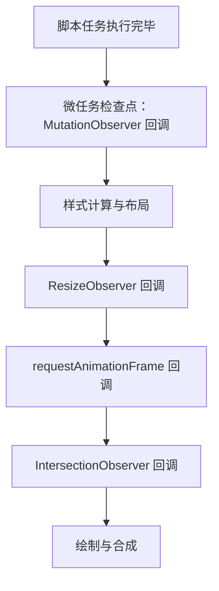

# Observer 家族与 Web Components：MDN 精读

!!! abstract "核心结论"
    - 三类 Observer 共享同一个模型：产生事件的代码只做 O(1) 入队，真正的判断与回调推迟到"调度点"批处理投递；这让回调数量与 DOM 变更次数解耦，也避免了在变更过程中同步执行用户代码导致的递归与 layout thrashing。
    - 触发时机不同：`MutationObserver` 的回调在微任务检查点执行；`ResizeObserver` 与 `IntersectionObserver` 由渲染更新（update the rendering）步骤驱动，前者在布局之后、`requestAnimationFrame` 回调之前附近，后者在 `requestAnimationFrame` 回调之后、绘制之前附近（顺序为规范步骤的简化，具体步骤名需核对官方文档）。
    - `IntersectionObserver` 只回答"相交比例跨过了某个阈值"，MDN 明确指出它不能用于判定精确重叠像素数；`ResizeObserver` 只在边框盒尺寸真正变化时才产生 entry；`MutationObserver` 对每一次匹配的变更都产生一条记录。
    - `observe()` 之后的首次上报是必然发生的：`IntersectionObserver` 会产生一条 ratio 可能为 0 的 entry，`ResizeObserver` 会产生一条 entry，这是写守卫逻辑（`if (!entry.isIntersecting) return`）必须处理的。
    - Web Components 的三件套是 custom elements、Shadow DOM、HTML templates；`attachShadow({ mode })` 的 open/closed 不是安全边界，跨边界样式只能通过 CSS 自定义属性、`::part()` 与 `::slotted()`。

## 1. Observer 家族总览：队列加调度器

### 1.1 三种观察者为什么长成同一个形状

三者都不是"事件"，而是**记录队列 + 调度器**：

1. 变更发生在哪里，就在哪里把一条记录 push 进 observer 自己的队列（这一步不含用户代码，代价极低）。
2. 调度器决定"什么时候把队列一次性交出去"。`MutationObserver` 用微任务；`ResizeObserver` 与 `IntersectionObserver` 挂在浏览器的渲染更新步骤上。
3. 投递时把队列整体取出（drain），回调的第一个参数永远是**数组**。哪怕只有一个目标变化，也是数组。

这个设计直接回应了历史问题：DOM3 时代的 Mutation Events 是**同步派发**的，`appendChild` 会在调用点同步执行监听器，监听器里再改 DOM 就形成递归，并且每次变更都要走完整的事件派发流程，性能急剧退化。MDN 在 `IntersectionObserver` 页面里描述的是同一个痛点：过去要在 scroll 处理器里循环调用 `getBoundingClientRect()`，而这些代码全部跑在主线程上，会同时拖慢浏览器与页面。

### 1.2 触发时机



上图是规范 update the rendering 步骤的简化示意；步骤名称与精确先后随规范演进，需核对官方文档。

| 维度 | MutationObserver | ResizeObserver | IntersectionObserver |
| --- | --- | --- | --- |
| 观察对象 | DOM 树变更 | 元素的边框盒与内容盒尺寸 | target 与 root（默认视口）的相交状态 |
| 记录模型 | 每次匹配的变更一条 MutationRecord | 尺寸变化才产生 entry | 比例跨过阈值才产生 entry |
| 投递时机 | 微任务 | 渲染更新阶段，布局之后 | 渲染更新阶段，rAF 回调之后 |
| 回调签名 | `(records, observer)` | `(entries, observer)` | `(entries, observer)` |
| 首次上报 | 只对 observe 之后的变更生效 | observe 后首次必有一条 entry | observe 后首次必有一条 entry，ratio 可能为 0 |
| 停止方式 | `disconnect()` / `takeRecords()` | `unobserve()` / `disconnect()` | `unobserve()` / `disconnect()` |
| 典型场景 | 富文本、属性同步、第三方脚本监控 | 元素级响应式布局、图表重绘 | 懒加载、无限滚动、广告曝光统计 |

### 1.3 三者共同的数据流

`observe(target, options)` 把目标登记进观察集合；平台在每个调度点遍历集合、为每个目标计算一份"当前状态快照"，与上一次已上报的状态比较，只有当状态发生跨越时才入队；投递时把队列整体交给回调。理解这一点，就能理解下面所有手写实现的结构：**计算快照 → 与上次比较 → 入队 → 统一 drain**。

## 2. IntersectionObserver：从几何到阈值分档

### 2.1 选项语义

MDN 给出的 options 字段是 `root`、`rootMargin`、`scrollMargin`、`threshold`。要点：

1. `root` 必须是 target 的祖先；不指定或传 `null` 表示使用浏览器视口。
2. `rootMargin` 是 1 到 4 个值，语法同 CSS `margin` 简写，**只支持 `px` 与 `%`**；百分比按 root 对应方向的尺寸解析，正值扩大 root 的边界框，负值收缩。默认 `"0px 0px 0px 0px"`。
3. `scrollMargin` 作用于嵌套的可滚动容器，取值与默认值同 `rootMargin`（较新，需核对官方文档与目标浏览器支持情况）。
4. `threshold` 是 `[0.0, 1.0]` 区间内的数值或数值数组。

相交程度叫 **intersection ratio**，是 target 可见比例在 0.0 到 1.0 之间的表示。判定的核心是"跨档"：把 ratio 映射成一个档位下标，档位变了才通知。完全不相交时档位取 -1，这样"从不可见变为可见"和"从可见变为不可见"都必然跨界。

### 2.2 手写迷你 IntersectionObserver

这段代码要解决的是：在 Node 里完整复现 `IntersectionObserver` 的几何计算与阈值分档语义，从而可以脱离浏览器做单元测试。运行环境 Node.js 18+。

```js
// io-lite.mjs —— 迷你 IntersectionObserver，Node.js 18+ 可直接运行

// 第 1 段：矩形工具
export function rectOf(el) {
  if (typeof el.getBoundingClientRect === "function") {
    const r = el.getBoundingClientRect();
    return { top: r.top, left: r.left, right: r.right, bottom: r.bottom, width: r.width, height: r.height };
  }
  // 测试用普通对象直接给出 top/left/width/height
  const { top = 0, left = 0, width = 0, height = 0 } = el;
  return { top, left, width, height, right: left + width, bottom: top + height };
}

export function intersectRect(a, b) {
  const top = Math.max(a.top, b.top);
  const left = Math.max(a.left, b.left);
  const right = Math.min(a.right, b.right);
  const bottom = Math.min(a.bottom, b.bottom);
  if (right <= left || bottom <= top) return null; // 面积为零按不相交处理
  return { top, left, right, bottom, width: right - left, height: bottom - top };
}

// 第 2 段：rootMargin 解析，取值规则同 CSS margin 的 1~4 值简写
const LENGTH = /^(-?\d+(?:\.\d+)?)(px|%)$/;

export function parseRootMargin(input) {
  const parts = String(input).trim().split(/\s+/);
  if (parts.length < 1 || parts.length > 4) throw new SyntaxError(`rootMargin 需要 1~4 个值: ${input}`);
  const nums = parts.map((p) => {
    const m = LENGTH.exec(p);
    if (!m) throw new SyntaxError(`rootMargin 只支持 px 与 %: ${p}`);
    return { value: Number(m[1]), unit: m[2] };
  });
  const [t, r = t, b = t, l = r] = nums; // 1 值全同；2 值上下/左右；3 值上/左右/下
  return { top: t, right: r, bottom: b, left: l };
}

// 百分比按 root 对应方向的尺寸解析：top/bottom 用 height，left/right 用 width
function resolveLength(len, base) {
  return len.unit === "px" ? len.value : (len.value / 100) * base;
}

export function expandRect(rect, margin) {
  const top = rect.top - resolveLength(margin.top, rect.height);
  const bottom = rect.bottom + resolveLength(margin.bottom, rect.height);
  const left = rect.left - resolveLength(margin.left, rect.width);
  const right = rect.right + resolveLength(margin.right, rect.width);
  return { top, left, right, bottom, width: right - left, height: bottom - top };
}

export function normalizeThresholds(threshold) {
  const list = (Array.isArray(threshold) ? threshold : [threshold]).map(Number);
  for (const n of list) {
    if (!Number.isFinite(n) || n < 0 || n > 1) throw new RangeError(`threshold 必须落在 [0,1]: ${n}`);
  }
  list.sort((a, b) => a - b);
  return list.filter((n, i) => i === 0 || n !== list[i - 1]); // 去重
}

// 第 3 段：阈值分档。规范用"第一个大于 ratio 的阈值的下标"定位，
// 对已相交的情形等价于"小于等于 ratio 的阈值个数"；完全不相交时取 -1
function thresholdIndex(ratio, isIntersecting, thresholds) {
  if (!isIntersecting) return -1;
  let n = 0;
  for (const t of thresholds) if (t <= ratio + 1e-9) n += 1;
  return n;
}

// 第 4 段：观察者本体
export class IntersectionObserverLite {
  constructor(callback, options = {}) {
    if (typeof callback !== "function") throw new TypeError("callback 必须是函数");
    this.callback = callback;
    this.root = options.root ?? null;
    this.viewport = options.viewport ?? { top: 0, left: 0, width: 1280, height: 720 }; // 本实现的测试注入项
    this.rootMargin = parseRootMargin(options.rootMargin ?? "0px");
    this.thresholds = normalizeThresholds(options.threshold ?? 0);
    this._targets = new Set();
    this._state = new WeakMap();
    this._queue = [];
    this._delivering = false;
    this._dirty = false;
  }

  observe(target) {
    if (this._targets.has(target)) return;
    this._targets.add(target);
    this._state.set(target, { first: true, index: -1 }); // first：首次观察必然上报一次
  }

  unobserve(target) { this._targets.delete(target); this._state.delete(target); }

  disconnect() { this._targets.clear(); this._queue.length = 0; }

  // 同步取走尚未投递的记录，与真实 API 的 takeRecords 语义一致
  takeRecords() { return this._queue.splice(0, this._queue.length); }

  _entry(target) {
    const targetRect = rectOf(target);
    const rootRect = expandRect(this.root ? rectOf(this.root) : rectOf(this.viewport), this.rootMargin);
    const hit = intersectRect(targetRect, rootRect);
    const area = targetRect.width * targetRect.height;
    // 零面积目标按规范的除零保护取值，边界行为需核对官方文档
    const raw = hit ? (area === 0 ? 1 : (hit.width * hit.height) / area) : 0;
    return {
      target,
      isIntersecting: hit !== null,
      intersectionRatio: Math.min(1, Math.max(0, raw)),
      boundingClientRect: targetRect,
      intersectionRect: hit ?? { top: 0, left: 0, right: 0, bottom: 0, width: 0, height: 0 },
      rootBounds: rootRect,
      time: Date.now(),
    };
  }

  _collect() {
    for (const target of this._targets) {
      const state = this._state.get(target);
      const entry = this._entry(target);
      const index = thresholdIndex(entry.intersectionRatio, entry.isIntersecting, this.thresholds);
      if (state.first || index !== state.index) {
        state.first = false;
        state.index = index;
        this._queue.push(entry); // 先入队、后统一投递，这就是批处理
      }
    }
  }

  _deliver() {
    if (this._queue.length === 0) return;
    const batch = this.takeRecords();
    this._delivering = true;
    try { this.callback(batch, this); } finally { this._delivering = false; }
  }

  // 对应浏览器的渲染更新阶段；测试中手动调用
  _tick() {
    if (this._delivering) { this._dirty = true; return; } // 回调里再次 tick：等本批投递完再算
    let guard = 0;
    do {
      this._dirty = false;
      this._collect();
      this._deliver();
      guard += 1;
      if (guard > 1000) throw new Error("IntersectionObserverLite: 通知次数超过上限");
    } while (this._dirty);
  }
}
```

1. `thresholdIndex` 是全部语义的核心：把连续的 ratio 离散成档位，只有档位变化才产生 entry。这样"从 0.6 变成 0.7"不会打扰你，而"从 0.6 跌到 0.4"跨过了 0.5 就会上报。
2. `_collect` 与 `_deliver` 分离，是为了让"同一个调度点内多个目标变化"合并成一次回调，对应真实 API 的批处理行为。
3. `_dirty` 标志处理回调内再次触发的问题：回调里不应递归调用回调，真实实现同样是把新变化排到后续批次。

### 2.3 验证标准

```js
// io-lite.test.mjs —— 运行：node io-lite.test.mjs
import assert from "node:assert/strict";
import { IntersectionObserverLite, parseRootMargin, expandRect } from "./io-lite.mjs";

const viewport = { top: 0, left: 0, width: 1000, height: 500 };

// 1) rootMargin 的 CSS 简写展开
assert.deepEqual(parseRootMargin("10px 20px 30px 40px"), {
  top: { value: 10, unit: "px" }, right: { value: 20, unit: "px" },
  bottom: { value: 30, unit: "px" }, left: { value: 40, unit: "px" },
});
assert.deepEqual(parseRootMargin("10px 20px").bottom, { value: 10, unit: "px" }); // 上下取第一值
assert.throws(() => parseRootMargin("10em"), SyntaxError);                       // 不支持 em

// 2) 百分比 margin 按 root 尺寸展开
const expanded = expandRect({ top: 0, left: 0, right: 1000, bottom: 500, width: 1000, height: 500 },
                            parseRootMargin("10%"));
assert.equal(expanded.top, -50);    // 500 * 10%
assert.equal(expanded.right, 1100); // 1000 * 10%

// 3) 首次观察必然上报
const batches = [];
const target = { top: 100, left: 0, width: 200, height: 100 };
const io = new IntersectionObserverLite((entries) => batches.push(entries), { viewport, threshold: [0, 0.5, 1] });
io.observe(target);
io._tick();
assert.equal(batches.length, 1);
assert.equal(batches[0].length, 1);
assert.equal(batches[0][0].intersectionRatio, 1); // 完全在视口内
assert.equal(batches[0][0].isIntersecting, true);

// 4) 比例跨过 0.5 上报：可见 50 / 高 100
target.top = 450;
io._tick();
assert.equal(batches.length, 2);
assert.equal(batches[1][0].intersectionRatio, 0.5);

// 5) 比例在 [0.5,1) 档内变化不上报
target.top = 440; // 可见 60，ratio 0.6，档位仍为 2
io._tick();
assert.equal(batches.length, 2);

// 6) 移出视口仍会上报一次
target.top = 5000;
io._tick();
assert.equal(batches.length, 3);
assert.equal(batches[2][0].isIntersecting, false);
assert.equal(batches[2][0].intersectionRatio, 0);

// 7) 批处理：同一帧内多个目标变化只回调一次
const a = { top: 0, left: 0, width: 10, height: 10 };
const b = { top: 0, left: 0, width: 10, height: 10 };
const calls = [];
const io2 = new IntersectionObserverLite((entries) => calls.push(entries), { viewport });
io2.observe(a);
io2.observe(b);
io2._tick();
assert.equal(calls.length, 1);
assert.equal(calls[0].length, 2);

// 8) unobserve 之后不再收到通知
io2.unobserve(a);
io2.unobserve(b);
b.top = 99999;
io2._tick();
assert.equal(calls.length, 1);

console.log("io-lite.test.mjs 全部通过");
```

预期输出：`io-lite.test.mjs 全部通过`（无 assert 抛错）。

1. 用例 4 与 5 配对，证明"跨档才通知"而不是"每次变化都通知"。
2. 用例 3 的 ratio 为 1 且档位是 3（阈值 0、0.5、1 全部满足），这是把数组阈值理解成"档位刻度"的关键。
3. 用例 7 是批处理的直接证据：两次 observe 在同一帧被合并成一次回调、两条 entry。

## 3. 实战：懒加载图片与 IO 驱动的虚拟列表

### 3.1 懒加载图片

这段代码要解决的是：用 `IntersectionObserver` 驱动图片懒加载，并且把观察者做成可注入依赖，以便在 Node 里用 2.2 的 Lite 实现测试。运行环境：浏览器使用真实 `IntersectionObserver`，测试使用注入的 Lite 实现。

```js
// lazy-image.mjs
// 第 1 段：默认加载器，把 data-src 搬到 src
async function loadImage(img) {
  const src = img.dataset?.src ?? img.getAttribute?.("data-src");
  if (!src) return img; // 没有 data-src 视为无需加载
  await new Promise((resolve, reject) => {
    img.addEventListener("load", resolve, { once: true });
    img.addEventListener("error", () => reject(new Error(`load failed: ${src}`)), { once: true });
    img.src = src;
  });
  img.removeAttribute("data-src");
  return img;
}

// 第 2 段：工厂函数，Observer 与 loader 都是注入点
export function createLazyImageLoader({
  root = null,
  rootMargin = "200px 0px",
  Observer = globalThis.IntersectionObserver,
  loader = loadImage,
  viewport, // 仅 Lite 实现需要
} = {}) {
  if (typeof Observer !== "function") throw new TypeError("缺少 IntersectionObserver 实现");
  const pending = new Map();

  const observer = new Observer((entries) => {
    for (const entry of entries) {
      // 一次回调可能携带多条 entry，且包含 isIntersecting 为 false 的条目
      if (!entry.isIntersecting) continue;
      const record = pending.get(entry.target);
      if (!record) continue;
      pending.delete(entry.target);
      observer.unobserve(entry.target); // 立刻解除，避免图片进出视口时反复触发
      Promise.resolve()
        .then(() => record.load(entry.target))
        .then(record.resolve, record.reject);
    }
  }, { root, rootMargin, threshold: 0, viewport });

  return {
    observer, // 暴露底层句柄，便于测试与手动刷新
    get pending() { return pending.size; },
    observe(img) {
      return new Promise((resolve, reject) => {
        pending.set(img, { load: loader, resolve, reject });
        observer.observe(img);
      });
    },
    disconnect() { observer.disconnect(); pending.clear(); },
  };
}
```

1. `rootMargin: "200px 0px"` 是"提前 200px 开始加载"的表达方式，不需要在 scroll 回调里做数学。
2. 在回调内立刻 `unobserve`，把已处理的图片从观察集合里摘掉，代价从"每次进入视口都回调"降到"每个元素最多一次"。
3. 把 `Observer` 与 `loader` 参数化，让同一份业务逻辑既跑在浏览器真实 API 上，也能跑在 Node 的 Lite 实现上。

### 3.2 懒加载的验证标准

```js
// lazy-image.test.mjs —— 运行：node lazy-image.test.mjs
import assert from "node:assert/strict";
import { IntersectionObserverLite } from "./io-lite.mjs";
import { createLazyImageLoader } from "./lazy-image.mjs";

const viewport = { top: 0, left: 0, width: 800, height: 600 };
const loaded = [];
const loader = createLazyImageLoader({
  Observer: IntersectionObserverLite,
  viewport,
  rootMargin: "100px",
  loader: async (img) => { loaded.push(img.id); return img; },
});

const make = (id, top) => ({ id, top, left: 0, width: 100, height: 100 });

const inView = make("in-view", 10);
const below = make("below", 2000);

const p1 = loader.observe(inView);
const p2 = loader.observe(below);
loader.observer._tick();                 // 模拟一帧渲染更新
await p1;
assert.deepEqual(loaded, ["in-view"]);   // 只有进入 rootMargin 范围的图片被加载
assert.equal(loader.pending, 1);         // 另一张仍在等待

below.top = 300;                         // 滚动到预加载范围内
loader.observer._tick();
await p2;
assert.deepEqual(loaded, ["in-view", "below"]);
assert.equal(loader.pending, 0);

loaded.length = 0;
below.top = 0;                           // 已加载过的元素已被 unobserve
loader.observer._tick();
assert.deepEqual(loaded, []);

console.log("lazy-image.test.mjs 全部通过");
```

预期输出：`lazy-image.test.mjs 全部通过`。

1. `below` 初始 top 为 2000，落在扩展后的 root（-100 到 700）之外，因此不会加载。
2. 把 `below.top` 改到 300 后落入预加载范围，说明 rootMargin 的作用是"扩大判定区域"，而不是改变可见性本身。
3. 最后一次断言证明 `unobserve` 生效：重复进入视口不会再触发加载。

### 3.3 基于 IO 的虚拟列表

这段代码要解决的是：只渲染窗口附近的行，并用两个 sentinel 元素配合 `rootMargin` 做双向预渲染，而不是在 scroll 回调里做几何计算。运行环境 Node.js 18+（几何计算用普通对象代替真实 DOM 元素）。

```js
// io-virtual-list.mjs

// 第 1 段：纯函数，算出必须渲染的下标区间
export function computeWindow({ scrollTop, viewportHeight, itemHeight, itemCount, overscan = 2 }) {
  if (itemCount <= 0 || itemHeight <= 0 || viewportHeight <= 0) return { start: 0, end: 0 };
  const first = Math.floor(scrollTop / itemHeight);
  const visible = Math.ceil(viewportHeight / itemHeight);
  return {
    start: Math.max(0, first - overscan),
    end: Math.min(itemCount, first + visible + overscan),
  };
}

// 第 2 段：sentinel 驱动的窗口增长
export class IoVirtualList {
  constructor({ itemHeight, itemCount, viewportHeight, step = 4, overscan = 2, prefetch = 200, Observer, onChange }) {
    this.itemHeight = itemHeight;
    this.itemCount = itemCount;
    this.viewportHeight = viewportHeight;
    this.step = step;
    this.overscan = overscan;
    this.scrollTop = 0;
    this.onChange = onChange ?? (() => {});

    const initial = computeWindow({ scrollTop: 0, viewportHeight, itemHeight, itemCount, overscan });
    this.start = initial.start;
    this.end = initial.end;

    // 真实实现里这两个是真实 <div>；这里用同形状的几何对象，方便在 Node 中驱动
    this.topSentinel = { top: 0, left: 0, width: 1, height: 1 };
    this.bottomSentinel = { top: 0, left: 0, width: 1, height: 1 };

    this.observer = new Observer((entries) => this._onEntries(entries), {
      root: { top: 0, left: 0, width: 1, height: viewportHeight },
      rootMargin: `${prefetch}px 0px ${prefetch}px 0px`, // 上下各提前 prefetch 像素
      threshold: 0,
    });
    this._syncSentinels();
    this.observer.observe(this.topSentinel);
    this.observer.observe(this.bottomSentinel);
  }

  // sentinel 用内容坐标系减去滚动偏移，换算到容器坐标系
  _syncSentinels() {
    this.topSentinel.top = this.start * this.itemHeight - this.scrollTop;
    this.bottomSentinel.top = this.end * this.itemHeight - this.scrollTop;
  }

  _onEntries(entries) {
    let changed = false;
    for (const entry of entries) {
      if (!entry.isIntersecting) continue;
      if (entry.target === this.topSentinel && this.start > 0) {
        this.start = Math.max(0, this.start - this.step);
        changed = true;
      } else if (entry.target === this.bottomSentinel && this.end < this.itemCount) {
        this.end = Math.min(this.itemCount, this.end + this.step);
        changed = true;
      }
    }
    if (!changed) return;
    this._syncSentinels();
    this.observer._tick(); // Lite 会把它折叠进本帧的后续批次，不会递归回调
    this.onChange({ start: this.start, end: this.end });
  }

  // 快速跳转兜底：先按视口位置把窗口撑到至少覆盖可见区
  setScrollTop(value) {
    this.scrollTop = value;
    const need = computeWindow({
      scrollTop: value, viewportHeight: this.viewportHeight,
      itemHeight: this.itemHeight, itemCount: this.itemCount, overscan: this.overscan,
    });
    this.start = Math.min(this.start, need.start);
    this.end = Math.max(this.end, need.end);
    this._syncSentinels();
    this.observer._tick();
    this.onChange({ start: this.start, end: this.end });
  }

  tick() { this.observer._tick(); }
  get range() { return { start: this.start, end: this.end }; }
}
```

1. `computeWindow` 只负责"可见区间"，`overscan` 用于让滚动时不出现空白；它是一个纯函数，可以单独测试。
2. sentinel 的价值在于把"还要不要多渲染几行"从 scroll 事件里挪走：窗口增长完全由相交状态驱动，滚动处理器只做窗口兜底。
3. `setScrollTop` 里只扩不缩（`Math.min` 处理 start、`Math.max` 处理 end），是为了避免滚动过程中反复销毁重建节点；收缩应放在滚动静止后的空闲时机。

### 3.4 虚拟列表的验证标准

```js
// io-virtual-list.test.mjs —— 运行：node io-virtual-list.test.mjs
import assert from "node:assert/strict";
import { IntersectionObserverLite } from "./io-lite.mjs";
import { IoVirtualList, computeWindow } from "./io-virtual-list.mjs";

// 1) 纯函数：窗口计算
assert.deepEqual(
  computeWindow({ scrollTop: 0, viewportHeight: 100, itemHeight: 20, itemCount: 100, overscan: 2 }),
  { start: 0, end: 7 },
);
assert.deepEqual(
  computeWindow({ scrollTop: 95, viewportHeight: 100, itemHeight: 20, itemCount: 100, overscan: 2 }),
  { start: 2, end: 11 },
);
assert.deepEqual(
  computeWindow({ scrollTop: 1e5, viewportHeight: 100, itemHeight: 20, itemCount: 100, overscan: 2 }),
  { start: 98, end: 100 },
);
assert.deepEqual(
  computeWindow({ scrollTop: 0, viewportHeight: 100, itemHeight: 20, itemCount: 0 }),
  { start: 0, end: 0 },
);

// 2) 控制器：首帧由 sentinel 增长一次，然后稳定
const list = new IoVirtualList({
  itemHeight: 50, itemCount: 1000, viewportHeight: 500,
  step: 4, overscan: 2, prefetch: 200,
  Observer: IntersectionObserverLite,
});
list.tick();
assert.deepEqual(list.range, { start: 0, end: 16 });
list.tick();
assert.deepEqual(list.range, { start: 0, end: 16 }); // 已稳定，不再增长

// 3) 滚动：兜底覆盖 + sentinel 预渲染各贡献一部分
list.setScrollTop(400);
assert.deepEqual(list.range, { start: 0, end: 24 });

// 4) 只渲染窗口内的节点
assert.equal(list.range.end - list.range.start, 24); // 1000 项只渲染 24 个

console.log("io-virtual-list.test.mjs 全部通过");
```

预期输出：`io-virtual-list.test.mjs 全部通过`。

1. 用例 1 的第三项验证边界收口：滚到极远处时 `end` 被 `itemCount` 钳制，`start` 仍能算出 98。
2. 用例 2 说明 sentinel 会在首帧就把窗口撑到 16（12 基础窗口 + 4 步长），随后因 sentinel 已移出扩展后的 root 而稳定。
3. 用例 3 展示两种机制的配合：滚动兜底把 end 拉到 20，sentinel 再预渲染 4 项到 24。

## 4. ResizeObserver：布局之后、绘制之前

### 4.1 语义与字段

MDN 说明 `ResizeObserver` 用来监听元素内容盒或边框盒的尺寸变化，是为响应式设计准备的；它相当于给 Web 平台补上了"元素查询"能力，替代了过去监听 window `resize` 事件再调 `getBoundingClientRect()` 的脆弱做法。

`ResizeObserverEntry` 关键字段：

| 字段 | 含义 | 注意 |
| --- | --- | --- |
| `target` | 尺寸发生变化的元素 | 与 `IntersectionObserverEntry.target` 同名 |
| `contentRect` | 内容盒矩形 | MDN 示例里作为 `borderBoxSize` 不可用时的回退 |
| `borderBoxSize` | 边框盒尺寸数组，取 `[0]` | 有 `inlineSize`、`blockSize` |
| `contentBoxSize` | 内容盒尺寸数组，取 `[0]` | 写作方向不同时 inline/block 的含义随之变化 |
| `devicePixelContentBoxSize` | 设备像素内容盒 | 支持情况需核对官方文档 |

### 4.2 手写迷你 ResizeObserver

这段代码要解决的是：复现"尺寸不变不产生 entry"与"resize loop 保护"这两个 `ResizeObserver` 最容易被忽略的语义。运行环境 Node.js 18+。

```js
// resize-observer-lite.mjs

// 第 1 段：尺寸快照。真实浏览器里 offsetWidth/clientWidth 会触发同步布局，
// 这里假设布局已完成，直接读取，用来复现"布局后比较尺寸"的语义。
export function snapshot(el) {
  const border = el.borderBoxSize?.[0] ?? { inlineSize: el.offsetWidth ?? 0, blockSize: el.offsetHeight ?? 0 };
  const content = el.contentBoxSize?.[0] ?? { inlineSize: el.clientWidth ?? 0, blockSize: el.clientHeight ?? 0 };
  return {
    borderBoxSize: { inlineSize: border.inlineSize, blockSize: border.blockSize },
    contentBoxSize: { inlineSize: content.inlineSize, blockSize: content.blockSize },
    // 注意：clientWidth 含 padding、不含 border，与真实 contentRect 是内容盒存在差异
    contentRect: { width: content.inlineSize, height: content.blockSize },
  };
}

function sameSize(prev, next) {
  return prev !== null
    && prev.borderBoxSize.inlineSize === next.borderBoxSize.inlineSize
    && prev.borderBoxSize.blockSize === next.borderBoxSize.blockSize;
}

// 第 2 段：观察者本体
export class ResizeObserverLite {
  constructor(callback) {
    if (typeof callback !== "function") throw new TypeError("callback 必须是函数");
    this.callback = callback;
    this._last = new Map(); // element -> 上次上报的尺寸；null 表示尚未上报
    this._queue = [];
    this._delivering = false;
    this._dirty = false;
    this._maxDepth = 20;    // 对应浏览器对 resize loop 的保护
  }

  observe(el) { if (!this._last.has(el)) this._last.set(el, null); }
  unobserve(el) { this._last.delete(el); }
  disconnect() { this._last.clear(); this._queue.length = 0; }
  takeRecords() { return this._queue.splice(0, this._queue.length); }

  _collect() {
    for (const [el, last] of this._last) {
      const size = snapshot(el);
      if (sameSize(last, size)) continue; // 尺寸没变就不产生 entry
      this._last.set(el, size);
      this._queue.push({ target: el, ...size });
    }
  }

  _tick() {
    if (this._delivering) { this._dirty = true; return; }
    let depth = 0;
    for (;;) {
      this._dirty = false;
      this._collect();
      if (this._queue.length > 0) {
        const batch = this.takeRecords();
        this._delivering = true;
        try { this.callback(batch, this); } finally { this._delivering = false; }
      }
      if (!this._dirty) return;
      depth += 1;
      if (depth > this._maxDepth) {
        // 浏览器在同样情形下会报出形如 "ResizeObserver loop ..." 的错误，文本随实现而异
        throw new Error("ResizeObserverLite: resize loop 超过保护上限");
      }
    }
  }
}
```

1. `sameSize` 是它与 `IntersectionObserver` 最大的差别：尺寸未变则完全不产生 entry，所以不要指望靠它实现"每帧回调"。
2. `_dirty` 与 `_maxDepth` 一起模拟了 resize loop 保护：在回调里改尺寸会再次触发自身，浏览器不会无限循环，而是报告错误。
3. `snapshot` 里对 `borderBoxSize` 做了回退，这正是 MDN 示例的写法，说明该字段在部分实现中不可用。

### 4.3 验证标准

```js
// resize-observer-lite.test.mjs —— 运行：node resize-observer-lite.test.mjs
import assert from "node:assert/strict";
import { ResizeObserverLite } from "./resize-observer-lite.mjs";

const el = { offsetWidth: 100, offsetHeight: 50, clientWidth: 90, clientHeight: 40 };
const batches = [];
const ro = new ResizeObserverLite((entries) => batches.push(entries));
ro.observe(el);

// 1) 首次必报
ro._tick();
assert.equal(batches.length, 1);
assert.deepEqual(batches[0][0].borderBoxSize, { inlineSize: 100, blockSize: 50 });
assert.deepEqual(batches[0][0].contentRect, { width: 90, height: 40 });

// 2) 尺寸未变不产生回调
ro._tick();
assert.equal(batches.length, 1);

// 3) 尺寸变化产生回调
el.offsetWidth = 120;
ro._tick();
assert.equal(batches.length, 2);
assert.equal(batches[1][0].borderBoxSize.inlineSize, 120);

// 4) 同一帧内多个元素变化合并为一次回调
const a = { offsetWidth: 1, offsetHeight: 1, clientWidth: 1, clientHeight: 1 };
const b = { offsetWidth: 1, offsetHeight: 1, clientWidth: 1, clientHeight: 1 };
const merged = [];
const ro2 = new ResizeObserverLite((entries) => merged.push(entries));
ro2.observe(a);
ro2.observe(b);
ro2._tick();
assert.equal(merged.length, 1);
assert.equal(merged[0].length, 2);

// 5) unobserve 后不再上报
ro2.unobserve(a);
ro2.unobserve(b);
b.offsetWidth = 999;
ro2._tick();
assert.equal(merged.length, 1);

// 6) resize loop 被保护
let count = 0;
const growing = { offsetWidth: 10, offsetHeight: 10, clientWidth: 10, clientHeight: 10 };
const ro3 = new ResizeObserverLite((entries) => {
  count += 1;
  for (const entry of entries) growing.offsetWidth = entry.borderBoxSize.inlineSize + 10;
});
ro3.observe(growing);
assert.throws(() => ro3._tick(), /resize loop/);
assert.ok(count > 20);

console.log("resize-observer-lite.test.mjs 全部通过");
```

预期输出：`resize-observer-lite.test.mjs 全部通过`。

1. 用例 1 与 2 配对，证明"首次必报、之后仅变化才报"。
2. 用例 4 是批处理证据；用例 5 证明 `unobserve` 会停止后续所有上报。
3. 用例 6 断言回调次数大于 20，说明保护上限是在多次往返之后才触发的，而不是立刻拒绝。

## 5. MutationObserver：微任务里的 DOM 变更批

### 5.1 语义与字段

MDN 说明 `MutationObserver` 是 DOM3 Events 中 Mutation Events 的替代品，用来观察 DOM 树的变更。它的构造是 `new MutationObserver(callback)`，但**观察不会自动开始**，必须调用 `observe(target, options)` 指定观察范围与关注的变化类型。`disconnect()` 的说明里有一条极易忽略的细节：**所有已检测但尚未上报的变更会被丢弃**；如果要保留它们，用 `takeRecords()`。

常用 options：`childList`、`attributes`、`characterData`、`subtree`、`attributeOldValue`、`characterDataOldValue`、`attributeFilter`。

MDN 还说明：被观察的元素从 DOM 移除并随后被垃圾回收后，`MutationObserver` 会停止观察该元素，但观察者本身仍可用于观察其他存在的元素。

### 5.2 手写迷你 MutationObserver 与最小 DOM 模型

这段代码要解决的是：在没有浏览器的 Node 环境里复现"记录入队 + 微任务投递"的语义。运行环境 Node.js 18+。

```js
// mutation-observer-lite.mjs

// 第 1 段：最小 DOM 模型，只保留 childList 与 attributes 两类变更
export class MockDocument {
  constructor() { this.observers = new Set(); }
  createElement(tag) { return new MockNode(tag, this); }
  _record(record) { for (const o of this.observers) o._enqueue(record); }
}

export class MockNode {
  constructor(tag, doc) {
    this.tag = tag;
    this.doc = doc;
    this.attributes = new Map();
    this.childNodes = [];
    this.parentNode = null;
  }

  get previousSibling() {
    if (!this.parentNode) return null;
    const i = this.parentNode.childNodes.indexOf(this);
    return i > 0 ? this.parentNode.childNodes[i - 1] : null;
  }

  appendChild(child) {
    if (child.parentNode) child.parentNode.removeChild(child);
    const prev = this.childNodes[this.childNodes.length - 1] ?? null;
    this.childNodes.push(child);
    child.parentNode = this;
    this.doc._record({
      type: "childList", target: this, addedNodes: [child], removedNodes: [],
      previousSibling: prev, nextSibling: null, attributeName: null, oldValue: null,
    });
    return child;
  }

  removeChild(child) {
    const i = this.childNodes.indexOf(child);
    if (i === -1) throw new Error(`${child.tag} 不是子节点`);
    const prev = this.childNodes[i - 1] ?? null;
    const next = this.childNodes[i + 1] ?? null;
    this.childNodes.splice(i, 1);
    child.parentNode = null;
    this.doc._record({
      type: "childList", target: this, addedNodes: [], removedNodes: [child],
      previousSibling: prev, nextSibling: next, attributeName: null, oldValue: null,
    });
    return child;
  }

  setAttribute(name, value) {
    const oldValue = this.attributes.has(name) ? this.attributes.get(name) : null;
    this.attributes.set(name, String(value));
    this.doc._record({
      type: "attributes", target: this, attributeName: name, oldValue,
      addedNodes: [], removedNodes: [], previousSibling: null, nextSibling: null,
    });
  }

  removeAttribute(name) {
    if (!this.attributes.has(name)) return;
    const oldValue = this.attributes.get(name);
    this.attributes.delete(name);
    this.doc._record({
      type: "attributes", target: this, attributeName: name, oldValue,
      addedNodes: [], removedNodes: [], previousSibling: null, nextSibling: null,
    });
  }
}

// 第 2 段：祖先判定，subtree 选项的基础
function isAncestor(ancestor, node) {
  let cur = node.parentNode;
  while (cur) {
    if (cur === ancestor) return true;
    cur = cur.parentNode;
  }
  return false;
}

// 第 3 段：观察者本体
export class MutationObserverLite {
  constructor(callback) {
    if (typeof callback !== "function") throw new TypeError("callback 必须是函数");
    this.callback = callback;
    this._observations = [];
    this._queue = [];
    this._scheduled = false;
  }

  observe(target, options = {}) {
    const opts = {
      childList: !!options.childList,
      attributes: !!options.attributes,
      characterData: !!options.characterData,
      subtree: !!options.subtree,
      attributeOldValue: !!options.attributeOldValue,
      characterDataOldValue: !!options.characterDataOldValue,
      attributeFilter: options.attributeFilter ? Array.from(options.attributeFilter) : null,
    };
    if (!opts.childList && !opts.attributes && !opts.characterData) {
      throw new TypeError("observe 至少要开启 childList / attributes / characterData 之一");
    }
    this._observations.push({ target, options: opts });
    target.doc.observers.add(this);
  }

  disconnect() {
    this._observations = [];
    this._queue = []; // 已检测但未上报的记录全部丢弃
  }

  takeRecords() {
    const records = this._queue;
    this._queue = [];
    return records; // 同步取走，回调不会再收到这一批
  }

  _matches(obs, record) {
    const { options, target } = obs;
    if (record.type === "attributes" && !options.attributes) return false;
    if (record.type === "childList" && !options.childList) return false;
    if (record.type === "characterData" && !options.characterData) return false;
    if (record.target === target) return true;
    return options.subtree === true && isAncestor(target, record.target);
  }

  _oldValue(options, record) {
    if (record.type === "attributes") return options.attributeOldValue ? record.oldValue : null;
    if (record.type === "characterData") return options.characterDataOldValue ? record.oldValue : null;
    return null;
  }

  _enqueue(record) {
    for (const obs of this._observations) {
      if (!this._matches(obs, record)) continue;
      if (record.type === "attributes" && obs.options.attributeFilter
          && !obs.options.attributeFilter.includes(record.attributeName)) continue;
      this._queue.push({
        type: record.type,
        target: record.target,
        addedNodes: record.addedNodes,
        removedNodes: record.removedNodes,
        previousSibling: record.previousSibling,
        nextSibling: record.nextSibling,
        attributeName: record.attributeName,
        attributeNamespace: null,
        oldValue: this._oldValue(obs.options, record),
      });
      break; // 同一次变更只产生一条记录
    }
    if (this._queue.length > 0) this._schedule();
  }

  _schedule() {
    if (this._scheduled) return;
    this._scheduled = true;
    queueMicrotask(() => { // 关键：投递发生在微任务里，先攒批、后回调
      this._scheduled = false;
      const batch = this.takeRecords();
      if (batch.length > 0) this.callback(batch, this);
    });
  }
}
```

1. `MockNode` 的写操作只做两件事：改内部状态、向 document 汇报一条记录。观察者不参与写入路径，这就是"零同步回调"的实现方式。
2. `_matches` 把 `subtree` 实现成"祖先链上查找"，这也是浏览器内部判定能否命中观察目标的方式。
3. `_schedule` 用 `queueMicrotask` + `_scheduled` 标志，保证同一轮同步代码里的多次变更合并为一次回调。

### 5.3 验证标准

```js
// mutation-observer-lite.test.mjs —— 运行：node mutation-observer-lite.test.mjs
import assert from "node:assert/strict";
import { MockDocument, MutationObserverLite } from "./mutation-observer-lite.mjs";

// 让所有已排队的微任务跑完
const flush = () => new Promise((resolve) => setTimeout(resolve, 0));

// 1) childList 批处理
const doc = new MockDocument();
const list = doc.createElement("ul");
const batches = [];
const mo = new MutationObserverLite((records) => batches.push(records));
mo.observe(list, { childList: true });

list.appendChild(doc.createElement("li"));
list.appendChild(doc.createElement("li"));
assert.equal(batches.length, 0);            // 还没到微任务检查点，回调未执行
await flush();
assert.equal(batches.length, 1);            // 两次变更合并成一批
assert.equal(batches[0].length, 2);
assert.equal(batches[0][0].type, "childList");
assert.equal(batches[0][1].removedNodes.length, 0);

// 2) removeChild 记录前后兄弟
const first = list.childNodes[0];
list.removeChild(first);
await flush();
assert.equal(batches.length, 2);
assert.equal(batches[1][0].removedNodes[0], first);
assert.equal(batches[1][0].previousSibling, null);
assert.equal(batches[1][0].nextSibling, list.childNodes[0]);

// 3) attributes + attributeFilter + oldValue
const box = doc.createElement("div");
const attrBatches = [];
const mo2 = new MutationObserverLite((records) => attrBatches.push(records));
mo2.observe(box, { attributes: true, attributeOldValue: true, attributeFilter: ["data-state"] });

box.setAttribute("class", "x");             // 被 attributeFilter 过滤
box.setAttribute("data-state", "open");
await flush();
assert.equal(attrBatches.length, 1);
assert.equal(attrBatches[0].length, 1);
assert.equal(attrBatches[0][0].attributeName, "data-state");
assert.equal(attrBatches[0][0].oldValue, null);

box.setAttribute("data-state", "closed");
await flush();
assert.equal(attrBatches[1][0].oldValue, "open");

// 4) subtree：祖先的观察者也能收到后代变更
const subtreeRecords = [];
const mo3 = new MutationObserverLite((records) => subtreeRecords.push(records));
mo3.observe(list, { childList: true, subtree: true });
const nested = doc.createElement("ul");
list.appendChild(nested);
nested.appendChild(doc.createElement("li"));
await flush();
assert.equal(subtreeRecords.length, 1);
assert.equal(subtreeRecords[0].length, 2);
assert.equal(subtreeRecords[0][1].target, nested);

// 5) takeRecords 与 disconnect 的区别
const pending = [];
const mo4 = new MutationObserverLite((records) => pending.push(records));
mo4.observe(box, { attributes: true, attributeOldValue: true });

box.setAttribute("title", "a");
const taken = mo4.takeRecords();            // 同步取走，回调不会再收到
assert.equal(taken.length, 1);
assert.equal(taken[0].oldValue, null);
await flush();
assert.equal(pending.length, 0);

box.setAttribute("title", "b");
mo4.disconnect();                           // 丢弃尚未上报的记录
await flush();
assert.equal(pending.length, 0);

console.log("mutation-observer-lite.test.mjs 全部通过");
```

预期输出：`mutation-observer-lite.test.mjs 全部通过`。

1. 用例 1 的第一次断言在 `await` 之前执行，直接证明回调是异步的；第二次断言证明两次变更被合并。
2. 用例 3 覆盖了 `attributeFilter` 过滤与 `oldValue` 只在开启 `attributeOldValue` 时才有值。
3. 用例 5 把这两个高频考点的区别钉死：`takeRecords()` 取走记录且阻止回调，`disconnect()` 直接丢弃记录。

## 6. Web Components：自定义元素与 ui-tabs

### 6.1 自定义元素的四个生命周期

MDN 定义的四个回调：

| 回调 | 触发时机 | 易错点 |
| --- | --- | --- |
| `connectedCallback()` | 元素首次连接到文档 DOM | 节点被移动时可能多次触发，必须幂等 |
| `disconnectedCallback()` | 元素从文档 DOM 断开 | 适合清理定时器、`unobserve`、解绑全局监听 |
| `adoptedCallback()` | 元素被移动到新 document | 多窗口/多 iframe 场景才会遇到 |
| `attributeChangedCallback(name, oldValue, newValue)` | 观察的属性被添加、删除或修改 | 只对 `static observedAttributes` 里列出的属性生效 |

注册用 `customElements.define(name, ctor, options)`；元素名必须包含连字符（避免与内置元素冲突）。自定义内置元素通过 `is` 全局属性与 `define` 的 `{ extends: "..." }` 选项配合。作用域注册表（scoped registry）可以在不与全局注册表冲突的前提下注册元素，具体 API 名称随规范演进，需核对官方文档。

此外 MDN 列出与自定义元素相关的 CSS 伪类：`:defined`（匹配已定义的元素）、`:host`、`:host()`、`:host-context()`。

### 6.2 带 Shadow DOM 的 ui-tabs

这段代码要解决的是：用 slot 承载使用者提供的内容，用 Shadow DOM 封装结构与样式，用 `part` 暴露受控的样式入口。第 1 个文件是纯逻辑，Node 与浏览器都能跑；第 2 个文件是只在浏览器运行的组件。运行环境：`tab-selection.mjs` 为 Node.js 18+；`ui-tabs.mjs` 为支持 Custom Elements 与 Shadow DOM 的浏览器。

```js
// tab-selection.mjs —— 纯函数，Node 与浏览器通用
export function resolveSelection(index, count) {
  if (count <= 0) return -1;              // 没有任何可选项
  if (!Number.isFinite(index)) return 0;  // 非法值回落默认项
  return Math.min(Math.max(0, Math.trunc(index)), count - 1); // 越界钳制
}
```

```js
// ui-tabs.mjs —— 浏览器运行（需要 customElements / attachShadow / slotchange）
import { resolveSelection } from "./tab-selection.mjs";

const template = document.createElement("template");
template.innerHTML = `
  <style>
    :host { display: block; }
    :host([hidden]) { display: none; }
    .tablist { display: flex; gap: 4px; }
    .tablist ::slotted([slot="tab"]) {
      all: unset;
      cursor: pointer;
      padding: 6px 12px;
      border-radius: 6px 6px 0 0;
    }
    .tablist ::slotted([aria-selected="true"]) {
      border-bottom: 2px solid currentColor;
      font-weight: 600;
    }
    .panels { padding: 8px 0; }
  </style>
  <div class="tablist" role="tablist" part="tablist">
    <slot name="tab"></slot>
  </div>
  <div class="panels"><slot name="panel"></slot></div>
`;

export class UiTabs extends HTMLElement {
  static observedAttributes = ["selected"];

  #tabSlot;
  #panelSlot;
  #tabs = [];
  #panels = [];

  constructor() {
    super();
    // 第 1 段：构造函数只做不依赖外部环境的事
    const root = this.attachShadow({ mode: "open" });
    root.append(template.content.cloneNode(true));
    this.#tabSlot = root.querySelector('slot[name="tab"]');
    this.#panelSlot = root.querySelector('slot[name="panel"]');
    // 插槽内容由使用者提供，只有 slotchange 时才知道有哪些节点
    this.#tabSlot.addEventListener("slotchange", () => this.#sync());
  }

  get selectedIndex() { return Number(this.getAttribute("selected") ?? 0); }

  connectedCallback() {
    // 第 2 段：connectedCallback 可能多次触发，所有操作必须幂等
    if (!this.hasAttribute("selected")) this.setAttribute("selected", "0");
    this.#sync();
  }

  attributeChangedCallback(name, oldValue, newValue) {
    if (name === "selected" && oldValue !== newValue) this.#render();
  }

  #sync() {
    this.#tabs = this.#tabSlot.assignedElements();
    this.#panels = this.#panelSlot.assignedElements();
    this.#tabs.forEach((tab, index) => {
      tab.setAttribute("role", "tab");
      if (!tab.id) tab.id = `${this.localName}-tab-${index}`;
      tab.onclick = () => this.setAttribute("selected", String(index)); // 赋值而非 addEventListener，重复 sync 不会叠加
    });
    this.#render();
  }

  #render() {
    const index = resolveSelection(this.selectedIndex, this.#tabs.length);
    this.#tabs.forEach((tab, i) => {
      tab.setAttribute("aria-selected", String(i === index));
      tab.setAttribute("tabindex", i === index ? "0" : "-1");
    });
    this.#panels.forEach((panel, i) => {
      panel.hidden = i !== index;
      if (!panel.getAttribute("role")) panel.setAttribute("role", "tabpanel");
    });
    if (index >= 0 && this.#panels[index]) {
      if (!this.#panels[index].id) this.#panels[index].id = `${this.localName}-panel-${index}`;
      this.#tabs[index].setAttribute("aria-controls", this.#panels[index].id);
      this.#panels[index].setAttribute("aria-labelledby", this.#tabs[index].id);
    }
    this.dispatchEvent(new CustomEvent("tab-change", {
      detail: { index }, bubbles: true, composed: true, // composed 让事件穿出 shadow 边界
    }));
  }
}

// 第 3 段：避免重复注册
if (!customElements.get("ui-tabs")) customElements.define("ui-tabs", UiTabs);
```

1. 构造函数里不读写自身属性、不访问子节点，因为升级时机决定了这些内容可能还不存在；真正的同步逻辑都放在 `connectedCallback` 与 `slotchange` 里。
2. `slotchange` 是唯一可靠的"使用者提供了什么内容"信号，`assignedElements()` 只返回分配到该插槽的顶层元素。
3. 用 `tab.onclick = ...` 而不是 `addEventListener`，是为了让重复 `#sync()` 天然幂等。

### 6.3 验证标准

纯逻辑部分在 Node 中验证：

```js
// tab-selection.test.mjs —— 运行：node tab-selection.test.mjs
import assert from "node:assert/strict";
import { resolveSelection } from "./tab-selection.mjs";

assert.equal(resolveSelection(0, 3), 0);
assert.equal(resolveSelection(2, 3), 2);
assert.equal(resolveSelection(9, 3), 2);    // 越界钳制到最后一个
assert.equal(resolveSelection(-1, 3), 0);   // 负数钳制到第一个
assert.equal(resolveSelection(NaN, 3), 0);  // 非法值回落默认项
assert.equal(resolveSelection(1, 0), -1);   // 没有任何 tab 时无可选项

console.log("tab-selection.test.mjs 全部通过");
```

预期输出：`tab-selection.test.mjs 全部通过`。

组件部分必须跑在有 DOM 的环境里（浏览器，或需核对其支持程度的 DOM 模拟实现）：

```html
<!-- ui-tabs.test.html：浏览器打开，控制台应输出 4 行断言通过，且无 Assertion failed -->
<script type="module">
import "./ui-tabs.mjs"; // 路径按实际部署调整

const el = document.createElement("ui-tabs");
el.innerHTML = `
  <button slot="tab">A</button>
  <button slot="tab">B</button>
  <section slot="panel">panel A</section>
  <section slot="panel">panel B</section>`;
document.body.append(el);

// slotchange 在微任务之后派发，等一帧再断言
await new Promise((resolve) => requestAnimationFrame(() => resolve()));

const tabs = el.querySelectorAll('[slot="tab"]');
const panels = el.querySelectorAll('[slot="panel"]');
console.assert(tabs.length === 2 && panels.length === 2, "ok 1: 插槽内容被正确识别");
console.assert(tabs[0].getAttribute("aria-selected") === "true" && panels[1].hidden === true, "ok 2: 默认选中第 0 项");
tabs[1].click();
console.assert(el.getAttribute("selected") === "1" && panels[0].hidden === true && panels[1].hidden === false, "ok 3: 点击切换生效");
console.assert(el.shadowRoot.querySelector('[part="tablist"]') !== null, "ok 4: shadow DOM 暴露了 part 入口");
</script>
```

1. 断言 1 与 2 依赖 `slotchange` 已经跑完，所以必须先等一帧，否则会看到未初始化的状态。
2. 断言 3 验证 `attributeChangedCallback` 到 `#render` 的链路：点击只是设置属性，渲染由属性变化驱动，这是"属性即状态"的设计。
3. 断言 4 验证 `part="tablist"` 确实把内部节点暴露给了外部样式。

## 7. Shadow DOM：样式隔离、插槽与 ::part

### 7.1 open 与 closed

| 维度 | `mode: "open"` | `mode: "closed"` |
| --- | --- | --- |
| 外部读取 `el.shadowRoot` | 返回该 shadow root | 返回 `null` |
| 组件内部访问 | 通过 `el.shadowRoot` 或闭包引用均可 | 只能靠组件内部保存的引用 |
| 是否为安全边界 | 不是 | 也不是，仅是访问便利性差异 |
| 常用场景 | 绝大多数组件库 | 不希望外部脚本意外改写内部结构的少数场景 |

MDN 把 Shadow DOM 描述为一种把封装的 shadow 树附加到元素上的机制，可以命令式地用 JavaScript API 附加，也可以在 HTML 中声明式附加（声明式写法的具体属性名与浏览器支持情况需核对官方文档）。它的直接收益是：元素的 id 与样式不会和其他部分冲突。

### 7.2 跨边界样式手段对比

| 机制 | 写在谁身上 | 生效方向 | 能选中什么 |
| --- | --- | --- | --- |
| `:host` / `:host(sel)` | shadow 内的样式表 | 选中宿主元素自身 | 宿主本身；`:host(sel)` 需要宿主匹配 sel |
| `::slotted(sel)` | shadow 内的样式表 | 选中被分配到插槽的节点 | 只限最外层被分配节点，不能选其后代 |
| `::part(name)` | 外部文档的样式表 | 选中 shadow 内带 `part="name"` 的元素 | 只能命中带该 part 的元素本身及其状态；继续向下选择后代的写法需核对官方文档 |
| `exportparts` | 元素的 HTML 属性 | 把内层组件的 part 再暴露给外层 | 用于组件嵌套时透传 part |
| CSS 自定义属性 | 宿主元素上设置，shadow 内用 `var()` 读取 | 可继承值穿透边界 | 只能传值，不能传结构 |

MDN 对 CSS shadow parts 的说明是：默认情况下 shadow 树中的元素只能在其所属 shadow root 内被样式化，通过在作为组件装配件的后代上添加 `part` 属性，就能通过 `::part()` 伪元素把该节点暴露给外部样式化。

### 7.3 插槽

`<slot>` 是"使用者提供内容、组件决定位置"的机制：`<slot name="x">` 接收 `slot="x"` 的顶层子节点，未命名的节点进入默认插槽。分配状态用 `assignedNodes()` / `assignedElements()` 读取，变化通过 `slotchange` 事件感知。插槽内容的样式默认由**外层文档**决定，shadow 内只能通过 `::slotted()` 有限度地覆盖。

## 8. 常见陷阱

1. `IntersectionObserver` 的回调参数一定是数组，且一次回调可能携带多条 entry，也可能包含 `isIntersecting` 为 false 的条目。不遍历、不判断相交就直接处理，是最常见的批量错误。
2. 首次 `observe()` 必然上报一次，此时 `intersectionRatio` 可能正好是 0。所有"进入视口才做事"的逻辑都要先写守卫。
3. `rootMargin` 的百分比按 root 对应方向的尺寸解析，而不是视口；`root` 必须是 target 的祖先，MDN 明确写了这一约束。
4. 忘记 `unobserve` 或 `disconnect` 会让长列表的观察集合持续膨胀。元素从 DOM 移除后并不等于自动停止观察。
5. 不要用 `IntersectionObserver` 做像素级精确判定。MDN 指出它无法基于精确的重叠像素数或具体是哪些像素触发逻辑，它解决的是"大约相交 N% 就做某事"。
6. `ResizeObserver` 只在尺寸真正变化时回调，把它当成"每帧回调"会导致逻辑永远不执行；MDN 示例本身就用 `if (entry.borderBoxSize)` 做了回退判断，说明该字段并非在所有实现中都存在。
7. 在 `ResizeObserver` 回调里修改被观察元素的尺寸会形成 resize loop，浏览器不会静默吞掉，而是报告形如 `ResizeObserver loop ...` 的错误（具体文本随实现而异）。
8. `MutationObserver` 的 `disconnect()` 会丢弃已检测未上报的记录，MDN 对此有明确说明；要保留就用 `takeRecords()`。
9. `observe()` 时开启 `subtree: true` 才会收到后代变更；之后动态插入的子树不需要重新 observe，因为它属于已观察节点的子树。
10. 自定义元素名必须包含连字符；重复 `define` 同名元素会抛错，库代码应先 `customElements.get()` 再注册。
11. `connectedCallback` 会因为节点移动被多次调用，所有绑定与初始化都要幂等；构造函数里不要读写自身属性或子节点。
12. `mode: "closed"` 不是安全边界，它只让外部拿不到 `shadowRoot`；需要真正隔离请用其他手段。
13. `::slotted()` 只能选中最外层被分配节点，不能选其后代；插槽内容的样式冲突往往来自这一限制被误判。
14. 纯 IO 驱动的窗口化虚拟列表在"快速跳转"时会失效：sentinel 被一次性跳过，窗口来不及增长。务必保留一个基于滚动位置的兜底计算。

## 9. 面试题与答题要点

1. **三类 Observer 的回调分别在什么时机执行，为什么不能依赖它们的相对顺序做业务？**
   要点：`MutationObserver` 走微任务，在同步任务结束后的微任务检查点执行；`ResizeObserver` 与 `IntersectionObserver` 挂在渲染更新步骤上，前者靠近布局之后，后者靠近绘制之前。业务若依赖"先拿到尺寸再判断相交"，应把逻辑写在两者都能触达的状态里，或者用显式的下一帧调度，而不是假设回调顺序；精确顺序属规范细节，需核对官方文档。

2. **为什么 `IntersectionObserver` 比 scroll + `getBoundingClientRect()` 好？**
   要点：scroll 处理器在主线程执行，每次读取几何属性都会强制同步布局，多个库各自做相同的事会叠加成 layout thrashing；`IntersectionObserver` 把判断交给平台批处理，站点侧不再有主线程轮询代码，MDN 正是从这个性能痛点引出该 API 的。

3. **`threshold: [0, 0.5, 1]` 时，元素从完全可见变成只露出一半，会回调吗？从一半变成 60% 会回调吗？**
   要点：会。阈值是档位刻度，可见 50% 落在 0.5 档，与完全可见档位不同，触发回调；60% 与 50% 同属 `[0.5, 1)` 这一档，档位没变，不回调。"跨档才通知"是理解该 API 的核心。

4. **`ResizeObserver` 与监听 window 的 `resize` 事件有什么本质区别？**
   要点：前者观察的是元素尺寸，可在视口不变而元素因布局变化而改变尺寸时触发；后者只在视口变化时触发，且需要自己调用几何 API 测量，代价高、易漏场景。MDN 明确把该 API 定位为对"元素查询"缺失的 JavaScript 解法。

5. **`takeRecords()` 和 `disconnect()` 的区别是什么？**
   要点：`disconnect()` 停止观察并丢弃所有已检测但未上报的变更；`takeRecords()` 清空并返回这批记录，回调不会再收到它们，观察本身继续有效。需要"切换观察目标前把尾巴处理干净"时用后者。

6. **自定义元素的四个生命周期回调分别做什么，有哪些必须注意的约束？**
   要点：`connectedCallback` 做初始化与绑定，可能多次触发；`disconnectedCallback` 做清理；`adoptedCallback` 处理跨 document 迁移；`attributeChangedCallback` 只在 `observedAttributes` 列出的属性上触发，适合做"属性即状态"的渲染驱动。构造函数里只应做与外部环境无关的事。

7. **Shadow DOM 的 open 与 closed 有什么实际差别？**
   要点：差别只在 `el.shadowRoot` 是否返回根节点。组件使用自己保存的引用同样可以在 closed 模式下正常工作；两者都不是安全边界。选择 closed 通常是为了表达"不希望被外部脚本改写"的意图。

8. **从外部想给组件内部的某个节点加样式，有哪几种方式？各自的限制是什么？**
   要点：CSS 自定义属性（只能传值）、`::part()`（需要内部节点带 `part` 属性，且只能命中该元素本身）、`::slotted()`（方向相反，在组件内部作用于被分配的插槽内容，且只能选最外层节点）。组件嵌套时用 `exportparts` 把内层 part 透传出来。

9. **手写懒加载时，为什么要在一个元素加载完成后立刻 `unobserve`？**
   要点：观察集合是长期存在的，不摘除的话元素每次进出视口都会产生 entry 并执行回调；加载只需一次，摘除后既省回调也避免重复请求。这属于"用 `observe` 表达一次性意图"的典型用法。

10. **如果一个列表要在有限的 DOM 节点下渲染十万条数据，你会怎么组合这些 API？**
    要点：用 `computeWindow` 之类的纯函数按滚动位置算出必须渲染的区间；用两个 sentinel 配合 `rootMargin` 做上下预渲染，把增长逻辑从滚动处理器里剥离；保留基于滚动位置的兜底计算以应对快速跳转；在滚动静止后再收缩窗口，避免滚动过程中反复重建节点。

## 深入阅读与参考

!!! tip "怎么用这些资料"
    先读「官方文档与规范」建立准确的概念，再读「源码与示例」核对细节，最后用「教程、书籍与视频」换一种讲法加深理解。每条都写明了读哪一节、带着什么问题读。

### 官方文档与规范

| 资源 | 为什么读 | 怎么读 |
|---|---|---|
| [MDN 使用 Shadow DOM](https://developer.mozilla.org/en-US/docs/Web/API/Web_components/Using_shadow_DOM) | 验证 Shadow DOM 样式隔离，掌握 slot 与 ::part 定制点。 | 读样式隔离、slot、::part 小节，动手写一个用 ::part 对外暴露样式的组件。 |
| [MDN Web Components](https://developer.mozilla.org/en-US/docs/Web/API/Web_components) | 先分清 Custom Elements、Shadow DOM、模板三项技术边界。 | 读概述与三项技术关系，画一张关系图，确定本页各组件的技术落点。 |
| [MDN 使用自定义元素](https://developer.mozilla.org/en-US/docs/Web/API/Web_components/Using_custom_elements) | 自定义元素生命周期与 observedAttributes 的官方入口。 | 重点读生命周期回调表与 observedAttributes，实现一个带观察属性的元素。 |
| [MDN Intersection Observer](https://developer.mozilla.org/en-US/docs/Web/API/Intersection_Observer_API) | IO 的阈值、rootMargin 与回调语义的权威说明。 | 读阈值数组、root 与 rootMargin 三节，写 demo 比较不同 threshold 触发时机。 |
| [MDN MutationObserver](https://developer.mozilla.org/en-US/docs/Web/API/MutationObserver) | MutationObserver 配置项与回调批处理的权威说明。 | 读构造与 observe 选项，确认回调在微任务批次触发，写 demo 验证顺序。 |
| [MDN Resize Observer](https://developer.mozilla.org/en-US/docs/Web/API/Resize_Observer_API) | 理解 Resize Observer 的回调时机与循环限制。 | 读「何时调用」与错误处理，写元素按自身宽度切布局的例子观察时机。 |
| [CSS shadow parts](https://developer.mozilla.org/en-US/docs/Web/CSS/Guides/Shadow_parts) | ::part 完整指南，打通对外样式暴露的链路。 | 读 shadow parts 指南，对照 part 属性与 ::part() 选择器串起整体用法。 |
| [`part` HTML global attribute](https://developer.mozilla.org/en-US/docs/Web/HTML/Reference/Global_attributes/part) | part 全局属性：把内部结构标记为可外部定制。 | 读属性值与 exportparts 的关联，给自定义元素内部节点补上 part 名。 |
| [MutationObserver: takeRecords() method](https://developer.mozilla.org/en-US/docs/Web/API/MutationObserver/takeRecords) | takeRecords 揭示回调前的变更队列，理解批处理。 | 读示例，对比同步取出记录与异步回调批处理，写代码验证差异。 |
| [MutationObserver: observe() method](https://developer.mozilla.org/en-US/docs/Web/API/MutationObserver/observe) | observe() 各配置项决定变更通知的粒度与范围。 | 读 childList、subtree、attributeFilter 参数表，配置出最小观察范围。 |

### 源码与示例

| 资源 | 为什么读 | 怎么读 |
|---|---|---|
| [`::part()` CSS pseudo-element](https://developer.mozilla.org/en-US/docs/Web/CSS/Reference/Selectors/::part) | ::part() 选择器语法与限制的参考页，含可运行示例。 | 读语法与示例，注意只作用于暴露的 part，动手改示例验证限制。 |
| [Using templates and slots](https://developer.mozilla.org/en-US/docs/Web/API/Web_components/Using_templates_and_slots) | template 与 slot 官方教程，含具名插槽与回退内容。 | 读具名插槽与回退内容两节，为 ui-tabs 先写出插槽结构再实现。 |

### 教程、书籍与视频

| 资源 | 为什么读 | 怎么读 |
|---|---|---|
| [Timing element visibility with the Intersection Observer API](https://developer.mozilla.org/en-US/docs/Web/API/Intersection_Observer_API/Timing_element_visibility) | 以可见性计时为例，完整演示 IO 的工程化用法。 | 跟读示例代码，理解记录中的 time 与 intersectionRatio，改造为曝光埋点。 |

## 应用与行业实践

### 应用场景地图

| 场景 | 用到本页哪个知识点 | 典型技术选型 | 注意事项 |
| --- | --- | --- | --- |
| 后台管理的万行表格 | 哨兵元素 + 虚拟窗口，行高由 ResizeObserver 补齐 | IntersectionObserver + ResizeObserver + 绝对定位行容器 | 行高变化后要重算 spacer 高度，写 DOM 放到 rAF 里 |
| 低端安卓的首屏图片加载 | rootMargin 提前预取、首次 entry 可能 isIntersecting 为 false | IntersectionObserver + `data-src` + `unobserve` | LCP 候选图不要走懒加载路径 |
| 多人协作白板的画布 | 边框盒尺寸变化驱动 canvas 位图重建 | ResizeObserver + devicePixelRatio + rAF | 回调里不能直接改被观察元素的尺寸 |
| 电商详情页的楼层曝光埋点 | threshold 分档判断"进入过视口" | IntersectionObserver + 一次性上报 | 上报后立刻 unobserve，避免后台标签页堆积 |
| 第三方脚本注入节点的监控 | MutationObserver 每次匹配变更产生一条记录 | MutationObserver + subtree/childList | 批内 records 要按顺序回放，不能只看最后一条 |
| 设计系统里的 ui-tabs | Shadow DOM 隔离样式、::part 暴露钩子 | custom elements + attachShadow + adoptedStyleSheets | open/closed 不是安全边界，敏感数据别放 DOM 里 |
| 长文阅读页的目录高亮 | 负 rootMargin 把判定线压到视口上沿 | IntersectionObserver + rootMargin 负值 | 同一时刻可能有多条 entry 相交，要定优先级 |
| 图表仪表盘的容器自适应 | 容器尺寸变化触发重绘与刻度重算 | ResizeObserver + rAF + canvas 或 SVG | 重绘里再改容器尺寸会触发循环告警 |
| 富文本编辑器的撤销栈 | characterData 与 childList 的变更记录 | MutationObserver + 记录合并 | 用户输入期间要暂停观察，否则写入自己的改动 |

### 三个场景拆解

#### 场景 1：后台管理的万行表格

**业务背景**：表格要展示上万行数据，一次性挂载后初次布局耗时会冲到百毫秒量级，滚动时每帧都在做样式重算。规模量级可以用 DevTools Performance 录制 10 秒滚动来复现。

**怎么用本页知识解决**：思路是只挂载可视区附近的行，用哨兵元素交给 IntersectionObserver 判断窗口位置，行高由 ResizeObserver 实测后回填到 spacer 高度。

```js
const io = new IntersectionObserver((entries) => {
  for (const e of entries) {
    if (!e.isIntersecting) continue;          // 首次上报的 false 必须挡掉
    mountWindow(Number(e.target.dataset.i));  // 只挂载哨兵附近的行
  }
}, { root: scroller, rootMargin: '300px 0px' });

const ro = new ResizeObserver((entries) => {
  for (const e of entries) {
    const h = e.borderBoxSize[0].blockSize;   // 读边框盒高，不读 offsetHeight
    heights.set(e.target.dataset.i, h);
  }
  requestAnimationFrame(syncSpacers);         // 写 DOM 推到下一帧
});

for (const el of scroller.querySelectorAll('.row')) {
  ro.observe(el);                             // 行高变化会补发一条 entry
  io.observe(el);
}
```

- IntersectionObserver 只回答"是否跨过阈值"，窗口边界由 `rootMargin` 的像素值决定，不需要自己算 `scrollTop`。
- `unobserve` 之外的行保持在 DOM 里还是销毁，由业务决定；销毁能降低内存，保留能省去重建成本。
- ResizeObserver 解决"行高不定"的问题：字号、换行、图片加载都会改变行高，只有它能在布局后给出真实值。
- 回调里只写变量，DOM 写入全部丢进 `requestAnimationFrame`，避免"观察 → 写样式 → 再次观察"的循环。
- 首次 observe 一定产生 entry，所以哨兵初始化时要允许 `isIntersecting` 为 false 的那一条通过而不做任何事。

**怎么度量收益**：Chrome DevTools Performance 面板录制 10 秒滚动，看 Recalculate Style 与 Layout 的调用次数和总耗时；用 PerformanceObserver 监听 `longtask`，统计超过 50ms 的任务条数；用 `performance.now()` 包住 `mountWindow` 记录单次挂载耗时。

**什么时候不该用**：行数在几百行以内、整表挂载的 Layout 总耗时低于一帧预算时，引入虚拟滚动只会增加滚动条高度同步与键盘导航的复杂度。表格需要依赖浏览器原生 `Ctrl+F` 查找全部行内容时，未挂载的行找不到，虚拟滚动会破坏这个行为。

#### 场景 2：低端安卓的首屏图片加载

**业务背景**：列表页图片位多，一次性设置 `src` 会让网络队列和主线程同时被占满，低端机上首屏交互出现明显延迟。用 Network 面板的瀑布图可以看到请求集中在前几百毫秒。

**怎么用本页知识解决**：把真实地址写在 `data-src`，进入"提前一屏"范围时再赋值给 `src`，加载完成后注销观察。

```js
const io = new IntersectionObserver((entries, obs) => {
  for (const { target, isIntersecting } of entries) {
    if (!isIntersecting) continue;              // 首次上报可能是 false
    target.src = target.dataset.src;            // 到点才发起请求
    obs.unobserve(target);                      // 加载过就注销，避免重复
  }
}, {
  rootMargin: '500px 0px',                      // 提前 500px 开始加载
  threshold: 0                                  // 只用 0，不做比例分档
});

for (const img of document.querySelectorAll('img[data-src]')) {
  io.observe(img);
}
```

- 阈值设 0 表示"任何像素进入判定区"就触发，懒加载只需要这一个分档。
- `rootMargin` 控制预取距离，值与网络往返时间、滚动速度相关，需要按实测调整而不是照抄。
- `unobserve` 放在赋值之后，避免图片还在加载时被重复触发。
- 首屏内已经可见的图片会在第一次投递时立刻触发，不必额外做"首屏特判"。
- LCP 候选图（通常是首屏最大的那张）应直接写 `src`，不要进这套流程。

**怎么度量收益**：Lighthouse 移动端模拟下的 LCP 与 TBT；Performance 面板 Network 轨道看图片请求的发起时间是否落在首屏之后；PerformanceObserver 监听 `largest-contentful-paint` 拿到真实用户的 LCP 分布。

**什么时候不该用**：图片本身就是 LCP 元素时，懒加载会把网络请求推迟到布局之后，反而拖慢 LCP。页面是打印或导出 PDF 的场景下，用户不会滚动，未进入视口的图片永远不加载，导出结果缺图。

#### 场景 3：多人协作白板的画布

**业务背景**：白板容器会随侧边栏收起、分屏拖拽、浏览器窗口缩放改变尺寸，画布位图尺寸不跟着改就会出现模糊或拉伸。这类变化不触发 `window.resize` 的情况（例如父容器由 CSS Grid 重排）需要单独捕获。

**怎么用本页知识解决**：用 ResizeObserver 观察承载容器，回调里只记录尺寸，把位图重建推到下一帧执行。

```js
let raf = 0, size = null;
const ro = new ResizeObserver((entries) => {
  const e = entries[0];
  const b = e.borderBoxSize && e.borderBoxSize[0];
  size = b ? { w: b.inlineSize, h: b.blockSize }
           : { w: e.contentRect.width, h: e.contentRect.height };
  if (!raf) raf = requestAnimationFrame(apply);  // 回调里不写样式
});
ro.observe(stage);

function apply() {
  raf = 0;
  const dpr = Math.min(window.devicePixelRatio || 1, 2);
  canvas.width  = Math.round(size.w * dpr);      // 改位图尺寸，不动 CSS 尺寸
  canvas.height = Math.round(size.h * dpr);
  ctx.setTransform(dpr, 0, 0, dpr, 0, 0);        // 之后按 CSS 像素坐标绘制
  redraw();
}
```

- 观察容器而不是 canvas 本身：canvas 的 CSS 尺寸由容器决定，观察容器能拿到稳定的边长。
- 回调里只写 `size` 与调度 rAF，避免在 ResizeObserver 回调中同步改布局。
- `borderBoxSize` 提供 inlineSize 与 blockSize，写出方向无关的计算。
- 位图尺寸乘 dpr 再设 `setTransform`，绘制坐标仍按 CSS 像素书写。
- 用 `!raf` 合并同一帧内的多次尺寸变化，一次重建处理全部。

**怎么度量收益**：Performance 面板看 Layout 次数与每帧时长；在 window 上监听 `error` 事件统计 "ResizeObserver loop" 告警次数；用 PerformanceObserver 监听 `layout-shift` 累加 CLS，或接入 web-vitals 库直接读 CLS。

**什么时候不该用**：容器尺寸只在浏览器窗口缩放时变化，页面已有全局 `resize` 监听并做了防抖，再挂一个 ResizeObserver 属于重复工作。画布内容用纯 DOM 渲染、没有位图重建需求时，观察尺寸只为了改 CSS 变量的话，写在样式里用百分比即可。

### 行业先进实践

**`content-visibility: auto` 跳过屏外渲染（出处：MDN 的 content-visibility 页面 / web.dev 相关文章）**：屏外子树跳过布局与绘制，滚动到附近才处理。它必须配合 `contain-intrinsic-size` 给出占位尺寸，否则滚动条长度会在滚动中跳动。借鉴方式是在长文档与卡片列表的外层容器上加这两条声明，并用 Performance 面板确认 Layout 次数下降。

**Lit 的微任务批处理更新（出处：Lit 官方文档的 Reactive properties 与 Lifecycle 章节）**：属性变更进入队列，同一个微任务内的多次修改只触发一次渲染。这跟 MutationObserver 在同一微任务检查点批量投递记录是同一个模型。借鉴方式是自研组件基类里用 `queueMicrotask` 合并渲染请求，并暴露 `updateComplete` 供测试等待。

**web-vitals 用 PerformanceObserver 采集字段指标（出处：开源项目 web-vitals）**：CLS 来自 `layout-shift` entry 的累加，LCP 来自 `largest-contentful-paint`，库在页面进入 hidden 时计算最终值。它有效的原因是浏览器只把这些量作为 performance entry 抛出，没有同步读取的 API。借鉴方式是把采集模块与业务代码解耦，统一在 `visibilitychange` 时上报。

**`adoptedStyleSheets` 共享样式表（出处：MDN 的 CSSStyleSheet 与 adoptedStyleSheets 文档，Lit 与 FAST 都在用）**：同一个构造出的 CSSStyleSheet 对象可以挂到多个 shadow root 上，省掉每个组件实例注入一份 `<style>` 的开销。它在组件实例数量大时收益明显。借鉴方式是在模块加载时创建一次样式表，组件构造函数里直接赋值给 `shadowRoot.adoptedStyleSheets`。

**需核对官方文档：ResizeObserver 循环的处理约定**：具体核对 HTML 规范中 ResizeObserver 小节对"深度未变化则跳过"与循环告警的描述，以及 MDN ResizeObserver 页面 error 事件的说明。核对清楚后再决定是把尺寸写入放到 rAF 里，还是改为只读不写。

### 从学到用：落地路线

第 1 步：选一个已经存在性能问题的具体页面做试点，例如带图片列表的首页或行数超过五千的后台表格。验收标准：能用 Performance 面板录制出一段包含问题的 trace 文件。

第 2 步：在该页面接入一种 Observer 并保留开关，基线组与实验组用同一台设备、同一份数据录制。验收标准：拿到两组 trace 与一次 Lighthouse 报告，指标项可逐条对比。

第 3 步：把验证过的模式抽成内部组件或工具函数，写明参数含义与默认值，补上单元测试。验收标准：第二个页面接入时不改动工具函数源码。

第 4 步：把规则写进 CI，例如禁止在 Observer 回调里直接调用 `getBoundingClientRect`，并保留一条最小的性能回归测试。验收标准：违反规则的提交在 CI 阶段被拦下。

### 动手作业

**目标**：实现一个 `<lazy-grid>` 自定义元素，容器尺寸变化时自适应重排，只挂载可视区附近的卡片，样式通过 `::part()` 暴露给外部。

**步骤**：

1. 建一个裸页面，渲染八百张卡片，用 Performance 面板录制滚动，记下 Layout 调用次数与 longtask 条数作为基线。
2. 定义 `class LazyGrid extends HTMLElement`，在构造函数里调用 `attachShadow({ mode: 'open' })`，声明插槽与内部滚动容器。
3. 在 `connectedCallback` 里创建 IntersectionObserver，观察每张卡片前的哨兵元素，`rootMargin` 设成容器高度的倍数。
4. 挂 ResizeObserver 观察滚动容器，回调里只记录 `borderBoxSize`，把重排写进 `requestAnimationFrame`。
5. 加一个 MutationObserver 观察默认插槽的内容变化，新增卡片时重建索引并 `observe` 新哨兵。
6. 给卡片加上 `part="card"`，在页面里用 `lazy-grid::part(card)` 覆盖背景色，确认外部样式能穿透。
7. 用同一份数据重跑第 1 步的录制，把两组数字写成对比表。

**验收标准**：

- 卡片数量从八百增到五千时，初次挂载后 DOM 中的卡片节点数保持在可视区数量加预取数量的量级。
- 滚动全过程 console 中不出现 "ResizeObserver loop" 告警。
- `lazy-grid::part(card)` 的样式生效，而 shadow root 内部的标签选择器不影响外部页面。
- 两组 Performance 录制的 Layout 调用次数对比表附在提交里，含录制设备与浏览器版本。
- 从 DOM 中移除 `<lazy-grid>` 时，三个 Observer 都被 `disconnect()`，无残留回调。

