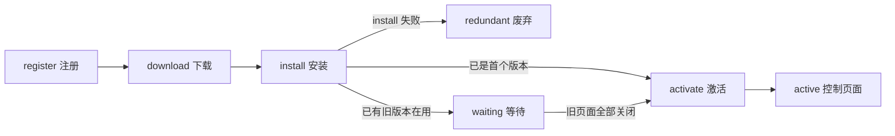
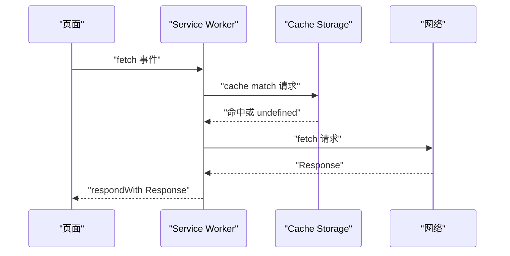

# 浏览器存储与离线：IndexedDB、Service Worker、Cache

!!! abstract "核心结论"
- IndexedDB 是事务型、对象化、异步的键值数据库：所有读写必须在事务内发生，事务在没有新请求时**自动提交**，事务结束后再发请求会抛异常。
- 结构化克隆（structured clone）决定了什么能存：函数、DOM 节点、原型链不会被保留；取出来的是深拷贝，不是原对象引用。
- Service Worker 是注册在 origin + path 上的事件驱动 worker，跑在独立线程、无 DOM、无同步 XHR、无 Web Storage；生命周期固定为 download / install / activate，更新时先进入 waiting 再 activate。
- 缓存策略没有银弹：cache-first 换取速度、network-first 换取新鲜度、stale-while-revalidate 换取两者折中，代价是"最终一致"的滞后窗口。
- 配额与淘汰由浏览器决定，不同浏览器实现差异很大，MDN 指向 Storage quotas and eviction criteria 页面；不要把"数据一定还在"当成不变量。

## 1. 底层模型：从同源配额到事件队列

### 1.1 同源、持久化与淘汰

IndexedDB 遵循**同源策略**：origin 由协议、域名、端口三者共同确定。`http://www.example.com/app/` 与 `http://www.example.com/dir/` 同源可以互访数据，而 `http://www.example.com:8080/dir/`（端口不同）或 `https://www.example.com/dir/`（协议不同）属于不同 origin，各自拥有独立的数据库集合。

每个数据库在某个 origin 内由**名字**唯一标识，并且任意时刻只有一个**版本号**（整数）。首次创建时若未指定，版本为 1。

关于持久性，有一处关键的历史变化：Firefox 中 IndexedDB 曾经是 durable 的，即 readwrite 事务只有在数据确认刷盘后才触发事件；自 Firefox 40 起放宽了耐久性保证以提升性能，`complete` 事件可能在数据真正落盘之前就触发，因此操作系统崩溃或断电时存在丢失整个事务的小概率。这意味着**"事务提交成功"不等于"数据一定不会丢"**，这是面试中很容易被追问的细节。

数据库可能被清除的情形（MDN 明确列举）：用户主动清除某站点的数据、隐私/无痕浏览模式结束、磁盘或配额上限被触达、数据损坏、功能发生不兼容变更。浏览器厂商的总体态度是"尽量保留"，但这不构成保证。

存储配额的具体数值和淘汰优先级**因浏览器而异**，MDN 将其指向 Storage quotas and eviction criteria 页面（该页以 Firefox 为例做解释）。任何具体 MB 数字都需要核对官方文档后再引用。

### 1.2 IndexedDB 的事务与键空间

IndexedDB 是"对象数据库"而不是关系数据库：没有固定列的表，而是**对象仓库（object store）**，每个仓库持有若干带 key 的 JavaScript 对象。它用**索引（index）产生游标（cursor）**来遍历结果集，而不是 SQL。

几个直接影响编码方式的机制：

第一，**一切都在事务里**。`IDBTransaction` 有明确的 scope（哪些 object store）和 mode（`readonly` / `readwrite` / `versionchange`）。游标、索引、仓库对象都绑定到某个具体事务，事务结束后再使用它们会抛异常。

第二，**事务自动提交**。如果事务处于 active 状态时没有新请求入队，事务会提交。这条规则是多标签页并发安全的基础，也是"在事务里 `await fetch()`"会立刻踩坑的根因。

第三，**错误事件默认中止事务**。success 事件不冒泡、不可取消；error 事件会冒泡且可取消。如果不调用 `preventDefault()` 取消错误事件，它所在的事务会被 abort。

第四，**键的类型有严格顺序**。合法键包括 number、date、string、binary（ArrayBuffer / typed array）、array；排序顺序是 number < date < string < binary < array。`null`、`undefined`、布尔、`NaN`、普通对象都不是合法键。`autoIncrement` 的键生成器从 1 开始。

第五，**异步但同线程调度**。API 是异步的，返回值不是数据而是 `IDBRequest`；结果通过 success / error 事件回调交付。

### 1.3 Service Worker 的生命周期与线程约束



MDN 描述的生命周期要点：

1. Service Worker 首次注册后**立即下载**，随后进入 install；install 事件永远是最先派发给它的功能事件，常见做法是在这里用一个 cache 预置离线所需资源。
2. 之后的**更新触发条件**是：发生一次对 in-scope 页面的导航；或者 Service Worker 上派发了事件、但它已经超过 24 小时没有被下载过。
3. 是否"新"是**逐字节比较**的结果：与现有 Service Worker 不同，或者是这个页面/站点遇到的第一个 Service Worker。
4. 如果是首个 Service Worker，安装成功后直接 activate，不必等旧页面关闭。如果已有旧版本，新版会**在后台安装但不激活**，此时叫 worker in waiting；只有当没有页面还在使用旧 Service Worker 时才会激活，成为 active worker。
5. 可以提前激活（`skipWaiting()`，在 waiting 状态下调用），也可以让 active worker 接管已打开的页面（`clients.claim()`）。注意 `activate` 事件是清理旧 cache 的好时机，但它**不保证**已打开的文档被接管——文档一旦以某种状态加载，在它的整个生命周期内就维持该状态，需要刷新才会被新 worker 控制。
6. install / activate 可能耗时较长，规范提供了 `ExtendableEvent.waitUntil()`：传入一个 promise 后，`fetch`、`push` 这类功能事件会等到该 promise 成功 resolve 之后才派发。

线程与能力边界（MDN 明确）：Service Worker 没有 DOM 访问权限，运行在主线程之外，设计上完全异步，因此**同步 XHR 和 Web Storage 都不可用**。它也不能动态 `import()`——在 Service Worker 全局作用域里调用动态 import 会抛错；而静态 `import` 语句是允许的。Service Worker 只能在安全上下文中使用，即 HTTPS 文档；浏览器把 `http://localhost` 也视为安全上下文以便本地开发。



### 1.4 四类存储的横向对比

| 维度 | Cookie | Web Storage（local / session） | IndexedDB | Cache Storage |
| :-- | :-- | :-- | :-- | :-- |
| 存储内容 | 字符串键值对 | 字符串键值对 | 结构化克隆的对象、文件 / Blob | Request / Response 对 |
| 容量量级 | 约 4KB（RFC 6265 要求单 cookie 至少 4096 字节） | MB 级，具体值随浏览器而异，需核对官方文档 | 面向大量结构化数据设计，配额随浏览器与存储压力而异 | 与 Service Worker 共享同一 origin 的存储配额 |
| 读写同步性 | 同步（document.cookie） | 同步 | 异步 | 异步 |
| 可用上下文 | 主线程；Service Worker 中需用异步的 Cookie Store API，支持情况需核对官方文档 | 仅 window；Service Worker 中不可用 | window 与 worker 均可 | window 与 worker 均可 |
| 生命周期 | 可设置过期时间；会话 cookie 关闭浏览器即失效 | sessionStorage 随标签页；localStorage 持久 | 持久，直到被清除或被淘汰 | 持久，直到被清除或被淘汰 |
| 事务语义 | 无 | 无 | 有，事务模型保证原子性 | 无，put / delete 是单条操作 |
| 典型用途 | 会话标识、鉴权票据 | 少量 UI 状态、轻量配置 | 离线业务数据、大量结构化数据、需要索引查询 | HTTP 响应离线缓存 |

## 2. 手写 IndexedDB Promise 封装

### 2.1 设计约束

这段代码要解决的是：把回调式、事件驱动的 IndexedDB API 收敛成一个 Promise 门面，同时不破坏事务语义。核心约束有三条——请求发出与完成回调的挂接必须在**同一个任务内**完成；事务的 complete / error / abort 三条路径都要覆盖；版本升级只能在 `onupgradeneeded` 里做结构性变更。

### 2.2 完整实现

```js
// 文件：idb-lite.js
// 运行环境：浏览器（原生 IndexedDB）；Node 下需先加载 fake-indexeddb 提供的全局实现。
// 无第三方运行时依赖，只使用标准 Web API。

// 第 1 段：把一次 IDBRequest 转成 Promise。
// IDBRequest 是一次性对象：一次请求只会触发一次 success 或一次 error，
// 因此这里可以直接覆盖 onsuccess / onerror，不必担心多次触发。
export function requestToPromise(request) {
  return new Promise((resolve, reject) => {
    request.onsuccess = () => resolve(request.result);
    request.onerror = () => reject(request.error);
  });
}

// 第 2 段：把 IDBTransaction 的三种结束方式都覆盖。
// 只监听 oncomplete 会漏掉失败路径，调用方将永久挂起，
// 这是手写封装里最常见的一类死锁。
export function transactionToPromise(tx) {
  return new Promise((resolve, reject) => {
    tx.oncomplete = () => resolve();
    tx.onerror = () => reject(tx.error ?? new Error('transaction failed'));
    tx.onabort = () => reject(tx.error ?? new Error('transaction aborted'));
  });
}

// 第 3 段：打开数据库，并把全部结构性变更收拢到一个 migrate 回调。
export function openDatabase(name, version, migrate, options = {}) {
  return new Promise((resolve, reject) => {
    const request = indexedDB.open(name, version);

    // onupgradeneeded 是唯一允许 createObjectStore / deleteObjectStore /
    // createIndex / deleteIndex 的时机，它运行在一个 versionchange 事务中。
    // 这个回调必须完全同步地把结构性变更做完，不能 await 外部异步任务。
    request.onupgradeneeded = (event) => {
      const db = request.result;
      const tx = request.transaction;
      if (typeof migrate === 'function') {
        migrate(db, tx, { oldVersion: event.oldVersion, newVersion: event.newVersion });
      }
    };

    request.onsuccess = () => {
      const db = request.result;
      // 别的标签页请求升级时，当前连接必须让路，否则对方会一直 blocked。
      db.onversionchange = () => {
        db.close();
        if (typeof options.onVersionChange === 'function') options.onVersionChange();
      };
      resolve(db);
    };

    request.onerror = () => reject(request.error ?? new Error('open failed'));

    // onblocked 只做上报，不 reject：被挡住的那个 open 请求之后仍可能成功。
    request.onblocked = () => {
      if (typeof options.onBlocked === 'function') options.onBlocked();
    };
  });
}

// 第 4 段：对象仓库门面。
// 每个方法内部新建一个事务，生命周期短、边界清晰，避免跨 await 持有事务。
export class IdbStore {
  constructor(db, storeName) {
    this.db = db;
    this.storeName = storeName;
  }

  openTransaction(mode) {
    return this.db.transaction(this.storeName, mode);
  }

  // 关键顺序：先建事务，再同步发出请求，再同步挂接完成回调。
  // 如果把 transactionToPromise 放在 await 之后，事务可能已经 complete，
  // 回调永远不会触发，Promise 永久 pending。
  async run(mode, build) {
    const tx = this.openTransaction(mode);
    const store = tx.objectStore(this.storeName);
    const request = build(store);
    const done = transactionToPromise(tx);
    const [result] = await Promise.all([requestToPromise(request), done]);
    return result;
  }

  put(value, key) {
    return this.run('readwrite', (store) =>
      key === undefined ? store.put(value) : store.put(value, key),
    );
  }

  add(value, key) {
    return this.run('readwrite', (store) =>
      key === undefined ? store.add(value) : store.add(value, key),
    );
  }

  get(key) {
    return this.run('readonly', (store) => store.get(key));
  }

  getAll(query) {
    return this.run('readonly', (store) =>
      query === undefined ? store.getAll() : store.getAll(query),
    );
  }

  getAllByIndex(indexName, query) {
    return this.run('readonly', (store) => {
      const index = store.index(indexName);
      return query === undefined ? index.getAll() : index.getAll(query);
    });
  }

  count(query) {
    return this.run('readonly', (store) =>
      query === undefined ? store.count() : store.count(query),
    );
  }

  delete(key) {
    return this.run('readwrite', (store) => store.delete(key));
  }

  clear() {
    return this.run('readwrite', (store) => store.clear());
  }

  // 批量写入：所有 put 在同一个任务里同步入队，因此共享同一个事务。
  // 任意一条触发约束错误都会让整个事务 abort，已写入的记录全部回滚。
  async putAll(values) {
    const tx = this.openTransaction('readwrite');
    const store = tx.objectStore(this.storeName);
    const requests = values.map((value) => store.put(value));
    const done = transactionToPromise(tx);
    const [keys] = await Promise.all([Promise.all(requests.map(requestToPromise)), done]);
    return keys;
  }
}
```

逐段解析：

1. `requestToPromise` 只挂 success / error。这里不调用 `preventDefault()`，因此错误事件仍会向上冒泡并中止事务——这正是我们想要的原子性语义。
2. `transactionToPromise` 覆盖三条路径。`tx.error` 在手动 `abort()` 时可能为 `null`，所以用 `??` 兜底一个 Error，避免 reject 出 `undefined` 这种难以诊断的值。
3. `openDatabase` 把升级逻辑外置成 `migrate` 回调，并在 `onsuccess` 里注册 `onversionchange`，这是多标签页升级不被 blocked 的必要条件。`onblocked` 只汇报不 reject，因为原请求仍可能成功。
4. `IdbStore.run` 的顺序是刻意的：`build(store)` 与 `transactionToPromise(tx)` 都在同一个同步任务里执行。若顺序颠倒，事务可能在挂接回调之前就已 complete，Promise 永不 settle。
5. `putAll` 演示了"同一事务内多条请求"的写法：所有 `store.put` 同步入队，`Promise.all` 同时等待全部请求与事务完成。约束冲突会让事务 abort，前面已成功的 put 一并回滚。

### 2.3 验证标准

浏览器里可以直接跑这份测试（去掉 fake-indexeddb 的 import）。无浏览器环境时使用 `fake-indexeddb`，它是第三方依赖，需要先安装：`npm i -D fake-indexeddb`。其入口路径与 Node 版本要求请核对该包的官方文档。

```js
// 文件：idb-lite.test.mjs
// 运行环境：Node，需支持 ESM 顶层 await 与 node:assert/strict
// 依赖：npm i -D fake-indexeddb（用于在 Node 中提供全局 indexedDB）
// 执行：node idb-lite.test.mjs
import assert from 'node:assert/strict';
import 'fake-indexeddb/auto';
import { openDatabase, IdbStore } from './idb-lite.js';

// 第 1 段：一次完整的 v0 -> v2 迁移，同时建两个仓库和两个索引。
function migrate(db, tx, { oldVersion }) {
  if (oldVersion < 1) {
    const notes = db.createObjectStore('notes', { keyPath: 'id', autoIncrement: true });
    notes.createIndex('by_createdAt', 'createdAt', { unique: false });
  }
  if (oldVersion < 2) {
    const users = db.createObjectStore('users', { keyPath: 'email' });
    users.createIndex('by_name', 'name', { unique: true });
  }
}

const db = await openDatabase('test-notes', 2, migrate);
const notes = new IdbStore(db, 'notes');

// 第 2 段：autoIncrement 键生成器从 1 开始，两条记录按主键升序返回。
const key1 = await notes.put({ title: 'first', createdAt: 10 });
const key2 = await notes.put({ title: 'second', createdAt: 20 });
assert.equal(key1, 1);
assert.equal(key2, 2);

const all = await notes.getAll();
assert.deepEqual(all.map((n) => n.title), ['first', 'second']);
console.log('[idb-lite] notes titles =', JSON.stringify(all.map((n) => n.title)));

// 第 3 段：用索引查询，query 既可以是键也可以是由 IDBKeyRange 构造的范围。
const byCreated = await notes.getAllByIndex('by_createdAt', 20);
assert.equal(byCreated.length, 1);
assert.equal(byCreated[0].title, 'second');

// 第 4 段：删除与缺键读取。get 一个不存在的 key 会 resolve 出 undefined。
await notes.delete(1);
assert.equal(await notes.count(), 1);
assert.equal(await notes.get(1), undefined);

// 第 5 段：原子性。users 上的 by_name 是唯一索引，
// 第二条记录与已存在记录同名，应当让整批写入回滚。
const users = new IdbStore(db, 'users');
await users.put({ email: 'a@example.com', name: 'alice' });
await assert.rejects(() =>
  users.putAll([
    { email: 'b@example.com', name: 'bob' },
    { email: 'c@example.com', name: 'alice' },
  ]),
);
assert.equal(await users.count(), 1);
console.log('[idb-lite] users count after rollback =', await users.count());
db.close();

// 第 6 段：版本升级 + 数据迁移。
// 先以 v1 建库并写入一条历史记录，再以 v2 打开，让 onupgradeneeded 里的游标补字段。
const v1db = await openDatabase('migrate-demo', 1, (d, t, { oldVersion }) => {
  if (oldVersion < 1) {
    const store = d.createObjectStore('notes', { keyPath: 'id', autoIncrement: true });
    store.createIndex('by_createdAt', 'createdAt', { unique: false });
  }
});
const v1notes = new IdbStore(v1db, 'notes');
await v1notes.put({ title: 'legacy', createdAt: 1 });
v1db.close();

const v2db = await openDatabase('migrate-demo', 2, (d, t, { oldVersion }) => {
  if (oldVersion < 2) {
    const cursorRequest = t.objectStore('notes').openCursor();
    cursorRequest.onsuccess = () => {
      const cursor = cursorRequest.result;
      if (!cursor) return; // 游标耗尽，迁移结束
      const value = cursor.value;
      if (value.tags === undefined) {
        value.tags = [];
        cursor.update(value); // cursor.update 复用记录自身的主键
      }
      cursor.continue();
    };
  }
});
const migrated = await new IdbStore(v2db, 'notes').get(1);
assert.deepEqual(migrated.tags, []);
console.log('[idb-lite] migrated record tags =', JSON.stringify(migrated.tags));
v2db.close();

console.log('[idb-lite] all assertions passed');
```

预期输出：

```text
[idb-lite] notes titles = ["first","second"]
[idb-lite] users count after rollback = 1
[idb-lite] migrated record tags = []
[idb-lite] all assertions passed
```

第 5 段是整个测试里信息量最大的一条：唯一索引冲突以 ConstraintError 的形式在请求上触发 error 事件，事件冒泡到事务，因为没有任何 handler 调用 `preventDefault()`，事务被 abort，`transactionToPromise` 走 `onabort` 分支 reject，于是 `putAll` 拒绝，`bob` 那条记录被回滚。

## 3. 手写 Service Worker 缓存策略路由器

### 3.1 策略语义

三种策略的差别集中在"网络是否可用"和"数据是否新鲜"这两条轴上。为了能被单元测试，这里把策略写成**依赖注入**的纯逻辑：`caches`（CacheStorage 实现）、`cacheName`、`fetchImpl`（fetch 实现）都由外部传入，在 Service Worker 里传真实全局对象，在 Node 测试里传假对象。

还有一个容易被忽略的工程点：`ExtendableEvent.waitUntil()` 必须在事件派发期间**同步**调用。如果先 `await` 一个缓存读取再调 `waitUntil`，抛出的是 InvalidStateError。为此这里采用"同步规划 + 异步执行"的两段式设计：策略函数同步返回 `{ response, background }`，`response` 是给 `respondWith` 的 promise，`background` 是可选的后台任务 promise。

### 3.2 完整实现

```js
// 文件：sw-strategies.js
// 运行环境：Service Worker 全局作用域（生产）；Node（单元测试）
// 只使用标准 API 语义：Request / Response / Cache / CacheStorage / fetch。

export const Strategy = {
  CACHE_FIRST: 'cache-first',
  NETWORK_FIRST: 'network-first',
  STALE_WHILE_REVALIDATE: 'stale-while-revalidate',
  NETWORK_ONLY: 'network-only',
  CACHE_ONLY: 'cache-only',
};

// 第 1 段：URL -> 策略的映射。规则从前往后匹配，命中第一条即返回。
// 默认策略选 network-first：宁可稍慢，也不要返回陈旧数据。
export function matchStrategy(url, rules) {
  const href = typeof url === 'string' ? url : url.href;
  for (const rule of rules) {
    if (href.startsWith(rule.prefix)) return rule.strategy;
  }
  return Strategy.NETWORK_FIRST;
}

// 第 2 段：缓存读写小工具。
// response.clone() 必须在响应体被消费之前调用，否则 put 会抛
// "Response body is already used"。
async function readCache(caches, cacheName, request) {
  const cache = await caches.open(cacheName);
  return cache.match(request);
}

async function writeCache(caches, cacheName, request, response) {
  if (!response || !response.ok) return response;
  const cache = await caches.open(cacheName);
  await cache.put(request, response.clone());
  return response;
}

// 第 3 段：cache-first。命中缓存立刻返回，没有缓存才走网络并写回。
function planCacheFirst(request, deps) {
  const { caches, cacheName, fetchImpl } = deps;
  const response = (async () => {
    const cached = await readCache(caches, cacheName, request);
    if (cached) return cached;
    const fresh = await fetchImpl(request);
    return writeCache(caches, cacheName, request, fresh);
  })();
  return { response, background: null };
}

// 第 4 段：network-first。优先取网络并写回；网络抛错时回落缓存。
// 注意这里只在 fetch reject 时回落，HTTP 4xx/5xx 仍会按原样返回。
function planNetworkFirst(request, deps) {
  const { caches, cacheName, fetchImpl } = deps;
  const response = (async () => {
    try {
      const fresh = await fetchImpl(request);
      return await writeCache(caches, cacheName, request, fresh);
    } catch (error) {
      const cached = await readCache(caches, cacheName, request);
      if (cached) return cached;
      throw error;
    }
  })();
  return { response, background: null };
}

// 第 5 段：stale-while-revalidate。
// response 与 background 共享同一条 revalidate 链：有缓存时 response 立即用缓存，
// revalidate 继续在后台跑；无缓存时 response 等待 revalidate 的结果。
// revalidate 末尾的 catch 保证 background 永不 reject，避免未处理拒绝。
function planStaleWhileRevalidate(request, deps) {
  const { caches, cacheName, fetchImpl } = deps;
  const cachedPromise = readCache(caches, cacheName, request);

  const revalidate = cachedPromise
    .then(() => fetchImpl(request))
    .then((response) => writeCache(caches, cacheName, request, response))
    .catch(() => undefined);

  const response = cachedPromise.then(async (cached) => {
    if (cached) return cached;
    const fresh = await revalidate;
    if (fresh) return fresh;
    throw new Error('network and cache both miss');
  });

  return { response, background: revalidate };
}

function planNetworkOnly(request, deps) {
  return { response: deps.fetchImpl(request), background: null };
}

function planCacheOnly(request, deps) {
  const response = readCache(deps.caches, deps.cacheName, request).then((cached) => {
    if (!cached) throw new Error('cache miss');
    return cached;
  });
  return { response, background: null };
}

// 第 6 段：路由器。同步返回规划结果，便于在事件派发期间调用 waitUntil。
export function resolveRequest(request, deps) {
  const strategy = matchStrategy(request.url, deps.rules ?? []);
  switch (strategy) {
    case Strategy.CACHE_FIRST:
      return planCacheFirst(request, deps);
    case Strategy.NETWORK_FIRST:
      return planNetworkFirst(request, deps);
    case Strategy.STALE_WHILE_REVALIDATE:
      return planStaleWhileRevalidate(request, deps);
    case Strategy.NETWORK_ONLY:
      return planNetworkOnly(request, deps);
    case Strategy.CACHE_ONLY:
      return planCacheOnly(request, deps);
    default:
      return planNetworkFirst(request, deps);
  }
}

// 第 7 段：按白名单清理旧版本缓存。
// 返回被删除的缓存名数组，顺序与 caches.keys() 一致。
export async function pruneCaches(caches, keepNames) {
  const keep = new Set(keepNames);
  const names = await caches.keys();
  const removed = [];
  for (const name of names) {
    if (!keep.has(name)) {
      await caches.delete(name);
      removed.push(name);
    }
  }
  return removed;
}
```

### 3.3 Service Worker 入口

下面这段只在真正的 Service Worker 环境里运行。用到静态 `import`，则需要以模块方式注册（`{ type: 'module' }`），各浏览器对模块化 Service Worker 的支持情况需核对官方文档。

```js
// 文件：sw.js
// 运行环境：Service Worker 全局作用域，必须由 HTTPS 或 http://localhost 提供
import { resolveRequest, pruneCaches } from './sw-strategies.js';

const VERSION = 'v3';
const STATIC_CACHE = `static-${VERSION}`;
const RUNTIME_CACHE = `runtime-${VERSION}`;
const OFFLINE_URL = '/offline.html';
const PRECACHE_URLS = ['/', '/index.html', '/app.css', '/app.js', OFFLINE_URL];

// 第 1 段：install 期间预置静态资源。
// cache.addAll 只要有一个 URL 请求失败，整个 install 就失败，worker 进入废弃。
// 因此预置清单里的 URL 必须全部可达。
self.addEventListener('install', (event) => {
  event.waitUntil((async () => {
    const cache = await caches.open(STATIC_CACHE);
    await cache.addAll(PRECACHE_URLS);
  })());
});

// 第 2 段：activate 期间清理旧版本缓存，并尝试接管已打开的页面。
self.addEventListener('activate', (event) => {
  event.waitUntil((async () => {
    await pruneCaches(caches, [STATIC_CACHE, RUNTIME_CACHE]);
    await self.clients.claim();
  })());
});

// 第 3 段：路由表。前缀匹配，命中第一条即生效。
const RULES = [
  { prefix: `${self.location.origin}/assets/`, strategy: 'cache-first' },
  { prefix: 'https://api.example.com/', strategy: 'network-first' },
  { prefix: 'https://img.example.com/', strategy: 'stale-while-revalidate' },
];

self.addEventListener('fetch', (event) => {
  const request = event.request;
  // 非 GET 请求直接放行：缓存键目前只按 URL 区分，写法不安全。
  if (request.method !== 'GET') return;

  const url = new URL(request.url);
  const isSameOrigin = url.origin === self.location.origin;
  const hasRule = RULES.some((rule) => request.url.startsWith(rule.prefix));
  if (!isSameOrigin && !hasRule) return; // 交给浏览器默认行为

  // resolveRequest 是同步的，因此可以在这里安全地注册后台任务。
  const { response, background } = resolveRequest(request, {
    rules: RULES,
    caches,
    cacheName: RUNTIME_CACHE,
    fetchImpl: (req) => fetch(req),
  });

  if (background) event.waitUntil(background);

  event.respondWith(
    response.catch(async () => {
      const offline = await caches.match(OFFLINE_URL);
      if (offline) return offline;
      return new Response('offline', {
        status: 503,
        headers: { 'Content-Type': 'text/plain; charset=utf-8' },
      });
    }),
  );
});
```

逐段解析：

1. install 里的 `cache.addAll` 是原子的：任一资源失败整个 install 失败，Service Worker 被打回。生产环境通常把预置清单拆成"必须成功"与"尽力而为"两组。
2. activate 里先删旧缓存再 `clients.claim()`。删缓存是同步可见的目录操作，claim 让当前页面立刻被新 worker 接管；但已打开的文档若不刷新，仍可能沿用旧的加载结果。
3. 路由表用 URL 前缀匹配。跨域图片走 SWR、同域构建产物走 cache-first、API 走 network-first，是常见的分层组合。
4. `if (request.method !== 'GET') return;` 很关键：Cache API 的键只有 URL，跳过非 GET 才不会把 POST 的响应污染到后续 GET 上。
5. `resolveRequest` 必须同步返回，`event.waitUntil(background)` 才能合法调用。这是把 `waitUntil` 从策略函数里挪出来的唯一原因。
6. `respondWith` 的 promise 若 resolve 出 `undefined`，浏览器会抛类型错误，所以兜底必须返回一个真正的 `Response`。

### 3.4 验证标准

浏览器之外的单元测试用假 CacheStorage 完成。假实现必须忠于真实语义：`cache.match` 未命中 resolve `undefined`；`CacheStorage.delete` / `has` resolve 布尔值；`keys` 保持插入顺序。

```js
// 文件：sw-strategies.test.mjs
// 运行环境：Node，零依赖，需支持 ESM 顶层 await
// 执行：node sw-strategies.test.mjs
import assert from 'node:assert/strict';
import { resolveRequest, matchStrategy, pruneCaches } from './sw-strategies.js';

// 第 1 段：最小可用的 Response 替身。clone 必须返回独立对象，
// 否则"写缓存"和"返回给页面"会共享同一个被消费的 body。
class FakeResponse {
  constructor(body, init = {}) {
    this.body = body;
    this.status = init.status ?? 200;
    this.ok = this.status >= 200 && this.status < 300;
    this.url = init.url ?? '';
  }
  clone() {
    return new FakeResponse(this.body, { status: this.status, url: this.url });
  }
}

// 第 2 段：最小可用的 Cache 替身。未命中返回 undefined。
class FakeCache {
  constructor() {
    this.entries = new Map();
  }
  async match(request) {
    const key = typeof request === 'string' ? request : request.url;
    const hit = this.entries.get(key);
    return hit ? hit.clone() : undefined;
  }
  async put(request, response) {
    const key = typeof request === 'string' ? request : request.url;
    this.entries.set(key, response.clone());
  }
  async delete(request) {
    const key = typeof request === 'string' ? request : request.url;
    return this.entries.delete(key);
  }
  async keys() {
    return [...this.entries.keys()];
  }
}

// 第 3 段：最小可用的 CacheStorage 替身，保持插入顺序。
class FakeCacheStorage {
  constructor() {
    this.map = new Map();
  }
  async open(name) {
    if (!this.map.has(name)) this.map.set(name, new FakeCache());
    return this.map.get(name);
  }
  async has(name) {
    return this.map.has(name);
  }
  async delete(name) {
    return this.map.delete(name);
  }
  async keys() {
    return [...this.map.keys()];
  }
}

// 第 4 段：cache-first。第二次请求必须完全不走网络。
let networkCalls = 0;
const cdnRequest = { url: 'https://cdn.example.com/app.js' };
const cdnDeps = {
  rules: [{ prefix: 'https://cdn.example.com/', strategy: 'cache-first' }],
  caches: new FakeCacheStorage(),
  cacheName: 'runtime-v1',
  fetchImpl: async (req) => {
    networkCalls += 1;
    return new FakeResponse(`body-${networkCalls}`, { url: req.url });
  },
};

const planA = resolveRequest(cdnRequest, cdnDeps);
assert.equal(planA.background, null);
assert.equal((await planA.response).body, 'body-1');
assert.equal((await resolveRequest(cdnRequest, cdnDeps).response).body, 'body-1');
assert.equal(networkCalls, 1);
console.log('[sw-strategies] cache-first network calls =', networkCalls);

// 第 5 段：network-first。网络抛错时回落缓存，且不抛异常。
let failNext = false;
const apiRequest = { url: 'https://api.example.com/user/1' };
const apiDeps = {
  rules: [{ prefix: 'https://api.example.com/', strategy: 'network-first' }],
  caches: new FakeCacheStorage(),
  cacheName: 'runtime-v1',
  fetchImpl: async (req) => {
    if (failNext) throw new Error('offline');
    return new FakeResponse('fresh', { url: req.url });
  },
};
assert.equal((await resolveRequest(apiRequest, apiDeps).response).body, 'fresh');
failNext = true;
const fallback = await resolveRequest(apiRequest, apiDeps).response;
assert.equal(fallback.body, 'fresh');
console.log('[sw-strategies] network-first fallback body =', fallback.body);

// 第 6 段：stale-while-revalidate。第一次无缓存走网络；
// 改版本后第二次立即返回旧值，后台写回新值；第三次读到新值。
let imgVersion = 1;
const imgRequest = { url: 'https://img.example.com/a.png' };
const imgDeps = {
  rules: [{ prefix: 'https://img.example.com/', strategy: 'stale-while-revalidate' }],
  caches: new FakeCacheStorage(),
  cacheName: 'runtime-v1',
  fetchImpl: async (req) => new FakeResponse(`img-v${imgVersion}`, { url: req.url }),
};
const plan1 = resolveRequest(imgRequest, imgDeps);
const first = await plan1.response;
await plan1.background;

imgVersion = 2;
const plan2 = resolveRequest(imgRequest, imgDeps);
const second = await plan2.response;
await plan2.background;
const third = await resolveRequest(imgRequest, imgDeps).response;

const sequence = `${first.body}, ${second.body}, ${third.body}`;
assert.equal(sequence, 'img-v1, img-v1, img-v2');
console.log('[sw-strategies] swr sequence =', sequence);

// 第 7 段：策略匹配与旧缓存清理。
assert.equal(matchStrategy('https://cdn.example.com/a.js', cdnDeps.rules), 'cache-first');
assert.equal(matchStrategy('https://unknown.example.com/a.js', cdnDeps.rules), 'network-first');

const pruneTarget = new FakeCacheStorage();
await pruneTarget.open('static-v1');
await pruneTarget.open('runtime-v1');
await pruneTarget.open('static-v0');
const removed = await pruneCaches(pruneTarget, ['static-v1', 'runtime-v1']);
assert.deepEqual(removed, ['static-v0']);
assert.deepEqual(await pruneTarget.keys(), ['static-v1', 'runtime-v1']);
console.log('[sw-strategies] pruned caches =', JSON.stringify(removed));

console.log('[sw-strategies] all assertions passed');
```

预期输出：

```text
[sw-strategies] cache-first network calls = 1
[sw-strategies] network-first fallback body = fresh
[sw-strategies] swr sequence = img-v1, img-v1, img-v2
[sw-strategies] pruned caches = ["static-v0"]
[sw-strategies] all assertions passed
```

## 4. Cache Storage 与配额治理

### 4.1 Cache Storage 的语义边界

`Cache` 存的是 `Request` / `Response` 对，`CacheStorage` 是 origin 级、以字符串名为键的目录，在 window 和 worker 中都能通过 `caches` 访问。它和 HTTP 缓存是两套独立机制：命中 SW 缓存并不代表绕过 HTTP 缓存的语义问题，但 SW 里 `fetch()` 出去的请求仍会走正常的 HTTP 缓存链路。这也是 SWR 里"后台请求可能直接命中 HTTP 缓存、根本没到服务器"的原因。

需要特别注意的是 **opaque response**：跨域 `no-cors` 请求拿到的是 opaque 响应，其 `ok` 恒为 false、`status` 恒为 0、`statusText` 为空字符串，且无法读取 body。它仍能被 `cache.put` 存下，但无法做任何有效性判断——这就是上面 `writeCache` 里 `if (!response.ok) return response;` 会跳过 opaque 响应的原因。

配额方面，各存储后端通常共享同一个 origin 配额池。查询与请求持久化的入口是 StorageManager：`navigator.storage.estimate()` 返回用量与配额估计，`navigator.storage.persist()` 请求持久化，`navigator.storage.persisted()` 查询当前是否已持久化。**这些 API 的具体行为与配额数值因浏览器而异，需核对官方文档**，不要写死任何数字。

### 4.2 三种策略的取舍

| 维度 | cache-first | network-first | stale-while-revalidate |
| :-- | :-- | :-- | :-- |
| 首次请求（无缓存） | 走网络，成功后写回缓存 | 走网络，成功后写回缓存 | 走网络，成功后写回缓存 |
| 网络可用时返回 | 缓存（若命中），不发起网络 | 网络结果 | 缓存（若命中），后台并发更新 |
| 网络不可用时返回 | 缓存；无缓存则失败 | 缓存；无缓存则失败 | 缓存；无缓存则失败 |
| 数据新鲜度 | 低，取决于缓存何时被替换 | 高 | 最终一致，存在一次请求的滞后窗口 |
| 首屏延迟 | 低，无网络等待 | 高，必须等网络或超时 | 有缓存时低 |
| 主要风险 | 用户长期看到旧内容 | 弱网下响应慢，甚至超时 | 读到旧值，需要业务能容忍 |
| 典型场景 | 带 hash 的构建产物、字体、CDN 静态资源 | API 数据、HTML 文档 | 图片、头像、非关键 JSON |

### 4.3 三种事务模式的能力矩阵

| 模式 | 可读 | 可写 | 可创建 / 删除对象仓库与索引 | 典型场景 |
| :-- | :-- | :-- | :-- | :-- |
| readonly | 是 | 否 | 否 | get / getAll / count / 游标遍历 |
| readwrite | 是 | 是 | 否 | put / add / delete / clear |
| versionchange | 是 | 是 | 是 | 由 `open()` 在 onupgradeneeded 中创建，执行迁移 |

## 5. 常见陷阱

1. **在事务里 await 非 IndexedDB 的异步操作**。`await fetch()`、`setTimeout`、`await` 一个由后续任务 resolve 的 promise，都会让事务在此期间失去 active 状态并自动提交；之后再发请求会抛异常。事务内只应做 IDB 请求。

2. **完成回调挂接太晚**。如果在 `await` 之后才设置 `tx.oncomplete`，事务可能早已 complete，Promise 永久 pending。做法是创建事务后立刻同步挂接三个结束回调。

3. **在 onupgradeneeded 里 await 外部异步**。这个回调运行在 versionchange 事务中，一旦你 await 一个不属于该事务的东西，事务提交后再调用 `createObjectStore` 就会抛 InvalidStateError。所有结构性变更必须同步完成。

4. **旧标签页不关闭数据库连接**。升级时旧连接不响应 `onversionchange` 就会一直 block 新版本，表现为"刷新后仍然升不了级"。必须在 `onversionchange` 里 `db.close()`。

5. **以为新 Service Worker 会立刻生效**。已有旧 worker 时，新版先进入 waiting；只有旧页面全部关闭才激活。可以主动 `skipWaiting()` + `clients.claim()`，但要清楚这会打断正在使用旧缓存的页面。

6. **waitUntil 调用时机错误**。在事件派发期间之外调用 `event.waitUntil()` 会抛 InvalidStateError，因此不要在若干次 `await` 之后才调用它。

7. **忘记 clone Response**。`cache.put(request, response)` 之后又想把同一个 `response` 返回给页面，body 已经被消费，第二次读取抛错。正确做法是先 `response.clone()`。

8. **缓存了 opaque 响应却按 ok 判断**。跨域 `no-cors` 响应的 `status` 为 0、`ok` 为 false，用 `response.ok` 做门禁会把它们全部排除，或者反过来把不可校验的内容写进缓存。

9. **缓存只增不减**。每次发版生成新的 cache 名却不在 activate 里清理旧名，磁盘占用持续上涨，最终可能触发配额淘汰，把离线能力一起带走。

10. **拿 localStorage 存大对象**。它是同步 API，序列化与写入会阻塞主线程；并且只能存字符串，Date、Map、Set 这类结构经过 `JSON.stringify` 会退化，原型链也会丢失。

11. **以为 Service Worker 在哪都能跑**。它要求安全上下文，`file://` 与普通 HTTP（非 localhost）都无法注册。

12. **把 `caches.match` 的结果直接交给 `respondWith`**。未命中时它 resolve 出 `undefined`，浏览器会抛类型错误；必须给一个真实的 `Response` 兜底。

## 6. 面试题与答题要点

### 6.1 IndexedDB 的事务模型是什么？为什么事务里 await fetch 会出问题？

要点：IndexedDB 是事务型对象数据库，所有操作必须在事务内；事务有 scope 与 mode；事务在 active 状态没有新请求入队时**自动提交**；提交后继续使用该事务的对象会抛异常。`await fetch()` 会让控制权返回到事件循环，事务在此期间失去 active 状态并提交，后续 `store.put()` 就会失效。补充：事务内应只做 IDB 请求；需要跨请求组合数据时，先把数据准备好，再开事务并在同一任务内把所有请求入队。

### 6.2 版本升级怎么做？onupgradeneeded 里能做什么、不能做什么？

要点：`indexedDB.open(name, version)` 传入比现有版本大的整数时触发 `onupgradeneeded`，`event.oldVersion` / `event.newVersion` 给出迁移区间；回调运行在 versionchange 事务里，`request.transaction` 就是它。能做：createObjectStore / deleteObjectStore / createIndex / deleteIndex，以及在游标里做数据迁移。不能做：await 与事务无关的异步操作（会让 versionchange 事务提交，之后的建表调用抛 InvalidStateError）。工程要点：迁移函数按 `oldVersion < N` 分段幂等；连接上注册 `onversionchange` 主动 `close()`，否则会 block 别人的升级。

### 6.3 Service Worker 的更新流程？waiting 状态什么时候结束？

要点：首次注册会立即下载，随后 install，install 事件是最先派发的功能事件；之后在导航到 in-scope 页面、或 SW 上派发事件且距上次下载超过 24 小时时触发更新检查；新旧是否相同是逐字节比较。没有旧版本时安装后直接 activate；有旧版本时新版在后台安装并停在 waiting，等所有使用旧 worker 的页面都关闭后才 activate。可以 `skipWaiting()` 提前激活，但页面仍需 `clients.claim()` 或刷新才会被新 worker 接管。

### 6.4 cache-first、network-first、SWR 各自适合什么场景？风险是什么？

要点：cache-first 适合带 hash 的静态产物，速度最快但可能长期陈旧；network-first 适合 API 与 HTML 文档，新鲜度最高但弱网下首屏变慢，需要超时或失败回落；SWR 先用缓存立即响应、后台更新，适合图片、头像这类能容忍一次滞后的资源，代价是某一时刻读到旧值。三者都需要一个兜底：无网络且无缓存时返回什么。

### 6.5 Cache Storage 和 HTTP 缓存是什么关系？

要点：两套独立但会叠加的机制。SW 的 `caches` 是显式的 Request/Response 存储，由代码控制写入与匹配；SW 内部发起的 `fetch()` 仍受 HTTP 缓存影响，所以 SRW 的后台请求可能根本没到服务器。另外要提到 opaque response：跨域 `no-cors` 响应 `ok` 恒 false、`status` 恒 0，能存但无法校验。

### 6.6 存储配额与淘汰你了解多少？怎么请求持久化？

要点：配额与淘汰策略因浏览器而异，MDN 指向 Storage quotas and eviction criteria 页面并以 Firefox 为例说明，不应背具体数字。一般规律是同一 origin 的多种存储共享配额池，达到压力时浏览器可能按 origin 淘汰，隐私模式结束会清空。API 层面：`navigator.storage.estimate()` 查询用量与配额，`navigator.storage.persist()` 请求持久化、`navigator.storage.persisted()` 查询状态——具体行为需核对官方文档。工程结论：把浏览器存储当缓存层，权威数据留在服务端，并为"数据被清掉"设计重放路径。

### 6.7 Service Worker 里为什么不能用 localStorage 和同步 XHR？

要点：Service Worker 属于 Web Worker 体系，运行在独立线程、没有 DOM，设计上完全异步、不可阻塞。Web Storage 是同步 API，同步 XHR 也是同步 API，都会阻塞该线程上事件的处理，因此规范不允许。可用替代：IndexedDB 存结构化数据、Cache Storage 存响应、fetch 做网络请求、postMessage 与页面通信。另外动态 `import()` 在 SW 全局作用域会抛错，静态 `import` 语句是允许的。

### 6.8 如何设计一个离线优先的分层缓存架构？

要点：分三层——预缓存层（install 时 `cache.addAll` 静态外壳与离线页）、运行时层（按资源类型路由：构建产物 cache-first、接口 network-first、图片 SWR）、数据层（IndexedDB 存业务数据，并按索引建模查询）。配套三件事：版本化 cache 名 + activate 时清理旧名；`respondWith` 的兜底响应始终存在；关键的写操作设计本地队列与服务端重放策略，避免"离线写、上线丢"。最后强调：不要把浏览器存储当作唯一数据源。

## 7. 收尾复习清单

- 能默写 `requestToPromise` 与 `transactionToPromise`，并解释为什么完成回调必须在同一任务内挂接。
- 能写出按 `oldVersion` 分段、幂等的迁移函数，并说明为什么它必须同步。
- 能画出 Service Worker 从 register 到 active 的状态流转，并说清 waiting 的解除条件。
- 能给出一条 `waitUntil` 的正确调用位置，并解释为什么同步返回 `{ response, background }` 是必要的。
- 能背出 cache-first / network-first / SWR 的适用场景与失效模式。
- 能说清 Cache Storage、HTTP 缓存、opaque response 三者的边界。
- 面对配额问题时，能说出"把浏览器存储降级为缓存层"的设计原则，而不是背诵某个 MB 数字。

## 深入阅读与参考

!!! tip "怎么用这些资料"
    先读「官方文档与规范」建立准确的概念，再读「源码与示例」核对细节，最后用「教程、书籍与视频」换一种讲法加深理解。每条都写明了读哪一节、带着什么问题读。

### 官方文档与规范

| 资源 | 为什么读 | 怎么读 |
|---|---|---|
| [MDN Service Worker API](https://developer.mozilla.org/en-US/docs/Web/API/Service_Worker_API) | MDN 官方 API 总览，注册、生命周期与缓存拦截都有示例。 | 读“使用 Service Worker”与缓存章节，边读边写缓存优先页面，在 DevTools 验证。 |
| [Service Worker 规范](https://w3c.github.io/ServiceWorker/) | 规范定义更新算法，是理解 SW 更新与等待激活的权威依据。 | 定位 Update 算法一节，带着“何时检查更新”问题读，画出注册更新时序。 |
| [MDN Storage API](https://developer.mozilla.org/en-US/docs/Web/API/Storage_API) | 官方解释 persist/estimate，是理解配额与持久化策略的基础。 | 读配额与持久化章节，在控制台调用 estimate 与 persist，对比浏览器差异。 |
| [MDN 事件循环](https://developer.mozilla.org/en-US/docs/Web/JavaScript/Event_loop) | 事件循环模型决定 IndexedDB 与 SW 回调的时序，是底层模型基石。 | 读任务与微任务一节，画出点击触发 Promise 与定时器的完整时序图。 |
| [MDN IndexedDB](https://developer.mozilla.org/en-US/docs/Web/API/IndexedDB_API) | MDN 概念页讲清数据库、对象存储、事务与游标，适合建立术语。 | 先读概念页，带着“事务何时自动提交”问题读，再动手写一个键值读写。 |
| [IndexedDB 规范](https://w3c.github.io/IndexedDB/) | 规范明确事务生命周期与自动提交规则，能解释事务意外结束。 | 查事务生命周期一节，带着“事务为何提前结束”读，整理常见失效场景。 |

### 源码与示例

| 资源 | 为什么读 | 怎么读 |
|---|---|---|
| [Jake Archibald：Offline Cookbook](https://jakearchibald.com/2014/offline-cookbook/) | 离线缓存策略的经典实现合集，代码可直接改写为路由器。 | 选缓存优先、网络优先、stale-while-revalidate 三种，各实现一次并对比。 |
| [idb 库](https://github.com/jakearchibald/idb) | idb 是成熟的 Promise 封装，源码短小，适合对照手写封装。 | 读 openDB 与事务封装源码，用 Promise 版重写待办示例并对比代码量。 |

### 教程、书籍与视频

| 资源 | 为什么读 | 怎么读 |
|---|---|---|
| [Service Worker 与 HTTP 缓存](https://web.dev/articles/service-worker-caching-and-http-caching) | 讲清 HTTP 缓存与 SW 缓存两层叠加，避免缓存陈旧资源。 | 读两层缓存交互部分，带着“为何仍拿到旧资源”问题排查现有项目。 |
| [Workbox 文档](https://developer.chrome.com/docs/workbox) | Workbox 把缓存策略产品化，可对照手写路由器理解差异。 | 读路由与策略章节，用 Workbox 实现 stale-while-revalidate 并对比手写版。 |
| [web.dev：Service Worker 生命周期](https://web.dev/articles/service-worker-lifecycle) | web.dev 生命周期文章配 DevTools 操作，直观看到 install 与 activate。 | 在 Application 面板观察 install、activate、waiting，复现一次新版本更新。 |
| [现代 JavaScript 教程：IndexedDB](https://zh.javascript.info/indexeddb) | 现代 JS 教程用待办示例讲 IndexedDB 事务与错误处理，上手快。 | 读事务与错误处理两节，完成键值读写封装，再补上版本升级逻辑。 |
| [MDN 使用 IndexedDB](https://developer.mozilla.org/en-US/docs/Web/API/IndexedDB_API/Using_IndexedDB) | MDN 使用 IndexedDB 教程完整走通增删改查与版本升级。 | 跟着实现增删改查，重点处理 onupgradeneeded，读完改造为 Promise 版。 |
| [web.dev Learn PWA：Service Workers](https://web.dev/learn/pwa/service-workers) | Learn PWA 官方课程讲生命周期与更新，解释新版本等待激活。 | 读生命周期与更新一节，复现新 SW 等待激活，思考 skipWaiting 的取舍。 |

## 应用与行业实践

前面几章把同源、事务、结构化克隆、生命周期讲完了。这一章回答一个落地问题：这套机制在哪些具体产品位置上值钱，以及怎么量出它值多少钱。

### 应用场景地图

| 场景 | 用到本页哪个知识点 | 典型技术选型 | 注意事项 |
| --- | --- | --- | --- |
| 后台管理的万行表格本地筛选 | 对象仓库、索引、游标、事务自动提交 | IndexedDB + 虚拟滚动 | 事务内不要夹网络请求，否则事务会提前提交 |
| 低端安卓的首屏加载 | Service Worker 生命周期、cache-first | 手写 SW 或 Workbox | 预缓存清单要带 revision，否则用户拿到旧壳 |
| 巡检类 App 的离线表单 | 结构化克隆、事务自动提交 | IndexedDB 存 Blob + 在线重放 | 图片直接存 Blob，转 base64 会让体积涨约三分之一 |
| 多人协作白板的离线编辑 | 事务、事件驱动、同源隔离 | IndexedDB outbox + online 事件 | 重放要幂等，重复提交不能产生重复笔画 |
| 内容站的文章详情页 | stale-while-revalidate | Cache Storage + fetch 事件 | 滞后窗口内用户可能读到上一版正文 |
| 地图瓦片与离线包 | 配额与淘汰、storage.persist() | Cache Storage + 持久化申请 | 浏览器可以拒绝持久化，要有降级路径 |
| 多标签页共享草稿 | 同源策略 | IndexedDB 按 origin 隔离 | 换端口或换子域就是换库，数据不会跟过去 |
| 静态站点的主页 | 注册在 origin + path 上的 SW | scope 决定接管范围 | 放大 scope 需要响应头 Service-Worker-Allowed |

### 三个场景拆解

#### 场景 1：后台管理的万行表格本地筛选

**业务背景**：表格数据量到万行级别后，每次切换筛选条件都打一次后端接口，翻页等待由网络往返决定。用"行数 × 每行字节数"估算数据体量，再用服务端日志里的查询耗时和浏览器端接口耗时相减，就能看出等待里有多少花在网络。

**怎么用本页知识解决**：思路是首次把增量数据写进对象仓库，按筛选字段建索引，之后本地用游标分页读取，不再回后端。

```js
// 建库时定义对象仓库与索引，版本号变化才触发 upgrade
const req = indexedDB.open('orders', 1);
req.onupgradeneeded = () => {
  const store = req.result.createObjectStore('orders', { keyPath: 'id' });
  store.createIndex('byStatus', 'status');       // 按状态筛选
};
async function page(db, status, offset, size) {
  return new Promise((resolve, reject) => {
    const tx = db.transaction('orders', 'readonly'); // 事务结束前必须发完请求
    const idx = tx.objectStore('orders').index('byStatus');
    const rows = []; let skipped = 0;
    idx.openCursor(IDBKeyRange.only(status)).onsuccess = (e) => {
      const cur = e.target.result;
      if (!cur || rows.length >= size) return resolve(rows);
      if (skipped++ >= offset) rows.push(cur.value); // 跳过前 offset 条
      cur.continue();  // 游标推进
    };
    tx.onerror = () => reject(tx.error);
  });
}
```

- `createIndex` 只写一次，之后的筛选都走索引，不用全表扫描。
- 事务在请求队列排空后自动提交，所以游标回调里只做内存操作，不发接口。
- 用索引游标加 `skip` 计数实现 offset 分页，代价是 offset 越大扫过的记录越多；大 offset 场景改用按键值游标续读。
- 事务结束后再发请求会抛异常，所以 `page` 每次调用都新开事务，不跨调用复用。
- 写入用 `put` 覆盖同一个 `id`，增量拉取重复执行也不会产生重复行。

**怎么度量收益**：在 DevTools 的 Performance 面板录制"点筛选到表格渲染完成"这段，看主线程长任务时长；用 `PerformanceObserver` 订阅 `longtask` 统计超 50 毫秒的任务个数；在 Application 面板的 IndexedDB 里核对记录数与后端总数是否一致。

**什么时候不该用**：数据每天全量替换且要求强一致，本地副本会立刻过期。筛选结果需要跨设备共享，本地索引只服务当前浏览器。

#### 场景 2：低端安卓的首屏加载

**业务背景**：低端安卓机上首屏的脚本与字体请求受蜂窝网络抖动影响，二次打开还会重新下载同一份资源。痛点是同一份静态字节被反复付流量，规模用"首屏静态资源总字节数 ÷ 单次往返可传字节数"估算。

**怎么用本页知识解决**：思路是在 install 阶段把首屏静态资源放进 Cache Storage，fetch 阶段对脚本和样式走 cache-first，用缓存名做版本号。

```js
const CACHE = 'app-v3';                 // 版本号随构建产物变化
const ASSETS = ['/', '/app.js', '/app.css', '/logo.svg'];
self.addEventListener('install', (e) => {
  e.waitUntil(caches.open(CACHE).then((c) => c.addAll(ASSETS))); // 缺一个就整体失败
  self.skipWaiting();                   // 让 waiting 的 SW 立即激活
});
self.addEventListener('activate', (e) => {
  e.waitUntil(caches.keys().then((keys) =>
    Promise.all(keys.filter((k) => k !== CACHE).map((k) => caches.delete(k)))));
});
self.addEventListener('fetch', (e) => {
  if (e.request.destination !== 'script' && e.request.destination !== 'style') return;
  e.respondWith(caches.match(e.request).then((hit) => hit || fetch(e.request)));
});
```

- `addAll` 是原子操作，清单里任何一个资源 404，整个 install 都会失败，所以清单必须来自构建产物。
- `skipWaiting()` 让新 SW 跳过 waiting 直接 activate，代价是当前页面可能混用新旧资源，建议只在发布时调用。
- `activate` 里清掉非当前版本的缓存，避免旧缓存长期占用配额。
- fetch 处理器只接管 `script` 与 `style`，接口请求直接放行，不会拿旧数据骗自己。
- 更新靠改 `CACHE` 常量触发，不改这个字符串，用户永远停在旧版本。

**怎么度量收益**：Lighthouse 报告里的 LCP 与 TBT；用 `PerformanceObserver` 订阅 `largest-contentful-paint` 在真机上取样；Application 面板的 Cache Storage 看条目数与占用字节；Network 面板勾选 Disable cache 做前后对照。

**什么时候不该用**：接口数据必须实时，缓存命中会给出过期库存。首屏资源清单在构建时确定不了（例如按路由动态注入脚本），预缓存会漏项。

#### 场景 3：多人协作白板的离线编辑

**业务背景**：白板会话里用户断网后继续画，刷新页面时未同步的笔画全部丢失。一次长会话的本地操作条数能到数千级，痛点是"离线期间的操作没有落盘"。测量方法是统计断网期间产生的操作条数和重放失败次数。

**怎么用本页知识解决**：思路是把每次本地操作先写进 outbox 对象仓库，联网后按自增主键顺序重放，发送成功再删除。`send` 与 `remove` 是项目自己的函数。

```js
const dbp = new Promise((resolve, reject) => {
  const r = indexedDB.open('board', 1);
  r.onupgradeneeded = () => r.result.createObjectStore('outbox', { keyPath: 'seq', autoIncrement: true });
  r.onsuccess = () => resolve(r.result);
  r.onerror = () => reject(r.error);
});
async function enqueue(op) {            // 本地操作先落库再上屏
  const db = await dbp;
  const tx = db.transaction('outbox', 'readwrite');
  tx.objectStore('outbox').add(op);     // 事务内发完请求，空闲后自动提交
  return new Promise((res) => { tx.oncomplete = res; });
}
async function flush() {                // 联网后按 seq 顺序重放
  const db = await dbp;
  const req = db.transaction('outbox').objectStore('outbox').getAll();
  const all = await new Promise((res) => { req.onsuccess = () => res(req.result); });
  for (const op of all) { await send(op); await remove(op.seq); }
}
window.addEventListener('online', flush);
```

- `keyPath: 'seq'` 配 `autoIncrement` 保证操作顺序，重放时不依赖时间戳。
- 连接只打开一次并缓存 Promise，避免每次操作都 `indexedDB.open`。
- 写操作在 `oncomplete` 里才算成功，`onsuccess` 触发时事务可能还没提交。
- 重放逐条 await，中途失败时已删除的记录不会重发，未删除的会在下次 online 继续。
- 页面关闭前用 `visibilitychange` 再触发一次 flush，覆盖"联网但用户马上关页"的情况。

**怎么度量收益**：IndexedDB 里的 `outbox` 记录数随时间的变化曲线；`navigator.storage.estimate()` 返回的 usage 与 quota；在重放函数里打点统计失败次数；Network 面板看重放请求的条数与顺序。

**什么时候不该用**：操作为每秒数百条的指针轨迹点，逐条开事务会把主线程拖慢，应先按时间窗合并成一条记录。数据含密钥或身份凭据，不应明文落到浏览器磁盘上。

### 行业先进实践

**按请求类型分流的缓存策略（出处：web.dev 文章《The Offline Cookbook》）**：这篇文章把导航、静态资源、接口分开讨论，给出的组合包括 cache-first、network-first、stale-while-revalidate。有效性在于三类请求的新鲜度要求不同，混用一套策略必然有一类受损。借鉴方式是在 fetch 事件里先判 `request.destination` 与 `request.mode`，再分发到不同处理器。

**预缓存清单带 revision（出处：Workbox 官方文档）**：Workbox 在构建时生成清单，每个 URL 带上内容哈希作为 revision，SW 据此判断是否需要重新下载。有效性在于资源内容变了但文件名没变时，revision 仍然能触发更新。借鉴方式是不让 SW 手写死资源列表，清单交给构建步骤产出。

**申请持久化存储（出处：MDN 的 StorageManager.persist 与 Storage quotas and eviction criteria 页面）**：`navigator.storage.persist()` 返回一个 Promise，表示浏览器是否把该 origin 的存储标记为持久。有效性在于持久化后清理压力下的淘汰顺序会变化，但浏览器有权拒绝。借鉴方式是在用户显式打开"离线可用"开关时调用，并按返回值调整提示文案。

**把 IDBRequest 包成 Promise 但保留事务（出处：开源项目 idb）**：这个库把请求包装为 Promise，同时把事务对象交给调用方控制。有效性在于避免了封装层自动结束事务导致后续请求抛异常。借鉴方式是自己写封装时，让事务作为一等参数在函数间传递，不在封装内部隐式提交。

**无交互存储清理策略（需核对官方文档：需核对 WebKit 关于站内存储清理周期的说明，以及 Chrome 关于 Storage Buckets 的文档）**：不同浏览器对长期不访问的 origin 有不同的清理行为，浏览器厂商的博客与规范页面是唯一可依据的来源。借鉴方式是把"数据一定还在"当作可失败假设，读取失败时走重新拉取分支。

### 从学到用：落地路线

第 1 步：在一个页面试点，选静态资源预缓存这一件事，不碰接口缓存。验收标准是 Lighthouse 的 PWA 审计项通过，且 Application 面板能看到预缓存条目。

第 2 步：在真机上验证，用同一台低端安卓机分别在开启与关闭 SW 的条件下各开 5 次首屏，记录 LCP 与长任务数量。验收标准是两组数据可复现，且失败时的白屏或资源 404 有明确报错。

第 3 步：推广到同类页面，把缓存清单与版本号接入构建流程，写进发布检查单。验收标准是构建产物变更后 revision 变化，旧缓存被 activate 清理。

第 4 步：防止回退，把缓存命中率与 IndexedDB 读写异常做成监控打点，并在 CI 里跑一遍断网场景。验收标准是发布后能查到缓存命中与异常计数，异常突增能被发现。

### 动手作业

**目标**：做一个"离线可写的待办清单"，断网时能新增、勾选、删除，联网后自动重放，刷新页面数据不丢。

**步骤**：

1. 建一个名为 `todo` 的库，版本 1，对象仓库 `items`，`keyPath` 为 `id`，另建 `byDone` 索引。
2. 写一个 `addItem(text)`，在 `readwrite` 事务里 `add`，并在 `oncomplete` 里才更新界面计数。
3. 写一个 `listItems()`，用 `getAll` 读出全部记录，页面渲染前先把列表清空。
4. 建 `outbox` 对象仓库，`keyPath` 为 `seq`，`autoIncrement` 为 true，每次写操作同步追加一条。
5. 监听 `online` 事件重放 `outbox`，发送成功按 `seq` 删除，失败保留。
6. 注册一个 Service Worker，install 阶段预缓存 `index.html` 与主脚本，fetch 阶段只对 `script` 与 `document` 走 cache-first。
7. 在 Application 面板手动清空 Cache Storage 与 IndexedDB，验证页面能自行恢复到可用状态。

**验收标准**：

1. 断网新增 3 条待办后刷新页面，3 条都还在列表里。
2. DevTools 切到 Offline 再打开页面，页面能渲染出上次的列表，不出现浏览器断网错误页。
3. `outbox` 在联网重放完成后记录数为 0，Network 面板能看到对应请求。
4. 改一次预缓存的 `CACHE` 常量并重新部署，刷新两次后 Application 面板只剩新缓存。
5. 事务结束后再调一次读写会抛异常，控制台能看到该异常而不是静默失败。

