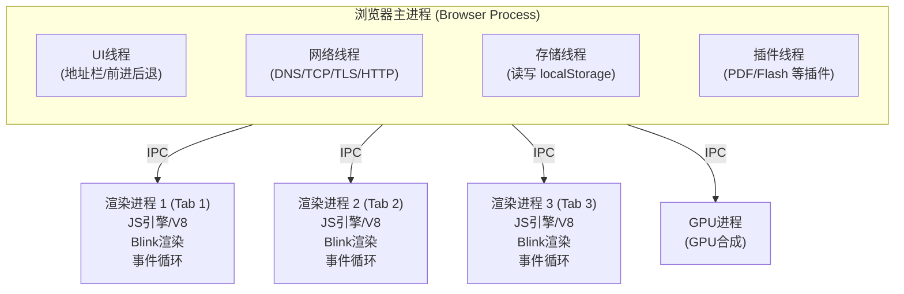
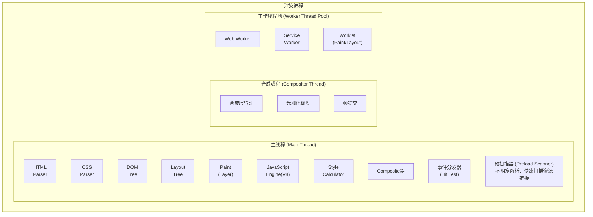
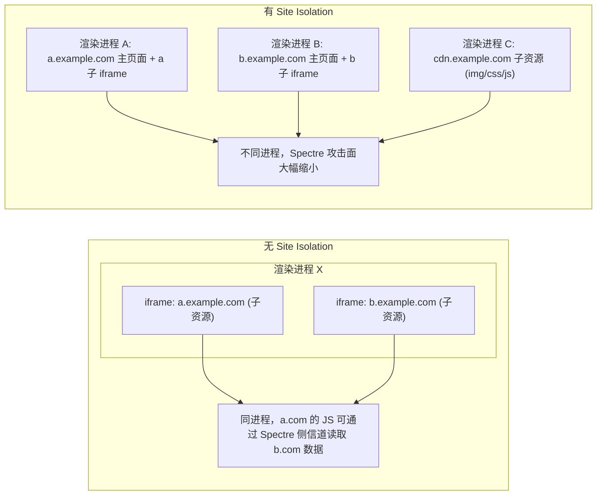
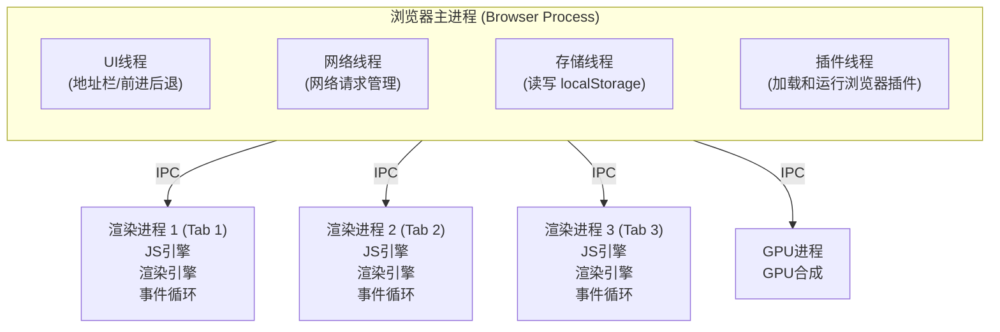
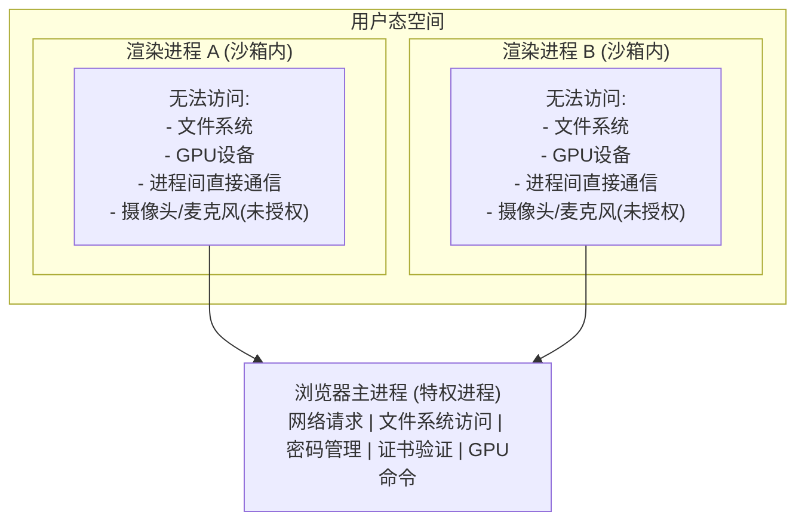
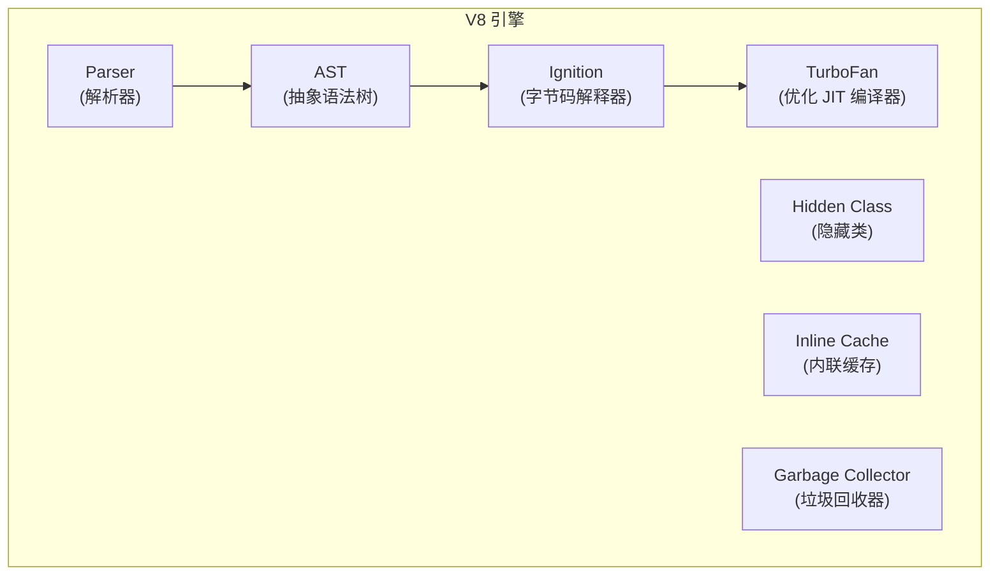

# 多进程架构、站点隔离与 V8

## 1. 浏览器多进程架构

### 1.1 定义/背景

现代浏览器采用多进程架构，将浏览器拆分为多个独立进程，以实现进程隔离、安全沙箱和多 Tab 并行稳定运行。引入多进程解决了单进程架构中"一个 Tab 崩溃导致全浏览器崩溃"的核心矛盾。

### 1.2 架构全景图



### 1.3 渲染进程内部结构



### 1.4 各进程职责对比

| 进程 | 职责 | 是否多实例 |
|------|------|----------|
| 浏览器主进程 | 地址栏、书签、前进后退、UI绘制、网络请求管理 | 唯一 |
| 渲染进程 | HTML/CSS 解析、JS 执行、页面渲染、事件处理 | 每个 Tab 一个 |
| GPU 进程 | CSS 动画、3D 变换、GPU 合成 | 可多个 (Chrome 77+) |
| 网络进程 | DNS、TCP、TLS、HTTP 请求 (Chromium 架构) | 唯一 |
| 插件进程 | PDF、Flash 等插件 | 按需创建 |

### 1.5 Site Isolation（站点隔离）

Chrome 2018 年引入的安全机制，确保不同站点的页面运行在不同渲染进程中，缩小 Spectre 类侧信道攻击面。



### 1.6 常见陷阱与最佳实践

| 陷阱 | 说明 | 解决方案 |
|------|------|---------|
| 在渲染进程中执行复杂计算 | 阻塞主线程，导致卡顿 | 使用 Web Worker 将计算移至后台线程 |
| 大量同时打开的 Tab | 每个 Tab 一个渲染进程，内存消耗大 | Chrome 会自动合并相同站点的渲染进程 (process reuse) |
| Service Worker 注册过多 | 可能占用过多进程资源 | 合并 Service Worker，按需注册 |
| 滥用 postMessage | 频繁跨进程消息通信有开销 | 用 BroadcastChannel 代替，对大数据用 SharedArrayBuffer |

### 1.7 面试追问

**Q1: 为什么 Chrome 要把渲染进程做成沙箱？**

渲染进程沙箱禁止其直接访问文件系统、GPU 设备、摄像头等系统资源。所有特权操作（如网络请求、文件读写）必须通过 IPC 发送到主进程，由主进程代为执行并返回结果。即使渲染进程被恶意代码攻破，攻击者仍无法直接控制操作系统。

**Q2: Site Isolation 和同源策略有什么区别？**

同源策略是浏览器安全模型的基础规则，限制不同源的 document/JS 彼此访问。Site Isolation 是更深层的进程级隔离——即使同源策略允许跨域访问，Chrome 仍会将不同站点的渲染进程分离，彻底杜绝 Spectre 类 CPU 侧信道攻击（利用 CPU 缓存时间差异读取其他进程内存）。

**Q3: 渲染进程和主进程之间如何通信？**

通过 IPC（Inter-Process Communication）通道。渲染进程使用 `window.chrome.ipcRenderer`，主进程使用 `chrome.ipcMain`。消息类型分为控制消息（navigation、create window）、路由消息（URL 请求）和数据消息。此外还有 `SharedMemory`/`SharedArrayBuffer` 实现高效共享内存。

## 2. 浏览器多进程架构（速记版）

### 2.1 架构图



### 2.2 各进程职责

| 进程 | 职责 | 是否多实例 |
|------|------|----------|
| 浏览器主进程 | 地址栏、书签、前进后退、UI绘制、网络请求 | 唯一 |
| 渲染进程 | HTML/CSS解析、JS执行、页面渲染、事件处理 | 每个Tab一个 |
| GPU进程 | CSS动画、3D变换、GPU合成 | 可多个(Chrome 77+) |
| 网络进程 | DNS、TCP、TLS、HTTP请求 | 唯一(Chromium) |
| 插件进程 | PDF、Flash等插件 | 按需创建 |

### 2.3 渲染进程内部结构


## 3. 为什么浏览器是多进程

**单进程架构的问题：**

```javascript
// 问题1: 一个Tab崩溃导致整个浏览器崩溃
// 问题2: JS死循环阻塞UI线程，无法响应用户
// 问题3: 恶意网页可以访问其他Tab的数据
// 问题4: 内存泄漏影响整个浏览器
```

**多进程的优势：**

1. **隔离性**: 每个Tab独立渲染进程，一个崩溃不影响其他
2. **安全性**: 渲染进程运行在沙箱中，无法直接访问文件系统
3. **流畅性**: JS死循环只影响当前Tab
4. **内存共享**: 不同域的渲染进程之间无法互相访问内存

**渲染进程是什么：**
渲染进程是浏览器中负责解析和渲染网页的独立进程，每个浏览器Tab都有一个独立的渲染进程。它包含V8引擎（执行JS）、Blink渲染引擎（解析HTML/CSS）、事件循环、预扫描器等组件。

## 4. 沙箱与 Site Isolation

### 4.1 沙箱原理



### 4.2 Site Isolation（站点隔离）

Site Isolation 是 Chrome 2018年引入的安全机制，确保**不同站点的页面**运行在**不同的渲染进程**中。


**关键：跨Site的iframe一定运行在不同进程中**，即使主框架相同。

## 5. V8 引擎为什么快：JIT 编译体系

### 5.1 V8 架构全景



### 5.2 编译流程

| 步骤 | 过程 | 说明 |
|------|------|------|
| Step 1 | Scanner -> Token 流 | 词法分析，生成 Token 序列 |
| Step 2 | Parser -> AST | 语法分析，构建抽象语法树 |
| Step 3 | Ignition -> 字节码 | 解释器执行，生成字节码 |
| Step 4 | TurboFan 优化 | 热代码（调用1000次+）触发 JIT 优化编译 |

**字节码示例：**
```javascript
function add(a, b) { return a + b; }
// LdaNamedProperty a0, [0]  // 加载 a
// Star r1                     // 存到 r1
// LdaNamedProperty a1, [1]   // 加载 b
// Add r1                      // 相加
// Return                      // 返回
```

**TurboFan 优化：**
- 生成优化机器码，使用 SSA（静态单赋值）
- 类型专门化：若 a,b 始终是整数，优化为快速整数加法

### 5.3 Hidden Class（隐藏类）

```javascript
// JavaScript 是动态类型语言，V8 用 Hidden Class 模拟静态结构
function Point(x, y) {
  this.x = x;
  this.y = y;
}

var p1 = new Point(1, 2);  // V8 创建 Hidden Class C0 -> C1 -> C2
var p2 = new Point(3, 4);  // p2 和 p1 共享 Hidden Class 链 (C0->C1->C2)

//  Hidden Class 链:
//  C0 (创建时，空对象)
//    x 属性 -> C1
//    y 属性 -> C2
//  C1 (有 x)
//    y 属性 -> C2
//  C2 (有 x,y)

// 性能陷阱：动态添加属性导致 Hidden Class 分叉
var p3 = new Point(5, 6);
p3.z = 7;  // 差劲！创建新的 Hidden Class C3，性能下降
// 正确做法：构造函数中一次性声明所有属性
```

### 5.4 Inline Cache（内联缓存）

```javascript
function getX(obj) {
  return obj.x;  // 每次调用，V8 记录 obj 的 Hidden Class
}

// 第1次调用: obj 的 Hidden Class 是 C2
// V8 在调用点记录: "C2 的 x 在 offset 16"

// 第2-N次调用: 如果 Hidden Class 仍是 C2，直接用记录的 offset 读取
// 不需要查表，时间复杂度 O(1) -> 接近静态语言性能

// 第N+1次调用: Hidden Class 变化了，缓存失效
// V8 记录多个 Hidden Class 的信息 (Monomorphic -> Polymorphic)
// 如果太多不同 Hidden Class，回退到慢速查表 (Megamorphic)
```

### 5.5 V8 快的原因总结

1. **JIT 混合编译**: 解释执行快速启动，热代码即时优化
2. **TurboFan 优化编译器**: 生成高度优化的机器码
3. **Hidden Class**: 模拟静态类型，属性访问 O(1)
4. **Inline Cache**: 缓存类型信息，避免重复查表
5. **Garbage Collector**: 分代回收（新生代/老生代），减少停顿
6. **字节码**: Ignition 字节码比机器码更紧凑，提升缓存命中率

## 应用与行业实践

### 应用场景地图

| 场景 | 用到本页哪个知识点 | 典型技术选型 | 注意事项 |
| 后台管理的万行表格筛选与滚动 | V8 JIT、对象形状稳定、去优化控制 | React/Vue 固定字段对象；Web Worker 排序 | 热路径内不动态增删字段 |
| 多人协作白板嵌入多来源插件 | 多进程隔离、沙箱、站点隔离 | iframe sandbox + postMessage 心跳 | 及时校验 origin；插件多会增加内存 |
| 低端安卓 WebView 首屏加载 | V8 分层编译、多进程内存开销 | 路由级拆包；requestIdleCallback | 首屏避免多个跨源 iframe |
| 金融 Web 终端实时行情推送 | V8 热点函数优化、去优化 | WebSocket 二进制帧；固定类型数组 | 消息解析热路径避免混用对象形状 |
| 第三方广告 SDK 嵌入电商大促页 | 沙箱、站点隔离、进程隔离 | sandbox iframe；Permissions-Policy | 先核对 SDK 是否依赖同源 cookie |
| 在线 IDE 项目实时预览 | 多进程崩溃隔离、站点隔离 | 独立 iframe 预览；CDP Page.crash 测试 | 预览崩溃不应带走编辑器状态 |
| 大型数据可视化看板含多个图表组件 | 多进程隔离、沙箱 | 多源 iframe；postMessage 数据通道 | iframe 过多会推高内存和通信成本 |
| 企业审批表单嵌入外部文件预览 | 沙箱、站点隔离、权限策略 | sandbox iframe；Permissions-Policy | 按预览文件来源设置最小权限 |

### 三个场景拆解

#### 场景 1：后台管理万行表格

**业务背景**：后台管理页面需要展示 1 万行以上明细，并支持实时筛选与排序。全量计算在滚动时触发卡顿，输入筛选后主线程明显阻塞。

**怎么用本页知识解决**：先定位热点函数。再保持对象字段顺序和循环方式稳定，减少 V8 去优化。

```js
// 固定行对象字段顺序，让 V8 对象形状保持单一
function makeRow(id, name, amount) {
  return { id, name, amount };
}

// 热路径使用索引循环，避免每次迭代创建迭代器对象
function sumVisibleRows(rows) {
  let total = 0;
  for (let i = 0; i < rows.length; i++) {
    total += rows[i].amount;
  }
  return total;
}
```

- `makeRow` 每次按相同顺序创建字段，降低对象形状的转换次数。
- 热路径里的 `for` 循环在 TurboFan 优化后更易做边界检查和内联。
- 可运行 `node --trace-deopt --trace-ic feed.js` 查看 `sumVisibleRows` 是否出现去优化。
- 如果接口字段顺序不同，进入热路径前先归一化为固定字段对象。

**怎么度量收益**：

- 指标：筛选 10000 行的执行耗时、50ms 以上长任务数、去优化事件数。
- 工具：Chrome DevTools Performance 录一次筛选操作；Node 用 `--trace-deopt` 输出日志。
- 方法：同设备下对比改造前后 10 次筛选耗时中位数，并统计 deopt 日志条数。

**什么时候不该用**：

- 行对象来自多个差异较大接口，强转固定字段会增加一次全量映射，抵消优化收益。
- 瓶颈在 DOM 渲染或布局时，先去减少节点数量与重排，不要先改对象形状。

#### 场景 2：多人协作白板嵌入第三方插件

**业务背景**：白板要嵌入 5 到 10 个不同来源插件，如图表、文档预览和媒体控件。一个插件若卡死或读取宿主存储，会破坏白板主界面与用户数据。

**怎么用本页知识解决**：把第三方插件放进跨源 iframe，启用 sandbox，并用消息心跳判断存活。

```html
<!-- 宿主页：插件用 sandbox，禁止脚本读取宿主同源存储 -->
<iframe id="plugin-a" sandbox="allow-scripts"
        src="https://plugin-a.example.com/widget.html"></iframe>

<script>
  // 校验来源并记录最近心跳
  window.addEventListener("message", (event) => {
    if (event.origin !== "https://plugin-a.example.com") return;
    if (event.data && event.data.type === "heartbeat") {
      window.lastHeartbeat = Date.now();
    }
  });

  // 3 秒无心跳则标记插件离线
  setInterval(() => {
    const offline = Date.now() - window.lastHeartbeat > 3000;
    document.getElementById("plugin-status").textContent =
      offline ? "插件离线" : "插件在线";
  }, 1000);
</script>
```

- 跨源 iframe 在现代 Chromium 的站点隔离下通常使用独立渲染进程，崩溃不直接拿到宿主进程。
- `sandbox="allow-scripts"` 不授予 `allow-same-origin`，插件脚本不能读取宿主同源存储。
- `postMessage` 先校验 `event.origin`，防止其他窗口伪造插件消息。
- 3 秒无心跳可视为插件未响应，由宿主提示重载，而不是让主界面一直等待。

**怎么度量收益**：

- 指标：插件渲染进程崩溃后宿主可响应率、插件离线检测耗时、主进程占用变化。
- 工具：Chrome Task Manager 查看进程 ID；CDP `Page.crash` 触发插件帧崩溃。
- 方法：在测试页用 CDP 令插件 iframe 崩溃 10 次，记录宿主按钮可点击次数。

**什么时候不该用**：

- 插件超过 20 个时，每增加一个 iframe 就增加进程和内存，低端设备会更快触发内存不足。
- 高频坐标绘图需要插件和宿主同步鼠标位置时，postMessage 异步延迟会破坏操作手感。

#### 场景 3：低端安卓 WebView 首屏加载

**业务背景**：低端安卓设备在 WebView 中打开页面时，首屏脚本执行和编译占用主线程，白屏时间可被用户明显感知。可用内存有限，过多跨源 iframe 会同时推高进程数和内存。

**怎么用本页知识解决**：缩短首屏脚本执行量，把非关键任务交给空闲回调；用长任务监控验证。

```html
<script>
// 非关键模块延后到浏览器空闲时加载，减少首屏 V8 解析编译压力
if ("requestIdleCallback" in window) {
  requestIdleCallback(() => {
    import("./non-critical.js");
  });
}

// 记录 50ms 以上长任务，作为首屏阻塞观测
const observer = new PerformanceObserver((list) => {
  for (const entry of list.getEntries()) {
    if (entry.duration > 50) {
      console.log("longtask", entry.duration);
    }
  }
});
observer.observe({ type: "longtask", buffered: true });
</script>
```

- 首屏只执行必要脚本，V8 启动阶段的解析和 Ignition 执行时间变短。
- `requestIdleCallback` 把非关键模块移出首屏，减少可衡量的 50ms 以上长任务。
- 低端安卓内存紧张，首屏应避免嵌多个跨源 iframe，否则站点隔离带来的多进程内存会挤压首屏资源。

**怎么度量收益**：

- 指标：Time to Interactive、Total Blocking Time、白屏时长、脚本执行耗时。
- 工具：Lighthouse、PageSpeed Insights、Chrome DevTools Performance。
- 方法：同一低端设备无痕模式加载全量版与延后版，各测 5 次取中位数对比。

**什么时候不该用**：

- 表单或支付模块必须立即响应用户输入，延后加载会导致点击无响应。
- 后续会话会反复进入非关键模块时，完全延后可能增加运行时延迟，应改为预取而非延迟执行。

### 行业先进实践

1. **Chromium Site Isolation（出处：Chromium 官方文档《Site Isolation Design Document》）**  
   按站点切分渲染进程，跨站 iframe 不共享同一个渲染进程。它能限制 Spectre 类内存侧信道读取和崩溃蔓延。项目若嵌入多来源页面，应把跨站 iframe 作为默认隔离边界。

2. **Mozilla Project Fission（出处：Mozilla Wiki《Project Fission》）**  
   为每个跨站 iframe 和站点建立独立进程，把隔离从顶层站点扩展到子 iframe。浏览器壳或多租户预览项目可借鉴其“按站点切分，不以顶层页面统一分配”的做法。

3. **V8 Sparkplug 编译层（出处：V8 官方博客《V8 release v9.0》）**  
   在 Ignition 字节码与高层优化之间增加编译层，缩短启动到执行路径。它让首屏脚本不必等到 TurboFan 优化也能较快执行。项目首屏应保持入口脚本小，热点函数才进入高层优化。

4. **Cloudflare Workers 的 V8 isolates（出处：Cloudflare 官方文档《How Workers works》）**  
   在同一进程内用多个 V8 isolate 隔离不同请求，而不是每请求一个容器。它降低冷启动和内存成本。若前端要做插件沙箱，可评估 Worker 或 iframe + isolate 方案，避免无约束地增加浏览器进程。

5. **Chromium Linux 沙箱（出处：Chromium 官方文档《Linux Sandboxing》）**  
   渲染进程用 seccomp-bpf 与 namespace 限制系统调用和文件系统访问。进程隔离解决架构问题，系统调用限制解决提权问题。桌面端封装 WebView 时，应保留操作系统级沙箱策略。

### 从学到用：落地路线

1. 在现有应用的一个第三方插件区域试点，把同源内嵌脚本改为 `sandbox="allow-scripts"` 的跨源 iframe。验收：Chrome Task Manager 中该 iframe 进程 ID 与主页面不同。
2. 对后台表格或实时筛选热点做验证，用 `node --trace-deopt` 记录同一计算函数的去优化次数。验收：改造后 deopt 事件数不高于改造前。
3. 推广到新模块：要求新增跨源 iframe 必须设置 sandbox 和 origin 校验，性能测试加入 longtask 指标。验收：代码审查清单出现这两项且执行通过。
4. 防止回退：把去优化日志和 longtask 数量接入 CI 或上线监控。验收：基线超标时构建或发布报警。

### 动手作业

**目标**：做一个隔离第三方组件的宿主页，能证明插件崩溃不拖垮宿主，并能测量 V8 热路径去优化。

**步骤**：

1. 创建宿主页，内嵌两个跨源 iframe，都设置 `sandbox="allow-scripts"`。
2. 写两个插件页：一个每秒发送心跳；另一个作为崩溃测试目标，不加载主界面逻辑。
3. 宿主页用 `postMessage` 接收心跳并校验 `event.origin`，3 秒无心跳显示离线。
4. 用 PerformanceObserver 记录 50ms 以上 longtask。
5. 用 Chrome Task Manager 查看宿主页和两个 iframe 的进程 ID。
6. 用 CDP `Page.crash` 令一个插件帧崩溃，验证宿主按钮仍可响应点击。
7. 写一个 Node 脚本对 10 万行对象求和，先用动态字段版本，再用固定字段版本，运行 `node --trace-deopt script.js` 对比 deopt 次数。

**验收标准**：

- 一个插件崩溃后，宿主页按钮仍能连续点击 5 次并输出事件。
- 宿主在插件无心跳 3 秒后显示“插件离线”。
- 两个 iframe 在 Chrome Task Manager 中与宿主进程 ID 不同。
- longtask 监听器至少记录到 1 条 50ms 以上任务且页面不报未捕获异常。
- 固定字段版本的 Node 脚本 deopt 事件数低于动态字段版本。

