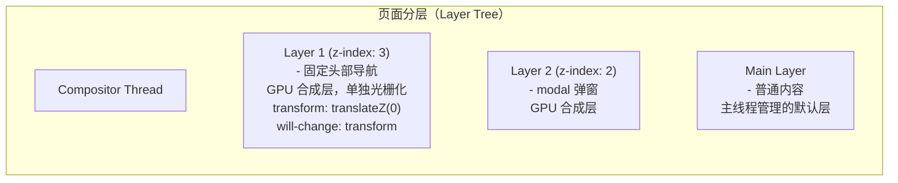

# 渲染流水线与阻塞

## 1. 浏览器渲染流程

### 1.1 渲染流水线

| 阶段 | 说明 |
|------|------|
| HTML Parser | Tokenizer -> HTML Token 流 -> 构建 DOM 节点 -> DOM Tree |
| Style | 计算每个 DOM 节点的 Computed Style |
| Render Tree | DOM + CSSOM -> 可见节点（不包含 display:none） |
| Layout | 计算几何信息（x, y, width, height）—— 任何改变几何属性的操作都触发回流 |
| Paint | 生成绘制记录（Paint Records），确定绘制顺序（按 z-index 分层） |
| Composite | 合成层分组 -> 光栅化 -> 合成帧 |

### 1.2 CSS 选择器优先级

```javascript
// CSS 选择器优先级（从低到高）:
/*
  0. 通配符 *             -> 0,0,0,0
  1. 标签选择器 p          -> 0,0,0,1
  2. 类选择器 .active      -> 0,0,1,0
  3. 属性选择器 [type=text] -> 0,0,1,0
  4. 伪类 :hover           -> 0,0,1,0
  5. ID 选择器 #header     -> 0,1,0,0
  6. 行内样式 style=""     -> 1,0,0,0
  7. !important            -> 最高优先级（覆盖上述所有）
*/
```

### 1.3 DOM Tree 与 Render Tree 生成

**DOM Tree vs Render Tree：**

| DOM Tree | Render Tree | 说明 |
|---------|-------------|------|
| html > html | html | 根节点 |
| head > head | (跳过) | 不可见，不进入渲染树 |
| link > link | (跳过) | 不可见，不进入渲染树 |
| body > body | body | 可见节点 |
| div > div | div | 可见，附带样式信息 |
| 'text' > text | 'text' | 文本节点 |

**注意：**
- display:none 的元素节点从 DOM 中保留，但不出现在 Render Tree
- visibility:hidden 元素出现在 Render Tree 中，但不绘制

## 2. Layout vs Paint vs Composite

| 阶段 | 触发条件 | 性能影响 | 解决方式 |
|------|---------|---------|---------|
| **Reflow（回流/布局）** | 几何属性变化（width/height/padding/margin/offsetTop...） | 最严重，整个布局树重新计算 | 批量DOM操作、DOM离线化 |
| **Repaint（重绘）** | 外观变化不影响布局（color/background/border-radius...） | 中等，不需要重新布局 | 使用 CSS transform/opacity |
| **Composite（合成）** | 仅 transform/opacity 变化 | 最轻，仅合成层合并 | 启用 GPU 加速（will-change） |

### 2.1 回流（Reflow）触发条件

```javascript
// 读写交替导致强制同步回流（最糟糕的性能陷阱）
// Bad Example - 强制同步布局抖动:
for (const el of manyElements) {
  el.style.width = el.offsetWidth + 10 + 'px';  // 读 -> 触发回流
  el.style.height = el.offsetHeight + 10 + 'px'; // 读 -> 再次触发回流
}
// 每次循环都触发同步回流（Layout Thrashing）

// Good Example - 批量读，批量写:
const widths = [];  // 先读所有
for (const el of manyElements) {
  widths.push(el.offsetWidth);
}
for (let i = 0; i < manyElements.length; i++) {  // 再写所有
  manyElements[i].style.width = widths[i] + 10 + 'px';
}

// 导致回流的常见操作:
window.getComputedStyle()     // 读
element.offsetHeight          // 读
element.scrollTop             // 读
element.getBoundingClientRect() // 读

// 不会导致回流的属性（合成线程完成）:
element.style.transform = 'translateX(100px)'  // 合成属性
element.style.opacity = '0.5'                   // 合成属性
```

### 2.2 浏览器分层与合成层



### 2.3 GPU 合成原理

```
1. 分层: 渲染引擎根据特定规则将页面分为多个合成层 (Compositing Layers)
   触发合成层的常见条件:
   - transform: translateZ(0) / translate3d()
   - will-change: transform / opacity
   - position: fixed
   - <video> / <canvas> / WebGL
   - CSS filter

2. 光栅化: 每个合成层在合成线程中独立光栅化（Rasterization）

3. 合成: 将各层的位图纹理按 z-index 叠加
   - 使用 GPU 的纹理合成能力（Texture Compositing）

4. 动画/滚动: transform 和 opacity 的动画完全在合成线程执行
   - 不需要主线程参与 -> 60fps+ 的流畅动画
```

## 3. CSS 阻塞渲染 vs JS 阻塞解析

### 3.1 CSS 阻塞渲染

```html
<!-- CSS 是渲染阻塞资源 (Render Blocking Resource) -->
<!-- 原因：避免无样式内容闪烁 (FOUC) -->

<head>
  <!-- 阻塞渲染：必须加载和处理完 CSS 才能渲染 -->
  <link rel="stylesheet" href="styles.css" />

  <!-- 非关键 CSS 应异步加载：-->
  <link rel="stylesheet" href="non-critical.css"
        media="print" onload="this.media='all'" />
</head>
```

### 3.2 JS 阻塞解析

```html
<body>
  <!-- JS 默认阻塞 HTML 解析器 -->
  <!-- 原因：JS 可能 document.write() 改变 DOM 结构 -->

  <!-- 普通脚本 — 阻塞解析 -->
  <script src="analytics.js"></script>

  <!-- defer 脚本 — 不阻塞解析 -->
  <script src="app.js" defer></script>

  <!-- async 脚本 — 不阻塞解析 -->
  <script src="analytics.js" async></script>

  <!-- 模块脚本 — 默认 defer 行为 -->
  <script type="module" src="app.js"></script>
</body>
```

### 3.3 defer vs async 对比

| 脚本类型 | 执行时机 | 执行顺序 | 是否阻塞 HTML 解析 |
|---------|---------|---------|-------------------|
| 无属性 | 解析时立即执行 | 出现顺序 | 是 |
| defer | DOM 完成后 | 出现顺序 | 否 |
| async | 下载完立即执行 | 不保证顺序 | 否 |

**时间轴示意：**

```
无属性: |-- HTML 解析 --[c.js 执行]-- c.js 下载 --|-- PAINT --|
defer:   |-- HTML 解析 -- c.js 下载 -------- [a.js 执行]--|-- PAINT --|
async:   |-- HTML 解析 -- b.js 下载 [b.js 执行]-----------|-- PAINT --|
```

| 特性 | 无属性 | defer | async |
|------|-------|-------|-------|
| 是否阻塞 HTML 解析 | 是 | 否 | 否 |
| 执行时机 | 解析时立即执行 | DOM完成后 | 下载完立即执行 |
| 执行顺序 | 出现顺序 | 出现顺序 | 不保证顺序 |
| 适用场景 | 依赖 DOM 的同步脚本 | 大部分场景（推荐） | 独立脚本（分析/广告） |

### 3.4 preload vs prefetch

```html
<!-- preload: 提前加载当前导航需要的资源（高优先级） -->
<link rel="preload" href="font.woff2" as="font" crossorigin="anonymous" />
<link rel="preload" href="critical.js" as="script" />

<!-- prefetch: 提前加载未来导航可能需要的资源（低优先级） -->
<link rel="prefetch" href="next-page.html" />
<link rel="prefetch" href="bundle.js" as="script" />

<!-- preconnect: 提前建立 TCP/TLS 连接 -->
<link rel="preconnect" href="https://api.example.com" />
```

## 深入阅读与参考

!!! tip "怎么用这些资料"
    先读「官方文档与规范」建立准确的概念，再读「源码与示例」核对细节，最后用「教程、书籍与视频」换一种讲法加深理解。每条都写明了读哪一节、带着什么问题读。

### 官方文档与规范

| 资源 | 为什么读 | 怎么读 |
|---|---|---|
| [Stacking context](https://developer.mozilla.org/en-US/docs/Web/CSS/Guides/Positioned_layout/Stacking_context) | 讲清层叠上下文如何决定绘制与合成顺序。 | 读「创建层叠上下文的属性」一节，带着 z-index 失效问题，用 DevTools Layers 验证。 |
| [Inline formatting context](https://developer.mozilla.org/en-US/docs/Web/CSS/Guides/Inline_layout/Inline_formatting_context) | 行内格式化上下文是理解 Layout 阶段的基础。 | 读行内盒与行盒排版部分，思考换行何时触发重排，写小 demo 验证。 |
| [Chrome for Developers：CSS 与 UI](https://developer.chrome.com/docs/css-ui) | 官方渠道的 CSS 与渲染新特性文章，紧跟实现进展。 | 每月浏览新文章，挑一篇涉及渲染或合成的，在演示中开启对应实验特性。 |

### 源码与示例

| 资源 | 为什么读 | 怎么读 |
|---|---|---|
| [Stacking context example 1](https://developer.mozilla.org/en-US/docs/Web/CSS/Guides/Positioned_layout/Stacking_context/Example_1) | 可运行示例，观察同一层叠上下文内的绘制顺序。 | 打开示例改 z-index 与 position，对照输出解释顺序为何变化。 |
| [Stacking context example 2](https://developer.mozilla.org/en-US/docs/Web/CSS/Guides/Positioned_layout/Stacking_context/Example_2) | 第二个示例展示嵌套层叠上下文的绘制差异。 | 先预测结果再运行，比较嵌套两层的元素前后关系，记录结论。 |

### 教程、书籍与视频

| 资源 | 为什么读 | 怎么读 |
|---|---|---|
| [CSS 与网络性能](https://csswizardry.com/2018/11/css-and-network-performance/) | 直接讲哪些 CSS 会阻塞渲染以及如何排查。 | 读阻塞判定与优化小节，用 Lighthouse 或 Coverage 检查自己页面的阻塞 CSS。 |
| [Harry Roberts：CSS Wizardry](https://csswizardry.com/) | 性能文章系统讲解渲染阻塞与资源提示。 | 读 critical CSS 与 preload 相关文章，挑一条建议在项目中实测效果。 |
| [CLS 说明](https://web.dev/articles/cls) | 布局偏移源于布局与绘制，可反推渲染流水线。 | 读成因与指标定义，用 Layout Shift Regions 高亮找出偏移来源。 |
| [fe-interview（haizlin）](https://github.com/haizlin/fe-interview) | 浏览器分类题库可自测渲染与阻塞知识盲点。 | 取浏览器与性能类各十题限时做，错题回查规范或 MDN 对应章节。 |
| [CSS in Depth（Manning）](https://www.manning.com/books/css-in-depth-second-edition) | 布局与层叠章节讲得扎实，补足渲染前置知识。 | 先读布局与层叠两章，每章写一个实验页，验证书中结论。 |
| [CSS for JavaScript Developers](https://css-for-js.dev/) | 帮助建立 CSS 心智模型，理解布局计算的代价。 | 按模块学布局与渲染相关内容，完成配套项目后再回看本页。 |

## 应用与行业实践

原理讲完，接下来看它在真实项目里落在哪。下面先给一张场景地图，再拆三个场景，最后给行业做法和落地路线。

### 应用场景地图

| 场景 | 用到本页哪个知识点 | 典型技术选型 | 注意事项 |
|---|---|---|---|
| 后台管理的万行表格 | Layout 的代价随节点数增长 | 虚拟滚动（TanStack Virtual、vue-virtual-scroller） | 行高固定才能省掉逐行测量 |
| 低端安卓机的活动页首屏 | CSS 阻塞渲染、JS 阻塞解析 | 关键 CSS 内联、脚本 defer | 内联体积会推迟 HTML 到达时间 |
| 多人协作白板 | Composite 与独立图层 | Canvas 或 WebGL 加 transform 位移 | 图层数量失控会吃显存 |
| 电商大促落地页 | 阻塞渲染资源在文档里的顺序 | 字体 preload、脚本 defer | 字体切换要配 font-display |
| 长列表聊天窗口 | 强制同步布局 | transform 定位加固定容器 | 别在循环里读 offsetHeight |
| 富文本编辑器 | JS 阻塞解析 | 动态 import 编辑器内核 | 用户开始输入前不要初始化 |
| 数据大屏实时刷新 | Paint 与 Composite 的分工 | transform 与 opacity 动画，rAF 批处理 | 每帧写布局属性会触发重排 |
| 移动端 H5 转场动画 | 合成层管理 | transform、opacity | filter 与 box-shadow 动画代价高 |
| 地图类应用拖拽瓦片 | Composite | 瓦片分层加 translate3d | 图层提升要按需开关 |

### 三个场景拆解

#### 场景 1：后台管理的万行表格

**业务背景**：用户把分页切到"全部"，一张表一次挂载上万行。改一次筛选条件，浏览器要整表重排，滚动直接掉帧。

**怎么用本页知识解决**：思路是把"渲染全部行"换成"只渲染看得见的行"。视口高度决定挂载数量，滚动时只改容器的 transform，走合成阶段。

```js
const rowH = 36;                 // 行高固定，省去逐行测量
const box = document.querySelector('.viewport');
let start = 0;                   // 当前可见区起始行号

box.addEventListener('scroll', () => {
  const next = Math.floor(box.scrollTop / rowH);  // 用滚动位置换行号
  if (next === start) return;    // 行号没变就不动 DOM
  start = next;
  render(start);
}, { passive: true });           // passive 让滚动不被监听器拖住

function render(start) {
  const end = start + Math.ceil(box.clientHeight / rowH) + 2; // 多渲染 2 行做缓冲
  const frag = document.createDocumentFragment();
  for (let i = start; i < end; i++) frag.appendChild(makeRow(i));
  const inner = box.firstElementChild;
  inner.style.transform = `translateY(${start * rowH}px)`; // 只改 transform
  inner.replaceChildren(frag);   // 一次替换，减少 Layout 次数
}
```

- 行高写死成 36，滚动位置除以行高就是行号，不用调 `getBoundingClientRect`。
- 滚动监听加 `passive`，浏览器不会等监听器返回再滚屏。
- 行号不变就提前 return，避免同一帧里重复改 DOM。
- 容器位移用 `transform`，跳过 Layout 与 Paint，只做 Composite。
- `replaceChildren` 一次换掉整批行，比逐条 `appendChild` 触发的重排次数少。

**度量收益**：Performance 面板录制滚动过程，看 Rendering 里 Recalculate Style 与 Layout 的耗时条。用 PerformanceObserver 监听 longtask，统计长任务条数与总时长。上报侧看 Lighthouse 的 Total Blocking Time 与 CrUX 里的 INP 字段。

**什么时候不该用**：总行数不到一屏两倍时，虚拟滚动带来的滚动条跳动和焦点管理成本超过收益，直接全量渲染。页面需要浏览器原生 Ctrl+F 命中所有行时，未挂载的行搜不到，虚拟列表会给出错误结果。

#### 场景 2：低端安卓机上的活动页首屏

**业务背景**：低端安卓机的 CPU 与网络都紧张，HTML 到了还得等 CSS 和脚本。用 DevTools 的 Network 节流设 Slow 4G，再录一次冷启动，就能复现这条等待链。

**怎么用本页知识解决**：思路是缩短关键路径：样式上只保留首屏必需的部分，脚本从解析路径上挪走，第三方脚本推到页面加载之后。

```html
<head>
  <style>/* 内联首屏关键样式：头部、按钮、骨架屏 */</style>
  <!-- 非关键样式：先按 print 加载，不阻塞渲染 -->
  <link rel="stylesheet" href="/rest.css" media="print" onload="this.media='all'">
  <noscript><link rel="stylesheet" href="/rest.css"></noscript>
  <!-- 业务脚本 defer：解析继续，DOM 建好后再执行 -->
  <script src="/app.js" defer></script>
  <!-- 埋点这类非首屏脚本延后到 load 之后 -->
  <script>window.addEventListener('load', () => {
    const s = document.createElement('script');
    s.src = '/analytics.js'; document.head.appendChild(s);
  });</script>
</head>
```

- 首屏样式内联，浏览器不用等一次网络往返就能开始渲染。
- 剩余样式用 `media="print"` 起步，加载完再切回 `all`，它就不再挡渲染。
- `noscript` 兜底：脚本被禁用时样式仍会正常加载。
- 业务脚本加 `defer`，HTML 解析不被下载和执行打断，执行顺序按文档顺序。
- 埋点脚本挂到 `load` 之后再注入，首屏渲染路径上少一个下载。

**度量收益**：Network 面板在 Slow 4G 下看文档到达与首次渲染的时间点。Performance 面板看 Parse HTML、Evaluate Script、Recalculate Style 三段的时长。Lighthouse 看 FCP、LCP、Speed Index。上线后用 web-vitals 库上报 LCP 与 INP。

**什么时候不该用**：样式总量很小、首屏样式就是全部样式时，拆成两份文件只增加维护成本。页面依赖大量 CSS 才能正确布局时，内联会把 HTML 撑大，文档到达时间反而后移。

#### 场景 3：多人协作白板

**业务背景**：白板上同时有几十个图形在拖拽，指针每秒产生上百个事件。每来一个事件就写一次样式，主线程被 Layout 和 Paint 占满，拖拽看着跟不上手指。

**怎么用本页知识解决**：思路是把指针事件的频率压到每帧一次，并且只改触发 Composite 的属性。位置数据先攒着，rAF 回调里统一提交。

```js
const board = document.querySelector('#board');
let pending = null;              // 攒住本帧最后一次指针位置
let rafId = 0;

function onMove(e) {
  pending = { x: e.clientX, y: e.clientY };
  if (rafId) return;             // 本帧已排过队，直接覆盖数据
  rafId = requestAnimationFrame(commit);
}

function commit() {
  rafId = 0;
  if (!pending) return;
  // 只改 transform，浏览器走合成，跳过 Layout 与 Paint
  board.style.transform = `translate3d(${pending.x}px, ${pending.y}px, 0)`;
  pending = null;                // 提交完就清空
}

addEventListener('pointermove', onMove, { passive: true });
```

- 指针事件只负责记位置，不做任何样式写入。
- `rafId` 做闸门，一帧内最多排一次回调，事件再密也只算一次。
- 提交时用 `translate3d`，元素被提升到独立图层，位移不动布局。
- `pending` 保存的是本帧最后一次坐标，中间的事件自然被丢弃。
- 整段逻辑不读布局属性，不存在强制同步布局。

**度量收益**：Rendering 面板勾选 Frame Rendering Stats，看 FPS 与 dropped frames。Performance 面板录 5 秒拖拽，看 Composite 与 Layout 的占比变化。自测时用 `performance.now()` 记 pointermove 到 rAF 回调的间隔，看这个间隔的分布。

**什么时候不该用**：笔迹绘制这类每帧要更新位图内容的场景，只改 transform 不会重绘位图，画面不会更新，得回到 Canvas 逐帧绘制。需要键盘焦点跟随元素位置时，transform 不改布局位置，焦点环会和视觉位置错开。

### 行业先进实践

Core Web Vitals 与 INP（出处：web.dev 官方文档）
做法：把 LCP、INP、CLS 作为对外公布的页面体验字段指标，其中 INP 关注输入到下一帧绘制的延迟。有效原因：它把"卡不卡"拆成可采集、可上报的数值，改版前后能直接对比。借鉴方式：项目里接入 web-vitals 上报，先只收 LCP 与 INP 两个字段。

DevTools 的 Rendering 面板（出处：Chrome DevTools 官方文档）
做法：勾选 Paint flashing、Layer borders、Frame Rendering Stats，直接在页面上看哪块区域在重绘、哪些元素进了独立图层。有效原因：它把 Layout、Paint、Composite 三个阶段变成看得见的视觉反馈。借鉴方式：排查滚动卡顿时先开这个面板，判断瓶颈落在重排还是重绘。

content-visibility 与 contain-intrinsic-size（出处：MDN 的 CSS Containment 文档 / W3C CSS Containment Module Level 2）
做法：让屏幕外的子树跳过布局与绘制，同时用 contain-intrinsic-size 给出占位尺寸，避免滚动条抖动。有效原因：浏览器可以整棵子树跳过渲染工作。借鉴方式：长文档页面先给静态区块加上它，再用 Performance 面板确认 Layout 阶段确实被跳过。

next/script 的加载策略（出处：Next.js 官方文档）
做法：用 strategy 指定脚本在 beforeInteractive、afterInteractive、lazyOnload 三个时机加载。有效原因：脚本被从 HTML 解析路径上挪走，解析不再等它下载和执行。借鉴方式：统计类第三方脚本放 lazyOnload，先和业务方确认数据延迟可以接受。

React 的 startTransition（出处：React 官方文档）
做法：把会引发大范围重渲染的状态更新标记为 transition，让输入事件先完成渲染。有效原因：这类更新可以被中断，输入不会被大批量渲染堵在后面。借鉴方式：筛选输入框联动长列表时使用，再用 Performance 面板确认单条长任务被切短。

需核对官方文档：各框架对 transition 与优先级调度的具体 API 名称和稳定版本，请对照你所使用版本的官方文档核对。

### 从学到用：落地路线

1. 试点：选一个能独立发布、改动频繁的页面，接入 Performance 面板录制流程和 web-vitals 上报。验收标准：连续三天有可对比的 LCP 与 INP 基线数据。
2. 验证：只对该页面做一次阻塞点处置（脚本加 defer、非关键样式延后），用同一设备、同一节流配置复测。验收标准：录制中长任务条数下降，且交互指标不高于基线。
3. 推广：把处置动作和复测步骤写成检查项，纳入代码评审模板。验收标准：新页面合并前，PR 里附有一次录制结果。
4. 防回退：在 CI 里跑 Lighthouse CI，给 LCP 与 TBT 设预算阈值。验收标准：超阈值时构建失败，并输出与基线的对比报告。

### 动手作业

目标：给一个自写的长列表页做一次阻塞排查与修复，留下可复现的前后对比材料。

步骤：
1. 本地建一个页面，用脚本生成 5000 行数据，每行含一段文本和一个按钮。
2. 打开 DevTools 的 Performance 面板，勾选禁用缓存，录制滚动 5 秒，导出 JSON。
3. 在 Rendering 面板勾选 Paint flashing 与 Frame Rendering Stats，记录滚动时哪些区域在重绘。
4. 改成视口内渲染：只挂载可见行加 2 行缓冲，容器位移只用 transform。
5. 把首屏无关的脚本改为 defer，非关键 CSS 放到页面尾部或按 media 切换加载。
6. 用 PerformanceObserver 订阅 longtask，把每次长任务的时长打印到控制台。
7. 保持同一设备和同一节流配置，重录一次，把两次 JSON 放在同一目录下。

验收标准：
- 第二次录制里 Layout 阶段总时长低于第一次，两次的 JSON 或截图都在仓库里。
- 挂载的 DOM 节点数与视口高度成比例：把视口高度翻倍，节点数随之翻倍。
- 控制台不再打印任何 longtask 记录。
- 用 Tab 键能走到每一个可见行，焦点环与视觉位置对齐。
- 仓库里的 README 写明步骤，别人按它复现能得到同一组结论。

