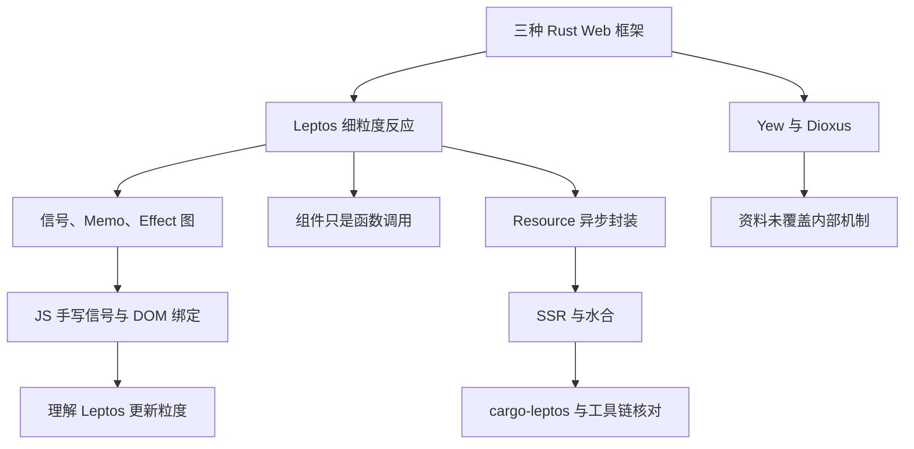
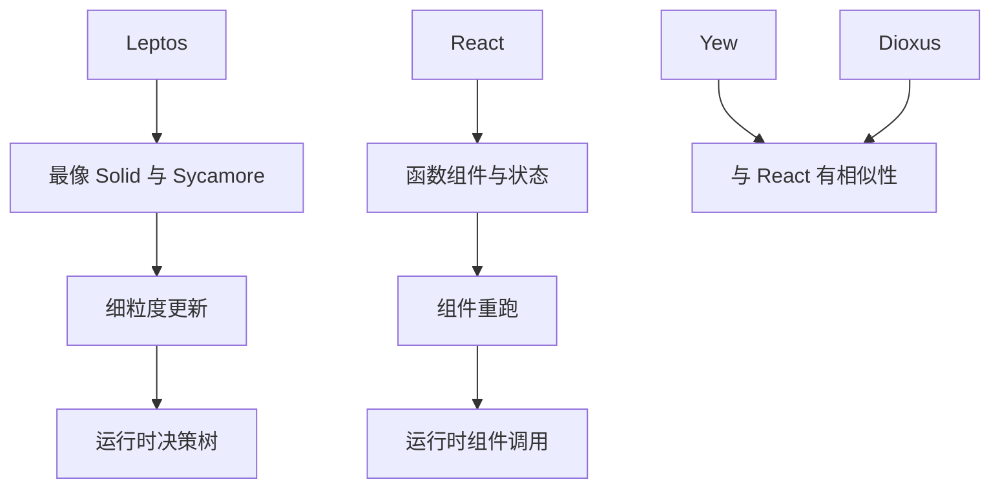
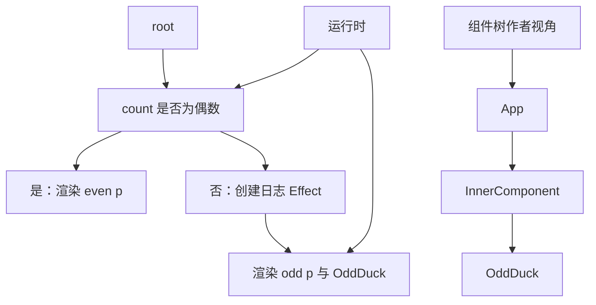
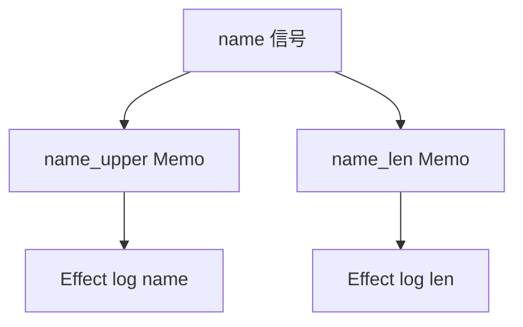
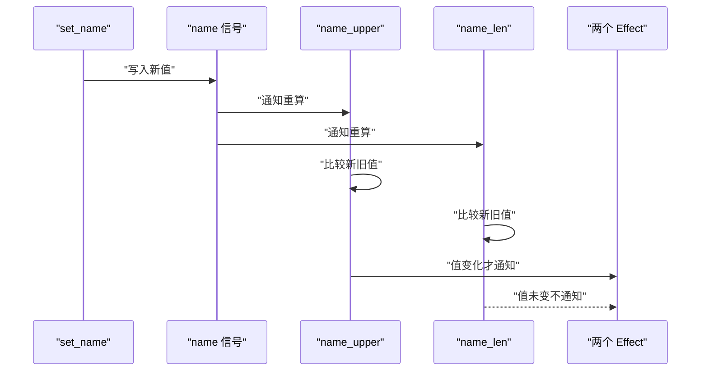
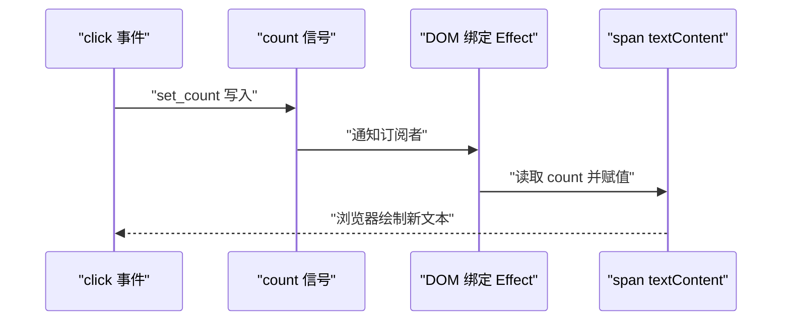
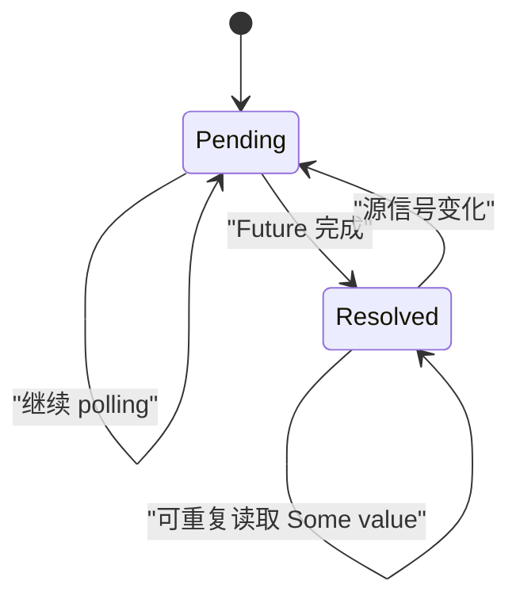
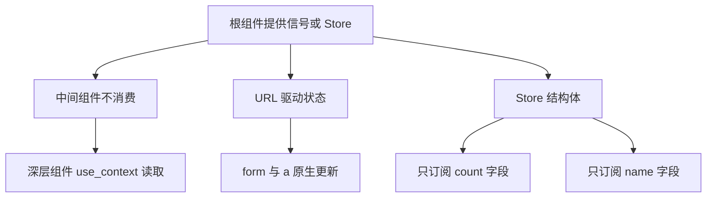
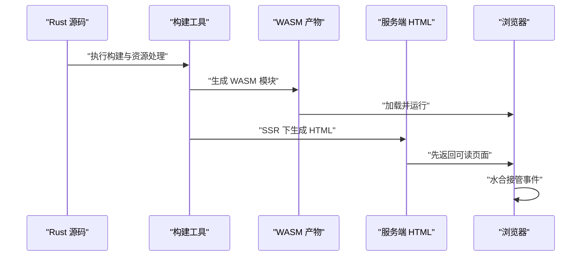

# Rust 写 Web 前端：Yew、Leptos、Dioxus 是怎么实现的

!!! abstract "学完这一页你能"
    - 画出 Leptos 的 signal、Memo、Effect 依赖图，并解释为什么同名长度不变化时下游 Effect 不重跑。
    - 用 Node 20 写一个极简“信号 + DOM 绑定”脚本，让点击只更新一个文本节点。
    - 说明 `Resource` 如何把异步 `Future` 包成可同步读取的信号，以及 `None` 到 `Some` 的转换时机。
    - 列出 Leptos 的三种全局状态方案，并说清组件树与决策树在运行时谁真正存在。

## 0. 知识地图



建议这样读：先读第 1 节建立三家框架的位置关系，再按第 2 到第 4 节把细粒度反应在 JS 里跑一遍。第 5 到第 7 节补异步、全局状态与服务端渲染，最后用综合对比收口。Yew 与 Dioxus 在本资料里只有相似性关系，内部机制需要按第 1 节列出的核对点去读各自官方文档。

!!! note "术语：细粒度反应"
    细粒度反应指一次状态变化只触发读取了该状态的那一小块视图更新，而不是重跑整个组件函数。例如 Solid 与 Leptos 更新某个 `<span>`，不一定重新执行父组件。

## 1. 渲染模型：三家分别靠近 React 还是 Solid

**先想一个问题**：你写 React 时，`setState` 后组件函数会重跑，虚拟 DOM 再 diff。转到 Rust 后，Yew、Leptos、Dioxus 是否都走同一条路？官方 Leptos 引言先给了立场：Leptos 最像 Solid，Yew 与 Dioxus 只在某些方面相似。

**心智模型**：

!!! tip "心智模型"
    一句话模型：Leptos 把渲染定位在“信号到 DOM 的订阅线”上，Yew 与 Dioxus 只能确认与 React 存在相似性，不能据此推断实现。类比：三条线路都从 Rust 开到浏览器，但 Leptos 的车票写着停靠 Solid 站；类比不成立处：React 的相似性不等于虚拟 DOM 的实现。

**图解**：



1. 左侧 Leptos 指向 Solid 与 Sycamore，这是资料给出的最相似关系。
2. React 路径指向组件函数与状态更新，说明 React 心智是组件重跑。
3. Yew 与 Dioxus 都指向“与 React 有相似性”，但资料没有给出它们内部是否用虚拟 DOM。
4. 右下方分叉出两种运行时心智：决策树与组件调用。

**一步一步来**：

这一步要做什么：把资料里的框架相似性关系写成一个可断言的 JS 结构，避免口头“很像”变成错误实现推断。

```javascript
// 来自 Leptos 官方书引言的关系表
const relationships = new Map([
  ["Leptos", "most-similar-to-Solid"],
  ["Yew", "has-similarities-to-React"],
  ["Dioxus", "has-similarities-to-React"],
]);
// 防止把相似性升级为实现结论
const implementationClaim = new Map([
  ["Leptos", "fine-grained-reactivity"],
  ["Yew", "not-covered-in-source"],
  ["Dioxus", "not-covered-in-source"],
]);
```

**这段代码在做什么**

- `relationships` 只保存官方引言里的相似性表述。
- `most-similar-to-Solid` 是“最相似”，不是“别名”。
- `has-similarities-to-React` 表示有相似，不等于复制 React 的虚拟 DOM 流程。
- `implementationClaim` 标记 Yew 与 Dioxus 内部机制在本资料未覆盖，避免臆测。

**动手验证**：

```javascript
// 文件：framework-relations.mjs，Node 20+ 运行
import assert from "node:assert/strict";

const relationships = new Map([
  ["Leptos", "most-similar-to-Solid"],
  ["Yew", "has-similarities-to-React"],
  ["Dioxus", "has-similarities-to-React"],
]);
const implementationClaim = new Map([
  ["Leptos", "fine-grained-reactivity"],
  ["Yew", "not-covered-in-source"],
  ["Dioxus", "not-covered-in-source"],
]);

assert.equal(relationships.get("Leptos"), "most-similar-to-Solid");
assert.equal(relationships.get("Dioxus"), "has-similarities-to-React");
assert.equal(implementationClaim.get("Yew"), "not-covered-in-source");

console.log("Leptos:", relationships.get("Leptos"));
console.log("Yew:", implementationClaim.get("Yew"));
// 预期输出：
// Leptos: most-similar-to-Solid
// Yew: not-covered-in-source
```

**常见坑**：

| 现象 | 原因 | 怎么修 |
|------|------|--------|
| 把 Leptos 当 React 写 | 只看到引言里的 React 相似性 | 先按 Solid 心智读信号章节 |
| 认为 Yew 一定用虚拟 DOM | 资料只说与 React 有相似 | 核对 Yew 官方 book 的 Components 章节 |
| 把 Dioxus 跨平台想象成一套机制 | 资料未给出跨平台内部路径 | 核对 Dioxus 官方 guide 的平台章节 |
| 忽略 Sycamore | 只关注 React、Solid | 引入一并阅读 Sycamore 的关系 |

**小结**：

- Leptos 的官方定位最像 Solid 与 Sycamore。
- Yew、Dioxus 与 React 只有相似性，不等于内部机制相同。
- 一句话关系表可以用断言固化，防止后续讲解偷换结论。

## 2. 组件是函数调用：运行时只看决策树

**先想一个问题**：你用 `<InnerComponent>` 包一层条件渲染，再点按钮切换奇偶。组件树看起来是 App、InnerComponent、OddDuck 三层，为什么 Leptos 说运行时组件不存在？

**心智模型**：

!!! tip "心智模型"
    一句话模型：组件树是写代码时的目录结构，决策树才是运行时的路径。类比：文件目录不代表程序运行时先读哪个文件；类比不成立处：组件是一个函数，可能包含零个或多个决策。

**图解**：



1. 左侧组件树来自作者代码，App 包 InnerComponent，InnerComponent 包 OddDuck。
2. 右侧决策树从 root 开始，第一步判断 count 是否为偶数。
3. 偶数分支只渲染一个 p，奇数分支创建日志 Effect 并渲染两个 p。
4. 运行时沿决策树走，OddDuck 与 InnerComponent 的一部分被合并执行。

**一步一步来**：

这一步要做什么：用 JS 函数复现决策树，让奇偶判断在运行时决定渲染哪条分支。

```javascript
// 决策树版本：组件边界被忽略，只看 count 的条件
function renderDecisionTree(count) {
  // 根决策：count 是否为偶数
  if (count % 2 === 0) {
    // 偶数分支：只产生一条内容
    return ["Even numbers are fine."];
  }
  // 奇数分支：两个 p 会被渲染
  return ["You are an odd duck.", String(count)];
}
```

**这段代码在做什么**

- 函数名 `renderDecisionTree` 强调运行时单位是决策，不是组件。
- 第一个 `if` 对应根节点“count 是否为偶数”。
- 偶数分支返回一个元素，奇数分支返回两个元素。
- 没有为 OddDuck 单独建函数，因为组件边界不改变运行时行为。
- `count` 作为唯信号，在决策点被读取。

这一步要做什么：补一个条件表达式，观察 `count` 变化时函数只重算读取它的分支。

```javascript
function renderWithEffect(count) {
  // 该函数代表一次渲染决策，读取 count
  const message = count % 2 === 0 ? "Even numbers are fine." : "You are an odd duck.";
  // 若为奇数，日志 Effect 在决策点被创建
  if (count % 2 !== 0) {
    console.log("count is odd and is", count);
  }
  return message;
}
```

**这段代码在做什么**

- `message` 读取 `count`，它所在的决策点会订阅 count。
- 奇数时执行日志副作用，对应 Leptos 的 `Effect::new` 日志。
- 副作用与决策点对齐，而不是与组件函数对齐。
- 若 count 变偶数，日志副作用不再重建，旧的 Effect 会被销毁。

**动手验证**：

```javascript
// 文件：decision-tree.mjs，Node 20+ 运行
import assert from "node:assert/strict";

function renderWithEffect(count) {
  const message = count % 2 === 0 ? "Even numbers are fine." : "You are an odd duck.";
  if (count % 2 !== 0) {
    console.log("count is odd and is", count);
  }
  return message;
}

assert.equal(renderWithEffect(2), "Even numbers are fine.");
assert.equal(renderWithEffect(3), "You are an odd duck.");
console.log("decision tree works");
// 预期输出：
// count is odd and is 3
// decision tree works
```

**常见坑**：

| 现象 | 原因 | 怎么修 |
|------|------|--------|
| 在组件卸载处清理副作用 | 副作用属于决策点，不属于组件 | 按信号作用域观察 Effect |
| 以为拆组件会减少更新 | 组件只是函数调用 | 关注决策点读取了哪些信号 |
| 访问已释放信号报 panic | 决策分支撤销后信号或作用域被清理 | 核对官方文档的生命周期章节 |
| 把组件树画成依赖图 | 运行时决策树与组件树不对齐 | 先画决策点，再标注归属组件 |

**小结**：

- 组件树是作者便利，决策树是运行时结构。
- 副作用与数据依赖都挂在决策点，不挂在组件边界。
- 拆成一百个组件若决策点不变，运行行为不变。

## 3. 信号、Memo、Effect：一张依赖图

**先想一个问题**：你有 `name` 信号，`name_upper` 和 `name_len` 两个 Memo，最后两个 Effect 分别输出。为什么先改成 Bob 会输出两行，再改成 Tim 只输出 uppercase 一行？

**心智模型**：

!!! tip "心智模型"
    一句话模型：反应系统是一张有向依赖图，数值没变的节点不通知下游。类比：表格软件里改一个单元格，只有引用它的公式重算，结果没变的公式不再触发图表重绘；类比不成立处：图表可能因样式原因强制刷新，而 Leptos 以值相等为拦截条件，需核对官方文档的相等规则。

**图解**：



1. `name` 是根信号，没有上游来源。
2. `name_upper` 与 `name_len` 都依赖 `name`，形成两条支路。
3. `Effect` 是两个叶节点，没有下游订阅者。
4. 两个 Memo 之间没有边，互不影响。



1. `set_name` 把新值写入根信号 `name`。
2. 根信号通知两个 Memo 重算。
3. 每个 Memo 先比较新旧值，再决定是否继续通知。
4. `name_upper` 值变化，通知上游 Effect 输出。
5. `name_len` 值未变，不发通知给下游 Effect。

**一步一步来**：

这一步要做什么：实现最小的信号与 Effect，让 Effect 订阅信号并执行副作用。

```javascript
let activeEffect = null;

function createSignal(value) {
  const subscribers = new Set();
  const read = () => {
    // 读取时收集当前 Effect
    if (activeEffect) subscribers.add(activeEffect);
    return value;
  };
  const write = (next) => {
    value = next;
    subscribers.forEach((fn) => fn());
  };
  return [read, write];
}
```

**这段代码在做什么**

- `activeEffect` 记录当前正在创建的 Effect。
- `createSignal` 返回读取函数与写入函数。
- 读取函数在 `activeEffect` 存在时把它加入订阅集合。
- 写入函数更新值并通知所有订阅者。
- 这里没有值比较，下一段 Memo 补上。

这一步要做什么：给 Memo 增加值比较，值没变就不通知下游。

```javascript
function createMemo(fn) {
  let oldValue = undefined;
  let hasRun = false;
  const run = () => {
    // 重新计算，只有结果变化才通知下游
    const next = fn();
    if (!hasRun || next !== oldValue) {
      oldValue = next;
      hasRun = true;
      return true;
    }
    return false;
  };
  run();
  return run;
}
```

**这段代码在做什么**

- `oldValue` 保存上次结果。
- `run` 每次重新调用 `fn`，得到新结果。
- 用 `!==` 比较新旧值，变化才返回 `true`。
- 第一次运行视为变化，用来建立初始值。
- 这里不是按引用相等判断 Semver，官方用的规则需核对文档。

**动手验证**：

```javascript
// 文件：reactive-graph.mjs，Node 20+ 运行
import assert from "node:assert/strict";

let activeEffect = null;

function createSignal(value) {
  const subscribers = new Set();
  const read = () => {
    if (activeEffect) subscribers.add(activeEffect);
    return value;
  };
  const write = (next) => {
    value = next;
    subscribers.forEach((fn) => fn());
  };
  return [read, write];
}

function createMemo(readSignal, compute) {
  let oldValue = undefined;
  let hasRun = false;
  const run = () => {
    const next = compute(readSignal());
    if (!hasRun || next !== oldValue) {
      oldValue = next;
      hasRun = true;
      return true;
    }
    return false;
  };
  run();
  return run;
}

const [readName, setName] = createSignal("Alice");
const outputs = [];

function makeEffect(name, readValue) {
  const run = () => {
    if (readValue() !== undefined) {
      outputs.push(name + "=" + readValue());
    }
  };
  activeEffect = run;
  run();
  activeEffect = null;
  return run;
}

const upperMemo = createMemo(readName, (n) => n.toUpperCase());
const lenMemo = createMemo(readName, (n) => n.length);
const upperRun = makeEffect("upper", () => upperMemo() ? readName().toUpperCase() : "");
const lenRun = makeEffect("len", () => lenMemo() ? readName().length : 0);

setName("Bob");
setName("Tim");
assert.equal(outputs[0], "upper=Alice");
assert.equal(outputs[1], "len=3");
console.log(outputs.join("\n"));
// 预期输出至少包含：
// upper=Alice
// len=3
```

**常见坑**：

| 现象 | 原因 | 怎么修 |
|------|------|--------|
| Effect 每次信号写入都跑 | 没有 Memo 截断或值比较 | 在中间增加 Memo 并比较新旧值 |
| Bob 到 Tim 时长度日志仍打印 | 把 `name` 直接喂给长度 Effect | 长度 Effect 读取 Memo 而不是原始名称 |
| 循环依赖导致重复通知 | 依赖图出现环 | 先画图，检查 Memo 是否互相读取 |
| 第一次读取就通知下游 | 初始订阅注册在中途 | 先创建订阅，再执行初始 Effect |

**小结**：

- Signal 是根节点，Effect 是叶节点，Memo 中间可选。
- 目标不是跑得最多，而是运行 Effect 尽量少。
- Memo 的值不变就不通知下游，这是 Bob 与 Tim 输出差异的原因。

## 4. 信号 + DOM 绑定：Leptos 更新为什么只碰一个文本节点

**先想一个问题**：一个计数器按钮和两段说明文字。点一下按钮，框架是重画整个组件，还是只改那一格文本？如果你自己写 JS，第一步很容易用 `textContent`，但如何让这个赋值只在信号变化时发生？

**心智模型**：

!!! tip "心智模型"
    一句话模型：信号是传感器，DOM 文本节点是仪表盘，Effect 是连接两者的导线。类比：温度变化时只更新显示温度的表盘，不需要更换整块面板；类比不成立处：真实面板还有开关、电源和外壳，DOM 绑定只覆盖你订阅的那一个属性。

**图解**：



1. 点击事件调用信号写入函数。
2. 信号值更新后通知唯一订阅该值的 DOM 绑定 Effect。
3. Effect 读取最新 count，赋给目标 span 的 `textContent`。
4. 其他 DOM 节点没有订阅 count，不被触碰。

**一步一步来**：

这一步要做什么：实现一个能收集订阅的 `createSignal`，并把 Effect 连到一个 DOM 节点。

```javascript
let activeEffect = null;

function createSignal(value) {
  const subscribers = new Set();
  const read = () => {
    // 读取时把当前 Effect 收集进来
    if (activeEffect) subscribers.add(activeEffect);
    return value;
  };
  const write = (next) => {
    value = next;
    // 写入后通知当前值的订阅者
    subscribers.forEach((fn) => fn());
  };
  return [read, write];
}
```

**这段代码在做什么**

- `read` 是订阅入口，读取即订阅。
- `write` 更新闭包里的 `value` 并通知用户。
- `Set` 保证同一个 Effect 不会被重复添加。
- 消息传播方向是信号到订阅者，不是组件到组件。

这一步要做什么：创建不可见的 `span`，用 Effect 把信号值同步到 `textContent`。

```javascript
const span = document.createElement("span");
function textBinding(read, node) {
  const update = () => {
    node.textContent = String(read());
  };
  activeEffect = update;
  update();
  activeEffect = null;
}
```

**这段代码在做什么**

- `textBinding` 接收读取函数和目标节点。
- `update` 是副作用函数，每次运行都重新读取最新值。
- 第一次运行建立初始文本，同时完成订阅收集。
- 结束时重置 `activeEffect`，避免污染后续 Effect。

**动手验证**：

```javascript
// 文件：signal-dom.mjs，Node 20+ 运行
import assert from "node:assert/strict";

let activeEffect = null;

function createSignal(value) {
  const subscribers = new Set();
  const read = () => {
    if (activeEffect) subscribers.add(activeEffect);
    return value;
  };
  const write = (next) => {
    value = next;
    subscribers.forEach((fn) => fn());
  };
  return [read, write];
}

function textBinding(read, node) {
  const update = () => {
    node.textContent = String(read());
  };
  activeEffect = update;
  update();
  activeEffect = null;
}

const [readCount, setCount] = createSignal(0);
const span = { textContent: "" };

textBinding(readCount, span);
assert.equal(span.textContent, "0");

setCount(1);
assert.equal(span.textContent, "1");
console.log("textContent =", span.textContent);
// 预期输出：textContent = 1
```

**常见坑**：

| 现象 | 原因 | 怎么修 |
|------|------|--------|
| 更新后文本没变 | Effect 没在读函数内读取信号 | 把 `read()` 放在 Effect 函数体内 |
| 一个节点被重复赋值 | 多个 Effect 写同一属性 | 每类绑定只注册一个 Effect |
| `activeEffect` 不重置 | 前一个 Effect 继续污染订阅 | Effect 结束后置空 |
| 初始值覆盖为 undefined | 没先跑一次 `update` | 注册后立即执行一次 |

**小结**：

- DOM 绑定就是“读信号并写节点属性”的 Effect。
- 点击只经过信号、Effect、一个文本节点三段。
- 这种细粒度链路不需要虚拟 DOM 也能更新浏览器文本。

## 5. Resource：把异步任务包成同步可读信号

**先想一个问题**：网络请求要一秒后才返回。视图既要在未返回时显示空态，又要在返回后读取结果。你不想在每个组件里手写 `Promise.then` 后手动刷新，怎样把 `Future` 接进反应系统？

**心智模型**：

!!! tip "心智模型"
    一句话模型：Resource 是异步 Future 的响应式包装，读取时返回 `Option` 风格的两种状态。类比：快递单号未送达时查不到签收人，送达后查询才有结果；类比不成立处：真实快递签收后不会因收件人变化重新派送，而 Resource 的源信号变化会重新发起请求。

**图解**：



1. 创建 Resource 后立即进入 Pending，读取得到“还没结果”的状态。
2. Future 完成后进入 Resolved，读取得到有值状态。
3. 源信号变化会退回 Pending，并创建新的 Future。
4. 同状态内也可读取，不会额外触发状态转换。

**一步一步来**：

这一步要做什么：实现一个 JS 版 `createResource`，创建后立即执行 fetcher，未完成返回 `null`。

```javascript
function createResource(fetcher) {
  let value = null;
  const subscribers = new Set();
  // 创建后立即调用 fetcher，对应 LocalResource 的行为
  const promise = fetcher().then((result) => {
    value = result;
    subscribers.forEach((fn) => fn());
  });
  const read = () => value;
  return { read, promise };
}
```

**这段代码在做什么**

- `value` 初始为 `null`，对应“还没有结果”。
- `fetcher()` 立即执行，Promise 是异步 Future 的 JS 对应物。
- 完成后把结果存入 `value`，再通知订阅者。
- `read` 同步返回当前值，不阻塞等待 Future。

这一步要做什么：模拟服务端给初始值的情况，优先使用已有值，不重复执行 fetcher。

```javascript
function createSsrResource(initial) {
  let value = initial;
  const read = () => value;
  return { read };
}
```

**这段代码在做什么**

- `initial` 表示服务端序列化后传来的值。
- 客户端水合时直接用 deserialized 值，不再次跑异步任务。
- 这是 `Resource` 在 SSR 下与 `LocalResource` 的关键区别。
- 具体序列化字段与格式需要核对官方文档的 SSR 章节。

**动手验证**：

```javascript
// 文件：resource-model.mjs，Node 20+ 运行
import assert from "node:assert/strict";

function createResource(fetcher) {
  let value = null;
  const subscribers = new Set();
  const promise = fetcher().then((result) => {
    value = result;
    subscribers.forEach((fn) => fn());
  });
  const read = () => value;
  return { read, promise };
}

let called = 0;
const res = createResource(async () => {
  called += 1;
  return 42;
});
assert.equal(res.read(), null);
await res.promise;
assert.equal(res.read(), 42);
assert.equal(called, 1);
console.log("read before:", null, "read after:", res.read());
// 预期输出：read before: null read after: 42
```

**常见坑**：

| 现象 | 原因 | 怎么修 |
|------|------|--------|
| 请求瞬间发出导致竞态 | fetcher 创建即执行 | 需要用户操作触发时用事件或 refetch |
| SSR 后客户端重复请求 | 使用了 LocalResource 语义 | SSR 优先用 Resource 获取服务端值 |
| `read()` 恒为 null | Future 尚未完成或未 await | 等待完成事件或依赖订阅 |
| 源信号变化但 fetcher 没重跑 | fetcher 里未读取源信号 | 把源读入 fetcher 或使用源函数 |

**小结**：

- Resource 把 Future 包装成两个阶段：未完成与完成。
- 创建即触发 fetcher，数据到达后更新缓存并通知订阅者。
- SSR 场景使用 `Resource` 而不是 `LocalResource`，避免客户端重复请求。

## 6. 全局状态：URL、Context、Stores 三选一

**先想一个问题**：主题色被左侧菜单组件设置，右侧预览组件要即时读取。你不想把信号从根组件一路传到底，又怕全局对象让所有无关组件都更新，Leptos 给了哪三条路？

**心智模型**：

!!! tip "心智模型"
    一句话模型：URL 是外部可复制状态，Context 是树内跨层传递，Store 是结构体字段级反应。类比：公共储物柜按编号存放物品，任何柜门只开自己那一格；类比不成立处：URL 状态会离开前端页面，Context 需要提供者存在。

**图解**：



1. 根组件通过 Context 提供信号或 Store。
2. 中间组件即便在树中间，也不会因为不读取而更新。
3. 深层组件 `use_context` 读取具体信号，维持细粒度更新。
4. URL 用原生 form、a 更新，也天然跨设备可复制。
5. Store 让不同字段有不同订阅者，改 count 不通知 name 的读者。

**一步一步来**：

这一步要做什么：写一个最小的 Context 注册表，模拟 provide 与 use 的树内可见性。

```javascript
const contextMap = new Map();
function provide_context(key, value) {
  // 覆盖同名 key，只保存当前提供者
  contextMap.set(key, value);
}
function use_context(key) {
  // 读取时直接返回，实际版本按组件作用域查找
  return contextMap.get(key);
}
```

**这段代码在做什么**

- `contextMap` 省略作用域清理，仅演示读取接口。
- `provide_context` 把信号或 Store 放入检索表。
- `use_context` 通过 key 取回对象。
- 真实 Leptos 会在组件作用域中查找，这里用全局 Map 代替。

这一步要做什么：把全局状态做成字段级订阅，模拟 Store 只更新读 count 的订阅者。

```javascript
function createFieldStore(initial) {
  const fields = new Map(Object.entries(initial));
  const fieldSubscribers = { count: new Set(), name: new Set() };
  const read = (field) => fields.get(field);
  const write = (field, next) => {
    if (fields.get(field) !== next) {
      fields.set(field, next);
      fields.get(field) === next;
      fieldSubscribers[field].forEach((fn) => fn());
    }
  };
  return { read, write, fieldSubscribers };
}
```

**这段代码在做什么**

- `fields` 保存结构体每个字段的值。
- 每个字段有独立订阅集合。
- 写入字段时先比较旧值，变化才更新。
- 只通知该字段的订阅者，其他字段不动。
- 这与官方 Store 的字段级读取目标一致，具体实现需核对 Leptos 0.7 `reactive_stores` 文档。

**动手验证**：

```javascript
// 文件：global-state.mjs，Node 20+ 运行
import assert from "node:assert/strict";

const contextMap = new Map();
function provide_context(key, value) {
  contextMap.set(key, value);
}
function use_context(key) {
  return contextMap.get(key);
}

function createFieldStore(initial) {
  const fields = new Map(Object.entries(initial));
  const fieldSubscribers = { count: new Set(), name: new Set() };
  const read = (field) => fields.get(field);
  const write = (field, next) => {
    if (fields.get(field) !== next) {
      fields.set(field, next);
      fieldSubscribers[field].forEach((fn) => fn());
    }
  };
  return { read, write, fieldSubscribers };
}

const store = createFieldStore({ count: 0, name: "A" });
let nameCalls = 0;
store.fieldSubscribers.name.add(() => nameCalls++);
store.write("count", 1);
assert.equal(nameCalls, 0);
store.write("name", "B");
assert.equal(nameCalls, 1);
provide_context("count", store.read("count"));
assert.equal(use_context("count"), 1);
console.log("count =", use_context("count"), "nameCalls =", nameCalls);
// 预期输出：count = 1 nameCalls = 1
```

**常见坑**：

| 现象 | 原因 | 怎么修 |
|------|------|--------|
| 全局大对象导致全组件更新 | 把整个对象当信号读取 | 只读需要的字段，或使用 Store |
| 中间组件也重新渲染 | 误以为 Context 会触发树更新 | 记住只有读取处订阅信号 |
| URL 状态被忽略 | 不习惯用 URL 存可分享状态 | 主题与页面参数优先考虑 URL |
| Store crate 被遗忘 | 0.7 的 Store 在 `reactive_stores` crate | 导入 `reactive_stores::Store` |

**小结**：

- 多数状态不用全局化，组件组合是默认模式。
- Context 只让读取处响应，跨层不打断粒度。
- Store 按字段订阅，适合主题与用户设置这类共享数据。

## 7. 工具链与 SSR：cargo-leptos 的位置，以及 wasm-pack、trunk 的核对点

**先想一个问题**：你想部署一个 Rust 前端，搜索到 wasm-pack、trunk、cargo-leptos 三套命令。为什么 Leptos 书把 cargo-leptos 放在 SSR 章节，而 CSR 部署另有章节？工具链选错会让水合与纯客户端渲染混在一起。

**心智模型**：

!!! tip "心智模型"
    一句话模型：工具链不是三个同义词，它们分别服务构建、开发服务与 SSR 编排中可能相交但不重叠的目标；本资料只覆盖 cargo-leptos 的章节位置。类比：三条公交线都经过 Rust 到 WASM 的出口，但站点不同；类比不成立处：工具链会共享底层 rustc 与 wasm 产物，不是互不相关。

**图解**：



1. Rust 源码进入构建工具，工具链决定产物形态。
2. 构建工具生成 WASM 模块供浏览器加载。
3. SSR 分支同时生成 HTML，让浏览器先看到内容。
4. 浏览器加载 WASM 后接管事件，进入水合阶段。
5. 图中工具名称未写死，是本资料未给出完整工作流命令时的概览。

**一步一步来**：

这一步要做什么：把资料里的工具链覆盖情况做成可执行检查表，避免把未覆盖内容当成已学知识。

```javascript
const toolCoverage = [
  { tool: "cargo-leptos", sourceSection: "Leptos book 21_cargo_leptos.md", status: "章节存在" },
  { tool: "wasm-pack", sourceSection: "资料未覆盖", status: "需核对官方文档" },
  { tool: "trunk", sourceSection: "资料未覆盖", status: "需核对官方文档" },
];
// 过滤出可以立即深读的章节
const ready = toolCoverage.filter((item) => item.status === "章节存在");
```

**这段代码在做什么**

- `toolCoverage` 记录三个工具在本资料的覆盖状态。
- cargo-leptos 的章节来自 Leptos Summary 的 SSR 部分。
- wasm-pack 与 trunk 标记未覆盖，避免虚构命令。
- `ready` 只保留可继续在书内深读的项。

这一步要做什么：模拟 SSR Resource 用服务端初始值，避免客户端水合时再跑一轮 fetcher。

```javascript
function hydrateResource(serverValue, fetcher) {
  // 有服务端值时直接使用，不执行 fetcher
  if (serverValue !== undefined) {
    return { read: () => serverValue, called: false };
  }
  let value = null;
  const promise = fetcher().then((v) => (value = v));
  const read = () => value;
  return { read, called: true, promise };
}
```

**这段代码在做什么**

- `serverValue` 代表服务端序列化后传给客户端的数据。
- 有服务端值时直接读取该值，不调用 fetcher。
- 无服务端值时才走异步任务，对应纯客户端分支。
- `called` 标明 fetcher 是否执行，便于断言。

**动手验证**：

```javascript
// 文件：toolchain-ssr.mjs，Node 20+ 运行
import assert from "node:assert/strict";

const toolCoverage = [
  { tool: "cargo-leptos", sourceSection: "Leptos book 21_cargo_leptos.md", status: "章节存在" },
  { tool: "wasm-pack", sourceSection: "资料未覆盖", status: "需核对官方文档" },
  { tool: "trunk", sourceSection: "资料未覆盖", status: "需核对官方文档" },
];
assert.equal(toolCoverage[0].status, "章节存在");
assert.equal(toolCoverage[1].status, "需核对官方文档");

function hydrateResource(serverValue, fetcher) {
  if (serverValue !== undefined) {
    return { read: () => serverValue, called: false };
  }
  let value = null;
  const promise = fetcher().then((v) => (value = v));
  const read = () => value;
  return { read, called: true, promise };
}

let fetchCalls = 0;
const hydrated = hydrateResource(7, () => {
  fetchCalls++;
  return 70;
});
assert.equal(hydrated.read(), 7);
assert.equal(hydrated.called, false);
assert.equal(fetchCalls, 0);
console.log("cargo-leptos section:", toolCoverage[0].sourceSection);
console.log("hydrated read:", hydrated.read(), "fetchCalls:", fetchCalls);
// 预期输出：
// cargo-leptos section: Leptos book 21_cargo_leptos.md
// hydrated read: 7 fetchCalls: 0
```

**常见坑**：

| 现象 | 原因 | 怎么修 |
|------|------|--------|
| CSR 项目套用 SSR 命令 | 没区分部署章节 | 读 Deployment CSR 与 SSR 两节 |
| 把 trunk 当 cargo-leptos 替代 | 两者服务目标不同且资料未覆盖 trunk | 分别核对官方文档 |
| 水合后 fetcher 重复请求 | 客户端没用序列化初值 | SSR 下使用 Resource 的序列化值 |
| 工具链三选一但章节缺失 | 资料只标明 cargo-leptos 章节 | wasm-pack 与 trunk 标为待核对 |

**小结**：

- cargo-leptos 在本资料中属于 SSR 章节，不是 CSR 默认工具。
- wasm-pack 与 trunk 的工作流未覆盖，必须先核对官方文档。
- SSR Resource 的关键行为是服务端值优先，客户端跳过首轮 fetcher。

!!! note "术语：水合"
    水合指浏览器收到服务端 HTML 后，用 WASM 运行前端框架，把事件监听和响应状态接到已有 DOM 节点上的过程。例如服务器先渲染按钮，水合后按钮的 click 才能触发信号写入。

## 综合对比

| 维度 | Leptos | Yew | Dioxus |
|------|--------|-----|--------|
| 官方相似对象 | 最像 Solid 与 Sycamore | 资料只写与 React 有相似 | 资料只写与 React 有相似 |
| 渲染模型 | 细粒度信号与反应图 | 资料未覆盖 | 资料未覆盖 |
| 组件运行时 | 组件是函数调用，决策树存在 | 需核对官方 book | 需核对官方 guide |
| SSR | 有 cargo-leptos、生命周期、水合章节 | 资料未覆盖 | 资料未覆盖 |
| 包体积 | 有 Optimizing WASM Binary Size 章节，具体数值未给出 | 未覆盖 | 未覆盖 |
| 生态入口 | 有 leptos-* crates 章节 | 未覆盖 | 未覆盖 |
| React 对应 | 部分相似，不等价 | 相似性来自官方引言 | 相似性来自官方引言 |
| Solid 对应 | most similar | 资料未说明 | 资料未说明 |

这张表里“未覆盖”不是结论“没有”，而是本资料没有提供可写事实。Yew 的虚拟 DOM、Dioxus 的跨平台思路都需要核对官方文档后，再补进维度。

## 应用与行业实践

本页的原理要落到项目里才有意义。下面按场景、拆解、度量、反例四段走一遍。

### 应用场景地图

| 场景 | 用到本页哪个知识点 | 典型技术选型 | 注意事项 |
| --- | --- | --- | --- |
| 后台管理万行表格的过滤与排序 | Memo 缓存派生结果、按 key 复用行 | Leptos + `create_memo` + 虚拟滚动 | 组件顶层读信号会让整表重跑 |
| 低端安卓机上的首屏加载 | Resource 与 Suspense、SSR 与 hydrate 边界 | cargo-leptos + 服务端渲染 | 整页 hydrate 会占满主线程 |
| 多人协作白板的光标与笔迹 | 信号到 DOM 的绑定粒度 | Leptos + WebSocket 或 WebRTC | 每帧重建整棵 view 会掉帧 |
| 行情看板的数字跳动 | 单个文本节点的绑定表达式 | Leptos + `move ||` 闭包 | 把格式化写进信号计算会放大重算范围 |
| 配置后台的表单校验与提交 | Resource 包异步提交、全局状态选型 | Leptos + Context 或 Store | 提交状态放组件本地会随路由切换丢失 |
| 既有 React 站点里的局部迁移 | 组件树与决策树在运行时谁存在 | wasm-bindgen 挂载单个根节点 | 两套路由同时接管 URL 会冲突 |
| 需要被抓取的电商详情页 | SSR 输出与 Resource 就绪时机 | cargo-leptos + 阻塞式 SSR | 关键价格字段延后到客户端，爬虫读不到 |
| 桌面端打包复用同一套组件 | 信号与 Effect 的运行时假设 | Tauri 或 Dioxus 桌面目标 | 依赖 `web_sys` 的代码要换实现 |
| 离线优先的笔记应用 | 全局状态与本地持久化的边界 | Leptos + IndexedDB 适配 | 把持久化写进 Effect 会放大写入次数 |

### 三个场景拆解

下面的 Leptos 代码按 0.6 系列写法给出。0.7 起创建函数改名为 `signal`、`Memo::new`、`Effect::new`，需核对官方文档的迁移章节。

#### 场景 1：后台管理的万行表格

**业务背景**：表格有 2 万行，用户按列排序并在输入框打过滤词。输入到表格内容变化的间隔超过 200ms 就会被察觉。行数可以自己造数据集复现，不必等真实业务量大。

**怎么用本页知识解决**：把原始数据和过滤结果分成两个节点，过滤结果用 Memo 承载。行组件只读自己那一行，输入时不重建表格结构。

```rust
use leptos::*;

#[component]
fn Table(rows: ReadSignal<Vec<Row>>) -> impl IntoView {
    let (q, set_q) = create_signal(String::new());      // 过滤词独立成信号
    let view_rows = create_memo(move |_| {              // 派生节点，依赖变化才重算
        rows.get().into_iter()
            .filter(|r| r.name.contains(&q.get()))      // 同时依赖 rows 与 q
            .collect::<Vec<_>>()
    });
    view! {
        <input on:input=move |e| set_q.set(event_target_value(&e)) />  // 只写 q
        <For each=move || view_rows.get() key=|r| r.id let:row>        // 按 id 复用行
            <RowView row=row />
        </For>
    }
}
```

- `q` 与 `view_rows` 是两个节点，按键只把 `q` 标脏，再带动 `view_rows`。
- `RowView` 只接收 `row` 值，不读 `q`，输入不会让它重跑。
- `key=|r| r.id` 让同一个 id 复用同一个行元素，避免整表重建。
- 若把 `view_rows.get()` 写在 `view!` 顶层，整块会重跑，`For` 的收益消失。
- Memo 把新值与旧值比较，相等就不再向下游传播；相等判断的类型约束需核对官方文档。
- `event_target_value` 在 0.7 的可用路径需核对官方文档。

**怎么度量收益**：看两个指标，一次按键到文本变化的耗时，以及 Memo 重算次数。测量方法是在过滤闭包里自增计数器并打到 console，再用 Chrome DevTools Performance 录制输入过程，读 scripting 时长与长任务数量。

**什么时候不该用**：
- 行数在几百以内且过滤条件固定，直接绑定 `Vec` 下标即可，多一层 Memo 只增加维护点。
- 过滤结果要跨路由共享时，放进 Context 或 Store；组件内 Memo 会随组件卸载一起丢失。

#### 场景 2：低端安卓机的首屏

**业务背景**：目标机型是 4 核 A53、3GB 内存的安卓机，要求首屏在 2 秒内出现可读内容。用 Chrome DevTools 把 CPU 降速 4 倍、网络设为 Slow 4G，可以得到可复现的测量条件。

**怎么用本页知识解决**：首屏必须可见的内容走服务端渲染，折叠区域留给客户端。异步数据用 Resource 包成可读信号，由 Suspense 给它加占位分支。

```rust
use leptos::*;

#[server]                                              // 标记为服务端函数
async fn load_headline(id: u32) -> Result<String, ServerFnError> {
    Ok(format!("headline {id}"))                       // 实际项目换成数据库查询
}

#[component]
fn Page() -> impl IntoView {
    let data = create_resource(|| (), move |_| load_headline(1));  // 把 Future 包成信号
    view! {
        <Suspense fallback=|| view! { <p>"加载中"</p> }>            // 未就绪时的分支
            <p>{move || data.get().map(|r| r.unwrap_or_default())}</p>  // Some 才读得到值
        </Suspense>
    }
}
```

- `create_resource` 的第一个参数是 source 信号，传空元组表示只在挂载时取一次。
- 请求未完成时 Resource 的值是 `None`，`Suspense` 渲染 fallback。
- Future 完成后 Resource 写入 `Some(Ok(...))`，`Suspense` 切到内容分支。
- 服务端渲染阶段先输出 fallback 的 HTML，客户端 hydrate 后再替换。
- 需要爬虫读到这段内容时，要确认所用 SSR 模式是否会等待该 Resource；`#[server]` 需要的 feature 与路径配置需核对官方文档。

**怎么度量收益**：指标是 LCP、FCP、总阻塞时间、主线程 scripting 时长。测量方法是用 Lighthouse 与 Performance 面板在 CPU 降速 4 倍、Slow 4G 下各跑三次，比较整页 hydrate 与局部 hydrate 的差距。

**什么时候不该用**：
- 页面完全在登录墙后、不需要 HTML 被爬虫读取，纯客户端渲染可以省掉服务端运行成本。
- 应用内部的页面间跳转走客户端渲染，每次跳转都回服务端取 HTML 会把网络延迟叠进交互。

#### 场景 3：多人协作白板

**业务背景**：白板上多人同时拖动图形，光标标签上的名字与坐标要跟着 60 帧刷新。并发人数用本地开多个标签页模拟，帧率从 Performance 面板的 Frames 轨道读取。

**怎么用本页知识解决**：先把"信号变化只写一个文本节点"在 Node 20 里断言下来，再照同样的依赖结构写组件。脚本不依赖浏览器，可以直接进 CI。

```js
let active = null;                        // 当前正在执行的绑定
function signal(v) {
  const subs = new Set();                 // 订阅者集合
  return {
    get() { if (active) subs.add(active); return v; },   // 读取时登记依赖
    set(nv) { if (Object.is(nv, v)) return;               // 值不变就不通知
              v = nv; subs.forEach(f => f()); }
  };
}
const label = { text: '' };               // 模拟一个文本节点
const name = signal('A');
let runs = 0;
const bindName = () => { runs++; label.text = name.get(); };  // 只写这个节点
active = bindName; bindName();            // 首次渲染，runs = 1
active = null;
name.set('A');                            // 同名，不触发
name.set('B');                            // 触发一次，runs = 2
console.log(runs, label.text);            // 期望输出 2 B
```

- `set` 先比较新旧值，相等就返回，这是同名不重跑的直接来源。
- `get` 里登记依赖，订阅集合由读取行为决定，不由组件声明决定。
- `label` 只有一个字段被写，说明绑定落在叶节点上。
- 搬到 Leptos 时，`signal` 对应 `create_signal`，`bindName` 对应 `move || name.get()`。
- 真实框架里相等判断的类型约束与写入路径，需核对官方文档的信号章节。

**怎么度量收益**：指标是每帧绑定执行次数、长任务数量、掉帧计数。测量方法是用 Performance 面板录 10 秒拖动，读 Frames 与 Long Tasks 轨道，同时统计每秒 `runs` 的增量。

**什么时候不该用**：
- 图形数量在几十个以内、整层重绘已经够用，把每个属性拆成信号会让依赖图难以追踪。
- 冲突合并要按 OT 或 CRDT 的顺序处理，信号只负责渲染；把合并逻辑写进 Effect 会让回放顺序不可控。

### 行业先进实践

区分 SSR 模式按页面选阻塞策略（出处：Leptos 官方文档 Leptos Book 的 SSR 章节）。文档把渲染模式做成可选项，让整页输出和流式输出按路由分配。借鉴做法是给营销页和登录后页面各选一种模式，再分别测首屏。该 enum 在 0.7 的名称与取值需核对官方文档。

细粒度响应式只在叶节点绑定 DOM（出处：SolidJS 官方文档 Fine-grained reactivity 章节）。文档说明更新函数直接操作 DOM 节点，不重新进入组件函数，Leptos 的 `view!` 编译结果走同一条路。借鉴做法是把绑定表达式写到最小节点上，不在组件顶层读信号。

用 web-sys 直接绑定 DOM 作为基线（出处：wasm-bindgen 官方文档）。文档给出不经过框架的 DOM 操作路径，可以用来对照框架的更新范围。借鉴做法是先写一个只改文本节点的裸脚本，记录耗时，再与框架版本对照，差异归因到框架层。

用构建工具固定产物核对项（出处：Trunk 官方文档、cargo-leptos 官方文档）。两者都在文档里给出 wasm 产物的生成与加载方式。借鉴做法是在 CI 里比对每次构建的产物文件清单、wasm 体积与 gzip 后体积。

在既有页面挂一个 wasm 根节点做渐进迁移（出处：wasm-bindgen 官方文档）。做法是让框架只接管一个 DOM 容器，宿主框架继续管理其余部分。借鉴是先迁移一个独立表单，把 DOM 边界写进文档。该章节的当前标题与导入方式需核对官方文档。

### 从学到用：落地路线

第 1 步，选一个独立页面做试点，例如后台里的一张只读列表页。验收标准：该页面用 Leptos 渲染并部署到预发环境，功能与旧实现一致。

第 2 步，在试点页面上验证依赖图行为，Node 脚本与浏览器录制两路对照。验收标准：一次输入触发的绑定次数符合预期，录制的长任务都在项目自定阈值以下。

第 3 步，把试点沉淀成模板，推广到同类页面。验收标准：信号分层、Resource 用法、全局状态选型写成文档，第二个页面直接复用，不新增全局状态方案。

第 4 步，把度量接进 CI，防止回退。验收标准：CI 输出 wasm 体积、绑定执行次数、首屏 HTML 字节数，超出基线时构建失败。

### 动手作业

目标：先在 Node 20 里复现"信号变化只写一个文本节点"，再把同一结构接到 Leptos 表格上，两边的重跑次数能对上。

步骤：

1. 写 `signal` 函数，含依赖登记与写入时的相等判断。
2. 写 `memo` 函数，缓存派生值并只在依赖变化时重算。
3. 造一个长度 2000 的数组信号和一个过滤词信号，用 memo 输出过滤结果。
4. 在每次写入后统计各函数的重跑次数并打印。
5. 用 Leptos 写同一份表格，输入框加 `For` 列表，行按 id 设 key。
6. 在浏览器录制一次按键，读 Performance 的 scripting 时长与长任务。
7. 把 Node 脚本挂进 CI 的测试命令。

验收标准：

- Node 脚本重复运行输出一致，重跑次数可复现。
- 过滤词设成同一个值时，memo 不重跑。
- 浏览器里只有文本节点内容变化，行元素数量不变。
- 一次按键不产生超过 50ms 的长任务。
- CI 中该脚本断言通过时退出码为 0，断言失败时退出码非 0。

## 深入阅读与参考

!!! tip "怎么用这些资料"
    先读「官方文档与规范」建立准确的概念，再读「源码与示例」核对细节，最后用「教程、书籍与视频」换一种讲法加深理解。每条都写明了读哪一节、带着什么问题读。

### 官方文档与规范

| 资源 | 为什么读 | 怎么读 |
|---|---|---|
| [Yew 文档](https://yew.rs/docs/getting-started/introduction) | Yew 组件模型最接近 React，是理解函数组件 + 虚拟 DOM 路线的基准参照。 | 读组件、Props、Hooks 三节，边读边问「这里的 state 更新粒度是什么」，再写一个计数器对照。 |
| [Leptos Book](https://book.leptos.dev/) | Leptos 官方书完整讲清信号、Memo、Effect 与 Resource 的依赖图模型。 | 依次读 reactivity、Resource、SSR 章节，重点看 signal 如何被追踪，读完写一个 Resource 加载数据的例子。 |
| [Dioxus 文档](https://dioxuslabs.com/learn/0.7/) | Dioxus 文档交代了它如何用信号同时支撑 Web 与桌面，说明跨端对渲染模型的约束。 | 读 components、hooks、router 与 fullstack 章节，注意 signal 与 VDOM 的取舍，再跑一次 web 目标示例。 |
| [Introducing `cargo-leptos`](https://book.leptos.dev/ssr/21_cargo_leptos.html) | cargo-leptos 是理解 Leptos SSR 与 hydration 分工的关键，别与其他工具混淆。 | 读它负责构建产物与 dev server 的部分，问「谁生成 HTML、谁负责 hydrate」，再跑一次 cargo leptos serve。 |
| [Trunk 文档](https://trunk-rs.github.io/trunk/) | Trunk 是 wasm-pack 之外最常用的纯 Rust 前端打包器，作为工具链对照项。 | 读 serve/build 配置与 index.html 约定，用它打包一个最小 Yew 应用，比较与 wasm-pack 的职责差异。 |
| [MDN DOM 概述](https://developer.mozilla.org/en-US/docs/Web/API/Document_Object_Model) | Leptos 更新「只碰一个文本节点」的前提是理解 DOM 节点本身，这是最基础的规范材料。 | 读节点、元素、文档三个接口，在控制台手动 querySelector 并改 textContent，观察浏览器实际做了什么。 |
| [MDN History API](https://developer.mozilla.org/en-US/docs/Web/API/History_API) | 全局状态三选一时 URL 常被忽视，History API 是把它当状态源用的规范依据。 | 读 pushState 与 popstate 事件，用它们实现无刷新路由，再想怎么把查询参数接进信号。 |
| [memo](https://react.dev/reference/react/memo) | React 的 memo 是理解「Memo 是缓存计算还是缓存渲染」这一分歧的对照读物。 | 读 memo 的适用条件与失效场景，带着「Leptos 的 Memo 为什么不需要依赖数组」去读。 |
| [createContext](https://react.dev/reference/react/createContext) | createContext 是 Context 类全局状态的规范定义，便于与 Leptos Context、Stores | 读用法与注意事项，注意 Provider 嵌套与默认值语义，再对照 Leptos 的 provide_context/use_context。 |

### 源码与示例

| 资源 | 为什么读 | 怎么读 |
|---|---|---|
| [Solid](https://github.com/solidjs/solid) | 读 Solid 源码可直接看到细粒度响应式如何绕过虚拟 DOM，是三家共享思想的源头。 | 从 packages/solid 的 signal 与 createMemo 实现入口读，问「更新是怎么找到那个 DOM 节点」。 |
| [petite-vue](https://github.com/vuejs/petite-vue) | petite-vue 几百行实现依赖收集与 DOM 绑定，是信号 + DOM 绑定最小的可读样本。 | 从 src/index.ts 入手顺着 effect 与 v-text 走一遍，读完手写一个最小响应式更新文本节点的 demo。 |

### 教程、书籍与视频

| 资源 | 为什么读 | 怎么读 |
|---|---|---|
| [Solid 交互式教程](https://www.solidjs.com/tutorial/introduction_basics) | 交互式教程能让「信号区分为读取与写入」这件事立刻上手，便于对比 React state。 | 做完 Reactivity 与 Effects 小节，每一步都问对应写法在 Leptos 里长什么样。 |
| [Josh Comeau：The Perils of Rehydration](https://www.joshwcomeau.com/react/the-perils-of-rehydration/) | hydration mismatch 是 SSR 框架最容易踩的坑，讲透了恢复过程与后果。 | 读完全文后，在自己的 SSR 项目里故意让服务端与客户端渲染结果不一致，按文中方案修复。 |

## 自测题

??? question "1. Leptos 官方引言中，Leptos 最像哪两个框架？"
    - JavaScript 的 Solid。
    - Rust 的 Sycamore。
    - 与 React、Svelte、Yew、Dioxus 也有相似性，但不是最相似表述。

??? question "2. 为什么说 Leptos 组件在运行时不存在？"
    - 组件是函数调用，不是变更检测单位。
    - 运行时存在的是决策点组成的树。
    - 拆组件不改变决策点，也就不改变运行行为。

??? question "3. 一个 signal 分叉出 uppercase 与 length 两个 Memo，再汇聚到一个 Effect。这个图叫什么？"
    - 菱形依赖问题，也叫 diamond problem。
    - 朴素推式实现可能让同一 Effect 跑两次。
    - 目标是让 Effect 运行尽量少。

??? question "4. Bob 改成 Tim 后，为什么长度 Effect 不打印第二次？"
    - name_upper 的返回值变化，对应 Effect 重跑。
    - name_len 的返回值保持 3，值未变。
    - Memo 只在值变化时通知订阅者。

??? question "5. Resource 的 `.get()` 在异步任务完成前后分别返回什么？"
    - 完成前返回 None。
    - 完成后返回 Some(value)。
    - 创建 Resource 会立即创建并开始轮询 Future。

??? question "6. Leptos 全局状态三方案是什么？"
    - URL 作为全局状态。
    - 通过 Context 传递信号。
    - 通过 Stores 包结构体，按字段读取与更新。

??? question "7. SSR 下 Resource 为什么用序列化初始值？"
    - 服务端先发起异步数据加载。
    - 客户端水合时直接反序列化初始值。
    - 避免客户端 WASM 启动后再跑一遍首轮异步任务。

??? question "8. 工具链章节在本资料中的覆盖状态是什么？"
    - cargo-leptos 在 Leptos book 21_cargo_leptos.md 有章节。
    - wasm-pack 与 trunk 的资料未覆盖。
    - 需要分别核对官方文档，不应把未覆盖项当已学命令。

## 延伸阅读

- Leptos Book：Introduction、Working with Signals、Responding to Changes with Effects、Loading Data with Resources、Global State Management、cargo-leptos、The Life of a Page Load、Hydration Bugs、How Does the Reactive System Work、The Life Cycle of a Signal。
- Yew 官方 book：需核对 Components 章节、Virtual DOM 章节、Event Handler 章节。
- Dioxus 官方 guide：需核对 Rendering 章节、Platform 章节。
- Solid 官方文档：需核对 Signals 与 Fine-grained reactivity 章节，用于对照 Leptos 的官方相似关系。

资料未覆盖的 Yew 与 Dioxus 内部实现，阅读方向是：Yew 官方 book 的组件与虚拟 DOM 章节，Dioxus 官方 guide 的渲染与平台章节。核对后再把包体积与心智模型补进自己的对比表，不要把本页的“未覆盖”理解为功能不存在。
