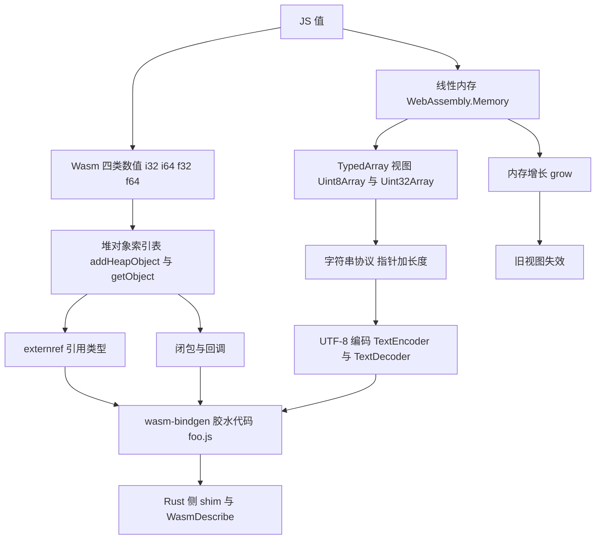
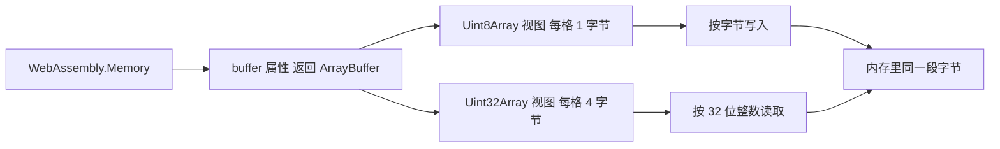
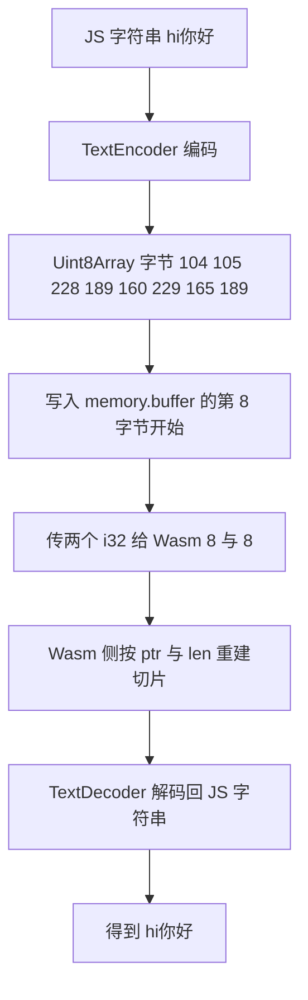
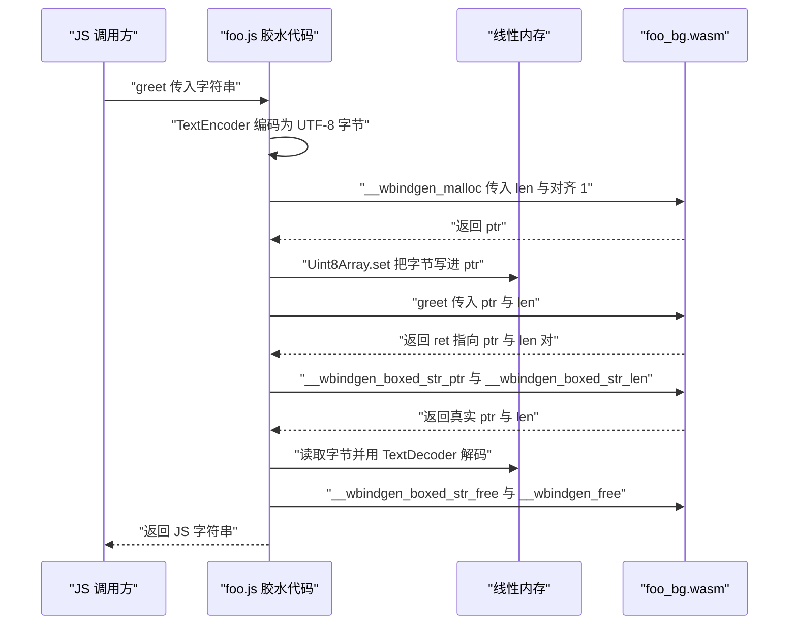
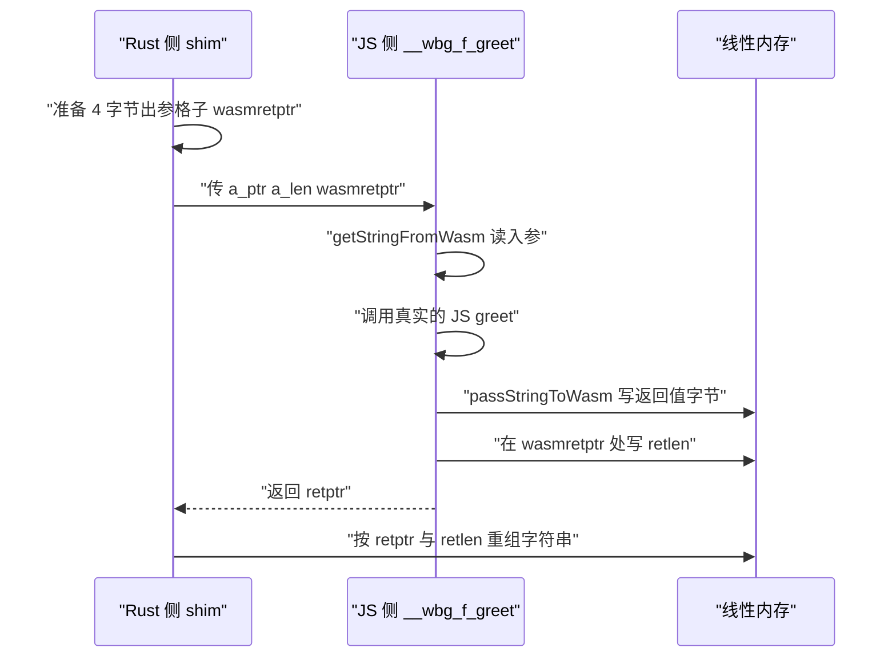
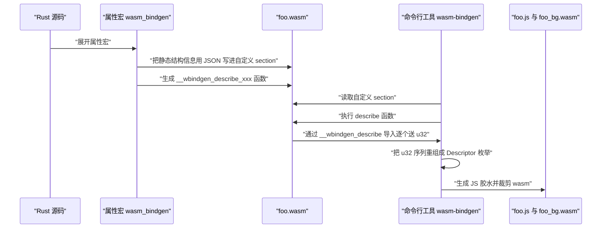
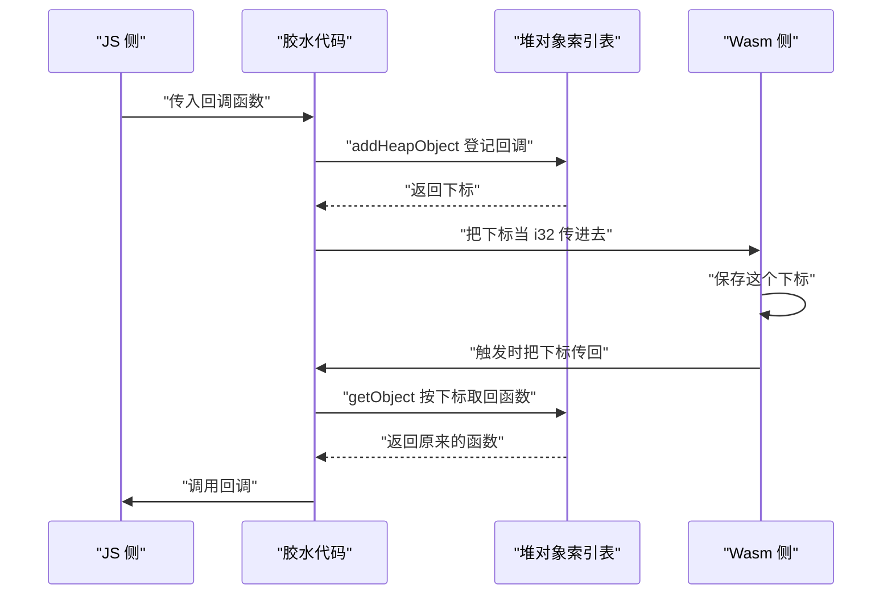
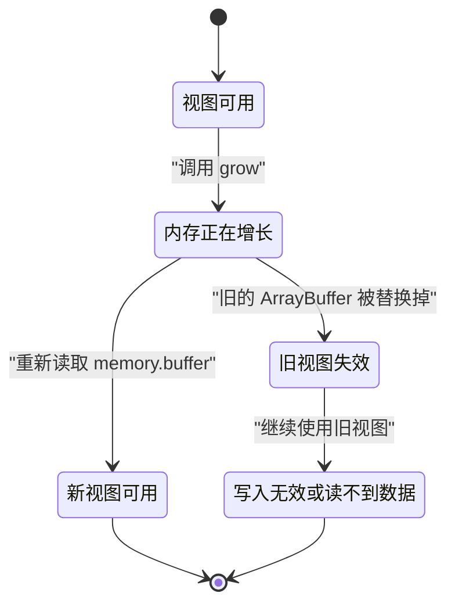

# Wasm 与 JS 互操作：线性内存、字符串与 wasm-bindgen 原理

!!! abstract "学完这一页你能"

    - 说出 WebAssembly 函数能直接接收的四类数值类型，并指出字符串为什么必须拆成两个整数。
    - 用 TextEncoder 与 TextDecoder 手写一段字符串进出线性内存的代码，并解释指针与长度各自的作用。
    - 逐行读懂 wasm-bindgen 生成的 passStringToWasm、getStringFromWasm 与导出函数 shim。
    - 复现内存增长后旧 TypedArray 视图失效的现象，并写出每次重新取视图的修复代码。

## 0. 知识地图



建议按 1 到 8 的顺序读。前三节只用手写 JS 建立直觉，读完你就能解释 wasm-bindgen 的胶水代码。

第 4 到 7 节把同一套机制搬回工具链内部，第 8 节是一个延迟出现的运行时故障，放在最后收口。

!!! note "术语：WebAssembly"
    WebAssembly（缩写 Wasm）是一种二进制指令格式，可以在浏览器与 Node 里运行，导出与导入的函数只处理数值类型。例子：一个导出函数 `add(a, b)` 的 a 与 b 都是 i32。

## 1. 线性内存与 TypedArray 视图

**先想一个问题**

你想把一段 4 字节的整数从 JS 写进 Wasm，再读出来。函数调用只能传数值，那块共享的内存从哪里来？

在 JS 里，你按字节写还是按 32 位整数写，用的是什么对象？

**心智模型**

!!! tip "心智模型"

    一句话模型：线性内存是一整块连续字节，TypedArray 是你此刻开的一扇窗。

    日常类比：线性内存像一栋能加层的仓库，TypedArray 是你手里写着楼层和房间号的取货单。

    类比不成立的地方：仓库加层不会挪动老货架，而 Wasm 内存增长会换掉整个 ArrayBuffer 对象，旧取货单直接作废。

!!! note "术语：线性内存"
    线性内存是 Wasm 实例持有的一整块连续字节区域，用页作单位。例子：`new WebAssembly.Memory({ initial: 1 })` 申请 1 页，共 65536 字节。

!!! note "术语：TypedArray"
    TypedArray 是一族按固定字节宽度读写 ArrayBuffer 的视图类型。例子：`Uint8Array` 每格 1 字节，`Uint32Array` 每格 4 字节，两者可以指向同一块 buffer。

!!! note "术语：指针与长度"
    指针是某个字节在内存里的起始偏移，长度是从起点开始的有效字节数。例子：字符串 `hi` 放在第 8 字节，那 ptr 是 8，len 是 2。

**图解**



1. `WebAssembly.Memory` 代表那块底层区域，它本身不能直接读写字节。
2. `memory.buffer` 返回当前那一刻的 ArrayBuffer，它是视图依附的对象。
3. `new Uint8Array(memory.buffer)` 得到一扇按字节编号的窗，下标就是字节偏移。
4. `new Uint32Array(memory.buffer)` 得到一扇按 4 字节编号的窗，下标 N 对应字节偏移 N 乘 4。
5. 两扇窗指向同一段字节，所以从 `Uint8Array` 写进去的内容，能从 `Uint32Array` 读出来。

**一步一步来**

第 1 步要做什么：申请一块内存，确认一页到底有多大。

```js
// Node 20 内置 WebAssembly，不需要安装任何依赖
const PAGE = 64 * 1024;                                // Wasm 线性内存一页固定 65536 字节
const memory = new WebAssembly.Memory({ initial: 1 }); // 申请 1 页
console.log(memory.buffer.byteLength);                 // 打印当前 buffer 的字节数
console.log(memory.buffer.byteLength === PAGE);        // 确认它与页大小相等
```

**这段代码在做什么**

- `new WebAssembly.Memory({ initial: 1 })` 向宿主申请 1 页内存，初始页数写在 initial 里。
- `memory.buffer` 读到一个 ArrayBuffer，它是线性内存此刻的承载对象。
- 打印 byteLength 得到 65536，与给定的 PAGE 相等，说明页大小是 65536 字节。
- 这里没有加载 Wasm 模块，只用了宿主提供的 Memory 对象，所以能在 Node 里直接验证。

运行结果：

```
65536
true
```

第 2 步要做什么：用两种视图读写同一段字节，观察整数是怎么拼出来的。

```js
const memory = new WebAssembly.Memory({ initial: 1 });
const bytes = new Uint8Array(memory.buffer);  // 按字节编号的视图
const words = new Uint32Array(memory.buffer); // 按 32 位整数编号的视图
bytes[0] = 0x78;                              // 写第 0 字节
bytes[1] = 0x56;                              // 写第 1 字节
bytes[2] = 0x34;                              // 写第 2 字节
bytes[3] = 0x12;                              // 写第 3 字节
console.log(words[0].toString(16));           // 按 32 位整数读出第 0 到第 3 字节
```

**这段代码在做什么**

- 两个视图共用同一块 ArrayBuffer，只改编号单位，不改数据。
- 四次单字节写入把 0x78、0x56、0x34、0x12 依次放进低地址四个格子。
- `words[0]` 把这 4 个字节合并成一个 32 位整数。
- 打印结果显示了本机字节序，`12345678` 说明低地址放的是低位字节。
- WebAssembly 规范对内存端序的定义需核对官方文档：内存读写是否固定为小端序。

运行结果：

```
12345678
```

第 3 步要做什么：看看越界写入会发生什么。

```js
const memory = new WebAssembly.Memory({ initial: 1 });
const bytes = new Uint8Array(memory.buffer);
bytes[65535] = 1;                        // 最后一格，合法位置
console.log(bytes[65535]);               // 读回写入的值
console.log(bytes[65536] === undefined); // 越界读会得到 undefined
bytes[65536] = 9;                        // 越界写不会报错
console.log(bytes[65536] === undefined); // 越界写之后那一格仍然不存在
```

**这段代码在做什么**

- `bytes[65535]` 是最后 1 个合法位置，写入后能读回。
- `bytes[65536]` 超出视图长度，读出来是 undefined，不抛异常。
- 对越界下标赋值不会报错，也不会让内存自动增长，值被丢弃。
- 想让越界立刻失败，必须自己先比较下标与 `bytes.length`。
- 内存增长要显式调用 grow，具体返回值和分离规则见第 8 节。

运行结果：

```
1
true
true
```

**动手验证**

```js
// 运行环境：Node 20+，单文件，无第三方依赖
// 运行方式：node memory-views.mjs
import assert from 'node:assert/strict';

const PAGE_SIZE = 65536;
const memory = new WebAssembly.Memory({ initial: 1 });

assert.strictEqual(memory.buffer.byteLength, PAGE_SIZE);

const bytes = new Uint8Array(memory.buffer);
const words = new Uint32Array(memory.buffer);

bytes.set([0x78, 0x56, 0x34, 0x12], 0);            // 一次性写 4 个字节
assert.strictEqual(words[0].toString(16), '12345678'); // 合并成一个 32 位整数

bytes[PAGE_SIZE - 1] = 7;                          // 最后一格
assert.strictEqual(bytes[PAGE_SIZE - 1], 7);
assert.strictEqual(bytes[PAGE_SIZE], undefined);   // 越界读
bytes[PAGE_SIZE] = 9;                              // 越界写被丢弃
assert.strictEqual(bytes[PAGE_SIZE], undefined);

console.log('buffer 字节数', memory.buffer.byteLength);
console.log('第 0 个 32 位整数', words[0].toString(16));
console.log('最后一格', bytes[PAGE_SIZE - 1]);
console.log('越界读', bytes[PAGE_SIZE]);
console.log('memory-views 全部断言通过');
```

预期输出：

```
buffer 字节数 65536
第 0 个 32 位整数 12345678
最后一格 7
越界读 undefined
memory-views 全部断言通过
```

**常见坑**

| 现象 | 原因 | 怎么修 |
| --- | --- | --- |
| 越界写没有报错，读回来是 undefined | TypedArray 越界写会被忽略 | 写入前先比较目标下标与 view.length |
| Uint32Array 读出的值与按字节写的顺序对不上 | 两种视图共用字节，顺序由字节序决定 | 固定一套写入顺序，或用 DataView 显式指定端序 |
| 视图的 byteOffset 不是 0，读写位置总是偏 | 构造视图时传了 offset 参数 | 取全量视图只传 memory.buffer，偏移由自己加到下标上 |

**小结**

- 线性内存是一整块连续字节，`memory.buffer` 是它此刻的 ArrayBuffer。
- TypedArray 只是编号方式不同的窗，同一段字节能被按 1 字节或按 4 字节读写。
- 越界访问不会帮你报错，长度检查必须自己写。

## 2. 手写字符串传递：UTF-8 编码加上指针长度

**先想一个问题**

你要把 JS 字符串 `hi你好` 传给一个只接受 i32 的 Wasm 函数。字符串有两个字符，怎么变成一个整数？

接收方拿到整数之后，怎么知道字符串在哪里结束？

**心智模型**

!!! tip "心智模型"

    一句话模型：字符串过境要三步，编码成字节、放进线性内存、把起始偏移和字节数当两个整数传过去。

    日常类比：像寄快递，先装箱，再放到仓库某个货架，最后告诉对方货架号和箱数。

    类比不成立的地方：快递员会复核货架号，而 Wasm 侧不会；指针写错只能自己承担读到脏数据或触发 trap 的后果。

!!! note "术语：UTF-8"
    UTF-8 是 Unicode Transformation Format 8-bit 的缩写，一种把字符编码成 1 到 4 个字节的规则。例子：`h` 占 1 字节，`你` 占 3 字节。

!!! note "术语：术语：编码与解码"
    编码是把 JS 字符串按某种规则转成字节，解码是反向过程。例子：`new TextEncoder().encode('hi')` 得到两个字节，`new TextDecoder().decode(...)` 把它们还原成字符串。

**图解**



1. 起点是一个 JS 字符串，字符数是 4。
2. `TextEncoder` 按 UTF-8 把它转成字节序列，长度不一定等于字符数。
3. 字节被复制进线性内存从 ptr 开始的位置。
4. 调用 Wasm 时传两个 i32，一个是 ptr，一个是 len。
5. Wasm 侧用 ptr 与 len 切出同样一段字节。
6. 拿回 JS 后用 `TextDecoder` 解码，得到原来的字符串。

**一步一步来**

第 1 步要做什么：先看清字符数与字节数的差别。

```js
const encoder = new TextEncoder();      // 默认按 UTF-8 编码
const buf = encoder.encode('hi你好');    // 字符串转字节
console.log('hi你好'.length);            // JS 里的字符数
console.log(buf.length);                 // 编码后的字节数
console.log(Array.from(buf));            // 每个字节的值
```

**这段代码在做什么**

- `'hi你好'.length` 得到 4，因为 JS 按 UTF-16 编码单元计数。
- `encoder.encode` 按 UTF-8 产出字节，`h` 与 `i` 各 1 字节，`你` 与 `好` 各 3 字节。
- 字节总数是 8，与字符数 4 不相等。
- 传输时必须用字节数当 len，不能用 `.length`。

运行结果：

```
4
8
[104, 105, 228, 189, 160, 229, 165, 189]
```

第 2 步要做什么：在 JS 里写一个极简分配器，把字节放进线性内存。

```js
const memory = new WebAssembly.Memory({ initial: 1 });
let bump = 8;                     // 水位从第 8 字节开始，低地址留作他用
function malloc(len) {            // bump 分配器，只增不减
  const ptr = bump;               // 本次分配的起点
  bump += len;                    // 抬高水位，下一次从这里继续
  return ptr;                     // 返回起始偏移
}
const buf = new TextEncoder().encode('hi你好');
const ptr = malloc(buf.length);   // 申请与字节数相等的空间
new Uint8Array(memory.buffer).set(buf, ptr); // 把字节复制进去
console.log(ptr, buf.length);     // 打印指针与长度
```

**这段代码在做什么**

- `bump` 记录下一块空闲空间的起点，分配就是把水位往后推。
- `malloc(len)` 返回本次起点，并让下一次分配从 ptr 加 len 开始。
- `new Uint8Array(memory.buffer)` 拿到写入用的窗。
- `view.set(buf, ptr)` 把编码好的字节整段复制到内存里。
- 这里不再需要 `buf`，真正跨边界的是 ptr 与 len 这一对数字。

运行结果：

```
8 8
```

第 3 步要做什么：按 ptr 与 len 把字符串读回来。

```js
const memory = new WebAssembly.Memory({ initial: 1 });
let bump = 8;
const malloc = (len) => { const p = bump; bump += len; return p; };
const bytes = new Uint8Array(memory.buffer);
const buf = new TextEncoder().encode('hi你好');
const ptr = malloc(buf.length);
bytes.set(buf, ptr);                                  // 写入
const slice = bytes.slice(ptr, ptr + buf.length);     // 从内存里切出一段副本
console.log(new TextDecoder('utf-8').decode(slice));  // 解码
```

**这段代码在做什么**

- `bytes.slice(ptr, ptr + len)` 复制出 ptr 到 ptr 加 len 之间的字节，原内存不受影响。
- `new TextDecoder('utf-8').decode(slice)` 把字节还原成 JS 字符串。
- 读的时候必须同时给出 ptr 与 len，内存里没有结束符号可依赖。
- 复制出副本而不是直接引用视图，避免解码期间内存增长让视图失效。
- `TextDecoder` 遇到非法字节序列默认替换成 U+FFFD，不抛异常，长度传错会静默出错。

运行结果：

```
hi你好
```

**动手验证**

```js
// 运行环境：Node 20+，单文件，无第三方依赖
// 运行方式：node string-abi.mjs
import assert from 'node:assert/strict';

const memory = new WebAssembly.Memory({ initial: 1 });
const encoder = new TextEncoder();
const decoder = new TextDecoder('utf-8');

let bump = 8;
function malloc(len) {
  const ptr = bump;
  bump += len;
  return ptr;
}

function writeString(text) {
  const buf = encoder.encode(text);
  const ptr = malloc(buf.length);
  new Uint8Array(memory.buffer).set(buf, ptr); // 每次重新取视图
  return { ptr, len: buf.length };
}

function readString(ptr, len) {
  const slice = new Uint8Array(memory.buffer).slice(ptr, ptr + len);
  return decoder.decode(slice);
}

const a = writeString('hi你好');
assert.strictEqual(a.len, 8);
assert.strictEqual(a.ptr, 8);

const b = writeString('wasm');
assert.strictEqual(b.ptr, 16);                 // 第一次占 8 字节，第二次从 16 开始
assert.strictEqual(b.len, 4);

assert.strictEqual(readString(a.ptr, a.len), 'hi你好');
assert.strictEqual(readString(b.ptr, b.len), 'wasm');
assert.strictEqual(readString(a.ptr, 2), 'hi'); // 长度给少了只能读到前两个字节

console.log('第一次分配', a);
console.log('第二次分配', b);
console.log('读回', readString(a.ptr, a.len), readString(b.ptr, b.len));
console.log('length 传错时读到的内容', readString(a.ptr, 2));
console.log('string-abi 全部断言通过');
```

预期输出：

```
第一次分配 { ptr: 8, len: 8 }
第二次分配 { ptr: 16, len: 4 }
读回 hi你好 wasm
length 传错时读到的内容 hi
string-abi 全部断言通过
```

**常见坑**

| 现象 | 原因 | 怎么修 |
| --- | --- | --- |
| 中文读回来是乱码或替换字符 | len 用了 JS 的 str.length，而中文在 UTF-8 里占 3 字节 | len 一律取 `encoder.encode(str).length` |
| 第二次写入覆盖了第一次的内容 | bump 水位没推进，两次分配拿到同一个 ptr | 分配后执行 `bump += len` |
| 解码结果末尾多出问号方框 | 传入的 len 比实际字节数小，UTF-8 序列被截断 | 保证 ptr 与 len 来自同一次分配 |

**小结**

- 字符串跨边界时以字节形态保存在线性内存里，跨过去的只是两个整数。
- ptr 决定从哪里开始，len 决定读多少字节，缺一不可。
- 长度必须用编码后的字节数，不能用 JS 的字符数。

## 3. wasm-bindgen 的字符串胶水代码

**先想一个问题**

你写了 `#[wasm_bindgen] pub fn greet(a: &str) -> String`，在 JS 里直接 `import { greet }` 就能传字符串。中间是谁帮你编码、分配、拷贝和释放？

这一层代码长什么样？

**心智模型**

!!! tip "心智模型"

    一句话模型：wasm-bindgen 生成的 foo.js 是一层翻译层，把一次调用拆成分配、拷贝、调用、读取、释放五件事。

    日常类比：像跨境寄件时找的代运营，帮你报关、贴单、垫运费、最后收尾。

    类比不成立的地方：代运营由人操作可能出错，这层代码由工具按固定顺序生成，你只需要写好 Rust 签名。

!!! note "术语：胶水代码"
    胶水代码是自动生成在两种语言之间的适配层，负责参数与返回值的转换。例子：wasm-bindgen 生成的 foo.js 里有 passStringToWasm 与 getStringFromWasm 两个函数。

!!! note "术语：ABI"
    ABI 是 Application Binary Interface 的缩写，指调用双方在二进制层面的约定。例子：字符串入参约定成 ptr 与 len 两个 i32，这就是一条 ABI。

**图解**



1. JS 调用方把字符串交给生成的 `foo.js`。
2. 胶水代码用 `TextEncoder` 编码，得到 UTF-8 字节。
3. 向 Wasm 申请一块空间，拿回 ptr。
4. 把字节写进线性内存的 ptr 位置。
5. 调用真正的 Wasm 导出，传 ptr 与 len 两个数字。
6. 返回值是一个指针，指向内存里存放 ptr 与 len 的两个格子。
7. 用两个读取函数取出真实字符串的 ptr 与 len。
8. 从内存读出字节并解码成 JS 字符串。
9. 释放返回值的盒子和入参空间，把字符串交给调用方。

**一步一步来**

第 1 步要做什么：看 JS 侧怎么把字符串送进去。

```js
import * as wasm from './foo_bg';

function passStringToWasm(arg) {
  const buf = new TextEncoder('utf-8').encode(arg); // 编码成 UTF-8 字节
  const len = buf.length;                           // 记录字节数
  const ptr = wasm.__wbindgen_malloc(len, 1);       // 在 Wasm 堆上申请 len 字节
  let array = new Uint8Array(wasm.memory.buffer);   // 取内存视图
  array.set(buf, ptr);                              // 把字节写进 ptr 位置
  return [ptr, len];                                // 返回指针与长度
}
```

**这段代码在做什么**

- 这段代码来自 wasm-bindgen 官方设计文档给出的生成结果。
- `TextEncoder` 把 JS 字符串编码成 UTF-8 字节数组。
- `len` 取编码后的字节数，不是字符数。
- `__wbindgen_malloc(len, 1)` 在 Wasm 堆上申请空间，第二个参数是对齐。
- 视图是当场创建的，写完就丢弃，不跨调用保存。
- `TextEncoder` 的构造参数在当前规范里被忽略，编码固定为 UTF-8，需核对官方文档：TextEncoder 构造参数是否被忽略。

第 2 步要做什么：看 JS 侧怎么把字符串取出来。

```js
function getStringFromWasm(ptr, len) {
  const mem = new Uint8Array(wasm.memory.buffer);        // 每次都重新取视图
  const slice = mem.slice(ptr, ptr + len);               // 复制出这一段字节
  const ret = new TextDecoder('utf-8').decode(slice);    // 解码回字符串
  return ret;                                            // 返回给调用方
}
```

**这段代码在做什么**

- 视图在函数内部创建，不缓存在模块作用域里。
- 这样写的原因与第 8 节的内存增长有关，内存一增长旧视图就作废。
- `slice` 复制出一份副本，后续内存变动不影响这份副本。
- `TextDecoder('utf-8')` 把字节还原成 JS 字符串。
- 解码失败时默认替换成 U+FFFD，不会抛异常。

第 3 步要做什么：看一次完整导出调用的骨架。

```js
export function greet(arg0) {
  const [ptr0, len0] = passStringToWasm(arg0);   // 入参变成 ptr 与 len
  try {
    const ret = wasm.greet(ptr0, len0);          // 调用真正的 Wasm 导出
    const ptr = wasm.__wbindgen_boxed_str_ptr(ret); // 从句柄里读出字节指针
    const len = wasm.__wbindgen_boxed_str_len(ret); // 从句柄里读出字节长度
    const realRet = getStringFromWasm(ptr, len);    // 解码成 JS 字符串
    wasm.__wbindgen_boxed_str_free(ret);            // 释放返回值盒子
    return realRet;                                 // 把结果交出去
  } finally {
    wasm.__wbindgen_free(ptr0, len0, 1);            // 无论成功失败都释放入参空间
  }
}
```

**这段代码在做什么**

- 入参和返回值都要释放，一次调用对应两次释放动作。
- Wasm 目前只能返回一个值，所以返回值用一个指针带回 ptr 与 len 对。
- `__wbindgen_boxed_str_ptr` 与 `__wbindgen_boxed_str_len` 负责把这对值取出来。
- 释放放在 finally 里，保证 Rust 侧 panic 时入参空间也能回收。
- 返回值的释放时机是解码完成之后，不是函数返回之后。

**动手验证**

```js
// 运行环境：Node 20+，单文件，无第三方依赖
// 运行方式：node glue.mjs
// 说明：用纯 JS 伪造一个 wasm 对象，只保留胶水代码用到的成员
import assert from 'node:assert/strict';

const memory = new WebAssembly.Memory({ initial: 1 });
let bump = 8;

function passStringToWasm(arg) {
  const buf = new TextEncoder('utf-8').encode(arg);
  const len = buf.length;
  const ptr = wasm.__wbindgen_malloc(len, 1);
  new Uint8Array(wasm.memory.buffer).set(buf, ptr);
  return [ptr, len];
}

function getStringFromWasm(ptr, len) {
  const slice = new Uint8Array(wasm.memory.buffer).slice(ptr, ptr + len);
  return new TextDecoder('utf-8').decode(slice);
}

const wasm = {
  memory,
  __wbindgen_malloc(len) { const ptr = bump; bump += len; return ptr; },
  __wbindgen_free() { /* 演示用的 bump 分配器不回收 */ },
  greet(ptr, len) {
    const input = getStringFromWasm(ptr, len);           // 读出 Rust 侧的字符串
    const out = `Hello, ${input}!`;                      // 模拟 Rust 的 format
    const bytes = new TextEncoder().encode(out);
    const dataPtr = wasm.__wbindgen_malloc(bytes.length); // 放返回的字节
    new Uint8Array(memory.buffer).set(bytes, dataPtr);
    const boxPtr = wasm.__wbindgen_malloc(8);             // 放 ptr 与 len 两个 u32
    const dv = new DataView(memory.buffer);
    dv.setUint32(boxPtr, dataPtr, true);
    dv.setUint32(boxPtr + 4, bytes.length, true);
    return boxPtr;
  },
  __wbindgen_boxed_str_ptr(box) { return new DataView(memory.buffer).getUint32(box, true); },
  __wbindgen_boxed_str_len(box) { return new DataView(memory.buffer).getUint32(box + 4, true); },
  __wbindgen_boxed_str_free() { /* 演示不回收 */ },
};

function greet(arg0) {
  const [ptr0, len0] = passStringToWasm(arg0);
  try {
    const ret = wasm.greet(ptr0, len0);
    const ptr = wasm.__wbindgen_boxed_str_ptr(ret);
    const len = wasm.__wbindgen_boxed_str_len(ret);
    const realRet = getStringFromWasm(ptr, len);
    wasm.__wbindgen_boxed_str_free(ret);
    return realRet;
  } finally {
    wasm.__wbindgen_free(ptr0, len0, 1);
  }
}

assert.strictEqual(greet('foo'), 'Hello, foo!');
assert.strictEqual(greet('你好'), 'Hello, 你好!');
assert.strictEqual(greet(''), 'Hello, !');

console.log(greet('foo'));
console.log(greet('你好'));
console.log('水位', bump);
console.log('glue 全部断言通过');
```

预期输出：

```
Hello, foo!
Hello, 你好!
水位 70
glue 全部断言通过
```

**常见坑**

| 现象 | 原因 | 怎么修 |
| --- | --- | --- |
| 返回字符串解出乱码 | 把 boxed str 的句柄当成字节指针用了 | 先调 ptr 与 len 两个读取函数，再解码 |
| 内存增长的瞬间解码报错 | 视图是在增长之前创建的 | 每次解码前重新 `new Uint8Array(wasm.memory.buffer)` |
| 长时间运行后内存不降 | 入参或返回值只分配未释放 | 入参放 finally，返回值解码后立刻释放 |

**小结**

- 胶水代码把一次调用拆成分配、拷贝、调用、读取、释放。
- 入参空间与返回值盒子是两块独立空间，需要各自释放。
- 视图在函数内部创建是刻意写法，为的是绕开内存增长。

## 4. 从 Wasm 调用 JS：返回值怎么通过内存带回

**先想一个问题**

Rust 侧要调用 JS 的 greet 并拿回字符串。Wasm 函数只能返回一个 i32，指针和长度两个值怎么一起回去？

谁负责把长度写进内存？

**心智模型**

!!! tip "心智模型"

    一句话模型：返回值走一个由调用方提前准备的出参格子，长度写进格子，指针直接返回。

    日常类比：去柜台办事，柜员只递回一个单号，你把金额写在自己带来的信封上，两样凑起来才是完整结果。

    类比不成立的地方：信封位置由调用方提前定好，写错位置会覆盖别的数据，没有柜台人员帮你核对。

**图解**



1. Rust 侧先在自己的栈上准备一个 4 字节变量，用来接长度。
2. 把入参的 ptr、入参的 len 和这个变量的地址一起传给 JS。
3. JS shim 用 ptr 与 len 读出入参字符串。
4. 调用真正的 JS 函数拿到返回值。
5. 把返回值编码后写进 Wasm 内存，得到 retptr 与 retlen。
6. 把 retlen 写进 Rust 给的出参格子，位置是 wasmretptr 除以 4。
7. 把 retptr 作为函数返回值交给 Rust。
8. Rust 用 retptr 与 retlen 重建字符串。

**一步一步来**

第 1 步要做什么：看 JS 侧 shim 如何把长度写回内存。

```js
import * as wasm from './foo_bg';
import { greet } from './greet';

export function __wbg_f_greet(ptr0, len0, wasmretptr) {
  // 读出 Wasm 传来的字符串，调用真正的 JS greet，再把结果编码写回 Wasm
  const [retptr, retlen] = passStringToWasm(greet(getStringFromWasm(ptr0, len0)));
  // 长度写进 Wasm 预留的出参格子，Uint32Array 按 4 字节编号
  (new Uint32Array(wasm.memory.buffer))[wasmretptr / 4] = retlen;
  // 指针直接作为返回值交给 Wasm
  return retptr;
}
```

**这段代码在做什么**

- 这段代码来自 wasm-bindgen 官方设计文档给出的生成结果。
- 入参的读取用 getStringFromWasm，返回值写回用 passStringToWasm。
- `wasmretptr` 是字节偏移，`Uint32Array` 按 4 字节编号，所以写 `wasmretptr / 4`。
- 写进去的是一个 4 字节无符号整数，值就是返回字符串的字节数。
- 指针通过 return 直接回到 Wasm，长度通过内存回到 Wasm。

第 2 步要做什么：看 Rust 侧 shim 怎么接住这两样东西。

```rust
extern "C" fn greet(a: &str) -> String {
    extern "C" {
        // 第三个参数是出参指针，函数返回值是字符串字节指针
        fn __wbg_f_greet(a_ptr: *const u8, a_len: usize, ret_len: *mut usize) -> *mut u8;
    }
    unsafe {
        let a_ptr = a.as_ptr();          // UTF-8 字节的起始地址
        let a_len = a.len();             // UTF-8 字节的长度
        let mut __ret_strlen = 0;        // 长度先放在本地变量里
        let mut __ret_strlen_ptr = &mut __ret_strlen as *mut usize; // 取它的地址
        let _ret = __wbg_f_greet(a_ptr, a_len, __ret_strlen_ptr);   // 调用 JS shim
        String::from_utf8_unchecked(
            Vec::from_raw_parts(_ret, __ret_strlen, __ret_strlen)   // 用 ptr 与 len 重建
        )
    }
}
```

**这段代码在做什么**

- 这段代码来自 wasm-bindgen 官方设计文档给出的生成结果。
- 入参传 ptr 与 len，出参传一个可写地址，函数返回一个字节指针。
- JS 侧把长度写进 `__ret_strlen`，Rust 侧等调用返回后再读它。
- `Vec::from_raw_parts` 的三个参数是指针、长度、容量，这里借用官方示例的写法。
- `unsafe` 包裹的原因是需要直接操作裸指针，边界两侧都按约定填好内容。
- 严格参数顺序与容量约定需核对官方文档：Importing a function from JS 一节给出的 Rust shim。

第 3 步要做什么：确认写长度的位置必须按 4 字节对齐。

```js
const memory = new WebAssembly.Memory({ initial: 1 });
const wasmretptr = 16;                              // 字节偏移
new Uint32Array(memory.buffer)[wasmretptr / 4] = 7; // 等价于在第 16 字节写一个 u32
const dv = new DataView(memory.buffer);
console.log(dv.getUint32(wasmretptr, true));        // 用另一种方式读同一个字
console.log(wasmretptr / 4);                        // 下标是 4

const bad = 18;                                     // 不是 4 的倍数
new Uint32Array(memory.buffer)[bad / 4] = 9;        // 下标是 4.5，写入被丢弃
console.log(dv.getUint32(bad, true));               // 读到 0，说明没写进去
```

**这段代码在做什么**

- `Uint32Array` 用下标乘 4 得到字节偏移，所以 `wasmretptr / 4` 必须能整除。
- `wasmretptr` 是 16 时，下标 4 正好对应第 16 字节。
- `DataView` 可以按任意字节偏移读写，用来对照结果。
- `bad` 是 18 时，`18 / 4` 等于 4.5，不是合法下标，赋值被丢弃。
- 分配器必须保证出参格子按 4 字节对齐，否则长度永远写不进去。

运行结果：

```
7
4
0
```

**动手验证**

```js
// 运行环境：Node 20+，单文件，无第三方依赖
// 运行方式：node import-shim.mjs
import assert from 'node:assert/strict';

const memory = new WebAssembly.Memory({ initial: 1 });
const encoder = new TextEncoder();
const decoder = new TextDecoder('utf-8');

let bump = 8;
function malloc(len) {
  const ptr = (bump + 3) & ~3; // 起点按 4 字节对齐
  bump = ptr + len;
  return ptr;
}
function passStringToWasm(str) {
  const buf = encoder.encode(str);
  const ptr = malloc(buf.length);
  new Uint8Array(memory.buffer).set(buf, ptr);
  return [ptr, buf.length];
}
function getStringFromWasm(ptr, len) {
  return decoder.decode(new Uint8Array(memory.buffer).slice(ptr, ptr + len));
}

const realGreet = (name) => `Hello, ${name}!`; // 真正的 JS 函数

// 模拟 wasm-bindgen 生成的导入 shim
function __wbg_f_greet(ptr0, len0, wasmretptr) {
  const [retptr, retlen] = passStringToWasm(realGreet(getStringFromWasm(ptr0, len0)));
  new Uint32Array(memory.buffer)[wasmretptr / 4] = retlen;
  return retptr;
}

// 模拟 Rust 侧调用方：先传参，再准备出参格子
function rustGreet(name) {
  const [aPtr, aLen] = passStringToWasm(name);
  const retLenPtr = malloc(4);                       // 4 字节出参格子
  assert.strictEqual(retLenPtr % 4, 0);              // 必须对齐
  const retPtr = __wbg_f_greet(aPtr, aLen, retLenPtr);
  const retLen = new DataView(memory.buffer).getUint32(retLenPtr, true);
  return getStringFromWasm(retPtr, retLen);
}

assert.strictEqual(rustGreet('foo'), 'Hello, foo!');
assert.strictEqual(rustGreet('你好'), 'Hello, 你好!');

console.log(rustGreet('foo'));
console.log(rustGreet('你好'));
console.log('import-shim 全部断言通过');
```

预期输出：

```
Hello, foo!
Hello, 你好!
import-shim 全部断言通过
```

**常见坑**

| 现象 | 原因 | 怎么修 |
| --- | --- | --- |
| Rust 侧每次都读到长度 0 | JS shim 忘了写出参格子 | 返回指针之前先写 `wasmretptr / 4` |
| 长度写进内存后被别的数据覆盖 | 出参格子没有对齐，或与返回值空间重叠 | 分配器统一按 4 字节对齐，分配后推进水位 |
| 重建的字符串容量不对导致后续重复释放 | Vec 的 capacity 参数传错 | 按官方示例传参，需核对官方文档：Importing a function from JS 的 Rust shim |

**小结**

- 出参格子让一个返回值带回两个信息，长度走内存，指针走返回值。
- 写长度的位置必须按 4 字节对齐，用 `wasmretptr / 4` 当下标。
- 边界两侧的 shim 成对出现，一侧写、另一侧读，顺序不能乱。

## 5. externref 与堆对象索引表

**先想一个问题**

Rust 要拿一个 JS 对象的引用，可 Wasm 只能收数值。一个对象怎么变成一个数字？

这个数字代表地址还是代表别的什么？

**心智模型**

!!! tip "心智模型"

    一句话模型：边界两侧各有一张登记表，表里放对象，传过去的只是行号。

    日常类比：两个图书馆互换藏书时不搬书，只交换编号。

    类比不成立的地方：编号由同一份对照表维护，表项需要显式释放，不释放就一直占着 JS 堆。

!!! note "术语：堆对象索引表"
    堆对象索引表是 JS 侧一张数组，把 JS 对象存进去并返回下标，Wasm 侧只保存这个下标。例子：`addHeapObject(new Bar())` 返回 1，Rust 侧把它存进 `JsValue`。

!!! note "术语：externref"
    externref 是 WebAssembly 的一种引用类型，用来让 Wasm 直接持有宿主对象，不必自己维护下标表。例子：把 JS 对象放进 element 为 externref 的 `WebAssembly.Table`。支持范围需核对官方文档：Support for Reference Types。

**图解**


1. JS 侧创建一个对象，它不能直接跨过去。
2. `addHeapObject` 把对象放进数组，返回一个下标。
3. 这个下标是普通 u32，可以当作参数传入 Wasm。
4. Rust 侧把这个下标包进 `JsValue`，只保存数字。
5. 需要调用方法时，Rust 把下标传回 JS 侧 shim。
6. shim 用 `getObject` 按下标取回真实对象，再调用方法。
7. 返回值是数值类型，可以直接回传给 Wasm。

**一步一步来**

第 1 步要做什么：用数组实现最简的登记表。

```js
const heap = [undefined];    // 下标 0 留空，便于把 0 当作空指针
function addHeapObject(obj) {
  const idx = heap.length;   // 下一个可用下标
  heap.push(obj);            // 存进表里
  return idx;                // 返回 u32 下标
}
function getObject(idx) {
  return heap[idx];          // 按下标取回
}
const bar = { value: 5, get() { return this.value; } };
const idx = addHeapObject(bar);
console.log(idx, getObject(idx) === bar); // 下标与取回结果
```

**这段代码在做什么**

- 表用一个普通数组表示，下标就是传给 Wasm 的句柄。
- 下标 0 留空，这样 Rust 侧的 0 可以表示空句柄。
- `addHeapObject` 永远返回新下标，同一个对象登记两次会得到两个表项。
- `getObject` 是纯查表，不做类型检查。
- 表项不删除时对象无法被回收。

运行结果：

```
2 true
```

第 2 步要做什么：让这个下标真的跨过一次边界。

```js
const heap = [undefined];
const addHeapObject = (obj) => { heap.push(obj); return heap.length - 1; };
const getObject = (idx) => heap[idx];
const bar = { value: 5, get() { return this.value; } };
const idx = addHeapObject(bar);
function __wbg_s_Bar_get(ptr) {   // 模拟被 Wasm 调用的导出 shim
  return getObject(ptr).get();    // 取回对象并调用方法，返回 i32
}
console.log(__wbg_s_Bar_get(idx)); // 从 Wasm 的角度看，它只是传了一个数字
```

**这段代码在做什么**

- `__wbg_s_Bar_get` 的参数是 u32 下标，不是对象。
- 函数内部用 `getObject` 换回真实对象。
- 调用结果是一个数值，可以直接回传给 Wasm。
- 这个写法与 wasm-bindgen 生成的 `__wbg_s_Bar_get` 一致，`ptr` 在这里是表下标。

运行结果：

```
5
```

第 3 步要做什么：认识 externref 这条替代路线，并确认环境是否支持。

```js
let table = null;
try {
  table = new WebAssembly.Table({ element: 'externref', initial: 4 });
  table.set(0, { tag: 'host object' });  // 直接放对象，不经过自己写的数组
  console.log(table.get(0).tag);         // 取回来还是同一个对象
} catch (err) {
  console.log('当前环境不支持 externref 表', err.message);
}
```

**这段代码在做什么**

- `element: 'externref'` 表示表里存的是宿主对象引用。
- `table.set(0, obj)` 直接把对象放进表，不需要自己写登记表。
- `table.get(0)` 取回同一个对象，读取属性 `tag`。
- 如果运行环境不支持这个 element 取值，会抛异常，所以用 try 包住。
- externref 的可用范围与释放规则需核对官方文档：Support for Reference Types。

运行结果（环境支持时）：

```
host object
```

**动手验证**

```js
// 运行环境：Node 20+，单文件，无第三方依赖
// 运行方式：node heap-table.mjs
import assert from 'node:assert/strict';

const heap = [undefined]; // 下标 0 留空
const addHeapObject = (obj) => { heap.push(obj); return heap.length - 1; };
const getObject = (idx) => heap[idx];
const dropHeapObject = (idx) => { heap[idx] = undefined; };

// 模拟 Rust 侧 JsValue：内部只保存一个下标
class JsValue {
  static __from_idx(idx) { const v = new JsValue(); v.idx = idx; return v; }
  __get_idx() { return this.idx; }
}

// 模拟被导入的 JS 类与它的三个 shim
const Bar = class {
  constructor(v) { this.v = v; }
  get() { return this.v; }
  set(v) { this.v = v; }
};
function __wbg_s_Bar_new() { return addHeapObject(new Bar(0)); }
function __wbg_s_Bar_get(ptr) { return getObject(ptr).get(); }
function __wbg_s_Bar_set(ptr, val) { getObject(ptr).set(val); }

const handle = JsValue.__from_idx(__wbg_s_Bar_new());
assert.strictEqual(handle.__get_idx(), 1);
assert.strictEqual(__wbg_s_Bar_get(handle.__get_idx()), 0);

__wbg_s_Bar_set(handle.__get_idx(), 42);
assert.strictEqual(__wbg_s_Bar_get(handle.__get_idx()), 42);
assert.strictEqual(heap.length, 2); // 下标 0 占位，对象在下标 1

dropHeapObject(handle.__get_idx());
assert.strictEqual(heap[1], undefined);

console.log('handle 下标', handle.__get_idx());
console.log('释放前读取过的值', 42);
console.log('释放后表项', heap[1]);
console.log('heap-table 全部断言通过');
```

预期输出：

```
handle 下标 1
释放前读取过的值 42
释放后表项 undefined
heap-table 全部断言通过
```

**常见坑**

| 现象 | 原因 | 怎么修 |
| --- | --- | --- |
| 页面运行久了 JS 对象无法回收 | 只登记不释放 | 使用 wasm-bindgen 生成的释放通道，具体名称需核对官方文档：设计文档中 `__wbindgen_object_drop_ref` 出现处 |
| 用 0 当下标，取回 undefined | 0 被当成空指针 | 数组下标 0 留空，登记从 1 开始 |
| 把下标直接交给 TypedArray 读内存 | 下标是表号，不是字节偏移 | 下标只交给 `getObject`，指针才交给 TypedArray |

**小结**

- 跨边界的对象引用被换成一个 u32 下标，真实对象留在 JS 侧的数组里。
- 下标是表号，不是内存地址，只能用于查表。
- 表项需要显式释放，否则引用一直存在。

## 6. wasm-bindgen 的编译流程与 describe 机制

**先想一个问题**

`#[wasm_bindgen]` 只加在 Rust 函数上，为什么还要单独跑一个 `wasm-bindgen` 命令行工具？

这个工具怎么知道每个参数是字符串还是对象，而不是让宏直接写死字符串规则？

**心智模型**

!!! tip "心智模型"

    一句话模型：宏把类型信息留在 Wasm 文件里，CLI 读一遍再生成 foo.js 与 foo_bg.wasm。

    日常类比：装修时在现场留一份施工说明，验收员拿着说明逐条核对再出成品。

    类比不成立的地方：describe 函数是可执行代码，CLI 真的会把它们跑一遍，靠导入把类型描述收集成整数数组。

**图解**



1. 宏在语法树上读取函数与类型写法。
2. 把静态结构信息用 JSON 序列化进 Wasm 文件的自定义 section。
3. 同时生成一批 `__wbindgen_describe_xxx` 函数。
4. CLI 读取自定义 section，得到函数名与位置这类信息。
5. CLI 执行这些 describe 函数，函数通过 `__wbindgen_describe` 导入把 u32 送到宿主。
6. 多次调用得到一个 `Vec<u32>`。
7. 这个整数序列被重组成 `enum Descriptor`，完整描述类型。
8. CLI 生成 foo.js 与修改过的 foo_bg.wasm。

**一步一步来**

第 1 步要做什么：认识宏看到的东西。

```rust
// 输入：一个最简单的导出函数
#[wasm_bindgen]
fn greet(a: &str) {
    // 宏在语法树上看到函数名 greet，以及一个类型为引用 str 的参数
    // 这些静态结构信息由宏序列化后写进 Wasm 的自定义 section
    // JSON 的具体字段名需核对官方文档：Communicating types to wasm-bindgen
}
```

**这段代码在做什么**

- 宏工作在语法层面，也就是还没解析类型别名的阶段。
- 它能看到函数名、参数名、写下来的类型文本。
- 静态结构信息通过 JSON 写进 Wasm 可执行文件的自定义 section。
- 具体哪些字段、用什么键名，需核对官方文档：Communicating types to wasm-bindgen。

第 2 步要做什么：理解为什么还要生成 describe 函数。

```rust
// 官方设计文档给出的 WasmDescribe trait
pub trait WasmDescribe {
    fn describe();
}

// 为上面的 greet 生成的描述函数
#[no_mangle]
pub extern "C" fn __wbindgen_describe_greet() {
    <dyn Fn(&str)>::describe(); // 用类型系统描述签名
}
```

**这段代码在做什么**

- 关联类型与类型别名要等编译器更后面的阶段才确定，宏阶段拿不到。
- 所以类型信息改用可执行函数表达，等编译器把类型算出来再执行。
- `<dyn Fn(&str)>::describe()` 会触发一连串 describe 调用。
- 这些调用依赖一个名为 `__wbindgen_describe` 的导入，每次传一个 u32。
- 多次调用累积起来就是一个 `Vec<u32>`，再重组成 `enum Descriptor`。

第 3 步要做什么：看 CLI 为导出结构体生成的 JS 类。

```js
// 官方设计文档给出的 Foo 结构体导出的 JS shim
export class Foo {
  static __construct(ptr) { return new Foo(ptr); } // 用一个指针包装实例
  constructor(ptr) { this.ptr = ptr; }             // 指针来自 Rust 侧的 Box
  free() {                                         // 手动释放 Rust 侧资源
    const ptr = this.ptr;
    this.ptr = 0;                                  // 置空，之后再用会触发 Rust panic
    wasm.__wbg_foo_free(ptr);
  }
  static new(arg0) { return Foo.__construct(wasm.foo_new(arg0)); } // 关联函数变静态方法
  get() { return wasm.foo_get(this.ptr); }         // 方法把 ptr 当第一个参数
  set(arg0) { return wasm.foo_set(this.ptr, arg0); }
}
```

**这段代码在做什么**

- Rust 里没有 self 的关联函数变成 JS 的 static 方法。
- Rust 的方法变成 JS 实例方法，调用时把 ptr 作为第一个参数传进去。
- `free` 是必须手动调用的，它释放 Rust 侧的资源。
- `free` 之后 ptr 被置 0，再使用会触发 Rust 侧的检查并 panic。
- Rust 侧用 `Box::into_raw` 把结构体压成一个 u32，还额外包了一层 WasmRefCell 做运行期借用检查。
- 这些描述函数在最终产物里会被裁掉，不占运行期开销。

**动手验证**

```js
// 运行环境：Node 20+，单文件，无第三方依赖
// 运行方式：node class-shim.mjs
import assert from 'node:assert/strict';

// 第一部分：模拟 describe 协议，只统计 u32 个数，不假设编码含义
const descriptors = [];
function __wbindgen_describe(code) { descriptors.push(code); }
function describeStr() { __wbindgen_describe(1); }  // 占位编码，含义需核对官方文档
function describeRet() { __wbindgen_describe(2); }  // 占位编码，含义需核对官方文档
function __wbindgen_describe_greet() { describeStr(); describeRet(); }
__wbindgen_describe_greet();
assert.strictEqual(descriptors.length, 2);

// 第二部分：模拟 Foo 类 shim 与手动 free
const heap = [undefined];
function check(ptr) {
  if (ptr === 0) throw new Error('use after free'); // 对应 Rust 侧的空指针检查
  return heap[ptr];
}
const wasm = {
  foo_new(val) { heap.push({ internal: val }); return heap.length - 1; },
  foo_get(ptr) { return check(ptr).internal; },
  foo_set(ptr, val) { check(ptr).internal = val; },
  __wbg_foo_free(ptr) { heap[ptr] = undefined; },
};

class Foo {
  static __construct(ptr) { return new Foo(ptr); }
  constructor(ptr) { this.ptr = ptr; }
  free() { const ptr = this.ptr; this.ptr = 0; wasm.__wbg_foo_free(ptr); }
  static new(arg0) { return Foo.__construct(wasm.foo_new(arg0)); }
  get() { return wasm.foo_get(this.ptr); }
  set(arg0) { return wasm.foo_set(this.ptr, arg0); }
}

const f = Foo.new(1);
assert.strictEqual(f.get(), 1);
f.set(7);
assert.strictEqual(f.get(), 7);

f.free();
assert.strictEqual(f.ptr, 0);
assert.throws(() => f.get(), { message: 'use after free' });

console.log('describe 收集到的 u32 个数', descriptors.length);
console.log('free 之后 ptr', f.ptr);
console.log('class-shim 全部断言通过');
```

预期输出：

```
describe 收集到的 u32 个数 2
free 之后 ptr 0
class-shim 全部断言通过
```

**常见坑**

| 现象 | 原因 | 怎么修 |
| --- | --- | --- |
| 调用 free 之后继续用对象直接崩 | JS 侧 ptr 置 0，Rust 侧断言非空失败 | free 之后把 JS 变量置 null，后续不再引用 |
| 想在运行期调用 describe 函数却找不到 | CLI 阶段结束后这些函数被裁掉 | 不要把 describe 函数当运行期 API |
| 手改生成的 foo.js，下次构建被覆盖 | 该文件每次构建都会重新生成 | 逻辑写在 Rust 或自己的包装层里 |

**小结**

- 宏负责写静态结构信息与生成 describe 函数，CLI 负责读信息并生成产物。
- describe 函数只服务于构建阶段，最终会被裁掉。
- 导出结构体时，Rust 侧用 Box 压成 u32，JS 侧用 ptr 字段持有它。

## 7. 闭包与回调

**先想一个问题**

你写了一个 Rust 闭包，希望 JS 在点击按钮时调用它。函数作为一种值，怎么跨过只收数值的边界？

反过来，JS 传给 Rust 保存的回调，什么时候能释放？

**心智模型**

!!! tip "心智模型"

    一句话模型：回调跨边界靠登记一个表项再传回下标，调用时用下标找回函数。

    日常类比：你把电话号码留给家政公司，需要时公司按号码联系你，而不是把你本人搬过去。

    类比不成立的地方：电话号码是稳定标识，而索引表项需要显式释放，释放时机由两侧约定。

!!! note "术语：闭包"
    闭包是捕获了外部变量的函数对象，可以像普通值一样传递。例子：`(x) => x + base` 捕获了变量 base。

!!! note "术语：回调"
    回调是交给别的代码去调用的函数。例子：把 `() => console.log('clicked')` 交给按钮，点击时由按钮调用它。

**图解**



1. JS 侧把一个函数交给胶水代码。
2. 胶水代码用 `addHeapObject` 把这个函数登记进表。
3. 表返回一个下标。
4. 下标当作 i32 传进 Wasm。
5. Wasm 侧把下标存起来，等事件发生。
6. 事件发生时把下标传回 JS 侧。
7. 用 `getObject` 按下标取回函数。
8. 调用这个函数，执行用户写的逻辑。

**一步一步来**

第 1 步要做什么：把函数登记进索引表。

```js
const heap = [undefined];
const addHeapObject = (obj) => { heap.push(obj); return heap.length - 1; };
const getObject = (idx) => heap[idx];

const saved = [];                  // 模拟 Wasm 侧保存的句柄列表
function registerCallback(fn) {
  const idx = addHeapObject(fn);   // 函数与普通对象一样进表
  saved.push(idx);                 // Wasm 侧只存下标
  return idx;
}
console.log(registerCallback((x) => x * 2)); // 输出下标
console.log(heap.length);                    // 表长度
```

**这段代码在做什么**

- 在索引表看来，函数与普通对象没有区别，都是表项。
- `saved` 数组代表 Wasm 侧的内存，里面只有数字。
- 登记返回的下标可以安全地跨边界传递。
- 表长度能反映一共登记了多少项。

运行结果：

```
1
2
```

第 2 步要做什么：事件触发时按下标取回函数并调用。

```js
const heap = [undefined];
const addHeapObject = (obj) => { heap.push(obj); return heap.length - 1; };
const getObject = (idx) => heap[idx];
const saved = [addHeapObject((x) => x * 2)];
const trigger = (x) => saved.map((i) => getObject(i)(x)); // 逐个取出并调用
console.log(trigger(21));                                 // 回调收到 21
```

**这段代码在做什么**

- `saved` 里保存的全是下标，本身不持有函数引用。
- 触发时对每个下标做一次查表，再调用取回的函数。
- `map` 把每个回调的返回值收成一个新数组。
- 回调的返回值是数值时可以直接回传给 Wasm。

运行结果：

```
[ 42 ]
```

第 3 步要做什么：释放表项，让 JS 能回收这个函数。

```js
const heap = [undefined];
const dropHeapObject = (idx) => { heap[idx] = undefined; }; // 释放表项
heap.push(() => 'clicked');
console.log(heap.length, heap[1] !== undefined); // 释放前
dropHeapObject(1);
console.log(heap.length, heap[1] === undefined); // 释放后
```

**这段代码在做什么**

- 释放就是把那一格置为 undefined，表长度不变。
- 置空之后 JS 可以把函数回收掉，前提是别处没有别的引用。
- 释放时机必须由两侧约定清楚，太早释放会导致后续调用失败。
- wasm-bindgen 为闭包专门写了两节 reference，具体导出名与生命周期参数需核对官方文档：Passing Rust Closures to JS 与 Receiving JS Closures in Rust。

运行结果：

```
2 true
2 true
```

**动手验证**

```js
// 运行环境：Node 20+，单文件，无第三方依赖
// 运行方式：node callbacks.mjs
import assert from 'node:assert/strict';

const heap = [undefined];
const addHeapObject = (obj) => { heap.push(obj); return heap.length - 1; };
const getObject = (idx) => heap[idx];
const dropHeapObject = (idx) => { heap[idx] = undefined; };

const saved = []; // 模拟 Wasm 侧保存的句柄
function register(fn) {
  const idx = addHeapObject(fn);
  saved.push(idx);
  return idx;
}
function invoke(idx, arg) {
  const fn = getObject(idx);
  assert.strictEqual(typeof fn, 'function', `句柄 ${idx} 不是函数`);
  return fn(arg);
}

const doubleIdx = register((x) => x * 2);
const addTenIdx = register((x) => x + 10);

assert.strictEqual(invoke(doubleIdx, 21), 42);
assert.strictEqual(invoke(addTenIdx, 21), 31);
assert.strictEqual(saved.length, 2);
assert.strictEqual(heap.length, 3); // 下标 0 占位，两个回调在下标 1 与 2

dropHeapObject(addTenIdx);
assert.strictEqual(getObject(addTenIdx), undefined);
assert.throws(() => invoke(addTenIdx, 21), { name: 'AssertionError' });

console.log('double 结果', invoke(doubleIdx, 21));
console.log('addTen 被释放后的表项', getObject(addTenIdx));
console.log('登记表长度', heap.length);
console.log('callbacks 全部断言通过');
```

预期输出：

```
double 结果 42
addTen 被释放后的表项 undefined
登记表长度 3
callbacks 全部断言通过
```

**常见坑**

| 现象 | 原因 | 怎么修 |
| --- | --- | --- |
| 回调只触发一次，之后再无反应 | 句柄被提前释放，或释放后仍在使用 | 把释放放到明确的销毁时机，销毁前不置空 |
| 同一个函数登记两次得到两个下标 | `addHeapObject` 每次调用都新增表项 | 需要去重就在 JS 侧自己维护函数到下标的映射 |
| 回调长期不释放，内存持续上涨 | 没有对应的释放调用 | 按官方约定释放，需核对官方文档：Passing Rust Closures to JS 与 Receiving JS Closures in Rust |

**小结**

- 回调和普通对象走同一条通道，都是登记表项再传下标。
- 调用发生在 JS 侧，Wasm 侧只保存数字。
- 释放时机是这条通道最容易出错的地方，必须两侧约定。

## 8. 内存增长导致视图失效

**先想一个问题**

你在页面启动时创建了 `new Uint8Array(wasm.memory.buffer)` 并缓存到模块变量里。运行一段时间后，写入开始报错或者写到错误位置。

为什么启动时正常，跑久了才出问题？

**心智模型**

!!! tip "心智模型"

    一句话模型：视图绑定的是创建那一刻的 ArrayBuffer，内存一增长就换成了新的对象。

    日常类比：大楼加建后门牌号重排，旧版楼层平面图不能再用来找房间。

    类比不成立的地方：旧图纸仍然描述同一栋楼，而旧的 ArrayBuffer 会被分离，连读取都会失败。

!!! note "术语：分离"
    分离指一个 ArrayBuffer 被宿主标记为不可再用，它的 byteLength 变成 0。例子：内存 grow 之后，旧的 buffer 会被分离。分离规则需核对官方文档：WebAssembly.Memory 与 ArrayBuffer 的关系。

**图解**



1. 初始状态里视图与 buffer 匹配，读写都正常。
2. 调用 `memory.grow` 后进入增长状态。
3. 增长会换掉 `memory.buffer` 指向的 ArrayBuffer。
4. 重新读一次 `memory.buffer` 就能拿到新视图，回到可用状态。
5. 继续使用旧视图会落到失效状态，写入无效或读不到数据。

**一步一步来**

第 1 步要做什么：创建视图并确认它与 buffer 是同一个对象。

```js
const memory = new WebAssembly.Memory({ initial: 1 });
const view = new Uint8Array(memory.buffer); // 缓存视图
view[0] = 1;                                // 写入第 0 字节
console.log(view.buffer === memory.buffer); // 确认视图依附的是当前 buffer
```

**这段代码在做什么**

- `view.buffer` 能直接读到视图依附的 ArrayBuffer。
- 此时它与 `memory.buffer` 是同一个对象。
- 写入的第 0 字节保存在线性内存里。

运行结果：

```
true
```

第 2 步要做什么：增长内存，观察旧视图的状态。

```js
const memory = new WebAssembly.Memory({ initial: 1 });
const view = new Uint8Array(memory.buffer);
view[0] = 1;                        // 写入一个标记
const oldBuffer = view.buffer;      // 记住旧的 ArrayBuffer
const oldPages = memory.grow(1);    // 增长 1 页，返回增长前的页数
console.log(oldPages);              // 增长前的页数
console.log(memory.buffer === oldBuffer); // buffer 是否换成了新对象
console.log(oldBuffer.byteLength);  // 旧 buffer 的字节数
console.log(new Uint8Array(memory.buffer)[0]); // 数据是否还在
```

**这段代码在做什么**

- `memory.grow(1)` 让内存从 1 页变成 2 页，返回值是增长前的页数。
- 增长之后 `memory.buffer` 已经是一个新的 ArrayBuffer。
- 旧 buffer 的 byteLength 在 Node 20 的 V8 里打印为 0，说明它被分离了。
- 数据本身被保留，所以用新视图读第 0 字节仍然拿到 1。
- 分离的具体规则需核对官方文档：WebAssembly.Memory.prototype.grow 对 buffer 的处理。

运行结果：

```
1
false
0
1
```

第 3 步要做什么：用每次重新取视图的方式修复。

```js
function writeBytes(memory, ptr, buf) {
  const view = new Uint8Array(memory.buffer); // 用之前重新取视图
  view.set(buf, ptr);
}
function readBytes(memory, ptr, len) {
  const view = new Uint8Array(memory.buffer); // 用之前重新取视图
  return view.slice(ptr, ptr + len);
}
const memory = new WebAssembly.Memory({ initial: 1 });
writeBytes(memory, 4, [9, 8, 7]);
memory.grow(1);                                 // 中间发生了增长
console.log(Array.from(readBytes(memory, 4, 3))); // 依然能读到正确数据
```

**这段代码在做什么**

- 两个函数都只接收 memory 对象，不接收 buffer 或视图。
- 每次读写前重新执行 `new Uint8Array(memory.buffer)`。
- 增长发生在两次调用之间，读取仍然拿到正确结果。
- 代价是每次取视图有开销，但避免了使用失效视图。

运行结果：

```
[ 9, 8, 7 ]
```

**动手验证**

```js
// 运行环境：Node 20+，单文件，无第三方依赖
// 运行方式：node memory-grow.mjs
import assert from 'node:assert/strict';

const PAGE_SIZE = 65536;
const memory = new WebAssembly.Memory({ initial: 1 });

// 错误做法：把视图缓存到模块级变量
const cachedView = new Uint8Array(memory.buffer);
cachedView[0] = 1;
const cachedBuffer = cachedView.buffer;

// 增长内存
const oldPages = memory.grow(1);
assert.strictEqual(oldPages, 1);
assert.strictEqual(memory.buffer.byteLength, PAGE_SIZE * 2);

// 观察旧 buffer 与旧视图
const detached = cachedBuffer.byteLength === 0;
assert.strictEqual(cachedBuffer, cachedView.buffer); // 视图依附的仍是旧 buffer
console.log('旧 buffer 是否已分离', detached);

// 与 memory.buffer 已经不是同一个对象
assert.notStrictEqual(memory.buffer, cachedBuffer);
assert.notStrictEqual(new Uint8Array(memory.buffer).buffer, cachedBuffer);

// 数据在线性内存里保留下来
assert.strictEqual(new Uint8Array(memory.buffer)[0], 1);

// 正确做法：每次用之前重新取视图
function writeBytes(mem, ptr, buf) {
  new Uint8Array(mem.buffer).set(buf, ptr);
}
function readBytes(mem, ptr, len) {
  return Array.from(new Uint8Array(mem.buffer).slice(ptr, ptr + len));
}

writeBytes(memory, 4, [9, 8, 7]);
memory.grow(1);                                   // 再增长一次
assert.deepStrictEqual(readBytes(memory, 4, 3), [9, 8, 7]);

console.log('增长后的字节数', memory.buffer.byteLength);
console.log('用新视图读回', readBytes(memory, 4, 3));
console.log('memory-grow 全部断言通过');
```

预期输出：

```
旧 buffer 是否已分离 true
增长后的字节数 196608
用新视图读回 [ 9, 8, 7 ]
memory-grow 全部断言通过
```

**常见坑**

| 现象 | 原因 | 怎么修 |
| --- | --- | --- |
| grow 之后写入直接失败 | 旧 ArrayBuffer 已被分离 | 每次跨 grow 之后重新取视图 |
| 旧视图的 byteLength 是 0 | 内存增长换掉了 buffer | 用 `memory.buffer` 重新构造视图 |
| 缓存了 memory.buffer 本身 | buffer 会随 grow 更换 | 只缓存 memory 对象，不缓存 buffer |

**小结**

- 视图的有效期与创建它的那次 buffer 绑定，内存增长会结束这个有效期。
- 修复方式很直接：把取视图这一步放到每次读写之前。
- 需要长期持有的是 memory 对象，不是视图也不是 buffer。

## 综合对比

| 传的东西 | JS 侧要做什么 | Wasm 侧拿到什么 | 谁负责释放 | 内存增长是否影响 | 资料位置 |
| --- | --- | --- | --- | --- | --- |
| i32、i64、f32、f64 | 直接当参数传 | 同类型数值 | 不需要 | 不影响 | Design of wasm-bindgen 中关于数值接口的说明 |
| 字符串或字节数组 | 编码、malloc、写入、传 ptr 与 len | 两个数值与一段内存 | JS 侧调用生成的释放函数 | 影响，解码前要重新取视图 | Exporting a function to JS、Importing a function from JS |
| JS 对象与类实例 | addHeapObject 登记，传下标 | 一个 u32 下标 | JS 侧按下标清空表项 | 不影响 | Importing a class from JS |
| 导出的 Rust 结构体 | 用生成的 class 包装 ptr 字段 | 一个 u32 指针 | JS 侧调用 free | 不影响指针本身 | Exporting a struct to JS |
| 回调与闭包 | 与对象同一通道，登记后传下标 | 一个 u32 下标 | 两侧按约定释放 | 不影响 | Passing Rust Closures to JS、Receiving JS Closures in Rust |
| externref 引用 | 走引用类型通道 | 不透明引用 | 资料未覆盖，需核对官方文档 | 资料未覆盖，需核对官方文档 | Support for Reference Types |

## 应用与行业实践

前面几节讲的是指针、长度和视图的机制，这一节看它们在真实项目里落在哪。

### 应用场景地图

| 场景 | 用到本页哪个知识点 | 典型技术选型 | 注意事项 |
|---|---|---|---|
| 后台管理的万行表格导出 CSV | 字符串拆成指针加长度、UTF-8 编解码 | Rust + wasm-bindgen 导出 `String` | 传的是字节长度，不是字符个数 |
| 低端安卓的首屏图片列表 | 内存增长导致视图失效 | Rust image 库编译成 Wasm | 每次 grow 之后重新取 TypedArray |
| 多人协作白板的笔迹合并 | 从 Wasm 调 JS：返回值通过内存带回 | Rust + wasm-bindgen 返回 `Vec<f32>` | 一次调用带回整批点，不要逐点调用 |
| 浏览器里的 SQLite 查询 | TypedArray 视图与 `memory.buffer` | wa-sqlite / sql.js | 查完立刻按新 buffer 重建视图 |
| 表单里的 JWT 验签 | 字节数组用指针加长度传入 | Rust 密码学库编译成 Wasm | 验签后把内存里的密钥字节清掉 |
| 代码编辑器的语法高亮 | passStringToWasm 与 getStringFromWasm | tree-sitter 编译成 Wasm | 高频调用时复用输入缓冲区 |
| 端侧向量检索的相似度打分 | 线性内存当 Float32Array 的底层 buffer | Rust + wasm-bindgen 传 `&[f32]` | byteOffset 按字节算，length 按元素个数算 |
| 协作文档的冲突合并回调 | 闭包与回调、externref 句柄表 | Rust + wasm-bindgen 的 `Closure` | 回调持有的句柄要显式释放 |

### 三个场景拆解

#### 场景 1：后台管理的万行表格导出 CSV

**业务背景**：运营后台筛选出的订单要导出成 CSV，行数在万级，字段里有中文、逗号和引号，需要在客户端拼好再触发下载。全部在 JS 里逐字段转义会占用主线程，导出按钮点下去页面会停顿。

**怎么用本页知识解决**：思路是把整张表一次性送进 Wasm，让 Rust 侧做转义和拼接，结果以指针加长度返回，JS 侧只负责解码。看清 wasm-bindgen 生成的 shim，就看清了这套往返。

```js
// 简化后的 wasm-bindgen 导出 shim，省略了异常处理
export function to_csv(rows) {
  const ptr0 = passStringToWasm0(rows, wasm.__wbindgen_malloc, wasm.__wbindgen_realloc); // 编码成 UTF-8 写进线性内存，返回起始指针
  const len0 = WASM_VECTOR_LEN;                        // 上一步写入的字节数，不是字符数
  const retptr = wasm.__wbindgen_add_to_stack_pointer(-16); // 在 Wasm 栈上腾出 16 字节放返回值
  wasm.to_csv(retptr, ptr0, len0);                     // 只传三个整数：返回值位置、字符串指针、字节长度
  const mem = new Int32Array(memory.buffer, retptr, 2); // 读之前重新取视图
  const out = getStringFromWasm0(mem[0], mem[1]);      // 返回的 String 同样是指针加长度
  wasm.__wbindgen_free(mem[0], mem[1], 1);             // 解码完把 Wasm 侧那块内存还回去
  wasm.__wbindgen_add_to_stack_pointer(16);            // 恢复栈指针
  return out;
}
```

- `ptr0` 指向 UTF-8 字节序列的第一个字节，`len0` 是字节个数，一个中文汉字占 3 个字节，两个值不能混用。
- `retptr` 是返回值写回的位置。Wasm 函数签名里只有数值类型，`String` 只能拆成两个整数放回来。
- `new Int32Array(memory.buffer, retptr, 2)` 每次现取视图，这样 `to_csv` 内部发生的 grow 不会让读取落空。
- `__wbindgen_free` 释放 Wasm 侧那一段。不释放，线性内存会随着导出次数一直涨。

**怎么度量收益**：主线程停顿看 Chrome DevTools Performance 面板的长任务条数，以及 `PerformanceObserver` 里 `longtask` 条目的数量和时长；整页体验看 Lighthouse 的 TBT；内存看 DevTools Memory 面板的堆快照，加上 `memory.buffer.byteLength / 65536` 得到的页数。

**什么时候不该用**：

- 导出的列少、行数在几百以内时，JS 直接拼接的代码量小，引入 Wasm 只是多一层构建流程。
- 需要一边生成一边流式写进磁盘时，全量文本先放进线性内存，会被 Wasm 内存上限挡住。

#### 场景 2：低端安卓的首屏图片列表

**业务背景**：列表页一屏要出十来张缩略图，机型内存紧张，主线程同时在跑路由和状态更新。图片解码和缩放抢主线程，滚动就会掉帧。

**怎么用本页知识解决**：把解码和缩放放进 Wasm，输出 RGBA 字节，JS 侧用视图包住这段线性内存交给 canvas。要点是取视图的时机放在解码返回之后，因为解码过程中通常会 grow。

```js
// 用 Wasm 解码出的 RGBA 画到 canvas，ctx 是 canvas 的 2D 上下文
function drawRgba(ptr, byteLen, width, height) {
  // ptr 是字节偏移，byteLen 是字节数
  const view = new Uint8ClampedArray(memory.buffer, ptr, byteLen); // 每次现取，不复用
  const image = new ImageData(view, width, height);                // width * height * 4 要等于 byteLen
  ctx.putImageData(image, 0, 0);
}
```

- `memory.buffer` 是 ArrayBuffer，`Uint8ClampedArray` 只是它上面的一层窗口。窗口不会跟着 buffer 一起换。
- Wasm 侧调用 `memory.grow` 之后，旧 ArrayBuffer 被 detach，旧视图的 `byteLength` 读到 0。
- 解码函数返回 ptr 的那一刻已经在 grow 之后，只要视图在这一刻取，就不会失效。
- `ImageData` 要求数组长度正好是 `width * height * 4`，长度对不上会抛错。
- 像素数据不要先 `slice()` 再传，多一次拷贝会占掉一份同等大小的内存。

**怎么度量收益**：Chrome DevTools Performance 面板看长任务和 FPS 轨道；Lighthouse 移动端模拟看 LCP 与 TBT；Performance 面板的 Memory 轨道看 JS 堆峰值。

**什么时候不该用**：

- 图片本身是十几 KB 的缩略图，浏览器自带解码器够用，再编译一份解码器只是增加包体。
- 需要渐进式显示时，Wasm 全解码拿不到中间的扫描趟进度。

#### 场景 3：多人协作白板的笔迹合并

**业务背景**：白板上一条笔迹由几百个点组成，几个人同时画时要实时做简化、求交、合并。点在 JS 侧是 `Float32Array`，每条笔迹每次操作都要在两侧往返一趟。

**怎么用本页知识解决**：把整条笔迹一次性写进线性内存，合并逻辑放在 Wasm 里，结果用指针加长度带回，JS 侧切一份独立副本。返回值走 retptr，不拆成逐点调用。

```js
// 一次调用带回整条笔迹：输入是 Float32Array，输出也是
function mergeStroke(a, b) {
  const ptrA = passArrayF32ToWasm0(a, wasm.__wbindgen_malloc); // 写进线性内存，返回字节偏移
  const lenA = WASM_VECTOR_LEN;                                // 写入的元素个数
  const ptrB = passArrayF32ToWasm0(b, wasm.__wbindgen_malloc);
  const lenB = WASM_VECTOR_LEN;
  const retptr = wasm.__wbindgen_add_to_stack_pointer(-16);    // 为返回值留出栈空间
  wasm.merge_stroke(retptr, ptrA, lenA, ptrB, lenB);           // 五个整数，没有数组参数
  const meta = new Int32Array(memory.buffer, retptr, 2);       // 重新取视图读结果
  const out = new Float32Array(memory.buffer, meta[0], meta[1]).slice(); // meta[0] 是字节偏移，meta[1] 是元素个数
  wasm.__wbindgen_add_to_stack_pointer(16);                    // 恢复栈指针
  return out;                                                  // slice 拿到独立副本
}
```

- `meta[0]` 是字节偏移，`meta[1]` 是元素个数，构造 `Float32Array` 时这两个参数的位置不同。
- `slice()` 复制一份，交给业务代码后不再受后续 grow 影响。
- 逐点调用时每次都要过一次 JS 与 Wasm 的边界，总开销按点数叠加。
- 数值数组走线性内存；DOM 节点、回调函数这类对象走 externref 句柄表。
- 这次调用结束后 `ptrA`、`ptrB` 指向的输入块需要按生成代码里的释放逻辑处理。

**怎么度量收益**：DevTools Performance 录制拖动笔迹的几秒，数 `merge_stroke` 帧的总耗时与帧间隔；用 `PerformanceObserver` 统计 `longtask` 条数；看 FPS 轨道是否贴近显示器刷新率。

**什么时候不该用**：

- 一条笔迹只有十几个点时，数组搬进搬出的开销高于在 JS 里直接算。
- 业务要求保留双精度坐标时，`Float32Array` 会在搬运中丢精度，需要换成 `Float64Array` 并确认导出签名。

### 行业先进实践

**成对的字符串辅助函数 stringToUTF8 与 UTF8ToString（出处：Emscripten 官方文档的运行时辅助函数章节）**
Emscripten 在运行时里提供 `stringToUTF8`、`lengthBytesUTF8`、`UTF8ToString`，把编码、长度计算、解码各自封成一个函数，调用方只处理指针。长度在函数内部算好，调用点不会算错。你的项目可以照这套命名搭一层薄胶水，让所有字符串进出走同一条路径。

**返回值走隐式返回指针（出处：wasm-bindgen 官方文档 / 《Rust and WebAssembly》一书）**
wasm-bindgen 生成的胶水把多字段返回值写在栈上，用 `retptr` 传地址，`__wbindgen_add_to_stack_pointer` 负责腾出和归还空间。这样一次调用能带回指针与长度两个值，边界穿越次数不随字段数增加。自己写 C 导出时可以照这个套路声明返回用的出参。

**grow 之后重新取视图（出处：MDN 的 WebAssembly.Memory.prototype.buffer 页面）**
MDN 写明：`memory.grow` 调用之后原来的 buffer 会被 detach，要重新读 `memory.buffer` 才能拿到新的 ArrayBuffer。所以视图不能跨 grow 缓存，也不能跨 `await` 缓存。落地时在胶水层统一提供 `getView()`，业务代码不直接 `new` 视图。

**对象走引用、数值走内存（出处：wasm-bindgen 官方文档的 JsValue 章节 / WebAssembly 的 reference types 提案文档）**
wasm-bindgen 用 `JsValue` 加内部索引表指代 JS 侧堆对象，开启引用类型支持后由引擎直接持有 `externref`。DOM 节点、回调函数传句柄，`Float32Array` 和字节串铺进线性内存。这样省掉了把对象序列化成字节再反序列化的往返。

**编解码交给平台上已有的实现（出处：需核对官方文档：核对 WHATWG Encoding Standard 对 TextEncoder 与 TextDecoder 的定义，以及 AssemblyScript 仓库 loader 目录下字符串函数是否使用这两个接口）**
浏览器内置 UTF-8 编解码实现，`TextEncoder.encode` 与 `TextDecoder.decode` 是入口。自己手写 UTF-8 解码容易在代理对和非法字节上出错。只有当需要分块流式解码、或者要绕开单次大分配时，才考虑自己接管。

### 从学到用：落地路线

**第 1 步：试点。** 挑一个输入输出是字符串或 `Float32Array`、与 UI 无耦合的模块，用 wasm-bindgen 包一层接进来。
验收标准：该模块在 CI 里跑通一条端到端用例，输出与 JS 版逐字节一致。

**第 2 步：验证。** 在低端真机上对比 Wasm 版与 JS 版的耗时、长任务条数、内存页数。
验收标准：DevTools Performance 里长任务条数没有上升，多次调用后 `memory.buffer.byteLength` 回到基线。

**第 3 步：推广。** 把编码、解码、取视图三件事收敛到一个共享胶水层，业务代码只调胶水层。
验收标准：代码库里不再有直接 `new Uint8Array(memory.buffer)` 的调用。

**第 4 步：防回退。** 在 CI 里加一条静态检查加一条性能基线。
验收标准：检查脚本能拦住缓存视图的写法，性能基线超出阈值时构建失败。

### 动手作业

**目标**：做一个浏览器内的 CSV 清洗小工具。界面用 JS，字段去重、引号转义和拼接放进 Wasm，同时给出 wasm-bindgen 版和手写内存版两种实现。

**步骤**：

1. 用 `cargo new --lib csv_clean` 建库，加上 wasm-bindgen 依赖，导出一个接收 `&str`、返回 `String` 的函数。
2. 用 `wasm-pack build --target web` 构建，页面里通过 `import init, { clean } from './pkg/csv_clean.js'` 调用。
3. 打开 `pkg/csv_clean.js`，找出 `passStringToWasm0`、`getStringFromWasm0`、`__wbindgen_add_to_stack_pointer` 三处，各写一行注释说明它在做什么。
4. 再手写一份不依赖胶水的调用：用 `TextEncoder` 编码输入，用 `Uint8Array` 写进 `memory.buffer`，把指针和字节长度传给导出函数，再用 `TextDecoder` 解码返回值。
5. 准备一份含中文、逗号、双引号和换行的输入，两个版本的输出都用 `TextEncoder().encode` 转成字节数组逐个比对。
6. 在 Wasm 侧先申请一块大缓冲区触发 `memory.grow`，观察旧视图的 `byteLength` 变成 0。
7. 把取值时机改到每次调用之后重新构造视图，再跑一次第 5 步的比对。

**验收标准**：

- 两个版本对同一份输入产出的字节数组完全相同。
- 触发 `memory.grow` 之后程序仍能正确输出，不抛异常也不返回空数组。
- 仓库里对 `memory.buffer` 的视图都在使用前现取，没有模块级缓存的视图。
- 页面在 DevTools Performance 里单次清洗没有产生超过 50ms 的长任务，阈值可自定。

## 深入阅读与参考

!!! tip "怎么用这些资料"
    先读「官方文档与规范」建立准确的概念，再读「源码与示例」核对细节，最后用「教程、书籍与视频」换一种讲法加深理解。每条都写明了读哪一节、带着什么问题读。

### 官方文档与规范

| 资源 | 为什么读 | 怎么读 |
|---|---|---|
| [TypedArray](https://developer.mozilla.org/en-US/docs/Web/JavaScript/Reference/Global_Objects/TypedArray) | TypedArray 总览，是理解线性内存视图与 buffer 关系的入口 | 读构造与底层 buffer 关系一节，用 Uint8Array 包住 memory.buffer 打印字节 |
| [TypedArray.prototype.byteOffset](https://developer.mozilla.org/en-US/docs/Web/JavaScript/Reference/Global_Objects/TypedArray/byteOffset) | byteOffset 说明视图不必从 0 开始，正对应指针偏移语义 | 读定义与示例，配合 subarray 造带偏移视图，验证内存增长后 buffer 失效 |
| [TypedArray.prototype.subarray()](https://developer.mozilla.org/en-US/docs/Web/JavaScript/Reference/Global_Objects/TypedArray/subarray) | subarray 共享同一 buffer 不复制，就是指针加长度的 JS 版 | 读示例，用 subarray 模拟按 ptr 与 len 读字符串，并与 slice 的拷贝行为对比 |

### 源码与示例

| 资源 | 为什么读 | 怎么读 |
|---|---|---|
| [Compiler Explorer（Godbolt）](https://godbolt.org/) | 即时看到 Rust 编译出的 Wasm 指令，验证编译流程与导出符号 | 贴一段导出字符串的 Rust 代码，选 wasm 输出，查看 memory 与导出函数定义 |
| [WasmExplorer](https://mbebenita.github.io/WasmExplorer/) | 在线把 C/C++ 编译为 Wasm 并看文本格式，便于与手写版本对照 | 编译一个返回字符串指针的函数，读 WAT 中的 memory 导出与 data 数据段 |

### 教程、书籍与视频

| 资源 | 为什么读 | 怎么读 |
|---|---|---|
| [MDN：从 Rust 编译到 Wasm](https://developer.mozilla.org/en-US/docs/WebAssembly/Guides/Rust_to_Wasm) | 官方最短路径，一次走通 Rust 到 Wasm 到浏览器的全流程 | 跟完教程后重点看生成目录里的胶水 .js 文件是怎么被页面调用的 |
| [Rust and WebAssembly 书](https://rustwasm.github.io/docs/book/) | 借 Game of Life 讲清 JS 与 Wasm 的内存边界和视图复用 | 做完教程，精读内存分配与 Uint8Array 视图那节，再试改成动态增长内存 |
| [wasm-bindgen 指南](https://wasm-bindgen.github.io/wasm-bindgen/) | 类型映射表直接回答字符串、结构体如何跨边界传递 | 读类型映射一节，导出带 String 和结构体的函数，观察生成胶水的参数形式 |

## 自测题

??? question "为什么 Wasm 函数不能直接接收 JS 字符串？"
    - Wasm 导出与导入的函数只处理 i32、i64、f32、f64 这四类数值。
    - 字符串是长度不定的对象，没有固定宽度，无法塞进单个数值。
    - 解决办法是把字符串编码成字节放进线性内存。
    - 跨边界传的是指针与长度两个 i32。

??? question "传入字符串时，长度应该取 JS 的 str.length 还是编码后的字节数？"
    - 取编码后的字节数，也就是 `TextEncoder.encode(str).length`。
    - JS 的 `.length` 按 UTF-16 编码单元计数。
    - 一个中文字符在 UTF-8 里占 3 字节，两个数字不相等。
    - 长度取错会让解码结果被截断或出现替换字符。

??? question "getStringFromWasm 为什么每次都重新创建 Uint8Array？"
    - 视图依附的是创建那一刻的 ArrayBuffer。
    - 内存增长会换掉 `memory.buffer` 指向的 ArrayBuffer。
    - 缓存的旧视图会失效，读取拿不到数据。
    - 每次重新取视图可以躲开这个问题。

??? question "导出字符串时，返回值为什么是一个指针而不是两个值？"
    - 目前 Wasm 函数只支持一个返回值，多返回值还在标准化中。
    - 所以返回一个指针，指向内存里存放 ptr 与 len 的两个格子。
    - 胶水代码用 boxed_str_ptr 与 boxed_str_len 读出这两个字段。
    - 读完还要调用 boxed_str_free 释放这块空间。

??? question "出参格子为什么用 wasmretptr 除以 4 当 Uint32Array 的下标？"
    - `Uint32Array` 按 4 字节编号，下标 N 对应字节偏移 N 乘 4。
    - `wasmretptr` 是字节偏移，所以要除以 4 才换算成下标。
    - 这要求 `wasmretptr` 是 4 的倍数，也就是按 4 字节对齐。
    - 不对齐时下标是小数，写入会被丢弃。

??? question "堆对象索引表里的下标是内存地址吗？"
    - 不是，下标只是 JS 侧数组的行号。
    - 真实对象保存在 JS 侧的数组里，Wasm 侧只保存数字。
    - 取回对象要用 `getObject` 查表，不能拿去给 TypedArray 用。
    - 表项不用时要清空，否则对象无法回收。

??? question "wasm-bindgen 的 describe 函数为什么是可执行函数，而不是一段固定格式的数据？"
    - 宏阶段只能看到语法结构，关联类型与类型别名还没解析。
    - 类型信息要等编译器更后面的阶段才能算出来。
    - 所以改用可执行函数表达，执行时通过 `__wbindgen_describe` 导入逐个送 u32。
    - 多次调用累积成一个 u32 序列，再重组成 Descriptor 枚举。

??? question "调用生成的 free 之后继续使用对象会发生什么？"
    - JS 侧的 ptr 被置为 0，对象不再指向有效资源。
    - Rust 侧的检查会断言非空，继续使用会触发 panic。
    - 所以 free 之后要把 JS 变量置 null 并停止引用。
    - 描述函数本身会被裁掉，不需要在运行期依赖它们。

## 延伸阅读

- wasm-bindgen Guide，Introduction
- wasm-bindgen Guide，Design of wasm-bindgen，Foundation: ES Modules
- wasm-bindgen Guide，Design of wasm-bindgen，Exporting a function to JS
- wasm-bindgen Guide，Design of wasm-bindgen，Importing a function from JS
- wasm-bindgen Guide，Design of wasm-bindgen，Exporting a struct to JS
- wasm-bindgen Guide，Design of wasm-bindgen，Importing a class from JS
- wasm-bindgen Guide，Design of wasm-bindgen，Communicating types to wasm-bindgen
- wasm-bindgen Guide，Reference，Passing Rust Closures to JS
- wasm-bindgen Guide，Reference，Receiving JS Closures in Rust
- wasm-bindgen Guide，Reference，Support for Reference Types
- wasm-bindgen Guide，Reference，Support for Weak References
- wasm-bindgen Guide，Reference，Supported Types 下的 str、String、JsValue 各节
- wasm-bindgen Guide，Examples，Using console.log 与 Examples，web-sys: Closures
