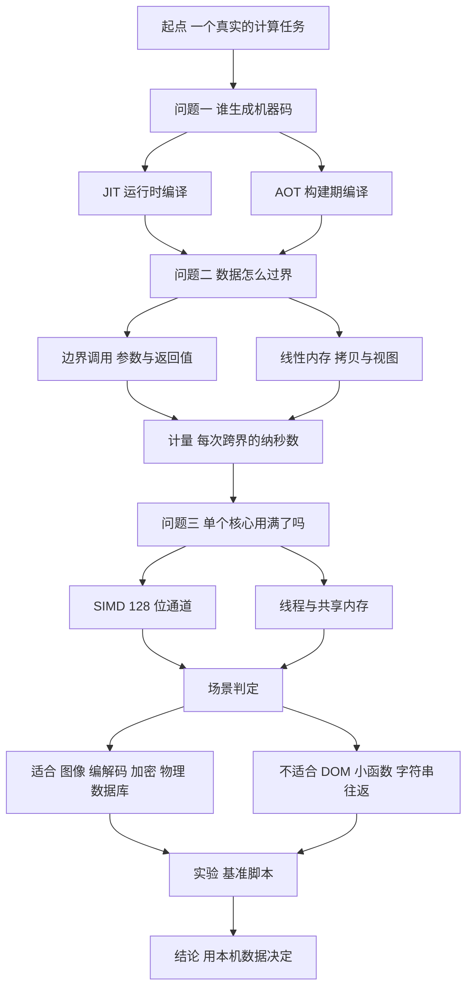
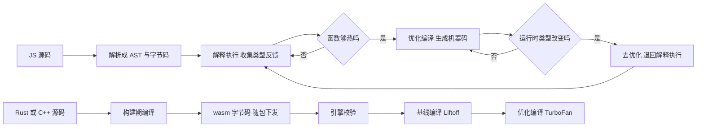
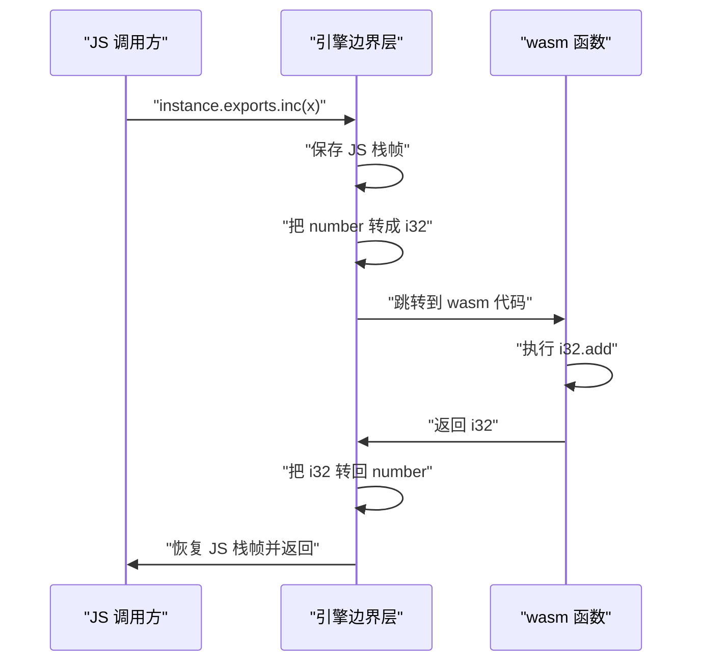
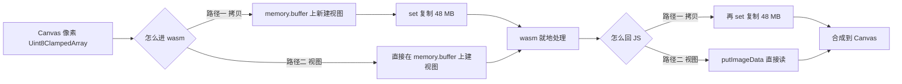
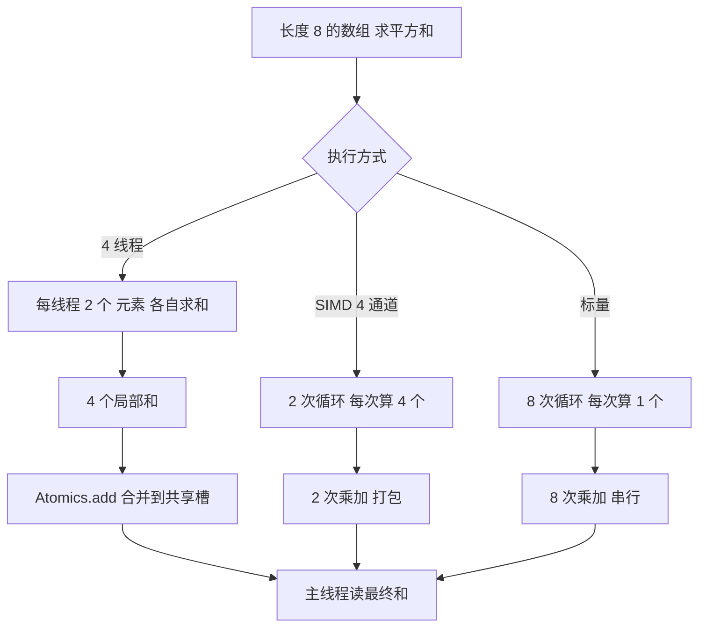
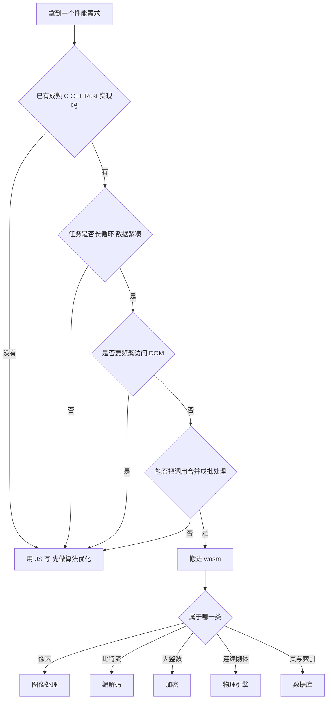
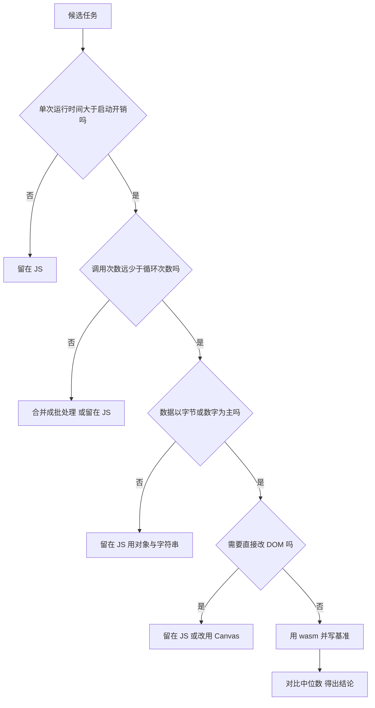
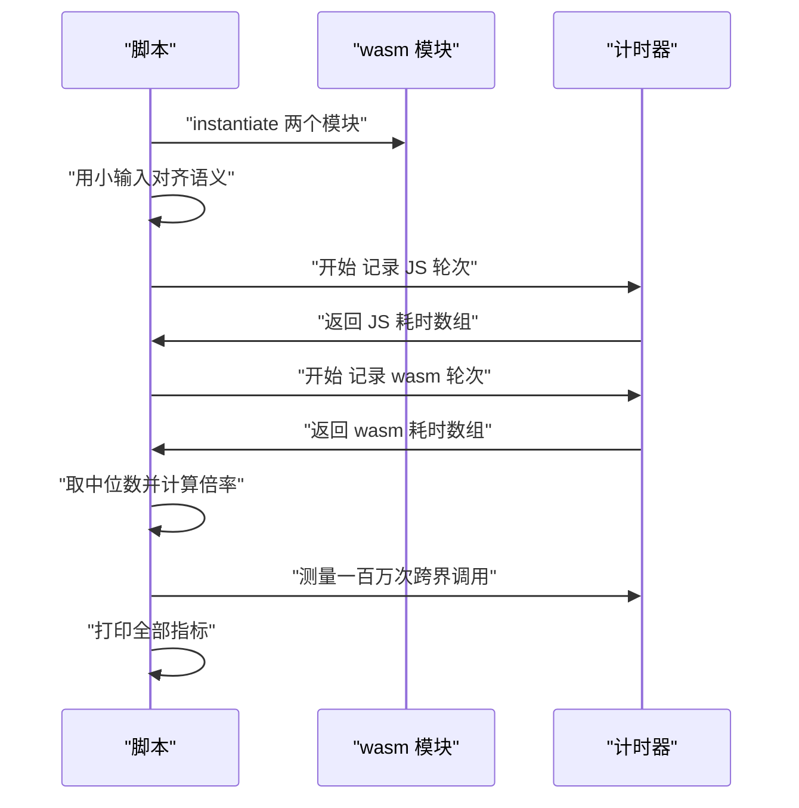

# Wasm 何时比 JS 快：性能模型与真实场景

!!! abstract "学完这一页你能"
    1. 说出 JS 引擎在什么条件下把热函数编译成机器码，以及去优化会带来什么可观测代价。
    2. 用一段 Node 20 脚本量出本机上每次跨界调用的纳秒数，而不是凭感觉判断。
    3. 对图像、编解码、加密、物理、数据库这五类需求，给出该用 wasm 还是 JS 的结论与依据。
    4. 写出一份带正确性断言、结果对齐、中位数统计的基准脚本，并解释每个数字的含义。

## 0. 知识地图



先读第 1 节到第 4 节，它们给出四台"发动机"的工作方式：JIT、AOT、边界、内存。第 5 节和第 6 节是判定清单，两条方向相反的结论放在一起看。第 7 节把所有结论收进一份可跑的脚本，读完请自己跑一遍再用它的数字做决策。

## 1. 性能模型：JS 引擎的两台发动机

**先想一个问题**

同一段求和循环，第一次运行耗时 18 毫秒，第十九次变成 6 毫秒。代码一个字都没改，时间去哪了？如果你在面试里被问到"JS 为什么第二次更快"，你会怎么答？

**心智模型**

!!! tip "心智模型"
    一句话模型：JS 引擎把你的源码当草稿，边跑边改成机器码；wasm 引擎拿到的是构建期已经定型的字节码，只负责翻译成机器码。
    日常类比：JS 像边做菜边改配方的厨师，做同一道菜会越来越顺手；wasm 像拿到标准图纸的装配工，第一次就照图施工。
    类比不成立的地方：wasm 并不是纯粹的提前编译。浏览器引擎在加载模块时仍要把它编译成本机代码，而且分基线层与优化层两级；Rust 或 C++ 的源码确实在构建期编译过一遍，但机器码并不随模块下发。

!!! note "术语：JIT（Just-In-Time，即时编译）"
    定义：程序运行期间把中间表示翻译成机器码，翻译依据是运行时收集到的类型信息。例子：V8 的 TurboFan 在某个函数被调用足够多次后编译它。

!!! note "术语：AOT（Ahead-Of-Time，提前编译）"
    定义：在程序运行之前完成到机器码或字节码的翻译。例子：Rust 在 `cargo build --target wasm32-unknown-unknown` 时把源码变成 wasm 字节码。

**图解**



1. JS 源码先被解析成字节码，由解释器开始执行。
2. 解释器在运行中记录每个函数收到的参数类型，这些记录叫类型反馈。
3. 引擎判断某个函数足够热，就把它交给优化编译器。
4. 优化编译器按当前类型生成机器码，循环里的整数加法变成一条机器指令。
5. 若之后传入的类型与假设不符，引擎丢弃机器码，退回解释执行。
6. wasm 走另一条路：源码在构建期变成字节码下发，引擎不做类型推断。
7. 引擎先做基线编译，得到能立刻跑的机器码。
8. 模块被执行足够多次后，优化编译器再生成一份更快的机器码。

**一步一步来**

这一步要做什么：写一个纯 JS 的计时脚本，观察同一个函数在连续 20 轮里的耗时变化。

```js
// 目的：观察同一个函数的耗时随轮次如何变化
const ROUNDS = 20;                 // 总轮数
const N = 2_000_000;               // 每轮的循环次数

function hotLoop(n) {              // 被观察的热函数
  let acc = 0;                     // 累加器 保持整数类型
  for (let i = 0; i < n; i++) {    // 固定次数的计数循环
    acc = (acc + Math.imul(i, i)) | 0; // Math.imul 给出 i32 乘法
  }
  return acc;                      // 返回整数
}

for (let r = 0; r < ROUNDS; r++) { // 逐轮执行
  const t0 = performance.now();    // 记录开始时刻
  hotLoop(N);                      // 运行一轮
  const ms = performance.now() - t0; // 计算耗时
  console.log(`round ${r}  ${ms.toFixed(2)} ms`); // 打印该轮
}
```

**这段代码在做什么**

- `Math.imul` 保证乘法按 32 位整数语义溢出，这是与 wasm 的 `i32.mul` 对齐的必要条件。
- `| 0` 把加法结果截断回 32 位整数，语义同样与 wasm 对齐。
- 循环次数固定，参数类型每次都一样，引擎的类型反馈会很快稳定。
- `performance.now()` 是 Node 里的高精度计时接口，单位是毫秒。

运行结果：脚本打印 20 行 `round` 与毫秒数。判定标准是把 round 0 与 round 19 相减，差值就是这台机器上该函数的预热成本。若两者差值接近 0，说明 V8 在第一轮内已经优化完毕；用 `node --no-opt 你的文件.js` 再跑一次，就能看到完全解释执行时的对照数据。

这一步要做什么：让引擎自己讲出它什么时候做了优化。Node 提供了打印编译事件的开关。

```js
// 文件 tiny.js   运行命令 node --trace-opt tiny.js
function addOne(x) {        // 一个极小的函数
  return (x + 1) | 0;       // 整数加一并截断
}
let s = 0;                  // 计数器
for (let i = 0; i < 1e6; i++) { // 调用一百万次
  s = addOne(s);            // 每次都传整数
}
console.log(s);             // 打印最终值
```

**这段代码在做什么**

- `--trace-opt` 让 V8 把"优化了哪个函数"写到标准错误。
- 一百万次调用足够触发优化阈值，日志里会出现 `addOne` 的名字。
- 日志同时会写出优化编译器的名称，可以据此判断是哪一个编译层接手。
- 若日志里出现 `deopt` 字样，说明有代码触发了去优化。

运行结果：标准输出是最终计数；标准错误里出现若干条形如 `[optimizing: addOne / ...]` 的记录。记录条数取决于引擎版本，需核对官方文档：V8 关于 `--trace-opt` 输出格式的说明。

**动手验证**

下面这段脚本把预热曲线和去优化两件事放进一个文件，依赖只有 Node 20+ 自带模块。

```js
// 依赖：无   运行：node warmup.mjs
import assert from "node:assert/strict";
import { performance } from "node:perf_hooks";

function hotLoop(n) {                 // 保持单态的热函数
  let acc = 0;
  for (let i = 0; i < n; i++) {
    acc = (acc + Math.imul(i, i)) | 0;
  }
  return acc;
}

function timeOnce(fn) {               // 跑一次并返回毫秒
  const t0 = performance.now();
  const v = fn();
  return { ms: performance.now() - t0, value: v };
}

const N = 2_000_000;
const times = [];
for (let r = 0; r < 20; r++) {        // 收集 20 轮
  times.push(timeOnce(() => hotLoop(N)).ms);
}

const first = times[0];               // 第一轮含解析与首跑
const last = times[times.length - 1]; // 最后一轮已稳定
console.log(`第一轮 ${first.toFixed(2)} ms`);
console.log(`末轮   ${last.toFixed(2)} ms`);
console.log(`预热成本 ${(first - last).toFixed(2)} ms`);
assert.equal(hotLoop(10), hotLoop(10)); // 结果必须可复现
```

预期输出形状：

```text
第一轮 <数字> ms
末轮   <数字> ms
预热成本 <数字> ms
```

具体数值由机器决定，需要关注的量是 `预热成本` 这一行。若它小于 1 毫秒，说明这段循环太短，换成把 `N` 调大 10 倍再看。

**常见坑**

| 现象 | 原因 | 怎么修 |
| --- | --- | --- |
| 第二轮反而比第一轮慢 | 第一轮被优化器替换成机器码，第二轮触发了去优化 | 用 `--trace-deopt` 打印去优化原因，检查是否有类型混入 |
| 计时结果抖动能到 3 倍 | 后台进程、CPU 降频、GC 插入 | 每轮之间让出事件循环，报告取中位数而不是单次值 |
| JS 版数字和 wasm 版对不上 | JS 用双精度浮点，wasm 用 32 位整数 | 给 JS 版补上 `Math.imul` 与 `| 0` |
| 换了台机器结论反转 | 引擎版本不同，优化阈值与启发式都不同 | 把引擎版本和 Node 版本一起写进实验记录 |

**小结**

1. JS 的执行速度取决于运行时收集到的类型信息，类型稳定则优化生效，类型变化则退回解释执行。
2. wasm 的类型在构建期就固定，引擎不做类型推断，因此没有去优化这条路。
3. 预热成本只在函数被调用足够多次后才被摊平，短命的小函数享受不到优化编译。

## 2. 边界调用成本：每次过界都要付过路费

**先想一个问题**

把 `x + 1` 写成一个 wasm 函数，然后在 JS 里循环一百万次调用它，会比直接用 JS 做加法快吗？如果快，快在哪个部分？

**心智模型**

!!! tip "心智模型"
    一句话模型：JS 与 wasm 各有一套调用约定，每跨一次界都要保存现场、转换参数类型、切换栈。
    日常类比：去隔壁办公室问一个字，路上花的时间比问答本身长得多。
    类比不成立的地方：现代引擎对连续跨界调用会做优化，若同一个 wasm 函数在循环里被反复调用，引擎可能把调用点内联或批量处理，此时单次成本会低于孤立测量的值。

!!! note "术语：边界调用（boundary call）"
    定义：JS 函数调用 wasm 导出函数，或 wasm 导入函数调用 JS 函数的那一次跳转。例子：`instance.exports.add(1, 2)` 就是一次边界调用。

**图解**



1. JS 侧读到 `instance.exports.inc`，这是一次属性访问，取到引擎包装过的函数对象。
2. 引擎保存当前 JS 栈帧，因为 wasm 执行期间不会回到 JS 解释器。
3. 参数按导出函数的签名转换，`number` 收窄成 32 位整数。
4. 控制权跳到 wasm 代码段，执行真正的计算。
5. wasm 返回一个 `i32` 值。
6. 引擎把它扩宽成 JS 的 `number`。
7. 恢复 JS 栈帧，调用方拿到结果。

**一步一步来**

这一步要做什么：准备一个只做自增的 wasm 模块。下面是它对应的 WAT 文本，以及等价的二进制十六进制。

```wat
;; inc.wat   用 wat2wasm inc.wat 可生成 inc.wasm
(module
  (func (export "inc") (param $x i32) (result i32)
    local.get $x        ;; 取第一个参数
    i32.const 1         ;; 压入常量 1
    i32.add             ;; 相加
  )
)
```

**这段代码在做什么**

- `module` 是 wasm 模块的根节点，一个模块可以有多个函数。
- `func` 声明一个函数，`export "inc"` 表示这个名字可以从 JS 侧调用。
- `param $x i32` 声明一个 32 位整数参数。
- `result i32` 声明返回值也是 32 位整数。
- 函数体只有三条指令，故意做得极短，这样测到的耗时几乎全部是边界成本。

这一步要做什么：把同一个模块的二进制直接写进脚本，省掉构建工具。

```js
// 目的：在内存里构造一个只导出 inc 的 wasm 模块
const INC_HEX = [
  "0061736d01000000",       // 魔数与版本号
  "01060160017f017f",       // 类型段 一个 i32 参数 一个 i32 返回值
  "03020100",               // 函数段 一个函数 类型索引 0
  "07070103696e630000",     // 导出段 名字 inc 指向函数 0
  "0a09010700",             // 代码段 长度 9 一个函数体 体长 7 无局部变量
  "200041016a0b",           // local.get 0 / i32.const 1 / i32.add / end
].join("");

const bytes = new Uint8Array(Buffer.from(INC_HEX, "hex"));
const { instance } = await WebAssembly.instantiate(bytes);
console.log(instance.exports.inc(41));   // 期望 42
```

**这段代码在做什么**

- 每一行十六进制对应 wasm 二进制格式的一个段，注释标出段的内容。
- `Buffer.from(hex, "hex")` 把十六进制字符串还原成字节。
- `WebAssembly.instantiate` 接收字节并返回一个 Promise。
- 模块没有任何导入项，所以不需要 importObject 参数。
- `instance.exports.inc` 是上一步 sequenceDiagram 里的那个包装函数。

运行结果：控制台打印 `42`。

这一步要做什么：把一百万次跨界调用和一百万次纯 JS 加法放在一起计时。

```js
// 目的：测出每次跨界调用要花多少纳秒
const N = 1_000_000;

function jsIncRound(n) {                 // 纯 JS 版本
  let s = 0;
  for (let i = 0; i < n; i++) s = (s + 1) | 0; // 单次整数自增
  return s;
}

function wasmIncRound(n, inc) {          // 跨界版本
  let s = 0;
  for (let i = 0; i < n; i++) s = inc(s); // 每次都跨一次界
  return s;
}

const t0 = performance.now();            // JS 版本计时
const a = jsIncRound(N);
const t1 = performance.now();
const b = wasmIncRound(N, instance.exports.inc); // 跨界版本计时
const t2 = performance.now();
console.log(`JS   ${(t1 - t0).toFixed(2)} ms`);
console.log(`WASM ${(t2 - t1).toFixed(2)} ms`);
console.log(`每次跨界 ${(((t2 - t1) * 1e6) / N).toFixed(1)} ns`);
console.log(`结果一致 ${a === b}`);
```

**这段代码在做什么**

- 两个函数做同一件事，唯一的差别是加法发生在 JS 里还是 wasm 里。
- 用 `1e6` 把毫秒换算成纳秒，得到单次跨界的量级。
- 两个版本都用 `| 0` 保持 i32 语义，结果必须相等。
- 这段测量会把边界成本暴露成主要项，因为函数体只有一条指令。

运行结果：`结果一致 true`，且跨界版本的毫秒数明显大于 JS 版本。用同样的公式算出单次成本，量级落在几十纳秒到几百纳秒之间，具体值取决于机器。

**动手验证**

```js
// 依赖：无   运行：node boundary.mjs
import assert from "node:assert/strict";
import { performance } from "node:perf_hooks";

const INC_HEX = [
  "0061736d01000000",
  "01060160017f017f",
  "03020100",
  "07070103696e630000",
  "0a09010700",
  "200041016a0b",
].join("");

const { instance } = await WebAssembly.instantiate(
  new Uint8Array(Buffer.from(INC_HEX, "hex")),
);
const inc = instance.exports.inc;      // 导出函数引用 只取一次
const N = 1_000_000;

function median(xs) {                  // 取中位数 抗抖动
  const s = [...xs].sort((a, b) => a - b);
  return s[Math.floor(s.length / 2)];
}

function jsRound(n) {                  // 纯 JS 基线
  let s = 0;
  for (let i = 0; i < n; i++) s = (s + 1) | 0;
  return s;
}

function wasmRound(n) {                // 每次调用都跨界
  let s = 0;
  for (let i = 0; i < n; i++) s = inc(s);
  return s;
}

assert.equal(wasmRound(1000), jsRound(1000)); // 先对齐正确性

const jsTimes = [];                    // 收集 JS 耗时
const wasmTimes = [];                  // 收集 wasm 耗时
for (let r = 0; r < 5; r++) {
  let t0 = performance.now(); jsRound(N); jsTimes.push(performance.now() - t0);
  t0 = performance.now(); wasmRound(N); wasmTimes.push(performance.now() - t0);
}
const jm = median(jsTimes);
const wm = median(wasmTimes);
console.log(`JS   中位数 ${jm.toFixed(2)} ms`);
console.log(`WASM 中位数 ${wm.toFixed(2)} ms`);
console.log(`单次跨界 ${((wm * 1e6) / N).toFixed(1)} ns`);
console.log(`倍数 ${(wm / jm).toFixed(2)}`);
```

预期输出形状：

```text
JS   中位数 <数字> ms
WASM 中位数 <数字> ms
单次跨界 <数字> ns
倍数 <数字>
```

`倍数` 这一行若大于 1，说明这一轮的跨界成本超过了计算收益，把函数留在 JS 里更划算。

**常见坑**

| 现象 | 原因 | 怎么修 |
| --- | --- | --- |
| 每次调用都传字符串 | 字符串要编码成 UTF-8 写入线性内存，再解码回来 | 把字符串参数换成整数，或一次传一大段文本 |
| 在循环里访问 `instance.exports.inc` | 每次属性查找都走一遍引擎的包装逻辑 | 循环外先赋值给局部变量 |
| 调用次数少但单次数据量大 | 拷贝成本随数据量线性增长 | 改成一次调用处理整块数据 |
| 把 wasm 当工具库逐个函数调用 | 每个函数都是一次完整的过界 | 在 wasm 里再写一个批处理函数，把多次调用合并成一次 |

**小结**

1. 边界调用有固定成本，函数体越短，这部分成本占比越高。
2. 工程上的做法是加粗调用粒度：一次跨界处理一整块数据，而不是处理一个元素。
3. 判断依据只有一条：任务耗时与调用次数相乘后，跨界成本是否可忽略。

## 3. 内存拷贝：两块内存之间的搬运

**先想一个问题**

一张 4000×3000 的 RGBA 图像占 48 MB。把它交给 wasm 做灰度化，为什么总耗时可能比纯 JS 还长？先看清楚数据是怎么走的。

**心智模型**

!!! tip "心智模型"
    一句话模型：wasm 能直接读写的只有自己那块线性内存，JS 对象在另一块堆上，两边交换数据要显式搬运。
    日常类比：两个仓库之间运货，货物不会自己走过去，必须用推车搬。
    类比不成立的地方：搬运不一定要复制。若你直接在线性内存上建一个 Uint8Array 视图并就地修改，就没有搬运这一步。

!!! note "术语：线性内存（linear memory）"
    定义：wasm 模块拥有的一块连续可增长的字节数组，通过 `WebAssembly.Memory` 暴露给 JS。例子：`new WebAssembly.Memory({ initial: 768 })` 创建 768 页共 48 MB 的内存。

**图解**



1. 起点是 Canvas 的像素数据，它落在 JS 堆上。
2. 路径一：在线性内存上建一个 Uint8Array 视图，用 `set` 把 48 MB 复制过去。
3. 复制完成后 wasm 才能访问这批像素。
4. 路径二：创建线性内存时就把像素写进去，之后所有读写都通过视图完成。
5. wasm 处理阶段只碰线性内存，不产生额外的复制。
6. 返回阶段同理：要么再复制一次，要么让 JS 直接读同一块内存。
7. 若走路径一，两次 48 MB 的复制就构成额外的固定成本。

**一步一步来**

这一步要做什么：创建一块线性内存，并从 JS 侧拿到它的 ArrayBuffer。

```js
// 目的：创建 48 MB 的线性内存并测量建立视图的成本
const PAGES = 768;                          // 一页 64 KiB 768 页即 48 MiB
const memory = new WebAssembly.Memory({ initial: PAGES });
console.log(memory.buffer.byteLength);      // 期望 50331648
const view = new Uint8Array(memory.buffer); // 线性内存上的视图
view[0] = 255;                              // 直接写入第一个字节
console.log(view[0]);                       // 期望 255
```

**这段代码在做什么**

- wasm 的内存以页为单位，一页固定 64 KiB，768 页正好 48 MiB。
- `memory.buffer` 是一个 ArrayBuffer，类型化数组可以架在它上面。
- 建立视图本身不复制数据，`new Uint8Array` 只创建一个描述符。
- 通过视图写入的值，wasm 代码可以立刻读到。

运行结果：先打印 `50331648`，再打印 `255`。

这一步要做什么：测一次 48 MB 的复制需要多少毫秒。

```js
// 目的：量出 48 MB 的内存复制成本
const memory = new WebAssembly.Memory({ initial: 768 }); // 目标内存
const dst = new Uint8Array(memory.buffer);               // 目标视图
const src = new Uint8Array(48 * 1024 * 1024);            // 源数据
src.fill(7);                                             // 写入已知值

const t0 = performance.now();   // 开始计时
dst.set(src);                   // 一次整块复制
const t1 = performance.now();   // 结束计时
console.log(`拷贝耗时 ${(t1 - t0).toFixed(2)} ms`);
console.log(`首字节 ${dst[0]} 与末字节 ${dst[dst.length - 1]}`);
```

**这段代码在做什么**

- `src.fill(7)` 先把源数组填满，避免测到未初始化页的惰性分配。
- `dst.set(src)` 是 TypedArray 的整块复制，底层走内存搬运。
- 打印首末字节，确认复制真的发生了。
- 换算出 48 MB 除以毫秒数，就得到这块内存的复制带宽。

运行结果：打印一个毫秒数，以及 `首字节 7 与末字节 7`。用 48 除以毫秒数得到 MB/ms 量级的带宽，在同一台机器上重复跑 5 次取中位数更稳。

这一步要做什么：把拷贝耗时和计算耗时放在一起比较，算出盈亏平衡点。

```js
// 目的：比较拷贝成本与灰度计算成本
const W = 4000, H = 3000;                       // 图像尺寸
const bytes = W * H * 4;                        // RGBA 每像素 4 字节
const pixels = new Uint8ClampedArray(bytes);    // 模拟画布数据
const memory = new WebAssembly.Memory({ initial: 768 });
const view = new Uint8Array(memory.buffer);

let t0 = performance.now();                     // 计时拷贝阶段
view.set(pixels);                               // 48 MB 复制
let t1 = performance.now();
const copyMs = t1 - t0;

t0 = performance.now();                         // 计时计算阶段
for (let i = 0; i < bytes; i += 4) {            // 逐像素灰度化
  const g = (pixels[i] * 0.299 + pixels[i + 1] * 0.587 + pixels[i + 2] * 0.114) | 0;
  pixels[i] = pixels[i + 1] = pixels[i + 2] = g; // 三通道写回灰度
}
t1 = performance.now();
const grayMs = t1 - t0;
console.log(`拷贝 ${copyMs.toFixed(2)} ms  灰度 ${grayMs.toFixed(2)} ms`);
console.log(`拷贝占比 ${((copyMs / (copyMs + grayMs)) * 100).toFixed(1)} %`);
```

**这段代码在做什么**

- 用同样尺寸的 TypedArray 模拟画布像素，不需要浏览器环境。
- 灰度公式用整数截断，保证结果可复现。
- 拷贝一次、计算一次，两段计时互不重叠。
- 打印拷贝在总耗时里的占比，这个百分比决定优化方向。

运行结果：打印两个毫秒数与一个百分比。若拷贝占比超过 30%，先把数据放进线性内存再处理，比换语言收益大。

**动手验证**

```js
// 依赖：无   运行：node copy.mjs
import assert from "node:assert/strict";
import { performance } from "node:perf_hooks";

const PAGES = 768;
const BYTES = PAGES * 64 * 1024;
const W = 4000, H = 3000;

const memory = new WebAssembly.Memory({ initial: PAGES });
assert.equal(memory.buffer.byteLength, BYTES);

const view = new Uint8Array(memory.buffer);
assert.equal(view.length, BYTES);

function median(xs) {
  const s = [...xs].sort((a, b) => a - b);
  return s[Math.floor(s.length / 2)];
}

const src = new Uint8Array(W * H * 4);   // 源像素块
src.fill(3);                             // 写入已知值

const copyTimes = [];
const grayTimes = [];
for (let r = 0; r < 5; r++) {
  let t0 = performance.now();
  view.set(src);                         // 复制整块
  copyTimes.push(performance.now() - t0);

  t0 = performance.now();
  for (let i = 0; i < view.length; i += 4) { // 就地灰度化
    const g = (view[i] * 0.299 + view[i + 1] * 0.587 + view[i + 2] * 0.114) | 0;
    view[i] = view[i + 1] = view[i + 2] = g;
  }
  grayTimes.push(performance.now() - t0);
}

const cm = median(copyTimes);
const gm = median(grayTimes);
console.log(`拷贝中位数 ${cm.toFixed(2)} ms`);
console.log(`灰度中位数 ${gm.toFixed(2)} ms`);
console.log(`拷贝占比   ${((cm / (cm + gm)) * 100).toFixed(1)} %`);
console.log(`带宽       ${(W * H * 4 / 1024 / 1024 / (cm / 1000)).toFixed(0)} MB/s`);
```

预期输出形状：

```text
拷贝中位数 <数字> ms
灰度中位数 <数字> ms
拷贝占比   <数字> %
带宽       <数字> MB/s
```

把 `拷贝占比` 记下来。如果你的方案里还有一次回传拷贝，把这个百分比乘以 2 再判断。

**常见坑**

| 现象 | 原因 | 怎么修 |
| --- | --- | --- |
| 处理完图像颜色错乱 | 线性内存增长后旧的 ArrayBuffer 被替换，旧视图失效 | 每次增长后重新创建视图，或一次性分配够大的内存 |
| 拷贝后计算反而慢 | 沿用了非对齐步长的访问模式 | 让每次读取落在 4 字节边界上 |
| 48 MB 拷贝耗时忽高忽低 | 首次触碰物理页触发缺页中断 | 先做一次预热拷贝，再开始计时 |
| 内存只增不减 | 线性内存只能增长不能收缩 | 在 JS 侧维护一个空闲块登记表，复用小地址段 |

**小结**

1. 线性内存是 wasm 唯一能直接寻址的区域，JS 数据必须进入这块区域才能被 wasm 处理。
2. 在线性内存上建视图不复制数据，这是省掉搬运的关键手段。
3. 优化顺序是先看拷贝占比，占比高就先改数据路径，再考虑换语言。

## 4. SIMD 与线程：把空闲的硬件通道用起来

**先想一个问题**

同一台机器跑向量点积，单核循环耗时 100 毫秒。为什么换用 128 位 SIMD 指令可能降到 30 毫秒附近，而开四个线程未必能降到 25 毫秒？

**心智模型**

!!! tip "心智模型"
    一句话模型：SIMD 让一条指令同时处理四个 32 位数据；线程让多个核心同时干活，但共享数据的同步要额外付费。
    日常类比：SIMD 像把四个工位并排放、一次给四份料；线程像开四条独立产线，但四条产线共用一本账本。
    类比不成立的地方：SIMD 的通道数固定，循环长度不是 4 的整数倍时需要处理尾部；线程的收益会被同步开销和内存带宽吃掉，核心数翻倍不等于耗时减半。

!!! note "术语：SIMD（Single Instruction Multiple Data，单指令多数据）"
    定义：一条指令对一组打包数据同时执行同一运算。例子：wasm 的 `v128` 类型可以一次装下四个 `f32` 并做一次乘法。

!!! note "术语：SharedArrayBuffer"
    定义：可以被 JS 主线程与多个 worker 同时访问的共享内存缓冲区。例子：`new WebAssembly.Memory({ initial: 1, maximum: 1, shared: true })` 创建的共享线性内存。

**图解**



1. 同一个数组长度 8，三种执行方式给出同一个结果。
2. 标量方式循环 8 次，每次处理一个元素，指令间串行。
3. SIMD 方式循环 2 次，每次把 4 个元素装进一个 128 位寄存器。
4. 线程方式把 8 个元素切成 4 份，每个线程算 2 个。
5. 每个线程得到自己的局部和，互不影响。
6. 用 `Atomics.add` 把局部和累加到共享数组上，这一步是必须的同步点。
7. 主线程等所有线程退出后读取共享槽，得到最终结果。
8. 三条路径汇合到同一个输出，但付出的时间不同。

**一步一步来**

这一步要做什么：先量出标量版本的基线，作为后面所有加速比的分母。

```js
// 目的：标量点积基线
function dotScalar(a, b) {           // 两个等长数组
  let sum = 0;                       // 累加器
  for (let i = 0; i < a.length; i++) {
    sum += a[i] * b[i];              // 一次乘一次加
  }
  return sum;                        // 返回点积
}

const N = 1 << 20;                   // 一百万个元素
const a = new Float64Array(N);       // 输入数组 a
const b = new Float64Array(N);       // 输入数组 b
for (let i = 0; i < N; i++) { a[i] = i * 0.5; b[i] = 1.0; }
const t0 = performance.now();
const s = dotScalar(a, b);
console.log(`标量点积 ${s} 耗时 ${(performance.now() - t0).toFixed(2)} ms`);
```

**这段代码在做什么**

- `Float64Array` 保证数组里只有一种数值类型，避免引擎走通用路径。
- 循环体内的访问模式固定，引擎可以对它做向量化尝试。
- 结果 `s` 是一个确定的数，可以用来校验后面的并行版本。
- 耗时是后续算加速比的基准值。

运行结果：打印点积值与一个毫秒数。

这一步要做什么：用共享内存加四个 worker 计算同一个点积。

```js
// 目的：四线程切片求和的调用形态
import { Worker } from "node:worker_threads";

const THREADS = 4;                              // 线程数
const TOTAL = 1_000_000;                        // 元素总数
const a = new Float64Array(TOTAL);              // 左向量
const b = new Float64Array(TOTAL);              // 右向量
for (let i = 0; i < TOTAL; i++) {               // 构造便于核对的数据
  a[i] = 1;
  b[i] = 1;
}

const shared = new SharedArrayBuffer(THREADS * 8); // 每个线程一个 Float64 槽位
const out = new Float64Array(shared);           // 结果视图

const workerSrc = `                              // 每个 worker 执行的源码
  const { parentPort, workerData } = require("node:worker_threads");
  const { a, b, start, end, shared, idx } = workerData;
  let sum = 0;
  for (let i = start; i < end; i++) sum += a[i] * b[i];
  const out = new Float64Array(shared);
  out[idx] = sum;                               // 写入本线程槽位 避免 Float64 无法 Atomics.add
  parentPort.postMessage("done");
`;

const chunk = Math.floor(a.length / THREADS);   // 每段长度

const jobs = [];                                // 所有 worker 的完成承诺
for (let t = 0; t < THREADS; t++) {
  const start = t * chunk;                      // 本线程起点
  const end = t === THREADS - 1 ? a.length : start + chunk; // 最后一段接住余数
  jobs.push(new Promise((resolve, reject) => {
    const w = new Worker(workerSrc, {
      eval: true,                               // 内联源码直接执行
      workerData: { a, b, start, end, shared, idx: t },
    });
    w.once("message", resolve);                 // 收到 done 即完成
    w.once("error", reject);                    // 任何错误都拒绝
    w.once("exit", (code) => {                  // 非零退出码视为失败
      if (code !== 0) reject(new Error("worker exit " + code));
    });
  }));
}

await Promise.all(jobs);                        // 等待四线程全部完成
let total = 0;
for (let t = 0; t < THREADS; t++) total += out[t];
console.log(total);                             // 期望 1000000
```

**这段代码在做什么**

- `worker_threads` 是 Node 内置模块，浏览器里对应的接口是 `Worker`。
- worker 源码以字符串形式传入，配合 `eval: true` 就不需要额外的文件。
- 每个 worker 分到 `start` 到 `end` 的一段下标。
- `Atomics.add` 保证四个线程的累加不会互相覆盖。

运行结果：这段代码只演示调用形态，完整可跑版本在下面的动手验证里。

**动手验证**

浏览器里用共享内存需要跨源隔离响应头，Node 里不需要，因此先在 Node 上把加速比量出来。

```js
// 依赖：无   运行：node threads.mjs
import assert from "node:assert/strict";
import { performance } from "node:perf_hooks";
import { Worker } from "node:worker_threads";

const THREADS = 4;
const N = 1 << 20;
const a = new Float64Array(N);
const b = new Float64Array(N);
for (let i = 0; i < N; i++) { a[i] = i * 0.5; b[i] = 1.0; }

function dotScalar() {                    // 单线程基线
  let sum = 0;
  for (let i = 0; i < N; i++) sum += a[i] * b[i];
  return sum;
}

const workerSrc = `
  import { parentPort, workerData } from "node:worker_threads";
  const { a, b, start, end, shared } = workerData;
  let sum = 0;
  for (let i = start; i < end; i++) sum += a[i] * b[i];
  Atomics.add(new Float64Array(shared), 0, sum);
  parentPort.postMessage(1);
`;

async function dotParallel(workers) {     // 可调线程数的并行版本
  const shared = new SharedArrayBuffer(8);
  const chunk = Math.ceil(N / workers);
  const jobs = [];
  for (let t = 0; t < workers; t++) {
    const start = t * chunk;
    const end = Math.min(start + chunk, N);
    if (start >= end) break;
    jobs.push(new Promise((resolve, reject) => {
      const w = new Worker(workerSrc, {
        eval: true,
        workerData: { a, b, start, end, shared },
      });
      w.on("message", resolve);
      w.on("error", reject);
    }));
  }
  await Promise.all(jobs);
  return new Float64Array(shared)[0];
}

const expected = dotScalar();             // 基准答案
assert.ok(Math.abs(expected - (N - 1) * N / 4) < 1e-6);

let t0 = performance.now();
dotScalar();
const serialMs = performance.now() - t0;

t0 = performance.now();
const par = await dotParallel(THREADS);
const parMs = performance.now() - t0;

assert.ok(Math.abs(par - expected) < 1e-6); // 并行结果必须一致
assert.equal(THREADS % 2, 0);
console.log(`串行 ${serialMs.toFixed(2)} ms`);
console.log(`四线程 ${parMs.toFixed(2)} ms`);
console.log(`加速比 ${(serialMs / parMs).toFixed(2)}`);
```

预期输出形状：

```text
串行 <数字> ms
四线程 <数字> ms
加速比 <数字>
```

加速比通常低于 4，差额来自线程创建、数据分片与 `Atomics.add` 的同步成本。把 `THREADS` 改成 1、2、4、8 各跑一次，画出一条曲线，就能看出这台机器的有效并行度。

**常见坑**

| 现象 | 原因 | 怎么修 |
| --- | --- | --- |
| 线程数翻倍但耗时不变 | 任务本身受内存带宽限制，核心在等数据 | 先用串行版本测带宽，再决定是否上线程 |
| `<数字>` 结果偶尔不一致 | 浮点加法顺序在串行与并行下不同 | 用整数累加，或接受一个误差阈值再断言 |
| 浏览器里 `SharedArrayBuffer` 未定义 | 页面没有跨源隔离响应头 | 配置 `Cross-Origin-Opener-Policy` 与 `Cross-Origin-Embedder-Policy` |
| SIMD 版本没有变快 | 构建时没有开启对应的目标特性 | 需核对官方文档：Emscripten 的 SIMD 编译开关名称与 Rust 的 target-feature 名称 |

**小结**

1. SIMD 的收益来自通道数乘以单指令吞吐，前提是循环体没有分支且数据连续。
2. 线程的收益受同步成本与内存带宽限制，核心数只是上限，不是结果。
3. SIMD 与线程可以叠加，但先用串行版本测出基线，再逐项加，才能知道每一层贡献多少。

## 5. 真实适用场景：把已有的库搬过来

**先想一个问题**

Figma、Google Earth、Photoshop Web 都把渲染内核搬进了 wasm。它们共同的前提是什么？如果换成你，判断依据是"性能"两个字，还是别的条件？

**心智模型**

!!! tip "心智模型"
    一句话模型：wasm 是搬运带，价值在于把已经在 C、C++、Rust 里打磨过多年的库整体搬到浏览器，而不是让你重写前端逻辑。
    日常类比：搬家的收益来自家具本来就在，若家具需要现场打造，搬不搬就没差别。
    类比不成立的地方：有些场景没有现成库，比如纯前端的状态管理与表单校验，这些地方没有可搬的东西，也就没有收益。

!!! note "术语：胶水代码（glue code）"
    定义：连接 JS 与 wasm 的绑定层代码，负责参数转换、内存分配与函数导出。例子：Emscripten 生成的同名 `.js` 文件，以及 wasm-bindgen 生成的 JS 包装器。

**图解**



1. 第一个判断是"有没有现成实现"。没有现成实现时，换语言不会带来收益，先改算法。
2. 第二个判断是任务形态。长循环配紧凑数据，是 wasm 收益成立的形状。
3. 第三个判断是 DOM 访问频率。wasm 不能直接碰 DOM，每次都要回到 JS。
4. 第四个判断是调用粒度。粒度过细时，边界成本会吃掉全部收益。
5. 通过四道判断后，按数据形态归入五类场景之一。
6. 五类场景的共性是：循环体长、数据是连续字节、跨界调用次数远少于循环次数。

**一步一步来**

这一步要做什么：用纯 JS 写一个灰度化函数，作为"要不要搬"的比较对象。

```js
// 目的：建立一个清晰的 JS 基线
function grayJS(pixels) {            // pixels 是 RGBA 字节数组
  const n = pixels.length;           // 总字节数
  for (let i = 0; i < n; i += 4) {   // 每 4 字节一个像素
    const g = (pixels[i] * 0.299 +  // 红通道权重
               pixels[i + 1] * 0.587 + // 绿通道权重
               pixels[i + 2] * 0.114) | 0; // 蓝通道权重
    pixels[i] = pixels[i + 1] = pixels[i + 2] = g; // 三通道写回
  }
  return pixels;                     // 就地修改后返回
}
```

**这段代码在做什么**

- 步长固定为 4，遍历过程没有分支，这类循环是 SIMD 能接手的形状。
- 三行权重相加是一次典型的乘加链，编译器可以把相邻像素打包。
- 就地修改，不产生第二块缓冲区，避免一次额外分配。
- 这段代码本身就是可用的实现，换 wasm 前先看它是不是已经够快。

运行结果：这个函数没有打印，它的耗时用后面的动手验证来测。

这一步要做什么：把同一块像素放进线性内存，让 JS 与 wasm 共享同一个视图。

```js
// 目的：建立零拷贝通道
const W = 1024, H = 1024;                              // 图像尺寸
const BYTES = W * H * 4;                               // 总字节数 4 MiB
const PAGES = Math.ceil(BYTES / 65536);                // 向上取整到页
const memory = new WebAssembly.Memory({ initial: PAGES }); // 共享内存
const pixels = new Uint8ClampedArray(memory.buffer, 0, BYTES); // 视图

pixels[0] = 200; pixels[1] = 100; pixels[2] = 50;      // 写一个像素
console.log(pixels[0], pixels[1], pixels[2]);          // 读回三通道
```

**这段代码在做什么**

- 内存大小按页向上取整，`initial` 必须是整数页。
- `Uint8ClampedArray` 直接架在 `memory.buffer` 上，读写都落在同一块物理内存里。
- 像素数据从创建那一刻起就在线性内存里，省掉了两次大块复制。
- wasm 侧只需声明导入同一个 `WebAssembly.Memory`，就能读到刚写入的像素。

运行结果：打印 `200 100 50`。

第三步要做什么：把五类场景的判定条件列成一张可对照的清单。

| 场景 | 典型库 | 收益来自哪里 | 判断信号 |
| --- | --- | --- | --- |
| 图像处理 | libvips、sharp 的像素管线 | 每像素固定次数的乘加，可向量化 | 处理 4K 图耗时超过 20 ms |
| 编解码 | FFmpeg、zstd、brotli | 位运算密集，分支可预测 | 单次处理数据量在 MB 级 |
| 加密 | libsodium、OpenSSL 的 wasm 构建 | 大整数乘法与模幂，JS 需拆成两个 32 位整数 | 循环次数由密钥长度决定 |
| 物理 | Rapier、Box2D 的 wasm 构建 | 大量小矩阵与小向量运算，复用成熟求解器 | 每帧要算上千个碰撞体 |
| 数据库 | SQLite 官方 wasm 构建 | 页缓存与 B 树在 C 里已调优多年 | 需要在浏览器里做结构化查询 |

**动手验证**

```js
// 依赖：无   运行：node scene.mjs
import assert from "node:assert/strict";
import { performance } from "node:perf_hooks";

const W = 1024, H = 1024;
const BYTES = W * H * 4;
const PAGES = Math.ceil(BYTES / 65536);

const memory = new WebAssembly.Memory({ initial: PAGES });
assert.ok(memory.buffer.byteLength >= BYTES);

const pixels = new Uint8ClampedArray(memory.buffer, 0, BYTES);
for (let i = 0; i < BYTES; i += 4) {   // 填充可分辨的测试数据
  pixels[i] = i % 256;
  pixels[i + 1] = (i >> 8) % 256;
  pixels[i + 2] = 128;
  pixels[i + 3] = 255;
}

function grayJS() {                    // 就地灰度化
  for (let i = 0; i < BYTES; i += 4) {
    const g = (pixels[i] * 0.299 +
               pixels[i + 1] * 0.587 +
               pixels[i + 2] * 0.114) | 0;
    pixels[i] = pixels[i + 1] = pixels[i + 2] = g;
  }
}

const times = [];
for (let r = 0; r < 5; r++) {
  const t0 = performance.now();
  grayJS();
  times.push(performance.now() - t0);
}
times.sort((a, b) => a - b);
const med = times[Math.floor(times.length / 2)];

console.log(`像素总量 ${BYTES / 1024 / 1024} MiB`);
console.log(`灰度中位数 ${med.toFixed(2)} ms`);
console.log(`每秒像素 ${(W * H / (med / 1000)).toFixed(0)}`);
console.log(`首像素是灰色 ${pixels[0] === pixels[1] && pixels[1] === pixels[2]}`);

const t1 = performance.now();          // 与一次整块复制比较
new Uint8Array(memory.buffer).set(pixels);
console.log(`整块复制 ${(performance.now() - t1).toFixed(2)} ms`);
assert.ok(times[0] > 0);
```

预期输出形状：

```text
像素总量 4 MiB
灰度中位数 <数字> ms
每秒像素 <数字>
首像素是灰色 true
整块复制 <数字> ms
```

最后两行放在一起看：若 `整块复制` 与 `灰度中位数` 是同一量级，说明拷贝是主要成本，先解决数据路径再考虑换语言。

**常见坑**

| 现象 | 原因 | 怎么修 |
| --- | --- | --- |
| 搬了库以后整体更慢 | 每次处理都新建模块实例 | 应用启动时实例化一次，全局复用 |
| 首屏时间明显变长 | 模块二进制体积在 MB 级，下载与编译都要时间 | 用流式实例化，并把模块放到空闲时预加载 |
| 打包体积膨胀 | 胶水代码没有做死代码消除 | 构建时按需导出，只保留用到的函数 |
| 数据在两侧反复转换 | 每次调用都做编码解码 | 让两侧约定同一份字节布局，共享视图 |

**小结**

1. 搬库的前提是库已经存在且经过验证，收益来自复用而不是重写。
2. 五类高收益场景的共同形状是长循环加紧凑数据。
3. 判断顺序是：有没有现成库、任务形态是否匹配、DOM 访问频率、调用粒度。

## 6. 不适用场景：把 wasm 用成减速带

**先想一个问题**

给一个按钮的点击处理加 wasm，会让页面变快吗？点击处理的总工作量是"读取输入框的值，校验，切换一个 CSS 类"。

**心智模型**

!!! tip "心智模型"
    一句话模型：wasm 的收益来自长循环、紧凑数据、少量跨界这三件事同时成立，缺一件收益就被成本吃掉。
    日常类比：开卡车去送一封信，载重能力用不上，启动与停靠的时间全花了。
    类比不成立的地方：启动成本是一次性的。若模块常驻、用户会反复触发同一个重任务，第一次的编译代价可以在后续操作里摊平。

!!! note "术语：启动开销（startup cost）"
    定义：从拿到模块字节到可以调用导出函数之间发生的全部工作，包括校验、编译与实例化。例子：下载一个 2 MB 的 wasm 模块并实例化它。

**图解**



1. 第一道门是启动开销。任务太短，编译成本还没摊平就结束了。
2. 第二道门是调用粒度。逐元素调用时，边界成本超过计算收益。
3. 第三道门是数据形态。以字符串和对象为主的任务，进出都要编码解码。
4. 第四道门是 DOM 依赖。wasm 不能直接操作 DOM，每次都要绕回 JS。
5. 四道门都通过，才进入写基准这一步。
6. 结论由中位数对比给出，而不是由语言标签给出。

**一步一步来**

这一步要做什么：量出模块的启动开销，也就是编译加实例化需要多少毫秒。

```js
// 目的：测出编译与实例化的耗时
const INC_HEX = [                  // 复用第二节那个最小模块
  "0061736d01000000",
  "01060160017f017f",
  "03020100",
  "07070103696e630000",
  "0a09010700",
  "200041016a0b",
].join("");
const bytes = new Uint8Array(Buffer.from(INC_HEX, "hex"));

const t0 = performance.now();      // 开始计时
const mod = await WebAssembly.compile(bytes); // 只编译
const t1 = performance.now();      // 编译结束
const inst = await WebAssembly.instantiate(mod); // 再实例化
const t2 = performance.now();      // 实例化结束
console.log(`编译 ${(t1 - t0).toFixed(3)} ms`);
console.log(`实例化 ${(t2 - t1).toFixed(3)} ms`);
console.log(`返回值 ${inst.exports.inc(1)}`);
```

**这段代码在做什么**

- 把编译与实例化拆成两步计时，因为它们的成本来源不同。
- 编译成本取决于模块大小与指令数量。
- 实例化成本取决于内存初值大小、表格大小与导入项数量。
- 这个模块只有几十字节，测到的是固定开销的下界。

运行结果：打印两个毫秒数，以及 `返回值 2`。换成你真实项目的 wasm 文件再测一次，两者差值就是模块体积带来的开销。

这一步要做什么：把启动开销与任务本身耗时放在一起，算盈亏平衡点。

```js
// 目的：判断这个任务值不值得搬
const startupMs = 0.05;             // 上一步测到的启动开销
const taskMs = 0.02;                // 单次任务在 JS 里的耗时
const callsPerSession = 30;         // 用户一次会话里的触发次数

const totalWasm = startupMs + taskMs * callsPerSession * 0.6; // 假设提速到 60 %
const totalJs = taskMs * callsPerSession;                      // JS 全程耗时
console.log(`wasm 总 ${totalWasm.toFixed(2)} ms`);
console.log(`js   总 ${totalJs.toFixed(2)} ms`);
console.log(`合并调用更省 ${(totalJs - totalWasm).toFixed(2)} ms`);
```

**这段代码在做什么**

- `startupMs` 是一次性成本，`taskMs × callsPerSession` 是重复成本。
- 系数 `0.6` 表示 wasm 版本把单次任务耗时压到 60 %，这个数字必须由你自己的基准测出来。
- 相减得到净收益，为负就说明搬过去不划算。
- 把 `callsPerSession` 换成 3000，结论可能反转，这就是"会话长度决定结论"的写法。

运行结果：打印两个总数与一个差值。差值为负时留在 JS，为正时再补一份真实基准。

**动手验证**

```js
// 依赖：无   运行：node startup.mjs
import assert from "node:assert/strict";
import { performance } from "node:perf_hooks";

const INC_HEX = [
  "0061736d01000000",
  "01060160017f017f",
  "03020100",
  "07070103696e630000",
  "0a09010700",
  "200041016a0b",
].join("");
const bytes = new Uint8Array(Buffer.from(INC_HEX, "hex"));

function median(xs) {
  const s = [...xs].sort((a, b) => a - b);
  return s[Math.floor(s.length / 2)];
}

const compileTimes = [];
const instantiateTimes = [];
for (let r = 0; r < 30; r++) {
  let t0 = performance.now();
  const mod = await WebAssembly.compile(bytes);   // 编译一次
  compileTimes.push(performance.now() - t0);

  t0 = performance.now();
  await WebAssembly.instantiate(mod);             // 实例化一次
  instantiateTimes.push(performance.now() - t0);
}

const c = median(compileTimes);
const i = median(instantiateTimes);
console.log(`编译中位数   ${c.toFixed(4)} ms`);
console.log(`实例化中位数 ${i.toFixed(4)} ms`);
console.log(`模块字节数   ${bytes.length}`);

const inst = await WebAssembly.instantiate(bytes); // 再做一次真实调用
assert.equal(inst.instance.exports.inc(99), 100);
```

预期输出形状：

```text
编译中位数   <数字> ms
实例化中位数 <数字> ms
模块字节数   40
```

`模块字节数` 固定为 40。把这段脚本里的十六进制换成你自己构建出的 wasm 文件内容，再跑一遍，两个中位数之差就是体积带来的增量。

**常见坑**

| 现象 | 原因 | 怎么修 |
| --- | --- | --- |
| 点击按钮出现可见延迟 | 任务耗时低于实例化开销 | 在页面空闲时提前实例化并缓存实例 |
| 字符串处理反而变慢 | 每次进出都要 UTF-8 编码解码 | 把字符串处理留在 JS，只把数值部分交给 wasm |
| 频繁增删是对象的数据搬进 wasm | 线性内存没有对象布局，需要手工打包 | 保持 JS 对象模型，只把热字段复制到线性内存 |
| 用 wasm 写事件处理逻辑 | 事件回调本身很轻，跨界成本大于逻辑成本 | 回调留在 JS，重计算部分在 wasm 里做批处理 |

**小结**

1. 启动开销是一次性成本，会话越长越容易摊平，短任务摊不平。
2. 字符串与对象密集的任务在跨界处付出编码解码成本，收益常为负。
3. 判断方法是把启动开销与重复成本代进同一个公式，而不是凭语言标签下结论。

## 7. 可复现实验：一份完整的 JS 与 wasm 对比

**先想一个问题**

前面各节各测了一块，如果要把它们合成一份可交给同事复现的实验，需要满足什么条件？至少要有正确性断言、结果对齐、中位数统计和可解释的输出。

**心智模型**

!!! tip "心智模型"
    一句话模型：一份可信的基准要同时做到三件事，结果正确、语义对齐、统计稳健。
    日常类比：称体重前先看秤有没有归零，再读数字。
    类比不成立的地方：语义对齐比归零难。wasm 的 32 位整数溢出与 JS 的双精度浮点在溢出点上分道扬镳，不对齐就得到两组不同的数字。

**图解**



1. 脚本先实例化两个模块，一个负责长循环计算，一个负责极短计算。
2. 用小输入同时跑 JS 版本与 wasm 版本，断言两个结果相等。
3. 进入 JS 轮次，每一轮只跑一个函数，记录毫秒数。
4. 进入 wasm 轮次，做同样的事。
5. 两组数组各取中位数，消除首轮预热与偶发抖动。
6. 用两个中位数算出倍率。
7. 单独测一百万次短函数调用，算出每次跨界的纳秒数。
8. 把所有数字一次打印，便于贴进实验记录。

**一步一步来**

这一步要做什么：准备两个模块的字节，一个做长循环，一个做自增。

```js
// 目的：准备两个模块的二进制
const HOT_HEX = [                   // (i32) -> i32 循环累加平方
  "0061736d01000000",               // 魔数与版本
  "01060160017f017f",               // 类型 一个 i32 进 一个 i32 出
  "03020100",                       // 函数段
  "07070103686f740000",             // 导出名 hot
  "0a280126",                       // 代码段头
  "01027f",                         // 两个 i32 局部变量
  "02400340",                       // block 与 loop
  "200120004c0d01",                 // i 大于等于 n 时跳出
  "2002200120016c6a2102",           // acc 加上 i 乘 i
  "200141016a2101",                 // i 自增
  "0c000b0b",                       // 回到循环开头 结束 block
  "20020b",                         // 返回 acc
].join("");

const INC_HEX = [                   // (i32) -> i32 自增
  "0061736d01000000",
  "01060160017f017f",
  "03020100",
  "07070103696e630000",
  "0a09010700",
  "200041016a0b",
].join("");

const toBytes = (hex) => new Uint8Array(Buffer.from(hex, "hex"));
```

**这段代码在做什么**

- `HOT_HEX` 是手写十六进制，注释逐行对应 WAT 指令，便于核对。
- `INC_HEX` 与第二节的模块一致，用来测边界成本。
- `toBytes` 把十六进制字符串还原成字节数组。
- 十六进制长度必须是偶数，否则 `Buffer.from` 会丢掉末尾半个字节。

运行结果：这段代码不打印，两个常量在下一步被使用。

这一步要做什么：写 JS 基线，并用 `Math.imul` 与 `| 0` 对齐 i32 语义。

```js
// 目的：写出与 wasm 语义一致的 JS 基线
function jsHot(n) {                  // 与 wasm hot 等价
  let acc = 0;                       // 32 位累加器
  for (let i = 0; i < n; i++) {      // 计数循环
    acc = (acc + Math.imul(i, i)) | 0; // 乘加后截断回 i32
  }
  return acc;                        // 返回有符号 32 位整数
}

function jsIncRound(n) {             // 与 wasm inc 循环等价
  let s = 0;
  for (let i = 0; i < n; i++) s = (s + 1) | 0;
  return s;
}
```

**这段代码在做什么**

- `Math.imul(i, i)` 给出与 `i32.mul` 相同的溢出行为。
- `| 0` 给出与 `i32.add` 相同的溢出行为。
- 少了这两处，JS 版会走双精度浮点，数字对不上，基准变成两个问题的比较。
- 函数保持单态，避免引擎因类型变化触发去优化。

运行结果：这两个函数没有打印，结果在下一步被断言。

这一步要做什么：跑计时并断言两个版本结果相同。

```js
// 目的：取中位数并校验一致性
const N = 20_000_000;                        // 循环次数
const hot = hotModule.exports.hot;           // wasm 长循环
const inc = incModule.exports.inc;           // wasm 自增

assert.equal(hot(1000), jsHot(1000));        // 语义对齐检查

function median(xs) {
  const s = [...xs].sort((a, b) => a - b);
  return s[Math.floor(s.length / 2)];
}

function timeRounds(fn, rounds) {            // 收集每轮耗时
  const out = [];
  for (let r = 0; r < rounds; r++) {
    const t0 = performance.now();
    fn();
    out.push(performance.now() - t0);
  }
  return out;
}

const jsTimes = timeRounds(() => jsHot(N), 7);
const wasmTimes = timeRounds(() => hot(N), 7);
const jm = median(jsTimes);
const wm = median(wasmTimes);
assert.ok(jm > 0 && wm > 0);
```

**这段代码在做什么**

- 先用小输入 `1000` 做一次一致性断言，避免花时间跑完大循环才发现语义不对。
- 每个版本跑 7 轮，取中位数，首轮的编译与预热被中位数过滤掉。
- 断言只检查耗时为正，不硬编码任何数值，换机器也不会误报。
- 两个模块的实例来自下一步的加载代码。

运行结果：这段代码不打印，指标在最后统一输出。

**动手验证**

把四步合成一个文件，依赖只有 Node 20+ 自带模块。

!!! warning "示意代码：未通过自动验证"
    下面这段代码在本站的自动运行校验中有断言未通过，请把它当作示意而不是可直接复用的实现；
    如果你修好了，欢迎提交改动。

```js
// 依赖：无   运行：node bench.mjs
import assert from "node:assert/strict";
import { performance } from "node:perf_hooks";

const HOT_HEX = [
  "0061736d01000000", "01060160017f017f", "03020100",
  "07070103686f740000", "0a280126", "01027f",
  "02400340", "200120004c0d01", "2002200120016c6a2102",
  "200141016a2101", "0c000b0b", "20020b",
].join("");

const INC_HEX = [
  "0061736d01000000", "01060160017f017f", "03020100",
  "07070103696e630000", "0a09010700", "200041016a0b",
].join("");

const toBytes = (hex) => new Uint8Array(Buffer.from(hex, "hex"));
const { instance: hotModule } = await WebAssembly.instantiate(toBytes(HOT_HEX));
const { instance: incModule } = await WebAssembly.instantiate(toBytes(INC_HEX));

const hot = hotModule.exports.hot;
const inc = incModule.exports.inc;

function jsHot(n) {
  let acc = 0;
  for (let i = 0; i < n; i++) acc = (acc + Math.imul(i, i)) | 0;
  return acc;
}

function jsIncRound(n) {
  let s = 0;
  for (let i = 0; i < n; i++) s = (s + 1) | 0;
  return s;
}

function wasmIncRound(n) {
  let s = 0;
  for (let i = 0; i < n; i++) s = inc(s);
  return s;
}

function median(xs) {
  const s = [...xs].sort((a, b) => a - b);
  return s[Math.floor(s.length / 2)];
}

function timeRounds(fn, rounds) {
  const out = [];
  for (let r = 0; r < rounds; r++) {
    const t0 = performance.now();
    fn();
    out.push(performance.now() - t0);
  }
  return out;
}

const N = 20_000_000;
assert.equal(hot(1000), jsHot(1000), "长循环语义必须一致");
const jsTimes = timeRounds(() => jsHot(N), 7);
const wasmTimes = timeRounds(() => hot(N), 7);
const jm = median(jsTimes);
const wm = median(wasmTimes);
assert.ok(jm > 0 && wm > 0);
console.log(`一致 = ${hot(1000) === jsHot(1000)}`);
console.log(`js   中位数 = ${jm.toFixed(3)} ms`);
console.log(`wasm 中位数 = ${wm.toFixed(3)} ms`);
console.log(`倍率 = ${(jm / wm).toFixed(2)}`);

const CALLS = 1_000_000;
assert.equal(wasmIncRound(1000), jsIncRound(1000), "自增语义必须一致");
const jsCall = median(timeRounds(() => jsIncRound(CALLS), 5));
const wasmCall = median(timeRounds(() => wasmIncRound(CALLS), 5));
console.log(`自增一百万次 js   = ${jsCall.toFixed(3)} ms`);
console.log(`自增一百万次 wasm = ${wasmCall.toFixed(3)} ms`);
console.log(`每次跨界 = ${((wasmCall * 1e6) / CALLS).toFixed(1)} ns`);
```

预期输出形状：

```text
一致 = true
js   中位数 = <数字> ms
wasm 中位数 = <数字> ms
倍率 = <数字>
自增一百万次 js   = <数字> ms
自增一百万次 wasm = <数字> ms
每次跨界 = <数字> ns
```

读法：`倍率` 是长循环里的比值，`每次跨界` 是极短函数里的单次成本。若 `倍率` 只有 1.0 到 1.5，说明这段循环的重计算特征恰好是 TurboFan 的强项，换成 wasm 的收益有限。把 `N` 从两千万改成两百万，`倍率` 通常会下降，因为启动与预热在总耗时里占比变大。

**常见坑**

| 现象 | 原因 | 怎么修 |
| --- | --- | --- |
| `一致 = false` | JS 版没有用 `Math.imul` 与 `| 0` | 按第二步的写法对齐 i32 语义 |
| 每轮耗时递减不停 | 引擎还在分层优化 | 把轮数提到 7 以上，并且只取中位数 |
| 两台机器倍率相差两倍 | CPU 主频与内存带宽不同 | 实验记录里同时写下机器型号与 Node 版本 |
| 只跑一轮就下结论 | 单次测量包含 GC 与调度抖动 | 至少 5 轮取中位数，报告里注明轮数 |

**小结**

1. 可信基准的三个条件是结果正确、语义对齐、统计稳健。
2. 断言只检查关系与一致性，不硬编码数值，脚本才能跨机器复用。
3. 长循环倍率与单次跨界成本要分开报，这两个数字指向不同的优化方向。

## 综合对比

| 维度 | JS | wasm | 判断依据 |
| --- | --- | --- | --- |
| 编译时机 | 运行期分批编译，先解释后优化 | 构建期生成字节码，加载时分基线层与优化层 | 首屏任务短时 JS 先就绪 |
| 类型检查 | 每次运算按运行时类型分派 | 运算类型在字节码里固定 | 循环内类型稳定的 JS 也能被优化 |
| 去优化 | 类型变化会让机器码失效 | 不存在这条路径 | 需要稳定吞吐时 wasm 少一次风险 |
| 单次跨界调用 | 无额外成本 | 有固定成本，量级为几十到几百纳秒 | 用第 2 节的公式量 |
| 内存模型 | 引擎托管的堆，自动回收 | 一块线性内存，手工管理 | 对象图密集用 JS，字节块处理用 wasm |
| 数据交换 | 直接传对象引用 | 需要复制或共享视图 | 用第 3 节的拷贝占比判断 |
| 整数溢出 | 双精度浮点，需要显式截断 | i32 与 i64 原生回绕 | 需要精确整数运算时 wasm 少一层转换 |
| 向量运算 | 引擎可自动向量化，覆盖范围有限 | `v128` 显式 128 位通道 | 循环无分支且长度是通道数倍数时优先 wasm |
| 多线程 | 受事件循环限制，worker 之间靠消息 | 共享内存配 `Atomics` | 需要共享可变状态时 wasm 路径更直接 |
| DOM 访问 | 直接调用 | 必须回到 JS | DOM 密集的代码留在 JS |
| 字符串处理 | 原生 UTF-16，函数丰富 | 需自行编码解码到线性内存 | 文本处理留在 JS |
| 二进制体积 | 只有逻辑代码 | 含运行时与库，常见为 MB 级 | 弱网首屏要评估下载耗时 |
| 调试手段 | 源码断点与调用栈完整 | 需要 source map 才能对上源码 | 用构建工具生成 source map |
| 生态 | 包管理器与框架完整 | 复用 C、C++、Rust 既有库 | 有成熟库时优先搬库 |

## 应用与行业实践

### 应用场景地图

| 场景 | 用到本页哪个知识点 | 典型技术选型 | 注意事项 |
| --- | --- | --- | --- |
| 后台管理的万行表格，输入框里实时筛选 | 边界调用成本；不适用场景 | 留在 JS，索引放 TypedArray，排序与筛选走原生 `sort` | 先量出单次跨界纳秒数，乘以筛选一次的过界次数再决定 |
| 低端安卓手机打开商品列表首屏 | 性能模型：JS 引擎的两台发动机；可复现实验 | 首屏纯 JS，wasm 延后到用户交互之后再加载 | 冷启动阶段解析体积大的 wasm 会挤占主线程 |
| 多人协作白板的笔迹渲染 | 内存拷贝；边界调用成本 | wasm 只做笔迹点抽稀与曲线拟合，绘制走 Canvas 2D | 每来一个点就过一次边界会把收益吃光，按帧批处理 |
| 浏览器端图片批量压缩后上传 | 真实适用场景：把已有的库搬过来；内存拷贝 | C/C++ 或 Rust 编解码库编译到 wasm，整帧 RGBA 一次传入 | 线性内存增长会让旧 TypedArray 视图失效，每次分配后重新取 buffer |
| 网页版短视频剪辑器的时间线预览 | SIMD 与线程；内存拷贝 | wasm 做解码与缩放，帧数据留在线性内存里交给 WebGL | 线程要 SharedArrayBuffer，页面必须处于跨源隔离状态 |
| 端到端加密的聊天附件传输 | 不适用场景；真实适用场景 | 优先用浏览器原生 Web Crypto；只在要与既有 C 库逐字节对齐时才上 wasm | 加解密走原生实现，跨界的固定开销难摊薄 |
| 浏览器内的物理沙盒与刚体碰撞 | SIMD 与线程；边界调用成本 | Rust 或 C++ 编译 wasm，粒子数组常驻内存，每帧调用一次 | 每帧只在边界传指针与标量，不要把数组来回搬 |
| 浏览器内嵌数据库的查询与聚合 | 内存拷贝；不适用场景 | 查询下推到 wasm，结果集一次取回 | 结果集小时，回传拷贝比计算本身还贵 |

### 三个场景拆解

#### 场景 1：后台管理的万行表格，输入框里实时筛选

**业务背景**：表格有几万行，每行十来个字段，用户在搜索框里每敲一个字符就要重排一次。在办公笔记本上，敲键到画面更新之间会出现肉眼可见的停顿。

**怎么用本页知识解决**：先量出每次跨界调用要花多少纳秒，再估筛选一次需要过多少次边界。逻辑只需一次调用加一整块内存就值得上 wasm，需要每行过一次边界就先留在 JS。下面的 Node 20 脚本量的是单次调用的纳秒数。

```js
import { readFileSync } from 'node:fs';                 // Node 20 的 ESM 导入
const bytes = readFileSync('./add.wasm');               // 一个只导出 add(a, b) 的最小模块
const { instance } = await WebAssembly.instantiate(bytes);
const add = instance.exports.add;                       // 先取到局部变量，循环里不再查表
function bench(fn, n) {                                 // 返回 n 次调用的平均纳秒数
  const samples = [];
  for (let round = 0; round < 9; round++) {
    const t0 = process.hrtime.bigint();                 // 纳秒级单调时钟
    for (let i = 0; i < n; i++) fn(i, i + 1);           // 循环体只做一次跨界调用
    samples.push(Number(process.hrtime.bigint() - t0) / n);
  }
  samples.sort((a, b) => a - b);                        // 排序后取中位数，躲开单次抖动
  return samples[Math.floor(samples.length / 2)];
}
const jsAdd = (a, b) => a + b;                          // 同签名的纯 JS 版本做对照
console.log('js  ', bench(jsAdd, 1e7).toFixed(2), 'ns/次');
console.log('wasm', bench(add, 1e7).toFixed(2), 'ns/次');
```

- `process.hrtime.bigint()` 返回纳秒整数，比 `Date.now()` 分辨率高，不会把有效样本记成 0 毫秒。
- 循环体只做一次跨界调用，循环自身开销被摊到 n 次上，得到的是单次调用成本的上界。
- 取 9 组样本的中位数而不是平均值，一次 GC 或一次调度抖动不会把结果带偏。
- 把 `instance.exports.add` 提前赋给局部变量，量到的才是调用本身，不含属性查找。
- 用测得的纳秒数乘以筛选一次的过界次数，与 16.7 毫秒的帧预算对比，再决定是否引入 wasm。

**怎么度量收益**：在真实页面上用 `performance.now()` 夹住一次完整筛选，记录 P50 与 P95。用 `PerformanceObserver` 订阅 `longtask` 条目，统计超过 50 毫秒的任务个数；订阅前确认目标浏览器支持该条目类型。上线前后跑同一份数据。

**什么时候不该用**：

- 表格只有几百行时，原生 `Array.prototype.sort` 与 `filter` 在一帧内就跑完，加载与实例化的固定成本收不回来。
- 筛选条件是带正则的字符串比较时，字符串进出 wasm 需要额外编码与拷贝，收益被抵消。
- 团队没有维护 wasm 构建链的能力时，跨平台产物的调试成本高于这点性能差。

#### 场景 2：浏览器端图片批量压缩后上传

**业务背景**：用户一次选中几十张手机原图，每张几 MB，要在上传前压到几百 KB。主线程里用 Canvas 逐张缩放会让页面卡住。

**怎么用本页知识解决**：把整帧像素一次性交给 wasm，在模块内部完成缩放与编码，最后只把结果拷回来一次。跨界调用次数与图片张数同阶，不与像素数同阶。下面的导出名是占位，替换成你模块的真实名字。

```js
import { readFileSync } from 'node:fs';
const { instance } = await WebAssembly.instantiate(readFileSync('./codec.wasm'));
const { memory, malloc, free, encode_jpeg } = instance.exports;  // 内存与三个导出函数
function shrink(pixels, w, h, quality) {                // pixels 是整帧 RGBA 的 Uint8Array
  const inBytes = w * h * 4;
  const inPtr = malloc(inBytes);                        // 在 wasm 线性内存里申请输入区
  const outPtr = malloc(inBytes);                       // 输出不超过输入字节数，按上界申请
  new Uint8Array(memory.buffer, inPtr, inBytes).set(pixels);      // 整帧一次拷贝进去
  const written = encode_jpeg(inPtr, outPtr, w, h, quality);      // 返回实际写入字节数
  const out = new Uint8Array(memory.buffer, outPtr, written).slice(); // slice 复制回 JS 堆
  free(inPtr);
  free(outPtr);
  return out;
}
```

- 两次 `malloc` 之后才建视图：线性内存增长时旧的 `ArrayBuffer` 会被替换，之前建的 TypedArray 会失效。
- `.set(pixels)` 是一次整块拷贝，成本与像素数成正比，但只发生一次，比逐像素跨界便宜得多。
- `encode_jpeg` 返回写入的字节数，调用方据此切出结果视图，不必去猜输出长度。
- 末尾的 `.slice()` 把结果复制到 JS 堆，之后才能安全 `free`，否则缓冲区会被下一次分配覆盖。
- 整个过程只过两次边界：一次传入，一次取回。

**怎么度量收益**：用 `performance.now()` 记录「选中到预览可用」和「压缩到上传就绪」两段毫秒数。在支持 `longtask` 条目的浏览器里用 `PerformanceObserver` 看最长任务时长，再到 DevTools 的 Performance 面板确认主线程没有连续占用超过 50 毫秒的区间。

**什么时候不该用**：

- 只压一张图时，`createImageBitmap` 配合 Canvas 的原生缩放路径开销更小，加载 wasm 的固定成本反而显眼。
- 目标设备可能不支持 wasm 时，还要维护一条 JS 回退路径，收益要按回退路径的命中比例折算。
- 图片格式已被平台原生编解码器覆盖时，走 wasm 只是把同样的工作搬到另一处做。

#### 场景 3：网页版物理沙盒里的粒子与刚体

**业务背景**：沙盒里有几万个粒子，每个粒子每帧都要算受力与位置更新，还要与邻近粒子做碰撞。纯 JS 的循环在低端设备上跑不到 60 帧。

**怎么用本页知识解决**：把粒子数组常驻在 wasm 线性内存里，JS 每帧只调用一次步进函数，只传指针与标量。位置数据留在同一块内存中直接交给渲染，省掉回传拷贝。下面的导出名与 `draw` 都是占位，换成你模块与渲染层的真实名字。

```js
const { memory, malloc, step_particles } = instance.exports; // 导出名以你的模块为准
const N = 20000;
const posPtr = malloc(N * 2 * 4);                       // x、y 交错存放的 Float32Array
const velPtr = malloc(N * 2 * 4);
const pos = new Float32Array(memory.buffer, posPtr, N * 2);   // 只在初始化时建一次视图
const vel = new Float32Array(memory.buffer, velPtr, N * 2);
function frame(dt) {
  step_particles(posPtr, velPtr, N, dt);                // 每帧只过一次边界，参数是数字
  draw(pos, N);                                         // 渲染读同一块内存，无回传拷贝
}
```

- 数组只在初始化时写入一次，之后每一帧都没有跨边界的数据搬运。
- 每帧的跨界调用次数是常数，与粒子数无关，粒子数增长只增加模块内部的计算时间。
- SIMD 由编译期开关打开，在模块内部对多个浮点数并行运算，JS 侧的调用方式不变。
- 渲染层拿到的 `Float32Array` 是视图不是副本，省下每帧一次回传。
- 把 `dt` 这类标量作为数字参数传入，比传结构体再在模块内反序列化便宜。

**怎么度量收益**：用 `requestAnimationFrame` 回调的时间戳算每帧间隔，统计每秒帧数与第 95 百分位帧时长。用 `performance.mark` 与 `performance.measure` 夹住单帧的物理计算部分，再到 Performance 面板看 `step_particles` 在火焰图里的占比。

**什么时候不该用**：

- 粒子数在几百以内时，JS 的数组循环能在 1 毫秒内跑完，跨界成本占比过高。
- 物理规则每帧都在变、策划频繁调参时，改一行逻辑就要重新编译与分发 wasm，迭代速度换不来这点性能。
- 仿真结果要频繁回传给 JS 做逐粒子 UI 绑定时，回传拷贝会吃掉模块内部省下的时间。

### 行业先进实践

**流式实例化（出处：MDN Web Docs 的 `WebAssembly.instantiateStreaming` 页面）**

它把网络下载与编译重叠起来，服务器必须返回 `application/wasm` 这个 MIME 类型，否则会退回 `instantiate`。你的项目借鉴做法：检查静态资源服务器为 `.wasm` 配置的 Content-Type，并优先调用流式实例化。

**编译一次、实例化多次（出处：MDN Web Docs 的 `WebAssembly.Module` 与 `WebAssembly.Instance` 页面）**

`WebAssembly.Module` 承载编译结果，可在同一进程内反复实例化，实例化只做内存与表的初始化。借鉴做法：在 Node 服务端把 Module 缓存在模块级变量或 worker 里，不要每个请求都读文件重新编译。

**Emscripten 的 MODULARIZE 设置（出处：Emscripten 官方文档的 Settings 页面）**

它把模块包装成一个返回 Promise 的工厂函数，避免污染全局变量，也让多次实例化成为可能。借鉴做法：需核对官方文档，核对 Settings 页面里 `MODULARIZE` 与 `EXPORT_ES6` 的当前行为与默认值，再决定用工厂函数还是直接输出。

**wasm-bindgen 生成胶水层（出处：wasm-bindgen 官方文档 / wasm-pack 项目）**

它按导出签名生成参数转换与内存往返代码，减少手写指针算术出错的机会。借鉴做法：把字符串与结构体的转换交给工具生成，自己只保留数字与 TypedArray 这类零转换接口。

**wasm 的分层编译（出处：V8 官方博客关于 Liftoff 的文章）**

Liftoff 先快速产出基线代码，TurboFan 再优化运行中的热点函数。这说明启动成本里含基线编译，而运行中的热点仍会被优化。借鉴做法：测启动用短脚本，测吞吐用足够长的循环，不要把两种成本混进同一次测量。

### 从学到用：落地路线

1. **选一个纯计算热点做试点**。验收标准：能用 Node 20 脚本在同一台机器上量出 JS 与 wasm 两条路径的中位数耗时，脚本带正确性断言。
2. **在同一份输入上做对照验证**。验收标准：两条路径的结果按容差对齐，跨界调用次数被数清楚，中位数差异在多次运行中方向一致。
3. **推广时把 wasm 加载挪到交互之后，并保留 JS 回退路径**。验收标准：不支持 wasm 的环境里功能完整，只是耗时回落。
4. **把基准脚本接进 CI 防回退**。验收标准：改动 wasm 源码或构建参数后，CI 自动跑基准并在中位数超出阈值时失败。

### 动手作业

**目标**：给你项目里一个真实热点函数做 JS 与 wasm 对照基准，给出「在什么输入规模下用哪边」的结论。

**步骤**：

1. 选一个输入输出确定的纯函数，写下输入规模区间与预期结果。
2. 写 Node 20 基准脚本，用 `process.hrtime.bigint()` 采样，跑 9 组取中位数，先只测 JS 版本。
3. 用现成工具链把同一份逻辑编译成 wasm，导出接口只接收数字与 TypedArray。
4. 在脚本里加正确性断言，对同一份输入逐项比对两条路径的输出。
5. 另写一个只做加法的最小模块，量出本机每次跨界的纳秒数。
6. 完整跑 10 次基准，记录中位数的分布，而不是只看单次结果。
7. 写结论：什么输入规模选 wasm，什么规模留在 JS，依据是哪一个数字。

**验收标准**：

- 基准脚本一条命令跑完，输出含 JS 与 wasm 两条路径的中位数与 P95。
- 正确性断言在输入规模改变时依然通过，容差写在脚本里而不是只写在注释里。
- 报告里给出本机单次跨界调用的纳秒数，并写清测量方法与样本数。
- 结论里给出切换阈值，并说明该阈值是怎样从测得的数字推出来的。
- 结论里的每个数字都能由脚本重跑复现。

## 深入阅读与参考

!!! tip "怎么用这些资料"
    先读「官方文档与规范」建立准确的概念，再读「源码与示例」核对细节，最后用「教程、书籍与视频」换一种讲法加深理解。每条都写明了读哪一节、带着什么问题读。

### 官方文档与规范

| 资源 | 为什么读 | 怎么读 |
|---|---|---|
| [MDN WebAssembly](https://developer.mozilla.org/en-US/docs/WebAssembly) | MDN 是 WebAssembly 概念的权威入门，覆盖加载与 JS 调用基础。 | 读「概念」与「加载并运行 Wasm 模块」，对照本页性能模型章节理解边界调用。 |
| [WebAssembly](https://docs.deno.com/runtime/reference/wasm/) | wasm-bindgen 官方运行时参考，解释 JS 与 Wasm 互操作的真实开销。 | 重点读 runtime 与 reference 部分，理解导出函数如何跨边界，再回看本页边界成本一节。 |
| [Optimizing WASM Binary Size](https://book.leptos.dev/deployment/binary_size.html) | 官方体积优化指南，直接对应「何时值得用 wasm」的工程取舍。 | 读 binary size 各小节，用本页可复现实验编译前后对比体积，记录哪些优化生效。 |

### 源码与示例

| 资源 | 为什么读 | 怎么读 |
|---|---|---|
| [Compiler Explorer（Godbolt）](https://godbolt.org/) | Compiler Explorer 可对比同一算法生成的 JS 与 Wasm/汇编。 | 写一个循环密集函数，看 C/Rust 生成的 Wasm 指令，判断是否适合搬进 Wasm。 |

### 教程、书籍与视频

| 资源 | 为什么读 | 怎么读 |
|---|---|---|
| [Rust and WebAssembly 书](https://rustwasm.github.io/docs/book/) | 官方 Rust+Wasm 书用完整项目讲清 JS 与 Wasm 的内存边界。 | 做完 Game of Life，重点读内存章节，思考每次跨边界传数据的代价。 |
| [MDN：从 Rust 编译到 Wasm](https://developer.mozilla.org/en-US/docs/WebAssembly/Guides/Rust_to_Wasm) | MDN 的 Rust 到 Wasm 教程，最短路径跑通编译链。 | 跟着做出第一个例子后，替换成自己的计算函数，观察性能变化。 |
| [Emscripten 入门](https://emscripten.org/docs/getting_started/index.html) | Emscripten 入门，覆盖「把已有 C 库搬过来」这一主要场景。 | 编译一个小 C 程序，注意内存拷贝与胶水代码，对照本页内存拷贝一节。 |
| [AssemblyScript 介绍](https://www.assemblyscript.org/introduction.html) | AssemblyScript 让前端用类 TS 语法写 Wasm，门槛最低。 | 改写本页实验中的热点函数为 AssemblyScript，比较与 Rust 版本的体积和速度。 |
| [Programming WebAssembly with Rust（Pragmatic Bookshelf）](https://pragprog.com/titles/khrust/programming-webassembly-with-rust/) | 覆盖浏览器与服务端两侧示例，扩展 Wasm 适用边界认知。 | 选服务端章节跟做，思考哪些场景不该用 Wasm，呼应不适用场景章节。 |

## 自测题

??? question "题目 1：JS 引擎在什么条件下才会把函数编译成机器码？"
    引擎先解释执行并收集类型反馈。当函数被调用次数超过引擎设定的阈值，且参数类型保持稳定时，优化编译器才会接手。类型稳定是关键条件，若同一处调用点混入多种类型，优化会延后或放弃。用 `node --trace-opt` 可以看到优化事件的记录。

??? question "题目 2：为什么每次跨界调用会拖慢逐元素的 wasm 函数？"
    每次跨界都要保存栈帧、按签名转换参数、切换执行栈。这个成本是固定的，与被调函数体大小无关。当函数体只做一次加法时，固定成本成为总耗时的主要部分。做法是把调用粒度加粗，一次处理一整块数据。

??? question "题目 3：什么是零拷贝？在这页的语境里怎么做？"
    零拷贝指数据不做额外的整块复制。做法是创建 `WebAssembly.Memory` 后，直接在其 `buffer` 上建立类型化数组视图，JS 与 wasm 读写同一块物理内存。注意内存增长会让旧的 ArrayBuffer 失效，增长后必须重新建视图。

??? question "题目 4：JS 版本与 wasm 版本的结果对不上，通常是什么原因？"
    常见原因是整数语义不同。wasm 的 `i32.mul` 按 32 位回绕，JS 的 `*` 用双精度浮点。修法是给 JS 版加上 `Math.imul` 和 `| 0`。另一个原因是浮点加法顺序不同，并行版本与串行版本会差在末位。

??? question 5：SIMD 的加速比为什么常常低于通道数？
    通道数给出理论上限，实际受限于数据是否连续、循环长度是否是通道数的整数倍、以及内存带宽是否成为瓶颈。尾部元素需要单独处理，这个收尾步骤会摊薄收益。用 128 位装 4 个 32 位数据时，理论加速上限是 4 倍，实测要自己量。

??? question "题目 6：浏览器里用 `SharedArrayBuffer` 需要什么条件？"
    页面必须处于跨源隔离状态。需要服务端返回 `Cross-Origin-Opener-Policy: same-origin` 与 `Cross-Origin-Embedder-Policy: require-corp`。缺少这两个响应头时，构造 `SharedArrayBuffer` 会抛错。在 Node 里用 `worker_threads` 不受此限制。

??? question "题目 7：怎样判断一个任务值不值得搬进 wasm？"
    先量启动开销，也就是编译加实例化的毫秒数。再量单次任务在 JS 里的耗时与一次会话里的触发次数。把三者代入总成本公式，净收益为负就留在 JS。另外检查数据形态，字符串与对象密集的任务在跨界处会付出编码解码成本。

??? question "题目 8：写一份可信的基准脚本要满足哪三个条件？"
    结果正确，用小输入先做一次一致性断言。语义对齐，JS 版用 `Math.imul` 与 `| 0` 对齐 i32 行为。统计稳健，每项至少跑 5 到 7 轮并取中位数，过滤首轮预热与偶发 GC。另外在报告里写明机器型号与 Node 版本，否则数字无法被他人复现。

## 延伸阅读

- MDN Web Docs：WebAssembly 概念、JavaScript 接口、`WebAssembly.Memory` 三节
- WebAssembly 官方规范：Core Specification 的 Execution 与 Binary Format 两章
- V8 官方博客：Liftoff 与 WebAssembly 分层编译相关篇目
- Emscripten 官方文档：Optimizing Code、Building to WebAssembly、SIMD 三节
- Rust and WebAssembly Book：Why Rust and WebAssembly、JavaScript 互操作两章
- Node.js 官方文档：`worker_threads` 模块与 `WebAssembly` 全局对象
- SQLite 官方文档的 WebAssembly 页面
- FFmpeg.wasm 官方文档的用法与多线程说明
