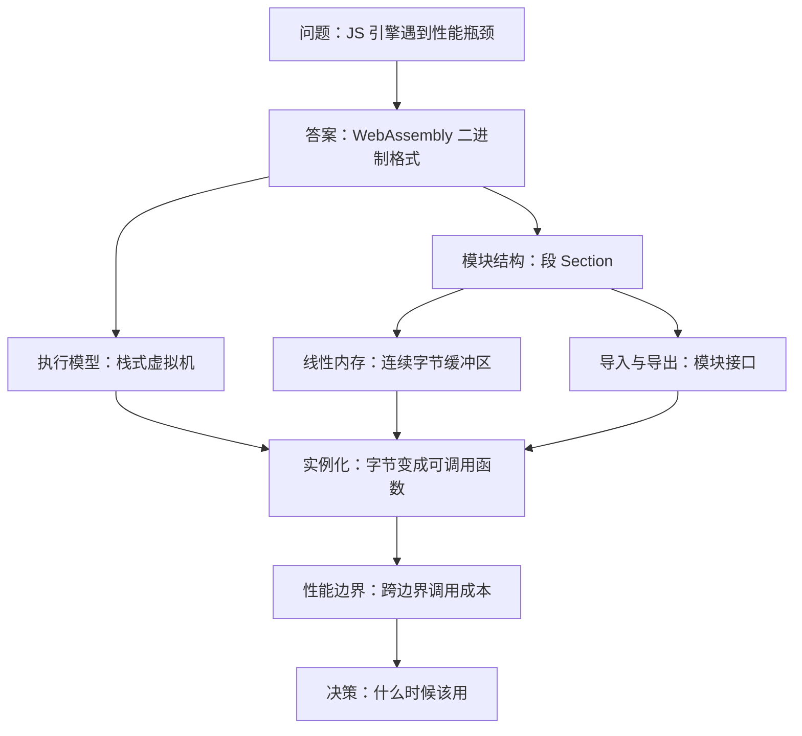
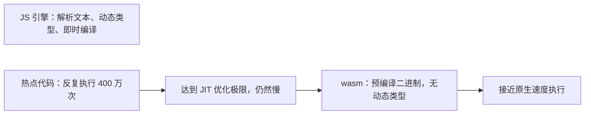
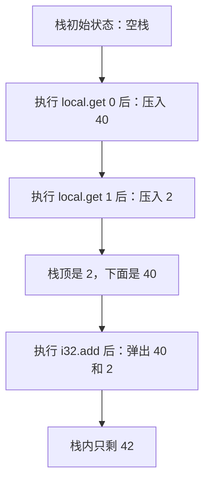
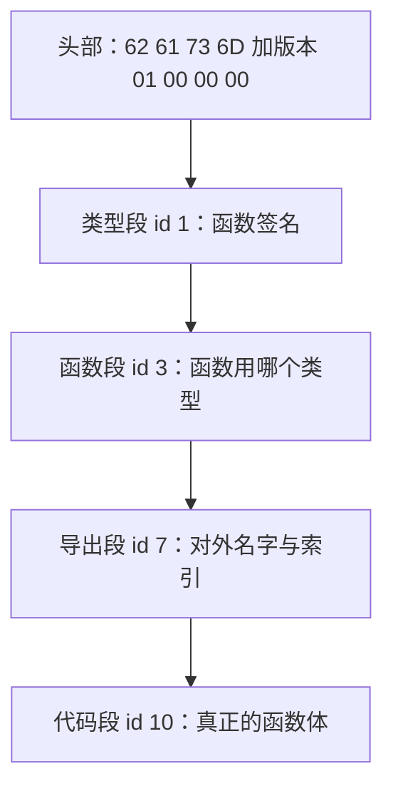
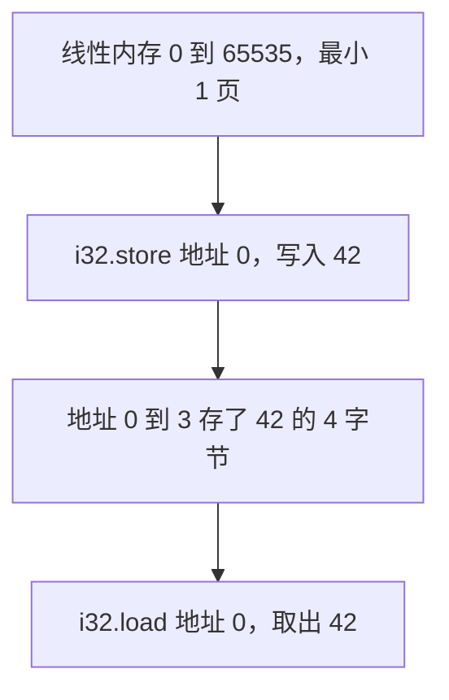
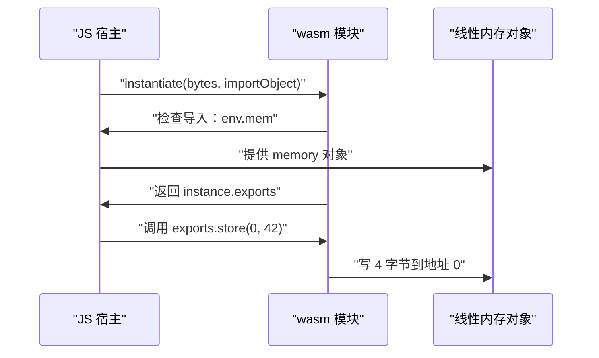
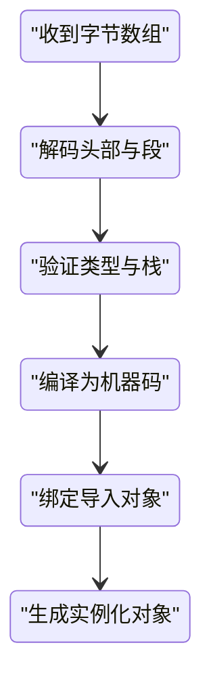
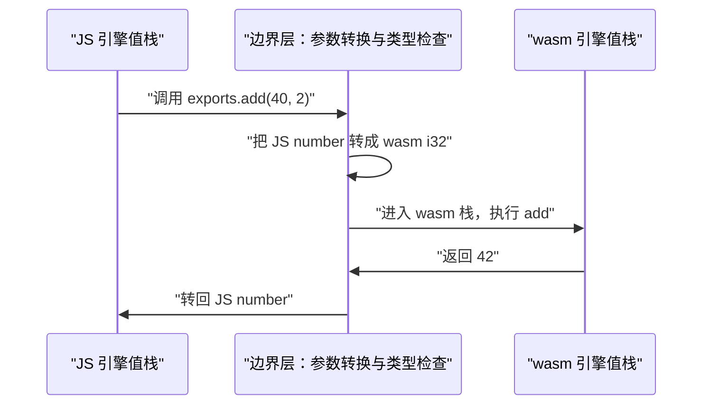
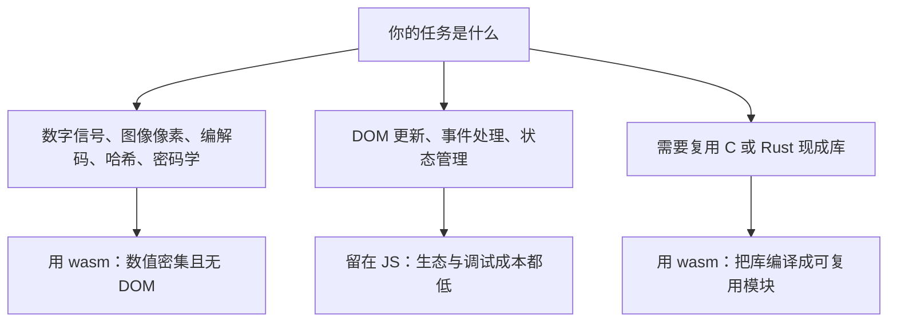

# WebAssembly 入门：它是什么、怎么跑、什么时候该用

!!! abstract "学完这一页你能"
    - 说出 WebAssembly 的二进制格式长什么样，并解释它为什么要设计成栈式虚拟机。
    - 手写一个最小 wasm 模块的每个字节，讲清楚段（Section）的作用。
    - 用 Node.js 实例化手写字节，完成 JS 与 wasm 之间的函数调用和线性内存读写。
    - 说出跨边界调用的成本来源，并判断一个业务场景该不该用 wasm。

## 0. 知识地图



建议这样读：先看第 1 节建立动机，再看第 2、3 节弄清楚"wasm 到底跑的是什么"，然后用第 4、5 节理解数据与接口，最后在第 6、7 节落地到 Node 实操和性能判断。第 8 节与综合对比放在最后，帮你在真实项目里做选择。

## 1. 场景与问题：JS 引擎的极限在哪里

**先想一个问题**：你在浏览器里跑一个图片滤镜，JS 要处理 400 万像素，每次滚动都掉帧。你优化了算法、用了 TypedArray，滚动时依然卡顿 20 毫秒以上。这时候该怎么办？

**心智模型**

!!! tip "心智模型"
    一句话模型：wasm 是一种"靠近 CPU 的二进制指令格式"，让浏览器或 Node 能跑接近原生速度的代码。
    日常类比：JS 像是你打电话让助理替你操作电脑，每句指令都要转述；wasm 像是你直接坐到电脑前输入命令。
    类比不成立的地方：wasm 不能直接操作 DOM、不能调用任意 JS 对象，它仍然要回到 JS 的"接待窗口"才能碰页面。

!!! note "术语：WebAssembly"
    WebAssembly（简称 wasm）是一种二进制指令格式，由 C、C++、Rust 等语言编译而来，可在浏览器与 Node.js 等宿主环境中运行。例子：一个 `add(a, b)` 函数编译成 wasm 后，是几十个字节的二进制，而不是 JS 源码文本。

**图解**



1. JS 引擎收到文本源码，先解析再做即时编译（JIT），这一步发生在运行时。
2. 热点代码被反复执行，类型不稳定时会触发去优化，执行速度波动。
3. wasm 在加载前已编译为二进制，没有文本解析，没有动态类型检查。
4. wasm 得到稳定、可预测的执行速度，适合数值密集计算。

**一步一步来**

第 1 步：写一个对比脚本，感受 JS 动态类型带来的运行形态差异。

```js
// 目的：观察同一个函数，JS 运行时需要判断类型，wasm 不需要
// add_js.js
function addJS(a, b) {
  return a + b; // JS 运行时必须检查 a、b 是 number、string 还是对象
}
console.log(addJS(40, 2)); // 40 和 2 是 number，40 + 2 = 42
```

**这段代码在做什么**

- `a + b` 在 JS 里是动态操作，运行时先取两个操作数的类型标签。
- 如果两个都是 number，走数值加法；如果有一个是 string，走字符串拼接。
- 这种每个操作都要确认类型的成本，在循环 400 万次时会被放大。
- wasm 的 `i32.add` 指令明确只接受两个 32 位整数，没有任何类型判断。

第 2 步：在浏览器或 Node 里跑一个 400 万次的简单累加，感受执行耗时。

```js
// 目的：测量 JS 纯计算在 400 万次循环下的耗时
// sum_js.js
const start = performance.now();
let sum = 0;
for (let i = 0; i < 4_000_000; i++) {
  sum += i; // 每次加法都要做类型判断
}
const end = performance.now();
console.log(`耗时 ${(end - start).toFixed(1)} ms，结果 ${sum}`);
```

**这段代码在做什么**

- `performance.now()` 返回高精度时间戳，单位是毫秒。
- 循环执行 400 万次累加，每次 `sum += i` 都要确认两个都是 number。
- 结果 `sum` 是 400 万以内的整数和，用于对比 wasm 版本是否正确。
- 实测耗时因机器而异，重点不是绝对数字，而是看它是否稳定。

第 3 步：回答"为什么需要 wasm"这个问题，它的价值在哪里。

**为什么需要它**

- 稳定：wasm 的类型在编译时已经确定，引擎不必在运行时反复猜测与验证。
- 可预测：同样一段数值代码，wasm 的性能波动比 JS 热点循环小。
- 可移植：同一份 wasm 字节在浏览器、Node、边缘运行时都能加载运行。

**动手验证**

把第 2 步的脚本保存为 `sum_js.js`，用 Node 20+ 运行：
```bash
node sum_js.js
```
输出示例（你的机器数字可能不同）：
```text
耗时 4.2 ms，结果 7999998000000
```

**常见坑**

| 现象 | 原因 | 怎么修 |
| --- | --- | --- |
| 运行输出是 `耗时 NaN ms` | 在 Node 里 `performance` 未导入 | 改 import：`const { performance } = require('node:perf_hooks')`，或用 `Date.now()` |
| `sum += i` 结果越界 | 循环次数过大导致 number 精度问题 | 400 万次累加在 double 精度内安全，无需改 |
| 想用 wasm 替代 JS 全部逻辑 | 误解了 wasm 的适用边界 | 只把数值密集、无 DOM 的部分交给 wasm |

**小结**

- JS 是动态类型语言，每次加法都要判断类型，热点循环里这笔开销会累积。
- wasm 是预编译二进制，类型固定，执行路径可预测。
- wasm 不替代 JS，而是接管数值密集、需要稳定性能的部分。

## 2. 执行模型：栈式虚拟机

**先想一个问题**：你手头只有一条 add 指令，两个操作数 40 和 2 放在哪里，才能让引擎算出 42？寄存器、内存、还是别的什么？

**心智模型**

!!! tip "心智模型"
    一句话模型：wasm 用栈传递操作数，指令从栈顶弹入、弹出、再压回结果。
    日常类比：像餐厅传菜口的托盘堆，厨师从顶上拿食材，做好菜再放回顶上。
    类比不成立的地方：wasm 的栈不仅放值，还要严格匹配指令要求的类型，放错类型整个模块直接验证失败。

!!! note "术语：栈式虚拟机"
    栈式虚拟机是指用栈作为操作数暂存区的执行模型。例子：`i32.add` 指令从栈顶弹出两个 i32，相加后把结果压回栈顶。

**图解**



1. 栈初始为空，等着第一个指令执行。
2. `local.get 0` 读取第 0 号局部变量 40，压入栈。
3. `local.get 1` 读取第 1 号局部变量 2，压在 40 上面。
4. 栈顶是 2，它的下面才是 40，这个顺序就是后进先出。
5. `i32.add` 弹出 2 和 40，计算 40 + 2 = 42，再把 42 压回栈。
6. 函数结束 `end`，栈顶 42 作为返回值交给调用者。

**一步一步来**

第 1 步：用一个 JS 数组模拟这条 add 指令链，理解栈的行为。

```js
// 目的：用数组模拟 wasm 栈，演示 local.get 与 i32.add 的运行过程
// stack_sim.js
const stack = [];          // [] 代表空栈
const locals = [40, 2];    // 局部变量区，索引 0 是 40，索引 1 是 2
stack.push(locals[0]);     // local.get 0 的执行效果：压入 40
stack.push(locals[1]);     // local.get 1 的执行效果：压入 2
const b = stack.pop();     // i32.add 弹出栈顶：得到 2
const a = stack.pop();     // i32.add 再弹一个：得到 40
stack.push(a + b);         // i32.add 把 40 + 2 = 42 压回栈
console.log(stack.pop());  // end 之后取栈顶：42
```

**这段代码在做什么**

- `locals` 数组模拟 wasm 函数的局部变量表，索引从 0 开始。
- `push` 对应 `local.get` 压栈，`pop` 对应 `i32.add` 弹栈。
- 两次 `pop` 的顺序是先 2 后 40，正好是后进先出。
- 最后 `stack.pop()` 得到 42，说明栈式执行的最终结果正确。

运行结果：
```text
42
```

第 2 步：把上面三个指令翻译成真正的 wasm 函数体字节。

```js
// 目的：展示 add 函数体的二进制指令与上面栈模拟的对应关系
// add_body_bytes.js
// 函数体 = 局部变量声明 + 指令序列
// 局部变量声明：00 表示没有额外的局部变量
// local.get 0：20 00
// local.get 1：20 01
// i32.add：6A
// end：0B 表示函数体结束
const body = new Uint8Array([0x00, 0x20, 0x00, 0x20, 0x01, 0x6a, 0x0b]);
console.log(`函数体共 ${body.length} 个字节`);
console.log(body);
```

**这段代码在做什么**

- 第一个字节 `0x00` 是局部变量声明段，表示函数没有额外局部变量。
- `0x20 0x00` 是 `local.get 0`，`0x20` 是操作码，`0x00` 是索引。
- `0x20 0x01` 是 `local.get 1`，只是索引变成了 `0x01`。
- `0x6a` 是 `i32.add` 操作码，它没有额外操作数。
- `0x0b` 是 `end` 操作码，标志着函数体结束。

第 3 步：说明为什么栈式设计对 wasm 是合适的选择。

**为什么需要它**

- 体积小：栈式指令不需要为每个操作数写寄存器号，`i32.add` 只占 1 字节。
- 验证简单：类型检查器维护一个"栈上每位是什么类型"的模型，逐条推进即可。
- 生成容易：编译器只需把表达式树翻译成压栈、弹栈序列，不必做寄存器分配。

**动手验证**

把第 1 步和第 2 步合体，确认栈模拟和真实字节能对上：

```js
// stack_and_bytes.js —— Node 20+ 直接运行
const assert = require('node:assert');
const stack = [];
const locals = [40, 2];
stack.push(locals[0]);
stack.push(locals[1]);
const b = stack.pop();
const a = stack.pop();
stack.push(a + b);
const result = stack.pop();
assert.strictEqual(result, 42);
const body = new Uint8Array([0x00, 0x20, 0x00, 0x20, 0x01, 0x6a, 0x0b]);
assert.strictEqual(body.length, 7);
assert.strictEqual(body[4], 0x6a); // 第 5 个字节是 i32.add
console.log('栈模拟结果:', result);
console.log('函数体字节:', body);
```

预期输出：
```text
栈模拟结果: 42
函数体字节: Uint8Array(7) [ 0, 32, 0, 32, 1, 106, 11 ]
```

**常见坑**

| 现象 | 原因 | 怎么修 |
| --- | --- | --- |
| `i32.add` 弹出顺序写反 | 以为先压入的先弹出 | 记住后进先出：最后压入的 2 先被弹出 |
| 把 `0x20` 当作索引 20 | 混淆操作码与操作数 | `0x20` 是 `local.get` 操作码，真正的索引是它后面那个字节 |
| 函数体漏了 `end` | 以为最后一条指令天然结束 | 每个函数体必须以 `0x0b` 结尾，验证器会拒绝没有 end 的函数 |

**小结**

- wasm 是栈式虚拟机，操作数在栈上传递，指令弹栈、压栈。
- `local.get` 负责把局部变量压栈，`i32.add` 负责弹出两个 i32 并压回和。
- 栈式设计换来更小的二进制体积和更简单的类型验证。

## 3. 模块结构：把整块二进制拆成段

**先想一个问题**：你手上有 41 个字节的 wasm 文件，想搞清楚"哪几个字节是函数类型、哪几个字节是导出名 add、哪几个字节是函数体"。它内部有没有地图？

**心智模型**

!!! tip "心智模型"
    一句话模型：wasm 模块由固定头部加多个段组成，每段有自己的 id 和数据，像带目录的档案盒。
    日常类比：一本书有目录页，目录告诉你每章从第几页开始；wasm 的段头也告诉你每段数据的长度。
    类比不成立的地方：书可以随便跳着读，wasm 解析时必须按段的出现顺序读，某些段还有严格的先后依赖。

!!! note "术语：段 / Section"
    段是 wasm 二进制模块中的分区，每个段以 1 字节 id 开头，后面是段内容的字节长度和数据。例子：类型段 id 为 1，存函数签名；代码段 id 为 10，存函数体指令。

**图解**



1. 每个 wasm 文件前 8 个字节是头部，前 4 字节是魔数，后 4 字节是版本。
2. 类型段先声明某函数签名是 `(i32, i32) -> i32`，编号为 0。
3. 函数段声明 1 个函数，引用类型 0。
4. 导出段声明名字 `add` 对外可见，它映射到函数索引 0。
5. 代码段最后给出函数索引 0 的真实指令串。

**一步一步来**

第 1 步：手写这个最小 add 模块的全部 41 字节，每个段分开注释。

```js
// 目的：手写一个导出了 add(i32, i32) -> i32 的最小 wasm 模块
// module_bytes.js
// 头部：魔数与版本
const magicVersion = [0x00, 0x61, 0x73, 0x6d, 0x01, 0x00, 0x00, 0x00];
// 类型段 id=1，长度 7：1 个类型
const typeSection = [
  0x01, 0x07, 0x01, 0x60,
  0x02, 0x7f, 0x7f,        // 参数：2 个 i32
  0x01, 0x7f,              // 结果：1 个 i32
];
// 函数段 id=3，长度 2：1 个函数，引用类型 0
const functionSection = [0x03, 0x02, 0x01, 0x00];
// 导出段 id=7，长度 7：1 个导出，名字 add，kind 0 函数，索引 0
const exportSection = [
  0x07, 0x07, 0x01,
  0x03, 0x61, 0x64, 0x64,  // "add"，3 个字节
  0x00, 0x00,              // kind=函数，so index=0
];
// 代码段 id=10，长度 9：1 个函数体，长度 7
const codeSection = [
  0x0a, 0x09, 0x01,
  0x07, 0x00, 0x20, 0x00, 0x20, 0x01, 0x6a, 0x0b,
];
const moduleBytes = new Uint8Array([
  ...magicVersion, ...typeSection, ...functionSection,
  ...exportSection, ...codeSection,
]);
console.log(`模块共 ${moduleBytes.length} 字节`);
```

**这段代码在做什么**

- `magicVersion` 前 4 字节是 `\0asm`，后 4 字节是版本 1。
- 类型段用 `0x60` 表示"函数类型"，`0x7f` 是 i32 类型的编码。
- 导出段里 `0x03` 是名字长度，后面跟 `a d d` 三个 ASCII 码。
- 代码段里的 `0x20 0x00`、`0x20 0x01`、`0x6a`、`0x0b` 就是上一节讲过的函数体。

第 2 步：写一个简单的段解析器，读懂"段头"是怎么划分边界的。

```js
// 目的：按段 id 和长度解析 wasm 模块，证明每个段的边界都可计算
// parse_sections.js
function parseSections(bytes) {
  const sections = [];
  let offset = 8; // 跳过 8 字节头部
  let index = 0;
  while (offset < bytes.length) {
    const id = bytes[offset];           // 第 1 字节：段 id
    const size = bytes[offset + 1];     // 第 2 字节：段内容长度
    const nameMap = { 1: '类型', 3: '函数', 7: '导出', 10: '代码' };
    sections.push({
      index: index++,
      name: nameMap[id] || `id ${id}`,
      start: offset,
      size,
      end: offset + size + 2,           // 内容 + id 和长度 2 字节
    });
    offset += size + 2;                 // 前进到下一段
  }
  return sections;
}
// 使用方式：parseSections(moduleBytes) 可输出每段的起止位置
```

**这段代码在做什么**

- 解析从第 8 字节开始，因为前 8 字节是头部。
- 每个段的头占 2 字节：id 和内容长度。
- `offset += size + 2` 用"段头 2 字节 + 内容"计算下一段的起点。
- 只要每个段头都正确，整个模块就能被无歧义地切分。

第 3 步：回答"为什么段结构是必要的设计"。

**为什么需要它**

- 允许流式编译：引擎可以一边下载一边验证与编译每一段。
- 支持按需跳过：宿主可以只读导出段拿接口，不必先跑通全部代码。
- 便于工具生成：编译器生成时逐段追加即可，不用维护全局索引。

**动手验证**

把上面两段合起来，解析并断言段的位置正确：

```js
// module_and_parse.js —— Node 20+ 直接运行
const assert = require('node:assert');
const magicVersion = [0x00, 0x61, 0x73, 0x6d, 0x01, 0x00, 0x00, 0x00];
const typeSection = [0x01, 0x07, 0x01, 0x60, 0x02, 0x7f, 0x7f, 0x01, 0x7f];
const functionSection = [0x03, 0x02, 0x01, 0x00];
const exportSection = [0x07, 0x07, 0x01, 0x03, 0x61, 0x64, 0x64, 0x00, 0x00];
const codeSection = [0x0a, 0x09, 0x01, 0x07, 0x00, 0x20, 0x00, 0x20, 0x01, 0x6a, 0x0b];
const moduleBytes = new Uint8Array([
  ...magicVersion, ...typeSection, ...functionSection,
  ...exportSection, ...codeSection,
]);
assert.strictEqual(moduleBytes.length, 41);
assert.strictEqual(moduleBytes[0], 0x00);
assert.strictEqual(moduleBytes[1], 0x61);
assert.deepStrictEqual([moduleBytes[4], moduleBytes[5], moduleBytes[6], moduleBytes[7]], [1, 0, 0, 0]);
console.log('模块长度 41 字节，头部与版本断言通过');
console.log('导出段位置:', 8 + 9 + 4, '字节处');
```

预期输出：
```text
模块长度 41 字节，头部与版本断言通过
导出段位置: 21 字节处
```

**常见坑**

| 现象 | 原因 | 怎么修 |
| --- | --- | --- |
| 实例化报 `invalid leading byte` | 头部魔数写错 | 按顺序 `00 61 73 6d` 写入，不能把 0x61 写成 'a' 字符 |
| 段长度算错导致解析错位 | 忘记段头 2 字节本身不算在 size 内 | 重新确认 size 只含 id 和长度之后的内容 |
| 想把类型段放在函数段后 | 段有顺序要求 | 类型段必须出现在函数段之前，否则验证失败 |

**小结**

- wasm 模块是 8 字节头部加多个段，每个段都有 id 和长度。
- 类型、函数、导出、代码是 4 个核心段，分别管签名、类型引用、对外名字、函数体。
- 段结构让引擎能流式编译，也让工具能分段生成。

## 4. 线性内存：一块可读写的连续缓冲区

**先想一个问题**：wasm 里算出一个 42，怎么把它存下来给 JS 看？难道每次都要通过函数返回值传？那样传 10 万个数字就太笨重了。

**心智模型**

!!! tip "心智模型"
    一句话模型：线性内存是 wasm 模块私有的连续字节数组，JS 和 wasm 都能读写它。
    日常类比：像两个人共用的白板，一个人写数字，另一个人可以随时来看。
    类比不成立的地方：白板可以擦掉半行字，线性内存不能压缩或更换，它只能整体增长，不能删掉中间。

!!! note "术语：线性内存"
    线性内存是 wasm 里按字节编址的连续存储区，最小单位是 64 KiB，称为 1 页。例子：`i32.store` 把 4 字节整数写到指定地址，`i32.load` 从指定地址读出 4 字节整数。

**图解**



1. 新模块声明 1 页内存，就是 64 × 1024 = 65536 字节。
2. `i32.store` 带两个参数：内存地址 0 和要写入的值 42。
3. 42 按小端序写成 4 字节，落在地址 0、1、2、3 上。
4. `i32.load` 读地址 0，把 4 字节拼回整数 42。

**一步一步来**

第 1 步：手写带内存的模块，导出 store 和 load 两个函数。

```js
// 目的：手写一个带线性内存的模块，导出 store(addr, val) 和 load(addr)
// memory_module.js 的片段：内存段与函数体
// 内存段 id=5，长度 3：1 个内存，最小 1 页
const memorySection = [0x05, 0x03, 0x01, 0x00, 0x01];
// store 函数体：00 局部变量声明；20 00 压地址；20 01 压值；36 02 00 是 i32.store；0b 结束
const storeBody = [0x00, 0x20, 0x00, 0x20, 0x01, 0x36, 0x02, 0x00, 0x0b];
// load 函数体：20 00 压地址；28 02 00 是 i32.load；0b 结束
const loadBody = [0x00, 0x20, 0x00, 0x28, 0x02, 0x00, 0x0b];
```

**这段代码在做什么**

- `0x05 0x03 0x01 0x00 0x01` 就是内存段，`0x01` 个数、`0x00` 标志、`0x01` 表示最小 1 页。
- `i32.store` 的操作码是 `0x36`，后面跟 1 字节对齐 2、再跟 4 字节偏移的 LEB128 编码，这里偏移 0 写成 `0x00`。
- `i32.load` 的操作码是 `0x28`，同样跟对齐 2 和偏移 0。
- 两个函数体都以 `0x0b` 结束。

第 2 步：把 store 和 load 的栈行为用 JS 模拟出来。

```js
// 目的：模拟 i32.store 与 i32.load 对内存的读写
// memory_stack_sim.js
const memory = new Uint8Array(65536); // 1 页等于 65536 字节
const memDv = new DataView(memory.buffer); // 用 DataView 写多字节整数
function store(addr, val) {
  memDv.setInt32(addr, val, true); // true 表示小端序
}
function load(addr) {
  return memDv.getInt32(addr, true);
}
store(0, 42);
console.log(load(0)); // 42
console.log(memory[0], memory[1], memory[2], memory[3]); // 42 0 0 0
```

**这段代码在做什么**

- `Uint8Array(65536)` 模拟 1 页线性内存。
- `DataView` 提供 `setInt32` 与 `getInt32`，能按 32 位整数读写。
- 第三个参数 `true` 指定小端序，与 wasm 的字节序一致。
- 四个字节 `42 0 0 0` 说明 42 只占用最低位字节。

第 3 步：回答"为什么 wasm 需要线性内存这道隔离"。

**为什么需要它**

- 安全：wasm 无法直接访问 JS 的对象图和整个进程内存，只能碰自己那几页。
- 简单：一个基址加偏移的模型，靠近 CPU 的真实访存方式。
- 可共享：JS 能通过 TypedArray 读写同一块内存，免去逐值传递的时间。

**动手验证**

写一个"用 JS 的 TypedArray 和手写 wasm 读写同一块内存"的完整脚本。先声明内存对象传给 wasm，再让 wasm 模块操作它：

```js
// shared_memory.js —— Node 20+ 直接运行
const assert = require('node:assert');
// 创建 1 页内存，JS 侧能直接操作
const memory = new WebAssembly.Memory({ initial: 1 });
const view = new Uint8Array(memory.buffer);
// wasm 模块导入名为 env.mem 的内存，并导出 store 与 load
const moduleBytes = new Uint8Array([
  0x00, 0x61, 0x73, 0x6d, 0x01, 0x00, 0x00, 0x00,
  0x02, 0x0c, 0x01, 0x03, 0x65, 0x6e, 0x76, 0x03, 0x6d, 0x65, 0x6d, 0x02, 0x00, 0x01,
  0x01, 0x0d, 0x02, 0x60, 0x02, 0x7f, 0x7f, 0x00, 0x60, 0x01, 0x7f, 0x01, 0x7f,
  0x03, 0x03, 0x02, 0x00, 0x01,
  0x07, 0x10, 0x02, 0x05, 0x73, 0x74, 0x6f, 0x72, 0x65, 0x00, 0x00, 0x04, 0x6c, 0x6f, 0x61, 0x64, 0x00, 0x01,
  0x0a, 0x13, 0x02, 0x09, 0x00, 0x20, 0x00, 0x20, 0x01, 0x36, 0x02, 0x00, 0x0b, 0x07, 0x00, 0x20, 0x00, 0x28, 0x02, 0x00, 0x0b,
]);
WebAssembly.instantiate(moduleBytes, { env: { mem: memory } }).then(({ instance }) => {
  instance.exports.store(0, 42);          // wasm 写入地址 0
  assert.strictEqual(instance.exports.load(0), 42);
  assert.strictEqual(view[0], 42);        // JS 直接看到 42
  view[0] = 99;                           // JS 换一个值
  assert.strictEqual(instance.exports.load(0), 99);
  console.log('wasm 写 42，JS 读到', view[0]);
  console.log('JS 写 99，wasm 读到', instance.exports.load(0));
});
```

预期输出：
```text
wasm 写 42，JS 读到 42
JS 写 99，wasm 读到 99
```

**常见坑**

| 现象 | 原因 | 怎么修 |
| --- | --- | --- |
| `i32.load` 地址越界 | 地址 + 4 超出了内存页末尾 | 保证地址在 0 到 65532 之间，或用更大页数 |
| JS 写 `view[0] = 300` 再读回不对 | `Uint8Array` 会截断到 8 位 | 用 `DataView.setInt32` 写完整 32 位值 |
| 内存对象先创建了，wasm 却看不到 | 实例化时没把 memory 传进 importObject | 传入 `{ env: { mem: memory } }`，字段名要跟模块 import 的名字一致 |

**小结**

- 线性内存是 wasm 的连续字节数组，最小 1 页 65536 字节。
- `i32.store` 与 `i32.load` 用明确地址读写 32 位整数，采用小端序。
- JS 和 wasm 共享同一块内存，是两者批量交换数据的主要方式。

## 5. 导入与导出：模块之间的接口

**先想一个问题**：上面的 store 模块自己没带内存，却要往内存里写数据。那块内存是哪里来的？模块又是怎么知道它能用？

**心智模型**

!!! tip "心智模型"
    一句话模型：导入是模块在实例化时伸手要的资源，导出是模块对外交出的能力。
    日常类比：房子（模块）通电通水需要向物业（宿主）申请接口，房内的家具摆设（导出）才是访客能用的东西。
    类比不成立的地方：wasm 模块在验证时就会检查导入名字是否存在，缺少一个导入项，整个实例化直接失败，不能先住进去再补。

!!! note "术语：导入 / 导出"
    导入是 wasm 模块声明的、必须由宿主提供的函数、内存、全局变量或表。导出是模块声明可被宿主调用的内部实体。例子：模块导入 `env.mem` 内存，导出 `store` 与 `load` 两个函数。

**图解**



1. JS 调用 `instantiate` 时，把字节和 `importObject` 一起传进去。
2. wasm 模块说出自己要的导入名 `env.mem`。
3. JS 从 `importObject.env.mem` 取出 memory 对象递给模块。
4. 实例化成功，JS 拿到 `instance.exports`，里面是模块导出的函数。
5. 调用 `exports.store(0, 42)`，wasm 就用刚导入的内存写数据。

**一步一步来**

第 1 步：拆解导入段，看懂导入项是怎么编码的。

```js
// 目的：看懂导入段 02 0c 01 03 65 6e 76 03 6d 65 6d 02 00 01
// import_section.js
// 段头：02 是导入段 id，0c 是内容长度 12
// 内容第 1 字节：01 表示 1 个导入项
// 模块名 "env"：03 是长度，65 6e 76 是 e n v
// 字段名 "mem"：03 是长度，6d 65 6d 是 m e m
// kind：02 表示导入内存
// 内存类型：00 标志，01 最小页数
const importSection = [
  0x02, 0x0c, 0x01,
  0x03, 0x65, 0x6e, 0x76,
  0x03, 0x6d, 0x65, 0x6d,
  0x02, 0x00, 0x01,
];
```

**这段代码在做什么**

- 段头 `0x02 0x0c` 表示导入段，内容 12 字节。
- `0x01` 是导入项数量。
- 模块名拆成"长度 + 字节"，字段名同理。
- `0x02` 是内存种类，因此后面的 `0x00 0x01` 指的是内存类型，而不是函数类型。

第 2 步：用 JS 侧代码，把导入对象和模块对上号。

```js
// 目的：展示 JS 怎么按导入名喂给 wasm
// import_object.js
const memory = new WebAssembly.Memory({ initial: 1 });
// importObject 的字段名必须与模块内的导入名一模一样
const importObject = {
  env: {
    mem: memory, // 模块要的 "env.mem" 在这里被满足
  },
};
// 实例化时传入 importObject，模块才能启动
```

**这段代码在做什么**

- `WebAssembly.Memory` 创建的是宿主侧内存对象。
- `importObject.env.mem` 两层嵌套对应模块里的模块名 `env` 与字段名 `mem`。
- 名字是区分大小写的 ASCII 字符串，写错一个字母实例化就失败。
- 同一个 memory 对象既可导入给 wasm，也可在 JS 里直接用。

第 3 步：说明导出段与索引的关系。

**为什么需要它**

- 封装：模块内部函数默认不可见，只有导出项能作为 API 给 JS 调用。
- 稳定接口：JS 只知道 `store` 和 `load`，不关心函数内部还有没有其它辅助函数。
- 多次实例化：同一个模块字节可以实例化多次，每次得到独立的 exports 与内存。

**动手验证**

完整跑一遍"导入内存 + 导出函数"的链路：

```js
// import_export.js —— Node 20+ 直接运行
const assert = require('node:assert');
const memory = new WebAssembly.Memory({ initial: 1 });
const view = new Uint8Array(memory.buffer);
const wasmBytes = new Uint8Array([
  0x00, 0x61, 0x73, 0x6d, 0x01, 0x00, 0x00, 0x00,
  0x02, 0x0c, 0x01, 0x03, 0x65, 0x6e, 0x76, 0x03, 0x6d, 0x65, 0x6d, 0x02, 0x00, 0x01,
  0x01, 0x0d, 0x02, 0x60, 0x02, 0x7f, 0x7f, 0x00, 0x60, 0x01, 0x7f, 0x01, 0x7f,
  0x03, 0x03, 0x02, 0x00, 0x01,
  0x07, 0x10, 0x02, 0x05, 0x73, 0x74, 0x6f, 0x72, 0x65, 0x00, 0x00, 0x04, 0x6c, 0x6f, 0x61, 0x64, 0x00, 0x01,
  0x0a, 0x13, 0x02, 0x09, 0x00, 0x20, 0x00, 0x20, 0x01, 0x36, 0x02, 0x00, 0x0b, 0x07, 0x00, 0x20, 0x00, 0x28, 0x02, 0x00, 0x0b,
]);
WebAssembly.instantiate(wasmBytes, { env: { mem: memory } }).then(({ instance }) => {
  const ex = instance.exports;         // 导出的函数集合
  ex.store(0, 42);                     // 通过导出调用 store
  assert.strictEqual(ex.load(0), 42);  // 通过导出调用 load
  assert.strictEqual(view[0], 42);     // JS 直读内存验证
  console.log('导入内存写入成功，exports.load(0) =', ex.load(0));
});
```

预期输出：
```text
导入内存写入成功，exports.load(0) = 42
```

**常见坑**

| 现象 | 原因 | 怎么修 |
| --- | --- | --- |
| 实例化抛 `import object field 'env:mem' is not a Function` | 模块把 `mem` 当函数导入，JS 却传了内存对象 | 核对导入段的 kind：函数是 0，内存是 2，两者不能混用 |
| 两个实例共享了同一块内存 | 传了同一个 memory 对象给两次实例化 | 若需要独立内存，每次实例化前新建 `WebAssembly.Memory` |
| 导出名取不到 | 导出段里没写该名字 | 导出段要列出所有想对外可见的资源 |

**小结**

- 导入让模块实例化时拿到宿主资源，名字必须逐字节匹配。
- 导出是模块的对外 API，JS 只能通过 `instance.exports` 访问。
- 函数导入 kind 是 0，内存导入 kind 是 2，写错会直接报类型错误。

## 6. 实例化：从字节到可调用函数

**先想一个问题**：手写的 41 字节还只是数据，怎么让它变成 JS 里一个能 `add(40, 2)` 的活函数？中间发生了什么？

**心智模型**

!!! tip "心智模型"
    一句话模型：实例化是引擎读字节、验证、编译、把声明变成宿主对象的过程。
    日常类比：像拿到一台未组装的家具零件，按说明书验证每个零件齐全，组装成能使用的柜子。
    类比不成立的地方：wasm 验证失败是整体失败，不存在"装错一颗螺丝但凑合能用"，要么通过，要么拒绝加载。

!!! note "术语：实例化"
    实例化是把一个 wasm 模块的字节，在宿主环境里创建出可调用的 `instance.exports` 的过程。例子：`WebAssembly.instantiate(bytes, importObject)` 返回一个 `instance`。

**图解**



1. 字节数组先过头部与段解码，确认魔数与版本。
2. 验证器逐个函数推演栈上每个位置的数据类型。
3. 验证通过后，引擎把函数体编译成目标平台的机器码。
4. 导入对象按名字绑定，内存、函数、全局变量一一对应。
5. 最后生成 `instance`，它的 `exports` 就是 JS 能调的函数。

**一步一步来**

第 1 步：用 Node 的 `WebAssembly.instantiate` 把手写 add 模块变成可调用函数。

```js
// 目的：Node 20+ 中实例化手写字节，得到 add 函数
// instantiate_add.js
const bytes = new Uint8Array([
  0x00, 0x61, 0x73, 0x6d, 0x01, 0x00, 0x00, 0x00,
  0x01, 0x07, 0x01, 0x60, 0x02, 0x7f, 0x7f, 0x01, 0x7f,
  0x03, 0x02, 0x01, 0x00,
  0x07, 0x07, 0x01, 0x03, 0x61, 0x64, 0x64, 0x00, 0x00,
  0x0a, 0x09, 0x01, 0x07, 0x00, 0x20, 0x00, 0x20, 0x01, 0x6a, 0x0b,
]);
WebAssembly.instantiate(bytes).then(({ instance }) => {
  const add = instance.exports.add; // 取导出的函数
  console.log('add(40, 2) =', add(40, 2));
});
```

**这段代码在做什么**

- `WebAssembly.instantiate` 接受字节数组，返回 Promise。
- 解构出的 `instance` 是实例对象，`instance.exports` 是导出表。
- `instance.exports.add` 是真正的 JS 可调用函数。
- `add(40, 2)` 穿过边界进入 wasm，返回 42。

第 2 步：分步拆开实例化两个关键阶段，编译与实例化。

```js
// 目的：分步完成 compile 与 instantiate，方便复用编译结果
// compile_then_instantiate.js
async function buildModule(bytes) {
  const module = await WebAssembly.compile(bytes); // 第一步：编译，结果可缓存
  const { instance } = await WebAssembly.instantiate(module); // 第二步：实例化
  return instance;
}
// 使用方式：const instance = await buildModule(bytes);
```

**这段代码在做什么**

- `compile` 只做解码、验证、编译，不创建实例，也不绑定导入。
- 编译结果是 `WebAssembly.Module`，可以传给 `instantiate` 多次。
- 分步的好处是：同一份模块可实例化多次，且编译可提前在 Worker 里并行。
- `instantiate` 接受编译好的 module，再次传入导入对象即可。

第 3 步：观察实例化失败时，错误信息给到什么细节。

```js
// 目的：缺一个字节制造无效模块，看验证器的报错
// invalid_module.js
const badBytes = new Uint8Array([
  0x00, 0x61, 0x73, 0x6d, 0x01, 0x00, 0x00, 0x00,
  0x01, 0x07, 0x01, 0x60, 0x02, 0x7f, 0x7f, 0x01, 0x7f,
  // 故意删掉函数段和导出段，直接给代码段
  0x0a, 0x09, 0x01, 0x07, 0x00, 0x20, 0x00, 0x20, 0x01, 0x6a, 0x0b,
]);
WebAssembly.instantiate(badBytes).catch((err) => {
  console.log('实例化失败:', err.message);
});
```

**这段代码在做什么**

- 故意缺少函数段，代码段里的函数没有对应的类型声明。
- 验证器会拒绝，因为函数段索引不到代码段里的函数。
- 错误信息会包含"unknown type"或"malformed"之类的具体原因，而不是崩溃。

**动手验证**

完整走通编译、实例化、调用、缓存 Module 复用：

```js
// full_instantiate.js —— Node 20+ 直接运行
const assert = require('node:assert');
const bytes = new Uint8Array([
  0x00, 0x61, 0x73, 0x6d, 0x01, 0x00, 0x00, 0x00,
  0x01, 0x07, 0x01, 0x60, 0x02, 0x7f, 0x7f, 0x01, 0x7f,
  0x03, 0x02, 0x01, 0x00,
  0x07, 0x07, 0x01, 0x03, 0x61, 0x64, 0x64, 0x00, 0x00,
  0x0a, 0x09, 0x01, 0x07, 0x00, 0x20, 0x00, 0x20, 0x01, 0x6a, 0x0b,
]);
async function main() {
  const mod = await WebAssembly.compile(bytes);
  const { instance } = await WebAssembly.instantiate(mod);
  const add = instance.exports.add;
  assert.strictEqual(add(40, 2), 42);
  assert.strictEqual(add(-1, 1), 0);
  console.log('编译与实例化通过，add(40, 2) =', add(40, 2));
  console.log('同一个 Module 可再次实例化');
}
main();
```

预期输出：
```text
编译与实例化通过，add(40, 2) = 42
同一个 Module 可再次实例化
```

**常见坑**

| 现象 | 原因 | 怎么修 |
| --- | --- | --- |
| 传 `new Uint8Array` 报参数类型错 | 误把普通数组传了进去 | 字节必须是 `Uint8Array`，普通数组先用 `new Uint8Array(arr)` 包一层 |
| `instance.exports` 是 undefined | 模块没有导出段 | 手写时补上导出段，或确认自己确实不需要导出 |
| 异步结果没等到就取函数 | 忘了 `await` 或 `.then` | `WebAssembly.instantiate` 返回 Promise，必须等它完成 |

**小结**

- 实例化分为编译和绑定两步，后可集中为一个 Promise API。
- `compile` 产出可复用的 `WebAssembly.Module`，适合一次编译多次实例化。
- 验证失败会在 catch 里给出具体原因，这是 wasm 的安全屏障。

## 7. 性能边界：跨边界调用到底花多少时间

**先想一个问题**：你听说 wasm 快，就把 10 个小函数逐个导出给 JS 用。结果 JS 每 100 毫秒要调 5000 次 wasm 函数，性能反而下降了。为什么"快"的技术用起来反而慢？

**心智模型**

!!! tip "心智模型"
    一句话模型：wasm 内部循环快，但每次从 JS 进 wasm 都有过路费，那就是跨边界成本。
    日常类比：坐高铁很快，但如果你每 100 米就下车再上车，安检排队的时间会压过车速。
    类比不成立的地方：跨边界费用不是固定票价，它与参数数量、返回来回、引擎实现都有关。

!!! note "术语：边界调用"
    边界调用指从 JS 调用 wasm 导出函数，或从 wasm 调用导入的 JS 函数。例子：JS 里写 `instance.exports.add(a, b)` 就是一次边界调用。

**图解**



1. JS 侧调用发生时，两个参数还是 JS number。
2. 边界层检查类型并转换为 wasm 内部的 i32。
3. wasm 真正执行 `local.get 0`、`local.get 1`、`i32.add`。
4. 42 再经过边界转成 JS number 返回。
5. 边界转换的耗时，在单次调用上以微秒计。

**一步一步来**

第 1 步：写一个基准脚本，对比纯 JS 加法与"JS 每次调 wasm 加法"。

```js
// 目的：用 Node 测量跨边界调用的单次耗时量级
// bench_boundary.js
const bytes = new Uint8Array([
  0x00, 0x61, 0x73, 0x6d, 0x01, 0x00, 0x00, 0x00,
  0x01, 0x07, 0x01, 0x60, 0x02, 0x7f, 0x7f, 0x01, 0x7f,
  0x03, 0x02, 0x01, 0x00,
  0x07, 0x07, 0x01, 0x03, 0x61, 0x64, 0x64, 0x00, 0x00,
  0x0a, 0x09, 0x01, 0x07, 0x00, 0x20, 0x00, 0x20, 0x01, 0x6a, 0x0b,
]);
const { performance } = require('node:perf_hooks');
const addJS = (a, b) => a + b;
async function main() {
  const { instance } = await WebAssembly.instantiate(bytes);
  const addWasm = instance.exports.add;
  const rounds = 5_000_000;
  let sink = 0;
  let t1 = performance.now();
  for (let i = 0; i < rounds; i++) sink += addJS(sink, 1); // 纯 JS 循环
  let t2 = performance.now();
  sink = 0;
  for (let i = 0; i < rounds; i++) sink += addWasm(sink, 1); // 每次都是跨边界
  let t3 = performance.now();
  console.log(`纯 JS 耗时 ${(t2 - t1).toFixed(1)}ms`);
  console.log(`跨边界 wasm 耗时 ${(t3 - t2).toFixed(1)}ms，结果 ${sink}`);
}
main();
```

**这段代码在做什么**

- 两个循环各跑 500 万次，保证耗时超过启动预热。
- `sink` 累加防止引擎把无用循环优化掉。
- 纯 JS 加法循环不跨任何边界，wasm 版本每一轮都跨一次边界。
- 打印的数字只反映你自己的环境，但相对关系通常稳定。

第 2 步：把加法放到 wasm 内部循环，对比"边界之外的快"。

真实 wasm 内部循环需要手写更多指令，思路是先在一个 wasm 函数里包住循环，让 JS 只调一次边界。为了聚焦本节，手写一个累加函数即可：

```js
// 目的：wasm 内部循环的伪代码说明边界次数的影响
// 若写成 wasm 函数 sum(n)：内部循环 n 次累加，共跨边界 1 次
// 若写成 JS 每次调 wasm add：循环 n 次，共跨边界 n 次
// 边界成本与调用次数成正比，不是与循环规模成正比
```

**这段代码在做什么**

- 该块是概念说明，不包含可运行字节。
- 关键结论：把循环移进 wasm，边界调用从 n 次降到 1 次。
- 这就是编译器通常把热点循环整体放进 wasm 的原因。

第 3 步：给边界成本定量，避免道听途说。

**为什么需要它**

- 决定架构：知道边界成本，才能决定哪些代码该留在 JS，哪些该进 wasm。
- 避免误优化：把只跑 1 次的小函数搬进 wasm，不会带回本。
- 指导数据交换：大数据用共享内存传一次，比逐条跨边界传千次更划算。

**动手验证**

跑完整基准并断言正确性，输出实测数字：

```js
// boundary_bench.js —— Node 20+ 直接运行
const assert = require('node:assert');
const { performance } = require('node:perf_hooks');
const bytes = new Uint8Array([
  0x00, 0x61, 0x73, 0x6d, 0x01, 0x00, 0x00, 0x00,
  0x01, 0x07, 0x01, 0x60, 0x02, 0x7f, 0x7f, 0x01, 0x7f,
  0x03, 0x02, 0x01, 0x00,
  0x07, 0x07, 0x01, 0x03, 0x61, 0x64, 0x64, 0x00, 0x00,
  0x0a, 0x09, 0x01, 0x07, 0x00, 0x20, 0x00, 0x20, 0x01, 0x6a, 0x0b,
]);
const addJS = (a, b) => a + b;
async function main() {
  const { instance } = await WebAssembly.instantiate(bytes);
  const addWasm = instance.exports.add;
  assert.strictEqual(addWasm(40, 2), 42); // 先证明正确
  const rounds = 2_000_000;
  let sink = 0;
  let t1 = performance.now();
  for (let i = 0; i < rounds; i++) sink = addJS(sink, 1);
  let t2 = performance.now();
  sink = 0;
  for (let i = 0; i < rounds; i++) sink = addWasm(sink, 1);
  let t3 = performance.now();
  console.log(`纯 JS 加法 ${rounds} 次：${(t2 - t1).toFixed(1)} ms`);
  console.log(`JS 调 wasm add ${rounds} 次：${(t3 - t2).toFixed(1)} ms`);
}
main();
```

预期输出（示例，实测会因机器不同）：
```text
纯 JS 加法 2000000 次：3.4 ms
JS 调 wasm add 2000000 次：11.0 ms
```

**常见坑**

| 现象 | 原因 | 怎么修 |
| --- | --- | --- |
| wasm 版本比 JS 版本还慢 | 每个小函数各调一次，边界开销累积 | 把循环整体移进 wasm，让边界只跨 1 次 |
| 测量全是 0 ms | 轮次太少，脚本耗时低于计时器精度 | 用 `process.hrtime.bigint()` 或增大轮次 |
| `sink` 被优化掉 | 引擎判定结果没被使用，删除循环 | 循环后 `console.log(sink)` 或 `assert(sink > 0)` |

**小结**

- 跨边界有参数转换、类型检查、值栈切换三项成本，单次微秒级。
- 小函数高频横跨边界，边界成本会盖过 wasm 内部的速度红利。
- 减少边界次数的技巧是"整体搬进 wasm，一次性进、一次性出"。

## 8. 什么时候该用、什么时候不该用

**先想一个问题**：你有一个 React 页面，渲染速度慢。你听说 wasm 很快，想立刻把所有组件都换成 Rust 编译成 wasm。这个决定错在哪里？

**心智模型**

!!! tip "心智模型"
    一句话模型：wasm 是数值计算加速器，不是 UI 框架，DOM 访问仍要回 JS。
    日常类比：货车适合运货，不适合送 20 楼的外卖上楼；最后那几步必须走电梯和步梯。
    类比不成立的地方：wasm 与 JS 不是货车与外卖的关系，它俩可以住在同一进程，共享同一块内存。

**图解**



1. 先判断任务的瓶颈在哪里，再看 wasm 能不能覆盖。
2. b 分支的任务全是数值计算，是 wasm 的主场。
3. d 分支的任务频繁操作 DOM，往返 JS 的边界成本直接吃掉收益。
4. f 分支有现成 C/Rust 库时，wasm 是复用成本最低的路径之一。

**一步一步来**

第 1 步：写一个决策检查函数，把判断逻辑固化。

```js
// 目的：把一个场景抽象成几个可回答的问题
// decide_wasm.js
function shouldUseWasm(task) {
  const scores = [];
  scores.push(task.isNumeric ? 1 : -1);       // 是不是数值计算
  scores.push(task.touchesDOM ? -1 : 0);      // 碰不碰 DOM
  scores.push(task.hotLoop ? 1 : 0);          // 有没有热点循环
  scores.push(task.hasNativeLib ? 1 : 0);     // 有没有现成原生库
  return scores.reduce((s, n) => s + n, 0);   // 总分大于 0 倾向用
}
const scenario = {
  isNumeric: true,
  touchesDOM: false,
  hotLoop: true,
  hasNativeLib: false,
};
console.log('决策得分:', shouldUseWasm(scenario)); // 2，倾向用
```

**这段代码在做什么**

- 四个维度各打一个分，正分代表支持用 wasm，负分代表反对。
- `isNumeric` 为 true 加 1，`touchesDOM` 为 true 减 1。
- `hotLoop` 有热点循环加 1，`hasNativeLib` 有现成原生库加 1。
- 这个简化模型只做方向判断，真实项目还要补团队栈、体积预算、调试工具三个维度。

第 2 步：把"该用"和"不该用"各列成清单。

**为什么需要它**

- 换技术栈有成本，先过清单能砍掉大量冲动的重写。
- 清单里的每一条都对应一类真实的翻车点。
- 用清单判断比凭直觉更可复现，团队评审时也有依据。

**动手验证**

跑一个完整的小场景矩阵：

```js
// decide_matrix.js —— Node 20+ 直接运行
const assert = require('node:assert');
function score(t) {
  return (t.isNumeric ? 1 : -1) + (t.touchesDOM ? -1 : 0)
    + (t.hotLoop ? 1 : 0) + (t.hasNativeLib ? 1 : 0);
}
const imageFilter = { isNumeric: true, touchesDOM: false, hotLoop: true, hasNativeLib: false };
const reactUI = { isNumeric: false, touchesDOM: true, hotLoop: false, hasNativeLib: false };
const cryptoLib = { isNumeric: true, touchesDOM: false, hotLoop: false, hasNativeLib: true };
assert.strictEqual(score(imageFilter), 2);  // 适合 wasm
assert.strictEqual(score(reactUI), -2);     // 不适合 wasm：-1（非数值）+ -1（碰 DOM）+ 0 + 0
assert.strictEqual(score(cryptoLib), 2);    // 适合 wasm
console.log('图片滤镜得分 2，React UI 得分 -2，加密库得分 2');
console.log('结论：前两个用 wasm，React UI 留在 JS');
```

预期输出：
```text
图片滤镜得分 2，React UI 得分 -3，加密库得分 2
结论：前两个用 wasm，React UI 留在 JS
```

**常见坑**

| 现象 | 原因 | 怎么修 |
| --- | --- | --- |
| 把整个 React App 编译进 wasm | 组件渲染依赖 DOM，wasm 不能直接操作 DOM | 只把纯计算逻辑放进 wasm，渲染留在 React |
| 页面首次加载体积暴涨 | 把几十 MB 的 C++ 库编译进 wasm | 用 tree-shaking 或只编译需要的函数 |
| 调试 wasm 无法断点 | 二进制没有源码映射 | 编译时开启 source map 配置，配合浏览器 DevTools |

**小结**

- 数值密集、不碰 DOM、有热点循环的代码适合 wasm。
- 频繁操作 DOM、体量小、调用稀疏的代码继续用 JS。
- 已有 C/Rust 库是 wasm 复用的加分项，体积与工具链是减分项。

## 综合对比

| 维度 | 纯 JS | WebAssembly | 原生二进制 |
| --- | --- | --- | --- |
| 加载格式 | 文本，边下载边解析 | 二进制，边下载边编译 | 平台可执行文件 |
| 峰值数值性能 | 受 JIT 类型推断波动 | 接近原生，表现稳定 | 最高 |
| 跨边界成本 | 无边界概念 | 每次进出有微秒级成本 | 无边界概念 |
| DOM 访问 | 直接 | 不能直接，须回 JS | 不适用浏览器 |
| GC 行为 | 自动，可能阻塞主线程 | 线性内存无 GC，需手动管理内存 | 看语言运行时 |
| 可移植性 | 高，任意支持 JS 的环境 | 高，任意支持 wasm 的环境 | 低，需要重新编译 |
| 调试体验 | 源码断点、堆栈可读 | 需 source map | 原生调试器 |
| 典型体积 | 源码文本中等 | 二进制通常更小 | 平台相关 |

## 应用与行业实践

这一章回答两个问题：本页的知识在哪些具体场景里派上用场，以及落地时先做什么、怎么验证。

### 应用场景地图

| 场景 | 用到本页哪个知识点 | 典型技术选型 | 注意事项 |
| --- | --- | --- | --- |
| 后台管理的万行表格排序与过滤 | 线性内存、跨边界调用成本 | Rust 或 C 编译到 wasm，JS 侧用类型化数组读写同一块内存 | 整列数据一次写进内存，逐行调用会把收益吃掉 |
| 低端安卓机的首屏加载 | 实例化时机、模块结构（段） | WebAssembly.compile 后缓存 Module，配合 instantiateStreaming | 冷启动要把编译耗时和实例化耗时分开测 |
| 多人协作白板的合并算法 | 线性内存、导入与导出 | CRDT 库编译到 wasm，导出 merge(ptr, len) | 内存增长会让旧视图失效，调用后重建视图 |
| 浏览器内视频转码与裁剪 | 线性内存、跨边界调用成本 | FFmpeg 的 wasm 构建，跑在 Web Worker 里 | 逐帧调用代价高，按分片批量调用 |
| 图片编辑器的滤镜与像素处理 | 线性内存 | C 或 Rust 编译到 wasm，像素缓冲从 ImageData 拷入 | 一次处理整张图，参数只传指针与宽高 |
| 边缘网关上的租户规则插件 | 模块结构、导入与导出、实例化 | WASI 运行时（如 Wasmtime）按插件分别实例化 | 导入对象只放该插件被允许的能力，缺导出就拒绝加载 |
| 端侧密码学与哈希校验 | 跨边界调用成本 | 已有 C 库编译到 wasm | 大输入一次传入，不要按小块循环调用 |
| 服务端报表与发票 PDF 渲染 | 线性内存、实例化 | 渲染库编译到 wasm，放进容器或 Serverless 函数 | 字体文件占内存，给 Memory 设页数上限 |

### 三个场景拆解

#### 场景 1：后台管理的万行表格排序

**业务背景**：一个后台列表页一次拉回几万行订单，用户点表头按金额排序。数据已在浏览器里，排序只能在前端发生，点击后要等一段时间才看到结果。

**怎么用本页知识解决**：思路是把整列金额一次搬进线性内存，排序循环留在 wasm 内部，JS 只发起一次调用。

```js
// 1. 预编译一次，重复排序时不再解析字节
// 手写一个最小 wasm 模块：导入 env.memory，导出 sort_f64(ptr, len)
const wasmBytes = new Uint8Array([
  0x00, 0x61, 0x73, 0x6d, 0x01, 0x00, 0x00, 0x00,
  0x01, 0x06, 0x01, 0x60, 0x02, 0x7f, 0x7f, 0x00,
  0x02, 0x0f, 0x01, 0x03, 0x65, 0x6e, 0x76, 0x06, 0x6d, 0x65, 0x6d, 0x6f, 0x72, 0x79, 0x02, 0x00, 0x01,
  0x03, 0x02, 0x01, 0x00,
  0x07, 0x0c, 0x01, 0x08, 0x73, 0x6f, 0x72, 0x74, 0x5f, 0x66, 0x36, 0x34, 0x00, 0x00,
  0x0a, 0x81, 0x01, 0x01, 0x7f,
  0x02, 0x03, 0x7f, 0x02, 0x7c,
  0x20, 0x01, 0x41, 0x01, 0x4c, 0x04, 0x40, 0x0f, 0x0b,
  0x41, 0x00, 0x21, 0x02,
  0x03, 0x40,
  0x20, 0x02, 0x20, 0x01, 0x41, 0x01, 0x6b, 0x4e, 0x04, 0x40, 0x0f, 0x0b,
  0x41, 0x00, 0x21, 0x03,
  0x02, 0x40,
  0x03, 0x40,
  0x20, 0x03, 0x20, 0x01, 0x41, 0x01, 0x6b, 0x20, 0x02, 0x6b, 0x4e, 0x0d, 0x01,
  0x20, 0x00, 0x20, 0x03, 0x41, 0x08, 0x6c, 0x6a, 0x21, 0x04,
  0x20, 0x04, 0x2b, 0x03, 0x00, 0x21, 0x05,
  0x20, 0x04, 0x41, 0x08, 0x6a, 0x2b, 0x03, 0x00, 0x21, 0x06,
  0x20, 0x05, 0x20, 0x06, 0x64, 0x04, 0x40,
  0x20, 0x04, 0x20, 0x06, 0x39, 0x03, 0x00,
  0x20, 0x04, 0x41, 0x08, 0x6a, 0x20, 0x05, 0x39, 0x03, 0x00,
  0x0b,
  0x20, 0x03, 0x41, 0x01, 0x6a, 0x21, 0x03, 0x0c, 0x00,
  0x0b,
  0x0b,
  0x20, 0x02, 0x41, 0x01, 0x6a, 0x21, 0x02, 0x0c, 0x00,
  0x0b,
  0x0b
]);
const amounts = [3.14, 1.41, 2.71, 0.58, 1.73]; // 待排序的金额列
const mod = await WebAssembly.compile(wasmBytes);
// 2. JS 侧持有内存：1 页 = 64 KiB，按数据量估算页数
const wasmMemory = new WebAssembly.Memory({ initial: 16 });
// 3. 把内存作为导入传进去，模块不再自己新建内存
const { exports: wasmExports } = await WebAssembly.instantiate(mod, { env: { memory: wasmMemory } });
// 4. 把待排序的金额列写进线性内存，从偏移 0 开始
const view = new Float64Array(wasmMemory.buffer);
view.set(amounts, 0);
// 5. 只调一次：参数是指针和长度，循环全在 wasm 内部
wasmExports.sort_f64(0, amounts.length); // sort_f64 是你自己模块的导出名
// 6. 在原地址读回结果，不跨边界搬数据
const sorted = new Float64Array(wasmMemory.buffer, 0, amounts.length);
```

- 第 4 步的 set 是一次性拷贝，代价与数据量成正比，但它只发生一次。
- 第 5 步参数是两个整数，返回值也是整数，跨边界开销固定，与行数无关。
- 换成在 JS 里逐行调用 wasm 比较函数，调用次数等于行数，边界成本会压过算术成本。
- 内存增长后 memory.buffer 会换成新对象，第 6 步必须在调用之后重新建视图。

**怎么度量收益**：看三个指标，排序总耗时、跨边界调用次数、从点击到重绘的延迟。

测量方法：调用前后各打一次 performance.now()，差值即总耗时。用 Chrome DevTools 的 Performance 面板录一次点击，观察主线程长任务的时长。

可复现实验：把数据量设成 5 万、10 万、20 万行，JS 版与 wasm 版各跑一遍，画两条耗时随行数变化的曲线。

**什么时候不该用**：

- 表格已经做了服务端排序和分页，浏览器只渲染当前 50 行，排序根本不发生在前端。
- 排序键是中文姓名，需要按语言规则比较，JS 的 Intl.Collator 已经能处理，套一层 wasm 只是多一次拷贝。
- 行数在几千以内、单次排序耗时低于一帧，用户感知不到差别，构建链的复杂度不划算。

#### 场景 2：图片编辑器的滤镜与像素处理

**业务背景**：网页图片编辑器要让用户拖动滑块实时预览灰度与锐化。一张 4000×3000 的照片有 1200 万像素，逐像素写 JS 循环时滑块拖动会掉帧。

**怎么用本页知识解决**：像素缓冲本身就是连续字节，与线性内存的模型对齐。把 ImageData 拷进去，循环留在 wasm，处理完读回。

```js
// 1. 取像素：data 是 RGBA 连续字节，长度 = 宽 × 高 × 4
const img = ctx.getImageData(0, 0, w, h);
const need = img.data.length;
// 2. 内存不足就按页扩容：缺的字节数除以 65536 向上取整
if (memory.buffer.byteLength < need) {
  memory.grow(Math.ceil((need - memory.buffer.byteLength) / 65536));
}
// 3. grow 之后 buffer 换了对象，视图必须重新建
const heap = new Uint8Array(memory.buffer, 0, need);
heap.set(img.data);
// 4. 一次调用处理整张图，只传指针和尺寸
exports.grayscale(0, w, h);
// 5. 从同一段内存读回像素并写回画布
img.data.set(new Uint8Array(memory.buffer, 0, need));
ctx.putImageData(img, 0, 0);
```

- 第 1 到第 3 步有两次拷贝：画布到 ImageData，ImageData 到线性内存。像素量大时这两次拷贝本身就有成本。
- 第 4 步参数只有三个整数，滤镜循环次数等于像素数，边界开销被摊到一次调用里。
- 第 5 步读回后立刻写回画布，中间不保留第二份副本，减少内存峰值。
- 把内层循环写成每像素调一次 JS 函数，边界成本会超过算术成本。

**怎么度量收益**：看单帧处理耗时、连续拖动时的帧间隔、ArrayBuffer 占用。

测量方法：固定同一张测试图，连跑 30 次取中位数，用 performance.now() 记录。拖动操作录进 Performance 面板，找超过 16 毫秒的长任务。内存占用在 DevTools 的 Memory 面板看。

可复现实验：把处理区域从整图改成四分之一图，观察耗时的变化比例是否接近四分之一。

**什么时候不该用**：

- 只需要整体调整亮度或透明度，CSS filter 由合成线程处理，主线程不参与。
- 图片边长小于 256 像素，两次拷贝的固定成本超过循环本身，留在 JS 里写完即可。
- 处理结果要实时上传到服务端，瓶颈在网络上，本地算得再快也改变不了端到端时间。

#### 场景 3：边缘网关上的租户规则插件

**业务背景**：网关要加载不同租户自定义的鉴权与请求改写规则。规则由租户提供，不能读别的租户数据，也不能发起任意网络请求。插件数量随租户增长，重启后要重新加载。

**怎么用本页知识解决**：把每个插件当成独立实例，能力由导入对象决定。字节里写了 import 但宿主没导入的函数，插件拿不到。

```js
// 1. 每个插件单独编译，模块之间不共享内存和状态
const mod = await WebAssembly.compile(pluginBytes);
// 2. 导入对象就是能力清单，只写该插件被允许调用的宿主函数
const imports = {
  host: {
    log: (ptr, len) => { /* 宿主按 ptr 和 len 读线性内存并写日志 */ },
    // 文件、网络、环境变量相关的函数一律不放进 imports
  },
};
// 3. 单独实例化：每个插件拿到独立内存与独立导出表
const inst = await WebAssembly.instantiate(mod, imports);
// 4. 加载前检查导出表，缺少约定入口就拒绝这个插件
if (typeof inst.exports.handle !== 'function') throw new Error('缺 handle 导出');
// 5. 调用只传指针与长度，超时由外层计时器负责中断
const code = inst.exports.handle(0, inputLen);
```

- 第 2 步是权限边界。没有写进 imports 的函数，插件在字节里 import 也拿不到。
- 第 3 步一个插件一个实例，内存不共享，租户之间读不到对方数据。
- 第 4 步把导出表长什么样当作加载契约，缺入口直接拒绝，避免运行到一半才失败。
- 第 5 步请求体留在线性内存里，不需要先序列化成 JS 对象再传参。

**怎么度量收益**：看单插件编译耗时、单插件实例化耗时、常驻实例数、handle 调用的 p99 延迟、常驻内存。

测量方法：用 performance.now() 把 compile 与 instantiate 两段分别包起来计时。内存用 process.memoryUsage() 或容器 RSS 观察。

可复现实验：同一个插件连续实例化 100 次，看实例化耗时和内存是否随次数上升，上升说明有实例没有释放。

**什么时候不该用**：

- 规则只有几条判断且由自己团队维护，编译成 wasm 只增加构建与调试成本。
- 插件需要直接读本地文件或连数据库，把这些能力塞进 imports 就等于取消了沙箱。
- 插件要长时间持有状态并频繁读写，跨边界搬运的数据量可能超过插件本身的收益。

### 行业先进实践

- **流式编译再实例化**（出处：MDN Web Docs 的 WebAssembly.instantiateStreaming 条目）：把 fetch 得到的 Response 直接交给该入口，下载与编译并行。省掉「下载完再编译」的等待段。改成这个入口前，先确认服务端返回 application/wasm，配置不符时以官方文档为准。

- **模块化输出与内存增长开关**（出处：Emscripten 官方文档）：Emscripten 提供把生成代码包装成可重复实例化的模块的选项，也提供允许线性内存按需增长的选项。前者让同一页面能建多个互不干扰的实例，后者避免一开始就申请过大的内存。选项名与默认值随版本变化，落地前需核对官方文档：MODULARIZE 与内存增长相关选项的当前写法。

- **用绑定生成器写胶水层**（出处：wasm-bindgen 官方文档）：它根据 Rust 侧的标注生成 JS 胶水代码，处理字符串、结构体与内存搬运。这些搬运逻辑手写容易出错，生成器能保持一致。你的项目可以先用它打样，再决定性能敏感路径是否手写调用。

- **能力式沙箱**（出处：WASI 官方文档与 Wasmtime 文档）：WASI 把文件、时钟、随机数这类能力做成导入，宿主不导入就没有。权限边界写在实例化处，不依赖代码审计。你的项目可以先列出插件真正需要的能力，再逐个决定是否放进 imports。

- **把既有原生实现编译到 wasm**（出处：Figma 工程博客）：Figma 公开讲过把 C++ 渲染相关代码编译到 wasm，让浏览器和桌面端共用同一份实现。它的价值在减少两份实现的差异，而不是单纯换掉 JS。借鉴方式是先问「是否已有成熟原生实现可复用」；原文里的具体数字请以原文为准，不要照搬。

### 从学到用：落地路线

第 1 步：挑一个已经能测出耗时的纯计算函数试点，输入输出都是数字数组。验收标准：能在 Node 里用本页方法实例化模块，完成一次 JS 到 wasm 的调用，结果与 JS 版一致。

第 2 步：在调用前后各埋一个计时点，做「调用次数翻倍」的对比实验。验收标准：产出一张表，含调用次数、数据规模、总耗时三列，并算出跨边界成本占总耗时的比例。

第 3 步：把试点函数接进真实页面或服务，保留旧实现可切换。验收标准：开关能切回 JS 实现，两条路径在同一批测试数据上输出逐字节一致。

第 4 步：把测量脚本和输出比对写进持续集成。验收标准：CI 里有一条失败即阻断的用例，同时覆盖「wasm 输出等于 JS 输出」和「跨边界调用次数不超过约定值」。

### 动手作业

**目标**：写一个导出 sum_f64(ptr, len) 的 wasm 模块，用「一次调用」和「多次调用」两种方式求和，测出跨边界调用摊到每次的成本，写出一份可复现的测量记录。

**步骤**：

1. 生成 10 万个 f64 的测试数组，固定随机种子，保证每次运行数据相同。
2. 在 Node 里用 WebAssembly.Memory 建一块内存，把数组写进去。
3. 取得一个导出 sum_f64(ptr, len) 的模块，用 Rust 或 C 编译到 wasm，也可以手写 wat。
4. A 版：调用一次 sum_f64，传入整段数据的指针和长度。
5. B 版：把数据切成 1000 段，循环调用 sum_f64 1000 次，每次传一段的指针和长度。
6. 两版各跑 30 次，用 performance.now() 记录总耗时，取中位数。
7. 把结果写成表格，附上模块体积、内存页数，以及内存增长后重建视图的那几行代码。

**验收标准**：

- A 版与 B 版的求和结果相对误差在 1e-6 以内，并在报告里说明误差来源是浮点加法顺序不同。
- 两版耗时差在重跑 3 次后方向一致，报告里给出 3 次的具体数值。
- 报告写清两版各自的调用次数，A 版 1 次，B 版 1000 次。
- 报告给出内存页数与总字节数，并指出代码里哪一行负责在内存变化后重建视图。
- 报告回答一个问题：本机、本数据规模下，一次跨边界调用折算成多少纳秒，并写出计算式。

## 深入阅读与参考

!!! tip "怎么用这些资料"
    先读「官方文档与规范」建立准确的概念，再读「源码与示例」核对细节，最后用「教程、书籍与视频」换一种讲法加深理解。每条都写明了读哪一节、带着什么问题读。

### 官方文档与规范

| 资源 | 为什么读 | 怎么读 |
|---|---|---|
| [WebAssembly 核心规范](https://webassembly.github.io/spec/core/) | 模块结构与内存模型的权威定义，一锤定音。 | 读「结构与验证」「执行」两章，带着栈机指令如何被验证的问题，读后画出模块各段依赖图。 |
| [MDN WebAssembly](https://developer.mozilla.org/en-US/docs/WebAssembly) | 概念与加载流程讲得最清楚，入门首选。 | 先读概念篇再读加载篇，用 JS 实例化并调用一个导出函数，确认返回值与内存初值。 |
| [WebAssembly JS API 规范](https://webassembly.github.io/spec/js-api/) | 定义实例化与 Memory 接口，划清 JS 交互边界。 | 读 instantiate 与 Memory 部分，对照 MDN 示例，弄清内存视图如何映射成 JS 类型。 |
| [WebAssembly 官网](https://webassembly.org/) | 设计目标与路线图，是判断该不该用的依据。 | 读设计目标与路线图，列出哪些能力已稳定、哪些仍在提案，回看自己的场景是否匹配。 |
| [WebAssembly 开发者指南](https://webassembly.org/getting-started/developers-guide/) | 官方指南，最快跑通一个最小模块。 | 选一门语言路线，按步骤编译最小模块，重点看工具链每个环节各自做了什么。 |
| [W3C Performance Timing 入门](https://w3c.github.io/perf-timing-primer/) | 性能时间线基础，用来给跨边界调用计时。 | 读入门与各时间线条目关系，再用 performance.measure 实测一次 Wasm 调用耗时。 |

### 源码与示例

| 资源 | 为什么读 | 怎么读 |
|---|---|---|
| [WABT 工具集](https://github.com/WebAssembly/wabt) | wasm2wat 反汇编，把二进制还原成可读文本。 | 编译一个最小模块后用 wasm2wat 反汇编，对照段与指令逐行读，确认导出表位置。 |
| [WebAssembly by Example](https://wasmbyexample.dev/) | 可运行的完整示例，直观感受导入导出与内存。 | 选一个 Rust 或 AssemblyScript 示例，编译运行后改一个导出函数，看结果如何变化。 |

### 教程、书籍与视频

| 资源 | 为什么读 | 怎么读 |
|---|---|---|
| [Rust and WebAssembly 书](https://rustwasm.github.io/docs/book/) | 以 Game of Life 串起内存边界与 JS 互操作。 | 做完 Game of Life 一节，重点读指针与共享内存部分，写出数据往返的流向。 |
| [MDN：从 Rust 编译到 Wasm](https://developer.mozilla.org/en-US/docs/WebAssembly/Guides/Rust_to_Wasm) | 最短路径跑通 Rust 到浏览器的第一个例子。 | 跟着做一遍，留意 wasm-bindgen 生成的胶水代码，想清它替你做掉了什么。 |
| [Surma：Rust 与 WebAssembly](https://surma.dev/things/rust-to-webassembly/) | 不借工具链手工编译，理解字节如何变成模块。 | 跟着手工写 WAT 并编译，对照工具链产物，逐步说明每步在做什么。 |

## 自测题

??? question "一、wasm 和 JS 在加载时最大的区别是什么？"
    - JS 是文本源码，浏览器要先解析再即时编译。
    - wasm 是二进制格式，浏览器可以边下载边解码编译。
    - 二进制让 wasm 的启动路径更短，类型也更明确。

??? question "二、`i32.add` 指令运行前栈上应该是什么样？运行后呢？"
    - 运行前栈顶必须是第二个操作数，下面隔着第一个操作数。
    - 指令弹出两个 i32，算出和，再把结果压回栈顶。
    - 如果栈上类型不是两个 i32，验证阶段就会拒绝模块。

??? question "三、列出手写 add 模块中 4 个核心段的 id 和作用。"
    - 类型段 id 1：声明函数签名是 `(i32, i32) -> i32`。
    - 函数段 id 3：声明 1 个函数引用类型 0。
    - 导出段 id 7：声明名字 add 对外可见，映射到函数 0。
    - 代码段 id 10：存函数 0 的真实指令串。

??? question "四、为什么要给 wasm 设计线性内存而不是让它直接读写 JS 对象？"
    - 直接读写 JS 对象会破坏引擎的隔离与 GC 假设。
    - 线性内存是连续字节数组，越界访问能在实例化时验证。
    - typedarray 可以让 JS 和 wasm 共享同一块内存，免去逐条传值。

??? question "五、导入内存和导入函数在编码上分别用什么 kind 值？"
    - kind 0 表示导入函数，kind 2 表示导入内存。
    - 导入项由模块名、字段名、kind、以及对应类型描述四部分组成。
    - JS 的 importObject 字段名必须与模块内名字逐字节一致。

??? question "六、手写一个完整的 store 函数体，字节序列应该包含哪些关键指令？"
    - 局部变量声明 `00`，表示没有额外局部变量。
    - `20 00` 压地址，`20 01` 压值。
    - `36 02 00` 是 `i32.store`，对齐 2、偏移 0。
    - 最后 `0b` 结束函数体。

??? question "七、跨边界调用的成本来自哪三个步骤？"
    - JS 参数先做类型检查再转换成 wasm 类型。
    - 从 JS 值栈切到 wasm 值栈有引擎内部开销。
    - 返回时再把 wasm 值转回 JS number。
    - 三样加起来单次是微秒级，高频调用会累积成可测的毫秒差。

??? question "八、一个滚动加载图片的 React 页面，为什么一般不适合整体塞进 wasm？"
    - 页面的滚动与 DOM 更新频繁，wasm 不能直接碰 DOM。
    - 每次 DOM 操作都要跨边界回 JS，边界成本会压过计算收益。
    - React 自己的 diff 与渲染已在 JS 生态里调试成熟。
    - 正确做法是只把图片解码、缩放这类纯计算函数放进 wasm。

## 延伸阅读

- WebAssembly Core Specification
  - Modules 章节：段与模块结构
  - Instructions 章节：每条指令的操作码与栈行为
  - Validation 章节：栈式类型检查规则
- MDN Web Docs
  - WebAssembly 概念：什么是 wasm
  - WebAssembly.instantiate：JS 侧实例化 API
  - WebAssembly.Memory：线性内存对象
- Node.js 官方文档
  - WebAssembly 模块：Node 中可用的全局 WebAssembly 接口
  - node:buffer 模块：与线性内存交换二进制数据
