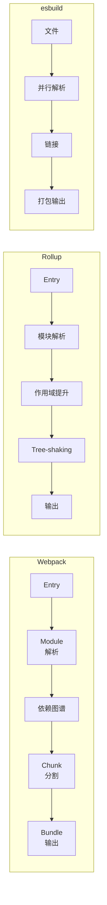

# 打包工具对比

> 本文档对比主流打包工具（Webpack / Rollup / Parcel / esbuild）的核心特性、Tree-shaking 原理与代码分割策略。

---

## 1. 打包工具概览

### 1.1 工具对比表

| 特性 | Webpack | Rollup | Parcel | esbuild |
|------|---------|--------|--------|---------|
| **定位** | 应用打包 | 库打包 | 零配置 | 极速编译器 |
| **配置复杂度** | 高 | 中 | 低 | 低 |
| **插件生态** | 丰富 | 中等 | 较少 | 有限 |
| **打包速度** | 慢 | 中 | 中 | 极快 |
| **Tree-shaking** | 支持（需配置） | 原生支持 | 自动 | 原生 |
| **代码分割** | splitChunks | manualChunks | 自动 | 不支持 |
| **适用场景** | 大型应用 | NPM 库 | 快速原型 | 性能关键 |

### 1.2 工作原理对比



---

## 2. Webpack 深度解析

### 2.1 核心概念

```typescript
// webpack.config.js - 完整配置
const path = require('path');
const HtmlWebpackPlugin = require('html-webpack-plugin');

module.exports = {
  // 入口
  entry: {
    main: './src/index.ts',
    vendor: './src/vendor.ts'
  },

  // 输出
  output: {
    path: path.resolve(__dirname, 'dist'),
    filename: '[name].[contenthash].js',
    chunkFilename: '[name].[contenthash].chunk.js',
    clean: true,  // 构建前清理输出目录
  },

  // 模块解析
  resolve: {
    extensions: ['.ts', '.js', '.json'],
    alias: {
      '@': path.resolve(__dirname, 'src')
    }
  },

  // Loader（处理非 JS 文件）
  module: {
    rules: [
      {
        test: /\.tsx?$/,
        use: 'ts-loader',
        exclude: /node_modules/
      },
      {
        test: /\.css$/,
        use: ['style-loader', 'css-loader', 'postcss-loader']
      },
      {
        test: /\.(png|jpg|gif|svg)$/,
        type: 'asset/resource'  // 资源模块类型
      }
    ]
  },

  // 插件
  plugins: [
    new HtmlWebpackPlugin({
      template: './src/index.html',
      chunks: ['main']
    })
  ],

  // 优化
  optimization: {
    minimize: true,
    splitChunks: {
      chunks: 'all',
      cacheGroups: {
        vendor: {
          test: /[\\/]node_modules[\\/]/,
          name: 'vendors',
          priority: 10
        }
      }
    }
  },

  // 开发工具
  devtool: 'source-map',

  // 开发服务器
  devServer: {
    static: './dist',
    port: 3000,
    hot: true
  }
};
```

### 2.2 Loader vs Plugin

```typescript
// Loader：文件级别转换
// 将文件转换为模块

// 示例：自定义 Loader
function myLoader(source, inputSourceMap) {
  // source: 文件内容
  // 返回转换后的内容

  const transformed = transform(source);

  // 如果需要返回 sourcemap
  return this.callback(null, transformed, inputSourceMap);
}

// 使用 Loader
module.exports = {
  module: {
    rules: [
      {
        test: /\.custom$/,
        use: [
          'babel-loader',        // 先执行
          'ts-loader',          // 后执行
          {                     // 或内联 Loader
            loader: 'custom-loader',
            options: { debug: true }
          }
        ]
      }
    ]
  }
};

// Plugin：构建生命周期钩子
// 在特定时机执行任务

// 示例：自定义 Plugin
class MyPlugin {
  constructor(options) {
    this.options = options;
  }

  // 插件主方法
  apply(compiler) {
    // 监听钩子
    compiler.hooks.emit.tap('MyPlugin', (compilation) => {
      // compilation: 编译对象，包含所有 chunk 和资源

      // 可以修改 compilation
      for (const [filename, file] of Object.entries(compilation.assets)) {
        // 统计产物大小
        console.log(`${filename}: ${file.size()} bytes`);
      }
    });

    // 监听并行钩子（更快）
    compiler.hooks.emit.tapAsync('MyPlugin', (compilation, callback) => {
      // 异步操作
      doSomething().then(() => callback());
    });
  }
}
```

### 2.3 splitChunks 深度配置

```typescript
// webpack.config.js - splitChunks 详解
module.exports = {
  optimization: {
    splitChunks: {
      // 分割哪些 chunk
      // 'all': 所有 chunk
      // 'async': 只分割动态 import
      // 'initial': 只分割入口 chunk
      chunks: 'all',

      // 最小 chunk 大小（字节）
      minSize: 20000,

      // 最大 chunk 大小
      maxSize: 244000,

      // 最小 chunks 数量（当超过这个数量时才分割）
      minChunks: 1,

      // 缓存组
      cacheGroups: {
        // 默认组
        defaultVendors: {
          test: /[\\/]node_modules[\\/]/,
          priority: -10,
          reuseExistingChunk: true  // 如果 chunk 已包含该模块，跳过
        },

        // 自定义组
        react: {
          test: /[\\/]node_modules[\\/](react|react-dom)[\\/]/,
          name: 'react-vendor',
          chunks: 'all',
          priority: 20
        },

        // 公共模块组
        common: {
          minChunks: 2,  // 被 2+ 模块使用
          priority: 5,
          reuseExistingChunk: true
        },

        // 配置组
        styles: {
          test: /\.css$/,
          type: 'css/mini-extract',
          name: 'styles',
          chunks: 'all',
          enforce: true
        }
      }
    },

    // 运行时代码分割
    runtimeChunk: 'single',

    // 入口代码分割
    // 将 webpack 运行时代码提取到独立 chunk
  }
};
```

---

## 3. Rollup 深度解析

### 3.1 核心特性

```typescript
// rollup.config.js - Rollup 配置
export default {
  // 输入
  input: 'src/index.ts',

  // 输出
  output: {
    // 输出格式
    // 'es' - ES 模块
    // 'cjs' - CommonJS
    // 'umd' - 通用模块定义
    // 'iife' - 立即执行函数
    format: 'es',

    // 文件名
    file: 'dist/bundle.js',

    // 或者目录输出（多出口）
    dir: 'dist',

    // 产物是否带 banner
    banner: '/* version 1.0.0 */',
    footer: '/* built with Rollup */',

    // 是否保留导入语句（false = 内联）
    preserveImports: true,

    // 展开导入（将 re-export 展开）
    // 即 import { a } from './a.js' + export { a } 变成 export { a } from './a.js'
    // import { a } from './a.js'
    // export { a }
    // 变成
    // export { a } from './a.js'
    // 减少打包体积
    // false 可以实现类似 tree-shaking 的效果
    // true 保留原始导入结构

    // exports - 导出方式
    // 'named' - 命名导出
    // 'default' - 默认导出
    // 'auto' - 自动检测
    exports: 'named',

    // 生成的代码格式
    // 'esm' - ES module
    // 'cjs' - CommonJS
    // 'iife' - IIFE
    // 'umd' - UMD
    generatedCode: {
      // 现代语法
      preset: 'es2015',

      // 箭头函数（关闭则使用 function）
      arrowFunctions: true,

      // const 常量（关闭则使用 var）
      constBindings: true,

      // 对象解构（关闭则使用临时变量）
      objectShorthand: true,

      // 保留注释
      preserveAnnotations: true
    },

    // sourcemap
    sourcemap: true
  },

  // 插件
  plugins: [
    resolve(),
    typescript(),
    terser()  // 压缩
  ]
};
```

### 3.2 输出多格式

```typescript
// 输出多种格式
export default {
  input: 'src/index.ts',
  output: [
    // ES 模块
    {
      file: 'dist/index.esm.js',
      format: 'es',
      sourcemap: true
    },
    // CommonJS
    {
      file: 'dist/index.cjs.js',
      format: 'cjs',
      sourcemap: true
    },
    // UMD（浏览器用）
    {
      file: 'dist/index.umd.js',
      format: 'umd',
      name: 'MyLib',  // 全局变量名
      sourcemap: true
    }
  ],
  plugins: [
    // ...
  ]
};
```

---

## 4. Parcel 深度解析

### 4.1 零配置特性

```typescript
// Parcel 自动处理：
// 1. 检测文件类型并使用对应 Loader
// 2. 自动安装缺失的依赖
// 3. 内置代码分割、HMR、Tree-shaking
// 4. 智能缓存构建结果

// package.json
{
  "scripts": {
    "dev": "parcel src/index.html",
    "build": "parcel build src/index.html"
  }
}

// src/index.html - Parcel 自动解析
// <script type="module" src="./index.ts"></script>
// 自动识别 TypeScript、Vue、Sass 等

// parcel.config.js - 可选配置
module.exports = {
  // 自定义插件
  plugins: []
};
```

### 4.2 Parcel 独有特性

```typescript
// Parcel 自动代码分割
// 使用动态 import 自动分割代码

// src/index.ts
// 动态导入会自动创建独立 chunk
const HeavyComponent = () => import('./HeavyComponent.vue');

// Parcel 输出：
// dist/index.js
// dist/HeavyComponent.js  ← 自动分割

// Parcel 自动转换
// .ts 文件自动转换，无需配置
// .scss 文件自动处理
// 图片自动优化

// Parcel 性能优化
// 内置多核并行构建
// 自动跳过未变化文件
// 增量构建
```

---

## 5. esbuild 深度解析

### 5.1 核心特性

```typescript
// esbuild 基本用法
const esbuild = require('esbuild');

esbuild.build({
  entryPoints: ['src/index.ts'],
  bundle: true,
  outfile: 'dist/bundle.js',
  target: 'es2020',
  minify: true,
  sourcemap: true
}).then(() => {
  console.log('Build successful');
});

// 服务模式（内置开发服务器）
esbuild.serve({
  servedir: 'dist',
  port: 3000
}, {
  entryPoints: ['src/index.ts'],
  bundle: true,
  outdir: 'dist'
});
```

### 5.2 API 详解

```typescript
// 完整 API 选项
esbuild.build({
  // 入口
  entryPoints: ['src/index.ts'],

  // 输出
  outfile: 'dist/bundle.js',  // 单文件输出
  // 或
  outdir: 'dist',              // 目录输出
  metafile: true,              // 生成元数据

  // 格式
  format: 'esm',     // 'esm' | 'cjs' | 'iife' | 'commonjs'
  platform: 'browser',  // 'browser' | 'node' | 'neutral'
  target: ['es2020', 'chrome90', 'firefox88', 'safari14'],

  // 代码分割（需配合 format）
  splitting: true,  // 启用代码分割
  // 需要 format: 'esm' 和 outdir

  // 代码转换
  jsx: 'automatic',  // 'transform' | 'preserve' | 'automatic'
  jsxImportSource: 'react',

  // 加载器
  loader: {
    '.ts': 'ts',
    '.tsx': 'tsx',
    '.css': 'css',
    '.png': 'file'
  },

  // 排除
  external: ['fs', 'path', 'react'],
  bundle: true,

  // 优化
  minify: false,
  treeShaking: true,
  alias: { '@': './src' },

  // 定义全局变量
  define: {
    'process.env.NODE_ENV': JSON.stringify('production')
  },

  // 源码映射
  sourcemap: true,  // true | false | 'inline' | 'linked' | 'map'

  // 源文件根目录
  sourceRoot: 'src',

  // 产物文件字符集
  charset: 'utf8',

  // 日志级别
  logLevel: 'info',
  color: true
}).then(result => {
  // 元数据
  console.log(result.metafile);
});

// 异步构建
(async () => {
  const result = await esbuild.build({
    entryPoints: ['src/index.ts'],
    bundle: true,
    metafile: true
  });

  // 分析产物
  const text = await esbuild.analyzeMetafile(result.metafile);
  console.log(text);
})();
```

---

## 6. Tree-shaking 原理

### 6.1 工作原理


### 6.2 Webpack Tree-shaking

```typescript
// 必须使用 ES Module 才能 Tree-shaking
// 因为 ESM 是静态分析

// src/math.js
export function add(a, b) { return a + b; }
export function subtract(a, b) { return a - b; }

// src/index.js
import { add } from './math';
console.log(add(1, 2));  // subtract 未使用，可被移除

// webpack.config.js - 开启 Tree-shaking
module.exports = {
  mode: 'production',  // 生产模式自动开启
  // 或
  optimization: {
    usedExports: true,  // 标记使用
    minimize: true,      // 删除未使用
    sideEffects: true    // 考虑 sideEffects
  }
};
```

### 6.3 Tree-shaking 配置

```typescript
// package.json - 标记 side effects
{
  "sideEffects": [
    "*.css",
    "./src/special.js"
  ]
}

// 或者关闭所有 Tree-shaking
{
  "sideEffects": false  // 所有文件认为无副作用
}

// src/no-side-effect.js
// 无副作用，Tree-shaking 可移除
export const unused = () => {};

// src/has-side-effect.js
// 有副作用，Tree-shaking 保留
console.log('side effect');
export const alsoUsed = () => {};

// webpack.config.js
module.exports = {
  optimization: {
    // 1. usedExports: 标记被使用的导出
    // 2. sideEffects: 识别 side effects
    // 3. minimize: 删除未使用的代码

    usedExports: true,
    sideEffects: true,

    // 内部优化
    providedExports: true,
    innerGraph: true,  // 分析内部依赖图
  }
};
```

### 6.4 Rollup Tree-shaking

```typescript
// Rollup 原生支持 Tree-shaking
// 比 Webpack 更彻底

// 示例：未使用代码会被完全移除
// src/utils.js
export function used() { return 'used'; }
export function unused() { return 'unused'; }

// src/main.js
import { used } from './utils';
used();

// 打包结果：只包含 used 函数
// "export function used() { return 'used'; }"
```

---

## 7. 代码分割策略

### 7.1 动态 import

```typescript
// 最简单的代码分割方式
// 动态 import 会自动创建独立 chunk

// index.ts
// 静态导入 - 打包到主 bundle
import { add } from './utils';
console.log(add(1, 2));

// 动态导入 - 自动分割
const handleClick = async () => {
  const { heavyFunc } = await import('./heavy');
  heavyFunc();
};

// 预加载（提示浏览器提前加载）
const link = document.createElement('link');
link.rel = 'modulepreload';
link.href = './heavy.js';
document.head.appendChild(link);

// 或者使用 import 预加载
const preload = import('./heavy');  // 提前加载

// 实际使用时
const useHeavy = async () => {
  const mod = await preload;  // 使用预加载的模块
  mod.heavyFunc();
};
```

### 7.2 Webpack 代码分割配置

```typescript
// webpack.config.js - 代码分割
module.exports = {
  optimization: {
    // 运行时代码独立
    runtimeChunk: {
      name: 'runtime'
    },

    // 分割配置
    splitChunks: {
      // 分割所有 chunk
      chunks: 'all',

      // 缓存组
      cacheGroups: {
        // 第三方库
        vendors: {
          test: /[\\/]node_modules[\\/]/,
          name: 'vendors',
          priority: 10,
          // 最小 chunk 大小
          minSize: 30000,
          // 最大请求数
          maxSize: 244000,
          // 最小 chunks 数
          minChunks: 1
        },

        // 公共模块（被 3+ 模块使用）
        common: {
          test: /[\\/]src[\\/]common[\\/]/,
          name: 'common',
          priority: 5,
          minChunks: 3
        }
      }
    }
  }
};
```

### 7.3 Vite 代码分割

```typescript
// vite.config.ts
export default defineConfig({
  build: {
    rollupOptions: {
      output: {
        // 手动分割
        manualChunks: {
          // Vue 生态
          'vue-vendor': ['vue', 'vue-router', 'pinia'],

          // Element Plus
          'element': ['element-plus'],

          // 工具库
          'utils': ['lodash-es', 'axios']
        },

        // 分割策略
        // 1. vendor 分离
        // 2. 大库分离
        // 3. 公共模块合并
        // 4. 动态 chunk 命名
      }
    }
  }
});

// 组件级别分割
// src/pages/Home.vue
// <script>
// 动态导入子组件
// const HeavyChart = () => import('../components/HeavyChart.vue');
// </script>
```

### 7.4 代码分割最佳实践

```typescript
// 1. 路由级别分割（React/Vue）
// React Router
// <Suspense fallback={<Loading />}>
//   <AsyncComponent />
// </Suspense>

// 2. 组件级别分割
// const HeavyTable = lazy(() => import('./HeavyTable'));

// 3. 库级别分割
// 将大型库单独打包
// moment.js (大) → day.js (小)

// 4. CSS 分割
// vite.config.ts
export default defineConfig({
  build: {
    cssCodeSplit: true  // 每个 CSS 文件单独分割
  }
});

// 5. 预加载关键 chunk
// <link rel="modulepreload" href="/js/vendor.js">
```

---

## 8. 性能对比

### 8.1 构建速度对比

| 工具 | 冷启动 | 热更新 | 生产构建 |
|------|--------|--------|---------|
| **Webpack** | 慢（需要打包） | 慢（需要重建） | 慢 |
| **Vite** | 快（ESM） | 快（模块级） | 快（Rolldown） |
| **Rollup** | 中 | 中 | 中 |
| **Parcel** | 中 | 中 | 中 |
| **esbuild** | 极快 | 极快 | 极快 |

### 8.2 产物大小对比

| 工具 | 基础开销 | Tree-shaking | 代码分割 |
|------|---------|-------------|---------|
| **Webpack** | ~50KB | 需配置 | 内置 |
| **Rollup** | ~5KB | 原生 | 需配置 |
| **esbuild** | ~1KB | 原生 | 不支持 |
| **Parcel** | ~25KB | 自动 | 自动 |

---

## 9. 参考链接

- [Webpack 文档](https://webpack.js.org/)
- [Rollup 文档](https://rollupjs.org/)
- [Parcel 文档](https://parceljs.org/)
- [esbuild 文档](https://esbuild.github.io/)
- [Vite 文档](https://vite.dev/)
- [Bundle 分析工具](https://github.com/webpack-contrib/webpack-bundle-analyzer)