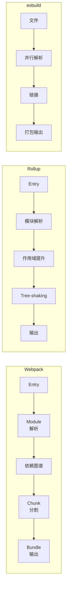

# 打包工具对比

> 本文档对比主流打包工具（Webpack / Rollup / Parcel / esbuild）的核心特性、Tree-shaking 原理与代码分割策略。

---

## 1. 打包工具概览

### 1.1 工具对比表

| 特性 | Webpack | Rollup | Parcel | esbuild |
|------|---------|--------|--------|---------|
| **定位** | 应用打包 | 库打包 | 零配置 | 极速编译器 |
| **配置复杂度** | 高 | 中 | 低 | 低 |
| **插件生态** | 丰富 | 中等 | 较少 | 有限 |
| **打包速度** | 慢 | 中 | 中 | 极快 |
| **Tree-shaking** | 支持（需配置） | 原生支持 | 自动 | 原生 |
| **代码分割** | splitChunks | manualChunks | 自动 | 不支持 |
| **适用场景** | 大型应用 | NPM 库 | 快速原型 | 性能关键 |

### 1.2 工作原理对比


```mermaid
flowchart LR
    subgraph webpack["Webpack"]
        W1["Entry"] --> W2["Module<br/>解析"]
        W2 --> W3["依赖图谱"]
        W3 --> W4["Chunk<br/>分割"]
        W4 --> W5["Bundle<br/>输出"]
    end

    subgraph rollup["Rollup"]
        R1["Entry"] --> R2["模块解析"]
        R2 --> R3["作用域提升"]
        R3 --> R4["Tree-shaking"]
        R4 --> R5["输出"]
    end

    subgraph esbuild["esbuild"]
        E1["文件"] --> E2["并行解析"]
        E2 --> E3["链接"]
        E3 --> E4["打包输出"]
    end
```

---

## 2. Webpack 深度解析

### 2.1 核心概念

```typescript
// webpack.config.js - 完整配置
const path = require('path');
const HtmlWebpackPlugin = require('html-webpack-plugin');

module.exports = {
  // 入口
  entry: {
    main: './src/index.ts',
    vendor: './src/vendor.ts'
  },

  // 输出
  output: {
    path: path.resolve(__dirname, 'dist'),
    filename: '[name].[contenthash].js',
    chunkFilename: '[name].[contenthash].chunk.js',
    clean: true,  // 构建前清理输出目录
  },

  // 模块解析
  resolve: {
    extensions: ['.ts', '.js', '.json'],
    alias: {
      '@': path.resolve(__dirname, 'src')
    }
  },

  // Loader（处理非 JS 文件）
  module: {
    rules: [
      {
        test: /\.tsx?$/,
        use: 'ts-loader',
        exclude: /node_modules/
      },
      {
        test: /\.css$/,
        use: ['style-loader', 'css-loader', 'postcss-loader']
      },
      {
        test: /\.(png|jpg|gif|svg)$/,
        type: 'asset/resource'  // 资源模块类型
      }
    ]
  },

  // 插件
  plugins: [
    new HtmlWebpackPlugin({
      template: './src/index.html',
      chunks: ['main']
    })
  ],

  // 优化
  optimization: {
    minimize: true,
    splitChunks: {
      chunks: 'all',
      cacheGroups: {
        vendor: {
          test: /[\\/]node_modules[\\/]/,
          name: 'vendors',
          priority: 10
        }
      }
    }
  },

  // 开发工具
  devtool: 'source-map',

  // 开发服务器
  devServer: {
    static: './dist',
    port: 3000,
    hot: true
  }
};
```

### 2.2 Loader vs Plugin

```typescript
// Loader：文件级别转换
// 将文件转换为模块

// 示例：自定义 Loader
function myLoader(source, inputSourceMap) {
  // source: 文件内容
  // 返回转换后的内容

  const transformed = transform(source);

  // 如果需要返回 sourcemap
  return this.callback(null, transformed, inputSourceMap);
}

// 使用 Loader
module.exports = {
  module: {
    rules: [
      {
        test: /\.custom$/,
        use: [
          'babel-loader',        // 先执行
          'ts-loader',          // 后执行
          {                     // 或内联 Loader
            loader: 'custom-loader',
            options: { debug: true }
          }
        ]
      }
    ]
  }
};

// Plugin：构建生命周期钩子
// 在特定时机执行任务

// 示例：自定义 Plugin
class MyPlugin {
  constructor(options) {
    this.options = options;
  }

  // 插件主方法
  apply(compiler) {
    // 监听钩子
    compiler.hooks.emit.tap('MyPlugin', (compilation) => {
      // compilation: 编译对象，包含所有 chunk 和资源

      // 可以修改 compilation
      for (const [filename, file] of Object.entries(compilation.assets)) {
        // 统计产物大小
        console.log(`${filename}: ${file.size()} bytes`);
      }
    });

    // 监听并行钩子（更快）
    compiler.hooks.emit.tapAsync('MyPlugin', (compilation, callback) => {
      // 异步操作
      doSomething().then(() => callback());
    });
  }
}
```

### 2.3 splitChunks 深度配置

```typescript
// webpack.config.js - splitChunks 详解
module.exports = {
  optimization: {
    splitChunks: {
      // 分割哪些 chunk
      // 'all': 所有 chunk
      // 'async': 只分割动态 import
      // 'initial': 只分割入口 chunk
      chunks: 'all',

      // 最小 chunk 大小（字节）
      minSize: 20000,

      // 最大 chunk 大小
      maxSize: 244000,

      // 最小 chunks 数量（当超过这个数量时才分割）
      minChunks: 1,

      // 缓存组
      cacheGroups: {
        // 默认组
        defaultVendors: {
          test: /[\\/]node_modules[\\/]/,
          priority: -10,
          reuseExistingChunk: true  // 如果 chunk 已包含该模块，跳过
        },

        // 自定义组
        react: {
          test: /[\\/]node_modules[\\/](react|react-dom)[\\/]/,
          name: 'react-vendor',
          chunks: 'all',
          priority: 20
        },

        // 公共模块组
        common: {
          minChunks: 2,  // 被 2+ 模块使用
          priority: 5,
          reuseExistingChunk: true
        },

        // 配置组
        styles: {
          test: /\.css$/,
          type: 'css/mini-extract',
          name: 'styles',
          chunks: 'all',
          enforce: true
        }
      }
    },

    // 运行时代码分割
    runtimeChunk: 'single',

    // 入口代码分割
    // 将 webpack 运行时代码提取到独立 chunk
  }
};
```

---

## 3. Rollup 深度解析

### 3.1 核心特性

```typescript
// rollup.config.js - Rollup 配置
export default {
  // 输入
  input: 'src/index.ts',

  // 输出
  output: {
    // 输出格式
    // 'es' - ES 模块
    // 'cjs' - CommonJS
    // 'umd' - 通用模块定义
    // 'iife' - 立即执行函数
    format: 'es',

    // 文件名
    file: 'dist/bundle.js',

    // 或者目录输出（多出口）
    dir: 'dist',

    // 产物是否带 banner
    banner: '/* version 1.0.0 */',
    footer: '/* built with Rollup */',

    // 是否保留导入语句（false = 内联）
    preserveImports: true,

    // 展开导入（将 re-export 展开）
    // 即 import { a } from './a.js' + export { a } 变成 export { a } from './a.js'
    // import { a } from './a.js'
    // export { a }
    // 变成
    // export { a } from './a.js'
    // 减少打包体积
    // false 可以实现类似 tree-shaking 的效果
    // true 保留原始导入结构

    // exports - 导出方式
    // 'named' - 命名导出
    // 'default' - 默认导出
    // 'auto' - 自动检测
    exports: 'named',

    // 生成的代码格式
    // 'esm' - ES module
    // 'cjs' - CommonJS
    // 'iife' - IIFE
    // 'umd' - UMD
    generatedCode: {
      // 现代语法
      preset: 'es2015',

      // 箭头函数（关闭则使用 function）
      arrowFunctions: true,

      // const 常量（关闭则使用 var）
      constBindings: true,

      // 对象解构（关闭则使用临时变量）
      objectShorthand: true,

      // 保留注释
      preserveAnnotations: true
    },

    // sourcemap
    sourcemap: true
  },

  // 插件
  plugins: [
    resolve(),
    typescript(),
    terser()  // 压缩
  ]
};
```

### 3.2 输出多格式

```typescript
// 输出多种格式
export default {
  input: 'src/index.ts',
  output: [
    // ES 模块
    {
      file: 'dist/index.esm.js',
      format: 'es',
      sourcemap: true
    },
    // CommonJS
    {
      file: 'dist/index.cjs.js',
      format: 'cjs',
      sourcemap: true
    },
    // UMD（浏览器用）
    {
      file: 'dist/index.umd.js',
      format: 'umd',
      name: 'MyLib',  // 全局变量名
      sourcemap: true
    }
  ],
  plugins: [
    // ...
  ]
};
```

---

## 4. Parcel 深度解析

### 4.1 零配置特性

```typescript
// Parcel 自动处理：
// 1. 检测文件类型并使用对应 Loader
// 2. 自动安装缺失的依赖
// 3. 内置代码分割、HMR、Tree-shaking
// 4. 智能缓存构建结果

// package.json
{
  "scripts": {
    "dev": "parcel src/index.html",
    "build": "parcel build src/index.html"
  }
}

// src/index.html - Parcel 自动解析
// <script type="module" src="./index.ts"></script>
// 自动识别 TypeScript、Vue、Sass 等

// parcel.config.js - 可选配置
module.exports = {
  // 自定义插件
  plugins: []
};
```

### 4.2 Parcel 独有特性

```typescript
// Parcel 自动代码分割
// 使用动态 import 自动分割代码

// src/index.ts
// 动态导入会自动创建独立 chunk
const HeavyComponent = () => import('./HeavyComponent.vue');

// Parcel 输出：
// dist/index.js
// dist/HeavyComponent.js  ← 自动分割

// Parcel 自动转换
// .ts 文件自动转换，无需配置
// .scss 文件自动处理
// 图片自动优化

// Parcel 性能优化
// 内置多核并行构建
// 自动跳过未变化文件
// 增量构建
```

---

## 5. esbuild 深度解析

### 5.1 核心特性

```typescript
// esbuild 基本用法
const esbuild = require('esbuild');

esbuild.build({
  entryPoints: ['src/index.ts'],
  bundle: true,
  outfile: 'dist/bundle.js',
  target: 'es2020',
  minify: true,
  sourcemap: true
}).then(() => {
  console.log('Build successful');
});

// 服务模式（内置开发服务器）
esbuild.serve({
  servedir: 'dist',
  port: 3000
}, {
  entryPoints: ['src/index.ts'],
  bundle: true,
  outdir: 'dist'
});
```

### 5.2 API 详解

```typescript
// 完整 API 选项
esbuild.build({
  // 入口
  entryPoints: ['src/index.ts'],

  // 输出
  outfile: 'dist/bundle.js',  // 单文件输出
  // 或
  outdir: 'dist',              // 目录输出
  metafile: true,              // 生成元数据

  // 格式
  format: 'esm',     // 'esm' | 'cjs' | 'iife' | 'commonjs'
  platform: 'browser',  // 'browser' | 'node' | 'neutral'
  target: ['es2020', 'chrome90', 'firefox88', 'safari14'],

  // 代码分割（需配合 format）
  splitting: true,  // 启用代码分割
  // 需要 format: 'esm' 和 outdir

  // 代码转换
  jsx: 'automatic',  // 'transform' | 'preserve' | 'automatic'
  jsxImportSource: 'react',

  // 加载器
  loader: {
    '.ts': 'ts',
    '.tsx': 'tsx',
    '.css': 'css',
    '.png': 'file'
  },

  // 排除
  external: ['fs', 'path', 'react'],
  bundle: true,

  // 优化
  minify: false,
  treeShaking: true,
  alias: { '@': './src' },

  // 定义全局变量
  define: {
    'process.env.NODE_ENV': JSON.stringify('production')
  },

  // 源码映射
  sourcemap: true,  // true | false | 'inline' | 'linked' | 'map'

  // 源文件根目录
  sourceRoot: 'src',

  // 产物文件字符集
  charset: 'utf8',

  // 日志级别
  logLevel: 'info',
  color: true
}).then(result => {
  // 元数据
  console.log(result.metafile);
});

// 异步构建
(async () => {
  const result = await esbuild.build({
    entryPoints: ['src/index.ts'],
    bundle: true,
    metafile: true
  });

  // 分析产物
  const text = await esbuild.analyzeMetafile(result.metafile);
  console.log(text);
})();
```

---

## 6. Tree-shaking 原理

### 6.1 工作原理


```mermaid
flowchart LR
    A["源代码"] --> B["解析 AST"]
    B --> C["标记引用"]
    C --> D["识别未使用"]
    D --> E["删除死代码"]
    E --> F["输出"]
```

### 6.2 Webpack Tree-shaking

```typescript
// 必须使用 ES Module 才能 Tree-shaking
// 因为 ESM 是静态分析

// src/math.js
export function add(a, b) { return a + b; }
export function subtract(a, b) { return a - b; }

// src/index.js
import { add } from './math';
console.log(add(1, 2));  // subtract 未使用，可被移除

// webpack.config.js - 开启 Tree-shaking
module.exports = {
  mode: 'production',  // 生产模式自动开启
  // 或
  optimization: {
    usedExports: true,  // 标记使用
    minimize: true,      // 删除未使用
    sideEffects: true    // 考虑 sideEffects
  }
};
```

### 6.3 Tree-shaking 配置

```typescript
// package.json - 标记 side effects
{
  "sideEffects": [
    "*.css",
    "./src/special.js"
  ]
}

// 或者关闭所有 Tree-shaking
{
  "sideEffects": false  // 所有文件认为无副作用
}

// src/no-side-effect.js
// 无副作用，Tree-shaking 可移除
export const unused = () => {};

// src/has-side-effect.js
// 有副作用，Tree-shaking 保留
console.log('side effect');
export const alsoUsed = () => {};

// webpack.config.js
module.exports = {
  optimization: {
    // 1. usedExports: 标记被使用的导出
    // 2. sideEffects: 识别 side effects
    // 3. minimize: 删除未使用的代码

    usedExports: true,
    sideEffects: true,

    // 内部优化
    providedExports: true,
    innerGraph: true,  // 分析内部依赖图
  }
};
```

### 6.4 Rollup Tree-shaking

```typescript
// Rollup 原生支持 Tree-shaking
// 比 Webpack 更彻底

// 示例：未使用代码会被完全移除
// src/utils.js
export function used() { return 'used'; }
export function unused() { return 'unused'; }

// src/main.js
import { used } from './utils';
used();

// 打包结果：只包含 used 函数
// "export function used() { return 'used'; }"
```

---

## 7. 代码分割策略

### 7.1 动态 import

```typescript
// 最简单的代码分割方式
// 动态 import 会自动创建独立 chunk

// index.ts
// 静态导入 - 打包到主 bundle
import { add } from './utils';
console.log(add(1, 2));

// 动态导入 - 自动分割
const handleClick = async () => {
  const { heavyFunc } = await import('./heavy');
  heavyFunc();
};

// 预加载（提示浏览器提前加载）
const link = document.createElement('link');
link.rel = 'modulepreload';
link.href = './heavy.js';
document.head.appendChild(link);

// 或者使用 import 预加载
const preload = import('./heavy');  // 提前加载

// 实际使用时
const useHeavy = async () => {
  const mod = await preload;  // 使用预加载的模块
  mod.heavyFunc();
};
```

### 7.2 Webpack 代码分割配置

```typescript
// webpack.config.js - 代码分割
module.exports = {
  optimization: {
    // 运行时代码独立
    runtimeChunk: {
      name: 'runtime'
    },

    // 分割配置
    splitChunks: {
      // 分割所有 chunk
      chunks: 'all',

      // 缓存组
      cacheGroups: {
        // 第三方库
        vendors: {
          test: /[\\/]node_modules[\\/]/,
          name: 'vendors',
          priority: 10,
          // 最小 chunk 大小
          minSize: 30000,
          // 最大请求数
          maxSize: 244000,
          // 最小 chunks 数
          minChunks: 1
        },

        // 公共模块（被 3+ 模块使用）
        common: {
          test: /[\\/]src[\\/]common[\\/]/,
          name: 'common',
          priority: 5,
          minChunks: 3
        }
      }
    }
  }
};
```

### 7.3 Vite 代码分割

```typescript
// vite.config.ts
export default defineConfig({
  build: {
    rollupOptions: {
      output: {
        // 手动分割
        manualChunks: {
          // Vue 生态
          'vue-vendor': ['vue', 'vue-router', 'pinia'],

          // Element Plus
          'element': ['element-plus'],

          // 工具库
          'utils': ['lodash-es', 'axios']
        },

        // 分割策略
        // 1. vendor 分离
        // 2. 大库分离
        // 3. 公共模块合并
        // 4. 动态 chunk 命名
      }
    }
  }
});

// 组件级别分割
// src/pages/Home.vue
// <script>
// 动态导入子组件
// const HeavyChart = () => import('../components/HeavyChart.vue');
// </script>
```

### 7.4 代码分割最佳实践

```typescript
// 1. 路由级别分割（React/Vue）
// React Router
// <Suspense fallback={<Loading />}>
//   <AsyncComponent />
// </Suspense>

// 2. 组件级别分割
// const HeavyTable = lazy(() => import('./HeavyTable'));

// 3. 库级别分割
// 将大型库单独打包
// moment.js (大) → day.js (小)

// 4. CSS 分割
// vite.config.ts
export default defineConfig({
  build: {
    cssCodeSplit: true  // 每个 CSS 文件单独分割
  }
});

// 5. 预加载关键 chunk
// <link rel="modulepreload" href="/js/vendor.js">
```

---

## 8. 性能对比

### 8.1 构建速度对比

| 工具 | 冷启动 | 热更新 | 生产构建 |
|------|--------|--------|---------|
| **Webpack** | 慢（需要打包） | 慢（需要重建） | 慢 |
| **Vite** | 快（ESM） | 快（模块级） | 快（Rolldown） |
| **Rollup** | 中 | 中 | 中 |
| **Parcel** | 中 | 中 | 中 |
| **esbuild** | 极快 | 极快 | 极快 |

### 8.2 产物大小对比

| 工具 | 基础开销 | Tree-shaking | 代码分割 |
|------|---------|-------------|---------|
| **Webpack** | ~50KB | 需配置 | 内置 |
| **Rollup** | ~5KB | 原生 | 需配置 |
| **esbuild** | ~1KB | 原生 | 不支持 |
| **Parcel** | ~25KB | 自动 | 自动 |

---

## 9. 参考链接

- [Webpack 文档](https://webpack.js.org/)
- [Rollup 文档](https://rollupjs.org/)
- [Parcel 文档](https://parceljs.org/)
- [esbuild 文档](https://esbuild.github.io/)
- [Vite 文档](https://vite.dev/)
- [Bundle 分析工具](https://github.com/webpack-contrib/webpack-bundle-analyzer)

## 深入阅读与参考

!!! tip "怎么用这些资料"
    先读「官方文档与规范」建立准确的概念，再读「源码与示例」核对细节，最后用「教程、书籍与视频」换一种讲法加深理解。每条都写明了读哪一节、带着什么问题读。

### 官方文档与规范

| 资源 | 为什么读 | 怎么读 |
|---|---|---|
| [Rollup 文档](https://cn.rollupjs.org/) | Tree-shaking 与 ES 模块打包的权威说明，原理讲得最清楚。 | 先读 Tree-shaking 与 output 两节，带着「哪些导出会被删」的问题读，再跑官方示例验证。 |
| [webpack 文档](https://webpack.js.org/concepts/) | 核心概念与 loader/plugin 机制的第一手资料，面试高频。 | 按概念、配置、插件顺序通读，重点看依赖图与 chunk 生成，读完复述一次编译流程。 |
| [Rollup 配置选项](https://rollupjs.org/configuration-options/) | output 与 treeshake 两节是理解产物格式与摇树开关的关键。 | 对照配置逐项试：改 format、开关 treeshake，比较产物差异并记录结论。 |
| [esbuild 文档](https://esbuild.github.io/) | API、CLI 与限制说明齐全，快速掌握 esbuild 能力边界。 | 先看 CLI 与 JS API 两节，亲手跑一次 build，记下它明确不支持的配置项。 |
| [esbuild 架构说明](https://github.com/evanw/esbuild/blob/main/docs/architecture.md) | 从并行、少遍历、内存布局三点解释 esbuild 为何快。 | 通读架构文档并做笔记，读完用一句话回答它为了速度牺牲了什么。 |

### 源码与示例

| 资源 | 为什么读 | 怎么读 |
|---|---|---|
| [rollup](https://github.com/rollup/rollup) | 看 Rollup 如何构建模块图，理解打包器的核心数据结构。 | 先读类定义与注释，再顺调用链找模块解析入口，动手画出模块图流程。 |
| [Rolldown 入门](https://rolldown.rs/guide/getting-started) | Rust 版 Rollup 兼容实现，最小示例看清打包器接口。 | 按文档跑通最小示例，改一处配置看输出，再与 Rollup 行为对比。 |
| [webpack 模块联邦](https://webpack.js.org/concepts/module-federation/) | 两个应用共享远程模块，直观理解运行时加载与代码分割。 | 照着搭两个应用，看远程 chunk 何时加载，读完总结适用场景与代价。 |
| [esbuild 插件](https://esbuild.github.io/plugins/) | onResolve 与 onLoad 示例，亲手体验 esbuild 插件模型。 | 先抄示例跑通，再自己写一个虚拟模块插件，观察解析与加载顺序。 |

### 教程、书籍与视频

| 资源 | 为什么读 | 怎么读 |
|---|---|---|
| [webpack 入门指南](https://webpack.js.org/guides/getting-started/) | 手把手从零配置，把抽象概念落到可运行的配置文件上。 | 跟着走完整个流程，每加一个 loader 或 plugin 就记录它解决了什么问题。 |
| [Rollup 简介（中文）](https://cn.rollupjs.org/introduction/) | 中文入门，快速跑通 esm 与 cjs 双格式库打包。 | 按步骤配置多格式输出，读完对比两种产物差异与其各自用途。 |
| [Rspack 文档](https://rspack.rs/) | 迁移案例揭示 webpack 生态的性能瓶颈与替代路线。 | 挑一个已有 webpack 项目试迁移，记录兼容问题与构建耗时变化。 |

## 应用与行业实践

### 应用场景地图

下表按工程现场的具体场景，对照本页知识点给出选型与注意点。

| 场景 | 用到本页哪个知识点 | 典型技术选型 | 注意事项 |
|:--|:--|:--|:--|
| 后台管理系统的万行表格首屏 | 代码分割、动态 import | Webpack `splitChunks` 配合动态 `import()` | 表格依赖不要混进路由主包，块名固定才有利于长期缓存 |
| 低端安卓上的营销活动首屏 | Tree-shaking、产物压缩 | esbuild `bundle` 配合 `minify` | `target` 定得越低，插入的降级代码越多，先量体积再定档 |
| 多人协作白板 | 代码分割边界 | Webpack 动态 import 加常驻长连接模块 | 协同内核不要放进懒加载块，重连时不该重新下载 |
| 组件库发布到 npm | Tree-shaking、输出格式 | Rollup 多格式输出加 `external` | 声明无副作用之前，先确认样式是怎么引入的 |
| SSR 的电商详情页 | 输出格式、外部依赖 | Webpack `externals` 或 Rollup `external` | 服务端与客户端产物要指向同一份模块实例 |
| Chrome 扩展的 content script | 输出格式 | esbuild `--format=iife` | 该环境不能直接加载 ESM，也拿不到运行时按需加载 |
| 埋点 SDK 发到 CDN | 产物体积、摇树 | esbuild `--format=iife --minify` | SDK 要自包含，第三方依赖必须打进产物 |
| 微前端子应用 | 代码分割、共享依赖 | Webpack Module Federation | 共享依赖版本要统一，否则运行时会同时存在多份实例 |
| 遗留 Webpack 4 项目升级 | 分割策略、缓存 | Webpack 5 的 `optimization.splitChunks` | 先让构建跑通，再调分割，别把两件事放在同一次改动里 |

### 三个场景拆解

#### 场景 1：后台管理系统的万行表格首屏

**业务背景**：表格首屏要渲染上万行，用户进页面就滚动查看，脚本求值占掉主要等待时间。项目路由有几十个，主包体积随页面数量一起增长。

**怎么用本页知识解决**：思路是按路由和依赖体积切块，把只为表格服务的依赖单独成块，首屏只下载主包与表格块。

```js
// 1. 路由级懒加载：进入表格页才下载对应代码
const TablePage = () => import(/* webpackChunkName: "table-page" */ './TablePage');

// 2. 把虚拟滚动库单独成块，避免它被重复打进多个页面
module.exports = {
  optimization: {
    splitChunks: {
      cacheGroups: {
        virtualList: {
          test: /[\\/]node_modules[\\/]react-window/, // 命中虚拟滚动库
          name: 'vendor-virtual-list',                // 固定块名，利于长期缓存
          chunks: 'all',                              // 同步与异步块都参与提取
        },
      },
    },
  },
};
```

- 动态 import 把表格页拆成独立块，首屏不必解析表格代码。
- cacheGroups 按路径命中虚拟滚动库，块名固定后内容不变就不失效。
- chunks 设为 all，让同步引入该库的页面也复用它，避免重复下载。
- 入口主包只留路由表和布局，页面数量增加不会推高首屏体积。
- 懒加载块的依赖要自洽，别让它在运行时再去拉别的公共块。

**怎么度量收益**：

- 用 webpack-bundle-analyzer 看主包与 table-page 块的体积构成。
- 用 Chrome DevTools 的 Network 面板看首屏请求数与 transfer size。
- 用 Lighthouse 移动端模式看 FCP、LCP。
- 用 Performance 面板录制首屏，看主线程长任务的数量与时长。

**什么时候不该用**：

- 表格页是用户登录后的唯一落地页，再拆一块只是多一次请求往返。
- 表格数据要在首屏一次性导出或打印全量内容，懒加载省不下解析时间。
- 项目没接入 Webpack，只为拆包引入它属于增加维护面。

#### 场景 2：低端安卓上的营销活动首屏

**业务背景**：活动页投放到低端安卓机型，网络与 CPU 都受限，首屏等待直接掉转化。页面上线周期短，代码里沉淀了多个版本的组件。

**怎么用本页知识解决**：思路是压小产物、只做目标浏览器需要的语法降级，并用副作用声明让摇树真正生效。

```js
// esbuild 构建脚本：首屏产物给低端安卓浏览器加载
await esbuild.build({
  entryPoints: ['src/main.js'],
  bundle: true,       // 合并依赖，减少首屏请求数
  minify: true,       // 压缩标识符与空白，降低传输体积
  format: 'iife',     // 单文件自执行，不依赖浏览器模块加载
  target: ['es2017'], // 只插入目标浏览器需要的语法降级
  outfile: 'dist/main.js',
});
```

- bundle 把依赖合成一个文件，首屏请求数从多次降到一次。
- minify 压小传输体积，配合服务端 gzip 后效果叠加。
- target 只做必要降级，不写 es5 就不会插入大段垫片。
- 依赖包的 package.json 里声明 sideEffects 为 false，工具才敢删未使用的导出。
- 活动页避免动态 import，弱网下多一次往返的代价高于切块收益。

**怎么度量收益**：

- 用 Lighthouse 移动端模式看 FCP、LCP、TBT，并开启 Slow 4G 与 CPU 降速。
- 用 Network 面板看首屏 JS 的 transfer size 与请求数。
- 用 Performance 面板看 Evaluate Script 的耗时。
- 改前改后固定同一台真机或同一档降速设置，避免换设备让结论失真。

**什么时候不该用**：

- 要支持只认 ES5 的内嵌 WebView 时，降级代码与 polyfill 会把体积推回去。
- 页面内容由 SSR 直出且首屏已有可读内容，压缩 JS 对 LCP 的影响变小。
- 页面依赖大量运行时按需加载的模块，比如地图与直播，强行合成单文件会拉长解析。

#### 场景 3：组件库发布到 npm

**业务背景**：组件库被多个业务项目引用，使用方只用一个按钮，产物里却带进整包代码。发布物要同时服务打包工具和 Node 环境。

**怎么用本页知识解决**：思路是输出多格式产物、把宿主框架列为外部依赖，并声明模块无副作用。

```js
// rollup.config.js：组件库输出 ESM 与 CJS 两份产物
export default {
  input: 'src/index.js',
  external: ['react', 'react-dom'],        // 框架由使用方提供，不重复打包
  treeshake: { moduleSideEffects: false }, // 声明模块无副作用，便于消费端摇树
  output: [
    { file: 'dist/index.esm.js', format: 'es' },  // 给打包工具消费
    { file: 'dist/index.cjs.js', format: 'cjs' }, // 给 Node 与旧工具链消费
  ],
};
```

- 两个 format 覆盖打包工具与 Node 两类消费方。
- external 把 React 交给使用方，产物里不会出现第二份实例。
- treeshake 与 package.json 的 sideEffects 一起声明，摇树才敢删代码。
- 想让消费端按文件摇树，可用 preserveModules 保留模块结构，代价是产物文件数上升。
- 声明无副作用前，要确认样式不是靠 import 的副作用引入的。

**怎么度量收益**：

- 用 rollup-plugin-visualizer 看两份产物的模块构成。
- 用 npm pack --dry-run 看发布包的文件数与体积。
- 建一个空工程只 import 一个组件，构建后检索产物里是否出现其他组件代码。
- 在消费端用 webpack-bundle-analyzer 或 rollup-plugin-visualizer 复核。
- tarball 体积与 gzip 后体积分别记录，两个数字不能互相替代。

**什么时候不该用**：

- 使用方全部走 CDN 直接引 IIFE，ESM 与 CJS 两份产物都是冗余。
- 组件之间共享一个运行时单例，比如全局 store，拆成多入口会破坏单例。
- 样式靠副作用 import 引入时，声明无副作用会把样式一起摇掉。
- 只有内部项目使用且都走构建工具处理源码，直接发源码可以省掉多格式构建。

### 行业先进实践

**依赖预构建（出处：Vite 官方文档 Dependency Pre-Bundling）**

Vite 用 esbuild 把 CommonJS 依赖预构建成 ESM，并把一个依赖的多个模块合并成一份文件。这样请求数下降，依赖内部也不会散成多文件。

你的项目可以在构建前加一步预构建，把第三方 CJS 依赖先转成 ESM。

**sideEffects 声明（出处：webpack 官方文档 Tree Shaking 章节）**

package.json 里写 sideEffects 为 false，或者列出有副作用的文件，构建工具才敢删未使用的导出。它把能删和删了会出错两类模块分开。

你的项目先列出样式与注册类文件，再对剩余模块声明无副作用。

**模块结构保留输出（出处：Rollup 官方文档 output.preserveModules）**

preserveModules 让产物保留源文件结构，使用方按需引入时只处理被引用到的文件，摇树的责任落到消费端。

组件库按一文件一组件组织，再用 preserveModules 输出，接入方不必改引入方式。

**模块共享（出处：webpack 官方文档 Module Federation）**

多个独立构建的应用在运行时共享同一份依赖代码，各自不再打包一份，解决的是多应用重复加载同一依赖的问题。

你的项目先统一子应用依赖版本，再圈定共享范围，版本不统一会让共享退化成多实例。

**作用域提升（出处：Parcel 官方文档 Scope Hoisting）**

Parcel 在生产构建中把模块合并进同一作用域，模块包装函数的数量随之下降，产物结构接近手写代码。

你可以对照产物里包装函数的数量，判断哪些模块边界还有合并空间。

### 从学到用：落地路线

1. **试点**：选一个路由数量多、首屏体积有增长曲线的页面，只改它的加载方式。验收标准是改动只涉及该页面入口与配置，其他页面产物哈希不变。
2. **验证**：在固定降速档位下，用 webpack-bundle-analyzer 与 Lighthouse 采集改前改后两组数据。验收标准是能给出两次测量的指标表，且测量条件写清楚。
3. **推广**：把试点结论整理成配置模板与检查清单，其他页面按同一模板接入。验收标准是新页面接入后检查清单逐项可勾选。
4. **防回退**：把首屏产物体积与块数量做成构建期检查，超阈值时让构建报警。验收标准是人为引入一个体积偏大的依赖后，CI 能拦住这次提交。

### 动手作业

**目标**：为一个含四个路由的示例应用做代码分割与摇树验证，产出一份改前改后的对照记录。

**步骤**：

1. 用 Webpack 建一个含四个路由的应用，其中一个路由引入一个体积偏大的图表库。
2. 记录改前数据：入口产物体积、首屏请求数、Lighthouse 移动端 FCP 与 LCP。
3. 把该路由改成动态 import，并在配置里为图表库写一个 cacheGroup。
4. 检查依赖包的 package.json 是否声明 sideEffects，用 webpack-bundle-analyzer 对比前后构成。
5. 在固定降速档位下重新采集同一组指标，填进对照表。
6. 在入口引入一个未被使用的工具库导出，确认产物里检索不到它。
7. 把配置文件与结论写成一份 README，写清测量条件与已知限制。

**验收标准**：

- 首屏产物体积与首屏请求数都有改动前后的记录，且两次测量条件一致。
- webpack-bundle-analyzer 的截图里能指出图表库被移到了独立块。
- 未使用的导出在产物中检索不到对应函数名。
- README 写清了测试机或降速档位，别人能复现同一组数字。
- 改动只影响目标路由，其他路由的产物哈希保持不变。

