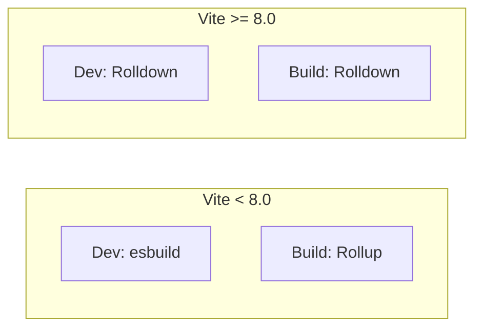
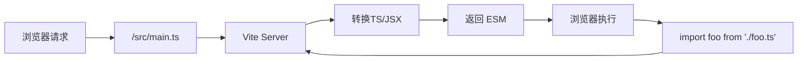
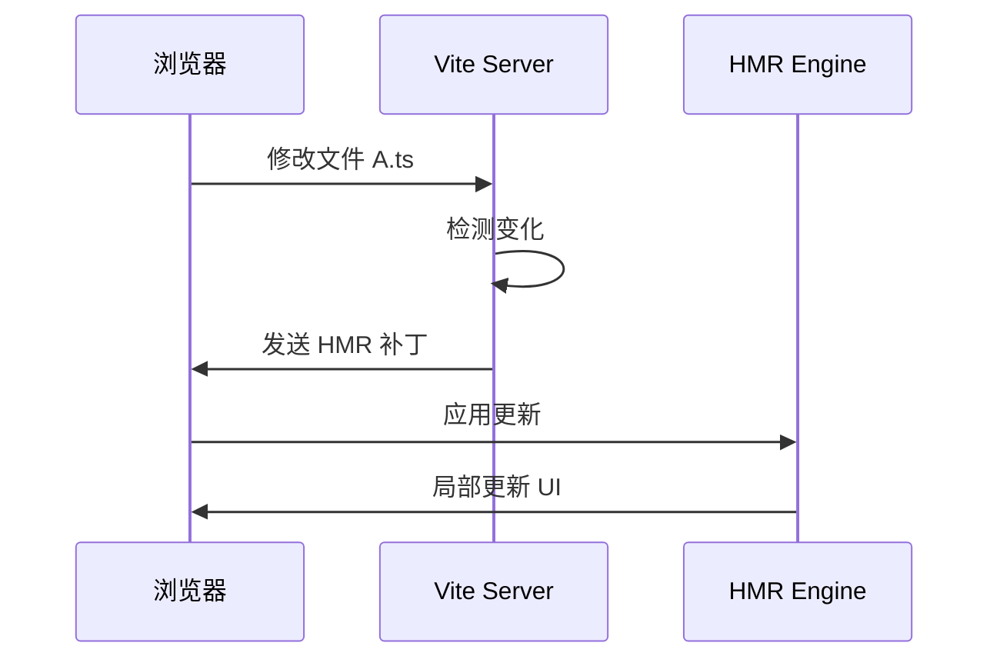

# 构建工具全景图

> 本文档梳理前端构建工具的分类、定位对比与面试常考点。

---

## 1. 构建工具分类

构建工具按功能可分为三大类：

| 分类 | 核心能力 | 代表工具 |
|------|---------|---------|
| **Bundler（打包器）** | 将多个模块打包成浏览器可运行的产物 | Webpack, Vite, Rollup, Parcel, esbuild |
| **Transpiler（转译器）** | 将新版本 JS/TS 语法转译为兼容版本 | Babel, SWC, esbuild (编译) |
| **Task Runner（任务运行器）** | 编排多个构建任务和自动化流程 | npm scripts, Gulp, Grunt |

### 1.1 工具定位图

```
                    功能复杂度/配置成本
                           │
         高复杂度          │           低复杂度
         高配置            │           高配置
    ┌──────────────────────┼──────────────────────┐
    │   Webpack (功能最强) │                      │
    │   Vite (开发体验好)  │                      │
    │   Rollup (库打包)    │                      │
    │                      │   Parcel (零配置)    │
    │                      │   esbuild (极速)     │
    └──────────────────────┼──────────────────────┘
                           │
                    Transpiler / Task Runner
                           │
                      Babel / SWC / Gulp
```

### 1.2 生态定位对比

| 工具 | 定位 | 适用场景 | 打包速度 | 配置复杂度 |
|------|------|---------|---------|-----------|
| **Webpack** | 功能最全的打包器 | 大型应用、SPA | 慢 | 高 |
| **Vite** | 下一代开发服务器 | 现代框架应用 | 快（Dev）/ 快（Build） | 中 |
| **Rollup** | 库打包专家 | NPM 包、库开发 | 中 | 低 |
| **Parcel** | 零配置打包器 | 小型项目、快速原型 | 中 | 极低 |
| **esbuild** | 极速编译器 | 性能关键场景 | 极快 | 低 |

---

## 2. Vite 8.x 新特性

Vite 8.0 是 2025 年的重大版本更新，带来多项核心变化：

### 2.1 Rolldown 统一打包器

Vite 8.0 将开发环境使用的 esbuild 打包器替换为 **Rolldown**（Rust 实现的 Rollup 兼容打包器），实现开发/生产一致：



**核心优势**：
- Dev/Build 使用同一打包器，行为完全一致
- Rollup 生态插件可直接使用
- 性能大幅提升（Rust 实现）

### 2.2 配置文件变化

```typescript
// vite.config.ts - Vite 8.x 典型配置
import { defineConfig } from 'vite';
import vue from '@vitejs/plugin-vue';

export default defineConfig({
  // 插件配置
  plugins: [vue()],

  // 构建选项
  build: {
    target: 'esnext',
    minify: 'esbuild',  // 可选: 'esbuild' | 'terser'
    rollupOptions: {
      output: {
        manualChunks: {
          vendor: ['vue', 'vue-router']
        }
      }
    }
  },

  // 开发服务器
  server: {
    port: 3000,
    proxy: {
      '/api': {
        target: 'http://localhost:4000',
        changeOrigin: true
      }
    }
  },

  // 预构建配置（Vite 8.x 优化）
  optimizeDeps: {
    include: ['vue', 'vue-router']
  }
});
```

### 2.3 新增特性

| 特性 | 说明 |
|------|------|
| `vite build --mode` | 支持多环境构建 |
| 内置 Module Federation | 微前端支持增强 |
| 更快的 HMR | 基于 Rolldown 的热更新 |
| CSS Modules 改进 | 原生支持 .module.css |

---

## 3. Dev Server 原理

### 3.1 ESM 原生加载

Vite 的核心是**原生 ESM** 加载，不打包直接服务源文件：



**工作流程**：

1. 浏览器发起 ESM 请求（如 `import App from './App.vue'`）
2. Vite Server 拦截请求
3. 读取源文件并转换（如 TS → JS，Vue SFC → JS）
4. 返回浏览器可直接执行的 ESM 模块
5. 浏览器执行并按需发起新的 import 请求

### 3.2 预构建（Dependency Pre-bundling）

Vite 预构建第三方依赖，优化加载性能：

```typescript
// 预构建原因：
// 1. 减少 HTTP 请求（多个 import 合并）
// 2. 转换 CJS 为 ESM（兼容原生 ESM）
// 3. 减少解析开销（缓存结果）

// 预构建触发条件：
// - 首次运行
// - node_modules 变化
// - optimizeDeps 配置变化
```

---

## 4. HMR 热更新机制

### 4.1 HMR 工作流程



### 4.2 HMR 边界

```typescript
// HMR 只会更新变化的模块
// 父组件变化 → 重新渲染 + 子组件更新

// 触发 HMR 的情况：
// 1. 模块自身变化
// 2. CSS 变化（自动更新样式）
// 3. Vue/React 组件模板变化

// 不触发 HMR 的情况：
// 1. 全局状态变化
// 2. 环境变量变化
// 3. 新增依赖
```

### 4.3 自定义 HMR

```typescript
// Vue 组件中
if (import.meta.hot) {
  import.meta.hot.accept(() => {
    // 自定义 HMR 处理逻辑
  });
}

// React 函数组件
if (module.hot) {
  module.hot.accept();
}
```

---

## 5. 插件 Hook 执行顺序

### 5.1 Rollup 插件 Hook 生命周期

```mermaid
flowchart LR
    subgraph build["Build Phase"]
        A["options"]
        B["buildStart"]
        C["resolveId"]
        D["load"]
        E["transform"]
    end

    subgraph render["Render Phase"]
        F["moduleParsed"]
        G["resolveId"]
    end

    subgraph generate["Generate Phase"]
        H["renderStart"]
        I["renderChunk"]
        J["augmentChunkHash"]
    end

    subgraph output["Output Phase"]
        K["generateBundle"]
        L["writeBundle"]
    end

    A --> B --> C --> D --> E --> F --> G --> H --> I --> J --> K --> L
```



### 5.2 Vite 独有 Hook

```typescript
// Vite 特有插件钩子
const vitePlugin = {
  name: 'vite-plugin-example',

  // 开发服务器配置
  configureServer(server) {
    // 添加中间件
    server.middlewares.use('/custom', handler);
  },

  // 构建前转换
  transform(code, id) {
    if (id.endsWith('.custom')) {
      return { code: transformCustom(code) };
    }
  },

  // 热更新处理
  handleHotUpdate({ server, file, modules }) {
    if (file.endsWith('.custom')) {
      server.ws.send({
        type: 'custom-update',
        modules: modules.map(m => m.id)
      });
    }
  }
};
```

### 5.3 Hook 执行顺序示例

```typescript
// 多个插件的 Hook 执行顺序
// options → buildStart → resolveId (每个插件) → load → transform (每个插件)

export default {
  plugins: [
    pluginA(),  // 先执行
    pluginB()   // 后执行
  ]
};

// 执行顺序：pluginA.options → pluginB.options → pluginA.buildStart → ...
```

---

## 6. 面试常考点索引

### 6.1 必考点

| 题目 | 核心知识点 |
|------|-----------|
| Vite 冷启动为什么快？ | ESM 按需加载，无需打包整个应用 |
| Vite 热更新原理？ | 模块级别的精准更新，局部刷新 |
| Webpack vs Vite 区别？ | 开发体验、打包策略、插件生态 |
| Tree-shaking 原理？ | ESM 静态分析 + 未使用代码标记 |
| 代码分割策略？ | dynamic import、splitChunks |

### 6.2 高频追问

- Vite 8.0 Rolldown 带来了哪些变化？
- Webpack 的 Loader 和 Plugin 区别？
- 如何分析 Bundle 体积？
- 如何优化大型项目的构建速度？

### 6.3 延伸考点

| 知识点 | 关联话题 |
|--------|---------|
| esbuild vs SWC | Go/Rust 编写的编译器性能对比 |
| Module Federation | 微前端共享模块 |
| Native ESM | 浏览器原生模块支持 |
| CDN 部署 | 公共库分离、CDN 加速 |

---

## 7. 参考链接

- [Vite 官方文档](https://vite.dev/)
- [Vite 8.0 发布说明](https://vite.dev/blog/announcing-vite8)
- [Rollup 插件 API](https://rollupjs.org/plugin-development/)
- [Webpack 指南](https://webpack.js.org/guides/)
- [esbuild 文档](https://esbuild.github.io/)