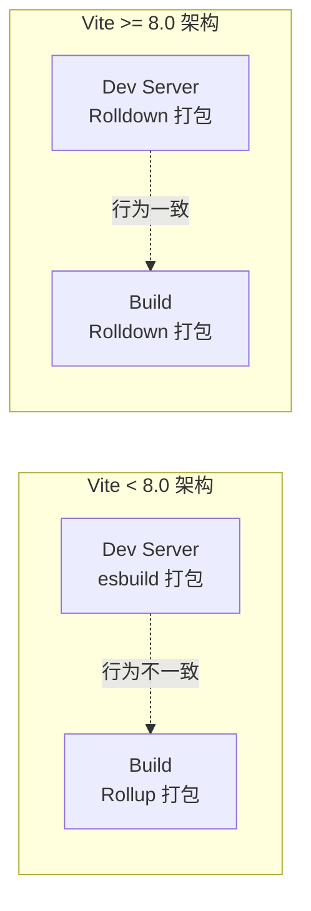
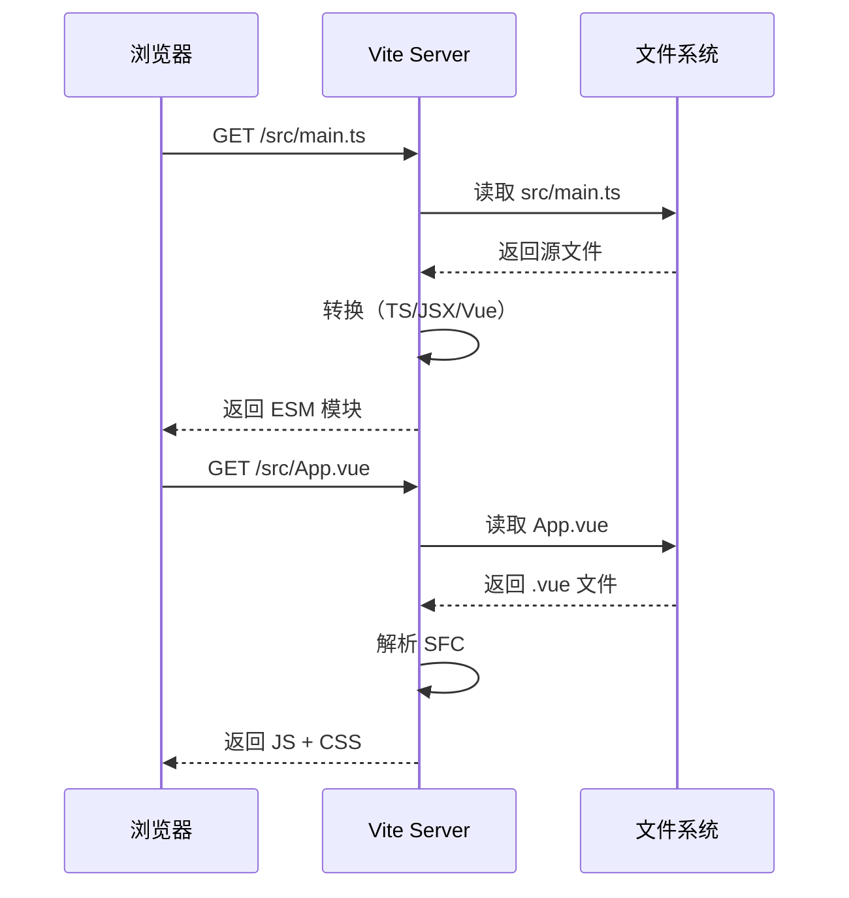
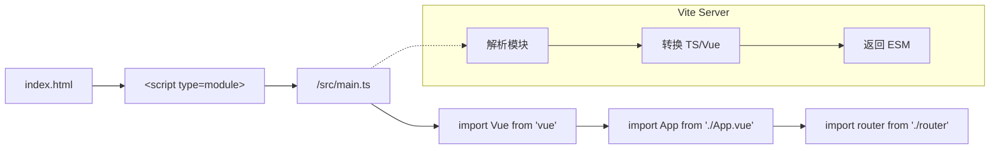
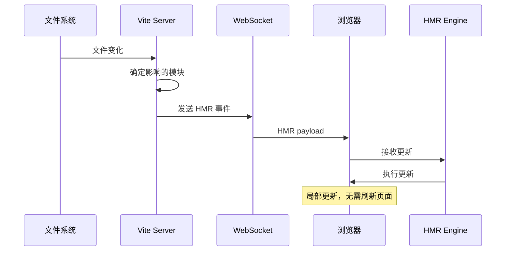
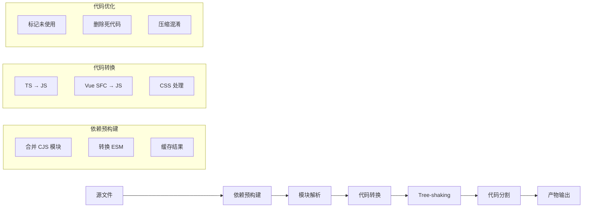

# Vite 8.x 深度解析

> 本文档深入剖析 Vite 8.x 的核心架构、Dev Server 原理、HMR 机制与构建流程。

---

## 1. Vite 8.0 核心变化

### 1.1 Rolldown 统一打包器

Vite 8.0 最大的变化是用 **Rolldown**（Rust 实现的 Rollup 兼容打包器）替换了开发环境的 esbuild：



**核心优势**：

1. **开发/生产行为一致**：使用同一打包器，避免 esbuild 与 Rollup 的差异
2. **性能大幅提升**：Rust 实现，比 JavaScript 快 10-100x
3. **Rollup 插件生态共享**：开发时可使用完整的 Rollup 插件

### 1.2 代码示例

```typescript
// vite.config.ts - Vite 8.x 配置
import { defineConfig } from 'vite';
import vue from '@vitejs/plugin-vue';

export default defineConfig({
  // 基础路径
  base: '/',

  // 插件系统（与 Rollup 插件完全兼容）
  plugins: [
    vue(),
    // 自定义 Rollup 风格插件
    {
      name: 'custom-transform-plugin',
      transform(code, id) {
        if (id.endsWith('.custom')) {
          return { code: transformCustom(code) };
        }
      }
    }
  ],

  // 构建配置
  build: {
    target: 'esnext',
    // 使用 Rolldown 进行打包
    minify: 'esbuild',
    rollupOptions: {
      output: {
        // 手动代码分割
        manualChunks: (id) => {
          if (id.includes('node_modules')) {
            const name = id.split('node_modules/')[1].split('/')[0];
            if (['vue', 'vue-router', 'pinia'].includes(name)) {
              return 'vendor';
            }
          }
        }
      }
    }
  },

  // 开发服务器配置
  server: {
    port: 3000,
    host: true,
    // 热更新配置
    hmr: {
      overlay: true  // 显示错误遮罩
    }
  },

  // 依赖优化配置
  optimizeDeps: {
    include: ['vue/dist/vue.esm-bundler.js']
  }
});
```

---

## 2. Dev Server 原理

### 2.1 原生 ESM 架构

Vite 的 Dev Server 不打包整个应用，而是直接服务源文件：



### 2.2 请求处理流程

```typescript
// Vite 开发服务器核心流程（伪代码）
async function handleRequest(ctx) {
  const { path, query } = ctx;

  // 1. 处理静态资源
  if (isStaticAsset(path)) {
    return serveStaticFile(path);
  }

  // 2. 处理模块请求
  if (path.startsWith('/src') || path.startsWith('/node_modules')) {
    // 转换模块（TS → JS，Vue SFC → JS）
    const transformed = await transformModule(path);
    return {
      type: 'module',
      code: transformed.code,
      map: transformed.map
    };
  }

  // 3. 处理特殊请求
  if (path === '/@vite/client') {
    return serveHMRClient();
  }
}
```

### 2.3 预构建（Dependency Pre-bundling）

```typescript
// 预构建的原因：
// 1. 将 CommonJS 模块转为 ESM
// 2. 合并多个 import 为单个请求
// 3. 缓存转换结果

// 预构建配置
export default defineConfig({
  optimizeDeps: {
    // 强制预构建的依赖
    include: [
      'vue',
      'vue-router',
      'pinia'
    ],
    // 排除不需预构建的依赖
    exclude: [],
    // 构建可选依赖（默认全部）
    entries: [],
    // esbuild 选项
    esbuildOptions: {
      target: 'esnext'
    }
  }
});
```

### 2.4 浏览器请求流程



---

## 3. HMR 热更新机制

### 3.1 HMR 工作流程



### 3.2 HMR 更新类型

```typescript
// 1. 模块自身变化 → 重新执行该模块
import { count, increment } from './counter';
// count.ts 变化时，只更新该模块

// 2. CSS 变化 → 局部更新样式
// App.css 变化时，通过 <style> 标签动态更新

// 3. Vue 组件变化 → 更新组件 + 递归子组件
// Parent.vue 变化时，重新渲染 Parent + 触发 Child 更新

// 4. 热更新接受（接受模块更新）
if (import.meta.hot) {
  import.meta.hot.accept((newModule) => {
    // newModule 包含更新后的导出
    const { newFunction } = newModule;
    // 替换引用
  });
}
```

### 3.3 自定义 HMR

```typescript
// Vue 组件中的 HMR
// App.vue
<script setup>
import { ref } from 'vue';

// HMR 接受回调
if (import.meta.hot) {
  import.meta.hot.accept(() => {
    // 当 App.vue 变化时执行
    console.log('App.vue updated');
  });
}

// 或者接受依赖模块的更新
import.meta.hot.accept('./counter', (newCounter) => {
  // counter.ts 更新时的处理
});
</script>

// React 函数组件的 HMR
// 函数组件会通过重新渲染自动处理 HMR
// 使用 useEffect 处理副作用清理
useEffect(() => {
  // 组件挂载时执行
  return () => {
    // 组件卸载时清理
  };
}, []);

// 如果需要手动处理：
if (module.hot) {
  module.hot.accept();
}
```

### 3.4 HMR 边界控制

```typescript
// HMR 的影响范围
// 父组件变化 → 更新父组件 + 触发子组件重新渲染

// 不触发 HMR 的情况：
// 1. 新增文件（需要刷新）
// 2. 删除文件（需要刷新）
// 3. 全局变量变化（需要刷新）
// 4. 某些第三方依赖更新（需要刷新）

// 优化 HMR 速度的技巧：
// - 减少模块间的依赖深度
// - 使用动态 import 懒加载
// - 合理拆分组件
```

---

## 4. 构建流程

### 4.1 构建阶段



### 4.2 Rollup 构建选项

```typescript
// vite.config.ts - 构建配置详解
export default defineConfig({
  build: {
    // 目标环境
    target: 'esnext',  // 兼容所有现代浏览器

    // 输出目录
    outDir: 'dist',

    // 生成 sourcemap
    sourcemap: false,  // 或 true, 'inline', 'hidden'

    // 代码分割策略
    rollupOptions: {
      // 输入配置
      input: {
        main: 'index.html',
        admin: 'admin.html'
      },

      // 输出配置
      output: {
        // 静态资源输出目录
        assetsDir: 'assets',

        // 手动代码分割
        manualChunks: {
          // 将 vue 相关库打包到 vendor
          'vue-vendor': ['vue', 'vue-router', 'pinia'],

          // 按需打包
          'element-plus': ['element-plus'],

          // 将大库单独打包
          'lodash': ['lodash']
        },

        // 文件名哈希
        entryFileNames: 'js/[name]-[hash].js',
        chunkFileNames: 'js/[name]-[hash].js',
        assetFileNames: '[ext]/[name]-[hash].[ext]',

        // 格式化
        compact: true,

        // 动态 import 前缀
        dynamicImportsPrefix: 'auto'
      }
    },

    // 压缩配置
    minify: 'esbuild',  // 'esbuild' | 'terser' | false
    terserOptions: {
      compress: {
        drop_console: true  // 生产环境移除 console
      }
    },

    // CSS 配置
    cssCodeSplit: true,  // 每个 CSS 文件单独分割

    // 库模式
    lib: {
      entry: 'src/lib/index.ts',
      name: 'MyLib',
      formats: ['es', 'cjs', 'umd']
    }
  }
});
```

### 4.3 代码分割策略

```typescript
// 1. 动态 import 自动分割
// 会自动创建独立 chunk
const HeavyChart = () => import('./HeavyChart.vue');

// 2. 手动分割
// vite.config.ts
rollupOptions: {
  output: {
    manualChunks: (id) => {
      // 第三方库打包到 vendor
      if (id.includes('node_modules')) {
        if (id.includes('vue')) return 'vue-vendor';
        if (id.includes('@element-plus')) return 'element-vendor';
        if (id.includes('lodash')) return 'lodash-vendor';
        return 'other-vendor';
      }

      // 工具函数打包到 utils
      if (id.includes('/utils/')) return 'utils';

      // 业务代码打包到 chunks
      if (id.includes('/components/')) return 'components';
    }
  }
}

// 3. 预加载关键 chunk
// index.html
<link rel="modulepreload" href="/js/vendor-vendor.js">

// 4. Webpack 风格的 splitChunks（Vite 兼容）
// vite.config.ts
build: {
  rollupOptions: {
    output: {
      manualChunks: (id, { getModuleInfo, getModuleIds }) => {
        // 访问模块信息
        const moduleInfo = getModuleInfo(id);

        // 检测动态导入
        if (moduleInfo.hasModuleSideEffects) {
          return 'shared';
        }
      }
    }
  }
}
```

---

## 5. 插件 Hook 执行顺序

### 5.1 Rollup 插件生命周期

```mermaid
flowchart LR
    subgraph build["构建阶段"]
        A["options"]
        B["buildStart"]
    end

    subgraph parse["解析阶段"]
        C["resolveId"]
        D["load"]
        E["transform"]
        F["moduleParsed"]
    end

    subgraph generate["生成阶段"]
        G["renderStart"]
        H["renderChunk"]
        I["augmentChunkHash"]
        J["resolveFileUrl"]
        K["resolveId"]
    end

    subgraph output["输出阶段"]
        L["generateBundle"]
        M["writeBundle"]
    end

    A --> B --> C --> D --> E --> F --> G --> H --> I --> J --> K --> L --> M
```



### 5.2 Hook 类型详解

```typescript
// 1. options - 读取配置
// 可以修改或缓存 rollup 配置
function options(inputOptions) {
  // inputOptions 包含所有输入配置
  // 返回修改后的配置或 null（不修改）
}

// 2. buildStart - 构建开始
// 适合初始化插件状态
function buildStart() {
  // 清理缓存，准备资源
}

// 3. resolveId - 解析模块路径
// 最重要的钩子之一
function resolveId(source, importer, resolveOptions) {
  // source: 导入路径
  // importer: 导入所在文件

  // 返回值格式：
  // 1. 字符串 → 模块 ID（绝对路径）
  // 2. { id, external, moduleSideEffects } → 扩展选项
  // 3. null/undefined → 交给下一个插件处理

  // 示例：将虚拟模块映射到实际文件
  if (source === 'virtual:module') {
    return '\0virtual:module';
  }
}

// 4. load - 加载模块内容
function load(id) {
  // id 是 resolveId 返回的模块 ID

  if (id === '\0virtual:module') {
    return {
      code: 'export const value = 42;',
      map: null
    };
  }
}

// 5. transform - 转换代码
function transform(code, id) {
  // 转换模块内容

  // 可以返回：
  // 1. { code, map } → 转换后的代码和 sourcemap
  // 2. Promise<{ code, map }> → 异步转换
  // 3. null → 不修改代码

  if (id.endsWith('.custom')) {
    return {
      code: customTransform(code),
      map: null  // 或生成 sourcemap
    };
  }
}

// 6. moduleParsed - 模块解析完成
function moduleParsed(moduleInfo) {
  // 模块的 AST 已解析完毕
  // 可用于分析模块内容
}

// 7. renderChunk - 生成代码块前
function renderChunk(code, chunk, options) {
  // 可以修改生成的代码
  return code;
}

// 8. generateBundle - 生成最终产物前
function generateBundle(options, bundle, isWrite) {
  // 可以访问和修改所有产物
  for (const [fileName, file] of Object.entries(bundle)) {
    if (file.type === 'chunk') {
      // 修改 chunk
    }
    if (file.type === 'asset') {
      // 修改 asset
    }
  }
}
```

### 5.3 Vite 独有 Hook

```typescript
// Vite 特有的插件扩展
const vitePlugin = {
  name: 'vite-plugin-example',

  // 配置服务器（仅在开发时调用）
  configureServer(server) {
    // 添加自定义中间件
    server.middlewares.use('/api/mock', (req, res) => {
      res.end(JSON.stringify(mockData));
    });

    // 监听 WebSocket 消息
    server.ws.on('connection', (socket) => {
      console.log('Client connected');
    });
  },

  // 配置预览服务器（仅在 preview 时调用）
  configurePreviewServer(server) {
    // 与 configureServer 类似
  },

  // 转换索引 html
  transformIndexHtml(html, ctx) {
    // 可以在 html 中注入脚本
    return html.replace(
      '</body>',
      '<script src="/custom.js"></script></body>'
    );
  },

  // 热更新钩子
  handleHotUpdate({ server, file, modules, timestamp, ws }) {
    // file: 变化的文件路径
    // modules: 受影响的模块

    // 自定义热更新逻辑
    if (file.endsWith('.env')) {
      // 环境变量变化，通知刷新
      server.ws.send({
        type: 'full-reload'
      });
      return;  // 不执行默认 HMR
    }

    // 返回空数组表示不更新任何模块
    // 返回 modules 数组表示只更新这些模块
    return modules;
  }
};
```

### 5.4 插件执行顺序

```typescript
// 插件执行顺序示例
export default {
  plugins: [
    // 1. 先执行 A 的 options
    pluginA(),

    // 2. 然后执行 B 的 options
    pluginB(),

    // 3. buildStart 按顺序执行
    // pluginA.buildStart()
    // pluginB.buildStart()

    // 4. resolveId 按顺序执行，短路返回
    // pluginA.resolveId() → 有结果就返回
    // pluginB.resolveId() → 继续处理
  ]
};

// 插件优先级
// enforce: 'pre' → 在内置插件前执行
// 默认 → 正常顺序
// enforce: 'post' → 在内置插件后执行

const prePlugin = {
  name: 'pre-plugin',
  enforce: 'pre',  // 提前执行
  transform(code, id) {
    console.log('Pre plugin');
  }
};

const postPlugin = {
  name: 'post-plugin',
  enforce: 'post',  // 延后执行
  transform(code, id) {
    console.log('Post plugin');
  }
};
```

---

## 6. Vite 8.x 新增 API

### 6.1 新的构建选项

```typescript
export default defineConfig({
  build: {
    // 新的模块化输出选项
    moduleOutput: 'esm',

    // CSS 代码分割
    cssCodeSplit: true,

    // 资产内联阈值（字节）
    assetsInlineLimit: 4096,

    // 禁用产物哈希（调试用）
    rollupOptions: {
      output: {
        entryFileNames: '[name].js',  // 禁用哈希
        chunkFileNames: '[name].js',
        assetFileNames: '[name].[ext]'
      }
    }
  }
});
```

### 6.2 新的环境 API

```typescript
// 环境变量新 API
import { loadEnv, defineConfig } from 'vite';

// 显式加载环境变量
const env = loadEnv('production', process.cwd(), 'VITE_');

export default defineConfig(({ mode }) => ({
  define: {
    __DEV__: JSON.stringify(mode === 'development'),
    __VERSION__: JSON.stringify(process.env.npm_package_version)
  }
}));
```

---

## 7. 参考链接

- [Vite 官方文档](https://vite.dev/)
- [Vite 8.0 发布说明](https://vite.dev/blog/announcing-vite8)
- [Rolldown GitHub](https://github.com/rolldown/rolldown)
- [Rollup 插件开发文档](https://rollupjs.org/plugin-development/)
- [Vite 插件合集 awesome-vite](https://github.com/vitejs/awesome-vite)