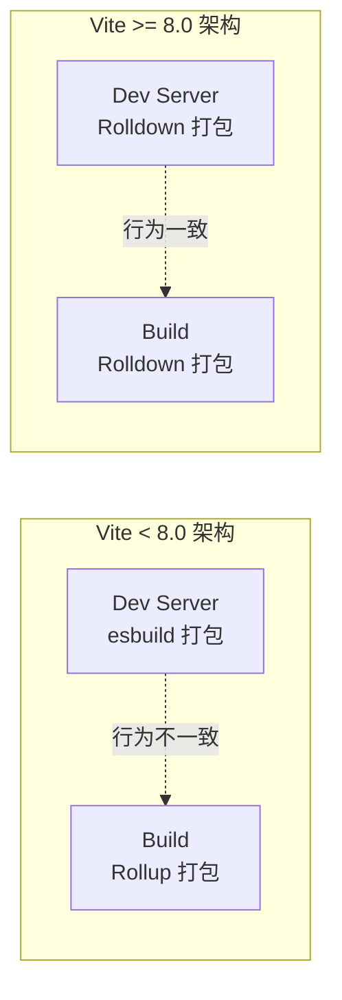
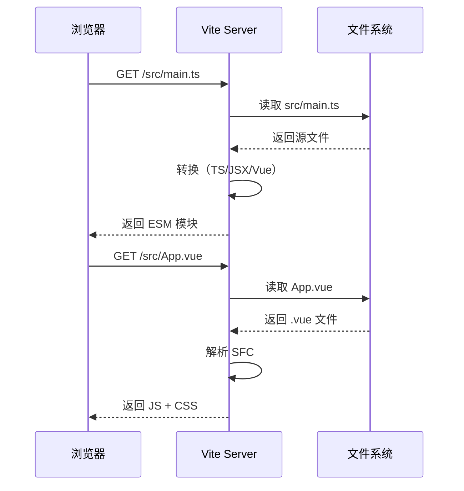
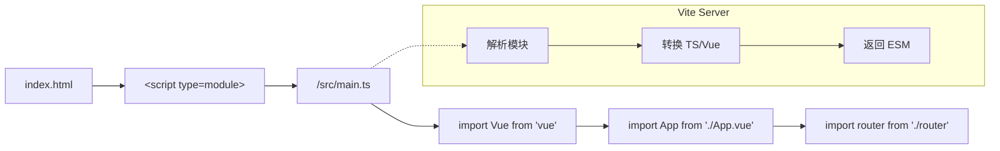
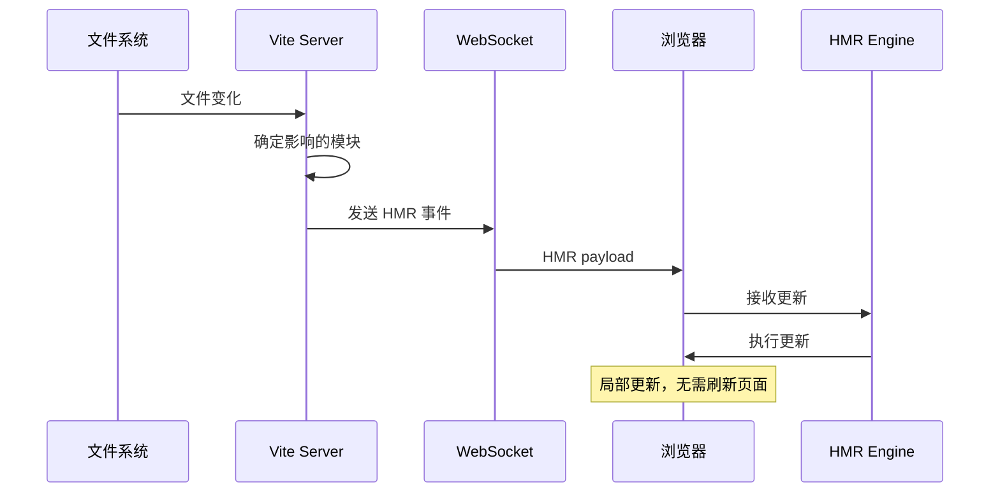
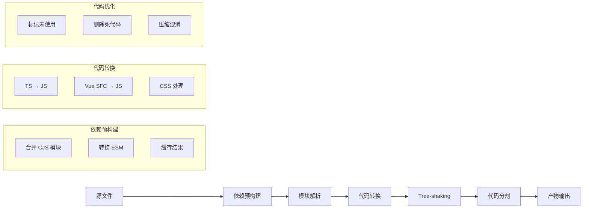

# Vite 8.x 深度解析

> 本文档深入剖析 Vite 8.x 的核心架构、Dev Server 原理、HMR 机制与构建流程。

---

## 1. Vite 8.0 核心变化

### 1.1 Rolldown 统一打包器

Vite 8.0 最大的变化是用 **Rolldown**（Rust 实现的 Rollup 兼容打包器）替换了开发环境的 esbuild：


```mermaid
flowchart LR
    subgraph before["Vite < 8.0 架构"]
        A1["Dev Server<br/>esbuild 打包"]
        A2["Build<br/>Rollup 打包"]
    end

    subgraph after["Vite >= 8.0 架构"]
        B1["Dev Server<br/>Rolldown 打包"]
        B2["Build<br/>Rolldown 打包"]
    end

    A1 -.->|"行为不一致"| A2
    B1 -.->|"行为一致"| B2
```

**核心优势**：

1. **开发/生产行为一致**：使用同一打包器，避免 esbuild 与 Rollup 的差异
2. **性能大幅提升**：Rust 实现，比 JavaScript 快 10-100x
3. **Rollup 插件生态共享**：开发时可使用完整的 Rollup 插件

### 1.2 代码示例

```typescript
// vite.config.ts - Vite 8.x 配置
import { defineConfig } from 'vite';
import vue from '@vitejs/plugin-vue';

export default defineConfig({
  // 基础路径
  base: '/',

  // 插件系统（与 Rollup 插件完全兼容）
  plugins: [
    vue(),
    // 自定义 Rollup 风格插件
    {
      name: 'custom-transform-plugin',
      transform(code, id) {
        if (id.endsWith('.custom')) {
          return { code: transformCustom(code) };
        }
      }
    }
  ],

  // 构建配置
  build: {
    target: 'esnext',
    // 使用 Rolldown 进行打包
    minify: 'esbuild',
    rollupOptions: {
      output: {
        // 手动代码分割
        manualChunks: (id) => {
          if (id.includes('node_modules')) {
            const name = id.split('node_modules/')[1].split('/')[0];
            if (['vue', 'vue-router', 'pinia'].includes(name)) {
              return 'vendor';
            }
          }
        }
      }
    }
  },

  // 开发服务器配置
  server: {
    port: 3000,
    host: true,
    // 热更新配置
    hmr: {
      overlay: true  // 显示错误遮罩
    }
  },

  // 依赖优化配置
  optimizeDeps: {
    include: ['vue/dist/vue.esm-bundler.js']
  }
});
```

---

## 2. Dev Server 原理

### 2.1 原生 ESM 架构

Vite 的 Dev Server 不打包整个应用，而是直接服务源文件：


```mermaid
sequenceDiagram
    participant Browser as 浏览器
    participant ViteServer as Vite Server
    participant FileSystem as 文件系统

    Browser->>ViteServer: GET /src/main.ts
    ViteServer->>FileSystem: 读取 src/main.ts
    FileSystem-->>ViteServer: 返回源文件
    ViteServer->>ViteServer: 转换（TS/JSX/Vue）
    ViteServer-->>Browser: 返回 ESM 模块

    Browser->>ViteServer: GET /src/App.vue
    ViteServer->>FileSystem: 读取 App.vue
    FileSystem-->>ViteServer: 返回 .vue 文件
    ViteServer->>ViteServer: 解析 SFC
    ViteServer-->>Browser: 返回 JS + CSS
```

### 2.2 请求处理流程

```typescript
// Vite 开发服务器核心流程（伪代码）
async function handleRequest(ctx) {
  const { path, query } = ctx;

  // 1. 处理静态资源
  if (isStaticAsset(path)) {
    return serveStaticFile(path);
  }

  // 2. 处理模块请求
  if (path.startsWith('/src') || path.startsWith('/node_modules')) {
    // 转换模块（TS → JS，Vue SFC → JS）
    const transformed = await transformModule(path);
    return {
      type: 'module',
      code: transformed.code,
      map: transformed.map
    };
  }

  // 3. 处理特殊请求
  if (path === '/@vite/client') {
    return serveHMRClient();
  }
}
```

### 2.3 预构建（Dependency Pre-bundling）

```typescript
// 预构建的原因：
// 1. 将 CommonJS 模块转为 ESM
// 2. 合并多个 import 为单个请求
// 3. 缓存转换结果

// 预构建配置
export default defineConfig({
  optimizeDeps: {
    // 强制预构建的依赖
    include: [
      'vue',
      'vue-router',
      'pinia'
    ],
    // 排除不需预构建的依赖
    exclude: [],
    // 构建可选依赖（默认全部）
    entries: [],
    // esbuild 选项
    esbuildOptions: {
      target: 'esnext'
    }
  }
});
```

### 2.4 浏览器请求流程


```mermaid
flowchart LR
    A["index.html"] --> B["&lt;script type=module&gt;"]
    B --> C["/src/main.ts"]
    C --> D["import Vue from 'vue'"]
    D --> E["import App from './App.vue'"]
    E --> F["import router from './router'"]

    subgraph vite["Vite Server"]
        G1["解析模块"]
        G2["转换 TS/Vue"]
        G3["返回 ESM"]
    end

    C -.-> G1
    G1 --> G2
    G2 --> G3
```

---

## 3. HMR 热更新机制

### 3.1 HMR 工作流程


```mermaid
sequenceDiagram
    participant File as 文件系统
    participant Server as Vite Server
    participant WS as WebSocket
    participant Browser as 浏览器
    participant HMR as HMR Engine

    File->>Server: 文件变化
    Server->>Server: 确定影响的模块

    Server->>WS: 发送 HMR 事件
    WS->>Browser: HMR payload

    Browser->>HMR: 接收更新
    HMR->>Browser: 执行更新

    Note over Browser: 局部更新，无需刷新页面
```

### 3.2 HMR 更新类型

```typescript
// 1. 模块自身变化 → 重新执行该模块
import { count, increment } from './counter';
// count.ts 变化时，只更新该模块

// 2. CSS 变化 → 局部更新样式
// App.css 变化时，通过 <style> 标签动态更新

// 3. Vue 组件变化 → 更新组件 + 递归子组件
// Parent.vue 变化时，重新渲染 Parent + 触发 Child 更新

// 4. 热更新接受（接受模块更新）
if (import.meta.hot) {
  import.meta.hot.accept((newModule) => {
    // newModule 包含更新后的导出
    const { newFunction } = newModule;
    // 替换引用
  });
}
```

### 3.3 自定义 HMR

```typescript
// Vue 组件中的 HMR
// App.vue
<script setup>
import { ref } from 'vue';

// HMR 接受回调
if (import.meta.hot) {
  import.meta.hot.accept(() => {
    // 当 App.vue 变化时执行
    console.log('App.vue updated');
  });
}

// 或者接受依赖模块的更新
import.meta.hot.accept('./counter', (newCounter) => {
  // counter.ts 更新时的处理
});
</script>

// React 函数组件的 HMR
// 函数组件会通过重新渲染自动处理 HMR
// 使用 useEffect 处理副作用清理
useEffect(() => {
  // 组件挂载时执行
  return () => {
    // 组件卸载时清理
  };
}, []);

// 如果需要手动处理：
if (module.hot) {
  module.hot.accept();
}
```

### 3.4 HMR 边界控制

```typescript
// HMR 的影响范围
// 父组件变化 → 更新父组件 + 触发子组件重新渲染

// 不触发 HMR 的情况：
// 1. 新增文件（需要刷新）
// 2. 删除文件（需要刷新）
// 3. 全局变量变化（需要刷新）
// 4. 某些第三方依赖更新（需要刷新）

// 优化 HMR 速度的技巧：
// - 减少模块间的依赖深度
// - 使用动态 import 懒加载
// - 合理拆分组件
```

---

## 4. 构建流程

### 4.1 构建阶段


```mermaid
flowchart LR
    A["源文件"] --> B["依赖预构建"]
    B --> C["模块解析"]
    C --> D["代码转换"]
    D --> E["Tree-shaking"]
    E --> F["代码分割"]
    F --> G["产物输出"]

    subgraph prebuild["依赖预构建"]
        P1["合并 CJS 模块"]
        P2["转换 ESM"]
        P3["缓存结果"]
    end

    subgraph transform["代码转换"]
        T1["TS → JS"]
        T2["Vue SFC → JS"]
        T3["CSS 处理"]
    end

    subgraph optimize["代码优化"]
        O1["标记未使用"]
        O2["删除死代码"]
        O3["压缩混淆"]
    end
```

### 4.2 Rollup 构建选项

```typescript
// vite.config.ts - 构建配置详解
export default defineConfig({
  build: {
    // 目标环境
    target: 'esnext',  // 兼容所有现代浏览器

    // 输出目录
    outDir: 'dist',

    // 生成 sourcemap
    sourcemap: false,  // 或 true, 'inline', 'hidden'

    // 代码分割策略
    rollupOptions: {
      // 输入配置
      input: {
        main: 'index.html',
        admin: 'admin.html'
      },

      // 输出配置
      output: {
        // 静态资源输出目录
        assetsDir: 'assets',

        // 手动代码分割
        manualChunks: {
          // 将 vue 相关库打包到 vendor
          'vue-vendor': ['vue', 'vue-router', 'pinia'],

          // 按需打包
          'element-plus': ['element-plus'],

          // 将大库单独打包
          'lodash': ['lodash']
        },

        // 文件名哈希
        entryFileNames: 'js/[name]-[hash].js',
        chunkFileNames: 'js/[name]-[hash].js',
        assetFileNames: '[ext]/[name]-[hash].[ext]',

        // 格式化
        compact: true,

        // 动态 import 前缀
        dynamicImportsPrefix: 'auto'
      }
    },

    // 压缩配置
    minify: 'esbuild',  // 'esbuild' | 'terser' | false
    terserOptions: {
      compress: {
        drop_console: true  // 生产环境移除 console
      }
    },

    // CSS 配置
    cssCodeSplit: true,  // 每个 CSS 文件单独分割

    // 库模式
    lib: {
      entry: 'src/lib/index.ts',
      name: 'MyLib',
      formats: ['es', 'cjs', 'umd']
    }
  }
});
```

### 4.3 代码分割策略

```typescript
// 1. 动态 import 自动分割
// 会自动创建独立 chunk
const HeavyChart = () => import('./HeavyChart.vue');

// 2. 手动分割
// vite.config.ts
rollupOptions: {
  output: {
    manualChunks: (id) => {
      // 第三方库打包到 vendor
      if (id.includes('node_modules')) {
        if (id.includes('vue')) return 'vue-vendor';
        if (id.includes('@element-plus')) return 'element-vendor';
        if (id.includes('lodash')) return 'lodash-vendor';
        return 'other-vendor';
      }

      // 工具函数打包到 utils
      if (id.includes('/utils/')) return 'utils';

      // 业务代码打包到 chunks
      if (id.includes('/components/')) return 'components';
    }
  }
}

// 3. 预加载关键 chunk
// index.html
<link rel="modulepreload" href="/js/vendor-vendor.js">

// 4. Webpack 风格的 splitChunks（Vite 兼容）
// vite.config.ts
build: {
  rollupOptions: {
    output: {
      manualChunks: (id, { getModuleInfo, getModuleIds }) => {
        // 访问模块信息
        const moduleInfo = getModuleInfo(id);

        // 检测动态导入
        if (moduleInfo.hasModuleSideEffects) {
          return 'shared';
        }
      }
    }
  }
}
```

---

## 5. 插件 Hook 执行顺序

### 5.1 Rollup 插件生命周期


```mermaid
flowchart LR
    subgraph build["构建阶段"]
        A["options"]
        B["buildStart"]
    end

    subgraph parse["解析阶段"]
        C["resolveId"]
        D["load"]
        E["transform"]
        F["moduleParsed"]
    end

    subgraph generate["生成阶段"]
        G["renderStart"]
        H["renderChunk"]
        I["augmentChunkHash"]
        J["resolveFileUrl"]
        K["resolveId"]
    end

    subgraph output["输出阶段"]
        L["generateBundle"]
        M["writeBundle"]
    end

    A --> B --> C --> D --> E --> F --> G --> H --> I --> J --> K --> L --> M
```

### 5.2 Hook 类型详解

```typescript
// 1. options - 读取配置
// 可以修改或缓存 rollup 配置
function options(inputOptions) {
  // inputOptions 包含所有输入配置
  // 返回修改后的配置或 null（不修改）
}

// 2. buildStart - 构建开始
// 适合初始化插件状态
function buildStart() {
  // 清理缓存，准备资源
}

// 3. resolveId - 解析模块路径
// 最重要的钩子之一
function resolveId(source, importer, resolveOptions) {
  // source: 导入路径
  // importer: 导入所在文件

  // 返回值格式：
  // 1. 字符串 → 模块 ID（绝对路径）
  // 2. { id, external, moduleSideEffects } → 扩展选项
  // 3. null/undefined → 交给下一个插件处理

  // 示例：将虚拟模块映射到实际文件
  if (source === 'virtual:module') {
    return '\0virtual:module';
  }
}

// 4. load - 加载模块内容
function load(id) {
  // id 是 resolveId 返回的模块 ID

  if (id === '\0virtual:module') {
    return {
      code: 'export const value = 42;',
      map: null
    };
  }
}

// 5. transform - 转换代码
function transform(code, id) {
  // 转换模块内容

  // 可以返回：
  // 1. { code, map } → 转换后的代码和 sourcemap
  // 2. Promise<{ code, map }> → 异步转换
  // 3. null → 不修改代码

  if (id.endsWith('.custom')) {
    return {
      code: customTransform(code),
      map: null  // 或生成 sourcemap
    };
  }
}

// 6. moduleParsed - 模块解析完成
function moduleParsed(moduleInfo) {
  // 模块的 AST 已解析完毕
  // 可用于分析模块内容
}

// 7. renderChunk - 生成代码块前
function renderChunk(code, chunk, options) {
  // 可以修改生成的代码
  return code;
}

// 8. generateBundle - 生成最终产物前
function generateBundle(options, bundle, isWrite) {
  // 可以访问和修改所有产物
  for (const [fileName, file] of Object.entries(bundle)) {
    if (file.type === 'chunk') {
      // 修改 chunk
    }
    if (file.type === 'asset') {
      // 修改 asset
    }
  }
}
```

### 5.3 Vite 独有 Hook

```typescript
// Vite 特有的插件扩展
const vitePlugin = {
  name: 'vite-plugin-example',

  // 配置服务器（仅在开发时调用）
  configureServer(server) {
    // 添加自定义中间件
    server.middlewares.use('/api/mock', (req, res) => {
      res.end(JSON.stringify(mockData));
    });

    // 监听 WebSocket 消息
    server.ws.on('connection', (socket) => {
      console.log('Client connected');
    });
  },

  // 配置预览服务器（仅在 preview 时调用）
  configurePreviewServer(server) {
    // 与 configureServer 类似
  },

  // 转换索引 html
  transformIndexHtml(html, ctx) {
    // 可以在 html 中注入脚本
    return html.replace(
      '</body>',
      '<script src="/custom.js"></script></body>'
    );
  },

  // 热更新钩子
  handleHotUpdate({ server, file, modules, timestamp, ws }) {
    // file: 变化的文件路径
    // modules: 受影响的模块

    // 自定义热更新逻辑
    if (file.endsWith('.env')) {
      // 环境变量变化，通知刷新
      server.ws.send({
        type: 'full-reload'
      });
      return;  // 不执行默认 HMR
    }

    // 返回空数组表示不更新任何模块
    // 返回 modules 数组表示只更新这些模块
    return modules;
  }
};
```

### 5.4 插件执行顺序

```typescript
// 插件执行顺序示例
export default {
  plugins: [
    // 1. 先执行 A 的 options
    pluginA(),

    // 2. 然后执行 B 的 options
    pluginB(),

    // 3. buildStart 按顺序执行
    // pluginA.buildStart()
    // pluginB.buildStart()

    // 4. resolveId 按顺序执行，短路返回
    // pluginA.resolveId() → 有结果就返回
    // pluginB.resolveId() → 继续处理
  ]
};

// 插件优先级
// enforce: 'pre' → 在内置插件前执行
// 默认 → 正常顺序
// enforce: 'post' → 在内置插件后执行

const prePlugin = {
  name: 'pre-plugin',
  enforce: 'pre',  // 提前执行
  transform(code, id) {
    console.log('Pre plugin');
  }
};

const postPlugin = {
  name: 'post-plugin',
  enforce: 'post',  // 延后执行
  transform(code, id) {
    console.log('Post plugin');
  }
};
```

---

## 6. Vite 8.x 新增 API

### 6.1 新的构建选项

```typescript
export default defineConfig({
  build: {
    // 新的模块化输出选项
    moduleOutput: 'esm',

    // CSS 代码分割
    cssCodeSplit: true,

    // 资产内联阈值（字节）
    assetsInlineLimit: 4096,

    // 禁用产物哈希（调试用）
    rollupOptions: {
      output: {
        entryFileNames: '[name].js',  // 禁用哈希
        chunkFileNames: '[name].js',
        assetFileNames: '[name].[ext]'
      }
    }
  }
});
```

### 6.2 新的环境 API

```typescript
// 环境变量新 API
import { loadEnv, defineConfig } from 'vite';

// 显式加载环境变量
const env = loadEnv('production', process.cwd(), 'VITE_');

export default defineConfig(({ mode }) => ({
  define: {
    __DEV__: JSON.stringify(mode === 'development'),
    __VERSION__: JSON.stringify(process.env.npm_package_version)
  }
}));
```

---

## 7. 参考链接

- [Vite 官方文档](https://vite.dev/)
- [Vite 8.0 发布说明](https://vite.dev/blog/announcing-vite8)
- [Rolldown GitHub](https://github.com/rolldown/rolldown)
- [Rollup 插件开发文档](https://rollupjs.org/plugin-development/)
- [Vite 插件合集 awesome-vite](https://github.com/vitejs/awesome-vite)

## 深入阅读与参考

!!! tip "怎么用这些资料"
    先读「官方文档与规范」建立准确的概念，再读「源码与示例」核对细节，最后用「教程、书籍与视频」换一种讲法加深理解。每条都写明了读哪一节、带着什么问题读。

### 官方文档与规范

| 资源 | 为什么读 | 怎么读 |
|---|---|---|
| [Why Vite](https://vite.dev/guide/why) | 官方阐述原生 ESM 开发服务器与依赖预构建的设计动机 | 先读 Native ESM 与 Bundler 两节，读完能解释 dev 为何不打包、预构建解决什么 |
| [HMR API](https://vite.dev/guide/api-hmr) | HMR 客户端 API 的一手说明，界定模块更新的边界 | 重点读 accept、dispose、invalidate，读完给一个组件写自定义 accept 回调 |
| [Plugin API](https://rolldown.rs/apis/plugin-api) | 插件 Hook 类型与执行顺序的权威定义，写插件前必读 | 按 dev 与 build 两阶段梳理 hook 表，带着“谁先执行”读，读完写打印顺序的插件 |
| [Environment API](https://vite.dev/guide/api-environment) | 环境 API 总览，理解 dev 与 build 共享及多环境运行时 | 先读概念图与环境生命周期，再对照配置里的 environments 字段逐项验证 |
| [Server Options](https://vite.dev/config/server-options) | dev server 端口、代理、WebSocket、监听等选项的完整语义 | 查 proxy 与 hmr 两节，带着“代理和 ws 怎么配”读，改一项看终端输出 |
| [Bundler API](https://rolldown.rs/apis/bundler-api) | 官方 Bundler API 文档，展示以编程方式调用打包能力 | 读创建实例的示例并跑通最小构建，再与 vite build 的产物做对比 |
| [Vite：Rolldown 集成](https://vite.dev/guide/rolldown.html) | Rolldown 集成与迁移路径，对应构建流程的核心变化 | 读迁移步骤与差异说明，在测试分支试跑，对比构建耗时与产物差异 |
| [JavaScript API](https://vite.dev/guide/api-javascript) | createServer、build、preview 等编程入口，串起 dev 与 build | 读 createServer 与 build 两节，写脚本以编程方式启动服务并正确关闭 |

### 源码与示例

| 资源 | 为什么读 | 怎么读 |
|---|---|---|
| [vite](https://github.com/vitejs/vite) | 从 server/index.ts 看 createServer 如何组装中间件与 ws 服务 | 读 createServer 与中间件链，带着“请求如何走到 transform”读，读完画请求流程图 |

### 教程、书籍与视频

| 资源 | 为什么读 | 怎么读 |
|---|---|---|
| [Vite：插件 API（中文）](https://cn.vitejs.dev/guide/api-plugin.html) | 中文插件教程，用 transform 钩子直观感受执行顺序 | 照教程写 transform 插件打印日志，再用 debug 输出核对 hook 排序 |
| [Vite：构建生产版本（中文）](https://cn.vitejs.dev/guide/build.html) | 中文讲解生产构建与分包配置，衔接构建流程与产物分析 | 配置 manualChunks 后构建一次，读产物报告并解释每个 chunk 的拆分依据 |
| [Vite：依赖预构建](https://vite.dev/guide/dep-pre-bundling.html) | 中文讲清依赖预构建的时机与缓存，补足 dev server 链路 | 用 optimizeDeps 观察缓存目录，修改依赖后解释何时会重新预构建 |

## 应用与行业实践

### 应用场景地图

| 场景 | 用到本页哪个知识点 | 典型技术选型 | 注意事项 |
| --- | --- | --- | --- |
| 后台管理的万行表格 | HMR 边界（import.meta.hot.accept） | Vue 3 + 虚拟滚动库 | 列定义改动不要触发整页刷新，否则滚动位置与选中行丢失 |
| 低端安卓的首屏加载 | 构建流程的代码分割与压缩体积 | Vite build + 动态 import | 先量 LCP 再动分包，只压体积不改首屏路径看不到变化 |
| 多人协作白板 | 模块图与 HMR 状态保持（hot.data） | Canvas + WebSocket | 编辑态仍需服务端落盘，内存快照只服务于开发期 |
| monorepo 组件库联调 | 依赖预构建（optimizeDeps） | pnpm workspace + link 源码 | 链接源码后要走 exclude，改动才落到源码模块 |
| SSR 内容站首屏 | Environment API 与 SSR 加载 | Vite 的 SSR 条目 | 客户端与服务端模块图不同，不要共用同一份全局状态 |
| 微前端子应用独立开发 | Dev Server 按需编译与端口代理 | Vite 子应用 + 主应用基座 | 单独起服时跨域与静态资源前缀要另配 |
| 营销页高频改版 | Dev Server 冷启动与 HMR | Vite + 静态托管 | 只有开发期享受 HMR，线上仍走完整构建 |
| 大型 monorepo 冷启动 | 依赖预构建缓存、server.warmup | Vite + 持久化缓存 | 预热清单要跟着入口变化维护 |

### 三个场景拆解

#### 场景 1：后台管理的万行表格

**业务背景**：一个后台页面要渲染上万行数据，列数在几十列，运营每天改列定义与单元格渲染函数。开发时改一列就整页刷新，滚动位置、筛选条件、选中行全部归零。

**怎么用本页知识解决**：把列定义拆成独立模块并声明为 HMR 边界，让 Vite 只替换这个模块；把导出用的重依赖改成动态 import，从首屏链路上摘掉。

```js
// src/table/columns.js
import { statusTag } from './cells/status.js'

export const columns = [
  { key: 'id', title: '编号' },
  { key: 'status', title: '状态', render: statusTag }
]

// 声明 HMR 边界：只替换本模块，不刷新整张表格
if (import.meta.hot) {
  import.meta.hot.accept((next) => {
    // 把新列定义交给表格实例，保留滚动位置与选中行
    tableApi.setColumns(next.columns)
  })
}

// 导出逻辑改成动态 import，首屏不下载 xlsx
export async function exportVisible() {
  const { utils, writeFile } = await import('xlsx')
  writeFile(utils.book_new(), 'rows.xlsx')
}
```

- `import.meta.hot.accept` 把 columns.js 变成边界，Vite 只替换该模块，表格实例不重建。
- 回调里调用实例方法更新列，而不是重新 mount，DOM 上的滚动位置与选中行保留。
- 动态 import 让 xlsx 落到独立 chunk，首屏请求里不含这份体积。
- 若 columns.js 被没有 accept 的父模块直接引用，更新会沿模块图向上冒泡到最近的边界。
- 回调里只做增量赋值，不要复制整个表格数据，避免一次更新触发全量重渲染。

**怎么度量收益**：用 Chrome DevTools Performance 录制"改一行代码到界面更新完成"的耗时，分别录整页刷新与 HMR 两种情况。用 Network 面板确认改代码后文档请求数没有增加。用 `vite build` 日志记录入口 chunk 的 gzip 体积变化。

**什么时候不该用**：
- 列定义与表格组件写在同一个文件里，改动必然牵动整棵模块树，边界起不到隔离作用。
- 页面数据来自服务端分页且只渲染几十行，改代码不损失任何状态，边界代码增加维护面。
- 模块会被测试环境直接跑源码，`import.meta.hot` 为 undefined，没有兜底分支会直接报错。

#### 场景 2：低端安卓的首屏加载

**业务背景**：面向千元安卓机的 H5 活动页，用户处在波动的 4G 网络下，首屏要在 3 秒内出现可用内容。团队先量 LCP，再决定动哪一块。

**怎么用本页知识解决**：把非首屏必需的库从入口摘出去，用动态 import 拆成独立 chunk；把构建 target 对齐到项目实际支持的最低内核，避免产出用不到的降级代码。

```js
// vite.config.js
import { defineConfig } from 'vite'

export default defineConfig({
  build: {
    // 对齐项目实际支持的最低浏览器内核，语法降级范围收窄
    target: 'chrome90',
    // 保留压缩后体积报告，用来定位拖慢首屏的 chunk
    reportCompressedSize: true
  }
})
```

- `target` 决定语法降级的下限，设得过低会把可选链等写法改成体积更大的降级代码。
- `reportCompressedSize` 打开后，构建日志会打印每个 chunk 的 gzip 体积，先定位再动手。
- 动态 import 的模块在产物里是独立文件，入口文件不含其代码，首屏请求数不会因此增加。
- 首屏骨架用 HTML 与独立 CSS 给出，交互逻辑放到空闲回调里启动，让 LCP 先完成。
- 埋点与错误上报这类必须早于渲染执行的小体积库，留在同步链路，不要为了拆而拆。

**怎么度量收益**：用 Lighthouse 的移动端模式加 4G 模拟，取 LCP、TBT、Speed Index。用 Network 面板勾选 Disable cache 与 Fast 4G，记录首屏请求数与传输体积。用 `vite build` 输出对比入口 chunk 的 gzip 体积。用 WebPageTest 在多地区节点复测同一地址，看 LCP 分布。

**什么时候不该用**：
- 项目是内网后台，用户都在桌面浏览器，带宽不是约束，投入应转到交互改造上。
- 首屏慢的原因是接口串行请求或图片未压缩，JS 体积不是瓶颈，改分包看不到 LCP 变化。
- 目标环境必须支持旧内核，动态 import 与 ESM 产物都要额外降级方案，改造成本高于收益。

#### 场景 3：多人协作白板

**业务背景**：白板页面同时承载画布、协作者光标与历史记录，开发时改一处渲染逻辑就整页刷新，画布内容与 WebSocket 连接一起断开。房间内协作者越多，重连等待越明显。

**怎么用本页知识解决**：用 `import.meta.hot.dispose` 在替换前把内存态交给 Vite 暂存，在新模块的 accept 回调里回填，连接层模块不进边界。

```js
// src/board/state.js
export const state = { strokes: [], cursors: new Map(), selected: null }

if (import.meta.hot) {
  // 替换前把画布内容交给 Vite 暂存
  import.meta.hot.dispose((data) => {
    data.snapshot = { strokes: state.strokes, selected: state.selected }
  })
  // 新模块接管后回填，WebSocket 连接不断开
  import.meta.hot.accept((next) => {
    next.state.strokes = import.meta.hot.data.snapshot.strokes
    next.state.selected = import.meta.hot.data.snapshot.selected
    next.repaint()
  })
}
```

- `dispose` 在旧模块被替换前执行，传入的 data 对象会跨这次更新保留下来。
- `accept` 回调拿到新模块，回填绘制所需的最小状态，画面不闪断。
- WebSocket 连接所在的模块没有被 accept，替换过程中连接保持不动。
- `cursors` 由服务端推送、可随时重拉，不放进快照，避免快照随协作者数量膨胀。
- 回填后要显式触发一次重绘，否则状态换了但画布还停在上一帧。

**怎么度量收益**：用 Performance 录制"改一次渲染函数到画面恢复"的耗时，并对照整页刷新的耗时。用 Network 面板看改代码后文档请求是否重发。用服务端日志统计单位时间内的 WebSocket 重连次数，比较改造前后。用 Performance 录制拖动笔迹时的帧率与长任务数量。

**什么时候不该用**：
- 状态已经由外部文档模型（例如 CRDT 库）持有，模块替换后本来就能重建，写快照只增加维护面。
- 改动只涉及样式，CSS 走 Vite 自带的热更新，不需要为它加 accept 分支。
- 页面只有一位开发者偶尔打开，整页刷新的代价低于快照代码长期维护的代价。

### 行业先进实践

**依赖预构建的冷启动扫描与运行期补扫（出处：Vite 官方文档《Dependency Pre-Bundling》）**：预构建把 CJS/UMD 依赖转成 ESM 并合并请求，减少浏览器侧的模块请求数量。首次访问遇到未收录的依赖时触发补扫并重新预构建。借鉴方式是把动态 import 的入口写进 optimizeDeps 的扫描范围，避免运行期才发现新依赖。

**按需编译配合 server.warmup（出处：Vite 官方文档《Performance》）**：开发服务器只编译被真正请求到的模块，warmup 让启动阶段提前编译指定文件。借鉴方式是把首屏路由与常改的组件列进预热清单，冷启动后的第一次点击少一次等待。

**库模式产出多格式产物（出处：Vite 官方文档《Library Mode》）**：用 build.lib 输出 ES 与 UMD，并把 peer 依赖放进 external。借鉴方式是在 monorepo 里让组件库走库模式发布，同时用链接源码的方式做联调，两套路径共用同一份插件配置。

**用 vite-plugin-inspect 观察插件 Hook 顺序（出处：开源项目 vite-plugin-inspect）**：该插件提供一个页面，展示 resolveId、load、transform 的执行顺序与耗时。借鉴方式是插件互相覆盖配置时先看顺序，再决定用 enforce 调整位置，而不是逐个试。

**打包器替换后的分包配置迁移（需核对官方文档：核对 Vite 8 的迁移指南与 build 选项页，确认默认打包器、manualChunks 的对应配置，以及第三方插件 Hook 的兼容层范围）**：Vite 8 的构建管线与旧版本存在差异，分包写法与插件兼容性需要以官方迁移文档为准。核对完成前，不要把旧配置直接照搬到新版本。

### 从学到用：落地路线

1. 试点：挑一个开发期反馈最慢的子应用，只加 HMR 边界与动态 import，不改构建配置。验收标准：该子应用连续开发两天，整页刷新只在依赖变更时出现。
2. 验证：在同一台机器、同一浏览器上跑改动前后的对照记录，覆盖冷启动耗时、首屏 JS 体积、一次改动的可见耗时。验收标准：三项都有前后两组数据，且没有一项劣化。
3. 推广：把试点确认的配置抽成共享 preset，接到其余子应用上。验收标准：preset 被至少两个子应用接入，各自的 CI 构建全部通过。
4. 防回退：把体积与冷启动指标接进 CI，超阈值即失败，并在 PR 模板里加勾选项。验收标准：连续 10 次合并不触发阈值告警，触发时日志能定位到具体 chunk。

### 动手作业

**目标**：给一个已有页面加上 HMR 边界与动态 import，并用测量数据说明改动带来的变化。

**步骤**：
1. 起一个 Vite 项目，加一个依赖体积较大的页面（例如引入一个表格库或图表库），跑一次 `vite build` 记录入口 chunk 的 gzip 体积。
2. 用 DevTools Network 面板勾选 Fast 4G 与 Disable cache，记录首屏的 JS 请求数与传输体积。
3. 把重依赖改成动态 import，并把改动点收敛到一个模块，重复第 2 步的记录。
4. 给这个模块加 `import.meta.hot.accept`，回调里更新已有实例或 DOM，不重新挂载。
5. 用 Performance 面板录制"改一行代码到界面更新完成"的耗时，整页刷新与 HMR 各录一次。
6. 用静态服务器打开 dist 目录，确认生产产物里不含热更新分支，动态 import 的模块仍能正常加载。

**验收标准**：
- 首屏 JS 传输体积低于改动前，且降幅能在构建日志里对应到某个 chunk。
- 改代码后页面不整页刷新，Network 面板里文档请求数不增加。
- 生产产物的入口文件不含被动态 import 的那个依赖的代码。
- Performance 记录里"改代码到界面更新"的耗时低于整页刷新的耗时，两次录制条件相同。
- 关掉 Dev Server、用静态服务器打开 dist，页面功能完整可用。

