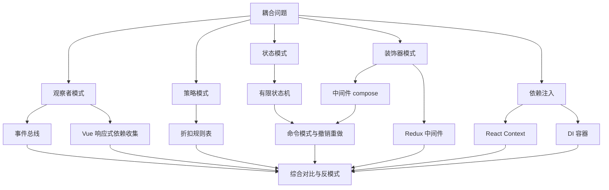
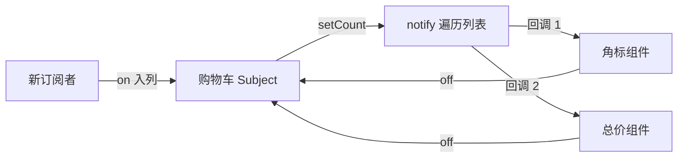
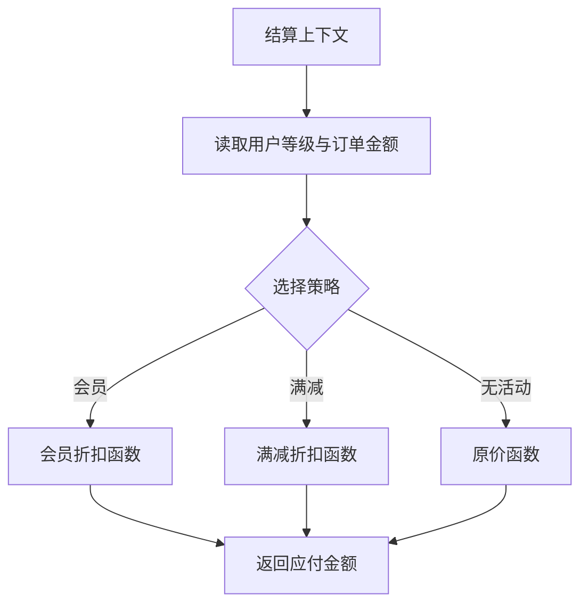
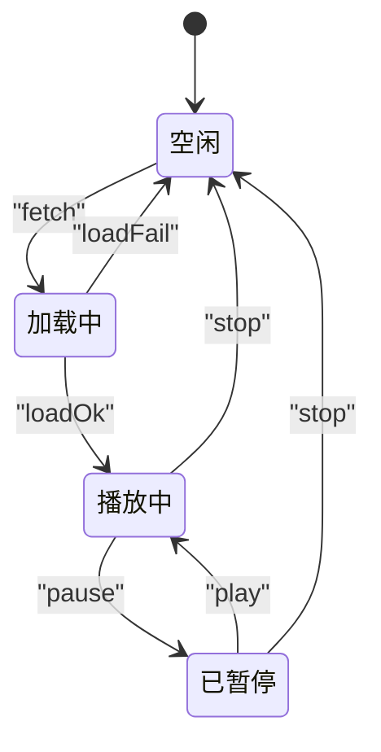
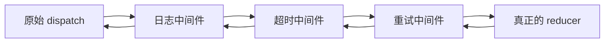
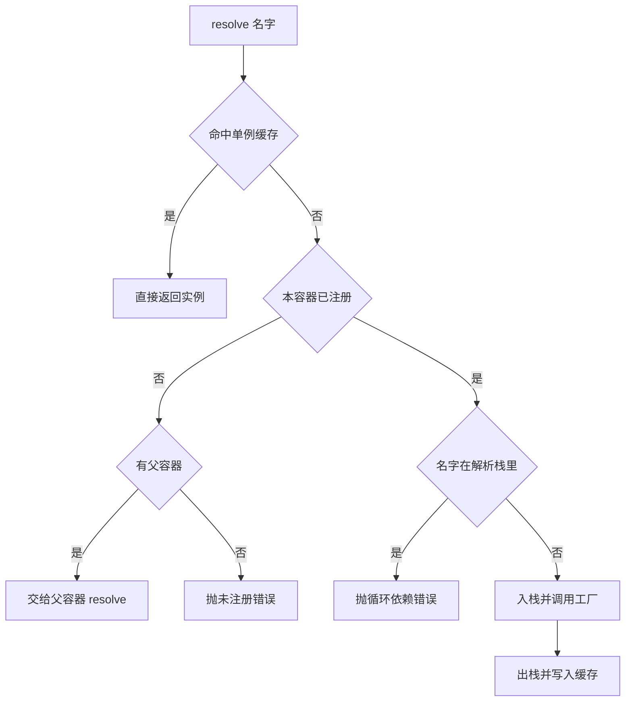
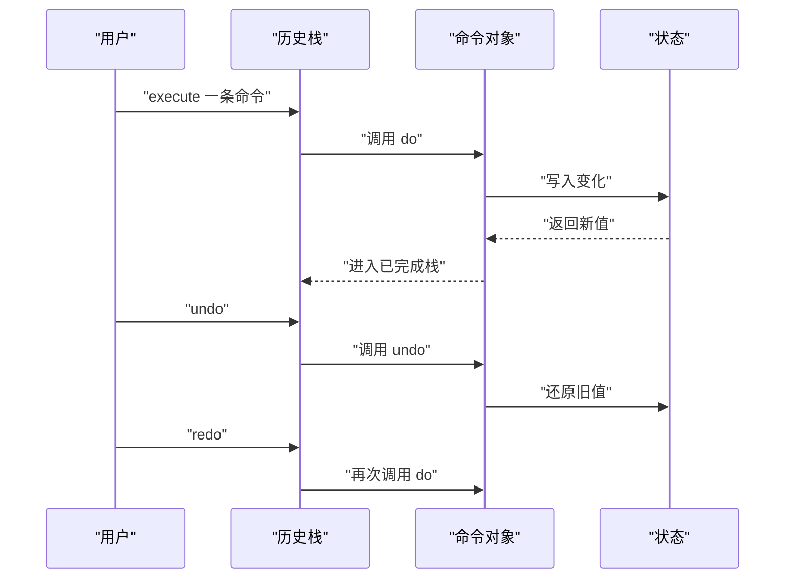
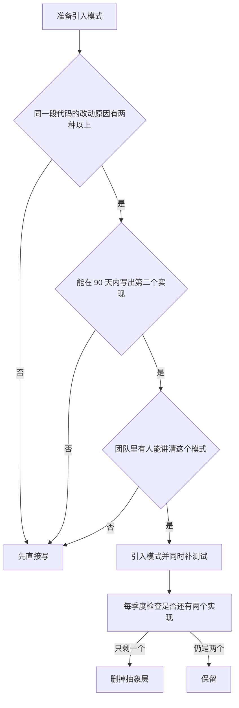

# 设计模式在前端：观察者、策略、状态、装饰器、依赖注入

!!! abstract "学完这一页你能"
    - 写出带 once、off、命名空间的事件总线，并用断言验证订阅顺序与退订行为。
    - 用 compose 把三个中间件拼成一条管道，并说明执行顺序为什么是嵌套而非顺序调用。
    - 实现带作用域和循环依赖检测的依赖注入容器，并指出它解决的是哪一类耦合。
    - 用有限状态机约束按钮可用性，用命令模式实现撤销重做，并说清两者各自的边界。

## 0. 知识地图



左侧一列是五种模式共同回答的问题：谁依赖谁，一次改动会传播到多少文件。中间一列是每种模式在前端项目里的常见落点。

建议从第 1 节顺着读到第 7 节：前五节各讲一种模式，第 6 节把状态机和中间件合成可撤销的命令流。第 7 节回收前面全部例子，讲什么时候不该引入模式。

## 1. 观察者模式：让发布者不必认识订阅者

**先想一个问题**

购物车组件要在数量变化时刷新角标、更新总价、上报埋点。如果购物车直接 import 这三个模块并逐个调用，每加一个依赖方就要改购物车源码。观察者模式把"通知谁"从购物车手里拿走。

!!! note "术语：观察者模式"
    精确定义：被观察对象（Subject，发布者）维护订阅者列表，自身状态变化时遍历列表调用每个订阅者的回调。例子：addEventListener 就是浏览器提供的观察者接口，DOM 元素是 Subject，你传的函数是订阅者。

**心智模型**

!!! tip "心智模型"
    一句话模型：发布者只负责喊一嗓子，谁听、听几次、什么时候不听，由订阅者自己决定。
    日常类比：小区广播站只对着喇叭说话，住户自己决定开不开窗听。
    类比不成立的地方：广播说出去就没了，事件总线要长期保存订阅者列表，退订必须在下次广播前生效，这个列表的生命周期得由人来管，否则回调会越积越多。

**图解**



1. 购物车内部保存 count，外部只能通过 setCount 修改它。
2. setCount 先把新值写入内部状态，再调用 notify。
3. notify 按列表顺序取出订阅者，把新值传给每个回调。
4. 组件卸载时调用 off，把自己的回调从列表里删掉。
5. 新组件挂载时调用 on，回调进入列表尾部，只接收后续事件。

**一步一步来**

**第 1 步：先写出可用的 on、off、emit**

这一步要让发布订阅能跑起来。用 Map 保存"事件名到回调数组"的映射。

```js
function createBus() {
  // Map 的键是事件名，值是回调数组
  const listeners = new Map();

  function on(type, fn) {
    // 取不到就初始化成空数组，避免 undefined.push 报错
    const list = listeners.get(type) ?? [];
    list.push(fn);
    listeners.set(type, list);
    // 返回退订函数，调用方不必同时记住 type 和 fn
    return () => off(type, fn);
  }

  function off(type, fn) {
    const list = listeners.get(type);
    if (!list) return;
    // filter 生成新数组，不改动正在被遍历的那个数组
    listeners.set(type, list.filter((item) => item !== fn));
  }

  function emit(type, payload) {
    // 先复制再遍历，回调里调用 off 不会让本次派发漏掉订阅者
    for (const fn of [...(listeners.get(type) ?? [])]) {
      fn(payload);
    }
  }

  return { on, off, emit };
}
```

**这段代码在做什么**

- listeners 是 Map，按事件名查找的代价只和事件种类有关，和订阅者数量无关。
- on 返回退订函数，订阅方不必保存 type 与 fn 两个变量。
- emit 先复制数组，回调内部调用 off 不会让本次循环跳过下一个回调。
- off 用 filter 重建数组，保证只删匹配的那一个回调。

**运行结果**

```text
on: A
on: B
emit: A B
after off B -> emit: A
```

**第 2 步：加上 once 与命名空间退订**

once 让回调触发一次后自动退订。命名空间让一次调用清理一组同前缀事件。

```js
function once(type, fn) {
  // 先退订再调用原函数，回调里再次 emit 也不会重复触发
  const wrapper = (payload) => {
    off(type, wrapper);
    fn(payload);
  };
  return on(type, wrapper);
}

function offNamespace(ns) {
  // 命名空间约定成前缀加冒号，例如 cart:add
  const prefix = ns + ":";
  // 复制 keys 再删除，避免遍历 Map 的同时修改它
  for (const type of [...listeners.keys()]) {
    if (!type.startsWith(prefix)) continue;
    listeners.delete(type);
  }
}
```

**这段代码在做什么**

- once 把原回调包进 wrapper，退订动作发生在原回调之前。
- 命名空间靠字符串前缀实现，代价是每次退订多一次 startsWith 判断。
- offNamespace 先复制 keys 再删除，遍历与删除不会互相干扰。
- 退订仍然只作用于具体事件名，命名空间只做批量入口。

**运行结果**

```text
once 触发次数: 1
命名空间清理后剩余事件: cart:count
```

**第 3 步：用断言固定行为**

把订阅顺序、精确退订、once 三个约定写成测试。以后改实现时，断言会挡住行为变化。

```js
import assert from "node:assert/strict";

const bus = createBus();
const seen = [];
bus.on("cart:add", (n) => seen.push("A" + n));
bus.on("cart:add", (n) => seen.push("B" + n));
bus.emit("cart:add", 1);
// 顺序与订阅顺序一致
assert.deepEqual(seen, ["A1", "B1"]);

let onceCount = 0;
bus.once("cart:add", () => (onceCount += 1));
bus.emit("cart:add", 2);
bus.emit("cart:add", 3);
// once 只执行一次
assert.equal(onceCount, 1);
```

**这段代码在做什么**

- 第一个断言固定"先订阅先收到"这条约定。
- 第二个断言固定 once 的语义：任意次 emit 只执行一次。
- 断言用 deepEqual 比较数组内容，不是比较引用。
- 断言失败会抛错并让进程退出码变成 1，可直接接进 CI。

**运行结果**

```text
全部断言通过
```

**动手验证**

依赖：无第三方依赖，Node 20+。把整段保存为 bus.mjs，执行 `node bus.mjs`。

```js
import assert from "node:assert/strict";

function createBus() {
  const listeners = new Map();

  function on(type, fn) {
    const list = listeners.get(type) ?? [];
    list.push(fn);
    listeners.set(type, list);
    return () => off(type, fn);
  }

  function once(type, fn) {
    const wrapper = (payload) => { off(type, wrapper); fn(payload); };
    return on(type, wrapper);
  }

  function off(type, fn) {
    const list = listeners.get(type);
    if (!list) return;
    listeners.set(type, list.filter((item) => item !== fn));
  }

  function offNamespace(ns) {
    const prefix = ns + ":";
    for (const type of [...listeners.keys()]) {
      if (type.startsWith(prefix)) listeners.delete(type);
    }
  }

  function emit(type, payload) {
    // 复制数组，保证派发过程中退订不影响本次遍历
    for (const fn of [...(listeners.get(type) ?? [])]) fn(payload);
  }

  return { on, once, off, emit, offNamespace, size: () => listeners.size };
}

const bus = createBus();
const seen = [];
const offA = bus.on("cart:add", (n) => seen.push("A" + n));
bus.on("cart:add", (n) => seen.push("B" + n));
bus.emit("cart:add", 1);
assert.deepEqual(seen, ["A1", "B1"]);

offA();
bus.emit("cart:add", 2);
assert.deepEqual(seen, ["A1", "B1", "B2"]);

let onceCount = 0;
bus.once("cart:add", () => (onceCount += 1));
bus.emit("cart:add", 3);
bus.emit("cart:add", 4);
assert.equal(onceCount, 1);

bus.on("order:paid", () => {});
bus.on("order:cancel", () => {});
const before = bus.size();
bus.offNamespace("order");
assert.equal(bus.size(), before - 2);

console.log("全部断言通过");
```

**常见坑**

| 现象 | 原因 | 怎么修 |
| --- | --- | --- |
| 组件卸载后回调仍然执行 | 订阅时没有保存 on 返回的退订函数 | 把退订函数存进变量，在卸载钩子里调用 |
| 某个回调只执行一次就消失 | emit 遍历时用了原数组，off 改动了它 | emit 里先 `[...list]` 复制再遍历 |
| 内存里回调数量持续上涨 | 每次挂载都订阅，组件重渲染反复执行订阅代码 | 订阅放进只执行一次的挂载钩子，或加去重判断 |
| 事件名拼错导致无人响应 | 事件名是普通字符串，没有拼写检查 | 把事件名集中到一个常量对象里导出 |

**小结**

- 观察者把"谁依赖谁"变成运行时的列表关系，发布者不必 import 订阅者。
- 退订函数是这套机制的必要组成部分，只提供 on 不提供 off 会留下泄漏。
- 事件名是弱约束，靠命名空间和常量表来降低拼写错误带来的排查成本。

## 2. 策略模式：把分支收进可替换的对象

**先想一个问题**

结算页有会员价、满减、优惠券三种折扣规则。写成 if-else 之后，每加一种规则都要改这个函数，还要回归测试全部旧规则。

!!! note "术语：策略模式"
    精确定义：把一组可互相替换的算法各自封装成对象或函数，调用方按条件选中其中一个来执行。例子：Array.prototype.sort 接收的比较函数就是策略，排序流程不变，比较规则由你提供。

**心智模型**

!!! tip "心智模型"
    一句话模型：调用方负责选，策略负责算，选和算分开放在两处。
    日常类比：导航软件让你挑"最快""最短""不走高速"，路线算法是策略，挑哪条由你决定。
    类比不成立的地方：导航里策略可以中途随便换，代码里换策略往往意味着上下文的输入也要换，输入校验得跟着策略一起测。

**图解**



1. 上下文先收集输入：用户等级、订单原始金额、可用活动。
2. 用一个键在策略表里查找，键可以是活动类型字符串。
3. 查不到时落到默认策略，保证返回值类型一致。
4. 三个策略都接收同一份输入，都返回一个金额数字。
5. 上下文只依赖"返回数字"这一条约定，不关心内部算法。

**一步一步来**

**第 1 步：先看清 if-else 的代价**

先把旧写法写出来当对照。它的成本不在行数，而在每次改动都要动同一个函数。

```js
function priceOf(order) {
  let total = order.amount;
  if (order.type === "vip") {
    // 会员打九折，用整数分计算避免小数误差
    total = Math.round(total * 90 / 100);
  } else if (order.type === "full") {
    // 满 200 减 30，单位是分
    if (total >= 20000) total -= 3000;
  }
  // 新规则继续往后追加 else if
  return total;
}
```

**这段代码在做什么**

- 三个规则共享一个函数体，改动一个分支就会影响整个函数的测试覆盖。
- 判断条件是字符串，拼错时走默认分支，错误会静默传播。
- 金额用整数分计算，避免浮点数相加出现尾差。

**运行结果**

```text
9000 19700 10000
```

**第 2 步：抽出策略表**

把每段算法搬进独立函数，用对象把它们按类型名登记。上下文只做查表和调用。

```js
// 每个策略都接收 amount，返回新的 amount
const strategies = {
  vip: (amount) => Math.round(amount * 90 / 100),
  full: (amount) => (amount >= 20000 ? amount - 3000 : amount),
  none: (amount) => amount,
};

function priceOf(order) {
  // 查不到就用 none，保证永远有函数可调用
  const strategy = strategies[order.type] ?? strategies.none;
  return strategy(order.amount);
}
```

**这段代码在做什么**

- 每个策略是纯函数，输入输出都可单独断言，不必搭整个订单对象。
- `?? strategies.none` 把未知类型的错误从静默变成"按原价处理"这一条明确约定。
- 新增活动只需往 strategies 里加一个键，priceOf 不动。
- 策略表可以在运行时替换，测试里能塞入固定返回值的假策略。

**运行结果**

```text
9000 19700 10000
```

**第 3 步：让策略可以叠加**

折扣经常叠加，需要按顺序依次作用。这里用数组保存策略，用 reduce 折叠。

```js
function applyAll(amount, names) {
  // reduce 把上一个策略的输出当作下一个策略的输入
  return names.reduce((acc, name) => {
    const strategy = strategies[name];
    // 未注册的名字直接抛错，不静默跳过
    if (!strategy) throw new Error("未知策略: " + name);
    return strategy(acc);
  }, amount);
}

// 先满减再会员，顺序不同结果不同
const result = applyAll(20000, ["full", "vip"]);
```

**这段代码在做什么**

- reduce 的初值是原始金额，累加器始终是"当前金额"。
- 顺序有语义：先满减后打折与先打折后满减得到的金额不同。
- 未知名字抛错，配置写错时立刻暴露，而不是少算一次折扣。
- 策略函数保持无副作用，叠加顺序可以在测试里穷举。

**运行结果**

```text
full 之后: 17000
vip 之后: 15300
```

**动手验证**

依赖：无第三方依赖，Node 20+。执行 `node strategy.mjs`。

```js
import assert from "node:assert/strict";

const strategies = {
  vip: (amount) => Math.round(amount * 90 / 100),
  full: (amount) => (amount >= 20000 ? amount - 3000 : amount),
  none: (amount) => amount,
};

function priceOf(order) {
  const strategy = strategies[order.type] ?? strategies.none;
  return strategy(order.amount);
}

function applyAll(amount, names) {
  return names.reduce((acc, name) => {
    const strategy = strategies[name];
    if (!strategy) throw new Error("未知策略: " + name);
    return strategy(acc);
  }, amount);
}

assert.equal(priceOf({ type: "vip", amount: 10000 }), 9000);
assert.equal(priceOf({ type: "full", amount: 20000 }), 17000);
assert.equal(priceOf({ type: "full", amount: 10000 }), 10000);
assert.equal(priceOf({ type: "unknown", amount: 10000 }), 10000);
assert.equal(applyAll(20000, ["full", "vip"]), 15300);
assert.throws(() => applyAll(1000, ["missing"]), /未知策略/);

console.log("全部断言通过");
```

**常见坑**

| 现象 | 原因 | 怎么修 |
| --- | --- | --- |
| 新策略上线后旧活动算错 | 多个策略共享一个可变对象并互相改写 | 策略写成纯函数，只接收参数并返回新值 |
| 未知类型订单金额变成 NaN | 策略表用 `[]` 取值拿到 undefined 后直接调用 | 用 `?? strategies.none` 提供默认策略 |
| 叠加折扣结果与预期差 1 分 | 中间结果用了浮点数并反复四舍五入 | 全流程用整数分，只在最后一步格式化 |
| 策略函数在测试里难以触发 | 策略内部直接读取全局配置 | 把配置作为参数传入策略，测试时传固定值 |

**小结**

- 策略模式把"选哪条路"和"怎么走"拆到两个位置，新增规则不改调用方。
- 策略表是运行时可替换的对象，这为测试提供了注入假实现的入口。
- 策略叠加的顺序带有语义，必须有测试固定顺序与结果。

## 3. 状态模式：让非法状态组合无法出现

**先想一个问题**

播放器按钮上，加载中不能暂停，播放中才能暂停。用 isLoading 和 isPlaying 两个布尔量描述，会出现两个都为 true 的组合，按钮逻辑要写四层判断。

!!! note "术语：有限状态机"
    精确定义：有限状态机（Finite State Machine，FSM）先枚举全部合法状态，再枚举状态之间允许的迁移，事件在当前状态下没有对应迁移时直接拒绝。例子：地铁闸机只有"未刷卡"到"已刷卡"这一条路径能开闸。

**心智模型**

!!! tip "心智模型"
    一句话模型：状态是有限集合里的一个值，事件只有在当前状态登记过才能改变它。
    日常类比：微波炉只有关门状态才能启动，开门状态按启动键没有反应。
    类比不成立的地方：微波炉的拒绝是硬件互锁，前端状态常带异步请求，要额外处理"请求失败回到原状态"这类回滚逻辑。

**图解**



1. 初始状态是 idle，此时只有 fetch 事件被登记。
2. fetch 进入 loading，此时 pause 和 play 都没有登记，发送会被拒绝。
3. loadOk 进入 playing，loadFail 回到 idle，请求失败不需要人工清理状态。
4. playing 与 paused 之间只能通过 pause 和 play 来回切换。
5. stop 在 playing 和 paused 下都有效，都回到 idle。

**一步一步来**

**第 1 步：用对象描述状态与迁移**

把状态画成表：外层键是状态，内层键是事件，值是目标状态。表就是这台机器的全部约束。

```js
const config = {
  initial: "idle",
  states: {
    // 每个状态列出它允许接收的事件
    idle: { fetch: "loading" },
    loading: { loadOk: "playing", loadFail: "idle" },
    playing: { pause: "paused", stop: "idle" },
    paused: { play: "playing", stop: "idle" },
  },
};
```

**这段代码在做什么**

- 表里没有出现的事件就是非法事件，无需再写额外判断。
- 状态集合是封闭的，新增状态时必须同时登记它的合法事件。
- 数据结构是普通对象，可以序列化，方便在调试面板里展示。

**运行结果**

```text
idle 允许的事件: ["fetch"]
```

**第 2 步：实现 send 与非法迁移检查**

send 查表决定目标状态。查不到就抛错，让错误在调用点暴露。

```js
function createMachine(config) {
  let state = config.initial;
  const listeners = [];

  function can(event) {
    // Boolean 保证返回值是 true 或 false
    return Boolean(config.states[state][event]);
  }

  function send(event, payload) {
    const next = config.states[state][event];
    // 没有登记就是非法迁移，立即抛错
    if (!next) throw new Error("非法迁移: " + state + " 收到 " + event);
    const prev = state;
    state = next;
    // 通知订阅者，参数里带上前一个状态便于记录
    listeners.forEach((fn) => fn({ prev, event, next: state, payload }));
  }

  return {
    send,
    can,
    getState: () => state,
    subscribe: (fn) => listeners.push(fn),
  };
}
```

**这段代码在做什么**

- 闭包里的 state 是唯一可写位置，外部只能通过 send 改动。
- can 给 UI 用，按钮禁用状态直接来自 can，不必另写一套判断。
- 订阅回调收到 prev、event、next，日志和埋点可以直接记录迁移轨迹。
- 抛错而不是静默忽略，非法事件会在开发阶段被立刻发现。

**运行结果**

```text
迁移记录: idle -> loading -> playing
非法事件 pause 在 idle 下被拒绝
```

**第 3 步：把失败路径写进表里**

异步请求失败要回到原状态，所以 loadFail 必须显式登记。这是状态机区别于布尔标志的关键点。

```js
const machine = createMachine(config);
const log = [];
machine.subscribe((t) => log.push(t.prev + " -> " + t.next));

machine.send("fetch");
// 请求失败时回到 idle，不需要额外清理标志位
machine.send("loadFail");
machine.send("fetch");
machine.send("loadOk");
machine.send("pause");

// 断言最终状态与迁移轨迹
console.log(machine.getState());
console.log(log.join(", "));
```

**这段代码在做什么**

- loadFail 是表里的一等事件，失败路径和成功路径地位相同。
- 迁移轨迹由订阅回调记录，不需要在每个调用点手动写日志。
- 最终状态可以直接断言，UI 渲染只读这一个值。
- 回到 idle 后再 fetch 能重新走一遍完整流程，状态可重入。

**运行结果**

```text
paused
idle -> loading, loading -> idle, idle -> loading, loading -> playing, playing -> paused
```

**动手验证**

依赖：无第三方依赖，Node 20+。执行 `node machine.mjs`。

```js
import assert from "node:assert/strict";

const config = {
  initial: "idle",
  states: {
    idle: { fetch: "loading" },
    loading: { loadOk: "playing", loadFail: "idle" },
    playing: { pause: "paused", stop: "idle" },
    paused: { play: "playing", stop: "idle" },
  },
};

function createMachine(cfg) {
  let state = cfg.initial;
  const listeners = [];
  function can(event) { return Boolean(cfg.states[state][event]); }
  function send(event) {
    const next = cfg.states[state][event];
    if (!next) throw new Error("非法迁移: " + state + " 收到 " + event);
    const prev = state;
    state = next;
    listeners.forEach((fn) => fn({ prev, event, next: state }));
  }
  return { send, can, getState: () => state, subscribe: (fn) => listeners.push(fn) };
}

const m = createMachine(config);
const log = [];
m.subscribe((t) => log.push(t.prev + "->" + t.next));

assert.equal(m.can("pause"), false);
assert.throws(() => m.send("pause"), /非法迁移/);

m.send("fetch");
assert.equal(m.getState(), "loading");
assert.equal(m.can("play"), false);

m.send("loadFail");
assert.equal(m.getState(), "idle");

m.send("fetch");
m.send("loadOk");
m.send("pause");
assert.equal(m.getState(), "paused");

m.send("play");
m.send("stop");
assert.equal(m.getState(), "idle");
assert.deepEqual(log, [
  "idle->loading", "loading->idle", "idle->loading",
  "loading->playing", "playing->paused", "paused->playing", "playing->idle",
]);

console.log("全部断言通过");
```

**常见坑**

| 现象 | 原因 | 怎么修 |
| --- | --- | --- |
| 界面上两个互斥按钮同时可点 | 用独立的布尔量描述状态，缺少互斥约束 | 改成单一状态值，按钮禁用条件来自 can 查询 |
| 异步失败后界面卡在加载中 | 失败路径没有登记进迁移表 | 给每个异步状态补上失败事件，回到明确的前一个状态 |
| 迁移日志对不上排查方向 | 只在部分调用点手写日志 | 用 subscribe 统一记录 prev 与 next |
| 新增状态后旧事件静默失效 | 新状态的迁移表漏写事件 | 新增状态时同步补全事件，并给合法事件逐个写断言 |

**小结**

- 状态机用一张表代替多个布尔量，非法组合在结构上就不存在。
- 失败路径必须显式登记，否则界面会停在中间状态。
- subscribe 让迁移轨迹可记录，排查问题时能还原事件顺序。

## 4. 装饰器模式：不改原函数，往上叠行为

**先想一个问题**

一个请求函数需要日志、超时、重试三种能力。全塞进函数体之后，某次只想关掉日志就得改源码并重新测试全部逻辑。

!!! note "术语：装饰器模式"
    精确定义：装饰器接收一个函数或对象，返回一个行为被增强、接口保持不变的新函数或新对象，原函数本身不被修改。例子：函数式写法 `withLog(fn)` 返回一个新函数，调用方式与 fn 完全一致。

**心智模型**

!!! tip "心智模型"
    一句话模型：装饰器吃进一个函数吐出另一个函数，调用方看到的接口不变，多出来的行为在返回值里。
    日常类比：给手机套壳，机器本身没变，壳可以一层层叠上去。
    类比不成立的地方：壳的叠加顺序无所谓，装饰器的顺序带语义，日志放在重试外层还是内层，记录到的次数不一样。

**图解**



1. 调用方只调用最外层函数，不知道里面套了几层。
2. 最外层日志中间件先记录动作，再把控制权交给 next。
3. 超时中间件启动计时，然后调用 next。
4. 重试中间件负责重复调用，直到成功或达到次数上限。
5. 到达真正的 reducer 后，控制权按相反方向逐层返回。

**一步一步来**

**第 1 步：写第一个装饰器**

先包装一个函数，让它在调用前后各打印一行。接口保持一个参数、一个返回值。

```js
function withLog(fn, tag) {
  // 返回新函数，原函数 fn 不被修改
  return function decorated(input) {
    console.log(tag + " 入参: " + input);
    const result = fn(input);
    console.log(tag + " 出参: " + result);
    return result;
  };
}

const double = (n) => n * 2;
const logged = withLog(double, "double");
```

**这段代码在做什么**

- withLog 不改动 double，只返回一个包装后的新函数。
- 新函数的参数与返回值类型和原函数一致，调用方无需改代码。
- 装饰器接收 fn 作为参数，因此可以复用在同一签名的任意函数上。

**运行结果**

```text
double 入参: 3
double 出参: 6
```

**第 2 步：用 compose 把数组折成一层函数**

多个装饰器需要一个组合函数。用 reduceRight 从右往左折叠，保证数组第一个元素在最外层。

```js
function compose(middlewares) {
  // reduceRight 让数组首元素成为最外层包装
  return middlewares.reduceRight(
    (next, middleware) => middleware(next),
    (input) => input
  );
}
```

**这段代码在做什么**

- reduceRight 从数组末尾开始折叠，末尾元素最先接触输入。
- 初值是一个恒等函数，空数组时返回它，不会报错。
- 每个 middleware 都是"接收 next 返回新函数"的高阶函数。
- 数组顺序即包装顺序，读代码时从右往左看执行方向。

**运行结果**

```text
入参: 2 | A | B | 核心 | B | A
```

**第 3 步：把中间件写成 Koa 风格**

Redux 与 Koa 的中间件签名是"接收上下文返回新函数"。用 next 显式控制何时进入下一层。

```js
function makeMiddleware(name) {
  // 每一层都拿到 next，调用 next 才继续向内
  return (next) => (ctx) => {
    ctx.trace.push(name + " 进");
    const result = next(ctx);
    ctx.trace.push(name + " 出");
    return result;
  };
}

const pipeline = compose([makeMiddleware("日志"), makeMiddleware("超时")]);
const ctx = { trace: [] };
pipeline(ctx);
```

**这段代码在做什么**

- next 是下一层的函数，不调用它就等于短路，后面的层不会执行。
- ctx 是一块共享数据，各层往里追加记录，避免用全局变量。
- "进"的顺序与"出"的顺序相反，说明控制权是栈式返回。
- 层与层之间只通过 ctx 和返回值通信，不互相 import。

**运行结果**

```text
日志 进, 超时 进, 超时 出, 日志 出
```

**动手验证**

依赖：无第三方依赖，Node 20+。执行 `node compose.mjs`。

```js
import assert from "node:assert/strict";

function compose(middlewares) {
  return middlewares.reduceRight(
    (next, middleware) => middleware(next),
    (input) => input
  );
}

function makeMiddleware(name, trace) {
  return (next) => (ctx) => {
    ctx.trace.push(name + " 进");
    const result = next(ctx);
    ctx.trace.push(name + " 出");
    return result;
  };
}

const order = [];
const pipeline = compose([
  makeMiddleware("A", order),
  makeMiddleware("B", order),
  makeMiddleware("C", order),
]);

const ctx = { trace: order };
pipeline(ctx);
assert.deepEqual(order, [
  "A 进", "B 进", "C 进", "C 出", "B 出", "A 出",
]);

// 中间件可以短路，不调用 next 时后续层不执行
let reached = false;
const shortCircuit = compose([
  (next) => (c) => "被拦截",
  (next) => (c) => { reached = true; return "不该到这里"; },
]);
assert.equal(shortCircuit({}), "被拦截");
assert.equal(reached, false);

// 空管道返回恒等函数
assert.equal(compose([])(42), 42);

console.log("全部断言通过");
```

**常见坑**

| 现象 | 原因 | 怎么修 |
| --- | --- | --- |
| 中间件执行顺序与数组顺序相反 | 用 reduce 从左往右折叠 | 改用 reduceRight，数组首元素放最外层 |
| 日志记录的耗时包含重试等待 | 日志装饰器被套在重试装饰器里面 | 调整数组顺序，把日志放到重试外层 |
| 某个中间件里 next 被调用两次 | 分支里重复调用 next，状态被写两遍 | 在 compose 内部用自增下标判断并抛错 |
| 装饰后函数名与调用栈难读 | 匿名包装函数堆叠 | 给包装函数起名，或保留 name 属性方便调试 |

**小结**

- 装饰器保持接口不变，能力通过叠加获得，原函数不用改。
- compose 用 reduceRight 把数组折成一个函数，顺序即语义。
- next 显式控制向内传递，也让短路成为一种合法能力。

## 5. 依赖注入：把依赖的创建权交出去

**先想一个问题**

日志模块直接 import 文件写入实现。写单元测试时想换成内存实现，必须改源码或做模块替换，测试和实现被绑在一起。

!!! note "术语：控制反转与依赖注入"
    精确定义：控制反转（Inversion of Control，IoC）指对象不再自己创建依赖，创建权交给外部；依赖注入（Dependency Injection，DI）是 IoC 的一种落地方式，由外部把依赖实例传进对象。例子：构造函数参数里接收 `logger` 而不是在内部 `new Logger()`。

**心智模型**

!!! tip "心智模型"
    一句话模型：对象只声明"我需要什么"，由容器决定"给你哪个实例"。
    日常类比：员工不自己造电脑，采购把电脑送到工位，坏了自己换一台不影响员工。
    类比不成立的地方：电脑送到就能用，依赖有生命周期，单例和每次新建要分开，容器必须为此维护作用域。

**图解**



1. 先查缓存，同一个作用域里的同名依赖只构造一次。
2. 本容器没有注册就向上找父容器，子容器因此能继承父级注册。
3. 都没有就抛未注册错误，避免拿到 undefined。
4. 名字出现在解析栈里说明 A 依赖 B、B 又依赖 A，直接抛循环依赖错误。
5. 工厂返回后出栈并写缓存，下次解析直接命中缓存。

**一步一步来**

**第 1 步：注册表加单例缓存**

最小容器只有三步：注册名字到工厂的映射、解析时查缓存、没有就调用工厂。

```js
function createContainer() {
  // 名字到工厂函数的映射
  const factories = new Map();
  // 名字到已构造实例的缓存
  const cache = new Map();

  function register(name, factory) {
    factories.set(name, factory);
  }

  function resolve(name) {
    // 已构造过就直接返回同一个实例
    if (cache.has(name)) return cache.get(name);
    const factory = factories.get(name);
    if (!factory) throw new Error("未注册: " + name);
    const instance = factory({ resolve });
    cache.set(name, instance);
    return instance;
  }

  return { register, resolve };
}
```

**这段代码在做什么**

- factories 存放"怎么造"，cache 存放"造好的东西"，两者分开。
- 工厂接收一个含 resolve 的对象，因此依赖可以继续解析其他依赖。
- 同一个名字二次解析得到同一个引用，符合单例语义。

**运行结果**

```text
same instance: true
```

**第 2 步：加作用域**

子容器先查自己，再查父容器。父容器的实例与子容器共享，子容器自己的注册只对自己可见。

```js
function createScope(parent) {
  const factories = new Map();
  const cache = new Map();

  function resolve(name) {
    if (cache.has(name)) return cache.get(name);
    if (!factories.has(name)) {
      // 本地没有就问父容器，父容器缓存同样生效
      if (parent) return parent.resolve(name);
      throw new Error("未注册: " + name);
    }
    const instance = factories.get(name)({ resolve });
    cache.set(name, instance);
    return instance;
  }

  return { register: (name, f) => factories.set(name, f), resolve, createScope: () => createScope({ resolve }) };
}
```

**这段代码在做什么**

- 子容器的本地注册优先级高于父容器，形成覆盖能力。
- 每个请求用一个子容器，请求级实例不会泄漏到其他请求。
- 父容器负责单例，子容器负责临时实例，职责按作用域划分。

**运行结果**

```text
父实例复用: true
子容器覆盖生效: true
```

**第 3 步：加循环依赖检测**

用一个数组当解析栈。进入工厂前把名字压栈，解析完弹出。名字已经在栈里就是环。

```js
function resolveWithStack(name) {
  if (cache.has(name)) return cache.get(name);
  if (stack.includes(name)) {
    // 把整条链打印出来，便于定位是哪个依赖闭成了环
    throw new Error("循环依赖: " + [...stack, name].join(" -> "));
  }
  const factory = factories.get(name);
  if (!factory) throw new Error("未注册: " + name);
  stack.push(name);
  try {
    const instance = factory({ resolve: resolveWithStack });
    cache.set(name, instance);
    return instance;
  } finally {
    // 无论工厂是否抛错都要出栈，避免污染后续解析
    stack.pop();
  }
}
```

**这段代码在做什么**

- 栈里的名字顺序就是当前的依赖链，报错信息直接给出链路。
- try/finally 保证工厂抛错时也会出栈，下一次解析不受影响。
- 检测粒度是按名字，同一名字重复进入才判定为环。

**运行结果**

```text
循环依赖: a -> b -> a
```

**动手验证**

依赖：无第三方依赖，Node 20+。执行 `node di.mjs`。

```js
import assert from "node:assert/strict";

function createContainer(parent = null) {
  const factories = new Map();
  const cache = new Map();
  const stack = [];

  function register(name, factory) {
    factories.set(name, factory);
  }

  function resolve(name) {
    if (cache.has(name)) return cache.get(name);
    if (!factories.has(name)) {
      if (parent) return parent.resolve(name);
      throw new Error("未注册: " + name);
    }
    if (stack.includes(name)) {
      throw new Error("循环依赖: " + [...stack, name].join(" -> "));
    }
    stack.push(name);
    try {
      const instance = factories.get(name)({ resolve });
      cache.set(name, instance);
      return instance;
    } finally {
      stack.pop();
    }
  }

  return { register, resolve, createScope: () => createContainer({ resolve }) };
}

const root = createContainer();
root.register("logger", () => ({ lines: [] }));
root.register("service", ({ resolve }) => ({ log: resolve("logger") }));

const a = root.resolve("service");
const b = root.resolve("service");
assert.equal(root.resolve("logger"), root.resolve("logger"));
assert.equal(a, b, "单例语义");

const scope = root.createScope();
scope.register("logger", () => ({ lines: [], scoped: true }));
const scopedService = scope.resolve("service");
assert.equal(scopedService.log.scoped, true, "子容器覆盖生效");
assert.equal(scopedService, scope.resolve("service"));
assert.notEqual(scopedService, a, "作用域隔离");

const cyclic = createContainer();
cyclic.register("x", ({ resolve }) => ({ y: resolve("y") }));
cyclic.register("y", ({ resolve }) => ({ x: resolve("x") }));
assert.throws(() => cyclic.resolve("x"), /循环依赖/);

assert.throws(() => root.resolve("missing"), /未注册/);

console.log("全部断言通过");
```

**常见坑**

| 现象 | 原因 | 怎么修 |
| --- | --- | --- |
| 两个模块互相 import 后解析卡住 | 依赖关系成环，解析没有终止条件 | 保留解析栈并抛错，用报错链路找出环 |
| 请求之间数据串了 | 请求级依赖注册进了根容器，被所有请求共享 | 每个请求创建一个子容器，临时依赖注册在子容器 |
| 测试通过但线上拿到旧实例 | 单例缓存没有清理入口 | 给容器提供 reset 或按名字删除缓存的方法 |
| 工厂抛错后后续解析全部失败 | 抛错时没有出栈，栈里残留名字 | 用 try/finally 保证出栈一定执行 |

**小结**

- 依赖注入把"创建"和"使用"分开，替换实现时不动使用方代码。
- 作用域决定实例数量，根容器放单例，子容器放请求级对象。
- 循环依赖必须显式检测，否则错误会表现为栈溢出或解析卡住。

## 6. 命令模式：把操作做成可撤销的对象

**先想一个问题**

画布上画了 20 个图形，用户按 Ctrl+Z 要撤销最后一步。如果每步操作只是一次函数调用，撤销时已经找不到要还原的数据。

!!! note "术语：命令模式"
    精确定义：把一次操作封装成带 do 与 undo 两个方法的对象，调用方只负责把对象压入栈或弹出栈。例子：编辑器的每次插入都变成一个 InsertCommand，撤销就是弹出栈顶并调用它的 undo。

**心智模型**

!!! tip "心智模型"
    一句话模型：操作本身成为对象，撤销就是弹出最近的对象并反向执行。
    日常类比：遥控器每个按键记录自己刚才做了什么，撤销就是把最近那个按键反向按一次。
    类比不成立的地方：真实撤销还要处理命令合并与浮点累积误差，纯反向计算可能回不到原值，必要时得存快照。

**图解**



1. 用户提交一条命令，历史栈调用它的 do 方法。
2. do 方法把变化写入状态，并把需要还原的旧值记录在命令对象内部。
3. 命令进入已完成栈，此时撤销和重做有了数据来源。
4. undo 弹出栈顶命令，调用它的 undo 方法写回旧值。
5. redo 从重做栈取出命令，再调用一次 do，然后放回已完成栈。

**一步一步来**

**第 1 步：定义命令对象**

命令对象自带 do 与 undo，并且把还原所需的数据存在自己身上。

```js
function createInsertCommand(list, item) {
  let insertedAt = -1;
  return {
    name: "insert " + item,
    do() {
      // 记录插入位置，undo 时按位置删除
      insertedAt = list.length;
      list.push(item);
    },
    undo() {
      // splice 按位置删除，避免误删同名元素
      list.splice(insertedAt, 1);
      insertedAt = -1;
    },
  };
}
```

**这段代码在做什么**

- 命令对象持有 list 引用与位置信息，撤销不需要外部再传参。
- 用位置而不是值来删除，列表里存在重复值时也能精确还原。
- do 与 undo 成对出现，命令的完整性靠这两个方法保证。

**运行结果**

```text
do 之后: ["圆", "方"]
undo 之后: ["圆"]
```

**第 2 步：加历史栈与重做栈**

用两个数组分别保存已完成与已撤销的命令。执行新命令时清空重做栈。

```js
function createHistory() {
  const done = [];
  const undone = [];

  function execute(cmd) {
    cmd.do();
    done.push(cmd);
    // 有新分支后旧的重做路径失效
    undone.length = 0;
  }

  function undo() {
    const cmd = done.pop();
    if (!cmd) return false;
    cmd.undo();
    undone.push(cmd);
    return true;
  }

  function redo() {
    const cmd = undone.pop();
    if (!cmd) return false;
    cmd.do();
    done.push(cmd);
    return true;
  }

  return { execute, undo, redo, depth: () => done.length };
}
```

**这段代码在做什么**

- done 与 undone 两个数组就是撤销重做的全部状态，没有额外标志位。
- 执行新命令清空 undone，符合编辑器里"撤销后再输入会丢弃原分支"的行为。
- undo 与 redo 在栈空时返回 false，调用方据此决定是否禁用按钮。

**运行结果**

```text
depth: 2 -> 1 -> 2
```

**第 3 步：与状态机配合**

命令触发状态迁移。迁移被状态机拒绝时抛错，命令不会进入历史栈。

```js
const machine = createMachine(config);
const history = createHistory();

function sendCommand(cmd, event) {
  // 先判断状态机是否允许这次迁移
  if (!machine.can(event)) throw new Error("当前状态不允许: " + event);
  const before = machine.getState();
  machine.send(event);
  history.execute({
    name: event,
    do: () => machine.send(event),
    undo: () => machine.send("loadFail"),
  });
  return before;
}
```

**这段代码在做什么**

- can 查询放在执行之前，非法操作在入栈前就被拒绝。
- 历史栈只保存成功执行过的命令，撤销时不会遇到非法迁移。
- 这个例子里 undo 用固定事件回到 idle，真实项目需要为每条命令记录反向事件。

**运行结果**

```text
idle 执行 fetch 成功，撤销后回到 idle
```

**动手验证**

依赖：无第三方依赖，Node 20+。执行 `node command.mjs`。

```js
import assert from "node:assert/strict";

function createHistory() {
  const done = [];
  const undone = [];
  return {
    execute(cmd) { cmd.do(); done.push(cmd); undone.length = 0; },
    undo() { const c = done.pop(); if (!c) return false; c.undo(); undone.push(c); return true; },
    redo() { const c = undone.pop(); if (!c) return false; c.do(); done.push(c); return true; },
    depth: () => done.length,
    redoDepth: () => undone.length,
  };
}

function createInsert(list, item) {
  let at = -1;
  return {
    do() { at = list.length; list.push(item); },
    undo() { list.splice(at, 1); at = -1; },
  };
}

const list = [];
const history = createHistory();

history.execute(createInsert(list, "圆"));
history.execute(createInsert(list, "方"));
assert.deepEqual(list, ["圆", "方"]);
assert.equal(history.depth(), 2);

assert.equal(history.undo(), true);
assert.deepEqual(list, ["圆"]);
assert.equal(history.redoDepth(), 1);

assert.equal(history.redo(), true);
assert.deepEqual(list, ["圆", "方"]);

// 撤销后再执行新命令，重做栈被清空
history.undo();
history.execute(createInsert(list, "三角"));
assert.deepEqual(list, ["圆", "三角"]);
assert.equal(history.redoDepth(), 0);
assert.equal(history.redo(), false);

// 空栈 undo 返回 false
const empty = createHistory();
assert.equal(empty.undo(), false);

console.log("全部断言通过");
```

**常见坑**

| 现象 | 原因 | 怎么修 |
| --- | --- | --- |
| 撤销后列表里少了同名的另一个元素 | undo 按值删除而不是按位置删除 | 在命令对象里记录索引，按索引 splice |
| 撤销后再输入，重做按钮还能点 | 执行新命令时没有清空重做栈 | execute 里把重做栈长度置零 |
| 撤销链走几层后数据对不上 | 浮点计算反复加减产生尾差 | 记录操作前的快照，撤销时整体替换 |
| 命令 undo 报错后历史栈错乱 | undo 抛错前已经把命令弹出 | 先调用 undo，成功后再移动栈指针 |

**小结**

- 命令模式把操作变成对象，撤销所需的数据随对象一起保存。
- 两个栈分别表示已完成和已撤销，分支切换靠清空重做栈实现。
- 命令与状态机配合时，非法迁移要在入栈之前拦住。

## 7. 反模式与过度设计

**先想一个问题**

项目里放了一个全局事件总线，任何模块都能 emit 任意事件名。某次改了一个事件名，全项目搜不到监听方，线上表现为一部分 UI 不刷新。

!!! note "术语：过度设计"
    精确定义：为一个当前只有一个实现、一个调用点的需求引入抽象层，抽象带来的阅读与调试成本超过了它挡住的改动成本。例子：只有一个支付渠道时先写支付策略表与工厂。

**心智模型**

!!! tip "心智模型"
    一句话模型：模式是对已知变化方向的预付费，没有第二个实现之前不该付款。
    日常类比：一个人住的房子先装三个卫生间，管道改了六遍，入住后两个从没用过。
    类比不成立的地方：房子拆掉卫生间有成本，代码里删掉抽象层通常只花几分钟，所以判断标准是可逆性而非绝对值。

**图解**



1. 先问改动原因是否超过一种，只有一个原因说明抽象还不需要。
2. 再问 90 天内是否会出现第二个实现，答案是否就先写直接版本。
3. 团队里没人能讲清模式时，引入的抽象会变成无人敢改的区域。
4. 引入时同步补测试，否则抽象层本身没有被保护的契约。
5. 定期检查实现数量，只剩一个就是删除抽象层的信号。

**一步一步来**

**第 1 步：识别事件总线的失控信号**

全局总线的问题不在机制，而在约束缺失。下面三条能作为自查清单。

```js
// 失控信号一：事件名散落在各处
bus.emit("cart:update", data);

// 失控信号二：一个事件有多个含义不同的发送方
bus.emit("update", cartData);
bus.emit("update", userData);

// 失控信号三：没有订阅者清单可查
// 只能靠全局搜索字符串来排查谁在监听
```

**这段代码在做什么**

- 事件名是裸字符串，改名之后编译期没有任何提示。
- 同名事件被两种数据结构复用，订阅方必须再判断一次负载形状。
- 缺少订阅者注册总表，排查只能靠文本搜索。

**运行结果**

```text
同名事件监听者数量: 3
负载形状不一致: true
```

**第 2 步：把约束加回总线**

集中管理事件名，并在开发模式下记录订阅者数量。约束加在总线上，不靠人记。

```js
const EVENTS = Object.freeze({
  CART_ADD: "cart:add",
  USER_LOGIN: "user:login",
});

function createDevBus() {
  const bus = createBus();
  const counters = new Map();
  const originalOn = bus.on;
  bus.on = (type, fn) => {
    // 记录每个事件名当前的订阅者数量
    counters.set(type, (counters.get(type) ?? 0) + 1);
    return originalOn(type, fn);
  };
  return { bus, counters, EVENTS };
}
```

**这段代码在做什么**

- EVENTS 用 Object.freeze 固定，拼错时得到 undefined 而不是一个新字符串。
- counters 在开发模式下暴露每个事件的订阅者数量，便于发现无人监听。
- 事件名集中导出后，重命名可以在编辑器里全局重命名。

**运行结果**

```text
cart:add 订阅者: 2
user:login 订阅者: 0
```

**动手验证**

依赖：无第三方依赖，Node 20+。执行 `node anti.mjs`。

```js
import assert from "node:assert/strict";

const EVENTS = Object.freeze({ CART_ADD: "cart:add", USER_LOGIN: "user:login" });

function createBus() {
  const listeners = new Map();
  return {
    on(type, fn) {
      const list = listeners.get(type) ?? [];
      list.push(fn);
      listeners.set(type, list);
      return () => listeners.set(type, list.filter((f) => f !== fn));
    },
    emit(type, payload) {
      for (const fn of [...(listeners.get(type) ?? [])]) fn(payload);
    },
    count: (type) => (listeners.get(type) ?? []).length,
  };
}

const bus = createBus();
const seen = [];
bus.on(EVENTS.CART_ADD, (n) => seen.push(n));
bus.on(EVENTS.CART_ADD, (n) => seen.push(n * 2));
bus.emit(EVENTS.CART_ADD, 3);
assert.deepEqual(seen, [3, 6]);
assert.equal(bus.count(EVENTS.USER_LOGIN), 0);

// 未监听的合法事件名不会抛错，只是没有效果
bus.emit(EVENTS.USER_LOGIN, { id: 1 });
assert.equal(bus.count(EVENTS.CART_ADD), 2);

// 拼错的事件名与合法事件名是两个不同的键
assert.notEqual(EVENTS.CART_ADD, "cart_add");
assert.equal(bus.count("cart_add"), 0);

console.log("全部断言通过");
```

**常见坑**

| 现象 | 原因 | 怎么修 |
| --- | --- | --- |
| 抽象层没人敢改 | 引入模式时没补测试，契约只存在于作者脑中 | 给每个策略、每条命令补断言，把约定写进测试 |
| 只有一个实现的策略表长期存在 | 引入时的第二个实现最终没落地 | 定期检查实现数量，只剩一个就合并回调用方 |
| 全局总线改名后静默失效 | 事件名是裸字符串，没有统一出口 | 事件名集中导出并冻结，重命名走全局重命名 |
| 依赖注入容器注册表越堆越大 | 单例注册缺少下线机制 | 给容器加按名字删除或重置缓存的方法 |

**小结**

- 判断是否引入模式看两件事：改动原因有几种、多久会出现第二个实现。
- 抽象层必须配测试，否则它只是一个没人敢动的中间层。
- 定期回收只有一个实现的抽象，删除成本通常低于维护成本。

## 综合对比

| 模式 | 解决的问题 | 关键结构 | 前端落点 | 引入的代价 | 不该用的时机 |
| --- | --- | --- | --- | --- | --- |
| 观察者 | 发布者不必认识订阅者 | 订阅者列表加遍历通知 | 事件总线、Vue 响应式依赖收集 | 订阅与退订必须成对，否则回调泄漏 | 只有唯一一个固定调用方时 |
| 策略 | 分支规则不断增加 | 策略表加键查找 | 折扣计算、表单校验规则表 | 多一层间接寻址，调用链变长 | 规则数量固定在一两条时 |
| 状态 | 多个布尔量出现非法组合 | 状态表加迁移校验 | 播放器、表单流程、订单状态 | 需要先枚举全部状态与事件 | 只有两个状态且不互斥时 |
| 装饰器 | 横切能力混进业务函数 | 高阶函数加 compose | 中间件管道、请求拦截 | 层顺序带语义，调试栈变深 | 只有一种能力且不会复用时 |
| 依赖注入 | 创建与使用被绑死 | 注册表加解析栈 | React Context、DI 容器 | 需要管理作用域与生命周期 | 依赖是纯函数或常量时 |
| 命令 | 操作无法回退 | do 与 undo 加双栈 | 撤销重做、操作日志 | 每条操作都要写反向逻辑 | 不需要撤销的一次性动作 |

## 应用与行业实践

### 应用场景地图

| 场景 | 用到本页哪个知识点 | 典型技术选型 | 注意事项 |
| --- | --- | --- | --- |
| 后台管理的万行表格 | 观察者：带命名空间的事件总线 | mitt、自研 bus、URL 存列状态 | 高频事件要合并，别让每次输入都触发重排 |
| 低端安卓的首屏加载上报 | 装饰器 + compose 中间件 | 手写 compose、PerformanceObserver、sendBeacon | 上报不能挡首屏，卸载阶段别用 await |
| 多人协作白板的撤销重做 | 命令模式 + 状态机 | 命令栈、服务端操作日志、XState | 只有已提交命令入栈，拖拽草稿不入 |
| 编辑器工具栏按钮可用性 | 状态模式 | 手写转移表、XState | 禁用态由状态推导，别每个按钮写 if |
| 微前端子应用之间的通信 | 观察者 + 命名空间退订 | CustomEvent、共享总线实例 | 子应用卸载要按命名空间整批退订 |
| Node BFF 的请求上下文 | 依赖注入：作用域 | NestJS REQUEST 作用域、手写容器 | 请求作用域会沿依赖链冒泡，注意开销 |
| 表单多步向导的提交链 | compose 管道 | 手写 compose、Redux 中间件 | 校验失败要中断，next 只允许调一次 |
| 主题与权限切换的全局刷新 | 策略模式 | 策略表 + 配置对象 | 策略表可枚举，测试才能穷举 |
| 接口重试与缓存包装 | 装饰器 | fetch 包装、axios 拦截器 | 不改原函数语义，保留 this 与返回值 |

### 三个场景拆解

#### 场景 1：后台管理的万行表格

**业务背景**

表格有 1 万行 12 列，筛选、排序、列宽三处状态互相影响，改一处要动三处组件。列宽组件直接调筛选组件的方法，加第四个组件时必须再改一轮。

**怎么用本页知识解决**

把"列宽变了"做成事件，谁关心谁订阅；事件名带模块前缀，组件卸载时按前缀整批退订。

```js
// 事件总线：事件名形如 "ns:event"，支持 once 与精确退订
const bus = {
  map: new Map(),
  on(type, fn, once = false) {
    const q = this.map.get(type) || [];              // 同名事件一条队列，按注册顺序
    q.push({ fn, once }); this.map.set(type, q);
    return () => this.off(type, fn);                 // 返回退订句柄
  },
  off(type, fn) {
    const q = this.map.get(type); if (!q) return;
    this.map.set(type, q.filter(e => e.fn !== fn));  // 只移除匹配项，其余顺序不变
  },
  offNs(ns) { for (const k of [...this.map.keys()]) if (k.startsWith(ns + ':')) this.map.delete(k); },
  emit(type, data) {
    for (const e of [...(this.map.get(type) || [])]) {   // 快照，避免回调中途改队列
      e.fn(data);
      if (e.once) this.off(type, e.fn);              // once 触发后立刻移除
    }
  }
};
```

- 同名事件按注册顺序入队，用 `assert.deepEqual(order, ['筛选', '列宽'])` 验证顺序。
- `off` 只删函数引用相等的项，用 `assert.deepEqual(order, ['筛选'])` 验证退订后的顺序。
- `once` 在回调执行后立刻移除，第二次 `emit` 不再触发，断言回调只被调用一次。
- 组件卸载调 `bus.offNs('table')`，一次清掉 `table:` 开头的全部订阅。
- `emit` 先复制队列，回调里再 `on` 或 `off` 不影响本轮派发。

**怎么度量收益**

看单次筛选的主线程 long task 数量与卸载后残留的订阅数。测量方法：Chrome DevTools Performance 录制筛选操作看 Long Tasks；在 `bus.map` 上打点记录 key 数量，或单测里断言卸载后 map 为空。

**什么时候不该用**

- 只有父子两层通信，props 传回调足够，加总线多一层间接。
- 需要返回值或强顺序的同步流程（表单校验链），广播模型给不了结果。
- 需要跨标签页同步，得用 BroadcastChannel 或服务端，进程内 map 做不到。

#### 场景 2：低端安卓的首屏加载上报

**业务背景**

首屏上报要做补 uid、采样、压缩、失败重试，每个上报点都复制一遍这四步，改采样率要改 8 处。一次首屏会触发 6 到 10 条上报，重复代码里漏掉某一步很难发现。

**怎么用本页知识解决**

把每一步写成 `(ctx, next) => Promise` 的中间件，用 compose 拼成一条管道，执行顺序由包裹关系决定。

```js
// 中间件签名固定为 (ctx, next) => Promise
const compose = (...mws) => (ctx) =>
  mws.reduceRight((next, mw) => () => mw(ctx, next), () => Promise.resolve())()

const track = compose(
  async (ctx, next) => { const t = now(); await next(); ctx.cost = now() - t; }, // 最外层：包住整条管道
  async (ctx, next) => { ctx.uid = await getUid(); await next(); },            // 中间层：先补上下文
  async (ctx, next) => { await upload(ctx); }                                  // 最内层：真正发送
)
```

- `reduceRight` 从右向左包裹，最左边的中间件最先执行，也最后收尾。
- 每个中间件必须 `await next()` 才能拿到下游结果，收尾逻辑写在 `next()` 之后。
- 为什么不是顺序调用：`for (mw of list) mw(ctx)` 里上游拿不到下游的返回值，表达不了"补完 uid 再压缩再发送"。
- 验证洋葱顺序：每个中间件 push 一行日志，断言数组是 `enter1, enter2, enter3, exit3, exit2, exit1`。
- 失败重试写在中间件内部 catch，`next` 只调一次，避免重复上报。

**怎么度量收益**

看 LCP、上报成功率、单条上报耗时。测量方法：`PerformanceObserver` 监听 `largest-contentful-paint`；Network 面板按上报 URL 过滤统计失败数；服务端按事件名计数做对照。

**什么时候不该用**

- 管道只有一步，直接函数调用即可，compose 只是多一层调用栈。
- 中间件之间需要双向实时通信（拖拽过程回传坐标），单向 ctx 表达不了。
- 上报必须在页面卸载时发出，`sendBeacon` 是唯一可靠路径，await 链会被打断。

#### 场景 3：多人协作白板的撤销重做

**业务背景**

白板允许 20 人同时画线、拖动、改色，本地要能撤销自己的操作，重做栈随新操作清空。按钮禁用靠一堆 if 判断，出现"拖拽中点了撤销"这类非法组合。

**怎么用本页知识解决**

状态机管"此刻能不能点"，命令模式管"撤销要回滚什么"，两者职责分开。

```js
// 状态机管可用性，命令栈管回滚，职责不重叠
const graph = { idle: { start: 'drawing' }, drawing: { commit: 'idle', cancel: 'idle' } };
const can = (s, e) => Boolean(graph[s] && graph[s][e]);   // 按钮 disabled = !can(state, 'commit')

class History {                                           // 已提交命令进栈，草稿不进
  done = []; undone = [];
  run(cmd) { cmd.apply(); this.done.push(cmd); this.undone.length = 0; }  // 新操作作废重做栈
  undo() { const c = this.done.pop(); if (!c) return; c.revert(); this.undone.push(c); }
  redo() { const c = this.undone.pop(); if (!c) return; c.apply(); this.done.push(c); }
}
```

- 按钮 `disabled` 由 `can(state, event)` 推导，工具栏组件里不写独立判断。
- 只有 `commit` 后的命令进 `done` 栈，拖拽中的草稿对象不入栈。
- `run` 里清空 `undone`，保证新操作之后不能重做旧分支。
- `undo` 与 `redo` 只做 apply 与 revert 互换，新增图形类型只需加命令类。
- 把 `graph` 单独导出，单测穷举每条边，不可达的转移断言为 false。

**怎么度量收益**

看 apply 与 revert 的耗时、撤销栈深度上限、非法转移的测试通过率。测量方法：`performance.measure` 包住两个方法；对 `graph` 写穷举测试，断言 `drawing` 状态下 `undo` 的 `can` 为 false。

**什么时候不该用**

- 不可逆操作（提交订单、发送消息），revert 要连服务端一起回滚，成本高于收益。
- 状态之间没有互斥关系（一排独立开关），状态机只增加维护面，用布尔字段加校验函数。
- 命令需要保存大体积快照（整图滤镜），内存上涨快，应存差异或交服务端计算。

### 行业先进实践

**一次性订阅与显式移除（出处：Node.js 官方文档 events 模块）**

Node 的 EventEmitter 提供 `once`、`removeListener`、`prependListener`、`setMaxListeners`，命名空间由使用方自行约定。借鉴：自研总线上补一个按前缀整批退订的方法，并给单个事件的监听器数量设上限告警。

**中间件洋葱模型（出处：Koa 官方文档 Middleware）**

Koa 的 `app.use` 按注册顺序组栈，中间件 `await next()` 后执行收尾，请求与响应各走一遍。借鉴：把上报、鉴权、日志统一成 `(ctx, next)` 签名，用 compose 拼装，顺序只在一处可见。

**层级注入器表达作用域（出处：Angular 官方文档 Dependency Injection）**

Angular 在组件树上建层级注入器，查找从当前节点向上冒泡，`providedIn: 'root'` 的依赖支持 tree-shaking。借鉴：容器按模块层与请求层两级组织，测试时替换模块层即可注入替身。

**注入作用域与循环依赖显式报错（出处：NestJS 官方文档 Injection scopes、Circular dependency）**

NestJS 提供 DEFAULT、REQUEST、TRANSIENT 三种作用域，REQUEST 作用域沿依赖链向上冒泡；检测到循环依赖时启动即报错，可用 `forwardRef` 显式打破。借鉴：容器在解析阶段用栈检测环并抛出依赖链，别等到运行时空指针。

**时间旅行调试（出处：Redux 官方文档 Middleware、Redux DevTools）**

action 是普通对象、reducer 是纯函数，中间件用 compose 串联，DevTools 才能记录并回放每次变更。借鉴：关键状态变更输出可序列化记录，线上问题能按记录逐条重放。

### 从学到用：落地路线

**第 1 步：单页面试点。** 选改动集中在一个路由页面的模块，只把跨组件通信换成带命名空间的事件总线。验收标准：该模块单测覆盖顺序、退订、once 三条断言，卸载后 bus 里没有该命名空间前缀的 key。

**第 2 步：拿数据验证。** 用 DevTools Performance 录一次主流程，记下 long task 数量与卸载后的订阅数，写进 PR 描述。验收标准：录制文件与两项指标可复现，指标没有退化才继续推进。

**第 3 步：抽包推广。** 把总线、compose、容器抽成内部包，写清三类 API 的命名规范与使用边界。验收标准：README 里有正例与反例，CI 跑通全部单测，至少两个业务接入。

**第 4 步：防回退。** CI 加监听器泄漏断言与循环依赖断言，review 清单加一条"是否必须引入全局单例"。验收标准：CI 失败能在本地复现，清单已进 PR 模板。

### 动手作业

**目标**

写一个 `tiny-kit` 包，包含事件总线、compose 管道、带作用域与循环检测的容器；再用它给一个白板 demo 加上状态机与撤销重做。

**步骤**

1. 实现 bus 的 `on`、`off`、`once`、`offNs`、`emit`，写断言测订阅顺序与退订后的顺序。
2. 实现 compose，中间件签名为 `(ctx, next)`，写三条中间件打印进出顺序。
3. 实现容器：`register(name, factory, { scope })`，scope 取 `singleton` 与 `request`，解析时用栈检测环。
4. 用 bus 把白板的工具栏、画布、属性面板解耦，三者互不 import。
5. 用转移表推导工具栏按钮的 `disabled`，用命令对象实现 draw、move、delete 三种操作。
6. 补齐测试：once 只触发一次、offNs 清空命名空间、compose 顺序、循环依赖抛错、undo 后 redo 栈。

**验收标准**

- `npm test` 全绿，五个测试分别对应上面五种行为，失败时能看到具体断言名。
- compose 的日志断言等于 `enter1, enter2, enter3, exit3, exit2, exit1`。
- 容器解析循环依赖时抛错，错误信息里包含环上的全部依赖名。
- 白板里任意时刻的 `disabled` 只由 `can(state, event)` 决定，工具栏组件内没有独立 if。
- 连续 undo 到空栈再 undo 不报错；产生新操作后 redo 栈长度为 0。

## 自测题

??? question "1. 事件总线的 emit 为什么要先复制订阅者数组再遍历？"
    因为回调内部可能调用 off 修改原数组。直接遍历原数组时，删除元素会让下标前移，导致下一个回调被跳过；新增元素会让本次派发意外触发新回调。复制之后本次遍历的列表固定，退订只影响下一次派发。代价是每次派发多一次数组复制。

??? question "2. once 的实现为什么要把 off 放在调用原回调之前？"
    如果先调用原回调，回调内部再次 emit 同一个事件，wrapper 还在列表里，就会重复触发。把 off 提到前面，wrapper 在首次调用时立刻从列表移除，后续 emit 找不到它。同时这个顺序保证了回调抛错也不会留下未退订的 wrapper。

??? question "3. 策略模式里为什么推荐用 `?? strategies.none` 而不是直接查表？"
    直接查表遇到未知键会拿到 undefined，调用时报错信息指向调用点而不是配置点。用默认策略后，未知类型的处理方式变成一条明确约定，返回值类型保持稳定。若业务要求未知类型必须报错，就显式抛错，不要用默认值掩盖。

??? question "4. 状态机相比多个布尔量，具体消掉了哪一类 bug？"
    消掉的是非法状态组合。三个布尔量有 8 种组合，其中只有一部分是业务允许的。状态机把合法状态列成封闭集合，任何时刻只存在一个状态值。非法事件因为表里没有登记而被拒绝，界面禁用状态由 can 查询得出，不需要另写判断。

??? question "5. compose 里为什么用 reduceRight 而不是 reduce？"
    中间件数组的语义是"首元素在最外层"。reduceRight 从末尾开始折叠，末尾元素先接触输入，首元素最后包上，成为最外层。用 reduce 会把首元素折进最内层，执行顺序与数组顺序相反。这个差异会直接影响日志记录的时机与重试的包裹范围。

??? question "6. 依赖注入容器里 try/finally 出栈这一步能不能省？"
    不能。工厂内部可能继续解析其他依赖并抛错，比如某个二级依赖未注册。若没有 finally，抛错时名字留在解析栈里，后续解析同一个名字会被误判成循环依赖。finally 保证无论成功失败都出栈，缓存只在成功后写入。

??? question "7. 命令模式里执行新命令为什么要清空重做栈？"
    因为新命令产生了一条与旧重做路径不同的分支。若保留旧的重做栈，用户撤销新命令后再重做，会跳到与当前状态不一致的旧分支。清空重做栈把"撤销后输入即是新历史"这一约定固定下来，与常见编辑器的行为一致。

??? question "8. 怎么判断一个项目里的模式该保留还是该删掉？"
    数实现数量：某个策略表只有一条规则、某个接口只有一个实现、某个容器只注册了一个名字，就是删除信号。删之前确认测试覆盖了调用方，删之后跑一遍断言。若 90 天内确实会出现第二个实现，或该抽象被三个以上模块复用，就保留。

## 延伸阅读

- MDN Web Docs，EventTarget.addEventListener 章节与 EventTarget 接口章节，读订阅与退订的接口约定。
- Node.js 官方文档，Events 章节中的 EventEmitter 部分，读 once 与 removeListener 的语义。
- Redux 官方文档，Middleware 章节与 Store 章节，读中间件签名与 compose 的组合方式。
- Vue 3 官方文档，深入响应式系统章节，读依赖收集与派发更新的流程。
- React 官方文档，Passing Data Deeply with Context 章节，读跨层传值与 Provider 嵌套。
- XState 官方文档，States 章节与 Transitions 章节，读状态与迁移的建模方式。
- Koa 官方文档，Middleware 章节，读洋葱模型与 next 的调用时机。
