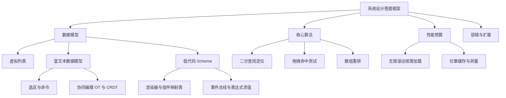
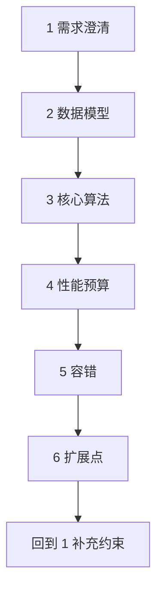
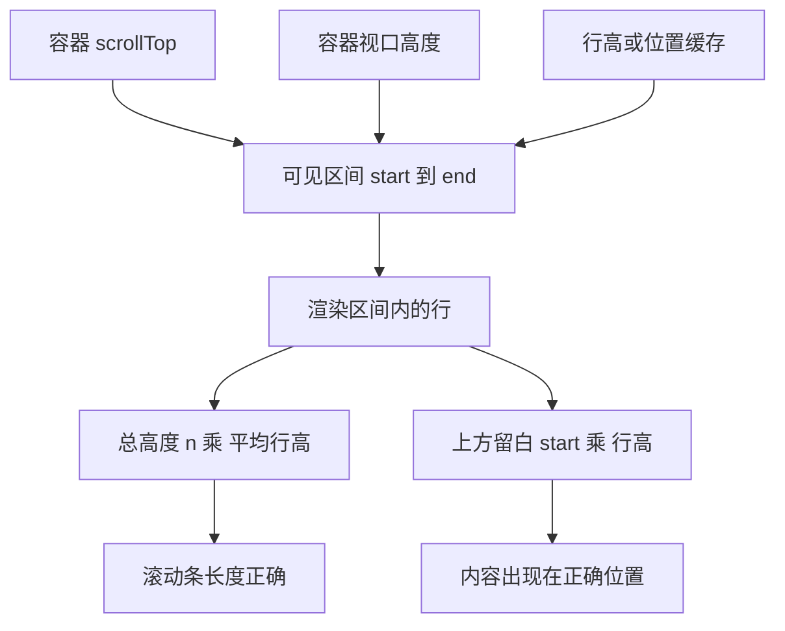
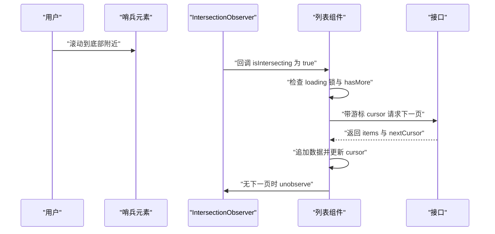
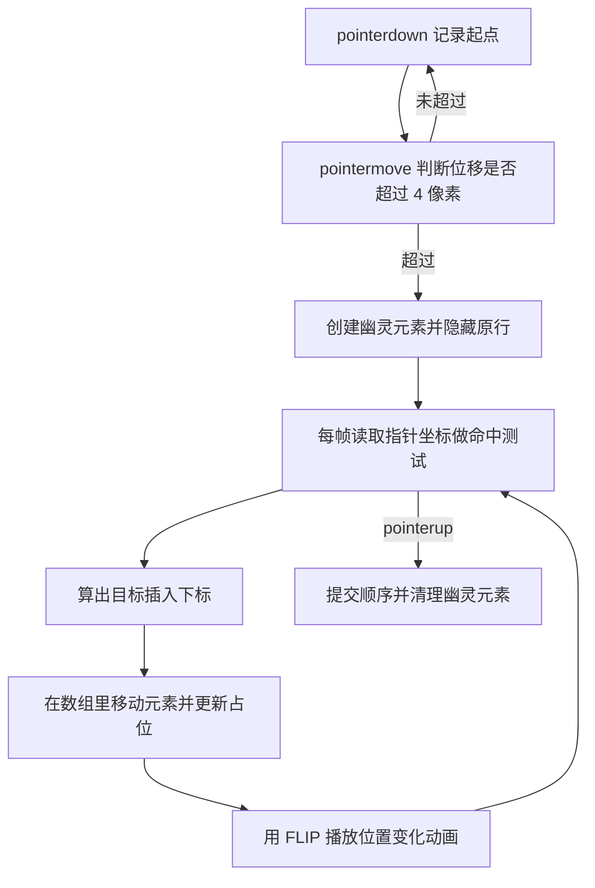
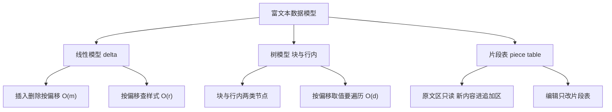
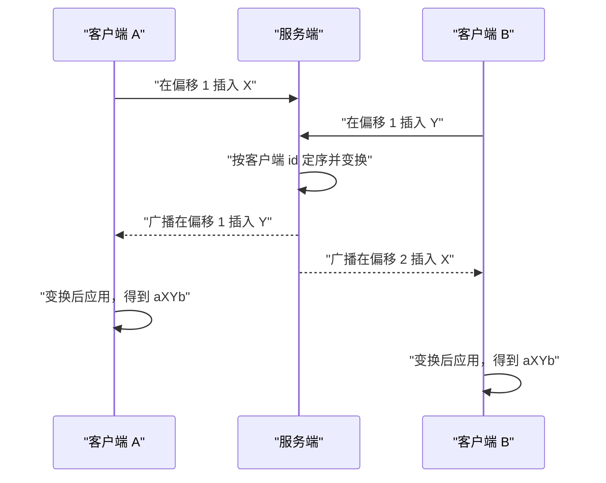
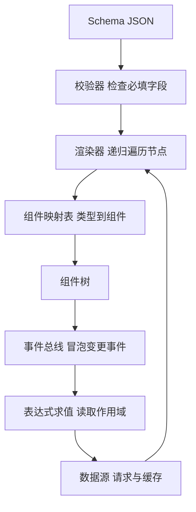

# 前端系统设计题：虚拟列表、无限滚动、拖拽、富文本与低代码

本页摘要：系统设计面试的答题框架与关键数据结构。

!!! abstract "学完这一页你能"
    - 说清系统设计答题的六个步骤，并按顺序走完一轮。
    - 手写定高与不定高虚拟列表的区间计算，给出时间复杂度与验证用例。
    - 说清无限滚动与拖拽排序的触发条件、去重手段与动画实现步骤。
    - 对比线性 delta、树、piece table 三种富文本数据模型，画出低代码的 Schema 渲染与数据流。

## 0. 知识地图



建议先读第 1 节的框架，它给后面每题提供同一套回答顺序。
接着按 2 到 7 读具体题目，每题都先讲数据结构再讲算法。
第 5 与第 6 节连在一起读，数据模型与协同算法是同一道题的两层。


## 1. 通用答题框架

**先想一个问题**：面试官说“设计一个能承载 10 万行数据的表格”。
你直接开始写虚拟列表代码，还是先问清事实？写代码之前没对齐需求，后面 12 分钟都在返工。

!!! note "术语：需求澄清"
    需求澄清是把面试官口头的模糊描述，翻译成可测量数字的过程。
    例子：把“要很快”翻译成“每个用户操作到画面更新小于 16.7 毫秒”。

!!! tip "心智模型"
    一句话模型：系统设计题先交决策，再交代码；决策的顺序固定，内容随题目变。
    日常类比：装修前先量房、再定水电、最后挑家具，顺序反了就要砸墙。
    类比不成立处：装修允许边做边改，面试只有 10 到 15 分钟，顺序错了没有时间补。

**图解**



1. 需求澄清：把口语需求换成数字，例如总条数、行高、视口高度、目标帧率。
2. 数据模型：决定一条数据长什么样，哪些字段稳定，哪些字段可缓存。
3. 核心算法：写出与 DOM 无关的纯函数，复杂度标注在函数上方。
4. 性能预算：算出每帧可用的毫秒数与最多允许的 DOM 节点数。
5. 容错：定义失败时用户看到什么，重试入口在哪里。
6. 扩展点：说出一个未来需求，并指出当前设计只需改哪一层。

**一步一步来**

第 1 步：把需求写成可验收的约束对象。
面试官说“很多数据”无法验收，`rows: 100000` 可以。

```js
// 需求澄清的结果必须落到数字上，否则无法验收
function makeConstraints(input) {
  return {
    rows: input.rows,               // 总行数，例：100000
    rowHeight: input.rowHeight,     // 行高像素，例：40
    viewport: input.viewport,       // 视口高度像素，例：800
    fps: input.fps,                 // 目标帧率，例：60
    budgetMs: 1000 / input.fps,     // 每帧预算，1000 / 60 等于 16.67
  };
}

const c = makeConstraints({ rows: 100000, rowHeight: 40, viewport: 800, fps: 60 });
```

**这段代码在做什么**
- 四个输入数字来自面试官，不由你猜。
- `budgetMs` 是推导值，后面用它判断动画是否超标。
- 字段名与后续算法里的变量名保持一致，减少口头解释成本。
- 返回普通对象而不是类，方便在 Node 里直接断言。

第 2 步：定数据模型。
模型决定算法能不能做成纯函数，也决定缓存能不能命中。

```js
// 每条数据带稳定 id 与高度字段，虚拟列表才能复用节点与缓存位置
const row = {
  id: "r-1",        // 稳定且唯一，用于 key 和位置缓存的下标
  height: 40,       // 已知高度；未知时先填估值
  measured: false,  // 是否已被真实渲染测量过
};
```

**这段代码在做什么**
- `id` 稳定，重复数据也能区分，避免用数组下标当 key。
- `height` 是可变量：定高列表全表同值，不定高列表逐行不同。
- `measured` 标记是否已测量，测量前的估高用于首屏布局。
- 三个字段都不含 DOM 引用，可以整体塞进结构化存储。

第 3 步：把核心算法写成纯函数。
纯函数能在 Node 里跑断言，不用启动浏览器。

```js
// 定高列表：一次除法算出可见行区间
function getVisibleRange(scrollTop, viewport, rowHeight) {
  const start = Math.floor(scrollTop / rowHeight);            // 视口第一行
  const end = Math.ceil((scrollTop + viewport) / rowHeight);  // 视口最后一行的下一行
  return [start, end];                                        // 左闭右开区间
}

getVisibleRange(4000, 800, 40); // 得到 [100, 120]
```

**这段代码在做什么**
- `scrollTop` 是容器已滚动距离，`viewport` 是容器可见高度。
- `start` 用 `Math.floor`，因为部分露出的行也要渲染。
- `end` 用 `Math.ceil`，保证视口底边那一行被包含。
- 返回左闭右开区间，与 JavaScript 的 `slice` 语义一致。

第 4 步：把性能、容错、扩展写成检查项。
每一项都要能用一个动作验证。

```js
// 三类检查点都必须可验证，不能写成口号
const checklist = {
  performance: "首帧 DOM 节点数小于可见行数加 4", // 性能：给上限
  fault: "请求失败保留已加载数据并展示重试入口",     // 容错：给行为
  extend: "行高变化只重算受影响区间",               // 扩展：给边界
};
```

**这段代码在做什么**
- 性能项给出了节点数上限，等于可见行数加上下各 2 行缓冲。
- 容错项规定了失败时的界面，而不是“做好错误处理”。
- 扩展项指明改动范围，说明设计没有被写死。

**动手验证**

```js
// 运行：node framework.mjs
// 依赖：无第三方依赖，Node 20 以上内置 node:assert
import assert from "node:assert/strict";

const c = { rows: 100000, rowHeight: 40, viewport: 800, fps: 60 };
c.budgetMs = 1000 / c.fps;                            // 每帧可用毫秒
c.visibleRows = Math.ceil(c.viewport / c.rowHeight);  // 视口能放下的行数

const full = c.rows;             // 全量渲染的节点数
const virtual = c.visibleRows + 4; // 视口行加上下各 2 行缓冲

assert.equal(c.visibleRows, 20);            // 800 / 40 等于 20
assert.equal(virtual, 24);                  // 20 + 4
assert.equal(full / virtual > 4000, true);  // 差距超过 4000 倍
assert.ok(c.budgetMs < 17);                 // 每帧预算小于 17 毫秒

console.log("可见行", c.visibleRows, "虚拟渲染节点", virtual, "全量渲染节点", full);
```

运行结果：`可见行 20 虚拟渲染节点 24 全量渲染节点 100000`。

**常见坑**

| 现象 | 原因 | 怎么修 |
| --- | --- | --- |
| 讲了 5 分钟还没开始写数据结构 | 澄清完就直接说架构 | 澄清后先用一句话定数据模型再往下 |
| 复杂度只能给出“应该很快” | 没把算法写成纯函数 | 每个算法手写一行复杂度注释 |
| 面试官追问扩展时卡住 | 检查项没有具体边界 | 提前准备一条“只改哪一层”的回答 |

**小结**
- 六步顺序固定：澄清、模型、算法、性能、容错、扩展。
- 每一步的产出都必须是可验证的对象、函数或数字。
- 纯函数先跑通，再考虑接 DOM 与框架。


## 2. 虚拟列表

**先想一个问题**：一个聊天记录列表有 10 万条数据。
一次性渲染，滚动帧率会掉到 10 帧以下。你要把 DOM 节点数降到多少，又要保证滚动条长度不变？

!!! note "术语：虚拟列表（virtual list）"
    虚拟列表是只渲染视口内元素的列表实现，视口外的部分用留白撑起滚动条长度。
    例子：10 万条数据滚动时，DOM 里始终只有 24 个行节点。

!!! tip "心智模型"
    一句话模型：屏幕只画窗口里的内容，窗口外的高度用空白补齐。
    日常类比：看书只看当前那一页，左右两摞纸只提供厚度。
    类比不成立处：书页高度一致，列表行高常变；行高变了就要重算留白厚度。

**图解**



1. 容器滚动时能读到 `scrollTop`，它是内容顶部被卷走的像素数。
2. 视口高度与行高共同决定可见区间的起止下标。
3. 只把区间内的行渲染成真实节点，其余行不建节点。
4. 总高度用行数乘平均行高，撑住滚动条，避免滚动条抖动。
5. 上方留白用起始下标乘行高，把渲染出的行推到正确位置。
6. 一旦行高变化，第 2 步与第 5 步都要重算，这是不定高的全部难点。

**一步一步来**

第 1 步：定高列表用一次除法算区间。
定高意味着所有行高度相同，复杂度是 O(1)。

```js
// 定高列表：一次除法就能算区间，复杂度 O(1)
function rangeFixed(scrollTop, viewport, rowHeight, total) {
  const start = Math.max(0, Math.floor(scrollTop / rowHeight));               // 不能为负
  const end = Math.min(total, Math.ceil((scrollTop + viewport) / rowHeight)); // 不能越界
  const offset = start * rowHeight;  // 上方留白高度
  return { start, end, offset };
}

rangeFixed(4000, 800, 40, 100000); // 得到 start 100，end 120，offset 4000
```

**这段代码在做什么**
- `Math.max(0, ...)` 处理滚动到负数的边界情况。
- `Math.min(total, ...)` 保证最后一行不会被下标越界访问。
- `offset` 直接给容器内层元素设置上边距。
- 四个参数都是数字，函数可以直接在 Node 里断言。

第 2 步：不定高列表用位置缓存加二分。
先维护一个前缀和数组 `offsets`，`offsets[i]` 表示第 i 行的顶部坐标。

```js
// 二分查找：返回第一个不小于 target 的下标，复杂度 O(log n)
function lowerBound(offsets, target) {
  let lo = 0;
  let hi = offsets.length;      // 区间是左闭右开
  while (lo < hi) {
    const mid = (lo + hi) >> 1; // 取中点，等价于除以 2 取整
    if (offsets[mid] < target) lo = mid + 1; // 中点偏小，答案在右半区
    else hi = mid;              // 中点够大，答案在左半区含中点
  }
  return lo;                    // 返回第一个不小于 target 的位置
}

lowerBound([0, 40, 100, 220, 260], 100); // 得到 2
lowerBound([0, 40, 100, 220, 260], 101); // 得到 3
```

**这段代码在做什么**
- `offsets` 长度是行数加 1，最后一个元素等于总高度。
- `hi` 初始化为数组长度，形成左闭右开区间，循环结束时 `lo` 等于 `hi`。
- 条件保持严格小于，所以相同坐标的行会返回最靠前的那个下标。
- 找到起点后用 `scrollTop + viewport` 再查一次，就得到终点。

第 3 步：测量完成后写回真实高度。
首次渲染用估高，渲染完读一次真实高度，然后修正后续所有偏移。

```js
// 测量完成后写回真实高度，并平移后续所有行的顶部坐标
function applyMeasured(offsets, heights, index, realHeight) {
  const delta = realHeight - heights[index]; // 与估高的差值
  heights[index] = realHeight;               // 更新本行高度
  for (let i = index + 1; i < offsets.length; i += 1) {
    offsets[i] += delta;  // 后续每一行的顶部坐标整体平移
  }
  return delta;           // 调用方用它抵消 scrollTop 的跳动
}
```

**这段代码在做什么**
- `delta` 是估高与真实高度的差，可能为正也可能为负。
- 循环从 `index + 1` 开始，本行的顶部坐标不需要改。
- 重建复杂度是 O(n)；要降到 O(log n) 需换成树状数组，需核对官方文档确认树状数组的更新与查询实现细节。
- 返回值交给滚动容器做补偿，避免内容突然上跳或下跳。

第 4 步：滚动容器的渲染。
容器是滚动层，内层是一个高度等于总高度的占位元素。

```js
// 渲染时把区间内的行放进内层容器，并设置上方留白
function render(container, inner, range, rows) {
  const visible = rows.slice(range.start, range.end); // 只取区间内数据
  inner.style.height = `${rows.length * 40}px`;       // 撑起滚动条总高度
  container.scrollTop = container.scrollTop;          // 保持当前位置
  const frag = document.createDocumentFragment();     // 一次性插入，减少重排
  for (const row of visible) {
    const el = document.createElement("div");
    el.textContent = row.id;                          // 真实内容
    el.dataset.rowId = row.id;                        // 稳定 id 供后续复用
    frag.appendChild(el);
  }
  inner.replaceChildren(frag);                        // 整体替换，避免残留节点
}
```

**这段代码在做什么**
- `inner.style.height` 用总行数乘行高，虚拟列表靠它保住滚动条长度。
- `DocumentFragment` 把多次插入合并为一次提交，减少布局次数。
- `replaceChildren` 一次性换掉旧节点，不会残留上一屏的内容。
- `dataset.rowId` 保存稳定 id，后续做缓存与命中测试时用它定位。

**动手验证**

```js
// 运行：node virtual-list.mjs
// 依赖：无第三方依赖，Node 20 以上内置 node:assert
import assert from "node:assert/strict";

function rangeFixed(scrollTop, viewport, h, total) {
  const start = Math.max(0, Math.floor(scrollTop / h));
  const end = Math.min(total, Math.ceil((scrollTop + viewport) / h));
  return { start, end, offset: start * h };
}

function lowerBound(arr, target) {
  let lo = 0;
  let hi = arr.length;
  while (lo < hi) {
    const mid = (lo + hi) >> 1;
    if (arr[mid] < target) lo = mid + 1;
    else hi = mid;
  }
  return lo;
}

// 不定高：用二分找到起点与终点，再各留一行缓冲
function rangeVariable(offsets, scrollTop, viewport) {
  const last = offsets.length - 1; // offsets 最后一个元素是总高度
  const start = Math.max(0, lowerBound(offsets, scrollTop) - 1);
  const end = Math.min(last, lowerBound(offsets, scrollTop + viewport) + 1);
  return { start, end };
}

assert.deepEqual(rangeFixed(0, 800, 40, 100000), { start: 0, end: 20, offset: 0 });
assert.deepEqual(rangeFixed(4000, 800, 40, 100000), { start: 100, end: 120, offset: 4000 });
assert.deepEqual(rangeFixed(3999800, 800, 40, 100000), { start: 99995, end: 100000, offset: 3999800 });

const offsets = [0, 40, 100, 220, 260]; // 四行，高度分别是 40 60 120 40
assert.equal(lowerBound(offsets, 0), 0);
assert.equal(lowerBound(offsets, 100), 2);
assert.equal(lowerBound(offsets, 101), 3);
assert.deepEqual(rangeVariable(offsets, 50, 160), { start: 1, end: 4 });

const heights = [40, 60, 120, 40];
const before = offsets.slice();
const delta = (() => {
  const real = 80;                    // 第二行真实高度是 80，估高是 60
  const d = real - heights[1];
  heights[1] = real;
  for (let i = 2; i < offsets.length; i += 1) offsets[i] += d;
  return d;
})();
assert.equal(delta, 20);
assert.deepEqual(before.slice(0, 2), offsets.slice(0, 2)); // 前两行顶部坐标不变
assert.equal(offsets[4], 280);                             // 总高度从 260 变为 280

console.log("定高区间", JSON.stringify(rangeFixed(4000, 800, 40, 100000)));
console.log("不定高区间", JSON.stringify(rangeVariable(offsets, 50, 160)));
```

运行结果：`定高区间 {"start":100,"end":120,"offset":4000}`，`不定高区间 {"start":1,"end":4}`。

**常见坑**

| 现象 | 原因 | 怎么修 |
| --- | --- | --- |
| 快速滚动时出现白屏 | 区间没有上下缓冲，滚动事件还没处理完就露白 | 起点减 2、终点加 2 行缓冲 |
| 不定高列表滚动条跳动 | 测量写回后总高度变了，`scrollTop` 没同步 | 用 `delta` 抵消 `scrollTop` |
| 行内容错位 | 用数组下标当 key，节点复用到别的行 | key 改成稳定 `id` |
| 首屏高度明显偏差 | 估高与真实高度差太大 | 用已测量行高的平均值做估高 |

**小结**
- 定高列表 O(1) 定位，不定高列表用位置缓存加二分做到 O(log n)。
- 位置缓存是一维前缀和数组，测量写回后要平移后续坐标。
- 区间上下各留 2 行缓冲，是解决白屏的代价最小的手段。


## 3. 无限滚动与 IntersectionObserver

**先想一个问题**：一个信息流要滑到底自动加载下一页。
你用 `scroll` 事件监听，iOS 惯性滚动时回调次数从每秒 60 次掉到 10 次。换成什么 API 能避开这个问题？

!!! note "术语：IntersectionObserver"
    IntersectionObserver 是浏览器提供的接口，在目标元素与根容器的可见区域相交状态变化时回调。
    例子：滚动到距底部 200 像素时触发加载下一页。

!!! tip "心智模型"
    一句话模型：在列表末尾放一个哨兵元素，它进入可见区就通知你加载。
    日常类比：门口装一个门铃，有人到门口才响，不用每隔几秒去开一次门。
    类比不成立处：门铃只报“有人到”，不报“来了几次”；并发触发要自己加锁去重。

**图解**



1. 用户滚动，哨兵元素逐渐进入根容器的可见区域。
2. 浏览器在交叉状态变化时调用回调，参数里带 `isIntersecting`。
3. 组件先检查加载锁与是否还有下一页，两个条件任一不满足就直接返回。
4. 通过检查后发出请求，请求参数是上一页返回的游标。
5. 响应回来后追加数据，并更新游标与是否还有下一页。
6. 没有下一页时调用 `unobserve`，停止观察，避免继续触发请求。

**一步一步来**

第 1 步：创建观察器并观察哨兵。
`rootMargin` 决定提前量，`threshold` 决定交叉比例阈值。

```js
// 哨兵进入可见区前 200 像素就触发，用提前量掩盖请求延迟
const io = new IntersectionObserver((entries) => {
  for (const entry of entries) {        // 一次回调可能带多个条目
    if (entry.isIntersecting) loadMore(); // 只有进入可见区才算触发
  }
}, {
  root: scroller,                       // 滚动容器，null 表示浏览器视口
  rootMargin: "0px 0px 200px 0px",      // 底部方向提前 200 像素
  threshold: 0,                         // 交叉比例大于 0 即触发
});

io.observe(sentinel); // 哨兵是列表末尾一个高度 1 像素的元素
```

**这段代码在做什么**
- `root` 指定参考容器，不写则用浏览器视口。
- `rootMargin` 四值顺序是上右下左，这里只把底部边界往外扩了 200 像素。
- `threshold: 0` 表示开始交叉就触发，不需要等到完全进入。
- `observe` 之后浏览器自己调度检测，不需要监听 `scroll`。

第 2 步：加锁与游标，保证同一页只请求一次。
`rootMargin` 会让哨兵多次进出可见区，回调可能连续触发。

```js
// loading 锁加游标，保证并发触发只发一次请求
let loading = false;
let cursor = 0;        // 游标分页比页码分页更能抗数据插入
let hasMore = true;

async function loadMore() {
  if (loading || !hasMore) return;   // 锁住并发，到底就停
  loading = true;
  try {
    const res = await fetch(`/api/feed?cursor=${cursor}&limit=20`);
    const data = await res.json();
    items.push(...data.items);        // 追加，不替换已有数据
    cursor = data.nextCursor ?? cursor; // 游标为空时保持原值
    hasMore = data.nextCursor !== null;
    render(items);
  } finally {
    loading = false;                  // 失败也要解锁，否则永远卡住
  }
}
```

**这段代码在做什么**
- 第一个判断挡掉并发与到底两种情况，这是去重的唯一入口。
- 用 `cursor` 而不是页码，插入新数据时不会导致重复或漏项。
- 追加数据用展开参数，直接修改现有数组，避免整表重建。
- `finally` 解锁，请求抛错时也能继续加载下一页。

第 3 步：终止条件与失败处理。
没有下一页时停止观察；请求失败时保留已有数据并提供重试。

```js
// 加载结束后停止观察，失败时保留数据并暴露重试入口
async function loadMore() {
  if (loading || !hasMore) return;
  loading = true;
  try {
    const data = await fetchPage(cursor);
    items.push(...data.items);
    cursor = data.nextCursor ?? cursor;
    hasMore = data.nextCursor !== null;
    if (!hasMore) io.unobserve(sentinel); // 到底就停，省掉后续回调
    setError(null);
  } catch (err) {
    setError(err);        // 界面展示重试按钮，不清空 items
  } finally {
    loading = false;
  }
}
```

**这段代码在做什么**
- `unobserve` 停掉哨兵观察，后续滚动不再产生回调。
- 请求失败只设置错误状态，已加载的 `items` 原样保留。
- 重试按钮再次调用 `loadMore`，`cursor` 没有前进，所以重试的是同一页。
- 用户看不到空白页，滚动位置也不会跳。

**动手验证**

```js
// 运行：node infinite-scroll.mjs
// 依赖：无第三方依赖，Node 20 以上内置 node:assert
import assert from "node:assert/strict";

// 用假接口模拟分页，验证去重与终止逻辑
function createFeed() {
  const state = { items: [], cursor: 0, hasMore: true, loading: false, calls: 0 };

  const fetchPage = async (cursor) => ({
    items: [cursor, cursor + 1],                          // 每页 2 条
    nextCursor: cursor + 2 <= 4 ? cursor + 2 : null,      // 共 3 页
  });

  async function loadMore() {
    if (state.loading || !state.hasMore) return; // 去重与终止的唯一入口
    state.loading = true;
    state.calls += 1;
    const res = await fetchPage(state.cursor);
    state.items.push(...res.items);
    state.cursor = res.nextCursor ?? state.cursor;
    state.hasMore = res.nextCursor !== null;
    state.loading = false;
  }

  return { state, loadMore };
}

const { state, loadMore } = createFeed();

// 三次并发触发，只有第一次能进入请求
await Promise.all([loadMore(), loadMore(), loadMore()]);
assert.equal(state.calls, 1);
assert.deepEqual(state.items, [0, 1]);

await loadMore();                                  // 第二次触发
assert.deepEqual(state.items, [0, 1, 2, 3]);

await loadMore();                                  // 第三次触发，服务端返回 null
assert.equal(state.hasMore, false);
assert.deepEqual(state.items, [0, 1, 2, 3, 4, 5]);
assert.equal(state.calls, 3);

await loadMore();                                  // 到底之后继续触发，不发请求
assert.equal(state.calls, 3);

console.log("items", state.items.join(","), "calls", state.calls, "hasMore", state.hasMore);
```

运行结果：`items 0,1,2,3,4,5 calls 3 hasMore false`。

**常见坑**

| 现象 | 原因 | 怎么修 |
| --- | --- | --- |
| 同一页请求发出多次 | 回调连续触发且没有加载锁 | 在 `loadMore` 第一行判断 `loading` |
| 列表出现重复项 | 用页码分页，加载期间数据被插入 | 改游标分页，用返回的游标翻页 |
| 到底后还在发请求 | 没在结束分支调用 `unobserve` | 设置 `hasMore` 为 false 并停止观察 |
| 请求失败后无法再加载 | 解锁写在 `try` 里，异常后 `loading` 保持 true | 把解锁放进 `finally` |

**小结**
- IntersectionObserver 把滚动检测交给浏览器，`rootMargin` 控制提前量。
- 加载入口必须只有一处判断，`loading` 锁与 `hasMore` 一起挡并发。
- 游标分页比页码分页更能抵抗数据插入，终止时要主动停止观察。


## 4. 拖拽排序

**先想一个问题**：一个 20 项的待办列表，用户要把第 3 项拖到第 1 项前面。
拖动过程中其他项要让位，放手后顺序提交。哪一步最容易写错？

!!! note "术语：命中测试（hit test）"
    命中测试是把指针坐标映射成“插入到第几个位置”的计算。
    例子：指针纵坐标落在第 2 行中线上方，结果就是插入到第 2 行前面。

!!! tip "心智模型"
    一句话模型：拖动的是一个浮层副本，原位置留一个等高的占位块，其他行在数组里让位。
    日常类比：从书架上抽出一本书，先塞一块厚度相同的纸板占住位置。
    类比不成立处：纸板厚度固定，列表行高会变；占位高度要实时读取被拖行的真实高度。

**图解**



1. 按下时记录起始坐标与指针在行内的偏移，偏移决定幽灵元素跟手的位置。
2. 移动超过阈值才进入拖动，避免点击被当成拖动。
3. 进入拖动后创建幽灵元素，原行改成透明或隐藏，位置由占位块撑住。
4. 每次指针移动都做一次命中测试，算出应该插入到哪个下标。
5. 下标变化时在数组里移动元素，触发重新渲染，其他行因此让位。
6. 用 FLIP 播放其他行的位移，动画结束后回到第 4 步继续跟随指针。
7. 松开指针时提交顺序，移除幽灵元素与事件监听。

**一步一步来**

第 1 步：用指针事件与阈值判断拖动开始。
指针事件比鼠标事件多覆盖触屏与触控笔，`setPointerCapture` 保证指针移出元素后仍收到事件。

```js
let drag = null; // 未拖动时为 null

list.addEventListener("pointerdown", (e) => {
  const row = e.target.closest("[data-row-id]"); // 找到整行元素
  if (!row) return;
  drag = {
    id: row.dataset.rowId,                                  // 稳定 id，用于在数组里定位
    startY: e.clientY,                                      // 起始纵坐标
    offsetY: e.clientY - row.getBoundingClientRect().top,    // 指针在行内的偏移
    active: false,                                          // 位移未超过阈值时不算拖动
  };
  row.setPointerCapture(e.pointerId); // 指针移出元素也能收到移动事件
});
```

**这段代码在做什么**
- `closest` 从事件目标向上找到带 `data-row-id` 的整行。
- `offsetY` 让幽灵元素的顶边与按下点保持相对位置，不会跳一下。
- `active` 标记让点击与拖动走不同分支。
- `setPointerCapture` 解决快速拖动时指针离开元素、事件中断的问题。

第 2 步：命中测试，把纵坐标换算成插入下标。
用每行中线做判断：指针在中线上方就插到该行前面。

```js
// 命中测试：返回插入下标，行矩形按 top 升序排列
function hitTest(rects, pointerY) {
  for (let i = 0; i < rects.length; i += 1) {
    const { top, height } = rects[i];
    if (pointerY < top + height / 2) return i; // 落在这行上半区，插到它前面
  }
  return rects.length; // 落在最后一行下半区，插到末尾
}

hitTest([{ top: 0, height: 40 }, { top: 40, height: 40 }], 75); // 得到 2
```

**这段代码在做什么**
- 复杂度是 O(n)，n 是可见行数；行按 `top` 升序时可换成二分，降到 O(log n)。
- 用中线而不是顶边，是因为用户直觉上“过一半才让位”。
- 返回 `rects.length` 表示插入到末尾，与 `splice` 的语义一致。
- 只用纵坐标，横向位移不影响插入位置。

第 3 步：数组重排，注意删除后下标会左移。
被拖元素先删除，再插入到目标位置。

```js
// 把 from 位置的元素移动到 to 位置的插入点
function moveItem(list, from, to) {
  if (from === to) return list;             // 位置没变直接返回
  const next = list.slice();                // 先复制，便于做撤销
  const [item] = next.splice(from, 1);      // 取出被拖拽的元素
  next.splice(to > from ? to - 1 : to, 0, item); // 删除后下标左移一位
  return next;
}

moveItem(["a", "b", "c", "d"], 2, 0); // 得到 ["c","a","b","d"]
moveItem(["a", "b", "c", "d"], 0, 3); // 得到 ["b","c","a","d"]
```

**这段代码在做什么**
- `from === to` 时直接返回，避免产生无意义的渲染。
- `slice` 复制原数组，原数组不变，方便实现撤销。
- `to > from` 时目标下标要减 1，因为删除操作已经把后面的元素整体左移。
- 返回新数组而不是就地修改，配合不可变渲染更安全。

第 4 步：FLIP 播放让位动画。
先记录旧位置，改动之后记录新位置，再用反向位移播放。

```js
// FLIP：先记 First，改动后记 Last，用 Invert 和 Play 播放
function flip(elements, mutate) {
  const first = new Map();                      // 第一帧记录旧位置
  for (const el of elements) first.set(el, el.getBoundingClientRect().top);
  mutate();                                     // 改动 DOM 顺序或位置
  for (const el of elements) {
    const last = el.getBoundingClientRect().top; // 第二帧读取新位置
    const delta = first.get(el) - last;          // 取反得到起始位移
    if (delta === 0) continue;                   // 没动就不播放
    el.animate([{ transform: `translateY(${delta}px)` }, { transform: "translateY(0)" }], {
      duration: 200,
      easing: "ease-out",
    });
  }
}
```

**这段代码在做什么**
- First 与 Last 都是 `getBoundingClientRect()` 读数，来自真实布局。
- Invert 用 `transform` 把元素先拉回旧位置，避免触发重新布局。
- Play 用 Web Animations API 在 200 毫秒内回到真实位置。
- 位移为 0 的行直接跳过，减少动画数量。

**动手验证**

```js
// 运行：node drag-sort.mjs
// 依赖：无第三方依赖，Node 20 以上内置 node:assert
import assert from "node:assert/strict";

function moveItem(list, from, to) {
  if (from === to) return list;
  const next = list.slice();
  const [item] = next.splice(from, 1);
  next.splice(to > from ? to - 1 : to, 0, item);
  return next;
}

function hitTest(rects, pointerY) {
  for (let i = 0; i < rects.length; i += 1) {
    const { top, height } = rects[i];
    if (pointerY < top + height / 2) return i;
  }
  return rects.length;
}

const base = ["a", "b", "c", "d"];

// 向前拖：删除后目标下标不用变
assert.deepEqual(moveItem(base, 2, 0), ["c", "a", "b", "d"]);
// 向后拖：删除后目标下标要减 1
assert.deepEqual(moveItem(base, 0, 3), ["b", "c", "a", "d"]);
// 原地不动
assert.deepEqual(moveItem(base, 1, 1), base);
// 原数组不被修改
assert.deepEqual(base, ["a", "b", "c", "d"]);

const rects = [0, 1, 2, 3].map((i) => ({ top: i * 40, height: 40 }));
assert.equal(hitTest(rects, 10), 0);   // 第 1 行上半区
assert.equal(hitTest(rects, 19), 0);   // 刚好在中线之前
assert.equal(hitTest(rects, 21), 1);   // 越过中线就插到第 1 行之后
assert.equal(hitTest(rects, 75), 2);   // 第 2 行下半区
assert.equal(hitTest(rects, 400), 4);  // 超出所有行，落到末尾

console.log("前移结果", moveItem(base, 2, 0).join(","));
console.log("后移结果", moveItem(base, 0, 3).join(","));
console.log("命中下标", hitTest(rects, 75));
```

运行结果：`前移结果 c,a,b,d`，`后移结果 b,c,a,d`，`命中下标 2`。

**常见坑**

| 现象 | 原因 | 怎么修 |
| --- | --- | --- |
| 向后拖时位置差一位 | 删除元素后目标下标左移，代码没减 1 | `to > from` 时传 `to - 1` |
| 快速拖动时事件断掉 | 指针移出元素后不再收到 `pointermove` | 用 `setPointerCapture` |
| 点击被误判成拖动 | 没有位移阈值，按下就进入拖动 | 位移超过 4 像素才切换状态 |
| 让位动画卡顿 | 逐帧修改 `top` 触发重新布局 | 用 FLIP 加 `transform` 做动画 |

**小结**
- 指针事件加位移阈值区分点击与拖动，`setPointerCapture` 保证事件不丢。
- 命中测试是纵坐标到插入下标的映射，中线判断符合用户直觉。
- 数组重排要注意删除后的下标左移，FLIP 用 `transform` 避免重新布局。


## 5. 富文本编辑器的数据模型

**先想一个问题**：用户在一段文字中间按退格键，删掉一个汉字。
如果文档用 `innerHTML` 字符串保存，你怎么知道第二个段落的第一个字带有加粗样式？

!!! note "术语：增量操作（delta）"
    delta 是用“保留多少字符、插入什么字符串、删除多少字符”三种指令描述一次编辑的数组。
    例子：`[{"retain":5},{"insert":"你好"},{"delete":2}]` 表示跳过 5 个字符，插入两个汉字，再删掉 2 个字符。

!!! tip "心智模型"
    一句话模型：文档等于内容序列加上覆盖在内容上的样式区间。
    日常类比：一张透明胶片叠在纸上，胶片上涂色表示样式。
    类比不成立处：胶片只能改样式不能改字；插入文字时胶片上的区间要同步移动。

**图解**



1. 线性模型把文档当成一个字符序列，编辑用偏移表示，读写实现最短。
2. 线性模型的样式是一组区间，查某个位置的样式要遍历区间，代价是 O(r)。
3. 树模型把文档分成块级与行内两类节点，嵌套结构能直接表达。
4. 树模型按偏移取值需要沿着子节点累加长度，代价与深度成正比。
5. 片段表把原文与新增内容分开存，编辑时只改动一个指向片段的列表。
6. 三种模型都能只存“变更”，协同编辑在变更层做合并。

**一步一步来**

第 1 步：用 delta 表示一次编辑。
delta 只描述变化，不描述结果，便于网络传输和协同合并。

```js
// 三种指令：retain 跳过若干字符，insert 插入字符串，delete 删除若干字符
const ops = [
  { retain: 3 },        // 跳过前 3 个字符
  { delete: 2 },        // 再删除 2 个字符
  { insert: "X" },      // 在这个位置插入一个字符
];

// 应用 delta 的纯函数：doc 是字符串，返回新字符串
function applyDelta(doc, ops) {
  let cursor = 0;       // 原文档上的读取位置
  let out = "";         // 输出缓冲
  for (const op of ops) {
    if (op.retain) { out += doc.slice(cursor, cursor + op.retain); cursor += op.retain; }
    else if (op.delete) { cursor += op.delete; }  // 删除只跳过原文档
    else if (op.insert) { out += op.insert; }     // 插入不移动原游标
  }
  return out + doc.slice(cursor); // 拼上剩余部分
}

applyDelta("abcdefgh", ops); // 得到 abcXfgh
```

**这段代码在做什么**
- `cursor` 只在 `retain` 与 `delete` 时前进，`insert` 不消耗原文档。
- 三种指令互斥，判断顺序不影响结果。
- 最后一段原文要拼接，否则会丢掉尾部内容。
- 函数是纯函数，输入相同必然得到相同输出，方便做断言。

第 2 步：把样式表示成区间。
区间用左闭右开，相邻区间不会重复计算同一位。

```js
// 样式区间：start 与 end 描述覆盖范围，左闭右开
const formats = [
  { start: 0, end: 5, bold: true },     // 前 5 个字符加粗
  { start: 3, end: 8, color: "red" },   // 第 3 到第 7 个字符红色
];

// 查询某个偏移上叠加的样式，区间数为 r 时是 O(r)
function formatsAt(formats, offset) {
  const merged = {};                    // 后面的区间覆盖前面的同名字段
  for (const f of formats) {
    if (offset < f.start || offset >= f.end) continue; // 左闭右开，出区间就跳过
    for (const [key, val] of Object.entries(f)) {
      if (key === "start" || key === "end") continue;  // 跳过区间自身字段
      merged[key] = val;
    }
  }
  return merged;
}

formatsAt(formats, 4); // 得到 { bold: true, color: "red" }
```

**这段代码在做什么**
- 左闭右开让相邻区间首尾相接，不需要额外处理边界。
- 遍历顺序决定覆盖关系，靠后的区间覆盖靠前的同名字段。
- 返回普通对象，交给渲染层转成样式或标签。
- 区间数量 r 通常远小于文本长度，线性扫描可以接受。

第 3 步：片段表把原文与新增内容分开。
原文区只读，新输入进追加区，文档由片段列表按顺序拼接。

```js
// piece table：原文区只读，新内容进追加区，pieces 指向两个缓冲区
const table = {
  original: "Hello world",          // 打开时的内容，永不修改
  add: "",                          // 新输入的内容追加到这里
  pieces: [{ buf: "original", start: 0, len: 11 }], // 顺序拼接即文档
};

// 读取整个文档：按 pieces 顺序拼接
function readDoc(table) {
  let out = "";
  for (const p of table.pieces) {
    const buf = p.buf === "original" ? table.original : table.add;
    out += buf.slice(p.start, p.start + p.len); // 取片段并拼接
  }
  return out;
}

readDoc(table); // 得到 Hello world
```

**这段代码在做什么**
- 原文区从不修改，撤销只需要恢复片段列表。
- 新输入统一进追加区，不会覆盖原文的字节。
- `pieces` 只存缓冲区的名字、起点与长度，每个片段是常数大小。
- 读取是 O(p + 总长度)，p 是片段数量；编辑只改动片段列表，不动大字符串。

第 4 步：选区与命令。
选区用锚点与焦点表示，方向由两者大小关系决定；命令把选区转成样式区间。

```js
// 选区：anchor 是起点，focus 是终点，两者顺序由用户拖动方向决定
const selection = { anchor: 6, focus: 2 }; // 从下标 6 反向拖到 2

// 命令：把选区归一化后转成样式区间
function boldSelection(selection) {
  const start = Math.min(selection.anchor, selection.focus);
  const end = Math.max(selection.anchor, selection.focus);
  if (start === end) return [];              // 光标没有选中内容，不产生区间
  return [{ start, end, bold: true }];       // 生成一条属性区间
}

boldSelection(selection); // 得到 [{ start: 2, end: 6, bold: true }]
```

**这段代码在做什么**
- 锚点是按下的位置，焦点是松开的位置，反向选择时锚点大于焦点。
- 归一化用 `Math.min` 与 `Math.max`，命令不必关心拖动方向。
- 空选区返回空数组，调用方据此判断是否需要切换输入模式。
- 命令输出的是数据，不直接操作 DOM，便于测试与协同。

**动手验证**

```js
// 运行：node richtext-model.mjs
// 依赖：无第三方依赖，Node 20 以上内置 node:assert
import assert from "node:assert/strict";

function applyDelta(doc, ops) {
  let cursor = 0;
  let out = "";
  for (const op of ops) {
    if (op.retain) { out += doc.slice(cursor, cursor + op.retain); cursor += op.retain; }
    else if (op.delete) { cursor += op.delete; }
    else if (op.insert) { out += op.insert; }
  }
  return out + doc.slice(cursor);
}

function formatsAt(formats, offset) {
  const merged = {};
  for (const f of formats) {
    if (offset < f.start || offset >= f.end) continue;
    for (const [key, val] of Object.entries(f)) {
      if (key === "start" || key === "end") continue;
      merged[key] = val;
    }
  }
  return merged;
}

function readDoc(table) {
  let out = "";
  for (const p of table.pieces) {
    const buf = p.buf === "original" ? table.original : table.add;
    out += buf.slice(p.start, p.start + p.len);
  }
  return out;
}

// 1. delta 应用
assert.equal(applyDelta("abcdefgh", [{ retain: 3 }, { delete: 2 }, { insert: "X" }]), "abcXfgh");
assert.equal(applyDelta("ab", [{ insert: "X" }]), "Xab");       // 只在开头插入
assert.equal(applyDelta("ab", [{ delete: 2 }]), "");           // 全部删除
assert.equal(applyDelta("ab", [{ retain: 1 }]), "ab");         // 只保留就是原样

// 2. 样式区间查询
const fmts = [{ start: 0, end: 5, bold: true }, { start: 3, end: 8, color: "red" }];
assert.deepEqual(formatsAt(fmts, 4), { bold: true, color: "red" });
assert.deepEqual(formatsAt(fmts, 6), { color: "red" });
assert.deepEqual(formatsAt(fmts, 9), {});
assert.deepEqual(formatsAt(fmts, 5), { color: "red" }); // 左闭右开，5 不在第一个区间

// 3. piece table 读取
const table = {
  original: "Hello world",
  add: "OK",
  pieces: [
    { buf: "original", start: 0, len: 5 },
    { buf: "add", start: 0, len: 2 },
    { buf: "original", start: 6, len: 5 },
  ],
};
assert.equal(readDoc(table), "HelloOKworld");

// 4. 命令把选区转成区间
function boldSelection(sel) {
  const start = Math.min(sel.anchor, sel.focus);
  const end = Math.max(sel.anchor, sel.focus);
  if (start === end) return [];
  return [{ start, end, bold: true }];
}
assert.deepEqual(boldSelection({ anchor: 6, focus: 2 }), [{ start: 2, end: 6, bold: true }]);
assert.deepEqual(boldSelection({ anchor: 2, focus: 2 }), []);

console.log("delta 结果", applyDelta("abcdefgh", [{ retain: 3 }, { delete: 2 }, { insert: "X" }]));
console.log("片段表读取", readDoc(table));
```

运行结果：`delta 结果 abcXfgh`，`片段表读取 HelloOKworld`。

**常见坑**

| 现象 | 原因 | 怎么修 |
| --- | --- | --- |
| 加粗后光标位置跳到段首 | 命令直接改 DOM，没有回到数据层 | 命令只产出区间，由渲染层统一刷新 |
| 删除文字后样式错位 | 样式区间没有跟着编辑一起平移 | 编辑后同步变换区间起点与终点 |
| 大文档输入卡顿 | 每次输入都重建整段字符串 | 片段表只改片段列表，不拼接全文 |
| 读取样式返回了不该有的字段 | 区间对象自身字段被当成样式 | 遍历时跳过 `start` 与 `end` |

**小结**
- delta 只描述变化，适合传输与合并；区间描述样式，查询代价是区间数量。
- 树模型能表达嵌套结构，按偏移取值需要累加子节点长度。
- 片段表让原文保持只读，编辑只改动片段列表。


## 6. 协同编辑 OT 与 CRDT

**先想一个问题**：两个人基于同一份文档，都在偏移 1 的位置插入了一个字符。
如果各自按自己算出的偏移提交，两个人最终看到的字符串会不一样。

!!! note "术语：操作变换（Operational Transformation，缩写 OT）"
    OT 是把远程操作的索引按本地已发生的操作改写，让所有副本收敛到同一结果的算法。
    例子：本地已经在偏移 1 插入过字符，远程要在偏移 1 插入，就改成在偏移 2 插入。

!!! tip "心智模型"
    一句话模型：操作是带索引的指令，合并之前先按规则改写索引，改写后所有副本结果一致。
    日常类比：两个人同时说“把第三把椅子搬到左边”，要先判断对方是否已经搬走过椅子。
    类比不成立处：椅子可以被搬走两次，操作的索引改写必须能追溯每个操作的先后关系。

**图解**



1. 两个客户端基于同一份文档，分别在偏移 1 提交插入操作。
2. 服务端统一接收，发现两个操作位置相同。
3. 服务端用客户端 id 做定序，id 小的排在前面。
4. 广播时给每个客户端发送对方操作，索引按规则改写。
5. 客户端 A 把对方的插入索引从 1 改到 2，插入后得到 `aXYb`。
6. 客户端 B 保持对方索引为 1，插入后同样得到 `aXYb`，两个副本收敛。

**一步一步来**

第 1 步：写插入操作的变换规则。
规则要覆盖三种位置关系：远程在本地之后、之前、或位置相同。

```js
// 把远程插入的索引映射到本地文档上
function transformInsert(remote, local, localClientId) {
  if (remote.index > local.index) return remote.index; // 远程在后面，不受影响
  if (remote.index < local.index) return remote.index + 1; // 远程在前面，被本地插入挤后
  return localClientId < remote.clientId ? remote.index + 1 : remote.index; // 同位比 id
}

transformInsert({ index: 1, clientId: "b" }, { index: 1, clientId: "a" }, "a"); // 得到 2
```

**这段代码在做什么**
- 位置不同的两种情况与普通数组插入一致，索引要按本地插入数量后移。
- 位置相同时用客户端 id 做定序，保证两端算出同一顺序。
- 返回值是给远程操作的新索引，远程操作的文本内容不变。
- 规则里用 `<` 而不是 `<=`，否则两个客户端会同时后移，无法收敛。

第 2 步：删除操作的变换规则。
删除会让后面的索引左移，也会影响落在删除范围内的操作。

```js
// 删除之后，远程索引要按删除区间调整
function transformAfterDelete(index, delStart, delLen) {
  const delEnd = delStart + delLen;
  if (index <= delStart) return index;         // 删除在索引之后，不影响
  if (index >= delEnd) return index - delLen;  // 删除在索引之前，整体前移
  return delStart;                             // 落在被删区间里，收到删除起点
}

transformAfterDelete(5, 2, 3); // 删除的是 [2,5)，索引 5 前移到 2
transformAfterDelete(1, 2, 3); // 索引 1 在删除之前，保持 1
transformAfterDelete(3, 2, 3); // 索引 3 落在删除区间内，收到 2
```

**这段代码在做什么**
- 边界用小于等于与大于等于区分，删除区间保持左闭右开。
- 索引正好等于删除起点时不需要移动，因为它本来就在删除内容之前。
- 索引落在删除区间内时收拢到删除起点，这是唯一不丢失位置的选择。
- 返回 0 到原文档长度之间的数字，调用方可以直接拿去切片。

第 3 步：CRDT 用唯一 id 让操作可交换。
无冲突复制数据类型给每个字符分配唯一标识，位置由标识之间的顺序决定。

!!! note "术语：无冲突复制数据类型（Conflict-free Replicated Data Type，缩写 CRDT）"
    CRDT 是一类数据结构，任意副本以任意顺序应用同一批操作，最终状态都相同。
    例子：每个字符带一个唯一 id，插入操作声明“我插在 id A 和 id B 之间”。

```js
// 每个字符有唯一 id，插入时声明左右邻居，顺序由 id 决定
const doc = [
  { id: "c1", ch: "a" },
  { id: "c3", ch: "X" }, // 后插入的字符 id 更大
  { id: "c2", ch: "b" },
];

// 按 id 大小稳定排序，得到所有副本一致的顺序
function normalize(chars) {
  return chars.slice().sort((x, y) => (x.id < y.id ? -1 : x.id > y.id ? 1 : 0));
}

normalize(doc).map((c) => c.ch).join(""); // 得到 aXb
```

**这段代码在做什么**
- 每个字符自带 id，不依赖数组下标，所以插入位置不需要换算。
- 操作声明的是相对位置，不同副本可以按任意顺序收到操作。
- `sort` 是比较器必须返回负数、零、正数三态，不能只返回布尔值。
- 排序结果与接收顺序无关，这是“可交换”的具体含义。

第 4 步：怎么选。
把判断条件列成两列，避免在面试中给出模糊回答。

```js
// 选型判断：按服务端是否集中定序与是否需要离线编辑来分叉
function pickModel({ needServerOrder, allowOffline, opCount }) {
  if (needServerOrder && !allowOffline) {
    return opCount > 1000 ? "集中式 OT 并做批量合并" : "集中式 OT";
  }
  if (allowOffline) return "CRDT，代价是元数据变大";
  return "服务端定序的 OT，客户端只做变换";
}
```

**这段代码在做什么**
- 服务端能统一定序时，OT 的元数据比 CRDT 小。
- 需要离线编辑时，CRDT 不依赖服务端顺序，代价是每个字符带额外标识。
- 操作数量大时先做批量合并，减少服务端变换次数。
- 判断函数的输入都是布尔值与数字，可以在面试中边写边说。

**动手验证**

```js
// 运行：node ot-crdt.mjs
// 依赖：无第三方依赖，Node 20 以上内置 node:assert
import assert from "node:assert/strict";

function transformInsert(remote, local, localClientId) {
  if (remote.index > local.index) return remote.index;
  if (remote.index < local.index) return remote.index + 1;
  return localClientId < remote.clientId ? remote.index + 1 : remote.index;
}

function transformAfterDelete(index, delStart, delLen) {
  const delEnd = delStart + delLen;
  if (index <= delStart) return index;
  if (index >= delEnd) return index - delLen;
  return delStart;
}

function applyInsert(doc, index, text) {
  return doc.slice(0, index) + text + doc.slice(index);
}

// 两个客户端都基于 a b，在偏移 1 并发插入
const base = "ab";
const localA = { index: 1, text: "X", clientId: "a" };
const localB = { index: 1, text: "Y", clientId: "b" };

// A 端：先应用自己的操作，再用变换后的索引应用对方操作
const docA = applyInsert(base, localA.index, localA.text);
const idxOnA = transformInsert({ index: 1, clientId: "b" }, localA, "a");
const mergedA = applyInsert(docA, idxOnA, "Y");
assert.equal(mergedA, "aXYb");

// B 端：同样的两步，得到相同结果
const docB = applyInsert(base, localB.index, localB.text);
const idxOnB = transformInsert({ index: 1, clientId: "a" }, localB, "b");
const mergedB = applyInsert(docB, idxOnB, "X");
assert.equal(mergedB, "aXYb");
assert.equal(mergedA, mergedB); // 收敛到同一字符串

// 删除变换的三种位置关系
assert.equal(transformAfterDelete(1, 2, 3), 1);
assert.equal(transformAfterDelete(3, 2, 3), 2);
assert.equal(transformAfterDelete(5, 2, 3), 2);
assert.equal(transformAfterDelete(9, 2, 3), 6);

// CRDT：按 id 排序，结果与到达顺序无关
const chars = [{ id: "c1", ch: "a" }, { id: "c3", ch: "X" }, { id: "c2", ch: "b" }];
const normalize = (list) => list.slice().sort((x, y) => (x.id < y.id ? -1 : x.id > y.id ? 1 : 0));
assert.equal(normalize(chars).map((c) => c.ch).join(""), "aXb");
assert.equal(normalize(chars.slice().reverse()).map((c) => c.ch).join(""), "aXb");

console.log("A 端", mergedA, "B 端", mergedB, "CRDT", normalize(chars).map((c) => c.ch).join(""));
```

运行结果：`A 端 aXYb B 端 aXYb CRDT aXb`。

**常见坑**

| 现象 | 原因 | 怎么修 |
| --- | --- | --- |
| 两端结果不一致 | 同位插入时两端使用了不同的定序规则 | 统一用客户端 id 比较，且比较符方向一致 |
| 删除后位置错乱 | 删除变换没有覆盖索引落在区间内的情况 | 补上收拢到删除起点的分支 |
| CRDT 文档体积增长过快 | 每个字符都带唯一标识与额外元数据 | 定期做快照压缩，需核对官方文档确认压缩接口 |
| 离线编辑后重复内容 | 重连时把本地操作当成新编辑重新提交 | 服务端按操作 id 去重 |

**小结**
- OT 的核心是索引改写规则，同位插入要靠客户端 id 定序才能收敛。
- CRDT 用唯一标识让操作可交换，代价是元数据体积变大。
- 选型看服务端能否统一定序，以及是否需要离线编辑。


## 7. 低代码：Schema、渲染器与数据流

**先想一个问题**：运营要在页面上拼一个表单，字段来自接口。
你为每个表单写一遍代码，还是让一份 JSON 描述它？后者的关键问题是：值存在哪里？

!!! note "术语：Schema"
    Schema 是描述界面结构的普通 JSON 对象，包含节点类型、属性与子节点。
    例子：`{"type":"input","props":{"label":"姓名"}}` 描述一个输入框。

!!! tip "心智模型"
    一句话模型：Schema 是数据，渲染器是函数，事件是管道。
    日常类比：一份乐高说明书加一个零件盒，说明书决定拼法，零件盒提供部件。
    类比不成立处：说明书不会自己升级，Schema 的版本兼容要自己写迁移逻辑。

**图解**



1. Schema 是一棵 JSON 树，节点用 `type` 区分容器与字段。
2. 校验器检查必填字段与类型，坏数据在渲染前暴露。
3. 渲染器递归遍历节点，每个节点查一次组件映射表。
4. 映射表把 `type` 字符串换成真实组件，未注册的类型直接报错。
5. 组件树渲染完成后，用户操作通过事件总线向父层冒泡。
6. 表达式求值在沙箱里读取作用域字段，算出联动条件的值。
7. 数据源负责请求与缓存，返回的新数据再次触发渲染器更新。

**一步一步来**

第 1 步：定义 Schema。
Schema 只描述结构，不存值，值和结构分开存是后面所有联动的前提。

```js
// Schema 是一棵普通 JSON 树，节点用 type 区分容器与字段
const schema = {
  id: "form-1",                    // 表单唯一 id，用于存草稿
  type: "form",                    // 根节点类型
  props: { layout: "vertical" },   // 布局参数
  children: [
    { id: "name", type: "input", props: { label: "姓名" } },
    { id: "age", type: "number", props: { label: "年龄", min: 0 } },
  ],
};

const components = { form: "Form", input: "Input", number: "InputNumber" };
```

**这段代码在做什么**
- `id` 在同一次渲染里唯一，用于在值对象里定位字段。
- `props` 保存展示参数，与用户输入的值无关。
- `children` 数组保持顺序，渲染顺序等于数组顺序。
- `components` 是映射表，键是 Schema 里的 `type`，值是真实组件名。

第 2 步：写渲染器，递归加映射表。
渲染器只做一件事：把节点转成虚拟节点对象。

```js
// 渲染器：递归把 Schema 节点映射成虚拟节点对象
function render(node, components) {
  const comp = components[node.type];  // 查组件映射表
  if (!comp) throw new Error(`未知节点类型: ${node.type}`); // 早失败便于定位
  const children = (node.children ?? []).map((child) => render(child, components));
  return { id: node.id, component: comp, props: node.props, children };
}

const tree = render(schema, components);
tree.children.length;       // 得到 2
tree.children[0].component; // 得到 Input
```

**这段代码在做什么**
- 未注册的类型直接抛错，坏 Schema 在开发阶段暴露。
- 递归的终止条件是节点没有 `children`，此时返回空的子节点数组。
- 返回结构里不含值，渲染器只负责结构。
- 函数不依赖框架，可以在 Node 里断言输出。

第 3 步：表达式求值。
联动条件用受限的路径表达式，不允许执行任意代码。

```js
// 取值：只允许按点号路径读取作用域字段
function getByPath(expr, scope) {
  const path = expr.replace(/^\{\{|\}\}$/g, "").trim(); // 去掉双花括号
  return path.split(".").reduce((acc, key) => (acc == null ? acc : acc[key]), scope);
}

const scope = { form: { name: "张三", age: 20 } };
getByPath("{{form.name}}", scope);            // 得到 张三
getByPath("{{form.missing}}", scope);         // 得到 undefined
```

**这段代码在做什么**
- 先剥掉双花括号，得到纯路径字符串。
- `reduce` 逐层取值，中途遇到 `null` 或 `undefined` 就提前返回。
- 只支持点号路径，不支持函数调用与运算符，避免执行任意代码。
- 求值失败返回 `undefined`，联动条件据此判断为不成立。

第 4 步：事件与数据流。
值和 Schema 分开存，组件事件只回传字段 id 与新值。

```js
// 数据流：值与 Schema 分离存储，组件事件只回传 id 与新值
function createStore() {
  const values = {};                  // 字段值单独存
  const listeners = new Set();        // 订阅者集合
  return {
    set(id, value) {
      values[id] = value;             // 只改值，不动 Schema
      for (const fn of listeners) fn(id, value); // 通知所有订阅者
    },
    get(id) { return values[id]; },
    subscribe(fn) { listeners.add(fn); return () => listeners.delete(fn); }, // 返回退订函数
  };
}

const store = createStore();
const off = store.subscribe((id, v) => console.log(id, v)); // 订阅变更
store.set("name", "李四"); // 打印 name 李四
off();                     // 退订，后续不再收到通知
```

**这段代码在做什么**
- `values` 是普通对象，Schema 可以整棵替换而值不丢。
- `subscribe` 返回退订函数，组件卸载时调用即可，不需要额外的解绑 API。
- 通知时把 `id` 与 `value` 一起传出去，联动逻辑不必再查一次。
- 存储层不引用任何组件，可以单独测试。

**动手验证**

```js
// 运行：node lowcode.mjs
// 依赖：无第三方依赖，Node 20 以上内置 node:assert
import assert from "node:assert/strict";

function render(node, components) {
  const comp = components[node.type];
  if (!comp) throw new Error(`未知节点类型: ${node.type}`);
  const children = (node.children ?? []).map((child) => render(child, components));
  return { id: node.id, component: comp, props: node.props, children };
}

function getByPath(expr, scope) {
  const path = expr.replace(/^\{\{|\}\}$/g, "").trim();
  return path.split(".").reduce((acc, key) => (acc == null ? acc : acc[key]), scope);
}

function createStore() {
  const values = {};
  const listeners = new Set();
  return {
    set(id, value) {
      values[id] = value;
      for (const fn of listeners) fn(id, value);
    },
    get(id) { return values[id]; },
    subscribe(fn) { listeners.add(fn); return () => listeners.delete(fn); },
  };
}

const schema = {
  id: "form-1",
  type: "form",
  props: { layout: "vertical" },
  children: [
    { id: "name", type: "input", props: { label: "姓名" } },
    { id: "age", type: "number", props: { label: "年龄", min: 0 } },
  ],
};
const components = { form: "Form", input: "Input", number: "InputNumber" };

const tree = render(schema, components);
assert.equal(tree.component, "Form");
assert.equal(tree.children.length, 2);
assert.equal(tree.children[0].component, "Input");
assert.equal(tree.children[1].component, "InputNumber");
assert.equal(tree.children[0].children.length, 0);

// 未注册类型必须抛错，坏 Schema 不能静默通过
assert.throws(() => render({ type: "unknown" }, components), /未知节点类型/);

// 路径取值
assert.equal(getByPath("{{form.name}}", { form: { name: "张三" } }), "张三");
assert.equal(getByPath("{{form.age}}", { form: { age: 0 } }), 0);
assert.equal(getByPath("{{form.missing}}", { form: {} }), undefined);

// 存储层：订阅、变更、退订
const store = createStore();
let hits = 0;
const off = store.subscribe(() => { hits += 1; });
store.set("name", "李四");
assert.equal(store.get("name"), "李四");
assert.equal(hits, 1);
off();
store.set("name", "王五");
assert.equal(hits, 1);              // 退订后不再收到通知
assert.equal(store.get("name"), "王五");

console.log("渲染节点数", tree.children.length, "姓名", store.get("name"), "通知次数", hits);
```

运行结果：`渲染节点数 2 姓名 王五 通知次数 1`。

**常见坑**

| 现象 | 原因 | 怎么修 |
| --- | --- | --- |
| 切换 Schema 后已填的值丢失 | 值与 Schema 存在同一个对象里 | 值单独放存储层，Schema 只带结构 |
| 未知节点类型页面白屏 | 映射表查不到时直接渲染 `undefined` | 回退到占位组件，并抛出可定位的错误 |
| 联动表达式能执行任意代码 | 求值用 `new Function` 拼接用户输入 | 只支持点号路径取值 |
| 事件监听泄漏 | 订阅没有返回退订函数 | `subscribe` 返回退订函数，卸载时调用 |

**小结**
- Schema 只描述结构，值与结构分开存，联动才能在不重建 Schema 的前提下生效。
- 渲染器等于递归加组件映射表，未注册类型要显式报错。
- 表达式求值只开放路径读取，事件通过订阅回传字段 id 与新值。


## 综合对比

| 维度 | 虚拟列表 | 无限滚动 | 拖拽排序 | 富文本 | 低代码 |
| --- | --- | --- | --- | --- | --- |
| 核心数据结构 | 位置缓存数组 offsets | 游标加数据数组 | 元素数组加行矩形缓存 | delta 数组或片段表 | Schema 树加值对象 |
| 关键 API | 滚动容器的 scrollTop | IntersectionObserver | Pointer Events 加 Web Animations | Selection 与 Range | 组件映射表与订阅 |
| 主要复杂度 | 定高 O(1)，不定高 O(log n) | 每页一次请求 O(1) 检查 | 命中测试 O(n)，二分 O(log n) | 区间查询 O(r)，编辑 O(1) 改片段 | 渲染 O(节点数) |
| 性能瓶颈 | 测量写回重建 O(n) | 并发触发导致重复请求 | 逐帧读写布局引发重排 | 大字符串拼接 | 递归渲染整棵树 |
| 最容易挂的边界 | 行高测量误差导致跳动 | 到底后仍持续触发 | 向后拖下标差一位 | 删除后区间错位 | Schema 版本升级迁移 |
| 一句话验收 | 滚动条长度与内容位置都正确 | 每页只请求一次且能终止 | 松手后数组顺序与视觉一致 | 编辑后样式区间随内容平移 | 换 Schema 不丢已填值 |

## 应用与行业实践

### 应用场景地图

| 场景 | 用到本页哪个知识点 | 典型技术选型 | 注意事项 |
| --- | --- | --- | --- |
| 后台管理的万行订单表格 | 定高虚拟列表、区间计算 | TanStack Virtual 或原生的滚动容器加绝对定位 | 滚动容器要有确定高度，行高变化要重新测量 |
| 低端安卓机上的商品信息流首屏 | 无限滚动、IntersectionObserver | rootMargin 预加载加游标分页 | 弱网下要防重复请求，失败要能重试 |
| 看板卡片的跨列拖拽排序 | 拖拽排序、触发条件与去重 | Pointer Events 加 setPointerCapture，或 dnd-kit | 区分点击与拖拽，键盘要能走同一条数据流 |
| 公告编辑器的撤销与重做 | 富文本数据模型、事务 | ProseMirror 的 transaction 与 step | 撤销栈按事务粒度切分，不按按键切分 |
| 多人协作白板的光标同步 | OT 与 CRDT、冲突合并 | Yjs 的 Y.Doc 与 awareness，WebSocket 广播二进制 | 合并结果与到达顺序无关，才能容忍乱序 |
| 表单搭建器的渲染与联动 | Schema、渲染器与数据流 | JSON Schema 描述字段，渲染器递归，单向数据流 | Schema 要能序列化，函数不写进 Schema |
| 手机端长列表的图片懒加载 | IntersectionObserver | 原生 loading 属性，或在回调里替换 src | 图片要预留占位尺寸，防止布局跳动 |
| 表格区域的拖拽填充 | 拖拽、坐标到行列的映射 | Pointer Events 加单元格矩形计算 | pointermove 高频触发，要按帧节流 |

### 三个场景拆解

#### 场景 1：后台管理的万行订单表格

**业务背景**：运营要在浏览器里翻看全部订单，订单总量在十万行量级，单行高度固定。直接渲染全部行会让首屏白屏数秒，滚动时也会掉帧。

**怎么用本页知识解决**：思路是先算出可视区对应的索引区间，再只渲染这个区间加少量缓冲，容器的总高度用来撑出滚动条。

```js
function rangeOf(scrollTop, viewH, rowH, total) {
  // 起始索引：滚动距离除以行高，向下取整
  const start = Math.floor(scrollTop / rowH);
  // 可视行数：视口高度除以行高，向上取整
  const visible = Math.ceil(viewH / rowH);
  // 上下各留 1 行缓冲，快速滚动时不露白
  const from = Math.max(0, start - 1);
  const to = Math.min(total - 1, start + visible);
  return { from, to };
}
// 容器总高度撑出滚动条，行数乘以行高
const totalH = total * rowH;
```

- 容器高度设为 `total * rowH`，浏览器才会给出正确的滚动条长度。
- 每行用 `transform: translateY(i * rowH)` 定位，不改 `top`，减少布局重排。
- 缓冲各留 1 行，滚动事件触发到重渲染之间不会出现空白。
- 索引只由 `scrollTop` 决定，滚动回调里做的是除法与取整，复杂度 O(1)。
- 行高不固定时改用累积高度数组加二分查找，单次定位 O(log n)。

**怎么度量收益**：用 Chrome DevTools 的 Performance 面板录制 10 秒连续滚动，看每帧耗时与长任务条数；再用 `PerformanceObserver` 监听 `longtask`，把条数打到控制台。同时数 DOM 里的行节点数量，确认它不随总行数增长。

**什么时候不该用**：
- 列表只有一屏半，用户很少滚到末尾，加虚拟化只增加偏移算错的排查成本。
- 页面需要浏览器 Ctrl+F 全文查找，或者要打印整张表，没渲染的行搜不到也打不出。

#### 场景 2：低端安卓上的商品信息流首屏

**业务背景**：低端安卓机内存小，一次性渲染几百张卡片会出现明显掉帧。用户持续下滑时要不断取下一页，接口重试或乱序返回会插入重复卡片。

**怎么用本页知识解决**：思路是在列表末尾放一个哨兵元素，用 IntersectionObserver 观察它，进入预加载区就取下一页，落库前用 id 集合去重。

```js
const seen = new Set();        // 记录已渲染的 id，用于去重
let cursor = null;             // 游标分页，指向上一页最后一条
let loading = false;           // 请求中的标志位
const io = new IntersectionObserver(async ([e]) => {
  if (!e.isIntersecting || loading) return;  // 未进视口或正在加载则跳过
  loading = true;
  const res = await fetch(`/api/items?cursor=${cursor ?? ''}`);
  const data = await res.json();
  for (const it of data.items) {
    if (!seen.has(it.id)) { seen.add(it.id); append(it); }  // 重复 id 不追加
  }
  cursor = data.nextCursor;    // 记下下一页的游标
  loading = false;
  if (!cursor) io.disconnect();  // 没有下一页就停止观察
}, { rootMargin: '300px' });   // 提前 300px 触发预加载
io.observe(sentinel);          // 哨兵放在列表末尾
```

- `rootMargin` 提前触发请求，滚动到底时数据通常已经返回。
- `Set` 记录 id，接口重试或乱序返回都不会插入重复卡片。
- 游标指向上一页最后一条，头部插入新数据不会让后续页错位。
- `loading` 标志位拦住连续触发，同一页不会被请求两次。
- 没有下一页时断开观察，省掉滚动过程中的无效回调。

**怎么度量收益**：用 Lighthouse 的移动端模拟网络跑一次，看 LCP 与 TBT；用 Network 面板数请求条数，确认滚动一段距离只发一次请求；用 Memory 面板看堆快照里的卡片节点数是否稳定。

**什么时候不该用**：
- 内容总量有限且需要搜索引擎收录，首屏要有完整 DOM 供抓取。
- 页面底部有页脚和表单入口，用户需要直接跳到页脚，无限加载会让页脚够不着。

#### 场景 3：看板任务卡片的拖拽排序

**业务背景**：项目看板一列有几十张卡片，用户按住卡片拖到另一个位置。手指按下时会有轻微抖动，不区分点击与拖拽就会误触发排序。

**怎么用本页知识解决**：思路是把拖拽拆成按下、移动、抬起三段，移动阶段只记录落点并显示占位条，抬起时才一次性改数组。

```js
let dragIndex = -1, overIndex = -1;
list.addEventListener('pointerdown', (e) => {
  const li = e.target.closest('li');
  if (!li) return;
  dragIndex = Number(li.dataset.i);     // 记下被拖行的索引
  li.setPointerCapture(e.pointerId);    // 捕获指针，移出元素仍收得到事件
});
list.addEventListener('pointermove', (e) => {
  if (dragIndex < 0) return;
  const over = document.elementFromPoint(e.clientX, e.clientY)?.closest('li');
  if (!over) return;
  overIndex = Number(over.dataset.i);   // 只记录落点，不立即改数组
  showPlaceholder(overIndex);           // 用占位条提示将插入的位置
});
list.addEventListener('pointerup', () => {
  if (dragIndex >= 0 && overIndex >= 0 && overIndex !== dragIndex) {
    const [moved] = items.splice(dragIndex, 1);  // 先移除，下标才不会错位
    items.splice(overIndex, 0, moved);           // 再插入到落点
    commit(items);                               // 一次提交，减少无效渲染
  }
  dragIndex = overIndex = -1;                    // 复位拖拽状态
});
```

- `setPointerCapture` 保证指针移出元素后仍能收到 move 与 up 事件。
- 移动阶段只改占位样式，不改数组，避免每帧重渲染整个列表。
- 位移超过 5px 才进入拖拽态，否则按点击处理，打开任务详情。
- 抬起时先删后插，两次 splice 的顺序决定下标是否正确。
- 键盘端复用同一条数据流：空格拿起，方向键移动占位，空格放下。

**怎么度量收益**：在 pointermove 回调里记录两次事件的时间差，统计拖拽期间的帧间隔；用 Performance 面板看拖拽全过程是否有超过 50ms 的长任务；用 `event.timeStamp` 与 `requestAnimationFrame` 的时间差衡量手感。

**什么时候不该用**：
- 只有两个固定位置、没有顺序含义的开关，用按钮或下拉选择即可。
- 移动端页面本身要上下滚动，拖拽手势会和页面滚动争抢，除非先长按再进入拖拽。

### 行业先进实践

**动态尺寸测量与前缀和定位**（出处：TanStack Virtual 官方文档）
该库在定高模式外提供估算尺寸与逐项测量的接口，渲染后把真实高度写回测量表，定位时在累积高度上做二分查找。借鉴方式：先按估算高度渲染，行进入视口后用 ResizeObserver 回写真实高度并修正后续偏移。

**rootMargin 预加载**（出处：MDN IntersectionObserver 文档）
文档说明 rootMargin 可以把观察区域的边界向外扩张，回调在元素真正进入视口前触发。用它做触底加载，网络往返被用户的滚动时间覆盖。借鉴方式：把 margin 设成一到两屏高度，并在回调里放一个进行中的标志位。

**游标分页**（出处：Stripe API 官方文档）
文档使用指向某条记录的起止参数翻页，而不是用页码或偏移量。列表头部插入新数据时，游标分页不会让已翻过的页错位。借鉴方式：接口返回下一页游标，客户端只透传，不自己算页码。

**事务与 step 的编辑模型**（出处：ProseMirror 官方文档）
文档把每次编辑描述为一个事务，事务内含一组可在文档上应用的 step，撤销与协同同步都以 step 为单位。借鉴方式：把一次用户操作里的连续输入合并成一个事务，撤销一次回到该操作之前。

**二进制 update 的 CRDT 同步**（出处：Yjs 开源项目）
该库把本地修改编码为 update，按任意顺序应用后结果一致，因此适合 WebSocket 广播与离线回放。借鉴方式：白板的图形数据放进共享类型，网络只传二进制 update，重连时先补发本地未同步的 update。

### 从学到用：落地路线

1. **试点**：先在一个内部管理后台的订单列表接入定高虚拟列表。验收标准：滚动到第 5 万行仍能操作，DOM 里的行节点数稳定在一个上限内。
2. **验证**：用 DevTools Performance 录制 10 秒连续滚动，导出火焰图，对比接入前后的长任务条数与最长任务时长。验收标准：滚动全程没有超过 50ms 的长任务。
3. **推广**：把区间计算抽成不依赖框架的纯函数，补齐单元测试，再推到商品信息流与日志列表。验收标准：三个页面共用同一份函数，边界用例全部通过。
4. **防回退**：在持续集成里跑一个由 Puppeteer 驱动的滚动脚本，记录 DOM 节点数与长任务条数，超过阈值即失败。验收标准：脚本进入主干流水线，阈值写在仓库里并有注释说明来源。

### 动手作业

**目标**：做一个 2 万行订单列表，支持定高虚拟滚动、触底加载下一页、行拖拽排序，并在页面上显示长任务计数。

**步骤**：
1. 造数据：写一个本地接口，按游标每次返回 50 条订单，并返回下一页游标。
2. 渲染骨架：容器高度设为总行数乘以行高，可视行用 `translateY` 定位。
3. 区间计算：实现 `rangeOf(scrollTop, viewH, rowH, total)`，写 5 个边界用例。
4. 触底加载：列表末尾放哨兵，`rootMargin` 设 300px，用 `Set` 按 id 去重。
5. 拖拽排序：按 pointerdown、pointermove、pointerup 三段实现，位移超过 5px 才进入拖拽态。
6. 指标埋点：用 `PerformanceObserver` 收集 `longtask`，把条数渲染到页面角落。
7. 自动测试：写一个 Puppeteer 脚本，滚动到底部并截图断言。

**验收标准**：
- 把总行数从 200 改成 20000，DOM 里的行节点数不变。
- 滚到底部触发加载，同一页不会发出两次请求。
- 拖拽后页面顺序与数组顺序一致，刷新后顺序保留。
- 连续滚动 10 秒，页面显示的长任务条数为 0。
- 边界用例覆盖 `total = 0`、起始索引为 0、结束索引等于 `total - 1` 三种情况。

## 深入阅读与参考

!!! tip "怎么用这些资料"
    先读「官方文档与规范」建立准确的概念，再读「源码与示例」核对细节，最后用「教程、书籍与视频」换一种讲法加深理解。每条都写明了读哪一节、带着什么问题读。

### 官方文档与规范

| 资源 | 为什么读 | 怎么读 |
|---|---|---|
| [Claude Tool Use 概览](https://docs.claude.com/en/docs/agents-and-tools/tool-use/overview) | 工具定义本质是 schema 描述，可类比低代码物料协议设计。 | 读工具定义与传参错误处理，手写一份 JSON schema 并故意传错看报错。 |
| [MCP Tools 概念](https://modelcontextprotocol.io/docs/concepts/tools) | 工具契约与输入校验思路，可迁移到低代码组件注册协议。 | 读 tools 概念与参数校验部分，为一个表单组件写出 schema 描述。 |
| [OpenAI Structured Outputs 指南](https://platform.openai.com/docs/guides/structured-outputs) | JSON Schema 约束输出的实战，呼应低代码 Schema 校验与容错。 | 读支持的 schema 子集，设计一个组件属性 schema 并统计格式错误。 |
| [Fastify 文档](https://fastify.dev/docs/latest/) | 用 JSON Schema 做校验与序列化，可借鉴到低代码数据流层。 | 读 Validation and Serialization 一节，给表单接口写 schema 并试跑。 |
| [Prisma 文档](https://www.prisma.io/docs) | 声明式 schema 驱动建模，类比低代码数据源与模型定义。 | 读 schema 与关联章节，定义两个实体并完成一次关联查询。 |

### 教程、书籍与视频

| 资源 | 为什么读 | 怎么读 |
|---|---|---|
| [Principled GraphQL](https://principledgraphql.com/) | Schema 设计原则，可迁移到低代码 DSL 与页面结构契约。 | 通读十条原则，对照自拟的页面 Schema 找出违背处并改写。 |

## 自测题

??? question "虚拟列表的起始下标为什么能一次除法算出来？行高不定时怎么改？"
    - 定高时每行高度相同，`scrollTop / 行高` 取整就是第一个可见行。
    - 行高不定时不能用除法，因为每行的顶部坐标不再等距。
    - 做法是维护前缀和数组 `offsets`，在它上面做二分查找。
    - 查询复杂度从 O(1) 变成 O(log n)，测量写回后要平移后续坐标。

??? question "位置缓存在测量写回后重建是 O(n)，想降到对数级该用什么结构？"
    - 前缀和数组的更新需要把后面所有元素加上同一个差值，所以是 O(n)。
    - 树状数组（Binary Indexed Tree）支持单点加与前缀和查询，两者都是 O(log n)。
    - 线段树也能做到，但代码量比树状数组多。
    - 具体实现细节需核对官方文档：要核对树状数组的 `lowbit` 写法与下标从 1 开始的要求。

??? question "IntersectionObserver 的 rootMargin 与 threshold 分别控制什么？为什么还要加载锁？"
    - `rootMargin` 是参考边界的扩张量，用来提前或延后触发时机。
    - `threshold` 是交叉比例阈值，取 0 表示开始交叉就触发。
    - 哨兵会多次进出可见区，回调可能连续触发。
    - `loading` 锁保证同一页只发出一次请求，`hasMore` 负责终止。

??? question "拖拽排序里向后再插时，为什么目标下标要减一？"
    - 被拖元素先从数组里删除，它后面的元素下标整体左移一位。
    - 如果目标位置在它后面，删除之后原来的目标下标已经指向下一个元素。
    - 减一之后 `splice` 的插入点才与视觉位置一致。
    - 向前拖时目标在它前面，删除不影响前面的下标，所以不用减。

??? question "FLIP 里的 F、L、I、P 分别对应哪一步操作？"
    - First：改动之前用 `getBoundingClientRect()` 记录每个元素的旧位置。
    - Last：改动之后用同一个接口记录新位置。
    - Invert：用 `transform: translateY(旧位置减新位置)` 把元素先拉回旧位置。
    - Play：用 Web Animations API 在 200 毫秒内把位移归零，播完移除动画。

??? question "线性 delta、树、piece table 分别在哪种操作上占优？"
    - 线性 delta：按偏移插入与删除，代价与改动长度相关，适合传输与协同。
    - 树模型：表达嵌套结构，块级与行内节点分层，按偏移取值要累加长度。
    - piece table：原文保持只读，编辑只改片段列表，适合大文件反复编辑。
    - 三者都只存变更，协同编辑在变更层做合并，与具体模型解耦。

??? question "OT 里同一位置的并发插入，为什么必须用客户端 id 做定序？"
    - 两个操作位置相同，谁先谁后无法从索引推断。
    - 如果两端各自决定顺序，两边的最终字符串会不一致。
    - 用客户端 id 比较能给出与端无关的确定顺序。
    - 比较符方向两端必须一致，否则两端会同时后移，无法收敛。

??? question "低代码里为什么要把字段值从 Schema 里拿出来单独存？"
    - Schema 描述结构，值描述用户输入，两者生命周期不同。
    - 结构切换时值需要保留，例如表单改成上下布局后已填内容不能丢。
    - 值单独存还能让 Schema 保持可序列化，方便存草稿与做版本对比。
    - 组件事件只回传字段 id 与新值，渲染层据此判断是否需要更新。


## 延伸阅读

- MDN Web Docs：Intersection Observer API
- MDN Web Docs：Pointer events
- MDN Web Docs：Web Animations API
- MDN Web Docs：Selection API 与 Range
- Quill 官方文档：Delta 格式
- ProseMirror 官方文档：Document 与 Transform
- Yjs 官方文档：Y.Doc 与 Y.Array
- React 官方文档：Rendering Lists
