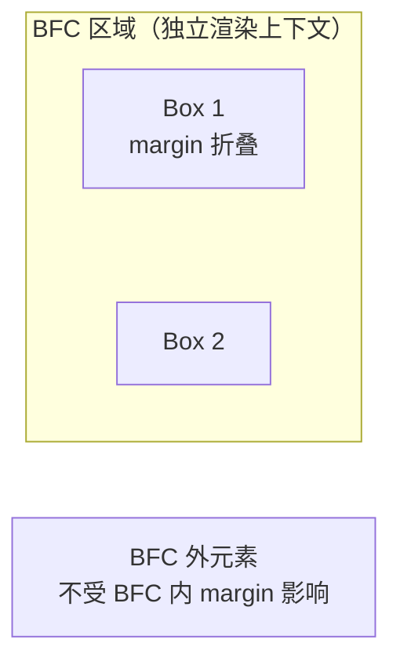

# BFC 与 margin 塌陷


## 1. margin 塌陷与 BFC

### 1.1 定义

**Margin Collapse（外边距合并）**：在块级盒子垂直方向上，相邻元素的 margin 会发生合并，最终间距取两者较大值（而非相加），这个现象称为 margin collapse。

**BFC（Block Formatting Context，块级格式化上下文）**：BFC 是 CSS 页面渲染的一个隔离机制，是一块独立的渲染区域，内部的布局不受外部影响，反之亦然。创建 BFC 可以阻断 margin 合并、包含浮动。

### 1.2 margin collapse 三条核心规则

#### 规则一：相邻兄弟块级元素垂直 margin 合并

```
上方元素: margin-bottom: 50px
下方元素: margin-top:    30px
实际间距 = max(50, 30) = 50px（合并取大值）
```

#### 规则二：父子块级元素（父元素没有 padding/border/inline-content 隔开时）上/下 margin 合并

```
父元素: margin-top: 20px
子元素: margin-top: 40px
实际间距 = max(20, 40) = 40px（子元素 margin "穿透"父元素）
```

#### 规则三：单个元素上下 margin 合并（取大值）

```
元素A: margin-top: 100px; margin-bottom: 60px;
实际间距 = max(100, 60) = 100px
```

### 1.3 BFC 创建条件（满足任一即可）

| 触发条件 | 推荐指数 | 说明 |
|---------|---------|------|
| 根元素 `<html>` | 默认 | 页面根节点天然创建 BFC |
| `float` 不为 none | 中 | 会带来浮动副作用 |
| `position: absolute / fixed` | 高 | 定位元素创建 BFC |
| `display: inline-block / table-cell / table-caption` | 中 | 行内块化 |
| `display: flex / grid` 子元素 | 高 | FFC/GFC 自动创建 |
| `overflow` 不为 visible | 高（最常用） | `hidden/auto/scroll` |
| `display: flow-root` | 高（推荐） | 纯 BFC，无副作用 |
| `contain: layout / content / paint` | 低 | contain 属性 |

### 1.4 BFC 三大使用场景

#### 场景 A：清除浮动（父元素高度塌陷）

```
未创建 BFC：                    创建 BFC 后：
+-------------------------+    +-------------------------+
| float-left  | float-left|    | float-left  | float-left|
| (不占高度，父塌陷)        |    | (参与高度计算，父容器被撑开)|
+-------------------------+    +-------------------------+
```

```css
/* 方法一：overflow 触发 BFC（最常用） */
.parent {
  overflow: hidden; /* 或 auto / scroll */
}

/* 方法二：display: flow-root（推荐，最干净） */
.parent {
  display: flow-root;
}

/* 方法三：clearfix 伪元素 */
.clearfix::after {
  content: '';
  display: block;
  clear: both;
}
```

#### 场景 B：阻止 margin 合并

```css
/* 父子 margin 穿透问题：给父元素创建 BFC */
.parent {
  display: flow-root; /* 阻止子元素 margin 与父元素合并 */
}

/* 相邻元素 margin 合并：给任一元素创建 BFC */
.child-1 {
  display: flow-root; /* 与 .child-2 的 margin 不再合并 */
}
```

#### 场景 C：多栏布局（与浮动元素互不重叠）

```css
.container {
  display: flow-root; /* 形成 BFC，不与浮动元素重叠 */
}
```

### 1.5 display: flow-root vs overflow 方案对比

| 方案 | 优点 | 缺点 |
|------|------|------|
| `display: flow-root` | 无副作用，纯创建 BFC，语义清晰 | 较新（旧版 IE 不支持） |
| `overflow: hidden/auto` | 兼容性好，老项目常用 | 可能裁剪内部内容、隐藏溢出 |
| `overflow: visible` | 无 | 无法创建 BFC |
| `float: left` | 简单 | 副作用多，不推荐 |
| `clearfix::after` | 兼容好，语义可控 | 需额外元素，维护成本高 |

### 1.6 React / Next.js / TS 代码示例

```tsx
// 使用 flow-root 解决浮动和 margin 合并问题
// components/FloatContainer.tsx

interface FloatContainerProps {
  children: React.ReactNode;
}

export function FloatContainer({ children }: FloatContainerProps) {
  const containerStyle: React.CSSProperties = {
    display: 'flow-root', // 纯 BFC，无 overflow 副作用
  };
  return <div style={containerStyle}>{children}</div>;
}

// BFC 创建工具函数
function canCreateBFC(props: {
  float?: string;
  position?: string;
  overflow?: string;
  display?: string;
}): boolean {
  const { float, position, overflow, display } = props;
  return (
    (float && float !== 'none') ||
    (position === 'absolute' || position === 'fixed') ||
    (overflow !== undefined && overflow !== 'visible') ||
    display === 'flow-root' ||
    ['flex', 'grid', 'inline-block', 'table-cell'].includes(display || '')
  );
}

// 防 margin 合并的 Card 组件（用 padding 替代 margin）
interface CardProps {
  children: React.ReactNode;
  gap?: number; // 用 gap 代替子元素 margin
}

export function Card({ children, gap = 16 }: CardProps) {
  return (
    <div
      style={{
        display: 'flow-root',        // 阻止 margin 塌陷穿透
        border: '1px solid #e0e0e0',
        borderRadius: '8px',
        padding: gap,                // 用 padding 代替 margin 做间距
      }}
    >
      {children}
    </div>
  );
}
```

### 1.7 面试题

**Q1: 什么是 BFC？如何触发 BFC？列举至少 4 种方式。**

> 参考答案：BFC 是块级格式化上下文，是页面中独立的渲染区域。触发方式：① 根元素；② `float` 不为 none；③ `position: absolute/fixed`；④ `display: inline-block/flex/grid/table-cell`；⑤ `overflow` 不为 visible；⑥ `display: flow-root`（推荐）。

**Q2: 父子元素的 margin-top 为什么会合并？如何阻止？**

> 参考答案：这是 BFC 中的默认行为（规则二），当父元素没有 padding-top、border-top 或内联内容（文字）隔开父子 margin 时，子元素的 margin-top 会和父元素的 margin-top 合并，实际表现为子元素 margin"穿透"到父元素外面。解决方法：① 给父元素设置 `overflow: hidden`（或 `auto`）；② 使用 `display: flow-root`；③ 给父元素设置 padding-top 或 border-top；④ 使用 `display: flex`（FFC 自动创建独立上下文）。

**Q3: `display: flow-root` 相比 `overflow: hidden` 清除浮动有什么优势？**

> 参考答案：① `overflow: hidden` 会裁剪超出的内容（使用 `transform` 等时会出现问题），而 `flow-root` 不改变溢出行为；② `flow-root` 语义更清晰，专门为创建 BFC 而设计；③ `overflow` 的副作用（裁剪、出现滚动条）在布局中往往是意外的，而 `flow-root` 是"零副作用"的 BFC 方案。


## 2. 面试精讲：margin 塌陷与 BFC

### 2.1 margin 塌陷（Collapsing Margin）

当两个垂直方向（上下）的 margin 相邻时，它们会合并为一个 margin，取较大值。

**塌陷过程：**

| 步骤 | 说明 |
|------|------|
| 1 | 父元素包含子元素 |
| 2 | 子元素设置 margin-top: 20px |
| 3 | margin 合并：子元素的 margin 与父元素的 margin 合并 |
| 4 | 最终结果：合并为 20px（而不是 20px + 20px） |

**margin 塌陷的三种情况：**

1. 相邻兄弟元素之间
2. 父元素与第一个/最后一个子元素之间
3. 空的块级元素（上下 margin 相遇）

**代码示例：**
```css
.margin1 { margin-bottom: 20px; }
.margin2 { margin-top: 30px; }
/* 最终间距 = max(20, 30) = 30px（不是 50px） */
```

**margin 塌陷的三种情况：**

1. 相邻兄弟元素之间
2. 父元素与第一个/最后一个子元素之间
3. 空的块级元素（上下 margin 相遇）

### 2.2 什么是 BFC

**BFC（Block Formatting Context，块格式化上下文）** 是 CSS 渲染模型中的一个独立区域，定义了块级盒子的布局规则。

**BFC 特性：**

| 特性 | 说明 |
|------|------|
| 垂直排列 | 属于 BFC 的盒子垂直排列（相对于同个 BFC 内的相邻盒子） |
| margin 不塌陷 | BFC 内部的 margin 不会与外部的元素塌陷 |
| 不被浮动覆盖 | BFC 不被浮动元素覆盖 |
| 计算高度 | 计算 BFC 高度时，浮动子元素也参与计算（清除浮动） |

**BFC 示意：**



### 2.3 如何触发 BFC

以下 CSS 属性会创建新的 BFC：

```css
/* 1. float 不为 none */
float: left;

/* 2. position 不为 static/relative（即 absolute/fixed/sticky） */
position: absolute;

/* 3. display 为 inline-block/flex/inline-flex/grid/inline-grid/table/... */
display: inline-block;
display: flex;
display: grid;

/* 4. overflow 不为 visible */
overflow: hidden;   /* 常用 */
overflow: auto;
overflow: scroll;

/* 5. 根元素 html 天然是 BFC */

/* 6. fieldset 元素天然是 BFC */

/* 7. display: flow-root（纯触发 BFC，无副作用） */
display: flow-root;
```

### 2.4 BFC 应用场景

**场景1：阻止 margin 塌陷**
```html
<div class="parent">
  <div class="child" style="margin-top: 20px;"></div>
</div>

<!-- 解决方案：给父元素创建 BFC -->
<div class="parent" style="overflow: hidden;">
  <div class="child" style="margin-top: 20px;"></div>
</div>
```

**场景2：两栏布局（不让浮动覆盖）**
```css
.wrapper {
  overflow: hidden; /* 创建 BFC，不被浮动覆盖 */
}
.sidebar {
  float: left;
  width: 200px;
}
.content {
  overflow: hidden; /* 创建 BFC，自适应剩余宽度 */
}
```

**场景3：清除浮动（撑开父元素高度）**
```css
.clearfix {
  overflow: hidden; /* 浮动子元素参与高度计算 */
}
```

**场景4：阻止文字环绕浮动元素**
```css
.text {
  overflow: hidden; /* BFC，阻断与浮动的文本流关系 */
}
```

## 应用与行业实践

### 应用场景地图

| 场景 | 用到本页哪个知识点 | 典型技术选型 | 注意事项 |
| --- | --- | --- | --- |
| 后台管理的万行订单表格（分页 + 虚拟滚动） | 相邻兄弟元素垂直 margin 取较大值 | flex 列布局 + `gap` | 虚拟滚动用绝对定位排行，容器要建立独立格式化上下文，否则行位置测量会被合并干扰 |
| 移动端 H5 商品详情页首屏（顶部图文卡片） | 父子 margin 合并，子元素 `margin-top` 外溢 | `display: flow-root` | 用 `overflow: hidden` 会裁掉卡片阴影与角标 |
| 多人协作白板的工具栏与画布 | 兄弟 margin 合并影响间距计算 | flex 列布局 + `min-height: 0` | 画布尺寸用 `ResizeObserver` 观察，不要靠 margin 推位置 |
| 低端安卓机的长列表首屏 | 空元素自合并、首尾项 margin 叠加 | 单方向 `margin-bottom` + `:last-child` 清零 | 列表最后一项的多余间距要在样式层显式清除 |
| 内容站文章正文（h2 与 p 连续排版） | 相邻兄弟 margin 合并取较大值 | 单方向 margin + 基础样式重置 | 设计稿若按相加标注间距，按合并规则实现会偏小 |
| HTML 邮件模板（Outlook 与各家邮件客户端） | 父子合并、空元素自合并 | 表格布局 + `padding` 替代 `margin` | 邮件客户端对 `flow-root` 的支持要核对官方文档 |
| 组件库的 Card 与 List 间距 API | 父子 margin 合并 | 对外暴露 `gap`，内部用 `flow-root` | 让使用方写 margin 会把合并规则带进业务代码 |
| 打印排版与 PDF 导出 | 相邻块级元素 margin 合并 | `break-inside: avoid` + `padding` | 分页处的首尾 margin 可能被丢弃，用 padding 兜底 |

### 三个场景拆解

#### 场景 1：后台管理的万行表格

**业务背景**：运营后台的订单表格按分页渲染，单页 50 行，切页时列表整体上下位移。在 1366×768 的窗口下录屏，能看到表格首行与工具栏的间距在切页前后不一致。

**怎么用本页知识解决**：把行间距从 margin 改成 flex 容器的 `gap`，让行位置只由布局决定，再给表格体加 `contain: layout` 隔断内外 margin。

```html
<style>
/* 表格体：flex 列布局，子项之间不合并外边距 */
.table-body {
  display: flex;
  flex-direction: column;
  gap: 4px;          /* 行间距只由 gap 表达，不再依赖 margin */
  contain: layout;   /* 建立独立格式化上下文，隔离内外 margin */
}
/* 数据行：清空垂直 margin，避免与 gap 叠加 */
.table-row {
  margin-block: 0;
  min-height: 32px;  /* 行高用 min-height 撑，测量时不受 margin 影响 */
}
</style>
```

- flex 容器的子项不参与 margin 合并，切页后行位置保持一致。
- `contain: layout` 让表格体成为独立格式化上下文，内部行的 margin 不会外溢到工具栏。
- `margin-block` 是逻辑属性，横向书写模式下等价于上下 margin，不写死方向。
- 行高由 `min-height` 决定，`getBoundingClientRect().height` 的读数就是行占位。

**怎么度量收益**：用 Chrome DevTools 的 Performance 面板录制一次切页操作，统计 Layout 次数；用 `document.querySelector('.table-body').getBoundingClientRect().top` 对比切页前后的读数；用 `PerformanceObserver` 订阅 `layout-shift` 条目观察累计位移。

**什么时候不该用**：表格体已经用绝对定位 + transform 做虚拟滚动时，行位置由 transform 决定，再套 flex 列布局会破坏总高度计算。需要兼容对 `contain` 与 `gap` 支持不足的旧内核时，先核对官方文档再决定替代写法。

#### 场景 2：移动端 H5 商品详情页

**业务背景**：详情页顶部是图文卡片，卡片内标题设了 `margin-top`，滚动时整页多出一条滚动条，拇指滑动有回弹。用 375×667 的视口打开页面即可复现。

**怎么用本页知识解决**：给卡片建立 BFC，把子元素的 margin 留在卡片内部；用 `flow-root` 而不是 `overflow: hidden`，保住卡片阴影。

```html
<style>
.card {
  display: flow-root;   /* 建立 BFC，隔断父子 margin 合并 */
  background: #fff;
  border-radius: 8px;
}
.card > .title {
  margin-block-start: 16px; /* 间距留在卡片内，不外溢到 body */
}
body {
  margin: 0;            /* 去掉 body 默认 margin，排除干扰项 */
}
</style>
<!-- 结构：外层卡片包住标题 -->
<div class="card">
  <h2 class="title">商品详情</h2>
</div>
```

- 父元素建立 BFC 后，子元素 `margin-top` 不再与父元素合并，卡片顶部出现 16px 留白。
- `flow-root` 不裁剪内容，卡片的阴影与绝对定位角标可以照常溢出。
- `body` 清零 margin，滚动高度的读数只反映卡片自身的贡献。
- 卡片自身的内边距用 `padding` 表达，语义比 margin 清楚。

**怎么度量收益**：DevTools 的 Rendering 面板打开 Layout Shift Regions 观察位移区域；用 `document.scrollingElement.scrollHeight` 与 `document.documentElement.clientHeight` 相减，检查是否还有多余滚动；看 Lighthouse 移动端报告的 CLS 指标。

**什么时候不该用**：设计上依赖子元素 margin 与外部间距合并取最大值时（连续段落共享留白就是这样），加 BFC 会让间距变大。需要兼容对 `flow-root` 支持不足的渲染环境时，不能硬套，先核对官方文档。

#### 场景 3：多人协作白板的工具栏与画布

**业务背景**：白板顶部工具栏固定高度，画布占剩余空间，多人同时拖拽图形时画布区域抖动。用 Performance 面板录制 10 秒拖拽即可复现。

**怎么用本页知识解决**：外层用 flex 列布局分配高度，间距走 `gap`，画布加 `min-height: 0` 允许收缩，margin 全部清零。

```css
.board {
  display: flex;        /* 列布局：工具栏与画布按 flex 分配高度 */
  flex-direction: column;
  height: 100vh;
  gap: 8px;             /* 工具栏与画布的间距，不用 margin */
}
.toolbar {
  flex: 0 0 auto;       /* 工具栏高度由内容决定，不参与拉伸 */
}
.canvas {
  flex: 1 1 auto;
  min-height: 0;        /* 允许画布收缩，避免被子元素撑出滚动条 */
  margin: 0;            /* 位置只由 flex 与 gap 决定 */
}
```

- flex 容器内不产生 margin 合并，工具栏与画布的 8px 间距稳定。
- `min-height: 0` 解除 flex 子项的默认最小尺寸限制，画布不会把容器撑高。
- 画布 margin 清零，拖拽时的位置计算只剩 flex 与 gap 两项。
- 尺寸变化用 `ResizeObserver` 观察 `.canvas`，回调数据直接来自布局。

**怎么度量收益**：Performance 面板录制拖拽，看 Layout 与 Recalculate Style 的耗时分布；在 `ResizeObserver` 回调里对比 `contentRect.width` 与 `contentRect.height` 的抖动幅度；用 `PerformanceObserver` 收 `layout-shift` 条目判断是否有非预期位移。

**什么时候不该用**：画布靠绝对定位铺满时，flex 与 gap 的约束多余，去掉更贴合定位模型。工具栏与画布本应共享同一侧留白（都与页面边缘对齐 16px）时，再加 gap 会变成两段间距叠加。

### 行业先进实践

`display: flow-root` 作为建立 BFC 的专用值（出处：MDN Web Docs《display》；W3C CSS Display Module Level 3）。它让元素生成块级容器并建立新的块格式化上下文，同时不裁剪内容。团队统一用它替代 `overflow: hidden`，只在确实要裁剪时用 `overflow`。

margin collapsing 三类情形的规范定义（出处：W3C CSS2.1 规范 8.3.1 Collapsing margins；MDN Web Docs《Mastering margin collapsing》）。规范列出相邻兄弟、父子、空元素三种合并情形，以及不合并的条件，包括建立 BFC、存在 border 或 padding、浮动、绝对定位、属于 flex 或 grid 子项。把这些条件抄成评审清单，能覆盖大部分间距故障。

用 `overflow` 建立 BFC 的经典做法（出处：MDN Web Docs《Block formatting context》）。该页集中列出建立 BFC 的条件：float、absolute、inline-block、`overflow` 非 visible、`flow-root`、`contain` 等。老项目里用 `overflow: hidden` 兜底，新代码优先 `flow-root`，避免误裁溢出内容。

Flex 与 Grid 子项不参与 margin 合并（出处：W3C CSS Flexible Box Layout Module Level 1；MDN Web Docs《Mastering margin collapsing》）。规范与文档都写明这一点，因此新布局优先用 flex 或 grid 加 `gap`，把 margin 留给内容自身。这样间距只有一个来源，排查成本下降。

`contain: layout` 建立独立格式化上下文（出处：W3C CSS Containment Module Level 1；MDN Web Docs《contain》）。layout 包含让元素成为独立格式化上下文，同时给渲染引擎隔离提示，适合虚拟滚动的行容器。落地时先用 `contain: layout` 验证，再评估是否升级到更粗的粒度。

合并现象的调试入口（出处：需核对官方文档：核对 Chrome DevTools 与 Firefox DevTools 的 Computed 与 Layout 面板文档，确认是否提供 margin 合并的标注或高亮）。在确认之前，用 `getBoundingClientRect()` 打印位置是可靠的替代办法。

### 从学到用：落地路线

第 1 步：试点，选一个块级堆叠密集的区域（文章正文或表格列表）改成 flex 加 `gap` 或 `flow-root`。验收标准：该区域子元素的 margin 合并现象消失，改动前后截图间距一致。

第 2 步：验证，用 Performance 面板录制一次滚动或切页，对比改动前后的 Layout 次数与 `layout-shift` 条目。验收标准：位移条目数不高于改动前，且没有新增位移区域。

第 3 步：推广，把规则写进代码规范与评审清单，组件库的间距 API 统一暴露 `gap`。验收标准：新提交的组件不再用上下双写 margin 表达元素间距。

第 4 步：防回退，加 stylelint 规则或自定义样式检查脚本，在 CI 里跑一次样式断言（具体规则名需核对 stylelint 官方文档）。验收标准：同一选择器里同时出现 `margin-top` 与 `margin-bottom` 的提交会被拦下。

### 动手作业

**目标**：在一个静态页面里复现 margin 合并的三种情形，用两种方式消除，并产出可对照的测量记录。

**步骤**：

1. 建一个 HTML 页面，放两个块级 div，上方设 `margin-bottom: 20px`，下方设 `margin-top: 30px`。
2. 在父容器里放一个子元素并设 `margin-top: 24px`，观察父元素是否被一起推下去。
3. 放一个无内容、无高度的空 div，上下各设 `margin: 16px`，观察它是否产生占位。
4. 用 DevTools 的 Computed 面板记录三处的实际生效值，截图存档。
5. 给父容器加 `display: flow-root`，重测父子合并那处并记录。
6. 把兄弟元素的容器改成 flex 列布局加 `gap: 20px`，重测并记录。
7. 写一段脚本打印各元素的 `getBoundingClientRect().top` 与 `height`，整理成三次测量的对照表。

**验收标准**：

- 三种合并现象各有截图或数值说明：兄弟取较大值、父子外溢、空元素自合并。
- 加 `flow-root` 后，子元素 margin 不再外溢，父元素顶部出现对应留白。
- 改成 flex 加 `gap` 后，相邻元素间距等于 `gap` 值，与 margin 设置无关。
- 脚本输出的 `top` 与 `height` 与肉眼观察到的位置一致。
- 对照表里三次测量的差异能逐条对应到具体改动。

