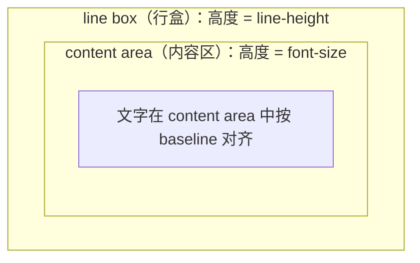

# 居中与多栏布局


## 1. 面试精讲：line-height 垂直居中原理，水平垂直居中方法

### 1.1 line-height 垂直居中原理

**行盒结构：**



**核心原理：** line-height（行高）上下 padding + content 共同撑起行盒高度。

```css
/* 单行文字垂直居中 */
.box {
  height: 40px;
  line-height: 40px; /* = height，文字在高度上居中 */
}

/* 多行文字居中：可用 flexbox 更灵活 */
.box {
  display: flex;
  align-items: center;
  height: 100px;
}
```

### 1.2 水平居中方法

```css
/* 块级元素 */
.block-center {
  margin-left: auto;
  margin-right: auto;
  width: fit-content;
}

/* flexbox */
.flex-center-x {
  display: flex;
  justify-content: center;
}

/* grid */
.grid-center-x {
  display: grid;
  justify-content: center;
}

/* text-align */
.text-center {
  text-align: center;
}
```

### 1.3 垂直居中方法

```css
/* flexbox（推荐，最简洁） */
.flex-center {
  display: flex;
  justify-content: center;
  align-items: center;
}

/* grid（推荐，最简洁） */
.grid-center {
  display: grid;
  place-items: center;
}

/* position + transform */
.pos-center > .child {
  position: absolute;
  top: 50%;
  left: 50%;
  transform: translate(-50%, -50%);
}

/* table-cell 模拟 */
.table-center {
  display: table;
}
.table-center > .child {
  display: table-cell;
  vertical-align: middle;
  text-align: center;
}

/* line-height（仅限单行文字） */
.line-height-center {
  height: 100px;
  line-height: 100px;
  text-align: center;
}
```


## 2. 面试精讲：双栏/三栏布局，圣杯 vs 双飞翼

### 2.1 双栏布局

```css
/* 方式1：flexbox */
.layout {
  display: flex;
  gap: 20px;
}
.sidebar { width: 200px; flex-shrink: 0; }
.main { flex: 1; min-width: 0; }

/* 方式2：grid */
.layout {
  display: grid;
  grid-template-columns: 200px 1fr;
  gap: 20px;
}

/* 移动端：堆叠 */
@media (max-width: 768px) {
  .layout { flex-direction: column; }
  .sidebar { width: 100%; }
}
```

### 2.2 三栏布局

```css
/* 方式1：flexbox */
.layout {
  display: flex;
}
.left, .right { width: 200px; flex-shrink: 0; }
.center { flex: 1; min-width: 0; }

/* 方式2：grid */
.layout {
  display: grid;
  grid-template-columns: 200px 1fr 200px;
}

/* 方式3：position */
.layout { position: relative; }
.left, .right { position: absolute; top: 0; width: 200px; }
.left { left: 0; }
.right { right: 0; }
.center { margin: 0 200px; }
```

### 2.3 圣杯布局 vs 双飞翼布局

两种经典的三栏布局，解决"main 区域优先加载"和"三栏等高"问题。

**圣杯布局（Holy Grail）：**

```html
<div class="holy-grail">
  <header>Header</header>
  <div class="bd">
    <main class="main">Main</main>
    <nav class="nav">Nav</nav>
    <aside class="aside">Aside</aside>
  </div>
  <footer>Footer</footer>
</div>
```

```css
.holy-grail .bd {
  padding: 0 200px; /* 为左右栏留位置 */
  min-width: 500px;
}
.holy-grail .main {
  float: left; width: 100%;
}
.holy-grail .nav {
  float: left; width: 200px;
  margin-left: -100%;   /* 移到最左 */
  position: relative;
  left: -200px;
}
.holy-grail .aside {
  float: left; width: 200px;
  margin-left: -200px;
  position: relative;
  right: -200px;
}
```

**双飞翼布局：**（淘宝提出，比圣杯少用一层 relative）

```html
<div class="double-wing">
  <header>Header</header>
  <div class="bd">
    <main class="main-wrap">
      <div class="main">Main</div>
    </main>
    <nav class="nav">Nav</nav>
    <aside class="aside">Aside</aside>
  </div>
  <footer>Footer</footer>
</div>
```

```css
.double-wing .main-wrap {
  float: left; width: 100%;
}
.double-wing .main {
  margin: 0 200px; /* main 自身加 margin */
}
.double-wing .nav {
  float: left; width: 200px;
  margin-left: -100%;
}
.double-wing .aside {
  float: left; width: 200px;
  margin-left: -200px;
}
```

**核心原理图（圣杯）：**

| 阶段 | 说明 |
|------|------|
| 初始 | 全浮动，main 宽度 100%，左右栏被挤到下一行 |
| margin-left 负值拉回 | 第一行：Main（width:100%），第二行：[Nav][Aside] |
| 拉回 Nav | margin-left: -100% 拉 Nav 到第一行最左 |
| 拉回 Aside | margin-left: -200px 拉 Aside 到第一行最右 |
| 最终 | 加 padding + relative 偏移定位 |

```
最终布局：
+--+------------+--+
|N |    Main    | A|
+--+------------+--+
```

**圣杯 vs 双飞翼 区别：**
- 圣杯：`main` 无专属容器，用 `padding` + `relative` 调整
- 双飞翼：`main` 有专属包裹容器，用 `margin` 调整，避免 `relative`
- 双飞翼更简洁，避免了圣杯中 `relative` 定位的问题（如 overflow 裁剪）

## 应用与行业实践

本页的两组知识，一组是行盒与垂直居中，一组是双栏与三栏。它们都落在有约束的页面里：行高要收敛，列序要照顾键盘，弹窗要躲开软键盘。下面按场景地图、场景拆解、行业实践、落地路线的顺序写。

### 应用场景地图

| 场景 | 用到本页哪个知识点 | 典型技术选型 | 注意事项 |
| --- | --- | --- | --- |
| 后台管理的万行日志表格 | line-height 决定行盒高度，vertical-align 决定单元格内容在盒中的位置 | 原生 `<table>` 加 `border-collapse: collapse` | 单元格写死 height 后换行文本会被裁掉，先确认最长单元格的文本长度 |
| 低端安卓机的首屏骨架屏 | 水平垂直居中，容器高度取值方式 | flex 加 `min-height: 100svh` | 地址栏伸缩会改变视口高度，高度用 svh 或 dvh，不要写死 px |
| 多人协作白板的画布容器 | 绝对定位加位移做居中 | `position: absolute` 加 `transform: translate(-50%, -50%)` | 画布尺寸变化时要重算居中，缩放比例不要叠加到 transform 上 |
| 电商详情页的左图右参双栏 | 双栏布局的列宽分配与浮动清除 | `flex: 0 0 400px` 配 `flex: 1` | 图片列定宽后窄屏要提前换行，否则右侧参数被压成窄条 |
| 事件通知邮件的三栏模板 | 三栏布局的列序与列宽 | table 布局 | 邮件客户端对 flex 与 grid 支持不一致，用 table 加 align 属性 |
| H5 报名表单的弹出层 | 水平垂直居中加动态视口高度 | fixed 遮罩加 flex 居中，高度写 100dvh | 软键盘弹出后弹窗被顶出视口，遮罩与弹窗各自要能滚动 |
| 视频播放器的中央播放按钮 | 居中定位与层叠顺序 | 绝对定位加 flex 居中，配 z-index | 按钮要能被点击，覆盖层不能压在它上面 |
| 数据大屏的卡片网格 | 卡片内文字与图标的垂直对齐 | grid 加 `place-items: center` | 字号由脚本切换时卡片行高要跟着变，别只改字号 |

### 三个场景拆解

#### 场景 1：后台管理的万行日志表格

**业务背景**：运维后台的日志页，每条日志的状态、时间、来源、操作按钮排在同一行。行数在千级到万级，滚动是主要交互。单元格里既有纯文本，也有状态徽标和按钮。

**怎么用本页知识解决**：把行高收敛成一个由 line-height 和上下 padding 决定的值，所有单元格共用。徽标和按钮用 `inline-flex` 配 `align-items: center` 跟文字对齐。

```css
:root {
  --row-line-height: 20px;  /* 行盒高度，参与垂直居中计算 */
  --row-padding-y: 8px;     /* 上下内边距，两侧取值相同 */
}

.log-table {
  border-collapse: collapse; /* 去掉相邻单元格边框间隙，避免行高偏差 */
  table-layout: fixed;       /* 列宽由第一行决定，滚动加载时列不跳变 */
}

.log-table td {
  line-height: var(--row-line-height); /* 行盒高度固定，文本在行盒里垂直居中 */
  padding: var(--row-padding-y) 12px;  /* 上下等距，最终行高为 20 加 8 乘 2 */
  vertical-align: middle;              /* 内容对齐到单元格盒子中线，不贴基线 */
  height: calc(var(--row-line-height) + var(--row-padding-y) * 2);
  overflow: hidden;                    /* 超长文本裁剪，避免撑高整行 */
  text-overflow: ellipsis;
  white-space: nowrap;
}
```

- line-height 固定为 20px 后，文本在行盒里居中，这就是本页讲的垂直居中原理。
- padding 上下取值相同，最终行高等于 20 加 8 乘 2，等于 36px，所有行取同一个值。
- vertical-align: middle 让文字、徽标、按钮在单元格里对齐到中线，不写它就会贴着基线。
- table-layout: fixed 让列宽由第一行决定，滚动加载后续行时列不会左右跳动。
- nowrap 配 ellipsis 把超长日志截断，避免某一行把整张表撑高。

**怎么度量收益**：打开 Chrome DevTools 的 Performance 面板录制一次滚动，看 Frames 区里是否出现长于 16ms 的帧，以及 Layout 阶段是否出现在每帧里。再在 Console 里收集所有行高，放进 `new Set` 后看元素个数，期望结果是 1。

**什么时候不该用**：

- 单元格要显示两行以上换行文本时，nowrap 会把内容裁掉，此时不固定行高，改由 padding 撑开。
- 列宽要按内容自适应时，table-layout: fixed 会让长列被截断，此时回到 auto 并接受加载中列宽变化。
- 单元格里嵌图表、进度条这类高于行盒的元素时，固定行高会把它们压扁，改成按内容高度对齐。

#### 场景 2：H5 表单弹出层与软键盘

**业务背景**：移动端报名页，用户点"填写信息"后弹出居中对话框，里面有输入框和提交按钮。软键盘弹出后视觉视口高度变小，用 100vh 撑开的遮罩不跟着变，弹窗底部按钮被键盘盖住。

**怎么用本页知识解决**：遮罩用 fixed 覆盖视口，内部用 flex 同时管住两条轴。高度先写 100vh 兜底，再写 100dvh 跟随动态视口，遮罩与弹窗各自可滚动。

```css
.mask {
  position: fixed;
  inset: 0;                /* 四边贴合视口，页面滚动不再带动遮罩 */
  display: flex;           /* 开启弹性布局，为居中做准备 */
  align-items: center;     /* 交叉轴居中，即垂直居中 */
  justify-content: center; /* 主轴居中，即水平居中 */
  height: 100vh;           /* 兜底值，不认 dvh 的浏览器走这一行 */
  height: 100dvh;          /* 动态视口高度，软键盘弹出时同步收缩 */
  overflow: auto;          /* 内容高于视口时可滚动，输入框能被滚进可视区 */
  padding: 16px;           /* 弹窗与屏幕边缘留出间距 */
}
.dialog {
  max-height: 100%;        /* 弹窗不超过遮罩高度 */
  overflow: auto;          /* 内部滚动，长表单仍可填写 */
}
```

- position: fixed 配 inset: 0 让遮罩贴合视口四边，背景页面的滚动条不再带动它。
- display: flex 配 align-items: center 与 justify-content: center，子项在遮罩中水平垂直同时居中。
- 两行 height 按顺序书写，不认 dvh 的浏览器用前一行，认 dvh 的用后一行。
- 遮罩的 overflow: auto 让输入框聚焦时滚动的是遮罩，不是背后的页面。
- 弹窗的 max-height 与 overflow: auto 保证长表单在弹窗内部滚动，关闭按钮不会被推出视口。

**怎么度量收益**：用 Chrome 的 Remote Debugging 连真机，或在 DevTools 设备模式里开关软键盘模拟。比对弹窗 `getBoundingClientRect()` 的 top 与 bottom 是否都落在 `visualViewport.height` 之内，指标是软键盘弹出后提交按钮是否仍可见、可点击。

**什么时候不该用**：

- 弹窗里是长表单、用户要从第一项填起时，居中会把顶部字段推到视口上沿之外，改用顶部对齐加滚动。
- 页面要求锁定背景滚动、输入框数量又多时，遮罩与弹窗两层滚动会出现滚不到的位置，此时只留弹窗一层滚动。
- 遮罩内还需要浮出二级选择器时，嵌套的居中容器会互相挤压，改用底部弹出的抽屉。

#### 场景 3：文档站的三栏与正文优先

**业务背景**：内部文档站左边是章节树，中间是正文，右边是页内目录。正文要在 DOM 里排第一位，键盘 Tab 与读屏软件先到正文。窗口从 1440px 缩到 1024px 时，右侧目录要能收起来。

**怎么用本页知识解决**：用圣杯布局的思路，外层 padding 给左右列留位，三列浮动，中间列宽度 100% 且排在 DOM 首位，左右列用负 margin 拉到两侧。DOM 顺序不动，视觉上是三栏。

```css
.layout {
  padding: 0 200px;      /* 左右各留 200px，作为两侧栏的落点 */
}
.main {
  float: left;
  width: 100%;           /* 中间列占满内容盒，且排在 DOM 第一位 */
}
.main-inner {
  margin: 0 16px;        /* 双飞翼做法：内层容器再留出与侧栏的间距 */
}
.left, .right {
  float: left;
  width: 200px;
}
.left {
  margin-left: -100%;    /* 负值等于主列宽度，左移到主列左端 */
}
.right {
  margin-left: -200px;   /* 等于自身宽度，贴到主列右端 */
}
```

- 正文区块写在侧栏前面，Tab 键与读屏软件先进入正文，这是列序与 DOM 顺序分离的收益。
- 外层 padding 的 200px 与两侧栏宽度相等，侧栏才有位置可落。
- .main 的 width: 100% 让中间列先占满内容盒，左右列靠负 margin 叠到它的两侧。
- .left 的 margin-left 为 -100%，这里的 100% 指包含块宽度，配合外层 padding 落在左侧留白里。
- .right 的 margin-left 为 -200px，与自身宽度相等，把它从主列末尾拉到右侧留白处。

**怎么度量收益**：用 Lighthouse 的 Accessibility 审计跑一遍，看 landmark 与 Tab 顺序相关项。再用键盘从地址栏开始按 Tab 计数，记录第几次落焦进入正文。窗口缩放时打开 DevTools 的 Rendering 面板并勾选 Layout Shift Regions，观察侧栏是否抖动。

**什么时候不该用**：

- 三栏要求等高背景时，float 需要额外补背景元素，直接上圣杯会把背景割成三段，此时改用 grid。
- 侧栏宽度由内容决定时，负 margin 的固定值与实际宽度对不上，列会错位，此时改用 flex 或 grid。
- 侧栏需要吸顶并独立滚动时，浮动带来的高度塌陷会让吸顶参照系错乱，改成 grid 区域加 `position: sticky`。

### 行业先进实践

- **Flexbox 双属性居中（出处：W3C CSS Flexible Box Layout Module Level 1，MDN 的 Flexbox 指南）**：容器写 `display: flex`、`align-items: center`、`justify-content: center`，子项在两条轴上都居中，不需要预先知道子项尺寸。借鉴方式：抽成 `.center` 工具类，弹窗、空状态、加载态共用这三行。
- **动态视口单位 dvh 与 svh（出处：W3C CSS Values and Units Module Level 4，MDN 的 viewport units 页面）**：dvh 跟随浏览器界面显隐变化，svh 取最小视口高度，lvh 取最大视口高度。移动端遮罩写 100dvh，并在前面留一行 100vh 兜底。落地前先核对项目要支持的最低浏览器版本。
- **圣杯布局（出处：A List Apart 的文章 In Search of the Holy Grail）**：三列浮动，中间列在 DOM 中排第一且宽度 100%，左右列用负 margin 拉到外层 padding 留出的空位。收益是视觉列序与 DOM 顺序分离。文档站、帮助中心这类以正文为主体的页面可以照这个结构搭。
- **栅格间距用列容器 padding 加行容器负 margin 抵消（出处：Bootstrap 官方文档的 Grid 章节）**：行容器写负的左右 margin，列容器写正的左右 padding，得到列间等距而首尾列不贴边。借鉴方式：三栏页面的列间距集中在一处定义，业务组件不再各写 margin。
- **display: table-cell 配 vertical-align: middle 做单元素垂直居中（出处：需核对官方文档：MDN 的 vertical-align 页面里 middle 关键字对齐基准的说明，以及 CSS-Tricks 的 Centering in CSS 指南是否仍收录该写法）**：要核对的是 middle 对齐的是父元素行盒中线还是元素自身，以及该写法在目标浏览器上的实际表现。

### 从学到用：落地路线

1. **第 1 步，在一个页面试点**：选团队里访问量靠前的列表页，只改行高与垂直对齐，不动 DOM 结构。验收标准：该页所有表格行的 `getBoundingClientRect().height` 收敛为同一个值。
2. **第 2 步，用可复现的测量验证**：在 Chrome DevTools 的 Performance 面板录制 10 秒滚动，并在 Rendering 面板勾选 Layout Shift Regions。验收标准：录制里不出现整行高度跳变引起的布局偏移块。
3. **第 3 步，抽成基座推广**：把 `.center` 工具类与 `--row-line-height` 变量写进团队样式基座，逐个页面替换重复声明。验收标准：全站样式表中 flex 居中那三行声明只出现在基座文件里。
4. **第 4 步，加检查防回退**：用 Stylelint 的 `declaration-property-value-disallowed-list` 规则拦住新写的 `height: 100vh` 弹窗写法，用 BackstopJS 做截图回归。验收标准：这两项检查在 CI 上失败时阻断合并。

### 动手作业

**目标**：做一个单文件课程目录页，同时覆盖三栏布局与垂直居中，并给出可复现的验证记录。

**步骤**：

1. 新建 index.html，写出章节树、正文、页内目录三个区块的骨架，把正文 section 放在 DOM 第一位。
2. 用 float 加负 margin 搭三栏，外层用 padding 留出左右列宽度，确认正文在视觉上居中偏左。
3. 给正文每个小节加一个状态圆点，用 line-height 与 vertical-align 把它和标题文字对齐。
4. 加一个"查看详情"按钮，点击后用 fixed 遮罩加 flex 居中弹出对话框。
5. 遮罩高度写两行，先 100vh 再 100dvh；对话框加 max-height 与 overflow: auto。
6. 用媒体查询在 768px 以下把三栏改成单列，取消浮动与负 margin。
7. 用键盘 Tab 遍历页面，用 DevTools 设备模式切换宽度，把观察结果写进 README。

**验收标准**：

- 从地址栏开始按 Tab，第一次落焦进入正文区域的链接，而不是左侧章节树。
- 用 Console 收集所有状态圆点与其相邻文字的高度，`new Set` 后的元素个数为 1。
- 视口宽度取 375px 与 1440px 各截一张图，页面都不出现水平滚动条。
- 把对话框内容高度改为视口高度的 1.5 倍，弹窗内部可滚动且关闭按钮始终可见。
- 把根元素字号从 16px 改成 20px，三栏宽度按比例调整，正文文字不溢出容器。

